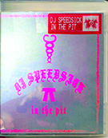

.
├── A
├── butterchurn-presets
│   └── lib
│       ├── butterchurnPresetsExtra.min.js
│       └── webpaack.config.js
├── butterchurn.js
├── ButterchurnPresets.min.js
├── ButterchurnPresets.min.js.zip
├── CNAME
├── files
│   ├── aud
│   │   ├── 03E3691536C6BA48AF8DFCC98E2F86B5.mp3
│   │   ├── 0483134AF52BA2620ACEBB15DB3A915C.mp3
│   │   ├── 064EBB45E969268D1D565945FD30349E.mp3
│   │   ├── 07DEB83DB6B0B0A8D8D68A8E59997FBE.mp3
│   │   ├── 08AD2547744653E97D82E9C817DE5743.mp3
│   │   ├── 0AA968CC9BD87190A5B9B68B785D2279.mp3
│   │   ├── 0ABFAF89FA92B3BB033896DE4E7FCA0D.mp3
│   │   ├── 0DDE9002290A4E4B24ED7A3762742882.mp3
│   │   ├── 0FC3589586CCC0BF1801003DA500D379.mp3
│   │   ├── 11087AC44773380786D4C743B9A16255.mp3
│   │   ├── 16D2D7DDC50EEA8DE22BC558FE94CA7C.mp3
│   │   ├── 17928CB3FCBF55F83A4A8357997CFD86.mp3
│   │   ├── 18487DFF8C4C2634163E432841DB0465.mp3
│   │   ├── 18BE5DD7A3F6377EFBFC17C69B9B2D01.mp3
│   │   ├── 1AE89282F333F68DE3E6E1E060267354.mp3
│   │   ├── 20866A99F01106A03D3233F9C05D95A9.mp3
│   │   ├── 243298B4071340A943CB0E7D017EA6C9.mp3
│   │   ├── 247EE96D14D10CA14943FA7E4EEED939.mp3
│   │   ├── 26980531EFFFF7ABD7AFDFE810F0FD82.mp3
│   │   ├── 27A1B7EAFD0C4E57E3C40768BB650D9F.mp3
│   │   ├── 27E4BEA66F762A27DE57848805EE54C7.mp3
│   │   ├── 27F631709AB5D4B98EFEB2F2123B480E.mp3
│   │   ├── 29673E60F28FEE11FDEF7CFD0649B322.mp3
│   │   ├── 2A46CD871B3981D295AEC54A89510D1B.mp3
│   │   ├── 2AA6F4B8AB6BB06453130DF8CBA94DA2.mp3
│   │   ├── 2AE5178DB148A0BC8B526AF58DC01CE1.mp3
│   │   ├── 2FA5970034ACE456608F2F131D294997.mp3
│   │   ├── 310EE418F2292D7FD44699BFA2268F64.mp3
│   │   ├── 317D2E7B4AC8260CC6C619AC1FF3608C.mp3
│   │   ├── 318B51064AFC6C0670AD1763E03AD8F0.mp3
│   │   ├── 33A5872F03C9054F4CEEA4AA4DBF521B.mp3
│   │   ├── 33B7DD40813B21DD0EA08BBE9BF922A3.mp3
│   │   ├── 35B0A8FA3022F14B19593E81836B46F9.mp3
│   │   ├── 3602C77742718963398198A053F611ED.mp3
│   │   ├── 36CE8795F7535025C147D1AE2E7BC797.mp3
│   │   ├── 36F828D41D92B132B01A9040EE5F4BD8.mp3
│   │   ├── 383D1BE8FB94587FB5E78769FFA91920.mp3
│   │   ├── 39AAC690F5D2A33F910EEFCD1F45DECC.mp3
│   │   ├── 39E0EE37FA1E5C181E12A468DE1FCBF3.mp3
│   │   ├── 3BF8831733B842D93AE7D3AC005914AF.mp3
│   │   ├── 3DC04F68AA24852F850E99253C107C87.mp3
│   │   ├── 3E6ABE35DF44BD5379A027B14611B892.mp3
│   │   ├── 3F53B00F9D7C777C854B87DF0DBE8763.mp3
│   │   ├── 41620FFDDC404A9962F4FCBD731629DE.mp3
│   │   ├── 44D0F06CA9A7920591A56CEB9357BE93.mp3
│   │   ├── 45DDCD3C199CEE7B7895CE42B005AF7E.mp3
│   │   ├── 45DE0E0F869545D7ACCC5962F37EC4ED.mp3
│   │   ├── 45F757303B512D0F5F8FE7F4A45301A4.mp3
│   │   ├── 46DE77E391118E57584A1DA6E9958D26.mp3
│   │   ├── 4918199D0DD98EA88A451374A35FF02E.mp3
│   │   ├── 49451AF9739EA82CA89B82DA9813F664.mp3
│   │   ├── 4ABE709D3D395A34A5BEABB3DD9502C5.mp3
│   │   ├── 4B728F3BB5865F52379DADAA48C05A6B.mp3
│   │   ├── 4C7F53B035D9C03BA0ECEF1384815D66.mp3
│   │   ├── 4DEB3179BC24D20C751AC18E9701A89F.mp3
│   │   ├── 4F9087DF4AF056BE34FAC03C5AF429DD.mp3
│   │   ├── 5073A74FCB39AD8C70E05761DC0C5D4A.mp3
│   │   ├── 50B13137C26D06A5BDE0E3949508A48B.mp3
│   │   ├── 5304069DE9E031CBFFCF66988EAEF9A5.mp3
│   │   ├── 536145E15D9D84BC8DA695A54BD7AADF.mp3
│   │   ├── 57CD756692E1C3D8EC7D58D0561F4D57.mp3
│   │   ├── 580BF7E11A76214A6EC18D19E8999358.mp3
│   │   ├── 58B5AD1EBFAC1AC6D5C89D7601658BAD.mp3
│   │   ├── 592DF673F62D2DB2739ACAD11CB4EE21.mp3
│   │   ├── 5978BEEB0C05AB4BB95EF6D516582E7E.mp3
│   │   ├── 606A2DDFC6009B4BBA8EC1F5CFA59F58.mp3
│   │   ├── 6079450EC8B657B581FFAD9E6ED59805.mp3
│   │   ├── 6463294F3707080DE8A0017E5405C1DC.mp3
│   │   ├── 658119A498E107B76B899DB21BEDEE39.mp3
│   │   ├── 66CF005781CC5028B7EAA90E6473944A.mp3
│   │   ├── 68351EAB435ECCD04176CE819578B4F8.mp3
│   │   ├── 69E8FAAD90E6D164367FF0A4B338EA72.mp3
│   │   ├── 6ADD2F809E6430AFD07C77642ABCB0F1.mp3
│   │   ├── 6E1B9287B01F96CFBD0695F8FF817A3B.mp3
│   │   ├── 71BDD33125193A99F82CAE0E36C4DB9A.mp3
│   │   ├── 798D5D4408E516A2BC2448FD17B04133.mp3
│   │   ├── 7B1B519AF556B05F264968E28F6F0216.mp3
│   │   ├── 7BE3A354CA509ACF10C8E3DD66C0083D.mp3
│   │   ├── 7D0115E171D0091A56726E3A8B48B20F.mp3
│   │   ├── 7FF2C0B5099003B7B5A33DFF3C6CF173.mp3
│   │   ├── 84027A903956724A5651D39835072C18.mp3
│   │   ├── 852B5DD09E041D31A9BAD05DE613B0D3.mp3
│   │   ├── 86A0763644FADACCD0ACE940FDC857A9.mp3
│   │   ├── 87D11F507509CDCD6510E9B4EB36D766.mp3
│   │   ├── 8945F0A3756272267754771554554B34.mp3
│   │   ├── 894E931B2B56F0C9376E163D2F75F729.mp3
│   │   ├── 8E4D1BC45A0BCC05E87D9C36A8E79920.mp3
│   │   ├── 92CA78BF53C61B648E29C7BDDE5B87D3.mp3
│   │   ├── 950B4C997A71FCB7277210530A0E3FA3.mp3
│   │   ├── 9607A8A32512A63B537219951FF54E01.mp3
│   │   ├── 97BEBB8CF7A87669D088FFEB5716E5BC.mp3
│   │   ├── 986C35305171DCF5A5C5FD9C7EBD53CA.mp3
│   │   ├── 98752B0343A31FB430B5801A29109D11.mp3
│   │   ├── 9BEBE2CEE7580C18835DE13E3076C8AC.mp3
│   │   ├── 9D6AF0426F8C4A4E2BF7ADC86098739B.mp3
│   │   ├── 9F1540711B6930B1192C45480087020F.mp3
│   │   ├── A16EAA32BE2AFAC1ADFE0610990BEFF1.mp3
│   │   ├── A4201865185110C75FD3FCF5DB4EF6C5.mp3
│   │   ├── A441328B6F4C0EB0119F4F3D7497A002.mp3
│   │   ├── A582DC5DD937E6DC0467BA640F20ADE9.mp3
│   │   ├── ABAF59CC8FE88766AE1A09408BB8E0E6.mp3
│   │   ├── ACEE449D4A3802F6B6CA78323DE93F81.mp3
│   │   ├── AD5EAB71FC2017FDD3D4CB0BB127637D.mp3
│   │   ├── AF7B79C1ED865E92E6F00DE6D043B72B.mp3
│   │   ├── audio.txt
│   │   ├── B06E0D03F4A18158C1A0A49C765DB3F4.mp3
│   │   ├── B07202F69BAF3D0B6A393851400FE363.mp3
│   │   ├── B1B6C3D02B454C96C26497A7021F2B38.mp3
│   │   ├── B1D9EF2694B6B789FFD09529FF5DCA66.mp3
│   │   ├── B25914335C15F242C4848CFD373F5108.mp3
│   │   ├── B53CA04AE89538F8DA6D4304C27631C1.mp3
│   │   ├── B55448D07B81CEB64624EDDE9D0C09B3.mp3
│   │   ├── B7653D0543717E91971119FF899358A6.mp3
│   │   ├── B834C893DC001DEDD88F98388BE98240.mp3
│   │   ├── B9CF83C6B45D311908F303B6F8847BC8.mp3
│   │   ├── BB4C7A5591802B4A22F8C48610B55D9E.mp3
│   │   ├── BF9721AD910D20E777CD1D02280CEB99.mp3
│   │   ├── C0919F3C7A7793289C84D4A7D025A65A.mp3
│   │   ├── C0F75F93B9167870E9A9E91F27D6D8A2.mp3
│   │   ├── C2B01E11AF2143A1E7D6924E7798357D.mp3
│   │   ├── CE7E562CC8AE07796DF24DBEA80FFC8B.mp3
│   │   ├── CFA3A3216F9E2814585A7D133F44F80C.mp3
│   │   ├── D00235E5178CF482DDC0EF2EF3F8DF5D.mp3
│   │   ├── D0B4E5FB6DBB45CEF4185F1928299F65.mp3
│   │   ├── D25018ABDAC29E99948B33EE90BD4A25.mp3
│   │   ├── D31410554C0EA38E4BD658AEA406752E.mp3
│   │   ├── D66F22E8249C653DAB514FC1B99CB812.mp3
│   │   ├── D730DC33143113BCDB943E23290D287F.mp3
│   │   ├── DBA7B9853DCDCB3B78547B621A3BFC94.mp3
│   │   ├── DC02F0B59DA4B9BBC6741B7C7BC5E0F9.mp3
│   │   ├── DD7982EC064DFA0D0D56F777356563C8.mp3
│   │   ├── DF4FB1E4144CF5BCE22D34B702C3A624.mp3
│   │   ├── DF630276A33CB1FDE3E88099334444A6.mp3
│   │   ├── E083277213AC239C15C30DC9EEAFA239.mp3
│   │   ├── E2EECFB5DC17ADA9ADFB58FD98008A15.mp3
│   │   ├── E7B8C874C5A8ADC357A6CC35DD363F47.mp3
│   │   ├── E873A48981FB615E15E13F05602CE3F4.mp3
│   │   ├── E8AAA8E839EAAB0C05B531F517521726.mp3
│   │   ├── EE500C3F7134F2CD1E5B6CB00C964FAC.mp3
│   │   ├── EEBD631AAAA8C8C9B3DD09DA1A4FD837.mp3
│   │   ├── F51FF77FF3BBB4010BA767C5F55834DB.mp3
│   │   ├── F5771CE81AA3E10A269575B79EF66944.mp3
│   │   ├── F68EF9FCC92808BC50D293B2642824E4.mp3
│   │   ├── F7548A5B5BABA9243DE25A998500951B.mp3
│   │   ├── F7DCFAFC92AF08EBCC4BADA650126654.mp3
│   │   ├── FB23415943B1729A5BC85D52F05E2DEE.mp3
│   │   ├── FB543724C87E3692B510C82A3385AC44.mp3
│   │   ├── FCCA915F20E7312DA37F901D3492E9B8.mp3
│   │   ├── FCF058FAF0C222B57D8284AD3E4B29F5.mp3
│   │   ├── FE739E5D62BBEE2652FA0B53231AA333.mp3
│   │   ├── FF3292518DB2E5ADE279029997865575.mp3
│   │   ├── FFC7E7F97F2936636B268947653D9068.mp3
│   │   └── tracks.txt
│   ├── font
│   │   ├── GGX88Bk-Italic.woff
│   │   ├── GGX88Bk-Italic.woff2
│   │   ├── GGX88Bk-Regular.woff
│   │   ├── GGX88Bk-Regular.woff2
│   │   ├── GGX88El-Italic.woff
│   │   ├── GGX88El-Italic.woff2
│   │   ├── GGX88El-Regular.woff
│   │   ├── GGX88El-Regular.woff2
│   │   ├── GGX88Hv-Italic.woff
│   │   ├── GGX88Hv-Italic.woff2
│   │   ├── GGX88Hv-Regular.woff
│   │   ├── GGX88Hv-Regular.woff2
│   │   ├── GGX88Lt-Italic.woff
│   │   ├── GGX88Lt-Italic.woff2
│   │   ├── GGX88Lt-Regular.woff
│   │   ├── GGX88Lt-Regular.woff2
│   │   ├── GGX88Rg-Bold.woff
│   │   ├── GGX88Rg-Bold.woff2
│   │   ├── GGX88Rg-BoldItalic.woff
│   │   ├── GGX88Rg-BoldItalic.woff2
│   │   ├── GGX88Rg-Italic.woff
│   │   ├── GGX88Rg-Italic.woff2
│   │   ├── GGX88Rg-Regular.woff
│   │   ├── GGX88Rg-Regular.woff2
│   │   ├── GGX88Ul-Italic.woff
│   │   ├── GGX88Ul-Italic.woff2
│   │   ├── GGX88Ul-Regular.woff
│   │   └── GGX88Ul-Regular.woff2
│   ├── img
│   │   ├── enter-transparency2.png
│   │   ├── gallery
│   │   │   ├── 58DBD800-7CCF-408A-A2BB-D45AD8CF391B.JPG
│   │   │   ├── 76CFBA80-E2B9-4C69-92AE-4C681E946C15.JPG
│   │   │   ├── ALEXSHOWPREV1.jpeg
│   │   │   ├── BOOTCAMPFIX E1.jpeg
│   │   │   ├── bsc-1.jpg
│   │   │   ├── BUY.jpeg
│   │   │   ├── CANDYV4.1PREV.jpeg
│   │   │   ├── cd 12e2.JPG
│   │   │   ├── CD 5.jpeg
│   │   │   ├── cd 9.jpeg
│   │   │   ├── DJSS 2.jpeg
│   │   │   ├── djssgfkpost.jpeg
│   │   │   ├── DOWN3.jpeg
│   │   │   ├── FC5934BD-87C1-4F45-8606-2275317B23F6.JPG
│   │   │   ├── FG 3.jpeg
│   │   │   ├── FISTMIXFRONT1.jpeg
│   │   │   ├── fodcd.jpeg
│   │   │   ├── FOREVER_V4edit.jpeg
│   │   │   ├── GS.jpeg
│   │   │   ├── IMG_2192.jpeg
│   │   │   ├── IMG_5507.jpg
│   │   │   ├── IMG_8106.jpg
│   │   │   ├── main-alt-text.jpeg
│   │   │   ├── mitb2.jpeg
│   │   │   ├── NL 3.jpeg
│   │   │   ├── NL 8EDIT.jpeg
│   │   │   ├── NLPOSTER1.jpeg
│   │   │   ├── OCT7-FLYERV1.JPG
│   │   │   ├── orchadsvf11.jpeg
│   │   │   ├── POG NEW2.JPG
│   │   │   ├── poster.jpeg
│   │   │   ├── Scan 1011.jpeg
│   │   │   ├── Scan 104.jpeg
│   │   │   ├── Scan 107.jpeg
│   │   │   ├── Scan 111.jpeg
│   │   │   ├── Scan 118.jpeg
│   │   │   ├── scan 12.jpeg
│   │   │   ├── Scan 120-Recovered.jpeg
│   │   │   ├── Scan 133e2.jpeg
│   │   │   ├── Scan 14b.jpg
│   │   │   ├── Scan 221.jpeg
│   │   │   ├── Scan 226 copy.jpeg
│   │   │   ├── Scan 41.JPG
│   │   │   ├── Scan 46e.jpg
│   │   │   ├── Scan 5.jpeg
│   │   │   ├── Scan 60.jpg
│   │   │   ├── scan 7.jpeg
│   │   │   ├── SD 0913.jpeg
│   │   │   ├── SD 7.jpeg
│   │   │   ├── sp-str-back.jpeg
│   │   │   ├── unix666-01a.jpeg
│   │   │   ├── unix666-01b.jpeg
│   │   │   ├── unix666-02a.jpeg
│   │   │   ├── unix666-02b.jpeg
│   │   │   ├── unix666-03a.jpeg
│   │   │   ├── unix666-03b.jpeg
│   │   │   ├── unix666-04a.jpeg
│   │   │   ├── unix666-04b.jpeg
│   │   │   ├── unix666-05a.jpeg
│   │   │   ├── unix666-05b.jpeg
│   │   │   ├── unix666-06a.jpeg
│   │   │   ├── unix666-06b.jpeg
│   │   │   ├── XEROX_74 2.jpeg
│   │   │   └── xxx 5.jpeg
│   │   ├── itp.jpg
│   │   ├── mansoncave.jpg
│   │   ├── minicdr-small.png
│   │   ├── ph008.jpg
│   │   ├── preview.png
│   │   ├── tb207.jpg
│   │   ├── unix66605.jpg
│   │   └── unix66606.jpeg
│   └── mov
│       ├── chemlove.mp4
│       ├── forcedenlightenment.mp4
│       ├── grate.mp4
│       ├── indexmov.gif
│       ├── lotusmotel.mp4
│       ├── smtiaie.mp4
│       ├── untitled.mp4
│       └── yfpmms.mp4
├── gallery.html
├── index.html
├── index.html.bak
├── jquery-3.1.1.min.js
├── lib
│   └── butterchurn.js
├── lodash.js
├── milkdrop-preset-converter.min.js
├── play.html
├── player.js
├── repo_code_dump.md
└── test.html

10 directories, 280 files


# FILE: ./.ignore/.body.html

```html
   <div id="splash-screen">
    
    
</div>

<audio id="audioPlayer"></audio>

<canvas id="canvas"></canvas>

<video id="video1" class="draggable-video top-left" autoplay muted loop>
    <source src="files/mov/yfpmms.mp4" type="video/mp4">
    Your browser does not support the video tag.
</video>

<video id="video2" class="draggable-video top-right" autoplay muted loop>
    <source src="files/mov/chemlove.mp4" type="video/mp4">
    Your browser does not support the video tag.
</video>

<video id="video3" class="draggable-video bottom-left" autoplay muted loop>
    <source src="files/mov/grate.mp4" type="video/mp4">
    Your browser does not support the video tag.
</video>

<video id="video4" class="draggable-video bottom-right" autoplay muted loop>
    <source src="files/mov/smtiaie.mp4" type="video/mp4">
    Your browser does not support the video tag.
</video>

<div id="container">
    <marquee behavior="scroll" direction="right" scrollamount="13" class="marquee-large">
        WWW.DJSPEEDSICK.COM
    </marquee>
    <br><br>

    <p>CONTACT:</p>
    <a href="mailto:boettke@djspeedsick.com">BOOKING</a><br>
    <a href="mailto:noreply@djspeedsick.com">PRESS</a><br>
    <a href="mailto:777paranoia@gmail.com">ART COMMISSIONS</a><br><br>

    <marquee behavior="scroll" direction="left" scrollamount="12" class="marquee-medium">
        NEW RELEASES
    </marquee>
    <br><br>

    <br>
    <p class="blend-text" style="margin: 0; font-size: 1rem;">EXECUTION STYLE 12"</p>
    <p style="margin: 0; font-size: 10px; color: white;">Pure Hate, ph008</p>
    <a href="https://purehatetrax.bandcamp.com/album/execution-style-ep" 
       style="margin: 5px 0 0; font-size: 1rem; line-height: 1; text-decoration: none; display: block;">PRE-ORDER</a>
    <br>

    <br>
    <p class="blend-text" style="margin: 0; font-size: 1rem;">FIREWALL EVENT HORIZON CD-R</p>
    <p style="margin: 0; font-size: 10px; color: white;">Escalationist, UNIX666-06</p>
    <p style="margin: 5px 0 0; color: red; font-size: 1rem; line-height: 1;">SOLD OUT</p>
    <br>

    <br>
    <p class="blend-text" style="margin: 0; font-size: 1rem;">DEATHAMPHETAMINE II: "BACK IN THE PIT" OST CS</p>
    <p style="margin: 0; font-size: 10px; color: white;">Total Black, 207</p>
    <a href="https://www.sentimentalyouth.com/products/dj-speedsick-deathamphetamine-ii-back-in-the-pit-o-s-t-cs" 
       style="margin: 5px 0 0; font-size: 1rem; line-height: 1; text-decoration: none; display: block;">ORDER</a>
    <br>

    <br>
    <p class="blend-text" style="margin: 0; font-size: 1rem;">YOU FUCKING PEOPLE MAKE ME SICK E-CDR</p>
    <p style="margin: 0; font-size: 10px; color: white;">Escalationist, UNIX666-05</p>
    <p style="margin: 5px 0 0; color: red; font-size: 1rem; line-height: 1;">SOLD OUT</p>
    <br>

    <marquee behavior="scroll" direction="right" scrollamount="15" style="font-size: 1.25rem; color: white; text-decoration: none;">
        <a href="javascript:void(0);" class="gallery-link" style="font-size: 1.25rem; color: inherit; text-decoration: none;">
    CLICK TO VIEW ART GALLERY
        </a>
    </marquee>
    <br><br>

    <a href="https://www.soundcloud.com/speedsick">SOUNDCLOUD</a><br>
    <a href="https://djspeedsick.bandcamp.com">BANDCAMP</a><br>
    <a href="https://www.instagram.com/djspeedsick">INSTAGRAM</a><br>
    <a href="https://www.x.com/djspeedsick">X</a><br>
    <a href="https://open.spotify.com/artist/6CZm9kdgqsQmxDrp6OHmxX">SPOTIFY</a><br>
    <a href="https://www.discogs.com/artist/5782732-DJ-Speedsick">DISCOGS</a><br>
<br><br><br><br><br><br><br> <!-- Adjust spacing as needed -->
<a id="aboutLink" href="javascript:void(0);" onclick="toggleAbout()" 
   style="font-size: 0.5rem; font-family: 'GGX88Lt-Italic', sans-serif; text-decoration: none; color: white;">
    about
</a>

<div id="artGalleryOverlay" style="display: none;">
    <div id="artGalleryContent">

        <span id="artGalleryClose" style="cursor: pointer; position: fixed; top: 10px; right: 20px; font-size: 2rem; color: white;">✖</span>

        <div id="image-container">
    <div id="image-container">
    
    
    
    
    
    
    
    
    
    
    
    
    
    
    
    
    
    
    
    
    
    
    
    
    
    
    
    
    
    
    
    
    
    
    
    
    
    
    
    
    
    
    
    
    
    
    
    
    
    
    
    
    
    
    
    
    
        </div>
    </div>
</div>

<a id="aboutLink" href="javascript:void(0);" onclick="toggleAbout()" 
   style="font-size: 0.5rem; font-family: 'GGX88Lt-Italic', sans-serif; text-decoration: none; color: white;">
    about
</a>

<div id="aboutOverlay" style="display: none;">
    <div id="aboutContent">
        
        <p id="aboutText">
            <span style="font-size: 2rem;">DJ Speedsick</span> <br>
            <span style="font-size: 1rem; font-style: italic;">a.k.a. "**** *********"</span><br><br>
            <span style="font-size: 0.75rem;">b. 1992</span><br>
            <span style="font-size: 0.75rem;">d. ????</span><br><br>
            <span style="font-size: 0.65rem;">current location: Chicago, IL</span>
        </p>
    </div>
</div>
```


# FILE: ./.ignore/.frames.html

```html
<!DOCTYPE html>
<html lang="en">
<head>
    <meta charset="UTF-8">
    <meta name="viewport" content="width=device-width, initial-scale=1.0">
    <title>DJSPEEDSICK.COM</title>

    <meta property="og:title" content="DJSPEEDSICK.COM">
    <meta property="og:description" content="Explore the music, art, and releases of DJ Speedsick.">
    <meta property="og:image" content="files/img/preview.png">
    <meta property="og:image:width" content="1200">
    <meta property="og:image:height" content="630">
    <meta property="og:url" content="https://www.djspeedsick.com">
    <meta property="og:type" content="website">

    <meta name="twitter:card" content="summary_large_image">
    <meta name="twitter:title" content="DJSPEEDSICK.COM">
    <meta name="twitter:description" content="DJSPEEDSICK.COM OFFICIAL PAGE OF DJ MOTHERFUCKING SPEEDSICK WOOOOO">
    <meta name="twitter:image" content="files/img/preview.png">

<style>

    @keyframes fade {
        0%, 100% { opacity: 1; } 
        50% { opacity: 0.3; }  
    }

    .fading-text {
        display: inline-block;
        animation: fade 2s infinite; /* 2 seconds, repeating infinitely */
    }
  
    body {
    font-family: 'GGX88 Book', sans-serif; /* Fallback to sans-serif */
    }
        html, body {
    margin: 0;
    padding: 0;
    overflow: hidden;
    height: 100%;
    width: 100%;
    position: relative;
        }

        #splash-screen {
    position: fixed;
    top: 0;
    left: 0;
    width: 100%;
    height: 100%;
    display: flex;
    justify-content: center;
    align-items: center;
    background-color: rgba(0, 0, 0, 0.9);
    z-index: 1500;
        }

        #background-gif {
    position: absolute;
    top: 0;
    left: 0;
    width: 100%;
    height: 100%;
    object-fit: cover;
    z-index: -1;
        }

        #enter-button {
    position: relative;
    z-index: 1501;
    cursor: pointer;
    display: block;
    max-width: 80%;
    height: auto;
    margin: 0 auto;
        }

        #audioPlayer {
    display: none;
        }

        #canvas {
    position: absolute;
    top: 0;
    left: 0;
    width: 100%;
    height: 100%;
    z-index: 1;
        }

    #container {
    font-size: 0.75rem; /* Adjust as needed (default is 1rem) */
    position: absolute;
    top: 50%;
    left: 50%;
    transform: translate(-50%, -50%);
    z-index: 2;
    text-align: center;
    font-family: GGX88 Book, sans-serif;
    color: white; /* Default text color */
    visibility: hidden;
    max-height: 80%;
    overflow-y: auto;
    padding: 10px;
    box-sizing: border-box;
    scrollbar-width: none; /* Firefox */
    -ms-overflow-style: none; /* Internet Explorer */
       }

      #container::-webkit-scrollbar {
    display: none;
       }

    @keyframes rainbow {
    0% { color: red; }
    16% { color: orange; }
    33% { color: yellow; }
    50% { color: green; }
    66% { color: blue; }
    83% { color: indigo; }
    100% { color: violet; }
       }

/* Apply rainbow animation to all links in the container */
#container a {
    font-size: 1rem;
    text-decoration: none;
    animation: rainbow 3s infinite; /* Reapply animation */
}

/* General Text and Link Styles */
#container p {
    font-size: 1rem;
    margin: 0.5rem 0;
    color: white; /* Default text color */
}

#container a {
    font-size: 1rem;
    margin: 0.5rem 0;
    color: white; /* Default link color */
    text-decoration: none;
}

#container img {
    margin: 1rem 0;
    max-width: 300px;
}

/* Marquee-specific styles */
.marquee-large {
    font-size: 1.5rem; /* For the first marquee */
    color: white;
    font-family: GGX88 Book, sans-serif;
}

.marquee-medium {
    font-size: 1.25rem; /* For NEW RELEASES and ART GALLERY marquees */
    color: white;
    font-family: GGX88 Book, sans-serif;
}

#artGalleryOverlay {
    position: fixed;
    top: 0;
    left: 0;
    width: 100%;
    height: 100%;
    background-color: transparent; /* Fully transparent */
    display: none;
    z-index: 1000;
}

#artGalleryContent {
    position: absolute;
    top: 50%;
    left: 50%;
    transform: translate(-50%, -50%);
    width: 90%;
    max-height: 90%;
    overflow-y: auto; /* Enable scrolling */
    scrollbar-width: none; /* Hide scrollbar in Firefox */
    -ms-overflow-style: none; /* Hide scrollbar in Internet Explorer */
}

#artGalleryContent::-webkit-scrollbar {
    display: none; /* Hide scrollbar in WebKit-based browsers (Chrome, Safari) */
}

.responsive-image {
    width: 80%; /* Set image width to 80% */
    height: auto;
    display: block;
    margin: 10px auto; /* Center the images */
    cursor: pointer; /* Make it clear they are clickable */
}

#aboutOverlay {
    position: fixed;
    top: 0; /* Ensures the overlay starts at the top */
    left: 0;
    width: 100%;
    height: 100%;
    background-color: rgba(0, 0, 0, 0.8); 
    display: flex;
    justify-content: center;
    align-items: center;
    z-index: 1100;
}

#aboutContent {
    background-color: transparent;
    color: white;
    padding: 20px;
    text-align: center;
    max-width: 90%;
    max-height: 90%;
    overflow-y: auto;
    border-radius: 8px;
}

#aboutContent img {
    max-width: 65%;
    height: auto;
    margin-bottom: 20px;
}

#aboutButton {
    position: fixed;
    bottom: 5px;
    right: 5px;
    z-index: 100; /* Lower than the overlay to avoid overlapping */
    font-family: 'GGX88Lt-Italic', sans-serif;
    font-size: 0.5rem; 
    text-decoration: none;
}

#aboutText {
    font-family: 'GGX88 Book', sans-serif;
}

.draggable-video {
    position: absolute;
    width: 20%; 
    height: 20%;
    cursor: move;
    z-index: 1; 
    object-fit: cover; 
    box-shadow: 0 4px 8px rgba(0, 0, 0, 0.5); 
}

.draggable-video.top-left {
    top: 0;
    left: 0;
}

.draggable-video.top-right {
    top: 0;
    right: 0;
}

.draggable-video.bottom-left {
    bottom: 0;
    left: 0;
}

.draggable-video.bottom-right {
    bottom: 0;
    right: 0;
}
</style>

</head>

<body>

   <div id="splash-screen">
    
    
</div>

<audio id="audioPlayer"></audio>

<canvas id="canvas"></canvas>

<video id="video1" class="draggable-video top-left" autoplay muted loop>
    <source src="files/mov/yfpmms.mp4" type="video/mp4">
    Your browser does not support the video tag.
</video>

<video id="video2" class="draggable-video top-right" autoplay muted loop>
    <source src="files/mov/chemlove.mp4" type="video/mp4">
    Your browser does not support the video tag.
</video>

<video id="video3" class="draggable-video bottom-left" autoplay muted loop>
    <source src="files/mov/grate.mp4" type="video/mp4">
    Your browser does not support the video tag.
</video>

<video id="video4" class="draggable-video bottom-right" autoplay muted loop>
    <source src="files/mov/smtiaie.mp4" type="video/mp4">
    Your browser does not support the video tag.
</video>

<div id="container">
    <marquee behavior="scroll" direction="right" scrollamount="13" class="marquee-large">
        WWW.DJSPEEDSICK.COM
    </marquee>
    <br><br>

    <p>CONTACT:</p>
    <a href="mailto:boettke@djspeedsick.com">BOOKING</a><br>
    <a href="mailto:noreply@djspeedsick.com">PRESS</a><br>
    <a href="mailto:777paranoia@gmail.com">ART COMMISSIONS</a><br><br>

    <marquee behavior="scroll" direction="left" scrollamount="12" class="marquee-medium">
        NEW RELEASES
    </marquee>
    <br><br>

    <br>
    <p class="blend-text" style="margin: 0; font-size: 1rem;">EXECUTION STYLE 12"</p>
    <p style="margin: 0; font-size: 10px; color: white;">Pure Hate, ph008</p>
    <a href="https://purehatetrax.bandcamp.com/album/execution-style-ep" 
       style="margin: 5px 0 0; font-size: 1rem; line-height: 1; text-decoration: none; display: block;">PRE-ORDER</a>
    <br>

    <br>
    <p class="blend-text" style="margin: 0; font-size: 1rem;">FIREWALL EVENT HORIZON CD-R</p>
    <p style="margin: 0; font-size: 10px; color: white;">Escalationist, UNIX666-06</p>
    <p style="margin: 5px 0 0; color: red; font-size: 1rem; line-height: 1;">SOLD OUT</p>
    <br>

    <br>
    <p class="blend-text" style="margin: 0; font-size: 1rem;">DEATHAMPHETAMINE II: "BACK IN THE PIT" OST CS</p>
    <p style="margin: 0; font-size: 10px; color: white;">Total Black, 207</p>
    <a href="https://www.sentimentalyouth.com/products/dj-speedsick-deathamphetamine-ii-back-in-the-pit-o-s-t-cs" 
       style="margin: 5px 0 0; font-size: 1rem; line-height: 1; text-decoration: none; display: block;">ORDER</a>
    <br>

    <br>
    <p class="blend-text" style="margin: 0; font-size: 1rem;">YOU FUCKING PEOPLE MAKE ME SICK E-CDR</p>
    <p style="margin: 0; font-size: 10px; color: white;">Escalationist, UNIX666-05</p>
    <p style="margin: 5px 0 0; color: red; font-size: 1rem; line-height: 1;">SOLD OUT</p>
    <br>

    <marquee behavior="scroll" direction="right" scrollamount="15" style="font-size: 1.25rem; color: white; text-decoration: none;">
        <a href="javascript:void(0);" class="gallery-link" style="font-size: 1.25rem; color: inherit; text-decoration: none;">
    CLICK TO VIEW ART GALLERY
        </a>
    </marquee>
    <br><br>

    <a href="https://www.soundcloud.com/speedsick">SOUNDCLOUD</a><br>
    <a href="https://djspeedsick.bandcamp.com">BANDCAMP</a><br>
    <a href="https://www.instagram.com/djspeedsick">INSTAGRAM</a><br>
    <a href="https://www.x.com/djspeedsick">X</a><br>
    <a href="https://open.spotify.com/artist/6CZm9kdgqsQmxDrp6OHmxX">SPOTIFY</a><br>
    <a href="https://www.discogs.com/artist/5782732-DJ-Speedsick">DISCOGS</a><br>
<br><br><br><br><br><br><br> <!-- Adjust spacing as needed -->
<a id="aboutLink" href="javascript:void(0);" onclick="toggleAbout()" 
   style="font-size: 0.5rem; font-family: 'GGX88Lt-Italic', sans-serif; text-decoration: none; color: white;">
    about
</a>

<div id="artGalleryOverlay" style="display: none;">
    <div id="artGalleryContent">

        <span id="artGalleryClose" style="cursor: pointer; position: fixed; top: 10px; right: 20px; font-size: 2rem; color: white;">✖</span>

        <div id="image-container">
    <div id="image-container">
    
    
    
    
    
    
    
    
    
    
    
    
    
    
    
    
    
    
    
    
    
    
    
    
    
    
    
    
    
    
    
    
    
    
    
    
    
    
    
    
    
    
    
    
    
    
    
    
    
    
    
    
    
    
    
    
    
        </div>
    </div>
</div>

<a id="aboutLink" href="javascript:void(0);" onclick="toggleAbout()" 
   style="font-size: 0.5rem; font-family: 'GGX88Lt-Italic', sans-serif; text-decoration: none; color: white;">
    about
</a>

<div id="aboutOverlay" style="display: none;">
    <div id="aboutContent">
        
        <p id="aboutText">
            <span style="font-size: 2rem;">DJ Speedsick</span> <br>
            <span style="font-size: 1rem; font-style: italic;">a.k.a. "**** *********"</span><br><br>
            <span style="font-size: 0.75rem;">b. 1992</span><br>
            <span style="font-size: 0.75rem;">d. ????</span><br><br>
            <span style="font-size: 0.65rem;">current location: Chicago, IL</span>
        </p>
    </div>
</div>

 <script type="text/javascript" src="lodash.js"></script>
    <script type="text/javascript" src="butterchurn.js"></script>
    <script type="text/javascript" src="butterchurnPresets.min.js"></script>
    <script type="text/javascript" src="butterchurn-presets/lib/butterchurnPresetsExtra.min.js"></script>
    <script>
        console.log('Butterchurn loaded:', typeof butterchurn !== 'undefined');
        
        const audioTracks = [
"files/aud/0AA968CC9BD87190A5B9B68B785D2279.mp3", 
"files/aud/0ABFAF89FA92B3BB033896DE4E7FCA0D.mp3", 
"files/aud/0DDE9002290A4E4B24ED7A3762742882.mp3", 
"files/aud/0FC3589586CCC0BF1801003DA500D379.mp3", 
"files/aud/1AE89282F333F68DE3E6E1E060267354.mp3", 
"files/aud/2A46CD871B3981D295AEC54A89510D1B.mp3", 
"files/aud/2AA6F4B8AB6BB06453130DF8CBA94DA2.mp3", 
"files/aud/2AE5178DB148A0BC8B526AF58DC01CE1.mp3", 
"files/aud/2FA5970034ACE456608F2F131D294997.mp3", 
"files/aud/3BF8831733B842D93AE7D3AC005914AF.mp3", 
"files/aud/3DC04F68AA24852F850E99253C107C87.mp3", 
"files/aud/3E6ABE35DF44BD5379A027B14611B892.mp3", 
"files/aud/03E3691536C6BA48AF8DFCC98E2F86B5.mp3", 
"files/aud/3F53B00F9D7C777C854B87DF0DBE8763.mp3", 
"files/aud/4ABE709D3D395A34A5BEABB3DD9502C5.mp3", 
"files/aud/4B728F3BB5865F52379DADAA48C05A6B.mp3", 
"files/aud/4C7F53B035D9C03BA0ECEF1384815D66.mp3", 
"files/aud/4DEB3179BC24D20C751AC18E9701A89F.mp3", 
"files/aud/4F9087DF4AF056BE34FAC03C5AF429DD.mp3", 
"files/aud/6ADD2F809E6430AFD07C77642ABCB0F1.mp3", 
"files/aud/6E1B9287B01F96CFBD0695F8FF817A3B.mp3", 
"files/aud/7B1B519AF556B05F264968E28F6F0216.mp3", 
"files/aud/7BE3A354CA509ACF10C8E3DD66C0083D.mp3", 
"files/aud/7D0115E171D0091A56726E3A8B48B20F.mp3", 
"files/aud/07DEB83DB6B0B0A8D8D68A8E59997FBE.mp3", 
"files/aud/7FF2C0B5099003B7B5A33DFF3C6CF173.mp3", 
"files/aud/08AD2547744653E97D82E9C817DE5743.mp3", 
"files/aud/8E4D1BC45A0BCC05E87D9C36A8E79920.mp3", 
"files/aud/9BEBE2CEE7580C18835DE13E3076C8AC.mp3", 
"files/aud/9D6AF0426F8C4A4E2BF7ADC86098739B.mp3", 
"files/aud/9F1540711B6930B1192C45480087020F.mp3", 
"files/aud/16D2D7DDC50EEA8DE22BC558FE94CA7C.mp3", 
"files/aud/18BE5DD7A3F6377EFBFC17C69B9B2D01.mp3", 
"files/aud/27A1B7EAFD0C4E57E3C40768BB650D9F.mp3", 
"files/aud/27E4BEA66F762A27DE57848805EE54C7.mp3", 
"files/aud/27F631709AB5D4B98EFEB2F2123B480E.mp3", 
"files/aud/33A5872F03C9054F4CEEA4AA4DBF521B.mp3", 
"files/aud/33B7DD40813B21DD0EA08BBE9BF922A3.mp3", 
"files/aud/35B0A8FA3022F14B19593E81836B46F9.mp3", 
"files/aud/36CE8795F7535025C147D1AE2E7BC797.mp3", 
"files/aud/36F828D41D92B132B01A9040EE5F4BD8.mp3", 
"files/aud/39AAC690F5D2A33F910EEFCD1F45DECC.mp3", 
"files/aud/39E0EE37FA1E5C181E12A468DE1FCBF3.mp3", 
"files/aud/44D0F06CA9A7920591A56CEB9357BE93.mp3", 
"files/aud/45DDCD3C199CEE7B7895CE42B005AF7E.mp3", 
"files/aud/45DE0E0F869545D7ACCC5962F37EC4ED.mp3", 
"files/aud/45F757303B512D0F5F8FE7F4A45301A4.mp3", 
"files/aud/46DE77E391118E57584A1DA6E9958D26.mp3", 
"files/aud/50B13137C26D06A5BDE0E3949508A48B.mp3", 
"files/aud/57CD756692E1C3D8EC7D58D0561F4D57.mp3", 
"files/aud/58B5AD1EBFAC1AC6D5C89D7601658BAD.mp3", 
"files/aud/064EBB45E969268D1D565945FD30349E.mp3", 
"files/aud/66CF005781CC5028B7EAA90E6473944A.mp3", 
"files/aud/69E8FAAD90E6D164367FF0A4B338EA72.mp3", 
"files/aud/71BDD33125193A99F82CAE0E36C4DB9A.mp3", 
"files/aud/86A0763644FADACCD0ACE940FDC857A9.mp3", 
"files/aud/87D11F507509CDCD6510E9B4EB36D766.mp3", 
"files/aud/92CA78BF53C61B648E29C7BDDE5B87D3.mp3", 
"files/aud/97BEBB8CF7A87669D088FFEB5716E5BC.mp3", 
"files/aud/247EE96D14D10CA14943FA7E4EEED939.mp3", 
"files/aud/310EE418F2292D7FD44699BFA2268F64.mp3", 
"files/aud/317D2E7B4AC8260CC6C619AC1FF3608C.mp3", 
"files/aud/318B51064AFC6C0670AD1763E03AD8F0.mp3", 
"files/aud/383D1BE8FB94587FB5E78769FFA91920.mp3", 
"files/aud/580BF7E11A76214A6EC18D19E8999358.mp3", 
"files/aud/592DF673F62D2DB2739ACAD11CB4EE21.mp3", 
"files/aud/606A2DDFC6009B4BBA8EC1F5CFA59F58.mp3", 
"files/aud/798D5D4408E516A2BC2448FD17B04133.mp3", 
"files/aud/852B5DD09E041D31A9BAD05DE613B0D3.mp3", 
"files/aud/894E931B2B56F0C9376E163D2F75F729.mp3", 
"files/aud/950B4C997A71FCB7277210530A0E3FA3.mp3", 
"files/aud/986C35305171DCF5A5C5FD9C7EBD53CA.mp3", 
"files/aud/3602C77742718963398198A053F611ED.mp3", 
"files/aud/5073A74FCB39AD8C70E05761DC0C5D4A.mp3", 
"files/aud/5978BEEB0C05AB4BB95EF6D516582E7E.mp3", 
"files/aud/8945F0A3756272267754771554554B34.mp3", 
"files/aud/9607A8A32512A63B537219951FF54E01.mp3", 
"files/aud/11087AC44773380786D4C743B9A16255.mp3", 
"files/aud/17928CB3FCBF55F83A4A8357997CFD86.mp3", 
"files/aud/18487DFF8C4C2634163E432841DB0465.mp3", 
"files/aud/20866A99F01106A03D3233F9C05D95A9.mp3", 
"files/aud/29673E60F28FEE11FDEF7CFD0649B322.mp3", 
"files/aud/41620FFDDC404A9962F4FCBD731629DE.mp3", 
"files/aud/49451AF9739EA82CA89B82DA9813F664.mp3", 
"files/aud/68351EAB435ECCD04176CE819578B4F8.mp3", 
"files/aud/84027A903956724A5651D39835072C18.mp3", 
"files/aud/98752B0343A31FB430B5801A29109D11.mp3", 
"files/aud/243298B4071340A943CB0E7D017EA6C9.mp3", 
"files/aud/0483134AF52BA2620ACEBB15DB3A915C.mp3", 
"files/aud/536145E15D9D84BC8DA695A54BD7AADF.mp3", 
"files/aud/658119A498E107B76B899DB21BEDEE39.mp3", 
"files/aud/4918199D0DD98EA88A451374A35FF02E.mp3", 
"files/aud/5304069DE9E031CBFFCF66988EAEF9A5.mp3", 
"files/aud/6079450EC8B657B581FFAD9E6ED59805.mp3", 
"files/aud/6463294F3707080DE8A0017E5405C1DC.mp3", 
"files/aud/26980531EFFFF7ABD7AFDFE810F0FD82.mp3", 
"files/aud/A16EAA32BE2AFAC1ADFE0610990BEFF1.mp3", 
"files/aud/A582DC5DD937E6DC0467BA640F20ADE9.mp3", 
"files/aud/A441328B6F4C0EB0119F4F3D7497A002.mp3", 
"files/aud/A4201865185110C75FD3FCF5DB4EF6C5.mp3", 
"files/aud/ABAF59CC8FE88766AE1A09408BB8E0E6.mp3", 
"files/aud/ACEE449D4A3802F6B6CA78323DE93F81.mp3", 
"files/aud/AD5EAB71FC2017FDD3D4CB0BB127637D.mp3", 
"files/aud/AF7B79C1ED865E92E6F00DE6D043B72B.mp3", 
"files/aud/B1B6C3D02B454C96C26497A7021F2B38.mp3", 
"files/aud/B1D9EF2694B6B789FFD09529FF5DCA66.mp3", 
"files/aud/B06E0D03F4A18158C1A0A49C765DB3F4.mp3", 
"files/aud/B9CF83C6B45D311908F303B6F8847BC8.mp3", 
"files/aud/B53CA04AE89538F8DA6D4304C27631C1.mp3", 
"files/aud/B834C893DC001DEDD88F98388BE98240.mp3", 
"files/aud/B07202F69BAF3D0B6A393851400FE363.mp3", 
"files/aud/B7653D0543717E91971119FF899358A6.mp3", 
"files/aud/B55448D07B81CEB64624EDDE9D0C09B3.mp3", 
"files/aud/B25914335C15F242C4848CFD373F5108.mp3", 
"files/aud/BB4C7A5591802B4A22F8C48610B55D9E.mp3", 
"files/aud/BF9721AD910D20E777CD1D02280CEB99.mp3", 
"files/aud/C0F75F93B9167870E9A9E91F27D6D8A2.mp3", 
"files/aud/C2B01E11AF2143A1E7D6924E7798357D.mp3", 
"files/aud/C0919F3C7A7793289C84D4A7D025A65A.mp3", 
"files/aud/CE7E562CC8AE07796DF24DBEA80FFC8B.mp3", 
"files/aud/CFA3A3216F9E2814585A7D133F44F80C.mp3", 
"files/aud/D0B4E5FB6DBB45CEF4185F1928299F65.mp3", 
"files/aud/D66F22E8249C653DAB514FC1B99CB812.mp3", 
"files/aud/D00235E5178CF482DDC0EF2EF3F8DF5D.mp3", 
"files/aud/D730DC33143113BCDB943E23290D287F.mp3", 
"files/aud/D25018ABDAC29E99948B33EE90BD4A25.mp3", 
"files/aud/D31410554C0EA38E4BD658AEA406752E.mp3", 
"files/aud/DBA7B9853DCDCB3B78547B621A3BFC94.mp3", 
"files/aud/DC02F0B59DA4B9BBC6741B7C7BC5E0F9.mp3", 
"files/aud/DD7982EC064DFA0D0D56F777356563C8.mp3", 
"files/aud/DF4FB1E4144CF5BCE22D34B702C3A624.mp3", 
"files/aud/DF630276A33CB1FDE3E88099334444A6.mp3", 
"files/aud/E2EECFB5DC17ADA9ADFB58FD98008A15.mp3", 
"files/aud/E7B8C874C5A8ADC357A6CC35DD363F47.mp3", 
"files/aud/E8AAA8E839EAAB0C05B531F517521726.mp3", 
"files/aud/E873A48981FB615E15E13F05602CE3F4.mp3", 
"files/aud/E083277213AC239C15C30DC9EEAFA239.mp3", 
"files/aud/EE500C3F7134F2CD1E5B6CB00C964FAC.mp3", 
"files/aud/EEBD631AAAA8C8C9B3DD09DA1A4FD837.mp3", 
"files/aud/F7DCFAFC92AF08EBCC4BADA650126654.mp3", 
"files/aud/F51FF77FF3BBB4010BA767C5F55834DB.mp3", 
"files/aud/F68EF9FCC92808BC50D293B2642824E4.mp3", 
"files/aud/F5771CE81AA3E10A269575B79EF66944.mp3", 
"files/aud/F7548A5B5BABA9243DE25A998500951B.mp3", 
"files/aud/FB543724C87E3692B510C82A3385AC44.mp3", 
"files/aud/FB23415943B1729A5BC85D52F05E2DEE.mp3", 
"files/aud/FCCA915F20E7312DA37F901D3492E9B8.mp3", 
"files/aud/FCF058FAF0C222B57D8284AD3E4B29F5.mp3", 
"files/aud/FE739E5D62BBEE2652FA0B53231AA333.mp3", 
"files/aud/FF3292518DB2E5ADE279029997865575.mp3", 
"files/aud/FFC7E7F97F2936636B268947653D9068.mp3",
        ];

document.addEventListener('DOMContentLoaded', () => {
    // AUDIO PLAYER SETUP
    const audioPlayer = document.getElementById('audioPlayer');
    const enterButton = document.getElementById('enter-button');
    const splashScreen = document.getElementById('splash-screen');
    const container = document.getElementById('container');

    if (!audioPlayer || !enterButton || !splashScreen || !container) {
        console.error("Missing critical elements: Check audioPlayer, enterButton, splashScreen, and container IDs.");
        return;
    }

    audioPlayer.volume = 1.0;

    let audioContext;
    let visualizer;

    function playRandomTrack() {
        if (audioTracks.length === 0) {
    console.error("No audio tracks available.");
    return Promise.reject(new Error("No audio tracks available."));
        }

        const randomIndex = Math.floor(Math.random() * audioTracks.length);
        const randomTrack = audioTracks[randomIndex];
        audioPlayer.src = randomTrack;

        return audioPlayer.play().catch(error => {
    console.error("Playback failed for track:", randomTrack, error);
        });
    }

    function initVisualizer() {
        if (typeof butterchurn === 'undefined') {
    console.error("Butterchurn is not defined. Ensure the library is loaded correctly.");
    return;
        }

        audioContext = new (window.AudioContext || window.webkitAudioContext)();
        const canvas = document.getElementById('canvas');
        canvas.width = window.innerWidth;
        canvas.height = window.innerHeight;

        visualizer = butterchurn.createVisualizer(audioContext, canvas, {
    width: canvas.width,
    height: canvas.height,
    pixelRatio: window.devicePixelRatio || 1,
    textureRatio: 1,
        });

        const presets = butterchurnPresets.getPresets();
        const presetKeys = Object.keys(presets);
        if (presetKeys.length > 0) {
    const randomPreset = presets[presetKeys[Math.floor(Math.random() * presetKeys.length)]];
    visualizer.loadPreset(randomPreset, 0);
        } else {
    console.error("No presets found to load.");
        }

        function startRenderer() {
    requestAnimationFrame(startRenderer);
    visualizer.render();
        }
        startRenderer();

        const mediaStream = audioPlayer.captureStream ? audioPlayer.captureStream() : audioPlayer.mozCaptureStream();
        const source = audioContext.createMediaStreamSource(mediaStream);
        visualizer.connectAudio(source);
    }

  function handleEnterClick() {
    const splashScreen = document.getElementById('splash-screen');
    const container = document.getElementById('container');
    const audioPlayer = document.getElementById('audioPlayer');

    if (!splashScreen || !container || !audioPlayer) {
        console.error("Critical elements for Enter button are missing.");
        return;
    }

    // Hide splash screen
    splashScreen.style.display = 'none';

    // Show main content
    container.style.visibility = 'visible';

    // Start audio and visualizer
    playRandomTrack().then(() => {
        initVisualizer();
    }).catch(error => {
        console.error("Error during Enter button action:", error);
    });
}

    // Add event listener for the enter button
    enterButton.addEventListener('click', handleEnterClick);

    // Automatically play the next track when the current one ends
    audioPlayer.addEventListener('ended', playRandomTrack);

    // Draggable video functionality for the four videos
    const videos = document.querySelectorAll('.draggable-video');

    function makeDraggable(videoElement) {
        let isDragging = false;
        let offsetX, offsetY;

        videoElement.addEventListener('mousedown', (event) => {
    isDragging = true;
    offsetX = event.clientX - videoElement.getBoundingClientRect().left;
    offsetY = event.clientY - videoElement.getBoundingClientRect().top;
    videoElement.style.cursor = 'grabbing';
        });

        document.addEventListener('mousemove', (event) => {
    if (isDragging) {
        videoElement.style.left = `${event.clientX - offsetX}px`;
        videoElement.style.top = `${event.clientY - offsetY}px`;
    }
        });

        document.addEventListener('mouseup', () => {
    isDragging = false;
    videoElement.style.cursor = 'grab';
        });

        videoElement.style.cursor = 'grab';
    }

document.addEventListener('DOMContentLoaded', () => {
    const galleryOverlay = document.getElementById('artGalleryOverlay');
    const galleryContent = document.getElementById('artGalleryContent');
    const galleryClose = document.getElementById('artGalleryClose');
    const galleryLink = document.querySelector('.gallery-link');

    function openGallery() {
        if (!galleryOverlay) {
            console.error("Gallery overlay element not found.");
            return;
        }

        galleryOverlay.style.display = 'block';
        console.log("Gallery overlay opened.");
    }

    function closeGallery() {
        if (!galleryOverlay) {
            console.error("Gallery overlay element not found.");
            return;
        }

        galleryOverlay.style.display = 'none';
        console.log("Gallery overlay closed.");
    }

    if (galleryClose) {
        galleryClose.addEventListener('click', closeGallery);
    }

    if (galleryLink) {
        galleryLink.addEventListener('click', (event) => {
            event.preventDefault();
            openGallery();
        });
    }

    // Prevent gallery clicks from affecting the About overlay
    if (galleryOverlay) {
        galleryOverlay.addEventListener('click', (event) => {
            if (event.target === galleryOverlay) {
                closeGallery();
            }
        });
    }
});


function toggleAbout() {
    const aboutOverlay = document.getElementById('aboutOverlay');
    const galleryOverlay = document.getElementById('artGalleryOverlay');

    if (!aboutOverlay) {
        console.error("About overlay element not found.");
        return;
    }

    // Ensure gallery overlay is hidden
    if (galleryOverlay && galleryOverlay.style.display === 'block') {
        galleryOverlay.style.display = 'none';
        console.log("Gallery overlay closed before opening About.");
    }

    // Toggle About overlay
    if (aboutOverlay.style.display === 'none' || aboutOverlay.style.display === '') {
        aboutOverlay.style.display = 'flex';
        console.log("About overlay opened.");
    } else {
        aboutOverlay.style.display = 'none';
        console.log("About overlay closed.");
    }
}

// Prevent gallery clicks from opening About
document.getElementById('artGalleryOverlay').addEventListener('click', (event) => {
    event.stopPropagation();
});

</script>


</body>œ
</html>
```


# FILE: ./.ignore/.javascript.js

```js
 <script type="text/javascript" src="lodash.js"></script>
    <script type="text/javascript" src="butterchurn.js"></script>
    <script type="text/javascript" src="butterchurnPresets.min.js"></script>
    <script type="text/javascript" src="butterchurn-presets/lib/butterchurnPresetsExtra.min.js"></script>
    <script>
        console.log('Butterchurn loaded:', typeof butterchurn !== 'undefined');
        
        const audioTracks = [
"files/aud/0AA968CC9BD87190A5B9B68B785D2279.mp3", 
"files/aud/0ABFAF89FA92B3BB033896DE4E7FCA0D.mp3", 
"files/aud/0DDE9002290A4E4B24ED7A3762742882.mp3", 
"files/aud/0FC3589586CCC0BF1801003DA500D379.mp3", 
"files/aud/1AE89282F333F68DE3E6E1E060267354.mp3", 
"files/aud/2A46CD871B3981D295AEC54A89510D1B.mp3", 
"files/aud/2AA6F4B8AB6BB06453130DF8CBA94DA2.mp3", 
"files/aud/2AE5178DB148A0BC8B526AF58DC01CE1.mp3", 
"files/aud/2FA5970034ACE456608F2F131D294997.mp3", 
"files/aud/3BF8831733B842D93AE7D3AC005914AF.mp3", 
"files/aud/3DC04F68AA24852F850E99253C107C87.mp3", 
"files/aud/3E6ABE35DF44BD5379A027B14611B892.mp3", 
"files/aud/03E3691536C6BA48AF8DFCC98E2F86B5.mp3", 
"files/aud/3F53B00F9D7C777C854B87DF0DBE8763.mp3", 
"files/aud/4ABE709D3D395A34A5BEABB3DD9502C5.mp3", 
"files/aud/4B728F3BB5865F52379DADAA48C05A6B.mp3", 
"files/aud/4C7F53B035D9C03BA0ECEF1384815D66.mp3", 
"files/aud/4DEB3179BC24D20C751AC18E9701A89F.mp3", 
"files/aud/4F9087DF4AF056BE34FAC03C5AF429DD.mp3", 
"files/aud/6ADD2F809E6430AFD07C77642ABCB0F1.mp3", 
"files/aud/6E1B9287B01F96CFBD0695F8FF817A3B.mp3", 
"files/aud/7B1B519AF556B05F264968E28F6F0216.mp3", 
"files/aud/7BE3A354CA509ACF10C8E3DD66C0083D.mp3", 
"files/aud/7D0115E171D0091A56726E3A8B48B20F.mp3", 
"files/aud/07DEB83DB6B0B0A8D8D68A8E59997FBE.mp3", 
"files/aud/7FF2C0B5099003B7B5A33DFF3C6CF173.mp3", 
"files/aud/08AD2547744653E97D82E9C817DE5743.mp3", 
"files/aud/8E4D1BC45A0BCC05E87D9C36A8E79920.mp3", 
"files/aud/9BEBE2CEE7580C18835DE13E3076C8AC.mp3", 
"files/aud/9D6AF0426F8C4A4E2BF7ADC86098739B.mp3", 
"files/aud/9F1540711B6930B1192C45480087020F.mp3", 
"files/aud/16D2D7DDC50EEA8DE22BC558FE94CA7C.mp3", 
"files/aud/18BE5DD7A3F6377EFBFC17C69B9B2D01.mp3", 
"files/aud/27A1B7EAFD0C4E57E3C40768BB650D9F.mp3", 
"files/aud/27E4BEA66F762A27DE57848805EE54C7.mp3", 
"files/aud/27F631709AB5D4B98EFEB2F2123B480E.mp3", 
"files/aud/33A5872F03C9054F4CEEA4AA4DBF521B.mp3", 
"files/aud/33B7DD40813B21DD0EA08BBE9BF922A3.mp3", 
"files/aud/35B0A8FA3022F14B19593E81836B46F9.mp3", 
"files/aud/36CE8795F7535025C147D1AE2E7BC797.mp3", 
"files/aud/36F828D41D92B132B01A9040EE5F4BD8.mp3", 
"files/aud/39AAC690F5D2A33F910EEFCD1F45DECC.mp3", 
"files/aud/39E0EE37FA1E5C181E12A468DE1FCBF3.mp3", 
"files/aud/44D0F06CA9A7920591A56CEB9357BE93.mp3", 
"files/aud/45DDCD3C199CEE7B7895CE42B005AF7E.mp3", 
"files/aud/45DE0E0F869545D7ACCC5962F37EC4ED.mp3", 
"files/aud/45F757303B512D0F5F8FE7F4A45301A4.mp3", 
"files/aud/46DE77E391118E57584A1DA6E9958D26.mp3", 
"files/aud/50B13137C26D06A5BDE0E3949508A48B.mp3", 
"files/aud/57CD756692E1C3D8EC7D58D0561F4D57.mp3", 
"files/aud/58B5AD1EBFAC1AC6D5C89D7601658BAD.mp3", 
"files/aud/064EBB45E969268D1D565945FD30349E.mp3", 
"files/aud/66CF005781CC5028B7EAA90E6473944A.mp3", 
"files/aud/69E8FAAD90E6D164367FF0A4B338EA72.mp3", 
"files/aud/71BDD33125193A99F82CAE0E36C4DB9A.mp3", 
"files/aud/86A0763644FADACCD0ACE940FDC857A9.mp3", 
"files/aud/87D11F507509CDCD6510E9B4EB36D766.mp3", 
"files/aud/92CA78BF53C61B648E29C7BDDE5B87D3.mp3", 
"files/aud/97BEBB8CF7A87669D088FFEB5716E5BC.mp3", 
"files/aud/247EE96D14D10CA14943FA7E4EEED939.mp3", 
"files/aud/310EE418F2292D7FD44699BFA2268F64.mp3", 
"files/aud/317D2E7B4AC8260CC6C619AC1FF3608C.mp3", 
"files/aud/318B51064AFC6C0670AD1763E03AD8F0.mp3", 
"files/aud/383D1BE8FB94587FB5E78769FFA91920.mp3", 
"files/aud/580BF7E11A76214A6EC18D19E8999358.mp3", 
"files/aud/592DF673F62D2DB2739ACAD11CB4EE21.mp3", 
"files/aud/606A2DDFC6009B4BBA8EC1F5CFA59F58.mp3", 
"files/aud/798D5D4408E516A2BC2448FD17B04133.mp3", 
"files/aud/852B5DD09E041D31A9BAD05DE613B0D3.mp3", 
"files/aud/894E931B2B56F0C9376E163D2F75F729.mp3", 
"files/aud/950B4C997A71FCB7277210530A0E3FA3.mp3", 
"files/aud/986C35305171DCF5A5C5FD9C7EBD53CA.mp3", 
"files/aud/3602C77742718963398198A053F611ED.mp3", 
"files/aud/5073A74FCB39AD8C70E05761DC0C5D4A.mp3", 
"files/aud/5978BEEB0C05AB4BB95EF6D516582E7E.mp3", 
"files/aud/8945F0A3756272267754771554554B34.mp3", 
"files/aud/9607A8A32512A63B537219951FF54E01.mp3", 
"files/aud/11087AC44773380786D4C743B9A16255.mp3", 
"files/aud/17928CB3FCBF55F83A4A8357997CFD86.mp3", 
"files/aud/18487DFF8C4C2634163E432841DB0465.mp3", 
"files/aud/20866A99F01106A03D3233F9C05D95A9.mp3", 
"files/aud/29673E60F28FEE11FDEF7CFD0649B322.mp3", 
"files/aud/41620FFDDC404A9962F4FCBD731629DE.mp3", 
"files/aud/49451AF9739EA82CA89B82DA9813F664.mp3", 
"files/aud/68351EAB435ECCD04176CE819578B4F8.mp3", 
"files/aud/84027A903956724A5651D39835072C18.mp3", 
"files/aud/98752B0343A31FB430B5801A29109D11.mp3", 
"files/aud/243298B4071340A943CB0E7D017EA6C9.mp3", 
"files/aud/0483134AF52BA2620ACEBB15DB3A915C.mp3", 
"files/aud/536145E15D9D84BC8DA695A54BD7AADF.mp3", 
"files/aud/658119A498E107B76B899DB21BEDEE39.mp3", 
"files/aud/4918199D0DD98EA88A451374A35FF02E.mp3", 
"files/aud/5304069DE9E031CBFFCF66988EAEF9A5.mp3", 
"files/aud/6079450EC8B657B581FFAD9E6ED59805.mp3", 
"files/aud/6463294F3707080DE8A0017E5405C1DC.mp3", 
"files/aud/26980531EFFFF7ABD7AFDFE810F0FD82.mp3", 
"files/aud/A16EAA32BE2AFAC1ADFE0610990BEFF1.mp3", 
"files/aud/A582DC5DD937E6DC0467BA640F20ADE9.mp3", 
"files/aud/A441328B6F4C0EB0119F4F3D7497A002.mp3", 
"files/aud/A4201865185110C75FD3FCF5DB4EF6C5.mp3", 
"files/aud/ABAF59CC8FE88766AE1A09408BB8E0E6.mp3", 
"files/aud/ACEE449D4A3802F6B6CA78323DE93F81.mp3", 
"files/aud/AD5EAB71FC2017FDD3D4CB0BB127637D.mp3", 
"files/aud/AF7B79C1ED865E92E6F00DE6D043B72B.mp3", 
"files/aud/B1B6C3D02B454C96C26497A7021F2B38.mp3", 
"files/aud/B1D9EF2694B6B789FFD09529FF5DCA66.mp3", 
"files/aud/B06E0D03F4A18158C1A0A49C765DB3F4.mp3", 
"files/aud/B9CF83C6B45D311908F303B6F8847BC8.mp3", 
"files/aud/B53CA04AE89538F8DA6D4304C27631C1.mp3", 
"files/aud/B834C893DC001DEDD88F98388BE98240.mp3", 
"files/aud/B07202F69BAF3D0B6A393851400FE363.mp3", 
"files/aud/B7653D0543717E91971119FF899358A6.mp3", 
"files/aud/B55448D07B81CEB64624EDDE9D0C09B3.mp3", 
"files/aud/B25914335C15F242C4848CFD373F5108.mp3", 
"files/aud/BB4C7A5591802B4A22F8C48610B55D9E.mp3", 
"files/aud/BF9721AD910D20E777CD1D02280CEB99.mp3", 
"files/aud/C0F75F93B9167870E9A9E91F27D6D8A2.mp3", 
"files/aud/C2B01E11AF2143A1E7D6924E7798357D.mp3", 
"files/aud/C0919F3C7A7793289C84D4A7D025A65A.mp3", 
"files/aud/CE7E562CC8AE07796DF24DBEA80FFC8B.mp3", 
"files/aud/CFA3A3216F9E2814585A7D133F44F80C.mp3", 
"files/aud/D0B4E5FB6DBB45CEF4185F1928299F65.mp3", 
"files/aud/D66F22E8249C653DAB514FC1B99CB812.mp3", 
"files/aud/D00235E5178CF482DDC0EF2EF3F8DF5D.mp3", 
"files/aud/D730DC33143113BCDB943E23290D287F.mp3", 
"files/aud/D25018ABDAC29E99948B33EE90BD4A25.mp3", 
"files/aud/D31410554C0EA38E4BD658AEA406752E.mp3", 
"files/aud/DBA7B9853DCDCB3B78547B621A3BFC94.mp3", 
"files/aud/DC02F0B59DA4B9BBC6741B7C7BC5E0F9.mp3", 
"files/aud/DD7982EC064DFA0D0D56F777356563C8.mp3", 
"files/aud/DF4FB1E4144CF5BCE22D34B702C3A624.mp3", 
"files/aud/DF630276A33CB1FDE3E88099334444A6.mp3", 
"files/aud/E2EECFB5DC17ADA9ADFB58FD98008A15.mp3", 
"files/aud/E7B8C874C5A8ADC357A6CC35DD363F47.mp3", 
"files/aud/E8AAA8E839EAAB0C05B531F517521726.mp3", 
"files/aud/E873A48981FB615E15E13F05602CE3F4.mp3", 
"files/aud/E083277213AC239C15C30DC9EEAFA239.mp3", 
"files/aud/EE500C3F7134F2CD1E5B6CB00C964FAC.mp3", 
"files/aud/EEBD631AAAA8C8C9B3DD09DA1A4FD837.mp3", 
"files/aud/F7DCFAFC92AF08EBCC4BADA650126654.mp3", 
"files/aud/F51FF77FF3BBB4010BA767C5F55834DB.mp3", 
"files/aud/F68EF9FCC92808BC50D293B2642824E4.mp3", 
"files/aud/F5771CE81AA3E10A269575B79EF66944.mp3", 
"files/aud/F7548A5B5BABA9243DE25A998500951B.mp3", 
"files/aud/FB543724C87E3692B510C82A3385AC44.mp3", 
"files/aud/FB23415943B1729A5BC85D52F05E2DEE.mp3", 
"files/aud/FCCA915F20E7312DA37F901D3492E9B8.mp3", 
"files/aud/FCF058FAF0C222B57D8284AD3E4B29F5.mp3", 
"files/aud/FE739E5D62BBEE2652FA0B53231AA333.mp3", 
"files/aud/FF3292518DB2E5ADE279029997865575.mp3", 
"files/aud/FFC7E7F97F2936636B268947653D9068.mp3",
        ];

document.addEventListener('DOMContentLoaded', () => {
    // AUDIO PLAYER SETUP
    const audioPlayer = document.getElementById('audioPlayer');
    const enterButton = document.getElementById('enter-button');
    const splashScreen = document.getElementById('splash-screen');
    const container = document.getElementById('container');

    if (!audioPlayer || !enterButton || !splashScreen || !container) {
        console.error("Missing critical elements: Check audioPlayer, enterButton, splashScreen, and container IDs.");
        return;
    }

    audioPlayer.volume = 1.0;

    let audioContext;
    let visualizer;

    function playRandomTrack() {
        if (audioTracks.length === 0) {
    console.error("No audio tracks available.");
    return Promise.reject(new Error("No audio tracks available."));
        }

        const randomIndex = Math.floor(Math.random() * audioTracks.length);
        const randomTrack = audioTracks[randomIndex];
        audioPlayer.src = randomTrack;

        return audioPlayer.play().catch(error => {
    console.error("Playback failed for track:", randomTrack, error);
        });
    }

    function initVisualizer() {
        if (typeof butterchurn === 'undefined') {
    console.error("Butterchurn is not defined. Ensure the library is loaded correctly.");
    return;
        }

        audioContext = new (window.AudioContext || window.webkitAudioContext)();
        const canvas = document.getElementById('canvas');
        canvas.width = window.innerWidth;
        canvas.height = window.innerHeight;

        visualizer = butterchurn.createVisualizer(audioContext, canvas, {
    width: canvas.width,
    height: canvas.height,
    pixelRatio: window.devicePixelRatio || 1,
    textureRatio: 1,
        });

        const presets = butterchurnPresets.getPresets();
        const presetKeys = Object.keys(presets);
        if (presetKeys.length > 0) {
    const randomPreset = presets[presetKeys[Math.floor(Math.random() * presetKeys.length)]];
    visualizer.loadPreset(randomPreset, 0);
        } else {
    console.error("No presets found to load.");
        }

        function startRenderer() {
    requestAnimationFrame(startRenderer);
    visualizer.render();
        }
        startRenderer();

        const mediaStream = audioPlayer.captureStream ? audioPlayer.captureStream() : audioPlayer.mozCaptureStream();
        const source = audioContext.createMediaStreamSource(mediaStream);
        visualizer.connectAudio(source);
    }

    function handleEnterClick() {
        // Hide splash screen and show main container
        splashScreen.style.display = 'none';
        container.style.visibility = 'visible';

        // Start audio playback and initialize visualizer
        playRandomTrack().then(() => {
    initVisualizer();
        }).catch(error => {
    console.error("Error during enter button action:", error);
        });
    }

    // Add event listener for the enter button
    enterButton.addEventListener('click', handleEnterClick);

    // Automatically play the next track when the current one ends
    audioPlayer.addEventListener('ended', playRandomTrack);

    // Draggable video functionality for the four videos
    const videos = document.querySelectorAll('.draggable-video');

    function makeDraggable(videoElement) {
        let isDragging = false;
        let offsetX, offsetY;

        videoElement.addEventListener('mousedown', (event) => {
    isDragging = true;
    offsetX = event.clientX - videoElement.getBoundingClientRect().left;
    offsetY = event.clientY - videoElement.getBoundingClientRect().top;
    videoElement.style.cursor = 'grabbing';
        });

        document.addEventListener('mousemove', (event) => {
    if (isDragging) {
        videoElement.style.left = `${event.clientX - offsetX}px`;
        videoElement.style.top = `${event.clientY - offsetY}px`;
    }
        });

        document.addEventListener('mouseup', () => {
    isDragging = false;
    videoElement.style.cursor = 'grab';
        });

        videoElement.style.cursor = 'grab';
    }

    videos.forEach(makeDraggable);
});

document.addEventListener('DOMContentLoaded', () => {
    const galleryOverlay = document.getElementById('artGalleryOverlay');
    const galleryContent = document.getElementById('artGalleryContent');
    const galleryClose = document.getElementById('artGalleryClose');
    const galleryLink = document.querySelector('.gallery-link');

    function shuffle(array) {
        for (let i = array.length - 1; i > 0; i--) {
    const j = Math.floor(Math.random() * (i + 1));
    [array[i], array[j]] = [array[j], array[i]];
        }
        return array;
    }

    function populateGallery() {
        const images = Array.from(galleryContent.querySelectorAll('img'));
        const shuffledImages = shuffle(images);

        // Clear and re-add shuffled images
        galleryContent.innerHTML = '';
        shuffledImages.forEach((img) => galleryContent.appendChild(img));
    }

    function openGallery() {
        if (galleryOverlay) {
    populateGallery(); // Randomize image order
    galleryOverlay.style.display = 'block';
        }
    }

    function closeGallery() {
        if (galleryOverlay) {
    galleryOverlay.style.display = 'none';
        }
    }

    if (galleryClose) {
        galleryClose.addEventListener('click', closeGallery);
    }

    if (galleryLink) {
        galleryLink.addEventListener('click', (event) => {
    event.preventDefault();
    openGallery();
        });
    }

    // Add click event to all images to close the gallery
    galleryContent.addEventListener('click', (event) => {
        if (event.target.tagName === 'IMG') {
    closeGallery();
        }
    });
});

function toggleAbout() {
    const aboutOverlay = document.getElementById('aboutOverlay');
    const galleryOverlay = document.getElementById('artGalleryOverlay');

    if (!aboutOverlay) {
        console.error("About overlay element not found.");
        return;
    }

    // Close gallery if open
    if (galleryOverlay && galleryOverlay.style.display === 'block') {
        galleryOverlay.style.display = 'none';
    }

    // Toggle About overlay
    if (aboutOverlay.style.display === 'none' || aboutOverlay.style.display === '') {
        aboutOverlay.style.display = 'block';
        console.log("About overlay opened.");
    } else {
        aboutOverlay.style.display = 'none';
        console.log("About overlay closed.");
    }
}

// Prevent gallery clicks from opening About
document.getElementById('artGalleryOverlay').addEventListener('click', (event) => {
    event.stopPropagation();
});

</script>
```


# FILE: ./.ignore/.style.css

```css
<style>

    @keyframes fade {
        0%, 100% { opacity: 1; } 
        50% { opacity: 0.3; }  
    }

    .fading-text {
        display: inline-block;
        animation: fade 2s infinite; /* 2 seconds, repeating infinitely */
    }
  
    body {
    font-family: 'GGX88 Book', sans-serif; /* Fallback to sans-serif */
    }
        html, body {
    margin: 0;
    padding: 0;
    overflow: hidden;
    height: 100%;
    width: 100%;
    position: relative;
        }

        #splash-screen {
    position: fixed;
    top: 0;
    left: 0;
    width: 100%;
    height: 100%;
    display: flex;
    justify-content: center;
    align-items: center;
    background-color: rgba(0, 0, 0, 0.9);
    z-index: 3;
        }

        #background-gif {
    position: absolute;
    top: 0;
    left: 0;
    width: 100%;
    height: 100%;
    object-fit: cover;
    z-index: -1;
        }

        #enter-button {
    position: relative;
    z-index: 1;
    cursor: pointer;
    display: block;
    max-width: 80%;
    height: auto;
    margin: 0 auto;
        }

        #audioPlayer {
    display: none;
        }

        #canvas {
    position: absolute;
    top: 0;
    left: 0;
    width: 100%;
    height: 100%;
    z-index: 1;
        }

    #container {
    font-size: 0.75rem; /* Adjust as needed (default is 1rem) */
    position: absolute;
    top: 50%;
    left: 50%;
    transform: translate(-50%, -50%);
    z-index: 2;
    text-align: center;
    font-family: GGX88 Book, sans-serif;
    color: white; /* Default text color */
    visibility: hidden;
    max-height: 80%;
    overflow-y: auto;
    padding: 10px;
    box-sizing: border-box;
    scrollbar-width: none; /* Firefox */
    -ms-overflow-style: none; /* Internet Explorer */
       }

      #container::-webkit-scrollbar {
    display: none;
       }

    @keyframes rainbow {
    0% { color: red; }
    16% { color: orange; }
    33% { color: yellow; }
    50% { color: green; }
    66% { color: blue; }
    83% { color: indigo; }
    100% { color: violet; }
       }

/* Apply rainbow animation to all links in the container */
#container a {
    font-size: 1rem;
    text-decoration: none;
    animation: rainbow 3s infinite; /* Reapply animation */
}

/* General Text and Link Styles */
#container p {
    font-size: 1rem;
    margin: 0.5rem 0;
    color: white; /* Default text color */
}

#container a {
    font-size: 1rem;
    margin: 0.5rem 0;
    color: white; /* Default link color */
    text-decoration: none;
}

#container img {
    margin: 1rem 0;
    max-width: 300px;
}

/* Marquee-specific styles */
.marquee-large {
    font-size: 1.5rem; /* For the first marquee */
    color: white;
    font-family: GGX88 Book, sans-serif;
}

.marquee-medium {
    font-size: 1.25rem; /* For NEW RELEASES and ART GALLERY marquees */
    color: white;
    font-family: GGX88 Book, sans-serif;
}

#artGalleryOverlay {
    position: fixed;
    top: 0;
    left: 0;
    width: 100%;
    height: 100%;
    background-color: transparent; /* Fully transparent */
    display: none;
    z-index: 1000;
}

#artGalleryContent {
    position: absolute;
    top: 50%;
    left: 50%;
    transform: translate(-50%, -50%);
    width: 90%;
    max-height: 90%;
    overflow-y: auto; /* Enable scrolling */
    scrollbar-width: none; /* Hide scrollbar in Firefox */
    -ms-overflow-style: none; /* Hide scrollbar in Internet Explorer */
}

#artGalleryContent::-webkit-scrollbar {
    display: none; /* Hide scrollbar in WebKit-based browsers (Chrome, Safari) */
}

.responsive-image {
    width: 80%; /* Set image width to 80% */
    height: auto;
    display: block;
    margin: 10px auto; /* Center the images */
    cursor: pointer; /* Make it clear they are clickable */
}

#aboutOverlay {
    position: fixed;
    top: 0; /* Ensures the overlay starts at the top */
    left: 0;
    width: 100%;
    height: 100%;
    background-color: rgba(0, 0, 0, 0.8); 
    display: flex;
    justify-content: center;
    align-items: center;
    z-index: 1100;
}

#aboutContent {
    background-color: transparent;
    color: white;
    padding: 20px;
    text-align: center;
    max-width: 90%;
    max-height: 90%;
    overflow-y: auto;
    border-radius: 8px;
}

#aboutContent img {
    max-width: 65%;
    height: auto;
    margin-bottom: 20px;
}

#aboutButton {
    position: fixed;
    bottom: 5px;
    right: 5px;
    z-index: 100; /* Lower than the overlay to avoid overlapping */
    font-family: 'GGX88Lt-Italic', sans-serif;
    font-size: 0.5rem; 
    text-decoration: none;
}

#aboutText {
    font-family: 'GGX88 Book', sans-serif;
}

.draggable-video {
    position: absolute;
    width: 20%; 
    height: 20%;
    cursor: move;
    z-index: 1; 
    object-fit: cover; 
    box-shadow: 0 4px 8px rgba(0, 0, 0, 0.5); 
}

.draggable-video.top-left {
    top: 0;
    left: 0;
}

.draggable-video.top-right {
    top: 0;
    right: 0;
}

.draggable-video.bottom-left {
    bottom: 0;
    left: 0;
}

.draggable-video.bottom-right {
    bottom: 0;
    right: 0;
}
</style>
```


# FILE: ./butterchurn-presets/lib/butterchurnPresetsExtra.min.js

```js
! 
 
 
 
function(a,t){"object"==typeof exports&&"object"==typeof module?module.exports=t():" 
 
 
 
function"==typeof define&&define.amd?define("butterchurnPresetsExtra",[],t):"object"==typeof exports?exports.butterchurnPresetsExtra=t():a.butterchurnPresetsExtra=t()}("undefined"!=typeof self?self:this, 
 
 
 
function(){return  
 
 
 
function(a){var t={}; 
 
 
 
function e(r){if(t[r])return t[r].exports;var n=t[r]={i:r,l:!1,exports:{}};return a[r].call(n.exports,n,n.exports,e),n.l=!0,n.exports}return e.m=a,e.c=t,e.d= 
 
 
 
function(a,t,r){e.o(a,t)||Object.defineProperty(a,t,{configurable:!1,enumerable:!0,get:r})},e.n= 
 
 
 
function(a){var t=a&&a.__esModule? 
 
 
 
function(){return a.default}: 
 
 
 
function(){return a};return e.d(t,"a",t),t},e.o= 
 
 
 
function(a,t){return Object.prototype.hasOwnProperty.call(a,t)},e.p="",e(e.s=166)}([ 
 
 
 
function(a,t,e){a.exports=!e(5)( 
 
 
 
function(){return 7!=Object.defineProperty({},"a",{get: 
 
 
 
function(){return 7}}).a})}, 
 
 
 
function(a,t){a.exports= 
 
 
 
function(a){return"object"==typeof a?null!==a:" 
 
 
 
function"==typeof a}}, 
 
 
 
function(a,t){var e=a.exports="undefined"!=typeof window&&window.Math==Math?window:"undefined"!=typeof self&&self.Math==Math?self: 
 
 
 
function("return this")();"number"==typeof __g&&(__g=e)}, 
 
 
 
function(a,t){var e=a.exports={version:"2.5.3"};"number"==typeof __e&&(__e=e)}, 
 
 
 
function(a,t,e){var r=e(15),n=e(16),s=e(18),_=Object.defineProperty;t.f=e(0)?Object.defineProperty: 
 
 
 
function(a,t,e){if(r(a),t=s(t,!0),r(e),n)try{return _(a,t,e)}catch(a){}if("get"in e||"set"in e)throw TypeError("Accessors not supported!");return"value"in e&&(a[t]=e.value),a}}, 
 
 
 
function(a,t){a.exports= 
 
 
 
function(a){try{return!!a()}catch(a){return!0}}}, 
 
 
 
function(a,t,e){"use strict";t.__esModule=!0,t.default= 
 
 
 
function(a,t){if(!(a instanceof t))throw new TypeError("Cannot call a class as a  
 
 
 
function")}}, 
 
 
 
function(a,t,e){"use strict";t.__esModule=!0;var r,n=e(8),s=(r=n)&&r.__esModule?r:{default:r};t.default= 
 
 
 
function(){ 
 
 
 
function a(a,t){for(var e=0;e<t.length;e++){var r=t[e];r.enumerable=r.enumerable||!1,r.configurable=!0,"value"in r&&(r.writable=!0),(0,s.default)(a,r.key,r)}}return  
 
 
 
function(t,e,r){return e&&a(t.prototype,e),r&&a(t,r),t}}()}, 
 
 
 
function(a,t,e){a.exports={default:e(9),__esModule:!0}}, 
 
 
 
function(a,t,e){e(10);var r=e(3).Object;a.exports= 
 
 
 
function(a,t,e){return r.defineProperty(a,t,e)}}, 
 
 
 
function(a,t,e){var r=e(11);r(r.S+r.F*!e(0),"Object",{defineProperty:e(4).f})}, 
 
 
 
function(a,t,e){var r=e(2),n=e(3),s=e(12),_=e(14),v= 
 
 
 
function(a,t,e){var m,i,l,b=a&v.F,p=a&v.G,x=a&v.S,o=a&v.P,d=a&v.B,c=a&v.W,u=p?n:n[t]||(n[t]={}),y=u.prototype,h=p?r:x?r[t]:(r[t]||{}).prototype;for(m in p&&(e=t),e)(i=!b&&h&&void 0!==h[m])&&m in u||(l=i?h[m]:e[m],u[m]=p&&" 
 
 
 
function"!=typeof h[m]?e[m]:d&&i?s(l,r):c&&h[m]==l? 
 
 
 
function(a){var t= 
 
 
 
function(t,e,r){if(this instanceof a){switch(arguments.length){case 0:return new a;case 1:return new a(t);case 2:return new a(t,e)}return new a(t,e,r)}return a.apply(this,arguments)};return t.prototype=a.prototype,t}(l):o&&" 
 
 
 
function"==typeof l?s( 
 
 
 
function.call,l):l,o&&((u.virtual||(u.virtual={}))[m]=l,a&v.R&&y&&!y[m]&&_(y,m,l)))};v.F=1,v.G=2,v.S=4,v.P=8,v.B=16,v.W=32,v.U=64,v.R=128,a.exports=v}, 
 
 
 
function(a,t,e){var r=e(13);a.exports= 
 
 
 
function(a,t,e){if(r(a),void 0===t)return a;switch(e){case 1:return  
 
 
 
function(e){return a.call(t,e)};case 2:return  
 
 
 
function(e,r){return a.call(t,e,r)};case 3:return  
 
 
 
function(e,r,n){return a.call(t,e,r,n)}}return  
 
 
 
function(){return a.apply(t,arguments)}}}, 
 
 
 
function(a,t){a.exports= 
 
 
 
function(a){if(" 
 
 
 
function"!=typeof a)throw TypeError(a+" is not a  
 
 
 
function!");return a}}, 
 
 
 
function(a,t,e){var r=e(4),n=e(19);a.exports=e(0)? 
 
 
 
function(a,t,e){return r.f(a,t,n(1,e))}: 
 
 
 
function(a,t,e){return a[t]=e,a}}, 
 
 
 
function(a,t,e){var r=e(1);a.exports= 
 
 
 
function(a){if(!r(a))throw TypeError(a+" is not an object!");return a}}, 
 
 
 
function(a,t,e){a.exports=!e(0)&&!e(5)( 
 
 
 
function(){return 7!=Object.defineProperty(e(17)("div"),"a",{get: 
 
 
 
function(){return 7}}).a})}, 
 
 
 
function(a,t,e){var r=e(1),n=e(2).document,s=r(n)&&r(n.createElement);a.exports= 
 
 
 
function(a){return s?n.createElement(a):{}}}, 
 
 
 
function(a,t,e){var r=e(1);a.exports= 
 
 
 
function(a,t){if(!r(a))return a;var e,n;if(t&&" 
 
 
 
function"==typeof(e=a.toString)&&!r(n=e.call(a)))return n;if(" 
 
 
 
function"==typeof(e=a.valueOf)&&!r(n=e.call(a)))return n;if(!t&&" 
 
 
 
function"==typeof(e=a.toString)&&!r(n=e.call(a)))return n;throw TypeError("Can't convert object to primitive value")}}, 
 
 
 
function(a,t){a.exports= 
 
 
 
function(a,t){return{enumerable:!(1&a),configurable:!(2&a),writable:!(4&a),value:t}}},,,,,,,, 
 
 
 
function(a,t){a.exports={baseVals:{rating:3,gammaadj:1.98,decay:.5,echo_zoom:1,echo_alpha:.5,echo_orient:3,wave_brighten:0,darken:1,wave_a:.002,wave_scale:.14,wave_smoothing:0,wave_mystery:-.84,modwavealphastart:.71,modwavealphaend:1.3,warpanimspeed:1.459,warpscale:2.007,zoom:.9999,warp:.01,sx:.9999,wave_g:0,wave_b:.6,ob_size:.015,ob_b:1,ib_size:.26,mv_x:64,mv_y:48,mv_l:0,mv_r:.5,mv_g:.5,mv_b:.5,mv_a:0,b1ed:0},shapes:[{baseVals:{enabled:1,sides:23,textured:1,rad:.72143,tex_ang:.62832,tex_zoom:.0402,g:1,b:1,a:.9,r2:.9,b2:1,a2:.3,border_a:0},init_eqs_str:"a.vis=0;a.q27=0;a.q22=0;",frame_eqs_str:"a.vis=div(bnot(mod(a.q27,8))*a.q22,2);a.vis=Math.min(a.vis,1);a.a=div(a.vis,2);a.a2=div(a.vis,2);a.tex_zoom=1;a.rad=.3*a.vis;"},{baseVals:{enabled:0}},{baseVals:{enabled:1,sides:5,additive:1,num_inst:4,x:.9,rad:.24732,tex_zoom:.40839,g:.6,a:.4,g2:0,b2:.6,border_a:0},init_eqs_str:"a.blue=0;a.ampl=0;a.steps=0;a.k1=0;a.q24=0;a.green=0;a.red=0;a.trig=0;a.q27=0;a.q28=0;",frame_eqs_str:"a.steps=a.q28+1;a.steps=4;a.ampl=.2;a.x=.5+a.ampl*Math.cos(6.28*(div(a.q27,a.steps)+div(a.instance,4)));a.y=.5+a.ampl*Math.sin(6.28*(div(a.q27,a.steps)+div(a.instance,4)));a.a=.4;a.a2=0;a.trig=a.q24*bnot(mod(a.q27,4));a.red=bnot(a.trig)*a.red+div(randint(100),100)*a.trig;a.green=bnot(a.trig)*a.green+div(randint(100),100)*a.trig;a.blue=bnot(a.trig)*a.blue+div(randint(100),100)*a.trig;a.k1=div(a.instance,a.num_inst);a.r=a.red*a.k1;a.g=a.green*(1-a.k1);a.b=4*a.blue*a.k1*(1-a.k1);\na.r=a.red;a.g=a.green;a.b=a.blue;a.r2=a.r;a.b2=a.b;a.g2=a.g;"},{baseVals:{enabled:0}}],waves:[{baseVals:{enabled:0}},{baseVals:{enabled:0}},{baseVals:{enabled:0}},{baseVals:{enabled:0}}],init_eqs_str:"a.px=0;a.index2=0;a.speed_=0;a.index=0;a.q12=0;a.q22=0;a.q21=0;a.q13=0;a.q15=0;a.q6=0;a.q1=0;a.dec_med=0;a.q5=0;a.py=0;a.movz=0;a.trel=0;a.q9=0;a.rott=0;a.vol__=0;a.is_beat=0;a.k1=0;a.q24=0;a.vx=0;a.dec_slow=0;a.q11=0;a.q10=0;a.vy=0;a.vz=0;a.q4=0;a.dir=0;a.q16=0;a.p2=0;a.avg=0;a.trig=0;a.beat=0;a.q17=0;a.vol=0;a.p1=0;a.peak=0;a.q2=0;a.q27=0;a.speed=0;a.q3=0;a.t0=0;a.vol_=0;a.q7=0;a.q28=0;a.q20=0;a.q8=0;a.ang0=0;a.speed_=1;a.vx=0;a.vy=0;a.vz=0;a.trel=0;a.p1=0;a.dir=0;a.ang0=\n0;",frame_eqs_str:"a.dec_med=pow(.9,div(30,a.fps));a.dec_slow=pow(.96,div(30,a.fps));a.beat=Math.max(Math.max(a.bass,a.mid),a.treb);a.avg=a.avg*a.dec_slow+a.beat*(1-a.dec_slow);a.is_beat=above(a.beat,.2+a.avg+a.peak)*above(a.time,a.t0+.5);a.t0=a.is_beat*a.time+(1-a.is_beat)*a.t0;a.peak=a.is_beat*a.beat+(1-a.is_beat)*a.peak*a.dec_med;a.index=mod(a.index+a.is_beat,16);a.index2=mod(a.index2+a.is_beat*bnot(a.index),8);a.q20=a.avg;a.q21=a.beat;a.q22=a.peak;a.q24=a.is_beat;a.vol=a.bass_att+a.mid_att+\na.treb_att;a.vol_=a.dec_med*a.vol_+(1-a.dec_med)*a.vol;a.vol__=a.dec_med*a.vol__+(1-a.dec_med)*a.vol_;a.q27=a.index+1;a.q28=a.index2+1;a.k1=a.is_beat*equal(mod(a.index,4),0);a.p1=a.k1*(a.p1+1)+(1-a.k1)*a.p1;a.p2=a.dec_med*a.p2+(1-a.dec_med)*a.p1;a.rott=div(3.1416*a.p2,4);a.q1=Math.cos(a.rott);a.q2=Math.sin(a.rott);a.q3=-a.q2;a.q4=a.q1;a.trig=a.q24*bnot(mod(a.index,8));a.vx=a.vx*bnot(a.trig)+a.trig*(div(randint(100),100)-.5);a.vy=a.vy*bnot(a.trig)+a.trig*(div(randint(100),100)-.5);a.vz=a.vz*bnot(a.trig)+\na.trig*(div(randint(100),100)-.5);a.q10=.2+a.vy*a.vy*4;a.q11=.5*Math.cos(div(a.time,9))+.3;a.speed=Math.min(a.vol_-a.vol__+.5,1);a.speed=Math.max(a.speed,-.5);a.speed_=bnot(a.trig)*a.speed_+a.trig*a.speed;a.movz+=div(1,a.fps)*a.speed_;a.q9=a.movz;a.q12=2*Math.min(a.q22,6);a.trig=bnot(mod(a.index,4))*a.q24;a.dir=bnot(a.trig)*a.dir+a.trig*(randint(10)-5);a.trel+=div(.2,a.fps)*a.dir;a.q5=Math.cos(a.trel);a.q6=Math.sin(a.trel+0*a.q27*mod(a.q28,2));a.q7=-a.q6;a.q8=a.q5;a.px=a.px*a.dec_med+(1-a.dec_med)*\na.vx;a.py=a.py*a.dec_med+(1-a.dec_med)*a.vy;a.q15=div(a.px,3);a.q16=div(a.py,3);a.q13=Math.min(2,1+Math.abs(8*a.px*a.py));a.ang0=a.ang0*a.dec_med+a.vz*(1-a.dec_med);a.q17=2*a.ang0;a.zoom=1.1;a.rot=.2*Math.sin(bnot(mod(a.q28,2))*a.q28);a.dx=0;a.monitor=a.q11;",pixel_eqs_str:"",pixel_eqs:"",warp:" shader_body { \n  vec2 uv6_1;\n  vec2 uv1_2;\n  vec2 tmpvar_3;\n  tmpvar_3 = (uv - 0.5);\n  float x_4;\n  x_4 = (abs(tmpvar_3.x) - abs(tmpvar_3.y));\n  float tmpvar_5;\n  tmpvar_5 = (18.0 * sqrt((x_4 * x_4)));\n  uv1_2 = (tmpvar_3 - (clamp (\n    ((sin(tmpvar_5) / cos(tmpvar_5)) * normalize(tmpvar_3))\n  , vec2(-3.0, -3.0), vec2(3.0, 3.0)) / 60.0));\n  uv6_1 = (0.4 * cos((\n    (uv1_2 * 4.0)\n   * q28)));\n  vec4 tmpvar_6;\n  tmpvar_6.w = 1.0;\n  tmpvar_6.xyz = (((texture (sampler_main, \n    ((uv1_2 * (q11 + (q10 * tmpvar_5))) + 0.5)\n  ).xyz + \n    (vec3((0.006 / sqrt(dot (uv6_1, uv6_1)))) * (1.0 + roam_cos).xyz)\n  ) * 0.99) - 0.025);\n  ret = tmpvar_6.xyz;\n }",comp:"float xlat_mutableang2;\nvec2 xlat_mutablers0;\nvec2 xlat_mutableuv2;\n shader_body { \n  vec2 uv_1;\n  vec3 ret1_3;\n  uv_1 = ((uv - 0.5) * aspect.xy);\n  vec2 tmpvar_4;\n  tmpvar_4.x = q15;\n  tmpvar_4.y = q16;\n  uv_1 = (uv_1 + tmpvar_4);\n  mat2 tmpvar_5;\n  tmpvar_5[uint(0)] = _qb.xy;\n  tmpvar_5[1u] = _qb.zw;\n  uv_1 = (uv_1 * tmpvar_5);\n  float tmpvar_6;\n  float tmpvar_7;\n  tmpvar_7 = (min (abs(\n    (uv_1.y / uv_1.x)\n  ), 1.0) / max (abs(\n    (uv_1.y / uv_1.x)\n  ), 1.0));\n  float tmpvar_8;\n  tmpvar_8 = (tmpvar_7 * tmpvar_7);\n  tmpvar_8 = (((\n    ((((\n      ((((-0.01213232 * tmpvar_8) + 0.05368138) * tmpvar_8) - 0.1173503)\n     * tmpvar_8) + 0.1938925) * tmpvar_8) - 0.3326756)\n   * tmpvar_8) + 0.9999793) * tmpvar_7);\n  tmpvar_8 = (tmpvar_8 + (float(\n    (abs((uv_1.y / uv_1.x)) > 1.0)\n  ) * (\n    (tmpvar_8 * -2.0)\n   + 1.570796)));\n  tmpvar_6 = (tmpvar_8 * sign((uv_1.y / uv_1.x)));\n  if ((abs(uv_1.x) > (1e-08 * abs(uv_1.y)))) {\n    if ((uv_1.x < 0.0)) {\n      if ((uv_1.y >= 0.0)) {\n        tmpvar_6 += 3.141593;\n      } else {\n        tmpvar_6 = (tmpvar_6 - 3.141593);\n      };\n    };\n  } else {\n    tmpvar_6 = (sign(uv_1.y) * 1.570796);\n  };\n  xlat_mutablers0.x = ((tmpvar_6 / 3.1416) * 2.0);\n  xlat_mutablers0.y = (0.03 / sqrt(dot (uv_1, uv_1)));\n  ret1_3 = vec3(0.0, 0.0, 0.0);\n  for (int n_2 = 0; n_2 <= 10; n_2++) {\n    float tmpvar_9;\n    tmpvar_9 = fract((-(q9) + (\n      float(n_2)\n     / 10.0)));\n    xlat_mutableang2 = (((q1 * 3.14) * float(n_2)) / 10.0);\n    float tmpvar_10;\n    tmpvar_10 = cos(xlat_mutableang2);\n    float tmpvar_11;\n    tmpvar_11 = sin(xlat_mutableang2);\n    mat2 tmpvar_12;\n    tmpvar_12[uint(0)].x = tmpvar_10;\n    tmpvar_12[uint(0)].y = -(tmpvar_11);\n    tmpvar_12[1u].x = tmpvar_11;\n    tmpvar_12[1u].y = tmpvar_10;\n    xlat_mutableuv2 = (uv_1 * ((q13 * tmpvar_9) * tmpvar_12));\n    ret1_3 = max (ret1_3, (texture (sampler_main, (xlat_mutableuv2 + 0.5)).xyz * (1.0 - tmpvar_9)));\n  };\n  vec4 tmpvar_13;\n  tmpvar_13.w = 1.0;\n  tmpvar_13.xyz = ((ret1_3 * 2.0) + ((\n    (bass_att * xlat_mutablers0.y)\n   * texture (sampler_main, \n    ((uv_1 * q12) + vec2(0.5, 0.0))\n  ).yzx) * clamp (\n    (1.0 - (ret1_3 * 32.0))\n  , 0.0, 1.0)));\n  ret = tmpvar_13.xyz;\n }"}},,,,,,,,,,,,,,,,,,,,,,,,,,,,,,,,,,,,,,,,,,,,,,,,,,,,,,,,,,,,,,,,,,,,,,,,,,,,,,,,,,,,,,,,,,,,, 
 
 
 
function(a,t){a.exports={baseVals:{rating:5,gammaadj:1.399,decay:1,echo_zoom:1.488267,echo_alpha:.3,wave_mode:5,wrap:0,darken:1,wave_a:.690724,wave_scale:4.778029,wave_smoothing:0,modwavealphastart:.71,modwavealphaend:1.3,warpscale:1.331,fshader:1,zoom:.999513,warp:.0101,wave_r:.65,wave_g:.65,wave_b:.65,ob_size:.005,ob_a:.1,ib_size:0,mv_a:0},shapes:[{baseVals:{enabled:0}},{baseVals:{enabled:0}},{baseVals:{enabled:0}},{baseVals:{enabled:0}}],waves:[{baseVals:{enabled:0}},{baseVals:{enabled:0}},{baseVals:{enabled:0}},{baseVals:{enabled:0}}],init_eqs_str:"a.thresh=0;a.dx_r=0;a.dy_r=0;",frame_eqs_str:"a.wave_r+=.5*Math.sin(1.13*a.time);a.wave_g+=.5*Math.sin(1.23*a.time);a.wave_b+=.5*Math.sin(1.33*a.time);a.wave_x+=.2*Math.sin(.32*a.time);a.wave_y+=.2*Math.cos(.32*a.time);a.ob_r=a.wave_r;a.ob_g=a.wave_g;a.ob_b=a.wave_b;",pixel_eqs_str:"a.thresh=2*above(a.bass_att,a.thresh)+(1-above(a.bass_att,a.thresh))*(.96*(a.thresh-1.3)+1.3);a.dx_r=.015*equal(a.thresh,2)*Math.sin(5*a.time)+(1-equal(a.thresh,2))*a.dx_r;a.dy_r=.015*equal(a.thresh,2)*Math.sin(6*a.time)+(1-equal(a.thresh,2))*a.dy_r;a.zoom+=.0095*(Math.sin(10*a.ang)+.3*Math.sin(Math.sin(2*a.time*Math.sin(a.time)*a.rad))-.1*Math.cos(a.rad));a.rot+=.08*Math.abs(.746-a.rad)*Math.sin(2.2*(.5-a.rad)+5.7*Math.sin(.1*a.time));a.sx+=.01*(.99-a.rad)*Math.sin(.733*a.time)*\nbelow(Math.sin(a.time),0);a.sy+=.01*(.99-a.rad)*Math.cos(.953*a.time)*above(Math.sin(a.time),0);a.zoom-=.015*(1.5-a.rad)*below(a.rad,1.5);",warp:"",comp:""}}, 
 
 
 
function(a,t){a.exports={baseVals:{rating:5,gammaadj:1,decay:1,echo_zoom:1,echo_orient:3,wave_mode:5,wave_brighten:0,wrap:0,wave_a:.312,wave_scale:.972,wave_smoothing:.5,modwavealphastart:.5,modwavealphaend:1,dx:1e-5,dy:1e-5,warp:.01,wave_r:.5,wave_g:.5,wave_b:.5,ob_size:.005,ob_a:1,ib_size:.005,ib_r:0,ib_g:0,ib_b:0,ib_a:1,mv_x:0,mv_y:0,mv_l:1,mv_a:0},shapes:[{baseVals:{enabled:1,textured:1,y:1.8},init_eqs_str:"",frame_eqs_str:""},{baseVals:{enabled:1,textured:1,y:1.8},init_eqs_str:"",frame_eqs_str:""},{baseVals:{enabled:1,textured:1,y:1.8},init_eqs_str:"",frame_eqs_str:""},{baseVals:{enabled:0}}],waves:[{baseVals:{enabled:0}},{baseVals:{enabled:0}},{baseVals:{enabled:0}},{baseVals:{enabled:0}}],init_eqs_str:"a.jzm=0;a.kdx=0;a.crs=0;a.crx=0;a.cb=0;a.ci=0;a.jcy=0;a.thresh=0;a.kzm=0;a.jdx=0;a.jwp=0;a.kwp=0;a.dy_r=0;a.cr2=0;a.jrt=0;a.cr=0;a.jdy=0;a.jsx=0;a.ksy=0;a.xy=0;a.kcy=0;a.ksx=0;a.dx_r=0;a.jsy=0;a.mekdx=0;a.kcx=0;a.jcx=0;a.crr=0;a.cqr=0;a.kx1=0;a.cr1=0;a.jx1=0;a.kdy=0;a.krt=0;",frame_eqs_str:"a.wave_r=.5+.5*Math.sin(6*a.time);a.wave_g=.5+.5*Math.sin(4.1*a.time);a.wave_b=-1+(1-a.wave_r+1-a.wave_g);a.warp=0;a.ob_r=1-Math.abs(a.wave_r);a.ob_g=1-Math.abs(a.wave_g);a.ob_b=1-Math.abs(a.wave_b);a.ib_r=Math.abs(a.wave_r);a.ib_b=Math.abs(a.wave_b);a.ib_g=Math.abs(a.wave_g);",pixel_eqs_str:"a.mekdx=a.dx;a.kdy=a.dy;a.ksx=a.sx;a.ksy=a.sy;a.krt=a.rot;a.kzm=a.zoom;a.kcx=a.cx;a.kcy=a.cy;a.kwp=a.warp;a.dx=0;a.dy=0;a.sx=1;a.sy=1;a.rot=0;a.zoom=1;a.cx=.5;a.cy=.5;a.warp=0;a.thresh=2*above(a.bass_att,a.thresh)+(1-above(a.bass_att,a.thresh))*(.96*(a.thresh-1.3)+1.3);a.dx_r=.015*equal(a.thresh,2)*Math.sin(5*a.time)+(1-equal(a.thresh,2))*a.dx_r;a.dy_r=.015*equal(a.thresh,2)*Math.sin(6*a.time)+(1-equal(a.thresh,2))*a.dy_r;a.xy=above(Math.sin(a.time),0)*a.x+below(Math.sin(1.34*\na.time),0)*a.y+-1*above(a.bass_att,1.1);a.dx+=a.dx_r;a.dy+=a.dy_r;a.sx-=Math.abs(12*a.dx_r*a.xy*Math.sin(a.xy*a.bass_att*1.25));a.sy-=Math.abs(12*a.dy_r*a.xy*Math.sin(a.xy*a.bass_att*1.25));a.rot+=22*a.dx_r*a.xy*Math.cos(4*a.xy*a.treb_att);a.cx+=8*a.dx_r*a.xy*Math.sin(a.xy*a.mid_att*1.1);a.cy+=8*a.dy_r*a.xy*Math.sin(a.xy*a.mid_att*1.1);a.cr1=.01;a.cr2=.99;a.crx=a.cr2-a.cr1;a.ci=4*(1-div(1-Math.abs(div(-2*(a.x+a.y),2)+1)+(1-Math.abs(-2*(1-div(a.x+(1-a.y),2))+1)),2))-1;a.cb=.25;a.crs=2;a.cr=pow(div(Math.sin(6.3*\na.ci-6.3*a.cb),2)+.5,a.crs)*a.crx+a.cr1;a.cqr=.00001<Math.abs(above(a.ci,.25+a.cb))?a.cr:a.crx+a.cr1;a.crr=.00001<Math.abs(below(a.ci,1.5))?a.cqr:a.crx+a.cr1;a.jx1=a.crr;a.kx1=1-a.crr;a.jdx=a.dx;a.jdy=a.dy;a.jsx=a.sx;a.jsy=a.sy;a.jrt=a.rot;a.jzm=a.zoom;a.jcx=a.cx;a.jcy=a.cy;a.jwp=a.warp;a.dx=a.jx1*a.jdx+a.kx1*a.kdx;a.dy=a.jx1*a.jdy+a.kx1*a.kdy;a.sx=a.jx1*a.jsx+a.kx1*a.ksx;a.sy=a.jx1*a.jsy+a.kx1*a.ksy;a.rot=a.jx1*a.jrt+a.kx1*a.krt;a.zoom=a.jx1*a.jzm+a.kx1*a.kzm;a.cx=a.jx1*a.jcx+a.kx1*a.kcx;a.cy=a.jx1*\na.jcy+a.kx1*a.kcy;a.warp=a.jx1*a.jwp+a.kx1*a.kwp;",warp:"",comp:""}}, 
 
 
 
function(a,t){a.exports={baseVals:{rating:5,gammaadj:1,decay:.96,echo_zoom:1.006596,echo_orient:1,wave_mode:2,wave_dots:1,wave_brighten:0,wrap:0,darken:1,wave_a:.001,wave_scale:.011726,wave_smoothing:.9,warpanimspeed:.037492,warpscale:.014889,warp:.033004,wave_r:.5,wave_g:.4,wave_b:.3,ob_size:0,ob_r:.11,ob_b:.1,ib_size:0,ib_r:0,ib_g:0,ib_b:0,mv_x:3,mv_y:2,mv_dx:.02,mv_dy:-.02,mv_l:.15,mv_r:.49,mv_g:.48,mv_b:.300001,mv_a:0},shapes:[{baseVals:{enabled:1,sides:5,textured:1,rad:1.06779,ang:.753982,tex_zoom:.779769,g:1,b:1,r2:1,b2:1,border_a:0},init_eqs_str:"a.q1=0;",frame_eqs_str:"a.ang=Math.sin(.15*a.q1);a.x=.05*Math.sin(.5*a.q1)+.5;a.y=.05*Math.cos(.63*a.q1)+.5;"},{baseVals:{enabled:0}},{baseVals:{enabled:0}},{baseVals:{enabled:0}}],waves:[{baseVals:{enabled:1,thick:1,r:.1,b:.7},init_eqs_str:"a.n=0;a.yq=0;a.xp=0;a.t5=0;a.xs=0;a.yp=0;a.t1=0;a.q1=0;a.cosang=0;a.r1=0;a.g2=0;a.xq=0;a.t3=0;a.flip=0;a.t6=0;a.ys=0;a.zq=0;a.phs=0;a.r2=0;a.ang=0;a.sinang=0;a.tm=0;a.b2=0;a.t2=0;a.zp=0;a.g1=0;a.t4=0;a.b1=0;",frame_eqs_str:"a.t1=.5*Math.sin(a.time)+.5;a.t2=.5*Math.sin(a.time+2.1)+.5;a.t3=.5*Math.sin(a.time+4.2)+.5;a.t4=.5*Math.sin(-a.time+1.1)+.5;a.t5=.5*Math.sin(-a.time+3.1)+.5;a.t6=.5*Math.sin(-a.time+5.2)+.5;",point_eqs_str:"a.n=6.283*a.sample;a.phs=.2*-a.sample;a.tm=a.q1+a.phs;a.flip+=1;a.flip*=below(a.flip,2);a.xp=0;a.yp=.1*a.flip+.2*(.5*Math.sin(a.tm)+.5);a.zp=0;a.ang=.5*Math.sin(2*a.tm)+.5;a.xq=a.xp;a.sinang=Math.sin(a.ang);a.cosang=Math.cos(a.ang);a.yq=a.yp*a.sinang+a.zp*a.cosang;a.zq=a.yp*a.cosang-a.zp*a.sinang;a.yq=a.yp;a.zq=a.zp;a.ang=8*a.tm;a.sinang=Math.sin(a.ang);a.cosang=Math.cos(a.ang);a.xp=a.xq*a.sinang+a.yq*a.cosang;a.yp=a.xq*a.cosang-a.yq*a.sinang;a.zp=a.zq;a.zp-=.3;a.ang=3.14+1.5*\nMath.sin(2*a.tm-.5);a.sinang=Math.sin(a.ang);a.cosang=Math.cos(a.ang);a.xq=a.xp;a.yq=a.yp*a.sinang+a.zp*a.cosang;a.zq=a.yp*a.cosang-a.zp*a.sinang;a.ang=-1+Math.cos(3.1*a.tm+.5);a.sinang=Math.sin(a.ang);a.cosang=Math.cos(a.ang);a.xp=a.xq*a.sinang+a.yq*a.cosang;a.yp=a.xq*a.cosang-a.yq*a.sinang;a.zp=a.zq;a.zp-=.35;a.ang=1.75*Math.cos(2.3*a.tm)-1.05;a.sinang=Math.sin(a.ang);a.cosang=Math.cos(a.ang);a.xq=a.xp*a.sinang+a.zp*a.cosang;a.yq=a.yp;a.zq=a.xp*a.cosang-a.zp*a.sinang;a.ang=.5*Math.cos(a.tm)-.5;\na.sinang=Math.sin(a.ang);a.cosang=Math.cos(a.ang);a.xp=a.xq;a.yp=a.yq*a.cosang-a.zq*a.sinang;a.zp=a.yq*a.sinang+a.zq*a.cosang;a.zp+=2;a.xs=div(a.xp,a.zp);a.ys=div(a.yp,a.zp);a.x=a.xs+.5;a.y=1.3*a.ys+.5;a.a=1-a.sample;a.b+=.3*pow(1-a.sample,2);a.r1=a.t1;a.g1=a.t2;a.b1=a.t3;a.r2=a.t4;a.g2=a.t5;a.b2=a.t6;a.r=a.r1*a.flip+a.r2*(1-a.flip);a.g=a.g1*a.flip+a.g2*(1-a.flip);a.b=a.b1*a.flip+a.b2*(1-a.flip);"},{baseVals:{enabled:1,thick:1,r:.2,b:.6},init_eqs_str:"a.n=0;a.yq=0;a.xp=0;a.t5=0;a.xs=0;a.yp=0;a.t1=0;a.q1=0;a.cosang=0;a.r1=0;a.g2=0;a.xq=0;a.t3=0;a.flip=0;a.t6=0;a.ys=0;a.zq=0;a.phs=0;a.r2=0;a.ang=0;a.sinang=0;a.tm=0;a.b2=0;a.t2=0;a.zp=0;a.g1=0;a.t4=0;a.b1=0;",frame_eqs_str:"a.t1=.5*Math.sin(a.time)+.5;a.t2=.5*Math.sin(a.time+2.1)+.5;a.t3=.5*Math.sin(a.time+4.2)+.5;a.t4=.5*Math.sin(-a.time+1.1)+.5;a.t5=.5*Math.sin(-a.time+3.1)+.5;a.t6=.5*Math.sin(-a.time+5.2)+.5;",point_eqs_str:"a.n=6.283*a.sample;a.phs=.2*-a.sample;a.tm=a.q1+a.phs;a.flip+=1;a.flip*=below(a.flip,2);a.xp=0;a.yp=.1*a.flip+.2*(.5*Math.sin(a.tm)+.5)+.1;a.yp=-a.yp;a.zp=0;a.ang=.5*Math.sin(2*a.tm)+.5;a.sinang=Math.sin(a.ang);a.cosang=Math.cos(a.ang);a.xq=a.xp;a.yq=a.yp*a.sinang+a.zp*a.cosang;a.zq=a.yp*a.cosang-a.zp*a.sinang;a.yq=a.yp;a.zq=a.zp;a.ang=8*a.tm;a.sinang=Math.sin(a.ang);a.cosang=Math.cos(a.ang);a.xp=a.xq*a.sinang+a.yq*a.cosang;a.yp=a.xq*a.cosang-a.yq*a.sinang;a.zp=a.zq;a.zp-=.3;\na.ang=3.14+1.5*Math.sin(2*a.tm-.5);a.sinang=Math.sin(a.ang);a.cosang=Math.cos(a.ang);a.xq=a.xp;a.yq=a.yp*a.sinang+a.zp*a.cosang;a.zq=a.yp*a.cosang-a.zp*a.sinang;a.ang=-1+Math.cos(3.1*a.tm+.5);a.sinang=Math.sin(a.ang);a.cosang=Math.cos(a.ang);a.xp=a.xq*a.sinang+a.yq*a.cosang;a.yp=a.xq*a.cosang-a.yq*a.sinang;a.zp=a.zq;a.zp-=.35;a.ang=1.75*Math.cos(2.3*a.tm)-1.05;a.sinang=Math.sin(a.ang);a.cosang=Math.cos(a.ang);a.xq=a.xp*a.sinang+a.zp*a.cosang;a.yq=a.yp;a.zq=a.xp*a.cosang-a.zp*a.sinang;a.ang=.5*Math.cos(a.tm)-\n.5;a.sinang=Math.sin(a.ang);a.cosang=Math.cos(a.ang);a.xp=a.xq;a.yp=a.yq*a.cosang-a.zq*a.sinang;a.zp=a.yq*a.sinang+a.zq*a.cosang;a.zp+=2;a.xs=div(a.xp,a.zp);a.ys=div(a.yp,a.zp);a.x=a.xs+.5;a.y=1.3*a.ys+.5;a.a=1-a.sample;a.b+=.3*pow(1-a.sample,2);a.r1=a.t1;a.g1=a.t2;a.b1=a.t3;a.r2=a.t4;a.g2=a.t5;a.b2=a.t6;a.r=a.r1*a.flip+a.r2*(1-a.flip);a.g=a.g1*a.flip+a.g2*(1-a.flip);a.b=a.b1*a.flip+a.b2*(1-a.flip);"},{baseVals:{enabled:0}},{baseVals:{enabled:0}}],init_eqs_str:"a.vol=0;a.mtime=0;a.q1=0;a.mv_x=64;a.mv_y=48;a.nut=0;a.stp=0;a.stq=0;a.rtp=0;a.rtq=0;a.wvr=0;a.decay=0;a.dcsp=0;",frame_eqs_str:"a.decay=.98;a.zoom=1.002;a.vol=.25*(a.bass_att+a.mid_att+a.treb_att);a.vol*=a.vol;a.mtime+=.1*a.vol*div(75,a.fps);a.q1=.4*a.mtime;",pixel_eqs_str:"",pixel_eqs:"",warp:"",comp:""}}, 
 
 
 
function(a,t){a.exports={baseVals:{rating:5,gammaadj:2.4,echo_zoom:1.006596,echo_alpha:.5,echo_orient:1,wave_mode:7,additivewave:1,modwavealphabyvolume:1,wave_brighten:0,wrap:0,wave_a:.001,wave_scale:1.285751,wave_smoothing:.63,modwavealphastart:.71,modwavealphaend:1.3,warpscale:1.951307,zoomexp:.255373,fshader:.5,zoom:.960513,rot:-.04,warp:.972365,sx:1.030301,wave_r:.65,wave_g:.65,wave_b:.65,ob_size:.5,ob_r:.01,ib_size:.26,mv_x:64,mv_y:20.160004,mv_l:.4,mv_g:.4,mv_a:0},shapes:[{baseVals:{enabled:0}},{baseVals:{enabled:0}},{baseVals:{enabled:0}},{baseVals:{enabled:0}}],waves:[{baseVals:{enabled:1,usedots:1,thick:1,additive:1},init_eqs_str:"a.oldmd=0;a.md=0;a.mx=0;a.my=0;a.ma=.5;a.my=.5;a.md=0;",frame_eqs_str:"",point_eqs_str:"a.oldmd=a.md;a.md=mod(a.md+randint(4),4);a.md=.00001<Math.abs(equal(a.md,a.oldmd))?mod(a.md+1,4):a.md;a.mx+=.002*equal(a.md,0)*a.bass;a.mx-=.002*equal(a.md,1)*a.bass;a.my+=.002*equal(a.md,2)*a.treb;a.my-=.002*equal(a.md,3)*a.treb;a.mx=.00001<Math.abs(above(a.mx,.9))?.5:a.mx;a.mx=.00001<Math.abs(below(a.mx,.1))?.5:a.mx;a.my=.00001<Math.abs(above(a.my,.9))?.5:a.my;a.my=.00001<Math.abs(below(a.my,.1))?.5:a.my;a.x=a.mx;a.y=a.my;a.a=.1*a.bass;a.r=.5*a.bass;"},{baseVals:{enabled:1,usedots:1,thick:1,additive:1},init_eqs_str:"a.oldmd=0;a.md=0;a.mx=0;a.my=0;a.mx=.5;a.my=.5;a.md=1;",frame_eqs_str:"",point_eqs_str:"a.oldmd=a.md;a.md=mod(a.md+randint(4),4);a.md=.00001<Math.abs(equal(a.md,a.oldmd))?mod(a.md+1,4):a.md;a.mx+=.002*equal(a.md,0)*a.bass;a.mx-=.002*equal(a.md,1)*a.bass;a.my+=.002*equal(a.md,2)*a.treb;a.my-=.002*equal(a.md,3)*a.treb;a.mx=.00001<Math.abs(above(a.mx,.9))?.5:a.mx;a.mx=.00001<Math.abs(below(a.mx,.1))?.5:a.mx;a.my=.00001<Math.abs(above(a.my,.9))?.5:a.my;a.my=.00001<Math.abs(below(a.my,.1))?.5:a.my;a.x=a.mx;a.y=a.my;a.a=.1*a.bass;a.g=.5*a.treb;"},{baseVals:{enabled:1,usedots:1,thick:1,additive:1},init_eqs_str:"a.oldmd=0;a.md=0;a.mx=0;a.my=0;a.mx=.5;a.my=.5;a.md=2;",frame_eqs_str:"",point_eqs_str:"a.oldmd=a.md;a.md=mod(a.md+randint(4),4);a.md=.00001<Math.abs(equal(a.md,a.oldmd))?mod(a.md+1,4):a.md;a.mx+=.002*equal(a.md,0)*a.bass;a.mx-=.002*equal(a.md,1)*a.bass;a.my+=.002*equal(a.md,2)*a.treb;a.my-=.002*equal(a.md,3)*a.treb;a.mx=.00001<Math.abs(above(a.mx,.9))?.5:a.mx;a.mx=.00001<Math.abs(below(a.mx,.1))?.5:a.mx;a.my=.00001<Math.abs(above(a.my,.9))?.5:a.my;a.my=.00001<Math.abs(below(a.my,.1))?.5:a.my;a.x=a.mx;a.y=a.my;a.a=.1*a.bass;"},{baseVals:{enabled:1,usedots:1,thick:1,additive:1},init_eqs_str:"a.oldmd=0;a.md=0;a.mx=0;a.my=0;a.mx=.5;a.my=.4;a.md=3;",frame_eqs_str:"",point_eqs_str:"a.oldmd=a.md;a.md=mod(a.md+randint(4),4);a.md=.00001<Math.abs(equal(a.md,a.oldmd))?mod(a.md+1,4):a.md;a.mx+=.002*equal(a.md,0)*a.bass;a.mx-=.002*equal(a.md,1)*a.bass;a.my+=.002*equal(a.md,2)*a.treb;a.my-=.002*equal(a.md,3)*a.treb;a.mx=.00001<Math.abs(above(a.mx,.9))?.5:a.mx;a.mx=.00001<Math.abs(below(a.mx,.1))?.5:a.mx;a.my=.00001<Math.abs(above(a.my,.9))?.5:a.my;a.my=.00001<Math.abs(below(a.my,.1))?.5:a.my;a.x=a.mx;a.y=a.my;a.a=.1*a.bass;"}],init_eqs_str:"",frame_eqs_str:"",pixel_eqs_str:"",pixel_eqs:"",warp:"",comp:""}}, 
 
 
 
function(a,t){a.exports={baseVals:{rating:5,gammaadj:1.998,wave_mode:2,wave_thick:1,wrap:0,wave_a:.244,wave_scale:1.981,wave_smoothing:.6,warpscale:2.853,zoom:1.064,warp:0,wave_r:.6,wave_g:.6,wave_b:.6,mv_a:0},shapes:[{baseVals:{enabled:0}},{baseVals:{enabled:0}},{baseVals:{enabled:0}},{baseVals:{enabled:0}}],waves:[{baseVals:{enabled:0}},{baseVals:{enabled:0}},{baseVals:{enabled:0}},{baseVals:{enabled:0}}],init_eqs_str:"",frame_eqs_str:"a.wave_r+=.4*(.6*Math.sin(.933*a.time)+.4*Math.sin(1.045*a.time));a.wave_g+=.4*(.6*Math.sin(.9*a.time)+.4*Math.sin(.956*a.time));a.wave_b+=.4*(.6*Math.sin(.91*a.time)+.4*Math.sin(.92*a.time));a.zoom+=.013*(.6*Math.sin(.339*a.time)+.4*Math.sin(.276*a.time));a.rot+=.04*(.6*Math.sin(.381*a.time)+.4*Math.sin(.579*a.time));",pixel_eqs_str:"a.zoom=a.zoom+(2*a.x-1)*(.08+.15*Math.sin(.321*a.time))+(2*a.y-1)*(.08+.15*Math.cos(.321*a.time));a.sx-=.1*(a.zoom-1);a.sy-=.1*(a.zoom-1);",warp:"",comp:""}}, 
 
 
 
function(a,t){a.exports={baseVals:{rating:1,wave_mode:6,additivewave:1,wave_thick:1,modwavealphabyvolume:1,wave_a:4.619,wave_scale:.286,wave_smoothing:0,modwavealphastart:1.9,modwavealphaend:1.9,warpanimspeed:.01,warpscale:.01,zoomexp:2.11299,zoom:1.01,warp:.01,wave_r:.48,wave_g:.61,wave_b:.79,mv_a:0},shapes:[{baseVals:{enabled:1,sides:3,additive:1,thickoutline:1,num_inst:1024,rad:.01,r2:1,g2:.86,a2:.7,border_a:0},init_eqs_str:"a.dir=0;a.d=0;a.n=0;a.n=1024;a.dir=1;",frame_eqs_str:"a.dir*=.00001<Math.abs(above(a.bass,1.3))?-1:1;a.d=div(.2*a.instance,a.n);a.r=a.mid*a.time*3.1824*a.treb;a.x=.5+a.dir*Math.cos(a.r)*a.d*.005-a.dir*Math.sin(-a.d+.5*a.mid*a.time)*a.d*10;a.y=.5+a.dir*Math.sin(a.r)*a.d*.005+a.dir*Math.cos(-a.d+.5*a.mid*a.time)*a.d*10;"},{baseVals:{enabled:1,sides:36,thickoutline:1,textured:1,rad:1.21524,border_a:0},init_eqs_str:"",frame_eqs_str:"a.a=a.bass;a.rad=div(a.bass+a.mid+a.treb,3);a.x=.00001<Math.abs(below(a.bass,1.2))?.1*randint(10)*a.treb:.5;a.y=.00001<Math.abs(below(a.bass,1.2))?.1*randint(10)*a.mid:.5;a.r=1-(.7+.5*Math.abs(Math.sin(.05*a.time+.5*a.bass)));a.g=1-(.5+.5*Math.abs(Math.cos(.05*a.time-.4*a.mid)));a.b=1-(.5+.5*Math.abs(Math.sin(.05*a.time+.6*a.treb)));"},{baseVals:{enabled:0}},{baseVals:{enabled:0}}],waves:[{baseVals:{enabled:0}},{baseVals:{enabled:0}},{baseVals:{enabled:0}},{baseVals:{enabled:0}}],init_eqs_str:"a.y3=0;a.z2=0;a.y1=0;a.xs=0;a.x1=0;a.vt=0;a.z4=0;a.v=0;a.z3=0;a.xc=0;a.dst=0;a.my=0;a.zs=0;a.x3=0;a.ys=0;a.zc=0;a.mz=0;a.x4=0;a.p2=0;a.i=0;a.x2=0;a.mx=0;a.y2=0;a.z1=0;a.y4=0;a.yc=0;a.ct=0;a.n=400;a.r=.5;a.mx=0;a.my=0;a.mz=0;a.dst=2;a.rx=0;a.ry=0;a.rz=0;a.rdx=1;a.rdy=1;a.rdz=1;a.p=3.14159265;a.p2=2*a.p;a.p3=div(180,a.p);a.dir=1;",frame_eqs_str:"a.rot-=.0125*a.bass*Math.sin(a.time+a.bass);",pixel_eqs_str:"a.vt=div(Math.sin(a.i*a.p2*4)*(a.v+1),2);a.x1=Math.sin(a.i*a.p2*2);a.y1=.00001<Math.abs(below(a.i,.5))?a.vt:0;a.z1=.00001<Math.abs(above(a.i,.5))?a.vt:0;a.y2=a.y1*a.xc-a.z1*a.xs;a.z2=a.y1*a.xs+a.z1*a.xc;a.x2=a.z2*a.ys+a.x1*a.yc;a.z3=a.z2*a.yc-a.x1*a.ys;a.x3=a.x2*a.zc-a.y2*a.zs;a.y3=a.y2*a.zc+a.x2*a.zs;a.x4=a.mx+a.x3;a.y4=a.my+a.y3;a.z4=a.mz+a.z3;a.x=div(a.x4,1+div(a.z4,a.dst));a.y=div(a.y4,1+div(a.z4,a.dst));",warp:"",comp:""}}, 
 
 
 
function(a,t){a.exports={baseVals:{rating:0,gammaadj:1,decay:.9559,echo_zoom:2.003071,echo_alpha:.5,echo_orient:3,wave_brighten:0,wave_a:.001,wave_scale:.535239,wave_smoothing:0,wave_mystery:-.48,modwavealphastart:1,modwavealphaend:1.1,warpscale:.01,zoomexp:1.008148,zoom:1.0018,warp:.01,sx:1.001829,sy:1.008151,wave_g:.65,wave_b:0,ob_size:0,ib_size:0,ib_r:0,ib_g:0,ib_b:0,mv_x:6.4,mv_y:48,mv_dx:.5,mv_dy:.5,mv_l:5,mv_r:.013716,mv_g:.872347,mv_b:.522466,mv_a:0},shapes:[{baseVals:{enabled:1,thickoutline:1,textured:1,rad:.746302,tex_zoom:.942039,g:1,b:1,r2:1,b2:1,a2:1,border_r:0,border_g:0,border_b:0,border_a:0},init_eqs_str:"a.val=0;",frame_eqs_str:"a.ang=.5*Math.sin(a.time)+.5;a.val=3;a.a2=.33*a.val;a.a=.33*a.val;a.rad=.4*Math.cos(.3*a.time)+.65;a.x=.25*Math.sin(.25*a.time)+.5;a.y=.25*Math.cos(.45*a.time)+.5;"},{baseVals:{enabled:1,thickoutline:1,textured:1,rad:.746302,tex_zoom:.942039,g:1,b:1,r2:1,b2:1,a2:1,border_r:0,border_g:0,border_b:0,border_a:0},init_eqs_str:"a.val=0;",frame_eqs_str:"a.ang=.5*Math.cos(.3*a.time)+.5;a.val=3;a.a2=.33*a.val;a.a=.33*a.val;a.rad=.4*Math.sin(.3*a.time)+.65;a.x=.25*Math.cos(.25*a.time)+.5;a.y=.25*Math.sin(.45*a.time)+.5;"},{baseVals:{enabled:1,thickoutline:1,rad:.364564,r:0,g2:0,a2:1,border_r:0,border_g:0,border_b:0,border_a:0},init_eqs_str:"a.h2=0;a.vr=0;a.vg=0;a.vb=0;a.dist=0;a.maat=0;",frame_eqs_str:"a.h2+=.8*above(a.treb,1.32)*.9;a.vr=.5*Math.sin(.8*a.h2)+.5;a.vg=.5*Math.sin(.5*a.h2)+.5;a.vb=.5*Math.sin(.1*a.h2)+.5;a.g=a.vg;a.r=a.vr;a.b=a.vb;a.g2=a.g;a.r2=a.r;a.b2=a.b;a.dist=.01*mod(a.frame,100);a.maat+=above(a.bass_att,1.5);a.maat*=below(a.maat,16);a.x=.00001<Math.abs(below(a.maat,8))?.00001<Math.abs(below(a.maat,4))?a.dist:1-a.dist:a.x;a.y=.00001<Math.abs(above(a.maat,8))?.00001<Math.abs(above(a.maat,4))?a.dist:1-a.dist:a.y;"},{baseVals:{enabled:0}}],waves:[{baseVals:{enabled:0}},{baseVals:{enabled:0}},{baseVals:{enabled:0}},{baseVals:{enabled:0}}],init_eqs_str:"a.q1=0;a.maat=0;a.val=0;a.zoomin=0;a.zval=0;a.zuse=0;a.r=0;a.t=0;a.decay=1;a.beatvol=1.04;",frame_eqs_str:"a.zoom=1;a.decay=1;a.maat+=above(a.bass_att,1.5);a.maat*=below(a.maat,16);a.val=.00001<Math.abs(above(a.maat,8))?1:a.val;a.val=.00001<Math.abs(above(a.val,.6))?.99*a.val:.3;a.echo_zoom=a.val+.7;a.zoom=1;a.ob_size=0;a.ob_g=0;a.ob_r=0;a.ob_b=0;a.ob_a=1;a.zoomin=mod(.5*Math.sin(a.time)+.5,2);a.zval=Math.cos(.3*a.time)*a.zoomin;a.zuse=.05*a.zval+1;a.monitor=a.zuse;a.zoom=a.zuse;a.r=above(a.bass,1.3)+.95*a.r;a.t=below(a.r,5);a.q1=a.t*a.val*.5;",pixel_eqs_str:"a.dx=(a.dx-.05*Math.sin(32*a.x))*Math.cos(8*a.time)*a.q1;a.dy=(a.dy-.05*Math.sin(18*a.y))*Math.sin(8*a.time)*a.q1;",warp:"",comp:""}}, 
 
 
 
function(a,t){a.exports={baseVals:{rating:0,gammaadj:1,decay:.925,echo_zoom:1.006593,echo_orient:3,wave_mode:7,additivewave:1,modwavealphabyvolume:1,wave_brighten:0,wave_a:4.099998,wave_scale:1.285751,wave_smoothing:.63,modwavealphastart:.71,modwavealphaend:1.3,warpscale:1.331,zoom:.999514,warp:.01,wave_r:0,wave_g:0,wave_b:0,ob_size:.005,ob_r:.01,ob_a:.5,ib_size:.26,mv_a:0},shapes:[{baseVals:{enabled:0}},{baseVals:{enabled:1,g:1,b:1,r2:1,b2:1,a2:1},init_eqs_str:"a.q2=0;",frame_eqs_str:"a.rad=.3*a.q2;a.x=.2;a.y=.2;"},{baseVals:{enabled:0}},{baseVals:{enabled:0}}],waves:[{baseVals:{enabled:1,sep:256,usedots:1,thick:1,a:.5},init_eqs_str:"a.q6=0;a.q7=0;a.q2=0;",frame_eqs_str:"",point_eqs_str:"a.x=a.q6+.2*a.value1;a.y=a.q7+.2*a.value2;a.r=.4*Math.sin(a.q2+3.14*a.sample*a.treb)+.5;a.g=.3*Math.cos(a.q2+3.14*a.sample*a.bass)+.4;a.b=.3*Math.sin(a.q2+3.14*a.sample*a.mid)+.6;"},{baseVals:{enabled:0}},{baseVals:{enabled:0}},{baseVals:{enabled:0}}],init_eqs_str:'a.lbbtime=0;a.sw6=0;a.sw2=0;a.zmx=0;a.beatb=0;a.sw3=0;a.sw5=0;a.q6=0;a.avgbeatrate=0;a.q5=0;a.avgvol=0;a.zmy=0;a.ax=0;a.t3=0;a.beatrate=0;a.mrot=0;a.pi=0;a.hue=0;a.bool=0;a.ph=0;a["const"]=0;a.beathard=0;a.q4=0;a.lbass=0;a.ay=0;a.rawbeatb=0;a.db=0;a.vol=0;a.bc=0;a.h=0;a.sw1=0;a.phase=0;a.q3=0;a.t4=0;a.q7=0;a.sw4=0;a.mtime=0;a.q8=0;a.avgdb=0;a.db=.01;a.beatrate=1;a.avgbeatrate=2;a.lbbtime=a.time;a.avgdb=.01;a.vol=1;a.avgvol=.2;a.phase=0;a.bool=0;a["const"]=.02;a.mtime=150+1E3*\na.bass_att;a.t3=200+1E3*a.treb_att;a.t4=100+1E3*a.mid_att;',frame_eqs_str:'a.db=(a.bass-a.lbass)*a.fps;a.lbass=a.bass;a.avgdb=.99*a.avgdb+.01*Math.abs(a.db);a.avgvol=.99*a.avgvol+.0033*(a.bass+a.mid+a.treb);a.rawbeatb=above(Math.abs(a.db),a.avgdb*a.avgvol*4);a.beatb=a.rawbeatb*above(a.time-a.lbbtime,.5*a.avgbeatrate);a.beathard=a.beatb*(Math.abs(a.db)-4*a.avgdb);a.beatrate=a.beatb*(a.time-a.lbbtime)+(1-a.beatb)*a.beatrate;a.avgbeatrate=a.beatb*(.9*a.avgbeatrate+.1*a.beatrate)+(1-a.beatb)*a.avgbeatrate;a.lbbtime=a.time*a.beatb+(1-a.beatb)*a.lbbtime;\na.ph=(a.time-a.lbbtime)*div(60,a.avgbeatrate)*a["const"];a.phase=Math.max(Math.min(a.ph,1),0);a["const"]=a["const"]*(1-a.beatb)+a.beatb*(a["const"]+.01*a.bool);a.bool=below(a.phase,.98)*(.99-a.ph)-.5*above(a.phase,.98)*a.ph;a.monitor=a["const"];a.bc+=a.beatb;a.vol=a.rawbeatb*(a.db-a.avgdb)*.01;a.avgvol=.999*a.avgvol+.01*a.vol;a.mtime+=Math.min(.5*a.avgvol,.25)*div(60,a.fps);a.decay=.9999;a.warp=0;a.wrap=1;a.hue=.01*a.mtime+.5*a.phase;a.h=6*(a.hue-Math.floor(a.hue));a.sw1=below(a.h,1);a.sw2=(1-a.sw1)*\nbelow(a.h,2);a.sw3=(1-a.sw1)*(1-a.sw2)*below(a.h,3);a.sw4=(1-a.sw1)*(1-a.sw2)*(1-a.sw3)*below(a.h,4);a.sw6=above(a.h,5);a.sw5=(1-a.sw1)*(1-a.sw2)*(1-a.sw3)*(1-a.sw4)*(1-a.sw6);a.ob_r=a.sw1+a.sw2*(2-a.h)+a.sw5*(a.h-4)+a.sw6;a.ob_g=a.sw1*a.h+a.sw2+a.sw3+a.sw4*(4-a.h);a.ob_b=a.sw3*(a.h-2)+a.sw4+a.sw5+a.sw6*(6-a.h);a.ob_a=.3+.6*a.phase;a.q8=a.phase;a.t3+=Math.min(.0005*a.avgvol*a.treb*div(60,a.avgbeatrate),.3)*div(60,a.fps);a.t4+=Math.min(.0005*a.avgvol*a.bass*div(60,a.avgbeatrate),.3)*div(60,a.fps);\na.q3=a.t3;a.q4=a.t4;a.cx=.4*Math.sin(.01*(a.t3+a.t4))+.5;a.cy=.4*Math.sin(.01*(a.mtime+a.t3))+.5;a.q6=a.cx;a.q7=a.cy;a.q5=a.mtime;',pixel_eqs_str:"a.pi=3.1415;a.zmx=1+.05*Math.sin(a.q3+a.mtime);a.zmy=1+.05*Math.sin(a.q4-a.mtime);a.sx=a.zmx;a.sy=a.zmy;a.ax=a.ang;a.ay=a.ang;a.mrot=.5*Math.sin(.01*a.q5);a.dx=Math.sin(a.ax)*a.mrot*a.zmx*.1;a.dy=Math.cos(a.ay)*a.mrot*a.zmy*.1;",warp:"",comp:""}}, 
 
 
 
function(a,t){a.exports={baseVals:{rating:5,gammaadj:1,decay:1,echo_zoom:1,echo_orient:1,wave_mode:2,wave_thick:1,modwavealphabyvolume:1,darken_center:1,wave_a:1,wave_scale:.5,wave_smoothing:0,modwavealphastart:1.5,modwavealphaend:1,warp:0,wave_r:.23,wave_g:.2,wave_b:.2,ob_size:.005,ob_a:.4,ib_size:0,ib_r:0,ib_g:0,ib_b:.3,mv_x:0,mv_y:0,mv_dy:.33,mv_l:5,mv_g:.3,mv_b:.1},shapes:[{baseVals:{enabled:0}},{baseVals:{enabled:0}},{baseVals:{enabled:0}},{baseVals:{enabled:0}}],waves:[{baseVals:{enabled:0}},{baseVals:{enabled:0}},{baseVals:{enabled:0}},{baseVals:{enabled:0}}],init_eqs_str:"a.sound=0;a.beatfreq=0;a.pulsefreq=0;a.bt=0;a.q1=0;a.lastbeat=0;a.myrot=0;a.pulse=0;a.aty=0;a.q4=0;a.dx_residual=0;a.atx=0;a.le=0;a.btblock=0;a.zone=0;a.minorccl=0;a.beat=0;a.hccp=0;a.ccl=0;a.q2=0;a.lastpulse=0;a.q3=0;a.arad=0;a.th=0;a.aang=0;a.dy_residual=0;",frame_eqs_str:"a.wave_r+=.35*(.6*Math.sin(.825*a.time)+.4*Math.sin(.915*a.time));a.wave_g+=.35*(.6*Math.sin(.9*a.time)+.4*Math.sin(1.025*a.time));a.wave_b+=.35*(.6*Math.sin(.81*a.time)+.4*Math.sin(.95*a.time));a.wave_x=.5-div(Math.cos(a.time+a.dx_residual),3.5);a.wave_y=.5-div(Math.cos(a.time+a.dy_residual),2.5);a.cx+=.225*(.6*Math.sin(.35*a.time)+.4*Math.sin(.35*a.time));a.cy+=.225*(.6*Math.sin(.35*a.time)+.4*Math.sin(.35*a.time));a.dx=.005+.002*(.6*Math.sin(.234*a.time)+.4*Math.sin(.277*\na.time));a.dy=.005+.002*(.6*Math.sin(.234*a.time)+.4*Math.sin(.277*a.time));a.dx_residual=Math.max(a.bass,a.bass_att)-1;a.dy_residual=Math.min(a.bass,a.bass_att)-1;a.dx=.00001<Math.abs(above(a.bass_att+a.bass,2.8))?6*a.dx:a.dx;a.le=1.4*a.bass_att+.1*a.bass+.5*a.treb;a.pulse=above(a.le,a.th);a.pulsefreq=.00001<Math.abs(equal(a.pulsefreq,0))?2:.00001<Math.abs(a.pulse)?.8*a.pulsefreq+.2*(a.time-a.lastpulse):a.pulsefreq;a.lastpulse=.00001<Math.abs(a.pulse)?a.time:a.lastpulse;a.bt=div(a.time-a.lastbeat,\n.5*a.beatfreq+.5*a.pulsefreq);a.hccp=div(.03,a.bt+.2)+.5*(.00001<Math.abs(band(above(a.bt,.8),below(a.bt,1.2)))?pow(Math.sin(7.854*(a.bt-1)),4)-1:0);a.beat=band(above(a.le,a.th+a.hccp),a.btblock);a.btblock=1-above(a.le,a.th+a.hccp);a.lastbeat=.00001<Math.abs(a.beat)?a.time:a.lastbeat;a.beatfreq=.00001<Math.abs(equal(a.beatfreq,0))?2:.00001<Math.abs(a.beat)?.8*a.beatfreq+.2*(a.time-a.lastbeat):a.beatfreq;a.th=.00001<Math.abs(above(a.le,a.th))?a.le+div(114,a.le+10)-7.407:a.th+div(.07*a.th,a.th-12)+\n.1*below(a.th,2.7)*(2.7-a.th);a.th=.00001<Math.abs(above(a.th,6))?6:a.th;a.q3=div(30,a.fps);a.ccl+=a.beat;a.minorccl+=.01*a.le;a.q4=a.beat;a.wave_r=.5+.15*Math.sin(12*a.ccl)+.35*Math.sin(3.62*a.minorccl);a.wave_g=.5+.15*Math.sin(14*a.ccl)+.35*Math.sin(7.38*a.minorccl);a.wave_b=.5+.15*Math.sin(16*a.ccl)+.35*Math.sin(5.21*a.minorccl);a.q1=.5+.25*Math.sin(17*a.ccl+a.minorccl);a.cx=.00001<Math.abs(a.beat)?.5+.5*Math.sin(38*a.ccl):a.q1;a.q2=.5+.25*Math.sin(17*a.ccl+a.minorccl);a.cy=.00001<Math.abs(a.beat)?\n.5+.5*Math.sin(46*a.ccl):a.q2;a.mv_x=1.25;a.mv_y=1.25;a.mv_dx=a.q1-.5;a.mv_dy=-1*(a.q2-.5);",pixel_eqs_str:"a.myrot=.03*Math.sin(.84*a.time)-.013*Math.cos(.784*a.time)+.02*Math.sin(1-a.rad);a.rot=a.myrot;a.aang=Math.atan2(a.y-a.q2,a.x-a.q1)-1.57;a.arad=sqrt(sqr(a.y-a.q2)+sqr(a.x-a.q1));a.atx=Math.cos(a.aang)*a.arad;a.aty=Math.sin(a.aang)*a.arad;a.sound=.00001<Math.abs(below(a.x,.5))?2*a.x*a.mid+(1-2*a.x)*a.bass:2*(a.x-.5)*a.treb+(1-2*(a.x-.5))*a.mid;a.sound*=a.q3;a.zone=below(Math.abs(a.x-a.q1),.15)*below(Math.abs(a.y-a.q2),.15);a.rot=.00001<Math.abs(a.zone)?a.bass*a.bass_att*.2*\npow(a.arad,a.arad):a.myrot;a.dx=.00001<Math.abs(a.zone)?0:a.dx+.01*a.rad*a.sound;",warp:"",comp:""}}, 
 
 
 
function(a,t){a.exports={baseVals:{rating:0,gammaadj:1,decay:1,echo_zoom:.999609,echo_orient:3,wave_mode:1,wave_thick:1,wrap:0,darken_center:1,wave_a:.3,wave_scale:.881381,wave_smoothing:.5,wave_mystery:-1,warpscale:2.853,zoomexp:3.6,zoom:1.021087,rot:-.16,warp:.309,wave_r:.6,wave_g:.6,wave_b:.6,wave_y:.47,mv_l:1.75},shapes:[{baseVals:{enabled:0}},{baseVals:{enabled:0}},{baseVals:{enabled:0}},{baseVals:{enabled:0}}],waves:[{baseVals:{enabled:0}},{baseVals:{enabled:0}},{baseVals:{enabled:0}},{baseVals:{enabled:0}}],init_eqs_str:"a.q8=0;a.oldq8=0;",frame_eqs_str:"a.wave_r+=.4*(.6*Math.sin(.933*a.time)+.4*Math.sin(1.045*a.time));a.wave_g+=.4*(.6*Math.sin(.9*a.time)+.4*Math.sin(.956*a.time));a.wave_b+=.4*(.6*Math.sin(.91*a.time)+.4*Math.sin(.92*a.time));a.q8=a.oldq8+(.00001<Math.abs(above(a.bass+a.bass_att,1.8))?a.q8+.0005*pow(a.bass+a.bass_att-1,9):0);a.oldq8=a.q8;a.monitor=a.q8;a.zoom+=.023*(.6*Math.sin(.339*a.q8)+.4*Math.sin(.276*a.q8));a.rot+=.03*(.6*Math.sin(.381*a.q8)+.4*Math.sin(.579*a.q8));a.mv_r=a.wave_r;a.mv_b=a.wave_b;a.mv_g=\na.wave_g;a.mv_x=1.25;a.mv_y=1.25;a.mv_dx=.1*Math.sin(1.1*a.time);a.mv_dy=.1*Math.cos(1.112*a.time);",pixel_eqs_str:"a.rot+=div(1,10*(a.rad+.2+.1*Math.sin(a.q8)));",warp:"",comp:""}}, 
 
 
 
function(a,t){a.exports={baseVals:{rating:5,gammaadj:1.98,decay:1,echo_zoom:1.006596,wave_mode:5,wave_thick:1,wave_brighten:0,wrap:0,wave_a:4.099998,wave_scale:.660126,wave_smoothing:0,wave_mystery:.3,modwavealphastart:.71,modwavealphaend:1.3,warpscale:1.331,warp:.01,wave_r:.5,wave_g:.5,wave_b:.5,ob_size:.005,ob_a:1,ib_size:.005,ib_a:1,mv_x:64,mv_y:48,mv_l:.5,mv_r:.15,mv_g:.45,mv_b:.65,mv_a:.2},shapes:[{baseVals:{enabled:0}},{baseVals:{enabled:0}},{baseVals:{enabled:0}},{baseVals:{enabled:0}}],waves:[{baseVals:{},init_eqs_str:"",frame_eqs_str:"",point_eqs_str:""},{baseVals:{},init_eqs_str:"",frame_eqs_str:"",point_eqs_str:""},{baseVals:{},init_eqs_str:"",frame_eqs_str:"",point_eqs_str:""},{baseVals:{},init_eqs_str:"",frame_eqs_str:"",point_eqs_str:""}],init_eqs_str:'a.xpos=0;a.yamptarg=0;a.ydir=0;a.q1=0;a.oldq8=0;a.xamptarg=0;a.xamp=0;a.xspeed=0;a.green=0;a.ypos=0;a.amp=0;a.wang=0;a.beat=0;a.vol=0;a.q2=0;a.trebcap=0;a.yamp=0;a.q3=0;a.frametest=0;a.xdir=0;a["in"]=0;a.q8=0;a.yspeed=0;a.q8=0;',frame_eqs_str:"a.warp=0;a.ib_a=.2*a.bass;a.wave_r+=.45*(.5*Math.sin(.701*a.time)+.3*Math.cos(.438*a.time));a.wave_b-=.4*(.5*Math.sin(4.782*a.time)+.5*Math.cos(.522*a.time));a.wave_g+=.4*Math.sin(1.731*a.time);a.decay-=.1*equal(mod(a.frame,100),0);a.vol=.167*(a.bass+a.mid);a.xamptarg=.00001<Math.abs(equal(mod(a.frame,15),0))?Math.min(.5*a.vol*a.bass_att,.5):a.xamptarg;a.xamp+=.5*(a.xamptarg-a.xamp);a.xdir=.00001<Math.abs(above(Math.abs(a.xpos),a.xamp))?-sign(a.xpos):.00001<Math.abs(below(Math.abs(a.xspeed),\n.1))?2*above(a.xpos,0)-1:a.xdir;a.xspeed=a.xspeed+a.xdir*a.xamp-a.xpos-.055*a.xspeed*below(Math.abs(a.xpos),a.xamp);a.xpos+=.001*a.xspeed;a.wave_x=1.5*a.xpos+.5;a.yamptarg=.00001<Math.abs(equal(mod(a.frame,15),0))?Math.min(.3*a.vol*a.treb_att,.5):a.yamptarg;a.yamp+=.5*(a.yamptarg-a.yamp);a.ydir=.00001<Math.abs(above(Math.abs(a.ypos),a.yamp))?-sign(a.ypos):.00001<Math.abs(below(Math.abs(a.yspeed),.1))?2*above(a.ypos,0)-1:a.ydir;a.yspeed=a.yspeed+a.ydir*a.yamp-a.ypos-.055*a.yspeed*below(Math.abs(a.ypos),\na.yamp);a.ypos+=.001*a.yspeed;a.wave_y=1.5*a.ypos+.5;a.zoom=.995;a.frametest=mod(a.frame,2);a.wave_x=.00001<Math.abs(a.frametest)?1-a.wave_x:a.wave_x;a.wave_y=.00001<Math.abs(a.frametest)?1-a.wave_y:a.wave_y;a.wave_r=.00001<Math.abs(a.frametest)?a.wave_r:a.wave_g;a.wave_g=.00001<Math.abs(a.frametest)?a.wave_g:a.wave_b;a.wave_b=.00001<Math.abs(a.frametest)?a.wave_b:a.wave_r;a.monitor=a.green;a.q8=a.oldq8+.0005*div(pow(1+1.2*a.bass+.4*a.bass_att+.1*a.treb+.1*a.treb_att+.1*a.mid+.1*a.mid_att,6),a.fps);\na.oldq8=a.q8;a.mv_g=.5+.1*a.bass_att;a.beat=.00001<Math.abs(above(a.bass*a.bass_att,4.5))?1-a.beat:a.beat;a.q1=2*a.beat-1;a.amp=.8*a.amp+.06*(a.bass_att+a.mid_att+a.treb_att);a.q2=Math.min(a.amp,1);a.trebcap=.7*a.trebcap+.16*a.treb;a.q3=2*a.trebcap;a.monitor=a.q3;",pixel_eqs_str:'a.dx=a.dx+.008*Math.sin((2*a.y-1)*(48+12*Math.sin(.412*a.q8)))+.008*Math.sin((2*(a.y+Math.sin(.163*a.time))-1)*(3+Math.sin(.241*a.q8)));a.dy=a.dy+.008*Math.cos((2*a.x-1)*(64+18*Math.sin(.376*a.q8)))+.008*Math.sin((2*(a.x+Math.sin(.282*a.q8))-1)*(3+Math.sin(.349*a.q8)));a.wang=(3+a.q3)*a.x+1.7*a.time+.1*a.bass;a["in"]=0;a["in"]+=below(Math.abs(a.x-.25),.05)*below(Math.abs(a.y-.5),.25);a["in"]=below(Math.abs(a.y-(.5+.5*Math.sin(a.wang)*a.q2)),.1);a["in"]=bnot(bnot(a["in"]));a.dx+=\n.02*a["in"];a.dy+=.08*Math.cos(a.wang)*a.q2*a["in"];a.dx+=.005*bnot(a["in"])*a.q1;a.dy+=bnot(a["in"])*Math.cos(a.wang)*-.01*a.q1;',warp:"",comp:""}}, 
 
 
 
function(a,t){a.exports={baseVals:{rating:0,gammaadj:1,decay:1,echo_zoom:1,wave_mode:7,additivewave:1,wave_thick:1,wave_brighten:0,darken:1,wave_a:1,wave_scale:.438649,wave_smoothing:.5,modwavealphastart:.5,modwavealphaend:1,zoomexp:.999996,fshader:1,dx:1e-5,dy:1e-5,warp:.01,wave_y:.976,ob_size:.005,ob_r:.4,ob_g:.3,ob_a:1,ib_r:1,ib_g:.6,ib_b:0,ib_a:1,mv_x:0,mv_y:0,mv_l:1,mv_a:0},shapes:[{baseVals:{enabled:0}},{baseVals:{enabled:0}},{baseVals:{enabled:0}},{baseVals:{enabled:0}}],waves:[{baseVals:{},init_eqs_str:"",frame_eqs_str:"",point_eqs_str:""},{baseVals:{},init_eqs_str:"",frame_eqs_str:"",point_eqs_str:""},{baseVals:{},init_eqs_str:"",frame_eqs_str:"",point_eqs_str:""},{baseVals:{},init_eqs_str:"",frame_eqs_str:"",point_eqs_str:""}],init_eqs_str:"a.q1=0;a.thresh=0;a.dx_r=0;a.dy_r=0;",frame_eqs_str:"a.warp=0;a.wave_r=.5+.3*Math.sin(.894*a.time);a.wave_g=.53+.33*Math.sin(1.14*a.time);a.wave_b=.2+.2*(1-a.bass);a.thresh=2*above(a.bass_att,a.thresh)+(1-above(a.bass_att,a.thresh))*(.96*(a.thresh-1.3)+1.3);a.dx_r=.004*equal(a.thresh,2)*Math.sin(5*a.time)+(1-equal(a.thresh,2))*a.dx_r;a.dy_r=.004*equal(a.thresh,2)*Math.sin(6*a.time)+(1-equal(a.thresh,2))*a.dy_r;a.q1=a.thresh;a.dx=1.1*a.dx_r;a.dy=1.1*a.dy_r;a.dx+=.00001<Math.abs(above(a.bass,1.35))?31*a.dx_r:0;a.dy=.00001<Math.abs(above(a.bass,\n1.3))?0:a.dy;",pixel_eqs_str:"a.zoom-=.01*a.q1*a.rad;a.zoomexp=1+.2*(a.rad-.2*a.q1);",warp:"",comp:""}}, 
 
 
 
function(a,t){a.exports={baseVals:{rating:0,decay:1,echo_zoom:.999608,echo_alpha:.5,echo_orient:2,wave_thick:1,wave_brighten:0,wrap:0,darken_center:1,wave_scale:.011046,wave_mystery:-.42,wave_r:.5,wave_g:.5,wave_b:.5,ob_r:1,ob_a:.9,mv_x:1.28,mv_y:1.248,mv_dx:-.06,mv_dy:-.026,mv_l:5,mv_a:0},shapes:[{baseVals:{enabled:0}},{baseVals:{enabled:0}},{baseVals:{enabled:0}},{baseVals:{enabled:0}}],waves:[{baseVals:{},init_eqs_str:"",frame_eqs_str:"",point_eqs_str:""},{baseVals:{},init_eqs_str:"",frame_eqs_str:"",point_eqs_str:""},{baseVals:{},init_eqs_str:"",frame_eqs_str:"",point_eqs_str:""},{baseVals:{},init_eqs_str:"",frame_eqs_str:"",point_eqs_str:""}],init_eqs_str:"a.q1=0;",frame_eqs_str:"a.warp=0;a.wave_r=.3*a.bass_att;a.wave_g=.3*a.treb_att;a.wave_b=.3*a.mid_att;a.ob_r=.5+.5*Math.sin(5.12*a.time);a.ob_b=.5+.5*Math.sin(6.112*a.time);a.ob_g=.5+.5*Math.sin(7.212*a.time);a.q1=a.zoom+.005*pow(a.bass+a.bass_att,3)-.02;",pixel_eqs_str:"a.zoom=a.q1+a.rad*Math.sin(25*a.ang)*.05;",warp:"",comp:""}}, 
 
 
 
function(a,t){a.exports={baseVals:{rating:4,decay:.9,echo_zoom:1,echo_alpha:.5,echo_orient:1,wave_dots:1,wave_brighten:0,wrap:0,wave_a:1,wave_r:.5,wave_g:.5,wave_b:.5,ob_size:.005,ob_b:.2,ob_a:.5,ib_size:.005,ib_r:0,ib_g:0,ib_b:0,ib_a:1,mv_a:0},shapes:[{baseVals:{enabled:1,sides:100,textured:1,x:.88,y:.8,rad:.330038,g:1,b:1,r2:1,b2:1,a2:1,border_a:0},init_eqs_str:"a.q8=0;",frame_eqs_str:"a.x=.5+.4*Math.sin(.2765*a.time+.341*a.q8);a.y=.5+.4*Math.sin(.311*a.time+.213*a.q8);a.ang=3.1415-3.1415*Math.cos(.1389*a.time);"},{baseVals:{enabled:1,sides:100,textured:1,x:.88,y:.2,rad:.330038,g:1,b:1,r2:1,b2:1,a2:1,border_a:0},init_eqs_str:"a.q8=0;",frame_eqs_str:"a.x=.5+.4*Math.sin(.212*a.time+.1*a.q8);a.y=.5+.4*Math.sin(.2891*a.time+.121*a.q8);a.ang=3.1415+3.1415*Math.sin(.181*a.time);"},{baseVals:{enabled:1,sides:100,textured:1,x:.12,y:.8,rad:.330038,g:1,b:1,r2:1,b2:1,a2:1,border_a:0},init_eqs_str:"a.q6=0;",frame_eqs_str:"a.x=.5+.4*Math.sin(.0932*a.time+.421*a.q6);a.y=.5+.4*Math.sin(.1178*a.time+.2135*a.q6);a.ang=3.1415-3.1415*Math.cos(.1154*a.time);"},{baseVals:{enabled:1,sides:100,textured:1,x:.12,y:.2,rad:.330038,g:1,b:1,r2:1,b2:1,a2:1,border_a:0},init_eqs_str:"a.q4=0;",frame_eqs_str:"a.x=.5+.4*Math.sin(.105*a.time+.3*a.q4);a.y=.5+.4*Math.sin(.1267*a.time+.323*a.q4);a.ang=3.1415+3.1415*Math.sin(.2654*a.time);"}],waves:[{baseVals:{enabled:1,spectrum:1,usedots:1,thick:1,scaling:.463735,smoothing:0},init_eqs_str:"a.y3=0;a.z2=0;a.y1=0;a.t5=0;a.t1=0;a.x1=0;a.z4=0;a.nsample=0;a.t8=0;a.z3=0;a.t3=0;a.rotz=0;a.x3=0;a.x4=0;a.tvar=0;a.x2=0;a.t2=0;a.y2=0;a.svar=0;a.fvar=0;a.z1=0;a.roty=0;a.t4=0;a.y4=0;a.rotx=0;a.t8=div(3.14159265,2);a.t5=1;",frame_eqs_str:"a.rotx+=a.bass;a.roty+=a.mid;a.rotz+=a.treb;a.t1=div(a.t8*a.rotx,180);a.t2=div(a.t8*a.roty,180);a.t3=div(a.t8*a.rotz,180);a.t4=Math.sin(a.bass+.86*a.t8);a.t5=10+8*Math.cos(a.time+.56*a.t8);",point_eqs_str:"a.fvar=512*a.sample;a.svar=128*a.fvar;a.tvar=bitand(0,a.svar);a.nsample=4.5*a.tvar;a.x1=-2.5+1.5*Math.sin(a.sample);a.y1=-1*Math.cos(a.t8*a.nsample);a.z1=-1*Math.sin(a.t8*a.nsample);a.y2=a.y1*Math.cos(a.t1)-a.z1*Math.sin(a.t1);a.z2=a.y1*Math.sin(a.t1)+a.z1*Math.cos(a.t1);a.x2=a.z2*Math.sin(a.t2)+a.x1*Math.cos(a.t2);a.z3=a.z2*Math.cos(a.t2)-a.x1*Math.sin(a.t2);a.x3=a.x2*Math.cos(a.t3)-a.y2*Math.sin(a.t3);a.y3=a.y2*Math.cos(a.t3)+a.x2*Math.sin(a.t3);a.x4=a.x3;a.y4=a.y3;a.z4=a.z3+\n5;a.x=.5+.5*div(a.x4,1+.5*a.z4);a.y=.5+.5*div(a.y4,1+.5*a.z4);a.a=-.9+Math.sin(a.nsample+a.time);a.a=.00001<Math.abs(below(a.a,0))?0:a.a;a.a=1;a.r=.5*Math.sin(Math.abs(a.x2*Math.sin(a.time)))+.5;a.b=.5*Math.sin(Math.abs(a.y3+Math.sin(.8765*a.time)))+.5;a.g=a.x2*a.z2;"},{baseVals:{enabled:1,usedots:1,thick:1,scaling:.463735,smoothing:0},init_eqs_str:"a.y3=0;a.z2=0;a.y1=0;a.t5=0;a.t1=0;a.x1=0;a.z4=0;a.nsample=0;a.t8=0;a.z3=0;a.t3=0;a.rotz=0;a.x3=0;a.x4=0;a.tvar=0;a.x2=0;a.t2=0;a.y2=0;a.svar=0;a.fvar=0;a.z1=0;a.roty=0;a.t4=0;a.y4=0;a.rotx=0;a.t8=3.14159265;a.t5=1;",frame_eqs_str:"a.rotx+=a.bass;a.roty+=a.mid;a.rotz+=a.treb;a.t1=div(a.t8*a.rotx,180);a.t2=div(a.t8*a.roty,180);a.t3=div(a.t8*a.rotz,180);a.t4=3*Math.sin(a.time+.776*a.t8);a.t5=10+8*Math.cos(a.time+.56*a.t8);",point_eqs_str:"a.fvar=512*a.sample;a.svar=128*a.fvar;a.tvar=bitand(0,a.svar);a.nsample=4.5*a.tvar;a.x1=-.75+1.5*Math.sin(a.sample);a.y1=Math.cos(a.t8*a.nsample);a.z1=Math.sin(a.t8*a.nsample);a.y2=a.y1*Math.cos(a.t1)-a.z1*Math.sin(a.t1);a.z2=a.y1*Math.sin(a.t1)+a.z1*Math.cos(a.t1);a.x2=a.z2*Math.sin(a.t2)+a.x1*Math.cos(a.t2);a.z3=a.z2*Math.cos(a.t2)-a.x1*Math.sin(a.t2);a.x3=a.x2*Math.cos(a.t3)-a.y2*Math.sin(a.t3);a.y3=a.y2*Math.cos(a.t3)+a.x2*Math.sin(a.t3);a.x4=a.x3;a.y4=a.y3;a.z4=a.z3+5;\na.x=.5+.75*div(a.x4,1+.5*a.z4);a.y=.5+.75*div(a.y4,1+.5*a.z4);a.a=-.9+Math.sin(a.nsample+a.time);a.a=.00001<Math.abs(below(a.a,0))?0:a.a;a.a=1;a.r=a.y2*a.z2;a.b=a.z3+a.y3;a.g=div(a.z3,a.x2);"},{baseVals:{enabled:1,usedots:1,thick:1,scaling:.463735,smoothing:0},init_eqs_str:"a.y3=0;a.z2=0;a.y1=0;a.t5=0;a.t1=0;a.x1=0;a.z4=0;a.nsample=0;a.t8=0;a.z3=0;a.t3=0;a.rotz=0;a.x3=0;a.x4=0;a.tvar=0;a.x2=0;a.t2=0;a.y2=0;a.svar=0;a.fvar=0;a.z1=0;a.roty=0;a.t4=0;a.y4=0;a.rotx=0;a.t8=4.900884534;a.t5=1;",frame_eqs_str:"a.rotx+=a.bass;a.roty+=a.mid;a.rotz+=a.treb;a.t1=div(a.t8*a.rotx,180);a.t2=div(a.t8*a.roty,180);a.t3=div(a.t8*a.rotz,180);a.t4=12+13*Math.sin(a.time+2.46*a.t8);a.t5=2+8*Math.cos(a.time+1.66*a.t8);a.r=1;a.b=0;a.g=0;",point_eqs_str:"a.fvar=512*a.sample;a.svar=128*a.fvar;a.tvar=bitand(0,a.svar);a.nsample=4.5*a.tvar;a.x1=-.5+2.5*Math.sin(a.sample);a.y1=Math.cos(a.t8*a.nsample);a.z1=Math.sin(a.t8*a.nsample);a.y2=a.y1*Math.cos(a.t1)-a.z1*Math.sin(a.t1);a.z2=a.y1*Math.sin(a.t1)+a.z1*Math.cos(a.t1);a.x2=a.z2*Math.sin(a.t2)+a.x1*Math.cos(a.t2);a.z3=a.z2*Math.cos(a.t2)-a.x1*Math.sin(a.t2);a.x3=a.x2*Math.cos(a.t3)-a.y2*Math.sin(a.t3);a.y3=a.y2*Math.cos(a.t3)+a.x2*Math.sin(a.t3);a.x4=a.x3;a.y4=a.y3;a.z4=a.z3+5;a.x=\n.5-1*div(a.x4,1+.5*a.z4);a.y=.5-1*div(a.y4,1+.5*a.z4);a.a=-.9+Math.sin(a.nsample+a.time);a.a=.00001<Math.abs(below(a.a,0))?0:a.a;a.a=1;a.g=a.y2;a.b=a.x2;a.r=a.z2+a.z3;"},{baseVals:{enabled:1,spectrum:1,usedots:1,thick:1,scaling:.463735,smoothing:0},init_eqs_str:"a.y3=0;a.z2=0;a.y1=0;a.t5=0;a.t1=0;a.x1=0;a.z4=0;a.nsample=0;a.t8=0;a.z3=0;a.t3=0;a.rotz=0;a.x3=0;a.x4=0;a.tvar=0;a.x2=0;a.t2=0;a.y2=0;a.svar=0;a.fvar=0;a.z1=0;a.roty=0;a.t4=0;a.y4=0;a.rotx=0;a.t8=3.14159265*.15;a.t5=1;",frame_eqs_str:"a.rotx+=a.bass;a.roty+=a.mid;a.rotz+=a.treb;a.t1=div(a.t8*a.rotx,180);a.t2=div(a.t8*a.roty,180);a.t3=div(a.t8*a.rotz,180);a.t4=3*Math.sin(a.time+.66*a.t8);a.t5=10+8*Math.cos(a.time+.66*a.t8);",point_eqs_str:"a.fvar=512*a.sample;a.svar=128*a.fvar;a.tvar=bitand(0,a.svar);a.nsample=4.5*a.tvar;a.x1=-.75+1.5*Math.sin(a.sample);a.y1=Math.cos(a.t8*a.nsample);a.z1=Math.sin(a.t8*a.nsample);a.y2=a.y1*Math.cos(a.t1)-a.z1*Math.sin(a.t1);a.z2=a.y1*Math.sin(a.t1)+a.z1*Math.cos(a.t1);a.x2=a.z2*Math.sin(a.t2)+a.x1*Math.cos(a.t2);a.z3=a.z2*Math.cos(a.t2)-a.x1*Math.sin(a.t2);a.x3=a.x2*Math.cos(a.t3)-a.y2*Math.sin(a.t3);a.y3=a.y2*Math.cos(a.t3)+a.x2*Math.sin(a.t3);a.x4=a.x3;a.y4=a.y3;a.z4=a.z3+5;\na.x=.5+.8*div(a.x4,1+.5*a.z4);a.y=.5+.8*div(a.y4,1+.5*a.z4);a.a=-.9+Math.sin(a.nsample+a.time);a.a=.00001<Math.abs(below(a.a,0))?0:a.a;a.a=1;a.b=a.z4;a.r=a.z2-a.x1;a.g=a.y2+a.z2;"}],init_eqs_str:"a.q8=0;a.oldq8=0;a.q7=0;a.q6=0;a.oldq6=0;a.q4=0;a.oldq4=0;",frame_eqs_str:"a.warp=0;a.wave_a=0;a.decay=.976;a.decay=.99;a.q8=a.oldq8+.0002*div(pow(1+1.2*a.bass+.4*a.bass_att+.1*a.treb+.1*a.treb_att+.1*a.mid+.1*a.mid_att,6),a.fps);a.oldq8=a.q8;a.q7=.00004*div(pow(1+1.2*a.bass+.4*a.bass_att+.1*a.treb+.1*a.treb_att+.1*a.mid+.1*a.mid_att,6),a.fps);a.q6=a.oldq6+.0002*div(pow(1+.1*a.bass+.1*a.bass_att+1.2*a.treb+.4*a.treb_att+.1*a.mid+.1*a.mid_att,6),a.fps);a.oldq6=a.q6;a.q4=a.oldq4+.0002*div(pow(1+.1*a.bass+.1*a.bass_att+.1*a.treb+.1*a.treb_att+1.2*a.mid+\n.4*a.mid_att,6),a.fps);a.oldq4=a.q4;a.q8=a.oldq8+.0002*div(pow(1+1.2*a.bass+.4*a.bass_att+.1*a.treb+.1*a.treb_att+.1*a.mid+.1*a.mid_att,6),a.fps);a.oldq8=a.q8;a.q8=a.oldq8+.0002*div(pow(1+1.2*a.bass+.4*a.bass_att+.1*a.treb+.1*a.treb_att+.1*a.mid+.1*a.mid_att,6),a.fps);a.oldq8=a.q8;a.ob_size=Math.min(Math.max(0,a.q7-.3)+.005,.9);a.ob_b=Math.max(0,.2*Math.sin(.2542*a.q8)+.1);a.ob_r=Math.max(0,.4*Math.sin(.985*a.q8)+.2);a.ob_g=Math.max(0,.3*Math.sin(.8711*a.q8)+.1);a.ob_a=Math.max(0,.3*(a.q7-.2))+.1;\na.ib_r=1-(.00001<Math.abs(a.ob_size-.005)?0:1);a.ib_g=.042*a.ib_r*Math.sin(.643*a.time);a.ib_b=.042*a.ib_r*Math.sin(.853*a.time);a.ib_a=1;a.monitor=a.ob_a;a.monitor=a.q6;",pixel_eqs_str:"a.dx=a.dx+.008*Math.sin((2*a.y-1)*a.meshx)+.008*Math.sin((2*a.y-1)*a.meshx*1.3333);a.dy=a.dy+.008*Math.cos((2*a.x-1)*a.meshx*1.3333)+.008*Math.cos((2*a.x-1)*a.meshx);",warp:"",comp:""}}, 
 
 
 
function(a,t){a.exports={baseVals:{rating:0,gammaadj:1,decay:1,echo_zoom:1.999894,wave_mode:7,additivewave:1,modwavealphabyvolume:1,wave_brighten:0,wrap:0,brighten:1,darken:1,wave_a:.001,wave_scale:1.285751,wave_smoothing:.63,modwavealphastart:.71,modwavealphaend:1.3,warpscale:1.331,zoomexp:.9999,zoom:.999514,warp:.01,wave_r:.65,wave_g:.65,wave_b:.65,ob_size:.005,ob_a:.3,ib_size:.26,mv_x:6.399996,mv_y:4.800006,mv_l:1,mv_g:.91,mv_b:.71,mv_a:0},shapes:[{baseVals:{enabled:1,sides:20,rad:.275918,r:0,a:.08,g2:0,border_a:0},init_eqs_str:"a.q1=0;a.q2=0;",frame_eqs_str:"a.x=a.q1;a.y=1-a.q2;"},{baseVals:{enabled:1,sides:3,textured:1,rad:.59958,tex_ang:1.256637,tex_zoom:.01,g:1,a:0,r2:1,b2:1,a2:.85,border_g:0,border_b:0,border_a:0},init_eqs_str:"a.q1=0;a.q2=0;a.q6=0;a.q7=0;a.flux=0;",frame_eqs_str:"a.x=a.q1;a.y=1-a.q2;a.ang=.785398-50*a.q6-8*a.time;a.rad*=2*Math.max(.2-.1*a.q7,0);a.flux=Math.sin(2.1*a.time);a.flux*=above(a.flux,.95);a.flux=20*(a.flux-.95);a.flux=Math.max(a.flux,0);a.flux=pow(a.flux,1.3);a.rad+=.2*a.flux;"},{baseVals:{enabled:1,sides:3,additive:1,textured:1,rad:.542619,tex_zoom:.01,g:1,b:1,r2:1,b2:1,a2:1,border_a:1},init_eqs_str:"a.q1=0;a.q2=0;a.q6=0;a.q7=0;a.flux=0;",frame_eqs_str:"a.x=a.q1;a.y=1-a.q2;a.ang=-.261799-50*a.q6-8*a.time;a.rad*=2*Math.max(.2-.1*a.q7,0);a.flux=Math.sin(2.1*a.time);a.flux*=above(a.flux,.95);a.flux=20*(a.flux-.95);a.flux=Math.max(a.flux,0);a.flux=pow(a.flux,1.3);a.rad+=.2*a.flux;"},{baseVals:{enabled:1,sides:6,thickoutline:1,textured:1,rad:.090529,tex_zoom:.819542,g:1,b:1,r2:1,b2:1,border_r:0,border_g:0,border_b:0,border_a:0},init_eqs_str:"a.q1=0;a.q2=0;a.q6=0;a.q7=0;a.flux=0;",frame_eqs_str:"a.x=a.q1;a.y=1-a.q2;a.ang=.261799-50*a.q6;a.rad=.7*Math.max(.2-.1*a.q7,0);a.tex_ang=8*a.time;a.flux=Math.sin(2.1*a.time);a.flux*=above(a.flux,.95);a.flux=20*(a.flux-.95);a.flux=Math.max(a.flux,0);a.flux=pow(a.flux,1.3);a.rad+=.2*a.flux;"}],waves:[{baseVals:{enabled:0}},{baseVals:{enabled:0}},{baseVals:{enabled:1,sep:51,usedots:1,thick:1,scaling:1.32735,smoothing:.82,b:3},init_eqs_str:"a.sw=0;a.t1=0;a.it=0;a.r1=0;a.fluy=0;a.vx=0;a.flux=0;a.vy=0;a.ry=0;a.xfade2=0;a.xfade=0;a.rx=0;a.tm=0;a.g1=0;a.b1=0;",frame_eqs_str:"a.t1=.5*Math.sin(.236*a.time)+.5;",point_eqs_str:"a.it=(a.it+1)*below(a.it,25);a.sw=.00001<Math.abs(equal(a.it,0))?randint(2):a.sw;a.rx=.00001<Math.abs(a.sw)?.001*randint(1001):randint(2);a.ry=.00001<Math.abs(a.sw)?randint(2):.001*randint(1001);a.tm=.5*a.time+2*a.sample;a.vx=.00001<Math.abs(equal(a.it,0))?a.rx:a.vx+.002*a.sw;a.vy=.00001<Math.abs(equal(a.it,0))?a.ry:a.vy+.002*(1-a.sw);a.x=a.vx;a.y=a.vy;a.tm=1.11+a.sample+2*a.t1;a.flux=.5*Math.sin(a.time);a.fluy=.5*Math.cos(a.time);a.xfade=Math.max(-Math.abs(a.x-.5+a.flux)+1,\n0);a.xfade2=Math.max(-Math.abs(a.y-.5+a.fluy)+1,0);a.xfade=.5*(a.xfade2+a.xfade);a.r1=.5+.5*Math.sin(a.tm+0);a.g1=.5+.5*Math.sin(a.tm+2.1);a.b1=.5+.5*Math.sin(a.tm+4.2);a.r=a.r1*a.xfade+a.g1*(1-a.xfade);a.g=a.g1*a.xfade+a.b1*(1-a.xfade);a.b=a.b1*a.xfade+a.r1*(1-a.xfade);"},{baseVals:{enabled:0}}],init_eqs_str:"a.tic=0;a.slide=0;a.toc=0;a.dsign=0;a.vt=0;a.q6=0;a.bt=0;a.q1=0;a.q5=0;a.mid_avg=0;a.dis=0;a.tt=0;a.my=0;a.tin=0;a.limit=0;a.bass_avg=0;a.vav=0;a.q4=0;a.a=0;a.zm=0;a.mt=0;a.q1sgn=0;a.b=0;a.ra=0;a.tm=0;a.mx=0;a.treb_avg=0;a.sp=0;a.q2=0;a.q3=0;a.rmod=0;a.q7=0;a.rb=0;a.q8=0;",frame_eqs_str:"a.warp=0;a.decay=.999;a.q1=Math.sin(a.time);a.q1sgn=sign(a.q1);a.q1=Math.abs(a.q1);a.q1=pow(a.q1,6);a.q1*=a.q1sgn;a.q1=.4*a.q1+.5;a.q2=.5+.1*Math.sin(.548*a.time);a.tic=Math.min(a.time-a.tin,.1);a.tin=a.time;a.ra=1;a.treb_avg=a.tic*(a.treb_avg*(div(1,a.tic)-a.ra)+a.ra*a.treb);a.mid_avg=a.tic*(a.mid_avg*(div(1,a.tic)-a.ra)+a.ra*a.mid);a.bass_avg=a.tic*(a.bass_avg*(div(1,a.tic)-a.ra)+a.ra*a.bass);a.rb=1;a.vav=a.tic*(a.vav*(div(1,a.tic)-a.rb)+a.rb*(a.bass+a.treb+a.mid)*.33333);\na.tt+=a.tic*a.treb_avg;a.mt+=a.tic*a.mid_avg;a.bt+=a.tic*a.bass_avg;a.vt+=a.tic*(a.treb_avg+a.mid_avg+a.bass_avg)*.33333;a.sp=.1*Math.abs(a.vav-a.slide);a.slide=(.00001<Math.abs(above(a.slide,a.vav))?a.slide-a.tic*a.sp:a.slide+a.tic*a.sp)+(1-a.toc)*a.vav;a.toc=1;a.q3=.3333*(a.treb+a.bass+a.mid);a.q3=a.q3*a.q3*.5+.1;a.q3=Math.min(a.q3,1);a.monitor=div(Math.floor(4*a.q3),4);a.q4=a.mt;a.q5=a.bt;a.cx=a.q1;a.cy=a.q2;a.rmod=.01*(.5*(a.treb_avg+a.mid_avg)-.5*a.bass_avg);a.rmod=.14*pow(div(a.rmod,.02),2);\na.rmod=Math.min(.001,Math.max(a.rmod,-.001));a.rmod*=pow(1.1*Math.sin(a.time),2);a.rot=.8*pow(div(a.rmod,.02),2);a.q6=a.rmod;a.q7=a.slide-below(a.q3,.5)*(6+2*Math.sin(24*a.time))*pow(Math.min(1,2*(.5-a.q3)),5);a.q8=.00001<Math.abs(above(Math.sin(.5*a.time),0))?-1:1;",pixel_eqs_str:"a.tm=div(a.time,a.rad);a.a=a.q1;a.b=a.q2;a.mx=a.x-a.a;a.my=a.y-a.b;a.zm=-.45;a.zm=.00001<Math.abs(above(Math.sin(2.1*a.time),.95))?.45*Math.max(1-.5*a.q3,0):a.zm;a.dis=.70710678*pow(a.mx*a.mx+a.my*a.my,.5);a.rot*=1-a.dis;a.rot=20*a.rot*a.q8;a.limit=.05;a.dx=a.zm*a.mx*a.dis*Math.cos(3.14*a.my)*a.q3;a.dsign=sign(a.dx);a.dx-=Math.max(Math.abs(a.dx)-a.limit,0)*a.dsign;a.dy=a.zm*a.my*a.dis*Math.cos(3.14*a.mx)*a.q3;a.dsign=sign(a.dy);a.dy-=Math.max(Math.abs(a.dy)-a.limit,0)*a.dsign;\n",warp:"",comp:""}}, 
 
 
 
function(a,t){a.exports={baseVals:{rating:5,gammaadj:1.560001,decay:1,echo_zoom:.9998,echo_alpha:.5,echo_orient:3,wave_mode:2,wave_thick:1,wave_brighten:0,wrap:0,wave_a:.419996,wave_scale:.972362,wave_smoothing:.09,wave_mystery:.02,zoomexp:2.468457,zoom:1.001789,warp:.01,wave_r:.5,wave_g:.5,wave_b:.5,ob_size:.005,ob_r:1,ob_a:1,ib_size:.005,ib_r:0,ib_g:0,ib_b:0,ib_a:1,mv_x:0,mv_y:0,mv_l:.85,mv_r:.4999,mv_g:.4999,mv_b:.4999,mv_a:0},shapes:[{baseVals:{enabled:0}},{baseVals:{enabled:0}},{baseVals:{enabled:0}},{baseVals:{enabled:0}}],waves:[{baseVals:{},init_eqs_str:"",frame_eqs_str:"",point_eqs_str:""},{baseVals:{},init_eqs_str:"",frame_eqs_str:"",point_eqs_str:""},{baseVals:{},init_eqs_str:"",frame_eqs_str:"",point_eqs_str:""},{baseVals:{},init_eqs_str:"",frame_eqs_str:"",point_eqs_str:""}],init_eqs_str:"a.bblock=0;a.grid=0;a.q6=0;a.snee=0;a.q1=0;a.q5=0;a.tth=0;a.tblock=0;a.bpulse=0;a.pulse=0;a.mblock=0;a.q4=0;a.snur=0;a.mpulse=0;a.mod_state=0;a.bth=0;a.mres=0;a.tpulse=0;a.tres=0;a.le=0;a.ccl=0;a.q2=0;a.bres=0;a.q3=0;a.mth=0;a.q7=0;a.q8=0;",frame_eqs_str:"a.warp=0;a.le=1.5+2*Math.sin(a.bass_att);a.bpulse=band(above(a.le,a.bth),above(a.le-a.bth,a.bblock));a.bblock=a.le-a.bth;a.bth=.00001<Math.abs(above(a.le,a.bth))?a.le+div(114,a.le+10)-7.407:a.bth+div(.07*a.bth,a.bth-12)+.1*below(a.bth,2.7)*(2.7-a.bth);a.bth=.00001<Math.abs(above(a.bth,6))?6:a.bth;a.bres=a.bpulse*Math.sin(a.pulse+.5*a.le)+bnot(a.bpulse)*a.bres;a.le=1.5+2*Math.sin(a.treb_att);a.tpulse=band(above(a.le,a.tth),above(a.le-a.tth,a.tblock));a.tblock=a.le-a.tth;a.tth=\n.00001<Math.abs(above(a.le,a.tth))?a.le+div(114,a.le+10)-7.407:a.tth+div(.07*a.tth,a.tth-12)+.1*below(a.tth,2.7)*(2.7-a.tth);a.tth=.00001<Math.abs(above(a.tth,6))?6:a.tth;a.tres=a.tpulse*Math.sin(a.pulse+.5*a.le)+bnot(a.tpulse)*a.tres;a.le=1.5+2*Math.sin(a.mid_att);a.mpulse=band(above(a.le,a.mth),above(a.le-a.mth,a.mblock));a.mblock=a.le-a.mth;a.mth=.00001<Math.abs(above(a.le,a.mth))?a.le+div(114,a.le+10)-7.407:a.mth+div(.07*a.mth,a.mth-12)+.1*below(a.mth,2.7)*(2.7-a.mth);a.mth=.00001<Math.abs(above(a.mth,\n6))?6:a.mth;a.mres=a.mpulse*Math.sin(a.pulse+.5*a.le)+bnot(a.mpulse)*a.mres;a.pulse=.00001<Math.abs(above(Math.abs(a.pulse),3.14))?-3.14:a.pulse+.003*(a.bth+a.mth+a.tth);a.q1=a.bres;a.q2=a.tres;a.q3=a.mres;a.q4=Math.sin(a.pulse);a.mod_state=(above(a.q1,0)+above(a.q2,0)+above(a.q3,0))*(1+above(a.q4,0));a.ccl=a.ccl+a.tpulse+a.mpulse-a.bpulse;a.q5=Math.cos(a.pulse*(.5+.1*a.mod_state));a.q6=Math.sin(a.pulse*(.5+pow(.25,a.mod_state)));a.q7=a.mod_state;a.q8=a.ccl;a.ob_r=.5+.5*Math.cos(a.q1+a.q7);a.ob_g=\n.5+.5*Math.cos(3.14*a.q2+a.q7);a.ob_b=.5+.5*Math.cos(2*a.q3+Math.sin(.0816*a.time));a.ib_size=.025+.02*a.q2;a.ob_size=.03+.02*a.q3-.002*a.q7;a.wave_r=.5+.5*Math.sin(a.q1*a.q7+2.183*a.time);a.wave_g=.5+.5*Math.sin(3*a.q2+1.211*a.time);a.wave_b=.5+.5*Math.sin(a.q3+1.541*a.time);a.decay=.997+.0015*a.q3+.0015*a.q1;a.ob_a=.5+.5*a.q2;",pixel_eqs_str:"a.snee=bnot(above(Math.sin(a.ang)-a.x,.5)*above(a.q2,0)+above(a.y-Math.cos(a.ang),.5)*above(a.q1,0));a.snur=bnot(below(a.x,.5)*above(a.q3,0)+below(a.y,.5)*below(a.q7,4));a.grid=Math.sin(sigmoid(Math.sin(6.28*a.y*a.q2),Math.sin(6.28*a.x*a.q6))*(10+a.q7));a.rot=(1-a.snee*(.00001<Math.abs(above(a.grid,0))?a.snur:bnot(a.snur))*(.5+.5*Math.sin(3.14*a.rad*a.q1)))*a.q6*.13;a.zoom+=.01*Math.sin(a.rad*(mod(a.q7,2)+a.q5)*2*a.q2+1.6*a.q1+a.q8)*bnot(a.snee)*(.00001<Math.abs(a.snur)?-1:\na.q3);a.sx-=bor(bnot(a.snee),bnot(a.snur))*Math.cos(3.14*a.y*a.q4)*.04;a.sy-=bor(bnot(a.snee),a.snur)*Math.cos(3.14*a.x*a.q6)*.04;a.cx+=.26*Math.sin(3.14*a.rad*a.q4);a.cy=a.cx+.1816*Math.sin(3.14*a.q5);",warp:"",comp:""}}, 
 
 
 
function(a,t){a.exports={baseVals:{rating:5,gammaadj:4.990001,decay:1,echo_zoom:.999988,wave_mode:7,additivewave:1,wave_dots:1,wave_brighten:0,wrap:0,wave_a:.997938,wave_scale:1.990516,wave_smoothing:0,wave_mystery:1,modwavealphastart:.5,modwavealphaend:1,warpscale:.999998,zoomexp:.999987,fshader:1,zoom:.9999,dy:1e-5,warp:.01,wave_r:.400001,wave_g:.4,wave_y:1,ob_size:0,ob_r:.300001,ob_g:1,ob_b:.3,ob_a:.100001,ib_size:.005,ib_r:0,ib_g:0,ib_b:0,ib_a:.5,mv_x:8.960042,mv_y:12.960033,mv_dx:-.26,mv_dy:.44,mv_l:5,mv_a:0},shapes:[{baseVals:{enabled:0}},{baseVals:{enabled:0}},{baseVals:{enabled:0}},{baseVals:{enabled:0}}],waves:[{baseVals:{},init_eqs_str:"",frame_eqs_str:"",point_eqs_str:""},{baseVals:{},init_eqs_str:"",frame_eqs_str:"",point_eqs_str:""},{baseVals:{},init_eqs_str:"",frame_eqs_str:"",point_eqs_str:""},{baseVals:{},init_eqs_str:"",frame_eqs_str:"",point_eqs_str:""}],init_eqs_str:"a.maxdbass=0;a.f=0;a.ttan1=0;a.dbass=0;a.q1=0;a.amt=0;a.cheat=0;a.totx=0;a.lastbeat=0;a.ttan2=0;a.prevrot=0;a.interval=0;a.pbass=0;a.toty=0;a.beat=0;a.vol=0;a.q2=0;a.dist=0;a.prevvol=0;a.isleftytonosy=0;a.sure=0;",frame_eqs_str:"a.warp=0;a.decay=1;a.wave_mystery=0;a.vol=div(div(a.bass_att+a.mid_att+a.treb_att,3)+a.prevvol,2);a.sure=.00001<Math.abs(equal(a.sure,0))?.6:a.sure;a.interval=.00001<Math.abs(equal(a.interval,0))?40:a.interval;a.lastbeat=.00001<Math.abs(equal(a.lastbeat,0))?a.frame-a.fps:a.lastbeat;a.dbass=div(a.bass-a.pbass,a.fps);a.beat=above(a.dbass,.6*a.maxdbass)*above(a.frame-a.lastbeat,div(a.fps,3));a.sure=.00001<Math.abs(a.beat*below(Math.abs(a.frame-(a.interval+a.lastbeat)),div(a.fps,\n5)))?Math.min(.095+a.sure,1):a.beat*(a.sure-.095)+(1-a.beat)*a.sure*.9996;a.sure=Math.max(.5,a.sure);a.cheat=.00001<Math.abs(above(a.frame,a.lastbeat+a.interval+Math.floor(div(a.fps,10)))*above(a.sure,.91))?1:a.cheat;a.beat=.00001<Math.abs(a.cheat)?1:a.beat;a.sure=.00001<Math.abs(a.cheat)?.95*a.sure:a.sure;a.maxdbass=Math.max(.999*a.maxdbass,a.dbass);a.maxdbass=Math.max(.012,a.maxdbass);a.maxdbass=Math.min(.02,a.maxdbass);a.interval=.00001<Math.abs(a.beat)?a.frame-a.lastbeat:a.interval;a.lastbeat=\n.00001<Math.abs(a.beat)?a.frame-a.cheat*Math.floor(div(a.fps,10)):a.lastbeat;a.cheat=0;a.pbass=a.bass;a.ob_size=div(.08*below(a.frame-a.lastbeat,div(a.fps,8))*(a.frame-a.lastbeat),a.fps);a.f=Math.abs(Math.cos(div(a.time,8)+.54+Math.sin(div(a.time,3)+1.075)));a.ob_r=1*a.f+(1-a.f);a.ob_g=.3*a.f+(1-a.f);a.ob_b=.3*a.f+.3*(1-a.f);a.q1=div(3.1416*(a.wave_mystery+1),2);a.q2=.25*Math.cos(a.time+Math.abs(2*Math.sin(2*a.time+2.311)*(a.vol-a.amt))*Math.sin(7.45*a.time+.876));a.amt+=.05*(a.vol-a.amt);a.prevvol=\na.vol;",pixel_eqs_str:"a.x-=.5;a.y=-(a.y-.5);a.ttan1=Math.tan(a.q1+1.5708)*a.x-a.y+a.q2;a.ttan2=Math.tan(a.q1+1.5708);a.isleftytonosy=above(a.ttan1*sign(3.1416-a.q1),0);a.dist=div(Math.abs(a.ttan1),sqrt(a.ttan2*a.ttan2+1));a.totx=div(.5*Math.cos(a.q1)*sign(a.isleftytonosy-.5)*sqr(a.dist),.5-a.q2);a.toty=div(-.5*Math.sin(a.q1)*sign(a.isleftytonosy-.5)*sqr(a.dist),.5-a.q2);a.dx+=a.totx;a.dy+=a.toty;a.prevrot=a.q1;",warp:"",comp:""}}, 
 
 
 
function(a,t){a.exports={baseVals:{rating:0,gammaadj:1.28,decay:.8,echo_zoom:1,echo_orient:3,wave_brighten:0,brighten:1,wave_a:.001,wave_scale:1.001775,wave_smoothing:.9,modwavealphastart:.5,modwavealphaend:1,warpanimspeed:1.321288,warpscale:1.986883,zoomexp:.8802,zoom:.9998,warp:.01,sx:.9999,sy:.9998,wave_r:.5,wave_g:.5,wave_b:.5,ob_size:0,ob_r:1,ob_g:1,ob_b:.5,ob_a:1,ib_size:0,ib_r:0,ib_g:.3,ib_b:0,mv_x:0,mv_y:1e-6,mv_l:1,mv_g:.91,mv_b:.71,mv_a:0},shapes:[{baseVals:{enabled:0}},{baseVals:{enabled:1,sides:60,additive:1,textured:1,rad:.559237,ang:1.884956,tex_ang:.69115,tex_zoom:2.348658,g:.1,b:1,a:.2,r2:1,g2:.05,b2:.4,border_a:0},init_eqs_str:"",frame_eqs_str:""},{baseVals:{enabled:1,sides:60,additive:1,textured:1,rad:1.54304,ang:6.283185,tex_ang:6.283185,tex_zoom:.305462,r:0,g:.5,b:.6,a:.4,g2:0,a2:.8,border_a:0},init_eqs_str:"",frame_eqs_str:"a.tex_ang=a.bass;"},{baseVals:{enabled:0}}],waves:[{baseVals:{enabled:1,usedots:1,additive:1,smoothing:0},init_eqs_str:"a.s=0;a.xp=0;a.yp=0;a.zp=0;a.t1=0;a.x_screen=0;a.y_screen=0;a.advance=0;",frame_eqs_str:"a.advance+=.005;a.advance=.00001<Math.abs(above(a.advance,2))?0:a.advance;a.t1=a.advance;",point_eqs_str:"a.s=6.28*a.sample;a.xp=Math.sin(a.s)+Math.sin(.34*a.s)+Math.sin(24.3*a.s)+Math.sin(13.8*a.s);a.xp*=.2;a.yp=Math.cos(a.s)+Math.sin(.24*a.s)+Math.cos(17.4*a.s)+Math.sin(37.7*a.s);a.yp*=.2;a.zp=Math.cos(a.s)+Math.cos(5.24*a.s)+Math.cos(47.4*a.s)+Math.cos(27.7*a.s);a.zp*=.25;a.zp=a.zp+1-a.t1;a.zp=.00001<Math.abs(below(a.zp,0))?a.zp+2:a.zp;a.a=1-.5*a.zp;a.zp*=.7;a.x_screen=div(a.xp,a.zp)+.5;a.y_screen=div(a.yp,a.zp)+.5;a.x=a.x_screen;a.y=a.y_screen;a.r=1;a.g=1;a.b=1;"},{baseVals:{enabled:1,usedots:1,thick:1,additive:1,smoothing:0},init_eqs_str:"a.bz=0;a.bx=0;a.q1=0;a.by=0;a.ax=0;a.vx=0;a.vy=0;a.vz=0;a.ay=0;a.q2=0;a.q3=0;a.az=0;",frame_eqs_str:"",point_eqs_str:"a.ax=5*(Math.sin(100*a.sample+1.865)+1)*Math.sin(1884.93*a.sample+3.14*a.sample);a.ay=5*(Math.sin(100*a.sample+5.23)+1)*Math.cos(200*6.2831*a.sample+3.14*a.sample+.1454);a.az=5*(Math.sin(100*a.sample+.234)+1)*Math.sin(400*6.2831*a.sample+3.14*a.sample+1.84);a.bx=a.ax;a.by=a.ay*Math.cos(a.q1)-a.az*Math.sin(a.q1);a.bz=a.ay*Math.sin(a.q1)+a.az*Math.cos(a.q1);a.ax=a.bx*Math.cos(a.q2)-a.bz*Math.sin(a.q2);a.ay=a.by;a.az=a.bx*Math.sin(a.q2)+a.bz*Math.cos(a.q2);a.bx=a.ax*Math.cos(a.q3)-\na.ay*Math.sin(a.q3);a.by=a.ax*Math.sin(a.q3)+a.ay*Math.cos(a.q3);a.bz=a.az;a.vx=a.bx;a.vy=a.by;a.vz=a.bz;a.x=div(a.vx,Math.abs(a.vz-10))+.5;a.y=div(a.vy,Math.abs(a.vz-10))+.5;a.a=.05*above(a.vz,0)*(5-Math.abs(a.az));"},{baseVals:{enabled:1,thick:1,additive:1,smoothing:0,g:.500001,b:.100001},init_eqs_str:"a.bz=0;a.bx=0;a.q1=0;a.by=0;a.ax=0;a.vx=0;a.vy=0;a.vz=0;a.ay=0;a.t=0;a.q2=0;a.q3=0;a.as=0;a.az=0;",frame_eqs_str:"",point_eqs_str:"a.t=above(Math.sin(125.662*a.sample+16*a.time),0);a.ax=(1.58+1.5*a.t*Math.abs(a.value1))*Math.cos(6.2831*a.sample);a.ay=1.3*(1.58+1.5*a.t*Math.abs(a.value2))*Math.sin(6.2831*a.sample);a.az=0;a.bx=a.ax;a.by=a.ay*Math.cos(a.q1)-a.az*Math.sin(a.q1);a.bz=a.ay*Math.sin(a.q1)+a.az*Math.cos(a.q1);a.ax=a.bx*Math.cos(a.q2)-a.bz*Math.sin(a.q2);a.ay=a.by;a.az=a.bx*Math.sin(a.q2)+a.bz*Math.cos(a.q2);a.bx=a.ax*Math.cos(a.q3)-a.ay*Math.sin(a.q3);a.by=a.ax*Math.sin(a.q3)+a.ay*Math.cos(a.q3);\na.bz=a.az;a.vx=a.bx;a.vy=a.by;a.vz=a.bz;a.x=div(a.vx,Math.abs(a.vz-10))+.5;a.y=div(a.vy,Math.abs(a.vz-10))+.5;a.as=above(Math.cos(a.q3+1.57)*Math.cos(a.q2)*a.vx+Math.sin(a.q3+1.57)*Math.sin(a.q1)*a.vy+Math.sin(a.q2)*a.vz,0);a.a=a.t*(.07*(1-a.as)+a.as);"},{baseVals:{enabled:1,thick:1,additive:1,smoothing:0,g:.5,b:.1},init_eqs_str:"a.bz=0;a.bx=0;a.q1=0;a.by=0;a.ax=0;a.vx=0;a.vy=0;a.vz=0;a.ay=0;a.t=0;a.q2=0;a.q3=0;a.as=0;a.az=0;",frame_eqs_str:"",point_eqs_str:"a.t=above(Math.sin(125.662*a.sample+16*a.time),0);a.ax=(1.58+1.5*a.t*Math.abs(a.value1))*Math.cos(6.2831*a.sample);a.ay=0;a.az=1.2*(1.58+1.5*a.t*Math.abs(a.value2))*Math.sin(6.2831*a.sample);a.bx=a.ax;a.by=a.ay*Math.cos(a.q1)-a.az*Math.sin(a.q1);a.bz=a.ay*Math.sin(a.q1)+a.az*Math.cos(a.q1);a.ax=a.bx*Math.cos(a.q2)-a.bz*Math.sin(a.q2);a.ay=a.by;a.az=a.bx*Math.sin(a.q2)+a.bz*Math.cos(a.q2);a.bx=a.ax*Math.cos(a.q3)-a.ay*Math.sin(a.q3);a.by=a.ax*Math.sin(a.q3)+a.ay*Math.cos(a.q3);\na.bz=a.az;a.vx=a.bx;a.vy=a.by;a.vz=a.bz;a.x=div(a.vx,Math.abs(a.vz-10))+.5;a.y=div(a.vy,Math.abs(a.vz-10))+.5;a.as=above(Math.cos(a.q3-1.57)*Math.cos(a.q2)*a.vx+Math.sin(a.q3-1.57)*Math.sin(a.q1)*a.vy+Math.sin(a.q2)*a.vz,0);a.a=a.t*(.07*(1-a.as)+a.as);"}],init_eqs_str:"a.st=0;a.bz=0;a.bx=0;a.q1=0;a.by=0;a.mytime=0;a.ax=0;a.rho=0;a.vx=0;a.vy=0;a.vz=0;a.ay=0;a.theta=0;a.q2=0;a.q3=0;a.phi=0;a.q7=0;a.az=0;a.q8=0;",frame_eqs_str:"a.st=.00001<Math.abs(equal(a.st,0))?a.time-131:a.st;a.mytime=a.time-a.st;a.phi=.125662*(a.mytime+4.564);a.theta=6.2831*(.03*a.mytime+1.54);a.rho=6.2831*Math.abs(Math.sin(0*a.mytime));a.q1=a.phi;a.q2=a.theta;a.q3=a.rho;a.ax=0;a.ay=0;a.az=-30;a.bx=a.ax;a.by=a.ay*Math.cos(a.q1)-a.az*Math.sin(a.q1);a.bz=a.ay*Math.sin(a.q1)+a.az*Math.cos(a.q1);a.ax=a.bx*Math.cos(a.q2)-a.bz*Math.sin(a.q2);a.ay=a.by;a.az=a.bx*Math.sin(a.q2)+a.bz*Math.cos(a.q2);a.bx=a.ax*Math.cos(a.q3)-a.ay*Math.sin(a.q3);\na.by=a.ax*Math.sin(a.q3)+a.ay*Math.cos(a.q3);a.bz=a.az;a.vx=a.bx;a.vy=a.by;a.vz=a.bz;a.q7=div(a.vx,Math.abs(a.vz-10))+.5;a.vy=-a.vy+1;a.q8=div(a.vy,Math.abs(a.vz-10))+.5;a.q7=.00001<Math.abs(1-below(a.vz,0))?-100:a.q7;a.q8=.00001<Math.abs(1-below(a.vz,0))?-100:a.q8;a.monitor=a.mytime;",pixel_eqs_str:"",pixel_eqs:"",warp:"",comp:""}},,,,,,,,,,,,,,,,,,,,,,,,,,,,, 
 
 
 
function(a,t,e){"use strict";Object.defineProperty(t,"__esModule",{value:!0});var r=s(e(6)),n=s(e(7)); 
 
 
 
function s(a){return a&&a.__esModule?a:{default:a}}var _={};_["$$$ Royal - Mashup (177)"]=e(167),_["$$$ Royal - Mashup (273)"]=e(168),_["$$$ Royal - Mashup (307)"]=e(169),_["$$$ Royal - Mashup (326)"]=e(170),_["$$$ Royal - Mashup (441)"]=e(171),_["_Eo.S. - glowsticks v2 02 - Geiss HPF"]=e(172),_["_Flexi, martin + geiss - painterly rogue wave strike (color emboss mix)"]=e(173),_["_Geiss - Artifact 03"]=e(174),_._geiss_experimental__wavefronts=e(175),_["_Krash + Eo.S. - Photographic Sentinel"]=e(176),_._Mig_004_version2=e(177),_._Mig_028=e(178),_._Mig_079=e(179),_._Mig_COLORFUL9=e(180),_._Mig_Oscilloscope008=e(181),_["AdamFX Mashup 2 Martin - reflections on black tile + Raron N Flexi "]=e(182),_["Aderrasi + Geiss - Airhandler (Kali Mix) - Painterly Tendrils Colorfast"]=e(183),_["Aderrasi - Airhandler (Last Breath - Calm)"]=e(120),_["Aderrasi - Mother Of Pearl - mash0000 - how to piss off your eyes"]=e(184),_["Aderrasi - Veil of Steel (Steel Storm) - mash0000 - bob ross finally loses it"]=e(185),_["bdrv - ultramix2 #43"]=e(121),_["beta106i - Burning Form (Seething Mass) - mash0000 - fire paint easter egg internals"]=e(186),_["cope + geiss + stahlregen - cartune (bending gelatine mix)"]=e(187),_["Cope - Passage (mandala mix)"]=e(188),_["cope - strange attractor [flexis let it grow mix] (Jelly 5.56 [volume noise zoom-in])"]=e(189),_["cope - the drain to heaven"]=e(190),_["cope, martin + flexi - the slickery of alternative varnish"]=e(191),_["DemonLD_-_Toxic_water_diffusion threx angela vs debi brown (nice)"]=e(192),_["Eo.S. + flexi - glowsticks v2 05 and proton lights (+Krash′s beat code) _Phat_remix02b + illumination (Stahl′s Mix)"]=e(193),_["Eo.S. - glowsticks v2 03 music"]=e(122),_["EVET + Flexi - Rainbox Splash Poolz"]=e(194),_["EVET - RGB Singularity"]=e(195),_["fishbrain + flexi - stitchcraft"]=e(196),_["fiShbRaiN + geiss - witchcraft (Grow Mix 3)"]=e(197),_["fiShbRaiN - toffee cream and icing sugar"]=e(123),_["flexi + amandio c - organic"]=e(198),_["flexi + bdrv - acid etching (jelly v5.5)"]=e(199),_["Flexi + fiShbRaiN - operation fatcap II"]=e(200),_["flexi + fishbrain - witchcraft [complex terraforming - fiddling twists in the fabric of space]"]=e(201),_["Flexi + Geiss - pogo-cubes on tokamak matter (Jelly 5.55)"]=e(202),_["Flexi + Geiss - Tokamak mindblob 2.0"]=e(203),_["flexi - alien canvas [learning]"]=e(204),_["Flexi - alien fader"]=e(205),_["Flexi - alien web bouncer [26]"]=e(206),_["flexi - bouncing balls [double mindblob gastrointestinal mix]"]=e(207),_["Flexi - crush ice 72"]=e(208),_["Flexi - dimensions, projection and abstraction"]=e(209),_["flexi - hyperspaceflight (bn cn Jelly 4)"]=e(210),_["flexi - infused with the spiral (jelly 4.x cn)"]=e(211),_["flexi - inter state"]=e(212),_["flexi - jelly fish mandala"]=e(213),_["flexi - Mindblob"]=e(214),_["Flexi - piercing"]=e(215),_["Flexi - predator-prey-spirals [stahlregens gelatine finish]"]=e(216),_["Flexi - psychenapping"]=e(217),_["Flexi - smashing fractals 2.0"]=e(218),_["flexi - splatter effects 17 the wave, a google love story written in decay roam3-2 "]=e(219),_["Flexi, fishbrain + Martin - witchery"]=e(220),_["Flexi, Geiss and Rovastar - chaos layered tokamak"]=e(221),_["Flexi, martin + geiss - painterly rogue wave strike"]=e(222),_["flexi, stahlregen, geiss + tobias wolfboi - space gelatine burst - mash0000 - chromatidal pool mirror blasphemy"]=e(223),_["Geiss - 3 layers (Tunnel Mix)"]=e(224),_["Geiss - Bipolar 2 Enhanced"]=e(225),_["Geiss - Brain Zoom 4"]=e(226),_["Geiss - Cauldron - painterly (saturation remix)"]=e(227),_["Geiss - Color Pox (Acid Impression Mix) (color saturation remix)"]=e(228),_["Geiss - Desert Rose 4"]=e(229),_["Geiss - Game of Life 3"]=e(230),_["Geiss - Myriad Mosaics"]=e(231),_["Geiss - Planet 1"]=e(124),_["Geiss - Reaction Diffusion 3 (Lichen Mix)"]=e(232),_["Geiss - Reaction Diffusion 3"]=e(233),_["Geiss - Skin Dots Multi-layer 3"]=e(234),_["Geiss - Tokamak Plus 2"]=e(235),_["Geiss - Two-Pointed Pulsagon - mash0000 - bubonic super-fluid centrifuge"]=e(236),_["goody + martin - crystal palace - schizotoxin - the wild iris bloom - 16 iterations"]=e(237),_["Goody - Ego Decontructor"]=e(238),_["GreatWho - Lasershow"]=e(125),_["Illusion & Rovastar - Dotty Mad Space (Jelly)"]=e(239),_["martin + stahlregen - martin in da mash 12"]=e(240),_["martin + stahlregen - martin in da mash 12a"]=e(241),_["martin + stahlregen - martin in da mash 14"]=e(242),_["martin + stahlregen - martin in da mash 3"]=e(243),_["martin - baby one more time"]=e(244),_["martin - bombyx mori [flexi′s logarithmic edit]"]=e(245),_["Martin - bombyx mori mix2"]=e(246),_["martin - bring up the big guns"]=e(247),_["martin - cherry brain wall mod"]=e(248),_["martin - city of shadows"]=e(249),_["martin - cope - laser dome"]=e(250),_["martin - crystal palace"]=e(251),_["Martin - Diabolo"]=e(252),_["Martin - disco mix 3 -fast"]=e(253),_["Martin - disco mix 6"]=e(254),_["martin - elusive impressions mix2 - flacc mess proph nz+2"]=e(255),_["martin - Flexis swarm in Martins pond [not yet a boid implementation] "]=e(256),_["martin - gate to moria"]=e(257),_["martin - glassball dance"]=e(258),_["martin - ice flames"]=e(259),_["martin - infinity (2010 update)"]=e(27),_["martin - into the fireworks"]=e(260),_["Martin - journey into space"]=e(261),_["martin - ludicrous speed"]=e(262),_["martin - move this body"]=e(263),_["martin - resonant twister - steel spring"]=e(264),_["martin - satellite view"]=e(265),_["martin - tunnel race"]=e(266),_["martin, fishbrain + flexi - mandelbox explorer v1 Eo.S. optimize [bipolar witchcraft mix]"]=e(267),_["ORB - Magma Pool"]=e(268),_["ORB - Pastel Primer"]=e(269),_["orb - toxic goo"]=e(270),_["PieturP - triptrap_(ultimate-trip-mix)"]=e(126),_["raron - a grayish blob - mash0000 - pungent gastric automata cloud fumes"]=e(271),_["rce-ordinary + flexi - far away distance (custom beat detection + bipolar colour ghost mix)"]=e(272),_["Redi Jedi - i dont think those were portabello mushrooms"]=e(127),_["Rocke - Answer.42 (New Mix 1) - mash0000 - slash and char p. jungle"]=e(273),_["Rovastar + Che - Asylum Animations"]=e(128),_["Rovastar + Flexi - Hurricane Nightmare (Moebius Mix)"]=e(274),_["Rovastar + Geiss - Hurricane Nightmare (Relief Mix)"]=e(275),_["Rovastar + Geiss - Hurricane Nightmare"]=e(129),_["Rovastar + Geiss - Hyperkaleidoscope Glow 2 motion blur (Jelly)"]=e(276),_["Rovastar + Geiss - Snapshot Of Space (LSB mix)"]=e(277),_["Rovastar + Loadus + Geiss - Tone-mapped FractalDrop 7c"]=e(278),_["Rovastar + Telek - Altars of Madness (Rolling Oceans Mix)"]=e(130),_["Rovastar - A Million Miles From Earth (Wormhole Mix)"]=e(131),_["Rovastar - Explosive Minds"]=e(132),_["Rovastar - Trippy Sperm (Jelly)"]=e(279),_["Rovastar-altarsofmadness(forgottenrea"]=e(133),_["shifter - dark tides bdrv mix"]=e(280),_["shifter - escape the worm - Eo.S. + Phat - Before_It_Eats_Your_Brain_Mix_v2"]=e(134),_["shifter - feathers (angel wings)_phat_remix relief 2"]=e(281),_["Stahlregen & Boz + Eo.S + Geiss + Phat + Rovastar + Zylot - Machine Code [Jelly]"]=e(282),_["stahlregen & geiss + rovastar - fields of flowers (mashup 9 - space flower rmx) - mash0001 - pack em in, we got a long haul + flashlight"]=e(283),_["stahlregen + geiss + shifter - babylon"]=e(284),_["Stahlregen + martin + others - Psychedelic Metal Flower"]=e(285),_["suksma - feign shoulder concern when i should be executed - everything is eternally shrinking"]=e(286),_["suksma - gaeomaentaec - log smell 2 - steaming wienies2"]=e(287),_["suksma - nip tuck"]=e(288),_["suksma - water cooled red uranium vs dotes - freeenergynow.net"]=e(289),_["TonyMilkdrop - Magellan's Nebula [Flexi - fancy + $this shall not retain]"]=e(290),_["Unchained - Making a Science of It 4"]=e(135),_["yin - 190 - Temporal fluctuations"]=e(136),_["yin - 250 - Artificial poles of the continuum_Phat′s_Orbit_mix"]=e(137),_["yin - 253 - Artificial poles of the continuum (remix #3)"]=e(291),_["yin - 315 - Ocean of Light (yo im peakin yo Eo.S.-Phat)"]=e(292),_["Zylot - In death there is life (Geiss Layered Mix)"]=e(293);var v= 
 
 
 
function(){ 
 
 
 
function a(){(0,r.default)(this,a)}return(0,n.default)(a,null,[{key:"getPresets",value: 
 
 
 
function(){return _}}]),a}();t.default=v,a.exports=v}, 
 
 
 
function(a,t){a.exports={baseVals:{rating:3,decay:.5,echo_zoom:1,echo_alpha:.5,echo_orient:3,solarize:1,wave_a:.001,warpanimspeed:.037,warpscale:.015,zoomexp:1.22019,warp:.033,wave_r:0,wave_g:0,wave_b:0,ob_size:0,ob_a:1,ib_size:.09,ib_r:0,ib_g:0,ib_b:0,mv_r:.8,mv_a:0},shapes:[{baseVals:{enabled:0}},{baseVals:{enabled:1,textured:1,x:.25,y:.75,rad:4.44708,tex_zoom:.22746,r:0,a:.1,g2:0,a2:.2,border_r:0,border_g:0,border_a:0},init_eqs_str:"a.q1=0;a.tex_capture=0;a.q3=0;a.tex_saw=.4;",frame_eqs_str:"a.ang=.2*a.q1;a.tex_capture=above(a.q3,1);a.tex_zoom=.6;"},{baseVals:{enabled:0}},{baseVals:{enabled:0}}],waves:[{baseVals:{enabled:1,thick:1,smoothing:0},init_eqs_str:"a.q1=0;a.speed=0;a.v=0;a.xs=0;a.ys=0;",frame_eqs_str:"",point_eqs_str:"a.q1=0;a.speed=.8*a.bass_att;a.v=1E6*a.sample+a.value2*a.bass*.1;a.xs+=Math.sin(a.v)*a.speed*Math.atan(1.51*a.v);a.ys+=Math.sin(a.v)*a.speed*Math.atan(10*a.v);a.x=.5+.5*Math.sin(.1*a.xs)*Math.cos(.2*a.time+a.xs);a.y=.5+.5*Math.sin(.12*a.ys)*Math.cos(.1*a.time+a.xs);a.x=.8*a.x+.1;a.y=.8*a.y+.1;a.r=.5*Math.sin(1.22*a.time)+.6;a.g=.4+.4*Math.sin(1.307*a.time+2*a.y);a.b=.4+.4*Math.sin(1.959*a.time+2*a.x);a.xs=.00001<Math.abs(above(a.xs,1E3))?0:a.xs;a.ys=.00001<Math.abs(above(a.ys,\n1E3))?0:a.ys;"},{baseVals:{enabled:1,thick:1,smoothing:0},init_eqs_str:"a.q1=0;a.speed=0;a.v=0;a.xs=0;a.ys=0;",frame_eqs_str:"",point_eqs_str:"a.q1=0;a.speed=.8*a.bass_att;a.v=1E6*a.sample+a.value2*a.bass*.1;a.xs+=Math.sin(a.v)*a.speed*Math.atan(1.51*a.v);a.ys+=Math.sin(a.v)*a.speed*Math.atan(10*a.v);a.x=.5+.5*Math.sin(.1*a.xs)*Math.cos(.2*a.time+a.xs);a.y=.5+.5*Math.sin(.14*a.ys)*Math.cos(.1*a.time+a.xs);a.x=.8*a.x+.1;a.y=.8*a.y+.1;a.x=.6*a.x+.2;a.y=.6*a.y+.2;a.r=.5*Math.sin(1.322*a.time)+.6;a.g=.4+.4*Math.sin(1.5407*a.time+2*a.y);a.b=.4+.4*Math.sin(1.759*a.time+2*a.x);a.xs=.00001<Math.abs(above(a.xs,1E3))?0:a.xs;\na.ys=.00001<Math.abs(above(a.ys,1E3))?0:a.ys;"},{baseVals:{enabled:1,thick:1,smoothing:0},init_eqs_str:"a.q1=0;a.speed=0;a.v=0;a.xs=0;a.ys=0;",frame_eqs_str:"",point_eqs_str:"a.q1=0;a.speed=.8*a.bass_att;a.v=1E6*a.sample+a.value2*a.bass*.1;a.xs+=Math.sin(a.v)*a.speed*Math.atan(1.51*a.v);a.ys+=Math.sin(a.v)*a.speed*Math.atan(10*a.v);a.x=.5+.5*Math.sin(.1*a.xs)*Math.cos(.2*a.time+a.xs);a.y=.5+.5*Math.sin(.14*a.ys)*Math.cos(.1*a.time+a.xs);a.x=.8*a.x+.1;a.y=.8*a.y+.1;a.x=.25*a.x+.375;a.y=.25*a.y+.375;a.r=.5*Math.sin(1.622*a.time)+.6;a.g=.4+.4*Math.sin(1.2407*a.time+2*a.y);a.b=.4+.4*Math.sin(1.359*a.time+2*a.x);a.xs=.00001<Math.abs(above(a.xs,1E3))?\n0:a.xs;a.ys=.00001<Math.abs(above(a.ys,1E3))?0:a.ys;"},{baseVals:{enabled:0}}],init_eqs_str:"a.vol=0;a.mtime=0;a.q1=0;a.mv_x=64;a.mv_y=48;a.nut=0;a.stp=0;a.stq=0;a.rtp=0;a.rtq=0;a.wvr=0;a.decay=0;a.dcsp=0;",frame_eqs_str:"a.decay=1;a.zoom=.95+.075*Math.max(a.treb_att,a.bass_att);a.warp=0;a.vol=.25*(a.bass_att+a.mid_att+a.treb_att);a.vol*=a.vol;a.mtime+=.1*a.vol;a.q1=.4*a.mtime-.05*a.time;",pixel_eqs_str:"",pixel_eqs:"",warp:" shader_body { \n  vec3 ret_1;\n  vec2 tmpvar_2;\n  tmpvar_2 = (vec2(1.0, 0.0) * texsize.z);\n  vec2 tmpvar_3;\n  tmpvar_3 = (vec2(0.0, 1.0) * texsize.z);\n  ret_1 = (((\n    (texture (sampler_main, (uv + tmpvar_2)).xyz + texture (sampler_main, (uv + tmpvar_2)).xyz)\n   * 0.5) + (\n    (texture (sampler_main, (uv + tmpvar_3)).xyz + texture (sampler_main, (uv + tmpvar_3)).xyz)\n   * 0.5)) - texture (sampler_main, ((\n    (uv - 0.5)\n   * 0.9) + 0.5)).xyz);\n  ret_1 = (ret_1 - 0.4);\n  vec4 tmpvar_4;\n  tmpvar_4.w = 1.0;\n  tmpvar_4.xyz = ret_1;\n  ret = tmpvar_4.xyz;\n }",comp:" shader_body { \n  vec3 ret_1;\n  vec2 tmpvar_2;\n  tmpvar_2 = (texsize.zw * 4.0);\n  vec3 tmpvar_3;\n  tmpvar_3 = (((texture (sampler_blur1, \n    (uv + (vec2(1.0, 0.0) * tmpvar_2))\n  ).xyz * scale1) + bias1) - ((texture (sampler_blur1, \n    (uv - (vec2(1.0, 0.0) * tmpvar_2))\n  ).xyz * scale1) + bias1));\n  vec3 tmpvar_4;\n  tmpvar_4 = (((texture (sampler_blur1, \n    (uv + (vec2(0.0, 1.0) * tmpvar_2))\n  ).xyz * scale1) + bias1) - ((texture (sampler_blur1, \n    (uv - (vec2(0.0, 1.0) * tmpvar_2))\n  ).xyz * scale1) + bias1));\n  vec2 tmpvar_5;\n  tmpvar_5.x = tmpvar_3.y;\n  tmpvar_5.y = tmpvar_4.y;\n  vec2 tmpvar_6;\n  tmpvar_6.x = tmpvar_3.z;\n  tmpvar_6.y = tmpvar_4.z;\n  vec2 tmpvar_7;\n  tmpvar_7 = ((uv - (tmpvar_5 * 0.1)) + (tmpvar_6 * 0.06));\n  vec4 tmpvar_8;\n  tmpvar_8 = texture (sampler_main, uv);\n  ret_1 = (((\n    ((texture (sampler_blur2, tmpvar_7).xyz * scale2) + bias2)\n  .x * \n    clamp ((1.0 - tmpvar_8.y), 0.0, 1.0)\n  ) * pow (hue_shader.yxz, vec3(8.0, 8.0, 8.0))) * 3.0);\n  ret_1 = (mix (ret_1, (\n    pow (hue_shader.yzx, vec3(8.0, 8.0, 8.0))\n   * 1.4), vec3((\n    (texture (sampler_main, tmpvar_7).x * 0.8)\n   + \n    ((texture (sampler_blur1, tmpvar_7).xyz * scale1) + bias1)\n  .x))) * clamp ((1.0 - \n    (((texture (sampler_blur1, uv).xyz * scale1) + bias1).z * 4.0)\n  ), 0.0, 1.0));\n  vec2 tmpvar_9;\n  tmpvar_9.x = tmpvar_3.z;\n  tmpvar_9.y = tmpvar_4.z;\n  vec3 tmpvar_10;\n  vec3 tmpvar_11;\n  tmpvar_11 = pow (hue_shader, vec3(8.0, 8.0, 8.0));\n  tmpvar_10 = mix (mix (ret_1, vec3(1.0, 1.0, 1.0), (\n    (tmpvar_11 * texture (sampler_main, clamp ((uv - (tmpvar_9 * 2.0)), 0.0, 1.0)).y)\n   * 1.2)), (tmpvar_11.zxy * 1.8), tmpvar_8.zzz);\n  ret_1 = tmpvar_10;\n  vec4 tmpvar_12;\n  tmpvar_12.w = 1.0;\n  tmpvar_12.xyz = tmpvar_10;\n  ret = tmpvar_12.xyz;\n }"}}, 
 
 
 
function(a,t){a.exports={baseVals:{rating:4,gammaadj:1,decay:.94,echo_zoom:1.868,echo_alpha:.45,modwavealphabyvolume:1,wave_brighten:0,wrap:0,brighten:1,darken:1,solarize:1,wave_a:4.1,wave_scale:100,wave_smoothing:0,modwavealphastart:.71,modwavealphaend:1.3,warpanimspeed:1.681,warpscale:2.953,zoomexp:.01,zoom:.9901,warp:1.24699,wave_r:0,wave_g:0,wave_x:.489,ob_size:.005,ob_a:1,ib_size:0,ib_r:1,ib_g:0,ib_b:0,ib_a:1,mv_a:0},shapes:[{baseVals:{enabled:0}},{baseVals:{enabled:0}},{baseVals:{enabled:0}},{baseVals:{enabled:0}}],waves:[{baseVals:{enabled:0}},{baseVals:{enabled:0}},{baseVals:{enabled:0}},{baseVals:{enabled:0}}],init_eqs_str:"a.d=0;a.cx1=0;a.y3=0;a.y1=0;a.cy1=0;a.oldq13=0;a.q12=0;a.w2=0;a.x1=0;a.q13=0;a.q6=0;a.q1=0;a.q5=0;a.q9=0;a.x3=0;a.q11=0;a.q10=0;a.dir=0;a.w1=0;a.r=0;a.x2=0;a.y2=0;a.q2=0;a.q7=0;a.q8=0;",frame_eqs_str:"a.q1=a.aspectx;a.q2=a.aspecty;a.w1=.7*Math.asin(1);a.w2=1.3*Math.asin(1);a.q5=Math.sin(a.w1);a.q6=Math.cos(a.w1);a.q7=Math.sin(a.w2);a.q8=Math.cos(a.w2);a.w1=.7*Math.asin(1);a.w2=1.3*Math.asin(1);a.q9=Math.sin(a.w1);a.q10=Math.cos(a.w1);a.q11=Math.sin(a.w2);a.q12=Math.cos(a.w2);a.zoom=1;a.q13=a.oldq13+.1*a.bass*a.bass*a.bass_att*a.bass_att;a.oldq13=a.q13;",pixel_eqs_str:"a.r=div(a.bass,4);a.cx1=.5+.2*Math.sin(.618*a.time);a.cy1=.5+.2*Math.cos(1.618*a.time);a.d=sqrt((a.x-a.cx1)*(a.x-a.cx1)+(a.y-a.cy1)*(a.y-a.cy1));a.dir=a.bass*(a.r*a.r-a.d*a.d)*.3;a.x1=.00001<Math.abs(above(a.d,a.r))?0:Math.sin(a.y-a.cy1)*a.dir;a.y1=.00001<Math.abs(above(a.d,a.r))?0:-Math.sin(a.x-a.cx1)*a.dir;a.cx1=.5+.3*Math.sin(2.618*a.time);a.cy1=.5+.3*Math.cos(3.14*a.time);a.d=sqrt((a.x-a.cx1)*(a.x-a.cx1)+(a.y-a.cy1)*(a.y-a.cy1));a.dir=-a.mid*(a.r*a.r-a.d*a.d)*.3;a.x2=.00001<\nMath.abs(above(a.d,a.r))?0:Math.sin(a.y-a.cy1)*a.dir;a.y2=.00001<Math.abs(above(a.d,a.r))?0:-Math.sin(a.x-a.cx1)*a.dir;a.cx1=.5+.4*Math.sin(2.618*-a.time);a.cy1=.5+.4*Math.cos(1.14*-a.time);a.d=sqrt((a.x-a.cx1)*(a.x-a.cx1)+(a.y-a.cy1)*(a.y-a.cy1));a.dir=-a.treb*(a.r*a.r-a.d*a.d)*.3;a.x3=.00001<Math.abs(above(a.d,a.r))?0:Math.sin(a.y-a.cy1)*a.dir;a.y3=.00001<Math.abs(above(a.d,a.r))?0:-Math.sin(a.x-a.cx1)*a.dir;a.dx=a.x1+a.x2+a.x3;a.dy=a.y1+a.y2+a.y3;",warp:" shader_body { \n  vec3 ret_1;\n  vec4 tmpvar_2;\n  tmpvar_2 = texture (sampler_main, uv);\n  ret_1 = (tmpvar_2.xyz + ((tmpvar_2.xyz - \n    ((texture (sampler_blur2, uv).xyz * scale2) + bias2)\n  ) * 0.6));\n  ret_1 = (ret_1 * 0.9);\n  ret_1 = (ret_1 + ((\n    ((texture (sampler_noise_lq, ((\n      (uv_orig * texsize.xy)\n     * \n      (texsize_noise_lq.zw * 0.4)\n    ) + rand_frame.xy)).xyz - 0.5) / 256.0)\n   * 12.0) * clamp (\n    (treb_att - 1.0)\n  , 0.0, 1.0)));\n  vec3 tmpvar_3;\n  tmpvar_3 = mix (ret_1, vec3(dot (ret_1, vec3(0.32, 0.49, 0.29))), vec3(0.08, 0.08, 0.08));\n  ret_1 = tmpvar_3;\n  vec4 tmpvar_4;\n  tmpvar_4.w = 1.0;\n  tmpvar_4.xyz = tmpvar_3;\n  ret = tmpvar_4.xyz;\n }",comp:"vec2 xlat_mutablers;\n shader_body { \n  vec2 uv1_1;\n  vec2 tmpvar_2;\n  tmpvar_2 = ((uv - 0.5) * aspect.xy);\n  xlat_mutablers.x = ((ang / 3.14) + q28);\n  xlat_mutablers.y = ((0.1 / (0.05 + \n    sqrt(dot (tmpvar_2, tmpvar_2))\n  )) + (time * 0.5));\n  vec2 tmpvar_3;\n  tmpvar_3 = fract(xlat_mutablers);\n  vec2 tmpvar_4;\n  tmpvar_4.y = 0.0;\n  tmpvar_4.x = texsize.z;\n  vec2 tmpvar_5;\n  tmpvar_5.x = 0.0;\n  tmpvar_5.y = texsize.w;\n  vec2 tmpvar_6;\n  tmpvar_6.x = (texture (sampler_main, (tmpvar_3 - tmpvar_4)).xyz - texture (sampler_main, (tmpvar_3 + tmpvar_4)).xyz).x;\n  tmpvar_6.y = (texture (sampler_main, (tmpvar_3 - tmpvar_5)).xyz - texture (sampler_main, (tmpvar_3 + tmpvar_5)).xyz).x;\n  uv1_1 = ((0.3 * cos(\n    (fract(xlat_mutablers) * 16.0)\n  )) - (4.0 * tmpvar_6));\n  vec4 tmpvar_7;\n  tmpvar_7.w = 1.0;\n  tmpvar_7.xyz = ((1.0 + bass_att) * ((3.2 * vec3(\n    clamp ((0.04 / sqrt(dot (uv1_1, uv1_1))), 0.0, 1.0)\n  )) * (0.6 - \n    (texture (sampler_main, tmpvar_3).xyz + ((texture (sampler_blur1, tmpvar_3).xyz * scale1) + bias1))\n  )));\n  ret = tmpvar_7.xyz;\n }"}}, 
 
 
 
function(a,t){a.exports={baseVals:{rating:2,gammaadj:1.9,echo_zoom:1.169,wave_mode:2,wave_a:.027,wave_scale:1.015,wave_smoothing:.522,modwavealphastart:.83,modwavealphaend:1.31,warpanimspeed:30.965,warpscale:2.572,zoom:1.00901,warp:54e-5,wave_r:.5,wave_g:.5,wave_b:.5,mv_a:0},shapes:[{baseVals:{enabled:0}},{baseVals:{enabled:0}},{baseVals:{enabled:0}},{baseVals:{enabled:0}}],waves:[{baseVals:{enabled:0}},{baseVals:{enabled:0}},{baseVals:{enabled:0}},{baseVals:{enabled:0}}],init_eqs_str:"a.dx_residual=0;a.dy_residual=0;a.bass_thresh=0;a.rg=0;a.q9=0;",frame_eqs_str:"a.wave_r=.85+.25*Math.sin(.437*a.time+1);a.wave_g=.85+.25*Math.sin(.544*a.time+2);a.wave_b=.85+.25*Math.sin(.751*a.time+3);a.rot+=.01*(.6*Math.sin(.381*a.time)+.4*Math.sin(.579*a.time));a.cx+=.21*(.6*Math.sin(.374*a.time)+.4*Math.sin(.294*a.time));a.cy+=.21*(.6*Math.sin(.393*a.time)+.4*Math.sin(.223*a.time));a.dx+=.003*(.6*Math.sin(.234*a.time)+.4*Math.sin(.277*a.time));a.dy+=.003*(.6*Math.sin(.284*a.time)+.4*Math.sin(.247*a.time));a.decay-=.01*equal(mod(a.frame,6),0);a.dx+=\na.dx_residual;a.dy+=a.dy_residual;a.bass_thresh=2*above(a.bass_att,a.bass_thresh)+(1-above(a.bass_att,a.bass_thresh))*(.96*(a.bass_thresh-1.3)+1.3);a.dx_residual=.016*equal(a.bass_thresh,2.13)*Math.sin(7*a.time)+(1-equal(a.bass_thresh,2.13))*a.dx_residual;a.dy_residual=.012*equal(a.bass_thresh,2.13)*Math.sin(9*a.time)+(1-equal(a.bass_thresh,2.13))*a.dy_residual;a.wave_x-=7*a.dx_residual;a.wave_y-=7*a.dy_residual;a.wave_mystery=.03*a.time;a.rg=Math.max(.77*a.rg,.02+.5*Math.min(2,1.3*Math.max(0,a.mid_att-\n1)));a.q9=a.rg;a.zoom+=.1*a.q9;",pixel_eqs_str:"",pixel_eqs:"",warp:" shader_body { \n  vec3 ret_1;\n  ret_1 = (texture (sampler_main, uv).xyz + ((\n    (texture (sampler_noise_lq, (((uv_orig * texsize.xy) * texsize_noise_lq.zw) + rand_frame.xy)).xyz - 0.5)\n   / 256.0) * 3.0));\n  vec3 tmpvar_2;\n  tmpvar_2 = fract((ret_1 - 0.005));\n  ret_1 = tmpvar_2;\n  vec4 tmpvar_3;\n  tmpvar_3.w = 1.0;\n  tmpvar_3.xyz = tmpvar_2;\n  ret = tmpvar_3.xyz;\n }",comp:" shader_body { \n  vec2 uv1_1;\n  vec3 tmpvar_2;\n  tmpvar_2 = texture (sampler_main, uv).xyz;\n  vec2 tmpvar_3;\n  tmpvar_3.y = 0.0;\n  tmpvar_3.x = texsize.z;\n  vec2 tmpvar_4;\n  tmpvar_4.x = 0.0;\n  tmpvar_4.y = texsize.w;\n  vec2 tmpvar_5;\n  tmpvar_5.x = (texture (sampler_main, (uv - tmpvar_3)).xyz - texture (sampler_main, (uv + tmpvar_3)).xyz).x;\n  tmpvar_5.y = (texture (sampler_main, (uv - tmpvar_4)).xyz - texture (sampler_main, (uv + tmpvar_4)).xyz).x;\n  uv1_1 = ((0.3 * cos(\n    (((uv - 0.5) * 2.0) + 1.7)\n  )) - (2.0 * tmpvar_5));\n  vec4 tmpvar_6;\n  tmpvar_6.w = 1.0;\n  tmpvar_6.xyz = ((-(tmpvar_2) / 4.0) + ((6.0 * vec3(\n    clamp ((0.03 / sqrt(dot (uv1_1, uv1_1))), 0.0, 1.0)\n  )) * (-0.08 + tmpvar_2)));\n  ret = tmpvar_6.xyz;\n }"}}, 
 
 
 
function(a,t){a.exports={baseVals:{rating:2,gammaadj:1,decay:.997,echo_zoom:.997,echo_orient:1,wave_thick:1,wave_brighten:0,darken:1,wave_a:.001,wave_scale:.01,wave_smoothing:.27,wave_mystery:-.38,modwavealphastart:.71,modwavealphaend:1.3,warpscale:1.331,zoom:.99951,warp:.01,ob_size:.5,ob_r:.01,ib_size:.26,ib_r:1,ib_g:1,ib_b:1,mv_x:64,mv_y:48,mv_l:.85,mv_r:.5,mv_g:.5,mv_b:.5,mv_a:0},shapes:[{baseVals:{enabled:0}},{baseVals:{enabled:0}},{baseVals:{enabled:0}},{baseVals:{enabled:0}}],waves:[{baseVals:{enabled:1},init_eqs_str:"",frame_eqs_str:"",point_eqs_str:"a.x=.5+.2*a.bass*Math.sin(20*a.sample*a.time*a.treb);a.y=.5+.2*a.bass*Math.cos(20*a.sample*a.time*a.treb);a.r=1+.5*Math.sin(.1*a.sample+10*a.time*a.bass);a.g=1+.5*Math.sin(2*a.sample+50*a.time*a.treb);a.b=1+.5*Math.sin(5*a.sample+20*a.time*a.mid);a.a=a.r;"},{baseVals:{enabled:0}},{baseVals:{enabled:0}},{baseVals:{enabled:0}}],init_eqs_str:"a.bassspin=0;a.bassc=0;a.q1=0;a.q2=0;a.tst=0;a.q3=0;a.tst=10;",frame_eqs_str:"a.warp=0;a.bassspin=.00001<Math.abs(above(.09*a.bass,a.bassspin))?a.bassspin+.002:a.bassspin-.002;a.bassspin*=above(a.bassspin,0);a.bassc+=a.bassspin;a.q1=a.bassc;a.q2=mod(a.frame,Math.floor(36+12*Math.sin(.1*a.time)));a.tst=.00001<Math.abs(equal(a.q2,1))?10+Math.floor(randint(45)):a.tst;a.q3=a.tst;a.decay=.92;",pixel_eqs_str:"a.zoom+=.03*a.bass_att*a.bass_att*a.rad;a.rot+=a.rad*bitand(-2.5,5*Math.cos(a.time))*.01;a.zoom+=.01*a.treb_att;",warp:" shader_body { \n  vec4 tmpvar_1;\n  tmpvar_1.w = 1.0;\n  tmpvar_1.xyz = (texture (sampler_fw_main, uv).xyz - 0.04);\n  ret = tmpvar_1.xyz;\n }",comp:" shader_body { \n  vec3 ret_1;\n  vec2 tmpvar_2;\n  tmpvar_2 = (texsize.zw * 8.0);\n  vec2 tmpvar_3;\n  tmpvar_3.x = (((texture (sampler_blur1, \n    (uv + (vec2(1.0, 0.0) * tmpvar_2))\n  ).xyz * scale1) + bias1) - ((texture (sampler_blur1, \n    (uv - (vec2(1.0, 0.0) * tmpvar_2))\n  ).xyz * scale1) + bias1)).y;\n  tmpvar_3.y = (((texture (sampler_blur1, \n    (uv + (vec2(0.0, 1.0) * tmpvar_2))\n  ).xyz * scale1) + bias1) - ((texture (sampler_blur1, \n    (uv - (vec2(0.0, 1.0) * tmpvar_2))\n  ).xyz * scale1) + bias1)).y;\n  vec2 tmpvar_4;\n  tmpvar_4 = (uv + (tmpvar_3 * 0.55));\n  vec3 tmpvar_5;\n  tmpvar_5 = mix (ret_1, (1.0 - ret_1), ((0.7 * \n    ((texture (sampler_blur1, tmpvar_4).xyz * scale1) + bias1)\n  ) + (0.2 * texture (sampler_main, uv).xyz)));\n  vec3 tmpvar_6;\n  tmpvar_6 = mix (tmpvar_5, ((\n    (tmpvar_5 - (0.1 * ((texture (sampler_blur3, tmpvar_4).xyz * scale3) + bias3)))\n   + \n    (0.1 * ((texture (sampler_blur1, (\n      (tmpvar_4 * 1.25)\n     - 0.125)).xyz * scale1) + bias1))\n  ) + (0.42 * texture (sampler_main, tmpvar_4).xyz)), vec3(0.25, 0.25, 0.25));\n  vec3 x_7;\n  x_7 = (tmpvar_6 - 0.5);\n  ret_1 = (tmpvar_6 * clamp ((\n    sqrt(dot (x_7, x_7))\n   * 5.0), 0.0, 1.0));\n  ret_1 = (vec3(dot (ret_1, vec3(0.32, 0.49, 0.29))) + 1.25);\n  ret_1 = (ret_1 * (ret_1 * 0.45));\n  ret_1 = (ret_1 * mix ((0.9 * ret_1), (\n    (1.2 * ret_1)\n   * \n    ((((texture (sampler_blur3, uv).xyz * scale3) + bias3) - ((texture (sampler_blur1, uv).xyz * scale1) + bias1)) - (0.25 * ((texture (sampler_blur2, tmpvar_4).xyz * scale2) + bias2)))\n  ), pow (hue_shader.zxy, ret_1)));\n  ret_1 = (ret_1 + 0.02);\n  ret_1 = (ret_1 * ret_1);\n  ret_1 = (ret_1 * hue_shader.zxy);\n  ret_1 = (ret_1 * (2.0 + max (treb_att, mid_att)));\n  vec4 tmpvar_8;\n  tmpvar_8.w = 1.0;\n  tmpvar_8.xyz = ret_1;\n  ret = tmpvar_8.xyz;\n }"}}, 
 
 
 
function(a,t){a.exports={baseVals:{rating:4,decay:.99,wave_dots:1,wave_thick:1,modwavealphabyvolume:1,wave_brighten:0,wrap:0,wave_a:100,wave_scale:28.599,wave_smoothing:.5,wave_mystery:-1,modwavealphastart:.4,modwavealphaend:1,warpanimspeed:100,warpscale:4.142,zoomexp:.85437,zoom:.99951,warp:.01,sx:1.01,sy:1.01,ob_size:.5,ob_r:.01,ib_size:.26,mv_l:1.5,mv_r:0,mv_g:0,mv_b:0,mv_a:0},shapes:[{baseVals:{enabled:1,sides:100,rad:.40031,r:.5,g:.5,r2:.5,g2:0,border_b:.5,border_a:0},init_eqs_str:"a.sounds=0;",frame_eqs_str:"a.sounds=.3*(a.bass+a.treb+a.mid);a.rad=a.rad*a.sounds*.6;a.r+=Math.sin(a.bass)*a.g;a.g+=Math.sin(a.mid)*a.g;a.x+=.414*Math.cos(a.time*a.bass*.5);a.y+=.414*Math.sin(a.time*a.bass*.5);a.r=a.bass_att;a.g=a.mid;a.b=a.treb;"},{baseVals:{enabled:1,sides:100,rad:.13465,r2:1,border_a:0},init_eqs_str:"a.sounds=0;",frame_eqs_str:"a.g2+=.09*Math.sin(1.23*(a.treb+a.mid));a.g+=.09*Math.cos(1.37*(a.bass+a.mid));a.sounds=div(a.bass+a.mid+a.treb,3);a.rad=div(a.rad*(a.treb+a.mid),3);a.x+=.3*Math.sin(a.time*a.bass);a.y+=.317*Math.cos(a.time*a.bass);a.r=a.treb;a.g=a.mid;a.b=a.bass_att;"},{baseVals:{enabled:0}},{baseVals:{enabled:0}}],waves:[{baseVals:{enabled:0}},{baseVals:{enabled:0}},{baseVals:{enabled:0}},{baseVals:{enabled:0}}],init_eqs_str:"a.dec_med=0;a.is_beat=0;a.dec_slow=0;a.fr=0;a.avg=0;a.beat=0;a.peak=0;a.q2=0;a.t0=0;",frame_eqs_str:"a.warp=.2*a.bass;a.warp+=above(a.bass,1)*a.bass*.2;a.echo_alpha=.9*above(a.bass,1.25);a.dec_med=pow(.9,div(30,a.fps));a.dec_slow=pow(.99,div(30,a.fps));a.beat=Math.max(Math.max(a.bass,a.mid),a.treb);a.avg=a.avg*a.dec_slow+a.beat*(1-a.dec_slow);a.is_beat=above(a.beat,.5+a.avg+a.peak)*above(a.time,a.t0+.2);a.t0=a.is_beat*a.time+(1-a.is_beat)*a.t0;a.peak=a.is_beat*a.beat+(1-a.is_beat)*a.peak*a.dec_med;a.fr=.00001<Math.abs(a.is_beat)?.00001<Math.abs(above(a.fr,0))?-1:1:a.fr;a.q2+=\nabove(a.bass,1.3)*Math.sin(a.time)*.02;a.rot=(a.rot+a.q2)*a.fr;a.zoom+=above(a.bass,1.3)*a.bass*.03;a.sy+=above(a.treb_att,1.2)*a.treb_att*.002*Math.sin(a.time);a.sx+=above(a.treb_att,1.2)*a.treb_att*.002*Math.sin(a.time);",pixel_eqs_str:"",pixel_eqs:"",warp:" shader_body { \n  vec2 my_uv_1;\n  vec3 ret_2;\n  vec2 tmpvar_3;\n  tmpvar_3 = (0.02 * aspect.zw);\n  vec3 tmpvar_4;\n  tmpvar_4 = (((texture (sampler_blur2, \n    ((uv + (vec2(1.0, 0.0) * tmpvar_3)) - floor((uv + (vec2(1.0, 0.0) * tmpvar_3))))\n  ).xyz * scale2) + bias2) - ((texture (sampler_blur2, \n    ((uv - (vec2(1.0, 0.0) * tmpvar_3)) - floor((uv - (vec2(1.0, 0.0) * tmpvar_3))))\n  ).xyz * scale2) + bias2));\n  vec3 tmpvar_5;\n  tmpvar_5 = (((texture (sampler_blur2, \n    ((uv + (vec2(0.0, 1.0) * tmpvar_3)) - floor((uv + (vec2(0.0, 1.0) * tmpvar_3))))\n  ).xyz * scale2) + bias2) - ((texture (sampler_blur2, \n    ((uv - (vec2(0.0, 1.0) * tmpvar_3)) - floor((uv - (vec2(0.0, 1.0) * tmpvar_3))))\n  ).xyz * scale2) + bias2));\n  vec3 tmpvar_6;\n  tmpvar_6 = ((texture (sampler_blur1, uv).xyz * scale1) + bias1);\n  vec2 tmpvar_7;\n  tmpvar_7.x = tmpvar_4.y;\n  tmpvar_7.y = tmpvar_5.y;\n  vec2 tmpvar_8;\n  tmpvar_8.x = tmpvar_5.x;\n  tmpvar_8.y = -(tmpvar_4.x);\n  vec2 tmpvar_9;\n  tmpvar_9 = ((uv - (tmpvar_7 * vec2(0.01, 0.01))) - (tmpvar_8 * -0.02));\n  ret_2.y = texture (sampler_fc_main, (tmpvar_9 - floor(tmpvar_9))).y;\n  ret_2.y = (ret_2.y + ((\n    (ret_2.y - tmpvar_6.y)\n   * 0.02) + 0.005));\n  vec2 tmpvar_10;\n  tmpvar_10.x = tmpvar_4.x;\n  tmpvar_10.y = tmpvar_5.x;\n  vec2 tmpvar_11;\n  tmpvar_11.x = tmpvar_5.z;\n  tmpvar_11.y = -(tmpvar_4.z);\n  my_uv_1 = ((uv - (tmpvar_10 * vec2(0.01, 0.01))) - (tmpvar_11 * -0.02));\n  ret_2.x = texture (sampler_fc_main, (my_uv_1 - floor(my_uv_1))).x;\n  ret_2.x = (ret_2.x + ((\n    (ret_2.x - tmpvar_6.x)\n   * 0.02) + 0.005));\n  vec2 tmpvar_12;\n  tmpvar_12.x = tmpvar_4.z;\n  tmpvar_12.y = tmpvar_5.z;\n  vec2 tmpvar_13;\n  tmpvar_13.x = tmpvar_5.y;\n  tmpvar_13.y = -(tmpvar_4.y);\n  my_uv_1 = ((uv - (tmpvar_12 * vec2(0.01, 0.01))) - (tmpvar_13 * -0.02));\n  ret_2.z = texture (sampler_fc_main, (my_uv_1 - floor(my_uv_1))).z;\n  ret_2.z = (ret_2.z + ((\n    (ret_2.z - tmpvar_6.z)\n   * 0.02) + 0.005));\n  vec4 tmpvar_14;\n  tmpvar_14.w = 1.0;\n  tmpvar_14.xyz = ret_2;\n  ret = tmpvar_14.xyz;\n }",comp:" shader_body { \n  vec2 uv1_1;\n  vec3 tmpvar_2;\n  tmpvar_2 = texture (sampler_main, uv).xyz;\n  vec2 tmpvar_3;\n  tmpvar_3.y = 0.0;\n  tmpvar_3.x = texsize.z;\n  vec2 tmpvar_4;\n  tmpvar_4.x = 0.0;\n  tmpvar_4.y = texsize.w;\n  vec2 tmpvar_5;\n  tmpvar_5.x = (texture (sampler_main, (uv - tmpvar_3)).xyz - texture (sampler_main, (uv + tmpvar_3)).xyz).x;\n  tmpvar_5.y = (texture (sampler_main, (uv - tmpvar_4)).xyz - texture (sampler_main, (uv + tmpvar_4)).xyz).x;\n  uv1_1 = ((0.3 * cos(\n    (((uv - 0.5) * 2.0) + 1.7)\n  )) - (2.0 * tmpvar_5));\n  vec4 tmpvar_6;\n  tmpvar_6.w = 1.0;\n  tmpvar_6.xyz = ((-(tmpvar_2) / 4.0) + ((6.0 * vec3(\n    clamp ((0.03 / sqrt(dot (uv1_1, uv1_1))), 0.0, 1.0)\n  )) * (-0.08 + tmpvar_2)));\n  ret = tmpvar_6.xyz;\n }"}}, 
 
 
 
function(a,t){a.exports={baseVals:{rating:5,gammaadj:1,decay:.96,echo_zoom:1.007,echo_orient:1,wave_mode:2,wave_dots:1,wave_brighten:0,wrap:0,darken:1,wave_a:.001,wave_scale:.012,wave_smoothing:.9,warpanimspeed:.037,warpscale:.015,warp:.033,wave_r:.5,wave_g:.4,wave_b:.3,ob_size:0,ob_r:.11,ob_b:.1,ib_size:0,ib_r:0,ib_g:0,ib_b:0,mv_x:3,mv_y:2,mv_dx:.02,mv_dy:-.02,mv_l:.15,mv_r:.49,mv_g:.48,mv_b:.3,mv_a:0},shapes:[{baseVals:{enabled:1,sides:5,textured:1,rad:1.06779,ang:.75398,tex_zoom:.77977,g:1,b:1,r2:1,b2:1,border_a:0},init_eqs_str:"",frame_eqs_str:""},{baseVals:{enabled:0}},{baseVals:{enabled:0}},{baseVals:{enabled:0}}],waves:[{baseVals:{enabled:1,thick:1,r:.1,b:.7},init_eqs_str:"a.n=0;a.yq=0;a.xp=0;a.xs=0;a.yp=0;a.q1=0;a.xq=0;a.flip=0;a.ys=0;a.zq=0;a.phs=0;a.ang=0;a.tm=0;a.zp=0;",frame_eqs_str:"",point_eqs_str:"a.n=6.283*a.sample;a.phs=.2*-a.sample;a.tm=a.q1+a.phs;a.flip+=1;a.flip*=below(a.flip,2);a.xp=0;a.yp=.1*a.flip+.2*(.5*Math.sin(a.tm)+.5);a.zp=0;a.ang=.5*Math.sin(2*a.tm)+.5;a.xq=a.xp;a.yq=a.yp*Math.sin(a.ang)+a.zp*Math.cos(a.ang);a.zq=a.yp*Math.cos(a.ang)-a.zp*Math.sin(a.ang);a.yq=a.yp;a.zq=a.zp;a.ang=8*a.tm;a.xp=a.xq*Math.sin(a.ang)+a.yq*Math.cos(a.ang);a.yp=a.xq*Math.cos(a.ang)-a.yq*Math.sin(a.ang);a.zp=a.zq;a.zp-=.3;a.ang=3.14+1.5*Math.sin(2*a.tm-.5);a.xq=a.xp;a.yq=a.yp*Math.sin(a.ang)+\na.zp*Math.cos(a.ang);a.zq=a.yp*Math.cos(a.ang)-a.zp*Math.sin(a.ang);a.ang=-1+Math.cos(3*a.tm+.5);a.xp=a.xq*Math.sin(a.ang)+a.yq*Math.cos(a.ang);a.yp=a.xq*Math.cos(a.ang)-a.yq*Math.sin(a.ang);a.zp=a.zq;a.zp-=.35;a.ang=.75*Math.cos(2*a.tm)-1.05;a.xq=a.xp*Math.sin(a.ang)+a.zp*Math.cos(a.ang);a.yq=a.yp;a.zq=a.xp*Math.cos(a.ang)-a.zp*Math.sin(a.ang);a.ang=.5*Math.cos(a.tm)-.5;a.xp=a.xq;a.yp=a.yq*Math.cos(a.ang)-a.zq*Math.sin(a.ang);a.zp=a.yq*Math.sin(a.ang)+a.zq*Math.cos(a.ang);a.zp+=2;a.xs=div(a.xp,a.zp);\na.ys=div(a.yp,a.zp);a.x=a.xs+.5;a.y=1.3*a.ys+.5;a.a=(1-a.sample)*a.flip;a.b+=.3*pow(1-a.sample,2);"},{baseVals:{enabled:1,thick:1,r:.2,b:.6},init_eqs_str:"a.n=0;a.yq=0;a.xp=0;a.xs=0;a.yp=0;a.q1=0;a.xq=0;a.flip=0;a.ys=0;a.zq=0;a.phs=0;a.ang=0;a.tm=0;a.zp=0;",frame_eqs_str:"",point_eqs_str:"a.n=6.283*a.sample;a.phs=.2*-a.sample;a.tm=a.q1+a.phs;a.flip+=1;a.flip*=below(a.flip,2);a.xp=0;a.yp=.1*a.flip+.2*(.5*Math.sin(a.tm)+.5);a.yp=-a.yp;a.zp=0;a.ang=.5*Math.sin(2*a.tm)+.5;a.xq=a.xp;a.yq=a.yp*Math.sin(a.ang)+a.zp*Math.cos(a.ang);a.zq=a.yp*Math.cos(a.ang)-a.zp*Math.sin(a.ang);a.yq=a.yp;a.zq=a.zp;a.ang=8*a.tm;a.xp=a.xq*Math.sin(a.ang)+a.yq*Math.cos(a.ang);a.yp=a.xq*Math.cos(a.ang)-a.yq*Math.sin(a.ang);a.zp=a.zq;a.zp-=.3;a.ang=3.14+1.5*Math.sin(2*a.tm-.5);a.xq=a.xp;\na.yq=a.yp*Math.sin(a.ang)+a.zp*Math.cos(a.ang);a.zq=a.yp*Math.cos(a.ang)-a.zp*Math.sin(a.ang);a.ang=-1+Math.cos(3*a.tm+.5);a.xp=a.xq*Math.sin(a.ang)+a.yq*Math.cos(a.ang);a.yp=a.xq*Math.cos(a.ang)-a.yq*Math.sin(a.ang);a.zp=a.zq;a.zp-=.35;a.ang=.75*Math.cos(2*a.tm)-1.05;a.xq=a.xp*Math.sin(a.ang)+a.zp*Math.cos(a.ang);a.yq=a.yp;a.zq=a.xp*Math.cos(a.ang)-a.zp*Math.sin(a.ang);a.ang=.5*Math.cos(a.tm)-.5;a.xp=a.xq;a.yp=a.yq*Math.cos(a.ang)-a.zq*Math.sin(a.ang);a.zp=a.yq*Math.sin(a.ang)+a.zq*Math.cos(a.ang);\na.zp+=2;a.xs=div(a.xp,a.zp);a.ys=div(a.yp,a.zp);a.x=a.xs+.5;a.y=1.3*a.ys+.5;a.a=(1-a.sample)*a.flip;a.b+=.3*pow(1-a.sample,2);"},{baseVals:{enabled:0}},{baseVals:{enabled:0}}],init_eqs_str:"a.q1=0;a.mv_x=64;a.mv_y=48;a.nut=0;a.stp=0;a.stq=0;a.rtp=0;a.rtq=0;a.wvr=0;a.decay=0;a.dcsp=0;",frame_eqs_str:"a.decay=.98;a.zoom=1.002;a.q1=.9*a.time;",pixel_eqs_str:"",pixel_eqs:"",warp:" shader_body { \n  vec3 ret_1;\n  ret_1 = (mix (texture (sampler_fc_main, uv).xyz, (\n    (texture (sampler_blur1, uv).xyz * scale1)\n   + bias1), vec3(-0.25, -0.25, -0.25)) * 0.93);\n  ret_1 = (ret_1 * 0.96);\n  vec4 tmpvar_2;\n  tmpvar_2.w = 1.0;\n  tmpvar_2.xyz = ret_1;\n  ret = tmpvar_2.xyz;\n }",comp:" shader_body { \n  vec3 ret_1;\n  ret_1 = texture (sampler_main, uv).xyz;\n  ret_1 = (ret_1 * ret_1);\n  vec4 tmpvar_2;\n  tmpvar_2.w = 1.0;\n  tmpvar_2.xyz = ret_1;\n  ret = tmpvar_2.xyz;\n }"}}, 
 
 
 
function(a,t){a.exports={baseVals:{rating:0,gammaadj:1.56,decay:1,echo_zoom:.362,echo_orient:1,wave_thick:1,wave_brighten:0,darken:1,wave_a:.001,wave_scale:1.599,wave_smoothing:0,wave_mystery:-.5,modwavealphastart:2,modwavealphaend:2,warpscale:.107,zoomexp:.1584,fshader:1,warp:.01,wave_r:.51,wave_g:.5,ob_size:0,ob_a:1,ib_r:0,ib_g:0,ib_b:0,ib_a:1,mv_x:64,mv_y:48,mv_l:.5,mv_r:0,mv_g:0,mv_b:0,mv_a:0},shapes:[{baseVals:{enabled:0}},{baseVals:{enabled:0}},{baseVals:{enabled:0}},{baseVals:{enabled:0}}],waves:[{baseVals:{enabled:0}},{baseVals:{enabled:0}},{baseVals:{enabled:0}},{baseVals:{enabled:0}}],init_eqs_str:"a.d=0;a.cx1=0;a.y3=0;a.y1=0;a.cy1=0;a.x1=0;a.q6=0;a.x3=0;a.dir=0;a.r=0;a.x2=0;a.y2=0;a.q7=0;",frame_eqs_str:"a.ib_r=.3*Math.sin(5*a.time)+.7;a.ib_g=.3*Math.sin(4*a.time)+.3;a.ib_b=.5*Math.sin(4*div(a.time,3))+.5;a.wave_r=1-a.ib_r;a.wave_g=1-a.ib_g;a.wave_b=1-a.ib_b;a.wave_x=.5+.3*Math.sin(3*a.time);a.wave_y=.5+.3*Math.cos(2.187*a.time);a.q6=Math.cos(.77*a.time);a.q7=Math.cos(.57*a.time);",pixel_eqs_str:"a.r=div(a.bass,4);a.cx1=.5+.2*Math.sin(.618*a.time);a.cy1=.5+.2*Math.cos(1.618*a.time);a.d=sqrt((a.x-a.cx1)*(a.x-a.cx1)+(a.y-a.cy1)*(a.y-a.cy1));a.dir=a.bass*(a.r*a.r-a.d*a.d)*.3;a.x1=.00001<Math.abs(above(a.d,a.r))?0:Math.sin(a.y-a.cy1)*a.dir;a.y1=.00001<Math.abs(above(a.d,a.r))?0:-Math.sin(a.x-a.cx1)*a.dir;a.cx1=.5+.3*Math.sin(2.618*a.time);a.cy1=.5+.3*Math.cos(3.14*a.time);a.d=sqrt((a.x-a.cx1)*(a.x-a.cx1)+(a.y-a.cy1)*(a.y-a.cy1));a.dir=-a.mid*(a.r*a.r-a.d*a.d)*.3;a.x2=.00001<\nMath.abs(above(a.d,a.r))?0:Math.sin(a.y-a.cy1)*a.dir;a.y2=.00001<Math.abs(above(a.d,a.r))?0:-Math.sin(a.x-a.cx1)*a.dir;a.cx1=.5+.4*Math.sin(2.618*-a.time);a.cy1=.5+.4*Math.cos(1.14*-a.time);a.d=sqrt((a.x-a.cx1)*(a.x-a.cx1)+(a.y-a.cy1)*(a.y-a.cy1));a.dir=-a.treb*(a.r*a.r-a.d*a.d)*.3;a.x3=.00001<Math.abs(above(a.d,a.r))?0:Math.sin(a.y-a.cy1)*a.dir;a.y3=.00001<Math.abs(above(a.d,a.r))?0:-Math.sin(a.x-a.cx1)*a.dir;a.dx=a.x1+a.x2+a.x3;a.dy=a.y1+a.y2+a.y3;",warp:" shader_body { \n  vec2 tmpvar_1;\n  tmpvar_1.x = bass;\n  tmpvar_1.y = treb;\n  vec4 tmpvar_2;\n  tmpvar_2.w = 1.0;\n  tmpvar_2.xyz = (texture (sampler_main, (uv + (\n    (texture (sampler_main, (mix (uv, uv_orig, vec2(-1.0, -1.0)) + texsize.zw)).xy - 0.37)\n   * \n    (0.005 + (0.045 * clamp ((tmpvar_1 - 1.0), 0.0, 1.0)))\n  ))).xyz - 0.001);\n  ret = tmpvar_2.xyz;\n }",comp:" shader_body { \n  vec3 N_1;\n  vec3 ret_2;\n  vec2 tmpvar_3;\n  tmpvar_3 = (texsize.zw * 4.0);\n  N_1.x = (((\n    (texture (sampler_blur2, (uv + (vec2(1.0, 0.0) * tmpvar_3))).xyz * scale2)\n   + bias2) - (\n    (texture (sampler_blur2, (uv - (vec2(1.0, 0.0) * tmpvar_3))).xyz * scale2)\n   + bias2)).x * 0.7);\n  N_1.y = (((\n    (texture (sampler_blur2, (uv + (vec2(0.0, 1.0) * tmpvar_3))).xyz * scale2)\n   + bias2) - (\n    (texture (sampler_blur2, (uv - (vec2(0.0, 1.0) * tmpvar_3))).xyz * scale2)\n   + bias2)).x * 0.7);\n  N_1.x = (N_1.x + ((\n    ((texture (sampler_blur1, (uv + (vec2(1.0, 0.0) * tmpvar_3))).xyz * scale1) + bias1)\n   - \n    ((texture (sampler_blur1, (uv - (vec2(1.0, 0.0) * tmpvar_3))).xyz * scale1) + bias1)\n  ).x * 0.3));\n  N_1.y = (N_1.y + ((\n    ((texture (sampler_blur1, (uv + (vec2(0.0, 1.0) * tmpvar_3))).xyz * scale1) + bias1)\n   - \n    ((texture (sampler_blur1, (uv - (vec2(0.0, 1.0) * tmpvar_3))).xyz * scale1) + bias1)\n  ).x * 0.3));\n  N_1.z = -0.05;\n  vec3 tmpvar_4;\n  tmpvar_4 = normalize(N_1);\n  N_1 = tmpvar_4;\n  vec3 tmpvar_5;\n  tmpvar_5.z = -0.8;\n  tmpvar_5.x = q6;\n  tmpvar_5.y = q7;\n  vec3 tmpvar_6;\n  tmpvar_6.z = 0.0;\n  tmpvar_6.xy = ((uv_orig * 2.0) - 1.0);\n  vec3 tmpvar_7;\n  tmpvar_7 = normalize((tmpvar_5 - tmpvar_6));\n  vec3 tmpvar_8;\n  tmpvar_8 = normalize((tmpvar_6 - vec3(0.0, 0.0, 1.0)));\n  ret_2 = (vec3(clamp (dot (tmpvar_4, tmpvar_7), 0.0, 1.0)) * normalize((\n    ((texture (sampler_blur3, uv_orig).xyz * scale3) + bias3)\n   + 0.05)));\n  ret_2 = (ret_2 + (pow (\n    clamp (dot (normalize((tmpvar_8 + \n      ((2.0 * tmpvar_4) * dot (tmpvar_8, tmpvar_4))\n    )), tmpvar_7), 0.0, 1.0)\n  , 16.0) * 0.5));\n  vec4 tmpvar_9;\n  tmpvar_9.w = 1.0;\n  tmpvar_9.xyz = ret_2;\n  ret = tmpvar_9.xyz;\n }"}}, 
 
 
 
function(a,t){a.exports={baseVals:{rating:5,gammaadj:1.998,echo_zoom:1.421,wave_mode:1,additivewave:1,modwavealphabyvolume:1,darken_center:1,wave_a:1.193,wave_scale:1.489,wave_smoothing:0,wave_mystery:-.4,modwavealphastart:.87,modwavealphaend:1.09,warpanimspeed:1.348,warpscale:1.16,zoom:1.002,warp:.08979,wave_r:.5,wave_g:.5,wave_b:.5,wave_x:.6,mv_a:0},shapes:[{baseVals:{enabled:0}},{baseVals:{enabled:0}},{baseVals:{enabled:0}},{baseVals:{enabled:0}}],waves:[{baseVals:{enabled:0}},{baseVals:{enabled:0}},{baseVals:{enabled:0}},{baseVals:{enabled:0}}],init_eqs_str:"a.t2=0;",frame_eqs_str:"a.wave_r+=.65*(.6*Math.sin(1.437*a.time)+.4*Math.sin(.97*a.time));a.wave_g+=.65*(.6*Math.sin(1.344*a.time)+.4*Math.sin(.841*a.time));a.wave_b+=.65*(.6*Math.sin(1.251*a.time)+.4*Math.sin(1.055*a.time));a.rot+=.02*(.6*Math.sin(.181*a.time)+.09*Math.sin(-.279*a.time));a.zoom+=.025*(.6*Math.sin(.3131*a.time+2)+.4*Math.sin(-.479*a.time+4));a.decay-=.01*equal(mod(a.frame,6),0);a.t2=6*a.time;a.wave_x=.5+.2*(.6*Math.sin(.374*a.t2)+.4*Math.sin(.294*a.t2));a.wave_y=.5+.2*(.6*Math.sin(.393*\na.t2)+.4*Math.sin(.223*a.t2));",pixel_eqs_str:"a.dx=0;a.dy=0;a.dx+=2*div(Math.cos(29.37*a.y-1.9*a.time),a.pixelsx);a.dy+=2*div(Math.cos(33.21*a.x-1.7*a.time),a.pixelsy);a.dx+=1.5*div(Math.cos(77.55*a.y-2.1*a.time),a.pixelsx);a.dy+=1.5*div(Math.cos(78.32*a.x-2.4*a.time),a.pixelsy);",warp:" shader_body { \n  vec2 dxy_1;\n  dxy_1.x = cos(((154.56 * uv_orig.y) - time));\n  dxy_1.y = cos(((154.56 * uv_orig.x) - time));\n  float tmpvar_2;\n  tmpvar_2 = (time * 5.0);\n  dxy_1.x = (dxy_1.x + cos((\n    (412.16 * uv_orig.y)\n   - tmpvar_2)));\n  dxy_1.y = (dxy_1.y + cos((\n    (412.16 * uv_orig.x)\n   - tmpvar_2)));\n  dxy_1.y = (dxy_1.y + 0.15);\n  vec4 tmpvar_3;\n  tmpvar_3.w = 1.0;\n  tmpvar_3.xyz = (max (texture (sampler_fw_main, (uv + \n    (dxy_1 * texsize.zw)\n  )).xyz, (texture (sampler_main, uv_orig).xyz * 0.8)) - 0.004);\n  ret = tmpvar_3.xyz;\n }",comp:" shader_body { \n  vec4 tmpvar_1;\n  tmpvar_1.w = 1.0;\n  tmpvar_1.xyz = ((texture (sampler_main, uv).xyz * 0.8) + ((\n    (texture (sampler_blur1, uv).xyz * scale1)\n   + bias1) * 0.7));\n  ret = tmpvar_1.xyz;\n }"}}, 
 
 
 
function(a,t){a.exports={baseVals:{rating:5,gammaadj:1.14,decay:1,echo_zoom:1.002,echo_orient:1,wave_mode:6,wave_thick:1,wave_a:1.577,wave_scale:1.031,wave_smoothing:0,modwavealphastart:.5,modwavealphaend:1,warpanimspeed:32.544,warpscale:9.738,dx:-.005,warp:.01,wave_r:.5,wave_g:.5,wave_b:.5,wave_x:0,wave_y:1,ob_size:.005,ob_r:.01,ob_a:.6,ib_size:.26,mv_x:16,mv_y:16.8,mv_l:.15,mv_g:0,mv_b:0,mv_a:0},shapes:[{baseVals:{enabled:0}},{baseVals:{enabled:0}},{baseVals:{enabled:0}},{baseVals:{enabled:0}}],waves:[{baseVals:{enabled:0}},{baseVals:{enabled:0}},{baseVals:{enabled:0}},{baseVals:{enabled:0}}],init_eqs_str:"a.red_rand=0;a.blue_rand=0;",frame_eqs_str:"a.dy-=.0085;a.red_rand=randint(100);a.blue_rand=randint(100);a.wave_r=.01*a.red_rand+.2*Math.sin(1.311*a.time);a.wave_b=.01*a.blue_rand-.2*Math.sin(1.46*a.time);a.wave_g=1-.5*(a.wave_r+a.wave_b)+.2*Math.cos(.789*a.time);",pixel_eqs_str:"",pixel_eqs:"",warp:" shader_body { \n  vec4 tmpvar_1;\n  tmpvar_1.w = 1.0;\n  tmpvar_1.xyz = (texture (sampler_main, (uv + (\n    (texture (sampler_main, (uv + texsize.zw)).xy - 0.37)\n   * 0.03))).xyz - 0.004);\n  ret = tmpvar_1.xyz;\n }",comp:" shader_body { \n  vec2 uv2_1;\n  vec3 ret_2;\n  uv2_1 = (uv + (vec2(1.0, 0.0) * texsize.zw));\n  float tmpvar_3;\n  tmpvar_3 = (((texture (sampler_main, uv2_1).xyz + \n    (((texture (sampler_blur1, uv2_1).xyz * scale1) + bias1) * 0.4)\n  ) + (\n    ((texture (sampler_blur2, uv2_1).xyz * scale2) + bias2)\n   * 0.15)) + ((\n    (texture (sampler_blur3, uv2_1).xyz * scale3)\n   + bias3) * 0.1)).x;\n  uv2_1 = (uv + (vec2(-1.0, 0.0) * texsize.zw));\n  float tmpvar_4;\n  tmpvar_4 = (((texture (sampler_main, uv2_1).xyz + \n    (((texture (sampler_blur1, uv2_1).xyz * scale1) + bias1) * 0.4)\n  ) + (\n    ((texture (sampler_blur2, uv2_1).xyz * scale2) + bias2)\n   * 0.15)) + ((\n    (texture (sampler_blur3, uv2_1).xyz * scale3)\n   + bias3) * 0.1)).x;\n  uv2_1 = (uv + (vec2(0.0, 1.0) * texsize.zw));\n  float tmpvar_5;\n  tmpvar_5 = (((texture (sampler_main, uv2_1).xyz + \n    (((texture (sampler_blur1, uv2_1).xyz * scale1) + bias1) * 0.4)\n  ) + (\n    ((texture (sampler_blur2, uv2_1).xyz * scale2) + bias2)\n   * 0.15)) + ((\n    (texture (sampler_blur3, uv2_1).xyz * scale3)\n   + bias3) * 0.1)).x;\n  uv2_1 = (uv + (vec2(0.0, -1.0) * texsize.zw));\n  vec3 tmpvar_6;\n  tmpvar_6.z = 0.14;\n  tmpvar_6.x = (tmpvar_3 - tmpvar_4);\n  tmpvar_6.y = (tmpvar_5 - ((\n    (texture (sampler_main, uv2_1).xyz + (((texture (sampler_blur1, uv2_1).xyz * scale1) + bias1) * 0.4))\n   + \n    (((texture (sampler_blur2, uv2_1).xyz * scale2) + bias2) * 0.15)\n  ) + (\n    ((texture (sampler_blur3, uv2_1).xyz * scale3) + bias3)\n   * 0.1)).x);\n  ret_2 = (0.5 + (0.5 * normalize(tmpvar_6)));\n  vec2 x_7;\n  x_7 = (ret_2.xy - 0.5);\n  ret_2 = (ret_2 * clamp ((\n    sqrt(dot (x_7, x_7))\n   * 5.0), 0.0, 1.0));\n  ret_2 = ret_2.xxy;\n  vec4 tmpvar_8;\n  tmpvar_8.w = 1.0;\n  tmpvar_8.xyz = ret_2;\n  ret = tmpvar_8.xyz;\n }"}}, 
 
 
 
function(a,t){a.exports={baseVals:{rating:0,decay:.99,echo_zoom:1,wave_brighten:0,wrap:0,wave_a:1,wave_scale:.608,wave_mystery:-.4,wave_r:.5,wave_g:.5,wave_b:.5,ob_size:.005,ob_a:1,ib_size:0,ib_r:0,ib_g:0,ib_b:0,mv_x:64,mv_y:48,mv_l:0,mv_r:0,mv_g:.7,mv_a:0},shapes:[{baseVals:{enabled:1,textured:1,rad:.47221,tex_zoom:.5033,g:.7,r2:1,g2:.7},init_eqs_str:"a.xpos=0;a.q1=0;a.ypos=0;a.flash=0;",frame_eqs_str:"a.xpos=.00001<Math.abs(a.q1)?.25*(randint(4)+1)-.125:a.xpos;a.ypos=.00001<Math.abs(a.q1)?.333*(randint(3)+1)-.166:a.ypos;a.x=a.xpos;a.y=a.ypos;a.flash=.00001<Math.abs(a.q1)?.8:a.flash-.1;a.textured=below(a.flash,.5);a.a=above(a.flash,0);a.a2=above(a.flash,0);a.border_a=.5*above(a.flash,0);a.r=.00001<Math.abs(above(a.flash,.5))?.5*a.flash:.6+.1*randint(200);a.g=.00001<Math.abs(above(a.flash,.5))?.5*a.flash:.6+.1*randint(200);a.b=.00001<Math.abs(above(a.flash,.5))?.5*a.flash:\n.6+.1*randint(200);a.r2=.00001<Math.abs(above(a.flash,.5))?.5*a.flash:.6+.1*randint(200);a.g2=.00001<Math.abs(above(a.flash,.5))?.5*a.flash:.6+.1*randint(200);a.b2=.00001<Math.abs(above(a.flash,.5))?.5*a.flash:.6+.1*randint(200);a.border_r=.5*above(a.flash,0);a.border_g=.5*above(a.flash,0);a.border_b=.5*above(a.flash,0);"},{baseVals:{enabled:0}},{baseVals:{enabled:0}},{baseVals:{enabled:0}}],waves:[{baseVals:{enabled:1,usedots:1,thick:1,b:.7},init_eqs_str:"a.n=0;a.yq=0;a.xp=0;a.yr=0;a.s=0;a.xs=0;a.yp=0;a.xr=0;a.gg=0;a.q5=0;a.xq=0;a.flip=0;a.ca=0;a.zf=0;a.ys=0;a.sa=0;a.zq=0;a.phs=0;a.q4=0;a.zm=0;a.ang=0;a.tm=0;a.l=0;a.zp=0;a.bb=0;a.h=0;a.monitor=0;a.rr=0;a.zt=0;a.cc=0;a.zr=0;",frame_eqs_str:"a.h=a.q5;a.s=.7;a.l=.8;a.cc=6*a.h;a.cc=.00001<Math.abs(below(a.cc,1))?0:.00001<Math.abs(below(a.cc,2))?1:.00001<Math.abs(below(a.cc,3))?2:.00001<Math.abs(below(a.cc,4))?3:.00001<Math.abs(below(a.cc,5))?4:5;a.zf=6*a.h-a.cc;a.zm=a.l;a.zp=a.l*(1-a.s);a.zq=a.l*(1-a.s*a.zf);a.zt=a.l*(1-a.s*(1-a.zf));a.monitor=a.zq;a.rr=.00001<Math.abs(equal(a.cc,0))?a.zm:.00001<Math.abs(equal(a.cc,1))?a.zq:.00001<Math.abs(equal(a.cc,2))?a.zp:.00001<Math.abs(equal(a.cc,3))?a.zp:.00001<Math.abs(equal(a.cc,\n4))?a.zt:a.zm;a.gg=.00001<Math.abs(equal(a.cc,0))?a.zt:.00001<Math.abs(equal(a.cc,1))?a.zm:.00001<Math.abs(equal(a.cc,2))?a.zm:.00001<Math.abs(equal(a.cc,3))?a.zq:(equal(a.cc,4),a.zp);a.bb=.00001<Math.abs(equal(a.cc,0))?a.zp:.00001<Math.abs(equal(a.cc,1))?a.zp:.00001<Math.abs(equal(a.cc,2))?a.zt:.00001<Math.abs(equal(a.cc,3))?a.zm:.00001<Math.abs(equal(a.cc,4))?a.zm:a.zq;a.rr=.00001<Math.abs(equal(a.s,0))?a.l:a.rr;a.gg=.00001<Math.abs(equal(a.s,0))?a.l:a.gg;a.bb=.00001<Math.abs(equal(a.s,0))?a.l:\na.bb;a.r=a.rr;a.g=a.gg;a.b=a.bb;",point_eqs_str:"a.n=6.283*a.sample;a.phs=.2*-a.sample;a.tm=a.q4+4*a.phs;a.flip+=1;a.flip*=below(a.flip,2);a.xp=0;a.yp=(.1*a.flip-.05)*a.sample;a.zp=0;a.ang=20*a.tm+.4*Math.sin(76*a.tm+4*a.time);a.sa=Math.sin(a.ang);a.ca=Math.cos(a.ang);a.xr=a.xp*a.sa+a.yp*a.ca;a.yr=a.xp*a.ca-a.yp*a.sa;a.zr=a.zp;a.xp=a.xr;a.yp=a.yr+.05+.2*(.5*Math.sin(a.tm)+.5)+.05;a.zp=a.zr;a.ang=.5*(Math.sin(2*a.tm)+Math.sin(1.248*a.tm));a.xq=a.xp;a.sa=Math.sin(a.ang);a.ca=Math.cos(a.ang);a.yq=a.yp*a.sa+a.zp*a.ca;a.zq=a.yp*\na.ca-a.zp*a.sa;a.ang=8*a.tm;a.sa=Math.sin(a.ang);a.ca=Math.cos(a.ang);a.xp=a.xq*a.sa+a.yq*a.ca;a.yp=a.xq*a.ca-a.yq*a.sa;a.zp=a.zq;a.zp-=.3;a.ang=3.14+1.25*(Math.sin(2*a.tm-.5)+Math.sin(1.237*a.tm));a.xq=a.xp;a.sa=Math.sin(a.ang);a.ca=Math.cos(a.ang);a.yq=a.yp*a.sa+a.zp*a.ca;a.zq=a.yp*a.ca-a.zp*a.sa;a.ang=-1+Math.cos(3*a.tm+.5);a.xp=a.xq*a.sa+a.yq*a.ca;a.yp=a.xq*a.ca-a.yq*a.sa;a.zp=a.zq;a.zp-=.35;a.ang=.875*(Math.cos(1*a.tm)+Math.cos(.653*a.tm))-1.05;a.sa=Math.sin(a.ang);a.ca=Math.cos(a.ang);a.xq=\na.xp*a.sa+a.zp*a.ca;a.yq=a.yp;a.zq=a.xp*a.ca-a.zp*a.sa;a.ang=.5*(Math.cos(1.273*a.tm)+Math.cos(a.tm));a.xp=a.xq;a.sa=Math.sin(a.ang);a.ca=Math.cos(a.ang);a.yp=a.yq*a.ca-a.zq*a.sa;a.zp=a.yq*a.sa+a.zq*a.ca;a.zp+=1.5;a.xs=div(a.xp,a.zp);a.ys=div(a.yp,a.zp);a.x=a.xs+.5;a.y=1.3*a.ys+.5;a.a=1-a.sample;"},{baseVals:{enabled:1,usedots:1,thick:1,g:.9,b:.8},init_eqs_str:"a.n=0;a.yq=0;a.xp=0;a.yr=0;a.s=0;a.xs=0;a.yp=0;a.xr=0;a.gg=0;a.q5=0;a.xq=0;a.flip=0;a.ca=0;a.zf=0;a.ys=0;a.sa=0;a.zq=0;a.phs=0;a.q4=0;a.zm=0;a.ang=0;a.tm=0;a.l=0;a.zp=0;a.bb=0;a.h=0;a.monitor=0;a.rr=0;a.zt=0;a.cc=0;a.zr=0;",frame_eqs_str:"a.h=a.q5;a.s=.7;a.l=.6;a.cc=6*a.h;a.cc=.00001<Math.abs(below(a.cc,1))?0:.00001<Math.abs(below(a.cc,2))?1:.00001<Math.abs(below(a.cc,3))?2:.00001<Math.abs(below(a.cc,4))?3:.00001<Math.abs(below(a.cc,5))?4:5;a.zf=6*a.h-a.cc;a.zm=a.l;a.zp=a.l*(1-a.s);a.zq=a.l*(1-a.s*a.zf);a.zt=a.l*(1-a.s*(1-a.zf));a.monitor=a.zq;a.rr=.00001<Math.abs(equal(a.cc,0))?a.zm:.00001<Math.abs(equal(a.cc,1))?a.zq:.00001<Math.abs(equal(a.cc,2))?a.zp:.00001<Math.abs(equal(a.cc,3))?a.zp:.00001<Math.abs(equal(a.cc,\n4))?a.zt:a.zm;a.gg=.00001<Math.abs(equal(a.cc,0))?a.zt:.00001<Math.abs(equal(a.cc,1))?a.zm:.00001<Math.abs(equal(a.cc,2))?a.zm:.00001<Math.abs(equal(a.cc,3))?a.zq:(equal(a.cc,4),a.zp);a.bb=.00001<Math.abs(equal(a.cc,0))?a.zp:.00001<Math.abs(equal(a.cc,1))?a.zp:.00001<Math.abs(equal(a.cc,2))?a.zt:.00001<Math.abs(equal(a.cc,3))?a.zm:.00001<Math.abs(equal(a.cc,4))?a.zm:a.zq;a.rr=.00001<Math.abs(equal(a.s,0))?a.l:a.rr;a.gg=.00001<Math.abs(equal(a.s,0))?a.l:a.gg;a.bb=.00001<Math.abs(equal(a.s,0))?a.l:\na.bb;a.r=a.rr;a.g=a.gg;a.b=a.bb;",point_eqs_str:"a.n=6.283*a.sample;a.phs=.4*-a.sample;a.tm=a.q4+2*a.phs-.01;a.flip+=1;a.flip*=below(a.flip,2);a.xp=0;a.yp=(.2*a.flip-.1)*a.sample;a.zp=0;a.ang=29*-a.tm+.4*Math.sin(76*a.tm+4*a.time);a.sa=Math.sin(a.ang);a.ca=Math.cos(a.ang);a.xr=a.xp*a.sa+a.yp*a.ca;a.yr=a.xp*a.ca-a.yp*a.sa;a.zr=a.zp;a.xp=a.xr;a.yp=a.yr+.05+.2*(.5*Math.sin(a.tm)+.5)+.05;a.zp=a.zr;a.ang=.5*(Math.sin(2*a.tm)+Math.sin(1.248*a.tm));a.xq=a.xp;a.sa=Math.sin(a.ang);a.ca=Math.cos(a.ang);a.yq=a.yp*a.sa+a.zp*a.ca;a.zq=\na.yp*a.ca-a.zp*a.sa;a.ang=8*a.tm;a.sa=Math.sin(a.ang);a.ca=Math.cos(a.ang);a.xp=a.xq*a.sa+a.yq*a.ca;a.yp=a.xq*a.ca-a.yq*a.sa;a.zp=a.zq;a.zp-=.3;a.ang=3.14+1.25*(Math.sin(2*a.tm-.5)+Math.sin(1.237*a.tm));a.xq=a.xp;a.sa=Math.sin(a.ang);a.ca=Math.cos(a.ang);a.yq=a.yp*a.sa+a.zp*a.ca;a.zq=a.yp*a.ca-a.zp*a.sa;a.ang=-1+.5*(Math.cos(3*a.tm+.5)+Math.cos(.867*a.tm));a.xp=a.xq*a.sa+a.yq*a.ca;a.yp=a.xq*a.ca-a.yq*a.sa;a.zp=a.zq;a.zp-=.35;a.ang=.875*(Math.cos(1*a.tm)+Math.cos(.653*a.tm))-1.05;a.sa=Math.sin(a.ang);\na.ca=Math.cos(a.ang);a.xq=a.xp*a.sa+a.zp*a.ca;a.yq=a.yp;a.zq=a.xp*a.ca-a.zp*a.sa;a.ang=.5*(Math.cos(1.273*a.tm)+Math.cos(a.tm));a.xp=a.xq;a.sa=Math.sin(a.ang);a.ca=Math.cos(a.ang);a.yp=a.yq*a.ca-a.zq*a.sa;a.zp=a.yq*a.sa+a.zq*a.ca;a.zp+=1.5;a.xs=div(a.xp,a.zp);a.ys=div(a.yp,a.zp);a.x=a.xs+.5;a.y=1.3*a.ys+.5;a.a=1-a.sample;"},{baseVals:{enabled:1,usedots:1,thick:1,g:.72,b:.1},init_eqs_str:"a.n=0;a.yq=0;a.xp=0;a.yr=0;a.s=0;a.xs=0;a.yp=0;a.xr=0;a.gg=0;a.q5=0;a.xq=0;a.flip=0;a.ca=0;a.zf=0;a.ys=0;a.sa=0;a.zq=0;a.phs=0;a.q4=0;a.zm=0;a.ang=0;a.tm=0;a.l=0;a.zp=0;a.bb=0;a.h=0;a.monitor=0;a.rr=0;a.zt=0;a.cc=0;a.zr=0;",frame_eqs_str:"a.h=a.q5;a.s=.8;a.l=.5;a.cc=6*a.h;a.cc=.00001<Math.abs(below(a.cc,1))?0:.00001<Math.abs(below(a.cc,2))?1:.00001<Math.abs(below(a.cc,3))?2:.00001<Math.abs(below(a.cc,4))?3:.00001<Math.abs(below(a.cc,5))?4:5;a.zf=6*a.h-a.cc;a.zm=a.l;a.zp=a.l*(1-a.s);a.zq=a.l*(1-a.s*a.zf);a.zt=a.l*(1-a.s*(1-a.zf));a.monitor=a.zq;a.rr=.00001<Math.abs(equal(a.cc,0))?a.zm:.00001<Math.abs(equal(a.cc,1))?a.zq:.00001<Math.abs(equal(a.cc,2))?a.zp:.00001<Math.abs(equal(a.cc,3))?a.zp:.00001<Math.abs(equal(a.cc,\n4))?a.zt:a.zm;a.gg=.00001<Math.abs(equal(a.cc,0))?a.zt:.00001<Math.abs(equal(a.cc,1))?a.zm:.00001<Math.abs(equal(a.cc,2))?a.zm:.00001<Math.abs(equal(a.cc,3))?a.zq:(equal(a.cc,4),a.zp);a.bb=.00001<Math.abs(equal(a.cc,0))?a.zp:.00001<Math.abs(equal(a.cc,1))?a.zp:.00001<Math.abs(equal(a.cc,2))?a.zt:.00001<Math.abs(equal(a.cc,3))?a.zm:.00001<Math.abs(equal(a.cc,4))?a.zm:a.zq;a.rr=.00001<Math.abs(equal(a.s,0))?a.l:a.rr;a.gg=.00001<Math.abs(equal(a.s,0))?a.l:a.gg;a.bb=.00001<Math.abs(equal(a.s,0))?a.l:\na.bb;a.r=a.rr;a.g=a.gg;a.b=a.bb;",point_eqs_str:"a.n=6.283*a.sample;a.phs=.4*-a.sample;a.tm=a.q4+2*a.phs-.02;a.flip+=1;a.flip*=below(a.flip,2);a.xp=0;a.yp=(.4*a.flip-.2)*a.sample;a.zp=0;a.ang=23*a.tm+.3*Math.sin(76*a.tm+4*a.time);a.sa=Math.sin(a.ang);a.ca=Math.cos(a.ang);a.xr=a.xp*a.sa+a.yp*a.ca;a.yr=a.xp*a.ca-a.yp*a.sa;a.zr=a.zp;a.xp=a.xr;a.yp=a.yr+.05+.2*(.5*Math.sin(a.tm)+.5)+.05;a.zp=a.zr;a.ang=.5*(Math.sin(2*a.tm)+Math.sin(1.248*a.tm));a.xq=a.xp;a.sa=Math.sin(a.ang);a.ca=Math.cos(a.ang);a.yq=a.yp*a.sa+a.zp*a.ca;a.zq=\na.yp*a.ca-a.zp*a.sa;a.ang=8*a.tm;a.sa=Math.sin(a.ang);a.ca=Math.cos(a.ang);a.xp=a.xq*a.sa+a.yq*a.ca;a.yp=a.xq*a.ca-a.yq*a.sa;a.zp=a.zq;a.zp-=.3;a.ang=3.14+1.25*(Math.sin(2*a.tm-.5)+Math.sin(1.237*a.tm));a.xq=a.xp;a.sa=Math.sin(a.ang);a.ca=Math.cos(a.ang);a.yq=a.yp*a.sa+a.zp*a.ca;a.zq=a.yp*a.ca-a.zp*a.sa;a.ang=-1+.5*(Math.cos(3*a.tm+.5)+Math.cos(.867*a.tm));a.xp=a.xq*a.sa+a.yq*a.ca;a.yp=a.xq*a.ca-a.yq*a.sa;a.zp=a.zq;a.zp-=.35;a.ang=.875*(Math.cos(1*a.tm)+Math.cos(.653*a.tm))-1.05;a.sa=Math.sin(a.ang);\na.ca=Math.cos(a.ang);a.xq=a.xp*a.sa+a.zp*a.ca;a.yq=a.yp;a.zq=a.xp*a.ca-a.zp*a.sa;a.ang=.5*(Math.cos(1.273*a.tm)+Math.cos(a.tm));a.xp=a.xq;a.sa=Math.sin(a.ang);a.ca=Math.cos(a.ang);a.yp=a.yq*a.ca-a.zq*a.sa;a.zp=a.yq*a.sa+a.zq*a.ca;a.zp+=1.5;a.xs=div(a.xp,a.zp);a.ys=div(a.yp,a.zp);a.x=a.xs+.5;a.y=1.3*a.ys+.5;a.a=1-a.sample;"},{baseVals:{enabled:1,usedots:1,thick:1,g:.7,b:.5},init_eqs_str:"a.n=0;a.yq=0;a.xp=0;a.yr=0;a.s=0;a.xs=0;a.yp=0;a.xr=0;a.gg=0;a.q5=0;a.xq=0;a.flip=0;a.ca=0;a.zf=0;a.ys=0;a.sa=0;a.zq=0;a.phs=0;a.q4=0;a.zm=0;a.ang=0;a.tm=0;a.l=0;a.zp=0;a.bb=0;a.h=0;a.monitor=0;a.rr=0;a.zt=0;a.cc=0;a.zr=0;",frame_eqs_str:"a.h=a.q5;a.s=.75;a.l=.4;a.cc=6*a.h;a.cc=.00001<Math.abs(below(a.cc,1))?0:.00001<Math.abs(below(a.cc,2))?1:.00001<Math.abs(below(a.cc,3))?2:.00001<Math.abs(below(a.cc,4))?3:.00001<Math.abs(below(a.cc,5))?4:5;a.zf=6*a.h-a.cc;a.zm=a.l;a.zp=a.l*(1-a.s);a.zq=a.l*(1-a.s*a.zf);a.zt=a.l*(1-a.s*(1-a.zf));a.monitor=a.zq;a.rr=.00001<Math.abs(equal(a.cc,0))?a.zm:.00001<Math.abs(equal(a.cc,1))?a.zq:.00001<Math.abs(equal(a.cc,2))?a.zp:.00001<Math.abs(equal(a.cc,3))?a.zp:.00001<Math.abs(equal(a.cc,\n4))?a.zt:a.zm;a.gg=.00001<Math.abs(equal(a.cc,0))?a.zt:.00001<Math.abs(equal(a.cc,1))?a.zm:.00001<Math.abs(equal(a.cc,2))?a.zm:.00001<Math.abs(equal(a.cc,3))?a.zq:(equal(a.cc,4),a.zp);a.bb=.00001<Math.abs(equal(a.cc,0))?a.zp:.00001<Math.abs(equal(a.cc,1))?a.zp:.00001<Math.abs(equal(a.cc,2))?a.zt:.00001<Math.abs(equal(a.cc,3))?a.zm:.00001<Math.abs(equal(a.cc,4))?a.zm:a.zq;a.rr=.00001<Math.abs(equal(a.s,0))?a.l:a.rr;a.gg=.00001<Math.abs(equal(a.s,0))?a.l:a.gg;a.bb=.00001<Math.abs(equal(a.s,0))?a.l:\na.bb;a.r=a.rr;a.g=a.gg;a.b=a.bb;",point_eqs_str:"a.n=6.283*a.sample;a.phs=.4*-a.sample;a.tm=a.q4+2*a.phs-.03;a.flip+=1;a.flip*=below(a.flip,2);a.xp=0;a.yp=(.6*a.flip-.3)*a.sample;a.zp=0;a.ang=4*-a.tm+.2*Math.sin(76*a.tm+4*a.time);a.sa=Math.sin(a.ang);a.ca=Math.cos(a.ang);a.xr=a.xp*a.sa+a.yp*a.ca;a.yr=a.xp*a.ca-a.yp*a.sa;a.zr=a.zp;a.xp=a.xr;a.yp=a.yr+.05+.2*(.5*Math.sin(a.tm)+.5)+.05;a.zp=a.zr;a.ang=.5*(Math.sin(2*a.tm)+Math.sin(1.248*a.tm));a.xq=a.xp;a.sa=Math.sin(a.ang);a.ca=Math.cos(a.ang);a.yq=a.yp*a.sa+a.zp*a.ca;a.zq=\na.yp*a.ca-a.zp*a.sa;a.ang=8*a.tm;a.sa=Math.sin(a.ang);a.ca=Math.cos(a.ang);a.xp=a.xq*a.sa+a.yq*a.ca;a.yp=a.xq*a.ca-a.yq*a.sa;a.zp=a.zq;a.zp-=.3;a.ang=3.14+1.25*(Math.sin(2*a.tm-.5)+Math.sin(1.237*a.tm));a.xq=a.xp;a.sa=Math.sin(a.ang);a.ca=Math.cos(a.ang);a.yq=a.yp*a.sa+a.zp*a.ca;a.zq=a.yp*a.ca-a.zp*a.sa;a.ang=-1+.5*(Math.cos(3*a.tm+.5)+Math.cos(.867*a.tm));a.xp=a.xq*a.sa+a.yq*a.ca;a.yp=a.xq*a.ca-a.yq*a.sa;a.zp=a.zq;a.zp-=.35;a.ang=.875*(Math.cos(1*a.tm)+Math.cos(.653*a.tm))-1.05;a.sa=Math.sin(a.ang);\na.ca=Math.cos(a.ang);a.xq=a.xp*a.sa+a.zp*a.ca;a.yq=a.yp;a.zq=a.xp*a.ca-a.zp*a.sa;a.ang=.5*(Math.cos(1.273*a.tm)+Math.cos(a.tm));a.xp=a.xq;a.sa=Math.sin(a.ang);a.ca=Math.cos(a.ang);a.yp=a.yq*a.ca-a.zq*a.sa;a.zp=a.yq*a.sa+a.zq*a.ca;a.zp+=1.5;a.xs=div(a.xp,a.zp);a.ys=div(a.yp,a.zp);a.x=a.xs+.5;a.y=1.3*a.ys+.5;a.a=1-a.sample;"}],init_eqs_str:"a.xpos=0;a.yamptarg=0;a.ydir=0;a.meanbass_att=0;a.q1=0;a.q5=0;a.lastbeat=0;a.beatrate=0;a.peakbass_att=0;a.xamptarg=0;a.xamp=0;a.xspeed=0;a.q4=0;a.ypos=0;a.volume=0;a.beat=0;a.q2=0;a.yamp=0;a.q3=0;a.xdir=0;a.yspeed=0;",frame_eqs_str:"a.warp=0;a.wave_a=0;a.volume=.3*(a.bass+a.mid);a.beatrate=equal(a.beatrate,0)+(1-equal(a.beatrate,0))*(below(a.volume,.01)+(1-below(a.volume,.01))*a.beatrate);a.lastbeat+=equal(a.lastbeat,0)*a.time;a.meanbass_att=.05*(19*a.meanbass_att+a.bass_att);a.peakbass_att=Math.max(a.bass_att,a.peakbass_att);a.beat=above(a.volume,.8)*below(a.peakbass_att-a.bass_att,.05*a.peakbass_att)*above(a.time-a.lastbeat,.1+.5*(a.beatrate-.1));a.beatrate=Math.max(.00001<Math.abs(a.beat)?.00001<Math.abs(below(a.time-\na.lastbeat,2*a.beatrate))?.1*(9*a.beatrate+a.time-a.lastbeat):a.beatrate:a.beatrate,.1);a.peakbass_att=a.beat*a.bass_att+(1-a.beat)*a.peakbass_att*(.96*above(a.time-a.lastbeat,2*a.beatrate)+.996*(1-above(a.time-a.lastbeat,2*a.beatrate)));a.lastbeat=a.beat*a.time+(1-a.beat)*a.lastbeat;a.peakbass_att=Math.max(a.peakbass_att,1.1*a.meanbass_att);a.xamptarg=.00001<Math.abs(equal(mod(a.frame,15),0))?Math.min(.25*a.volume*a.bass_att,.5):a.xamptarg;a.xamp+=.5*(a.xamptarg-a.xamp);a.xdir=.00001<Math.abs(above(Math.abs(a.xpos),\na.xamp))?-sign(a.xpos):.00001<Math.abs(below(Math.abs(a.xspeed),.1))?2*above(a.xpos,0)-1:a.xdir;a.xspeed=a.xspeed+a.xdir*a.xamp-a.xpos-.055*a.xspeed*below(Math.abs(a.xpos),a.xamp);a.xpos+=.001*a.xspeed;a.yamptarg=.00001<Math.abs(equal(mod(a.frame,15),0))?Math.min(.15*a.volume*a.treb_att,.5):a.yamptarg;a.yamp+=.5*(a.yamptarg-a.yamp);a.ydir=.00001<Math.abs(above(Math.abs(a.ypos),a.yamp))?-sign(a.ypos):.00001<Math.abs(below(Math.abs(a.yspeed),.1))?2*above(a.ypos,0)-1:a.ydir;a.yspeed=a.yspeed+a.ydir*\na.yamp-a.ypos-.055*a.yspeed*below(Math.abs(a.ypos),a.yamp);a.ypos+=.001*a.yspeed;a.q1=a.beat;a.q2=a.xpos;a.q3=a.ypos;a.q4=.5*a.time;a.q5=.25*(Math.sin(.15*a.time)+Math.sin(.85*a.time))+.5;a.monitor=a.q5;",pixel_eqs_str:"",pixel_eqs:"",warp:"uniform sampler2D sampler_cells;\n shader_body { \n  vec3 ret_1;\n  ret_1 = (texture (sampler_main, uv).xyz + ((texture (sampler_noise_lq, \n    (((uv_orig * texsize.xy) * texsize_noise_lq.zw) + rand_frame.xy)\n  ).xyz - 0.5) / 256.0));\n  vec4 tmpvar_2;\n  tmpvar_2 = texture (sampler_cells, (uv_orig * aspect.xy));\n  vec2 x_3;\n  x_3 = (uv - uv_orig);\n  ret_1 = (mix (ret_1, tmpvar_2.xyz, vec3((\n    clamp ((1.0 - (abs(\n      (((dot (tmpvar_2.xyz, vec3(0.32, 0.49, 0.29)) * 0.8) + 0.1) - (0.5 + (roam_cos.y * 0.25)))\n    ) * 43.0)), 0.0, 1.0)\n   * 0.07))) * (0.97 + (0.03 * \n    clamp ((sqrt(dot (x_3, x_3)) * 200.0), 0.0, 1.0)\n  )));\n  vec4 tmpvar_4;\n  tmpvar_4.w = 1.0;\n  tmpvar_4.xyz = ret_1;\n  ret = tmpvar_4.xyz;\n }",comp:""}}, 
 
 
 
function(a,t){a.exports={baseVals:{rating:5,gammaadj:1,decay:1,echo_zoom:1.007,echo_alpha:.5,echo_orient:1,wave_mode:2,wave_dots:1,wave_brighten:0,wave_a:.001,wave_scale:.012,wave_smoothing:.9,warpscale:2.853,zoomexp:.99983,zoom:.99752,warp:.01565,wave_r:.5,wave_g:.4,wave_b:.3,ob_size:0,mv_x:0,mv_y:43.2,mv_l:1,mv_g:.91,mv_b:.71,mv_a:0},shapes:[{baseVals:{enabled:0}},{baseVals:{enabled:0}},{baseVals:{enabled:0}},{baseVals:{enabled:0}}],waves:[{baseVals:{enabled:1,r:.1,b:.7},init_eqs_str:"a.n=0;a.yq=0;a.xp=0;a.t5=0;a.xs=0;a.yp=0;a.t1=0;a.q1=0;a.cosang=0;a.r1=0;a.g2=0;a.xq=0;a.t3=0;a.flip=0;a.t6=0;a.ys=0;a.zq=0;a.phs=0;a.r2=0;a.ang=0;a.sinang=0;a.tm=0;a.b2=0;a.t2=0;a.zp=0;a.g1=0;a.t4=0;a.b1=0;a.q8=0;",frame_eqs_str:"a.t1=.5*Math.sin(a.time)+.5;a.t2=.5*Math.sin(a.time+2.1)+.5;a.t3=.5*Math.sin(a.time+4.2)+.5;a.t4=.5*Math.sin(a.time+1.1)+.5;a.t5=.5*Math.sin(a.time+3.1)+.5;a.t6=.5*Math.sin(a.time+5.2)+.5;",point_eqs_str:"a.n=6.283*a.sample;a.phs=.2*-a.sample;a.tm=a.q1+a.phs;a.flip+=1;a.flip*=below(a.flip,2);a.xp=0;a.yp=.1*a.flip+.2*(.5*Math.sin(a.tm)+.5);a.zp=0;a.ang=.5*Math.sin(2*a.tm)+.5;a.xq=a.xp;a.sinang=Math.sin(a.ang);a.cosang=Math.cos(a.ang);a.yq=a.yp*a.sinang+a.zp*a.cosang;a.zq=a.yp*a.cosang-a.zp*a.sinang;a.yq=a.yp;a.zq=a.zp;a.ang=8*a.tm;a.sinang=Math.sin(a.ang);a.cosang=Math.cos(a.ang);a.xp=a.xq*a.sinang+a.yq*a.cosang;a.yp=a.xq*a.cosang-a.yq*a.sinang;a.zp=a.zq;a.zp-=.3;a.ang=3.14+1.5*\nMath.sin(2*a.tm-.5);a.sinang=Math.sin(a.ang);a.cosang=Math.cos(a.ang);a.xq=a.xp;a.yq=a.yp*a.sinang+a.zp*a.cosang;a.zq=a.yp*a.cosang-a.zp*a.sinang;a.ang=-1+Math.cos(3.1*a.tm+.5);a.sinang=Math.sin(a.ang);a.cosang=Math.cos(a.ang);a.xp=a.xq*a.sinang+a.yq*a.cosang;a.yp=a.xq*a.cosang-a.yq*a.sinang;a.zp=a.zq;a.zp-=.35;a.ang=1.75*Math.cos(2.3*a.tm)-1.05;a.sinang=Math.sin(a.ang);a.cosang=Math.cos(a.ang);a.xq=a.xp*a.sinang+a.zp*a.cosang;a.yq=a.yp;a.zq=a.xp*a.cosang-a.zp*a.sinang;a.ang=.5*Math.cos(a.tm)-.5;\na.sinang=Math.sin(a.ang);a.cosang=Math.cos(a.ang);a.xp=a.xq;a.yp=a.yq*a.cosang-a.zq*a.sinang;a.zp=a.yq*a.sinang+a.zq*a.cosang;a.zp+=2;a.xs=div(a.xp,a.zp);a.ys=div(a.yp,a.zp);a.x=a.xs+.5;a.y=1.3*a.ys+.5;a.a=.00001<Math.abs(equal(a.q8,1))?1-a.sample:a.sample;a.a*=a.a;a.b+=.3*pow(1-a.sample,2);a.r1=a.t1;a.g1=a.t2;a.b1=a.t3;a.r2=a.t4;a.g2=a.t5;a.b2=a.t6;a.r=a.r1*a.flip+a.r2*(1-a.flip);a.g=a.g1*a.flip+a.g2*(1-a.flip);a.b=a.b1*a.flip+a.b2*(1-a.flip);"},{baseVals:{enabled:1,r:.2,b:.6},init_eqs_str:"a.n=0;a.yq=0;a.xp=0;a.t5=0;a.xs=0;a.yp=0;a.t1=0;a.q1=0;a.cosang=0;a.r1=0;a.g2=0;a.xq=0;a.t3=0;a.flip=0;a.t6=0;a.ys=0;a.zq=0;a.phs=0;a.r2=0;a.ang=0;a.sinang=0;a.tm=0;a.b2=0;a.t2=0;a.zp=0;a.g1=0;a.t4=0;a.b1=0;a.q8=0;",frame_eqs_str:"a.t1=.5*Math.sin(a.time)+.5;a.t2=.5*Math.sin(a.time+2.1)+.5;a.t3=.5*Math.sin(a.time+4.2)+.5;a.t4=.5*Math.sin(a.time+1.1)+.5;a.t5=.5*Math.sin(a.time+3.1)+.5;a.t6=.5*Math.sin(a.time+5.2)+.5;",point_eqs_str:"a.n=6.283*a.sample;a.phs=.2*-a.sample;a.tm=a.q1+a.phs;a.flip+=1;a.flip*=below(a.flip,2);a.xp=0;a.yp=.1*a.flip+.2*(.5*Math.sin(a.tm)+.5)+.1;a.yp=-a.yp;a.zp=0;a.ang=.5*Math.sin(2*a.tm)+.5;a.sinang=Math.sin(a.ang);a.cosang=Math.cos(a.ang);a.xq=a.xp;a.yq=a.yp*a.sinang+a.zp*a.cosang;a.zq=a.yp*a.cosang-a.zp*a.sinang;a.yq=a.yp;a.zq=a.zp;a.ang=8*a.tm;a.sinang=Math.sin(a.ang);a.cosang=Math.cos(a.ang);a.xp=a.xq*a.sinang+a.yq*a.cosang;a.yp=a.xq*a.cosang-a.yq*a.sinang;a.zp=a.zq;a.zp-=.3;\na.ang=3.14+1.5*Math.sin(2*a.tm-.5);a.sinang=Math.sin(a.ang);a.cosang=Math.cos(a.ang);a.xq=a.xp;a.yq=a.yp*a.sinang+a.zp*a.cosang;a.zq=a.yp*a.cosang-a.zp*a.sinang;a.ang=-1+Math.cos(3.1*a.tm+.5);a.sinang=Math.sin(a.ang);a.cosang=Math.cos(a.ang);a.xp=a.xq*a.sinang+a.yq*a.cosang;a.yp=a.xq*a.cosang-a.yq*a.sinang;a.zp=a.zq;a.zp-=.35;a.ang=1.75*Math.cos(2.3*a.tm)-1.05;a.sinang=Math.sin(a.ang);a.cosang=Math.cos(a.ang);a.xq=a.xp*a.sinang+a.zp*a.cosang;a.yq=a.yp;a.zq=a.xp*a.cosang-a.zp*a.sinang;a.ang=.5*Math.cos(a.tm)-\n.5;a.sinang=Math.sin(a.ang);a.cosang=Math.cos(a.ang);a.xp=a.xq;a.yp=a.yq*a.cosang-a.zq*a.sinang;a.zp=a.yq*a.sinang+a.zq*a.cosang;a.zp+=2;a.xs=div(a.xp,a.zp);a.ys=div(a.yp,a.zp);a.x=a.xs+.5;a.y=1.3*a.ys+.5;a.a=.00001<Math.abs(equal(a.q8,1))?1-a.sample:a.sample;a.a*=a.a;a.b+=.3*pow(1-a.sample,2);a.r1=a.t1;a.g1=a.t2;a.b1=a.t3;a.r2=a.t4;a.g2=a.t5;a.b2=a.t6;a.r=a.r1*a.flip+a.r2*(1-a.flip);a.g=a.g1*a.flip+a.g2*(1-a.flip);a.b=a.b1*a.flip+a.b2*(1-a.flip);"},{baseVals:{enabled:1,usedots:1,thick:1,additive:1,g:.6,b:.1},init_eqs_str:"a.n=0;a.yq=0;a.xp=0;a.t5=0;a.xs=0;a.yp=0;a.t1=0;a.q1=0;a.cosang=0;a.t8=0;a.xq=0;a.t3=0;a.flip=0;a.t6=0;a.ys=0;a.zq=0;a.phs=0;a.ang=0;a.sinang=0;a.tm=0;a.t2=0;a.zp=0;a.t4=0;a.q8=0;",frame_eqs_str:"a.t1=.5*Math.sin(a.time)+.5;a.t2=.5*Math.sin(a.time+2.1)+.5;a.t3=.5*Math.sin(a.time+4.2)+.5;a.t4=.5*Math.sin(a.time+1.1)+.5;a.t5=.5*Math.sin(a.time+3.1)+.5;a.t6=.5*Math.sin(a.time+5.2)+.5;a.t8=Math.floor(2*Math.sin(2*a.time)+3);",point_eqs_str:"a.n=6.283*a.sample;a.phs=.2*-a.sample;a.tm=a.q1+a.phs;a.flip+=1;a.flip*=below(a.flip,2);a.xp=0;a.yp=.1*a.flip+.2*(.5*Math.sin(a.tm)+.5);a.zp=0;a.ang=.5*Math.sin(2*a.tm)+.5;a.xq=a.xp;a.sinang=Math.sin(a.ang);a.cosang=Math.cos(a.ang);a.yq=a.yp*a.sinang+a.zp*a.cosang;a.zq=a.yp*a.cosang-a.zp*a.sinang;a.yq=a.yp;a.zq=a.zp;a.ang=8*a.tm+1;a.sinang=Math.sin(a.ang);a.cosang=Math.cos(a.ang);a.xp=a.xq*a.sinang+a.yq*a.cosang;a.yp=a.xq*a.cosang-a.yq*a.sinang;a.zp=a.zq;a.zp-=.3;a.ang=3.14+\n1.5*Math.sin(2*a.tm-.5);a.sinang=Math.sin(a.ang);a.cosang=Math.cos(a.ang);a.xq=a.xp;a.yq=a.yp*a.sinang+a.zp*a.cosang;a.zq=a.yp*a.cosang-a.zp*a.sinang;a.ang=-1+Math.cos(3.1*a.tm+.5);a.sinang=Math.sin(a.ang);a.cosang=Math.cos(a.ang);a.xp=a.xq*a.sinang+a.yq*a.cosang;a.yp=a.xq*a.cosang-a.yq*a.sinang;a.zp=a.zq;a.zp-=.35;a.ang=1.75*Math.cos(2.3*a.tm)-1.05;a.sinang=Math.sin(a.ang);a.cosang=Math.cos(a.ang);a.xq=a.xp*a.sinang+a.zp*a.cosang;a.yq=a.yp;a.zq=a.xp*a.cosang-a.zp*a.sinang;a.ang=.5*Math.cos(a.tm)-\n.5;a.sinang=Math.sin(a.ang);a.cosang=Math.cos(a.ang);a.xp=a.xq;a.yp=a.yq*a.cosang-a.zq*a.sinang;a.zp=a.yq*a.sinang+a.zq*a.cosang;a.zp+=2;a.xs=div(a.xp,a.zp);a.ys=div(a.yp,a.zp);a.x=a.xs+.5;a.y=1.3*a.ys+.5;a.a=.00001<Math.abs(equal(a.q8,1))?1-a.sample:a.sample;a.a*=above(Math.sin(128*a.tm*a.t8),0);a.r=a.t4;a.g=a.t5;a.b=a.t6;"},{baseVals:{enabled:1,usedots:1,thick:1,additive:1,g:.3,b:.1},init_eqs_str:"a.n=0;a.yq=0;a.xp=0;a.t5=0;a.xs=0;a.yp=0;a.t1=0;a.q1=0;a.cosang=0;a.t8=0;a.xq=0;a.t3=0;a.flip=0;a.t6=0;a.ys=0;a.zq=0;a.phs=0;a.ang=0;a.sinang=0;a.tm=0;a.t2=0;a.zp=0;a.t4=0;a.q8=0;",frame_eqs_str:"a.t1=.5*Math.sin(a.time)+.5;a.t2=.5*Math.sin(a.time+2.1)+.5;a.t3=.5*Math.sin(a.time+4.2)+.5;a.t4=.5*Math.sin(a.time+1.1)+.5;a.t5=.5*Math.sin(a.time+3.1)+.5;a.t6=.5*Math.sin(a.time+5.2)+.5;a.t8=Math.floor(2*Math.sin(2*a.time)+3);",point_eqs_str:"a.n=6.283*a.sample;a.phs=.2*-a.sample;a.tm=a.q1+a.phs;a.flip+=1;a.flip*=below(a.flip,2);a.xp=0;a.yp=.1*a.flip+.2*(.5*Math.sin(a.tm)+.5)+.1;a.yp=-a.yp;a.zp=0;a.ang=.5*Math.sin(2*a.tm)+.5;a.sinang=Math.sin(a.ang);a.cosang=Math.cos(a.ang);a.xq=a.xp;a.yq=a.yp*a.sinang+a.zp*a.cosang;a.zq=a.yp*a.cosang-a.zp*a.sinang;a.yq=a.yp;a.zq=a.zp;a.ang=8*a.tm+1;a.sinang=Math.sin(a.ang);a.cosang=Math.cos(a.ang);a.xp=a.xq*a.sinang+a.yq*a.cosang;a.yp=a.xq*a.cosang-a.yq*a.sinang;a.zp=a.zq;a.zp-=\n.3;a.ang=3.14+1.5*Math.sin(2*a.tm-.5);a.sinang=Math.sin(a.ang);a.cosang=Math.cos(a.ang);a.xq=a.xp;a.yq=a.yp*a.sinang+a.zp*a.cosang;a.zq=a.yp*a.cosang-a.zp*a.sinang;a.ang=-1+Math.cos(3.1*a.tm+.5);a.sinang=Math.sin(a.ang);a.cosang=Math.cos(a.ang);a.xp=a.xq*a.sinang+a.yq*a.cosang;a.yp=a.xq*a.cosang-a.yq*a.sinang;a.zp=a.zq;a.zp-=.35;a.ang=1.75*Math.cos(2.3*a.tm)-1.05;a.sinang=Math.sin(a.ang);a.cosang=Math.cos(a.ang);a.xq=a.xp*a.sinang+a.zp*a.cosang;a.yq=a.yp;a.zq=a.xp*a.cosang-a.zp*a.sinang;a.ang=.5*\nMath.cos(a.tm)-.5;a.sinang=Math.sin(a.ang);a.cosang=Math.cos(a.ang);a.xp=a.xq;a.yp=a.yq*a.cosang-a.zq*a.sinang;a.zp=a.yq*a.sinang+a.zq*a.cosang;a.zp+=2;a.xs=div(a.xp,a.zp);a.ys=div(a.yp,a.zp);a.x=a.xs+.5;a.y=1.3*a.ys+.5;a.a=.00001<Math.abs(equal(a.q8,1))?1-a.sample:a.sample;a.a*=a.a;a.a*=above(Math.sin(128*a.tm*a.t8),0);a.r=a.t4;a.g=a.t5;a.b=a.t6;"}],init_eqs_str:"a.q1=0;a.q2=0;a.oldq2=0;",frame_eqs_str:"a.wave_r+=.4*(.6*Math.sin(.933*a.time)+.4*Math.sin(1.045*a.time));a.wave_g+=.1*(.6*Math.sin(.9*a.time)+.4*Math.sin(.956*a.time));a.wave_b+=.1*(.6*Math.sin(.91*a.time)+.4*Math.sin(.92*a.time));a.mv_r=a.wave_r;a.mv_b=a.wave_b;a.mv_g=a.wave_g;a.q1=.05*div(pow(1+1.2*a.bass+.4*a.bass_att+.1*a.treb+.1*a.treb_att+.1*a.mid+.1*a.mid_att,6),a.fps);a.mv_a=.00001<Math.abs(above(a.bass-1.2,1))?1:a.bass-1.2;a.q2=a.oldq2+.05*div(pow(1+1.2*a.treb+.4*a.treb_att+.1*a.treb+.1*a.treb_att+.1*a.mid+\n.1*a.mid_att,6),a.fps);a.oldq2=a.q2;a.monitor=a.q2;",pixel_eqs_str:"a.zoom+=.1*a.rad*a.q1;",warp:" shader_body { \n  vec3 ret_1;\n  vec4 tmpvar_2;\n  tmpvar_2 = texture (sampler_main, uv);\n  ret_1 = (tmpvar_2.xyz + ((tmpvar_2.xyz - \n    ((texture (sampler_blur1, uv).xyz * scale1) + bias1)\n  ) * 0.2));\n  ret_1 = (ret_1 * 0.9);\n  vec4 tmpvar_3;\n  tmpvar_3.w = 1.0;\n  tmpvar_3.xyz = ret_1;\n  ret = tmpvar_3.xyz;\n }",comp:" shader_body { \n  float ang2_1;\n  ang2_1 = ((ang * 0.1591549) + (time * 0.025));\n  float tmpvar_2;\n  tmpvar_2 = (3.0 + floor((rand_preset.z * 5.95)));\n  ang2_1 = (fract((ang2_1 * tmpvar_2)) / tmpvar_2);\n  ang2_1 = (abs((ang2_1 - \n    (0.5 / tmpvar_2)\n  )) * 6.283185);\n  vec2 tmpvar_3;\n  tmpvar_3.x = cos(ang2_1);\n  tmpvar_3.y = sin(ang2_1);\n  vec4 tmpvar_4;\n  tmpvar_4.w = 1.0;\n  tmpvar_4.xyz = (texture (sampler_main, (0.5 + (\n    ((0.4 * (rad * sqrt(\n      dot (texsize.xy, texsize.xy)\n    ))) * tmpvar_3)\n   * texsize.zw))).xyz * 1.333);\n  ret = tmpvar_4.xyz;\n }"}}, 
 
 
 
function(a,t){a.exports={baseVals:{rating:5,gammaadj:1,decay:1,echo_zoom:.999997,wave_mode:5,modwavealphabyvolume:1,wave_a:11.202061,wave_scale:1.772913,wave_smoothing:.9,wave_mystery:-.5,warpanimspeed:24.831774,warpscale:.419995,zoom:.999514,warp:55.044964,wave_r:.5,wave_g:.5,wave_b:.5,ib_r:0,ib_g:0,ib_b:0,ib_a:1,mv_a:0},shapes:[{baseVals:{enabled:0}},{baseVals:{enabled:0}},{baseVals:{enabled:0}},{baseVals:{enabled:0}}],waves:[{baseVals:{enabled:1,smoothing:.8,r:.5,g:0,b:0,a:.5},init_eqs_str:"",frame_eqs_str:"",point_eqs_str:""},{baseVals:{enabled:0}},{baseVals:{enabled:0}},{baseVals:{enabled:0}}],init_eqs_str:"a.near=0;a.q1=0;a.q2=0;a.notnear=0;",frame_eqs_str:"a.warp=0;a.wave_b=.00001<Math.abs(below(a.treb,1.8))?1-.025*randint(10):0;a.wave_g*=sqr(.01*randint(100));a.decay=1+0*(.00001<Math.abs(equal(mod(a.frame,10),0))?.95:1);a.monitor=a.wave_g;a.cx=.5+.3*Math.cos(.21*a.time);a.cy=.5+.3*Math.sin(.1*a.time);a.cx+=.1*(a.bass-1.2);a.cy+=.1*(a.treb_att-1);a.mv_r=.4*a.bass_att;a.wave_x=a.cx;a.wave_y=1-a.cy;a.q1=a.cx;a.q2=a.cy;",pixel_eqs_str:"a.near=below(sqr(a.q1-a.x)+sqr(a.q2-a.y),.04);a.notnear=1-a.near;a.sy=Math.max(.3,pow(a.bass_att,.2))*a.near+a.notnear;a.sx=div(1,a.sy)*a.near+a.notnear;a.rot=.02*Math.sin(5*a.x+a.time)*a.notnear-.03;a.zoom=1+.001*a.notnear*(.5+Math.sin(5*a.ang+a.time));",warp:" shader_body { \n  vec3 ret_1;\n  ret_1 = texture (sampler_main, uv).xyz;\n  vec2 tmpvar_2;\n  tmpvar_2 = (normalize((uv - uv_orig)) * texsize.zw);\n  vec4 tmpvar_3;\n  tmpvar_3.w = 0.0;\n  tmpvar_3.xyz = ret_1;\n  vec4 tmpvar_4;\n  tmpvar_4.w = 0.0;\n  tmpvar_4.xyz = max (tmpvar_3, (texture (sampler_main, (uv - tmpvar_2)) * 0.9)).xyz;\n  vec4 tmpvar_5;\n  tmpvar_5.w = 0.0;\n  tmpvar_5.xyz = max (tmpvar_4, (texture (sampler_main, (uv + tmpvar_2)) * 0.97)).xyz;\n  vec4 tmpvar_6;\n  tmpvar_6.w = 0.0;\n  tmpvar_6.xyz = max (tmpvar_5, (texture (sampler_main, (uv + \n    (tmpvar_2 * 2.0)\n  )) * 0.97)).xyz;\n  ret_1 = (max (tmpvar_6, (texture (sampler_main, \n    (uv + (tmpvar_2 * 3.0))\n  ) * 0.9)).xyz * 0.92);\n  vec4 tmpvar_7;\n  tmpvar_7.w = 1.0;\n  tmpvar_7.xyz = ret_1;\n  ret = tmpvar_7.xyz;\n }",comp:" shader_body { \n  vec3 ret_1;\n  ret_1 = (abs((\n    ((texture (sampler_blur1, uv).xyz * scale1) + bias1)\n   - texture (sampler_main, uv).xyz)) * 6.0);\n  ret_1 = (ret_1 * 1.333);\n  vec4 tmpvar_2;\n  tmpvar_2.w = 1.0;\n  tmpvar_2.xyz = ret_1;\n  ret = tmpvar_2.xyz;\n }"}}, 
 
 
 
function(a,t){a.exports={baseVals:{rating:5,gammaadj:1.9,echo_zoom:1.169,wave_mode:3,additivewave:1,wave_thick:1,modwavealphabyvolume:1,wave_a:.207,wave_scale:1.074,wave_smoothing:0,wave_mystery:.24,modwavealphaend:1.17,warpanimspeed:.335,warpscale:3.521,zoomexp:2.1,zoom:1.00002,warp:.92753,ob_size:0,ob_a:.5,ib_size:.029,ib_r:.34,ib_g:.34,ib_b:.34,ib_a:.1,mv_x:64,mv_y:48,mv_l:0,mv_r:.35,mv_g:.35,mv_b:.35,mv_a:0},shapes:[{baseVals:{enabled:0}},{baseVals:{enabled:0}},{baseVals:{enabled:0}},{baseVals:{enabled:0}}],waves:[{baseVals:{enabled:0}},{baseVals:{enabled:0}},{baseVals:{enabled:0}},{baseVals:{enabled:0}}],init_eqs_str:"a.blah=0;",frame_eqs_str:"a.wave_x+=.29*(.6*Math.sin(2.121*a.time)+.4*Math.sin(1.621*a.time));a.wave_y+=.29*(.6*Math.sin(1.742*a.time)+.4*Math.sin(2.322*a.time));a.wave_r+=.35*(.6*Math.sin(.823*a.time)+.4*Math.sin(.916*a.time));a.wave_g+=.35*(.6*Math.sin(.9*a.time)+.4*Math.sin(1.023*a.time));a.wave_b+=.35*(.6*Math.sin(.808*a.time)+.4*Math.sin(.949*a.time));a.blah=div(.5,a.wave_r+a.wave_g+a.wave_b);a.wave_r*=a.blah;a.wave_g*=a.blah;a.wave_b*=a.blah;a.rot+=.035*(.6*Math.sin(.21*a.time)+.3*Math.sin(.339*\na.time));a.cx+=.3*(.6*Math.sin(.374*a.time)+.14*Math.sin(.194*a.time));a.cy+=.37*(.6*Math.sin(.274*a.time)+.1*Math.sin(.394*a.time));a.dx+=.01*(.6*Math.sin(.324*a.time)+.4*Math.sin(.234*a.time));a.dy+=.01*(.6*Math.sin(.244*a.time)+.4*Math.sin(.264*a.time));a.ib_r+=.2*Math.sin(.5413*a.time);a.ib_g+=.2*Math.sin(.6459*a.time);a.ib_b+=.2*Math.sin(.7354*a.time);a.blah=3*div(12.4,a.ib_r+a.ib_g+a.ib_b);a.ib_r*=a.blah;a.ib_g*=a.blah;a.ib_b*=a.blah;",pixel_eqs_str:"",pixel_eqs:"",warp:" shader_body { \n  vec4 tmpvar_1;\n  tmpvar_1.w = 1.0;\n  tmpvar_1.xyz = (texture (sampler_main, (uv + (\n    (texture (sampler_main, (uv + texsize.zw)).xy - 0.37)\n   * 0.03))).xyz - 0.004);\n  ret = tmpvar_1.xyz;\n }",comp:" shader_body { \n  vec2 uv_1;\n  vec3 ret_2;\n  uv_1 = (0.05 + (0.9 * uv));\n  ret_2 = (abs((\n    ((texture (sampler_blur1, uv_1).xyz * scale1) + bias1)\n   - texture (sampler_main, uv_1).xyz)) * 6.0);\n  ret_2 = (ret_2 * 1.333);\n  vec4 tmpvar_3;\n  tmpvar_3.w = 1.0;\n  tmpvar_3.xyz = ret_2;\n  ret = tmpvar_3.xyz;\n }"}}, 
 
 
 
function(a,t){a.exports={baseVals:{rating:0,gammaadj:1,decay:1,additivewave:1,wave_brighten:0,wave_a:.001,wave_scale:.01,wave_smoothing:.63,wave_mystery:-1,modwavealphastart:.71,modwavealphaend:1.3,warpanimspeed:30.965099,warpscale:2.571729,zoom:1.009006,warp:536e-6,wave_r:.65,wave_g:.65,wave_b:.65,mv_x:12.799995,mv_y:9.600006,mv_l:1,mv_g:.91,mv_b:.71,mv_a:0},shapes:[{baseVals:{enabled:1,sides:100,additive:1,rad:.491382,r:0,g:1,b:1,border_a:0},init_eqs_str:"a.q4=0;a.q5=0;",frame_eqs_str:"a.x=.5+a.q4;a.y=.5+a.q5;a.a=a.bass_att+a.mid_att+a.treb_att;a.a*=.25;a.a=a.a*a.a*1.5;"},{baseVals:{enabled:0}},{baseVals:{enabled:0}},{baseVals:{enabled:0}}],waves:[{baseVals:{enabled:0}},{baseVals:{enabled:0}},{baseVals:{enabled:0}},{baseVals:{enabled:0}}],init_eqs_str:"a.dx_residual=0;a.dy_residual=0;a.bass_thresh=0;",frame_eqs_str:"a.wave_r=.85+.25*Math.sin(.437*a.time+1);a.wave_g=.85+.25*Math.sin(.544*a.time+2);a.wave_b=.85+.25*Math.sin(.751*a.time+3);a.rot+=.01*(.6*Math.sin(.381*a.time)+.4*Math.sin(.579*a.time));a.cx+=.21*(.6*Math.sin(.374*a.time)+.4*Math.sin(.294*a.time));a.cy+=.21*(.6*Math.sin(.393*a.time)+.4*Math.sin(.223*a.time));a.dx+=.003*(.6*Math.sin(.234*a.time)+.4*Math.sin(.277*a.time));a.dy+=.003*(.6*Math.sin(.284*a.time)+.4*Math.sin(.247*a.time));a.decay-=.01*equal(mod(a.frame,6),0);a.dx+=\na.dx_residual;a.dy+=a.dy_residual;a.bass_thresh=2*above(a.bass_att,a.bass_thresh)+(1-above(a.bass_att,a.bass_thresh))*(.96*(a.bass_thresh-1.3)+1.3);a.dx_residual=.016*equal(a.bass_thresh,2.13)*Math.sin(7*a.time)+(1-equal(a.bass_thresh,2.13))*a.dx_residual;a.dy_residual=.012*equal(a.bass_thresh,2.13)*Math.sin(9*a.time)+(1-equal(a.bass_thresh,2.13))*a.dy_residual;a.wave_x-=7*a.dx_residual;a.wave_y-=7*a.dy_residual;a.wave_mystery=.03*a.time;a.zoom+=.005*(.6*Math.sin(.1934*a.time+3)+.4*Math.sin(.307*\na.time+9));a.zoom+=.2*Math.max(0,a.bass_att-1.1);a.warp+=.5*Math.max(0,a.treb-1.1);",pixel_eqs_str:"",pixel_eqs:"",warp:" shader_body { \n  vec3 ret_1;\n  vec4 tmpvar_2;\n  tmpvar_2 = texture (sampler_main, uv);\n  ret_1 = (tmpvar_2.xyz + ((tmpvar_2.xyz - \n    ((texture (sampler_blur2, uv).xyz * scale2) + bias2)\n  ) * 0.6));\n  ret_1 = (ret_1 * 0.9);\n  ret_1 = (ret_1 + ((\n    ((texture (sampler_noise_lq, ((\n      (uv_orig * texsize.xy)\n     * \n      (texsize_noise_lq.zw * 0.4)\n    ) + rand_frame.xy)).xyz - 0.5) / 256.0)\n   * 12.0) * clamp (\n    (treb_att - 1.0)\n  , 0.0, 1.0)));\n  vec3 tmpvar_3;\n  tmpvar_3 = mix (ret_1, vec3(dot (ret_1, vec3(0.32, 0.49, 0.29))), vec3(0.08, 0.08, 0.08));\n  ret_1 = tmpvar_3;\n  vec4 tmpvar_4;\n  tmpvar_4.w = 1.0;\n  tmpvar_4.xyz = tmpvar_3;\n  ret = tmpvar_4.xyz;\n }",comp:" shader_body { \n  vec2 uv_1;\n  vec3 ret_2;\n  uv_1 = (0.05 + (0.9 * uv));\n  ret_2 = (abs((\n    ((texture (sampler_blur1, uv_1).xyz * scale1) + bias1)\n   - texture (sampler_main, uv_1).xyz)) * 6.0);\n  ret_2 = (ret_2 * 1.333);\n  vec4 tmpvar_3;\n  tmpvar_3.w = 1.0;\n  tmpvar_3.xyz = ret_2;\n  ret = tmpvar_3.xyz;\n }"}}, 
 
 
 
function(a,t){a.exports={baseVals:{rating:5,gammaadj:1.21,decay:.96,echo_zoom:.99663,echo_orient:1,wave_mode:6,wave_thick:1,wave_brighten:0,darken:1,wave_a:11.94,wave_scale:7.394711,wave_smoothing:.7,warpscale:1.772,zoomexp:4.401,zoom:1.000678,rot:.003,warp:0,wave_r:.49,wave_g:.49,wave_b:.49,mv_a:0},shapes:[{baseVals:{enabled:0}},{baseVals:{enabled:0}},{baseVals:{enabled:0}},{baseVals:{enabled:0}}],waves:[{baseVals:{enabled:0}},{baseVals:{enabled:0}},{baseVals:{enabled:0}},{baseVals:{enabled:0}}],init_eqs_str:"a.t=0;",frame_eqs_str:"a.t=2.3*a.time;a.wave_x+=.35*(.7*Math.sin(2.221*a.time)+.3*Math.sin(1.821*a.time));a.wave_y+=.35*(.3*Math.sin(1.942*a.time)+.7*Math.sin(2.522*a.time));a.wave_r+=.79*(.6*Math.sin(.823*a.t)+.4*Math.sin(.916*a.t));a.wave_g+=.79*(.6*Math.sin(.9*a.t)+.4*Math.sin(1.023*a.t));a.wave_b+=.79*(.6*Math.sin(.808*a.t)+.4*Math.sin(.949*a.t));a.rot+=.01*(.6*Math.sin(.038*a.time)+.4*Math.sin(.054*a.time));a.dx+=.002*(.6*Math.sin(.434*a.time)+.4*Math.sin(.277*a.time));a.dy+=.002*(.6*Math.sin(.384*\na.time)+.4*Math.sin(.477*a.time));",pixel_eqs_str:"",pixel_eqs:"",warp:" shader_body { \n  vec4 tmpvar_1;\n  tmpvar_1.w = 1.0;\n  vec2 tmpvar_2;\n  tmpvar_2 = (vec2(1.0, 0.0) * texsize.zw);\n  tmpvar_1.xyz = (max (max (texture (sampler_main, uv).xyz, texture (sampler_main, \n    (uv + tmpvar_2)\n  ).xyz), texture (sampler_main, (uv - tmpvar_2)).xyz) - 0.035);\n  ret = tmpvar_1.xyz;\n }",comp:" shader_body { \n  vec2 uv_1;\n  vec3 ret_2;\n  uv_1 = (0.05 + (0.9 * uv));\n  ret_2 = (abs((\n    ((texture (sampler_blur1, uv_1).xyz * scale1) + bias1)\n   - texture (sampler_main, uv_1).xyz)) * 6.0);\n  ret_2 = (ret_2 * 1.333);\n  vec4 tmpvar_3;\n  tmpvar_3.w = 1.0;\n  tmpvar_3.xyz = ret_2;\n  ret = tmpvar_3.xyz;\n }"}}, 
 
 
 
function(a,t){a.exports={baseVals:{rating:3,gammaadj:1.98,decay:.5,echo_zoom:1,echo_alpha:.5,echo_orient:3,wave_mode:6,modwavealphabyvolume:1,darken:1,wave_a:.001,wave_scale:1.741,wave_smoothing:.81,modwavealphastart:.37,modwavealphaend:1.32,warpanimspeed:1.459,warpscale:2.007,zoom:.9999,warp:.01,sx:.9999,wave_r:.8,wave_g:.59,wave_b:.5,ob_size:0,ob_r:1,ob_g:1,ob_b:1,ib_size:0,mv_x:64,mv_y:48,mv_l:1.85,mv_r:.5,mv_g:.5,mv_b:.5,mv_a:0,b1ed:0},shapes:[{baseVals:{enabled:0}},{baseVals:{enabled:0}},{baseVals:{enabled:0}},{baseVals:{enabled:0}}],waves:[{baseVals:{enabled:0}},{baseVals:{enabled:1,sep:20,spectrum:1,usedots:1,thick:1,additive:1,scaling:5.90461,smoothing:0,a:.1},init_eqs_str:"a.val=0;",frame_eqs_str:"",point_eqs_str:"a.x=a.sample;a.val=a.value1;a.y=a.val*(.25-(a.sample-.5)*(a.sample-.5))+.5;a.r=.6;a.g=1;a.b=1;a.a=1;"},{baseVals:{enabled:0}},{baseVals:{enabled:0}}],init_eqs_str:"a.index=0;a.q22=0;a.q21=0;a.fade=0;a.q1=0;a.dec_med=0;a.rott=0;a.is_beat=0;a.q23=0;a.k1=0;a.q24=0;a.dec_slow=0;a.q4=0;a.q26=0;a.p2=0;a.avg=0;a.beat=0;a.p1=0;a.peak=0;a.q2=0;a.q27=0;a.q3=0;a.t0=0;a.q32=0;a.q20=0;a.fade=.5;",frame_eqs_str:"a.dec_med=pow(.9,div(30,a.fps));a.dec_slow=pow(.99,div(30,a.fps));a.beat=Math.max(Math.max(a.bass,a.mid),a.treb);a.avg=a.avg*a.dec_slow+a.beat*(1-a.dec_slow);a.is_beat=above(a.beat,.5+a.avg+a.peak)*above(a.time,a.t0+.2);a.t0=a.is_beat*a.time+(1-a.is_beat)*a.t0;a.peak=a.is_beat*a.beat+(1-a.is_beat)*a.peak*a.dec_med;a.index=mod(a.index+a.is_beat,8);a.q20=a.avg;a.q21=a.beat;a.q22=a.peak;a.q23=a.index;a.q24=a.is_beat;a.q26=a.bass+a.mid+a.treb;a.k1=a.is_beat*equal(a.index,0);a.p1=\na.k1*(a.p1+1)+(1-a.k1)*a.p1;a.p2=a.dec_med*a.p2+(1-a.dec_med)*a.p1;a.rott=div(3.14159265358*a.p2,2);a.q27=a.index+1;a.q1=Math.cos(a.rott);a.q2=Math.sin(a.rott);a.q3=-a.q2;a.q4=a.q1;a.zoom=1;a.rot=-0*a.index;a.fade=a.fade*a.dec_med+pow(.996,div(30,a.fps))*(1-a.dec_med);a.q32=a.fade;",pixel_eqs_str:"",pixel_eqs:"",warp:" shader_body { \n  vec2 zz_1;\n  mat2 tmpvar_2;\n  tmpvar_2[uint(0)] = _qa.xy;\n  tmpvar_2[1u] = _qa.zw;\n  zz_1 = (((\n    (uv - vec2(0.5, 0.5))\n   * texsize.xy) * (0.015 * q27)) * tmpvar_2);\n  vec4 tmpvar_3;\n  tmpvar_3.w = 1.0;\n  tmpvar_3.xyz = (((q32 * texture (sampler_main, \n    (uv + ((clamp (\n      (sin(zz_1) / cos(zz_1))\n    , vec2(-20.0, -20.0), vec2(20.0, 20.0)) * texsize.zw) * 8.0))\n  ).xyz) + (\n    (0.03 * texture (sampler_noise_lq, ((uv * 0.3) + (0.01 * rand_frame).xy)))\n  .xyz * \n    (1.0 - ((texture (sampler_blur1, uv).xyz * scale1) + bias1))\n  )) - 0.02);\n  ret = tmpvar_3.xyz;\n }",comp:" shader_body { \n  vec4 tmpvar_1;\n  tmpvar_1 = texture (sampler_main, uv);\n  vec4 tmpvar_2;\n  tmpvar_2.w = 1.0;\n  tmpvar_2.xyz = ((tmpvar_1.xyz + clamp (\n    (3.0 * (((texture (sampler_blur1, \n      (uv - (0.01 * tmpvar_1.xyz).xy)\n    ).xyz * scale1) + bias1) - vec3(0.1, 0.1, 0.2)))\n  , 0.0, 1.0)) * 1.3);\n  ret = tmpvar_2.xyz;\n }"}}, 
 
 
 
function(a,t){a.exports={baseVals:{rating:5,gammaadj:2.001,decay:.95,echo_zoom:.9996,wave_mode:1,wrap:0,wave_a:3.072644,wave_scale:1.285746,wave_smoothing:0,modwavealphastart:.71,modwavealphaend:1.3,warpscale:1.331,zoom:.999513,warp:.0101,wave_r:.65,wave_g:.65,wave_b:.65,ob_size:.005,ob_a:.8,ib_size:0,mv_a:0},shapes:[{baseVals:{enabled:0}},{baseVals:{enabled:0}},{baseVals:{enabled:0}},{baseVals:{enabled:0}}],waves:[{baseVals:{enabled:0}},{baseVals:{enabled:0}},{baseVals:{enabled:0}},{baseVals:{enabled:0}}],init_eqs_str:"",frame_eqs_str:"a.wave_r+=.5*Math.sin(1.13*a.time);a.wave_g+=.5*Math.sin(1.23*a.time);a.wave_b+=.5*Math.sin(1.33*a.time);",pixel_eqs_str:"a.zoom+=.05*(Math.sin(6*a.ang)+.3*Math.sin(Math.sin(2*a.time*Math.sin(a.time)*a.rad))-.1*Math.cos(a.rad));a.rot+=.5*Math.sin(.5-a.rad)*Math.cos(.02*(.5-a.rad)+a.time);a.sx+=.01*(.99-a.rad)*Math.sin(.733*a.time)*below(Math.sin(a.time),0);a.sy+=.01*(.99-a.rad)*Math.cos(.953*a.time)*above(Math.sin(a.time),0);a.zoom-=.05*(1-a.rad)*below(a.rad,.5);",warp:" shader_body { \n  vec3 tmpvar_1;\n  tmpvar_1 = max (texture (sampler_fc_main, uv).xyz, (texture (sampler_fc_main, mix (uv, uv_orig, vec2(0.33, 0.33))).xyz * 0.95));\n  vec2 x_2;\n  x_2 = (uv - uv_orig);\n  vec4 tmpvar_3;\n  tmpvar_3.w = 1.0;\n  tmpvar_3.xyz = (((\n    mix (tmpvar_1, (floor((\n      (tmpvar_1 * vec3(7.0, 6.0, 8.0))\n     + 0.25)) / vec3(7.0, 6.0, 8.0)), vec3(0.1, 0.1, 0.1))\n   * 0.99) - 0.0025) - ((1.0 - \n    clamp ((sqrt(dot (x_2, x_2)) * 40.0), 0.0, 1.0)\n  ) * 0.003));\n  ret = tmpvar_3.xyz;\n }",comp:" shader_body { \n  vec2 tmpvar_1;\n  tmpvar_1.x = cos((13.5 * uv.y));\n  tmpvar_1.y = sin((19.5 * uv.x));\n  vec4 tmpvar_2;\n  tmpvar_2.w = 1.0;\n  tmpvar_2.xyz = max (texture (sampler_main, uv).xyz, texture (sampler_main, (uv + (0.06 * tmpvar_1))).xyz);\n  ret = tmpvar_2.xyz;\n }"}}, 
 
 
 
function(a,t){a.exports={baseVals:{rating:0,gammaadj:1,decay:.97,echo_zoom:1.05,echo_alpha:.2,wave_mode:1,wave_brighten:0,wave_a:100,wave_scale:.8,wave_smoothing:0,wave_mystery:-.4,modwavealphastart:.5,modwavealphaend:1,warpscale:100,zoomexp:.0228,dx:1e-5,dy:1e-5,warp:.01,wave_r:0,wave_g:0,wave_b:0,ob_size:0,ob_a:1,ib_size:.25,mv_x:0,mv_y:0,mv_l:1,mv_a:0},shapes:[{baseVals:{enabled:0}},{baseVals:{enabled:0}},{baseVals:{enabled:0}},{baseVals:{enabled:0}}],waves:[{baseVals:{enabled:0}},{baseVals:{enabled:0}},{baseVals:{enabled:0}},{baseVals:{enabled:0}}],init_eqs_str:"",frame_eqs_str:"a.wave_b+=.7*Math.sin(a.bass);a.wave_r-=.8*Math.sin(a.treb);a.wave_g+=.8*Math.sin(a.mid);a.zoom+=.008;a.ob_size+=0*Math.sin(8900*a.time);a.zoomexp+=.00001<Math.abs(above(a.bass,1))?.025:.099;a.rot+=.00001<Math.abs(above(a.bass,1))?.01:-.01;a.warp+=.00001<Math.abs(above(a.treb,1))?.5:-.5;a.dy+=.00001<Math.abs(above(a.mid,1.5))?.01:-.0025;",pixel_eqs_str:"",pixel_eqs:"",warp:" shader_body { \n  vec3 ret_1;\n  vec2 tmpvar_2;\n  tmpvar_2.x = (((\n    ((texture (sampler_blur2, (uv + vec2(0.01, 0.0))).xyz * scale2) + bias2)\n   - \n    ((texture (sampler_blur2, (uv - vec2(0.01, 0.0))).xyz * scale2) + bias2)\n  ).y * 1280.0) * texsize.z);\n  tmpvar_2.y = (((\n    ((texture (sampler_blur2, (uv + vec2(0.0, 0.01))).xyz * scale2) + bias2)\n   - \n    ((texture (sampler_blur2, (uv - vec2(0.0, 0.01))).xyz * scale2) + bias2)\n  ).y * 1024.0) * texsize.w);\n  ret_1.y = texture (sampler_fw_main, (uv + (tmpvar_2 * 0.005))).y;\n  ret_1 = (ret_1 + ((\n    (ret_1 - ((texture (sampler_blur3, uv).xyz * scale3) + bias3))\n   * 0.3) - 0.05));\n  ret_1 = (ret_1 + ((texture (sampler_noise_lq, \n    (((uv_orig * texsize.xy) * (texsize_noise_lq.zw * 0.25)) + rand_frame.xy)\n  ).xyz - 0.5) * 0.1));\n  ret_1 = mix (ret_1, vec3(dot (ret_1, vec3(0.32, 0.49, 0.29))), vec3(0.2, 0.2, 0.2));\n  vec4 tmpvar_3;\n  tmpvar_3.w = 1.0;\n  tmpvar_3.xyz = ret_1;\n  ret = tmpvar_3.xyz;\n }",comp:""}}, 
 
 
 
function(a,t){a.exports={baseVals:{rating:5,gammaadj:1,decay:.95,echo_zoom:1,echo_alpha:.5,wave_mode:5,wave_brighten:0,wave_a:100,wave_scale:5.83,wave_smoothing:.5,modwavealphastart:.5,modwavealphaend:1,dx:1e-5,dy:1e-5,warp:.01,wave_r:.5,wave_g:.5,wave_b:.5,ob_size:.005,ob_a:1,ib_size:.005,ib_r:0,ib_g:0,ib_b:0,ib_a:1,mv_x:0,mv_y:0,mv_l:1,mv_a:0},shapes:[{baseVals:{enabled:0}},{baseVals:{enabled:0}},{baseVals:{enabled:0}},{baseVals:{enabled:0}}],waves:[{baseVals:{enabled:0}},{baseVals:{enabled:0}},{baseVals:{enabled:0}},{baseVals:{enabled:0}}],init_eqs_str:"a.thresh=0;a.dx_r=0;a.dy_r=0;a.wava_r=0;",frame_eqs_str:"a.wave_r=.5+.5*Math.sin(6*a.time);a.wave_g=.5+.5*Math.sin(4.1*a.time);a.wave_b=-1+(1-a.wave_r+1-a.wave_g);a.warp=0;a.ob_r=1-Math.abs(a.wave_r);a.ob_g=1-Math.abs(a.wave_g);a.ob_b=1-Math.abs(a.wave_b);a.ib_g=1-Math.abs(a.wava_r);a.ib_b=1-Math.abs(a.wave_g);a.ib_r=1-Math.abs(a.wave_b);",pixel_eqs_str:"a.thresh=2*above(a.bass_att,a.thresh)+(1-above(a.bass_att,a.thresh))*(.96*(a.thresh-1.3)+1.3);a.dx_r=.015*equal(a.thresh,2)*Math.sin(5*a.time)+(1-equal(a.thresh,2))*a.dx_r;a.dy_r=.015*equal(a.thresh,2)*Math.sin(6*a.time)+(1-equal(a.thresh,2))*a.dy_r;a.dx+=12*a.dx_r*Math.abs(.1*Math.tan(1.03*a.time-a.rad))*(1-a.rad);a.dy+=12*a.dy_r*Math.abs(.1*Math.tan(1.03*a.time-a.rad))*(1-a.rad);a.zoom-=12*a.dx_r*Math.abs(.1*Math.tan(1.12*a.time-a.rad));a.rot+=12*a.dy_r*.1*Math.tan(1.4*a.time-\na.rad);",warp:" shader_body { \n  vec4 tmpvar_1;\n  tmpvar_1.w = 1.0;\n  tmpvar_1.xyz = (texture (sampler_main, (uv + (\n    (texture (sampler_main, (uv + texsize.zw)).xy - 0.37)\n   * 0.03))).xyz - 0.004);\n  ret = tmpvar_1.xyz;\n }",comp:""}}, 
 
 
 
function(a,t){a.exports={baseVals:{rating:0,gammaadj:1.7,decay:.995,echo_zoom:1,echo_orient:1,wave_mode:2,additivewave:1,wave_dots:1,wave_thick:1,wave_brighten:0,wrap:0,wave_a:100,wave_smoothing:.9,wave_mystery:-.6,modwavealphastart:.5,modwavealphaend:1,warpanimspeed:100,warpscale:100,fshader:1,dx:1e-5,dy:1e-5,warp:.01,wave_r:0,wave_g:0,wave_b:0,ob_size:0,ob_a:1,ib_size:.3,ib_r:0,ib_g:0,ib_b:1,mv_x:0,mv_y:0,mv_l:1,mv_a:0},shapes:[{baseVals:{enabled:0}},{baseVals:{enabled:0}},{baseVals:{enabled:0}},{baseVals:{enabled:0}}],waves:[{baseVals:{enabled:0}},{baseVals:{enabled:0}},{baseVals:{enabled:0}},{baseVals:{enabled:0}}],init_eqs_str:"",frame_eqs_str:"a.wave_x+=.1*Math.sin(5*a.bass);a.wave_y+=.1*Math.sin(5*a.bass);a.wave_r+=1;a.wave_g+=randint(2);a.wave_b=0;a.rot+=.00001<Math.abs(above(a.bass,0))?.02*Math.sin(6*a.bass)-.025*Math.cos(4.75*a.bass):0;",pixel_eqs_str:"a.zoom+=.05*a.rad;",warp:" shader_body { \n  vec4 tmpvar_1;\n  tmpvar_1.w = 1.0;\n  tmpvar_1.xyz = (texture (sampler_main, (uv + (\n    (texture (sampler_main, (mix (uv, uv_orig, vec2(-1.0, -1.0)) + texsize.zw)).xy - 0.37)\n   * \n    (0.005 + (0.025 * clamp ((treb - 1.0), 0.0, 1.0)))\n  ))).xyz - 0.004);\n  ret = tmpvar_1.xyz;\n }",comp:""}}, 
 
 
 
function(a,t){a.exports={baseVals:{rating:0,gammaadj:1.14,decay:1,echo_zoom:1,wave_mode:5,wave_thick:1,wave_brighten:0,wrap:0,darken:1,wave_a:.001,wave_scale:1.599,wave_smoothing:0,modwavealphastart:.71,modwavealphaend:1.3,warpanimspeed:2.003,warpscale:.359,zoom:1.0002,dy:-.004,warp:.01,wave_x:.2,wave_y:.88,ob_size:0,ob_a:.8,ib_size:.005,ib_r:.3,ib_g:.3,ib_b:.3,ib_a:1,mv_x:0,mv_y:0,mv_l:1,mv_g:.91,mv_b:.71,mv_a:0},shapes:[{baseVals:{enabled:0}},{baseVals:{enabled:1,sides:34,num_inst:3,y:0,rad:.11046,r:.7,g:.6,b:.7,r2:.6,g2:.6,b2:.6,a2:1,border_a:0},init_eqs_str:"a.q4=0;",frame_eqs_str:"a.r+=.3*(.6*Math.sin(2.4*a.time)+.4*Math.sin(.34*a.time));a.b+=.3*(.6*Math.sin(1.65*a.time)+.4*Math.sin(.976*a.time));a.g+=.3*(.6*Math.sin(2.05*a.time)+.4*Math.sin(.577*a.time));a.r=a.q4;a.b=1-a.r;a.g=1-a.r;a.r2=a.r;a.b2=a.b;a.g2=a.g;a.x=div(.5+a.instance,a.num_inst);"},{baseVals:{enabled:0}},{baseVals:{enabled:0}}],waves:[{baseVals:{enabled:0}},{baseVals:{enabled:0}},{baseVals:{enabled:0}},{baseVals:{enabled:0}}],init_eqs_str:"a.dx1=0;a.q3=0;a.q1=0;a.bass_thresh=0;a.q2=0;a.vol=0;a.q4=0;",frame_eqs_str:"a.bass_thresh=2*above(a.bass_att,a.bass_thresh)+(1-above(a.bass_att,a.bass_thresh))*(.91*(a.bass_thresh-1.3)+1.3);a.q2=a.bass_thresh;a.vol=.25*(a.bass+a.mid+a.treb);a.vol*=a.vol;a.q3=a.vol;a.q4=Math.min(.5*a.vol,1);a.dy=-.005;a.warp=.0215+.006*a.mid;a.sx=1.003;",pixel_eqs_str:"a.dx1=.132*Math.cos(a.y*a.q3*30);a.dx=.00001<Math.abs(above(a.y,.8))?.00001<Math.abs(below(a.y,.83))?.00001<Math.abs(above(a.x,.05))?.00001<Math.abs(below(a.x,.93))?a.dx1*(1-a.rad+.1)*1.5:0:0:0:0;a.q1=a.dx;a.sx=1+.0075*a.y*(a.bass-.25*a.treb);",warp:" shader_body { \n  vec2 tmpvar_1;\n  tmpvar_1.x = uv.x;\n  vec2 tmpvar_2;\n  tmpvar_2 = fract(uv);\n  tmpvar_1.y = (uv.y - pow (pow (\n    (((texture (sampler_blur1, tmpvar_2).xyz * scale1) + bias1) - 0.05)\n  , \n    (texture (sampler_main, tmpvar_2).xyz - 0.9)\n  ).x, 0.007));\n  vec4 tmpvar_3;\n  tmpvar_3.w = 1.0;\n  tmpvar_3.xyz = (texture (sampler_main, fract(fract(\n    fract(tmpvar_1)\n  ))).xyz + 0.001);\n  ret = tmpvar_3.xyz;\n }",comp:" shader_body { \n  vec2 uv2_1;\n  vec3 ret_2;\n  uv2_1 = (uv + (vec2(1.0, 0.0) * texsize.zw));\n  float tmpvar_3;\n  tmpvar_3 = (((texture (sampler_main, uv2_1).xyz + \n    (((texture (sampler_blur1, uv2_1).xyz * scale1) + bias1) * 0.4)\n  ) + (\n    ((texture (sampler_blur2, uv2_1).xyz * scale2) + bias2)\n   * 0.15)) + ((\n    (texture (sampler_blur3, uv2_1).xyz * scale3)\n   + bias3) * 0.1)).x;\n  uv2_1 = (uv + (vec2(-1.0, 0.0) * texsize.zw));\n  float tmpvar_4;\n  tmpvar_4 = (((texture (sampler_main, uv2_1).xyz + \n    (((texture (sampler_blur1, uv2_1).xyz * scale1) + bias1) * 0.4)\n  ) + (\n    ((texture (sampler_blur2, uv2_1).xyz * scale2) + bias2)\n   * 0.15)) + ((\n    (texture (sampler_blur3, uv2_1).xyz * scale3)\n   + bias3) * 0.1)).x;\n  uv2_1 = (uv + (vec2(0.0, 1.0) * texsize.zw));\n  float tmpvar_5;\n  tmpvar_5 = (((texture (sampler_main, uv2_1).xyz + \n    (((texture (sampler_blur1, uv2_1).xyz * scale1) + bias1) * 0.4)\n  ) + (\n    ((texture (sampler_blur2, uv2_1).xyz * scale2) + bias2)\n   * 0.15)) + ((\n    (texture (sampler_blur3, uv2_1).xyz * scale3)\n   + bias3) * 0.1)).x;\n  uv2_1 = (uv + (vec2(0.0, -1.0) * texsize.zw));\n  vec3 tmpvar_6;\n  tmpvar_6.z = 0.14;\n  tmpvar_6.x = (tmpvar_3 - tmpvar_4);\n  tmpvar_6.y = (tmpvar_5 - ((\n    (texture (sampler_main, uv2_1).xyz + (((texture (sampler_blur1, uv2_1).xyz * scale1) + bias1) * 0.4))\n   + \n    (((texture (sampler_blur2, uv2_1).xyz * scale2) + bias2) * 0.15)\n  ) + (\n    ((texture (sampler_blur3, uv2_1).xyz * scale3) + bias3)\n   * 0.1)).x);\n  ret_2 = (0.5 + (0.5 * normalize(tmpvar_6)));\n  vec2 x_7;\n  x_7 = (ret_2.xy - 0.5);\n  ret_2 = (ret_2 * clamp ((\n    sqrt(dot (x_7, x_7))\n   * 5.0), 0.0, 1.0));\n  ret_2 = ret_2.xxy;\n  ret_2 = (ret_2 + 1.0);\n  ret_2 = (ret_2 * mix (ret_2, (ret_2 * \n    (((texture (sampler_blur3, uv).xyz * scale3) + bias3) - ((texture (sampler_blur1, uv).xyz * scale1) + bias1))\n  ), pow (hue_shader, ret_2)));\n  ret_2 = (ret_2 * hue_shader);\n  vec4 tmpvar_8;\n  tmpvar_8.w = 1.0;\n  tmpvar_8.xyz = ret_2;\n  ret = tmpvar_8.xyz;\n }"}}, 
 
 
 
function(a,t){a.exports={baseVals:{rating:0,gammaadj:1.49,decay:1,echo_zoom:1,echo_alpha:.5,echo_orient:3,wave_mode:1,wave_thick:1,modwavealphabyvolume:1,wave_brighten:0,darken_center:1,brighten:1,darken:1,wave_a:.001,wave_scale:.319,wave_smoothing:.9,wave_mystery:-.2,modwavealphastart:.71,modwavealphaend:1.3,warpscale:2.669,zoomexp:.9995,zoom:.9998,rot:-1e-4,warp:.01,sy:1.0002,wave_r:.65,wave_g:.65,wave_b:.65,ob_size:0,ob_a:1,ib_size:0,ib_r:0,ib_g:0,ib_b:0,ib_a:1,mv_x:64,mv_y:48,mv_l:.05,mv_r:0,mv_g:0,mv_b:0,mv_a:0},shapes:[{baseVals:{enabled:1,sides:54,num_inst:25,rad:.01,tex_zoom:7.0985,g:1,b:1,r2:1,b2:1,border_r:.1,border_g:.1,border_b:.1,border_a:0},init_eqs_str:"a.q1=0;a.q3=0;a.q4=0;a.q6=0;a.q7=0;a.q8=0;",frame_eqs_str:"a.rad=.02*a.q1;a.x+=.13*a.q3*Math.sin(1.4*a.instance);a.y+=.13*a.q4*Math.cos(1.4*a.instance);a.r=1-a.q6;a.g=1-a.q7;a.b=1-a.q8;a.r2=a.r;a.g2=a.g;a.b2=a.b;"},{baseVals:{enabled:0}},{baseVals:{enabled:1,sides:54,textured:1,rad:.46287,tex_ang:1.88494,tex_zoom:1.28197,g:1,b:1,r2:1,b2:1,border_r:.1,border_g:.1,border_b:.1,border_a:0},init_eqs_str:"",frame_eqs_str:""},{baseVals:{enabled:0}}],waves:[{baseVals:{enabled:0}},{baseVals:{enabled:0}},{baseVals:{enabled:0}},{baseVals:{enabled:0}}],init_eqs_str:"a.q6=0;a.q1=0;a.q4=0;a.vol=0;a.q2=0;a.q3=0;a.q7=0;a.mtime=0;a.q8=0;",frame_eqs_str:"a.wave_r+=.6*(.6*Math.sin(1.3*a.time)+.4*Math.sin(.98*a.time));a.wave_b+=.6*(.6*Math.sin(1.1*a.time)+.4*Math.sin(.78*a.time));a.wave_g+=.5*(.6*Math.sin(1.2*a.time)+.4*Math.sin(.6*a.time));a.q8=a.wave_r;a.q7=a.wave_b;a.q6=a.wave_g;a.vol=.1*(9*a.vol+.333333*(a.bass_att+a.mid_att+a.treb_att));a.q1=a.vol;a.mtime+=.01*a.vol;a.q2=.25*a.mtime;a.sy+=.02*a.vol;a.sx=a.sy;a.rot+=.01*Math.sin(.05*a.time);a.monitor=a.rot;a.q3=a.aspectx;a.q4=a.aspecty;a.warp=0;",pixel_eqs_str:"",pixel_eqs:"",warp:" shader_body { \n  vec3 ret_1;\n  vec4 tmpvar_2;\n  tmpvar_2 = texture (sampler_main, uv);\n  ret_1 = (tmpvar_2.xyz + clamp ((\n    (tmpvar_2.yzx - tmpvar_2.zxy)\n   - \n    (((texture (sampler_blur1, uv).xyz * scale1) + bias1) * 0.1)\n  ), 0.0, 1.0));\n  ret_1 = (ret_1 * 0.99);\n  vec4 tmpvar_3;\n  tmpvar_3.w = 1.0;\n  tmpvar_3.xyz = ret_1;\n  ret = tmpvar_3.xyz;\n }",comp:" shader_body { \n  vec3 ret_1;\n  vec2 tmpvar_2;\n  tmpvar_2.x = -(uv.x);\n  tmpvar_2.y = uv.y;\n  ret_1 = (texture (sampler_main, uv).xyz + texture (sampler_main, tmpvar_2).xyz);\n  vec3 tmpvar_3;\n  tmpvar_3.x = q8;\n  tmpvar_3.y = q7;\n  tmpvar_3.z = q6;\n  ret_1 = (1.0 - mix (ret_1, (ret_1 * tmpvar_3), vec3(rad)));\n  ret_1 = (ret_1 * 1.49);\n  ret_1 = (ret_1 * ret_1);\n  vec4 tmpvar_4;\n  tmpvar_4.w = 1.0;\n  tmpvar_4.xyz = ret_1;\n  ret = tmpvar_4.xyz;\n }"}}, 
 
 
 
function(a,t){a.exports={baseVals:{rating:5,gammaadj:1,decay:.925,echo_zoom:1.007,echo_orient:3,wave_mode:7,additivewave:1,wave_brighten:0,wrap:0,brighten:1,darken:1,solarize:1,wave_a:.001,wave_scale:1.286,wave_smoothing:.63,modwavealphastart:.71,modwavealphaend:1.3,warpscale:1.331,fshader:1,zoom:.99951,warp:.01,wave_r:.5,wave_g:.5,wave_b:.5,ob_size:.005,ob_a:1,ib_size:.26,mv_x:64,mv_y:1.248,mv_l:5,mv_b:0,mv_a:0},shapes:[{baseVals:{enabled:0}},{baseVals:{enabled:0}},{baseVals:{enabled:0}},{baseVals:{enabled:0}}],waves:[{baseVals:{enabled:1,usedots:1},init_eqs_str:"a.z=0;a.t1=0;a.q6=0;a.q1=0;a.t3=0;a.t2=0;a.q2=0;a.q7=0;a.q8=0;a.t1=.5;a.t2=.5;",frame_eqs_str:"",point_eqs_str:"a.x=1.4*Math.sin(a.q2*a.t2)-a.t3*Math.cos(.5*a.t1);a.y=a.t3*Math.sin(-a.q1*a.t1)-Math.cos(-.5*a.t2);a.z=Math.sin(a.t1);a.t1=a.x;a.t2=a.y;a.t3=a.z;a.x=.4*a.x+.45;a.y=.4*a.y+.8;a.r=a.q8;a.b=a.q7;a.g=a.q6;"},{baseVals:{enabled:0}},{baseVals:{enabled:0}},{baseVals:{enabled:0}}],init_eqs_str:"a.q1=0;a.q2=0;a.q3=0;a.q8=0;a.q7=0;a.q6=0;",frame_eqs_str:"a.q1=-Math.abs(Math.sin(.3*a.time));a.q2=Math.sin(.45*a.time);a.q3=Math.cos(.6*a.time);a.wave_r+=.45*(.6*Math.sin(1.3*a.time)+.4*Math.sin(.98*a.time));a.wave_b+=.45*(.6*Math.sin(1.1*a.time)+.4*Math.sin(.78*a.time));a.wave_g+=.45*(.6*Math.sin(1.2*a.time)+.4*Math.sin(.6*a.time));a.q8=1;a.q7=1;a.q6=1;a.warp=0;a.zoom=1;",pixel_eqs_str:"",pixel_eqs:"",warp:" shader_body { \n  vec2 tmpvar_1;\n  tmpvar_1 = (texsize.zw * 2.0);\n  vec2 tmpvar_2;\n  tmpvar_2.x = dot (((\n    (texture (sampler_blur1, (uv + (vec2(1.0, 0.0) * tmpvar_1))).xyz * scale1)\n   + bias1) - (\n    (texture (sampler_blur1, (uv - (vec2(1.0, 0.0) * tmpvar_1))).xyz * scale1)\n   + bias1)), vec3(0.32, 0.49, 0.29));\n  tmpvar_2.y = dot (((\n    (texture (sampler_blur1, (uv + (vec2(0.0, 1.0) * tmpvar_1))).xyz * scale1)\n   + bias1) - (\n    (texture (sampler_blur1, (uv - (vec2(0.0, 1.0) * tmpvar_1))).xyz * scale1)\n   + bias1)), vec3(0.32, 0.49, 0.29));\n  vec4 tmpvar_3;\n  tmpvar_3.w = 1.0;\n  tmpvar_3.xyz = (texture (sampler_fc_main, (uv + (\n    (tmpvar_2 * texsize.zw)\n   * 6.0))).xyz + ((\n    (texture (sampler_noise_lq, (((uv_orig * texsize.xy) * (texsize_noise_lq.zw * 1.2)) + rand_frame.xy)).xxx - 0.5)\n   * 0.04) - 0.008));\n  ret = tmpvar_3.xyz;\n }",comp:" shader_body { \n  vec3 ret_1;\n  vec2 tmpvar_2;\n  tmpvar_2 = (texsize.zw * 6.0);\n  vec3 tmpvar_3;\n  tmpvar_3 = (((texture (sampler_blur1, \n    (uv + (vec2(1.0, 0.0) * tmpvar_2))\n  ).xyz * scale1) + bias1) - ((texture (sampler_blur1, \n    (uv - (vec2(1.0, 0.0) * tmpvar_2))\n  ).xyz * scale1) + bias1));\n  vec3 tmpvar_4;\n  tmpvar_4 = (((texture (sampler_blur1, \n    (uv + (vec2(0.0, 1.0) * tmpvar_2))\n  ).xyz * scale1) + bias1) - ((texture (sampler_blur1, \n    (uv - (vec2(0.0, 1.0) * tmpvar_2))\n  ).xyz * scale1) + bias1));\n  vec2 tmpvar_5;\n  tmpvar_5.x = dot (tmpvar_3, vec3(0.32, 0.49, 0.29));\n  tmpvar_5.y = dot (tmpvar_4, vec3(0.32, 0.49, 0.29));\n  vec2 tmpvar_6;\n  tmpvar_6 = (uv - (0.25 * tmpvar_5));\n  vec2 tmpvar_7;\n  tmpvar_7.x = dot (tmpvar_3, vec3(0.32, 0.49, 0.29));\n  tmpvar_7.y = dot (tmpvar_4, vec3(0.32, 0.49, 0.29));\n  vec2 tmpvar_8;\n  tmpvar_8 = (uv + (0.25 * tmpvar_7));\n  ret_1 = ((0.8 * (\n    (texture (sampler_blur3, tmpvar_6).xyz * scale3)\n   + bias3)) - ((texture (sampler_blur1, tmpvar_6).xyz * scale1) + bias1));\n  ret_1 = (ret_1 + (0.6 * (\n    (texture (sampler_blur1, uv).xyz * scale1)\n   + bias1)));\n  ret_1 = (ret_1 - ((\n    (texture (sampler_blur2, tmpvar_8).xyz * scale2)\n   + bias2) - (\n    (texture (sampler_blur1, tmpvar_8).xyz * scale1)\n   + bias1)));\n  ret_1 = (ret_1 + ((1.2 * texture (sampler_main, tmpvar_8).xyz) + (0.15 * \n    ((texture (sampler_blur1, tmpvar_8).xyz * scale1) + bias1)\n  )));\n  ret_1 = (ret_1 + 1.0);\n  vec3 tmpvar_9;\n  tmpvar_9.xy = (uv * 1.5);\n  tmpvar_9.z = (0.1 * time);\n  ret_1 = (vec3(dot (ret_1, vec3(0.32, 0.49, 0.29))) - (0.2 * dot (texture (sampler_noisevol_lq, tmpvar_9), vec4(0.32, 0.49, 0.29, 0.0))));\n  ret_1 = (mix (ret_1, (\n    (0.75 * ret_1)\n   * \n    dot ((((0.6 * \n      ((texture (sampler_blur3, tmpvar_6).xyz * scale3) + bias3)\n    ) - (0.7 * texture (sampler_main, uv).xyz)) - (0.3 * (\n      (texture (sampler_blur1, tmpvar_8).xyz * scale1)\n     + bias1))), vec3(0.32, 0.49, 0.29))\n  ), pow (hue_shader, ret_1)) * 0.8);\n  ret_1 = (ret_1 * ret_1);\n  vec3 tmpvar_10;\n  tmpvar_10 = sqrt(ret_1);\n  ret_1 = tmpvar_10;\n  vec4 tmpvar_11;\n  tmpvar_11.w = 1.0;\n  tmpvar_11.xyz = tmpvar_10;\n  ret = tmpvar_11.xyz;\n }"}}, 
 
 
 
function(a,t){a.exports={baseVals:{rating:5,gammaadj:1.14,decay:1,echo_zoom:1,wave_mode:6,wave_thick:1,wave_brighten:0,wrap:0,darken:1,wave_a:1.17,wave_scale:.797,wave_smoothing:0,modwavealphastart:.71,modwavealphaend:1.3,warpscale:1.331,zoomexp:.9995,zoom:.9998,rot:.02,dy:-.008,warp:.01,sx:1.0098,wave_r:.5,wave_g:.5,wave_b:.5,wave_x:.9,ob_size:.005,ob_a:.8,ib_size:0,ib_r:0,ib_g:0,ib_b:0,ib_a:1,mv_x:44.8,mv_y:38.4,mv_l:5,mv_g:.91,mv_b:.71,mv_a:0},shapes:[{baseVals:{enabled:0}},{baseVals:{enabled:0}},{baseVals:{enabled:0}},{baseVals:{enabled:0}}],waves:[{baseVals:{enabled:0}},{baseVals:{enabled:0}},{baseVals:{enabled:0}},{baseVals:{enabled:0}}],init_eqs_str:"a.q12=0;a.q18=0;a.q6=0;a.bass_thresh=0;a.wg=0;a.q11=0;a.q10=0;a.wb=0;a.q17=0;a.vol=0;a.q2=0;a.q3=0;a.wr=0;a.q7=0;a.q8=0;",frame_eqs_str:"a.wave_r+=.3*Math.sin(50*a.vol);a.wave_b+=.3*Math.sin(20*a.vol);a.wave_g+=.5*Math.sin(35*a.vol);a.q8=a.wave_r;a.q7=a.wave_b;a.q6=a.wave_g;a.wr=.5+.4*(.6*Math.sin(1.1*a.time)+.4*Math.sin(.8*a.time));a.wb=.5+.4*(.6*Math.sin(1.6*a.time)+.4*Math.sin(.5*a.time));a.wg=.5+.4*(.6*Math.sin(1.34*a.time)+.4*Math.sin(.4*a.time));a.monitor=a.wg;a.q10=a.wr;a.q11=a.wb;a.q12=a.wg;a.q18=.007*Math.sin(.1*a.time);a.q17=-.007*Math.sin(.254*a.time);a.q2=a.bass_thresh;a.vol=.25*(a.bass+a.mid+a.treb);\na.vol*=a.vol;a.q3=a.vol;a.warp=0;",pixel_eqs_str:"",pixel_eqs:"",warp:" shader_body { \n  vec3 noise3_1;\n  vec3 tmpvar_2;\n  tmpvar_2 = (texture (sampler_main, uv).xyz + ((texture (sampler_blur1, uv).xyz * scale1) + bias1));\n  vec2 tmpvar_3;\n  tmpvar_3 = (0.5 + ((\n    (uv - vec2(0.0, 1.0))\n   - 0.5) * (1.0 + \n    (tmpvar_2.y * 0.03)\n  )));\n  vec2 tmpvar_4;\n  tmpvar_4.x = (tmpvar_3.x + pow (tmpvar_2.x, 0.0));\n  tmpvar_4.y = (tmpvar_3.y + pow (tmpvar_2.x, 0.005));\n  noise3_1 = (texture (sampler_noise_lq, ((\n    (uv_orig * texsize.xy)\n   * texsize_noise_lq.zw) + rand_frame.xy)).xyz * fract(q15));\n  vec3 tmpvar_5;\n  tmpvar_5 = (noise3_1 * (vec3(1.0, 1.0, 1.0) - vec3(fract(\n    (q3 * 0.5)\n  ))));\n  noise3_1 = tmpvar_5;\n  vec4 tmpvar_6;\n  tmpvar_6 = texture (sampler_main, fract(tmpvar_4));\n  vec3 tmpvar_7;\n  tmpvar_7.x = q10;\n  tmpvar_7.y = q11;\n  tmpvar_7.z = q12;\n  vec3 tmpvar_8;\n  tmpvar_8 = mix (tmpvar_5, tmpvar_7, tmpvar_6.xxx);\n  vec4 tmpvar_9;\n  tmpvar_9.w = 1.0;\n  tmpvar_9.xyz = (tmpvar_6.xyz + clamp ((\n    (tmpvar_6.yzx * tmpvar_8.zxy)\n   - \n    (tmpvar_6.zxy * tmpvar_8.yzx)\n  ), 0.0, 1.0));\n  ret = tmpvar_9.xyz;\n }",comp:" shader_body { \n  vec4 tmpvar_1;\n  tmpvar_1.w = 1.0;\n  tmpvar_1.xyz = (texture (sampler_main, uv).xyz + ((texture (sampler_blur2, uv).xyz * scale2) + bias2));\n  ret = tmpvar_1.xyz;\n }"}}, 
 
 
 
function(a,t){a.exports={baseVals:{rating:0,gammaadj:1.49,decay:1,echo_zoom:1,echo_alpha:.5,wave_mode:1,wave_thick:1,wave_brighten:0,brighten:1,darken:1,wave_a:1.06,wave_scale:.43,wave_smoothing:.9,wave_mystery:-1,modwavealphastart:.71,modwavealphaend:1.3,warpscale:.403,zoomexp:1.0016,zoom:1.0298,warp:.01,sx:.9901,sy:.97078,wave_r:.5,wave_g:.5,wave_b:.5,ob_size:.005,ob_a:.05,ib_size:0,ib_r:0,ib_g:0,ib_b:0,ib_a:1,mv_x:64,mv_y:48,mv_l:.05,mv_r:0,mv_g:0,mv_b:0,mv_a:0},shapes:[{baseVals:{enabled:0}},{baseVals:{enabled:0}},{baseVals:{enabled:0}},{baseVals:{enabled:0}}],waves:[{baseVals:{enabled:0}},{baseVals:{enabled:0}},{baseVals:{enabled:0}},{baseVals:{enabled:0}}],init_eqs_str:"a.q12=0;a.q6=0;a.q1=0;a.wg=0;a.q11=0;a.q10=0;a.wb=0;a.vol=0;a.q2=0;a.wr=0;a.q7=0;a.mtime=0;a.q8=0;",frame_eqs_str:"a.wave_r+=.5*(.6*Math.sin(1.3*a.time)+.4*Math.sin(.98*a.time));a.wave_b+=.5*(.6*Math.sin(1.1*a.time)+.4*Math.sin(.78*a.time));a.wave_g+=.5*(.6*Math.sin(1.2*a.time)+.4*Math.sin(.6*a.time));a.q8=a.wave_r;a.q7=a.wave_b;a.q6=a.wave_g;a.wr=.5+.3*(.6*Math.sin(1.8*a.time)+.4*Math.sin(.8*a.time));a.wb=.5+.3*(.6*Math.sin(1.67*a.time)+.4*Math.sin(.5*a.time));a.wg=.5+.3*(.6*Math.sin(1.92*a.time)+.4*Math.sin(.4*a.time));a.q10=a.wr;a.q11=a.wb;a.q12=a.wg;a.vol=.1*(9*a.vol+.333333*(a.bass_att+\na.mid_att+a.treb_att));a.q1=a.vol;a.monitor=a.vol;a.mtime+=.01*a.vol;a.q2=.25*a.mtime;a.wave_mystery+=.6*a.vol;a.sy+=.02*a.vol;a.sx=a.sy;a.cx+=.2*Math.sin(a.mtime);a.cy-=.2*Math.sin(1.2*a.mtime);",pixel_eqs_str:"a.rot=Math.log(a.x+.1)*(a.x+.1);a.rot*=.1;",warp:" shader_body { \n  vec2 tmpvar_1;\n  tmpvar_1 = (((uv_orig * texsize.xy) * (texsize_noise_lq.zw * 1.5)) + rand_frame.xy);\n  vec4 tmpvar_2;\n  tmpvar_2.zw = vec2(0.0, 0.0);\n  tmpvar_2.xy = uv;\n  vec4 tmpvar_3;\n  tmpvar_3.zw = vec2(0.0, 0.0);\n  tmpvar_3.xy = uv_orig;\n  vec4 tmpvar_4;\n  tmpvar_4 = mix (tmpvar_2, tmpvar_3, ((1.3 - rad) + (\n    (texture (sampler_noise_lq, tmpvar_1) - 0.5)\n   * 0.15)));\n  vec4 tmpvar_5;\n  tmpvar_5.w = 1.0;\n  tmpvar_5.xyz = ((texture (sampler_main, clamp (\n    (tmpvar_4.xy - (((vec2(0.0, 64.0) * texsize.zw) * dot (\n      (texture (sampler_main, clamp (tmpvar_4.xy, 0.0, 1.0)).xyz - 0.35)\n    , vec3(0.32, 0.49, 0.29))) * (dot (texture (sampler_main, \n      clamp (tmpvar_4.xy, 0.0, 1.0)\n    ).xyz, vec3(0.32, 0.49, 0.29)) - 0.4)))\n  , 0.0, 1.0)).xyz - 0.0011) + ((texture (sampler_noise_lq, tmpvar_1) - 0.5) * 0.0038).xyz);\n  ret = tmpvar_5.xyz;\n }",comp:" shader_body { \n  vec2 uv1_1;\n  vec2 tmpvar_2;\n  tmpvar_2.y = 0.0;\n  tmpvar_2.x = texsize.z;\n  vec2 tmpvar_3;\n  tmpvar_3.x = 0.0;\n  tmpvar_3.y = texsize.w;\n  vec2 tmpvar_4;\n  tmpvar_4.x = (texture (sampler_main, (uv - tmpvar_2)).xyz - texture (sampler_main, (uv + tmpvar_2)).xyz).x;\n  tmpvar_4.y = (texture (sampler_main, (uv - tmpvar_3)).xyz - texture (sampler_main, (uv + tmpvar_3)).xyz).x;\n  uv1_1 = ((0.3 * cos(\n    ((uv - 0.5) * 2.0)\n  )) - tmpvar_4);\n  float tmpvar_5;\n  tmpvar_5 = clamp ((0.04 / sqrt(\n    dot (uv1_1, uv1_1)\n  )), 0.0, 1.0);\n  uv1_1 = ((0.3 * cos(\n    (uv1_1 * 12.0)\n  )) - (9.0 * tmpvar_4));\n  vec4 tmpvar_6;\n  tmpvar_6.w = 1.0;\n  tmpvar_6.xyz = (tmpvar_5 + ((texture (sampler_main, uv).xyz * 12.0) * vec3(clamp (\n    (0.04 / sqrt(dot (uv1_1, uv1_1)))\n  , 0.0, 1.0))));\n  ret = tmpvar_6.xyz;\n }"}}, 
 
 
 
function(a,t){a.exports={baseVals:{rating:2,gammaadj:1.994,decay:.97,wrap:0,wave_a:100,wave_scale:.312,wave_smoothing:.45,wave_mystery:-.5,modwavealphastart:.71,modwavealphaend:1.3,warpscale:2.853,zoom:1.064,warp:0,wave_r:.5,wave_g:.5,wave_b:.5,mv_x:12.8,mv_l:5,mv_a:0},shapes:[{baseVals:{enabled:0}},{baseVals:{enabled:1,sides:32,additive:1,thickoutline:1,num_inst:33,r:0,g:.5,g2:.5,border_a:0},init_eqs_str:"a.trans=0;a.q30=0;a.trans2=0;a.trans3=0;",frame_eqs_str:"a.trans=div(randint(Math.floor(a.q30)),15)+a.instance-a.instance;a.trans2=div(randint(Math.floor(a.q30)),15)+a.instance-a.instance;a.trans3=div(randint(Math.floor(a.q30)),15)+a.instance-a.instance;a.a=a.trans;a.x=.5+.01*Math.floor(randint(15))*a.bass_att*(.00001<Math.abs(equal(Math.floor(randint(2)),1))?1:-1)+a.instance-a.instance;a.y=.5+.01*Math.floor(randint(15))*a.bass_att*(.00001<Math.abs(equal(Math.floor(randint(2)),1))?1:-1)+a.instance-a.instance;a.rad=.09+div(randint(Math.floor(a.q30)),\n15)+a.instance-a.instance;a.r=.1*randint(a.q30)+a.instance-a.instance;a.g=.1*randint(a.q30)+a.instance-a.instance;a.b=.1*randint(a.q30)+a.instance-a.instance;a.r2=.1*randint(a.q30)+a.instance-a.instance;a.g2=.1*randint(a.q30)+a.instance-a.instance;a.b2=.1*randint(a.q30)+a.instance-a.instance;a.border_r=.1*randint(a.q30)+a.instance-a.instance;a.border_g=.1*randint(a.q30)+a.instance-a.instance;a.border_b=.1*randint(a.q30)+a.instance-a.instance;"},{baseVals:{enabled:1,sides:100,textured:1,num_inst:7,rad:.03333,r:0,g2:0,border_a:0},init_eqs_str:"a.vol=0;",frame_eqs_str:"a.x=.01*Math.floor(randint(100))+a.instance-a.instance;a.y=.01*Math.floor(randint(100))+a.instance-a.instance;a.a=1;a.vol=a.bass+a.mid+a.treb;a.rad=div(Math.floor(randint(Math.floor(a.vol))),7)+a.instance-a.instance;"},{baseVals:{enabled:1,sides:3,thickoutline:1,textured:1,num_inst:311,rad:.01,tex_ang:.62832,r:0,g2:0,border_r:0,border_g:0,border_b:0,border_a:0},init_eqs_str:"a.ma=0;a.mx=0;a.my=0;a.pi23=0;a.t1=0;",frame_eqs_str:"a.ma+=3.1415*above(a.bass,1)*.01*a.bass;a.ma-=3.1415*above(a.treb,1)*.01*a.treb;a.mx+=.0002*Math.cos(a.ma);a.my+=.0002*Math.tan(a.ma);a.mx=.00001<Math.abs(above(a.mx,.9))?.9-a.mx:a.mx;a.my=.00001<Math.abs(above(a.my,.9))?.9-a.my:a.my;a.mx=.00001<Math.abs(below(a.mx,.1))?.9+a.mx:a.mx;a.my=.00001<Math.abs(below(a.my,.1))?.9+a.my:a.my;a.x=1-a.mx;a.y=1-a.my;a.ang=3*(Math.sin(.35*a.time)+1);a.pi23=1.333333332*Math.asin(1);a.t1=a.bass+a.mid+a.treb;"}],waves:[{baseVals:{enabled:0}},{baseVals:{enabled:0}},{baseVals:{enabled:0}},{baseVals:{enabled:0}}],init_eqs_str:"a.mq29=0;a.cthr=0;a.mq1=0;a.q25=0;a.q12=0;a.q22=0;a.q21=0;a.q13=0;a.q29=0;a.mq31=0;a.mq21=0;a.mq24=0;a.chng=0;a.mq28=0;a.mq23=0;a.q31=0;a.q23=0;a.q24=0;a.q11=0;a.atime=0;a.q26=0;a.mq27=0;a.mq25=0;a.mq22=0;a.vol=0;a.mq26=0;a.q27=0;a.q28=0;a.q30=0;",frame_eqs_str:"a.chng=Math.sin(.5*a.time);a.cthr=.9999;a.mq21=.00001<Math.abs(above(a.chng,a.cthr))?randint(3):a.mq21;a.mq22=.00001<Math.abs(above(a.chng,a.cthr))?randint(3):a.mq22;a.mq23=.00001<Math.abs(above(a.chng,a.cthr))?randint(3):a.mq23;a.mq24=.00001<Math.abs(above(a.chng,a.cthr))?randint(2):a.mq24;a.mq25=.00001<Math.abs(above(a.chng,a.cthr))?randint(2):a.mq25;a.mq26=.00001<Math.abs(above(a.chng,a.cthr))?randint(2):a.mq26;a.mq27=.00001<Math.abs(above(a.chng,a.cthr))?randint(1):a.mq27;\na.mq28=.00001<Math.abs(above(a.chng,a.cthr))?randint(1):a.mq28;a.mq29=.00001<Math.abs(above(a.chng,a.cthr))?.3*randint(1):a.mq29;a.mq31=.00001<Math.abs(above(a.chng,a.cthr))?.3*randint(1):a.mq31;a.monitor=a.chng;a.q21=a.mq21;a.q22=a.mq22;a.q23=a.mq23;a.q24=a.mq24;a.q25=a.mq25;a.q26=a.mq26;a.q27=a.mq27;a.q28=a.mq28;a.q29=a.mq29;a.q31=a.mq31;a.monitor=a.mq1;a.vol=a.bass+a.treb+a.mid;a.atime+=a.vol;a.q11=.4+.4*Math.sin(.006*a.atime);a.q12=.4+.4*Math.cos(.00613828348*a.atime);a.q13=.4+.4*Math.sin(.00598593455*\na.atime);a.monitor=a.q13;a.wave_r+=.4*(.6*Math.sin(.933*a.time)+.4*Math.sin(1.045*a.time));a.wave_g+=.4*(.6*Math.sin(.9*a.time)+.4*Math.sin(.956*a.time));a.wave_b+=.4*(.6*Math.sin(.91*a.time)+.4*Math.sin(.92*a.time));a.zoom+=.013*(.6*Math.sin(.339*a.time)+.4*Math.sin(.276*a.time));a.rot+=.04*(.6*Math.sin(.381*a.time)+.4*Math.sin(.579*a.time));a.q30=a.bass+a.treb+a.mid;",pixel_eqs_str:"a.zoom=a.zoom+(2*a.x-1)*(.08+.15*Math.sin(.321*a.time))+(2*a.y-1)*(.08+.15*Math.cos(.321*a.time));a.sx-=.1*(a.zoom-1);a.sy-=.1*(a.zoom-1);",warp:" shader_body { \n  vec3 ret_1;\n  vec4 tmpvar_2;\n  tmpvar_2 = texture (sampler_main, uv);\n  ret_1 = (tmpvar_2.xyz + ((tmpvar_2.xyz - \n    ((texture (sampler_blur2, uv).xyz * scale2) + bias2)\n  ) * 0.3));\n  vec4 tmpvar_3;\n  tmpvar_3 = texture (sampler_noisevol_hq, (((vec3(0.05, 0.05, 0.0) * uv.xyy) * (\n    (q27 * texsize.xyy)\n   * texsize_noisevol_hq.zww)) + ((time * vec3(0.0, 0.0, 1.0)) * q29)));\n  if (((ret_1.x > (q21 * q13)) && (ret_1.x <= (q24 * q11)))) {\n    ret_1.y = (ret_1.y + (tmpvar_3.x * 0.5));\n  };\n  if (((ret_1.y > (q22 * q11)) && (ret_1.y <= (q25 * q12)))) {\n    ret_1.z = (ret_1.z + (tmpvar_3.y * 0.5));\n  };\n  if (((ret_1.z > (q23 * q12)) && (ret_1.z <= (q26 * q13)))) {\n    ret_1.x = (ret_1.x + (tmpvar_3.z * 0.5));\n  };\n  ret_1 = (ret_1 * 0.9);\n  ret_1 = (ret_1 + ((\n    (texture (sampler_noise_lq, (((uv_orig * texsize.xy) * (texsize_noise_lq.zw * 0.4)) + rand_frame.xy)).xyz - 0.5)\n   / 956.0) * 112.0));\n  vec4 tmpvar_4;\n  tmpvar_4.w = 1.0;\n  tmpvar_4.xyz = ret_1;\n  ret = tmpvar_4.xyz;\n }",comp:" shader_body { \n  vec2 uv_1;\n  vec2 uv2_2;\n  float crisp_3;\n  vec3 ret_4;\n  vec4 tmpvar_5;\n  tmpvar_5 = texture (sampler_main, uv);\n  ret_4 = tmpvar_5.xyz;\n  uv2_2 = (((uv - 0.5) * 0.4) + 0.5);\n  uv_1 = (uv * 1.3);\n  vec4 tmpvar_6;\n  tmpvar_6 = texture (sampler_noisevol_hq, (((vec3(0.05, 0.05, 0.0) * uv2_2.xyy) * (\n    (q28 * texsize.xyy)\n   * texsize_noisevol_hq.zww)) + ((time * vec3(0.0, 0.0, 1.0)) * q31)));\n  if (((tmpvar_5.x > (q26 * q13)) && (tmpvar_5.x <= (q23 * q11)))) {\n    ret_4.z = (tmpvar_5.z - (tmpvar_6.x * 0.5));\n  };\n  if (((tmpvar_5.y > (q25 * q11)) && (tmpvar_5.y <= (q22 * q12)))) {\n    ret_4.x = (tmpvar_5.x - (tmpvar_6.y * 0.5));\n  };\n  if (((ret_4.z > (q24 * q12)) && (ret_4.z <= (q21 * q13)))) {\n    ret_4.y = (tmpvar_5.y - (tmpvar_6.z * 0.5));\n  };\n  crisp_3 = texture (sampler_main, uv2_2).y;\n  ret_4 = (ret_4 * (1.0 - (\n    ((texture (sampler_blur1, uv2_2).xyz * scale1) + bias1)\n  .y * 1.15)));\n  uv2_2 = uv_1;\n  ret_4 = (0.7 - max (ret_4, vec3(crisp_3)));\n  vec4 tmpvar_7;\n  tmpvar_7.w = 1.0;\n  tmpvar_7.xyz = ret_4;\n  ret = tmpvar_7.xyz;\n }"}}, 
 
 
 
function(a,t){a.exports={baseVals:{rating:5,gammaadj:1.21,decay:.96,echo_zoom:.997,echo_orient:1,wave_mode:2,wave_dots:1,wave_brighten:0,brighten:1,invert:1,wave_a:.001,wave_scale:.012,wave_smoothing:.9,warpanimspeed:.037,warpscale:.015,zoomexp:1.64463,warp:.033,wave_r:.5,wave_g:.4,wave_b:.3,ob_size:.035,ob_a:1,ib_size:0,ib_r:0,ib_g:0,ib_b:0,mv_x:0,mv_y:43.2,mv_l:1,mv_g:.91,mv_b:.71,mv_a:0},shapes:[{baseVals:{enabled:0}},{baseVals:{enabled:0}},{baseVals:{enabled:0}},{baseVals:{enabled:0}}],waves:[{baseVals:{enabled:1,r:.1,b:.7},init_eqs_str:"a.n=0;a.yq=0;a.xp=0;a.t5=0;a.xs=0;a.yp=0;a.t1=0;a.q1=0;a.cosang=0;a.r1=0;a.g2=0;a.xq=0;a.t3=0;a.flip=0;a.t6=0;a.ys=0;a.zq=0;a.phs=0;a.r2=0;a.ang=0;a.sinang=0;a.tm=0;a.b2=0;a.t2=0;a.zp=0;a.g1=0;a.t4=0;a.b1=0;a.q8=0;",frame_eqs_str:"a.t1=.5*Math.sin(a.time)+.5;a.t2=.5*Math.sin(a.time+2.1)+.5;a.t3=.5*Math.sin(a.time+4.2)+.5;a.t4=.5*Math.sin(a.time+1.1)+.5;a.t5=.5*Math.sin(a.time+3.1)+.5;a.t6=.5*Math.sin(a.time+5.2)+.5;",point_eqs_str:"a.n=6.283*a.sample;a.phs=.2*-a.sample;a.tm=a.q1+a.phs;a.flip+=1;a.flip*=below(a.flip,2);a.xp=0;a.yp=.1*a.flip+.2*(.5*Math.sin(a.tm)+.5);a.zp=0;a.ang=.5*Math.sin(2*a.tm)+.5;a.xq=a.xp;a.sinang=Math.sin(a.ang);a.cosang=Math.cos(a.ang);a.yq=a.yp*a.sinang+a.zp*a.cosang;a.zq=a.yp*a.cosang-a.zp*a.sinang;a.yq=a.yp;a.zq=a.zp;a.ang=8*a.tm;a.sinang=Math.sin(a.ang);a.cosang=Math.cos(a.ang);a.xp=a.xq*a.sinang+a.yq*a.cosang;a.yp=a.xq*a.cosang-a.yq*a.sinang;a.zp=a.zq;a.zp-=.3;a.ang=3.14+1.5*\nMath.sin(2*a.tm-.5);a.sinang=Math.sin(a.ang);a.cosang=Math.cos(a.ang);a.xq=a.xp;a.yq=a.yp*a.sinang+a.zp*a.cosang;a.zq=a.yp*a.cosang-a.zp*a.sinang;a.ang=-1+Math.cos(3.1*a.tm+.5);a.sinang=Math.sin(a.ang);a.cosang=Math.cos(a.ang);a.xp=a.xq*a.sinang+a.yq*a.cosang;a.yp=a.xq*a.cosang-a.yq*a.sinang;a.zp=a.zq;a.zp-=.35;a.ang=1.75*Math.cos(2.3*a.tm)-1.05;a.sinang=Math.sin(a.ang);a.cosang=Math.cos(a.ang);a.xq=a.xp*a.sinang+a.zp*a.cosang;a.yq=a.yp;a.zq=a.xp*a.cosang-a.zp*a.sinang;a.ang=.5*Math.cos(a.tm)-.5;\na.sinang=Math.sin(a.ang);a.cosang=Math.cos(a.ang);a.xp=a.xq;a.yp=a.yq*a.cosang-a.zq*a.sinang;a.zp=a.yq*a.sinang+a.zq*a.cosang;a.zp+=2;a.xs=div(a.xp,a.zp);a.ys=div(a.yp,a.zp);a.x=a.xs+.5;a.y=1.3*a.ys+.5;a.a=.00001<Math.abs(equal(a.q8,1))?1-a.sample:a.sample;a.a*=a.a;a.b+=.3*pow(1-a.sample,2);a.r1=a.t1;a.g1=a.t2;a.b1=a.t3;a.r2=a.t4;a.g2=a.t5;a.b2=a.t6;a.r=a.r1*a.flip+a.r2*(1-a.flip);a.g=a.g1*a.flip+a.g2*(1-a.flip);a.b=a.b1*a.flip+a.b2*(1-a.flip);"},{baseVals:{enabled:1,r:.2,b:.6},init_eqs_str:"a.n=0;a.yq=0;a.xp=0;a.t5=0;a.xs=0;a.yp=0;a.t1=0;a.q1=0;a.cosang=0;a.r1=0;a.g2=0;a.xq=0;a.t3=0;a.flip=0;a.t6=0;a.ys=0;a.zq=0;a.phs=0;a.r2=0;a.ang=0;a.sinang=0;a.tm=0;a.b2=0;a.t2=0;a.zp=0;a.g1=0;a.t4=0;a.b1=0;a.q8=0;",frame_eqs_str:"a.t1=.5*Math.sin(a.time)+.5;a.t2=.5*Math.sin(a.time+2.1)+.5;a.t3=.5*Math.sin(a.time+4.2)+.5;a.t4=.5*Math.sin(a.time+1.1)+.5;a.t5=.5*Math.sin(a.time+3.1)+.5;a.t6=.5*Math.sin(a.time+5.2)+.5;",point_eqs_str:"a.n=6.283*a.sample;a.phs=.2*-a.sample;a.tm=a.q1+a.phs;a.flip+=1;a.flip*=below(a.flip,2);a.xp=0;a.yp=.1*a.flip+.2*(.5*Math.sin(a.tm)+.5)+.1;a.yp=-a.yp;a.zp=0;a.ang=.5*Math.sin(2*a.tm)+.5;a.sinang=Math.sin(a.ang);a.cosang=Math.cos(a.ang);a.xq=a.xp;a.yq=a.yp*a.sinang+a.zp*a.cosang;a.zq=a.yp*a.cosang-a.zp*a.sinang;a.yq=a.yp;a.zq=a.zp;a.ang=8*a.tm;a.sinang=Math.sin(a.ang);a.cosang=Math.cos(a.ang);a.xp=a.xq*a.sinang+a.yq*a.cosang;a.yp=a.xq*a.cosang-a.yq*a.sinang;a.zp=a.zq;a.zp-=.3;\na.ang=3.14+1.5*Math.sin(2*a.tm-.5);a.sinang=Math.sin(a.ang);a.cosang=Math.cos(a.ang);a.xq=a.xp;a.yq=a.yp*a.sinang+a.zp*a.cosang;a.zq=a.yp*a.cosang-a.zp*a.sinang;a.ang=-1+Math.cos(3.1*a.tm+.5);a.sinang=Math.sin(a.ang);a.cosang=Math.cos(a.ang);a.xp=a.xq*a.sinang+a.yq*a.cosang;a.yp=a.xq*a.cosang-a.yq*a.sinang;a.zp=a.zq;a.zp-=.35;a.ang=1.75*Math.cos(2.3*a.tm)-1.05;a.sinang=Math.sin(a.ang);a.cosang=Math.cos(a.ang);a.xq=a.xp*a.sinang+a.zp*a.cosang;a.yq=a.yp;a.zq=a.xp*a.cosang-a.zp*a.sinang;a.ang=.5*Math.cos(a.tm)-\n.5;a.sinang=Math.sin(a.ang);a.cosang=Math.cos(a.ang);a.xp=a.xq;a.yp=a.yq*a.cosang-a.zq*a.sinang;a.zp=a.yq*a.sinang+a.zq*a.cosang;a.zp+=2;a.xs=div(a.xp,a.zp);a.ys=div(a.yp,a.zp);a.x=a.xs+.5;a.y=1.3*a.ys+.5;a.a=.00001<Math.abs(equal(a.q8,1))?1-a.sample:a.sample;a.a*=a.a;a.b+=.3*pow(1-a.sample,2);a.r1=a.t1;a.g1=a.t2;a.b1=a.t3;a.r2=a.t4;a.g2=a.t5;a.b2=a.t6;a.r=a.r1*a.flip+a.r2*(1-a.flip);a.g=a.g1*a.flip+a.g2*(1-a.flip);a.b=a.b1*a.flip+a.b2*(1-a.flip);"},{baseVals:{enabled:1,usedots:1,thick:1,additive:1,g:.6,b:.1},init_eqs_str:"a.n=0;a.yq=0;a.xp=0;a.t5=0;a.xs=0;a.yp=0;a.t1=0;a.q1=0;a.cosang=0;a.t8=0;a.xq=0;a.t3=0;a.flip=0;a.t6=0;a.ys=0;a.zq=0;a.phs=0;a.ang=0;a.sinang=0;a.tm=0;a.t2=0;a.zp=0;a.t4=0;a.q8=0;",frame_eqs_str:"a.t1=.5*Math.sin(a.time)+.5;a.t2=.5*Math.sin(a.time+2.1)+.5;a.t3=.5*Math.sin(a.time+4.2)+.5;a.t4=.5*Math.sin(a.time+1.1)+.5;a.t5=.5*Math.sin(a.time+3.1)+.5;a.t6=.5*Math.sin(a.time+5.2)+.5;a.t8=Math.floor(2*Math.sin(2*a.time)+3);",point_eqs_str:"a.n=6.283*a.sample;a.phs=.2*-a.sample;a.tm=a.q1+a.phs;a.flip+=1;a.flip*=below(a.flip,2);a.xp=0;a.yp=.1*a.flip+.2*(.5*Math.sin(a.tm)+.5);a.zp=0;a.ang=.5*Math.sin(2*a.tm)+.5;a.xq=a.xp;a.sinang=Math.sin(a.ang);a.cosang=Math.cos(a.ang);a.yq=a.yp*a.sinang+a.zp*a.cosang;a.zq=a.yp*a.cosang-a.zp*a.sinang;a.yq=a.yp;a.zq=a.zp;a.ang=8*a.tm+1;a.sinang=Math.sin(a.ang);a.cosang=Math.cos(a.ang);a.xp=a.xq*a.sinang+a.yq*a.cosang;a.yp=a.xq*a.cosang-a.yq*a.sinang;a.zp=a.zq;a.zp-=.3;a.ang=3.14+\n1.5*Math.sin(2*a.tm-.5);a.sinang=Math.sin(a.ang);a.cosang=Math.cos(a.ang);a.xq=a.xp;a.yq=a.yp*a.sinang+a.zp*a.cosang;a.zq=a.yp*a.cosang-a.zp*a.sinang;a.ang=-1+Math.cos(3.1*a.tm+.5);a.sinang=Math.sin(a.ang);a.cosang=Math.cos(a.ang);a.xp=a.xq*a.sinang+a.yq*a.cosang;a.yp=a.xq*a.cosang-a.yq*a.sinang;a.zp=a.zq;a.zp-=.35;a.ang=1.75*Math.cos(2.3*a.tm)-1.05;a.sinang=Math.sin(a.ang);a.cosang=Math.cos(a.ang);a.xq=a.xp*a.sinang+a.zp*a.cosang;a.yq=a.yp;a.zq=a.xp*a.cosang-a.zp*a.sinang;a.ang=.5*Math.cos(a.tm)-\n.5;a.sinang=Math.sin(a.ang);a.cosang=Math.cos(a.ang);a.xp=a.xq;a.yp=a.yq*a.cosang-a.zq*a.sinang;a.zp=a.yq*a.sinang+a.zq*a.cosang;a.zp+=2;a.xs=div(a.xp,a.zp);a.ys=div(a.yp,a.zp);a.x=a.xs+.5;a.y=1.3*a.ys+.5;a.a=.00001<Math.abs(equal(a.q8,1))?1-a.sample:a.sample;a.a*=above(Math.sin(128*a.tm*a.t8),0);a.r=a.t4;a.g=a.t5;a.b=a.t6;"},{baseVals:{enabled:1,usedots:1,thick:1,additive:1,g:.3,b:.1},init_eqs_str:"a.n=0;a.yq=0;a.xp=0;a.t5=0;a.xs=0;a.yp=0;a.t1=0;a.q1=0;a.cosang=0;a.t8=0;a.xq=0;a.t3=0;a.flip=0;a.t6=0;a.ys=0;a.zq=0;a.phs=0;a.ang=0;a.sinang=0;a.tm=0;a.t2=0;a.zp=0;a.t4=0;a.q8=0;",frame_eqs_str:"a.t1=.5*Math.sin(a.time)+.5;a.t2=.5*Math.sin(a.time+2.1)+.5;a.t3=.5*Math.sin(a.time+4.2)+.5;a.t4=.5*Math.sin(a.time+1.1)+.5;a.t5=.5*Math.sin(a.time+3.1)+.5;a.t6=.5*Math.sin(a.time+5.2)+.5;a.t8=Math.floor(2*Math.sin(2*a.time)+3);",point_eqs_str:"a.n=6.283*a.sample;a.phs=.2*-a.sample;a.tm=a.q1+a.phs;a.flip+=1;a.flip*=below(a.flip,2);a.xp=0;a.yp=.1*a.flip+.2*(.5*Math.sin(a.tm)+.5)+.1;a.yp=-a.yp;a.zp=0;a.ang=.5*Math.sin(2*a.tm)+.5;a.sinang=Math.sin(a.ang);a.cosang=Math.cos(a.ang);a.xq=a.xp;a.yq=a.yp*a.sinang+a.zp*a.cosang;a.zq=a.yp*a.cosang-a.zp*a.sinang;a.yq=a.yp;a.zq=a.zp;a.ang=8*a.tm+1;a.sinang=Math.sin(a.ang);a.cosang=Math.cos(a.ang);a.xp=a.xq*a.sinang+a.yq*a.cosang;a.yp=a.xq*a.cosang-a.yq*a.sinang;a.zp=a.zq;a.zp-=\n.3;a.ang=3.14+1.5*Math.sin(2*a.tm-.5);a.sinang=Math.sin(a.ang);a.cosang=Math.cos(a.ang);a.xq=a.xp;a.yq=a.yp*a.sinang+a.zp*a.cosang;a.zq=a.yp*a.cosang-a.zp*a.sinang;a.ang=-1+Math.cos(3.1*a.tm+.5);a.sinang=Math.sin(a.ang);a.cosang=Math.cos(a.ang);a.xp=a.xq*a.sinang+a.yq*a.cosang;a.yp=a.xq*a.cosang-a.yq*a.sinang;a.zp=a.zq;a.zp-=.35;a.ang=1.75*Math.cos(2.3*a.tm)-1.05;a.sinang=Math.sin(a.ang);a.cosang=Math.cos(a.ang);a.xq=a.xp*a.sinang+a.zp*a.cosang;a.yq=a.yp;a.zq=a.xp*a.cosang-a.zp*a.sinang;a.ang=.5*\nMath.cos(a.tm)-.5;a.sinang=Math.sin(a.ang);a.cosang=Math.cos(a.ang);a.xp=a.xq;a.yp=a.yq*a.cosang-a.zq*a.sinang;a.zp=a.yq*a.sinang+a.zq*a.cosang;a.zp+=2;a.xs=div(a.xp,a.zp);a.ys=div(a.yp,a.zp);a.x=a.xs+.5;a.y=1.3*a.ys+.5;a.a=.00001<Math.abs(equal(a.q8,1))?1-a.sample:a.sample;a.a*=a.a;a.a*=above(Math.sin(128*a.tm*a.t8),0);a.r=a.t4;a.g=a.t5;a.b=a.t6;"}],init_eqs_str:'a.mtime2=0;a.meanbass_att=0;a.q29=0;a.q1=0;a["var"]=0;a.flip=0;a.lastbeat=0;a.beatrate=0;a.mode=0;a.q31=0;a.peakbass_att=0;a.beatcounter=0;a.att=0;a.volume=0;a.beat=0;a.vol=0;a.q2=0;a.q32=0;a.q28=0;a.q30=0;a.mtime=0;a.q8=0;a.mv_x=64;a.mv_y=48;a.nut=0;a.stp=0;a.stq=0;a.rtp=0;a.rtq=0;a.wvr=0;a.decay=0;a.dcsp=0;a.warp=0;',frame_eqs_str:"a.volume=.3*(a.bass+a.mid+a.att);a.beatrate=equal(a.beatrate,0)+(1-equal(a.beatrate,0))*(below(a.volume,.01)+(1-below(a.volume,.01))*a.beatrate);a.lastbeat+=equal(a.lastbeat,0)*a.time;a.meanbass_att=.1*(9*a.meanbass_att+a.bass_att);a.peakbass_att=Math.max(a.bass_att,a.peakbass_att);a.beatrate=Math.max(.00001<Math.abs(a.beat)?.00001<Math.abs(below(a.time-a.lastbeat,2*a.beatrate))?.1*(9*a.beatrate+a.time-a.lastbeat):a.beatrate:a.beatrate,.1);a.peakbass_att=a.beat*a.bass_att+(1-\na.beat)*a.peakbass_att*(.95*above(a.time-a.lastbeat,2*a.beatrate)+.995*(1-above(a.time-a.lastbeat,2*a.beatrate)));a.lastbeat=a.beat*a.time+(1-a.beat)*a.lastbeat;a.peakbass_att=Math.max(a.peakbass_att,1.1*a.meanbass_att);a.beat=above(a.volume,.8)*below(a.peakbass_att-a.bass_att,.05*a.peakbass_att)*above(a.time-a.lastbeat,.1+.5*(a.beatrate-.1));a.beatcounter+=a.beat;a.mode=.00001<Math.abs(a.beat*equal(mod(a.beatcounter,2),0))?1-a.mode:a.mode;a.flip=2*a.mode-1;a.q8=a.flip;a.decay=1;a.zoom=1.005;a.vol=\n.25*(a.bass_att+a.mid_att+a.treb_att);a.vol*=a.vol;a.mtime+=.1*a.vol;a.mtime2+=.1*a.vol*a.flip*div(55,a.fps);a.q1=.4*a.mtime2;a.q2=.4*a.mtime;a.warp=0;a.q31=.5+.5*Math.sin(.05*a.mtime);a.q32=.5+.5*Math.cos(.05*a.mtime);a.q30=.8+.4*Math.sin(.033245*a.mtime);a.q29=.8+.4*Math.sin(.0227*a.mtime);a.q28=.8+.4*Math.sin(.0435*a.mtime);a.ob_r=.33*a.q30;a.ob_g=.33*a.q29;a.ob_b=.33*a.q28;",pixel_eqs_str:'a["var"]=Math.tan(a.q2)*a.treb_att*a.treb_att;a.zoom=1+div(a.rad,40)+div(a["var"],40);a.rot=div(a.rad,100)*a["var"]*Math.sin(a.q2);',warp:" shader_body { \n  vec4 tmpvar_1;\n  tmpvar_1.w = 1.0;\n  tmpvar_1.xyz = (max (texture (sampler_main, uv).xyz, texture (sampler_main, (vec2(1.0, 1.0) - uv)).xyz) * 0.98);\n  ret = tmpvar_1.xyz;\n }",comp:" shader_body { \n  vec3 plastic_1;\n  vec2 tmpvar_2;\n  tmpvar_2 = (texsize.zw * 8.0);\n  vec3 tmpvar_3;\n  tmpvar_3 = (((texture (sampler_blur1, \n    (uv + (vec2(1.0, 0.0) * tmpvar_2))\n  ).xyz * scale1) + bias1) - ((texture (sampler_blur1, \n    (uv - (vec2(1.0, 0.0) * tmpvar_2))\n  ).xyz * scale1) + bias1));\n  vec3 tmpvar_4;\n  tmpvar_4 = (((texture (sampler_blur1, \n    (uv + (vec2(0.0, 1.0) * tmpvar_2))\n  ).xyz * scale1) + bias1) - ((texture (sampler_blur1, \n    (uv - (vec2(0.0, 1.0) * tmpvar_2))\n  ).xyz * scale1) + bias1));\n  vec2 tmpvar_5;\n  tmpvar_5.x = q31;\n  tmpvar_5.y = q32;\n  vec3 tmpvar_6;\n  tmpvar_6.x = (4.0 * q30);\n  tmpvar_6.y = (4.0 * q29);\n  tmpvar_6.z = (4.0 * q28);\n  vec2 tmpvar_7;\n  tmpvar_7.x = tmpvar_3.x;\n  tmpvar_7.y = tmpvar_4.x;\n  vec2 x_8;\n  x_8 = ((uv - (tmpvar_7 * 4.0)) - tmpvar_5);\n  plastic_1.x = (tmpvar_6.x / (1.0 + (16.0 * \n    pow (sqrt(dot (x_8, x_8)), 0.5)\n  )));\n  vec2 tmpvar_9;\n  tmpvar_9.x = tmpvar_3.y;\n  tmpvar_9.y = tmpvar_4.y;\n  vec2 x_10;\n  x_10 = ((uv - (tmpvar_9 * 4.0)) - tmpvar_5);\n  plastic_1.y = (tmpvar_6.y / (1.0 + (16.0 * \n    pow (sqrt(dot (x_10, x_10)), 0.5)\n  )));\n  vec2 tmpvar_11;\n  tmpvar_11.x = tmpvar_3.z;\n  tmpvar_11.y = tmpvar_4.z;\n  vec2 x_12;\n  x_12 = ((uv - (tmpvar_11 * 4.0)) - tmpvar_5);\n  plastic_1.z = (tmpvar_6.z / (1.0 + (16.0 * \n    pow (sqrt(dot (x_12, x_12)), 0.5)\n  )));\n  vec4 tmpvar_13;\n  tmpvar_13.w = 1.0;\n  tmpvar_13.xyz = (plastic_1 * texture (sampler_main, uv).xyz);\n  ret = tmpvar_13.xyz;\n }"}}, 
 
 
 
function(a,t){a.exports={baseVals:{rating:5,gammaadj:1,decay:1,echo_zoom:1,echo_alpha:.5,wave_thick:1,wave_brighten:0,wave_a:.004,wave_scale:.01,wave_smoothing:0,wave_mystery:-.44,modwavealphastart:1,modwavealphaend:1,warpanimspeed:.01,warpscale:100,zoomexp:.24298,zoom:.9901,warp:.01,wave_y:.04,ob_size:0,ob_g:1,ib_size:0,ib_r:0,ib_g:0,ib_b:0,mv_x:64,mv_y:48,mv_l:0,mv_b:0,mv_a:0,b1ed:0},shapes:[{baseVals:{enabled:1,sides:100,thickoutline:1,rad:.01,tex_ang:.12566,tex_zoom:1.51878,r:.05,a:.1,g2:0,border_a:0},init_eqs_str:"",frame_eqs_str:""},{baseVals:{enabled:0}},{baseVals:{enabled:0}},{baseVals:{enabled:0}}],waves:[{baseVals:{enabled:0}},{baseVals:{enabled:0}},{baseVals:{enabled:0}},{baseVals:{enabled:0}}],init_eqs_str:"a.x1=.9;a.y1=.5;a.x2=.5;a.y2=.5;a.x3=.5;a.y3=.5;a.x4=.5;a.y4=.5;",frame_eqs_str:"a.zoom=1;a.warp=0;",pixel_eqs_str:"",pixel_eqs:"",warp:" shader_body { \n  vec2 my_uv_1;\n  vec3 ret_2;\n  vec2 tmpvar_3;\n  tmpvar_3 = (0.02 * aspect.zw);\n  vec3 tmpvar_4;\n  tmpvar_4 = (((texture (sampler_blur2, \n    ((uv + (vec2(1.0, 0.0) * tmpvar_3)) - floor((uv + (vec2(1.0, 0.0) * tmpvar_3))))\n  ).xyz * scale2) + bias2) - ((texture (sampler_blur2, \n    ((uv - (vec2(1.0, 0.0) * tmpvar_3)) - floor((uv - (vec2(1.0, 0.0) * tmpvar_3))))\n  ).xyz * scale2) + bias2));\n  vec3 tmpvar_5;\n  tmpvar_5 = (((texture (sampler_blur2, \n    ((uv + (vec2(0.0, 1.0) * tmpvar_3)) - floor((uv + (vec2(0.0, 1.0) * tmpvar_3))))\n  ).xyz * scale2) + bias2) - ((texture (sampler_blur2, \n    ((uv - (vec2(0.0, 1.0) * tmpvar_3)) - floor((uv - (vec2(0.0, 1.0) * tmpvar_3))))\n  ).xyz * scale2) + bias2));\n  vec3 tmpvar_6;\n  tmpvar_6 = ((texture (sampler_blur1, uv).xyz * scale1) + bias1);\n  vec2 tmpvar_7;\n  tmpvar_7.x = tmpvar_4.y;\n  tmpvar_7.y = tmpvar_5.y;\n  vec2 tmpvar_8;\n  tmpvar_8.x = tmpvar_5.x;\n  tmpvar_8.y = -(tmpvar_4.x);\n  vec2 tmpvar_9;\n  tmpvar_9 = ((uv - (tmpvar_7 * vec2(0.01, 0.01))) - (tmpvar_8 * -0.01));\n  ret_2.y = texture (sampler_pc_main, (tmpvar_9 - floor(tmpvar_9))).y;\n  ret_2.y = (ret_2.y + ((\n    (ret_2.y - tmpvar_6.y)\n   * 0.02) + 0.005));\n  vec2 tmpvar_10;\n  tmpvar_10.x = tmpvar_4.x;\n  tmpvar_10.y = tmpvar_5.x;\n  vec2 tmpvar_11;\n  tmpvar_11.x = tmpvar_5.z;\n  tmpvar_11.y = -(tmpvar_4.z);\n  my_uv_1 = ((uv - (tmpvar_10 * vec2(0.01, 0.01))) - (tmpvar_11 * -0.01));\n  ret_2.x = texture (sampler_pc_main, (my_uv_1 - floor(my_uv_1))).x;\n  ret_2.x = (ret_2.x + ((\n    (ret_2.x - tmpvar_6.x)\n   * 0.02) + 0.005));\n  vec2 tmpvar_12;\n  tmpvar_12.x = tmpvar_4.z;\n  tmpvar_12.y = tmpvar_5.z;\n  vec2 tmpvar_13;\n  tmpvar_13.x = tmpvar_5.y;\n  tmpvar_13.y = -(tmpvar_4.y);\n  my_uv_1 = ((uv - (tmpvar_12 * vec2(0.01, 0.01))) - (tmpvar_13 * -0.01));\n  ret_2.z = texture (sampler_pc_main, (my_uv_1 - floor(my_uv_1))).z;\n  ret_2.z = (ret_2.z + ((\n    (ret_2.z - tmpvar_6.z)\n   * 0.02) + 0.005));\n  vec4 tmpvar_14;\n  tmpvar_14.w = 1.0;\n  tmpvar_14.xyz = ret_2;\n  ret = tmpvar_14.xyz;\n }",comp:" shader_body { \n  vec4 tmpvar_1;\n  tmpvar_1 = texture (sampler_main, uv);\n  vec4 tmpvar_2;\n  tmpvar_2.w = 1.0;\n  tmpvar_2.xyz = ((tmpvar_1.xyz * tmpvar_1.xyz) * tmpvar_1.xyz);\n  ret = tmpvar_2.xyz;\n }"}}, 
 
 
 
function(a,t){a.exports={baseVals:{rating:5,gammaadj:1,decay:1,echo_zoom:1,echo_orient:1,wave_brighten:0,brighten:1,wave_a:.001,wave_scale:5.715,wave_smoothing:.9,modwavealphastart:1,modwavealphaend:1,warpanimspeed:2.289,warpscale:5.472,zoomexp:.01,zoom:.9901,warp:1.8566,wave_r:0,wave_g:0,wave_b:0,ob_size:.005,ob_a:1,ib_size:0,ib_r:1,ib_g:0,ib_b:0,ib_a:1,mv_x:64,mv_y:48,mv_l:0,mv_b:0,mv_a:0},shapes:[{baseVals:{enabled:0}},{baseVals:{enabled:0}},{baseVals:{enabled:0}},{baseVals:{enabled:0}}],waves:[{baseVals:{enabled:1,usedots:1,thick:1,scaling:2.44415,smoothing:0},init_eqs_str:"a.d=0;a.y1=0;a.xx=0;a.z=0;a.w=0;a.t5=0;a.t1=0;a.x1=0;a.j3=0;a.zoom=0;a.j=0;a.v=0;a.t3=0;a.s8=0;a.pi3=0;a.c2=0;a.j2=0;a.dir=0;a.s3=0;a.t=0;a.k=0;a.zz=0;a.c3=0;a.t2=0;a.s1=0;a.s2=0;a.t4=0;a.yy=0;a.c=0;a.c1=0;a.t2=0;a.t3=0;a.t4=0;",frame_eqs_str:"a.t1=0;a.v=.01;a.j+=.01*a.bass_att;a.j2+=.01*a.mid_att;a.j3+=.01*a.treb_att;a.t2=a.j;a.t3=a.j2;a.t4=a.j3;a.k=.95*a.k+div(5*(a.treb_att+a.mid_att+a.bass_att),a.fps);a.t5=-a.k;",point_eqs_str:"a.sample+=.5;a.s8=512*a.sample;a.dir=.19634375*a.s8;a.v=.0005;a.t1=0;a.d=1;a.xx=Math.sin(a.dir+10*a.time)*(a.sample*a.d+a.t1);a.yy=Math.cos(a.dir+10*a.time)*(a.sample*a.d+a.t1);a.zz=a.t1*(1-a.sample);a.v=.001;a.w=a.sample*Math.sin(.3*a.time)*.02-1;a.s1=Math.sin(Math.sin(a.t2*a.w));a.s2=Math.sin(Math.sin(a.t3*a.w));a.s3=Math.sin(Math.sin(a.t4*a.w));a.c1=Math.cos(Math.sin(a.t2*a.w));a.c2=Math.cos(Math.sin(a.t3*a.w));a.c3=Math.cos(Math.sin(a.t4*a.w));a.z=(a.c3*a.s1*a.c2+a.s3*a.s2)*\na.xx-(a.c3*a.s1*a.s2-a.s3*a.c2)*a.yy+a.c3*a.c1*a.zz;a.x1=a.c1*a.c2*a.xx+a.c1*a.s2*a.yy-a.s1*a.zz;a.y1=(a.s3*a.s1*a.c2-a.c3*a.s2)*a.xx+(a.s3*a.s1*a.s2+a.c3*a.c2)*a.yy+a.s3*a.c1*a.zz;a.a=1.35;a.zoom=.35*div(1,a.z+a.a);a.x=.5+a.zoom*a.x1+.001*Math.sin(1E7*a.value1);a.y=.5+a.zoom*a.y1+.001*Math.cos(1E7*a.value2);a.pi3=2.0941239;a.t=a.t5+10*a.sample;a.c=div(2,a.z+1);a.r=Math.sin(a.t)*a.c;a.r=.00001<Math.abs(above(a.r,1))?1:a.r;a.r=.00001<Math.abs(below(a.r,0))?0:a.r;a.g=Math.sin(a.t+a.pi3)*a.c;a.g=.00001<\nMath.abs(above(a.g,1))?1:a.g;a.g=.00001<Math.abs(below(a.g,0))?0:a.g;a.b=Math.sin(a.t-a.pi3)*a.c;a.b=.00001<Math.abs(above(a.b,1))?1:a.b;a.b=.00001<Math.abs(below(a.b,0))?0:a.b;"},{baseVals:{enabled:1,scaling:2.44415,smoothing:0,a:0},init_eqs_str:"a.d=0;a.y1=0;a.xx=0;a.z=0;a.w=0;a.t5=0;a.t1=0;a.x1=0;a.j3=0;a.zoom=0;a.j=0;a.v=0;a.t3=0;a.s8=0;a.pi3=0;a.c2=0;a.j2=0;a.dir=0;a.s3=0;a.t=0;a.k=0;a.zz=0;a.c3=0;a.t2=0;a.s1=0;a.s2=0;a.t4=0;a.yy=0;a.c=0;a.c1=0;a.t2=0;a.t3=0;a.t4=0;",frame_eqs_str:"a.t1=0;a.v=.01;a.j+=.01*a.bass_att;a.j2+=.01*a.mid_att;a.j3+=.01*a.treb_att;a.t2=a.j;a.t3=a.j2;a.t4=a.j3;a.k=.95*a.k+div(5*(a.treb_att+a.mid_att+a.bass_att),a.fps);a.t5=-a.k;",point_eqs_str:"a.s8=512*a.sample;a.dir=.19634375*a.s8;a.v=.0005;a.t1=0;a.d=1;a.xx=Math.sin(a.dir+10*a.time)*(a.sample*a.d+a.t1);a.yy=Math.cos(a.dir+10*a.time)*(a.sample*a.d+a.t1);a.zz=a.t1*(1-a.sample);a.v=.001;a.w=a.sample*Math.sin(.3*a.time)*.02-1;a.s1=Math.sin(Math.sin(a.t2*a.w));a.s2=Math.sin(Math.sin(a.t3*a.w));a.s3=Math.sin(Math.sin(a.t4*a.w));a.c1=Math.cos(Math.sin(a.t2*a.w));a.c2=Math.cos(Math.sin(a.t3*a.w));a.c3=Math.cos(Math.sin(a.t4*a.w));a.z=(a.c3*a.s1*a.c2+a.s3*a.s2)*a.xx-(a.c3*\na.s1*a.s2-a.s3*a.c2)*a.yy+a.c3*a.c1*a.zz;a.x1=a.c1*a.c2*a.xx+a.c1*a.s2*a.yy-a.s1*a.zz;a.y1=(a.s3*a.s1*a.c2-a.c3*a.s2)*a.xx+(a.s3*a.s1*a.s2+a.c3*a.c2)*a.yy+a.s3*a.c1*a.zz;a.a=1.35;a.zoom=.35*div(1,a.z+a.a);a.x=.5+a.zoom*a.x1;a.y=.5+a.zoom*a.y1;a.a=.2;a.pi3=2.0941239;a.t=a.t5+10*a.sample;a.c=div(2,a.z+1);a.r=Math.sin(a.t)*a.c;a.r=.00001<Math.abs(above(a.r,1))?1:a.r;a.r=.00001<Math.abs(below(a.r,0))?0:a.r;a.g=Math.sin(a.t+a.pi3)*a.c;a.g=.00001<Math.abs(above(a.g,1))?1:a.g;a.g=.00001<Math.abs(below(a.g,\n0))?0:a.g;a.b=Math.sin(a.t-a.pi3)*a.c;a.b=.00001<Math.abs(above(a.b,1))?1:a.b;a.b=.00001<Math.abs(below(a.b,0))?0:a.b;"},{baseVals:{enabled:0}},{baseVals:{enabled:0}}],init_eqs_str:"a.q1=0;a.q2=0;a.b=0;a.m=0;a.t=0;a.q3=0;a.q4=0;a.q5=0;",frame_eqs_str:"a.wave_a=0;a.q1=a.aspectx;a.q2=a.aspecty;a.b+=a.bass*a.bass*.85;a.m+=a.mid*a.mid*.85;a.t+=a.treb*a.treb*.85;a.q3=.012*a.b;a.q4=.012*a.m;a.q5=.012*a.t;",pixel_eqs_str:"",pixel_eqs:"",warp:" shader_body { \n  vec3 ret_1;\n  vec3 tmpvar_2;\n  tmpvar_2 = (texture (sampler_noise_lq, ((\n    (uv_orig * texsize.xy)\n   * texsize_noise_lq.zw) + rand_frame.xy)).xyz - 0.5);\n  vec2 tmpvar_3;\n  tmpvar_3 = (texsize.zw * 4.0);\n  vec3 tmpvar_4;\n  tmpvar_4 = (((texture (sampler_blur1, \n    (uv + (vec2(1.0, 0.0) * tmpvar_3))\n  ).xyz * scale1) + bias1) - ((texture (sampler_blur1, \n    (uv - (vec2(1.0, 0.0) * tmpvar_3))\n  ).xyz * scale1) + bias1));\n  vec3 tmpvar_5;\n  tmpvar_5 = (((texture (sampler_blur1, \n    (uv + (vec2(0.0, 1.0) * tmpvar_3))\n  ).xyz * scale1) + bias1) - ((texture (sampler_blur1, \n    (uv - (vec2(0.0, 1.0) * tmpvar_3))\n  ).xyz * scale1) + bias1));\n  vec2 tmpvar_6;\n  tmpvar_6.x = tmpvar_4.y;\n  tmpvar_6.y = tmpvar_5.y;\n  vec2 tmpvar_7;\n  tmpvar_7 = (uv - ((tmpvar_6 * texsize.zw) * 6.0));\n  vec2 tmpvar_8;\n  tmpvar_8.x = tmpvar_4.z;\n  tmpvar_8.y = tmpvar_5.z;\n  vec2 tmpvar_9;\n  tmpvar_9 = (uv - ((tmpvar_8 * texsize.zw) * 2.0));\n  vec4 tmpvar_10;\n  tmpvar_10 = texture (sampler_blur1, uv);\n  vec4 tmpvar_11;\n  tmpvar_11 = texture (sampler_main, uv_orig);\n  ret_1.y = (((\n    (texture (sampler_main, tmpvar_7).y - (((\n      (tmpvar_10.xyz * scale1)\n     + bias1).y - texture (sampler_main, tmpvar_7).y) * 0.024))\n   - 0.01) + (\n    (1.0 - tmpvar_11.x)\n   * 0.014)) + (tmpvar_2 * 0.01)).x;\n  ret_1.z = (((texture (sampler_main, tmpvar_9).z - \n    ((((tmpvar_10.xyz * scale1) + bias1).z - texture (sampler_main, tmpvar_9).z) * 0.024)\n  ) - 0.01) + (tmpvar_11.x * 0.014));\n  ret_1.x = texture (sampler_fc_main, (uv + ((tmpvar_2.xy * texsize.zw) * 0.5))).x;\n  ret_1.x = (ret_1.x + ((\n    (ret_1.x - ((texture (sampler_blur3, uv).xyz * scale3) + bias3).x)\n   * 0.4) + (tmpvar_2 * 0.004)).x);\n  vec4 tmpvar_12;\n  tmpvar_12.w = 1.0;\n  tmpvar_12.xyz = ret_1;\n  ret = tmpvar_12.xyz;\n }",comp:""}}, 
 
 
 
function(a,t){a.exports={baseVals:{rating:0,gammaadj:1,decay:.955,echo_zoom:.997,echo_alpha:.5,wave_mode:7,additivewave:1,modwavealphabyvolume:1,wave_brighten:0,wrap:0,wave_a:.001,wave_scale:1.286,wave_smoothing:.63,modwavealphastart:.71,modwavealphaend:1.3,warpscale:1.331,fshader:1,zoom:.99951,warp:.01,wave_r:.65,wave_g:.65,wave_b:.65,ob_size:.5,ob_r:.01,ib_size:.26,mv_x:64,mv_y:48,mv_l:0,mv_a:0},shapes:[{baseVals:{enabled:1,sides:14,num_inst:198,rad:.06081,tex_ang:.62832,g:1,b:1,r2:1,b2:1,a2:1,border_a:0},init_eqs_str:"a.ma=0;a.mx=0;a.my=0;",frame_eqs_str:"a.ma+=3.1415*above(a.bass,1)*.01*a.bass;a.ma-=3.1415*above(a.treb,1)*.01*a.treb;a.mx+=.0002*Math.cos(a.ma);a.my+=.0002*Math.sin(a.ma);a.mx=.00001<Math.abs(above(a.mx,.9))?.9-a.mx:a.mx;a.my=.00001<Math.abs(above(a.my,.9))?.9-a.my:a.my;a.mx=.00001<Math.abs(below(a.mx,.1))?.9+a.mx:a.mx;a.my=.00001<Math.abs(below(a.my,.1))?.9+a.my:a.my;a.x=a.mx;a.y=a.my;a.a=above(a.bass+a.mid+a.treb,.8);"},{baseVals:{enabled:1,sides:3,num_inst:197,rad:.05396,ang:.43982,tex_ang:.62832,g:1,b:1,r2:1,b2:1,a2:1,border_a:0},init_eqs_str:"a.ma=0;a.mx=0;a.my=0;",frame_eqs_str:"a.ma+=3.1415*above(a.bass,1)*.05*a.bass;a.ma-=3.1415*above(a.mid,1)*.05*a.mid;a.mx+=.0001*Math.cos(a.ma);a.my+=.0001*Math.sin(a.ma);a.mx=.00001<Math.abs(above(a.mx,.9))?.9-a.mx:a.mx;a.my=.00001<Math.abs(above(a.my,.9))?.9-a.my:a.my;a.mx=.00001<Math.abs(below(a.mx,.1))?.9+a.mx:a.mx;a.my=.00001<Math.abs(below(a.my,.1))?.9+a.my:a.my;a.x=a.mx;a.y=a.my;a.a=above(a.bass+a.mid+a.treb,.1);"},{baseVals:{enabled:1,sides:14,num_inst:32,rad:.01525,tex_ang:.62832,g:1,b:1,r2:1,b2:1,a2:1,border_a:0},init_eqs_str:"a.ma=0;a.mx=0;a.my=0;",frame_eqs_str:"a.ma+=3.1415*above(a.mid,1)*.01*a.mid;a.ma-=3.1415*above(a.treb,1)*.01*a.treb;a.mx+=.0004*Math.cos(a.ma);a.my+=.0004*Math.sin(a.ma);a.mx=.00001<Math.abs(above(a.mx,.9))?.9-a.mx:a.mx;a.my=.00001<Math.abs(above(a.my,.9))?.9-a.my:a.my;a.mx=.00001<Math.abs(below(a.mx,.1))?.9+a.mx:a.mx;a.my=.00001<Math.abs(below(a.my,.1))?.9+a.my:a.my;a.x=a.mx;a.y=a.my;a.a=above(a.bass+a.mid+a.treb,.3);"},{baseVals:{enabled:1,sides:14,num_inst:32,rad:.01525,tex_ang:.62832,g:1,b:1,r2:1,b2:1,a2:1,border_a:0},init_eqs_str:"a.ma=0;a.mx=0;a.my=0;",frame_eqs_str:"a.ma+=3.1415*above(a.bass,.5)*.02*a.bass;a.ma-=3.1415*above(a.treb,.5)*.02*a.treb;a.mx+=.0008*Math.cos(a.ma);a.my+=.0008*Math.sin(a.ma);a.mx=.00001<Math.abs(above(a.mx,.9))?.9-a.mx:a.mx;a.my=.00001<Math.abs(above(a.my,.9))?.9-a.my:a.my;a.mx=.00001<Math.abs(below(a.mx,.1))?.9+a.mx:a.mx;a.my=.00001<Math.abs(below(a.my,.1))?.9+a.my:a.my;a.x=a.mx;a.y=a.my;a.a=above(a.bass+a.mid+a.treb,.2);"}],waves:[{baseVals:{enabled:0}},{baseVals:{enabled:0}},{baseVals:{enabled:0}},{baseVals:{enabled:0}}],init_eqs_str:"",frame_eqs_str:"a.warp=0;a.zoom=1.001;",pixel_eqs_str:"",pixel_eqs:"",warp:" shader_body { \n  vec3 ret_1;\n  vec2 tmpvar_2;\n  tmpvar_2 = (texsize.zw * 12.0);\n  vec2 tmpvar_3;\n  tmpvar_3 = (((uv_orig * texsize.xy) * (texsize_noise_lq.zw * 0.8)) + rand_frame.xy);\n  vec2 tmpvar_4;\n  tmpvar_4.x = (((texture (sampler_blur1, \n    (uv + (vec2(1.0, 0.0) * tmpvar_2))\n  ).xyz * scale1) + bias1) - ((texture (sampler_blur1, \n    (uv - (vec2(1.0, 0.0) * tmpvar_2))\n  ).xyz * scale1) + bias1)).x;\n  tmpvar_4.y = (((texture (sampler_blur1, \n    (uv + (vec2(0.0, 1.0) * tmpvar_2))\n  ).xyz * scale1) + bias1) - ((texture (sampler_blur1, \n    (uv - (vec2(0.0, 1.0) * tmpvar_2))\n  ).xyz * scale1) + bias1)).x;\n  vec2 tmpvar_5;\n  vec2 tmpvar_6;\n  tmpvar_6 = (uv_orig - uv);\n  tmpvar_5 = (((uv_orig - \n    (tmpvar_6 * 0.4)\n  ) + (\n    (tmpvar_4 * texsize.zw)\n   * 2.0)) + ((\n    (texture (sampler_noise_lq, tmpvar_3).xy - 0.5)\n   * texsize.zw) * 4.0));\n  ret_1.x = (((texture (sampler_main, tmpvar_5).x - \n    ((texture (sampler_main, tmpvar_5).x - ((texture (sampler_blur3, tmpvar_5).xyz * scale3) + bias3).x) * 0.02)\n  ) - 0.008) + ((texture (sampler_noise_lq, tmpvar_3).x - 0.5) * 0.1));\n  ret_1.y = texture (sampler_main, uv).y;\n  ret_1.y = (ret_1.y + ((\n    (ret_1.y - ((texture (sampler_blur1, uv).xyz * scale1) + bias1).y)\n   * 0.1) - 0.015));\n  ret_1.z = ((texture (sampler_main, (uv_orig + \n    (tmpvar_6 * 0.8)\n  )).z * 0.94) - 0.004);\n  vec4 tmpvar_7;\n  tmpvar_7.w = 1.0;\n  tmpvar_7.xyz = ret_1;\n  ret = tmpvar_7.xyz;\n }",comp:"float xlat_mutablea;\nfloat xlat_mutableb;\nfloat xlat_mutablec;\n shader_body { \n  vec2 uv_1;\n  uv_1 = (uv * 2.0);\n  vec2 tmpvar_2;\n  tmpvar_2 = floor((fract(\n    (uv_1 * 0.5)\n  ) * 2.0));\n  uv_1 = ((fract(uv_1) * (1.0 - tmpvar_2)) + (tmpvar_2 * fract(\n    (1.0 - uv_1)\n  )));\n  uv_1 = ((0.5 + (\n    (uv_1 - 0.5)\n   * vec2(0.75, -0.9))) - vec2(0.0, 0.05));\n  vec3 tmpvar_3;\n  tmpvar_3 = (((\n    (((texture (sampler_blur3, uv_1).xyz * scale3) + bias3) + ((texture (sampler_blur2, uv_1).xyz * scale2) + bias2))\n   + \n    ((texture (sampler_blur1, uv_1).xyz * scale1) + bias1)\n  ) + texture (sampler_main, uv_1).xyz) + 0.04);\n  xlat_mutablea = (tmpvar_3.x / 4.0);\n  xlat_mutableb = (tmpvar_3.y / 4.0);\n  xlat_mutablec = (tmpvar_3.z / 4.0);\n  xlat_mutablec = ((xlat_mutablec + xlat_mutableb) - (xlat_mutablec * xlat_mutableb));\n  xlat_mutablea = ((xlat_mutablea + xlat_mutablec) - (xlat_mutablea * xlat_mutablec));\n  vec3 tmpvar_4;\n  tmpvar_4 = vec3((1.4 * xlat_mutablea));\n  vec4 tmpvar_5;\n  tmpvar_5.w = 1.0;\n  tmpvar_5.xyz = ((vec3(4.0, 2.8, 0.0) * (\n    (tmpvar_4 * (1.0 - tmpvar_4))\n   * \n    (1.0 - tmpvar_4)\n  )) + ((tmpvar_4 * tmpvar_4) * vec3(-0.3, 0.2, 0.6)));\n  ret = tmpvar_5.xyz;\n }"}}, 
 
 
 
function(a,t){a.exports={baseVals:{rating:0,gammaadj:1,decay:.955,echo_zoom:.997,echo_alpha:.5,echo_orient:1,wave_mode:7,additivewave:1,modwavealphabyvolume:1,wave_brighten:0,wrap:0,wave_a:.001,wave_scale:1.286,wave_smoothing:.63,modwavealphastart:.71,modwavealphaend:1.3,warpscale:1.331,fshader:1,zoom:1.00951,warp:.01,wave_r:.65,wave_g:.65,wave_b:.65,ob_size:.5,ob_r:.01,ib_size:.26,mv_x:64,mv_y:48,mv_l:0,mv_a:0},shapes:[{baseVals:{enabled:0}},{baseVals:{enabled:0}},{baseVals:{enabled:0}},{baseVals:{enabled:0}}],waves:[{baseVals:{enabled:1,thick:1},init_eqs_str:"a.ma=0;a.mx=0;a.my=0;",frame_eqs_str:"",point_eqs_str:"a.ma+=3.1415*above(a.bass,1)*.01*a.bass;a.ma-=3.1415*above(a.treb,1)*.01*a.treb;a.mx+=.0002*Math.cos(a.ma);a.my+=.0002*Math.sin(a.ma);a.mx=.00001<Math.abs(above(a.mx,.9))?.9-a.mx:a.mx;a.my=.00001<Math.abs(above(a.my,.9))?.9-a.my:a.my;a.mx=.00001<Math.abs(below(a.mx,.1))?.9+a.mx:a.mx;a.my=.00001<Math.abs(below(a.my,.1))?.9+a.my:a.my;a.x=a.mx;a.y=a.my;a.a=above(a.bass+a.mid+a.treb,.8);"},{baseVals:{enabled:1,thick:1},init_eqs_str:"a.ma=0;a.mx=0;a.my=0;",frame_eqs_str:"",point_eqs_str:"a.ma+=3.1415*above(a.bass,1)*.05*a.bass;a.ma-=3.1415*above(a.mid,1)*.05*a.mid;a.mx+=.0001*Math.cos(a.ma);a.my+=.0001*Math.sin(a.ma);a.mx=.00001<Math.abs(above(a.mx,.9))?.9-a.mx:a.mx;a.my=.00001<Math.abs(above(a.my,.9))?.9-a.my:a.my;a.mx=.00001<Math.abs(below(a.mx,.1))?.9+a.mx:a.mx;a.my=.00001<Math.abs(below(a.my,.1))?.9+a.my:a.my;a.x=a.mx;a.y=a.my;a.a=above(a.bass+a.mid+a.treb,.1);"},{baseVals:{enabled:1,thick:1},init_eqs_str:"a.ma=0;a.mx=0;a.my=0;",frame_eqs_str:"",point_eqs_str:"a.ma+=3.1415*above(a.mid,1)*.01*a.mid;a.ma-=3.1415*above(a.treb,1)*.01*a.treb;a.mx+=.0004*Math.cos(a.ma);a.my+=.0004*Math.sin(a.ma);a.mx=.00001<Math.abs(above(a.mx,.9))?.9-a.mx:a.mx;a.my=.00001<Math.abs(above(a.my,.9))?.9-a.my:a.my;a.mx=.00001<Math.abs(below(a.mx,.1))?.9+a.mx:a.mx;a.my=.00001<Math.abs(below(a.my,.1))?.9+a.my:a.my;a.x=a.mx;a.y=a.my;a.a=above(a.bass+a.mid+a.treb,.3);"},{baseVals:{enabled:1,thick:1},init_eqs_str:"a.ma=0;a.mx=0;a.my=0;",frame_eqs_str:"",point_eqs_str:"a.ma+=3.1415*above(a.bass,.5)*.02*a.bass;a.ma-=3.1415*above(a.treb,.5)*.02*a.treb;a.mx+=.0008*Math.cos(a.ma);a.my+=.0008*Math.sin(a.ma);a.mx=.00001<Math.abs(above(a.mx,.9))?.9-a.mx:a.mx;a.my=.00001<Math.abs(above(a.my,.9))?.9-a.my:a.my;a.mx=.00001<Math.abs(below(a.mx,.1))?.9+a.mx:a.mx;a.my=.00001<Math.abs(below(a.my,.1))?.9+a.my:a.my;a.x=a.mx;a.y=a.my;a.a=above(a.bass+a.mid+a.treb,.2);"}],init_eqs_str:"",frame_eqs_str:"",pixel_eqs_str:"",pixel_eqs:"",warp:" shader_body { \n  vec4 lums_1;\n  vec3 tmpvar_2;\n  tmpvar_2.z = 0.0;\n  tmpvar_2.xy = texsize.zw;\n  vec3 tmpvar_3;\n  tmpvar_3 = (tmpvar_2 * 3.0);\n  lums_1.x = dot (texture (sampler_main, (uv + (texsize.zw * tmpvar_3.xz))).xyz, vec3(0.32, 0.49, 0.29));\n  lums_1.y = dot (texture (sampler_main, (uv - (texsize.zw * tmpvar_3.xz))).xyz, vec3(0.32, 0.49, 0.29));\n  lums_1.z = dot (texture (sampler_main, (uv + (texsize.zw * tmpvar_3.zy))).xyz, vec3(0.32, 0.49, 0.29));\n  lums_1.w = dot (texture (sampler_main, (uv - (texsize.zw * tmpvar_3.zy))).xyz, vec3(0.32, 0.49, 0.29));\n  vec2 tmpvar_4;\n  tmpvar_4.x = (lums_1.x - lums_1.y);\n  tmpvar_4.y = (lums_1.z - lums_1.w);\n  vec4 tmpvar_5;\n  tmpvar_5.w = 1.0;\n  tmpvar_5.xyz = (texture (sampler_fc_main, (uv + (\n    (((clamp (\n      ((((2300.0 * tmpvar_4) / 3.0) * 0.5) + 0.5)\n    , 0.0, 1.0) * 2.0) - 1.0) * 1.4)\n   * texsize.zw))).xyz * 0.965);\n  ret = tmpvar_5.xyz;\n }",comp:" shader_body { \n  vec3 ret_1;\n  ret_1 = ((texture (sampler_main, uv).xyz * 1.5) - 0.1);\n  ret_1.y = (ret_1 * 0.7).y;\n  ret_1.x = (((texture (sampler_blur1, uv).xyz * scale1) + bias1).x * 2.0);\n  ret_1.z = (((texture (sampler_blur2, uv).xyz * scale2) + bias2).z * 3.0);\n  vec4 tmpvar_2;\n  tmpvar_2.w = 1.0;\n  tmpvar_2.xyz = ret_1;\n  ret = tmpvar_2.xyz;\n }"}}, 
 
 
 
function(a,t){a.exports={baseVals:{rating:3,gammaadj:1,decay:1,echo_zoom:1,wrap:0,darken_center:1,brighten:1,darken:1,wave_a:.001,warpanimspeed:.141,warpscale:14.497,zoom:.99951,warp:.75055,wave_r:0,wave_g:0,wave_b:0,ob_size:.5,ob_r:.01,ib_size:.26,mv_a:0},shapes:[{baseVals:{enabled:1,sides:6,rad:.17809,ang:.26,tex_zoom:.39711,g:.7,b:.6,r2:.4,g2:0,a2:1,border_a:0},init_eqs_str:"a.q3=0;",frame_eqs_str:"a.x=.11+.22*randint(5);a.y=.1+.16*mod(2*a.time,6);a.b=.6+.3*a.q3;a.g=.7+.2*a.q3;a.r=.7;a.g2=.3*a.g;a.r2=.3*a.r;a.b2=.3*a.b;"},{baseVals:{enabled:1,sides:6,additive:1,rad:.17809,ang:.26,tex_zoom:.99999,g:1,b:.4,a:.5,r2:.2,g2:0,b2:.3,a2:.6,border_r:0,border_g:0,border_b:0,border_a:0},init_eqs_str:"a.q3=0;",frame_eqs_str:"a.x=.11+.22*randint(5);a.y=.1+.16*mod(2*a.time,6);a.b=.6+.3*a.q3;a.g=.7+.2*a.q3;a.r=.7;a.g2=.3*a.g;a.r2=.3*a.r;a.b2=.3*a.b;"},{baseVals:{enabled:1,sides:6,textured:1,rad:.17633,ang:.26,tex_zoom:1.19615,r2:1,b2:1,a2:.2,border_r:0,border_g:0,border_b:0,border_a:.2},init_eqs_str:"a.q3=0;a.q4=0;a.q5=0;a.q1=0;",frame_eqs_str:"a.x=.22*randint(6);a.y=.18+.16*mod(2*a.time,5);a.g=1.5*a.q3;a.r=1.3*a.q4;a.b=1.7*a.q5;a.tex_ang=-a.q1;a.tex_zoom=2+Math.sin(a.q1);"},{baseVals:{enabled:1,sides:6,textured:1,rad:.16284,ang:.26,r2:.8,g2:.8,b2:.8,a2:.2,border_r:0,border_g:0,border_b:0,border_a:.2},init_eqs_str:"a.q3=0;a.q2=0;a.q1=0;",frame_eqs_str:"a.x=.11+.22*randint(5);a.y=.1+.16*mod(2*a.time,6);a.r=.3*a.q3;a.b=.2*a.q2;a.g=.1*a.q1;a.tex_ang=a.q1;a.tex_zoom=2+1.2*Math.sin(1.5*a.q1);"}],waves:[{baseVals:{enabled:0}},{baseVals:{enabled:0}},{baseVals:{enabled:0}},{baseVals:{enabled:0}}],init_eqs_str:"a.y3=0;a.y1=0;a.q12=0;a.w2=0;a.ref_ang=0;a.x1=0;a.vx3=0;a.q13=0;a.q6=0;a.q1=0;a.q5=0;a.q9=0;a.vx1=0;a.vx4=0;a.x3=0;a.q11=0;a.q10=0;a.q4=0;a.vy4=0;a.bounce=0;a.x4=0;a.w1=0;a.r=0;a.x2=0;a.vy2=0;a.y2=0;a.vy1=0;a.q2=0;a.q14=0;a.v1=0;a.vx2=0;a.q3=0;a.y4=0;a.q7=0;a.vy3=0;a.v2=0;a.q8=0;a.x1=.5;a.x2=.51;a.y2=1;a.y1=.7;a.x3=.8;a.y3=.5;a.x4=.2;a.y4=.5;a.ax1=0;a.ay1=0;a.ax2=0;a.ay2=0;a.ax3=0;a.ay3=0;a.vx1=0;a.vx2=0;",frame_eqs_str:"a.sx=1+.01*mod(8*a.bass,8)*equal(mod(a.time,Math.floor(24-2*a.bass)),0);a.sy=1+.01*mod(8*a.mid,8)*equal(mod(a.time,12+Math.floor(24-2*a.bass)),0);a.zoom=.99;a.wave_a=0;a.r=.12+.004*Math.max(a.bass_att,a.treb_att);a.bounce=below(a.y1,a.r);a.y1+=a.vy1;a.vy1=.00001<Math.abs(a.bounce)?.94*Math.abs(a.vy1)+.1*(a.r-a.y1):a.vy1-div(.0036,a.fps);a.bounce=below(a.x1,a.r);a.x1+=a.vx1;a.vx1=.00001<Math.abs(a.bounce)?.94*Math.abs(a.vx1)+.1*(a.r-a.x1):a.vx1;a.bounce=above(a.x1,1-a.r);a.vx1=\n.00001<Math.abs(a.bounce)?.94*-Math.abs(a.vx1)+.04*(1-a.r-a.x1):a.vx1;a.bounce=below(a.y2,a.r);a.y2+=a.vy2;a.vy2=.00001<Math.abs(a.bounce)?.94*Math.abs(a.vy2)+.1*(a.r-a.y2):a.vy2-div(.0036,a.fps);a.bounce=below(a.x2,a.r);a.x2+=a.vx2;a.vx2=.00001<Math.abs(a.bounce)?.94*Math.abs(a.vx2)+.1*(a.r-a.x2):a.vx2;a.bounce=above(a.x2,1-a.r);a.vx2=.00001<Math.abs(a.bounce)?.94*-Math.abs(a.vx2)+.1*(1-a.r-a.x2):a.vx2;a.bounce=below(a.y3,a.r);a.y3+=a.vy3;a.vy3=.00001<Math.abs(a.bounce)?.94*Math.abs(a.vy3)+.1*(a.r-\na.y3):a.vy3-div(.0036,a.fps);a.bounce=below(a.x3,a.r);a.x3+=a.vx3;a.vx3=.00001<Math.abs(a.bounce)?.94*Math.abs(a.vx3)+.1*(a.r-a.x3):a.vx3;a.bounce=above(a.x3,1-a.r);a.vx3=.00001<Math.abs(a.bounce)?.94*-Math.abs(a.vx3)+.1*(1-a.r-a.x3):a.vx3;a.bounce=below(a.y4,a.r);a.y4+=a.vy4;a.vy4=.00001<Math.abs(a.bounce)?.94*Math.abs(a.vy4)+.1*(a.r-a.y4):a.vy4-div(.0036,a.fps);a.bounce=below(a.x4,a.r);a.x4+=a.vx4;a.vx4=.00001<Math.abs(a.bounce)?.94*Math.abs(a.vx4)+.1*(a.r-a.x4):a.vx4;a.bounce=above(a.x4,1-a.r);\na.vx4=.00001<Math.abs(a.bounce)?.94*-Math.abs(a.vx4)+.1*(1-a.r-a.x4):a.vx4;a.bounce=below(sqrt(sqr(a.x1+a.vx1-a.x2-a.vx2)+sqr(a.y1+a.vy1-a.y2-a.vy2)),2*a.r);a.ref_ang=Math.atan2(a.x2-a.x1,a.y2-a.y1)+Math.asin(1);a.v1=sqrt(a.vx1*a.vx1+a.vy1*a.vy1);a.v2=sqrt(a.vx2*a.vx2+a.vy2*a.vy2);a.w1=Math.atan2(a.vx1,a.vy1);a.w2=Math.atan2(a.vx2,a.vy2);a.vx1=.00001<Math.abs(a.bounce)?Math.sin(a.ref_ang)*a.v1*Math.cos(a.w1-a.ref_ang)+Math.sin(a.ref_ang+Math.asin(1))*a.v2*Math.cos(a.w2-a.ref_ang-Math.asin(1)):a.vx1;\na.vy1=.00001<Math.abs(a.bounce)?Math.cos(a.ref_ang)*a.v1*Math.cos(a.w1-a.ref_ang)+Math.cos(a.ref_ang+Math.asin(1))*a.v2*Math.cos(a.w2-a.ref_ang-Math.asin(1)):a.vy1;a.vx2=.00001<Math.abs(a.bounce)?Math.sin(a.ref_ang)*a.v2*Math.cos(a.w2-a.ref_ang)+Math.sin(a.ref_ang+Math.asin(1))*a.v1*Math.cos(a.w1-a.ref_ang-Math.asin(1)):a.vx2;a.vy2=.00001<Math.abs(a.bounce)?Math.cos(a.ref_ang)*a.v2*Math.cos(a.w2-a.ref_ang)+Math.cos(a.ref_ang+Math.asin(1))*a.v1*Math.cos(a.w1-a.ref_ang-Math.asin(1)):a.vy2;a.bounce=\nbelow(sqrt(sqr(a.x1+a.vx1-a.x3-a.vx3)+sqr(a.y1+a.vy1-a.y3-a.vy3)),2*a.r);a.ref_ang=Math.atan2(a.x3-a.x1,a.y3-a.y1)+Math.asin(1);a.v1=sqrt(a.vx1*a.vx1+a.vy1*a.vy1);a.v2=sqrt(a.vx3*a.vx3+a.vy3*a.vy3);a.w1=Math.atan2(a.vx1,a.vy1);a.w2=Math.atan2(a.vx3,a.vy3);a.vx1=.00001<Math.abs(a.bounce)?Math.sin(a.ref_ang)*a.v1*Math.cos(a.w1-a.ref_ang)+Math.sin(a.ref_ang+Math.asin(1))*a.v2*Math.cos(a.w2-a.ref_ang-Math.asin(1)):a.vx1;a.vy1=.00001<Math.abs(a.bounce)?Math.cos(a.ref_ang)*a.v1*Math.cos(a.w1-a.ref_ang)+\nMath.cos(a.ref_ang+Math.asin(1))*a.v2*Math.cos(a.w2-a.ref_ang-Math.asin(1)):a.vy1;a.vx3=.00001<Math.abs(a.bounce)?Math.sin(a.ref_ang)*a.v2*Math.cos(a.w2-a.ref_ang)+Math.sin(a.ref_ang+Math.asin(1))*a.v1*Math.cos(a.w1-a.ref_ang-Math.asin(1)):a.vx3;a.vy3=.00001<Math.abs(a.bounce)?Math.cos(a.ref_ang)*a.v2*Math.cos(a.w2-a.ref_ang)+Math.cos(a.ref_ang+Math.asin(1))*a.v1*Math.cos(a.w1-a.ref_ang-Math.asin(1)):a.vy3;a.bounce=below(sqrt(sqr(a.x2+a.vx2-a.x3-a.vx3)+sqr(a.y2+a.vy2-a.y3-a.vy3)),2*a.r);a.ref_ang=\nMath.atan2(a.x3-a.x2,a.y3-a.y2)+Math.asin(1);a.v1=sqrt(a.vx2*a.vx2+a.vy2*a.vy2);a.v2=sqrt(a.vx3*a.vx3+a.vy3*a.vy3);a.w1=Math.atan2(a.vx2,a.vy2);a.w2=Math.atan2(a.vx3,a.vy3);a.vx2=.00001<Math.abs(a.bounce)?Math.sin(a.ref_ang)*a.v1*Math.cos(a.w1-a.ref_ang)+Math.sin(a.ref_ang+Math.asin(1))*a.v2*Math.cos(a.w2-a.ref_ang-Math.asin(1)):a.vx2;a.vy2=.00001<Math.abs(a.bounce)?Math.cos(a.ref_ang)*a.v1*Math.cos(a.w1-a.ref_ang)+Math.cos(a.ref_ang+Math.asin(1))*a.v2*Math.cos(a.w2-a.ref_ang-Math.asin(1)):a.vy2;\na.vx3=.00001<Math.abs(a.bounce)?Math.sin(a.ref_ang)*a.v2*Math.cos(a.w2-a.ref_ang)+Math.sin(a.ref_ang+Math.asin(1))*a.v1*Math.cos(a.w1-a.ref_ang-Math.asin(1)):a.vx3;a.vy3=.00001<Math.abs(a.bounce)?Math.cos(a.ref_ang)*a.v2*Math.cos(a.w2-a.ref_ang)+Math.cos(a.ref_ang+Math.asin(1))*a.v1*Math.cos(a.w1-a.ref_ang-Math.asin(1)):a.vy3;a.bounce=below(sqrt(sqr(a.x1+a.vx1-a.x4-a.vx4)+sqr(a.y1+a.vy1-a.y4-a.vy4)),2*a.r);a.ref_ang=Math.atan2(a.x4-a.x1,a.y4-a.y1)+Math.asin(1);a.v1=sqrt(a.vx1*a.vx1+a.vy1*a.vy1);a.v2=\nsqrt(a.vx4*a.vx4+a.vy4*a.vy4);a.w1=Math.atan2(a.vx1,a.vy1);a.w2=Math.atan2(a.vx4,a.vy4);a.vx1=.00001<Math.abs(a.bounce)?Math.sin(a.ref_ang)*a.v1*Math.cos(a.w1-a.ref_ang)+Math.sin(a.ref_ang+Math.asin(1))*a.v2*Math.cos(a.w2-a.ref_ang-Math.asin(1)):a.vx1;a.vy1=.00001<Math.abs(a.bounce)?Math.cos(a.ref_ang)*a.v1*Math.cos(a.w1-a.ref_ang)+Math.cos(a.ref_ang+Math.asin(1))*a.v2*Math.cos(a.w2-a.ref_ang-Math.asin(1)):a.vy1;a.vx4=.00001<Math.abs(a.bounce)?Math.sin(a.ref_ang)*a.v2*Math.cos(a.w2-a.ref_ang)+Math.sin(a.ref_ang+\nMath.asin(1))*a.v1*Math.cos(a.w1-a.ref_ang-Math.asin(1)):a.vx4;a.vy4=.00001<Math.abs(a.bounce)?Math.cos(a.ref_ang)*a.v2*Math.cos(a.w2-a.ref_ang)+Math.cos(a.ref_ang+Math.asin(1))*a.v1*Math.cos(a.w1-a.ref_ang-Math.asin(1)):a.vy4;a.bounce=below(sqrt(sqr(a.x2+a.vx2-a.x4-a.vx4)+sqr(a.y2+a.vy2-a.y4-a.vy4)),2*a.r);a.ref_ang=Math.atan2(a.x4-a.x2,a.y4-a.y2)+Math.asin(1);a.v1=sqrt(a.vx2*a.vx2+a.vy2*a.vy2);a.v2=sqrt(a.vx4*a.vx4+a.vy4*a.vy4);a.w1=Math.atan2(a.vx2,a.vy2);a.w2=Math.atan2(a.vx4,a.vy4);a.vx2=.00001<\nMath.abs(a.bounce)?Math.sin(a.ref_ang)*a.v1*Math.cos(a.w1-a.ref_ang)+Math.sin(a.ref_ang+Math.asin(1))*a.v2*Math.cos(a.w2-a.ref_ang-Math.asin(1)):a.vx2;a.vy2=.00001<Math.abs(a.bounce)?Math.cos(a.ref_ang)*a.v1*Math.cos(a.w1-a.ref_ang)+Math.cos(a.ref_ang+Math.asin(1))*a.v2*Math.cos(a.w2-a.ref_ang-Math.asin(1)):a.vy2;a.vx4=.00001<Math.abs(a.bounce)?Math.sin(a.ref_ang)*a.v2*Math.cos(a.w2-a.ref_ang)+Math.sin(a.ref_ang+Math.asin(1))*a.v1*Math.cos(a.w1-a.ref_ang-Math.asin(1)):a.vx4;a.vy4=.00001<Math.abs(a.bounce)?\nMath.cos(a.ref_ang)*a.v2*Math.cos(a.w2-a.ref_ang)+Math.cos(a.ref_ang+Math.asin(1))*a.v1*Math.cos(a.w1-a.ref_ang-Math.asin(1)):a.vy4;a.bounce=below(sqrt(sqr(a.x3+a.vx3-a.x4-a.vx4)+sqr(a.y3+a.vy3-a.y4-a.vy4)),2*a.r);a.ref_ang=Math.atan2(a.x4-a.x3,a.y4-a.y3)+Math.asin(1);a.v1=sqrt(a.vx3*a.vx3+a.vy3*a.vy3);a.v2=sqrt(a.vx4*a.vx4+a.vy4*a.vy4);a.w1=Math.atan2(a.vx3,a.vy3);a.w2=Math.atan2(a.vx4,a.vy4);a.vx3=.00001<Math.abs(a.bounce)?Math.sin(a.ref_ang)*a.v1*Math.cos(a.w1-a.ref_ang)+Math.sin(a.ref_ang+Math.asin(1))*\na.v2*Math.cos(a.w2-a.ref_ang-Math.asin(1)):a.vx3;a.vy3=.00001<Math.abs(a.bounce)?Math.cos(a.ref_ang)*a.v1*Math.cos(a.w1-a.ref_ang)+Math.cos(a.ref_ang+Math.asin(1))*a.v2*Math.cos(a.w2-a.ref_ang-Math.asin(1)):a.vy3;a.vx4=.00001<Math.abs(a.bounce)?Math.sin(a.ref_ang)*a.v2*Math.cos(a.w2-a.ref_ang)+Math.sin(a.ref_ang+Math.asin(1))*a.v1*Math.cos(a.w1-a.ref_ang-Math.asin(1)):a.vx4;a.vy4=.00001<Math.abs(a.bounce)?Math.cos(a.ref_ang)*a.v2*Math.cos(a.w2-a.ref_ang)+Math.cos(a.ref_ang+Math.asin(1))*a.v1*Math.cos(a.w1-\na.ref_ang-Math.asin(1)):a.vy4;a.q1=a.aspectx;a.q2=a.aspecty;a.q3=a.x1;a.q4=a.y1;a.q5=a.r;a.q6=a.x2;a.q7=a.y2;a.q8=a.r;a.q9=a.x3;a.q10=a.y3;a.q11=a.r;a.q12=a.x4;a.q13=a.y4;a.q14=a.r;",pixel_eqs_str:"",pixel_eqs:"",warp:" shader_body { \n  vec2 tmpvar_1;\n  tmpvar_1 = (((uv_orig * texsize.xy) * (texsize_noise_lq.zw * 1.5)) + rand_frame.xy);\n  vec4 tmpvar_2;\n  tmpvar_2.w = 1.0;\n  tmpvar_2.xyz = ((texture (sampler_main, (\n    mix (uv_orig, uv, vec2(((dot (texture (sampler_main, \n      mix (uv_orig, uv, vec2(8.0, 8.0))\n    ).xyz, vec3(0.32, 0.49, 0.29)) - dot (\n      ((texture (sampler_blur1, mix (uv_orig, uv, vec2(-8.0, -8.0))).xyz * scale1) + bias1)\n    , vec3(0.32, 0.49, 0.29))) * 0.75)))\n   + \n    (((texture (sampler_noise_lq, tmpvar_1) - 0.5).xy * texsize.zw) * 0.5)\n  )).xyz + (\n    (texture (sampler_noise_lq, tmpvar_1) - 0.5)\n   * 0.004).xyz) + -0.0015);\n  ret = tmpvar_2.xyz;\n }",comp:" shader_body { \n  vec2 tmpvar_1;\n  tmpvar_1.x = q3;\n  tmpvar_1.y = q4;\n  vec2 tmpvar_2;\n  tmpvar_2.x = q6;\n  tmpvar_2.y = q7;\n  vec2 tmpvar_3;\n  tmpvar_3.x = q9;\n  tmpvar_3.y = q10;\n  vec2 tmpvar_4;\n  tmpvar_4.x = q12;\n  tmpvar_4.y = q13;\n  vec2 tmpvar_5;\n  tmpvar_5 = (texsize.zw * 1.2);\n  vec3 tmpvar_6;\n  tmpvar_6 = (texture (sampler_main, (uv + (vec2(1.0, 0.0) * tmpvar_5))).xyz - texture (sampler_main, (uv - (vec2(1.0, 0.0) * tmpvar_5))).xyz);\n  vec3 tmpvar_7;\n  tmpvar_7 = (texture (sampler_main, (uv + (vec2(0.0, 1.0) * tmpvar_5))).xyz - texture (sampler_main, (uv - (vec2(0.0, 1.0) * tmpvar_5))).xyz);\n  vec2 tmpvar_8;\n  tmpvar_8.x = dot (tmpvar_6, vec3(0.32, 0.49, 0.29));\n  tmpvar_8.y = dot (tmpvar_7, vec3(0.32, 0.49, 0.29));\n  vec2 x_9;\n  x_9 = ((uv - (tmpvar_8 * 8.0)) - (1.0 - tmpvar_1));\n  vec2 tmpvar_10;\n  tmpvar_10.x = dot (tmpvar_6, vec3(0.32, 0.49, 0.29));\n  tmpvar_10.y = dot (tmpvar_7, vec3(0.32, 0.49, 0.29));\n  vec2 x_11;\n  x_11 = ((uv - (tmpvar_10 * 8.0)) - (1.0 - tmpvar_2));\n  vec2 tmpvar_12;\n  tmpvar_12.x = dot (tmpvar_6, vec3(0.32, 0.49, 0.29));\n  tmpvar_12.y = dot (tmpvar_7, vec3(0.32, 0.49, 0.29));\n  vec2 x_13;\n  x_13 = ((uv - (tmpvar_12 * 8.0)) - (1.0 - tmpvar_3));\n  vec2 tmpvar_14;\n  tmpvar_14.x = dot (tmpvar_6, vec3(0.32, 0.49, 0.29));\n  tmpvar_14.y = dot (tmpvar_7, vec3(0.32, 0.49, 0.29));\n  vec2 x_15;\n  x_15 = ((uv - (tmpvar_14 * 8.0)) - (1.0 - tmpvar_4));\n  vec4 tmpvar_16;\n  tmpvar_16.w = 1.0;\n  tmpvar_16.xyz = (mix (texture (sampler_main, uv).xyz, max (\n    max ((vec3((1.0 - pow (\n      sqrt(dot (x_9, x_9))\n    , 0.2))) * vec3(2.0, 1.0, -1.0)), (vec3((1.0 - pow (\n      sqrt(dot (x_11, x_11))\n    , 0.2))) * vec3(2.0, -1.0, 1.0)))\n  , \n    max ((vec3((1.0 - pow (\n      sqrt(dot (x_13, x_13))\n    , 0.2))) * vec3(-1.0, 1.0, 2.0)), (vec3((1.0 - pow (\n      sqrt(dot (x_15, x_15))\n    , 0.2))) * vec3(1.0, -1.0, 2.0)))\n  ), vec3(0.5, 0.5, 0.5)) * 1.25);\n  ret = tmpvar_16.xyz;\n }"}}, 
 
 
 
function(a,t){a.exports={baseVals:{rating:5,gammaadj:1,decay:1,echo_zoom:1,echo_alpha:.5,echo_orient:1,wave_mode:5,additivewave:1,wave_a:0,wave_scale:.9,wave_smoothing:.63,wave_mystery:1,modwavealphastart:2,modwavealphaend:2,warpscale:1.772,zoomexp:4.401,zoom:1.011,rot:.003,warp:0,wave_r:.65,wave_g:.65,wave_b:.65,mv_x:0,mv_y:48,mv_dx:-.941,mv_dy:.426,mv_l:5,mv_r:.316,mv_g:.078,mv_b:.942,mv_a:0,b1ed:0},shapes:[{baseVals:{enabled:1,sides:12,additive:1,rad:.02508,r:0,g:1,a:.2,g2:0,border_a:0},init_eqs_str:"",frame_eqs_str:""},{baseVals:{enabled:0}},{baseVals:{enabled:0}},{baseVals:{enabled:0}}],waves:[{baseVals:{enabled:0}},{baseVals:{enabled:0}},{baseVals:{enabled:0}},{baseVals:{enabled:0}}],init_eqs_str:"a.t=0;",frame_eqs_str:"a.t=12.3*a.time;a.wave_x+=.35*(.7*Math.sin(11.105*a.time)+.3*Math.sin(1.821*a.time*15));a.wave_y+=.35*(.3*Math.sin(1.942*a.time*5)+.7*Math.sin(37.83*a.time));a.wave_r+=.79*(.6*Math.sin(.823*a.t)+.4*Math.sin(.916*a.t));a.wave_g+=.79*(.6*Math.sin(.9*a.t)+.4*Math.sin(1.023*a.t));a.wave_b+=.79*(.6*Math.sin(.808*a.t)+.4*Math.sin(.949*a.t));a.rot+=.03*(.6*Math.sin(.38*a.time)+.4*Math.sin(.54*a.time+4));a.zoom+=.015*(.6*Math.sin(.29*a.time+1)+.4*Math.sin(.43*a.time+2));a.dx+=.002*\n(.6*Math.sin(.434*a.time)+.4*Math.sin(.277*a.time));a.dy+=.002*(.6*Math.sin(.384*a.time)+.4*Math.sin(.477*a.time));",pixel_eqs_str:"",pixel_eqs:"",warp:" shader_body { \n  vec3 ret_1;\n  vec2 tmpvar_2;\n  tmpvar_2.x = (((\n    ((texture (sampler_blur2, (uv + vec2(0.01, 0.0))).xyz * scale2) + bias2)\n   - \n    ((texture (sampler_blur2, (uv - vec2(0.01, 0.0))).xyz * scale2) + bias2)\n  ).y * 1280.0) * texsize.z);\n  tmpvar_2.y = (((\n    ((texture (sampler_blur2, (uv + vec2(0.0, 0.01))).xyz * scale2) + bias2)\n   - \n    ((texture (sampler_blur2, (uv - vec2(0.0, 0.01))).xyz * scale2) + bias2)\n  ).y * 1024.0) * texsize.w);\n  ret_1.y = texture (sampler_fw_main, (uv + (tmpvar_2 * 0.005))).y;\n  ret_1 = (ret_1 + ((\n    (ret_1 - ((texture (sampler_blur3, uv).xyz * scale3) + bias3))\n   * 0.3) - 0.05));\n  ret_1 = (ret_1 + ((texture (sampler_noise_lq, \n    (((uv_orig * texsize.xy) * (texsize_noise_lq.zw * 0.25)) + rand_frame.xy)\n  ).xyz - 0.5) * 0.1));\n  ret_1 = mix (ret_1, vec3(dot (ret_1, vec3(0.32, 0.49, 0.29))), vec3(0.2, 0.2, 0.2));\n  vec4 tmpvar_3;\n  tmpvar_3.w = 1.0;\n  tmpvar_3.xyz = ret_1;\n  ret = tmpvar_3.xyz;\n }",comp:" shader_body { \n  vec3 ret_1;\n  vec2 tmpvar_2;\n  tmpvar_2 = (texsize.zw * 6.0);\n  vec3 tmpvar_3;\n  tmpvar_3 = (((texture (sampler_blur1, \n    (uv + (vec2(1.0, 0.0) * tmpvar_2))\n  ).xyz * scale1) + bias1) - ((texture (sampler_blur1, \n    (uv - (vec2(1.0, 0.0) * tmpvar_2))\n  ).xyz * scale1) + bias1));\n  vec3 tmpvar_4;\n  tmpvar_4 = (((texture (sampler_blur1, \n    (uv + (vec2(0.0, 1.0) * tmpvar_2))\n  ).xyz * scale1) + bias1) - ((texture (sampler_blur1, \n    (uv - (vec2(0.0, 1.0) * tmpvar_2))\n  ).xyz * scale1) + bias1));\n  vec2 tmpvar_5;\n  tmpvar_5.x = dot (tmpvar_3, vec3(0.32, 0.49, 0.29));\n  tmpvar_5.y = dot (tmpvar_4, vec3(0.32, 0.49, 0.29));\n  vec2 tmpvar_6;\n  tmpvar_6 = (uv - (0.25 * tmpvar_5));\n  vec2 tmpvar_7;\n  tmpvar_7.x = dot (tmpvar_3, vec3(0.32, 0.49, 0.29));\n  tmpvar_7.y = dot (tmpvar_4, vec3(0.32, 0.49, 0.29));\n  vec2 tmpvar_8;\n  tmpvar_8 = (uv + (0.25 * tmpvar_7));\n  ret_1 = ((0.8 * (\n    (texture (sampler_blur3, tmpvar_6).xyz * scale3)\n   + bias3)) - ((texture (sampler_blur1, tmpvar_6).xyz * scale1) + bias1));\n  ret_1 = (ret_1 + (0.6 * (\n    (texture (sampler_blur1, uv).xyz * scale1)\n   + bias1)));\n  ret_1 = (ret_1 - ((\n    (texture (sampler_blur2, tmpvar_8).xyz * scale2)\n   + bias2) - (\n    (texture (sampler_blur1, tmpvar_8).xyz * scale1)\n   + bias1)));\n  ret_1 = (ret_1 + ((1.2 * texture (sampler_main, tmpvar_8).xyz) + (0.15 * \n    ((texture (sampler_blur1, tmpvar_8).xyz * scale1) + bias1)\n  )));\n  ret_1 = (ret_1 + 1.0);\n  float tmpvar_9;\n  tmpvar_9 = dot (ret_1, vec3(0.32, 0.49, 0.29));\n  ret_1 = (mix (vec3(tmpvar_9), (\n    (0.75 * vec3(tmpvar_9))\n   * \n    dot ((((0.6 * \n      ((texture (sampler_blur3, tmpvar_6).xyz * scale3) + bias3)\n    ) - (0.7 * texture (sampler_main, uv).xyz)) - (0.3 * (\n      (texture (sampler_blur1, tmpvar_8).xyz * scale1)\n     + bias1))), vec3(0.32, 0.49, 0.29))\n  ), pow (hue_shader, vec3(tmpvar_9))) * 0.9);\n  ret_1 = (ret_1 * ret_1);\n  vec3 tmpvar_10;\n  tmpvar_10 = sqrt(ret_1);\n  ret_1 = tmpvar_10;\n  vec4 tmpvar_11;\n  tmpvar_11.w = 1.0;\n  tmpvar_11.xyz = tmpvar_10;\n  ret = tmpvar_11.xyz;\n }"}}, 
 
 
 
function(a,t){a.exports={baseVals:{rating:5,gammaadj:1,decay:.955,echo_zoom:.997,echo_alpha:.5,wave_mode:7,additivewave:1,modwavealphabyvolume:1,wave_brighten:0,wrap:0,wave_a:.001,wave_scale:1.286,wave_smoothing:.63,modwavealphastart:.71,modwavealphaend:1.3,warpanimspeed:.01,warpscale:100,zoomexp:.92178,fshader:1,zoom:.9901,warp:.01,wave_r:.65,wave_g:.65,wave_b:.65,ob_size:.005,ob_g:1,ob_a:1,ib_size:0,ib_r:0,ib_g:0,ib_b:0,ib_a:1,mv_x:64,mv_y:48,mv_l:0,mv_a:0},shapes:[{baseVals:{enabled:1,sides:14,additive:1,num_inst:48,rad:.05237,tex_ang:.62832,r2:1,g2:0,a2:1,border_a:0},init_eqs_str:"a.ma=0;a.mx=0;a.my=0;",frame_eqs_str:"a.ma+=3.1415*above(a.bass,1)*.01*a.bass;a.ma-=3.1415*above(a.treb,1)*.01*a.treb;a.mx+=.0002*Math.cos(a.ma);a.my+=.0002*Math.sin(a.ma);a.mx=.00001<Math.abs(above(a.mx,.9))?.9-a.mx:a.mx;a.my=.00001<Math.abs(above(a.my,.9))?.9-a.my:a.my;a.mx=.00001<Math.abs(below(a.mx,.1))?.9+a.mx:a.mx;a.my=.00001<Math.abs(below(a.my,.1))?.9+a.my:a.my;a.x=a.mx;a.y=a.my;a.a=above(a.bass+a.mid+a.treb,.8);"},{baseVals:{enabled:1,sides:14,additive:1,num_inst:48,rad:.05186,tex_ang:.62832,r2:1,g2:0,a2:1,border_a:0},init_eqs_str:"a.ma=0;a.mx=0;a.my=0;",frame_eqs_str:"a.ma+=3.1415*above(a.bass,1)*.05*a.bass;a.ma-=3.1415*above(a.mid,1)*.05*a.mid;a.mx+=.0001*Math.cos(a.ma);a.my+=.0001*Math.sin(a.ma);a.mx=.00001<Math.abs(above(a.mx,.9))?.9-a.mx:a.mx;a.my=.00001<Math.abs(above(a.my,.9))?.9-a.my:a.my;a.mx=.00001<Math.abs(below(a.mx,.1))?.9+a.mx:a.mx;a.my=.00001<Math.abs(below(a.my,.1))?.9+a.my:a.my;a.x=a.mx;a.y=a.my;a.a=above(a.bass+a.mid+a.treb,.1);"},{baseVals:{enabled:1,sides:12,additive:1,num_inst:512,y:.55,rad:.09105,tex_zoom:.7874,r:0,g:.06,b:1,g2:0,border_a:0},init_eqs_str:"a.my_z=0;a.d=0;a.y3=0;a.z2=0;a.y1=0;a.w2=0;a.t1=0;a.x1=0;a.rnd2=0;a.zoom=0;a.p=0;a.q1=0;a.q5=0;a.z3=0;a.w3=0;a.mm=0;a.tt=0;a.t3=0;a.my_x=0;a.x3=0;a.wv=0;a.my_y=0;a.q4=0;a.t=0;a.w1=0;a.i=0;a.x2=0;a.t2=0;a.l=0;a.y2=0;a.rnd4=0;a.wh=0;a.bb=0;a.q2=0;a.z1=0;a.rnd3=0;a.rnd1=0;a.q3=0;a.t4=0;a.started=0;a.t1=.412;a.t2=.4563;a.t3=.6452;a.t4=.2565;",frame_eqs_str:"a.bb+=a.bass*a.bass*.85*equal(a.instance,0);a.mm+=a.mid*a.mid*.85*equal(a.instance,0);a.tt+=a.treb*a.treb*.85*equal(a.instance,0);a.q3=.012*a.bb;a.q4=.012*a.mm;a.q5=.012*a.tt;a.rnd1=.00001<Math.abs(equal(a.instance,0))?a.t1:a.rnd1;a.rnd2=.00001<Math.abs(equal(a.instance,0))?a.t2:a.rnd2;a.rnd3=.00001<Math.abs(equal(a.instance,0))?a.t3:a.rnd3;a.rnd4=.00001<Math.abs(equal(a.instance,0))?a.t4:a.rnd4;a.rnd1=4*a.rnd1*(1-a.rnd1);a.rnd2=4*a.rnd2*(1-a.rnd2);a.rnd3=4*a.rnd3*(1-a.rnd3);\na.rnd4=4*a.rnd4*(1-a.rnd4);a.t=.6;a.t=a.rnd1+a.time*a.t-Math.floor(a.rnd1+a.time*a.t);a.t+=.1*a.rnd2;a.wh=a.rnd4*Math.asin(1)*4;a.wv=.25+.1*a.rnd3;a.d=1.4;a.zoom=1;a.l=1;a.w1=a.q3;a.w2=a.q4;a.w3=a.q5;a.i=a.instance;a.my_x=a.t*Math.cos(a.wh)*Math.sin(a.wv)*a.l;a.my_y=(-.5+(a.t-.75)*(a.t-.75))*Math.cos(a.wv)*a.l;a.my_z=a.t*Math.sin(a.wh)*Math.sin(a.wv)*a.l;a.x1=Math.cos(a.w1)*a.my_x+Math.sin(a.w1)*a.my_y;a.y1=-Math.sin(a.w1)*a.my_x+Math.cos(a.w1)*a.my_y;a.z1=a.my_z;a.x2=Math.cos(a.w2)*a.x1+Math.sin(a.w2)*\na.z1;a.z2=-Math.sin(a.w2)*a.x1+Math.cos(a.w2)*a.z1;a.y2=a.y1;a.y3=Math.cos(a.w3)*a.y2+Math.sin(a.w3)*a.z2;a.z3=-Math.sin(a.w3)*a.y2+Math.cos(a.w3)*a.z2;a.x3=a.x2;a.p=Math.tan(Math.asin(1)+Math.atan2(a.d+a.z3,sqrt(a.x3*a.x3+a.y3*a.y3)));a.d=sqrt(a.x3*a.x3+a.y3*a.y3+(a.z3+a.d)*(a.z3+a.d));a.rad=div(a.rad,a.d);a.my_x=a.zoom*Math.sin(Math.atan2(a.x3,a.y3))*a.p;a.my_y=a.zoom*Math.cos(Math.atan2(a.x3,a.y3))*a.p;a.x=.5+a.my_x;a.y=.5+a.my_y;a.x=.5+div(a.x-.5,a.q2);a.y=.5+div(a.y-.5,a.q1);"},{baseVals:{enabled:1,sides:14,additive:1,num_inst:222,rad:.05186,tex_ang:.62832,r2:1,g2:0,a2:1,border_a:0},init_eqs_str:"a.ma=0;a.mx=0;a.my=0;",frame_eqs_str:"a.ma+=3.1415*above(a.bass,.5)*.02*a.bass;a.ma-=3.1415*above(a.treb,.5)*.02*a.treb;a.mx+=.0008*Math.cos(a.ma);a.my+=.0008*Math.sin(a.ma);a.mx=.00001<Math.abs(above(a.mx,.9))?.9-a.mx:a.mx;a.my=.00001<Math.abs(above(a.my,.9))?.9-a.my:a.my;a.mx=.00001<Math.abs(below(a.mx,.1))?.9+a.mx:a.mx;a.my=.00001<Math.abs(below(a.my,.1))?.9+a.my:a.my;a.x=a.mx;a.y=a.my;a.a=above(a.bass+a.mid+a.treb,.2);"}],waves:[{baseVals:{enabled:0}},{baseVals:{enabled:0}},{baseVals:{enabled:0}},{baseVals:{enabled:0}}],init_eqs_str:"a.d=0;a.y3=0;a.y1=0;a.xx=0;a.s=0;a.x1=0;a.vx3=0;a.q6=0;a.dt=0;a.q1=0;a.q5=0;a.v=0;a.vx4=0;a.grav=0;a.x3=0;a.q11=0;a.q10=0;a.xx2=0;a.q4=0;a.a=0;a.yy1=0;a.vy4=0;a.dir=0;a.bounce=0;a.x4=0;a.r=0;a.x2=0;a.vy2=0;a.y2=0;a.q2=0;a.spring=0;a.vx2=0;a.q3=0;a.resist=0;a.yy=0;a.y4=0;a.vy3=0;a.xx1=0;a.v2=0;a.q8=0;a.x1=.9;a.y1=.5;a.x2=.5;a.y2=.5;a.x3=.5;a.y3=.5;a.x4=.5;a.y4=.5;",frame_eqs_str:"a.xx1=.9*a.xx1+.01*a.bass;a.xx2=.9*a.xx2+.01*a.treb;a.yy1=.94*a.yy1+.0075*(a.treb+a.bass);a.x1=.5+2*(a.xx1-a.xx2);a.y1=.4+a.yy1;a.x1=Math.max(0,Math.min(1,a.x1));a.y1=Math.max(0,Math.min(1,a.y1));a.spring=10;a.grav=.5;a.resist=1;a.bounce=.75;a.dt=.0008*div(60,a.fps);a.vx2=a.vx2*(1-a.resist*a.dt)+a.dt*(a.x1+a.x3-2*a.x2)*a.spring;a.vy2=a.vy2*(1-a.resist*a.dt)+a.dt*((a.y1+a.y3-2*a.y2)*a.spring-a.grav);a.vx3=a.vx3*(1-a.resist*a.dt)+a.dt*(a.x2+a.x4-2*a.x3)*a.spring;a.vy3=a.vy3*(1-\na.resist*a.dt)+a.dt*((a.y2+a.y4-2*a.y3)*a.spring-a.grav);a.vx4=a.vx4*(1-a.resist*a.dt)+a.dt*(a.x3-a.x4)*a.spring;a.vy4=a.vy4*(1-a.resist*a.dt)+a.dt*((a.y3-a.y4)*a.spring-a.grav);a.x2+=a.vx2;a.y2+=a.vy2;a.x3+=a.vx3;a.y3+=a.vy3;a.x4+=a.vx4;a.y4+=a.vy4;a.vx2=.00001<Math.abs(above(a.x2,0))?a.vx2:Math.abs(a.vx2)*a.bounce;a.vx2=.00001<Math.abs(below(a.x2,1))?a.vx2:-Math.abs(a.vx2)*a.bounce;a.vx3=.00001<Math.abs(above(a.x3,0))?a.vx3:Math.abs(a.vx3)*a.bounce;a.vx3=.00001<Math.abs(below(a.x3,1))?a.vx3:-Math.abs(a.vx3)*\na.bounce;a.vx4=.00001<Math.abs(above(a.x4,0))?a.vx4:Math.abs(a.vx4)*a.bounce;a.vx4=.00001<Math.abs(below(a.x4,1))?a.vx4:-Math.abs(a.vx4)*a.bounce;a.vy2=.00001<Math.abs(above(a.y2,0))?a.vy2:Math.abs(a.vy2)*a.bounce;a.vy2=.00001<Math.abs(below(a.y2,1))?a.vy2:-Math.abs(a.vy2)*a.bounce;a.vy3=.00001<Math.abs(above(a.y3,0))?a.vy3:Math.abs(a.vy3)*a.bounce;a.vy3=.00001<Math.abs(below(a.y3,1))?a.vy3:-Math.abs(a.vy3)*a.bounce;a.vy4=.00001<Math.abs(above(a.y4,0))?a.vy4:Math.abs(a.vy4)*a.bounce;a.vy4=.00001<\nMath.abs(below(a.y4,1))?a.vy4:-Math.abs(a.vy4)*a.bounce;a.q4=a.x4;a.q8=a.y4;a.q1=a.aspectx;a.q2=a.aspecty;a.q10=a.x1;a.q11=a.y1;a.zoom=1;a.warp=0;a.q6=Math.atan2(a.vx4,a.vy4);a.q5=sqrt(a.vx4*a.vx4+a.vy4*a.vy4);a.a=.95*a.a+a.q5;a.s=.9*a.s+a.a;a.q3=.1*a.s;a.monitor=a.s;a.wave_a=0;",pixel_eqs_str:"a.x=.5+(a.x-.5)*a.q1;a.y=.5+(a.y-.5)*a.q2;a.xx=a.q4;a.yy=1-a.q8;a.dx=0;a.dy=0;a.d=sqrt((a.x-a.xx)*(a.x-a.xx)+(a.y-a.yy)*(a.y-a.yy));a.r=.11;a.v=20;a.v2=a.q5;a.dx=(a.v*(Math.sin(a.y-a.yy)*(a.d-a.r)-(a.x-a.xx)*(a.d-div(a.r,2)))+Math.cos(a.dir)*a.v2)*(1-sigmoid(a.d-a.r,100));a.dy=(-a.v*(Math.sin(a.x-a.xx)*(a.d-a.r)+(a.y-a.yy)*(a.d-div(a.r,2)))-Math.sin(a.dir)*a.v2)*(1-sigmoid(a.d-a.r,100));",warp:" shader_body { \n  vec3 ret_1;\n  vec2 tmpvar_2;\n  tmpvar_2 = (texsize.zw * 4.0);\n  vec2 tmpvar_3;\n  tmpvar_3.x = (((texture (sampler_blur1, \n    (uv + (vec2(1.0, 0.0) * tmpvar_2))\n  ).xyz * scale1) + bias1) - ((texture (sampler_blur1, \n    (uv - (vec2(1.0, 0.0) * tmpvar_2))\n  ).xyz * scale1) + bias1)).x;\n  tmpvar_3.y = (((texture (sampler_blur1, \n    (uv + (vec2(0.0, 1.0) * tmpvar_2))\n  ).xyz * scale1) + bias1) - ((texture (sampler_blur1, \n    (uv - (vec2(0.0, 1.0) * tmpvar_2))\n  ).xyz * scale1) + bias1)).x;\n  vec2 tmpvar_4;\n  tmpvar_4 = (uv + ((tmpvar_3 * texsize.zw) * 4.0));\n  ret_1.x = (((texture (sampler_main, tmpvar_4).x - \n    ((texture (sampler_main, tmpvar_4).x - ((texture (sampler_blur3, tmpvar_4).xyz * scale3) + bias3).x) * 0.02)\n  ) - 0.008) + ((texture (sampler_noise_lq, \n    (((uv_orig * texsize.xy) * texsize_noise_lq.zw) + rand_frame.xy)\n  ).xyz - 0.5) * 0.1)).x;\n  ret_1.y = (texture (sampler_fc_main, uv).y - (ret_1.x * 0.04));\n  vec4 tmpvar_5;\n  tmpvar_5.w = 1.0;\n  tmpvar_5.xyz = ret_1;\n  ret = tmpvar_5.xyz;\n }",comp:" shader_body { \n  vec2 uv_1;\n  vec3 ret_2;\n  uv_1 = (0.5 + ((uv - 0.5) * 0.86));\n  vec2 tmpvar_3;\n  tmpvar_3 = (-(texsize.zw) * 4.0);\n  vec3 tmpvar_4;\n  tmpvar_4 = (((texture (sampler_blur1, \n    (uv_1 + (vec2(1.0, 0.0) * tmpvar_3))\n  ).xyz * scale1) + bias1) - ((texture (sampler_blur1, \n    (uv_1 - (vec2(1.0, 0.0) * tmpvar_3))\n  ).xyz * scale1) + bias1));\n  vec3 tmpvar_5;\n  tmpvar_5 = (((texture (sampler_blur1, \n    (uv_1 + (vec2(0.0, 1.0) * tmpvar_3))\n  ).xyz * scale1) + bias1) - ((texture (sampler_blur1, \n    (uv_1 - (vec2(0.0, 1.0) * tmpvar_3))\n  ).xyz * scale1) + bias1));\n  vec2 tmpvar_6;\n  tmpvar_6.x = q4;\n  tmpvar_6.y = q8;\n  vec2 tmpvar_7;\n  tmpvar_7 = ((tmpvar_6 * vec2(1.0, -1.0)) + vec2(0.0, 1.0));\n  vec2 tmpvar_8;\n  tmpvar_8.x = tmpvar_4.y;\n  tmpvar_8.y = tmpvar_5.y;\n  vec2 x_9;\n  x_9 = ((uv_1 + (tmpvar_8 * 4.0)) - tmpvar_7);\n  vec2 tmpvar_10;\n  tmpvar_10.x = tmpvar_4.x;\n  tmpvar_10.y = tmpvar_5.x;\n  vec2 x_11;\n  x_11 = ((uv_1 + (tmpvar_10 * 4.0)) - tmpvar_7);\n  vec2 tmpvar_12;\n  tmpvar_12.x = tmpvar_4.z;\n  tmpvar_12.y = tmpvar_5.z;\n  vec2 x_13;\n  x_13 = ((uv_1 + (tmpvar_12 * 4.0)) - tmpvar_7);\n  vec3 tmpvar_14;\n  float tmpvar_15;\n  tmpvar_15 = sqrt(dot (x_11, x_11));\n  tmpvar_14.x = (tmpvar_15 * tmpvar_15);\n  float tmpvar_16;\n  tmpvar_16 = sqrt(dot (x_9, x_9));\n  tmpvar_14.y = (tmpvar_16 * tmpvar_16);\n  float tmpvar_17;\n  tmpvar_17 = sqrt(dot (x_13, x_13));\n  tmpvar_14.z = (tmpvar_17 * tmpvar_17);\n  vec3 tmpvar_18;\n  tmpvar_18 = (1.1 - pow ((tmpvar_14 * 2.0), vec3(0.3, 0.3, 0.3)));\n  ret_2 = ((1.0 - (tmpvar_18 * tmpvar_18)) * texture (sampler_main, uv_1).xyz);\n  ret_2 = ret_2.zyx;\n  ret_2.yz = (ret_2.yz - (ret_2.xx * 0.5));\n  vec4 tmpvar_19;\n  tmpvar_19.w = 1.0;\n  tmpvar_19.xyz = ret_2;\n  ret = tmpvar_19.xyz;\n }"}}, 
 
 
 
function(a,t){a.exports={baseVals:{rating:0,gammaadj:1.28,decay:.8,echo_zoom:1,echo_orient:3,wave_mode:7,additivewave:1,modwavealphabyvolume:1,wave_brighten:0,brighten:1,wave_a:.001,wave_scale:1.286,wave_smoothing:.63,modwavealphastart:.71,modwavealphaend:1.3,zoomexp:3.04777,zoom:1.0173,warp:.01605,wave_g:.65,wave_b:.65,ob_size:0,ob_a:1,mv_x:64,mv_y:48,mv_l:0,mv_a:0,b1ed:0},shapes:[{baseVals:{enabled:0}},{baseVals:{enabled:0}},{baseVals:{enabled:0}},{baseVals:{enabled:0}}],waves:[{baseVals:{enabled:1,thick:1,g:0,b:0},init_eqs_str:"a.ma=0;a.mx=0;a.my=0;",frame_eqs_str:"",point_eqs_str:"a.ma+=3.1415*above(a.bass,1)*.01*a.bass;a.ma-=3.1415*above(a.treb,1)*.01*a.treb;a.mx+=.0002*Math.cos(a.ma);a.my+=.0002*Math.sin(a.ma);a.mx=.00001<Math.abs(above(a.mx,.9))?.9-a.mx:a.mx;a.my=.00001<Math.abs(above(a.my,.9))?.9-a.my:a.my;a.mx=.00001<Math.abs(below(a.mx,.1))?.9+a.mx:a.mx;a.my=.00001<Math.abs(below(a.my,.1))?.9+a.my:a.my;a.x=a.mx;a.y=a.my;a.a=above(a.bass+a.mid+a.treb,.8);"},{baseVals:{enabled:1,thick:1,r:0,b:0},init_eqs_str:"a.ma=0;a.mx=0;a.my=0;",frame_eqs_str:"",point_eqs_str:"a.ma+=3.1415*above(a.bass,1)*.05*a.bass;a.ma-=3.1415*above(a.mid,1)*.05*a.mid;a.mx+=.0001*Math.cos(a.ma);a.my+=.0001*Math.sin(a.ma);a.mx=.00001<Math.abs(above(a.mx,.9))?.9-a.mx:a.mx;a.my=.00001<Math.abs(above(a.my,.9))?.9-a.my:a.my;a.mx=.00001<Math.abs(below(a.mx,.1))?.9+a.mx:a.mx;a.my=.00001<Math.abs(below(a.my,.1))?.9+a.my:a.my;a.x=a.mx;a.y=a.my;a.a=above(a.bass+a.mid+a.treb,.1);"},{baseVals:{enabled:1,usedots:1,r:0,g:0},init_eqs_str:"a.ma=0;a.mx=0;a.my=0;",frame_eqs_str:"",point_eqs_str:"a.ma+=3.1415*above(a.mid,1)*.01*a.mid;a.ma-=3.1415*above(a.treb,1)*.01*a.treb;a.mx+=.0004*Math.cos(a.ma);a.my+=.0004*Math.sin(a.ma);a.mx=.00001<Math.abs(above(a.mx,.9))?.9-a.mx:a.mx;a.my=.00001<Math.abs(above(a.my,.9))?.9-a.my:a.my;a.mx=.00001<Math.abs(below(a.mx,.1))?.9+a.mx:a.mx;a.my=.00001<Math.abs(below(a.my,.1))?.9+a.my:a.my;a.x=a.mx;a.y=a.my;a.a=above(a.bass+a.mid+a.treb,.3);"},{baseVals:{enabled:1,usedots:1,thick:1,r:0,g:0,b:0},init_eqs_str:"a.ma=0;a.mx=0;a.my=0;",frame_eqs_str:"",point_eqs_str:"a.ma+=3.1415*above(a.bass,.5)*.02*a.bass;a.ma-=3.1415*above(a.treb,.5)*.02*a.treb;a.mx+=.0008*Math.cos(a.ma);a.my+=.0008*Math.sin(a.ma);a.mx=.00001<Math.abs(above(a.mx,.9))?.9-a.mx:a.mx;a.my=.00001<Math.abs(above(a.my,.9))?.9-a.my:a.my;a.mx=.00001<Math.abs(below(a.mx,.1))?.9+a.mx:a.mx;a.my=.00001<Math.abs(below(a.my,.1))?.9+a.my:a.my;a.x=a.mx;a.y=a.my;a.a=above(a.bass+a.mid+a.treb,.2);"}],init_eqs_str:"a.y3=0;a.y1=0;a.w2=0;a.ref_ang=0;a.x1=0;a.vx3=0;a.q6=0;a.q1=0;a.q5=0;a.vx1=0;a.vx4=0;a.x3=0;a.q4=0;a.vy4=0;a.bounce=0;a.x4=0;a.w1=0;a.r=0;a.x2=0;a.vy2=0;a.y2=0;a.vy1=0;a.q2=0;a.v1=0;a.vx2=0;a.q3=0;a.y4=0;a.q7=0;a.vy3=0;a.v2=0;a.q8=0;a.x1=.5;a.x2=.500001;a.y2=.9;a.y1=.7;a.x3=.8;a.y3=.9;a.x4=.2;a.y4=.9;a.ax1=0;a.ay1=0;a.ax2=0;a.ay2=0;a.ax3=0;a.ay3=0;a.vx1=0;a.vx2=0;",frame_eqs_str:"a.zoom=1;a.r=.1+.006*Math.max(a.bass_att,a.treb_att);a.bounce=below(a.y1,a.r);a.y1+=a.vy1;a.vy1=.00001<Math.abs(a.bounce)?.94*Math.abs(a.vy1)+.1*(a.r-a.y1):a.vy1-div(.006,a.fps);a.bounce=below(a.x1,a.r);a.x1+=a.vx1;a.vx1=.00001<Math.abs(a.bounce)?.94*Math.abs(a.vx1)+.1*(a.r-a.x1):a.vx1;a.bounce=above(a.x1,1-a.r);a.vx1=.00001<Math.abs(a.bounce)?.94*-Math.abs(a.vx1)+.04*(1-a.r-a.x1):a.vx1;a.bounce=below(a.y2,a.r);a.y2+=a.vy2;a.vy2=.00001<Math.abs(a.bounce)?.94*Math.abs(a.vy2)+\n.1*(a.r-a.y2):a.vy2-div(.006,a.fps);a.bounce=below(a.x2,a.r);a.x2+=a.vx2;a.vx2=.00001<Math.abs(a.bounce)?.94*Math.abs(a.vx2)+.1*(a.r-a.x2):a.vx2;a.bounce=above(a.x2,1-a.r);a.vx2=.00001<Math.abs(a.bounce)?.94*-Math.abs(a.vx2)+.1*(1-a.r-a.x2):a.vx2;a.bounce=below(a.y3,a.r);a.y3+=a.vy3;a.vy3=.00001<Math.abs(a.bounce)?.94*Math.abs(a.vy3)+.1*(a.r-a.y3):a.vy3-div(.006,a.fps);a.bounce=below(a.x3,a.r);a.x3+=a.vx3;a.vx3=.00001<Math.abs(a.bounce)?.94*Math.abs(a.vx3)+.1*(a.r-a.x3):a.vx3;a.bounce=above(a.x3,\n1-a.r);a.vx3=.00001<Math.abs(a.bounce)?.94*-Math.abs(a.vx3)+.1*(1-a.r-a.x3):a.vx3;a.bounce=below(a.y4,a.r);a.y4+=a.vy4;a.vy4=.00001<Math.abs(a.bounce)?.94*Math.abs(a.vy4)+.1*(a.r-a.y4):a.vy4-div(.006,a.fps);a.bounce=below(a.x4,a.r);a.x4+=a.vx4;a.vx4=.00001<Math.abs(a.bounce)?.94*Math.abs(a.vx4)+.1*(a.r-a.x4):a.vx4;a.bounce=above(a.x4,1-a.r);a.vx4=.00001<Math.abs(a.bounce)?.94*-Math.abs(a.vx4)+.1*(1-a.r-a.x4):a.vx4;a.bounce=below(sqrt(sqr(a.x1+a.vx1-a.x2-a.vx2)+sqr(a.y1+a.vy1-a.y2-a.vy2)),2*a.r);a.ref_ang=\nMath.atan2(a.x2-a.x1,a.y2-a.y1)+Math.asin(1);a.v1=sqrt(a.vx1*a.vx1+a.vy1*a.vy1);a.v2=sqrt(a.vx2*a.vx2+a.vy2*a.vy2);a.w1=Math.atan2(a.vx1,a.vy1);a.w2=Math.atan2(a.vx2,a.vy2);a.vx1=.00001<Math.abs(a.bounce)?Math.sin(a.ref_ang)*a.v1*Math.cos(a.w1-a.ref_ang)+Math.sin(a.ref_ang+Math.asin(1))*a.v2*Math.cos(a.w2-a.ref_ang-Math.asin(1)):a.vx1;a.vy1=.00001<Math.abs(a.bounce)?Math.cos(a.ref_ang)*a.v1*Math.cos(a.w1-a.ref_ang)+Math.cos(a.ref_ang+Math.asin(1))*a.v2*Math.cos(a.w2-a.ref_ang-Math.asin(1)):a.vy1;\na.vx2=.00001<Math.abs(a.bounce)?Math.sin(a.ref_ang)*a.v2*Math.cos(a.w2-a.ref_ang)+Math.sin(a.ref_ang+Math.asin(1))*a.v1*Math.cos(a.w1-a.ref_ang-Math.asin(1)):a.vx2;a.vy2=.00001<Math.abs(a.bounce)?Math.cos(a.ref_ang)*a.v2*Math.cos(a.w2-a.ref_ang)+Math.cos(a.ref_ang+Math.asin(1))*a.v1*Math.cos(a.w1-a.ref_ang-Math.asin(1)):a.vy2;a.bounce=below(sqrt(sqr(a.x1+a.vx1-a.x3-a.vx3)+sqr(a.y1+a.vy1-a.y3-a.vy3)),2*a.r);a.ref_ang=Math.atan2(a.x3-a.x1,a.y3-a.y1)+Math.asin(1);a.v1=sqrt(a.vx1*a.vx1+a.vy1*a.vy1);a.v2=\nsqrt(a.vx3*a.vx3+a.vy3*a.vy3);a.w1=Math.atan2(a.vx1,a.vy1);a.w2=Math.atan2(a.vx3,a.vy3);a.vx1=.00001<Math.abs(a.bounce)?Math.sin(a.ref_ang)*a.v1*Math.cos(a.w1-a.ref_ang)+Math.sin(a.ref_ang+Math.asin(1))*a.v2*Math.cos(a.w2-a.ref_ang-Math.asin(1)):a.vx1;a.vy1=.00001<Math.abs(a.bounce)?Math.cos(a.ref_ang)*a.v1*Math.cos(a.w1-a.ref_ang)+Math.cos(a.ref_ang+Math.asin(1))*a.v2*Math.cos(a.w2-a.ref_ang-Math.asin(1)):a.vy1;a.vx3=.00001<Math.abs(a.bounce)?Math.sin(a.ref_ang)*a.v2*Math.cos(a.w2-a.ref_ang)+Math.sin(a.ref_ang+\nMath.asin(1))*a.v1*Math.cos(a.w1-a.ref_ang-Math.asin(1)):a.vx3;a.vy3=.00001<Math.abs(a.bounce)?Math.cos(a.ref_ang)*a.v2*Math.cos(a.w2-a.ref_ang)+Math.cos(a.ref_ang+Math.asin(1))*a.v1*Math.cos(a.w1-a.ref_ang-Math.asin(1)):a.vy3;a.bounce=below(sqrt(sqr(a.x2+a.vx2-a.x3-a.vx3)+sqr(a.y2+a.vy2-a.y3-a.vy3)),2*a.r);a.ref_ang=Math.atan2(a.x3-a.x2,a.y3-a.y2)+Math.asin(1);a.v1=sqrt(a.vx2*a.vx2+a.vy2*a.vy2);a.v2=sqrt(a.vx3*a.vx3+a.vy3*a.vy3);a.w1=Math.atan2(a.vx2,a.vy2);a.w2=Math.atan2(a.vx3,a.vy3);a.vx2=.00001<\nMath.abs(a.bounce)?Math.sin(a.ref_ang)*a.v1*Math.cos(a.w1-a.ref_ang)+Math.sin(a.ref_ang+Math.asin(1))*a.v2*Math.cos(a.w2-a.ref_ang-Math.asin(1)):a.vx2;a.vy2=.00001<Math.abs(a.bounce)?Math.cos(a.ref_ang)*a.v1*Math.cos(a.w1-a.ref_ang)+Math.cos(a.ref_ang+Math.asin(1))*a.v2*Math.cos(a.w2-a.ref_ang-Math.asin(1)):a.vy2;a.vx3=.00001<Math.abs(a.bounce)?Math.sin(a.ref_ang)*a.v2*Math.cos(a.w2-a.ref_ang)+Math.sin(a.ref_ang+Math.asin(1))*a.v1*Math.cos(a.w1-a.ref_ang-Math.asin(1)):a.vx3;a.vy3=.00001<Math.abs(a.bounce)?\nMath.cos(a.ref_ang)*a.v2*Math.cos(a.w2-a.ref_ang)+Math.cos(a.ref_ang+Math.asin(1))*a.v1*Math.cos(a.w1-a.ref_ang-Math.asin(1)):a.vy3;a.bounce=below(sqrt(sqr(a.x1+a.vx1-a.x4-a.vx4)+sqr(a.y1+a.vy1-a.y4-a.vy4)),2*a.r);a.ref_ang=Math.atan2(a.x4-a.x1,a.y4-a.y1)+Math.asin(1);a.v1=sqrt(a.vx1*a.vx1+a.vy1*a.vy1);a.v2=sqrt(a.vx4*a.vx4+a.vy4*a.vy4);a.w1=Math.atan2(a.vx1,a.vy1);a.w2=Math.atan2(a.vx4,a.vy4);a.vx1=.00001<Math.abs(a.bounce)?Math.sin(a.ref_ang)*a.v1*Math.cos(a.w1-a.ref_ang)+Math.sin(a.ref_ang+Math.asin(1))*\na.v2*Math.cos(a.w2-a.ref_ang-Math.asin(1)):a.vx1;a.vy1=.00001<Math.abs(a.bounce)?Math.cos(a.ref_ang)*a.v1*Math.cos(a.w1-a.ref_ang)+Math.cos(a.ref_ang+Math.asin(1))*a.v2*Math.cos(a.w2-a.ref_ang-Math.asin(1)):a.vy1;a.vx4=.00001<Math.abs(a.bounce)?Math.sin(a.ref_ang)*a.v2*Math.cos(a.w2-a.ref_ang)+Math.sin(a.ref_ang+Math.asin(1))*a.v1*Math.cos(a.w1-a.ref_ang-Math.asin(1)):a.vx4;a.vy4=.00001<Math.abs(a.bounce)?Math.cos(a.ref_ang)*a.v2*Math.cos(a.w2-a.ref_ang)+Math.cos(a.ref_ang+Math.asin(1))*a.v1*Math.cos(a.w1-\na.ref_ang-Math.asin(1)):a.vy4;a.bounce=below(sqrt(sqr(a.x2+a.vx2-a.x4-a.vx4)+sqr(a.y2+a.vy2-a.y4-a.vy4)),2*a.r);a.ref_ang=Math.atan2(a.x4-a.x2,a.y4-a.y2)+Math.asin(1);a.v1=sqrt(a.vx2*a.vx2+a.vy2*a.vy2);a.v2=sqrt(a.vx4*a.vx4+a.vy4*a.vy4);a.w1=Math.atan2(a.vx2,a.vy2);a.w2=Math.atan2(a.vx4,a.vy4);a.vx2=.00001<Math.abs(a.bounce)?Math.sin(a.ref_ang)*a.v1*Math.cos(a.w1-a.ref_ang)+Math.sin(a.ref_ang+Math.asin(1))*a.v2*Math.cos(a.w2-a.ref_ang-Math.asin(1)):a.vx2;a.vy2=.00001<Math.abs(a.bounce)?Math.cos(a.ref_ang)*\na.v1*Math.cos(a.w1-a.ref_ang)+Math.cos(a.ref_ang+Math.asin(1))*a.v2*Math.cos(a.w2-a.ref_ang-Math.asin(1)):a.vy2;a.vx4=.00001<Math.abs(a.bounce)?Math.sin(a.ref_ang)*a.v2*Math.cos(a.w2-a.ref_ang)+Math.sin(a.ref_ang+Math.asin(1))*a.v1*Math.cos(a.w1-a.ref_ang-Math.asin(1)):a.vx4;a.vy4=.00001<Math.abs(a.bounce)?Math.cos(a.ref_ang)*a.v2*Math.cos(a.w2-a.ref_ang)+Math.cos(a.ref_ang+Math.asin(1))*a.v1*Math.cos(a.w1-a.ref_ang-Math.asin(1)):a.vy4;a.bounce=below(sqrt(sqr(a.x3+a.vx3-a.x4-a.vx4)+sqr(a.y3+a.vy3-\na.y4-a.vy4)),2*a.r);a.ref_ang=Math.atan2(a.x4-a.x3,a.y4-a.y3)+Math.asin(1);a.v1=sqrt(a.vx3*a.vx3+a.vy3*a.vy3);a.v2=sqrt(a.vx4*a.vx4+a.vy4*a.vy4);a.w1=Math.atan2(a.vx3,a.vy3);a.w2=Math.atan2(a.vx4,a.vy4);a.vx3=.00001<Math.abs(a.bounce)?Math.sin(a.ref_ang)*a.v1*Math.cos(a.w1-a.ref_ang)+Math.sin(a.ref_ang+Math.asin(1))*a.v2*Math.cos(a.w2-a.ref_ang-Math.asin(1)):a.vx3;a.vy3=.00001<Math.abs(a.bounce)?Math.cos(a.ref_ang)*a.v1*Math.cos(a.w1-a.ref_ang)+Math.cos(a.ref_ang+Math.asin(1))*a.v2*Math.cos(a.w2-\na.ref_ang-Math.asin(1)):a.vy3;a.vx4=.00001<Math.abs(a.bounce)?Math.sin(a.ref_ang)*a.v2*Math.cos(a.w2-a.ref_ang)+Math.sin(a.ref_ang+Math.asin(1))*a.v1*Math.cos(a.w1-a.ref_ang-Math.asin(1)):a.vx4;a.vy4=.00001<Math.abs(a.bounce)?Math.cos(a.ref_ang)*a.v2*Math.cos(a.w2-a.ref_ang)+Math.cos(a.ref_ang+Math.asin(1))*a.v1*Math.cos(a.w1-a.ref_ang-Math.asin(1)):a.vy4;a.q1=.5-a.x1;a.q2=-.5+a.y1;a.q3=.5-a.x2;a.q4=-.5+a.y2;a.q5=.5-a.x3;a.q6=-.5+a.y3;a.q7=.5-a.x4;a.q8=-.5+a.y4;",pixel_eqs_str:"",pixel_eqs:"",warp:" shader_body { \n  vec3 ret_1;\n  vec2 tmpvar_2;\n  tmpvar_2 = mix (uv_orig, uv, vec2(0.2, 0.2));\n  vec2 tmpvar_3;\n  tmpvar_3 = (texsize.zw * 2.0);\n  vec3 tmpvar_4;\n  tmpvar_4 = (((texture (sampler_blur1, \n    (tmpvar_2 + (vec2(1.0, 0.0) * tmpvar_3))\n  ).xyz * scale1) + bias1) - ((texture (sampler_blur1, \n    (tmpvar_2 - (vec2(1.0, 0.0) * tmpvar_3))\n  ).xyz * scale1) + bias1));\n  vec3 tmpvar_5;\n  tmpvar_5 = (((texture (sampler_blur1, \n    (tmpvar_2 + (vec2(0.0, 1.0) * tmpvar_3))\n  ).xyz * scale1) + bias1) - ((texture (sampler_blur1, \n    (tmpvar_2 - (vec2(0.0, 1.0) * tmpvar_3))\n  ).xyz * scale1) + bias1));\n  vec2 tmpvar_6;\n  tmpvar_6.x = tmpvar_4.x;\n  tmpvar_6.y = tmpvar_5.x;\n  ret_1.x = texture (sampler_fc_main, (tmpvar_2 + ((tmpvar_6 * texsize.zw) * 4.0))).x;\n  vec2 tmpvar_7;\n  tmpvar_7.x = tmpvar_4.y;\n  tmpvar_7.y = tmpvar_5.y;\n  ret_1.y = texture (sampler_fc_main, (tmpvar_2 + ((tmpvar_7 * texsize.zw) * 4.0))).y;\n  vec2 tmpvar_8;\n  tmpvar_8.x = tmpvar_4.z;\n  tmpvar_8.y = tmpvar_5.z;\n  ret_1.z = texture (sampler_fc_main, (tmpvar_2 + ((tmpvar_8 * texsize.zw) * 4.0))).z;\n  ret_1 = (ret_1 - ((\n    (ret_1.yzx + ret_1.zxy)\n   * 0.16) + 0.002));\n  ret_1 = (ret_1 + ((texture (sampler_noise_lq, \n    (((uv_orig * texsize.xy) * (texsize_noise_lq.zw * 1.2)) + rand_frame.xy)\n  ).xyz - 0.5) * 0.04));\n  vec4 tmpvar_9;\n  tmpvar_9.w = 1.0;\n  tmpvar_9.xyz = ret_1;\n  ret = tmpvar_9.xyz;\n }",comp:"vec2 xlat_mutablefactorA;\n shader_body { \n  vec2 uv_1;\n  vec2 tmpvar_2;\n  tmpvar_2 = (uv - 0.5);\n  vec2 tmpvar_3;\n  tmpvar_3.x = q1;\n  tmpvar_3.y = q2;\n  xlat_mutablefactorA = (tmpvar_2 + tmpvar_3);\n  vec2 tmpvar_4;\n  tmpvar_4 = (xlat_mutablefactorA * vec2(8.0, 8.0));\n  vec2 tmpvar_5;\n  tmpvar_5.x = q3;\n  tmpvar_5.y = q4;\n  xlat_mutablefactorA = (tmpvar_2 + tmpvar_5);\n  vec2 tmpvar_6;\n  tmpvar_6 = (xlat_mutablefactorA * vec2(8.0, 8.0));\n  vec2 tmpvar_7;\n  tmpvar_7.x = q5;\n  tmpvar_7.y = q6;\n  xlat_mutablefactorA = (tmpvar_2 + tmpvar_7);\n  vec2 tmpvar_8;\n  tmpvar_8 = (xlat_mutablefactorA * vec2(8.0, 8.0));\n  vec2 tmpvar_9;\n  tmpvar_9.x = q7;\n  tmpvar_9.y = q8;\n  xlat_mutablefactorA = (tmpvar_2 + tmpvar_9);\n  vec2 tmpvar_10;\n  tmpvar_10 = (xlat_mutablefactorA * vec2(8.0, 8.0));\n  vec2 tmpvar_11;\n  tmpvar_11.x = ((tmpvar_4.x * tmpvar_6.x) - (tmpvar_4.y * tmpvar_6.y));\n  tmpvar_11.y = ((tmpvar_4.x * tmpvar_6.y) + (tmpvar_4.y * tmpvar_6.x));\n  vec2 tmpvar_12;\n  tmpvar_12.x = ((tmpvar_8.x * tmpvar_10.x) - (tmpvar_8.y * tmpvar_10.y));\n  tmpvar_12.y = ((tmpvar_8.x * tmpvar_10.y) + (tmpvar_8.y * tmpvar_10.x));\n  xlat_mutablefactorA = tmpvar_11;\n  vec2 tmpvar_13;\n  tmpvar_13.x = ((tmpvar_11.x * tmpvar_12.x) - (tmpvar_11.y * tmpvar_12.y));\n  tmpvar_13.y = ((tmpvar_11.x * tmpvar_12.y) + (tmpvar_11.y * tmpvar_12.x));\n  vec2 tmpvar_14;\n  tmpvar_14.x = tmpvar_13.x;\n  tmpvar_14.y = -(tmpvar_13.y);\n  uv_1 = ((tmpvar_14 / (\n    (tmpvar_13.x * tmpvar_13.x)\n   + \n    (tmpvar_13.y * tmpvar_13.y)\n  )) * ((16.0 + bass) + treb));\n  uv_1 = (0.5 + ((1.0 - \n    abs(((fract(\n      (mix ((0.5 + (tmpvar_2 * 2.0)), (uv_1 + 0.5), vec2(0.5, 0.5)) * 0.5)\n    ) * 2.0) - 1.0))\n  ) - 0.5));\n  vec4 tmpvar_15;\n  tmpvar_15.w = 1.0;\n  tmpvar_15.xyz = mix (mix ((vec3(0.8, 0.6, 0.5) * texture (sampler_fc_main, uv_1).x), mix (vec3(0.6, 1.2, 0.0), vec3(-1.0, 0.8, -1.0), texture (sampler_main, uv_1).zzz), vec3((texture (sampler_main, uv_1).y * 0.4))), vec3(0.0, 0.15, 0.3), vec3(((texture (sampler_main, uv_1).z * \n    (1.0 - texture (sampler_main, uv_1).y)\n  ) * 2.0)));\n  ret = tmpvar_15.xyz;\n }"}}, 
 
 
 
function(a,t){a.exports={baseVals:{rating:4,gammaadj:1,decay:.995,echo_zoom:1.007,echo_orient:3,additivewave:1,modwavealphabyvolume:1,wave_brighten:0,wrap:0,wave_a:1.413,wave_scale:.418,wave_smoothing:0,wave_mystery:-.66,modwavealphastart:2,modwavealphaend:2,warpanimspeed:.626,warpscale:1.331,zoomexp:1.00001,zoom:.99951,warp:.08925,wave_r:0,wave_g:0,wave_x:.24,wave_y:.44,ob_size:.5,ob_r:.01,ib_size:.26,mv_x:64,mv_y:48,mv_l:0,mv_a:0},shapes:[{baseVals:{enabled:1,additive:1,rad:.0277,ang:6.03186,tex_ang:6.03186,tex_zoom:.6839,r2:1,g2:0,a2:1,border_r:0,border_g:0,border_b:0,border_a:1},init_eqs_str:"a.an=0;a.q6=0;a.q4=0;a.q5=0;a.q3=0;a.q2=0;a.q1=0;",frame_eqs_str:"a.an+=a.q6;a.ang=.5*a.an;a.x=a.q4;a.y=a.q5;a.rad=a.q3*sqrt(2);a.x=.5+div(a.x-.5,a.q2);a.y=.5+div(a.y-.5,a.q1);"},{baseVals:{enabled:1,additive:1,rad:.0277,ang:6.03186,tex_ang:6.03186,tex_zoom:.6839,r2:1,g2:0,a2:1,border_r:0,border_g:0,border_b:0,border_a:1},init_eqs_str:"a.an=0;a.q9=0;a.q7=0;a.q8=0;a.q3=0;a.q2=0;a.q1=0;",frame_eqs_str:"a.an+=a.q9;a.ang=.5*a.an;a.x=a.q7;a.y=a.q8;a.rad=a.q3*sqrt(2);a.x=.5+div(a.x-.5,a.q2);a.y=.5+div(a.y-.5,a.q1);"},{baseVals:{enabled:1,additive:1,rad:.0277,ang:6.03186,tex_ang:6.03186,tex_zoom:.6839,r2:1,g2:0,a2:1,border_r:0,border_g:0,border_b:0,border_a:1},init_eqs_str:"a.an=0;a.q12=0;a.q10=0;a.q11=0;a.q3=0;a.q2=0;a.q1=0;",frame_eqs_str:"a.an+=a.q12;a.ang=.5*a.an;a.x=a.q10;a.y=a.q11;a.rad=a.q3*sqrt(2);a.x=.5+div(a.x-.5,a.q2);a.y=.5+div(a.y-.5,a.q1);"},{baseVals:{enabled:0}}],waves:[{baseVals:{enabled:1,thick:1,additive:1,scaling:2.0231,smoothing:0,r:0},init_eqs_str:"a.d=0;a.tt2=0;a.res=0;a.tt1=0;a.diff=0;a.tt3=0;a.beat=0;a.vol=0;a.m=0;a.monitor=0;a.t2=0;a.t3=0;a.t4=0;a.cl=0;",frame_eqs_str:"a.vol=8*a.bass+5*a.mid+3*a.treb;a.m=.97*a.m+.08*a.vol;a.monitor=a.vol;a.beat=above(a.vol,a.res)*above(a.vol,a.m)*above(a.vol,16);a.diff=(1-a.beat)*a.diff+a.beat*(a.vol-a.res);a.res=a.beat*(a.vol+.04*a.m)+(1-a.beat)*(a.res-div(60*(.1+.02*a.diff),a.fps));a.res=Math.max(0,a.res);a.a=a.beat;",point_eqs_str:"a.tt3=.6*a.tt3+1*a.value1;a.tt2=.7*a.tt2+.2*a.tt3;a.tt1=.8*a.tt1+.1*a.tt2;a.d=.9*a.d+.2*a.tt1;a.y=.5+a.d*a.sample*(1-a.sample)*2;a.x=-.05+1.1*a.sample;"},{baseVals:{enabled:0}},{baseVals:{enabled:0}},{baseVals:{enabled:0}}],init_eqs_str:"a.y3=0;a.y1=0;a.q12=0;a.w2=0;a.ref_ang=0;a.du=0;a.x1=0;a.vx3=0;a.q13=0;a.q6=0;a.q1=0;a.q5=0;a.q9=0;a.vx1=0;a.mult=0;a.x3=0;a.q11=0;a.q10=0;a.ang2=0;a.dv=0;a.vr3=0;a.vr2=0;a.q4=0;a.bounce=0;a.vr=0;a.v2r=0;a.w1=0;a.r=0;a.x2=0;a.vy2=0;a.y2=0;a.vy1=0;a.q2=0;a.q14=0;a.dist=0;a.vr1=0;a.v1=0;a.vx2=0;a.q3=0;a.q7=0;a.vy3=0;a.v2=0;a.q8=0;a.x1=.5;a.y1=.6;a.x2=.5;a.y2=.4;a.x3=.5;a.y3=.2;a.vr1=.0001;a.vr2=0;a.vr3=0;a.vx1=0;a.vx2=0;a.vx3=0;",frame_eqs_str:"a.zoom=1;a.warp=0;a.wave_a=0;a.r=.03+.004*(a.bass_att+a.treb_att);a.monitor=a.aspecty;a.vr=Math.sin(a.vr1)*a.r;a.bounce=below(a.y1,a.r-.5*(a.aspectx-1));a.y1+=a.vy1;a.vy1=.00001<Math.abs(a.bounce)?.96*Math.abs(a.vy1)+.1*(a.r-a.y1-.5*(a.aspectx-1)):a.vy1-div(.018,a.fps);a.vx1=.00001<Math.abs(a.bounce)?a.vx1+.15*(a.vr-a.vx1):a.vx1;a.vr=.00001<Math.abs(a.bounce)?a.vr+.85*(a.vx1-a.vr):a.vr;a.vr1=Math.asin(div(a.vr,a.r));a.bounce=above(a.x1,1-a.r+.5*(a.aspecty-1));a.vx1=.00001<Math.abs(a.bounce)?\n.96*-Math.abs(a.vx1)+.1*(1-a.r-a.x1+.5*(a.aspecty-1)):a.vx1;a.vy1=.00001<Math.abs(a.bounce)?a.vy1+.15*(a.vr-a.vy1):a.vy1;a.vr=.00001<Math.abs(a.bounce)?a.vr+.85*(a.vy1-a.vr):a.vr;a.vr1=Math.asin(div(a.vr,a.r));a.bounce=below(a.x1,a.r-.5*(a.aspecty-1));a.x1+=a.vx1;a.vx1=.00001<Math.abs(a.bounce)?.96*Math.abs(a.vx1)+.1*(a.r-a.x1-.5*(a.aspecty-1)):a.vx1;a.vy1=.00001<Math.abs(a.bounce)?a.vy1+.15*(-a.vr-a.vy1):a.vy1;a.vr=.00001<Math.abs(a.bounce)?a.vr-.85*(a.vy1+a.vr):a.vr;a.vr1=Math.asin(div(a.vr,a.r));\na.vr=Math.sin(a.vr2)*a.r;a.bounce=below(a.y2,a.r-.5*(a.aspectx-1));a.y2+=a.vy2;a.vy2=.00001<Math.abs(a.bounce)?.96*Math.abs(a.vy2)+.1*(a.r-a.y2-.5*(a.aspectx-1)):a.vy2-div(.018,a.fps);a.vx2=.00001<Math.abs(a.bounce)?a.vx2+.15*(a.vr-a.vx2):a.vx2;a.vr=.00001<Math.abs(a.bounce)?a.vr+.85*(a.vx2-a.vr):a.vr;a.vr2=Math.asin(div(a.vr,a.r));a.bounce=above(a.x2,1-a.r+.5*(a.aspecty-1));a.vx2=.00001<Math.abs(a.bounce)?.96*-Math.abs(a.vx2)+.1*(1-a.r-a.x2+.5*(a.aspecty-1)):a.vx2;a.vy2=.00001<Math.abs(a.bounce)?\na.vy2+.15*(a.vr-a.vy2):a.vy2;a.vr=.00001<Math.abs(a.bounce)?a.vr+.85*(a.vy2-a.vr):a.vr;a.vr2=Math.asin(div(a.vr,a.r));a.bounce=below(a.x2,a.r-.5*(a.aspecty-1));a.x2+=a.vx2;a.vx2=.00001<Math.abs(a.bounce)?.96*Math.abs(a.vx2)+.1*(a.r-a.x2-.5*(a.aspecty-1)):a.vx2;a.vy2=.00001<Math.abs(a.bounce)?a.vy2+.15*(-a.vr-a.vy2):a.vy2;a.vr=.00001<Math.abs(a.bounce)?a.vr-.85*(a.vy2+a.vr):a.vr;a.vr2=Math.asin(div(a.vr,a.r));a.vr=Math.sin(a.vr3)*a.r;a.bounce=below(a.y3,a.r-.5*(a.aspectx-1));a.y3+=a.vy3;a.vy3=.00001<\nMath.abs(a.bounce)?.96*Math.abs(a.vy3)+.1*(a.r-a.y3-.5*(a.aspectx-1)):a.vy3-div(.018,a.fps);a.vx3=.00001<Math.abs(a.bounce)?a.vx3+.15*(a.vr-a.vx3):a.vx3;a.vr=.00001<Math.abs(a.bounce)?a.vr+.85*(a.vx3-a.vr):a.vr;a.vr3=Math.asin(div(a.vr,a.r));a.bounce=above(a.x3,1-a.r+.5*(a.aspecty-1));a.vx3=.00001<Math.abs(a.bounce)?.96*-Math.abs(a.vx3)+.1*(1-a.r-a.x3+.5*(a.aspecty-1)):a.vx3;a.vy3=.00001<Math.abs(a.bounce)?a.vy3+.15*(a.vr-a.vy3):a.vy3;a.vr=.00001<Math.abs(a.bounce)?a.vr+.85*(a.vy3-a.vr):a.vr;a.vr3=\nMath.asin(div(a.vr,a.r));a.bounce=below(a.x3,a.r-.5*(a.aspecty-1));a.x3+=a.vx3;a.vx3=.00001<Math.abs(a.bounce)?.96*Math.abs(a.vx3)+.1*(a.r-a.x3-.5*(a.aspecty-1)):a.vx3;a.vy3=.00001<Math.abs(a.bounce)?a.vy3+.15*(-a.vr-a.vy3):a.vy3;a.vr=.00001<Math.abs(a.bounce)?a.vr-.85*(a.vy3+a.vr):a.vr;a.vr3=Math.asin(div(a.vr,a.r));a.bounce=below(sqrt(sqr(a.x1+a.vx1-a.x2-a.vx2)+sqr(a.y1+a.vy1-a.y2-a.vy2)),2*a.r);a.bounce*=below(sqrt(sqr(a.x1+a.vx1-a.x2-a.vx2)+sqr(a.y1+a.vy1-a.y2-a.vy2)),sqrt(sqr(a.x1-a.x2)+sqr(a.y1-\na.y2)));a.ref_ang=Math.atan2(a.x2-a.x1,a.y2-a.y1)+Math.asin(1);a.v1=sqrt(a.vx1*a.vx1+a.vy1*a.vy1);a.v2=sqrt(a.vx2*a.vx2+a.vy2*a.vy2);a.w1=Math.atan2(a.vx1,a.vy1);a.w2=Math.atan2(a.vx2,a.vy2);a.vr=Math.sin(a.vr1)*a.r;a.v2r=Math.sin(a.vr2)*a.r;a.vx1=.00001<Math.abs(a.bounce)?Math.sin(a.ref_ang)*a.v1*Math.cos(a.w1-a.ref_ang)+.1*(a.vr-a.v2r-Math.sin(a.ref_ang)*a.v1*Math.cos(a.w1-a.ref_ang))+Math.sin(a.ref_ang+Math.asin(1))*a.v2*Math.cos(a.w2-a.ref_ang-Math.asin(1)):a.vx1;a.vy1=.00001<Math.abs(a.bounce)?\nMath.cos(a.ref_ang)*a.v1*Math.cos(a.w1-a.ref_ang)+.1*(a.vr-a.v2r-Math.cos(a.ref_ang)*a.v1*Math.cos(a.w1-a.ref_ang))+Math.cos(a.ref_ang+Math.asin(1))*a.v2*Math.cos(a.w2-a.ref_ang-Math.asin(1)):a.vy1;a.vx2=.00001<Math.abs(a.bounce)?Math.sin(a.ref_ang)*a.v2*Math.cos(a.w2-a.ref_ang)+.1*(a.v2r-a.vr-Math.sin(a.ref_ang)*a.v2*Math.cos(a.w2-a.ref_ang))+Math.sin(a.ref_ang+Math.asin(1))*a.v1*Math.cos(a.w1-a.ref_ang-Math.asin(1)):a.vx2;a.vy2=.00001<Math.abs(a.bounce)?Math.cos(a.ref_ang)*a.v2*Math.cos(a.w2-a.ref_ang)+\n.1*(a.v2r-a.vr-Math.cos(a.ref_ang)*a.v2*Math.cos(a.w2-a.ref_ang))+Math.cos(a.ref_ang+Math.asin(1))*a.v1*Math.cos(a.w1-a.ref_ang-Math.asin(1)):a.vy2;a.vr=.00001<Math.abs(a.bounce)?a.vr+.9*(Math.cos(a.w1-a.ref_ang)*(a.v1-a.v2)-a.vr):a.vr;a.vr1=Math.asin(div(a.vr,a.r));a.v2r=.00001<Math.abs(a.bounce)?a.v2r+.9*(Math.cos(a.w2-a.ref_ang)*(a.v2-a.v1)-a.v2r):a.v2r;a.vr2=Math.asin(div(a.v2r,a.r));a.bounce=below(sqrt(sqr(a.x1+a.vx1-a.x3-a.vx3)+sqr(a.y1+a.vy1-a.y3-a.vy3)),2*a.r);a.bounce*=below(sqrt(sqr(a.x1+\na.vx1-a.x3-a.vx3)+sqr(a.y1+a.vy1-a.y3-a.vy3)),sqrt(sqr(a.x1-a.x3)+sqr(a.y1-a.y3)));a.ref_ang=Math.atan2(a.x3-a.x1,a.y3-a.y1)+Math.asin(1);a.v1=sqrt(a.vx1*a.vx1+a.vy1*a.vy1);a.v2=sqrt(a.vx3*a.vx3+a.vy3*a.vy3);a.w1=Math.atan2(a.vx1,a.vy1);a.w2=Math.atan2(a.vx3,a.vy3);a.vr=Math.sin(a.vr1)*a.r;a.v2r=Math.sin(a.vr3)*a.r;a.vx1=.00001<Math.abs(a.bounce)?Math.sin(a.ref_ang)*a.v1*Math.cos(a.w1-a.ref_ang)+.1*(a.vr-a.v2r-Math.sin(a.ref_ang)*a.v1*Math.cos(a.w1-a.ref_ang))+Math.sin(a.ref_ang+Math.asin(1))*a.v2*\nMath.cos(a.w2-a.ref_ang-Math.asin(1)):a.vx1;a.vy1=.00001<Math.abs(a.bounce)?Math.cos(a.ref_ang)*a.v1*Math.cos(a.w1-a.ref_ang)+.1*(a.vr-a.v2r-Math.cos(a.ref_ang)*a.v1*Math.cos(a.w1-a.ref_ang))+Math.cos(a.ref_ang+Math.asin(1))*a.v2*Math.cos(a.w2-a.ref_ang-Math.asin(1)):a.vy1;a.vx3=.00001<Math.abs(a.bounce)?Math.sin(a.ref_ang)*a.v2*Math.cos(a.w2-a.ref_ang)+.1*(a.v2r-a.vr-Math.sin(a.ref_ang)*a.v2*Math.cos(a.w2-a.ref_ang))+Math.sin(a.ref_ang+Math.asin(1))*a.v1*Math.cos(a.w1-a.ref_ang-Math.asin(1)):a.vx3;\na.vy3=.00001<Math.abs(a.bounce)?Math.cos(a.ref_ang)*a.v2*Math.cos(a.w2-a.ref_ang)+.1*(a.v2r-a.vr-Math.cos(a.ref_ang)*a.v2*Math.cos(a.w2-a.ref_ang))+Math.cos(a.ref_ang+Math.asin(1))*a.v1*Math.cos(a.w1-a.ref_ang-Math.asin(1)):a.vy3;a.vr=.00001<Math.abs(a.bounce)?a.vr+.9*(Math.cos(a.w1-a.ref_ang)*(a.v1-a.v2)-a.vr):a.vr;a.vr1=Math.asin(div(a.vr,a.r));a.v2r=.00001<Math.abs(a.bounce)?a.v2r+.9*(Math.cos(a.w2-a.ref_ang)*(a.v2-a.v1)-a.v2r):a.v2r;a.vr3=Math.asin(div(a.v2r,a.r));a.bounce=below(sqrt(sqr(a.x3+\na.vx3-a.x2-a.vx2)+sqr(a.y3+a.vy3-a.y2-a.vy2)),2*a.r);a.bounce*=below(sqrt(sqr(a.x2+a.vx2-a.x3-a.vx3)+sqr(a.y2+a.vy2-a.y3-a.vy3)),sqrt(sqr(a.x2-a.x3)+sqr(a.y2-a.y3)));a.ref_ang=Math.atan2(a.x2-a.x3,a.y2-a.y3)+Math.asin(1);a.v1=sqrt(a.vx3*a.vx3+a.vy3*a.vy3);a.v2=sqrt(a.vx2*a.vx2+a.vy2*a.vy2);a.w1=Math.atan2(a.vx3,a.vy3);a.w2=Math.atan2(a.vx2,a.vy2);a.vr=Math.sin(a.vr3)*a.r;a.v2r=Math.sin(a.vr2)*a.r;a.vx3=.00001<Math.abs(a.bounce)?Math.sin(a.ref_ang)*a.v1*Math.cos(a.w1-a.ref_ang)+.1*(a.vr-a.v2r-Math.sin(a.ref_ang)*\na.v1*Math.cos(a.w1-a.ref_ang))+Math.sin(a.ref_ang+Math.asin(1))*a.v2*Math.cos(a.w2-a.ref_ang-Math.asin(1)):a.vx3;a.vy3=.00001<Math.abs(a.bounce)?Math.cos(a.ref_ang)*a.v1*Math.cos(a.w1-a.ref_ang)+.1*(a.vr-a.v2r-Math.cos(a.ref_ang)*a.v1*Math.cos(a.w1-a.ref_ang))+Math.cos(a.ref_ang+Math.asin(1))*a.v2*Math.cos(a.w2-a.ref_ang-Math.asin(1)):a.vy3;a.vx2=.00001<Math.abs(a.bounce)?Math.sin(a.ref_ang)*a.v2*Math.cos(a.w2-a.ref_ang)+.1*(a.v2r-a.vr-Math.sin(a.ref_ang)*a.v2*Math.cos(a.w2-a.ref_ang))+Math.sin(a.ref_ang+\nMath.asin(1))*a.v1*Math.cos(a.w1-a.ref_ang-Math.asin(1)):a.vx2;a.vy2=.00001<Math.abs(a.bounce)?Math.cos(a.ref_ang)*a.v2*Math.cos(a.w2-a.ref_ang)+.1*(a.v2r-a.vr-Math.cos(a.ref_ang)*a.v2*Math.cos(a.w2-a.ref_ang))+Math.cos(a.ref_ang+Math.asin(1))*a.v1*Math.cos(a.w1-a.ref_ang-Math.asin(1)):a.vy2;a.vr=.00001<Math.abs(a.bounce)?a.vr+.9*(Math.cos(a.w1-a.ref_ang)*(a.v1-a.v2)-a.vr):a.vr;a.vr3=Math.asin(div(a.vr,a.r));a.v2r=.00001<Math.abs(a.bounce)?a.v2r+.9*(Math.cos(a.w2-a.ref_ang)*(a.v2-a.v1)-a.v2r):a.v2r;\na.vr2=Math.asin(div(a.v2r,a.r));a.q1=a.aspectx;a.q2=a.aspecty;a.q3=2*a.r;a.q4=a.x1;a.q5=a.y1;a.q6=a.vr1;a.q7=a.x2;a.q8=a.y2;a.q9=a.vr2;a.q10=a.x3;a.q11=a.y3;a.q12=a.vr3;a.q13=Math.atan2(div(a.x1+a.x2+a.x3,3)-.5,div(a.y1+a.y2+a.y3,3)-.5);a.q14=.2*sigmoid(sqrt(sqr(div(a.x1+a.x2+a.x3,3)-.5)+sqr(div(a.y1+a.y2+a.y3,3)-.5)),2);",pixel_eqs_str:"a.du=2*a.x-1-div(2*(a.q4+a.q7+a.q10-1.5),3);a.dv=2*a.y-1+div(2*(a.q5+a.q8+a.q11-1.5),3);a.dist=sqrt(a.du*a.du+a.dv*a.dv);a.ang2=Math.atan2(a.du,a.dv);a.mult=.4*Math.sin(.05*a.dist)*a.q14;a.dx=a.mult*Math.sin(2*a.ang2+a.q13)*a.aspectx;a.dy=a.mult*Math.cos(2*a.ang2+a.q13)*a.aspecty;",warp:" shader_body { \n  vec3 ret_1;\n  vec2 tmpvar_2;\n  tmpvar_2 = (texsize.zw * 8.0);\n  ret_1.xz = vec2(0.0, 0.0);\n  vec2 tmpvar_3;\n  tmpvar_3 = fract(uv);\n  ret_1.y = texture (sampler_fc_main, tmpvar_3).y;\n  ret_1.y = (ret_1.y + ((\n    ((ret_1.y - ((texture (sampler_blur3, tmpvar_3).xyz * scale3) + bias3).y) - 0.03)\n   * 0.6) - 0.06));\n  ret_1.y = (ret_1.y + ((\n    (texture (sampler_blur3, uv_orig).xyz * scale3)\n   + bias3).x * 0.3));\n  vec2 tmpvar_4;\n  tmpvar_4.x = (((texture (sampler_blur1, \n    (uv_orig + (vec2(1.0, 0.0) * tmpvar_2))\n  ).xyz * scale1) + bias1) - ((texture (sampler_blur1, \n    (uv_orig - (vec2(1.0, 0.0) * tmpvar_2))\n  ).xyz * scale1) + bias1)).z;\n  tmpvar_4.y = (((texture (sampler_blur1, \n    (uv_orig + (vec2(0.0, 1.0) * tmpvar_2))\n  ).xyz * scale1) + bias1) - ((texture (sampler_blur1, \n    (uv_orig - (vec2(0.0, 1.0) * tmpvar_2))\n  ).xyz * scale1) + bias1)).z;\n  ret_1.z = (texture (sampler_fc_main, (mix (uv_orig, uv, vec2(0.3, 0.3)) + (\n    (tmpvar_4 * texsize.zw)\n   * 8.0))).z - 0.03);\n  ret_1.z = (ret_1.z + ((\n    clamp ((0.2 - ((texture (sampler_blur2, uv).xyz * scale2) + bias2).y), 0.0, 1.0)\n   * 0.1) + (\n    ((texture (sampler_blur2, uv_orig).xyz * scale2) + bias2)\n  .x * 0.2)));\n  vec4 tmpvar_5;\n  tmpvar_5.w = 1.0;\n  tmpvar_5.xyz = ret_1;\n  ret = tmpvar_5.xyz;\n }",comp:" shader_body { \n  vec3 ret_1;\n  vec2 tmpvar_2;\n  tmpvar_2 = (texsize.zw * 6.0);\n  vec3 tmpvar_3;\n  tmpvar_3 = (((texture (sampler_blur1, \n    (uv + (vec2(1.0, 0.0) * tmpvar_2))\n  ).xyz * scale1) + bias1) - ((texture (sampler_blur1, \n    (uv - (vec2(1.0, 0.0) * tmpvar_2))\n  ).xyz * scale1) + bias1));\n  vec3 tmpvar_4;\n  tmpvar_4 = (((texture (sampler_blur1, \n    (uv + (vec2(0.0, 1.0) * tmpvar_2))\n  ).xyz * scale1) + bias1) - ((texture (sampler_blur1, \n    (uv - (vec2(0.0, 1.0) * tmpvar_2))\n  ).xyz * scale1) + bias1));\n  vec2 tmpvar_5;\n  tmpvar_5.x = dot (tmpvar_3, vec3(0.32, 0.49, 0.29));\n  tmpvar_5.y = dot (tmpvar_4, vec3(0.32, 0.49, 0.29));\n  vec2 tmpvar_6;\n  tmpvar_6 = (uv - (0.25 * tmpvar_5));\n  vec2 tmpvar_7;\n  tmpvar_7.x = dot (tmpvar_3, vec3(0.32, 0.49, 0.29));\n  tmpvar_7.y = dot (tmpvar_4, vec3(0.32, 0.49, 0.29));\n  vec2 tmpvar_8;\n  tmpvar_8 = (uv + (0.25 * tmpvar_7));\n  ret_1 = ((0.8 * (\n    (texture (sampler_blur3, tmpvar_6).xyz * scale3)\n   + bias3)) - ((texture (sampler_blur1, tmpvar_6).xyz * scale1) + bias1));\n  ret_1 = (ret_1 + (0.6 * (\n    (texture (sampler_blur1, uv).xyz * scale1)\n   + bias1)));\n  ret_1 = (ret_1 - ((\n    (texture (sampler_blur2, tmpvar_8).xyz * scale2)\n   + bias2) - (\n    (texture (sampler_blur1, tmpvar_8).xyz * scale1)\n   + bias1)));\n  ret_1 = (ret_1 + ((1.2 * texture (sampler_main, tmpvar_8).xyz) + (0.15 * \n    ((texture (sampler_blur1, tmpvar_8).xyz * scale1) + bias1)\n  )));\n  ret_1 = (ret_1 + 0.9);\n  ret_1 = (vec3(dot (ret_1, vec3(0.32, 0.49, 0.29))) - (0.15 * dot (texture (sampler_noise_hq, \n    (uv + (0.01 * time))\n  ), vec4(0.32, 0.49, 0.29, 0.0))));\n  ret_1 = (mix (ret_1, (\n    (0.75 * ret_1)\n   * \n    dot ((((0.6 * \n      ((texture (sampler_blur3, tmpvar_6).xyz * scale3) + bias3)\n    ) - (0.7 * texture (sampler_main, uv).xyz)) - (0.3 * (\n      (texture (sampler_blur1, tmpvar_8).xyz * scale1)\n     + bias1))), vec3(0.32, 0.49, 0.29))\n  ), pow (hue_shader, ret_1)) * 0.8);\n  ret_1 = (ret_1 * ret_1);\n  vec3 tmpvar_9;\n  tmpvar_9 = sqrt(ret_1);\n  ret_1 = tmpvar_9;\n  vec4 tmpvar_10;\n  tmpvar_10.w = 1.0;\n  tmpvar_10.xyz = tmpvar_9;\n  ret = tmpvar_10.xyz;\n }"}}, 
 
 
 
function(a,t){a.exports={baseVals:{rating:5,gammaadj:1,decay:1,echo_zoom:1,echo_orient:2,wave_mode:1,wave_thick:1,wave_brighten:0,wrap:0,wave_a:.004,wave_scale:.01,wave_smoothing:0,wave_mystery:-.44,modwavealphastart:1,modwavealphaend:1,warpscale:1.331,zoom:1.004,warp:.19788,sx:.99967,sy:.9999,wave_y:.04,ob_size:0,ob_r:1,ob_a:.7,ib_size:0,ib_r:0,ib_g:0,ib_b:0,ib_a:1,mv_x:0,mv_y:0,mv_l:1,mv_g:.91,mv_b:.71,mv_a:0,b1ed:0},shapes:[{baseVals:{enabled:1,sides:100,thickoutline:1,rad:.04043,tex_zoom:.73458,r:0,a:.1,g2:0,border_a:0},init_eqs_str:"a.vx=0;",frame_eqs_str:""},{baseVals:{enabled:0}},{baseVals:{enabled:0}},{baseVals:{enabled:0}}],waves:[{baseVals:{enabled:0}},{baseVals:{enabled:0}},{baseVals:{enabled:0}},{baseVals:{enabled:0}}],init_eqs_str:"a.du=0;a.q1=0;a.dv=0;a.q2=0;a.dist=0;a.ang2=0;a.mult=0;",frame_eqs_str:"a.mv_r+=.2*(.6*Math.sin(.98*a.time)+.4*Math.sin(1.047*a.time));a.mv_g+=.2*(.6*Math.sin(.835*a.time)+.4*Math.sin(1.081*a.time));a.mv_b+=.2*(.6*Math.sin(.814*a.time)+.4*Math.sin(1.011*a.time));a.q1=2*a.cx-1+.6*(.6*Math.sin(.374*a.time)+.4*Math.sin(.294*a.time));a.q2=2*a.cy-1+.6*(.6*Math.sin(.393*a.time)+.4*Math.sin(.223*a.time));a.ob_r=1-.4*Math.abs(a.q1);a.ob_g=.3*Math.abs(a.q2);a.ob_b=.4*Math.abs(a.q1);a.wave_x=1-Math.abs(a.q2)-.05;a.wave_y=1-Math.abs(a.q1)-.06;a.wave_r+=.4*\n(.6*Math.sin(.514*a.time)+.4*Math.sin(1.211*a.time));a.wave_b+=.4*(.6*Math.sin(.714*a.time)+.4*Math.sin(a.q2));a.wave_g+=.4*(.6*Math.sin(10*a.q1)+.4*Math.sin(10*a.q2));",pixel_eqs_str:"a.du=2*a.x-1-a.q1;a.dv=2*a.y-1-a.q2;a.dist=sqrt(a.du*a.du+a.dv*a.dv);a.ang2=Math.atan2(a.du,a.dv)+.15*a.time;a.mult=-.2*Math.sin(.05*a.dist);a.dx=a.mult*Math.sin(2*a.ang2-1.5)*a.aspectx;a.dy=a.mult*Math.cos(2*a.ang2-1.5)*a.aspecty;",warp:" shader_body { \n  vec2 my_uv_1;\n  vec3 ret_2;\n  vec2 tmpvar_3;\n  tmpvar_3 = (vec2(1280.0, 1024.0) * texsize.zw);\n  float tmpvar_4;\n  vec2 tmpvar_5;\n  tmpvar_5 = (uv + vec2(0.005, 0.0));\n  vec2 tmpvar_6;\n  tmpvar_6 = (uv - vec2(0.005, 0.0));\n  tmpvar_4 = (((\n    (texture (sampler_blur2, tmpvar_5).xyz * scale2)\n   + bias2) - (\n    (texture (sampler_blur2, tmpvar_6).xyz * scale2)\n   + bias2)).x * tmpvar_3.x);\n  float tmpvar_7;\n  vec2 tmpvar_8;\n  tmpvar_8 = (uv + vec2(0.0, 0.005));\n  vec2 tmpvar_9;\n  tmpvar_9 = (uv - vec2(0.0, 0.005));\n  tmpvar_7 = (((\n    (texture (sampler_blur2, tmpvar_8).xyz * scale2)\n   + bias2) - (\n    (texture (sampler_blur2, tmpvar_9).xyz * scale2)\n   + bias2)).x * tmpvar_3.y);\n  vec2 tmpvar_10;\n  tmpvar_10.x = tmpvar_4;\n  tmpvar_10.y = tmpvar_7;\n  vec2 tmpvar_11;\n  tmpvar_11.x = (((\n    (texture (sampler_blur2, tmpvar_5).xyz * scale2)\n   + bias2) - (\n    (texture (sampler_blur2, tmpvar_6).xyz * scale2)\n   + bias2)).x * tmpvar_3.x);\n  tmpvar_11.y = (((\n    (texture (sampler_blur2, tmpvar_8).xyz * scale2)\n   + bias2) - (\n    (texture (sampler_blur2, tmpvar_9).xyz * scale2)\n   + bias2)).x * tmpvar_3.y);\n  ret_2.x = texture (sampler_fw_main, ((uv - (tmpvar_10 * 0.01)) + (tmpvar_11 * 0.003))).x;\n  vec4 tmpvar_12;\n  tmpvar_12 = texture (sampler_blur3, uv);\n  ret_2.x = (ret_2.x + ((ret_2.x - \n    ((tmpvar_12.xyz * scale3) + bias3)\n  .x) * 0.1));\n  ret_2.x = (ret_2.x + 0.004);\n  vec2 tmpvar_13;\n  tmpvar_13.x = tmpvar_7;\n  tmpvar_13.y = -(tmpvar_4);\n  my_uv_1 = (uv + ((tmpvar_13 * 0.05) * (1.2 - \n    ((tmpvar_12.xyz * scale3) + bias3)\n  .y)));\n  ret_2.z = texture (sampler_fw_main, my_uv_1).z;\n  vec2 x_14;\n  x_14 = (my_uv_1 - uv);\n  ret_2.z = (ret_2.z + ((\n    ((ret_2.z - ((texture (sampler_blur1, uv).xyz * scale1) + bias1).z) * sqrt(dot (x_14, x_14)))\n   * 180.0) / sqrt(\n    dot (tmpvar_3, tmpvar_3)\n  )));\n  ret_2.z = (ret_2.z * 0.8);\n  ret_2.z = (ret_2.z + 0.004);\n  vec2 tmpvar_15;\n  tmpvar_15.x = -(tmpvar_7);\n  tmpvar_15.y = tmpvar_4;\n  my_uv_1 = (tmpvar_15 * 0.045);\n  vec2 tmpvar_16;\n  tmpvar_16.x = (((\n    (texture (sampler_blur2, (uv + vec2(0.01, 0.0))).xyz * scale2)\n   + bias2) - (\n    (texture (sampler_blur2, (uv - vec2(0.01, 0.0))).xyz * scale2)\n   + bias2)).y * tmpvar_3.x);\n  tmpvar_16.y = (((\n    (texture (sampler_blur2, (uv + vec2(0.0, 0.01))).xyz * scale2)\n   + bias2) - (\n    (texture (sampler_blur2, (uv - vec2(0.0, 0.01))).xyz * scale2)\n   + bias2)).y * tmpvar_3.y);\n  my_uv_1 = (my_uv_1 + (uv - (tmpvar_16 * 0.03)));\n  ret_2.y = texture (sampler_fw_main, my_uv_1).y;\n  ret_2.y = (ret_2.y + ((\n    (ret_2.y - ((texture (sampler_blur3, my_uv_1).xyz * scale3) + bias3).y)\n   * 0.1) + 0.01));\n  vec4 tmpvar_17;\n  tmpvar_17.w = 1.0;\n  tmpvar_17.xyz = ret_2;\n  ret = tmpvar_17.xyz;\n }",comp:" shader_body { \n  vec3 ret_1;\n  vec2 tmpvar_2;\n  tmpvar_2.x = (1.0 - q4);\n  tmpvar_2.y = q8;\n  vec2 tmpvar_3;\n  tmpvar_3 = (tmpvar_2 + ((uv - tmpvar_2) * 0.992));\n  ret_1 = (mix (mix (vec3(0.0, 0.0, 0.2), vec3(0.3, 0.0, 1.0), texture (sampler_fw_main, tmpvar_3).yyy), vec3(1.0, 1.0, 0.0), vec3(max (\n    (((texture (sampler_blur1, tmpvar_3).xyz * scale1) + bias1).z * 1.5)\n  , texture (sampler_main, \n    (tmpvar_2 + ((uv - tmpvar_2) * 0.996))\n  ).z))) * (1.0 - (\n    ((texture (sampler_blur1, tmpvar_3).xyz * scale1) + bias1)\n  .x * 2.0)));\n  vec3 tmpvar_4;\n  tmpvar_4 = mix (ret_1, vec3(1.0, 0.1, 0.4), texture (sampler_fw_main, uv).xxx);\n  ret_1 = tmpvar_4;\n  vec4 tmpvar_5;\n  tmpvar_5.w = 1.0;\n  tmpvar_5.xyz = tmpvar_4;\n  ret = tmpvar_5.xyz;\n }"}}, 
 
 
 
function(a,t){a.exports={baseVals:{rating:2,gammaadj:1.21,decay:1,echo_zoom:1,echo_alpha:.5,wave_thick:1,wave_brighten:0,wrap:0,wave_a:.004,wave_scale:.073,wave_smoothing:0,wave_mystery:-.44,modwavealphastart:1,modwavealphaend:1,warpanimspeed:.01,warpscale:100,zoomexp:.92178,fshader:1,zoom:.9901,warp:.01,wave_y:.04,ob_size:0,ob_a:1,ib_size:0,ib_r:0,ib_g:0,ib_b:0,ib_a:1,mv_x:64,mv_y:48,mv_l:.5,mv_r:0,mv_g:0,mv_b:0,mv_a:0},shapes:[{baseVals:{enabled:0}},{baseVals:{enabled:0}},{baseVals:{enabled:0}},{baseVals:{enabled:0}}],waves:[{baseVals:{enabled:0}},{baseVals:{enabled:0}},{baseVals:{enabled:1,thick:1,additive:1,scaling:1.69136,smoothing:0,g:0,b:0},init_eqs_str:"a.d=0;a.xx=0;a.q6=0;a.q1=0;a.q5=0;a.q9=0;a.q10=0;a.yyy=0;a.xxx=0;a.dd=0;a.q4=0;a.q2=0;a.q3=0;a.yy=0;a.q7=0;a.q8=0;",frame_eqs_str:"",point_eqs_str:"a.sample=1-a.sample;a.xxx=a.xx;a.yyy=a.yy;a.xx=pow(a.sample,5)*a.q1+5*pow(a.sample,4)*(1-a.sample)*a.q1+10*pow(a.sample,3)*sqr(1-a.sample)*a.q2+10*sqr(a.sample)*pow(1-a.sample,3)*a.q3+5*pow(1-a.sample,4)*a.sample*a.q4+pow(1-a.sample,5)*a.q4;a.yy=pow(a.sample,5)*a.q5+5*pow(a.sample,4)*(1-a.sample)*a.q5+10*pow(a.sample,3)*sqr(1-a.sample)*a.q6+10*sqr(a.sample)*pow(1-a.sample,3)*a.q7+5*pow(1-a.sample,4)*a.sample*a.q8+pow(1-a.sample,5)*a.q8;a.d=div(1,sqrt(sqr(a.xx-a.xxx)+sqr(a.yy-\na.yyy)));a.dd=a.sample*(1-a.sample)*Math.sin(180*a.sample)*a.d*.1;a.x=a.xx+(a.yy-a.yyy)*a.dd;a.y=a.yy-(a.xx-a.xxx)*a.dd;a.x=.5+(a.x-.5)*a.q9;a.y=.5+(a.y-.5)*a.q10;"},{baseVals:{enabled:0}}],init_eqs_str:"a.y3=0;a.y1=0;a.xx=0;a.q12=0;a.x1=0;a.vx3=0;a.q13=0;a.q6=0;a.dt=0;a.q1=0;a.q5=0;a.q9=0;a.d1=0;a.si1=0;a.vx4=0;a.x3=0;a.d2=0;a.q11=0;a.q10=0;a.xx2=0;a.q4=0;a.yy1=0;a.vy4=0;a.dir=0;a.x4=0;a.x2=0;a.vy2=0;a.y2=0;a.size=0;a.q2=0;a.q14=0;a.si2=0;a.vx2=0;a.q3=0;a.yy=0;a.y4=0;a.q7=0;a.vy3=0;a.strength=0;a.xx1=0;a.velocity=0;a.q8=0;a.x1=.9;a.y1=.5;a.x2=.5;a.y2=.5;a.x3=.5;a.y3=.5;a.x4=.5;a.y4=.5;",frame_eqs_str:"a.zoom=1;a.warp=0;a.wave_a=0;a.xx1=.9*a.xx1+.01*a.bass;a.xx2=.9*a.xx2+.01*a.treb;a.yy1=.94*a.yy1+.0075*(a.treb+a.bass);a.x1=.5+2*(a.xx1-a.xx2);a.y1=.4+1.5*a.yy1;a.dt=div(.03,a.fps);a.vx2=a.vx2*(1-2*a.dt)+10*a.dt*(a.x1+a.x3-2*a.x2);a.vy2=a.vy2*(1-2*a.dt)+a.dt*(10*(a.y1+a.y3-2*a.y2)-.5);a.vx3=a.vx3*(1-2*a.dt)+10*a.dt*(a.x2+a.x4-2*a.x3);a.vy3=a.vy3*(1-2*a.dt)+a.dt*(10*(a.y2+a.y4-2*a.y3)-.5);a.vx4=a.vx4*(1-2*a.dt)+10*a.dt*(a.x3-a.x4);a.vy4=a.vy4*(1-2*a.dt)+a.dt*(10*(a.y3-a.y4)-\n.5);a.x2+=a.vx2;a.y2+=a.vy2;a.x3+=a.vx3;a.y3+=a.vy3;a.x4+=a.vx4;a.y4+=a.vy4;a.vx2=.00001<Math.abs(above(a.x2,0))?a.vx2:.5*Math.abs(a.vx2);a.vx2=.00001<Math.abs(below(a.x2,1))?a.vx2:.5*-Math.abs(a.vx2);a.vx3=.00001<Math.abs(above(a.x3,0))?a.vx3:.5*Math.abs(a.vx3);a.vx3=.00001<Math.abs(below(a.x3,1))?a.vx3:.5*-Math.abs(a.vx3);a.vx4=.00001<Math.abs(above(a.x4,0))?a.vx4:.5*Math.abs(a.vx4);a.vx4=.00001<Math.abs(below(a.x4,1))?a.vx4:.5*-Math.abs(a.vx4);a.vy2=.00001<Math.abs(above(a.y2,0))?a.vy2:.5*Math.abs(a.vy2);\na.vy2=.00001<Math.abs(below(a.y2,1))?a.vy2:.5*-Math.abs(a.vy2);a.vy3=.00001<Math.abs(above(a.y3,0))?a.vy3:.5*Math.abs(a.vy3);a.vy3=.00001<Math.abs(below(a.y3,1))?a.vy3:.5*-Math.abs(a.vy3);a.vy4=.00001<Math.abs(above(a.y4,0))?a.vy4:.5*Math.abs(a.vy4);a.vy4=.00001<Math.abs(below(a.y4,1))?a.vy4:.5*-Math.abs(a.vy4);a.q1=a.x1;a.q2=a.x2;a.q3=a.x3;a.q4=a.x4;a.q5=a.y1;a.q6=a.y2;a.q7=a.y3;a.q8=a.y4;a.q9=div(1,a.aspectx);a.q10=div(1,a.aspecty);a.q11=a.aspectx;a.q12=a.aspecty;a.q13=.8*sqrt(a.vx4*a.vx4+a.vy4*\na.vy4);a.q14=Math.atan2(a.vx4,a.vy4);",pixel_eqs_str:"a.x=.5+(a.x-.5)*a.q11;a.y=.5+(a.y-.5)*a.q12;a.dir=-a.q14+Math.asin(1);a.velocity=a.q13;a.strength=100;a.size=.07;a.xx=a.q4;a.yy=1-a.q8;a.x1=a.xx+Math.cos(a.dir+1.5708)*a.size;a.y1=a.yy-Math.sin(a.dir+1.5708)*a.size;a.x2=a.xx-Math.cos(a.dir+1.5708)*a.size;a.y2=a.yy+Math.sin(a.dir+1.5708)*a.size;a.d1=sqrt((a.x1-a.x)*(a.x1-a.x)+(a.y1-a.y)*(a.y1-a.y))-2*a.size;a.si1=1-div(1,1+pow(2,100*-a.d1));a.d2=sqrt((a.x2-a.x)*(a.x2-a.x)+(a.y2-a.y)*(a.y2-a.y))-2*a.size;a.si2=1-div(1,1+pow(2,\n100*-a.d2));a.dx=(a.si1*Math.sin(a.y1-a.y)*a.d1-a.si2*Math.sin(a.y2-a.y)*a.d2)*a.strength*a.velocity;a.dy=(-a.si1*Math.sin(a.x1-a.x)*a.d1+a.si2*Math.sin(a.x2-a.x)*a.d2)*a.strength*a.velocity;",warp:" shader_body { \n  vec3 ret_1;\n  vec2 tmpvar_2;\n  tmpvar_2 = ((uv * texsize.xy) * texsize_noise_lq.zw);\n  vec2 tmpvar_3;\n  tmpvar_3 = (texsize.zw * 4.0);\n  vec2 tmpvar_4;\n  tmpvar_4.x = (((2.0 * \n    ((texture (sampler_blur1, (uv + (vec2(1.0, 0.0) * tmpvar_3))).xyz * scale1) + bias1)\n  ) - (2.0 * \n    ((texture (sampler_blur1, (uv - (vec2(1.0, 0.0) * tmpvar_3))).xyz * scale1) + bias1)\n  )).y * 0.5);\n  tmpvar_4.y = (((2.0 * \n    ((texture (sampler_blur1, (uv + (vec2(0.0, 1.0) * tmpvar_3))).xyz * scale1) + bias1)\n  ) - (2.0 * \n    ((texture (sampler_blur1, (uv - (vec2(0.0, 1.0) * tmpvar_3))).xyz * scale1) + bias1)\n  )).y * 0.5);\n  ret_1.y = texture (sampler_fw_main, clamp ((uv + (\n    (tmpvar_4 * texsize.zw)\n   * 4.0)), 0.0, 1.0)).y;\n  ret_1.y = (ret_1.y + ((\n    (ret_1 - ((texture (sampler_blur1, uv).xyz * scale1) + bias1))\n  .y * 0.025) + (-0.01 + \n    (texture (sampler_main, uv).x * 0.1)\n  )));\n  ret_1.y = (ret_1.y + ((texture (sampler_noise_lq, tmpvar_2).y - 0.5) * 0.02));\n  vec2 tmpvar_5;\n  tmpvar_5.x = (((2.0 * \n    ((texture (sampler_blur1, (uv + (vec2(1.0, 0.0) * tmpvar_3))).xyz * scale1) + bias1)\n  ) - (2.0 * \n    ((texture (sampler_blur1, (uv - (vec2(1.0, 0.0) * tmpvar_3))).xyz * scale1) + bias1)\n  )).z * 0.5);\n  tmpvar_5.y = (((2.0 * \n    ((texture (sampler_blur1, (uv + (vec2(0.0, 1.0) * tmpvar_3))).xyz * scale1) + bias1)\n  ) - (2.0 * \n    ((texture (sampler_blur1, (uv - (vec2(0.0, 1.0) * tmpvar_3))).xyz * scale1) + bias1)\n  )).z * 0.5);\n  ret_1.z = ((texture (sampler_main, (uv - \n    ((tmpvar_5 * texsize.zw) * 4.0)\n  )).z - (ret_1.y * 0.01)) + 0.004);\n  ret_1.z = (ret_1.z + ((texture (sampler_noise_lq, tmpvar_2).y - 0.5) * 0.01));\n  vec4 tmpvar_6;\n  tmpvar_6.w = 1.0;\n  tmpvar_6.xyz = ret_1;\n  ret = tmpvar_6.xyz;\n }",comp:" shader_body { \n  vec3 dy_1;\n  vec3 dx_2;\n  vec3 ret_3;\n  vec2 tmpvar_4;\n  tmpvar_4 = (texsize.zw * 3.0);\n  vec3 tmpvar_5;\n  tmpvar_5 = (((2.0 * \n    ((texture (sampler_blur1, (uv + (vec2(1.0, 0.0) * tmpvar_4))).xyz * scale1) + bias1)\n  ) - (2.0 * \n    ((texture (sampler_blur1, (uv + (vec2(-1.0, 0.0) * tmpvar_4))).xyz * scale1) + bias1)\n  )) * 0.5);\n  vec3 tmpvar_6;\n  tmpvar_6 = (((2.0 * \n    ((texture (sampler_blur1, (uv + (vec2(0.0, 1.0) * tmpvar_4))).xyz * scale1) + bias1)\n  ) - (2.0 * \n    ((texture (sampler_blur1, (uv + (vec2(0.0, -1.0) * tmpvar_4))).xyz * scale1) + bias1)\n  )) * 0.5);\n  vec2 tmpvar_7;\n  tmpvar_7.x = tmpvar_5.y;\n  tmpvar_7.y = tmpvar_6.y;\n  vec2 tmpvar_8;\n  tmpvar_8.x = tmpvar_5.z;\n  tmpvar_8.y = tmpvar_6.z;\n  vec2 tmpvar_9;\n  tmpvar_9.x = q19;\n  tmpvar_9.y = q20;\n  vec2 tmpvar_10;\n  tmpvar_10 = fract(((0.5 + \n    (uv - 0.5)\n  ) + (tmpvar_9 * vec2(-1.0, 1.0))));\n  dx_2 = (((2.0 * \n    ((texture (sampler_blur1, (tmpvar_10 + (vec2(1.0, 0.0) * tmpvar_4))).xyz * scale1) + bias1)\n  ) - (2.0 * \n    ((texture (sampler_blur1, (tmpvar_10 + (vec2(-1.0, 0.0) * tmpvar_4))).xyz * scale1) + bias1)\n  )) * 0.5);\n  dy_1 = (((2.0 * \n    ((texture (sampler_blur1, (tmpvar_10 + (vec2(0.0, 1.0) * tmpvar_4))).xyz * scale1) + bias1)\n  ) - (2.0 * \n    ((texture (sampler_blur1, (tmpvar_10 + (vec2(0.0, -1.0) * tmpvar_4))).xyz * scale1) + bias1)\n  )) * 0.5);\n  vec2 tmpvar_11;\n  tmpvar_11.x = dx_2.x;\n  tmpvar_11.y = dy_1.x;\n  vec2 tmpvar_12;\n  tmpvar_12.x = dx_2.x;\n  tmpvar_12.y = dy_1.x;\n  vec2 tmpvar_13;\n  tmpvar_13.x = dx_2.x;\n  tmpvar_13.y = dy_1.x;\n  vec3 tmpvar_14;\n  tmpvar_14 = mix (mix (mix (\n    mix (mix (ret_3, vec3(1.0, 1.0, 1.0), ((texture (sampler_blur2, \n      (fract(((uv - tmpvar_7) - (\n        (tmpvar_8 * rad)\n       * 2.0))) - (tmpvar_11 * 4.0))\n    ).xyz * scale2) + bias2).yyy), vec3(1.0, 0.5, 0.0), texture (sampler_main, uv).yyy)\n  , vec3(1.0, 1.0, 1.0), vec3(\n    (texture (sampler_main, (uv - (tmpvar_12 * 0.2))).z * clamp ((1.0 - (rad * 1.5)), 0.0, 1.0))\n  )), vec3(1.0, 1.0, 1.0), (\n    (texture (sampler_blur1, (tmpvar_10 + (tmpvar_13 * 0.3))).xyz * scale1)\n   + bias1).xxx), vec3(0.5, 0.0, 1.0), texture (sampler_main, tmpvar_10).xxx);\n  ret_3 = tmpvar_14;\n  vec4 tmpvar_15;\n  tmpvar_15.w = 1.0;\n  tmpvar_15.xyz = tmpvar_14;\n  ret = tmpvar_15.xyz;\n }"}}, 
 
 
 
function(a,t){a.exports={baseVals:{rating:3,gammaadj:1,decay:1,echo_zoom:1,echo_alpha:.5,wave_thick:1,wave_brighten:0,wave_a:.004,wave_scale:.267,wave_smoothing:0,wave_mystery:-.44,modwavealphastart:1,modwavealphaend:1,warpscale:5.921,zoomexp:11.56276,zoom:1.05971,warp:.17692,wave_y:.04,ob_size:0,ob_a:1,ib_size:0,mv_x:64,mv_y:48,mv_l:0,mv_b:0,mv_a:0,b1ed:0},shapes:[{baseVals:{enabled:1,sides:100,thickoutline:1,rad:.01,tex_ang:.12566,tex_zoom:1.51878,g:.99,b:1,a:.1,g2:0,border_a:0},init_eqs_str:"",frame_eqs_str:""},{baseVals:{enabled:0}},{baseVals:{enabled:0}},{baseVals:{enabled:0}}],waves:[{baseVals:{enabled:0}},{baseVals:{enabled:0}},{baseVals:{enabled:0}},{baseVals:{enabled:0}}],init_eqs_str:"a.w=0;a.h3=0;a.q12=0;a.bt=0;a.v=0;a.mm=0;a.h2=0;a.tt=0;a.bm=0;a.q11=0;a.q10=0;a.q4=0;a.mt=0;a.mx=0;a.mn=0;a.bb=0;a.h1=0;a.q3=0;a.q11=div(.5,Math.asin(1));",frame_eqs_str:"a.wave_a=0;a.zoom=1;a.bb=.99*a.bb+.02*a.bass;a.mm=.99*a.mm+.02*a.mid;a.tt=.99*a.tt+.02*a.treb;a.mx=Math.max(Math.max(a.bb,a.mm),a.tt);a.mn=Math.min(Math.min(a.bb,a.mm),a.tt);a.h1=div(a.bb-a.mn,a.mx-a.mn);a.h2=div(a.mm-a.mn,a.mx-a.mn);a.h3=div(a.tt-a.mn,a.mx-a.mn);a.v=div(.07,a.fps);a.bm+=(a.h1-a.h2)*a.v;a.mt+=(a.h2-a.h3)*a.v;a.bt+=(a.h1-a.h3)*a.v;a.w=2*a.bm;a.q3=Math.sin(a.w);a.q4=Math.cos(a.w);a.q10=a.bm;a.q11=a.mt;a.q12=a.bt;",pixel_eqs_str:"",pixel_eqs:"",warp:" shader_body { \n  vec2 my_uv_1;\n  vec2 d_2;\n  vec3 ret_3;\n  vec2 tmpvar_4;\n  tmpvar_4 = (texsize.zw * 3.0);\n  vec3 tmpvar_5;\n  tmpvar_5 = ((2.0 * (\n    (texture (sampler_blur1, fract((uv + (vec2(1.0, 0.0) * tmpvar_4)))).xyz * scale1)\n   + bias1)) - (2.0 * (\n    (texture (sampler_blur1, fract((uv - (vec2(1.0, 0.0) * tmpvar_4)))).xyz * scale1)\n   + bias1)));\n  vec3 tmpvar_6;\n  tmpvar_6 = ((2.0 * (\n    (texture (sampler_blur1, fract((uv + (vec2(0.0, 1.0) * tmpvar_4)))).xyz * scale1)\n   + bias1)) - (2.0 * (\n    (texture (sampler_blur1, fract((uv - (vec2(0.0, 1.0) * tmpvar_4)))).xyz * scale1)\n   + bias1)));\n  vec3 tmpvar_7;\n  tmpvar_7 = ((texture (sampler_blur1, uv).xyz * scale1) + bias1);\n  d_2 = -(tmpvar_4);\n  float tmpvar_8;\n  tmpvar_8 = (d_2 * 1.5).x;\n  vec2 tmpvar_9;\n  tmpvar_9.x = tmpvar_5.y;\n  tmpvar_9.y = tmpvar_6.y;\n  vec2 tmpvar_10;\n  tmpvar_10.x = tmpvar_5.x;\n  tmpvar_10.y = tmpvar_6.x;\n  vec2 tmpvar_11;\n  tmpvar_11 = ((uv - (\n    (tmpvar_9 * d_2)\n   * 0.5)) - (tmpvar_10 * tmpvar_8));\n  ret_3.y = texture (sampler_fc_main, (tmpvar_11 - floor(tmpvar_11))).y;\n  ret_3.y = (ret_3.y + ((\n    (ret_3.y - tmpvar_7.y)\n   * 0.042) + -0.008));\n  vec2 tmpvar_12;\n  tmpvar_12.x = tmpvar_5.x;\n  tmpvar_12.y = tmpvar_6.x;\n  vec2 tmpvar_13;\n  tmpvar_13.x = tmpvar_5.z;\n  tmpvar_13.y = tmpvar_6.z;\n  my_uv_1 = ((uv - (\n    (tmpvar_12 * d_2)\n   * 0.5)) - (tmpvar_13 * tmpvar_8));\n  ret_3.x = texture (sampler_fc_main, (my_uv_1 - floor(my_uv_1))).x;\n  ret_3.x = (ret_3.x + ((\n    (ret_3.x - tmpvar_7.x)\n   * 0.042) + -0.008));\n  vec2 tmpvar_14;\n  tmpvar_14.x = tmpvar_5.z;\n  tmpvar_14.y = tmpvar_6.z;\n  vec2 tmpvar_15;\n  tmpvar_15.x = tmpvar_5.y;\n  tmpvar_15.y = tmpvar_6.y;\n  my_uv_1 = ((uv - (\n    (tmpvar_14 * d_2)\n   * 0.5)) - (tmpvar_15 * tmpvar_8));\n  ret_3.z = texture (sampler_fc_main, (my_uv_1 - floor(my_uv_1))).z;\n  ret_3.z = (ret_3.z + ((\n    (ret_3.z - tmpvar_7.z)\n   * 0.042) + -0.008));\n  vec4 tmpvar_16;\n  tmpvar_16.w = 1.0;\n  tmpvar_16.xyz = ret_3;\n  ret = tmpvar_16.xyz;\n }",comp:" shader_body { \n  vec2 uv_1;\n  uv_1 = uv;\n  vec2 dz_2;\n  vec3 dy_3;\n  vec3 dx_4;\n  vec2 d_5;\n  vec3 ret_6;\n  vec2 tmpvar_7;\n  tmpvar_7 = ((uv - 0.5) * aspect.xy);\n  vec2 tmpvar_8;\n  tmpvar_8.x = ((q4 * tmpvar_7.x) - (q3 * tmpvar_7.y));\n  tmpvar_8.y = ((q3 * tmpvar_7.x) + (q4 * tmpvar_7.y));\n  vec2 tmpvar_9;\n  tmpvar_9 = (0.5 + (tmpvar_8 * 2.0));\n  vec2 numerator_10;\n  numerator_10 = (tmpvar_9 - vec2(0.0, 0.5));\n  vec2 denominator_11;\n  denominator_11 = (tmpvar_9 - vec2(1.0, 0.5));\n  vec2 tmpvar_12;\n  tmpvar_12.x = ((numerator_10.x * denominator_11.x) + (numerator_10.y * denominator_11.y));\n  tmpvar_12.y = ((numerator_10.y * denominator_11.x) - (numerator_10.x * denominator_11.y));\n  vec2 tmpvar_13;\n  tmpvar_13 = (((tmpvar_12 / \n    ((denominator_11.x * denominator_11.x) + (denominator_11.y * denominator_11.y))\n  ) + 0.5) - vec2(0.5, 0.5));\n  float tmpvar_14;\n  tmpvar_14 = sqrt(dot (tmpvar_13, tmpvar_13));\n  float tmpvar_15;\n  float tmpvar_16;\n  tmpvar_16 = (min (abs(\n    (tmpvar_13.x / tmpvar_13.y)\n  ), 1.0) / max (abs(\n    (tmpvar_13.x / tmpvar_13.y)\n  ), 1.0));\n  float tmpvar_17;\n  tmpvar_17 = (tmpvar_16 * tmpvar_16);\n  tmpvar_17 = (((\n    ((((\n      ((((-0.01213232 * tmpvar_17) + 0.05368138) * tmpvar_17) - 0.1173503)\n     * tmpvar_17) + 0.1938925) * tmpvar_17) - 0.3326756)\n   * tmpvar_17) + 0.9999793) * tmpvar_16);\n  tmpvar_17 = (tmpvar_17 + (float(\n    (abs((tmpvar_13.x / tmpvar_13.y)) > 1.0)\n  ) * (\n    (tmpvar_17 * -2.0)\n   + 1.570796)));\n  tmpvar_15 = (tmpvar_17 * sign((tmpvar_13.x / tmpvar_13.y)));\n  if ((abs(tmpvar_13.y) > (1e-08 * abs(tmpvar_13.x)))) {\n    if ((tmpvar_13.y < 0.0)) {\n      if ((tmpvar_13.x >= 0.0)) {\n        tmpvar_15 += 3.141593;\n      } else {\n        tmpvar_15 = (tmpvar_15 - 3.141593);\n      };\n    };\n  } else {\n    tmpvar_15 = (sign(tmpvar_13.x) * 1.570796);\n  };\n  vec2 tmpvar_18;\n  tmpvar_18.x = (tmpvar_15 * 0.1591549);\n  tmpvar_18.y = tmpvar_14;\n  vec2 tmpvar_19;\n  tmpvar_19.x = ((tmpvar_18.x * 2.0) + q11);\n  tmpvar_19.y = ((0.2 * log(tmpvar_14)) + q12);\n  uv_1 = (0.5 + ((0.5 - \n    abs(((fract(\n      (tmpvar_19 * 0.5)\n    ) * 2.0) - 1.0))\n  ).yx * 1.06));\n  vec2 tmpvar_20;\n  vec2 tmpvar_21;\n  tmpvar_21 = (vec2(1.0, 0.0) * texsize.zw);\n  tmpvar_20.x = (texture (sampler_main, (uv_1 + tmpvar_21)).xyz - texture (sampler_main, (uv_1 - tmpvar_21)).xyz).y;\n  vec2 tmpvar_22;\n  tmpvar_22 = (vec2(0.0, 1.0) * texsize.zw);\n  tmpvar_20.y = (texture (sampler_main, (uv_1 + tmpvar_22)).xyz - texture (sampler_main, (uv_1 - tmpvar_22)).xyz).y;\n  d_5 = (texsize.zw * 1.2);\n  dx_4 = ((2.0 * (\n    (texture (sampler_blur1, (uv_1 + (vec2(1.0, 0.0) * d_5))).xyz * scale1)\n   + bias1)) - (2.0 * (\n    (texture (sampler_blur1, (uv_1 - (vec2(1.0, 0.0) * d_5))).xyz * scale1)\n   + bias1)));\n  dy_3 = ((2.0 * (\n    (texture (sampler_blur1, (uv_1 + (vec2(0.0, 1.0) * d_5))).xyz * scale1)\n   + bias1)) - (2.0 * (\n    (texture (sampler_blur1, (uv_1 - (vec2(0.0, 1.0) * d_5))).xyz * scale1)\n   + bias1)));\n  vec2 tmpvar_23;\n  tmpvar_23.x = dx_4.y;\n  tmpvar_23.y = dy_3.y;\n  dz_2 = ((tmpvar_20 * 3.0) + tmpvar_23);\n  ret_6 = (vec3(((\n    pow ((sqrt(dot (dz_2, dz_2)) * 0.8), 0.7)\n   + \n    (((texture (sampler_blur2, uv_1).xyz * scale2) + bias2).y * 0.4)\n  ) - 0.1)) * vec3(0.3, 0.5, 0.7));\n  vec2 tmpvar_24;\n  tmpvar_24.x = dx_4.x;\n  tmpvar_24.y = dy_3.x;\n  vec3 tmpvar_25;\n  tmpvar_25 = mix (mix (ret_6, vec3(0.2, 0.1, 0.0), vec3((texture (sampler_main, \n    (uv_1 + ((tmpvar_24 * texsize.zw) * 18.0))\n  ).x * 6.0))), vec3(1.0, 1.0, 1.0), texture (sampler_main, uv_1).zzz);\n  ret_6 = tmpvar_25;\n  vec4 tmpvar_26;\n  tmpvar_26.w = 1.0;\n  tmpvar_26.xyz = tmpvar_25;\n  ret = tmpvar_26.xyz;\n }"}}, 
 
 
 
function(a,t){a.exports={baseVals:{rating:4,gammaadj:1,decay:.995,echo_zoom:1.007,echo_orient:3,additivewave:1,modwavealphabyvolume:1,wave_brighten:0,wrap:0,wave_a:1.413,wave_scale:.418,wave_smoothing:0,wave_mystery:-.66,modwavealphastart:2,modwavealphaend:2,warpanimspeed:.568,warpscale:1.867,zoomexp:1.00001,zoom:.99951,warp:.1089,wave_r:0,wave_g:0,wave_x:.24,wave_y:.44,ob_size:0,ob_a:1,ib_size:0,ib_r:0,ib_b:1,ib_a:1,mv_x:64,mv_y:48,mv_l:0,mv_a:0,b1ed:0},shapes:[{baseVals:{enabled:0}},{baseVals:{enabled:0}},{baseVals:{enabled:0}},{baseVals:{enabled:0}}],waves:[{baseVals:{enabled:1,thick:1,additive:1,scaling:2.0231,smoothing:0,r:.18},init_eqs_str:"a.d=0;a.tt2=0;a.res=0;a.tt1=0;a.diff=0;a.tt3=0;a.beat=0;a.vol=0;a.m=0;a.monitor=0;a.t2=0;a.t3=0;a.t4=0;a.cl=0;",frame_eqs_str:"a.vol=8*a.bass+5*a.mid+3*a.treb;a.m=.97*a.m+.08*a.vol;a.monitor=a.vol;a.beat=above(a.vol,a.res)*above(a.vol,a.m)*above(a.vol,16);a.diff=(1-a.beat)*a.diff+a.beat*(a.vol-a.res);a.res=a.beat*(a.vol+.04*a.m)+(1-a.beat)*(a.res-div(60*(.1+.02*a.diff),a.fps));a.res=Math.max(0,a.res);a.a=a.beat;",point_eqs_str:"a.tt3=.6*a.tt3+1*a.value1;a.tt2=.7*a.tt2+.2*a.tt3;a.tt1=.8*a.tt1+.1*a.tt2;a.d=.9*a.d+.2*a.tt1;a.y=.5+a.d*a.sample*(1-a.sample)*2;a.x=-.05+1.1*a.sample;"},{baseVals:{enabled:1,spectrum:1,scaling:.36971,smoothing:0,r:.01},init_eqs_str:"a.d=0;a.w=0;a.t1=0;a.q15=0;a.q6=0;a.q5=0;a.rot=0;a.q4=0;a.t2=0;a.q3=0;a.chance=0;",frame_eqs_str:"a.t1=Math.asin(1);a.rot+=a.q6;a.t2=a.rot;a.q4=.5+(a.q4-.5)*a.q15;a.q5=.5+(a.q5-.5)*a.q15;",point_eqs_str:"a.w=4*a.t1*a.sample+a.t2;a.d=.5*a.q3*a.q15+a.value1;a.x=a.q4+Math.sin(a.w)*a.d;a.y=a.q5+Math.cos(a.w)*a.d;"},{baseVals:{enabled:1,spectrum:1,scaling:.36971,smoothing:0,r:.01},init_eqs_str:"a.d=0;a.w=0;a.t1=0;a.q15=0;a.q9=0;a.rot=0;a.t2=0;a.q3=0;a.q7=0;a.q8=0;a.chance=0;",frame_eqs_str:"a.t1=Math.asin(1);a.rot+=a.q9;a.t2=a.rot;a.q7=.5+(a.q7-.5)*a.q15;a.q8=.5+(a.q8-.5)*a.q15;",point_eqs_str:"a.w=4*a.t1*a.sample+a.t2;a.d=.5*a.q3*a.q15+a.value1;a.x=a.q7+Math.sin(a.w)*a.d;a.y=a.q8+Math.cos(a.w)*a.d;"},{baseVals:{enabled:1,spectrum:1,scaling:.36971,smoothing:0,r:.01},init_eqs_str:"a.d=0;a.w=0;a.q12=0;a.t1=0;a.q15=0;a.rot=0;a.q11=0;a.q10=0;a.t2=0;a.q3=0;a.chance=0;",frame_eqs_str:"a.t1=Math.asin(1);a.rot+=a.q12;a.t2=a.rot;a.q10=.5+(a.q10-.5)*a.q15;a.q11=.5+(a.q11-.5)*a.q15;",point_eqs_str:"a.w=4*a.t1*a.sample+a.t2;a.d=.5*a.q3*a.q15+a.value1;a.x=a.q10+Math.sin(a.w)*a.d;a.y=a.q11+Math.cos(a.w)*a.d;"}],init_eqs_str:"a.d=0;a.cx1=0;a.y3=0;a.y1=0;a.cy2=0;a.cy1=0;a.bouncedampening=0;a.s=0;a.ry3=0;a.q12=0;a.w2=0;a.ref_ang=0;a.x1=0;a.vx3=0;a.q13=0;a.q15=0;a.q6=0;a.q1=0;a.q5=0;a.q9=0;a.d1=0;a.cy3=0;a.vx1=0;a.rx2=0;a.d3=0;a.x3=0;a.d2=0;a.q11=0;a.q10=0;a.gravity=0;a.vr3=0;a.vr2=0;a.q4=0;a.bounce=0;a.s3=0;a.cx3=0;a.vr=0;a.v2r=0;a.w1=0;a.r=0;a.x2=0;a.vy2=0;a.y2=0;a.vy1=0;a.q2=0;a.q14=0;a.cx2=0;a.vr1=0;a.rx3=0;a.v1=0;a.vx2=0;a.q3=0;a.s1=0;a.s2=0;a.bounceimpact=0;a.ry2=0;a.q7=0;a.vy3=0;a.c=0;a.rx1=\n0;a.v2=0;a.q8=0;a.ry1=0;a.x1=.5;a.y1=.6;a.x2=.5;a.y2=.4;a.x3=.5;a.y3=.2;a.vr1=.0001;a.vr2=0;a.vr3=0;a.vx1=0;a.vx2=0;a.vx3=0;",frame_eqs_str:"a.zoom=1;a.wave_a=0;a.r=.11+.005*(a.bass_att+a.treb_att);a.gravity=.01;a.bouncedampening=.94;a.bounceimpact=.17;a.y1+=a.vy1;a.x1+=a.vx1;a.vr=Math.sin(a.vr1)*a.r;a.bounce=below(a.y1,a.r-.5*(a.aspectx-1));a.vy1=.00001<Math.abs(a.bounce)?Math.abs(a.vy1)*a.bouncedampening+(a.r-a.y1-.5*(a.aspectx-1))*a.bounceimpact:a.vy1-div(a.gravity,a.fps);a.vx1=.00001<Math.abs(a.bounce)?a.vx1+(a.vr-a.vx1)*a.bounceimpact:a.vx1;a.vr=.00001<Math.abs(a.bounce)?a.vr+.85*(a.vx1-a.vr):a.vr;a.bounce=\nabove(a.x1,1-a.r+.5*(a.aspecty-1));a.vx1=.00001<Math.abs(a.bounce)?-Math.abs(a.vx1)*a.bouncedampening+(1-a.r-a.x1+.5*(a.aspecty-1))*a.bounceimpact:a.vx1;a.vy1=.00001<Math.abs(a.bounce)?a.vy1+(a.vr-a.vy1)*a.bounceimpact:a.vy1;a.vr=.00001<Math.abs(a.bounce)?a.vr+.85*(a.vy1-a.vr):a.vr;a.bounce=below(a.x1,a.r-.5*(a.aspecty-1));a.vx1=.00001<Math.abs(a.bounce)?Math.abs(a.vx1)*a.bouncedampening+(a.r-a.x1-.5*(a.aspecty-1))*a.bounceimpact:a.vx1;a.vy1=.00001<Math.abs(a.bounce)?a.vy1+(-a.vr-a.vy1)*a.bounceimpact:\na.vy1;a.vr=.00001<Math.abs(a.bounce)?a.vr-.85*(a.vy1+a.vr):a.vr;a.vr1=Math.asin(div(a.vr,a.r));a.vr=Math.sin(a.vr2)*a.r;a.bounce=below(a.y2,a.r-.5*(a.aspectx-1));a.y2+=a.vy2;a.vy2=.00001<Math.abs(a.bounce)?Math.abs(a.vy2)*a.bouncedampening+(a.r-a.y2-.5*(a.aspectx-1))*a.bounceimpact:a.vy2-div(a.gravity,a.fps);a.vx2=.00001<Math.abs(a.bounce)?a.vx2+(a.vr-a.vx2)*a.bounceimpact:a.vx2;a.vr=.00001<Math.abs(a.bounce)?a.vr+.85*(a.vx2-a.vr):a.vr;a.bounce=above(a.x2,1-a.r+.5*(a.aspecty-1));a.vx2=.00001<Math.abs(a.bounce)?\n-Math.abs(a.vx2)*a.bouncedampening+(1-a.r-a.x2+.5*(a.aspecty-1))*a.bounceimpact:a.vx2;a.vy2=.00001<Math.abs(a.bounce)?a.vy2+(a.vr-a.vy2)*a.bounceimpact:a.vy2;a.vr=.00001<Math.abs(a.bounce)?a.vr+.85*(a.vy2-a.vr):a.vr;a.bounce=below(a.x2,a.r-.5*(a.aspecty-1));a.x2+=a.vx2;a.vx2=.00001<Math.abs(a.bounce)?Math.abs(a.vx2)*a.bouncedampening+(a.r-a.x2-.5*(a.aspecty-1))*a.bounceimpact:a.vx2;a.vy2=.00001<Math.abs(a.bounce)?a.vy2+(-a.vr-a.vy2)*a.bounceimpact:a.vy2;a.vr=.00001<Math.abs(a.bounce)?a.vr-.85*(a.vy2+\na.vr):a.vr;a.vr2=Math.asin(div(a.vr,a.r));a.vr=Math.sin(a.vr3)*a.r;a.bounce=below(a.y3,a.r-.5*(a.aspectx-1));a.y3+=a.vy3;a.vy3=.00001<Math.abs(a.bounce)?Math.abs(a.vy3)*a.bouncedampening+(a.r-a.y3-.5*(a.aspectx-1))*a.bounceimpact:a.vy3-div(a.gravity,a.fps);a.vx3=.00001<Math.abs(a.bounce)?a.vx3+(a.vr-a.vx3)*a.bounceimpact:a.vx3;a.vr=.00001<Math.abs(a.bounce)?a.vr+.85*(a.vx3-a.vr):a.vr;a.bounce=above(a.x3,1-a.r+.5*(a.aspecty-1));a.vx3=.00001<Math.abs(a.bounce)?-Math.abs(a.vx3)*a.bouncedampening+(1-\na.r-a.x3+.5*(a.aspecty-1))*a.bounceimpact:a.vx3;a.vy3=.00001<Math.abs(a.bounce)?a.vy3+(a.vr-a.vy3)*a.bounceimpact:a.vy3;a.vr=.00001<Math.abs(a.bounce)?a.vr+.85*(a.vy3-a.vr):a.vr;a.bounce=below(a.x3,a.r-.5*(a.aspecty-1));a.x3+=a.vx3;a.vx3=.00001<Math.abs(a.bounce)?Math.abs(a.vx3)*a.bouncedampening+(a.r-a.x3-.5*(a.aspecty-1))*a.bounceimpact:a.vx3;a.vy3=.00001<Math.abs(a.bounce)?a.vy3+(-a.vr-a.vy3)*a.bounceimpact:a.vy3;a.vr=.00001<Math.abs(a.bounce)?a.vr-.85*(a.vy3+a.vr):a.vr;a.vr3=Math.asin(div(a.vr,\na.r));a.bounce=below(sqrt(sqr(a.x1+a.vx1-a.x2-a.vx2)+sqr(a.y1+a.vy1-a.y2-a.vy2)),2*a.r);a.bounce*=below(sqrt(sqr(a.x1+a.vx1-a.x2-a.vx2)+sqr(a.y1+a.vy1-a.y2-a.vy2)),sqrt(sqr(a.x1-a.x2)+sqr(a.y1-a.y2)));a.ref_ang=Math.atan2(a.x2-a.x1,a.y2-a.y1)+Math.asin(1);a.v1=sqrt(a.vx1*a.vx1+a.vy1*a.vy1);a.v2=sqrt(a.vx2*a.vx2+a.vy2*a.vy2);a.w1=Math.atan2(a.vx1,a.vy1);a.w2=Math.atan2(a.vx2,a.vy2);a.vr=Math.sin(a.vr1)*a.r;a.v2r=Math.sin(a.vr2)*a.r;a.vx1=.00001<Math.abs(a.bounce)?Math.sin(a.ref_ang)*a.v1*Math.cos(a.w1-\na.ref_ang)+.1*(a.vr-a.v2r-Math.sin(a.ref_ang)*a.v1*Math.cos(a.w1-a.ref_ang))+Math.sin(a.ref_ang+Math.asin(1))*a.v2*Math.cos(a.w2-a.ref_ang-Math.asin(1)):a.vx1;a.vy1=.00001<Math.abs(a.bounce)?Math.cos(a.ref_ang)*a.v1*Math.cos(a.w1-a.ref_ang)+.1*(a.vr-a.v2r-Math.cos(a.ref_ang)*a.v1*Math.cos(a.w1-a.ref_ang))+Math.cos(a.ref_ang+Math.asin(1))*a.v2*Math.cos(a.w2-a.ref_ang-Math.asin(1)):a.vy1;a.vx2=.00001<Math.abs(a.bounce)?Math.sin(a.ref_ang)*a.v2*Math.cos(a.w2-a.ref_ang)+.1*(a.v2r-a.vr-Math.sin(a.ref_ang)*\na.v2*Math.cos(a.w2-a.ref_ang))+Math.sin(a.ref_ang+Math.asin(1))*a.v1*Math.cos(a.w1-a.ref_ang-Math.asin(1)):a.vx2;a.vy2=.00001<Math.abs(a.bounce)?Math.cos(a.ref_ang)*a.v2*Math.cos(a.w2-a.ref_ang)+.1*(a.v2r-a.vr-Math.cos(a.ref_ang)*a.v2*Math.cos(a.w2-a.ref_ang))+Math.cos(a.ref_ang+Math.asin(1))*a.v1*Math.cos(a.w1-a.ref_ang-Math.asin(1)):a.vy2;a.vr=.00001<Math.abs(a.bounce)?a.vr+.9*(Math.cos(a.w1-a.ref_ang)*(a.v1-a.v2)-a.vr):a.vr;a.vr1=Math.asin(div(a.vr,a.r));a.v2r=.00001<Math.abs(a.bounce)?a.v2r+.9*\n(Math.cos(a.w2-a.ref_ang)*(a.v2-a.v1)-a.v2r):a.v2r;a.vr2=Math.asin(div(a.v2r,a.r));a.bounce=below(sqrt(sqr(a.x1+a.vx1-a.x3-a.vx3)+sqr(a.y1+a.vy1-a.y3-a.vy3)),2*a.r);a.bounce*=below(sqrt(sqr(a.x1+a.vx1-a.x3-a.vx3)+sqr(a.y1+a.vy1-a.y3-a.vy3)),sqrt(sqr(a.x1-a.x3)+sqr(a.y1-a.y3)));a.ref_ang=Math.atan2(a.x3-a.x1,a.y3-a.y1)+Math.asin(1);a.v1=sqrt(a.vx1*a.vx1+a.vy1*a.vy1);a.v2=sqrt(a.vx3*a.vx3+a.vy3*a.vy3);a.w1=Math.atan2(a.vx1,a.vy1);a.w2=Math.atan2(a.vx3,a.vy3);a.vr=Math.sin(a.vr1)*a.r;a.v2r=Math.sin(a.vr3)*\na.r;a.vx1=.00001<Math.abs(a.bounce)?Math.sin(a.ref_ang)*a.v1*Math.cos(a.w1-a.ref_ang)+.1*(a.vr-a.v2r-Math.sin(a.ref_ang)*a.v1*Math.cos(a.w1-a.ref_ang))+Math.sin(a.ref_ang+Math.asin(1))*a.v2*Math.cos(a.w2-a.ref_ang-Math.asin(1)):a.vx1;a.vy1=.00001<Math.abs(a.bounce)?Math.cos(a.ref_ang)*a.v1*Math.cos(a.w1-a.ref_ang)+.1*(a.vr-a.v2r-Math.cos(a.ref_ang)*a.v1*Math.cos(a.w1-a.ref_ang))+Math.cos(a.ref_ang+Math.asin(1))*a.v2*Math.cos(a.w2-a.ref_ang-Math.asin(1)):a.vy1;a.vx3=.00001<Math.abs(a.bounce)?Math.sin(a.ref_ang)*\na.v2*Math.cos(a.w2-a.ref_ang)+.1*(a.v2r-a.vr-Math.sin(a.ref_ang)*a.v2*Math.cos(a.w2-a.ref_ang))+Math.sin(a.ref_ang+Math.asin(1))*a.v1*Math.cos(a.w1-a.ref_ang-Math.asin(1)):a.vx3;a.vy3=.00001<Math.abs(a.bounce)?Math.cos(a.ref_ang)*a.v2*Math.cos(a.w2-a.ref_ang)+.1*(a.v2r-a.vr-Math.cos(a.ref_ang)*a.v2*Math.cos(a.w2-a.ref_ang))+Math.cos(a.ref_ang+Math.asin(1))*a.v1*Math.cos(a.w1-a.ref_ang-Math.asin(1)):a.vy3;a.vr=.00001<Math.abs(a.bounce)?a.vr+.9*(Math.cos(a.w1-a.ref_ang)*(a.v1-a.v2)-a.vr):a.vr;a.vr1=\nMath.asin(div(a.vr,a.r));a.v2r=.00001<Math.abs(a.bounce)?a.v2r+.9*(Math.cos(a.w2-a.ref_ang)*(a.v2-a.v1)-a.v2r):a.v2r;a.vr3=Math.asin(div(a.v2r,a.r));a.bounce=below(sqrt(sqr(a.x3+a.vx3-a.x2-a.vx2)+sqr(a.y3+a.vy3-a.y2-a.vy2)),2*a.r);a.bounce*=below(sqrt(sqr(a.x2+a.vx2-a.x3-a.vx3)+sqr(a.y2+a.vy2-a.y3-a.vy3)),sqrt(sqr(a.x2-a.x3)+sqr(a.y2-a.y3)));a.ref_ang=Math.atan2(a.x2-a.x3,a.y2-a.y3)+Math.asin(1);a.v1=sqrt(a.vx3*a.vx3+a.vy3*a.vy3);a.v2=sqrt(a.vx2*a.vx2+a.vy2*a.vy2);a.w1=Math.atan2(a.vx3,a.vy3);a.w2=\nMath.atan2(a.vx2,a.vy2);a.vr=Math.sin(a.vr3)*a.r;a.v2r=Math.sin(a.vr2)*a.r;a.vx3=.00001<Math.abs(a.bounce)?Math.sin(a.ref_ang)*a.v1*Math.cos(a.w1-a.ref_ang)+.1*(a.vr-a.v2r-Math.sin(a.ref_ang)*a.v1*Math.cos(a.w1-a.ref_ang))+Math.sin(a.ref_ang+Math.asin(1))*a.v2*Math.cos(a.w2-a.ref_ang-Math.asin(1)):a.vx3;a.vy3=.00001<Math.abs(a.bounce)?Math.cos(a.ref_ang)*a.v1*Math.cos(a.w1-a.ref_ang)+.1*(a.vr-a.v2r-Math.cos(a.ref_ang)*a.v1*Math.cos(a.w1-a.ref_ang))+Math.cos(a.ref_ang+Math.asin(1))*a.v2*Math.cos(a.w2-\na.ref_ang-Math.asin(1)):a.vy3;a.vx2=.00001<Math.abs(a.bounce)?Math.sin(a.ref_ang)*a.v2*Math.cos(a.w2-a.ref_ang)+.1*(a.v2r-a.vr-Math.sin(a.ref_ang)*a.v2*Math.cos(a.w2-a.ref_ang))+Math.sin(a.ref_ang+Math.asin(1))*a.v1*Math.cos(a.w1-a.ref_ang-Math.asin(1)):a.vx2;a.vy2=.00001<Math.abs(a.bounce)?Math.cos(a.ref_ang)*a.v2*Math.cos(a.w2-a.ref_ang)+.1*(a.v2r-a.vr-Math.cos(a.ref_ang)*a.v2*Math.cos(a.w2-a.ref_ang))+Math.cos(a.ref_ang+Math.asin(1))*a.v1*Math.cos(a.w1-a.ref_ang-Math.asin(1)):a.vy2;a.vr=.00001<\nMath.abs(a.bounce)?a.vr+.9*(Math.cos(a.w1-a.ref_ang)*(a.v1-a.v2)-a.vr):a.vr;a.vr3=Math.asin(div(a.vr,a.r));a.v2r=.00001<Math.abs(a.bounce)?a.v2r+.9*(Math.cos(a.w2-a.ref_ang)*(a.v2-a.v1)-a.v2r):a.v2r;a.vr2=Math.asin(div(a.v2r,a.r));a.q1=a.aspectx;a.q2=a.aspecty;a.q3=2*a.r;a.q4=a.x1;a.q5=a.y1;a.q6=a.vr1;a.q7=a.x2;a.q8=a.y2;a.q9=a.vr2;a.q10=a.x3;a.q11=a.y3;a.q12=a.vr3;a.q13=Math.atan2(div(a.x1+a.x2+a.x3,3)-.5,div(a.y1+a.y2+a.y3,3)-.5);a.q14=.2*sigmoid(sqrt(sqr(div(a.x1+a.x2+a.x3,3)-.5)+sqr(div(a.y1+\na.y2+a.y3,3)-.5)),2);a.q15=div(1,Math.max(a.aspectx,a.aspecty));",pixel_eqs_str:"a.c=42;a.s=.5;a.d=.6*a.q3;a.cx1=.5+(a.q4-.5)*a.q15;a.cy1=.5-(a.q5-.5)*a.q15;a.d1=sqrt(sqr(a.x-a.cx1)+sqr(a.y-a.cy1));a.s1=sigmoid(a.d-a.d1,a.c)*a.s;a.rx1=-a.q6*Math.sin(a.y-a.cy1)*a.s1;a.ry1=a.q6*Math.sin(a.x-a.cx1)*a.s1;a.cx2=.5+(a.q7-.5)*a.q15;a.cy2=.5-(a.q8-.5)*a.q15;a.d2=sqrt(sqr(a.x-a.cx2)+sqr(a.y-a.cy2));a.s2=sigmoid(a.d-a.d2,a.c)*a.s;a.rx2=-a.q9*Math.sin(a.y-a.cy2)*a.s2;a.ry2=a.q9*Math.sin(a.x-a.cx2)*a.s2;a.cx3=.5+(a.q10-.5)*a.q15;a.cy3=.5-(a.q11-.5)*a.q15;a.d3=sqrt(sqr(a.x-\na.cx3)+sqr(a.y-a.cy3));a.s3=sigmoid(.12-a.d3,a.c)*a.s;a.rx3=-a.q12*Math.sin(a.y-a.cy3)*a.s3;a.ry3=a.q12*Math.sin(a.x-a.cx3)*a.s3;a.dx=a.rx1+a.rx2+a.rx3;a.dy=a.ry1+a.ry2+a.ry3;",warp:" shader_body { \n  vec2 my_uv_1;\n  vec3 ret_2;\n  vec3 tmpvar_3;\n  tmpvar_3 = ((640.0 * texsize.z) * ((2.0 * \n    ((texture (sampler_blur2, (uv + vec2(0.01, 0.0))).xyz * scale2) + bias2)\n  ) - (2.0 * \n    ((texture (sampler_blur2, (uv - vec2(0.01, 0.0))).xyz * scale2) + bias2)\n  )));\n  vec3 tmpvar_4;\n  tmpvar_4 = ((512.0 * texsize.w) * ((2.0 * \n    ((texture (sampler_blur2, (uv + vec2(0.0, 0.01))).xyz * scale2) + bias2)\n  ) - (2.0 * \n    ((texture (sampler_blur2, (uv - vec2(0.0, 0.01))).xyz * scale2) + bias2)\n  )));\n  vec2 tmpvar_5;\n  tmpvar_5.x = tmpvar_3.y;\n  tmpvar_5.y = tmpvar_4.y;\n  vec2 tmpvar_6;\n  tmpvar_6.x = tmpvar_3.x;\n  tmpvar_6.y = tmpvar_4.x;\n  vec2 tmpvar_7;\n  tmpvar_7.x = tmpvar_4.y;\n  tmpvar_7.y = -(tmpvar_3.y);\n  vec2 tmpvar_8;\n  tmpvar_8 = (uv - ((\n    ((tmpvar_5 * 0.3) + (tmpvar_6 * 0.1))\n   + \n    (tmpvar_7 * 0.01)\n  ) * 0.01));\n  ret_2.x = texture (sampler_fw_main, (tmpvar_8 - floor(tmpvar_8))).x;\n  ret_2.x = (ret_2.x + ((\n    (2.0 * ret_2.x)\n   - \n    (2.0 * ((texture (sampler_blur1, tmpvar_8).xyz * scale1) + bias1).x)\n  ) * 0.25));\n  vec2 tmpvar_9;\n  tmpvar_9.x = tmpvar_3.y;\n  tmpvar_9.y = tmpvar_4.y;\n  vec2 tmpvar_10;\n  tmpvar_10.x = tmpvar_4.x;\n  tmpvar_10.y = -(tmpvar_3.y);\n  my_uv_1 = ((uv - (tmpvar_9 * 0.01)) + (tmpvar_10 * 0.001));\n  ret_2.y = texture (sampler_fw_main, (my_uv_1 - floor(my_uv_1))).y;\n  ret_2.y = (ret_2.y + ((\n    ((2.0 * ret_2.y) - (2.0 * ((texture (sampler_blur3, my_uv_1).xyz * scale3) + bias3).y))\n   * 0.025) + 0.01));\n  vec4 tmpvar_11;\n  tmpvar_11.w = 1.0;\n  tmpvar_11.xyz = ret_2;\n  ret = tmpvar_11.xyz;\n }",comp:"vec2 xlat_mutabled;\nvec3 xlat_mutabledx;\nvec3 xlat_mutabledy;\n shader_body { \n  vec3 ret_1;\n  xlat_mutabled = (texsize.zw * 1.5);\n  xlat_mutabledx = (texture (sampler_main, (uv_orig + (vec2(1.0, 0.0) * xlat_mutabled))).xyz - texture (sampler_main, (uv_orig - (vec2(1.0, 0.0) * xlat_mutabled))).xyz);\n  xlat_mutabledy = (texture (sampler_main, (uv_orig + (vec2(0.0, 1.0) * xlat_mutabled))).xyz - texture (sampler_main, (uv_orig - (vec2(0.0, 1.0) * xlat_mutabled))).xyz);\n  vec2 tmpvar_2;\n  tmpvar_2.x = xlat_mutabledx.y;\n  tmpvar_2.y = xlat_mutabledy.y;\n  vec2 x_3;\n  x_3 = (tmpvar_2 * 8.0);\n  ret_1 = (((texture (sampler_main, uv).x * \n    (1.0 - sqrt(dot (x_3, x_3)))\n  ) * pow (hue_shader, vec3(6.0, 6.0, 6.0))) * 1.4);\n  vec2 tmpvar_4;\n  tmpvar_4.x = xlat_mutabledx.z;\n  tmpvar_4.y = xlat_mutabledy.z;\n  vec2 x_5;\n  x_5 = (tmpvar_4 * 4.0);\n  vec3 tmpvar_6;\n  tmpvar_6 = mix (ret_1, vec3(1.0, 1.0, 1.0), vec3(sqrt(dot (x_5, x_5))));\n  ret_1 = tmpvar_6;\n  vec4 tmpvar_7;\n  tmpvar_7.w = 1.0;\n  tmpvar_7.xyz = tmpvar_6;\n  ret = tmpvar_7.xyz;\n }"}}, 
 
 
 
function(a,t){a.exports={baseVals:{rating:5,gammaadj:1,decay:.995,echo_zoom:1.007,echo_orient:3,additivewave:1,modwavealphabyvolume:1,wave_brighten:0,wrap:0,wave_a:1.413,wave_scale:.418,wave_smoothing:0,wave_mystery:-.66,modwavealphastart:2,modwavealphaend:2,warpanimspeed:.626,warpscale:8.642,zoom:.99951,warp:.09014,wave_r:0,wave_g:0,wave_x:.24,wave_y:.44,ob_size:0,ob_a:1,ib_size:.26,mv_x:64,mv_y:48,mv_l:0,mv_a:0},shapes:[{baseVals:{enabled:1,sides:48,additive:1,rad:.0277,ang:6.03186,tex_ang:6.03186,tex_zoom:.6839,r2:1,g2:0,a2:1,border_r:0,border_g:0,border_b:0,border_a:0},init_eqs_str:"a.q3=0;a.q4=0;a.q5=0;a.q2=0;a.q1=0;",frame_eqs_str:"a.x=a.q3;a.y=a.q4;a.rad=a.q5;a.x=.5+div(a.x-.5,a.q2);a.y=.5+div(a.y-.5,a.q1);"},{baseVals:{enabled:1,sides:48,additive:1,rad:.0277,ang:6.03186,tex_ang:6.03186,tex_zoom:.6839,r:0,b:1,g2:0,b2:1,a2:1,border_r:0,border_g:0,border_b:0,border_a:0},init_eqs_str:"a.q6=0;a.q7=0;a.q8=0;a.q2=0;a.q1=0;",frame_eqs_str:"a.x=a.q6;a.y=a.q7;a.rad=a.q8;a.x=.5+div(a.x-.5,a.q2);a.y=.5+div(a.y-.5,a.q1);"},{baseVals:{enabled:0}},{baseVals:{enabled:0}}],waves:[{baseVals:{enabled:0}},{baseVals:{enabled:0}},{baseVals:{enabled:0}},{baseVals:{enabled:0}}],init_eqs_str:"a.y3=0;a.y1=0;a.xx=0;a.q12=0;a.w2=0;a.ref_ang=0;a.q18=0;a.x1=0;a.vx3=0;a.q13=0;a.q15=0;a.q6=0;a.q1=0;a.q5=0;a.q9=0;a.d1=0;a.si1=0;a.vx1=0;a.vx4=0;a.x3=0;a.d2=0;a.q11=0;a.q10=0;a.q4=0;a.vy4=0;a.dir=0;a.bounce=0;a.q16=0;a.x4=0;a.w1=0;a.r=0;a.x2=0;a.q17=0;a.vy2=0;a.y2=0;a.vy1=0;a.q2=0;a.m1=0;a.q14=0;a.si2=0;a.v1=0;a.vx2=0;a.q3=0;a.yy=0;a.y4=0;a.q7=0;a.vy3=0;a.v2=0;a.b1=0;a.q8=0;a.x1=.5;a.x2=.51;a.y2=.9;a.y1=.7;a.x3=.8;a.y3=.5;a.x4=.2;a.y4=.5;a.ax1=0;a.ay1=0;a.ax2=0;a.ay2=0;a.ax3=\n0;a.ay3=0;a.vx1=0;a.vx2=0;",frame_eqs_str:"a.zoom=1.001;a.wave_a=0;a.r=.04+.008*Math.max(a.bass_att,a.treb_att);a.bounce=below(a.y1,a.r);a.y1+=a.vy1;a.vy1=.00001<Math.abs(a.bounce)?.94*Math.abs(a.vy1)+.1*(a.r-a.y1):a.vy1-div(.018,a.fps);a.bounce=below(a.x1,a.r);a.x1+=a.vx1;a.vx1=.00001<Math.abs(a.bounce)?.94*Math.abs(a.vx1)+.1*(a.r-a.x1):a.vx1;a.bounce=above(a.x1,1-a.r);a.vx1=.00001<Math.abs(a.bounce)?.94*-Math.abs(a.vx1)+.04*(1-a.r-a.x1):a.vx1;a.bounce=below(a.y2,a.r);a.y2+=a.vy2;a.vy2=.00001<Math.abs(a.bounce)?.94*\nMath.abs(a.vy2)+.1*(a.r-a.y2):a.vy2-div(.018,a.fps);a.bounce=below(a.x2,a.r);a.x2+=a.vx2;a.vx2=.00001<Math.abs(a.bounce)?.94*Math.abs(a.vx2)+.1*(a.r-a.x2):a.vx2;a.bounce=above(a.x2,1-a.r);a.vx2=.00001<Math.abs(a.bounce)?.94*-Math.abs(a.vx2)+.1*(1-a.r-a.x2):a.vx2;a.bounce=below(a.y3,a.r);a.y3+=a.vy3;a.vy3=.00001<Math.abs(a.bounce)?.94*Math.abs(a.vy3)+.1*(a.r-a.y3):a.vy3-div(.018,a.fps);a.bounce=below(a.x3,a.r);a.x3+=a.vx3;a.vx3=.00001<Math.abs(a.bounce)?.94*Math.abs(a.vx3)+.1*(a.r-a.x3):a.vx3;a.bounce=\nabove(a.x3,1-a.r);a.vx3=.00001<Math.abs(a.bounce)?.94*-Math.abs(a.vx3)+.1*(1-a.r-a.x3):a.vx3;a.bounce=below(a.y4,a.r);a.y4+=a.vy4;a.vy4=.00001<Math.abs(a.bounce)?.94*Math.abs(a.vy4)+.1*(a.r-a.y4):a.vy4-div(.018,a.fps);a.bounce=below(a.x4,a.r);a.x4+=a.vx4;a.vx4=.00001<Math.abs(a.bounce)?.94*Math.abs(a.vx4)+.1*(a.r-a.x4):a.vx4;a.bounce=above(a.x4,1-a.r);a.vx4=.00001<Math.abs(a.bounce)?.94*-Math.abs(a.vx4)+.1*(1-a.r-a.x4):a.vx4;a.bounce=below(sqrt(sqr(a.x1+a.vx1-a.x2-a.vx2)+sqr(a.y1+a.vy1-a.y2-a.vy2)),\n2*a.r);a.ref_ang=Math.atan2(a.x2-a.x1,a.y2-a.y1)+Math.asin(1);a.v1=sqrt(a.vx1*a.vx1+a.vy1*a.vy1);a.v2=sqrt(a.vx2*a.vx2+a.vy2*a.vy2);a.w1=Math.atan2(a.vx1,a.vy1);a.w2=Math.atan2(a.vx2,a.vy2);a.vx1=.00001<Math.abs(a.bounce)?Math.sin(a.ref_ang)*a.v1*Math.cos(a.w1-a.ref_ang)+Math.sin(a.ref_ang+Math.asin(1))*a.v2*Math.cos(a.w2-a.ref_ang-Math.asin(1)):a.vx1;a.vy1=.00001<Math.abs(a.bounce)?Math.cos(a.ref_ang)*a.v1*Math.cos(a.w1-a.ref_ang)+Math.cos(a.ref_ang+Math.asin(1))*a.v2*Math.cos(a.w2-a.ref_ang-Math.asin(1)):\na.vy1;a.vx2=.00001<Math.abs(a.bounce)?Math.sin(a.ref_ang)*a.v2*Math.cos(a.w2-a.ref_ang)+Math.sin(a.ref_ang+Math.asin(1))*a.v1*Math.cos(a.w1-a.ref_ang-Math.asin(1)):a.vx2;a.vy2=.00001<Math.abs(a.bounce)?Math.cos(a.ref_ang)*a.v2*Math.cos(a.w2-a.ref_ang)+Math.cos(a.ref_ang+Math.asin(1))*a.v1*Math.cos(a.w1-a.ref_ang-Math.asin(1)):a.vy2;a.bounce=below(sqrt(sqr(a.x1+a.vx1-a.x3-a.vx3)+sqr(a.y1+a.vy1-a.y3-a.vy3)),2*a.r);a.ref_ang=Math.atan2(a.x3-a.x1,a.y3-a.y1)+Math.asin(1);a.v1=sqrt(a.vx1*a.vx1+a.vy1*a.vy1);\na.v2=sqrt(a.vx3*a.vx3+a.vy3*a.vy3);a.w1=Math.atan2(a.vx1,a.vy1);a.w2=Math.atan2(a.vx3,a.vy3);a.vx1=.00001<Math.abs(a.bounce)?Math.sin(a.ref_ang)*a.v1*Math.cos(a.w1-a.ref_ang)+Math.sin(a.ref_ang+Math.asin(1))*a.v2*Math.cos(a.w2-a.ref_ang-Math.asin(1)):a.vx1;a.vy1=.00001<Math.abs(a.bounce)?Math.cos(a.ref_ang)*a.v1*Math.cos(a.w1-a.ref_ang)+Math.cos(a.ref_ang+Math.asin(1))*a.v2*Math.cos(a.w2-a.ref_ang-Math.asin(1)):a.vy1;a.vx3=.00001<Math.abs(a.bounce)?Math.sin(a.ref_ang)*a.v2*Math.cos(a.w2-a.ref_ang)+\nMath.sin(a.ref_ang+Math.asin(1))*a.v1*Math.cos(a.w1-a.ref_ang-Math.asin(1)):a.vx3;a.vy3=.00001<Math.abs(a.bounce)?Math.cos(a.ref_ang)*a.v2*Math.cos(a.w2-a.ref_ang)+Math.cos(a.ref_ang+Math.asin(1))*a.v1*Math.cos(a.w1-a.ref_ang-Math.asin(1)):a.vy3;a.bounce=below(sqrt(sqr(a.x2+a.vx2-a.x3-a.vx3)+sqr(a.y2+a.vy2-a.y3-a.vy3)),2*a.r);a.ref_ang=Math.atan2(a.x3-a.x2,a.y3-a.y2)+Math.asin(1);a.v1=sqrt(a.vx2*a.vx2+a.vy2*a.vy2);a.v2=sqrt(a.vx3*a.vx3+a.vy3*a.vy3);a.w1=Math.atan2(a.vx2,a.vy2);a.w2=Math.atan2(a.vx3,\na.vy3);a.vx2=.00001<Math.abs(a.bounce)?Math.sin(a.ref_ang)*a.v1*Math.cos(a.w1-a.ref_ang)+Math.sin(a.ref_ang+Math.asin(1))*a.v2*Math.cos(a.w2-a.ref_ang-Math.asin(1)):a.vx2;a.vy2=.00001<Math.abs(a.bounce)?Math.cos(a.ref_ang)*a.v1*Math.cos(a.w1-a.ref_ang)+Math.cos(a.ref_ang+Math.asin(1))*a.v2*Math.cos(a.w2-a.ref_ang-Math.asin(1)):a.vy2;a.vx3=.00001<Math.abs(a.bounce)?Math.sin(a.ref_ang)*a.v2*Math.cos(a.w2-a.ref_ang)+Math.sin(a.ref_ang+Math.asin(1))*a.v1*Math.cos(a.w1-a.ref_ang-Math.asin(1)):a.vx3;a.vy3=\n.00001<Math.abs(a.bounce)?Math.cos(a.ref_ang)*a.v2*Math.cos(a.w2-a.ref_ang)+Math.cos(a.ref_ang+Math.asin(1))*a.v1*Math.cos(a.w1-a.ref_ang-Math.asin(1)):a.vy3;a.bounce=below(sqrt(sqr(a.x1+a.vx1-a.x4-a.vx4)+sqr(a.y1+a.vy1-a.y4-a.vy4)),2*a.r);a.ref_ang=Math.atan2(a.x4-a.x1,a.y4-a.y1)+Math.asin(1);a.v1=sqrt(a.vx1*a.vx1+a.vy1*a.vy1);a.v2=sqrt(a.vx4*a.vx4+a.vy4*a.vy4);a.w1=Math.atan2(a.vx1,a.vy1);a.w2=Math.atan2(a.vx4,a.vy4);a.vx1=.00001<Math.abs(a.bounce)?Math.sin(a.ref_ang)*a.v1*Math.cos(a.w1-a.ref_ang)+\nMath.sin(a.ref_ang+Math.asin(1))*a.v2*Math.cos(a.w2-a.ref_ang-Math.asin(1)):a.vx1;a.vy1=.00001<Math.abs(a.bounce)?Math.cos(a.ref_ang)*a.v1*Math.cos(a.w1-a.ref_ang)+Math.cos(a.ref_ang+Math.asin(1))*a.v2*Math.cos(a.w2-a.ref_ang-Math.asin(1)):a.vy1;a.vx4=.00001<Math.abs(a.bounce)?Math.sin(a.ref_ang)*a.v2*Math.cos(a.w2-a.ref_ang)+Math.sin(a.ref_ang+Math.asin(1))*a.v1*Math.cos(a.w1-a.ref_ang-Math.asin(1)):a.vx4;a.vy4=.00001<Math.abs(a.bounce)?Math.cos(a.ref_ang)*a.v2*Math.cos(a.w2-a.ref_ang)+Math.cos(a.ref_ang+\nMath.asin(1))*a.v1*Math.cos(a.w1-a.ref_ang-Math.asin(1)):a.vy4;a.bounce=below(sqrt(sqr(a.x2+a.vx2-a.x4-a.vx4)+sqr(a.y2+a.vy2-a.y4-a.vy4)),2*a.r);a.ref_ang=Math.atan2(a.x4-a.x2,a.y4-a.y2)+Math.asin(1);a.v1=sqrt(a.vx2*a.vx2+a.vy2*a.vy2);a.v2=sqrt(a.vx4*a.vx4+a.vy4*a.vy4);a.w1=Math.atan2(a.vx2,a.vy2);a.w2=Math.atan2(a.vx4,a.vy4);a.vx2=.00001<Math.abs(a.bounce)?Math.sin(a.ref_ang)*a.v1*Math.cos(a.w1-a.ref_ang)+Math.sin(a.ref_ang+Math.asin(1))*a.v2*Math.cos(a.w2-a.ref_ang-Math.asin(1)):a.vx2;a.vy2=.00001<\nMath.abs(a.bounce)?Math.cos(a.ref_ang)*a.v1*Math.cos(a.w1-a.ref_ang)+Math.cos(a.ref_ang+Math.asin(1))*a.v2*Math.cos(a.w2-a.ref_ang-Math.asin(1)):a.vy2;a.vx4=.00001<Math.abs(a.bounce)?Math.sin(a.ref_ang)*a.v2*Math.cos(a.w2-a.ref_ang)+Math.sin(a.ref_ang+Math.asin(1))*a.v1*Math.cos(a.w1-a.ref_ang-Math.asin(1)):a.vx4;a.vy4=.00001<Math.abs(a.bounce)?Math.cos(a.ref_ang)*a.v2*Math.cos(a.w2-a.ref_ang)+Math.cos(a.ref_ang+Math.asin(1))*a.v1*Math.cos(a.w1-a.ref_ang-Math.asin(1)):a.vy4;a.bounce=below(sqrt(sqr(a.x3+\na.vx3-a.x4-a.vx4)+sqr(a.y3+a.vy3-a.y4-a.vy4)),2*a.r);a.ref_ang=Math.atan2(a.x4-a.x3,a.y4-a.y3)+Math.asin(1);a.v1=sqrt(a.vx3*a.vx3+a.vy3*a.vy3);a.v2=sqrt(a.vx4*a.vx4+a.vy4*a.vy4);a.w1=Math.atan2(a.vx3,a.vy3);a.w2=Math.atan2(a.vx4,a.vy4);a.vx3=.00001<Math.abs(a.bounce)?Math.sin(a.ref_ang)*a.v1*Math.cos(a.w1-a.ref_ang)+Math.sin(a.ref_ang+Math.asin(1))*a.v2*Math.cos(a.w2-a.ref_ang-Math.asin(1)):a.vx3;a.vy3=.00001<Math.abs(a.bounce)?Math.cos(a.ref_ang)*a.v1*Math.cos(a.w1-a.ref_ang)+Math.cos(a.ref_ang+\nMath.asin(1))*a.v2*Math.cos(a.w2-a.ref_ang-Math.asin(1)):a.vy3;a.vx4=.00001<Math.abs(a.bounce)?Math.sin(a.ref_ang)*a.v2*Math.cos(a.w2-a.ref_ang)+Math.sin(a.ref_ang+Math.asin(1))*a.v1*Math.cos(a.w1-a.ref_ang-Math.asin(1)):a.vx4;a.vy4=.00001<Math.abs(a.bounce)?Math.cos(a.ref_ang)*a.v2*Math.cos(a.w2-a.ref_ang)+Math.cos(a.ref_ang+Math.asin(1))*a.v1*Math.cos(a.w1-a.ref_ang-Math.asin(1)):a.vy4;a.q1=a.aspectx;a.q2=a.aspecty;a.q3=a.x1;a.q4=a.y1;a.q5=2*a.r;a.q6=a.x2;a.q7=a.y2;a.q8=2*a.r;a.q9=a.x3;a.q10=a.y3;\na.q11=2*a.r;a.q12=a.x4;a.q13=a.y4;a.q14=2*a.r;a.q15=Math.atan2(a.vx4,a.vy4);a.q16=sqrt(a.vx4*a.vx4+a.vy4*a.vy4);a.q17=Math.atan2(a.vx3,a.vy3);a.q18=sqrt(a.vx3*a.vx3+a.vy3*a.vy3);",pixel_eqs_str:"a.x=.5+(a.x-.5)*a.q2;a.y=.5+(a.y-.5)*a.q1;a.dir=-a.q15+Math.asin(1);a.b1=.075;a.m1=25*a.q16;a.xx=a.q12;a.yy=1-a.q13;a.x1=a.xx-Math.sin(a.dir)*a.b1;a.y1=a.yy-Math.cos(a.dir)*a.b1;a.x2=a.xx+Math.sin(a.dir)*a.b1;a.y2=a.yy+Math.cos(a.dir)*a.b1;a.d1=sqrt((a.x1-a.x)*(a.x1-a.x)+(a.y1-a.y)*(a.y1-a.y))-2*a.b1;a.d2=sqrt((a.x2-a.x)*(a.x2-a.x)+(a.y2-a.y)*(a.y2-a.y))-2*a.b1;a.si1=sigmoid(-a.d1,1E3);a.si2=sigmoid(-a.d2,1E3);a.dx=3*(a.si1*Math.sin(a.y1-a.y)*a.m1*a.d1-a.si2*Math.sin(a.y2-a.y)*\na.m1*a.d2)*a.q1;a.dy=3*(-a.si1*Math.sin(a.x1-a.x)*a.m1*a.d1+a.si2*Math.sin(a.x2-a.x)*a.m1*a.d2)*a.q2;a.dir=-a.q17+Math.asin(1);a.m1=25*a.q18;a.xx=a.q9;a.yy=1-a.q10;a.x1=a.xx-Math.sin(a.dir)*a.b1;a.y1=a.yy-Math.cos(a.dir)*a.b1;a.x2=a.xx+Math.sin(a.dir)*a.b1;a.y2=a.yy+Math.cos(a.dir)*a.b1;a.d1=sqrt((a.x1-a.x)*(a.x1-a.x)+(a.y1-a.y)*(a.y1-a.y))-2*a.b1;a.d2=sqrt((a.x2-a.x)*(a.x2-a.x)+(a.y2-a.y)*(a.y2-a.y))-2*a.b1;a.si1=sigmoid(-a.d1,1E3);a.si2=sigmoid(-a.d2,1E3);a.dx+=3*(a.si1*Math.sin(a.y1-a.y)*a.m1*\na.d1-a.si2*Math.sin(a.y2-a.y)*a.m1*a.d2)*a.q1;a.dy+=3*(-a.si1*Math.sin(a.x1-a.x)*a.m1*a.d1+a.si2*Math.sin(a.x2-a.x)*a.m1*a.d2)*a.q2;",warp:" shader_body { \n  vec3 ret_1;\n  vec2 tmpvar_2;\n  tmpvar_2 = (texsize.zw * 4.0);\n  vec3 tmpvar_3;\n  tmpvar_3 = (((texture (sampler_blur1, \n    (uv + (vec2(1.0, 0.0) * tmpvar_2))\n  ).xyz * scale1) + bias1) - ((texture (sampler_blur1, \n    (uv - (vec2(1.0, 0.0) * tmpvar_2))\n  ).xyz * scale1) + bias1));\n  vec3 tmpvar_4;\n  tmpvar_4 = (((texture (sampler_blur1, \n    (uv + (vec2(0.0, 1.0) * tmpvar_2))\n  ).xyz * scale1) + bias1) - ((texture (sampler_blur1, \n    (uv - (vec2(0.0, 1.0) * tmpvar_2))\n  ).xyz * scale1) + bias1));\n  vec2 tmpvar_5;\n  tmpvar_5.x = tmpvar_3.x;\n  tmpvar_5.y = tmpvar_4.x;\n  ret_1.x = (texture (sampler_fc_main, (uv + (\n    (tmpvar_5 * texsize.zw)\n   * 2.0))).x - 0.008);\n  vec2 tmpvar_6;\n  tmpvar_6.x = tmpvar_3.z;\n  tmpvar_6.y = tmpvar_4.z;\n  ret_1.z = texture (sampler_fc_main, (uv - (tmpvar_6 * texsize.zw))).z;\n  vec4 tmpvar_7;\n  tmpvar_7.w = 1.0;\n  tmpvar_7.xyz = ret_1;\n  ret = tmpvar_7.xyz;\n }",comp:"float xlat_mutablea;\nfloat xlat_mutableb;\nfloat xlat_mutablec;\n shader_body { \n  vec3 ret_1;\n  vec2 tmpvar_2;\n  tmpvar_2.x = cos(((uv.y * texsize.y) * 0.4));\n  tmpvar_2.y = sin(((uv.x * texsize.x) * 0.4));\n  vec2 tmpvar_3;\n  tmpvar_3 = (uv + ((8.0 * texsize.zw) * tmpvar_2));\n  vec3 tmpvar_4;\n  tmpvar_4 = vec3((((\n    (((texture (sampler_blur3, uv).xyz * scale3) + bias3).x + ((texture (sampler_blur2, uv).xyz * scale2) + bias2).x)\n   + \n    ((texture (sampler_blur1, tmpvar_3).xyz * scale1) + bias1)\n  .x) + texture (sampler_main, tmpvar_3).x) + 0.04));\n  xlat_mutablea = (tmpvar_4.x / 4.0);\n  xlat_mutableb = (tmpvar_4.y / 4.0);\n  xlat_mutablec = (tmpvar_4.z / 4.0);\n  xlat_mutablec = ((xlat_mutablec + xlat_mutableb) - (xlat_mutablec * xlat_mutableb));\n  xlat_mutablea = ((xlat_mutablea + xlat_mutablec) - (xlat_mutablea * xlat_mutablec));\n  vec3 tmpvar_5;\n  tmpvar_5 = vec3((1.4 * xlat_mutablea));\n  ret_1 = ((vec3(8.0, 4.0, 0.0) * (\n    (tmpvar_5 * (1.0 - tmpvar_5))\n   * \n    (1.0 - tmpvar_5)\n  )) + ((tmpvar_5 * tmpvar_5) * vec3(-0.3, 0.2, 0.5)));\n  vec3 tmpvar_6;\n  tmpvar_6 = mix ((1.0 - mix (ret_1, vec3(1.0, 1.0, 1.0), vec3(\n    (((texture (sampler_blur1, uv).xyz * scale1) + bias1).z * 6.0)\n  ))), vec3(1.0, 1.0, 0.0), vec3((texture (sampler_main, uv).z * 0.9)));\n  ret_1 = tmpvar_6;\n  vec4 tmpvar_7;\n  tmpvar_7.w = 1.0;\n  tmpvar_7.xyz = tmpvar_6;\n  ret = tmpvar_7.xyz;\n }"}}, 
 
 
 
function(a,t){a.exports={baseVals:{rating:5,gammaadj:1,decay:1,wave_mode:2,additivewave:1,modwavealphabyvolume:1,wave_a:.009,wave_scale:2.713,wave_smoothing:0,modwavealphastart:1.2,modwavealphaend:1.2,warpscale:1.331,zoom:.99951,warp:.00909,wave_r:.44,wave_g:.4,ob_size:.5,ob_r:.01,ib_size:.26,mv_x:64,mv_y:48,mv_l:.85,mv_r:.5,mv_g:.5,mv_b:.5,mv_a:0,b1ed:0},shapes:[{baseVals:{enabled:1,sides:12,additive:1,num_inst:2,x:.49,rad:.09902,tex_zoom:4.36077,g2:0,border_a:0},init_eqs_str:"",frame_eqs_str:"a.x=div(randint(1E3),1E3);a.y=div(randint(1E3),1E3);a.ang=div(randint(150),100);"},{baseVals:{enabled:0}},{baseVals:{enabled:0}},{baseVals:{enabled:1,sides:36,additive:1,rad:.81623,r:0,g:.04,g2:0,border_a:0},init_eqs_str:"a.q1=0;a.q2=0;",frame_eqs_str:"a.x=1-a.q1;a.y=a.q2;a.x=.5+.25*(a.x-.5);a.y=.5+.25*(a.y-.5);"}],waves:[{baseVals:{enabled:0}},{baseVals:{enabled:0}},{baseVals:{enabled:0}},{baseVals:{enabled:1,thick:1,additive:1,scaling:5.92556,smoothing:0,r:0,g:0,b:.4,a:.34},init_eqs_str:"a.d=0;a.xx=0;a.t5=0;a.t1=0;a.q13=0;a.q6=0;a.q5=0;a.q9=0;a.t8=0;a.t3=0;a.t6=0;a.q10=0;a.yyy=0;a.xxx=0;a.ddd=0;a.dd=0;a.q4=0;a.t7=0;a.t2=0;a.q14=0;a.q3=0;a.t4=0;a.yy=0;a.q7=0;a.q8=0;a.t2=0;",frame_eqs_str:"a.t1=a.q13;a.t2=a.q14;a.t3=a.q3;a.t4=a.q4;a.t5=a.q5;a.t6=a.q6;a.t7=a.q7;a.t8=a.q8;",point_eqs_str:"a.sample=1-a.sample;a.xxx=a.xx;a.yyy=a.yy;a.xx=pow(a.sample,5)*a.t1+5*pow(a.sample,4)*(1-a.sample)*a.t1+10*pow(a.sample,3)*sqr(1-a.sample)*a.t2+10*sqr(a.sample)*pow(1-a.sample,3)*a.t3+5*pow(1-a.sample,4)*a.sample*a.t4+pow(1-a.sample,5)*a.t4;a.yy=pow(a.sample,5)*a.t5+5*pow(a.sample,4)*(1-a.sample)*a.t5+10*pow(a.sample,3)*sqr(1-a.sample)*a.t6+10*sqr(a.sample)*pow(1-a.sample,3)*a.t7+5*pow(1-a.sample,4)*a.sample*a.t8+pow(1-a.sample,5)*a.t8;a.d=div(1,sqrt(sqr(a.xx-a.xxx)+sqr(a.yy-\na.yyy)));a.dd=.95*a.dd+a.value1;a.ddd=a.dd*a.sample*(1-a.sample)*a.d;a.ddd=a.sample*(1-a.sample)*Math.sin(120*a.sample)*a.d*.1;a.x=a.xx+(a.yy-a.yyy)*a.ddd;a.y=a.yy-(a.xx-a.xxx)*a.ddd;a.x=.5+(a.x-.5)*a.q9;a.y=.5+(a.y-.5)*a.q10;"}],init_eqs_str:"a.d=0;a.y3=0;a.y1=0;a.xx=0;a.res=0;a.si3=0;a.q12=0;a.t1=0;a.x1=0;a.vx3=0;a.q13=0;a.q6=0;a.dt=0;a.q1=0;a.q5=0;a.q9=0;a.x=0;a.d1=0;a.v=0;a.si1=0;a.vx4=0;a.diff=0;a.grav=0;a.x3=0;a.d2=0;a.q11=0;a.q10=0;a.xx2=0;a.q4=0;a.yy1=0;a.vy4=0;a.dir=0;a.bounce=0;a.x4=0;a.r=0;a.y=0;a.x2=0;a.beat=0;a.vol=0;a.vy2=0;a.y2=0;a.q2=0;a.m1=0;a.q14=0;a.spring=0;a.si2=0;a.vx2=0;a.q3=0;a.m=0;a.resist=0;a.yy=0;a.y4=0;a.q7=0;a.vy3=0;a.xx1=0;a.b1=0;a.q8=0;",frame_eqs_str:"a.vol=8*a.bass+5*a.mid+3*a.treb;a.m=.97*a.m+.08*a.vol;a.monitor=a.vol;a.beat=above(a.vol,a.res)*above(a.vol,a.m)*above(a.vol,16);a.diff=(1-a.beat)*a.diff+a.beat*(a.vol-a.res);a.res=a.beat*(a.vol+.1*a.m)+(1-a.beat)*(a.res-div(60*(.1+.02*a.diff),a.fps));a.res=Math.max(0,a.res);a.x=.00001<Math.abs(a.beat)?.01*randint(60)+.2:a.x;a.y=.00001<Math.abs(a.beat)?.01*randint(60)+.2:a.y;a.q1=a.x;a.q2=a.y;a.wave_x=a.q1;a.wave_y=1-a.q2;a.xx1=.9*a.xx1+.01*a.bass;a.xx2=.9*a.xx2+.01*a.treb;\na.yy1=.94*a.yy1+.0075*(a.treb+a.bass);a.x1=.5+2*(a.xx1-a.xx2);a.y1=.4+a.yy1;a.x1=Math.max(0,Math.min(1,a.x1));a.y1=Math.max(0,Math.min(1,a.y1));a.spring=10;a.grav=.5;a.resist=1;a.bounce=.75;a.dt=.001*div(60,a.fps);a.vx2=a.vx2*(1-a.resist*a.dt)+a.dt*(a.x1+a.x3-2*a.x2)*a.spring;a.vy2=a.vy2*(1-a.resist*a.dt)+a.dt*((a.y1+a.y3-2*a.y2)*a.spring-a.grav);a.vx3=a.vx3*(1-a.resist*a.dt)+a.dt*(a.x2+a.x4-2*a.x3)*a.spring;a.vy3=a.vy3*(1-a.resist*a.dt)+a.dt*((a.y2+a.y4-2*a.y3)*a.spring-a.grav);a.vx4=a.vx4*(1-a.resist*\na.dt)+a.dt*(a.x3-a.x4)*a.spring;a.vy4=a.vy4*(1-a.resist*a.dt)+a.dt*((a.y3-a.y4)*a.spring-a.grav);a.x2+=a.vx2;a.y2+=a.vy2;a.x3+=a.vx3;a.y3+=a.vy3;a.x4+=a.vx4;a.y4+=a.vy4;a.vx2=.00001<Math.abs(above(a.x2,0))?a.vx2:Math.abs(a.vx2)*a.bounce;a.vx2=.00001<Math.abs(below(a.x2,1))?a.vx2:-Math.abs(a.vx2)*a.bounce;a.vx3=.00001<Math.abs(above(a.x3,0))?a.vx3:Math.abs(a.vx3)*a.bounce;a.vx3=.00001<Math.abs(below(a.x3,1))?a.vx3:-Math.abs(a.vx3)*a.bounce;a.vx4=.00001<Math.abs(above(a.x4,0))?a.vx4:Math.abs(a.vx4)*\na.bounce;a.vx4=.00001<Math.abs(below(a.x4,1))?a.vx4:-Math.abs(a.vx4)*a.bounce;a.vy2=.00001<Math.abs(above(a.y2,0))?a.vy2:Math.abs(a.vy2)*a.bounce;a.vy2=.00001<Math.abs(below(a.y2,1))?a.vy2:-Math.abs(a.vy2)*a.bounce;a.vy3=.00001<Math.abs(above(a.y3,0))?a.vy3:Math.abs(a.vy3)*a.bounce;a.vy3=.00001<Math.abs(below(a.y3,1))?a.vy3:-Math.abs(a.vy3)*a.bounce;a.vy4=.00001<Math.abs(above(a.y4,0))?a.vy4:Math.abs(a.vy4)*a.bounce;a.vy4=.00001<Math.abs(below(a.y4,1))?a.vy4:-Math.abs(a.vy4)*a.bounce;a.q13=a.x1;a.q14=\na.x2;a.q3=a.x3;a.q4=a.x4;a.q5=a.y1;a.q6=a.y2;a.q7=a.y3;a.q8=a.y4;a.q9=div(1,a.aspectx);a.q10=div(1,a.aspecty);a.q12=Math.atan2(a.vx4,a.vy4);a.q11=sqrt(a.vx4*a.vx4+a.vy4*a.vy4);",pixel_eqs_str:"a.cx=a.q1;a.cy=a.q2;a.d=pow(sqrt(sqr(a.x-a.cx)+sqr(a.y-a.cy)),.8);a.r=.2;a.v=.2;a.dx=(a.x-a.cx)*a.v*(a.d-a.r);a.dy=(a.y-a.cy)*a.v*(a.d-a.r);a.dir=-a.q12+Math.asin(1);a.b1=.05;a.m1=25*a.q11;a.t1=.05;a.xx=a.q4;a.yy=1-a.q8;a.x1=a.xx+Math.cos(a.dir+1.5708)*a.b1;a.y1=a.yy-Math.sin(a.dir+1.5708)*a.b1;a.x2=a.xx-Math.cos(a.dir+1.5708)*a.b1;a.y2=a.yy+Math.sin(a.dir+1.5708)*a.b1;a.d1=sqrt((a.x1-a.x)*(a.x1-a.x)+(a.y1-a.y)*(a.y1-a.y))-2*a.b1;a.si1=1-div(1,1+pow(2,1E3*-a.d1));a.d2=sqrt((a.x2-\na.x)*(a.x2-a.x)+(a.y2-a.y)*(a.y2-a.y))-2*a.b1;a.si2=1-div(1,1+pow(2,1E3*-a.d2));a.si3=0*-pow(a.q5,3);a.dx+=12*(a.si1*Math.sin(a.y1-a.y)*a.m1*a.d1-a.si2*Math.sin(a.y2-a.y)*a.m1*a.d2+a.si3*Math.cos(a.dir)*a.t1);a.dy+=12*(-a.si1*Math.sin(a.x1-a.x)*a.m1*a.d1+a.si2*Math.sin(a.x2-a.x)*a.m1*a.d2-a.si3*Math.sin(a.dir)*a.t1);",warp:" shader_body { \n  vec2 my_uv_1;\n  vec3 ret_2;\n  vec3 tmpvar_3;\n  tmpvar_3 = ((640.0 * texsize.z) * ((2.0 * \n    ((texture (sampler_blur2, (uv + vec2(0.01, 0.0))).xyz * scale2) + bias2)\n  ) - (2.0 * \n    ((texture (sampler_blur2, (uv - vec2(0.01, 0.0))).xyz * scale2) + bias2)\n  )));\n  vec3 tmpvar_4;\n  tmpvar_4 = ((512.0 * texsize.w) * ((2.0 * \n    ((texture (sampler_blur2, (uv + vec2(0.0, 0.01))).xyz * scale2) + bias2)\n  ) - (2.0 * \n    ((texture (sampler_blur2, (uv - vec2(0.0, 0.01))).xyz * scale2) + bias2)\n  )));\n  vec2 tmpvar_5;\n  tmpvar_5.x = tmpvar_3.y;\n  tmpvar_5.y = tmpvar_4.y;\n  vec2 tmpvar_6;\n  tmpvar_6.x = tmpvar_3.x;\n  tmpvar_6.y = tmpvar_4.x;\n  vec2 tmpvar_7;\n  tmpvar_7.x = tmpvar_4.y;\n  tmpvar_7.y = -(tmpvar_3.y);\n  vec2 tmpvar_8;\n  tmpvar_8 = (uv - ((\n    ((tmpvar_5 * 0.3) + (tmpvar_6 * 0.1))\n   + \n    (tmpvar_7 * 0.01)\n  ) * 0.01));\n  ret_2.x = texture (sampler_fw_main, (tmpvar_8 - floor(tmpvar_8))).x;\n  ret_2.x = (ret_2.x + ((\n    (2.0 * ret_2.x)\n   - \n    (2.0 * ((texture (sampler_blur1, tmpvar_8).xyz * scale1) + bias1).x)\n  ) * 0.25));\n  vec2 tmpvar_9;\n  tmpvar_9.x = tmpvar_3.y;\n  tmpvar_9.y = tmpvar_4.y;\n  vec2 tmpvar_10;\n  tmpvar_10.x = tmpvar_4.x;\n  tmpvar_10.y = -(tmpvar_3.y);\n  my_uv_1 = ((uv - (tmpvar_9 * 0.01)) + (tmpvar_10 * 0.001));\n  ret_2.y = texture (sampler_fw_main, (my_uv_1 - floor(my_uv_1))).y;\n  ret_2.y = (ret_2.y + ((\n    ((2.0 * ret_2.y) - (2.0 * ((texture (sampler_blur3, my_uv_1).xyz * scale3) + bias3).y))\n   * 0.025) + 0.01));\n  vec4 tmpvar_11;\n  tmpvar_11.w = 1.0;\n  tmpvar_11.xyz = ret_2;\n  ret = tmpvar_11.xyz;\n }",comp:" shader_body { \n  vec3 ret_1;\n  vec2 tmpvar_2;\n  tmpvar_2 = (texsize.zw * 4.0);\n  vec2 tmpvar_3;\n  tmpvar_3.x = q19;\n  tmpvar_3.y = q20;\n  vec2 tmpvar_4;\n  tmpvar_4.x = q19;\n  tmpvar_4.y = q20;\n  vec3 tmpvar_5;\n  vec2 tmpvar_6;\n  tmpvar_6 = (uv - 0.5);\n  tmpvar_5 = (((2.0 * \n    ((texture (sampler_blur1, (clamp (\n      ((0.5 + tmpvar_6) + (tmpvar_3 * vec2(-1.0, 1.0)))\n    , 0.0, 1.0) + (vec2(1.0, 0.0) * tmpvar_2))).xyz * scale1) + bias1)\n  ) - (2.0 * \n    ((texture (sampler_blur1, (clamp (\n      ((0.5 + tmpvar_6) + (tmpvar_4 * vec2(-1.0, 1.0)))\n    , 0.0, 1.0) - (vec2(1.0, 0.0) * tmpvar_2))).xyz * scale1) + bias1)\n  )) * 0.5);\n  vec2 tmpvar_7;\n  tmpvar_7.x = q19;\n  tmpvar_7.y = q20;\n  vec2 tmpvar_8;\n  tmpvar_8.x = q19;\n  tmpvar_8.y = q20;\n  vec3 tmpvar_9;\n  tmpvar_9 = (((2.0 * \n    ((texture (sampler_blur1, (clamp (\n      ((0.5 + tmpvar_6) + (tmpvar_7 * vec2(-1.0, 1.0)))\n    , 0.0, 1.0) + (vec2(0.0, 1.0) * tmpvar_2))).xyz * scale1) + bias1)\n  ) - (2.0 * \n    ((texture (sampler_blur1, (clamp (\n      ((0.5 + tmpvar_6) + (tmpvar_8 * vec2(-1.0, 1.0)))\n    , 0.0, 1.0) - (vec2(0.0, 1.0) * tmpvar_2))).xyz * scale1) + bias1)\n  )) * 0.5);\n  vec2 tmpvar_10;\n  tmpvar_10.x = q19;\n  tmpvar_10.y = q20;\n  vec2 tmpvar_11;\n  tmpvar_11.x = q19;\n  tmpvar_11.y = q20;\n  ret_1 = (1.0 - sqrt(vec3(mix (\n    ((texture (sampler_blur2, clamp ((\n      (0.5 + tmpvar_6)\n     + \n      (tmpvar_10 * vec2(-1.0, 1.0))\n    ), 0.0, 1.0)).xyz * scale2) + bias2)\n  .x, \n    ((texture (sampler_blur3, clamp ((\n      (0.5 + tmpvar_6)\n     + \n      (tmpvar_11 * vec2(-1.0, 1.0))\n    ), 0.0, 1.0)).xyz * scale3) + bias3)\n  .x, 0.6))));\n  ret_1 = (ret_1 * mix (vec3(2.0, 1.0, 0.0), vec3(0.5, 1.0, 2.0), vec3((\n    (uv.x + uv.y)\n   * 0.5))));\n  vec2 tmpvar_12;\n  tmpvar_12.x = tmpvar_5.y;\n  tmpvar_12.y = tmpvar_9.y;\n  vec2 tmpvar_13;\n  tmpvar_13.x = tmpvar_5.x;\n  tmpvar_13.y = tmpvar_9.x;\n  vec2 tmpvar_14;\n  tmpvar_14.x = q19;\n  tmpvar_14.y = q20;\n  vec3 tmpvar_15;\n  vec4 tmpvar_16;\n  tmpvar_16 = texture (sampler_main, uv);\n  tmpvar_15 = mix (mix (mix (ret_1, vec3(2.0, 1.0, 0.0), vec3(\n    (((texture (sampler_blur2, (uv + \n      (tmpvar_12 * 0.1)\n    )).xyz * scale2) + bias2).y * 2.0)\n  )), vec3((\n    sqrt(dot (tmpvar_13, tmpvar_13))\n   + texture (sampler_main, \n    clamp (((0.5 + tmpvar_6) + (tmpvar_14 * vec2(-1.0, 1.0))), 0.0, 1.0)\n  ).x)), vec3((\n    ((texture (sampler_blur1, uv).xyz * scale1) + bias1)\n  .y * 1.2))), vec3(1.0, 1.0, 2.0), vec3((-(tmpvar_16.z) + (\n    clamp (((tmpvar_16.y * 1.4) - 0.9), 0.0, 1.0)\n   * 1.2))));\n  ret_1 = tmpvar_15;\n  vec4 tmpvar_17;\n  tmpvar_17.w = 1.0;\n  tmpvar_17.xyz = tmpvar_15;\n  ret = tmpvar_17.xyz;\n }"}}, 
 
 
 
function(a,t){a.exports={baseVals:{rating:2,gammaadj:1,decay:.995,echo_zoom:1.007,echo_orient:3,wave_thick:1,modwavealphabyvolume:1,wave_a:.9,wave_scale:2.997,wave_smoothing:0,wave_mystery:-.5,modwavealphastart:1,modwavealphaend:1,warpanimspeed:.274,warpscale:7.98,zoom:.99951,warp:.20929,wave_r:.02,wave_g:.02,wave_b:0,ob_size:.05,ob_r:1,ob_g:.05,ob_a:1,ib_size:0,ib_a:1,mv_x:0,mv_y:0,mv_l:5,mv_a:0,b1ed:.2},shapes:[{baseVals:{enabled:0}},{baseVals:{enabled:0}},{baseVals:{enabled:0}},{baseVals:{enabled:0}}],waves:[{baseVals:{enabled:1,samples:495,sep:4,spectrum:1,thick:1,additive:1,scaling:100,smoothing:1,r:0,g:0,b:0,a:.99},init_eqs_str:"a.my_z=0;a.d=0;a.n=0;a.y3=0;a.z2=0;a.y1=0;a.w=0;a.t5=0;a.w2=0;a.t1=0;a.x1=0;a.q6=0;a.zoom=0;a.p=0;a.q1=0;a.q5=0;a.q9=0;a.t8=0;a.z3=0;a.w3=0;a.t3=0;a.my_x=0;a.x3=0;a.t6=0;a.my_y=0;a.pi=0;a.q10=0;a.q4=0;a.t7=0;a.rd=0;a.w1=0;a.x2=0;a.t2=0;a.l=0;a.y2=0;a.q2=0;a.z1=0;a.q3=0;a.t4=0;a.q8=0;a.t2=0;a.t3=0;a.t4=0;a.ab=1;",frame_eqs_str:"a.t1=a.q1;a.t2=a.q2;a.t3=a.q3;a.t4=a.q4;a.t5=a.q5;a.t6=a.q6;a.t8=.07;a.t7=1;",point_eqs_str:"a.t7=-a.t7;a.pi=Math.asin(1);a.n=180;a.rd=.075;a.my_x=.5*Math.sin(a.sample*a.pi*4+(a.t7+1)*a.t8)+Math.cos(a.sample*a.pi*a.n)*a.rd*Math.sin(a.sample*a.pi*4+(a.t7+1)*a.t8);a.my_z=.5*Math.cos(a.sample*a.pi*4+(a.t7+1)*a.t8)+Math.cos(a.sample*a.pi*a.n)*a.rd*Math.cos(a.sample*a.pi*4+(a.t7+1)*a.t8);a.my_y=Math.sin(a.sample*a.pi*a.n)*a.rd;a.d=1.4;a.zoom=.55;a.w3=-a.q8;a.w2=a.q9;a.w1=a.q10;a.x1=Math.cos(a.w1)*a.my_x+Math.sin(a.w1)*a.my_y;a.y1=-Math.sin(a.w1)*a.my_x+Math.cos(a.w1)*a.my_y;\na.z1=a.my_z;a.x2=Math.cos(a.w2)*a.x1+Math.sin(a.w2)*a.z1;a.z2=-Math.sin(a.w2)*a.x1+Math.cos(a.w2)*a.z1;a.y2=a.y1;a.y3=Math.cos(a.w3)*a.y2+Math.sin(a.w3)*a.z2;a.z3=-Math.sin(a.w3)*a.y2+Math.cos(a.w3)*a.z2;a.x3=a.x2;a.l=sqrt(a.x3*a.x3+a.y3*a.y3);a.w=Math.atan2(a.x3,a.y3);a.p=Math.tan(Math.asin(1)+Math.atan2(a.d+a.z3,a.l));a.d=sqrt(a.x3*a.x3+a.y3*a.y3+(a.z3+a.d)*(a.z3+a.d));a.my_x=a.zoom*Math.sin(a.w)*a.p;a.my_y=a.zoom*Math.cos(a.w)*a.p;a.x=.5+a.my_x;a.y=.5+a.my_y;a.b=-a.z3+.5;a.b=.5*Math.min(1,Math.max(0,\na.b));"},{baseVals:{enabled:0}},{baseVals:{enabled:0}},{baseVals:{enabled:0}}],init_eqs_str:"a.n=0;a.n2=0;a.q6=0;a.j3=0;a.q1=0;a.q5=0;a.angle1=0;a.n1=0;a.q9=0;a.v=0;a.angle2=0;a.q10=0;a.q4=0;a.j2=0;a.angle3=0;a.j1=0;a.q2=0;a.q3=0;a.q7=0;a.q8=0;a.q21=div(1,Math.asin(1));",frame_eqs_str:"a.zoom=1;a.wave_a=0;a.q1=div(.25,Math.asin(1));a.v=.4;a.j1=.95*a.j1+sqr(4*a.bass)*a.v;a.j2=.95*a.j2+sqr(4*a.mid)*a.v;a.j3=.95*a.j3+sqr(4*a.treb)*a.v;a.n+=.0052*a.j1;a.n1+=.0052*a.j2;a.n2+=.0052*a.j3;a.angle1=.01*a.n;a.angle2=.01*a.n1;a.angle3=.01*a.n2;a.q2=Math.cos(a.angle1);a.q3=Math.sin(a.angle1);a.q4=Math.cos(a.angle2);a.q5=Math.sin(a.angle2);a.q6=Math.cos(a.angle3);a.q7=Math.sin(a.angle3);a.q8=a.angle1;a.q9=a.angle2;a.q10=a.angle3;",pixel_eqs_str:"a.x=.5+(a.x-.51)*a.q1;a.y=.5-(a.y-.5)*a.q2;a.dx=a.x*(1-a.x)-div(a.q5*a.x*a.y,a.x+a.q6);a.dy=-a.q7*a.y*(1-div(a.y,a.x));a.dx=div(.02*-a.dx,a.q1);a.dy=div(.02*-a.dy,a.q2);",warp:" shader_body { \n  vec2 d_1;\n  vec3 ret_2;\n  vec3 tmpvar_3;\n  tmpvar_3 = vec3((texture (sampler_noise_lq, ((\n    (uv * texsize.xy)\n   * texsize_noise_lq.zw) + rand_frame.xy)).y - 0.5));\n  float cosw_4;\n  cosw_4 = -(q6);\n  vec2 tmpvar_5;\n  tmpvar_5 = ((uv_orig - 0.5) * aspect.xy);\n  vec2 tmpvar_6;\n  tmpvar_6.x = ((cosw_4 * tmpvar_5.x) - (q7 * tmpvar_5.y));\n  tmpvar_6.y = ((q7 * tmpvar_5.x) + (cosw_4 * tmpvar_5.y));\n  vec2 tmpvar_7;\n  tmpvar_7 = ((0.5 - (tmpvar_6 * 2.0)) + ((tmpvar_3.xy * texsize.zw) * 4.0));\n  vec2 tmpvar_8;\n  tmpvar_8.x = (q9 * 0.5);\n  tmpvar_8.y = (q8 * 0.5);\n  vec2 numerator_9;\n  numerator_9 = (tmpvar_7 - vec2(0.0, 0.5));\n  vec2 denominator_10;\n  denominator_10 = (tmpvar_7 - vec2(1.0, 0.5));\n  vec2 tmpvar_11;\n  tmpvar_11.x = ((numerator_9.x * denominator_10.x) + (numerator_9.y * denominator_10.y));\n  tmpvar_11.y = ((numerator_9.y * denominator_10.x) - (numerator_9.x * denominator_10.y));\n  vec2 tmpvar_12;\n  tmpvar_12 = (((tmpvar_11 / \n    ((denominator_10.x * denominator_10.x) + (denominator_10.y * denominator_10.y))\n  ) + 0.5) - vec2(0.5, 0.5));\n  float tmpvar_13;\n  tmpvar_13 = sqrt(dot (tmpvar_12, tmpvar_12));\n  float tmpvar_14;\n  float tmpvar_15;\n  tmpvar_15 = (min (abs(\n    (tmpvar_12.x / tmpvar_12.y)\n  ), 1.0) / max (abs(\n    (tmpvar_12.x / tmpvar_12.y)\n  ), 1.0));\n  float tmpvar_16;\n  tmpvar_16 = (tmpvar_15 * tmpvar_15);\n  tmpvar_16 = (((\n    ((((\n      ((((-0.01213232 * tmpvar_16) + 0.05368138) * tmpvar_16) - 0.1173503)\n     * tmpvar_16) + 0.1938925) * tmpvar_16) - 0.3326756)\n   * tmpvar_16) + 0.9999793) * tmpvar_15);\n  tmpvar_16 = (tmpvar_16 + (float(\n    (abs((tmpvar_12.x / tmpvar_12.y)) > 1.0)\n  ) * (\n    (tmpvar_16 * -2.0)\n   + 1.570796)));\n  tmpvar_14 = (tmpvar_16 * sign((tmpvar_12.x / tmpvar_12.y)));\n  if ((abs(tmpvar_12.y) > (1e-08 * abs(tmpvar_12.x)))) {\n    if ((tmpvar_12.y < 0.0)) {\n      if ((tmpvar_12.x >= 0.0)) {\n        tmpvar_14 += 3.141593;\n      } else {\n        tmpvar_14 = (tmpvar_14 - 3.141593);\n      };\n    };\n  } else {\n    tmpvar_14 = (sign(tmpvar_12.x) * 1.570796);\n  };\n  vec2 tmpvar_17;\n  tmpvar_17.x = (tmpvar_14 * 0.1591549);\n  tmpvar_17.y = tmpvar_13;\n  vec2 tmpvar_18;\n  tmpvar_18.x = ((tmpvar_17.x * 2.0) + tmpvar_8.x);\n  tmpvar_18.y = ((0.3 * log(tmpvar_13)) + tmpvar_8.y);\n  vec2 tmpvar_19;\n  tmpvar_19 = (0.5 + (0.5 - abs(\n    ((fract((tmpvar_18 * 0.5)) * 2.0) - 1.0)\n  )));\n  ret_2.x = (((\n    (texture (sampler_blur1, tmpvar_19).xyz * scale1)\n   + bias1).x * 0.97) - 0.02);\n  ret_2.z = ((texture (sampler_main, (\n    (0.5 + ((uv_orig - 0.5) * 0.985))\n   + \n    ((tmpvar_3.xy * texsize.zw) * 0.5)\n  )).z * 0.85) - 0.004);\n  vec2 tmpvar_20;\n  tmpvar_20 = (texsize.zw * 4.0);\n  vec2 tmpvar_21;\n  tmpvar_21.x = (((2.0 * \n    ((texture (sampler_blur1, (uv_orig + (tmpvar_20 * vec2(1.0, 0.0)))).xyz * scale1) + bias1)\n  ) - (2.0 * \n    ((texture (sampler_blur1, (uv_orig + (tmpvar_20 * vec2(-1.0, 0.0)))).xyz * scale1) + bias1)\n  )).y * 0.5);\n  tmpvar_21.y = (((2.0 * \n    ((texture (sampler_blur1, (uv_orig + (tmpvar_20 * vec2(0.0, 1.0)))).xyz * scale1) + bias1)\n  ) - (2.0 * \n    ((texture (sampler_blur1, (uv_orig + (tmpvar_20 * vec2(0.0, -1.0)))).xyz * scale1) + bias1)\n  )).y * 0.5);\n  d_1 = (tmpvar_21 * texsize.zw);\n  vec2 domain_22;\n  domain_22 = (uv_orig - (d_1 * 2.5));\n  vec4 tmpvar_23;\n  tmpvar_23.w = 0.0;\n  tmpvar_23.xyz = max (vec4(0.0, 0.0, 0.0, 0.0), texture (sampler_fc_main, (domain_22 + (texsize.zw * vec2(-1.0, 0.0))))).xyz;\n  vec4 tmpvar_24;\n  tmpvar_24.w = 0.0;\n  tmpvar_24.xyz = max (tmpvar_23, texture (sampler_fc_main, (domain_22 + (texsize.zw * vec2(0.0, -1.0))))).xyz;\n  vec4 tmpvar_25;\n  tmpvar_25.w = 0.0;\n  tmpvar_25.xyz = max (tmpvar_24, texture (sampler_fc_main, domain_22)).xyz;\n  vec4 tmpvar_26;\n  tmpvar_26.w = 0.0;\n  tmpvar_26.xyz = max (tmpvar_25, texture (sampler_fc_main, (domain_22 + (texsize.zw * vec2(0.0, 1.0))))).xyz;\n  ret_2.y = ((max (tmpvar_26, texture (sampler_fc_main, \n    (domain_22 + (texsize.zw * vec2(1.0, 0.0)))\n  )).y + (\n    (texture (sampler_main, (uv_orig + (d_1 * 4.0))).y - ((texture (sampler_blur1, (uv_orig + \n      (d_1 * 4.0)\n    )).xyz * scale1) + bias1).y)\n   * 0.206)) - 0.09);\n  ret_2.y = (ret_2.y + ((\n    (texture (sampler_blur1, tmpvar_19).xyz * scale1)\n   + bias1).z * 0.25));\n  vec4 tmpvar_27;\n  tmpvar_27.w = 1.0;\n  tmpvar_27.xyz = ret_2;\n  ret = tmpvar_27.xyz;\n }",comp:" shader_body { \n  vec2 dz_1;\n  vec3 dy_2;\n  vec3 dx_3;\n  vec2 d_4;\n  vec3 p_5;\n  vec3 ret_6;\n  vec2 tmpvar_7;\n  tmpvar_7 = ((uv - 0.5) * aspect.xy);\n  float tmpvar_8;\n  float tmpvar_9;\n  tmpvar_9 = (min (abs(\n    (tmpvar_7.x / 0.08)\n  ), 1.0) / max (abs(\n    (tmpvar_7.x / 0.08)\n  ), 1.0));\n  float tmpvar_10;\n  tmpvar_10 = (tmpvar_9 * tmpvar_9);\n  tmpvar_10 = (((\n    ((((\n      ((((-0.01213232 * tmpvar_10) + 0.05368138) * tmpvar_10) - 0.1173503)\n     * tmpvar_10) + 0.1938925) * tmpvar_10) - 0.3326756)\n   * tmpvar_10) + 0.9999793) * tmpvar_9);\n  tmpvar_10 = (tmpvar_10 + (float(\n    (abs((tmpvar_7.x / 0.08)) > 1.0)\n  ) * (\n    (tmpvar_10 * -2.0)\n   + 1.570796)));\n  tmpvar_8 = (tmpvar_10 * sign((tmpvar_7.x / 0.08)));\n  if ((0.08 <= (1e-08 * abs(tmpvar_7.x)))) {\n    tmpvar_8 = (sign(tmpvar_7.x) * 1.570796);\n  };\n  float tmpvar_11;\n  float tmpvar_12;\n  tmpvar_12 = (min (abs(\n    (tmpvar_7.y / 0.08)\n  ), 1.0) / max (abs(\n    (tmpvar_7.y / 0.08)\n  ), 1.0));\n  float tmpvar_13;\n  tmpvar_13 = (tmpvar_12 * tmpvar_12);\n  tmpvar_13 = (((\n    ((((\n      ((((-0.01213232 * tmpvar_13) + 0.05368138) * tmpvar_13) - 0.1173503)\n     * tmpvar_13) + 0.1938925) * tmpvar_13) - 0.3326756)\n   * tmpvar_13) + 0.9999793) * tmpvar_12);\n  tmpvar_13 = (tmpvar_13 + (float(\n    (abs((tmpvar_7.y / 0.08)) > 1.0)\n  ) * (\n    (tmpvar_13 * -2.0)\n   + 1.570796)));\n  tmpvar_11 = (tmpvar_13 * sign((tmpvar_7.y / 0.08)));\n  if ((0.08 <= (1e-08 * abs(tmpvar_7.y)))) {\n    tmpvar_11 = (sign(tmpvar_7.y) * 1.570796);\n  };\n  vec3 tmpvar_14;\n  tmpvar_14.x = (sin(tmpvar_8) * cos(tmpvar_11));\n  tmpvar_14.y = (sin(tmpvar_11) * cos(tmpvar_8));\n  tmpvar_14.z = (cos(tmpvar_8) * cos(tmpvar_11));\n  vec2 tmpvar_15;\n  tmpvar_15.x = ((tmpvar_14.z * q2) - (tmpvar_14.y * q3));\n  tmpvar_15.y = ((tmpvar_14.z * q3) + (tmpvar_14.y * q2));\n  vec2 tmpvar_16;\n  tmpvar_16.x = ((tmpvar_15.x * q4) - (tmpvar_14.x * q5));\n  tmpvar_16.y = ((tmpvar_15.x * q5) + (tmpvar_14.x * q4));\n  p_5.z = tmpvar_16.x;\n  vec2 tmpvar_17;\n  tmpvar_17.x = ((tmpvar_15.y * q6) - (tmpvar_16.y * q7));\n  tmpvar_17.y = ((tmpvar_15.y * q7) + (tmpvar_16.y * q6));\n  p_5.xy = tmpvar_17.yx;\n  float tmpvar_18;\n  float tmpvar_19;\n  tmpvar_19 = (min (abs(\n    (tmpvar_17.y / tmpvar_16.x)\n  ), 1.0) / max (abs(\n    (tmpvar_17.y / tmpvar_16.x)\n  ), 1.0));\n  float tmpvar_20;\n  tmpvar_20 = (tmpvar_19 * tmpvar_19);\n  tmpvar_20 = (((\n    ((((\n      ((((-0.01213232 * tmpvar_20) + 0.05368138) * tmpvar_20) - 0.1173503)\n     * tmpvar_20) + 0.1938925) * tmpvar_20) - 0.3326756)\n   * tmpvar_20) + 0.9999793) * tmpvar_19);\n  tmpvar_20 = (tmpvar_20 + (float(\n    (abs((tmpvar_17.y / tmpvar_16.x)) > 1.0)\n  ) * (\n    (tmpvar_20 * -2.0)\n   + 1.570796)));\n  tmpvar_18 = (tmpvar_20 * sign((tmpvar_17.y / tmpvar_16.x)));\n  if ((abs(tmpvar_16.x) > (1e-08 * abs(tmpvar_17.y)))) {\n    if ((tmpvar_16.x < 0.0)) {\n      if ((tmpvar_17.y >= 0.0)) {\n        tmpvar_18 += 3.141593;\n      } else {\n        tmpvar_18 = (tmpvar_18 - 3.141593);\n      };\n    };\n  } else {\n    tmpvar_18 = (sign(tmpvar_17.y) * 1.570796);\n  };\n  float tmpvar_21;\n  tmpvar_21 = sqrt(dot (p_5.xz, p_5.xz));\n  float tmpvar_22;\n  float tmpvar_23;\n  tmpvar_23 = (min (abs(\n    (tmpvar_17.x / tmpvar_21)\n  ), 1.0) / max (abs(\n    (tmpvar_17.x / tmpvar_21)\n  ), 1.0));\n  float tmpvar_24;\n  tmpvar_24 = (tmpvar_23 * tmpvar_23);\n  tmpvar_24 = (((\n    ((((\n      ((((-0.01213232 * tmpvar_24) + 0.05368138) * tmpvar_24) - 0.1173503)\n     * tmpvar_24) + 0.1938925) * tmpvar_24) - 0.3326756)\n   * tmpvar_24) + 0.9999793) * tmpvar_23);\n  tmpvar_24 = (tmpvar_24 + (float(\n    (abs((tmpvar_17.x / tmpvar_21)) > 1.0)\n  ) * (\n    (tmpvar_24 * -2.0)\n   + 1.570796)));\n  tmpvar_22 = (tmpvar_24 * sign((tmpvar_17.x / tmpvar_21)));\n  if ((abs(tmpvar_21) > (1e-08 * abs(tmpvar_17.x)))) {\n    if ((tmpvar_21 < 0.0)) {\n      if ((tmpvar_17.x >= 0.0)) {\n        tmpvar_22 += 3.141593;\n      } else {\n        tmpvar_22 = (tmpvar_22 - 3.141593);\n      };\n    };\n  } else {\n    tmpvar_22 = (sign(tmpvar_17.x) * 1.570796);\n  };\n  vec2 tmpvar_25;\n  tmpvar_25.x = (tmpvar_18 * q1);\n  tmpvar_25.y = (((tmpvar_22 * q1) * 2.0) + 0.5);\n  float cosw_26;\n  cosw_26 = -(q6);\n  vec2 tmpvar_27;\n  tmpvar_27 = ((uv - 0.5) * aspect.xy);\n  vec2 tmpvar_28;\n  tmpvar_28.x = ((cosw_26 * tmpvar_27.x) - (q7 * tmpvar_27.y));\n  tmpvar_28.y = ((q7 * tmpvar_27.x) + (cosw_26 * tmpvar_27.y));\n  vec2 tmpvar_29;\n  tmpvar_29 = (0.5 - (tmpvar_28 * 2.0));\n  vec2 tmpvar_30;\n  tmpvar_30.x = (q9 * 0.5);\n  tmpvar_30.y = (q8 * 0.5);\n  vec2 numerator_31;\n  numerator_31 = (tmpvar_29 - vec2(0.0, 0.5));\n  vec2 denominator_32;\n  denominator_32 = (tmpvar_29 - vec2(1.0, 0.5));\n  vec2 tmpvar_33;\n  tmpvar_33.x = ((numerator_31.x * denominator_32.x) + (numerator_31.y * denominator_32.y));\n  tmpvar_33.y = ((numerator_31.y * denominator_32.x) - (numerator_31.x * denominator_32.y));\n  vec2 tmpvar_34;\n  tmpvar_34 = (((tmpvar_33 / \n    ((denominator_32.x * denominator_32.x) + (denominator_32.y * denominator_32.y))\n  ) + 0.5) - vec2(0.5, 0.5));\n  float tmpvar_35;\n  tmpvar_35 = sqrt(dot (tmpvar_34, tmpvar_34));\n  float tmpvar_36;\n  float tmpvar_37;\n  tmpvar_37 = (min (abs(\n    (tmpvar_34.x / tmpvar_34.y)\n  ), 1.0) / max (abs(\n    (tmpvar_34.x / tmpvar_34.y)\n  ), 1.0));\n  float tmpvar_38;\n  tmpvar_38 = (tmpvar_37 * tmpvar_37);\n  tmpvar_38 = (((\n    ((((\n      ((((-0.01213232 * tmpvar_38) + 0.05368138) * tmpvar_38) - 0.1173503)\n     * tmpvar_38) + 0.1938925) * tmpvar_38) - 0.3326756)\n   * tmpvar_38) + 0.9999793) * tmpvar_37);\n  tmpvar_38 = (tmpvar_38 + (float(\n    (abs((tmpvar_34.x / tmpvar_34.y)) > 1.0)\n  ) * (\n    (tmpvar_38 * -2.0)\n   + 1.570796)));\n  tmpvar_36 = (tmpvar_38 * sign((tmpvar_34.x / tmpvar_34.y)));\n  if ((abs(tmpvar_34.y) > (1e-08 * abs(tmpvar_34.x)))) {\n    if ((tmpvar_34.y < 0.0)) {\n      if ((tmpvar_34.x >= 0.0)) {\n        tmpvar_36 += 3.141593;\n      } else {\n        tmpvar_36 = (tmpvar_36 - 3.141593);\n      };\n    };\n  } else {\n    tmpvar_36 = (sign(tmpvar_34.x) * 1.570796);\n  };\n  vec2 tmpvar_39;\n  tmpvar_39.x = (tmpvar_36 * 0.1591549);\n  tmpvar_39.y = tmpvar_35;\n  vec2 tmpvar_40;\n  tmpvar_40.x = ((tmpvar_39.x * 2.0) + tmpvar_30.x);\n  tmpvar_40.y = ((0.3 * log(tmpvar_35)) + tmpvar_30.y);\n  vec2 tmpvar_41;\n  tmpvar_41 = (0.5 + (0.5 - abs(\n    ((fract((tmpvar_40 * 0.5)) * 2.0) - 1.0)\n  )));\n  vec2 tmpvar_42;\n  vec2 tmpvar_43;\n  tmpvar_43 = (vec2(1.0, 0.0) * texsize.zw);\n  tmpvar_42.x = (texture (sampler_main, (uv + tmpvar_43)).xyz - texture (sampler_main, (uv - tmpvar_43)).xyz).y;\n  vec2 tmpvar_44;\n  tmpvar_44 = (vec2(0.0, 1.0) * texsize.zw);\n  tmpvar_42.y = (texture (sampler_main, (uv + tmpvar_44)).xyz - texture (sampler_main, (uv - tmpvar_44)).xyz).y;\n  d_4 = (texsize.zw * 2.0);\n  dx_3 = (((texture (sampler_blur1, \n    (uv + (vec2(1.0, 0.0) * d_4))\n  ).xyz * scale1) + bias1) - ((texture (sampler_blur1, \n    (uv - (vec2(1.0, 0.0) * d_4))\n  ).xyz * scale1) + bias1));\n  dy_2 = (((texture (sampler_blur1, \n    (uv + (vec2(0.0, 1.0) * d_4))\n  ).xyz * scale1) + bias1) - ((texture (sampler_blur1, \n    (uv - (vec2(0.0, 1.0) * d_4))\n  ).xyz * scale1) + bias1));\n  vec2 tmpvar_45;\n  tmpvar_45.x = dx_3.y;\n  tmpvar_45.y = dy_2.y;\n  dz_1 = ((tmpvar_42 * 3.0) + tmpvar_45);\n  vec2 tmpvar_46;\n  tmpvar_46.x = dx_3.x;\n  tmpvar_46.y = dy_2.x;\n  vec2 tmpvar_47;\n  tmpvar_47.x = dx_3.y;\n  tmpvar_47.y = dy_2.y;\n  vec3 tmpvar_48;\n  vec3 tmpvar_49;\n  tmpvar_49 = pow (hue_shader, vec3(4.0, 4.0, 4.0));\n  tmpvar_48 = (mix (mix (\n    mix (mix (ret_6, (1.0 - tmpvar_49), vec3((texture (sampler_main, tmpvar_41).x * 1.5))), vec3(1.5, 1.5, 1.5), ((texture (sampler_blur1, (\n      fract(tmpvar_25)\n     - \n      ((tmpvar_46 * texsize.zw) * 256.0)\n    )).xyz * scale1) + bias1).zzz)\n  , vec3(1.0, 1.0, 1.0), vec3(\n    (sqrt(dot (dz_1, dz_1)) + (texture (sampler_main, (uv + (\n      (tmpvar_47 * texsize.zw)\n     * 18.0))).y * 0.25))\n  )), (tmpvar_49 * 1.4), (\n    (texture (sampler_blur1, tmpvar_41).xyz * scale1)\n   + bias1).zzz) * (vec3(1.0, 1.0, 1.0) - vec3((texture (sampler_main, \n    fract(tmpvar_25)\n  ).z * 0.76))));\n  ret_6 = tmpvar_48;\n  vec4 tmpvar_50;\n  tmpvar_50.w = 1.0;\n  tmpvar_50.xyz = tmpvar_48;\n  ret = tmpvar_50.xyz;\n }"}}, 
 
 
 
function(a,t){a.exports={baseVals:{rating:5,gammaadj:1,decay:1,additivewave:1,wave_thick:1,modwavealphabyvolume:1,wave_a:.107,wave_scale:1.119,wave_smoothing:0,modwavealphastart:1.2,modwavealphaend:1.2,zoomexp:1.4166,zoom:1.14635,warp:.01605,wave_r:0,wave_g:.93,ob_size:.005,mv_x:64,mv_y:48,mv_l:.85,mv_r:.5,mv_g:.5,mv_b:.5,mv_a:0,b1ed:0},shapes:[{baseVals:{enabled:1,sides:24,additive:1,num_inst:8,x:.48,rad:.0261,tex_zoom:4.36077,r2:1,g2:0,a2:1,border_a:0},init_eqs_str:"",frame_eqs_str:"a.x=div(randint(1E3),1E3);a.y=div(randint(1E3),1E3);a.ang=div(randint(150),100);"},{baseVals:{enabled:0}},{baseVals:{enabled:0}},{baseVals:{enabled:0}}],waves:[{baseVals:{enabled:0}},{baseVals:{enabled:0}},{baseVals:{enabled:0}},{baseVals:{enabled:0}}],init_eqs_str:"a.q25=0;a.q29=0;a.q31=0;a.q23=0;a.q24=0;a.q26=0;a.q27=0;a.q32=0;a.q28=0;a.q30=0;",frame_eqs_str:"a.zoom=.935*a.zoom+.04*(.6*Math.sin(.339*a.bass_att)+.1*Math.sin(.276*a.bass_att));a.rot+=.04*(.6*Math.sin(.381*a.time)+.4*Math.sin(.579*a.time));a.cx+=.003*(.6*Math.sin(.471*a.treb_att)+.4*Math.sin(.297*a.treb_att));a.cy+=.003*(.6*Math.sin(.379*a.mid_att)+.4*Math.sin(.351*a.mid_att));a.dx+=.003*(.6*Math.sin(.234*a.time)+.4*Math.sin(.277*a.time));a.rot+=.02*(Math.sin(2.134*a.time)+Math.sin(1.7134*a.time)+Math.sin(2.834*a.time));a.dx+=.01*(Math.sin(1.134*a.time)+Math.sin(.7134*\na.time)+Math.sin(2.334*a.time));a.dy+=.01*(Math.sin(1.8834*a.time)+Math.sin(1.0144*a.time)+Math.sin(1.334*a.time));a.q23=div(randint(1E3),1E3);a.q24=div(randint(1E3),1E3);a.q25=6.28*div(randint(1E3),1E3);a.q26=a.q25-3.14;a.q27=div(randint(1E3),12E3)+.1;a.q28=div(randint(1E3),1E3);a.q29=div(randint(1E3),1E3);a.q30=6.28*div(randint(1E3),1E3);a.q31=a.q30-3.14;a.q32=div(randint(1E3),14E3)+.1;",pixel_eqs_str:"",pixel_eqs:"",warp:" shader_body { \n  vec3 ret_1;\n  vec2 tmpvar_2;\n  tmpvar_2 = (texsize.zw * 10.0);\n  vec2 tmpvar_3;\n  tmpvar_3.x = (((texture (sampler_blur1, \n    (uv + (vec2(1.0, 0.0) * tmpvar_2))\n  ).xyz * scale1) + bias1) - ((texture (sampler_blur1, \n    (uv - (vec2(1.0, 0.0) * tmpvar_2))\n  ).xyz * scale1) + bias1)).x;\n  tmpvar_3.y = (((texture (sampler_blur1, \n    (uv + (vec2(0.0, 1.0) * tmpvar_2))\n  ).xyz * scale1) + bias1) - ((texture (sampler_blur1, \n    (uv - (vec2(0.0, 1.0) * tmpvar_2))\n  ).xyz * scale1) + bias1)).x;\n  vec2 tmpvar_4;\n  tmpvar_4 = (mix (uv_orig, uv, vec2(0.4, 0.4)) + ((tmpvar_3 * texsize.zw) * 2.0));\n  ret_1.x = ((texture (sampler_main, tmpvar_4).x - (\n    (texture (sampler_main, tmpvar_4).x - ((texture (sampler_blur3, tmpvar_4).xyz * scale3) + bias3).x)\n   * 0.02)) - 0.008);\n  ret_1.y = texture (sampler_main, uv).y;\n  ret_1.y = (ret_1.y + ((\n    (ret_1.y - ((texture (sampler_blur1, uv).xyz * scale1) + bias1).y)\n   * 0.2) - 0.004));\n  ret_1.z = (texture (sampler_main, ((uv_orig - \n    ((uv_orig - uv) * 2.0)\n  ) + (\n    (texture (sampler_noise_lq, (((uv_orig * texsize.xy) * texsize_noise_lq.zw) + rand_frame.xy)).xyz - 0.5)\n  .xy * texsize.zw))).z - 0.004);\n  vec4 tmpvar_5;\n  tmpvar_5.w = 1.0;\n  tmpvar_5.xyz = ret_1;\n  ret = tmpvar_5.xyz;\n }",comp:" shader_body { \n  vec3 ret2_1;\n  vec3 ret_2;\n  vec2 tmpvar_3;\n  tmpvar_3 = (texsize.zw * 6.0);\n  vec2 tmpvar_4;\n  tmpvar_4.x = dot (((\n    (texture (sampler_blur1, (uv + (vec2(1.0, 0.0) * tmpvar_3))).xyz * scale1)\n   + bias1) - (\n    (texture (sampler_blur1, (uv - (vec2(1.0, 0.0) * tmpvar_3))).xyz * scale1)\n   + bias1)), vec3(0.32, 0.49, 0.29));\n  tmpvar_4.y = dot (((\n    (texture (sampler_blur1, (uv + (vec2(0.0, 1.0) * tmpvar_3))).xyz * scale1)\n   + bias1) - (\n    (texture (sampler_blur1, (uv - (vec2(0.0, 1.0) * tmpvar_3))).xyz * scale1)\n   + bias1)), vec3(0.32, 0.49, 0.29));\n  vec2 tmpvar_5;\n  tmpvar_5 = (uv - (0.25 * tmpvar_4));\n  vec4 tmpvar_6;\n  tmpvar_6 = texture (sampler_blur3, uv);\n  ret_2 = (0.3 * ((tmpvar_6.xyz * scale3) + bias3));\n  ret_2 = (ret_2 - ((\n    (texture (sampler_blur2, uv).xyz * scale2)\n   + bias2) - 0.01));\n  vec4 tmpvar_7;\n  tmpvar_7 = texture (sampler_blur1, uv);\n  ret_2 = (ret_2 + ((texture (sampler_main, uv).xyz + \n    (((tmpvar_7.xyz * scale1) + bias1) * 0.15)\n  ) - 0.01));\n  ret_2 = (ret_2 + 0.75);\n  float tmpvar_8;\n  tmpvar_8 = dot (ret_2, vec3(0.32, 0.49, 0.29));\n  vec3 tmpvar_9;\n  tmpvar_9 = mix (vec3(tmpvar_8), (vec3(tmpvar_8) * dot (\n    ((0.8 * ((texture (sampler_blur3, tmpvar_5).xyz * scale3) + bias3)) - ((texture (sampler_blur1, tmpvar_5).xyz * scale1) + bias1))\n  , vec3(0.32, 0.49, 0.29))), pow (hue_shader, vec3(tmpvar_8)));\n  ret2_1 = ((-0.3 * (\n    (texture (sampler_blur3, tmpvar_5).xyz * scale3)\n   + bias3)) + ((texture (sampler_blur1, tmpvar_5).xyz * scale1) + bias1));\n  ret2_1 = (ret2_1 - texture (sampler_main, tmpvar_5).xyz);\n  ret2_1 = (ret2_1 - 0.75);\n  float tmpvar_10;\n  tmpvar_10 = dot (ret2_1, vec3(0.32, 0.49, 0.29));\n  vec3 tmpvar_11;\n  tmpvar_11 = mix (vec3(tmpvar_10), (vec3(tmpvar_10) * dot (\n    ((0.8 * ((tmpvar_6.xyz * scale3) + bias3)) - ((tmpvar_7.xyz * scale1) + bias1))\n  , vec3(0.32, 0.49, 0.29))), pow (hue_shader.zxy, tmpvar_9));\n  ret2_1 = tmpvar_11;\n  vec3 tmpvar_12;\n  tmpvar_12 = abs((tmpvar_9 - (2.0 * tmpvar_11)));\n  ret_2 = (tmpvar_12 - (0.175 * sqrt(tmpvar_12)));\n  ret_2 = (ret_2 * ret_2);\n  vec4 tmpvar_13;\n  tmpvar_13.w = 1.0;\n  tmpvar_13.xyz = ret_2;\n  ret = tmpvar_13.xyz;\n }"}}, 
 
 
 
function(a,t){a.exports={baseVals:{rating:0,gammaadj:1,decay:.5,echo_zoom:1.03,wave_brighten:0,wrap:0,wave_a:.001,wave_scale:.01,wave_smoothing:0,modwavealphastart:1,modwavealphaend:1,warpscale:.107,zoomexp:4.28632,fshader:1,warp:.01743,wave_r:0,wave_g:0,wave_b:0,ob_size:0,ob_g:1,ob_a:1,ib_size:0,ib_r:1,ib_g:1,ib_b:1,ib_a:1,mv_x:64,mv_y:48,mv_l:5,mv_a:0,b1ed:0},shapes:[{baseVals:{enabled:1,sides:100,textured:1,rad:.789,ang:.6283,tex_zoom:1.17257,r:0,g:1,border_a:0},init_eqs_str:"a.an=0;a.vx=0;a.vy=0;",frame_eqs_str:"a.rad=.65+.1*a.bass;a.an=.99*a.an+.1*(a.bass-a.treb);a.ang=.1*a.an+.6;"},{baseVals:{enabled:0}},{baseVals:{enabled:0}},{baseVals:{enabled:0}}],waves:[{baseVals:{enabled:1,samples:495,sep:4,spectrum:1,thick:1,additive:1,scaling:100,smoothing:1,r:0,g:.04,b:0,a:.99},init_eqs_str:"a.my_z=0;a.d=0;a.n=0;a.y3=0;a.z2=0;a.y1=0;a.w=0;a.t5=0;a.w2=0;a.t1=0;a.x1=0;a.q6=0;a.zoom=0;a.p=0;a.q1=0;a.q5=0;a.t8=0;a.z3=0;a.w3=0;a.t3=0;a.my_x=0;a.x3=0;a.t6=0;a.my_y=0;a.pi=0;a.q4=0;a.t7=0;a.rd=0;a.w1=0;a.x2=0;a.t2=0;a.l=0;a.y2=0;a.q2=0;a.z1=0;a.q3=0;a.t4=0;a.t2=0;a.t3=0;a.t4=0;a.ab=1;",frame_eqs_str:"a.t1=a.q1;a.t2=a.q2;a.t3=a.q3;a.t4=a.q4;a.t5=a.q5;a.t6=a.q6;a.t8=.07;a.t7=1;",point_eqs_str:"a.t7=-a.t7;a.pi=Math.asin(1);a.n=180;a.rd=.075;a.my_x=.5*Math.sin(a.sample*a.pi*4+(a.t7+1)*a.t8)+Math.cos(a.sample*a.pi*a.n)*a.rd*Math.sin(a.sample*a.pi*4+(a.t7+1)*a.t8);a.my_y=.5*Math.cos(a.sample*a.pi*4+(a.t7+1)*a.t8)+Math.cos(a.sample*a.pi*a.n)*a.rd*Math.cos(a.sample*a.pi*4+(a.t7+1)*a.t8);a.my_z=Math.sin(a.sample*a.pi*a.n)*a.rd;a.d=1.4;a.zoom=.65;a.w1=a.q2;a.w2=a.q3;a.w3=a.q4;a.x1=Math.cos(a.w1)*a.my_x+Math.sin(a.w1)*a.my_y;a.y1=-Math.sin(a.w1)*a.my_x+Math.cos(a.w1)*a.my_y;\na.z1=a.my_z;a.x2=Math.cos(a.w2)*a.x1+Math.sin(a.w2)*a.z1;a.z2=-Math.sin(a.w2)*a.x1+Math.cos(a.w2)*a.z1;a.y2=a.y1;a.y3=Math.cos(a.w3)*a.y2+Math.sin(a.w3)*a.z2;a.z3=-Math.sin(a.w3)*a.y2+Math.cos(a.w3)*a.z2;a.x3=a.x2;a.l=sqrt(a.x3*a.x3+a.y3*a.y3);a.w=Math.atan2(a.x3,a.y3);a.p=Math.tan(Math.asin(1)+Math.atan2(a.d+a.z3,a.l));a.d=sqrt(a.x3*a.x3+a.y3*a.y3+(a.z3+a.d)*(a.z3+a.d));a.my_x=a.zoom*Math.sin(a.w)*a.p;a.my_y=a.zoom*Math.cos(a.w)*a.p;a.x=.5+a.my_x;a.y=.5+a.my_y;a.b=-a.z3+.5;a.b=.5*Math.min(1,Math.max(0,\na.b));a.r=1-2*a.b;"},{baseVals:{enabled:0}},{baseVals:{enabled:0}},{baseVals:{enabled:0}}],init_eqs_str:"a.n=0;a.n2=0;a.j3=0;a.q1=0;a.q5=0;a.n1=0;a.q9=0;a.v=0;a.q10=0;a.q4=0;a.j2=0;a.k=0;a.j1=0;a.q2=0;a.q3=0;a.x1=0;a.y1=0;",frame_eqs_str:"a.q1=0;a.v=.4;a.j1=.95*a.j1+sqr(4*a.bass)*a.v;a.j2=.95*a.j2+sqr(4*a.mid)*a.v;a.j3=.95*a.j3+sqr(4*a.treb)*a.v;a.n+=.0052*a.j1;a.n1+=.0052*a.j2;a.n2+=.0052*a.j3;a.q2=.01*a.n;a.q3=.01*a.n1;a.q4=.01*a.n2;a.k=.99*a.k+sqr(2*a.mid_att);a.q5=0*a.k;a.zoom=1.0016;a.warp=0;a.rot=-0;a.q9=a.aspectx;a.q10=a.aspecty;",pixel_eqs_str:"",pixel_eqs:"",warp:" shader_body { \n  vec3 ret_1;\n  vec2 tmpvar_2;\n  tmpvar_2 = (texsize.zw * 4.0);\n  vec2 tmpvar_3;\n  tmpvar_3.x = (((texture (sampler_blur2, \n    (uv + (vec2(0.0, 1.0) * tmpvar_2))\n  ).xyz * scale2) + bias2) - ((texture (sampler_blur2, \n    (uv - (vec2(0.0, 1.0) * tmpvar_2))\n  ).xyz * scale2) + bias2)).z;\n  tmpvar_3.y = -(((\n    (texture (sampler_blur2, (uv + (vec2(1.0, 0.0) * tmpvar_2))).xyz * scale2)\n   + bias2) - (\n    (texture (sampler_blur2, (uv - (vec2(1.0, 0.0) * tmpvar_2))).xyz * scale2)\n   + bias2)).z);\n  vec2 tmpvar_4;\n  tmpvar_4 = (uv + ((tmpvar_3 * texsize.zw) * 60.0));\n  vec2 x_5;\n  x_5 = (tmpvar_4 - uv);\n  vec4 tmpvar_6;\n  tmpvar_6 = texture (sampler_main, uv);\n  vec4 tmpvar_7;\n  tmpvar_7 = texture (sampler_blur1, uv);\n  ret_1.z = (((texture (sampler_main, tmpvar_4).z + \n    (((tmpvar_6.z - (\n      (tmpvar_7.xyz * scale1)\n     + bias1).z) * 200.0) * sqrt(dot (x_5, x_5)))\n  ) * 0.96) - 0.02);\n  vec2 tmpvar_8;\n  tmpvar_8.x = (((texture (sampler_blur1, \n    (uv + (vec2(1.0, 0.0) * tmpvar_2))\n  ).xyz * scale1) + bias1) - ((texture (sampler_blur1, \n    (uv - (vec2(1.0, 0.0) * tmpvar_2))\n  ).xyz * scale1) + bias1)).y;\n  tmpvar_8.y = (((texture (sampler_blur1, \n    (uv + (vec2(0.0, 1.0) * tmpvar_2))\n  ).xyz * scale1) + bias1) - ((texture (sampler_blur1, \n    (uv - (vec2(0.0, 1.0) * tmpvar_2))\n  ).xyz * scale1) + bias1)).y;\n  ret_1.y = ((texture (sampler_main, (uv_orig + \n    ((tmpvar_8 * texsize.zw) * 6.0)\n  )).y + (\n    (tmpvar_6.y - ((tmpvar_7.xyz * scale1) + bias1).y)\n   * 0.1)) - 0.016);\n  vec4 tmpvar_9;\n  tmpvar_9.w = 1.0;\n  tmpvar_9.xyz = ret_1;\n  ret = tmpvar_9.xyz;\n }",comp:" shader_body { \n  vec3 ret2_1;\n  vec3 ret_2;\n  vec2 tmpvar_3;\n  tmpvar_3 = (texsize.zw * 6.0);\n  vec2 tmpvar_4;\n  tmpvar_4.x = dot (((\n    (texture (sampler_blur1, (uv + (vec2(1.0, 0.0) * tmpvar_3))).xyz * scale1)\n   + bias1) - (\n    (texture (sampler_blur1, (uv - (vec2(1.0, 0.0) * tmpvar_3))).xyz * scale1)\n   + bias1)), vec3(0.32, 0.49, 0.29));\n  tmpvar_4.y = dot (((\n    (texture (sampler_blur1, (uv + (vec2(0.0, 1.0) * tmpvar_3))).xyz * scale1)\n   + bias1) - (\n    (texture (sampler_blur1, (uv - (vec2(0.0, 1.0) * tmpvar_3))).xyz * scale1)\n   + bias1)), vec3(0.32, 0.49, 0.29));\n  vec2 tmpvar_5;\n  tmpvar_5 = (uv - (0.25 * tmpvar_4));\n  vec4 tmpvar_6;\n  tmpvar_6 = texture (sampler_blur3, uv);\n  ret_2 = (0.25 * clamp ((2.0 * \n    ((tmpvar_6.xyz * scale3) + bias3)\n  ), 0.0, 1.0));\n  ret_2 = (ret_2 - (0.8 * clamp (\n    ((20.0 * ((0.6 * \n      ((texture (sampler_blur2, uv).xyz * scale2) + bias2)\n    ) - 0.01)) - 2.0)\n  , 0.0, 1.0)));\n  vec4 tmpvar_7;\n  tmpvar_7 = texture (sampler_blur1, uv);\n  ret_2 = (ret_2 + clamp ((\n    (30.0 * ((texture (sampler_main, uv).xyz + (\n      ((tmpvar_7.xyz * scale1) + bias1)\n     * 0.15)) - 0.01))\n   - 2.0), 0.0, 1.0));\n  ret_2 = (ret_2 + 0.75);\n  float tmpvar_8;\n  tmpvar_8 = dot (ret_2, vec3(0.32, 0.49, 0.29));\n  vec3 tmpvar_9;\n  tmpvar_9 = mix (vec3(tmpvar_8), (vec3(tmpvar_8) * dot (\n    (((texture (sampler_blur3, tmpvar_5).xyz * scale3) + bias3) - ((texture (sampler_blur1, tmpvar_5).xyz * scale1) + bias1))\n  , vec3(0.32, 0.49, 0.29))), pow (hue_shader, vec3(tmpvar_8)));\n  ret2_1 = (vec3((-0.5 * dot (\n    ((texture (sampler_blur3, tmpvar_5).xyz * scale3) + bias3)\n  , vec3(0.32, 0.49, 0.29)))) + (0.8 * (\n    (texture (sampler_blur1, tmpvar_5).xyz * scale1)\n   + bias1)));\n  ret2_1 = (ret2_1 - (0.9 * texture (sampler_main, tmpvar_5).xyz));\n  ret2_1 = (ret2_1 - 0.75);\n  float tmpvar_10;\n  tmpvar_10 = dot (ret2_1, vec3(0.32, 0.49, 0.29));\n  vec3 tmpvar_11;\n  tmpvar_11 = mix (vec3(tmpvar_10), (vec3(tmpvar_10) * dot (\n    (((tmpvar_6.xyz * scale3) + bias3) - ((tmpvar_7.xyz * scale1) + bias1))\n  , vec3(0.32, 0.49, 0.29))), pow (hue_shader.zxy, tmpvar_9));\n  ret2_1 = tmpvar_11;\n  vec3 tmpvar_12;\n  tmpvar_12 = abs((tmpvar_9 - (2.0 * tmpvar_11)));\n  ret_2 = (tmpvar_12 * tmpvar_12);\n  vec4 tmpvar_13;\n  tmpvar_13.w = 1.0;\n  tmpvar_13.xyz = ret_2;\n  ret = tmpvar_13.xyz;\n }"}}, 
 
 
 
function(a,t){a.exports={baseVals:{rating:0,gammaadj:1.9,echo_zoom:1.169,echo_orient:1,wave_mode:5,additivewave:1,wave_a:0,wave_scale:.9,wave_smoothing:.63,wave_mystery:1,modwavealphastart:2,modwavealphaend:2,warpscale:2.853,rot:.006,warp:0,wave_r:.65,wave_g:.65,wave_b:.65,ob_size:.005,mv_x:0,mv_y:48,mv_dx:-.941,mv_dy:.426,mv_l:5,mv_r:.316,mv_g:.078,mv_b:.942,mv_a:0,b1ed:0},shapes:[{baseVals:{enabled:0}},{baseVals:{enabled:0}},{baseVals:{enabled:0}},{baseVals:{enabled:0}}],waves:[{baseVals:{enabled:0}},{baseVals:{enabled:0}},{baseVals:{enabled:0}},{baseVals:{enabled:0}}],init_eqs_str:"a.d=0;a.res=0;a.q1=0;a.c_x=0;a.c_y=0;a.v=0;a.diff=0;a.q4=0;a.r=0;a.beat=0;a.vol=0;a.q2=0;a.q3=0;a.c_x=.5;a.c_y=.5;",frame_eqs_str:"a.q1=a.aspectx;a.q2=a.aspecty;a.rot=0;a.zoom=1;a.warp=0;a.vol=8*a.bass+4*a.mid+2*a.treb;a.vol*=above(a.vol,17);a.monitor=a.vol;a.beat=above(a.vol,a.res);a.diff=(1-a.beat)*a.diff+a.beat*(a.vol-a.res);a.res=a.beat*(a.vol+2*a.diff)+(1-a.beat)*(a.res-div(60*(.04*a.diff+.12),a.fps));a.res=Math.max(0,a.res);a.monitor=a.res;a.r=.00001<Math.abs(a.beat)?.00015*(randint(200)-100):a.r;a.rot=a.r;a.c_x=.00001<Math.abs(a.beat)?.5+.005*(randint(200)-100):a.c_x;a.c_y=.00001<Math.abs(a.beat)?\n.5+.005*(randint(200)-100):a.c_y;a.q3=a.c_x;a.q4=a.c_y;",pixel_eqs_str:"a.d=pow(sqrt(sqr(a.x-a.q3)+sqr(a.y-a.q4)),.5)-0;a.v=.02;a.dx=a.v*(a.x-a.q3)*a.d;a.dy=a.v*(a.y-a.q4)*a.d;",warp:" shader_body { \n  vec3 ret_1;\n  vec3 tmpvar_2;\n  tmpvar_2 = (texture (sampler_noise_lq, ((\n    (uv_orig * texsize.xy)\n   * texsize_noise_lq.zw) + rand_frame.xy)).xyz - 0.5);\n  vec2 tmpvar_3;\n  tmpvar_3 = (texsize.zw * 4.0);\n  vec3 tmpvar_4;\n  tmpvar_4 = (((texture (sampler_blur1, \n    (uv + (vec2(1.0, 0.0) * tmpvar_3))\n  ).xyz * scale1) + bias1) - ((texture (sampler_blur1, \n    (uv - (vec2(1.0, 0.0) * tmpvar_3))\n  ).xyz * scale1) + bias1));\n  vec3 tmpvar_5;\n  tmpvar_5 = (((texture (sampler_blur1, \n    (uv + (vec2(0.0, 1.0) * tmpvar_3))\n  ).xyz * scale1) + bias1) - ((texture (sampler_blur1, \n    (uv - (vec2(0.0, 1.0) * tmpvar_3))\n  ).xyz * scale1) + bias1));\n  vec2 tmpvar_6;\n  tmpvar_6.x = tmpvar_4.y;\n  tmpvar_6.y = tmpvar_5.y;\n  vec2 tmpvar_7;\n  tmpvar_7 = (uv - ((tmpvar_6 * texsize.zw) * 6.0));\n  vec2 tmpvar_8;\n  tmpvar_8.x = tmpvar_4.z;\n  tmpvar_8.y = tmpvar_5.z;\n  vec2 tmpvar_9;\n  tmpvar_9 = (uv - ((tmpvar_8 * texsize.zw) * 2.0));\n  vec4 tmpvar_10;\n  tmpvar_10 = texture (sampler_blur1, uv);\n  vec4 tmpvar_11;\n  tmpvar_11 = texture (sampler_main, uv_orig);\n  ret_1.y = (((\n    (texture (sampler_main, tmpvar_7).y - (((\n      (tmpvar_10.xyz * scale1)\n     + bias1).y - texture (sampler_main, tmpvar_7).y) * 0.024))\n   - 0.01) + (\n    (1.0 - tmpvar_11.x)\n   * 0.014)) + (tmpvar_2 * 0.01)).x;\n  ret_1.z = (((texture (sampler_main, tmpvar_9).z - \n    ((((tmpvar_10.xyz * scale1) + bias1).z - texture (sampler_main, tmpvar_9).z) * 0.024)\n  ) - 0.01) + (tmpvar_11.x * 0.014));\n  ret_1.x = texture (sampler_fc_main, (uv + ((tmpvar_2.xy * texsize.zw) * 0.5))).x;\n  ret_1.x = (ret_1.x + ((\n    (ret_1.x - ((texture (sampler_blur3, uv).xyz * scale3) + bias3).x)\n   * 0.4) + (tmpvar_2 * 0.004)).x);\n  vec4 tmpvar_12;\n  tmpvar_12.w = 1.0;\n  tmpvar_12.xyz = ret_1;\n  ret = tmpvar_12.xyz;\n }",comp:"vec2 xlat_mutabled;\nvec3 xlat_mutabledx;\nvec3 xlat_mutabledy;\n shader_body { \n  xlat_mutabled = (texsize.zw * 4.0);\n  xlat_mutabledx = (((texture (sampler_blur1, \n    (uv_orig + (vec2(1.0, 0.0) * xlat_mutabled))\n  ).xyz * scale1) + bias1) - ((texture (sampler_blur1, \n    (uv_orig - (vec2(1.0, 0.0) * xlat_mutabled))\n  ).xyz * scale1) + bias1));\n  xlat_mutabledy = (((texture (sampler_blur1, \n    (uv_orig + (vec2(0.0, 1.0) * xlat_mutabled))\n  ).xyz * scale1) + bias1) - ((texture (sampler_blur1, \n    (uv_orig - (vec2(0.0, 1.0) * xlat_mutabled))\n  ).xyz * scale1) + bias1));\n  vec2 tmpvar_1;\n  tmpvar_1.x = xlat_mutabledx.x;\n  tmpvar_1.y = xlat_mutabledy.x;\n  vec2 tmpvar_2;\n  tmpvar_2.x = xlat_mutabledx.y;\n  tmpvar_2.y = xlat_mutabledy.y;\n  vec2 tmpvar_3;\n  tmpvar_3.x = xlat_mutabledx.x;\n  tmpvar_3.y = xlat_mutabledy.x;\n  vec2 tmpvar_4;\n  tmpvar_4.x = xlat_mutabledx.z;\n  tmpvar_4.y = xlat_mutabledy.z;\n  vec4 tmpvar_5;\n  tmpvar_5.w = 1.0;\n  tmpvar_5.xyz = (mix ((\n    (texture (sampler_main, ((uv + (\n      (tmpvar_2 * texsize.zw)\n     * 16.0)) - ((tmpvar_3 * texsize.zw) * 16.0))).y * (1.0 + (-(xlat_mutabledx) + xlat_mutabledy).y))\n   * vec3(1.0, 0.6, 0.0)), vec3(0.7, 0.3, 1.0), vec3(pow (\n    ((0.5 + ((xlat_mutabledx + xlat_mutabledy).x * 0.5)) * ((texture (sampler_blur1, (uv + \n      ((tmpvar_1 * 12.0) * texsize.zw)\n    )).xyz * scale1) + bias1).x)\n  , 0.8))) * (vec3(1.0, 1.0, 1.0) - vec3((texture (sampler_main, \n    (uv + ((tmpvar_4 * texsize.zw) * 16.0))\n  ).z * \n    (1.0 + (-(xlat_mutabledx) + xlat_mutabledy).z)\n  ))));\n  ret = tmpvar_5.xyz;\n }"}}, 
 
 
 
function(a,t){a.exports={baseVals:{rating:5,gammaadj:1,decay:.5,echo_zoom:1,echo_orient:3,wave_thick:1,modwavealphabyvolume:1,wave_a:.009,wave_scale:1.554,wave_smoothing:.756,modwavealphastart:1.2,modwavealphaend:1.2,warpanimspeed:.01,warpscale:100,zoomexp:.26311,warp:.01359,wave_r:0,wave_b:0,ob_size:0,ob_a:1,ib_size:.5,ib_r:1,ib_g:1,ib_b:1,mv_x:64,mv_y:48,mv_l:.85,mv_r:.5,mv_g:.5,mv_b:.5,mv_a:0},shapes:[{baseVals:{enabled:1,sides:100,additive:1,thickoutline:1,rad:.86644,r:.85,g2:0,border_a:0},init_eqs_str:"",frame_eqs_str:""},{baseVals:{enabled:0}},{baseVals:{enabled:0}},{baseVals:{enabled:0}}],waves:[{baseVals:{enabled:0}},{baseVals:{enabled:0}},{baseVals:{enabled:0}},{baseVals:{enabled:0}}],init_eqs_str:"a.d=0;a.xx=0;a.w=0;a.cz=0;a.my=0;a.vx=0;a.vy=0;a.mx=0;a.yy=0;",frame_eqs_str:"a.wave_a=.01;",pixel_eqs_str:"a.vx=.5+.5*Math.cos(.2*a.time);a.vy=.5+.5*Math.sin(.2*a.time);a.x-=a.vx;a.y-=a.vy;a.d=.04*a.time;a.xx=Math.sin(a.d)*a.x+Math.cos(a.d)*a.y;a.yy=Math.cos(a.d)*a.x-Math.sin(a.d)*a.y;a.x=a.xx;a.y=a.yy;a.cz=.5;a.zoom=.33;a.w=div(1,a.zoom)*(1+sqrt(sqr(a.cz)+sqr(a.x-a.cx)+sqr(a.y-a.cy)));a.dx=(a.x-a.mx)*a.w;a.dy=(a.y-a.my)*a.w;",warp:" shader_body { \n  vec2 uv_z_1;\n  vec3 ret_2;\n  vec2 tmpvar_3;\n  tmpvar_3 = (1.0 - abs((\n    (fract((uv * 0.5)) * 2.0)\n   - 1.0)));\n  ret_2.x = (texture (sampler_fc_main, tmpvar_3).y * 0.65);\n  vec2 tmpvar_4;\n  tmpvar_4 = (texsize.zw * 6.0);\n  vec2 tmpvar_5;\n  vec2 tmpvar_6;\n  tmpvar_6 = (uv_orig - 0.5);\n  tmpvar_5 = ((tmpvar_6 * 0.996) + 0.5);\n  vec2 tmpvar_7;\n  tmpvar_7.x = (((texture (sampler_blur1, \n    (tmpvar_5 + (vec2(1.0, 0.0) * tmpvar_4))\n  ).xyz * scale1) + bias1) - ((texture (sampler_blur1, \n    (tmpvar_5 - (vec2(1.0, 0.0) * tmpvar_4))\n  ).xyz * scale1) + bias1)).z;\n  tmpvar_7.y = (((texture (sampler_blur1, \n    (tmpvar_5 + (vec2(0.0, 1.0) * tmpvar_4))\n  ).xyz * scale1) + bias1) - ((texture (sampler_blur1, \n    (tmpvar_5 - (vec2(0.0, 1.0) * tmpvar_4))\n  ).xyz * scale1) + bias1)).z;\n  uv_z_1 = (tmpvar_5 - ((tmpvar_7 * texsize.zw) * 2.0));\n  ret_2.z = max (((\n    (texture (sampler_fc_main, tmpvar_3).x - 0.5)\n   * 3.0) * clamp (\n    (1.0 - (sqrt(dot (tmpvar_6, tmpvar_6)) * 3.2))\n  , 0.0, 1.0)), texture (sampler_fc_main, uv_z_1).z);\n  ret_2.z = (ret_2.z + ((texture (sampler_fc_main, uv_z_1).z - \n    ((texture (sampler_blur1, clamp (uv_z_1, 0.0, 1.0)).xyz * scale1) + bias1)\n  .z) * 0.02));\n  ret_2.y = (max (texture (sampler_fc_main, mix (uv, uv_orig, vec2(1.0001, 1.0001))).y, texture (sampler_fc_main, uv_orig).z) - 0.008);\n  ret_2.z = (ret_2.z * (1.0 + (ret_2.y * 0.024)));\n  vec4 tmpvar_8;\n  tmpvar_8.w = 1.0;\n  tmpvar_8.xyz = ret_2;\n  ret = tmpvar_8.xyz;\n }",comp:" shader_body { \n  vec2 uv_1;\n  float ang2_2;\n  ang2_2 = (fract((0.9549295 * ang)) / 6.0);\n  ang2_2 = (abs((ang2_2 - 0.08333334)) * 6.283185);\n  vec2 tmpvar_3;\n  tmpvar_3.x = cos(ang2_2);\n  tmpvar_3.y = sin(ang2_2);\n  uv_1 = (0.5 + ((\n    (0.4 * (rad * sqrt(dot (texsize.xy, texsize.xy))))\n   * tmpvar_3) * texsize.zw));\n  vec2 tmpvar_4;\n  tmpvar_4.x = cos((uv_1.y * 100.0));\n  tmpvar_4.y = sin((uv_1.x * 120.0));\n  uv_1 = (uv_1 + (0.02 * tmpvar_4));\n  vec4 tmpvar_5;\n  tmpvar_5.w = 1.0;\n  tmpvar_5.xyz = (1.4 * pow ((\n    clamp (((texture (sampler_blur1, uv_1).xyz * scale1) + bias1), 0.0, 1.0)\n   * \n    (texture (sampler_fc_main, uv_1).xyz - ((texture (sampler_blur3, uv_1).xyz * scale3) + bias3))\n  ), vec3(0.5, 0.5, 0.5)));\n  ret = tmpvar_5.xyz;\n }"}}, 
 
 
 
function(a,t){a.exports={baseVals:{rating:5,gammaadj:1,decay:1,echo_zoom:1,echo_alpha:.5,wave_thick:1,wave_brighten:0,wrap:0,wave_a:.004,wave_scale:.01,wave_smoothing:0,wave_mystery:-.44,modwavealphastart:1,modwavealphaend:1,warpanimspeed:.01,warpscale:100,zoomexp:.9217,zoom:.9901,warp:.01,wave_y:.04,ob_size:0,ob_g:1,ib_size:0,ib_r:0,ib_g:0,ib_b:0,ib_a:1,mv_x:64,mv_y:48,mv_l:0,mv_b:0,mv_a:0},shapes:[{baseVals:{enabled:1,sides:100,thickoutline:1,rad:.02015,tex_ang:.12566,tex_zoom:1.51878,r:0,a:.1,g2:0,border_a:0},init_eqs_str:"",frame_eqs_str:""},{baseVals:{enabled:0}},{baseVals:{enabled:0}},{baseVals:{enabled:0}}],waves:[{baseVals:{enabled:0}},{baseVals:{enabled:0}},{baseVals:{enabled:0}},{baseVals:{enabled:0}}],init_eqs_str:"a.y3=0;a.y1=0;a.xx=0;a.si3=0;a.t1=0;a.x1=0;a.vx3=0;a.q6=0;a.dt=0;a.q1=0;a.q5=0;a.d1=0;a.si1=0;a.vx4=0;a.grav=0;a.x3=0;a.d2=0;a.xx2=0;a.q4=0;a.yy1=0;a.vy4=0;a.dir=0;a.bounce=0;a.x4=0;a.x2=0;a.vy2=0;a.y2=0;a.q2=0;a.m1=0;a.spring=0;a.si2=0;a.vx2=0;a.q3=0;a.resist=0;a.yy=0;a.y4=0;a.q7=0;a.vy3=0;a.xx1=0;a.b1=0;a.q8=0;a.x1=.9;a.y1=.5;a.x2=.5;a.y2=.5;a.x3=.5;a.y3=.5;a.x4=.5;a.y4=.5;",frame_eqs_str:"a.decay=1;a.xx1=.9*a.xx1+.01*a.bass;a.xx2=.9*a.xx2+.01*a.treb;a.yy1=.94*a.yy1+.0075*(a.treb+a.bass);a.x1=.5+1.5*(a.xx1-a.xx2);a.y1=.5+a.yy1;a.spring=18;a.grav=1;a.resist=5;a.bounce=.9;a.dt=.0003;a.vx2=a.vx2*(1-a.resist*a.dt)+a.dt*(a.x1+a.x3-2*a.x2)*a.spring;a.vy2=a.vy2*(1-a.resist*a.dt)+a.dt*((a.y1+a.y3-2*a.y2)*a.spring-a.grav);a.vx3=a.vx3*(1-a.resist*a.dt)+a.dt*(a.x2+a.x4-2*a.x3)*a.spring;a.vy3=a.vy3*(1-a.resist*a.dt)+a.dt*((a.y2+a.y4-2*a.y3)*a.spring-a.grav);a.vx4=a.vx4*(1-\na.resist*a.dt)+a.dt*(a.x3-a.x4)*a.spring;a.vy4=a.vy4*(1-a.resist*a.dt)+a.dt*((a.y3-a.y4)*a.spring-a.grav);a.x2+=a.vx2;a.y2+=a.vy2;a.x3+=a.vx3;a.y3+=a.vy3;a.x4+=a.vx4;a.y4+=a.vy4;a.vx2=.00001<Math.abs(above(a.x2,0))?a.vx2:Math.abs(a.vx2)*a.bounce;a.vx2=.00001<Math.abs(below(a.x2,1))?a.vx2:-Math.abs(a.vx2)*a.bounce;a.vx3=.00001<Math.abs(above(a.x3,0))?a.vx3:Math.abs(a.vx3)*a.bounce;a.vx3=.00001<Math.abs(below(a.x3,1))?a.vx3:-Math.abs(a.vx3)*a.bounce;a.vx4=.00001<Math.abs(above(a.x4,0))?a.vx4:Math.abs(a.vx4)*\na.bounce;a.vx4=.00001<Math.abs(below(a.x4,1))?a.vx4:-Math.abs(a.vx4)*a.bounce;a.vy2=.00001<Math.abs(above(a.y2,0))?a.vy2:Math.abs(a.vy2)*a.bounce;a.vy2=.00001<Math.abs(below(a.y2,1))?a.vy2:-Math.abs(a.vy2)*a.bounce;a.vy3=.00001<Math.abs(above(a.y3,0))?a.vy3:Math.abs(a.vy3)*a.bounce;a.vy3=.00001<Math.abs(below(a.y3,1))?a.vy3:-Math.abs(a.vy3)*a.bounce;a.vy4=.00001<Math.abs(above(a.y4,0))?a.vy4:Math.abs(a.vy4)*a.bounce;a.vy4=.00001<Math.abs(below(a.y4,1))?a.vy4:-Math.abs(a.vy4)*a.bounce;a.q1=a.x1;a.q2=\na.x2;a.q3=a.x3;a.q4=a.x4;a.q5=a.y1;a.q6=a.y2;a.q7=a.y3;a.q8=a.y4;a.warp=0;a.zoom=1;a.q6=Math.atan2(a.vx4,a.vy4);a.q5=sqrt(a.vx4*a.vx4+a.vy4*a.vy4);",pixel_eqs_str:"a.dir=-a.q6+Math.asin(1);a.b1=.1;a.m1=25*a.q5;a.t1=.05;a.xx=a.q4;a.yy=1-a.q8;a.x1=a.xx+Math.cos(a.dir+1.5708)*a.b1;a.y1=a.yy-Math.sin(a.dir+1.5708)*a.b1;a.x2=a.xx-Math.cos(a.dir+1.5708)*a.b1;a.y2=a.yy+Math.sin(a.dir+1.5708)*a.b1;a.d1=sqrt((a.x1-a.x)*(a.x1-a.x)+(a.y1-a.y)*(a.y1-a.y))-2*a.b1;a.si1=1-div(1,1+pow(2,100*-a.d1));a.d2=sqrt((a.x2-a.x)*(a.x2-a.x)+(a.y2-a.y)*(a.y2-a.y))-2*a.b1;a.si2=1-div(1,1+pow(2,100*-a.d2));a.si3=0*-pow(a.q5,3);a.dx=2*(a.si1*Math.sin(a.y1-a.y)*a.m1*\na.d1-a.si2*Math.sin(a.y2-a.y)*a.m1*a.d2+a.si3*Math.cos(a.dir)*a.t1);a.dy=2*(-a.si1*Math.sin(a.x1-a.x)*a.m1*a.d1+a.si2*Math.sin(a.x2-a.x)*a.m1*a.d2-a.si3*Math.sin(a.dir)*a.t1);",warp:" shader_body { \n  vec2 my_uv_1;\n  vec3 ret_2;\n  float tmpvar_3;\n  vec2 tmpvar_4;\n  tmpvar_4 = (uv + vec2(0.005, 0.0));\n  vec2 tmpvar_5;\n  tmpvar_5 = (uv - vec2(0.005, 0.0));\n  tmpvar_3 = (((texture (sampler_blur2, tmpvar_4).xyz * scale2) + bias2) - ((texture (sampler_blur2, tmpvar_5).xyz * scale2) + bias2)).x;\n  float tmpvar_6;\n  vec2 tmpvar_7;\n  tmpvar_7 = (uv + vec2(0.0, 0.005));\n  vec2 tmpvar_8;\n  tmpvar_8 = (uv - vec2(0.0, 0.005));\n  tmpvar_6 = (((texture (sampler_blur2, tmpvar_7).xyz * scale2) + bias2) - ((texture (sampler_blur2, tmpvar_8).xyz * scale2) + bias2)).x;\n  vec2 tmpvar_9;\n  tmpvar_9.x = tmpvar_3;\n  tmpvar_9.y = tmpvar_6;\n  vec2 tmpvar_10;\n  tmpvar_10.x = (((texture (sampler_blur2, tmpvar_4).xyz * scale2) + bias2) - ((texture (sampler_blur2, tmpvar_5).xyz * scale2) + bias2)).x;\n  tmpvar_10.y = (((texture (sampler_blur2, tmpvar_7).xyz * scale2) + bias2) - ((texture (sampler_blur2, tmpvar_8).xyz * scale2) + bias2)).x;\n  ret_2.x = texture (sampler_fc_main, ((uv - (tmpvar_9 * 0.005)) + (tmpvar_10 * 0.002))).x;\n  vec4 tmpvar_11;\n  tmpvar_11 = texture (sampler_blur3, uv);\n  ret_2.x = (ret_2.x + ((ret_2.x - \n    ((tmpvar_11.xyz * scale3) + bias3)\n  .x) * 0.1));\n  ret_2.x = (ret_2.x + 0.006);\n  ret_2.x = ret_2.x;\n  vec2 tmpvar_12;\n  tmpvar_12.x = tmpvar_6;\n  tmpvar_12.y = -(tmpvar_3);\n  my_uv_1 = (uv + ((tmpvar_12 * 0.05) * (1.2 - \n    ((tmpvar_11.xyz * scale3) + bias3)\n  .y)));\n  ret_2.z = texture (sampler_fw_main, my_uv_1).z;\n  vec2 x_13;\n  x_13 = (my_uv_1 - uv);\n  ret_2.z = (ret_2.z + ((\n    (ret_2.z - ((texture (sampler_blur1, uv).xyz * scale1) + bias1).z)\n   * \n    sqrt(dot (x_13, x_13))\n  ) * 120.0));\n  ret_2.z = (ret_2.z * 0.85);\n  ret_2.z = (ret_2.z + 0.008);\n  vec2 tmpvar_14;\n  tmpvar_14.x = -(tmpvar_6);\n  tmpvar_14.y = tmpvar_3;\n  my_uv_1 = (tmpvar_14 * 0.05);\n  vec2 tmpvar_15;\n  tmpvar_15.x = (((texture (sampler_blur2, \n    (uv + vec2(0.01, 0.0))\n  ).xyz * scale2) + bias2) - ((texture (sampler_blur2, \n    (uv - vec2(0.01, 0.0))\n  ).xyz * scale2) + bias2)).y;\n  tmpvar_15.y = (((texture (sampler_blur2, \n    (uv + vec2(0.0, 0.01))\n  ).xyz * scale2) + bias2) - ((texture (sampler_blur2, \n    (uv - vec2(0.0, 0.01))\n  ).xyz * scale2) + bias2)).y;\n  my_uv_1 = (my_uv_1 + (uv - (tmpvar_15 * 0.03)));\n  ret_2.y = texture (sampler_fw_main, my_uv_1).y;\n  ret_2.y = (ret_2.y + ((\n    (ret_2.y - ((texture (sampler_blur3, my_uv_1).xyz * scale3) + bias3).y)\n   * 0.1) + 0.03));\n  vec4 tmpvar_16;\n  tmpvar_16.w = 1.0;\n  tmpvar_16.xyz = ret_2;\n  ret = tmpvar_16.xyz;\n }",comp:" shader_body { \n  vec3 ret_1;\n  vec4 tmpvar_2;\n  tmpvar_2 = texture (sampler_blur1, uv);\n  vec4 tmpvar_3;\n  tmpvar_3 = texture (sampler_fw_main, uv);\n  ret_1 = (mix (vec3(0.0, 0.0, 0.3), vec3(0.4, 0.0, 1.0), tmpvar_3.yyy) * (1.0 - (\n    ((tmpvar_2.xyz * scale1) + bias1)\n  .z * 2.0)));\n  ret_1 = (ret_1 + (texture (sampler_main, uv).z * vec3(0.9, 0.2, 0.8)));\n  ret_1 = (ret_1 * (1.0 - (\n    ((tmpvar_2.xyz * scale1) + bias1)\n  .x * 1.6)));\n  ret_1 = (ret_1 + (vec3(0.9, 0.63, 0.0) * tmpvar_3.xxx));\n  vec4 tmpvar_4;\n  tmpvar_4.w = 1.0;\n  tmpvar_4.xyz = ret_1;\n  ret = tmpvar_4.xyz;\n }"}}, 
 
 
 
function(a,t){a.exports={baseVals:{rating:5,gammaadj:1.9,echo_zoom:1.169,echo_orient:1,wave_mode:5,additivewave:1,wave_a:0,wave_scale:.9,wave_smoothing:.63,wave_mystery:1,modwavealphastart:2,modwavealphaend:2,warpscale:2.853,rot:.006,warp:0,wave_r:.65,wave_g:.65,wave_b:.65,ob_size:.005,mv_x:0,mv_y:48,mv_dx:-.941,mv_dy:.426,mv_l:5,mv_r:.316,mv_g:.078,mv_b:.942,mv_a:0,b1ed:0},shapes:[{baseVals:{enabled:1,sides:100,textured:1,rad:.78903,ang:.62832,tex_zoom:1.02009,r:0,g:1,b:1,r2:.7,b2:1,border_a:0},init_eqs_str:"a.vx=0;a.vy=0;",frame_eqs_str:""},{baseVals:{enabled:0}},{baseVals:{enabled:0}},{baseVals:{enabled:0}}],waves:[{baseVals:{enabled:0}},{baseVals:{enabled:0}},{baseVals:{enabled:0}},{baseVals:{enabled:0}}],init_eqs_str:"a.d=0;a.res=0;a.q1=0;a.c_x=0;a.c_y=0;a.v=0;a.diff=0;a.q4=0;a.r=0;a.beat=0;a.vol=0;a.q2=0;a.q3=0;a.c_x=.5;a.c_y=.5;",frame_eqs_str:"a.sx=1+.01*mod(8*a.bass,8)*equal(mod(a.time,Math.floor(24-2*a.bass)),0);a.sy=1+.01*mod(8*a.mid,8)*equal(mod(a.time,12+Math.floor(24-2*a.bass)),0);a.q1=a.aspectx;a.q2=a.aspecty;a.rot=0;a.zoom=1;a.warp=0;a.vol=8*a.bass+4*a.mid+2*a.treb;a.vol*=above(a.vol,17);a.monitor=a.vol;a.beat=above(a.vol,a.res);a.diff=(1-a.beat)*a.diff+a.beat*(a.vol-a.res);a.res=a.beat*(a.vol+2*a.diff)+(1-a.beat)*(a.res-div(60*(.04*a.diff+.12),a.fps));a.res=Math.max(0,a.res);a.monitor=a.res;a.r=.00001<Math.abs(a.beat)?\n.0001*(randint(200)-100):a.r;a.rot=a.r;a.c_x=.00001<Math.abs(a.beat)?.5+.005*(randint(200)-100):a.c_x;a.c_y=.00001<Math.abs(a.beat)?.5+.005*(randint(200)-100):a.c_y;a.q3=a.c_x;a.q4=a.c_y;",pixel_eqs_str:"a.d=pow(sqrt(sqr(a.x-a.q3)+sqr(a.y-a.q4)),2)-0;a.v=.03;a.dx=a.v*(a.x-a.q3)*a.d;a.dy=a.v*(a.y-a.q4)*a.d;",warp:"vec2 xlat_mutabled;\nvec3 xlat_mutabledx;\nvec3 xlat_mutabledy;\n shader_body { \n  vec3 ret_1;\n  vec3 tmpvar_2;\n  tmpvar_2 = (texture (sampler_noise_lq, ((\n    (uv_orig * texsize.xy)\n   * texsize_noise_lq.zw) + rand_frame.xy)).xyz - 0.5);\n  xlat_mutabled = (texsize.zw * 4.0);\n  xlat_mutabledx = (((texture (sampler_blur1, \n    (uv_orig + (vec2(1.0, 0.0) * xlat_mutabled))\n  ).xyz * scale1) + bias1) - ((texture (sampler_blur1, \n    (uv_orig - (vec2(1.0, 0.0) * xlat_mutabled))\n  ).xyz * scale1) + bias1));\n  xlat_mutabledy = (((texture (sampler_blur1, \n    (uv_orig + (vec2(0.0, 1.0) * xlat_mutabled))\n  ).xyz * scale1) + bias1) - ((texture (sampler_blur1, \n    (uv_orig - (vec2(0.0, 1.0) * xlat_mutabled))\n  ).xyz * scale1) + bias1));\n  xlat_mutabled = uv;\n  vec2 tmpvar_3;\n  tmpvar_3.x = xlat_mutabledx.y;\n  tmpvar_3.y = xlat_mutabledy.y;\n  vec2 tmpvar_4;\n  tmpvar_4.x = xlat_mutabledx.z;\n  tmpvar_4.y = xlat_mutabledy.z;\n  vec4 tmpvar_5;\n  tmpvar_5 = texture (sampler_main, uv_orig);\n  ret_1.y = ((texture (sampler_main, (uv - \n    ((tmpvar_3 * texsize.zw) * 6.0)\n  )).y - 0.008) + ((1.0 - tmpvar_5.x) * 0.018));\n  ret_1.z = ((texture (sampler_main, (uv - \n    ((tmpvar_4 * texsize.zw) * 6.0)\n  )).z - 0.008) + (tmpvar_5.x * 0.018));\n  ret_1.x = texture (sampler_fc_main, (uv + ((tmpvar_2.xy * texsize.zw) * 0.5))).x;\n  ret_1.x = (ret_1.x + ((\n    (ret_1.x - ((texture (sampler_blur3, uv).xyz * scale3) + bias3).x)\n   * 0.15) + (tmpvar_2 * 0.0042)).x);\n  vec4 tmpvar_6;\n  tmpvar_6.w = 1.0;\n  tmpvar_6.xyz = ret_1;\n  ret = tmpvar_6.xyz;\n }",comp:" shader_body { \n  vec2 dz_1;\n  vec3 dy_2;\n  vec3 dx_3;\n  vec2 d_4;\n  vec3 ret_5;\n  vec2 tmpvar_6;\n  vec2 tmpvar_7;\n  tmpvar_7 = (vec2(1.0, 0.0) * texsize.zw);\n  tmpvar_6.x = (texture (sampler_main, (uv + tmpvar_7)).xyz - texture (sampler_main, (uv - tmpvar_7)).xyz).y;\n  vec2 tmpvar_8;\n  tmpvar_8 = (vec2(0.0, 1.0) * texsize.zw);\n  tmpvar_6.y = (texture (sampler_main, (uv + tmpvar_8)).xyz - texture (sampler_main, (uv - tmpvar_8)).xyz).y;\n  d_4 = (texsize.zw * 2.0);\n  dx_3 = (((texture (sampler_blur1, \n    (uv + (vec2(1.0, 0.0) * d_4))\n  ).xyz * scale1) + bias1) - ((texture (sampler_blur1, \n    (uv - (vec2(1.0, 0.0) * d_4))\n  ).xyz * scale1) + bias1));\n  dy_2 = (((texture (sampler_blur1, \n    (uv + (vec2(0.0, 1.0) * d_4))\n  ).xyz * scale1) + bias1) - ((texture (sampler_blur1, \n    (uv - (vec2(0.0, 1.0) * d_4))\n  ).xyz * scale1) + bias1));\n  vec2 tmpvar_9;\n  tmpvar_9.x = dx_3.y;\n  tmpvar_9.y = dy_2.y;\n  dz_1 = ((tmpvar_6 * 3.0) + tmpvar_9);\n  ret_5 = (vec3(((\n    pow ((sqrt(dot (dz_1, dz_1)) * 0.8), 0.7)\n   + \n    (((texture (sampler_blur2, uv).xyz * scale2) + bias2).y * 0.4)\n  ) - 0.1)) * vec3(0.3, 0.5, 0.7));\n  vec2 tmpvar_10;\n  tmpvar_10.x = dx_3.x;\n  tmpvar_10.y = dy_2.x;\n  vec3 tmpvar_11;\n  tmpvar_11 = mix (mix (ret_5, vec3(0.2, 0.1, 0.0), vec3((texture (sampler_main, \n    (uv + ((tmpvar_10 * texsize.zw) * 18.0))\n  ).x * 6.0))), vec3(1.0, 1.0, 1.0), texture (sampler_main, uv).zzz);\n  ret_5 = tmpvar_11;\n  vec4 tmpvar_12;\n  tmpvar_12.w = 1.0;\n  tmpvar_12.xyz = tmpvar_11;\n  ret = tmpvar_12.xyz;\n }"}}, 
 
 
 
function(a,t){a.exports={baseVals:{rating:5,gammaadj:1.28,decay:.8,echo_zoom:1,echo_orient:3,wave_mode:7,additivewave:1,modwavealphabyvolume:1,wave_brighten:0,wrap:0,brighten:1,wave_a:.001,wave_scale:1.286,wave_smoothing:.63,modwavealphastart:.71,modwavealphaend:1.3,warpanimspeed:.01,warpscale:100,zoomexp:.92178,zoom:.9901,warp:.01,wave_r:.65,wave_g:.65,wave_b:.65,ob_size:.005,ob_g:1,ob_a:1,ib_size:0,ib_r:0,ib_g:0,ib_b:0,ib_a:1,mv_x:64,mv_y:48,mv_l:0,mv_a:0,b1ed:0},shapes:[{baseVals:{enabled:0}},{baseVals:{enabled:0}},{baseVals:{enabled:0}},{baseVals:{enabled:0}}],waves:[{baseVals:{enabled:0}},{baseVals:{enabled:0}},{baseVals:{enabled:0}},{baseVals:{enabled:0}}],init_eqs_str:"a.d=0;a.y3=0;a.y1=0;a.xx=0;a.s=0;a.x1=0;a.vx3=0;a.q6=0;a.dt=0;a.q1=0;a.q5=0;a.v=0;a.vx4=0;a.grav=0;a.x3=0;a.q11=0;a.q10=0;a.xx2=0;a.q4=0;a.a=0;a.yy1=0;a.vy4=0;a.dir=0;a.bounce=0;a.x4=0;a.r=0;a.x2=0;a.vy2=0;a.y2=0;a.q2=0;a.spring=0;a.vx2=0;a.q3=0;a.resist=0;a.yy=0;a.y4=0;a.vy3=0;a.xx1=0;a.v2=0;a.q8=0;a.x1=.9;a.y1=.5;a.x2=.5;a.y2=.5;a.x3=.5;a.y3=.5;a.x4=.5;a.y4=.5;",frame_eqs_str:"a.xx1=.9*a.xx1+.01*a.bass;a.xx2=.9*a.xx2+.01*a.treb;a.yy1=.94*a.yy1+.0075*(a.treb+a.bass);a.x1=.5+2*(a.xx1-a.xx2);a.y1=.4+a.yy1;a.x1=Math.max(0,Math.min(1,a.x1));a.y1=Math.max(0,Math.min(1,a.y1));a.spring=10;a.grav=.5;a.resist=1;a.bounce=.75;a.dt=.0008*div(60,a.fps);a.vx2=a.vx2*(1-a.resist*a.dt)+a.dt*(a.x1+a.x3-2*a.x2)*a.spring;a.vy2=a.vy2*(1-a.resist*a.dt)+a.dt*((a.y1+a.y3-2*a.y2)*a.spring-a.grav);a.vx3=a.vx3*(1-a.resist*a.dt)+a.dt*(a.x2+a.x4-2*a.x3)*a.spring;a.vy3=a.vy3*(1-\na.resist*a.dt)+a.dt*((a.y2+a.y4-2*a.y3)*a.spring-a.grav);a.vx4=a.vx4*(1-a.resist*a.dt)+a.dt*(a.x3-a.x4)*a.spring;a.vy4=a.vy4*(1-a.resist*a.dt)+a.dt*((a.y3-a.y4)*a.spring-a.grav);a.x2+=a.vx2;a.y2+=a.vy2;a.x3+=a.vx3;a.y3+=a.vy3;a.x4+=a.vx4;a.y4+=a.vy4;a.vx2=.00001<Math.abs(above(a.x2,0))?a.vx2:Math.abs(a.vx2)*a.bounce;a.vx2=.00001<Math.abs(below(a.x2,1))?a.vx2:-Math.abs(a.vx2)*a.bounce;a.vx3=.00001<Math.abs(above(a.x3,0))?a.vx3:Math.abs(a.vx3)*a.bounce;a.vx3=.00001<Math.abs(below(a.x3,1))?a.vx3:-Math.abs(a.vx3)*\na.bounce;a.vx4=.00001<Math.abs(above(a.x4,0))?a.vx4:Math.abs(a.vx4)*a.bounce;a.vx4=.00001<Math.abs(below(a.x4,1))?a.vx4:-Math.abs(a.vx4)*a.bounce;a.vy2=.00001<Math.abs(above(a.y2,0))?a.vy2:Math.abs(a.vy2)*a.bounce;a.vy2=.00001<Math.abs(below(a.y2,1))?a.vy2:-Math.abs(a.vy2)*a.bounce;a.vy3=.00001<Math.abs(above(a.y3,0))?a.vy3:Math.abs(a.vy3)*a.bounce;a.vy3=.00001<Math.abs(below(a.y3,1))?a.vy3:-Math.abs(a.vy3)*a.bounce;a.vy4=.00001<Math.abs(above(a.y4,0))?a.vy4:Math.abs(a.vy4)*a.bounce;a.vy4=.00001<\nMath.abs(below(a.y4,1))?a.vy4:-Math.abs(a.vy4)*a.bounce;a.q4=a.x4;a.q8=a.y4;a.q1=a.aspectx;a.q2=a.aspecty;a.q10=a.x1;a.q11=a.y1;a.zoom=1;a.warp=0;a.q6=Math.atan2(a.vx4,a.vy4);a.q5=sqrt(a.vx4*a.vx4+a.vy4*a.vy4);a.a=.95*a.a+a.q5;a.s=.9*a.s+a.a;a.q3=.1*a.s;a.monitor=a.s;a.wave_a=0;",pixel_eqs_str:"a.x=.5+(a.x-.5)*a.q1;a.y=.5+(a.y-.5)*a.q2;a.xx=a.q4;a.yy=1-a.q8;a.dx=0;a.dy=0;a.d=sqrt((a.x-a.xx)*(a.x-a.xx)+(a.y-a.yy)*(a.y-a.yy));a.r=.11;a.v=20;a.v2=a.q5;a.dx=(a.v*(Math.sin(a.y-a.yy)*(a.d-a.r)-(a.x-a.xx)*(a.d-div(a.r,2)))+Math.cos(a.dir)*a.v2)*(1-sigmoid(a.d-a.r,100));a.dy=(-a.v*(Math.sin(a.x-a.xx)*(a.d-a.r)+(a.y-a.yy)*(a.d-div(a.r,2)))-Math.sin(a.dir)*a.v2)*(1-sigmoid(a.d-a.r,100));",warp:" shader_body { \n  vec3 ret_1;\n  vec2 tmpvar_2;\n  tmpvar_2 = (texsize.zw * 8.0);\n  vec3 tmpvar_3;\n  tmpvar_3 = (((texture (sampler_blur1, \n    (uv + (vec2(1.0, 0.0) * tmpvar_2))\n  ).xyz * scale1) + bias1) - ((texture (sampler_blur1, \n    (uv - (vec2(1.0, 0.0) * tmpvar_2))\n  ).xyz * scale1) + bias1));\n  vec3 tmpvar_4;\n  tmpvar_4 = (((texture (sampler_blur1, \n    (uv + (vec2(0.0, 1.0) * tmpvar_2))\n  ).xyz * scale1) + bias1) - ((texture (sampler_blur1, \n    (uv - (vec2(0.0, 1.0) * tmpvar_2))\n  ).xyz * scale1) + bias1));\n  vec2 tmpvar_5;\n  tmpvar_5.x = tmpvar_3.x;\n  tmpvar_5.y = tmpvar_4.x;\n  vec2 tmpvar_6;\n  tmpvar_6 = (uv + ((tmpvar_5 * texsize.zw) * 4.0));\n  vec2 tmpvar_7;\n  tmpvar_7.x = tmpvar_3.y;\n  tmpvar_7.y = tmpvar_4.y;\n  vec2 tmpvar_8;\n  tmpvar_8 = (uv + ((tmpvar_7 * texsize.zw) * 4.0));\n  vec2 tmpvar_9;\n  tmpvar_9.x = tmpvar_3.z;\n  tmpvar_9.y = tmpvar_4.z;\n  vec2 tmpvar_10;\n  tmpvar_10 = (uv + ((tmpvar_9 * texsize.zw) * 4.0));\n  ret_1.x = (texture (sampler_main, tmpvar_6).x - ((texture (sampler_main, tmpvar_6).xyz - \n    ((texture (sampler_blur3, tmpvar_6).xyz * scale3) + bias3)\n  ).x * 0.02));\n  ret_1.y = (texture (sampler_main, tmpvar_8).y - ((texture (sampler_main, tmpvar_8).xyz - \n    ((texture (sampler_blur3, tmpvar_8).xyz * scale3) + bias3)\n  ).y * 0.02));\n  ret_1.z = (texture (sampler_main, tmpvar_10).z - ((texture (sampler_main, tmpvar_10).xyz - \n    ((texture (sampler_blur3, tmpvar_10).xyz * scale3) + bias3)\n  ).z * 0.02));\n  ret_1 = (ret_1 + ((texture (sampler_noise_lq, \n    (((uv_orig * texsize.xy) * (texsize_noise_lq.zw * 0.24)) + rand_frame.xy)\n  ).xyz - 0.5) * 0.04));\n  ret_1 = (ret_1 - ((ret_1.yzx * 0.1) - 0.04));\n  vec4 tmpvar_11;\n  tmpvar_11.w = 1.0;\n  tmpvar_11.xyz = ret_1;\n  ret = tmpvar_11.xyz;\n }",comp:" shader_body { \n  vec2 uv2_1;\n  vec3 ret_2;\n  uv2_1 = (uv + (vec2(1.0, 0.0) * texsize.zw));\n  float tmpvar_3;\n  tmpvar_3 = (((texture (sampler_main, uv2_1).xyz + \n    (((texture (sampler_blur1, uv2_1).xyz * scale1) + bias1) * 0.4)\n  ) + (\n    ((texture (sampler_blur2, uv2_1).xyz * scale2) + bias2)\n   * 0.15)) + ((\n    (texture (sampler_blur3, uv2_1).xyz * scale3)\n   + bias3) * 0.1)).x;\n  uv2_1 = (uv + (vec2(-1.0, 0.0) * texsize.zw));\n  float tmpvar_4;\n  tmpvar_4 = (((texture (sampler_main, uv2_1).xyz + \n    (((texture (sampler_blur1, uv2_1).xyz * scale1) + bias1) * 0.4)\n  ) + (\n    ((texture (sampler_blur2, uv2_1).xyz * scale2) + bias2)\n   * 0.15)) + ((\n    (texture (sampler_blur3, uv2_1).xyz * scale3)\n   + bias3) * 0.1)).x;\n  uv2_1 = (uv + (vec2(0.0, 1.0) * texsize.zw));\n  float tmpvar_5;\n  tmpvar_5 = (((texture (sampler_main, uv2_1).xyz + \n    (((texture (sampler_blur1, uv2_1).xyz * scale1) + bias1) * 0.4)\n  ) + (\n    ((texture (sampler_blur2, uv2_1).xyz * scale2) + bias2)\n   * 0.15)) + ((\n    (texture (sampler_blur3, uv2_1).xyz * scale3)\n   + bias3) * 0.1)).x;\n  uv2_1 = (uv + (vec2(0.0, -1.0) * texsize.zw));\n  vec3 tmpvar_6;\n  tmpvar_6.z = 0.14;\n  tmpvar_6.x = (tmpvar_3 - tmpvar_4);\n  tmpvar_6.y = (tmpvar_5 - ((\n    (texture (sampler_main, uv2_1).xyz + (((texture (sampler_blur1, uv2_1).xyz * scale1) + bias1) * 0.4))\n   + \n    (((texture (sampler_blur2, uv2_1).xyz * scale2) + bias2) * 0.15)\n  ) + (\n    ((texture (sampler_blur3, uv2_1).xyz * scale3) + bias3)\n   * 0.1)).x);\n  ret_2 = (0.5 + (0.5 * normalize(tmpvar_6)));\n  vec2 x_7;\n  x_7 = (ret_2.xy - 0.5);\n  ret_2 = (ret_2 * clamp ((\n    sqrt(dot (x_7, x_7))\n   * 5.0), 0.0, 1.0));\n  ret_2 = ret_2.xxy;\n  ret_2 = (ret_2 + 1.0);\n  ret_2 = (ret_2 * mix (ret_2, (ret_2 * \n    (((texture (sampler_blur3, uv).xyz * scale3) + bias3) - ((texture (sampler_blur1, uv).xyz * scale1) + bias1))\n  ), pow (hue_shader, ret_2)));\n  ret_2 = (ret_2 * hue_shader);\n  vec4 tmpvar_8;\n  tmpvar_8.w = 1.0;\n  tmpvar_8.xyz = ret_2;\n  ret = tmpvar_8.xyz;\n }"}}, 
 
 
 
function(a,t){a.exports={baseVals:{rating:5,gammaadj:1.56,decay:1,echo_zoom:.362,echo_orient:1,wave_thick:1,wave_brighten:0,darken:1,wave_a:.001,wave_scale:1.599,wave_smoothing:0,wave_mystery:-.5,modwavealphastart:2,modwavealphaend:2,warpscale:.107,zoomexp:.1584,fshader:1,warp:.01,wave_r:.51,wave_g:.5,ob_size:0,ob_a:1,ib_r:0,ib_g:0,ib_b:0,ib_a:1,mv_x:64,mv_y:48,mv_l:.5,mv_r:0,mv_g:0,mv_b:0,mv_a:0},shapes:[{baseVals:{enabled:0}},{baseVals:{enabled:0}},{baseVals:{enabled:0}},{baseVals:{enabled:0}}],waves:[{baseVals:{enabled:0}},{baseVals:{enabled:0}},{baseVals:{enabled:0}},{baseVals:{enabled:0}}],init_eqs_str:"a.d=0;a.cx1=0;a.y3=0;a.y1=0;a.cy1=0;a.q12=0;a.x1=0;a.x3=0;a.dir=0;a.t=0;a.r=0;a.x2=0;a.y2=0;a.q11=div(.5,Math.asin(1));",frame_eqs_str:"a.ib_r=.3*Math.sin(5*a.time)+.7;a.ib_g=.3*Math.sin(4*a.time)+.3;a.ib_b=.5*Math.sin(4*div(a.time,3))+.5;a.wave_r=1-a.ib_r;a.wave_g=1-a.ib_g;a.wave_b=1-a.ib_b;a.wave_x=.5+.3*Math.sin(3*a.time);a.wave_y=.5+.3*Math.cos(2.187*a.time);a.t+=div(2.5,a.fps);a.t=.00001<Math.abs(above(a.t,2))?a.t-2:a.t;a.q12=-a.t;",pixel_eqs_str:"a.r=div(a.bass,4);a.cx1=.5+.2*Math.sin(.618*a.time);a.cy1=.5+.2*Math.cos(1.618*a.time);a.d=sqrt((a.x-a.cx1)*(a.x-a.cx1)+(a.y-a.cy1)*(a.y-a.cy1));a.dir=a.bass*(a.r*a.r-a.d*a.d)*.3;a.x1=.00001<Math.abs(above(a.d,a.r))?0:Math.sin(a.y-a.cy1)*a.dir;a.y1=.00001<Math.abs(above(a.d,a.r))?0:-Math.sin(a.x-a.cx1)*a.dir;a.cx1=.5+.3*Math.sin(2.618*a.time);a.cy1=.5+.3*Math.cos(3.14*a.time);a.d=sqrt((a.x-a.cx1)*(a.x-a.cx1)+(a.y-a.cy1)*(a.y-a.cy1));a.dir=-a.mid*(a.r*a.r-a.d*a.d)*.3;a.x2=.00001<\nMath.abs(above(a.d,a.r))?0:Math.sin(a.y-a.cy1)*a.dir;a.y2=.00001<Math.abs(above(a.d,a.r))?0:-Math.sin(a.x-a.cx1)*a.dir;a.cx1=.5+.4*Math.sin(2.618*-a.time);a.cy1=.5+.4*Math.cos(1.14*-a.time);a.d=sqrt((a.x-a.cx1)*(a.x-a.cx1)+(a.y-a.cy1)*(a.y-a.cy1));a.dir=-a.treb*(a.r*a.r-a.d*a.d)*.3;a.x3=.00001<Math.abs(above(a.d,a.r))?0:Math.sin(a.y-a.cy1)*a.dir;a.y3=.00001<Math.abs(above(a.d,a.r))?0:-Math.sin(a.x-a.cx1)*a.dir;a.dx=a.x1+a.x2+a.x3;a.dy=a.y1+a.y2+a.y3;",warp:" shader_body { \n  vec4 tmpvar_1;\n  tmpvar_1.w = 1.0;\n  tmpvar_1.xyz = texture (sampler_main, fract(uv)).xyz;\n  ret = tmpvar_1.xyz;\n }",comp:" shader_body { \n  vec2 tmpvar_1;\n  tmpvar_1 = ((uv - 0.5) * aspect.wz);\n  float tmpvar_2;\n  float tmpvar_3;\n  tmpvar_3 = (min (abs(\n    (tmpvar_1.x / tmpvar_1.y)\n  ), 1.0) / max (abs(\n    (tmpvar_1.x / tmpvar_1.y)\n  ), 1.0));\n  float tmpvar_4;\n  tmpvar_4 = (tmpvar_3 * tmpvar_3);\n  tmpvar_4 = (((\n    ((((\n      ((((-0.01213232 * tmpvar_4) + 0.05368138) * tmpvar_4) - 0.1173503)\n     * tmpvar_4) + 0.1938925) * tmpvar_4) - 0.3326756)\n   * tmpvar_4) + 0.9999793) * tmpvar_3);\n  tmpvar_4 = (tmpvar_4 + (float(\n    (abs((tmpvar_1.x / tmpvar_1.y)) > 1.0)\n  ) * (\n    (tmpvar_4 * -2.0)\n   + 1.570796)));\n  tmpvar_2 = (tmpvar_4 * sign((tmpvar_1.x / tmpvar_1.y)));\n  if ((abs(tmpvar_1.y) > (1e-08 * abs(tmpvar_1.x)))) {\n    if ((tmpvar_1.y < 0.0)) {\n      if ((tmpvar_1.x >= 0.0)) {\n        tmpvar_2 += 3.141593;\n      } else {\n        tmpvar_2 = (tmpvar_2 - 3.141593);\n      };\n    };\n  } else {\n    tmpvar_2 = (sign(tmpvar_1.x) * 1.570796);\n  };\n  vec2 tmpvar_5;\n  tmpvar_5.x = ((tmpvar_2 * q11) * 1.5);\n  tmpvar_5.y = (((0.666 * \n    log(sqrt(dot (tmpvar_1, tmpvar_1)))\n  ) - (tmpvar_2 * q11)) + q12);\n  vec4 tmpvar_6;\n  tmpvar_6.w = 1.0;\n  tmpvar_6.xyz = texture (sampler_main, clamp ((0.5 + (\n    (0.5 - abs(((\n      fract((tmpvar_5 * 0.5))\n     * 2.0) - 1.0)))\n   * vec2(0.96, 1.02))), 0.0, 1.0)).xyz;\n  ret = tmpvar_6.xyz;\n }"}}, 
 
 
 
function(a,t){a.exports={baseVals:{rating:0,gammaadj:1,decay:1,echo_zoom:.999797,echo_orient:2,wave_mode:1,wave_thick:1,wave_brighten:0,wrap:0,wave_a:.004361,wave_scale:.01,wave_smoothing:0,wave_mystery:-.44,modwavealphastart:1,modwavealphaend:1.000001,warpanimspeed:.01,warpscale:100,zoomexp:.321044,warp:.01,wave_y:.04,ob_size:.005,ob_a:1,ib_size:0,ib_r:0,ib_g:0,ib_b:0,ib_a:1,mv_x:0,mv_y:0,mv_l:1,mv_g:.91,mv_b:.71,mv_a:0,b1ed:0},shapes:[{baseVals:{enabled:1,sides:100,additive:1,thickoutline:1,y:.75,rad:.074934,tex_zoom:.734576,g:1,g2:0,border_a:0},init_eqs_str:"a.q4=0;a.q8=0;a.vx=0;",frame_eqs_str:"a.x=a.q4;a.y=a.q8;"},{baseVals:{enabled:1,sides:100,additive:1,thickoutline:1,textured:1,x:.7,y:.3,rad:.6623,ang:2.450441,tex_zoom:.749341,g:.1,b:.1,r2:1,g2:.1,b2:.1,a2:1,border_a:0},init_eqs_str:"a.d=0;a.xx=0;a.q4=0;a.yy=0;a.q8=0;a.aang=0;a.xx=.5;a.yy=.4;",frame_eqs_str:"a.d=sqrt(sqr(a.xx-a.q4)+sqr(a.yy-a.q8));a.xx=.00001<Math.abs(below(a.d,.15))?.4+div(randint(200),1E3):a.xx;a.yy=.00001<Math.abs(below(a.d,.15))?.3+div(randint(400),1E3):a.yy;a.aang=.00001<Math.abs(below(a.d,.12))?div(randint(1E3),1E3):a.aang;a.ang=4*a.aang*Math.asin(1);a.x=a.xx;a.y=a.yy;"},{baseVals:{enabled:1,sides:100,additive:1,thickoutline:1,textured:1,x:.43,y:.6,rad:1.167812,ang:5.969028,tex_zoom:.671652,r2:1,g2:0,a2:1,border_a:0},init_eqs_str:"a.d=0;a.xx=0;a.q4=0;a.yy=0;a.q8=0;a.aang=0;a.xx=.5;a.yy=.4;",frame_eqs_str:"a.d=sqrt(sqr(a.xx-a.q4)+sqr(a.yy-a.q8));a.xx=.00001<Math.abs(below(a.d,.15))?.4+div(randint(200),1E3):a.xx;a.yy=.00001<Math.abs(below(a.d,.15))?.3+div(randint(400),1E3):a.yy;a.aang=.00001<Math.abs(below(a.d,.12))?div(randint(1E3),1E3):a.aang;a.ang=4*a.aang*Math.asin(1);a.x=a.xx;a.y=a.yy;"},{baseVals:{enabled:0}}],waves:[{baseVals:{enabled:0}},{baseVals:{enabled:0}},{baseVals:{enabled:0}},{baseVals:{enabled:0}}],init_eqs_str:"a.y3=0;a.y1=0;a.spx3=0;a.x1=0;a.vx3=0;a.q6=0;a.spy2=0;a.dt=0;a.spy3=0;a.q1=0;a.q5=0;a.spx2=0;a.vx4=0;a.spx4=0;a.grav=0;a.x3=0;a.ry4=0;a.xx2=0;a.q4=0;a.spy4=0;a.yy1=0;a.vy4=0;a.bounce=0;a.x4=0;a.x2=0;a.vy2=0;a.y2=0;a.q2=0;a.spring=0;a.vx2=0;a.q3=0;a.resist=0;a.y4=0;a.q7=0;a.vy3=0;a.xx1=0;a.q8=0;a.x1=0;a.y1=0;",frame_eqs_str:"a.decay=.25;a.xx1=.9*a.xx1+.01*a.bass;a.xx2=.9*a.xx2+.01*a.treb;a.yy1=.94*a.yy1+.0075*(a.treb+a.bass);a.x1=.5+2*(a.xx1-a.xx2);a.y1=.4+a.yy1;a.x1=Math.max(0,Math.min(1,a.x1));a.y1=Math.max(0,Math.min(1,a.y1));a.spring=50;a.grav=2;a.resist=5;a.bounce=.75;a.dt=.0005;a.spx2=(a.x1+a.x3-2*a.x2)*a.spring;a.spy2=(a.y1+a.y3-2*a.y2)*a.spring;a.spx3=(a.x2+a.x4-2*a.x3)*a.spring;a.spy3=(a.y2+a.y4-2*a.y3)*a.spring;a.spx4=(a.x3-a.x4)*a.spring;a.spy4=(a.y3-a.y4)*a.spring;a.vx2=a.vx2*(1-a.resist*\na.dt)+a.dt*a.spx2;a.vy2=a.vy2*(1-a.resist*a.dt)+a.dt*(a.spy2-a.grav);a.vx3=a.vx3*(1-a.resist*a.dt)+a.dt*a.spx3;a.vy3=a.vy3*(1-a.resist*a.dt)+a.dt*(a.spy3-a.grav);a.vx4=a.vx4*(1-a.resist*a.dt)+a.dt*a.spx4;a.vy4=a.vy4*(1-a.resist*a.dt)+a.dt*(a.spy4-a.grav);a.x2+=a.vx2;a.y2+=a.vy2;a.x3+=a.vx3;a.y3+=a.vy3;a.x4+=a.vx4;a.y4+=a.vy4;a.vx2=.00001<Math.abs(above(a.x2,.1))?a.vx2:Math.abs(a.vx2)*a.bounce;a.vx2=.00001<Math.abs(below(a.x2,.9))?a.vx2:-Math.abs(a.vx2)*a.bounce;a.vx3=.00001<Math.abs(above(a.x3,.1))?\na.vx3:Math.abs(a.vx3)*a.bounce;a.vx3=.00001<Math.abs(below(a.x3,.9))?a.vx3:-Math.abs(a.vx3)*a.bounce;a.vx4=.00001<Math.abs(above(a.x4,.1))?a.vx4:Math.abs(a.vx4)*a.bounce;a.vx4=.00001<Math.abs(below(a.x4,.9))?a.vx4:-Math.abs(a.vx4)*a.bounce;a.vy2=.00001<Math.abs(above(a.y2,0))?a.vy2:Math.abs(a.vy2)*a.bounce;a.vy2=.00001<Math.abs(below(a.y2,1))?a.vy2:-Math.abs(a.vy2)*a.bounce;a.vy3=.00001<Math.abs(above(a.y3,0))?a.vy3:Math.abs(a.vy3)*a.bounce;a.vy3=.00001<Math.abs(below(a.y3,1))?a.vy3:-Math.abs(a.vy3)*\na.bounce;a.vy4=.00001<Math.abs(above(a.y4,0))?a.vy4:Math.abs(a.vy4)*a.bounce;a.vy4=.00001<Math.abs(below(a.y4,1))?a.vy4:-Math.abs(a.vy4)*a.bounce;a.q1=a.x1;a.q2=a.x2;a.q3=a.x3;a.q4=a.x4;a.q5=a.y1;a.q6=a.y2;a.q7=a.y3;a.q8=a.y4;a.monitor=a.ry4;a.zoom=1;",pixel_eqs_str:"",pixel_eqs:"",warp:" shader_body { \n  vec2 my_uv_1;\n  vec3 ret_2;\n  float tmpvar_3;\n  tmpvar_3 = (((texture (sampler_blur2, \n    (uv + vec2(0.005, 0.0))\n  ).xyz * scale2) + bias2) - ((texture (sampler_blur2, \n    (uv - vec2(0.005, 0.0))\n  ).xyz * scale2) + bias2)).y;\n  float tmpvar_4;\n  tmpvar_4 = (((texture (sampler_blur2, \n    (uv + vec2(0.0, 0.005))\n  ).xyz * scale2) + bias2) - ((texture (sampler_blur2, \n    (uv - vec2(0.0, 0.005))\n  ).xyz * scale2) + bias2)).y;\n  vec2 tmpvar_5;\n  tmpvar_5.x = tmpvar_3;\n  tmpvar_5.y = tmpvar_4;\n  vec2 tmpvar_6;\n  tmpvar_6 = (uv - (tmpvar_5 * 0.01));\n  ret_2.y = texture (sampler_fc_main, (tmpvar_6 - floor(tmpvar_6))).y;\n  ret_2.y = (ret_2.y + ((ret_2.y - \n    ((texture (sampler_blur3, (tmpvar_6 - floor(tmpvar_6))).xyz * scale3) + bias3)\n  .y) * 0.1));\n  vec2 tmpvar_7;\n  tmpvar_7 = floor(uv);\n  ret_2.y = (ret_2.y + (0.006 - (\n    ((texture (sampler_blur3, (uv - tmpvar_7)).xyz * scale3) + bias3)\n  .x * 5.0)));\n  ret_2.y = ret_2.y;\n  vec2 tmpvar_8;\n  tmpvar_8.x = -(tmpvar_4);\n  tmpvar_8.y = tmpvar_3;\n  my_uv_1 = (tmpvar_8 * 0.05);\n  vec2 tmpvar_9;\n  tmpvar_9.x = (((texture (sampler_blur2, \n    (uv + vec2(0.01, 0.0))\n  ).xyz * scale2) + bias2) - ((texture (sampler_blur2, \n    (uv - vec2(0.01, 0.0))\n  ).xyz * scale2) + bias2)).z;\n  tmpvar_9.y = (((texture (sampler_blur2, \n    (uv + vec2(0.0, 0.01))\n  ).xyz * scale2) + bias2) - ((texture (sampler_blur2, \n    (uv - vec2(0.0, 0.01))\n  ).xyz * scale2) + bias2)).z;\n  my_uv_1 = (my_uv_1 + (uv - (tmpvar_9 * 0.005)));\n  ret_2.z = texture (sampler_fw_main, (my_uv_1 - floor(my_uv_1))).z;\n  ret_2.z = (ret_2.z + ((ret_2.z - \n    ((texture (sampler_blur3, (my_uv_1 - floor(my_uv_1))).xyz * scale3) + bias3)\n  .z) * 0.13));\n  ret_2.z = (ret_2.z * 0.95);\n  ret_2.z = (ret_2.z + ((0.03 - \n    ((texture (sampler_blur3, (uv - tmpvar_7)).xyz * scale3) + bias3)\n  .x) - (texture (sampler_main, \n    (my_uv_1 - floor(my_uv_1))\n  ).y * 0.05)));\n  ret_2.x = (texture (sampler_main, uv_orig).x - 0.3);\n  vec4 tmpvar_10;\n  tmpvar_10.w = 1.0;\n  tmpvar_10.xyz = ret_2;\n  ret = tmpvar_10.xyz;\n }",comp:" shader_body { \n  vec4 tmpvar_1;\n  tmpvar_1 = texture (sampler_main, uv);\n  vec2 tmpvar_2;\n  tmpvar_2 = (uv - 0.5);\n  vec4 tmpvar_3;\n  tmpvar_3.w = 1.0;\n  tmpvar_3.xyz = mix ((mix (\n    mix (mix ((mix (vec3(1.0, 1.0, 0.5), vec3(0.15, 0.0, 0.2), vec3(\n      (1.0 - ((texture (sampler_blur3, (vec2(0.51, 0.5) + tmpvar_2)).xyz * scale3) + bias3).x)\n    )) * (vec3(1.0, 1.0, 1.0) - \n      ((texture (sampler_blur2, uv).xyz * scale2) + bias2)\n    .xxx)), vec3(-0.2, 0.0, 0.5), ((texture (sampler_blur1, \n      (vec2(0.5, 0.5) + (tmpvar_2 * 0.96))\n    ).xyz * scale1) + bias1).xxx), vec3(0.9, 0.7, 0.0), tmpvar_1.xxx)\n  , vec3(0.5, 0.5, 0.0), tmpvar_1.yyy) * (vec3(1.0, 1.0, 1.0) - vec3(\n    ((((texture (sampler_blur1, uv).xyz * scale1) + bias1).z * 2.0) - tmpvar_1.y)\n  ))), vec3(0.5, 0.0, 0.1), tmpvar_1.zzz);\n  ret = tmpvar_3.xyz;\n }"}}, 
 
 
 
function(a,t){a.exports={baseVals:{rating:3,gammaadj:1,decay:.995,echo_zoom:1.007,echo_orient:3,wave_mode:7,additivewave:1,modwavealphabyvolume:1,wave_brighten:0,wrap:0,wave_a:.001,wave_scale:1.286,wave_smoothing:.63,modwavealphastart:.71,modwavealphaend:1.3,warpscale:.107,zoomexp:.33077,zoom:.9901,warp:.01,wave_r:.65,wave_g:.65,wave_b:.65,ob_size:0,ob_r:1,ob_g:1,ob_b:1,ob_a:1,ib_size:0,ib_r:0,ib_g:0,ib_b:0,ib_a:1,mv_a:0},shapes:[{baseVals:{enabled:0}},{baseVals:{enabled:0}},{baseVals:{enabled:0}},{baseVals:{enabled:1,sides:16,num_inst:353,x:.503,rad:.0376,tex_zoom:1.11234,g:1,b:1,g2:0,border_a:.06},init_eqs_str:"a.my_z=0;a.d=0;a.y3=0;a.z2=0;a.y1=0;a.w=0;a.w2=0;a.x1=0;a.zoom=0;a.p=0;a.q1=0;a.z3=0;a.w3=0;a.my_x=0;a.x3=0;a.my_y=0;a.q10=0;a.p2=0;a.w1=0;a.x2=0;a.l=0;a.p1=0;a.y2=0;a.q2=0;a.z1=0;a.q3=0;a.sample=0;",frame_eqs_str:"a.sample=div(a.instance,a.num_inst);a.rad=.05+.04*Math.sin(a.sample);a.q10=250*a.sample;a.my_x=-.22*Math.cos(a.q10)-1.28*Math.sin(a.q10)-.44*Math.cos(3*a.q10)-.78*Math.sin(3*a.q10);a.my_y=-.1*Math.cos(2*a.q10)-.27*Math.sin(2*a.q10)+.38*Math.cos(4*a.q10)+.46*Math.sin(4*a.q10);a.my_z=.7*Math.cos(3*a.q10)-.4*Math.sin(3*a.q10);a.d=.2;a.zoom=1;a.w3=a.q1;a.w2=a.q2;a.w1=a.q3;a.x1=Math.cos(a.w1)*a.my_x+Math.sin(a.w1)*a.my_y;a.y1=-Math.sin(a.w1)*a.my_x+Math.cos(a.w1)*a.my_y;a.z1=a.my_z;\na.x2=Math.cos(a.w2)*a.x1+Math.sin(a.w2)*a.z1;a.z2=-Math.sin(a.w2)*a.x1+Math.cos(a.w2)*a.z1;a.y2=a.y1;a.y3=Math.cos(a.w3)*a.y2+Math.sin(a.w3)*a.z2;a.z3=-Math.sin(a.w3)*a.y2+Math.cos(a.w3)*a.z2;a.x3=a.x2;a.l=sqrt(a.x3*a.x3+a.y3*a.y3);a.w=Math.atan2(a.x3,a.y3);a.p=Math.tan(Math.asin(1)+Math.atan2(a.d+a.z3,a.l));a.d=sqrt(a.x3*a.x3+a.y3*a.y3+(a.z3+a.d)*(a.z3+a.d));a.my_x=a.zoom*Math.sin(a.w)*a.p;a.my_y=a.zoom*Math.cos(a.w)*a.p;a.p1=.2*Math.sin(50*a.sample);a.p2=.2*Math.sin(80*a.sample);a.x=.5+a.my_x*a.p1;\na.y=.5+a.my_y*a.p2;a.r=.4*Math.sin(80*a.sample);a.b=.8*Math.sin(66*a.sample);a.g=.6*Math.sin(120*a.sample);"}],waves:[{baseVals:{enabled:0}},{baseVals:{enabled:0}},{baseVals:{enabled:0}},{baseVals:{enabled:0}}],init_eqs_str:"a.d=0;a.vt=0;a.q6=0;a.q1=0;a.q5=0;a.vb=0;a.v=0;a.mm=0;a.tt=0;a.q4=0;a.bb=0;a.q2=0;a.q3=0;a.vvm=0;a.vvb=0;a.vm=0;a.vvt=0;a.x1=0;a.y1=0;",frame_eqs_str:"a.vvb=.00001<Math.abs(below(a.vvb,0))?0:a.vvb;a.vvm=.00001<Math.abs(below(a.vvm,0))?0:a.vvm;a.vvt=.00001<Math.abs(below(a.vvt,0))?0:a.vvt;a.vvb=.00001<Math.abs(above(a.vvb,1))?1:a.vvb;a.vvm=.00001<Math.abs(above(a.vvm,1))?1:a.vvm;a.vvt=.00001<Math.abs(above(a.vvt,1))?1:a.vvt;a.vb=.85*a.vb+(1-a.vb)*pow(a.bass,2)*.01;a.vvb=.95*a.vvb+(1-a.vvb)*a.vb*.2;a.vm=.85*a.vm+(1-a.vm)*pow(a.mid,2)*.01;a.vvm=.95*a.vvm+(1-a.vvm)*a.vm*.2;a.vt=.85*a.vt+(1-a.vt)*pow(a.treb,2)*.01;a.vvt=.95*a.vvt+\n(1-a.vvt)*a.vt*.2;a.q1=a.vvb;a.q2=a.vvm;a.q3=a.vvt;a.v=.2*div(60,a.fps);a.d=.35*a.v;a.bb=a.bb+a.vvb*a.v-a.d;a.mm=a.mm+a.vvm*a.v-a.d;a.tt=a.tt+a.vvt*a.v-a.d;a.q6=a.bb;a.q5=a.mm;a.q4=a.tt;a.zoom=.995;",pixel_eqs_str:"",pixel_eqs:"",warp:" shader_body { \n  vec3 ret_1;\n  vec2 tmpvar_2;\n  tmpvar_2 = (texsize.zw * 4.0);\n  vec2 tmpvar_3;\n  tmpvar_3.x = ((2.0 * (\n    (texture (sampler_blur1, (uv + (vec2(1.0, 0.0) * tmpvar_2))).xyz * scale1)\n   + bias1)) - (2.0 * (\n    (texture (sampler_blur1, (uv - (vec2(1.0, 0.0) * tmpvar_2))).xyz * scale1)\n   + bias1))).x;\n  tmpvar_3.y = ((2.0 * (\n    (texture (sampler_blur1, (uv + (vec2(0.0, 1.0) * tmpvar_2))).xyz * scale1)\n   + bias1)) - (2.0 * (\n    (texture (sampler_blur1, (uv - (vec2(0.0, 1.0) * tmpvar_2))).xyz * scale1)\n   + bias1))).x;\n  vec2 tmpvar_4;\n  tmpvar_4 = (-(tmpvar_3) * texsize.zw);\n  ret_1.yz = vec2(0.0, 0.0);\n  ret_1.x = (texture (sampler_fw_main, (uv - tmpvar_4)).x - ((\n    (texture (sampler_blur3, uv).xyz * scale3)\n   + bias3).x - (\n    (texture (sampler_blur1, (uv + tmpvar_4)).xyz * scale1)\n   + bias1).x));\n  vec4 tmpvar_5;\n  tmpvar_5.w = 1.0;\n  tmpvar_5.xyz = ret_1;\n  ret = tmpvar_5.xyz;\n }",comp:" shader_body { \n  vec3 ret_1;\n  vec4 tmpvar_2;\n  tmpvar_2 = texture (sampler_main, uv);\n  ret_1 = (vec3((tmpvar_2.x * (1.0 - \n    ((texture (sampler_blur2, uv).xyz * scale2) + bias2)\n  .x))) - (roam_sin.wzy * roam_cos.zxy));\n  ret_1 = (ret_1 + ((\n    (1.0 - tmpvar_2.x)\n   * \n    ((texture (sampler_blur1, uv).xyz * scale1) + bias1)\n  .x) * vec3(2.0, 1.2, 0.0)));\n  vec4 tmpvar_3;\n  tmpvar_3.w = 1.0;\n  tmpvar_3.xyz = ret_1;\n  ret = tmpvar_3.xyz;\n }"}}, 
 
 
 
function(a,t){a.exports={baseVals:{rating:0,gammaadj:1.56,decay:1,echo_zoom:.362,echo_orient:1,wave_mode:7,additivewave:1,modwavealphabyvolume:1,wave_brighten:0,darken:1,wave_a:.001,wave_scale:1.286,wave_smoothing:.63,modwavealphastart:.71,modwavealphaend:1.3,warpscale:2.853,fshader:1,rot:.006,warp:0,wave_g:.65,wave_b:.65,ob_size:.005,mv_x:64,mv_y:48,mv_l:0,mv_a:0},shapes:[{baseVals:{enabled:0}},{baseVals:{enabled:0}},{baseVals:{enabled:0}},{baseVals:{enabled:0}}],waves:[{baseVals:{enabled:1,thick:1,r:0,g:.3,b:.75},init_eqs_str:"a.ma=0;a.mx=0;a.my=0;",frame_eqs_str:"",point_eqs_str:"a.ma+=3.1415*above(a.bass,1)*.01*a.bass;a.ma-=3.1415*above(a.treb,1)*.01*a.treb;a.mx+=.0002*Math.cos(a.ma);a.my+=.0002*Math.sin(a.ma);a.mx=.00001<Math.abs(above(a.mx,.9))?.9-a.mx:a.mx;a.my=.00001<Math.abs(above(a.my,.9))?.9-a.my:a.my;a.mx=.00001<Math.abs(below(a.mx,.1))?.9+a.mx:a.mx;a.my=.00001<Math.abs(below(a.my,.1))?.9+a.my:a.my;a.x=a.mx;a.y=a.my;a.a=above(a.bass+a.mid+a.treb,.8);"},{baseVals:{enabled:1,thick:1,r:0,b:0},init_eqs_str:"a.ma=0;a.mx=0;a.my=0;",frame_eqs_str:"",point_eqs_str:"a.ma+=3.1415*above(a.bass,1)*.05*a.bass;a.ma-=3.1415*above(a.mid,1)*.05*a.mid;a.mx+=.0001*Math.cos(a.ma);a.my+=.0001*Math.sin(a.ma);a.mx=.00001<Math.abs(above(a.mx,.9))?.9-a.mx:a.mx;a.my=.00001<Math.abs(above(a.my,.9))?.9-a.my:a.my;a.mx=.00001<Math.abs(below(a.mx,.1))?.9+a.mx:a.mx;a.my=.00001<Math.abs(below(a.my,.1))?.9+a.my:a.my;a.x=a.mx;a.y=a.my;a.a=above(a.bass+a.mid+a.treb,.1);"},{baseVals:{enabled:1,thick:1,g:.5,b:0},init_eqs_str:"a.ma=0;a.mx=0;a.my=0;",frame_eqs_str:"",point_eqs_str:"a.ma+=3.1415*above(a.mid,1)*.01*a.mid;a.ma-=3.1415*above(a.treb,1)*.01*a.treb;a.mx+=.0004*Math.cos(a.ma);a.my+=.0004*Math.sin(a.ma);a.mx=.00001<Math.abs(above(a.mx,.9))?.9-a.mx:a.mx;a.my=.00001<Math.abs(above(a.my,.9))?.9-a.my:a.my;a.mx=.00001<Math.abs(below(a.mx,.1))?.9+a.mx:a.mx;a.my=.00001<Math.abs(below(a.my,.1))?.9+a.my:a.my;a.x=a.mx;a.y=a.my;a.a=above(a.bass+a.mid+a.treb,.3);"},{baseVals:{enabled:1,thick:1,r:.4,g:0,b:.6},init_eqs_str:"a.ma=0;a.mx=0;a.my=0;",frame_eqs_str:"",point_eqs_str:"a.ma+=3.1415*above(a.bass,.5)*.02*a.bass;a.ma-=3.1415*above(a.treb,.5)*.02*a.treb;a.mx+=.0008*Math.cos(a.ma);a.my+=.0008*Math.sin(a.ma);a.mx=.00001<Math.abs(above(a.mx,.9))?.9-a.mx:a.mx;a.my=.00001<Math.abs(above(a.my,.9))?.9-a.my:a.my;a.mx=.00001<Math.abs(below(a.mx,.1))?.9+a.mx:a.mx;a.my=.00001<Math.abs(below(a.my,.1))?.9+a.my:a.my;a.x=a.mx;a.y=a.my;a.a=above(a.bass+a.mid+a.treb,.2);"}],init_eqs_str:"a.d=0;a.res=0;a.q6=0;a.q1=0;a.q5=0;a.c_x=0;a.c_y=0;a.v=0;a.diff=0;a.q4=0;a.r=0;a.beat=0;a.vol=0;a.q2=0;a.q3=0;a.m=0;a.c_x=.5;a.c_y=.5;",frame_eqs_str:"a.q1=a.aspectx;a.q2=a.aspecty;a.rot=0;a.zoom=1;a.warp=0;a.vol=8*a.bass+5*a.mid+3*a.treb;a.m=.96*a.m+.06*a.vol;a.monitor=a.vol-a.m;a.beat=above(a.vol,a.res)*above(a.vol,a.m)*above(a.vol,10);a.diff=(1-a.beat)*a.diff+a.beat*(a.vol-a.res);a.res=a.beat*(a.vol+.15*a.m)+(1-a.beat)*(a.res-div(60*(.15+.03*a.diff),a.fps));a.res=Math.max(0,a.res);a.r=.00001<Math.abs(a.beat)?.0002*(randint(200)-100):a.r;a.rot=a.r;a.c_x=.00001<Math.abs(a.beat)?.5+.005*(randint(200)-100):a.c_x;a.c_y=.00001<\nMath.abs(a.beat)?.5+.005*(randint(200)-100):a.c_y;a.v=.00001<Math.abs(a.beat)?.035+.00025*(randint(200)-100):a.v;a.q3=a.c_x;a.q4=a.c_y;a.q5=a.v;a.q6=a.beat;",pixel_eqs_str:"a.d=pow(sqrt(sqr(a.x-a.q3)+sqr(a.y-a.q4)),.5)-0;a.v=a.q5;a.dx=a.v*(a.x-a.q3)*a.d;a.dy=a.v*(a.y-a.q4)*a.d;",warp:" shader_body { \n  vec4 tmpvar_1;\n  tmpvar_1.w = 1.0;\n  vec4 tmpvar_2;\n  tmpvar_2 = texture (sampler_main, uv);\n  tmpvar_1.xyz = ((texture (sampler_main, clamp (\n    (uv - (((vec2(0.0, 64.0) * texsize.zw) * dot (\n      (tmpvar_2.xyz - 0.35)\n    , vec3(0.32, 0.49, 0.29))) * (dot (tmpvar_2.xyz, vec3(0.32, 0.49, 0.29)) - 0.4)))\n  , 0.0, 1.0)).xyz - 0.0011) + ((texture (sampler_noise_lq, \n    (((uv_orig * texsize.xy) * (texsize_noise_lq.zw * 1.5)) + rand_frame.xy)\n  ) - 0.5) * 0.0038).xyz);\n  ret = tmpvar_1.xyz;\n }",comp:" shader_body { \n  vec2 uv1_1;\n  vec2 tmpvar_2;\n  tmpvar_2.y = 0.0;\n  tmpvar_2.x = texsize.z;\n  vec2 tmpvar_3;\n  tmpvar_3.x = 0.0;\n  tmpvar_3.y = texsize.w;\n  vec2 tmpvar_4;\n  tmpvar_4.x = (texture (sampler_main, (uv - tmpvar_2)).xyz - texture (sampler_main, (uv + tmpvar_2)).xyz).x;\n  tmpvar_4.y = (texture (sampler_main, (uv - tmpvar_3)).xyz - texture (sampler_main, (uv + tmpvar_3)).xyz).x;\n  uv1_1 = ((0.3 * cos(\n    ((uv - 0.5) * 2.0)\n  )) - tmpvar_4);\n  float tmpvar_5;\n  tmpvar_5 = clamp ((0.04 / sqrt(\n    dot (uv1_1, uv1_1)\n  )), 0.0, 1.0);\n  uv1_1 = ((0.3 * cos(\n    (uv1_1 * 12.0)\n  )) - (9.0 * tmpvar_4));\n  vec4 tmpvar_6;\n  tmpvar_6.w = 1.0;\n  tmpvar_6.xyz = (tmpvar_5 + ((texture (sampler_main, uv).xyz * 12.0) * vec3(clamp (\n    (0.04 / sqrt(dot (uv1_1, uv1_1)))\n  , 0.0, 1.0))));\n  ret = tmpvar_6.xyz;\n }"}}, 
 
 
 
function(a,t){a.exports={baseVals:{rating:4,gammaadj:1,decay:1,echo_zoom:1,echo_orient:2,wave_mode:1,wave_thick:1,wave_brighten:0,wrap:0,wave_a:.004,wave_scale:.01,wave_smoothing:0,wave_mystery:-.44,modwavealphastart:1,modwavealphaend:1,warpscale:1.331,zoom:1.004,warp:.19788,sx:.99967,sy:.9999,wave_y:.04,ob_size:0,ob_r:1,ob_a:.7,ib_size:0,ib_r:0,ib_g:0,ib_b:0,ib_a:1,mv_x:0,mv_y:0,mv_l:1,mv_g:.91,mv_b:.71,mv_a:0,b1ed:0},shapes:[{baseVals:{enabled:1,sides:100,additive:1,thickoutline:1,rad:.04466,tex_zoom:.73458,g:1,b:1,a:.03,g2:0,border_a:0},init_eqs_str:"a.vx=0;",frame_eqs_str:""},{baseVals:{enabled:0}},{baseVals:{enabled:0}},{baseVals:{enabled:0}}],waves:[{baseVals:{enabled:0}},{baseVals:{enabled:0}},{baseVals:{enabled:0}},{baseVals:{enabled:0}}],init_eqs_str:"a.du=0;a.q1=0;a.dv=0;a.q2=0;a.dist=0;a.ang2=0;a.mult=0;",frame_eqs_str:"a.mv_r+=.2*(.6*Math.sin(.98*a.time)+.4*Math.sin(1.047*a.time));a.mv_g+=.2*(.6*Math.sin(.835*a.time)+.4*Math.sin(1.081*a.time));a.mv_b+=.2*(.6*Math.sin(.814*a.time)+.4*Math.sin(1.011*a.time));a.q1=2*a.cx-1+.6*(.6*Math.sin(.374*a.time)+.4*Math.sin(.294*a.time));a.q2=2*a.cy-1+.6*(.6*Math.sin(.393*a.time)+.4*Math.sin(.223*a.time));a.ob_r=1-.4*Math.abs(a.q1);a.ob_g=.3*Math.abs(a.q2);a.ob_b=.4*Math.abs(a.q1);a.wave_x=1-Math.abs(a.q2)-.05;a.wave_y=1-Math.abs(a.q1)-.06;a.wave_r+=.4*\n(.6*Math.sin(.514*a.time)+.4*Math.sin(1.211*a.time));a.wave_b+=.4*(.6*Math.sin(.714*a.time)+.4*Math.sin(a.q2));a.wave_g+=.4*(.6*Math.sin(10*a.q1)+.4*Math.sin(10*a.q2));",pixel_eqs_str:"a.du=2*a.x-1-a.q1;a.dv=2*a.y-1-a.q2;a.dist=sqrt(a.du*a.du+a.dv*a.dv);a.ang2=Math.atan2(a.du,a.dv)+.15*a.time;a.mult=.2*Math.sin(.05*a.dist);a.dx=a.mult*Math.sin(2*a.ang2-1.5)*a.aspectx;a.dy=a.mult*Math.cos(2*a.ang2-1.5)*a.aspecty;",warp:" shader_body { \n  vec2 my_uv_1;\n  vec3 ret_2;\n  float tmpvar_3;\n  tmpvar_3 = (((texture (sampler_blur2, \n    (uv + vec2(0.005, 0.0))\n  ).xyz * scale2) + bias2) - ((texture (sampler_blur2, \n    (uv - vec2(0.005, 0.0))\n  ).xyz * scale2) + bias2)).y;\n  float tmpvar_4;\n  tmpvar_4 = (((texture (sampler_blur2, \n    (uv + vec2(0.0, 0.005))\n  ).xyz * scale2) + bias2) - ((texture (sampler_blur2, \n    (uv - vec2(0.0, 0.005))\n  ).xyz * scale2) + bias2)).y;\n  vec2 tmpvar_5;\n  tmpvar_5.x = tmpvar_3;\n  tmpvar_5.y = tmpvar_4;\n  vec2 tmpvar_6;\n  tmpvar_6 = (uv - (tmpvar_5 * 0.01));\n  ret_2.y = texture (sampler_fc_main, (tmpvar_6 - floor(tmpvar_6))).y;\n  ret_2.y = (ret_2.y + ((ret_2.y - \n    ((texture (sampler_blur3, (tmpvar_6 - floor(tmpvar_6))).xyz * scale3) + bias3)\n  .y) * 0.1));\n  vec2 tmpvar_7;\n  tmpvar_7 = floor(uv);\n  ret_2.y = (ret_2.y + (0.006 - (\n    ((texture (sampler_blur3, (uv - tmpvar_7)).xyz * scale3) + bias3)\n  .x * 5.0)));\n  ret_2.y = ret_2.y;\n  vec2 tmpvar_8;\n  tmpvar_8.x = -(tmpvar_4);\n  tmpvar_8.y = tmpvar_3;\n  my_uv_1 = (tmpvar_8 * 0.05);\n  vec2 tmpvar_9;\n  tmpvar_9.x = (((texture (sampler_blur2, \n    (uv + vec2(0.01, 0.0))\n  ).xyz * scale2) + bias2) - ((texture (sampler_blur2, \n    (uv - vec2(0.01, 0.0))\n  ).xyz * scale2) + bias2)).z;\n  tmpvar_9.y = (((texture (sampler_blur2, \n    (uv + vec2(0.0, 0.01))\n  ).xyz * scale2) + bias2) - ((texture (sampler_blur2, \n    (uv - vec2(0.0, 0.01))\n  ).xyz * scale2) + bias2)).z;\n  my_uv_1 = (my_uv_1 + (uv - (tmpvar_9 * 0.005)));\n  ret_2.z = texture (sampler_fw_main, (my_uv_1 - floor(my_uv_1))).z;\n  ret_2.z = (ret_2.z + ((ret_2.z - \n    ((texture (sampler_blur3, (my_uv_1 - floor(my_uv_1))).xyz * scale3) + bias3)\n  .z) * 0.13));\n  ret_2.z = (ret_2.z * 0.95);\n  ret_2.z = (ret_2.z + ((0.03 - \n    ((texture (sampler_blur3, (uv - tmpvar_7)).xyz * scale3) + bias3)\n  .x) - (texture (sampler_main, \n    (my_uv_1 - floor(my_uv_1))\n  ).y * 0.05)));\n  ret_2.x = (texture (sampler_main, uv).x - 0.3);\n  vec4 tmpvar_10;\n  tmpvar_10.w = 1.0;\n  tmpvar_10.xyz = ret_2;\n  ret = tmpvar_10.xyz;\n }",comp:" shader_body { \n  vec3 ret_1;\n  ret_1 = (1.4 * pow ((\n    clamp (((texture (sampler_blur1, uv).xyz * scale1) + bias1), 0.0, 1.0)\n   * \n    (texture (sampler_pc_main, uv).xyz - ((texture (sampler_blur3, uv).xyz * scale3) + bias3))\n  ), vec3(0.5, 0.5, 0.5)));\n  ret_1 = ((vec3(0.9, 0.5, 0.0) * ret_1.z) + (vec3(0.4, 0.0, 0.8) * ret_1.y));\n  vec4 tmpvar_2;\n  tmpvar_2.w = 1.0;\n  tmpvar_2.xyz = ret_1;\n  ret = tmpvar_2.xyz;\n }"}}, 
 
 
 
function(a,t){a.exports={baseVals:{rating:5,gammaadj:1.56,decay:1,echo_zoom:.362,echo_orient:1,wave_thick:1,wave_brighten:0,darken:1,wave_a:.001,wave_scale:1.599,wave_smoothing:0,wave_mystery:-.5,modwavealphastart:2,modwavealphaend:2,warpscale:.107,zoomexp:.1584,fshader:1,warp:.01,wave_r:.51,wave_g:.5,ob_size:0,ob_a:1,ib_r:0,ib_g:0,ib_b:0,ib_a:1,mv_x:64,mv_y:48,mv_l:.5,mv_r:0,mv_g:0,mv_b:0,mv_a:0},shapes:[{baseVals:{enabled:0}},{baseVals:{enabled:0}},{baseVals:{enabled:0}},{baseVals:{enabled:0}}],waves:[{baseVals:{enabled:0}},{baseVals:{enabled:0}},{baseVals:{enabled:0}},{baseVals:{enabled:0}}],init_eqs_str:"a.d=0;a.cx1=0;a.y3=0;a.y1=0;a.cy1=0;a.x1=0;a.x3=0;a.dir=0;a.r=0;a.x2=0;a.y2=0;",frame_eqs_str:"a.ib_r=.3*Math.sin(5*a.time)+.7;a.ib_g=.3*Math.sin(4*a.time)+.3;a.ib_b=.5*Math.sin(4*div(a.time,3))+.5;a.wave_r=1-a.ib_r;a.wave_g=1-a.ib_g;a.wave_b=1-a.ib_b;a.wave_x=.5+.3*Math.sin(3*a.time);a.wave_y=.5+.3*Math.cos(2.187*a.time);",pixel_eqs_str:"a.r=div(a.bass,4);a.cx1=.5+.2*Math.sin(.618*a.time);a.cy1=.5+.2*Math.cos(1.618*a.time);a.d=sqrt((a.x-a.cx1)*(a.x-a.cx1)+(a.y-a.cy1)*(a.y-a.cy1));a.dir=a.bass*(a.r*a.r-a.d*a.d)*.3;a.x1=.00001<Math.abs(above(a.d,a.r))?0:Math.sin(a.y-a.cy1)*a.dir;a.y1=.00001<Math.abs(above(a.d,a.r))?0:-Math.sin(a.x-a.cx1)*a.dir;a.cx1=.5+.3*Math.sin(2.618*a.time);a.cy1=.5+.3*Math.cos(3.14*a.time);a.d=sqrt((a.x-a.cx1)*(a.x-a.cx1)+(a.y-a.cy1)*(a.y-a.cy1));a.dir=-a.mid*(a.r*a.r-a.d*a.d)*.3;a.x2=.00001<\nMath.abs(above(a.d,a.r))?0:Math.sin(a.y-a.cy1)*a.dir;a.y2=.00001<Math.abs(above(a.d,a.r))?0:-Math.sin(a.x-a.cx1)*a.dir;a.cx1=.5+.4*Math.sin(2.618*-a.time);a.cy1=.5+.4*Math.cos(1.14*-a.time);a.d=sqrt((a.x-a.cx1)*(a.x-a.cx1)+(a.y-a.cy1)*(a.y-a.cy1));a.dir=-a.treb*(a.r*a.r-a.d*a.d)*.3;a.x3=.00001<Math.abs(above(a.d,a.r))?0:Math.sin(a.y-a.cy1)*a.dir;a.y3=.00001<Math.abs(above(a.d,a.r))?0:-Math.sin(a.x-a.cx1)*a.dir;a.dx=a.x1+a.x2+a.x3;a.dy=a.y1+a.y2+a.y3;",warp:" shader_body { \n  vec2 tmpvar_1;\n  tmpvar_1.x = bass;\n  tmpvar_1.y = treb;\n  vec4 tmpvar_2;\n  tmpvar_2.w = 1.0;\n  tmpvar_2.xyz = (texture (sampler_main, (uv + (\n    (texture (sampler_main, (mix (uv, uv_orig, vec2(-1.0, -1.0)) + texsize.zw)).xy - 0.37)\n   * \n    (0.005 + (0.045 * clamp ((tmpvar_1 - 1.0), 0.0, 1.0)))\n  ))).xyz - 0.001);\n  ret = tmpvar_2.xyz;\n }",comp:"vec2 xlat_mutablers;\nvec2 xlat_mutablers0;\nvec2 xlat_mutableuv3;\n shader_body { \n  vec2 uv_1;\n  uv_1.x = uv.x;\n  float z_2;\n  uv_1.y = (uv.y - 0.1);\n  vec2 tmpvar_3;\n  tmpvar_3 = ((uv_1 - 0.5) * aspect.xy);\n  z_2 = (1.0/(tmpvar_3.y));\n  xlat_mutablers0.x = (tmpvar_3.x * z_2);\n  xlat_mutablers0.y = z_2;\n  xlat_mutablers.x = (xlat_mutablers0.x + (time / 2.0));\n  xlat_mutablers.y = (z_2 + time);\n  float tmpvar_4;\n  tmpvar_4 = clamp ((12.0 * tmpvar_3.y), 0.0, 1.0);\n  vec2 tmpvar_5;\n  tmpvar_5 = fract(((tmpvar_3 + 0.5) - (\n    ((vec3(dot (texture (sampler_noise_hq, (xlat_mutablers / 2.0)), vec4(0.32, 0.49, 0.29, 0.0))) - 0.55) * 0.1)\n   * tmpvar_4).xy));\n  vec2 tmpvar_6;\n  tmpvar_6.y = 0.0;\n  tmpvar_6.x = texsize.z;\n  vec2 tmpvar_7;\n  tmpvar_7.x = 0.0;\n  tmpvar_7.y = texsize.w;\n  vec2 tmpvar_8;\n  tmpvar_8.x = dot ((texture (sampler_main, (tmpvar_5 + tmpvar_6)).xyz - texture (sampler_main, (tmpvar_5 - tmpvar_6)).xyz), vec3(0.32, 0.49, 0.29));\n  tmpvar_8.y = dot ((texture (sampler_main, (tmpvar_5 + tmpvar_7)).xyz - texture (sampler_main, (tmpvar_5 - tmpvar_7)).xyz), vec3(0.32, 0.49, 0.29));\n  xlat_mutableuv3 = (tmpvar_5 + (tmpvar_8 * (1.0 - tmpvar_4)));\n  vec2 x_9;\n  x_9 = ((tmpvar_3 + 0.45) + (tmpvar_8 * 24.0));\n  vec4 tmpvar_10;\n  tmpvar_10 = texture (sampler_main, fract(xlat_mutableuv3));\n  vec4 tmpvar_11;\n  tmpvar_11.w = 1.0;\n  tmpvar_11.xyz = ((tmpvar_10.xyz + (\n    (vec3((0.02 / sqrt(dot (x_9, x_9)))) * (1.0 - tmpvar_4))\n   * 2.0)) + clamp ((\n    (q22 * clamp (((\n      (0.01 * abs((xlat_mutableuv3.x - 0.5)))\n     / \n      abs((xlat_mutableuv3.y - 0.55))\n    ) - (tmpvar_8 * 4.0)), 0.0, 1.0).x)\n   * \n    clamp ((1.0 - dot ((tmpvar_10.xyz * 4.0), vec3(0.32, 0.49, 0.29))), 0.0, 1.0)\n  ), 0.0, 1.0));\n  ret = tmpvar_11.xyz;\n }"}}, 
 
 
 
function(a,t){a.exports={baseVals:{rating:4,gammaadj:1,decay:1,additivewave:1,modwavealphabyvolume:1,wave_a:.009,wave_scale:2.713,wave_smoothing:0,modwavealphastart:1.2,modwavealphaend:1.2,warpscale:1.331,zoom:.99951,warp:.00909,wave_r:.44,wave_g:.4,ob_size:.5,ob_r:.01,ib_size:.26,mv_x:64,mv_y:48,mv_l:.85,mv_r:.5,mv_g:.5,mv_b:.5,mv_a:0,b1ed:0},shapes:[{baseVals:{enabled:1,sides:12,additive:1,num_inst:2,x:.49,rad:.09902,tex_zoom:4.36077,g2:0,border_a:0},init_eqs_str:"",frame_eqs_str:"a.x=div(randint(1E3),1E3);a.y=div(randint(1E3),1E3);a.ang=div(randint(150),100);"},{baseVals:{enabled:0}},{baseVals:{enabled:0}},{baseVals:{enabled:0}}],waves:[{baseVals:{enabled:0}},{baseVals:{enabled:0}},{baseVals:{enabled:0}},{baseVals:{enabled:0}}],init_eqs_str:"a.d=0;a.res=0;a.q1=0;a.x=0;a.v=0;a.diff=0;a.r=0;a.y=0;a.beat=0;a.vol=0;a.q2=0;a.m=0;",frame_eqs_str:"a.vol=8*a.bass+5*a.mid+3*a.treb;a.m=.97*a.m+.08*a.vol;a.monitor=a.vol;a.beat=above(a.vol,a.res)*above(a.vol,a.m)*above(a.vol,16);a.diff=(1-a.beat)*a.diff+a.beat*(a.vol-a.res);a.res=a.beat*(a.vol+.1*a.m)+(1-a.beat)*(a.res-div(60*(.1+.02*a.diff),a.fps));a.res=Math.max(0,a.res);a.x=.00001<Math.abs(a.beat)?.01*randint(60)+.2:a.x;a.y=.00001<Math.abs(a.beat)?.01*randint(60)+.2:a.y;a.q1=a.x;a.q2=a.y;a.wave_x=a.q1;a.wave_y=1-a.q2;",pixel_eqs_str:"a.cx=a.q1;a.cy=a.q2;a.d=pow(sqrt(sqr(a.x-a.cx)+sqr(a.y-a.cy)),.8);a.r=.2;a.v=.2;a.dx=(a.x-a.cx)*a.v*(a.d-a.r);a.dy=(a.y-a.cy)*a.v*(a.d-a.r);",warp:" shader_body { \n  vec2 uv_1;\n  vec2 tmpvar_2;\n  tmpvar_2 = normalize((uv_orig - 0.5));\n  float tmpvar_3;\n  tmpvar_3 = (time * 7.0);\n  uv_1 = (mix (uv_orig, uv, vec2((\n    clamp ((((bass / bass_att) - 0.9) * 13.0), 0.0, 1.0)\n   * 0.3))) + ((\n    (tmpvar_2 * texsize.zw)\n   * \n    cos(((rad * 170.0) - tmpvar_3))\n  ) * 2.0));\n  uv_1 = (uv_1 + ((\n    (vec2(5.0, -5.0) * texsize.zw)\n   * \n    cos(((ang * 30.0) - tmpvar_3))\n  ) * tmpvar_2.yx));\n  vec4 tmpvar_4;\n  tmpvar_4.w = 1.0;\n  tmpvar_4.xyz = (texture (sampler_pw_main, uv_1).xyz - 0.004);\n  ret = tmpvar_4.xyz;\n }",comp:" shader_body { \n  vec2 uv2_1;\n  vec3 ret_2;\n  uv2_1 = (uv + (vec2(1.0, 0.0) * texsize.zw));\n  float tmpvar_3;\n  tmpvar_3 = (((texture (sampler_main, uv2_1).xyz + \n    (((texture (sampler_blur1, uv2_1).xyz * scale1) + bias1) * 0.4)\n  ) + (\n    ((texture (sampler_blur2, uv2_1).xyz * scale2) + bias2)\n   * 0.15)) + ((\n    (texture (sampler_blur3, uv2_1).xyz * scale3)\n   + bias3) * 0.1)).x;\n  uv2_1 = (uv + (vec2(-1.0, 0.0) * texsize.zw));\n  float tmpvar_4;\n  tmpvar_4 = (((texture (sampler_main, uv2_1).xyz + \n    (((texture (sampler_blur1, uv2_1).xyz * scale1) + bias1) * 0.4)\n  ) + (\n    ((texture (sampler_blur2, uv2_1).xyz * scale2) + bias2)\n   * 0.15)) + ((\n    (texture (sampler_blur3, uv2_1).xyz * scale3)\n   + bias3) * 0.1)).x;\n  uv2_1 = (uv + (vec2(0.0, 1.0) * texsize.zw));\n  float tmpvar_5;\n  tmpvar_5 = (((texture (sampler_main, uv2_1).xyz + \n    (((texture (sampler_blur1, uv2_1).xyz * scale1) + bias1) * 0.4)\n  ) + (\n    ((texture (sampler_blur2, uv2_1).xyz * scale2) + bias2)\n   * 0.15)) + ((\n    (texture (sampler_blur3, uv2_1).xyz * scale3)\n   + bias3) * 0.1)).x;\n  uv2_1 = (uv + (vec2(0.0, -1.0) * texsize.zw));\n  vec3 tmpvar_6;\n  tmpvar_6.z = 0.14;\n  tmpvar_6.x = (tmpvar_3 - tmpvar_4);\n  tmpvar_6.y = (tmpvar_5 - ((\n    (texture (sampler_main, uv2_1).xyz + (((texture (sampler_blur1, uv2_1).xyz * scale1) + bias1) * 0.4))\n   + \n    (((texture (sampler_blur2, uv2_1).xyz * scale2) + bias2) * 0.15)\n  ) + (\n    ((texture (sampler_blur3, uv2_1).xyz * scale3) + bias3)\n   * 0.1)).x);\n  ret_2 = (0.5 + (0.5 * normalize(tmpvar_6)));\n  vec2 x_7;\n  x_7 = (ret_2.xy - 0.5);\n  ret_2 = (ret_2 * clamp ((\n    sqrt(dot (x_7, x_7))\n   * 5.0), 0.0, 1.0));\n  ret_2 = ret_2.xxy;\n  ret_2 = (ret_2 + 1.0);\n  ret_2 = (ret_2 * mix (ret_2, (ret_2 * \n    (((texture (sampler_blur3, uv).xyz * scale3) + bias3) - ((texture (sampler_blur1, uv).xyz * scale1) + bias1))\n  ), pow (hue_shader, ret_2)));\n  ret_2 = (ret_2 * hue_shader);\n  vec4 tmpvar_8;\n  tmpvar_8.w = 1.0;\n  tmpvar_8.xyz = ret_2;\n  ret = tmpvar_8.xyz;\n }"}}, 
 
 
 
function(a,t){a.exports={baseVals:{rating:5,gammaadj:1.9,echo_zoom:1.169,additivewave:1,modwavealphabyvolume:1,wave_a:2.929,wave_scale:.53,wave_smoothing:0,wave_mystery:-.26,modwavealphastart:1.15,modwavealphaend:1.33,warpscale:3.138,zoomexp:2.00676,zoom:1.033,warp:.04298,wave_r:.5,wave_g:.5,wave_b:.5,wave_y:.48,mv_a:0},shapes:[{baseVals:{enabled:0}},{baseVals:{enabled:0}},{baseVals:{enabled:0}},{baseVals:{enabled:0}}],waves:[{baseVals:{enabled:0}},{baseVals:{enabled:0}},{baseVals:{enabled:0}},{baseVals:{enabled:0}}],init_eqs_str:"a.dx_residual=0;a.dy_residual=0;a.bass_thresh=0;",frame_eqs_str:"a.wave_r=1;a.wave_g=0;a.wave_b=0;a.rot+=.01*(.6*Math.sin(.381*a.time)+.4*Math.sin(.579*a.time));a.cx+=.11*(.6*Math.sin(.374*a.time)+.4*Math.sin(.294*a.time));a.cy+=.11*(.6*Math.sin(.393*a.time)+.4*Math.sin(.223*a.time));a.dx+=.0015*(.6*Math.sin(.234*a.time)+.4*Math.sin(.277*a.time));a.dy+=.0015*(.6*Math.sin(.284*a.time)+.4*Math.sin(.247*a.time));a.decay-=.01*equal(mod(a.frame,6),0);a.dx+=.5*a.dx_residual;a.dy+=.5*a.dy_residual;a.bass_thresh=2*above(a.bass_att,a.bass_thresh)+\n(1-above(a.bass_att,a.bass_thresh))*(.96*(a.bass_thresh-1.3)+1.3);a.dx_residual=.016*equal(a.bass_thresh,2.13)*Math.sin(7*a.time)+(1-equal(a.bass_thresh,2.13))*a.dx_residual;a.dy_residual=.012*equal(a.bass_thresh,2.13)*Math.sin(9*a.time)+(1-equal(a.bass_thresh,2.13))*a.dy_residual;a.wave_x-=7*a.dx_residual;a.wave_y-=7*a.dy_residual;",pixel_eqs_str:"",pixel_eqs:"",warp:" shader_body { \n  vec3 xfer_1;\n  vec3 ret_2;\n  vec4 tmpvar_3;\n  vec2 tmpvar_4;\n  tmpvar_4 = (uv - 0.5);\n  tmpvar_3 = texture (sampler_main, (tmpvar_4 + 0.5));\n  ret_2 = (tmpvar_3.xyz / ((tmpvar_3.x + tmpvar_3.y) + tmpvar_3.z));\n  ret_2 = texture (sampler_main, ((tmpvar_4 * dot (ret_2, vec3(1.0, 0.975, 0.95))) + 0.5)).xyz;\n  vec3 tmpvar_5;\n  tmpvar_5 = clamp (((ret_2 - 0.05) * 99.0), 0.0, 1.0);\n  xfer_1.x = tmpvar_5.x;\n  xfer_1.yz = (tmpvar_5.yz * clamp ((\n    (0.1 - ret_2.xy)\n   * 99.0), 0.0, 1.0));\n  ret_2 = (ret_2 + (vec3(-0.014, 0.014, 0.0) * tmpvar_5.xxx));\n  ret_2 = (ret_2 + (vec3(0.0, -0.08, 0.08) * xfer_1.yyy));\n  ret_2 = (ret_2 + (vec3(0.0, 0.0, -0.02) * xfer_1.zzz));\n  ret_2 = (ret_2 + (vec3(5.0, 15.0, 40.0) * (\n    (texture (sampler_noise_lq, (((uv_orig * texsize.xy) * texsize_noise_lq.zw) + rand_frame.xy)).xyz - 0.5)\n   / 256.0)));\n  vec4 tmpvar_6;\n  tmpvar_6.w = 1.0;\n  tmpvar_6.xyz = ret_2;\n  ret = tmpvar_6.xyz;\n }",comp:" shader_body { \n  vec4 tmpvar_1;\n  tmpvar_1 = texture (sampler_main, uv);\n  vec4 tmpvar_2;\n  tmpvar_2.w = 1.0;\n  tmpvar_2.xyz = (tmpvar_1.xyz * (vec3(5.4, 1.53, 2.7) * dot (tmpvar_1.xyz, vec3(0.32, 0.49, 0.29))));\n  ret = tmpvar_2.xyz;\n }"}}, 
 
 
 
function(a,t){a.exports={baseVals:{rating:5,gammaadj:1.998,wave_mode:1,wave_thick:1,wave_a:5.9,wave_scale:.559671,wave_smoothing:.9,warpscale:2.853,rot:-.01,warp:.099892,wave_r:.9,wave_g:.45,wave_b:0,mv_a:0},shapes:[{baseVals:{enabled:0}},{baseVals:{enabled:0}},{baseVals:{enabled:0}},{baseVals:{enabled:0}}],waves:[{baseVals:{enabled:0}},{baseVals:{enabled:0}},{baseVals:{enabled:0}},{baseVals:{enabled:0}}],init_eqs_str:"",frame_eqs_str:"a.wave_r+=.1*(.6*Math.sin(.933*a.time)+.4*Math.sin(1.045*a.time));a.wave_g+=.05*(.6*Math.sin(.9*a.time)+.4*Math.sin(.956*a.time));a.decay-=.01*equal(mod(a.frame,50),0);",pixel_eqs_str:"a.zoom=.9615+.1*a.rad;",warp:" shader_body { \n  vec4 tmpvar_1;\n  tmpvar_1.w = 1.0;\n  tmpvar_1.xyz = (texture (sampler_main, uv).xyz * 0.98);\n  ret = tmpvar_1.xyz;\n }",comp:" shader_body { \n  vec3 ret_1;\n  ret_1 = (texture (sampler_main, uv).xyz - ((texture (sampler_blur1, uv).xyz * scale1) + bias1));\n  ret_1 = (ret_1 * 4.5);\n  vec4 tmpvar_2;\n  tmpvar_2.w = 1.0;\n  tmpvar_2.xyz = ret_1;\n  ret = tmpvar_2.xyz;\n }"}}, 
 
 
 
function(a,t){a.exports={baseVals:{rating:0,gammaadj:1.9,echo_zoom:1.16936,wave_mode:2,wave_a:.027265,wave_scale:1.015009,wave_smoothing:.522,modwavealphastart:.83,modwavealphaend:1.31,warpscale:3.138,zoom:1.033,warp:.148366,wave_r:.5,wave_g:.5,wave_b:.5,mv_a:0},shapes:[{baseVals:{enabled:0}},{baseVals:{enabled:0}},{baseVals:{enabled:0}},{baseVals:{enabled:0}}],waves:[{baseVals:{enabled:0}},{baseVals:{enabled:0}},{baseVals:{enabled:0}},{baseVals:{enabled:0}}],init_eqs_str:"a.dx_residual=0;a.dy_residual=0;a.bass_thresh=0;",frame_eqs_str:"a.wave_r=.85+.35*Math.sin(.437*a.time+1)+.55*Math.sin(.197*a.time+4);a.wave_g=.85+.35*Math.sin(.544*a.time+2)+.55*Math.sin(.143*a.time+5);a.wave_b=.85+.35*Math.sin(.751*a.time+3)+.55*Math.sin(.117*a.time+6);a.wave_r=sqrt(a.wave_r);a.wave_g=sqrt(a.wave_g);a.wave_b=sqrt(a.wave_b);a.rot+=.01*(.6*Math.sin(.381*a.time)+.4*Math.sin(.579*a.time));a.cx+=.21*(.6*Math.sin(.374*a.time)+.4*Math.sin(.294*a.time));a.cy+=.21*(.6*Math.sin(.393*a.time)+.4*Math.sin(.223*a.time));a.dx+=.003*(.6*\nMath.sin(.234*a.time)+.4*Math.sin(.277*a.time));a.dy+=.003*(.6*Math.sin(.284*a.time)+.4*Math.sin(.247*a.time));a.decay-=.01*equal(mod(a.frame,6),0);a.dx+=a.dx_residual;a.dy+=a.dy_residual;a.bass_thresh=2*above(a.bass_att,a.bass_thresh)+(1-above(a.bass_att,a.bass_thresh))*(.96*(a.bass_thresh-1.3)+1.3);a.dx_residual=.016*equal(a.bass_thresh,2.13)*Math.sin(7*a.time)+(1-equal(a.bass_thresh,2.13))*a.dx_residual;a.dy_residual=.012*equal(a.bass_thresh,2.13)*Math.sin(9*a.time)+(1-equal(a.bass_thresh,2.13))*\na.dy_residual;a.wave_x-=7*a.dx_residual;a.wave_y-=7*a.dy_residual;a.wave_mystery=.03*a.time;",pixel_eqs_str:"",pixel_eqs:"",warp:" shader_body { \n  vec3 ret_1;\n  ret_1 = (texture (sampler_main, uv).xyz + ((\n    (texture (sampler_noise_lq, (((uv_orig * texsize.xy) * texsize_noise_lq.zw) + rand_frame.xy)).xyz - 0.5)\n   / 256.0) * 3.0));\n  vec3 tmpvar_2;\n  tmpvar_2 = fract((ret_1 - 0.005));\n  ret_1 = tmpvar_2;\n  vec4 tmpvar_3;\n  tmpvar_3.w = 1.0;\n  tmpvar_3.xyz = tmpvar_2;\n  ret = tmpvar_3.xyz;\n }",comp:"uniform sampler2D sampler_seaweed;\n shader_body { \n  vec3 ret_1;\n  vec4 tmpvar_2;\n  tmpvar_2 = texture (sampler_main, uv);\n  ret_1 = tmpvar_2.xyz;\n  vec2 tmpvar_3;\n  tmpvar_3.x = ret_1.x;\n  tmpvar_3.y = (time * 0.003);\n  vec3 tmpvar_4;\n  tmpvar_4 = ((texture (sampler_seaweed, (0.4 + tmpvar_3)) * tmpvar_2.z) * 3.0).xyz;\n  ret_1 = tmpvar_4;\n  vec4 tmpvar_5;\n  tmpvar_5.w = 1.0;\n  tmpvar_5.xyz = tmpvar_4;\n  ret = tmpvar_5.xyz;\n }"}}, 
 
 
 
function(a,t){a.exports={baseVals:{rating:1,gammaadj:2.7,wave_mode:1,wave_a:2.707,wave_scale:1.025,wave_smoothing:.1,warpscale:1.331,zoom:1.014,rot:-.06,warp:.02944,wave_r:.65,wave_g:.65,wave_b:.65,mv_a:0},shapes:[{baseVals:{enabled:0}},{baseVals:{enabled:0}},{baseVals:{enabled:0}},{baseVals:{enabled:0}}],waves:[{baseVals:{enabled:0}},{baseVals:{enabled:0}},{baseVals:{enabled:0}},{baseVals:{enabled:0}}],init_eqs_str:"",frame_eqs_str:"a.wave_r+=.35*(.6*Math.sin(3.98*a.time)+.4*Math.sin(11.047*a.time));a.wave_g+=.35*(.6*Math.sin(.835*a.time)+.4*Math.sin(1.081*a.time));a.wave_b+=.35*(.6*Math.sin(.814*a.time)+.4*Math.sin(1.011*a.time));a.cx+=.11*(.6*Math.sin(.374*a.time)+.4*Math.sin(.294*a.time));a.cy+=.11*(.6*Math.sin(.393*a.time)+.4*Math.sin(.223*a.time));a.dx+=.01*(.6*Math.sin(.173*a.time)+.4*Math.sin(.223*a.time));a.decay-=.01*equal(mod(a.frame,20),0);",pixel_eqs_str:"",pixel_eqs:"",warp:" shader_body { \n  vec4 tmpvar_1;\n  tmpvar_1.w = 1.0;\n  tmpvar_1.xyz = (texture (sampler_main, (uv + (\n    (texture (sampler_main, (mix (uv, uv_orig, vec2(-1.0, -1.0)) + texsize.zw)).xy - 0.37)\n   * 0.03))).xyz - 0.004);\n  ret = tmpvar_1.xyz;\n }",comp:" shader_body { \n  vec4 tmpvar_1;\n  tmpvar_1 = texture (sampler_main, uv);\n  vec4 tmpvar_2;\n  tmpvar_2.w = 1.0;\n  tmpvar_2.xyz = mix (vec3(dot (tmpvar_1.xyz, vec3(0.3333, 0.3333, 0.3333))), tmpvar_1.xyz, vec3(3.0, 3.0, 3.0));\n  ret = tmpvar_2.xyz;\n }"}}, 
 
 
 
function(a,t){a.exports={baseVals:{rating:3,decay:1,wave_mode:6,wave_dots:1,wave_thick:1,modwavealphabyvolume:1,wave_brighten:0,wave_a:2.965,wave_scale:23.563,wave_smoothing:.9,modwavealphastart:.83,modwavealphaend:1.15,warpscale:1.772,zoomexp:4.401,zoom:1.011,rot:.003,warp:0,wave_r:.49,wave_g:.49,wave_b:.49,mv_a:0},shapes:[{baseVals:{enabled:0}},{baseVals:{enabled:0}},{baseVals:{enabled:0}},{baseVals:{enabled:0}}],waves:[{baseVals:{enabled:0}},{baseVals:{enabled:0}},{baseVals:{enabled:0}},{baseVals:{enabled:0}}],init_eqs_str:"a.t=0;",frame_eqs_str:"a.t=12.3*a.time;a.wave_x+=.35*(.7*Math.sin(11.105*a.time)+.3*Math.sin(1.821*a.time*15));a.wave_y+=.35*(.3*Math.sin(1.942*a.time*5)+.7*Math.sin(37.83*a.time));a.wave_r+=.79*(.6*Math.sin(.823*a.t)+.4*Math.sin(.916*a.t));a.wave_g+=.79*(.6*Math.sin(.9*a.t)+.4*Math.sin(1.023*a.t));a.wave_b+=.79*(.6*Math.sin(.808*a.t)+.4*Math.sin(.949*a.t));a.rot+=.03*(.6*Math.sin(.38*a.time)+.4*Math.sin(.54*a.time+4));a.zoom+=.015*(.6*Math.sin(.29*a.time+1)+.4*Math.sin(.43*a.time+2));a.dx+=.002*\n(.6*Math.sin(.434*a.time)+.4*Math.sin(.277*a.time));a.dy+=.002*(.6*Math.sin(.384*a.time)+.4*Math.sin(.477*a.time));",pixel_eqs_str:"",pixel_eqs:"",warp:" shader_body { \n  vec3 ret_1;\n  ret_1 = (texture (sampler_main, (uv + (\n    ((texture (sampler_main, uv).xyz - ((\n      (texture (sampler_blur1, uv).xyz * scale1)\n     + bias1) * 5.0)).xy * texsize.zw)\n   * 3.0))).xyz + ((\n    (texture (sampler_noise_lq, ((uv_orig * texsize.xy) * texsize_noise_lq.zw)).xyz * 2.0)\n   - 1.0) * 0.013));\n  ret_1 = (ret_1 - 0.00014);\n  vec4 tmpvar_2;\n  tmpvar_2.w = 1.0;\n  tmpvar_2.xyz = ret_1;\n  ret = tmpvar_2.xyz;\n }",comp:" shader_body { \n  vec3 ret_1;\n  vec4 tmpvar_2;\n  tmpvar_2 = texture (sampler_main, uv);\n  vec3 tmpvar_3;\n  tmpvar_3.z = 0.0;\n  tmpvar_3.xy = texsize.zw;\n  vec3 tmpvar_4;\n  tmpvar_4 = (tmpvar_3 * 1.25);\n  ret_1 = (mix (vec3(dot (tmpvar_2.xyz, vec3(0.3333, 0.3333, 0.3333))), tmpvar_2.xyz, vec3(1.8, 1.8, 1.8)) * 0.5);\n  ret_1 = (ret_1 + (vec3(5.4, 3.78, 1.62) * clamp (\n    (dot (((texture (sampler_blur1, \n      (uv + tmpvar_4.xz)\n    ).xyz * scale1) + bias1), vec3(0.32, 0.49, 0.29)) - dot (((texture (sampler_blur1, \n      (uv - tmpvar_4.xz)\n    ).xyz * scale1) + bias1), vec3(0.32, 0.49, 0.29)))\n  , 0.0, 1.0)));\n  ret_1 = (ret_1 + (vec3(1.08, 2.7, 3.78) * clamp (\n    (dot (((texture (sampler_blur1, \n      (uv + tmpvar_4.zy)\n    ).xyz * scale1) + bias1), vec3(0.32, 0.49, 0.29)) - dot (((texture (sampler_blur1, \n      (uv - tmpvar_4.zy)\n    ).xyz * scale1) + bias1), vec3(0.32, 0.49, 0.29)))\n  , 0.0, 1.0)));\n  ret_1 = (ret_1 * 1.6);\n  vec4 tmpvar_5;\n  tmpvar_5.w = 1.0;\n  tmpvar_5.xyz = ret_1;\n  ret = tmpvar_5.xyz;\n }"}}, 
 
 
 
function(a,t){a.exports={baseVals:{rating:0,gammaadj:1.9,echo_zoom:1.169,wave_mode:7,additivewave:1,wave_thick:1,wave_a:.051,wave_scale:2.827,wave_smoothing:.09,modwavealphastart:.63,modwavealphaend:.87,warpscale:3.138,zoom:1.007,warp:.01029,wave_r:.5,wave_g:.5,wave_b:.5,wave_y:.72,mv_a:0},shapes:[{baseVals:{enabled:0}},{baseVals:{enabled:0}},{baseVals:{enabled:0}},{baseVals:{enabled:0}}],waves:[{baseVals:{enabled:0}},{baseVals:{enabled:0}},{baseVals:{enabled:0}},{baseVals:{enabled:0}}],init_eqs_str:"a.dx_residual=0;a.dy_residual=0;a.bass_thresh=0;",frame_eqs_str:"a.wave_r=.85+.25*Math.sin(.437*a.time+1);a.wave_g=.85+.25*Math.sin(.544*a.time+2);a.wave_b=.85+.25*Math.sin(.751*a.time+3);a.rot+=.01*(.6*Math.sin(.381*a.time)+.4*Math.sin(.579*a.time));a.cx+=.21*(.6*Math.sin(.374*a.time)+.4*Math.sin(.294*a.time));a.cy+=.21*(.6*Math.sin(.393*a.time)+.4*Math.sin(.223*a.time));a.dx+=.003*(.6*Math.sin(.234*a.time)+.4*Math.sin(.277*a.time));a.dy+=.003*(.6*Math.sin(.284*a.time)+.4*Math.sin(.247*a.time));a.decay-=.01*equal(mod(a.frame,6),0);a.dx+=\na.dx_residual;a.dy+=a.dy_residual;a.bass_thresh=2*above(a.bass_att,a.bass_thresh)+(1-above(a.bass_att,a.bass_thresh))*(.96*(a.bass_thresh-1.3)+1.3);a.dx_residual=.016*equal(a.bass_thresh,2.13)*Math.sin(7*a.time)+(1-equal(a.bass_thresh,2.13))*a.dx_residual;a.dy_residual=.012*equal(a.bass_thresh,2.13)*Math.sin(9*a.time)+(1-equal(a.bass_thresh,2.13))*a.dy_residual;a.wave_x-=7*a.dx_residual;a.wave_y-=7*a.dy_residual;a.wave_mystery=.03*a.time;a.warp*=1+.3*Math.cos(.284*a.time+4);a.zoom+=.007*Math.cos(.317*\na.time+2);",pixel_eqs_str:"",pixel_eqs:"",warp:"uniform sampler2D sampler_cells;\n shader_body { \n  vec3 ret_1;\n  ret_1 = (texture (sampler_main, uv).xyz + ((texture (sampler_noise_lq, \n    (((uv_orig * texsize.xy) * texsize_noise_lq.zw) + rand_frame.xy)\n  ).xyz - 0.5) / 256.0));\n  vec4 tmpvar_2;\n  tmpvar_2 = texture (sampler_cells, (uv_orig * aspect.xy));\n  vec2 x_3;\n  x_3 = (uv - uv_orig);\n  ret_1 = (mix (ret_1, tmpvar_2.xyz, vec3((\n    clamp ((1.0 - (abs(\n      (((dot (tmpvar_2.xyz, vec3(0.32, 0.49, 0.29)) * 0.8) + 0.1) - (0.5 + (roam_cos.y * 0.25)))\n    ) * 43.0)), 0.0, 1.0)\n   * 0.07))) * (0.97 + (0.03 * \n    clamp ((sqrt(dot (x_3, x_3)) * 200.0), 0.0, 1.0)\n  )));\n  vec4 tmpvar_4;\n  tmpvar_4.w = 1.0;\n  tmpvar_4.xyz = ret_1;\n  ret = tmpvar_4.xyz;\n }",comp:" shader_body { \n  vec4 tmpvar_1;\n  tmpvar_1 = texture (sampler_main, uv);\n  float tmpvar_2;\n  tmpvar_2 = dot (tmpvar_1.xyz, vec3(0.3, 0.5, 0.2));\n  vec3 x_3;\n  x_3 = (tmpvar_1.xyz - vec3(tmpvar_2));\n  vec4 tmpvar_4;\n  tmpvar_4.w = 1.0;\n  tmpvar_4.xyz = (mix (vec3(tmpvar_2), tmpvar_1.xyz, vec3((\n    sqrt(dot (x_3, x_3))\n   * 70.0))) * 1.15);\n  ret = tmpvar_4.xyz;\n }"}}, 
 
 
 
function(a,t){a.exports={baseVals:{rating:5,gammaadj:1.9,echo_zoom:1.169,wave_mode:6,wave_dots:1,modwavealphabyvolume:1,wave_brighten:0,wave_a:.3,wave_scale:1.128,wave_smoothing:.783,modwavealphastart:1.41,modwavealphaend:1.67,warpscale:1.503,zoom:1.013,warp:.06322,wave_r:.81,wave_g:.79,wave_b:.77,mv_a:0},shapes:[{baseVals:{enabled:0}},{baseVals:{enabled:0}},{baseVals:{enabled:0}},{baseVals:{enabled:0}}],waves:[{baseVals:{enabled:0}},{baseVals:{enabled:0}},{baseVals:{enabled:0}},{baseVals:{enabled:0}}],init_eqs_str:"a.dx_residual=0;a.dy_residual=0;a.bass_thresh=0;",frame_eqs_str:"a.wave_r=1;a.wave_g=1;a.wave_b=1;a.rot+=.01*(.6*Math.sin(.381*a.time)+.4*Math.sin(.579*a.time));a.cx+=.21*(.6*Math.sin(.374*a.time)+.4*Math.sin(.294*a.time));a.cy+=.21*(.6*Math.sin(.393*a.time)+.4*Math.sin(.223*a.time));a.dx+=.003*(.6*Math.sin(.234*a.time)+.4*Math.sin(.277*a.time));a.dy+=.003*(.6*Math.sin(.284*a.time)+.4*Math.sin(.247*a.time));a.decay-=.01*equal(mod(a.frame,6),0);a.dx+=a.dx_residual;a.dy+=a.dy_residual;a.bass_thresh=2*above(a.bass_att,a.bass_thresh)+(1-above(a.bass_att,\na.bass_thresh))*(.96*(a.bass_thresh-1.3)+1.3);a.dx_residual=.016*equal(a.bass_thresh,2.13)*Math.sin(7*a.time)+(1-equal(a.bass_thresh,2.13))*a.dx_residual;a.dy_residual=.012*equal(a.bass_thresh,2.13)*Math.sin(9*a.time)+(1-equal(a.bass_thresh,2.13))*a.dy_residual;a.wave_x-=7*a.dx_residual;a.wave_y-=7*a.dy_residual;a.wave_mystery=.03*a.time;",pixel_eqs_str:"",pixel_eqs:"",warp:" shader_body { \n  float n_1;\n  vec3 ret_2;\n  ret_2 = texture (sampler_pw_main, uv).xyz;\n  n_1 = (clamp ((texture (sampler_pw_main, \n    (uv + texsize.zw)\n  ).x * 999.0), 0.0, 1.0) + clamp ((texture (sampler_pw_main, \n    (uv + (texsize.zw * vec2(1.0, 0.0)))\n  ).x * 999.0), 0.0, 1.0));\n  n_1 = (n_1 + clamp ((texture (sampler_pw_main, \n    (uv + (texsize.zw * vec2(1.0, -1.0)))\n  ).x * 999.0), 0.0, 1.0));\n  n_1 = (n_1 + clamp ((texture (sampler_pw_main, \n    (uv + (texsize.zw * vec2(0.0, 1.0)))\n  ).x * 999.0), 0.0, 1.0));\n  n_1 = (n_1 + clamp ((texture (sampler_pw_main, \n    (uv + (texsize.zw * vec2(0.0, -1.0)))\n  ).x * 999.0), 0.0, 1.0));\n  n_1 = (n_1 + clamp ((texture (sampler_pw_main, \n    (uv + (texsize.zw * vec2(-1.0, 1.0)))\n  ).x * 999.0), 0.0, 1.0));\n  n_1 = (n_1 + clamp ((texture (sampler_pw_main, \n    (uv + (texsize.zw * vec2(-1.0, 0.0)))\n  ).x * 999.0), 0.0, 1.0));\n  n_1 = (n_1 + clamp ((texture (sampler_pw_main, \n    (uv - texsize.zw)\n  ).x * 999.0), 0.0, 1.0));\n  if ((n_1 < 1.5)) {\n    ret_2 = vec3(0.0, 0.0, 0.0);\n  };\n  if ((n_1 > 3.5)) {\n    ret_2 = vec3(0.0, 0.0, 0.0);\n  };\n  bool tmpvar_3;\n  if ((ret_2.x < 0.1)) {\n    tmpvar_3 = (abs((n_1 - 3.0)) < 0.5);\n  } else {\n    tmpvar_3 = bool(0);\n  };\n  if (tmpvar_3) {\n    ret_2 = vec3(1.0, 1.0, 1.0);\n  };\n  vec4 tmpvar_4;\n  tmpvar_4.w = 1.0;\n  tmpvar_4.xyz = ret_2;\n  ret = tmpvar_4.xyz;\n }",comp:" shader_body { \n  vec4 tmpvar_1;\n  tmpvar_1.w = 1.0;\n  tmpvar_1.xyz = (texture (sampler_main, uv).xyz + (clamp (\n    ((((texture (sampler_blur2, uv).xyz * scale2) + bias2) * 2.8) - 0.13)\n  , 0.0, 1.0) * vec3(1.4, 0.3, 1.3)));\n  ret = tmpvar_1.xyz;\n }"}}, 
 
 
 
function(a,t){a.exports={baseVals:{rating:0,gammaadj:1.9,echo_zoom:1.169,wave_mode:7,wave_thick:1,wave_a:.433,wave_scale:2.62,wave_smoothing:.27,wave_mystery:-.08,modwavealphastart:1.03,modwavealphaend:1.61,warpanimspeed:1.729,warpscale:2.108,zoomexp:1.64463,zoom:.99901,warp:.45599,wave_r:.6,wave_g:.8,ob_g:.5,ob_b:.45,ob_a:.26,mv_a:0},shapes:[{baseVals:{enabled:1,sides:30,rad:1.08925,r:.8,g:.4,b:.2,a:.05,border_a:0},init_eqs_str:"",frame_eqs_str:"a.rad+=.02*Math.cos(3*a.time);"},{baseVals:{enabled:0}},{baseVals:{enabled:0}},{baseVals:{enabled:0}}],waves:[{baseVals:{enabled:0}},{baseVals:{enabled:0}},{baseVals:{enabled:0}},{baseVals:{enabled:0}}],init_eqs_str:"a.new_warp=0;a.decay_rate=0;a.s=0;a.my_zoom=0;a.rg=0;a.q9=0;a.bass_thresh=0;a.new_s=0;a.my_s=0;a.new_cy=0;a.my_rot=0;a.prev_beat=0;a.is_beat=0;a.new_rot=0;a.q11=0;a.dx_residual=0;a.my_cx=0;a.beat=0;a.my_warp=0;a.my_cy=0;a.new_cx=0;a.new_zoom=0;a.dy_residual=0;a.q10=0;a.my_rot=0;a.my_zoom=1;a.s=.5;",frame_eqs_str:"a.wave_r+=.05*Math.sin(.437*a.time+1);a.wave_g+=.05*Math.sin(.544*a.time+2);a.wave_b+=.05*Math.sin(.751*a.time+3);a.dx+=.003*(.6*Math.sin(.234*a.time)+.4*Math.sin(.277*a.time));a.dy+=.003*(.6*Math.sin(.284*a.time)+.4*Math.sin(.247*a.time));a.decay-=.01*equal(mod(a.frame,6),0);a.dx+=a.dx_residual;a.dy+=a.dy_residual;a.bass_thresh=2*above(a.bass_att,a.bass_thresh)+(1-above(a.bass_att,a.bass_thresh))*(.96*(a.bass_thresh-1.3)+1.3);a.dx_residual=.016*equal(a.bass_thresh,2.13)*Math.sin(7*\na.time)+(1-equal(a.bass_thresh,2.13))*a.dx_residual;a.dy_residual=.012*equal(a.bass_thresh,2.13)*Math.sin(9*a.time)+(1-equal(a.bass_thresh,2.13))*a.dy_residual;a.wave_x-=7*a.dx_residual;a.wave_y-=7*a.dy_residual;a.wave_mystery=37.03*a.time;a.new_rot=a.rot+.013*(.6*Math.sin(17.381*a.time)+.4*Math.sin(11.579*a.time));a.new_zoom=a.zoom+.01*(.6*Math.sin(20.1934*a.time+3)+.4*Math.sin(16.307*a.time+9));a.new_warp=a.warp+.34*(.6*Math.sin(13.5442*a.time)+.4*Math.sin(22.543*a.time));a.new_cx=a.cx+.31*(.6*\nMath.sin(16.374*a.time)+.4*Math.sin(26.294*a.time));a.new_cy=a.cy+.31*(.6*Math.sin(18.393*a.time)+.4*Math.sin(37.223*a.time));a.new_s=.01*randint(100);a.rg=Math.max(.77*a.rg,.02+.5*Math.min(2,1.3*Math.max(0,a.mid_att-1)));a.q9=a.rg;a.beat=Math.max(div(a.bass,a.bass_att),div(a.mid,a.mid_att));a.beat=Math.max(a.beat,div(a.treb,a.treb_att));a.decay_rate=pow(.9995,a.fps);a.beat=Math.max(a.beat,a.prev_beat*a.decay_rate);a.wave_a=24*(a.beat-a.prev_beat-.07);a.is_beat=above(a.wave_a,.5);a.rot=(1-a.is_beat)*\na.my_rot+a.is_beat*a.new_rot;a.zoom=(1-a.is_beat)*a.my_zoom+a.is_beat*a.new_zoom;a.warp=(1-a.is_beat)*a.my_warp+a.is_beat*a.new_warp;a.cx=(1-a.is_beat)*a.my_cx+a.is_beat*a.new_cx;a.cy=(1-a.is_beat)*a.my_cy+a.is_beat*a.new_cy;a.s=(1-a.is_beat)*a.my_s+a.is_beat*a.new_s;a.prev_beat=a.beat;a.my_rot=a.rot;a.my_zoom=a.zoom;a.my_warp=a.warp;a.my_cx=a.cx;a.my_cy=a.cy;a.my_s=a.s;a.q11=a.s;",pixel_eqs_str:"a.zoom+=.02*Math.cos(7*a.ang);",warp:" shader_body { \n  vec3 ret_1;\n  float tmpvar_2;\n  tmpvar_2 = (0.03 + (1.5 * (q11 * q11)));\n  vec3 tmpvar_3;\n  tmpvar_3.xy = (((\n    (uv_orig * 4.0)\n   * texsize.xy) / 850.0) * tmpvar_2);\n  tmpvar_3.z = (time * 0.055);\n  vec2 tmpvar_4;\n  tmpvar_4 = (uv_orig * texsize.xy);\n  ret_1 = texture (sampler_main, (uv + ((1.53 * \n    (cos(((\n      (0.6 * tmpvar_4)\n     * tmpvar_2) + (texture (sampler_noisevol_hq, tmpvar_3).xy * 9.0))) * texsize.zw)\n  ) / tmpvar_2))).xyz;\n  ret_1 = (ret_1 * 0.99);\n  ret_1 = (ret_1 + (19.52 * (\n    (texture (sampler_noise_lq, ((tmpvar_4 * texsize_noise_lq.zw) + rand_frame.xy)).xyz - 0.5)\n   / 256.0)));\n  ret_1 = mix (ret_1, ret_1.zxy, vec3(0.05, 0.05, 0.05));\n  vec4 tmpvar_5;\n  tmpvar_5.w = 1.0;\n  tmpvar_5.xyz = ret_1;\n  ret = tmpvar_5.xyz;\n }",comp:" shader_body { \n  vec4 tmpvar_1;\n  tmpvar_1.w = 1.0;\n  tmpvar_1.xyz = ((texture (sampler_main, uv).xyz * 1.5) - 0.1);\n  ret = tmpvar_1.xyz;\n }"}}, 
 
 
 
function(a,t){a.exports={baseVals:{rating:0,gammaadj:1.9,echo_zoom:1.169,wave_mode:7,modwavealphabyvolume:1,wave_a:0,wave_scale:1.015,wave_smoothing:.522,modwavealphastart:.83,modwavealphaend:1.31,warpanimspeed:30.965,warpscale:2.572,zoom:1.00901,warp:54e-5,wave_r:.5,wave_g:.5,wave_b:.5,mv_a:0},shapes:[{baseVals:{enabled:0}},{baseVals:{enabled:0}},{baseVals:{enabled:0}},{baseVals:{enabled:0}}],waves:[{baseVals:{enabled:0}},{baseVals:{enabled:0}},{baseVals:{enabled:0}},{baseVals:{enabled:0}}],init_eqs_str:"a.dx_residual=0;a.dy_residual=0;a.bass_thresh=0;a.rg=0;a.q9=0;",frame_eqs_str:"a.wave_r=.85+.25*Math.sin(.437*a.time+1);a.wave_g=.85+.25*Math.sin(.544*a.time+2);a.wave_b=.85+.25*Math.sin(.751*a.time+3);a.rot+=.01*(.6*Math.sin(.381*a.time)+.4*Math.sin(.579*a.time));a.cx+=.21*(.6*Math.sin(.374*a.time)+.4*Math.sin(.294*a.time));a.cy+=.21*(.6*Math.sin(.393*a.time)+.4*Math.sin(.223*a.time));a.dx+=.003*(.6*Math.sin(.234*a.time)+.4*Math.sin(.277*a.time));a.dy+=.003*(.6*Math.sin(.284*a.time)+.4*Math.sin(.247*a.time));a.decay-=.01*equal(mod(a.frame,6),0);a.dx+=\na.dx_residual;a.dy+=a.dy_residual;a.bass_thresh=2*above(a.bass_att,a.bass_thresh)+(1-above(a.bass_att,a.bass_thresh))*(.96*(a.bass_thresh-1.3)+1.3);a.dx_residual=.016*equal(a.bass_thresh,2.13)*Math.sin(7*a.time)+(1-equal(a.bass_thresh,2.13))*a.dx_residual;a.dy_residual=.012*equal(a.bass_thresh,2.13)*Math.sin(9*a.time)+(1-equal(a.bass_thresh,2.13))*a.dy_residual;a.wave_x-=7*a.dx_residual;a.wave_y-=7*a.dy_residual;a.wave_mystery=.03*a.time;a.rg=Math.max(.77*a.rg,.02+.5*Math.min(2,1.3*Math.max(0,a.mid_att-\n1)));a.q9=a.rg;a.zoom+=.1*a.q9;",pixel_eqs_str:"",pixel_eqs:"",warp:" shader_body { \n  vec3 z_1;\n  vec3 tmpvar_2;\n  vec2 tmpvar_3;\n  tmpvar_3 = (0.1 * texsize.zw);\n  tmpvar_2 = (0.25 * ((\n    (texture (sampler_main, (uv + tmpvar_3)).xyz + texture (sampler_main, (uv + (tmpvar_3 * vec2(-1.0, 1.0)))).xyz)\n   + texture (sampler_main, \n    (uv + (tmpvar_3 * vec2(1.0, -1.0)))\n  ).xyz) + texture (sampler_main, (uv - tmpvar_3)).xyz));\n  float tmpvar_4;\n  tmpvar_4 = ((tmpvar_2.x * tmpvar_2.y) * tmpvar_2.y);\n  z_1.x = (tmpvar_2.x + ((\n    -(tmpvar_4)\n   + \n    (0.035 * (1.0 - tmpvar_2.x))\n  ) * 4.0));\n  z_1.y = (tmpvar_2.y + ((tmpvar_4 - \n    (0.095 * tmpvar_2.y)\n  ) * 4.0));\n  z_1.z = tmpvar_2.z;\n  z_1.x = (z_1.x + (0.4 * (\n    ((texture (sampler_blur2, uv).xyz * scale2) + bias2)\n   - texture (sampler_main, uv).xyz)).x);\n  vec4 tmpvar_5;\n  tmpvar_5.w = 1.0;\n  tmpvar_5.xyz = (z_1 + (0.09 * (\n    (texture (sampler_noise_lq, (((uv * texsize.xy) * texsize_noise_lq.zw) + rand_frame.xy)).xyz * 2.0)\n   - 1.0)));\n  ret = tmpvar_5.xyz;\n }",comp:" shader_body { \n  vec3 ret_1;\n  ret_1 = texture (sampler_main, uv).xyz;\n  ret_1 = ret_1.xzy;\n  vec4 tmpvar_2;\n  tmpvar_2.w = 1.0;\n  tmpvar_2.xyz = ret_1;\n  ret = tmpvar_2.xyz;\n }"}}, 
 
 
 
function(a,t){a.exports={baseVals:{rating:0,gammaadj:1.9,echo_zoom:1.16936,wave_mode:7,modwavealphabyvolume:1,wave_a:0,wave_scale:1.015009,wave_smoothing:.522,modwavealphastart:.83,modwavealphaend:1.31,warpanimspeed:30.965099,warpscale:2.571729,zoom:1.009006,warp:536e-6,wave_r:.5,wave_g:.5,wave_b:.5,mv_a:0},shapes:[{baseVals:{enabled:0}},{baseVals:{enabled:0}},{baseVals:{enabled:0}},{baseVals:{enabled:0}}],waves:[{baseVals:{enabled:0}},{baseVals:{enabled:0}},{baseVals:{enabled:0}},{baseVals:{enabled:0}}],init_eqs_str:"a.dx_residual=0;a.dy_residual=0;a.bass_thresh=0;a.rg=0;a.q9=0;",frame_eqs_str:"a.wave_r=.85+.25*Math.sin(.437*a.time+1);a.wave_g=.85+.25*Math.sin(.544*a.time+2);a.wave_b=.85+.25*Math.sin(.751*a.time+3);a.rot+=.01*(.6*Math.sin(.381*a.time)+.4*Math.sin(.579*a.time));a.cx+=.21*(.6*Math.sin(.374*a.time)+.4*Math.sin(.294*a.time));a.cy+=.21*(.6*Math.sin(.393*a.time)+.4*Math.sin(.223*a.time));a.dx+=.003*(.6*Math.sin(.234*a.time)+.4*Math.sin(.277*a.time));a.dy+=.003*(.6*Math.sin(.284*a.time)+.4*Math.sin(.247*a.time));a.decay-=.01*equal(mod(a.frame,6),0);a.dx+=\na.dx_residual;a.dy+=a.dy_residual;a.bass_thresh=2*above(a.bass_att,a.bass_thresh)+(1-above(a.bass_att,a.bass_thresh))*(.96*(a.bass_thresh-1.3)+1.3);a.dx_residual=.016*equal(a.bass_thresh,2.13)*Math.sin(7*a.time)+(1-equal(a.bass_thresh,2.13))*a.dx_residual;a.dy_residual=.012*equal(a.bass_thresh,2.13)*Math.sin(9*a.time)+(1-equal(a.bass_thresh,2.13))*a.dy_residual;a.wave_x-=7*a.dx_residual;a.wave_y-=7*a.dy_residual;a.wave_mystery=.03*a.time;a.rg=Math.max(.77*a.rg,.02+.5*Math.min(2,1.3*Math.max(0,a.mid_att-\n1)));a.q9=a.rg;a.zoom+=.1*a.q9;",pixel_eqs_str:"",pixel_eqs:"",warp:" shader_body { \n  vec3 ret_1;\n  ret_1 = texture (sampler_main, uv).xyz;\n  ret_1 = (ret_1 + ((ret_1 - \n    ((texture (sampler_blur2, uv).xyz * scale2) + bias2)\n  ) * 0.3));\n  ret_1 = (ret_1 * 0.9);\n  ret_1 = (ret_1 + ((\n    ((texture (sampler_noise_lq, ((\n      (uv_orig * texsize.xy)\n     * \n      (texsize_noise_lq.zw * 0.4)\n    ) + rand_frame.xy)).xyz - 0.5) / 256.0)\n   * 122.0) * clamp (\n    (treb_att - 1.0)\n  , 0.0, 1.0)));\n  ret_1 = mix (ret_1, vec3(dot (ret_1, vec3(0.32, 0.49, 0.29))), vec3(0.2, 0.2, 0.2));\n  vec4 tmpvar_2;\n  tmpvar_2.w = 1.0;\n  tmpvar_2.xyz = ret_1;\n  ret = tmpvar_2.xyz;\n }",comp:" shader_body { \n  vec3 ret_1;\n  ret_1 = (texture (sampler_main, uv).xyz + ((\n    (texture (sampler_blur1, uv).xyz * scale1)\n   + bias1) * 0.4));\n  vec3 tmpvar_2;\n  tmpvar_2 = pow (ret_1, vec3(0.5, 0.8, 1.7));\n  ret_1 = tmpvar_2;\n  vec4 tmpvar_3;\n  tmpvar_3.w = 1.0;\n  tmpvar_3.xyz = tmpvar_2;\n  ret = tmpvar_3.xyz;\n }"}}, 
 
 
 
function(a,t){a.exports={baseVals:{rating:0,gammaadj:1,decay:1,modwavealphabyvolume:1,wave_a:.207218,wave_scale:.397108,wave_smoothing:0,wave_mystery:.24,modwavealphaend:1.17,warpanimspeed:.451118,warpscale:3.03984,zoomexp:2.194764,zoom:1.029709,warp:.098617,wave_g:.999999,mv_x:64,mv_y:48,mv_l:0,mv_r:.35,mv_g:.35,mv_b:.35,mv_a:0},shapes:[{baseVals:{enabled:0}},{baseVals:{enabled:0}},{baseVals:{enabled:0}},{baseVals:{enabled:0}}],waves:[{baseVals:{enabled:0}},{baseVals:{enabled:0}},{baseVals:{enabled:0}},{baseVals:{enabled:0}}],init_eqs_str:"",frame_eqs_str:"a.wave_r+=.35*(.6*Math.sin(.98*a.time)+.4*Math.sin(1.047*a.time));a.wave_g+=.35*(.6*Math.sin(.835*a.time)+.4*Math.sin(1.081*a.time));a.wave_b+=.35*(.6*Math.sin(.814*a.time)+.4*Math.sin(1.011*a.time));a.cx+=.11*(.6*Math.sin(.374*a.time)+.4*Math.sin(.294*a.time));a.cy+=.11*(.6*Math.sin(.393*a.time)+.4*Math.sin(.223*a.time));a.decay-=.01*equal(mod(a.frame,20),0);a.zoom+=.7*(.01*Math.cos(.317*a.time+1)+.01*Math.cos(.1132*a.time+4));a.rot+=.5*(.01*Math.cos(.214*a.time+3)+.01*Math.cos(.2732*\na.time+2));a.wave_mystery=.05*a.time;a.rot+=Math.min(.3,.2*pow(Math.max(0,a.bass_att-1),2));",pixel_eqs_str:"a.zoom+=.005*Math.cos(5*a.ang+1.5*a.time);",warp:" shader_body { \n  vec3 ret_1;\n  vec4 tmpvar_2;\n  tmpvar_2 = texture (sampler_main, uv);\n  ret_1 = (tmpvar_2.xyz + ((tmpvar_2.xyz - \n    ((texture (sampler_blur2, uv).xyz * scale2) + bias2)\n  ) * 0.3));\n  ret_1 = (ret_1 * 0.9);\n  ret_1 = (ret_1 + ((\n    (texture (sampler_noise_lq, (((uv_orig * texsize.xy) * (texsize_noise_lq.zw * 0.4)) + rand_frame.xy)).xyz - 0.5)\n   / 256.0) * 112.0));\n  vec4 tmpvar_3;\n  tmpvar_3.w = 1.0;\n  tmpvar_3.xyz = ret_1;\n  ret = tmpvar_3.xyz;\n }",comp:" shader_body { \n  vec2 uv2_1;\n  float blur_2;\n  float crisp_3;\n  vec3 ret_4;\n  vec2 tmpvar_5;\n  tmpvar_5 = (uv - 0.5);\n  uv2_1 = ((tmpvar_5 * 0.8) + 0.5);\n  crisp_3 = texture (sampler_main, uv2_1).y;\n  blur_2 = ((texture (sampler_blur1, uv2_1).xyz * scale1) + bias1).y;\n  ret_4 = (texture (sampler_main, ((tmpvar_5 * 0.6) + 0.5)).zzz * (1.0 - (blur_2 * 1.15)));\n  vec3 tmpvar_6;\n  tmpvar_6 = max (ret_4, vec3(crisp_3));\n  uv2_1 = uv;\n  crisp_3 = texture (sampler_main, uv).x;\n  blur_2 = ((texture (sampler_blur1, uv).xyz * scale1) + bias1).x;\n  ret_4 = (tmpvar_6 * (1.0 - (blur_2 * 1.15)));\n  vec3 tmpvar_7;\n  tmpvar_7 = max (ret_4, vec3(crisp_3));\n  ret_4 = tmpvar_7;\n  vec4 tmpvar_8;\n  tmpvar_8.w = 1.0;\n  tmpvar_8.xyz = tmpvar_7;\n  ret = tmpvar_8.xyz;\n }"}}, 
 
 
 
function(a,t){a.exports={baseVals:{rating:5,gammaadj:1.993,wave_mode:7,modwavealphabyvolume:1,wave_brighten:0,wave_a:1.199,wave_scale:4.226,wave_smoothing:.7,warpscale:1.331,zoom:1.004,warp:.19788,sx:.99967,sy:.9999,wave_r:.8,wave_g:.8,wave_b:.8,wave_y:.68,mv_a:0},shapes:[{baseVals:{enabled:0}},{baseVals:{enabled:0}},{baseVals:{enabled:0}},{baseVals:{enabled:0}}],waves:[{baseVals:{enabled:0}},{baseVals:{enabled:0}},{baseVals:{enabled:0}},{baseVals:{enabled:0}}],init_eqs_str:"a.du=0;a.q1=0;a.dv=0;a.q2=0;a.dist=0;a.ang2=0;a.mult=0;",frame_eqs_str:"a.wave_r+=.2*(.6*Math.sin(.98*a.time)+.4*Math.sin(1.047*a.time));a.wave_g+=.2*(.6*Math.sin(.835*a.time)+.4*Math.sin(1.081*a.time));a.wave_b+=.2*(.6*Math.sin(.814*a.time)+.4*Math.sin(1.011*a.time));a.q1=2*a.cx-1+.6*(.6*Math.sin(.374*a.time)+.4*Math.sin(.294*a.time));a.q2=2*a.cy-1+.6*(.6*Math.sin(.393*a.time)+.4*Math.sin(.223*a.time));a.rot+=.03*Math.cos(.571*a.time+3);a.dx+=.1*Math.cos(.492*a.time+1);a.dy+=.1*Math.cos(.439*a.time+2);",pixel_eqs_str:"a.du=2*a.x-1-a.q1;a.dv=2*a.y-1-a.q2;a.dist=sqrt(a.du*a.du+a.dv*a.dv);a.ang2=Math.atan2(a.du,a.dv)+.15*a.time;a.mult=.65*Math.sin(.05*a.dist);a.dx=a.mult*Math.sin(2*a.ang2-1.5);a.dy=a.mult*Math.cos(2*a.ang2-1.5);",warp:" shader_body { \n  vec3 ret_1;\n  ret_1 = (texture (sampler_main, uv).xyz + ((\n    ((texture (sampler_noise_lq, ((\n      (uv * texsize.xy)\n     * texsize_noise_lq.zw) + rand_frame.xy)) * 2.0) - 1.0)\n  .xyz / 256.0) * 5.0));\n  ret_1 = (ret_1 * 0.98);\n  vec4 tmpvar_2;\n  tmpvar_2.w = 1.0;\n  tmpvar_2.xyz = ret_1;\n  ret = tmpvar_2.xyz;\n }",comp:" shader_body { \n  vec4 tmpvar_1;\n  tmpvar_1.w = 1.0;\n  tmpvar_1.xyz = (texture (sampler_main, uv).xyz * 1.5);\n  ret = tmpvar_1.xyz;\n }"}}, 
 
 
 
function(a,t){a.exports={baseVals:{rating:5,gammaadj:1.44,wave_mode:2,wave_a:.199,wave_scale:1.605,wave_smoothing:.7,warpscale:2.853,zoom:1.014,warp:0,wave_g:.6,wave_b:0,mv_a:0},shapes:[{baseVals:{enabled:0}},{baseVals:{enabled:0}},{baseVals:{enabled:0}},{baseVals:{enabled:0}}],waves:[{baseVals:{enabled:0}},{baseVals:{enabled:0}},{baseVals:{enabled:0}},{baseVals:{enabled:0}}],init_eqs_str:"",frame_eqs_str:"a.wave_r+=.4*(.6*Math.sin(.933*a.time)+.4*Math.sin(1.045*a.time));a.wave_g+=.4*(.6*Math.sin(.9*a.time)+.4*Math.sin(.956*a.time));a.wave_b+=.4*(.6*Math.sin(.91*a.time)+.4*Math.sin(.92*a.time));a.zoom+=.023*(.6*Math.sin(.339*a.time)+.4*Math.sin(.276*a.time));a.rot+=.03*(.6*Math.sin(.381*a.time)+.4*Math.sin(.579*a.time));a.decay-=.01*equal(mod(a.frame,6),0);",pixel_eqs_str:"a.zoom=a.zoom+.06-.06*Math.sin(2*a.ang+3*a.time);",warp:" shader_body { \n  vec3 ret_1;\n  vec2 tmpvar_2;\n  tmpvar_2.x = (((\n    ((texture (sampler_blur2, (uv + vec2(0.01, 0.0))).xyz * scale2) + bias2)\n   - \n    ((texture (sampler_blur2, (uv - vec2(0.01, 0.0))).xyz * scale2) + bias2)\n  ).y * 1280.0) * texsize.z);\n  tmpvar_2.y = (((\n    ((texture (sampler_blur2, (uv + vec2(0.0, 0.01))).xyz * scale2) + bias2)\n   - \n    ((texture (sampler_blur2, (uv - vec2(0.0, 0.01))).xyz * scale2) + bias2)\n  ).y * 1024.0) * texsize.w);\n  ret_1.y = texture (sampler_fw_main, (uv + (tmpvar_2 * 0.01))).y;\n  ret_1 = (ret_1 + ((ret_1 - \n    ((texture (sampler_blur3, uv).xyz * scale3) + bias3)\n  ) * 0.35));\n  ret_1 = (ret_1 * 0.96);\n  ret_1 = (ret_1 + ((texture (sampler_noise_lq, \n    (((uv_orig * texsize.xy) * (texsize_noise_lq.zw * 0.4)) + rand_frame.xy)\n  ).xyz - 0.5) * 0.3));\n  ret_1 = mix (ret_1, vec3(dot (ret_1, vec3(0.32, 0.49, 0.29))), vec3(0.2, 0.2, 0.2));\n  vec4 tmpvar_3;\n  tmpvar_3.w = 1.0;\n  tmpvar_3.xyz = ret_1;\n  ret = tmpvar_3.xyz;\n }",comp:""}}, 
 
 
 
function(a,t){a.exports={baseVals:{rating:4,gammaadj:1.98,decay:.5,echo_zoom:1,echo_alpha:.5,echo_orient:3,wave_mode:5,wave_dots:1,wave_thick:1,wave_brighten:0,darken:1,wave_a:.001,wave_scale:5.552,wave_smoothing:.504,wave_mystery:-1,modwavealphastart:.71,modwavealphaend:1.3,warpanimspeed:1.459,warpscale:2.007,zoom:.9999,warp:.01,sx:.9999,wave_g:0,wave_b:0,ob_r:1,ob_g:1,ob_b:1,ib_size:.26,mv_x:64,mv_y:48,mv_l:.85,mv_r:.5,mv_g:.5,mv_b:.5,mv_a:0,b1ed:0},shapes:[{baseVals:{enabled:0}},{baseVals:{enabled:0}},{baseVals:{enabled:0}},{baseVals:{enabled:0}}],waves:[{baseVals:{enabled:0}},{baseVals:{enabled:0}},{baseVals:{enabled:0}},{baseVals:{enabled:0}}],init_eqs_str:"a.index2=0;a.sw=0;a.index=0;a.q22=0;a.q21=0;a.q29=0;a.q6=0;a.q1=0;a.dec_med=0;a.q5=0;a.index3=0;a.rott=0;a.is_beat=0;a.q31=0;a.q23=0;a.k1=0;a.q24=0;a.dec_slow=0;a.q4=0;a.k2=0;a.q26=0;a.p2=0;a.avg=0;a.rota=0;a.movez=0;a.beat=0;a.vol=0;a.p1=0;a.peak=0;a.q2=0;a.q27=0;a.q3=0;a.t0=0;a.q32=0;a.q7=0;a.q28=0;a.q30=0;a.v2=0;a.q20=0;a.q8=0;a.vol=0;a.p1=0;a.vx=.2;a.vy=-.1;a.kx=0;a.ky=0;",frame_eqs_str:"a.dec_med=pow(.96,div(30,a.fps));a.dec_slow=pow(.98,div(30,a.fps));a.beat=Math.max(Math.max(a.bass,a.mid),a.treb);a.avg=a.avg*a.dec_slow+a.beat*(1-a.dec_slow);a.is_beat=above(a.beat,.5+a.avg+a.peak)*above(a.time,a.t0+.2);a.t0=a.is_beat*a.time+(1-a.is_beat)*a.t0;a.peak=a.is_beat*a.beat+(1-a.is_beat)*a.peak*a.dec_med;a.index=mod(a.index+a.is_beat,8);a.index2=mod(a.index2+a.is_beat*bnot(a.index),2);a.index3=mod(a.index3+a.is_beat*bnot(a.index)*bnot(a.index2),2);a.q20=a.avg;a.q21=\na.beat;a.q22=a.peak;a.q23=a.index;a.q24=a.is_beat;a.vol=a.bass_att+a.treb_att;a.v2=a.v2*a.dec_slow+a.vol*(1-a.dec_slow);a.q26=Math.max(Math.atan(a.vol-.8*a.v2),.3);a.q27=a.index+1;a.sw=a.sw*a.dec_med+(1-a.dec_med)*mod(a.index2,2);a.q28=a.sw;a.k1=a.is_beat*bnot(20*a.index);a.k2=a.is_beat*bnot(a.index);a.p1=a.k1*(a.p1+1)+(1-a.k1)*a.p1;a.p2=a.dec_slow*a.p2+(1-a.dec_slow)*a.p1;a.rott=div(3.1416*a.p2,2);a.monitor=a.k1;a.q1=Math.cos(a.rott);a.q2=Math.sin(a.rott);a.q3=-a.q2;a.q4=a.q1;a.q5=Math.cos(div(a.time,\n6));a.q6=-Math.sin(div(a.time,6));a.q7=-a.q6;a.q8=a.q5;a.zoom=1;a.rot=-0;a.movez+=div(.18*(a.q1+1.1),a.fps);a.q29=a.movez;a.rota+=div(.09*(2-a.q1),a.fps);a.q30=a.rota;a.q31=2+16*Math.abs(Math.cos(div(a.time,18)));a.q32=div(Math.cos(div(a.time,23)),4);",pixel_eqs_str:"",pixel_eqs:"",warp:"vec2 xlat_mutablers;\nvec2 xlat_mutableuv1;\nvec2 xlat_mutableuv8;\n shader_body { \n  vec2 uv_1;\n  vec3 xlat_varmod_2;\n  float z_3;\n  vec3 ret_4;\n  xlat_mutableuv1 = ((uv_orig - 0.5) * aspect.xy);\n  vec2 x_5;\n  x_5 = (xlat_mutableuv1 * 5.0);\n  float tmpvar_6;\n  tmpvar_6 = (sqrt(dot (x_5, x_5)) + time);\n  xlat_mutablers = clamp (((\n    sin(tmpvar_6)\n   / \n    cos(tmpvar_6)\n  ) * normalize(xlat_mutableuv1)), vec2(-5.0, -5.0), vec2(5.0, 5.0));\n  xlat_mutableuv8 = (sin((xlat_mutableuv1 * \n    (q31 + (rad * 2.0))\n  )) * 7.0);\n  z_3 = (1.0 - cos((8.0 * \n    (sqrt(dot (xlat_mutableuv8, xlat_mutableuv8)) * ((abs(xlat_mutableuv1.x) + abs(xlat_mutableuv1.y)) + q32))\n  )));\n  z_3 = (z_3 * (0.2 * clamp (\n    dot (vec3(z_3), vec3(0.32, 0.49, 0.29))\n  , 0.0, 1.0)));\n  float tmpvar_7;\n  tmpvar_7 = float((z_3 <= 1.0));\n  xlat_mutablers = ((q28 * xlat_mutablers) + ((1.0 - q28) * xlat_mutablers.yx));\n  uv_1 = (uv_orig + ((\n    ((1.0 - tmpvar_7) * 3.0)\n   * xlat_mutablers.yx) + (\n    ((0.5 * tmpvar_7) * z_3)\n   * \n    sign(z_3)\n  )));\n  mat2 tmpvar_8;\n  vec4 tmpvar_9;\n  tmpvar_9 = (_qb * 0.5);\n  tmpvar_8[uint(0)] = tmpvar_9.xy;\n  tmpvar_8[1u] = tmpvar_9.zw;\n  vec4 tmpvar_10;\n  tmpvar_10 = texture (sampler_main, uv_1);\n  vec3 tmpvar_11;\n  tmpvar_11 = (tmpvar_10.xyz + vec3((0.075 * abs(\n    (0.0225 / sqrt((xlat_mutableuv1 * tmpvar_8).x))\n  ))));\n  xlat_varmod_2 = ((0.98 - (texture (sampler_noise_lq, \n    ((50.0 * uv_1) + time)\n  ) - 0.15).xyz) - (tmpvar_10.xyz - (0.5 * \n    ((texture (sampler_blur1, fract(uv_1)).xyz * scale1) + bias1)\n  )));\n  ret_4 = (((\n    (1.0/(tmpvar_7))\n   * tmpvar_11) * xlat_varmod_2) + ((tmpvar_7 * tmpvar_11) * xlat_varmod_2));\n  ret_4 = (ret_4 * (vec3(0.96, 0.96, 0.96) - (0.1 * texture (sampler_noise_hq, uv_1)).xyz));\n  vec3 tmpvar_12;\n  tmpvar_12.z = 0.0;\n  tmpvar_12.xy = uv_orig;\n  ret_4 = (ret_4 * (vec3(1.76, 1.64, 1.52) * dot (tmpvar_12, vec3(0.32, 0.49, 0.29))));\n  ret_4 = (ret_4 * 0.86);\n  vec4 tmpvar_13;\n  tmpvar_13.w = 1.0;\n  tmpvar_13.xyz = ret_4;\n  ret = tmpvar_13.xyz;\n }",comp:"vec3 xlat_mutableblur;\nvec3 xlat_mutableret1;\nvec2 xlat_mutableuv2;\nvec2 xlat_mutableuv3;\n shader_body { \n  vec2 uv_1;\n  float t_rel_2;\n  float inten_4;\n  float dist_5;\n  float ang2_6;\n  vec3 ret_7;\n  vec4 tmpvar_8;\n  tmpvar_8 = texture (sampler_fc_main, uv);\n  ret_7 = tmpvar_8.xyz;\n  uv_1 = (uv - 0.5);\n  uv_1 = (uv_1 * aspect.xy);\n  dist_5 = 0.0;\n  inten_4 = 0.0;\n  xlat_mutableret1 = vec3(0.0, 0.0, 0.0);\n  t_rel_2 = q29;\n  for (float n_3 = 0.0; n_3 < 16.0; n_3 += 1.0) {\n    ang2_6 = (((6.28 * n_3) / 16.0) + q30);\n    float tmpvar_9;\n    tmpvar_9 = cos(ang2_6);\n    float tmpvar_10;\n    tmpvar_10 = sin(ang2_6);\n    xlat_mutableuv2.x = ((uv_1.x * tmpvar_9) - (uv_1.y * tmpvar_10));\n    xlat_mutableuv2.y = ((uv_1.x * tmpvar_10) + (uv_1.y * tmpvar_9));\n    dist_5 = (1.0 - fract((\n      (n_3 * 16.0)\n     - t_rel_2)));\n    inten_4 = (dist_5 * (1.0 - (dist_5 * dist_5)));\n    xlat_mutableuv3 = ((-0.85 * xlat_mutableuv2) * dist_5);\n    xlat_mutableblur = (((texture (sampler_blur1, \n      fract(xlat_mutableuv3)\n    ).xyz * scale1) + bias1) * vec3(0.5, 0.9, 1.0));\n    xlat_mutableret1 = max (xlat_mutableret1, ((texture (sampler_main, \n      (xlat_mutableuv3 * 2.0)\n    ).xyz - xlat_mutableblur) * inten_4));\n  };\n  uv_1 = (uv_1 * (tmpvar_8.xy * uv_orig));\n  ret_7 = (uv_1.x - (tmpvar_8.xyz * uv_1.x));\n  ret_7 = (ret_7 + (xlat_mutableret1 * 16.0));\n  vec4 tmpvar_11;\n  tmpvar_11.w = 1.0;\n  tmpvar_11.xyz = ret_7;\n  ret = tmpvar_11.xyz;\n }"}}, 
 
 
 
function(a,t){a.exports={baseVals:{rating:0,gammaadj:1.42,decay:1,echo_zoom:1.007,echo_orient:3,wave_mode:3,wave_dots:1,wave_thick:1,modwavealphabyvolume:1,darken:1,wave_a:.998,wave_scale:2.155,wave_smoothing:.9,wave_mystery:-1,modwavealphastart:.71,modwavealphaend:1.3,warpscale:1.331,zoom:1.0095,warp:.01,ob_r:.01,ob_a:.5,ib_size:.015,ib_a:.5,mv_x:64,mv_y:1.248,mv_l:5,mv_b:0,mv_a:0,b1ed:0},shapes:[{baseVals:{enabled:1,sides:10,additive:1,rad:.24483},init_eqs_str:"",frame_eqs_str:"a.x+=.2*Math.sin(.411*a.time);a.y+=.2*Math.cos(.423*a.time);"},{baseVals:{enabled:1,sides:10,additive:1,rad:.24483},init_eqs_str:"",frame_eqs_str:"a.x-=.2*Math.sin(.411*a.time);a.y-=.2*Math.cos(.423*a.time);"},{baseVals:{enabled:0}},{baseVals:{enabled:0}}],waves:[{baseVals:{enabled:0}},{baseVals:{enabled:0}},{baseVals:{enabled:0}},{baseVals:{enabled:0}}],init_eqs_str:"a.bass_residual=0;a.old_treb_flop=0;a.redsine=0;a.bass_flop=0;a.bluesine=0;a.q6=0;a.greenif=0;a.q1=0;a.q5=0;a.treb_flop=0;a.q9=0;a.bass_thresh=0;a.old_bass_flop=0;a.treb_thresh=0;a.pulse=0;a.q11=0;a.q10=0;a.bass_changed=0;a.mid_thresh=0;a.q4=0;a.mid_changed=0;a.entropy=0;a.redif=0;a.blueif=0;a.old_mid_flop=0;a.mid_residual=0;a.b=0;a.r=0;a.xv=0;a.g=0;a.treb_residual=0;a.vol=0;a.chaos=0;a.greensine=0;a.mid_flop=0;a.q2=0;a.treb_changed=0;a.q3=0;a.q7=0;a.yv=0;a.q8=0;",frame_eqs_str:"a.old_bass_flop=a.bass_flop;a.old_treb_flop=a.treb_flop;a.old_mid_flop=a.mid_flop;a.chaos=.9+.1*Math.sin(a.pulse);a.entropy=.00001<Math.abs(equal(a.pulse,-20))?1+a.bass_flop+a.treb_flop+a.mid_flop+randint(2):a.entropy;a.bass_thresh=2*above(a.bass_att,a.bass_thresh)+(1-above(a.bass_att,a.bass_thresh))*((a.bass_thresh-1.3)*a.chaos+1.3);a.bass_flop=Math.abs(a.bass_flop-equal(a.bass_thresh,2));a.treb_thresh=2*above(a.treb_att,a.treb_thresh)+(1-above(a.treb_att,a.treb_thresh))*((a.treb_thresh-\n1.3)*a.chaos+1.3);a.treb_flop=Math.abs(a.treb_flop-equal(a.treb_thresh,2));a.mid_thresh=2*above(a.mid_att,a.mid_thresh)+(1-above(a.mid_att,a.mid_thresh))*((a.mid_thresh-1.3)*a.chaos+1.3);a.mid_flop=Math.abs(a.mid_flop-equal(a.mid_thresh,2));a.bass_changed=bnot(equal(a.old_bass_flop,a.bass_flop));a.mid_changed=bnot(equal(a.old_mid_flop,a.mid_flop));a.treb_changed=bnot(equal(a.old_treb_flop,a.treb_flop));a.bass_residual=a.bass_changed*Math.sin(.1*a.pulse*a.entropy)+bnot(a.bass_changed)*a.bass_residual;\na.treb_residual=a.treb_changed*Math.sin(.1*a.pulse*a.entropy)+bnot(a.treb_changed)*a.treb_residual;a.mid_residual=a.mid_changed*Math.sin(.1*a.pulse*a.entropy)+bnot(a.mid_changed)*a.mid_residual;a.pulse=.00001<Math.abs(above(Math.abs(a.pulse),20))?-20:a.pulse+.032*(a.bass_thresh+a.mid_thresh+a.treb_thresh);a.q1=a.mid_residual;a.q2=a.bass_residual;a.q3=a.treb_residual;a.q4=Math.sin(a.pulse);a.q5=Math.cos(div(a.pulse,2)+a.q1);a.q6=Math.sin(a.q3*a.q1+a.q7*a.q2);a.q7=above(a.q1,0)+above(a.q2,0)+above(a.q3,\n0)+above(a.q3,0)*a.treb_flop+above(a.q2,0)*a.bass_flop+above(a.q1,0)*a.mid_flop;a.q8=a.entropy;a.vol=.3333*(a.bass+a.mid+a.treb_att);a.redsine=.5+.15*a.bass*Math.sin(3*a.time);a.greensine=.5+.15*a.mid*Math.sin(2*a.time);a.bluesine=.5+.15*a.treb*Math.sin(a.time);a.redif=.00001<Math.abs(above(a.bass,1.2))?a.redsine:.00001<Math.abs(above(a.redif,.95))?0:.95*a.redif;a.greenif=.00001<Math.abs(above(a.mid,1.2))?a.greensine:.00001<Math.abs(above(a.greenif,.95))?0:.95*a.greenif;a.blueif=.00001<Math.abs(above(a.treb,\n1.2))?a.bluesine:.00001<Math.abs(above(a.blueif,.95))?0:.95*a.blueif;a.r=a.redif;a.g=a.greenif;a.b=a.blueif;a.q9=a.r;a.q10=a.g;a.q11=a.b;a.wave_r*=Math.sin(a.redif*Math.cos(a.b+a.g));a.wave_g*=Math.sin(a.greenif*Math.cos(a.r+a.b));a.wave_b*=Math.sin(a.blueif*Math.cos(a.r+a.g));a.ib_r=a.r;a.ib_g=a.g;a.ib_b=a.b;a.ob_r=a.wave_r*a.redif;a.ob_g=a.wave_g*a.greenif;a.ob_b=a.wave_b*a.blueif;",pixel_eqs_str:"a.xv=Math.sin(.333*a.time)*a.x-Math.cos(.667*a.time)*a.x;a.yv=Math.cos(.233*a.time)*a.y+Math.sin(.567*a.time)*a.y;a.x=a.xv;a.y=a.yv;a.sx+=.075*Math.sin(3*a.x+a.q7*a.x);a.sy+=.075*Math.sin(3.1*a.y+a.q7*a.y);a.dx+=.005*Math.cos(20*a.y+.1*Math.cos(.11*a.time)+a.q2*a.q6);a.dy+=.005*Math.sin(20*a.x+.1*Math.sin(.09*a.time)+a.q3*a.q6);",warp:" shader_body { \n  vec4 tmpvar_1;\n  tmpvar_1.w = 1.0;\n  tmpvar_1.xyz = texture (sampler_main, uv).xyz;\n  ret = tmpvar_1.xyz;\n }",comp:" shader_body { \n  vec2 uvv_1;\n  vec2 uvm_2;\n  uvm_2.x = ((0.5 * texture (sampler_noise_hq, uv.xx)) + (0.5 * texture (sampler_main, uv.xx))).x;\n  uvm_2.y = ((0.5 * texture (sampler_main, uv.yy)) + (0.5 * texture (sampler_noise_hq, uv.yy))).x;\n  uvv_1 = (uv * uvm_2);\n  vec3 tmpvar_3;\n  tmpvar_3 = (((texture (sampler_blur1, uv).xyz * scale1) + bias1) - ((texture (sampler_blur3, texture (sampler_noise_hq, \n    ((texture (sampler_blur3, uvv_1).xyz * scale3) + bias3)\n  .xy).xy).xyz * scale3) + bias3));\n  vec2 tmpvar_4;\n  tmpvar_4 = fract((tmpvar_3.xy + uvm_2));\n  vec4 tmpvar_5;\n  tmpvar_5.w = 1.0;\n  tmpvar_5.xyz = ((2.0 * tmpvar_3) * texture (sampler_main, (tmpvar_4 * (uvv_1 - tmpvar_4))).xyz);\n  ret = tmpvar_5.xyz;\n }"}}, 
 
 
 
function(a,t){a.exports={baseVals:{rating:2,gammaadj:1,decay:.9,echo_zoom:7.524,echo_alpha:.6,wave_mode:6,additivewave:1,wave_dots:1,modwavealphabyvolume:1,wave_brighten:0,wrap:0,brighten:1,wave_a:2.518,wave_scale:3.166,wave_smoothing:.18,modwavealphastart:.55,modwavealphaend:2,warpanimspeed:1.53,warpscale:1.731,zoomexp:.99817,zoom:1.00022,warp:.1401,sx:1.006,sy:.9999,wave_g:.5,wave_b:.5,mv_x:64,mv_y:48,mv_r:.5,mv_g:.6,mv_b:.6},shapes:[{baseVals:{enabled:0}},{baseVals:{enabled:0}},{baseVals:{enabled:0}},{baseVals:{enabled:0}}],waves:[{baseVals:{enabled:0}},{baseVals:{enabled:0}},{baseVals:{enabled:0}},{baseVals:{enabled:0}}],init_eqs_str:"a.bass_effect=0;",frame_eqs_str:"a.warp=0;a.bass_effect=Math.max(Math.max(a.bass,a.bass_effect)-1.3,0);a.mv_a=10*a.bass_effect;a.mv_r=.00001<Math.abs(above(a.mid,a.treb))?0:1;a.mv_x=4*Math.sin(3*a.time)+60;a.mv_y=5*Math.sin(5*a.time)+43;a.wave_r=.5*Math.sin(5*a.time)+.5;a.wave_b=.5*Math.cos(12*a.time)+.5;a.wave_g=.5*Math.cos(14*a.time)+.5;",pixel_eqs_str:"a.sx+=.01*a.rad;a.sy+=.00001<Math.abs(above(3.14-a.ang,0))?.1:-.1;",warp:"",comp:" shader_body { \n  vec2 uv2_1;\n  vec3 ret_2;\n  uv2_1 = (uv + (vec2(1.0, 0.0) * texsize.zw));\n  float tmpvar_3;\n  tmpvar_3 = (((texture (sampler_main, uv2_1).xyz + \n    (((texture (sampler_blur1, uv2_1).xyz * scale1) + bias1) * 0.4)\n  ) + (\n    ((texture (sampler_blur2, uv2_1).xyz * scale2) + bias2)\n   * 0.15)) + ((\n    (texture (sampler_blur3, uv2_1).xyz * scale3)\n   + bias3) * 0.1)).x;\n  uv2_1 = (uv + (vec2(-1.0, 0.0) * texsize.zw));\n  float tmpvar_4;\n  tmpvar_4 = (((texture (sampler_main, uv2_1).xyz + \n    (((texture (sampler_blur1, uv2_1).xyz * scale1) + bias1) * 0.4)\n  ) + (\n    ((texture (sampler_blur2, uv2_1).xyz * scale2) + bias2)\n   * 0.15)) + ((\n    (texture (sampler_blur3, uv2_1).xyz * scale3)\n   + bias3) * 0.1)).x;\n  uv2_1 = (uv + (vec2(0.0, 1.0) * texsize.zw));\n  float tmpvar_5;\n  tmpvar_5 = (((texture (sampler_main, uv2_1).xyz + \n    (((texture (sampler_blur1, uv2_1).xyz * scale1) + bias1) * 0.4)\n  ) + (\n    ((texture (sampler_blur2, uv2_1).xyz * scale2) + bias2)\n   * 0.15)) + ((\n    (texture (sampler_blur3, uv2_1).xyz * scale3)\n   + bias3) * 0.1)).x;\n  uv2_1 = (uv + (vec2(0.0, -1.0) * texsize.zw));\n  vec3 tmpvar_6;\n  tmpvar_6.z = 0.14;\n  tmpvar_6.x = (tmpvar_3 - tmpvar_4);\n  tmpvar_6.y = (tmpvar_5 - ((\n    (texture (sampler_main, uv2_1).xyz + (((texture (sampler_blur1, uv2_1).xyz * scale1) + bias1) * 0.4))\n   + \n    (((texture (sampler_blur2, uv2_1).xyz * scale2) + bias2) * 0.15)\n  ) + (\n    ((texture (sampler_blur3, uv2_1).xyz * scale3) + bias3)\n   * 0.1)).x);\n  ret_2 = (0.5 + (0.5 * normalize(tmpvar_6)));\n  vec2 x_7;\n  x_7 = (ret_2.xy - 0.5);\n  ret_2 = (ret_2 * clamp ((\n    sqrt(dot (x_7, x_7))\n   * 5.0), 0.0, 1.0));\n  ret_2 = ret_2.xxy;\n  ret_2 = (ret_2 + 1.15);\n  ret_2 = (ret_2 * mix (ret_2, (ret_2 * \n    (((texture (sampler_blur3, uv).xyz * scale3) + bias3) - ((texture (sampler_blur1, uv).xyz * scale1) + bias1))\n  ), pow (hue_shader.yzx, ret_2)));\n  ret_2 = (ret_2 * ret_2);\n  vec4 tmpvar_8;\n  tmpvar_8.w = 1.0;\n  tmpvar_8.xyz = ret_2;\n  ret = tmpvar_8.xyz;\n }"}}, 
 
 
 
function(a,t){a.exports={baseVals:{rating:4,gammaadj:1.98,decay:.5,echo_zoom:1,echo_alpha:.5,echo_orient:3,wave_mode:4,additivewave:1,wave_thick:1,modwavealphabyvolume:1,darken:1,wave_a:.001,wave_scale:2.233,wave_smoothing:.81,wave_mystery:.28,modwavealphastart:.47,modwavealphaend:1.32,warpanimspeed:1.459,warpscale:2.007,zoom:.9999,warp:.01,sx:.9999,wave_r:.9,wave_b:.9,ob_size:.11,ib_size:.26,mv_x:64,mv_y:48,mv_l:1.85,mv_r:.5,mv_g:.5,mv_b:.5,mv_a:0,b1ed:0},shapes:[{baseVals:{enabled:0}},{baseVals:{enabled:0}},{baseVals:{enabled:0}},{baseVals:{enabled:0}}],waves:[{baseVals:{enabled:1,thick:1,additive:1,scaling:.89152,smoothing:.82,a:.9},init_eqs_str:"a.xang=0;a.ampl=0;a.fov=0;a.t1=0;a.yang=0;a.my=0;a.oz=0;a.k1=0;a.t_rel=0;a.k2=0;a.mz=0;a.oy=0;a.mx=0;a.t2=0;a.zang=0;a.monitor=0;a.t_abs=0;a.ox=0;a.t1=1+.3*(.01*randint(101)-.01*randint(101));a.t2=1+.3*(.01*randint(101)-.01*randint(101));a.t3=1+.3*(.01*randint(101)-.01*randint(101));a.t4=1+.3*(.01*randint(101)-.01*randint(101));a.t5=1+.3*(.01*randint(101)-.01*randint(101));a.t6=1+.3*(.01*randint(101)-.01*randint(101));a.t7=1+.3*(.01*randint(101)-.01*randint(101));a.t8=1+.3*\n(.01*randint(101)-.01*randint(101));",frame_eqs_str:"a.t2+=a.bass_att;",point_eqs_str:"a.k1=Math.cos(div(a.time,3));a.k2=Math.sin(div(a.time,2));a.t_abs=a.sample;a.t_rel=a.sample-div(a.time,2.12);a.ampl=5*Math.cos(a.t_rel);a.ox=Math.sin(8*a.t_rel)+a.ampl*Math.sin(12*a.t_rel);a.oy=Math.cos(13*a.t_rel)+a.ampl*Math.cos(11*a.t_rel);a.oz=div(a.ampl,3);a.r=1;a.g=.5;a.b=0;a.a=.25*Math.cos(div(3.14*a.t_abs,2))+.2*below(Math.abs(1-a.t_abs-a.t1),0);a.a=.25*Math.cos(1.5*a.t_abs)+.7*below(Math.abs(a.t_abs),0);a.xang=3*a.k1;a.yang=1;a.zang=3*a.k1;a.fov=.22;a.monitor=a.t2;\na.mx=a.ox*Math.cos(a.zang)-a.oy*Math.sin(a.zang);a.my=a.ox*Math.sin(a.zang)+a.oy*Math.cos(a.zang);a.ox=a.mx;a.oy=a.my;a.mx=a.ox*Math.cos(a.yang)+a.oz*Math.sin(a.yang);a.mz=-a.ox*Math.sin(a.yang)+a.oz*Math.cos(a.yang);a.ox=a.mx;a.oz=a.mz;a.my=a.oy*Math.cos(a.xang)-a.oz*Math.sin(a.xang);a.mz=a.oy*Math.sin(a.xang)+a.oz*Math.cos(a.xang);a.oy=a.my;a.oz=a.mz;a.oz-=6;a.x=div(a.ox*a.fov,a.oz)+.5;a.y=div(a.oy*a.fov,a.oz)+.5;"},{baseVals:{enabled:0}},{baseVals:{enabled:0}},{baseVals:{enabled:0}}],init_eqs_str:"a.index2=0;a.index4=0;a.index=0;a.q22=0;a.q21=0;a.q29=0;a.movex=0;a.q1=0;a.dec_med=0;a.index3=0;a.rott=0;a.is_beat=0;a.q31=0;a.q23=0;a.k1=0;a.q24=0;a.dec_slow=0;a.q4=0;a.q26=0;a.p2=0;a.avg=0;a.movez=0;a.beat=0;a.p1=0;a.peak=0;a.q2=0;a.q27=0;a.q3=0;a.t0=0;a.q32=0;a.q28=0;a.q30=0;a.q20=0;a.p1=randint(16);a.p2=a.p1;",frame_eqs_str:"a.dec_med=pow(.96,div(30,a.fps));a.dec_slow=pow(.99,div(30,a.fps));a.beat=Math.max(Math.max(a.bass,a.mid),a.treb);a.avg=a.avg*a.dec_slow+a.beat*(1-a.dec_slow);a.is_beat=above(a.beat,.4+a.avg+a.peak)*above(a.time,a.t0+.2);a.t0=a.is_beat*a.time+(1-a.is_beat)*a.t0;a.peak=a.is_beat*a.beat+(1-a.is_beat)*a.peak*a.dec_med;a.index=mod(a.index+a.is_beat,8);a.index2=mod(a.index2+a.is_beat*bnot(a.index),4);a.index3=mod(a.index3+a.is_beat*bnot(a.index)*bnot(a.index2),3);a.q20=a.avg;a.q21=\na.beat;a.q22=a.peak;a.q23=a.index;a.q24=a.is_beat;a.q26=a.bass+a.mid+a.treb;a.k1=a.is_beat*equal(a.index,0);a.p1=a.k1*(a.p1+1)+(1-a.k1)*a.p1;a.p2=a.dec_med*a.p2+(1-a.dec_med)*a.p1;a.rott=div(3.14159265359*a.p2,4);a.q27=8-a.index;a.q28=Math.sin(div(a.time,7));a.q29=a.index4;a.q1=Math.cos(a.rott);a.q2=Math.sin(a.rott);a.q3=-a.q2;a.q4=a.q1;a.mv_a=.5*a.q1;a.movez+=div(.3,a.fps);a.q29=a.movez;a.movex+=div(.09,a.fps)*a.q2;a.q30=a.movex;a.q31=sqr(Math.sin(div(a.time,17)));a.q32=sqr(Math.cos(div(a.time,17)));\na.zoom=1;a.rot=0;a.dx=0;a.warp=.2;",pixel_eqs_str:"",pixel_eqs:"",warp:"vec3 xlat_mutablemus;\n shader_body { \n  vec2 d_1;\n  vec2 uv6_2;\n  vec2 uv1_3;\n  vec3 ret_4;\n  vec2 tmpvar_5;\n  tmpvar_5 = (uv - 0.5);\n  uv1_3 = tmpvar_5;\n  uv6_2 = tmpvar_5;\n  float x_6;\n  x_6 = (abs(tmpvar_5.x) - abs(tmpvar_5.y));\n  float tmpvar_7;\n  tmpvar_7 = (12.0 * sqrt((x_6 * x_6)));\n  vec2 tmpvar_8;\n  tmpvar_8 = normalize(tmpvar_5);\n  d_1 = tmpvar_8;\n  float tmpvar_9;\n  tmpvar_9 = (float(mod (q28, 2.0)));\n  if ((tmpvar_9 == 0.0)) {\n    d_1 = ((q1 * tmpvar_8) - (q2 / tmpvar_8));\n  };\n  uv1_3 = (tmpvar_5 + ((-0.06 * \n    dot (((texture (sampler_blur1, uv).xyz * scale1) + bias1), vec3(0.32, 0.49, 0.29))\n  ) * normalize(tmpvar_5)));\n  uv1_3 = (uv1_3 - (clamp (\n    ((sin(tmpvar_7) / cos(tmpvar_7)) * d_1)\n  , vec2(-4.0, -4.0), vec2(4.0, 4.0)) / 60.0));\n  uv6_2 = (0.4 * cos((\n    (uv1_3 * 2.0)\n   * q28)));\n  xlat_mutablemus = (clamp (vec3((0.0006 / \n    (sqrt(dot (uv6_2, uv6_2)) - (0.002 * (q27 + (8.0 * q28))))\n  )), 0.0, 1.0) * q31);\n  xlat_mutablemus = (xlat_mutablemus * (1.0 + roam_cos).xyz);\n  ret_4 = ((0.4 * (\n    ((texture (sampler_main, ((uv1_3 * \n      (0.8 + (0.2 * tmpvar_7))\n    ) + 0.5)).xyz + xlat_mutablemus) * 0.95)\n   - 0.025)) + (0.6 * texture (sampler_main, uv_orig)).xyz);\n  ret_4 = (ret_4 * (1.0 - (0.5 * \n    dot (((texture (sampler_blur2, vec2(0.55, 0.55)).xyz * scale2) + bias2), vec3(0.32, 0.49, 0.29))\n  )));\n  vec4 tmpvar_10;\n  tmpvar_10.w = 1.0;\n  tmpvar_10.xyz = ret_4;\n  ret = tmpvar_10.xyz;\n }",comp:"vec3 xlat_mutableblur;\nvec3 xlat_mutableneu;\nvec3 xlat_mutableret1;\n shader_body { \n  vec2 uv_1;\n  float inten_3;\n  float dist_4;\n  float ang2_5;\n  vec2 uv2_6;\n  vec3 ret_7;\n  uv_1 = (uv - 0.5);\n  uv_1 = (uv_1 * aspect.xy);\n  dist_4 = 1.0;\n  inten_3 = 1.0;\n  xlat_mutableret1 = vec3(0.0, 0.0, 0.0);\n  for (float n_2 = 1.0; n_2 <= 8.0; n_2 += 1.0) {\n    ang2_5 = (((6.28 * n_2) / 8.0) + (q5 * (n_2 - 1.0)));\n    float tmpvar_8;\n    tmpvar_8 = cos(ang2_5);\n    float tmpvar_9;\n    tmpvar_9 = sin(ang2_5);\n    uv2_6.x = ((uv_1.x * tmpvar_8) - (uv_1.y * tmpvar_9));\n    uv2_6.y = ((uv_1.x * tmpvar_9) + (uv_1.y * tmpvar_8));\n    uv2_6 = (uv2_6 * aspect.yx);\n    dist_4 = (1.0 - fract((\n      (0.25 * n_2)\n     + q29)));\n    dist_4 = (dist_4 * dist_4);\n    inten_3 = ((pow (dist_4, 0.2) * (1.0 - dist_4)) * 2.0);\n    vec2 tmpvar_10;\n    tmpvar_10.x = q18;\n    tmpvar_10.y = q19;\n    vec2 tmpvar_11;\n    tmpvar_11 = (((\n      (3.0 * uv2_6)\n     * dist_4) + 0.5) + ((0.5 * \n      (1.0 - (0.5 * q28))\n    ) * tmpvar_10));\n    xlat_mutableblur = ((texture (sampler_blur1, fract(tmpvar_11)).xyz * scale1) + bias1);\n    xlat_mutableneu = (texture (sampler_main, tmpvar_11).xyz + xlat_mutableblur);\n    xlat_mutableret1 = ((xlat_mutableret1 * 0.9) + (xlat_mutableneu * inten_3));\n  };\n  uv2_6 = (0.5 * cos((uv_1 * 16.0)));\n  ret_7 = ((xlat_mutableret1 * 0.7) + ((\n    clamp ((0.04 / sqrt(dot (uv2_6, uv2_6))), 0.0, 1.0)\n   * vec3(1.0, 0.7, 0.0)) * q31));\n  float tmpvar_12;\n  tmpvar_12 = (0.5 / ((1.0 + uv_1.x) - (4.0 * \n    fract((time * 3.0))\n  )));\n  ret_7 = (ret_7 + (vec3((q17 * \n    clamp ((tmpvar_12 * tmpvar_12), 0.0, 1.0)\n  )) * vec3(0.0, 0.0, 0.7)));\n  vec4 tmpvar_13;\n  tmpvar_13.w = 1.0;\n  tmpvar_13.xyz = ret_7;\n  ret = tmpvar_13.xyz;\n }"}}, 
 
 
 
function(a,t){a.exports={baseVals:{rating:3,gammaadj:1.98,decay:.5,echo_zoom:1,echo_alpha:.5,echo_orient:3,wave_mode:4,additivewave:1,wave_thick:1,modwavealphabyvolume:1,darken:1,wave_a:.001,wave_scale:2.233,wave_smoothing:.81,wave_mystery:.28,modwavealphastart:.47,modwavealphaend:1.32,warpanimspeed:1.459,warpscale:2.007,zoom:.9999,warp:.01,sx:.9999,wave_r:.9,wave_b:.9,ob_size:.015,ob_b:1,ib_size:.26,mv_x:64,mv_y:48,mv_l:1.85,mv_r:.5,mv_g:.5,mv_b:.5,mv_a:0,b1ed:0},shapes:[{baseVals:{enabled:0}},{baseVals:{enabled:0}},{baseVals:{enabled:0}},{baseVals:{enabled:0}}],waves:[{baseVals:{enabled:1,thick:1,additive:1,scaling:.89152,smoothing:.82,a:.9},init_eqs_str:"a.xang=0;a.ampl=0;a.fov=0;a.t1=0;a.yang=0;a.my=0;a.oz=0;a.k1=0;a.t_rel=0;a.k2=0;a.mz=0;a.oy=0;a.mx=0;a.t2=0;a.zang=0;a.monitor=0;a.t_abs=0;a.ox=0;a.t1=1+.3*(.01*randint(101)-.01*randint(101));a.t2=1+.3*(.01*randint(101)-.01*randint(101));a.t3=1+.3*(.01*randint(101)-.01*randint(101));a.t4=1+.3*(.01*randint(101)-.01*randint(101));a.t5=1+.3*(.01*randint(101)-.01*randint(101));a.t6=1+.3*(.01*randint(101)-.01*randint(101));a.t7=1+.3*(.01*randint(101)-.01*randint(101));a.t8=1+.3*\n(.01*randint(101)-.01*randint(101));",frame_eqs_str:"a.t2+=a.bass_att;",point_eqs_str:"a.k1=Math.cos(div(a.time,3));a.k2=Math.sin(div(a.time,2));a.t_abs=a.sample;a.t_rel=a.sample-div(a.time,2.12);a.ampl=5*Math.cos(a.t_rel);a.ox=Math.sin(8*a.t_rel)+a.ampl*Math.sin(12*a.t_rel);a.oy=Math.cos(13*a.t_rel)+a.ampl*Math.cos(11*a.t_rel);a.oz=div(a.ampl,3);a.r=1;a.g=.5;a.b=0;a.a=.25*Math.cos(div(3.14*a.t_abs,2))+.2*below(Math.abs(1-a.t_abs-a.t1),0);a.a=.25*Math.cos(1.5*a.t_abs)+.7*below(Math.abs(a.t_abs),0);a.xang=3*a.k1;a.yang=1;a.zang=3*a.k1;a.fov=.22;a.monitor=a.t2;\na.mx=a.ox*Math.cos(a.zang)-a.oy*Math.sin(a.zang);a.my=a.ox*Math.sin(a.zang)+a.oy*Math.cos(a.zang);a.ox=a.mx;a.oy=a.my;a.mx=a.ox*Math.cos(a.yang)+a.oz*Math.sin(a.yang);a.mz=-a.ox*Math.sin(a.yang)+a.oz*Math.cos(a.yang);a.ox=a.mx;a.oz=a.mz;a.my=a.oy*Math.cos(a.xang)-a.oz*Math.sin(a.xang);a.mz=a.oy*Math.sin(a.xang)+a.oz*Math.cos(a.xang);a.oy=a.my;a.oz=a.mz;a.oz-=6;a.x=div(a.ox*a.fov,a.oz)+.5;a.y=div(a.oy*a.fov,a.oz)+.5;"},{baseVals:{enabled:0}},{baseVals:{enabled:0}},{baseVals:{enabled:0}}],init_eqs_str:"a.index2=0;a.index=0;a.q22=0;a.q21=0;a.q1=0;a.dec_med=0;a.rott=0;a.is_beat=0;a.q31=0;a.q23=0;a.k1=0;a.q24=0;a.dec_slow=0;a.q4=0;a.q26=0;a.p2=0;a.avg=0;a.beat=0;a.p1=0;a.peak=0;a.q2=0;a.q27=0;a.p3=0;a.q3=0;a.t0=0;a.q28=0;a.q30=0;a.q20=0;a.p4=0;",frame_eqs_str:"a.dec_med=pow(.7,div(30,a.fps));a.dec_slow=pow(.99,div(30,a.fps));a.beat=Math.max(Math.max(a.bass,a.mid),a.treb);a.avg=a.avg*a.dec_slow+a.beat*(1-a.dec_slow);a.is_beat=above(a.beat,.2+a.avg+a.peak)*above(a.time,a.t0+.2);a.t0=a.is_beat*a.time+(1-a.is_beat)*a.t0;a.peak=a.is_beat*a.beat+(1-a.is_beat)*a.peak*a.dec_med;a.index=mod(a.index+a.is_beat,16);a.index2=mod(a.index2+a.is_beat*bnot(a.index),4);a.q20=a.avg;a.q21=a.beat;a.q22=a.peak;a.q23=a.index;a.q24=a.is_beat;a.q26=div(a.bass_att+\na.mid_att+a.treb_att,2);a.q27=a.index+1;a.q28=a.index2;a.k1=a.is_beat*equal(mod(a.index,2),0);a.p1=a.k1*(a.p1+1)+(1-a.k1)*a.p1;a.p2=a.dec_med*a.p2+(1-a.dec_med)*a.p1;a.rott=div(3.1416*a.p2,4);a.q1=Math.cos(a.rott);a.q2=Math.sin(a.rott);a.q3=-a.q2;a.q4=a.q1;a.p3=a.p3*a.dec_med+(1-a.dec_med)*(100*a.index+0*a.q26);a.q30=a.p3;a.p4=a.dec_med*a.p4+(1-a.dec_med)*a.q27;a.q31=a.p4;a.zoom=1+div(a.q28,4);a.warp=0;a.dx=.2*a.q2;",pixel_eqs_str:"",pixel_eqs:"",warp:"vec3 xlat_mutablemus;\n shader_body { \n  vec2 d_1;\n  vec2 uv6_2;\n  vec2 uv1_3;\n  vec3 ret_4;\n  vec2 tmpvar_5;\n  tmpvar_5 = (uv - 0.5);\n  uv1_3 = tmpvar_5;\n  uv6_2 = tmpvar_5;\n  float x_6;\n  x_6 = (abs(tmpvar_5.x) - abs(tmpvar_5.y));\n  float tmpvar_7;\n  tmpvar_7 = (12.0 * sqrt((x_6 * x_6)));\n  vec2 tmpvar_8;\n  tmpvar_8 = normalize(tmpvar_5);\n  d_1 = tmpvar_8;\n  float tmpvar_9;\n  tmpvar_9 = (float(mod (q28, 2.0)));\n  if ((tmpvar_9 == 0.0)) {\n    d_1 = ((q1 * tmpvar_8) - (q2 / tmpvar_8));\n  };\n  uv1_3 = (tmpvar_5 + ((-0.06 * \n    dot (((texture (sampler_blur1, uv).xyz * scale1) + bias1), vec3(0.32, 0.49, 0.29))\n  ) * normalize(tmpvar_5)));\n  uv1_3 = (uv1_3 - (clamp (\n    ((sin(tmpvar_7) / cos(tmpvar_7)) * d_1)\n  , vec2(-4.0, -4.0), vec2(4.0, 4.0)) / 60.0));\n  uv6_2 = (0.4 * cos((\n    (uv1_3 * 2.0)\n   * q28)));\n  xlat_mutablemus = (clamp (vec3((0.0006 / \n    (sqrt(dot (uv6_2, uv6_2)) - (0.002 * (q27 + (8.0 * q28))))\n  )), 0.0, 1.0) * q31);\n  xlat_mutablemus = (xlat_mutablemus * (1.0 + roam_cos).xyz);\n  ret_4 = ((0.4 * (\n    ((texture (sampler_main, ((uv1_3 * \n      (0.8 + (0.2 * tmpvar_7))\n    ) + 0.5)).xyz + xlat_mutablemus) * 0.95)\n   - 0.025)) + (0.6 * texture (sampler_main, uv_orig)).xyz);\n  ret_4 = (ret_4 * (1.0 - (0.5 * \n    dot (((texture (sampler_blur2, vec2(0.55, 0.55)).xyz * scale2) + bias2), vec3(0.32, 0.49, 0.29))\n  )));\n  vec4 tmpvar_10;\n  tmpvar_10.w = 1.0;\n  tmpvar_10.xyz = ret_4;\n  ret = tmpvar_10.xyz;\n }",comp:"vec3 xlat_mutableret1;\n shader_body { \n  vec2 uv_1;\n  float ang2_3;\n  vec2 uv2_4;\n  uv_1 = (uv - 0.5);\n  uv_1 = (uv_1 * aspect.xy);\n  xlat_mutableret1 = vec3(0.0, 0.0, 0.0);\n  for (int n_2 = 0; n_2 <= 9; n_2++) {\n    ang2_3 = ((6.28 * float(n_2)) / 9.0);\n    float tmpvar_5;\n    tmpvar_5 = cos(ang2_3);\n    float tmpvar_6;\n    tmpvar_6 = sin(ang2_3);\n    uv2_4.x = ((uv_1.x * tmpvar_5) - (uv_1.y * tmpvar_6));\n    uv2_4.y = ((uv_1.x * tmpvar_6) + (uv_1.y * tmpvar_5));\n    xlat_mutableret1 = max (xlat_mutableret1, texture (sampler_main, (uv2_4 + 0.5)).xyz);\n  };\n  vec4 tmpvar_7;\n  tmpvar_7.w = 1.0;\n  tmpvar_7.xyz = (xlat_mutableret1 * 2.0);\n  ret = tmpvar_7.xyz;\n }"}}, 
 
 
 
function(a,t){a.exports={baseVals:{rating:3,gammaadj:1.98,decay:.5,echo_zoom:1,echo_alpha:.5,echo_orient:3,wave_mode:6,additivewave:1,wave_thick:1,modwavealphabyvolume:1,wave_brighten:0,darken:1,wave_a:.001,wave_scale:2.103,wave_smoothing:.54,wave_mystery:.38,modwavealphastart:.81,modwavealphaend:1.4,warpanimspeed:1.459,warpscale:2.007,zoom:.9999,warp:.01,sx:.9999,wave_r:0,wave_g:0,wave_b:0,ob_r:.4,ob_a:.2,ib_size:0,mv_x:64,mv_y:48,mv_l:1.85,mv_r:.5,mv_g:.5,mv_b:.5,mv_a:0,b1ed:0},shapes:[{baseVals:{enabled:1,sides:18,textured:1,rad:.15416,tex_ang:3.76991,tex_zoom:5.27784,g:1,b:1,a:.7,r2:1,b2:1,border_b:0,border_a:0},init_eqs_str:"a.q1=0;",frame_eqs_str:"a.tex_ang=3+2*a.q1;"},{baseVals:{enabled:1,sides:32,rad:.06892,tex_zoom:1.8315,g:1,b:1,a:.9,g2:0,border_r:.5,border_g:.5,border_b:.5,border_a:0},init_eqs_str:"a.q24=0;a.q22=0;",frame_eqs_str:"a.a=div(a.q24,2);a.a2=0;a.r=div(randint(10),10);a.g=div(randint(10),10);a.b=div(randint(10),10);a.rad=.06*a.q22;"},{baseVals:{enabled:0}},{baseVals:{enabled:1,y:.51,rad:.19869,tex_ang:1.00531,tex_zoom:.49981,g:.4,a:.7,r2:1,b2:1,border_r:.5,border_g:.5,border_b:.5,border_a:0},init_eqs_str:"",frame_eqs_str:"a.x=.05+div(randint(900),1E3);a.y=.05+div(randint(900),1E3);"}],waves:[{baseVals:{enabled:1,samples:442,thick:1,additive:1,scaling:.89152,smoothing:.82},init_eqs_str:"a.q24=0;a.q27=0;a.t1=1+.3*(.01*randint(101)-.01*randint(101));a.t2=1+.3*(.01*randint(101)-.01*randint(101));a.t3=1+.3*(.01*randint(101)-.01*randint(101));a.t4=1+.3*(.01*randint(101)-.01*randint(101));a.t5=1+.3*(.01*randint(101)-.01*randint(101));a.t6=1+.3*(.01*randint(101)-.01*randint(101));a.t7=1+.3*(.01*randint(101)-.01*randint(101));a.t8=1+.3*(.01*randint(101)-.01*randint(101));",frame_eqs_str:"",point_eqs_str:"a.x=a.sample;a.y=.5+0*a.value2;a.a=.5*a.q24*mod(a.q27+1,2);a.r=0;"},{baseVals:{enabled:1,thick:1,scaling:.89152,smoothing:.82,a:.1},init_eqs_str:"a.q24=0;a.q27=0;",frame_eqs_str:"",point_eqs_str:"a.y=a.sample;a.x=.5+0*a.value2;a.a=.5*a.q24*mod(a.q27,2);a.r=0;"},{baseVals:{enabled:0}},{baseVals:{enabled:0}}],init_eqs_str:"a.index2=0;a.index4=0;a.index=0;a.q22=0;a.q21=0;a.q1=0;a.dec_med=0;a.index3=0;a.rott=0;a.is_beat=0;a.q23=0;a.k1=0;a.q24=0;a.dec_slow=0;a.q11=0;a.q4=0;a.q26=0;a.p2=0;a.avg=0;a.beat=0;a.p1=0;a.peak=0;a.q2=0;a.q27=0;a.q3=0;a.t0=0;a.q28=0;a.q20=0;",frame_eqs_str:"a.dec_med=pow(.9,div(30,a.fps));a.dec_slow=pow(.99,div(30,a.fps));a.beat=Math.max(Math.max(a.bass,a.mid),a.treb);a.avg=a.avg*a.dec_slow+a.beat*(1-a.dec_slow);a.is_beat=above(a.beat,.2+a.avg+a.peak)*above(a.time,a.t0+.2);a.t0=a.is_beat*a.time+(1-a.is_beat)*a.t0;a.peak=a.is_beat*a.beat+(1-a.is_beat)*a.peak*a.dec_med;a.index=mod(a.index+a.is_beat,8);a.index2=mod(a.index2+a.is_beat*bnot(a.index),2);a.index3=mod(a.index3+a.is_beat*bnot(a.index)*bnot(a.index2),3);a.monitor=a.index4;\na.q20=a.avg;a.q21=a.beat;a.q22=a.peak;a.q23=a.index;a.q24=a.is_beat;a.q26=a.bass+a.mid+a.treb;a.q11=Math.min(a.q22,3);a.k1=a.is_beat*equal(a.index,0);a.p1=a.k1*(a.p1+1)+(1-a.k1)*a.p1;a.p2=a.dec_med*a.p2+(1-a.dec_med)*a.p1;a.rott=div(3.14159265359*a.p2,2);a.q27=8-a.index;a.q28=a.index2;a.q1=Math.cos(a.rott);a.q2=Math.sin(a.rott);a.q3=-a.q2;a.q4=a.q1;a.zoom=1+.02*a.q1;a.rot=.01*a.q2;a.dx=0*a.index;a.wave_a=0;",pixel_eqs_str:"",pixel_eqs:"",warp:" shader_body { \n  vec2 tmpvar_1;\n  tmpvar_1 = ((uv * texsize.xy) * 0.04);\n  vec2 tmpvar_2;\n  tmpvar_2.x = (cos((tmpvar_1.y * q1)) * sin(-(tmpvar_1.y)));\n  tmpvar_2.y = (sin(tmpvar_1.x) * cos((tmpvar_1.y * q2)));\n  vec4 tmpvar_3;\n  tmpvar_3.w = 1.0;\n  tmpvar_3.xyz = ((texture (sampler_main, (uv - \n    ((tmpvar_2 * texsize.zw) * (24.0 * q28))\n  )).xyz * 0.99) - 0.006);\n  ret = tmpvar_3.xyz;\n }",comp:" shader_body { \n  vec3 crisp_1;\n  vec2 uv3_2;\n  vec2 uv2_3;\n  vec2 tmpvar_4;\n  tmpvar_4 = ((uv - 0.5) * aspect.xy);\n  float tmpvar_5;\n  tmpvar_5 = (0.1 / (sqrt(\n    dot (tmpvar_4, tmpvar_4)\n  ) + 0.1));\n  vec2 tmpvar_6;\n  float tmpvar_7;\n  tmpvar_7 = (ang / 3.14);\n  tmpvar_6.x = tmpvar_7;\n  tmpvar_6.y = tmpvar_5;\n  uv2_3.y = (tmpvar_5 + (0.1 * time));\n  uv2_3.x = tmpvar_6.x;\n  vec2 tmpvar_8;\n  tmpvar_8.x = tmpvar_7;\n  tmpvar_8.y = (tmpvar_5 * 1.5);\n  uv3_2.y = (tmpvar_8.y + (0.08 * time));\n  uv3_2.x = (tmpvar_7 + (time / 32.0));\n  crisp_1 = (((2.0 * texture (sampler_main, uv2_3).xyz) + texture (sampler_main, uv3_2).xyz) + ((2.0 * \n    ((texture (sampler_blur2, fract(uv2_3)).xyz * scale2) + bias2)\n  ) + (2.0 * \n    ((texture (sampler_blur2, fract(uv3_2)).xyz * scale2) + bias2)\n  )));\n  crisp_1 = ((3.0 * crisp_1) * rad);\n  float tmpvar_9;\n  tmpvar_9 = clamp ((1.0 - (4.0 * rad)), 0.0, 1.0);\n  vec4 tmpvar_10;\n  tmpvar_10.w = 1.0;\n  tmpvar_10.xyz = ((crisp_1 + (\n    ((vec3(0.0, 0.0, 1.0) * uv.y) * pow ((1.0 - rad), 8.0))\n   * tmpvar_9)) + (tmpvar_9 * texture (sampler_main, uv).xyz));\n  ret = tmpvar_10.xyz;\n }"}}, 
 
 
 
function(a,t){a.exports={baseVals:{rating:5,gammaadj:2.26,decay:.97,echo_zoom:1.007,echo_alpha:.5,echo_orient:3,wave_mode:6,additivewave:1,wave_thick:1,modwavealphabyvolume:1,wave_brighten:0,wave_a:.001,wave_scale:2.103,wave_smoothing:.54,wave_mystery:.38,modwavealphastart:.81,modwavealphaend:1.4,warpanimspeed:1.459,warpscale:2.007,fshader:.53,zoom:.9999,warp:.01,sx:.9999,wave_r:0,wave_g:0,wave_b:0,ob_size:.015,ob_b:.2,ob_a:1,ib_size:.005,ib_r:0,ib_g:0,ib_a:1,mv_x:64,mv_y:48,mv_l:1.85,mv_r:.5,mv_g:.5,mv_b:.5,mv_a:0},shapes:[{baseVals:{enabled:1,sides:18,textured:1,rad:.15416,tex_ang:3.76991,tex_zoom:5.27784,g:1,b:1,a:.7,r2:1,b2:1,border_b:0,border_a:0},init_eqs_str:"a.q1=0;",frame_eqs_str:"a.tex_ang=3+2*a.q1;"},{baseVals:{enabled:1,sides:32,rad:.06892,tex_zoom:1.8315,g:1,b:1,a:.9,g2:0,border_r:.5,border_g:.5,border_b:.5,border_a:0},init_eqs_str:"a.q24=0;a.q22=0;",frame_eqs_str:"a.a=div(a.q24,2);a.a2=0;a.r=div(randint(10),10);a.g=div(randint(10),10);a.b=div(randint(10),10);a.rad=.06*a.q22;"},{baseVals:{enabled:0}},{baseVals:{enabled:1,y:.51,rad:.19869,tex_ang:1.00531,tex_zoom:.49981,g:.4,a:.7,r2:1,b2:1,border_r:.5,border_g:.5,border_b:.5,border_a:0},init_eqs_str:"",frame_eqs_str:"a.x=.05+div(randint(900),1E3);a.y=.05+div(randint(900),1E3);"}],waves:[{baseVals:{enabled:1,samples:442,thick:1,additive:1,scaling:.89152,smoothing:0},init_eqs_str:"a.q22=0;a.q24=0;a.q27=0;",frame_eqs_str:"",point_eqs_str:"a.x=.4+.2*a.sample;a.y=.5+.01*a.value2*a.q22;a.a=.5*a.q24*mod(a.q27+1,2);a.r=.2;a.b=1;a.g=.6;"},{baseVals:{enabled:1,thick:1,scaling:.89152,smoothing:0,a:.1},init_eqs_str:"a.q22=0;a.q24=0;a.q27=0;",frame_eqs_str:"",point_eqs_str:"a.y=.4+.2*a.sample;a.x=.5+.01*a.value2*a.q22;a.a=.6*a.q24*mod(a.q27,2);a.r=.2;a.b=1;a.g=.6;"},{baseVals:{enabled:0}},{baseVals:{enabled:0}}],init_eqs_str:"a.index2=0;a.pos=0;a.index=0;a.q22=0;a.q21=0;a.q15=0;a.q6=0;a.q1=0;a.dec_med=0;a.q5=0;a.movz=0;a.trel=0;a.q9=0;a.rott=0;a.is_beat=0;a.q23=0;a.k1=0;a.q24=0;a.dec_slow=0;a.q4=0;a.mox=0;a.q16=0;a.q26=0;a.p2=0;a.avg=0;a.trig=0;a.beat=0;a.p1=0;a.peak=0;a.q2=0;a.q27=0;a.moy=0;a.p3=0;a.speed=0;a.q3=0;a.t0=0;a.q7=0;a.q28=0;a.q30=0;a.q20=0;a.q8=0;",frame_eqs_str:"a.dec_med=pow(.9,div(30,a.fps));a.dec_slow=pow(.99,div(30,a.fps));a.beat=Math.max(Math.max(a.bass,a.mid),a.treb);a.avg=a.avg*a.dec_slow+a.beat*(1-a.dec_slow);a.is_beat=above(a.beat,a.avg+a.peak)*above(a.time,a.t0+.2);a.t0=a.is_beat*a.time+(1-a.is_beat)*a.t0;a.peak=a.is_beat*a.beat+(1-a.is_beat)*a.peak*a.dec_med;a.index=mod(a.index+a.is_beat,4);a.index2=mod(a.index2+a.is_beat*bnot(a.index),4);a.monitor=a.index2;a.q20=a.avg;a.q21=a.beat;a.q22=a.peak;a.q23=a.index;a.q24=a.is_beat;\na.q26=div(a.bass+a.mid+a.treb,16);a.k1=a.is_beat*bnot(a.index)*bnot(a.index2);a.p1=a.k1*(a.p1+1)+(1-a.k1)*a.p1;a.p2=a.dec_med*a.p2+(1-a.dec_med)*a.p1;a.p3=a.dec_med*a.p3+(1-a.dec_med)*a.p2;a.rott=div(3.1416*a.p3,4);a.pos+=div(a.q20,140);a.q28=a.pos;a.q27=a.index+1;a.q1=Math.cos(a.rott);a.q2=Math.sin(a.rott);a.q3=-a.q2;a.q4=a.q1;a.trel=div(a.time,10);a.q5=Math.cos(a.trel);a.q6=Math.sin(a.trel);a.q7=-a.q6;a.q8=a.q5;a.trig=a.q24*mod(a.index,4);a.mox=bnot(a.trig)*a.mox+a.trig*(div(randint(100),100)-.5);\na.moy=bnot(a.trig)*a.moy+a.trig*(div(randint(100),100)-.5);a.q15=div(a.mox,2);a.q16=div(a.moy,2);a.speed=a.speed*bnot(a.trig)+a.trig*a.q26;a.movz+=div(a.speed,a.fps);a.q9=a.movz;a.q30=3*(1.2+Math.sin(div(a.time,7)));a.zoom=1;a.rot=-0;",pixel_eqs_str:"",pixel_eqs:"",warp:" shader_body { \n  vec2 tmpvar_1;\n  tmpvar_1 = ((uv * texsize.xy) * 0.08);\n  vec3 tmpvar_2;\n  tmpvar_2 = (texture (sampler_main, (uv - (\n    ((sin(tmpvar_1) / cos(tmpvar_1)) * texsize.zw)\n   * 3.0))).xyz + (vec3(dot (texture (sampler_noise_lq, \n    ((((texsize.xy * texsize_noise_lq.zw).x * uv) * 0.02) + (0.1 * rand_frame).xy)\n  ), vec4(0.32, 0.49, 0.29, 0.0))) / 30.0));\n  vec4 tmpvar_3;\n  tmpvar_3.w = 1.0;\n  tmpvar_3.xyz = ((mix (tmpvar_2, \n    (1.0 - tmpvar_2.zyx)\n  , vec3(0.01, 0.01, 0.01)) - 0.03) - (0.2 * pow (\n    (1.0 - rad)\n  , 18.0)));\n  ret = tmpvar_3.xyz;\n }",comp:"vec3 xlat_mutableblur;\nvec3 xlat_mutableneu;\nvec3 xlat_mutableret1;\n shader_body { \n  vec2 uv_1;\n  float inten_3;\n  float dist_4;\n  float ang2_5;\n  vec2 uv2_6;\n  uv_1 = (uv - 0.5);\n  uv_1 = (uv_1 * aspect.xy);\n  dist_4 = 1.0;\n  inten_3 = 1.0;\n  xlat_mutableret1 = vec3(0.0, 0.0, 0.0);\n  mat2 tmpvar_7;\n  tmpvar_7[uint(0)] = _qa.xy;\n  tmpvar_7[1u] = _qa.zw;\n  uv_1 = (uv_1 * tmpvar_7);\n  for (float n_2 = 1.0; n_2 <= 6.0; n_2 += 1.0) {\n    ang2_5 = ((6.28 * n_2) / 6.0);\n    float tmpvar_8;\n    tmpvar_8 = cos(ang2_5);\n    float tmpvar_9;\n    tmpvar_9 = sin(ang2_5);\n    uv2_6.x = ((uv_1.x * tmpvar_8) - (uv_1.y * tmpvar_9));\n    uv2_6.y = ((uv_1.x * tmpvar_9) + (uv_1.y * tmpvar_8));\n    uv2_6 = (uv2_6 * aspect.yx);\n    dist_4 = (1.0 - fract((\n      (0.1666667 * n_2)\n     + q30)));\n    inten_3 = ((pow (dist_4, 0.3) * (1.0 - dist_4)) * 2.0);\n    vec2 tmpvar_10;\n    tmpvar_10 = (((2.0 * uv2_6) * dist_4) + 0.5);\n    xlat_mutableblur = ((texture (sampler_blur2, tmpvar_10).xyz * scale2) + bias2);\n    xlat_mutableneu = (texture (sampler_main, tmpvar_10).xyz + xlat_mutableblur);\n    xlat_mutableret1 = ((xlat_mutableret1 * 0.9) + (xlat_mutableneu * inten_3));\n  };\n  vec4 tmpvar_11;\n  tmpvar_11.w = 1.0;\n  tmpvar_11.xyz = (xlat_mutableret1 + (vec3(0.0, 0.0, 0.15) * rad));\n  ret = tmpvar_11.xyz;\n }"}}, 
 
 
 
function(a,t){a.exports={baseVals:{rating:3,gammaadj:1.98,decay:.5,echo_zoom:1,echo_alpha:.5,echo_orient:3,wave_mode:7,wave_thick:1,wave_brighten:0,darken:1,wave_a:.001,wave_scale:1.229,wave_smoothing:.9,wave_mystery:.2,modwavealphastart:0,modwavealphaend:0,warpanimspeed:1.459,warpscale:2.007,zoom:.9999,warp:.01,sx:.9999,wave_r:0,wave_g:0,wave_b:0,ob_size:0,ob_a:1,ib_size:.26,mv_x:64,mv_y:48,mv_l:1.85,mv_r:.5,mv_g:.5,mv_b:.5,mv_a:0,b1ed:0},shapes:[{baseVals:{enabled:0}},{baseVals:{enabled:0}},{baseVals:{enabled:1,sides:12,num_inst:256,x:.123,y:0,rad:.20303,tex_zoom:.49981,g:1,b:1,b2:1,a2:1,border_g:0,border_b:0,border_a:0},init_eqs_str:"a.k1=0;a.q15=0;a.q17=0;a.q11=0;a.q16=0;a.q32=0;a.q12=0;",frame_eqs_str:"a.k1=6.3*div(a.instance,a.num_inst);a.x=.5+a.q15*Math.cos(a.k1+a.q17)+-.2*a.q11;a.y=.5+a.q16*a.q32*Math.sin(a.k1+a.q17+a.time)+.2*a.q12;a.a=.5;a.a2=.1;a.r=.5;a.b=1;a.g=1;a.rad=Math.max(.2*Math.max(Math.abs(a.q15),Math.abs(a.q16)),.04);"},{baseVals:{enabled:0}}],waves:[{baseVals:{enabled:0}},{baseVals:{enabled:0}},{baseVals:{enabled:0}},{baseVals:{enabled:0}}],init_eqs_str:"a.index2=0;a.index=0;a.q12=0;a.peak_=0;a.q22=0;a.q15=0;a.q1=0;a.dec_med=0;a.ran1_=0;a.rott=0;a.my=0;a.is_beat=0;a.q24=0;a.dec_slow=0;a.ran2=0;a.q11=0;a.ma=0;a.ran3=0;a.q16=0;a.p2=0;a.avg=0;a.trig=0;a.mx=0;a.beat=0;a.q17=0;a.p1=0;a.ran2_=0;a.peak=0;a.q2=0;a.q27=0;a.t0=0;a.ran1=0;a.q32=0;a.ran3_=0;a.q28=0;a.peak__=0;a.ran1=2*(div(randint(100),100)-.5);a.ran2=2*(div(randint(100),100)-.5);a.ran3=2*(div(randint(100),100)-.5);a.index2=3;",frame_eqs_str:"a.dec_med=pow(.85,div(30,a.fps));a.dec_slow=pow(.96,div(30,a.fps));a.beat=Math.max(Math.max(a.bass,a.mid),a.treb);a.avg=a.avg*a.dec_slow+a.beat*(1-a.dec_slow);a.is_beat=above(a.beat,-.5+a.avg+a.peak)*above(a.time,a.t0+.1);a.t0=a.is_beat*a.time+(1-a.is_beat)*a.t0;a.peak=a.is_beat*a.beat+(1-a.is_beat)*a.peak*a.dec_med;a.index=mod(a.index+a.is_beat,32);a.index2=mod(a.index2+a.is_beat*bnot(a.index),4);a.q22=a.peak;a.q27=a.index;a.q28=a.index2+1;a.q24=a.is_beat;a.trig=a.is_beat*\nequal(mod(a.index,2),0);a.p1=a.trig*(a.p1+1)+(1-a.trig)*a.p1;a.p2=a.dec_med*a.p2+(1-a.dec_med)*a.p1;a.rott=div(3.1416*a.p2,4);a.q1=Math.cos(a.rott);a.q2=Math.sin(a.rott);a.trig=a.is_beat*equal(mod(a.index,24),0);a.ran1=.00001<Math.abs(a.trig)?2*(div(randint(100),100)-.5):a.ran1;a.trig=a.is_beat*equal(mod(a.index,16),0);a.ran2=.00001<Math.abs(a.trig)?2*(div(randint(100),100)-.5):a.ran2;a.trig=a.is_beat*equal(mod(a.index,12),0);a.ran3=.00001<Math.abs(a.trig)?2*(div(randint(100),100)-.5):a.ran3;a.ran1_=\na.dec_med*a.ran1_+(1-a.dec_med)*a.ran1;a.ran2_=a.dec_med*a.ran2_+(1-a.dec_med)*a.ran2;a.ran3_=a.dec_med*a.ran3_+(1-a.dec_med)*a.ran3;a.q11=a.ran1_;a.q12=a.ran2_;a.dx=.02*a.ran1_;a.dy=.02*a.ran2_;a.zoom=1+.05*a.ran3_;a.peak_=a.dec_med*a.peak_+(1-a.dec_med)*a.peak;a.peak__=a.dec_slow*a.peak__+(1-a.dec_slow)*a.peak_;a.ma+=div(50*(a.peak_-a.peak__),a.fps)*bnot(mod(a.index,2));a.mx=a.mx*a.dec_slow+(1-a.dec_slow)*Math.cos(1.3*a.ma);a.my=a.my*a.dec_slow+(1-a.dec_slow)*Math.sin(a.ma);a.q15=a.mx;a.q16=.8*\na.my;a.q17=.8*a.ma;a.q32=a.aspecty;a.monitor=a.dx;",pixel_eqs_str:"",pixel_eqs:"",warp:" shader_body { \n  vec2 uv_1;\n  vec2 tmpvar_2;\n  tmpvar_2 = (uv - vec2(0.5, 0.5));\n  float tmpvar_3;\n  vec4 tmpvar_4;\n  tmpvar_4 = texture (sampler_blur1, uv);\n  tmpvar_3 = (dot ((\n    (tmpvar_4.xyz * scale1)\n   + bias1), vec3(0.32, 0.49, 0.29)) * 4.0);\n  mat2 tmpvar_5;\n  tmpvar_5[uint(0)].x = cos(tmpvar_3);\n  tmpvar_5[uint(0)].y = -(sin(tmpvar_3));\n  tmpvar_5[1u].x = sin(tmpvar_3);\n  tmpvar_5[1u].y = cos(tmpvar_3);\n  uv_1 = ((tmpvar_2 + (\n    (0.1 * dot (((tmpvar_4.xyz * scale1) + bias1), vec3(0.32, 0.49, 0.29)))\n   * \n    (tmpvar_2 * tmpvar_5)\n  )) - 0.5);\n  vec2 tmpvar_6;\n  tmpvar_6 = ((uv_1 * texsize.xy) * 0.02);\n  vec2 tmpvar_7;\n  tmpvar_7.x = (cos((tmpvar_6.y * q1)) * sin(-(tmpvar_6.y)));\n  tmpvar_7.y = (sin(tmpvar_6.x) * cos((tmpvar_6.y * q2)));\n  uv_1 = (uv_1 - ((tmpvar_7 * texsize.zw) * (q28 * 4.0)));\n  vec4 tmpvar_8;\n  tmpvar_8.w = 1.0;\n  tmpvar_8.xyz = ((texture (sampler_main, uv_1).xyz * 0.99) - 0.02);\n  ret = tmpvar_8.xyz;\n }",comp:"vec2 xlat_mutabledz;\n shader_body { \n  vec3 ret_1;\n  vec2 tmpvar_2;\n  tmpvar_2 = ((uv - 0.5) * aspect.xy);\n  vec2 tmpvar_3;\n  tmpvar_3.y = 0.0;\n  tmpvar_3.x = texsize.z;\n  vec2 tmpvar_4;\n  tmpvar_4 = (tmpvar_3 * 4.0);\n  vec2 tmpvar_5;\n  tmpvar_5.x = 0.0;\n  tmpvar_5.y = texsize.w;\n  vec2 tmpvar_6;\n  tmpvar_6 = (tmpvar_5 * 4.0);\n  xlat_mutabledz.x = ((2.0 * dot (texture (sampler_main, \n    (uv + tmpvar_4)\n  ).xyz, vec3(0.32, 0.49, 0.29))) - (2.0 * dot (texture (sampler_main, \n    (uv - tmpvar_4)\n  ).xyz, vec3(0.32, 0.49, 0.29))));\n  xlat_mutabledz.y = ((2.0 * dot (texture (sampler_main, \n    (uv + tmpvar_6)\n  ).xyz, vec3(0.32, 0.49, 0.29))) - (2.0 * dot (texture (sampler_main, \n    (uv - tmpvar_6)\n  ).xyz, vec3(0.32, 0.49, 0.29))));\n  vec4 tmpvar_7;\n  tmpvar_7 = texture (sampler_main, uv);\n  xlat_mutabledz = (xlat_mutabledz * 12.0);\n  vec2 tmpvar_8;\n  tmpvar_8 = sin(((\n    (2.0 * tmpvar_2)\n   + \n    (xlat_mutabledz * 0.8)\n  ) + vec2(1.0, 1.0)));\n  vec2 tmpvar_9;\n  tmpvar_9 = sin(((\n    (2.0 * tmpvar_2)\n   + xlat_mutabledz) + vec2(1.0, 1.0)));\n  vec2 tmpvar_10;\n  tmpvar_10 = sin(((\n    (2.0 * tmpvar_2)\n   + \n    (xlat_mutabledz * 1.2)\n  ) + vec2(1.0, 1.0)));\n  vec3 tmpvar_11;\n  tmpvar_11.x = (0.1 / sqrt(dot (tmpvar_8, tmpvar_8)));\n  tmpvar_11.y = (0.1 / sqrt(dot (tmpvar_9, tmpvar_9)));\n  tmpvar_11.z = (0.1 / sqrt(dot (tmpvar_10, tmpvar_10)));\n  ret_1 = ((tmpvar_11 - (tmpvar_7.xyz * 0.15)) + (tmpvar_7.y / 2.0));\n  ret_1 = (ret_1 * (1.0 + ret_1));\n  vec4 tmpvar_12;\n  tmpvar_12.w = 1.0;\n  tmpvar_12.xyz = ret_1;\n  ret = tmpvar_12.xyz;\n }"}}, 
 
 
 
function(a,t){a.exports={baseVals:{rating:2,gammaadj:1.98,decay:.5,echo_zoom:1,echo_alpha:.5,echo_orient:3,wave_mode:6,additivewave:1,modwavealphabyvolume:1,wave_brighten:0,darken_center:1,darken:1,wave_a:.001,wave_scale:.236,wave_smoothing:0,wave_mystery:-.64,modwavealphastart:.81,modwavealphaend:1.4,warpanimspeed:1.459,warpscale:2.007,zoom:.9999,warp:.01,sx:.9999,wave_r:0,wave_b:.6,ob_size:.005,ob_a:.8,ib_size:.26,mv_x:64,mv_y:48,mv_l:1.85,mv_r:.5,mv_g:.5,mv_b:.5,mv_a:0,b1ed:0},shapes:[{baseVals:{enabled:1,sides:18,num_inst:4,x:.83,rad:.14349,tex_ang:3.76991,tex_zoom:5.27784,r:0,g:1,b:1,a:.5,r2:1,g2:.2,b2:1,border_b:0,border_a:0},init_eqs_str:"a.d=0;a.k1=0;a.q22=0;a.q27=0;a.r0=0;a.q24=0;a.g0=0;a.b0=0;",frame_eqs_str:"a.d=.3+.2*div(mod(a.frame,8),8);a.k1=6.28*div(a.instance,a.num_inst);a.d=.3+div(a.q22,8);a.x=.5+a.d*Math.cos(a.k1);a.y=.5+a.d*Math.sin(a.k1);a.a=Math.min(1,.2+div(.8*a.q22,2)*mod(a.q27,2));a.a2=0;a.r=.6+.4*Math.sin(div(a.time,4)+1.56);a.b=.6+.4*Math.sin(div(a.time,4)+3.14);a.g=.6+.4*Math.sin(div(a.time,4));a.r0=a.r0*bnot(a.q24)+(.5+.5*Math.sin(a.time))*a.q24;a.g0=a.g0*bnot(a.q24)+(.5+.5*Math.sin(1.7*a.time))*a.q24;a.b0=div(2-a.r0-a.g0,2);a.r=a.r0;a.b=a.b0;a.g=a.g0;a.r2=1-a.g;\na.g2=1-a.b;a.b2=1-a.r;"},{baseVals:{enabled:0}},{baseVals:{enabled:0}},{baseVals:{enabled:0}}],waves:[{baseVals:{enabled:1,samples:128,scaling:.89152,smoothing:0},init_eqs_str:"a.q22=0;a.q27=0;a.q24=0;a.t1=0;a.t2=0;a.r0=0;a.g0=0;",frame_eqs_str:"a.t1=a.t1*bnot(a.q24)+(.5+.5*Math.sin(a.time))*a.q24;a.t2=a.t2*bnot(a.q24)+(.5+.5*Math.sin(1.7*a.time))*a.q24;",point_eqs_str:"a.x=a.sample;a.y=.5;a.a=a.q22*mod(a.q27+1,2);a.a=div(a.q24*mod(a.q27+1,2),2)+0;a.r=a.t1;a.b=a.t2;a.g=div(2-a.r0-a.g0,2);"},{baseVals:{enabled:0}},{baseVals:{enabled:0}},{baseVals:{enabled:0}}],init_eqs_str:"a.index2=0;a.speed_=0;a.index=0;a.q12=0;a.q22=0;a.q21=0;a.q13=0;a.q6=0;a.q1=0;a.dec_med=0;a.q5=0;a.movz=0;a.trel=0;a.q9=0;a.rott=0;a.spg=0;a.vol__=0;a.is_beat=0;a.q31=0;a.k1=0;a.q24=0;a.vx=0;a.dec_slow=0;a.vy=0;a.vz=0;a.q4=0;a.dir=0;a.p2=0;a.avg=0;a.trig=0;a.beat=0;a.q17=0;a.vol=0;a.p1=0;a.peak=0;a.q2=0;a.q27=0;a.speed=0;a.q3=0;a.t0=0;a.vol_=0;a.q7=0;a.q28=0;a.q30=0;a.q20=0;a.q8=0;a.ang0=0;a.speed_=1;",frame_eqs_str:"a.dec_med=pow(.9,div(30,a.fps));a.dec_slow=pow(.96,div(30,a.fps));a.beat=Math.max(Math.max(a.bass,a.mid),a.treb);a.avg=a.avg*a.dec_slow+a.beat*(1-a.dec_slow);a.is_beat=above(a.beat,.2+a.avg+a.peak)*above(a.time,a.t0+.1);a.t0=a.is_beat*a.time+(1-a.is_beat)*a.t0;a.peak=a.is_beat*a.beat+(1-a.is_beat)*a.peak*a.dec_med;a.index=mod(a.index+a.is_beat,12);a.index2=mod(a.index2+a.is_beat*bnot(a.index),8);a.q20=a.avg;a.q21=a.beat;a.q22=a.peak;a.q24=a.is_beat;a.vol=div(a.bass_att+a.mid_att+\na.treb_att,2);a.vol_=a.dec_med*a.vol_+(1-a.dec_med)*a.vol;a.vol__=a.dec_med*a.vol__+(1-a.dec_med)*a.vol_;a.q27=a.index+1;a.q28=a.index2+2;a.k1=a.is_beat*equal(mod(a.index,4),0);a.p1=a.k1*(a.p1+1)+(1-a.k1)*a.p1;a.p2=a.dec_med*a.p2+(1-a.dec_med)*a.p1;a.rott=div(3.1416*a.p2,4);a.q1=Math.cos(a.rott);a.q2=Math.sin(a.rott);a.q3=-a.q2;a.q4=a.q1;a.trig=a.q24*bnot(mod(a.index,8));a.vx=a.vx*bnot(a.trig)+a.trig*(div(randint(100),100)-.5);a.vy=a.vy*bnot(a.trig)+a.trig*(div(randint(100),100)-.5);a.vz=a.vz*bnot(a.trig)+\na.trig*(div(randint(100),100)-.5);a.speed=Math.min(a.vol_-a.vol__+.5,1);a.speed=Math.max(a.speed,-.5);a.speed_=bnot(a.trig)*a.speed_+a.trig*a.speed;a.spg=a.dec_med*a.spg+(1-a.dec_med)*a.speed_;a.movz+=div(1,a.fps)*(a.speed_+div(0*a.vol_,6));a.q9=a.movz;a.q12=2*Math.min(a.q22,6);a.q13=2*Math.sin(div(a.movz,3)-div(a.time,11));a.trig=bnot(mod(a.index,4))*a.q24;a.dir=bnot(a.trig)*a.dir+a.trig*(randint(10)-5);a.trel+=div(.1,a.fps)*a.dir;a.q5=Math.cos(a.trel-a.movz);a.q6=Math.sin(div(a.trel,2)-a.movz);\na.q7=-a.q6;a.q8=a.q5;a.ang0=a.ang0*a.dec_med+a.vz*(1-a.dec_med);a.q17=2*a.ang0;a.q30=.2*Math.sin(div(a.time,8));a.q31=.5+.5*Math.sin(div(a.time,3.3));a.zoom=1;a.rot=0;a.dx=0;a.monitor=a.q28;",pixel_eqs_str:"",pixel_eqs:"",warp:"vec3 xlat_mutablemus;\n shader_body { \n  vec2 d_1;\n  vec2 uv6_2;\n  vec2 uv1_3;\n  vec2 tmpvar_4;\n  tmpvar_4 = (uv - 0.5);\n  uv1_3 = tmpvar_4;\n  uv6_2 = tmpvar_4;\n  float x_5;\n  x_5 = (abs(tmpvar_4.x) - abs(tmpvar_4.y));\n  float tmpvar_6;\n  tmpvar_6 = (12.0 * sqrt((x_5 * x_5)));\n  vec2 tmpvar_7;\n  tmpvar_7 = normalize(tmpvar_4);\n  d_1 = tmpvar_7;\n  float tmpvar_8;\n  tmpvar_8 = (float(mod (q28, 2.0)));\n  if ((tmpvar_8 == 0.0)) {\n    d_1 = ((q1 * tmpvar_7) - (q2 / tmpvar_7));\n  };\n  uv1_3 = (tmpvar_4 + ((-0.06 * \n    dot (((texture (sampler_blur1, uv).xyz * scale1) + bias1), vec3(0.32, 0.49, 0.29))\n  ) * normalize(tmpvar_4)));\n  uv1_3 = (uv1_3 - (clamp (\n    ((sin(tmpvar_6) / cos(tmpvar_6)) * d_1)\n  , vec2(-4.0, -4.0), vec2(4.0, 4.0)) / 60.0));\n  uv6_2 = (0.4 * cos((\n    (uv1_3 * 2.0)\n   * q28)));\n  xlat_mutablemus = (clamp (vec3((0.0006 / \n    (sqrt(dot (uv6_2, uv6_2)) - (0.002 * (q27 + (8.0 * q28))))\n  )), 0.0, 1.0) * q31);\n  xlat_mutablemus = (xlat_mutablemus * (1.0 + roam_cos).xyz);\n  vec4 tmpvar_9;\n  tmpvar_9.w = 1.0;\n  tmpvar_9.xyz = ((0.4 * (\n    ((texture (sampler_main, ((uv1_3 * \n      (0.8 + (0.2 * tmpvar_6))\n    ) + 0.5)).xyz + xlat_mutablemus) * 0.95)\n   - 0.025)) + (0.6 * texture (sampler_main, uv_orig)).xyz);\n  ret = tmpvar_9.xyz;\n }",comp:"vec3 xlat_mutableneu;\nvec3 xlat_mutableret2;\nvec2 xlat_mutablers0;\nvec2 xlat_mutablerss;\nvec2 xlat_mutableuv2;\n shader_body { \n  vec2 uv_1;\n  vec2 ofs_2;\n  vec3 ret1_3;\n  vec2 uv5_4;\n  uv_1 = ((uv - 0.5) * aspect.xy);\n  vec2 tmpvar_5;\n  tmpvar_5.x = q5;\n  tmpvar_5.y = q6;\n  uv_1 = (uv_1 + (tmpvar_5 / 4.0));\n  uv5_4 = uv_1;\n  mat2 tmpvar_6;\n  tmpvar_6[uint(0)] = _qb.xy;\n  tmpvar_6[1u] = _qb.zw;\n  uv_1 = (uv_1 * tmpvar_6);\n  float tmpvar_7;\n  float tmpvar_8;\n  tmpvar_8 = (min (abs(\n    (uv5_4.y / uv5_4.x)\n  ), 1.0) / max (abs(\n    (uv5_4.y / uv5_4.x)\n  ), 1.0));\n  float tmpvar_9;\n  tmpvar_9 = (tmpvar_8 * tmpvar_8);\n  tmpvar_9 = (((\n    ((((\n      ((((-0.01213232 * tmpvar_9) + 0.05368138) * tmpvar_9) - 0.1173503)\n     * tmpvar_9) + 0.1938925) * tmpvar_9) - 0.3326756)\n   * tmpvar_9) + 0.9999793) * tmpvar_8);\n  tmpvar_9 = (tmpvar_9 + (float(\n    (abs((uv5_4.y / uv5_4.x)) > 1.0)\n  ) * (\n    (tmpvar_9 * -2.0)\n   + 1.570796)));\n  tmpvar_7 = (tmpvar_9 * sign((uv5_4.y / uv5_4.x)));\n  if ((abs(uv5_4.x) > (1e-08 * abs(uv5_4.y)))) {\n    if ((uv5_4.x < 0.0)) {\n      if ((uv5_4.y >= 0.0)) {\n        tmpvar_7 += 3.141593;\n      } else {\n        tmpvar_7 = (tmpvar_7 - 3.141593);\n      };\n    };\n  } else {\n    tmpvar_7 = (sign(uv5_4.y) * 1.570796);\n  };\n  xlat_mutablers0.x = (((tmpvar_7 / 3.1416) * 6.0) * q28);\n  float tmpvar_10;\n  tmpvar_10 = (16.0 * log(inversesqrt(\n    dot (uv_1, uv_1)\n  )));\n  xlat_mutablers0.y = tmpvar_10;\n  vec2 tmpvar_11;\n  tmpvar_11.x = (xlat_mutablers0.x + (q9 * 4.0));\n  tmpvar_11.y = (tmpvar_10 + ((q9 * q28) * 4.0));\n  xlat_mutablerss = (tmpvar_11 / 12.0);\n  vec2 tmpvar_12;\n  tmpvar_12.x = q5;\n  tmpvar_12.y = q6;\n  ofs_2 = (0.1 * tmpvar_12.yx);\n  float tmpvar_13;\n  float tmpvar_14;\n  tmpvar_14 = -(q9);\n  tmpvar_13 = fract(tmpvar_14);\n  mat2 tmpvar_15;\n  tmpvar_15[uint(0)].x = 1.0;\n  tmpvar_15[uint(0)].y = -0.0;\n  tmpvar_15[1u].x = 0.0;\n  tmpvar_15[1u].y = 1.0;\n  xlat_mutableuv2 = ((uv_1 * (\n    (q13 * tmpvar_13)\n   * tmpvar_15)) * aspect.yx);\n  xlat_mutableneu = (3.0 * texture (sampler_main, fract((\n    (xlat_mutableuv2 + 0.5)\n   + ofs_2)))).xyz;\n  ret1_3 = max (vec3(0.0, 0.0, 0.0), (xlat_mutableneu * (1.0 - \n    (tmpvar_13 * tmpvar_13)\n  )));\n  float tmpvar_16;\n  tmpvar_16 = fract((tmpvar_14 + 0.3333333));\n  mat2 tmpvar_17;\n  tmpvar_17[uint(0)].x = -0.4990803;\n  tmpvar_17[uint(0)].y = -0.8665558;\n  tmpvar_17[1u].x = 0.8665558;\n  tmpvar_17[1u].y = -0.4990803;\n  xlat_mutableuv2 = ((uv_1 * (\n    (q13 * tmpvar_16)\n   * tmpvar_17)) * aspect.yx);\n  xlat_mutableneu = (3.0 * texture (sampler_main, fract((\n    (xlat_mutableuv2 + 0.5)\n   + ofs_2)))).xyz;\n  ret1_3 = max (ret1_3, (xlat_mutableneu * (1.0 - \n    (tmpvar_16 * tmpvar_16)\n  )));\n  float tmpvar_18;\n  tmpvar_18 = fract((tmpvar_14 + 0.6666667));\n  mat2 tmpvar_19;\n  tmpvar_19[uint(0)].x = -0.5018377;\n  tmpvar_19[uint(0)].y = 0.8649619;\n  tmpvar_19[1u].x = -0.8649619;\n  tmpvar_19[1u].y = -0.5018377;\n  xlat_mutableuv2 = ((uv_1 * (\n    (q13 * tmpvar_18)\n   * tmpvar_19)) * aspect.yx);\n  xlat_mutableneu = (3.0 * texture (sampler_main, fract((\n    (xlat_mutableuv2 + 0.5)\n   + ofs_2)))).xyz;\n  ret1_3 = max (ret1_3, (xlat_mutableneu * (1.0 - \n    (tmpvar_18 * tmpvar_18)\n  )));\n  float tmpvar_20;\n  tmpvar_20 = fract((tmpvar_14 + 1.0));\n  mat2 tmpvar_21;\n  tmpvar_21[uint(0)].x = 0.9999949;\n  tmpvar_21[uint(0)].y = 0.003185092;\n  tmpvar_21[1u].x = -0.003185092;\n  tmpvar_21[1u].y = 0.9999949;\n  xlat_mutableuv2 = ((uv_1 * (\n    (q13 * tmpvar_20)\n   * tmpvar_21)) * aspect.yx);\n  xlat_mutableneu = (3.0 * texture (sampler_main, fract((\n    (xlat_mutableuv2 + 0.5)\n   + ofs_2)))).xyz;\n  ret1_3 = max (ret1_3, (xlat_mutableneu * (1.0 - \n    (tmpvar_20 * tmpvar_20)\n  )));\n  vec2 tmpvar_22;\n  tmpvar_22.x = (ret1_3.x + ret1_3.z);\n  tmpvar_22.y = (ret1_3.x - ret1_3.y);\n  xlat_mutableret2 = (((\n    (texture (sampler_blur1, fract((xlat_mutablerss + (tmpvar_22 / 2.0)))).xyz * scale1)\n   + bias1) / tmpvar_10) * 64.0);\n  vec4 tmpvar_23;\n  tmpvar_23.w = 1.0;\n  tmpvar_23.xyz = ((ret1_3 + (\n    ((bass_att * 0.004) / sqrt(dot (uv_1, uv_1)))\n   * roam_sin).xyz) + (sqrt(xlat_mutableret2.zxy) * clamp (\n    (1.0 - (ret1_3 * 4.0))\n  , 0.0, 1.0)));\n  ret = tmpvar_23.xyz;\n }"}}, 
 
 
 
function(a,t){a.exports={baseVals:{rating:1,gammaadj:1.98,decay:.5,echo_zoom:1,echo_alpha:.5,echo_orient:3,wave_brighten:0,darken:1,wave_a:.002,wave_scale:.14,wave_smoothing:0,wave_mystery:-.84,modwavealphastart:.71,modwavealphaend:1.3,warpanimspeed:1.459,warpscale:2.007,zoom:.9999,warp:.01,sx:.9999,wave_g:0,wave_b:.6,ob_size:.015,ob_b:1,ib_size:.26,mv_x:64,mv_y:48,mv_l:0,mv_r:.5,mv_g:.5,mv_b:.5,mv_a:0,b1ed:0},shapes:[{baseVals:{enabled:1,sides:23,rad:.19788,tex_ang:.62832,tex_zoom:.0402,g:1,b:1,a:.9,r2:.9,b2:1,a2:.3,border_a:0},init_eqs_str:"a.k1=0;a.q27=0;a.q22=0;",frame_eqs_str:"a.a=.3;a.a2=0;a.k1=6.28*div(a.instance,a.num_inst);a.x=.5+.25*Math.cos(div(6.28*a.q27,4));a.y=.5+.25*Math.sin(div(6.28*a.q27,4));a.r=.5+.5*Math.sin(a.time+div(6.28*a.q27,3));a.g=.5+.5*Math.sin(div(a.time,2)+div(6.28*(a.q27+1),3));a.b=.5+.5*Math.sin(div(a.time,3)+div(6.28*(a.q27+2),3));a.rad=div(a.q22,18);"},{baseVals:{enabled:0}},{baseVals:{enabled:0}},{baseVals:{enabled:0}}],waves:[{baseVals:{enabled:0}},{baseVals:{enabled:0}},{baseVals:{enabled:0}},{baseVals:{enabled:0}}],init_eqs_str:"a.index2=0;a.index=0;a.q12=0;a.q22=0;a.q21=0;a.q13=0;a.q6=0;a.q1=0;a.dec_med=0;a.q5=0;a.movz=0;a.trel=0;a.q9=0;a.rott=0;a.vol__=0;a.is_beat=0;a.q23=0;a.k1=0;a.q24=0;a.trel_=0;a.vx=0;a.dec_slow=0;a.q11=0;a.q10=0;a.vy=0;a.q4=0;a.dir=0;a.dir_=0;a.p2=0;a.avg=0;a.trig=0;a.beat=0;a.vol=0;a.p1=0;a.peak=0;a.dec_fast=0;a.q2=0;a.q27=0;a.q3=0;a.t0=0;a.vol_=0;a.q7=0;a.q28=0;a.q20=0;a.q8=0;a.step=0;",frame_eqs_str:"a.dec_med=pow(.9,div(30,a.fps));a.dec_slow=pow(.96,div(30,a.fps));a.dec_fast=pow(.6,div(30,a.fps));a.beat=Math.max(Math.max(a.bass,a.mid),a.treb);a.avg=a.avg*a.dec_slow+a.beat*(1-a.dec_slow);a.is_beat=above(a.beat,0+a.avg+a.peak)*above(a.time,a.t0+.1);a.t0=a.is_beat*a.time+(1-a.is_beat)*a.t0;a.peak=a.is_beat*a.beat+(1-a.is_beat)*a.peak*a.dec_med;a.index=mod(a.index+a.is_beat,16);a.index2=mod(a.index2+a.is_beat*bnot(a.index),8);a.q20=a.avg;a.q21=a.beat;a.q22=a.peak;a.q24=a.is_beat;\na.vol=a.bass_att+a.mid_att+a.treb_att;a.vol_=a.dec_med*a.vol_+(1-a.dec_med)*a.vol;a.vol__=a.dec_med*a.vol__+(1-a.dec_med)*a.vol_;a.q27=a.index+1;a.q28=a.index2+1;a.q23=a.q22-div(.1,a.q22);a.q23=Math.max(a.q23,1);a.k1=a.is_beat*equal(mod(a.index,8),0);a.p1=a.k1*(a.p1+1)+(1-a.k1)*a.p1;a.p2=a.dec_fast*a.p2+(1-a.dec_fast)*a.p1;a.rott=div(3.1416*a.p2,4);a.q1=Math.cos(a.rott);a.q2=Math.sin(a.rott);a.q3=-a.q2;a.q4=a.q1;a.trig=a.q24*bnot(mod(a.index,2));a.vx=a.vx*bnot(a.trig)+a.trig*(div(randint(100),100)-\n.5);a.vy=a.vy*bnot(a.trig)+a.trig*(div(randint(100),100)-.5);a.q10=.2+a.vy*a.vy*2;a.q11=div(Math.sin(div(a.time,9)),2)+.4;a.movz-=div(1,a.fps)*(.3+a.vx);a.q9=a.movz;a.q12=2*Math.min(a.q22,6);a.q13=Math.min(2,1+Math.abs(8*a.vy*a.vx));a.dir_=a.bass-1;a.trig=bnot(mod(a.index,4))*a.q24;a.dir=bnot(a.trig)*a.dir+a.trig*(randint(10)-5);a.trel+=div(.1,a.fps)*a.dir;a.trel_=a.dec_med*a.trel_+(1-a.dec_med)*a.trel;a.q5=Math.cos(a.trel_);a.q6=Math.sin(a.trel_+0*a.q27*mod(a.q28,2));a.q7=-a.q6;a.q8=a.q5;a.zoom=\n1.02;a.rot=.5*Math.sin(bnot(mod(a.q28,2))*a.q28);a.rot=0*Math.sin(div(a.time,3));a.dx=0;a.monitor=a.q11;",pixel_eqs_str:"",pixel_eqs:"",warp:" shader_body { \n  vec2 uv6_1;\n  vec2 uv1_2;\n  vec2 tmpvar_3;\n  tmpvar_3 = (uv - 0.5);\n  float x_4;\n  x_4 = (abs(tmpvar_3.x) - abs(tmpvar_3.y));\n  float tmpvar_5;\n  tmpvar_5 = (12.0 * sqrt((x_4 * x_4)));\n  vec2 tmpvar_6;\n  tmpvar_6 = normalize(tmpvar_3);\n  uv1_2 = (tmpvar_3 + ((-0.01 * \n    dot (((texture (sampler_blur1, uv).xyz * scale1) + bias1), vec3(0.32, 0.49, 0.29))\n  ) * tmpvar_6));\n  uv1_2 = (uv1_2 - (clamp (\n    ((sin(tmpvar_5) / cos(tmpvar_5)) * tmpvar_6)\n  , vec2(-2.0, -2.0), vec2(2.0, 2.0)) / 60.0));\n  uv6_1 = (0.4 * cos((uv1_2 * 6.0)));\n  vec4 tmpvar_7;\n  tmpvar_7.w = 1.0;\n  tmpvar_7.xyz = ((0.5 * (\n    ((texture (sampler_main, ((uv1_2 * \n      (0.8 + (0.2 * tmpvar_5))\n    ) + 0.5)).xyz + (vec3((0.01 / \n      (sqrt(dot (uv6_1, uv6_1)) - (0.001 * q27))\n    )) * (0.3 * \n      (1.0 + roam_cos)\n    ).xyz)) * 0.96)\n   - 0.025)) + (0.5 * texture (sampler_main, uv_orig).xyz));\n  ret = tmpvar_7.xyz;\n }",comp:"vec3 xlat_mutableneu;\nvec2 xlat_mutablers0;\nvec2 xlat_mutablerss;\nvec2 xlat_mutableuv2;\n shader_body { \n  vec2 uv_1;\n  vec2 ofs_2;\n  vec3 ret1_3;\n  uv_1 = ((uv - 0.5) * aspect.xy);\n  vec2 tmpvar_4;\n  tmpvar_4.x = q5;\n  tmpvar_4.y = q6;\n  uv_1 = (uv_1 + (tmpvar_4 / 4.0));\n  mat2 tmpvar_5;\n  tmpvar_5[uint(0)] = _qb.xy;\n  tmpvar_5[1u] = _qb.zw;\n  uv_1 = (uv_1 * tmpvar_5);\n  float tmpvar_6;\n  float tmpvar_7;\n  tmpvar_7 = (min (abs(\n    (uv_1.y / uv_1.x)\n  ), 1.0) / max (abs(\n    (uv_1.y / uv_1.x)\n  ), 1.0));\n  float tmpvar_8;\n  tmpvar_8 = (tmpvar_7 * tmpvar_7);\n  tmpvar_8 = (((\n    ((((\n      ((((-0.01213232 * tmpvar_8) + 0.05368138) * tmpvar_8) - 0.1173503)\n     * tmpvar_8) + 0.1938925) * tmpvar_8) - 0.3326756)\n   * tmpvar_8) + 0.9999793) * tmpvar_7);\n  tmpvar_8 = (tmpvar_8 + (float(\n    (abs((uv_1.y / uv_1.x)) > 1.0)\n  ) * (\n    (tmpvar_8 * -2.0)\n   + 1.570796)));\n  tmpvar_6 = (tmpvar_8 * sign((uv_1.y / uv_1.x)));\n  if ((abs(uv_1.x) > (1e-08 * abs(uv_1.y)))) {\n    if ((uv_1.x < 0.0)) {\n      if ((uv_1.y >= 0.0)) {\n        tmpvar_6 += 3.141593;\n      } else {\n        tmpvar_6 = (tmpvar_6 - 3.141593);\n      };\n    };\n  } else {\n    tmpvar_6 = (sign(uv_1.y) * 1.570796);\n  };\n  xlat_mutablers0.x = (((tmpvar_6 / 3.1416) * 6.0) * q28);\n  xlat_mutablers0.y = inversesqrt(dot (uv_1, uv_1));\n  vec2 tmpvar_9;\n  tmpvar_9.x = (xlat_mutablers0.x + (q9 * 8.0));\n  tmpvar_9.y = (xlat_mutablers0.y + ((q9 * q28) * 4.0));\n  xlat_mutablerss = (tmpvar_9 / 12.0);\n  vec2 tmpvar_10;\n  tmpvar_10.x = q5;\n  tmpvar_10.y = q6;\n  ofs_2 = (0.1 * tmpvar_10.yx);\n  float tmpvar_11;\n  float tmpvar_12;\n  tmpvar_12 = -(q9);\n  tmpvar_11 = fract(tmpvar_12);\n  mat2 tmpvar_13;\n  tmpvar_13[uint(0)].x = 1.0;\n  tmpvar_13[uint(0)].y = -0.0;\n  tmpvar_13[1u].x = 0.0;\n  tmpvar_13[1u].y = 1.0;\n  xlat_mutableuv2 = ((uv_1 * (\n    (q13 * tmpvar_11)\n   * tmpvar_13)) * aspect.yx);\n  vec2 tmpvar_14;\n  tmpvar_14 = fract(((xlat_mutableuv2 + 0.5) + ofs_2));\n  xlat_mutableneu = (texture (sampler_main, tmpvar_14).xyz + ((texture (sampler_blur1, tmpvar_14).xyz * scale1) + bias1));\n  ret1_3 = max (vec3(0.0, 0.0, 0.0), ((xlat_mutableneu * \n    (1.0 - (tmpvar_11 * tmpvar_11))\n  ) * 2.0));\n  float tmpvar_15;\n  tmpvar_15 = fract((tmpvar_12 + 0.3333333));\n  mat2 tmpvar_16;\n  tmpvar_16[uint(0)].x = -0.4990803;\n  tmpvar_16[uint(0)].y = -0.8665558;\n  tmpvar_16[1u].x = 0.8665558;\n  tmpvar_16[1u].y = -0.4990803;\n  xlat_mutableuv2 = ((uv_1 * (\n    (q13 * tmpvar_15)\n   * tmpvar_16)) * aspect.yx);\n  vec2 tmpvar_17;\n  tmpvar_17 = fract(((xlat_mutableuv2 + 0.5) + ofs_2));\n  xlat_mutableneu = (texture (sampler_main, tmpvar_17).xyz + ((texture (sampler_blur1, tmpvar_17).xyz * scale1) + bias1));\n  ret1_3 = max (ret1_3, ((xlat_mutableneu * \n    (1.0 - (tmpvar_15 * tmpvar_15))\n  ) * 2.0));\n  float tmpvar_18;\n  tmpvar_18 = fract((tmpvar_12 + 0.6666667));\n  mat2 tmpvar_19;\n  tmpvar_19[uint(0)].x = -0.5018377;\n  tmpvar_19[uint(0)].y = 0.8649619;\n  tmpvar_19[1u].x = -0.8649619;\n  tmpvar_19[1u].y = -0.5018377;\n  xlat_mutableuv2 = ((uv_1 * (\n    (q13 * tmpvar_18)\n   * tmpvar_19)) * aspect.yx);\n  vec2 tmpvar_20;\n  tmpvar_20 = fract(((xlat_mutableuv2 + 0.5) + ofs_2));\n  xlat_mutableneu = (texture (sampler_main, tmpvar_20).xyz + ((texture (sampler_blur1, tmpvar_20).xyz * scale1) + bias1));\n  ret1_3 = max (ret1_3, ((xlat_mutableneu * \n    (1.0 - (tmpvar_18 * tmpvar_18))\n  ) * 2.0));\n  float tmpvar_21;\n  tmpvar_21 = fract((tmpvar_12 + 1.0));\n  mat2 tmpvar_22;\n  tmpvar_22[uint(0)].x = 0.9999949;\n  tmpvar_22[uint(0)].y = 0.003185092;\n  tmpvar_22[1u].x = -0.003185092;\n  tmpvar_22[1u].y = 0.9999949;\n  xlat_mutableuv2 = ((uv_1 * (\n    (q13 * tmpvar_21)\n   * tmpvar_22)) * aspect.yx);\n  vec2 tmpvar_23;\n  tmpvar_23 = fract(((xlat_mutableuv2 + 0.5) + ofs_2));\n  xlat_mutableneu = (texture (sampler_main, tmpvar_23).xyz + ((texture (sampler_blur1, tmpvar_23).xyz * scale1) + bias1));\n  ret1_3 = max (ret1_3, ((xlat_mutableneu * \n    (1.0 - (tmpvar_21 * tmpvar_21))\n  ) * 2.0));\n  vec2 tmpvar_24;\n  tmpvar_24.x = (ret1_3.x + ret1_3.z);\n  tmpvar_24.y = (ret1_3.x - ret1_3.y);\n  vec4 tmpvar_25;\n  tmpvar_25.w = 1.0;\n  tmpvar_25.xyz = ((ret1_3 + (\n    ((bass_att * 0.004) / sqrt(dot (uv_1, uv_1)))\n   * roam_sin).xyz) + ((2.0 * \n    (bass_att * ((texture (sampler_blur1, fract(\n      (xlat_mutablerss + (tmpvar_24 / 2.0))\n    )).xyz * scale1) + bias1).zxy)\n  ) * clamp (\n    (1.0 - (ret1_3 * 4.0))\n  , 0.0, 1.0)));\n  ret = tmpvar_25.xyz;\n }"}}, 
 
 
 
function(a,t){a.exports={baseVals:{rating:0,gammaadj:1.980001,decay:.5,echo_zoom:.999998,echo_alpha:.5,echo_orient:3,wave_mode:4,modwavealphabyvolume:1,darken:1,wave_a:.002705,wave_scale:1.291486,wave_smoothing:.45,wave_mystery:.08,modwavealphastart:0,modwavealphaend:1.32,warpanimspeed:1.4595,warpscale:2.0067,zoom:.9999,warp:.01,sx:.9999,wave_r:0,wave_g:.99,ob_size:.025,ob_r:1,ob_g:1,ob_b:1,ib_size:.11,mv_x:64,mv_y:48,mv_l:1.85,mv_r:.4999,mv_g:.4999,mv_b:.4999,mv_a:0,b1x:.6999,b1ed:0},shapes:[{baseVals:{enabled:1,sides:44,rad:.108525,tex_ang:1.00531,tex_zoom:1.531168,g:1,b:1,r2:.83,g2:.93,b2:.8,border_b:0,border_a:0},init_eqs_str:"a.g0=0;a.cmax=0;a.q24=0;a.q11=0;a.q10=0;a.r0=0;a.trig=0;a.q27=0;a.dist=0;a.b0=0;",frame_eqs_str:"a.trig=a.q24*equal(mod(a.q27,4),0);a.dist=bnot(a.trig)*(a.dist+div(a.q10,a.fps));a.x=.5-div(div(1,a.dist+1),2);a.y=1-a.x;a.r0=bnot(a.trig)*a.r0+div(a.trig*randint(100),100);a.g0=bnot(a.trig)*a.g0+div(a.trig*randint(100),100);a.b0=bnot(a.trig)*a.b0+div(a.trig*randint(100),100);a.cmax=Math.max(Math.max(a.r0,a.g0),a.b0);a.r=div(a.r0,a.cmax);a.r2=a.r;a.g=div(a.g0,a.cmax);a.g2=a.g;a.b=div(a.b0,a.cmax);a.b2=a.b;a.rad=div(a.q11,a.dist+1);a.a=div(1,1+div(a.dist,4));a.a2=0;"},{baseVals:{enabled:1,sides:34,thickoutline:1,x:.4,rad:2.366958,tex_ang:3.455753,tex_zoom:.993053,r:.5,b:1,a:.2,r2:.7,g2:.4,border_r:.5,border_g:.5,border_b:.5,border_a:0},init_eqs_str:"a.g0=0;a.cmax=0;a.q24=0;a.q11=0;a.q10=0;a.r0=0;a.trig=0;a.q27=0;a.dist=0;a.b0=0;",frame_eqs_str:"a.trig=a.q24*equal(mod(a.q27,4),2);a.dist=bnot(a.trig)*(a.dist+div(a.q10,a.fps));a.x=.5+div(div(1,a.dist+1),1.9);a.y=1-a.x;a.r0=bnot(a.trig)*a.r0+div(a.trig*randint(100),100);a.g0=bnot(a.trig)*a.g0+div(a.trig*randint(100),100);a.b0=bnot(a.trig)*a.b0+div(a.trig*randint(100),100);a.cmax=Math.max(Math.max(a.r0,a.g0),a.b0);a.r=div(a.r0,a.cmax);a.r2=a.r;a.g=div(a.g0,a.cmax);a.g2=a.g;a.b=div(a.b0,a.cmax);a.b2=a.b;a.rad=div(a.q11,a.dist+1);a.a=div(1,1+div(a.dist,4));a.a2=0;"},{baseVals:{enabled:1,sides:44,x:.503,rad:.038857,tex_zoom:.609857,g:.1,a:.9,r2:1,b2:1,border_a:0},init_eqs_str:"a.g0=0;a.cmax=0;a.q24=0;a.q11=0;a.q10=0;a.r0=0;a.trig=0;a.q27=0;a.dist=0;a.b0=0;",frame_eqs_str:"a.trig=a.q24*equal(mod(a.q27,4),1);a.dist=bnot(a.trig)*(a.dist+div(a.q10,a.fps));a.x=.5-div(div(1,a.dist+1),1.9);a.y=a.x;a.r0=bnot(a.trig)*a.r0+div(a.trig*randint(100),100);a.g0=bnot(a.trig)*a.g0+div(a.trig*randint(100),100);a.b0=bnot(a.trig)*a.b0+div(a.trig*randint(100),100);a.cmax=Math.max(Math.max(a.r0,a.g0),a.b0);a.r=div(a.r0,a.cmax);a.r2=a.r;a.g=div(a.g0,a.cmax);a.g2=a.g;a.b=div(a.b0,a.cmax);a.b2=a.b;a.rad=div(a.q11,a.dist+1);a.a=div(1,1+div(a.dist,4));a.a2=0;"},{baseVals:{enabled:1,sides:63,y:1,rad:.548217,tex_zoom:2.223327,g:1,b:1,r2:1,b2:1,border_r:.5,border_g:.5,border_b:.5,border_a:0},init_eqs_str:"a.g0=0;a.cmax=0;a.q24=0;a.q11=0;a.q10=0;a.r0=0;a.trig=0;a.q27=0;a.dist=0;a.b0=0;",frame_eqs_str:"a.trig=a.q24*equal(mod(a.q27,4),3);a.dist=bnot(a.trig)*(a.dist+div(a.q10,a.fps));a.x=.5+div(div(1,a.dist+1),1.9);a.y=a.x;a.r0=bnot(a.trig)*a.r0+div(a.trig*randint(100),100);a.g0=bnot(a.trig)*a.g0+div(a.trig*randint(100),100);a.b0=bnot(a.trig)*a.b0+div(a.trig*randint(100),100);a.cmax=Math.max(Math.max(a.r0,a.g0),a.b0);a.r=div(a.r0,a.cmax);a.r2=a.r;a.g=div(a.g0,a.cmax);a.g2=a.g;a.b=div(a.b0,a.cmax);a.b2=a.b;a.rad=div(a.q11,a.dist+1);a.a=div(1,1+div(a.dist,4));a.a2=0;"}],waves:[{baseVals:{enabled:0}},{baseVals:{enabled:0}},{baseVals:{enabled:0}},{baseVals:{enabled:0}}],init_eqs_str:"a.px=0;a.index2=0;a.index=0;a.q22=0;a.q21=0;a.q15=0;a.q29=0;a.q6=0;a.ppx=0;a.q1=0;a.dec_med=0;a.q5=0;a.py=0;a.index3=0;a.rott=0;a.is_beat=0;a.q23=0;a.k1=0;a.q24=0;a.dec_slow=0;a.q11=0;a.q10=0;a.q4=0;a.q16=0;a.q26=0;a.p2=0;a.avg=0;a.puls=0;a.beat=0;a.trel2=0;a.p1=0;a.peak=0;a.q2=0;a.q27=0;a.trel1=0;a.q3=0;a.roty=0;a.t0=0;a.q32=0;a.ppy=0;a.q7=0;a.q28=0;a.rotx=0;a.q20=0;a.q8=0;",frame_eqs_str:"a.dec_med=pow(.5,div(30,a.fps));a.dec_slow=pow(.9,div(30,a.fps));a.beat=Math.max(Math.max(a.bass,a.mid),a.treb);a.avg=a.avg*a.dec_slow+a.beat*(1-a.dec_slow);a.is_beat=above(a.beat,.2+a.avg+a.peak)*above(a.time,a.t0+.2);a.t0=a.is_beat*a.time+(1-a.is_beat)*a.t0;a.peak=a.is_beat*a.beat+(1-a.is_beat)*a.peak*a.dec_med;a.index=mod(a.index+a.is_beat,8);a.index2=mod(a.index2+a.is_beat*bnot(a.index),2);a.index3=mod(a.index3+a.is_beat*bnot(a.index)*bnot(a.index2),3);a.q20=a.avg;a.q21=\na.beat;a.q22=a.peak;a.q23=a.index;a.q24=a.is_beat;a.q26=a.bass_att+a.mid_att+a.treb_att;a.q27=a.index+1;a.q28=div(-a.index2,100);a.q29=bnot(below(a.index2+a.index3,1));a.puls=a.dec_slow*a.puls+(1-a.dec_slow)*a.q29;a.q32=a.puls;a.k1=a.is_beat*equal(mod(a.index,2),0);a.p1=a.k1*(a.p1+1)+(1-a.k1)*a.p1;a.p2=a.dec_med*a.p2+(1-a.dec_med)*a.p1;a.rott=div(3.1416*a.p2,4);a.q1=Math.cos(a.rott);a.q2=Math.sin(a.rott);a.q3=-a.q2;a.q4=a.q1;a.trel1+=div(4.2*a.q1,a.fps)*a.q22;a.trel2+=1*div(3*a.q2,a.fps);a.px=.2*\nMath.sin(a.trel1);a.py=.1*Math.cos(a.trel2);a.q5=a.px;a.q6=a.py;a.rotx+=4*div(a.q5,a.fps);a.roty+=4*div(a.q6,a.fps);a.q15=a.rotx;a.q16=a.roty;a.ppx=a.ppx*a.dec_slow+(1-a.dec_slow)*a.px;a.ppy=a.ppy*a.dec_slow+(1-a.dec_slow)*a.py;a.q7=a.ppx;a.q8=a.ppy;a.q10=20;a.q11=.8;a.zoom=1;a.dy=0;a.dx=0;a.warp=.1;",pixel_eqs_str:"a.rot=.05*a.q1*(1-a.rad);",warp:" shader_body { \n  vec2 uv_1;\n  vec2 uv6_2;\n  vec2 tmpvar_3;\n  tmpvar_3 = (uv - vec2(0.5, 0.5));\n  float x_4;\n  x_4 = (tmpvar_3.x * tmpvar_3.y);\n  float tmpvar_5;\n  tmpvar_5 = (64.0 * sqrt((x_4 * x_4)));\n  vec2 tmpvar_6;\n  tmpvar_6 = normalize(tmpvar_3);\n  uv_1 = (uv + ((q28 * tmpvar_6) * (1.0 - \n    ((1.0/(tmpvar_5)) * (q2 + 1.0))\n  )));\n  uv_1 = (uv_1 - ((\n    clamp (((sin(tmpvar_5) / cos(tmpvar_5)) * tmpvar_6), vec2(-2.0, -2.0), vec2(2.0, 2.0))\n   / 20.0) * rad));\n  uv6_2 = (0.2 * cos((\n    (uv_1 * 32.0)\n   + \n    (rand_frame * 6.0)\n  .xy)));\n  vec4 tmpvar_7;\n  tmpvar_7.w = 1.0;\n  tmpvar_7.xyz = (((texture (sampler_main, \n    (((uv_1 - 0.5) * (0.95 + (0.1 * tmpvar_5))) + 0.5)\n  ).xyz + vec3(\n    ((0.002 / (sqrt(\n      dot (uv6_2, uv6_2)\n    ) - 0.004)) * (1.0 - rad))\n  )) * 0.94) - 0.01);\n  ret = tmpvar_7.xyz;\n }",comp:"vec2 xlat_mutablers;\n shader_body { \n  vec2 tmpvar_1;\n  tmpvar_1.x = q7;\n  tmpvar_1.y = q8;\n  vec2 tmpvar_2;\n  tmpvar_2 = (((uv - 0.5) - tmpvar_1) * aspect.xy);\n  vec2 tmpvar_3;\n  tmpvar_3.x = q5;\n  tmpvar_3.y = q6;\n  xlat_mutablers = (((uv_orig - 0.5) - tmpvar_3) * aspect.xy);\n  float tmpvar_4;\n  tmpvar_4 = (((22.0 * \n    sqrt(dot (xlat_mutablers, xlat_mutablers))\n  ) * q32) - 0.1);\n  vec2 tmpvar_5;\n  tmpvar_5.x = q15;\n  tmpvar_5.y = q16;\n  vec2 tmpvar_6;\n  tmpvar_6 = fract(((\n    (tmpvar_2 * (1.0 - pow (sqrt(\n      dot (tmpvar_2, tmpvar_2)\n    ), 3.0)))\n   - 0.5) - (\n    (texture (sampler_noise_hq, (((0.1 * \n      (sin(tmpvar_4) / cos(tmpvar_4))\n    ) * normalize(xlat_mutablers)) + tmpvar_5)).xyz * 0.04)\n   * \n    clamp ((10.0 - (7.0 * tmpvar_4)), 0.0, 1.0)\n  ).xy));\n  vec4 tmpvar_7;\n  tmpvar_7.w = 1.0;\n  tmpvar_7.xyz = ((1.5 * texture (sampler_main, tmpvar_6).xyz) + ((texture (sampler_blur1, tmpvar_6).xyz * scale1) + bias1));\n  ret = tmpvar_7.xyz;\n }"}}, 
 
 
 
function(a,t){a.exports={baseVals:{rating:4,gammaadj:1.88,decay:.5,echo_zoom:.952,echo_alpha:.5,wave_mode:6,modwavealphabyvolume:1,wave_brighten:0,darken:1,wave_a:0,wave_scale:1.211,wave_smoothing:.09,wave_mystery:.4,modwavealphastart:1.42,modwavealphaend:2,warpanimspeed:1.459,warpscale:2.007,zoom:1.0099,warp:.01,sx:.9999,wave_r:0,wave_x:1,ob_size:0,ob_r:.1,ob_b:.3,ib_size:.15,ib_r:.6,ib_g:.5,ib_b:.4,mv_l:0,mv_a:0,b1x:.6,b2x:.6,b1ed:0},shapes:[{baseVals:{enabled:1,sides:25,thickoutline:1,textured:1,rad:.5703,g:1,b:1,a:0,r2:1,b2:1,a2:.5,border_a:0},init_eqs_str:"a.q1=0;a.q3=0;a.q4=0;a.q24=0;a.q2=0;a.bob=1.5;a.ro=0;a.red=randint(20);",frame_eqs_str:"a.rad=.57+.1*Math.sin(1.24*a.q1);a.tex_zoom=1.2+.4*Math.sin(a.q3);a.tex_ang=Math.sin(3.29*a.q4);a.border_a=div(a.q24,4);a.x=.5+.1*Math.sin(.62*a.q2);a.y=.5+.1*Math.sin(.73*a.q3);a.a=.5+.5*Math.sin(.452*a.q4);a.a2=Math.min(.8,1+Math.sin(1.6*a.q4));a.a=1-a.a2;"},{baseVals:{enabled:1,sides:15,thickoutline:1,num_inst:4,g:1,b:1,g2:0,a2:.5,border_r:0,border_a:0},init_eqs_str:"a.arg=0;a.fac=0;a.q1=0;a.q11=0;a.ccx=0;a.q10=0;a.q4=0;a.rad1=0;a.q27=0;a.q32=0;a.ccy=0;",frame_eqs_str:"a.arg=6.283*(div(a.q10,a.num_inst)+div(a.instance,a.num_inst));a.rad1=.25;a.ccx=.5+.1*Math.sin(2.7*a.q4);a.ccy=.5+.1*Math.sin(4.8*a.q1);a.x=a.ccx+div(a.rad1*Math.cos(a.arg*a.q11-.31*a.q1),a.q11);a.y=a.ccy+a.rad1*Math.sin(a.arg)*a.q32;a.rad=Math.min(.3,.04*(a.bass_att+a.mid_att));a.r=.5+.4*Math.sin(div(a.frame,4));a.b=.5+.4*Math.sin(div(a.frame,4)+2.1);a.g=.5+.4*Math.sin(div(a.frame,4)+4.2);a.fac=.5;a.r2=a.r*a.fac;a.b2=a.b*a.fac;a.g2=a.g*a.fac;a.a=1;a.a2=div(a.q11,2);a.border_a=\n3>a.q27?1:0;"},{baseVals:{enabled:0}},{baseVals:{enabled:1,sides:5,num_inst:25,rad:.08195,tex_zoom:.90529,g:1,b:1,a:.2,r2:.3,g2:.3,b2:.3,a2:.2,border_a:0},init_eqs_str:"a.k1=0;a.ccx=0;a.q10=0;a.q4=0;a.k2=0;a.q2=0;a.q3=0;a.q32=0;a.ccy=0;",frame_eqs_str:".00001<Math.abs(.00001>Math.abs(a.instance-0)?1:0)?a.k1=0:a.k1+=.05*a.bass_att;a.k2=a.k1+6.283*a.q10;a.ccx=.2*Math.sin(.96*a.q4);a.ccy=.2*-Math.sin(.296*a.q3);a.x=.5+a.ccx+.3*Math.cos(a.k2+Math.sin(2.29*a.q2));a.y=.5+a.ccy+.3*Math.sin(a.k2)*a.q32;a.ang=a.k2;a.rad=Math.min(.1,.035*a.treb_att);"}],waves:[{baseVals:{enabled:0}},{baseVals:{enabled:0}},{baseVals:{enabled:0}},{baseVals:{enabled:0}}],init_eqs_str:"a.n=0;a.maxbpm=0;a.trel3=0;a.tm1_=0;a.maxind1=0;a.bindex=0;a.num_res=0;a.maxv=0;a.q25=0;a.index=0;a.quali=0;a.q12=0;a.iba=0;a.q18=0;a.q21=0;a.dt=0;a.count6=0;a.maxquad=0;a.q1=0;a.r1=0;a.obs=0;a.dt1=0;a.dec_f=0;a.dec_s=0;a.count5=0;a.minbpm=0;a.reg50=0;a.omega=0;a.tm2_=0;a.tm4=0;a.ec_steps=0;a.is_beat=0;a.tm2=0;a.tm3_=0;a.bpm=0;a.q24=0;a.q11=0;a.pi=0;a.q10=0;a.bestsig=0;a.blocksize=0;a.v0=0;a.dec_m=0;a.q4=0;a.sig=0;a.r2=0;a.dir=0;a.ex=0;a.tm3=0;a.q26=0;a.avg=0;a.tmpv=0;a.r3=\n0;a.beatsin=0;a.trig=0;a.trel4=0;a.beat=0;a.vol=0;a.tm1=0;a.tm4_=0;a.peak=0;a.prog=0;a.beatcos=0;a.q2=0;a.q27=0;a.trel1=0;a.num_sig=0;a.tmp=0;a.vol2=0;a.q3=0;a.t0=0;a.dec=0;a.m=0;a.quad=0;a.q32=0;a.r4=0;a.q28=0;a.excite=0;a.n=-5E3;for(var b=0;2E4>b;b++)a.megabuf[Math.floor(a.n)]=0,a.gmegabuf[Math.floor(a.n)]=0,a.n+=1;a.minbpm=50;a.maxbpm=180;a.num_res=80;a.num_sig=3;a.blocksize=12*a.num_res+12;a.reg04=a.blocksize;for(b=a.sig=0;b<a.num_sig;b++){for(var c=a.index=0;c<a.num_res;c++)a.n=a.blocksize*a.sig+\n12*a.index,a.bpm=a.minbpm*pow(div(a.maxbpm,a.minbpm),div(a.index,a.num_res)),a.gmegabuf[Math.floor(a.n)]=a.bpm,a.index+=1;a.sig+=1}a.pi=3.1416;a.octave=div(a.num_res*Math.log(2),Math.log(div(a.maxbpm,a.minbpm)));a.prog=0;a.bindex=Math.floor(randint(8));a.count5=Math.floor(randint(8));",frame_eqs_str:"a.dt=Math.min(div(1,a.fps),.1);a.dec_f=.8;a.dec_m=1-4*a.dt;a.dec_s=1-a.dt;a.beat=Math.max(Math.max(a.bass,a.mid),a.treb);a.avg=a.avg*a.dec_s+a.beat*(1-a.dec_s);a.is_beat=above(a.beat,.5+a.avg+a.peak)*above(a.time,a.t0+.25);a.t0=a.is_beat*a.time+(1-a.is_beat)*a.t0;a.peak=a.is_beat*a.beat+(1-a.is_beat)*a.peak*a.dec_m;a.bindex=mod(a.bindex+a.is_beat,16);a.q24=a.is_beat;a.q27=a.bindex;for(var b=a.sig=0;b<a.num_sig;b++){a.excite=.00001<Math.abs(.00001>Math.abs(a.sig-0)?1:0)?a.bass-\na.bass_att:.00001<Math.abs(.00001>Math.abs(a.sig-1)?1:0)?a.mid-a.mid_att:a.treb-a.treb_att;a.index=0;a.maxquad=0;a.m=a.sig*a.blocksize+12*a.num_res;a.gmegabuf[Math.floor(a.m+2)]=.001;for(var c=a.gmegabuf[Math.floor(a.m+3)]=0;c<a.num_res;c++){a.n=a.sig*a.blocksize+12*a.index;a.omega=div(6.283*a.gmegabuf[Math.floor(a.n)],60);a.gmegabuf[Math.floor(a.n+1)]*=1-.22*a.dt;a.ec_steps=Math.floor(10*a.dt*a.omega)+1;a.dt1=div(a.dt,a.ec_steps);a.ex=div(a.excite,sqrt(a.omega));for(var d=0;d<a.ec_steps;d++)a.gmegabuf[Math.floor(a.n+\n1)]+=(a.ex-sqr(a.omega)*a.gmegabuf[Math.floor(a.n+2)])*a.dt1,a.gmegabuf[Math.floor(a.n+2)]+=a.gmegabuf[Math.floor(a.n+1)]*a.dt1;a.beatcos=a.gmegabuf[Math.floor(a.n+1)];a.beatsin=a.gmegabuf[Math.floor(a.n+2)]*a.omega;a.quad=sqrt(pow(a.beatsin,2)+pow(a.beatcos,2));a.gmegabuf[Math.floor(a.m+4)]+=Math.abs(a.gmegabuf[Math.floor(a.n+3)]-a.quad);a.gmegabuf[Math.floor(a.n+3)]=a.gmegabuf[Math.floor(a.n+3)]*a.dec_m+a.quad*(1-a.dec_m);.00001<Math.abs(a.gmegabuf[Math.floor(a.n+3)]>a.gmegabuf[Math.floor(a.m+3)]?\n1:0)?a.gmegabuf[Math.floor(a.m+3)]=a.gmegabuf[Math.floor(a.n+3)]:0;a.gmegabuf[Math.floor(a.m+2)]+=div(a.gmegabuf[Math.floor(a.n+3)],a.num_res);a.gmegabuf[Math.floor(a.n+4)]=a.beatcos;a.gmegabuf[Math.floor(a.n+5)]=a.beatsin;a.index+=1}a.sig+=1}a.sig=0;a.quali=0;a.bestsig=-1;for(b=0;b<a.num_sig;b++)a.m=a.sig*a.blocksize+12*a.num_res,a.tmp=div(a.gmegabuf[Math.floor(a.m+3)],a.gmegabuf[Math.floor(a.m+2)]),.00001<Math.abs(a.tmp>a.quali?1:0)?(a.quali=a.tmp,a.bestsig=a.sig):0,a.sig+=1;a.index=0;a.maxind1=\n0;a.maxv*=a.dec_s;for(b=0;b<a.num_res;b++)a.n=a.bestsig*a.blocksize+12*a.index,a.tmpv=a.gmegabuf[Math.floor(a.n+3)],.00001<Math.abs(a.tmpv>a.maxv?1:0)?(a.maxv=a.tmpv,a.maxind1=a.index):0,a.index+=1;a.bpm=a.minbpm*pow(div(a.maxbpm,a.minbpm),div(a.maxind1,a.num_res));a.trel1+=div(a.bpm,60)*a.dt;a.q10=a.trel1;a.q11=(125>a.bpm?1:0)*(.3<Math.sin(div(6.283*a.q10,128))?1:0)*(4<a.quali?1:0)+1;a.q12=Math.max(0,a.quali-2);a.trig=a.is_beat&&.00001>Math.abs(mod(a.bindex,2)-0)?1:0;a.r1=.00001<Math.abs(a.trig)?\nrandint(2)-1:a.r1;a.r2=.00001<Math.abs(a.trig)?randint(2)-1:a.r2;a.r3=.00001<Math.abs(a.trig)?randint(2)-1:a.r3;a.r4=.00001<Math.abs(a.trig)?randint(2)-1:a.r4;a.v0=div(a.bass+a.mid+a.treb,3);a.dec=.00001<Math.abs(a.v0>a.vol?1:0)?.5:a.dec_s;a.vol=a.vol*a.dec+(1-a.dec)*a.v0;a.dir=.00001<Math.abs(12>a.bindex?1:0)?1:-1;a.tm1+=div((.3<a.r1?1:0)*a.dt*(.8+a.vol),1.8)*a.dir;a.tm2+=div((.3<a.r2?1:0)*a.dt*(.8+a.vol),2.3);a.tm3+=div((.3<a.r3?1:0)*a.dt*(.8+a.vol),3.4);a.tm4+=div((.3<a.r4?1:0)*a.dt*(.8+a.vol),\n3.6);a.tm1_=a.dec_f*a.tm1_+(1-a.dec_f)*a.tm1;a.tm2_=a.dec_f*a.tm2_+(1-a.dec_f)*a.tm2;a.tm3_=a.dec_f*a.tm3_+(1-a.dec_f)*a.tm3;a.tm4_=a.dec_f*a.tm4_+(1-a.dec_f)*a.tm4;a.q1=a.tm1_;a.q2=a.tm2_;a.q3=a.tm3_;a.q4=a.tm4_;a.q25=a.is_beat*(4<a.v0?1:0)*(30<a.prog?1:0);a.count5+=a.is_beat&&5<a.v0?1:0;a.count6+=(.00001>Math.abs(a.bindex-0)?1:0)*a.is_beat*(3<a.v0?1:0);a.q26=a.count5;a.warp=div(Math.cos(.29*a.q1),4);a.zoom=1+.025*Math.sin(a.q3-1.32*a.q1);a.rot=0;a.trel3+=Math.sin(6.283*a.q10)*a.dt;a.q18=a.trel3;\na.q32=a.aspecty;a.prog+=1;a.reg50=a.dt;a.trel4+=div(div((1.5<a.q12?1:0)*a.bpm,60)*a.pi,2)*a.dt;a.q28=-a.trel4;a.dec=.00001<Math.abs(a.v0>a.vol2?1:0)?.5:a.dec_m;a.vol2=a.vol2*a.dec+(1-a.dec)*a.v0;a.q21=Math.min(1.8,div(a.vol2,5)+.6);a.trig=a.is_beat&&.00001>Math.abs(mod(a.bindex,8)-0)?1:0;.00001<Math.abs(a.trig)?(a.obs=div(randint(10),30),a.iba=div(div(randint(10),100)*randint(10),10)):0;a.ob_size=a.obs;a.ib_a=a.iba;a.ib_r=.3+.2*Math.sin(div(a.time,11));a.ib_g=.3+.2*Math.sin(div(a.time,17));a.ib_b=\n.3+.2*Math.sin(div(a.time,7));a.monitor=a.q12;",pixel_eqs_str:"",pixel_eqs:"",warp:" shader_body { \n  vec2 tmpvar_1;\n  tmpvar_1 = ((uv * texsize.xy) * 0.03);\n  vec2 tmpvar_2;\n  tmpvar_2.x = (cos(tmpvar_1.y) * sin(-(tmpvar_1.y)));\n  tmpvar_2.y = (sin(tmpvar_1.x) * cos(-(tmpvar_1.y)));\n  vec4 tmpvar_3;\n  tmpvar_3.w = 1.0;\n  tmpvar_3.xyz = ((texture (sampler_main, (uv - \n    ((tmpvar_2 * texsize.zw) * 12.0)\n  )) * 0.98) - 0.008).xyz;\n  ret = tmpvar_3.xyz;\n }",comp:"uniform sampler2D sampler_rand00;\nfloat fc;\nfloat size;\nvec2 hor;\nvec2 ver;\nfloat xlat_mutableang1;\nfloat xlat_mutableca;\nvec2 xlat_mutabledz;\nfloat xlat_mutablesa;\nvec2 xlat_mutableuv1;\nvec2 xlat_mutableuv4;\n shader_body { \n  fc = (0.5 + (0.3 * sin(q4)));\n  size = (0.4 + (0.1 * sin(q2)));\n  vec2 tmpvar_1;\n  tmpvar_1.y = 0.0;\n  tmpvar_1.x = texsize.z;\n  hor = (tmpvar_1 * 2.0);\n  vec2 tmpvar_2;\n  tmpvar_2.x = 0.0;\n  tmpvar_2.y = texsize.w;\n  ver = (tmpvar_2 * 2.0);\n  vec2 uv_3;\n  float noise_4;\n  vec3 ret_5;\n  uv_3 = (((\n    (uv - 0.5)\n   * 2.0) / (1.0 + rad)) + 0.5);\n  xlat_mutableuv1 = (((\n    (uv_3 - 0.5)\n   * aspect.xy) * (1.2 + \n    (rand_preset.y * 0.4)\n  )) + 0.5);\n  xlat_mutableang1 = (((\n    (q1 / 7.0)\n   + \n    (q2 / 9.0)\n  ) + (q3 / 11.0)) - q26);\n  xlat_mutableang1 = (xlat_mutableang1 * 1.8);\n  xlat_mutableca = cos(xlat_mutableang1);\n  xlat_mutablesa = sin(xlat_mutableang1);\n  mat2 tmpvar_6;\n  tmpvar_6[uint(0)].x = xlat_mutableca;\n  tmpvar_6[uint(0)].y = -(xlat_mutablesa);\n  tmpvar_6[1u].x = xlat_mutablesa;\n  tmpvar_6[1u].y = xlat_mutableca;\n  xlat_mutableuv1 = (((xlat_mutableuv1 - 0.5) * tmpvar_6) + 0.5);\n  vec2 tmpvar_7;\n  tmpvar_7.x = xlat_mutableuv1.x;\n  tmpvar_7.y = (abs((xlat_mutableuv1.y - size)) + size);\n  mat2 tmpvar_8;\n  tmpvar_8[uint(0)].x = xlat_mutableca;\n  tmpvar_8[uint(0)].y = -(xlat_mutablesa);\n  tmpvar_8[1u].x = xlat_mutablesa;\n  tmpvar_8[1u].y = xlat_mutableca;\n  xlat_mutableuv1 = (((tmpvar_7 - 0.5) * tmpvar_8) + 0.5);\n  vec2 tmpvar_9;\n  tmpvar_9.x = xlat_mutableuv1.x;\n  tmpvar_9.y = (abs((xlat_mutableuv1.y - size)) + size);\n  mat2 tmpvar_10;\n  tmpvar_10[uint(0)].x = xlat_mutableca;\n  tmpvar_10[uint(0)].y = -(xlat_mutablesa);\n  tmpvar_10[1u].x = xlat_mutablesa;\n  tmpvar_10[1u].y = xlat_mutableca;\n  xlat_mutableuv1 = (((tmpvar_9 - 0.5) * tmpvar_10) + 0.5);\n  vec2 tmpvar_11;\n  tmpvar_11.x = xlat_mutableuv1.x;\n  tmpvar_11.y = (abs((xlat_mutableuv1.y - size)) + size);\n  mat2 tmpvar_12;\n  tmpvar_12[uint(0)].x = xlat_mutableca;\n  tmpvar_12[uint(0)].y = -(xlat_mutablesa);\n  tmpvar_12[1u].x = xlat_mutablesa;\n  tmpvar_12[1u].y = xlat_mutableca;\n  xlat_mutableuv1 = (((tmpvar_11 - 0.5) * tmpvar_12) + 0.5);\n  vec2 tmpvar_13;\n  tmpvar_13.x = xlat_mutableuv1.x;\n  tmpvar_13.y = (abs((xlat_mutableuv1.y - size)) + size);\n  mat2 tmpvar_14;\n  tmpvar_14[uint(0)].x = xlat_mutableca;\n  tmpvar_14[uint(0)].y = -(xlat_mutablesa);\n  tmpvar_14[1u].x = xlat_mutablesa;\n  tmpvar_14[1u].y = xlat_mutableca;\n  xlat_mutableuv1 = (((tmpvar_13 - 0.5) * tmpvar_14) + 0.5);\n  vec2 tmpvar_15;\n  tmpvar_15.x = xlat_mutableuv1.x;\n  tmpvar_15.y = (abs((xlat_mutableuv1.y - size)) + size);\n  xlat_mutableuv1 = (((\n    (tmpvar_15 - fc)\n   * aspect.yx) + fc) + (0.1 * cos(\n    (q4 * 2.72)\n  )));\n  vec2 tmpvar_16;\n  tmpvar_16 = fract(xlat_mutableuv1);\n  xlat_mutabledz.x = dot (((2.0 * \n    ((texture (sampler_blur1, (tmpvar_16 - hor)).xyz * scale1) + bias1)\n  ) - (2.0 * \n    ((texture (sampler_blur1, (tmpvar_16 + hor)).xyz * scale1) + bias1)\n  )), vec3(0.32, 0.49, 0.29));\n  xlat_mutabledz.y = dot (((2.0 * \n    ((texture (sampler_blur1, (tmpvar_16 - ver)).xyz * scale1) + bias1)\n  ) - (2.0 * \n    ((texture (sampler_blur1, (tmpvar_16 + ver)).xyz * scale1) + bias1)\n  )), vec3(0.32, 0.49, 0.29));\n  float tmpvar_17;\n  tmpvar_17 = (0.5 / log((1.0 + \n    pow ((uv_3.x - 0.5), 0.5)\n  )));\n  xlat_mutableuv4 = (uv_3 - 0.5);\n  vec2 tmpvar_18;\n  tmpvar_18.x = (tmpvar_17 + (time * 0.1));\n  tmpvar_18.y = (xlat_mutableuv4.y * tmpvar_17);\n  xlat_mutableuv4 = tmpvar_18;\n  noise_4 = ((texture (sampler_noise_lq, tmpvar_18).x + 0.25) * (1.0 - texture (sampler_noise_lq, (tmpvar_18 + \n    (texsize.zw * -4.0)\n  )).x));\n  noise_4 = (noise_4 * (0.5 + dot (\n    vec4(greaterThan (texture (sampler_rand00, tmpvar_18), vec4(0.5, 0.5, 0.5, 0.5)))\n  , vec4(0.32, 0.49, 0.29, 0.0))));\n  float tmpvar_19;\n  tmpvar_19 = clamp ((q21 - (1.1 * rad)), 0.0, 1.0);\n  ret_5 = ((0.08 + (\n    (1.3 * (1.2 - tmpvar_19))\n   * \n    ((texture (sampler_blur2, tmpvar_16).xyz * scale2) + bias2)\n  )) * (0.2 + noise_4));\n  vec2 x_20;\n  x_20 = (cos((12.0 * tmpvar_16)) + (xlat_mutabledz * 16.0));\n  vec3 tmpvar_21;\n  tmpvar_21 = ((tmpvar_19 / (\n    sqrt(dot (x_20, x_20))\n   + 0.07)) * ((texture (sampler_blur1, tmpvar_16).xyz * scale1) + bias1));\n  ret_5 = (max (ret_5, tmpvar_21) + ((0.2 * tmpvar_19) * tmpvar_21));\n  xlat_mutableang1 = (q28 / 2.0);\n  xlat_mutableca = cos(xlat_mutableang1);\n  xlat_mutablesa = sin(xlat_mutableang1);\n  mat2 tmpvar_22;\n  tmpvar_22[uint(0)].x = xlat_mutableca;\n  tmpvar_22[uint(0)].y = -(xlat_mutablesa);\n  tmpvar_22[1u].x = xlat_mutablesa;\n  tmpvar_22[1u].y = xlat_mutableca;\n  xlat_mutableuv1 = (((tmpvar_16 - 0.5) * tmpvar_22) + 0.5);\n  vec2 tmpvar_23;\n  tmpvar_23.x = xlat_mutableuv1.y;\n  tmpvar_23.y = (abs((xlat_mutableuv1.x - size)) + size);\n  mat2 tmpvar_24;\n  tmpvar_24[uint(0)].x = xlat_mutableca;\n  tmpvar_24[uint(0)].y = -(xlat_mutablesa);\n  tmpvar_24[1u].x = xlat_mutablesa;\n  tmpvar_24[1u].y = xlat_mutableca;\n  xlat_mutableuv1 = (((tmpvar_23 - 0.5) * tmpvar_24) + 0.5);\n  vec2 tmpvar_25;\n  tmpvar_25.x = xlat_mutableuv1.y;\n  tmpvar_25.y = (abs((xlat_mutableuv1.x - size)) + size);\n  xlat_mutableuv1 = tmpvar_25;\n  float tmpvar_26;\n  tmpvar_26 = cos((8.0 * tmpvar_25.x));\n  ret_5 = (ret_5 + ((\n    ((1.0 - rad) * 0.6)\n   * \n    clamp (((0.05 / abs(\n      sqrt((tmpvar_26 * tmpvar_26))\n    )) - 0.5), 0.0, 1.0)\n  ) * noise_4));\n  vec2 x_27;\n  x_27 = (uv_3 - 0.5);\n  vec3 tmpvar_28;\n  tmpvar_28 = mix (vec3(dot (ret_5, vec3(0.32, 0.49, 0.29))), ret_5, vec3(clamp ((2.2 - \n    (3.0 * sqrt(dot (x_27, x_27)))\n  ), 0.0, 1.0)));\n  ret_5 = tmpvar_28;\n  vec4 tmpvar_29;\n  tmpvar_29.w = 1.0;\n  tmpvar_29.xyz = tmpvar_28;\n  ret = tmpvar_29.xyz;\n }"}}, 
 
 
 
function(a,t){a.exports={baseVals:{rating:5,gammaadj:1.98,decay:.5,echo_zoom:1,echo_alpha:.5,echo_orient:3,wave_mode:7,additivewave:1,wave_thick:1,modwavealphabyvolume:1,wave_brighten:0,wrap:0,darken:1,wave_a:.001,wave_scale:.958,wave_smoothing:.45,modwavealphastart:0,modwavealphaend:1.32,warpanimspeed:1.459,warpscale:2.007,zoom:.9999,warp:.01,sx:.9999,wave_r:0,wave_g:0,wave_b:0,ob_size:.005,ob_g:.5,ob_b:.5,ob_a:.1,ib_size:0,ib_r:0,ib_g:0,ib_b:0,mv_x:25.6,mv_y:9.6,mv_l:0,mv_r:.5,mv_g:.5,mv_b:.5,mv_a:0,b1ed:0},shapes:[{baseVals:{enabled:0}},{baseVals:{enabled:0}},{baseVals:{enabled:0}},{baseVals:{enabled:0}}],waves:[{baseVals:{enabled:0}},{baseVals:{enabled:0}},{baseVals:{enabled:0}},{baseVals:{enabled:0}}],init_eqs_str:"a.dax=0;a.reg26=0;a.uvx0=0;a.reg28=0;a.reg23=0;a.q25=0;a.reg20=0;a.index=0;a.up=0;a.q22=0;a.q21=0;a.q6=0;a.posx=0;a.fps_=0;a.reg25=0;a.tele=0;a.uvx=0;a.q1=0;a.posz=0;a.q5=0;a.trel=0;a.flashx=0;a.flashy=0;a.dec_s=0;a.dec_xs=0;a.reg22=0;a.mindist=0;a.uvy=0;a.ang1=0;a.gvol=0;a.q31=0;a.q23=0;a.q24=0;a.reg24=0;a.ran2=0;a.q11=0;a.q10=0;a.ffac=0;a.posy=0;a.dvol=0;a.par1=0;a.ran3=0;a.wait=0;a.ttrig=0;a.q4=0;a.start=0;a.c2=0;a.uv3x=0;a.s3=0;a.uv3y=0;a.lposx=0;a.q16=0;a.q26=0;a.myzoom=\n0;a.avg=0;a.uvz=0;a.maxdist=0;a.c3=0;a.uvy0=0;a.trig=0;a.reg27=0;a.q19=0;a.q17=0;a.mod1=0;a.ctrl=0;a.reg21=0;a.uvz0=0;a.len=0;a.lposy=0;a.q2=0;a.q27=0;a.slen=0;a.q14=0;a.dist=0;a.day=0;a.q3=0;a.s1=0;a.t0=0;a.s2=0;a.ran1=0;a.q32=0;a.q7=0;a.q28=0;a.q30=0;a.change=0;a.c1=0;a.q20=0;a.q8=0;a.myzoom=.1;a.tele=1.5;a.ffac=2.4;a.start=1;for(var b=a.n=0;1E4>b;b++)a.gmegabuf[Math.floor(a.n)]=0,a.n+=1;for(b=a.n=0;1E4>b;b++)a.megabuf[Math.floor(a.n)]=0,a.n+=1;a.gmegabuf[0]=0;a.gmegabuf[1]=2;a.gmegabuf[2]=1;a.gmegabuf[3]=\n-4;a.gmegabuf[4]=3;a.gmegabuf[5]=0;a.gmegabuf[6]=1;a.gmegabuf[7]=5;a.gmegabuf[8]=1;a.gmegabuf[9]=-3;a.gmegabuf[10]=2;a.gmegabuf[11]=-4;a.gmegabuf[12]=-4;a.gmegabuf[13]=1;a.gmegabuf[14]=2;a.gmegabuf[15]=0;a.gvol=1;a.wait=1;",frame_eqs_str:"a.fps_=0*a.fps_+1*(.00001<Math.abs(25>=a.fps?1:0)?a.fps:25+.5*(a.fps-25));a.dec_s=1-div(1.5,a.fps_);a.dec_xs=1-div(.3,a.fps_);a.dvol=a.bass_att+a.mid_att+a.treb_att-(a.bass+a.mid+a.treb);a.gvol=a.gvol*a.dec_xs+(1-a.dec_xs)*Math.max(.1,a.dvol)*6;a.q8=Math.min(.9*a.gvol,1);a.trel+=div(sqrt(a.gvol),a.fps_);a.ctrl=pow(Math.max(0,5*Math.sin(.25*a.trel)-4),4);a.q31=a.ctrl;a.q32=div(.2,a.ctrl+.05);a.change=.8<=a.ctrl&&2<a.t0||.00001>Math.abs(a.start-1)?1:0;a.t0=.00001<Math.abs(a.change)?\n0:a.t0+div(1,a.fps);a.q7=a.myzoom;a.q16=a.tele;a.q17=a.ffac;if(.00001<Math.abs(.00001>Math.abs(a.change-1)?1:0)){a.par1=div(randint(100),40)-.5;a.q19=a.par1;var b,d=0;do{d+=1;a.up=div(randint(120),100);a.ran1=div(randint(800),100);a.ran2=0;a.ran3=1.5+a.up;a.posx=randint(10);a.posy=randint(10);a.posz=.00001<Math.abs(.4<=a.up&&5<randint(10)?1:0)?1.8+div(randint(100),100):2*(div(randint(100),100)-.5)-.75;a.index=0;a.mindist=1;a.maxdist=0;for(b=a.avg=0;17>b;b++){a.dax=div((mod(a.index,4)-1.5)*a.q16,8);\na.day=div((Math.floor(div(a.index,4))-1.5)*a.q16,8);.00001<Math.abs(.00001>Math.abs(a.index-16)?1:0)?(a.dax=0,a.day=0):0;a.c1=Math.cos(a.ran1+a.dax);a.c2=Math.cos(a.ran2);a.c3=Math.cos(a.ran3+a.day);a.s1=Math.sin(a.ran1+a.dax);a.s2=Math.sin(a.ran2);a.s3=Math.sin(a.ran3+a.day);a.reg20=a.c2*a.c1;a.reg21=a.c2*a.s1;a.reg22=-a.s2;a.reg23=a.s3*a.s2*a.c1-a.c3*a.s1;a.reg24=a.s3*a.s2*a.s1+a.c3*a.c1;a.reg25=a.s3*a.c2;a.reg26=a.c3*a.s2*a.c1+a.s3*a.s1;a.reg27=a.c3*a.s2*a.s1-a.s3*a.c1;a.reg28=a.c3*a.c2;a.dist=\n.004;var c,e=0;do{e+=1;a.uvx=div(a.reg26*a.dist,a.q7);a.uvy=div(a.reg27*a.dist,a.q7);a.uvz=div(a.reg28*a.dist,a.q7);a.uvx+=a.posx;a.uvy+=a.posy;a.uvz+=a.posz;a.uv3x=mod(Math.floor(a.uvx+511.99),4);a.uv3y=mod(Math.floor(a.uvy+511.99),4);a.uvx=1-Math.abs(2*(.5*a.uvx-.25-Math.floor(.5*a.uvx-.25))-1);a.uvy=1-Math.abs(2*(.5*a.uvy-.25-Math.floor(.5*a.uvy-.25))-1);a.ang1=Math.atan2(a.uvy,a.uvx);a.len=7.5*sqrt(a.uvx*a.uvx+a.uvy*a.uvy);a.mod1=.3*a.gmegabuf[Math.floor(a.uv3y+4*a.uv3x)];a.uvz-=a.mod1;a.len*=\n1-.3*Math.floor(12*a.uvz*a.mod1+a.q19);a.uvx=a.len;a.uvy=a.ang1;a.uvz=a.uvz;a.uvx0=a.uvx;a.uvy0=a.uvy;a.uvz0=a.uvz;for(c=0;8>c;c++)a.uvx=.00001<Math.abs(1<a.uvx?1:0)?2-a.uvx:.00001<Math.abs(-1>a.uvx?1:0)?-2-a.uvx:a.uvx,a.uvy=.00001<Math.abs(1<a.uvy?1:0)?2-a.uvy:.00001<Math.abs(-1>a.uvy?1:0)?-2-a.uvy:a.uvy,a.uvz=.00001<Math.abs(1<a.uvz?1:0)?2-a.uvz:.00001<Math.abs(-1>a.uvz?1:0)?-2-a.uvz:a.uvz,a.slen=a.uvx*a.uvx+a.uvy*a.uvy+a.uvz*a.uvz,a.uvx=(.00001<Math.abs(.25>a.slen?1:0)?4*a.uvx:.00001<Math.abs(1>\na.slen?1:0)?div(a.uvx,a.slen):a.uvx)*a.q17+a.uvx0,a.uvy=(.00001<Math.abs(.25>a.slen?1:0)?4*a.uvy:.00001<Math.abs(1>a.slen?1:0)?div(a.uvy,a.slen):a.uvy)*a.q17+a.uvy0,a.uvz=(.00001<Math.abs(.25>a.slen?1:0)?4*a.uvz:.00001<Math.abs(1>a.slen?1:0)?div(a.uvz,a.slen):a.uvz)*a.q17+a.uvz0;a.len=sqrt(a.uvx*a.uvx+a.uvy*a.uvy+a.uvz*a.uvz);a.dist*=1.05;c=.8>a.dist&&15<a.len?1:0}while(.00001<Math.abs(c)&&1048576>e);.00001<Math.abs(a.dist>a.maxdist?1:0)?a.maxdist=a.dist:0;.00001<Math.abs(a.dist<a.mindist?1:0)?a.mindist=\na.dist:0;a.avg+=div(a.dist,17);a.index+=1}b=.7<a.avg||.1>a.mindist?1:0}while(.00001<Math.abs(b)&&1048576>d);a.lposx=div(randint(100),100);a.lposy=div(randint(100),100)}else 0;a.q4=a.posx;a.q5=a.posy;a.q6=a.posz;a.q1=a.lposx+.3*Math.sin(.07*a.time);a.q2=a.lposy+.3*Math.sin(.1*a.time);a.q20=a.reg20;a.q21=a.reg21;a.q22=a.reg22;a.q23=a.reg23;a.q24=a.reg24;a.q25=a.reg25;a.q26=a.reg26;a.q27=a.reg27;a.q28=a.reg28;a.q14=.05*(a.start+a.ctrl);a.start*=.95;a.warp=0;a.zoom=1;a.dx=0;a.dy=0;a.rot=0;a.monitor=a.dist;\na.q30=a.start;a.q3=a.up;a.q19=a.par1;.00001<Math.abs(a.time>a.ttrig+a.wait?1:0)?a.trig=1:a.trig=0;.00001<Math.abs(a.trig)?(a.ttrig=a.time,a.wait=div(randint(20),100)):0;.00001<Math.abs(a.trig)?(a.flashx=div(randint(100),70)-.2,a.flashy=div(randint(100),70)-.2):0;a.q10=a.flashx;a.q11=a.flashy;a.monitor=a.q31;",pixel_eqs_str:"",pixel_eqs:"",warp:"float sustain;\nfloat xlat_mutabledist;\nfloat xlat_mutablelimit;\nfloat xlat_mutablestruc;\nvec2 xlat_mutableuv1;\nvec3 xlat_mutableuv2;\n shader_body { \n  mat3 tmpvar_1;\n  tmpvar_1[uint(0)].x = q20;\n  tmpvar_1[uint(0)].y = q23;\n  tmpvar_1[uint(0)].z = q26;\n  tmpvar_1[1u].x = q21;\n  tmpvar_1[1u].y = q24;\n  tmpvar_1[1u].z = q27;\n  tmpvar_1[2u].x = q22;\n  tmpvar_1[2u].y = q25;\n  tmpvar_1[2u].z = q28;\n  vec3 tmpvar_2;\n  tmpvar_2.x = q4;\n  tmpvar_2.y = q5;\n  tmpvar_2.z = q6;\n  sustain = (0.98 - (2.0 * q14));\n  vec2 tmpvar_3;\n  tmpvar_3.x = q1;\n  tmpvar_3.y = q2;\n  float sus_4;\n  vec3 ret_5;\n  xlat_mutableuv1 = (((uv_orig - 0.5) * aspect.xy) * q16);\n  vec4 tmpvar_6;\n  tmpvar_6 = texture (sampler_pw_noise_lq, (((uv_orig * texsize.xy) * texsize_noise_lq.zw) + rand_frame.yz));\n  vec3 tmpvar_7;\n  tmpvar_7 = tmpvar_6.xyz;\n  vec3 tmpvar_8;\n  tmpvar_8 = (tmpvar_6.xyz - 0.5);\n  bool tmpvar_9;\n  tmpvar_9 = (tmpvar_6.y < 0.2);\n  if (tmpvar_9) {\n    xlat_mutabledist = tmpvar_7.x;\n  } else {\n    vec4 na_10;\n    vec4 tmpvar_11;\n    tmpvar_11.xy = texture (sampler_pc_main, (uv_orig + (texsize.zw * vec2(0.0, 1.0)))).yz;\n    tmpvar_11.zw = texture (sampler_pc_main, (uv_orig + (texsize.zw * vec2(-1.0, 0.0)))).yz;\n    vec4 tmpvar_12;\n    tmpvar_12 = floor(((255.0 * tmpvar_11) + vec4(0.5, 0.5, 0.5, 0.5)));\n    vec4 tmpvar_13;\n    tmpvar_13.xy = texture (sampler_pc_main, (uv_orig - texsize.zw)).yz;\n    tmpvar_13.zw = texture (sampler_pc_main, (uv_orig + (texsize.zw * vec2(1.0, -1.0)))).yz;\n    vec4 tmpvar_14;\n    tmpvar_14 = floor(((255.0 * tmpvar_13) + vec4(0.5, 0.5, 0.5, 0.5)));\n    vec4 tmpvar_15;\n    tmpvar_15.xy = texture (sampler_pc_main, (uv_orig + texsize.zw)).yz;\n    tmpvar_15.zw = texture (sampler_pc_main, (uv_orig + (texsize.zw * vec2(-1.0, 1.0)))).yz;\n    vec4 tmpvar_16;\n    tmpvar_16 = floor(((255.0 * tmpvar_15) + vec4(0.5, 0.5, 0.5, 0.5)));\n    vec4 tmpvar_17;\n    tmpvar_17.xy = texture (sampler_pc_main, (uv_orig + (texsize.zw * vec2(0.0, -1.0)))).yz;\n    tmpvar_17.zw = texture (sampler_pc_main, (uv_orig + (texsize.zw * vec2(1.0, 0.0)))).yz;\n    vec4 tmpvar_18;\n    tmpvar_18 = floor(((255.0 * tmpvar_17) + vec4(0.5, 0.5, 0.5, 0.5)));\n    vec4 tmpvar_19;\n    tmpvar_19.xy = (tmpvar_12.yw + (0.015625 * tmpvar_12.xz));\n    tmpvar_19.zw = (tmpvar_14.yw + (0.015625 * tmpvar_14.xz));\n    vec4 tmpvar_20;\n    tmpvar_20.xy = (tmpvar_16.yw + (0.015625 * tmpvar_16.xz));\n    tmpvar_20.zw = (tmpvar_18.yw + (0.015625 * tmpvar_18.xz));\n    vec4 tmpvar_21;\n    tmpvar_21 = max (tmpvar_19, tmpvar_20);\n    na_10.zw = tmpvar_21.zw;\n    na_10.xy = max (tmpvar_21.xy, tmpvar_21.zw);\n    xlat_mutabledist = ((1.007812 - (\n      max (na_10.x, na_10.y)\n     * 0.0039216)) + (0.0013 * tmpvar_8.x));\n  };\n  vec2 tmpvar_22;\n  tmpvar_22 = (0.0039216 * floor((\n    (255.0 * texture (sampler_pc_main, uv_orig).yz)\n   + vec2(0.5, 0.5))));\n  float tmpvar_23;\n  tmpvar_23 = min (xlat_mutabledist, ((1.007812 - tmpvar_22.y) - (0.015625 * tmpvar_22.x)));\n  xlat_mutabledist = tmpvar_23;\n  xlat_mutablelimit = (15.0 + (15.0 * tmpvar_23));\n  vec3 tmpvar_24;\n  tmpvar_24.xy = (xlat_mutableuv1 * tmpvar_23);\n  tmpvar_24.z = tmpvar_23;\n  xlat_mutableuv2 = (((tmpvar_24 / q7) * tmpvar_1) + tmpvar_2);\n  vec3 uvi_25;\n  uvi_25.z = xlat_mutableuv2.z;\n  float mod1_26;\n  float len_27;\n  vec3 zzlo_28;\n  vec3 zz_29;\n  vec2 tmpvar_30;\n  tmpvar_30 = floor((xlat_mutableuv2.xy + 63.99));\n  mod1_26 = mat4(0.0, 0.9, 0.3, -1.2, 0.6, 0.0, -0.9, 0.3, 0.3, 0.3, 0.6, 0.6, -1.2, 1.5, -1.2, 0.0)[int((float(mod (tmpvar_30.y, 4.0))))][int((float(mod (tmpvar_30.x, 4.0))))];\n  uvi_25.xy = (1.0 - abs((\n    (fract(((xlat_mutableuv2.xy - 0.5) * 0.5)) * 2.0)\n   - 1.0)));\n  float angle_31;\n  float tmpvar_32;\n  tmpvar_32 = abs(uvi_25.y);\n  if ((uvi_25.x >= 0.0)) {\n    angle_31 = (1.0 - ((uvi_25.x - tmpvar_32) / (uvi_25.x + tmpvar_32)));\n  } else {\n    angle_31 = (3.0 - ((uvi_25.x + tmpvar_32) / (tmpvar_32 - uvi_25.x)));\n  };\n  angle_31 = ((angle_31 * 3.141593) / 4.0);\n  float tmpvar_33;\n  if ((uvi_25.y < 0.0)) {\n    tmpvar_33 = -(angle_31);\n  } else {\n    tmpvar_33 = angle_31;\n  };\n  len_27 = (sqrt(dot (uvi_25.xy, uvi_25.xy)) * 7.5);\n  uvi_25.z = (xlat_mutableuv2.z - mod1_26);\n  len_27 = (len_27 * (1.0 - (0.3 * \n    floor((((12.0 * uvi_25.z) * mod1_26) + q19))\n  )));\n  vec3 tmpvar_34;\n  tmpvar_34.x = len_27;\n  tmpvar_34.y = tmpvar_33;\n  tmpvar_34.z = uvi_25.z;\n  zz_29 = ((2.0 * clamp (tmpvar_34, vec3(-1.0, -1.0, -1.0), vec3(1.0, 1.0, 1.0))) - tmpvar_34);\n  zz_29 = (zz_29 * (clamp (\n    max ((0.25 / dot (zz_29, zz_29)), 0.25)\n  , 0.0, 1.0) * 4.0));\n  zz_29 = ((q17 * zz_29) + tmpvar_34);\n  zz_29 = ((2.0 * clamp (zz_29, vec3(-1.0, -1.0, -1.0), vec3(1.0, 1.0, 1.0))) - zz_29);\n  zz_29 = (zz_29 * (clamp (\n    max ((0.25 / dot (zz_29, zz_29)), 0.25)\n  , 0.0, 1.0) * 4.0));\n  zz_29 = ((q17 * zz_29) + tmpvar_34);\n  zz_29 = ((2.0 * clamp (zz_29, vec3(-1.0, -1.0, -1.0), vec3(1.0, 1.0, 1.0))) - zz_29);\n  zz_29 = (zz_29 * (clamp (\n    max ((0.25 / dot (zz_29, zz_29)), 0.25)\n  , 0.0, 1.0) * 4.0));\n  zz_29 = ((q17 * zz_29) + tmpvar_34);\n  zz_29 = ((2.0 * clamp (zz_29, vec3(-1.0, -1.0, -1.0), vec3(1.0, 1.0, 1.0))) - zz_29);\n  zz_29 = (zz_29 * (clamp (\n    max ((0.25 / dot (zz_29, zz_29)), 0.25)\n  , 0.0, 1.0) * 4.0));\n  zz_29 = ((q17 * zz_29) + tmpvar_34);\n  zz_29 = ((2.0 * clamp (zz_29, vec3(-1.0, -1.0, -1.0), vec3(1.0, 1.0, 1.0))) - zz_29);\n  zz_29 = (zz_29 * (clamp (\n    max ((0.25 / dot (zz_29, zz_29)), 0.25)\n  , 0.0, 1.0) * 4.0));\n  zz_29 = ((q17 * zz_29) + tmpvar_34);\n  zz_29 = ((2.0 * clamp (zz_29, vec3(-1.0, -1.0, -1.0), vec3(1.0, 1.0, 1.0))) - zz_29);\n  zz_29 = (zz_29 * (clamp (\n    max ((0.25 / dot (zz_29, zz_29)), 0.25)\n  , 0.0, 1.0) * 4.0));\n  zz_29 = ((q17 * zz_29) + tmpvar_34);\n  zzlo_28 = zz_29;\n  zz_29 = ((2.0 * clamp (zz_29, vec3(-1.0, -1.0, -1.0), vec3(1.0, 1.0, 1.0))) - zz_29);\n  zz_29 = (zz_29 * (clamp (\n    max ((0.25 / dot (zz_29, zz_29)), 0.25)\n  , 0.0, 1.0) * 4.0));\n  zz_29 = ((q17 * zz_29) + tmpvar_34);\n  zz_29 = ((2.0 * clamp (zz_29, vec3(-1.0, -1.0, -1.0), vec3(1.0, 1.0, 1.0))) - zz_29);\n  zz_29 = (zz_29 * (clamp (\n    max ((0.25 / dot (zz_29, zz_29)), 0.25)\n  , 0.0, 1.0) * 4.0));\n  zz_29 = ((q17 * zz_29) + tmpvar_34);\n  float tmpvar_35;\n  tmpvar_35 = sqrt(dot (zz_29, zz_29));\n  vec3 tmpvar_36;\n  tmpvar_36.x = sqrt(dot (zzlo_28, zzlo_28));\n  tmpvar_36.y = tmpvar_35;\n  tmpvar_36.z = (((tmpvar_33 - mod1_26) - fract(\n    (zz_29.y * 0.0001)\n  )) * 0.3);\n  float tmpvar_37;\n  tmpvar_37 = mix (tmpvar_35, tmpvar_36.x, tmpvar_23);\n  vec2 tmpvar_38;\n  tmpvar_38 = (0.0039216 * floor((\n    (255.0 * texture (sampler_pc_main, uv_orig).yz)\n   + vec2(0.5, 0.5))));\n  xlat_mutablestruc = (clamp ((\n    (((-(xlat_mutablelimit) + tmpvar_35) * 0.02) + 1.0)\n   + tmpvar_36.z), 0.0, 1.0) - (float(\n    (((1.007812 - tmpvar_38.y) - (0.015625 * tmpvar_38.x)) > (1.1 - ((texture (sampler_blur1, \n      (uv_orig + (0.1 * (tmpvar_3 - 0.5)))\n    ).xyz * scale1) + bias1).z))\n  ) * 0.5));\n  sus_4 = sustain;\n  if (tmpvar_9) {\n    sus_4 = 1.0;\n  };\n  float x_39;\n  x_39 = (1.0 - tmpvar_23);\n  vec2 tmpvar_40;\n  tmpvar_40 = (0.0039216 * floor((\n    (255.0 * vec2(x_39))\n   + vec2(0.5, 0.5))));\n  vec2 tmpvar_41;\n  tmpvar_41.x = ((64.0 * (x_39 - tmpvar_40.x)) + 0.495);\n  tmpvar_41.y = tmpvar_40.x;\n  vec3 tmpvar_42;\n  vec4 tmpvar_43;\n  tmpvar_43 = texture (sampler_main, uv_orig);\n  tmpvar_42.x = mix (clamp (xlat_mutablestruc, 0.0, 1.0), tmpvar_43.x, sus_4);\n  tmpvar_42.yz = tmpvar_41;\n  vec3 tmpvar_44;\n  tmpvar_44 = mix (tmpvar_42, ((tmpvar_43.xyz * sus_4) - 0.003921569), vec3(clamp ((tmpvar_37 - xlat_mutablelimit), 0.0, 1.0)));\n  ret_5.yz = tmpvar_44.yz;\n  ret_5.x = (tmpvar_44.x + (tmpvar_8.x * -0.02));\n  vec4 tmpvar_45;\n  tmpvar_45.w = 1.0;\n  tmpvar_45.xyz = ret_5;\n  ret = tmpvar_45.xyz;\n }",comp:"vec3 skycol;\nfloat xlat_mutablebdist;\nfloat xlat_mutablecloud;\nvec3 xlat_mutablestruc;\nvec2 xlat_mutableuv1;\nvec2 xlat_mutableuv2;\nvec2 xlat_mutableuv3;\nfloat xlat_mutablez;\n shader_body { \n  skycol = (vec3(0.1333333, 0.1666667, 0.3333333) * (2.0 - q8));\n  vec2 tmpvar_1;\n  tmpvar_1.x = q1;\n  tmpvar_1.y = q2;\n  vec2 tmpvar_2;\n  tmpvar_2.x = q10;\n  tmpvar_2.y = q11;\n  vec2 uv_3;\n  vec3 sky_4;\n  vec2 trel_5;\n  float z0_6;\n  uv_3 = (uv + (texsize.zw * 0.5));\n  uv_3 = (uv_3 + ((q31 * 0.1) * (texture (sampler_pw_noise_lq, \n    (((uv_3 - 0.5) * q32) + (rand_frame.xy * q31))\n  ) - 0.5)).xy);\n  vec2 tmpvar_7;\n  tmpvar_7.x = 0.5;\n  tmpvar_7.y = (0.5 + q3);\n  xlat_mutableuv1 = (uv_3 - tmpvar_7);\n  vec3 tmpvar_8;\n  tmpvar_8 = mix (texture (sampler_main, uv_3).xyz, ((texture (sampler_blur1, uv_3).xyz * scale1) + bias1), vec3(0.2, 0.2, 0.2));\n  xlat_mutablebdist = (1.0 - tmpvar_8.z);\n  z0_6 = clamp ((0.25 / (xlat_mutableuv1.y - 0.3)), -0.7, 0.0);\n  vec2 tmpvar_9;\n  tmpvar_9.x = q20;\n  tmpvar_9.y = q21;\n  trel_5 = ((0.015 * time) * tmpvar_9);\n  vec2 tmpvar_10;\n  tmpvar_10.x = (xlat_mutableuv1.x * z0_6);\n  tmpvar_10.y = z0_6;\n  xlat_mutableuv2 = (tmpvar_10 - trel_5);\n  vec2 uvi_11;\n  uvi_11 = ((xlat_mutableuv2 * 3.0) + (2.0 * trel_5));\n  xlat_mutablecloud = dot (texture (sampler_noise_hq, (xlat_mutableuv2 + (0.015 * \n    (texture (sampler_noise_hq, uvi_11).xy + (texture (sampler_noise_hq, (uvi_11 * 2.0)).xy / 2.0))\n  ))), vec4(0.32, 0.49, 0.29, 0.0));\n  xlat_mutablez = (z0_6 + (xlat_mutablecloud * 0.015));\n  vec2 tmpvar_12;\n  tmpvar_12.x = (xlat_mutableuv1.x * xlat_mutablez);\n  tmpvar_12.y = xlat_mutablez;\n  xlat_mutableuv2 = (tmpvar_12 - trel_5);\n  vec2 uvi_13;\n  uvi_13 = ((xlat_mutableuv2 * 3.0) + (2.0 * trel_5));\n  xlat_mutablecloud = dot (texture (sampler_noise_hq, (xlat_mutableuv2 + (0.015 * \n    (texture (sampler_noise_hq, uvi_13).xy + (texture (sampler_noise_hq, (uvi_13 * 2.0)).xy / 2.0))\n  ))), vec4(0.32, 0.49, 0.29, 0.0));\n  xlat_mutablez = (z0_6 + (xlat_mutablecloud * 0.015));\n  vec2 tmpvar_14;\n  tmpvar_14.x = (xlat_mutableuv1.x * xlat_mutablez);\n  tmpvar_14.y = xlat_mutablez;\n  xlat_mutableuv2 = (tmpvar_14 - trel_5);\n  vec2 uvi_15;\n  uvi_15 = ((xlat_mutableuv2 * 3.0) + (2.0 * trel_5));\n  xlat_mutablecloud = dot (texture (sampler_noise_hq, (xlat_mutableuv2 + (0.015 * \n    (texture (sampler_noise_hq, uvi_15).xy + (texture (sampler_noise_hq, (uvi_15 * 2.0)).xy / 2.0))\n  ))), vec4(0.32, 0.49, 0.29, 0.0));\n  xlat_mutablez = (z0_6 + (xlat_mutablecloud * 0.015));\n  vec2 tmpvar_16;\n  tmpvar_16.x = (xlat_mutableuv1.x * xlat_mutablez);\n  tmpvar_16.y = xlat_mutablez;\n  xlat_mutableuv2 = (tmpvar_16 - trel_5);\n  vec2 uvi_17;\n  uvi_17 = ((xlat_mutableuv2 * 3.0) + (2.0 * trel_5));\n  xlat_mutablecloud = dot (texture (sampler_noise_hq, (xlat_mutableuv2 + (0.015 * \n    (texture (sampler_noise_hq, uvi_17).xy + (texture (sampler_noise_hq, (uvi_17 * 2.0)).xy / 2.0))\n  ))), vec4(0.32, 0.49, 0.29, 0.0));\n  vec2 x_18;\n  x_18 = ((uv_3 - (xlat_mutablecloud * 0.2)) - tmpvar_2);\n  xlat_mutableuv3 = (uv_3 * vec2(6.0, 3.0));\n  sky_4 = (((\n    (1.0 - xlat_mutablecloud)\n   * skycol) + (\n    ((clamp ((bass_att - 1.0), 0.0, 1.0) / sqrt(dot (x_18, x_18))) * (1.0 - xlat_mutablecloud))\n   * vec3(0.0, 0.3, 0.6))) * clamp ((\n    (16.0 * ((texture (sampler_blur1, fract(\n      (xlat_mutableuv3 + (floor(xlat_mutableuv3.x) * 0.3))\n    )).xyz * scale1) + bias1).x)\n   - \n    (64.0 * (xlat_mutableuv1.y + 0.1))\n  ), 0.0, 1.0));\n  sky_4 = (sky_4 * clamp ((\n    (xlat_mutablebdist * 16.0)\n   - 15.0), 0.0, 1.0));\n  vec2 x_19;\n  x_19 = (uv_3 - tmpvar_1);\n  xlat_mutablestruc = ((mix (\n    (q8 * clamp (pow (tmpvar_8.xxx, vec3(1.0, 1.8, 4.0)), 0.0, 1.0))\n  , tmpvar_8.xxx, vec3(xlat_mutablebdist)) * (1.2 - xlat_mutablebdist)) * clamp ((1.25 - \n    sqrt(dot (x_19, x_19))\n  ), 0.0, 1.0));\n  xlat_mutablestruc = (xlat_mutablestruc + ((\n    ((((8.0 * tmpvar_8.x) * tmpvar_8.x) * clamp ((\n      (2.0 * treb_att)\n     - 3.0), 0.0, 1.0)) * mix (xlat_mutablebdist, (1.0 - xlat_mutablebdist), float((rand_frame.x > 0.5))))\n   * \n    (1.2 - clamp ((4.0 * (\n      (((texture (sampler_blur1, fract(\n        (uv_3 - ((2.0 - tmpvar_2) * 0.01))\n      )).xyz * scale1) + bias1).z - 0.1)\n     - tmpvar_8.z)), 0.0, 1.0))\n  ) * skycol));\n  vec4 tmpvar_20;\n  tmpvar_20.w = 1.0;\n  tmpvar_20.xyz = (sky_4 + xlat_mutablestruc);\n  ret = tmpvar_20.xyz;\n }"}}, 
 
 
 
function(a,t){a.exports={baseVals:{rating:4,gammaadj:1.98,decay:.5,echo_zoom:.952,echo_alpha:.5,echo_orient:3,wave_mode:6,additivewave:1,wave_thick:1,modwavealphabyvolume:1,wave_brighten:0,darken:1,wave_a:.312,wave_scale:1.229,wave_smoothing:0,wave_mystery:.2,modwavealphastart:.71,modwavealphaend:1.3,warpanimspeed:1.459,warpscale:2.007,zoom:.9999,warp:.01,sx:.9999,wave_r:0,wave_g:0,wave_b:0,ob_size:.005,ob_a:.2,ib_size:0,ib_r:0,ib_g:0,ib_a:1,mv_x:32,mv_y:24,mv_l:0,mv_b:.5,mv_a:0,b1ed:0},shapes:[{baseVals:{enabled:0}},{baseVals:{enabled:0}},{baseVals:{enabled:0}},{baseVals:{enabled:0}}],waves:[{baseVals:{enabled:0}},{baseVals:{enabled:0}},{baseVals:{enabled:0}},{baseVals:{enabled:0}}],init_eqs_str:"a.px=0;a.tic=0;a.index2=0;a.crit=0;a.index=0;a.q12=0;a.q22=0;a.q21=0;a.q13=0;a.q15=0;a.q29=0;a.l1angy=0;a.dec_med=0;a.py=0;a.mindev=0;a.trel=0;a.t0a=0;a.is_beat=0;a.q23=0;a.q24=0;a.jump=0;a.dec_slow=0;a.ran2=0;a.q11=0;a.q10=0;a.sdev=0;a.pp=0;a.spb=0;a.spb_=0;a.pz=0;a.q16=0;a.avg=0;a.puls=0;a.trig=0;a.beat=0;a.q17=0;a.l1angz=0;a.peak=0;a.q27=0;a.q14=0;a.sw1=0;a.t0=0;a.ran1=0;a.q28=0;a.test=0;a.q30=0;a.q20=0;a.index2=randint(8);a.px=randint(100);a.py=randint(100);a.pz=randint(100);\n",frame_eqs_str:"a.dec_med=pow(.85,div(30,a.fps));a.dec_slow=pow(.95,div(30,a.fps));a.beat=a.mid;a.avg=a.avg*a.dec_slow+a.beat*(1-a.dec_slow);a.is_beat=above(a.beat,1.2*a.avg)*above(a.time,a.t0+.1);a.t0=a.is_beat*a.time+(1-a.is_beat)*a.t0;a.peak=a.is_beat*a.beat+(1-a.is_beat)*a.peak*a.dec_med;a.index=mod(a.index+a.is_beat,32);a.index2=mod(a.index2+a.is_beat*bnot(a.index),8);a.spb=Math.min(a.t0-a.t0a+.01,2);a.t0a=a.t0;a.spb_=.00001<Math.abs(a.is_beat)?.9*a.spb_+.1*a.spb:a.spb_;a.mindev=Math.min(Math.min(Math.abs(a.spb-\na.spb_),Math.abs(2*a.spb-a.spb_)),Math.abs(a.spb-2*a.spb_));a.sdev=.00001<Math.abs(a.is_beat)?.96*a.sdev+.04*pow(a.mindev+.01,2):a.sdev;a.q20=a.avg;a.q21=a.beat;a.q22=a.peak+.01;a.q24=a.is_beat;a.q27=a.index;a.q28=a.index2;a.puls=a.puls*a.dec_med+(1-a.dec_med)*a.q24*16*bnot(mod(a.index,4));a.q23=Math.min(1,a.puls);a.test+=120*div(above(a.beat,1.2*a.avg)*(a.beat-a.avg),a.fps);a.tic=div(a.q27,2);a.l1angz=0*a.tic+a.test;a.l1angy=div(1.6*(1+Math.sin(2*a.test)),2);a.sw1=mod(a.q28,2)*above(a.avg,1);a.l1angy=\na.l1angy-div(1,a.q22)*a.sw1+div((1-a.sw1)*a.q22,8);a.l1angy+=2*above(a.avg,1.2)*Math.sin(a.q22);a.l1angz+=above(a.avg,1.2)*a.q22*above(a.q28,4);a.q10=Math.cos(a.l1angz)*Math.sin(a.l1angy);a.q11=Math.sin(a.l1angz)*Math.sin(a.l1angy);a.q12=Math.abs(Math.cos(a.l1angy)*Math.cos(a.l1angy));a.trig=a.q24*bnot(mod(a.index,2));a.ran1=.00001<Math.abs(a.trig)?div(randint(100),100)-.5:a.ran1;a.ran2=.00001<Math.abs(a.trig)?div(randint(100),100)-.5:a.ran2;a.q13=div(a.ran1,2);a.q14=div(a.ran2,2);a.pp=div(4*a.avg*\na.q13,a.fps);a.pp=div(1,a.fps);a.crit=Math.floor(div(a.q27,8));a.px+=equal(a.crit,0)*a.pp;a.py+=equal(a.crit,1)*a.pp;a.pz+=equal(a.crit,2)*a.pp;a.trel+=div(div(1,a.spb_),a.fps);a.jump=Math.floor(a.trel)*below(a.sdev,.004*a.avg);a.q15=a.px+a.jump;a.q16=a.py+a.jump;a.q17=a.pz+a.jump;a.q30=above(a.q28,5);a.monitor=a.avg;a.q29=div(a.q22,16)*(above(a.q22,1.5)+.8-a.avg)+.1*(Math.sin(div(a.time,5))-.8);a.zoom=1;a.warp=0;a.rot=0;a.dx=0;a.dy=-.02;",pixel_eqs_str:"",pixel_eqs:"",warp:"float clip1;\nvec2 xlat_mutableKugel1;\nvec3 xlat_mutablelight;\nfloat xlat_mutablerad1;\nfloat xlat_mutableray1;\nvec2 xlat_mutablersk;\nfloat xlat_mutablesun1;\nvec2 xlat_mutableuv1;\nvec2 xlat_mutableuv3;\nvec2 xlat_mutableuv4;\nvec2 xlat_mutableuv5;\n shader_body { \n  vec2 tmpvar_1;\n  tmpvar_1.x = q13;\n  tmpvar_1.y = q14;\n  clip1 = (float((rand_preset.x >= 0.5)) + 1.0);\n  vec2 uv_2;\n  uv_2 = uv;\n  vec2 uv2_3;\n  float ff_5;\n  float k1_6;\n  float ky_7;\n  vec3 ret_8;\n  xlat_mutableuv1 = ((uv - vec2(0.5, 0.5)) * aspect.xy);\n  xlat_mutableuv3 = (58.0 * xlat_mutableuv1);\n  ky_7 = clamp ((0.04 - (xlat_mutableuv3.y / 40.0)), 0.0, 1.0);\n  k1_6 = (xlat_mutableuv3.x - (sign(xlat_mutableuv3.x) * 14.0));\n  k1_6 = (k1_6 - ((\n    sign(k1_6)\n   * q28) * 2.0));\n  k1_6 = (k1_6 - (sign(k1_6) * 8.0));\n  ff_5 = (16.0 + (16.0 * rand_preset.z));\n  for (int n_4 = 1; float(n_4) <= 6.0; n_4++) {\n    k1_6 = (k1_6 + ((\n      ((-(ff_5) * float(n_4)) * sign(k1_6))\n     * ky_7) * ky_7));\n    ky_7 = clamp ((ky_7 - 0.1), 0.0, 1.0);\n  };\n  float tmpvar_9;\n  tmpvar_9 = clamp (k1_6, -1.57, 1.57);\n  k1_6 = tmpvar_9;\n  float tmpvar_10;\n  tmpvar_10 = clamp ((cos(tmpvar_9) - 0.02), 0.0, 1.0);\n  vec2 tmpvar_11;\n  tmpvar_11.x = cos(q15);\n  tmpvar_11.y = 0.0;\n  xlat_mutablersk = (xlat_mutableuv1 + (0.3 * tmpvar_11));\n  xlat_mutablerad1 = ((16.0 * sqrt(\n    dot (xlat_mutablersk, xlat_mutablersk)\n  )) * (2.0 + cos(q17)));\n  xlat_mutableuv4 = ((sin(xlat_mutablerad1) / cos(xlat_mutablerad1)) * normalize(xlat_mutablersk));\n  xlat_mutableKugel1 = (xlat_mutableuv4 * clamp ((9.0 - \n    (7.0 * xlat_mutablerad1)\n  ), 0.0, 1.0));\n  vec4 tmpvar_12;\n  tmpvar_12 = (1.0 + slow_roam_sin);\n  xlat_mutablelight = ((0.1 / xlat_mutablerad1) * pow (vec4(q23), tmpvar_12)).xyz;\n  uv_2 = (uv + (xlat_mutableKugel1 * 0.1));\n  vec2 tmpvar_13;\n  tmpvar_13.x = 0.0;\n  tmpvar_13.y = cos((q16 / 2.0));\n  xlat_mutablersk = (xlat_mutableuv1 + (0.3 * tmpvar_13));\n  xlat_mutablerad1 = ((16.0 * sqrt(\n    dot (xlat_mutablersk, xlat_mutablersk)\n  )) * (2.0 + cos(\n    (q17 * 2.0)\n  )));\n  xlat_mutableuv4 = ((sin(xlat_mutablerad1) / cos(xlat_mutablerad1)) * normalize(xlat_mutablersk));\n  xlat_mutableKugel1 = (xlat_mutableuv4 * clamp ((9.0 - \n    (7.0 * xlat_mutablerad1)\n  ), 0.0, 1.0));\n  xlat_mutablelight = (xlat_mutablelight + ((0.1 / xlat_mutablerad1) * pow (vec4(q23), tmpvar_12)).xyz);\n  uv_2 = (uv_2 + (xlat_mutableKugel1 * 0.1));\n  vec2 tmpvar_14;\n  tmpvar_14.x = cos((q15 / 3.0));\n  tmpvar_14.y = 0.0;\n  xlat_mutablersk = (xlat_mutableuv1 + (0.3 * tmpvar_14));\n  xlat_mutablerad1 = ((16.0 * sqrt(\n    dot (xlat_mutablersk, xlat_mutablersk)\n  )) * (2.0 + cos(\n    (q17 * 3.0)\n  )));\n  xlat_mutableuv4 = ((sin(xlat_mutablerad1) / cos(xlat_mutablerad1)) * normalize(xlat_mutablersk));\n  xlat_mutableKugel1 = (xlat_mutableuv4 * clamp ((9.0 - \n    (7.0 * xlat_mutablerad1)\n  ), 0.0, 1.0));\n  xlat_mutablelight = (xlat_mutablelight + ((0.1 / xlat_mutablerad1) * pow (vec4(q23), tmpvar_12)).xyz);\n  uv_2 = (uv_2 + (xlat_mutableKugel1 * 0.1));\n  uv_2 = (uv_2 + (tmpvar_10 * 0.05));\n  vec2 tmpvar_15;\n  tmpvar_15 = ((uv_2.yx - 0.5) * (2.0 + tmpvar_10));\n  float ex_16;\n  ex_16 = (0.5 + ((0.3 * q28) / 8.0));\n  float tmpvar_17;\n  tmpvar_17 = sqrt(((tmpvar_15.x * tmpvar_15.x) + (tmpvar_15.y * tmpvar_15.y)));\n  float tmpvar_18;\n  float tmpvar_19;\n  tmpvar_19 = (min (abs(\n    (tmpvar_15.y / tmpvar_15.x)\n  ), 1.0) / max (abs(\n    (tmpvar_15.y / tmpvar_15.x)\n  ), 1.0));\n  float tmpvar_20;\n  tmpvar_20 = (tmpvar_19 * tmpvar_19);\n  tmpvar_20 = (((\n    ((((\n      ((((-0.01213232 * tmpvar_20) + 0.05368138) * tmpvar_20) - 0.1173503)\n     * tmpvar_20) + 0.1938925) * tmpvar_20) - 0.3326756)\n   * tmpvar_20) + 0.9999793) * tmpvar_19);\n  tmpvar_20 = (tmpvar_20 + (float(\n    (abs((tmpvar_15.y / tmpvar_15.x)) > 1.0)\n  ) * (\n    (tmpvar_20 * -2.0)\n   + 1.570796)));\n  tmpvar_18 = (tmpvar_20 * sign((tmpvar_15.y / tmpvar_15.x)));\n  if ((abs(tmpvar_15.x) > (1e-08 * abs(tmpvar_15.y)))) {\n    if ((tmpvar_15.x < 0.0)) {\n      if ((tmpvar_15.y >= 0.0)) {\n        tmpvar_18 += 3.141593;\n      } else {\n        tmpvar_18 = (tmpvar_18 - 3.141593);\n      };\n    };\n  } else {\n    tmpvar_18 = (sign(tmpvar_15.y) * 1.570796);\n  };\n  vec2 tmpvar_21;\n  tmpvar_21.x = (pow (tmpvar_17, ex_16) * cos((tmpvar_18 * ex_16)));\n  tmpvar_21.y = (pow (tmpvar_17, ex_16) * sin((tmpvar_18 * ex_16)));\n  uv2_3 = (0.5 + ((1.0 - \n    abs(((fract(\n      ((vec2(mod (tmpvar_21, clip1))) * 0.5)\n    ) * 2.0) - 1.0))\n  ) - 0.5));\n  ret_8 = ((texture (sampler_main, uv2_3.yx).xyz + texture (sampler_main, uv_orig).xyz) / 2.0);\n  xlat_mutableuv4 = (((uv_2 - 0.5) - tmpvar_1) + tmpvar_10);\n  vec2 tmpvar_22;\n  tmpvar_22.x = q10;\n  tmpvar_22.y = q11;\n  xlat_mutableuv5 = (normalize(xlat_mutableuv4) - tmpvar_22);\n  vec2 x_23;\n  x_23 = (xlat_mutableuv5 / q12);\n  xlat_mutableray1 = (clamp ((1.0 - \n    sqrt(dot (x_23, x_23))\n  ), 0.0, 1.0) + ((0.001 / \n    sqrt(dot (xlat_mutableuv5, xlat_mutableuv5))\n  ) / sqrt(\n    dot (xlat_mutableuv4, xlat_mutableuv4)\n  )));\n  xlat_mutablesun1 = (clamp ((0.002 / \n    sqrt(dot (xlat_mutableuv4, xlat_mutableuv4))\n  ), 0.0, 1.0) / (1.05 - q12));\n  vec3 tmpvar_24;\n  tmpvar_24.x = q27;\n  tmpvar_24.y = (q27 + 3.0);\n  tmpvar_24.z = (q27 + 6.0);\n  ret_8 = (ret_8 + ((xlat_mutableray1 + xlat_mutablesun1) * fract(\n    (tmpvar_24 / 16.0)\n  )));\n  vec2 tmpvar_25;\n  tmpvar_25 = sin(((uv2_3 * 2.0) + (0.2 * \n    ((float(mod (q27, 8.0))) - 4.0)\n  )));\n  ret_8 = (ret_8 + (0.015 / sqrt(\n    dot (tmpvar_25, tmpvar_25)\n  )));\n  ret_8 = (ret_8 + ((\n    pow (tmpvar_10, 3.0)\n   * q29) * (1.0 + roam_sin)).xyz);\n  ret_8 = (ret_8 + xlat_mutablelight);\n  ret_8 = (ret_8 * ((1.0 - \n    (3.3 / fps)\n  ) - (0.02 * \n    dot (((texture (sampler_blur2, uv_orig).xyz * scale2) + bias2), vec3(0.32, 0.49, 0.29))\n  )));\n  vec4 tmpvar_26;\n  tmpvar_26.w = 1.0;\n  tmpvar_26.xyz = ret_8;\n  ret = tmpvar_26.xyz;\n }",comp:" shader_body { \n  vec3 tmpvar_1;\n  vec3 tmpvar_2;\n  tmpvar_2 = clamp ((pow (texture (sampler_main, uv).xyz, vec3(1.2, 1.2, 1.2)) / vec3(1.2, 1.2, 1.2)), 0.0, 1.0);\n  tmpvar_1 = (tmpvar_2 * (tmpvar_2 * (3.0 - \n    (2.0 * tmpvar_2)\n  )));\n  float tmpvar_3;\n  tmpvar_3 = clamp (q20, 0.0, 1.0);\n  vec4 tmpvar_4;\n  tmpvar_4.w = 1.0;\n  tmpvar_4.xyz = mix (vec3(dot (tmpvar_1, vec3(0.32, 0.49, 0.29))), tmpvar_1, vec3((tmpvar_3 * (tmpvar_3 * \n    (3.0 - (2.0 * tmpvar_3))\n  ))));\n  ret = tmpvar_4.xyz;\n }"}}, 
 
 
 
function(a,t){a.exports={baseVals:{rating:5,gammaadj:1.980001,decay:.5,echo_zoom:.999998,echo_alpha:.5,echo_orient:3,wave_mode:5,wave_dots:1,wave_thick:1,wave_brighten:0,darken:1,wave_a:.001,wave_scale:5.552,wave_smoothing:.504,wave_mystery:-1,modwavealphastart:.71,modwavealphaend:1.3,warpanimspeed:1.4595,warpscale:2.0067,zoom:.9999,warp:.01,sx:.9999,wave_g:0,wave_b:0,ob_r:1,ob_g:1,ob_b:1,ib_size:.26,mv_x:64,mv_y:48,mv_l:.85,mv_r:.5,mv_g:.5,mv_b:.5,mv_a:0,b1ed:0},shapes:[{baseVals:{enabled:0}},{baseVals:{enabled:0}},{baseVals:{enabled:0}},{baseVals:{enabled:0}}],waves:[{baseVals:{enabled:0}},{baseVals:{enabled:0}},{baseVals:{enabled:0}},{baseVals:{enabled:0}}],init_eqs_str:"a.index2=0;a.sw=0;a.index=0;a.q22=0;a.q21=0;a.q29=0;a.q6=0;a.q1=0;a.dec_med=0;a.q5=0;a.index3=0;a.rott=0;a.is_beat=0;a.q31=0;a.q23=0;a.k1=0;a.q24=0;a.dec_slow=0;a.q4=0;a.k2=0;a.q26=0;a.p2=0;a.avg=0;a.rota=0;a.movez=0;a.beat=0;a.vol=0;a.p1=0;a.peak=0;a.q2=0;a.q27=0;a.q3=0;a.t0=0;a.q32=0;a.q7=0;a.q28=0;a.q30=0;a.v2=0;a.q20=0;a.q8=0;a.vol=0;a.p1=0;a.vx=.2;a.vy=-.1;a.kx=0;a.ky=0;",frame_eqs_str:"a.dec_med=pow(.96,div(30,a.fps));a.dec_slow=pow(.98,div(30,a.fps));a.beat=Math.max(Math.max(a.bass,a.mid),a.treb);a.avg=a.avg*a.dec_slow+a.beat*(1-a.dec_slow);a.is_beat=above(a.beat,.5+a.avg+a.peak)*above(a.time,a.t0+.2);a.t0=a.is_beat*a.time+(1-a.is_beat)*a.t0;a.peak=a.is_beat*a.beat+(1-a.is_beat)*a.peak*a.dec_med;a.index=mod(a.index+a.is_beat,8);a.index2=mod(a.index2+a.is_beat*bnot(a.index),2);a.index3=mod(a.index3+a.is_beat*bnot(a.index)*bnot(a.index2),2);a.q20=a.avg;a.q21=\na.beat;a.q22=a.peak;a.q23=a.index;a.q24=a.is_beat;a.vol=a.bass_att+a.treb_att;a.v2=a.v2*a.dec_slow+a.vol*(1-a.dec_slow);a.q26=Math.max(Math.atan(a.vol-.8*a.v2),.3);a.q27=a.index+1;a.sw=a.sw*a.dec_med+(1-a.dec_med)*mod(a.index2,2);a.q28=a.sw;a.k1=a.is_beat*bnot(a.index);a.k2=a.is_beat*bnot(a.index);a.p1=a.k1*(a.p1+1)+(1-a.k1)*a.p1;a.p2=a.dec_slow*a.p2+(1-a.dec_slow)*a.p1;a.rott=div(3.1416*a.p2,2);a.monitor=a.k1;a.q1=Math.cos(a.rott);a.q2=Math.sin(a.rott);a.q3=-a.q2;a.q4=a.q1;a.q5=Math.cos(div(a.time,\n6));a.q6=-Math.sin(div(a.time,6));a.q7=-a.q6;a.q8=a.q5;a.zoom=1;a.rot=-0;a.movez+=div(.18*(a.q1+1.1),a.fps);a.q29=a.movez;a.rota+=div(.09*(2-a.q1),a.fps);a.q30=a.rota;a.q31=2+16*Math.abs(Math.cos(div(a.time,18)));a.q32=div(Math.cos(div(a.time,23)),4);",pixel_eqs_str:"",pixel_eqs:"",warp:"vec2 xlat_mutablers;\nvec2 xlat_mutableuv1;\nvec2 xlat_mutableuv6;\n shader_body { \n  vec2 uv_1;\n  vec3 xlat_varmod_2;\n  vec2 uv2_3;\n  float ang2_4;\n  float dist_5;\n  float z_6;\n  vec3 ret_7;\n  uv_1 = uv_orig;\n  xlat_mutableuv1 = ((uv_orig - 0.5) * aspect.xy);\n  float tmpvar_8;\n  tmpvar_8 = ((16.0 * sqrt(\n    dot (xlat_mutableuv1, xlat_mutableuv1)\n  )) + time);\n  z_6 = tmpvar_8;\n  xlat_mutablers = (clamp ((\n    (sin(tmpvar_8) / cos(tmpvar_8))\n   * \n    normalize(xlat_mutableuv1)\n  ), vec2(-5.0, -5.0), vec2(5.0, 5.0)) / 2.0);\n  vec2 tmpvar_9;\n  tmpvar_9 = sin((xlat_mutableuv1 * q31));\n  dist_5 = (sqrt(dot (tmpvar_9, tmpvar_9)) * ((\n    abs(xlat_mutableuv1.x)\n   + \n    abs(xlat_mutableuv1.y)\n  ) + q32));\n  float tmpvar_10;\n  float tmpvar_11;\n  tmpvar_11 = (min (abs(\n    (tmpvar_9.y / tmpvar_9.x)\n  ), 1.0) / max (abs(\n    (tmpvar_9.y / tmpvar_9.x)\n  ), 1.0));\n  float tmpvar_12;\n  tmpvar_12 = (tmpvar_11 * tmpvar_11);\n  tmpvar_12 = (((\n    ((((\n      ((((-0.01213232 * tmpvar_12) + 0.05368138) * tmpvar_12) - 0.1173503)\n     * tmpvar_12) + 0.1938925) * tmpvar_12) - 0.3326756)\n   * tmpvar_12) + 0.9999793) * tmpvar_11);\n  tmpvar_12 = (tmpvar_12 + (float(\n    (abs((tmpvar_9.y / tmpvar_9.x)) > 1.0)\n  ) * (\n    (tmpvar_12 * -2.0)\n   + 1.570796)));\n  tmpvar_10 = (tmpvar_12 * sign((tmpvar_9.y / tmpvar_9.x)));\n  if ((abs(tmpvar_9.x) > (1e-08 * abs(tmpvar_9.y)))) {\n    if ((tmpvar_9.x < 0.0)) {\n      if ((tmpvar_9.y >= 0.0)) {\n        tmpvar_10 += 3.141593;\n      } else {\n        tmpvar_10 = (tmpvar_10 - 3.141593);\n      };\n    };\n  } else {\n    tmpvar_10 = (sign(tmpvar_9.y) * 1.570796);\n  };\n  ang2_4 = (0.1 * floor((16.0 * tmpvar_10)));\n  vec2 tmpvar_13;\n  tmpvar_13.x = cos(ang2_4);\n  tmpvar_13.y = sin(ang2_4);\n  z_6 = (1.0 - cos((8.0 * dist_5)));\n  float tmpvar_14;\n  tmpvar_14 = clamp (z_6, 0.0, 1.0);\n  z_6 = tmpvar_14;\n  float tmpvar_15;\n  tmpvar_15 = float((tmpvar_14 >= 0.5));\n  xlat_mutablers = ((q28 * xlat_mutablers) + ((1.0 - q28) * xlat_mutablers.yx));\n  uv_1 = (uv_orig + ((\n    ((1.0 - tmpvar_15) * 0.03)\n   * xlat_mutablers.yx) + (\n    ((0.5 * tmpvar_15) * tmpvar_14)\n   * \n    normalize(((0.5 * tmpvar_9) + tmpvar_13))\n  )));\n  mat2 tmpvar_16;\n  tmpvar_16[uint(0)] = _qb.xy;\n  tmpvar_16[1u] = _qb.zw;\n  xlat_mutableuv6 = (xlat_mutableuv1 * tmpvar_16);\n  vec2 tmpvar_17;\n  tmpvar_17.x = q5;\n  tmpvar_17.y = q6;\n  uv2_3 = (((0.7 * xlat_mutableuv1) + (0.3 * \n    sin(((xlat_mutableuv1 * 16.0) + (4.0 * tmpvar_17)))\n  )) * 0.2);\n  vec4 tmpvar_18;\n  tmpvar_18 = texture (sampler_main, uv_1);\n  vec3 tmpvar_19;\n  tmpvar_19 = ((tmpvar_18.xyz + vec3((\n    abs((0.01 / (sqrt(xlat_mutableuv6.x) + 0.001)))\n   * \n    (rad + 0.2)\n  ))) + vec3((q26 * clamp (\n    (0.001 / sqrt(dot (uv2_3, uv2_3)))\n  , 0.0, 1.0))));\n  xlat_varmod_2 = (1.0 - ((texture (sampler_noise_lq, \n    ((0.5 * uv_1) + (time * 0.01))\n  ) - 0.2).xyz * (tmpvar_18.xyz - \n    (0.5 * ((texture (sampler_blur1, fract(uv_1)).xyz * scale1) + bias1))\n  )));\n  ret_7 = (((\n    (1.0 - tmpvar_15)\n   * tmpvar_19) * xlat_varmod_2) + ((tmpvar_15 * tmpvar_19) * xlat_varmod_2));\n  ret_7 = ((ret_7 * 0.98) - 0.03);\n  vec4 tmpvar_20;\n  tmpvar_20.w = 1.0;\n  tmpvar_20.xyz = ret_7;\n  ret = tmpvar_20.xyz;\n }",comp:"vec3 xlat_mutableblur;\nvec3 xlat_mutableret1;\nvec2 xlat_mutableuv2;\nvec2 xlat_mutableuv3;\n shader_body { \n  vec2 uv_1;\n  float inten_2;\n  float dist_3;\n  float ang2_4;\n  uv_1 = (uv - 0.5);\n  uv_1 = (uv_1 * aspect.xy);\n  float tmpvar_5;\n  tmpvar_5 = cos(q30);\n  float tmpvar_6;\n  tmpvar_6 = sin(q30);\n  xlat_mutableuv2.x = ((uv_1.x * tmpvar_5) - (uv_1.y * tmpvar_6));\n  xlat_mutableuv2.y = ((uv_1.x * tmpvar_6) + (uv_1.y * tmpvar_5));\n  xlat_mutableuv2 = (xlat_mutableuv2 * aspect.yx);\n  dist_3 = (1.0 - fract(q29));\n  inten_2 = ((4.0 * dist_3) * (1.0 - (dist_3 * dist_3)));\n  xlat_mutableuv3 = (((3.0 * xlat_mutableuv2) * dist_3) + 0.5);\n  xlat_mutableblur = (((texture (sampler_blur1, \n    fract(xlat_mutableuv3)\n  ).xyz * scale1) + bias1) * vec3(0.8, 0.9, 1.0));\n  xlat_mutableret1 = max (vec3(0.0, 0.0, 0.0), ((texture (sampler_main, xlat_mutableuv3).xyz + xlat_mutableblur) * inten_2));\n  ang2_4 = (2.093333 + q30);\n  float tmpvar_7;\n  tmpvar_7 = cos(ang2_4);\n  float tmpvar_8;\n  tmpvar_8 = sin(ang2_4);\n  xlat_mutableuv2.x = ((uv_1.x * tmpvar_7) - (uv_1.y * tmpvar_8));\n  xlat_mutableuv2.y = ((uv_1.x * tmpvar_8) + (uv_1.y * tmpvar_7));\n  xlat_mutableuv2 = (xlat_mutableuv2 * aspect.yx);\n  dist_3 = (1.0 - fract((0.3333333 + q29)));\n  inten_2 = ((4.0 * dist_3) * (1.0 - (dist_3 * dist_3)));\n  xlat_mutableuv3 = (((3.0 * xlat_mutableuv2) * dist_3) + 0.5);\n  xlat_mutableblur = (((texture (sampler_blur1, \n    fract(xlat_mutableuv3)\n  ).xyz * scale1) + bias1) * vec3(0.8, 0.9, 1.0));\n  xlat_mutableret1 = max (xlat_mutableret1, ((texture (sampler_main, xlat_mutableuv3).xyz + xlat_mutableblur) * inten_2));\n  ang2_4 = (4.186667 + q30);\n  float tmpvar_9;\n  tmpvar_9 = cos(ang2_4);\n  float tmpvar_10;\n  tmpvar_10 = sin(ang2_4);\n  xlat_mutableuv2.x = ((uv_1.x * tmpvar_9) - (uv_1.y * tmpvar_10));\n  xlat_mutableuv2.y = ((uv_1.x * tmpvar_10) + (uv_1.y * tmpvar_9));\n  xlat_mutableuv2 = (xlat_mutableuv2 * aspect.yx);\n  dist_3 = (1.0 - fract((0.6666667 + q29)));\n  inten_2 = ((4.0 * dist_3) * (1.0 - (dist_3 * dist_3)));\n  xlat_mutableuv3 = (((3.0 * xlat_mutableuv2) * dist_3) + 0.5);\n  xlat_mutableblur = (((texture (sampler_blur1, \n    fract(xlat_mutableuv3)\n  ).xyz * scale1) + bias1) * vec3(0.8, 0.9, 1.0));\n  xlat_mutableret1 = max (xlat_mutableret1, ((texture (sampler_main, xlat_mutableuv3).xyz + xlat_mutableblur) * inten_2));\n  ang2_4 = (6.28 + q30);\n  float tmpvar_11;\n  tmpvar_11 = cos(ang2_4);\n  float tmpvar_12;\n  tmpvar_12 = sin(ang2_4);\n  xlat_mutableuv2.x = ((uv_1.x * tmpvar_11) - (uv_1.y * tmpvar_12));\n  xlat_mutableuv2.y = ((uv_1.x * tmpvar_12) + (uv_1.y * tmpvar_11));\n  xlat_mutableuv2 = (xlat_mutableuv2 * aspect.yx);\n  dist_3 = (1.0 - fract((1.0 + q29)));\n  inten_2 = ((4.0 * dist_3) * (1.0 - (dist_3 * dist_3)));\n  xlat_mutableuv3 = (((3.0 * xlat_mutableuv2) * dist_3) + 0.5);\n  xlat_mutableblur = (((texture (sampler_blur1, \n    fract(xlat_mutableuv3)\n  ).xyz * scale1) + bias1) * vec3(0.8, 0.9, 1.0));\n  xlat_mutableret1 = max (xlat_mutableret1, ((texture (sampler_main, xlat_mutableuv3).xyz + xlat_mutableblur) * inten_2));\n  vec4 tmpvar_13;\n  tmpvar_13.w = 1.0;\n  tmpvar_13.xyz = (xlat_mutableret1 - 0.1);\n  ret = tmpvar_13.xyz;\n }"}}, 
 
 
 
function(a,t){a.exports={baseVals:{rating:3,gammaadj:1.78,decay:.5,echo_zoom:1,echo_alpha:.5,echo_orient:3,wave_mode:3,additivewave:1,wave_dots:1,wave_thick:1,modwavealphabyvolume:1,wave_brighten:0,darken:1,wave_a:.001,wave_scale:.084,wave_smoothing:.36,wave_mystery:.2,modwavealphastart:.71,modwavealphaend:1.3,warpanimspeed:1.459,warpscale:2.007,zoom:.9999,warp:.01,sx:.9999,wave_r:0,wave_g:0,wave_b:0,ob_a:1,ib_size:0,mv_x:12.8,mv_y:9.6,mv_l:.05,mv_b:.5,mv_a:0,b1x:.7,b1ed:0},shapes:[{baseVals:{enabled:0}},{baseVals:{enabled:0}},{baseVals:{enabled:0}},{baseVals:{enabled:0}}],waves:[{baseVals:{enabled:1,samples:382,thick:1,additive:1,scaling:.89152,smoothing:.82,a:.05},init_eqs_str:"a.xang=0;a.ampl=0;a.fov=0;a.q12=0;a.t1=0;a.yang=0;a.q13=0;a.q29=0;a.t3=0;a.my=0;a.oz=0;a.t_rel=0;a.mz=0;a.oy=0;a.mx=0;a.t2=0;a.zang=0;a.q14=0;a.q28=0;a.q30=0;a.t_abs=0;a.q20=0;a.ox=0;",frame_eqs_str:"a.t1=Math.cos(a.q30);a.t2=Math.sin(4*a.q30);a.t3=div(a.q29,3);",point_eqs_str:"a.t_abs=a.sample;a.t_rel=a.sample-div(a.time,6);a.ampl=Math.abs(Math.sin(3*a.t_abs)-mod(a.q28,2))+.5;a.ox=3*Math.sin(4*a.q30)+a.ampl*Math.sin(500*a.t_rel);a.oy=3*Math.cos(a.q30)+a.ampl*Math.cos(a.t_rel*(480+4*a.q28));a.oz=3*a.t_abs;a.r=a.q12;a.b=a.q13;a.g=a.q14;a.xang=a.t2+div(a.t3,3);a.yang=a.t1*a.t2-div(a.t3,4);a.zang=a.t3;a.fov=Math.min(Math.max(.2*a.q20,.1),.4);a.mx=a.ox*Math.cos(a.zang)-a.oy*Math.sin(a.zang);a.my=a.ox*Math.sin(a.zang)+a.oy*Math.cos(a.zang);a.ox=a.mx;a.oy=\na.my;a.mx=a.ox*Math.cos(a.yang)+a.oz*Math.sin(a.yang);a.mz=-a.ox*Math.sin(a.yang)+a.oz*Math.cos(a.yang);a.ox=a.mx;a.oz=a.mz;a.my=a.oy*Math.cos(a.xang)-a.oz*Math.sin(a.xang);a.mz=a.oy*Math.sin(a.xang)+a.oz*Math.cos(a.xang);a.oy=a.my;a.oz=a.mz;a.oz-=7;a.x=div(a.ox*a.fov,a.oz)+.5;a.y=div(a.oy*a.fov,a.oz)+.5;"},{baseVals:{enabled:0}},{baseVals:{enabled:0}},{baseVals:{enabled:0}}],init_eqs_str:"a.winkel=0;a.index2=0;a.index=0;a.q12=0;a.q22=0;a.q21=0;a.q13=0;a.q15=0;a.q29=0;a.q1=0;a.dec_med=0;a.trel=0;a.rott=0;a.mid_=0;a.is_beat=0;a.q31=0;a.q23=0;a.k1=0;a.q24=0;a.trel_=0;a.pulse=0;a.dec_slow=0;a.treb_=0;a.p2=0;a.avg=0;a.rota=0;a.q19=0;a.beat=0;a.p1=0;a.peak=0;a.q2=0;a.q27=0;a.q14=0;a.t0=0;a.q28=0;a.q30=0;a.q20=0;a.bass_=0;a.trel=randint(10);a.index=randint(8);a.index2=randint(8);a.avg=0;",frame_eqs_str:"a.dec_med=pow(.8,div(30,a.fps));a.dec_slow=pow(.98,div(30,a.fps));a.beat=div(a.bass+a.mid+a.treb,3);a.avg=a.avg*a.dec_slow+a.beat*(1-a.dec_slow);a.is_beat=above(a.beat,.2+a.avg+a.peak)*above(a.time,a.t0+.2);a.t0=a.is_beat*a.time+(1-a.is_beat)*a.t0;a.peak=a.is_beat*a.beat+(1-a.is_beat)*a.peak*a.dec_med;a.index=mod(a.index+a.is_beat,8);a.index2=mod(a.index2+a.is_beat*bnot(a.index),8);a.q20=a.avg;a.q21=a.beat;a.q22=a.peak;a.q23=a.bass+a.mid+a.treb-(a.bass_att+a.mid_att+a.treb_att);\na.q23=a.beat-a.avg;a.q24=a.is_beat;a.q27=a.index;a.q28=a.index2;a.q19=a.index;a.k1=a.is_beat*equal(a.index,0);a.p1=a.k1*(a.p1+1)+(1-a.k1)*a.p1;a.p2=a.dec_med*a.p2+(1-a.dec_med)*a.p1;a.rott=div(3.14159265359*a.p2,2);a.q1=Math.cos(a.rott);a.q2=Math.sin(a.rott);a.pulse=a.pulse*a.dec_slow+(1-a.dec_slow)*a.peak;a.winkel+=30*div(a.pulse,a.fps);a.q29=a.winkel;a.trel+=div(div(a.bass_+a.mid_+a.treb_,a.fps),3);a.trel_=a.trel_*a.dec_med+(1-a.dec_med)*a.trel;a.q30=a.trel_;a.q31=12*Math.sin(div(a.trel_,4));a.dec_slow=\npow(.94,div(30,a.fps));a.bass_=a.bass_*a.dec_slow+(1-a.dec_slow)*a.bass_att;a.mid_=a.mid_*a.dec_slow+(1-a.dec_slow)*a.mid_att;a.treb_=a.treb_*a.dec_slow+(1-a.dec_slow)*a.treb_att;a.q12=sigmoid(4*(a.bass_-a.treb_),1);a.q13=sigmoid(4*(a.mid_-a.bass_),1);a.q14=sigmoid(4*(a.treb_-a.mid_),1);a.q15=above(a.q20,1.3);a.rota=a.rota*a.dec_med+div((1-a.dec_med)*a.q22,2);a.zoom=1+div(2*a.q1,a.fps);a.cx=.5+.2*Math.sin(12*a.trel_)*bnot(mod(a.q28,3));a.cy=.5+.4*Math.cos(6*a.trel_)*bnot(mod(a.q28,3));a.rot=div(50*\n(.04*a.q1+div(a.rota,8)*a.q2),a.fps);a.dx=div(.6*a.q1,a.fps)*a.avg;a.dy=div(.6*a.q2,a.fps)*a.avg;",pixel_eqs_str:"",pixel_eqs:"",warp:"float xlat_mutableq25;\n shader_body { \n  vec2 uv_1;\n  vec3 crisp_2;\n  float tmpvar_3;\n  vec4 tmpvar_4;\n  tmpvar_4 = texture (sampler_blur1, uv_orig);\n  tmpvar_3 = ((16.0 * dot (\n    ((tmpvar_4.xyz * scale1) + bias1)\n  , vec3(0.32, 0.49, 0.29))) * (0.5 + q22));\n  mat2 tmpvar_5;\n  tmpvar_5[uint(0)].x = cos(tmpvar_3);\n  tmpvar_5[uint(0)].y = -(sin(tmpvar_3));\n  tmpvar_5[1u].x = sin(tmpvar_3);\n  tmpvar_5[1u].y = cos(tmpvar_3);\n  uv_1 = (uv + ((0.25 * \n    dot (((tmpvar_4.xyz * scale1) + bias1), vec3(0.32, 0.49, 0.29))\n  ) * (\n    (uv - 0.5)\n   * tmpvar_5)));\n  vec2 tmpvar_6;\n  tmpvar_6 = (((uv_orig * texsize.xy) * 0.02) + time);\n  vec2 tmpvar_7;\n  tmpvar_7.x = (cos((tmpvar_6.y * q1)) * sin(-(tmpvar_6.y)));\n  tmpvar_7.y = (sin(tmpvar_6.x) * cos((tmpvar_6.y * q2)));\n  uv_1 = (uv_1 + ((tmpvar_7 * texsize.zw) * q31));\n  crisp_2 = (((\n    ((texture (sampler_fw_main, uv_1) * 2.0).xyz * 0.98)\n   / 2.0) - 0.005) - (8.0 * max (\n    pow ((uv_orig.x - 0.5), 6.0)\n  , \n    pow ((uv_orig.y - 0.5), 6.0)\n  )));\n  xlat_mutableq25 = (float((q22 >= 1.0)) * q15);\n  crisp_2 = ((crisp_2 * (1.0 - xlat_mutableq25)) + (xlat_mutableq25 * texture (sampler_main, uv_orig).xyz));\n  vec4 tmpvar_8;\n  tmpvar_8.w = 1.0;\n  tmpvar_8.xyz = mix (crisp_2, vec3(dot (crisp_2, vec3(0.32, 0.49, 0.29))), vec3((0.2 * dot (\n    ((tmpvar_4.xyz * scale1) + bias1)\n  , vec3(0.32, 0.49, 0.29)))));\n  ret = tmpvar_8.xyz;\n }",comp:"vec3 xlat_mutableback;\n shader_body { \n  vec3 ret_1;\n  xlat_mutableback = ((texture (sampler_blur3, uv_orig).xyz * scale3) + bias3);\n  vec2 tmpvar_2;\n  tmpvar_2.x = uv.x;\n  tmpvar_2.y = ((-(uv.y) * 2.0) + 2.0);\n  ret_1 = (mix (texture (sampler_main, uv).xyz, (1.5 * \n    ((texture (sampler_blur1, uv).xyz * scale1) + bias1)\n  ), vec3(clamp (\n    dot (xlat_mutableback, vec3(0.32, 0.49, 0.29))\n  , 0.0, 1.0))) + ((xlat_mutableback * q22) / 2.0));\n  ret_1 = (ret_1 + ((\n    (clamp ((0.5 - (4.0 * \n      dot (xlat_mutableback, vec3(0.32, 0.49, 0.29))\n    )), 0.0, 1.0) * (uv.y / 2.0))\n   * \n    (1.0 - (dot ((\n      (texture (sampler_blur2, fract(tmpvar_2)).xyz * scale2)\n     + bias2), vec3(0.32, 0.49, 0.29)) * clamp ((4.0 - \n      (4.0 * tmpvar_2.y)\n    ), 0.0, 1.0)))\n  ) * (0.5 + \n    (hue_shader / 2.0)\n  )));\n  vec4 tmpvar_3;\n  tmpvar_3.w = 1.0;\n  tmpvar_3.xyz = ret_1;\n  ret = tmpvar_3.xyz;\n }"}}, 
 
 
 
function(a,t){a.exports={baseVals:{rating:2,gammaadj:1.980001,decay:.5,echo_zoom:.999998,echo_alpha:.5,echo_orient:3,wave_mode:5,wave_dots:1,modwavealphabyvolume:1,wave_brighten:0,darken:1,wave_a:.001,wave_scale:1.169162,wave_smoothing:0,wave_mystery:.08,modwavealphastart:0,modwavealphaend:1.32,warpanimspeed:1.4595,warpscale:2.0067,zoom:.9999,warp:.01,sx:.9999,wave_r:0,wave_g:.99,ob_size:.015,ob_b:1,ib_size:.26,mv_x:64,mv_y:48,mv_l:0,mv_r:.4999,mv_g:.4999,mv_b:.4999,mv_a:0,b1ed:0},shapes:[{baseVals:{enabled:1,sides:53,rad:.024396,tex_ang:1.00531,tex_zoom:1.531168,r:.2,g:.7,g2:0,a2:.2,border_b:0,border_a:0},init_eqs_str:"a.q22=0;a.r0=0;a.q24=0;a.b0=0;a.g0=0;",frame_eqs_str:"a.a=Math.min(div(a.q22,4),1);a.a2=1;a.r0=bnot(a.q24)*a.r0+div(a.q24*randint(10),10);a.b0=bnot(a.q24)*a.b0+div(a.q24*randint(10),10);a.g0=bnot(a.q24)*a.g0+div(a.q24*randint(10),10);a.rad=div(a.q22,40);a.r=a.r0;a.b=a.b0;a.g=a.g0;a.r2=0;a.b2=0;a.g2=0;"},{baseVals:{enabled:1,sides:44,textured:1,x:.7,rad:.2173,tex_ang:.628319,tex_zoom:1.633192,g:1,b:1,r2:.99,g2:.99,b2:1,a2:1,border_r:.5,border_g:.5,border_b:0,border_a:0},init_eqs_str:"a.rot0=0;a.q1=0;a.posx=0;a.q24=0;a.posy=0;a.rad0=0;",frame_eqs_str:"a.textured=1;a.rot0+=div(1,a.fps)*a.q1;a.posx=(1-a.q24)*a.posx+a.q24*(.3+div(randint(100),200));a.posy=(1-a.q24)*a.posy+a.q24*(.3+div(randint(100),200));a.rad0=(1-a.q24)*a.rad0+a.q24*(.05+div(randint(100),300));a.rad=a.rad0;a.x=a.posx;a.y=a.posy;a.ang=a.rot0;"},{baseVals:{enabled:1,sides:63,x:.503,rad:.038857,tex_zoom:2.2233,g:.1,r2:1,b2:1,a2:.7,border_a:0},init_eqs_str:"a.rot0=0;a.q2=0;a.posx=0;a.q24=0;a.posy=0;a.rad0=0;a.q26=0;",frame_eqs_str:"a.textured=1;a.rot0+=div(.1,a.fps)*a.q2;a.posx=(1-a.q24)*a.posx+a.q24*(.3+div(randint(100),200));a.posy=(1-a.q24)*a.posy+a.q24*(.3+div(randint(100),200));a.rad0=(1-a.q24)*a.rad0+a.q24*(.05+div(randint(100),400));a.rad=a.rad0;a.x=a.posx+a.q26;a.y=a.posy;a.ang=a.rot0;"},{baseVals:{enabled:0}}],waves:[{baseVals:{enabled:0}},{baseVals:{enabled:0}},{baseVals:{enabled:0}},{baseVals:{enabled:0}}],init_eqs_str:"a.index2=0;a.index=0;a.q12=0;a.q22=0;a.q21=0;a.q29=0;a.q1=0;a.dec_med=0;a.rott=0;a.is_beat=0;a.q31=0;a.q23=0;a.k1=0;a.q24=0;a.dec_slow=0;a.q4=0;a.q26=0;a.p2=0;a.avg=0;a.beat=0;a.p1=0;a.peak=0;a.q2=0;a.q27=0;a.p3=0;a.q3=0;a.t0=0;a.q28=0;a.q30=0;a.q20=0;a.p4=0;a.step=0;a.step=0;",frame_eqs_str:"a.dec_med=pow(.7,div(30,a.fps));a.dec_slow=pow(.99,div(30,a.fps));a.beat=Math.max(Math.max(a.bass,a.mid),a.treb);a.avg=a.avg*a.dec_slow+a.beat*(1-a.dec_slow);a.is_beat=above(a.beat,-2+a.avg+a.peak)*above(a.time,a.t0+.1);a.t0=a.is_beat*a.time+(1-a.is_beat)*a.t0;a.peak=a.is_beat*a.beat+(1-a.is_beat)*a.peak*a.dec_med;a.index=mod(a.index+a.is_beat,16);a.index2=mod(a.index2+a.is_beat*bnot(a.index),2);a.q20=a.avg;a.q21=a.beat;a.q22=a.peak;a.q23=a.index;a.q24=a.is_beat;a.q26=a.bass_att+\na.mid_att+a.treb_att;a.q27=a.index+1;a.q28=a.index2;a.q29=2*(mod(a.index,2)-.5);a.k1=a.is_beat*equal(mod(a.index,2),0);a.p1=a.k1*(a.p1+1)+(1-a.k1)*a.p1;a.p2=a.dec_med*a.p2+(1-a.dec_med)*a.p1;a.rott=div(3.1416*a.p2,8);a.q1=Math.cos(a.rott);a.q2=Math.sin(a.rott);a.q3=-a.q2;a.q4=a.q1;a.step+=a.q24;a.p3=a.p3*a.dec_slow+(1-a.dec_slow)*a.step;a.q30=a.step;a.p4=a.dec_slow*a.p4+(1-a.dec_slow)*a.q27;a.q31=a.p4;a.q12=a.time-a.t0;a.monitor=a.q12;a.zoom=1;a.rot=-0;a.dx=0;",pixel_eqs_str:"a.zoom=1.3;",warp:" shader_body { \n  vec2 uv_1;\n  vec2 uv6_2;\n  vec2 tmpvar_3;\n  tmpvar_3 = ((uv - 0.5) * aspect.xy);\n  float tmpvar_4;\n  tmpvar_4 = (((q29 * 2.0) * sqrt(\n    dot (tmpvar_3, tmpvar_3)\n  )) + (rand_frame * 64.0)).x;\n  uv_1 = (uv + (clamp (\n    ((sin(tmpvar_4) / cos(tmpvar_4)) * normalize(tmpvar_3))\n  , vec2(-2.0, -2.0), vec2(2.0, 2.0)) / 20.0));\n  uv6_2 = (0.4 * sin((tmpvar_3 * 22.0)));\n  vec4 tmpvar_5;\n  tmpvar_5.w = 1.0;\n  tmpvar_5.xyz = (((q24 * \n    (((texture (sampler_main, uv_1).xyz - (\n      ((texture (sampler_blur1, fract(uv_1)).xyz * scale1) + bias1)\n     * 0.04)) + (0.15 * (vec3(\n      (0.1 / sqrt(dot (uv6_2, uv6_2)))\n    ) * roam_cos.xyz))) - 0.02)\n  ) * 0.98) + ((1.0 - q24) * texture (sampler_main, uv_orig).xyz));\n  ret = tmpvar_5.xyz;\n }",comp:"vec3 xlat_mutablenoise;\nvec2 xlat_mutablers;\n shader_body { \n  xlat_mutablers.x = ((1.0/(rad)) + (time * 4.0));\n  xlat_mutablers.y = ang;\n  vec4 tmpvar_1;\n  tmpvar_1 = texture (sampler_pw_noise_lq, ((xlat_mutablers / 3.0) / q27));\n  xlat_mutablenoise = (tmpvar_1.xyz * vec3(greaterThanEqual (tmpvar_1.xyz, vec3(0.8, 0.8, 0.8))));\n  vec4 tmpvar_2;\n  tmpvar_2.w = 1.0;\n  tmpvar_2.xyz = (((1.0 + q22) * texture (sampler_main, (uv + \n    (xlat_mutablenoise.xy * xlat_mutablers)\n  )).xyz) - (0.2 * xlat_mutablenoise));\n  ret = tmpvar_2.xyz;\n }"}}, 
 
 
 
function(a,t){a.exports={baseVals:{rating:0,gammaadj:1.980001,decay:.5,echo_zoom:.999998,echo_alpha:.5,echo_orient:3,wave_mode:4,additivewave:1,wave_thick:1,modwavealphabyvolume:1,wave_brighten:0,darken:1,wave_a:.001,wave_scale:.5274,wave_smoothing:.45,modwavealphastart:0,modwavealphaend:1.32,warpanimspeed:1.4595,warpscale:2.0067,zoom:.9999,warp:.01,sx:.9999,wave_r:.8,wave_g:.49,ob_size:0,ob_b:1,ib_size:.26,mv_x:64,mv_y:48,mv_l:1.85,mv_r:.4999,mv_g:.4999,mv_b:.4999,mv_a:0,b1ed:0},shapes:[{baseVals:{enabled:0}},{baseVals:{enabled:0}},{baseVals:{enabled:0}},{baseVals:{enabled:0}}],waves:[{baseVals:{enabled:0}},{baseVals:{enabled:0}},{baseVals:{enabled:0}},{baseVals:{enabled:0}}],init_eqs_str:"a.index2=0;a.index=0;a.q22=0;a.q21=0;a.q29=0;a.q6=0;a.q1=0;a.dec_med=0;a.q5=0;a.trel=0;a.rott=0;a.is_beat=0;a.q23=0;a.k1=0;a.q24=0;a.dec_slow=0;a.q10=0;a.q4=0;a.ran=0;a.q26=0;a.p2=0;a.avg=0;a.beat=0;a.p1=0;a.peak=0;a.q2=0;a.q27=0;a.q3=0;a.t0=0;a.rot1=0;a.q7=0;a.q28=0;a.q20=0;a.q8=0;a.indexa=0;",frame_eqs_str:"a.dec_med=pow(.9,div(30,a.fps));a.dec_slow=pow(.99,div(30,a.fps));a.beat=Math.max(Math.max(a.bass,a.mid),a.treb);a.beat=a.bass+a.mid+a.treb;a.beat*=a.beat;a.avg=a.avg*a.dec_slow+a.beat*(1-a.dec_slow);a.is_beat=above(a.beat,.3*a.avg+a.peak)*above(a.time,a.t0+.1);a.t0=a.is_beat*a.time+(1-a.is_beat)*a.t0;a.peak=a.is_beat*a.beat+(1-a.is_beat)*a.peak*a.dec_med;a.index=mod(a.index+a.is_beat,32);a.indexa=mod(a.indexa+a.is_beat,5);a.index2=mod(a.index2+a.is_beat*bnot(a.index),2);a.q20=\na.avg;a.q21=a.beat;a.q22=a.peak;a.q23=a.index;a.q24=a.is_beat;a.q26=a.bass_att+a.mid_att+a.treb_att+1;a.q27=a.index+1;a.q28=-a.index2+div(a.indexa,5);a.q29=a.index2;a.k1=a.is_beat*equal(mod(a.index,16),0);a.p1=a.k1*(a.p1+1)+(1-a.k1)*a.p1;a.p2=a.dec_med*a.p2+(1-a.dec_med)*a.p1;a.rot1=div(3.1416*a.p2,2);a.q8=Math.cos(a.rot1);a.rott+=div(1,a.fps)*Math.sin(div(a.time,3.5));a.q1=Math.cos(a.rott);a.q2=Math.sin(a.rott);a.q3=-a.q2;a.q4=a.q1;a.trel+=1*div(.5,a.fps);a.q5=div(Math.cos(div(a.time,6)+a.trel),\n3);a.q6=div(Math.sin(a.trel),16)+.4;a.q7=1.02+.03*Math.sin(div(a.rott,3.7));a.ran=a.ran*(1-a.q24)+div(randint(100),100);a.q10=a.ran-.5;a.zoom=1;a.warp=0;",pixel_eqs_str:"",pixel_eqs:"",warp:"float xlat_mutableq24;\n shader_body { \n  vec2 rs_1;\n  vec2 tmpvar_2;\n  tmpvar_2 = (uv_orig - 0.5);\n  float theta_3;\n  theta_3 = (q1 * ((q27 * \n    sqrt(dot (tmpvar_2, tmpvar_2))\n  ) + (rand_frame * 64.0)).x);\n  rs_1 = (clamp ((\n    (sin(theta_3) / cos(theta_3))\n   * \n    normalize((1.0/(tmpvar_2)))\n  ), vec2(-4.0, -4.0), vec2(4.0, 4.0)) * cos((tmpvar_2.yx * q28)));\n  vec2 x_4;\n  x_4 = ((rs_1 * tmpvar_2) + 0.01);\n  xlat_mutableq24 = (q24 + 0.03);\n  vec4 tmpvar_5;\n  tmpvar_5.w = 1.0;\n  tmpvar_5.xyz = ((xlat_mutableq24 * (\n    ((texture (sampler_main, (uv + (rs_1 / 44.0))).xyz + (vec3((0.002 / \n      sqrt(dot (x_4, x_4))\n    )) * roam_cos.xyz)) * 0.98)\n   - 0.02)) + ((\n    (1.0 - xlat_mutableq24)\n   * texture (sampler_main, \n    ((tmpvar_2 * q7) + 0.5)\n  ).xyz) * 0.99));\n  ret = tmpvar_5.xyz;\n }",comp:"vec3 xlat_mutableret1;\nvec2 xlat_mutablers;\nvec2 xlat_mutablers0;\nvec2 xlat_mutableuv2;\n shader_body { \n  vec2 uv_1;\n  uv_1.x = uv.x;\n  vec2 uv1_2;\n  uv_1.y = ((uv.y + q5) - 0.1);\n  vec2 tmpvar_3;\n  tmpvar_3 = ((uv_1 - 0.5) * aspect.xy);\n  float tmpvar_4;\n  tmpvar_4 = (1.0/((tmpvar_3.y + (tmpvar_3.x * q1))));\n  xlat_mutablers0.x = (tmpvar_3.x * tmpvar_4);\n  xlat_mutablers0.y = (tmpvar_4 / 4.0);\n  xlat_mutablers.x = xlat_mutablers0.x;\n  xlat_mutablers.y = (xlat_mutablers0.y + (time * 2.0));\n  vec2 tmpvar_5;\n  tmpvar_5.x = q5;\n  tmpvar_5.y = q6;\n  mat2 tmpvar_6;\n  tmpvar_6[uint(0)] = _qa.xy;\n  tmpvar_6[1u] = _qa.zw;\n  uv1_2 = ((tmpvar_3 + tmpvar_5) * tmpvar_6);\n  float tmpvar_7;\n  tmpvar_7 = clamp ((4.0 / tmpvar_4), 0.0, 1.0);\n  xlat_mutableuv2 = ((2.0 * uv1_2) * (sqrt(\n    dot (uv1_2, uv1_2)\n  ) + q8));\n  xlat_mutableuv2 = (xlat_mutableuv2 * aspect.yx);\n  vec2 tmpvar_8;\n  tmpvar_8 = fract(((xlat_mutableuv2 + 0.5) - (\n    (vec3(dot (texture (sampler_pw_noise_lq, (xlat_mutablers / 40.0)), vec4(0.32, 0.49, 0.29, 0.0))) - 0.5)\n   * tmpvar_7).xy));\n  xlat_mutableret1 = ((texture (sampler_main, tmpvar_8) * (1.0 - tmpvar_7)).xyz + (tmpvar_7 * (\n    (texture (sampler_blur1, tmpvar_8).xyz * scale1)\n   + bias1)));\n  xlat_mutableret1 = (xlat_mutableret1 * (1.0 + (\n    (q22 / 16.0)\n   * xlat_mutableret1)));\n  vec4 tmpvar_9;\n  tmpvar_9.w = 1.0;\n  tmpvar_9.xyz = (xlat_mutableret1 + (clamp (\n    ((texture (sampler_blur2, vec2(fract((\n      ((xlat_mutableuv2.y / xlat_mutableuv2.x) * q10)\n     / 3.0)))).xyz * scale2) + bias2)\n  , 0.0, 1.0) * clamp (\n    ((q22 / 24.0) - 0.4)\n  , 0.0, 1.0)));\n  ret = tmpvar_9.xyz;\n }"}}, 
 
 
 
function(a,t){a.exports={baseVals:{rating:4,gammaadj:1.98,decay:.5,echo_zoom:.952,echo_alpha:.5,echo_orient:3,wave_mode:4,additivewave:1,modwavealphabyvolume:1,wave_brighten:0,darken_center:1,darken:1,wave_a:.001,wave_scale:2.107,wave_smoothing:0,wave_mystery:-.22,modwavealphastart:.81,modwavealphaend:1.4,warpanimspeed:1.459,warpscale:2.007,zoom:.9999,warp:.01,sx:.9999,wave_r:.6,wave_g:.5,wave_b:0,ob_size:0,ob_a:1,ib_size:.26,mv_x:64,mv_y:48,mv_l:1.85,mv_r:.5,mv_g:.5,mv_b:.5,mv_a:0,b1ed:0},shapes:[{baseVals:{enabled:1,sides:16,textured:1,num_inst:5,x:.73,rad:.29466,tex_zoom:2.79176,r:.7,g:.7,b:1,g2:0,border_b:0,border_a:0},init_eqs_str:"a.ampl=0;a.q25=0;a.q22=0;a.q15=0;a.y0=0;a.x0=0;a.k1=0;a.q16=0;a.trig=0;a.q17=0;",frame_eqs_str:"a.trig=a.q25;a.a=a.trig*Math.min(a.bass+a.treb,1);a.a2=0*a.trig;a.x0=a.x0*bnot(a.trig)+div(a.trig*Math.floor(randint(100)),100);a.y0=a.y0*bnot(a.trig)+div(a.trig*Math.floor(randint(100)),100);a.k1=6.28*div(a.instance,a.num_inst);a.ampl=.1*a.q22+.1;a.x0=.5+a.q15*a.ampl*Math.cos(a.k1+a.q17);a.y0=.5+a.q16*a.ampl*Math.sin(a.k1+a.q17);a.tex_ang=div(Math.floor(randint(20)),3);a.rad=.1+div(Math.floor(randint(8)),12);a.x=a.x0;a.y=a.y0;a.r=.7+.3*Math.sin(div(a.time,12));a.b=.7+.3*Math.sin(div(a.time,\n15));a.g=.7+.3*Math.sin(div(a.time,8));a.r2=a.r;a.b2=a.b;a.g2=a.g;"},{baseVals:{enabled:1,sides:32,num_inst:37,rad:.0364,ang:.81681,tex_ang:.37699,tex_zoom:1.02841,g:1,b:1,a:.05,r2:1,b2:1,border_a:0},init_eqs_str:"a.ampl=0;a.g0=0;a.q15=0;a.trel=0;a.yes=0;a.k1=0;a.bright=0;a.q16=0;a.r0=0;a.q17=0;a.q2=0;a.tmp=0;a.b0=0;a.q8=0;",frame_eqs_str:"a.k1=6.28*div(a.instance,a.num_inst);a.tmp=div(a.q17,32)+.1*a.time;a.trel=a.tmp-Math.floor(a.tmp);a.yes=above(Math.sin(div(a.time,9.5)),0);a.bright=6*a.q2*a.q2*a.yes+.1*Math.min(a.q8,1);a.border_a=a.bright;a.tmp=2*Math.sin(div(a.time,12))-1;a.a=.5*a.yes*pow(2,-18*Math.abs(a.k1-6.28*a.trel))*above(a.tmp,0)*a.tmp*a.tmp;a.ampl=.1;a.rad=.02+0*Math.sin(4*a.k1+a.time);a.x=.5+a.q15*a.ampl*Math.cos(a.k1+a.q17);a.y=.5+a.q16*a.ampl*Math.sin(a.k1+a.q17);a.r0=Math.sin(div(a.time,7));a.g0=\nMath.sin(div(a.time,5));a.b0=Math.sin(div(a.time,9));a.border_r=.8+.2*a.r0;a.border_g=.8+.2*a.g0;a.border_b=.8+.2*a.b0;a.a2=0;"},{baseVals:{enabled:1,sides:32,additive:1,thickoutline:1,num_inst:33,r:0,g:.5,g2:.5,border_a:0},init_eqs_str:"a.trans=0;a.q1=0;a.trans2=0;a.trans3=0;a.q23=0;",frame_eqs_str:"a.trans=div(Math.floor(randint(Math.floor(a.q1))),5)+a.instance-a.instance;a.trans2=div(Math.floor(randint(Math.floor(a.q1))),5)+a.instance-a.instance;a.trans3=div(Math.floor(randint(Math.floor(a.q1))),5)+a.instance-a.instance;a.a=a.trans;a.x=.3*(Math.sin(a.q23)+1.57)+.004*Math.floor(randint(15))*(a.bass_att+a.treb_att+a.mid_att)*(.00001<Math.abs(equal(Math.floor(randint(2)),1))?1:-1)+a.instance-a.instance;a.y=.3*(Math.cos(a.q23)+1.57)+.004*Math.floor(randint(15))*(a.bass_att+\na.treb_att+a.mid_att)*(.00001<Math.abs(equal(Math.floor(randint(2)),1))?1:-1)+a.instance-a.instance;a.rad=.09+div(Math.floor(randint(Math.floor(a.q1))),15)+a.instance-a.instance;a.r=.1*Math.floor(randint(a.q1))+a.instance-a.instance;a.g=.1*Math.floor(randint(a.q1))+a.instance-a.instance;a.b=.1*Math.floor(randint(a.q1))+a.instance-a.instance;a.r2=.1*Math.floor(randint(a.q1))+a.instance-a.instance;a.g2=.1*Math.floor(randint(a.q1))+a.instance-a.instance;a.b2=.1*Math.floor(randint(a.q1))+a.instance-a.instance;\na.border_r=.1*Math.floor(randint(a.q1))+a.instance-a.instance;a.border_g=.1*Math.floor(randint(a.q1))+a.instance-a.instance;a.border_b=.1*Math.floor(randint(a.q1))+a.instance-a.instance;"},{baseVals:{enabled:1,sides:3,thickoutline:1,textured:1,num_inst:311,rad:.01,tex_ang:.62832,r:0,g2:0,border_r:0,border_g:0,border_b:0,border_a:0},init_eqs_str:"a.ma=0;a.mx=0;a.my=0;a.pi23=0;a.t1=0;",frame_eqs_str:"a.ma+=3.1415*above(a.bass,1)*.01*a.bass;a.ma-=3.1415*above(a.treb,1)*.01*a.treb;a.mx+=.0002*Math.cos(a.ma);a.my+=.0002*Math.tan(a.ma);a.mx=.00001<Math.abs(above(a.mx,.9))?.9-a.mx:a.mx;a.my=.00001<Math.abs(above(a.my,.9))?.9-a.my:a.my;a.mx=.00001<Math.abs(below(a.mx,.1))?.9+a.mx:a.mx;a.my=.00001<Math.abs(below(a.my,.1))?.9+a.my:a.my;a.x=1-a.mx;a.y=1-a.my;a.ang=3*(Math.sin(.35*a.time)+1);a.pi23=1.333333332*Math.asin(1);a.t1=a.bass+a.mid+a.treb;"}],waves:[{baseVals:{enabled:1,sep:256,spectrum:1,smoothing:.8,a:.04},init_eqs_str:"a.sw=0;a.osa=0;a.mod=0;a.q32=0;a.mo=0;a.q1=0;a.q23=0;",frame_eqs_str:"",point_eqs_str:"a.sw=(1-a.sw)*above(a.sample,0);a.osa=a.sample*above(a.sample,0);a.mod=pow(2*a.value1,2)*sign(a.value1)*.5;a.mod=a.value1;a.mod*=a.sw;a.y=.00001<Math.abs(a.sw)?a.osa:.5*a.sample+.25;a.y=.5*a.sample+.25;a.y=div(a.y-.5,a.q32)+.5;a.x=1-.5*a.mod;a.osa=a.sample;a.mo=3.7+6*a.mod+a.q1;a.r=.5+.5*Math.sin(.9*a.q23+a.mo);a.g=.5+.5*Math.sin(.89*a.q23+a.mo+1.5472);a.b=.5+.5*Math.sin(.88*a.q23+a.mo+2.8944);"},{baseVals:{enabled:1,sep:256,spectrum:1,smoothing:.8,a:.04},init_eqs_str:"a.sw=0;a.osa=0;a.mod=0;a.q32=0;a.mo=0;a.q1=0;a.q23=0;",frame_eqs_str:"",point_eqs_str:"a.sw=(1-a.sw)*below(a.sample,1);a.osa=a.sample*above(a.sample,0);a.mod=pow(2*a.value2,2)*sign(a.value2)*.5;a.mod=a.value2;a.mod*=a.sw;a.y=.00001<Math.abs(a.sw)?a.osa:.5*a.sample+.25;a.y=.5*a.sample+.25;a.y=div(a.y-.5,a.q32)+.5;a.x=.5*a.mod;a.osa=a.sample;a.mo=3.7+6*a.mod+a.q1;a.r=.5+.5*Math.sin(.95*a.q23+a.mo);a.g=.5+.5*Math.sin(.96*a.q23+a.mo+1.5472);a.b=.5+.5*Math.sin(.97*a.q23+a.mo+2.8944);"},{baseVals:{enabled:0}},{baseVals:{enabled:0}}],init_eqs_str:"a.mq29=0;a.cthr=0;a.mq1=0;a.sw2=0;a.index2=0;a.q25=0;a.index=0;a.q12=0;a.q18=0;a.q22=0;a.q21=0;a.q13=0;a.sw3=0;a.q15=0;a.q29=0;a.q6=0;a.q1=0;a.dec_med=0;a.q5=0;a.mindev=0;a.mq21=0;a.mq24=0;a.trel=0;a.q9=0;a.t0a=0;a.chng=0;a.mq28=0;a.itrel=0;a.my=0;a.mq23=0;a.is_beat=0;a.q31=0;a.q23=0;a.q24=0;a.dec_slow=0;a.q11=0;a.q10=0;a.sdev=0;a.ma=0;a.atime=0;a.mq30=0;a.q4=0;a.spb=0;a.spb_=0;a.q16=0;a.q26=0;a.avg=0;a.mq27=0;a.mq25=0;a.mx=0;a.q19=0;a.mq22=0;a.beat=0;a.q17=0;a.vol=0;a.trel2=\n0;a.peak=0;a.mq26=0;a.jmp=0;a.itrel_=0;a.q2=0;a.q27=0;a.q14=0;a.sw1=0;a.tmp=0;a.q3=0;a.t0=0;a.q32=0;a.q7=0;a.q28=0;a.q30=0;a.q20=0;a.q8=0;a.avg=1;a.index=Math.floor(randint(8));a.index2=Math.floor(randint(8));a.ran=1;a.spb_=.3;a.sdev=.1;a.trel2=div(randint(100),100);",frame_eqs_str:"a.vol=a.bass+a.treb+a.mid;a.q1=Math.max(1,Math.min(5.5,1.15*a.vol));a.atime+=a.vol;a.q23=.02*a.atime;a.dec_med=pow(.9,div(30,a.fps));a.dec_slow=pow(.98,div(30,a.fps));a.beat=a.bass+a.mid+a.treb;a.avg=a.avg*a.dec_slow+a.beat*(1-a.dec_slow);a.is_beat=above(a.beat,.2+a.avg+a.peak)*above(a.time,a.t0+.1);a.t0=a.is_beat*a.time+(1-a.is_beat)*a.t0;a.peak=a.is_beat*a.beat+(1-a.is_beat)*a.peak*a.dec_med;a.index=mod(a.index+a.is_beat,16);a.index2=mod(a.index2+a.is_beat*bnot(a.index),12);\na.spb=Math.min(a.t0-a.t0a+.01,2);a.t0a=a.t0;a.spb_=.00001<Math.abs(a.is_beat)?.9*a.spb_+.1*a.spb:a.spb_;a.mindev=Math.min(Math.min(Math.abs(a.spb-a.spb_),Math.abs(2*a.spb-a.spb_)),Math.abs(a.spb-2*a.spb_));a.sdev=.00001<Math.abs(a.is_beat)?.9*a.sdev+.1*pow(a.mindev+.02,2):a.sdev;a.q20=a.avg;a.q21=a.beat;a.q22=a.peak+.1;a.q24=a.is_beat;a.q27=a.index;a.q28=a.index2;a.trel+=4*div(div(1,a.fps),a.spb_);a.itrel=Math.floor(a.trel);a.q25=above(a.itrel,a.itrel_);a.q30=mod(a.itrel,2);a.itrel_=a.itrel;a.q31=\na.itrel;a.ma+=div(a.peak,a.fps);a.mx=a.mx*a.dec_med+(1-a.dec_med)*Math.cos(a.ma);a.my=a.my*a.dec_med+(1-a.dec_med)*Math.sin(a.ma+div(a.trel,16));a.q15=a.mx;a.q16=a.my;a.q17=a.ma;a.sw1=.00001<Math.abs(a.sw1)?bnot(a.q24*bnot(Math.floor(randint(20)))):a.q24*bnot(Math.floor(randint(20)));a.sw2=.00001<Math.abs(a.sw2)?bnot(a.q24*bnot(Math.floor(randint(10)))):a.q24*bnot(Math.floor(randint(80)));a.sw3=.00001<Math.abs(a.sw3)?bnot(a.q24*bnot(Math.floor(randint(10)))):a.q24*bnot(Math.floor(randint(100+1E4*\na.sdev)));a.q6=Math.sin(div(a.time,15))*Math.sin(div(a.time,27))*.2;a.q10=Math.sin(div(a.time,8));a.q10=a.q10*a.q10*.1;a.q11=1.5+Math.sin(div(a.time,7.8));a.q12=.00001<Math.abs(below(a.sdev,.015)*bnot(a.q8))?a.q25:1;a.q13=.5+Math.sin(div(a.time,17));a.q19=.2*Math.sin(div(a.time,5.3));a.q3=a.sw1;a.q4=div(.02,a.sdev);a.q5=.4*Math.max(Math.min(4*Math.sin(div(a.trel,64))-3,1),0);a.q7=below(a.sdev,.004)*mod(a.index2,2);a.q2=Math.abs(a.q19)*sqrt(a.q15*a.q15+a.q16*a.q16);a.trel2+=div(.003*a.q22*a.q22,a.fps);\na.tmp=Math.sin(a.trel2);a.tmp=20*a.tmp-19;a.q8=a.tmp*above(a.tmp,0)*(div(4,Math.max(a.q22-4,.2))+4);a.q26=above(a.q22,12)*(a.q22-12)*2;a.tmp=div(a.index2,6);a.q14=6*Math.abs(a.tmp-Math.floor(a.tmp)-.5)+1;a.tmp=Math.sin(3.14*div(a.trel,4));a.jmp+=8*div(above(a.tmp,.5)*a.tmp,a.fps)*a.sw2;a.q9=a.jmp*equal(a.q14,1)*below(a.sdev,.04)+a.time*above(Math.sin(div(a.q17,23)),.9);a.q18=a.tmp*bnot(a.q8)*a.sw3;a.monitor=a.sw1;a.rot=.003;a.warp=0;a.zoom=1+div(a.avg-Math.log(a.sdev),200);a.q32=a.aspecty;a.monitor=\na.vol;a.chng=Math.sin(.5*a.time);a.cthr=.99;a.mq21=.00001<Math.abs(above(a.chng,a.cthr))?randint(3):a.mq21;a.mq22=.00001<Math.abs(above(a.chng,a.cthr))?randint(3):a.mq22;a.mq23=.00001<Math.abs(above(a.chng,a.cthr))?randint(3):a.mq23;a.mq24=.00001<Math.abs(above(a.chng,a.cthr))?randint(2):a.mq24;a.mq25=.00001<Math.abs(above(a.chng,a.cthr))?randint(2):a.mq25;a.mq26=.00001<Math.abs(above(a.chng,a.cthr))?randint(2):a.mq26;a.mq27=.00001<Math.abs(above(a.chng,a.cthr))?randint(1):a.mq27;a.mq28=.00001<Math.abs(above(a.chng,\na.cthr))?randint(1):a.mq28;a.mq29=.00001<Math.abs(above(a.chng,a.cthr))?.3*randint(1):a.mq29;a.mq30=.00001<Math.abs(above(a.chng,a.cthr))?.3*randint(1):a.mq30;a.monitor=a.chng;a.q21=a.mq21;a.q22=a.mq22;a.q23=a.mq23;a.q24=a.mq24;a.q25=a.mq25;a.q26=a.mq26;a.q27=a.mq27;a.q28=a.mq28;a.q29=a.mq29;a.q30=a.mq30;a.monitor=a.mq1;",pixel_eqs_str:"",pixel_eqs:"",warp:"mat2 ofs;\nfloat xlat_mutablenoise;\nvec2 xlat_mutableuv1;\nvec2 xlat_mutableuv2;\nfloat xlat_mutablezv;\n shader_body { \n  vec2 tmpvar_1;\n  tmpvar_1.x = q15;\n  tmpvar_1.y = q16;\n  mat2 tmpvar_2;\n  tmpvar_2[uint(0)].x = texsize.z;\n  tmpvar_2[uint(0)].y = 0.0;\n  tmpvar_2[1u].x = 0.0;\n  tmpvar_2[1u].y = texsize.w;\n  ofs = (tmpvar_2 * 2.0);\n  vec3 ret_3;\n  xlat_mutableuv1 = (uv - 0.5);\n  vec2 v_4;\n  v_4.x = ofs[0].x;\n  v_4.y = ofs[1].x;\n  vec2 v_5;\n  v_5.x = ofs[0].x;\n  v_5.y = ofs[1].x;\n  vec2 v_6;\n  v_6.x = ofs[0].y;\n  v_6.y = ofs[1].y;\n  vec2 v_7;\n  v_7.x = ofs[0].y;\n  v_7.y = ofs[1].y;\n  vec2 tmpvar_8;\n  tmpvar_8.x = (texture (sampler_main, (uv + v_4)) - texture (sampler_main, (uv - v_5))).z;\n  tmpvar_8.y = (texture (sampler_main, (uv + v_6)) - texture (sampler_main, (uv - v_7))).z;\n  xlat_mutablezv = (time * 0.1);\n  xlat_mutableuv2 = ((q11 * xlat_mutableuv1) + (0.04 * time));\n  vec3 tmpvar_9;\n  tmpvar_9.xy = xlat_mutableuv2;\n  tmpvar_9.z = xlat_mutablezv;\n  vec3 tmpvar_10;\n  tmpvar_10.xy = (xlat_mutableuv2 * vec2(2.0, 2.0));\n  tmpvar_10.z = (xlat_mutablezv * 2.0);\n  vec3 tmpvar_11;\n  tmpvar_11.xy = (xlat_mutableuv2 * vec2(4.0, 4.0));\n  tmpvar_11.z = (xlat_mutablezv * 3.0);\n  vec3 tmpvar_12;\n  tmpvar_12.xy = (xlat_mutableuv2 * vec2(8.0, 8.0));\n  tmpvar_12.z = (xlat_mutablezv * 7.0);\n  xlat_mutablenoise = (((\n    (texture (sampler_noisevol_hq, tmpvar_9).z + (texture (sampler_noisevol_hq, tmpvar_10).z / 2.0))\n   + \n    (texture (sampler_noisevol_hq, tmpvar_11).z / 4.0)\n  ) + (texture (sampler_noisevol_hq, tmpvar_12).z / 8.0)) - 1.0);\n  float tmpvar_13;\n  tmpvar_13 = pow (xlat_mutablenoise, q13);\n  xlat_mutablenoise = tmpvar_13;\n  xlat_mutableuv2 = ((xlat_mutableuv1 * (1.0 + \n    (0.5 * q2)\n  )) + (tmpvar_13 * 0.1));\n  float tmpvar_14;\n  tmpvar_14 = (((texture (sampler_blur3, \n    ((xlat_mutableuv1 / 4.0) + 0.5)\n  ).xyz * scale3) + bias3) + 0.2).x;\n  vec2 x_15;\n  x_15 = (xlat_mutableuv2 - (tmpvar_1 * q19));\n  ret_3 = ((q12 * (\n    ((((\n      clamp ((0.0005 / abs((\n        sqrt(dot (x_15, x_15))\n       - \n        (q10 / q22)\n      ))), 0.0, 1.0)\n     * \n      (0.5 + normalize(roam_cos))\n    .xyz) / tmpvar_14) + (texture (sampler_main, (\n      (xlat_mutableuv1 + 0.5)\n     + \n      (q6 * tmpvar_8)\n    )) * 0.98).xyz) - 0.01)\n   - \n    (tmpvar_14 * 0.1)\n  )) + ((1.0 - q12) * texture (sampler_main, uv).xyz));\n  vec4 tmpvar_16;\n  tmpvar_16 = texture (sampler_noisevol_hq, (((vec3(0.05, 0.05, 0.0) * uv.xyy) * (\n    (q27 * texsize.xyy)\n   * texsize_noisevol_hq.zww)) + ((time * vec3(0.0, 0.0, 1.0)) * q29)));\n  if (((ret_3.x > (q21 * roam_cos.y)) && (ret_3.x <= (q24 * roam_sin.x)))) {\n    ret_3.y = (ret_3.y - (tmpvar_16.x * 0.5));\n  };\n  if (((ret_3.y > (q22 * roam_sin.x)) && (ret_3.y <= (q25 * roam_cos.x)))) {\n    ret_3.z = (ret_3.z - (tmpvar_16.y * 0.5));\n  };\n  if (((ret_3.z > (q23 * roam_cos.x)) && (ret_3.z <= (q26 * roam_sin.y)))) {\n    ret_3.x = (ret_3.x - (tmpvar_16.z * 0.5));\n  };\n  vec4 tmpvar_17;\n  tmpvar_17.w = 1.0;\n  tmpvar_17.xyz = ret_3;\n  ret = tmpvar_17.xyz;\n }",comp:"float xlat_mutableang2;\nvec3 xlat_mutableret1;\nvec2 xlat_mutableuv2;\n shader_body { \n  vec2 uv_1;\n  vec3 ret_2;\n  uv_1 = ((uv - 0.5) * aspect.xy);\n  vec2 tmpvar_3;\n  tmpvar_3.x = ((0.1 / rad) * q15);\n  tmpvar_3.y = ((ang * 0.2) * q22);\n  uv_1 = (uv_1 / (1.0 + (q8 * \n    sqrt(dot (uv_1, uv_1))\n  )));\n  uv_1 = (uv_1 * (1.0 - (\n    (float(mod (q28, 2.0)))\n   / 4.0)));\n  uv_1 = (uv_1 * (1.0 + (\n    (q5 * texture (sampler_noise_mq, tmpvar_3).x)\n   * rad)));\n  xlat_mutableret1 = vec3(0.0, 0.0, 0.0);\n  xlat_mutableang2 = ((1.57 * q14) + ((q28 * 3.14) / 4.0));\n  float tmpvar_4;\n  tmpvar_4 = cos(xlat_mutableang2);\n  float tmpvar_5;\n  tmpvar_5 = sin(xlat_mutableang2);\n  xlat_mutableuv2.x = ((uv_1.x * tmpvar_4) - (uv_1.y * tmpvar_5));\n  xlat_mutableuv2.y = ((uv_1.x * tmpvar_5) + (uv_1.y * tmpvar_4));\n  xlat_mutableuv2 = (xlat_mutableuv2 / (1.0 + (q26 * \n    sqrt(dot (uv_1, uv_1))\n  )));\n  xlat_mutableuv2 = (xlat_mutableuv2 * (1.0 + (0.5 * q18)));\n  if ((q3 == 1.0)) {\n    xlat_mutableuv2 = xlat_mutableuv2.yx;\n  };\n  xlat_mutableret1 = max (vec3(0.0, 0.0, 0.0), texture (sampler_main, (xlat_mutableuv2 + 0.5)).xyz);\n  float tmpvar_6;\n  tmpvar_6 = (q28 * 3.14);\n  xlat_mutableang2 = ((3.14 * q14) + (tmpvar_6 / 4.0));\n  float tmpvar_7;\n  tmpvar_7 = cos(xlat_mutableang2);\n  float tmpvar_8;\n  tmpvar_8 = sin(xlat_mutableang2);\n  xlat_mutableuv2.x = ((uv_1.x * tmpvar_7) - (uv_1.y * tmpvar_8));\n  xlat_mutableuv2.y = ((uv_1.x * tmpvar_8) + (uv_1.y * tmpvar_7));\n  xlat_mutableuv2 = (xlat_mutableuv2 * (1.0 + (-0.5 * q18)));\n  xlat_mutableret1 = max (xlat_mutableret1, texture (sampler_main, (xlat_mutableuv2 + 0.5)).xyz);\n  xlat_mutableang2 = ((4.71 * q14) + (tmpvar_6 / 4.0));\n  float tmpvar_9;\n  tmpvar_9 = cos(xlat_mutableang2);\n  float tmpvar_10;\n  tmpvar_10 = sin(xlat_mutableang2);\n  xlat_mutableuv2.x = ((uv_1.x * tmpvar_9) - (uv_1.y * tmpvar_10));\n  xlat_mutableuv2.y = ((uv_1.x * tmpvar_10) + (uv_1.y * tmpvar_9));\n  xlat_mutableuv2 = (xlat_mutableuv2 / (1.0 + (q26 * \n    sqrt(dot (uv_1, uv_1))\n  )));\n  xlat_mutableuv2 = (xlat_mutableuv2 * (1.0 + (0.5 * q18)));\n  if ((q3 == 1.0)) {\n    xlat_mutableuv2 = xlat_mutableuv2.yx;\n  };\n  xlat_mutableret1 = max (xlat_mutableret1, texture (sampler_main, (xlat_mutableuv2 + 0.5)).xyz);\n  xlat_mutableang2 = ((6.28 * q14) + ((q28 * 3.14) / 4.0));\n  float tmpvar_11;\n  tmpvar_11 = cos(xlat_mutableang2);\n  float tmpvar_12;\n  tmpvar_12 = sin(xlat_mutableang2);\n  xlat_mutableuv2.x = ((uv_1.x * tmpvar_11) - (uv_1.y * tmpvar_12));\n  xlat_mutableuv2.y = ((uv_1.x * tmpvar_12) + (uv_1.y * tmpvar_11));\n  xlat_mutableuv2 = (xlat_mutableuv2 * (1.0 + (-0.5 * q18)));\n  xlat_mutableret1 = max (xlat_mutableret1, texture (sampler_main, (xlat_mutableuv2 + 0.5)).xyz);\n  xlat_mutableret1 = (xlat_mutableret1 * ((1.0 - q7) + (\n    (q7 * q25)\n   / 2.0)));\n  ret_2 = (1.0 - exp((\n    -(xlat_mutableret1)\n   * 4.0)));\n  vec3 tmpvar_13;\n  tmpvar_13 = pow (ret_2, vec3(1.5, 1.5, 1.5));\n  vec3 tmpvar_14;\n  tmpvar_14 = mix (vec3(dot (tmpvar_13, vec3(0.32, 0.49, 0.29))), tmpvar_13, vec3(clamp ((q20 / 3.0), 0.0, 1.0)));\n  ret_2 = tmpvar_14;\n  vec4 tmpvar_15;\n  tmpvar_15 = texture (sampler_noisevol_hq, (((vec3(0.05, 0.05, 0.0) * uv_1.xyy) * (\n    (q28 * texsize.xyy)\n   * texsize_noisevol_hq.zww)) + ((time * vec3(0.0, 0.0, 1.0)) * q30)));\n  if (((tmpvar_14.x > (q26 * roam_cos.y)) && (tmpvar_14.x <= (q23 * roam_sin.x)))) {\n    ret_2.z = (tmpvar_14.z - (tmpvar_15.x * 0.5));\n  };\n  if (((tmpvar_14.y > (q25 * roam_sin.x)) && (tmpvar_14.y <= (q22 * roam_cos.x)))) {\n    ret_2.x = (tmpvar_14.x - (tmpvar_15.y * 0.5));\n  };\n  if (((ret_2.z > (q24 * roam_cos.x)) && (ret_2.z <= (q21 * roam_sin.y)))) {\n    ret_2.y = (tmpvar_14.y - (tmpvar_15.z * 0.5));\n  };\n  vec4 tmpvar_16;\n  tmpvar_16.w = 1.0;\n  tmpvar_16.xyz = ret_2;\n  ret = tmpvar_16.xyz;\n }"}}, 
 
 
 
function(a,t){a.exports={baseVals:{rating:3,gammaadj:1,wave_thick:1,wrap:0,wave_a:.004,wave_scale:.037,wave_smoothing:0,wave_mystery:-.44,modwavealphastart:1,modwavealphaend:1,warpanimspeed:.803,warpscale:1.22,zoomexp:1.50374,warp:.31218,wave_y:.04,ob_size:0,ob_a:1,ib_size:0,ib_r:1,ib_g:0,ib_b:.75,ib_a:1,mv_x:64,mv_y:48,mv_l:0,mv_b:0,mv_a:0,b1ed:0},shapes:[{baseVals:{enabled:0}},{baseVals:{enabled:0}},{baseVals:{enabled:0}},{baseVals:{enabled:1,sides:3,additive:1,num_inst:400,rad:.16283,tex_zoom:.73458,g:1,b:1,g2:0,border_a:0},init_eqs_str:"a.bending=0;a.ppo=0;a.index=0;a.i3=0;a.dir=0;a.i4=0;a.size=0;a.q2=0;a.q32=0;a.sample=0;a.i3=0;a.i4=0;",frame_eqs_str:"a.i3=.00001<Math.abs(equal(a.instance,0))?0:a.i3;a.i4=.00001<Math.abs(equal(a.instance,0))?0:a.i4;a.ppo=8;a.index=a.i4*a.q32;a.sample=mod(a.i3,a.ppo);a.size=40*a.gmegabuf[Math.floor(a.index+4)];a.x=a.gmegabuf[Math.floor(a.index)];a.y=a.gmegabuf[Math.floor(a.index+1)];a.ang=a.gmegabuf[Math.floor(a.index+9)];a.rad=.05*a.size;a.r=a.gmegabuf[Math.floor(a.index+5)];a.g=a.gmegabuf[Math.floor(a.index+6)];a.b=a.gmegabuf[Math.floor(a.index+7)];a.sample=div(a.sample,a.ppo);a.bending=\n5*a.gmegabuf[Math.floor(a.index+12)]+5*a.gmegabuf[Math.floor(a.index+10)];a.dir=-a.ang+(a.sample-.4)*a.bending;a.ang=1.5*Math.asin(1)-a.dir+.05*a.bending;a.x+=.06*(a.sample-.3)*Math.cos(a.dir)*a.size+Math.sin(a.dir)*a.size*a.bending*.01;a.y+=.06*(a.sample-.3)*Math.sin(a.dir)*a.size-Math.cos(a.dir)*a.size*a.bending*.01;a.x=.5+div(a.x-.5,a.q2);a.rad=1.5*a.rad-.05*a.sample*a.size;a.i3+=1;a.i4=.00001<Math.abs(equal(mod(a.i3,a.ppo),0))?a.i4+1:a.i4;"}],waves:[{baseVals:{enabled:0}},{baseVals:{enabled:0}},{baseVals:{enabled:0}},{baseVals:{enabled:0}}],init_eqs_str:"a.fric=0;a.d=0;a.nliststart=0;a.w=0;a.random=0;a.index2=0;a.index=0;a.w2=0;a.rotatefactor=0;a.ref_ang=0;a.smaller=0;a.dt=0;a.q1=0;a.j=0;a.v=0;a.bend_force=0;a.count=0;a.shock=0;a.nn=0;a.vrr=0;a.check=0;a.gravity=0;a.vr2=0;a.direction=0;a.bouncefactor=0;a.smallestfind=0;a.distance=0;a.bend=0;a.bounce=0;a.vr=0;a.vv1=0;a.vv2=0;a.vrr2=0;a.w1=0;a.attributes=0;a.i=0;a.m2=0;a.hit=0;a.q2=0;a.m1=0;a.h=0;a.v1=0;a.q3=0;a.acceleration=0;a.findindex=0;a.friction=0;a.pi2=0;a.sample=0;a.v2=\n0;a.dampening=0;for(var b=a.i=0;1048576>b;b++)a.gmegabuf[Math.floor(a.i)]=0,a.i+=1;a.count=50;a.attributes=32;a.nliststart=24;a.minradius=.01;a.maxradius=.0333;a.v=0;for(b=a.index=0;b<a.count;b++)a.gmegabuf[Math.floor(a.index*a.attributes)]=div(randint(1E3),1E3),a.gmegabuf[Math.floor(a.index*a.attributes+1)]=div(randint(1E3),1E3),a.gmegabuf[Math.floor(a.index*a.attributes+2)]=a.v*(div(randint(1E3),1E3)-.5),a.gmegabuf[Math.floor(a.index*a.attributes+3)]=a.v*(div(randint(1E3),1E3)-.5),a.gmegabuf[Math.floor(a.index*\na.attributes+4)]=a.minradius+div((a.maxradius-a.minradius)*(a.index+1),a.count),a.gmegabuf[Math.floor(a.index*a.attributes+5)]=div(randint(1E3),1E3),a.gmegabuf[Math.floor(a.index*a.attributes+6)]=div(randint(1E3),1E3),a.gmegabuf[Math.floor(a.index*a.attributes+7)]=div(randint(1E3),1E3),a.gmegabuf[Math.floor(a.index*a.attributes+8)]=pow(a.gmegabuf[Math.floor(a.index*a.attributes+4)],3),a.gmegabuf[Math.floor(a.index*a.attributes+9)]=div(4*Math.asin(1)*randint(1E3),1E3),a.gmegabuf[Math.floor(a.index*\na.attributes+10)]=0,a.gmegabuf[Math.floor(a.index*a.attributes+13)]=div(a.index,a.count),a.index+=1;a.q30=a.nliststart;a.q31=a.count;a.q32=a.attributes;",frame_eqs_str:"a.random=div(randint(1E3),1E3);a.dt=div(1,a.fps);a.bend_force=.92*a.bend_force-4*a.bend*a.dt+2*(a.random-.5)*a.dt;a.bend+=60*a.bend_force*a.dt;a.q3=4*a.bend;a.monitor=a.bend;a.warp=0;a.zoom=1;a.gravity=0*a.dt;a.dampening=0;a.friction=2048*a.dt;a.shock=.002;a.pi2=Math.asin(1);a.nn=3;a.check=2;a.bouncefactor=.1;a.rotatefactor=0;a.h=.5*(a.aspecty-1);a.w=.5*(a.aspectx-1);a.index=0;for(var c=a.index2=0;c<a.count;c++){a.random=div(randint(1E3),1E3);a.sample=a.gmegabuf[Math.floor(a.index+\n13)];a.gmegabuf[Math.floor(a.index+11)]=.92*a.gmegabuf[Math.floor(a.index+11)]-4*a.gmegabuf[Math.floor(a.index+12)]*a.dt+2*(a.random-.5)*a.dt*(.4*a.bass*a.sample+.5*a.treb*(1-a.sample));a.gmegabuf[Math.floor(a.index+12)]+=60*a.gmegabuf[Math.floor(a.index+11)]*a.dt;a.v=sqrt(sqr(a.gmegabuf[Math.floor(a.index+2)])+sqr(a.gmegabuf[Math.floor(a.index+3)]));a.fric=Math.max(0,1-sqr(a.v*a.friction)-2*a.v);a.gmegabuf[Math.floor(a.index+2)]*=a.fric;a.gmegabuf[Math.floor(a.index+3)]*=a.fric;a.gmegabuf[Math.floor(a.index+\n10)]=a.gmegabuf[Math.floor(a.index+10)]*a.fric+a.v*a.gmegabuf[Math.floor(a.index+12)]*0;a.acceleration=0*a.random+.003*Math.abs(a.gmegabuf[Math.floor(a.index+11)]);a.direction=a.gmegabuf[Math.floor(a.index+9)]-a.pi2;a.gmegabuf[Math.floor(a.index+2)]+=Math.sin(a.direction)*a.acceleration;a.gmegabuf[Math.floor(a.index+3)]+=Math.cos(a.direction)*a.acceleration;a.gmegabuf[Math.floor(a.index)]+=60*a.gmegabuf[Math.floor(a.index+2)]*a.dt;a.gmegabuf[Math.floor(a.index+1)]+=60*a.gmegabuf[Math.floor(a.index+\n3)]*a.dt;a.gmegabuf[Math.floor(a.index+9)]+=.5*a.gmegabuf[Math.floor(a.index+10)];a.gmegabuf[Math.floor(a.index+3)]-=a.gravity;a.vr=Math.sin(a.gmegabuf[Math.floor(a.index+10)])*a.gmegabuf[Math.floor(a.index+4)];a.bounce=above(a.gmegabuf[Math.floor(a.index+1)],1-a.gmegabuf[Math.floor(a.index+4)]+a.w);a.gmegabuf[Math.floor(a.index+2)]=.00001<Math.abs(a.bounce)?a.gmegabuf[Math.floor(a.index+2)]+(a.vr+a.gmegabuf[Math.floor(a.index+2)])*a.rotatefactor:a.gmegabuf[Math.floor(a.index+2)];a.gmegabuf[Math.floor(a.index+\n3)]=.00001<Math.abs(a.bounce)?-Math.abs(a.gmegabuf[Math.floor(a.index+3)])*a.dampening-a.shock:a.gmegabuf[Math.floor(a.index+3)];a.vr=.00001<Math.abs(a.bounce)?a.vr-(a.gmegabuf[Math.floor(a.index+2)]+a.vr)*(1-a.rotatefactor):a.vr;a.bounce=below(a.gmegabuf[Math.floor(a.index+1)],a.gmegabuf[Math.floor(a.index+4)]-a.w);a.gmegabuf[Math.floor(a.index+2)]=.00001<Math.abs(a.bounce)?a.gmegabuf[Math.floor(a.index+2)]+(a.vr-a.gmegabuf[Math.floor(a.index+2)])*a.rotatefactor:a.gmegabuf[Math.floor(a.index+2)];\na.gmegabuf[Math.floor(a.index+3)]=.00001<Math.abs(a.bounce)?Math.abs(a.gmegabuf[Math.floor(a.index+3)])*a.dampening+a.shock:a.gmegabuf[Math.floor(a.index+3)];a.vr=.00001<Math.abs(a.bounce)?a.vr+(a.gmegabuf[Math.floor(a.index+2)]-a.vr)*(1-a.rotatefactor):a.vr;a.bounce=above(a.gmegabuf[Math.floor(a.index)],1-a.gmegabuf[Math.floor(a.index+4)]+a.h);a.gmegabuf[Math.floor(a.index+2)]=.00001<Math.abs(a.bounce)?-Math.abs(a.gmegabuf[Math.floor(a.index+2)])*a.dampening-a.shock:a.gmegabuf[Math.floor(a.index+\n2)];a.gmegabuf[Math.floor(a.index+3)]=.00001<Math.abs(a.bounce)?a.gmegabuf[Math.floor(a.index+3)]+(a.vr-a.gmegabuf[Math.floor(a.index+3)])*a.rotatefactor:a.gmegabuf[Math.floor(a.index+3)];a.vr=.00001<Math.abs(a.bounce)?a.vr+(a.gmegabuf[Math.floor(a.index+3)]-a.vr)*(1-a.rotatefactor):a.vr;a.bounce=below(a.gmegabuf[Math.floor(a.index)],a.gmegabuf[Math.floor(a.index+4)]-a.h);a.gmegabuf[Math.floor(a.index+2)]=.00001<Math.abs(a.bounce)?Math.abs(a.gmegabuf[Math.floor(a.index+2)])*a.dampening+a.shock:a.gmegabuf[Math.floor(a.index+\n2)];a.gmegabuf[Math.floor(a.index+3)]=.00001<Math.abs(a.bounce)?a.gmegabuf[Math.floor(a.index+3)]-(a.vr+a.gmegabuf[Math.floor(a.index+3)])*a.rotatefactor:a.gmegabuf[Math.floor(a.index+3)];a.vr=.00001<Math.abs(a.bounce)?a.vr-(a.gmegabuf[Math.floor(a.index+3)]+a.vr)*(1-a.rotatefactor):a.vr;a.gmegabuf[Math.floor(a.index+10)]=Math.asin(div(a.vr,a.gmegabuf[Math.floor(a.index+4)]));a.i=0;for(var b=a.j=0;b<a.count;b++)a.d=sqrt(sqr(a.gmegabuf[Math.floor(a.index)]-a.gmegabuf[Math.floor(a.i)])+sqr(a.gmegabuf[Math.floor(a.index+\n1)]-a.gmegabuf[Math.floor(a.i+1)])),a.d=.00001<Math.abs(equal(a.d,0))?10:a.d,a.d-=.5*(a.gmegabuf[Math.floor(a.index+4)]+a.gmegabuf[Math.floor(a.i+4)]),a.megabuf[Math.floor(a.j)]=a.i,a.megabuf[Math.floor(a.j+1)]=a.d,a.j+=2,a.i+=a.attributes;for(b=a.i=0;b<a.nn;b++){a.j=a.i;a.smallestfind=10;a.findindex=-1;for(var d=0;d<a.count-a.j;d++)a.distance=a.megabuf[Math.floor(2*a.j+1)],a.smaller=above(a.smallestfind,a.distance),a.smallestfind=.00001<Math.abs(a.smaller)?a.distance:a.smallestfind,a.findindex=.00001<\nMath.abs(a.smaller)?2*a.j:a.findindex,a.j+=1;a.j=a.megabuf[Math.floor(2*a.i)];a.d=a.megabuf[Math.floor(2*a.i+1)];a.megabuf[Math.floor(2*a.i)]=a.megabuf[Math.floor(a.findindex)];a.megabuf[Math.floor(2*a.i+1)]=a.megabuf[Math.floor(a.findindex+1)];a.megabuf[Math.floor(a.findindex)]=a.j;a.megabuf[Math.floor(a.findindex+1)]=a.d;a.i+=1}for(b=a.i=0;b<a.nn;b++)a.gmegabuf[Math.floor(a.index+a.nliststart+a.i)]=a.megabuf[Math.floor(2*a.i)],a.i+=1;for(b=a.i=0;b<a.check;b++)a.index2=a.megabuf[Math.floor(a.i)],\na.hit=below(sqrt(sqr(a.gmegabuf[Math.floor(a.index)]-a.gmegabuf[Math.floor(a.index2)])+sqr(a.gmegabuf[Math.floor(a.index+1)]-a.gmegabuf[Math.floor(a.index2+1)])),a.gmegabuf[Math.floor(a.index+4)]+a.gmegabuf[Math.floor(a.index2+4)])*above(sqrt(sqr(a.gmegabuf[Math.floor(a.index)]-a.gmegabuf[Math.floor(a.index2)])+sqr(a.gmegabuf[Math.floor(a.index+1)]-a.gmegabuf[Math.floor(a.index2+1)])),sqrt(sqr(a.gmegabuf[Math.floor(a.index+0)]-a.gmegabuf[Math.floor(a.index2+0)]+a.gmegabuf[Math.floor(a.index+2)]-a.gmegabuf[Math.floor(a.index2+\n2)])+sqr(a.gmegabuf[Math.floor(a.index+1)]-a.gmegabuf[Math.floor(a.index2+1)]+a.gmegabuf[Math.floor(a.index+3)]-a.gmegabuf[Math.floor(a.index2+3)]))),a.ref_ang=Math.atan2(a.gmegabuf[Math.floor(a.index2)]-a.gmegabuf[Math.floor(a.index)],a.gmegabuf[Math.floor(a.index2+1)]-a.gmegabuf[Math.floor(a.index+1)])+a.pi2,a.v1=sqrt(sqr(a.gmegabuf[Math.floor(a.index+2)])+sqr(a.gmegabuf[Math.floor(a.index+3)])),a.v2=sqrt(sqr(a.gmegabuf[Math.floor(a.index2+2)])+sqr(a.gmegabuf[Math.floor(a.index2+3)])),a.w1=Math.atan2(a.gmegabuf[Math.floor(a.index+\n2)],a.gmegabuf[Math.floor(a.index+3)]),a.w2=Math.atan2(a.gmegabuf[Math.floor(a.index2+2)],a.gmegabuf[Math.floor(a.index2+3)]),a.vr2=Math.sin(a.gmegabuf[Math.floor(a.index2+10)])*a.gmegabuf[Math.floor(a.index2+4)],a.m1=a.gmegabuf[Math.floor(a.index+8)],a.m2=a.gmegabuf[Math.floor(a.index2+8)],a.vv1=div((a.m1-a.m2)*a.v1+2*a.m2*a.v2,a.m1+a.m2),a.vv2=div((a.m2-a.m1)*a.v2+2*a.m1*a.v1,a.m1+a.m2),a.vrr=div((a.m1-a.m2)*a.vr+2*a.m2*a.vr2,a.m1+a.m2),a.vrr2=div((a.m2-a.m1)*a.vr2+2*a.m1*a.vr,a.m1+a.m2),a.gmegabuf[Math.floor(a.index+\n2)]=.00001<Math.abs(a.hit)?Math.sin(a.ref_ang)*a.v1*Math.cos(a.w1-a.ref_ang)+(a.vr-a.vr2-Math.sin(a.ref_ang)*a.v1*Math.cos(a.w1-a.ref_ang))*a.rotatefactor+Math.cos(a.ref_ang)*a.vv1*Math.sin(a.w2-a.ref_ang):a.gmegabuf[Math.floor(a.index+2)],a.gmegabuf[Math.floor(a.index+3)]=.00001<Math.abs(a.hit)?Math.cos(a.ref_ang)*a.v1*Math.cos(a.w1-a.ref_ang)+(a.vr-a.vr2-Math.cos(a.ref_ang)*a.v1*Math.cos(a.w1-a.ref_ang))*a.rotatefactor-Math.sin(a.ref_ang)*a.vv1*Math.sin(a.w2-a.ref_ang):a.gmegabuf[Math.floor(a.index+\n3)],a.gmegabuf[Math.floor(a.index2+2)]=.00001<Math.abs(a.hit)?Math.sin(a.ref_ang)*a.v2*Math.cos(a.w2-a.ref_ang)+(a.vr2-a.vr-Math.sin(a.ref_ang)*a.v2*Math.cos(a.w2-a.ref_ang))*a.rotatefactor+Math.cos(a.ref_ang)*a.vv2*Math.sin(a.w1-a.ref_ang):a.gmegabuf[Math.floor(a.index2+2)],a.gmegabuf[Math.floor(a.index2+3)]=.00001<Math.abs(a.hit)?Math.cos(a.ref_ang)*a.v2*Math.cos(a.w2-a.ref_ang)+(a.vr2-a.vr-Math.cos(a.ref_ang)*a.v2*Math.cos(a.w2-a.ref_ang))*a.rotatefactor-Math.sin(a.ref_ang)*a.vv2*Math.sin(a.w1-\na.ref_ang):a.gmegabuf[Math.floor(a.index2+3)],a.vr=.00001<Math.abs(a.hit)?a.vrr+(Math.cos(a.w1-a.ref_ang)*(a.v1-a.v2)-a.vrr)*(1-a.rotatefactor):a.vr,a.gmegabuf[Math.floor(a.index+10)]=Math.asin(div(a.vr,a.gmegabuf[Math.floor(a.index+4)])),a.vr2=.00001<Math.abs(a.hit)?a.vrr2+(Math.cos(a.w2-a.ref_ang)*(a.v2-a.v1)-a.vrr2)*(1-a.rotatefactor):a.vr2,a.gmegabuf[Math.floor(a.index2+10)]=Math.asin(div(a.vr2,a.gmegabuf[Math.floor(a.index2+4)])),a.i+=2;a.index+=a.attributes}a.q1=a.aspectx;a.q2=a.aspecty;",pixel_eqs_str:"",pixel_eqs:"",warp:"vec2 pix;\nfloat xlat_mutablebuf2;\n shader_body { \n  pix = (texsize.zw * 2.0);\n  vec3 res_1;\n  res_1 = (texture (sampler_main, (uv + (pix * vec2(1.0, 0.0)))).xyz - 0.5);\n  res_1 = ((res_1 * res_1) * sign(res_1));\n  vec3 res_2;\n  res_2 = (texture (sampler_main, (uv + (pix * vec2(0.0, 1.0)))).xyz - 0.5);\n  res_2 = ((res_2 * res_2) * sign(res_2));\n  vec3 res_3;\n  res_3 = (texture (sampler_main, (uv + (pix * vec2(-1.0, 0.0)))).xyz - 0.5);\n  res_3 = ((res_3 * res_3) * sign(res_3));\n  vec3 res_4;\n  res_4 = (texture (sampler_main, (uv + (pix * vec2(0.0, -1.0)))).xyz - 0.5);\n  res_4 = ((res_4 * res_4) * sign(res_4));\n  vec3 res_5;\n  res_5 = (texture (sampler_main, (uv + (pix * vec2(2.0, 0.0)))).xyz - 0.5);\n  res_5 = ((res_5 * res_5) * sign(res_5));\n  vec3 res_6;\n  res_6 = (texture (sampler_main, (uv + (pix * vec2(0.0, 2.0)))).xyz - 0.5);\n  res_6 = ((res_6 * res_6) * sign(res_6));\n  vec3 res_7;\n  res_7 = (texture (sampler_main, (uv + (pix * vec2(-2.0, 0.0)))).xyz - 0.5);\n  res_7 = ((res_7 * res_7) * sign(res_7));\n  vec3 res_8;\n  res_8 = (texture (sampler_main, (uv + (pix * vec2(0.0, -2.0)))).xyz - 0.5);\n  res_8 = ((res_8 * res_8) * sign(res_8));\n  vec3 res_9;\n  res_9 = (texture (sampler_main, uv).xyz - 0.5);\n  res_9 = ((res_9 * res_9) * sign(res_9));\n  xlat_mutablebuf2 = (((\n    ((((\n      (res_1.y + res_2.y)\n     + \n      (res_3.y + res_4.y)\n    ) + (res_5.y / 2.0)) + (res_6.y / 2.0)) + (res_7.y / 2.0))\n   + \n    (res_8.y / 2.0)\n  ) / 3.0) - res_9.x);\n  xlat_mutablebuf2 = (xlat_mutablebuf2 * 0.98);\n  vec3 tmpvar_10;\n  tmpvar_10.z = 0.0;\n  tmpvar_10.x = texture (sampler_pw_main, uv).y;\n  tmpvar_10.y = ((sign(xlat_mutablebuf2) * sqrt(\n    abs(xlat_mutablebuf2)\n  )) + 0.5);\n  vec4 tmpvar_11;\n  tmpvar_11.w = 1.0;\n  tmpvar_11.xyz = tmpvar_10;\n  ret = tmpvar_11.xyz;\n }",comp:"uniform sampler2D sampler_smalltiled_lizard_scales;\nvec2 pix;\nvec2 xlat_mutabledz;\nvec2 xlat_mutabledz1;\nvec2 xlat_mutableuv1;\n shader_body { \n  pix = (texsize.zw * 2.0);\n  vec2 uv_1;\n  vec2 uvi_2;\n  uvi_2 = (uv + (pix * vec2(1.0, 0.0)));\n  float res_3;\n  res_3 = (mix ((\n    (texture (sampler_blur1, uvi_2).xyz * scale1)\n   + bias1).x, (\n    (texture (sampler_blur1, uvi_2).xyz * scale1)\n   + bias1).y, 0.5) - 0.5);\n  res_3 = ((res_3 * res_3) * sign(res_3));\n  vec2 uvi_4;\n  uvi_4 = (uv + (pix * vec2(-1.0, 0.0)));\n  float res_5;\n  res_5 = (mix ((\n    (texture (sampler_blur1, uvi_4).xyz * scale1)\n   + bias1).x, (\n    (texture (sampler_blur1, uvi_4).xyz * scale1)\n   + bias1).y, 0.5) - 0.5);\n  res_5 = ((res_5 * res_5) * sign(res_5));\n  xlat_mutabledz1.x = (res_3 - res_5);\n  vec2 uvi_6;\n  uvi_6 = (uv + (pix * vec2(0.0, 1.0)));\n  float res_7;\n  res_7 = (mix ((\n    (texture (sampler_blur1, uvi_6).xyz * scale1)\n   + bias1).x, (\n    (texture (sampler_blur1, uvi_6).xyz * scale1)\n   + bias1).y, 0.5) - 0.5);\n  res_7 = ((res_7 * res_7) * sign(res_7));\n  vec2 uvi_8;\n  uvi_8 = (uv + (pix * vec2(0.0, -1.0)));\n  float res_9;\n  res_9 = (mix ((\n    (texture (sampler_blur1, uvi_8).xyz * scale1)\n   + bias1).x, (\n    (texture (sampler_blur1, uvi_8).xyz * scale1)\n   + bias1).y, 0.5) - 0.5);\n  res_9 = ((res_9 * res_9) * sign(res_9));\n  xlat_mutabledz1.y = (res_7 - res_9);\n  float res_10;\n  vec4 tmpvar_11;\n  tmpvar_11 = texture (sampler_blur1, uv);\n  res_10 = (mix ((\n    (tmpvar_11.xyz * scale1)\n   + bias1).x, (\n    (tmpvar_11.xyz * scale1)\n   + bias1).y, 0.5) - 0.5);\n  res_10 = ((res_10 * res_10) * sign(res_10));\n  uv_1 = (uv + ((xlat_mutabledz1 * \n    clamp ((1.0 - res_10), 0.0, 1.0)\n  ) * 0.5));\n  xlat_mutabledz.x = (texture (sampler_main, (uv_1 + (pix * vec2(1.0, 0.0)))).z - texture (sampler_main, (uv_1 + (pix * vec2(-1.0, 0.0)))).z);\n  xlat_mutabledz.y = (texture (sampler_main, (uv_1 + (pix * vec2(0.0, 1.0)))).z - texture (sampler_main, (uv_1 + (pix * vec2(0.0, -1.0)))).z);\n  xlat_mutableuv1 = ((uv_1 - 0.1) + (xlat_mutabledz1 * 8.0));\n  vec2 x_12;\n  x_12 = (xlat_mutableuv1 + (xlat_mutabledz * 0.6));\n  vec2 x_13;\n  x_13 = (xlat_mutableuv1 + xlat_mutabledz);\n  vec2 x_14;\n  x_14 = (xlat_mutableuv1 + (xlat_mutabledz * 2.6));\n  vec3 tmpvar_15;\n  tmpvar_15.x = sqrt(dot (x_12, x_12));\n  tmpvar_15.y = sqrt(dot (x_13, x_13));\n  tmpvar_15.z = sqrt(dot (x_14, x_14));\n  vec4 tmpvar_16;\n  tmpvar_16.w = 1.0;\n  tmpvar_16.xyz = ((texture (sampler_smalltiled_lizard_scales, (\n    (uv_1 + xlat_mutabledz1)\n   - \n    (time * 0.02)\n  )) * 0.5).xyz + ((\n    (0.1 / tmpvar_15)\n   - \n    (texture (sampler_main, uv).z * 0.2)\n  ) - (texture (sampler_main, \n    (0.8 - uv_1)\n  ).z * 0.2)));\n  ret = tmpvar_16.xyz;\n }"}}, 
 
 
 
function(a,t){a.exports={baseVals:{rating:5,gammaadj:1.980001,decay:.5,echo_zoom:.999998,echo_alpha:.5,echo_orient:3,wave_mode:2,modwavealphabyvolume:1,wave_brighten:0,darken:1,wave_a:.001,wave_scale:20.944651,wave_smoothing:0,wave_mystery:.08,modwavealphastart:0,modwavealphaend:1.32,warpanimspeed:1.4595,warpscale:2.0067,zoom:.9999,warp:.01,sx:.9999,wave_r:0,wave_g:.99,ob_size:0,ob_a:1,ib_size:0,ib_a:.3,mv_x:64,mv_y:48,mv_l:1.85,mv_r:.4999,mv_g:.4999,mv_b:.4999,mv_a:0,b1ed:0},shapes:[{baseVals:{enabled:1,textured:1,y:.47,rad:.24057,tex_zoom:.14057,g2:0,b2:.3,a2:1,border_b:0,border_a:0},init_eqs_str:"a.q24=0;",frame_eqs_str:"a.x=.5;a.y=.5;a.a=a.q24;a.a2=a.q24;"},{baseVals:{enabled:1,sides:100,additive:1,thickoutline:1,rad:.05134,tex_zoom:.12288,r:.5,g2:0,a2:.3,border_r:0,border_g:.5,border_b:.5,border_a:0},init_eqs_str:"",frame_eqs_str:""},{baseVals:{enabled:0}},{baseVals:{enabled:0}}],waves:[{baseVals:{enabled:1,samples:100,thick:1,scaling:.045052,smoothing:.1,a:.6},init_eqs_str:"a.k1=0;a.dy=0;a.dx=0;a.t2=0;a.q24=0;a.q27=0;",frame_eqs_str:"a.t2=.45+div(randint(10),100);",point_eqs_str:"a.k1=bnot(mod(100*a.sample+a.time,2));a.dy=.015*above(Math.sin(11*a.sample),0)+.008*above(Math.sin(a.time+74*a.sample),0)+.008*above(Math.sin(a.time+128*a.sample),0);a.dx=.01*above(Math.sin(27*a.sample),0)+.01*above(Math.sin(a.time+134*a.sample),0);a.x=.2*(a.sample-.5)+.5+a.dx;a.y=a.t2+a.dy;a.a=a.q24*a.k1*bnot(mod(a.q27,4));a.r=.6;a.g=0;a.b=.6;"},{baseVals:{enabled:0}},{baseVals:{enabled:0}},{baseVals:{enabled:0}}],init_eqs_str:"a.index2=0;a.index4=0;a.q25=0;a.index=0;a.q22=0;a.q21=0;a.q1=0;a.dec_med=0;a.q5=0;a.index3=0;a.rott=0;a.is_beat=0;a.q23=0;a.k1=0;a.q24=0;a.dec_slow=0;a.hld=0;a.q4=0;a.q26=0;a.p2=0;a.avg=0;a.rota=0;a.beat=0;a.p1=0;a.peak=0;a.q2=0;a.q27=0;a.q3=0;a.t0=0;a.q28=0;a.q20=0;",frame_eqs_str:"a.dec_med=pow(.9,div(30,a.fps));a.dec_slow=pow(.99,div(30,a.fps));a.beat=Math.max(Math.max(a.bass,a.mid),a.treb);a.avg=a.avg*a.dec_slow+a.beat*(1-a.dec_slow);a.is_beat=above(a.beat,.5+a.avg+a.peak)*above(a.time,a.t0+.2);a.t0=a.is_beat*a.time+(1-a.is_beat)*a.t0;a.peak=a.is_beat*a.beat+(1-a.is_beat)*a.peak*a.dec_med;a.index=mod(a.index+a.is_beat,4);a.index2=mod(a.index2+a.is_beat*bnot(a.index),4);a.index3=mod(a.index3+a.is_beat*bnot(a.index)*bnot(a.index2),3);a.monitor=a.index4;\na.q20=a.avg;a.q21=a.beat;a.q22=a.peak;a.q23=a.index;a.q24=a.is_beat;a.q26=a.bass+a.mid+a.treb;a.hld=a.hld*a.dec_med+a.q24;a.q25=Math.min(a.hld,1);a.monitor=a.q25;a.k1=a.is_beat*equal(a.index,0);a.p1=a.k1*(a.p1+1)+(1-a.k1)*a.p1;a.p2=a.dec_med*a.p2+(1-a.dec_med)*a.p1;a.rott=div(3.14159265359*a.p2,2);a.q27=a.index;a.q28=a.index2;a.q1=Math.cos(a.rott);a.q2=Math.sin(a.rott);a.q3=-a.q2;a.q4=a.q1;a.rota=a.rota*a.dec_med+a.q1*bnot(a.index2)*(1-a.dec_med);a.q5=.2*a.rota;",pixel_eqs_str:"a.rot=a.q5*Math.sin(4*a.q22*(1-a.rad));a.zoom=1.08;",warp:" shader_body { \n  vec4 tmpvar_1;\n  tmpvar_1.w = 1.0;\n  tmpvar_1.xyz = (((0.99 * vec3(\n    dot ((texture (sampler_main, uv).xyz + 0.03), vec3(0.32, 0.49, 0.29))\n  )) - 0.02) - ((0.02 / \n    (rad + (0.002 * q27))\n  ) * (\n    (texture (sampler_blur1, (uv * (1.0 + (0.01 * q1)))).xyz * scale1)\n   + bias1)));\n  ret = tmpvar_1.xyz;\n }",comp:" shader_body { \n  vec2 uv1_1;\n  vec3 tmpvar_2;\n  tmpvar_2 = texture (sampler_main, uv).xyz;\n  vec2 tmpvar_3;\n  tmpvar_3.y = 0.0;\n  tmpvar_3.x = texsize.z;\n  vec2 tmpvar_4;\n  tmpvar_4.x = 0.0;\n  tmpvar_4.y = texsize.w;\n  vec2 tmpvar_5;\n  tmpvar_5.x = (texture (sampler_main, (uv - tmpvar_3)).xyz - texture (sampler_main, (uv + tmpvar_3)).xyz).x;\n  tmpvar_5.y = (texture (sampler_main, (uv - tmpvar_4)).xyz - texture (sampler_main, (uv + tmpvar_4)).xyz).x;\n  uv1_1 = ((0.3 * cos(\n    (((uv - 0.5) * 2.0) + 1.7)\n  )) - (2.0 * tmpvar_5));\n  vec4 tmpvar_6;\n  tmpvar_6.w = 1.0;\n  tmpvar_6.xyz = ((-(tmpvar_2) / 4.0) + ((6.0 * vec3(\n    clamp ((0.03 / sqrt(dot (uv1_1, uv1_1))), 0.0, 1.0)\n  )) * (-0.08 + tmpvar_2)));\n  ret = tmpvar_6.xyz;\n }"}}, 
 
 
 
function(a,t){a.exports={baseVals:{rating:0,gammaadj:1.980001,decay:.5,echo_zoom:.999998,echo_alpha:.5,echo_orient:3,wave_mode:4,additivewave:1,wave_thick:1,modwavealphabyvolume:1,wave_brighten:0,darken:1,wave_a:.001,wave_scale:.5274,wave_smoothing:.45,modwavealphastart:0,modwavealphaend:1.32,warpanimspeed:.442,warpscale:.498,zoom:.9999,warp:.01,sx:.9999,wave_r:.8,wave_g:.49,ob_size:0,ob_r:1,ob_g:1,ob_b:1,ob_a:.05,ib_size:.26,mv_x:64,mv_y:48,mv_l:1.85,mv_r:.4999,mv_g:.4999,mv_b:.4999,mv_a:0,b1ed:0},shapes:[{baseVals:{enabled:0}},{baseVals:{enabled:0}},{baseVals:{enabled:0}},{baseVals:{enabled:0}}],waves:[{baseVals:{enabled:0}},{baseVals:{enabled:0}},{baseVals:{enabled:0}},{baseVals:{enabled:0}}],init_eqs_str:"a.trel3=0;a.index2=0;a.q25=0;a.index=0;a.q12=0;a.q18=0;a.q22=0;a.q21=0;a.q13=0;a.q15=0;a.q29=0;a.q6=0;a.movex=0;a.q1=0;a.dec_med=0;a.q5=0;a.q9=0;a.rott=0;a.is_beat=0;a.q23=0;a.k1=0;a.q24=0;a.dec_slow=0;a.q11=0;a.q4=0;a.q16=0;a.q26=0;a.trot=0;a.p2=0;a.mov=0;a.avg=0;a.movez=0;a.trel4=0;a.q19=0;a.beat=0;a.q17=0;a.trel2=0;a.p1=0;a.peak=0;a.q2=0;a.q27=0;a.q14=0;a.movey=0;a.trel1=0;a.q3=0;a.t0=0;a.q7=0;a.q28=0;a.q30=0;a.q20=0;a.q8=0;a.dirx=1;",frame_eqs_str:"a.dec_med=pow(.7,div(30,a.fps));a.dec_slow=pow(.9,div(30,a.fps));a.beat=Math.max(Math.max(a.bass,a.mid),a.treb);a.avg=a.avg*a.dec_slow+a.beat*(1-a.dec_slow);a.is_beat=above(a.beat,a.avg+a.peak)*above(a.time,a.t0+.1);a.t0=a.is_beat*a.time+(1-a.is_beat)*a.t0;a.peak=a.is_beat*a.beat+(1-a.is_beat)*a.peak*a.dec_med;a.index=mod(a.index+a.is_beat,16);a.index2=mod(a.index2+a.is_beat*bnot(a.index),4);a.q20=a.avg;a.q21=a.beat;a.q22=a.peak;a.q23=a.index;a.q24=a.is_beat;a.q26=a.bass+a.mid+\na.treb;a.q29=2*(mod(a.index2,2)-.5);a.q25=Math.min(1,div(a.q22,2));a.k1=a.is_beat*equal(mod(a.index,4),0);a.p1=a.k1*(a.p1+1)+(1-a.k1)*a.p1;a.p2=a.dec_med*a.p2+(1-a.dec_med)*a.p1;a.rott=div(3.1416*a.p2,4);a.q1=Math.cos(a.rott);a.q2=Math.sin(a.rott);a.q3=-a.q2;a.q4=a.q1;a.q27=a.index;a.q28=a.index2;a.mov=a.mov*a.dec_med+(1-a.dec_med)*above(mod(a.index,8),2);a.movez+=div(1,a.fps)*a.mov;a.q30=a.movez;a.q8=a.movex;a.q9=a.movey;a.trel1+=div(a.q1*a.q22*3,a.fps);a.trel2+=div(a.q2*a.q22*2,a.fps);a.trel3+=\ndiv(4*(1-a.mov),a.fps);a.trel4+=div(1*a.mov,a.fps);a.q11=.3*Math.sin(a.trel1);a.q12=.1*Math.cos(a.trel2);a.q13=8+6*Math.sin(a.trel3);a.q14=.3*Math.sin(a.trel2);a.q15=.2*Math.cos(a.trel3);a.q16=6+3*Math.sin(a.trel1);a.q17=.3*Math.sin(a.trel4);a.q18=.3*Math.cos(a.trel2);a.q19=3+Math.sin(a.trel3);a.trot=div(a.trel1,2);a.trot=div(6.28*a.index2,4);a.q5=Math.cos(a.trot);a.q6=Math.sin(a.trot);a.q7=-a.q6;a.q8=a.q5;",pixel_eqs_str:"",pixel_eqs:"",warp:"float xlat_mutableq25;\n shader_body { \n  vec2 uv_1;\n  vec2 uv6_2;\n  vec2 tmpvar_3;\n  tmpvar_3 = ((uv - 0.5) * aspect.xy);\n  float tmpvar_4;\n  tmpvar_4 = ((2.0 * sqrt(\n    dot (tmpvar_3, tmpvar_3)\n  )) + (rand_frame * 64.0)).x;\n  uv_1 = (uv + ((\n    clamp (((sin(tmpvar_4) / cos(tmpvar_4)) * normalize(tmpvar_3)), vec2(-2.0, -2.0), vec2(2.0, 2.0))\n   / 20.0) * q29));\n  uv6_2 = (0.4 * sin((tmpvar_3 * 32.0)));\n  xlat_mutableq25 = (q24 + 0.01);\n  vec4 tmpvar_5;\n  tmpvar_5.w = 1.0;\n  tmpvar_5.xyz = (((xlat_mutableq25 * \n    (((texture (sampler_main, uv_1).xyz - (\n      ((texture (sampler_blur1, fract(uv_1)).xyz * scale1) + bias1)\n     * 0.04)) + (0.15 * (vec3(\n      (0.1 / sqrt(dot (uv6_2, uv6_2)))\n    ) * roam_cos.xyz))) - 0.02)\n  ) * 0.99) + ((0.995 * \n    (1.0 - xlat_mutableq25)\n  ) * texture (sampler_main, uv_orig).xyz));\n  ret = tmpvar_5.xyz;\n }",comp:"vec2 xlat_mutableKugel1;\nvec2 xlat_mutableKugel2;\nfloat xlat_mutablerad1;\nfloat xlat_mutablerad2;\nfloat xlat_mutablerad3;\nvec3 xlat_mutableret1;\nvec3 xlat_mutableret2;\nvec2 xlat_mutablers0;\nvec2 xlat_mutablersk;\nvec2 xlat_mutableuv4;\n shader_body { \n  vec2 uv1_1;\n  mat2 tmpvar_2;\n  tmpvar_2[uint(0)] = _qb.xy;\n  tmpvar_2[1u] = _qb.zw;\n  uv1_1 = (((uv - 0.5) * aspect.xy) * tmpvar_2);\n  vec2 tmpvar_3;\n  tmpvar_3.x = q11;\n  tmpvar_3.y = q12;\n  xlat_mutablersk = (uv1_1 + tmpvar_3);\n  xlat_mutablerad1 = ((8.0 * q13) * sqrt(dot (xlat_mutablersk, xlat_mutablersk)));\n  xlat_mutableuv4 = ((sin(xlat_mutablerad1) / cos(xlat_mutablerad1)) * normalize(xlat_mutablersk));\n  xlat_mutableKugel1 = (((xlat_mutableuv4 * \n    clamp ((10.0 - (7.0 * xlat_mutablerad1)), 0.0, 1.0)\n  ) / (1.0 + \n    (q13 * q13)\n  )) * q13);\n  vec2 tmpvar_4;\n  tmpvar_4.x = q14;\n  tmpvar_4.y = q15;\n  xlat_mutablersk = (uv1_1 + tmpvar_4);\n  xlat_mutablerad2 = ((2.0 * (1.0 + q16)) * sqrt(dot (xlat_mutablersk, xlat_mutablersk)));\n  xlat_mutableuv4 = ((sin(xlat_mutablerad2) / cos(xlat_mutablerad2)) * normalize(xlat_mutablersk));\n  xlat_mutableKugel2 = (((xlat_mutableuv4 * \n    clamp ((10.0 - (7.0 * xlat_mutablerad2)), 0.0, 1.0)\n  ) / (1.0 + \n    (q16 * q16)\n  )) * q16);\n  vec2 tmpvar_5;\n  tmpvar_5.x = q17;\n  tmpvar_5.y = q18;\n  xlat_mutablersk = (uv1_1 + tmpvar_5);\n  xlat_mutablerad3 = ((4.0 * (1.0 + q19)) * sqrt(dot (xlat_mutablersk, xlat_mutablersk)));\n  xlat_mutableuv4 = ((sin(xlat_mutablerad3) / cos(xlat_mutablerad3)) * normalize(xlat_mutablersk));\n  float tmpvar_6;\n  tmpvar_6 = (0.1 / abs((\n    (uv1_1.y * rad)\n   * rad)));\n  xlat_mutablers0.y = tmpvar_6;\n  xlat_mutablers0.x = ((uv1_1.x * tmpvar_6) * 4.0);\n  mat2 tmpvar_7;\n  tmpvar_7[uint(0)] = _qa.xy;\n  tmpvar_7[1u] = _qa.zw;\n  xlat_mutablers0 = (xlat_mutablers0 * tmpvar_7);\n  vec2 tmpvar_8;\n  tmpvar_8.x = 0.0;\n  tmpvar_8.y = q30;\n  xlat_mutableret2 = (((texture (sampler_blur1, \n    fract((xlat_mutablers0 + tmpvar_8))\n  ).xyz * scale1) + bias1) / tmpvar_6);\n  uv1_1 = (uv1_1 + ((\n    ((xlat_mutableKugel1 + xlat_mutableKugel2) + (((xlat_mutableuv4 * \n      clamp ((10.0 - (7.0 * xlat_mutablerad3)), 0.0, 1.0)\n    ) / (1.0 + \n      (q19 * q19)\n    )) * q19))\n   * 0.25) + (xlat_mutableret2 / 4.0).xy));\n  xlat_mutableret1 = (((\n    (xlat_mutableret2 + texture (sampler_main, ((uv1_1 / 2.0) + 0.5)).xyz)\n   + \n    ((((0.4 / xlat_mutablerad1) * (0.5 - \n      ((texture (sampler_blur1, vec2(0.1, 0.1)).xyz * scale1) + bias1)\n    )) * q22) * (float(mod (q27, 4.0))))\n  ) + (\n    (((0.3 / xlat_mutablerad2) * (0.5 - (\n      (texture (sampler_blur1, vec2(0.2, 0.2)).xyz * scale1)\n     + bias1))) * q22)\n   * \n    (float(mod ((q27 + 1.0), 4.0)))\n  )) + ((\n    ((0.2 / xlat_mutablerad3) * (0.5 - ((texture (sampler_blur1, vec2(0.0, 0.0)).xyz * scale1) + bias1)))\n   * q22) * (float(mod (\n    (q27 + 2.0)\n  , 4.0)))));\n  vec4 tmpvar_9;\n  tmpvar_9.w = 1.0;\n  tmpvar_9.xyz = clamp ((xlat_mutableret1 * (1.0 + xlat_mutableret1)), 0.0, 1.0);\n  ret = tmpvar_9.xyz;\n }"}}, 
 
 
 
function(a,t){a.exports={baseVals:{rating:2,gammaadj:1.98,decay:.5,echo_zoom:1,echo_alpha:.5,echo_orient:3,wave_brighten:0,darken:1,wave_a:.002,wave_scale:.14,wave_smoothing:0,wave_mystery:-.84,modwavealphastart:.71,modwavealphaend:1.3,warpanimspeed:1.459,warpscale:2.007,zoom:.9999,warp:.01,sx:.9999,wave_g:0,wave_b:.6,ob_r:1,ob_g:1,ob_b:1,ib_size:.26,mv_x:64,mv_y:48,mv_l:0,mv_r:.5,mv_g:.5,mv_b:.5,mv_a:0,b1ed:0},shapes:[{baseVals:{enabled:1,sides:23,textured:1,rad:.72143,tex_ang:.62832,tex_zoom:.0402,g:1,b:1,a:.9,r2:.9,b2:1,a2:.3,border_a:0},init_eqs_str:"a.vis=0;a.q27=0;a.q22=0;",frame_eqs_str:"a.vis=div(bnot(mod(a.q27,8))*a.q22,2);a.vis=Math.min(a.vis,1);a.a=div(a.vis,2);a.a2=div(a.vis,2);a.tex_zoom=1;a.rad=.3*a.vis;"},{baseVals:{enabled:0}},{baseVals:{enabled:1,sides:5,additive:1,num_inst:4,x:.9,rad:.24732,tex_zoom:.40839,g:.6,a:.4,g2:0,b2:.6,border_a:0},init_eqs_str:"a.blue=0;a.ampl=0;a.steps=0;a.k1=0;a.q24=0;a.green=0;a.red=0;a.trig=0;a.q27=0;a.q28=0;",frame_eqs_str:"a.steps=a.q28+1;a.steps=4;a.ampl=.2;a.x=.5+a.ampl*Math.cos(6.28*(div(a.q27,a.steps)+div(a.instance,4)));a.y=.5+a.ampl*Math.sin(6.28*(div(a.q27,a.steps)+div(a.instance,4)));a.a=.4;a.a2=0;a.trig=a.q24*bnot(mod(a.q27,4));a.red=bnot(a.trig)*a.red+div(randint(100),100)*a.trig;a.green=bnot(a.trig)*a.green+div(randint(100),100)*a.trig;a.blue=bnot(a.trig)*a.blue+div(randint(100),100)*a.trig;a.k1=div(a.instance,a.num_inst);a.r=a.red*a.k1;a.g=a.green*(1-a.k1);a.b=4*a.blue*a.k1*(1-a.k1);\na.r=a.red;a.g=a.green;a.b=a.blue;a.r2=a.r;a.b2=a.b;a.g2=a.g;"},{baseVals:{enabled:0}}],waves:[{baseVals:{enabled:0}},{baseVals:{enabled:0}},{baseVals:{enabled:0}},{baseVals:{enabled:0}}],init_eqs_str:"a.index2=0;a.index=0;a.q22=0;a.q21=0;a.q1=0;a.dec_med=0;a.q5=0;a.index3=0;a.rott=0;a.is_beat=0;a.q31=0;a.q23=0;a.k1=0;a.q24=0;a.dec_slow=0;a.q4=0;a.q26=0;a.p2=0;a.avg=0;a.stag=0;a.beat=0;a.p1=0;a.peak=0;a.q2=0;a.q27=0;a.drot=0;a.p3=0;a.q3=0;a.t0=0;a.q32=0;a.q28=0;a.q30=0;a.q20=0;a.p4=0;",frame_eqs_str:"a.dec_med=pow(.9,div(30,a.fps));a.dec_slow=pow(.99,div(30,a.fps));a.beat=Math.max(Math.max(a.bass,a.mid),a.treb);a.avg=a.avg*a.dec_slow+a.beat*(1-a.dec_slow);a.is_beat=above(a.beat,.1+a.avg+a.peak)*above(a.time,a.t0+.2);a.t0=a.is_beat*a.time+(1-a.is_beat)*a.t0;a.peak=a.is_beat*a.beat+(1-a.is_beat)*a.peak*a.dec_med;a.index=mod(a.index+a.is_beat,12);a.index2=mod(a.index2+a.is_beat*bnot(a.index),4);a.index3=mod(a.index3+a.is_beat*bnot(a.index)*bnot(a.index2),3);a.q20=a.avg;a.q21=\na.beat;a.q22=a.peak;a.q23=a.index;a.q24=a.is_beat;a.q26=a.bass+a.mid+a.treb;a.q27=a.index+1;a.q28=a.index2;a.k1=a.is_beat*equal(mod(a.index,2),0);a.p1=a.k1*(a.p1+1)+(1-a.k1)*a.p1;a.p2=a.dec_med*a.p2+(1-a.dec_med)*a.p1;a.rott=div(3.1416*a.p2,4);a.q1=Math.cos(a.rott);a.q2=Math.sin(a.rott);a.q3=-a.q2;a.q4=a.q1;a.q5=.01*a.q1;a.drot=div(30*(mod(a.index,4)-2),a.fps);a.p3=a.p3*a.dec_slow+div(30*(1-a.dec_slow),a.fps)*a.drot;a.q30=a.p3;a.stag=a.q27+1*a.index2;a.stag=Math.max(a.stag,1);a.p4=a.dec_med*a.p4+\n(1-a.dec_med)*a.stag;a.q31=a.p4;a.zoom=1+.05*a.q1;a.rot=-.007*a.index;a.q32=pow(.996,div(30,a.fps));a.monitor=a.index2;",pixel_eqs_str:"a.dy=-.005;",warp:" shader_body { \n  vec2 uv_1;\n  vec2 tmpvar_2;\n  tmpvar_2 = (uv - vec2(0.5, 0.5));\n  vec4 tmpvar_3;\n  tmpvar_3.w = 0.0;\n  vec4 tmpvar_4;\n  tmpvar_4 = texture (sampler_blur1, uv);\n  tmpvar_3.xyz = ((tmpvar_4.xyz * scale1) + bias1);\n  float tmpvar_5;\n  tmpvar_5 = (dot (tmpvar_3, roam_sin) * 8.0);\n  mat2 tmpvar_6;\n  tmpvar_6[uint(0)].x = cos(tmpvar_5);\n  tmpvar_6[uint(0)].y = -(sin(tmpvar_5));\n  tmpvar_6[1u].x = sin(tmpvar_5);\n  tmpvar_6[1u].y = cos(tmpvar_5);\n  uv_1 = (((tmpvar_2 + \n    ((0.2 * dot ((\n      (tmpvar_4.xyz * scale1)\n     + bias1), vec3(0.32, 0.49, 0.29))) * (tmpvar_2 * tmpvar_6))\n  ) - 0.5) + q5);\n  vec2 tmpvar_7;\n  tmpvar_7 = ((uv_1 * texsize.xy) * 0.02);\n  vec2 tmpvar_8;\n  tmpvar_8.x = (cos((tmpvar_7.y * q1)) * sin(-(tmpvar_7.y)));\n  tmpvar_8.y = (sin(tmpvar_7.x) * cos((tmpvar_7.y * q2)));\n  uv_1 = (uv_1 - ((tmpvar_8 * texsize.zw) * 12.0));\n  vec4 tmpvar_9;\n  tmpvar_9.w = 1.0;\n  tmpvar_9.xyz = ((texture (sampler_main, uv_1).xyz * 0.99) - 0.01);\n  ret = tmpvar_9.xyz;\n }",comp:"vec3 xlat_mutableret1;\nvec2 xlat_mutablers;\nvec2 xlat_mutableuv1;\nfloat xlat_mutablez;\n shader_body { \n  xlat_mutableuv1 = ((uv - 0.5) * aspect.xy);\n  xlat_mutablez = (8.0 / pow (xlat_mutableuv1.y, 0.05));\n  xlat_mutablers.x = (xlat_mutableuv1.x * xlat_mutablez);\n  xlat_mutablers.y = ((xlat_mutablez / 2.0) + time);\n  vec4 tmpvar_1;\n  tmpvar_1 = texture (sampler_noise_hq, xlat_mutablers);\n  xlat_mutableret1 = ((tmpvar_1.xyz * vec3(\n    greaterThanEqual (tmpvar_1.xyz, vec3(0.0, 0.0, 0.0))\n  )) - 0.5);\n  vec2 tmpvar_2;\n  tmpvar_2 = fract(((xlat_mutableuv1 - 0.5) - (\n    (xlat_mutableret1 * 0.1)\n   * \n    clamp ((xlat_mutableuv1.y * 32.0), 0.0, 1.0)\n  ).xy));\n  vec2 tmpvar_3;\n  tmpvar_3.x = (1.0 - tmpvar_2.x);\n  tmpvar_3.y = tmpvar_2.y;\n  vec3 tmpvar_4;\n  tmpvar_4 = (texture (sampler_main, tmpvar_2) + texture (sampler_main, tmpvar_3)).xyz;\n  xlat_mutableret1 = tmpvar_4;\n  xlat_mutableuv1 = (xlat_mutableuv1 * aspect.xy);\n  vec4 tmpvar_5;\n  tmpvar_5.w = 1.0;\n  tmpvar_5.xyz = ((tmpvar_4 * (1.0 + \n    dot (tmpvar_4, vec3(0.32, 0.49, 0.29))\n  )) / 3.0);\n  ret = tmpvar_5.xyz;\n }"}}, 
 
 
 
function(a,t){a.exports={baseVals:{rating:2,gammaadj:1.98,decay:.5,echo_zoom:1,echo_alpha:.5,echo_orient:3,wave_mode:6,additivewave:1,wave_thick:1,modwavealphabyvolume:1,wave_brighten:0,darken:1,wave_a:.312,wave_scale:1.229,wave_smoothing:0,wave_mystery:.2,modwavealphastart:.71,modwavealphaend:1.3,warpanimspeed:1.459,warpscale:2.007,zoom:.9999,warp:.01,sx:.9999,wave_r:0,wave_g:0,wave_b:0,ob_size:0,ob_b:.2,ob_a:1,ib_size:0,ib_r:0,ib_g:0,ib_a:1,mv_x:64,mv_y:48,mv_l:3.3,mv_r:.5,mv_g:.5,mv_b:.5,mv_a:0,b1x:.7,b1ed:0},shapes:[{baseVals:{enabled:0}},{baseVals:{enabled:0}},{baseVals:{enabled:0}},{baseVals:{enabled:0}}],waves:[{baseVals:{enabled:1,samples:189,usedots:1,scaling:.89152,smoothing:.82,a:.6},init_eqs_str:"a.xang=0;a.ampl=0;a.fov=0;a.t1=0;a.yang=0;a.t3=0;a.my=0;a.oz=0;a.ofs=0;a.mz=0;a.oy=0;a.mul=0;a.mx=0;a.t2=0;a.zang=0;a.monitor=0;a.t_abs=0;a.ox=0;",frame_eqs_str:"a.ofs=0;a.t1=2*Math.sin(div(a.time,15)-a.ofs);a.t2=2*Math.sin(div(a.time,11)-a.ofs);a.t3=2*Math.sin(div(a.time,19)-a.ofs);a.monitor=a.time;",point_eqs_str:"a.mul=10;a.t_abs=a.sample*a.mul;a.ampl=2;a.ox=a.ampl*Math.sin(68*a.t_abs);a.oy=a.ampl*Math.cos(28*a.t_abs);a.oz=2+a.ampl*Math.cos(128*a.t_abs);a.r=Math.min(Math.sin(335*a.t_abs)+1,1);a.g=Math.min(Math.sin(783*a.t_abs)+1,1);a.b=Math.min(Math.sin(456*a.t_abs)+1,1);a.a=.5+.02*(randint(10)-5);a.xang=a.t1;a.yang=a.t2;a.zang=a.t3;a.fov=.12;a.mx=a.ox*Math.cos(a.zang)-a.oy*Math.sin(a.zang);a.my=a.ox*Math.sin(a.zang)+a.oy*Math.cos(a.zang);a.ox=a.mx;a.oy=a.my;a.mx=a.ox*Math.cos(a.yang)+\na.oz*Math.sin(a.yang);a.mz=-a.ox*Math.sin(a.yang)+a.oz*Math.cos(a.yang);a.ox=a.mx;a.oz=a.mz;a.my=a.oy*Math.cos(a.xang)-a.oz*Math.sin(a.xang);a.mz=a.oy*Math.sin(a.xang)+a.oz*Math.cos(a.xang);a.oy=a.my;a.oz=a.mz;a.x=div(a.ox*a.fov,a.oz)+.5;a.y=div(a.oy*a.fov,a.oz)+.5;"},{baseVals:{enabled:0}},{baseVals:{enabled:0}},{baseVals:{enabled:0}}],init_eqs_str:"a.index2=0;a.fx=0;a.index=0;a.q22=0;a.q21=0;a.q15=0;a.q29=0;a.q6=0;a.fade=0;a.q1=0;a.dec_med=0;a.q5=0;a.trel=0;a.q9=0;a.rott=0;a.is_beat=0;a.q31=0;a.q23=0;a.k1=0;a.q24=0;a.dec_slow=0;a.q10=0;a.sb=0;a.q4=0;a.fy=0;a.q16=0;a.q26=0;a.p2=0;a.avg=0;a.movez=0;a.trig=0;a.beat=0;a.p1=0;a.peak=0;a.q2=0;a.q27=0;a.p3=0;a.q3=0;a.t0=0;a.q32=0;a.q7=0;a.q28=0;a.q30=0;a.q20=0;a.q8=0;a.fade=.1;",frame_eqs_str:"a.dec_med=pow(.5,div(30,a.fps));a.dec_slow=pow(.9,div(30,a.fps));a.beat=Math.max(Math.max(a.bass,a.mid),a.treb);a.avg=a.avg*a.dec_slow+a.beat*(1-a.dec_slow);a.is_beat=above(a.beat,0+a.avg+a.peak)*above(a.time,a.t0+.2);a.t0=a.is_beat*a.time+(1-a.is_beat)*a.t0;a.peak=a.is_beat*a.beat+(1-a.is_beat)*a.peak*a.dec_med;a.index=mod(a.index+a.is_beat,16);a.index2=mod(a.index2+a.is_beat*bnot(a.index),4);a.monitor=a.index2;a.q20=a.avg;a.q21=a.beat;a.q22=a.peak;a.q23=a.index;a.q24=a.is_beat;\na.q26=a.bass+a.mid+a.treb;a.q27=a.index;a.q28=a.index2;a.sb=a.sb*a.dec_med+a.q21*(1-a.dec_med);a.q29=a.sb;a.k1=a.is_beat*bnot(a.index)*bnot(a.index2);a.p1=a.index2-2;a.p2=a.dec_slow*a.p2+(1-a.dec_slow)*a.p1;a.p3=a.dec_slow*a.p3+(1-a.dec_slow)*a.p2;a.rott+=div(.09,a.fps)*a.p3;a.q1=Math.cos(a.rott);a.q2=Math.sin(a.rott);a.q3=-a.q2;a.q4=a.q1;a.trel=div(a.time,10);a.q5=Math.cos(a.trel);a.q6=Math.sin(a.trel);a.q7=-a.q6;a.q8=a.q5;a.q9=.01*Math.sin(div(a.time,7));a.movez+=div(.12,a.fps)*(a.p3+4);a.q10=a.movez;\na.q30=.3*(Math.sin(div(a.time,45))+1.5);a.mv_a=0;a.q32=pow(.98,div(30,a.fps));a.q31=equal(mod(a.frame,10),0);a.trig=a.q24*bnot(mod(a.index,3));a.fx=a.fx*bnot(a.trig)+div(a.trig*randint(100),100);a.fy=a.fy*bnot(a.trig)+div(a.trig*randint(100),100);a.q15=a.fx-.5;a.q16=a.fy-.5;a.fade*=a.dec_slow;a.q32=1-a.fade;a.monitor=a.q32;",pixel_eqs_str:"a.zoom=1+.01*Math.sin(div(a.time,8));a.warp=0*(1-a.rad);a.warp=.05;a.rot=0;a.dx=0;a.dy=0;",warp:" shader_body { \n  vec2 tmpvar_1;\n  tmpvar_1.x = dot ((texture (sampler_main, (uv + vec2(0.002, 0.0))) - texture (sampler_main, (uv - vec2(0.002, 0.0)))), vec4(0.32, 0.49, 0.29, 0.0));\n  tmpvar_1.y = dot ((texture (sampler_main, (uv + vec2(0.0, 0.002))) - texture (sampler_main, (uv - vec2(0.0, 0.002)))), vec4(0.32, 0.49, 0.29, 0.0));\n  vec3 tmpvar_2;\n  tmpvar_2 = ((texture (sampler_blur1, fract(uv)).xyz * scale1) + bias1);\n  vec4 tmpvar_3;\n  tmpvar_3.w = 1.0;\n  tmpvar_3.xyz = (((\n    (((-0.1 * tmpvar_2) * tmpvar_2) + (0.47 * ((texture (sampler_main, \n      (uv + (tmpvar_1 * 0.0003))\n    ).xyz + texture (sampler_main, uv).xyz) + (tmpvar_2 / 8.0))))\n   * q32) - (0.003 * q31)) - ((0.01 * q31) * (rad * rad)));\n  ret = tmpvar_3.xyz;\n }",comp:"float xlat_mutablem;\nvec3 xlat_mutableneu;\nvec3 xlat_mutableret1;\n shader_body { \n  vec2 uv_1;\n  float maskn_2;\n  float inten_3;\n  uv_1 = (uv - 0.5);\n  uv_1 = (uv_1 * aspect.xy);\n  mat2 tmpvar_4;\n  tmpvar_4[uint(0)] = _qa.xy;\n  tmpvar_4[1u] = _qa.zw;\n  uv_1 = (uv_1 * tmpvar_4);\n  int tmpvar_5;\n  tmpvar_5 = int(q10);\n  xlat_mutablem = (1.0 - float(tmpvar_5));\n  float tmpvar_6;\n  float tmpvar_7;\n  tmpvar_7 = -(q10);\n  tmpvar_6 = fract((0.75 + (\n    fract(tmpvar_7)\n   / 4.0)));\n  inten_3 = ((4.0 * (1.0 - tmpvar_6)) * pow (tmpvar_6, 0.2));\n  vec2 tmpvar_8;\n  tmpvar_8 = fract(((\n    ((3.0 * uv_1) * tmpvar_6)\n   + \n    (xlat_mutablem * 0.35)\n  ) + (\n    (q7 * tmpvar_6)\n   * tmpvar_6)));\n  xlat_mutableneu = (texture (sampler_main, tmpvar_8).xyz + ((texture (sampler_blur1, tmpvar_8).xyz * scale1) + bias1));\n  xlat_mutableret1 = ((xlat_mutableneu * inten_3) * 0.7);\n  xlat_mutablem = (2.0 - float(tmpvar_5));\n  float tmpvar_9;\n  tmpvar_9 = fract((0.5 + (\n    fract(tmpvar_7)\n   / 4.0)));\n  inten_3 = ((4.0 * (1.0 - tmpvar_9)) * pow (tmpvar_9, 0.2));\n  vec2 tmpvar_10;\n  tmpvar_10 = fract(((\n    ((3.0 * uv_1) * tmpvar_9)\n   + \n    (xlat_mutablem * 0.35)\n  ) + (\n    (q7 * tmpvar_9)\n   * tmpvar_9)));\n  xlat_mutableneu = (texture (sampler_main, tmpvar_10).xyz + ((texture (sampler_blur1, tmpvar_10).xyz * scale1) + bias1));\n  maskn_2 = (1.0 - (pow (tmpvar_9, 0.1) * clamp (\n    (8.0 * xlat_mutableneu)\n  , 0.0, 1.0))).x;\n  xlat_mutableret1 = ((xlat_mutableret1 * maskn_2) + ((xlat_mutableneu * inten_3) * 0.7));\n  xlat_mutablem = (3.0 - float(tmpvar_5));\n  float tmpvar_11;\n  tmpvar_11 = fract((0.25 + (\n    fract(tmpvar_7)\n   / 4.0)));\n  inten_3 = ((4.0 * (1.0 - tmpvar_11)) * pow (tmpvar_11, 0.2));\n  vec2 tmpvar_12;\n  tmpvar_12 = fract(((\n    ((3.0 * uv_1) * tmpvar_11)\n   + \n    (xlat_mutablem * 0.35)\n  ) + (\n    (q7 * tmpvar_11)\n   * tmpvar_11)));\n  xlat_mutableneu = (texture (sampler_main, tmpvar_12).xyz + ((texture (sampler_blur1, tmpvar_12).xyz * scale1) + bias1));\n  maskn_2 = (1.0 - (pow (tmpvar_11, 0.1) * clamp (\n    (8.0 * xlat_mutableneu)\n  , 0.0, 1.0))).x;\n  xlat_mutableret1 = ((xlat_mutableret1 * maskn_2) + ((xlat_mutableneu * inten_3) * 0.7));\n  xlat_mutablem = (4.0 - float(tmpvar_5));\n  float tmpvar_13;\n  tmpvar_13 = fract((fract(tmpvar_7) / 4.0));\n  inten_3 = ((4.0 * (1.0 - tmpvar_13)) * pow (tmpvar_13, 0.2));\n  vec2 tmpvar_14;\n  tmpvar_14 = fract(((\n    ((3.0 * uv_1) * tmpvar_13)\n   + \n    (xlat_mutablem * 0.35)\n  ) + (\n    (q7 * tmpvar_13)\n   * tmpvar_13)));\n  xlat_mutableneu = (texture (sampler_main, tmpvar_14).xyz + ((texture (sampler_blur1, tmpvar_14).xyz * scale1) + bias1));\n  maskn_2 = (1.0 - (pow (tmpvar_13, 0.1) * clamp (\n    (8.0 * xlat_mutableneu)\n  , 0.0, 1.0))).x;\n  xlat_mutableret1 = ((xlat_mutableret1 * maskn_2) + ((xlat_mutableneu * inten_3) * 0.7));\n  vec2 tmpvar_15;\n  tmpvar_15.x = q15;\n  tmpvar_15.y = q16;\n  vec2 tmpvar_16;\n  tmpvar_16 = sin(((tmpvar_15 + \n    (2.0 * uv_1)\n  ) + (0.2 * rand_frame).xy));\n  float tmpvar_17;\n  tmpvar_17 = ((dot (xlat_mutableret1, vec3(0.32, 0.49, 0.29)) * (1.0 - \n    dot (xlat_mutableret1, vec3(0.32, 0.49, 0.29))\n  )) * 4.0);\n  vec4 tmpvar_18;\n  tmpvar_18.w = 1.0;\n  tmpvar_18.xyz = ((pow (xlat_mutableret1, vec3(1.5, 1.5, 1.5)) + (\n    clamp (((0.01 * (q21 - 2.0)) / sqrt(dot (tmpvar_16, tmpvar_16))), 0.0, 1.0)\n   * \n    clamp ((1.0 - (tmpvar_17 / 2.0)), 0.0, 1.0)\n  )) + ((\n    (clamp ((1.0 - tmpvar_17), 0.0, 1.0) * q29)\n   * \n    float((q27 == 2.0))\n  ) * float(\n    (q28 <= 2.0)\n  )));\n  ret = tmpvar_18.xyz;\n }"}}, 
 
 
 
function(a,t){a.exports={baseVals:{rating:0,gammaadj:1.980001,decay:.5,echo_zoom:.999998,echo_alpha:.5,echo_orient:3,wave_mode:4,modwavealphabyvolume:1,darken:1,wave_a:.002705,wave_scale:1.291486,wave_smoothing:.45,wave_mystery:.08,modwavealphastart:0,modwavealphaend:1.32,warpanimspeed:1.4595,warpscale:2.0067,zoom:.9999,warp:.01,sx:.9999,wave_r:0,wave_g:.99,ob_r:1,ob_g:1,ob_b:1,ib_size:.11,mv_x:64,mv_y:48,mv_l:1.85,mv_r:.4999,mv_g:.4999,mv_b:.4999,mv_a:0,b1ed:0},shapes:[{baseVals:{enabled:1,sides:44,rad:.108525,tex_ang:1.00531,tex_zoom:1.531168,g:1,b:1,r2:.83,g2:.93,b2:.8,border_b:0,border_a:0},init_eqs_str:"a.g0=0;a.q9=0;a.cmax=0;a.q24=0;a.q10=0;a.r0=0;a.trig=0;a.q27=0;a.dist=0;a.b0=0;",frame_eqs_str:"a.trig=a.q24*equal(mod(a.q27,4),0);a.dist=bnot(a.trig)*(a.dist+div(a.q10,a.fps));a.x=.5-div(div(1,a.dist+1),2);a.y=1-a.x;a.r0=bnot(a.trig)*a.r0+div(a.trig*randint(100),100);a.g0=bnot(a.trig)*a.g0+div(a.trig*randint(100),100);a.b0=bnot(a.trig)*a.b0+div(a.trig*randint(100),100);a.cmax=Math.max(Math.max(a.r0,a.g0),a.b0);a.r=div(a.r0,a.cmax);a.r2=a.r;a.g=div(a.g0,a.cmax);a.g2=a.g;a.b=div(a.b0,a.cmax);a.b2=a.b;a.rad=div(a.q9,a.dist+1);a.a=div(1,1+div(a.dist,4));a.a2=0;"},{baseVals:{enabled:1,sides:34,thickoutline:1,x:.4,rad:2.366958,tex_ang:3.455753,tex_zoom:.993053,r:.5,b:1,a:.2,r2:.7,g2:.4,border_r:.5,border_g:.5,border_b:.5,border_a:0},init_eqs_str:"a.g0=0;a.q9=0;a.cmax=0;a.q24=0;a.q10=0;a.r0=0;a.trig=0;a.q27=0;a.dist=0;a.b0=0;",frame_eqs_str:"a.trig=a.q24*equal(mod(a.q27,4),2);a.dist=bnot(a.trig)*(a.dist+div(a.q10,a.fps));a.x=.5+div(div(1,a.dist+1),1.9);a.y=1-a.x;a.r0=bnot(a.trig)*a.r0+div(a.trig*randint(100),100);a.g0=bnot(a.trig)*a.g0+div(a.trig*randint(100),100);a.b0=bnot(a.trig)*a.b0+div(a.trig*randint(100),100);a.cmax=Math.max(Math.max(a.r0,a.g0),a.b0);a.r=div(a.r0,a.cmax);a.r2=a.r;a.g=div(a.g0,a.cmax);a.g2=a.g;a.b=div(a.b0,a.cmax);a.b2=a.b;a.rad=div(a.q9,a.dist+1);a.a=div(1,1+div(a.dist,4));a.a2=0;"},{baseVals:{enabled:1,sides:44,x:.503,rad:.038857,tex_zoom:.609857,g:.1,a:.9,r2:1,b2:1,border_a:0},init_eqs_str:"a.g0=0;a.q9=0;a.cmax=0;a.q24=0;a.q10=0;a.r0=0;a.trig=0;a.q27=0;a.dist=0;a.b0=0;",frame_eqs_str:"a.trig=a.q24*equal(mod(a.q27,4),1);a.dist=bnot(a.trig)*(a.dist+div(a.q10,a.fps));a.x=.5-div(div(1,a.dist+1),1.9);a.y=a.x;a.r0=bnot(a.trig)*a.r0+div(a.trig*randint(100),100);a.g0=bnot(a.trig)*a.g0+div(a.trig*randint(100),100);a.b0=bnot(a.trig)*a.b0+div(a.trig*randint(100),100);a.cmax=Math.max(Math.max(a.r0,a.g0),a.b0);a.r=div(a.r0,a.cmax);a.r2=a.r;a.g=div(a.g0,a.cmax);a.g2=a.g;a.b=div(a.b0,a.cmax);a.b2=a.b;a.rad=div(a.q9,a.dist+1);a.a=div(1,1+div(a.dist,4));a.a2=0;"},{baseVals:{enabled:1,sides:63,y:1,rad:.548217,tex_zoom:2.223327,g:1,b:1,r2:1,b2:1,border_r:.5,border_g:.5,border_b:.5,border_a:0},init_eqs_str:"a.g0=0;a.q9=0;a.cmax=0;a.q24=0;a.q10=0;a.r0=0;a.trig=0;a.q27=0;a.dist=0;a.b0=0;",frame_eqs_str:"a.trig=a.q24*equal(mod(a.q27,4),3);a.dist=bnot(a.trig)*(a.dist+div(a.q10,a.fps));a.x=.5+div(div(1,a.dist+1),1.9);a.y=a.x;a.r0=bnot(a.trig)*a.r0+div(a.trig*randint(100),100);a.g0=bnot(a.trig)*a.g0+div(a.trig*randint(100),100);a.b0=bnot(a.trig)*a.b0+div(a.trig*randint(100),100);a.cmax=Math.max(Math.max(a.r0,a.g0),a.b0);a.r=div(a.r0,a.cmax);a.r2=a.r;a.g=div(a.g0,a.cmax);a.g2=a.g;a.b=div(a.b0,a.cmax);a.b2=a.b;a.rad=div(a.q9,a.dist+1);a.a=div(1,1+div(a.dist,4));a.a2=0;"}],waves:[{baseVals:{enabled:0}},{baseVals:{enabled:0}},{baseVals:{enabled:0}},{baseVals:{enabled:0}}],init_eqs_str:"a.trig2=0;a.index2=0;a.index=0;a.q12=0;a.q18=0;a.q22=0;a.q21=0;a.q13=0;a.q15=0;a.q6=0;a.q1=0;a.dec_med=0;a.q5=0;a.trel=0;a.q9=0;a.rott=0;a.is_beat=0;a.k1=0;a.q24=0;a.dec_slow=0;a.q11=0;a.z0=0;a.q10=0;a.q4=0;a.q16=0;a.q26=0;a.p2=0;a.avg=0;a.q19=0;a.beat=0;a.q17=0;a.p1=0;a.peak=0;a.trig1=0;a.q2=0;a.q27=0;a.q14=0;a.trig3=0;a.q3=0;a.t0=0;a.q7=0;a.q28=0;a.q20=0;",frame_eqs_str:"a.dec_med=pow(.5,div(30,a.fps));a.dec_slow=pow(.9,div(30,a.fps));a.beat=Math.max(Math.max(a.bass,a.mid),a.treb);a.avg=a.avg*a.dec_slow+a.beat*(1-a.dec_slow);a.is_beat=above(a.beat,.2+a.avg+a.peak)*above(a.time,a.t0+.2);a.t0=a.is_beat*a.time+(1-a.is_beat)*a.t0;a.peak=a.is_beat*a.beat+(1-a.is_beat)*a.peak*a.dec_med;a.index=mod(a.index+a.is_beat,16);a.index2=mod(a.index2+a.is_beat*bnot(a.index),12);a.q20=a.avg;a.q21=a.beat;a.q22=a.peak;a.q24=a.is_beat;a.q26=a.bass_att+a.mid_att+\na.treb_att;a.q27=a.index+1;a.q28=a.index2;a.k1=a.is_beat*equal(mod(a.index,2),0);a.p1=a.k1*(a.p1+1)+(1-a.k1)*a.p1;a.p2=a.dec_med*a.p2+(1-a.dec_med)*a.p1;a.rott=div(3.1416*a.p2,4);a.q1=Math.cos(a.rott);a.q2=Math.sin(a.rott);a.q3=-a.q2;a.q4=a.q1;a.q10=20;a.q9=.8;a.trig1=a.q24*bnot(mod(a.index,4));a.trig2=a.q24*bnot(mod(a.index+4,16));a.trig3=a.q24*bnot(mod(a.index+8,16));a.q5=Math.cos(div(a.time,3.7));a.q6=.3*Math.sin(div(a.time,2));a.q7=.3*Math.sin(div(a.time,1.5));a.trel+=div(1+a.q22,a.fps);a.z0=\n4;a.q11=.3*Math.sin(2*a.trel);a.q12=.1*Math.cos(1.5*a.trel);a.q13=2+a.z0+6*Math.sin(1.1*a.trel);a.q14=.3*Math.sin(2.4*a.trel);a.q15=.2*Math.cos(1*a.trel);a.q16=4+a.z0+3*Math.sin(1.6*a.trel);a.q17=.3*Math.sin(1*a.trel);a.q18=.2*Math.cos(1.2*a.trel);a.q19=3+a.z0+Math.sin(.8*a.trel);",pixel_eqs_str:"a.rot=.05*a.q1*(1-a.rad);",warp:" shader_body { \n  vec2 uv_1;\n  vec2 uv6_2;\n  vec2 tmpvar_3;\n  tmpvar_3 = ((uv - 0.5) * aspect.xy);\n  float x_4;\n  x_4 = (abs(tmpvar_3.x) - abs(tmpvar_3.y));\n  float tmpvar_5;\n  tmpvar_5 = (q31 * sqrt((x_4 * x_4)));\n  vec2 tmpvar_6;\n  tmpvar_6 = normalize(tmpvar_3);\n  uv_1 = (uv + ((0.1 * \n    dot (((texture (sampler_blur1, uv).xyz * scale1) + bias1), vec3(0.32, 0.49, 0.29))\n  ) * tmpvar_6));\n  uv_1 = (uv_1 - (clamp (\n    ((sin(tmpvar_5) / cos(tmpvar_5)) * tmpvar_6)\n  , vec2(-2.0, -2.0), vec2(2.0, 2.0)) / 20.0));\n  uv6_2 = (0.4 * sin((\n    (uv_1 * 14.0)\n   + rand_frame.xy)));\n  vec4 tmpvar_7;\n  tmpvar_7.w = 1.0;\n  tmpvar_7.xyz = (((texture (sampler_main, \n    (((uv_1 - 0.5) * (0.95 + (\n      (0.1 * q28)\n     * tmpvar_5))) + 0.5)\n  ).xyz + \n    (vec3((0.01 / sqrt(dot (uv6_2, uv6_2)))) * (0.3 * (1.0 + roam_cos)).xyz)\n  ) * 0.99) - 0.025);\n  ret = tmpvar_7.xyz;\n }",comp:"vec2 xlat_mutableKugel1;\nvec2 xlat_mutableKugel2;\nfloat xlat_mutablerad1;\nfloat xlat_mutablerad2;\nfloat xlat_mutablerad3;\nvec3 xlat_mutableret1;\nvec2 xlat_mutablers;\nvec2 xlat_mutablers0;\nvec2 xlat_mutablersk;\nvec2 xlat_mutableuv2;\nvec2 xlat_mutableuv4;\n shader_body { \n  vec2 uv1_1;\n  vec2 tmpvar_2;\n  tmpvar_2.x = q6;\n  tmpvar_2.y = q7;\n  vec2 tmpvar_3;\n  tmpvar_3 = (((uv + tmpvar_2) - 0.5) * aspect.xy);\n  vec2 tmpvar_4;\n  tmpvar_4.x = q11;\n  tmpvar_4.y = q12;\n  xlat_mutablersk = (tmpvar_3 + tmpvar_4);\n  xlat_mutablerad1 = ((8.0 * q13) * sqrt(dot (xlat_mutablersk, xlat_mutablersk)));\n  xlat_mutableuv4 = ((sin(xlat_mutablerad1) / cos(xlat_mutablerad1)) * normalize(xlat_mutablersk));\n  float tmpvar_5;\n  tmpvar_5 = clamp ((10.0 - (7.0 * xlat_mutablerad1)), 0.0, 1.0);\n  xlat_mutableKugel1 = ((xlat_mutableuv4 * tmpvar_5) / (1.0 + q13));\n  vec2 tmpvar_6;\n  tmpvar_6.x = q14;\n  tmpvar_6.y = q15;\n  xlat_mutablersk = (tmpvar_3 + tmpvar_6);\n  vec2 x_7;\n  x_7 = (xlat_mutablersk + 0.1);\n  float tmpvar_8;\n  tmpvar_8 = (1.0 + q16);\n  xlat_mutablerad2 = ((2.0 * tmpvar_8) * sqrt(dot (x_7, x_7)));\n  xlat_mutableuv4 = ((sin(xlat_mutablerad2) / cos(xlat_mutablerad2)) * normalize(xlat_mutablersk));\n  float tmpvar_9;\n  tmpvar_9 = clamp ((10.0 - (7.0 * xlat_mutablerad2)), 0.0, 1.0);\n  xlat_mutableKugel2 = ((xlat_mutableuv4 * tmpvar_9) / tmpvar_8);\n  vec2 tmpvar_10;\n  tmpvar_10.x = q17;\n  tmpvar_10.y = q18;\n  xlat_mutablersk = (tmpvar_3 + tmpvar_10);\n  float tmpvar_11;\n  tmpvar_11 = (1.0 + q19);\n  xlat_mutablerad3 = ((4.0 * tmpvar_11) * sqrt(dot (xlat_mutablersk, xlat_mutablersk)));\n  xlat_mutableuv4 = ((sin(xlat_mutablerad3) / cos(xlat_mutablerad3)) * normalize(xlat_mutablersk));\n  float tmpvar_12;\n  tmpvar_12 = clamp ((10.0 - (7.0 * xlat_mutablerad3)), 0.0, 1.0);\n  uv1_1 = (tmpvar_3 + ((\n    (xlat_mutableKugel1 + xlat_mutableKugel2)\n   + \n    ((xlat_mutableuv4 * tmpvar_12) / tmpvar_11)\n  ) * 0.5));\n  float tmpvar_13;\n  tmpvar_13 = (1.0/((uv1_1.y + (uv1_1.x * q5))));\n  xlat_mutablers0.x = (uv1_1.x * tmpvar_13);\n  xlat_mutablers0.y = (tmpvar_13 / 4.0);\n  xlat_mutablers.x = xlat_mutablers0.x;\n  xlat_mutablers.y = (xlat_mutablers0.y + (time * 2.0));\n  float tmpvar_14;\n  tmpvar_14 = clamp ((4.0 / tmpvar_13), 0.0, 1.0);\n  xlat_mutableuv2 = ((0.4 * uv1_1) * (sqrt(\n    dot (uv1_1, uv1_1)\n  ) + 1.0));\n  xlat_mutableuv2 = (xlat_mutableuv2 * aspect.yx);\n  float tmpvar_15;\n  tmpvar_15 = (0.2 * q22);\n  xlat_mutableret1 = ((texture (sampler_main, fract(\n    ((xlat_mutableuv2 + 0.5) - (((vec3(\n      dot (texture (sampler_noise_lq, (xlat_mutablers / 16.0)), vec4(0.32, 0.49, 0.29, 0.0))\n    ) - 0.5) * tmpvar_14) * 0.2).xy)\n  )) * 2.0).xyz + ((\n    ((tmpvar_15 * (float(mod (q27, 3.0)))) / xlat_mutablerad1)\n   + \n    ((tmpvar_15 * (float(mod ((q27 + 1.0), 3.0)))) / xlat_mutablerad2)\n  ) + (\n    (tmpvar_15 * (float(mod ((q27 + 2.0), 3.0))))\n   / xlat_mutablerad3)));\n  xlat_mutableret1 = (xlat_mutableret1 + ((\n    ((0.4 * tmpvar_5) * ((texture (sampler_blur1, vec2(0.0, 0.0)).xyz * scale1) + bias1))\n   + \n    ((0.4 * tmpvar_9) * ((texture (sampler_blur1, vec2(0.1, 0.1)).xyz * scale1) + bias1))\n  ) + (\n    (0.4 * tmpvar_12)\n   * \n    ((texture (sampler_blur1, vec2(0.2, 0.2)).xyz * scale1) + bias1)\n  )));\n  vec4 tmpvar_16;\n  tmpvar_16.w = 1.0;\n  tmpvar_16.xyz = max (xlat_mutableret1, vec3((clamp (\n    (1.0/((float(mod (((uv.x * 2562.0) * (uv.y * 2562.0)), 13333.0)))))\n  , 0.0, 1.0) * (1.0 - \n    (4.0 * tmpvar_14)\n  ))));\n  ret = tmpvar_16.xyz;\n }"}}, 
 
 
 
function(a,t){a.exports={baseVals:{rating:5,gammaadj:1.980001,decay:.5,echo_zoom:.999998,echo_alpha:.5,echo_orient:3,wave_mode:6,additivewave:1,wave_thick:1,modwavealphabyvolume:1,wave_brighten:0,darken:1,wave_a:.3116,wave_scale:1.22891,wave_smoothing:0,wave_mystery:.2,modwavealphastart:.71,modwavealphaend:1.3,warpanimspeed:1.4595,warpscale:2.0067,zoom:.9999,warp:.01,sx:.9999,wave_r:0,wave_g:0,wave_b:0,ob_r:1,ob_g:1,ob_b:1,ib_size:0,ib_a:.5,mv_x:64,mv_y:48,mv_l:0,mv_b:.4999,mv_a:0,b1ed:0},shapes:[{baseVals:{enabled:1,sides:100,textured:1,x:.4999,rad:.143922,tex_zoom:4.574821,g:1,b:1,a:.9,r2:.84,g2:.93,b2:1,border_r:.8,border_g:0,border_a:.4},init_eqs_str:"a.q24=0;",frame_eqs_str:"a.textured=bnot(a.q24);a.rad=.2*Math.max(Math.sin(div(a.time,9))-.6,0);a.x=.5+.01*Math.sin(div(a.time,2));a.border_r=.4*(1.5+Math.sin(div(a.time,18)));a.border_g=.4*(1.5+Math.sin(div(a.time,38)));a.border_b=.4*(1.5+Math.sin(div(a.time,28)));"},{baseVals:{enabled:1,sides:63,additive:1,rad:1.998625,tex_zoom:.499805,g:1,b:1,a:.1,r2:1,b2:1,a2:.6,border_r:.5,border_g:.5,border_b:.5,border_a:0},init_eqs_str:"a.trel=0;a.q20=0;a.q28=0;a.q26=0;",frame_eqs_str:"a.trel=div(a.time,2)+a.q20;a.x=.5+Math.sin(a.trel);a.y=.5+Math.cos(1.3*a.trel+div(a.q28,3));a.rad=.03;a.a=div(a.q26,4)+.2;a.a2=0;a.a=1;"},{baseVals:{enabled:0}},{baseVals:{enabled:0}}],waves:[{baseVals:{enabled:1,scaling:.891519,smoothing:.82,a:.6},init_eqs_str:"a.xang=0;a.ampl=0;a.fov=0;a.winkel=0;a.t1=0;a.yang=0;a.t3=0;a.vol_m=0;a.my=0;a.oz=0;a.t_rel=0;a.pulse=0;a.exc=0;a.mz=0;a.q26=0;a.oy=0;a.mx=0;a.t2=0;a.vol=0;a.zang=0;a.monitor=0;a.t_abs=0;a.ox=0;",frame_eqs_str:"a.t1=Math.cos(div(a.time,3));a.t2=Math.sin(div(a.time,7));a.vol=a.mid_att+a.treb_att;a.vol_m=.999*a.vol_m+.001*a.vol;a.exc=above(a.vol,1.1*a.vol_m);a.pulse=.95*a.pulse+.05*a.exc;a.winkel+=div(a.pulse,3);a.t3=a.winkel;",point_eqs_str:"a.t_abs=a.sample;a.t_rel=a.sample-div(a.time,6);a.ampl=Math.sin(3*a.t_abs);a.ox=3*Math.sin(a.time)+a.ampl*Math.sin(267*a.t_rel);a.oy=3*Math.cos(a.time)+a.ampl*Math.cos(277*a.t_rel);a.oz=0*Math.cos(div(a.t_rel*a.time,23))+4*a.t_abs;a.r=sqr(Math.sin(3.4*a.t_rel));a.g=sqr(Math.sin(2.3*a.t_rel));a.b=sqr(Math.cos(.9*a.t_rel));a.a=.2*Math.cos(1*a.t_abs)+div(a.q26,16);a.xang=a.t2+div(a.t3,3);a.yang=a.t1*a.t2-div(a.t3,4);a.zang=a.t3;a.fov=.2;a.monitor=a.t2;a.mx=a.ox*Math.cos(a.zang)-\na.oy*Math.sin(a.zang);a.my=a.ox*Math.sin(a.zang)+a.oy*Math.cos(a.zang);a.ox=a.mx;a.oy=a.my;a.mx=a.ox*Math.cos(a.yang)+a.oz*Math.sin(a.yang);a.mz=-a.ox*Math.sin(a.yang)+a.oz*Math.cos(a.yang);a.ox=a.mx;a.oz=a.mz;a.my=a.oy*Math.cos(a.xang)-a.oz*Math.sin(a.xang);a.mz=a.oy*Math.sin(a.xang)+a.oz*Math.cos(a.xang);a.oy=a.my;a.oz=a.mz;a.oz-=6;a.x=div(a.ox*a.fov,a.oz)+.5;a.y=div(a.oy*a.fov,a.oz)+.5;"},{baseVals:{enabled:1,samples:232,usedots:1,additive:1,scaling:.891519,smoothing:.82,a:.1},init_eqs_str:"a.xang=0;a.ampl=0;a.fov=0;a.t1=0;a.yang=0;a.my=0;a.oz=0;a.t_rel=0;a.mz=0;a.oy=0;a.mx=0;a.t2=0;a.zang=0;a.monitor=0;a.t_abs=0;a.ox=0;",frame_eqs_str:"a.t1=2*Math.sin(div(a.time,15));a.t2=2*Math.sin(div(a.time,11));a.monitor=a.time;",point_eqs_str:"a.t_abs=a.sample;a.t_rel=a.sample-div(a.time,5);a.ampl=a.time;a.ox=10*a.ampl*Math.sin(68*a.t_abs);a.oy=10*a.ampl*Math.cos(28*a.t_abs);a.oz=10*a.ampl*Math.cos(128*a.t_abs);a.r=Math.sin(1335*a.t_abs)+1;a.g=Math.sin(1783*a.t_abs)+1;a.b=div(randint(5),5);a.a=.5+.25*Math.sin(15*a.t_rel);a.xang=a.t1;a.yang=a.t1;a.zang=a.t1;a.fov=.12;a.mx=a.ox*Math.cos(a.zang)-a.oy*Math.sin(a.zang);a.my=a.ox*Math.sin(a.zang)+a.oy*Math.cos(a.zang);a.ox=a.mx;a.oy=a.my;a.mx=a.ox*Math.cos(a.yang)+a.oz*\nMath.sin(a.yang);a.mz=-a.ox*Math.sin(a.yang)+a.oz*Math.cos(a.yang);a.ox=a.mx;a.oz=a.mz;a.my=a.oy*Math.cos(a.xang)-a.oz*Math.sin(a.xang);a.mz=a.oy*Math.sin(a.xang)+a.oz*Math.cos(a.xang);a.oy=a.my;a.oz=a.mz;a.oz-=6;a.x=div(a.ox*a.fov,a.oz)+.5;a.y=div(a.oy*a.fov,a.oz)+.5;"},{baseVals:{enabled:0}},{baseVals:{enabled:0}}],init_eqs_str:"a.stop=0;a.index2=0;a.index4=0;a.accel=0;a.index=0;a.q22=0;a.q21=0;a.q29=0;a.q1=0;a.dec_med=0;a.index3=0;a.rott=0;a.is_beat=0;a.q23=0;a.k1=0;a.q24=0;a.dec_slow=0;a.q4=0;a.q26=0;a.p2=0;a.avg=0;a.movez=0;a.beat=0;a.p1=0;a.peak=0;a.q2=0;a.q27=0;a.q3=0;a.t0=0;a.q32=0;a.q28=0;a.q30=0;a.q20=0;a.stop2=0;a.index4=randint(12);a.p1=0;",frame_eqs_str:"a.dec_med=pow(.9,div(30,a.fps));a.dec_slow=pow(.99,div(30,a.fps));a.beat=Math.max(Math.max(a.bass,a.mid),a.treb);a.avg=a.avg*a.dec_slow+a.beat*(1-a.dec_slow);a.is_beat=above(a.beat,.5+a.avg+a.peak)*above(a.time,a.t0+.2);a.t0=a.is_beat*a.time+(1-a.is_beat)*a.t0;a.peak=a.is_beat*a.beat+(1-a.is_beat)*a.peak*a.dec_med;a.index=mod(a.index+a.is_beat,8);a.index2=mod(a.index2+a.is_beat*bnot(a.index),4);a.index3=mod(a.index3+a.is_beat*bnot(a.index)*bnot(a.index2),3);a.index4=mod(a.index4+\na.is_beat*bnot(a.index)*bnot(a.index2)*bnot(a.index3),8);a.monitor=a.index4;a.q20=a.avg;a.q21=a.beat;a.q22=a.peak;a.q23=a.index;a.q24=a.is_beat;a.q26=a.bass+a.mid+a.treb;a.k1=a.is_beat*equal(a.index,0);a.p1=a.k1*(a.p1+1)+(1-a.k1)*a.p1;a.p2=a.dec_med*a.p2+(1-a.dec_med)*a.p1;a.rott=div(3.14159265359*a.p2,2);a.q27=8-a.index;a.q28=a.index3;a.q29=a.index4;a.stop=equal(a.index,4);a.stop2=.9*a.stop2+.1*a.stop;a.accel=a.stop-a.stop2;a.movez+=div(1.2,a.fps);a.q30=a.movez;a.q1=Math.cos(a.rott);a.q2=Math.sin(a.rott);\na.q3=-a.q2;a.q4=a.q1;a.zoom=1;a.q32=pow(.996,div(30,a.fps));",pixel_eqs_str:"",pixel_eqs:"",warp:" shader_body { \n  vec2 uv_1;\n  uv_1 = uv;\n  vec2 zz_2;\n  vec2 arg_3;\n  int tmpvar_4;\n  tmpvar_4 = int(q29);\n  int tmpvar_5;\n  tmpvar_5 = int((float(mod (float(tmpvar_4), 4.0))));\n  vec3 tmpvar_6;\n  tmpvar_6 = (0.03 * texture (sampler_noise_lq, ((uv * 0.3) + (0.01 * rand_frame).xy))).xyz;\n  zz_2 = (((\n    ((uv - 0.5) * texsize.xy)\n   * 0.015) * q27) * aspect.zw);\n  mat2 tmpvar_7;\n  tmpvar_7[uint(0)] = _qa.xy;\n  tmpvar_7[1u] = _qa.zw;\n  zz_2 = (zz_2 * tmpvar_7);\n  if ((tmpvar_5 == 0)) {\n    arg_3 = clamp ((sin(zz_2) / cos(zz_2)), vec2(-8.0, -8.0), vec2(8.0, 8.0));\n  } else {\n    if ((tmpvar_5 == 1)) {\n      arg_3 = clamp (((\n        sin(zz_2)\n       / \n        cos(zz_2)\n      ) / cos(zz_2.yx)), vec2(-8.0, -8.0), vec2(8.0, 8.0));\n    } else {\n      if ((tmpvar_5 == 2)) {\n        arg_3 = clamp (exp(zz_2.yx), vec2(-8.0, -8.0), vec2(8.0, 8.0));\n      } else {\n        if ((tmpvar_5 == 3)) {\n          arg_3 = clamp (sin((2.0 * zz_2.yx)), vec2(-8.0, -8.0), vec2(8.0, 8.0));\n        };\n      };\n    };\n  };\n  if ((tmpvar_4 >= 4)) {\n    arg_3 = (arg_3 - (sqrt(\n      dot (zz_2, zz_2)\n    ) / 4.0));\n  };\n  uv_1 = (uv + ((arg_3 * texsize.zw) * (1.0 + \n    (4.0 * q28)\n  )));\n  vec4 tmpvar_8;\n  tmpvar_8.w = 1.0;\n  tmpvar_8.xyz = (((q32 * texture (sampler_main, uv_1).xyz) + (tmpvar_6 * 0.8)) - 0.03);\n  ret = tmpvar_8.xyz;\n }",comp:"vec3 xlat_mutableblur;\nvec3 xlat_mutableneu;\nvec3 xlat_mutableret1;\n shader_body { \n  vec2 uv_1;\n  float inten_2;\n  float dist_3;\n  vec2 uv2_4;\n  uv_1 = (uv - 0.5);\n  uv_1 = (uv_1 * aspect.xy);\n  mat2 tmpvar_5;\n  tmpvar_5[uint(0)] = _qa.xy;\n  tmpvar_5[1u] = _qa.zw;\n  uv_1 = (uv_1 * tmpvar_5);\n  uv2_4.x = ((uv_1.x * 0.0007962743) - (uv_1.y * 0.9999997));\n  uv2_4.y = ((uv_1.x * 0.9999997) + (uv_1.y * 0.0007962743));\n  uv2_4 = (uv2_4 * aspect.yx);\n  dist_3 = (1.0 - fract((0.25 + q30)));\n  inten_2 = ((pow (dist_3, 0.3) * (1.0 - dist_3)) * 2.0);\n  vec2 tmpvar_6;\n  tmpvar_6 = (((2.0 * uv2_4) * dist_3) + 0.5);\n  xlat_mutableblur = ((texture (sampler_blur2, tmpvar_6).xyz * scale2) + bias2);\n  xlat_mutableneu = (texture (sampler_main, tmpvar_6).xyz + xlat_mutableblur);\n  xlat_mutableret1 = (xlat_mutableneu * inten_2);\n  uv2_4.x = ((uv_1.x * -0.9999987) - (uv_1.y * 0.001592548));\n  uv2_4.y = ((uv_1.x * 0.001592548) + (uv_1.y * -0.9999987));\n  uv2_4 = (uv2_4 * aspect.yx);\n  dist_3 = (1.0 - fract((0.5 + q30)));\n  inten_2 = ((pow (dist_3, 0.3) * (1.0 - dist_3)) * 2.0);\n  vec2 tmpvar_7;\n  tmpvar_7 = (((2.0 * uv2_4) * dist_3) + 0.5);\n  xlat_mutableblur = ((texture (sampler_blur2, tmpvar_7).xyz * scale2) + bias2);\n  xlat_mutableneu = (texture (sampler_main, tmpvar_7).xyz + xlat_mutableblur);\n  xlat_mutableret1 = ((xlat_mutableret1 * 0.9) + (xlat_mutableneu * inten_2));\n  uv2_4.x = ((uv_1.x * -0.00238894) - (uv_1.y * -0.9999971));\n  uv2_4.y = ((uv_1.x * -0.9999971) + (uv_1.y * -0.00238894));\n  uv2_4 = (uv2_4 * aspect.yx);\n  dist_3 = (1.0 - fract((0.75 + q30)));\n  inten_2 = ((pow (dist_3, 0.3) * (1.0 - dist_3)) * 2.0);\n  vec2 tmpvar_8;\n  tmpvar_8 = (((2.0 * uv2_4) * dist_3) + 0.5);\n  xlat_mutableblur = ((texture (sampler_blur2, tmpvar_8).xyz * scale2) + bias2);\n  xlat_mutableneu = (texture (sampler_main, tmpvar_8).xyz + xlat_mutableblur);\n  xlat_mutableret1 = ((xlat_mutableret1 * 0.9) + (xlat_mutableneu * inten_2));\n  uv2_4.x = ((uv_1.x * 0.9999949) - (uv_1.y * -0.003185092));\n  uv2_4.y = ((uv_1.x * -0.003185092) + (uv_1.y * 0.9999949));\n  uv2_4 = (uv2_4 * aspect.yx);\n  dist_3 = (1.0 - fract((1.0 + q30)));\n  inten_2 = ((pow (dist_3, 0.3) * (1.0 - dist_3)) * 2.0);\n  vec2 tmpvar_9;\n  tmpvar_9 = (((2.0 * uv2_4) * dist_3) + 0.5);\n  xlat_mutableblur = ((texture (sampler_blur2, tmpvar_9).xyz * scale2) + bias2);\n  xlat_mutableneu = (texture (sampler_main, tmpvar_9).xyz + xlat_mutableblur);\n  xlat_mutableret1 = ((xlat_mutableret1 * 0.9) + (xlat_mutableneu * inten_2));\n  vec4 tmpvar_10;\n  tmpvar_10.w = 1.0;\n  tmpvar_10.xyz = (xlat_mutableret1 + (vec3(0.0, 0.0, 0.15) * rad));\n  ret = tmpvar_10.xyz;\n }"}}, 
 
 
 
function(a,t){a.exports={baseVals:{rating:0,gammaadj:1.780001,decay:.5,echo_zoom:.999998,echo_alpha:.5,echo_orient:3,wave_mode:6,additivewave:1,wave_thick:1,modwavealphabyvolume:1,wave_brighten:0,darken:1,wave_a:.3116,wave_scale:1.22891,wave_smoothing:0,wave_mystery:.2,modwavealphastart:.71,modwavealphaend:1.3,warpanimspeed:1.4595,warpscale:2.0067,zoom:.9999,warp:.01,sx:.9999,wave_r:0,wave_g:0,wave_b:0,ob_r:.3999,ob_b:.5,ib_size:0,mv_x:12.799999,mv_y:9.600006,mv_l:.05,mv_b:.4999,mv_a:0,b1x:.6999,b1ed:0},shapes:[{baseVals:{enabled:0}},{baseVals:{enabled:1,sides:63,additive:1,rad:1.998625,tex_zoom:.499805,g:1,b:1,a:.1,r2:1,b2:1,a2:.6,border_r:.5,border_g:.5,border_b:.5,border_a:0},init_eqs_str:"a.trel=0;a.q20=0;a.q28=0;a.q26=0;",frame_eqs_str:"a.trel=div(a.time,2)+a.q20;a.x=.5+Math.sin(a.trel);a.y=.5+Math.cos(1.3*a.trel+div(a.q28,3));a.rad=.03;a.a=div(a.q26,4)+.2;a.a2=0;a.a=.3;"},{baseVals:{enabled:0}},{baseVals:{enabled:0}}],waves:[{baseVals:{enabled:1,thick:1,scaling:.891519,smoothing:.82,a:.6},init_eqs_str:"a.xang=0;a.ampl=0;a.fov=0;a.winkel=0;a.t1=0;a.yang=0;a.t3=0;a.vol_m=0;a.my=0;a.oz=0;a.t_rel=0;a.pulse=0;a.exc=0;a.mz=0;a.oy=0;a.mx=0;a.t2=0;a.vol=0;a.zang=0;a.t_abs=0;a.ox=0;",frame_eqs_str:"a.t1=Math.cos(div(a.time,3));a.t2=Math.sin(div(a.time,7));a.vol=a.mid_att+a.treb_att;a.vol_m=.999*a.vol_m+.001*a.vol;a.exc=above(a.vol,1.1*a.vol_m);a.pulse=.95*a.pulse+.05*a.exc;a.winkel+=div(a.pulse,3);a.t3=a.winkel;",point_eqs_str:"a.t_abs=a.sample;a.t_rel=a.sample-div(a.time,6);a.ampl=Math.sin(3*a.t_abs);a.ox=3*Math.sin(a.time)+a.ampl*Math.sin(267*a.t_rel);a.oy=3*Math.cos(a.time)+a.ampl*Math.cos(277*a.t_rel);a.oz=0*Math.cos(div(a.t_rel*a.time,23))+4*a.t_abs;a.r=div(1+sqr(Math.sin(3.4*a.t_rel)),2);a.g=div(1+sqr(Math.sin(2.3*a.t_rel)),2);a.b=div(1+sqr(Math.cos(.9*a.t_rel)),2);a.a=.1;a.xang=a.t2+div(a.t3,3);a.yang=a.t1*a.t2-div(a.t3,4);a.zang=a.t3;a.fov=.2;a.mx=a.ox*Math.cos(a.zang)-a.oy*Math.sin(a.zang);\na.my=a.ox*Math.sin(a.zang)+a.oy*Math.cos(a.zang);a.ox=a.mx;a.oy=a.my;a.mx=a.ox*Math.cos(a.yang)+a.oz*Math.sin(a.yang);a.mz=-a.ox*Math.sin(a.yang)+a.oz*Math.cos(a.yang);a.ox=a.mx;a.oz=a.mz;a.my=a.oy*Math.cos(a.xang)-a.oz*Math.sin(a.xang);a.mz=a.oy*Math.sin(a.xang)+a.oz*Math.cos(a.xang);a.oy=a.my;a.oz=a.mz;a.oz-=6;a.x=div(a.ox*a.fov,a.oz)+.5;a.y=div(a.oy*a.fov,a.oz)+.5;"},{baseVals:{enabled:0}},{baseVals:{enabled:0}},{baseVals:{enabled:0}}],init_eqs_str:"a.index2=0;a.index4=0;a.index=0;a.q18=0;a.q22=0;a.q21=0;a.movex=0;a.q1=0;a.dec_med=0;a.index3=0;a.rott=0;a.is_beat=0;a.q23=0;a.k1=0;a.q24=0;a.dec_slow=0;a.q11=0;a.q4=0;a.q16=0;a.q26=0;a.p2=0;a.avg=0;a.rota=0;a.movez=0;a.q19=0;a.beat=0;a.q17=0;a.p1=0;a.peak=0;a.q2=0;a.q27=0;a.movey=0;a.q3=0;a.t0=0;a.q28=0;a.q20=0;",frame_eqs_str:"a.dec_med=pow(.8,div(30,a.fps));a.dec_slow=pow(.99,div(30,a.fps));a.beat=Math.max(Math.max(a.bass,a.mid),a.treb);a.avg=a.avg*a.dec_slow+a.beat*(1-a.dec_slow);a.is_beat=above(a.beat,.2+a.avg+a.peak)*above(a.time,a.t0+.2);a.t0=a.is_beat*a.time+(1-a.is_beat)*a.t0;a.peak=a.is_beat*a.beat+(1-a.is_beat)*a.peak*a.dec_med;a.index=mod(a.index+a.is_beat,8);a.index2=mod(a.index2+a.is_beat*bnot(a.index),2);a.index3=mod(a.index3+a.is_beat*bnot(a.index)*bnot(a.index2),3);a.monitor=a.index4;\na.q20=a.avg;a.q21=a.beat;a.q22=a.peak;a.q23=a.index;a.q24=a.is_beat;a.q26=a.bass+a.mid+a.treb;a.q11=Math.min(a.q22,3);a.k1=a.is_beat*equal(a.index,0);a.p1=a.k1*(a.p1+1)+(1-a.k1)*a.p1;a.p2=a.dec_med*a.p2+(1-a.dec_med)*a.p1;a.rott=div(3.14159265359*a.p2,2);a.q27=8-a.index;a.q28=a.index2;a.q1=Math.cos(a.rott);a.q2=Math.sin(a.rott);a.q3=-a.q2;a.q4=a.q1;a.rota=a.rota*a.dec_med+div((1-a.dec_med)*a.q22,2);a.zoom=1+.02*a.q1;a.rot=.01*a.q2+div(a.rota,12)*a.q2;a.dx=.02*a.q1;a.dy=.02*a.q2;a.wave_a=0;a.movex+=\na.dx;a.movey+=a.dy;a.movez=a.movez+a.zoom-1;a.q16=a.rota;a.q17=a.movez;a.q18=a.movex;a.q19=a.movey;",pixel_eqs_str:"",pixel_eqs:"",warp:" shader_body { \n  vec2 tmpvar_1;\n  tmpvar_1 = (0.1 * sin((12.0 * uv)));\n  vec4 tmpvar_2;\n  tmpvar_2.w = 1.0;\n  tmpvar_2.xyz = (((\n    (0.0 / sqrt(dot (tmpvar_1, tmpvar_1)))\n   * q24) + (texture (sampler_main, uv).xyz * 0.994)) - 0.004);\n  ret = tmpvar_2.xyz;\n }",comp:"vec2 xlat_mutabledz;\nvec3 xlat_mutableneu;\nvec3 xlat_mutableret1;\nvec2 xlat_mutableuv3;\n shader_body { \n  vec2 uv_1;\n  float inten_2;\n  float dist_3;\n  vec2 uv2_4;\n  uv_1 = (((uv - 0.5) * aspect.xy) + 0.5);\n  vec2 tmpvar_5;\n  tmpvar_5.y = 0.0;\n  tmpvar_5.x = texsize.z;\n  vec2 tmpvar_6;\n  tmpvar_6.x = 0.0;\n  tmpvar_6.y = texsize.w;\n  xlat_mutabledz.x = dot ((texture (sampler_main, (uv_1 + tmpvar_5)).xyz - texture (sampler_main, (uv_1 - tmpvar_5)).xyz), vec3(0.32, 0.49, 0.29));\n  xlat_mutabledz.y = dot ((texture (sampler_main, (uv_1 + tmpvar_6)).xyz - texture (sampler_main, (uv_1 - tmpvar_6)).xyz), vec3(0.32, 0.49, 0.29));\n  uv2_4 = (uv_1 - 0.5);\n  dist_3 = (1.0 - fract(q17));\n  inten_2 = ((sqrt(dist_3) * (1.0 - \n    (dist_3 * dist_3)\n  )) * 4.0);\n  xlat_mutableuv3 = (((2.0 * uv2_4) * dist_3) + 0.5);\n  xlat_mutableuv3 = (xlat_mutableuv3 * aspect.yx);\n  vec2 tmpvar_7;\n  tmpvar_7.x = q18;\n  tmpvar_7.y = q19;\n  xlat_mutableuv3 = (cos((\n    (42.0 * fract(xlat_mutableuv3))\n   - \n    (8.0 * tmpvar_7)\n  )) + xlat_mutabledz);\n  float tmpvar_8;\n  tmpvar_8 = clamp ((0.01 / sqrt(\n    dot (xlat_mutableuv3, xlat_mutableuv3)\n  )), 0.0, 1.0);\n  xlat_mutableneu = ((dist_3 * vec3(tmpvar_8)) + ((1.0 - dist_3) * dot (vec3(tmpvar_8), vec3(0.32, 0.49, 0.29))));\n  xlat_mutableret1 = max (vec3(0.0, 0.0, 0.0), (xlat_mutableneu * inten_2));\n  dist_3 = (1.0 - fract((0.3333333 + q17)));\n  inten_2 = ((sqrt(dist_3) * (1.0 - \n    (dist_3 * dist_3)\n  )) * 4.0);\n  xlat_mutableuv3 = (((2.0 * uv2_4) * dist_3) + 0.5);\n  xlat_mutableuv3 = (xlat_mutableuv3 * aspect.yx);\n  vec2 tmpvar_9;\n  tmpvar_9.x = q18;\n  tmpvar_9.y = q19;\n  xlat_mutableuv3 = (cos((\n    (42.0 * fract(xlat_mutableuv3))\n   - \n    (8.0 * tmpvar_9)\n  )) + xlat_mutabledz);\n  float tmpvar_10;\n  tmpvar_10 = clamp ((0.01 / sqrt(\n    dot (xlat_mutableuv3, xlat_mutableuv3)\n  )), 0.0, 1.0);\n  xlat_mutableneu = ((dist_3 * vec3(tmpvar_10)) + ((1.0 - dist_3) * dot (vec3(tmpvar_10), vec3(0.32, 0.49, 0.29))));\n  xlat_mutableret1 = max (xlat_mutableret1, (xlat_mutableneu * inten_2));\n  dist_3 = (1.0 - fract((0.6666667 + q17)));\n  inten_2 = ((sqrt(dist_3) * (1.0 - \n    (dist_3 * dist_3)\n  )) * 4.0);\n  xlat_mutableuv3 = (((2.0 * uv2_4) * dist_3) + 0.5);\n  xlat_mutableuv3 = (xlat_mutableuv3 * aspect.yx);\n  vec2 tmpvar_11;\n  tmpvar_11.x = q18;\n  tmpvar_11.y = q19;\n  xlat_mutableuv3 = (cos((\n    (42.0 * fract(xlat_mutableuv3))\n   - \n    (8.0 * tmpvar_11)\n  )) + xlat_mutabledz);\n  float tmpvar_12;\n  tmpvar_12 = clamp ((0.01 / sqrt(\n    dot (xlat_mutableuv3, xlat_mutableuv3)\n  )), 0.0, 1.0);\n  xlat_mutableneu = ((dist_3 * vec3(tmpvar_12)) + ((1.0 - dist_3) * dot (vec3(tmpvar_12), vec3(0.32, 0.49, 0.29))));\n  xlat_mutableret1 = max (xlat_mutableret1, (xlat_mutableneu * inten_2));\n  dist_3 = (1.0 - fract((1.0 + q17)));\n  inten_2 = ((sqrt(dist_3) * (1.0 - \n    (dist_3 * dist_3)\n  )) * 4.0);\n  xlat_mutableuv3 = (((2.0 * uv2_4) * dist_3) + 0.5);\n  xlat_mutableuv3 = (xlat_mutableuv3 * aspect.yx);\n  vec2 tmpvar_13;\n  tmpvar_13.x = q18;\n  tmpvar_13.y = q19;\n  xlat_mutableuv3 = (cos((\n    (42.0 * fract(xlat_mutableuv3))\n   - \n    (8.0 * tmpvar_13)\n  )) + xlat_mutabledz);\n  float tmpvar_14;\n  tmpvar_14 = clamp ((0.01 / sqrt(\n    dot (xlat_mutableuv3, xlat_mutableuv3)\n  )), 0.0, 1.0);\n  xlat_mutableneu = ((dist_3 * vec3(tmpvar_14)) + ((1.0 - dist_3) * dot (vec3(tmpvar_14), vec3(0.32, 0.49, 0.29))));\n  xlat_mutableret1 = max (xlat_mutableret1, (xlat_mutableneu * inten_2));\n  vec4 tmpvar_15;\n  tmpvar_15.w = 1.0;\n  tmpvar_15.xyz = ((xlat_mutableret1 * q22) + ((\n    (texture (sampler_blur1, (uv_1 + (0.1 * xlat_mutabledz))).xyz * scale1)\n   + bias1) * 2.0));\n  ret = tmpvar_15.xyz;\n }"}}, 
 
 
 
function(a,t){a.exports={baseVals:{rating:3,gammaadj:1.98,decay:.5,echo_zoom:1,echo_alpha:.5,echo_orient:3,additivewave:1,wave_thick:1,modwavealphabyvolume:1,darken:1,wave_a:.005,wave_scale:.118,wave_smoothing:.9,wave_mystery:-.48,modwavealphastart:.4,modwavealphaend:1.6,warpanimspeed:1.459,warpscale:2.007,zoom:.9999,warp:.01,sx:.9999,wave_r:0,wave_g:0,wave_b:0,ob_size:.15,ob_r:.2,ob_g:.2,ob_b:.2,ib_size:.1,ib_r:.6,ib_g:.6,ib_b:.6,mv_x:64,mv_y:48,mv_l:2.5,mv_r:.5,mv_g:.5,mv_b:.5,mv_a:0,b3x:.7,b1ed:0},shapes:[{baseVals:{enabled:0}},{baseVals:{enabled:0}},{baseVals:{enabled:0}},{baseVals:{enabled:0}}],waves:[{baseVals:{enabled:1,thick:1,additive:1,scaling:1.07408,smoothing:0,r:0,g:.5},init_eqs_str:"a.t1=0;a.q13=0;a.y0=0;a.q1=0;a.ky=0;a.x0=0;a.rx2=0;a.t3=0;a.ang1=0;a.num_inst=0;a.kx=0;a.instance=0;a.t2=0;a.cx=0;a.q3=0;a.ry2=0;a.rx1=0;a.ry1=0;",frame_eqs_str:"a.t1=0;a.t2=0;a.t3=0;",point_eqs_str:"a.num_inst=a.reg00;a.instance=a.t1;a.rx1=a.gmegabuf[Math.floor(8*a.instance+5)];a.rx2=a.gmegabuf[Math.floor(8*(a.num_inst-a.instance-1)+5)];a.ry1=a.gmegabuf[Math.floor(8*a.instance+6)];a.ry2=a.gmegabuf[Math.floor(8*(a.num_inst-a.instance-1)+6)];a.kx=.1*a.q1;a.ky=.15*a.q1;a.x0=(a.rx1-a.rx2)*a.kx*2*Math.abs(a.sample-.5);a.cx=.75;a.x=a.x0+div(1-a.cx,2)+a.cx*a.sample+a.q13*a.q3*Math.abs(a.sample-.5);a.y0=(a.ry1+a.ry2)*a.ky+0*a.q13*(Math.abs(a.sample-.5)-.3);a.y=a.y0+.55;a.ang1=\nMath.atan2(a.x0,a.y0);a.a=.5+div(Math.sin(a.ang1),3);a.r=.5+.3*Math.sin(12*a.rx1+12*a.sample+2);a.g=.5+.3*Math.sin(12*a.rx2+12*a.sample+1);a.b=.5+.3*Math.sin(12*a.ry1+12*a.sample);a.t1+=1;"},{baseVals:{enabled:0}},{baseVals:{enabled:0}},{baseVals:{enabled:0}}],init_eqs_str:"a.n=0;a.maxind0=0;a.maxbpm=0;a.num_res=0;a.prog2=0;a.ratio=0;a.index=0;a.q12=0;a.q13=0;a.scale=0;a.q15=0;a.q29=0;a.dt=0;a.maxquad=0;a.q1=0;a.sig0=0;a.imax=0;a.dec_s=0;a.minbpm=0;a.maxind=0;a.omega=0;a.ec_steps=0;a.exc=0;a.gp2=0;a.dec_m=0;a.sig=0;a.tr2=0;a.beatsin=0;a.meanquad=0;a.vol=0;a.prog=0;a.flash=0;a.beatcos=0;a.q2=0;a.q27=0;a.gp=0;a.q3=0;a.vol_=0;a.maxquad_=0;a.quad=0;a.q32=0;a.q28=0;a.excite=0;a.n=-1E4;for(var b=0;2E4>b;b++)a.megabuf[Math.floor(a.n)]=0,a.gmegabuf[Math.floor(a.n)]=\n0,a.n+=1;a.minbpm=35;a.maxbpm=220;a.num_res=512;for(b=a.index=0;b<a.num_res;b++)a.n=8*a.index,a.bpm=a.minbpm*pow(div(a.maxbpm,a.minbpm),div(a.index,a.num_res-1)),a.megabuf[Math.floor(a.n)]=a.bpm,a.index+=1;a.pi=3.1416;a.reg00=a.num_res;",frame_eqs_str:"a.dt=Math.min(div(1,a.fps),.1);a.dec_m=1-4*a.dt;a.dec_s=1-1.25*a.dt;a.vol=a.bass+a.mid+a.treb;a.vol_=a.vol_*a.dec_m+(1-a.dec_m)*a.vol;a.exc=a.vol-a.vol_;a.excite=div(Math.atan(2*a.exc),1.6);a.index=0;a.ratio=Math.log(div(a.maxbpm,a.minbpm));a.maxquad=.5;for(var b=a.meanquad=0;b<a.num_res;b++){a.n=8*a.index;a.omega=div(6.2832*a.megabuf[Math.floor(a.n)],60);a.megabuf[Math.floor(a.n+1)]*=1-.22*a.dt;a.ec_steps=Math.floor(10*a.omega*a.dt)+1;for(var c=0;c<a.ec_steps;c++)a.megabuf[Math.floor(a.n+\n1)]+=div((a.excite-sqr(a.omega)*a.megabuf[Math.floor(a.n+2)])*a.dt,a.ec_steps),a.megabuf[Math.floor(a.n+2)]+=div(a.megabuf[Math.floor(a.n+1)]*a.dt,a.ec_steps);a.beatcos=a.megabuf[Math.floor(a.n+1)];a.beatsin=a.megabuf[Math.floor(a.n+2)]*a.omega;a.quad=sqrt(pow(a.beatsin,2)+pow(a.beatcos,2));.00001<Math.abs(a.maxquad<a.quad?1:0)?a.maxquad=a.quad:0;a.meanquad+=div(a.quad,a.num_res);a.megabuf[Math.floor(a.n+3)]=a.megabuf[Math.floor(a.n+3)]*a.dec_s+a.quad*(1-a.dec_s);a.megabuf[Math.floor(a.n+4)]=a.megabuf[Math.floor(a.n+\n3)];a.megabuf[Math.floor(a.n+5)]=a.beatcos;a.megabuf[Math.floor(a.n+6)]=a.beatsin;a.index+=1}a.n=0;for(b=a.maxind=0;b<a.num_res;b++)a.scale=div(1+div(a.megabuf[Math.floor(a.n+3)],2),3),.00001<Math.abs(a.megabuf[Math.floor(a.n+3)]>a.megabuf[Math.floor(a.maxind+3)]?1:0)?a.maxind=a.n:0,a.gmegabuf[Math.floor(a.n+5)]=a.megabuf[Math.floor(a.n+5)]*a.scale,a.gmegabuf[Math.floor(a.n+6)]=a.megabuf[Math.floor(a.n+6)]*a.scale,a.n+=8;a.sig0=a.sig;a.sig=a.megabuf[Math.floor(a.maxind+6)];a.gp=a.maxquad*(1+.3*a.gp)>\n3.5*a.meanquad?1:0;a.prog+=(0>a.sig*a.sig0?1:0)*a.gp;a.q27=div(mod(a.prog,8),4)-1;a.gp2=a.maxquad*(1+.3*a.gp2)>7*a.meanquad?1:0;a.prog2+=(0>a.sig*a.sig0?1:0)*a.gp2;a.q28=div(a.prog2,3);a.flash=.00001<Math.abs((0>a.sig*a.sig0?1:0)*(a.maxquad>8.5*a.meanquad?1:0))?4:.5*a.flash;a.q29=a.flash;a.maxind0=a.maxind;a.n=0;for(b=a.imax=0;b<a.num_res;b++)a.q12+=a.megabuf[Math.floor(8*a.n+1)],a.q13+=a.megabuf[Math.floor(8*a.n+2)],a.n+=1;a.maxquad_=a.maxquad_*a.dec_m+(1-a.dec_m)*a.maxquad;a.q1=sqrt(div(3,a.maxquad_));\na.tr2+=div(a.maxquad_,a.fps);a.q2=1.85*a.tr2;a.q3=.01;a.q32=a.aspecty;a.monitor=a.q15;",pixel_eqs_str:"a.rot=0;a.warp=0;a.dy=-0;a.dx=0;a.zoom=1.03;",warp:" shader_body { \n  vec3 ret_1;\n  vec4 tmpvar_2;\n  tmpvar_2.w = 1.0;\n  tmpvar_2.xyz = ret_1;\n  ret = tmpvar_2.xyz;\n }",comp:"float iter;\nvec2 xlat_mutableuv2;\nfloat xlat_mutablez;\n shader_body { \n  iter = floor((10.0 * clamp (\n    (texsize.x / 2048.0)\n  , 0.0, 1.0)));\n  vec2 uv_1;\n  uv_1 = uv;\n  float noise_3;\n  vec3 ret_4;\n  xlat_mutablez = (1.0/((uv.y - 0.2)));\n  vec2 tmpvar_5;\n  tmpvar_5.x = (xlat_mutablez * (uv.x - 0.5));\n  tmpvar_5.y = xlat_mutablez;\n  vec2 tmpvar_6;\n  tmpvar_6.x = 0.0;\n  tmpvar_6.y = q2;\n  xlat_mutableuv2 = ((tmpvar_5 + q28) + tmpvar_6);\n  noise_3 = (texture (sampler_noise_lq, xlat_mutableuv2).x - (texture (sampler_noise_lq, (xlat_mutableuv2 + \n    (texsize.z * 8.0)\n  )).x * 0.8));\n  noise_3 = (noise_3 * (1.0 - (\n    (float((texture (sampler_pw_noise_lq, (\n      (noise_3 * 0.001)\n     + \n      (xlat_mutableuv2 * vec2(0.08, 0.008))\n    )).x > 0.85)) * float((xlat_mutablez >= 0.0)))\n   / xlat_mutablez)));\n  noise_3 = (noise_3 * (float(\n    (xlat_mutablez > 0.0)\n  ) / xlat_mutablez));\n  ret_4 = texture (sampler_main, uv).xyz;\n  for (int n_2 = 1; float(n_2) < iter; n_2++) {\n    vec2 tmpvar_7;\n    tmpvar_7.y = 0.0;\n    tmpvar_7.x = float(n_2);\n    vec2 tmpvar_8;\n    tmpvar_8.y = 0.0;\n    tmpvar_8.x = float(-(n_2));\n    ret_4 = max (max (ret_4, texture (sampler_main, (uv_1 + \n      (texsize.zw * tmpvar_7)\n    )).xyz), texture (sampler_main, (uv_1 + (texsize.zw * tmpvar_8))).xyz);\n  };\n  float tmpvar_9;\n  tmpvar_9 = clamp ((1.0 - (16.0 * \n    dot (ret_4, vec3(0.32, 0.49, 0.29))\n  )), 0.0, 1.0);\n  float x_10;\n  x_10 = ((uv.y * 8.0) - (dot (ret_4, vec3(0.32, 0.49, 0.29)) * 5.0));\n  ret_4 = (ret_4 * vec3((0.1 + (0.15 / \n    sqrt((x_10 * x_10))\n  ))));\n  ret_4 = (ret_4 + ((noise_3 * tmpvar_9) / 5.0));\n  vec2 tmpvar_11;\n  tmpvar_11.y = -0.5;\n  tmpvar_11.x = (q27 + 0.5);\n  vec2 x_12;\n  x_12 = (uv - tmpvar_11);\n  float tmpvar_13;\n  tmpvar_13 = (1.0 - uv.y);\n  ret_4 = (ret_4 + ((\n    (((rand_preset / 2.0) * 2.0) * (tmpvar_13 * tmpvar_13))\n   / 4.0) * tmpvar_9).xyz);\n  ret_4 = (ret_4 + ((\n    (pow (sqrt(dot (x_12, x_12)), -2.0) * vec3(0.4, 0.8, 1.0))\n   * \n    (0.2 + noise_3)\n  ) * tmpvar_9));\n  ret_4 = (ret_4 + ((\n    (64.0 * ((texture (sampler_blur3, (\n      (tmpvar_5 * vec2(0.33, 0.16))\n     + vec2(0.5, 0.1))).xyz * scale3) + bias3))\n   * tmpvar_9) * clamp (noise_3, 0.0, 1.0)));\n  vec2 tmpvar_14;\n  tmpvar_14.y = -0.1;\n  float tmpvar_15;\n  tmpvar_15 = (q27 / 5.0);\n  tmpvar_14.x = (0.5 + tmpvar_15);\n  ret_4 = (ret_4 * (1.0 - (\n    dot (vec3(greaterThan ((\n      (texture (sampler_blur1, ((tmpvar_5 * vec2(0.5, 0.37)) + tmpvar_14)).xyz * scale1)\n     + bias1), vec3(0.02, 0.02, 0.02))), vec3(0.32, 0.49, 0.29))\n   * 0.2)));\n  vec2 tmpvar_16;\n  tmpvar_16.y = -0.1;\n  tmpvar_16.x = (0.505 + tmpvar_15);\n  ret_4 = (ret_4 * (1.0 - (\n    dot (vec3(greaterThan ((\n      (texture (sampler_blur1, ((tmpvar_5 * vec2(0.5, 0.37)) + tmpvar_16)).xyz * scale1)\n     + bias1), vec3(0.02, 0.02, 0.02))), vec3(0.32, 0.49, 0.29))\n   * 0.2)));\n  vec2 tmpvar_17;\n  tmpvar_17.y = -0.1;\n  tmpvar_17.x = (0.51 + tmpvar_15);\n  ret_4 = (ret_4 * (1.0 - (\n    dot (vec3(greaterThan ((\n      (texture (sampler_blur1, ((tmpvar_5 * vec2(0.5, 0.37)) + tmpvar_17)).xyz * scale1)\n     + bias1), vec3(0.02, 0.02, 0.02))), vec3(0.32, 0.49, 0.29))\n   * 0.2)));\n  vec4 tmpvar_18;\n  tmpvar_18.w = 1.0;\n  tmpvar_18.xyz = ret_4;\n  ret = tmpvar_18.xyz;\n }"}}, 
 
 
 
function(a,t){a.exports={baseVals:{rating:1,gammaadj:1.980001,decay:.5,echo_zoom:.999998,echo_alpha:.5,echo_orient:3,additivewave:1,wave_thick:1,modwavealphabyvolume:1,darken:1,wave_a:.001,wave_scale:2.232543,wave_smoothing:.81,wave_mystery:.28,modwavealphastart:.47,modwavealphaend:1.32,warpanimspeed:.01,warpscale:.01,zoom:1.001832,dx:1,warp:.01,sx:.999997,wave_r:0,wave_g:0,wave_b:0,mv_x:64,mv_y:48,mv_l:1.85,mv_r:.4999,mv_g:.4999,mv_b:.4999,mv_a:0,b1ed:0},shapes:[{baseVals:{enabled:0}},{baseVals:{enabled:0}},{baseVals:{enabled:0}},{baseVals:{enabled:0}}],waves:[{baseVals:{enabled:0}},{baseVals:{enabled:0}},{baseVals:{enabled:0}},{baseVals:{enabled:0}}],init_eqs_str:"a.rad=0;a.ready=0;a.index2=0;a.index=0;a.q22=0;a.q21=0;a.movex=0;a.q1=0;a.dec_med=0;a.rott=0;a.ly=0;a.is_beat=0;a.q23=0;a.k1=0;a.q24=0;a.dec_slow=0;a.q11=0;a.q10=0;a.q4=0;a.is_beat2=0;a.alt=0;a.q26=0;a.p2=0;a.avg=0;a.q19=0;a.beat=0;a.p1=0;a.lx=0;a.peak=0;a.q2=0;a.q27=0;a.q3=0;a.t0=0;a.q28=0;a.q30=0;a.q20=0;a.step=0;a.shift=0;a.step=0;",frame_eqs_str:"a.dec_med=pow(.8,div(30,a.fps));a.dec_slow=pow(.99,div(30,a.fps));a.beat=Math.max(Math.max(a.bass,a.mid),a.treb);a.avg=a.avg*a.dec_slow+a.beat*(1-a.dec_slow);a.is_beat=above(a.beat,.4+a.avg+a.peak)*above(a.time,a.t0+.2);a.t0=a.is_beat*a.time+(1-a.is_beat)*a.t0;a.peak=a.is_beat*a.beat+(1-a.is_beat)*a.peak*a.dec_med;a.index=mod(a.index+a.is_beat,4);a.index2=mod(a.index2+a.is_beat*bnot(a.index),4);a.q20=a.avg;a.q21=a.beat;a.q22=a.peak;a.q23=a.index;a.q24=a.is_beat;a.q26=a.bass_att+\na.mid_att+a.treb_att;a.ready=a.is_beat*bnot(a.ready)+bnot(a.is_beat2)*a.ready;a.is_beat2=a.ready*above(a.time,a.t0+.2);a.q19=a.is_beat2;a.k1=a.is_beat*equal(a.index,0);a.p1=a.k1*(a.p1+1)+(1-a.k1)*a.p1;a.p2=a.dec_med*a.p2+(1-a.dec_med)*a.p1;a.rott=div(3.14159265359*a.p2,2);a.q27=a.index+1;a.q28=a.index2+1;a.q1=Math.cos(a.rott);a.q2=Math.sin(a.rott);a.q3=-a.q2;a.q4=a.q1;a.movex+=div(.06,a.fps);a.q30=a.movex;a.alt=a.alt*(1-a.dec_med)+a.q26*a.dec_med;a.q26-=a.alt;a.step=a.step+Math.max(a.q26,0)+a.q24-\nMath.floor(a.step);a.q30=a.step;a.q30=a.movex;a.lx+=div(.03,a.fps);a.ly+=div(.3,a.fps)*a.q2;a.q10=a.lx;a.q11=0;a.zoom=1+0*a.rad;a.dx=0;a.dy=0;a.rot=.1*a.q1;",pixel_eqs_str:"",pixel_eqs:"",warp:"vec3 xlat_mutablemus;\n shader_body { \n  vec2 uv_1;\n  vec2 uv6_2;\n  vec2 tmpvar_3;\n  tmpvar_3 = ((uv - 0.5) * aspect.xy);\n  float tmpvar_4;\n  tmpvar_4 = (((q28 - 1.0) * sqrt(\n    dot (tmpvar_3, tmpvar_3)\n  )) + (rand_frame * 86.0)).x;\n  uv_1 = (uv + ((\n    ((texture (sampler_blur1, uv).xyz * scale1) + bias1)\n  .xy * vec2(0.0, 1.0)) + (0.01 * \n    clamp (((sin(tmpvar_4) / cos(tmpvar_4)) * normalize(tmpvar_3)), vec2(-18.0, -18.0), vec2(18.0, 18.0))\n  )));\n  uv6_2 = (0.4 * sin((\n    ((tmpvar_3 * 2.0) * q28)\n   + rand_frame.xy)));\n  xlat_mutablemus = (vec3((0.06 / sqrt(\n    dot (uv6_2, uv6_2)\n  ))) * roam_sin.xyz);\n  vec3 tmpvar_5;\n  tmpvar_5 = mix (xlat_mutablemus, vec3(dot (xlat_mutablemus, vec3(0.32, 0.49, 0.29))), vec3(clamp ((0.2 * \n    dot (xlat_mutablemus, vec3(0.32, 0.49, 0.29))\n  ), 0.0, 1.0)));\n  xlat_mutablemus = tmpvar_5;\n  vec4 tmpvar_6;\n  tmpvar_6.w = 1.0;\n  tmpvar_6.xyz = ((q24 * (\n    (((texture (sampler_main, (\n      ((uv_1 - 0.5) * 1.01)\n     + 0.48)).xyz - (\n      ((texture (sampler_blur2, fract(uv_1)).xyz * scale2) + bias2)\n     * 0.03)) + (0.15 * tmpvar_5)) * 0.97)\n   - 0.02)) + ((1.0 - q24) * texture (sampler_main, uv_orig).xyz));\n  ret = tmpvar_6.xyz;\n }",comp:"vec2 xlat_mutabledz;\nvec3 xlat_mutablemus;\nvec3 xlat_mutableneu;\nvec3 xlat_mutableret1;\nvec2 xlat_mutableuv3;\n shader_body { \n  vec2 uv2_1;\n  vec2 tmpvar_2;\n  tmpvar_2.y = 0.0;\n  tmpvar_2.x = texsize.z;\n  vec2 tmpvar_3;\n  tmpvar_3.x = 0.0;\n  tmpvar_3.y = texsize.w;\n  xlat_mutabledz.x = dot ((texture (sampler_main, (uv + tmpvar_2)).xyz - texture (sampler_main, (uv - tmpvar_2)).xyz), vec3(0.32, 0.49, 0.29));\n  xlat_mutabledz.y = dot ((texture (sampler_main, (uv + tmpvar_3)).xyz - texture (sampler_main, (uv - tmpvar_3)).xyz), vec3(0.32, 0.49, 0.29));\n  xlat_mutablemus = (texture (sampler_main, (0.1 * xlat_mutabledz)).xyz + 0.01);\n  uv2_1 = (uv - 0.5);\n  xlat_mutabledz = vec2(0.0, 0.0);\n  vec2 tmpvar_4;\n  tmpvar_4.x = q30;\n  float tmpvar_5;\n  tmpvar_5 = (q30 / 2.0);\n  tmpvar_4.y = tmpvar_5;\n  xlat_mutableuv3 = (((0.01999998 * uv2_1) + 0.5) + tmpvar_4);\n  xlat_mutableuv3 = (fract(xlat_mutableuv3) * aspect.xy);\n  xlat_mutableuv3 = (0.4 * cos((16.0 * xlat_mutableuv3)));\n  vec3 tmpvar_6;\n  tmpvar_6 = vec3((0.03 / sqrt(dot (xlat_mutableuv3, xlat_mutableuv3))));\n  xlat_mutableneu = ((0.00999999 * tmpvar_6) + (0.99 * dot (tmpvar_6, vec3(0.32, 0.49, 0.29))));\n  xlat_mutableret1 = max (vec3(0.0, 0.0, 0.0), xlat_mutableneu);\n  vec2 tmpvar_7;\n  tmpvar_7.x = q30;\n  tmpvar_7.y = tmpvar_5;\n  xlat_mutableuv3 = (((1.353333 * uv2_1) + 0.5) + tmpvar_7);\n  xlat_mutableuv3 = (fract(xlat_mutableuv3) * aspect.xy);\n  xlat_mutableuv3 = (0.4 * cos((16.0 * xlat_mutableuv3)));\n  vec3 tmpvar_8;\n  tmpvar_8 = vec3((0.03 / sqrt(dot (xlat_mutableuv3, xlat_mutableuv3))));\n  xlat_mutableneu = ((0.6766666 * tmpvar_8) + (0.3233334 * dot (tmpvar_8, vec3(0.32, 0.49, 0.29))));\n  xlat_mutableret1 = max (xlat_mutableret1, xlat_mutableneu);\n  vec2 tmpvar_9;\n  tmpvar_9.x = q30;\n  tmpvar_9.y = tmpvar_5;\n  xlat_mutableuv3 = (((0.6866666 * uv2_1) + 0.5) + tmpvar_9);\n  xlat_mutableuv3 = (fract(xlat_mutableuv3) * aspect.xy);\n  xlat_mutableuv3 = (0.4 * cos((16.0 * xlat_mutableuv3)));\n  vec3 tmpvar_10;\n  tmpvar_10 = vec3((0.03 / sqrt(dot (xlat_mutableuv3, xlat_mutableuv3))));\n  xlat_mutableneu = ((0.3433333 * tmpvar_10) + (0.6566667 * dot (tmpvar_10, vec3(0.32, 0.49, 0.29))));\n  xlat_mutableret1 = max (xlat_mutableret1, xlat_mutableneu);\n  vec2 tmpvar_11;\n  tmpvar_11.x = q30;\n  tmpvar_11.y = tmpvar_5;\n  xlat_mutableuv3 = (((0.01999998 * uv2_1) + 0.5) + tmpvar_11);\n  xlat_mutableuv3 = (fract(xlat_mutableuv3) * aspect.xy);\n  xlat_mutableuv3 = (0.4 * cos((16.0 * xlat_mutableuv3)));\n  vec3 tmpvar_12;\n  tmpvar_12 = vec3((0.03 / sqrt(dot (xlat_mutableuv3, xlat_mutableuv3))));\n  xlat_mutableneu = ((0.00999999 * tmpvar_12) + (0.99 * dot (tmpvar_12, vec3(0.32, 0.49, 0.29))));\n  xlat_mutableret1 = max (xlat_mutableret1, xlat_mutableneu);\n  vec4 tmpvar_13;\n  tmpvar_13.w = 1.0;\n  tmpvar_13.xyz = ((texture (sampler_main, (uv_orig * 0.8)).xyz + (xlat_mutablemus * 6.0)) + (32.0 * (xlat_mutableret1 * xlat_mutablemus)));\n  ret = tmpvar_13.xyz;\n }"}}, 
 
 
 
function(a,t){a.exports={baseVals:{rating:0,gammaadj:1.980001,decay:.5,echo_zoom:.999998,echo_alpha:.5,echo_orient:3,wave_mode:6,additivewave:1,wave_thick:1,modwavealphabyvolume:1,wave_brighten:0,wrap:0,darken:1,wave_a:.001,wave_scale:2.103075,wave_smoothing:.54,wave_mystery:.38,modwavealphastart:.81,modwavealphaend:1.4,warpanimspeed:1.4595,warpscale:2.0067,zoom:.9999,warp:.01,sx:.9999,wave_r:0,wave_g:0,wave_b:0,ob_size:0,ob_b:1,ob_a:.3,ib_size:.26,mv_x:64,mv_y:48,mv_l:1.85,mv_r:.4999,mv_g:.4999,mv_b:.4999,mv_a:0,b1ed:0},shapes:[{baseVals:{enabled:0}},{baseVals:{enabled:0}},{baseVals:{enabled:0}},{baseVals:{enabled:0}}],waves:[{baseVals:{enabled:1,samples:128,additive:1,scaling:.891519,smoothing:0,g:0,b:0},init_eqs_str:"a.q24=0;a.q27=0;a.t1=1+.3*(.01*randint(101)-.01*randint(101));a.t2=1+.3*(.01*randint(101)-.01*randint(101));a.t3=1+.3*(.01*randint(101)-.01*randint(101));a.t4=1+.3*(.01*randint(101)-.01*randint(101));a.t5=1+.3*(.01*randint(101)-.01*randint(101));a.t6=1+.3*(.01*randint(101)-.01*randint(101));a.t7=1+.3*(.01*randint(101)-.01*randint(101));a.t8=1+.3*(.01*randint(101)-.01*randint(101));",frame_eqs_str:"",point_eqs_str:"a.x=a.sample;a.y=.5+.01*a.value2;a.a=1*a.q24*mod(a.q27+1,2);a.r=.5+.5*Math.sin(div(a.time,5));a.g=.5+.5*Math.sin(div(a.time,6));a.b=.5+.5*Math.sin(div(a.time,13));"},{baseVals:{enabled:1,samples:128,thick:1,scaling:.891519,smoothing:0,r:0,g:0,a:.1},init_eqs_str:"a.q24=0;a.q27=0;a.t;",frame_eqs_str:"",point_eqs_str:"a.y=a.sample;a.x=.5+.01*a.value2;a.a=1*a.q24*mod(a.q27,2);a.r=.5+.5*Math.sin(div(a.time,7));a.g=.5+.5*Math.sin(div(a.time,9));a.b=.5+.5*Math.sin(div(a.time,11));"},{baseVals:{enabled:0}},{baseVals:{enabled:0}}],init_eqs_str:"a.trig2=0;a.prox=0;a.p3z=0;a.index2=0;a.vtrig=0;a.index=0;a.q12=0;a.q18=0;a.q22=0;a.q21=0;a.hy=0;a.q13=0;a.q15=0;a.q6=0;a.rota1=0;a.q1=0;a.dec_med=0;a.q5=0;a.p2z=0;a.trel=0;a.q9=0;a.p1z=0;a.is_beat=0;a.q24=0;a.vx=0;a.dec_slow=0;a.q11=0;a.z0=0;a.q10=0;a.vy=0;a.q4=0;a.q16=0;a.q26=0;a.p2=0;a.avg=0;a.rota=0;a.movez=0;a.q19=0;a.beat=0;a.q17=0;a.vol=0;a.peak=0;a.trig1=0;a.q2=0;a.q27=0;a.q14=0;a.trig3=0;a.speed=0;a.q3=0;a.t0=0;a.hx=0;a.q32=0;a.q7=0;a.q28=0;a.q20=0;a.q8=0;a.prox=1;\n",frame_eqs_str:"a.dec_med=pow(.8,div(30,a.fps));a.dec_slow=pow(.95,div(30,a.fps));a.beat=Math.max(Math.max(a.bass,a.mid),a.treb);a.avg=a.avg*a.dec_slow+a.beat*(1-a.dec_slow);a.is_beat=above(a.beat,.2+a.avg+a.peak)*above(a.time,a.t0+.2);a.t0=a.is_beat*a.time+(1-a.is_beat)*a.t0;a.peak=a.is_beat*a.beat+(1-a.is_beat)*a.peak*a.dec_med;a.index=mod(a.index+a.is_beat,32);a.index2=mod(a.index2+a.is_beat*bnot(a.index),4);a.q22=a.peak;a.q24=a.is_beat;a.q26=a.bass_att+a.mid_att+a.treb_att;a.vol=a.vol*\na.dec_med+(1-a.dec_med)*a.q26;a.q27=a.index+1;a.q28=a.index2+1;a.p2=.3*Math.sin(a.time)+.3*Math.cos(div(a.time,3));a.q1=Math.cos(div(3.1416*a.p2,4));a.q2=Math.sin(div(3.1416*a.p2,4));a.q3=-a.q2;a.q4=a.q1;a.vtrig=a.is_beat*bnot(mod(a.index,2));a.vx=a.vx*bnot(a.vtrig)+a.vtrig*(div(randint(100),100)-.5);a.vy=a.vy*bnot(a.vtrig)+a.vtrig*(div(randint(100),100)-.5);a.vx*=below(mod(a.index,15),5);a.vy*=below(mod(a.index,15),5);a.q5=10*a.vx;a.q6=12*a.vy;a.q21=div(1+Math.sin(div(a.time,12)),8)+.01;a.prox-=\nabove(a.vy,.3)*a.prox*2;a.q32=.5+.2*a.prox;a.monitor=a.prox;a.rota+=30*div(.01*below(mod(a.index,16),8),a.fps);a.rota1=a.rota1*a.dec_med+(1-a.dec_med)*a.rota;a.q7=a.rota1;a.movez+=div(div(1.2,1+Math.abs(a.vx)+Math.abs(a.vy)),a.fps);a.q8=a.movez*(1+div(a.q21,4));a.trig1=a.q24*bnot(mod(a.index,12));a.trig2=a.q24*bnot(mod(a.index+4,12));a.trig3=a.q24*bnot(mod(a.index+8,12));a.trel+=div(a.vol,a.fps);a.z0=1;a.speed=div(a.vol,2);a.hx=Math.sin(a.trel);a.hy=Math.cos(a.trel);a.p1z=bnot(a.trig1)*(a.p1z+div((5+\na.p1z)*a.speed,a.fps))+a.trig1*a.z0;a.p1z=Math.max(a.p1z,.1);a.q9=div(a.hx,a.p1z);a.q10=div(a.hy,a.p1z);a.q11=a.p1z;a.q12=.1+.02*a.q26*bnot(mod(a.index+2,3))*a.p1z*Math.exp(div(-a.p1z,100));a.p2z=bnot(a.trig2)*(a.p2z+div((5+a.p2z)*a.speed,a.fps))+a.trig2*a.z0;a.p2z=Math.max(a.p2z,.1);a.q13=div(2*a.hx,a.p2z);a.q14=div(-.5*a.hy,a.p2z);a.q15=a.p2z;a.q16=.1+.02*a.q26*bnot(mod(a.index+2,3))*a.p2z*Math.exp(div(-a.p2z,100));a.p3z=bnot(a.trig3)*(a.p3z+div((5+a.p3z)*a.speed,a.fps))+a.trig3*a.z0;a.p3z=Math.max(a.p3z,\n.1);a.q17=div(-1.4*a.hx,a.p3z);a.q18=div(2*a.hy,a.p3z);a.q19=a.p3z;a.q20=.1+.02*a.q26*bnot(mod(a.index+2,3))*a.p3z*Math.exp(div(-a.p3z,100));",pixel_eqs_str:"",pixel_eqs:"",warp:" shader_body { \n  vec2 uv6_1;\n  vec2 uv1_2;\n  vec2 tmpvar_3;\n  tmpvar_3 = (uv - 0.5);\n  float x_4;\n  x_4 = (abs(tmpvar_3.x) - abs(tmpvar_3.y));\n  float tmpvar_5;\n  tmpvar_5 = (14.0 * sqrt((x_4 * x_4)));\n  uv1_2 = (tmpvar_3 - (clamp (\n    ((sin(tmpvar_5) / cos(tmpvar_5)) * normalize(tmpvar_3))\n  , vec2(-2.0, -2.0), vec2(2.0, 2.0)) / 40.0));\n  uv6_1 = (0.4 * cos((uv1_2 * 4.0)));\n  vec4 tmpvar_6;\n  tmpvar_6.w = 1.0;\n  tmpvar_6.xyz = (((texture (sampler_main, \n    ((uv1_2 * ((0.95 - \n      (q28 / 16.0)\n    ) + (0.4 * tmpvar_5))) + 0.5)\n  ).xyz + \n    (vec3((0.003 / sqrt(dot (uv6_1, uv6_1)))) * (1.0 + roam_cos).xyz)\n  ) * 0.99) - 0.025);\n  ret = tmpvar_6.xyz;\n }",comp:"vec2 xlat_mutableKugel1;\nvec2 xlat_mutableKugel2;\nfloat xlat_mutablerad1;\nfloat xlat_mutablerad2;\nfloat xlat_mutablerad3;\nvec3 xlat_mutableret2;\nvec2 xlat_mutablers;\nvec2 xlat_mutablers0;\nvec2 xlat_mutablersk;\nvec2 xlat_mutablerss;\nvec2 xlat_mutablerss0;\nvec2 xlat_mutableuv2;\nvec2 xlat_mutableuv4;\n shader_body { \n  vec2 uv_1;\n  float z_2;\n  vec3 dots_3;\n  vec2 uv1_4;\n  vec3 ret_5;\n  mat2 tmpvar_6;\n  tmpvar_6[uint(0)] = _qa.xy;\n  tmpvar_6[1u] = _qa.zw;\n  uv_1 = ((uv * aspect.xy) * tmpvar_6);\n  vec2 tmpvar_7;\n  tmpvar_7.x = q5;\n  tmpvar_7.y = q6;\n  uv_1 = (uv_1 - (0.1 * tmpvar_7));\n  vec2 tmpvar_8;\n  tmpvar_8 = (uv_1 - 0.5);\n  vec2 tmpvar_9;\n  tmpvar_9.x = q9;\n  tmpvar_9.y = q10;\n  xlat_mutablersk = (tmpvar_8 + tmpvar_9);\n  vec2 tmpvar_10;\n  tmpvar_10 = normalize(xlat_mutablersk);\n  xlat_mutablerad1 = (q11 * sqrt(dot (xlat_mutablersk, xlat_mutablersk)));\n  xlat_mutableuv4 = ((sin(xlat_mutablerad1) / cos(xlat_mutablerad1)) * tmpvar_10);\n  xlat_mutableKugel1 = (xlat_mutableuv4 * clamp ((8.0 - \n    (8.0 * xlat_mutablerad1)\n  ), 0.0, 1.0));\n  vec2 tmpvar_11;\n  tmpvar_11.x = q13;\n  tmpvar_11.y = q14;\n  xlat_mutablersk = (tmpvar_8 + tmpvar_11);\n  vec2 tmpvar_12;\n  tmpvar_12 = normalize(xlat_mutablersk);\n  xlat_mutablerad2 = (q15 * sqrt(dot (xlat_mutablersk, xlat_mutablersk)));\n  xlat_mutableuv4 = ((sin(xlat_mutablerad2) / cos(xlat_mutablerad2)) * tmpvar_12);\n  xlat_mutableKugel2 = (xlat_mutableuv4 * clamp ((8.0 - \n    (8.0 * xlat_mutablerad2)\n  ), 0.0, 1.0));\n  vec2 tmpvar_13;\n  tmpvar_13.x = q17;\n  tmpvar_13.y = q18;\n  xlat_mutablersk = (tmpvar_8 + tmpvar_13);\n  vec2 tmpvar_14;\n  tmpvar_14 = normalize(xlat_mutablersk);\n  xlat_mutablerad3 = (q19 * sqrt(dot (xlat_mutablersk, xlat_mutablersk)));\n  xlat_mutableuv4 = ((sin(xlat_mutablerad3) / cos(xlat_mutablerad3)) * tmpvar_14);\n  uv1_4 = (tmpvar_8 + ((\n    (xlat_mutableKugel2 + xlat_mutableKugel1)\n   + \n    (xlat_mutableuv4 * clamp ((8.0 - (8.0 * xlat_mutablerad3)), 0.0, 1.0))\n  ) * 0.2));\n  float tmpvar_15;\n  float tmpvar_16;\n  tmpvar_16 = (min (abs(\n    (uv1_4.x / uv1_4.y)\n  ), 1.0) / max (abs(\n    (uv1_4.x / uv1_4.y)\n  ), 1.0));\n  float tmpvar_17;\n  tmpvar_17 = (tmpvar_16 * tmpvar_16);\n  tmpvar_17 = (((\n    ((((\n      ((((-0.01213232 * tmpvar_17) + 0.05368138) * tmpvar_17) - 0.1173503)\n     * tmpvar_17) + 0.1938925) * tmpvar_17) - 0.3326756)\n   * tmpvar_17) + 0.9999793) * tmpvar_16);\n  tmpvar_17 = (tmpvar_17 + (float(\n    (abs((uv1_4.x / uv1_4.y)) > 1.0)\n  ) * (\n    (tmpvar_17 * -2.0)\n   + 1.570796)));\n  tmpvar_15 = (tmpvar_17 * sign((uv1_4.x / uv1_4.y)));\n  if ((abs(uv1_4.y) > (1e-08 * abs(uv1_4.x)))) {\n    if ((uv1_4.y < 0.0)) {\n      if ((uv1_4.x >= 0.0)) {\n        tmpvar_15 += 3.141593;\n      } else {\n        tmpvar_15 = (tmpvar_15 - 3.141593);\n      };\n    };\n  } else {\n    tmpvar_15 = (sign(uv1_4.x) * 1.570796);\n  };\n  xlat_mutablerss0.x = (tmpvar_15 / 3.1416);\n  xlat_mutablerss0.y = ((0.1 * q21) / sqrt(dot (uv1_4, uv1_4)));\n  vec2 tmpvar_18;\n  tmpvar_18.x = xlat_mutablerss0.x;\n  tmpvar_18.y = (xlat_mutablerss0.y + time);\n  xlat_mutablerss = (tmpvar_18 * mat2(0.7, -0.7, 0.7, 0.7));\n  vec4 tmpvar_19;\n  tmpvar_19 = vec4(greaterThanEqual ((texture (sampler_pw_noise_lq, \n    (xlat_mutablerss / 32.0)\n  ) - 0.5), vec4(0.0, 0.0, 0.0, 0.0)));\n  vec2 tmpvar_20;\n  tmpvar_20 = abs((fract(\n    (xlat_mutablerss * 8.0)\n  ) - 0.5));\n  vec2 tmpvar_21;\n  tmpvar_21.x = xlat_mutablerss0.x;\n  tmpvar_21.y = (xlat_mutablerss0.y + (time / 4.0));\n  xlat_mutablerss = (tmpvar_21 * mat2(0.7, -0.7, 0.7, 0.7));\n  vec2 tmpvar_22;\n  tmpvar_22 = abs((fract(\n    (xlat_mutablerss * 8.0)\n  ) - 0.5));\n  dots_3 = (vec3((clamp (\n    (0.04 / sqrt(dot (tmpvar_20, tmpvar_20)))\n  , 0.0, 1.0) * tmpvar_19.x)) + (clamp (\n    (0.02 / sqrt(dot (tmpvar_22, tmpvar_22)))\n  , 0.0, 1.0) * vec4(\n    greaterThanEqual ((texture (sampler_pw_noise_lq, (xlat_mutablerss / 32.0)) - 0.5), vec4(0.0, 0.0, 0.0, 0.0))\n  ).x));\n  dots_3 = (dots_3 * clamp ((0.2 / \n    abs(xlat_mutablerss0.y)\n  ), 0.0, 1.0));\n  dots_3 = (dots_3 * (dots_3 * 0.6));\n  float tmpvar_23;\n  tmpvar_23 = (q32 / (uv1_4.y - 0.02));\n  float tmpvar_24;\n  tmpvar_24 = clamp ((4.0 / tmpvar_23), 0.0, 1.0);\n  xlat_mutablers0.x = (uv1_4.x * tmpvar_23);\n  xlat_mutablers0.y = (tmpvar_23 / 4.0);\n  xlat_mutablers.x = xlat_mutablers0.x;\n  xlat_mutablers.y = (xlat_mutablers0.y + (q8 * 3.0));\n  vec3 tmpvar_25;\n  tmpvar_25 = vec3((dot (texture (sampler_pw_noise_lq, (0.02 * xlat_mutablers)), vec4(0.32, 0.49, 0.29, 0.0)) - 0.5));\n  z_2 = (0.2 / (sqrt(\n    dot (uv1_4, uv1_4)\n  ) - q21));\n  xlat_mutableuv2.y = (z_2 + q8);\n  xlat_mutableuv2.x = (xlat_mutablerss0.x + q7);\n  ret_5 = (max ((\n    (texture (sampler_main, fract(xlat_mutableuv2)) / z_2)\n  .xyz * \n    (1.0 - (0.5 * tmpvar_24))\n  ), (tmpvar_25 * tmpvar_24)) + dots_3);\n  ret_5 = (ret_5 + ((\n    abs((((\n      (inversesqrt(xlat_mutablerad1) * tmpvar_10.x)\n     * roam_sin).xyz + (\n      (inversesqrt(xlat_mutablerad2) * tmpvar_12.y)\n     * roam_sin.xzy)) + ((\n      inversesqrt(xlat_mutablerad3)\n     * tmpvar_14.x) * roam_sin.zyx)))\n   * \n    (0.2 + (tmpvar_25 * tmpvar_24))\n  ) * (q22 * 2.0)));\n  xlat_mutableret2 = (vec3(clamp ((\n    (((0.02 * q22) * q21) / sqrt(dot (uv1_4, uv1_4)))\n   * \n    dot (texture (sampler_main, (uv1_4 + 0.5)), vec4(0.32, 0.49, 0.29, 0.0))\n  ), 0.0, 1.0)) / (sqrt(\n    dot (uv1_4, uv1_4)\n  ) + 0.02));\n  float tmpvar_26;\n  tmpvar_26 = dot (xlat_mutableret2, vec3(0.32, 0.49, 0.29));\n  vec3 tmpvar_27;\n  tmpvar_27.x = 1.0;\n  tmpvar_27.y = tmpvar_26;\n  tmpvar_27.z = (tmpvar_26 / 2.0);\n  ret_5 = (ret_5 + (tmpvar_26 * tmpvar_27));\n  vec4 tmpvar_28;\n  tmpvar_28.w = 1.0;\n  tmpvar_28.xyz = ret_5;\n  ret = tmpvar_28.xyz;\n }"}}, 
 
 
 
function(a,t){a.exports={baseVals:{rating:4,gammaadj:1.98,decay:.5,echo_zoom:1,echo_alpha:.5,echo_orient:3,wave_mode:6,wave_thick:1,modwavealphabyvolume:1,wave_brighten:0,wrap:0,darken:1,wave_a:.55,wave_scale:.273,wave_smoothing:.63,wave_mystery:1,modwavealphastart:1.6,modwavealphaend:2,warpanimspeed:1.459,warpscale:2.007,zoom:.9999,warp:.01,sx:.9999,wave_r:.5,wave_g:0,wave_b:0,wave_y:0,ob_size:0,ob_a:1,ib_size:0,ib_r:0,ib_g:0,ib_b:0,mv_x:64,mv_y:48,mv_l:0,mv_a:0,b1ed:0},shapes:[{baseVals:{enabled:0}},{baseVals:{enabled:0}},{baseVals:{enabled:0}},{baseVals:{enabled:0}}],waves:[{baseVals:{enabled:1,thick:1},init_eqs_str:"a.ma=0;a.mx=0;a.my=0;",frame_eqs_str:"",point_eqs_str:"a.ma+=3.1415*above(a.bass,1)*.01*a.bass;a.ma-=3.1415*above(a.treb,1)*.01*a.treb;a.mx+=.0002*Math.cos(a.ma);a.my+=.0002*Math.sin(a.ma);a.mx=.00001<Math.abs(above(a.mx,.9))?.9-a.mx:a.mx;a.my=.00001<Math.abs(above(a.my,.9))?.9-a.my:a.my;a.mx=.00001<Math.abs(below(a.mx,.1))?.9+a.mx:a.mx;a.my=.00001<Math.abs(below(a.my,.1))?.9+a.my:a.my;a.x=1.25*a.mx-.1;a.y=a.my;a.a=above(a.bass+a.mid+a.treb,.8);"},{baseVals:{enabled:1,thick:1,r:0,g:0,b:0},init_eqs_str:"a.ma=0;a.mx=0;a.my=0;",frame_eqs_str:"",point_eqs_str:"a.ma+=3.1415*above(a.bass,1)*.05*a.bass;a.ma-=3.1415*above(a.mid,1)*.05*a.mid;a.mx+=.0001*Math.cos(a.ma);a.my+=.0001*Math.sin(a.ma);a.mx=.00001<Math.abs(above(a.mx,.9))?.9-a.mx:a.mx;a.my=.00001<Math.abs(above(a.my,.9))?.9-a.my:a.my;a.mx=.00001<Math.abs(below(a.mx,.1))?.9+a.mx:a.mx;a.my=.00001<Math.abs(below(a.my,.1))?.9+a.my:a.my;a.x=1.25*a.mx-.125;a.y=a.my;a.a=above(a.bass+a.mid+a.treb,.1);"},{baseVals:{enabled:1,thick:1},init_eqs_str:"a.ma=0;a.mx=0;a.my=0;",frame_eqs_str:"",point_eqs_str:"a.ma+=3.1415*above(a.mid,1)*.01*a.mid;a.ma-=3.1415*above(a.treb,1)*.01*a.treb;a.mx+=.0004*Math.cos(a.ma);a.my+=.0004*Math.sin(a.ma);a.mx=.00001<Math.abs(above(a.mx,.9))?.9-a.mx:a.mx;a.my=.00001<Math.abs(above(a.my,.9))?.9-a.my:a.my;a.mx=.00001<Math.abs(below(a.mx,.1))?.9+a.mx:a.mx;a.my=.00001<Math.abs(below(a.my,.1))?.9+a.my:a.my;a.x=1.25*a.mx-.125;a.y=a.my;a.a=above(a.bass+a.mid+a.treb,.3);"},{baseVals:{enabled:1,thick:1,additive:1,scaling:2.0231,smoothing:0,r:.72,g:0,b:.25},init_eqs_str:"a.d=0;a.tt2=0;a.res=0;a.tt1=0;a.diff=0;a.tt3=0;a.beat=0;a.vol=0;a.m=0;a.monitor=0;a.t2=0;a.t3=0;a.t4=0;a.cl=0;",frame_eqs_str:"a.vol=8*a.bass+5*a.mid+3*a.treb;a.m=.97*a.m+.08*a.vol;a.monitor=a.vol;a.beat=above(a.vol,a.res)*above(a.vol,a.m)*above(a.vol,16);a.diff=(1-a.beat)*a.diff+a.beat*(a.vol-a.res);a.res=a.beat*(a.vol+.04*a.m)+(1-a.beat)*(a.res-div(60*(.1+.02*a.diff),a.fps));a.res=Math.max(0,a.res);",point_eqs_str:"a.tt3=.6*a.tt3+1*a.value1;a.tt2=.7*a.tt2+.2*a.tt3;a.tt1=.8*a.tt1+.1*a.tt2;a.d=.9*a.d+.2*a.tt1;a.y=.5+a.d*a.sample*(1-a.sample)*2;a.x=-.05+1.1*a.sample;"}],init_eqs_str:"a.look=0;a.n=0;a.reg26=0;a.w=0;a.uvx0=0;a.reg34=0;a.reg28=0;a.reg23=0;a.q25=0;a.angchg=0;a.reg20=0;a.reg15=0;a.reg10=0;a.h3=0;a.v3=0;a.q18=0;a.q22=0;a.q21=0;a.diry=0;a.q13=0;a.q6=0;a.posx=0;a.fps_=0;a.reg25=0;a.bt=0;a.uvx=0;a.q1=0;a.travel=0;a.posz=0;a.q5=0;a.q9=0;a.dirz=0;a.dec_s=0;a.reg16=0;a.v=0;a.slow=0;a.reg36=0;a.mm=0;a.h2=0;a.reg22=0;a.tt=0;a.uvy=0;a.rotz=0;a.bm=0;a.ly=0;a.dist_=0;a.q23=0;a.q24=0;a.reg24=0;a.cran0=0;a.ran2=0;a.reg14=0;a.posy=0;a.reg31=0;a.dirx=0;a.q4=\n0;a.start=0;a.reg12=0;a.reg13=0;a.c2=0;a.reg37=0;a.s3=0;a.yslope=0;a.lampy=0;a.xslope=0;a.q26=0;a.reg38=0;a.reg35=0;a.reg11=0;a.mt=0;a.tx=0;a.avg=0;a.uvz=0;a.c3=0;a.uvy0=0;a.mx=0;a.reg27=0;a.mn=0;a.q19=0;a.beat=0;a.q17=0;a.reg32=0;a.lx=0;a.reg21=0;a.uvz0=0;a.len=0;a.reg18=0;a.reg30=0;a.bb=0;a.q2=0;a.q27=0;a.slen=0;a.q14=0;a.dist=0;a.cran1=0;a.h1=0;a.reg17=0;a.v1=0;a.speed=0;a.q3=0;a.s1=0;a.t0=0;a.s2=0;a.ran1=0;a.reg33=0;a.q7=0;a.ds=0;a.q28=0;a.lampx=0;a.ty=0;a.c1=0;a.v2=0;a.q20=0;for(var b=a.n=0;1E4>\nb;b++)a.gmegabuf[Math.floor(a.n)]=0,a.n+=1;for(b=a.n=0;1E4>b;b++)a.megabuf[Math.floor(a.n)]=0,a.n+=1;a.trelx=0;a.trely=0;a.trelz=0;a.reg20=1;a.reg21=0;a.reg22=0;a.reg23=0;a.reg24=1;a.reg25=0;a.reg26=0;a.reg27=0;a.reg28=1;b=0;do{b+=1;var c;a.ran1=div(randint(800),100);a.ran2=div(randint(800),100);a.ran3=div(randint(800),100);a.posx=randint(10)-5;a.posy=randint(10)-5;a.posz=randint(10)-5;a.c1=Math.cos(a.ran1);a.c2=Math.cos(a.ran2);a.c3=Math.cos(a.ran3);a.s1=Math.sin(a.ran1);a.s2=Math.sin(a.ran2);a.s3=\nMath.sin(a.ran3);a.reg20=a.c2*a.c1;a.reg21=a.c2*a.s1;a.reg22=-a.s2;a.reg23=a.s3*a.s2*a.c1-a.c3*a.s1;a.reg24=a.s3*a.s2*a.s1+a.c3*a.c1;a.reg25=a.s3*a.c2;a.reg26=a.c3*a.s2*a.c1+a.s3*a.s1;a.reg27=a.c3*a.s2*a.s1-a.s3*a.c1;a.reg28=a.c3*a.c2;a.dist=.001;var d=0;do{d+=1;a.uvx=div(a.reg26*a.dist,a.q7);a.uvy=div(a.reg27*a.dist,a.q7);a.uvz=div(a.reg28*a.dist,a.q7);a.uvx+=a.posx;a.uvy+=a.posy;a.uvz+=a.posz;a.uvx=8*(div(a.uvx,8)+30.5-Math.floor(div(a.uvx,8)+30.5)-.5);a.uvy=8*(div(a.uvy,8)+30.5-Math.floor(div(a.uvy,\n8)+30.5)-.5);a.uvz=8*(div(a.uvz,8)+30.5-Math.floor(div(a.uvz,8)+30.5)-.5);a.uvx0=a.uvx;a.uvy0=a.uvy;a.uvz0=a.uvz;for(c=0;8>c;c++)a.uvx=.00001<Math.abs(1<a.uvx?1:0)?2-a.uvx:.00001<Math.abs(-1>a.uvx?1:0)?-2-a.uvx:a.uvx,a.uvy=.00001<Math.abs(1<a.uvy?1:0)?2-a.uvy:.00001<Math.abs(-1>a.uvy?1:0)?-2-a.uvy:a.uvy,a.uvz=.00001<Math.abs(1<a.uvz?1:0)?2-a.uvz:.00001<Math.abs(-1>a.uvz?1:0)?-2-a.uvz:a.uvz,a.slen=a.uvx*a.uvx+a.uvy*a.uvy+a.uvz*a.uvz,a.uvx=2.6*(.00001<Math.abs(.25>a.slen?1:0)?4*a.uvx:.00001<Math.abs(1>\na.slen?1:0)?div(a.uvx,a.slen):a.uvx)+a.uvx0,a.uvy=2.6*(.00001<Math.abs(.25>a.slen?1:0)?4*a.uvy:.00001<Math.abs(1>a.slen?1:0)?div(a.uvy,a.slen):a.uvy)+a.uvy0,a.uvz=2.6*(.00001<Math.abs(.25>a.slen?1:0)?4*a.uvz:.00001<Math.abs(1>a.slen?1:0)?div(a.uvz,a.slen):a.uvz)+a.uvz0;a.len=sqrt(a.uvx*a.uvx+a.uvy*a.uvy+a.uvz*a.uvz);a.dist*=1.05;c=(.6>a.dist?1:0)*(30<a.len?1:0)}while(.00001<Math.abs(c)&&1048576>d);d=.2>a.dist?1:0}while(.00001<Math.abs(d)&&1048576>b);a.q7=.1;a.q30=1;a.q3=div(1,a.q30);a.q31=128;a.q29=\ndiv(1,a.q31);a.start=1;a.travel=0;a.rotz=0;a.look=0;a.slow=0;a.cran0=randint(1);a.cran1=randint(1);",frame_eqs_str:"a.wave_a=0;a.fps_=.9*a.fps_+.1*(.00001<Math.abs(25>=a.fps?1:0)?a.fps:25+.5*(a.fps-25));a.dec_s=1-div(.03*30,a.fps_);a.beat=a.time>a.t0+2?1:0;a.t0=.00001<Math.abs(a.beat)?a.time:a.t0;a.speed=Math.min(.2,a.dist_-0)*(1+a.avg)*(1-.7*a.slow);a.ds=a.ds*a.dec_s+div((1-a.dec_s)*a.speed*.2,a.fps_);a.rotz=.00001<Math.abs(.00001>Math.abs(a.rotz-0)?1:0)?a.beat*(10>randint(100)?1:0)*(div(randint(10),10)-.5):bnot(a.beat*(30>randint(100)?1:0))*a.rotz;a.slow=.00001<Math.abs(bnot(a.slow))?a.beat*\n(6>randint(1E3*a.avg)?1:0):bnot(a.beat*(50>randint(100)?1:0));a.look=.00001<Math.abs(bnot(a.look))?a.beat*(5>randint(1E3*a.speed)?1:0):bnot(a.beat);a.lx=.00001<Math.abs(a.beat)?div(randint(150),200)+.15:a.lx;a.ly=.00001<Math.abs(a.beat)?div(randint(150),200)+.15:a.ly;a.lampx=a.lampx*a.dec_s+(1-a.dec_s)*(.00001<Math.abs(a.look)?a.lx:.5);a.lampy=a.lampy*a.dec_s+(1-a.dec_s)*(.00001<Math.abs(a.look)?a.ly:.5);a.q1=a.lampx;a.q2=a.lampy;a.dirx=a.reg26;a.diry=a.reg27;a.dirz=a.reg28;a.posx+=a.ds*a.dirx;a.posy+=\na.ds*a.diry;a.posz+=a.ds*a.dirz;a.q4=a.posx;a.q5=a.posy;a.q6=a.posz;a.angchg=div((.15-a.dist_)*(.15>a.dist_?1:0),2);a.travel=.00001<Math.abs(0<a.angchg?1:0)?0:a.travel+a.ds;a.v1=a.v1*a.dec_s+div((1-a.dec_s)*a.rotz*.05,a.fps_);a.v2=a.v2*a.dec_s+div((1-a.dec_s)*a.angchg*a.xslope,a.fps_);a.v3=a.v3*a.dec_s+(1-a.dec_s)*(div(a.angchg*a.yslope,a.fps_)+div(a.v1,2)*(1<a.travel?1:0));a.reg30=a.reg20;a.reg31=a.reg21;a.reg32=a.reg22;a.reg33=a.reg23;a.reg34=a.reg24;a.reg35=a.reg25;a.reg36=a.reg26;a.reg37=a.reg27;\na.reg38=a.reg28;a.n=0;for(var b=a.avg=0;5>b;b++){a.n+=1;a.ran1=div(randint(100),100);a.ran2=div(randint(100),200)-.25;a.tx=Math.cos(1.57*a.n+a.ran2)*(4>=a.n?1:0)*a.ran1;a.ty=Math.sin(1.57*a.n+a.ran2)*(4>=a.n?1:0)*a.ran1;a.c1=Math.cos(a.v1);a.c2=Math.cos(a.v2+a.ty);a.c3=Math.cos(a.v3+a.tx);a.s1=Math.sin(a.v1);a.s2=Math.sin(a.v2+a.ty);a.s3=Math.sin(a.v3+a.tx);a.reg10=a.c2*a.c1;a.reg11=a.c2*a.s1;a.reg12=-a.s2;a.reg13=a.s3*a.s2*a.c1-a.c3*a.s1;a.reg14=a.s3*a.s2*a.s1+a.c3*a.c1;a.reg15=a.s3*a.c2;a.reg16=\na.c3*a.s2*a.c1+a.s3*a.s1;a.reg17=a.c3*a.s2*a.s1-a.s3*a.c1;a.reg18=a.c3*a.c2;a.reg20=a.reg30;a.reg21=a.reg31;a.reg22=a.reg32;a.reg23=a.reg33;a.reg24=a.reg34;a.reg25=a.reg35;a.reg26=a.reg36;a.reg27=a.reg37;a.reg28=a.reg38;a.q20=a.reg10*a.reg20+a.reg11*a.reg23+a.reg12*a.reg26;a.q21=a.reg10*a.reg21+a.reg11*a.reg24+a.reg12*a.reg27;a.q22=a.reg10*a.reg22+a.reg11*a.reg25+a.reg12*a.reg28;a.q23=a.reg13*a.reg20+a.reg14*a.reg23+a.reg15*a.reg26;a.q24=a.reg13*a.reg21+a.reg14*a.reg24+a.reg15*a.reg27;a.q25=a.reg13*\na.reg22+a.reg14*a.reg25+a.reg15*a.reg28;a.q26=a.reg16*a.reg20+a.reg17*a.reg23+a.reg18*a.reg26;a.q27=a.reg16*a.reg21+a.reg17*a.reg24+a.reg18*a.reg27;a.q28=a.reg16*a.reg22+a.reg17*a.reg25+a.reg18*a.reg28;a.reg20=a.q20;a.reg21=a.q21;a.reg22=a.q22;a.reg23=a.q23;a.reg24=a.q24;a.reg25=a.q25;a.reg26=a.q26;a.reg27=a.q27;a.reg28=a.q28;a.dist=.002;var c,d=0;do{d+=1;a.uvx=div(a.reg26*a.dist,a.q7);a.uvy=div(a.reg27*a.dist,a.q7);a.uvz=div(a.reg28*a.dist,a.q7);a.uvx+=a.posx;a.uvy+=a.posy;a.uvz+=a.posz;a.uvx=8*\n(div(a.uvx,8)+30.5-Math.floor(div(a.uvx,8)+30.5)-.5);a.uvy=8*(div(a.uvy,8)+30.5-Math.floor(div(a.uvy,8)+30.5)-.5);a.uvz=8*(div(a.uvz,8)+30.5-Math.floor(div(a.uvz,8)+30.5)-.5);a.uvx0=a.uvx;a.uvy0=a.uvy;a.uvz0=a.uvz;for(c=0;8>c;c++)a.uvx=.00001<Math.abs(1<a.uvx?1:0)?2-a.uvx:.00001<Math.abs(-1>a.uvx?1:0)?-2-a.uvx:a.uvx,a.uvy=.00001<Math.abs(1<a.uvy?1:0)?2-a.uvy:.00001<Math.abs(-1>a.uvy?1:0)?-2-a.uvy:a.uvy,a.uvz=.00001<Math.abs(1<a.uvz?1:0)?2-a.uvz:.00001<Math.abs(-1>a.uvz?1:0)?-2-a.uvz:a.uvz,a.slen=\na.uvx*a.uvx+a.uvy*a.uvy+a.uvz*a.uvz,a.uvx=2.6*(.00001<Math.abs(.25>a.slen?1:0)?4*a.uvx:.00001<Math.abs(1>a.slen?1:0)?div(a.uvx,a.slen):a.uvx)+a.uvx0,a.uvy=2.6*(.00001<Math.abs(.25>a.slen?1:0)?4*a.uvy:.00001<Math.abs(1>a.slen?1:0)?div(a.uvy,a.slen):a.uvy)+a.uvy0,a.uvz=2.6*(.00001<Math.abs(.25>a.slen?1:0)?4*a.uvz:.00001<Math.abs(1>a.slen?1:0)?div(a.uvz,a.slen):a.uvz)+a.uvz0;a.len=sqrt(a.uvx*a.uvx+a.uvy*a.uvy+a.uvz*a.uvz);a.dist*=1.1;c=(.6>a.dist?1:0)*(30<a.len?1:0)}while(.00001<Math.abs(c)&&1048576>\nd);a.megabuf[Math.floor(a.n)]=a.megabuf[Math.floor(a.n)]*a.dec_s+(1-a.dec_s)*a.dist;a.avg+=Math.abs(div(a.megabuf[Math.floor(a.n)],5))}a.n=0;for(b=a.avg=0;5>b;b++)a.n+=1,a.avg+=Math.abs(div(a.megabuf[Math.floor(a.n)],5));a.xslope=div(1,a.avg)*(a.megabuf[1]-a.megabuf[3]);a.yslope=div(1,a.avg)*(a.megabuf[4]-a.megabuf[2]);a.monitor=a.avg;a.dist_=a.dist_*a.dec_s+(1-a.dec_s)*a.dist;a.q13=1-a.ds;a.q14=4*Math.abs(a.ds)+6*(Math.abs(a.v1)+2*Math.abs(a.v2)+2*Math.abs(a.v3))+div(1,255)+.1*a.start;a.q18=a.cran1;\na.q19=.5+.5*Math.sin(.02*a.time+6*a.cran0);a.start*=.9;a.bb=.99*a.bb+.02*a.bass;a.mm=.99*a.mm+.02*a.mid;a.tt=.99*a.tt+.02*a.treb;a.mx=Math.max(Math.max(a.bb,a.mm),a.tt);a.mn=Math.min(Math.min(a.bb,a.mm),a.tt);a.h1=div(a.bb-a.mn,a.mx-a.mn);a.h2=div(a.mm-a.mn,a.mx-a.mn);a.h3=div(a.tt-a.mn,a.mx-a.mn);a.v=div(.1333,a.fps);a.bm+=(a.h1-a.h2)*a.v;a.mt+=(a.h2-a.h3)*a.v;a.bt+=(a.h1-a.h3)*a.v;a.w=2*a.bm;a.q3=Math.sin(a.w);a.q9=Math.cos(a.w);a.q17=a.bm;a.q18=a.mt;a.q19=a.bt;",pixel_eqs_str:"a.warp=0;a.dx=0;a.zoom=1;a.dy=0;",warp:"float sustain;\nfloat xlat_mutabledist;\nfloat xlat_mutablestruc;\nvec2 xlat_mutableuv1;\n shader_body { \n  mat3 tmpvar_1;\n  tmpvar_1[uint(0)].x = q20;\n  tmpvar_1[uint(0)].y = q23;\n  tmpvar_1[uint(0)].z = q26;\n  tmpvar_1[1u].x = q21;\n  tmpvar_1[1u].y = q24;\n  tmpvar_1[1u].z = q27;\n  tmpvar_1[2u].x = q22;\n  tmpvar_1[2u].y = q25;\n  tmpvar_1[2u].z = q28;\n  vec3 tmpvar_2;\n  tmpvar_2.x = q4;\n  tmpvar_2.y = q5;\n  tmpvar_2.z = q6;\n  sustain = (0.98 - (q14 * 2.0));\n  vec2 uv_3;\n  vec3 uv2_4;\n  vec3 ret_5;\n  uv_3 = (((uv - 0.5) * q13) + 0.5);\n  xlat_mutableuv1 = ((uv_3 - 0.5) * aspect.xy);\n  vec4 tmpvar_6;\n  tmpvar_6 = fract((8.0 * texture (sampler_noise_lq, (uv_3 + rand_frame.yz))));\n  xlat_mutabledist = tmpvar_6.x;\n  if ((tmpvar_6.y > 0.2)) {\n    vec3 tmpvar_7;\n    tmpvar_7 = (tmpvar_6.xyz - vec3(0.4, 0.5, 0.5));\n    vec2 uvi_8;\n    uvi_8 = ((tmpvar_7.zy * 0.003) + uv_3);\n    vec2 pix_9;\n    vec4 nb2_10;\n    vec4 nb_11;\n    vec2 x_12;\n    x_12 = (uvi_8 - 0.5);\n    pix_9 = (texsize.zw * (1.0 + (\n      sqrt(dot (x_12, x_12))\n     * 3.0)));\n    vec2 tmpvar_13;\n    tmpvar_13 = (q29 * floor((\n      (q31 * texture (sampler_pw_main, (uvi_8 - pix_9)).yz)\n     + vec2(0.5, 0.5))));\n    nb_11.x = (1.0 - ((0.015625 * \n      (tmpvar_13.x - 0.505)\n    ) + tmpvar_13.y));\n    vec2 tmpvar_14;\n    tmpvar_14 = (q29 * floor((\n      (q31 * texture (sampler_pw_main, (uvi_8 + (pix_9 * vec2(1.0, -1.0)))).yz)\n     + vec2(0.5, 0.5))));\n    nb_11.y = (1.0 - ((0.015625 * \n      (tmpvar_14.x - 0.505)\n    ) + tmpvar_14.y));\n    vec2 tmpvar_15;\n    tmpvar_15 = (q29 * floor((\n      (q31 * texture (sampler_pw_main, (uvi_8 + pix_9)).yz)\n     + vec2(0.5, 0.5))));\n    nb_11.z = (1.0 - ((0.015625 * \n      (tmpvar_15.x - 0.505)\n    ) + tmpvar_15.y));\n    vec2 tmpvar_16;\n    tmpvar_16 = (q29 * floor((\n      (q31 * texture (sampler_pw_main, (uvi_8 + (pix_9 * vec2(-1.0, 1.0)))).yz)\n     + vec2(0.5, 0.5))));\n    nb_11.w = (1.0 - ((0.015625 * \n      (tmpvar_16.x - 0.505)\n    ) + tmpvar_16.y));\n    vec2 tmpvar_17;\n    tmpvar_17 = (q29 * floor((\n      (q31 * texture (sampler_pw_main, (uvi_8 + (pix_9 * vec2(0.0, -1.0)))).yz)\n     + vec2(0.5, 0.5))));\n    nb2_10.x = (1.0 - ((0.015625 * \n      (tmpvar_17.x - 0.505)\n    ) + tmpvar_17.y));\n    vec2 tmpvar_18;\n    tmpvar_18 = (q29 * floor((\n      (q31 * texture (sampler_pw_main, (uvi_8 + (pix_9 * vec2(1.0, 0.0)))).yz)\n     + vec2(0.5, 0.5))));\n    nb2_10.y = (1.0 - ((0.015625 * \n      (tmpvar_18.x - 0.505)\n    ) + tmpvar_18.y));\n    vec2 tmpvar_19;\n    tmpvar_19 = (q29 * floor((\n      (q31 * texture (sampler_pw_main, (uvi_8 + (pix_9 * vec2(0.0, 1.0)))).yz)\n     + vec2(0.5, 0.5))));\n    nb2_10.z = (1.0 - ((0.015625 * \n      (tmpvar_19.x - 0.505)\n    ) + tmpvar_19.y));\n    vec2 tmpvar_20;\n    tmpvar_20 = (q29 * floor((\n      (q31 * texture (sampler_pw_main, (uvi_8 + (pix_9 * vec2(-1.0, 0.0)))).yz)\n     + vec2(0.5, 0.5))));\n    nb2_10.w = (1.0 - ((0.015625 * \n      (tmpvar_20.x - 0.505)\n    ) + tmpvar_20.y));\n    vec4 tmpvar_21;\n    tmpvar_21 = min (nb_11, nb2_10);\n    nb_11.zw = tmpvar_21.zw;\n    nb_11.xy = min (tmpvar_21.xy, tmpvar_21.zw);\n    xlat_mutabledist = (min (nb_11.x, nb_11.y) + ((0.005 * tmpvar_7.x) * abs(tmpvar_7.y)));\n  };\n  vec2 tmpvar_22;\n  tmpvar_22 = (q29 * floor((\n    (q31 * texture (sampler_pw_main, uv_3).yz)\n   + vec2(0.5, 0.5))));\n  float tmpvar_23;\n  tmpvar_23 = min (xlat_mutabledist, (1.0 - (\n    (0.015625 * (tmpvar_22.x - 0.505))\n   + tmpvar_22.y)));\n  xlat_mutabledist = tmpvar_23;\n  vec3 tmpvar_24;\n  tmpvar_24.xy = (xlat_mutableuv1 * tmpvar_23);\n  tmpvar_24.z = (tmpvar_23 - 0.02);\n  uv2_4 = ((fract(\n    ((((\n      (tmpvar_24 / q7)\n     * tmpvar_1) + tmpvar_2) / 8.0) + 0.5)\n  ) - 0.5) * 8.0);\n  vec3 zz_25;\n  zz_25 = ((2.0 * clamp (uv2_4, vec3(-1.0, -1.0, -1.0), vec3(1.0, 1.0, 1.0))) - uv2_4);\n  float tmpvar_26;\n  tmpvar_26 = dot (zz_25, zz_25);\n  if ((tmpvar_26 <= 0.25)) {\n    zz_25 = (zz_25 * 4.0);\n  } else {\n    if ((tmpvar_26 <= 1.0)) {\n      zz_25 = (zz_25 / tmpvar_26);\n    };\n  };\n  zz_25 = ((2.6 * zz_25) + uv2_4);\n  zz_25 = ((2.0 * clamp (zz_25, vec3(-1.0, -1.0, -1.0), vec3(1.0, 1.0, 1.0))) - zz_25);\n  float tmpvar_27;\n  tmpvar_27 = dot (zz_25, zz_25);\n  if ((tmpvar_27 <= 0.25)) {\n    zz_25 = (zz_25 * 4.0);\n  } else {\n    if ((tmpvar_27 <= 1.0)) {\n      zz_25 = (zz_25 / tmpvar_27);\n    };\n  };\n  zz_25 = ((2.6 * zz_25) + uv2_4);\n  zz_25 = ((2.0 * clamp (zz_25, vec3(-1.0, -1.0, -1.0), vec3(1.0, 1.0, 1.0))) - zz_25);\n  float tmpvar_28;\n  tmpvar_28 = dot (zz_25, zz_25);\n  if ((tmpvar_28 <= 0.25)) {\n    zz_25 = (zz_25 * 4.0);\n  } else {\n    if ((tmpvar_28 <= 1.0)) {\n      zz_25 = (zz_25 / tmpvar_28);\n    };\n  };\n  zz_25 = ((2.6 * zz_25) + uv2_4);\n  zz_25 = ((2.0 * clamp (zz_25, vec3(-1.0, -1.0, -1.0), vec3(1.0, 1.0, 1.0))) - zz_25);\n  float tmpvar_29;\n  tmpvar_29 = dot (zz_25, zz_25);\n  if ((tmpvar_29 <= 0.25)) {\n    zz_25 = (zz_25 * 4.0);\n  } else {\n    if ((tmpvar_29 <= 1.0)) {\n      zz_25 = (zz_25 / tmpvar_29);\n    };\n  };\n  zz_25 = ((2.6 * zz_25) + uv2_4);\n  zz_25 = ((2.0 * clamp (zz_25, vec3(-1.0, -1.0, -1.0), vec3(1.0, 1.0, 1.0))) - zz_25);\n  float tmpvar_30;\n  tmpvar_30 = dot (zz_25, zz_25);\n  if ((tmpvar_30 <= 0.25)) {\n    zz_25 = (zz_25 * 4.0);\n  } else {\n    if ((tmpvar_30 <= 1.0)) {\n      zz_25 = (zz_25 / tmpvar_30);\n    };\n  };\n  zz_25 = ((2.6 * zz_25) + uv2_4);\n  zz_25 = ((2.0 * clamp (zz_25, vec3(-1.0, -1.0, -1.0), vec3(1.0, 1.0, 1.0))) - zz_25);\n  float tmpvar_31;\n  tmpvar_31 = dot (zz_25, zz_25);\n  if ((tmpvar_31 <= 0.25)) {\n    zz_25 = (zz_25 * 4.0);\n  } else {\n    if ((tmpvar_31 <= 1.0)) {\n      zz_25 = (zz_25 / tmpvar_31);\n    };\n  };\n  zz_25 = ((2.6 * zz_25) + uv2_4);\n  zz_25 = ((2.0 * clamp (zz_25, vec3(-1.0, -1.0, -1.0), vec3(1.0, 1.0, 1.0))) - zz_25);\n  float tmpvar_32;\n  tmpvar_32 = dot (zz_25, zz_25);\n  if ((tmpvar_32 <= 0.25)) {\n    zz_25 = (zz_25 * 4.0);\n  } else {\n    if ((tmpvar_32 <= 1.0)) {\n      zz_25 = (zz_25 / tmpvar_32);\n    };\n  };\n  zz_25 = ((2.6 * zz_25) + uv2_4);\n  zz_25 = ((2.0 * clamp (zz_25, vec3(-1.0, -1.0, -1.0), vec3(1.0, 1.0, 1.0))) - zz_25);\n  float tmpvar_33;\n  tmpvar_33 = dot (zz_25, zz_25);\n  if ((tmpvar_33 <= 0.25)) {\n    zz_25 = (zz_25 * 4.0);\n  } else {\n    if ((tmpvar_33 <= 1.0)) {\n      zz_25 = (zz_25 / tmpvar_33);\n    };\n  };\n  zz_25 = ((2.6 * zz_25) + uv2_4);\n  float tmpvar_34;\n  tmpvar_34 = sqrt(dot (zz_25, zz_25));\n  xlat_mutablestruc = (sqrt(dot (zz_25.zy, zz_25.zy)) / 20.0);\n  float tmpvar_35;\n  vec2 tmpvar_36;\n  tmpvar_36 = (q29 * floor((\n    (q31 * texture (sampler_pw_main, uv_3).yz)\n   + vec2(0.5, 0.5))));\n  tmpvar_35 = (1.0 - ((0.015625 * \n    (tmpvar_36.x - 0.505)\n  ) + tmpvar_36.y));\n  if ((((tmpvar_23 <= tmpvar_35) && (tmpvar_34 < 20.0)) && (tmpvar_23 > 0.005))) {\n    ret_5.x = (((1.0 - sustain) * xlat_mutablestruc) + (sustain * mix (texture (sampler_main, uv_3).xyz, \n      ((((texture (sampler_blur1, uv_3).xyz * scale1) + bias1) * 3.0) / 3.0)\n    , vec3(\n      (q14 * 4.0)\n    )).x));\n    float tmpvar_37;\n    tmpvar_37 = pow (tmpvar_23, q30);\n    vec2 tmpvar_38;\n    tmpvar_38 = (q29 * floor((\n      (q31 * vec2((1.0 - tmpvar_37)))\n     + vec2(0.5, 0.5))));\n    vec2 tmpvar_39;\n    tmpvar_39.x = ((64.0 * (\n      (1.0 - tmpvar_37)\n     - tmpvar_38.x)) + 0.495);\n    tmpvar_39.y = tmpvar_38.x;\n    ret_5.yz = tmpvar_39;\n  } else {\n    vec3 tmpvar_40;\n    tmpvar_40.yz = vec2(1.0, 1.0);\n    tmpvar_40.x = sustain;\n    vec3 tmpvar_41;\n    tmpvar_41.xy = vec2(0.0, 0.0);\n    tmpvar_41.z = q14;\n    ret_5 = ((texture (sampler_pc_main, uv_orig).xyz * tmpvar_40) - tmpvar_41);\n  };\n  vec4 tmpvar_42;\n  tmpvar_42.w = 1.0;\n  tmpvar_42.xyz = ret_5;\n  ret = tmpvar_42.xyz;\n }",comp:" shader_body { \n  vec3 tmpvar_1;\n  tmpvar_1.x = q4;\n  tmpvar_1.y = q5;\n  tmpvar_1.z = q6;\n  mat3 tmpvar_2;\n  tmpvar_2[uint(0)].x = q20;\n  tmpvar_2[uint(0)].y = q23;\n  tmpvar_2[uint(0)].z = q26;\n  tmpvar_2[1u].x = q21;\n  tmpvar_2[1u].y = q24;\n  tmpvar_2[1u].z = q27;\n  tmpvar_2[2u].x = q22;\n  tmpvar_2[2u].y = q25;\n  tmpvar_2[2u].z = q28;\n  vec2 tmpvar_3;\n  tmpvar_3.x = q1;\n  tmpvar_3.y = q2;\n  vec2 uv_4;\n  uv_4 = uv;\n  vec3 ret_5;\n  vec2 tmpvar_6;\n  tmpvar_6 = ((uv - 0.5) * aspect.xy);\n  vec2 tmpvar_7;\n  tmpvar_7.x = ((q9 * tmpvar_6.x) - (q3 * tmpvar_6.y));\n  tmpvar_7.y = ((q3 * tmpvar_6.x) + (q9 * tmpvar_6.y));\n  vec2 tmpvar_8;\n  tmpvar_8 = (0.5 - (tmpvar_7 * 2.0));\n  vec2 numerator_9;\n  numerator_9 = (tmpvar_8 - vec2(0.0, 0.5));\n  vec2 denominator_10;\n  denominator_10 = (tmpvar_8 - vec2(1.0, 0.5));\n  vec2 tmpvar_11;\n  tmpvar_11.x = ((numerator_9.x * denominator_10.x) + (numerator_9.y * denominator_10.y));\n  tmpvar_11.y = ((numerator_9.y * denominator_10.x) - (numerator_9.x * denominator_10.y));\n  vec2 tmpvar_12;\n  tmpvar_12 = (((tmpvar_11 / \n    ((denominator_10.x * denominator_10.x) + (denominator_10.y * denominator_10.y))\n  ) + 0.5) - vec2(0.5, 0.5));\n  float tmpvar_13;\n  tmpvar_13 = sqrt(dot (tmpvar_12, tmpvar_12));\n  float tmpvar_14;\n  float tmpvar_15;\n  tmpvar_15 = (min (abs(\n    (tmpvar_12.x / tmpvar_12.y)\n  ), 1.0) / max (abs(\n    (tmpvar_12.x / tmpvar_12.y)\n  ), 1.0));\n  float tmpvar_16;\n  tmpvar_16 = (tmpvar_15 * tmpvar_15);\n  tmpvar_16 = (((\n    ((((\n      ((((-0.01213232 * tmpvar_16) + 0.05368138) * tmpvar_16) - 0.1173503)\n     * tmpvar_16) + 0.1938925) * tmpvar_16) - 0.3326756)\n   * tmpvar_16) + 0.9999793) * tmpvar_15);\n  tmpvar_16 = (tmpvar_16 + (float(\n    (abs((tmpvar_12.x / tmpvar_12.y)) > 1.0)\n  ) * (\n    (tmpvar_16 * -2.0)\n   + 1.570796)));\n  tmpvar_14 = (tmpvar_16 * sign((tmpvar_12.x / tmpvar_12.y)));\n  if ((abs(tmpvar_12.y) > (1e-08 * abs(tmpvar_12.x)))) {\n    if ((tmpvar_12.y < 0.0)) {\n      if ((tmpvar_12.x >= 0.0)) {\n        tmpvar_14 += 3.141593;\n      } else {\n        tmpvar_14 = (tmpvar_14 - 3.141593);\n      };\n    };\n  } else {\n    tmpvar_14 = (sign(tmpvar_12.x) * 1.570796);\n  };\n  vec2 tmpvar_17;\n  tmpvar_17.x = (tmpvar_14 * 0.1591549);\n  tmpvar_17.y = tmpvar_13;\n  vec2 tmpvar_18;\n  tmpvar_18.x = ((tmpvar_17.x * 2.0) + q18);\n  tmpvar_18.y = ((0.5 * log(tmpvar_13)) + q19);\n  uv_4 = (0.5 + (0.5 - abs(\n    ((fract((tmpvar_18 * 0.5)) * 2.0) - 1.0)\n  )));\n  vec3 tmpvar_19;\n  tmpvar_19.xy = ((uv_4 - 0.5) * min ((1.0 - texture (sampler_main, uv_4).z), (1.0 - \n    ((texture (sampler_blur2, uv_4).xyz * scale2) + bias2)\n  .z)));\n  tmpvar_19.z = min ((1.0 - texture (sampler_main, uv_4).z), (1.0 - (\n    (texture (sampler_blur2, uv_4).xyz * scale2)\n   + bias2).z));\n  float tmpvar_20;\n  tmpvar_20 = clamp ((abs(\n    ((1.0 - ((texture (sampler_blur2, uv_4).xyz * scale2) + bias2).z) - clamp ((1.0 - (\n      (texture (sampler_blur2, tmpvar_3).xyz * scale2)\n     + bias2).z), 0.1, 0.4))\n  ) + 0.2), 0.0, 1.0);\n  float tmpvar_21;\n  tmpvar_21 = clamp (((1.0 - \n    exp(-(((texture (sampler_blur1, uv_4).xyz * scale1) + bias1).x))\n  ) - 0.2), 0.0, 1.0);\n  ret_5 = ((mix (texture (sampler_main, uv_4).xyz, \n    ((texture (sampler_blur1, uv_4).xyz * scale1) + bias1)\n  , vec3(tmpvar_20)).x * (0.2 + \n    ((1.0 - tmpvar_20) * (1.0 - min ((1.0 - texture (sampler_main, uv_4).z), (1.0 - \n      ((texture (sampler_blur2, uv_4).xyz * scale2) + bias2)\n    .z))))\n  )) * (1.0 + (0.5 * \n    sin((((tmpvar_19 / q7) * tmpvar_2) + tmpvar_1))\n  )));\n  vec3 tmpvar_22;\n  tmpvar_22.xy = vec2(0.0, 1.0);\n  tmpvar_22.z = (tmpvar_21 * 3.0);\n  ret_5 = (mix (ret_5, tmpvar_22, vec3(tmpvar_21)) + ((\n    pow ((1.0 - mix (texture (sampler_main, uv_4).xyz, (\n      (texture (sampler_blur1, uv_4).xyz * scale1)\n     + bias1), vec3(0.8, 0.8, 0.8)).z), 3.0)\n   * \n    (0.5 + (0.5 * slow_roam_cos))\n  ) * q19).xyz);\n  ret_5 = (1.0 - exp((-2.0 * ret_5)));\n  vec4 tmpvar_23;\n  tmpvar_23.w = 1.0;\n  tmpvar_23.xyz = ret_5;\n  ret = tmpvar_23.xyz;\n }"}}, 
 
 
 
function(a,t){a.exports={baseVals:{rating:1,decay:.5,echo_zoom:1,echo_alpha:.5,echo_orient:3,wave_mode:7,solarize:1,wave_a:.001,warpanimspeed:2.007,warpscale:3.749,zoomexp:1.0741,zoom:1.0004,warp:38.6131,wave_r:0,wave_g:.4,wave_b:0,mv_a:0},shapes:[{baseVals:{enabled:1,textured:1,rad:2.66718,tex_zoom:.37409,g:1,b:1,a:.8,r2:1,b2:1,a2:.4},init_eqs_str:"a.basstime=0;a.ob_r=0;a.ob_g=0;a.ob_b=0;",frame_eqs_str:"a.ang=a.basstime;a.tex_ang=Math.sin(a.basstime);a.ob_r=.5*Math.sin(1.12*a.basstime);a.ob_g=.5*Math.sin(1.5*a.basstime);a.ob_b=.5*Math.sin(2.12*a.basstime);"},{baseVals:{enabled:1,textured:1,rad:2.66718,tex_zoom:.37713,g:1,b:1,a:.7,r2:.8,b2:1,a2:.5},init_eqs_str:"a.tex_capture=0;",frame_eqs_str:"a.tex_capture=above(a.bass,1);"},{baseVals:{enabled:1,sides:100,g2:.8,b2:1,a2:1,border_a:0},init_eqs_str:"a.q5=0;",frame_eqs_str:"a.b2=Math.sin(.4*a.q5);"},{baseVals:{enabled:0}}],waves:[{baseVals:{enabled:0}},{baseVals:{enabled:0}},{baseVals:{enabled:0}},{baseVals:{enabled:0}}],init_eqs_str:"a.basstime=0;a.stickybit=0;a.volavg2=0;a.q6=0;a.q1=0;a.q5=0;a.sample1=0;a.diff=0;a.edge=0;a.q4=0;a.volavg=0;a.bit2=0;a.vol=0;a.q2=0;a.q3=0;a.basssum=0;a.sample2=0;",frame_eqs_str:"a.basstime+=.006*a.bass;a.q2=a.basstime;a.q1=.001*a.basstime;a.q4=Math.cos(a.basstime);a.q5=Math.sin(a.basstime);a.vol=pow(a.bass+a.mid+a.treb,2);a.basssum=a.vol;a.stickybit=mod(a.time,2);a.volavg+=a.vol*equal(a.stickybit,1);a.sample1+=equal(a.stickybit,1);a.volavg2+=a.vol*equal(a.stickybit,0);a.sample2+=equal(a.stickybit,0);a.edge=bnot(equal(a.bit2,a.stickybit));a.volavg-=a.volavg*a.edge*a.stickybit;a.volavg2-=a.volavg2*a.edge*equal(a.stickybit,0);a.sample1-=a.sample1*a.edge*\na.stickybit;a.sample2-=a.sample2*a.edge*equal(a.stickybit,0);a.diff=.00001<Math.abs(equal(a.stickybit,1))?div(a.basssum,div(a.volavg2,a.sample2)):0;a.diff=.00001<Math.abs(equal(a.stickybit,0))?div(a.basssum,div(a.volavg,a.sample1)):a.diff;a.q3=0;a.q6=a.diff;a.bit2=mod(a.time,2);a.monitor=5*(a.diff-1);",pixel_eqs_str:"a.zoom=.2;a.rot=0;",warp:" shader_body { \n  float final_noise_1;\n  mat2 tmpvar_2;\n  tmpvar_2[uint(0)].x = q5;\n  tmpvar_2[uint(0)].y = -(q4);\n  tmpvar_2[1u].x = q4;\n  tmpvar_2[1u].y = q5;\n  vec3 tmpvar_3;\n  tmpvar_3.xy = uv;\n  tmpvar_3.z = q2;\n  final_noise_1 = ((texture (sampler_noisevol_hq, (tmpvar_3 * \n    pow (q3, 0.0)\n  )) * 2.0) - 1.0).x;\n  final_noise_1 = (final_noise_1 + (0.5 * (\n    (texture (sampler_noisevol_hq, (tmpvar_3 * q3)) * 2.0)\n   - 1.0)).x);\n  final_noise_1 = (final_noise_1 + (0.25 * (\n    (texture (sampler_noisevol_hq, (tmpvar_3 * (q3 * q3))) * 2.0)\n   - 1.0)).x);\n  final_noise_1 = (final_noise_1 + (0.125 * (\n    (texture (sampler_noisevol_hq, (tmpvar_3 * pow (q3, 3.0))) * 2.0)\n   - 1.0)).x);\n  vec4 tmpvar_4;\n  tmpvar_4.w = 1.0;\n  tmpvar_4.xyz = (texture (sampler_main, ((\n    (((uv - 0.5) * tmpvar_2) * (1.0 - ((rad * 3.7) * (1.0 - \n      (bass_att * 0.3)\n    ))))\n   * final_noise_1) + 0.5)).xyz - 0.08);\n  ret = tmpvar_4.xyz;\n }",comp:" shader_body { \n  vec3 ret_1;\n  mat2 tmpvar_2;\n  tmpvar_2[uint(0)].x = q4;\n  tmpvar_2[uint(0)].y = -(q5);\n  tmpvar_2[1u].x = q5;\n  tmpvar_2[1u].y = q4;\n  vec2 tmpvar_3;\n  tmpvar_3 = (uv - 0.5);\n  ret_1 = (mix (texture (sampler_main, fract(\n    (((tmpvar_3 * tmpvar_2) * 0.9) + 0.5)\n  )).xyz, texture (sampler_main, fract(\n    ((((\n      (-(tmpvar_3) + 0.5)\n     - 0.5) * -(tmpvar_2)) * 0.9) + 0.5)\n  )).xyz, vec3(0.5, 0.5, 0.5)) * 2.0);\n  vec3 tmpvar_4;\n  tmpvar_4.x = (ret_1.x * 10.0);\n  tmpvar_4.y = ret_1.y;\n  tmpvar_4.z = -(ret_1.z);\n  ret_1 = tmpvar_4;\n  vec4 tmpvar_5;\n  tmpvar_5.w = 1.0;\n  tmpvar_5.xyz = tmpvar_4;\n  ret = tmpvar_5.xyz;\n }"}}, 
 
 
 
function(a,t){a.exports={baseVals:{rating:5,decay:.9,echo_zoom:1.007,echo_alpha:.5,echo_orient:1,wave_mode:1,wrap:0,brighten:1,wave_a:.001,zoom:.96,rot:-18.84024,warp:52e-5,wave_r:0,wave_g:0,wave_b:0,ob_r:.9,ob_g:.5,ob_a:.1,ib_r:0,ib_g:0,ib_b:0,ib_a:.1,mv_x:64,mv_y:48,mv_l:4.95,mv_r:0,mv_a:0},shapes:[{baseVals:{enabled:0}},{baseVals:{enabled:0}},{baseVals:{enabled:0}},{baseVals:{enabled:0}}],waves:[{baseVals:{enabled:1,spectrum:1,thick:1,additive:1,r:0,g:0,b:0,a:.1},init_eqs_str:"a.q1=0;a.speed=0;a.v=0;a.xs=0;a.ys=0;",frame_eqs_str:"",point_eqs_str:"a.q1=0;a.speed=.3*a.bass_att;a.v=1E4*a.sample+a.value2*a.bass*.1;a.xs+=Math.sin(.1*a.v+.1*Math.sin(a.v))*a.speed*Math.atan(1.51*a.v);a.ys+=Math.sin(.1*a.v+.1*Math.cos(a.v))*a.speed*Math.atan(a.v);a.x=.5+.5*Math.sin(.1*a.xs)*Math.cos(1*a.time+a.ys);a.y=.5+.5*Math.sin(.1*a.ys)*Math.cos(1.1*a.time+a.xs);a.r=.5+.5*Math.sin(.22*a.q1);a.g=.5+.5*Math.sin(.307*a.q1)+a.x;a.xs=.00001<Math.abs(above(a.xs,1E3))?0:a.xs;a.ys=.00001<Math.abs(above(a.ys,1E3))?0:a.ys;"},{baseVals:{enabled:0}},{baseVals:{enabled:0}},{baseVals:{enabled:0}}],init_eqs_str:"a.basstime=0;a.stickybit=0;a.volavg2=0;a.q1=0;a.sample1=0;a.difftime=0;a.diff=0;a.edge=0;a.volavg=0;a.bit2=0;a.vol=0;a.q2=0;a.q3=0;a.basssum=0;a.sample2=0;",frame_eqs_str:"a.basstime+=.06*a.bass;a.q1=a.basstime;a.basstime=.00001<Math.abs(below(a.basstime,1E3))?1E3:a.basstime;a.vol=pow(a.bass+a.mid+a.treb,2);a.basssum=a.vol;a.stickybit=mod(a.time,2);a.volavg+=a.vol*equal(a.stickybit,1);a.sample1+=equal(a.stickybit,1);a.volavg2+=a.vol*equal(a.stickybit,0);a.sample2+=equal(a.stickybit,0);a.edge=bnot(equal(a.bit2,a.stickybit));a.volavg-=a.volavg*a.edge*a.stickybit;a.volavg2-=a.volavg2*a.edge*equal(a.stickybit,0);a.sample1-=a.sample1*a.edge*a.stickybit;\na.sample2-=a.sample2*a.edge*equal(a.stickybit,0);a.diff=.00001<Math.abs(equal(a.stickybit,1))?div(a.basssum,div(a.volavg2,a.sample2)):0;a.diff=.00001<Math.abs(equal(a.stickybit,0))?div(a.basssum,div(a.volavg,a.sample1)):a.diff;a.q3=a.diff;a.bit2=mod(a.time,2);a.difftime+=.03*a.diff;a.q2=a.difftime;a.difftime=.00001<Math.abs(above(a.difftime,2E3))?0:a.difftime;a.monitor=a.q1;",pixel_eqs_str:"a.zoom=.98;a.rot=0;",warp:" shader_body { \n  vec2 uv_1;\n  vec3 color_2;\n  vec2 uv2_3;\n  uv2_3 = (uv + q3);\n  color_2 = ((texture (sampler_noise_lq, uv2_3) - 0.5).xyz + (texture (sampler_noise_mq, uv2_3) - 0.5).xyz);\n  color_2 = (color_2 + (texture (sampler_noise_hq, uv2_3) - 0.5).xyz);\n  uv_1 = (uv + (color_2 * 0.01).xy);\n  uv_1.y = (uv_1.y + (abs(\n    (color_2 * 0.01)\n  ) + (bass_att * 0.01)).x);\n  vec4 tmpvar_4;\n  tmpvar_4.w = 1.0;\n  tmpvar_4.xyz = (texture (sampler_main, ((uv_1 * 0.95) + (\n    ((texture (sampler_blur1, ((\n      (uv_1 - 0.5)\n     * 0.9) + 0.5)).xyz * scale1) + bias1)\n   * 0.1).xy)).xyz - 0.01);\n  ret = tmpvar_4.xyz;\n }",comp:" shader_body { \n  vec4 tmpvar_1;\n  tmpvar_1.w = 1.0;\n  tmpvar_1.xyz = (texture (sampler_main, uv).xyz * 2.0);\n  ret = tmpvar_1.xyz;\n }"}}, 
 
 
 
function(a,t){a.exports={baseVals:{rating:1,decay:.9,echo_zoom:1.007,echo_alpha:.5,echo_orient:1,wave_mode:1,wrap:0,brighten:1,wave_a:.001,zoom:.96,rot:-18.84024,warp:.01,wave_r:0,wave_g:0,wave_b:0,ob_r:1,ob_g:1,ob_b:1,ib_r:0,ib_g:0,ib_b:0,ib_a:.3,mv_x:64,mv_y:48,mv_l:4.95,mv_r:.5,mv_g:.4,mv_b:.3,mv_a:0},shapes:[{baseVals:{enabled:0}},{baseVals:{enabled:0}},{baseVals:{enabled:0}},{baseVals:{enabled:0}}],waves:[{baseVals:{enabled:0}},{baseVals:{enabled:0}},{baseVals:{enabled:0}},{baseVals:{enabled:0}}],init_eqs_str:"a.basstime=0;a.stickybit=0;a.volavg2=0;a.q1=0;a.q9=0;a.sample1=0;a.difftime=0;a.diff=0;a.edge=0;a.volavg=0;a.bit2=0;a.vol=0;a.q2=0;a.q3=0;a.basssum=0;a.sample2=0;a.state=0;",frame_eqs_str:"a.basstime+=.06*a.bass;a.q1=a.basstime;a.q9=.000005*a.basstime;a.basstime=.00001<Math.abs(below(a.basstime,1E3))?1E3:a.basstime;a.vol=pow(a.bass+a.mid+a.treb,2);a.basssum=a.vol;a.stickybit=mod(a.time,2);a.volavg+=a.vol*equal(a.stickybit,1);a.sample1+=equal(a.stickybit,1);a.volavg2+=a.vol*equal(a.stickybit,0);a.sample2+=equal(a.stickybit,0);a.edge=bnot(equal(a.bit2,a.stickybit));a.volavg-=a.volavg*a.edge*a.stickybit;a.volavg2-=a.volavg2*a.edge*equal(a.stickybit,0);a.sample1-=\na.sample1*a.edge*a.stickybit;a.sample2-=a.sample2*a.edge*equal(a.stickybit,0);a.diff=.00001<Math.abs(equal(a.stickybit,1))?div(a.basssum,div(a.volavg2,a.sample2)):0;a.diff=.00001<Math.abs(equal(a.stickybit,0))?div(a.basssum,div(a.volavg,a.sample1)):a.diff;a.q3=a.diff;a.bit2=mod(a.time,2);a.difftime+=.03*a.diff;a.q2=a.difftime;a.difftime=.00001<Math.abs(above(a.difftime,2E3))?0:a.difftime;a.monitor=a.q1;a.mv_a=a.diff-2;a.mv_r=.5+.5*Math.sin(.389*a.basstime);a.mv_g=.5+.5*Math.sin(.478*a.basstime);a.mv_b=\n.5+.5*Math.sin(.535*a.basstime);",pixel_eqs_str:"a.zoom=.99;a.rot=0;",warp:" shader_body { \n  vec3 color_1;\n  vec2 uv2_2;\n  uv2_2 = (uv + (q3 * (bass * 100.0)));\n  vec4 tmpvar_3;\n  tmpvar_3 = texture (sampler_noise_mq, uv2_2);\n  vec4 tmpvar_4;\n  tmpvar_4 = (min (abs(tmpvar_3), 1.0) / max (abs(tmpvar_3), 1.0));\n  vec4 tmpvar_5;\n  tmpvar_5 = (tmpvar_4 * tmpvar_4);\n  tmpvar_5 = (((\n    ((((\n      ((((-0.01213232 * tmpvar_5) + 0.05368138) * tmpvar_5) - 0.1173503)\n     * tmpvar_5) + 0.1938925) * tmpvar_5) - 0.3326756)\n   * tmpvar_5) + 0.9999793) * tmpvar_4);\n  tmpvar_5 = (tmpvar_5 + (vec4(\n    greaterThan (abs(tmpvar_3), vec4(1.0, 1.0, 1.0, 1.0))\n  ) * (\n    (tmpvar_5 * -2.0)\n   + 1.570796)));\n  color_1 = ((texture (sampler_noise_lq, uv2_2) - 0.5).xyz + ((tmpvar_5 * \n    sign(tmpvar_3)\n  ) - 0.5).xyz);\n  color_1 = (color_1 + (texture (sampler_noise_hq, uv2_2) - 0.5).xyz);\n  vec2 tmpvar_6;\n  tmpvar_6 = (uv - 0.5);\n  vec4 tmpvar_7;\n  tmpvar_7.w = 1.0;\n  tmpvar_7.xyz = (texture (sampler_main, ((\n    ((tmpvar_6 * (0.98 + (rad * 0.02))) + 0.5)\n   + \n    (((texture (sampler_blur3, (\n      (tmpvar_6 * 0.9)\n     + 0.5)).xyz * scale3) + bias3) * 0.1)\n  .xy) - 0.01)).xyz + (color_1 * 0.01));\n  ret = tmpvar_7.xyz;\n }",comp:" shader_body { \n  vec2 tmpvar_1;\n  tmpvar_1.y = 0.0;\n  tmpvar_1.x = q10;\n  vec2 tmpvar_2;\n  tmpvar_2.y = 0.0;\n  float tmpvar_3;\n  tmpvar_3 = -(q10);\n  tmpvar_2.x = tmpvar_3;\n  vec2 tmpvar_4;\n  tmpvar_4.x = 0.0;\n  tmpvar_4.y = q10;\n  vec2 tmpvar_5;\n  tmpvar_5.x = 0.0;\n  tmpvar_5.y = tmpvar_3;\n  vec4 tmpvar_6;\n  tmpvar_6.w = 1.0;\n  tmpvar_6.xyz = (((texture (sampler_main, uv) * 4.0).xyz * (\n    (texture (sampler_blur1, mix (((texture (sampler_main, \n      (uv + (tmpvar_1 * texsize.z))\n    ).xyz + texture (sampler_main, \n      (uv + (tmpvar_2 * texsize.z))\n    ).xyz) * 0.5), ((texture (sampler_main, \n      (uv + (tmpvar_4 * texsize.z))\n    ).xyz + texture (sampler_main, \n      (uv + (tmpvar_5 * texsize.z))\n    ).xyz) * 0.5), vec3(0.5, 0.5, 0.5)).xy).xyz * scale1)\n   + bias1)) * 5.0);\n  ret = tmpvar_6.xyz;\n }"}}, 
 
 
 
function(a,t){a.exports={baseVals:{rating:5,gammaadj:1,echo_zoom:1.007,echo_orient:3,wave_dots:1,wave_brighten:0,wrap:0,wave_a:.001,wave_scale:1.286,wave_smoothing:.63,modwavealphastart:.71,modwavealphaend:1.3,warpscale:1.331,zoom:.99951,warp:.01,wave_r:.65,wave_g:.65,wave_b:.65,ob_size:.5,ob_r:.01,ib_size:.26,mv_a:0},shapes:[{baseVals:{enabled:0}},{baseVals:{enabled:0}},{baseVals:{enabled:0}},{baseVals:{enabled:0}}],waves:[{baseVals:{enabled:1,spectrum:1,usedots:1,thick:1,scaling:.3442},init_eqs_str:"a.xp=0;a.width=0;a.t5=0;a.yp=0;a.t1=0;a.height=0;a.q6=0;a.q1=0;a.q5=0;a.t3=0;a.val2=0;a.t6=0;a.gruff=0;a.q4=0;a.dist2=0;a.t2=0;a.val1=0;a.q2=0;a.q3=0;a.t4=0;a.val=0;a.dist1=0;",frame_eqs_str:"a.t1=a.q1;a.t2=a.q2;a.t3=a.q3;a.t4=a.q4;a.t5=a.q5;a.t6=a.q6;",point_eqs_str:"a.width=32;a.height=16;a.gruff=512*a.sample;a.xp=mod(a.gruff,a.width);a.yp=Math.floor(div(a.gruff,a.width));a.yp=.00001<Math.abs(equal(a.sample,1))?a.yp-1:a.yp;a.dist1=.3*sqrt(sqr(a.xp-a.t3)+sqr(a.yp-a.t4));a.dist2=.3*sqrt(sqr(a.xp-a.t5)+sqr(a.yp-a.t6));a.val1=.5+a.bass*Math.sin(a.dist1-a.time-a.bass);a.val2=.5+a.bass*Math.sin(a.dist2-a.time-a.bass);a.val=.5*(a.val1+a.val2);a.r=a.val1;a.g=a.val;a.b=a.val2;a.x=a.t1+div(a.xp,256);a.y=a.t2+div(a.yp,256);"},{baseVals:{enabled:1,spectrum:1,usedots:1,thick:1},init_eqs_str:"a.xp=0;a.width=0;a.t5=0;a.yp=0;a.t1=0;a.height=0;a.q6=0;a.q1=0;a.q5=0;a.t3=0;a.val2=0;a.t6=0;a.gruff=0;a.q4=0;a.dist2=0;a.t2=0;a.val1=0;a.q2=0;a.q3=0;a.t4=0;a.val=0;a.dist1=0;",frame_eqs_str:"a.t1=a.q1;a.t2=a.q2+div(1,16);a.t3=a.q3;a.t4=a.q4-16;a.t5=a.q5;a.t6=a.q6-16;",point_eqs_str:"a.width=32;a.height=16;a.gruff=512*a.sample;a.xp=mod(a.gruff,a.width);a.yp=Math.floor(div(a.gruff,a.width));a.yp=.00001<Math.abs(equal(a.sample,1))?a.yp-1:a.yp;a.dist1=.3*sqrt(sqr(a.xp-a.t3)+sqr(a.yp-a.t4));a.dist2=.3*sqrt(sqr(a.xp-a.t5)+sqr(a.yp-a.t6));a.val1=.5+a.bass*Math.sin(a.dist1-a.time-a.bass);a.val2=.5+a.bass*Math.sin(a.dist2-a.time-a.bass);a.val=.5*(a.val1+a.val2);a.r=a.val1;a.g=a.val;a.b=a.val2;a.x=a.t1+div(a.xp,256);a.y=a.t2+div(a.yp,256);"},{baseVals:{enabled:1,spectrum:1,usedots:1,thick:1},init_eqs_str:"a.xp=0;a.width=0;a.t5=0;a.yp=0;a.t1=0;a.height=0;a.q6=0;a.q1=0;a.q5=0;a.t3=0;a.val2=0;a.t6=0;a.gruff=0;a.q4=0;a.dist2=0;a.t2=0;a.val1=0;a.q2=0;a.q3=0;a.t4=0;a.val=0;a.dist1=0;",frame_eqs_str:"a.t1=a.q1+div(2,16);a.t2=a.q2;a.t3=a.q3-32;a.t4=a.q4;a.t5=a.q5-32;a.t6=a.q6;",point_eqs_str:"a.width=32;a.height=16;a.gruff=512*a.sample;a.xp=mod(a.gruff,a.width);a.yp=Math.floor(div(a.gruff,a.width));a.yp=.00001<Math.abs(equal(a.sample,1))?a.yp-1:a.yp;a.dist1=.3*sqrt(sqr(a.xp-a.t3)+sqr(a.yp-a.t4));a.dist2=.3*sqrt(sqr(a.xp-a.t5)+sqr(a.yp-a.t6));a.val1=.5+a.bass*Math.sin(a.dist1-a.time-a.bass);a.val2=.5+a.bass*Math.sin(a.dist2-a.time-a.bass);a.val=.5*(a.val1+a.val2);a.r=a.val1;a.g=a.val;a.b=a.val2;a.x=a.t1+div(a.xp,256);a.y=a.t2+div(a.yp,256);"},{baseVals:{enabled:1,spectrum:1,usedots:1,thick:1},init_eqs_str:"a.xp=0;a.width=0;a.t5=0;a.yp=0;a.t1=0;a.height=0;a.q6=0;a.q1=0;a.q5=0;a.t3=0;a.val2=0;a.t6=0;a.gruff=0;a.q4=0;a.dist2=0;a.t2=0;a.val1=0;a.q2=0;a.q3=0;a.t4=0;a.val=0;a.dist1=0;",frame_eqs_str:"a.t1=a.q1+div(2,16);a.t2=a.q2+div(1,16);a.t3=a.q3-32;a.t4=a.q4-16;a.t5=a.q5-32;a.t6=a.q6-16;",point_eqs_str:"a.width=32;a.height=16;a.gruff=512*a.sample;a.xp=mod(a.gruff,a.width);a.yp=Math.floor(div(a.gruff,a.width));a.yp=.00001<Math.abs(equal(a.sample,1))?a.yp-1:a.yp;a.dist1=.3*sqrt(sqr(a.xp-a.t3)+sqr(a.yp-a.t4));a.dist2=.3*sqrt(sqr(a.xp-a.t5)+sqr(a.yp-a.t6));a.val1=.5+a.bass*Math.sin(a.dist1-a.time-a.bass);a.val2=.5+a.bass*Math.sin(a.dist2-a.time-a.bass);a.val=.5*(a.val1+a.val2);a.r=a.val1;a.g=a.val;a.b=a.val2;a.x=a.t1+div(a.xp,256);a.y=a.t2+div(a.yp,256);"}],init_eqs_str:"a.q3=0;a.q4=0;a.q5=0;a.q6=0;a.q1=.4;a.q2=.4;",frame_eqs_str:"a.q3=32+32*Math.cos(4*a.time);a.q4=2+24*Math.sin(1.4*a.time);a.q5=32-32*Math.sin(2.1*a.time);a.q6=24+24*Math.cos(1.3*a.time);a.zoom=.96+.05*a.bass;a.rot=.2-.2*a.bass;",pixel_eqs_str:"a.zoom+=.1*a.rad;",warp:" shader_body { \n  vec4 tmpvar_1;\n  tmpvar_1.w = 1.0;\n  tmpvar_1.xyz = (texture (sampler_main, (uv + (\n    (texture (sampler_main, (mix (uv, uv_orig, vec2(-1.0, -1.0)) + texsize.zw)).xy - 0.37)\n   * \n    (0.005 + (0.025 * clamp ((treb - 1.0), 0.0, 1.0)))\n  ))).xyz - 0.004);\n  ret = tmpvar_1.xyz;\n }",comp:""}}, 
 
 
 
function(a,t){a.exports={baseVals:{rating:3,gammaadj:1.9,echo_zoom:1.169,echo_orient:1,wave_mode:5,additivewave:1,wave_a:0,wave_scale:.9,wave_smoothing:.63,wave_mystery:1,modwavealphastart:2,modwavealphaend:2,warpscale:2.853,rot:.006,warp:0,wave_r:.65,wave_g:.65,wave_b:.65,ob_size:.005,mv_x:0,mv_y:48,mv_dx:-.941,mv_dy:.426,mv_l:5,mv_r:.316,mv_g:.078,mv_b:.942,mv_a:0,b1ed:0},shapes:[{baseVals:{enabled:0}},{baseVals:{enabled:0}},{baseVals:{enabled:0}},{baseVals:{enabled:0}}],waves:[{baseVals:{enabled:0}},{baseVals:{enabled:0}},{baseVals:{enabled:0}},{baseVals:{enabled:0}}],init_eqs_str:"a.d=0;a.pump=0;a.w=0;a.h3=0;a.q12=0;a.num_b0=0;a.q6=0;a.bt=0;a.q1=0;a.q5=0;a.c_x=0;a.c_y=0;a.num_att=0;a.v=0;a.mm=0;a.h2=0;a.tt=0;a.bm=0;a.q11=0;a.q10=0;a.q4=0;a.t=0;a.mt=0;a.r=0;a.num_b=0;a.mx=0;a.mn=0;a.beat=0;a.num0=0;a.num=0;a.bb=0;a.q2=0;a.h1=0;a.q3=0;a.c_x=.5;a.c_y=.5;a.v=.05;",frame_eqs_str:"a.q1=a.aspectx;a.q2=a.aspecty;a.rot=0;a.zoom=1;a.warp=0;a.num0=a.beat*(Math.abs(a.num-a.num_att)+a.pump)+bnot(a.beat)*a.num0;a.pump=a.beat*(.1*Math.sin(a.t)+.1)+bnot(a.beat)*a.pump;a.pump*=.98;a.num_b0=a.num_b;a.num=Math.abs(a.bass-a.bass_att+(a.mid-a.mid_att)+(a.treb-a.treb_att));a.num_att=.95*a.num_att+.05*a.num;a.num_b=above(a.num,1-a.pump)*above(Math.abs(a.num-a.num_att),a.num0);a.beat=bnot(equal(a.num_b0,a.num_b));a.t+=.1*a.num;a.r=.00001<Math.abs(a.beat)?.0002*(Math.floor(randint(200))-\n100):a.r;a.rot=a.r;a.c_x=.00001<Math.abs(a.beat)?.5+.005*(Math.floor(randint(200))-100):a.c_x;a.c_y=.00001<Math.abs(a.beat)?.5+.005*(Math.floor(randint(200))-100):a.c_y;a.v=.00001<Math.abs(a.beat)?.035+.00025*(Math.floor(randint(200))-100):a.v;a.q3=a.c_x;a.q4=a.c_y;a.q5=a.v;a.q6=a.beat;a.bb=.98*a.bb+.5*a.bass;a.mm=.98*a.mm+.5*a.mid;a.tt=.98*a.tt+.5*a.treb;a.mx=Math.max(Math.max(a.bb,a.mm),a.tt);a.mn=Math.min(Math.min(a.bb,a.mm),a.tt);a.h1=div(a.bb-a.mn,a.mx-a.mn);a.h2=div(a.mm-a.mn,a.mx-a.mn);a.h3=\ndiv(a.tt-a.mn,a.mx-a.mn);a.v=div(.2,a.fps);a.bm+=(a.h1-a.h2)*a.v;a.mt+=(a.h2-a.h3)*a.v;a.bt+=(a.h1-a.h3)*a.v;a.w=a.bm;a.q3=Math.sin(a.w);a.q4=Math.cos(a.w);a.q10=a.bm;a.q11=a.mt;a.q12=a.bt;",pixel_eqs_str:"a.d=pow(sqrt(sqr(a.x-a.q3)+sqr(a.y-a.q4)),.5)-0;a.v=a.q5;a.dx=a.v*(a.x-a.q3)*a.d;a.dy=a.v*(a.y-a.q4)*a.d;",warp:" shader_body { \n  vec3 ret_1;\n  vec3 tmpvar_2;\n  tmpvar_2 = (texture (sampler_noise_lq, ((\n    (uv_orig * texsize.xy)\n   * texsize_noise_lq.zw) + rand_frame.xy)).xyz - 0.5);\n  vec2 tmpvar_3;\n  tmpvar_3 = (texsize.zw * 4.0);\n  vec3 tmpvar_4;\n  tmpvar_4 = (((texture (sampler_blur1, \n    (uv + (vec2(1.0, 0.0) * tmpvar_3))\n  ).xyz * scale1) + bias1) - ((texture (sampler_blur1, \n    (uv - (vec2(1.0, 0.0) * tmpvar_3))\n  ).xyz * scale1) + bias1));\n  vec3 tmpvar_5;\n  tmpvar_5 = (((texture (sampler_blur1, \n    (uv + (vec2(0.0, 1.0) * tmpvar_3))\n  ).xyz * scale1) + bias1) - ((texture (sampler_blur1, \n    (uv - (vec2(0.0, 1.0) * tmpvar_3))\n  ).xyz * scale1) + bias1));\n  vec2 tmpvar_6;\n  tmpvar_6 = mix (uv_orig, uv, vec2(0.35, 0.35));\n  vec2 tmpvar_7;\n  tmpvar_7.x = tmpvar_4.y;\n  tmpvar_7.y = tmpvar_5.y;\n  vec2 tmpvar_8;\n  tmpvar_8 = (tmpvar_6 - ((tmpvar_7 * texsize.zw) * 4.0));\n  vec2 tmpvar_9;\n  tmpvar_9.x = tmpvar_4.z;\n  tmpvar_9.y = tmpvar_5.z;\n  vec2 tmpvar_10;\n  tmpvar_10 = (tmpvar_6 - ((tmpvar_9 * texsize.zw) * 4.0));\n  vec4 tmpvar_11;\n  tmpvar_11 = texture (sampler_blur1, uv);\n  vec4 tmpvar_12;\n  tmpvar_12 = texture (sampler_main, uv_orig);\n  ret_1.y = (((\n    (texture (sampler_main, tmpvar_8).y - (((\n      (tmpvar_11.xyz * scale1)\n     + bias1).y - texture (sampler_main, tmpvar_8).y) * 0.024))\n   - 0.009) + (\n    (1.0 - tmpvar_12.x)\n   * 0.014)) + (tmpvar_2 * 0.02)).x;\n  ret_1.z = (((\n    (texture (sampler_main, tmpvar_10).z - (((\n      (tmpvar_11.xyz * scale1)\n     + bias1).z - texture (sampler_main, tmpvar_10).z) * 0.024))\n   - 0.009) + (tmpvar_12.x * 0.014)) + (tmpvar_2 * 0.02)).x;\n  ret_1.x = texture (sampler_fc_main, (uv + ((tmpvar_2.xy * texsize.zw) * 0.5))).x;\n  ret_1.x = (ret_1.x + ((\n    (ret_1.x - ((texture (sampler_blur3, uv).xyz * scale3) + bias3).x)\n   * 0.4) + (tmpvar_2 * 0.0052)).x);\n  vec4 tmpvar_13;\n  tmpvar_13.w = 1.0;\n  tmpvar_13.xyz = ret_1;\n  ret = tmpvar_13.xyz;\n }",comp:" shader_body { \n  vec2 uv_1;\n  vec3 ret_2;\n  uv_1 = (0.5 + ((uv - 0.5) * 1.5));\n  vec2 tmpvar_3;\n  tmpvar_3 = ((uv_1 - 0.5) * aspect.xy);\n  vec2 tmpvar_4;\n  tmpvar_4.x = ((q4 * tmpvar_3.x) - (q3 * tmpvar_3.y));\n  tmpvar_4.y = ((q3 * tmpvar_3.x) + (q4 * tmpvar_3.y));\n  vec2 tmpvar_5;\n  tmpvar_5 = (0.5 + (tmpvar_4 * 2.0));\n  vec2 numerator_6;\n  numerator_6 = (tmpvar_5 - vec2(0.0, 0.5));\n  vec2 denominator_7;\n  denominator_7 = (tmpvar_5 - vec2(1.0, 0.5));\n  vec2 tmpvar_8;\n  tmpvar_8.x = ((numerator_6.x * denominator_7.x) + (numerator_6.y * denominator_7.y));\n  tmpvar_8.y = ((numerator_6.y * denominator_7.x) - (numerator_6.x * denominator_7.y));\n  vec2 tmpvar_9;\n  tmpvar_9 = (((tmpvar_8 / \n    ((denominator_7.x * denominator_7.x) + (denominator_7.y * denominator_7.y))\n  ) + 0.5) - vec2(0.5, 0.5));\n  float tmpvar_10;\n  tmpvar_10 = sqrt(dot (tmpvar_9, tmpvar_9));\n  float tmpvar_11;\n  float tmpvar_12;\n  tmpvar_12 = (min (abs(\n    (tmpvar_9.x / tmpvar_9.y)\n  ), 1.0) / max (abs(\n    (tmpvar_9.x / tmpvar_9.y)\n  ), 1.0));\n  float tmpvar_13;\n  tmpvar_13 = (tmpvar_12 * tmpvar_12);\n  tmpvar_13 = (((\n    ((((\n      ((((-0.01213232 * tmpvar_13) + 0.05368138) * tmpvar_13) - 0.1173503)\n     * tmpvar_13) + 0.1938925) * tmpvar_13) - 0.3326756)\n   * tmpvar_13) + 0.9999793) * tmpvar_12);\n  tmpvar_13 = (tmpvar_13 + (float(\n    (abs((tmpvar_9.x / tmpvar_9.y)) > 1.0)\n  ) * (\n    (tmpvar_13 * -2.0)\n   + 1.570796)));\n  tmpvar_11 = (tmpvar_13 * sign((tmpvar_9.x / tmpvar_9.y)));\n  if ((abs(tmpvar_9.y) > (1e-08 * abs(tmpvar_9.x)))) {\n    if ((tmpvar_9.y < 0.0)) {\n      if ((tmpvar_9.x >= 0.0)) {\n        tmpvar_11 += 3.141593;\n      } else {\n        tmpvar_11 = (tmpvar_11 - 3.141593);\n      };\n    };\n  } else {\n    tmpvar_11 = (sign(tmpvar_9.x) * 1.570796);\n  };\n  vec2 tmpvar_14;\n  tmpvar_14.x = (tmpvar_11 * 0.1591549);\n  tmpvar_14.y = tmpvar_10;\n  vec2 tmpvar_15;\n  tmpvar_15.x = ((tmpvar_14.x * 2.0) + q11);\n  tmpvar_15.y = ((0.35 * log(tmpvar_10)) + q12);\n  vec2 tmpvar_16;\n  tmpvar_16 = (0.5 + (0.5 - abs(\n    ((fract((tmpvar_15 * 0.5)) * 2.0) - 1.0)\n  )));\n  uv_1 = tmpvar_16;\n  vec2 tmpvar_17;\n  tmpvar_17.x = sin(((tmpvar_16.y * 31.0) + (0.59 * time)));\n  tmpvar_17.y = sin(((tmpvar_16.x * 26.0) + (0.37 * time)));\n  vec2 tmpvar_18;\n  tmpvar_18 = (tmpvar_16 + (0.03 * tmpvar_17));\n  ret_2 = (max (texture (sampler_main, tmpvar_16).xyz, texture (sampler_main, tmpvar_18).xyz) * 1.33);\n  ret_2 = (pow (vec3(dot (ret_2, vec3(0.32, 0.49, 0.29))), vec3(2.5, 2.5, 2.5)) + ((texture (sampler_blur1, \n    ((tmpvar_16 + tmpvar_18) / 2.0)\n  ).xyz * scale1) + bias1));\n  vec4 tmpvar_19;\n  tmpvar_19.w = 1.0;\n  tmpvar_19.xyz = ret_2;\n  ret = tmpvar_19.xyz;\n }"}}, 
 
 
 
function(a,t){a.exports={baseVals:{rating:1,gammaadj:1.998,decay:.993,wave_mode:1,additivewave:1,darken:1,wave_a:5.9,wave_scale:.75,wave_smoothing:.9,warpanimspeed:5.003,warpscale:.01,zoom:.96194,rot:-.01,warp:.39986,wave_r:.9,wave_g:.45,wave_b:0,ob_a:1,ib_r:1,ib_g:1,mv_x:63.936,mv_y:19.2,mv_l:5,mv_r:.5,mv_g:0,mv_a:.1},shapes:[{baseVals:{enabled:0}},{baseVals:{enabled:0}},{baseVals:{enabled:0}},{baseVals:{enabled:0}}],waves:[{baseVals:{enabled:0}},{baseVals:{enabled:0}},{baseVals:{enabled:0}},{baseVals:{enabled:0}}],init_eqs_str:"a.obj=0;",frame_eqs_str:"a.wave_r+=.1*(.6*Math.sin(.933*a.time)+.4*Math.sin(1.072*a.time));a.wave_g+=.05*(.6*Math.sin(.888*a.time)+.4*Math.sin(.918*a.time));a.wave_b+=.2*(.6*Math.sin(.335*a.time)+.4*Math.sin(.4*a.time));a.wave_mystery=.5*Math.sin(.35*a.bass);a.decay-=.01*equal(mod(a.frame,50),0);",pixel_eqs_str:"a.obj=.05+.05*Math.sin(.2*a.time);a.zoom+=a.obj*a.rad;a.rot-=.15*Math.sin(a.ang);",warp:" shader_body { \n  vec2 my_uv_1;\n  vec3 ret_2;\n  vec2 tmpvar_3;\n  tmpvar_3 = (vec2(1280.0, 1024.0) * texsize.zw);\n  float tmpvar_4;\n  vec2 tmpvar_5;\n  tmpvar_5 = (uv + vec2(0.005, 0.0));\n  vec2 tmpvar_6;\n  tmpvar_6 = (uv - vec2(0.005, 0.0));\n  tmpvar_4 = (((\n    (texture (sampler_blur2, tmpvar_5).xyz * scale2)\n   + bias2) - (\n    (texture (sampler_blur2, tmpvar_6).xyz * scale2)\n   + bias2)).x * tmpvar_3.x);\n  float tmpvar_7;\n  vec2 tmpvar_8;\n  tmpvar_8 = (uv + vec2(0.0, 0.005));\n  vec2 tmpvar_9;\n  tmpvar_9 = (uv - vec2(0.0, 0.005));\n  tmpvar_7 = (((\n    (texture (sampler_blur2, tmpvar_8).xyz * scale2)\n   + bias2) - (\n    (texture (sampler_blur2, tmpvar_9).xyz * scale2)\n   + bias2)).x * tmpvar_3.y);\n  vec2 tmpvar_10;\n  tmpvar_10.x = tmpvar_4;\n  tmpvar_10.y = tmpvar_7;\n  vec2 tmpvar_11;\n  tmpvar_11.x = (((\n    (texture (sampler_blur2, tmpvar_5).xyz * scale2)\n   + bias2) - (\n    (texture (sampler_blur2, tmpvar_6).xyz * scale2)\n   + bias2)).x * tmpvar_3.x);\n  tmpvar_11.y = (((\n    (texture (sampler_blur2, tmpvar_8).xyz * scale2)\n   + bias2) - (\n    (texture (sampler_blur2, tmpvar_9).xyz * scale2)\n   + bias2)).x * tmpvar_3.y);\n  ret_2.x = texture (sampler_fw_main, ((uv - (tmpvar_10 * 0.01)) + (tmpvar_11 * 0.003))).x;\n  vec4 tmpvar_12;\n  tmpvar_12 = texture (sampler_blur3, uv);\n  ret_2.x = (ret_2.x + ((ret_2.x - \n    ((tmpvar_12.xyz * scale3) + bias3)\n  .x) * 0.1));\n  ret_2.x = (ret_2.x + 0.004);\n  vec2 tmpvar_13;\n  tmpvar_13.x = tmpvar_7;\n  tmpvar_13.y = -(tmpvar_4);\n  my_uv_1 = (uv + ((tmpvar_13 * 0.05) * (1.2 - \n    ((tmpvar_12.xyz * scale3) + bias3)\n  .y)));\n  ret_2.z = texture (sampler_fw_main, my_uv_1).z;\n  vec2 x_14;\n  x_14 = (my_uv_1 - uv);\n  ret_2.z = (ret_2.z + ((\n    ((ret_2.z - ((texture (sampler_blur1, uv).xyz * scale1) + bias1).z) * sqrt(dot (x_14, x_14)))\n   * 180.0) / sqrt(\n    dot (tmpvar_3, tmpvar_3)\n  )));\n  ret_2.z = (ret_2.z * 0.8);\n  ret_2.z = (ret_2.z + 0.004);\n  vec2 tmpvar_15;\n  tmpvar_15.x = -(tmpvar_7);\n  tmpvar_15.y = tmpvar_4;\n  my_uv_1 = (tmpvar_15 * 0.045);\n  vec2 tmpvar_16;\n  tmpvar_16.x = (((\n    (texture (sampler_blur2, (uv + vec2(0.01, 0.0))).xyz * scale2)\n   + bias2) - (\n    (texture (sampler_blur2, (uv - vec2(0.01, 0.0))).xyz * scale2)\n   + bias2)).y * tmpvar_3.x);\n  tmpvar_16.y = (((\n    (texture (sampler_blur2, (uv + vec2(0.0, 0.01))).xyz * scale2)\n   + bias2) - (\n    (texture (sampler_blur2, (uv - vec2(0.0, 0.01))).xyz * scale2)\n   + bias2)).y * tmpvar_3.y);\n  my_uv_1 = (my_uv_1 + (uv - (tmpvar_16 * 0.03)));\n  ret_2.y = texture (sampler_fw_main, my_uv_1).y;\n  ret_2.y = (ret_2.y + ((\n    (ret_2.y - ((texture (sampler_blur3, my_uv_1).xyz * scale3) + bias3).y)\n   * 0.1) + 0.01));\n  vec4 tmpvar_17;\n  tmpvar_17.w = 1.0;\n  tmpvar_17.xyz = ret_2;\n  ret = tmpvar_17.xyz;\n }",comp:""}}, 
 
 
 
function(a,t){a.exports={baseVals:{rating:0,gammaadj:1,decay:1,echo_zoom:1,echo_orient:3,wave_mode:1,wave_thick:1,wrap:0,darken_center:1,wave_a:.3,wave_scale:.881,wave_smoothing:.5,wave_mystery:-1,warpscale:2.853,zoomexp:3.6,zoom:1.02109,rot:-.16,warp:.309,wave_r:.6,wave_g:.6,wave_b:.6,wave_y:.47,mv_l:1.75},shapes:[{baseVals:{enabled:0}},{baseVals:{enabled:0}},{baseVals:{enabled:0}},{baseVals:{enabled:0}}],waves:[{baseVals:{enabled:0}},{baseVals:{enabled:0}},{baseVals:{enabled:0}},{baseVals:{enabled:0}}],init_eqs_str:"a.c_inv_i=0;a.translation_x=0;a.q12=0;a.a_i=0;a.a_r=0;a.q18=0;a.q13=0;a.scale=0;a.q15=0;a.c_inv_r=0;a.oldq8=0;a.angle=0;a.q11=0;a.bcad_r=0;a.b_r=0;a.q16=0;a.bcad_i=0;a.q17=0;a.q14=0;a.translation_y=0;a.translation_v=0;a.b_i=0;a.translation_u=0;a.q8=0;",frame_eqs_str:"a.wave_r+=.4*(.6*Math.sin(.933*a.time)+.4*Math.sin(1.045*a.time));a.wave_g+=.4*(.6*Math.sin(.9*a.time)+.4*Math.sin(.956*a.time));a.wave_b+=.4*(.6*Math.sin(.91*a.time)+.4*Math.sin(.92*a.time));a.q8=a.oldq8+(.00001<Math.abs(above(a.bass+a.bass_att,1.8))?a.q8+.0005*pow(a.bass+a.bass_att-1,9):0);a.oldq8=a.q8;a.monitor=a.q8;a.zoom+=.023*(.6*Math.sin(.339*a.q8)+.4*Math.sin(.276*a.q8));a.rot+=.03*(.6*Math.sin(.381*a.q8)+.4*Math.sin(.579*a.q8));a.mv_r=a.wave_r;a.mv_b=a.wave_b;a.mv_g=\na.wave_g;a.mv_x=1.25;a.mv_y=1.25;a.mv_dx=.1*Math.sin(1.1*a.time);a.mv_dy=.1*Math.cos(1.112*a.time);a.scale=1;a.angle=.2*a.time;a.translation_x=0;a.translation_y=.12;a.a_r=Math.cos(a.angle)*a.scale;a.a_i=Math.sin(a.angle)*a.scale;a.b_r=a.translation_x;a.b_i=a.translation_y;a.scale=1;a.angle=.3*Math.sin(.1337*a.time);a.translation_u=0;a.translation_v=-.2;a.q15=Math.cos(a.angle)*a.scale;a.q16=Math.sin(a.angle)*a.scale;a.q17=a.translation_u;a.q18=a.translation_v;a.c_inv_r=div(a.q15,a.q15*a.q15+a.q16*\na.q16);a.c_inv_i=div(a.q16,a.q15*a.q15+a.q16*a.q16);a.q11=a.a_r*a.c_inv_r-a.a_i*a.c_inv_i;a.q12=a.a_r*a.c_inv_i-a.a_i*a.c_inv_r;a.bcad_r=a.b_r*a.q15-a.b_i*a.q16-(a.a_r*a.q17-a.a_i*a.q18);a.bcad_i=a.b_r*a.q16-a.b_i*a.q15-(a.a_r*a.q18-a.a_i*a.q17);a.q13=a.bcad_r*a.c_inv_r-a.bcad_i*a.c_inv_i;a.q14=a.bcad_r*a.c_inv_i-a.bcad_i*a.c_inv_r;",pixel_eqs_str:"a.rot+=div(1,10*(a.rad+.2+.1*Math.sin(a.q8)));",warp:"",comp:" shader_body { \n  vec2 uv_1;\n  vec2 moebius_2;\n  vec2 d_3;\n  vec2 tmpvar_4;\n  tmpvar_4.x = q11;\n  tmpvar_4.y = q12;\n  vec2 tmpvar_5;\n  tmpvar_5.x = q17;\n  tmpvar_5.y = q18;\n  vec2 tmpvar_6;\n  tmpvar_6 = (uv - 0.5);\n  vec2 tmpvar_7;\n  tmpvar_7.x = ((tmpvar_6.x * q15) - (tmpvar_6.y * q16));\n  tmpvar_7.y = ((tmpvar_6.x * q16) - (tmpvar_6.y * q15));\n  vec2 tmpvar_8;\n  tmpvar_8 = (tmpvar_7 + tmpvar_5);\n  vec2 tmpvar_9;\n  tmpvar_9.x = ((q13 * tmpvar_8.x) + (q14 * tmpvar_8.y));\n  tmpvar_9.y = ((q14 * tmpvar_8.x) - (q13 * tmpvar_8.y));\n  moebius_2 = (0.5 + ((\n    (1.0 - abs(((\n      fract((((tmpvar_9 / \n        ((tmpvar_8.x * tmpvar_8.x) + (tmpvar_8.y * tmpvar_8.y))\n      ) + tmpvar_4) * 0.5))\n     * 2.0) - 1.0)))\n   - 0.5) * 0.99));\n  d_3 = (texsize.zw * 8.0);\n  vec2 tmpvar_10;\n  tmpvar_10.x = dot (((\n    (texture (sampler_blur1, (moebius_2 + (vec2(1.0, 0.0) * d_3))).xyz * scale1)\n   + bias1) - (\n    (texture (sampler_blur1, (moebius_2 - (vec2(1.0, 0.0) * d_3))).xyz * scale1)\n   + bias1)), vec3(0.32, 0.49, 0.29));\n  tmpvar_10.y = dot (((\n    (texture (sampler_blur1, (moebius_2 + (vec2(0.0, 1.0) * d_3))).xyz * scale1)\n   + bias1) - (\n    (texture (sampler_blur1, (moebius_2 - (vec2(0.0, 1.0) * d_3))).xyz * scale1)\n   + bias1)), vec3(0.32, 0.49, 0.29));\n  uv_1 = (moebius_2 - ((tmpvar_10 * texsize.zw) * 32.0));\n  vec4 tmpvar_11;\n  tmpvar_11.w = 1.0;\n  tmpvar_11.xyz = abs(((\n    ((texture (sampler_blur3, (uv_1 + (\n      (((texture (sampler_noise_lq, (rand_frame.xy + \n        ((moebius_2 * texsize.xy) * texsize_noise_lq.zw)\n      )) * 2.0) - 1.0).xy * texsize.zw)\n     * 5.0))).xyz * scale3) + bias3)\n   * 2.0) - texture (sampler_main, uv_1).xyz));\n  ret = tmpvar_11.xyz;\n }"}}, 
 
 
 
function(a,t){a.exports={baseVals:{rating:0,gammaadj:1,decay:1,echo_zoom:1,echo_orient:3,wave_mode:1,wave_thick:1,wrap:0,darken_center:1,wave_a:.3,wave_scale:.881,wave_smoothing:.5,wave_mystery:-1,warpscale:2.853,zoomexp:3.6,zoom:1.02109,rot:-.16,warp:.309,wave_r:.6,wave_g:.6,wave_b:.6,wave_y:.47,mv_l:1.75},shapes:[{baseVals:{enabled:0}},{baseVals:{enabled:0}},{baseVals:{enabled:0}},{baseVals:{enabled:0}}],waves:[{baseVals:{enabled:0}},{baseVals:{enabled:0}},{baseVals:{enabled:0}},{baseVals:{enabled:0}}],init_eqs_str:"a.q8=0;a.oldq8=0;",frame_eqs_str:"a.wave_r+=.4*(.6*Math.sin(.933*a.time)+.4*Math.sin(1.045*a.time));a.wave_g+=.4*(.6*Math.sin(.9*a.time)+.4*Math.sin(.956*a.time));a.wave_b+=.4*(.6*Math.sin(.91*a.time)+.4*Math.sin(.92*a.time));a.q8=a.oldq8+(.00001<Math.abs(above(a.bass+a.bass_att,1.8))?a.q8+.0005*pow(a.bass+a.bass_att-1,9):0);a.oldq8=a.q8;a.monitor=a.q8;a.zoom+=.023*(.6*Math.sin(.339*a.q8)+.4*Math.sin(.276*a.q8));a.rot+=.03*(.6*Math.sin(.381*a.q8)+.4*Math.sin(.579*a.q8));a.mv_r=a.wave_r;a.mv_b=a.wave_b;a.mv_g=\na.wave_g;a.mv_x=1.25;a.mv_y=1.25;a.mv_dx=.1*Math.sin(1.1*a.time);a.mv_dy=.1*Math.cos(1.112*a.time);",pixel_eqs_str:"a.rot+=div(1,10*(a.rad+.2+.1*Math.sin(a.q8)));",warp:"",comp:" shader_body { \n  vec2 uv2_1;\n  uv2_1 = (uv + (vec2(1.0, 0.0) * texsize.zw));\n  float tmpvar_2;\n  tmpvar_2 = ((texture (sampler_main, uv2_1).x + (\n    ((texture (sampler_blur1, uv2_1).xyz * scale1) + bias1)\n  .x * 0.3)) + ((\n    (texture (sampler_blur2, uv2_1).xyz * scale2)\n   + bias2).x * 0.1));\n  uv2_1 = (uv + (vec2(-1.0, 0.0) * texsize.zw));\n  float tmpvar_3;\n  tmpvar_3 = ((texture (sampler_main, uv2_1).x + (\n    ((texture (sampler_blur1, uv2_1).xyz * scale1) + bias1)\n  .x * 0.3)) + ((\n    (texture (sampler_blur2, uv2_1).xyz * scale2)\n   + bias2).x * 0.1));\n  uv2_1 = (uv + (vec2(0.0, 1.0) * texsize.zw));\n  float tmpvar_4;\n  tmpvar_4 = ((texture (sampler_main, uv2_1).x + (\n    ((texture (sampler_blur1, uv2_1).xyz * scale1) + bias1)\n  .x * 0.3)) + ((\n    (texture (sampler_blur2, uv2_1).xyz * scale2)\n   + bias2).x * 0.1));\n  uv2_1 = (uv + (vec2(0.0, -1.0) * texsize.zw));\n  vec3 tmpvar_5;\n  tmpvar_5.z = 0.06;\n  tmpvar_5.x = (tmpvar_2 - tmpvar_3);\n  tmpvar_5.y = (tmpvar_4 - ((texture (sampler_main, uv2_1).x + \n    (((texture (sampler_blur1, uv2_1).xyz * scale1) + bias1).x * 0.3)\n  ) + (\n    ((texture (sampler_blur2, uv2_1).xyz * scale2) + bias2)\n  .x * 0.1)));\n  vec3 tmpvar_6;\n  tmpvar_6 = normalize(tmpvar_5);\n  vec4 tmpvar_7;\n  tmpvar_7.w = 1.0;\n  tmpvar_7.xyz = ((vec3(0.9, 1.17, 0.8099999) * clamp (\n    dot (tmpvar_6, vec3(0.804518, 0.5229367, 0.2815813))\n  , 0.0, 1.0)) + (vec3(0.54, 0.63, 0.8099999) * clamp (\n    dot (tmpvar_6, vec3(0.3137279, -0.9411837, 0.1254912))\n  , 0.0, 1.0)));\n  ret = tmpvar_7.xyz;\n }"}}, 
 
 
 
function(a,t){a.exports={baseVals:{rating:1,decay:.973,echo_zoom:1.047,wave_mode:3,wave_dots:1,wrap:0,darken_center:1,darken:1,wave_a:.9,wave_scale:2.905,wave_smoothing:.627,wave_mystery:-.3,warpscale:2.853,zoomexp:1.23219,zoom:1.08017,warp:.01678,wave_r:.6,wave_g:.6,wave_b:.6,ob_size:0,mv_x:64,mv_y:48,mv_l:0,mv_r:.35,mv_g:.35,mv_b:.35,b1n:.67},shapes:[{baseVals:{enabled:0}},{baseVals:{enabled:0}},{baseVals:{enabled:0}},{baseVals:{enabled:0}}],waves:[{baseVals:{enabled:0}},{baseVals:{enabled:0}},{baseVals:{enabled:0}},{baseVals:{enabled:0}}],init_eqs_str:"a.q1=0;a.q2=0;a.oldq2=0;",frame_eqs_str:"a.wave_r+=.4*(.6*Math.sin(.933*a.time)+.4*Math.sin(1.045*a.time));a.wave_g+=.1*(.6*Math.sin(.9*a.time)+.4*Math.sin(.956*a.time));a.wave_b+=.1*(.6*Math.sin(.91*a.time)+.4*Math.sin(.92*a.time));a.mv_r=a.wave_r;a.mv_b=a.wave_b;a.mv_g=a.wave_g;a.q1=.05*div(pow(1+1.2*a.bass+.4*a.bass_att+.1*a.treb+.1*a.treb_att+.1*a.mid+.1*a.mid_att,6),a.fps);a.mv_a=.00001<Math.abs(above(a.bass-1.2,1))?1:a.bass-1.2;a.q2=a.oldq2+.05*div(pow(1+1.2*a.treb+.4*a.treb_att+.1*a.treb+.1*a.treb_att+.1*a.mid+\n.1*a.mid_att,6),a.fps);a.oldq2=a.q2;a.monitor=a.q2;",pixel_eqs_str:"a.zoom+=.1*a.rad*a.q1;",warp:" shader_body { \n  vec3 ret_1;\n  ret_1 = texture (sampler_main, uv).xyz;\n  vec2 tmpvar_2;\n  tmpvar_2 = (normalize((uv - uv_orig)) * texsize.zw);\n  vec4 tmpvar_3;\n  tmpvar_3.w = 0.0;\n  tmpvar_3.xyz = ret_1;\n  vec4 tmpvar_4;\n  tmpvar_4.w = 0.0;\n  tmpvar_4.xyz = max (tmpvar_3, (texture (sampler_main, (uv + tmpvar_2)) * 0.97)).xyz;\n  vec4 tmpvar_5;\n  tmpvar_5.w = 0.0;\n  tmpvar_5.xyz = max (tmpvar_4, (texture (sampler_main, (uv - tmpvar_2)) * 0.97)).xyz;\n  vec4 tmpvar_6;\n  tmpvar_6.w = 0.0;\n  tmpvar_6.xyz = max (tmpvar_5, (texture (sampler_main, (uv + \n    (tmpvar_2 * 2.0)\n  )) * 0.9)).xyz;\n  ret_1 = (max (tmpvar_6, (texture (sampler_main, \n    (uv - (tmpvar_2 * 2.0))\n  ) * 0.9)).xyz * 0.95);\n  vec4 tmpvar_7;\n  tmpvar_7.w = 1.0;\n  tmpvar_7.xyz = ret_1;\n  ret = tmpvar_7.xyz;\n }",comp:" shader_body { \n  vec2 uv2_1;\n  vec3 ret_2;\n  uv2_1 = (uv + (vec2(1.0, 0.0) * texsize.zw));\n  float tmpvar_3;\n  tmpvar_3 = (((texture (sampler_main, uv2_1).xyz + \n    (((texture (sampler_blur1, uv2_1).xyz * scale1) + bias1) * 0.4)\n  ) + (\n    ((texture (sampler_blur2, uv2_1).xyz * scale2) + bias2)\n   * 0.15)) + ((\n    (texture (sampler_blur3, uv2_1).xyz * scale3)\n   + bias3) * 0.1)).x;\n  uv2_1 = (uv + (vec2(-1.0, 0.0) * texsize.zw));\n  float tmpvar_4;\n  tmpvar_4 = (((texture (sampler_main, uv2_1).xyz + \n    (((texture (sampler_blur1, uv2_1).xyz * scale1) + bias1) * 0.4)\n  ) + (\n    ((texture (sampler_blur2, uv2_1).xyz * scale2) + bias2)\n   * 0.15)) + ((\n    (texture (sampler_blur3, uv2_1).xyz * scale3)\n   + bias3) * 0.1)).x;\n  uv2_1 = (uv + (vec2(0.0, 1.0) * texsize.zw));\n  float tmpvar_5;\n  tmpvar_5 = (((texture (sampler_main, uv2_1).xyz + \n    (((texture (sampler_blur1, uv2_1).xyz * scale1) + bias1) * 0.4)\n  ) + (\n    ((texture (sampler_blur2, uv2_1).xyz * scale2) + bias2)\n   * 0.15)) + ((\n    (texture (sampler_blur3, uv2_1).xyz * scale3)\n   + bias3) * 0.1)).x;\n  uv2_1 = (uv + (vec2(0.0, -1.0) * texsize.zw));\n  vec3 tmpvar_6;\n  tmpvar_6.z = 0.14;\n  tmpvar_6.x = (tmpvar_3 - tmpvar_4);\n  tmpvar_6.y = (tmpvar_5 - ((\n    (texture (sampler_main, uv2_1).xyz + (((texture (sampler_blur1, uv2_1).xyz * scale1) + bias1) * 0.4))\n   + \n    (((texture (sampler_blur2, uv2_1).xyz * scale2) + bias2) * 0.15)\n  ) + (\n    ((texture (sampler_blur3, uv2_1).xyz * scale3) + bias3)\n   * 0.1)).x);\n  ret_2 = (0.5 + (0.5 * normalize(tmpvar_6)));\n  vec2 x_7;\n  x_7 = (ret_2.xy - 0.5);\n  ret_2 = (ret_2 * clamp ((\n    sqrt(dot (x_7, x_7))\n   * 5.0), 0.0, 1.0));\n  ret_2 = ret_2.xxy;\n  ret_2 = (ret_2 + 1.15);\n  ret_2 = (ret_2 * mix (ret_2, (ret_2 * \n    (((texture (sampler_blur3, uv).xyz * scale3) + bias3) - ((texture (sampler_blur1, uv).xyz * scale1) + bias1))\n  ), pow (hue_shader.zyx, ret_2)));\n  ret_2 = (ret_2 * ret_2);\n  vec4 tmpvar_8;\n  tmpvar_8.w = 1.0;\n  tmpvar_8.xyz = ret_2;\n  ret = tmpvar_8.xyz;\n }"}}, 
 
 
 
function(a,t){a.exports={baseVals:{rating:0,decay:.981,echo_zoom:1.047,wave_mode:3,wave_dots:1,wave_thick:1,wrap:0,darken:1,wave_a:.9,wave_scale:2.905,wave_smoothing:.6,wave_mystery:-.3,warpscale:2.853,zoomexp:2.63006,zoom:1.031,warp:0,wave_r:.6,wave_g:.6,wave_b:.6,ob_size:0,ob_a:1,mv_x:24.986,mv_y:20.031,mv_dx:.065,mv_dy:.109,mv_l:.036,mv_r:.816,mv_g:.099,mv_b:.816,mv_a:0},shapes:[{baseVals:{enabled:0}},{baseVals:{enabled:0}},{baseVals:{enabled:0}},{baseVals:{enabled:0}}],waves:[{baseVals:{enabled:0}},{baseVals:{enabled:0}},{baseVals:{enabled:0}},{baseVals:{enabled:0}}],init_eqs_str:"a.q1=0;a.q8=0;a.oldq8=0;a.bass_thresh=0;a.q5_residual=0;a.q6_residual=0;",frame_eqs_str:"a.wave_r+=.4*(.6*Math.sin(.933*a.time)+.4*Math.sin(1.045*a.time));a.wave_g+=.1*(.6*Math.sin(.9*a.time)+.4*Math.sin(.956*a.time));a.wave_b+=.1*(.6*Math.sin(.91*a.time)+.4*Math.sin(.92*a.time));a.mv_r=a.wave_r;a.mv_b=a.wave_b;a.mv_g=a.wave_g;a.q8=a.oldq8+.0003*div(pow(1+1.2*a.bass+.4*a.bass_att+.1*a.treb+.1*a.treb_att+.1*a.mid+.1*a.mid_att,6),a.fps);a.oldq8=a.q8;a.bass_thresh=2*above(a.bass_att,a.bass_thresh)+(1-above(a.bass_att,a.bass_thresh))*(.96*(a.bass_thresh-1.3)+1.3);a.q5_residual=\n.0064*equal(a.bass_thresh,2)*Math.sin(5*a.q8)+(1-equal(a.bass_thresh,2))*a.q5_residual;a.q6_residual=.0048*equal(a.bass_thresh,2)*Math.sin(6*a.q8)+(1-equal(a.bass_thresh,2))*a.q6_residual;a.dx=a.q5_residual;a.dy=a.q6_residual;a.q1=.03*div(pow(1+1.2*a.bass+.4*a.bass_att+.1*a.treb+.1*a.treb_att+.1*a.mid+.1*a.mid_att,6),a.fps);a.monitor=a.q1;a.mv_a=a.bass-1.2;",pixel_eqs_str:"a.zoom=.9+.1*a.q1+.1*a.rad;a.zoomexp=2*a.zoom;",warp:"",comp:" shader_body { \n  vec3 ret_1;\n  vec3 tmpvar_2;\n  tmpvar_2.z = 0.0;\n  tmpvar_2.xy = texsize.zw;\n  ret_1 = -(texture (sampler_main, uv).xyz);\n  ret_1 = (ret_1 + (clamp (\n    ((dot (texture (sampler_main, (uv + tmpvar_2.xz)).xyz, vec3(0.32, 0.49, 0.29)) - dot (texture (sampler_main, (uv - tmpvar_2.xz)).xyz, vec3(0.32, 0.49, 0.29))) * 64.0)\n  , 0.0, 1.0) * vec3(1.0, 0.6, 0.1)));\n  ret_1 = (ret_1 + (clamp (\n    ((dot (texture (sampler_main, (uv + tmpvar_2.zy)).xyz, vec3(0.32, 0.49, 0.29)) - dot (texture (sampler_main, (uv - tmpvar_2.zy)).xyz, vec3(0.32, 0.49, 0.29))) * 64.0)\n  , 0.0, 1.0) * vec3(0.2, 0.5, 0.7)));\n  ret_1 = (ret_1 - clamp ((\n    (((texture (sampler_blur1, uv).xyz * scale1) + bias1) * 4.0)\n   - 1.0), 0.0, 1.0));\n  ret_1 = (ret_1 * 1.5);\n  vec4 tmpvar_3;\n  tmpvar_3.w = 1.0;\n  tmpvar_3.xyz = ret_1;\n  ret = tmpvar_3.xyz;\n }"}}, 
 
 
 
function(a,t){a.exports={baseVals:{rating:0,gammaadj:1,decay:1,echo_zoom:1.006752,echo_alpha:.5,echo_orient:1,wave_mode:7,additivewave:1,modwavealphabyvolume:1,wave_a:.1,wave_scale:3.815202,wave_smoothing:.9,modwavealphastart:0,modwavealphaend:1.1,zoom:1.029902,warp:.01,wave_r:.65,wave_g:.65,ob_size:.0065,ib_size:.26,mv_x:64,mv_y:48,mv_l:.85,mv_r:.4999,mv_g:.4999,mv_b:.4999,mv_a:0},shapes:[{baseVals:{enabled:1,sides:3,x:.37,rad:6.811289,ang:3.644249,r:0,a:.5,g2:0,a2:.5,border_a:1},init_eqs_str:"a.q1=0;a.t1=0;a.t1=.01*randint(100);a.t2=.01*randint(100);",frame_eqs_str:"a.ang=a.q1*(.303+.01*a.t1);a.r=Math.min(1,Math.max(0,.1*Math.sin(.417*a.time+1)));a.g=Math.min(1,Math.max(0,.1*Math.sin(.391*a.time+2)));a.b=Math.min(1,Math.max(0,.1*Math.sin(.432*a.time+4)));a.r2=Math.min(1,Math.max(0,a.r2+.02*Math.sin(.657*a.time+3)));a.g2=Math.min(1,Math.max(0,a.g2+.02*Math.sin(.737*a.time+5)));a.b2=Math.min(1,Math.max(0,a.b2+.02*Math.sin(.884*a.time+6)));a.additive=.5+.15*(a.bass+a.bass_att);"},{baseVals:{enabled:1,sides:100,additive:1,textured:1,x:.37,rad:.897961,ang:3.644249,g:1,b:1,a:.5,g2:0,a2:1,border_a:0},init_eqs_str:"a.q1=0;a.t1=0;a.t1=.01*randint(100);a.t2=.01*randint(100);",frame_eqs_str:"a.x+=.07*Math.sin(.15*a.q1+3);a.y+=.03*Math.sin(.19*a.q1+1);a.tex_ang=a.q1*(.01+.0001*a.t1);a.r=Math.min(1,Math.max(0,a.r+.01*Math.sin(.0417*a.time+1)));a.g=Math.min(1,Math.max(0,a.g+.01*Math.sin(.391*a.time+2)));a.b=Math.min(1,Math.max(0,a.b+.01*Math.sin(.432*a.time+4)));a.r2=Math.min(1,Math.max(0,a.r2+.01*Math.sin(.457*a.time+3)));a.g2=Math.min(1,Math.max(0,a.g2+.01*Math.sin(.0437*a.time+5)));a.b2=Math.min(1,Math.max(0,a.b2+.01*Math.sin(.484*a.time+6)));"},{baseVals:{enabled:1,sides:100,additive:1,textured:1,x:.67,y:.43,rad:.513861,ang:4.209736,g:1,b:1,g2:0,a2:1,border_a:0},init_eqs_str:"a.q1=0;a.t1=0;a.t2=0;a.t1=.01*randint(100);a.t2=.01*randint(100);",frame_eqs_str:"a.x+=.05*Math.sin(.017*a.q1);a.y+=.09*Math.sin(.013*a.q1);a.tex_ang=a.q1*(.02+.0001*a.t1);a.rad*=.9+.2*a.t2;a.r=Math.min(1,Math.max(0,a.r+.01*Math.sin(.417*a.time+1)));a.g=Math.min(1,Math.max(0,a.g+.01*Math.sin(.391*a.time+2)));a.b=Math.min(1,Math.max(0,a.b+.01*Math.sin(.432*a.time+4)));a.r2=Math.min(1,Math.max(0,a.r2+.01*Math.sin(.457*a.time+3)));a.g2=Math.min(1,Math.max(0,a.g2+.01*Math.sin(.437*a.time+5)));a.b2=Math.min(1,Math.max(0,a.b2+.01*Math.sin(.484*a.time+6)));"},{baseVals:{enabled:1,sides:100,additive:1,textured:1,rad:.222979,r:.6,g:.8,b:1,g2:0,a2:1,border_a:0},init_eqs_str:"a.q1=0;",frame_eqs_str:"a.x+=.08*Math.sin(.25*a.q1);a.y+=.1*Math.sin(.5*a.q1+2);a.ang=a.time;"}],waves:[{baseVals:{enabled:0}},{baseVals:{enabled:0}},{baseVals:{enabled:0}},{baseVals:{enabled:0}}],init_eqs_str:"a.movement=0;a.q1=0;",frame_eqs_str:"a.movement=a.movement+.1*Math.max(0,a.bass+a.bass_att-2)+.15*pow(a.bass,3)+.005;a.q1=a.movement;a.monitor=a.q1;",pixel_eqs_str:"",pixel_eqs:"",warp:" shader_body { \n  vec3 ret_1;\n  vec4 tmpvar_2;\n  tmpvar_2 = texture (sampler_main, uv);\n  ret_1 = (tmpvar_2.xyz + ((tmpvar_2.xyz - \n    ((texture (sampler_blur1, uv).xyz * scale1) + bias1)\n  ) * 0.5));\n  ret_1 = (ret_1 * 0.9);\n  ret_1 = (ret_1 + ((\n    ((texture (sampler_noise_lq, ((\n      (uv_orig * texsize.xy)\n     * \n      (texsize_noise_lq.zw * 0.4)\n    ) + rand_frame.xy)).xyz - 0.5) / 256.0)\n   * 12.0) * clamp (\n    (treb_att - 1.0)\n  , 0.0, 1.0)));\n  vec3 tmpvar_3;\n  tmpvar_3 = mix (ret_1, vec3(dot (ret_1, vec3(0.32, 0.49, 0.29))), vec3(0.08, 0.08, 0.08));\n  ret_1 = tmpvar_3;\n  vec4 tmpvar_4;\n  tmpvar_4.w = 1.0;\n  tmpvar_4.xyz = tmpvar_3;\n  ret = tmpvar_4.xyz;\n }",comp:" shader_body { \n  vec2 uv_1;\n  vec2 uv3_2;\n  vec2 uv2_3;\n  uv_1 = (uv - 0.5);\n  uv_1 = (uv_1 * aspect.xy);\n  uv2_3.x = ((uv_1.x * -0.497265) - (uv_1.y * 0.8675987));\n  uv2_3.y = ((uv_1.x * 0.8675987) + (uv_1.y * -0.497265));\n  uv3_2.x = ((uv_1.x * -0.5000263) - (uv_1.y * -0.8660102));\n  uv3_2.y = ((uv_1.x * -0.8660102) + (uv_1.y * -0.5000263));\n  vec4 tmpvar_4;\n  tmpvar_4.w = 1.0;\n  tmpvar_4.xyz = max (max (texture (sampler_main, (uv_1 + 0.5)).xyz, texture (sampler_main, (uv2_3 + 0.5)).xyz), texture (sampler_main, (uv3_2 + 0.5)).xyz);\n  ret = tmpvar_4.xyz;\n }"}}, 
 
 
 
function(a,t){a.exports={baseVals:{rating:4,decay:.96,echo_zoom:1.007,echo_orient:3,wave_mode:3,additivewave:1,modwavealphabyvolume:1,wave_a:4.1,wave_scale:.525,wave_smoothing:.36,wave_mystery:-.5,modwavealphastart:.71,modwavealphaend:1.3,warpscale:1.331,zoom:1.07055,rot:.02,warp:.19805,wave_r:.65,wave_g:.65,wave_b:.65,mv_a:0},shapes:[{baseVals:{enabled:0}},{baseVals:{enabled:0}},{baseVals:{enabled:0}},{baseVals:{enabled:0}}],waves:[{baseVals:{enabled:0}},{baseVals:{enabled:0}},{baseVals:{enabled:0}},{baseVals:{enabled:0}}],init_eqs_str:"a.ff=0;",frame_eqs_str:"a.ff=div(a.frame,100);a.wave_r=div(Math.sin(div(5*a.ff,2)),2)+.5;a.wave_g=div(Math.cos(div(a.ff,3)),2)+.5;a.wave_b=div(Math.cos(div(3*a.ff,2)),2)+.5;",pixel_eqs_str:"a.rot=.1*(2*Math.abs(Math.sin(a.time)-.5)-a.ang);",warp:"",comp:" shader_body { \n  vec2 uv2_1;\n  vec3 ret_2;\n  uv2_1 = (uv + (vec2(1.0, 0.0) * texsize.zw));\n  float tmpvar_3;\n  tmpvar_3 = (((texture (sampler_main, uv2_1).xyz + \n    (((texture (sampler_blur1, uv2_1).xyz * scale1) + bias1) * 0.4)\n  ) + (\n    ((texture (sampler_blur2, uv2_1).xyz * scale2) + bias2)\n   * 0.15)) + ((\n    (texture (sampler_blur3, uv2_1).xyz * scale3)\n   + bias3) * 0.1)).x;\n  uv2_1 = (uv + (vec2(-1.0, 0.0) * texsize.zw));\n  float tmpvar_4;\n  tmpvar_4 = (((texture (sampler_main, uv2_1).xyz + \n    (((texture (sampler_blur1, uv2_1).xyz * scale1) + bias1) * 0.4)\n  ) + (\n    ((texture (sampler_blur2, uv2_1).xyz * scale2) + bias2)\n   * 0.15)) + ((\n    (texture (sampler_blur3, uv2_1).xyz * scale3)\n   + bias3) * 0.1)).x;\n  uv2_1 = (uv + (vec2(0.0, 1.0) * texsize.zw));\n  float tmpvar_5;\n  tmpvar_5 = (((texture (sampler_main, uv2_1).xyz + \n    (((texture (sampler_blur1, uv2_1).xyz * scale1) + bias1) * 0.4)\n  ) + (\n    ((texture (sampler_blur2, uv2_1).xyz * scale2) + bias2)\n   * 0.15)) + ((\n    (texture (sampler_blur3, uv2_1).xyz * scale3)\n   + bias3) * 0.1)).x;\n  uv2_1 = (uv + (vec2(0.0, -1.0) * texsize.zw));\n  vec3 tmpvar_6;\n  tmpvar_6.z = 0.14;\n  tmpvar_6.x = (tmpvar_3 - tmpvar_4);\n  tmpvar_6.y = (tmpvar_5 - ((\n    (texture (sampler_main, uv2_1).xyz + (((texture (sampler_blur1, uv2_1).xyz * scale1) + bias1) * 0.4))\n   + \n    (((texture (sampler_blur2, uv2_1).xyz * scale2) + bias2) * 0.15)\n  ) + (\n    ((texture (sampler_blur3, uv2_1).xyz * scale3) + bias3)\n   * 0.1)).x);\n  ret_2 = (0.5 + (0.5 * normalize(tmpvar_6)));\n  vec2 x_7;\n  x_7 = (ret_2.xy - 0.5);\n  ret_2 = (ret_2 * clamp ((\n    sqrt(dot (x_7, x_7))\n   * 5.0), 0.0, 1.0));\n  ret_2 = ret_2.xxy;\n  ret_2 = (ret_2 + 1.15);\n  ret_2 = (ret_2 * mix (ret_2, (ret_2 * \n    (((texture (sampler_blur3, uv).xyz * scale3) + bias3) - ((texture (sampler_blur1, uv).xyz * scale1) + bias1))\n  ), pow (hue_shader.zxy, ret_2)));\n  ret_2 = (ret_2 * ret_2);\n  vec4 tmpvar_8;\n  tmpvar_8.w = 1.0;\n  tmpvar_8.xyz = ret_2;\n  ret = tmpvar_8.xyz;\n }"}}, 
 
 
 
function(a,t){a.exports={baseVals:{rating:0,gammaadj:1.35,decay:1,echo_zoom:2.144269,echo_alpha:.31,echo_orient:3,wave_mode:7,additivewave:1,modwavealphabyvolume:1,wave_brighten:0,wrap:0,wave_a:.001,wave_scale:1.285751,wave_smoothing:.63,modwavealphastart:.71,modwavealphaend:1.3,warpscale:1.331,zoom:.999514,cx:-1,warp:.72142,sy:.980296,wave_r:.65,wave_g:.65,wave_b:.65,ob_size:.5,ob_r:1,ib_size:.5,ib_r:1,ib_g:0,ib_b:0,mv_x:64,mv_y:48,mv_l:0,mv_a:0},shapes:[{baseVals:{enabled:0}},{baseVals:{enabled:0}},{baseVals:{enabled:0}},{baseVals:{enabled:0}}],waves:[{baseVals:{enabled:0}},{baseVals:{enabled:0}},{baseVals:{enabled:0}},{baseVals:{enabled:1,thick:1,additive:1,scaling:.891519,smoothing:.82,r:.380001,g:.72,a:.1},init_eqs_str:"a.cang=0;a.tva=0;a.tic=0;a.mad=0;a.sw=0;a.br=0;a.t5=0;a.mlev=0;a.t1=0;a.swi=0;a.tvc=0;a.q6=0;a.it=0;a.hd=0;a.q1=0;a.dr=0;a.t8=0;a.gang=0;a.hb=0;a.eang=0;a.cr=0;a.hf=0;a.t3=0;a.tin=0;a.er=0;a.t6=0;a.fr=0;a.fang=0;a.tvb=0;a.an=0;a.q4=0;a.t7=0;a.ha=0;a.hg=0;a.bang=0;a.mod=0;a.sz=0;a.ang=0;a.gr=0;a.ra=0;a.tm=0;a.hc=0;a.t2=0;a.len=0;a.ar=0;a.q2=0;a.ita=0;a.q3=0;a.t4=0;a.he=0;a.lev=0;a.dang=0;a.aang=0;a.t1=1+.3*(.01*randint(101)-.01*randint(101));a.t2=1+.3*(.01*randint(101)-.01*randint(101));\na.t3=1+.3*(.01*randint(101)-.01*randint(101));a.t4=1+.3*(.01*randint(101)-.01*randint(101));a.t5=1+.3*(.01*randint(101)-.01*randint(101));a.t6=1+.3*(.01*randint(101)-.01*randint(101));a.t7=1+.3*(.01*randint(101)-.01*randint(101));a.t8=1+.3*(.01*randint(101)-.01*randint(101));",frame_eqs_str:"a.tm=.1*a.time;a.t1=a.t1*Math.sin(a.tm*a.t4)+(1-a.t1)*Math.sin(a.tm*a.t7);a.t2=a.t2*Math.sin(a.tm*a.t5)+(1-a.t2)*Math.sin(a.tm*a.t8);a.t3=a.t3*Math.sin(a.tm*a.t6)+(1-a.t3)*Math.sin(1*a.tm);a.tic=Math.min(a.time-a.tin,1);a.tin=a.time;a.tva=a.tic*a.q1*.5;a.tvb=a.tic*a.q2*.5;a.tvc=a.tic*a.q3*.5;a.q1=a.tva;a.q2=a.tvb;a.q3=a.tvc;a.sz=.3;a.ra=.1;a.len=.00001<Math.abs(above(a.q6,0))?.00001<Math.abs(below(a.len,a.sz))?a.len+a.ra*a.sz*a.tic:Math.min(a.sz,a.len):.00001<Math.abs(above(a.len,\n0))?a.len-a.ra*a.sz*a.tic:Math.max(0,a.len);a.t4=a.len;",point_eqs_str:"a.ang=0;a.len=a.t4;a.mad=.6;a.it=.00001<Math.abs(above(a.sample,0))?a.it+equal(a.lev,7):1;a.ita=(a.ita+1)*above(a.sample,0);a.mod=.00001<Math.abs(equal(mod(a.it,2),0))?1:.00001<Math.abs(equal(mod(a.it+1,4),0))?2:.00001<Math.abs(equal(mod(a.it+3,8),0))?3:.00001<Math.abs(equal(mod(a.it+7,16),0))?4:.00001<Math.abs(equal(mod(a.it+15,32),0))?5:.00001<Math.abs(equal(mod(a.it+31,64),0))?6:(equal(mod(a.it+63,128),0),7);--a.sw;a.sw=(.00001<Math.abs(equal(a.lev,7))?a.mod:a.sw)*above(a.sample,\n0);a.lev=.00001<Math.abs(above(a.sample,0))?.00001<Math.abs(above(a.sw,0))?a.lev-1:a.lev+1:7;a.a=equal(a.lev,7);a.ar=.00001<Math.abs(above(a.sample,0))?a.ar:1;a.ar=.00001<Math.abs(equal(a.lev,0))?-1*a.ar:a.ar;a.br=.00001<Math.abs(above(a.sample,0))?a.br:1;a.br=.00001<Math.abs(equal(a.lev,1))?-1*a.br:a.br;a.cr=.00001<Math.abs(above(a.sample,0))?a.cr:1;a.cr=.00001<Math.abs(equal(a.lev,2))?-1*a.cr:a.cr;a.dr=.00001<Math.abs(above(a.sample,0))?a.dr:1;a.dr=.00001<Math.abs(equal(a.lev,3))?-1*a.dr:a.dr;a.er=\n.00001<Math.abs(above(a.sample,0))?a.er:1;a.er=.00001<Math.abs(equal(a.lev,4))?-1*a.er:a.er;a.fr=.00001<Math.abs(above(a.sample,0))?a.fr:1;a.fr=.00001<Math.abs(equal(a.lev,5))?-1*a.fr:a.fr;a.gr=.00001<Math.abs(above(a.sample,0))?a.gr:1;a.gr=.00001<Math.abs(equal(a.lev,6))?-1*a.gr:a.gr;a.mlev=a.lev*above(a.sample,0);a.swi=equal(a.q4,0)*equal(a.sample,0);a.ha=.00001<Math.abs(a.swi)?1-2*randint(2):a.ha;a.hb=.00001<Math.abs(a.swi)?1-2*randint(2):a.hb;a.hc=.00001<Math.abs(a.swi)?1-2*randint(2):a.hc;a.hd=\n.00001<Math.abs(a.swi)?1-2*randint(2):a.hd;a.he=.00001<Math.abs(a.swi)?1-2*randint(2):a.he;a.hf=.00001<Math.abs(a.swi)?1-2*randint(2):a.hf;a.hg=.00001<Math.abs(a.swi)?1-2*randint(2):a.hg;a.aang=.00001<Math.abs(above(a.sample,0))?a.aang:a.aang+(.8*a.q1+.1*a.q2+.1*a.q3)*a.ha;a.bang=.00001<Math.abs(above(a.sample,0))?a.bang:a.bang+(.57*a.q1+.33*a.q2+.1*a.q3)*a.hb*1.33;a.cang=.00001<Math.abs(above(a.sample,0))?a.cang:a.cang+(.33*a.q1+.57*a.q2+.1*a.q3)*a.hc*1.67;a.dang=.00001<Math.abs(above(a.sample,0))?\na.dang:a.dang+(.1*a.q1+.8*a.q2+.1*a.q3)*a.hd*2;a.eang=.00001<Math.abs(above(a.sample,0))?a.eang:a.eang+(.1*a.q1+.57*a.q2+.33*a.q3)*a.he*2.33;a.fang=.00001<Math.abs(above(a.sample,0))?a.fang:a.fang+(.1*a.q1+.33*a.q2+.57*a.q3)*a.hf*2.67;a.gang=.00001<Math.abs(above(a.sample,0))?a.gang:a.gang+(.1*a.q1+.1*a.q2+.8*a.q3)*a.hg*3;a.aang=1.57;a.len*=a.mad;a.x=.5+above(a.lev,0)*Math.sin(a.aang)*a.len*a.ar;a.y=.5+above(a.lev,0)*Math.cos(a.aang)*a.len;a.an=(a.ar*a.aang+a.br*a.bang)*a.br;a.len*=a.mad;a.x+=above(a.lev,\n1)*Math.sin(a.an)*a.len*a.br;a.y+=above(a.lev,1)*Math.cos(a.an)*a.len;a.an=(a.ar*a.aang+a.br*a.bang+a.cr*a.cang)*a.cr;a.len*=a.mad;a.x+=above(a.lev,2)*Math.sin(a.an)*a.len*a.cr;a.y+=above(a.lev,2)*Math.cos(a.an)*a.len;a.an=(a.ar*a.aang+a.br*a.bang+a.cr*a.cang+a.dr*a.dang)*a.dr;a.len*=a.mad;a.x+=above(a.lev,3)*Math.sin(a.an)*a.len*a.dr;a.y+=above(a.lev,3)*Math.cos(a.an)*a.len;a.an=(a.ar*a.aang+a.br*a.bang+a.cr*a.cang+a.dr*a.dang+a.er*a.eang)*a.er;a.len*=a.mad;a.x+=above(a.lev,4)*Math.sin(a.an)*a.len*\na.er;a.y+=above(a.lev,4)*Math.cos(a.an)*a.len;a.an=(a.ar*a.aang+a.br*a.bang+a.cr*a.cang+a.dr*a.dang+a.er*a.eang+a.fr*a.fang)*a.fr;a.len*=a.mad;a.x+=above(a.lev,5)*Math.sin(a.an)*a.len*a.fr;a.y+=above(a.lev,5)*Math.cos(a.an)*a.len;a.an=(a.ar*a.aang+a.br*a.bang+a.cr*a.cang+a.dr*a.dang+a.er*a.eang+a.fr*a.fang+a.gr*a.gang)*a.gr;a.len*=a.mad;a.x+=above(a.lev,6)*Math.sin(a.an)*a.len*a.gr;a.y+=above(a.lev,6)*Math.cos(a.an)*a.len;a.x=.75*(a.x-.5)+.5;a.a=.1;"}],init_eqs_str:"a.bl=0;a.tic=0;a.swi=0;a.q6=0;a.it=0;a.q1=0;a.q5=0;a.bvb=0;a.itar=0;a.mid_avg=0;a.tin=0;a.bass_avg=0;a.vav=0;a.rate=0;a.bd=0;a.q4=0;a.cha=0;a.ra=0;a.treb_avg=0;a.ul=0;a.db=0;a.gv=0;a.q2=0;a.iter=0;a.q3=0;a.vm=0;a.cma=0;a.cm=0;a.rb=0;",frame_eqs_str:"a.bl=3.8;a.ul=7.9;a.rate=11.9;a.cha=.01;a.gv=.00001<Math.abs(above(a.gv,a.bl))?.00001<Math.abs(below(a.gv,a.ul))?.00001<Math.abs(above(a.fps,a.rate))?a.gv+a.cha:a.gv-a.cha:a.ul-.1:a.bl+.1;a.monitor=a.gv;a.wave_a=0;a.tic=Math.min(a.time-a.tin,1);a.tin=a.time;a.ra=10;a.treb_avg=a.tic*(a.treb_avg*(div(1,a.tic)-a.ra)+a.ra*a.treb);a.mid_avg=a.tic*(a.mid_avg*(div(1,a.tic)-a.ra)+a.ra*a.mid);a.bass_avg=a.tic*(a.bass_avg*(div(1,a.tic)-a.ra)+a.ra*a.bass);a.rb=1;a.vav=a.tic*(a.vav*(div(1,\na.tic)-a.rb)+a.rb*(a.bass+a.treb+a.mid)*.33333);a.q1=a.treb_avg;a.q2=a.mid_avg;a.q3=a.bass_avg;a.db=a.bass-a.bass_avg;a.it=(a.it+a.tic)*below(a.it,1);a.rb=.5*div(1,a.tic);a.bvb=a.tic*(a.bass*a.rb+(div(1,a.tic)-a.rb)*a.bvb);a.bd=a.bass-a.bvb;a.vm=a.vm-a.tic+a.swi;a.swi=above(a.bd-a.vm,0);a.q4=1-a.swi;a.cm=.00001<Math.abs(above(a.iter,30)+equal(a.time,0))?randint(3)+1:a.cm;a.iter=(a.iter+a.tic)*(1-above(a.iter,30));a.q5=.00001<Math.abs(equal(a.cm,0))?3:a.cm;a.cma=.00001<Math.abs(above(a.itar,5)+equal(a.time,\n0))?Math.floor(5*a.vav):a.cma;a.itar=(a.itar+a.tic)*(1-above(a.itar,5));a.q6=Math.floor(5*a.vav);a.decay=.97;a.zoom=1.01;a.sx=1;a.sy=1;",pixel_eqs_str:"a.warp=a.bass;",warp:" shader_body { \n  vec3 ret_1;\n  ret_1 = ((texture (sampler_main, uv_orig).xyz * vec3(0.97, 1.0, 0.97)) - vec3(0.03, 0.0, 0.03));\n  vec4 tmpvar_2;\n  tmpvar_2 = texture (sampler_blur1, uv_orig);\n  ret_1.z = (ret_1.z + ((\n    (tmpvar_2.xyz * scale1)\n   + bias1).z * 0.45));\n  ret_1.x = (ret_1.x + ((\n    ((tmpvar_2.xyz * scale1) + bias1)\n  .z * 0.05) + (\n    ((texture (sampler_blur3, uv_orig).xyz * scale3) + bias3)\n  .z * 0.05)));\n  ret_1.z = (ret_1.z - ret_1.x);\n  ret_1.y = clamp (texture (sampler_pw_main, uv_orig).y, 0.0, 1.0);\n  ret_1 = (ret_1 * 0.98);\n  vec4 tmpvar_3;\n  tmpvar_3.w = 1.0;\n  tmpvar_3.xyz = ret_1;\n  ret = tmpvar_3.xyz;\n }",comp:" shader_body { \n  vec3 ret_1;\n  vec3 tmpvar_2;\n  tmpvar_2.z = 0.0;\n  tmpvar_2.xy = texsize.zw;\n  vec3 tmpvar_3;\n  tmpvar_3 = (tmpvar_2 * 1.3);\n  ret_1 = (texture (sampler_main, uv).xyz * 0.75);\n  ret_1 = (ret_1 + (vec3(3.0, 2.1, 0.9) * (\n    dot (((texture (sampler_blur1, (uv + tmpvar_3.xz)).xyz * scale1) + bias1), vec3(0.32, 0.49, 0.29))\n   - \n    dot (((texture (sampler_blur1, (uv - tmpvar_3.xz)).xyz * scale1) + bias1), vec3(0.32, 0.49, 0.29))\n  )));\n  ret_1 = (ret_1 + (vec3(0.6, 1.5, 2.1) * (\n    dot (((texture (sampler_blur1, (uv + tmpvar_3.zy)).xyz * scale1) + bias1), vec3(0.32, 0.49, 0.29))\n   - \n    dot (((texture (sampler_blur1, (uv - tmpvar_3.zy)).xyz * scale1) + bias1), vec3(0.32, 0.49, 0.29))\n  )));\n  ret_1 = (pow (ret_1, vec3(1.2, 1.2, 1.2)) * 1.5);\n  vec4 tmpvar_4;\n  tmpvar_4.w = 1.0;\n  tmpvar_4.xyz = ret_1;\n  ret = tmpvar_4.xyz;\n }"}}, 
 
 
 
function(a,t){a.exports={baseVals:{rating:0,gammaadj:1.35,decay:.95,echo_zoom:.999608,echo_alpha:.5,echo_orient:1,wave_mode:7,additivewave:1,modwavealphabyvolume:1,wave_brighten:0,darken:1,invert:1,wave_a:4.099998,wave_scale:1.285751,wave_smoothing:.63,modwavealphastart:.71,modwavealphaend:1.3,warpscale:1.331,zoom:.999514,warp:.01,wave_r:.65,wave_g:.65,wave_b:.65,ob_size:.5,ob_r:.01,ib_size:.26,mv_a:0},shapes:[{baseVals:{enabled:0}},{baseVals:{enabled:0}},{baseVals:{enabled:0}},{baseVals:{enabled:0}}],waves:[{baseVals:{enabled:1,spectrum:1,thick:1},init_eqs_str:"a.xang=0;a.fov=0;a.yang=0;a.my=0;a.oz=0;a.ayang=0;a.mz=0;a.oy=0;a.mod=0;a.azang=0;a.mx=0;a.vol=0;a.sp=0;a.zang=0;a.axang=0;a.ox=0;",frame_eqs_str:"",point_eqs_str:"a.sp=1607.68*a.sample;a.vol=.33*(a.bass_att+a.mid_att+a.treb_att);a.vol=.2+.5*(a.value1+a.value2);a.vol=.2;a.mod=.00001<Math.abs(below(a.mid_att,1.8))?a.mid_att+.2:2;a.ox=.5*Math.sin(a.sp)*Math.sin(3.14*a.sample)*a.vol;a.oy=(a.sample-0)*a.mod;a.oz=.5*Math.cos(a.sp)*Math.sin(3.14*a.sample)*a.vol;a.xang=.672*a.time;a.axang=0;a.yang=-1.351*a.time;a.ayang=0;a.zang=-.401*a.time;a.azang=0;a.fov=.6+.2*Math.sin(a.time);a.fov=.5;a.mx=a.ox*Math.cos(a.zang)-a.oy*Math.sin(a.zang);a.my=\na.ox*Math.sin(a.zang)+a.oy*Math.cos(a.zang);a.ox=a.mx;a.oy=a.my;a.mx=a.ox*Math.cos(a.yang)+a.oz*Math.sin(a.yang);a.mz=-a.ox*Math.sin(a.yang)+a.oz*Math.cos(a.yang);a.ox=a.mx;a.oz=a.mz;a.my=a.oy*Math.cos(a.xang)-a.oz*Math.sin(a.xang);a.mz=a.oy*Math.sin(a.xang)+a.oz*Math.cos(a.xang);a.oy=a.my;a.oz=a.mz;a.oz=Math.abs(a.oz)-2;a.x=div(a.ox*a.fov,a.oz)+.5;a.x=.75*(a.x-.5)+.5;a.y=div(a.oy*a.fov,a.oz)+.5;a.r=1-Math.sin(a.sp);a.b=.5-.5*Math.sin(1.57*a.sample);a.g=.5-.5*Math.cos(1.57*a.sample);a.a=.5+.25*(a.oz+\n2);"},{baseVals:{enabled:1,spectrum:1,thick:1},init_eqs_str:"a.xang=0;a.fov=0;a.yang=0;a.my=0;a.oz=0;a.ayang=0;a.mz=0;a.oy=0;a.mod=0;a.azang=0;a.mx=0;a.vol=0;a.sp=0;a.zang=0;a.axang=0;a.ox=0;",frame_eqs_str:"",point_eqs_str:"a.sp=1607.68*a.sample;a.vol=.33*(a.bass_att+a.mid_att+a.treb_att);a.vol=.2+.5*(a.value1+a.value2);a.vol=.2;a.mod=.00001<Math.abs(below(a.bass_att,1.8))?a.bass_att+.2:2;a.ox=.5*Math.sin(a.sp)*Math.sin(3.14*a.sample)*a.vol;a.oy=(a.sample-0)*a.mod;a.oz=.5*Math.cos(a.sp)*Math.sin(3.14*a.sample)*a.vol;a.xang=-.321*a.time;a.axang=0;a.yang=1.531*a.time;a.ayang=0;a.zang=-.101*a.time;a.azang=0;a.fov=.6+.2*Math.sin(a.time);a.fov=.5;a.mx=a.ox*Math.cos(a.zang)-a.oy*Math.sin(a.zang);a.my=\na.ox*Math.sin(a.zang)+a.oy*Math.cos(a.zang);a.ox=a.mx;a.oy=a.my;a.mx=a.ox*Math.cos(a.yang)+a.oz*Math.sin(a.yang);a.mz=-a.ox*Math.sin(a.yang)+a.oz*Math.cos(a.yang);a.ox=a.mx;a.oz=a.mz;a.my=a.oy*Math.cos(a.xang)-a.oz*Math.sin(a.xang);a.mz=a.oy*Math.sin(a.xang)+a.oz*Math.cos(a.xang);a.oy=a.my;a.oz=a.mz;a.oz=Math.abs(a.oz)-2;a.x=div(a.ox*a.fov,a.oz)+.5;a.x=.75*(a.x-.5)+.5;a.y=div(a.oy*a.fov,a.oz)+.5;a.g=1-Math.sin(a.sp);a.r=.5-.5*Math.sin(1.57*a.sample);a.b=.5-.5*Math.cos(1.57*a.sample);a.a=.5+.25*(a.oz+\n2);"},{baseVals:{enabled:1,spectrum:1,thick:1},init_eqs_str:"a.xang=0;a.fov=0;a.yang=0;a.my=0;a.oz=0;a.ayang=0;a.mz=0;a.oy=0;a.mod=0;a.azang=0;a.mx=0;a.vol=0;a.sp=0;a.zang=0;a.axang=0;a.ox=0;",frame_eqs_str:"",point_eqs_str:"a.sp=1607.68*a.sample;a.vol=.33*(a.bass_att+a.mid_att+a.treb_att);a.vol=.2+.5*(a.value1+a.value2);a.vol=.2;a.mod=.00001<Math.abs(below(a.treb_att,1.8))?a.treb_att+.2:2;a.ox=.5*Math.sin(a.sp)*Math.sin(3.14*a.sample)*a.vol;a.oy=(a.sample-0)*a.mod;a.oz=.5*Math.cos(a.sp)*Math.sin(3.14*a.sample)*a.vol;a.xang=.221*a.time;a.axang=0;a.yang=-.411*a.time;a.ayang=0;a.zang=1.201*a.time;a.azang=0;a.fov=.6+.2*Math.sin(a.time);a.fov=.5;a.mx=a.ox*Math.cos(a.zang)-a.oy*Math.sin(a.zang);a.my=\na.ox*Math.sin(a.zang)+a.oy*Math.cos(a.zang);a.ox=a.mx;a.oy=a.my;a.mx=a.ox*Math.cos(a.yang)+a.oz*Math.sin(a.yang);a.mz=-a.ox*Math.sin(a.yang)+a.oz*Math.cos(a.yang);a.ox=a.mx;a.oz=a.mz;a.my=a.oy*Math.cos(a.xang)-a.oz*Math.sin(a.xang);a.mz=a.oy*Math.sin(a.xang)+a.oz*Math.cos(a.xang);a.oy=a.my;a.oz=a.mz;a.oz=Math.abs(a.oz)-2;a.x=div(a.ox*a.fov,a.oz)+.5;a.x=.75*(a.x-.5)+.5;a.y=div(a.oy*a.fov,a.oz)+.5;a.b=1-Math.sin(a.sp);a.g=.5-.5*Math.sin(1.57*a.sample);a.r=.5-.5*Math.cos(1.57*a.sample);a.a=.5+.25*(a.oz+\n2);"},{baseVals:{enabled:0}}],init_eqs_str:"a.it=0;a.radm=0;a.mod=0;",frame_eqs_str:"a.wave_a=0;a.decay=.995;",pixel_eqs_str:"a.it=.3*Math.sin(.2*a.time);a.radm=.5*a.rad;a.rot=.02*Math.sin(30*(a.radm+a.it))*a.rad;a.mod=Math.sin(5*a.ang);a.mod*=a.mod*a.mod*a.mod*a.mod;a.zoom=1+Math.abs(.01*a.mod);",warp:" shader_body { \n  vec3 ret_1;\n  ret_1 = (texture (sampler_main, uv).xyz * 0.97);\n  ret_1 = (ret_1 - 0.004);\n  vec4 tmpvar_2;\n  tmpvar_2.w = 1.0;\n  tmpvar_2.xyz = ret_1;\n  ret = tmpvar_2.xyz;\n }",comp:" shader_body { \n  vec3 d_1;\n  vec3 ret_2;\n  ret_2 = (texture (sampler_main, uv).xyz + 0.15);\n  vec3 tmpvar_3;\n  tmpvar_3.z = 0.0;\n  tmpvar_3.xy = texsize.zw;\n  vec3 tmpvar_4;\n  tmpvar_4 = (tmpvar_3 * 1.3);\n  ret_2 = (ret_2 * 0.5);\n  ret_2 = (ret_2 + (vec3(3.0, 2.1, 0.9) * (\n    dot (((texture (sampler_blur1, (uv + tmpvar_4.xz)).xyz * scale1) + bias1), vec3(0.32, 0.49, 0.29))\n   - \n    dot (((texture (sampler_blur1, (uv - tmpvar_4.xz)).xyz * scale1) + bias1), vec3(0.32, 0.49, 0.29))\n  )));\n  ret_2 = (ret_2 + (vec3(0.6, 1.5, 2.1) * (\n    dot (((texture (sampler_blur1, (uv + tmpvar_4.zy)).xyz * scale1) + bias1), vec3(0.32, 0.49, 0.29))\n   - \n    dot (((texture (sampler_blur1, (uv - tmpvar_4.zy)).xyz * scale1) + bias1), vec3(0.32, 0.49, 0.29))\n  )));\n  vec2 tmpvar_5;\n  tmpvar_5.x = (1.0 - uv.x);\n  tmpvar_5.y = uv.y;\n  ret_2 = (ret_2 + texture (sampler_main, tmpvar_5).xyz);\n  vec3 tmpvar_6;\n  tmpvar_6.z = 0.0;\n  tmpvar_6.xy = texsize.zw;\n  d_1 = (tmpvar_6 * 1.3);\n  ret_2 = (ret_2 * 0.5);\n  ret_2 = (ret_2 + (vec3(3.0, 2.1, 0.9) * (\n    dot (((texture (sampler_blur1, (tmpvar_5 - d_1.xz)).xyz * scale1) + bias1), vec3(0.32, 0.49, 0.29))\n   - \n    dot (((texture (sampler_blur1, (tmpvar_5 + d_1.xz)).xyz * scale1) + bias1), vec3(0.32, 0.49, 0.29))\n  )));\n  ret_2 = (ret_2 + (vec3(0.6, 1.5, 2.1) * (\n    dot (((texture (sampler_blur1, (tmpvar_5 + d_1.zy)).xyz * scale1) + bias1), vec3(0.32, 0.49, 0.29))\n   - \n    dot (((texture (sampler_blur1, (tmpvar_5 - d_1.zy)).xyz * scale1) + bias1), vec3(0.32, 0.49, 0.29))\n  )));\n  ret_2 = (ret_2 * 1.5);\n  vec4 tmpvar_7;\n  tmpvar_7.w = 1.0;\n  tmpvar_7.xyz = ret_2;\n  ret = tmpvar_7.xyz;\n }"}}, 
 
 
 
function(a,t){a.exports={baseVals:{rating:2,gammaadj:1.14,decay:1,echo_zoom:1.002,echo_orient:1,wave_mode:4,wave_thick:1,wave_a:1.577,wave_scale:.01,wave_smoothing:0,wave_mystery:-.24,modwavealphastart:.5,modwavealphaend:1,warpanimspeed:32.544,warpscale:9.738,warp:.01,wave_r:.5,wave_g:.5,wave_b:.5,wave_y:0,ob_size:.005,ob_r:.01,ob_a:.6,ib_size:.26,mv_x:16,mv_y:16.8,mv_l:.15,mv_g:0,mv_b:0,mv_a:0},shapes:[{baseVals:{enabled:0}},{baseVals:{enabled:0}},{baseVals:{enabled:0}},{baseVals:{enabled:0}}],waves:[{baseVals:{enabled:0}},{baseVals:{enabled:0}},{baseVals:{enabled:0}},{baseVals:{enabled:0}}],init_eqs_str:"a.red_rand=0;a.blue_rand=0;",frame_eqs_str:"a.dy-=.0085;a.red_rand=randint(100);a.blue_rand=randint(100);a.wave_r=.01*a.red_rand+.2*Math.sin(1.311*a.time);a.wave_b=.01*a.blue_rand-.2*Math.sin(1.46*a.time);a.wave_g=1-.5*(a.wave_r+a.wave_b)+.2*Math.cos(.789*a.time);",pixel_eqs_str:"",pixel_eqs:"",warp:" shader_body { \n  vec3 tmpvar_1;\n  tmpvar_1 = max (texture (sampler_fc_main, uv).xyz, (texture (sampler_fc_main, mix (uv, uv_orig, vec2(0.33, 0.33))).xyz * 0.95));\n  vec2 x_2;\n  x_2 = (uv - uv_orig);\n  vec4 tmpvar_3;\n  tmpvar_3.w = 1.0;\n  tmpvar_3.xyz = (((\n    mix (tmpvar_1, (floor((\n      (tmpvar_1 * vec3(7.0, 6.0, 8.0))\n     + 0.25)) / vec3(7.0, 6.0, 8.0)), vec3(0.1, 0.1, 0.1))\n   * 0.995) - 0.001) - ((1.0 - \n    clamp ((sqrt(dot (x_2, x_2)) * 40.0), 0.0, 1.0)\n  ) * 0.002));\n  ret = tmpvar_3.xyz;\n }",comp:" shader_body { \n  vec2 uv2_1;\n  vec3 ret_2;\n  uv2_1 = (uv + (vec2(1.0, 0.0) * texsize.zw));\n  float tmpvar_3;\n  tmpvar_3 = (((texture (sampler_main, uv2_1).xyz + \n    (((texture (sampler_blur1, uv2_1).xyz * scale1) + bias1) * 0.4)\n  ) + (\n    ((texture (sampler_blur2, uv2_1).xyz * scale2) + bias2)\n   * 0.15)) + ((\n    (texture (sampler_blur3, uv2_1).xyz * scale3)\n   + bias3) * 0.1)).x;\n  uv2_1 = (uv + (vec2(-1.0, 0.0) * texsize.zw));\n  float tmpvar_4;\n  tmpvar_4 = (((texture (sampler_main, uv2_1).xyz + \n    (((texture (sampler_blur1, uv2_1).xyz * scale1) + bias1) * 0.4)\n  ) + (\n    ((texture (sampler_blur2, uv2_1).xyz * scale2) + bias2)\n   * 0.15)) + ((\n    (texture (sampler_blur3, uv2_1).xyz * scale3)\n   + bias3) * 0.1)).x;\n  uv2_1 = (uv + (vec2(0.0, 1.0) * texsize.zw));\n  float tmpvar_5;\n  tmpvar_5 = (((texture (sampler_main, uv2_1).xyz + \n    (((texture (sampler_blur1, uv2_1).xyz * scale1) + bias1) * 0.4)\n  ) + (\n    ((texture (sampler_blur2, uv2_1).xyz * scale2) + bias2)\n   * 0.15)) + ((\n    (texture (sampler_blur3, uv2_1).xyz * scale3)\n   + bias3) * 0.1)).x;\n  uv2_1 = (uv + (vec2(0.0, -1.0) * texsize.zw));\n  vec3 tmpvar_6;\n  tmpvar_6.z = 0.14;\n  tmpvar_6.x = (tmpvar_3 - tmpvar_4);\n  tmpvar_6.y = (tmpvar_5 - ((\n    (texture (sampler_main, uv2_1).xyz + (((texture (sampler_blur1, uv2_1).xyz * scale1) + bias1) * 0.4))\n   + \n    (((texture (sampler_blur2, uv2_1).xyz * scale2) + bias2) * 0.15)\n  ) + (\n    ((texture (sampler_blur3, uv2_1).xyz * scale3) + bias3)\n   * 0.1)).x);\n  ret_2 = (0.5 + (0.5 * normalize(tmpvar_6)));\n  vec2 x_7;\n  x_7 = (ret_2.xy - 0.5);\n  ret_2 = (ret_2 * clamp ((\n    sqrt(dot (x_7, x_7))\n   * 5.0), 0.0, 1.0));\n  ret_2 = ret_2.xxy;\n  ret_2 = (ret_2 + 1.15);\n  ret_2 = (ret_2 * mix (ret_2, (ret_2 * \n    (((texture (sampler_blur3, uv).xyz * scale3) + bias3) - ((texture (sampler_blur1, uv).xyz * scale1) + bias1))\n  ), pow (hue_shader.zxy, ret_2)));\n  ret_2 = (ret_2 * ret_2);\n  vec4 tmpvar_8;\n  tmpvar_8.w = 1.0;\n  tmpvar_8.xyz = ret_2;\n  ret = tmpvar_8.xyz;\n }"}}, 
 
 
 
function(a,t){a.exports={baseVals:{rating:0,gammaadj:1.9,echo_zoom:1.169,wave_brighten:0,wave_a:4.1,wave_scale:.443,wave_smoothing:.63,wave_mystery:-.4,modwavealphastart:.71,modwavealphaend:1.3,zoom:1.135,warp:.01605,wave_r:.65,wave_g:.65,wave_b:.65,ob_size:.02,ob_a:1,mv_x:64,mv_y:48,mv_l:.5,mv_r:.35,mv_g:.35,mv_b:.35,mv_a:0},shapes:[{baseVals:{enabled:0}},{baseVals:{enabled:0}},{baseVals:{enabled:0}},{baseVals:{enabled:0}}],waves:[{baseVals:{enabled:1,samples:42,usedots:1,thick:1,additive:1,scaling:81.95444,smoothing:1,g:.4,b:0},init_eqs_str:"a.wave_x=0;a.q2=0;a.q3=0;a.q1=0;",frame_eqs_str:"a.wave_x=1;a.r=a.q2;a.g=a.q3;a.b=a.q1;",point_eqs_str:"a.x=.001*randint(1E3);a.y=.001*randint(1E3);"},{baseVals:{enabled:0}},{baseVals:{enabled:0}},{baseVals:{enabled:0}}],init_eqs_str:"a.q1=0;a.q2=0;a.q3=0;",frame_eqs_str:"a.zoom=.935*a.zoom+.04*(.6*Math.sin(.339*a.bass_att)+.1*Math.sin(.276*a.bass_att));a.rot+=.04*(.6*Math.sin(.381*a.time)+.4*Math.sin(.579*a.time));a.cx+=.003*(.6*Math.sin(.471*a.treb_att)+.4*Math.sin(.297*a.treb_att));a.cy+=.003*(.6*Math.sin(.379*a.mid_att)+.4*Math.sin(.351*a.mid_att));a.dx+=.003*(.6*Math.sin(.234*a.time)+.4*Math.sin(.277*a.time));a.rot+=.02*(Math.sin(2.134*a.time)+Math.sin(1.7134*a.time)+Math.sin(2.834*a.time));a.dx+=.01*(Math.sin(1.134*a.time)+Math.sin(.7134*\na.time)+Math.sin(2.334*a.time));a.dy+=.01*(Math.sin(1.8834*a.time)+Math.sin(1.0144*a.time)+Math.sin(1.334*a.time));a.q1+=.65*(.6*Math.sin(1.437*a.time)+.4*Math.sin(.97*a.time));a.q2+=.65*(.6*Math.sin(1.344*a.time)+.4*Math.sin(.841*a.time));a.q3+=.65*(.6*Math.sin(1.251*a.time)+.4*Math.sin(1.055*a.time));a.wave_r=a.q1;a.wave_g=a.q2;a.wave_b=a.q3;",pixel_eqs_str:"",pixel_eqs:"",warp:" shader_body { \n  vec3 ret_1;\n  vec2 tmpvar_2;\n  tmpvar_2 = (texsize.zw * 8.0);\n  vec2 tmpvar_3;\n  tmpvar_3 = (((uv_orig * texsize.xy) * (texsize_noise_lq.zw * 1.2)) + rand_frame.xy);\n  vec2 tmpvar_4;\n  tmpvar_4.x = (((texture (sampler_blur1, \n    (uv + (vec2(1.0, 0.0) * tmpvar_2))\n  ).xyz * scale1) + bias1) - ((texture (sampler_blur1, \n    (uv - (vec2(1.0, 0.0) * tmpvar_2))\n  ).xyz * scale1) + bias1)).x;\n  tmpvar_4.y = (((texture (sampler_blur1, \n    (uv + (vec2(0.0, 1.0) * tmpvar_2))\n  ).xyz * scale1) + bias1) - ((texture (sampler_blur1, \n    (uv - (vec2(0.0, 1.0) * tmpvar_2))\n  ).xyz * scale1) + bias1)).x;\n  vec2 tmpvar_5;\n  tmpvar_5 = (mix (uv_orig, uv, vec2(0.4, 0.4)) + ((tmpvar_4 * texsize.zw) * 2.0));\n  ret_1.x = (((texture (sampler_main, tmpvar_5).x - \n    ((texture (sampler_main, tmpvar_5).x - ((texture (sampler_blur3, tmpvar_5).xyz * scale3) + bias3).x) * 0.02)\n  ) - 0.004) + ((texture (sampler_noise_lq, tmpvar_3).xyz - 0.5) * 0.12)).x;\n  ret_1.y = (texture (sampler_main, (mix (uv_orig, uv, vec2(0.3, 0.3)) + (\n    ((texture (sampler_noise_lq, tmpvar_3).xyz - 0.5).xy * texsize.zw)\n   * 3.0))).y - 0.004);\n  ret_1.z = texture (sampler_main, uv).z;\n  ret_1.z = (ret_1.z + ((\n    (ret_1.z - ((texture (sampler_blur1, uv).xyz * scale1) + bias1).z)\n   * 0.1) - 0.015));\n  vec4 tmpvar_6;\n  tmpvar_6.w = 1.0;\n  tmpvar_6.xyz = ret_1;\n  ret = tmpvar_6.xyz;\n }",comp:" shader_body { \n  vec2 uv_1;\n  vec3 ret_2;\n  uv_1 = (0.05 + (0.9 * uv));\n  ret_2 = (texture (sampler_main, uv_1).xyz * 4.0);\n  ret_2 = (ret_2 - ((\n    (texture (sampler_blur1, uv_1).xyz * scale1)\n   + bias1) * 3.0));\n  ret_2 = (ret_2 * (1.0 + (0.12 * \n    ((texture (sampler_noise_lq, (rand_frame.xy + (\n      (uv_1 * texsize.xy)\n     * texsize_noise_lq.zw))).xxx * 2.0) - 1.0)\n  )));\n  ret_2 = ((pow (ret_2, vec3(0.5, 0.5, 0.7)) - 0.1) * 1.1);\n  vec4 tmpvar_3;\n  tmpvar_3.w = 1.0;\n  tmpvar_3.xyz = ret_2;\n  ret = tmpvar_3.xyz;\n }"}}, 
 
 
 
function(a,t){a.exports={baseVals:{rating:0,wave_mode:7,additivewave:1,modwavealphabyvolume:1,wave_brighten:0,darken_center:1,wave_a:.001,wave_scale:1.286,wave_smoothing:.63,modwavealphastart:.71,modwavealphaend:1.3,warpanimspeed:.905,warpscale:.01,zoom:.96098,rot:.08,warp:.01,wave_r:.65,wave_g:.65,wave_b:.65,ob_size:.005,ob_a:.25,ib_size:.18,ib_r:.3,ib_g:.3,ib_b:.3,ib_a:.09,mv_a:0},shapes:[{baseVals:{enabled:1,thickoutline:1,textured:1,rad:3.99866,tex_zoom:.25005,r:.9,g:.94,b:.89,r2:.84,g2:.93,b2:1,a2:1,border_b:0,border_a:0},init_eqs_str:"a.tm=0;a.q1=0;a.t1=.01*randint(100);a.t2=.01*randint(100);a.te=1;a.poly=5;",frame_eqs_str:"a.tm=.05*a.time;a.r=.95+.05*Math.sin(1.654*a.tm);a.g=.95+.05*Math.sin(1.564*a.tm);a.b=.95+.05*Math.sin(1.465*a.tm);a.r2=1.9-a.r;a.g2=1.9-a.g;a.b2=1.9-a.b;a.x=.4996;a.y=.5003;a.ang=(.001*randint(1001)-.001*randint(1001))*a.q1*.5;a.rad-=1.5*(.001*randint(1001)+.001*randint(1001))*a.q1;a.a=above(a.treb,.8);a.a2=above(a.treb,.8);"},{baseVals:{enabled:0}},{baseVals:{enabled:0}},{baseVals:{enabled:0}}],waves:[{baseVals:{enabled:1,thick:1},init_eqs_str:"a.vl=0;a.sw=0;a.vo=0;a.vt=0;a.vc=0;a.vj=0;a.vk=0;a.it=0;a.vb=0;a.vg=0;a.vi=0;a.vn=0;a.lr=0;a.my=0;a.vd=0;a.vq=0;a.vx=0;a.let=0;a.vy=0;a.cvc=0;a.vr=0;a.sz=0;a.xv=0;a.vp=0;a.mx=0;a.cv=0;a.vf=0;a.cvb=0;a.vs=0;a.cva=0;a.ve=0;a.ita=0;a.vh=0;a.va=0;a.vm=0;",frame_eqs_str:"",point_eqs_str:"a.it=(a.it+1)*above(a.sample,0)*below(a.it,53);a.ita=(a.ita+equal(a.it,0))*above(a.sample,0);a.sw=.00001<Math.abs(equal(a.it,0))?randint(4):1;a.xv=.00001<Math.abs(a.sw)?a.xv:.0008*randint(1001);a.mx=a.xv+.025*a.ita;a.my=.00001<Math.abs(a.sw)?a.my:.000975*randint(1001);a.sz=.01;a.vx=above(a.it,1)*below(a.it,39)+above(a.it,12)*below(a.it,28)-equal(a.it,20)+equal(a.it,46)+equal(a.it,51)+equal(a.it,41)-equal(a.it,15)-equal(a.it,25)+equal(a.it,10)+equal(a.it,30)-equal(a.it,4)-equal(a.it,\n36);a.vy=above(a.it,17)*below(a.it,49)+above(a.it,22)*below(a.it,44)-equal(a.it,33)+equal(a.it,7)+equal(a.it,51)+equal(a.it,15)-equal(a.it,41)-equal(a.it,25)+equal(a.it,4)+equal(a.it,10)-equal(a.it,36)-equal(a.it,30);a.cvc=.00001<Math.abs(equal(a.it,0))?a.cvb:a.cvc;a.cvb=.00001<Math.abs(equal(a.it,0))?a.cva:a.cvb;a.cva=.00001<Math.abs(equal(a.it,0))?a.cv:a.cva;a.cv=.00001<Math.abs(equal(a.it,0))?.00001<Math.abs(equal(a.cva,a.cvb))?1-a.cva:.00001<Math.abs(a.cva)?above(.001*randint(1001),.69):above(.001*\nrandint(1001),.14):a.cv;a.lr=.00001<Math.abs(equal(a.it,0))?.00001<Math.abs(a.cv)?.031602*randint(10001):.019366*randint(10001):a.lr;a.let=(1-a.cv)*(1+4*above(a.lr,43.31)+4*above(a.lr,100.19)+6*above(a.lr,138.64)+6*above(a.lr,175.51))+a.cv*(2+above(a.lr,10.56)+above(a.lr,33.69)+2*above(a.lr,50.94)+above(a.lr,60.18)+above(a.lr,72.77)+2*above(a.lr,88.08)+above(a.lr,89.08)+above(a.lr,94.69)+above(a.lr,122.67)+above(a.lr,138.03)+2*above(a.lr,171.95)+above(a.lr,188.09)+above(a.lr,189.09)+above(a.lr,227.73)+\nabove(a.lr,256.96)+2*above(a.lr,292.39)+above(a.lr,297.52)+above(a.lr,304.09)+above(a.lr,305.57)+above(a.lr,314.63));a.va=equal(a.let,23)+equal(a.let,24)+equal(a.let,26);a.vb=below(a.let,9)+above(a.let,10)*below(a.let,19)+equal(a.let,21)+equal(a.let,23);a.vc=equal(a.let,1)+equal(a.let,2)+equal(a.let,5)+equal(a.let,6)+equal(a.let,8)+equal(a.let,11)+equal(a.let,16)+equal(a.let,18)+equal(a.let,19);a.vd=above(a.let,1)*below(a.let,9)+above(a.let,10)*below(a.let,24)-equal(a.let,20);a.ve=equal(a.let,13)+\nequal(a.let,14)+equal(a.let,24)+equal(a.let,25);a.vf=above(a.let,1)*below(a.let,8)+equal(a.let,9)+above(a.let,14)*below(a.let,21)+equal(a.let,26);a.vg=equal(a.let,1);a.vh=equal(a.let,9)+equal(a.let,20);a.vi=below(a.let,5)-equal(a.let,3)+equal(a.let,18);a.vj=above(a.let,2)*below(a.let,8)-equal(a.let,4)+equal(a.let,9)+above(a.let,14)*below(a.let,21)-equal(a.let,18)+equal(a.let,26);a.vk=equal(a.let,11)+equal(a.let,13)+above(a.let,23)*below(a.let,27);a.vl=equal(a.let,8)+equal(a.let,10)+above(a.let,12)*\nbelow(a.let,18)+above(a.let,20)*below(a.let,24);a.vm=equal(a.let,1)+equal(a.let,2)+equal(a.let,8)+equal(a.let,16)+equal(a.let,18)+equal(a.let,19);a.vn=equal(a.let,1)+equal(a.let,7)+equal(a.let,8)+equal(a.let,10)+above(a.let,12)*below(a.let,24)-equal(a.let,16)-equal(a.let,18)-equal(a.let,20)-equal(a.let,22);a.vo=equal(a.let,11)+equal(a.let,14)+equal(a.let,17)+equal(a.let,18)+equal(a.let,23)+equal(a.let,24);a.vp=equal(a.let,3)+equal(a.let,5)+equal(a.let,7)+equal(a.let,9)+equal(a.let,10)+equal(a.let,\n12)+equal(a.let,15)+equal(a.let,17)+equal(a.let,19)+equal(a.let,21)+equal(a.let,26);a.vq=equal(a.let,2)+equal(a.let,4)+equal(a.let,22);a.vr=equal(a.let,9)+equal(a.let,20)+equal(a.let,25);a.vs=equal(a.let,22);a.vt=above(a.let,1)*below(a.let,13)-equal(a.let,6)-equal(a.let,8)-equal(a.let,11)+equal(a.let,15)+equal(a.let,17)+equal(a.let,19)+equal(a.let,21)+equal(a.let,26);a.a=.00001<Math.abs(above(a.it,51))?0:.00001<Math.abs(above(a.it,49))?a.va:.00001<Math.abs(above(a.it,47))?a.vb:.00001<Math.abs(above(a.it,\n44))?a.vc:.00001<Math.abs(above(a.it,42))?a.vd:.00001<Math.abs(above(a.it,39))?a.ve:.00001<Math.abs(above(a.it,37))?a.vf:.00001<Math.abs(above(a.it,34))?a.vg:.00001<Math.abs(above(a.it,31))?a.vh:.00001<Math.abs(above(a.it,28))?a.vi:.00001<Math.abs(above(a.it,26))?a.vj:.00001<Math.abs(above(a.it,23))?a.vk:.00001<Math.abs(above(a.it,21))?a.vl:.00001<Math.abs(above(a.it,18))?a.vm:.00001<Math.abs(above(a.it,16))?a.vn:.00001<Math.abs(above(a.it,13))?a.vo:.00001<Math.abs(above(a.it,11))?a.vp:.00001<Math.abs(above(a.it,\n8))?a.vq:.00001<Math.abs(above(a.it,5))?a.vr:.00001<Math.abs(above(a.it,2))?a.vs:.00001<Math.abs(a.it)?a.vt:0;a.a*=below(a.ita,8);a.x=a.mx+a.vx*a.sz*.75;a.y=a.my+a.vy*a.sz*1.5;"},{baseVals:{enabled:1,thick:1},init_eqs_str:"a.vl=0;a.sw=0;a.vo=0;a.vt=0;a.vc=0;a.vj=0;a.vk=0;a.it=0;a.vb=0;a.vg=0;a.vi=0;a.vn=0;a.lr=0;a.my=0;a.vd=0;a.vq=0;a.vx=0;a.let=0;a.vy=0;a.cvc=0;a.vr=0;a.sz=0;a.xv=0;a.vp=0;a.mx=0;a.cv=0;a.vf=0;a.cvb=0;a.vs=0;a.cva=0;a.ve=0;a.ita=0;a.vh=0;a.va=0;a.vm=0;",frame_eqs_str:"",point_eqs_str:"a.it=(a.it+1)*above(a.sample,0)*below(a.it,53);a.ita=(a.ita+equal(a.it,0))*above(a.sample,0);a.sw=.00001<Math.abs(equal(a.it,0))?randint(4):1;a.xv=.00001<Math.abs(a.sw)?a.xv:.0008*randint(1001);a.mx=a.xv+.025*a.ita;a.my=.00001<Math.abs(a.sw)?a.my:.000975*randint(1001);a.sz=.01;a.vx=above(a.it,1)*below(a.it,39)+above(a.it,12)*below(a.it,28)-equal(a.it,20)+equal(a.it,46)+equal(a.it,51)+equal(a.it,41)-equal(a.it,15)-equal(a.it,25)+equal(a.it,10)+equal(a.it,30)-equal(a.it,4)-equal(a.it,\n36);a.vy=above(a.it,17)*below(a.it,49)+above(a.it,22)*below(a.it,44)-equal(a.it,33)+equal(a.it,7)+equal(a.it,51)+equal(a.it,15)-equal(a.it,41)-equal(a.it,25)+equal(a.it,4)+equal(a.it,10)-equal(a.it,36)-equal(a.it,30);a.cvc=.00001<Math.abs(equal(a.it,0))?a.cvb:a.cvc;a.cvb=.00001<Math.abs(equal(a.it,0))?a.cva:a.cvb;a.cva=.00001<Math.abs(equal(a.it,0))?a.cv:a.cva;a.cv=.00001<Math.abs(equal(a.it,0))?.00001<Math.abs(equal(a.cva,a.cvb))?1-a.cva:.00001<Math.abs(a.cva)?above(.001*randint(1001),.69):above(.001*\nrandint(1001),.14):a.cv;a.lr=.00001<Math.abs(equal(a.it,0))?.00001<Math.abs(a.cv)?.031602*randint(10001):.019366*randint(10001):a.lr;a.let=(1-a.cv)*(1+4*above(a.lr,43.31)+4*above(a.lr,100.19)+6*above(a.lr,138.64)+6*above(a.lr,175.51))+a.cv*(2+above(a.lr,10.56)+above(a.lr,33.69)+2*above(a.lr,50.94)+above(a.lr,60.18)+above(a.lr,72.77)+2*above(a.lr,88.08)+above(a.lr,89.08)+above(a.lr,94.69)+above(a.lr,122.67)+above(a.lr,138.03)+2*above(a.lr,171.95)+above(a.lr,188.09)+above(a.lr,189.09)+above(a.lr,227.73)+\nabove(a.lr,256.96)+2*above(a.lr,292.39)+above(a.lr,297.52)+above(a.lr,304.09)+above(a.lr,305.57)+above(a.lr,314.63));a.va=equal(a.let,23)+equal(a.let,24)+equal(a.let,26);a.vb=below(a.let,9)+above(a.let,10)*below(a.let,19)+equal(a.let,21)+equal(a.let,23);a.vc=equal(a.let,1)+equal(a.let,2)+equal(a.let,5)+equal(a.let,6)+equal(a.let,8)+equal(a.let,11)+equal(a.let,16)+equal(a.let,18)+equal(a.let,19);a.vd=above(a.let,1)*below(a.let,9)+above(a.let,10)*below(a.let,24)-equal(a.let,20);a.ve=equal(a.let,13)+\nequal(a.let,14)+equal(a.let,24)+equal(a.let,25);a.vf=above(a.let,1)*below(a.let,8)+equal(a.let,9)+above(a.let,14)*below(a.let,21)+equal(a.let,26);a.vg=equal(a.let,1);a.vh=equal(a.let,9)+equal(a.let,20);a.vi=below(a.let,5)-equal(a.let,3)+equal(a.let,18);a.vj=above(a.let,2)*below(a.let,8)-equal(a.let,4)+equal(a.let,9)+above(a.let,14)*below(a.let,21)-equal(a.let,18)+equal(a.let,26);a.vk=equal(a.let,11)+equal(a.let,13)+above(a.let,23)*below(a.let,27);a.vl=equal(a.let,8)+equal(a.let,10)+above(a.let,12)*\nbelow(a.let,18)+above(a.let,20)*below(a.let,24);a.vm=equal(a.let,1)+equal(a.let,2)+equal(a.let,8)+equal(a.let,16)+equal(a.let,18)+equal(a.let,19);a.vn=equal(a.let,1)+equal(a.let,7)+equal(a.let,8)+equal(a.let,10)+above(a.let,12)*below(a.let,24)-equal(a.let,16)-equal(a.let,18)-equal(a.let,20)-equal(a.let,22);a.vo=equal(a.let,11)+equal(a.let,14)+equal(a.let,17)+equal(a.let,18)+equal(a.let,23)+equal(a.let,24);a.vp=equal(a.let,3)+equal(a.let,5)+equal(a.let,7)+equal(a.let,9)+equal(a.let,10)+equal(a.let,\n12)+equal(a.let,15)+equal(a.let,17)+equal(a.let,19)+equal(a.let,21)+equal(a.let,26);a.vq=equal(a.let,2)+equal(a.let,4)+equal(a.let,22);a.vr=equal(a.let,9)+equal(a.let,20)+equal(a.let,25);a.vs=equal(a.let,22);a.vt=above(a.let,1)*below(a.let,13)-equal(a.let,6)-equal(a.let,8)-equal(a.let,11)+equal(a.let,15)+equal(a.let,17)+equal(a.let,19)+equal(a.let,21)+equal(a.let,26);a.a=.00001<Math.abs(above(a.it,51))?0:.00001<Math.abs(above(a.it,49))?a.va:.00001<Math.abs(above(a.it,47))?a.vb:.00001<Math.abs(above(a.it,\n44))?a.vc:.00001<Math.abs(above(a.it,42))?a.vd:.00001<Math.abs(above(a.it,39))?a.ve:.00001<Math.abs(above(a.it,37))?a.vf:.00001<Math.abs(above(a.it,34))?a.vg:.00001<Math.abs(above(a.it,31))?a.vh:.00001<Math.abs(above(a.it,28))?a.vi:.00001<Math.abs(above(a.it,26))?a.vj:.00001<Math.abs(above(a.it,23))?a.vk:.00001<Math.abs(above(a.it,21))?a.vl:.00001<Math.abs(above(a.it,18))?a.vm:.00001<Math.abs(above(a.it,16))?a.vn:.00001<Math.abs(above(a.it,13))?a.vo:.00001<Math.abs(above(a.it,11))?a.vp:.00001<Math.abs(above(a.it,\n8))?a.vq:.00001<Math.abs(above(a.it,5))?a.vr:.00001<Math.abs(above(a.it,2))?a.vs:.00001<Math.abs(a.it)?a.vt:0;a.a*=below(a.ita,8);a.x=a.mx+a.vx*a.sz*.75;a.y=a.my+a.vy*a.sz*1.5;"},{baseVals:{enabled:1,thick:1},init_eqs_str:"a.vl=0;a.sw=0;a.vo=0;a.vt=0;a.vc=0;a.vj=0;a.vk=0;a.it=0;a.vb=0;a.vg=0;a.vi=0;a.vn=0;a.lr=0;a.my=0;a.vd=0;a.vq=0;a.vx=0;a.let=0;a.vy=0;a.cvc=0;a.vr=0;a.sz=0;a.xv=0;a.vp=0;a.mx=0;a.cv=0;a.vf=0;a.cvb=0;a.vs=0;a.cva=0;a.ve=0;a.ita=0;a.vh=0;a.va=0;a.vm=0;",frame_eqs_str:"",point_eqs_str:"a.it=(a.it+1)*above(a.sample,0)*below(a.it,53);a.ita=(a.ita+equal(a.it,0))*above(a.sample,0);a.sw=.00001<Math.abs(equal(a.it,0))?randint(4):1;a.xv=.00001<Math.abs(a.sw)?a.xv:.0008*randint(1001);a.mx=a.xv+.025*a.ita;a.my=.00001<Math.abs(a.sw)?a.my:.000975*randint(1001);a.sz=.01;a.vx=above(a.it,1)*below(a.it,39)+above(a.it,12)*below(a.it,28)-equal(a.it,20)+equal(a.it,46)+equal(a.it,51)+equal(a.it,41)-equal(a.it,15)-equal(a.it,25)+equal(a.it,10)+equal(a.it,30)-equal(a.it,4)-equal(a.it,\n36);a.vy=above(a.it,17)*below(a.it,49)+above(a.it,22)*below(a.it,44)-equal(a.it,33)+equal(a.it,7)+equal(a.it,51)+equal(a.it,15)-equal(a.it,41)-equal(a.it,25)+equal(a.it,4)+equal(a.it,10)-equal(a.it,36)-equal(a.it,30);a.cvc=.00001<Math.abs(equal(a.it,0))?a.cvb:a.cvc;a.cvb=.00001<Math.abs(equal(a.it,0))?a.cva:a.cvb;a.cva=.00001<Math.abs(equal(a.it,0))?a.cv:a.cva;a.cv=.00001<Math.abs(equal(a.it,0))?.00001<Math.abs(equal(a.cva,a.cvb))?1-a.cva:.00001<Math.abs(a.cva)?above(.001*randint(1001),.69):above(.001*\nrandint(1001),.14):a.cv;a.lr=.00001<Math.abs(equal(a.it,0))?.00001<Math.abs(a.cv)?.031602*randint(10001):.019366*randint(10001):a.lr;a.let=(1-a.cv)*(1+4*above(a.lr,43.31)+4*above(a.lr,100.19)+6*above(a.lr,138.64)+6*above(a.lr,175.51))+a.cv*(2+above(a.lr,10.56)+above(a.lr,33.69)+2*above(a.lr,50.94)+above(a.lr,60.18)+above(a.lr,72.77)+2*above(a.lr,88.08)+above(a.lr,89.08)+above(a.lr,94.69)+above(a.lr,122.67)+above(a.lr,138.03)+2*above(a.lr,171.95)+above(a.lr,188.09)+above(a.lr,189.09)+above(a.lr,227.73)+\nabove(a.lr,256.96)+2*above(a.lr,292.39)+above(a.lr,297.52)+above(a.lr,304.09)+above(a.lr,305.57)+above(a.lr,314.63));a.va=equal(a.let,23)+equal(a.let,24)+equal(a.let,26);a.vb=below(a.let,9)+above(a.let,10)*below(a.let,19)+equal(a.let,21)+equal(a.let,23);a.vc=equal(a.let,1)+equal(a.let,2)+equal(a.let,5)+equal(a.let,6)+equal(a.let,8)+equal(a.let,11)+equal(a.let,16)+equal(a.let,18)+equal(a.let,19);a.vd=above(a.let,1)*below(a.let,9)+above(a.let,10)*below(a.let,24)-equal(a.let,20);a.ve=equal(a.let,13)+\nequal(a.let,14)+equal(a.let,24)+equal(a.let,25);a.vf=above(a.let,1)*below(a.let,8)+equal(a.let,9)+above(a.let,14)*below(a.let,21)+equal(a.let,26);a.vg=equal(a.let,1);a.vh=equal(a.let,9)+equal(a.let,20);a.vi=below(a.let,5)-equal(a.let,3)+equal(a.let,18);a.vj=above(a.let,2)*below(a.let,8)-equal(a.let,4)+equal(a.let,9)+above(a.let,14)*below(a.let,21)-equal(a.let,18)+equal(a.let,26);a.vk=equal(a.let,11)+equal(a.let,13)+above(a.let,23)*below(a.let,27);a.vl=equal(a.let,8)+equal(a.let,10)+above(a.let,12)*\nbelow(a.let,18)+above(a.let,20)*below(a.let,24);a.vm=equal(a.let,1)+equal(a.let,2)+equal(a.let,8)+equal(a.let,16)+equal(a.let,18)+equal(a.let,19);a.vn=equal(a.let,1)+equal(a.let,7)+equal(a.let,8)+equal(a.let,10)+above(a.let,12)*below(a.let,24)-equal(a.let,16)-equal(a.let,18)-equal(a.let,20)-equal(a.let,22);a.vo=equal(a.let,11)+equal(a.let,14)+equal(a.let,17)+equal(a.let,18)+equal(a.let,23)+equal(a.let,24);a.vp=equal(a.let,3)+equal(a.let,5)+equal(a.let,7)+equal(a.let,9)+equal(a.let,10)+equal(a.let,\n12)+equal(a.let,15)+equal(a.let,17)+equal(a.let,19)+equal(a.let,21)+equal(a.let,26);a.vq=equal(a.let,2)+equal(a.let,4)+equal(a.let,22);a.vr=equal(a.let,9)+equal(a.let,20)+equal(a.let,25);a.vs=equal(a.let,22);a.vt=above(a.let,1)*below(a.let,13)-equal(a.let,6)-equal(a.let,8)-equal(a.let,11)+equal(a.let,15)+equal(a.let,17)+equal(a.let,19)+equal(a.let,21)+equal(a.let,26);a.a=.00001<Math.abs(above(a.it,51))?0:.00001<Math.abs(above(a.it,49))?a.va:.00001<Math.abs(above(a.it,47))?a.vb:.00001<Math.abs(above(a.it,\n44))?a.vc:.00001<Math.abs(above(a.it,42))?a.vd:.00001<Math.abs(above(a.it,39))?a.ve:.00001<Math.abs(above(a.it,37))?a.vf:.00001<Math.abs(above(a.it,34))?a.vg:.00001<Math.abs(above(a.it,31))?a.vh:.00001<Math.abs(above(a.it,28))?a.vi:.00001<Math.abs(above(a.it,26))?a.vj:.00001<Math.abs(above(a.it,23))?a.vk:.00001<Math.abs(above(a.it,21))?a.vl:.00001<Math.abs(above(a.it,18))?a.vm:.00001<Math.abs(above(a.it,16))?a.vn:.00001<Math.abs(above(a.it,13))?a.vo:.00001<Math.abs(above(a.it,11))?a.vp:.00001<Math.abs(above(a.it,\n8))?a.vq:.00001<Math.abs(above(a.it,5))?a.vr:.00001<Math.abs(above(a.it,2))?a.vs:.00001<Math.abs(a.it)?a.vt:0;a.a*=below(a.ita,8);a.x=a.mx+a.vx*a.sz*.75;a.y=a.my+a.vy*a.sz*1.5;"},{baseVals:{enabled:1,thick:1},init_eqs_str:"a.vl=0;a.sw=0;a.vo=0;a.vt=0;a.swi=0;a.vc=0;a.vj=0;a.vk=0;a.it=0;a.vb=0;a.vg=0;a.vi=0;a.vn=0;a.lr=0;a.sc=0;a.my=0;a.vd=0;a.si=0;a.vq=0;a.vx=0;a.sa=0;a.let=0;a.sb=0;a.sg=0;a.vy=0;a.sf=0;a.sj=0;a.vr=0;a.se=0;a.sz=0;a.xv=0;a.vp=0;a.mx=0;a.vf=0;a.sh=0;a.sd=0;a.vs=0;a.ve=0;a.ita=0;a.vh=0;a.va=0;a.vm=0;",frame_eqs_str:"",point_eqs_str:"a.it=(a.it+1)*above(a.sample,0)*below(a.it,53);a.ita=(a.ita+equal(a.it,0))*above(a.sample,0);a.sw=1-equal(a.it,0)*equal(a.ita,0);a.swi=(equal(a.lr,9)+equal(a.lr,5))*equal(a.it,0)*equal(a.ita,4);a.xv=.00001<Math.abs(a.sw-a.swi)?a.xv:.0008*randint(1001);a.mx=a.xv+.025*a.ita;a.my=.00001<Math.abs(a.sw-a.swi)?a.my:.000975*randint(1001);a.sz=.01;a.vx=above(a.it,1)*below(a.it,39)+above(a.it,12)*below(a.it,28)-equal(a.it,20)+equal(a.it,46)+equal(a.it,51)+equal(a.it,41)-equal(a.it,15)-\nequal(a.it,25)+equal(a.it,10)+equal(a.it,30)-equal(a.it,4)-equal(a.it,36);a.vy=above(a.it,17)*below(a.it,49)+above(a.it,22)*below(a.it,44)-equal(a.it,33)+equal(a.it,7)+equal(a.it,51)+equal(a.it,15)-equal(a.it,41)-equal(a.it,25)+equal(a.it,4)+equal(a.it,10)-equal(a.it,36)-equal(a.it,30);a.sa=13*equal(a.ita,0)+9*equal(a.ita,1)+12*equal(a.ita,2)+11*equal(a.ita,3)+4*equal(a.ita,4)+18*equal(a.ita,5)+15*equal(a.ita,6)+16*equal(a.ita,7);a.sb=11*equal(a.ita,0)+9*equal(a.ita,1)+12*equal(a.ita,2)+12*equal(a.ita,\n3);a.sc=4*equal(a.ita,0)+15*equal(a.ita,1)+4*equal(a.ita,3)+18*equal(a.ita,4)+21*equal(a.ita,5)+7*equal(a.ita,6)+19*equal(a.ita,7);a.sd=12*equal(a.ita,0)+15*equal(a.ita,1)+22*equal(a.ita,2)+5*equal(a.ita,3);a.se=8*equal(a.ita,0)+1*equal(a.ita,1)+20*equal(a.ita,2)+5*equal(a.ita,3);a.sf=6*equal(a.ita,0)+5*equal(a.ita,1)+1*equal(a.ita,2)+18*equal(a.ita,3)+10*equal(a.ita,5)+15*equal(a.ita,6)+25*equal(a.ita,7);a.sg=1*equal(a.ita,0)+14*equal(a.ita,1)+7*equal(a.ita,2)+5*equal(a.ita,3)+18*equal(a.ita,4);\na.sh=19*equal(a.ita,0)+21*equal(a.ita,1)+18*equal(a.ita,2)+16*equal(a.ita,3)+18*equal(a.ita,4)+9*equal(a.ita,5)+19*equal(a.ita,6)+5*equal(a.ita,7);a.si=8*equal(a.ita,0)+1*equal(a.ita,1)+16*equal(a.ita,2)+16*equal(a.ita,3)+25*equal(a.ita,4);a.sj=25*equal(a.ita,0)+5*equal(a.ita,1)+19*equal(a.ita,2)+14*equal(a.ita,6)+15*equal(a.ita,7);a.lr=.00001<Math.abs(a.sw)?a.lr:randint(10);a.let=equal(a.lr,0)*a.sa+equal(a.lr,1)*a.sb+equal(a.lr,2)*a.sc+equal(a.lr,3)*a.sd+equal(a.lr,4)*a.se+equal(a.lr,5)*a.sf+equal(a.lr,\n6)*a.sg+equal(a.lr,7)*a.sh+equal(a.lr,8)*a.si+equal(a.lr,9)*a.sj;a.va=equal(a.let,23)+equal(a.let,24)+equal(a.let,26);a.vb=above(a.let,0)*below(a.let,9)+above(a.let,10)*below(a.let,19)+equal(a.let,21)+equal(a.let,23);a.vc=equal(a.let,1)+equal(a.let,2)+equal(a.let,5)+equal(a.let,6)+equal(a.let,8)+equal(a.let,11)+equal(a.let,16)+equal(a.let,18)+equal(a.let,19);a.vd=above(a.let,1)*below(a.let,9)+above(a.let,10)*below(a.let,24)-equal(a.let,20);a.ve=equal(a.let,13)+equal(a.let,14)+equal(a.let,24)+equal(a.let,\n25);a.vf=above(a.let,1)*below(a.let,8)+equal(a.let,9)+above(a.let,14)*below(a.let,21)+equal(a.let,26);a.vg=equal(a.let,1);a.vh=equal(a.let,9)+equal(a.let,20);a.vi=above(a.let,0)*below(a.let,5)-equal(a.let,3)+equal(a.let,18);a.vj=above(a.let,2)*below(a.let,8)-equal(a.let,4)+equal(a.let,9)+above(a.let,14)*below(a.let,21)-equal(a.let,18)+equal(a.let,26);a.vk=equal(a.let,11)+equal(a.let,13)+above(a.let,23)*below(a.let,27);a.vl=equal(a.let,8)+equal(a.let,10)+above(a.let,12)*below(a.let,18)+above(a.let,\n20)*below(a.let,24);a.vm=equal(a.let,1)+equal(a.let,2)+equal(a.let,8)+equal(a.let,16)+equal(a.let,18)+equal(a.let,19);a.vn=equal(a.let,1)+equal(a.let,7)+equal(a.let,8)+equal(a.let,10)+above(a.let,12)*below(a.let,24)-equal(a.let,16)-equal(a.let,18)-equal(a.let,20)-equal(a.let,22);a.vo=equal(a.let,11)+equal(a.let,14)+equal(a.let,17)+equal(a.let,18)+equal(a.let,23)+equal(a.let,24);a.vp=equal(a.let,3)+equal(a.let,5)+equal(a.let,7)+equal(a.let,9)+equal(a.let,10)+equal(a.let,12)+equal(a.let,15)+equal(a.let,\n17)+equal(a.let,19)+equal(a.let,21)+equal(a.let,26);a.vq=equal(a.let,2)+equal(a.let,4)+equal(a.let,22);a.vr=equal(a.let,9)+equal(a.let,20)+equal(a.let,25);a.vs=equal(a.let,22);a.vt=above(a.let,1)*below(a.let,13)-equal(a.let,6)-equal(a.let,8)-equal(a.let,11)+equal(a.let,15)+equal(a.let,17)+equal(a.let,19)+equal(a.let,21)+equal(a.let,26);a.a=.00001<Math.abs(above(a.it,51))?0:.00001<Math.abs(above(a.it,49))?a.va:.00001<Math.abs(above(a.it,47))?a.vb:.00001<Math.abs(above(a.it,44))?a.vc:.00001<Math.abs(above(a.it,\n42))?a.vd:.00001<Math.abs(above(a.it,39))?a.ve:.00001<Math.abs(above(a.it,37))?a.vf:.00001<Math.abs(above(a.it,34))?a.vg:.00001<Math.abs(above(a.it,31))?a.vh:.00001<Math.abs(above(a.it,28))?a.vi:.00001<Math.abs(above(a.it,26))?a.vj:.00001<Math.abs(above(a.it,23))?a.vk:.00001<Math.abs(above(a.it,21))?a.vl:.00001<Math.abs(above(a.it,18))?a.vm:.00001<Math.abs(above(a.it,16))?a.vn:.00001<Math.abs(above(a.it,13))?a.vo:.00001<Math.abs(above(a.it,11))?a.vp:.00001<Math.abs(above(a.it,8))?a.vq:.00001<Math.abs(above(a.it,\n5))?a.vr:.00001<Math.abs(above(a.it,2))?a.vs:.00001<Math.abs(a.it)?a.vt:0;a.a*=below(a.ita,8);a.x=a.mx+a.vx*a.sz*.75;a.y=a.my+a.vy*a.sz*1.5;"}],init_eqs_str:"a.vol=0;a.beat=0;a.res=0;a.diff=0;a.x=0;a.y=0;",frame_eqs_str:"a.wave_r=.5+.5*Math.sin(1.12*a.time);a.wave_g=.5+.5*Math.sin(1.22*a.time);a.wave_b=.25*Math.sin(1.32*a.time);a.ib_r=a.wave_b;a.ib_g=a.wave_r;a.ib_b=a.wave_g;a.vol=8*a.bass+4*a.mid+2*a.treb;a.vol*=above(a.vol,17);a.monitor=a.vol;a.beat=above(a.vol,a.res);a.diff=(1-a.beat)*a.diff+a.beat*(a.vol-a.res);a.res=a.beat*(a.vol+2*a.diff)+(1-a.beat)*(a.res-div(60*(.04*a.diff+.12),a.fps));a.res=Math.max(0,a.res);a.monitor=a.res;a.x=.00001<Math.abs(a.beat)?.01*randint(60)+.2:a.x;a.y=.00001<\nMath.abs(a.beat)?.01*randint(60)+.2:a.y;a.rot=(a.rot+.05*Math.sin(a.bass)*Math.sin(a.bass))*(.00001<Math.abs(above(a.x,a.y))?1:-1);",pixel_eqs_str:"",pixel_eqs:"",warp:" shader_body { \n  vec4 tmpvar_1;\n  tmpvar_1.w = 1.0;\n  tmpvar_1.xyz = (texture (sampler_main, uv).xyz * 0.875);\n  ret = tmpvar_1.xyz;\n }",comp:" shader_body { \n  vec2 uv_1;\n  vec3 ret_2;\n  vec4 tmpvar_3;\n  tmpvar_3 = max (vec4(0.2, 0.2, 0.2, 0.2), min (vec4(0.85, 0.85, 0.85, 0.85), rand_preset));\n  uv_1 = (uv + texture (sampler_pw_noise_lq, ((\n    (floor((uv * vec2(10.0, 10.0))) * 0.1)\n   + tmpvar_3.xy) * aspect.xy)).xy);\n  ret_2 = -(((tmpvar_3.xyz * vec3(0.0, 1.5, 0.5)) * (\n    (texture (sampler_blur1, fract(uv_1)).xyz * scale1)\n   + bias1).yyy));\n  ret_2 = (ret_2 - mix (ret_2, (tmpvar_3.xyz * vec3(1.8, 0.5, 2.0)), (\n    (texture (sampler_blur2, fract(uv_1)).xyz * scale2)\n   + bias2).zzz));\n  vec3 tmpvar_4;\n  tmpvar_4 = mix (mix (ret_2, (tmpvar_3.yyy * vec3(-0.45, 0.25, 0.5)), texture (sampler_main, fract(uv_1)).yyy), (tmpvar_3.zzz * vec3(1.15, 0.75, -0.2)), texture (sampler_main, fract(uv_1)).zzz);\n  ret_2 = (tmpvar_4 - mix (-(tmpvar_4), vec3(0.75, 0.75, 0.75), (texture (sampler_main, uv).xzy - 0.125)));\n  vec3 tmpvar_5;\n  tmpvar_5 = pow (ret_2, (tmpvar_3.xyz - ret_2));\n  ret_2 = (tmpvar_5 * tmpvar_5);\n  vec4 tmpvar_6;\n  tmpvar_6.w = 1.0;\n  tmpvar_6.xyz = ret_2;\n  ret = tmpvar_6.xyz;\n }"}}, 
 
 
 
function(a,t){a.exports={baseVals:{rating:0,gammaadj:1.7,decay:.955,modwavealphabyvolume:1,wrap:0,darken:1,solarize:1,wave_a:1.059,wave_scale:.706,wave_smoothing:.126,wave_mystery:-.28,modwavealphastart:.81,modwavealphaend:1.35,warpanimspeed:5.278,warpscale:.01,zoomexp:.29999,zoom:1.05101,warp:.01,wave_r:0,wave_g:0,wave_b:0,ob_size:.005,ob_a:1,mv_a:0},shapes:[{baseVals:{enabled:1,sides:32,additive:1,thickoutline:1,num_inst:22,rad:.12953,r:0,g:.5,g2:.5,a2:1,border_a:0},init_eqs_str:"a.trans=0;a.q3=0;a.instance_counter=0;a.num_instance=0;a.q1=0;a.q5=0;a.q2=0;a.q4=0;",frame_eqs_str:"a.trans=.00001<Math.abs(equal(a.q3,3))?.15:0;a.a=a.trans;a.a2=a.trans;a.border_a=0;a.instance_counter=3.14*a.instance*div(2,a.num_instance);a.x=a.q1+(.1+.1*a.treb_att)*div(1,a.q5)*Math.sin(a.instance_counter);a.y=a.q2+(.1+.1*a.treb_att)*div(1,a.q4)*Math.cos(a.instance_counter);"},{baseVals:{enabled:1,sides:32,additive:1,thickoutline:1,num_inst:22,rad:.12953,r:0,b:.5,g2:0,b2:.5,a2:1,border_a:0},init_eqs_str:"a.trans=0;a.q3=0;a.instance_counter=0;a.num_instance=0;a.q1=0;a.q5=0;a.q2=0;a.q4=0;",frame_eqs_str:"a.trans=.00001<Math.abs(equal(a.q3,6))?.15:0;a.a=a.trans;a.a2=a.trans;a.border_a=0;a.instance_counter=3.14*a.instance*div(2,a.num_instance);a.x=a.q1+(.1+.1*a.mid_att)*div(1,a.q5)*Math.sin(a.instance_counter);a.y=a.q2+(.1+.1*a.mid_att)*div(1,a.q4)*Math.cos(a.instance_counter);"},{baseVals:{enabled:1,sides:32,additive:1,thickoutline:1,num_inst:22,rad:.12953,r:.5,r2:.5,g2:0,a2:1,border_a:0},init_eqs_str:"a.trans=0;a.q3=0;a.instance_counter=0;a.num_instance=0;a.q1=0;a.q5=0;a.q2=0;a.q4=0;",frame_eqs_str:"a.trans=.00001<Math.abs(equal(a.q3,9))?.15:0;a.a=a.trans;a.a2=a.trans;a.border_a=0;a.instance_counter=3.14*a.instance*div(2,a.num_instance);a.x=a.q1+(.1+.1*a.bass_att)*div(1,a.q5)*Math.sin(a.instance_counter);a.y=a.q2+(.1+.1*a.bass_att)*div(1,a.q4)*Math.cos(a.instance_counter);"},{baseVals:{enabled:1,sides:100,textured:1,rad:.25481,g:1,b:1,r2:1,b2:1,border_a:0},init_eqs_str:"",frame_eqs_str:""}],waves:[{baseVals:{enabled:0}},{baseVals:{enabled:0}},{baseVals:{enabled:0}},{baseVals:{enabled:0}}],init_eqs_str:"a.count=0;a.q1=0;a.q2=0;a.q3=0;a.q4=0;a.q5=0;",frame_eqs_str:"a.count=.00001<Math.abs(below(a.count,9))?a.count+1:0;a.q1=.5;a.q2=.5;a.q3=a.count;a.q4=a.aspectx;a.q5=a.aspecty;",pixel_eqs_str:"",pixel_eqs:"",warp:" shader_body { \n  vec3 ret_1;\n  vec2 tmpvar_2;\n  tmpvar_2.x = (((texture (sampler_blur2, \n    (uv + vec2(0.0009, 0.0))\n  ).xyz * scale2) + bias2) - ((texture (sampler_blur2, \n    (uv - vec2(0.0009, 0.0))\n  ).xyz * scale2) + bias2)).y;\n  tmpvar_2.y = (((texture (sampler_blur2, \n    (uv + vec2(0.0, 0.0009))\n  ).xyz * scale2) + bias2) - ((texture (sampler_blur2, \n    (uv - vec2(0.0, 0.0009))\n  ).xyz * scale2) + bias2)).y;\n  vec2 tmpvar_3;\n  tmpvar_3 = (uv - (tmpvar_2 * 0.01));\n  ret_1.y = texture (sampler_fc_main, (tmpvar_3 - floor(tmpvar_3))).y;\n  ret_1.y = (ret_1.y + ((ret_1.y - \n    ((texture (sampler_blur3, (tmpvar_3 - floor(tmpvar_3))).xyz * scale3) + bias3)\n  .y) * 0.1));\n  ret_1.y = (ret_1.y + 0.006);\n  ret_1.y = ret_1.y;\n  ret_1.x = ret_1.y;\n  ret_1.z = ret_1.y;\n  vec4 tmpvar_4;\n  tmpvar_4.w = 1.0;\n  tmpvar_4.xyz = ret_1;\n  ret = tmpvar_4.xyz;\n }",comp:" shader_body { \n  vec2 uv1_1;\n  vec3 tmpvar_2;\n  tmpvar_2 = texture (sampler_main, uv).xyz;\n  vec2 tmpvar_3;\n  tmpvar_3.y = 0.0;\n  tmpvar_3.x = texsize.z;\n  vec2 tmpvar_4;\n  tmpvar_4.x = 0.0;\n  tmpvar_4.y = texsize.w;\n  vec2 tmpvar_5;\n  tmpvar_5.x = (texture (sampler_main, (uv - tmpvar_3)).xyz - texture (sampler_main, (uv + tmpvar_3)).xyz).x;\n  tmpvar_5.y = (texture (sampler_main, (uv - tmpvar_4)).xyz - texture (sampler_main, (uv + tmpvar_4)).xyz).x;\n  uv1_1 = ((0.3 * cos(\n    (((uv - 0.5) * 2.0) + 1.7)\n  )) - (2.0 * tmpvar_5));\n  vec4 tmpvar_6;\n  tmpvar_6.w = 1.0;\n  tmpvar_6.xyz = (dot ((\n    (-(tmpvar_2) / 4.0)\n   + \n    ((6.0 * vec3(clamp ((0.03 / \n      sqrt(dot (uv1_1, uv1_1))\n    ), 0.0, 1.0))) * (-0.08 + tmpvar_2))\n  ), vec3(0.32, 0.49, 0.29)) * rand_preset).xyz;\n  ret = tmpvar_6.xyz;\n }"}}, 
 
 
 
function(a,t){a.exports={baseVals:{rating:4,gammaadj:1,decay:0,echo_zoom:1,echo_orient:3,wave_mode:7,additivewave:1,modwavealphabyvolume:1,wave_brighten:0,wrap:0,wave_a:.001,wave_scale:1.286,wave_smoothing:.63,modwavealphastart:.71,modwavealphaend:1.3,warpscale:1.331,zoomexp:.69972,zoom:.99455,warp:.01,wave_r:.65,wave_g:.65,wave_b:.65,ob_size:0,ob_r:.01,ob_a:1,ib_size:0,ib_r:.4,ib_g:.4,ib_b:.6,ib_a:1,mv_x:64,mv_y:48,mv_l:0,mv_a:0},shapes:[{baseVals:{enabled:0}},{baseVals:{enabled:0}},{baseVals:{enabled:0}},{baseVals:{enabled:0}}],waves:[{baseVals:{enabled:1,thick:1},init_eqs_str:"a.ma=0;a.mx=0;a.my=0;a.pi23=0;a.vol=0;",frame_eqs_str:"",point_eqs_str:"a.ma+=3.1415*above(a.bass,1)*.01*a.bass;a.ma-=3.1415*above(a.treb,1)*.01*a.treb;a.mx+=.0002*Math.cos(a.ma);a.my+=.0002*Math.sin(a.ma);a.mx=.00001<Math.abs(above(a.mx,.9))?.9-a.mx:a.mx;a.my=.00001<Math.abs(above(a.my,.9))?.9-a.my:a.my;a.mx=.00001<Math.abs(below(a.mx,.1))?.9+a.mx:a.mx;a.my=.00001<Math.abs(below(a.my,.1))?.9+a.my:a.my;a.x=a.mx;a.y=a.my;a.a=above(a.bass+a.mid+a.treb,.8);a.pi23=1.333333332*Math.asin(1);a.vol=a.bass+a.mid+a.treb;a.r=.5*(Math.sin(.3*a.time+a.vol-0*\na.pi23)+1);a.g=.5*(Math.sin(.3*a.time+a.vol-1*a.pi23)+1);a.b=.5*(Math.sin(.3*a.time+a.vol-2*a.pi23)+1);"},{baseVals:{enabled:1,thick:1},init_eqs_str:"a.ma=0;a.mx=0;a.my=0;a.pi23=0;a.vol=0;",frame_eqs_str:"",point_eqs_str:"a.ma+=3.1415*above(a.bass,1)*.05*a.bass;a.ma-=3.1415*above(a.mid,1)*.05*a.mid;a.mx+=.0001*Math.cos(a.ma);a.my+=.0001*Math.sin(a.ma);a.mx=.00001<Math.abs(above(a.mx,.9))?.9-a.mx:a.mx;a.my=.00001<Math.abs(above(a.my,.9))?.9-a.my:a.my;a.mx=.00001<Math.abs(below(a.mx,.1))?.9+a.mx:a.mx;a.my=.00001<Math.abs(below(a.my,.1))?.9+a.my:a.my;a.x=a.mx;a.y=a.my;a.a=above(a.bass+a.mid+a.treb,.1);a.pi23=1.333333332*Math.asin(1);a.vol=a.bass+a.mid+a.treb;a.r=.5*(Math.sin(.3*a.time+a.vol-0*a.pi23)+\n1);a.g=.5*(Math.sin(.3*a.time+a.vol-1*a.pi23)+1);a.b=.5*(Math.sin(.3*a.time+a.vol-2*a.pi23)+1);"},{baseVals:{enabled:1,usedots:1,thick:1},init_eqs_str:"a.ma=0;a.mx=0;a.my=0;a.pi23=0;a.vol=0;",frame_eqs_str:"",point_eqs_str:"a.ma+=3.1415*above(a.mid,1)*.01*a.mid;a.ma-=3.1415*above(a.treb,1)*.01*a.treb;a.mx+=.0004*Math.cos(a.ma);a.my+=.0004*Math.sin(a.ma);a.mx=.00001<Math.abs(above(a.mx,.9))?.9-a.mx:a.mx;a.my=.00001<Math.abs(above(a.my,.9))?.9-a.my:a.my;a.mx=.00001<Math.abs(below(a.mx,.1))?.9+a.mx:a.mx;a.my=.00001<Math.abs(below(a.my,.1))?.9+a.my:a.my;a.x=a.mx;a.y=a.my;a.a=above(a.bass+a.mid+a.treb,.3);a.pi23=1.333333332*Math.asin(1);a.vol=a.bass+a.mid+a.treb;a.r=.5*(Math.sin(.3*a.time+a.vol-0*a.pi23)+\n1);a.g=.5*(Math.sin(.3*a.time+a.vol-1*a.pi23)+1);a.b=.5*(Math.sin(.3*a.time+a.vol-2*a.pi23)+1);"},{baseVals:{enabled:1,thick:1},init_eqs_str:"a.ma=0;a.mx=0;a.my=0;a.pi23=0;a.vol=0;",frame_eqs_str:"",point_eqs_str:"a.ma+=3.1415*above(a.bass,.5)*.02*a.bass;a.ma-=3.1415*above(a.treb,.5)*.02*a.treb;a.mx+=.0008*Math.cos(a.ma);a.my+=.0008*Math.sin(a.ma);a.mx=.00001<Math.abs(above(a.mx,.9))?.9-a.mx:a.mx;a.my=.00001<Math.abs(above(a.my,.9))?.9-a.my:a.my;a.mx=.00001<Math.abs(below(a.mx,.1))?.9+a.mx:a.mx;a.my=.00001<Math.abs(below(a.my,.1))?.9+a.my:a.my;a.x=a.mx;a.y=a.my;a.a=above(a.bass+a.mid+a.treb,.2);a.pi23=1.333333332*Math.asin(1);a.vol=a.bass+a.mid+a.treb;a.r=.5*(Math.sin(.3*a.time+a.vol-\n0*a.pi23)+1);a.g=.5*(Math.sin(.3*a.time+a.vol-1*a.pi23)+1);a.b=.5*(Math.sin(.3*a.time+a.vol-2*a.pi23)+1);"}],init_eqs_str:"a.sim=0;",frame_eqs_str:"a.wave_y+=.15*(.6*Math.sin(1.742*a.bass)+.35*Math.sin(1.921*a.time));a.wave_x+=.15*(.6*Math.sin(2.111*a.time)+.35*Math.sin(1.111*a.time));a.wave_mystery=a.wave_mystery+.05*Math.sin(5.1*a.time)+.04*Math.sin(4.5*a.time);a.wave_r+=.5*Math.sin(1.11*a.time);a.wave_b+=.5*Math.sin(1.3*a.time);a.wave_g+=.5*Math.sin(1.2*a.time);a.dx+=.01*Math.sin(5*a.time);a.dy+=.01*Math.sin(10*a.time);a.zoom-=.05*Math.sin(.2*a.mid);a.rot+=.005*Math.sin(a.bass);a.cx+=.25*Math.sin(.5*a.bass);a.cy+=.25*\nMath.cos(.5*a.treb);a.dx+=.01*Math.sin(.25*a.time);a.dy+=.01*Math.sin(.25*a.time);a.wave_mystery+=1*above(Math.sin(mod(a.frame,3)),0);",pixel_eqs_str:"a.sim=1.5*Math.sin(1.5*a.bass);a.zoom-=.00001<Math.abs(above(a.sim,.75))?.2*(1-a.rad):0;",warp:" shader_body { \n  vec2 tmpvar_1;\n  tmpvar_1 = (((uv_orig * texsize.xy) * (texsize_noise_lq.zw * 1.5)) + rand_frame.xy);\n  vec4 tmpvar_2;\n  tmpvar_2.w = 1.0;\n  tmpvar_2.xyz = ((texture (sampler_main, (\n    mix (uv_orig, uv, vec2(((dot (texture (sampler_main, \n      mix (uv_orig, uv, vec2(4.0, 4.0))\n    ).xyz, vec3(0.32, 0.49, 0.29)) - dot (\n      ((texture (sampler_blur2, mix (uv_orig, uv, vec2(-12.0, -12.0))).xyz * scale2) + bias2)\n    , vec3(0.32, 0.49, 0.29))) * 12.0)))\n   + \n    (((texture (sampler_noise_lq, tmpvar_1) - 0.5).xy * texsize.zw) * 0.5)\n  )).xyz + (\n    (texture (sampler_noise_lq, tmpvar_1) - 0.5)\n   * 0.006).xyz) + -0.0006);\n  ret = tmpvar_2.xyz;\n }",comp:" shader_body { \n  vec2 uv_1;\n  vec3 ret_2;\n  uv_1 = (0.05 + (0.9 * uv));\n  vec2 tmpvar_3;\n  tmpvar_3 = (((uv_1 - 0.5) * vec2(-1.0, 1.0)) + 0.5);\n  ret_2 = (abs((\n    ((texture (sampler_blur1, uv_1).xyz * scale1) + bias1)\n   - \n    mix (texture (sampler_main, uv_1).xyz, texture (sampler_main, tmpvar_3).xyz, vec3(0.5, 0.5, 0.5))\n  )) * 6.0);\n  ret_2 = (ret_2 * (0.1 + abs(\n    max (sin(bass_att), sin(treb_att))\n  )));\n  ret_2 = (ret_2 * max ((\n    (texture (sampler_blur3, uv_1).xyz * scale3)\n   + bias3), (\n    (texture (sampler_blur3, tmpvar_3).xyz * scale3)\n   + bias3)));\n  ret_2 = (ret_2 * 1.5);\n  vec4 tmpvar_4;\n  tmpvar_4.w = 1.0;\n  tmpvar_4.xyz = ret_2;\n  ret = tmpvar_4.xyz;\n }"}}, 
 
 
 
function(a,t){a.exports={baseVals:{rating:3,gammaadj:1.98,decay:.5,echo_zoom:1,echo_alpha:.5,echo_orient:3,wave_thick:1,wave_brighten:0,wrap:0,darken:1,wave_a:.401,wave_scale:3.177,wave_smoothing:0,wave_mystery:-.4,modwavealphastart:1,modwavealphaend:1,warpanimspeed:2.289,warpscale:5.472,zoomexp:.01,zoom:.9901,warp:1.8566,ob_size:.005,ob_a:1,ib_size:0,ib_r:1,ib_g:0,ib_b:0,ib_a:1,mv_x:64,mv_y:48,mv_l:0,mv_b:0,mv_a:0},shapes:[{baseVals:{enabled:1,additive:1,num_inst:512,y:.55,rad:.06689,tex_zoom:.78748,g:1,b:1,g2:0,border_a:0},init_eqs_str:"a.my_z=0;a.d=0;a.y3=0;a.z2=0;a.y1=0;a.w=0;a.w2=0;a.x1=0;a.zoom=0;a.p=0;a.q1=0;a.q5=0;a.z3=0;a.w3=0;a.my_x=0;a.x3=0;a.my_y=0;a.q4=0;a.w1=0;a.i=0;a.x2=0;a.l=0;a.y2=0;a.q2=0;a.z1=0;a.q3=0;",frame_eqs_str:"a.d=1.4;a.zoom=.7;a.w1=a.q3;a.w2=a.q4;a.w3=a.q5;a.i=a.instance;a.my_x=div(mod(a.i,8),8)-.5;a.my_y=div(mod(a.i,64)-mod(a.i,8),64)-.5;a.my_z=div(a.i-div(mod(a.i,64)-mod(a.i,8),64),512)-.5;a.x1=Math.cos(a.w1)*a.my_x+Math.sin(a.w1)*a.my_y;a.y1=-Math.sin(a.w1)*a.my_x+Math.cos(a.w1)*a.my_y;a.z1=a.my_z;a.x2=Math.cos(a.w2)*a.x1+Math.sin(a.w2)*a.z1;a.z2=-Math.sin(a.w2)*a.x1+Math.cos(a.w2)*a.z1;a.y2=a.y1;a.y3=Math.cos(a.w3)*a.y2+Math.sin(a.w3)*a.z2;a.z3=-Math.sin(a.w3)*a.y2+Math.cos(a.w3)*\na.z2;a.x3=a.x2;a.l=sqrt(a.x3*a.x3+a.y3*a.y3);a.w=Math.atan2(a.x3,a.y3);a.p=Math.tan(Math.asin(1)+Math.atan2(a.d+a.z3,a.l));a.d=sqrt(a.x3*a.x3+a.y3*a.y3+(a.z3+a.d)*(a.z3+a.d));a.rad=div(a.rad,a.d);a.my_x=a.zoom*Math.sin(a.w)*a.p;a.my_y=a.zoom*Math.cos(a.w)*a.p;a.x=.5+a.my_x;a.y=.5+a.my_y;a.x=.5+div(a.x-.5,a.q2);a.y=.5+div(a.y-.5,a.q1);"},{baseVals:{enabled:0}},{baseVals:{enabled:0}},{baseVals:{enabled:0}}],waves:[{baseVals:{enabled:0}},{baseVals:{enabled:0}},{baseVals:{enabled:0}},{baseVals:{enabled:0}}],init_eqs_str:"a.q25=0;a.q12=0;a.q18=0;a.q22=0;a.q21=0;a.vt=0;a.q13=0;a.q15=0;a.q29=0;a.q6=0;a.q1=0;a.q5=0;a.vb=0;a.q9=0;a.v=0;a.mm=0;a.tt=0;a.q31=0;a.q23=0;a.q24=0;a.q11=0;a.q10=0;a.q4=0;a.q16=0;a.q26=0;a.t=0;a.b=0;a.q19=0;a.q17=0;a.bb=0;a.q2=0;a.q27=0;a.q14=0;a.q3=0;a.m=0;a.vvm=0;a.q32=0;a.vvb=0;a.q7=0;a.q28=0;a.vm=0;a.q30=0;a.q20=0;a.vvt=0;a.q8=0;",frame_eqs_str:"a.vb=.95*a.vb+(1-a.vb)*pow(a.bass_att*a.treb_att*a.mid_att,2)*.02;a.vvb=.95*a.vvb+(1-a.vvb)*a.vb*.01;a.vm=.95*a.vm+(1-a.vm)*pow(a.mid_att,2)*.02;a.vvm=.95*a.vvm+(1-a.vvm)*a.vm*.01;a.vt=.95*a.vt+(1-a.vt)*pow(a.treb_att,2)*.02;a.vvt=.95*a.vvt+(1-a.vvt)*a.vt*.01;a.vvb=Math.min(1,Math.max(0,a.vvb));a.vvm=Math.min(1,Math.max(0,a.vvm));a.vvt=Math.min(1,Math.max(0,a.vvt));a.q1=10*a.vvb;a.q2=10*a.vvm;a.q3=10*a.vvt;a.v=2;a.bb-=a.vvb*a.v;a.mm-=a.vvm*a.v;a.tt-=a.vvt*a.v;a.q4=-a.bb;a.q5=\n-a.mm;a.q6=-a.tt;a.q4=5*(a.q1+a.q2+a.q3);a.q5=5*(a.q1+a.q2+a.q3);a.q6=5*(a.q1+a.q2+a.q3);a.q7=5*(a.q1+a.q2+a.q3);a.q8=5*(a.q1+a.q2+a.q3);a.q9=5*(a.q1+a.q2+a.q3);a.q10=5*(a.q1+a.q2+a.q3);a.q11=5*(a.q1+a.q2+a.q3);a.q12=5*(a.q1+a.q2+a.q3);a.q13=5*(a.q1+a.q2+a.q3);a.q14=5*(a.q1+a.q2+a.q3);a.q15=5*(a.q1+a.q2+a.q3);a.q16=5*(a.q1+a.q2+a.q3);a.q17=5*(a.q1+a.q2+a.q3);a.q18=5*(a.q1+a.q2+a.q3);a.q19=5*(a.q1+a.q2+a.q3);a.q20=5*(a.q1+a.q2+a.q3);a.q21=5*(a.q1+a.q2+a.q3);a.q22=5*(a.q1+a.q2+a.q3);a.q23=5*(a.q1+a.q2+\na.q3);a.q24=5*(a.q1+a.q2+a.q3);a.q25=5*(a.q1+a.q2+a.q3);a.q26=5*(a.q1+a.q2+a.q3);a.q27=5*(a.q1+a.q2+a.q3);a.q28=5*(a.q1+a.q2+a.q3);a.q29=5*(a.q1+a.q2+a.q3);a.q30=5*(a.q1+a.q2+a.q3);a.q31=5*(a.q1+a.q2+a.q3);a.q32=5*(a.q1+a.q2+a.q3);a.wave_a=0;a.b+=a.bass*a.bass*.5;a.m+=a.mid*a.mid*.5;a.t+=a.treb*a.treb*.5;a.q3=.012*a.b;a.q4=.012*a.m;a.q5=.012*a.t;a.q20=a.bass+a.treb+a.mid;",pixel_eqs_str:"",pixel_eqs:"",warp:"vec3 xlat_mutablemus;\n shader_body { \n  vec3 crisp_1;\n  vec2 uv6_2;\n  vec2 tmpvar_3;\n  tmpvar_3 = (uv - 0.5);\n  float tmpvar_4;\n  tmpvar_4 = (dot (texture (sampler_noise_hq, (uv / 4.0)), vec4(0.32, 0.49, 0.29, 0.0)) * q31);\n  mat2 tmpvar_5;\n  tmpvar_5[uint(0)].x = cos(tmpvar_4);\n  tmpvar_5[uint(0)].y = sin(tmpvar_4);\n  tmpvar_5[1u].x = -(sin(tmpvar_4));\n  tmpvar_5[1u].y = cos(tmpvar_4);\n  uv6_2 = (tmpvar_3 * tmpvar_5);\n  uv6_2 = (uv6_2 + sin((q32 * tmpvar_3)));\n  xlat_mutablemus = (vec3((0.2 / (\n    sqrt(uv6_2.x)\n   + 0.2))) * vec3(1.1, 1.0, 0.95));\n  xlat_mutablemus = (xlat_mutablemus * (0.9 + (0.1 * texture (sampler_noise_hq, uv))).xyz);\n  vec3 tmpvar_6;\n  tmpvar_6 = ((texture (sampler_blur1, fract(uv)).xyz * scale1) + bias1);\n  vec2 tmpvar_7;\n  tmpvar_7.x = dot ((texture (sampler_main, (uv + vec2(0.005, 0.0))) - texture (sampler_main, (uv - vec2(0.005, 0.0)))), vec4(0.32, 0.49, 0.29, 0.0));\n  tmpvar_7.y = dot ((texture (sampler_main, (uv + vec2(0.0, 0.005))) - texture (sampler_main, (uv - vec2(0.0, 0.005)))), vec4(0.32, 0.49, 0.29, 0.0));\n  crisp_1 = (texture (sampler_main, (uv + (tmpvar_7 * 0.02))).xyz + (texture (sampler_main, uv).xyz / 2.0));\n  crisp_1 = (crisp_1 * 0.67);\n  crisp_1 = (crisp_1 + ((0.08 * xlat_mutablemus) - (\n    sqrt(dot (tmpvar_7, tmpvar_7))\n   * tmpvar_6)));\n  vec4 tmpvar_8;\n  tmpvar_8.w = 1.0;\n  tmpvar_8.xyz = (((crisp_1 - \n    (dot (tmpvar_6, vec3(0.32, 0.49, 0.29)) * 0.04)\n  ) * 0.99) - 0.04);\n  ret = tmpvar_8.xyz;\n }",comp:" shader_body { \n  vec3 ret2_1;\n  vec3 ret_2;\n  vec2 tmpvar_3;\n  tmpvar_3 = (texsize.zw * 6.0);\n  vec2 tmpvar_4;\n  tmpvar_4.x = dot (((\n    (texture (sampler_blur1, (uv + (vec2(1.0, 0.0) * tmpvar_3))).xyz * scale1)\n   + bias1) - (\n    (texture (sampler_blur1, (uv - (vec2(1.0, 0.0) * tmpvar_3))).xyz * scale1)\n   + bias1)), vec3(0.32, 0.49, 0.29));\n  tmpvar_4.y = dot (((\n    (texture (sampler_blur1, (uv + (vec2(0.0, 1.0) * tmpvar_3))).xyz * scale1)\n   + bias1) - (\n    (texture (sampler_blur1, (uv - (vec2(0.0, 1.0) * tmpvar_3))).xyz * scale1)\n   + bias1)), vec3(0.32, 0.49, 0.29));\n  vec2 tmpvar_5;\n  tmpvar_5 = (uv - (0.25 * tmpvar_4));\n  vec4 tmpvar_6;\n  tmpvar_6 = texture (sampler_blur3, uv);\n  ret_2 = (vec3((0.25 * dot (\n    clamp ((2.0 * ((tmpvar_6.xyz * scale3) + bias3)), 0.0, 1.0)\n  , vec3(0.32, 0.49, 0.29)))) - (0.8 * dot (\n    clamp (((20.0 * (\n      (0.6 * ((texture (sampler_blur2, uv).xyz * scale2) + bias2))\n     - 0.01)) - 2.0), 0.0, 1.0)\n  , vec3(0.32, 0.49, 0.29))));\n  vec4 tmpvar_7;\n  tmpvar_7 = texture (sampler_blur1, uv);\n  ret_2 = ((ret_2 + dot (\n    clamp (((30.0 * (\n      (texture (sampler_main, uv).xyz + (((tmpvar_7.xyz * scale1) + bias1) * 0.15))\n     - 0.01)) - 2.0), 0.0, 1.0)\n  , vec3(0.32, 0.49, 0.29))) - 0.1);\n  ret_2 = (ret_2 + 0.55);\n  vec3 tmpvar_8;\n  tmpvar_8 = mix (ret_2, (ret_2 * (\n    ((texture (sampler_blur3, tmpvar_5).xyz * scale3) + bias3)\n   - \n    ((texture (sampler_blur1, tmpvar_5).xyz * scale1) + bias1)\n  )), pow (hue_shader, (ret_2 + q20)));\n  ret2_1 = ((tmpvar_8 - (0.9 * texture (sampler_main, tmpvar_5).xyz)) - 0.1);\n  ret2_1 = (ret2_1 - 0.75);\n  vec3 tmpvar_9;\n  tmpvar_9 = mix (ret2_1, ((1.2 * ret2_1) * (\n    ((tmpvar_6.xyz * scale3) + bias3)\n   - \n    ((tmpvar_7.xyz * scale1) + bias1)\n  )), pow (hue_shader.zxy, tmpvar_8));\n  ret2_1 = tmpvar_9;\n  vec3 tmpvar_10;\n  tmpvar_10 = abs((tmpvar_8 - (1.2 * tmpvar_9)));\n  ret_2 = (tmpvar_10 * tmpvar_10);\n  vec4 tmpvar_11;\n  tmpvar_11.w = 1.0;\n  tmpvar_11.xyz = ret_2;\n  ret = tmpvar_11.xyz;\n }"}}, 
 
 
 
function(a,t){a.exports={baseVals:{rating:4,gammaadj:1.63,decay:.96,echo_zoom:.997,echo_alpha:.5,echo_orient:1,wave_mode:2,wave_dots:1,wave_brighten:0,wrap:0,darken:1,wave_a:.001,wave_scale:.012,wave_smoothing:.9,warpanimspeed:.01,warpscale:.01,warp:.01,wave_r:.5,wave_g:.4,wave_b:.3,ob_r:.11,ob_g:.4,ob_b:.6,ob_a:.4,ib_size:0,ib_r:0,ib_g:0,ib_b:0,mv_x:3,mv_y:2,mv_dx:.02,mv_dy:-.02,mv_l:.15,mv_r:.49,mv_g:.48,mv_b:.3,mv_a:0},shapes:[{baseVals:{enabled:1,sides:13,textured:1,rad:.46753,tex_zoom:1.17258,g:1,b:1,r2:.99,g2:.99,b2:.99,border_r:.82,border_g:.72,border_a:0},init_eqs_str:"a.tm=0;a.q6=0;",frame_eqs_str:"a.tm=a.q6;a.x=.5+.3*Math.sin(a.tm);a.y=.5+.4*Math.cos(.5*a.tm);a.ang=3*Math.sin(.36*a.tm);"},{baseVals:{enabled:1,sides:8,additive:1,textured:1,rad:.35738,tex_zoom:.55045,g:1,b:1,r2:1,b2:1,border_a:0},init_eqs_str:"a.tm=0;a.q6=0;",frame_eqs_str:"a.tm=a.q6;a.x=.5+.3*Math.sin(a.tm+.5);a.y=.5+.4*Math.cos(.5*a.tm);a.ang=3*Math.sin(.36*a.tm);"},{baseVals:{enabled:1,sides:8,additive:1,rad:.4629,g:.5,a:.04,r2:1,g2:.3,border_r:0,border_g:0,border_b:0,border_a:0},init_eqs_str:"a.tm=0;a.q6=0;",frame_eqs_str:"a.tm=a.q6;a.x=.5+.3*Math.sin(a.tm+1.4);a.y=.5+.4*Math.cos(.5*a.tm+.3);a.ang=3*Math.sin(.36*a.tm);"},{baseVals:{enabled:1,sides:29,textured:1,rad:.46753,tex_zoom:2.13022,g:1,b:1,r2:.99,g2:.99,b2:.99,a2:.65,border_r:.8,border_g:.5,border_a:1},init_eqs_str:"a.tm=0;a.q6=0;a.q8=0;",frame_eqs_str:"a.tm=a.q6;a.x=.5+.001*Math.sin(a.tm);a.y=.5+.001*Math.cos(.5*a.tm);a.a=.5+.5*Math.min(a.q8,1);"}],waves:[{baseVals:{enabled:1,usedots:1,thick:1,additive:1,r:.6,g:.3},init_eqs_str:"a.n=0;a.q7=0;a.tm=0;a.phs=0;a.xp=0;a.yp=0;a.z=0;",frame_eqs_str:"",point_eqs_str:"a.n=6.283*a.sample+.0015*a.q7;a.tm=.1*a.time;a.phs=Math.sin(50*a.n);a.xp=Math.sin(a.n+a.phs);a.yp=Math.cos(a.n+a.phs);a.z=Math.sin(3*a.n+a.tm)*Math.sin(7*a.n-a.tm);a.xp*=a.z;a.yp*=a.z;a.x=.3*a.xp+.5;a.y=.39*a.yp+.5;"},{baseVals:{enabled:0}},{baseVals:{enabled:0}},{baseVals:{enabled:0}}],init_eqs_str:"a.vol=0;a.q7=0;a.q8=0;a.mtime=0;a.q6=0;a.mv_x=64;a.mv_y=48;a.nut=0;a.stp=0;a.stq=0;a.rtp=0;a.rtq=0;a.wvr=0;a.decay=0;a.dcsp=0;",frame_eqs_str:"a.decay=.98;a.zoom=1.003;a.vol=.25*(a.bass_att+a.mid_att+a.treb_att);a.vol*=a.vol;a.q7=a.vol;a.vol=.25*(a.bass+a.mid+a.treb);a.vol*=a.vol;a.q8=a.vol;a.mtime+=.02*a.vol;a.q6=a.mtime;a.ob_a=Math.min(a.vol,1);",pixel_eqs_str:"a.zoom=1.001+.005*Math.sin(3*a.ang+.5*a.time);",warp:" shader_body { \n  vec2 tmpvar_1;\n  tmpvar_1 = ((uv * texsize.xy) * 0.08);\n  vec3 tmpvar_2;\n  tmpvar_2 = (texture (sampler_main, (uv - (\n    ((sin(tmpvar_1) / cos(tmpvar_1)) * texsize.zw)\n   * 3.0))).xyz + (vec3(dot (texture (sampler_noise_lq, \n    ((((texsize.xy * texsize_noise_lq.zw).x * uv) * 0.02) + (0.1 * rand_frame).xy)\n  ), vec4(0.32, 0.49, 0.29, 0.0))) / 30.0));\n  vec4 tmpvar_3;\n  tmpvar_3.w = 1.0;\n  tmpvar_3.xyz = ((mix (tmpvar_2, \n    (1.0 - tmpvar_2.zyx)\n  , vec3(0.01, 0.01, 0.01)) - 0.03) - (0.2 * pow (\n    (1.0 - rad)\n  , 18.0)));\n  ret = tmpvar_3.xyz;\n }",comp:" shader_body { \n  vec3 uvw_1;\n  vec3 ret_2;\n  vec3 tmpvar_3;\n  tmpvar_3.z = 0.3;\n  tmpvar_3.xy = (uv * 3.3);\n  uvw_1.xy = tmpvar_3.xy;\n  uvw_1.z = (0.3 + (time * 0.3));\n  ret_2 = (texture (sampler_main, (uv + (\n    (((texture (sampler_noisevol_hq, uvw_1).xy * 2.0) - 1.0) * texsize.zw)\n   * 13.0))).xyz + ((\n    (texture (sampler_blur1, uv).xyz * scale1)\n   + bias1) * 0.4));\n  vec3 tmpvar_4;\n  tmpvar_4 = pow (ret_2, vec3(0.5, 0.8, 1.7));\n  ret_2 = tmpvar_4;\n  vec4 tmpvar_5;\n  tmpvar_5.w = 1.0;\n  tmpvar_5.xyz = tmpvar_4;\n  ret = tmpvar_5.xyz;\n }"}}, 
 
 
 
function(a,t){a.exports={baseVals:{rating:5,decay:.96,echo_zoom:1.905,wave_brighten:0,wrap:0,darken_center:1,wave_a:.009,wave_scale:.01,wave_smoothing:.63,wave_mystery:-.8,fshader:10,sx:.9803,wave_r:0,wave_g:0,ib_size:0,ib_r:1,ib_g:0,ib_b:0,ib_a:.47,mv_x:64,mv_y:48,mv_dx:-.28,mv_l:0,mv_g:0,mv_b:0,mv_a:.8},shapes:[{baseVals:{enabled:1,sides:20,num_inst:1024,rad:.01,r:0,b:1,g2:0,a2:.1,border_a:.006},init_eqs_str:"a.y3=0;a.z2=0;a.y1=0;a.xs=0;a.t1=0;a.x1=0;a.nc=0;a.z3=0;a.t3=0;a.zs=0;a.x3=0;a.ys=0;a.pigtemp=0;a.x2=0;a.t2=0;a.y2=0;a.size=0;a.z1=0;",frame_eqs_str:"a.pigtemp=Math.floor(pow(4,a.bass+a.treb+a.mid));a.num_inst=.00001<Math.abs(above(a.pigtemp,1024))?1024:a.pigtemp;a.t1=div(a.time,5);a.t2=div(a.time,6);a.rad=.005+div(a.bass,100);a.t3=div(a.bass_att,70);a.b2=.7*a.treb-div(a.bass,2);a.r=div(a.instance,a.num_inst);a.g=Math.abs(div(a.treb_att,5)-a.bass);a.size=.3+div(a.bass_att,300);a.nc=sqrt(a.num_inst);a.xs=Math.sin(div(6.28*mod(a.instance,a.nc),a.nc))*Math.sin(div(3.14*Math.floor(div(a.instance,a.nc)),a.nc));a.ys=Math.cos(div(6.28*\nmod(a.instance,a.nc),a.nc))*Math.sin(div(3.14*Math.floor(div(a.instance,a.nc)),a.nc));a.zs=Math.cos(div(3.14*Math.floor(div(a.instance,a.nc)),a.nc));a.y1=a.ys*Math.cos(a.t1)-a.zs*Math.sin(a.t1);a.z1=a.ys*Math.sin(a.t1)+a.zs*Math.cos(a.t1);a.x1=a.z1*Math.sin(a.t2)+a.xs*Math.cos(a.t2);a.z2=a.z1*Math.cos(a.t2)-a.xs*Math.sin(a.t2);a.x2=a.x1*Math.cos(a.t3)-a.y1*Math.sin(a.t3);a.y2=a.y1*Math.cos(a.t3)+a.x1*Math.sin(a.t3);a.x3=a.x2;a.y3=a.y2;a.z3=a.z2;a.x=.5+a.size*div(a.x3,1+a.z3*a.size);a.y=.5+a.size*\ndiv(a.y3,1+a.z3*a.size);a.a=below(a.z3,0);"},{baseVals:{enabled:1,sides:32,additive:1,thickoutline:1,num_inst:33,r:0,g:.5,g2:.5,a2:1,border_a:0},init_eqs_str:"a.trans=0;a.q30=0;a.trans2=0;a.trans3=0;a.q1=0;a.q2=0;a.q3=0;",frame_eqs_str:"a.trans=div(Math.floor(randint(Math.floor(a.q30))),5)+a.instance-a.instance;a.trans2=div(Math.floor(randint(Math.floor(a.q30))),5)+a.instance-a.instance;a.trans3=div(Math.floor(randint(Math.floor(a.q30))),5)+a.instance-a.instance;a.a=a.trans;a.a2=a.trans2;a.border_a=a.trans3;a.x=a.q1+.01*Math.floor(randint(15))*a.bass_att*(.00001<Math.abs(equal(Math.floor(randint(2)),1))?1:-1)+a.instance-a.instance;a.y=a.q2+.01*Math.floor(randint(15))*a.bass_att*(.00001<Math.abs(equal(Math.floor(randint(2)),\n1))?1:-1)+a.instance-a.instance;a.rad=.09+div(Math.floor(randint(Math.floor(a.q30))),15)+a.instance-a.instance;a.r=.1*Math.floor(randint(a.q3))+a.instance-a.instance;a.g=.1*Math.floor(randint(a.q3))+a.instance-a.instance;a.b=.1*Math.floor(randint(a.q3))+a.instance-a.instance;a.r2=.1*Math.floor(randint(a.q3))+a.instance-a.instance;a.g2=.1*Math.floor(randint(a.q3))+a.instance-a.instance;a.b2=.1*Math.floor(randint(a.q3))+a.instance-a.instance;a.border_r=.1*Math.floor(randint(a.q3))+a.instance-a.instance;\na.border_g=.1*Math.floor(randint(a.q3))+a.instance-a.instance;a.border_b=.1*Math.floor(randint(a.q3))+a.instance-a.instance;"},{baseVals:{enabled:1,sides:32,thickoutline:1,textured:1,num_inst:7,r:0,b:.5,g2:0,b2:.5,a2:1,border_a:0},init_eqs_str:"a.trans=0;a.q30=0;a.trans2=0;a.trans3=0;a.q1=0;a.q2=0;a.q3=0;",frame_eqs_str:"a.trans=div(Math.floor(randint(Math.floor(a.q30))),5)+a.instance-a.instance;a.trans2=div(Math.floor(randint(Math.floor(a.q30))),5)+a.instance-a.instance;a.trans3=div(Math.floor(randint(Math.floor(a.q30))),5)+a.instance-a.instance;a.a=a.trans;a.a2=a.trans2;a.border_a=a.trans3;a.x=a.q1+.01*Math.floor(randint(15))*a.mid_att*(.00001<Math.abs(equal(Math.floor(randint(2)),1))?1:-1)+a.instance-a.instance;a.y=a.q2+.01*Math.floor(randint(15))*a.mid_att*(.00001<Math.abs(equal(Math.floor(randint(2)),\n1))?1:-1)+a.instance-a.instance;a.rad=.09+div(Math.floor(randint(Math.floor(a.q30))),15)+a.instance-a.instance;a.r=.1*Math.floor(randint(a.q3))+a.instance-a.instance;a.g=.1*Math.floor(randint(a.q3))+a.instance-a.instance;a.b=.1*Math.floor(randint(a.q3))+a.instance-a.instance;a.r2=.1*Math.floor(randint(a.q3))+a.instance-a.instance;a.g2=.1*Math.floor(randint(a.q3))+a.instance-a.instance;a.b2=.1*Math.floor(randint(a.q3))+a.instance-a.instance;a.border_r=.1*Math.floor(randint(a.q3))+a.instance-a.instance;\na.border_g=.1*Math.floor(randint(a.q3))+a.instance-a.instance;a.border_b=.1*Math.floor(randint(a.q3))+a.instance-a.instance;"},{baseVals:{enabled:0}}],waves:[{baseVals:{enabled:0}},{baseVals:{enabled:0}},{baseVals:{enabled:0}},{baseVals:{enabled:0}}],init_eqs_str:"a.vol3=0;a.q6=0;a.midrun=0;a.q1=0;a.q9=0;a.pi23=0;a.q4=0;a.q26=0;a.bassrun=0;a.vol=0;a.q2=0;a.trebrun=0;a.vol2=0;a.q3=0;a.q7=0;a.q30=0;a.q20=0;a.q8=0;",frame_eqs_str:"a.bassrun=a.bass+a.bassrun;a.trebrun=a.treb+a.trebrun;a.midrun=a.mid+a.midrun;a.vol=.03*(a.bassrun+a.midrun+a.trebrun);a.vol2=.001*a.vol;a.warp=0;a.zoom=1.4+.15*Math.cos(.42*a.vol);a.rot=.01*Math.sin(1.34*a.vol);a.dx=.005*Math.sin(.646*a.vol);a.dy=.005*Math.sin(.314*a.vol);a.cx=.5+.05*Math.sin(.497*a.vol);a.cy=.5+.05*Math.sin(.413*a.vol);a.pi23=1.33333333333332*Math.asin(-1);a.q6=.5*(Math.sin(a.vol-0*a.pi23)+1);a.q7=.5*(Math.sin(a.vol-1*a.pi23)+1);a.q8=.5*(Math.sin(a.vol-2*\na.pi23)+1);a.mv_r=a.q6;a.mv_g=a.q7;a.mv_b=a.q8;a.q9=a.q6+1;a.vol3=.3*(a.bass+a.mid+a.treb);a.q26=a.vol3;a.q20=a.vol3;a.q1=.5;a.q2=.5;a.q3=.3*a.q8;a.q4=2*div(a.q8,a.q6);a.q30=2.5*a.vol3;a.q3=1.33*a.q30;",pixel_eqs_str:"",pixel_eqs:"",warp:" shader_body { \n  vec3 ret_1;\n  vec2 tmpvar_2;\n  tmpvar_2 = (texsize.zw * 4.0);\n  vec3 tmpvar_3;\n  tmpvar_3 = (((texture (sampler_blur1, \n    (uv + (vec2(1.0, 0.0) * tmpvar_2))\n  ).xyz * scale1) + bias1) - ((texture (sampler_blur1, \n    (uv - (vec2(1.0, 0.0) * tmpvar_2))\n  ).xyz * scale1) + bias1));\n  vec3 tmpvar_4;\n  tmpvar_4 = (((texture (sampler_blur1, \n    (uv + (vec2(0.0, 1.0) * tmpvar_2))\n  ).xyz * scale1) + bias1) - ((texture (sampler_blur1, \n    (uv - (vec2(0.0, 1.0) * tmpvar_2))\n  ).xyz * scale1) + bias1));\n  vec2 tmpvar_5;\n  tmpvar_5.x = tmpvar_3.x;\n  tmpvar_5.y = tmpvar_4.x;\n  vec2 tmpvar_6;\n  tmpvar_6 = (uv + ((tmpvar_5 * texsize.zw) * 8.0));\n  vec2 tmpvar_7;\n  tmpvar_7.x = tmpvar_3.y;\n  tmpvar_7.y = tmpvar_4.y;\n  vec2 tmpvar_8;\n  tmpvar_8 = (uv + ((tmpvar_7 * texsize.zw) * 8.0));\n  vec2 tmpvar_9;\n  tmpvar_9.x = tmpvar_3.z;\n  tmpvar_9.y = tmpvar_4.z;\n  vec2 tmpvar_10;\n  tmpvar_10 = (uv + ((tmpvar_9 * texsize.zw) * 8.0));\n  ret_1.x = (texture (sampler_main, tmpvar_6).x - ((texture (sampler_main, tmpvar_6).xyz - \n    ((texture (sampler_blur3, tmpvar_6).xyz * scale3) + bias3)\n  ).x * 0.02));\n  ret_1.y = (texture (sampler_main, tmpvar_8).y - ((texture (sampler_main, tmpvar_8).xyz - \n    ((texture (sampler_blur3, tmpvar_8).xyz * scale3) + bias3)\n  ).y * 0.02));\n  ret_1.z = (texture (sampler_main, tmpvar_10).z - ((texture (sampler_main, tmpvar_10).xyz - \n    ((texture (sampler_blur3, tmpvar_10).xyz * scale3) + bias3)\n  ).z * 0.02));\n  ret_1 = (ret_1 - ((ret_1.yzx * 0.2) - 0.06));\n  vec4 tmpvar_11;\n  tmpvar_11.w = 1.0;\n  tmpvar_11.xyz = ret_1;\n  ret = tmpvar_11.xyz;\n }",comp:" shader_body { \n  vec2 uv1_1;\n  vec3 tmpvar_2;\n  tmpvar_2 = texture (sampler_main, uv).xyz;\n  vec2 tmpvar_3;\n  tmpvar_3.y = 0.0;\n  tmpvar_3.x = texsize.z;\n  vec2 tmpvar_4;\n  tmpvar_4.x = 0.0;\n  tmpvar_4.y = texsize.w;\n  vec2 tmpvar_5;\n  tmpvar_5.x = (texture (sampler_main, (uv - tmpvar_3)).xyz - texture (sampler_main, (uv + tmpvar_3)).xyz).x;\n  tmpvar_5.y = (texture (sampler_main, (uv - tmpvar_4)).xyz - texture (sampler_main, (uv + tmpvar_4)).xyz).x;\n  uv1_1 = ((0.3 * cos(\n    (((uv - 0.5) * 2.0) + 1.7)\n  )) - (2.0 * tmpvar_5));\n  vec4 tmpvar_6;\n  tmpvar_6.w = 1.0;\n  tmpvar_6.xyz = ((-(tmpvar_2) / 4.0) + ((6.0 * vec3(\n    clamp ((0.03 / sqrt(dot (uv1_1, uv1_1))), 0.0, 1.0)\n  )) * (-0.08 + tmpvar_2)));\n  ret = tmpvar_6.xyz;\n }"}}, 
 
 
 
function(a,t){a.exports={baseVals:{rating:3,gammaadj:1.3,decay:1,echo_zoom:1.75,echo_alpha:.15,echo_orient:3,wave_mode:1,wave_dots:1,darken:1,wave_scale:.5,wave_smoothing:.9,warp:.01,mv_l:5},shapes:[{baseVals:{enabled:1,sides:100,border_a:0},init_eqs_str:"a.q1=0;",frame_eqs_str:"a.r+=Math.sin(.339*a.time);a.g+=Math.sin(.369*a.time);a.b+=Math.sin(.399*a.time);a.r2+=Math.sin(.113*a.time);a.g2+=Math.sin(.123*a.time);a.b2+=Math.sin(.133*a.time);a.rad=div(a.q1,3);"},{baseVals:{enabled:0}},{baseVals:{enabled:0}},{baseVals:{enabled:0}}],waves:[{baseVals:{enabled:0}},{baseVals:{enabled:0}},{baseVals:{enabled:0}},{baseVals:{enabled:0}}],init_eqs_str:"a.q1=0;",frame_eqs_str:"a.q1=.0003*pow(1+1.2*a.bass+.4*a.bass_att+.1*a.treb+.1*a.treb_att+.1*a.mid+.1*a.mid_att,6);a.mv_a=a.q1;a.mv_x+=Math.sin(a.time);a.mv_y+=Math.cos(a.time);a.mv_dx+=1.25*Math.sin(8*a.fps);a.mv_dy+=1.35*Math.sin(8*a.fps);a.mv_r+=Math.sin(.565*a.time);a.mv_g+=Math.sin(.615*a.time);a.mv_b+=Math.sin(.665*a.time);a.wave_r+=.5*Math.sin(1.13*a.time);a.wave_g+=.5*Math.sin(1.23*a.time);a.wave_b+=.5*Math.sin(1.33*a.time);",pixel_eqs_str:"a.zoom+=.0125*a.q1;a.rot+=.025*Math.sin(10*a.fps)*a.q1;a.warp=0;",warp:"vec2 xlat_mutabled;\nvec3 xlat_mutabledx;\nvec3 xlat_mutabledy;\n shader_body { \n  vec3 ret_1;\n  vec3 tmpvar_2;\n  tmpvar_2 = (texture (sampler_noise_lq, ((\n    (uv_orig * texsize.xy)\n   * texsize_noise_lq.zw) + rand_frame.xy)).xyz - 0.5);\n  xlat_mutabled = (texsize.zw * 16.0);\n  xlat_mutabledx = (((texture (sampler_blur2, \n    (uv_orig + (vec2(1.0, 0.0) * xlat_mutabled))\n  ).xyz * scale2) + bias2) - ((texture (sampler_blur2, \n    (uv_orig - (vec2(1.0, 0.0) * xlat_mutabled))\n  ).xyz * scale2) + bias2));\n  xlat_mutabledy = (((texture (sampler_blur2, \n    (uv_orig + (vec2(0.0, 1.0) * xlat_mutabled))\n  ).xyz * scale2) + bias2) - ((texture (sampler_blur2, \n    (uv_orig - (vec2(0.0, 1.0) * xlat_mutabled))\n  ).xyz * scale2) + bias2));\n  xlat_mutabled = uv;\n  vec2 tmpvar_3;\n  tmpvar_3.x = xlat_mutabledx.y;\n  tmpvar_3.y = xlat_mutabledy.y;\n  vec2 tmpvar_4;\n  tmpvar_4.x = xlat_mutabledx.z;\n  tmpvar_4.y = xlat_mutabledy.z;\n  vec4 tmpvar_5;\n  tmpvar_5 = texture (sampler_main, uv_orig);\n  ret_1.y = ((texture (sampler_main, (uv - \n    ((tmpvar_3 * texsize.zw) * 16.0)\n  )).y - 0.006) + ((1.0 - tmpvar_5.x) * 0.018));\n  ret_1.z = ((texture (sampler_main, (uv - \n    ((tmpvar_4 * texsize.zw) * 16.0)\n  )).z - 0.006) + (tmpvar_5.x * 0.018));\n  ret_1.x = texture (sampler_fc_main, (uv + ((tmpvar_2.xy * texsize.zw) * 0.5))).x;\n  ret_1.x = (ret_1.x + ((\n    (ret_1.x - ((texture (sampler_blur3, uv).xyz * scale3) + bias3).x)\n   * 0.2) + (tmpvar_2 * 0.01)).x);\n  vec4 tmpvar_6;\n  tmpvar_6.w = 1.0;\n  tmpvar_6.xyz = ret_1;\n  ret = tmpvar_6.xyz;\n }",comp:" shader_body { \n  vec2 dz_1;\n  vec3 dy_2;\n  vec3 dx_3;\n  vec2 d_4;\n  vec3 ret_5;\n  vec2 tmpvar_6;\n  vec2 tmpvar_7;\n  tmpvar_7 = (vec2(1.0, 0.0) * texsize.zw);\n  tmpvar_6.x = (texture (sampler_main, (uv + tmpvar_7)).xyz - texture (sampler_main, (uv - tmpvar_7)).xyz).y;\n  vec2 tmpvar_8;\n  tmpvar_8 = (vec2(0.0, 1.0) * texsize.zw);\n  tmpvar_6.y = (texture (sampler_main, (uv + tmpvar_8)).xyz - texture (sampler_main, (uv - tmpvar_8)).xyz).y;\n  d_4 = (texsize.zw * 2.0);\n  dx_3 = (((texture (sampler_blur1, \n    (uv + (vec2(1.0, 0.0) * d_4))\n  ).xyz * scale1) + bias1) - ((texture (sampler_blur1, \n    (uv - (vec2(1.0, 0.0) * d_4))\n  ).xyz * scale1) + bias1));\n  dy_2 = (((texture (sampler_blur1, \n    (uv + (vec2(0.0, 1.0) * d_4))\n  ).xyz * scale1) + bias1) - ((texture (sampler_blur1, \n    (uv - (vec2(0.0, 1.0) * d_4))\n  ).xyz * scale1) + bias1));\n  vec2 tmpvar_9;\n  tmpvar_9.x = dx_3.y;\n  tmpvar_9.y = dy_2.y;\n  dz_1 = ((tmpvar_6 * 3.0) + tmpvar_9);\n  ret_5 = (vec3(((\n    pow ((sqrt(dot (dz_1, dz_1)) * 0.8), 0.7)\n   * 2.0) + (\n    ((texture (sampler_blur1, uv).xyz * scale1) + bias1)\n  .y * 2.0))) * vec3(0.2, 0.3, 0.6));\n  vec2 tmpvar_10;\n  tmpvar_10.x = q19;\n  tmpvar_10.y = q20;\n  vec2 tmpvar_11;\n  tmpvar_11 = fract(((0.5 + \n    (uv - 0.5)\n  ) + (tmpvar_10 * vec2(-1.0, 1.0))));\n  vec2 tmpvar_12;\n  tmpvar_12.x = dx_3.y;\n  tmpvar_12.y = dy_2.y;\n  vec3 tmpvar_13;\n  tmpvar_13 = ((mix (ret_5, vec3(3.0, 2.0, 1.0), \n    ((texture (sampler_blur3, (tmpvar_11 - tmpvar_12)).xyz * scale3) + bias3)\n  .xxx) * (vec3(1.0, 1.0, 1.0) - \n    ((texture (sampler_blur2, (tmpvar_11 - dz_1)).xyz * scale2) + bias2)\n  .xxx)) * (vec3(1.0, 1.0, 1.0) - vec3((1.5 * texture (sampler_main, tmpvar_11).x))));\n  ret_5 = tmpvar_13;\n  vec4 tmpvar_14;\n  tmpvar_14.w = 1.0;\n  tmpvar_14.xyz = tmpvar_13;\n  ret = tmpvar_14.xyz;\n }"}}, 
 
 
 
function(a,t){a.exports={baseVals:{rating:0,gammaadj:1.63,decay:.85,echo_zoom:.999999,echo_orient:3,wave_brighten:0,wrap:0,wave_a:.001,wave_scale:1.001775,wave_smoothing:.9,modwavealphastart:.5,modwavealphaend:1,warpanimspeed:1.321288,warpscale:1.986883,zoomexp:.8802,fshader:1,zoom:.9998,warp:.01,sx:.9999,sy:.9998,wave_r:.5,wave_g:.5,wave_b:.5,ob_size:0,ob_r:1,ob_g:1,ob_b:.5,ob_a:1,ib_size:0,ib_r:0,ib_g:.3,ib_b:0,mv_x:4.586357,mv_y:3.233833,mv_dx:.12204,mv_dy:.156041,mv_l:.211692,mv_r:.455835,mv_g:.481765,mv_b:.328534,mv_a:0},shapes:[{baseVals:{enabled:1,sides:60,additive:1,thickoutline:1,rad:.398722,g:1,b:.7,r2:1,g2:.8,border_a:0},init_eqs_str:"a.bz=0;a.bx=0;a.q1=0;a.by=0;a.ax=0;a.vx=0;a.vy=0;a.vz=0;a.ay=0;a.q2=0;a.q3=0;a.az=0;",frame_eqs_str:"a.ax=0;a.ay=0;a.az=-30;a.bx=a.ax;a.by=a.ay*Math.cos(a.q1)-a.az*Math.sin(a.q1);a.bz=a.ay*Math.sin(a.q1)+a.az*Math.cos(a.q1);a.ax=a.bx*Math.cos(a.q2)-a.bz*Math.sin(a.q2);a.ay=a.by;a.az=a.bx*Math.sin(a.q2)+a.bz*Math.cos(a.q2);a.bx=a.ax*Math.cos(a.q3)-a.ay*Math.sin(a.q3);a.by=a.ax*Math.sin(a.q3)+a.ay*Math.cos(a.q3);a.bz=a.az;a.vx=a.bx;a.vy=a.by;a.vz=a.bz;a.x=div(a.vx,Math.abs(a.vz-10))+.5;a.y=div(a.vy,Math.abs(a.vz-10))+.5;a.x=.5;a.y=.5;a.rad=.1;"},{baseVals:{enabled:1,sides:60,additive:1,textured:1,rad:.298682,tex_ang:.69115,tex_zoom:1.500923,r:.2,g:.1,b:1,a:0,r2:.04,g2:.05,b2:.4,a2:1,border_a:0},init_eqs_str:"",frame_eqs_str:""},{baseVals:{enabled:1,sides:60,additive:1,textured:1,rad:1.54304,tex_ang:1.5707,tex_zoom:1.50099,r:0,g:.5,b:.6,a:0,g2:0,a2:.7,border_a:0},init_eqs_str:"",frame_eqs_str:"a.r=Math.abs(Math.cos(3.243*a.time+.434+Math.sin(1.23*a.time+4.324)));a.g=Math.abs(Math.cos(2.03*a.time+1.546+Math.cos(3.01*a.time+1.98)));a.b=.75*Math.abs(Math.sin(2.54*a.time+.65+Math.sin(3.77*a.time+8)));"},{baseVals:{enabled:1,sides:6,additive:1,rad:.1149,g:1,b:.7,r2:1,g2:.8,border_a:0},init_eqs_str:"a.q8=0;a.t=0;a.an=0;a.q7=0;a.d=0;",frame_eqs_str:"a.q8=-a.q8+1;a.t=mod(a.frame,6)+4;a.sides=.00001<Math.abs(equal(mod(a.t,2),0))?6:60;a.r=.3*equal(a.t,4)+.1*equal(a.t,6)+.3*equal(a.t,8);a.g=.1*equal(a.t,4)+.5*equal(a.t,6)+.15*equal(a.t,8);a.b=.6*equal(a.t,4)+.3*equal(a.t,6)+0*equal(a.t,8);a.r2=.3*equal(a.t,4)+.1*equal(a.t,6)+.3*equal(a.t,8);a.g2=.1*equal(a.t,4)+.5*equal(a.t,6)+.15*equal(a.t,8);a.b2=.6*equal(a.t,4)+.3*equal(a.t,6)+0*equal(a.t,8);a.r+=equal(mod(a.t,2),1);a.g+=equal(mod(a.t,2),1);a.b+=.7*equal(mod(a.t,2),1);a.r2+=\nequal(mod(a.t,2),1);a.g2+=.8*equal(mod(a.t,2),1);a.rad=.1*equal(a.t,4)+.14*equal(a.t,5)+.14*equal(a.t,6)+.18*equal(a.t,7)+.12*equal(a.t,8)+.2*equal(a.t,9);a.an=Math.atan2(a.q8-.5,a.q7-.5);a.ang=2*equal(mod(a.t,2),0)*a.an;a.ang=.00001<Math.abs(equal(a.t,6))?-a.ang:a.ang;a.d=sqrt(sqr(a.q7-.5)+sqr(a.q8-.5));a.a=above(1-a.d,0)*sqrt(1-a.d);a.x=a.t*(.5-a.q7)*.1617+a.q7;a.y=a.t*(.5-a.q8)*.1617+a.q8;"}],waves:[{baseVals:{enabled:1,usedots:1,thick:1,additive:1,scaling:.999998,smoothing:0},init_eqs_str:"a.ax=0;a.ay=0;a.az=0;a.q4=0;a.fx=0;a.fy=0;",frame_eqs_str:"",point_eqs_str:"a.ax=Math.cos(100*a.sample+43.35+Math.sin(231.54*a.sample+.543));a.ay=Math.sin(431*a.sample+2.34+Math.cos(443.54*a.sample+4.23));a.az=Math.sin(546*a.sample+74.24+Math.sin(524.54*a.sample+23.987))+2*(a.q4+.2*a.time-Math.floor(a.q4+.2*a.time));a.az=.00001<Math.abs(above(a.az,1))?a.az-2:a.az;a.fx=.5+div(.5*a.ax,1-a.az);a.fy=.5+div(.5*a.ay,1-a.az);a.x=a.fx;a.y=a.fy;a.r=1-div(.5*randint(100),100);a.g=1-div(.5*randint(100),100);a.b=1-div(.5*randint(100),100);a.a=pow(div(a.az+1,2),\n3);"},{baseVals:{enabled:0}},{baseVals:{enabled:1,thick:1,additive:1,smoothing:0,g:.500001,b:.100001},init_eqs_str:"a.bz=0;a.bx=0;a.q1=0;a.by=0;a.ax=0;a.vx=0;a.vy=0;a.vz=0;a.ay=0;a.t=0;a.q2=0;a.q3=0;a.as=0;a.az=0;",frame_eqs_str:"",point_eqs_str:"a.t=above(Math.sin(125.662*a.sample+16*a.time),0);a.t=1;a.ax=(1.58+1.5*a.t*Math.abs(a.value1))*Math.cos(6.2831*a.sample);a.ay=1.38*(1.58+1.5*a.t*Math.abs(a.value2))*Math.sin(6.2831*a.sample);a.az=0;a.bx=a.ax;a.by=a.ay*Math.cos(a.q1)-a.az*Math.sin(a.q1);a.bz=a.ay*Math.sin(a.q1)+a.az*Math.cos(a.q1);a.ax=a.bx*Math.cos(a.q2)-a.bz*Math.sin(a.q2);a.ay=a.by;a.az=a.bx*Math.sin(a.q2)+a.bz*Math.cos(a.q2);a.bx=a.ax*Math.cos(a.q3)-a.ay*Math.sin(a.q3);a.by=a.ax*Math.sin(a.q3)+a.ay*Math.cos(a.q3);\na.bz=a.az;a.vx=a.bx;a.vy=a.by;a.vz=a.bz;a.x=div(a.vx,Math.abs(a.vz-10))+.5;a.y=div(a.vy,Math.abs(a.vz-10))+.5;a.as=pow(4*sqrt(sqr(a.x-.5)+sqr(a.y-.5)),4);a.a=a.t*(.07*(1-a.as)+a.as);"},{baseVals:{enabled:1,thick:1,additive:1,smoothing:0,g:.5,b:.1},init_eqs_str:"a.bz=0;a.bx=0;a.q1=0;a.by=0;a.ax=0;a.vx=0;a.vy=0;a.vz=0;a.ay=0;a.t=0;a.q2=0;a.q3=0;a.as=0;a.az=0;",frame_eqs_str:"",point_eqs_str:"a.t=above(Math.sin(125.662*a.sample+16*a.time),0);a.t=1;a.ax=(1.58+1.5*a.t*Math.abs(a.value1))*Math.cos(6.2831*a.sample);a.ay=0;a.az=1.38*(1.58+1.5*a.t*Math.abs(a.value2))*Math.sin(6.2831*a.sample);a.bx=a.ax;a.by=a.ay*Math.cos(a.q1)-a.az*Math.sin(a.q1);a.bz=a.ay*Math.sin(a.q1)+a.az*Math.cos(a.q1);a.ax=a.bx*Math.cos(a.q2)-a.bz*Math.sin(a.q2);a.ay=a.by;a.az=a.bx*Math.sin(a.q2)+a.bz*Math.cos(a.q2);a.bx=a.ax*Math.cos(a.q3)-a.ay*Math.sin(a.q3);a.by=a.ax*Math.sin(a.q3)+a.ay*Math.cos(a.q3);\na.bz=a.az;a.vx=a.bx;a.vy=a.by;a.vz=a.bz;a.x=div(a.vx,Math.abs(a.vz-10))+.5;a.y=div(a.vy,Math.abs(a.vz-10))+.5;a.as=pow(4*sqrt(sqr(a.x-.5)+sqr(a.y-.5)),4);a.a=a.t*(.07*(1-a.as)+a.as);"}],init_eqs_str:"a.st=0;a.bz=0;a.bx=0;a.q1=0;a.by=0;a.mytime=0;a.ax=0;a.rho=0;a.vx=0;a.vy=0;a.vz=0;a.ay=0;a.theta=0;a.q2=0;a.q3=0;a.phi=0;a.q7=0;a.az=0;a.q8=0;",frame_eqs_str:"a.st=.00001<Math.abs(equal(a.st,0))?a.time-131:a.st;a.mytime=a.time-a.st;a.phi=.125662*(a.mytime+4.564);a.theta=6.2831*(.03*a.mytime+1.54);a.rho=6.2831*Math.abs(Math.sin(0*a.mytime));a.q1=a.phi;a.q2=a.theta;a.q3=a.rho;a.ax=0;a.ay=0;a.az=-30;a.bx=a.ax;a.by=a.ay*Math.cos(a.q1)-a.az*Math.sin(a.q1);a.bz=a.ay*Math.sin(a.q1)+a.az*Math.cos(a.q1);a.ax=a.bx*Math.cos(a.q2)-a.bz*Math.sin(a.q2);a.ay=a.by;a.az=a.bx*Math.sin(a.q2)+a.bz*Math.cos(a.q2);a.bx=a.ax*Math.cos(a.q3)-a.ay*Math.sin(a.q3);\na.by=a.ax*Math.sin(a.q3)+a.ay*Math.cos(a.q3);a.bz=a.az;a.vx=a.bx;a.vy=a.by;a.vz=a.bz;a.q7=div(a.vx,Math.abs(a.vz-10))+.5;a.vy=-a.vy+1;a.q8=div(a.vy,Math.abs(a.vz-10))+.5;a.q7=.00001<Math.abs(1-below(a.vz,0))?-100:a.q7;a.q8=.00001<Math.abs(1-below(a.vz,0))?-100:a.q8;a.ob_size=1;a.ob_a=Math.min(div(.005,sqr(a.q7-.5)+sqr(a.q8-.5)),.8);a.monitor=a.mytime;a.zoom=1+div(1.275,a.fps);",pixel_eqs_str:"",pixel_eqs:"",warp:"",comp:""}}, 
 
 
 
function(a,t){a.exports={baseVals:{rating:3,gammaadj:1.84,decay:.95,echo_zoom:.999993,wave_thick:1,wave_brighten:0,wrap:0,wave_a:.001,wave_scale:.01,wave_smoothing:.9,wave_mystery:.3,zoomexp:4.90483,fshader:1,zoom:.999999,warp:.01,ob_size:0,ob_a:.92,ib_size:0,ib_r:0,ib_g:0,ib_b:0,mv_a:0},shapes:[{baseVals:{enabled:0}},{baseVals:{enabled:0}},{baseVals:{enabled:1,sides:30,additive:1,textured:1,rad:.244862,g2:0,border_a:0},init_eqs_str:"a.hue=0;a.h=0;a.sw1=0;a.sw2=0;a.sw3=0;a.sw4=0;a.sw6=0;a.sw5=0;",frame_eqs_str:"a.ang=.45*Math.cos(.6*a.time+.34+Math.sin(2.54*a.time+1.02));a.additive=below(mod(a.frame,5),4);a.r2=.3*Math.abs(Math.cos(.543*a.time+7.34+Math.sin(.123*a.time+1.75)));a.g2=.3*Math.abs(Math.sin(.543*a.time+7.34+Math.sin(.123*a.time+1.75)));a.b2=.3*Math.abs(Math.cos(.543*a.time+7.34+Math.cos(.123*a.time+1.75)));a.hue=.1*a.time;a.h=6*(a.hue-Math.floor(a.hue));a.sw1=below(a.h,1);a.sw2=(1-a.sw1)*below(a.h,2);a.sw3=(1-a.sw1)*(1-a.sw2)*below(a.h,3);a.sw4=(1-a.sw1)*(1-a.sw2)*(1-a.sw3)*\nbelow(a.h,4);a.sw6=above(a.h,5);a.sw5=(1-a.sw1)*(1-a.sw2)*(1-a.sw3)*(1-a.sw4)*(1-a.sw6);a.r=a.sw1+a.sw2*(2-a.h)+a.sw5*(a.h-4)+a.sw6;a.g=a.sw1*a.h+a.sw2+a.sw3+a.sw4*(4-a.h);a.b=a.sw3*(a.h-2)+a.sw4+a.sw5+a.sw6*(6-a.h);"},{baseVals:{enabled:0}}],waves:[{baseVals:{enabled:1,thick:1,additive:1,scaling:.999998,smoothing:0,r:.4,g:.4,b:.65},init_eqs_str:"a.t5=0;a.invz=0;a.ceny=0;a.t1=0;a.q1=0;a.t8=0;a.cenx=0;a.ax=0;a.t3=0;a.angle=0;a.t6=0;a.ccx=0;a.cenz=0;a.q4=0;a.ay=0;a.t2=0;a.ccz=0;a.q2=0;a.q3=0;a.rr=0;a.t4=0;a.q7=0;a.ns=0;a.ccy=0;a.az=0;a.q8=0;a.central=0;",frame_eqs_str:"a.t1=32;a.t2=.02*a.q4;a.t5=6.2831*(.08*a.time-Math.floor(.08*a.time));a.t8=0;a.t3=.3333*a.q7+-.8333;a.t4=.3333*a.q8+-.8333;a.t6=pow(a.q1,3);",point_eqs_str:"a.sample=.5*(0+a.sample);a.ns=equal(mod(a.t8,a.t1),0);a.ccx=.85*Math.sin(5.234+100*a.sample+a.t5)*Math.cos(200*6.2831*a.sample+3.14*a.sample+2.45+a.t5);a.ccy=1.5*Math.sin(100*a.sample+.456+a.t5)*Math.sin(100*6.2831*a.sample+3.14*a.sample+1.12+a.t5);a.ccz=.85*Math.sin(3.12+100*a.sample+a.t5)*Math.cos(1884.93*a.sample+3.14*a.sample+.95+a.t5);a.rr=.075+.067*Math.abs(Math.sin(6.2831*a.ccy));a.ccx=a.ccx*(1-a.t6)+(a.t3+a.rr*Math.cos(6.2831*a.sample+6*a.time))*a.t6;a.ccz=a.ccz*(1-\na.t6)+(a.t4+a.rr*Math.sin(6.2831*a.sample+6*a.time))*a.t6;a.cenx=(1-a.ns)*a.cenx+a.ns*a.q4*a.ccx;a.ceny=(1-a.ns)*a.ceny+a.ns*(a.q2+a.q4*Math.abs(a.ccy));a.cenz=(1-a.ns)*a.cenz+a.ns*(a.q3+a.q4*a.ccz);a.central=equal(mod(a.t8,2),0);a.angle=div(6.2831*(a.t8-1),a.t1);a.ax=a.cenx+(1-a.central)*a.q4*a.t2*Math.cos(a.angle+.12*a.ceny);a.ay=a.ceny+(1-a.central)*a.q4*a.t2*Math.sin(a.angle+.12*a.ceny);a.az=a.cenz;a.a=a.central*above(a.t8,0)*.07*above(a.ceny,a.q2);a.invz=div(1,a.az+100);a.x=.5+5*a.ax*a.invz;\na.y=.5+5*a.ay*a.invz;a.t8=mod(a.t8+1,a.t1);"},{baseVals:{enabled:1,thick:1,additive:1,scaling:.999998,smoothing:0,r:.4,g:.4,b:.65},init_eqs_str:"a.t5=0;a.invz=0;a.ceny=0;a.t1=0;a.q1=0;a.t8=0;a.cenx=0;a.ax=0;a.t3=0;a.angle=0;a.t6=0;a.ccx=0;a.cenz=0;a.q4=0;a.ay=0;a.t2=0;a.ccz=0;a.q2=0;a.q3=0;a.rr=0;a.t4=0;a.q7=0;a.ns=0;a.ccy=0;a.az=0;a.q8=0;a.central=0;",frame_eqs_str:"a.t1=32;a.t2=.02*a.q4;a.t5=6.2831*(.08*a.time-Math.floor(.08*a.time));a.t8=0;a.t3=.3333*a.q7+-.8333;a.t4=.3333*a.q8+-.8333;a.t6=pow(a.q1,3);",point_eqs_str:"a.sample=.5*(0+a.sample);a.ns=equal(mod(a.t8,a.t1),0);a.ccx=.85*Math.sin(5.234+100*a.sample+a.t5)*Math.cos(200*6.2831*a.sample+3.14*a.sample+2.45+a.t5);a.ccy=1.5*Math.sin(100*a.sample+.456+a.t5)*Math.sin(100*6.2831*a.sample+3.14*a.sample+1.12+a.t5);a.ccz=.85*Math.sin(3.12+100*a.sample+a.t5)*Math.cos(1884.93*a.sample+3.14*a.sample+.95+a.t5);a.rr=.075+.067*Math.abs(Math.sin(6.2831*a.ccy));a.ccx=a.ccx*(1-a.t6)+(a.t3+a.rr*Math.cos(6.2831*a.sample+6*a.time))*a.t6;a.ccz=a.ccz*(1-\na.t6)+(a.t4+a.rr*Math.sin(6.2831*a.sample+6*a.time))*a.t6;a.cenx=(1-a.ns)*a.cenx+a.ns*a.q4*a.ccx;a.ceny=(1-a.ns)*a.ceny+a.ns*(a.q2+a.q4*Math.abs(a.ccy));a.cenz=(1-a.ns)*a.cenz+a.ns*(a.q3+a.q4*a.ccz);a.central=equal(mod(a.t8,2),0);a.angle=div(6.2831*(a.t8-1),a.t1);a.ax=a.cenx+(1-a.central)*a.q4*a.t2*Math.cos(a.angle+.12*a.ceny);a.ay=a.ceny+(1-a.central)*a.q4*a.t2*Math.sin(a.angle+.12*a.ceny);a.az=a.cenz;a.a=a.central*above(a.t8,0)*.07*above(a.ceny,a.q2);a.invz=div(1,a.az+100);a.x=.5+5*a.ax*a.invz;\na.y=.5+5*a.ay*a.invz;a.t8=mod(a.t8+1,a.t1);"},{baseVals:{enabled:1,thick:1,additive:1,scaling:.999998,smoothing:0,r:.4,g:.4,b:.65},init_eqs_str:"a.t5=0;a.invz=0;a.ceny=0;a.t1=0;a.q1=0;a.t8=0;a.cenx=0;a.ax=0;a.t3=0;a.angle=0;a.t6=0;a.ccx=0;a.cenz=0;a.q4=0;a.ay=0;a.t2=0;a.ccz=0;a.q2=0;a.q3=0;a.rr=0;a.t4=0;a.q7=0;a.ns=0;a.ccy=0;a.az=0;a.q8=0;a.central=0;",frame_eqs_str:"a.t1=32;a.t2=.02*a.q4;a.t5=6.2831*(.08*a.time-Math.floor(.08*a.time));a.t8=0;a.t3=.3333*a.q7+-.8333;a.t4=.3333*a.q8+-.8333;a.t6=pow(a.q1,3);",point_eqs_str:"a.sample=.5*(1+a.sample);a.ns=equal(mod(a.t8,a.t1),0);a.ccx=.85*Math.sin(5.234+100*a.sample+a.t5)*Math.cos(200*6.2831*a.sample+3.14*a.sample+2.45+a.t5);a.ccy=1.5*Math.sin(100*a.sample+.456+a.t5)*Math.sin(100*6.2831*a.sample+3.14*a.sample+1.12+a.t5);a.ccz=.85*Math.sin(3.12+100*a.sample+a.t5)*Math.cos(1884.93*a.sample+3.14*a.sample+.95+a.t5);a.rr=.075+.067*Math.abs(Math.sin(6.2831*a.ccy));a.ccx=a.ccx*(1-a.t6)+(a.t3+a.rr*Math.cos(6.2831*a.sample+6*a.time))*a.t6;a.ccz=a.ccz*(1-\na.t6)+(a.t4+a.rr*Math.sin(6.2831*a.sample+6*a.time))*a.t6;a.cenx=(1-a.ns)*a.cenx+a.ns*a.q4*a.ccx;a.ceny=(1-a.ns)*a.ceny+a.ns*(a.q2+a.q4*Math.abs(a.ccy));a.cenz=(1-a.ns)*a.cenz+a.ns*(a.q3+a.q4*a.ccz);a.central=equal(mod(a.t8,2),0);a.angle=div(6.2831*(a.t8-1),a.t1);a.ax=a.cenx+(1-a.central)*a.q4*a.t2*Math.cos(a.angle+.12*a.ceny);a.ay=a.ceny+(1-a.central)*a.q4*a.t2*Math.sin(a.angle+.12*a.ceny);a.az=a.cenz;a.a=a.central*above(a.t8,0)*.07*above(a.ceny,a.q2);a.invz=div(1,a.az+100);a.x=.5+5*a.ax*a.invz;\na.y=.5+5*a.ay*a.invz;a.t8=mod(a.t8+1,a.t1);"},{baseVals:{enabled:1,thick:1,additive:1,scaling:.999998,smoothing:0,r:.4,g:.4,b:.65},init_eqs_str:"a.t5=0;a.invz=0;a.ceny=0;a.t1=0;a.q1=0;a.t8=0;a.cenx=0;a.ax=0;a.t3=0;a.angle=0;a.t6=0;a.ccx=0;a.cenz=0;a.q4=0;a.ay=0;a.t2=0;a.ccz=0;a.q2=0;a.q3=0;a.rr=0;a.t4=0;a.q7=0;a.ns=0;a.ccy=0;a.az=0;a.q8=0;a.central=0;",frame_eqs_str:"a.t1=32;a.t2=.02*a.q4;a.t5=6.2831*(.08*a.time-Math.floor(.08*a.time));a.t8=0;a.t3=.3333*a.q7+-.8333;a.t4=.3333*a.q8+-.8333;a.t6=pow(a.q1,3);",point_eqs_str:"a.sample=.5*(1+a.sample);a.ns=equal(mod(a.t8,a.t1),0);a.ccx=.85*Math.sin(5.234+100*a.sample+a.t5)*Math.cos(200*6.2831*a.sample+3.14*a.sample+2.45+a.t5);a.ccy=1.5*Math.sin(100*a.sample+.456+a.t5)*Math.sin(100*6.2831*a.sample+3.14*a.sample+1.12+a.t5);a.ccz=.85*Math.sin(3.12+100*a.sample+a.t5)*Math.cos(1884.93*a.sample+3.14*a.sample+.95+a.t5);a.rr=.075+.067*Math.abs(Math.sin(6.2831*a.ccy));a.ccx=a.ccx*(1-a.t6)+(a.t3+a.rr*Math.cos(6.2831*a.sample+6*a.time))*a.t6;a.ccz=a.ccz*(1-\na.t6)+(a.t4+a.rr*Math.sin(6.2831*a.sample+6*a.time))*a.t6;a.cenx=(1-a.ns)*a.cenx+a.ns*a.q4*a.ccx;a.ceny=(1-a.ns)*a.ceny+a.ns*(a.q2+a.q4*Math.abs(a.ccy));a.cenz=(1-a.ns)*a.cenz+a.ns*(a.q3+a.q4*a.ccz);a.central=equal(mod(a.t8,2),0);a.angle=div(6.2831*(a.t8-1),a.t1);a.ax=a.cenx+(1-a.central)*a.q4*a.t2*Math.cos(a.angle+.12*a.ceny);a.ay=a.ceny+(1-a.central)*a.q4*a.t2*Math.sin(a.angle+.12*a.ceny);a.az=a.cenz;a.a=a.central*above(a.t8,0)*.07*above(a.ceny,a.q2);a.invz=div(1,a.az+100);a.x=.5+5*a.ax*a.invz;\na.y=.5+5*a.ay*a.invz;a.t8=mod(a.t8+1,a.t1);"}],init_eqs_str:"a.gamma=0;a.maxdbass=0;a.q6=0;a.dbass=0;a.q1=0;a.q5=0;a.mytime=0;a.cheat=0;a.offz=0;a.sc=0;a.lastbeat=0;a.offy=0;a.stime=0;a.interval=0;a.q4=0;a.pbass=0;a.offx=0;a.tilez=0;a.att=0;a.rnd=0;a.contvol=0;a.beat=0;a.tilex=0;a.q2=0;a.phase=0;a.q3=0;a.q7=0;a.sure=0;a.c1=0;a.q8=0;",frame_eqs_str:"a.sure=.00001<Math.abs(equal(a.sure,0))?.6:a.sure;a.interval=.00001<Math.abs(equal(a.interval,0))?40:a.interval;a.lastbeat=.00001<Math.abs(equal(a.lastbeat,0))?a.frame-a.fps:a.lastbeat;a.dbass=div(a.bass-a.pbass,a.fps);a.beat=above(a.dbass,.6*a.maxdbass)*above(a.frame-a.lastbeat,div(a.fps,3));a.sure=.00001<Math.abs(a.beat*below(Math.abs(a.frame-(a.interval+a.lastbeat)),div(a.fps,5)))?Math.min(.095+a.sure,1):a.beat*(a.sure-.095)+(1-a.beat)*a.sure*.9996;a.sure=Math.max(.5,a.sure);\na.cheat=.00001<Math.abs(above(a.frame,a.lastbeat+a.interval+Math.floor(div(a.fps,10)))*above(a.sure,.91))?1:a.cheat;a.beat=.00001<Math.abs(a.cheat)?1:a.beat;a.sure=.00001<Math.abs(a.cheat)?.95*a.sure:a.sure;a.maxdbass=Math.max(.999*a.maxdbass,a.dbass);a.maxdbass=Math.max(.012,a.maxdbass);a.maxdbass=Math.min(.02,a.maxdbass);a.interval=.00001<Math.abs(a.beat)?a.frame-a.lastbeat:a.interval;a.lastbeat=.00001<Math.abs(a.beat)?a.frame-a.cheat*Math.floor(div(a.fps,10)):a.lastbeat;a.cheat=0;a.pbass=a.bass;\na.warp=0;a.zoom=1.04;a.rnd=equal(mod(a.frame,400),0);a.offy=(1-a.rnd)*a.offy+a.rnd*(-3+div(randint(600),100));a.offz=(1-a.rnd)*a.offz+a.rnd*(-80-div(0*randint(1E3),1E3));a.sc=(1-a.rnd)*a.sc+a.rnd*(1+div(randint(500),100));a.offx=0;a.offy=-3.1;a.offz=-300+160*pow(a.contvol,.25);a.sc=4;a.q2=a.offy;a.q3=a.offz;a.q4=a.sc;a.q5=3.1415*Math.cos(.05*a.time+.84+Math.sin(.1*a.time+6.43));a.q6=.2;a.q5=0;a.q6=0;a.stime=.00001<Math.abs(equal(a.stime,0))?a.time:a.stime;a.mytime=a.time-a.stime;a.phase=.1*a.mytime-\nMath.floor(.1*a.mytime);a.tilex=.00001<Math.abs(below(a.phase,.025))?1+randint(4):a.tilex;a.tilez=.00001<Math.abs(below(a.phase,.025))?1+randint(4):a.tilez;a.q7=a.tilex;a.contvol=.006666*(a.bass+a.mid+a.att)+.98*a.contvol;a.contvol=Math.min(1,a.contvol);a.zoom=1.01+.05*a.contvol;a.darken=above(mod(a.frame,3),0);a.c1=above(a.contvol,.7)*Math.min(a.contvol-.7,.3);a.dx=.05*a.c1*(-10+randint(20));a.dy=.05*a.c1*(-10+randint(20));a.solarize=0;a.darken=mod(a.frame,2);a.brighten=1-a.darken;a.monitor=a.gamma;\na.q8=Math.min(div(a.frame-a.lastbeat,a.interval),1);a.q1=.05*Math.cos(1.943*a.time+2.43+Math.sin(1.83*a.time+2.01));a.sx=1-2*a.beat*above(a.contvol,.8);a.sy=1-2*a.beat*above(a.contvol,.8);a.invert=a.beat*above(a.contvol,.8);",pixel_eqs_str:"",pixel_eqs:"",warp:"",comp:""}}, 
 
 
 
function(a,t){a.exports={baseVals:{rating:5,wave_mode:3,wave_dots:1,modwavealphabyvolume:1,wave_scale:16.217468,wave_mystery:-.44,wave_r:.5,wave_g:.5,wave_b:.5,mv_a:0},shapes:[{baseVals:{enabled:0}},{baseVals:{enabled:0}},{baseVals:{enabled:0}},{baseVals:{enabled:0}}],waves:[{baseVals:{enabled:0}},{baseVals:{enabled:0}},{baseVals:{enabled:0}},{baseVals:{enabled:0}}],init_eqs_str:"",frame_eqs_str:"a.warp=0;a.wave_r=a.wave_r+.2*Math.sin(1.33*a.time)+.3*a.bass;a.wave_g=a.wave_g+.2*Math.sin(a.time)+.3*a.treb;a.wave_b=a.wave_b+.2*Math.sin(.988*a.time)+.3*a.mid;a.zoom=1+.01*a.bass;",pixel_eqs_str:"a.zoom+=.01*a.rad*a.treb;",warp:" shader_body { \n  vec3 ret_1;\n  vec2 tmpvar_2;\n  tmpvar_2 = (uv - 0.5);\n  ret_1.x = texture (sampler_main, (tmpvar_2 + 0.5)).x;\n  ret_1.y = texture (sampler_main, ((tmpvar_2 * 0.98) + 0.5)).y;\n  ret_1.z = texture (sampler_main, ((tmpvar_2 * 0.96) + 0.5)).z;\n  ret_1 = (ret_1 - (ret_1 * 0.5));\n  ret_1 = ((ret_1 * abs(\n    (((texture (sampler_blur2, uv).xyz * scale2) + bias2) - 0.5)\n  )) * 5.0);\n  ret_1 = (ret_1 - 0.01);\n  vec4 tmpvar_3;\n  tmpvar_3.w = 1.0;\n  tmpvar_3.xyz = ret_1;\n  ret = tmpvar_3.xyz;\n }",comp:" shader_body { \n  vec3 ret_1;\n  vec4 tmpvar_2;\n  tmpvar_2 = texture (sampler_main, uv);\n  ret_1 = (tmpvar_2.xyz * 5.0);\n  ret_1 = (ret_1 + 1.2);\n  vec3 tmpvar_3;\n  tmpvar_3.x = (1.0 + (0.2 * sin(time)));\n  tmpvar_3.y = (1.0 + (0.2 * sin(\n    (time * 0.2233333)\n  )));\n  tmpvar_3.z = (1.0 + (0.2 * sin(\n    (time * 0.733467)\n  )));\n  vec4 tmpvar_4;\n  tmpvar_4 = texture (sampler_blur1, uv);\n  ret_1 = ((ret_1 * (\n    (tmpvar_4.xyz * scale1)\n   + bias1).x) * tmpvar_3);\n  vec3 tmpvar_5;\n  tmpvar_5 = mix ((mix (\n    (mix ((ret_1 * (\n      (tmpvar_4.xyz * scale1)\n     + bias1)), (tmpvar_2.xyz * 3.0), tmpvar_2.xxx) * ((tmpvar_4.xyz * scale1) + bias1))\n  , \n    (tmpvar_2.xyz * 1.5)\n  , tmpvar_2.yyy) * (\n    (tmpvar_4.xyz * scale1)\n   + bias1)), tmpvar_2.xyz, tmpvar_2.zzz);\n  ret_1 = tmpvar_5;\n  vec4 tmpvar_6;\n  tmpvar_6.w = 1.0;\n  tmpvar_6.xyz = tmpvar_5;\n  ret = tmpvar_6.xyz;\n }"}}])});```


# FILE: ./butterchurn-presets/lib/webpaack.config.js

```js
/*global __dirname, require, module*/
const path = require('path');

const root = path.join(__dirname, '..');
const nodeRoot = path.join(__dirname, '..', 'node_modules');
const outputPath = path.join(__dirname, '..', 'dist');

const config = {
  entry: {
    base: root + '/base.js',
    extra: root + '/extra.js',
    image: root + '/image.js',
    md1: root + '/md1.js',
    minimal: root + '/minimal.js',
    nonMinimal: root + '/nonMinimal.js',
    all: root + '/all.js',
    presetPackMeta: root + '/presetPackMeta.js',
    imageData: root + '/imageData.js',
  },
  output: {
    path: outputPath,
    filename: '[name]',
    library: '[name]ButterchurnPresets',
    libraryTarget: 'umd',
    umdNamedDefine: true
  },
  module: {
    rules: [
      {
        test: /(\.js)$/,
        exclude: /node_modules/,
        use: {
          loader: 'babel-loader?cacheDirectory',
          options: {
            plugins: ['@babel/plugin-transform-runtime'],
            presets: ['@babel/preset-env']
          }
        }
      },
    ]
  },
  resolve: {
    modules: [root, nodeRoot],
    extensions: ['.js']
  }
};

module.exports = (env, argv) => {
  if (argv.mode === 'development') {
    config.devtool = 'source-map';
  }

  if (argv.mode === 'production') {
    config.output.filename += '.min';
  }

  config.output.filename += '.js';

  return config;
};
```


# FILE: ./butterchurn.js

```js
(function webpackUniversalModuleDefinition(root, factory) {
	if(typeof exports === 'object' && typeof module === 'object')
		module.exports = factory();
	else if(typeof define === 'function' && define.amd)
		define("butterchurn", [], factory);
	else if(typeof exports === 'object')
		exports["butterchurn"] = factory();
	else
		root["butterchurn"] = factory();
})(typeof self !== 'undefined' ? self : this, function() {
return /******/ (function(modules) { // webpackBootstrap
/******/ 	// The module cache
/******/ 	var installedModules = {};
/******/
/******/ 	// The require function
/******/ 	function __webpack_require__(moduleId) {
/******/
/******/ 		// Check if module is in cache
/******/ 		if(installedModules[moduleId]) {
/******/ 			return installedModules[moduleId].exports;
/******/ 		}
/******/ 		// Create a new module (and put it into the cache)
/******/ 		var module = installedModules[moduleId] = {
/******/ 			i: moduleId,
/******/ 			l: false,
/******/ 			exports: {}
/******/ 		};
/******/
/******/ 		// Execute the module function
/******/ 		modules[moduleId].call(module.exports, module, module.exports, __webpack_require__);
/******/
/******/ 		// Flag the module as loaded
/******/ 		module.l = true;
/******/
/******/ 		// Return the exports of the module
/******/ 		return module.exports;
/******/ 	}
/******/
/******/
/******/ 	// expose the modules object (__webpack_modules__)
/******/ 	__webpack_require__.m = modules;
/******/
/******/ 	// expose the module cache
/******/ 	__webpack_require__.c = installedModules;
/******/
/******/ 	// define getter function for harmony exports
/******/ 	__webpack_require__.d = function(exports, name, getter) {
/******/ 		if(!__webpack_require__.o(exports, name)) {
/******/ 			Object.defineProperty(exports, name, {
/******/ 				configurable: false,
/******/ 				enumerable: true,
/******/ 				get: getter
/******/ 			});
/******/ 		}
/******/ 	};
/******/
/******/ 	// getDefaultExport function for compatibility with non-harmony modules
/******/ 	__webpack_require__.n = function(module) {
/******/ 		var getter = module && module.__esModule ?
/******/ 			function getDefault() { return module['default']; } :
/******/ 			function getModuleExports() { return module; };
/******/ 		__webpack_require__.d(getter, 'a', getter);
/******/ 		return getter;
/******/ 	};
/******/
/******/ 	// Object.prototype.hasOwnProperty.call
/******/ 	__webpack_require__.o = function(object, property) { return Object.prototype.hasOwnProperty.call(object, property); };
/******/
/******/ 	// __webpack_public_path__
/******/ 	__webpack_require__.p = "";
/******/
/******/ 	// Load entry module and return exports
/******/ 	return __webpack_require__(__webpack_require__.s = 42);
/******/ })
/************************************************************************/
/******/ ([
/* 0 */
/***/ (function(module, exports, __webpack_require__) {

"use strict";


exports.__esModule = true;

exports.default = function (instance, Constructor) {
  if (!(instance instanceof Constructor)) {
    throw new TypeError("Cannot call a class as a function");
  }
};

/***/ }),
/* 1 */
/***/ (function(module, exports, __webpack_require__) {

"use strict";


exports.__esModule = true;

var _defineProperty = __webpack_require__(20);

var _defineProperty2 = _interopRequireDefault(_defineProperty);

function _interopRequireDefault(obj) { return obj && obj.__esModule ? obj : { default: obj }; }

exports.default = function () {
  function defineProperties(target, props) {
    for (var i = 0; i < props.length; i++) {
      var descriptor = props[i];
      descriptor.enumerable = descriptor.enumerable || false;
      descriptor.configurable = true;
      if ("value" in descriptor) descriptor.writable = true;
      (0, _defineProperty2.default)(target, descriptor.key, descriptor);
    }
  }

  return function (Constructor, protoProps, staticProps) {
    if (protoProps) defineProperties(Constructor.prototype, protoProps);
    if (staticProps) defineProperties(Constructor, staticProps);
    return Constructor;
  };
}();

/***/ }),
/* 2 */
/***/ (function(module, exports, __webpack_require__) {

"use strict";


Object.defineProperty(exports, "__esModule", {
  value: true
});

var _classCallCheck2 = __webpack_require__(0);

var _classCallCheck3 = _interopRequireDefault(_classCallCheck2);

var _createClass2 = __webpack_require__(1);

var _createClass3 = _interopRequireDefault(_createClass2);

function _interopRequireDefault(obj) { return obj && obj.__esModule ? obj : { default: obj }; }

var lineMatcher = /uniform sampler2D sampler_(?:.+?);/g;
var samplerMatcher = /uniform sampler2D sampler_(.+?);/;

var ShaderUtils = function () {
  function ShaderUtils() {
    (0, _classCallCheck3.default)(this, ShaderUtils);
  }

  (0, _createClass3.default)(ShaderUtils, null, [{
    key: 'getShaderParts',
    value: function getShaderParts(t) {
      var sbIndex = t.indexOf('shader_body');
      if (t && sbIndex > -1) {
        var beforeShaderBody = t.substring(0, sbIndex);
        var afterShaderBody = t.substring(sbIndex);
        var firstCurly = afterShaderBody.indexOf('{');
        var lastCurly = afterShaderBody.lastIndexOf('}');
        var shaderBody = afterShaderBody.substring(firstCurly + 1, lastCurly);
        return [beforeShaderBody, shaderBody];
      }

      return ['', t];
    }
  }, {
    key: 'getFragmentFloatPrecision',
    value: function getFragmentFloatPrecision(gl) {
      if (gl.getShaderPrecisionFormat(gl.FRAGMENT_SHADER, gl.HIGH_FLOAT).precision > 0) {
        return 'highp';
      } else if (gl.getShaderPrecisionFormat(gl.FRAGMENT_SHADER, gl.MEDIUM_FLOAT).precision > 0) {
        return 'mediump';
      }
      return 'lowp';
    }
  }, {
    key: 'getUserSamplers',
    value: function getUserSamplers(text) {
      var samplers = [];
      var lineMatches = text.match(lineMatcher);
      if (lineMatches && lineMatches.length > 0) {
        for (var i = 0; i < lineMatches.length; i++) {
          var samplerMatches = lineMatches[i].match(samplerMatcher);
          if (samplerMatches && samplerMatches.length > 0) {
            var sampler = samplerMatches[1];
            samplers.push({ sampler: sampler });
          }
        }
      }
      return samplers;
    }
  }]);
  return ShaderUtils;
}();

exports.default = ShaderUtils;
module.exports = exports['default'];

/***/ }),
/* 3 */
/***/ (function(module, exports) {

var core = module.exports = { version: '2.5.5' };
if (typeof __e == 'number') __e = core; // eslint-disable-line no-undef


/***/ }),
/* 4 */
/***/ (function(module, exports, __webpack_require__) {

// Thank's IE8 for his funny defineProperty
module.exports = !__webpack_require__(9)(function () {
  return Object.defineProperty({}, 'a', { get: function () { return 7; } }).a != 7;
});


/***/ }),
/* 5 */
/***/ (function(module, exports, __webpack_require__) {

var global = __webpack_require__(6);
var core = __webpack_require__(3);
var ctx = __webpack_require__(16);
var hide = __webpack_require__(11);
var has = __webpack_require__(13);
var PROTOTYPE = 'prototype';

var $export = function (type, name, source) {
  var IS_FORCED = type & $export.F;
  var IS_GLOBAL = type & $export.G;
  var IS_STATIC = type & $export.S;
  var IS_PROTO = type & $export.P;
  var IS_BIND = type & $export.B;
  var IS_WRAP = type & $export.W;
  var exports = IS_GLOBAL ? core : core[name] || (core[name] = {});
  var expProto = exports[PROTOTYPE];
  var target = IS_GLOBAL ? global : IS_STATIC ? global[name] : (global[name] || {})[PROTOTYPE];
  var key, own, out;
  if (IS_GLOBAL) source = name;
  for (key in source) {
    // contains in native
    own = !IS_FORCED && target && target[key] !== undefined;
    if (own && has(exports, key)) continue;
    // export native or passed
    out = own ? target[key] : source[key];
    // prevent global pollution for namespaces
    exports[key] = IS_GLOBAL && typeof target[key] != 'function' ? source[key]
    // bind timers to global for call from export context
    : IS_BIND && own ? ctx(out, global)
    // wrap global constructors for prevent change them in library
    : IS_WRAP && target[key] == out ? (function (C) {
      var F = function (a, b, c) {
        if (this instanceof C) {
          switch (arguments.length) {
            case 0: return new C();
            case 1: return new C(a);
            case 2: return new C(a, b);
          } return new C(a, b, c);
        } return C.apply(this, arguments);
      };
      F[PROTOTYPE] = C[PROTOTYPE];
      return F;
    // make static versions for prototype methods
    })(out) : IS_PROTO && typeof out == 'function' ? ctx(Function.call, out) : out;
    // export proto methods to core.%CONSTRUCTOR%.methods.%NAME%
    if (IS_PROTO) {
      (exports.virtual || (exports.virtual = {}))[key] = out;
      // export proto methods to core.%CONSTRUCTOR%.prototype.%NAME%
      if (type & $export.R && expProto && !expProto[key]) hide(expProto, key, out);
    }
  }
};
// type bitmap
$export.F = 1;   // forced
$export.G = 2;   // global
$export.S = 4;   // static
$export.P = 8;   // proto
$export.B = 16;  // bind
$export.W = 32;  // wrap
$export.U = 64;  // safe
$export.R = 128; // real proto method for `library`
module.exports = $export;


/***/ }),
/* 6 */
/***/ (function(module, exports) {

// https://github.com/zloirock/core-js/issues/86#issuecomment-115759028
var global = module.exports = typeof window != 'undefined' && window.Math == Math
  ? window : typeof self != 'undefined' && self.Math == Math ? self
  // eslint-disable-next-line no-new-func
  : Function('return this')();
if (typeof __g == 'number') __g = global; // eslint-disable-line no-undef


/***/ }),
/* 7 */
/***/ (function(module, exports, __webpack_require__) {

var anObject = __webpack_require__(12);
var IE8_DOM_DEFINE = __webpack_require__(24);
var toPrimitive = __webpack_require__(25);
var dP = Object.defineProperty;

exports.f = __webpack_require__(4) ? Object.defineProperty : function defineProperty(O, P, Attributes) {
  anObject(O);
  P = toPrimitive(P, true);
  anObject(Attributes);
  if (IE8_DOM_DEFINE) try {
    return dP(O, P, Attributes);
  } catch (e) { /* empty */ }
  if ('get' in Attributes || 'set' in Attributes) throw TypeError('Accessors not supported!');
  if ('value' in Attributes) O[P] = Attributes.value;
  return O;
};


/***/ }),
/* 8 */
/***/ (function(module, exports) {

module.exports = function (it) {
  return typeof it === 'object' ? it !== null : typeof it === 'function';
};


/***/ }),
/* 9 */
/***/ (function(module, exports) {

module.exports = function (exec) {
  try {
    return !!exec();
  } catch (e) {
    return true;
  }
};


/***/ }),
/* 10 */
/***/ (function(module, exports, __webpack_require__) {

var store = __webpack_require__(36)('wks');
var uid = __webpack_require__(37);
var Symbol = __webpack_require__(6).Symbol;
var USE_SYMBOL = typeof Symbol == 'function';

var $exports = module.exports = function (name) {
  return store[name] || (store[name] =
    USE_SYMBOL && Symbol[name] || (USE_SYMBOL ? Symbol : uid)('Symbol.' + name));
};

$exports.store = store;


/***/ }),
/* 11 */
/***/ (function(module, exports, __webpack_require__) {

var dP = __webpack_require__(7);
var createDesc = __webpack_require__(15);
module.exports = __webpack_require__(4) ? function (object, key, value) {
  return dP.f(object, key, createDesc(1, value));
} : function (object, key, value) {
  object[key] = value;
  return object;
};


/***/ }),
/* 12 */
/***/ (function(module, exports, __webpack_require__) {

var isObject = __webpack_require__(8);
module.exports = function (it) {
  if (!isObject(it)) throw TypeError(it + ' is not an object!');
  return it;
};


/***/ }),
/* 13 */
/***/ (function(module, exports) {

var hasOwnProperty = {}.hasOwnProperty;
module.exports = function (it, key) {
  return hasOwnProperty.call(it, key);
};


/***/ }),
/* 14 */
/***/ (function(module, exports, __webpack_require__) {

module.exports = { "default": __webpack_require__(46), __esModule: true };

/***/ }),
/* 15 */
/***/ (function(module, exports) {

module.exports = function (bitmap, value) {
  return {
    enumerable: !(bitmap & 1),
    configurable: !(bitmap & 2),
    writable: !(bitmap & 4),
    value: value
  };
};


/***/ }),
/* 16 */
/***/ (function(module, exports, __webpack_require__) {

// optional / simple context binding
var aFunction = __webpack_require__(23);
module.exports = function (fn, that, length) {
  aFunction(fn);
  if (that === undefined) return fn;
  switch (length) {
    case 1: return function (a) {
      return fn.call(that, a);
    };
    case 2: return function (a, b) {
      return fn.call(that, a, b);
    };
    case 3: return function (a, b, c) {
      return fn.call(that, a, b, c);
    };
  }
  return function (/* ...args */) {
    return fn.apply(that, arguments);
  };
};


/***/ }),
/* 17 */
/***/ (function(module, exports, __webpack_require__) {

var isObject = __webpack_require__(8);
var document = __webpack_require__(6).document;
// typeof document.createElement is 'object' in old IE
var is = isObject(document) && isObject(document.createElement);
module.exports = function (it) {
  return is ? document.createElement(it) : {};
};


/***/ }),
/* 18 */
/***/ (function(module, exports, __webpack_require__) {

// 7.1.13 ToObject(argument)
var defined = __webpack_require__(27);
module.exports = function (it) {
  return Object(defined(it));
};


/***/ }),
/* 19 */
/***/ (function(module, exports, __webpack_require__) {

"use strict";


Object.defineProperty(exports, "__esModule", {
  value: true
});

var _from = __webpack_require__(30);

var _from2 = _interopRequireDefault(_from);

var _toConsumableArray2 = __webpack_require__(87);

var _toConsumableArray3 = _interopRequireDefault(_toConsumableArray2);

var _assign = __webpack_require__(14);

var _assign2 = _interopRequireDefault(_assign);

var _classCallCheck2 = __webpack_require__(0);

var _classCallCheck3 = _interopRequireDefault(_classCallCheck2);

var _createClass2 = __webpack_require__(1);

var _createClass3 = _interopRequireDefault(_createClass2);

function _interopRequireDefault(obj) { return obj && obj.__esModule ? obj : { default: obj }; }

var Utils = function () {
  function Utils() {
    (0, _classCallCheck3.default)(this, Utils);
  }

  (0, _createClass3.default)(Utils, null, [{
    key: "atan2",
    value: function atan2(x, y) {
      var a = Math.atan2(x, y);
      if (a < 0) {
        a += 2 * Math.PI;
      }
      return a;
    }
  }, {
    key: "cloneVars",
    value: function cloneVars(vars) {
      return (0, _assign2.default)({}, vars);
    }
  }, {
    key: "range",
    value: function range(start, end) {
      if (end === undefined) {
        return [].concat((0, _toConsumableArray3.default)(Array(start).keys()));
      }

      return (0, _from2.default)({ length: end - start }, function (_, i) {
        return i + start;
      });
    }
  }, {
    key: "pick",
    value: function pick(obj, keys) {
      var newObj = {};
      for (var i = 0; i < keys.length; i++) {
        var key = keys[i];
        newObj[key] = obj[key];
      }
      return newObj;
    }
  }, {
    key: "omit",
    value: function omit(obj, keys) {
      var newObj = (0, _assign2.default)({}, obj);
      for (var i = 0; i < keys.length; i++) {
        var key = keys[i];
        delete newObj[key];
      }
      return newObj;
    }
  }]);
  return Utils;
}();

exports.default = Utils;
module.exports = exports["default"];

/***/ }),
/* 20 */
/***/ (function(module, exports, __webpack_require__) {

module.exports = { "default": __webpack_require__(21), __esModule: true };

/***/ }),
/* 21 */
/***/ (function(module, exports, __webpack_require__) {

__webpack_require__(22);
var $Object = __webpack_require__(3).Object;
module.exports = function defineProperty(it, key, desc) {
  return $Object.defineProperty(it, key, desc);
};


/***/ }),
/* 22 */
/***/ (function(module, exports, __webpack_require__) {

var $export = __webpack_require__(5);
// 19.1.2.4 / 15.2.3.6 Object.defineProperty(O, P, Attributes)
$export($export.S + $export.F * !__webpack_require__(4), 'Object', { defineProperty: __webpack_require__(7).f });


/***/ }),
/* 23 */
/***/ (function(module, exports) {

module.exports = function (it) {
  if (typeof it != 'function') throw TypeError(it + ' is not a function!');
  return it;
};


/***/ }),
/* 24 */
/***/ (function(module, exports, __webpack_require__) {

module.exports = !__webpack_require__(4) && !__webpack_require__(9)(function () {
  return Object.defineProperty(__webpack_require__(17)('div'), 'a', { get: function () { return 7; } }).a != 7;
});


/***/ }),
/* 25 */
/***/ (function(module, exports, __webpack_require__) {

// 7.1.1 ToPrimitive(input [, PreferredType])
var isObject = __webpack_require__(8);
// instead of the ES6 spec version, we didn't implement @@toPrimitive case
// and the second argument - flag - preferred type is a string
module.exports = function (it, S) {
  if (!isObject(it)) return it;
  var fn, val;
  if (S && typeof (fn = it.toString) == 'function' && !isObject(val = fn.call(it))) return val;
  if (typeof (fn = it.valueOf) == 'function' && !isObject(val = fn.call(it))) return val;
  if (!S && typeof (fn = it.toString) == 'function' && !isObject(val = fn.call(it))) return val;
  throw TypeError("Can't convert object to primitive value");
};


/***/ }),
/* 26 */
/***/ (function(module, exports, __webpack_require__) {

// 19.1.2.14 / 15.2.3.14 Object.keys(O)
var $keys = __webpack_require__(49);
var enumBugKeys = __webpack_require__(38);

module.exports = Object.keys || function keys(O) {
  return $keys(O, enumBugKeys);
};


/***/ }),
/* 27 */
/***/ (function(module, exports) {

// 7.2.1 RequireObjectCoercible(argument)
module.exports = function (it) {
  if (it == undefined) throw TypeError("Can't call method on  " + it);
  return it;
};


/***/ }),
/* 28 */
/***/ (function(module, exports) {

// 7.1.4 ToInteger
var ceil = Math.ceil;
var floor = Math.floor;
module.exports = function (it) {
  return isNaN(it = +it) ? 0 : (it > 0 ? floor : ceil)(it);
};


/***/ }),
/* 29 */
/***/ (function(module, exports, __webpack_require__) {

var shared = __webpack_require__(36)('keys');
var uid = __webpack_require__(37);
module.exports = function (key) {
  return shared[key] || (shared[key] = uid(key));
};


/***/ }),
/* 30 */
/***/ (function(module, exports, __webpack_require__) {

module.exports = { "default": __webpack_require__(57), __esModule: true };

/***/ }),
/* 31 */
/***/ (function(module, exports) {

module.exports = {};


/***/ }),
/* 32 */
/***/ (function(module, exports, __webpack_require__) {

// to indexed object, toObject with fallback for non-array-like ES3 strings
var IObject = __webpack_require__(33);
var defined = __webpack_require__(27);
module.exports = function (it) {
  return IObject(defined(it));
};


/***/ }),
/* 33 */
/***/ (function(module, exports, __webpack_require__) {

// fallback for non-array-like ES3 and non-enumerable old V8 strings
var cof = __webpack_require__(34);
// eslint-disable-next-line no-prototype-builtins
module.exports = Object('z').propertyIsEnumerable(0) ? Object : function (it) {
  return cof(it) == 'String' ? it.split('') : Object(it);
};


/***/ }),
/* 34 */
/***/ (function(module, exports) {

var toString = {}.toString;

module.exports = function (it) {
  return toString.call(it).slice(8, -1);
};


/***/ }),
/* 35 */
/***/ (function(module, exports, __webpack_require__) {

// 7.1.15 ToLength
var toInteger = __webpack_require__(28);
var min = Math.min;
module.exports = function (it) {
  return it > 0 ? min(toInteger(it), 0x1fffffffffffff) : 0; // pow(2, 53) - 1 == 9007199254740991
};


/***/ }),
/* 36 */
/***/ (function(module, exports, __webpack_require__) {

var global = __webpack_require__(6);
var SHARED = '__core-js_shared__';
var store = global[SHARED] || (global[SHARED] = {});
module.exports = function (key) {
  return store[key] || (store[key] = {});
};


/***/ }),
/* 37 */
/***/ (function(module, exports) {

var id = 0;
var px = Math.random();
module.exports = function (key) {
  return 'Symbol('.concat(key === undefined ? '' : key, ')_', (++id + px).toString(36));
};


/***/ }),
/* 38 */
/***/ (function(module, exports) {

// IE 8- don't enum bug keys
module.exports = (
  'constructor,hasOwnProperty,isPrototypeOf,propertyIsEnumerable,toLocaleString,toString,valueOf'
).split(',');


/***/ }),
/* 39 */
/***/ (function(module, exports, __webpack_require__) {

var def = __webpack_require__(7).f;
var has = __webpack_require__(13);
var TAG = __webpack_require__(10)('toStringTag');

module.exports = function (it, tag, stat) {
  if (it && !has(it = stat ? it : it.prototype, TAG)) def(it, TAG, { configurable: true, value: tag });
};


/***/ }),
/* 40 */
/***/ (function(module, exports, __webpack_require__) {

module.exports = { "default": __webpack_require__(84), __esModule: true };

/***/ }),
/* 41 */
/***/ (function(module, exports, __webpack_require__) {

"use strict";


Object.defineProperty(exports, "__esModule", {
  value: true
});

var _classCallCheck2 = __webpack_require__(0);

var _classCallCheck3 = _interopRequireDefault(_classCallCheck2);

var _createClass2 = __webpack_require__(1);

var _createClass3 = _interopRequireDefault(_createClass2);

function _interopRequireDefault(obj) { return obj && obj.__esModule ? obj : { default: obj }; }

var WaveUtils = function () {
  function WaveUtils() {
    (0, _classCallCheck3.default)(this, WaveUtils);
  }

  (0, _createClass3.default)(WaveUtils, null, [{
    key: "smoothWave",

    /* eslint-disable no-param-reassign */
    value: function smoothWave(positions, positionsSmoothed, nVertsIn) {
      var zCoord = arguments.length > 3 && arguments[3] !== undefined ? arguments[3] : false;

      var c1 = -0.15;
      var c2 = 1.15;
      var c3 = 1.15;
      var c4 = -0.15;
      var invSum = 1.0 / (c1 + c2 + c3 + c4);

      var j = 0;

      var iBelow = 0;
      var iAbove = void 0;
      var iAbove2 = 1;
      for (var i = 0; i < nVertsIn - 1; i++) {
        iAbove = iAbove2;
        iAbove2 = Math.min(nVertsIn - 1, i + 2);

        for (var k = 0; k < 3; k++) {
          positionsSmoothed[j * 3 + k] = positions[i * 3 + k];
        }

        if (zCoord) {
          for (var _k = 0; _k < 3; _k++) {
            positionsSmoothed[(j + 1) * 3 + _k] = (c1 * positions[iBelow * 3 + _k] + c2 * positions[i * 3 + _k] + c3 * positions[iAbove * 3 + _k] + c4 * positions[iAbove2 * 3 + _k]) * invSum;
          }
        } else {
          for (var _k2 = 0; _k2 < 2; _k2++) {
            positionsSmoothed[(j + 1) * 3 + _k2] = (c1 * positions[iBelow * 3 + _k2] + c2 * positions[i * 3 + _k2] + c3 * positions[iAbove * 3 + _k2] + c4 * positions[iAbove2 * 3 + _k2]) * invSum;
          }
          positionsSmoothed[(j + 1) * 3 + 2] = 0;
        }

        iBelow = i;
        j += 2;
      }

      for (var _k3 = 0; _k3 < 3; _k3++) {
        positionsSmoothed[j * 3 + _k3] = positions[(nVertsIn - 1) * 3 + _k3];
      }
    }
  }, {
    key: "smoothWaveAndColor",
    value: function smoothWaveAndColor(positions, colors, positionsSmoothed, colorsSmoothed, nVertsIn) {
      var zCoord = arguments.length > 5 && arguments[5] !== undefined ? arguments[5] : false;

      var c1 = -0.15;
      var c2 = 1.15;
      var c3 = 1.15;
      var c4 = -0.15;
      var invSum = 1.0 / (c1 + c2 + c3 + c4);

      var j = 0;

      var iBelow = 0;
      var iAbove = void 0;
      var iAbove2 = 1;
      for (var i = 0; i < nVertsIn - 1; i++) {
        iAbove = iAbove2;
        iAbove2 = Math.min(nVertsIn - 1, i + 2);

        for (var k = 0; k < 3; k++) {
          positionsSmoothed[j * 3 + k] = positions[i * 3 + k];
        }

        if (zCoord) {
          for (var _k4 = 0; _k4 < 3; _k4++) {
            positionsSmoothed[(j + 1) * 3 + _k4] = (c1 * positions[iBelow * 3 + _k4] + c2 * positions[i * 3 + _k4] + c3 * positions[iAbove * 3 + _k4] + c4 * positions[iAbove2 * 3 + _k4]) * invSum;
          }
        } else {
          for (var _k5 = 0; _k5 < 2; _k5++) {
            positionsSmoothed[(j + 1) * 3 + _k5] = (c1 * positions[iBelow * 3 + _k5] + c2 * positions[i * 3 + _k5] + c3 * positions[iAbove * 3 + _k5] + c4 * positions[iAbove2 * 3 + _k5]) * invSum;
          }
          positionsSmoothed[(j + 1) * 3 + 2] = 0;
        }

        for (var _k6 = 0; _k6 < 4; _k6++) {
          colorsSmoothed[j * 4 + _k6] = colors[i * 4 + _k6];
          colorsSmoothed[(j + 1) * 4 + _k6] = colors[i * 4 + _k6];
        }

        iBelow = i;
        j += 2;
      }

      for (var _k7 = 0; _k7 < 3; _k7++) {
        positionsSmoothed[j * 3 + _k7] = positions[(nVertsIn - 1) * 3 + _k7];
      }

      for (var _k8 = 0; _k8 < 4; _k8++) {
        colorsSmoothed[j * 4 + _k8] = colors[(nVertsIn - 1) * 4 + _k8];
      }
    }

    /* eslint-enable no-param-reassign */

  }]);
  return WaveUtils;
}();

exports.default = WaveUtils;
module.exports = exports["default"];

/***/ }),
/* 42 */
/***/ (function(module, exports, __webpack_require__) {

"use strict";


Object.defineProperty(exports, "__esModule", {
  value: true
});

var _classCallCheck2 = __webpack_require__(0);

var _classCallCheck3 = _interopRequireDefault(_classCallCheck2);

var _createClass2 = __webpack_require__(1);

var _createClass3 = _interopRequireDefault(_createClass2);

__webpack_require__(43);

__webpack_require__(44);

var _visualizer = __webpack_require__(45);

var _visualizer2 = _interopRequireDefault(_visualizer);

function _interopRequireDefault(obj) { return obj && obj.__esModule ? obj : { default: obj }; }

var Butterchurn = function () {
  function Butterchurn() {
    (0, _classCallCheck3.default)(this, Butterchurn);
  }

  (0, _createClass3.default)(Butterchurn, null, [{
    key: 'createVisualizer',
    value: function createVisualizer(context, canvas, opts) {
      return new _visualizer2.default(context, canvas, opts);
    }
  }]);
  return Butterchurn;
}();

exports.default = Butterchurn;


module.exports = Butterchurn;
module.exports = exports['default'];

/***/ }),
/* 43 */
/***/ (function(module, exports, __webpack_require__) {

"use strict";


{
  const defineMath = (name, assignment) => {
    var configurable = typeof assignment === "function" ? true : false;
    var writable = typeof assignment === "function" ? true : false;
    var enumerable = typeof assignment === "function" ? true : false;

    Object.defineProperty(Math, name, {
      configurable: configurable,
      enumerable: enumerable,
      writable: writable,
      value: assignment
    });
  };

  defineMath("DEG_PER_RAD", Math.PI / 180);
  defineMath("RAD_PER_DEG", 180 / Math.PI);

  const f32A = new Float32Array(1);

  defineMath("scale", function scale(x, inLow, inHigh, outLow, outHigh) {
    if (arguments.length === 0) {
      return NaN;
    }

    if (Number.isNaN(x) ||
        Number.isNaN(inLow) ||
        Number.isNaN(inHigh) ||
        Number.isNaN(outLow) ||
        Number.isNaN(outHigh)) {
      return NaN;
    }

    if (x === Infinity ||
        x === -Infinity) {
      return x;
    }

    return (x - inLow) * (outHigh - outLow) /
      (inHigh - inLow) + outLow;
  });

  defineMath("fscale", function fscale(x, inLow, inHigh, outLow, outHigh) {
    f32A[0] = Math.scale(x, inLow, inHigh, outLow, outHigh);
    return f32A[0];
  });

  defineMath("clamp", function clamp(x, lower, upper) {
    return Math.min(upper, Math.max(lower, x));
  });

  defineMath("radians", function radians(degrees) {
    return degrees * Math.DEG_PER_RAD;
  });

  defineMath("degrees", function degrees(radians) {
    return radians * Math.RAD_PER_DEG;
  });
}


/***/ }),
/* 44 */
/***/ (function(module, exports, __webpack_require__) {

"use strict";


/* eslint-disable */
var EPSILON = 0.00001;

window.sqr = function sqr(x) {
  return x * x;
};

window.sqrt = function sqrt(x) {
  return Math.sqrt(Math.abs(x));
};

window.log10 = function log10(val) {
  return Math.log(val) * Math.LOG10E;
};

window.sign = function sign(x) {
  return x > 0 ? 1 : x < 0 ? -1 : 0;
};

window.rand = function rand(x) {
  var xf = Math.floor(x);
  if (xf < 1) {
    return Math.random();
  }
  return Math.random() * xf;
};

window.randint = function randint(x) {
  return Math.floor(rand(x));
};

window.bnot = function bnot(x) {
  return Math.abs(x) < EPSILON ? 1 : 0;
};

function isFiniteNumber(num) {
  return isFinite(num) && !isNaN(num);
}

window.pow = function pow(x, y) {
  var z = Math.pow(x, y);
  if (!isFiniteNumber(z)) {
    // mostly from complex results
    return 0;
  }
  return z;
};

window.div = function div(x, y) {
  if (y === 0) {
    return 0;
  }
  return x / y;
};

window.mod = function mod(x, y) {
  if (y === 0) {
    return 0;
  }
  var z = Math.floor(x) % Math.floor(y);
  return z;
};

window.bitor = function bitor(x, y) {
  var z = Math.floor(x) | Math.floor(y);
  return z;
};

window.bitand = function bitand(x, y) {
  var z = Math.floor(x) & Math.floor(y);
  return z;
};

window.sigmoid = function sigmoid(x, y) {
  var t = 1 + Math.exp(-x * y);
  return Math.abs(t) > EPSILON ? 1.0 / t : 0;
};

window.bor = function bor(x, y) {
  return Math.abs(x) > EPSILON || Math.abs(y) > EPSILON ? 1 : 0;
};

window.band = function band(x, y) {
  return Math.abs(x) > EPSILON && Math.abs(y) > EPSILON ? 1 : 0;
};

window.equal = function equal(x, y) {
  return Math.abs(x - y) < EPSILON ? 1 : 0;
};

window.above = function above(x, y) {
  return x > y ? 1 : 0;
};

window.below = function below(x, y) {
  return x < y ? 1 : 0;
};

window.ifcond = function ifcond(x, y, z) {
  return Math.abs(x) > EPSILON ? y : z;
};

window.memcpy = function memcpy(megabuf, dst, src, len) {
  var destOffset = dst;
  var srcOffset = src;
  var copyLen = len;

  if (srcOffset < 0) {
    copyLen += srcOffset;
    destOffset -= srcOffset;
    srcOffset = 0;
  }

  if (destOffset < 0) {
    copyLen += destOffset;
    srcOffset -= destOffset;
    destOffset = 0;
  }

  if (copyLen > 0) {
    megabuf.copyWithin(destOffset, srcOffset, copyLen);
  }

  return dst;
};
/* eslint-enable */

/***/ }),
/* 45 */
/***/ (function(module, exports, __webpack_require__) {

"use strict";


Object.defineProperty(exports, "__esModule", {
  value: true
});

var _assign = __webpack_require__(14);

var _assign2 = _interopRequireDefault(_assign);

var _classCallCheck2 = __webpack_require__(0);

var _classCallCheck3 = _interopRequireDefault(_classCallCheck2);

var _createClass2 = __webpack_require__(1);

var _createClass3 = _interopRequireDefault(_createClass2);

var _audioProcessor = __webpack_require__(54);

var _audioProcessor2 = _interopRequireDefault(_audioProcessor);

var _renderer = __webpack_require__(56);

var _renderer2 = _interopRequireDefault(_renderer);

function _interopRequireDefault(obj) { return obj && obj.__esModule ? obj : { default: obj }; }

var Visualizer = function () {
  function Visualizer(audioContext, canvas, opts) {
    (0, _classCallCheck3.default)(this, Visualizer);

    this.audio = new _audioProcessor2.default(audioContext);

    var gl = canvas.getContext('webgl2', {
      alpha: false,
      antialias: false,
      depth: false,
      stencil: false,
      premultipliedAlpha: false
    });

    this.baseValsDefaults = {
      decay: 0.98,
      gammaadj: 2,
      echo_zoom: 2,
      echo_alpha: 0,
      echo_orient: 0,
      red_blue: 0,
      brighten: 0,
      darken: 0,
      wrap: 1,
      darken_center: 0,
      solarize: 0,
      invert: 0,
      fshader: 0,
      b1n: 0,
      b2n: 0,
      b3n: 0,
      b1x: 1,
      b2x: 1,
      b3x: 1,
      b1ed: 0.25,
      wave_mode: 0,
      additivewave: 0,
      wave_dots: 0,
      wave_thick: 0,
      wave_a: 2,
      wave_scale: 2,
      wave_smoothing: 0.75,
      wave_mystery: 0,
      modwavealphabyvolume: 0,
      modwavealphastart: 0.75,
      modwavealphaend: 0.95,
      wave_r: 1,
      wave_g: 1,
      wave_b: 1,
      wave_x: 0.5,
      wave_y: 0.5,
      wave_brighten: 1,
      mv_x: 12,
      mv_y: 9,
      mv_dx: 0,
      mv_dy: 0,
      mv_l: 0.9,
      mv_r: 1,
      mv_g: 1,
      mv_b: 1,
      mv_a: 1,
      warpanimspeed: 1,
      warpscale: 1,
      zoomexp: 1,
      zoom: 1,
      rot: 0,
      cx: 0.5,
      cy: 0.5,
      dx: 0,
      dy: 0,
      warp: 1,
      sx: 1,
      sy: 1,
      ob_size: 0.01,
      ob_r: 0,
      ob_g: 0,
      ob_b: 0,
      ob_a: 0,
      ib_size: 0.01,
      ib_r: 0.25,
      ib_g: 0.25,
      ib_b: 0.25,
      ib_a: 0
    };

    this.shapeBaseValsDefaults = {
      enabled: 0,
      sides: 4,
      additive: 0,
      thickoutline: 0,
      textured: 0,
      num_inst: 1,
      tex_zoom: 1,
      tex_ang: 0,
      x: 0.5,
      y: 0.5,
      rad: 0.1,
      ang: 0,
      r: 1,
      g: 0,
      b: 0,
      a: 1,
      r2: 0,
      g2: 1,
      b2: 0,
      a2: 0,
      border_r: 1,
      border_g: 1,
      border_b: 1,
      border_a: 0.1
    };

    this.waveBaseValsDefaults = {
      enabled: 0,
      samples: 512,
      sep: 0,
      scaling: 1,
      smoothing: 0.5,
      r: 1,
      g: 1,
      b: 1,
      a: 1,
      spectrum: 0,
      usedots: 0,
      thick: 0,
      additive: 0
    };

    this.renderer = new _renderer2.default(gl, this.audio, opts);
  }

  (0, _createClass3.default)(Visualizer, [{
    key: 'connectAudio',
    value: function connectAudio(audioNode) {
      this.audioNode = audioNode;
      this.audio.connectAudio(audioNode);
    }
  }, {
    key: 'disconnectAudio',
    value: function disconnectAudio(audioNode) {
      this.audio.disconnectAudio(audioNode);
    }
  }, {
    key: 'loadPreset',
    value: function loadPreset(presetMap) {
      var blendTime = arguments.length > 1 && arguments[1] !== undefined ? arguments[1] : 0;

      var preset = (0, _assign2.default)({}, presetMap);
      preset.baseVals = (0, _assign2.default)({}, this.baseValsDefaults, preset.baseVals);
      for (var i = 0; i < preset.shapes.length; i++) {
        preset.shapes[i].baseVals = (0, _assign2.default)({}, this.shapeBaseValsDefaults, preset.shapes[i].baseVals);
      }

      for (var _i = 0; _i < preset.waves.length; _i++) {
        preset.waves[_i].baseVals = (0, _assign2.default)({}, this.waveBaseValsDefaults, preset.waves[_i].baseVals);
      }

      if (typeof preset.init_eqs !== 'function') {
        /* eslint-disable no-param-reassign, no-new-func */
        preset.init_eqs = new Function('a', preset.init_eqs_str + ' return a;');
        preset.frame_eqs = new Function('a', preset.frame_eqs_str + ' return a;');
        if (preset.pixel_eqs_str && preset.pixel_eqs_str !== '') {
          preset.pixel_eqs = new Function('a', preset.pixel_eqs_str + ' return a;');
        } else {
          preset.pixel_eqs = '';
        }

        for (var _i2 = 0; _i2 < preset.shapes.length; _i2++) {
          if (preset.shapes[_i2].baseVals.enabled !== 0) {
            preset.shapes[_i2] = (0, _assign2.default)({}, preset.shapes[_i2], {
              init_eqs: new Function('a', preset.shapes[_i2].init_eqs_str + ' return a;'),
              frame_eqs: new Function('a', preset.shapes[_i2].frame_eqs_str + ' return a;')
            });
          }
        }

        for (var _i3 = 0; _i3 < preset.waves.length; _i3++) {
          if (preset.waves[_i3].baseVals.enabled !== 0) {
            var wave = {
              init_eqs: new Function('a', preset.waves[_i3].init_eqs_str + ' return a;'),
              frame_eqs: new Function('a', preset.waves[_i3].frame_eqs_str + ' return a;')
            };

            if (preset.waves[_i3].point_eqs_str && preset.waves[_i3].point_eqs_str !== '') {
              wave.point_eqs = new Function('a', preset.waves[_i3].point_eqs_str + ' return a;');
            } else {
              wave.point_eqs = '';
            }

            preset.waves[_i3] = (0, _assign2.default)({}, preset.waves[_i3], wave);
          }
        }
        /* eslint-enable no-param-reassign, no-new-func */
      }
      this.renderer.loadPreset(preset, blendTime);
    }
  }, {
    key: 'loadExtraImages',
    value: function loadExtraImages(imageData) {
      this.renderer.loadExtraImages(imageData);
    }
  }, {
    key: 'setRendererSize',
    value: function setRendererSize(width, height) {
      var opts = arguments.length > 2 && arguments[2] !== undefined ? arguments[2] : {};

      this.renderer.setRendererSize(width, height, opts);
    }
  }, {
    key: 'setInternalMeshSize',
    value: function setInternalMeshSize(width, height) {
      this.renderer.setInternalMeshSize(width, height);
    }
  }, {
    key: 'setOutputAA',
    value: function setOutputAA(useAA) {
      this.renderer.setOutputAA(useAA);
    }
  }, {
    key: 'render',
    value: function render(opts) {
      this.renderer.render(opts);
    }
  }, {
    key: 'launchSongTitleAnim',
    value: function launchSongTitleAnim(text) {
      this.renderer.launchSongTitleAnim(text);
    }
  }, {
    key: 'toDataURL',
    value: function toDataURL() {
      return this.renderer.toDataURL();
    }
  }, {
    key: 'warpBufferToDataURL',
    value: function warpBufferToDataURL() {
      return this.renderer.warpBufferToDataURL();
    }
  }]);
  return Visualizer;
}();

exports.default = Visualizer;
module.exports = exports['default'];

/***/ }),
/* 46 */
/***/ (function(module, exports, __webpack_require__) {

__webpack_require__(47);
module.exports = __webpack_require__(3).Object.assign;


/***/ }),
/* 47 */
/***/ (function(module, exports, __webpack_require__) {

// 19.1.3.1 Object.assign(target, source)
var $export = __webpack_require__(5);

$export($export.S + $export.F, 'Object', { assign: __webpack_require__(48) });


/***/ }),
/* 48 */
/***/ (function(module, exports, __webpack_require__) {

"use strict";

// 19.1.2.1 Object.assign(target, source, ...)
var getKeys = __webpack_require__(26);
var gOPS = __webpack_require__(52);
var pIE = __webpack_require__(53);
var toObject = __webpack_require__(18);
var IObject = __webpack_require__(33);
var $assign = Object.assign;

// should work with symbols and should have deterministic property order (V8 bug)
module.exports = !$assign || __webpack_require__(9)(function () {
  var A = {};
  var B = {};
  // eslint-disable-next-line no-undef
  var S = Symbol();
  var K = 'abcdefghijklmnopqrst';
  A[S] = 7;
  K.split('').forEach(function (k) { B[k] = k; });
  return $assign({}, A)[S] != 7 || Object.keys($assign({}, B)).join('') != K;
}) ? function assign(target, source) { // eslint-disable-line no-unused-vars
  var T = toObject(target);
  var aLen = arguments.length;
  var index = 1;
  var getSymbols = gOPS.f;
  var isEnum = pIE.f;
  while (aLen > index) {
    var S = IObject(arguments[index++]);
    var keys = getSymbols ? getKeys(S).concat(getSymbols(S)) : getKeys(S);
    var length = keys.length;
    var j = 0;
    var key;
    while (length > j) if (isEnum.call(S, key = keys[j++])) T[key] = S[key];
  } return T;
} : $assign;


/***/ }),
/* 49 */
/***/ (function(module, exports, __webpack_require__) {

var has = __webpack_require__(13);
var toIObject = __webpack_require__(32);
var arrayIndexOf = __webpack_require__(50)(false);
var IE_PROTO = __webpack_require__(29)('IE_PROTO');

module.exports = function (object, names) {
  var O = toIObject(object);
  var i = 0;
  var result = [];
  var key;
  for (key in O) if (key != IE_PROTO) has(O, key) && result.push(key);
  // Don't enum bug & hidden keys
  while (names.length > i) if (has(O, key = names[i++])) {
    ~arrayIndexOf(result, key) || result.push(key);
  }
  return result;
};


/***/ }),
/* 50 */
/***/ (function(module, exports, __webpack_require__) {

// false -> Array#indexOf
// true  -> Array#includes
var toIObject = __webpack_require__(32);
var toLength = __webpack_require__(35);
var toAbsoluteIndex = __webpack_require__(51);
module.exports = function (IS_INCLUDES) {
  return function ($this, el, fromIndex) {
    var O = toIObject($this);
    var length = toLength(O.length);
    var index = toAbsoluteIndex(fromIndex, length);
    var value;
    // Array#includes uses SameValueZero equality algorithm
    // eslint-disable-next-line no-self-compare
    if (IS_INCLUDES && el != el) while (length > index) {
      value = O[index++];
      // eslint-disable-next-line no-self-compare
      if (value != value) return true;
    // Array#indexOf ignores holes, Array#includes - not
    } else for (;length > index; index++) if (IS_INCLUDES || index in O) {
      if (O[index] === el) return IS_INCLUDES || index || 0;
    } return !IS_INCLUDES && -1;
  };
};


/***/ }),
/* 51 */
/***/ (function(module, exports, __webpack_require__) {

var toInteger = __webpack_require__(28);
var max = Math.max;
var min = Math.min;
module.exports = function (index, length) {
  index = toInteger(index);
  return index < 0 ? max(index + length, 0) : min(index, length);
};


/***/ }),
/* 52 */
/***/ (function(module, exports) {

exports.f = Object.getOwnPropertySymbols;


/***/ }),
/* 53 */
/***/ (function(module, exports) {

exports.f = {}.propertyIsEnumerable;


/***/ }),
/* 54 */
/***/ (function(module, exports, __webpack_require__) {

"use strict";


Object.defineProperty(exports, "__esModule", {
  value: true
});

var _classCallCheck2 = __webpack_require__(0);

var _classCallCheck3 = _interopRequireDefault(_classCallCheck2);

var _createClass2 = __webpack_require__(1);

var _createClass3 = _interopRequireDefault(_createClass2);

var _fft = __webpack_require__(55);

var _fft2 = _interopRequireDefault(_fft);

function _interopRequireDefault(obj) { return obj && obj.__esModule ? obj : { default: obj }; }

var AudioProcessor = function () {
  function AudioProcessor(context) {
    (0, _classCallCheck3.default)(this, AudioProcessor);

    this.numSamps = 512;

    this.fft = new _fft2.default(this.numSamps, 512);

    if (context) {
      this.audioContext = context;
      this.audible = context.createDelay();

      this.analyser = context.createAnalyser();
      this.analyser.smoothingTimeConstant = 0.0;
      this.analyser.fftSize = this.numSamps * 2;

      this.audible.connect(this.analyser);

      // Split channels
      this.analyserL = context.createAnalyser();
      this.analyserL.smoothingTimeConstant = 0.0;
      this.analyserL.fftSize = this.numSamps * 2;

      this.analyserR = context.createAnalyser();
      this.analyserR.smoothingTimeConstant = 0.0;
      this.analyserR.fftSize = this.numSamps * 2;

      this.splitter = context.createChannelSplitter(2);

      this.audible.connect(this.splitter);
      this.splitter.connect(this.analyserL, 0);
      this.splitter.connect(this.analyserR, 1);
    }
  }

  (0, _createClass3.default)(AudioProcessor, [{
    key: 'sampleAudio',
    value: function sampleAudio() {
      var timeByteArray = new Uint8Array(this.numSamps);
      var timeByteArrayL = new Uint8Array(this.numSamps);
      var timeByteArrayR = new Uint8Array(this.numSamps);
      this.analyser.getByteTimeDomainData(timeByteArray);
      this.analyserL.getByteTimeDomainData(timeByteArrayL);
      this.analyserR.getByteTimeDomainData(timeByteArrayR);

      this.updateAudio(timeByteArray, timeByteArrayL, timeByteArrayR);
    }
  }, {
key: 'updateAudio',
value: function updateAudio(timeByteArray, timeByteArrayL, timeByteArrayR) {
  this.timeArray = [];
  this.timeArrayL = [];
  this.timeArrayR = [];
  var tempTimeL = [];
  var tempTimeR = [];
  var lastIdx = 0;

  for (var i = 0; i < this.numSamps; i++) {
    this.timeArray.push((timeByteArray[i] - 128) * 2); // Amplify amplitude
    this.timeArrayL.push(timeByteArrayL[i] - 128);
    this.timeArrayR.push(timeByteArrayR[i] - 128);

    tempTimeL[i] = 0.5 * (this.timeArrayL[i] + this.timeArrayL[lastIdx]);
    tempTimeR[i] = 0.5 * (this.timeArrayR[i] + this.timeArrayR[lastIdx]);
    lastIdx = i;
  }

  // Apply FFT and boost sensitivity by multiplying frequencies
  this.freqArray = this.fft.timeToFrequencyDomain(this.timeArray).map(val => val * 1.5);
  this.freqArrayL = this.fft.timeToFrequencyDomain(tempTimeL).map(val => val * 1.5);
  this.freqArrayR = this.fft.timeToFrequencyDomain(tempTimeR).map(val => val * 1.5);
}
  }, {
    key: 'connectAudio',
    value: function connectAudio(audionode) {
      audionode.connect(this.audible);
    }
  }, {
    key: 'disconnectAudio',
    value: function disconnectAudio(audionode) {
      audionode.disconnect(this.audible);
    }
  }]);
  return AudioProcessor;
}();

exports.default = AudioProcessor;
module.exports = exports['default'];

/***/ }),
/* 55 */
/***/ (function(module, exports, __webpack_require__) {

"use strict";


Object.defineProperty(exports, "__esModule", {
  value: true
});

var _classCallCheck2 = __webpack_require__(0);

var _classCallCheck3 = _interopRequireDefault(_classCallCheck2);

var _createClass2 = __webpack_require__(1);

var _createClass3 = _interopRequireDefault(_createClass2);

function _interopRequireDefault(obj) { return obj && obj.__esModule ? obj : { default: obj }; }

var FFT = function () {
  function FFT(samplesIn, samplesOut) {
    (0, _classCallCheck3.default)(this, FFT);

    this.samplesIn = samplesIn;
    this.samplesOut = samplesOut;
    this.NFREQ = samplesOut * 2;

    this.initEqualizeTable();
    this.initBitRevTable();
    this.initCosSinTable();
  }

  (0, _createClass3.default)(FFT, [{
    key: "initEqualizeTable",
    value: function initEqualizeTable() {
      this.equalize = new Float32Array(this.samplesOut);
      var invHalfNFREQ = 1.0 / this.samplesOut;
      for (var i = 0; i < this.samplesOut; i++) {
        this.equalize[i] = -0.01 * Math.log((this.samplesOut - i) * invHalfNFREQ);
      }
    }

    /* eslint-disable no-bitwise */

  }, {
    key: "initBitRevTable",
    value: function initBitRevTable() {
      this.bitrevtable = new Uint16Array(this.NFREQ);

      for (var i = 0; i < this.NFREQ; i++) {
        this.bitrevtable[i] = i;
      }

      var j = 0;
      for (var _i = 0; _i < this.NFREQ; _i++) {
        if (j > _i) {
          var temp = this.bitrevtable[_i];
          this.bitrevtable[_i] = this.bitrevtable[j];
          this.bitrevtable[j] = temp;
        }

        var m = this.NFREQ >> 1;

        while (m >= 1 && j >= m) {
          j -= m;
          m >>= 1;
        }

        j += m;
      }
    }
  }, {
    key: "initCosSinTable",
    value: function initCosSinTable() {
      var dftsize = 2;
      var tabsize = 0;
      while (dftsize <= this.NFREQ) {
        tabsize += 1;
        dftsize <<= 1;
      }

      this.cossintable = [new Float32Array(tabsize), new Float32Array(tabsize)];

      dftsize = 2;
      var i = 0;
      while (dftsize <= this.NFREQ) {
        var theta = -2.0 * Math.PI / dftsize;
        this.cossintable[0][i] = Math.cos(theta);
        this.cossintable[1][i] = Math.sin(theta);
        i += 1;
        dftsize <<= 1;
      }
    }
  }, {
    key: "timeToFrequencyDomain",
    value: function timeToFrequencyDomain(waveDataIn) {
      var real = new Float32Array(this.NFREQ);
      var imag = new Float32Array(this.NFREQ);

      for (var i = 0; i < this.NFREQ; i++) {
        var idx = this.bitrevtable[i];
        if (idx < this.samplesIn) {
          real[i] = waveDataIn[idx];
        } else {
          real[i] = 0;
        }
        imag[i] = 0;
      }

      var dftsize = 2;
      var t = 0;
      while (dftsize <= this.NFREQ) {
        var wpr = this.cossintable[0][t];
        var wpi = this.cossintable[1][t];
        var wr = 1.0;
        var wi = 0.0;
        var hdftsize = dftsize >> 1;

        for (var m = 0; m < hdftsize; m++) {
          for (var _i2 = m; _i2 < this.NFREQ; _i2 += dftsize) {
            var j = _i2 + hdftsize;
            var tempr = wr * real[j] - wi * imag[j];
            var tempi = wr * imag[j] + wi * real[j];
            real[j] = real[_i2] - tempr;
            imag[j] = imag[_i2] - tempi;
            real[_i2] += tempr;
            imag[_i2] += tempi;
          }

          var wtemp = wr;
          wr = wtemp * wpr - wi * wpi;
          wi = wi * wpr + wtemp * wpi;
        }

        dftsize <<= 1;
        t += 1;
      }

      var spectralDataOut = new Float32Array(this.samplesOut);
      for (var _i3 = 0; _i3 < this.samplesOut; _i3++) {
        spectralDataOut[_i3] = this.equalize[_i3] * Math.sqrt(real[_i3] * real[_i3] + imag[_i3] * imag[_i3]);
      }

      return spectralDataOut;
    }
    /* eslint-enable no-bitwise */

  }]);
  return FFT;
}();

exports.default = FFT;
module.exports = exports["default"];

/***/ }),
/* 56 */
/***/ (function(module, exports, __webpack_require__) {

"use strict";


Object.defineProperty(exports, "__esModule", {
  value: true
});

var _from = __webpack_require__(30);

var _from2 = _interopRequireDefault(_from);

var _assign = __webpack_require__(14);

var _assign2 = _interopRequireDefault(_assign);

var _classCallCheck2 = __webpack_require__(0);

var _classCallCheck3 = _interopRequireDefault(_classCallCheck2);

var _createClass2 = __webpack_require__(1);

var _createClass3 = _interopRequireDefault(_createClass2);

var _audioLevels = __webpack_require__(75);

var _audioLevels2 = _interopRequireDefault(_audioLevels);

var _blankPreset = __webpack_require__(82);

var _blankPreset2 = _interopRequireDefault(_blankPreset);

var _presetEquationRunner = __webpack_require__(83);

var _presetEquationRunner2 = _interopRequireDefault(_presetEquationRunner);

var _basicWaveform = __webpack_require__(88);

var _basicWaveform2 = _interopRequireDefault(_basicWaveform);

var _customWaveform = __webpack_require__(89);

var _customWaveform2 = _interopRequireDefault(_customWaveform);

var _customShape = __webpack_require__(90);

var _customShape2 = _interopRequireDefault(_customShape);

var _border = __webpack_require__(91);

var _border2 = _interopRequireDefault(_border);

var _darkenCenter = __webpack_require__(92);

var _darkenCenter2 = _interopRequireDefault(_darkenCenter);

var _motionVectors = __webpack_require__(93);

var _motionVectors2 = _interopRequireDefault(_motionVectors);

var _warp = __webpack_require__(94);

var _warp2 = _interopRequireDefault(_warp);

var _comp = __webpack_require__(95);

var _comp2 = _interopRequireDefault(_comp);

var _output = __webpack_require__(96);

var _output2 = _interopRequireDefault(_output);

var _resample = __webpack_require__(97);

var _resample2 = _interopRequireDefault(_resample);

var _blur = __webpack_require__(98);

var _blur2 = _interopRequireDefault(_blur);

var _noise = __webpack_require__(101);

var _noise2 = _interopRequireDefault(_noise);

var _imageTextures = __webpack_require__(102);

var _imageTextures2 = _interopRequireDefault(_imageTextures);

var _titleText = __webpack_require__(103);

var _titleText2 = _interopRequireDefault(_titleText);

var _blendPattern = __webpack_require__(104);

var _blendPattern2 = _interopRequireDefault(_blendPattern);

var _utils = __webpack_require__(19);

var _utils2 = _interopRequireDefault(_utils);

function _interopRequireDefault(obj) { return obj && obj.__esModule ? obj : { default: obj }; }

var Renderer = function () {
  function Renderer(gl, audio, opts) {
    (0, _classCallCheck3.default)(this, Renderer);

    this.gl = gl;
    this.audio = audio;

    this.frameNum = 0;
    this.fps = 30;
    this.time = 0;
    this.presetTime = 0;
    this.lastTime = performance.now();
    this.timeHist = [0];
    this.timeHistMax = 120;
    this.blending = false;
    this.blendStartTime = 0;
    this.blendProgress = 0;
    this.blendDuration = 0;

    this.width = opts.width || 1200;
    this.height = opts.height || 900;
    this.mesh_width = opts.meshWidth || 48;
    this.mesh_height = opts.meshHeight || 36;
    this.pixelRatio = opts.pixelRatio || window.devicePixelRatio || 1;
    this.textureRatio = opts.textureRatio || 1;
    this.outputFXAA = opts.outputFXAA || false;
    this.texsizeX = this.width * this.pixelRatio * this.textureRatio;
    this.texsizeY = this.height * this.pixelRatio * this.textureRatio;
    this.aspectx = this.texsizeY > this.texsizeX ? this.texsizeX / this.texsizeY : 1;
    this.aspecty = this.texsizeX > this.texsizeY ? this.texsizeY / this.texsizeX : 1;
    this.invAspectx = 1.0 / this.aspectx;
    this.invAspecty = 1.0 / this.aspecty;

    this.qs = _utils2.default.range(1, 33).map(function (x) {
      return 'q' + x;
    });
    this.ts = _utils2.default.range(1, 9).map(function (x) {
      return 't' + x;
    });
    this.regs = _utils2.default.range(0, 100).map(function (x) {
      if (x < 10) {
        return 'reg0' + x;
      }
      return 'reg' + x;
    });

    this.blurRatios = [[0.5, 0.25], [0.125, 0.125], [0.0625, 0.0625]];

    this.audioLevels = new _audioLevels2.default(this.audio);

    this.prevFrameBuffer = this.gl.createFramebuffer();
    this.targetFrameBuffer = this.gl.createFramebuffer();
    this.prevTexture = this.gl.createTexture();
    this.targetTexture = this.gl.createTexture();

    this.compFrameBuffer = this.gl.createFramebuffer();
    this.compTexture = this.gl.createTexture();

    this.anisoExt = this.gl.getExtension('EXT_texture_filter_anisotropic') || this.gl.getExtension('MOZ_EXT_texture_filter_anisotropic') || this.gl.getExtension('WEBKIT_EXT_texture_filter_anisotropic');

    this.bindFrameBufferTexture(this.prevFrameBuffer, this.prevTexture);
    this.bindFrameBufferTexture(this.targetFrameBuffer, this.targetTexture);
    this.bindFrameBufferTexture(this.compFrameBuffer, this.compTexture);

    var params = {
      pixelRatio: this.pixelRatio,
      textureRatio: this.textureRatio,
      texsizeX: this.texsizeX,
      texsizeY: this.texsizeY,
      mesh_width: this.mesh_width,
      mesh_height: this.mesh_height,
      aspectx: this.aspectx,
      aspecty: this.aspecty
    };
    this.noise = new _noise2.default(gl);
    this.image = new _imageTextures2.default(gl);
    this.warpShader = new _warp2.default(gl, this.noise, this.image, params);
    this.compShader = new _comp2.default(gl, this.noise, this.image, params);
    this.outputShader = new _output2.default(gl, params);
    this.prevWarpShader = new _warp2.default(gl, this.noise, this.image, params);
    this.prevCompShader = new _comp2.default(gl, this.noise, this.image, params);
    this.numBlurPasses = 0;
    this.blurShader1 = new _blur2.default(0, this.blurRatios, gl, params);
    this.blurShader2 = new _blur2.default(1, this.blurRatios, gl, params);
    this.blurShader3 = new _blur2.default(2, this.blurRatios, gl, params);
    this.blurTexture1 = this.blurShader1.blurVerticalTexture;
    this.blurTexture2 = this.blurShader2.blurVerticalTexture;
    this.blurTexture3 = this.blurShader3.blurVerticalTexture;
    this.basicWaveform = new _basicWaveform2.default(gl, params);
    this.customWaveforms = _utils2.default.range(4).map(function (i) {
      return new _customWaveform2.default(i, gl, params);
    });
    this.customShapes = _utils2.default.range(4).map(function (i) {
      return new _customShape2.default(i, gl, params);
    });
    this.prevCustomWaveforms = _utils2.default.range(4).map(function (i) {
      return new _customWaveform2.default(i, gl, params);
    });
    this.prevCustomShapes = _utils2.default.range(4).map(function (i) {
      return new _customShape2.default(i, gl, params);
    });
    this.darkenCenter = new _darkenCenter2.default(gl, params);
    this.innerBorder = new _border2.default(gl, params);
    this.outerBorder = new _border2.default(gl, params);
    this.motionVectors = new _motionVectors2.default(gl, params);
    this.titleText = new _titleText2.default(gl, params);
    this.blendPattern = new _blendPattern2.default(params);
    this.resampleShader = new _resample2.default(gl);

    this.supertext = {
      startTime: -1
    };

    this.warpUVs = new Float32Array((this.mesh_width + 1) * (this.mesh_height + 1) * 2);
    this.warpColor = new Float32Array((this.mesh_width + 1) * (this.mesh_height + 1) * 4);

    this.gl.clearColor(0, 0, 0, 1);

    this.blankPreset = _blankPreset2.default;

    var globalVars = {
      frame: 0,
      time: 0,
      fps: 45,
      bass: 1,
      bass_att: 1,
      mid: 1,
      mid_att: 1,
      treb: 1,
      treb_att: 1
    };

    this.preset = _blankPreset2.default;
    this.prevPreset = this.preset;
    this.presetEquationRunner = new _presetEquationRunner2.default(this.preset, globalVars, params);
    this.prevPresetEquationRunner = new _presetEquationRunner2.default(this.prevPreset, globalVars, params);

    this.regVars = this.presetEquationRunner.mdVSRegs;
  }

  (0, _createClass3.default)(Renderer, [{
    key: 'loadPreset',
    value: function loadPreset(preset, blendTime) {
      this.blendPattern.createBlendPattern();
      this.blending = true;
      this.blendStartTime = this.time;
      this.blendDuration = blendTime;
      this.blendProgress = 0;

      this.prevPresetEquationRunner = this.presetEquationRunner;

      this.prevPreset = this.preset;
      this.preset = preset;
      this.preset.baseVals.old_wave_mode = this.prevPreset.baseVals.wave_mode;

      this.presetTime = this.time;

      var globalVars = {
        frame: this.frameNum,
        time: this.time,
        fps: this.fps,
        bass: this.audioLevels.bass,
        bass_att: this.audioLevels.bass_att,
        mid: this.audioLevels.mid,
        mid_att: this.audioLevels.mid_att,
        treb: this.audioLevels.treb,
        treb_att: this.audioLevels.treb_att
      };
      var params = {
        pixelRatio: this.pixelRatio,
        textureRatio: this.textureRatio,
        texsizeX: this.texsizeX,
        texsizeY: this.texsizeY,
        mesh_width: this.mesh_width,
        mesh_height: this.mesh_height,
        aspectx: this.aspectx,
        aspecty: this.aspecty
      };
      this.presetEquationRunner = new _presetEquationRunner2.default(this.preset, globalVars, params);
      this.regVars = this.presetEquationRunner.mdVSRegs;

      var tmpWarpShader = this.prevWarpShader;
      this.prevWarpShader = this.warpShader;
      this.warpShader = tmpWarpShader;

      var tmpCompShader = this.prevCompShader;
      this.prevCompShader = this.compShader;
      this.compShader = tmpCompShader;

      var warpText = this.preset.warp.trim();
      var compText = this.preset.comp.trim();

      this.warpShader.updateShader(warpText);
      this.compShader.updateShader(compText);

      if (warpText.length === 0) {
        this.numBlurPasses = 0;
      } else {
        this.numBlurPasses = Renderer.getHighestBlur(warpText);
      }

      if (compText.length !== 0) {
        this.numBlurPasses = Math.max(this.numBlurPasses, Renderer.getHighestBlur(compText));
      }
    }
  }, {
    key: 'loadExtraImages',
    value: function loadExtraImages(imageData) {
      this.image.loadExtraImages(imageData);
    }
  }, {
    key: 'setRendererSize',
    value: function setRendererSize(width, height, opts) {
      var oldTexsizeX = this.texsizeX;
      var oldTexsizeY = this.texsizeY;

      this.width = width;
      this.height = height;
      this.mesh_width = opts.meshWidth || this.mesh_width;
      this.mesh_height = opts.meshHeight || this.mesh_height;
      this.pixelRatio = opts.pixelRatio || this.pixelRatio;
      this.textureRatio = opts.textureRatio || this.textureRatio;
      this.texsizeX = width * this.pixelRatio * this.textureRatio;
      this.texsizeY = height * this.pixelRatio * this.textureRatio;
      this.aspectx = this.texsizeY > this.texsizeX ? this.texsizeX / this.texsizeY : 1;
      this.aspecty = this.texsizeX > this.texsizeY ? this.texsizeY / this.texsizeX : 1;

      if (this.texsizeX !== oldTexsizeX || this.texsizeY !== oldTexsizeY) {
        // copy target texture, because we flip prev/target at start of render
        var targetTextureNew = this.gl.createTexture();
        this.bindFrameBufferTexture(this.targetFrameBuffer, targetTextureNew);
        this.bindFrambufferAndSetViewport(this.targetFrameBuffer, this.texsizeX, this.texsizeY);

        this.resampleShader.renderQuadTexture(this.targetTexture);

        this.targetTexture = targetTextureNew;

        this.bindFrameBufferTexture(this.prevFrameBuffer, this.prevTexture);
        this.bindFrameBufferTexture(this.compFrameBuffer, this.compTexture);
      }

      this.updateGlobals();

      // rerender current frame at new size
      if (this.frameNum > 0) {
        this.renderToScreen();
      }
    }
  }, {
    key: 'setInternalMeshSize',
    value: function setInternalMeshSize(width, height) {
      this.mesh_width = width;
      this.mesh_height = height;

      this.updateGlobals();
    }
  }, {
    key: 'setOutputAA',
    value: function setOutputAA(useAA) {
      this.outputFXAA = useAA;
    }
  }, {
    key: 'updateGlobals',
    value: function updateGlobals() {
      var params = {
        pixelRatio: this.pixelRatio,
        textureRatio: this.textureRatio,
        texsizeX: this.texsizeX,
        texsizeY: this.texsizeY,
        mesh_width: this.mesh_width,
        mesh_height: this.mesh_height,
        aspectx: this.aspectx,
        aspecty: this.aspecty
      };
      this.presetEquationRunner.updateGlobals(params);
      this.prevPresetEquationRunner.updateGlobals(params);
      this.warpShader.updateGlobals(params);
      this.prevWarpShader.updateGlobals(params);
      this.compShader.updateGlobals(params);
      this.prevCompShader.updateGlobals(params);
      this.outputShader.updateGlobals(params);
      this.blurShader1.updateGlobals(params);
      this.blurShader2.updateGlobals(params);
      this.blurShader3.updateGlobals(params);
      this.basicWaveform.updateGlobals(params);
      this.customWaveforms.forEach(function (wave) {
        return wave.updateGlobals(params);
      });
      this.customShapes.forEach(function (shape) {
        return shape.updateGlobals(params);
      });
      this.prevCustomWaveforms.forEach(function (wave) {
        return wave.updateGlobals(params);
      });
      this.prevCustomShapes.forEach(function (shape) {
        return shape.updateGlobals(params);
      });
      this.darkenCenter.updateGlobals(params);
      this.innerBorder.updateGlobals(params);
      this.outerBorder.updateGlobals(params);
      this.motionVectors.updateGlobals(params);
      this.titleText.updateGlobals(params);
      this.blendPattern.updateGlobals(params);

      this.warpUVs = new Float32Array((this.mesh_width + 1) * (this.mesh_height + 1) * 2);
      this.warpColor = new Float32Array((this.mesh_width + 1) * (this.mesh_height + 1) * 4);
    }
  }, {
    key: 'calcTimeAndFPS',
    value: function calcTimeAndFPS(elapsedTime) {
      var elapsed = void 0;
      if (elapsedTime) {
        elapsed = elapsedTime;
      } else {
        var newTime = performance.now();
        elapsed = (newTime - this.lastTime) / 1000.0;
        if (elapsed > 1.0 || elapsed < 0.0 || this.frame < 2) {
          elapsed = 1.0 / 30.0;
        }
        this.lastTime = newTime;
      }

      this.time += 1.0 / this.fps;

      if (this.blending) {
        this.blendProgress = (this.time - this.blendStartTime) / this.blendDuration;
        if (this.blendProgress > 1.0) {
          this.blending = false;
        }
      }

      var newHistTime = this.timeHist[this.timeHist.length - 1] + elapsed;
      this.timeHist.push(newHistTime);
      if (this.timeHist.length > this.timeHistMax) {
        this.timeHist.shift();
      }

      var newFPS = this.timeHist.length / (newHistTime - this.timeHist[0]);
      if (Math.abs(newFPS - this.fps) > 3.0 && this.frame > this.timeHistMax) {
        this.fps = newFPS;
      } else {
        var damping = 0.93;
        this.fps = damping * this.fps + (1.0 - damping) * newFPS;
      }
    }
  }, {
    key: 'runPixelEquations',
    value: function runPixelEquations(preset, mdVSFrame, runVertEQs, blending) {
      var gridX = this.mesh_width;
      var gridZ = this.mesh_height;

      var gridX1 = gridX + 1;
      var gridZ1 = gridZ + 1;

      var warpTimeV = this.time * mdVSFrame.warpanimspeed;
      var warpScaleInv = 1.0 / mdVSFrame.warpscale;

      var warpf0 = 11.68 + 4.0 * Math.cos(warpTimeV * 1.413 + 10);
      var warpf1 = 8.77 + 3.0 * Math.cos(warpTimeV * 1.113 + 7);
      var warpf2 = 10.54 + 3.0 * Math.cos(warpTimeV * 1.233 + 3);
      var warpf3 = 11.49 + 4.0 * Math.cos(warpTimeV * 0.933 + 5);

      var texelOffsetX = 0.0 / this.texsizeX;
      var texelOffsetY = 0.0 / this.texsizeY;

      var aspectx = this.aspectx;
      var aspecty = this.aspecty;

      var mdVSVertex = _utils2.default.cloneVars(mdVSFrame);

      var offset = 0;
      var offsetColor = 0;
      for (var iz = 0; iz < gridZ1; iz++) {
        for (var ix = 0; ix < gridX1; ix++) {
          var x = ix / gridX * 2.0 - 1.0;
          var y = iz / gridZ * 2.0 - 1.0;
          var rad = Math.sqrt(x * x * aspectx * aspectx + y * y * aspecty * aspecty);

          if (runVertEQs) {
            var ang = void 0;
            if (iz === gridZ / 2 && ix === gridX / 2) {
              ang = 0;
            } else {
              ang = _utils2.default.atan2(y * aspecty, x * aspectx);
            }

            mdVSVertex.x = x * 0.5 * aspectx + 0.5;
            mdVSVertex.y = y * -0.5 * aspecty + 0.5;
            mdVSVertex.rad = rad;
            mdVSVertex.ang = ang;

            mdVSVertex.zoom = mdVSFrame.zoom;
            mdVSVertex.zoomexp = mdVSFrame.zoomexp;
            mdVSVertex.rot = mdVSFrame.rot;
            mdVSVertex.warp = mdVSFrame.warp;
            mdVSVertex.cx = mdVSFrame.cx;
            mdVSVertex.cy = mdVSFrame.cy;
            mdVSVertex.dx = mdVSFrame.dx;
            mdVSVertex.dy = mdVSFrame.dy;
            mdVSVertex.sx = mdVSFrame.sx;
            mdVSVertex.sy = mdVSFrame.sy;

            mdVSVertex = preset.pixel_eqs(mdVSVertex);
          }

          var warp = mdVSVertex.warp;
          var zoom = mdVSVertex.zoom;
          var zoomExp = mdVSVertex.zoomexp;
          var cx = mdVSVertex.cx;
          var cy = mdVSVertex.cy;
          var sx = mdVSVertex.sx;
          var sy = mdVSVertex.sy;
          var dx = mdVSVertex.dx;
          var dy = mdVSVertex.dy;
          var rot = mdVSVertex.rot;

          var zoom2V = Math.pow(zoom, Math.pow(zoomExp, rad * 2.0 - 1.0));
          var zoom2Inv = 1.0 / zoom2V;

          var u = x * 0.5 * aspectx * zoom2Inv + 0.5;
          var v = -y * 0.5 * aspecty * zoom2Inv + 0.5;

          u = (u - cx) / sx + cx;
          v = (v - cy) / sy + cy;

          if (warp !== 0) {
            u += warp * 0.0035 * Math.sin(warpTimeV * 0.333 + warpScaleInv * (x * warpf0 - y * warpf3));
            v += warp * 0.0035 * Math.cos(warpTimeV * 0.375 - warpScaleInv * (x * warpf2 + y * warpf1));
            u += warp * 0.0035 * Math.cos(warpTimeV * 0.753 - warpScaleInv * (x * warpf1 - y * warpf2));
            v += warp * 0.0035 * Math.sin(warpTimeV * 0.825 + warpScaleInv * (x * warpf0 + y * warpf3));
          }

          var u2 = u - cx;
          var v2 = v - cy;

          var cosRot = Math.cos(rot);
          var sinRot = Math.sin(rot);
          u = u2 * cosRot - v2 * sinRot + cx;
          v = u2 * sinRot + v2 * cosRot + cy;

          u -= dx;
          v -= dy;

          u = (u - 0.5) / aspectx + 0.5;
          v = (v - 0.5) / aspecty + 0.5;

          u += texelOffsetX;
          v += texelOffsetY;

          if (!blending) {
            this.warpUVs[offset] = u;
            this.warpUVs[offset + 1] = v;

            this.warpColor[offsetColor + 0] = 1;
            this.warpColor[offsetColor + 1] = 1;
            this.warpColor[offsetColor + 2] = 1;
            this.warpColor[offsetColor + 3] = 1;
          } else {
            var mix2 = this.blendPattern.vertInfoA[offset / 2] * this.blendProgress + this.blendPattern.vertInfoC[offset / 2];
            mix2 = Math.clamp(mix2, 0, 1);

            this.warpUVs[offset] = this.warpUVs[offset] * mix2 + u * (1 - mix2);
            this.warpUVs[offset + 1] = this.warpUVs[offset + 1] * mix2 + v * (1 - mix2);

            this.warpColor[offsetColor + 0] = 1;
            this.warpColor[offsetColor + 1] = 1;
            this.warpColor[offsetColor + 2] = 1;
            this.warpColor[offsetColor + 3] = mix2;
          }

          offset += 2;
          offsetColor += 4;
        }
      }

      this.mdVSVertex = mdVSVertex;
    }
  }, {
    key: 'bindFrambufferAndSetViewport',
    value: function bindFrambufferAndSetViewport(fb, width, height) {
      this.gl.bindFramebuffer(this.gl.FRAMEBUFFER, fb);
      this.gl.viewport(0, 0, width, height);
    }
  }, {
    key: 'bindFrameBufferTexture',
    value: function bindFrameBufferTexture(targetFrameBuffer, targetTexture) {
      this.gl.bindTexture(this.gl.TEXTURE_2D, targetTexture);

      this.gl.pixelStorei(this.gl.UNPACK_ALIGNMENT, 1);
      this.gl.texImage2D(this.gl.TEXTURE_2D, 0, this.gl.RGBA, this.texsizeX, this.texsizeY, 0, this.gl.RGBA, this.gl.UNSIGNED_BYTE, new Uint8Array(this.texsizeX * this.texsizeY * 4));

      this.gl.generateMipmap(this.gl.TEXTURE_2D);

      this.gl.texParameteri(this.gl.TEXTURE_2D, this.gl.TEXTURE_WRAP_S, this.gl.CLAMP_TO_EDGE);
      this.gl.texParameteri(this.gl.TEXTURE_2D, this.gl.TEXTURE_WRAP_T, this.gl.CLAMP_TO_EDGE);
      this.gl.texParameteri(this.gl.TEXTURE_2D, this.gl.TEXTURE_MIN_FILTER, this.gl.LINEAR_MIPMAP_LINEAR);
      this.gl.texParameteri(this.gl.TEXTURE_2D, this.gl.TEXTURE_MAG_FILTER, this.gl.LINEAR);
      if (this.anisoExt) {
        var max = this.gl.getParameter(this.anisoExt.MAX_TEXTURE_MAX_ANISOTROPY_EXT);
        this.gl.texParameterf(this.gl.TEXTURE_2D, this.anisoExt.TEXTURE_MAX_ANISOTROPY_EXT, max);
      }

      this.gl.bindFramebuffer(this.gl.FRAMEBUFFER, targetFrameBuffer);
      this.gl.framebufferTexture2D(this.gl.FRAMEBUFFER, this.gl.COLOR_ATTACHMENT0, this.gl.TEXTURE_2D, targetTexture, 0);
    }
  }, {
    key: 'render',
    value: function render() {
      var _this = this;

      var _ref = arguments.length > 0 && arguments[0] !== undefined ? arguments[0] : {},
          audioLevels = _ref.audioLevels,
          elapsedTime = _ref.elapsedTime;

      this.calcTimeAndFPS(elapsedTime);
      this.frameNum += 1;

      if (audioLevels) {
        this.audio.updateAudio(audioLevels.timeByteArray, audioLevels.timeByteArrayL, audioLevels.timeByteArrayR);
      } else {
        this.audio.sampleAudio();
      }
      this.audioLevels.updateAudioLevels(this.fps, this.frameNum);

      var globalVars = {
        frame: this.frameNum,
        time: this.time,
        fps: this.fps,
        bass: this.audioLevels.bass,
        bass_att: this.audioLevels.bass_att,
        mid: this.audioLevels.mid,
        mid_att: this.audioLevels.mid_att,
        treb: this.audioLevels.treb,
        treb_att: this.audioLevels.treb_att,
        meshx: this.mesh_width,
        meshy: this.mesh_height,
        aspectx: this.invAspectx,
        aspecty: this.invAspecty,
        pixelsx: this.texsizeX,
        pixelsy: this.texsizeY
      };

      var prevGlobalVars = (0, _assign2.default)({}, globalVars);
      prevGlobalVars.gmegabuf = this.prevPresetEquationRunner.gmegabuf;

      globalVars.gmegabuf = this.presetEquationRunner.gmegabuf;
      (0, _assign2.default)(globalVars, this.regVars);

      this.presetEquationRunner.runFrameEquations(globalVars);
      var mdVSFrame = this.presetEquationRunner.mdVSFrame;
      this.runPixelEquations(this.presetEquationRunner.preset, mdVSFrame, this.presetEquationRunner.runVertEQs, false);

      (0, _assign2.default)(this.regVars, _utils2.default.pick(this.mdVSVertex, this.regs));
      (0, _assign2.default)(globalVars, this.regVars);

      var mdVSFrameMixed = void 0;
      if (this.blending) {
        this.prevPresetEquationRunner.runFrameEquations(prevGlobalVars);
        this.runPixelEquations(this.prevPresetEquationRunner.preset, this.prevPresetEquationRunner.mdVSFrame, this.prevPresetEquationRunner.runVertEQs, true);

        mdVSFrameMixed = Renderer.mixFrameEquations(this.blendProgress, mdVSFrame, this.prevPresetEquationRunner.mdVSFrame);
      } else {
        mdVSFrameMixed = mdVSFrame;
      }

      var swapTexture = this.targetTexture;
      this.targetTexture = this.prevTexture;
      this.prevTexture = swapTexture;

      var swapFrameBuffer = this.targetFrameBuffer;
      this.targetFrameBuffer = this.prevFrameBuffer;
      this.prevFrameBuffer = swapFrameBuffer;

      this.gl.bindTexture(this.gl.TEXTURE_2D, this.prevTexture);
      this.gl.generateMipmap(this.gl.TEXTURE_2D);

      this.bindFrambufferAndSetViewport(this.targetFrameBuffer, this.texsizeX, this.texsizeY);

      this.gl.clear(this.gl.COLOR_BUFFER_BIT);
      this.gl.enable(this.gl.BLEND);
      this.gl.blendEquation(this.gl.FUNC_ADD);
      this.gl.blendFunc(this.gl.SRC_ALPHA, this.gl.ONE_MINUS_SRC_ALPHA);

      var _Renderer$getBlurValu = Renderer.getBlurValues(mdVSFrameMixed),
          blurMins = _Renderer$getBlurValu.blurMins,
          blurMaxs = _Renderer$getBlurValu.blurMaxs;

      if (!this.blending) {
        this.warpShader.renderQuadTexture(false, this.prevTexture, this.blurTexture1, this.blurTexture2, this.blurTexture3, blurMins, blurMaxs, mdVSFrame, this.warpUVs, this.warpColor);
      } else {
        this.prevWarpShader.renderQuadTexture(false, this.prevTexture, this.blurTexture1, this.blurTexture2, this.blurTexture3, blurMins, blurMaxs, this.prevPresetEquationRunner.mdVSFrame, this.warpUVs, this.warpColor);

        this.warpShader.renderQuadTexture(true, this.prevTexture, this.blurTexture1, this.blurTexture2, this.blurTexture3, blurMins, blurMaxs, mdVSFrameMixed, this.warpUVs, this.warpColor);
      }

      if (this.numBlurPasses > 0) {
        this.blurShader1.renderBlurTexture(this.targetTexture, mdVSFrame, blurMins, blurMaxs);

        if (this.numBlurPasses > 1) {
          this.blurShader2.renderBlurTexture(this.blurTexture1, mdVSFrame, blurMins, blurMaxs);

          if (this.numBlurPasses > 2) {
            this.blurShader3.renderBlurTexture(this.blurTexture2, mdVSFrame, blurMins, blurMaxs);
          }
        }

        // rebind target texture framebuffer
        this.bindFrambufferAndSetViewport(this.targetFrameBuffer, this.texsizeX, this.texsizeY);
      }

      this.motionVectors.drawMotionVectors(mdVSFrameMixed, this.warpUVs);

      if (this.preset.shapes && this.preset.shapes.length > 0) {
        this.customShapes.forEach(function (shape, i) {
          shape.drawCustomShape(_this.blending ? _this.blendProgress : 1, globalVars, _this.presetEquationRunner, _this.preset.shapes[i], _this.prevTexture);
        });
      }

      if (this.preset.waves && this.preset.waves.length > 0) {
        this.customWaveforms.forEach(function (waveform, i) {
          waveform.drawCustomWaveform(_this.blending ? _this.blendProgress : 1, _this.audio.timeArrayL, _this.audio.timeArrayR, _this.audio.freqArrayL, _this.audio.freqArrayR, globalVars, _this.presetEquationRunner, _this.preset.waves[i]);
        });
      }

      if (this.blending) {
        if (this.prevPreset.shapes && this.prevPreset.shapes.length > 0) {
          this.prevCustomShapes.forEach(function (shape, i) {
            shape.drawCustomShape(1.0 - _this.blendProgress, prevGlobalVars, _this.prevPresetEquationRunner, _this.prevPreset.shapes[i], _this.prevTexture);
          });
        }

        if (this.prevPreset.waves && this.prevPreset.waves.length > 0) {
          this.prevCustomWaveforms.forEach(function (waveform, i) {
            waveform.drawCustomWaveform(1.0 - _this.blendProgress, _this.audio.timeArrayL, _this.audio.timeArrayR, _this.audio.freqArrayL, _this.audio.freqArrayR, prevGlobalVars, _this.prevPresetEquationRunner, _this.prevPreset.waves[i]);
          });
        }
      }

      this.basicWaveform.drawBasicWaveform(this.blending, this.blendProgress, this.audio.timeArrayL, this.audio.timeArrayR, mdVSFrameMixed);

      this.darkenCenter.drawDarkenCenter(mdVSFrameMixed);

      var outerColor = [mdVSFrameMixed.ob_r, mdVSFrameMixed.ob_g, mdVSFrameMixed.ob_b, mdVSFrameMixed.ob_a];
      this.outerBorder.drawBorder(outerColor, mdVSFrameMixed.ob_size, 0);

      var innerColor = [mdVSFrameMixed.ib_r, mdVSFrameMixed.ib_g, mdVSFrameMixed.ib_b, mdVSFrameMixed.ib_a];
      this.innerBorder.drawBorder(innerColor, mdVSFrameMixed.ib_size, mdVSFrameMixed.ob_size);

      if (this.supertext.startTime >= 0) {
        var progress = (this.time - this.supertext.startTime) / this.supertext.duration;
        if (progress >= 1) {
          this.titleText.renderTitle(progress, true, globalVars);
        }
      }

      // Store variables in case we need to rerender
      this.globalVars = globalVars;
      this.mdVSFrame = mdVSFrame;
      this.mdVSFrameMixed = mdVSFrameMixed;

      this.renderToScreen();
    }
  }, {
    key: 'renderToScreen',
    value: function renderToScreen() {
      if (this.outputFXAA) {
        this.bindFrambufferAndSetViewport(this.compFrameBuffer, this.texsizeX, this.texsizeY);
      } else {
        this.bindFrambufferAndSetViewport(null, this.width, this.height);
      }

      this.gl.clear(this.gl.COLOR_BUFFER_BIT);
      this.gl.enable(this.gl.BLEND);
      this.gl.blendEquation(this.gl.FUNC_ADD);
      this.gl.blendFunc(this.gl.SRC_ALPHA, this.gl.ONE_MINUS_SRC_ALPHA);

      var _Renderer$getBlurValu2 = Renderer.getBlurValues(this.mdVSFrameMixed),
          blurMins = _Renderer$getBlurValu2.blurMins,
          blurMaxs = _Renderer$getBlurValu2.blurMaxs;

      if (!this.blending) {
        this.compShader.renderQuadTexture(false, this.targetTexture, this.blurTexture1, this.blurTexture2, this.blurTexture3, blurMins, blurMaxs, this.mdVSFrame, this.warpColor);
      } else {
        this.prevCompShader.renderQuadTexture(false, this.targetTexture, this.blurTexture1, this.blurTexture2, this.blurTexture3, blurMins, blurMaxs, this.prevPresetEquationRunner.mdVSFrame, this.warpColor);

        this.compShader.renderQuadTexture(true, this.targetTexture, this.blurTexture1, this.blurTexture2, this.blurTexture3, blurMins, blurMaxs, this.mdVSFrameMixed, this.warpColor);
      }

      if (this.supertext.startTime >= 0) {
        var progress = (this.time - this.supertext.startTime) / this.supertext.duration;
        this.titleText.renderTitle(progress, false, this.globalVars);

        if (progress >= 1) {
          this.supertext.startTime = -1;
        }
      }

      if (this.outputFXAA) {
        this.gl.bindTexture(this.gl.TEXTURE_2D, this.compTexture);
        this.gl.generateMipmap(this.gl.TEXTURE_2D);

        this.bindFrambufferAndSetViewport(null, this.width, this.height);
        this.outputShader.renderQuadTexture(this.compTexture);
      }
    }
  }, {
    key: 'launchSongTitleAnim',
    value: function launchSongTitleAnim(text) {
      this.supertext = {
        startTime: this.time,
        duration: 1.7
      };
      this.titleText.generateTitleTexture(text);
    }
  }, {
    key: 'toDataURL',
    value: function toDataURL() {
      var _this2 = this;

      var data = new Uint8Array(this.texsizeX * this.texsizeY * 4);

      var compFrameBuffer = this.gl.createFramebuffer();
      var compTexture = this.gl.createTexture();

      this.bindFrameBufferTexture(compFrameBuffer, compTexture);

      var _Renderer$getBlurValu3 = Renderer.getBlurValues(this.mdVSFrameMixed),
          blurMins = _Renderer$getBlurValu3.blurMins,
          blurMaxs = _Renderer$getBlurValu3.blurMaxs;

      this.compShader.renderQuadTexture(false, this.targetTexture, this.blurTexture1, this.blurTexture2, this.blurTexture3, blurMins, blurMaxs, this.mdVSFrame, this.warpColor);

      this.gl.readPixels(0, 0, this.texsizeX, this.texsizeY, this.gl.RGBA, this.gl.UNSIGNED_BYTE, data);

      // flip data
      (0, _from2.default)({ length: this.texsizeY }, function (val, i) {
        return data.slice(i * _this2.texsizeX * 4, (i + 1) * _this2.texsizeX * 4);
      }).forEach(function (val, i) {
        return data.set(val, (_this2.texsizeY - i - 1) * _this2.texsizeX * 4);
      });

      var canvas = document.createElement('canvas');
      canvas.width = this.texsizeX;
      canvas.height = this.texsizeY;

      var context = canvas.getContext('2d');
      var imageData = context.createImageData(this.texsizeX, this.texsizeY);
      imageData.data.set(data);
      context.putImageData(imageData, 0, 0);

      this.gl.deleteTexture(compTexture);
      this.gl.deleteFramebuffer(compFrameBuffer);

      return canvas.toDataURL();
    }
  }, {
    key: 'warpBufferToDataURL',
    value: function warpBufferToDataURL() {
      var data = new Uint8Array(this.texsizeX * this.texsizeY * 4);

      this.gl.bindFramebuffer(this.gl.FRAMEBUFFER, this.targetFrameBuffer);
      this.gl.readPixels(0, 0, this.texsizeX, this.texsizeY, this.gl.RGBA, this.gl.UNSIGNED_BYTE, data);

      var canvas = document.createElement('canvas');
      canvas.width = this.texsizeX;
      canvas.height = this.texsizeY;

      var context = canvas.getContext('2d');
      var imageData = context.createImageData(this.texsizeX, this.texsizeY);
      imageData.data.set(data);
      context.putImageData(imageData, 0, 0);

      return canvas.toDataURL();
    }
  }], [{
    key: 'getHighestBlur',
    value: function getHighestBlur(t) {
      if (/sampler_blur3/.test(t)) {
        return 3;
      } else if (/sampler_blur2/.test(t)) {
        return 2;
      } else if (/sampler_blur1/.test(t)) {
        return 1;
      }

      return 0;
    }
  }, {
    key: 'mixFrameEquations',
    value: function mixFrameEquations(blendProgress, mdVSFrame, mdVSFramePrev) {
      var mix = 0.5 - 0.5 * Math.cos(blendProgress * Math.PI);
      var mix2 = 1 - mix;
      var snapPoint = 0.5;

      var mixedFrame = _utils2.default.cloneVars(mdVSFrame);

      mixedFrame.decay = mix * mdVSFrame.decay + mix2 * mdVSFramePrev.decay;
      mixedFrame.wave_a = mix * mdVSFrame.wave_a + mix2 * mdVSFramePrev.wave_a;
      mixedFrame.wave_r = mix * mdVSFrame.wave_r + mix2 * mdVSFramePrev.wave_r;
      mixedFrame.wave_g = mix * mdVSFrame.wave_g + mix2 * mdVSFramePrev.wave_g;
      mixedFrame.wave_b = mix * mdVSFrame.wave_b + mix2 * mdVSFramePrev.wave_b;
      mixedFrame.wave_x = mix * mdVSFrame.wave_x + mix2 * mdVSFramePrev.wave_x;
      mixedFrame.wave_y = mix * mdVSFrame.wave_y + mix2 * mdVSFramePrev.wave_y;
      mixedFrame.wave_mystery = mix * mdVSFrame.wave_mystery + mix2 * mdVSFramePrev.wave_mystery;
      mixedFrame.ob_size = mix * mdVSFrame.ob_size + mix2 * mdVSFramePrev.ob_size;
      mixedFrame.ob_r = mix * mdVSFrame.ob_r + mix2 * mdVSFramePrev.ob_r;
      mixedFrame.ob_g = mix * mdVSFrame.ob_g + mix2 * mdVSFramePrev.ob_g;
      mixedFrame.ob_b = mix * mdVSFrame.ob_b + mix2 * mdVSFramePrev.ob_b;
      mixedFrame.ob_a = mix * mdVSFrame.ob_a + mix2 * mdVSFramePrev.ob_a;
      mixedFrame.ib_size = mix * mdVSFrame.ib_size + mix2 * mdVSFramePrev.ib_size;
      mixedFrame.ib_r = mix * mdVSFrame.ib_r + mix2 * mdVSFramePrev.ib_r;
      mixedFrame.ib_g = mix * mdVSFrame.ib_g + mix2 * mdVSFramePrev.ib_g;
      mixedFrame.ib_b = mix * mdVSFrame.ib_b + mix2 * mdVSFramePrev.ib_b;
      mixedFrame.ib_a = mix * mdVSFrame.ib_a + mix2 * mdVSFramePrev.ib_a;
      mixedFrame.mv_x = mix * mdVSFrame.mv_x + mix2 * mdVSFramePrev.mv_x;
      mixedFrame.mv_y = mix * mdVSFrame.mv_y + mix2 * mdVSFramePrev.mv_y;
      mixedFrame.mv_dx = mix * mdVSFrame.mv_dx + mix2 * mdVSFramePrev.mv_dx;
      mixedFrame.mv_dy = mix * mdVSFrame.mv_dy + mix2 * mdVSFramePrev.mv_dy;
      mixedFrame.mv_l = mix * mdVSFrame.mv_l + mix2 * mdVSFramePrev.mv_l;
      mixedFrame.mv_r = mix * mdVSFrame.mv_r + mix2 * mdVSFramePrev.mv_r;
      mixedFrame.mv_g = mix * mdVSFrame.mv_g + mix2 * mdVSFramePrev.mv_g;
      mixedFrame.mv_b = mix * mdVSFrame.mv_b + mix2 * mdVSFramePrev.mv_b;
      mixedFrame.mv_a = mix * mdVSFrame.mv_a + mix2 * mdVSFramePrev.mv_a;
      mixedFrame.echo_zoom = mix * mdVSFrame.echo_zoom + mix2 * mdVSFramePrev.echo_zoom;
      mixedFrame.echo_alpha = mix * mdVSFrame.echo_alpha + mix2 * mdVSFramePrev.echo_alpha;
      mixedFrame.echo_orient = mix * mdVSFrame.echo_orient + mix2 * mdVSFramePrev.echo_orient;
      mixedFrame.wave_dots = mix < snapPoint ? mdVSFramePrev.wave_dots : mdVSFrame.wave_dots;
      mixedFrame.wave_thick = mix < snapPoint ? mdVSFramePrev.wave_thick : mdVSFrame.wave_thick;
      mixedFrame.additivewave = mix < snapPoint ? mdVSFramePrev.additivewave : mdVSFrame.additivewave;
      mixedFrame.wave_brighten = mix < snapPoint ? mdVSFramePrev.wave_brighten : mdVSFrame.wave_brighten;
      mixedFrame.darken_center = mix < snapPoint ? mdVSFramePrev.darken_center : mdVSFrame.darken_center;
      mixedFrame.gammaadj = mix < snapPoint ? mdVSFramePrev.gammaadj : mdVSFrame.gammaadj;
      mixedFrame.wrap = mix < snapPoint ? mdVSFramePrev.wrap : mdVSFrame.wrap;
      mixedFrame.invert = mix < snapPoint ? mdVSFramePrev.invert : mdVSFrame.invert;
      mixedFrame.brighten = mix < snapPoint ? mdVSFramePrev.brighten : mdVSFrame.brighten;
      mixedFrame.darken = mix < snapPoint ? mdVSFramePrev.darken : mdVSFrame.darken;
      mixedFrame.solarize = mix < snapPoint ? mdVSFramePrev.brighten : mdVSFrame.solarize;
      mixedFrame.b1n = mix * mdVSFrame.b1n + mix2 * mdVSFramePrev.b1n;
      mixedFrame.b2n = mix * mdVSFrame.b2n + mix2 * mdVSFramePrev.b2n;
      mixedFrame.b3n = mix * mdVSFrame.b3n + mix2 * mdVSFramePrev.b3n;
      mixedFrame.b1x = mix * mdVSFrame.b1x + mix2 * mdVSFramePrev.b1x;
      mixedFrame.b2x = mix * mdVSFrame.b2x + mix2 * mdVSFramePrev.b2x;
      mixedFrame.b3x = mix * mdVSFrame.b3x + mix2 * mdVSFramePrev.b3x;
      mixedFrame.b1ed = mix * mdVSFrame.b1ed + mix2 * mdVSFramePrev.b1ed;

      return mixedFrame;
    }
  }, {
    key: 'getBlurValues',
    value: function getBlurValues(mdVSFrame) {
      var blurMin1 = mdVSFrame.b1n;
      var blurMin2 = mdVSFrame.b2n;
      var blurMin3 = mdVSFrame.b3n;
      var blurMax1 = mdVSFrame.b1x;
      var blurMax2 = mdVSFrame.b2x;
      var blurMax3 = mdVSFrame.b3x;

      var fMinDist = 0.1;
      if (blurMax1 - blurMin1 < fMinDist) {
        var avg = (blurMin1 + blurMax1) * 0.5;
        blurMin1 = avg - fMinDist * 0.5;
        blurMax1 = avg - fMinDist * 0.5;
      }
      blurMax2 = Math.min(blurMax1, blurMax2);
      blurMin2 = Math.max(blurMin1, blurMin2);
      if (blurMax2 - blurMin2 < fMinDist) {
        var _avg = (blurMin2 + blurMax2) * 0.5;
        blurMin2 = _avg - fMinDist * 0.5;
        blurMax2 = _avg - fMinDist * 0.5;
      }
      blurMax3 = Math.min(blurMax2, blurMax3);
      blurMin3 = Math.max(blurMin2, blurMin3);
      if (blurMax3 - blurMin3 < fMinDist) {
        var _avg2 = (blurMin3 + blurMax3) * 0.5;
        blurMin3 = _avg2 - fMinDist * 0.5;
        blurMax3 = _avg2 - fMinDist * 0.5;
      }

      return {
        blurMins: [blurMin1, blurMin2, blurMin3],
        blurMaxs: [blurMax1, blurMax2, blurMax3]
      };
    }
  }]);
  return Renderer;
}();

exports.default = Renderer;
module.exports = exports['default'];

/***/ }),
/* 57 */
/***/ (function(module, exports, __webpack_require__) {

__webpack_require__(58);
__webpack_require__(68);
module.exports = __webpack_require__(3).Array.from;


/***/ }),
/* 58 */
/***/ (function(module, exports, __webpack_require__) {

"use strict";

var $at = __webpack_require__(59)(true);

// 21.1.3.27 String.prototype[@@iterator]()
__webpack_require__(60)(String, 'String', function (iterated) {
  this._t = String(iterated); // target
  this._i = 0;                // next index
// 21.1.5.2.1 %StringIteratorPrototype%.next()
}, function () {
  var O = this._t;
  var index = this._i;
  var point;
  if (index >= O.length) return { value: undefined, done: true };
  point = $at(O, index);
  this._i += point.length;
  return { value: point, done: false };
});


/***/ }),
/* 59 */
/***/ (function(module, exports, __webpack_require__) {

var toInteger = __webpack_require__(28);
var defined = __webpack_require__(27);
// true  -> String#at
// false -> String#codePointAt
module.exports = function (TO_STRING) {
  return function (that, pos) {
    var s = String(defined(that));
    var i = toInteger(pos);
    var l = s.length;
    var a, b;
    if (i < 0 || i >= l) return TO_STRING ? '' : undefined;
    a = s.charCodeAt(i);
    return a < 0xd800 || a > 0xdbff || i + 1 === l || (b = s.charCodeAt(i + 1)) < 0xdc00 || b > 0xdfff
      ? TO_STRING ? s.charAt(i) : a
      : TO_STRING ? s.slice(i, i + 2) : (a - 0xd800 << 10) + (b - 0xdc00) + 0x10000;
  };
};


/***/ }),
/* 60 */
/***/ (function(module, exports, __webpack_require__) {

"use strict";

var LIBRARY = __webpack_require__(61);
var $export = __webpack_require__(5);
var redefine = __webpack_require__(62);
var hide = __webpack_require__(11);
var Iterators = __webpack_require__(31);
var $iterCreate = __webpack_require__(63);
var setToStringTag = __webpack_require__(39);
var getPrototypeOf = __webpack_require__(67);
var ITERATOR = __webpack_require__(10)('iterator');
var BUGGY = !([].keys && 'next' in [].keys()); // Safari has buggy iterators w/o `next`
var FF_ITERATOR = '@@iterator';
var KEYS = 'keys';
var VALUES = 'values';

var returnThis = function () { return this; };

module.exports = function (Base, NAME, Constructor, next, DEFAULT, IS_SET, FORCED) {
  $iterCreate(Constructor, NAME, next);
  var getMethod = function (kind) {
    if (!BUGGY && kind in proto) return proto[kind];
    switch (kind) {
      case KEYS: return function keys() { return new Constructor(this, kind); };
      case VALUES: return function values() { return new Constructor(this, kind); };
    } return function entries() { return new Constructor(this, kind); };
  };
  var TAG = NAME + ' Iterator';
  var DEF_VALUES = DEFAULT == VALUES;
  var VALUES_BUG = false;
  var proto = Base.prototype;
  var $native = proto[ITERATOR] || proto[FF_ITERATOR] || DEFAULT && proto[DEFAULT];
  var $default = $native || getMethod(DEFAULT);
  var $entries = DEFAULT ? !DEF_VALUES ? $default : getMethod('entries') : undefined;
  var $anyNative = NAME == 'Array' ? proto.entries || $native : $native;
  var methods, key, IteratorPrototype;
  // Fix native
  if ($anyNative) {
    IteratorPrototype = getPrototypeOf($anyNative.call(new Base()));
    if (IteratorPrototype !== Object.prototype && IteratorPrototype.next) {
      // Set @@toStringTag to native iterators
      setToStringTag(IteratorPrototype, TAG, true);
      // fix for some old engines
      if (!LIBRARY && typeof IteratorPrototype[ITERATOR] != 'function') hide(IteratorPrototype, ITERATOR, returnThis);
    }
  }
  // fix Array#{values, @@iterator}.name in V8 / FF
  if (DEF_VALUES && $native && $native.name !== VALUES) {
    VALUES_BUG = true;
    $default = function values() { return $native.call(this); };
  }
  // Define iterator
  if ((!LIBRARY || FORCED) && (BUGGY || VALUES_BUG || !proto[ITERATOR])) {
    hide(proto, ITERATOR, $default);
  }
  // Plug for library
  Iterators[NAME] = $default;
  Iterators[TAG] = returnThis;
  if (DEFAULT) {
    methods = {
      values: DEF_VALUES ? $default : getMethod(VALUES),
      keys: IS_SET ? $default : getMethod(KEYS),
      entries: $entries
    };
    if (FORCED) for (key in methods) {
      if (!(key in proto)) redefine(proto, key, methods[key]);
    } else $export($export.P + $export.F * (BUGGY || VALUES_BUG), NAME, methods);
  }
  return methods;
};


/***/ }),
/* 61 */
/***/ (function(module, exports) {

module.exports = true;


/***/ }),
/* 62 */
/***/ (function(module, exports, __webpack_require__) {

module.exports = __webpack_require__(11);


/***/ }),
/* 63 */
/***/ (function(module, exports, __webpack_require__) {

"use strict";

var create = __webpack_require__(64);
var descriptor = __webpack_require__(15);
var setToStringTag = __webpack_require__(39);
var IteratorPrototype = {};

// 25.1.2.1.1 %IteratorPrototype%[@@iterator]()
__webpack_require__(11)(IteratorPrototype, __webpack_require__(10)('iterator'), function () { return this; });

module.exports = function (Constructor, NAME, next) {
  Constructor.prototype = create(IteratorPrototype, { next: descriptor(1, next) });
  setToStringTag(Constructor, NAME + ' Iterator');
};


/***/ }),
/* 64 */
/***/ (function(module, exports, __webpack_require__) {

// 19.1.2.2 / 15.2.3.5 Object.create(O [, Properties])
var anObject = __webpack_require__(12);
var dPs = __webpack_require__(65);
var enumBugKeys = __webpack_require__(38);
var IE_PROTO = __webpack_require__(29)('IE_PROTO');
var Empty = function () { /* empty */ };
var PROTOTYPE = 'prototype';

// Create object with fake `null` prototype: use iframe Object with cleared prototype
var createDict = function () {
  // Thrash, waste and sodomy: IE GC bug
  var iframe = __webpack_require__(17)('iframe');
  var i = enumBugKeys.length;
  var lt = '<';
  var gt = '>';
  var iframeDocument;
  iframe.style.display = 'none';
  __webpack_require__(66).appendChild(iframe);
  iframe.src = 'javascript:'; // eslint-disable-line no-script-url
  // createDict = iframe.contentWindow.Object;
  // html.removeChild(iframe);
  iframeDocument = iframe.contentWindow.document;
  iframeDocument.open();
  iframeDocument.write(lt + 'script' + gt + 'document.F=Object' + lt + '/script' + gt);
  iframeDocument.close();
  createDict = iframeDocument.F;
  while (i--) delete createDict[PROTOTYPE][enumBugKeys[i]];
  return createDict();
};

module.exports = Object.create || function create(O, Properties) {
  var result;
  if (O !== null) {
    Empty[PROTOTYPE] = anObject(O);
    result = new Empty();
    Empty[PROTOTYPE] = null;
    // add "__proto__" for Object.getPrototypeOf polyfill
    result[IE_PROTO] = O;
  } else result = createDict();
  return Properties === undefined ? result : dPs(result, Properties);
};


/***/ }),
/* 65 */
/***/ (function(module, exports, __webpack_require__) {

var dP = __webpack_require__(7);
var anObject = __webpack_require__(12);
var getKeys = __webpack_require__(26);

module.exports = __webpack_require__(4) ? Object.defineProperties : function defineProperties(O, Properties) {
  anObject(O);
  var keys = getKeys(Properties);
  var length = keys.length;
  var i = 0;
  var P;
  while (length > i) dP.f(O, P = keys[i++], Properties[P]);
  return O;
};


/***/ }),
/* 66 */
/***/ (function(module, exports, __webpack_require__) {

var document = __webpack_require__(6).document;
module.exports = document && document.documentElement;


/***/ }),
/* 67 */
/***/ (function(module, exports, __webpack_require__) {

// 19.1.2.9 / 15.2.3.2 Object.getPrototypeOf(O)
var has = __webpack_require__(13);
var toObject = __webpack_require__(18);
var IE_PROTO = __webpack_require__(29)('IE_PROTO');
var ObjectProto = Object.prototype;

module.exports = Object.getPrototypeOf || function (O) {
  O = toObject(O);
  if (has(O, IE_PROTO)) return O[IE_PROTO];
  if (typeof O.constructor == 'function' && O instanceof O.constructor) {
    return O.constructor.prototype;
  } return O instanceof Object ? ObjectProto : null;
};


/***/ }),
/* 68 */
/***/ (function(module, exports, __webpack_require__) {

"use strict";

var ctx = __webpack_require__(16);
var $export = __webpack_require__(5);
var toObject = __webpack_require__(18);
var call = __webpack_require__(69);
var isArrayIter = __webpack_require__(70);
var toLength = __webpack_require__(35);
var createProperty = __webpack_require__(71);
var getIterFn = __webpack_require__(72);

$export($export.S + $export.F * !__webpack_require__(74)(function (iter) { Array.from(iter); }), 'Array', {
  // 22.1.2.1 Array.from(arrayLike, mapfn = undefined, thisArg = undefined)
  from: function from(arrayLike /* , mapfn = undefined, thisArg = undefined */) {
    var O = toObject(arrayLike);
    var C = typeof this == 'function' ? this : Array;
    var aLen = arguments.length;
    var mapfn = aLen > 1 ? arguments[1] : undefined;
    var mapping = mapfn !== undefined;
    var index = 0;
    var iterFn = getIterFn(O);
    var length, result, step, iterator;
    if (mapping) mapfn = ctx(mapfn, aLen > 2 ? arguments[2] : undefined, 2);
    // if object isn't iterable or it's array with default iterator - use simple case
    if (iterFn != undefined && !(C == Array && isArrayIter(iterFn))) {
      for (iterator = iterFn.call(O), result = new C(); !(step = iterator.next()).done; index++) {
        createProperty(result, index, mapping ? call(iterator, mapfn, [step.value, index], true) : step.value);
      }
    } else {
      length = toLength(O.length);
      for (result = new C(length); length > index; index++) {
        createProperty(result, index, mapping ? mapfn(O[index], index) : O[index]);
      }
    }
    result.length = index;
    return result;
  }
});


/***/ }),
/* 69 */
/***/ (function(module, exports, __webpack_require__) {

// call something on iterator step with safe closing on error
var anObject = __webpack_require__(12);
module.exports = function (iterator, fn, value, entries) {
  try {
    return entries ? fn(anObject(value)[0], value[1]) : fn(value);
  // 7.4.6 IteratorClose(iterator, completion)
  } catch (e) {
    var ret = iterator['return'];
    if (ret !== undefined) anObject(ret.call(iterator));
    throw e;
  }
};


/***/ }),
/* 70 */
/***/ (function(module, exports, __webpack_require__) {

// check on default Array iterator
var Iterators = __webpack_require__(31);
var ITERATOR = __webpack_require__(10)('iterator');
var ArrayProto = Array.prototype;

module.exports = function (it) {
  return it !== undefined && (Iterators.Array === it || ArrayProto[ITERATOR] === it);
};


/***/ }),
/* 71 */
/***/ (function(module, exports, __webpack_require__) {

"use strict";

var $defineProperty = __webpack_require__(7);
var createDesc = __webpack_require__(15);

module.exports = function (object, index, value) {
  if (index in object) $defineProperty.f(object, index, createDesc(0, value));
  else object[index] = value;
};


/***/ }),
/* 72 */
/***/ (function(module, exports, __webpack_require__) {

var classof = __webpack_require__(73);
var ITERATOR = __webpack_require__(10)('iterator');
var Iterators = __webpack_require__(31);
module.exports = __webpack_require__(3).getIteratorMethod = function (it) {
  if (it != undefined) return it[ITERATOR]
    || it['@@iterator']
    || Iterators[classof(it)];
};


/***/ }),
/* 73 */
/***/ (function(module, exports, __webpack_require__) {

// getting tag from 19.1.3.6 Object.prototype.toString()
var cof = __webpack_require__(34);
var TAG = __webpack_require__(10)('toStringTag');
// ES3 wrong here
var ARG = cof(function () { return arguments; }()) == 'Arguments';

// fallback for IE11 Script Access Denied error
var tryGet = function (it, key) {
  try {
    return it[key];
  } catch (e) { /* empty */ }
};

module.exports = function (it) {
  var O, T, B;
  return it === undefined ? 'Undefined' : it === null ? 'Null'
    // @@toStringTag case
    : typeof (T = tryGet(O = Object(it), TAG)) == 'string' ? T
    // builtinTag case
    : ARG ? cof(O)
    // ES3 arguments fallback
    : (B = cof(O)) == 'Object' && typeof O.callee == 'function' ? 'Arguments' : B;
};


/***/ }),
/* 74 */
/***/ (function(module, exports, __webpack_require__) {

var ITERATOR = __webpack_require__(10)('iterator');
var SAFE_CLOSING = false;

try {
  var riter = [7][ITERATOR]();
  riter['return'] = function () { SAFE_CLOSING = true; };
  // eslint-disable-next-line no-throw-literal
  Array.from(riter, function () { throw 2; });
} catch (e) { /* empty */ }

module.exports = function (exec, skipClosing) {
  if (!skipClosing && !SAFE_CLOSING) return false;
  var safe = false;
  try {
    var arr = [7];
    var iter = arr[ITERATOR]();
    iter.next = function () { return { done: safe = true }; };
    arr[ITERATOR] = function () { return iter; };
    exec(arr);
  } catch (e) { /* empty */ }
  return safe;
};


/***/ }),
/* 75 */
/***/ (function(module, exports, __webpack_require__) {

"use strict";


Object.defineProperty(exports, "__esModule", {
  value: true
});

var _isNan = __webpack_require__(76);

var _isNan2 = _interopRequireDefault(_isNan);

var _isFinite = __webpack_require__(79);

var _isFinite2 = _interopRequireDefault(_isFinite);

var _classCallCheck2 = __webpack_require__(0);

var _classCallCheck3 = _interopRequireDefault(_classCallCheck2);

var _createClass2 = __webpack_require__(1);

var _createClass3 = _interopRequireDefault(_createClass2);

function _interopRequireDefault(obj) { return obj && obj.__esModule ? obj : { default: obj }; }

var AudioLevels = function () {
  function AudioLevels(audio) {
    (0, _classCallCheck3.default)(this, AudioLevels);

    this.audio = audio;

    this.bass = 1;
    this.bass_att = 1;
    this.bass_imm = 0;
    this.bass_avg = 1;
    this.bass_long_avg = 1;

    this.mid = 1;
    this.mid_att = 1;
    this.mid_imm = 0;
    this.mid_avg = 1;
    this.mid_long_avg = 1;

    this.treb = 1;
    this.treb_att = 1;
    this.treb_imm = 0;
    this.treb_avg = 1;
    this.treb_long_avg = 1;
  }

  (0, _createClass3.default)(AudioLevels, [{
    key: "updateAudioLevels",
    value: function updateAudioLevels(fps, frame) {
      if (this.audio.freqArray.length > 0) {
        var effectiveFPS = fps;
        if (!AudioLevels.isFiniteNumber(effectiveFPS) || effectiveFPS < 15) {
          effectiveFPS = 15;
        } else if (effectiveFPS > 120) {
          effectiveFPS = 120;
        }

        var val = [0.0, 0.0, 0.0];
        var imm = [0.0, 0.0, 0.0];
        for (var i = 0; i < 3; i++) {
          var start = Math.floor(this.audio.numSamps * (i / 6));
          var end = Math.floor(this.audio.numSamps * ((i + 1) / 6));
          for (var j = start; j < end; j++) {
            imm[i] += this.audio.freqArray[j];
          }
        }

        var att = [this.bass_att, this.mid_att, this.treb_att];
        var avg = [this.bass_avg, this.mid_avg, this.treb_avg];
        var longAvg = [this.bass_long_avg, this.mid_long_avg, this.treb_long_avg];
        for (var _i = 0; _i < 3; _i++) {
          var rate = void 0;
          if (imm[_i] > avg[_i]) {
            rate = 0.2;
          } else {
            rate = 0.5;
          }
          rate = AudioLevels.adjustRateToFPS(rate, 30.0, effectiveFPS);
          avg[_i] = avg[_i] * rate + imm[_i] * (1 - rate);

          if (frame < 50) {
            rate = 0.9;
          } else {
            rate = 0.992;
          }
          rate = AudioLevels.adjustRateToFPS(rate, 30.0, effectiveFPS);
          longAvg[_i] = longAvg[_i] * rate + imm[_i] * (1 - rate);

          if (Math.abs(longAvg[_i]) < 0.001) {
            val[_i] = 1.0;
            att[_i] = 1.0;
          } else {
            val[_i] = imm[_i] / longAvg[_i];
            att[_i] = avg[_i] / longAvg[_i];
          }
        }

        this.bass = val[0];
        this.mid = val[1];
        this.treb = val[2];

        this.bass_att = att[0];
        this.mid_att = att[1];
        this.treb_att = att[2];

        this.bass_imm = imm[0];
        this.mid_imm = imm[1];
        this.treb_imm = imm[2];

        this.bass_avg = avg[0];
        this.mid_avg = avg[1];
        this.treb_avg = avg[2];

        this.bass_long_avg = longAvg[0];
        this.mid_long_avg = longAvg[1];
        this.treb_long_avg = longAvg[2];
      }
    }
  }], [{
    key: "isFiniteNumber",
    value: function isFiniteNumber(num) {
      return (0, _isFinite2.default)(num) && !(0, _isNan2.default)(num);
    }
  }, {
    key: "adjustRateToFPS",
    value: function adjustRateToFPS(rate, baseFPS, FPS) {
      var ratePerSecond = Math.pow(rate, baseFPS);
      var ratePerFrame = Math.pow(ratePerSecond, 1.0 / FPS);

      return ratePerFrame;
    }
  }]);
  return AudioLevels;
}();

exports.default = AudioLevels;
module.exports = exports["default"];

/***/ }),
/* 76 */
/***/ (function(module, exports, __webpack_require__) {

module.exports = { "default": __webpack_require__(77), __esModule: true };

/***/ }),
/* 77 */
/***/ (function(module, exports, __webpack_require__) {

__webpack_require__(78);
module.exports = __webpack_require__(3).Number.isNaN;


/***/ }),
/* 78 */
/***/ (function(module, exports, __webpack_require__) {

// 20.1.2.4 Number.isNaN(number)
var $export = __webpack_require__(5);

$export($export.S, 'Number', {
  isNaN: function isNaN(number) {
    // eslint-disable-next-line no-self-compare
    return number != number;
  }
});


/***/ }),
/* 79 */
/***/ (function(module, exports, __webpack_require__) {

module.exports = { "default": __webpack_require__(80), __esModule: true };

/***/ }),
/* 80 */
/***/ (function(module, exports, __webpack_require__) {

__webpack_require__(81);
module.exports = __webpack_require__(3).Number.isFinite;


/***/ }),
/* 81 */
/***/ (function(module, exports, __webpack_require__) {

// 20.1.2.2 Number.isFinite(number)
var $export = __webpack_require__(5);
var _isFinite = __webpack_require__(6).isFinite;

$export($export.S, 'Number', {
  isFinite: function isFinite(it) {
    return typeof it == 'number' && _isFinite(it);
  }
});


/***/ }),
/* 82 */
/***/ (function(module, exports, __webpack_require__) {

"use strict";
var __WEBPACK_AMD_DEFINE_ARRAY__, __WEBPACK_AMD_DEFINE_RESULT__;

/* eslint-disable */
!(__WEBPACK_AMD_DEFINE_ARRAY__ = [], __WEBPACK_AMD_DEFINE_RESULT__ = (function () {
  'use strict;';

  var pmap = {
    baseVals: {
      gammaadj: 1.25,
      wave_g: 0.5,
      mv_x: 12.0,
      warpscale: 1.0,
      brighten: 0.0,
      mv_y: 9.0,
      wave_scale: 1.0,
      echo_alpha: 0.0,
      additivewave: 0.0,
      sx: 1.0,
      sy: 1.0,
      warp: 0.01,
      red_blue: 0.0,
      wave_mode: 0.0,
      wave_brighten: 0.0,
      wrap: 0.0,
      zoomexp: 1.0,
      fshader: 0.0,
      wave_r: 0.5,
      echo_zoom: 1.0,
      wave_smoothing: 0.75,
      warpanimspeed: 1.0,
      wave_dots: 0.0,
      wave_x: 0.5,
      wave_y: 0.5,
      zoom: 1.0,
      solarize: 0.0,
      modwavealphabyvolume: 0.0,
      dx: 0.0,
      cx: 0.5,
      dy: 0.0,
      darken_center: 0.0,
      cy: 0.5,
      invert: 0.0,
      bmotionvectorson: 0.0,
      rot: 0.0,
      modwavealphaend: 0.95,
      wave_mystery: -0.2,
      decay: 0.9,
      wave_a: 0.8,
      wave_b: 0.5,
      rating: 5.0,
      modwavealphastart: 0.75,
      darken: 0.0,
      echo_orient: 0.0,
      ib_r: 0.5,
      ib_g: 0.5,
      ib_b: 0.5,
      ib_a: 0.0,
      ib_size: 0.0,
      ob_r: 0.5,
      ob_g: 0.5,
      ob_b: 0.5,
      ob_a: 0.0,
      ob_size: 0.0,
      mv_dx: 0.0,
      mv_dy: 0.0,
      mv_a: 0.0,
      mv_r: 0.5,
      mv_g: 0.5,
      mv_b: 0.5,
      mv_l: 0.0
    },
    init_eqs: function init_eqs() {
      var m = {};
      return m;
    },
    frame_eqs: function frame_eqs(m) {
      m.rkeys = ['warp'];
      m.zoom = 1.01 + 0.02 * m.treb_att;
      m.warp = 0.15 + 0.25 * m.bass_att;
      return m;
    },
    pixel_eqs: function pixel_eqs(m) {
      m.warp = m.warp + m.rad * 0.15;
      return m;
    },
    waves: [{
      baseVals: {
        a: 1.0,
        enabled: 0.0,
        b: 1.0,
        g: 1.0,
        scaling: 1.0,
        samples: 512.0,
        additive: 0.0,
        usedots: 0.0,
        spectrum: 0.0,
        r: 1.0,
        smoothing: 0.5,
        thick: 0.0,
        sep: 0.0
      },
      init_eqs: function init_eqs(m) {
        m.rkeys = [];
        return m;
      },
      frame_eqs: function frame_eqs(m) {
        return m;
      },
      point_eqs: ''
    }, {
      baseVals: {
        a: 1.0,
        enabled: 0.0,
        b: 1.0,
        g: 1.0,
        scaling: 1.0,
        samples: 512.0,
        additive: 0.0,
        usedots: 0.0,
        spectrum: 0.0,
        r: 1.0,
        smoothing: 0.5,
        thick: 0.0,
        sep: 0.0
      },
      init_eqs: function init_eqs(m) {
        m.rkeys = [];
        return m;
      },
      frame_eqs: function frame_eqs(m) {
        return m;
      },
      point_eqs: ''
    }, {
      baseVals: {
        a: 1.0,
        enabled: 0.0,
        b: 1.0,
        g: 1.0,
        scaling: 1.0,
        samples: 512.0,
        additive: 0.0,
        usedots: 0.0,
        spectrum: 0.0,
        r: 1.0,
        smoothing: 0.5,
        thick: 0.0,
        sep: 0.0
      },
      init_eqs: function init_eqs(m) {
        m.rkeys = [];
        return m;
      },
      frame_eqs: function frame_eqs(m) {
        return m;
      },
      point_eqs: ''
    }, {
      baseVals: {
        a: 1.0,
        enabled: 0.0,
        b: 1.0,
        g: 1.0,
        scaling: 1.0,
        samples: 512.0,
        additive: 0.0,
        usedots: 0.0,
        spectrum: 0.0,
        r: 1.0,
        smoothing: 0.5,
        thick: 0.0,
        sep: 0.0
      },
      init_eqs: function init_eqs(m) {
        m.rkeys = [];
        return m;
      },
      frame_eqs: function frame_eqs(m) {
        return m;
      },
      point_eqs: ''
    }],
    shapes: [{
      baseVals: {
        r2: 0.0,
        a: 1.0,
        enabled: 0.0,
        b: 0.0,
        tex_ang: 0.0,
        thickoutline: 0.0,
        g: 0.0,
        textured: 0.0,
        g2: 1.0,
        tex_zoom: 1.0,
        additive: 0.0,
        border_a: 0.1,
        border_b: 1.0,
        b2: 0.0,
        a2: 0.0,
        r: 1.0,
        border_g: 1.0,
        rad: 0.1,
        x: 0.5,
        y: 0.5,
        ang: 0.0,
        sides: 4.0,
        border_r: 1.0
      },
      init_eqs: function init_eqs(m) {
        m.rkeys = [];
        return m;
      },
      frame_eqs: function frame_eqs(m) {
        return m;
      }
    }, {
      baseVals: {
        r2: 0.0,
        a: 1.0,
        enabled: 0.0,
        b: 0.0,
        tex_ang: 0.0,
        thickoutline: 0.0,
        g: 0.0,
        textured: 0.0,
        g2: 1.0,
        tex_zoom: 1.0,
        additive: 0.0,
        border_a: 0.1,
        border_b: 1.0,
        b2: 0.0,
        a2: 0.0,
        r: 1.0,
        border_g: 1.0,
        rad: 0.1,
        x: 0.5,
        y: 0.5,
        ang: 0.0,
        sides: 4.0,
        border_r: 1.0
      },
      init_eqs: function init_eqs(m) {
        m.rkeys = [];
        return m;
      },
      frame_eqs: function frame_eqs(m) {
        return m;
      }
    }, {
      baseVals: {
        r2: 0.0,
        a: 1.0,
        enabled: 0.0,
        b: 0.0,
        tex_ang: 0.0,
        thickoutline: 0.0,
        g: 0.0,
        textured: 0.0,
        g2: 1.0,
        tex_zoom: 1.0,
        additive: 0.0,
        border_a: 0.1,
        border_b: 1.0,
        b2: 0.0,
        a2: 0.0,
        r: 1.0,
        border_g: 1.0,
        rad: 0.1,
        x: 0.5,
        y: 0.5,
        ang: 0.0,
        sides: 4.0,
        border_r: 1.0
      },
      init_eqs: function init_eqs(m) {
        m.rkeys = [];
        return m;
      },
      frame_eqs: function frame_eqs(m) {
        return m;
      }
    }, {
      baseVals: {
        r2: 0.0,
        a: 1.0,
        enabled: 0.0,
        b: 0.0,
        tex_ang: 0.0,
        thickoutline: 0.0,
        g: 0.0,
        textured: 0.0,
        g2: 1.0,
        tex_zoom: 1.0,
        additive: 0.0,
        border_a: 0.1,
        border_b: 1.0,
        b2: 0.0,
        a2: 0.0,
        r: 1.0,
        border_g: 1.0,
        rad: 0.1,
        x: 0.5,
        y: 0.5,
        ang: 0.0,
        sides: 4.0,
        border_r: 1.0
      },
      init_eqs: function init_eqs(m) {
        m.rkeys = [];
        return m;
      },
      frame_eqs: function frame_eqs(m) {
        return m;
      }
    }],
    warp: 'shader_body {\nret = texture2D(sampler_main, uv).rgb;\nret -= 0.004;\n}\n',
    comp: 'shader_body {\nret = texture2D(sampler_main, uv).rgb;\nret *= hue_shader;\n}\n'
  };

  return pmap;
}).apply(exports, __WEBPACK_AMD_DEFINE_ARRAY__),
				__WEBPACK_AMD_DEFINE_RESULT__ !== undefined && (module.exports = __WEBPACK_AMD_DEFINE_RESULT__));
/* eslint-enable */

/***/ }),
/* 83 */
/***/ (function(module, exports, __webpack_require__) {

"use strict";


Object.defineProperty(exports, "__esModule", {
  value: true
});

var _keys = __webpack_require__(40);

var _keys2 = _interopRequireDefault(_keys);

var _assign = __webpack_require__(14);

var _assign2 = _interopRequireDefault(_assign);

var _classCallCheck2 = __webpack_require__(0);

var _classCallCheck3 = _interopRequireDefault(_classCallCheck2);

var _createClass2 = __webpack_require__(1);

var _createClass3 = _interopRequireDefault(_createClass2);

var _utils = __webpack_require__(19);

var _utils2 = _interopRequireDefault(_utils);

function _interopRequireDefault(obj) { return obj && obj.__esModule ? obj : { default: obj }; }

var PresetEquationRunner = function () {
  function PresetEquationRunner(preset, globalVars, opts) {
    (0, _classCallCheck3.default)(this, PresetEquationRunner);

    this.preset = preset;

    this.texsizeX = opts.texsizeX;
    this.texsizeY = opts.texsizeY;
    this.mesh_width = opts.mesh_width;
    this.mesh_height = opts.mesh_height;
    this.aspectx = opts.aspectx;
    this.aspecty = opts.aspecty;
    this.invAspectx = 1.0 / this.aspectx;
    this.invAspecty = 1.0 / this.aspecty;

    this.qs = _utils2.default.range(1, 33).map(function (x) {
      return 'q' + x;
    });
    this.ts = _utils2.default.range(1, 9).map(function (x) {
      return 't' + x;
    });
    this.regs = _utils2.default.range(100).map(function (x) {
      if (x < 10) {
        return 'reg0' + x;
      }
      return 'reg' + x;
    });

    this.initializeEquations(globalVars);
  }

  (0, _createClass3.default)(PresetEquationRunner, [{
    key: 'initializeEquations',
    value: function initializeEquations(globalVars) {
      this.runVertEQs = this.preset.pixel_eqs !== '';

      this.mdVSQInit = null;
      this.mdVSRegs = null;
      this.mdVSFrame = null;
      this.mdVSUserKeys = null;
      this.mdVSFrameMap = null;

      this.mdVSShapes = null;
      this.mdVSUserKeysShapes = null;
      this.mdVSFrameMapShapes = null;

      this.mdVSWaves = null;
      this.mdVSUserKeysWaves = null;
      this.mdVSFrameMapWaves = null;

      this.mdVSQAfterFrame = null;

      this.gmegabuf = new Array(1048576).fill(0);

      var mdVSBase = {
        frame: globalVars.frame,
        time: globalVars.time,
        fps: globalVars.fps,
        bass: globalVars.bass,
        bass_att: globalVars.bass_att,
        mid: globalVars.mid,
        mid_att: globalVars.mid_att,
        treb: globalVars.treb,
        treb_att: globalVars.treb_att,
        meshx: this.mesh_width,
        meshy: this.mesh_height,
        aspectx: this.invAspectx,
        aspecty: this.invAspecty,
        pixelsx: this.texsizeX,
        pixelsy: this.texsizeY,
        gmegabuf: this.gmegabuf
      };

      this.mdVS = (0, _assign2.default)({}, this.preset.baseVals, mdVSBase);

      this.mdVS.megabuf = new Array(1048576).fill(0);
      this.mdVS.rand_start = new Float32Array([Math.random(), Math.random(), Math.random(), Math.random()]);
      this.mdVS.rand_preset = new Float32Array([Math.random(), Math.random(), Math.random(), Math.random()]);

      var nonUserKeys = this.qs.concat(this.regs, (0, _keys2.default)(this.mdVS));

      var mdVSAfterInit = this.preset.init_eqs(_utils2.default.cloneVars(this.mdVS));

      // qs need to be initialized to there init values every frame
      this.mdVSQInit = _utils2.default.pick(mdVSAfterInit, this.qs);
      this.mdVSRegs = _utils2.default.pick(mdVSAfterInit, this.regs);
      var initUserVars = _utils2.default.pick(mdVSAfterInit, (0, _keys2.default)(_utils2.default.omit(mdVSAfterInit, nonUserKeys)));
      initUserVars.megabuf = mdVSAfterInit.megabuf;
      initUserVars.gmegabuf = mdVSAfterInit.gmegabuf;

      this.mdVSFrame = this.preset.frame_eqs((0, _assign2.default)({}, this.mdVS, this.mdVSQInit, this.mdVSRegs, initUserVars));

      // user vars need to be copied between frames
      this.mdVSUserKeys = (0, _keys2.default)(_utils2.default.omit(this.mdVSFrame, nonUserKeys));

      // Determine vars to carry over between frames
      this.mdVSFrameMap = _utils2.default.pick(this.mdVSFrame, this.mdVSUserKeys);

      // qs for shapes
      this.mdVSQAfterFrame = _utils2.default.pick(this.mdVSFrame, this.qs);
      this.mdVSRegs = _utils2.default.pick(this.mdVSFrame, this.regs);

      this.mdVSWaves = [];
      this.mdVSTWaveInits = [];
      this.mdVSUserKeysWaves = [];
      this.mdVSFrameMapWaves = [];
      if (this.preset.waves && this.preset.waves.length > 0) {
        for (var i = 0; i < this.preset.waves.length; i++) {
          var wave = this.preset.waves[i];
          var baseVals = wave.baseVals;
          if (baseVals.enabled !== 0) {
            var mdVSWave = (0, _assign2.default)({}, baseVals, mdVSBase);

            var nonUserWaveKeys = this.qs.concat(this.ts, this.regs, (0, _keys2.default)(mdVSWave));

            (0, _assign2.default)(mdVSWave, this.mdVSQAfterFrame, this.mdVSRegs);
            mdVSWave.megabuf = new Array(1048576).fill(0);

            if (wave.init_eqs) {
              mdVSWave = wave.init_eqs(mdVSWave);

              this.mdVSRegs = _utils2.default.pick(mdVSWave, this.regs);

              // base vals need to be reset
              (0, _assign2.default)(mdVSWave, baseVals);
            }
            this.mdVSWaves.push(mdVSWave);
            this.mdVSTWaveInits.push(_utils2.default.pick(mdVSWave, this.ts));

            this.mdVSUserKeysWaves.push((0, _keys2.default)(_utils2.default.omit(mdVSWave, nonUserWaveKeys)));
            this.mdVSFrameMapWaves.push(_utils2.default.pick(mdVSWave, this.mdVSUserKeysWaves[i]));
          } else {
            this.mdVSWaves.push({});
            this.mdVSTWaveInits.push({});

            this.mdVSUserKeysWaves.push([]);
            this.mdVSFrameMapWaves.push({});
          }
        }
      }

      this.mdVSShapes = [];
      this.mdVSTShapeInits = [];
      this.mdVSUserKeysShapes = [];
      this.mdVSFrameMapShapes = [];
      if (this.preset.shapes && this.preset.shapes.length > 0) {
        for (var _i = 0; _i < this.preset.shapes.length; _i++) {
          var shape = this.preset.shapes[_i];
          var _baseVals = shape.baseVals;
          if (_baseVals.enabled !== 0) {
            var mdVSShape = (0, _assign2.default)({}, _baseVals, mdVSBase);

            var nonUserShapeKeys = this.qs.concat(this.ts, this.regs, (0, _keys2.default)(mdVSShape));

            (0, _assign2.default)(mdVSShape, this.mdVSQAfterFrame, this.mdVSRegs);
            mdVSShape.megabuf = new Array(1048576).fill(0);

            if (shape.init_eqs) {
              mdVSShape = shape.init_eqs(mdVSShape);

              this.mdVSRegs = _utils2.default.pick(mdVSShape, this.regs);

              // base vals need to be reset
              (0, _assign2.default)(mdVSShape, _baseVals);
            }
            this.mdVSShapes.push(mdVSShape);
            this.mdVSTShapeInits.push(_utils2.default.pick(mdVSShape, this.ts));

            this.mdVSUserKeysShapes.push((0, _keys2.default)(_utils2.default.omit(mdVSShape, nonUserShapeKeys)));
            this.mdVSFrameMapShapes.push(_utils2.default.pick(mdVSShape, this.mdVSUserKeysShapes[_i]));
          } else {
            this.mdVSShapes.push({});
            this.mdVSTShapeInits.push({});

            this.mdVSUserKeysShapes.push([]);
            this.mdVSFrameMapShapes.push({});
          }
        }
      }
    }
  }, {
    key: 'updatePreset',
    value: function updatePreset(preset, globalVars) {
      this.preset = preset;
      this.initializeEquations(globalVars);
    }
  }, {
    key: 'updateGlobals',
    value: function updateGlobals(opts) {
      this.texsizeX = opts.texsizeX;
      this.texsizeY = opts.texsizeY;
      this.mesh_width = opts.mesh_width;
      this.mesh_height = opts.mesh_height;
      this.aspectx = opts.aspectx;
      this.aspecty = opts.aspecty;
      this.invAspectx = 1.0 / this.aspectx;
      this.invAspecty = 1.0 / this.aspecty;
    }
  }, {
    key: 'runFrameEquations',
    value: function runFrameEquations(globalVars) {
      this.mdVSFrame = (0, _assign2.default)({}, this.mdVS, this.mdVSQInit, this.mdVSFrameMap, globalVars);

      this.mdVSFrame = this.preset.frame_eqs(this.mdVSFrame);

      this.mdVSFrameMap = _utils2.default.pick(this.mdVSFrame, this.mdVSUserKeys);
      this.mdVSQAfterFrame = _utils2.default.pick(this.mdVSFrame, this.qs);
    }
  }]);
  return PresetEquationRunner;
}();

exports.default = PresetEquationRunner;
module.exports = exports['default'];

/***/ }),
/* 84 */
/***/ (function(module, exports, __webpack_require__) {

__webpack_require__(85);
module.exports = __webpack_require__(3).Object.keys;


/***/ }),
/* 85 */
/***/ (function(module, exports, __webpack_require__) {

// 19.1.2.14 Object.keys(O)
var toObject = __webpack_require__(18);
var $keys = __webpack_require__(26);

__webpack_require__(86)('keys', function () {
  return function keys(it) {
    return $keys(toObject(it));
  };
});


/***/ }),
/* 86 */
/***/ (function(module, exports, __webpack_require__) {

// most Object methods by ES6 should accept primitives
var $export = __webpack_require__(5);
var core = __webpack_require__(3);
var fails = __webpack_require__(9);
module.exports = function (KEY, exec) {
  var fn = (core.Object || {})[KEY] || Object[KEY];
  var exp = {};
  exp[KEY] = exec(fn);
  $export($export.S + $export.F * fails(function () { fn(1); }), 'Object', exp);
};


/***/ }),
/* 87 */
/***/ (function(module, exports, __webpack_require__) {

"use strict";


exports.__esModule = true;

var _from = __webpack_require__(30);

var _from2 = _interopRequireDefault(_from);

function _interopRequireDefault(obj) { return obj && obj.__esModule ? obj : { default: obj }; }

exports.default = function (arr) {
  if (Array.isArray(arr)) {
    for (var i = 0, arr2 = Array(arr.length); i < arr.length; i++) {
      arr2[i] = arr[i];
    }

    return arr2;
  } else {
    return (0, _from2.default)(arr);
  }
};

/***/ }),
/* 88 */
/***/ (function(module, exports, __webpack_require__) {

"use strict";


Object.defineProperty(exports, "__esModule", {
  value: true
});

var _classCallCheck2 = __webpack_require__(0);

var _classCallCheck3 = _interopRequireDefault(_classCallCheck2);

var _createClass2 = __webpack_require__(1);

var _createClass3 = _interopRequireDefault(_createClass2);

var _shaderUtils = __webpack_require__(2);

var _shaderUtils2 = _interopRequireDefault(_shaderUtils);

var _waveUtils = __webpack_require__(41);

var _waveUtils2 = _interopRequireDefault(_waveUtils);

function _interopRequireDefault(obj) { return obj && obj.__esModule ? obj : { default: obj }; }

var BasicWaveform = function () {
  function BasicWaveform(gl) {
    var opts = arguments.length > 1 && arguments[1] !== undefined ? arguments[1] : {};
    (0, _classCallCheck3.default)(this, BasicWaveform);

    this.gl = gl;

    var numAudioSamples = 512;
    this.positions = new Float32Array(numAudioSamples * 3);
    this.positions2 = new Float32Array(numAudioSamples * 3);
    this.oldPositions = new Float32Array(numAudioSamples * 3);
    this.oldPositions2 = new Float32Array(numAudioSamples * 3);
    this.smoothedPositions = new Float32Array((numAudioSamples * 2 - 1) * 3);
    this.smoothedPositions2 = new Float32Array((numAudioSamples * 2 - 1) * 3);
    this.color = [0, 0, 0, 1];

    this.texsizeX = opts.texsizeX;
    this.texsizeY = opts.texsizeY;
    this.aspectx = opts.aspectx;
    this.aspecty = opts.aspecty;
    this.invAspectx = 1.0 / this.aspectx;
    this.invAspecty = 1.0 / this.aspecty;

    this.floatPrecision = _shaderUtils2.default.getFragmentFloatPrecision(this.gl);
    this.createShader();

    this.vertexBuf = this.gl.createBuffer();
  }

  (0, _createClass3.default)(BasicWaveform, [{
    key: 'updateGlobals',
    value: function updateGlobals(opts) {
      this.texsizeX = opts.texsizeX;
      this.texsizeY = opts.texsizeY;
      this.aspectx = opts.aspectx;
      this.aspecty = opts.aspecty;
      this.invAspectx = 1.0 / this.aspectx;
      this.invAspecty = 1.0 / this.aspecty;
    }
  }, {
    key: 'createShader',
    value: function createShader() {
      this.shaderProgram = this.gl.createProgram();

      var vertShader = this.gl.createShader(this.gl.VERTEX_SHADER);
      this.gl.shaderSource(vertShader, '#version 300 es\n                                      in vec3 aPos;\n                                      uniform vec2 thickOffset;\n                                      void main(void) {\n                                        gl_Position = vec4(aPos + vec3(thickOffset, 0.0), 1.0);\n                                      }');
      this.gl.compileShader(vertShader);

      var fragShader = this.gl.createShader(this.gl.FRAGMENT_SHADER);
      this.gl.shaderSource(fragShader, '#version 300 es\n                                      precision ' + this.floatPrecision + ' float;\n                                      precision highp int;\n                                      precision mediump sampler2D;\n                                      out vec4 fragColor;\n                                      uniform vec4 u_color;\n                                      void main(void) {\n                                        fragColor = u_color;\n                                      }');
      this.gl.compileShader(fragShader);

      this.gl.attachShader(this.shaderProgram, vertShader);
      this.gl.attachShader(this.shaderProgram, fragShader);
      this.gl.linkProgram(this.shaderProgram);

      this.aPosLoc = this.gl.getAttribLocation(this.shaderProgram, 'aPos');

      this.colorLoc = this.gl.getUniformLocation(this.shaderProgram, 'u_color');
      this.thickOffsetLoc = this.gl.getUniformLocation(this.shaderProgram, 'thickOffset');
    }
  }, {
    key: 'generateWaveform',
    value: function generateWaveform(blending, blendProgress, timeArrayL, timeArrayR, mdVSFrame) {
      var alpha = mdVSFrame.wave_a;
      var vol = (mdVSFrame.bass + mdVSFrame.mid + mdVSFrame.treb) / 3.0;

      if (vol > -0.01 && alpha > 0.001 && timeArrayL.length > 0) {
        var waveL = BasicWaveform.processWaveform(timeArrayL, mdVSFrame);
        var waveR = BasicWaveform.processWaveform(timeArrayR, mdVSFrame);

        var newWaveMode = Math.floor(mdVSFrame.wave_mode) % 8;
        var oldWaveMode = Math.floor(mdVSFrame.old_wave_mode) % 8;

        var wavePosX = mdVSFrame.wave_x * 2.0 - 1.0;
        var wavePosY = mdVSFrame.wave_y * 2.0 - 1.0;

        this.numVert = 0;
        this.oldNumVert = 0;

        var its = blending && newWaveMode !== oldWaveMode ? 2 : 1;
        for (var it = 0; it < its; it++) {
          var waveMode = it === 0 ? newWaveMode : oldWaveMode;

          var fWaveParam2 = mdVSFrame.wave_mystery;
          if ((waveMode === 0 || waveMode === 1 || waveMode === 4) && (fWaveParam2 < -1 || fWaveParam2 > 1)) {
            fWaveParam2 = fWaveParam2 * 0.5 + 0.5;
            fWaveParam2 -= Math.floor(fWaveParam2);
            fWaveParam2 = Math.abs(fWaveParam2);
            fWaveParam2 = fWaveParam2 * 2 - 1;
          }

          var numVert = void 0;
          var positions = void 0;
          var positions2 = void 0;
          if (it === 0) {
            positions = this.positions;
            positions2 = this.positions2;
          } else {
            positions = this.oldPositions;
            positions2 = this.oldPositions2;
          }

          alpha = mdVSFrame.wave_a;
          if (waveMode === 0) {
            if (mdVSFrame.modwavealphabyvolume > 0) {
              var alphaDiff = mdVSFrame.modwavealphaend - mdVSFrame.modwavealphastart;
              alpha *= (vol - mdVSFrame.modwavealphastart) / alphaDiff;
            }
            alpha = Math.clamp(alpha, 0, 1);

            numVert = Math.floor(waveL.length / 2) + 1;
            var numVertInv = 1.0 / (numVert - 1);
            var sampleOffset = Math.floor((waveL.length - numVert) / 2);
            for (var i = 0; i < numVert - 1; i++) {
              var rad = 0.5 + 0.4 * waveR[i + sampleOffset] + fWaveParam2;
              var ang = i * numVertInv * 2 * Math.PI + mdVSFrame.time * 0.2;

              if (i < numVert / 10) {
                var _mix = i / (numVert * 0.1);
                _mix = 0.5 - 0.5 * Math.cos(_mix * Math.PI);
                var rad2 = 0.5 + 0.4 * waveR[i + numVert + sampleOffset] + fWaveParam2;
                rad = (1.0 - _mix) * rad2 + rad * _mix;
              }

              positions[i * 3 + 0] = rad * Math.cos(ang) * this.aspecty + wavePosX;
              positions[i * 3 + 1] = rad * Math.sin(ang) * this.aspectx + wavePosY;
              positions[i * 3 + 2] = 0;
            }

            // connect the loop
            positions[(numVert - 1) * 3 + 0] = positions[0];
            positions[(numVert - 1) * 3 + 1] = positions[1];
            positions[(numVert - 1) * 3 + 2] = 0;
          } else if (waveMode === 1) {
            alpha *= 1.25;
            if (mdVSFrame.modwavealphabyvolume > 0) {
              var _alphaDiff = mdVSFrame.modwavealphaend - mdVSFrame.modwavealphastart;
              alpha *= (vol - mdVSFrame.modwavealphastart) / _alphaDiff;
            }
            alpha = Math.clamp(alpha, 0, 1);

            numVert = Math.floor(waveL.length / 2);
            for (var _i = 0; _i < numVert; _i++) {
              var _rad = 0.53 + 0.43 * waveR[_i] + fWaveParam2;
              var _ang = waveL[_i + 32] * 0.5 * Math.PI + mdVSFrame.time * 2.3;

              positions[_i * 3 + 0] = _rad * Math.cos(_ang) * this.aspecty + wavePosX;
              positions[_i * 3 + 1] = _rad * Math.sin(_ang) * this.aspectx + wavePosY;
              positions[_i * 3 + 2] = 0;
            }
          } else if (waveMode === 2) {
            if (this.texsizeX < 1024) {
              alpha *= 0.09;
            } else if (this.texsizeX >= 1024 && this.texsizeX < 2048) {
              alpha *= 0.11;
            } else {
              alpha *= 0.13;
            }

            if (mdVSFrame.modwavealphabyvolume > 0) {
              var _alphaDiff2 = mdVSFrame.modwavealphaend - mdVSFrame.modwavealphastart;
              alpha *= (vol - mdVSFrame.modwavealphastart) / _alphaDiff2;
            }
            alpha = Math.clamp(alpha, 0, 1);

            numVert = waveL.length;
            for (var _i2 = 0; _i2 < waveL.length; _i2++) {
              positions[_i2 * 3 + 0] = waveR[_i2] * this.aspecty + wavePosX;
              positions[_i2 * 3 + 1] = waveL[(_i2 + 32) % waveL.length] * this.aspectx + wavePosY;
              positions[_i2 * 3 + 2] = 0;
            }
          } else if (waveMode === 3) {
            if (this.texsizeX < 1024) {
              alpha *= 0.15;
            } else if (this.texsizeX >= 1024 && this.texsizeX < 2048) {
              alpha *= 0.22;
            } else {
              alpha *= 0.33;
            }

            alpha *= 1.3;
            alpha *= mdVSFrame.treb * mdVSFrame.treb; // should be treb_imm

            if (mdVSFrame.modwavealphabyvolume > 0) {
              var _alphaDiff3 = mdVSFrame.modwavealphaend - mdVSFrame.modwavealphastart;
              alpha *= (vol - mdVSFrame.modwavealphastart) / _alphaDiff3;
            }
            alpha = Math.clamp(alpha, 0, 1);

            numVert = waveL.length;
            for (var _i3 = 0; _i3 < waveL.length; _i3++) {
              positions[_i3 * 3 + 0] = waveR[_i3] * this.aspecty + wavePosX;
              positions[_i3 * 3 + 1] = waveL[(_i3 + 32) % waveL.length] * this.aspectx + wavePosY;
              positions[_i3 * 3 + 2] = 0;
            }
          } else if (waveMode === 4) {
            if (mdVSFrame.modwavealphabyvolume > 0) {
              var _alphaDiff4 = mdVSFrame.modwavealphaend - mdVSFrame.modwavealphastart;
              alpha *= (vol - mdVSFrame.modwavealphastart) / _alphaDiff4;
            }
            alpha = Math.clamp(alpha, 0, 1);

            numVert = waveL.length;
            if (numVert > this.texsizeX / 3) {
              numVert = Math.floor(this.texsizeX / 3);
            }
            var _numVertInv = 1.0 / numVert;
            var _sampleOffset = Math.floor((waveL.length - numVert) / 2);

            var w1 = 0.45 + 0.5 * (fWaveParam2 * 0.5 + 0.5);
            var w2 = 1.0 - w1;
            for (var _i4 = 0; _i4 < numVert; _i4++) {
              var x = 2.0 * _i4 * _numVertInv + (wavePosX - 1) + waveR[(_i4 + 25 + _sampleOffset) % waveL.length] * 0.44;
              var y = waveL[_i4 + _sampleOffset] * 0.47 + wavePosY;

              // momentum
              if (_i4 > 1) {
                x = x * w2 + w1 * (positions[(_i4 - 1) * 3 + 0] * 2.0 - positions[(_i4 - 2) * 3 + 0]);
                y = y * w2 + w1 * (positions[(_i4 - 1) * 3 + 1] * 2.0 - positions[(_i4 - 2) * 3 + 1]);
              }

              positions[_i4 * 3 + 0] = x;
              positions[_i4 * 3 + 1] = y;
              positions[_i4 * 3 + 2] = 0;
            }
          } else if (waveMode === 5) {
            if (this.texsizeX < 1024) {
              alpha *= 0.09;
            } else if (this.texsizeX >= 1024 && this.texsizeX < 2048) {
              alpha *= 0.11;
            } else {
              alpha *= 0.13;
            }

            if (mdVSFrame.modwavealphabyvolume > 0) {
              var _alphaDiff5 = mdVSFrame.modwavealphaend - mdVSFrame.modwavealphastart;
              alpha *= (vol - mdVSFrame.modwavealphastart) / _alphaDiff5;
            }
            alpha = Math.clamp(alpha, 0, 1);

            var cosRot = Math.cos(mdVSFrame.time * 0.3);
            var sinRot = Math.sin(mdVSFrame.time * 0.3);

            numVert = waveL.length;
            for (var _i5 = 0; _i5 < waveL.length; _i5++) {
              var ioff = (_i5 + 32) % waveL.length;
              var x0 = waveR[_i5] * waveL[ioff] + waveL[_i5] * waveR[ioff];
              var y0 = waveR[_i5] * waveR[_i5] - waveL[ioff] * waveL[ioff];

              positions[_i5 * 3 + 0] = (x0 * cosRot - y0 * sinRot) * (this.aspecty + wavePosX);
              positions[_i5 * 3 + 1] = (x0 * sinRot + y0 * cosRot) * (this.aspectx + wavePosY);
              positions[_i5 * 3 + 2] = 0;
            }
          } else if (waveMode === 6 || waveMode === 7) {
            if (mdVSFrame.modwavealphabyvolume > 0) {
              var _alphaDiff6 = mdVSFrame.modwavealphaend - mdVSFrame.modwavealphastart;
              alpha *= (vol - mdVSFrame.modwavealphastart) / _alphaDiff6;
            }
            alpha = Math.clamp(alpha, 0, 1);

            numVert = Math.floor(waveL.length / 2);
            if (numVert > this.texsizeX / 3) {
              numVert = Math.floor(this.texsizeX / 3);
            }
            var _sampleOffset2 = Math.floor((waveL.length - numVert) / 2);

            var _ang2 = Math.PI * 0.5 * fWaveParam2;
            var dx = Math.cos(_ang2);
            var dy = Math.sin(_ang2);

            var edgex = [wavePosX * Math.cos(_ang2 + Math.PI * 0.5) - dx * 3.0, wavePosX * Math.cos(_ang2 + Math.PI * 0.5) + dx * 3.0];
            var edgey = [wavePosX * Math.sin(_ang2 + Math.PI * 0.5) - dy * 3.0, wavePosX * Math.sin(_ang2 + Math.PI * 0.5) + dy * 3.0];

            for (var _i6 = 0; _i6 < 2; _i6++) {
              for (var j = 0; j < 4; j++) {
                var t = void 0;
                var bClip = false;

                switch (j) {
                  case 0:
                    if (edgex[_i6] > 1.1) {
                      t = (1.1 - edgex[1 - _i6]) / (edgex[_i6] - edgex[1 - _i6]);
                      bClip = true;
                    }
                    break;
                  case 1:
                    if (edgex[_i6] < -1.1) {
                      t = (-1.1 - edgex[1 - _i6]) / (edgex[_i6] - edgex[1 - _i6]);
                      bClip = true;
                    }
                    break;
                  case 2:
                    if (edgey[_i6] > 1.1) {
                      t = (1.1 - edgey[1 - _i6]) / (edgey[_i6] - edgey[1 - _i6]);
                      bClip = true;
                    }
                    break;
                  case 3:
                    if (edgey[_i6] < -1.1) {
                      t = (-1.1 - edgey[1 - _i6]) / (edgey[_i6] - edgey[1 - _i6]);
                      bClip = true;
                    }
                    break;
                  default:
                }

                if (bClip) {
                  var dxi = edgex[_i6] - edgex[1 - _i6];
                  var dyi = edgey[_i6] - edgey[1 - _i6];
                  edgex[_i6] = edgex[1 - _i6] + dxi * t;
                  edgey[_i6] = edgey[1 - _i6] + dyi * t;
                }
              }
            }

            dx = (edgex[1] - edgex[0]) / numVert;
            dy = (edgey[1] - edgey[0]) / numVert;

            var ang2 = Math.atan2(dy, dx);
            var perpDx = Math.cos(ang2 + Math.PI * 0.5);
            var perpDy = Math.sin(ang2 + Math.PI * 0.5);

            if (waveMode === 6) {
              for (var _i7 = 0; _i7 < numVert; _i7++) {
                var sample = waveL[_i7 + _sampleOffset2];
                positions[_i7 * 3 + 0] = edgex[0] + dx * _i7 + perpDx * 0.25 * sample;
                positions[_i7 * 3 + 1] = edgey[0] + dy * _i7 + perpDy * 0.25 * sample;
                positions[_i7 * 3 + 2] = 0;
              }
            } else if (waveMode === 7) {
              var sep = Math.pow(wavePosY * 0.5 + 0.5, 2);
              for (var _i8 = 0; _i8 < numVert; _i8++) {
                var _sample = waveL[_i8 + _sampleOffset2];
                positions[_i8 * 3 + 0] = edgex[0] + dx * _i8 + perpDx * (0.25 * _sample + sep);
                positions[_i8 * 3 + 1] = edgey[0] + dy * _i8 + perpDy * (0.25 * _sample + sep);
                positions[_i8 * 3 + 2] = 0;
              }

              for (var _i9 = 0; _i9 < numVert; _i9++) {
                var _sample2 = waveR[_i9 + _sampleOffset2];
                positions2[_i9 * 3 + 0] = edgex[0] + dx * _i9 + perpDx * (0.25 * _sample2 - sep);
                positions2[_i9 * 3 + 1] = edgey[0] + dy * _i9 + perpDy * (0.25 * _sample2 - sep);
                positions2[_i9 * 3 + 2] = 0;
              }
            }
          }

          if (it === 0) {
            this.positions = positions;
            this.positions2 = positions2;
            this.numVert = numVert;
            this.alpha = alpha;
          } else {
            this.oldPositions = positions;
            this.oldPositions2 = positions2;
            this.oldNumVert = numVert;
            this.oldAlpha = alpha;
          }
        }

        var mix = 0.5 - 0.5 * Math.cos(blendProgress * Math.PI);
        var mix2 = 1 - mix;

        if (this.oldNumVert > 0) {
          alpha = mix * this.alpha + mix2 * this.oldAlpha;
        }

        var r = Math.clamp(mdVSFrame.wave_r, 0, 1);
        var g = Math.clamp(mdVSFrame.wave_g, 0, 1);
        var b = Math.clamp(mdVSFrame.wave_b, 0, 1);

        if (mdVSFrame.wave_brighten !== 0) {
          var maxc = Math.max(r, g, b);
          if (maxc > 0.01) {
            r /= maxc;
            g /= maxc;
            b /= maxc;
          }
        }

        this.color = [r, g, b, alpha];

        if (this.oldNumVert > 0) {
          if (newWaveMode === 7) {
            var m = (this.oldNumVert - 1) / (this.numVert * 2);
            for (var _i10 = 0; _i10 < this.numVert; _i10++) {
              var fIdx = _i10 * m;
              var nIdx = Math.floor(fIdx);
              var _t = fIdx - nIdx;

              var _x2 = this.oldPositions[nIdx * 3 + 0] * (1 - _t) + this.oldPositions[(nIdx + 1) * 3 + 0] * _t;
              var _y = this.oldPositions[nIdx * 3 + 1] * (1 - _t) + this.oldPositions[(nIdx + 1) * 3 + 1] * _t;

              this.positions[_i10 * 3 + 0] = this.positions[_i10 * 3 + 0] * mix + _x2 * mix2;
              this.positions[_i10 * 3 + 1] = this.positions[_i10 * 3 + 1] * mix + _y * mix2;
              this.positions[_i10 * 3 + 2] = 0;
            }

            for (var _i11 = 0; _i11 < this.numVert; _i11++) {
              var _fIdx = (_i11 + this.numVert) * m;
              var _nIdx = Math.floor(_fIdx);
              var _t2 = _fIdx - _nIdx;

              var _x3 = this.oldPositions[_nIdx * 3 + 0] * (1 - _t2) + this.oldPositions[(_nIdx + 1) * 3 + 0] * _t2;
              var _y2 = this.oldPositions[_nIdx * 3 + 1] * (1 - _t2) + this.oldPositions[(_nIdx + 1) * 3 + 1] * _t2;

              this.positions2[_i11 * 3 + 0] = this.positions2[_i11 * 3 + 0] * mix + _x3 * mix2;
              this.positions2[_i11 * 3 + 1] = this.positions2[_i11 * 3 + 1] * mix + _y2 * mix2;
              this.positions2[_i11 * 3 + 2] = 0;
            }
          } else if (oldWaveMode === 7) {
            var halfNumVert = this.numVert / 2;
            var _m = (this.oldNumVert - 1) / halfNumVert;
            for (var _i12 = 0; _i12 < halfNumVert; _i12++) {
              var _fIdx2 = _i12 * _m;
              var _nIdx2 = Math.floor(_fIdx2);
              var _t3 = _fIdx2 - _nIdx2;

              var _x4 = this.oldPositions[_nIdx2 * 3 + 0] * (1 - _t3) + this.oldPositions[(_nIdx2 + 1) * 3 + 0] * _t3;
              var _y3 = this.oldPositions[_nIdx2 * 3 + 1] * (1 - _t3) + this.oldPositions[(_nIdx2 + 1) * 3 + 1] * _t3;

              this.positions[_i12 * 3 + 0] = this.positions[_i12 * 3 + 0] * mix + _x4 * mix2;
              this.positions[_i12 * 3 + 1] = this.positions[_i12 * 3 + 1] * mix + _y3 * mix2;
              this.positions[_i12 * 3 + 2] = 0;
            }

            for (var _i13 = 0; _i13 < halfNumVert; _i13++) {
              var _fIdx3 = _i13 * _m;
              var _nIdx3 = Math.floor(_fIdx3);
              var _t4 = _fIdx3 - _nIdx3;

              var _x5 = this.oldPositions2[_nIdx3 * 3 + 0] * (1 - _t4) + this.oldPositions2[(_nIdx3 + 1) * 3 + 0] * _t4;
              var _y4 = this.oldPositions2[_nIdx3 * 3 + 1] * (1 - _t4) + this.oldPositions2[(_nIdx3 + 1) * 3 + 1] * _t4;

              this.positions2[_i13 * 3 + 0] = this.positions[(_i13 + halfNumVert) * 3 + 0] * mix + _x5 * mix2;
              this.positions2[_i13 * 3 + 1] = this.positions[(_i13 + halfNumVert) * 3 + 1] * mix + _y4 * mix2;
              this.positions2[_i13 * 3 + 2] = 0;
            }
          } else {
            var _m2 = (this.oldNumVert - 1) / this.numVert;
            for (var _i14 = 0; _i14 < this.numVert; _i14++) {
              var _fIdx4 = _i14 * _m2;
              var _nIdx4 = Math.floor(_fIdx4);
              var _t5 = _fIdx4 - _nIdx4;

              var _x6 = this.oldPositions[_nIdx4 * 3 + 0] * (1 - _t5) + this.oldPositions[(_nIdx4 + 1) * 3 + 0] * _t5;
              var _y5 = this.oldPositions[_nIdx4 * 3 + 1] * (1 - _t5) + this.oldPositions[(_nIdx4 + 1) * 3 + 1] * _t5;

              this.positions[_i14 * 3 + 0] = this.positions[_i14 * 3 + 0] * mix + _x6 * mix2;
              this.positions[_i14 * 3 + 1] = this.positions[_i14 * 3 + 1] * mix + _y5 * mix2;
              this.positions[_i14 * 3 + 2] = 0;
            }
          }
        }

        for (var _i15 = 0; _i15 < this.numVert; _i15++) {
          this.positions[_i15 * 3 + 1] = -this.positions[_i15 * 3 + 1];
        }

        this.smoothedNumVert = this.numVert * 2 - 1;
        _waveUtils2.default.smoothWave(this.positions, this.smoothedPositions, this.numVert);

        if (newWaveMode === 7 || oldWaveMode === 7) {
          for (var _i16 = 0; _i16 < this.numVert; _i16++) {
            this.positions2[_i16 * 3 + 1] = -this.positions2[_i16 * 3 + 1];
          }

          _waveUtils2.default.smoothWave(this.positions2, this.smoothedPositions2, this.numVert);
        }

        return true;
      }

      return false;
    }
  }, {
    key: 'drawBasicWaveform',
    value: function drawBasicWaveform(blending, blendProgress, timeArrayL, timeArrayR, mdVSFrame) {
      if (this.generateWaveform(blending, blendProgress, timeArrayL, timeArrayR, mdVSFrame)) {
        this.gl.useProgram(this.shaderProgram);

        this.gl.bindBuffer(this.gl.ARRAY_BUFFER, this.vertexBuf);
        this.gl.bufferData(this.gl.ARRAY_BUFFER, this.smoothedPositions, this.gl.STATIC_DRAW);

        this.gl.vertexAttribPointer(this.aPosLoc, 3, this.gl.FLOAT, false, 0, 0);
        this.gl.enableVertexAttribArray(this.aPosLoc);

        this.gl.uniform4fv(this.colorLoc, this.color);

        var instances = 1;
        if (mdVSFrame.wave_thick !== 0 || mdVSFrame.wave_dots !== 0) {
          instances = 4;
        }

        if (mdVSFrame.additivewave !== 0) {
          this.gl.blendFunc(this.gl.SRC_ALPHA, this.gl.ONE);
        } else {
          this.gl.blendFunc(this.gl.SRC_ALPHA, this.gl.ONE_MINUS_SRC_ALPHA);
        }

        var drawMode = mdVSFrame.wave_dots !== 0 ? this.gl.POINTS : this.gl.LINE_STRIP;

        // TODO: use drawArraysInstanced
        for (var i = 0; i < instances; i++) {
          var offset = 2;
          if (i === 0) {
            this.gl.uniform2fv(this.thickOffsetLoc, [0, 0]);
          } else if (i === 1) {
            this.gl.uniform2fv(this.thickOffsetLoc, [offset / this.texsizeX, 0]);
          } else if (i === 2) {
            this.gl.uniform2fv(this.thickOffsetLoc, [0, offset / this.texsizeY]);
          } else if (i === 3) {
            this.gl.uniform2fv(this.thickOffsetLoc, [offset / this.texsizeX, offset / this.texsizeY]);
          }

          this.gl.drawArrays(drawMode, 0, this.smoothedNumVert);
        }

        var waveMode = Math.floor(mdVSFrame.wave_mode) % 8;
        if (waveMode === 7) {
          this.gl.bindBuffer(this.gl.ARRAY_BUFFER, this.vertexBuf);
          this.gl.bufferData(this.gl.ARRAY_BUFFER, this.smoothedPositions2, this.gl.STATIC_DRAW);

          this.gl.vertexAttribPointer(this.aPosLoc, 3, this.gl.FLOAT, false, 0, 0);
          this.gl.enableVertexAttribArray(this.aPosLoc);

          for (var _i17 = 0; _i17 < instances; _i17++) {
            var _offset = 2;
            if (_i17 === 0) {
              this.gl.uniform2fv(this.thickOffsetLoc, [0, 0]);
            } else if (_i17 === 1) {
              this.gl.uniform2fv(this.thickOffsetLoc, [_offset / this.texsizeX, 0]);
            } else if (_i17 === 2) {
              this.gl.uniform2fv(this.thickOffsetLoc, [0, _offset / this.texsizeY]);
            } else if (_i17 === 3) {
              this.gl.uniform2fv(this.thickOffsetLoc, [_offset / this.texsizeX, _offset / this.texsizeY]);
            }

            this.gl.drawArrays(drawMode, 0, this.smoothedNumVert);
          }
        }
      }
    }
  }], [{
    key: 'processWaveform',
    value: function processWaveform(timeArray, mdVSFrame) {
      var waveform = [];

      var scale = mdVSFrame.wave_scale / 128.0;
      var smooth = mdVSFrame.wave_smoothing;
      var smooth2 = scale * (1.0 - smooth);

      waveform.push(timeArray[0] * scale);
      for (var i = 1; i < timeArray.length; i++) {
        waveform.push(timeArray[i] * smooth2 + waveform[i - 1] * smooth);
      }

      return waveform;
    }
  }]);
  return BasicWaveform;
}();

exports.default = BasicWaveform;
module.exports = exports['default'];

/***/ }),
/* 89 */
/***/ (function(module, exports, __webpack_require__) {

"use strict";


Object.defineProperty(exports, "__esModule", {
  value: true
});

var _assign = __webpack_require__(14);

var _assign2 = _interopRequireDefault(_assign);

var _classCallCheck2 = __webpack_require__(0);

var _classCallCheck3 = _interopRequireDefault(_classCallCheck2);

var _createClass2 = __webpack_require__(1);

var _createClass3 = _interopRequireDefault(_createClass2);

var _utils = __webpack_require__(19);

var _utils2 = _interopRequireDefault(_utils);

var _shaderUtils = __webpack_require__(2);

var _shaderUtils2 = _interopRequireDefault(_shaderUtils);

var _waveUtils = __webpack_require__(41);

var _waveUtils2 = _interopRequireDefault(_waveUtils);

function _interopRequireDefault(obj) { return obj && obj.__esModule ? obj : { default: obj }; }

var CustomWaveform = function () {
  function CustomWaveform(index, gl, opts) {
    (0, _classCallCheck3.default)(this, CustomWaveform);

    this.index = index;
    this.gl = gl;

    var maxSamples = 512;
    this.pointsData = [new Float32Array(maxSamples), new Float32Array(maxSamples)];
    this.positions = new Float32Array(maxSamples * 3);
    this.colors = new Float32Array(maxSamples * 4);
    this.smoothedPositions = new Float32Array((maxSamples * 2 - 1) * 3);
    this.smoothedColors = new Float32Array((maxSamples * 2 - 1) * 4);

    this.texsizeX = opts.texsizeX;
    this.texsizeY = opts.texsizeY;
    this.mesh_width = opts.mesh_width;
    this.mesh_height = opts.mesh_height;
    this.aspectx = opts.aspectx;
    this.aspecty = opts.aspecty;
    this.invAspectx = 1.0 / this.aspectx;
    this.invAspecty = 1.0 / this.aspecty;

    this.positionVertexBuf = this.gl.createBuffer();
    this.colorVertexBuf = this.gl.createBuffer();

    this.floatPrecision = _shaderUtils2.default.getFragmentFloatPrecision(this.gl);
    this.createShader();
  }

  (0, _createClass3.default)(CustomWaveform, [{
    key: 'updateGlobals',
    value: function updateGlobals(opts) {
      this.texsizeX = opts.texsizeX;
      this.texsizeY = opts.texsizeY;
      this.mesh_width = opts.mesh_width;
      this.mesh_height = opts.mesh_height;
      this.aspectx = opts.aspectx;
      this.aspecty = opts.aspecty;
      this.invAspectx = 1.0 / this.aspectx;
      this.invAspecty = 1.0 / this.aspecty;
    }
  }, {
    key: 'createShader',
    value: function createShader() {
      this.shaderProgram = this.gl.createProgram();

      var vertShader = this.gl.createShader(this.gl.VERTEX_SHADER);
      this.gl.shaderSource(vertShader, '#version 300 es\n                                      uniform float uSize;\n                                      uniform vec2 thickOffset;\n                                      in vec3 aPos;\n                                      in vec4 aColor;\n                                      out vec4 vColor;\n                                      void main(void) {\n                                        vColor = aColor;\n                                        gl_PointSize = uSize;\n                                        gl_Position = vec4(aPos + vec3(thickOffset, 0.0), 1.0);\n                                      }');
      this.gl.compileShader(vertShader);

      var fragShader = this.gl.createShader(this.gl.FRAGMENT_SHADER);
      this.gl.shaderSource(fragShader, '#version 300 es\n                                      precision ' + this.floatPrecision + ' float;\n                                      precision highp int;\n                                      precision mediump sampler2D;\n                                      in vec4 vColor;\n                                      out vec4 fragColor;\n                                      void main(void) {\n                                        fragColor = vColor;\n                                      }');
      this.gl.compileShader(fragShader);

      this.gl.attachShader(this.shaderProgram, vertShader);
      this.gl.attachShader(this.shaderProgram, fragShader);
      this.gl.linkProgram(this.shaderProgram);

      this.aPosLocation = this.gl.getAttribLocation(this.shaderProgram, 'aPos');
      this.aColorLocation = this.gl.getAttribLocation(this.shaderProgram, 'aColor');

      this.sizeLoc = this.gl.getUniformLocation(this.shaderProgram, 'uSize');
      this.thickOffsetLoc = this.gl.getUniformLocation(this.shaderProgram, 'thickOffset');
    }
  }, {
    key: 'generateWaveform',
    value: function generateWaveform(timeArrayL, timeArrayR, freqArrayL, freqArrayR, globalVars, presetEquationRunner, waveEqs, alphaMult) {
      if (waveEqs.baseVals.enabled !== 0 && timeArrayL.length > 0) {
        var mdVSWave = (0, _assign2.default)({}, presetEquationRunner.mdVSWaves[this.index], presetEquationRunner.mdVSFrameMapWaves[this.index], presetEquationRunner.mdVSQAfterFrame, presetEquationRunner.mdVSTWaveInits[this.index], globalVars);

        var mdVSWaveFrame = waveEqs.frame_eqs(mdVSWave);

        var maxSamples = 512;
        if (Object.prototype.hasOwnProperty.call(mdVSWaveFrame, 'samples')) {
          this.samples = mdVSWaveFrame.samples;
        } else {
          this.samples = maxSamples;
        }

        if (this.samples > maxSamples) {
          this.samples = maxSamples;
        }
        this.samples = Math.floor(this.samples);

        var sep = Math.floor(mdVSWaveFrame.sep);
        var scaling = mdVSWaveFrame.scaling;
        var spectrum = mdVSWaveFrame.spectrum;
        var smoothing = mdVSWaveFrame.smoothing;
        var usedots = mdVSWaveFrame.usedots;

        var frameR = mdVSWaveFrame.r;
        var frameG = mdVSWaveFrame.g;
        var frameB = mdVSWaveFrame.b;
        var frameA = mdVSWaveFrame.a;

        var waveScale = presetEquationRunner.mdVS.wave_scale;

        this.samples -= sep;

        if (this.samples >= 2 || usedots !== 0 && this.samples >= 1) {
          var useSpectrum = spectrum !== 0;
          var scale = (useSpectrum ? 0.15 : 0.004) * scaling * waveScale;
          var pointsLeft = useSpectrum ? freqArrayL : timeArrayL;
          var pointsRight = useSpectrum ? freqArrayR : timeArrayR;

          var j0 = useSpectrum ? 0 : Math.floor((maxSamples - this.samples) / 2 - sep / 2);
          var j1 = useSpectrum ? 0 : Math.floor((maxSamples - this.samples) / 2 + sep / 2);
          var t = useSpectrum ? (maxSamples - sep) / this.samples : 1;
          var mix1 = Math.pow(smoothing * 0.98, 0.5);
          var mix2 = 1 - mix1;

          // Milkdrop smooths waveform forward, backward and then scales
          this.pointsData[0][0] = pointsLeft[j0];
          this.pointsData[1][0] = pointsRight[j1];
          for (var j = 1; j < this.samples; j++) {
            var left = pointsLeft[Math.floor(j * t + j0)];
            var right = pointsRight[Math.floor(j * t + j1)];
            this.pointsData[0][j] = left * mix2 + this.pointsData[0][j - 1] * mix1;
            this.pointsData[1][j] = right * mix2 + this.pointsData[1][j - 1] * mix1;
          }
          for (var _j = this.samples - 2; _j >= 0; _j--) {
            this.pointsData[0][_j] = this.pointsData[0][_j] * mix2 + this.pointsData[0][_j + 1] * mix1;
            this.pointsData[1][_j] = this.pointsData[1][_j] * mix2 + this.pointsData[1][_j + 1] * mix1;
          }
          for (var _j2 = 0; _j2 < this.samples; _j2++) {
            this.pointsData[0][_j2] *= scale;
            this.pointsData[1][_j2] *= scale;
          }

          for (var _j3 = 0; _j3 < this.samples; _j3++) {
            var value1 = this.pointsData[0][_j3];
            var value2 = this.pointsData[1][_j3];

            mdVSWaveFrame.sample = _j3 / (this.samples - 1);
            mdVSWaveFrame.value1 = value1;
            mdVSWaveFrame.value2 = value2;
            mdVSWaveFrame.x = 0.5 + value1;
            mdVSWaveFrame.y = 0.5 + value2;
            mdVSWaveFrame.r = frameR;
            mdVSWaveFrame.g = frameG;
            mdVSWaveFrame.b = frameB;
            mdVSWaveFrame.a = frameA;

            if (waveEqs.point_eqs !== '') {
              mdVSWaveFrame = waveEqs.point_eqs(mdVSWaveFrame);
            }

            var x = (mdVSWaveFrame.x * 2 - 1) * this.invAspectx;
            var y = (mdVSWaveFrame.y * -2 + 1) * this.invAspecty;
            var r = mdVSWaveFrame.r;
            var g = mdVSWaveFrame.g;
            var b = mdVSWaveFrame.b;
            var a = mdVSWaveFrame.a;

            this.positions[_j3 * 3 + 0] = x;
            this.positions[_j3 * 3 + 1] = y;
            this.positions[_j3 * 3 + 2] = 0;

            this.colors[_j3 * 4 + 0] = r;
            this.colors[_j3 * 4 + 1] = g;
            this.colors[_j3 * 4 + 2] = b;
            this.colors[_j3 * 4 + 3] = a * alphaMult;
          }

          // this needs to be after per point (check fishbrain - witchcraft)
          var mdvsUserKeysWave = presetEquationRunner.mdVSUserKeysWaves[this.index];
          var mdVSNewFrameMapWave = _utils2.default.pick(mdVSWaveFrame, mdvsUserKeysWave);

          // eslint-disable-next-line no-param-reassign
          presetEquationRunner.mdVSFrameMapWaves[this.index] = mdVSNewFrameMapWave;

          this.mdVSWaveFrame = mdVSWaveFrame;

          if (usedots === 0) {
            _waveUtils2.default.smoothWaveAndColor(this.positions, this.colors, this.smoothedPositions, this.smoothedColors, this.samples);
          }

          return true;
        }
      }

      return false;
    }
  }, {
    key: 'drawCustomWaveform',
    value: function drawCustomWaveform(blendProgress, timeArrayL, timeArrayR, freqArrayL, freqArrayR, globalVars, presetEquationRunner, waveEqs) {
      if (waveEqs && this.generateWaveform(timeArrayL, timeArrayR, freqArrayL, freqArrayR, globalVars, presetEquationRunner, waveEqs, blendProgress)) {
        this.gl.useProgram(this.shaderProgram);

        var waveUseDots = this.mdVSWaveFrame.usedots !== 0;
        var waveThick = this.mdVSWaveFrame.thick !== 0;
        var waveAdditive = this.mdVSWaveFrame.additive !== 0;

        var positions = void 0;
        var colors = void 0;
        var numVerts = void 0;
        if (!waveUseDots) {
          positions = this.smoothedPositions;
          colors = this.smoothedColors;
          numVerts = this.samples * 2 - 1;
        } else {
          positions = this.positions;
          colors = this.colors;
          numVerts = this.samples;
        }

        this.gl.bindBuffer(this.gl.ARRAY_BUFFER, this.positionVertexBuf);
        this.gl.bufferData(this.gl.ARRAY_BUFFER, positions, this.gl.STATIC_DRAW);

        this.gl.vertexAttribPointer(this.aPosLocation, 3, this.gl.FLOAT, false, 0, 0);
        this.gl.enableVertexAttribArray(this.aPosLocation);

        this.gl.bindBuffer(this.gl.ARRAY_BUFFER, this.colorVertexBuf);
        this.gl.bufferData(this.gl.ARRAY_BUFFER, colors, this.gl.STATIC_DRAW);

        this.gl.vertexAttribPointer(this.aColorLocation, 4, this.gl.FLOAT, false, 0, 0);
        this.gl.enableVertexAttribArray(this.aColorLocation);

        var instances = 1;
        if (waveUseDots) {
          if (waveThick) {
            this.gl.uniform1f(this.sizeLoc, 2 + (this.texsizeX >= 1024 ? 1 : 0));
          } else {
            this.gl.uniform1f(this.sizeLoc, 1 + (this.texsizeX >= 1024 ? 1 : 0));
          }
        } else {
          this.gl.uniform1f(this.sizeLoc, 1);
          if (waveThick) {
            instances = 4;
          }
        }

        if (waveAdditive) {
          this.gl.blendFunc(this.gl.SRC_ALPHA, this.gl.ONE);
        } else {
          this.gl.blendFunc(this.gl.SRC_ALPHA, this.gl.ONE_MINUS_SRC_ALPHA);
        }

        var drawMode = waveUseDots ? this.gl.POINTS : this.gl.LINE_STRIP;

        // TODO: use drawArraysInstanced
        for (var i = 0; i < instances; i++) {
          var offset = 2;
          if (i === 0) {
            this.gl.uniform2fv(this.thickOffsetLoc, [0, 0]);
          } else if (i === 1) {
            this.gl.uniform2fv(this.thickOffsetLoc, [offset / this.texsizeX, 0]);
          } else if (i === 2) {
            this.gl.uniform2fv(this.thickOffsetLoc, [0, offset / this.texsizeY]);
          } else if (i === 3) {
            this.gl.uniform2fv(this.thickOffsetLoc, [offset / this.texsizeX, offset / this.texsizeY]);
          }

          this.gl.drawArrays(drawMode, 0, numVerts);
        }
      }
    }
  }]);
  return CustomWaveform;
}();

exports.default = CustomWaveform;
module.exports = exports['default'];

/***/ }),
/* 90 */
/***/ (function(module, exports, __webpack_require__) {

"use strict";


Object.defineProperty(exports, "__esModule", {
  value: true
});

var _assign = __webpack_require__(14);

var _assign2 = _interopRequireDefault(_assign);

var _classCallCheck2 = __webpack_require__(0);

var _classCallCheck3 = _interopRequireDefault(_classCallCheck2);

var _createClass2 = __webpack_require__(1);

var _createClass3 = _interopRequireDefault(_createClass2);

var _utils = __webpack_require__(19);

var _utils2 = _interopRequireDefault(_utils);

var _shaderUtils = __webpack_require__(2);

var _shaderUtils2 = _interopRequireDefault(_shaderUtils);

function _interopRequireDefault(obj) { return obj && obj.__esModule ? obj : { default: obj }; }

var CustomShape = function () {
  function CustomShape(index, gl, opts) {
    (0, _classCallCheck3.default)(this, CustomShape);

    this.index = index;
    this.gl = gl;

    var maxSides = 101;
    this.positions = new Float32Array((maxSides + 2) * 3);
    this.colors = new Float32Array((maxSides + 2) * 4);
    this.uvs = new Float32Array((maxSides + 2) * 2);
    this.borderPositions = new Float32Array((maxSides + 1) * 3);

    this.texsizeX = opts.texsizeX;
    this.texsizeY = opts.texsizeY;
    this.mesh_width = opts.mesh_width;
    this.mesh_height = opts.mesh_height;
    this.aspectx = opts.aspectx;
    this.aspecty = opts.aspecty;
    this.invAspectx = 1.0 / this.aspectx;
    this.invAspecty = 1.0 / this.aspecty;

    this.positionVertexBuf = this.gl.createBuffer();
    this.colorVertexBuf = this.gl.createBuffer();
    this.uvVertexBuf = this.gl.createBuffer();
    this.borderPositionVertexBuf = this.gl.createBuffer();

    this.floatPrecision = _shaderUtils2.default.getFragmentFloatPrecision(this.gl);
    this.createShader();
    this.createBorderShader();

    this.mainSampler = this.gl.createSampler();

    gl.samplerParameteri(this.mainSampler, gl.TEXTURE_MIN_FILTER, gl.LINEAR_MIPMAP_LINEAR);
    gl.samplerParameteri(this.mainSampler, gl.TEXTURE_MAG_FILTER, gl.LINEAR);
    gl.samplerParameteri(this.mainSampler, gl.TEXTURE_WRAP_S, gl.REPEAT);
    gl.samplerParameteri(this.mainSampler, gl.TEXTURE_WRAP_T, gl.REPEAT);
  }

  (0, _createClass3.default)(CustomShape, [{
    key: 'updateGlobals',
    value: function updateGlobals(opts) {
      this.texsizeX = opts.texsizeX;
      this.texsizeY = opts.texsizeY;
      this.mesh_width = opts.mesh_width;
      this.mesh_height = opts.mesh_height;
      this.aspectx = opts.aspectx;
      this.aspecty = opts.aspecty;
      this.invAspectx = 1.0 / this.aspectx;
      this.invAspecty = 1.0 / this.aspecty;
    }
  }, {
    key: 'createShader',
    value: function createShader() {
      this.shaderProgram = this.gl.createProgram();

      var vertShader = this.gl.createShader(this.gl.VERTEX_SHADER);
      this.gl.shaderSource(vertShader, '#version 300 es\n                                      in vec3 aPos;\n                                      in vec4 aColor;\n                                      in vec2 aUv;\n                                      out vec4 vColor;\n                                      out vec2 vUv;\n                                      void main(void) {\n                                        vColor = aColor;\n                                        vUv = aUv;\n                                        gl_Position = vec4(aPos, 1.0);\n                                      }');
      this.gl.compileShader(vertShader);

      var fragShader = this.gl.createShader(this.gl.FRAGMENT_SHADER);
      this.gl.shaderSource(fragShader, '#version 300 es\n                                      precision ' + this.floatPrecision + ' float;\n                                      precision highp int;\n                                      precision mediump sampler2D;\n                                      uniform sampler2D uTexture;\n                                      uniform float uTextured;\n                                      in vec4 vColor;\n                                      in vec2 vUv;\n                                      out vec4 fragColor;\n                                      void main(void) {\n                                        if (uTextured != 0.0) {\n                                          fragColor = texture(uTexture, vUv) * vColor;\n                                        } else {\n                                          fragColor = vColor;\n                                        }\n                                      }');
      this.gl.compileShader(fragShader);

      this.gl.attachShader(this.shaderProgram, vertShader);
      this.gl.attachShader(this.shaderProgram, fragShader);
      this.gl.linkProgram(this.shaderProgram);

      this.aPosLocation = this.gl.getAttribLocation(this.shaderProgram, 'aPos');
      this.aColorLocation = this.gl.getAttribLocation(this.shaderProgram, 'aColor');
      this.aUvLocation = this.gl.getAttribLocation(this.shaderProgram, 'aUv');

      this.texturedLoc = this.gl.getUniformLocation(this.shaderProgram, 'uTextured');
      this.textureLoc = this.gl.getUniformLocation(this.shaderProgram, 'uTexture');
    }
  }, {
    key: 'createBorderShader',
    value: function createBorderShader() {
      this.borderShaderProgram = this.gl.createProgram();

      var vertShader = this.gl.createShader(this.gl.VERTEX_SHADER);
      this.gl.shaderSource(vertShader, '#version 300 es\n                                      in vec3 aBorderPos;\n                                      uniform vec2 thickOffset;\n                                      void main(void) {\n                                        gl_Position = vec4(aBorderPos +\n                                                           vec3(thickOffset, 0.0), 1.0);\n                                      }');
      this.gl.compileShader(vertShader);

      var fragShader = this.gl.createShader(this.gl.FRAGMENT_SHADER);
      this.gl.shaderSource(fragShader, '#version 300 es\n                                      precision ' + this.floatPrecision + ' float;\n                                      precision highp int;\n                                      precision mediump sampler2D;\n                                      out vec4 fragColor;\n                                      uniform vec4 uBorderColor;\n                                      void main(void) {\n                                        fragColor = uBorderColor;\n                                      }');
      this.gl.compileShader(fragShader);

      this.gl.attachShader(this.borderShaderProgram, vertShader);
      this.gl.attachShader(this.borderShaderProgram, fragShader);
      this.gl.linkProgram(this.borderShaderProgram);

      this.aBorderPosLoc = this.gl.getAttribLocation(this.borderShaderProgram, 'aBorderPos');

      this.uBorderColorLoc = this.gl.getUniformLocation(this.borderShaderProgram, 'uBorderColor');
      this.thickOffsetLoc = this.gl.getUniformLocation(this.shaderProgram, 'thickOffset');
    }
  }, {
    key: 'drawCustomShape',
    value: function drawCustomShape(blendProgress, globalVars, presetEquationRunner, shapeEqs, prevTexture) {
      if (shapeEqs.baseVals.enabled !== 0) {
        this.setupShapeBuffers(presetEquationRunner.mdVSFrame);

        var mdVSShape = (0, _assign2.default)({}, presetEquationRunner.mdVSShapes[this.index], presetEquationRunner.mdVSFrameMapShapes[this.index], presetEquationRunner.mdVSQAfterFrame, presetEquationRunner.mdVSTShapeInits[this.index], globalVars);

        var mdVSShapeBaseVals = _utils2.default.cloneVars(mdVSShape);

        var numInst = Math.clamp(mdVSShape.num_inst, 1, 1024);
        for (var j = 0; j < numInst; j++) {
          mdVSShape.instance = j;
          mdVSShape.x = mdVSShapeBaseVals.x;
          mdVSShape.y = mdVSShapeBaseVals.y;
          mdVSShape.rad = mdVSShapeBaseVals.rad;
          mdVSShape.ang = mdVSShapeBaseVals.ang;
          mdVSShape.r = mdVSShapeBaseVals.r;
          mdVSShape.g = mdVSShapeBaseVals.g;
          mdVSShape.b = mdVSShapeBaseVals.b;
          mdVSShape.a = mdVSShapeBaseVals.a;
          mdVSShape.r2 = mdVSShapeBaseVals.r2;
          mdVSShape.g2 = mdVSShapeBaseVals.g2;
          mdVSShape.b2 = mdVSShapeBaseVals.b2;
          mdVSShape.a2 = mdVSShapeBaseVals.a2;
          mdVSShape.border_r = mdVSShapeBaseVals.border_r;
          mdVSShape.border_g = mdVSShapeBaseVals.border_g;
          mdVSShape.border_b = mdVSShapeBaseVals.border_b;
          mdVSShape.border_a = mdVSShapeBaseVals.border_a;
          mdVSShape.thickoutline = mdVSShapeBaseVals.thickoutline;
          mdVSShape.textured = mdVSShapeBaseVals.textured;
          mdVSShape.tex_zoom = mdVSShapeBaseVals.tex_zoom;
          mdVSShape.tex_ang = mdVSShapeBaseVals.tex_ang;
          mdVSShape.additive = mdVSShapeBaseVals.additive;

          var mdVSShapeFrame = shapeEqs.frame_eqs(mdVSShape);

          var sides = mdVSShapeFrame.sides;
          sides = Math.clamp(sides, 3, 100);
          sides = Math.floor(sides);

          var rad = mdVSShapeFrame.rad;
          var ang = mdVSShapeFrame.ang;

          var x = mdVSShapeFrame.x * 2 - 1;
          var y = mdVSShapeFrame.y * -2 + 1;

          var r = mdVSShapeFrame.r;
          var g = mdVSShapeFrame.g;
          var b = mdVSShapeFrame.b;
          var a = mdVSShapeFrame.a;
          var r2 = mdVSShapeFrame.r2;
          var g2 = mdVSShapeFrame.g2;
          var b2 = mdVSShapeFrame.b2;
          var a2 = mdVSShapeFrame.a2;

          var borderR = mdVSShapeFrame.border_r;
          var borderG = mdVSShapeFrame.border_g;
          var borderB = mdVSShapeFrame.border_b;
          var borderA = mdVSShapeFrame.border_a;
          this.borderColor = [borderR, borderG, borderB, borderA * blendProgress];

          var thickoutline = mdVSShapeFrame.thickoutline;

          var textured = mdVSShapeFrame.textured;
          var texZoom = mdVSShapeFrame.tex_zoom;
          var texAng = mdVSShapeFrame.tex_ang;

          var additive = mdVSShapeFrame.additive;

          var hasBorder = this.borderColor[3] > 0;
          var isTextured = Math.abs(textured) >= 1;
          var isBorderThick = Math.abs(thickoutline) >= 1;
          var isAdditive = Math.abs(additive) >= 1;

          this.positions[0] = x;
          this.positions[1] = y;
          this.positions[2] = 0;

          this.colors[0] = r;
          this.colors[1] = g;
          this.colors[2] = b;
          this.colors[3] = a * blendProgress;

          if (isTextured) {
            this.uvs[0] = 0.5;
            this.uvs[1] = 0.5;
          }

          var quarterPi = Math.PI * 0.25;
          for (var k = 1; k <= sides + 1; k++) {
            var p = (k - 1) / sides;
            var pTwoPi = p * 2 * Math.PI;

            var angSum = pTwoPi + ang + quarterPi;
            this.positions[k * 3 + 0] = x + rad * Math.cos(angSum) * this.aspecty;
            this.positions[k * 3 + 1] = y + rad * Math.sin(angSum);
            this.positions[k * 3 + 2] = 0;

            this.colors[k * 4 + 0] = r2;
            this.colors[k * 4 + 1] = g2;
            this.colors[k * 4 + 2] = b2;
            this.colors[k * 4 + 3] = a2 * blendProgress;

            if (isTextured) {
              var texAngSum = pTwoPi + texAng + quarterPi;
              this.uvs[k * 2 + 0] = 0.5 + 0.5 * Math.cos(texAngSum) / texZoom * this.aspecty;
              this.uvs[k * 2 + 1] = 0.5 + 0.5 * Math.sin(texAngSum) / texZoom;
            }

            if (hasBorder) {
              this.borderPositions[(k - 1) * 3 + 0] = this.positions[k * 3 + 0];
              this.borderPositions[(k - 1) * 3 + 1] = this.positions[k * 3 + 1];
              this.borderPositions[(k - 1) * 3 + 2] = this.positions[k * 3 + 2];
            }
          }

          this.mdVSShapeFrame = mdVSShapeFrame;

          this.drawCustomShapeInstance(prevTexture, sides, isTextured, hasBorder, isBorderThick, isAdditive);
        }

        var mdVSUserKeysShape = presetEquationRunner.mdVSUserKeysShapes[this.index];
        var mdVSNewFrameMapShape = _utils2.default.pick(this.mdVSShapeFrame, mdVSUserKeysShape);

        // eslint-disable-next-line no-param-reassign
        presetEquationRunner.mdVSFrameMapShapes[this.index] = mdVSNewFrameMapShape;
      }
    }
  }, {
    key: 'setupShapeBuffers',
    value: function setupShapeBuffers(mdVSFrame) {
      this.gl.bindBuffer(this.gl.ARRAY_BUFFER, this.positionVertexBuf);
      this.gl.bufferData(this.gl.ARRAY_BUFFER, this.positions, this.gl.DYNAMIC_DRAW);

      this.gl.vertexAttribPointer(this.aPosLocation, 3, this.gl.FLOAT, false, 0, 0);
      this.gl.enableVertexAttribArray(this.aPosLocation);

      this.gl.bindBuffer(this.gl.ARRAY_BUFFER, this.colorVertexBuf);
      this.gl.bufferData(this.gl.ARRAY_BUFFER, this.colors, this.gl.DYNAMIC_DRAW);

      this.gl.vertexAttribPointer(this.aColorLocation, 4, this.gl.FLOAT, false, 0, 0);
      this.gl.enableVertexAttribArray(this.aColorLocation);

      this.gl.bindBuffer(this.gl.ARRAY_BUFFER, this.uvVertexBuf);
      this.gl.bufferData(this.gl.ARRAY_BUFFER, this.uvs, this.gl.DYNAMIC_DRAW);

      this.gl.vertexAttribPointer(this.aUvLocation, 2, this.gl.FLOAT, false, 0, 0);
      this.gl.enableVertexAttribArray(this.aUvLocation);

      this.gl.bindBuffer(this.gl.ARRAY_BUFFER, this.borderPositionVertexBuf);
      this.gl.bufferData(this.gl.ARRAY_BUFFER, this.borderPositions, this.gl.DYNAMIC_DRAW);

      this.gl.vertexAttribPointer(this.aBorderPosLoc, 3, this.gl.FLOAT, false, 0, 0);
      this.gl.enableVertexAttribArray(this.aBorderPosLoc);

      var wrapping = mdVSFrame.wrap !== 0 ? this.gl.REPEAT : this.gl.CLAMP_TO_EDGE;
      this.gl.samplerParameteri(this.mainSampler, this.gl.TEXTURE_WRAP_S, wrapping);
      this.gl.samplerParameteri(this.mainSampler, this.gl.TEXTURE_WRAP_T, wrapping);
    }
  }, {
    key: 'drawCustomShapeInstance',
    value: function drawCustomShapeInstance(prevTexture, sides, isTextured, hasBorder, isBorderThick, isAdditive) {
      this.gl.useProgram(this.shaderProgram);

      var updatedPositions = new Float32Array(this.positions.buffer, 0, (sides + 2) * 3);
      this.gl.bindBuffer(this.gl.ARRAY_BUFFER, this.positionVertexBuf);
      this.gl.bufferSubData(this.gl.ARRAY_BUFFER, 0, updatedPositions);

      this.gl.vertexAttribPointer(this.aPosLocation, 3, this.gl.FLOAT, false, 0, 0);
      this.gl.enableVertexAttribArray(this.aPosLocation);

      var updatedColors = new Float32Array(this.colors.buffer, 0, (sides + 2) * 4);
      this.gl.bindBuffer(this.gl.ARRAY_BUFFER, this.colorVertexBuf);
      this.gl.bufferSubData(this.gl.ARRAY_BUFFER, 0, updatedColors);

      this.gl.vertexAttribPointer(this.aColorLocation, 4, this.gl.FLOAT, false, 0, 0);
      this.gl.enableVertexAttribArray(this.aColorLocation);

      if (isTextured) {
        var updatedUvs = new Float32Array(this.uvs.buffer, 0, (sides + 2) * 2);
        this.gl.bindBuffer(this.gl.ARRAY_BUFFER, this.uvVertexBuf);
        this.gl.bufferSubData(this.gl.ARRAY_BUFFER, 0, updatedUvs);

        this.gl.vertexAttribPointer(this.aUvLocation, 2, this.gl.FLOAT, false, 0, 0);
        this.gl.enableVertexAttribArray(this.aUvLocation);
      }

      this.gl.uniform1f(this.texturedLoc, isTextured ? 1 : 0);

      this.gl.activeTexture(this.gl.TEXTURE0);
      this.gl.bindTexture(this.gl.TEXTURE_2D, prevTexture);
      this.gl.bindSampler(0, this.mainSampler);
      this.gl.uniform1i(this.textureLoc, 0);

      if (isAdditive) {
        this.gl.blendFunc(this.gl.SRC_ALPHA, this.gl.ONE);
      } else {
        this.gl.blendFunc(this.gl.SRC_ALPHA, this.gl.ONE_MINUS_SRC_ALPHA);
      }

      this.gl.drawArrays(this.gl.TRIANGLE_FAN, 0, sides + 2);

      if (hasBorder) {
        this.gl.useProgram(this.borderShaderProgram);

        var updatedBorderPos = new Float32Array(this.borderPositions.buffer, 0, (sides + 1) * 3);
        this.gl.bindBuffer(this.gl.ARRAY_BUFFER, this.borderPositionVertexBuf);
        this.gl.bufferSubData(this.gl.ARRAY_BUFFER, 0, updatedBorderPos);

        this.gl.vertexAttribPointer(this.aBorderPosLoc, 3, this.gl.FLOAT, false, 0, 0);
        this.gl.enableVertexAttribArray(this.aBorderPosLoc);

        this.gl.uniform4fv(this.uBorderColorLoc, this.borderColor);

        // TODO: use drawArraysInstanced
        var instances = isBorderThick ? 4 : 1;
        for (var i = 0; i < instances; i++) {
          var offset = 2;
          if (i === 0) {
            this.gl.uniform2fv(this.thickOffsetLoc, [0, 0]);
          } else if (i === 1) {
            this.gl.uniform2fv(this.thickOffsetLoc, [offset / this.texsizeX, 0]);
          } else if (i === 2) {
            this.gl.uniform2fv(this.thickOffsetLoc, [0, offset / this.texsizeY]);
          } else if (i === 3) {
            this.gl.uniform2fv(this.thickOffsetLoc, [offset / this.texsizeX, offset / this.texsizeY]);
          }

          this.gl.drawArrays(this.gl.LINE_STRIP, 0, sides + 1);
        }
      }
    }
  }]);
  return CustomShape;
}();

exports.default = CustomShape;
module.exports = exports['default'];

/***/ }),
/* 91 */
/***/ (function(module, exports, __webpack_require__) {

"use strict";


Object.defineProperty(exports, "__esModule", {
  value: true
});

var _classCallCheck2 = __webpack_require__(0);

var _classCallCheck3 = _interopRequireDefault(_classCallCheck2);

var _createClass2 = __webpack_require__(1);

var _createClass3 = _interopRequireDefault(_createClass2);

var _shaderUtils = __webpack_require__(2);

var _shaderUtils2 = _interopRequireDefault(_shaderUtils);

function _interopRequireDefault(obj) { return obj && obj.__esModule ? obj : { default: obj }; }

var Border = function () {
  function Border(gl) {
    var opts = arguments.length > 1 && arguments[1] !== undefined ? arguments[1] : {};
    (0, _classCallCheck3.default)(this, Border);

    this.gl = gl;

    this.positions = new Float32Array(72);

    this.aspectx = opts.aspectx;
    this.aspecty = opts.aspecty;
    this.invAspectx = 1.0 / this.aspectx;
    this.invAspecty = 1.0 / this.aspecty;

    this.floatPrecision = _shaderUtils2.default.getFragmentFloatPrecision(this.gl);
    this.createShader();

    this.vertexBuf = this.gl.createBuffer();
  }

  (0, _createClass3.default)(Border, [{
    key: 'updateGlobals',
    value: function updateGlobals(opts) {
      this.aspectx = opts.aspectx;
      this.aspecty = opts.aspecty;
      this.invAspectx = 1.0 / this.aspectx;
      this.invAspecty = 1.0 / this.aspecty;
    }
  }, {
    key: 'createShader',
    value: function createShader() {
      this.shaderProgram = this.gl.createProgram();

      var vertShader = this.gl.createShader(this.gl.VERTEX_SHADER);
      this.gl.shaderSource(vertShader, '#version 300 es\n                                      in vec3 aPos;\n                                      void main(void) {\n                                        gl_Position = vec4(aPos, 1.0);\n                                      }');
      this.gl.compileShader(vertShader);

      var fragShader = this.gl.createShader(this.gl.FRAGMENT_SHADER);
      this.gl.shaderSource(fragShader, '#version 300 es\n                                      precision ' + this.floatPrecision + ' float;\n                                      precision highp int;\n                                      precision mediump sampler2D;\n                                      out vec4 fragColor;\n                                      uniform vec4 u_color;\n                                      void main(void) {\n                                        fragColor = u_color;\n                                      }');
      this.gl.compileShader(fragShader);

      this.gl.attachShader(this.shaderProgram, vertShader);
      this.gl.attachShader(this.shaderProgram, fragShader);
      this.gl.linkProgram(this.shaderProgram);

      this.aPosLoc = this.gl.getAttribLocation(this.shaderProgram, 'aPos');

      this.colorLoc = this.gl.getUniformLocation(this.shaderProgram, 'u_color');
    }
  }, {
    key: 'addTriangle',
    value: function addTriangle(offset, point1, point2, point3) {
      this.positions[offset + 0] = point1[0];
      this.positions[offset + 1] = point1[1];
      this.positions[offset + 2] = point1[2];

      this.positions[offset + 3] = point2[0];
      this.positions[offset + 4] = point2[1];
      this.positions[offset + 5] = point2[2];

      this.positions[offset + 6] = point3[0];
      this.positions[offset + 7] = point3[1];
      this.positions[offset + 8] = point3[2];
    }

    // based on https://github.com/mrdoob/three.js/blob/master/src/geometries/PlaneGeometry.js

  }, {
    key: 'generateBorder',
    value: function generateBorder(borderColor, borderSize, prevBorderSize) {
      if (borderSize > 0 && borderColor[3] > 0) {
        var width = 2;
        var height = 2;

        var widthHalf = width / 2;
        var heightHalf = height / 2;

        var prevBorderWidth = prevBorderSize / 2;
        var borderWidth = borderSize / 2 + prevBorderWidth;

        var prevBorderWidthWidth = prevBorderWidth * width;
        var prevBorderWidthHeight = prevBorderWidth * height;
        var borderWidthWidth = borderWidth * width;
        var borderWidthHeight = borderWidth * height;

        // 1st side
        var point1 = [-widthHalf + prevBorderWidthWidth, -heightHalf + borderWidthHeight, 0];
        var point2 = [-widthHalf + prevBorderWidthWidth, heightHalf - borderWidthHeight, 0];
        var point3 = [-widthHalf + borderWidthWidth, heightHalf - borderWidthHeight, 0];
        var point4 = [-widthHalf + borderWidthWidth, -heightHalf + borderWidthHeight, 0];

        this.addTriangle(0, point4, point2, point1);
        this.addTriangle(9, point4, point3, point2);

        // 2nd side
        point1 = [widthHalf - prevBorderWidthWidth, -heightHalf + borderWidthHeight, 0];
        point2 = [widthHalf - prevBorderWidthWidth, heightHalf - borderWidthHeight, 0];
        point3 = [widthHalf - borderWidthWidth, heightHalf - borderWidthHeight, 0];
        point4 = [widthHalf - borderWidthWidth, -heightHalf + borderWidthHeight, 0];

        this.addTriangle(18, point1, point2, point4);
        this.addTriangle(27, point2, point3, point4);

        // Top
        point1 = [-widthHalf + prevBorderWidthWidth, -heightHalf + prevBorderWidthHeight, 0];
        point2 = [-widthHalf + prevBorderWidthWidth, borderWidthHeight - heightHalf, 0];
        point3 = [widthHalf - prevBorderWidthWidth, borderWidthHeight - heightHalf, 0];
        point4 = [widthHalf - prevBorderWidthWidth, -heightHalf + prevBorderWidthHeight, 0];

        this.addTriangle(36, point4, point2, point1);
        this.addTriangle(45, point4, point3, point2);

        // Bottom
        point1 = [-widthHalf + prevBorderWidthWidth, heightHalf - prevBorderWidthHeight, 0];
        point2 = [-widthHalf + prevBorderWidthWidth, heightHalf - borderWidthHeight, 0];
        point3 = [widthHalf - prevBorderWidthWidth, heightHalf - borderWidthHeight, 0];
        point4 = [widthHalf - prevBorderWidthWidth, heightHalf - prevBorderWidthHeight, 0];

        this.addTriangle(54, point1, point2, point4);
        this.addTriangle(63, point2, point3, point4);

        return true;
      }

      return false;
    }
  }, {
    key: 'drawBorder',
    value: function drawBorder(borderColor, borderSize, prevBorderSize) {
      if (this.generateBorder(borderColor, borderSize, prevBorderSize)) {
        this.gl.useProgram(this.shaderProgram);

        this.gl.bindBuffer(this.gl.ARRAY_BUFFER, this.vertexBuf);
        this.gl.bufferData(this.gl.ARRAY_BUFFER, this.positions, this.gl.STATIC_DRAW);

        this.gl.vertexAttribPointer(this.aPosLoc, 3, this.gl.FLOAT, false, 0, 0);
        this.gl.enableVertexAttribArray(this.aPosLoc);

        this.gl.uniform4fv(this.colorLoc, borderColor);

        this.gl.blendFunc(this.gl.SRC_ALPHA, this.gl.ONE_MINUS_SRC_ALPHA);

        this.gl.drawArrays(this.gl.TRIANGLES, 0, this.positions.length / 3);
      }
    }
  }]);
  return Border;
}();

exports.default = Border;
module.exports = exports['default'];

/***/ }),
/* 92 */
/***/ (function(module, exports, __webpack_require__) {

"use strict";


Object.defineProperty(exports, "__esModule", {
  value: true
});

var _classCallCheck2 = __webpack_require__(0);

var _classCallCheck3 = _interopRequireDefault(_classCallCheck2);

var _createClass2 = __webpack_require__(1);

var _createClass3 = _interopRequireDefault(_createClass2);

var _shaderUtils = __webpack_require__(2);

var _shaderUtils2 = _interopRequireDefault(_shaderUtils);

function _interopRequireDefault(obj) { return obj && obj.__esModule ? obj : { default: obj }; }

var CustomShape = function () {
  function CustomShape(gl, opts) {
    (0, _classCallCheck3.default)(this, CustomShape);

    this.gl = gl;

    this.aspectx = opts.aspectx;
    this.aspecty = opts.aspecty;
    this.invAspectx = 1.0 / this.aspectx;
    this.invAspecty = 1.0 / this.aspecty;

    this.generatePositions();

    this.colors = new Float32Array([0, 0, 0, 3 / 32, 0, 0, 0, 0, 0, 0, 0, 0, 0, 0, 0, 0, 0, 0, 0, 0, 0, 0, 0, 0]);

    this.positionVertexBuf = this.gl.createBuffer();
    this.colorVertexBuf = this.gl.createBuffer();

    this.floatPrecision = _shaderUtils2.default.getFragmentFloatPrecision(this.gl);
    this.createShader();
  }

  (0, _createClass3.default)(CustomShape, [{
    key: 'updateGlobals',
    value: function updateGlobals(opts) {
      this.aspectx = opts.aspectx;
      this.aspecty = opts.aspecty;
      this.invAspectx = 1.0 / this.aspectx;
      this.invAspecty = 1.0 / this.aspecty;

      this.generatePositions();
    }
  }, {
    key: 'generatePositions',
    value: function generatePositions() {
      var halfSize = 0.05;
      this.positions = new Float32Array([0, 0, 0, -halfSize * this.aspecty, 0, 0, 0, -halfSize, 0, halfSize * this.aspecty, 0, 0, 0, halfSize, 0, -halfSize * this.aspecty, 0, 0]);
    }
  }, {
    key: 'createShader',
    value: function createShader() {
      this.shaderProgram = this.gl.createProgram();

      var vertShader = this.gl.createShader(this.gl.VERTEX_SHADER);
      this.gl.shaderSource(vertShader, '#version 300 es\n                                      in vec3 aPos;\n                                      in vec4 aColor;\n                                      out vec4 vColor;\n                                      void main(void) {\n                                        vColor = aColor;\n                                        gl_Position = vec4(aPos, 1.0);\n                                      }');
      this.gl.compileShader(vertShader);

      var fragShader = this.gl.createShader(this.gl.FRAGMENT_SHADER);
      this.gl.shaderSource(fragShader, '#version 300 es\n                                      precision ' + this.floatPrecision + ' float;\n                                      precision highp int;\n                                      precision mediump sampler2D;\n                                      in vec4 vColor;\n                                      out vec4 fragColor;\n                                      void main(void) {\n                                        fragColor = vColor;\n                                      }');
      this.gl.compileShader(fragShader);

      this.gl.attachShader(this.shaderProgram, vertShader);
      this.gl.attachShader(this.shaderProgram, fragShader);
      this.gl.linkProgram(this.shaderProgram);

      this.aPosLocation = this.gl.getAttribLocation(this.shaderProgram, 'aPos');
      this.aColorLocation = this.gl.getAttribLocation(this.shaderProgram, 'aColor');
    }
  }, {
    key: 'drawDarkenCenter',
    value: function drawDarkenCenter(mdVSFrame) {
      if (mdVSFrame.darken_center !== 0) {
        this.gl.useProgram(this.shaderProgram);

        this.gl.bindBuffer(this.gl.ARRAY_BUFFER, this.positionVertexBuf);
        this.gl.bufferData(this.gl.ARRAY_BUFFER, this.positions, this.gl.STATIC_DRAW);

        this.gl.vertexAttribPointer(this.aPosLocation, 3, this.gl.FLOAT, false, 0, 0);
        this.gl.enableVertexAttribArray(this.aPosLocation);

        this.gl.bindBuffer(this.gl.ARRAY_BUFFER, this.colorVertexBuf);
        this.gl.bufferData(this.gl.ARRAY_BUFFER, this.colors, this.gl.STATIC_DRAW);

        this.gl.vertexAttribPointer(this.aColorLocation, 4, this.gl.FLOAT, false, 0, 0);
        this.gl.enableVertexAttribArray(this.aColorLocation);

        this.gl.blendFunc(this.gl.SRC_ALPHA, this.gl.ONE_MINUS_SRC_ALPHA);

        this.gl.drawArrays(this.gl.TRIANGLE_FAN, 0, this.positions.length / 3);
      }
    }
  }]);
  return CustomShape;
}();

exports.default = CustomShape;
module.exports = exports['default'];

/***/ }),
/* 93 */
/***/ (function(module, exports, __webpack_require__) {

"use strict";


Object.defineProperty(exports, "__esModule", {
  value: true
});

var _classCallCheck2 = __webpack_require__(0);

var _classCallCheck3 = _interopRequireDefault(_classCallCheck2);

var _createClass2 = __webpack_require__(1);

var _createClass3 = _interopRequireDefault(_createClass2);

var _shaderUtils = __webpack_require__(2);

var _shaderUtils2 = _interopRequireDefault(_shaderUtils);

function _interopRequireDefault(obj) { return obj && obj.__esModule ? obj : { default: obj }; }

var MotionVectors = function () {
  function MotionVectors(gl, opts) {
    (0, _classCallCheck3.default)(this, MotionVectors);

    this.gl = gl;

    this.maxX = 64;
    this.maxY = 48;
    this.positions = new Float32Array(this.maxX * this.maxY * 2 * 3);

    this.texsizeX = opts.texsizeX;
    this.texsizeY = opts.texsizeY;
    this.mesh_width = opts.mesh_width;
    this.mesh_height = opts.mesh_height;

    this.positionVertexBuf = this.gl.createBuffer();

    this.floatPrecision = _shaderUtils2.default.getFragmentFloatPrecision(this.gl);
    this.createShader();
  }

  (0, _createClass3.default)(MotionVectors, [{
    key: 'updateGlobals',
    value: function updateGlobals(opts) {
      this.texsizeX = opts.texsizeX;
      this.texsizeY = opts.texsizeY;
      this.mesh_width = opts.mesh_width;
      this.mesh_height = opts.mesh_height;
    }
  }, {
    key: 'createShader',
    value: function createShader() {
      this.shaderProgram = this.gl.createProgram();

      var vertShader = this.gl.createShader(this.gl.VERTEX_SHADER);
      this.gl.shaderSource(vertShader, '#version 300 es\n                                      in vec3 aPos;\n                                      void main(void) {\n                                        gl_Position = vec4(aPos, 1.0);\n                                      }');
      this.gl.compileShader(vertShader);

      var fragShader = this.gl.createShader(this.gl.FRAGMENT_SHADER);
      this.gl.shaderSource(fragShader, '#version 300 es\n                                      precision ' + this.floatPrecision + ' float;\n                                      precision highp int;\n                                      precision mediump sampler2D;\n                                      out vec4 fragColor;\n                                      uniform vec4 u_color;\n                                      void main(void) {\n                                        fragColor = u_color;\n                                      }');
      this.gl.compileShader(fragShader);

      this.gl.attachShader(this.shaderProgram, vertShader);
      this.gl.attachShader(this.shaderProgram, fragShader);
      this.gl.linkProgram(this.shaderProgram);

      this.aPosLoc = this.gl.getAttribLocation(this.shaderProgram, 'aPos');

      this.colorLoc = this.gl.getUniformLocation(this.shaderProgram, 'u_color');
    }
  }, {
    key: 'getMotionDir',
    value: function getMotionDir(warpUVs, fx, fy) {
      var y0 = Math.floor(fy * this.mesh_height);
      var dy = fy * this.mesh_height - y0;

      var x0 = Math.floor(fx * this.mesh_width);
      var dx = fx * this.mesh_width - x0;

      var x1 = x0 + 1;
      var y1 = y0 + 1;

      var gridX1 = this.mesh_width + 1;

      var fx2 = void 0;
      var fy2 = void 0;
      fx2 = warpUVs[(y0 * gridX1 + x0) * 2 + 0] * (1 - dx) * (1 - dy);
      fy2 = warpUVs[(y0 * gridX1 + x0) * 2 + 1] * (1 - dx) * (1 - dy);
      fx2 += warpUVs[(y0 * gridX1 + x1) * 2 + 0] * dx * (1 - dy);
      fy2 += warpUVs[(y0 * gridX1 + x1) * 2 + 1] * dx * (1 - dy);
      fx2 += warpUVs[(y1 * gridX1 + x0) * 2 + 0] * (1 - dx) * dy;
      fy2 += warpUVs[(y1 * gridX1 + x0) * 2 + 1] * (1 - dx) * dy;
      fx2 += warpUVs[(y1 * gridX1 + x1) * 2 + 0] * dx * dy;
      fy2 += warpUVs[(y1 * gridX1 + x1) * 2 + 1] * dx * dy;

      return [fx2, 1.0 - fy2];
    }
  }, {
    key: 'generateMotionVectors',
    value: function generateMotionVectors(mdVSFrame, warpUVs) {
      var mvA = mdVSFrame.mv_a;
      var nX = Math.floor(mdVSFrame.mv_x);
      var nY = Math.floor(mdVSFrame.mv_y);

      if (mvA > 0.001 && nX > 0 && nY > 0) {
        var dx = mdVSFrame.mv_x - nX;
        var dy = mdVSFrame.mv_y - nY;

        if (nX > this.maxX) {
          nX = this.maxX;
          dx = 0;
        }

        if (nY > this.maxY) {
          nY = this.maxY;
          dy = 0;
        }

        var dx2 = mdVSFrame.mv_dx;
        var dy2 = mdVSFrame.mv_dy;

        var lenMult = mdVSFrame.mv_l;
        var minLen = 1.0 / this.texsizeX;

        this.numVecVerts = 0;
        for (var j = 0; j < nY; j++) {
          var fy = (j + 0.25) / (nY + dy + 0.25 - 1.0);
          fy -= dy2;

          if (fy > 0.0001 && fy < 0.9999) {
            for (var i = 0; i < nX; i++) {
              var fx = (i + 0.25) / (nX + dx + 0.25 - 1.0);
              fx += dx2;

              if (fx > 0.0001 && fx < 0.9999) {
                var fx2arr = this.getMotionDir(warpUVs, fx, fy);
                var fx2 = fx2arr[0];
                var fy2 = fx2arr[1];

                var dxi = fx2 - fx;
                var dyi = fy2 - fy;
                dxi *= lenMult;
                dyi *= lenMult;

                var fdist = Math.sqrt(dxi * dxi + dyi * dyi);

                if (fdist < minLen && fdist > 0.00000001) {
                  fdist = minLen / fdist;
                  dxi *= fdist;
                  dyi *= fdist;
                } else {
                  dxi = minLen;
                  dxi = minLen;
                }

                fx2 = fx + dxi;
                fy2 = fy + dyi;

                var vx1 = 2.0 * fx - 1.0;
                var vy1 = 2.0 * fy - 1.0;
                var vx2 = 2.0 * fx2 - 1.0;
                var vy2 = 2.0 * fy2 - 1.0;

                this.positions[this.numVecVerts * 3 + 0] = vx1;
                this.positions[this.numVecVerts * 3 + 1] = vy1;
                this.positions[this.numVecVerts * 3 + 2] = 0;

                this.positions[(this.numVecVerts + 1) * 3 + 0] = vx2;
                this.positions[(this.numVecVerts + 1) * 3 + 1] = vy2;
                this.positions[(this.numVecVerts + 1) * 3 + 2] = 0;

                this.numVecVerts += 2;
              }
            }
          }
        }

        if (this.numVecVerts > 0) {
          this.color = [mdVSFrame.mv_r, mdVSFrame.mv_g, mdVSFrame.mv_b, mvA];

          return true;
        }
      }

      return false;
    }
  }, {
    key: 'drawMotionVectors',
    value: function drawMotionVectors(mdVSFrame, warpUVs) {
      if (this.generateMotionVectors(mdVSFrame, warpUVs)) {
        this.gl.useProgram(this.shaderProgram);

        this.gl.bindBuffer(this.gl.ARRAY_BUFFER, this.positionVertexBuf);
        this.gl.bufferData(this.gl.ARRAY_BUFFER, this.positions, this.gl.STATIC_DRAW);

        this.gl.vertexAttribPointer(this.aPosLoc, 3, this.gl.FLOAT, false, 0, 0);
        this.gl.enableVertexAttribArray(this.aPosLoc);

        this.gl.uniform4fv(this.colorLoc, this.color);

        this.gl.lineWidth(1);
        this.gl.blendFunc(this.gl.SRC_ALPHA, this.gl.ONE_MINUS_SRC_ALPHA);

        this.gl.drawArrays(this.gl.LINES, 0, this.numVecVerts);
      }
    }
  }]);
  return MotionVectors;
}();

exports.default = MotionVectors;
module.exports = exports['default'];

/***/ }),
/* 94 */
/***/ (function(module, exports, __webpack_require__) {

"use strict";


Object.defineProperty(exports, "__esModule", {
  value: true
});

var _classCallCheck2 = __webpack_require__(0);

var _classCallCheck3 = _interopRequireDefault(_classCallCheck2);

var _createClass2 = __webpack_require__(1);

var _createClass3 = _interopRequireDefault(_createClass2);

var _shaderUtils = __webpack_require__(2);

var _shaderUtils2 = _interopRequireDefault(_shaderUtils);

function _interopRequireDefault(obj) { return obj && obj.__esModule ? obj : { default: obj }; }

var WarpShader = function () {
  function WarpShader(gl, noise, image) {
    var opts = arguments.length > 3 && arguments[3] !== undefined ? arguments[3] : {};
    (0, _classCallCheck3.default)(this, WarpShader);

    this.gl = gl;
    this.noise = noise;
    this.image = image;

    this.texsizeX = opts.texsizeX;
    this.texsizeY = opts.texsizeY;
    this.mesh_width = opts.mesh_width;
    this.mesh_height = opts.mesh_height;
    this.aspectx = opts.aspectx;
    this.aspecty = opts.aspecty;
    this.invAspectx = 1.0 / this.aspectx;
    this.invAspecty = 1.0 / this.aspecty;

    this.buildPositions();

    this.indexBuf = gl.createBuffer();
    this.positionVertexBuf = this.gl.createBuffer();
    this.warpUvVertexBuf = this.gl.createBuffer();
    this.warpColorVertexBuf = this.gl.createBuffer();

    this.floatPrecision = _shaderUtils2.default.getFragmentFloatPrecision(this.gl);
    this.createShader();

    this.mainSampler = this.gl.createSampler();
    this.mainSamplerFW = this.gl.createSampler();
    this.mainSamplerFC = this.gl.createSampler();
    this.mainSamplerPW = this.gl.createSampler();
    this.mainSamplerPC = this.gl.createSampler();

    gl.samplerParameteri(this.mainSampler, gl.TEXTURE_MIN_FILTER, gl.LINEAR_MIPMAP_LINEAR);
    gl.samplerParameteri(this.mainSampler, gl.TEXTURE_MAG_FILTER, gl.LINEAR);
    gl.samplerParameteri(this.mainSampler, gl.TEXTURE_WRAP_S, gl.REPEAT);
    gl.samplerParameteri(this.mainSampler, gl.TEXTURE_WRAP_T, gl.REPEAT);

    gl.samplerParameteri(this.mainSamplerFW, gl.TEXTURE_MIN_FILTER, gl.LINEAR_MIPMAP_LINEAR);
    gl.samplerParameteri(this.mainSamplerFW, gl.TEXTURE_MAG_FILTER, gl.LINEAR);
    gl.samplerParameteri(this.mainSamplerFW, gl.TEXTURE_WRAP_S, gl.REPEAT);
    gl.samplerParameteri(this.mainSamplerFW, gl.TEXTURE_WRAP_T, gl.REPEAT);

    gl.samplerParameteri(this.mainSamplerFC, gl.TEXTURE_MIN_FILTER, gl.LINEAR_MIPMAP_LINEAR);
    gl.samplerParameteri(this.mainSamplerFC, gl.TEXTURE_MAG_FILTER, gl.LINEAR);
    gl.samplerParameteri(this.mainSamplerFC, gl.TEXTURE_WRAP_S, gl.CLAMP_TO_EDGE);
    gl.samplerParameteri(this.mainSamplerFC, gl.TEXTURE_WRAP_T, gl.CLAMP_TO_EDGE);

    gl.samplerParameteri(this.mainSamplerPW, gl.TEXTURE_MIN_FILTER, gl.NEAREST_MIPMAP_NEAREST);
    gl.samplerParameteri(this.mainSamplerPW, gl.TEXTURE_MAG_FILTER, gl.NEAREST);
    gl.samplerParameteri(this.mainSamplerPW, gl.TEXTURE_WRAP_S, gl.REPEAT);
    gl.samplerParameteri(this.mainSamplerPW, gl.TEXTURE_WRAP_T, gl.REPEAT);

    gl.samplerParameteri(this.mainSamplerPC, gl.TEXTURE_MIN_FILTER, gl.NEAREST_MIPMAP_NEAREST);
    gl.samplerParameteri(this.mainSamplerPC, gl.TEXTURE_MAG_FILTER, gl.NEAREST);
    gl.samplerParameteri(this.mainSamplerPC, gl.TEXTURE_WRAP_S, gl.CLAMP_TO_EDGE);
    gl.samplerParameteri(this.mainSamplerPC, gl.TEXTURE_WRAP_T, gl.CLAMP_TO_EDGE);
  }

  // based on https://github.com/mrdoob/three.js/blob/master/src/geometries/PlaneGeometry.js


  (0, _createClass3.default)(WarpShader, [{
    key: 'buildPositions',
    value: function buildPositions() {
      var width = 2;
      var height = 2;

      var widthHalf = width / 2;
      var heightHalf = height / 2;

      var gridX = this.mesh_width;
      var gridY = this.mesh_height;

      var gridX1 = gridX + 1;
      var gridY1 = gridY + 1;

      var segmentWidth = width / gridX;
      var segmentHeight = height / gridY;

      var vertices = [];
      for (var iy = 0; iy < gridY1; iy++) {
        var y = iy * segmentHeight - heightHalf;
        for (var ix = 0; ix < gridX1; ix++) {
          var x = ix * segmentWidth - widthHalf;
          vertices.push(x, -y, 0);
        }
      }

      var indices = [];
      for (var _iy = 0; _iy < gridY; _iy++) {
        for (var _ix = 0; _ix < gridX; _ix++) {
          var a = _ix + gridX1 * _iy;
          var b = _ix + gridX1 * (_iy + 1);
          var c = _ix + 1 + gridX1 * (_iy + 1);
          var d = _ix + 1 + gridX1 * _iy;

          indices.push(a, b, d);
          indices.push(b, c, d);
        }
      }

      this.vertices = new Float32Array(vertices);
      this.indices = new Uint16Array(indices);
    }
  }, {
    key: 'updateGlobals',
    value: function updateGlobals(opts) {
      this.texsizeX = opts.texsizeX;
      this.texsizeY = opts.texsizeY;
      this.mesh_width = opts.mesh_width;
      this.mesh_height = opts.mesh_height;
      this.aspectx = opts.aspectx;
      this.aspecty = opts.aspecty;
      this.invAspectx = 1.0 / this.aspectx;
      this.invAspecty = 1.0 / this.aspecty;

      this.buildPositions();
    }
  }, {
    key: 'createShader',
    value: function createShader() {
      var shaderText = arguments.length > 0 && arguments[0] !== undefined ? arguments[0] : '';

      var fragShaderText = void 0;
      var fragShaderHeaderText = void 0;
      if (shaderText.length === 0) {
        fragShaderText = 'ret = texture(sampler_main, uv).rgb * decay;';
        fragShaderHeaderText = '';
      } else {
        var shaderParts = _shaderUtils2.default.getShaderParts(shaderText);
        fragShaderHeaderText = shaderParts[0];
        fragShaderText = shaderParts[1];
      }

      fragShaderText = fragShaderText.replace(/texture2D/g, 'texture');
      fragShaderText = fragShaderText.replace(/texture3D/g, 'texture');

      this.userTextures = _shaderUtils2.default.getUserSamplers(fragShaderHeaderText);

      this.shaderProgram = this.gl.createProgram();

      var vertShader = this.gl.createShader(this.gl.VERTEX_SHADER);
      this.gl.shaderSource(vertShader, '#version 300 es\n                                      precision ' + this.floatPrecision + ' float;\n                                      const vec2 halfmad = vec2(0.5);\n                                      in vec2 aPos;\n                                      in vec2 aWarpUv;\n                                      in vec4 aWarpColor;\n                                      out vec2 uv;\n                                      out vec2 uv_orig;\n                                      out vec4 vColor;\n                                      void main(void) {\n                                        gl_Position = vec4(aPos, 0.0, 1.0);\n                                        uv_orig = aPos * halfmad + halfmad;\n                                        uv = aWarpUv;\n                                        vColor = aWarpColor;\n                                      }');
      this.gl.compileShader(vertShader);

      var fragShader = this.gl.createShader(this.gl.FRAGMENT_SHADER);
      this.gl.shaderSource(fragShader, '#version 300 es\n                                      precision ' + this.floatPrecision + ' float;\n                                      precision highp int;\n                                      precision mediump sampler2D;\n                                      precision mediump sampler3D;\n\n                                      in vec2 uv;\n                                      in vec2 uv_orig;\n                                      in vec4 vColor;\n                                      out vec4 fragColor;\n                                      uniform sampler2D sampler_main;\n                                      uniform sampler2D sampler_fw_main;\n                                      uniform sampler2D sampler_fc_main;\n                                      uniform sampler2D sampler_pw_main;\n                                      uniform sampler2D sampler_pc_main;\n                                      uniform sampler2D sampler_blur1;\n                                      uniform sampler2D sampler_blur2;\n                                      uniform sampler2D sampler_blur3;\n                                      uniform sampler2D sampler_noise_lq;\n                                      uniform sampler2D sampler_noise_lq_lite;\n                                      uniform sampler2D sampler_noise_mq;\n                                      uniform sampler2D sampler_noise_hq;\n                                      uniform sampler2D sampler_pw_noise_lq;\n                                      uniform sampler3D sampler_noisevol_lq;\n                                      uniform sampler3D sampler_noisevol_hq;\n                                      uniform float time;\n                                      uniform float decay;\n                                      uniform vec2 resolution;\n                                      uniform vec4 aspect;\n                                      uniform vec4 texsize;\n                                      uniform vec4 texsize_noise_lq;\n                                      uniform vec4 texsize_noise_mq;\n                                      uniform vec4 texsize_noise_hq;\n                                      uniform vec4 texsize_noise_lq_lite;\n                                      uniform vec4 texsize_noisevol_lq;\n                                      uniform vec4 texsize_noisevol_hq;\n\n                                      uniform float bass;\n                                      uniform float mid;\n                                      uniform float treb;\n                                      uniform float vol;\n                                      uniform float bass_att;\n                                      uniform float mid_att;\n                                      uniform float treb_att;\n                                      uniform float vol_att;\n\n                                      uniform float frame;\n                                      uniform float fps;\n\n                                      uniform vec4 _qa;\n                                      uniform vec4 _qb;\n                                      uniform vec4 _qc;\n                                      uniform vec4 _qd;\n                                      uniform vec4 _qe;\n                                      uniform vec4 _qf;\n                                      uniform vec4 _qg;\n                                      uniform vec4 _qh;\n\n                                      #define q1 _qa.x\n                                      #define q2 _qa.y\n                                      #define q3 _qa.z\n                                      #define q4 _qa.w\n                                      #define q5 _qb.x\n                                      #define q6 _qb.y\n                                      #define q7 _qb.z\n                                      #define q8 _qb.w\n                                      #define q9 _qc.x\n                                      #define q10 _qc.y\n                                      #define q11 _qc.z\n                                      #define q12 _qc.w\n                                      #define q13 _qd.x\n                                      #define q14 _qd.y\n                                      #define q15 _qd.z\n                                      #define q16 _qd.w\n                                      #define q17 _qe.x\n                                      #define q18 _qe.y\n                                      #define q19 _qe.z\n                                      #define q20 _qe.w\n                                      #define q21 _qf.x\n                                      #define q22 _qf.y\n                                      #define q23 _qf.z\n                                      #define q24 _qf.w\n                                      #define q25 _qg.x\n                                      #define q26 _qg.y\n                                      #define q27 _qg.z\n                                      #define q28 _qg.w\n                                      #define q29 _qh.x\n                                      #define q30 _qh.y\n                                      #define q31 _qh.z\n                                      #define q32 _qh.w\n\n                                      uniform vec4 slow_roam_cos;\n                                      uniform vec4 roam_cos;\n                                      uniform vec4 slow_roam_sin;\n                                      uniform vec4 roam_sin;\n\n                                      uniform float blur1_min;\n                                      uniform float blur1_max;\n                                      uniform float blur2_min;\n                                      uniform float blur2_max;\n                                      uniform float blur3_min;\n                                      uniform float blur3_max;\n\n                                      uniform float scale1;\n                                      uniform float scale2;\n                                      uniform float scale3;\n                                      uniform float bias1;\n                                      uniform float bias2;\n                                      uniform float bias3;\n\n                                      uniform vec4 rand_frame;\n                                      uniform vec4 rand_preset;\n\n                                      float PI = ' + Math.PI + ';\n\n                                      ' + fragShaderHeaderText + '\n\n                                      void main(void) {\n                                        vec3 ret;\n                                        float rad = length(uv_orig - 0.5);\n                                        float ang = atan(uv_orig.x - 0.5, uv_orig.y - 0.5);\n\n                                        ' + fragShaderText + '\n\n                                        fragColor = vec4(ret, 1.0) * vColor;\n                                      }');
      this.gl.compileShader(fragShader);

      this.gl.attachShader(this.shaderProgram, vertShader);
      this.gl.attachShader(this.shaderProgram, fragShader);
      this.gl.linkProgram(this.shaderProgram);

      this.positionLocation = this.gl.getAttribLocation(this.shaderProgram, 'aPos');
      this.warpUvLocation = this.gl.getAttribLocation(this.shaderProgram, 'aWarpUv');
      this.warpColorLocation = this.gl.getAttribLocation(this.shaderProgram, 'aWarpColor');
      this.textureLoc = this.gl.getUniformLocation(this.shaderProgram, 'sampler_main');
      this.textureFWLoc = this.gl.getUniformLocation(this.shaderProgram, 'sampler_fw_main');
      this.textureFCLoc = this.gl.getUniformLocation(this.shaderProgram, 'sampler_fc_main');
      this.texturePWLoc = this.gl.getUniformLocation(this.shaderProgram, 'sampler_pw_main');
      this.texturePCLoc = this.gl.getUniformLocation(this.shaderProgram, 'sampler_pc_main');
      this.blurTexture1Loc = this.gl.getUniformLocation(this.shaderProgram, 'sampler_blur1');
      this.blurTexture2Loc = this.gl.getUniformLocation(this.shaderProgram, 'sampler_blur2');
      this.blurTexture3Loc = this.gl.getUniformLocation(this.shaderProgram, 'sampler_blur3');
      this.noiseLQLoc = this.gl.getUniformLocation(this.shaderProgram, 'sampler_noise_lq');
      this.noiseMQLoc = this.gl.getUniformLocation(this.shaderProgram, 'sampler_noise_mq');
      this.noiseHQLoc = this.gl.getUniformLocation(this.shaderProgram, 'sampler_noise_hq');
      this.noiseLQLiteLoc = this.gl.getUniformLocation(this.shaderProgram, 'sampler_noise_lq_lite');
      this.noisePointLQLoc = this.gl.getUniformLocation(this.shaderProgram, 'sampler_pw_noise_lq');
      this.noiseVolLQLoc = this.gl.getUniformLocation(this.shaderProgram, 'sampler_noisevol_lq');
      this.noiseVolHQLoc = this.gl.getUniformLocation(this.shaderProgram, 'sampler_noisevol_hq');
      this.decayLoc = this.gl.getUniformLocation(this.shaderProgram, 'decay');
      this.texsizeLoc = this.gl.getUniformLocation(this.shaderProgram, 'texsize');
      this.texsizeNoiseLQLoc = this.gl.getUniformLocation(this.shaderProgram, 'texsize_noise_lq');
      this.texsizeNoiseMQLoc = this.gl.getUniformLocation(this.shaderProgram, 'texsize_noise_mq');
      this.texsizeNoiseHQLoc = this.gl.getUniformLocation(this.shaderProgram, 'texsize_noise_hq');
      this.texsizeNoiseLQLiteLoc = this.gl.getUniformLocation(this.shaderProgram, 'texsize_noise_lq_lite');
      this.texsizeNoiseVolLQLoc = this.gl.getUniformLocation(this.shaderProgram, 'texsize_noisevol_lq');
      this.texsizeNoiseVolHQLoc = this.gl.getUniformLocation(this.shaderProgram, 'texsize_noisevol_hq');
      this.resolutionLoc = this.gl.getUniformLocation(this.shaderProgram, 'resolution');
      this.aspectLoc = this.gl.getUniformLocation(this.shaderProgram, 'aspect');
      this.bassLoc = this.gl.getUniformLocation(this.shaderProgram, 'bass');
      this.midLoc = this.gl.getUniformLocation(this.shaderProgram, 'mid');
      this.trebLoc = this.gl.getUniformLocation(this.shaderProgram, 'treb');
      this.volLoc = this.gl.getUniformLocation(this.shaderProgram, 'vol');
      this.bassAttLoc = this.gl.getUniformLocation(this.shaderProgram, 'bass_att');
      this.midAttLoc = this.gl.getUniformLocation(this.shaderProgram, 'mid_att');
      this.trebAttLoc = this.gl.getUniformLocation(this.shaderProgram, 'treb_att');
      this.volAttLoc = this.gl.getUniformLocation(this.shaderProgram, 'vol_att');
      this.timeLoc = this.gl.getUniformLocation(this.shaderProgram, 'time');
      this.frameLoc = this.gl.getUniformLocation(this.shaderProgram, 'frame');
      this.fpsLoc = this.gl.getUniformLocation(this.shaderProgram, 'fps');
      this.blur1MinLoc = this.gl.getUniformLocation(this.shaderProgram, 'blur1_min');
      this.blur1MaxLoc = this.gl.getUniformLocation(this.shaderProgram, 'blur1_max');
      this.blur2MinLoc = this.gl.getUniformLocation(this.shaderProgram, 'blur2_min');
      this.blur2MaxLoc = this.gl.getUniformLocation(this.shaderProgram, 'blur2_max');
      this.blur3MinLoc = this.gl.getUniformLocation(this.shaderProgram, 'blur3_min');
      this.blur3MaxLoc = this.gl.getUniformLocation(this.shaderProgram, 'blur3_max');
      this.scale1Loc = this.gl.getUniformLocation(this.shaderProgram, 'scale1');
      this.scale2Loc = this.gl.getUniformLocation(this.shaderProgram, 'scale2');
      this.scale3Loc = this.gl.getUniformLocation(this.shaderProgram, 'scale3');
      this.bias1Loc = this.gl.getUniformLocation(this.shaderProgram, 'bias1');
      this.bias2Loc = this.gl.getUniformLocation(this.shaderProgram, 'bias2');
      this.bias3Loc = this.gl.getUniformLocation(this.shaderProgram, 'bias3');
      this.randPresetLoc = this.gl.getUniformLocation(this.shaderProgram, 'rand_preset');
      this.randFrameLoc = this.gl.getUniformLocation(this.shaderProgram, 'rand_frame');

      this.qaLoc = this.gl.getUniformLocation(this.shaderProgram, '_qa');
      this.qbLoc = this.gl.getUniformLocation(this.shaderProgram, '_qb');
      this.qcLoc = this.gl.getUniformLocation(this.shaderProgram, '_qc');
      this.qdLoc = this.gl.getUniformLocation(this.shaderProgram, '_qd');
      this.qeLoc = this.gl.getUniformLocation(this.shaderProgram, '_qe');
      this.qfLoc = this.gl.getUniformLocation(this.shaderProgram, '_qf');
      this.qgLoc = this.gl.getUniformLocation(this.shaderProgram, '_qg');
      this.qhLoc = this.gl.getUniformLocation(this.shaderProgram, '_qh');

      this.slowRoamCosLoc = this.gl.getUniformLocation(this.shaderProgram, 'slow_roam_cos');
      this.roamCosLoc = this.gl.getUniformLocation(this.shaderProgram, 'roam_cos');
      this.slowRoamSinLoc = this.gl.getUniformLocation(this.shaderProgram, 'slow_roam_sin');
      this.roamSinLoc = this.gl.getUniformLocation(this.shaderProgram, 'roam_sin');

      for (var i = 0; i < this.userTextures.length; i++) {
        var userTexture = this.userTextures[i];
        userTexture.textureLoc = this.gl.getUniformLocation(this.shaderProgram, 'sampler_' + userTexture.sampler);
      }
    }
  }, {
    key: 'updateShader',
    value: function updateShader(shaderText) {
      this.createShader(shaderText);
    }
  }, {
    key: 'bindBlurVals',
    value: function bindBlurVals(blurMins, blurMaxs) {
      var blurMin1 = blurMins[0];
      var blurMin2 = blurMins[1];
      var blurMin3 = blurMins[2];
      var blurMax1 = blurMaxs[0];
      var blurMax2 = blurMaxs[1];
      var blurMax3 = blurMaxs[2];

      var scale1 = blurMax1 - blurMin1;
      var bias1 = blurMin1;

      var scale2 = blurMax2 - blurMin2;
      var bias2 = blurMin2;

      var scale3 = blurMax3 - blurMin3;
      var bias3 = blurMin3;

      this.gl.uniform1f(this.blur1MinLoc, blurMin1);
      this.gl.uniform1f(this.blur1MaxLoc, blurMax1);
      this.gl.uniform1f(this.blur2MinLoc, blurMin2);
      this.gl.uniform1f(this.blur2MaxLoc, blurMax2);
      this.gl.uniform1f(this.blur3MinLoc, blurMin3);
      this.gl.uniform1f(this.blur3MaxLoc, blurMax3);
      this.gl.uniform1f(this.scale1Loc, scale1);
      this.gl.uniform1f(this.scale2Loc, scale2);
      this.gl.uniform1f(this.scale3Loc, scale3);
      this.gl.uniform1f(this.bias1Loc, bias1);
      this.gl.uniform1f(this.bias2Loc, bias2);
      this.gl.uniform1f(this.bias3Loc, bias3);
    }
  }, {
    key: 'renderQuadTexture',
    value: function renderQuadTexture(blending, texture, blurTexture1, blurTexture2, blurTexture3, blurMins, blurMaxs, mdVSFrame, warpUVs, warpColor) {
      this.gl.useProgram(this.shaderProgram);

      this.gl.bindBuffer(this.gl.ELEMENT_ARRAY_BUFFER, this.indexBuf);
      this.gl.bufferData(this.gl.ELEMENT_ARRAY_BUFFER, this.indices, this.gl.STATIC_DRAW);

      this.gl.bindBuffer(this.gl.ARRAY_BUFFER, this.positionVertexBuf);
      this.gl.bufferData(this.gl.ARRAY_BUFFER, this.vertices, this.gl.STATIC_DRAW);

      this.gl.vertexAttribPointer(this.positionLocation, 3, this.gl.FLOAT, false, 0, 0);
      this.gl.enableVertexAttribArray(this.positionLocation);

      this.gl.bindBuffer(this.gl.ARRAY_BUFFER, this.warpUvVertexBuf);
      this.gl.bufferData(this.gl.ARRAY_BUFFER, warpUVs, this.gl.STATIC_DRAW);

      this.gl.vertexAttribPointer(this.warpUvLocation, 2, this.gl.FLOAT, false, 0, 0);
      this.gl.enableVertexAttribArray(this.warpUvLocation);

      this.gl.bindBuffer(this.gl.ARRAY_BUFFER, this.warpColorVertexBuf);
      this.gl.bufferData(this.gl.ARRAY_BUFFER, warpColor, this.gl.STATIC_DRAW);

      this.gl.vertexAttribPointer(this.warpColorLocation, 4, this.gl.FLOAT, false, 0, 0);
      this.gl.enableVertexAttribArray(this.warpColorLocation);

      var wrapping = mdVSFrame.wrap !== 0 ? this.gl.REPEAT : this.gl.CLAMP_TO_EDGE;
      this.gl.samplerParameteri(this.mainSampler, this.gl.TEXTURE_WRAP_S, wrapping);
      this.gl.samplerParameteri(this.mainSampler, this.gl.TEXTURE_WRAP_T, wrapping);

      this.gl.activeTexture(this.gl.TEXTURE0);
      this.gl.bindTexture(this.gl.TEXTURE_2D, texture);
      this.gl.bindSampler(0, this.mainSampler);
      this.gl.uniform1i(this.textureLoc, 0);

      this.gl.activeTexture(this.gl.TEXTURE1);
      this.gl.bindTexture(this.gl.TEXTURE_2D, texture);
      this.gl.bindSampler(1, this.mainSamplerFW);
      this.gl.uniform1i(this.textureFWLoc, 1);

      this.gl.activeTexture(this.gl.TEXTURE2);
      this.gl.bindTexture(this.gl.TEXTURE_2D, texture);
      this.gl.bindSampler(2, this.mainSamplerFC);
      this.gl.uniform1i(this.textureFCLoc, 2);

      this.gl.activeTexture(this.gl.TEXTURE3);
      this.gl.bindTexture(this.gl.TEXTURE_2D, texture);
      this.gl.bindSampler(3, this.mainSamplerPW);
      this.gl.uniform1i(this.texturePWLoc, 3);

      this.gl.activeTexture(this.gl.TEXTURE4);
      this.gl.bindTexture(this.gl.TEXTURE_2D, texture);
      this.gl.bindSampler(4, this.mainSamplerPC);
      this.gl.uniform1i(this.texturePCLoc, 4);

      this.gl.activeTexture(this.gl.TEXTURE5);
      this.gl.bindTexture(this.gl.TEXTURE_2D, blurTexture1);
      this.gl.uniform1i(this.blurTexture1Loc, 5);

      this.gl.activeTexture(this.gl.TEXTURE6);
      this.gl.bindTexture(this.gl.TEXTURE_2D, blurTexture2);
      this.gl.uniform1i(this.blurTexture2Loc, 6);

      this.gl.activeTexture(this.gl.TEXTURE7);
      this.gl.bindTexture(this.gl.TEXTURE_2D, blurTexture3);
      this.gl.uniform1i(this.blurTexture3Loc, 7);

      this.gl.activeTexture(this.gl.TEXTURE8);
      this.gl.bindTexture(this.gl.TEXTURE_2D, this.noise.noiseTexLQ);
      this.gl.uniform1i(this.noiseLQLoc, 8);

      this.gl.activeTexture(this.gl.TEXTURE9);
      this.gl.bindTexture(this.gl.TEXTURE_2D, this.noise.noiseTexMQ);
      this.gl.uniform1i(this.noiseMQLoc, 9);

      this.gl.activeTexture(this.gl.TEXTURE10);
      this.gl.bindTexture(this.gl.TEXTURE_2D, this.noise.noiseTexHQ);
      this.gl.uniform1i(this.noiseHQLoc, 10);

      this.gl.activeTexture(this.gl.TEXTURE11);
      this.gl.bindTexture(this.gl.TEXTURE_2D, this.noise.noiseTexLQLite);
      this.gl.uniform1i(this.noiseLQLiteLoc, 11);

      this.gl.activeTexture(this.gl.TEXTURE12);
      this.gl.bindTexture(this.gl.TEXTURE_2D, this.noise.noiseTexLQ);
      this.gl.bindSampler(12, this.noise.noiseTexPointLQ);
      this.gl.uniform1i(this.noisePointLQLoc, 12);

      this.gl.activeTexture(this.gl.TEXTURE13);
      this.gl.bindTexture(this.gl.TEXTURE_3D, this.noise.noiseTexVolLQ);
      this.gl.uniform1i(this.noiseVolLQLoc, 13);

      this.gl.activeTexture(this.gl.TEXTURE14);
      this.gl.bindTexture(this.gl.TEXTURE_3D, this.noise.noiseTexVolHQ);
      this.gl.uniform1i(this.noiseVolHQLoc, 14);

      for (var i = 0; i < this.userTextures.length; i++) {
        var userTexture = this.userTextures[i];
        this.gl.activeTexture(this.gl.TEXTURE15 + i);
        this.gl.bindTexture(this.gl.TEXTURE_2D, this.image.getTexture(userTexture.sampler));
        this.gl.uniform1i(userTexture.textureLoc, 15 + i);
      }

      this.gl.uniform1f(this.decayLoc, mdVSFrame.decay);
      this.gl.uniform2fv(this.resolutionLoc, [this.texsizeX, this.texsizeY]);
      this.gl.uniform4fv(this.aspectLoc, [this.aspectx, this.aspecty, this.invAspectx, this.invAspecty]);
      this.gl.uniform4fv(this.texsizeLoc, [this.texsizeX, this.texsizeY, 1.0 / this.texsizeX, 1.0 / this.texsizeY]);
      this.gl.uniform4fv(this.texsizeNoiseLQLoc, [256, 256, 1 / 256, 1 / 256]);
      this.gl.uniform4fv(this.texsizeNoiseMQLoc, [256, 256, 1 / 256, 1 / 256]);
      this.gl.uniform4fv(this.texsizeNoiseHQLoc, [256, 256, 1 / 256, 1 / 256]);
      this.gl.uniform4fv(this.texsizeNoiseLQLiteLoc, [32, 32, 1 / 32, 1 / 32]);
      this.gl.uniform4fv(this.texsizeNoiseVolLQLoc, [32, 32, 1 / 32, 1 / 32]);
      this.gl.uniform4fv(this.texsizeNoiseVolHQLoc, [32, 32, 1 / 32, 1 / 32]);

      this.gl.uniform1f(this.bassLoc, mdVSFrame.bass);
      this.gl.uniform1f(this.midLoc, mdVSFrame.mid);
      this.gl.uniform1f(this.trebLoc, mdVSFrame.treb);
      this.gl.uniform1f(this.volLoc, (mdVSFrame.bass + mdVSFrame.mid + mdVSFrame.treb) / 3);
      this.gl.uniform1f(this.bassAttLoc, mdVSFrame.bass_att);
      this.gl.uniform1f(this.midAttLoc, mdVSFrame.mid_att);
      this.gl.uniform1f(this.trebAttLoc, mdVSFrame.treb_att);
      this.gl.uniform1f(this.volAttLoc, (mdVSFrame.bass_att + mdVSFrame.mid_att + mdVSFrame.treb_att) / 3);
      this.gl.uniform1f(this.timeLoc, mdVSFrame.time);
      this.gl.uniform1f(this.frameLoc, mdVSFrame.frame);
      this.gl.uniform1f(this.fpsLoc, mdVSFrame.fps);
      this.gl.uniform4fv(this.randPresetLoc, mdVSFrame.rand_preset);
      this.gl.uniform4fv(this.randFrameLoc, new Float32Array([Math.random(), Math.random(), Math.random(), Math.random()]));

      this.gl.uniform4fv(this.qaLoc, new Float32Array([mdVSFrame.q1 || 0, mdVSFrame.q2 || 0, mdVSFrame.q3 || 0, mdVSFrame.q4 || 0]));
      this.gl.uniform4fv(this.qbLoc, new Float32Array([mdVSFrame.q5 || 0, mdVSFrame.q6 || 0, mdVSFrame.q7 || 0, mdVSFrame.q8 || 0]));
      this.gl.uniform4fv(this.qcLoc, new Float32Array([mdVSFrame.q9 || 0, mdVSFrame.q10 || 0, mdVSFrame.q11 || 0, mdVSFrame.q12 || 0]));
      this.gl.uniform4fv(this.qdLoc, new Float32Array([mdVSFrame.q13 || 0, mdVSFrame.q14 || 0, mdVSFrame.q15 || 0, mdVSFrame.q16 || 0]));
      this.gl.uniform4fv(this.qeLoc, new Float32Array([mdVSFrame.q17 || 0, mdVSFrame.q18 || 0, mdVSFrame.q19 || 0, mdVSFrame.q20 || 0]));
      this.gl.uniform4fv(this.qfLoc, new Float32Array([mdVSFrame.q21 || 0, mdVSFrame.q22 || 0, mdVSFrame.q23 || 0, mdVSFrame.q24 || 0]));
      this.gl.uniform4fv(this.qgLoc, new Float32Array([mdVSFrame.q25 || 0, mdVSFrame.q26 || 0, mdVSFrame.q27 || 0, mdVSFrame.q28 || 0]));
      this.gl.uniform4fv(this.qhLoc, new Float32Array([mdVSFrame.q29 || 0, mdVSFrame.q30 || 0, mdVSFrame.q31 || 0, mdVSFrame.q32 || 0]));
      this.gl.uniform4fv(this.slowRoamCosLoc, [0.5 + 0.5 * Math.cos(mdVSFrame.time * 0.005), 0.5 + 0.5 * Math.cos(mdVSFrame.time * 0.008), 0.5 + 0.5 * Math.cos(mdVSFrame.time * 0.013), 0.5 + 0.5 * Math.cos(mdVSFrame.time * 0.022)]);
      this.gl.uniform4fv(this.roamCosLoc, [0.5 + 0.5 * Math.cos(mdVSFrame.time * 0.3), 0.5 + 0.5 * Math.cos(mdVSFrame.time * 1.3), 0.5 + 0.5 * Math.cos(mdVSFrame.time * 5.0), 0.5 + 0.5 * Math.cos(mdVSFrame.time * 20.0)]);
      this.gl.uniform4fv(this.slowRoamSinLoc, [0.5 + 0.5 * Math.sin(mdVSFrame.time * 0.005), 0.5 + 0.5 * Math.sin(mdVSFrame.time * 0.008), 0.5 + 0.5 * Math.sin(mdVSFrame.time * 0.013), 0.5 + 0.5 * Math.sin(mdVSFrame.time * 0.022)]);
      this.gl.uniform4fv(this.roamSinLoc, [0.5 + 0.5 * Math.sin(mdVSFrame.time * 0.3), 0.5 + 0.5 * Math.sin(mdVSFrame.time * 1.3), 0.5 + 0.5 * Math.sin(mdVSFrame.time * 5.0), 0.5 + 0.5 * Math.sin(mdVSFrame.time * 20.0)]);

      this.bindBlurVals(blurMins, blurMaxs);

      if (blending) {
        this.gl.blendFunc(this.gl.SRC_ALPHA, this.gl.ONE_MINUS_SRC_ALPHA);
      } else {
        this.gl.disable(this.gl.BLEND);
      }

      this.gl.drawElements(this.gl.TRIANGLES, this.indices.length, this.gl.UNSIGNED_SHORT, 0);

      if (!blending) {
        this.gl.enable(this.gl.BLEND);
      }
    }
  }]);
  return WarpShader;
}();

exports.default = WarpShader;
module.exports = exports['default'];

/***/ }),
/* 95 */
/***/ (function(module, exports, __webpack_require__) {

"use strict";


Object.defineProperty(exports, "__esModule", {
  value: true
});

var _classCallCheck2 = __webpack_require__(0);

var _classCallCheck3 = _interopRequireDefault(_classCallCheck2);

var _createClass2 = __webpack_require__(1);

var _createClass3 = _interopRequireDefault(_createClass2);

var _shaderUtils = __webpack_require__(2);

var _shaderUtils2 = _interopRequireDefault(_shaderUtils);

function _interopRequireDefault(obj) { return obj && obj.__esModule ? obj : { default: obj }; }

var CompShader = function () {
  function CompShader(gl, noise, image) {
    var opts = arguments.length > 3 && arguments[3] !== undefined ? arguments[3] : {};
    (0, _classCallCheck3.default)(this, CompShader);

    this.gl = gl;
    this.noise = noise;
    this.image = image;

    this.mesh_width = opts.mesh_width;
    this.mesh_height = opts.mesh_height;
    this.texsizeX = opts.texsizeX;
    this.texsizeY = opts.texsizeY;
    this.aspectx = opts.aspectx;
    this.aspecty = opts.aspecty;
    this.invAspectx = 1.0 / this.aspectx;
    this.invAspecty = 1.0 / this.aspecty;

    this.compWidth = 32;
    this.compHeight = 24;

    this.buildPositions();

    this.indexBuf = gl.createBuffer();
    this.positionVertexBuf = this.gl.createBuffer();
    this.compColorVertexBuf = this.gl.createBuffer();

    this.floatPrecision = _shaderUtils2.default.getFragmentFloatPrecision(this.gl);
    this.createShader();

    this.mainSampler = this.gl.createSampler();
    this.mainSamplerFW = this.gl.createSampler();
    this.mainSamplerFC = this.gl.createSampler();
    this.mainSamplerPW = this.gl.createSampler();
    this.mainSamplerPC = this.gl.createSampler();

    gl.samplerParameteri(this.mainSampler, gl.TEXTURE_MIN_FILTER, gl.LINEAR_MIPMAP_LINEAR);
    gl.samplerParameteri(this.mainSampler, gl.TEXTURE_MAG_FILTER, gl.LINEAR);
    gl.samplerParameteri(this.mainSampler, gl.TEXTURE_WRAP_S, gl.REPEAT);
    gl.samplerParameteri(this.mainSampler, gl.TEXTURE_WRAP_T, gl.REPEAT);

    gl.samplerParameteri(this.mainSamplerFW, gl.TEXTURE_MIN_FILTER, gl.LINEAR_MIPMAP_LINEAR);
    gl.samplerParameteri(this.mainSamplerFW, gl.TEXTURE_MAG_FILTER, gl.LINEAR);
    gl.samplerParameteri(this.mainSamplerFW, gl.TEXTURE_WRAP_S, gl.REPEAT);
    gl.samplerParameteri(this.mainSamplerFW, gl.TEXTURE_WRAP_T, gl.REPEAT);

    gl.samplerParameteri(this.mainSamplerFC, gl.TEXTURE_MIN_FILTER, gl.LINEAR_MIPMAP_LINEAR);
    gl.samplerParameteri(this.mainSamplerFC, gl.TEXTURE_MAG_FILTER, gl.LINEAR);
    gl.samplerParameteri(this.mainSamplerFC, gl.TEXTURE_WRAP_S, gl.CLAMP_TO_EDGE);
    gl.samplerParameteri(this.mainSamplerFC, gl.TEXTURE_WRAP_T, gl.CLAMP_TO_EDGE);

    gl.samplerParameteri(this.mainSamplerPW, gl.TEXTURE_MIN_FILTER, gl.NEAREST_MIPMAP_NEAREST);
    gl.samplerParameteri(this.mainSamplerPW, gl.TEXTURE_MAG_FILTER, gl.NEAREST);
    gl.samplerParameteri(this.mainSamplerPW, gl.TEXTURE_WRAP_S, gl.REPEAT);
    gl.samplerParameteri(this.mainSamplerPW, gl.TEXTURE_WRAP_T, gl.REPEAT);

    gl.samplerParameteri(this.mainSamplerPC, gl.TEXTURE_MIN_FILTER, gl.NEAREST_MIPMAP_NEAREST);
    gl.samplerParameteri(this.mainSamplerPC, gl.TEXTURE_MAG_FILTER, gl.NEAREST);
    gl.samplerParameteri(this.mainSamplerPC, gl.TEXTURE_WRAP_S, gl.CLAMP_TO_EDGE);
    gl.samplerParameteri(this.mainSamplerPC, gl.TEXTURE_WRAP_T, gl.CLAMP_TO_EDGE);
  }

  // based on https://github.com/mrdoob/three.js/blob/master/src/geometries/PlaneGeometry.js


  (0, _createClass3.default)(CompShader, [{
    key: 'buildPositions',
    value: function buildPositions() {
      var width = 2;
      var height = 2;

      var widthHalf = width / 2;
      var heightHalf = height / 2;

      var gridX = this.compWidth;
      var gridY = this.compHeight;

      var gridX1 = gridX + 1;
      var gridY1 = gridY + 1;

      var segmentWidth = width / gridX;
      var segmentHeight = height / gridY;

      var vertices = [];
      for (var iy = 0; iy < gridY1; iy++) {
        var y = iy * segmentHeight - heightHalf;
        for (var ix = 0; ix < gridX1; ix++) {
          var x = ix * segmentWidth - widthHalf;

          vertices.push(x, -y, 0);
        }
      }

      var indices = [];
      for (var _iy = 0; _iy < gridY; _iy++) {
        for (var _ix = 0; _ix < gridX; _ix++) {
          var a = _ix + gridX1 * _iy;
          var b = _ix + gridX1 * (_iy + 1);
          var c = _ix + 1 + gridX1 * (_iy + 1);
          var d = _ix + 1 + gridX1 * _iy;

          indices.push(a, b, d);
          indices.push(b, c, d);
        }
      }

      this.vertices = new Float32Array(vertices);
      this.indices = new Uint16Array(indices);
    }
  }, {
    key: 'updateGlobals',
    value: function updateGlobals(opts) {
      this.mesh_width = opts.mesh_width;
      this.mesh_height = opts.mesh_height;
      this.texsizeX = opts.texsizeX;
      this.texsizeY = opts.texsizeY;
      this.aspectx = opts.aspectx;
      this.aspecty = opts.aspecty;
      this.invAspectx = 1.0 / this.aspectx;
      this.invAspecty = 1.0 / this.aspecty;

      this.buildPositions();
    }
  }, {
    key: 'createShader',
    value: function createShader() {
      var shaderText = arguments.length > 0 && arguments[0] !== undefined ? arguments[0] : '';

      var fragShaderText = void 0;
      var fragShaderHeaderText = void 0;
      if (shaderText.length === 0) {
        fragShaderText = 'float orient_horiz = mod(echo_orientation, 2.0);\n                        float orient_x = (orient_horiz != 0.0) ? -1.0 : 1.0;\n                        float orient_y = (echo_orientation >= 2.0) ? -1.0 : 1.0;\n                        vec2 uv_echo = ((uv - 0.5) *\n                                        (1.0 / echo_zoom) *\n                                        vec2(orient_x, orient_y)) + 0.5;\n\n                        ret = mix(texture(sampler_main, uv).rgb,\n                                  texture(sampler_main, uv_echo).rgb,\n                                  echo_alpha);\n\n                        ret *= gammaAdj;\n\n                        if(fShader >= 1.0) {\n                          ret *= hue_shader;\n                        } else if(fShader > 0.001) {\n                          ret *= (1.0 - fShader) + (fShader * hue_shader);\n                        }\n\n                        if(brighten != 0) ret = sqrt(ret);\n                        if(darken != 0) ret = ret*ret;\n                        if(solarize != 0) ret = ret * (1.0 - ret) * 4.0;\n                        if(invert != 0) ret = 1.0 - ret;';
        fragShaderHeaderText = '';
      } else {
        var shaderParts = _shaderUtils2.default.getShaderParts(shaderText);
        fragShaderHeaderText = shaderParts[0];
        fragShaderText = shaderParts[1];
      }

      fragShaderText = fragShaderText.replace(/texture2D/g, 'texture');
      fragShaderText = fragShaderText.replace(/texture3D/g, 'texture');

      this.userTextures = _shaderUtils2.default.getUserSamplers(fragShaderHeaderText);

      this.shaderProgram = this.gl.createProgram();

      var vertShader = this.gl.createShader(this.gl.VERTEX_SHADER);
      this.gl.shaderSource(vertShader, '#version 300 es\n                                      const vec2 halfmad = vec2(0.5);\n                                      in vec2 aPos;\n                                      in vec4 aCompColor;\n                                      out vec2 vUv;\n                                      out vec4 vColor;\n                                      void main(void) {\n                                        gl_Position = vec4(aPos, 0.0, 1.0);\n                                        vUv = aPos * halfmad + halfmad;\n                                        vColor = aCompColor;\n                                      }');
      this.gl.compileShader(vertShader);

      var fragShader = this.gl.createShader(this.gl.FRAGMENT_SHADER);
      this.gl.shaderSource(fragShader, '#version 300 es\n                                      precision ' + this.floatPrecision + ' float;\n                                      precision highp int;\n                                      precision mediump sampler2D;\n                                      precision mediump sampler3D;\n\n                                      vec3 lum(vec3 v){\n                                          return vec3(dot(v, vec3(0.32,0.49,0.29)));\n                                      }\n\n                                      in vec2 vUv;\n                                      in vec4 vColor;\n                                      out vec4 fragColor;\n                                      uniform sampler2D sampler_main;\n                                      uniform sampler2D sampler_fw_main;\n                                      uniform sampler2D sampler_fc_main;\n                                      uniform sampler2D sampler_pw_main;\n                                      uniform sampler2D sampler_pc_main;\n                                      uniform sampler2D sampler_blur1;\n                                      uniform sampler2D sampler_blur2;\n                                      uniform sampler2D sampler_blur3;\n                                      uniform sampler2D sampler_noise_lq;\n                                      uniform sampler2D sampler_noise_lq_lite;\n                                      uniform sampler2D sampler_noise_mq;\n                                      uniform sampler2D sampler_noise_hq;\n                                      uniform sampler2D sampler_pw_noise_lq;\n                                      uniform sampler3D sampler_noisevol_lq;\n                                      uniform sampler3D sampler_noisevol_hq;\n\n                                      uniform float time;\n                                      uniform float gammaAdj;\n                                      uniform float echo_zoom;\n                                      uniform float echo_alpha;\n                                      uniform float echo_orientation;\n                                      uniform int invert;\n                                      uniform int brighten;\n                                      uniform int darken;\n                                      uniform int solarize;\n                                      uniform vec2 resolution;\n                                      uniform vec4 aspect;\n                                      uniform vec4 texsize;\n                                      uniform vec4 texsize_noise_lq;\n                                      uniform vec4 texsize_noise_mq;\n                                      uniform vec4 texsize_noise_hq;\n                                      uniform vec4 texsize_noise_lq_lite;\n                                      uniform vec4 texsize_noisevol_lq;\n                                      uniform vec4 texsize_noisevol_hq;\n\n                                      uniform float bass;\n                                      uniform float mid;\n                                      uniform float treb;\n                                      uniform float vol;\n                                      uniform float bass_att;\n                                      uniform float mid_att;\n                                      uniform float treb_att;\n                                      uniform float vol_att;\n\n                                      uniform float frame;\n                                      uniform float fps;\n\n                                      uniform vec4 _qa;\n                                      uniform vec4 _qb;\n                                      uniform vec4 _qc;\n                                      uniform vec4 _qd;\n                                      uniform vec4 _qe;\n                                      uniform vec4 _qf;\n                                      uniform vec4 _qg;\n                                      uniform vec4 _qh;\n\n                                      #define q1 _qa.x\n                                      #define q2 _qa.y\n                                      #define q3 _qa.z\n                                      #define q4 _qa.w\n                                      #define q5 _qb.x\n                                      #define q6 _qb.y\n                                      #define q7 _qb.z\n                                      #define q8 _qb.w\n                                      #define q9 _qc.x\n                                      #define q10 _qc.y\n                                      #define q11 _qc.z\n                                      #define q12 _qc.w\n                                      #define q13 _qd.x\n                                      #define q14 _qd.y\n                                      #define q15 _qd.z\n                                      #define q16 _qd.w\n                                      #define q17 _qe.x\n                                      #define q18 _qe.y\n                                      #define q19 _qe.z\n                                      #define q20 _qe.w\n                                      #define q21 _qf.x\n                                      #define q22 _qf.y\n                                      #define q23 _qf.z\n                                      #define q24 _qf.w\n                                      #define q25 _qg.x\n                                      #define q26 _qg.y\n                                      #define q27 _qg.z\n                                      #define q28 _qg.w\n                                      #define q29 _qh.x\n                                      #define q30 _qh.y\n                                      #define q31 _qh.z\n                                      #define q32 _qh.w\n\n                                      uniform vec4 slow_roam_cos;\n                                      uniform vec4 roam_cos;\n                                      uniform vec4 slow_roam_sin;\n                                      uniform vec4 roam_sin;\n\n                                      uniform float blur1_min;\n                                      uniform float blur1_max;\n                                      uniform float blur2_min;\n                                      uniform float blur2_max;\n                                      uniform float blur3_min;\n                                      uniform float blur3_max;\n\n                                      uniform float scale1;\n                                      uniform float scale2;\n                                      uniform float scale3;\n                                      uniform float bias1;\n                                      uniform float bias2;\n                                      uniform float bias3;\n\n                                      uniform vec4 rand_frame;\n                                      uniform vec4 rand_preset;\n\n                                      uniform float fShader;\n\n                                      float PI = ' + Math.PI + ';\n\n                                      ' + fragShaderHeaderText + '\n\n                                      void main(void) {\n                                        vec3 ret;\n                                        vec2 uv = vUv;\n                                        vec2 uv_orig = vUv;\n                                        uv.y = 1.0 - uv.y;\n                                        uv_orig.y = 1.0 - uv_orig.y;\n                                        float rad = length(uv - 0.5);\n                                        float ang = atan(uv.x - 0.5, uv.y - 0.5);\n                                        vec3 hue_shader = vColor.rgb;\n\n                                        ' + fragShaderText + '\n\n                                        fragColor = vec4(ret, vColor.a);\n                                      }');
      this.gl.compileShader(fragShader);

      this.gl.attachShader(this.shaderProgram, vertShader);
      this.gl.attachShader(this.shaderProgram, fragShader);
      this.gl.linkProgram(this.shaderProgram);

      this.positionLocation = this.gl.getAttribLocation(this.shaderProgram, 'aPos');
      this.compColorLocation = this.gl.getAttribLocation(this.shaderProgram, 'aCompColor');
      this.textureLoc = this.gl.getUniformLocation(this.shaderProgram, 'sampler_main');
      this.textureFWLoc = this.gl.getUniformLocation(this.shaderProgram, 'sampler_fw_main');
      this.textureFCLoc = this.gl.getUniformLocation(this.shaderProgram, 'sampler_fc_main');
      this.texturePWLoc = this.gl.getUniformLocation(this.shaderProgram, 'sampler_pw_main');
      this.texturePCLoc = this.gl.getUniformLocation(this.shaderProgram, 'sampler_pc_main');
      this.blurTexture1Loc = this.gl.getUniformLocation(this.shaderProgram, 'sampler_blur1');
      this.blurTexture2Loc = this.gl.getUniformLocation(this.shaderProgram, 'sampler_blur2');
      this.blurTexture3Loc = this.gl.getUniformLocation(this.shaderProgram, 'sampler_blur3');
      this.noiseLQLoc = this.gl.getUniformLocation(this.shaderProgram, 'sampler_noise_lq');
      this.noiseMQLoc = this.gl.getUniformLocation(this.shaderProgram, 'sampler_noise_mq');
      this.noiseHQLoc = this.gl.getUniformLocation(this.shaderProgram, 'sampler_noise_hq');
      this.noiseLQLiteLoc = this.gl.getUniformLocation(this.shaderProgram, 'sampler_noise_lq_lite');
      this.noisePointLQLoc = this.gl.getUniformLocation(this.shaderProgram, 'sampler_pw_noise_lq');
      this.noiseVolLQLoc = this.gl.getUniformLocation(this.shaderProgram, 'sampler_noisevol_lq');
      this.noiseVolHQLoc = this.gl.getUniformLocation(this.shaderProgram, 'sampler_noisevol_hq');
      this.timeLoc = this.gl.getUniformLocation(this.shaderProgram, 'time');
      this.gammaAdjLoc = this.gl.getUniformLocation(this.shaderProgram, 'gammaAdj');
      this.echoZoomLoc = this.gl.getUniformLocation(this.shaderProgram, 'echo_zoom');
      this.echoAlphaLoc = this.gl.getUniformLocation(this.shaderProgram, 'echo_alpha');
      this.echoOrientationLoc = this.gl.getUniformLocation(this.shaderProgram, 'echo_orientation');
      this.invertLoc = this.gl.getUniformLocation(this.shaderProgram, 'invert');
      this.brightenLoc = this.gl.getUniformLocation(this.shaderProgram, 'brighten');
      this.darkenLoc = this.gl.getUniformLocation(this.shaderProgram, 'darken');
      this.solarizeLoc = this.gl.getUniformLocation(this.shaderProgram, 'solarize');
      this.texsizeLoc = this.gl.getUniformLocation(this.shaderProgram, 'texsize');
      this.texsizeNoiseLQLoc = this.gl.getUniformLocation(this.shaderProgram, 'texsize_noise_lq');
      this.texsizeNoiseMQLoc = this.gl.getUniformLocation(this.shaderProgram, 'texsize_noise_mq');
      this.texsizeNoiseHQLoc = this.gl.getUniformLocation(this.shaderProgram, 'texsize_noise_hq');
      this.texsizeNoiseLQLiteLoc = this.gl.getUniformLocation(this.shaderProgram, 'texsize_noise_lq_lite');
      this.texsizeNoiseVolLQLoc = this.gl.getUniformLocation(this.shaderProgram, 'texsize_noisevol_lq');
      this.texsizeNoiseVolHQLoc = this.gl.getUniformLocation(this.shaderProgram, 'texsize_noisevol_hq');
      this.resolutionLoc = this.gl.getUniformLocation(this.shaderProgram, 'resolution');
      this.aspectLoc = this.gl.getUniformLocation(this.shaderProgram, 'aspect');
      this.bassLoc = this.gl.getUniformLocation(this.shaderProgram, 'bass');
      this.midLoc = this.gl.getUniformLocation(this.shaderProgram, 'mid');
      this.trebLoc = this.gl.getUniformLocation(this.shaderProgram, 'treb');
      this.volLoc = this.gl.getUniformLocation(this.shaderProgram, 'vol');
      this.bassAttLoc = this.gl.getUniformLocation(this.shaderProgram, 'bass_att');
      this.midAttLoc = this.gl.getUniformLocation(this.shaderProgram, 'mid_att');
      this.trebAttLoc = this.gl.getUniformLocation(this.shaderProgram, 'treb_att');
      this.volAttLoc = this.gl.getUniformLocation(this.shaderProgram, 'vol_att');
      this.frameLoc = this.gl.getUniformLocation(this.shaderProgram, 'frame');
      this.fpsLoc = this.gl.getUniformLocation(this.shaderProgram, 'fps');
      this.blur1MinLoc = this.gl.getUniformLocation(this.shaderProgram, 'blur1_min');
      this.blur1MaxLoc = this.gl.getUniformLocation(this.shaderProgram, 'blur1_max');
      this.blur2MinLoc = this.gl.getUniformLocation(this.shaderProgram, 'blur2_min');
      this.blur2MaxLoc = this.gl.getUniformLocation(this.shaderProgram, 'blur2_max');
      this.blur3MinLoc = this.gl.getUniformLocation(this.shaderProgram, 'blur3_min');
      this.blur3MaxLoc = this.gl.getUniformLocation(this.shaderProgram, 'blur3_max');
      this.scale1Loc = this.gl.getUniformLocation(this.shaderProgram, 'scale1');
      this.scale2Loc = this.gl.getUniformLocation(this.shaderProgram, 'scale2');
      this.scale3Loc = this.gl.getUniformLocation(this.shaderProgram, 'scale3');
      this.bias1Loc = this.gl.getUniformLocation(this.shaderProgram, 'bias1');
      this.bias2Loc = this.gl.getUniformLocation(this.shaderProgram, 'bias2');
      this.bias3Loc = this.gl.getUniformLocation(this.shaderProgram, 'bias3');
      this.randPresetLoc = this.gl.getUniformLocation(this.shaderProgram, 'rand_preset');
      this.randFrameLoc = this.gl.getUniformLocation(this.shaderProgram, 'rand_frame');
      this.fShaderLoc = this.gl.getUniformLocation(this.shaderProgram, 'fShader');

      this.qaLoc = this.gl.getUniformLocation(this.shaderProgram, '_qa');
      this.qbLoc = this.gl.getUniformLocation(this.shaderProgram, '_qb');
      this.qcLoc = this.gl.getUniformLocation(this.shaderProgram, '_qc');
      this.qdLoc = this.gl.getUniformLocation(this.shaderProgram, '_qd');
      this.qeLoc = this.gl.getUniformLocation(this.shaderProgram, '_qe');
      this.qfLoc = this.gl.getUniformLocation(this.shaderProgram, '_qf');
      this.qgLoc = this.gl.getUniformLocation(this.shaderProgram, '_qg');
      this.qhLoc = this.gl.getUniformLocation(this.shaderProgram, '_qh');

      this.slowRoamCosLoc = this.gl.getUniformLocation(this.shaderProgram, 'slow_roam_cos');
      this.roamCosLoc = this.gl.getUniformLocation(this.shaderProgram, 'roam_cos');
      this.slowRoamSinLoc = this.gl.getUniformLocation(this.shaderProgram, 'slow_roam_sin');
      this.roamSinLoc = this.gl.getUniformLocation(this.shaderProgram, 'roam_sin');

      for (var i = 0; i < this.userTextures.length; i++) {
        var userTexture = this.userTextures[i];
        userTexture.textureLoc = this.gl.getUniformLocation(this.shaderProgram, 'sampler_' + userTexture.sampler);
      }
    }
  }, {
    key: 'updateShader',
    value: function updateShader(shaderText) {
      this.createShader(shaderText);
    }
  }, {
    key: 'bindBlurVals',
    value: function bindBlurVals(blurMins, blurMaxs) {
      var blurMin1 = blurMins[0];
      var blurMin2 = blurMins[1];
      var blurMin3 = blurMins[2];
      var blurMax1 = blurMaxs[0];
      var blurMax2 = blurMaxs[1];
      var blurMax3 = blurMaxs[2];

      var scale1 = blurMax1 - blurMin1;
      var bias1 = blurMin1;

      var scale2 = blurMax2 - blurMin2;
      var bias2 = blurMin2;

      var scale3 = blurMax3 - blurMin3;
      var bias3 = blurMin3;

      this.gl.uniform1f(this.blur1MinLoc, blurMin1);
      this.gl.uniform1f(this.blur1MaxLoc, blurMax1);
      this.gl.uniform1f(this.blur2MinLoc, blurMin2);
      this.gl.uniform1f(this.blur2MaxLoc, blurMax2);
      this.gl.uniform1f(this.blur3MinLoc, blurMin3);
      this.gl.uniform1f(this.blur3MaxLoc, blurMax3);
      this.gl.uniform1f(this.scale1Loc, scale1);
      this.gl.uniform1f(this.scale2Loc, scale2);
      this.gl.uniform1f(this.scale3Loc, scale3);
      this.gl.uniform1f(this.bias1Loc, bias1);
      this.gl.uniform1f(this.bias2Loc, bias2);
      this.gl.uniform1f(this.bias3Loc, bias3);
    }
  }, {
    key: 'generateCompColors',
    value: function generateCompColors(blending, mdVSFrame, warpColor) {
      var hueBase = CompShader.generateHueBase(mdVSFrame);
      var gridX1 = this.compWidth + 1;
      var gridY1 = this.compHeight + 1;
      var compColor = new Float32Array(gridX1 * gridY1 * 4);

      var offsetColor = 0;
      for (var j = 0; j < gridY1; j++) {
        for (var i = 0; i < gridX1; i++) {
          var x = i / this.compWidth;
          var y = j / this.compHeight;

          var col = [1, 1, 1];
          for (var c = 0; c < 3; c++) {
            col[c] = hueBase[0 + c] * x * y + hueBase[3 + c] * (1 - x) * y + hueBase[6 + c] * x * (1 - y) + hueBase[9 + c] * (1 - x) * (1 - y);
          }

          var alpha = 1;
          if (blending) {
            x *= this.mesh_width + 1;
            y *= this.mesh_height + 1;
            x = Math.clamp(x, 0, this.mesh_width - 1);
            y = Math.clamp(y, 0, this.mesh_height - 1);
            var nx = Math.floor(x);
            var ny = Math.floor(y);
            var dx = x - nx;
            var dy = y - ny;
            var alpha00 = warpColor[(ny * (this.mesh_width + 1) + nx) * 4 + 3];
            var alpha01 = warpColor[(ny * (this.mesh_width + 1) + (nx + 1)) * 4 + 3];
            var alpha10 = warpColor[((ny + 1) * (this.mesh_width + 1) + nx) * 4 + 3];
            var alpha11 = warpColor[((ny + 1) * (this.mesh_width + 1) + (nx + 1)) * 4 + 3];
            alpha = alpha00 * (1 - dx) * (1 - dy) + alpha01 * dx * (1 - dy) + alpha10 * (1 - dx) * dy + alpha11 * dx * dy;
          }

          compColor[offsetColor + 0] = col[0];
          compColor[offsetColor + 1] = col[1];
          compColor[offsetColor + 2] = col[2];
          compColor[offsetColor + 3] = alpha;

          offsetColor += 4;
        }
      }

      return compColor;
    }
  }, {
    key: 'renderQuadTexture',
    value: function renderQuadTexture(blending, texture, blurTexture1, blurTexture2, blurTexture3, blurMins, blurMaxs, mdVSFrame, warpColor) {
      var compColors = this.generateCompColors(blending, mdVSFrame, warpColor);

      this.gl.useProgram(this.shaderProgram);

      this.gl.bindBuffer(this.gl.ELEMENT_ARRAY_BUFFER, this.indexBuf);
      this.gl.bufferData(this.gl.ELEMENT_ARRAY_BUFFER, this.indices, this.gl.STATIC_DRAW);

      this.gl.bindBuffer(this.gl.ARRAY_BUFFER, this.positionVertexBuf);
      this.gl.bufferData(this.gl.ARRAY_BUFFER, this.vertices, this.gl.STATIC_DRAW);

      this.gl.vertexAttribPointer(this.positionLocation, 3, this.gl.FLOAT, false, 0, 0);
      this.gl.enableVertexAttribArray(this.positionLocation);

      this.gl.bindBuffer(this.gl.ARRAY_BUFFER, this.compColorVertexBuf);
      this.gl.bufferData(this.gl.ARRAY_BUFFER, compColors, this.gl.STATIC_DRAW);

      this.gl.vertexAttribPointer(this.compColorLocation, 4, this.gl.FLOAT, false, 0, 0);
      this.gl.enableVertexAttribArray(this.compColorLocation);

      var wrapping = mdVSFrame.wrap !== 0 ? this.gl.REPEAT : this.gl.CLAMP_TO_EDGE;
      this.gl.samplerParameteri(this.mainSampler, this.gl.TEXTURE_WRAP_S, wrapping);
      this.gl.samplerParameteri(this.mainSampler, this.gl.TEXTURE_WRAP_T, wrapping);

      this.gl.activeTexture(this.gl.TEXTURE0);
      this.gl.bindTexture(this.gl.TEXTURE_2D, texture);
      this.gl.bindSampler(0, this.mainSampler);
      this.gl.uniform1i(this.textureLoc, 0);

      this.gl.activeTexture(this.gl.TEXTURE1);
      this.gl.bindTexture(this.gl.TEXTURE_2D, texture);
      this.gl.bindSampler(1, this.mainSamplerFW);
      this.gl.uniform1i(this.textureFWLoc, 1);

      this.gl.activeTexture(this.gl.TEXTURE2);
      this.gl.bindTexture(this.gl.TEXTURE_2D, texture);
      this.gl.bindSampler(2, this.mainSamplerFC);
      this.gl.uniform1i(this.textureFCLoc, 2);

      this.gl.activeTexture(this.gl.TEXTURE3);
      this.gl.bindTexture(this.gl.TEXTURE_2D, texture);
      this.gl.bindSampler(3, this.mainSamplerPW);
      this.gl.uniform1i(this.texturePWLoc, 3);

      this.gl.activeTexture(this.gl.TEXTURE4);
      this.gl.bindTexture(this.gl.TEXTURE_2D, texture);
      this.gl.bindSampler(4, this.mainSamplerPC);
      this.gl.uniform1i(this.texturePCLoc, 4);

      this.gl.activeTexture(this.gl.TEXTURE5);
      this.gl.bindTexture(this.gl.TEXTURE_2D, blurTexture1);
      this.gl.uniform1i(this.blurTexture1Loc, 5);

      this.gl.activeTexture(this.gl.TEXTURE6);
      this.gl.bindTexture(this.gl.TEXTURE_2D, blurTexture2);
      this.gl.uniform1i(this.blurTexture2Loc, 6);

      this.gl.activeTexture(this.gl.TEXTURE7);
      this.gl.bindTexture(this.gl.TEXTURE_2D, blurTexture3);
      this.gl.uniform1i(this.blurTexture3Loc, 7);

      this.gl.activeTexture(this.gl.TEXTURE8);
      this.gl.bindTexture(this.gl.TEXTURE_2D, this.noise.noiseTexLQ);
      this.gl.uniform1i(this.noiseLQLoc, 8);

      this.gl.activeTexture(this.gl.TEXTURE9);
      this.gl.bindTexture(this.gl.TEXTURE_2D, this.noise.noiseTexMQ);
      this.gl.uniform1i(this.noiseMQLoc, 9);

      this.gl.activeTexture(this.gl.TEXTURE10);
      this.gl.bindTexture(this.gl.TEXTURE_2D, this.noise.noiseTexHQ);
      this.gl.uniform1i(this.noiseHQLoc, 10);

      this.gl.activeTexture(this.gl.TEXTURE11);
      this.gl.bindTexture(this.gl.TEXTURE_2D, this.noise.noiseTexLQLite);
      this.gl.uniform1i(this.noiseLQLiteLoc, 11);

      this.gl.activeTexture(this.gl.TEXTURE12);
      this.gl.bindTexture(this.gl.TEXTURE_2D, this.noise.noiseTexLQ);
      this.gl.bindSampler(12, this.noise.noiseTexPointLQ);
      this.gl.uniform1i(this.noisePointLQLoc, 12);

      this.gl.activeTexture(this.gl.TEXTURE13);
      this.gl.bindTexture(this.gl.TEXTURE_3D, this.noise.noiseTexVolLQ);
      this.gl.uniform1i(this.noiseVolLQLoc, 13);

      this.gl.activeTexture(this.gl.TEXTURE14);
      this.gl.bindTexture(this.gl.TEXTURE_3D, this.noise.noiseTexVolHQ);
      this.gl.uniform1i(this.noiseVolHQLoc, 14);

      for (var i = 0; i < this.userTextures.length; i++) {
        var userTexture = this.userTextures[i];
        this.gl.activeTexture(this.gl.TEXTURE15 + i);
        this.gl.bindTexture(this.gl.TEXTURE_2D, this.image.getTexture(userTexture.sampler));
        this.gl.uniform1i(userTexture.textureLoc, 15 + i);
      }

      this.gl.uniform1f(this.timeLoc, mdVSFrame.time);
      this.gl.uniform1f(this.gammaAdjLoc, mdVSFrame.gammaadj);
      this.gl.uniform1f(this.echoZoomLoc, mdVSFrame.echo_zoom);
      this.gl.uniform1f(this.echoAlphaLoc, mdVSFrame.echo_alpha);
      this.gl.uniform1f(this.echoOrientationLoc, mdVSFrame.echo_orient);
      this.gl.uniform1i(this.invertLoc, mdVSFrame.invert);
      this.gl.uniform1i(this.brightenLoc, mdVSFrame.brighten);
      this.gl.uniform1i(this.darkenLoc, mdVSFrame.darken);
      this.gl.uniform1i(this.solarizeLoc, mdVSFrame.solarize);
      this.gl.uniform2fv(this.resolutionLoc, [this.texsizeX, this.texsizeY]);
      this.gl.uniform4fv(this.aspectLoc, [this.aspectx, this.aspecty, this.invAspectx, this.invAspecty]);
      this.gl.uniform4fv(this.texsizeLoc, new Float32Array([this.texsizeX, this.texsizeY, 1.0 / this.texsizeX, 1.0 / this.texsizeY]));
      this.gl.uniform4fv(this.texsizeNoiseLQLoc, [256, 256, 1 / 256, 1 / 256]);
      this.gl.uniform4fv(this.texsizeNoiseMQLoc, [256, 256, 1 / 256, 1 / 256]);
      this.gl.uniform4fv(this.texsizeNoiseHQLoc, [256, 256, 1 / 256, 1 / 256]);
      this.gl.uniform4fv(this.texsizeNoiseLQLiteLoc, [32, 32, 1 / 32, 1 / 32]);
      this.gl.uniform4fv(this.texsizeNoiseVolLQLoc, [32, 32, 1 / 32, 1 / 32]);
      this.gl.uniform4fv(this.texsizeNoiseVolHQLoc, [32, 32, 1 / 32, 1 / 32]);
      this.gl.uniform1f(this.bassLoc, mdVSFrame.bass);
      this.gl.uniform1f(this.midLoc, mdVSFrame.mid);
      this.gl.uniform1f(this.trebLoc, mdVSFrame.treb);
      this.gl.uniform1f(this.volLoc, (mdVSFrame.bass + mdVSFrame.mid + mdVSFrame.treb) / 3);
      this.gl.uniform1f(this.bassAttLoc, mdVSFrame.bass_att);
      this.gl.uniform1f(this.midAttLoc, mdVSFrame.mid_att);
      this.gl.uniform1f(this.trebAttLoc, mdVSFrame.treb_att);
      this.gl.uniform1f(this.volAttLoc, (mdVSFrame.bass_att + mdVSFrame.mid_att + mdVSFrame.treb_att) / 3);
      this.gl.uniform1f(this.frameLoc, mdVSFrame.frame);
      this.gl.uniform1f(this.fpsLoc, mdVSFrame.fps);
      this.gl.uniform4fv(this.randPresetLoc, mdVSFrame.rand_preset);
      this.gl.uniform4fv(this.randFrameLoc, new Float32Array([Math.random(), Math.random(), Math.random(), Math.random()]));
      this.gl.uniform1f(this.fShaderLoc, mdVSFrame.fshader);

      this.gl.uniform4fv(this.qaLoc, new Float32Array([mdVSFrame.q1 || 0, mdVSFrame.q2 || 0, mdVSFrame.q3 || 0, mdVSFrame.q4 || 0]));
      this.gl.uniform4fv(this.qbLoc, new Float32Array([mdVSFrame.q5 || 0, mdVSFrame.q6 || 0, mdVSFrame.q7 || 0, mdVSFrame.q8 || 0]));
      this.gl.uniform4fv(this.qcLoc, new Float32Array([mdVSFrame.q9 || 0, mdVSFrame.q10 || 0, mdVSFrame.q11 || 0, mdVSFrame.q12 || 0]));
      this.gl.uniform4fv(this.qdLoc, new Float32Array([mdVSFrame.q13 || 0, mdVSFrame.q14 || 0, mdVSFrame.q15 || 0, mdVSFrame.q16 || 0]));
      this.gl.uniform4fv(this.qeLoc, new Float32Array([mdVSFrame.q17 || 0, mdVSFrame.q18 || 0, mdVSFrame.q19 || 0, mdVSFrame.q20 || 0]));
      this.gl.uniform4fv(this.qfLoc, new Float32Array([mdVSFrame.q21 || 0, mdVSFrame.q22 || 0, mdVSFrame.q23 || 0, mdVSFrame.q24 || 0]));
      this.gl.uniform4fv(this.qgLoc, new Float32Array([mdVSFrame.q25 || 0, mdVSFrame.q26 || 0, mdVSFrame.q27 || 0, mdVSFrame.q28 || 0]));
      this.gl.uniform4fv(this.qhLoc, new Float32Array([mdVSFrame.q29 || 0, mdVSFrame.q30 || 0, mdVSFrame.q31 || 0, mdVSFrame.q32 || 0]));
      this.gl.uniform4fv(this.slowRoamCosLoc, [0.5 + 0.5 * Math.cos(mdVSFrame.time * 0.005), 0.5 + 0.5 * Math.cos(mdVSFrame.time * 0.008), 0.5 + 0.5 * Math.cos(mdVSFrame.time * 0.013), 0.5 + 0.5 * Math.cos(mdVSFrame.time * 0.022)]);
      this.gl.uniform4fv(this.roamCosLoc, [0.5 + 0.5 * Math.cos(mdVSFrame.time * 0.3), 0.5 + 0.5 * Math.cos(mdVSFrame.time * 1.3), 0.5 + 0.5 * Math.cos(mdVSFrame.time * 5.0), 0.5 + 0.5 * Math.cos(mdVSFrame.time * 20.0)]);
      this.gl.uniform4fv(this.slowRoamSinLoc, [0.5 + 0.5 * Math.sin(mdVSFrame.time * 0.005), 0.5 + 0.5 * Math.sin(mdVSFrame.time * 0.008), 0.5 + 0.5 * Math.sin(mdVSFrame.time * 0.013), 0.5 + 0.5 * Math.sin(mdVSFrame.time * 0.022)]);
      this.gl.uniform4fv(this.roamSinLoc, [0.5 + 0.5 * Math.sin(mdVSFrame.time * 0.3), 0.5 + 0.5 * Math.sin(mdVSFrame.time * 1.3), 0.5 + 0.5 * Math.sin(mdVSFrame.time * 5.0), 0.5 + 0.5 * Math.sin(mdVSFrame.time * 20.0)]);

      this.bindBlurVals(blurMins, blurMaxs);

      if (blending) {
        this.gl.blendFunc(this.gl.SRC_ALPHA, this.gl.ONE_MINUS_SRC_ALPHA);
      } else {
        this.gl.disable(this.gl.BLEND);
      }

      this.gl.drawElements(this.gl.TRIANGLES, this.indices.length, this.gl.UNSIGNED_SHORT, 0);

      if (!blending) {
        this.gl.enable(this.gl.BLEND);
      }
    }
  }], [{
    key: 'generateHueBase',
    value: function generateHueBase(mdVSFrame) {
      var hueBase = new Float32Array([1, 1, 1, 1, 1, 1, 1, 1, 1, 1, 1, 1]);

      /* eslint-disable max-len */
      for (var i = 0; i < 4; i++) {
        hueBase[i * 3 + 0] = 0.6 + 0.3 * Math.sin(mdVSFrame.time * 30.0 * 0.0143 + 3 + i * 21 + mdVSFrame.rand_start[3]);
        hueBase[i * 3 + 1] = 0.6 + 0.3 * Math.sin(mdVSFrame.time * 30.0 * 0.0107 + 1 + i * 13 + mdVSFrame.rand_start[1]);
        hueBase[i * 3 + 2] = 0.6 + 0.3 * Math.sin(mdVSFrame.time * 30.0 * 0.0129 + 6 + i * 9 + mdVSFrame.rand_start[2]);
        var maxshade = Math.max(hueBase[i * 3], hueBase[i * 3 + 1], hueBase[i * 3 + 2]);
        for (var k = 0; k < 3; k++) {
          hueBase[i * 3 + k] = hueBase[i * 3 + k] / maxshade;
          hueBase[i * 3 + k] = 0.5 + 0.5 * hueBase[i * 3 + k];
        }
      }
      /* eslint-enable max-len */

      return hueBase;
    }
  }]);
  return CompShader;
}();

exports.default = CompShader;
module.exports = exports['default'];

/***/ }),
/* 96 */
/***/ (function(module, exports, __webpack_require__) {

"use strict";


Object.defineProperty(exports, "__esModule", {
  value: true
});

var _classCallCheck2 = __webpack_require__(0);

var _classCallCheck3 = _interopRequireDefault(_classCallCheck2);

var _createClass2 = __webpack_require__(1);

var _createClass3 = _interopRequireDefault(_createClass2);

var _shaderUtils = __webpack_require__(2);

var _shaderUtils2 = _interopRequireDefault(_shaderUtils);

function _interopRequireDefault(obj) { return obj && obj.__esModule ? obj : { default: obj }; }

var OutputShader = function () {
  function OutputShader(gl, opts) {
    (0, _classCallCheck3.default)(this, OutputShader);

    this.gl = gl;

    this.textureRatio = opts.textureRatio;
    this.texsizeX = opts.texsizeX;
    this.texsizeY = opts.texsizeY;

    this.positions = new Float32Array([-1, -1, 1, -1, -1, 1, 1, 1]);

    this.vertexBuf = this.gl.createBuffer();

    this.floatPrecision = _shaderUtils2.default.getFragmentFloatPrecision(this.gl);
    if (this.useFXAA()) {
      this.createFXAAShader();
    } else {
      this.createShader();
    }
  }

  (0, _createClass3.default)(OutputShader, [{
    key: 'useFXAA',
    value: function useFXAA() {
      return this.textureRatio <= 1;
    }
  }, {
    key: 'updateGlobals',
    value: function updateGlobals(opts) {
      this.textureRatio = opts.textureRatio;
      this.texsizeX = opts.texsizeX;
      this.texsizeY = opts.texsizeY;

      this.gl.deleteProgram(this.shaderProgram);

      if (this.useFXAA()) {
        this.createFXAAShader();
      } else {
        this.createShader();
      }
    }

    // based on https://github.com/mattdesl/glsl-fxaa

  }, {
    key: 'createFXAAShader',
    value: function createFXAAShader() {
      this.shaderProgram = this.gl.createProgram();

      var vertShader = this.gl.createShader(this.gl.VERTEX_SHADER);
      this.gl.shaderSource(vertShader, '#version 300 es\n       const vec2 halfmad = vec2(0.5);\n       in vec2 aPos;\n       out vec2 v_rgbM;\n       out vec2 v_rgbNW;\n       out vec2 v_rgbNE;\n       out vec2 v_rgbSW;\n       out vec2 v_rgbSE;\n       uniform vec4 texsize;\n       void main(void) {\n         gl_Position = vec4(aPos, 0.0, 1.0);\n\n         v_rgbM = aPos * halfmad + halfmad;\n         v_rgbNW = v_rgbM + (vec2(-1.0, -1.0) * texsize.zx);\n         v_rgbNE = v_rgbM + (vec2(1.0, -1.0) * texsize.zx);\n         v_rgbSW = v_rgbM + (vec2(-1.0, 1.0) * texsize.zx);\n         v_rgbSE = v_rgbM + (vec2(1.0, 1.0) * texsize.zx);\n       }');
      this.gl.compileShader(vertShader);

      var fragShader = this.gl.createShader(this.gl.FRAGMENT_SHADER);
      this.gl.shaderSource(fragShader, '#version 300 es\n       precision ' + this.floatPrecision + ' float;\n       precision highp int;\n       precision mediump sampler2D;\n\n       in vec2 v_rgbM;\n       in vec2 v_rgbNW;\n       in vec2 v_rgbNE;\n       in vec2 v_rgbSW;\n       in vec2 v_rgbSE;\n       out vec4 fragColor;\n       uniform vec4 texsize;\n       uniform sampler2D uTexture;\n\n       #ifndef FXAA_REDUCE_MIN\n         #define FXAA_REDUCE_MIN   (1.0/ 128.0)\n       #endif\n       #ifndef FXAA_REDUCE_MUL\n         #define FXAA_REDUCE_MUL   (1.0 / 8.0)\n       #endif\n       #ifndef FXAA_SPAN_MAX\n         #define FXAA_SPAN_MAX     8.0\n       #endif\n\n       void main(void) {\n         vec4 color;\n         vec3 rgbNW = textureLod(uTexture, v_rgbNW, 0.0).xyz;\n         vec3 rgbNE = textureLod(uTexture, v_rgbNE, 0.0).xyz;\n         vec3 rgbSW = textureLod(uTexture, v_rgbSW, 0.0).xyz;\n         vec3 rgbSE = textureLod(uTexture, v_rgbSE, 0.0).xyz;\n         vec3 rgbM  = textureLod(uTexture, v_rgbM, 0.0).xyz;\n         vec3 luma = vec3(0.299, 0.587, 0.114);\n         float lumaNW = dot(rgbNW, luma);\n         float lumaNE = dot(rgbNE, luma);\n         float lumaSW = dot(rgbSW, luma);\n         float lumaSE = dot(rgbSE, luma);\n         float lumaM  = dot(rgbM,  luma);\n         float lumaMin = min(lumaM, min(min(lumaNW, lumaNE), min(lumaSW, lumaSE)));\n         float lumaMax = max(lumaM, max(max(lumaNW, lumaNE), max(lumaSW, lumaSE)));\n\n         mediump vec2 dir;\n         dir.x = -((lumaNW + lumaNE) - (lumaSW + lumaSE));\n         dir.y =  ((lumaNW + lumaSW) - (lumaNE + lumaSE));\n\n         float dirReduce = max((lumaNW + lumaNE + lumaSW + lumaSE) *\n                               (0.25 * FXAA_REDUCE_MUL), FXAA_REDUCE_MIN);\n\n         float rcpDirMin = 1.0 / (min(abs(dir.x), abs(dir.y)) + dirReduce);\n         dir = min(vec2(FXAA_SPAN_MAX, FXAA_SPAN_MAX),\n                   max(vec2(-FXAA_SPAN_MAX, -FXAA_SPAN_MAX),\n                   dir * rcpDirMin)) * texsize.zw;\n\n         vec3 rgbA = 0.5 * (\n             textureLod(uTexture, v_rgbM + dir * (1.0 / 3.0 - 0.5), 0.0).xyz +\n             textureLod(uTexture, v_rgbM + dir * (2.0 / 3.0 - 0.5), 0.0).xyz);\n         vec3 rgbB = rgbA * 0.5 + 0.25 * (\n             textureLod(uTexture, v_rgbM + dir * -0.5, 0.0).xyz +\n             textureLod(uTexture, v_rgbM + dir * 0.5, 0.0).xyz);\n\n         float lumaB = dot(rgbB, luma);\n         if ((lumaB < lumaMin) || (lumaB > lumaMax))\n           color = vec4(rgbA, 1.0);\n         else\n           color = vec4(rgbB, 1.0);\n\n         fragColor = color;\n       }');
      this.gl.compileShader(fragShader);

      this.gl.attachShader(this.shaderProgram, vertShader);
      this.gl.attachShader(this.shaderProgram, fragShader);
      this.gl.linkProgram(this.shaderProgram);

      this.positionLocation = this.gl.getAttribLocation(this.shaderProgram, 'aPos');
      this.textureLoc = this.gl.getUniformLocation(this.shaderProgram, 'uTexture');
      this.texsizeLoc = this.gl.getUniformLocation(this.shaderProgram, 'texsize');
    }
  }, {
    key: 'createShader',
    value: function createShader() {
      this.shaderProgram = this.gl.createProgram();

      var vertShader = this.gl.createShader(this.gl.VERTEX_SHADER);
      this.gl.shaderSource(vertShader, '#version 300 es\n       const vec2 halfmad = vec2(0.5);\n       in vec2 aPos;\n       out vec2 uv;\n       void main(void) {\n         gl_Position = vec4(aPos, 0.0, 1.0);\n         uv = aPos * halfmad + halfmad;\n       }');
      this.gl.compileShader(vertShader);

      var fragShader = this.gl.createShader(this.gl.FRAGMENT_SHADER);
      this.gl.shaderSource(fragShader, '#version 300 es\n       precision ' + this.floatPrecision + ' float;\n       precision highp int;\n       precision mediump sampler2D;\n\n       in vec2 uv;\n       out vec4 fragColor;\n       uniform sampler2D uTexture;\n\n       void main(void) {\n         fragColor = vec4(texture(uTexture, uv).rgb, 1.0);\n       }');
      this.gl.compileShader(fragShader);

      this.gl.attachShader(this.shaderProgram, vertShader);
      this.gl.attachShader(this.shaderProgram, fragShader);
      this.gl.linkProgram(this.shaderProgram);

      this.positionLocation = this.gl.getAttribLocation(this.shaderProgram, 'aPos');
      this.textureLoc = this.gl.getUniformLocation(this.shaderProgram, 'uTexture');
    }
  }, {
    key: 'renderQuadTexture',
    value: function renderQuadTexture(texture) {
      this.gl.useProgram(this.shaderProgram);

      this.gl.bindBuffer(this.gl.ARRAY_BUFFER, this.vertexBuf);
      this.gl.bufferData(this.gl.ARRAY_BUFFER, this.positions, this.gl.STATIC_DRAW);

      this.gl.vertexAttribPointer(this.positionLocation, 2, this.gl.FLOAT, false, 0, 0);
      this.gl.enableVertexAttribArray(this.positionLocation);

      this.gl.activeTexture(this.gl.TEXTURE0);
      this.gl.bindTexture(this.gl.TEXTURE_2D, texture);

      this.gl.uniform1i(this.textureLoc, 0);

      if (this.useFXAA()) {
        this.gl.uniform4fv(this.texsizeLoc, new Float32Array([this.texsizeX, this.texsizeY, 1.0 / this.texsizeX, 1.0 / this.texsizeY]));
      }

      this.gl.blendFunc(this.gl.SRC_ALPHA, this.gl.ONE_MINUS_SRC_ALPHA);

      this.gl.drawArrays(this.gl.TRIANGLE_STRIP, 0, 4);
    }
  }]);
  return OutputShader;
}();

exports.default = OutputShader;
module.exports = exports['default'];

/***/ }),
/* 97 */
/***/ (function(module, exports, __webpack_require__) {

"use strict";


Object.defineProperty(exports, "__esModule", {
  value: true
});

var _classCallCheck2 = __webpack_require__(0);

var _classCallCheck3 = _interopRequireDefault(_classCallCheck2);

var _createClass2 = __webpack_require__(1);

var _createClass3 = _interopRequireDefault(_createClass2);

var _shaderUtils = __webpack_require__(2);

var _shaderUtils2 = _interopRequireDefault(_shaderUtils);

function _interopRequireDefault(obj) { return obj && obj.__esModule ? obj : { default: obj }; }

var ResampleShader = function () {
  function ResampleShader(gl) {
    (0, _classCallCheck3.default)(this, ResampleShader);

    this.gl = gl;

    this.positions = new Float32Array([-1, -1, 1, -1, -1, 1, 1, 1]);

    this.vertexBuf = this.gl.createBuffer();

    this.floatPrecision = _shaderUtils2.default.getFragmentFloatPrecision(this.gl);
    this.createShader();
  }

  (0, _createClass3.default)(ResampleShader, [{
    key: 'createShader',
    value: function createShader() {
      this.shaderProgram = this.gl.createProgram();

      var vertShader = this.gl.createShader(this.gl.VERTEX_SHADER);
      this.gl.shaderSource(vertShader, '#version 300 es\n       const vec2 halfmad = vec2(0.5);\n       in vec2 aPos;\n       out vec2 uv;\n       void main(void) {\n         gl_Position = vec4(aPos, 0.0, 1.0);\n         uv = aPos * halfmad + halfmad;\n       }');
      this.gl.compileShader(vertShader);

      var fragShader = this.gl.createShader(this.gl.FRAGMENT_SHADER);
      this.gl.shaderSource(fragShader, '#version 300 es\n       precision ' + this.floatPrecision + ' float;\n       precision highp int;\n       precision mediump sampler2D;\n\n       in vec2 uv;\n       out vec4 fragColor;\n       uniform sampler2D uTexture;\n\n       void main(void) {\n         fragColor = vec4(texture(uTexture, uv).rgb, 1.0);\n       }');
      this.gl.compileShader(fragShader);

      this.gl.attachShader(this.shaderProgram, vertShader);
      this.gl.attachShader(this.shaderProgram, fragShader);
      this.gl.linkProgram(this.shaderProgram);

      this.positionLocation = this.gl.getAttribLocation(this.shaderProgram, 'aPos');
      this.textureLoc = this.gl.getUniformLocation(this.shaderProgram, 'uTexture');
    }
  }, {
    key: 'renderQuadTexture',
    value: function renderQuadTexture(texture) {
      this.gl.useProgram(this.shaderProgram);

      this.gl.bindBuffer(this.gl.ARRAY_BUFFER, this.vertexBuf);
      this.gl.bufferData(this.gl.ARRAY_BUFFER, this.positions, this.gl.STATIC_DRAW);

      this.gl.vertexAttribPointer(this.positionLocation, 2, this.gl.FLOAT, false, 0, 0);
      this.gl.enableVertexAttribArray(this.positionLocation);

      this.gl.activeTexture(this.gl.TEXTURE0);
      this.gl.bindTexture(this.gl.TEXTURE_2D, texture);
      this.gl.generateMipmap(this.gl.TEXTURE_2D);

      this.gl.uniform1i(this.textureLoc, 0);

      this.gl.blendFunc(this.gl.SRC_ALPHA, this.gl.ONE_MINUS_SRC_ALPHA);

      this.gl.drawArrays(this.gl.TRIANGLE_STRIP, 0, 4);
    }
  }]);
  return ResampleShader;
}();

exports.default = ResampleShader;
module.exports = exports['default'];

/***/ }),
/* 98 */
/***/ (function(module, exports, __webpack_require__) {

"use strict";


Object.defineProperty(exports, "__esModule", {
  value: true
});

var _classCallCheck2 = __webpack_require__(0);

var _classCallCheck3 = _interopRequireDefault(_classCallCheck2);

var _createClass2 = __webpack_require__(1);

var _createClass3 = _interopRequireDefault(_createClass2);

var _blurVertical = __webpack_require__(99);

var _blurVertical2 = _interopRequireDefault(_blurVertical);

var _blurHorizontal = __webpack_require__(100);

var _blurHorizontal2 = _interopRequireDefault(_blurHorizontal);

function _interopRequireDefault(obj) { return obj && obj.__esModule ? obj : { default: obj }; }

var BlurShader = function () {
  function BlurShader(blurLevel, blurRatios, gl) {
    var opts = arguments.length > 3 && arguments[3] !== undefined ? arguments[3] : {};
    (0, _classCallCheck3.default)(this, BlurShader);

    this.blurLevel = blurLevel;
    this.blurRatios = blurRatios;
    this.gl = gl;

    this.texsizeX = opts.texsizeX;
    this.texsizeY = opts.texsizeY;

    this.anisoExt = this.gl.getExtension('EXT_texture_filter_anisotropic') || this.gl.getExtension('MOZ_EXT_texture_filter_anisotropic') || this.gl.getExtension('WEBKIT_EXT_texture_filter_anisotropic');

    this.blurHorizontalFrameBuffer = this.gl.createFramebuffer();
    this.blurVerticalFrameBuffer = this.gl.createFramebuffer();

    this.blurHorizontalTexture = this.gl.createTexture();
    this.blurVerticalTexture = this.gl.createTexture();

    this.setupFrameBufferTextures();

    this.blurHorizontal = new _blurHorizontal2.default(gl, this.blurLevel, opts);
    this.blurVertical = new _blurVertical2.default(gl, this.blurLevel, opts);
  }

  (0, _createClass3.default)(BlurShader, [{
    key: 'updateGlobals',
    value: function updateGlobals(opts) {
      this.texsizeX = opts.texsizeX;
      this.texsizeY = opts.texsizeY;

      this.setupFrameBufferTextures();
    }
  }, {
    key: 'getTextureSize',
    value: function getTextureSize(sizeRatio) {
      var sizeX = Math.max(this.texsizeX * sizeRatio, 16);
      sizeX = Math.floor((sizeX + 3) / 16) * 16;
      var sizeY = Math.max(this.texsizeY * sizeRatio, 16);
      sizeY = Math.floor((sizeY + 3) / 4) * 4;
      return [sizeX, sizeY];
    }
  }, {
    key: 'setupFrameBufferTextures',
    value: function setupFrameBufferTextures() {
      var srcBlurRatios = this.blurLevel > 0 ? this.blurRatios[this.blurLevel - 1] : [1, 1];
      var dstBlurRatios = this.blurRatios[this.blurLevel];
      var srcTexsizeHorizontal = this.getTextureSize(srcBlurRatios[1]);
      var dstTexsizeHorizontal = this.getTextureSize(dstBlurRatios[0]);
      this.bindFrameBufferTexture(this.blurHorizontalFrameBuffer, this.blurHorizontalTexture, dstTexsizeHorizontal);

      var srcTexsizeVertical = dstTexsizeHorizontal;
      var dstTexsizeVertical = this.getTextureSize(dstBlurRatios[1]);
      this.bindFrameBufferTexture(this.blurVerticalFrameBuffer, this.blurVerticalTexture, dstTexsizeVertical);

      this.horizontalTexsizes = [srcTexsizeHorizontal, dstTexsizeHorizontal];
      this.verticalTexsizes = [srcTexsizeVertical, dstTexsizeVertical];
    }
  }, {
    key: 'bindFrambufferAndSetViewport',
    value: function bindFrambufferAndSetViewport(fb, texsize) {
      this.gl.bindFramebuffer(this.gl.FRAMEBUFFER, fb);
      this.gl.viewport(0, 0, texsize[0], texsize[1]);
    }
  }, {
    key: 'bindFrameBufferTexture',
    value: function bindFrameBufferTexture(targetFrameBuffer, targetTexture, texsize) {
      this.gl.bindTexture(this.gl.TEXTURE_2D, targetTexture);

      this.gl.pixelStorei(this.gl.UNPACK_ALIGNMENT, 1);
      this.gl.texImage2D(this.gl.TEXTURE_2D, 0, this.gl.RGBA, texsize[0], texsize[1], 0, this.gl.RGBA, this.gl.UNSIGNED_BYTE, new Uint8Array(texsize[0] * texsize[1] * 4));

      this.gl.generateMipmap(this.gl.TEXTURE_2D);

      this.gl.texParameteri(this.gl.TEXTURE_2D, this.gl.TEXTURE_WRAP_S, this.gl.CLAMP_TO_EDGE);
      this.gl.texParameteri(this.gl.TEXTURE_2D, this.gl.TEXTURE_WRAP_T, this.gl.CLAMP_TO_EDGE);
      this.gl.texParameteri(this.gl.TEXTURE_2D, this.gl.TEXTURE_MIN_FILTER, this.gl.LINEAR_MIPMAP_LINEAR);
      this.gl.texParameteri(this.gl.TEXTURE_2D, this.gl.TEXTURE_MAG_FILTER, this.gl.LINEAR);
      if (this.anisoExt) {
        var max = this.gl.getParameter(this.anisoExt.MAX_TEXTURE_MAX_ANISOTROPY_EXT);
        this.gl.texParameterf(this.gl.TEXTURE_2D, this.anisoExt.TEXTURE_MAX_ANISOTROPY_EXT, max);
      }

      this.gl.bindFramebuffer(this.gl.FRAMEBUFFER, targetFrameBuffer);
      this.gl.framebufferTexture2D(this.gl.FRAMEBUFFER, this.gl.COLOR_ATTACHMENT0, this.gl.TEXTURE_2D, targetTexture, 0);
    }
  }, {
    key: 'renderBlurTexture',
    value: function renderBlurTexture(prevTexture, mdVSFrame, blurMins, blurMaxs) {
      this.bindFrambufferAndSetViewport(this.blurHorizontalFrameBuffer, this.horizontalTexsizes[1]);
      this.blurHorizontal.renderQuadTexture(prevTexture, mdVSFrame, blurMins, blurMaxs, this.horizontalTexsizes[0]);

      this.gl.bindTexture(this.gl.TEXTURE_2D, this.blurHorizontalTexture);
      this.gl.generateMipmap(this.gl.TEXTURE_2D);

      this.bindFrambufferAndSetViewport(this.blurVerticalFrameBuffer, this.verticalTexsizes[1]);
      this.blurVertical.renderQuadTexture(this.blurHorizontalTexture, mdVSFrame, this.verticalTexsizes[0]);

      this.gl.bindTexture(this.gl.TEXTURE_2D, this.blurVerticalTexture);
      this.gl.generateMipmap(this.gl.TEXTURE_2D);
    }
  }]);
  return BlurShader;
}();

exports.default = BlurShader;
module.exports = exports['default'];

/***/ }),
/* 99 */
/***/ (function(module, exports, __webpack_require__) {

"use strict";


Object.defineProperty(exports, "__esModule", {
  value: true
});

var _classCallCheck2 = __webpack_require__(0);

var _classCallCheck3 = _interopRequireDefault(_classCallCheck2);

var _createClass2 = __webpack_require__(1);

var _createClass3 = _interopRequireDefault(_createClass2);

var _shaderUtils = __webpack_require__(2);

var _shaderUtils2 = _interopRequireDefault(_shaderUtils);

function _interopRequireDefault(obj) { return obj && obj.__esModule ? obj : { default: obj }; }

var BlurVertical = function () {
  function BlurVertical(gl, blurLevel) {
    (0, _classCallCheck3.default)(this, BlurVertical);

    this.gl = gl;
    this.blurLevel = blurLevel;

    var w = [4.0, 3.8, 3.5, 2.9, 1.9, 1.2, 0.7, 0.3];
    var w1V = w[0] + w[1] + w[2] + w[3];
    var w2V = w[4] + w[5] + w[6] + w[7];
    var d1V = 0 + 2 * ((w[2] + w[3]) / w1V);
    var d2V = 2 + 2 * ((w[6] + w[7]) / w2V);

    this.wds = new Float32Array([w1V, w2V, d1V, d2V]);
    this.wDiv = 1.0 / ((w1V + w2V) * 2);

    this.positions = new Float32Array([-1, -1, 1, -1, -1, 1, 1, 1]);

    this.vertexBuf = this.gl.createBuffer();

    this.floatPrecision = _shaderUtils2.default.getFragmentFloatPrecision(this.gl);
    this.createShader();
  }

  (0, _createClass3.default)(BlurVertical, [{
    key: 'createShader',
    value: function createShader() {
      this.shaderProgram = this.gl.createProgram();

      var vertShader = this.gl.createShader(this.gl.VERTEX_SHADER);
      this.gl.shaderSource(vertShader, '#version 300 es\n                                      const vec2 halfmad = vec2(0.5);\n                                      in vec2 aPos;\n                                      out vec2 uv;\n                                      void main(void) {\n                                        gl_Position = vec4(aPos, 0.0, 1.0);\n                                        uv = aPos * halfmad + halfmad;\n                                      }');
      this.gl.compileShader(vertShader);

      var fragShader = this.gl.createShader(this.gl.FRAGMENT_SHADER);
      this.gl.shaderSource(fragShader, '#version 300 es\n       precision ' + this.floatPrecision + ' float;\n       precision highp int;\n       precision mediump sampler2D;\n\n       in vec2 uv;\n       out vec4 fragColor;\n       uniform sampler2D uTexture;\n       uniform vec4 texsize;\n       uniform float ed1;\n       uniform float ed2;\n       uniform float ed3;\n       uniform vec4 wds;\n       uniform float wdiv;\n\n       void main(void) {\n         float w1 = wds[0];\n         float w2 = wds[1];\n         float d1 = wds[2];\n         float d2 = wds[3];\n\n         vec2 uv2 = uv.xy;\n\n         vec3 blur =\n           ( texture(uTexture, uv2 + vec2(0.0, d1 * texsize.w) ).xyz\n           + texture(uTexture, uv2 + vec2(0.0,-d1 * texsize.w) ).xyz) * w1 +\n           ( texture(uTexture, uv2 + vec2(0.0, d2 * texsize.w) ).xyz\n           + texture(uTexture, uv2 + vec2(0.0,-d2 * texsize.w) ).xyz) * w2;\n\n         blur.xyz *= wdiv;\n\n         float t = min(min(uv.x, uv.y), 1.0 - max(uv.x, uv.y));\n         t = sqrt(t);\n         t = ed1 + ed2 * clamp(t * ed3, 0.0, 1.0);\n         blur.xyz *= t;\n\n         fragColor = vec4(blur, 1.0);\n       }');
      this.gl.compileShader(fragShader);

      this.gl.attachShader(this.shaderProgram, vertShader);
      this.gl.attachShader(this.shaderProgram, fragShader);
      this.gl.linkProgram(this.shaderProgram);

      this.positionLocation = this.gl.getAttribLocation(this.shaderProgram, 'aPos');
      this.textureLoc = this.gl.getUniformLocation(this.shaderProgram, 'uTexture');
      this.texsizeLocation = this.gl.getUniformLocation(this.shaderProgram, 'texsize');
      this.ed1Loc = this.gl.getUniformLocation(this.shaderProgram, 'ed1');
      this.ed2Loc = this.gl.getUniformLocation(this.shaderProgram, 'ed2');
      this.ed3Loc = this.gl.getUniformLocation(this.shaderProgram, 'ed3');
      this.wdsLocation = this.gl.getUniformLocation(this.shaderProgram, 'wds');
      this.wdivLoc = this.gl.getUniformLocation(this.shaderProgram, 'wdiv');
    }
  }, {
    key: 'renderQuadTexture',
    value: function renderQuadTexture(texture, mdVSFrame, srcTexsize) {
      this.gl.useProgram(this.shaderProgram);

      this.gl.bindBuffer(this.gl.ARRAY_BUFFER, this.vertexBuf);
      this.gl.bufferData(this.gl.ARRAY_BUFFER, this.positions, this.gl.STATIC_DRAW);

      this.gl.vertexAttribPointer(this.positionLocation, 2, this.gl.FLOAT, false, 0, 0);
      this.gl.enableVertexAttribArray(this.positionLocation);

      this.gl.activeTexture(this.gl.TEXTURE0);
      this.gl.bindTexture(this.gl.TEXTURE_2D, texture);

      this.gl.uniform1i(this.textureLoc, 0);

      var b1ed = this.blurLevel === 0 ? mdVSFrame.b1ed : 0.0;

      this.gl.uniform4fv(this.texsizeLocation, [srcTexsize[0], srcTexsize[1], 1.0 / srcTexsize[0], 1.0 / srcTexsize[1]]);
      this.gl.uniform1f(this.ed1Loc, 1.0 - b1ed);
      this.gl.uniform1f(this.ed2Loc, b1ed);
      this.gl.uniform1f(this.ed3Loc, 5.0);
      this.gl.uniform4fv(this.wdsLocation, this.wds);
      this.gl.uniform1f(this.wdivLoc, this.wDiv);

      this.gl.blendFunc(this.gl.SRC_ALPHA, this.gl.ONE_MINUS_SRC_ALPHA);

      this.gl.drawArrays(this.gl.TRIANGLE_STRIP, 0, 4);
    }
  }]);
  return BlurVertical;
}();

exports.default = BlurVertical;
module.exports = exports['default'];

/***/ }),
/* 100 */
/***/ (function(module, exports, __webpack_require__) {

"use strict";


Object.defineProperty(exports, "__esModule", {
  value: true
});

var _classCallCheck2 = __webpack_require__(0);

var _classCallCheck3 = _interopRequireDefault(_classCallCheck2);

var _createClass2 = __webpack_require__(1);

var _createClass3 = _interopRequireDefault(_createClass2);

var _shaderUtils = __webpack_require__(2);

var _shaderUtils2 = _interopRequireDefault(_shaderUtils);

function _interopRequireDefault(obj) { return obj && obj.__esModule ? obj : { default: obj }; }

var BlurHorizontal = function () {
  function BlurHorizontal(gl, blurLevel) {
    (0, _classCallCheck3.default)(this, BlurHorizontal);

    this.gl = gl;
    this.blurLevel = blurLevel;

    var w = [4.0, 3.8, 3.5, 2.9, 1.9, 1.2, 0.7, 0.3];
    var w1H = w[0] + w[1];
    var w2H = w[2] + w[3];
    var w3H = w[4] + w[5];
    var w4H = w[6] + w[7];
    var d1H = 0 + 2 * w[1] / w1H;
    var d2H = 2 + 2 * w[3] / w2H;
    var d3H = 4 + 2 * w[5] / w3H;
    var d4H = 6 + 2 * w[7] / w4H;

    this.ws = new Float32Array([w1H, w2H, w3H, w4H]);
    this.ds = new Float32Array([d1H, d2H, d3H, d4H]);
    this.wDiv = 0.5 / (w1H + w2H + w3H + w4H);

    this.positions = new Float32Array([-1, -1, 1, -1, -1, 1, 1, 1]);

    this.vertexBuf = this.gl.createBuffer();

    this.floatPrecision = _shaderUtils2.default.getFragmentFloatPrecision(this.gl);
    this.createShader();
  }

  (0, _createClass3.default)(BlurHorizontal, [{
    key: 'createShader',
    value: function createShader() {
      this.shaderProgram = this.gl.createProgram();

      var vertShader = this.gl.createShader(this.gl.VERTEX_SHADER);
      this.gl.shaderSource(vertShader, '#version 300 es\n                                      const vec2 halfmad = vec2(0.5);\n                                      in vec2 aPos;\n                                      out vec2 uv;\n                                      void main(void) {\n                                        gl_Position = vec4(aPos, 0.0, 1.0);\n                                        uv = aPos * halfmad + halfmad;\n                                      }');
      this.gl.compileShader(vertShader);

      var fragShader = this.gl.createShader(this.gl.FRAGMENT_SHADER);
      this.gl.shaderSource(fragShader, '#version 300 es\n       precision ' + this.floatPrecision + ' float;\n       precision highp int;\n       precision mediump sampler2D;\n\n       in vec2 uv;\n       out vec4 fragColor;\n       uniform sampler2D uTexture;\n       uniform vec4 texsize;\n       uniform float scale;\n       uniform float bias;\n       uniform vec4 ws;\n       uniform vec4 ds;\n       uniform float wdiv;\n\n       void main(void) {\n         float w1 = ws[0];\n         float w2 = ws[1];\n         float w3 = ws[2];\n         float w4 = ws[3];\n         float d1 = ds[0];\n         float d2 = ds[1];\n         float d3 = ds[2];\n         float d4 = ds[3];\n\n         vec2 uv2 = uv.xy;\n\n         vec3 blur =\n           ( texture(uTexture, uv2 + vec2( d1 * texsize.z,0.0) ).xyz\n           + texture(uTexture, uv2 + vec2(-d1 * texsize.z,0.0) ).xyz) * w1 +\n           ( texture(uTexture, uv2 + vec2( d2 * texsize.z,0.0) ).xyz\n           + texture(uTexture, uv2 + vec2(-d2 * texsize.z,0.0) ).xyz) * w2 +\n           ( texture(uTexture, uv2 + vec2( d3 * texsize.z,0.0) ).xyz\n           + texture(uTexture, uv2 + vec2(-d3 * texsize.z,0.0) ).xyz) * w3 +\n           ( texture(uTexture, uv2 + vec2( d4 * texsize.z,0.0) ).xyz\n           + texture(uTexture, uv2 + vec2(-d4 * texsize.z,0.0) ).xyz) * w4;\n\n         blur.xyz *= wdiv;\n         blur.xyz = blur.xyz * scale + bias;\n\n         fragColor = vec4(blur, 1.0);\n       }');
      this.gl.compileShader(fragShader);

      this.gl.attachShader(this.shaderProgram, vertShader);
      this.gl.attachShader(this.shaderProgram, fragShader);
      this.gl.linkProgram(this.shaderProgram);

      this.positionLocation = this.gl.getAttribLocation(this.shaderProgram, 'aPos');
      this.textureLoc = this.gl.getUniformLocation(this.shaderProgram, 'uTexture');
      this.texsizeLocation = this.gl.getUniformLocation(this.shaderProgram, 'texsize');
      this.scaleLoc = this.gl.getUniformLocation(this.shaderProgram, 'scale');
      this.biasLoc = this.gl.getUniformLocation(this.shaderProgram, 'bias');
      this.wsLoc = this.gl.getUniformLocation(this.shaderProgram, 'ws');
      this.dsLocation = this.gl.getUniformLocation(this.shaderProgram, 'ds');
      this.wdivLoc = this.gl.getUniformLocation(this.shaderProgram, 'wdiv');
    }
  }, {
    key: 'getScaleAndBias',
    value: function getScaleAndBias(blurMins, blurMaxs) {
      var scale = [1, 1, 1];
      var bias = [0, 0, 0];

      var tempMin = void 0;
      var tempMax = void 0;
      scale[0] = 1.0 / (blurMaxs[0] - blurMins[0]);
      bias[0] = -blurMins[0] * scale[0];
      tempMin = (blurMins[1] - blurMins[0]) / (blurMaxs[0] - blurMins[0]);
      tempMax = (blurMaxs[1] - blurMins[0]) / (blurMaxs[0] - blurMins[0]);
      scale[1] = 1.0 / (tempMax - tempMin);
      bias[1] = -tempMin * scale[1];
      tempMin = (blurMins[2] - blurMins[1]) / (blurMaxs[1] - blurMins[1]);
      tempMax = (blurMaxs[2] - blurMins[1]) / (blurMaxs[1] - blurMins[1]);
      scale[2] = 1.0 / (tempMax - tempMin);
      bias[2] = -tempMin * scale[2];

      return {
        scale: scale[this.blurLevel],
        bias: bias[this.blurLevel]
      };
    }
  }, {
    key: 'renderQuadTexture',
    value: function renderQuadTexture(texture, mdVSFrame, blurMins, blurMaxs, srcTexsize) {
      this.gl.useProgram(this.shaderProgram);

      this.gl.bindBuffer(this.gl.ARRAY_BUFFER, this.vertexBuf);
      this.gl.bufferData(this.gl.ARRAY_BUFFER, this.positions, this.gl.STATIC_DRAW);

      this.gl.vertexAttribPointer(this.positionLocation, 2, this.gl.FLOAT, false, 0, 0);
      this.gl.enableVertexAttribArray(this.positionLocation);

      this.gl.activeTexture(this.gl.TEXTURE0);
      this.gl.bindTexture(this.gl.TEXTURE_2D, texture);

      this.gl.uniform1i(this.textureLoc, 0);

      var _getScaleAndBias = this.getScaleAndBias(blurMins, blurMaxs),
          scale = _getScaleAndBias.scale,
          bias = _getScaleAndBias.bias;

      this.gl.uniform4fv(this.texsizeLocation, [srcTexsize[0], srcTexsize[1], 1.0 / srcTexsize[0], 1.0 / srcTexsize[1]]);
      this.gl.uniform1f(this.scaleLoc, scale);
      this.gl.uniform1f(this.biasLoc, bias);
      this.gl.uniform4fv(this.wsLoc, this.ws);
      this.gl.uniform4fv(this.dsLocation, this.ds);
      this.gl.uniform1f(this.wdivLoc, this.wDiv);

      this.gl.blendFunc(this.gl.SRC_ALPHA, this.gl.ONE_MINUS_SRC_ALPHA);

      this.gl.drawArrays(this.gl.TRIANGLE_STRIP, 0, 4);
    }
  }]);
  return BlurHorizontal;
}();

exports.default = BlurHorizontal;
module.exports = exports['default'];

/***/ }),
/* 101 */
/***/ (function(module, exports, __webpack_require__) {

"use strict";


Object.defineProperty(exports, "__esModule", {
  value: true
});

var _classCallCheck2 = __webpack_require__(0);

var _classCallCheck3 = _interopRequireDefault(_classCallCheck2);

var _createClass2 = __webpack_require__(1);

var _createClass3 = _interopRequireDefault(_createClass2);

function _interopRequireDefault(obj) { return obj && obj.__esModule ? obj : { default: obj }; }

var Noise = function () {
  function Noise(gl) {
    (0, _classCallCheck3.default)(this, Noise);

    this.gl = gl;

    this.anisoExt = this.gl.getExtension('EXT_texture_filter_anisotropic') || this.gl.getExtension('MOZ_EXT_texture_filter_anisotropic') || this.gl.getExtension('WEBKIT_EXT_texture_filter_anisotropic');

    this.noiseTexLQ = this.gl.createTexture();
    this.noiseTexLQLite = this.gl.createTexture();
    this.noiseTexMQ = this.gl.createTexture();
    this.noiseTexHQ = this.gl.createTexture();

    this.noiseTexVolLQ = this.gl.createTexture();
    this.noiseTexVolHQ = this.gl.createTexture();

    this.nTexArrLQ = Noise.createNoiseTex(256, 1);
    this.nTexArrLQLite = Noise.createNoiseTex(32, 1);
    this.nTexArrMQ = Noise.createNoiseTex(256, 4);
    this.nTexArrHQ = Noise.createNoiseTex(256, 8);

    this.nTexArrVolLQ = Noise.createNoiseVolTex(32, 1);
    this.nTexArrVolHQ = Noise.createNoiseVolTex(32, 4);

    this.bindTexture(this.noiseTexLQ, this.nTexArrLQ, 256, 256);
    this.bindTexture(this.noiseTexLQLite, this.nTexArrLQLite, 32, 32);
    this.bindTexture(this.noiseTexMQ, this.nTexArrMQ, 256, 256);
    this.bindTexture(this.noiseTexHQ, this.nTexArrHQ, 256, 256);

    this.bindTexture3D(this.noiseTexVolLQ, this.nTexArrVolLQ, 32, 32, 32);
    this.bindTexture3D(this.noiseTexVolHQ, this.nTexArrVolHQ, 32, 32, 32);

    this.noiseTexPointLQ = this.gl.createSampler();
    gl.samplerParameteri(this.noiseTexPointLQ, gl.TEXTURE_MIN_FILTER, gl.NEAREST_MIPMAP_NEAREST);
    gl.samplerParameteri(this.noiseTexPointLQ, gl.TEXTURE_MAG_FILTER, gl.NEAREST);
    gl.samplerParameteri(this.noiseTexPointLQ, gl.TEXTURE_WRAP_S, gl.REPEAT);
    gl.samplerParameteri(this.noiseTexPointLQ, gl.TEXTURE_WRAP_T, gl.REPEAT);
  }

  (0, _createClass3.default)(Noise, [{
    key: 'bindTexture',
    value: function bindTexture(texture, data, width, height) {
      this.gl.bindTexture(this.gl.TEXTURE_2D, texture);

      this.gl.pixelStorei(this.gl.UNPACK_ALIGNMENT, 1);
      this.gl.texImage2D(this.gl.TEXTURE_2D, 0, this.gl.RGBA, width, height, 0, this.gl.RGBA, this.gl.UNSIGNED_BYTE, data);

      this.gl.generateMipmap(this.gl.TEXTURE_2D);

      this.gl.texParameteri(this.gl.TEXTURE_2D, this.gl.TEXTURE_WRAP_S, this.gl.REPEAT);
      this.gl.texParameteri(this.gl.TEXTURE_2D, this.gl.TEXTURE_WRAP_T, this.gl.REPEAT);
      this.gl.texParameteri(this.gl.TEXTURE_2D, this.gl.TEXTURE_MIN_FILTER, this.gl.LINEAR_MIPMAP_LINEAR);
      this.gl.texParameteri(this.gl.TEXTURE_2D, this.gl.TEXTURE_MAG_FILTER, this.gl.LINEAR);
      if (this.anisoExt) {
        var max = this.gl.getParameter(this.anisoExt.MAX_TEXTURE_MAX_ANISOTROPY_EXT);
        this.gl.texParameterf(this.gl.TEXTURE_2D, this.anisoExt.TEXTURE_MAX_ANISOTROPY_EXT, max);
      }
    }
  }, {
    key: 'bindTexture3D',
    value: function bindTexture3D(texture, data, width, height, depth) {
      this.gl.bindTexture(this.gl.TEXTURE_3D, texture);

      this.gl.pixelStorei(this.gl.UNPACK_ALIGNMENT, 1);
      this.gl.texImage3D(this.gl.TEXTURE_3D, 0, this.gl.RGBA, width, height, depth, 0, this.gl.RGBA, this.gl.UNSIGNED_BYTE, data);

      this.gl.generateMipmap(this.gl.TEXTURE_3D);

      this.gl.texParameteri(this.gl.TEXTURE_3D, this.gl.TEXTURE_WRAP_S, this.gl.REPEAT);
      this.gl.texParameteri(this.gl.TEXTURE_3D, this.gl.TEXTURE_WRAP_T, this.gl.REPEAT);
      this.gl.texParameteri(this.gl.TEXTURE_3D, this.gl.TEXTURE_WRAP_R, this.gl.REPEAT);
      this.gl.texParameteri(this.gl.TEXTURE_3D, this.gl.TEXTURE_MIN_FILTER, this.gl.LINEAR_MIPMAP_LINEAR);
      this.gl.texParameteri(this.gl.TEXTURE_3D, this.gl.TEXTURE_MAG_FILTER, this.gl.LINEAR);
      if (this.anisoExt) {
        var max = this.gl.getParameter(this.anisoExt.MAX_TEXTURE_MAX_ANISOTROPY_EXT);
        this.gl.texParameterf(this.gl.TEXTURE_3D, this.anisoExt.TEXTURE_MAX_ANISOTROPY_EXT, max);
      }
    }
  }], [{
    key: 'fCubicInterpolate',
    value: function fCubicInterpolate(y0, y1, y2, y3, t) {
      var t2 = t * t;
      var t3 = t * t2;
      var a0 = y3 - y2 - y0 + y1;
      var a1 = y0 - y1 - a0;
      var a2 = y2 - y0;
      var a3 = y1;

      return a0 * t3 + a1 * t2 + a2 * t + a3;
    }
  }, {
    key: 'dwCubicInterpolate',
    value: function dwCubicInterpolate(y0, y1, y2, y3, t) {
      var ret = [];
      for (var i = 0; i < 4; i++) {
        var f = Noise.fCubicInterpolate(y0[i] / 255.0, y1[i] / 255.0, y2[i] / 255.0, y3[i] / 255.0, t);
        f = Math.clamp(f, 0, 1);
        ret[i] = f * 255;
      }

      return ret;
    }
  }, {
    key: 'createNoiseVolTex',
    value: function createNoiseVolTex(noiseSize, zoom) {
      var nsize = noiseSize * noiseSize * noiseSize;
      var texArr = new Uint8Array(nsize * 4);
      var texRange = zoom > 1 ? 216 : 256;
      var halfTexRange = texRange * 0.5;
      for (var i = 0; i < nsize; i++) {
        texArr[i * 4 + 0] = Math.floor(Math.random() * texRange + halfTexRange);
        texArr[i * 4 + 1] = Math.floor(Math.random() * texRange + halfTexRange);
        texArr[i * 4 + 2] = Math.floor(Math.random() * texRange + halfTexRange);
        texArr[i * 4 + 3] = Math.floor(Math.random() * texRange + halfTexRange);
      }

      var wordsPerSlice = noiseSize * noiseSize;
      var wordsPerLine = noiseSize;
      if (zoom > 1) {
        for (var z = 0; z < noiseSize; z += zoom) {
          for (var y = 0; y < noiseSize; y += zoom) {
            for (var x = 0; x < noiseSize; x++) {
              if (x % zoom !== 0) {
                var baseX = Math.floor(x / zoom) * zoom + noiseSize;
                var baseY = z * wordsPerSlice + y * wordsPerLine;

                var y0 = [];
                var y1 = [];
                var y2 = [];
                var y3 = [];
                for (var _i = 0; _i < 4; _i++) {
                  y0[_i] = texArr[baseY * 4 + (baseX - zoom) % noiseSize * 4 + _i];
                  y1[_i] = texArr[baseY * 4 + baseX % noiseSize * 4 + _i];
                  y2[_i] = texArr[baseY * 4 + (baseX + zoom) % noiseSize * 4 + _i];
                  y3[_i] = texArr[baseY * 4 + (baseX + zoom * 2) % noiseSize * 4 + _i];
                }

                var t = x % zoom / zoom;
                var result = Noise.dwCubicInterpolate(y0, y1, y2, y3, t);

                for (var _i2 = 0; _i2 < 4; _i2++) {
                  var offset = x * 4 + _i2;
                  texArr[z * wordsPerSlice * 4 + y * wordsPerLine * 4 + offset] = result[_i2];
                }
              }
            }
          }
        }

        for (var _z = 0; _z < noiseSize; _z += zoom) {
          for (var _x = 0; _x < noiseSize; _x++) {
            for (var _y = 0; _y < noiseSize; _y++) {
              if (_y % zoom !== 0) {
                var _baseY = Math.floor(_y / zoom) * zoom + noiseSize;
                var baseZ = _z * wordsPerSlice;

                var _y2 = [];
                var _y3 = [];
                var _y4 = [];
                var _y5 = [];
                for (var _i3 = 0; _i3 < 4; _i3++) {
                  var _offset = _x * 4 + baseZ * 4 + _i3;
                  _y2[_i3] = texArr[(_baseY - zoom) % noiseSize * wordsPerLine * 4 + _offset];
                  _y3[_i3] = texArr[_baseY % noiseSize * wordsPerLine * 4 + _offset];
                  _y4[_i3] = texArr[(_baseY + zoom) % noiseSize * wordsPerLine * 4 + _offset];
                  _y5[_i3] = texArr[(_baseY + zoom * 2) % noiseSize * wordsPerLine * 4 + _offset];
                }

                var _t = _y % zoom / zoom;
                var _result = Noise.dwCubicInterpolate(_y2, _y3, _y4, _y5, _t);

                for (var _i4 = 0; _i4 < 4; _i4++) {
                  var _offset2 = _x * 4 + baseZ * 4 + _i4;
                  texArr[_y * wordsPerLine * 4 + _offset2] = _result[_i4];
                }
              }
            }
          }
        }

        for (var _x2 = 0; _x2 < noiseSize; _x2++) {
          for (var _y6 = 0; _y6 < noiseSize; _y6++) {
            for (var _z2 = 0; _z2 < noiseSize; _z2++) {
              if (_z2 % zoom !== 0) {
                var _baseY2 = _y6 * wordsPerLine;
                var _baseZ = Math.floor(_z2 / zoom) * zoom + noiseSize;

                var _y7 = [];
                var _y8 = [];
                var _y9 = [];
                var _y10 = [];
                for (var _i5 = 0; _i5 < 4; _i5++) {
                  var _offset3 = _x2 * 4 + _baseY2 * 4 + _i5;
                  _y7[_i5] = texArr[(_baseZ - zoom) % noiseSize * wordsPerSlice * 4 + _offset3];
                  _y8[_i5] = texArr[_baseZ % noiseSize * wordsPerSlice * 4 + _offset3];
                  _y9[_i5] = texArr[(_baseZ + zoom) % noiseSize * wordsPerSlice * 4 + _offset3];
                  _y10[_i5] = texArr[(_baseZ + zoom * 2) % noiseSize * wordsPerSlice * 4 + _offset3];
                }

                var _t2 = _y6 % zoom / zoom;
                var _result2 = Noise.dwCubicInterpolate(_y7, _y8, _y9, _y10, _t2);

                for (var _i6 = 0; _i6 < 4; _i6++) {
                  var _offset4 = _x2 * 4 + _baseY2 * 4 + _i6;
                  texArr[_z2 * wordsPerSlice * 4 + _offset4] = _result2[_i6];
                }
              }
            }
          }
        }
      }

      return texArr;
    }
  }, {
    key: 'createNoiseTex',
    value: function createNoiseTex(noiseSize, zoom) {
      var nsize = noiseSize * noiseSize;
      var texArr = new Uint8Array(nsize * 4);
      var texRange = zoom > 1 ? 216 : 256;
      var halfTexRange = texRange * 0.5;
      for (var i = 0; i < nsize; i++) {
        texArr[i * 4 + 0] = Math.floor(Math.random() * texRange + halfTexRange);
        texArr[i * 4 + 1] = Math.floor(Math.random() * texRange + halfTexRange);
        texArr[i * 4 + 2] = Math.floor(Math.random() * texRange + halfTexRange);
        texArr[i * 4 + 3] = Math.floor(Math.random() * texRange + halfTexRange);
      }

      if (zoom > 1) {
        for (var y = 0; y < noiseSize; y += zoom) {
          for (var x = 0; x < noiseSize; x++) {
            if (x % zoom !== 0) {
              var baseX = Math.floor(x / zoom) * zoom + noiseSize;
              var baseY = y * noiseSize;

              var y0 = [];
              var y1 = [];
              var y2 = [];
              var y3 = [];
              for (var z = 0; z < 4; z++) {
                y0[z] = texArr[baseY * 4 + (baseX - zoom) % noiseSize * 4 + z];
                y1[z] = texArr[baseY * 4 + baseX % noiseSize * 4 + z];
                y2[z] = texArr[baseY * 4 + (baseX + zoom) % noiseSize * 4 + z];
                y3[z] = texArr[baseY * 4 + (baseX + zoom * 2) % noiseSize * 4 + z];
              }

              var t = x % zoom / zoom;
              var result = Noise.dwCubicInterpolate(y0, y1, y2, y3, t);

              for (var _z3 = 0; _z3 < 4; _z3++) {
                texArr[y * noiseSize * 4 + x * 4 + _z3] = result[_z3];
              }
            }
          }
        }

        for (var _x3 = 0; _x3 < noiseSize; _x3++) {
          for (var _y11 = 0; _y11 < noiseSize; _y11++) {
            if (_y11 % zoom !== 0) {
              var _baseY3 = Math.floor(_y11 / zoom) * zoom + noiseSize;

              var _y12 = [];
              var _y13 = [];
              var _y14 = [];
              var _y15 = [];
              for (var _z4 = 0; _z4 < 4; _z4++) {
                _y12[_z4] = texArr[(_baseY3 - zoom) % noiseSize * noiseSize * 4 + _x3 * 4 + _z4];
                _y13[_z4] = texArr[_baseY3 % noiseSize * noiseSize * 4 + _x3 * 4 + _z4];
                _y14[_z4] = texArr[(_baseY3 + zoom) % noiseSize * noiseSize * 4 + _x3 * 4 + _z4];
                _y15[_z4] = texArr[(_baseY3 + zoom * 2) % noiseSize * noiseSize * 4 + _x3 * 4 + _z4];
              }

              var _t3 = _y11 % zoom / zoom;
              var _result3 = Noise.dwCubicInterpolate(_y12, _y13, _y14, _y15, _t3);

              for (var _z5 = 0; _z5 < 4; _z5++) {
                texArr[_y11 * noiseSize * 4 + _x3 * 4 + _z5] = _result3[_z5];
              }
            }
          }
        }
      }

      return texArr;
    }
  }]);
  return Noise;
}();

exports.default = Noise;
module.exports = exports['default'];

/***/ }),
/* 102 */
/***/ (function(module, exports, __webpack_require__) {

"use strict";


Object.defineProperty(exports, "__esModule", {
  value: true
});

var _keys = __webpack_require__(40);

var _keys2 = _interopRequireDefault(_keys);

var _classCallCheck2 = __webpack_require__(0);

var _classCallCheck3 = _interopRequireDefault(_classCallCheck2);

var _createClass2 = __webpack_require__(1);

var _createClass3 = _interopRequireDefault(_createClass2);

function _interopRequireDefault(obj) { return obj && obj.__esModule ? obj : { default: obj }; }

var ImageTextures = function () {
  function ImageTextures(gl) {
    var _this = this;

    (0, _classCallCheck3.default)(this, ImageTextures);

    this.gl = gl;

    this.anisoExt = this.gl.getExtension('EXT_texture_filter_anisotropic') || this.gl.getExtension('MOZ_EXT_texture_filter_anisotropic') || this.gl.getExtension('WEBKIT_EXT_texture_filter_anisotropic');

    this.samplers = {};

    /* eslint-disable max-len */
    this.clouds2Image = new Image();
    this.clouds2Image.onload = function () {
      _this.samplers.clouds2 = _this.gl.createTexture();
      _this.bindTexture(_this.samplers.clouds2, _this.clouds2Image, 128, 128);
    };
    this.clouds2Image.src = 'data:image/jpeg;base64,/9j/4AAQSkZJRgABAQEASABIAAD/4RP+RXhpZgAASUkqAAgAAAAJAA8BAgAGAAAAegAAABABAgAVAAAAgAAAABIBAwABAAAAAQAAABoBBQABAAAAoAAAABsBBQABAAAAqAAAACgBAwABAAAAAgAAADIBAgAUAAAAsAAAABMCAwABAAAAAQAAAGmHBAABAAAAxAAAAGYFAABDYW5vbgBDYW5vbiBQb3dlclNob3QgUzExMAAAAAAAAAAAAAAAAEgAAAABAAAASAAAAAEAAAAyMDAyOjAxOjE5IDE3OjMzOjIwABsAmoIFAAEAAABWAwAAnYIFAAEAAABeAwAAAJAHAAQAAAAwMjEwA5ACABQAAAAOAgAABJACABQAAAAiAgAAAZEHAAQAAAABAgMAApEFAAEAAAA+AwAAAZIKAAEAAABGAwAAApIFAAEAAABOAwAABJIKAAEAAABmAwAABZIFAAEAAABuAwAABpIFAAEAAAB2AwAAB5IDAAEAAAAFAAAACZIDAAEAAAAAAAAACpIFAAEAAAB+AwAAfJIHAJoBAACGAwAAhpIHAAgBAAA2AgAAAKAHAAQAAAAwMTAwAaADAAEAAAABAAAAAqAEAAEAAACAAAAAA6AEAAEAAACAAAAABaAEAAEAAAAwBQAADqIFAAEAAAAgBQAAD6IFAAEAAAAoBQAAEKIDAAEAAAACAAAAF6IDAAEAAAACAAAAAKMHAAEAAAADAAAAAAAAADIwMDI6MDE6MTkgMTc6MzM6MjAAMjAwMjowMToxOSAxNzozMzoyMAAAAAAAAAAAAAAAAAAAAAAAAAAAAAAAAAAAAAAAAAAAAAAAAAAAAAAAAAAAAAAAAAAAAAAAAAAAAAAAAAAAAAAAAAAAAAAAAAAAAAAAAAAAAAAAAAAAAAAAAAAAAAAAAAAAAAAAAAAAAAAAAAAAAAAAAAAAAAAAAAAAAAAAAAAAAAAAAAAAAAAAAAAAAAAAAAAAAAAAAAAAAAAAAAAAAAAAAAAAAAAAAAAAAAAAAAAAAAAAAAAAAAAAAAAAAAAAAAAAAAAAAAAAAAAAAAAAAAAAAAAAAAAAAAAAAAAAAAAAAAAAAAAAAAAAAAAAAAAAAAAAAAAAAAAAAAAAAAAAAAAAAAAAAAAAAAAFAAAAAQAAACoBAAAgAAAAuAAAACAAAAABAAAAgAIAAEgAAAAKAAAA/////wMAAACK+AIAAAABAL8BAADoAwAArQAAACAAAAAMAAEAAwAmAAAAHAQAAAIAAwAEAAAAaAQAAAMAAwAEAAAAcAQAAAQAAwAaAAAAeAQAAAAAAwAGAAAArAQAAAAAAwAEAAAAuAQAAAYAAgAgAAAAwAQAAAcAAgAYAAAA4AQAAAgABAABAAAAkc4UAAkAAgAgAAAA+AQAABAABAABAAAAAAAJAQ0AAwAEAAAAGAUAAAAAAABMAAIAAAAFAAAAAAAAAAQAAAABAAAAAQAAAAAAAAAAAAAAAwABAAEwAAD/////WgGtACAAYgC4AP//AAAAAAAAAAAAAP//SABABkAGAgCtANMAngAAAAAAAAAAADQAAACPAEYBtQAqAfT/AgABAAEAAAAAAAAAAAAEMAAAAAAAAAAAvwEAALgAJwEAAAAAAQAAAAAAAAAAAAAAAAAAAAAAAAAAAElNRzpQb3dlclNob3QgUzExMCBKUEVHAAAAAAAAAAAARmlybXdhcmUgVmVyc2lvbiAxLjAAAAAAAAAAAAAAAAAAAAAAAAAAAAAAAAAAAAAAAAAAAAAAAAADAMgAuQC5AABqGADOAAAAgE8SAJsAAAAEAAEAAgAEAAAAUjk4AAIABwAEAAAAMDEwMAEQAwABAAAAQAYAAAIQAwABAAAAsAQAAAAAAAAGAAMBAwABAAAABgAAABoBBQABAAAAtAUAABsBBQABAAAAvAUAACgBAwABAAAAAgAAAAECBAABAAAA9AUAAAICBAABAAAAuA0AAAAAAAC0AAAAAQAAALQAAAABAAAAaM5qp6ps7vXbS52etpVdo/tuYZ2wtrDFXnrx1HK+braKpineV1+3VFWVteo72Poc/9j/2wCEAAkGBggGBQkIBwgKCQkLDRYPDQwMDRwTFRAWIR0jIiEcIB8kKTQsJCcxJx4fLT0tMTY3Ojo6Iio/RD44QjM3OTYBCQkJDAoMFAwMFA8KCgoPGhoKChoaTxoaGhoaT09PT09PT09PT09PT09PT09PT09PT09PT09PT09PT09PT09PT//AABEIAHgAoAMBIQACEQEDEQH/xAGiAAABBQEBAQEBAQAAAAAAAAAAAQIDBAUGBwgJCgsQAAIBAwMCBAMFBQQEAAABfQECAwAEEQUSITFBBhNRYQcicRQygZGhCCNCscEVUtHwJDNicoIJChYXGBkaJSYnKCkqNDU2Nzg5OkNERUZHSElKU1RVVldYWVpjZGVmZ2hpanN0dXZ3eHl6g4SFhoeIiYqSk5SVlpeYmZqio6Slpqeoqaqys7S1tre4ubrCw8TFxsfIycrS09TV1tfY2drh4uPk5ebn6Onq8fLz9PX29/j5+gEAAwEBAQEBAQEBAQAAAAAAAAECAwQFBgcICQoLEQACAQIEBAMEBwUEBAABAncAAQIDEQQFITEGEkFRB2FxEyIygQgUQpGhscEJIzNS8BVictEKFiQ04SXxFxgZGiYnKCkqNTY3ODk6Q0RFRkdISUpTVFVWV1hZWmNkZWZnaGlqc3R1dnd4eXqCg4SFhoeIiYqSk5SVlpeYmZqio6Slpqeoqaqys7S1tre4ubrCw8TFxsfIycrS09TV1tfY2dri4+Tl5ufo6ery8/T19vf4+fr/2gAMAwEAAhEDEQA/AOdCcU4R11HMSLHTxFTAXy6PLxQIUJTglIDo9KtbWzjScNvnK/gtao1FkycjaO1ebWvOWvyR307RjZfM5zXoraacTW3DtkyD1PrWathui39q66cmoK+60OacU5O2xA8ZQlT2qBkrdfmYsiZMUwpxVCImXNRMntTERlaaRg0CN5Y8iniOszUlWOniOgQhj5o2UwDZS7KBFmAuoCnIAq69wUjIHPHWuaok5HTBtIqrbzXCMyAEDqCarPvGV6Yqlbb+Xch337kBTOd1RNHxgCrc+xKgNWAPxyD2qCWMAY7g81UJ83yJlGxCy4qJlzWqMyMpTClAjoxCUbDCniP2rK5qOVKkEdMA8ummPmgA2Vd0m1S4vMTIXjUEtjtUzdotrdLQcFeSXQfcQqJ2y/GaZL5fkhE5Y9TXPFt2Zu7K6IUinVWVW+XvjvSNCsceScsa0k1067kRT69NisY8mnC2YoWA4qL2KtcglyjcVVdd78daqnK3zImr/IheFgTkdKiZK6ou6MJKxGyUwrTJOxmjaS2WYqwjLHbnp9KBaeeB5MbZxzXLGVlfotzpcdbdXsQiKniOtSBfLppjoTE0NMdPiYxElSRmiSurAnZiSMTzmmKSDmpUdCpS1NvT0TUoHEjpGQcYC8n3qM6MJdxgYuF46VyyfI2ui6nQlzJPq+hDPo0qcKNz/wB0U54Es7co/wAzkcgdAamU01ZbtjUWnrsjDn+dzxiqpjYHK1aZDHJGQmM9ahe2zk+lbU5WZlOOhWZKjKV1nOddYTPLpptjztbcB2NTBXibaSUOOma4IWt+h2y3/Uj8rmlEdbJmLQpTjpTNlNCYnl00x1RI0x00x4oARd6tmPIPtW1o+uf2fGd+GORlcdffNZVaaqRt1NKc+R36HQxWsWoqbmGQ/MMkg4rL1bSdi5UV5fM4ys9LHfZNXXU599Lkd+FNMbSzGPmHNb85lyFaS32HgUx8pGcqK2g72M5aGY8fPSomSvRRwndafZfYtRCzL8rHFaPiPTTHKlxHGEjKhTj1ryKU/wB4uzR6dSPuPujF2YIzTxHxXamtuxyNPfuIY+KYY6okDHg4pHQIMsQKLhYhV0dtq8mr6aQ8loZRy390DNZVKqgr92aQpczKcd8+nXefLHAwVI6028nt7mTzIY/KJ5IB4qI3UuZO6fxIuSTjy21WzLmjXs9rKFidgM/dzxXTJeRECC5ZN5XPWscVTTlePxM0oS0s9kUriaIEiIKAPzrFup/3uBzmopU3fUqc0isTEQWftVWZ0dPlWuqNNr0RhKafqzOlh6mq7x12RZytHqssMcwSfy0wwyDuxRq2oCew8gxjdx1HT3rx6Uby9GenUdkc/wCSpPzdaV4WVeFJru226nLv8iFVc/eXFKYsCqi7omSIjHzS3EKSRZBJbHNOWwRMp4WjO/O0Z4NWUubuGParnafSsXFS0ZonYRo/Pwzcmk8gL0FbQgkjOUncfFK9sSU4JpkkzO+7Jz9atRV7mbk7WHpczAcOT9aUqzgu3Ud6lxSd1oylJvRkMgDZJJzVSTK9KqKJbIGJqJlzWiViG7nfW1/ZK8XJUDqT0q9q08V2sRiL5HAG35SD3Bryaalzps9KduWyKt1pjWoXzG2uRnkcCs+8ee2YKJUbIzx0Iq/bXemiRPs7IY15Ey7m+TA5BrPuNUDIyCMDnhs81rz3SsZ8tmXbFDe2DTKVzHwyk8n6Vl3944Zo04A7jvT9pp5oOTX1Mp5GVsnmtG21aEQKkikFRj604SFKJOmpWrHAYr9RUjMGXKcg9xW0WmYyTREwNN281qZkqphQRwacCMYPHvUPUpCPGhXORmqU0fNEXqEkV2j9qjKVoQa+GAALE47VPDezRYUOdo7V5CkelY0pb+eayOJt4PG1uSKxpEkQkkmp0T9StX8hnm5GCM1GUBzVXsIj+deFYge1NMTueuapyJURr2jMvTmqclq4PK4ohMJRIhGwNadgLolUjDMvcVtz217GfLc2PsuSQQdw7Uw2pU/MCK6FU6eWhg4afmWLeKFkZJcg9mFRzac8MSyMRhumKnns7PZvQOS6utLblaRMLyR9KhkhVVBDZzV21TFeysVXWoiK1MjttV8O/YWyXVgegFZRsTu4FeHdp2e63PWSvqupZtrbadpHFPnst4xgVDlqUkUX03ax7VEbNd3ByapSbFYDYKw4PPpTv7LdT0wRVq703J0XkBtlU7Sy7qje1yMMtJpoaaZWbTCZOB+FdVo+n/ZrRXaEh/pwacptxEo2ZZfRBLmQNskY8g1lXmm3VsS4IZaaxDvZ9NifZK35mUZbp7odD6jGK3jcotogmgUrWsp3tZ2sTGO+nqZr3Flco6JEEdc7eetLDoElxEH81Vz0FbQrOEby9530MZUlJ+7ppqOOgRxDMrqcdumaqz6Xa55YJnphqaxE5PRadgdGKWr17nd+cl4VFzGHAq0NEspRuRNp9K5vYxm3e6b2ZvzuK027CroNsPvLz6iql7oICFkOQO1RPCuMbp3a3Q41ruzWj2MG604xZJrInQoSVHPrXPB3NZEYlm6bM0gup0+SQttPXmt42W25DuRTW7ht6qXX1qxZSSSttZcqPWrjJPfXuiWrbGgFiADHBxW9p1z5dv8AvW3J2B7VbUeXuQnK/kM+0SyTt5GSg/ic8VUv7xpodrDn26Gs5wj0+LqXGT67dDFWLEhfkGo5nklyrE4qlC9vwJcrFRbJVl3GtO1njhTqQR61u4StYyU1civ7sSLtAJ981kSLnPJrelHlRhVlzM7yLTdTtJuu9Qe3NdBbGUorMFJxz2NcFPnUrWO2XK4lsdKCARg13bmBSurCGU4aMtn0qjJ4Xt3YnP0GK4pYbmk+X3bGyq2WvvFKTw5IpIRAR61Fc+Gttvvfn1GOlYeynHVq1uprzxfzKcCW1mdroXU8YIqQR2KA7AxPUgDGKiz3TKutjPnjic74jtB9TzT4p58Bc7yOm6tItrfoQ0mWEubtZf367l7DtUqq1w24gKg6kDpW0FFrm7Gc207dynKqqzAoOehFVmhLdFJ/CumKtuYN9gGnzuPlibmoXs5VJBXkH1qlVjtdEezlvYimtJEXLow/CqErIDWkZp7WZEotbnrsTkjrmphz1rGDutdToloxaK0EMkU9VGSKRDIQd4A9MVm+ZS0+F7selvPoNDuHw3T2oJWUlWH50r3Vn1HtqjG1LSmVS6DdzxxWQ+nTSTcghjXBKPs3Z/I6IvmV/vK7aWYptsp2jua0LG3tllLQZkK8dO9C95227g9FfcmuFnnUrtyF9BUthHhfLkjO0n14zXToo2WhiruV2JqFtFGNyxoSPUVztzrdzBJhdoVewFZJ8zs3dLY0a5dVu9yCTxLKUPyDd2NZE+tXDyF84J74rSMEiJSbKFxqFxMpDyuQe2azpN3dj+dbRlbYzkr7nvCJkYxsP95eDUqxyA584t7EVnTi+j5fLoaSa66+ZOM45orqMgooAYwqNhis5DQ0yMBio2Zm7ZrNu+5VrDNizPsdFI9CKjNrDCuEiCZ6kcVlKEd7fMtSe34DY2jV8YKknvzTLqUQcs+PwqJuyuVHU5TWtVeaX5coq/dGaxpLxpUw4zjvRFKwSepAF85SUGcdRVeaJh/DiqvZ2JsZ86sDz0qBo2xu/hq0yLHvy9KeK2pkvcdRWogpM0AIaYwqJAhNq1FcPKoHlIHHesZNqPu6vsWtXrou5HuK5YLzjjNZ1/c3YiIUZX+8vauec36LqbRivV9DNivriYlWOdo6HmrxleWIBgDx3HSpaugvZmDqFuWYgwKSPQVlsjxIym3BUgjmoXa+xT7lSOzd3PkAq3YZpby8vVASeNendBzWukt+nUz22Jo7S2v4A3lFGxzg1Rm0l4m+UMVPqKlSa03Q2k9T/9n4qqwQ2C6FUcJKhVwpbQ1vCsihOUlK0km1lS0VoSE2qiF4TrpDJE0aZJK5EgBF7pQGeoyWHrHyLxlrwklpeaZbWWmyFkkIa43/2P/bAEMAAgEBAQEBAgEBAQICAgICBAMCAgICBQQEAwQGBQYGBgUGBgYHCQgGBwkHBgYICwgJCgoKCgoGCAsMCwoMCQoKCv/bAEMBAgICAgICBQMDBQoHBgcKCgoKCgoKCgoKCgoKCgoKCgoKCgoKCgoKCgoKCgoKCgoKCgoKCgoKCgoKCgoKCgoKCv/AABEIAIAAgAMBIgACEQEDEQH/xAAeAAACAwEAAwEBAAAAAAAAAAAGBwQFCAMBAgkACv/EADcQAAEDAwMDAgUDAgYCAwAAAAECAwQFBhEAEiEHMUETUQgiMmFxFIGRFaEjQlKxwdEW8ReCov/EABsBAAICAwEAAAAAAAAAAAAAAAUGAwQBAgcA/8QAMREAAgEDAwMCBQMDBQAAAAAAAQIDAAQRBRIhMUFRE3EiYYGRwaHR4QYU8BUjMnKx/9oADAMBAAIRAxEAPwDNEamJCR8v9tT4dJ3Zwn+2rSHStzaVBvOrSDShnBTpvDYpbIBqsi0QKRn0+QO2uwpJQQCjRFEpR8D+2uj1LIXjb/bWwfmtNvFDqaWE/LsHfXZFNB/y6uVU75uUjj7a6NwMfMEfjWd3Fa0f/DB0mtK7KpIum8KgUxqQ+0pmE2EqMlzOQFA/5MgZ/J1q2L1glUxsPtIbbitNpW80EgbwSO+PGsWWjUqhRZy/0Tqkh1OFgH78aaKLzm0i28SnlLddYwk+wGdJH9QafJd3QLtkdh4802aNeRwWxCjBHU+aA/iosex//ktysdPnN8SpAOymM/M1IUo7/wD6k8jS8uTpxPthCJL3yuJSFKGOwPY50wavS7gnU3+vro7i4QXkyA3naoc86FrhnVGqpQl1SvTI5QVZzycHR6zkmiiSMvkLwSevtQe7WJ5HcLyeRS/q0BHqLc9NIKjyB50Pz6cEkkj+2j2qUlDRWfrJSQEgdjqqRbKKkVMJe2uBO5KSngn20SW9t1OC1DjaTsMhaBKhBCWt23A841QVGnBaiQ3n86O67TGWigR1bsg7hjkHPnVFNiJSgpIyc8DRBDxVRhjigmVAAP041CcaW2rcgYI9tE82n5PCedVkqAUkgJ1uQDUXfFaZplIUMsqb2kHke2rGNSylf0g8+2j2rWvRZtbjvxXY7EV14tuymdxzknCiD9hnge+oU+110+WtoLS4hKylDiBwoe/+2gkVysgB80akhZCQao4lMCk528jXRykKJ3bfxq8jUopABT31KXSRn6NS7sVFjihNVM+Y5T24zr1FPIVt26I3aUoEkA9+2uCqaUuDKdShs1oQM0bVvpPAtizaDUKLKVIVUYaZcxTrQSpl4jBQPOE/7k6rK1QUU213PUmJVLeWG4zTSgoff8Ht/Op1239WbjjNqqMgKDLKW0hCQkAJAHYceNC8aprVNbW+nKErG7nxnnGlyG3vJcvIckHP8f4KNyz20QCxjqP4rlFq98KoZs5ptxmKuQQ4kZBK/PPtjx21U3NbopREMhKlgfOQex9taAhdK3uofT7/AMo6eUh2PBElXqOyn0bFKT9XJOQRuHccg6BKn0RvByUUyqI+pxbZWnCchSQcZyOMZxzqs97E5IwFweR3z86nS0dFByWyOD2x8qULduuOOfIwVcZOBquqaEUV9t1EMBQz3HjTz6c9OpUibLl1aKGIsMelIekfKncoHAB8nj9tK/qfDpiqu9Hp3KWyQCR3++q7XStcel4FSiAiLf5pTVmEhcl1aOQok8e+h2bTVBZJGD99HAYnQZKxCYSXHRt3LQFAZ+x17XBbjT0VpLURKNqcFwJ5Ufvpms9VUuEfvQC609gpZaWMqAcnjzxqslQwBx+2jGr0ZyI6WHmsKx/OqaXTu4KfxjxpgBDDNBDuU1t2HUKReHSW0yqB6D9NEhh+Q0jIWvcFBC/bgkhX3I8al1mQ5ULdj0gUeKw2zIW6hbKDuJICeSSf9I0c/Bn0Pi3xcL1o1iSmP6chKz6qcjaPlPB78Ej99D9etp63K1OtySfUMSU4zuAwCUqIz++Nc70q8huB6SHLJz9yaeNQt3hbe3Rhj7AUJMUc8fJru5S0+n9HI99EcOkFxO5ScY9hr2k0hIbPy+PbTCX3UEA2mg1ym7gfl51Hk0rCdwbOilVLUkkFGvC6SVEkI/IOrAkAqBlNBbkJQQQnODxqK7TFIPKNGTtFZS4d+AAMnOvU2dPqEN6bAhuuMxwPWdbbJSjPbJ8aw9xFEMk4FeSOSQ4UZqNY/V26LLpj1qR5CjT5K8uhP1oJKclJJ4+ka2DZLVgdROlbVDtKII9wohsKeDxG8Mn/AD4BI2naPPdWsxdOennSm511K27kulcCqlgKpUpxQ9FSwPpV7A++ovTq+Lw6IdUGJcSWmQuG56DjbUrc082T9IUONvn/AI0rana2msB1tjtlX4vG79x2/wDaYLO4udM2mcZjbjzinj1f6PXNEtfDtIYjts8+nETj1FEY3qz3JwNZJvGw566u4n0FbiTu419Ird6o2r18oaWnIiYr8mKlT0dXdteSCArGCMAY/wCNKq8ehtl2tMcl1LY8+SpSGkjsOcE/9aRrbULm0maKZfiHamiW1huI1dDxWGHOmU9tkPyIpSM5STqGKHBTIEea2VJB5GtFXzCob812AkIbUjgADHGgWo9OY7Sf1jrjYDhJQpRxxpktbidjlxig08MSjC81nbqPSKe3Wj/Twop9IbwrsFew0HzaeE8lPfTav+22WqissELUSd2DxjQRVKQGx8qPyddMsJA1qgz2pDvEK3LH519dunnRiPZfXiDc8OoxUU1x8IdUy6NqwrIBx3wSM6B/jNsG2aZ1fdlW5LbWJ0Rtx5pAyW1425J7HIAOmjYxrN8yqTb9UoEanKXT0h+ey8lTrxGcKScZRn2PnzpWdXKVKYvqo0559+U7EfLSJMiOW3HAnspSTnx57Ec65F/TyYuid3IGDjx710nV2zAo28Z/X2pVU+2JMJrZIVk9xrg6xDkLWww8lS0n5kA8jRo7NtiAwpF0SVNEK+YIQdwGq9u16ImOzWqO8l1qWne24MHI/wCD9jpvhugGEakEDrzS/Lb7gXYYJ+VCS6c5HUHkJ+dJyCR2OudJpEya86zGirce27m/TTnGOSSPbV7dM2FRkw0uOMqEuQWfkeSVIUMd0jkdxqM4HqK8qR6oZ9MEOlRxgeQdXBcJIp2HmqZt3jcFhxShvufX6ZWQuS84SlZJaSOMZ9tMzpz8RVmUmy5do120UuNPJBSyklG5eACSR3yB2++ll1F6rW69WZKItHTIUUFDD7rpGxefqwO478atrNtyFeVoR6o84gPeotC1NEDJB4PbQie3W/X02PGc9aKRTf2R3gVUXJRH59xuVSgRzGZcXuQ2CcIB8DXWHClMOIdlLKlA5yfHPfRk1bbkOElp9e5aBtzjwO2qmpNMxspTjPuPGjVnZpGB5FCLq7eQkY4o+HXyRYtowaBY4ALMlt5ySpeVhSQNwPH0nAI9hka6TPiakXWt2Rcqn23HUkrDaApJXwMjz7/zpRyWSpzcPOplOghLaHZLSi2VYCgNYk0PT2G5kyx79+awurXoOA3HjtVjWqgqq1FdVUVqbWCGyDhQOPOhK6KnV3VoVJdWG0AhAHkaNJUQrpbcVLSAVnd6iOVHuMaFrnp0tpKv1BJUgYIOpLeKFTtA6cVFNNKRknrzQLV5sV1agWjz/mPfQjVYSFLUWxx4zorqsBwun5cA6qJEEkH7edGIY1iHw0NkdpDzWvLB+KW9rXr0OpN1x55tbXpTQtsbkoOAQkqBwQBweccadHTfrT0wrFz1K5ruuWfOcl00x4s2SylTsde0JCl+OEgpBHP2GsvVG0ajCfUw7CIKDjKRqw6eyKjb9cbdMcPNKc2vMujhSc9jri6Tw+myrhdwwSPFdSaNyyk84OaPut/WO1oTkuzG6PFmul8LYrDBO5SMHIVu5UVcfg9u+l1Gvup0+lLRb0v/AA8ENtvEkNk8naNEd4dNl1J1+tNx0oU4srS0Owz4GfGltMo1VgTDGfWpKEqzwO+orW8WIARtgit5oC+d65BoaqIqqpSprkle71crKlHg50fdVevFq31ZdPt+NbyoU+PT249RloUNstaCT6pAAwo55P2Gh1+lSnt7CmS5nJScarUWstThbciFWOT8vYaIJqWcFjyPzVVrME4A4oErdLE1tamV5JOQfY6pqZeN22Sp1mkVd5lLowtKF8HTjh2HBfaSEIBJByPbQ/cnRhLzS5cTJOSSlQ7a2ttYEUmCaxNp5kTIFD1rfEHekScluoTjKaUseo2/yQnzg+NNinTqPdba36FN9cJA9RJGFJJ5wRpNW/02nTa81SGYpLrrwQkbfJONao6f/C3UunPTxd5Sn1LefdQlUb0+R3IP8aY7bW0jnRC3/LigdxpfqRMwHSl2/RH23Ni2SD7EauaRa1RlUaRLjxS4iMAp7YeQCcZx5AP8Z0aVyg0RgNvSZxafWfodSBzjjj+PxrzRK43aFX/Rwq9CccqLKmlNMvhRJIKcKT7j799GG1ZJIvhI3ePahY0x1k+LO3zS+juvtOBpvCcqHJAONV931CVP+R2GhWVY3oRjb/Gn51R6ET0Uin1i0LUHomIgyW2RvWF4PJH1DPck+4xxxpS3ZR61Zlddi16gNtnaU+m4nKT9xrW3vYL0BoSN3jIzxWJbSazOJQdv1xSlrFLbSokg5OqWRBSXDuIH50dVKmVCrOLMOEpz8J7aoa9Z1w0Vaf6tRZLBcA9NLjJG7PI/9aPRyDAVjzQhkJOQOK+lfxU/DzTVXM2enFkf4D6C4+7FbKxu85OcD8AaTUH4erjaeLrNGcSsKwpBbP8AbWtOiV5zKnVG00SptyUrOFpS8FA/YjPGnW3QrdrITOcpLaXQQTubwQR7++uKLok12zehIBz0I4x8iD+mK6h/qKQKokQnjrnmsCu9MJ8ajpZqNLWktpwoKTpe3TZtDZlrUI+1e3JCm+M6+md1dN7VuuCqPPpTW8NkNrQkAg447ayz1t6Ff0FMh5qlrKjnZhPnGhGqaZe6RIDL8St0I/Pir9nfW98pAGCOx/FZFbpkB2oKQ5BbbU2rAUrhK/tqxj2pa8qQp+tPMw1hISyMEpd57HGcHnPtgak3h0/uKbP/AEkeI6CFH6UEYOqef0lvNcb1XZDoWk7kJUrnOtreSHgsRXnVyOBXpd67Jst8xKdHMtfqAKLY+VQ8lKh3/OuUe2oVxRjPpAzv5LDn1t/Y++ulF6e1y9YZtp9paKgw5hlwpJ9XOePznU/p70tvqgXO8K3EfZEMFBTggLXgkDH7dtEi9hM2w4WqoFzGu5cmudk9B4NWvmImcoRGluBTkoJ4SnI5/OtnMdO2rdZgVKt1mNJgtsJERQQPTkYCRtxyO2SSeTu1nqk3TETV4dKVFTGUtwpkGQsJSnHPCjxp41S9alWbWVY1syI7UVhLf6mXJeAbYHOTvP8AqHAAz286llsrV1TEmfwKhW5uFZspj8mqjq58PfTe6KC7Vo8KNGU2hS1ORlggr5OMDkcax3UulMFfUVuO5MUhppe5DxPbHOONa2u2NVKBSlMUCVNkMuR0plPvpAaWvn6M4OPzpL1C3pcOovOymwXSFbVBOdufI/71pY288UpEDllPT81m5nieMGVQDUTqj1OrNm2221bF3PrdRGLLxaePJ5899DvTLqJROq9VpznVGC++mG2WnGwCQ8rOAT5z7/jXpUbcW+46mpI3kqyk9+NelvvtWe4h2nx0ZQ4CpJT3HnTFp2n3CpvHXnnoaDXt/AW2k8ccdRTerNsdGbepiq7SbPZSQz6qmxFUSkHt4IHP99KK7OtdlxnltsUKS4VEpfadOAMdsfcHVldvVKtVOkriQ3VRy4r/ABdijhQHYY8aUldil1TinkBSl87jotpmj78tdkk/9iaGX+rCMhbYAD2FfTe1PgzqHT+7UXJatwF6M1IC22ivDm0HI5Hn99Puh0+RTssKqLzzeMpTJBKk/bJ1CtaWzMbJizUOBBIWE5BB/BAP76vmySnn++hul6faxH14iefnkfT5e+aLXl1O/wDtv2+VedVdx04TlMtoajFS1FCvXZ3ZSe+PY41aaj1GK7LjlEd703ByheOx0VuohNAVxmqcTbJAaD698P3TisQZDDVDbZfeOQ+ngpP/AFoJY+Du3xUkzKrLalsDOWcFOD+f402Y9MqzVLdaqNS9V8kltxJIIGOBqPGl1OBGcDzO9RPClL57HQKXR9JkZXaDZx24+4HFEEvrxAVWTPv+M1k7qf03c6UXG5Kt+2W3S0slmSpsgd+/PfA/31VT+rw5XV7Tgxqi9HLzsh5IWXMA4wk8Jz/61qfqf0ypfUSkqnMtgzWo69iSTySOBrOVT+Fy8H6k2xVqTIbS4fmf2ZShOlG+0xrOUqyZU9CBnj+KN214J1BBwR1FI+5axbN0SRL9L0pTqgXGkNYQhWPA0QWv0pvrqJRAqgz5amow/wAJv1fkGMnsfHJ0Vv8ASGj9La+5Vbzt+XLisglpLUc7XecABXj8nTHoTFTdsaIbcguUlh0BSWW1J3ZcAyFecD/nWbRTI/pxnbjz+1YuJPTTe4z7UtbWoF2XPOYtepy1L/TIUpwOOhKUJQMq559j/Oqu+qXW4tYcRS6bMQzKQENMrQcqTjgcDkeR9tN+2enl4Wncypj8OO+AMu5SpaCnIzyPOrvrrU6bS7f/AFKKm1FfWgpSoqSTvxnA9iNMM+orZlSoDADH17mg8Nm90DklST+nYVmdfQq/6q4hX9CDKXRu3PvISEjPcjOf7Z1X3T0BlW/SHKtU7jhD0nQhxDIUoJ9yTjxnwNBV/dYep9r3K8+xXpYCuEoWtQBTnjH2Ol31P+IPqddDCI8utO7UIx6bR2p/cDv++rKanqbspVlA9v3qBtPsVBDBif8APFMWtWPSqdTnahIuultpwfSbmv8ApKUARhQye2Of20lbs6o2bDkriqrsJWxW0rbVuSr99ANzXLXZ29dSlur+XlS3CdLyvRW1rWsOg55I76MWupyoT6jbvpihtxp8LD4Bj61/RJHoRq8ZmNWFvJWyrcxIjultxP7juNXdEoJouRFqT7rSvqTJXuOffOvaIT6YBJOBxnU9ogpwBjVbTrSDAkxyMc9/5q7NcSOSvbxXtr9r9r920ZqrXhYBSQdQJjQIJx+dTVup7ajSNqknPtqCcAx1lTg5qllPvxcltwj8agSnqpIQSEuqB7nB51dqYjlRLo75BP2xquu+ZckWnoNqw0StqgH2lOYUUeQPzoHM/pRM7E4HYDJ+1EEw7hRxnueB96rabFcqrkmPJa9UNoBLK+x+bng9+NU9woj0+Utb1vtObAMteiR6ae+5I8du+plWqFah0t5VKbEV1xW4uuIO5IA4Bz986z71mvbqpRbmTUaqX429sNhyO4r03BnIWOfIxn8aA3N9CsigDnyen3olFayFDk0665W4Eq1v69HlyC00raWmlBSkKzwSPtwceQdYw+L3rDWLhqggJQ41FiI2RcnBWc/MtQAABJ8eO2tAWXcl2/p3WX3S4pwpVuWySl3I/wD1pQ9erfrM2c+0i3I8sFBcQtMTkI7c7e3PvoZNcPHcCQjj371aiCPGUB5rLNfviqyKYiTU2VrbQdiXHBnIz21CqNq1WpwUzaPDMhtxsLCmkZwD747aOLwgXNHt522avZjQiLWHEEp+dsDcBt9uSM/jVFRLZ6vWBSZF2dNHZSIzzKm5jbRStSRzwUkHgZznHfVxLkyLxgH9DVdo1j6nIpK31QaoylfqMEEDCgBoHl0OU7HVUm2VpS3wpvGc8d9ak6WVGL1IdnW51Ht6NMmuO+ozMGGHMEYKSBhJAPIOO5OfGqC//h1doNVcnUOnThGUopKS0HAoc9iO/wDHjUqak0bGNxz+lQtbK3xrX//Z';

    this.emptyImage = new Image();
    this.emptyImage.onload = function () {
      _this.samplers.empty = _this.gl.createTexture();
      _this.bindTexture(_this.samplers.empty, _this.emptyImage, 1, 1);
    };
    this.emptyImage.src = 'data:image/gif;base64,R0lGODlhAQABAIAAAAUEBAAAACwAAAAAAQABAAACAkQBADs=';
    /* eslint-enable max-len */
  }

  (0, _createClass3.default)(ImageTextures, [{
    key: 'bindTexture',
    value: function bindTexture(texture, data, width, height) {
      this.gl.bindTexture(this.gl.TEXTURE_2D, texture);

      this.gl.pixelStorei(this.gl.UNPACK_ALIGNMENT, 1);
      this.gl.texImage2D(this.gl.TEXTURE_2D, 0, this.gl.RGBA, width, height, 0, this.gl.RGBA, this.gl.UNSIGNED_BYTE, data);

      this.gl.generateMipmap(this.gl.TEXTURE_2D);

      this.gl.texParameteri(this.gl.TEXTURE_2D, this.gl.TEXTURE_WRAP_S, this.gl.REPEAT);
      this.gl.texParameteri(this.gl.TEXTURE_2D, this.gl.TEXTURE_WRAP_T, this.gl.REPEAT);
      this.gl.texParameteri(this.gl.TEXTURE_2D, this.gl.TEXTURE_MIN_FILTER, this.gl.LINEAR_MIPMAP_LINEAR);
      this.gl.texParameteri(this.gl.TEXTURE_2D, this.gl.TEXTURE_MAG_FILTER, this.gl.LINEAR);
      if (this.anisoExt) {
        var max = this.gl.getParameter(this.anisoExt.MAX_TEXTURE_MAX_ANISOTROPY_EXT);
        this.gl.texParameterf(this.gl.TEXTURE_2D, this.anisoExt.TEXTURE_MAX_ANISOTROPY_EXT, max);
      }
    }
  }, {
    key: 'loadExtraImages',
    value: function loadExtraImages(imageData) {
      var _this2 = this;

      (0, _keys2.default)(imageData).forEach(function (imageName) {
        var _imageData$imageName = imageData[imageName],
            data = _imageData$imageName.data,
            width = _imageData$imageName.width,
            height = _imageData$imageName.height;

        if (!_this2.samplers[imageName]) {
          var image = new Image();
          image.onload = function () {
            _this2.samplers[imageName] = _this2.gl.createTexture();
            _this2.bindTexture(_this2.samplers[imageName], image, width, height);
          };
          image.src = data;
        }
      });
    }
  }, {
    key: 'getTexture',
    value: function getTexture(sampler) {
      var tex = this.samplers[sampler];
      if (tex) {
        return tex;
      }

      return this.samplers.clouds2;
    }
  }]);
  return ImageTextures;
}();

exports.default = ImageTextures;
module.exports = exports['default'];

/***/ }),
/* 103 */
/***/ (function(module, exports, __webpack_require__) {

"use strict";


Object.defineProperty(exports, "__esModule", {
  value: true
});

var _classCallCheck2 = __webpack_require__(0);

var _classCallCheck3 = _interopRequireDefault(_classCallCheck2);

var _createClass2 = __webpack_require__(1);

var _createClass3 = _interopRequireDefault(_createClass2);

var _shaderUtils = __webpack_require__(2);

var _shaderUtils2 = _interopRequireDefault(_shaderUtils);

function _interopRequireDefault(obj) { return obj && obj.__esModule ? obj : { default: obj }; }

var TitleText = function () {
  function TitleText(gl) {
    var opts = arguments.length > 1 && arguments[1] !== undefined ? arguments[1] : {};
    (0, _classCallCheck3.default)(this, TitleText);

    this.gl = gl;

    this.texsizeX = opts.texsizeX;
    this.texsizeY = opts.texsizeY;
    this.aspectx = opts.aspectx;
    this.aspecty = opts.aspecty;
    this.invAspectx = 1.0 / this.aspectx;
    this.invAspecty = 1.0 / this.aspecty;

    this.buildPositions();

    this.textTexture = this.gl.createTexture();
    this.indexBuf = gl.createBuffer();
    this.positionVertexBuf = this.gl.createBuffer();
    this.vertexBuf = this.gl.createBuffer();

    this.canvas = document.createElement('canvas');
    this.canvas.width = this.texsizeX;
    this.canvas.height = this.texsizeY;
    this.context2D = this.canvas.getContext('2d');

    this.floatPrecision = _shaderUtils2.default.getFragmentFloatPrecision(this.gl);
    this.createShader();
  }

  (0, _createClass3.default)(TitleText, [{
    key: 'generateTitleTexture',
    value: function generateTitleTexture(text) {
      this.context2D.clearRect(0, 0, this.texsizeX, this.texsizeY);

      this.fontSize = Math.floor(16 * (this.texsizeX / 256));
      this.fontSize = Math.max(this.fontSize, 6);
      this.context2D.font = 'italic ' + this.fontSize + 'px Times New Roman';

      var titleText = text;
      var textLength = this.context2D.measureText(titleText).width;
      if (textLength > this.texsizeX) {
        var percentToKeep = 0.91 * (this.texsizeX / textLength);
        titleText = titleText.substring(0, Math.floor(titleText.length * percentToKeep)) + '...';
        textLength = this.context2D.measureText(titleText).width;
      }

      this.context2D.fillStyle = '#FFFFFF';
      this.context2D.fillText(titleText, (this.texsizeX - textLength) / 2, this.texsizeY / 2);

      var imageData = new Uint8Array(this.context2D.getImageData(0, 0, this.texsizeX, this.texsizeY).data.buffer);

      this.gl.pixelStorei(this.gl.UNPACK_FLIP_Y_WEBGL, true);

      this.gl.bindTexture(this.gl.TEXTURE_2D, this.textTexture);
      this.gl.texImage2D(this.gl.TEXTURE_2D, 0, this.gl.RGBA, this.texsizeX, this.texsizeY, 0, this.gl.RGBA, this.gl.UNSIGNED_BYTE, imageData);
      this.gl.texParameteri(this.gl.TEXTURE_2D, this.gl.TEXTURE_MAG_FILTER, this.gl.LINEAR);
      this.gl.texParameteri(this.gl.TEXTURE_2D, this.gl.TEXTURE_MIN_FILTER, this.gl.LINEAR_MIPMAP_LINEAR);
      this.gl.texParameteri(this.gl.TEXTURE_2D, this.gl.TEXTURE_WRAP_S, this.gl.CLAMP_TO_EDGE);
      this.gl.texParameteri(this.gl.TEXTURE_2D, this.gl.TEXTURE_WRAP_T, this.gl.CLAMP_TO_EDGE);
      this.gl.generateMipmap(this.gl.TEXTURE_2D);

      this.gl.bindTexture(this.gl.TEXTURE_2D, null);
    }
  }, {
    key: 'updateGlobals',
    value: function updateGlobals(opts) {
      this.texsizeX = opts.texsizeX;
      this.texsizeY = opts.texsizeY;
      this.aspectx = opts.aspectx;
      this.aspecty = opts.aspecty;
      this.invAspectx = 1.0 / this.aspectx;
      this.invAspecty = 1.0 / this.aspecty;

      this.canvas.width = this.texsizeX;
      this.canvas.height = this.texsizeY;
    }

    // based on https://github.com/mrdoob/three.js/blob/master/src/geometries/PlaneGeometry.js

  }, {
    key: 'buildPositions',
    value: function buildPositions() {
      var width = 2;
      var height = 2;

      var widthHalf = width / 2;
      var heightHalf = height / 2;

      var gridX = 15;
      var gridY = 7;

      var gridX1 = gridX + 1;
      var gridY1 = gridY + 1;

      var segmentWidth = width / gridX;
      var segmentHeight = height / gridY;

      var vertices = [];
      for (var iy = 0; iy < gridY1; iy++) {
        var y = iy * segmentHeight - heightHalf;
        for (var ix = 0; ix < gridX1; ix++) {
          var x = ix * segmentWidth - widthHalf;
          vertices.push(x, -y, 0);
        }
      }

      var indices = [];
      for (var _iy = 0; _iy < gridY; _iy++) {
        for (var _ix = 0; _ix < gridX; _ix++) {
          var a = _ix + gridX1 * _iy;
          var b = _ix + gridX1 * (_iy + 1);
          var c = _ix + 1 + gridX1 * (_iy + 1);
          var d = _ix + 1 + gridX1 * _iy;

          indices.push(a, b, d);
          indices.push(b, c, d);
        }
      }

      this.vertices = new Float32Array(vertices);
      this.indices = new Uint16Array(indices);
    }
  }, {
    key: 'createShader',
    value: function createShader() {
      this.shaderProgram = this.gl.createProgram();

      var vertShader = this.gl.createShader(this.gl.VERTEX_SHADER);
      this.gl.shaderSource(vertShader, '#version 300 es\n       const vec2 halfmad = vec2(0.5);\n       in vec2 aPos;\n       in vec2 aUv;\n       out vec2 uv_orig;\n       out vec2 uv;\n       void main(void) {\n         gl_Position = vec4(aPos, 0.0, 1.0);\n         uv_orig = aPos * halfmad + halfmad;\n         uv = aUv;\n       }');
      this.gl.compileShader(vertShader);

      var fragShader = this.gl.createShader(this.gl.FRAGMENT_SHADER);
      this.gl.shaderSource(fragShader, '#version 300 es\n       precision ' + this.floatPrecision + ' float;\n       precision highp int;\n       precision mediump sampler2D;\n\n       in vec2 uv_orig;\n       in vec2 uv;\n       out vec4 fragColor;\n       uniform sampler2D uTexture;\n       uniform float textColor;\n\n       void main(void) {\n         fragColor = texture(uTexture, uv) * vec4(textColor);\n       }');
      this.gl.compileShader(fragShader);

      this.gl.attachShader(this.shaderProgram, vertShader);
      this.gl.attachShader(this.shaderProgram, fragShader);
      this.gl.linkProgram(this.shaderProgram);

      this.positionLocation = this.gl.getAttribLocation(this.shaderProgram, 'aPos');
      this.uvLocation = this.gl.getAttribLocation(this.shaderProgram, 'aUv');
      this.textureLoc = this.gl.getUniformLocation(this.shaderProgram, 'uTexture');
      this.textColorLoc = this.gl.getUniformLocation(this.shaderProgram, 'textColor');
    }
  }, {
    key: 'generateUvs',
    value: function generateUvs(progress, flip, globalVars) {
      var gridX = 15;
      var gridY = 7;

      var gridX1 = gridX + 1;
      var gridY1 = gridY + 1;

      var uvs = [];
      var vertClip = 0.75;
      for (var j = 0; j < gridY1; j++) {
        for (var i = 0; i < gridX1; i++) {
          var u = i / gridX;
          var v = (j / gridY - 0.5) * vertClip + 0.5;
          var x = u * 2.0 - 1.0;
          var y = v * 2.0 - 1.0;
          if (progress >= 1) {
            y += 1.0 / this.texsizeY;
          }

          uvs.push(x, flip ? y : -y);
        }
      }

      var rampedProgress = Math.max(0, 1 - progress * 1.5);
      var t2 = Math.pow(rampedProgress, 1.8) * 1.3;
      for (var _j = 0; _j < gridY1; _j++) {
        for (var _i = 0; _i < gridX1; _i++) {
          var idx = _j * gridX1 + _i;
          uvs[idx] += t2 * 0.070 * Math.sin(globalVars.time * 0.31 + uvs[idx] * 0.39 - uvs[idx + 1] * 1.94);
          uvs[idx] += t2 * 0.044 * Math.sin(globalVars.time * 0.81 - uvs[idx] * 1.91 + uvs[idx + 1] * 0.27);
          uvs[idx] += t2 * 0.061 * Math.sin(globalVars.time * 1.31 + uvs[idx] * 0.61 + uvs[idx + 1] * 0.74);

          uvs[idx + 1] += t2 * 0.061 * Math.sin(globalVars.time * 0.37 + uvs[idx] * 1.83 + uvs[idx + 1] * 0.69);
          uvs[idx + 1] += t2 * 0.070 * Math.sin(globalVars.time * 0.67 + uvs[idx] * 0.42 - uvs[idx + 1] * 1.39);
          uvs[idx + 1] += t2 * 0.087 * Math.sin(globalVars.time * 1.07 + uvs[idx] * 3.55 + uvs[idx + 1] * 0.89);
        }
      }

      var scale = 1.01 / (Math.pow(progress, 0.21) + 0.01);
      for (var _i2 = 0; _i2 < uvs.length / 2; _i2++) {
        uvs[_i2 * 2] *= scale;
        uvs[_i2 * 2 + 1] *= scale * this.invAspecty;

        // get back UVs
        uvs[_i2 * 2] = (uvs[_i2 * 2] + 1) / 2.0;
        uvs[_i2 * 2 + 1] = (uvs[_i2 * 2 + 1] + 1) / 2.0;
      }

      return new Float32Array(uvs);
    }
  }, {
    key: 'renderTitle',
    value: function renderTitle(progress, flip, globalVars) {
      this.gl.useProgram(this.shaderProgram);

      var progressUvs = this.generateUvs(progress, flip, globalVars);

      this.gl.bindBuffer(this.gl.ELEMENT_ARRAY_BUFFER, this.indexBuf);
      this.gl.bufferData(this.gl.ELEMENT_ARRAY_BUFFER, this.indices, this.gl.STATIC_DRAW);

      this.gl.bindBuffer(this.gl.ARRAY_BUFFER, this.positionVertexBuf);
      this.gl.bufferData(this.gl.ARRAY_BUFFER, this.vertices, this.gl.STATIC_DRAW);

      this.gl.vertexAttribPointer(this.positionLocation, 3, this.gl.FLOAT, false, 0, 0);
      this.gl.enableVertexAttribArray(this.positionLocation);

      this.gl.bindBuffer(this.gl.ARRAY_BUFFER, this.vertexBuf);
      this.gl.bufferData(this.gl.ARRAY_BUFFER, progressUvs, this.gl.STATIC_DRAW);

      this.gl.vertexAttribPointer(this.uvLocation, 2, this.gl.FLOAT, false, 0, 0);
      this.gl.enableVertexAttribArray(this.uvLocation);

      this.gl.activeTexture(this.gl.TEXTURE0);
      this.gl.bindTexture(this.gl.TEXTURE_2D, this.textTexture);

      this.gl.uniform1i(this.textureLoc, 0);

      this.gl.uniform1f(this.textColorLoc, Math.pow(progress, 0.3));

      this.gl.blendFunc(this.gl.SRC_ALPHA, this.gl.ONE_MINUS_SRC_ALPHA);

      this.gl.drawElements(this.gl.TRIANGLES, this.indices.length, this.gl.UNSIGNED_SHORT, 0);
    }
  }]);
  return TitleText;
}();

exports.default = TitleText;
module.exports = exports['default'];

/***/ }),
/* 104 */
/***/ (function(module, exports, __webpack_require__) {

"use strict";


Object.defineProperty(exports, "__esModule", {
  value: true
});

var _classCallCheck2 = __webpack_require__(0);

var _classCallCheck3 = _interopRequireDefault(_classCallCheck2);

var _createClass2 = __webpack_require__(1);

var _createClass3 = _interopRequireDefault(_createClass2);

function _interopRequireDefault(obj) { return obj && obj.__esModule ? obj : { default: obj }; }

var BlendPattern = function () {
  function BlendPattern(opts) {
    (0, _classCallCheck3.default)(this, BlendPattern);

    this.mesh_width = opts.mesh_width;
    this.mesh_height = opts.mesh_height;
    this.aspectx = opts.aspectx;
    this.aspecty = opts.aspecty;

    this.vertInfoA = new Float32Array((this.mesh_width + 1) * (this.mesh_height + 1));
    this.vertInfoC = new Float32Array((this.mesh_width + 1) * (this.mesh_height + 1));

    this.createBlendPattern();
  }

  (0, _createClass3.default)(BlendPattern, [{
    key: "updateGlobals",
    value: function updateGlobals(opts) {
      var oldMeshWidth = this.mesh_width;
      var oldMeshHeight = this.mesh_height;

      this.mesh_width = opts.mesh_width;
      this.mesh_height = opts.mesh_height;
      this.aspectx = opts.aspectx;
      this.aspecty = opts.aspecty;

      if (this.mesh_width !== oldMeshWidth || this.mesh_height !== oldMeshHeight) {
        this.vertInfoA = BlendPattern.resizeMatrixValues(this.vertInfoA, oldMeshWidth, oldMeshHeight, this.mesh_width, this.mesh_height);
        this.vertInfoC = BlendPattern.resizeMatrixValues(this.vertInfoC, oldMeshWidth, oldMeshHeight, this.mesh_width, this.mesh_height);
      }
    }
  }, {
    key: "genPlasma",
    value: function genPlasma(x0, x1, y0, y1, dt) {
      var midx = Math.floor((x0 + x1) / 2);
      var midy = Math.floor((y0 + y1) / 2);
      var t00 = this.vertInfoC[y0 * (this.mesh_width + 1) + x0];
      var t01 = this.vertInfoC[y0 * (this.mesh_width + 1) + x1];
      var t10 = this.vertInfoC[y1 * (this.mesh_width + 1) + x0];
      var t11 = this.vertInfoC[y1 * (this.mesh_width + 1) + x1];

      if (y1 - y0 >= 2) {
        if (x0 === 0) {
          this.vertInfoC[midy * (this.mesh_width + 1) + x0] = 0.5 * (t00 + t10) + (Math.random() * 2 - 1) * dt * this.aspecty;
        }
        this.vertInfoC[midy * (this.mesh_width + 1) + x1] = 0.5 * (t01 + t11) + (Math.random() * 2 - 1) * dt * this.aspecty;
      }
      if (x1 - x0 >= 2) {
        if (y0 === 0) {
          this.vertInfoC[y0 * (this.mesh_width + 1) + midx] = 0.5 * (t00 + t01) + (Math.random() * 2 - 1) * dt * this.aspectx;
        }
        this.vertInfoC[y1 * (this.mesh_width + 1) + midx] = 0.5 * (t10 + t11) + (Math.random() * 2 - 1) * dt * this.aspectx;
      }

      if (y1 - y0 >= 2 && x1 - x0 >= 2) {
        t00 = this.vertInfoC[midy * (this.mesh_width + 1) + x0];
        t01 = this.vertInfoC[midy * (this.mesh_width + 1) + x1];
        t10 = this.vertInfoC[y0 * (this.mesh_width + 1) + midx];
        t11 = this.vertInfoC[y1 * (this.mesh_width + 1) + midx];
        this.vertInfoC[midy * (this.mesh_width + 1) + midx] = 0.25 * (t10 + t11 + t00 + t01) + (Math.random() * 2 - 1) * dt;

        this.genPlasma(x0, midx, y0, midy, dt * 0.5);
        this.genPlasma(midx, x1, y0, midy, dt * 0.5);
        this.genPlasma(x0, midx, midy, y1, dt * 0.5);
        this.genPlasma(midx, x1, midy, y1, dt * 0.5);
      }
    }
  }, {
    key: "createBlendPattern",
    value: function createBlendPattern() {
      var mixType = 1 + Math.floor(Math.random() * 3);
      if (mixType === 0) {
        // not currently used
        var nVert = 0;
        for (var y = 0; y <= this.mesh_height; y++) {
          for (var x = 0; x <= this.mesh_width; x++) {
            this.vertInfoA[nVert] = 1;
            this.vertInfoC[nVert] = 0;
            nVert += 1;
          }
        }
      } else if (mixType === 1) {
        var ang = Math.random() * 6.28;
        var vx = Math.cos(ang);
        var vy = Math.sin(ang);
        var band = 0.1 + 0.2 * Math.random();
        var invBand = 1.0 / band;

        var _nVert = 0;
        for (var _y = 0; _y <= this.mesh_height; _y++) {
          var fy = _y / this.mesh_height * this.aspecty;
          for (var _x = 0; _x <= this.mesh_width; _x++) {
            var fx = _x / this.mesh_width * this.aspectx;

            var t = (fx - 0.5) * vx + (fy - 0.5) * vy + 0.5;
            t = (t - 0.5) / Math.sqrt(2) + 0.5;

            this.vertInfoA[_nVert] = invBand * (1 + band);
            this.vertInfoC[_nVert] = -invBand + invBand * t;
            _nVert += 1;
          }
        }
      } else if (mixType === 2) {
        var _band = 0.12 + 0.13 * Math.random();
        var _invBand = 1.0 / _band;

        this.vertInfoC[0] = Math.random();
        this.vertInfoC[this.mesh_width] = Math.random();
        this.vertInfoC[this.mesh_height * (this.mesh_width + 1)] = Math.random();
        this.vertInfoC[this.mesh_height * (this.mesh_width + 1) + this.mesh_width] = Math.random();
        this.genPlasma(0, this.mesh_width, 0, this.mesh_height, 0.25);

        var minc = this.vertInfoC[0];
        var maxc = this.vertInfoC[0];

        var _nVert2 = 0;
        for (var _y2 = 0; _y2 <= this.mesh_height; _y2++) {
          for (var _x2 = 0; _x2 <= this.mesh_width; _x2++) {
            if (minc > this.vertInfoC[_nVert2]) {
              minc = this.vertInfoC[_nVert2];
            }
            if (maxc < this.vertInfoC[_nVert2]) {
              maxc = this.vertInfoC[_nVert2];
            }
            _nVert2 += 1;
          }
        }

        var mult = 1.0 / (maxc - minc);
        _nVert2 = 0;
        for (var _y3 = 0; _y3 <= this.mesh_height; _y3++) {
          for (var _x3 = 0; _x3 <= this.mesh_width; _x3++) {
            var _t = (this.vertInfoC[_nVert2] - minc) * mult;
            this.vertInfoA[_nVert2] = _invBand * (1 + _band);
            this.vertInfoC[_nVert2] = -_invBand + _invBand * _t;
            _nVert2 += 1;
          }
        }
      } else if (mixType === 3) {
        var _band2 = 0.02 + 0.14 * Math.random() + 0.34 * Math.random();
        var _invBand2 = 1.0 / _band2;
        var dir = Math.floor(Math.random() * 2) * 2 - 1;

        var _nVert3 = 0;
        for (var _y4 = 0; _y4 <= this.mesh_height; _y4++) {
          var dy = (_y4 / this.mesh_height - 0.5) * this.aspecty;
          for (var _x4 = 0; _x4 <= this.mesh_width; _x4++) {
            var dx = (_x4 / this.mesh_width - 0.5) * this.aspectx;
            var _t2 = Math.sqrt(dx * dx + dy * dy) * 1.41421;
            if (dir === -1) {
              _t2 = 1 - _t2;
            }

            this.vertInfoA[_nVert3] = _invBand2 * (1 + _band2);
            this.vertInfoC[_nVert3] = -_invBand2 + _invBand2 * _t2;
            _nVert3 += 1;
          }
        }
      }
    }
  }], [{
    key: "resizeMatrixValues",
    value: function resizeMatrixValues(oldMat, oldWidth, oldHeight, newWidth, newHeight) {
      var newMat = new Float32Array((newWidth + 1) * (newHeight + 1));
      var nVert = 0;
      for (var j = 0; j < newHeight + 1; j++) {
        for (var i = 0; i < newWidth + 1; i++) {
          var x = i / newHeight;
          var y = j / newWidth;

          x *= oldWidth + 1;
          y *= oldHeight + 1;
          x = Math.clamp(x, 0, oldWidth - 1);
          y = Math.clamp(y, 0, oldHeight - 1);
          var nx = Math.floor(x);
          var ny = Math.floor(y);
          var dx = x - nx;
          var dy = y - ny;
          var val00 = oldMat[ny * (oldWidth + 1) + nx];
          var val01 = oldMat[ny * (oldWidth + 1) + (nx + 1)];
          var val10 = oldMat[(ny + 1) * (oldWidth + 1) + nx];
          var val11 = oldMat[(ny + 1) * (oldWidth + 1) + (nx + 1)];
          newMat[nVert] = val00 * (1 - dx) * (1 - dy) + val01 * dx * (1 - dy) + val10 * (1 - dx) * dy + val11 * dx * dy;

          nVert += 1;
        }
      }

      return newMat;
    }
  }]);
  return BlendPattern;
}();

exports.default = BlendPattern;
module.exports = exports["default"];

/***/ })
/******/ ]);
});
//# sourceMappingURL=butterchurn.js.map```


# FILE: ./ButterchurnPresets.min.js

```js
!function(a,e){"object"==typeof exports&&"object"==typeof module?module.exports=e():"function"==typeof define&&define.amd?define("butterchurnPresets",[],e):"object"==typeof exports?exports.butterchurnPresets=e():a.butterchurnPresets=e()}("undefined"!=typeof self?self:this,function(){return function(a){var e={};function t(r){if(e[r])return e[r].exports;var n=e[r]={i:r,l:!1,exports:{}};return a[r].call(n.exports,n,n.exports,t),n.l=!0,n.exports}return t.m=a,t.c=e,t.d=function(a,e,r){t.o(a,e)||Object.defineProperty(a,e,{configurable:!1,enumerable:!0,get:r})},t.n=function(a){var e=a&&a.__esModule?function(){return a.default}:function(){return a};return t.d(e,"a",e),e},t.o=function(a,e){return Object.prototype.hasOwnProperty.call(a,e)},t.p="",t(t.s=165)}([function(a,e,t){a.exports=!t(5)(function(){return 7!=Object.defineProperty({},"a",{get:function(){return 7}}).a})},function(a,e){a.exports=function(a){return"object"==typeof a?null!==a:"function"==typeof a}},function(a,e){var t=a.exports="undefined"!=typeof window&&window.Math==Math?window:"undefined"!=typeof self&&self.Math==Math?self:Function("return this")();"number"==typeof __g&&(__g=t)},function(a,e){var t=a.exports={version:"2.5.3"};"number"==typeof __e&&(__e=t)},function(a,e,t){var r=t(15),n=t(16),_=t(18),s=Object.defineProperty;e.f=t(0)?Object.defineProperty:function(a,e,t){if(r(a),e=_(e,!0),r(t),n)try{return s(a,e,t)}catch(a){}if("get"in t||"set"in t)throw TypeError("Accessors not supported!");return"value"in t&&(a[e]=t.value),a}},function(a,e){a.exports=function(a){try{return!!a()}catch(a){return!0}}},function(a,e,t){"use strict";e.__esModule=!0,e.default=function(a,e){if(!(a instanceof e))throw new TypeError("Cannot call a class as a function")}},function(a,e,t){"use strict";e.__esModule=!0;var r,n=t(8),_=(r=n)&&r.__esModule?r:{default:r};e.default=function(){function a(a,e){for(var t=0;t<e.length;t++){var r=e[t];r.enumerable=r.enumerable||!1,r.configurable=!0,"value"in r&&(r.writable=!0),(0,_.default)(a,r.key,r)}}return function(e,t,r){return t&&a(e.prototype,t),r&&a(e,r),e}}()},function(a,e,t){a.exports={default:t(9),__esModule:!0}},function(a,e,t){t(10);var r=t(3).Object;a.exports=function(a,e,t){return r.defineProperty(a,e,t)}},function(a,e,t){var r=t(11);r(r.S+r.F*!t(0),"Object",{defineProperty:t(4).f})},function(a,e,t){var r=t(2),n=t(3),_=t(12),s=t(14),v=function(a,e,t){var m,i,p,b=a&v.F,l=a&v.G,x=a&v.S,o=a&v.P,d=a&v.B,u=a&v.W,c=l?n:n[e]||(n[e]={}),y=c.prototype,h=l?r:x?r[e]:(r[e]||{}).prototype;for(m in l&&(t=e),t)(i=!b&&h&&void 0!==h[m])&&m in c||(p=i?h[m]:t[m],c[m]=l&&"function"!=typeof h[m]?t[m]:d&&i?_(p,r):u&&h[m]==p?function(a){var e=function(e,t,r){if(this instanceof a){switch(arguments.length){case 0:return new a;case 1:return new a(e);case 2:return new a(e,t)}return new a(e,t,r)}return a.apply(this,arguments)};return e.prototype=a.prototype,e}(p):o&&"function"==typeof p?_(Function.call,p):p,o&&((c.virtual||(c.virtual={}))[m]=p,a&v.R&&y&&!y[m]&&s(y,m,p)))};v.F=1,v.G=2,v.S=4,v.P=8,v.B=16,v.W=32,v.U=64,v.R=128,a.exports=v},function(a,e,t){var r=t(13);a.exports=function(a,e,t){if(r(a),void 0===e)return a;switch(t){case 1:return function(t){return a.call(e,t)};case 2:return function(t,r){return a.call(e,t,r)};case 3:return function(t,r,n){return a.call(e,t,r,n)}}return function(){return a.apply(e,arguments)}}},function(a,e){a.exports=function(a){if("function"!=typeof a)throw TypeError(a+" is not a function!");return a}},function(a,e,t){var r=t(4),n=t(19);a.exports=t(0)?function(a,e,t){return r.f(a,e,n(1,t))}:function(a,e,t){return a[e]=t,a}},function(a,e,t){var r=t(1);a.exports=function(a){if(!r(a))throw TypeError(a+" is not an object!");return a}},function(a,e,t){a.exports=!t(0)&&!t(5)(function(){return 7!=Object.defineProperty(t(17)("div"),"a",{get:function(){return 7}}).a})},function(a,e,t){var r=t(1),n=t(2).document,_=r(n)&&r(n.createElement);a.exports=function(a){return _?n.createElement(a):{}}},function(a,e,t){var r=t(1);a.exports=function(a,e){if(!r(a))return a;var t,n;if(e&&"function"==typeof(t=a.toString)&&!r(n=t.call(a)))return n;if("function"==typeof(t=a.valueOf)&&!r(n=t.call(a)))return n;if(!e&&"function"==typeof(t=a.toString)&&!r(n=t.call(a)))return n;throw TypeError("Can't convert object to primitive value")}},function(a,e){a.exports=function(a,e){return{enumerable:!(1&a),configurable:!(2&a),writable:!(4&a),value:e}}},function(a,e){a.exports={baseVals:{rating:5,gammaadj:1.42,decay:1,echo_zoom:.999823,echo_alpha:.5,echo_orient:1,wave_mode:5,wave_thick:1,wave_brighten:0,wrap:0,darken:1,wave_a:.001185,wave_scale:.325446,wave_smoothing:.9,modwavealphastart:.5,modwavealphaend:1,warpanimspeed:2.630064,warpscale:3.209168,zoomexp:1.000158,dx:1e-5,dy:1e-5,warp:.01,wave_r:.5,wave_g:.5,wave_b:.5,ob_size:.005,ob_a:.5,ib_size:0,ib_r:0,ib_g:0,ib_b:0,ib_a:.1,mv_x:6.4,mv_y:4.8,mv_l:5,mv_a:0},shapes:[{baseVals:{enabled:0}},{baseVals:{enabled:0}},{baseVals:{enabled:0}},{baseVals:{enabled:0}}],waves:[{baseVals:{enabled:0}},{baseVals:{enabled:0}},{baseVals:{enabled:0}},{baseVals:{enabled:0}}],init_eqs_str:"a.thresh=0;a.dx_r=0;a.dy_r=0;a.tg1=0;a.tg2=0;a.tg3=0;a.six=0;",frame_eqs_str:"a.wave_r=.5+.5*Math.sin(1.6*a.time);a.wave_g=.5+.5*Math.sin(4.1*a.time);a.wave_b=-1+(1-a.wave_r+1-a.wave_g);a.warp=2;a.ob_r+=a.wave_b*above(Math.sin(.1*a.time),0);a.ob_b+=a.wave_g*above(Math.sin(.1*a.time),0);a.ob_g+=a.wave_r*above(Math.sin(.1*a.time),0);a.ob_r+=a.wave_g*below(Math.sin(.1*a.time),0);a.ob_b+=a.wave_r*below(Math.sin(.1*a.time),0);a.ob_g+=a.wave_b*below(Math.sin(.1*a.time),0);",pixel_eqs_str:"a.thresh=2*above(a.bass_att,a.thresh)+(1-above(a.bass_att,a.thresh))*(.96*(a.thresh-1.3)+1.3);a.dx_r=.05*equal(a.thresh,2)*Math.sin(5*a.time)+(1-equal(a.thresh,2))*a.dx_r;a.dy_r=.056*equal(a.thresh,2)*Math.sin(6*a.time)+(1-equal(a.thresh,2))*a.dy_r;a.tg1=Math.abs(Math.sin(a.time));a.tg2=22*above(a.tg1,.75)+12*below(a.tg1,.25)+18*above(a.tg1,.25)*below(a.tg1,.5)+12*above(a.tg1,.5)*below(a.tg1,.75);a.tg3=.00001<Math.abs(equal(a.thresh,2))?a.tg2:a.tg3;a.six=Math.sin(a.x);a.dx+=\na.dx_r*Math.sin(Math.abs(a.tg3*a.y))*Math.sin(a.time);a.dy+=a.dy_r*Math.sin(Math.abs(a.tg3*a.x))*Math.cos(a.time);a.dx+=a.dx_r*pow(a.rad,2*a.y)*Math.sin(a.time);a.dy+=a.dy_r*pow(a.rad,2*a.x)*Math.sin(a.time);a.zoom-=.0825*pow(a.rad,6*a.x)*Math.cos(6*a.ang);a.rot-=.039375*Math.sin(1.25*a.time)*pow(a.rad,a.x)*Math.sin(1.45*a.time)*Math.sin(a.time);",warp:"",comp:""}},function(a,e){a.exports={baseVals:{rating:0,gammaadj:1,decay:1,echo_zoom:1,echo_alpha:1,echo_orient:1,wave_mode:5,wave_brighten:0,wave_a:.001,wave_scale:1.447722,wave_smoothing:.5,modwavealphastart:.5,modwavealphaend:1,fshader:1,dx:1e-5,dy:1e-5,warp:.01,wave_r:.5,wave_g:.5,wave_b:.5,ob_size:.015,ob_a:1,ib_r:0,ib_g:0,ib_b:0,ib_a:1,mv_x:0,mv_y:0,mv_l:1,mv_a:0},shapes:[{baseVals:{enabled:0}},{baseVals:{enabled:0}},{baseVals:{enabled:0}},{baseVals:{enabled:0}}],waves:[{baseVals:{enabled:0}},{baseVals:{enabled:0}},{baseVals:{enabled:0}},{baseVals:{enabled:0}}],init_eqs_str:"a.pfdx_r=0;a.pfthresh=0;a.thresh=0;a.ladder=0;a.q1=0;a.leafset=0;a.dy_r=0;a.pfdy_r=0;a.leaf=0;a.dx_r=0;a.q2=0;a.q3=0;a.leafset=3;",frame_eqs_str:"a.wave_r=.5+.5*Math.sin(1.6*a.time);a.wave_g=.5+.5*Math.sin(4.1*a.time);a.wave_b=-1+(1-a.wave_r+1-a.wave_g);a.warp=0;a.pfthresh=3*above(a.bass_att,a.pfthresh)+(1-above(a.bass_att,a.pfthresh))*(.96*(a.pfthresh-1.3)+1.3);a.pfdx_r=.015*equal(a.pfthresh,3)*Math.sin(5*a.time)+(1-equal(a.pfthresh,3))*a.pfdx_r;a.pfdy_r=.015*equal(a.pfthresh,3)*Math.sin(6*a.time)+(1-equal(a.pfthresh,3))*a.pfdy_r;a.q1=a.wave_r;a.q2=a.wave_g;a.q3=a.wave_b;a.ob_r=1-.75*Math.abs(a.q1);a.ob_g=1-.75*Math.abs(a.q2);\na.ob_b=1-.75*Math.abs(a.q3);a.echo_zoom+=Math.min(Math.max(.75,50*a.pfdx_r),1);a.echo_orient+=16*a.pfdy_r;a.dx+=15.1*a.pfdx_r;a.dy+=15.1*a.pfdy_r;a.ob_size+=.005*a.bass_att;a.ib_a-=Math.min(.5,.5-Math.abs(a.dx+a.dy));",pixel_eqs_str:"a.thresh=2*above(a.bass_att,a.thresh)+(1-above(a.bass_att,a.thresh))*(.96*(a.thresh-1.3)+1.3);a.dx_r=.015*equal(a.thresh,2)*Math.sin(5*a.time)+(1-equal(a.thresh,2))*a.dx_r;a.dy_r=.015*equal(a.thresh,2)*Math.sin(6*a.time)+(1-equal(a.thresh,2))*a.dy_r;a.ladder=Math.abs(Math.sin(1*a.time));a.leaf=5*below(a.ladder,.2)+8*above(a.ladder,.2)*below(a.ladder,.4)+12*above(a.ladder,.4)*below(a.ladder,.6)+18*above(a.ladder,.6)*below(a.ladder,.8)+24*above(a.ladder,.8);a.leafset=.00001<Math.abs(equal(a.thresh,\n2))?a.leaf:a.leafset;a.zoom+=.05*(.75-Math.cos(a.leafset*a.rad))*(1-a.rad);a.zoom-=Math.abs(.05*(.75-Math.cos(4*a.rad)));",warp:"",comp:""}},function(a,e){a.exports={baseVals:{rating:0,gammaadj:1,decay:.96,echo_zoom:.99663,echo_orient:1,wave_mode:2,wave_dots:1,wave_brighten:0,wrap:0,darken:1,wave_a:.001,wave_scale:.011726,wave_smoothing:.9,warpanimspeed:.010284,warpscale:.01,warp:.01,wave_r:.5,wave_g:.4,wave_b:.3,ob_size:0,ob_r:.11,ob_b:.1,ib_size:0,ib_r:0,ib_g:0,ib_b:0,mv_x:64,mv_y:48,mv_l:5,mv_r:0,mv_g:0,mv_b:0,mv_a:0},shapes:[{baseVals:{enabled:1,sides:32,additive:1,rad:.194774,r:0,b:1,a:1e-6,r2:.63,g2:.7,b2:1,a2:.07,border_a:0},init_eqs_str:"a.lens_scale=0;a.cang=0;a.n=0;a.yq=0;a.xp=0;a.fix=0;a.yp=0;a.t1=0;a.q1=0;a.pos_scale=0;a.cubesize=0;a.xq=0;a.sang=0;a.flip=0;a.zq=0;a.tm=0;a.zp=0;a.q2=0;a.sample=0;a.q8=0;a.flip=1;",frame_eqs_str:"a.flip=-a.flip;a.lens_scale=.5*a.flip+.5;a.lens_scale=1+2.4*a.lens_scale;a.pos_scale=.00001<Math.abs(equal(a.flip,-1))?.5:a.lens_scale;a.t1=.25*a.q1;a.sample=1;a.n=6.283*a.sample;a.cubesize=a.q2;a.fix=.5*div(1,a.cubesize);a.tm=4*a.q1+4*a.sample;a.xp=Math.sin(a.tm)*Math.cos(3*a.tm)*.5+.5;a.yp=Math.sin(1.1*a.tm)*Math.sin(4.1*a.tm)*.5+.5;a.zp=Math.sin(2.9*a.tm)*Math.cos(1.77*a.tm)*.5+.5;a.xp=div(Math.floor(a.xp*a.cubesize),a.cubesize)-.5+a.fix;a.yp=div(Math.floor(a.yp*a.cubesize),\na.cubesize)-.5+a.fix;a.zp=div(Math.floor(a.zp*a.cubesize),a.cubesize)-.5+a.fix;a.ang=a.t1;a.sang=Math.sin(a.ang);a.cang=Math.cos(a.ang);a.xq=a.xp*a.sang+a.zp*a.cang;a.yq=a.yp;a.zq=a.xp*a.cang-a.zp*a.sang;a.xp=a.xq;a.yp=a.yq;a.zp=a.zq;a.ang=.75*a.t1;a.sang=Math.sin(a.ang);a.cang=Math.cos(a.ang);a.xq=a.xp;a.yq=a.yp*a.sang+a.zp*a.cang;a.zq=a.yp*a.cang-a.zp*a.sang;a.xp=a.xq;a.yp=a.yq;a.zp=a.zq;a.zp+=2;a.x=div(-a.xp,a.zp)*a.pos_scale+.5;a.y=div(-a.yp,a.zp)*a.pos_scale*1.333+.5;a.rad=a.rad*(1+div(a.q8,\n3))*a.lens_scale;"},{baseVals:{enabled:1,sides:6,rad:.043785,r:.3,g:.6,b:1,g2:0,b2:1,border_a:0},init_eqs_str:"a.cang=0;a.n=0;a.yq=0;a.xp=0;a.fix=0;a.yp=0;a.t1=0;a.q1=0;a.cubesize=0;a.xq=0;a.sang=0;a.zq=0;a.tm=0;a.zp=0;a.q2=0;a.sample=0;a.q8=0;",frame_eqs_str:"a.t1=.25*a.q1;a.sample=1;a.n=6.283*a.sample;a.cubesize=a.q2;a.fix=.5*div(1,a.cubesize);a.tm=4*a.q1+4*a.sample;a.xp=Math.sin(a.tm)*Math.cos(3*a.tm)*.5+.5;a.yp=Math.sin(1.1*a.tm)*Math.sin(4.1*a.tm)*.5+.5;a.zp=Math.sin(2.9*a.tm)*Math.cos(1.77*a.tm)*.5+.5;a.xp=div(Math.floor(a.xp*a.cubesize),a.cubesize)-.5+a.fix;a.yp=div(Math.floor(a.yp*a.cubesize),a.cubesize)-.5+a.fix;a.zp=div(Math.floor(a.zp*a.cubesize),a.cubesize)-.5+a.fix;a.ang=a.t1;a.sang=Math.sin(a.ang);a.cang=Math.cos(a.ang);\na.xq=a.xp*a.sang+a.zp*a.cang;a.yq=a.yp;a.zq=a.xp*a.cang-a.zp*a.sang;a.xp=a.xq;a.yp=a.yq;a.zp=a.zq;a.ang=.75*a.t1;a.sang=Math.sin(a.ang);a.cang=Math.cos(a.ang);a.xq=a.xp;a.yq=a.yp*a.sang+a.zp*a.cang;a.zq=a.yp*a.cang-a.zp*a.sang;a.xp=a.xq;a.yp=a.yq;a.zp=a.zq;a.zp+=2;a.x=div(a.xp,a.zp)+.5;a.y=1.333*div(a.yp,a.zp)+.5;a.a=Math.min(a.a+div(a.q8,2),1);a.r=Math.min(a.r*(1+a.q8),1);a.g=Math.min(a.g*(1+a.q8),1);a.r2=Math.min(div(a.q8,2),1);a.g2=Math.min(div(a.q8,4),1);a.rad*=1+div(a.q8,7);"},{baseVals:{enabled:1,sides:36,rad:.284278,r:0,a:0,r2:.23,g2:.54,b2:1,a2:.05,border_g:.8,border_b:.4,border_a:.45},init_eqs_str:"a.cang=0;a.n=0;a.yq=0;a.xp=0;a.fix=0;a.yp=0;a.t1=0;a.q1=0;a.cubesize=0;a.xq=0;a.sang=0;a.zq=0;a.tm=0;a.zp=0;a.q2=0;a.sample=0;a.q8=0;",frame_eqs_str:"a.t1=.25*a.q1;a.sample=1;a.n=6.283*a.sample;a.cubesize=a.q2;a.fix=.5*div(1,a.cubesize);a.tm=4*a.q1+4*a.sample;a.xp=Math.sin(a.tm)*Math.cos(3*a.tm)*.5+.5;a.yp=Math.sin(1.1*a.tm)*Math.sin(4.1*a.tm)*.5+.5;a.zp=Math.sin(2.9*a.tm)*Math.cos(1.77*a.tm)*.5+.5;a.xp=div(Math.floor(a.xp*a.cubesize),a.cubesize)-.5+a.fix;a.yp=div(Math.floor(a.yp*a.cubesize),a.cubesize)-.5+a.fix;a.zp=div(Math.floor(a.zp*a.cubesize),a.cubesize)-.5+a.fix;a.ang=a.t1;a.sang=Math.sin(a.ang);a.cang=Math.cos(a.ang);\na.xq=a.xp*a.sang+a.zp*a.cang;a.yq=a.yp;a.zq=a.xp*a.cang-a.zp*a.sang;a.xp=a.xq;a.yp=a.yq;a.zp=a.zq;a.ang=.75*a.t1;a.sang=Math.sin(a.ang);a.cang=Math.cos(a.ang);a.xq=a.xp;a.yq=a.yp*a.sang+a.zp*a.cang;a.zq=a.yp*a.cang-a.zp*a.sang;a.xp=a.xq;a.yp=a.yq;a.zp=a.zq;a.zp+=2;a.x=div(a.xp,a.zp)+.5;a.y=1.333*div(a.yp,a.zp)+.5;a.a2=Math.min(a.a2*(1+div(a.q8,2)),1);a.r2=Math.min(a.r2*(1+div(a.q8,4)),1);a.g2=Math.min(a.g2*(1+div(a.q8,3)),1);a.border_a=Math.min(a.border_a*(1+a.q8),1);"},{baseVals:{enabled:1,sides:6,additive:1,rad:.158045,r:.3,g:.6,b:1,a:.140001,r2:.4,g2:.5,b2:1,border_a:0},init_eqs_str:"a.cang=0;a.n=0;a.yq=0;a.xp=0;a.fix=0;a.yp=0;a.t1=0;a.q1=0;a.cubesize=0;a.xq=0;a.sang=0;a.zq=0;a.tm=0;a.zp=0;a.q2=0;a.sample=0;a.q8=0;",frame_eqs_str:"a.t1=.25*a.q1;a.sample=1;a.n=6.283*a.sample;a.cubesize=a.q2;a.fix=.5*div(1,a.cubesize);a.tm=4*a.q1+4*a.sample;a.xp=Math.sin(a.tm)*Math.cos(3*a.tm)*.5+.5;a.yp=Math.sin(1.1*a.tm)*Math.sin(4.1*a.tm)*.5+.5;a.zp=Math.sin(2.9*a.tm)*Math.cos(1.77*a.tm)*.5+.5;a.xp=div(Math.floor(a.xp*a.cubesize),a.cubesize)-.5+a.fix;a.yp=div(Math.floor(a.yp*a.cubesize),a.cubesize)-.5+a.fix;a.zp=div(Math.floor(a.zp*a.cubesize),a.cubesize)-.5+a.fix;a.ang=a.t1;a.sang=Math.sin(a.ang);a.cang=Math.cos(a.ang);\na.xq=a.xp*a.sang+a.zp*a.cang;a.yq=a.yp;a.zq=a.xp*a.cang-a.zp*a.sang;a.xp=a.xq;a.yp=a.yq;a.zp=a.zq;a.ang=.75*a.t1;a.sang=Math.sin(a.ang);a.cang=Math.cos(a.ang);a.xq=a.xp;a.yq=a.yp*a.sang+a.zp*a.cang;a.zq=a.yp*a.cang-a.zp*a.sang;a.xp=a.xq;a.yp=a.yq;a.zp=a.zq;a.zp+=2;a.x=div(a.xp,a.zp)+.5;a.y=1.333*div(a.yp,a.zp)+.5;a.a=Math.min(a.a*a.q8,1);a.rad*=1+a.q8;"}],waves:[{baseVals:{enabled:1,thick:1,additive:1,r:.05,g:.09},init_eqs_str:"a.cang=0;a.n=0;a.yq=0;a.xp=0;a.fix=0;a.yp=0;a.t1=0;a.q1=0;a.cubesize=0;a.xq=0;a.sang=0;a.zq=0;a.ang=0;a.tm=0;a.zp=0;a.q2=0;",frame_eqs_str:"a.t1=.25*a.q1;",point_eqs_str:"a.n=6.283*a.sample;a.cubesize=a.q2;a.fix=.5*div(1,a.cubesize);a.tm=4*a.q1+4*a.sample;a.xp=Math.sin(a.tm)*Math.cos(3*a.tm)*.5+.5;a.yp=Math.sin(1.1*a.tm)*Math.sin(4.1*a.tm)*.5+.5;a.zp=Math.sin(2.9*a.tm)*Math.cos(1.77*a.tm)*.5+.5;a.xp=div(Math.floor(a.xp*a.cubesize),a.cubesize)-.5+a.fix;a.yp=div(Math.floor(a.yp*a.cubesize),a.cubesize)-.5+a.fix;a.zp=div(Math.floor(a.zp*a.cubesize),a.cubesize)-.5+a.fix;a.ang=a.t1;a.sang=Math.sin(a.ang);a.cang=Math.cos(a.ang);a.xq=a.xp*a.sang+a.zp*\na.cang;a.yq=a.yp;a.zq=a.xp*a.cang-a.zp*a.sang;a.xp=a.xq;a.yp=a.yq;a.zp=a.zq;a.ang=.75*a.t1;a.sang=Math.sin(a.ang);a.cang=Math.cos(a.ang);a.xq=a.xp;a.yq=a.yp*a.sang+a.zp*a.cang;a.zq=a.yp*a.cang-a.zp*a.sang;a.xp=a.xq;a.yp=a.yq;a.zp=a.zq;a.zp+=2;a.x=div(a.xp,a.zp)+.5;a.y=1.333*div(a.yp,a.zp)+.5;"},{baseVals:{enabled:0}},{baseVals:{enabled:1,usedots:1,thick:1},init_eqs_str:"a.cang=0;a.n=0;a.yq=0;a.xp=0;a.fix=0;a.yp=0;a.t1=0;a.q1=0;a.cubesize=0;a.xq=0;a.sang=0;a.zq=0;a.ang=0;a.zp=0;a.q2=0;",frame_eqs_str:"a.t1=.25*a.q1;",point_eqs_str:"a.n=6.283*a.sample;a.cubesize=a.q2;a.fix=.5*div(1,a.cubesize);a.xp=div(randint(a.cubesize),a.cubesize)-.5+a.fix;a.yp=div(randint(a.cubesize),a.cubesize)-.5+a.fix;a.zp=div(randint(a.cubesize),a.cubesize)-.5+a.fix;a.ang=a.t1;a.sang=Math.sin(a.ang);a.cang=Math.cos(a.ang);a.xq=a.xp*a.sang+a.zp*a.cang;a.yq=a.yp;a.zq=a.xp*a.cang-a.zp*a.sang;a.xp=a.xq;a.yp=a.yq;a.zp=a.zq;a.ang=.75*a.t1;a.sang=Math.sin(a.ang);a.cang=Math.cos(a.ang);a.xq=a.xp;a.yq=a.yp*a.sang+a.zp*a.cang;a.zq=a.yp*a.cang-\na.zp*a.sang;a.xp=a.xq;a.yp=a.yq;a.zp=a.zq;a.zp+=2;a.x=div(a.xp,a.zp)+.5;a.y=1.333*div(a.yp,a.zp)+.5;"},{baseVals:{enabled:0}}],init_eqs_str:"a.q1=0;a.beat=0;a.vol=0;a.bc=0;a.size=0;a.q2=0;a.trigger=0;a.q7=0;a.mtime=0;a.q8=0;a.mv_x=64;a.mv_y=48;a.nut=0;a.stp=0;a.stq=0;a.rtp=0;a.rtq=0;a.wvr=0;a.decay=0;a.dcsp=0;a.size=4;a.bc=0;",frame_eqs_str:"a.decay=.95;a.zoom=1.005;a.vol=.25*(a.bass+a.mid+a.treb);a.vol*=a.vol;a.q8=a.vol;a.mtime+=.01*a.vol*div(75,a.fps);a.q7=a.mtime;a.monitor=div(512,8);a.warp=0;a.q1=.9*a.mtime;a.beat=above(a.vol,1);a.bc=Math.max(a.bc,0);a.bc=.00001<Math.abs(equal(a.bc,0))?a.bc+a.beat:a.bc-div(div(1,a.fps),4);a.trigger=equal(a.bc,1);a.monitor=a.size;a.size+=a.trigger;a.size=.00001<Math.abs(above(a.size,10))?4:a.size;a.q2=Math.floor(a.size);",pixel_eqs_str:"",pixel_eqs:"",warp:"",comp:""}},function(a,e){a.exports={baseVals:{rating:5,decay:.95,echo_zoom:1.006596,echo_orient:1,wave_mode:2,wave_dots:1,wave_brighten:0,wave_a:.019788,wave_scale:.011726,wave_smoothing:.9,warpanimspeed:.010284,warpscale:.01,fshader:1,warp:.01,wave_r:.5,wave_g:.4,wave_b:.3,ob_size:0,ob_r:.11,ob_b:.1,ib_size:.005,ib_r:0,ib_g:0,ib_b:0,ib_a:1,mv_x:31.999994,mv_y:24.000004,mv_dx:.02,mv_dy:-.02,mv_l:1,mv_r:.49,mv_g:.48,mv_b:.300001,mv_a:0},shapes:[{baseVals:{enabled:1,textured:1,rad:1.670888,tex_ang:.942478,tex_zoom:.534261,g:1,b:1,r2:1,b2:1,a2:1,border_a:.17},init_eqs_str:"a.flux=0;a.q5=0;a.fluxs=0;a.advflux=0;a.q3=0;a.adv=0;a.advs=0;",frame_eqs_str:"a.flux=9*a.q5;a.fluxs=Math.max(a.flux,0);a.fluxs=Math.min(a.fluxs,1);a.advflux=a.q3*a.fluxs+-a.q3*(1-a.fluxs);a.adv+=a.advflux;a.advs=div(a.adv,256);a.ang=a.advs;a.rad=1.671+div(a.q3,25);"},{baseVals:{enabled:0}},{baseVals:{enabled:1,sides:3,x:.59,rad:.444842,r:0,r2:.1,g2:.05,border_a:0},init_eqs_str:"a.rotator=0;a.dir=0;a.mover=0;a.dir=3;a.mover=0;a.rotator=.255;",frame_eqs_str:"a.ang=a.rotator;a.x=.00001<Math.abs(equal(a.dir,1))?1-a.mover:.00001<Math.abs(equal(a.dir,1.5))?.15:.00001<Math.abs(equal(a.dir,2))?0:.00001<Math.abs(equal(a.dir,2.5))?0:.00001<Math.abs(equal(a.dir,3))?0+a.mover:.00001<Math.abs(equal(a.dir,3.5))?1:(equal(a.dir,4),1);a.y=.00001<Math.abs(equal(a.dir,1))?1:.00001<Math.abs(equal(a.dir,1.5))?1:.00001<Math.abs(equal(a.dir,2))?1-a.mover:.00001<Math.abs(equal(a.dir,2.5))?0:.00001<Math.abs(equal(a.dir,3))?0:.00001<Math.abs(equal(a.dir,\n3.5))?0:.00001<Math.abs(equal(a.dir,4))?0+a.mover:1;a.mover=.00001<Math.abs(equal(a.dir,1))?a.mover+.005:.00001<Math.abs(equal(a.dir,1.5))?0:.00001<Math.abs(equal(a.dir,2))?a.mover+.005:.00001<Math.abs(equal(a.dir,2.5))?0:.00001<Math.abs(equal(a.dir,3))?a.mover+.005:.00001<Math.abs(equal(a.dir,3.5))?0:.00001<Math.abs(equal(a.dir,4))?a.mover+.005:0;a.dir=.00001<Math.abs(equal(a.dir,1))?.00001<Math.abs(above(a.mover,.995))?1.5:a.dir:.00001<Math.abs(equal(a.dir,1.5))?.00001<Math.abs(below(a.rotator,\n-1.29))?2:a.dir:.00001<Math.abs(equal(a.dir,2))?.00001<Math.abs(above(a.mover,.995))?2.5:a.dir:.00001<Math.abs(equal(a.dir,2.5))?.00001<Math.abs(below(a.rotator,-2.85))?3:a.dir:.00001<Math.abs(equal(a.dir,3))?.00001<Math.abs(above(a.mover,.995))?3.5:a.dir:.00001<Math.abs(equal(a.dir,3.5))?.00001<Math.abs(below(a.rotator,-4.44))?4:a.dir:.00001<Math.abs(equal(a.dir,4))?.00001<Math.abs(above(a.mover,.995))?4.5:a.dir:.00001<Math.abs(equal(a.dir,4.5))?.00001<Math.abs(below(a.rotator,-5.94))?1:a.dir:a.dir;\na.rotator=.00001<Math.abs(equal(a.dir,1.5))?.00001<Math.abs(above(a.rotator,-1.31))?a.rotator-.05:a.rotator:.00001<Math.abs(equal(a.dir,2))?-1.3:.00001<Math.abs(equal(a.dir,2.5))?.00001<Math.abs(above(a.rotator,-2.87))?a.rotator-.05:a.rotator:.00001<Math.abs(equal(a.dir,3))?-2.86:.00001<Math.abs(equal(a.dir,3.5))?.00001<Math.abs(above(a.rotator,-4.46))?a.rotator-.05:a.rotator:.00001<Math.abs(equal(a.dir,4))?-4.45:.00001<Math.abs(equal(a.dir,4.5))?.00001<Math.abs(above(a.rotator,-5.97))?a.rotator-\n.05:a.rotator:.00001<Math.abs(equal(a.dir,4))?-5.96:.26;a.b=above(a.mid,1.5);a.r2=above(a.mid,1.5);a.g2=above(a.mid,1.5);a.b2=above(a.mid,1.5);"},{baseVals:{enabled:1,sides:3,additive:1,x:.84,r:.98,g:1,b:.98,a:.3,g2:.09,border_a:0},init_eqs_str:"a.q1=0;",frame_eqs_str:"a.x=.4*Math.sin(div(a.time,2))+.5;a.y=.4*Math.sin(a.time)+.5;a.rad=div(a.q1*a.q1,2);a.ang=4*a.q1;a.r=.7+.5*Math.sin(div(a.time,2));a.g=.7+.5*Math.sin(div(a.time,2)+2);a.b=.7+.5*Math.sin(div(a.time,2)+4);"}],waves:[{baseVals:{enabled:0}},{baseVals:{enabled:0}},{baseVals:{enabled:0}},{baseVals:{enabled:0}}],init_eqs_str:"a.speedinv=0;a.q1=0;a.q5=0;a.flux=0;a.q4=0;a.q2=0;a.qb=0;a.speed=0;a.qc=0;a.q3=0;a.qa=0;a.mv_x=64;a.mv_y=48;a.nut=0;a.stp=0;a.stq=0;a.rtp=0;a.rtq=0;a.wvr=0;a.decay=0;a.dcsp=0;a.q1=0;a.q2=0;a.q3=0;",frame_eqs_str:"a.decay=1;a.zoom=1;a.speed=.8;a.speedinv=1-a.speed;a.q1=a.qa*a.speed+a.bass*a.speedinv;a.q2=a.qb*a.speed+a.mid*a.speedinv;a.q3=a.qc*a.speed+a.treb*a.speedinv;a.qa=a.q1;a.qb=a.q2;a.qc=a.q3;a.flux=Math.sin(div(a.time,2));a.q4=.5*a.flux+.5;a.q5=a.flux;",pixel_eqs_str:"",pixel_eqs:"",warp:"",comp:""}},function(a,e){a.exports={baseVals:{rating:0,gammaadj:1.21,decay:.96,echo_zoom:.99663,echo_orient:1,wave_mode:2,wave_dots:1,wave_brighten:0,brighten:1,invert:1,wave_a:.001,wave_scale:.011726,wave_smoothing:.9,warpanimspeed:.037492,warpscale:.014889,warp:.033004,wave_r:.5,wave_g:.4,wave_b:.3,ob_size:.055,ob_r:1,ob_g:1,ob_b:1,ob_a:1,ib_size:0,ib_r:0,ib_g:0,ib_b:0,mv_x:0,mv_y:43.199997,mv_l:1,mv_g:.91,mv_b:.71,mv_a:0},shapes:[{baseVals:{enabled:0}},{baseVals:{enabled:0}},{baseVals:{enabled:0}},{baseVals:{enabled:0}}],waves:[{baseVals:{enabled:1,r:.1,b:.7},init_eqs_str:"a.n=0;a.yq=0;a.xp=0;a.t5=0;a.xs=0;a.yp=0;a.t1=0;a.q1=0;a.cosang=0;a.r1=0;a.g2=0;a.xq=0;a.t3=0;a.flip=0;a.t6=0;a.ys=0;a.zq=0;a.phs=0;a.r2=0;a.ang=0;a.sinang=0;a.tm=0;a.b2=0;a.t2=0;a.zp=0;a.g1=0;a.t4=0;a.b1=0;a.q8=0;",frame_eqs_str:"a.t1=.5*Math.sin(a.time)+.5;a.t2=.5*Math.sin(a.time+2.1)+.5;a.t3=.5*Math.sin(a.time+4.2)+.5;a.t4=.5*Math.sin(a.time+1.1)+.5;a.t5=.5*Math.sin(a.time+3.1)+.5;a.t6=.5*Math.sin(a.time+5.2)+.5;",point_eqs_str:"a.n=6.283*a.sample;a.phs=.2*-a.sample;a.tm=a.q1+a.phs;a.flip+=1;a.flip*=below(a.flip,2);a.xp=0;a.yp=.1*a.flip+.2*(.5*Math.sin(a.tm)+.5);a.zp=0;a.ang=.5*Math.sin(2*a.tm)+.5;a.xq=a.xp;a.sinang=Math.sin(a.ang);a.cosang=Math.cos(a.ang);a.yq=a.yp*a.sinang+a.zp*a.cosang;a.zq=a.yp*a.cosang-a.zp*a.sinang;a.yq=a.yp;a.zq=a.zp;a.ang=8*a.tm;a.sinang=Math.sin(a.ang);a.cosang=Math.cos(a.ang);a.xp=a.xq*a.sinang+a.yq*a.cosang;a.yp=a.xq*a.cosang-a.yq*a.sinang;a.zp=a.zq;a.zp-=.3;a.ang=3.14+1.5*\nMath.sin(2*a.tm-.5);a.sinang=Math.sin(a.ang);a.cosang=Math.cos(a.ang);a.xq=a.xp;a.yq=a.yp*a.sinang+a.zp*a.cosang;a.zq=a.yp*a.cosang-a.zp*a.sinang;a.ang=-1+Math.cos(3.1*a.tm+.5);a.sinang=Math.sin(a.ang);a.cosang=Math.cos(a.ang);a.xp=a.xq*a.sinang+a.yq*a.cosang;a.yp=a.xq*a.cosang-a.yq*a.sinang;a.zp=a.zq;a.zp-=.35;a.ang=1.75*Math.cos(2.3*a.tm)-1.05;a.sinang=Math.sin(a.ang);a.cosang=Math.cos(a.ang);a.xq=a.xp*a.sinang+a.zp*a.cosang;a.yq=a.yp;a.zq=a.xp*a.cosang-a.zp*a.sinang;a.ang=.5*Math.cos(a.tm)-.5;\na.sinang=Math.sin(a.ang);a.cosang=Math.cos(a.ang);a.xp=a.xq;a.yp=a.yq*a.cosang-a.zq*a.sinang;a.zp=a.yq*a.sinang+a.zq*a.cosang;a.zp+=2;a.xs=div(a.xp,a.zp);a.ys=div(a.yp,a.zp);a.x=a.xs+.5;a.y=1.3*a.ys+.5;a.a=.00001<Math.abs(equal(a.q8,1))?1-a.sample:a.sample;a.a*=a.a;a.b+=.3*pow(1-a.sample,2);a.r1=a.t1;a.g1=a.t2;a.b1=a.t3;a.r2=a.t4;a.g2=a.t5;a.b2=a.t6;a.r=a.r1*a.flip+a.r2*(1-a.flip);a.g=a.g1*a.flip+a.g2*(1-a.flip);a.b=a.b1*a.flip+a.b2*(1-a.flip);"},{baseVals:{enabled:1,r:.2,b:.6},init_eqs_str:"a.n=0;a.yq=0;a.xp=0;a.t5=0;a.xs=0;a.yp=0;a.t1=0;a.q1=0;a.cosang=0;a.r1=0;a.g2=0;a.xq=0;a.t3=0;a.flip=0;a.t6=0;a.ys=0;a.zq=0;a.phs=0;a.r2=0;a.ang=0;a.sinang=0;a.tm=0;a.b2=0;a.t2=0;a.zp=0;a.g1=0;a.t4=0;a.b1=0;a.q8=0;",frame_eqs_str:"a.t1=.5*Math.sin(a.time)+.5;a.t2=.5*Math.sin(a.time+2.1)+.5;a.t3=.5*Math.sin(a.time+4.2)+.5;a.t4=.5*Math.sin(a.time+1.1)+.5;a.t5=.5*Math.sin(a.time+3.1)+.5;a.t6=.5*Math.sin(a.time+5.2)+.5;",point_eqs_str:"a.n=6.283*a.sample;a.phs=.2*-a.sample;a.tm=a.q1+a.phs;a.flip+=1;a.flip*=below(a.flip,2);a.xp=0;a.yp=.1*a.flip+.2*(.5*Math.sin(a.tm)+.5)+.1;a.yp=-a.yp;a.zp=0;a.ang=.5*Math.sin(2*a.tm)+.5;a.sinang=Math.sin(a.ang);a.cosang=Math.cos(a.ang);a.xq=a.xp;a.yq=a.yp*a.sinang+a.zp*a.cosang;a.zq=a.yp*a.cosang-a.zp*a.sinang;a.yq=a.yp;a.zq=a.zp;a.ang=8*a.tm;a.sinang=Math.sin(a.ang);a.cosang=Math.cos(a.ang);a.xp=a.xq*a.sinang+a.yq*a.cosang;a.yp=a.xq*a.cosang-a.yq*a.sinang;a.zp=a.zq;a.zp-=.3;\na.ang=3.14+1.5*Math.sin(2*a.tm-.5);a.sinang=Math.sin(a.ang);a.cosang=Math.cos(a.ang);a.xq=a.xp;a.yq=a.yp*a.sinang+a.zp*a.cosang;a.zq=a.yp*a.cosang-a.zp*a.sinang;a.ang=-1+Math.cos(3.1*a.tm+.5);a.sinang=Math.sin(a.ang);a.cosang=Math.cos(a.ang);a.xp=a.xq*a.sinang+a.yq*a.cosang;a.yp=a.xq*a.cosang-a.yq*a.sinang;a.zp=a.zq;a.zp-=.35;a.ang=1.75*Math.cos(2.3*a.tm)-1.05;a.sinang=Math.sin(a.ang);a.cosang=Math.cos(a.ang);a.xq=a.xp*a.sinang+a.zp*a.cosang;a.yq=a.yp;a.zq=a.xp*a.cosang-a.zp*a.sinang;a.ang=.5*Math.cos(a.tm)-\n.5;a.sinang=Math.sin(a.ang);a.cosang=Math.cos(a.ang);a.xp=a.xq;a.yp=a.yq*a.cosang-a.zq*a.sinang;a.zp=a.yq*a.sinang+a.zq*a.cosang;a.zp+=2;a.xs=div(a.xp,a.zp);a.ys=div(a.yp,a.zp);a.x=a.xs+.5;a.y=1.3*a.ys+.5;a.a=.00001<Math.abs(equal(a.q8,1))?1-a.sample:a.sample;a.a*=a.a;a.b+=.3*pow(1-a.sample,2);a.r1=a.t1;a.g1=a.t2;a.b1=a.t3;a.r2=a.t4;a.g2=a.t5;a.b2=a.t6;a.r=a.r1*a.flip+a.r2*(1-a.flip);a.g=a.g1*a.flip+a.g2*(1-a.flip);a.b=a.b1*a.flip+a.b2*(1-a.flip);"},{baseVals:{enabled:1,usedots:1,thick:1,additive:1,g:.6,b:.1},init_eqs_str:"a.n=0;a.yq=0;a.xp=0;a.t5=0;a.xs=0;a.yp=0;a.t1=0;a.q1=0;a.cosang=0;a.t8=0;a.xq=0;a.t3=0;a.flip=0;a.t6=0;a.ys=0;a.zq=0;a.phs=0;a.ang=0;a.sinang=0;a.tm=0;a.t2=0;a.zp=0;a.t4=0;a.q8=0;",frame_eqs_str:"a.t1=.5*Math.sin(a.time)+.5;a.t2=.5*Math.sin(a.time+2.1)+.5;a.t3=.5*Math.sin(a.time+4.2)+.5;a.t4=.5*Math.sin(a.time+1.1)+.5;a.t5=.5*Math.sin(a.time+3.1)+.5;a.t6=.5*Math.sin(a.time+5.2)+.5;a.t8=Math.floor(2*Math.sin(2*a.time)+3);",point_eqs_str:"a.n=6.283*a.sample;a.phs=.2*-a.sample;a.tm=a.q1+a.phs;a.flip+=1;a.flip*=below(a.flip,2);a.xp=0;a.yp=.1*a.flip+.2*(.5*Math.sin(a.tm)+.5);a.zp=0;a.ang=.5*Math.sin(2*a.tm)+.5;a.xq=a.xp;a.sinang=Math.sin(a.ang);a.cosang=Math.cos(a.ang);a.yq=a.yp*a.sinang+a.zp*a.cosang;a.zq=a.yp*a.cosang-a.zp*a.sinang;a.yq=a.yp;a.zq=a.zp;a.ang=8*a.tm+1;a.sinang=Math.sin(a.ang);a.cosang=Math.cos(a.ang);a.xp=a.xq*a.sinang+a.yq*a.cosang;a.yp=a.xq*a.cosang-a.yq*a.sinang;a.zp=a.zq;a.zp-=.3;a.ang=3.14+\n1.5*Math.sin(2*a.tm-.5);a.sinang=Math.sin(a.ang);a.cosang=Math.cos(a.ang);a.xq=a.xp;a.yq=a.yp*a.sinang+a.zp*a.cosang;a.zq=a.yp*a.cosang-a.zp*a.sinang;a.ang=-1+Math.cos(3.1*a.tm+.5);a.sinang=Math.sin(a.ang);a.cosang=Math.cos(a.ang);a.xp=a.xq*a.sinang+a.yq*a.cosang;a.yp=a.xq*a.cosang-a.yq*a.sinang;a.zp=a.zq;a.zp-=.35;a.ang=1.75*Math.cos(2.3*a.tm)-1.05;a.sinang=Math.sin(a.ang);a.cosang=Math.cos(a.ang);a.xq=a.xp*a.sinang+a.zp*a.cosang;a.yq=a.yp;a.zq=a.xp*a.cosang-a.zp*a.sinang;a.ang=.5*Math.cos(a.tm)-\n.5;a.sinang=Math.sin(a.ang);a.cosang=Math.cos(a.ang);a.xp=a.xq;a.yp=a.yq*a.cosang-a.zq*a.sinang;a.zp=a.yq*a.sinang+a.zq*a.cosang;a.zp+=2;a.xs=div(a.xp,a.zp);a.ys=div(a.yp,a.zp);a.x=a.xs+.5;a.y=1.3*a.ys+.5;a.a=.00001<Math.abs(equal(a.q8,1))?1-a.sample:a.sample;a.a*=above(Math.sin(128*a.tm*a.t8),0);a.r=a.t4;a.g=a.t5;a.b=a.t6;"},{baseVals:{enabled:1,usedots:1,thick:1,additive:1,g:.3,b:.1},init_eqs_str:"a.n=0;a.yq=0;a.xp=0;a.t5=0;a.xs=0;a.yp=0;a.t1=0;a.q1=0;a.cosang=0;a.t8=0;a.xq=0;a.t3=0;a.flip=0;a.t6=0;a.ys=0;a.zq=0;a.phs=0;a.ang=0;a.sinang=0;a.tm=0;a.t2=0;a.zp=0;a.t4=0;a.q8=0;",frame_eqs_str:"a.t1=.5*Math.sin(a.time)+.5;a.t2=.5*Math.sin(a.time+2.1)+.5;a.t3=.5*Math.sin(a.time+4.2)+.5;a.t4=.5*Math.sin(a.time+1.1)+.5;a.t5=.5*Math.sin(a.time+3.1)+.5;a.t6=.5*Math.sin(a.time+5.2)+.5;a.t8=Math.floor(2*Math.sin(2*a.time)+3);",point_eqs_str:"a.n=6.283*a.sample;a.phs=.2*-a.sample;a.tm=a.q1+a.phs;a.flip+=1;a.flip*=below(a.flip,2);a.xp=0;a.yp=.1*a.flip+.2*(.5*Math.sin(a.tm)+.5)+.1;a.yp=-a.yp;a.zp=0;a.ang=.5*Math.sin(2*a.tm)+.5;a.sinang=Math.sin(a.ang);a.cosang=Math.cos(a.ang);a.xq=a.xp;a.yq=a.yp*a.sinang+a.zp*a.cosang;a.zq=a.yp*a.cosang-a.zp*a.sinang;a.yq=a.yp;a.zq=a.zp;a.ang=8*a.tm+1;a.sinang=Math.sin(a.ang);a.cosang=Math.cos(a.ang);a.xp=a.xq*a.sinang+a.yq*a.cosang;a.yp=a.xq*a.cosang-a.yq*a.sinang;a.zp=a.zq;a.zp-=\n.3;a.ang=3.14+1.5*Math.sin(2*a.tm-.5);a.sinang=Math.sin(a.ang);a.cosang=Math.cos(a.ang);a.xq=a.xp;a.yq=a.yp*a.sinang+a.zp*a.cosang;a.zq=a.yp*a.cosang-a.zp*a.sinang;a.ang=-1+Math.cos(3.1*a.tm+.5);a.sinang=Math.sin(a.ang);a.cosang=Math.cos(a.ang);a.xp=a.xq*a.sinang+a.yq*a.cosang;a.yp=a.xq*a.cosang-a.yq*a.sinang;a.zp=a.zq;a.zp-=.35;a.ang=1.75*Math.cos(2.3*a.tm)-1.05;a.sinang=Math.sin(a.ang);a.cosang=Math.cos(a.ang);a.xq=a.xp*a.sinang+a.zp*a.cosang;a.yq=a.yp;a.zq=a.xp*a.cosang-a.zp*a.sinang;a.ang=.5*\nMath.cos(a.tm)-.5;a.sinang=Math.sin(a.ang);a.cosang=Math.cos(a.ang);a.xp=a.xq;a.yp=a.yq*a.cosang-a.zq*a.sinang;a.zp=a.yq*a.sinang+a.zq*a.cosang;a.zp+=2;a.xs=div(a.xp,a.zp);a.ys=div(a.yp,a.zp);a.x=a.xs+.5;a.y=1.3*a.ys+.5;a.a=.00001<Math.abs(equal(a.q8,1))?1-a.sample:a.sample;a.a*=a.a;a.a*=above(Math.sin(128*a.tm*a.t8),0);a.r=a.t4;a.g=a.t5;a.b=a.t6;"}],init_eqs_str:'a.meanbass_att=0;a.q1=0;a["var"]=0;a.flip=0;a.lastbeat=0;a.beatrate=0;a.mode=0;a.peakbass_att=0;a.beatcounter=0;a.att=0;a.volume=0;a.beat=0;a.vol=0;a.mtime=0;a.q8=0;a.mv_x=64;a.mv_y=48;a.nut=0;a.stp=0;a.stq=0;a.rtp=0;a.rtq=0;a.wvr=0;a.decay=0;a.dcsp=0;a.warp=0;',frame_eqs_str:"a.volume=.3*(a.bass+a.mid+a.att);a.beatrate=equal(a.beatrate,0)+(1-equal(a.beatrate,0))*(below(a.volume,.01)+(1-below(a.volume,.01))*a.beatrate);a.lastbeat+=equal(a.lastbeat,0)*a.time;a.meanbass_att=.1*(9*a.meanbass_att+a.bass_att);a.peakbass_att=Math.max(a.bass_att,a.peakbass_att);a.beatrate=Math.max(.00001<Math.abs(a.beat)?.00001<Math.abs(below(a.time-a.lastbeat,2*a.beatrate))?.1*(9*a.beatrate+a.time-a.lastbeat):a.beatrate:a.beatrate,.1);a.peakbass_att=a.beat*a.bass_att+(1-\na.beat)*a.peakbass_att*(.95*above(a.time-a.lastbeat,2*a.beatrate)+.995*(1-above(a.time-a.lastbeat,2*a.beatrate)));a.lastbeat=a.beat*a.time+(1-a.beat)*a.lastbeat;a.peakbass_att=Math.max(a.peakbass_att,1.1*a.meanbass_att);a.beat=above(a.volume,.8)*below(a.peakbass_att-a.bass_att,.05*a.peakbass_att)*above(a.time-a.lastbeat,.1+.5*(a.beatrate-.1));a.beatcounter+=a.beat;a.mode=.00001<Math.abs(a.beat*equal(mod(a.beatcounter,2),0))?1-a.mode:a.mode;a.flip=2*a.mode-1;a.monitor=a.flip;a.q8=a.flip;a.decay=1;\na.zoom=1.002;a.vol=.25*(a.bass_att+a.mid_att+a.treb_att);a.vol*=a.vol;a.mtime+=.1*a.vol*a.flip*div(55,a.fps);a.q1=.4*a.mtime;a.warp=0;",pixel_eqs_str:'a["var"]=Math.tan(a.time)*a.treb*a.treb;a.zoom=1+div(a.rad,40)+div(a["var"],40);',warp:"",comp:""}},function(a,e){a.exports={baseVals:{rating:5,gammaadj:1,decay:.999,echo_zoom:1.006596,echo_alpha:.5,echo_orient:3,wave_mode:2,additivewave:1,wave_dots:1,wave_thick:1,wave_a:4.099998,wave_scale:1.18647,wave_smoothing:.63,wave_mystery:-.2,modwavealphastart:.71,modwavealphaend:1.28,warpscale:1.331,zoom:.999514,warp:.01,wave_r:.3,wave_g:.6,ob_size:.005,ob_r:.4999,ob_b:1,ob_a:1,ib_size:.26,mv_x:64,mv_y:48,mv_l:.2,mv_r:0,mv_g:0,mv_b:0,mv_a:0},shapes:[{baseVals:{enabled:0}},{baseVals:{enabled:0}},{baseVals:{enabled:0}},{baseVals:{enabled:0}}],waves:[{baseVals:{},init_eqs_str:"",frame_eqs_str:"",point_eqs_str:""},{baseVals:{},init_eqs_str:"",frame_eqs_str:"",point_eqs_str:""},{baseVals:{},init_eqs_str:"",frame_eqs_str:"",point_eqs_str:""},{baseVals:{},init_eqs_str:"",frame_eqs_str:"",point_eqs_str:""}],init_eqs_str:"a.new_mid=0;a.q6=0;a.q1=0;a.q5=0;a.treb_c=0;a.vol_att=0;a.zoome=0;a.mid_c=0;a.new_treb=0;a.q4=0;a.rad_cycle=0;a.vol_c=0;a.bass_c=0;a.rote=0;a.vol=0;a.new_bass=0;a.q2=0;a.q3=0;a.q7=0;a.q8=0;",frame_eqs_str:"a.vol_att=.25*a.treb_att+.25*a.mid_att+div(.25*a.bass_att+.5*Math.sin(a.vol),a.vol);a.vol=a.bass+a.treb+a.mid;a.new_bass=.25*a.bass+.5*Math.sin(.25*a.bass_att);a.new_treb=.25*a.treb+.5*Math.sin(.25*a.treb_att);a.new_mid=.25*a.mid+.4*Math.sin(.25*a.mid_att);a.bass_c=a.q1-Math.sin(bitand(a.bass_att,.54*a.time));a.treb_c=a.q2-Math.sin(bitand(a.treb_att,.44*a.time));a.mid_c=a.q3-Math.sin(bitand(a.mid_att,.24*a.time));a.vol_c=a.q4-Math.sin(bitand(a.vol_att,.64*a.time));a.q1=Math.sin(bitand(a.bass-\na.new_bass,.63*a.time));a.q2=Math.sin(bitand(a.treb-a.new_treb,.43*a.time));a.q3=Math.sin(bitand(a.mid-a.new_mid,.23*a.time));a.q4=Math.sin(bitand(a.vol,.65*a.time));a.q5=a.bass_c;a.q6=a.treb_c;a.q7=a.mid_c;a.q8=a.vol_c;a.wave_mystery=a.bass_att-1;a.wave_r+=.2*Math.sin(.43*a.time);a.wave_b-=.2*Math.sin(.54*a.time);a.wave_g-=.4*Math.sin(.34*a.time);a.ob_a=0;",pixel_eqs_str:"a.rad_cycle=a.rad*a.rad*a.x*60*a.rad*Math.sin(a.q6);a.rote=a.rot+.1*Math.sin(a.rad_cycle*Math.sin(3.14*a.rad))+.01*Math.sin(a.q1)*Math.tan(a.rad);a.zoome=a.zoom+.1*Math.sin(3.14*a.rad*Math.sin(3.14*a.ang)*Math.sin(a.q2)-a.rote);a.zoom=a.zoome+.05*Math.sin(3.14*a.rad*a.q2)*Math.sin(a.q4);a.rot=a.rote*a.rad+div(div(a.ang,2)*Math.sin(a.q3)*Math.sin(3.14*a.ang*Math.sin(a.q3)*Math.sin(a.q4)),2)+.1*Math.sin(3.14*a.ang)*Math.sin(a.q1);",warp:"",comp:""}},function(a,e){a.exports={baseVals:{rating:0,decay:1,echo_zoom:1,wave_mode:1,wave_brighten:0,wave_a:1,wave_scale:.504218,wave_mystery:.24,warpanimspeed:9.8608,warpscale:16.2174,zoomexp:1.503744,zoom:1.0201,warp:.819544,wave_r:.5,wave_g:.5,wave_b:.5,ob_size:.005,ob_a:.2,ib_size:.005,ib_r:0,ib_g:0,ib_b:0,ib_a:.06,mv_a:0},shapes:[{baseVals:{enabled:0}},{baseVals:{enabled:0}},{baseVals:{enabled:0}},{baseVals:{enabled:0}}],waves:[{baseVals:{},init_eqs_str:"",frame_eqs_str:"",point_eqs_str:""},{baseVals:{},init_eqs_str:"",frame_eqs_str:"",point_eqs_str:""},{baseVals:{},init_eqs_str:"",frame_eqs_str:"",point_eqs_str:""},{baseVals:{},init_eqs_str:"",frame_eqs_str:"",point_eqs_str:""}],init_eqs_str:"a.xpos=0;a.yamptarg=0;a.ydir=0;a.zoom_exp=0;a.yaccel=0;a.xamptarg=0;a.xamp=0;a.xspeed=0;a.ypos=0;a.xaccel=0;a.att=0;a.vol=0;a.yamp=0;a.xdir=0;a.yspeed=0;",frame_eqs_str:"a.dx=-.0005;a.dy=-.0005;a.vol=div(a.bass+a.mid+a.att,6);a.xamptarg=.00001<Math.abs(equal(mod(a.frame,15),0))?Math.min(.5*a.vol*a.bass_att,.5):a.xamptarg;a.xamp+=.5*(a.xamptarg-a.xamp);a.xdir=.00001<Math.abs(above(Math.abs(a.xpos),a.xamp))?-sign(a.xpos):.00001<Math.abs(below(Math.abs(a.xspeed),.1))?2*above(a.xpos,0)-1:a.xdir;a.xaccel=a.xdir*a.xamp-a.xpos-.055*a.xspeed*below(Math.abs(a.xpos),a.xamp);a.xspeed=a.xspeed+a.xdir*a.xamp-a.xpos-.055*a.xspeed*below(Math.abs(a.xpos),a.xamp);\na.xpos+=.001*a.xspeed;a.wave_x=a.xpos+.5;a.yamptarg=.00001<Math.abs(equal(mod(a.frame,15),0))?Math.min(.3*a.vol*a.treb_att,.5):a.yamptarg;a.yamp+=.5*(a.yamptarg-a.yamp);a.ydir=.00001<Math.abs(above(Math.abs(a.ypos),a.yamp))?-sign(a.ypos):.00001<Math.abs(below(Math.abs(a.yspeed),.1))?2*above(a.ypos,0)-1:a.ydir;a.yaccel=a.ydir*a.yamp-a.ypos-.055*a.yspeed*below(Math.abs(a.ypos),a.yamp);a.yspeed=a.yspeed+a.ydir*a.yamp-a.ypos-.055*a.yspeed*below(Math.abs(a.ypos),a.yamp);a.ypos+=.001*a.yspeed;a.wave_y=\na.ypos+.5;a.wave_r+=.35*(.6*Math.sin(.98*a.time)+.4*Math.sin(1.047*a.time));a.wave_g+=.35*(.6*Math.sin(.835*a.time)+.4*Math.sin(1.081*a.time));a.wave_b+=.35*(.6*Math.sin(.814*a.time)+.4*Math.sin(1.011*a.time));a.rot+=.03*(.6*Math.sin(.381*a.time)+.4*Math.sin(.479*a.time));a.cx+=.41*(.6*Math.sin(.374*a.time)+.4*Math.sin(.294*a.time));a.cy+=.41*(.6*Math.sin(.393*a.time)+.4*Math.sin(.223*a.time));a.wave_mystery+=.15*(.6*Math.sin(.629*a.time)+.4*Math.sin(1.826*a.time));a.warp*=a.vol;a.zoom-=.02*a.zoom*\na.bass_att;a.zoom_exp=1.5*(.6*Math.sin(.381*a.time)+.4*Math.sin(.479*a.time));a.ob_a=1-2*a.vol;a.monitor=a.zoom_exp;",pixel_eqs_str:"",pixel_eqs:"",warp:"",comp:""}},function(a,e){a.exports={baseVals:{rating:3,gammaadj:1.98,decay:.5,echo_zoom:1,echo_alpha:.5,echo_orient:3,wave_brighten:0,darken:1,wave_a:.002,wave_scale:.14,wave_smoothing:0,wave_mystery:-.84,modwavealphastart:.71,modwavealphaend:1.3,warpanimspeed:1.459,warpscale:2.007,zoom:.9999,warp:.01,sx:.9999,wave_g:0,wave_b:.6,ob_size:.015,ob_b:1,ib_size:.26,mv_x:64,mv_y:48,mv_l:0,mv_r:.5,mv_g:.5,mv_b:.5,mv_a:0,b1ed:0},shapes:[{baseVals:{enabled:1,sides:23,textured:1,rad:.72143,tex_ang:.62832,tex_zoom:.0402,g:1,b:1,a:.9,r2:.9,b2:1,a2:.3,border_a:0},init_eqs_str:"a.vis=0;a.q27=0;a.q22=0;",frame_eqs_str:"a.vis=div(bnot(mod(a.q27,8))*a.q22,2);a.vis=Math.min(a.vis,1);a.a=div(a.vis,2);a.a2=div(a.vis,2);a.tex_zoom=1;a.rad=.3*a.vis;"},{baseVals:{enabled:0}},{baseVals:{enabled:1,sides:5,additive:1,num_inst:4,x:.9,rad:.24732,tex_zoom:.40839,g:.6,a:.4,g2:0,b2:.6,border_a:0},init_eqs_str:"a.blue=0;a.ampl=0;a.steps=0;a.k1=0;a.q24=0;a.green=0;a.red=0;a.trig=0;a.q27=0;a.q28=0;",frame_eqs_str:"a.steps=a.q28+1;a.steps=4;a.ampl=.2;a.x=.5+a.ampl*Math.cos(6.28*(div(a.q27,a.steps)+div(a.instance,4)));a.y=.5+a.ampl*Math.sin(6.28*(div(a.q27,a.steps)+div(a.instance,4)));a.a=.4;a.a2=0;a.trig=a.q24*bnot(mod(a.q27,4));a.red=bnot(a.trig)*a.red+div(randint(100),100)*a.trig;a.green=bnot(a.trig)*a.green+div(randint(100),100)*a.trig;a.blue=bnot(a.trig)*a.blue+div(randint(100),100)*a.trig;a.k1=div(a.instance,a.num_inst);a.r=a.red*a.k1;a.g=a.green*(1-a.k1);a.b=4*a.blue*a.k1*(1-a.k1);\na.r=a.red;a.g=a.green;a.b=a.blue;a.r2=a.r;a.b2=a.b;a.g2=a.g;"},{baseVals:{enabled:0}}],waves:[{baseVals:{enabled:0}},{baseVals:{enabled:0}},{baseVals:{enabled:0}},{baseVals:{enabled:0}}],init_eqs_str:"a.px=0;a.index2=0;a.speed_=0;a.index=0;a.q12=0;a.q22=0;a.q21=0;a.q13=0;a.q15=0;a.q6=0;a.q1=0;a.dec_med=0;a.q5=0;a.py=0;a.movz=0;a.trel=0;a.q9=0;a.rott=0;a.vol__=0;a.is_beat=0;a.k1=0;a.q24=0;a.vx=0;a.dec_slow=0;a.q11=0;a.q10=0;a.vy=0;a.vz=0;a.q4=0;a.dir=0;a.q16=0;a.p2=0;a.avg=0;a.trig=0;a.beat=0;a.q17=0;a.vol=0;a.p1=0;a.peak=0;a.q2=0;a.q27=0;a.speed=0;a.q3=0;a.t0=0;a.vol_=0;a.q7=0;a.q28=0;a.q20=0;a.q8=0;a.ang0=0;a.speed_=1;a.vx=0;a.vy=0;a.vz=0;a.trel=0;a.p1=0;a.dir=0;a.ang0=\n0;",frame_eqs_str:"a.dec_med=pow(.9,div(30,a.fps));a.dec_slow=pow(.96,div(30,a.fps));a.beat=Math.max(Math.max(a.bass,a.mid),a.treb);a.avg=a.avg*a.dec_slow+a.beat*(1-a.dec_slow);a.is_beat=above(a.beat,.2+a.avg+a.peak)*above(a.time,a.t0+.5);a.t0=a.is_beat*a.time+(1-a.is_beat)*a.t0;a.peak=a.is_beat*a.beat+(1-a.is_beat)*a.peak*a.dec_med;a.index=mod(a.index+a.is_beat,16);a.index2=mod(a.index2+a.is_beat*bnot(a.index),8);a.q20=a.avg;a.q21=a.beat;a.q22=a.peak;a.q24=a.is_beat;a.vol=a.bass_att+a.mid_att+\na.treb_att;a.vol_=a.dec_med*a.vol_+(1-a.dec_med)*a.vol;a.vol__=a.dec_med*a.vol__+(1-a.dec_med)*a.vol_;a.q27=a.index+1;a.q28=a.index2+1;a.k1=a.is_beat*equal(mod(a.index,4),0);a.p1=a.k1*(a.p1+1)+(1-a.k1)*a.p1;a.p2=a.dec_med*a.p2+(1-a.dec_med)*a.p1;a.rott=div(3.1416*a.p2,4);a.q1=Math.cos(a.rott);a.q2=Math.sin(a.rott);a.q3=-a.q2;a.q4=a.q1;a.trig=a.q24*bnot(mod(a.index,8));a.vx=a.vx*bnot(a.trig)+a.trig*(div(randint(100),100)-.5);a.vy=a.vy*bnot(a.trig)+a.trig*(div(randint(100),100)-.5);a.vz=a.vz*bnot(a.trig)+\na.trig*(div(randint(100),100)-.5);a.q10=.2+a.vy*a.vy*4;a.q11=.5*Math.cos(div(a.time,9))+.3;a.speed=Math.min(a.vol_-a.vol__+.5,1);a.speed=Math.max(a.speed,-.5);a.speed_=bnot(a.trig)*a.speed_+a.trig*a.speed;a.movz+=div(1,a.fps)*a.speed_;a.q9=a.movz;a.q12=2*Math.min(a.q22,6);a.trig=bnot(mod(a.index,4))*a.q24;a.dir=bnot(a.trig)*a.dir+a.trig*(randint(10)-5);a.trel+=div(.2,a.fps)*a.dir;a.q5=Math.cos(a.trel);a.q6=Math.sin(a.trel+0*a.q27*mod(a.q28,2));a.q7=-a.q6;a.q8=a.q5;a.px=a.px*a.dec_med+(1-a.dec_med)*\na.vx;a.py=a.py*a.dec_med+(1-a.dec_med)*a.vy;a.q15=div(a.px,3);a.q16=div(a.py,3);a.q13=Math.min(2,1+Math.abs(8*a.px*a.py));a.ang0=a.ang0*a.dec_med+a.vz*(1-a.dec_med);a.q17=2*a.ang0;a.zoom=1.1;a.rot=.2*Math.sin(bnot(mod(a.q28,2))*a.q28);a.dx=0;a.monitor=a.q11;",pixel_eqs_str:"",pixel_eqs:"",warp:" shader_body { \n  vec2 uv6_1;\n  vec2 uv1_2;\n  vec2 tmpvar_3;\n  tmpvar_3 = (uv - 0.5);\n  float x_4;\n  x_4 = (abs(tmpvar_3.x) - abs(tmpvar_3.y));\n  float tmpvar_5;\n  tmpvar_5 = (18.0 * sqrt((x_4 * x_4)));\n  uv1_2 = (tmpvar_3 - (clamp (\n    ((sin(tmpvar_5) / cos(tmpvar_5)) * normalize(tmpvar_3))\n  , vec2(-3.0, -3.0), vec2(3.0, 3.0)) / 60.0));\n  uv6_1 = (0.4 * cos((\n    (uv1_2 * 4.0)\n   * q28)));\n  vec4 tmpvar_6;\n  tmpvar_6.w = 1.0;\n  tmpvar_6.xyz = (((texture (sampler_main, \n    ((uv1_2 * (q11 + (q10 * tmpvar_5))) + 0.5)\n  ).xyz + \n    (vec3((0.006 / sqrt(dot (uv6_1, uv6_1)))) * (1.0 + roam_cos).xyz)\n  ) * 0.99) - 0.025);\n  ret = tmpvar_6.xyz;\n }",comp:"float xlat_mutableang2;\nvec2 xlat_mutablers0;\nvec2 xlat_mutableuv2;\n shader_body { \n  vec2 uv_1;\n  vec3 ret1_3;\n  uv_1 = ((uv - 0.5) * aspect.xy);\n  vec2 tmpvar_4;\n  tmpvar_4.x = q15;\n  tmpvar_4.y = q16;\n  uv_1 = (uv_1 + tmpvar_4);\n  mat2 tmpvar_5;\n  tmpvar_5[uint(0)] = _qb.xy;\n  tmpvar_5[1u] = _qb.zw;\n  uv_1 = (uv_1 * tmpvar_5);\n  float tmpvar_6;\n  float tmpvar_7;\n  tmpvar_7 = (min (abs(\n    (uv_1.y / uv_1.x)\n  ), 1.0) / max (abs(\n    (uv_1.y / uv_1.x)\n  ), 1.0));\n  float tmpvar_8;\n  tmpvar_8 = (tmpvar_7 * tmpvar_7);\n  tmpvar_8 = (((\n    ((((\n      ((((-0.01213232 * tmpvar_8) + 0.05368138) * tmpvar_8) - 0.1173503)\n     * tmpvar_8) + 0.1938925) * tmpvar_8) - 0.3326756)\n   * tmpvar_8) + 0.9999793) * tmpvar_7);\n  tmpvar_8 = (tmpvar_8 + (float(\n    (abs((uv_1.y / uv_1.x)) > 1.0)\n  ) * (\n    (tmpvar_8 * -2.0)\n   + 1.570796)));\n  tmpvar_6 = (tmpvar_8 * sign((uv_1.y / uv_1.x)));\n  if ((abs(uv_1.x) > (1e-08 * abs(uv_1.y)))) {\n    if ((uv_1.x < 0.0)) {\n      if ((uv_1.y >= 0.0)) {\n        tmpvar_6 += 3.141593;\n      } else {\n        tmpvar_6 = (tmpvar_6 - 3.141593);\n      };\n    };\n  } else {\n    tmpvar_6 = (sign(uv_1.y) * 1.570796);\n  };\n  xlat_mutablers0.x = ((tmpvar_6 / 3.1416) * 2.0);\n  xlat_mutablers0.y = (0.03 / sqrt(dot (uv_1, uv_1)));\n  ret1_3 = vec3(0.0, 0.0, 0.0);\n  for (int n_2 = 0; n_2 <= 10; n_2++) {\n    float tmpvar_9;\n    tmpvar_9 = fract((-(q9) + (\n      float(n_2)\n     / 10.0)));\n    xlat_mutableang2 = (((q1 * 3.14) * float(n_2)) / 10.0);\n    float tmpvar_10;\n    tmpvar_10 = cos(xlat_mutableang2);\n    float tmpvar_11;\n    tmpvar_11 = sin(xlat_mutableang2);\n    mat2 tmpvar_12;\n    tmpvar_12[uint(0)].x = tmpvar_10;\n    tmpvar_12[uint(0)].y = -(tmpvar_11);\n    tmpvar_12[1u].x = tmpvar_11;\n    tmpvar_12[1u].y = tmpvar_10;\n    xlat_mutableuv2 = (uv_1 * ((q13 * tmpvar_9) * tmpvar_12));\n    ret1_3 = max (ret1_3, (texture (sampler_main, (xlat_mutableuv2 + 0.5)).xyz * (1.0 - tmpvar_9)));\n  };\n  vec4 tmpvar_13;\n  tmpvar_13.w = 1.0;\n  tmpvar_13.xyz = ((ret1_3 * 2.0) + ((\n    (bass_att * xlat_mutablers0.y)\n   * texture (sampler_main, \n    ((uv_1 * q12) + vec2(0.5, 0.0))\n  ).yzx) * clamp (\n    (1.0 - (ret1_3 * 32.0))\n  , 0.0, 1.0)));\n  ret = tmpvar_13.xyz;\n }"}},function(a,e){a.exports={baseVals:{rating:5,gammaadj:1,decay:.965,echo_zoom:1.483827,echo_alpha:.5,echo_orient:3,wave_mode:7,additivewave:1,wave_brighten:0,wrap:0,darken_center:1,darken:1,wave_a:.001,wave_scale:1.285751,wave_smoothing:.63,modwavealphastart:.71,modwavealphaend:1.3,warpanimspeed:.01,warpscale:1.470245,zoomexp:4.778023,zoom:.998162,warp:.01,sx:1.001828,wave_r:.65,wave_g:.65,wave_b:.65,ob_size:.005,ob_r:1,ob_g:.5,ob_b:.5,ob_a:1,ib_size:.5,ib_r:0,ib_g:0,ib_b:0,ib_a:1,mv_x:64,mv_y:4.800001,mv_dx:.4,mv_l:1,mv_r:0,mv_g:.5,mv_a:.1},shapes:[{baseVals:{enabled:1,sides:3,additive:1,thickoutline:1,textured:1,x:1,y:.59,rad:.559231,ang:3.39292,tex_zoom:100,r:0,g:1,b:1,g2:0,border_r:0,border_g:0,border_b:0,border_a:1},init_eqs_str:"",frame_eqs_str:"a.x=.1*Math.sin(div(a.time,10))+.5+.1*a.treb_att;"},{baseVals:{enabled:0}},{baseVals:{enabled:1,sides:6,textured:1,x:.3,y:.7,rad:1.089252,ang:.816814,tex_ang:3.141592,tex_zoom:.504215,g:1,b:1,r2:1,b2:1,border_a:0},init_eqs_str:"",frame_eqs_str:""},{baseVals:{enabled:1,sides:3,textured:1,rad:.284278,ang:3.141593,tex_ang:4.900885,tex_zoom:2.987755,g:1,b:1,r2:.95,b2:1,a2:1,border_r:0,border_g:0,border_b:0,border_a:1},init_eqs_str:'a["var"]=0;',frame_eqs_str:'a.ang=div(a.time,10);a.tex_zoom=3.4+.03*a.bass;a["var"]=above(a.bass_att,.7);a.a=a["var"];a.a2=a["var"];a.border_a=a["var"];'}],waves:[{baseVals:{enabled:1,usedots:1,thick:1,additive:1,r:0,a:.06},init_eqs_str:"a.px=0;a.xoffset2=0;a.py=0;a.xoffset1=0;a.pheight=0;a.pphase=0;a.yspout=0;a.pphase2=0;a.xspout=0;a.lrorient=0;a.yheight=0;",frame_eqs_str:"",point_eqs_str:"a.xspout=.5;a.yspout=-.01;a.pphase=9999*a.sample*a.sample*.0001;a.pphase2=.1+.01*mod(3349*a.sample*a.sample,100);a.pheight=.002*mod(9893*a.sample,100);a.yheight=.01*mod(1231*a.sample*a.sample,100);a.r=.01*mod(5454*a.sample,100)*Math.abs(Math.sin(.25*a.time));a.g=.01*mod(9954*a.sample,100);a.xoffset1=Math.cos(a.time*a.pphase2+a.pphase)*a.pheight;a.xoffset2=-1*Math.cos(a.time*a.pphase2+a.pphase)*a.pheight;a.lrorient=.00001<Math.abs(below(Math.cos(a.time*a.pphase2+a.pphase),Math.cos((a.time-\n.1)*a.pphase2+a.pphase)))?0:1;a.px=.00001<Math.abs(equal(a.lrorient,0))?a.xspout-a.pheight+a.xoffset1:a.xspout+a.pheight-a.xoffset2;a.py=a.yspout+Math.abs(Math.sin(a.time*a.pphase2+a.pphase))*a.yheight;a.x=a.px;a.y=a.py;"},{baseVals:{enabled:1,usedots:1,thick:1,additive:1,r:0},init_eqs_str:"a.pphase=0;a.pheight=0;a.xspout=0;a.yspout=0;a.px=0;a.py=0;",frame_eqs_str:"",point_eqs_str:"a.pphase=5671*a.sample*Math.cos(.0001*a.time);a.pheight=.005*mod(7654*a.sample,100)*Math.sin(.2*a.time);a.xspout=.00001<Math.abs(below(Math.abs(Math.sin(.2*a.time)),.005))?.3+.01*randint(40):a.xspout;a.yspout=.00001<Math.abs(below(Math.abs(Math.sin(.2*a.time)),.005))?.3+.01*randint(40):a.yspout;a.px=a.xspout+Math.cos(a.time+a.pphase)*a.pheight;a.py=a.yspout+Math.sin(a.time+a.pphase)*a.pheight;a.x=a.px;a.y=a.py;a.a=Math.abs(.3*Math.sin(.2*a.time)+.1*a.treb_att);a.r=2*a.treb;\n"},{baseVals:{enabled:1,thick:1,additive:1,b:0},init_eqs_str:"a.n=0;a.yq=0;a.xp=0;a.yr=0;a.xs=0;a.yp=0;a.xr=0;a.q1=0;a.xq=0;a.flip=0;a.ca=0;a.ys=0;a.sa=0;a.zq=0;a.phs=0;a.ang=0;a.tm=0;a.zp=0;a.zr=0;",frame_eqs_str:"",point_eqs_str:"a.n=6.283*a.sample;a.phs=.2*-a.sample;a.tm=a.q1+4*a.phs;a.flip+=1;a.flip*=below(a.flip,2);a.xp=0;a.yp=(.1*a.flip-.05)*a.sample;a.zp=0;a.ang=20*a.tm+.4*Math.sin(76*a.tm+4*a.time);a.sa=Math.sin(a.ang);a.ca=Math.cos(a.ang);a.xr=a.xp*a.sa+a.yp*a.ca;a.yr=a.xp*a.ca-a.yp*a.sa;a.zr=a.zp;a.xp=a.xr;a.yp=a.yr+.05+.2*(.5*Math.sin(a.tm)+.5)+.05;a.zp=a.zr;a.ang=Math.sin(2*a.tm);a.xq=a.xp;a.sa=Math.sin(a.ang);a.ca=Math.cos(a.ang);a.yq=a.yp*a.sa+a.zp*a.ca;a.zq=a.yp*a.ca-a.zp*a.sa;a.ang=8*a.tm;\na.sa=Math.sin(a.ang);a.ca=Math.cos(a.ang);a.xp=a.xq*a.sa+a.yq*a.ca;a.yp=a.xq*a.ca-a.yq*a.sa;a.zp=a.zq;a.zp-=.3;a.ang=3.14+2.5*Math.sin(2*a.tm-.5);a.xq=a.xp;a.sa=Math.sin(a.ang);a.ca=Math.cos(a.ang);a.yq=a.yp*a.sa+a.zp*a.ca;a.zq=a.yp*a.ca-a.zp*a.sa;a.ang=-1+Math.cos(3*a.tm+.5);a.xp=a.xq*a.sa+a.yq*a.ca;a.yp=a.xq*a.ca-a.yq*a.sa;a.zp=a.zq;a.zp-=.35;a.ang=1.75*Math.cos(1*a.tm)-1.05;a.sa=Math.sin(a.ang);a.ca=Math.cos(a.ang);a.xq=a.xp*a.sa+a.zp*a.ca;a.yq=a.yp;a.zq=a.xp*a.ca-a.zp*a.sa;a.ang=Math.cos(a.tm);\na.xp=a.xq;a.sa=Math.sin(a.ang);a.ca=Math.cos(a.ang);a.yp=a.yq*a.ca-a.zq*a.sa;a.zp=a.yq*a.sa+a.zq*a.ca;a.zp+=1.5;a.xs=div(a.xp,a.zp);a.ys=div(a.yp,a.zp);a.x=a.xs+.5;a.y=1.3*a.ys+.5;a.a=1-a.sample;"},{baseVals:{enabled:0}}],init_eqs_str:"a.vol=0;a.mtime=0;a.q1=0;",frame_eqs_str:"a.decay=.999;a.wrap=Math.sin(10*a.time);a.mv_dx=a.bass;a.ib_a=.005;a.vol=.25*(a.bass+a.mid+a.treb);a.vol*=a.vol;a.mtime+=.01*a.vol*div(55,a.fps);a.q1=.5*a.time;",pixel_eqs_str:"a.zoom=1.005-div(a.rad,100);a.rot=div(a.rad,600);a.sy=-1;",warp:"",comp:""}},function(a,e){a.exports={baseVals:{rating:5,gammaadj:1,decay:1,echo_zoom:1.006596,echo_alpha:.5,additivewave:1,wave_thick:1,wave_brighten:0,wrap:0,wave_a:4.099998,wave_scale:.01,wave_smoothing:.63,wave_mystery:-.4,modwavealphastart:.71,modwavealphaend:1.3,warpscale:1.331,zoom:.999513,warp:.01,wave_r:.65,wave_g:.65,wave_b:.65,ob_size:.005,ob_r:.01,ob_a:1,ib_size:.26,mv_x:64,mv_y:48,mv_l:.5,mv_r:.35,mv_g:.35,mv_b:.35,mv_a:0},shapes:[{baseVals:{enabled:0}},{baseVals:{enabled:0}},{baseVals:{enabled:0}},{baseVals:{enabled:0}}],waves:[{baseVals:{},init_eqs_str:"",frame_eqs_str:"",point_eqs_str:""},{baseVals:{},init_eqs_str:"",frame_eqs_str:"",point_eqs_str:""},{baseVals:{},init_eqs_str:"",frame_eqs_str:"",point_eqs_str:""},{baseVals:{},init_eqs_str:"",frame_eqs_str:"",point_eqs_str:""}],init_eqs_str:"a.q8=0;a.oldq8=0;",frame_eqs_str:"a.ob_r=.5+.5*Math.sin(2*a.time);a.ob_g=.5+.5*Math.sin(1.23*a.time);a.ob_b=.5+.5*Math.sin(1.321*a.time);a.wave_a=0;a.q8=a.oldq8+.003*div(pow(1.2*a.bass+.4*a.bass_att+.1*a.treb+.1*a.treb_att+.1*a.mid+.1*a.mid_att,6),a.fps);a.oldq8=a.q8;a.warp=0;",pixel_eqs_str:"a.rot=.1*(a.rad+Math.cos(5+5*Math.sin(1.211*a.q8)*a.x-.5)-Math.sin((5+5*Math.sin(.973*a.q8))*a.y-.5));a.dx=.005*(Math.cos(5+5*Math.sin(1.311*a.q8)*a.x-.5)-Math.sin((5+5*Math.sin(.9431*a.q8))*a.y-.5));a.dy=.005*(Math.cos(5+5*Math.sin(1.021*a.q8)*a.x-.5)-Math.sin((5+5*Math.sin(.987*a.q8))*a.y-.5));a.zoom=1-.005*(a.rad+Math.cos(5+5*Math.sin(.943*a.q8)*a.x-.5)-Math.sin((5+5*Math.sin(1.0961*a.q8))*a.y-.5));",warp:"",comp:""}},function(a,e){a.exports={baseVals:{rating:0,gammaadj:1,decay:1,echo_zoom:1,wave_mode:7,additivewave:1,wave_thick:1,wave_brighten:0,darken:1,wave_a:100,wave_scale:.438649,wave_smoothing:.5,modwavealphastart:.5,modwavealphaend:1,zoomexp:.999996,fshader:1,dx:1e-5,dy:1e-5,warp:.01,wave_y:.976,ob_size:.005,ob_r:.4,ob_g:.3,ob_a:1,ib_r:1,ib_g:.6,ib_b:0,ib_a:1,mv_x:24.959999,mv_y:19.199999,mv_l:.85,mv_r:.4999,mv_g:.4999,mv_b:.4999,mv_a:0},shapes:[{baseVals:{enabled:0}},{baseVals:{enabled:0}},{baseVals:{enabled:0}},{baseVals:{enabled:0}}],waves:[{baseVals:{},init_eqs_str:"",frame_eqs_str:"",point_eqs_str:""},{baseVals:{},init_eqs_str:"",frame_eqs_str:"",point_eqs_str:""},{baseVals:{},init_eqs_str:"",frame_eqs_str:"",point_eqs_str:""},{baseVals:{},init_eqs_str:"",frame_eqs_str:"",point_eqs_str:""}],init_eqs_str:"a.q1=0;a.thresh=0;a.dx_r=0;a.dy_r=0;",frame_eqs_str:"a.warp=0;a.wave_r=.5+.5*Math.sin(.894*a.time);a.wave_g=.5+.5*Math.sin(1.14*a.time);a.wave_b=.5+.5*Math.sin(3-a.bass_att);a.thresh=2*above(a.bass_att,a.thresh)+(1-above(a.bass_att,a.thresh))*((a.thresh-1.3)*(.9+.1*Math.sin(2.8*a.time))+1.3);a.dx_r=.004*equal(a.thresh,2)*Math.sin(5*a.time)+(1-equal(a.thresh,2))*a.dx_r;a.dy_r=.004*equal(a.thresh,2)*Math.sin(6*a.time)+(1-equal(a.thresh,2))*a.dy_r;a.q1=a.thresh;a.dx=1.1*a.dx_r;a.dy=1.1*a.dy_r;a.dx+=.00001<Math.abs(above(a.bass,1.35))?\n31*a.dx_r:0;a.dy=.00001<Math.abs(above(a.bass,1.3))?0:a.dy;a.decay=.995+.004*Math.sin(.369*a.time)+.001*Math.sin(1.54*a.time);",pixel_eqs_str:"a.zoom-=.01*a.q1*a.rad;a.zoomexp=1+.2*(a.rad-.2*a.q1);a.sx-=Math.cos(a.y*(6.28+3.14*Math.sin(a.time)))*(.009+.003*Math.sin(2.18*a.time))*Math.sin(.3*a.time);a.rot=.001*Math.sin(3.14*a.x)*Math.sin(.67*a.time);",warp:"",comp:""}},function(a,e){a.exports={baseVals:{rating:5,gammaadj:1,decay:.94,echo_zoom:.9998,echo_alpha:.4999,echo_orient:3,wave_mode:1,additivewave:1,wave_dots:1,wave_brighten:0,wave_a:1.254574,wave_scale:.45029,wave_smoothing:0,zoomexp:1.008151,zoom:.659411,warp:.01,wave_r:.5,wave_g:.5,wave_b:.5,ob_size:.005,ob_r:1,ob_a:1,ib_size:.005,ib_r:0,ib_g:0,ib_b:0,ib_a:.9,mv_x:64,mv_y:48,mv_l:0,mv_r:0,mv_g:.7,mv_a:0},shapes:[{baseVals:{enabled:0}},{baseVals:{enabled:0}},{baseVals:{enabled:0}},{baseVals:{enabled:0}}],waves:[{baseVals:{enabled:0}},{baseVals:{enabled:0}},{baseVals:{enabled:0}},{baseVals:{enabled:0}}],init_eqs_str:"a.bblock=0;a.grid=0;a.q6=0;a.q1=0;a.q5=0;a.tth=0;a.tblock=0;a.bpulse=0;a.pulse=0;a.mblock=0;a.q4=0;a.mpulse=0;a.mod_state=0;a.bth=0;a.mres=0;a.tpulse=0;a.tres=0;a.le=0;a.ccl=0;a.q2=0;a.bres=0;a.q3=0;a.mth=0;a.q7=0;a.q8=0;",frame_eqs_str:"a.warp=0;a.le=1.5+2*Math.sin(a.bass_att);a.bpulse=band(above(a.le,a.bth),above(a.le-a.bth,a.bblock));a.bblock=a.le-a.bth;a.bth=.00001<Math.abs(above(a.le,a.bth))?a.le+div(114,a.le+10)-7.407:a.bth+div(.07*a.bth,a.bth-12)+.1*below(a.bth,2.7)*(2.7-a.bth);a.bth=.00001<Math.abs(above(a.bth,6))?6:a.bth;a.bres=a.bpulse*Math.sin(a.pulse+.5*a.le)+bnot(a.bpulse)*a.bres;a.le=1.5+2*Math.sin(a.treb_att);a.tpulse=band(above(a.le,a.tth),above(a.le-a.tth,a.tblock));a.tblock=a.le-a.tth;a.tth=\n.00001<Math.abs(above(a.le,a.tth))?a.le+div(114,a.le+10)-7.407:a.tth+div(.07*a.tth,a.tth-12)+.1*below(a.tth,2.7)*(2.7-a.tth);a.tth=.00001<Math.abs(above(a.tth,6))?6:a.tth;a.tres=a.tpulse*Math.sin(a.pulse+.5*a.le)+bnot(a.tpulse)*a.tres;a.le=1.5+2*Math.sin(a.mid_att);a.mpulse=band(above(a.le,a.mth),above(a.le-a.mth,a.mblock));a.mblock=a.le-a.mth;a.mth=.00001<Math.abs(above(a.le,a.mth))?a.le+div(114,a.le+10)-7.407:a.mth+div(.07*a.mth,a.mth-12)+.1*below(a.mth,2.7)*(2.7-a.mth);a.mth=.00001<Math.abs(above(a.mth,\n6))?6:a.mth;a.mres=a.mpulse*Math.sin(a.pulse+.5*a.le)+bnot(a.mpulse)*a.mres;a.pulse=.00001<Math.abs(above(Math.abs(a.pulse),3.14))?-3.14:a.pulse+.003*(a.bth+a.mth+a.tth);a.q1=a.bres;a.q2=a.tres;a.q3=a.mres;a.q4=Math.sin(a.pulse);a.mod_state=(above(a.q1,0)+above(a.q2,0)+above(a.q3,0))*(1+above(a.q4,0));a.ccl=a.ccl+a.tpulse+a.mpulse-a.bpulse;a.q5=Math.cos(a.pulse*(.5+.1*a.mod_state));a.q6=Math.sin(a.pulse*(.5+pow(.25,a.mod_state)));a.q7=a.mod_state;a.q8=a.ccl;a.ob_r=.5+.5*Math.cos(a.q1+a.q7);a.ob_g=\n.5+.5*Math.cos(3.14*a.q2+a.q7);a.ob_b=.5+.5*Math.cos(2*a.q3+Math.sin(.0816*a.time));a.ib_size=.025+.02*a.q2;a.ob_size=.03+.02*a.q3-.002*a.q7;a.wave_r=.5+.5*Math.sin(a.q1*a.q7+2.183*a.time);a.wave_g=.5+.5*Math.sin(3*a.q2+1.211*a.time);a.wave_b=.5+.5*Math.sin(a.q3+1.541*a.time);a.ob_a=.8+.2*a.q2;a.zoom+=.01*a.q4;",pixel_eqs_str:"a.grid=mod(pow(2*Math.sin(a.rad*a.q6*a.q2+a.x*a.y*a.q6*a.q3),1+mod(a.q7,5)),2);a.rot=bnot(a.grid)+a.grid*a.q4;a.sx+=.003*Math.sin((a.q2+.5)*a.x);a.sy+=.003*Math.sin((a.q1+3.4)*a.y);a.zoom+=.11*Math.cos(3.14*a.rad)*a.q4;",warp:"",comp:""}},function(a,e){a.exports={baseVals:{rating:0,gammaadj:1,decay:.96,echo_zoom:2.216266,echo_alpha:.78,wave_mode:5,additivewave:1,wave_dots:1,wave_brighten:0,brighten:1,wave_a:1.254574,wave_scale:.931011,wave_smoothing:0,zoomexp:1.0081,fshader:.4,zoom:.820774,cx:.4999,warp:.01,sx:.999998,wave_r:.5,wave_g:.5,wave_b:.5,ob_size:.005,ob_r:1,ob_a:1,ib_size:.005,ib_r:0,ib_g:0,ib_b:0,ib_a:.9,mv_x:0,mv_y:0,mv_l:.85,mv_r:.4999,mv_g:.4999,mv_b:.4999,mv_a:0},shapes:[{baseVals:{enabled:0}},{baseVals:{enabled:0}},{baseVals:{enabled:0}},{baseVals:{enabled:0}}],waves:[{baseVals:{},init_eqs_str:"",frame_eqs_str:"",point_eqs_str:""},{baseVals:{},init_eqs_str:"",frame_eqs_str:"",point_eqs_str:""},{baseVals:{},init_eqs_str:"",frame_eqs_str:"",point_eqs_str:""},{baseVals:{},init_eqs_str:"",frame_eqs_str:"",point_eqs_str:""}],init_eqs_str:"a.bblock=0;a.grid=0;a.q6=0;a.snee=0;a.q1=0;a.q5=0;a.tth=0;a.tblock=0;a.bpulse=0;a.pulse=0;a.mblock=0;a.q4=0;a.snur=0;a.mpulse=0;a.mod_state=0;a.bth=0;a.mres=0;a.tpulse=0;a.tres=0;a.le=0;a.ccl=0;a.q2=0;a.bres=0;a.q3=0;a.mth=0;a.q7=0;a.q8=0;",frame_eqs_str:"a.warp=0;a.le=1.5+2*Math.sin(a.bass_att);a.bpulse=band(above(a.le,a.bth),above(a.le-a.bth,a.bblock));a.bblock=a.le-a.bth;a.bth=.00001<Math.abs(above(a.le,a.bth))?a.le+div(114,a.le+10)-7.407:a.bth+div(.07*a.bth,a.bth-12)+.1*below(a.bth,2.7)*(2.7-a.bth);a.bth=.00001<Math.abs(above(a.bth,6))?6:a.bth;a.bres=a.bpulse*Math.sin(a.pulse+.5*a.le)+bnot(a.bpulse)*a.bres;a.le=1.5+2*Math.sin(a.treb_att);a.tpulse=band(above(a.le,a.tth),above(a.le-a.tth,a.tblock));a.tblock=a.le-a.tth;a.tth=\n.00001<Math.abs(above(a.le,a.tth))?a.le+div(114,a.le+10)-7.407:a.tth+div(.07*a.tth,a.tth-12)+.1*below(a.tth,2.7)*(2.7-a.tth);a.tth=.00001<Math.abs(above(a.tth,6))?6:a.tth;a.tres=a.tpulse*Math.sin(a.pulse+.5*a.le)+bnot(a.tpulse)*a.tres;a.le=1.5+2*Math.sin(a.mid_att);a.mpulse=band(above(a.le,a.mth),above(a.le-a.mth,a.mblock));a.mblock=a.le-a.mth;a.mth=.00001<Math.abs(above(a.le,a.mth))?a.le+div(114,a.le+10)-7.407:a.mth+div(.07*a.mth,a.mth-12)+.1*below(a.mth,2.7)*(2.7-a.mth);a.mth=.00001<Math.abs(above(a.mth,\n6))?6:a.mth;a.mres=a.mpulse*Math.sin(a.pulse+.5*a.le)+bnot(a.mpulse)*a.mres;a.pulse=.00001<Math.abs(above(Math.abs(a.pulse),3.14))?-3.14:a.pulse+.003*(a.bth+a.mth+a.tth);a.q1=a.bres;a.q2=a.tres;a.q3=a.mres;a.q4=Math.sin(a.pulse);a.mod_state=(above(a.q1,0)+above(a.q2,0)+above(a.q3,0))*(1+above(a.q4,0));a.ccl=a.ccl+a.tpulse+a.mpulse-a.bpulse;a.q5=Math.cos(a.pulse*(.5+.1*a.mod_state));a.q6=Math.sin(a.pulse*(.5+pow(.25,a.mod_state)));a.q7=a.mod_state;a.q8=a.ccl;a.ob_r=.5+.5*Math.cos(a.q1+a.q7);a.ob_g=\n.5+.5*Math.cos(3.14*a.q2+a.q7);a.ob_b=.5+.5*Math.cos(2*a.q3+Math.sin(.0816*a.time));a.ib_size=.025+.02*a.q2;a.ob_size=.03+.02*a.q3-.002*a.q7;a.wave_r=.5+.5*Math.sin(a.q1*a.q7+2.183*a.time);a.wave_g=.5+.5*Math.sin(3*a.q2+1.211*a.time);a.wave_b=.5+.5*Math.sin(a.q3+1.541*a.time);a.ob_a=.8+.2*a.q2;a.rot=1;a.cx+=.05*a.q4;a.cy+=.05*a.q5;a.zoom=.95+.05*a.q6;",pixel_eqs_str:"a.snee=bnot(above(Math.sin(a.ang)-a.x,.5)*above(a.q2,0)+above(a.y-Math.cos(a.ang),.5)*above(a.q1,0));a.snur=bnot(below(a.x,.5)*above(a.q3,0)+below(a.y,.5)*below(a.q7,4));a.grid=Math.sin(sigmoid(Math.sin(6.28*a.y*a.q2),Math.sin(6.28*a.x*a.q6))*(10+a.q7));a.zoom=a.zoom+.02*Math.cos(2*a.rad+a.rad*a.q2)*sign(a.snee)-.04*Math.sin(3.14*a.rad*a.q3-3.14*Math.cos(3.14*a.rad*a.snur-3.14*a.q6));a.sx=.00001<Math.abs(below(a.x,.5)*below(a.y,.5))?a.sx+.2*a.q4*a.snur:1+.1*a.q2*a.grid;a.sy=\n.00001<Math.abs(below(a.x,.5)*below(a.y,.5))?a.sy+.2*a.q5*a.snee:1+.1*a.q2*a.grid;",warp:"",comp:""}},function(a,e){a.exports={baseVals:{rating:5,gammaadj:4.990001,decay:1,echo_zoom:10.784553,wave_mode:7,additivewave:1,wave_dots:1,wave_brighten:0,wrap:0,wave_a:.997938,wave_scale:1.990516,wave_smoothing:0,wave_mystery:-1,modwavealphastart:.5,modwavealphaend:1,warpscale:.999998,zoomexp:.999985,fshader:1,zoom:.9999,dy:1e-5,warp:.01,wave_r:.400001,wave_g:.4,wave_y:1,ob_size:0,ob_r:.300001,ob_g:1,ob_b:.3,ob_a:.100001,ib_size:.005,ib_r:0,ib_g:0,ib_b:0,ib_a:.5,mv_x:8.960042,mv_y:12.960033,mv_dx:-.26,mv_dy:.44,mv_l:5,mv_a:0},shapes:[{baseVals:{enabled:0}},{baseVals:{enabled:0}},{baseVals:{enabled:0}},{baseVals:{enabled:0}}],waves:[{baseVals:{},init_eqs_str:"",frame_eqs_str:"",point_eqs_str:""},{baseVals:{},init_eqs_str:"",frame_eqs_str:"",point_eqs_str:""},{baseVals:{},init_eqs_str:"",frame_eqs_str:"",point_eqs_str:""},{baseVals:{},init_eqs_str:"",frame_eqs_str:"",point_eqs_str:""}],init_eqs_str:"a.maxdbass=0;a.f=0;a.ttan1=0;a.avgbass=0;a.dbass=0;a.q1=0;a.prevavgbass=0;a.amt=0;a.cheat=0;a.totx=0;a.flip=0;a.lastbeat=0;a.ttan2=0;a.bpm=0;a.pctg=0;a.prevrot=0;a.interval=0;a.q4=0;a.pbass=0;a.toty=0;a.beat=0;a.vol=0;a.q2=0;a.dist=0;a.lastflip=0;a.prevvol=0;a.q3=0;a.isleftytonosy=0;a.sure=0;a.flip=-1;",frame_eqs_str:"a.warp=0;a.decay=1;a.vol=div(.75*(a.bass_att+a.mid_att+a.treb_att),3)+.25*a.prevvol;a.prevavgbass=a.avgbass;a.avgbass+=.01*(a.bass-a.avgbass);a.q4=Math.max(1.001*a.avgbass-.999*a.prevavgbass,0);a.q4=Math.min(a.q4,.006);a.sure=.00001<Math.abs(equal(a.sure,0))?.6:a.sure;a.interval=.00001<Math.abs(equal(a.interval,0))?40:a.interval;a.lastbeat=.00001<Math.abs(equal(a.lastbeat,0))?a.frame-a.fps:a.lastbeat;a.dbass=div(a.bass-a.pbass,a.fps);a.beat=above(a.dbass,.6*a.maxdbass)*above(a.frame-\na.lastbeat,div(a.fps,3));a.sure=.00001<Math.abs(a.beat*below(Math.abs(a.frame-(a.interval+a.lastbeat)),div(a.fps,5)))?Math.min(.095+a.sure,1):a.beat*(a.sure-.095)+(1-a.beat)*a.sure*.9996;a.sure=Math.max(.5,a.sure);a.cheat=.00001<Math.abs(above(a.frame,a.lastbeat+a.interval+Math.floor(div(a.fps,10)))*above(a.sure,.91))?1:a.cheat;a.beat=.00001<Math.abs(a.cheat)?1:a.beat;a.sure=.00001<Math.abs(a.cheat)?.95*a.sure:a.sure;a.maxdbass=Math.max(.999*a.maxdbass,a.dbass);a.maxdbass=Math.max(.012,a.maxdbass);\na.maxdbass=Math.min(.02,a.maxdbass);a.interval=.00001<Math.abs(a.beat)?a.frame-a.lastbeat:a.interval;a.lastbeat=.00001<Math.abs(a.beat)?a.frame-a.cheat*Math.floor(div(a.fps,10)):a.lastbeat;a.cheat=0;a.pbass=a.bass;a.lastflip=.00001<Math.abs(above(div(a.bass,a.avgbass),2)*above(a.frame-a.lastflip,100)*a.beat)?a.frame:a.lastflip;a.flip=.00001<Math.abs(equal(a.frame,a.lastflip))?Math.abs(a.flip)-1:a.flip;a.wave_mystery=a.flip;a.ob_size=div(.08*below(a.frame-a.lastbeat,div(a.fps,8))*(a.frame-a.lastbeat),\na.fps);a.f=Math.abs(Math.cos(div(a.time,8)+.54+Math.sin(div(a.time,3)+1.075)));a.ob_r=1*a.f+(1-a.f);a.ob_g=.3*a.f+(1-a.f);a.ob_b=.3*a.f+.3*(1-a.f);a.f=div(a.frame-a.lastbeat,a.interval);a.f*=above(a.f,.8)*below(a.f,1);a.f=Math.max(0,a.f);a.f=Math.min(a.f,1);a.wave_g=.4+.6*a.f;a.wave_b=.4+.6*(1-a.f);a.q1=div(3.1416*(a.wave_mystery+1),2);a.q2=.25*Math.cos(a.time+Math.abs(2*Math.sin(2*a.time+2.311)*(a.vol-a.amt))*Math.sin(7.45*a.time+.876));a.q3=-a.q2;a.amt+=.05*(a.vol-a.amt);a.prevvol=a.vol;a.bpm+=\n.01*(div(60*a.fps,a.interval)-a.bpm);a.monitor=0*a.pctg+1*a.bpm;",pixel_eqs_str:"a.x-=.5;a.y=-(a.y-.5);a.ttan1=Math.tan(a.q1+1.5708)*(a.x-a.q3)-a.y+a.q2;a.ttan2=Math.tan(a.q1+1.5708);a.isleftytonosy=above(a.ttan1*sign(3.1416-a.q1),0);a.dist=div(Math.abs(a.ttan1),sqrt(a.ttan2*a.ttan2+1));a.totx=div(.5*Math.cos(a.q1)*sign(a.isleftytonosy-.5)*sqr(a.dist),.5-a.q2);a.toty=div(-.5*Math.sin(a.q1)*sign(a.isleftytonosy-.5)*sqr(a.dist),.5-a.q2);a.dx+=a.totx;a.dy+=a.toty;a.prevrot=a.q1;a.zoom=1-div(25*a.q4*sqrt(pow(.5-a.dist,3)),Math.abs(.5-a.q2));",warp:"",comp:""}},function(a,e){a.exports={baseVals:{rating:0,gammaadj:1,decay:.997,echo_zoom:.996629,echo_orient:1,wave_thick:1,wave_brighten:0,darken:1,wave_a:.001185,wave_scale:.01,wave_smoothing:.27,wave_mystery:-.38,modwavealphastart:.71,modwavealphaend:1.3,warpscale:1.331,zoom:.999514,warp:.01,ob_size:0,ob_r:.01,ob_a:1,ib_size:0,ib_r:1,ib_g:1,ib_b:1,ib_a:1,mv_x:64,mv_y:48,mv_l:.85,mv_r:.4999,mv_g:.4999,mv_b:.4999,mv_a:0},shapes:[{baseVals:{enabled:1,sides:3,rad:.34,ang:.53,r:.56,g:.36,r2:.9,a2:.5,border_a:0},init_eqs_str:"a.angle=0;a.bassspin=0;a.q1=0;a.q2=0;a.bassspin=0;a.angle=0;",frame_eqs_str:"a.ang=a.angle;a.bassspin=.00001<Math.abs(above(.05*a.bass,a.bassspin))?a.bassspin+.001:a.bassspin-.001;a.bassspin*=above(a.bassspin,0);a.angle+=a.bassspin;a.r=.3*a.bass;a.g=.3*a.treb;a.b=.3*a.mid;a.r2=.8+.2*Math.sin(1.2*a.time);a.g2=.8+.2*Math.sin(.9777*a.time);a.b2=.8+.2*Math.sin(.7005*a.time);a.border_a=1*above(a.bass+a.treb+a.mid,5);a.x=.5+a.q1;a.y=.5+a.q2;"},{baseVals:{enabled:1,sides:100,additive:1,textured:1,rad:.108073,g:1,b:1,r2:1,b2:1,a2:1,border_a:0},init_eqs_str:"a.bassspin=0;a.xpos=0;a.ypos=0;a.q1=0;a.q2=0;a.bassspin=0;a.xpos=.25;a.ypos=.25;",frame_eqs_str:"a.bassspin=.00001<Math.abs(above(.05*a.bass,a.bassspin))?a.bassspin+.001:a.bassspin-.001;a.bassspin*=above(a.bassspin,0);a.xpos+=a.bassspin;a.ypos+=a.bassspin;a.x=.5+a.q1+.13*Math.sin(a.xpos);a.y=.5+a.q2+.18*Math.cos(a.ypos);"},{baseVals:{enabled:1,sides:29,additive:1,textured:1,rad:.105693,g:1,b:1,r2:1,b2:1,a2:1,border_a:0},init_eqs_str:"a.bassspin=0;a.xpos=0;a.ypos=0;a.q1=0;a.q2=0;a.bassspin=0;a.xpos=2.3;a.ypos=2.3;",frame_eqs_str:"a.bassspin=.00001<Math.abs(above(.05*a.bass,a.bassspin))?a.bassspin+.001:a.bassspin-.001;a.bassspin*=above(a.bassspin,0);a.xpos+=a.bassspin;a.ypos+=a.bassspin;a.x=.5+a.q1+.13*Math.sin(a.xpos);a.y=.5+a.q2+.18*Math.cos(a.ypos);"},{baseVals:{enabled:1,sides:100,additive:1,textured:1,rad:.091434,g:1,b:1,r2:1,b2:1,a2:1,border_a:0},init_eqs_str:"a.bassspin=0;a.xpos=0;a.ypos=0;a.q1=0;a.q2=0;a.bassspin=0;a.xpos=4.5;a.ypos=4.5;",frame_eqs_str:"a.bassspin=.00001<Math.abs(above(.05*a.bass,a.bassspin))?a.bassspin+.001:a.bassspin-.001;a.bassspin*=above(a.bassspin,0);a.xpos+=a.bassspin;a.ypos+=a.bassspin;a.x=.5+a.q1+.13*Math.sin(a.xpos);a.y=.5+a.q2+.18*Math.cos(a.ypos);"}],waves:[{baseVals:{enabled:0}},{baseVals:{enabled:0}},{baseVals:{enabled:0}},{baseVals:{enabled:0}}],init_eqs_str:"a.xpos=0;a.yamptarg=0;a.ydir=0;a.q1=0;a.yaccel=0;a.xamptarg=0;a.xamp=0;a.xspeed=0;a.ypos=0;a.xaccel=0;a.att=0;a.vol=0;a.q2=0;a.yamp=0;a.xdir=0;a.yspeed=0;",frame_eqs_str:"a.warp=0;a.decay=.92;a.vol=div(a.bass+a.mid+a.att,6);a.xamptarg=.00001<Math.abs(equal(mod(a.frame,15),0))?Math.min(.5*a.vol*a.bass_att,.5):a.xamptarg;a.xamp+=.5*(a.xamptarg-a.xamp);a.xdir=.00001<Math.abs(above(Math.abs(a.xpos),a.xamp))?-sign(a.xpos):.00001<Math.abs(below(Math.abs(a.xspeed),.1))?2*above(a.xpos,0)-1:a.xdir;a.xaccel=a.xdir*a.xamp-a.xpos-.055*a.xspeed*below(Math.abs(a.xpos),a.xamp);a.xspeed=a.xspeed+a.xdir*a.xamp-a.xpos-.055*a.xspeed*below(Math.abs(a.xpos),a.xamp);\na.xpos+=.001*a.xspeed;a.yamptarg=.00001<Math.abs(equal(mod(a.frame,15),0))?Math.min(.3*a.vol*a.treb_att,.5):a.yamptarg;a.yamp+=.5*(a.yamptarg-a.yamp);a.ydir=.00001<Math.abs(above(Math.abs(a.ypos),a.yamp))?-sign(a.ypos):.00001<Math.abs(below(Math.abs(a.yspeed),.1))?2*above(a.ypos,0)-1:a.ydir;a.yaccel=a.ydir*a.yamp-a.ypos-.055*a.yspeed*below(Math.abs(a.ypos),a.yamp);a.yspeed=a.yspeed+a.ydir*a.yamp-a.ypos-.055*a.yspeed*below(Math.abs(a.ypos),a.yamp);a.ypos+=.001*a.yspeed;a.q1=a.ypos;a.q2=a.xpos;",pixel_eqs_str:"a.zoom+=a.q1*a.q2*2;a.rot=10+a.rad*a.treb*.1;",warp:"",comp:""}},function(a,e){a.exports={baseVals:{rating:3,decay:.5,echo_zoom:1,echo_alpha:.5,echo_orient:3,wrap:0,darken_center:1,solarize:1,wave_a:.001,zoom:.97,rot:-6.27999,warp:52e-5,wave_r:0,wave_g:0,wave_b:0,ob_r:1,ob_g:1,ob_b:1,mv_r:.8,mv_a:0},shapes:[{baseVals:{enabled:0}},{baseVals:{enabled:1,textured:1,x:.25,y:.75,rad:4.44708,tex_zoom:.22746,r:0,a:.1,g2:0,a2:.2,border_r:0,border_g:0,border_a:0},init_eqs_str:"a.q1=0;a.tex_capture=0;a.q3=0;a.tex_saw=.4;",frame_eqs_str:"a.ang=.2*a.q1;a.tex_capture=above(a.q3,1);a.tex_zoom=.6;"},{baseVals:{enabled:0}},{baseVals:{enabled:0}}],waves:[{baseVals:{enabled:1,thick:1,smoothing:0},init_eqs_str:"a.q1=0;a.speed=0;a.v=0;a.xs=0;a.ys=0;",frame_eqs_str:"",point_eqs_str:"a.q1=0;a.speed=.8*a.bass_att;a.v=1E6*a.sample+a.value2*a.bass*.1;a.xs+=Math.sin(a.v)*a.speed*Math.atan(1.51*a.v);a.ys+=Math.sin(a.v)*a.speed*Math.atan(10*a.v);a.x=.5+.5*Math.sin(.1*a.xs)*Math.cos(.2*a.time+a.xs);a.y=.5+.5*Math.sin(.12*a.ys)*Math.cos(.1*a.time+a.xs);a.x=.8*a.x+.1;a.y=.8*a.y+.1;a.r=.5*Math.sin(1.22*a.time)+.6;a.g=.4+.4*Math.sin(1.307*a.time+2*a.y);a.b=.4+.4*Math.sin(1.959*a.time+2*a.x);a.xs=.00001<Math.abs(above(a.xs,1E3))?0:a.xs;a.ys=.00001<Math.abs(above(a.ys,\n1E3))?0:a.ys;"},{baseVals:{enabled:1,thick:1,smoothing:0},init_eqs_str:"a.q1=0;a.speed=0;a.v=0;a.xs=0;a.ys=0;",frame_eqs_str:"",point_eqs_str:"a.q1=0;a.speed=.8*a.bass_att;a.v=1E6*a.sample+a.value2*a.bass*.1;a.xs+=Math.sin(a.v)*a.speed*Math.atan(1.51*a.v);a.ys+=Math.sin(a.v)*a.speed*Math.atan(10*a.v);a.x=.5+.5*Math.sin(.1*a.xs)*Math.cos(.2*a.time+a.xs);a.y=.5+.5*Math.sin(.14*a.ys)*Math.cos(.1*a.time+a.xs);a.x=.8*a.x+.1;a.y=.8*a.y+.1;a.x=.6*a.x+.2;a.y=.6*a.y+.2;a.r=.5*Math.sin(1.322*a.time)+.6;a.g=.4+.4*Math.sin(1.5407*a.time+2*a.y);a.b=.4+.4*Math.sin(1.759*a.time+2*a.x);a.xs=.00001<Math.abs(above(a.xs,1E3))?0:a.xs;\na.ys=.00001<Math.abs(above(a.ys,1E3))?0:a.ys;"},{baseVals:{enabled:1,thick:1,smoothing:0},init_eqs_str:"a.q1=0;a.speed=0;a.v=0;a.xs=0;a.ys=0;",frame_eqs_str:"",point_eqs_str:"a.q1=0;a.speed=.8*a.bass_att;a.v=1E6*a.sample+a.value2*a.bass*.1;a.xs+=Math.sin(a.v)*a.speed*Math.atan(1.51*a.v);a.ys+=Math.sin(a.v)*a.speed*Math.atan(10*a.v);a.x=.5+.5*Math.sin(.1*a.xs)*Math.cos(.2*a.time+a.xs);a.y=.5+.5*Math.sin(.14*a.ys)*Math.cos(.1*a.time+a.xs);a.x=.8*a.x+.1;a.y=.8*a.y+.1;a.x=.25*a.x+.375;a.y=.25*a.y+.375;a.r=.5*Math.sin(1.622*a.time)+.6;a.g=.4+.4*Math.sin(1.2407*a.time+2*a.y);a.b=.4+.4*Math.sin(1.359*a.time+2*a.x);a.xs=.00001<Math.abs(above(a.xs,1E3))?\n0:a.xs;a.ys=.00001<Math.abs(above(a.ys,1E3))?0:a.ys;"},{baseVals:{enabled:0}}],init_eqs_str:"a.basstime=0;a.stickybit=0;a.volavg2=0;a.q1=0;a.decay_r=0;a.sample1=0;a.difftime=0;a.diff=0;a.decay_b=0;a.edge=0;a.volavg=0;a.bit2=0;a.vol=0;a.q2=0;a.q3=0;a.basssum=0;a.decay_g=0;a.sample2=0;",frame_eqs_str:"a.basstime+=.03*a.bass;a.q1=4*a.basstime;a.basstime=.00001<Math.abs(below(a.basstime,1E3))?1E3:a.basstime;a.basstime+=.03*a.bass_att;a.vol=pow(a.bass+a.mid+a.treb,2);a.basssum=a.vol;a.stickybit=mod(a.time,2);a.volavg+=a.vol*equal(a.stickybit,1);a.sample1+=equal(a.stickybit,1);a.volavg2+=a.vol*equal(a.stickybit,0);a.sample2+=equal(a.stickybit,0);a.edge=bnot(equal(a.bit2,a.stickybit));a.volavg-=a.volavg*a.edge*a.stickybit;a.volavg2-=a.volavg2*a.edge*equal(a.stickybit,0);a.sample1-=\na.sample1*a.edge*a.stickybit;a.sample2-=a.sample2*a.edge*equal(a.stickybit,0);a.diff=.00001<Math.abs(equal(a.stickybit,1))?div(a.basssum,div(a.volavg2,a.sample2)):0;a.diff=.00001<Math.abs(equal(a.stickybit,0))?div(a.basssum,div(a.volavg,a.sample1)):a.diff;a.q3=a.diff;a.bit2=mod(a.time,2);a.difftime+=.03*a.diff;a.q2=a.difftime;a.difftime=.00001<Math.abs(above(a.difftime,2E3))?0:a.difftime;a.monitor=3.14*Math.abs(Math.cos(a.time));a.mv_a=above(a.diff,10);",pixel_eqs_str:"a.zoom=1+.05*a.q3*a.rad;a.decay_r=.2*a.rad*Math.sin(.35*a.q2)+.85+.1*Math.sin(a.q2);a.decay_g=.2*a.rad*Math.sin(.5*a.q2)+.85+.1*Math.sin(.7*a.q2);a.decay_b=.2*a.rad*Math.sin(.4*a.q2)+.85+.1*Math.sin(.8*a.q2);a.rot=0;",warp:" shader_body { \n  vec3 ret_1;\n  vec2 tmpvar_2;\n  tmpvar_2 = (vec2(1.0, 0.0) * texsize.z);\n  vec2 tmpvar_3;\n  tmpvar_3 = (vec2(0.0, 1.0) * texsize.z);\n  ret_1 = (((\n    (texture (sampler_main, (uv + tmpvar_2)).xyz + texture (sampler_main, (uv + tmpvar_2)).xyz)\n   * 0.5) + (\n    (texture (sampler_main, (uv + tmpvar_3)).xyz + texture (sampler_main, (uv + tmpvar_3)).xyz)\n   * 0.5)) - texture (sampler_main, ((\n    (uv - 0.5)\n   * 0.9) + 0.5)).xyz);\n  ret_1 = (ret_1 - 0.4);\n  vec4 tmpvar_4;\n  tmpvar_4.w = 1.0;\n  tmpvar_4.xyz = ret_1;\n  ret = tmpvar_4.xyz;\n }",comp:" shader_body { \n  vec3 ret_1;\n  vec2 tmpvar_2;\n  tmpvar_2 = ((0.5 - uv) + 0.5);\n  ret_1 = (mix (texture (sampler_main, uv).xyz, texture (sampler_main, tmpvar_2).xyz, vec3(0.5, 0.5, 0.5)) * 2.0);\n  ret_1 = (((\n    ((texture (sampler_blur3, uv).xyz * scale3) + bias3)\n   * 2.0) + (\n    ((texture (sampler_blur3, tmpvar_2).xyz * scale3) + bias3)\n   * 2.0)) + ret_1);\n  vec4 tmpvar_3;\n  tmpvar_3.w = 1.0;\n  tmpvar_3.xyz = ret_1;\n  ret = tmpvar_3.xyz;\n }"}},function(a,e){a.exports={baseVals:{rating:3,gammaadj:1.07,decay:.95,echo_zoom:1,echo_alpha:.5,echo_orient:1,wave_mode:7,additivewave:1,modwavealphabyvolume:1,wave_brighten:0,wrap:0,brighten:1,darken:1,invert:1,wave_a:4.1,wave_scale:1.286,wave_smoothing:.63,modwavealphastart:.71,modwavealphaend:1.3,warpscale:1.331,zoom:.99951,warp:.01,wave_r:.65,wave_g:.65,wave_b:.65,ob_size:.5,ob_r:.01,ib_size:.26,mv_a:0},shapes:[{baseVals:{enabled:0}},{baseVals:{enabled:0}},{baseVals:{enabled:0}},{baseVals:{enabled:0}}],waves:[{baseVals:{enabled:1,spectrum:1,thick:1},init_eqs_str:"a.xang=0;a.fov=0;a.yang=0;a.my=0;a.oz=0;a.ayang=0;a.mz=0;a.oy=0;a.mod=0;a.azang=0;a.mx=0;a.vol=0;a.sp=0;a.zang=0;a.axang=0;a.ox=0;",frame_eqs_str:"",point_eqs_str:"a.sp=1607.68*a.sample;a.vol=.33*(a.bass_att+a.mid_att+a.treb_att);a.vol=.2+.5*(a.value1+a.value2);a.vol=.2;a.mod=.00001<Math.abs(below(a.mid_att,1.8))?a.mid_att+.2:2;a.ox=.5*Math.sin(a.sp)*Math.sin(3.14*a.sample)*a.vol;a.oy=(a.sample-0)*a.mod;a.oz=.5*Math.cos(a.sp)*Math.sin(3.14*a.sample)*a.vol;a.xang=.672*a.time;a.axang=0;a.yang=-1.351*a.time;a.ayang=0;a.zang=-.401*a.time;a.azang=0;a.fov=.6+.2*Math.sin(a.time);a.fov=.5;a.mx=a.ox*Math.cos(a.zang)-a.oy*Math.sin(a.zang);a.my=\na.ox*Math.sin(a.zang)+a.oy*Math.cos(a.zang);a.ox=a.mx;a.oy=a.my;a.mx=a.ox*Math.cos(a.yang)+a.oz*Math.sin(a.yang);a.mz=-a.ox*Math.sin(a.yang)+a.oz*Math.cos(a.yang);a.ox=a.mx;a.oz=a.mz;a.my=a.oy*Math.cos(a.xang)-a.oz*Math.sin(a.xang);a.mz=a.oy*Math.sin(a.xang)+a.oz*Math.cos(a.xang);a.oy=a.my;a.oz=a.mz;a.oz=Math.abs(a.oz)-2;a.x=div(a.ox*a.fov,a.oz)+.5;a.x=.75*(a.x-.5)+.5;a.y=div(a.oy*a.fov,a.oz)+.5;a.r=1+Math.sin(a.sp);a.b=.5+.5*Math.sin(1.57*a.sample);a.g=.5+.5*Math.cos(1.57*a.sample);a.a=.5+.25*(a.oz+\n2);"},{baseVals:{enabled:1,spectrum:1,thick:1},init_eqs_str:"a.xang=0;a.fov=0;a.yang=0;a.my=0;a.oz=0;a.ayang=0;a.mz=0;a.oy=0;a.mod=0;a.azang=0;a.mx=0;a.vol=0;a.sp=0;a.zang=0;a.axang=0;a.ox=0;",frame_eqs_str:"",point_eqs_str:"a.sp=1607.68*a.sample;a.vol=.33*(a.bass_att+a.mid_att+a.treb_att);a.vol=.2+.5*(a.value1+a.value2);a.vol=.2;a.mod=.00001<Math.abs(below(a.bass_att,1.8))?a.bass_att+.2:2;a.ox=.5*Math.sin(a.sp)*Math.sin(3.14*a.sample)*a.vol;a.oy=(a.sample-0)*a.mod;a.oz=.5*Math.cos(a.sp)*Math.sin(3.14*a.sample)*a.vol;a.xang=-.321*a.time;a.axang=0;a.yang=1.531*a.time;a.ayang=0;a.zang=-.101*a.time;a.azang=0;a.fov=.6+.2*Math.sin(a.time);a.fov=.5;a.mx=a.ox*Math.cos(a.zang)-a.oy*Math.sin(a.zang);a.my=\na.ox*Math.sin(a.zang)+a.oy*Math.cos(a.zang);a.ox=a.mx;a.oy=a.my;a.mx=a.ox*Math.cos(a.yang)+a.oz*Math.sin(a.yang);a.mz=-a.ox*Math.sin(a.yang)+a.oz*Math.cos(a.yang);a.ox=a.mx;a.oz=a.mz;a.my=a.oy*Math.cos(a.xang)-a.oz*Math.sin(a.xang);a.mz=a.oy*Math.sin(a.xang)+a.oz*Math.cos(a.xang);a.oy=a.my;a.oz=a.mz;a.oz=Math.abs(a.oz)-2;a.x=div(a.ox*a.fov,a.oz)+.5;a.x=.75*(a.x-.5)+.5;a.y=div(a.oy*a.fov,a.oz)+.5;a.g=1+Math.sin(a.sp);a.r=.5+.5*Math.sin(1.57*a.sample);a.b=.5+.5*Math.cos(1.57*a.sample);a.a=.5+.25*(a.oz+\n2);"},{baseVals:{enabled:1,spectrum:1,thick:1},init_eqs_str:"a.xang=0;a.fov=0;a.yang=0;a.my=0;a.oz=0;a.ayang=0;a.mz=0;a.oy=0;a.mod=0;a.azang=0;a.mx=0;a.vol=0;a.sp=0;a.zang=0;a.axang=0;a.ox=0;",frame_eqs_str:"",point_eqs_str:"a.sp=1607.68*a.sample;a.vol=.33*(a.bass_att+a.mid_att+a.treb_att);a.vol=.2+.5*(a.value1+a.value2);a.vol=.2;a.mod=.00001<Math.abs(below(a.treb_att,1.8))?a.treb_att+.2:2;a.ox=.5*Math.sin(a.sp)*Math.sin(3.14*a.sample)*a.vol;a.oy=(a.sample-0)*a.mod;a.oz=.5*Math.cos(a.sp)*Math.sin(3.14*a.sample)*a.vol;a.xang=.221*a.time;a.axang=0;a.yang=-.411*a.time;a.ayang=0;a.zang=1.201*a.time;a.azang=0;a.fov=.6+.2*Math.sin(a.time);a.fov=.5;a.mx=a.ox*Math.cos(a.zang)-a.oy*Math.sin(a.zang);a.my=\na.ox*Math.sin(a.zang)+a.oy*Math.cos(a.zang);a.ox=a.mx;a.oy=a.my;a.mx=a.ox*Math.cos(a.yang)+a.oz*Math.sin(a.yang);a.mz=-a.ox*Math.sin(a.yang)+a.oz*Math.cos(a.yang);a.ox=a.mx;a.oz=a.mz;a.my=a.oy*Math.cos(a.xang)-a.oz*Math.sin(a.xang);a.mz=a.oy*Math.sin(a.xang)+a.oz*Math.cos(a.xang);a.oy=a.my;a.oz=a.mz;a.oz=Math.abs(a.oz)-2;a.x=div(a.ox*a.fov,a.oz)+.5;a.x=.75*(a.x-.5)+.5;a.y=div(a.oy*a.fov,a.oz)+.5;a.b=1+Math.sin(a.sp);a.g=.5+.5*Math.sin(1.57*a.sample);a.r=.5+.5*Math.cos(1.57*a.sample);a.a=.5+.25*(a.oz+\n2);"},{baseVals:{enabled:0}}],init_eqs_str:"a.it=0;a.radm=0;a.mod=0;",frame_eqs_str:"a.wave_a=0;",pixel_eqs_str:"a.it=.3*Math.sin(.2*a.time);a.radm=.5*a.rad;a.rot=.02*Math.sin(20*(a.radm+a.it));a.mod=Math.sin(5*a.ang);a.mod*=a.mod*a.mod*a.mod*a.mod;a.zoom=1+Math.abs(.01*a.mod);a.zoom*=Math.min(1.05,Math.max(1,Math.max(a.bass,a.treb)));",warp:" shader_body { \n  vec3 xfer_1;\n  vec3 ret_2;\n  vec4 tmpvar_3;\n  vec2 tmpvar_4;\n  tmpvar_4 = (uv - 0.5);\n  tmpvar_3 = texture (sampler_main, (tmpvar_4 + 0.5));\n  ret_2 = (tmpvar_3.xyz / ((tmpvar_3.x + tmpvar_3.y) + tmpvar_3.z));\n  ret_2 = texture (sampler_main, ((tmpvar_4 * dot (ret_2, vec3(1.0, 0.975, 0.95))) + 0.5)).xyz;\n  vec3 tmpvar_5;\n  tmpvar_5 = clamp (((ret_2 - 0.05) * 99.0), 0.0, 1.0);\n  xfer_1.x = tmpvar_5.x;\n  xfer_1.yz = (tmpvar_5.yz * clamp ((\n    (0.1 - ret_2.xy)\n   * 99.0), 0.0, 1.0));\n  ret_2 = (ret_2 + (vec3(-0.014, 0.014, 0.0) * tmpvar_5.xxx));\n  ret_2 = (ret_2 + (vec3(0.0, -0.08, 0.08) * xfer_1.yyy));\n  ret_2 = (ret_2 + (vec3(0.0, 0.0, -0.02) * xfer_1.zzz));\n  ret_2 = (ret_2 + (vec3(5.0, 15.0, 40.0) * (\n    (texture (sampler_noise_lq, (((uv_orig * texsize.xy) * texsize_noise_lq.zw) + rand_frame.xy)).xyz - 0.5)\n   / 256.0)));\n  vec4 tmpvar_6;\n  tmpvar_6.w = 1.0;\n  tmpvar_6.xyz = ret_2;\n  ret = tmpvar_6.xyz;\n }",comp:""}},function(a,e){a.exports={baseVals:{rating:2,gammaadj:1,wave_mode:7,additivewave:1,wave_thick:1,modwavealphabyvolume:1,wave_brighten:0,wave_a:.001,wave_scale:.958,wave_smoothing:.45,modwavealphastart:0,modwavealphaend:1.32,warpanimspeed:30.965,warpscale:2.572,zoom:1.00901,warp:54e-5,wave_r:0,wave_g:0,wave_b:0,mv_x:25.6,mv_y:9.6,mv_l:0,mv_r:.5,mv_g:.5,mv_b:.5,mv_a:0},shapes:[{baseVals:{enabled:0}},{baseVals:{enabled:0}},{baseVals:{enabled:0}},{baseVals:{enabled:0}}],waves:[{baseVals:{enabled:0}},{baseVals:{enabled:0}},{baseVals:{enabled:0}},{baseVals:{enabled:0}}],init_eqs_str:"a.dx_residual=0;a.dy_residual=0;a.bass_thresh=0;a.rg=0;a.q9=0;",frame_eqs_str:"a.wave_r=.85+.25*Math.sin(.437*a.time+1);a.wave_g=.85+.25*Math.sin(.544*a.time+2);a.wave_b=.85+.25*Math.sin(.751*a.time+3);a.rot+=.01*(.6*Math.sin(.381*a.time)+.4*Math.sin(.579*a.time));a.cx+=.21*(.6*Math.sin(.374*a.time)+.4*Math.sin(.294*a.time));a.cy+=.21*(.6*Math.sin(.393*a.time)+.4*Math.sin(.223*a.time));a.dx+=.003*(.6*Math.sin(.234*a.time)+.4*Math.sin(.277*a.time));a.dy+=.003*(.6*Math.sin(.284*a.time)+.4*Math.sin(.247*a.time));a.decay-=.01*equal(mod(a.frame,6),0);a.dx+=\na.dx_residual;a.dy+=a.dy_residual;a.bass_thresh=2*above(a.bass_att,a.bass_thresh)+(1-above(a.bass_att,a.bass_thresh))*(.96*(a.bass_thresh-1.3)+1.3);a.dx_residual=.016*equal(a.bass_thresh,2.13)*Math.sin(7*a.time)+(1-equal(a.bass_thresh,2.13))*a.dx_residual;a.dy_residual=.012*equal(a.bass_thresh,2.13)*Math.sin(9*a.time)+(1-equal(a.bass_thresh,2.13))*a.dy_residual;a.wave_x-=7*a.dx_residual;a.wave_y-=7*a.dy_residual;a.wave_mystery=.03*a.time;a.rg=Math.max(.77*a.rg,.02+.5*Math.min(2,1.3*Math.max(0,a.mid_att-\n1)));a.q9=a.rg;a.zoom+=.1*a.q9;",pixel_eqs_str:"",pixel_eqs:"",warp:" shader_body { \n  vec3 ret_1;\n  ret_1 = texture (sampler_main, uv).xyz;\n  ret_1 = (ret_1 + ((ret_1 - \n    ((((\n      (texture (sampler_blur1, uv).xyz * scale1)\n     + bias1) * 0.3) + ((\n      (texture (sampler_blur2, uv).xyz * scale2)\n     + bias2) * 0.4)) + (((texture (sampler_blur3, uv).xyz * scale3) + bias3) * 0.3))\n  ) * 0.3));\n  ret_1 = (ret_1 * 0.9);\n  ret_1 = (ret_1 + ((\n    ((texture (sampler_noise_lq, ((\n      (uv_orig * texsize.xy)\n     * \n      (texsize_noise_lq.zw * 0.4)\n    ) + rand_frame.xy)).xyz - 0.5) / 256.0)\n   * 122.0) * (\n    (clamp ((treb_att - 1.0), 0.0, 1.0) * 0.4)\n   + 0.3)));\n  ret_1 = mix (ret_1, vec3(dot (ret_1, vec3(0.32, 0.49, 0.29))), vec3(0.2, 0.2, 0.2));\n  vec4 tmpvar_2;\n  tmpvar_2.w = 1.0;\n  tmpvar_2.xyz = ret_1;\n  ret = tmpvar_2.xyz;\n }",comp:"vec2 xlat_mutabledz;\nvec3 xlat_mutableret1;\nvec2 xlat_mutableuv3;\n shader_body { \n  vec2 tmpvar_1;\n  tmpvar_1.y = 0.0;\n  tmpvar_1.x = texsize.z;\n  vec2 tmpvar_2;\n  tmpvar_2.x = 0.0;\n  tmpvar_2.y = texsize.w;\n  vec2 uv_3;\n  float inten_4;\n  float dist_5;\n  vec2 uv1_6;\n  vec3 ret_7;\n  vec2 tmpvar_8;\n  tmpvar_8 = ((uv - 0.5) * aspect.xy);\n  float tmpvar_9;\n  tmpvar_9 = (time / 18.0);\n  dist_5 = (1.0 - fract((0.25 + tmpvar_9)));\n  inten_4 = ((sqrt(dist_5) * (1.0 - dist_5)) * 4.0);\n  uv_3 = (tmpvar_8 * aspect.yx);\n  xlat_mutableuv3 = (vec2(0.51, 0.55) + (uv_3 * dist_5));\n  xlat_mutabledz.x = (inten_4 * ((2.0 * \n    dot (texture (sampler_main, (xlat_mutableuv3 + tmpvar_1)).xyz, vec3(0.32, 0.49, 0.29))\n  ) - (2.0 * \n    dot (texture (sampler_main, (xlat_mutableuv3 - tmpvar_1)).xyz, vec3(0.32, 0.49, 0.29))\n  )));\n  xlat_mutabledz.y = (inten_4 * ((2.0 * \n    dot (texture (sampler_main, (xlat_mutableuv3 + tmpvar_2)).xyz, vec3(0.32, 0.49, 0.29))\n  ) - (2.0 * \n    dot (texture (sampler_main, (xlat_mutableuv3 - tmpvar_2)).xyz, vec3(0.32, 0.49, 0.29))\n  )));\n  xlat_mutableret1 = max (vec3(0.0, 0.0, 0.0), (texture (sampler_main, xlat_mutableuv3).xyz * inten_4));\n  dist_5 = (1.0 - fract((0.5 + tmpvar_9)));\n  inten_4 = ((sqrt(dist_5) * (1.0 - dist_5)) * 4.0);\n  uv_3 = (tmpvar_8 * aspect.yx);\n  xlat_mutableuv3 = (vec2(0.49, 0.55) + (uv_3 * dist_5));\n  xlat_mutabledz.x = (xlat_mutabledz.x + (inten_4 * (\n    (2.0 * dot (texture (sampler_main, (xlat_mutableuv3 + tmpvar_1)).xyz, vec3(0.32, 0.49, 0.29)))\n   - \n    (2.0 * dot (texture (sampler_main, (xlat_mutableuv3 - tmpvar_1)).xyz, vec3(0.32, 0.49, 0.29)))\n  )));\n  xlat_mutabledz.y = (xlat_mutabledz.y + (inten_4 * (\n    (2.0 * dot (texture (sampler_main, (xlat_mutableuv3 + tmpvar_2)).xyz, vec3(0.32, 0.49, 0.29)))\n   - \n    (2.0 * dot (texture (sampler_main, (xlat_mutableuv3 - tmpvar_2)).xyz, vec3(0.32, 0.49, 0.29)))\n  )));\n  xlat_mutableret1 = max (xlat_mutableret1, (texture (sampler_main, xlat_mutableuv3).xyz * inten_4));\n  dist_5 = (1.0 - fract((0.75 + tmpvar_9)));\n  inten_4 = ((sqrt(dist_5) * (1.0 - dist_5)) * 4.0);\n  uv_3 = (tmpvar_8 * aspect.yx);\n  xlat_mutableuv3 = (vec2(0.51, 0.55) + (uv_3 * dist_5));\n  xlat_mutabledz.x = (xlat_mutabledz.x + (inten_4 * (\n    (2.0 * dot (texture (sampler_main, (xlat_mutableuv3 + tmpvar_1)).xyz, vec3(0.32, 0.49, 0.29)))\n   - \n    (2.0 * dot (texture (sampler_main, (xlat_mutableuv3 - tmpvar_1)).xyz, vec3(0.32, 0.49, 0.29)))\n  )));\n  xlat_mutabledz.y = (xlat_mutabledz.y + (inten_4 * (\n    (2.0 * dot (texture (sampler_main, (xlat_mutableuv3 + tmpvar_2)).xyz, vec3(0.32, 0.49, 0.29)))\n   - \n    (2.0 * dot (texture (sampler_main, (xlat_mutableuv3 - tmpvar_2)).xyz, vec3(0.32, 0.49, 0.29)))\n  )));\n  xlat_mutableret1 = max (xlat_mutableret1, (texture (sampler_main, xlat_mutableuv3).xyz * inten_4));\n  dist_5 = (1.0 - fract((1.0 + tmpvar_9)));\n  inten_4 = ((sqrt(dist_5) * (1.0 - dist_5)) * 4.0);\n  uv_3 = (tmpvar_8 * aspect.yx);\n  xlat_mutableuv3 = (vec2(0.49, 0.55) + (uv_3 * dist_5));\n  xlat_mutabledz.x = (xlat_mutabledz.x + (inten_4 * (\n    (2.0 * dot (texture (sampler_main, (xlat_mutableuv3 + tmpvar_1)).xyz, vec3(0.32, 0.49, 0.29)))\n   - \n    (2.0 * dot (texture (sampler_main, (xlat_mutableuv3 - tmpvar_1)).xyz, vec3(0.32, 0.49, 0.29)))\n  )));\n  xlat_mutabledz.y = (xlat_mutabledz.y + (inten_4 * (\n    (2.0 * dot (texture (sampler_main, (xlat_mutableuv3 + tmpvar_2)).xyz, vec3(0.32, 0.49, 0.29)))\n   - \n    (2.0 * dot (texture (sampler_main, (xlat_mutableuv3 - tmpvar_2)).xyz, vec3(0.32, 0.49, 0.29)))\n  )));\n  xlat_mutableret1 = max (xlat_mutableret1, (texture (sampler_main, xlat_mutableuv3).xyz * inten_4));\n  xlat_mutabledz = (xlat_mutabledz * (0.5 + rand_preset.z));\n  vec2 tmpvar_10;\n  tmpvar_10 = (2.0 * (rand_preset.xy - 0.5));\n  uv1_6 = (4.0 * tmpvar_8);\n  vec2 tmpvar_11;\n  tmpvar_11 = sin(((uv1_6 + xlat_mutabledz) + tmpvar_10));\n  vec2 tmpvar_12;\n  tmpvar_12 = sin(((uv1_6 + \n    (xlat_mutabledz * 1.4)\n  ) + tmpvar_10));\n  vec2 tmpvar_13;\n  tmpvar_13 = sin(((uv1_6 + \n    (xlat_mutabledz * 1.8)\n  ) + tmpvar_10));\n  vec3 tmpvar_14;\n  tmpvar_14.x = inversesqrt(dot (tmpvar_11, tmpvar_11));\n  tmpvar_14.y = inversesqrt(dot (tmpvar_12, tmpvar_12));\n  tmpvar_14.z = inversesqrt(dot (tmpvar_13, tmpvar_13));\n  ret_7 = (((\n    (tmpvar_14 * ((vec3(0.01, 0.01, 0.01) * (1.0 + \n      (rand_preset.xyz / 2.0)\n    )) * (0.5 + rand_preset.y)))\n   * \n    ((((rand_preset.x - 0.5) * 4.0) * xlat_mutableret1) + (8.0 * (1.0 + rand_preset)).xyz)\n  ) - (xlat_mutableret1.x * 0.5)) + ((xlat_mutableret1.y + xlat_mutableret1.z) / 3.0));\n  ret_7 = (ret_7 - ((slow_roam_sin.wzy * roam_cos.zxy) * 0.4));\n  ret_7 = (ret_7 * (1.0 + ret_7));\n  vec4 tmpvar_15;\n  tmpvar_15.w = 1.0;\n  tmpvar_15.xyz = ret_7;\n  ret = tmpvar_15.xyz;\n }"}},function(a,e){a.exports={baseVals:{rating:5,gammaadj:1,decay:.995,echo_zoom:1,echo_orient:1,wave_mode:5,wave_brighten:0,wrap:0,wave_a:100,wave_scale:.721,wave_smoothing:.5,modwavealphastart:.5,modwavealphaend:1,fshader:1,dx:1e-5,dy:1e-5,warp:.01,wave_r:.5,wave_g:.5,wave_b:.5,ob_size:0,ob_a:1,ib_size:0,ib_r:0,ib_g:0,ib_b:0,mv_x:0,mv_y:0,mv_l:1,mv_a:0},shapes:[{baseVals:{enabled:0}},{baseVals:{enabled:0}},{baseVals:{enabled:0}},{baseVals:{enabled:0}}],waves:[{baseVals:{enabled:0}},{baseVals:{enabled:0}},{baseVals:{enabled:0}},{baseVals:{enabled:0}}],init_eqs_str:"a.thresh=0;a.dx_r=0;a.dy_r=0;a.xs=0;",frame_eqs_str:"a.wave_r=.5+.5*Math.sin(6*a.time);a.wave_g=.5+.5*Math.sin(4.1*a.time);a.wave_b=-1+(1-a.wave_r+1-a.wave_g);a.warp=0;",pixel_eqs_str:"a.thresh=2*above(a.bass_att,a.thresh)+(1-above(a.bass_att,a.thresh))*(.96*(a.thresh-1.3)+1.3);a.dx_r=.015*equal(a.thresh,2)*Math.sin(5*a.time)+(1-equal(a.thresh,2))*a.dx_r;a.dy_r=.015*equal(a.thresh,2)*Math.sin(6*a.time)+(1-equal(a.thresh,2))*a.dy_r;a.xs=above(Math.sin(12*a.dx_r*a.bass),0)*a.dy_r*Math.sin(2*a.rad)+below(Math.sin(12*a.dx_r*a.bass),0)*Math.cos(a.time)*a.dx_r*Math.sin(.6*a.rad);a.zoom+=Math.abs(12*a.xs);a.rot+=5*a.xs*Math.cos(1-a.xs*a.rad*12*a.dx_r);a.dx+=a.dx_r;\na.dy+=a.dy_r;",warp:" shader_body { \n  vec2 my_uv_1;\n  vec3 ret_2;\n  vec2 tmpvar_3;\n  tmpvar_3 = (vec2(1280.0, 1024.0) * texsize.zw);\n  float tmpvar_4;\n  vec2 tmpvar_5;\n  tmpvar_5 = (uv + vec2(0.005, 0.0));\n  vec2 tmpvar_6;\n  tmpvar_6 = (uv - vec2(0.005, 0.0));\n  tmpvar_4 = (((\n    (texture (sampler_blur2, tmpvar_5).xyz * scale2)\n   + bias2) - (\n    (texture (sampler_blur2, tmpvar_6).xyz * scale2)\n   + bias2)).x * tmpvar_3.x);\n  float tmpvar_7;\n  vec2 tmpvar_8;\n  tmpvar_8 = (uv + vec2(0.0, 0.005));\n  vec2 tmpvar_9;\n  tmpvar_9 = (uv - vec2(0.0, 0.005));\n  tmpvar_7 = (((\n    (texture (sampler_blur2, tmpvar_8).xyz * scale2)\n   + bias2) - (\n    (texture (sampler_blur2, tmpvar_9).xyz * scale2)\n   + bias2)).x * tmpvar_3.y);\n  vec2 tmpvar_10;\n  tmpvar_10.x = tmpvar_4;\n  tmpvar_10.y = tmpvar_7;\n  vec2 tmpvar_11;\n  tmpvar_11.x = (((\n    (texture (sampler_blur2, tmpvar_5).xyz * scale2)\n   + bias2) - (\n    (texture (sampler_blur2, tmpvar_6).xyz * scale2)\n   + bias2)).x * tmpvar_3.x);\n  tmpvar_11.y = (((\n    (texture (sampler_blur2, tmpvar_8).xyz * scale2)\n   + bias2) - (\n    (texture (sampler_blur2, tmpvar_9).xyz * scale2)\n   + bias2)).x * tmpvar_3.y);\n  ret_2.x = texture (sampler_fw_main, ((uv - (tmpvar_10 * 0.01)) + (tmpvar_11 * 0.003))).x;\n  vec4 tmpvar_12;\n  tmpvar_12 = texture (sampler_blur3, uv);\n  ret_2.x = (ret_2.x + ((ret_2.x - \n    ((tmpvar_12.xyz * scale3) + bias3)\n  .x) * 0.1));\n  ret_2.x = (ret_2.x + 0.004);\n  vec2 tmpvar_13;\n  tmpvar_13.x = tmpvar_7;\n  tmpvar_13.y = -(tmpvar_4);\n  my_uv_1 = (uv + ((tmpvar_13 * 0.05) * (1.2 - \n    ((tmpvar_12.xyz * scale3) + bias3)\n  .y)));\n  ret_2.z = texture (sampler_fw_main, my_uv_1).z;\n  vec2 x_14;\n  x_14 = (my_uv_1 - uv);\n  ret_2.z = (ret_2.z + ((\n    ((ret_2.z - ((texture (sampler_blur1, uv).xyz * scale1) + bias1).z) * sqrt(dot (x_14, x_14)))\n   * 180.0) / sqrt(\n    dot (tmpvar_3, tmpvar_3)\n  )));\n  ret_2.z = (ret_2.z * 0.8);\n  ret_2.z = (ret_2.z + 0.004);\n  vec2 tmpvar_15;\n  tmpvar_15.x = -(tmpvar_7);\n  tmpvar_15.y = tmpvar_4;\n  my_uv_1 = (tmpvar_15 * 0.045);\n  vec2 tmpvar_16;\n  tmpvar_16.x = (((\n    (texture (sampler_blur2, (uv + vec2(0.01, 0.0))).xyz * scale2)\n   + bias2) - (\n    (texture (sampler_blur2, (uv - vec2(0.01, 0.0))).xyz * scale2)\n   + bias2)).y * tmpvar_3.x);\n  tmpvar_16.y = (((\n    (texture (sampler_blur2, (uv + vec2(0.0, 0.01))).xyz * scale2)\n   + bias2) - (\n    (texture (sampler_blur2, (uv - vec2(0.0, 0.01))).xyz * scale2)\n   + bias2)).y * tmpvar_3.y);\n  my_uv_1 = (my_uv_1 + (uv - (tmpvar_16 * 0.03)));\n  ret_2.y = texture (sampler_fw_main, my_uv_1).y;\n  ret_2.y = (ret_2.y + ((\n    (ret_2.y - ((texture (sampler_blur3, my_uv_1).xyz * scale3) + bias3).y)\n   * 0.1) + 0.01));\n  vec4 tmpvar_17;\n  tmpvar_17.w = 1.0;\n  tmpvar_17.xyz = ret_2;\n  ret = tmpvar_17.xyz;\n }",comp:" shader_body { \n  vec3 ret_1;\n  ret_1 = texture (sampler_main, uv).xyz;\n  ret_1 = (ret_1 * hue_shader);\n  vec3 tmpvar_2;\n  tmpvar_2 = mix (ret_1, vec3(dot (ret_1, vec3(0.32, 0.49, 0.29))), vec3(0.5, 1.0, 0.1));\n  ret_1 = tmpvar_2;\n  vec4 tmpvar_3;\n  tmpvar_3.w = 1.0;\n  tmpvar_3.xyz = tmpvar_2;\n  ret = tmpvar_3.xyz;\n }"}},function(a,e){a.exports={baseVals:{rating:5,gammaadj:1.998,echo_zoom:1.421,wave_mode:7,additivewave:1,modwavealphabyvolume:1,darken_center:1,wave_a:1.193,wave_scale:1.489,wave_smoothing:0,modwavealphastart:.87,modwavealphaend:1.09,warpscale:3.138,zoom:1.003,warp:.09218,wave_r:.5,wave_g:.5,wave_b:.5,wave_x:.6,mv_a:0},shapes:[{baseVals:{enabled:0}},{baseVals:{enabled:0}},{baseVals:{enabled:0}},{baseVals:{enabled:0}}],waves:[{baseVals:{enabled:0}},{baseVals:{enabled:0}},{baseVals:{enabled:0}},{baseVals:{enabled:0}}],init_eqs_str:"a.t2=0;",frame_eqs_str:"a.wave_r+=.365*(.6*Math.sin(4.437*a.time)+.4*Math.sin(3.97*a.time));a.wave_g+=.365*(.6*Math.sin(4.344*a.time)+.4*Math.sin(3.841*a.time));a.wave_b+=.365*(.6*Math.sin(4.251*a.time)+.4*Math.sin(3.055*a.time));a.rot+=.02*(.6*Math.sin(.181*a.time)+.09*Math.sin(-.279*a.time));a.zoom+=.025*(.6*Math.sin(.3131*a.time+2)+.4*Math.sin(-.479*a.time+4));a.decay-=.01*equal(mod(a.frame,6),0);a.t2=6*a.time;a.wave_x=.5+.2*(.6*Math.sin(.374*a.t2)+.4*Math.sin(.294*a.t2));a.wave_y=.5+.2*(.6*Math.sin(.393*\na.t2)+.4*Math.sin(.223*a.t2));",pixel_eqs_str:"a.dx=0;a.dy=0;a.dx+=2*div(Math.cos(29.37*a.y-1.9*a.time),a.pixelsx);a.dy+=2*div(Math.cos(33.21*a.x-1.7*a.time),a.pixelsy);a.dx+=1.5*div(Math.cos(77.55*a.y-2.1*a.time),a.pixelsx);a.dy+=1.5*div(Math.cos(78.32*a.x-2.4*a.time),a.pixelsy);",warp:" shader_body { \n  vec2 dxy_1;\n  dxy_1.x = cos(((154.56 * uv_orig.y) - time));\n  dxy_1.y = cos(((154.56 * uv_orig.x) - time));\n  float tmpvar_2;\n  tmpvar_2 = (time * 5.0);\n  dxy_1.x = (dxy_1.x + cos((\n    (412.16 * uv_orig.y)\n   - tmpvar_2)));\n  dxy_1.y = (dxy_1.y + cos((\n    (412.16 * uv_orig.x)\n   - tmpvar_2)));\n  dxy_1.y = (dxy_1.y + 0.15);\n  vec4 tmpvar_3;\n  tmpvar_3.w = 1.0;\n  tmpvar_3.xyz = (max (texture (sampler_fw_main, (uv + \n    (dxy_1 * texsize.zw)\n  )).xyz, (texture (sampler_main, uv_orig).xyz * 0.8)) - 0.004);\n  ret = tmpvar_3.xyz;\n }",comp:" shader_body { \n  vec4 tmpvar_1;\n  tmpvar_1.w = 1.0;\n  tmpvar_1.xyz = ((texture (sampler_main, uv).xyz * 0.8) + ((\n    (texture (sampler_blur1, uv).xyz * scale1)\n   + bias1) * 0.7));\n  ret = tmpvar_1.xyz;\n }"}},function(a,e){a.exports={baseVals:{rating:5,gammaadj:1.9,echo_zoom:1.169,wave_mode:2,additivewave:1,wave_dots:1,wave_thick:1,wave_a:.274,wave_scale:2.827,wave_smoothing:.09,modwavealphastart:.83,modwavealphaend:1.31,warpscale:3.138,zoom:.993,warp:54e-5,wave_r:.5,wave_g:.5,wave_b:.5,mv_a:0},shapes:[{baseVals:{enabled:0}},{baseVals:{enabled:0}},{baseVals:{enabled:0}},{baseVals:{enabled:0}}],waves:[{baseVals:{enabled:0}},{baseVals:{enabled:0}},{baseVals:{enabled:0}},{baseVals:{enabled:0}}],init_eqs_str:"a.dx_residual=0;a.dy_residual=0;a.bass_thresh=0;",frame_eqs_str:"a.wave_r=.85+.25*Math.sin(.437*a.time+1);a.wave_g=.85+.25*Math.sin(.544*a.time+2);a.wave_b=.85+.25*Math.sin(.751*a.time+3);a.rot+=.01*(.6*Math.sin(.381*a.time)+.4*Math.sin(.579*a.time));a.cx+=.21*(.6*Math.sin(.374*a.time)+.4*Math.sin(.294*a.time));a.cy+=.21*(.6*Math.sin(.393*a.time)+.4*Math.sin(.223*a.time));a.dx+=.003*(.6*Math.sin(.234*a.time)+.4*Math.sin(.277*a.time));a.dy+=.003*(.6*Math.sin(.284*a.time)+.4*Math.sin(.247*a.time));a.decay-=.01*equal(mod(a.frame,6),0);a.dx+=\na.dx_residual;a.dy+=a.dy_residual;a.bass_thresh=2*above(a.bass_att,a.bass_thresh)+(1-above(a.bass_att,a.bass_thresh))*(.96*(a.bass_thresh-1.3)+1.3);a.dx_residual=.016*equal(a.bass_thresh,2.13)*Math.sin(7*a.time)+(1-equal(a.bass_thresh,2.13))*a.dx_residual;a.dy_residual=.012*equal(a.bass_thresh,2.13)*Math.sin(9*a.time)+(1-equal(a.bass_thresh,2.13))*a.dy_residual;a.wave_x-=7*a.dx_residual;a.wave_y-=7*a.dy_residual;a.wave_mystery=.03*a.time;",pixel_eqs_str:"",pixel_eqs:"",warp:" shader_body { \n  vec3 ret_1;\n  vec4 tmpvar_2;\n  tmpvar_2 = texture (sampler_main, uv);\n  ret_1 = (tmpvar_2.xyz + ((tmpvar_2.xyz - \n    ((texture (sampler_blur1, uv).xyz * scale1) + bias1)\n  ) * 0.2));\n  ret_1 = (ret_1 - 0.02);\n  vec4 tmpvar_3;\n  tmpvar_3.w = 1.0;\n  tmpvar_3.xyz = ret_1;\n  ret = tmpvar_3.xyz;\n }",comp:" shader_body { \n  vec4 tmpvar_1;\n  tmpvar_1.w = 1.0;\n  tmpvar_1.xyz = (texture (sampler_main, uv).xyz * 1.15);\n  ret = tmpvar_1.xyz;\n }"}},function(a,e){a.exports={baseVals:{rating:5,gammaadj:1,decay:1,additivewave:1,wave_brighten:0,wave_a:.001,wave_scale:.01,wave_smoothing:.63,wave_mystery:-1,modwavealphastart:.71,modwavealphaend:1.3,warpanimspeed:30.965,warpscale:2.572,zoom:1.00901,warp:54e-5,wave_r:.65,wave_g:.65,wave_b:.65,mv_x:12.8,mv_y:9.6,mv_l:1,mv_g:.91,mv_b:.71,mv_a:0},shapes:[{baseVals:{enabled:1,sides:100,additive:1,rad:.49138,r:0,g:1,b:1,border_a:0},init_eqs_str:"a.q4=0;a.q5=0;",frame_eqs_str:"a.x=.5+a.q4;a.y=.5+a.q5;a.a=a.bass_att+a.mid_att+a.treb_att;a.a*=.25;a.a=a.a*a.a*1.5;"},{baseVals:{enabled:0}},{baseVals:{enabled:0}},{baseVals:{enabled:0}}],waves:[{baseVals:{enabled:0}},{baseVals:{enabled:0}},{baseVals:{enabled:0}},{baseVals:{enabled:0}}],init_eqs_str:"a.dx_residual=0;a.dy_residual=0;a.bass_thresh=0;",frame_eqs_str:"a.wave_r=.85+.25*Math.sin(.437*a.time+1);a.wave_g=.85+.25*Math.sin(.544*a.time+2);a.wave_b=.85+.25*Math.sin(.751*a.time+3);a.rot+=.01*(.6*Math.sin(.381*a.time)+.4*Math.sin(.579*a.time));a.cx+=.21*(.6*Math.sin(.374*a.time)+.4*Math.sin(.294*a.time));a.cy+=.21*(.6*Math.sin(.393*a.time)+.4*Math.sin(.223*a.time));a.dx+=.003*(.6*Math.sin(.234*a.time)+.4*Math.sin(.277*a.time));a.dy+=.003*(.6*Math.sin(.284*a.time)+.4*Math.sin(.247*a.time));a.decay-=.01*equal(mod(a.frame,6),0);a.dx+=\na.dx_residual;a.dy+=a.dy_residual;a.bass_thresh=2*above(a.bass_att,a.bass_thresh)+(1-above(a.bass_att,a.bass_thresh))*(.96*(a.bass_thresh-1.3)+1.3);a.dx_residual=.016*equal(a.bass_thresh,2.13)*Math.sin(7*a.time)+(1-equal(a.bass_thresh,2.13))*a.dx_residual;a.dy_residual=.012*equal(a.bass_thresh,2.13)*Math.sin(9*a.time)+(1-equal(a.bass_thresh,2.13))*a.dy_residual;a.wave_x-=7*a.dx_residual;a.wave_y-=7*a.dy_residual;a.wave_mystery=.03*a.time;a.zoom+=.005*(.6*Math.sin(.1934*a.time+3)+.4*Math.sin(.307*\na.time+9));a.zoom+=.2*Math.max(0,a.bass_att-1.1);a.warp+=.5*Math.max(0,a.treb-1.1);",pixel_eqs_str:"",pixel_eqs:"",warp:" shader_body { \n  vec3 ret_1;\n  vec4 tmpvar_2;\n  tmpvar_2 = texture (sampler_main, uv);\n  ret_1 = (tmpvar_2.xyz + ((tmpvar_2.xyz - \n    ((texture (sampler_blur2, uv).xyz * scale2) + bias2)\n  ) * 0.6));\n  ret_1 = (ret_1 * 0.9);\n  ret_1 = (ret_1 + ((\n    ((texture (sampler_noise_lq, ((\n      (uv_orig * texsize.xy)\n     * \n      (texsize_noise_lq.zw * 0.4)\n    ) + rand_frame.xy)).xyz - 0.5) / 256.0)\n   * 12.0) * clamp (\n    (treb_att - 1.0)\n  , 0.0, 1.0)));\n  vec3 tmpvar_3;\n  tmpvar_3 = mix (ret_1, vec3(dot (ret_1, vec3(0.32, 0.49, 0.29))), vec3(0.04, 0.04, 0.04));\n  ret_1 = tmpvar_3;\n  vec4 tmpvar_4;\n  tmpvar_4.w = 1.0;\n  tmpvar_4.xyz = tmpvar_3;\n  ret = tmpvar_4.xyz;\n }",comp:" shader_body { \n  vec3 N_1;\n  vec3 ret_2;\n  vec2 tmpvar_3;\n  tmpvar_3 = (vec2(1.0, 0.0) * texsize.zw);\n  N_1.x = ((texture (sampler_main, (uv_orig + tmpvar_3)).xyz - texture (sampler_main, (uv_orig - tmpvar_3)).xyz).x * 0.8);\n  vec2 tmpvar_4;\n  tmpvar_4 = (vec2(0.0, 1.0) * texsize.zw);\n  N_1.y = ((texture (sampler_main, (uv_orig + tmpvar_4)).xyz - texture (sampler_main, (uv_orig - tmpvar_4)).xyz).x * 0.8);\n  N_1.x = (N_1.x + ((\n    ((texture (sampler_blur1, (uv_orig + tmpvar_3)).xyz * scale1) + bias1)\n   - \n    ((texture (sampler_blur1, (uv_orig - tmpvar_3)).xyz * scale1) + bias1)\n  ).x * 0.2));\n  N_1.y = (N_1.y + ((\n    ((texture (sampler_blur1, (uv_orig + tmpvar_4)).xyz * scale1) + bias1)\n   - \n    ((texture (sampler_blur1, (uv_orig - tmpvar_4)).xyz * scale1) + bias1)\n  ).x * 0.2));\n  N_1.z = -0.077;\n  vec3 tmpvar_5;\n  tmpvar_5 = normalize(N_1);\n  N_1 = tmpvar_5;\n  vec3 tmpvar_6;\n  tmpvar_6.z = -0.8;\n  tmpvar_6.x = q9;\n  tmpvar_6.y = q10;\n  vec3 tmpvar_7;\n  tmpvar_7.z = 0.0;\n  tmpvar_7.xy = ((uv_orig * 2.0) - 1.0);\n  vec3 tmpvar_8;\n  tmpvar_8 = normalize((tmpvar_6 - tmpvar_7));\n  vec3 tmpvar_9;\n  tmpvar_9 = normalize((tmpvar_7 - vec3(0.0, 0.0, 1.0)));\n  ret_2 = (vec3(clamp (dot (tmpvar_5, tmpvar_8), 0.0, 1.0)) * vec3(1.2, 0.9, 0.7));\n  ret_2 = (ret_2 * normalize((\n    (texture (sampler_blur3, uv_orig).xyz * scale3)\n   + bias3).yzx));\n  ret_2 = (ret_2 + (pow (\n    clamp (dot (normalize((tmpvar_9 + \n      ((2.0 * tmpvar_5) * dot (tmpvar_9, tmpvar_5))\n    )), tmpvar_8), 0.0, 1.0)\n  , 32.0) * 0.5));\n  vec4 tmpvar_10;\n  tmpvar_10.w = 1.0;\n  tmpvar_10.xyz = ret_2;\n  ret = tmpvar_10.xyz;\n }"}},function(a,e){a.exports={baseVals:{rating:0,gammaadj:1,decay:1,echo_zoom:1,wave_brighten:0,darken:1,wave_a:.001,wave_scale:.535239,wave_smoothing:0,wave_mystery:-.48,modwavealphastart:1,modwavealphaend:1.1,warpscale:3.138,fshader:1,zoom:1.023,warp:.122616,wave_g:.65,wave_b:0,mv_x:6.4,mv_y:48,mv_dx:.5,mv_dy:.5,mv_l:5,mv_r:.013716,mv_g:.872347,mv_b:.522466,mv_a:0},shapes:[{baseVals:{enabled:1,thickoutline:1,textured:1,rad:.746302,tex_zoom:.942039,g:1,b:1,r2:1,b2:1,a2:1,border_r:0,border_g:0,border_b:0,border_a:0},init_eqs_str:"a.val=0;",frame_eqs_str:"a.ang=.5*Math.sin(a.time)+.5;a.val=3;a.a2=.33*a.val;a.a=.33*a.val;a.rad=.4*Math.cos(.3*a.time)+.65;a.x=.25*Math.sin(.25*a.time)+.5;a.y=.25*Math.cos(.45*a.time)+.5;"},{baseVals:{enabled:1,thickoutline:1,textured:1,rad:.746302,tex_zoom:.942039,g:1,b:1,r2:1,b2:1,a2:1,border_r:0,border_g:0,border_b:0,border_a:0},init_eqs_str:"a.val=0;",frame_eqs_str:"a.ang=.5*Math.cos(.3*a.time)+.5;a.val=3;a.a2=.33*a.val;a.a=.33*a.val;a.rad=.4*Math.sin(.3*a.time)+.65;a.x=.25*Math.cos(.25*a.time)+.5;a.y=.25*Math.sin(.45*a.time)+.5;"},{baseVals:{enabled:1,thickoutline:1,rad:.364564,r:0,g2:0,a2:1,border_r:0,border_g:0,border_b:0,border_a:0},init_eqs_str:"a.h2=0;a.vr=0;a.vg=0;a.vb=0;a.dist=0;a.maat=0;",frame_eqs_str:"a.h2+=.8*above(a.treb,1.32)*.9;a.vr=.5*Math.sin(.8*a.h2)+.5;a.vg=.5*Math.sin(.5*a.h2)+.5;a.vb=.5*Math.sin(.1*a.h2)+.5;a.g=a.vg;a.r=a.vr;a.b=a.vb;a.g2=a.g;a.r2=a.r;a.b2=a.b;a.dist=.01*mod(a.frame,100);a.maat+=above(a.bass_att,1.5);a.maat*=below(a.maat,16);a.x=.00001<Math.abs(below(a.maat,8))?.00001<Math.abs(below(a.maat,4))?a.dist:1-a.dist:a.x;a.y=.00001<Math.abs(above(a.maat,8))?.00001<Math.abs(above(a.maat,4))?a.dist:1-a.dist:a.y;"},{baseVals:{enabled:0}}],waves:[{baseVals:{enabled:0}},{baseVals:{enabled:0}},{baseVals:{enabled:0}},{baseVals:{enabled:0}}],init_eqs_str:"a.dx_residual=0;a.dy_residual=0;a.bass_thresh=0;",frame_eqs_str:"a.wave_r=1;a.wave_g=0;a.wave_b=0;a.wave_r=sqrt(a.wave_r);a.wave_g=sqrt(a.wave_g);a.wave_b=sqrt(a.wave_b);a.rot+=.01*(.6*Math.sin(.381*a.time)+.4*Math.sin(.579*a.time));a.cx+=.21*(.6*Math.sin(.374*a.time)+.4*Math.sin(.294*a.time));a.cy+=.21*(.6*Math.sin(.393*a.time)+.4*Math.sin(.223*a.time));a.dx+=.003*(.6*Math.sin(.234*a.time)+.4*Math.sin(.277*a.time));a.dy+=.003*(.6*Math.sin(.284*a.time)+.4*Math.sin(.247*a.time));a.decay-=.01*equal(mod(a.frame,6),0);a.dx+=a.dx_residual;a.dy+=\na.dy_residual;a.bass_thresh=2*above(a.bass_att,a.bass_thresh)+(1-above(a.bass_att,a.bass_thresh))*(.96*(a.bass_thresh-1.3)+1.3);a.dx_residual=.016*equal(a.bass_thresh,2.13)*Math.sin(7*a.time)+(1-equal(a.bass_thresh,2.13))*a.dx_residual;a.dy_residual=.012*equal(a.bass_thresh,2.13)*Math.sin(9*a.time)+(1-equal(a.bass_thresh,2.13))*a.dy_residual;a.wave_x-=7*a.dx_residual;a.wave_y-=7*a.dy_residual;a.wave_mystery=.03*a.time;",pixel_eqs_str:"",pixel_eqs:"",warp:" shader_body { \n  vec4 tmpvar_1;\n  tmpvar_1.w = 1.0;\n  tmpvar_1.xyz = (texture (sampler_main, (uv + (\n    (texture (sampler_main, (uv + texsize.zw)).xy - 0.37)\n   * 0.03))).xyz - 0.004);\n  ret = tmpvar_1.xyz;\n }",comp:" shader_body { \n  vec2 uv_1;\n  vec3 ret_2;\n  uv_1 = (0.05 + (0.9 * uv));\n  ret_2 = (abs((\n    ((texture (sampler_blur1, uv_1).xyz * scale1) + bias1)\n   - texture (sampler_main, uv_1).xyz)) * 6.0);\n  ret_2 = (ret_2 * 1.333);\n  vec4 tmpvar_3;\n  tmpvar_3.w = 1.0;\n  tmpvar_3.xyz = ret_2;\n  ret = tmpvar_3.xyz;\n }"}},function(a,e){a.exports={baseVals:{rating:5,gammaadj:1.7,echo_zoom:1.16936,wave_mode:2,wave_dots:1,wave_brighten:0,wave_a:.001,wave_scale:.011726,wave_smoothing:.9,zoom:.999902,warp:.01,wave_r:.5,wave_g:.4,wave_b:.3,ob_size:.0065,ib_size:.26,mv_x:0,mv_y:43.199997,mv_l:1,mv_g:.91,mv_b:.71,mv_a:0},shapes:[{baseVals:{enabled:0}},{baseVals:{enabled:0}},{baseVals:{enabled:0}},{baseVals:{enabled:0}}],waves:[{baseVals:{enabled:1,r:.1,b:.7},init_eqs_str:"a.n=0;a.yq=0;a.xp=0;a.t5=0;a.xs=0;a.yp=0;a.t1=0;a.q1=0;a.cosang=0;a.r1=0;a.g2=0;a.xq=0;a.t3=0;a.flip=0;a.t6=0;a.ys=0;a.zq=0;a.phs=0;a.r2=0;a.ang=0;a.sinang=0;a.tm=0;a.b2=0;a.t2=0;a.zp=0;a.g1=0;a.t4=0;a.b1=0;a.q8=0;",frame_eqs_str:"a.t1=.5*Math.sin(a.time)+.5;a.t2=.5*Math.sin(a.time+2.1)+.5;a.t3=.5*Math.sin(a.time+4.2)+.5;a.t4=.5*Math.sin(a.time+1.1)+.5;a.t5=.5*Math.sin(a.time+3.1)+.5;a.t6=.5*Math.sin(a.time+5.2)+.5;",point_eqs_str:"a.n=6.283*a.sample;a.phs=.2*-a.sample;a.tm=a.q1+a.phs;a.flip+=1;a.flip*=below(a.flip,2);a.xp=0;a.yp=.1*a.flip+.2*(.5*Math.sin(a.tm)+.5);a.zp=0;a.ang=.5*Math.sin(2*a.tm)+.5;a.xq=a.xp;a.sinang=Math.sin(a.ang);a.cosang=Math.cos(a.ang);a.yq=a.yp*a.sinang+a.zp*a.cosang;a.zq=a.yp*a.cosang-a.zp*a.sinang;a.yq=a.yp;a.zq=a.zp;a.ang=8*a.tm;a.sinang=Math.sin(a.ang);a.cosang=Math.cos(a.ang);a.xp=a.xq*a.sinang+a.yq*a.cosang;a.yp=a.xq*a.cosang-a.yq*a.sinang;a.zp=a.zq;a.zp-=.3;a.ang=3.14+1.5*\nMath.sin(2*a.tm-.5);a.sinang=Math.sin(a.ang);a.cosang=Math.cos(a.ang);a.xq=a.xp;a.yq=a.yp*a.sinang+a.zp*a.cosang;a.zq=a.yp*a.cosang-a.zp*a.sinang;a.ang=-1+Math.cos(3.1*a.tm+.5);a.sinang=Math.sin(a.ang);a.cosang=Math.cos(a.ang);a.xp=a.xq*a.sinang+a.yq*a.cosang;a.yp=a.xq*a.cosang-a.yq*a.sinang;a.zp=a.zq;a.zp-=.35;a.ang=1.75*Math.cos(2.3*a.tm)-1.05;a.sinang=Math.sin(a.ang);a.cosang=Math.cos(a.ang);a.xq=a.xp*a.sinang+a.zp*a.cosang;a.yq=a.yp;a.zq=a.xp*a.cosang-a.zp*a.sinang;a.ang=.5*Math.cos(a.tm)-.5;\na.sinang=Math.sin(a.ang);a.cosang=Math.cos(a.ang);a.xp=a.xq;a.yp=a.yq*a.cosang-a.zq*a.sinang;a.zp=a.yq*a.sinang+a.zq*a.cosang;a.zp+=2;a.xs=div(a.xp,a.zp);a.ys=div(a.yp,a.zp);a.x=a.xs+.5;a.y=1.3*a.ys+.5;a.a=.00001<Math.abs(equal(a.q8,1))?1-a.sample:a.sample;a.a*=a.a;a.b+=.3*pow(1-a.sample,2);a.r1=a.t1;a.g1=a.t2;a.b1=a.t3;a.r2=a.t4;a.g2=a.t5;a.b2=a.t6;a.r=a.r1*a.flip+a.r2*(1-a.flip);a.g=a.g1*a.flip+a.g2*(1-a.flip);a.b=a.b1*a.flip+a.b2*(1-a.flip);"},{baseVals:{enabled:1,r:.2,b:.6},init_eqs_str:"a.n=0;a.yq=0;a.xp=0;a.t5=0;a.xs=0;a.yp=0;a.t1=0;a.q1=0;a.cosang=0;a.r1=0;a.g2=0;a.xq=0;a.t3=0;a.flip=0;a.t6=0;a.ys=0;a.zq=0;a.phs=0;a.r2=0;a.ang=0;a.sinang=0;a.tm=0;a.b2=0;a.t2=0;a.zp=0;a.g1=0;a.t4=0;a.b1=0;a.q8=0;",frame_eqs_str:"a.t1=.5*Math.sin(a.time)+.5;a.t2=.5*Math.sin(a.time+2.1)+.5;a.t3=.5*Math.sin(a.time+4.2)+.5;a.t4=.5*Math.sin(a.time+1.1)+.5;a.t5=.5*Math.sin(a.time+3.1)+.5;a.t6=.5*Math.sin(a.time+5.2)+.5;",point_eqs_str:"a.n=6.283*a.sample;a.phs=.2*-a.sample;a.tm=a.q1+a.phs;a.flip+=1;a.flip*=below(a.flip,2);a.xp=0;a.yp=.1*a.flip+.2*(.5*Math.sin(a.tm)+.5)+.1;a.yp=-a.yp;a.zp=0;a.ang=.5*Math.sin(2*a.tm)+.5;a.sinang=Math.sin(a.ang);a.cosang=Math.cos(a.ang);a.xq=a.xp;a.yq=a.yp*a.sinang+a.zp*a.cosang;a.zq=a.yp*a.cosang-a.zp*a.sinang;a.yq=a.yp;a.zq=a.zp;a.ang=8*a.tm;a.sinang=Math.sin(a.ang);a.cosang=Math.cos(a.ang);a.xp=a.xq*a.sinang+a.yq*a.cosang;a.yp=a.xq*a.cosang-a.yq*a.sinang;a.zp=a.zq;a.zp-=.3;\na.ang=3.14+1.5*Math.sin(2*a.tm-.5);a.sinang=Math.sin(a.ang);a.cosang=Math.cos(a.ang);a.xq=a.xp;a.yq=a.yp*a.sinang+a.zp*a.cosang;a.zq=a.yp*a.cosang-a.zp*a.sinang;a.ang=-1+Math.cos(3.1*a.tm+.5);a.sinang=Math.sin(a.ang);a.cosang=Math.cos(a.ang);a.xp=a.xq*a.sinang+a.yq*a.cosang;a.yp=a.xq*a.cosang-a.yq*a.sinang;a.zp=a.zq;a.zp-=.35;a.ang=1.75*Math.cos(2.3*a.tm)-1.05;a.sinang=Math.sin(a.ang);a.cosang=Math.cos(a.ang);a.xq=a.xp*a.sinang+a.zp*a.cosang;a.yq=a.yp;a.zq=a.xp*a.cosang-a.zp*a.sinang;a.ang=.5*Math.cos(a.tm)-\n.5;a.sinang=Math.sin(a.ang);a.cosang=Math.cos(a.ang);a.xp=a.xq;a.yp=a.yq*a.cosang-a.zq*a.sinang;a.zp=a.yq*a.sinang+a.zq*a.cosang;a.zp+=2;a.xs=div(a.xp,a.zp);a.ys=div(a.yp,a.zp);a.x=a.xs+.5;a.y=1.3*a.ys+.5;a.a=.00001<Math.abs(equal(a.q8,1))?1-a.sample:a.sample;a.a*=a.a;a.b+=.3*pow(1-a.sample,2);a.r1=a.t1;a.g1=a.t2;a.b1=a.t3;a.r2=a.t4;a.g2=a.t5;a.b2=a.t6;a.r=a.r1*a.flip+a.r2*(1-a.flip);a.g=a.g1*a.flip+a.g2*(1-a.flip);a.b=a.b1*a.flip+a.b2*(1-a.flip);"},{baseVals:{enabled:0}},{baseVals:{enabled:0}}],init_eqs_str:"a.movement=0;a.q1=0;",frame_eqs_str:"a.movement=a.movement+.01*(a.bass+a.bass_att)+.001*pow(a.bass+1,3);a.q1=a.movement;a.monitor=a.q1;",pixel_eqs_str:"",pixel_eqs:"",warp:" shader_body { \n  vec3 ret_1;\n  ret_1 = texture (sampler_main, uv).xyz;\n  vec2 tmpvar_2;\n  tmpvar_2 = (normalize((uv - uv_orig)) * texsize.zw);\n  vec4 tmpvar_3;\n  tmpvar_3.w = 0.0;\n  tmpvar_3.xyz = ret_1;\n  vec4 tmpvar_4;\n  tmpvar_4.w = 0.0;\n  tmpvar_4.xyz = max (tmpvar_3, (texture (sampler_main, (uv - tmpvar_2)) * 0.9)).xyz;\n  vec4 tmpvar_5;\n  tmpvar_5.w = 0.0;\n  tmpvar_5.xyz = max (tmpvar_4, (texture (sampler_main, (uv + tmpvar_2)) * 0.97)).xyz;\n  vec4 tmpvar_6;\n  tmpvar_6.w = 0.0;\n  tmpvar_6.xyz = max (tmpvar_5, (texture (sampler_main, (uv + \n    (tmpvar_2 * 2.0)\n  )) * 0.97)).xyz;\n  ret_1 = (max (tmpvar_6, (texture (sampler_main, \n    (uv + (tmpvar_2 * 3.0))\n  ) * 0.9)).xyz * 0.92);\n  vec4 tmpvar_7;\n  tmpvar_7.w = 1.0;\n  tmpvar_7.xyz = ret_1;\n  ret = tmpvar_7.xyz;\n }",comp:" shader_body { \n  vec2 uv_1;\n  vec3 ret_2;\n  uv_1 = (0.05 + (0.9 * uv));\n  ret_2 = (abs((\n    ((texture (sampler_blur1, uv_1).xyz * scale1) + bias1)\n   - texture (sampler_main, uv_1).xyz)) * 6.0);\n  ret_2 = (ret_2 * 1.333);\n  vec4 tmpvar_3;\n  tmpvar_3.w = 1.0;\n  tmpvar_3.xyz = ret_2;\n  ret = tmpvar_3.xyz;\n }"}},function(a,e){a.exports={baseVals:{rating:5,gammaadj:1,decay:1,echo_zoom:1,echo_orient:3,wave_mode:1,wave_thick:1,wrap:0,darken_center:1,wave_a:.3,wave_scale:.881,wave_smoothing:.5,wave_mystery:-1,warpscale:2.853,zoomexp:3.6,zoom:1.02109,rot:-.16,warp:.309,wave_r:.6,wave_g:.6,wave_b:.6,wave_y:.47,mv_l:1.75},shapes:[{baseVals:{enabled:0}},{baseVals:{enabled:0}},{baseVals:{enabled:0}},{baseVals:{enabled:0}}],waves:[{baseVals:{enabled:0}},{baseVals:{enabled:0}},{baseVals:{enabled:0}},{baseVals:{enabled:0}}],init_eqs_str:"a.q8=0;a.oldq8=0;",frame_eqs_str:"a.wave_r+=.4*(.6*Math.sin(.933*a.time)+.4*Math.sin(1.045*a.time));a.wave_g+=.4*(.6*Math.sin(.9*a.time)+.4*Math.sin(.956*a.time));a.wave_b+=.4*(.6*Math.sin(.91*a.time)+.4*Math.sin(.92*a.time));a.q8=a.oldq8+(.00001<Math.abs(above(a.bass+a.bass_att,1.8))?a.q8+.0005*pow(a.bass+a.bass_att-1,9):0);a.oldq8=a.q8;a.monitor=a.q8;a.zoom+=.023*(.6*Math.sin(.339*a.q8)+.4*Math.sin(.276*a.q8));a.rot+=.03*(.6*Math.sin(.381*a.q8)+.4*Math.sin(.579*a.q8));a.mv_r=a.wave_r;a.mv_b=a.wave_b;a.mv_g=\na.wave_g;a.mv_x=1.25;a.mv_y=1.25;a.mv_dx=.1*Math.sin(1.1*a.time);a.mv_dy=.1*Math.cos(1.112*a.time);",pixel_eqs_str:"a.rot+=div(1,10*(a.rad+.2+.1*Math.sin(a.q8)));",warp:"",comp:" shader_body { \n  vec4 tmpvar_1;\n  tmpvar_1 = texture (sampler_main, uv);\n  vec4 tmpvar_2;\n  tmpvar_2.w = 1.0;\n  tmpvar_2.xyz = (tmpvar_1.xyz * (1.0 + (\n    (abs((fract(\n      (tmpvar_1.xyz * 8.0)\n    ) - 0.5)) - 0.25)\n   * 0.4)));\n  ret = tmpvar_2.xyz;\n }"}},function(a,e){a.exports={baseVals:{rating:5,gammaadj:2.001,decay:.95,echo_zoom:.9996,wave_mode:1,wrap:0,wave_a:3.072644,wave_scale:1.285746,wave_smoothing:0,modwavealphastart:.71,modwavealphaend:1.3,warpscale:1.331,zoom:.999513,warp:.0101,wave_r:.65,wave_g:.65,wave_b:.65,ob_size:.005,ob_a:.8,ib_size:0,mv_a:0},shapes:[{baseVals:{enabled:0}},{baseVals:{enabled:0}},{baseVals:{enabled:0}},{baseVals:{enabled:0}}],waves:[{baseVals:{enabled:0}},{baseVals:{enabled:0}},{baseVals:{enabled:0}},{baseVals:{enabled:0}}],init_eqs_str:"",frame_eqs_str:"a.wave_r+=.5*Math.sin(1.13*a.time);a.wave_g+=.5*Math.sin(1.23*a.time);a.wave_b+=.5*Math.sin(1.33*a.time);",pixel_eqs_str:"a.zoom+=.05*(Math.sin(6*a.ang)+.3*Math.sin(Math.sin(2*a.time*Math.sin(a.time)*a.rad))-.1*Math.cos(a.rad));a.rot+=.5*Math.sin(.5-a.rad)*Math.cos(.02*(.5-a.rad)+a.time);a.sx+=.01*(.99-a.rad)*Math.sin(.733*a.time)*below(Math.sin(a.time),0);a.sy+=.01*(.99-a.rad)*Math.cos(.953*a.time)*above(Math.sin(a.time),0);a.zoom-=.05*(1-a.rad)*below(a.rad,.5);",warp:" shader_body { \n  vec4 tmpvar_1;\n  tmpvar_1.w = 1.0;\n  tmpvar_1.xyz = (texture (sampler_main, (uv + (\n    (texture (sampler_main, (uv + texsize.zw)).xy - 0.37)\n   * 0.03))).xyz - 0.004);\n  ret = tmpvar_1.xyz;\n }",comp:" shader_body { \n  vec2 uv_1;\n  vec3 ret_2;\n  uv_1 = (0.03 + (0.94 * uv));\n  vec2 tmpvar_3;\n  tmpvar_3 = (texsize.zw * 0.7);\n  ret_2 = (texture (sampler_main, (uv_1 + (tmpvar_3 * vec2(3.5, 0.0)))).xyz * 3.0);\n  ret_2 = (ret_2 + (texture (sampler_main, (uv_1 + \n    (tmpvar_3 * vec2(0.0, 3.5))\n  )).xyz * 3.0));\n  ret_2 = (ret_2 + (texture (sampler_main, (uv_1 + \n    (tmpvar_3 * vec2(0.0, -3.5))\n  )).xyz * -2.0));\n  ret_2 = (ret_2 + (texture (sampler_main, (uv_1 + \n    (tmpvar_3 * vec2(-3.5, 0.0))\n  )).xyz * -2.0));\n  ret_2 = (ret_2 / 2.0);\n  ret_2 = (ret_2 * (1.0 + (0.15 * \n    ((texture (sampler_noise_lq, (rand_frame.xy + (\n      (uv_1 * texsize.xy)\n     * texsize_noise_lq.zw))).xxx * 2.0) - 1.0)\n  )));\n  vec3 tmpvar_4;\n  tmpvar_4 = pow (ret_2, vec3(0.5, 0.8, 1.0));\n  ret_2 = tmpvar_4;\n  vec4 tmpvar_5;\n  tmpvar_5.w = 1.0;\n  tmpvar_5.xyz = tmpvar_4;\n  ret = tmpvar_5.xyz;\n }"}},function(a,e){a.exports={baseVals:{rating:0,gammaadj:1,decay:.97,echo_zoom:1,echo_alpha:.5,echo_orient:3,wave_mode:2,wave_brighten:0,wrap:0,wave_a:100,wave_scale:.797,wave_smoothing:.5,modwavealphastart:.5,modwavealphaend:1,dx:1e-5,dy:1e-5,warp:.01,wave_r:.5,wave_g:.5,wave_b:.5,ob_size:.005,ob_a:1,ib_r:0,ib_g:0,ib_b:0,ib_a:.1,mv_x:0,mv_y:0,mv_l:1,mv_a:0},shapes:[{baseVals:{enabled:0}},{baseVals:{enabled:0}},{baseVals:{enabled:0}},{baseVals:{enabled:0}}],waves:[{baseVals:{enabled:0}},{baseVals:{enabled:0}},{baseVals:{enabled:0}},{baseVals:{enabled:0}}],init_eqs_str:"a.thresh=0;a.dx_r=0;a.dy_r=0;",frame_eqs_str:"a.warp=0;a.ob_r=a.ob_r+.8*Math.sin(1.1*a.time)+1.1*Math.cos(2*a.time);a.ob_b=a.ob_b+.9*Math.sin(1.2*a.time)+Math.cos(1.5*a.time);a.ob_g=a.ob_g+.7*Math.sin(a.time)+Math.sin(.4*a.time);a.wave_r=Math.abs(a.ob_r+.2);a.wave_g=Math.abs(a.ob_g+.2);a.wave_b=Math.abs(a.ob_b+.2);a.ib_b=a.ib_b+.44*Math.cos(1.5*a.time)+.7*Math.tan(a.time);a.ib_g+=2*Math.sin(a.time*a.bass_att);a.ib_r=a.ib_r+.8*Math.sin(1.2*a.time)+1.3*Math.cos(1.8*a.time);",pixel_eqs_str:"a.thresh=2*above(a.bass_att,a.thresh)+(1-above(a.bass_att,a.thresh))*(.96*(a.thresh-1.3)+1.3);a.dx_r=.015*equal(a.thresh,2)*Math.sin(5*a.time)+(1-equal(a.thresh,2))*a.dx_r;a.dy_r=.015*equal(a.thresh,2)*Math.sin(6*a.time)+(1-equal(a.thresh,2))*a.dy_r;a.zoom+=.07*a.treb*Math.abs(Math.sin(a.time*a.rad))*(.3-a.rad);a.dy+=a.dy_r*below(a.rad,.5-.2*a.time);a.dx+=a.dx_r*below(a.rad,.5-.2*a.time);a.rot+=.7*a.bass_att*Math.sin(Math.abs(a.dx_r*(1-a.rad)*2*a.time+Math.cos(12*a.rad)))*.2;\n",warp:" shader_body { \n  vec3 ret_1;\n  vec4 tmpvar_2;\n  tmpvar_2 = texture (sampler_main, uv);\n  ret_1 = (tmpvar_2.xyz + ((tmpvar_2.xyz - \n    ((texture (sampler_blur1, uv).xyz * scale1) + bias1)\n  ) * 0.3));\n  ret_1 = (ret_1 * 0.9);\n  ret_1 = (ret_1 + ((\n    (texture (sampler_noise_lq, ((uv_orig * texsize.xy) * (texsize_noise_lq.zw * 0.1))).xyz - 0.5)\n   / 256.0) * 28.0));\n  vec3 tmpvar_3;\n  tmpvar_3 = mix (ret_1, vec3(dot (ret_1, vec3(0.32, 0.49, 0.29))), vec3(0.04, 0.04, 0.04));\n  ret_1 = tmpvar_3;\n  vec4 tmpvar_4;\n  tmpvar_4.w = 1.0;\n  tmpvar_4.xyz = tmpvar_3;\n  ret = tmpvar_4.xyz;\n }",comp:""}},function(a,e){a.exports={baseVals:{rating:4,gammaadj:1,decay:1,echo_zoom:1,echo_alpha:.5,additivewave:1,modwavealphabyvolume:1,wave_a:.009,wave_scale:2.713,wave_smoothing:0,modwavealphastart:1.2,modwavealphaend:1.2,warpanimspeed:1.459,warpscale:2.007,zoom:.9999,warp:.01,sx:.9999,wave_r:.44,wave_g:.4,ob_size:.015,ob_b:1,ib_size:.26,mv_x:64,mv_y:48,mv_l:.85,mv_r:.5,mv_g:.5,mv_b:.5,mv_a:0,b1ed:0},shapes:[{baseVals:{enabled:1,sides:3,additive:1,num_inst:175,rad:.20065,ang:.75398,tex_ang:3.14159,tex_zoom:.99979,r:0,g2:0,border_r:.01,border_g:0,border_a:1},init_eqs_str:"a.my_z=0;a.d=0;a.y3=0;a.z2=0;a.y1=0;a.w=0;a.q12=0;a.w2=0;a.x1=0;a.q13=0;a.q15=0;a.dy1=0;a.zoom=0;a.p=0;a.q5=0;a.dz1=0;a.z3=0;a.w3=0;a.my_x=0;a.x3=0;a.my_y=0;a.q11=0;a.dd=0;a.q4=0;a.yy1=0;a.q16=0;a.w1=0;a.x2=0;a.q17=0;a.l=0;a.y2=0;a.dx1=0;a.zz1=0;a.q14=0;a.z1=0;a.q3=0;a.q32=0;a.xx1=0;",frame_eqs_str:"a.xx1=.00001<Math.abs(equal(a.instance,0))?a.q11:a.xx1;a.yy1=.00001<Math.abs(equal(a.instance,0))?a.q12:a.yy1;a.zz1=.00001<Math.abs(equal(a.instance,0))?a.q13:a.zz1;a.dx1=a.q14*(a.yy1-a.xx1);a.dy1=a.xx1*(a.q15-a.zz1)-a.yy1;a.dz1=a.xx1*a.yy1-a.q16*a.zz1;a.dd=sqrt(a.dx1*a.dx1+a.dy1*a.dy1+a.dz1*a.dz1);a.xx1+=div(a.q17*a.dx1,a.dd);a.yy1+=div(a.q17*a.dy1,a.dd);a.zz1+=div(a.q17*a.dz1,a.dd);a.my_x=.1*a.xx1;a.my_y=.1*a.yy1;a.my_z=.1*a.zz1-3;a.d=4.75;a.zoom=.55+.25*Math.sin(.5*a.q32);\na.w1=a.q3;a.w2=a.q4;a.w3=a.q5;a.x1=Math.cos(a.w1)*a.my_x+Math.sin(a.w1)*a.my_y;a.y1=-Math.sin(a.w1)*a.my_x+Math.cos(a.w1)*a.my_y;a.z1=a.my_z;a.x2=Math.cos(a.w2)*a.x1+Math.sin(a.w2)*a.z1;a.z2=-Math.sin(a.w2)*a.x1+Math.cos(a.w2)*a.z1;a.y2=a.y1;a.y3=Math.cos(a.w3)*a.y2+Math.sin(a.w3)*a.z2;a.z3=-Math.sin(a.w3)*a.y2+Math.cos(a.w3)*a.z2;a.x3=a.x2;a.l=sqrt(a.x3*a.x3+a.y3*a.y3);a.w=Math.atan2(a.x3,a.y3);a.p=Math.tan(Math.asin(1)+Math.atan2(a.d+a.z3,a.l));a.d=sqrt(a.x3*a.x3+a.y3*a.y3+(a.z3+a.d)*(a.z3+a.d));\na.my_x=a.zoom*Math.sin(a.w)*a.p;a.my_y=a.zoom*Math.cos(a.w)*a.p;a.x=.5+a.my_x;a.y=.5+a.my_y;a.rad=div(a.rad,a.d);a.ang-=div(a.instance,a.num_inst)*Math.asin(1)*8;"},{baseVals:{enabled:0}},{baseVals:{enabled:0}},{baseVals:{enabled:0}}],waves:[{baseVals:{enabled:0}},{baseVals:{enabled:0}},{baseVals:{enabled:0}},{baseVals:{enabled:0}}],init_eqs_str:"a.index2=0;a.index=0;a.q12=0;a.q22=0;a.q21=0;a.q13=0;a.q6=0;a.q1=0;a.dec_med=0;a.q5=0;a.movz=0;a.trel=0;a.q9=0;a.rott=0;a.vol__=0;a.is_beat=0;a.q23=0;a.k1=0;a.q24=0;a.trel_=0;a.vx=0;a.dec_slow=0;a.q11=0;a.q10=0;a.vy=0;a.q4=0;a.dir=0;a.dir_=0;a.p2=0;a.avg=0;a.trig=0;a.beat=0;a.vol=0;a.p1=0;a.peak=0;a.dec_fast=0;a.q2=0;a.q27=0;a.q3=0;a.t0=0;a.vol_=0;a.q7=0;a.q28=0;a.q20=0;a.q8=0;a.step=0;",frame_eqs_str:"a.dec_med=pow(.9,div(30,a.fps));a.dec_slow=pow(.96,div(30,a.fps));a.dec_fast=pow(.6,div(30,a.fps));a.beat=Math.max(Math.max(a.bass,a.mid),a.treb);a.avg=a.avg*a.dec_slow+a.beat*(1-a.dec_slow);a.is_beat=above(a.beat,0+a.avg+a.peak)*above(a.time,a.t0+.1);a.t0=a.is_beat*a.time+(1-a.is_beat)*a.t0;a.peak=a.is_beat*a.beat+(1-a.is_beat)*a.peak*a.dec_med;a.index=mod(a.index+a.is_beat,16);a.index2=mod(a.index2+a.is_beat*bnot(a.index),8);a.q20=a.avg;a.q21=a.beat;a.q22=a.peak;a.q24=a.is_beat;\na.vol=a.bass_att+a.mid_att+a.treb_att;a.vol_=a.dec_med*a.vol_+(1-a.dec_med)*a.vol;a.vol__=a.dec_med*a.vol__+(1-a.dec_med)*a.vol_;a.q27=a.index+1;a.q28=a.index2+1;a.q23=a.q22-div(.1,a.q22);a.q23=Math.max(a.q23,1);a.k1=a.is_beat*equal(mod(a.index,8),0);a.p1=a.k1*(a.p1+1)+(1-a.k1)*a.p1;a.p2=a.dec_fast*a.p2+(1-a.dec_fast)*a.p1;a.rott=div(3.1416*a.p2,4);a.q1=Math.cos(a.rott);a.q2=Math.sin(a.rott);a.q3=-a.q2;a.q4=a.q1;a.trig=a.q24*bnot(mod(a.index,2));a.vx=a.vx*bnot(a.trig)+a.trig*(div(Math.floor(randint(100)),\n100)-.5);a.vy=a.vy*bnot(a.trig)+a.trig*(div(Math.floor(randint(100)),100)-.5);a.q10=.2+a.vy*a.vy*2;a.q11=div(Math.sin(div(a.time,9)),2)+.4;a.movz-=div(1,a.fps)*(.3+a.vx);a.q9=a.movz;a.q12=2*Math.min(a.q22,6);a.q13=Math.min(2,1+Math.abs(8*a.vy*a.vx));a.dir_=a.bass-1;a.trig=bnot(mod(a.index,4))*a.q24;a.dir=bnot(a.trig)*a.dir+a.trig*(Math.floor(randint(10))-5);a.trel+=div(.1,a.fps)*a.dir;a.trel_=a.dec_med*a.trel_+(1-a.dec_med)*a.trel;a.q5=Math.cos(a.trel_);a.q6=Math.sin(a.trel_+0*a.q27*mod(a.q28,2));\na.q7=-a.q6;a.q8=a.q5;a.zoom=1.02;a.rot=.5*Math.sin(bnot(mod(a.q28,2))*a.q28);a.rot=0*Math.sin(div(a.time,3));a.dx=0;a.monitor=a.q11;",pixel_eqs_str:"",pixel_eqs:"",warp:" shader_body { \n  vec2 tmpvar_1;\n  tmpvar_1 = ((uv * texsize.xy) * 0.08);\n  vec3 tmpvar_2;\n  tmpvar_2 = (texture (sampler_main, (uv - (\n    ((sin(tmpvar_1) / cos(tmpvar_1)) * texsize.zw)\n   * 3.0))).xyz + (vec3(dot (texture (sampler_noise_lq, \n    ((((texsize.xy * texsize_noise_lq.zw).x * uv) * 0.02) + (0.1 * rand_frame).xy)\n  ), vec4(0.32, 0.49, 0.29, 0.0))) / 30.0));\n  vec4 tmpvar_3;\n  tmpvar_3.w = 1.0;\n  tmpvar_3.xyz = ((mix (tmpvar_2, \n    (1.0 - tmpvar_2.zyx)\n  , vec3(0.01, 0.01, 0.01)) - 0.03) - (0.2 * pow (\n    (1.0 - rad)\n  , 18.0)));\n  ret = tmpvar_3.xyz;\n }",comp:"vec3 xlat_mutableneu;\nvec2 xlat_mutablers0;\nvec2 xlat_mutablerss;\nvec2 xlat_mutableuv2;\n shader_body { \n  vec2 uv_1;\n  vec2 ofs_2;\n  vec3 ret1_3;\n  uv_1 = ((uv - 0.5) * aspect.xy);\n  vec2 tmpvar_4;\n  tmpvar_4.x = q5;\n  tmpvar_4.y = q6;\n  uv_1 = (uv_1 + (tmpvar_4 / 4.0));\n  mat2 tmpvar_5;\n  tmpvar_5[uint(0)] = _qb.xy;\n  tmpvar_5[1u] = _qb.zw;\n  uv_1 = (uv_1 * tmpvar_5);\n  float tmpvar_6;\n  float tmpvar_7;\n  tmpvar_7 = (min (abs(\n    (uv_1.y / uv_1.x)\n  ), 1.0) / max (abs(\n    (uv_1.y / uv_1.x)\n  ), 1.0));\n  float tmpvar_8;\n  tmpvar_8 = (tmpvar_7 * tmpvar_7);\n  tmpvar_8 = (((\n    ((((\n      ((((-0.01213232 * tmpvar_8) + 0.05368138) * tmpvar_8) - 0.1173503)\n     * tmpvar_8) + 0.1938925) * tmpvar_8) - 0.3326756)\n   * tmpvar_8) + 0.9999793) * tmpvar_7);\n  tmpvar_8 = (tmpvar_8 + (float(\n    (abs((uv_1.y / uv_1.x)) > 1.0)\n  ) * (\n    (tmpvar_8 * -2.0)\n   + 1.570796)));\n  tmpvar_6 = (tmpvar_8 * sign((uv_1.y / uv_1.x)));\n  if ((abs(uv_1.x) > (1e-08 * abs(uv_1.y)))) {\n    if ((uv_1.x < 0.0)) {\n      if ((uv_1.y >= 0.0)) {\n        tmpvar_6 += 3.141593;\n      } else {\n        tmpvar_6 = (tmpvar_6 - 3.141593);\n      };\n    };\n  } else {\n    tmpvar_6 = (sign(uv_1.y) * 1.570796);\n  };\n  xlat_mutablers0.x = (((tmpvar_6 / 3.1416) * 6.0) * q28);\n  xlat_mutablers0.y = inversesqrt(dot (uv_1, uv_1));\n  vec2 tmpvar_9;\n  tmpvar_9.x = (xlat_mutablers0.x + (q9 * 8.0));\n  tmpvar_9.y = (xlat_mutablers0.y + ((q9 * q28) * 4.0));\n  xlat_mutablerss = (tmpvar_9 / 12.0);\n  vec2 tmpvar_10;\n  tmpvar_10.x = q5;\n  tmpvar_10.y = q6;\n  ofs_2 = (0.1 * tmpvar_10.yx);\n  float tmpvar_11;\n  float tmpvar_12;\n  tmpvar_12 = -(q9);\n  tmpvar_11 = fract(tmpvar_12);\n  mat2 tmpvar_13;\n  tmpvar_13[uint(0)].x = 1.0;\n  tmpvar_13[uint(0)].y = -0.0;\n  tmpvar_13[1u].x = 0.0;\n  tmpvar_13[1u].y = 1.0;\n  xlat_mutableuv2 = ((uv_1 * (\n    (q13 * tmpvar_11)\n   * tmpvar_13)) * aspect.yx);\n  vec2 tmpvar_14;\n  tmpvar_14 = fract(((xlat_mutableuv2 + 0.5) + ofs_2));\n  xlat_mutableneu = (texture (sampler_main, tmpvar_14).xyz + ((texture (sampler_blur1, tmpvar_14).xyz * scale1) + bias1));\n  ret1_3 = max (vec3(0.0, 0.0, 0.0), ((xlat_mutableneu * \n    (1.0 - (tmpvar_11 * tmpvar_11))\n  ) * 2.0));\n  float tmpvar_15;\n  tmpvar_15 = fract((tmpvar_12 + 0.3333333));\n  mat2 tmpvar_16;\n  tmpvar_16[uint(0)].x = -0.4990803;\n  tmpvar_16[uint(0)].y = -0.8665558;\n  tmpvar_16[1u].x = 0.8665558;\n  tmpvar_16[1u].y = -0.4990803;\n  xlat_mutableuv2 = ((uv_1 * (\n    (q13 * tmpvar_15)\n   * tmpvar_16)) * aspect.yx);\n  vec2 tmpvar_17;\n  tmpvar_17 = fract(((xlat_mutableuv2 + 0.5) + ofs_2));\n  xlat_mutableneu = (texture (sampler_main, tmpvar_17).xyz + ((texture (sampler_blur1, tmpvar_17).xyz * scale1) + bias1));\n  ret1_3 = max (ret1_3, ((xlat_mutableneu * \n    (1.0 - (tmpvar_15 * tmpvar_15))\n  ) * 2.0));\n  float tmpvar_18;\n  tmpvar_18 = fract((tmpvar_12 + 0.6666667));\n  mat2 tmpvar_19;\n  tmpvar_19[uint(0)].x = -0.5018377;\n  tmpvar_19[uint(0)].y = 0.8649619;\n  tmpvar_19[1u].x = -0.8649619;\n  tmpvar_19[1u].y = -0.5018377;\n  xlat_mutableuv2 = ((uv_1 * (\n    (q13 * tmpvar_18)\n   * tmpvar_19)) * aspect.yx);\n  vec2 tmpvar_20;\n  tmpvar_20 = fract(((xlat_mutableuv2 + 0.5) + ofs_2));\n  xlat_mutableneu = (texture (sampler_main, tmpvar_20).xyz + ((texture (sampler_blur1, tmpvar_20).xyz * scale1) + bias1));\n  ret1_3 = max (ret1_3, ((xlat_mutableneu * \n    (1.0 - (tmpvar_18 * tmpvar_18))\n  ) * 2.0));\n  float tmpvar_21;\n  tmpvar_21 = fract((tmpvar_12 + 1.0));\n  mat2 tmpvar_22;\n  tmpvar_22[uint(0)].x = 0.9999949;\n  tmpvar_22[uint(0)].y = 0.003185092;\n  tmpvar_22[1u].x = -0.003185092;\n  tmpvar_22[1u].y = 0.9999949;\n  xlat_mutableuv2 = ((uv_1 * (\n    (q13 * tmpvar_21)\n   * tmpvar_22)) * aspect.yx);\n  vec2 tmpvar_23;\n  tmpvar_23 = fract(((xlat_mutableuv2 + 0.5) + ofs_2));\n  xlat_mutableneu = (texture (sampler_main, tmpvar_23).xyz + ((texture (sampler_blur1, tmpvar_23).xyz * scale1) + bias1));\n  ret1_3 = max (ret1_3, ((xlat_mutableneu * \n    (1.0 - (tmpvar_21 * tmpvar_21))\n  ) * 2.0));\n  vec2 tmpvar_24;\n  tmpvar_24.x = (ret1_3.x + ret1_3.z);\n  tmpvar_24.y = (ret1_3.x - ret1_3.y);\n  vec4 tmpvar_25;\n  tmpvar_25.w = 1.0;\n  tmpvar_25.xyz = ((ret1_3 + (\n    ((bass_att * 0.004) / sqrt(dot (uv_1, uv_1)))\n   * roam_sin).xyz) + ((2.0 * \n    (bass_att * ((texture (sampler_blur1, fract(\n      (xlat_mutablerss + (tmpvar_24 / 2.0))\n    )).xyz * scale1) + bias1).zxy)\n  ) * clamp (\n    (1.0 - (ret1_3 * 4.0))\n  , 0.0, 1.0)));\n  ret = tmpvar_25.xyz;\n }"}},function(a,e){a.exports={baseVals:{rating:0,gammaadj:1.14,decay:1,echo_zoom:1,wave_mode:6,wave_thick:1,wave_brighten:0,wrap:0,darken:1,wave_a:1.17,wave_scale:.797,wave_smoothing:0,modwavealphastart:.71,modwavealphaend:1.3,warpscale:1.331,zoomexp:.9995,zoom:.9998,rot:.02,dy:-.008,warp:.01,sx:1.0098,wave_r:.5,wave_g:.5,wave_b:.5,wave_x:.9,ob_size:.005,ob_a:.8,ib_size:0,ib_r:0,ib_g:0,ib_b:0,ib_a:1,mv_x:44.8,mv_y:38.4,mv_l:5,mv_g:.91,mv_b:.71,mv_a:0},shapes:[{baseVals:{enabled:0}},{baseVals:{enabled:0}},{baseVals:{enabled:0}},{baseVals:{enabled:0}}],waves:[{baseVals:{enabled:0}},{baseVals:{enabled:0}},{baseVals:{enabled:0}},{baseVals:{enabled:0}}],init_eqs_str:"a.q12=0;a.q18=0;a.q6=0;a.bass_thresh=0;a.wg=0;a.q11=0;a.q10=0;a.wb=0;a.q17=0;a.vol=0;a.q2=0;a.q3=0;a.wr=0;a.q7=0;a.q8=0;",frame_eqs_str:"a.wave_r+=.3*Math.sin(50*a.vol);a.wave_b+=.3*Math.sin(20*a.vol);a.wave_g+=.5*Math.sin(35*a.vol);a.q8=a.wave_r;a.q7=a.wave_b;a.q6=a.wave_g;a.wr=.5+.4*(.6*Math.sin(1.1*a.time)+.4*Math.sin(.8*a.time));a.wb=.5+.4*(.6*Math.sin(1.6*a.time)+.4*Math.sin(.5*a.time));a.wg=.5+.4*(.6*Math.sin(1.34*a.time)+.4*Math.sin(.4*a.time));a.monitor=a.wg;a.q10=a.wr;a.q11=a.wb;a.q12=a.wg;a.q18=.007*Math.sin(.1*a.time);a.q17=-.007*Math.sin(.254*a.time);a.q2=a.bass_thresh;a.vol=.25*(a.bass+a.mid+a.treb);\na.vol*=a.vol;a.q3=a.vol;a.warp=0;",pixel_eqs_str:"",pixel_eqs:"",warp:" shader_body { \n  vec3 noise3_1;\n  vec3 tmpvar_2;\n  tmpvar_2 = (texture (sampler_main, uv).xyz + ((texture (sampler_blur1, uv).xyz * scale1) + bias1));\n  vec2 tmpvar_3;\n  tmpvar_3 = (0.5 + ((\n    (uv - vec2(0.0, 1.0))\n   - 0.5) * (1.0 + \n    (tmpvar_2.y * 0.03)\n  )));\n  vec2 tmpvar_4;\n  tmpvar_4.x = (tmpvar_3.x + pow (tmpvar_2.x, 0.0));\n  tmpvar_4.y = (tmpvar_3.y + pow (tmpvar_2.x, 0.005));\n  noise3_1 = (texture (sampler_noise_lq, ((\n    (uv_orig * texsize.xy)\n   * texsize_noise_lq.zw) + rand_frame.xy)).xyz * fract(q15));\n  vec3 tmpvar_5;\n  tmpvar_5 = (noise3_1 * (vec3(1.0, 1.0, 1.0) - vec3(fract(\n    (q3 * 0.5)\n  ))));\n  noise3_1 = tmpvar_5;\n  vec4 tmpvar_6;\n  tmpvar_6 = texture (sampler_main, fract(tmpvar_4));\n  vec3 tmpvar_7;\n  tmpvar_7.x = q10;\n  tmpvar_7.y = q11;\n  tmpvar_7.z = q12;\n  vec3 tmpvar_8;\n  tmpvar_8 = mix (tmpvar_5, tmpvar_7, tmpvar_6.xxx);\n  vec4 tmpvar_9;\n  tmpvar_9.w = 1.0;\n  tmpvar_9.xyz = (tmpvar_6.xyz + clamp ((\n    (tmpvar_6.yzx * tmpvar_8.zxy)\n   - \n    (tmpvar_6.zxy * tmpvar_8.yzx)\n  ), 0.0, 1.0));\n  ret = tmpvar_9.xyz;\n }",comp:" shader_body { \n  vec2 uv1_1;\n  vec2 tmpvar_2;\n  tmpvar_2.y = 0.0;\n  tmpvar_2.x = texsize.z;\n  vec2 tmpvar_3;\n  tmpvar_3.x = 0.0;\n  tmpvar_3.y = texsize.w;\n  vec2 tmpvar_4;\n  tmpvar_4.x = (texture (sampler_main, (uv - tmpvar_2)).xyz - texture (sampler_main, (uv + tmpvar_2)).xyz).x;\n  tmpvar_4.y = (texture (sampler_main, (uv - tmpvar_3)).xyz - texture (sampler_main, (uv + tmpvar_3)).xyz).x;\n  uv1_1 = ((0.3 * cos(\n    ((uv - 0.5) * 2.0)\n  )) - tmpvar_4);\n  float tmpvar_5;\n  tmpvar_5 = clamp ((0.04 / sqrt(\n    dot (uv1_1, uv1_1)\n  )), 0.0, 1.0);\n  uv1_1 = ((0.3 * cos(\n    (uv1_1 * 12.0)\n  )) - (9.0 * tmpvar_4));\n  vec4 tmpvar_6;\n  tmpvar_6.w = 1.0;\n  tmpvar_6.xyz = (tmpvar_5 + ((texture (sampler_main, uv).xyz * 12.0) * vec3(clamp (\n    (0.04 / sqrt(dot (uv1_1, uv1_1)))\n  , 0.0, 1.0))));\n  ret = tmpvar_6.xyz;\n }"}},function(a,e){a.exports={baseVals:{rating:0,gammaadj:1.14,decay:1,echo_zoom:1,wave_mode:1,wave_thick:1,modwavealphabyvolume:1,wave_brighten:0,wrap:0,darken:1,wave_a:.001,wave_scale:.179,wave_smoothing:0,wave_mystery:.3,modwavealphastart:.71,modwavealphaend:1.3,warpscale:1.331,zoomexp:.8195,zoom:1.0697,dy:.006,warp:.01,sx:.9996,wave_g:0,wave_b:0,ob_a:.8,ib_size:0,ib_r:0,ib_g:0,ib_b:0,ib_a:1,mv_x:0,mv_y:0,mv_l:1,mv_g:.91,mv_b:.71,mv_a:0},shapes:[{baseVals:{enabled:0}},{baseVals:{enabled:0}},{baseVals:{enabled:0}},{baseVals:{enabled:0}}],waves:[{baseVals:{enabled:0}},{baseVals:{enabled:0}},{baseVals:{enabled:0}},{baseVals:{enabled:0}}],init_eqs_str:"a.q12=0;a.q18=0;a.q6=0;a.q5=0;a.bass_thresh=0;a.wg=0;a.q11=0;a.q10=0;a.wb=0;a.q17=0;a.vol=0;a.q2=0;a.q3=0;a.wr=0;a.q7=0;a.mtime=0;a.q8=0;",frame_eqs_str:"a.bass_thresh=2*above(a.bass_att,a.bass_thresh)+(1-above(a.bass_att,a.bass_thresh))*(.91*(a.bass_thresh-1.3)+1.3);a.wave_r=.5+.5*(.6*Math.sin(1.3*a.time)+.4*Math.sin(.98*a.time));a.wave_b=.5+.5*(.6*Math.sin(1.1*a.time)+.4*Math.sin(.78*a.time));a.wave_g=.5+.5*(.6*Math.sin(1.2*a.time)+.4*Math.sin(.6*a.time));a.q8=a.wave_r;a.q7=a.wave_b;a.q6=a.wave_g;a.wr=.5+.4*(.6*Math.sin(.2*a.time)+.4*Math.sin(.8*a.time));a.wb=.5+.4*(.6*Math.sin(.377*a.time)+.4*Math.sin(.5*a.time));a.wg=.5+\n.4*(.6*Math.sin(.7*a.time)+.4*Math.sin(.4*a.time));a.q10=a.wr;a.q11=a.wb;a.q12=a.wg;a.q10=.8;a.q11=.2;a.q12=.1;a.q18=.01*Math.sin(.1*a.mtime);a.q17=-.01*Math.sin(.254*a.mtime);a.q2=a.bass_thresh;a.vol=.25*(a.bass+a.mid+a.treb);a.vol*=a.vol;a.q3=a.vol;a.q5=.5*a.vol;a.mtime+=.01*a.vol;a.q2=.25*a.mtime;",pixel_eqs_str:"",pixel_eqs:"",warp:" shader_body { \n  vec3 noise2_1;\n  vec3 ret_2;\n  vec3 tmpvar_3;\n  tmpvar_3 = (((texture (sampler_blur1, uv).xyz * scale1) + bias1) + texture (sampler_main, uv).xyz);\n  vec2 tmpvar_4;\n  tmpvar_4 = (0.5 + ((uv - 0.5) * (1.0 + \n    (tmpvar_3.y * 0.05)\n  )));\n  vec2 tmpvar_5;\n  tmpvar_5.x = (tmpvar_4.x + pow (tmpvar_3.x, q17));\n  tmpvar_5.y = (tmpvar_4.y + pow (tmpvar_3.x, q18));\n  vec4 tmpvar_6;\n  tmpvar_6 = texture (sampler_fc_main, fract(tmpvar_5));\n  vec3 tmpvar_7;\n  tmpvar_7.x = q10;\n  tmpvar_7.y = q11;\n  tmpvar_7.z = q12;\n  noise2_1 = (texture (sampler_noise_lq, ((\n    (uv_orig * texsize.xy)\n   * texsize_noise_lq.zw) + rand_frame.xy)).xyz + ((tmpvar_7 * vec3(rad)) * vol));\n  vec3 a_8;\n  a_8 = (1.0 - tmpvar_6.xyz);\n  ret_2 = (tmpvar_6.xyz + (0.3 * clamp (\n    ((a_8.yzx * noise2_1.zxy) - (a_8.zxy * noise2_1.yzx))\n  , 0.0, 1.0)));\n  ret_2 = (ret_2 * 0.97);\n  vec4 tmpvar_9;\n  tmpvar_9.w = 1.0;\n  tmpvar_9.xyz = ret_2;\n  ret = tmpvar_9.xyz;\n }",comp:" shader_body { \n  vec3 ret_1;\n  ret_1 = (texture (sampler_main, uv).xyz * vec3(0.9, 0.3, 0.5));\n  ret_1 = (ret_1 * 1.34);\n  ret_1 = (ret_1 * ret_1);\n  vec4 tmpvar_2;\n  tmpvar_2.w = 1.0;\n  tmpvar_2.xyz = ret_1;\n  ret = tmpvar_2.xyz;\n }"}},function(a,e){a.exports={baseVals:{rating:5,gammaadj:1.28,decay:.8,echo_zoom:1,echo_orient:3,wave_mode:7,additivewave:1,modwavealphabyvolume:1,wave_brighten:0,brighten:1,wave_a:.001,wave_scale:1.286,wave_smoothing:.63,modwavealphastart:.71,modwavealphaend:1.3,zoomexp:3.04777,zoom:1.0173,warp:.01605,wave_g:.65,wave_b:.65,ob_size:0,ob_a:1,mv_x:64,mv_y:48,mv_l:0,mv_a:0,b1ed:0},shapes:[{baseVals:{enabled:0}},{baseVals:{enabled:0}},{baseVals:{enabled:0}},{baseVals:{enabled:0}}],waves:[{baseVals:{enabled:1,thick:1,additive:1,g:0,b:0},init_eqs_str:"a.ma=0;a.mx=0;a.my=0;",frame_eqs_str:"",point_eqs_str:"a.ma+=3.1415*above(a.bass,1)*.01*a.bass;a.ma-=3.1415*above(a.treb,1)*.01*a.treb;a.mx+=.0002*Math.cos(a.ma);a.my+=.0002*Math.sin(a.ma);a.mx=.00001<Math.abs(above(a.mx,.9))?.9-a.mx:a.mx;a.my=.00001<Math.abs(above(a.my,.9))?.9-a.my:a.my;a.mx=.00001<Math.abs(below(a.mx,.1))?.9+a.mx:a.mx;a.my=.00001<Math.abs(below(a.my,.1))?.9+a.my:a.my;a.x=a.mx;a.y=a.my;a.a=above(a.bass+a.mid+a.treb,.8);"},{baseVals:{enabled:1,thick:1,additive:1,r:0,g:0},init_eqs_str:"a.ma=0;a.mx=0;a.my=0;",frame_eqs_str:"",point_eqs_str:"a.ma+=3.1415*above(a.bass,1)*.05*a.bass;a.ma-=3.1415*above(a.mid,1)*.05*a.mid;a.mx+=.0001*Math.cos(a.ma);a.my+=.0001*Math.sin(a.ma);a.mx=.00001<Math.abs(above(a.mx,.9))?.9-a.mx:a.mx;a.my=.00001<Math.abs(above(a.my,.9))?.9-a.my:a.my;a.mx=.00001<Math.abs(below(a.mx,.1))?.9+a.mx:a.mx;a.my=.00001<Math.abs(below(a.my,.1))?.9+a.my:a.my;a.x=a.mx;a.y=a.my;a.a=above(a.bass+a.mid+a.treb,.1);"},{baseVals:{enabled:1,thick:1,additive:1,r:0,b:0},init_eqs_str:"a.ma=0;a.mx=0;a.my=0;",frame_eqs_str:"",point_eqs_str:"a.ma+=3.1415*above(a.mid,1)*.01*a.mid;a.ma-=3.1415*above(a.treb,1)*.01*a.treb;a.mx+=.0004*Math.cos(a.ma);a.my+=.0004*Math.sin(a.ma);a.mx=.00001<Math.abs(above(a.mx,.9))?.9-a.mx:a.mx;a.my=.00001<Math.abs(above(a.my,.9))?.9-a.my:a.my;a.mx=.00001<Math.abs(below(a.mx,.1))?.9+a.mx:a.mx;a.my=.00001<Math.abs(below(a.my,.1))?.9+a.my:a.my;a.x=a.mx;a.y=a.my;a.a=above(a.bass+a.mid+a.treb,.3);"},{baseVals:{enabled:1,thick:1,additive:1,g:0},init_eqs_str:"a.ma=0;a.mx=0;a.my=0;",frame_eqs_str:"",point_eqs_str:"a.ma+=3.1415*above(a.bass,.5)*.02*a.bass;a.ma-=3.1415*above(a.treb,.5)*.02*a.treb;a.mx+=.0008*Math.cos(a.ma);a.my+=.0008*Math.sin(a.ma);a.mx=.00001<Math.abs(above(a.mx,.9))?.9-a.mx:a.mx;a.my=.00001<Math.abs(above(a.my,.9))?.9-a.my:a.my;a.mx=.00001<Math.abs(below(a.mx,.1))?.9+a.mx:a.mx;a.my=.00001<Math.abs(below(a.my,.1))?.9+a.my:a.my;a.x=a.mx;a.y=a.my;a.a=above(a.bass+a.mid+a.treb,.2);"}],init_eqs_str:"a.z=0;a.w=0;a.d_x=0;a.q25=0;a.index=0;a.q12=0;a.q18=0;a.q13=0;a.q15=0;a.q29=0;a.dt=0;a.q1=0;a.dec_med=0;a.dm=0;a.mm=0;a.tt=0;a.is_beat=0;a.q31=0;a.q23=0;a.q24=0;a.dec_slow=0;a.q11=0;a.q16=0;a.q26=0;a.avg=0;a.r=0;a.db=0;a.beat=0;a.q17=0;a.d_y=0;a.peak=0;a.bb=0;a.q27=0;a.q14=0;a.t0=0;a.q32=0;a.q28=0;a.q30=0;",frame_eqs_str:"a.dec_med=pow(.9,div(30,a.fps));a.dec_slow=pow(.99,div(30,a.fps));a.beat=Math.max(Math.max(a.bass,a.mid),a.treb);a.avg=a.avg*a.dec_slow+a.beat*(1-a.dec_slow);a.is_beat=above(a.beat,.5+a.avg+a.peak)*above(a.time,a.t0+.2);a.t0=a.is_beat*a.time+(1-a.is_beat)*a.t0;a.peak=a.is_beat*a.beat+(1-a.is_beat)*a.peak*a.dec_med;a.index=mod(a.index+a.is_beat,2);a.d_x=.00001<Math.abs(a.is_beat)?.001*(randint(2E3)-1E3):a.d_x;a.d_y=.00001<Math.abs(a.is_beat)?.001*(randint(2E3)-1E3):a.d_y;a.r=\n.00001<Math.abs(a.is_beat)?.001*(randint(2E3)-1E3):a.r;a.z=.00001<Math.abs(a.is_beat)?.001*randint(1E3):a.z;a.zoom=1.03+.06*a.z;a.rot=.06*a.r;a.dx=.01*a.d_x;a.dy=.01*a.d_y;a.q1=1;a.q23=div(randint(1E3),1E3);a.q24=div(randint(1E3),1E3);a.q25=6.28*div(randint(1E3),1E3);a.q26=a.q25-3.14;a.q27=div(randint(1E3),12E3)+.04;a.q28=div(randint(1E3),1E3);a.q29=div(randint(1E3),1E3);a.q30=6.28*div(randint(1E3),1E3);a.q31=a.q30-3.14;a.q32=div(randint(1E3),14E3)+.04;a.db=.98*a.db+.2*a.bass;a.bb+=.1*a.db;a.dt=.98*\na.dt+.2*a.treb;a.tt+=.1*a.dt;a.dm=.98*a.dm+.2*a.mid;a.mm+=.1*a.dm;a.w=.1*(a.bb-a.tt);a.q11=Math.sin(a.w);a.q12=Math.cos(a.w);a.q13=.5+.25*Math.sin(.1*(a.bb-a.mm));a.q14=.5+.25*Math.sin(.1*(a.tt-a.mm));a.q15=4;a.q16=.06;a.q17=Math.sin(-a.w);a.q18=Math.cos(-a.w);",pixel_eqs_str:"",pixel_eqs:"",warp:" shader_body { \n  vec3 ret_1;\n  vec2 tmpvar_2;\n  tmpvar_2 = (texsize.zw * 8.0);\n  vec3 tmpvar_3;\n  tmpvar_3 = (((texture (sampler_blur1, \n    (uv + (vec2(1.0, 0.0) * tmpvar_2))\n  ).xyz * scale1) + bias1) - ((texture (sampler_blur1, \n    (uv - (vec2(1.0, 0.0) * tmpvar_2))\n  ).xyz * scale1) + bias1));\n  vec3 tmpvar_4;\n  tmpvar_4 = (((texture (sampler_blur1, \n    (uv + (vec2(0.0, 1.0) * tmpvar_2))\n  ).xyz * scale1) + bias1) - ((texture (sampler_blur1, \n    (uv - (vec2(0.0, 1.0) * tmpvar_2))\n  ).xyz * scale1) + bias1));\n  vec2 tmpvar_5;\n  tmpvar_5.x = tmpvar_3.x;\n  tmpvar_5.y = tmpvar_4.x;\n  vec2 tmpvar_6;\n  vec2 tmpvar_7;\n  tmpvar_7 = mix (uv_orig, uv, vec2(0.1, 0.1));\n  tmpvar_6 = (tmpvar_7 + ((tmpvar_5 * texsize.zw) * 2.0));\n  vec2 tmpvar_8;\n  tmpvar_8.x = tmpvar_3.y;\n  tmpvar_8.y = tmpvar_4.y;\n  vec2 tmpvar_9;\n  tmpvar_9 = (mix (uv_orig, uv, vec2(0.3, 0.3)) + ((tmpvar_8 * texsize.zw) * 2.0));\n  vec2 tmpvar_10;\n  tmpvar_10.x = tmpvar_3.z;\n  tmpvar_10.y = tmpvar_4.z;\n  vec2 tmpvar_11;\n  tmpvar_11 = (tmpvar_7 + ((tmpvar_10 * texsize.zw) * 2.0));\n  ret_1.x = (texture (sampler_main, tmpvar_6).x - ((texture (sampler_main, tmpvar_6).xyz - \n    ((texture (sampler_blur3, tmpvar_6).xyz * scale3) + bias3)\n  ).x * 0.01));\n  ret_1.y = (texture (sampler_main, tmpvar_9).y - ((texture (sampler_main, tmpvar_9).xyz - \n    ((texture (sampler_blur3, tmpvar_9).xyz * scale3) + bias3)\n  ).y * 0.01));\n  ret_1.z = (texture (sampler_main, tmpvar_11).z - ((texture (sampler_main, tmpvar_11).xyz - \n    ((texture (sampler_blur3, tmpvar_11).xyz * scale3) + bias3)\n  ).z * 0.01));\n  ret_1 = (ret_1 + (-0.004 + (\n    (texture (sampler_noise_lq, (((uv_orig * texsize.xy) * (texsize_noise_lq.zw * 1.2)) + rand_frame.xy)).xyz - 0.5)\n   * 0.1)));\n  vec4 tmpvar_12;\n  tmpvar_12.w = 1.0;\n  tmpvar_12.xyz = ret_1;\n  ret = tmpvar_12.xyz;\n }",comp:" shader_body { \n  vec3 ret_1;\n  vec2 tmpvar_2;\n  tmpvar_2 = (texsize.zw * 8.0);\n  vec3 tmpvar_3;\n  tmpvar_3 = (((texture (sampler_blur1, \n    (uv + (vec2(1.0, 0.0) * tmpvar_2))\n  ).xyz * scale1) + bias1) - ((texture (sampler_blur1, \n    (uv - (vec2(1.0, 0.0) * tmpvar_2))\n  ).xyz * scale1) + bias1));\n  vec3 tmpvar_4;\n  tmpvar_4 = (((texture (sampler_blur1, \n    (uv + (vec2(0.0, 1.0) * tmpvar_2))\n  ).xyz * scale1) + bias1) - ((texture (sampler_blur1, \n    (uv - (vec2(0.0, 1.0) * tmpvar_2))\n  ).xyz * scale1) + bias1));\n  vec2 tmpvar_5;\n  tmpvar_5.x = tmpvar_3.z;\n  tmpvar_5.y = tmpvar_4.z;\n  vec2 tmpvar_6;\n  tmpvar_6.x = tmpvar_3.y;\n  tmpvar_6.y = tmpvar_4.y;\n  ret_1 = (mix (vec3(0.2, 0.0, 0.1), vec3(0.8, 0.6, 0.0), texture (sampler_main, (uv - \n    (tmpvar_5 * 0.2)\n  )).yyy) * ((\n    (-(tmpvar_3.y) + tmpvar_4.y)\n   + 1.0) + (\n    (-(tmpvar_3.z) + tmpvar_4.z)\n   * 2.0)));\n  vec3 tmpvar_7;\n  tmpvar_7 = mix (mix (ret_1, vec3(0.3, 0.0, 0.8), vec3((\n    ((texture (sampler_blur1, (uv - (tmpvar_6 * 0.04))).xyz * scale1) + bias1)\n  .x * 1.4))), vec3(1.0, 0.9, 0.4), texture (sampler_main, uv).zzz);\n  ret_1 = tmpvar_7;\n  vec4 tmpvar_8;\n  tmpvar_8.w = 1.0;\n  tmpvar_8.xyz = tmpvar_7;\n  ret = tmpvar_8.xyz;\n }"}},function(a,e){a.exports={baseVals:{rating:1,gammaadj:1,decay:1,echo_zoom:1,wrap:0,darken_center:1,brighten:1,darken:1,wave_a:.001,warpanimspeed:.141,warpscale:14.497,zoom:.99951,warp:.75055,wave_r:0,wave_g:0,wave_b:0,ob_size:.5,ob_r:.01,ib_size:.26,mv_a:0},shapes:[{baseVals:{enabled:1,sides:6,rad:.17809,ang:.26,tex_zoom:.39711,g:.7,b:.6,r2:.4,g2:0,a2:1,border_a:0},init_eqs_str:"a.q3=0;",frame_eqs_str:"a.x=.11+.22*randint(5);a.y=.1+.16*mod(2*a.time,6);a.b=.6+.3*a.q3;a.g=.7+.2*a.q3;a.r=.7;a.g2=.3*a.g;a.r2=.3*a.r;a.b2=.3*a.b;"},{baseVals:{enabled:1,sides:6,additive:1,rad:.17809,ang:.26,tex_zoom:.99999,g:1,b:.4,a:.5,r2:.2,g2:0,b2:.3,a2:.6,border_r:0,border_g:0,border_b:0,border_a:0},init_eqs_str:"a.q3=0;",frame_eqs_str:"a.x=.11+.22*randint(5);a.y=.1+.16*mod(2*a.time,6);a.b=.6+.3*a.q3;a.g=.7+.2*a.q3;a.r=.7;a.g2=.3*a.g;a.r2=.3*a.r;a.b2=.3*a.b;"},{baseVals:{enabled:1,sides:6,textured:1,rad:.17633,ang:.26,tex_zoom:1.19615,r2:1,b2:1,a2:.2,border_r:0,border_g:0,border_b:0,border_a:.2},init_eqs_str:"a.q3=0;a.q4=0;a.q5=0;a.q1=0;",frame_eqs_str:"a.x=.22*randint(6);a.y=.18+.16*mod(2*a.time,5);a.g=1.5*a.q3;a.r=1.3*a.q4;a.b=1.7*a.q5;a.tex_ang=-a.q1;a.tex_zoom=2+Math.sin(a.q1);"},{baseVals:{enabled:1,sides:6,textured:1,rad:.16284,ang:.26,r2:.8,g2:.8,b2:.8,a2:.2,border_r:0,border_g:0,border_b:0,border_a:.2},init_eqs_str:"a.q3=0;a.q2=0;a.q1=0;",frame_eqs_str:"a.x=.11+.22*randint(5);a.y=.1+.16*mod(2*a.time,6);a.r=.3*a.q3;a.b=.2*a.q2;a.g=.1*a.q1;a.tex_ang=a.q1;a.tex_zoom=2+1.2*Math.sin(1.5*a.q1);"}],waves:[{baseVals:{enabled:0}},{baseVals:{enabled:0}},{baseVals:{enabled:0}},{baseVals:{enabled:0}}],init_eqs_str:"a.y3=0;a.y1=0;a.q12=0;a.w2=0;a.ref_ang=0;a.x1=0;a.vx3=0;a.q13=0;a.q6=0;a.q1=0;a.q5=0;a.q9=0;a.vx1=0;a.vx4=0;a.x3=0;a.q11=0;a.q10=0;a.q4=0;a.vy4=0;a.bounce=0;a.x4=0;a.w1=0;a.r=0;a.x2=0;a.vy2=0;a.y2=0;a.vy1=0;a.q2=0;a.q14=0;a.v1=0;a.vx2=0;a.q3=0;a.y4=0;a.q7=0;a.vy3=0;a.v2=0;a.q8=0;a.x1=.5;a.x2=.51;a.y2=1;a.y1=.7;a.x3=.8;a.y3=.5;a.x4=.2;a.y4=.5;a.ax1=0;a.ay1=0;a.ax2=0;a.ay2=0;a.ax3=0;a.ay3=0;a.vx1=0;a.vx2=0;",frame_eqs_str:"a.sx=1+.01*mod(8*a.bass,8)*equal(mod(a.time,Math.floor(24-2*a.bass)),0);a.sy=1+.01*mod(8*a.mid,8)*equal(mod(a.time,12+Math.floor(24-2*a.bass)),0);a.zoom=.99;a.wave_a=0;a.r=.12+.004*Math.max(a.bass_att,a.treb_att);a.bounce=below(a.y1,a.r);a.y1+=a.vy1;a.vy1=.00001<Math.abs(a.bounce)?.94*Math.abs(a.vy1)+.1*(a.r-a.y1):a.vy1-div(.0036,a.fps);a.bounce=below(a.x1,a.r);a.x1+=a.vx1;a.vx1=.00001<Math.abs(a.bounce)?.94*Math.abs(a.vx1)+.1*(a.r-a.x1):a.vx1;a.bounce=above(a.x1,1-a.r);a.vx1=\n.00001<Math.abs(a.bounce)?.94*-Math.abs(a.vx1)+.04*(1-a.r-a.x1):a.vx1;a.bounce=below(a.y2,a.r);a.y2+=a.vy2;a.vy2=.00001<Math.abs(a.bounce)?.94*Math.abs(a.vy2)+.1*(a.r-a.y2):a.vy2-div(.0036,a.fps);a.bounce=below(a.x2,a.r);a.x2+=a.vx2;a.vx2=.00001<Math.abs(a.bounce)?.94*Math.abs(a.vx2)+.1*(a.r-a.x2):a.vx2;a.bounce=above(a.x2,1-a.r);a.vx2=.00001<Math.abs(a.bounce)?.94*-Math.abs(a.vx2)+.1*(1-a.r-a.x2):a.vx2;a.bounce=below(a.y3,a.r);a.y3+=a.vy3;a.vy3=.00001<Math.abs(a.bounce)?.94*Math.abs(a.vy3)+.1*(a.r-\na.y3):a.vy3-div(.0036,a.fps);a.bounce=below(a.x3,a.r);a.x3+=a.vx3;a.vx3=.00001<Math.abs(a.bounce)?.94*Math.abs(a.vx3)+.1*(a.r-a.x3):a.vx3;a.bounce=above(a.x3,1-a.r);a.vx3=.00001<Math.abs(a.bounce)?.94*-Math.abs(a.vx3)+.1*(1-a.r-a.x3):a.vx3;a.bounce=below(a.y4,a.r);a.y4+=a.vy4;a.vy4=.00001<Math.abs(a.bounce)?.94*Math.abs(a.vy4)+.1*(a.r-a.y4):a.vy4-div(.0036,a.fps);a.bounce=below(a.x4,a.r);a.x4+=a.vx4;a.vx4=.00001<Math.abs(a.bounce)?.94*Math.abs(a.vx4)+.1*(a.r-a.x4):a.vx4;a.bounce=above(a.x4,1-a.r);\na.vx4=.00001<Math.abs(a.bounce)?.94*-Math.abs(a.vx4)+.1*(1-a.r-a.x4):a.vx4;a.bounce=below(sqrt(sqr(a.x1+a.vx1-a.x2-a.vx2)+sqr(a.y1+a.vy1-a.y2-a.vy2)),2*a.r);a.ref_ang=Math.atan2(a.x2-a.x1,a.y2-a.y1)+Math.asin(1);a.v1=sqrt(a.vx1*a.vx1+a.vy1*a.vy1);a.v2=sqrt(a.vx2*a.vx2+a.vy2*a.vy2);a.w1=Math.atan2(a.vx1,a.vy1);a.w2=Math.atan2(a.vx2,a.vy2);a.vx1=.00001<Math.abs(a.bounce)?Math.sin(a.ref_ang)*a.v1*Math.cos(a.w1-a.ref_ang)+Math.sin(a.ref_ang+Math.asin(1))*a.v2*Math.cos(a.w2-a.ref_ang-Math.asin(1)):a.vx1;\na.vy1=.00001<Math.abs(a.bounce)?Math.cos(a.ref_ang)*a.v1*Math.cos(a.w1-a.ref_ang)+Math.cos(a.ref_ang+Math.asin(1))*a.v2*Math.cos(a.w2-a.ref_ang-Math.asin(1)):a.vy1;a.vx2=.00001<Math.abs(a.bounce)?Math.sin(a.ref_ang)*a.v2*Math.cos(a.w2-a.ref_ang)+Math.sin(a.ref_ang+Math.asin(1))*a.v1*Math.cos(a.w1-a.ref_ang-Math.asin(1)):a.vx2;a.vy2=.00001<Math.abs(a.bounce)?Math.cos(a.ref_ang)*a.v2*Math.cos(a.w2-a.ref_ang)+Math.cos(a.ref_ang+Math.asin(1))*a.v1*Math.cos(a.w1-a.ref_ang-Math.asin(1)):a.vy2;a.bounce=\nbelow(sqrt(sqr(a.x1+a.vx1-a.x3-a.vx3)+sqr(a.y1+a.vy1-a.y3-a.vy3)),2*a.r);a.ref_ang=Math.atan2(a.x3-a.x1,a.y3-a.y1)+Math.asin(1);a.v1=sqrt(a.vx1*a.vx1+a.vy1*a.vy1);a.v2=sqrt(a.vx3*a.vx3+a.vy3*a.vy3);a.w1=Math.atan2(a.vx1,a.vy1);a.w2=Math.atan2(a.vx3,a.vy3);a.vx1=.00001<Math.abs(a.bounce)?Math.sin(a.ref_ang)*a.v1*Math.cos(a.w1-a.ref_ang)+Math.sin(a.ref_ang+Math.asin(1))*a.v2*Math.cos(a.w2-a.ref_ang-Math.asin(1)):a.vx1;a.vy1=.00001<Math.abs(a.bounce)?Math.cos(a.ref_ang)*a.v1*Math.cos(a.w1-a.ref_ang)+\nMath.cos(a.ref_ang+Math.asin(1))*a.v2*Math.cos(a.w2-a.ref_ang-Math.asin(1)):a.vy1;a.vx3=.00001<Math.abs(a.bounce)?Math.sin(a.ref_ang)*a.v2*Math.cos(a.w2-a.ref_ang)+Math.sin(a.ref_ang+Math.asin(1))*a.v1*Math.cos(a.w1-a.ref_ang-Math.asin(1)):a.vx3;a.vy3=.00001<Math.abs(a.bounce)?Math.cos(a.ref_ang)*a.v2*Math.cos(a.w2-a.ref_ang)+Math.cos(a.ref_ang+Math.asin(1))*a.v1*Math.cos(a.w1-a.ref_ang-Math.asin(1)):a.vy3;a.bounce=below(sqrt(sqr(a.x2+a.vx2-a.x3-a.vx3)+sqr(a.y2+a.vy2-a.y3-a.vy3)),2*a.r);a.ref_ang=\nMath.atan2(a.x3-a.x2,a.y3-a.y2)+Math.asin(1);a.v1=sqrt(a.vx2*a.vx2+a.vy2*a.vy2);a.v2=sqrt(a.vx3*a.vx3+a.vy3*a.vy3);a.w1=Math.atan2(a.vx2,a.vy2);a.w2=Math.atan2(a.vx3,a.vy3);a.vx2=.00001<Math.abs(a.bounce)?Math.sin(a.ref_ang)*a.v1*Math.cos(a.w1-a.ref_ang)+Math.sin(a.ref_ang+Math.asin(1))*a.v2*Math.cos(a.w2-a.ref_ang-Math.asin(1)):a.vx2;a.vy2=.00001<Math.abs(a.bounce)?Math.cos(a.ref_ang)*a.v1*Math.cos(a.w1-a.ref_ang)+Math.cos(a.ref_ang+Math.asin(1))*a.v2*Math.cos(a.w2-a.ref_ang-Math.asin(1)):a.vy2;\na.vx3=.00001<Math.abs(a.bounce)?Math.sin(a.ref_ang)*a.v2*Math.cos(a.w2-a.ref_ang)+Math.sin(a.ref_ang+Math.asin(1))*a.v1*Math.cos(a.w1-a.ref_ang-Math.asin(1)):a.vx3;a.vy3=.00001<Math.abs(a.bounce)?Math.cos(a.ref_ang)*a.v2*Math.cos(a.w2-a.ref_ang)+Math.cos(a.ref_ang+Math.asin(1))*a.v1*Math.cos(a.w1-a.ref_ang-Math.asin(1)):a.vy3;a.bounce=below(sqrt(sqr(a.x1+a.vx1-a.x4-a.vx4)+sqr(a.y1+a.vy1-a.y4-a.vy4)),2*a.r);a.ref_ang=Math.atan2(a.x4-a.x1,a.y4-a.y1)+Math.asin(1);a.v1=sqrt(a.vx1*a.vx1+a.vy1*a.vy1);a.v2=\nsqrt(a.vx4*a.vx4+a.vy4*a.vy4);a.w1=Math.atan2(a.vx1,a.vy1);a.w2=Math.atan2(a.vx4,a.vy4);a.vx1=.00001<Math.abs(a.bounce)?Math.sin(a.ref_ang)*a.v1*Math.cos(a.w1-a.ref_ang)+Math.sin(a.ref_ang+Math.asin(1))*a.v2*Math.cos(a.w2-a.ref_ang-Math.asin(1)):a.vx1;a.vy1=.00001<Math.abs(a.bounce)?Math.cos(a.ref_ang)*a.v1*Math.cos(a.w1-a.ref_ang)+Math.cos(a.ref_ang+Math.asin(1))*a.v2*Math.cos(a.w2-a.ref_ang-Math.asin(1)):a.vy1;a.vx4=.00001<Math.abs(a.bounce)?Math.sin(a.ref_ang)*a.v2*Math.cos(a.w2-a.ref_ang)+Math.sin(a.ref_ang+\nMath.asin(1))*a.v1*Math.cos(a.w1-a.ref_ang-Math.asin(1)):a.vx4;a.vy4=.00001<Math.abs(a.bounce)?Math.cos(a.ref_ang)*a.v2*Math.cos(a.w2-a.ref_ang)+Math.cos(a.ref_ang+Math.asin(1))*a.v1*Math.cos(a.w1-a.ref_ang-Math.asin(1)):a.vy4;a.bounce=below(sqrt(sqr(a.x2+a.vx2-a.x4-a.vx4)+sqr(a.y2+a.vy2-a.y4-a.vy4)),2*a.r);a.ref_ang=Math.atan2(a.x4-a.x2,a.y4-a.y2)+Math.asin(1);a.v1=sqrt(a.vx2*a.vx2+a.vy2*a.vy2);a.v2=sqrt(a.vx4*a.vx4+a.vy4*a.vy4);a.w1=Math.atan2(a.vx2,a.vy2);a.w2=Math.atan2(a.vx4,a.vy4);a.vx2=.00001<\nMath.abs(a.bounce)?Math.sin(a.ref_ang)*a.v1*Math.cos(a.w1-a.ref_ang)+Math.sin(a.ref_ang+Math.asin(1))*a.v2*Math.cos(a.w2-a.ref_ang-Math.asin(1)):a.vx2;a.vy2=.00001<Math.abs(a.bounce)?Math.cos(a.ref_ang)*a.v1*Math.cos(a.w1-a.ref_ang)+Math.cos(a.ref_ang+Math.asin(1))*a.v2*Math.cos(a.w2-a.ref_ang-Math.asin(1)):a.vy2;a.vx4=.00001<Math.abs(a.bounce)?Math.sin(a.ref_ang)*a.v2*Math.cos(a.w2-a.ref_ang)+Math.sin(a.ref_ang+Math.asin(1))*a.v1*Math.cos(a.w1-a.ref_ang-Math.asin(1)):a.vx4;a.vy4=.00001<Math.abs(a.bounce)?\nMath.cos(a.ref_ang)*a.v2*Math.cos(a.w2-a.ref_ang)+Math.cos(a.ref_ang+Math.asin(1))*a.v1*Math.cos(a.w1-a.ref_ang-Math.asin(1)):a.vy4;a.bounce=below(sqrt(sqr(a.x3+a.vx3-a.x4-a.vx4)+sqr(a.y3+a.vy3-a.y4-a.vy4)),2*a.r);a.ref_ang=Math.atan2(a.x4-a.x3,a.y4-a.y3)+Math.asin(1);a.v1=sqrt(a.vx3*a.vx3+a.vy3*a.vy3);a.v2=sqrt(a.vx4*a.vx4+a.vy4*a.vy4);a.w1=Math.atan2(a.vx3,a.vy3);a.w2=Math.atan2(a.vx4,a.vy4);a.vx3=.00001<Math.abs(a.bounce)?Math.sin(a.ref_ang)*a.v1*Math.cos(a.w1-a.ref_ang)+Math.sin(a.ref_ang+Math.asin(1))*\na.v2*Math.cos(a.w2-a.ref_ang-Math.asin(1)):a.vx3;a.vy3=.00001<Math.abs(a.bounce)?Math.cos(a.ref_ang)*a.v1*Math.cos(a.w1-a.ref_ang)+Math.cos(a.ref_ang+Math.asin(1))*a.v2*Math.cos(a.w2-a.ref_ang-Math.asin(1)):a.vy3;a.vx4=.00001<Math.abs(a.bounce)?Math.sin(a.ref_ang)*a.v2*Math.cos(a.w2-a.ref_ang)+Math.sin(a.ref_ang+Math.asin(1))*a.v1*Math.cos(a.w1-a.ref_ang-Math.asin(1)):a.vx4;a.vy4=.00001<Math.abs(a.bounce)?Math.cos(a.ref_ang)*a.v2*Math.cos(a.w2-a.ref_ang)+Math.cos(a.ref_ang+Math.asin(1))*a.v1*Math.cos(a.w1-\na.ref_ang-Math.asin(1)):a.vy4;a.q1=a.aspectx;a.q2=a.aspecty;a.q3=a.x1;a.q4=a.y1;a.q5=a.r;a.q6=a.x2;a.q7=a.y2;a.q8=a.r;a.q9=a.x3;a.q10=a.y3;a.q11=a.r;a.q12=a.x4;a.q13=a.y4;a.q14=a.r;",pixel_eqs_str:"",pixel_eqs:"",warp:" shader_body { \n  vec3 ret_1;\n  ret_1.z = (texture (sampler_main, uv).z * 0.5);\n  vec2 tmpvar_2;\n  tmpvar_2 = ((uv_orig * texsize.xy) * texsize_noise_lq.zw);\n  vec2 tmpvar_3;\n  tmpvar_3 = (texsize.zw * 4.0);\n  vec2 tmpvar_4;\n  tmpvar_4.x = (((2.0 * \n    ((texture (sampler_blur1, (uv_orig + (vec2(1.0, 0.0) * tmpvar_3))).xyz * scale1) + bias1)\n  ) - (2.0 * \n    ((texture (sampler_blur1, (uv_orig - (vec2(1.0, 0.0) * tmpvar_3))).xyz * scale1) + bias1)\n  )).y * 0.5);\n  tmpvar_4.y = (((2.0 * \n    ((texture (sampler_blur1, (uv_orig + (vec2(0.0, 1.0) * tmpvar_3))).xyz * scale1) + bias1)\n  ) - (2.0 * \n    ((texture (sampler_blur1, (uv_orig - (vec2(0.0, 1.0) * tmpvar_3))).xyz * scale1) + bias1)\n  )).y * 0.5);\n  ret_1.y = texture (sampler_fw_main, clamp ((uv_orig + (\n    (tmpvar_4 * texsize.zw)\n   * 4.0)), 0.0, 1.0)).y;\n  ret_1.y = (ret_1.y + ((\n    (ret_1 - ((texture (sampler_blur1, uv_orig).xyz * scale1) + bias1))\n  .y * 0.025) + -0.014));\n  ret_1.y = (ret_1.y + ((texture (sampler_noise_lq, tmpvar_2).y - 0.5) * 0.02));\n  vec2 tmpvar_5;\n  tmpvar_5.x = (((2.0 * \n    ((texture (sampler_blur1, (uv_orig + (vec2(1.0, 0.0) * tmpvar_3))).xyz * scale1) + bias1)\n  ) - (2.0 * \n    ((texture (sampler_blur1, (uv_orig - (vec2(1.0, 0.0) * tmpvar_3))).xyz * scale1) + bias1)\n  )).x * 0.5);\n  tmpvar_5.y = (((2.0 * \n    ((texture (sampler_blur1, (uv_orig + (vec2(0.0, 1.0) * tmpvar_3))).xyz * scale1) + bias1)\n  ) - (2.0 * \n    ((texture (sampler_blur1, (uv_orig - (vec2(0.0, 1.0) * tmpvar_3))).xyz * scale1) + bias1)\n  )).x * 0.5);\n  ret_1.x = ((texture (sampler_main, (uv - \n    ((tmpvar_5 * texsize.zw) * 4.0)\n  )).x - (ret_1.y * 0.01)) + 0.004);\n  ret_1.x = (ret_1.x + ((\n    (texture (sampler_noise_lq, tmpvar_2).x - 0.5)\n   * 0.01) + (ret_1.z * 0.14)));\n  vec4 tmpvar_6;\n  tmpvar_6.w = 1.0;\n  tmpvar_6.xyz = ret_1;\n  ret = tmpvar_6.xyz;\n }",comp:" shader_body { \n  vec2 tmpvar_1;\n  tmpvar_1.x = q3;\n  tmpvar_1.y = q4;\n  vec2 tmpvar_2;\n  tmpvar_2.x = q6;\n  tmpvar_2.y = q7;\n  vec2 tmpvar_3;\n  tmpvar_3.x = q9;\n  tmpvar_3.y = q10;\n  vec2 tmpvar_4;\n  tmpvar_4.x = q12;\n  tmpvar_4.y = q13;\n  vec2 tmpvar_5;\n  tmpvar_5 = (texsize.zw * 1.2);\n  vec3 tmpvar_6;\n  tmpvar_6 = (texture (sampler_main, (uv + (vec2(1.0, 0.0) * tmpvar_5))).xyz - texture (sampler_main, (uv - (vec2(1.0, 0.0) * tmpvar_5))).xyz);\n  vec3 tmpvar_7;\n  tmpvar_7 = (texture (sampler_main, (uv + (vec2(0.0, 1.0) * tmpvar_5))).xyz - texture (sampler_main, (uv - (vec2(0.0, 1.0) * tmpvar_5))).xyz);\n  vec2 tmpvar_8;\n  tmpvar_8.x = dot (tmpvar_6, vec3(0.32, 0.49, 0.29));\n  tmpvar_8.y = dot (tmpvar_7, vec3(0.32, 0.49, 0.29));\n  vec2 x_9;\n  x_9 = ((uv - (tmpvar_8 * 8.0)) - (1.0 - tmpvar_1));\n  vec2 tmpvar_10;\n  tmpvar_10.x = dot (tmpvar_6, vec3(0.32, 0.49, 0.29));\n  tmpvar_10.y = dot (tmpvar_7, vec3(0.32, 0.49, 0.29));\n  vec2 x_11;\n  x_11 = ((uv - (tmpvar_10 * 8.0)) - (1.0 - tmpvar_2));\n  vec2 tmpvar_12;\n  tmpvar_12.x = dot (tmpvar_6, vec3(0.32, 0.49, 0.29));\n  tmpvar_12.y = dot (tmpvar_7, vec3(0.32, 0.49, 0.29));\n  vec2 x_13;\n  x_13 = ((uv - (tmpvar_12 * 8.0)) - (1.0 - tmpvar_3));\n  vec2 tmpvar_14;\n  tmpvar_14.x = dot (tmpvar_6, vec3(0.32, 0.49, 0.29));\n  tmpvar_14.y = dot (tmpvar_7, vec3(0.32, 0.49, 0.29));\n  vec2 x_15;\n  x_15 = ((uv - (tmpvar_14 * 8.0)) - (1.0 - tmpvar_4));\n  vec4 tmpvar_16;\n  tmpvar_16.w = 1.0;\n  tmpvar_16.xyz = (mix (texture (sampler_main, uv).xyz, max (\n    max ((vec3((1.0 - pow (\n      sqrt(dot (x_9, x_9))\n    , 0.2))) * vec3(2.0, 1.0, -1.0)), (vec3((1.0 - pow (\n      sqrt(dot (x_11, x_11))\n    , 0.2))) * vec3(2.0, -1.0, 1.0)))\n  , \n    max ((vec3((1.0 - pow (\n      sqrt(dot (x_13, x_13))\n    , 0.2))) * vec3(-1.0, 1.0, 2.0)), (vec3((1.0 - pow (\n      sqrt(dot (x_15, x_15))\n    , 0.2))) * vec3(1.0, -1.0, 2.0)))\n  ), vec3(0.5, 0.5, 0.5)) * 1.25);\n  ret = tmpvar_16.xyz;\n }"}},function(a,e){a.exports={baseVals:{rating:5,gammaadj:1,decay:.995,echo_zoom:1.007,echo_orient:3,wave_mode:7,additivewave:1,wave_thick:1,modwavealphabyvolume:1,wave_brighten:0,wrap:0,wave_a:.001,wave_scale:.958,wave_smoothing:.45,modwavealphastart:0,modwavealphaend:1.32,warpanimspeed:1.459,warpscale:2.007,zoom:.9999,warp:.01,sx:.9999,wave_r:0,wave_g:0,wave_b:0,ob_size:.05,ob_g:.1,ob_b:1,ob_a:1,ib_size:0,ib_r:0,ib_g:0,ib_b:0,mv_x:25.6,mv_y:9.6,mv_l:0,mv_r:.5,mv_g:.5,mv_b:.5,mv_a:0,b1ed:0},shapes:[{baseVals:{enabled:0}},{baseVals:{enabled:0}},{baseVals:{enabled:0}},{baseVals:{enabled:0}}],waves:[{baseVals:{enabled:0}},{baseVals:{enabled:0}},{baseVals:{enabled:0}},{baseVals:{enabled:0}}],init_eqs_str:"a.look=0;a.n=0;a.reg26=0;a.w=0;a.uvx0=0;a.reg34=0;a.reg28=0;a.reg23=0;a.q25=0;a.angchg=0;a.reg20=0;a.reg15=0;a.reg10=0;a.h3=0;a.q12=0;a.v3=0;a.q18=0;a.q22=0;a.q21=0;a.diry=0;a.q13=0;a.q6=0;a.posx=0;a.fps_=0;a.reg25=0;a.bt=0;a.uvx=0;a.q1=0;a.travel=0;a.posz=0;a.q5=0;a.q9=0;a.dirz=0;a.dec_s=0;a.reg16=0;a.v=0;a.slow=0;a.reg36=0;a.mm=0;a.h2=0;a.reg22=0;a.tt=0;a.uvy=0;a.rotz=0;a.bm=0;a.ly=0;a.dist_=0;a.q23=0;a.q24=0;a.reg24=0;a.cran0=0;a.ran2=0;a.q11=0;a.q10=0;a.reg14=0;a.posy=0;\na.reg31=0;a.dirx=0;a.q4=0;a.start=0;a.reg12=0;a.reg13=0;a.c2=0;a.reg37=0;a.s3=0;a.yslope=0;a.lampy=0;a.q16=0;a.xslope=0;a.q26=0;a.reg38=0;a.reg35=0;a.reg11=0;a.mt=0;a.tx=0;a.avg=0;a.uvz=0;a.c3=0;a.uvy0=0;a.mx=0;a.reg27=0;a.mn=0;a.q19=0;a.beat=0;a.q17=0;a.reg32=0;a.lx=0;a.reg21=0;a.uvz0=0;a.len=0;a.reg18=0;a.reg30=0;a.bb=0;a.q2=0;a.q27=0;a.slen=0;a.q14=0;a.dist=0;a.h1=0;a.reg17=0;a.v1=0;a.speed=0;a.q3=0;a.s1=0;a.t0=0;a.s2=0;a.ran1=0;a.reg33=0;a.q7=0;a.ds=0;a.q28=0;a.lampx=0;a.ty=0;a.c1=0;a.v2=0;a.q20=\n0;a.q8=0;a.avg=.01;a.q7=.25;a.q8=randint(2)-1;a.q16=1+randint(2);a.q18=randint(.8)+.1;a.q30=1;a.q31=128;a.start=1;a.travel=0;a.rotz=0;a.look=0;a.slow=0;a.t0=a.time+3;a.lampx=.5;a.lampy=.5;a.cran0=randint(1);for(var b=a.n=0;1E4>b;b++)a.gmegabuf[Math.floor(a.n)]=0,a.n+=1;for(b=a.n=0;1E4>b;b++)a.megabuf[Math.floor(a.n)]=0,a.n+=1;a.trelx=0;a.trely=0;a.trelz=0;a.reg20=1;a.reg21=0;a.reg22=0;a.reg23=0;a.reg24=1;a.reg25=0;a.reg26=0;a.reg27=0;a.reg28=1;b=0;do{b+=1;var c;a.ran1=div(randint(800),100);a.ran2=\ndiv(randint(800),100);a.ran3=div(randint(800),100);a.posx=randint(5)-2;a.posy=randint(5)-2;a.posz=randint(5)-2;a.c1=Math.cos(a.ran1);a.c2=Math.cos(a.ran2);a.c3=Math.cos(a.ran3);a.s1=Math.sin(a.ran1);a.s2=Math.sin(a.ran2);a.s3=Math.sin(a.ran3);a.reg20=a.c2*a.c1;a.reg21=a.c2*a.s1;a.reg22=-a.s2;a.reg23=a.s3*a.s2*a.c1-a.c3*a.s1;a.reg24=a.s3*a.s2*a.s1+a.c3*a.c1;a.reg25=a.s3*a.c2;a.reg26=a.c3*a.s2*a.c1+a.s3*a.s1;a.reg27=a.c3*a.s2*a.s1-a.s3*a.c1;a.reg28=a.c3*a.c2;a.dist=.001;var d=0;do{d+=1;a.uvx=div(a.reg26*\na.dist,a.q7);a.uvy=div(a.reg27*a.dist,a.q7);a.uvz=div(a.reg28*a.dist,a.q7);a.uvx+=a.posx;a.uvy+=a.posy;a.uvz+=a.posz;a.uvx=8*(div(a.uvx,8)+30.5-Math.floor(div(a.uvx,8)+30.5)-.5);a.uvy=8*(div(a.uvy,8)+30.5-Math.floor(div(a.uvy,8)+30.5)-.5);a.uvz=8*(div(a.uvz,8)+30.5-Math.floor(div(a.uvz,8)+30.5)-.5);a.uvx0=a.uvx+a.q8;a.uvy0=a.uvy+a.q8;a.uvz0=a.uvz+a.q8;for(c=0;8>c;c++)a.uvx=.00001<Math.abs(1<a.uvx?1:0)?2-a.uvx:.00001<Math.abs(-1>a.uvx?1:0)?-2-a.uvx:a.uvx,a.uvy=.00001<Math.abs(1<a.uvy?1:0)?2-a.uvy:\n.00001<Math.abs(-1>a.uvy?1:0)?-2-a.uvy:a.uvy,a.uvz=.00001<Math.abs(1<a.uvz?1:0)?2-a.uvz:.00001<Math.abs(-1>a.uvz?1:0)?-2-a.uvz:a.uvz,a.slen=a.uvx*a.uvx+a.uvy*a.uvy+a.uvz*a.uvz,a.uvx=2.6*(.00001<Math.abs(.25>a.slen?1:0)?4*a.uvx:.00001<Math.abs(1>a.slen?1:0)?div(a.uvx,a.slen):a.uvx)+a.uvx0,a.uvy=2.6*(.00001<Math.abs(.25>a.slen?1:0)?4*a.uvy:.00001<Math.abs(1>a.slen?1:0)?div(a.uvy,a.slen):a.uvy)+a.uvy0,a.uvz=2.6*(.00001<Math.abs(.25>a.slen?1:0)?4*a.uvz:.00001<Math.abs(1>a.slen?1:0)?div(a.uvz,a.slen):\na.uvz)+a.uvz0;a.len=sqrt(a.uvx*a.uvx+a.uvy*a.uvy+a.uvz*a.uvz);a.dist*=1.05;c=(.6>a.dist?1:0)*(30<a.len?1:0)}while(.00001<Math.abs(c)&&1048576>d);d=.06>a.dist?1:0}while(.00001<Math.abs(d)&&1048576>b);",frame_eqs_str:"a.fps_=0*a.fps_+1*(.00001<Math.abs(25>=a.fps?1:0)?a.fps:25+.5*(a.fps-25));a.dec_s=1-div(.06*30,a.fps_);a.beat=a.time>a.t0+3?1:0;a.t0=.00001<Math.abs(a.beat)?a.time:a.t0;a.speed=div(Math.min(.2,a.dist_-.02)*(1+2*a.avg)*(1-0*a.slow)*.7,a.q7);a.ds=a.ds*a.dec_s+div((1-a.dec_s)*a.speed*.25,a.fps_);a.rotz=.00001<Math.abs(.00001>Math.abs(a.rotz-0)?1:0)?a.beat*(randint(100)<20*a.travel?1:0)*(div(randint(10),10)-.3):bnot(a.beat*(30>randint(100)?1:0))*a.rotz;a.slow=.00001<Math.abs(bnot(a.slow))?\na.beat*(6>randint(1E3*a.avg)?1:0):bnot(a.beat*(50>randint(100)?1:0));a.look=.00001<Math.abs(bnot(a.look))?a.beat*(12>randint(1E3*a.speed)?1:0):bnot(a.beat*(50>randint(100)?1:0));a.lx=.00001<Math.abs(a.beat)?div(randint(150),200)+.15:a.lx;a.ly=.00001<Math.abs(a.beat)?div(randint(150),200)+.15:a.ly;a.lampx=a.lampx*a.dec_s+(1-a.dec_s)*(.00001<Math.abs(a.look)?a.lx:.5);a.lampy=a.lampy*a.dec_s+(1-a.dec_s)*(.00001<Math.abs(a.look)?a.ly:.5);a.q1=a.lampx;a.q2=a.lampy;a.dirx=a.reg26;a.diry=a.reg27;a.dirz=\na.reg28;a.posx+=a.ds*a.dirx;a.posy+=a.ds*a.diry;a.posz+=a.ds*a.dirz;a.q4=a.posx;a.q5=a.posy;a.q6=a.posz;a.angchg=(.2-a.dist_)*(.2>a.dist_?1:0)*2;a.travel=.00001<Math.abs(0<a.angchg?1:0)?0:a.travel+a.ds;a.v1=a.v1*a.dec_s+(1-a.dec_s)*a.rotz*a.ds;a.v2=a.v2*a.dec_s+div((1-a.dec_s)*a.angchg*a.xslope,a.fps_);a.v3=a.v3*a.dec_s+(1-a.dec_s)*(div(a.angchg*a.yslope,a.fps_)+2*a.v1*Math.sin(.1*a.time));a.reg30=a.reg20;a.reg31=a.reg21;a.reg32=a.reg22;a.reg33=a.reg23;a.reg34=a.reg24;a.reg35=a.reg25;a.reg36=a.reg26;\na.reg37=a.reg27;a.reg38=a.reg28;a.n=0;for(var b=a.avg=0;5>b;b++){a.n+=1;a.ran1=div(randint(100),100);a.ran2=div(randint(100),200)-.25;a.tx=Math.cos(1.57*a.n+a.ran2)*(4>=a.n?1:0)*a.ran1;a.ty=Math.sin(1.57*a.n+a.ran2)*(4>=a.n?1:0)*a.ran1;a.c1=Math.cos(a.v1);a.c2=Math.cos(a.v2+a.ty);a.c3=Math.cos(a.v3+a.tx);a.s1=Math.sin(a.v1);a.s2=Math.sin(a.v2+a.ty);a.s3=Math.sin(a.v3+a.tx);a.reg10=a.c2*a.c1;a.reg11=a.c2*a.s1;a.reg12=-a.s2;a.reg13=a.s3*a.s2*a.c1-a.c3*a.s1;a.reg14=a.s3*a.s2*a.s1+a.c3*a.c1;a.reg15=a.s3*\na.c2;a.reg16=a.c3*a.s2*a.c1+a.s3*a.s1;a.reg17=a.c3*a.s2*a.s1-a.s3*a.c1;a.reg18=a.c3*a.c2;a.reg20=a.reg30;a.reg21=a.reg31;a.reg22=a.reg32;a.reg23=a.reg33;a.reg24=a.reg34;a.reg25=a.reg35;a.reg26=a.reg36;a.reg27=a.reg37;a.reg28=a.reg38;a.q20=a.reg10*a.reg20+a.reg11*a.reg23+a.reg12*a.reg26;a.q21=a.reg10*a.reg21+a.reg11*a.reg24+a.reg12*a.reg27;a.q22=a.reg10*a.reg22+a.reg11*a.reg25+a.reg12*a.reg28;a.q23=a.reg13*a.reg20+a.reg14*a.reg23+a.reg15*a.reg26;a.q24=a.reg13*a.reg21+a.reg14*a.reg24+a.reg15*a.reg27;\na.q25=a.reg13*a.reg22+a.reg14*a.reg25+a.reg15*a.reg28;a.q26=a.reg16*a.reg20+a.reg17*a.reg23+a.reg18*a.reg26;a.q27=a.reg16*a.reg21+a.reg17*a.reg24+a.reg18*a.reg27;a.q28=a.reg16*a.reg22+a.reg17*a.reg25+a.reg18*a.reg28;a.reg20=a.q20;a.reg21=a.q21;a.reg22=a.q22;a.reg23=a.q23;a.reg24=a.q24;a.reg25=a.q25;a.reg26=a.q26;a.reg27=a.q27;a.reg28=a.q28;a.dist=.002;var c,d=0;do{d+=1;a.uvx=div(a.reg26*a.dist,a.q7);a.uvy=div(a.reg27*a.dist,a.q7);a.uvz=div(a.reg28*a.dist,a.q7);a.uvx+=a.posx;a.uvy+=a.posy;a.uvz+=a.posz;\na.uvx=8*(div(a.uvx,8)+30.5-Math.floor(div(a.uvx,8)+30.5)-.5);a.uvy=8*(div(a.uvy,8)+30.5-Math.floor(div(a.uvy,8)+30.5)-.5);a.uvz=8*(div(a.uvz,8)+30.5-Math.floor(div(a.uvz,8)+30.5)-.5);a.uvx0=a.uvx+a.q8;a.uvy0=a.uvy+a.q8;a.uvz0=a.uvz+a.q8;for(c=0;8>c;c++)a.uvx=.00001<Math.abs(1<a.uvx?1:0)?2-a.uvx:.00001<Math.abs(-1>a.uvx?1:0)?-2-a.uvx:a.uvx,a.uvy=.00001<Math.abs(1<a.uvy?1:0)?2-a.uvy:.00001<Math.abs(-1>a.uvy?1:0)?-2-a.uvy:a.uvy,a.uvz=.00001<Math.abs(1<a.uvz?1:0)?2-a.uvz:.00001<Math.abs(-1>a.uvz?1:0)?\n-2-a.uvz:a.uvz,a.slen=a.uvx*a.uvx+a.uvy*a.uvy+a.uvz*a.uvz,a.uvx=2.6*(.00001<Math.abs(.25>a.slen?1:0)?4*a.uvx:.00001<Math.abs(1>a.slen?1:0)?div(a.uvx,a.slen):a.uvx)+a.uvx0,a.uvy=2.6*(.00001<Math.abs(.25>a.slen?1:0)?4*a.uvy:.00001<Math.abs(1>a.slen?1:0)?div(a.uvy,a.slen):a.uvy)+a.uvy0,a.uvz=2.6*(.00001<Math.abs(.25>a.slen?1:0)?4*a.uvz:.00001<Math.abs(1>a.slen?1:0)?div(a.uvz,a.slen):a.uvz)+a.uvz0;a.len=sqrt(a.uvx*a.uvx+a.uvy*a.uvy+a.uvz*a.uvz);a.dist*=1.1;c=(.6>a.dist?1:0)*(30<a.len?1:0)}while(.00001<\nMath.abs(c)&&1048576>d);a.megabuf[Math.floor(a.n)]=a.megabuf[Math.floor(a.n)]*a.dec_s+(1-a.dec_s)*a.dist;a.avg+=Math.abs(div(a.megabuf[Math.floor(a.n)],5))}a.n=0;for(b=a.avg=0;5>b;b++)a.n+=1,a.avg+=Math.abs(div(a.megabuf[Math.floor(a.n)],5));a.xslope=Math.min(Math.max(div(2,a.avg)*(a.megabuf[1]-a.megabuf[3]),-3),3);a.yslope=Math.min(Math.max(div(2,a.avg)*(a.megabuf[4]-a.megabuf[2]),-3),3);a.monitor=a.avg;a.dist_=a.dist_*a.dec_s+(1-a.dec_s)*a.dist;a.q10=a.ds*a.q7;a.q14=Math.abs(a.ds)+2*(Math.abs(a.v1)+\nMath.abs(a.v2)+Math.abs(a.v3))+div(1,255)+.05*a.start;a.q19=.6+.4*Math.sin(.02*a.time+6*a.cran0);a.start*=.9;a.q11=a.v1;a.q12=a.v2;a.q13=a.v3;a.monitor=a.q16;a.bb=.99*a.bb+.02*a.bass;a.mm=.99*a.mm+.02*a.mid;a.tt=.99*a.tt+.02*a.treb;a.mx=Math.max(Math.max(a.bb,a.mm),a.tt);a.mn=Math.min(Math.min(a.bb,a.mm),a.tt);a.h1=div(a.bb-a.mn,a.mx-a.mn);a.h2=div(a.mm-a.mn,a.mx-a.mn);a.h3=div(a.tt-a.mn,a.mx-a.mn);a.v=div(.1333,a.fps);a.bm+=(a.h1-a.h2)*a.v;a.mt+=(a.h2-a.h3)*a.v;a.bt+=(a.h1-a.h3)*a.v;a.w=2*a.bm;a.q3=\nMath.sin(a.w);a.q9=Math.cos(a.w);a.q17=a.bm;a.q18=a.mt;a.q19=a.bt;",pixel_eqs_str:"a.warp=0;a.zoom=1;a.dx=div(-a.q12,a.q16)*(1+0*pow(a.x-.5,2));a.dy=div(a.q13,a.q16)*(1+0*pow(a.y-.5,2));a.rot=a.q11;",warp:"float sustain;\nfloat xlat_mutabledist;\nfloat xlat_mutablestruc;\nvec2 xlat_mutableuv1;\nvec3 xlat_mutableuv2;\n shader_body { \n  mat3 tmpvar_1;\n  tmpvar_1[uint(0)].x = q20;\n  tmpvar_1[uint(0)].y = q23;\n  tmpvar_1[uint(0)].z = q26;\n  tmpvar_1[1u].x = q21;\n  tmpvar_1[1u].y = q24;\n  tmpvar_1[1u].z = q27;\n  tmpvar_1[2u].x = q22;\n  tmpvar_1[2u].y = q25;\n  tmpvar_1[2u].z = q28;\n  vec3 tmpvar_2;\n  tmpvar_2.x = q4;\n  tmpvar_2.y = q5;\n  tmpvar_2.z = q6;\n  sustain = (1.0123 - q14);\n  vec2 uv_3;\n  vec3 ret_4;\n  vec2 tmpvar_5;\n  tmpvar_5 = (uv - 0.5);\n  xlat_mutableuv1 = ((tmpvar_5 * aspect.xy) * q16);\n  vec4 tmpvar_6;\n  tmpvar_6 = texture (sampler_pc_main, uv);\n  uv_3 = ((tmpvar_5 * (1.0 - \n    (q10 / (1.0 - ((tmpvar_6.z + \n      (0.003921569 * tmpvar_6.y)\n    ) + (q10 * 0.7))))\n  )) + 0.5);\n  vec4 tmpvar_7;\n  tmpvar_7 = fract((8.0 * texture (sampler_noise_lq, (uv_3 + rand_frame.yz))));\n  xlat_mutabledist = tmpvar_7.x;\n  if ((tmpvar_7.y > 0.2)) {\n    vec3 tmpvar_8;\n    tmpvar_8 = (tmpvar_7.xyz - vec3(0.4, 0.5, 0.5));\n    vec2 uvi_9;\n    uvi_9 = ((tmpvar_8.zy * 0.003) + uv_3);\n    vec2 pix_10;\n    vec4 nb2_11;\n    vec4 nb_12;\n    vec2 x_13;\n    x_13 = (uvi_9 - 0.5);\n    pix_10 = (texsize.zw * (1.0 + (\n      sqrt(dot (x_13, x_13))\n     * 8.0)));\n    float tmpvar_14;\n    tmpvar_14 = (q10 * 0.7);\n    vec4 tmpvar_15;\n    tmpvar_15 = texture (sampler_pc_main, (uvi_9 - pix_10));\n    nb_12.x = (1.0 - ((tmpvar_15.z + \n      (0.003921569 * tmpvar_15.y)\n    ) + tmpvar_14));\n    vec4 tmpvar_16;\n    tmpvar_16 = texture (sampler_pc_main, (uvi_9 + (pix_10 * vec2(1.0, -1.0))));\n    nb_12.y = (1.0 - ((tmpvar_16.z + \n      (0.003921569 * tmpvar_16.y)\n    ) + tmpvar_14));\n    vec4 tmpvar_17;\n    tmpvar_17 = texture (sampler_pc_main, (uvi_9 + pix_10));\n    nb_12.z = (1.0 - ((tmpvar_17.z + \n      (0.003921569 * tmpvar_17.y)\n    ) + tmpvar_14));\n    vec4 tmpvar_18;\n    tmpvar_18 = texture (sampler_pc_main, (uvi_9 + (pix_10 * vec2(-1.0, 1.0))));\n    nb_12.w = (1.0 - ((tmpvar_18.z + \n      (0.003921569 * tmpvar_18.y)\n    ) + tmpvar_14));\n    vec4 tmpvar_19;\n    tmpvar_19 = texture (sampler_pc_main, (uvi_9 + (pix_10 * vec2(0.0, -1.0))));\n    nb2_11.x = (1.0 - ((tmpvar_19.z + \n      (0.003921569 * tmpvar_19.y)\n    ) + tmpvar_14));\n    vec4 tmpvar_20;\n    tmpvar_20 = texture (sampler_pc_main, (uvi_9 + (pix_10 * vec2(1.0, 0.0))));\n    nb2_11.y = (1.0 - ((tmpvar_20.z + \n      (0.003921569 * tmpvar_20.y)\n    ) + tmpvar_14));\n    vec4 tmpvar_21;\n    tmpvar_21 = texture (sampler_pc_main, (uvi_9 + (pix_10 * vec2(0.0, 1.0))));\n    nb2_11.z = (1.0 - ((tmpvar_21.z + \n      (0.003921569 * tmpvar_21.y)\n    ) + tmpvar_14));\n    vec4 tmpvar_22;\n    tmpvar_22 = texture (sampler_pc_main, (uvi_9 + (pix_10 * vec2(-1.0, 0.0))));\n    nb2_11.w = (1.0 - ((tmpvar_22.z + \n      (0.003921569 * tmpvar_22.y)\n    ) + tmpvar_14));\n    vec4 tmpvar_23;\n    tmpvar_23 = min (nb_12, nb2_11);\n    nb_12.zw = tmpvar_23.zw;\n    nb_12.xy = min (tmpvar_23.xy, tmpvar_23.zw);\n    xlat_mutabledist = (min (nb_12.x, nb_12.y) + ((0.008 * tmpvar_8.x) * abs(tmpvar_8.y)));\n  };\n  vec4 tmpvar_24;\n  tmpvar_24 = texture (sampler_pc_main, uv_3);\n  float tmpvar_25;\n  tmpvar_25 = min (xlat_mutabledist, (1.0 - (\n    (tmpvar_24.z + (0.003921569 * tmpvar_24.y))\n   + \n    (q10 * 0.7)\n  )));\n  xlat_mutabledist = tmpvar_25;\n  float tmpvar_26;\n  tmpvar_26 = (tmpvar_25 + pow (tmpvar_25, 3.0));\n  vec3 tmpvar_27;\n  tmpvar_27.xy = (xlat_mutableuv1 * tmpvar_26);\n  tmpvar_27.z = tmpvar_26;\n  xlat_mutableuv2 = (((tmpvar_27 / q7) * tmpvar_1) + tmpvar_2);\n  xlat_mutableuv2 = ((fract(\n    ((xlat_mutableuv2 / 8.0) + 0.5)\n  ) - 0.5) * 8.0);\n  float li_28;\n  vec3 zz0_29;\n  vec3 zz_30;\n  zz0_29 = (xlat_mutableuv2 + q8);\n  li_28 = 0.0;\n  zz_30 = ((2.0 * clamp (xlat_mutableuv2, vec3(-1.0, -1.0, -1.0), vec3(1.0, 1.0, 1.0))) - xlat_mutableuv2);\n  float tmpvar_31;\n  tmpvar_31 = dot (zz_30, zz_30);\n  if ((tmpvar_31 <= 0.25)) {\n    zz_30 = (zz_30 * 4.0);\n    li_28 = 24.0;\n  } else {\n    if ((tmpvar_31 <= 1.0)) {\n      zz_30 = (zz_30 / tmpvar_31);\n    };\n  };\n  zz_30 = ((2.6 * zz_30) + zz0_29);\n  zz_30 = ((2.0 * clamp (zz_30, vec3(-1.0, -1.0, -1.0), vec3(1.0, 1.0, 1.0))) - zz_30);\n  float tmpvar_32;\n  tmpvar_32 = dot (zz_30, zz_30);\n  if ((tmpvar_32 <= 0.25)) {\n    zz_30 = (zz_30 * 4.0);\n    li_28 = 24.0;\n  } else {\n    if ((tmpvar_32 <= 1.0)) {\n      zz_30 = (zz_30 / tmpvar_32);\n    };\n  };\n  zz_30 = ((2.6 * zz_30) + zz0_29);\n  zz_30 = ((2.0 * clamp (zz_30, vec3(-1.0, -1.0, -1.0), vec3(1.0, 1.0, 1.0))) - zz_30);\n  float tmpvar_33;\n  tmpvar_33 = dot (zz_30, zz_30);\n  if ((tmpvar_33 <= 0.25)) {\n    zz_30 = (zz_30 * 4.0);\n    li_28 = 24.0;\n  } else {\n    if ((tmpvar_33 <= 1.0)) {\n      zz_30 = (zz_30 / tmpvar_33);\n    };\n  };\n  zz_30 = ((2.6 * zz_30) + zz0_29);\n  zz_30 = ((2.0 * clamp (zz_30, vec3(-1.0, -1.0, -1.0), vec3(1.0, 1.0, 1.0))) - zz_30);\n  float tmpvar_34;\n  tmpvar_34 = dot (zz_30, zz_30);\n  if ((tmpvar_34 <= 0.25)) {\n    zz_30 = (zz_30 * 4.0);\n    li_28 = 24.0;\n  } else {\n    if ((tmpvar_34 <= 1.0)) {\n      zz_30 = (zz_30 / tmpvar_34);\n    };\n  };\n  zz_30 = ((2.6 * zz_30) + zz0_29);\n  zz_30 = ((2.0 * clamp (zz_30, vec3(-1.0, -1.0, -1.0), vec3(1.0, 1.0, 1.0))) - zz_30);\n  float tmpvar_35;\n  tmpvar_35 = dot (zz_30, zz_30);\n  if ((tmpvar_35 <= 0.25)) {\n    zz_30 = (zz_30 * 4.0);\n    li_28 = 24.0;\n  } else {\n    if ((tmpvar_35 <= 1.0)) {\n      zz_30 = (zz_30 / tmpvar_35);\n    };\n  };\n  zz_30 = ((2.6 * zz_30) + zz0_29);\n  zz_30 = ((2.0 * clamp (zz_30, vec3(-1.0, -1.0, -1.0), vec3(1.0, 1.0, 1.0))) - zz_30);\n  float tmpvar_36;\n  tmpvar_36 = dot (zz_30, zz_30);\n  if ((tmpvar_36 <= 0.25)) {\n    zz_30 = (zz_30 * 4.0);\n    li_28 = 24.0;\n  } else {\n    if ((tmpvar_36 <= 1.0)) {\n      zz_30 = (zz_30 / tmpvar_36);\n    };\n  };\n  zz_30 = ((2.6 * zz_30) + zz0_29);\n  zz_30 = ((2.0 * clamp (zz_30, vec3(-1.0, -1.0, -1.0), vec3(1.0, 1.0, 1.0))) - zz_30);\n  float tmpvar_37;\n  tmpvar_37 = dot (zz_30, zz_30);\n  if ((tmpvar_37 <= 0.25)) {\n    zz_30 = (zz_30 * 4.0);\n    li_28 = 24.0;\n  } else {\n    if ((tmpvar_37 <= 1.0)) {\n      zz_30 = (zz_30 / tmpvar_37);\n    };\n  };\n  zz_30 = ((2.6 * zz_30) + zz0_29);\n  zz_30 = ((2.0 * clamp (zz_30, vec3(-1.0, -1.0, -1.0), vec3(1.0, 1.0, 1.0))) - zz_30);\n  float tmpvar_38;\n  tmpvar_38 = dot (zz_30, zz_30);\n  if ((tmpvar_38 <= 0.25)) {\n    zz_30 = (zz_30 * 4.0);\n    li_28 = 24.0;\n  } else {\n    if ((tmpvar_38 <= 1.0)) {\n      zz_30 = (zz_30 / tmpvar_38);\n    };\n  };\n  zz_30 = ((2.6 * zz_30) + zz0_29);\n  vec4 tmpvar_39;\n  tmpvar_39.xyz = zz_30;\n  tmpvar_39.w = li_28;\n  float tmpvar_40;\n  tmpvar_40 = sqrt(dot (zz_30, zz_30));\n  xlat_mutablestruc = (sqrt(dot (tmpvar_39.xyw, tmpvar_39.xyw)) / 24.0);\n  vec4 tmpvar_41;\n  tmpvar_41 = texture (sampler_pc_main, uv_3);\n  float tmpvar_42;\n  float tmpvar_43;\n  tmpvar_43 = (q10 * 0.7);\n  tmpvar_42 = ((log(\n    (1.0 + (tmpvar_40 / 24.0))\n  ) * 0.02) * (1.0 - (1.0 - \n    ((tmpvar_41.z + (0.003921569 * tmpvar_41.y)) + tmpvar_43)\n  )));\n  float tmpvar_44;\n  vec4 tmpvar_45;\n  tmpvar_45 = texture (sampler_pc_main, uv_3);\n  tmpvar_44 = (1.0 - ((tmpvar_45.z + \n    (0.003921569 * tmpvar_45.y)\n  ) + tmpvar_43));\n  if ((((tmpvar_25 <= tmpvar_44) && (tmpvar_40 < 24.0)) && (tmpvar_25 > 0.005))) {\n    ret_4.x = (((1.0 - sustain) * xlat_mutablestruc) + (sustain * mix (texture (sampler_main, uv_3).xyz, \n      ((texture (sampler_blur1, uv_3).xyz * scale1) + bias1)\n    , vec3(\n      (q14 * 4.0)\n    )).x));\n    float x_46;\n    x_46 = ((1.0 - tmpvar_25) * 255.0);\n    float ip_47;\n    ip_47 = float(int(x_46));\n    vec2 tmpvar_48;\n    tmpvar_48.x = (x_46 - ip_47);\n    tmpvar_48.y = (ip_47 / 255.0);\n    ret_4.yz = tmpvar_48;\n  } else {\n    vec3 tmpvar_49;\n    tmpvar_49.y = 0.0;\n    tmpvar_49.x = sustain;\n    tmpvar_49.z = (1.0 - tmpvar_42);\n    vec3 tmpvar_50;\n    tmpvar_50.xy = vec2(0.003921569, 0.0);\n    tmpvar_50.z = (q14 / 6.0);\n    ret_4 = ((texture (sampler_fc_main, uv_3).xyz * tmpvar_49) - tmpvar_50);\n  };\n  vec4 tmpvar_51;\n  tmpvar_51.w = 1.0;\n  tmpvar_51.xyz = ret_4;\n  ret = tmpvar_51.xyz;\n }",comp:"vec2 xlat_mutabled;\nvec3 xlat_mutabledx;\nvec3 xlat_mutabledy;\n shader_body { \n  vec3 ret_1;\n  xlat_mutabled = (texsize.zw * 1.5);\n  xlat_mutabledx = (texture (sampler_main, (uv_orig + (vec2(1.0, 0.0) * xlat_mutabled))).xyz - texture (sampler_main, (uv_orig - (vec2(1.0, 0.0) * xlat_mutabled))).xyz);\n  xlat_mutabledy = (texture (sampler_main, (uv_orig + (vec2(0.0, 1.0) * xlat_mutabled))).xyz - texture (sampler_main, (uv_orig - (vec2(0.0, 1.0) * xlat_mutabled))).xyz);\n  vec2 tmpvar_2;\n  tmpvar_2.x = xlat_mutabledx.y;\n  tmpvar_2.y = xlat_mutabledy.y;\n  vec2 x_3;\n  x_3 = (tmpvar_2 * 8.0);\n  ret_1 = (((texture (sampler_main, uv).x * \n    (1.0 - sqrt(dot (x_3, x_3)))\n  ) * pow (hue_shader, vec3(6.0, 6.0, 6.0))) * 1.4);\n  vec2 tmpvar_4;\n  tmpvar_4.x = xlat_mutabledx.z;\n  tmpvar_4.y = xlat_mutabledy.z;\n  vec2 x_5;\n  x_5 = (tmpvar_4 * 4.0);\n  vec3 tmpvar_6;\n  tmpvar_6 = mix (ret_1, vec3(1.0, 1.0, 1.0), vec3(sqrt(dot (x_5, x_5))));\n  ret_1 = tmpvar_6;\n  vec4 tmpvar_7;\n  tmpvar_7.w = 1.0;\n  tmpvar_7.xyz = tmpvar_6;\n  ret = tmpvar_7.xyz;\n }"}},function(a,e){a.exports={baseVals:{rating:4,gammaadj:1.9,echo_zoom:1.169,echo_orient:1,wave_mode:5,additivewave:1,wave_a:0,wave_scale:.9,wave_smoothing:.63,wave_mystery:1,modwavealphastart:2,modwavealphaend:2,warpscale:2.853,rot:.006,warp:0,wave_r:.65,wave_g:.65,wave_b:.65,ob_size:.005,mv_x:0,mv_y:48,mv_dx:-.941,mv_dy:.426,mv_l:5,mv_r:.316,mv_g:.078,mv_b:.942,mv_a:0,b1ed:0},shapes:[{baseVals:{enabled:1,sides:100,textured:1,rad:.78903,ang:.62832,tex_zoom:1.02009,r:0,g:1,b:1,r2:.7,b2:1,border_a:0},init_eqs_str:"a.vx=0;a.vy=0;",frame_eqs_str:""},{baseVals:{enabled:0}},{baseVals:{enabled:0}},{baseVals:{enabled:0}}],waves:[{baseVals:{enabled:0}},{baseVals:{enabled:0}},{baseVals:{enabled:0}},{baseVals:{enabled:0}}],init_eqs_str:"a.d=0;a.y3=0;a.y1=0;a.xx=0;a.res=0;a.q12=0;a.x1=0;a.vx3=0;a.q13=0;a.q6=0;a.dt=0;a.q1=0;a.q5=0;a.c_x=0;a.c_y=0;a.q9=0;a.d1=0;a.v=0;a.si1=0;a.vx4=0;a.diff=0;a.x3=0;a.q23=0;a.q24=0;a.d2=0;a.q11=0;a.q10=0;a.xx2=0;a.q4=0;a.yy1=0;a.vy4=0;a.dir=0;a.x4=0;a.r=0;a.x2=0;a.beat=0;a.vol=0;a.vy2=0;a.y2=0;a.size=0;a.q2=0;a.q14=0;a.si2=0;a.vx2=0;a.q3=0;a.yy=0;a.y4=0;a.q7=0;a.vy3=0;a.strength=0;a.xx1=0;a.velocity=0;a.q8=0;a.c_x=.5;a.c_y=.5;",frame_eqs_str:"a.sx=1+.01*mod(8*a.bass,8)*equal(mod(a.time,Math.floor(24-2*a.bass)),0);a.sy=1+.01*mod(8*a.mid,8)*equal(mod(a.time,12+Math.floor(24-2*a.bass)),0);a.q1=a.aspectx;a.q2=a.aspecty;a.rot=0;a.zoom=1;a.warp=0;a.vol=8*a.bass+4*a.mid+2*a.treb;a.vol*=above(a.vol,17);a.monitor=a.vol;a.beat=above(a.vol,a.res);a.diff=(1-a.beat)*a.diff+a.beat*(a.vol-a.res);a.res=a.beat*(a.vol+2*a.diff)+(1-a.beat)*(a.res-div(60*(.04*a.diff+.12),a.fps));a.res=Math.max(0,a.res);a.monitor=a.res;a.r=.00001<Math.abs(a.beat)?\n.0001*(randint(200)-100):a.r;a.rot=a.r;a.c_x=.00001<Math.abs(a.beat)?.5+.005*(randint(200)-100):a.c_x;a.c_y=.00001<Math.abs(a.beat)?.5+.005*(randint(200)-100):a.c_y;a.q23=a.c_x;a.q24=a.c_y;a.xx1=.9*a.xx1+.01*a.bass;a.xx2=.9*a.xx2+.01*a.treb;a.yy1=.94*a.yy1+.0075*(a.treb+a.bass);a.x1=.5+2*(a.xx1-a.xx2);a.y1=.4+1.5*a.yy1;a.dt=div(.03,a.fps);a.vx2=a.vx2*(1-2*a.dt)+10*a.dt*(a.x1+a.x3-2*a.x2);a.vy2=a.vy2*(1-2*a.dt)+a.dt*(10*(a.y1+a.y3-2*a.y2)-.5);a.vx3=a.vx3*(1-2*a.dt)+10*a.dt*(a.x2+a.x4-2*a.x3);a.vy3=\na.vy3*(1-2*a.dt)+a.dt*(10*(a.y2+a.y4-2*a.y3)-.5);a.vx4=a.vx4*(1-2*a.dt)+10*a.dt*(a.x3-a.x4);a.vy4=a.vy4*(1-2*a.dt)+a.dt*(10*(a.y3-a.y4)-.5);a.x2+=a.vx2;a.y2+=a.vy2;a.x3+=a.vx3;a.y3+=a.vy3;a.x4+=a.vx4;a.y4+=a.vy4;a.vx2=.00001<Math.abs(above(a.x2,0))?a.vx2:.5*Math.abs(a.vx2);a.vx2=.00001<Math.abs(below(a.x2,1))?a.vx2:.5*-Math.abs(a.vx2);a.vx3=.00001<Math.abs(above(a.x3,0))?a.vx3:.5*Math.abs(a.vx3);a.vx3=.00001<Math.abs(below(a.x3,1))?a.vx3:.5*-Math.abs(a.vx3);a.vx4=.00001<Math.abs(above(a.x4,0))?a.vx4:\n.5*Math.abs(a.vx4);a.vx4=.00001<Math.abs(below(a.x4,1))?a.vx4:.5*-Math.abs(a.vx4);a.vy2=.00001<Math.abs(above(a.y2,0))?a.vy2:.5*Math.abs(a.vy2);a.vy2=.00001<Math.abs(below(a.y2,1))?a.vy2:.5*-Math.abs(a.vy2);a.vy3=.00001<Math.abs(above(a.y3,0))?a.vy3:.5*Math.abs(a.vy3);a.vy3=.00001<Math.abs(below(a.y3,1))?a.vy3:.5*-Math.abs(a.vy3);a.vy4=.00001<Math.abs(above(a.y4,0))?a.vy4:.5*Math.abs(a.vy4);a.vy4=.00001<Math.abs(below(a.y4,1))?a.vy4:.5*-Math.abs(a.vy4);a.q1=a.x1;a.q2=a.x2;a.q3=a.x3;a.q4=a.x4;a.q5=\na.y1;a.q6=a.y2;a.q7=a.y3;a.q8=a.y4;a.q9=div(1,a.aspectx);a.q10=div(1,a.aspecty);a.q11=a.aspectx;a.q12=a.aspecty;a.q13=.8*sqrt(a.vx4*a.vx4+a.vy4*a.vy4);a.q14=Math.atan2(a.vx4,a.vy4);",pixel_eqs_str:"a.d=pow(sqrt(sqr(a.x-a.q3)+sqr(a.y-a.q4)),2)-0;a.v=.03;a.dx=a.v*(a.x-a.q23)*a.d;a.dy=a.v*(a.y-a.q24)*a.d;a.x=.5+(a.x-.5)*a.q11;a.y=.5+(a.y-.5)*a.q12;a.dir=-a.q14+Math.asin(1);a.velocity=a.q13;a.strength=100;a.size=.07;a.xx=a.q4;a.yy=1-a.q8;a.x1=a.xx+Math.cos(a.dir+1.5708)*a.size;a.y1=a.yy-Math.sin(a.dir+1.5708)*a.size;a.x2=a.xx-Math.cos(a.dir+1.5708)*a.size;a.y2=a.yy+Math.sin(a.dir+1.5708)*a.size;a.d1=sqrt((a.x1-a.x)*(a.x1-a.x)+(a.y1-a.y)*(a.y1-a.y))-2*a.size;a.si1=1-div(1,\n1+pow(2,100*-a.d1));a.d2=sqrt((a.x2-a.x)*(a.x2-a.x)+(a.y2-a.y)*(a.y2-a.y))-2*a.size;a.si2=1-div(1,1+pow(2,100*-a.d2));a.dx+=(a.si1*Math.sin(a.y1-a.y)*a.d1-a.si2*Math.sin(a.y2-a.y)*a.d2)*a.strength*a.velocity;a.dy+=(-a.si1*Math.sin(a.x1-a.x)*a.d1+a.si2*Math.sin(a.x2-a.x)*a.d2)*a.strength*a.velocity;",warp:"vec2 xlat_mutabled;\nvec3 xlat_mutabledx;\nvec3 xlat_mutabledy;\n shader_body { \n  vec3 ret_1;\n  vec3 tmpvar_2;\n  tmpvar_2 = (texture (sampler_noise_lq, ((\n    (uv_orig * texsize.xy)\n   * texsize_noise_lq.zw) + rand_frame.xy)).xyz - 0.5);\n  xlat_mutabled = (texsize.zw * 4.0);\n  xlat_mutabledx = (((texture (sampler_blur1, \n    (uv_orig + (vec2(1.0, 0.0) * xlat_mutabled))\n  ).xyz * scale1) + bias1) - ((texture (sampler_blur1, \n    (uv_orig - (vec2(1.0, 0.0) * xlat_mutabled))\n  ).xyz * scale1) + bias1));\n  xlat_mutabledy = (((texture (sampler_blur1, \n    (uv_orig + (vec2(0.0, 1.0) * xlat_mutabled))\n  ).xyz * scale1) + bias1) - ((texture (sampler_blur1, \n    (uv_orig - (vec2(0.0, 1.0) * xlat_mutabled))\n  ).xyz * scale1) + bias1));\n  xlat_mutabled = uv;\n  vec2 tmpvar_3;\n  tmpvar_3.x = xlat_mutabledx.y;\n  tmpvar_3.y = xlat_mutabledy.y;\n  vec2 tmpvar_4;\n  tmpvar_4.x = xlat_mutabledx.z;\n  tmpvar_4.y = xlat_mutabledy.z;\n  vec4 tmpvar_5;\n  tmpvar_5 = texture (sampler_main, uv_orig);\n  ret_1.y = ((texture (sampler_main, (uv - \n    ((tmpvar_3 * texsize.zw) * 6.0)\n  )).y - 0.008) + ((1.0 - tmpvar_5.x) * 0.018));\n  ret_1.z = ((texture (sampler_main, (uv - \n    ((tmpvar_4 * texsize.zw) * 6.0)\n  )).z - 0.008) + (tmpvar_5.x * 0.018));\n  ret_1.x = texture (sampler_fc_main, (uv + ((tmpvar_2.xy * texsize.zw) * 0.5))).x;\n  ret_1.x = (ret_1.x + ((\n    (ret_1.x - ((texture (sampler_blur3, uv).xyz * scale3) + bias3).x)\n   * 0.15) + (tmpvar_2 * 0.0042)).x);\n  vec4 tmpvar_6;\n  tmpvar_6.w = 1.0;\n  tmpvar_6.xyz = ret_1;\n  ret = tmpvar_6.xyz;\n }",comp:" shader_body { \n  vec2 tmpvar_1;\n  tmpvar_1.x = q3;\n  tmpvar_1.y = q4;\n  vec2 tmpvar_2;\n  tmpvar_2.x = q6;\n  tmpvar_2.y = q7;\n  vec2 tmpvar_3;\n  tmpvar_3.x = q9;\n  tmpvar_3.y = q10;\n  vec2 tmpvar_4;\n  tmpvar_4.x = q12;\n  tmpvar_4.y = q13;\n  vec2 tmpvar_5;\n  tmpvar_5 = (texsize.zw * 1.25);\n  vec3 tmpvar_6;\n  tmpvar_6 = (texture (sampler_main, (uv + (vec2(1.0, 0.0) * tmpvar_5))).xyz - texture (sampler_main, (uv - (vec2(1.0, 0.0) * tmpvar_5))).xyz);\n  vec3 tmpvar_7;\n  tmpvar_7 = (texture (sampler_main, (uv + (vec2(0.0, 1.0) * tmpvar_5))).xyz - texture (sampler_main, (uv - (vec2(0.0, 1.0) * tmpvar_5))).xyz);\n  vec2 tmpvar_8;\n  tmpvar_8.x = dot (tmpvar_6, vec3(0.32, 0.49, 0.29));\n  tmpvar_8.y = dot (tmpvar_7, vec3(0.32, 0.49, 0.29));\n  vec2 x_9;\n  x_9 = ((uv - (tmpvar_8 * 8.0)) - tmpvar_1);\n  vec2 tmpvar_10;\n  tmpvar_10.x = dot (tmpvar_6, vec3(0.32, 0.49, 0.29));\n  tmpvar_10.y = dot (tmpvar_7, vec3(0.32, 0.49, 0.29));\n  vec2 x_11;\n  x_11 = ((uv - (tmpvar_10 * 8.0)) - tmpvar_2);\n  vec2 tmpvar_12;\n  tmpvar_12.x = dot (tmpvar_6, vec3(0.32, 0.49, 0.29));\n  tmpvar_12.y = dot (tmpvar_7, vec3(0.32, 0.49, 0.29));\n  vec2 x_13;\n  x_13 = ((uv - (tmpvar_12 * 8.0)) - tmpvar_3);\n  vec2 tmpvar_14;\n  tmpvar_14.x = dot (tmpvar_6, vec3(0.32, 0.49, 0.29));\n  tmpvar_14.y = dot (tmpvar_7, vec3(0.32, 0.49, 0.29));\n  vec2 x_15;\n  x_15 = ((uv - (tmpvar_14 * 8.0)) - tmpvar_4);\n  vec4 tmpvar_16;\n  tmpvar_16.w = 1.0;\n  tmpvar_16.xyz = mix (texture (sampler_main, uv).xyz, max (max (\n    (vec3((1.0 - pow (sqrt(\n      dot (x_9, x_9)\n    ), 0.2))) * vec3(2.0, 1.0, -1.0))\n  , \n    (vec3((1.0 - pow (sqrt(\n      dot (x_11, x_11)\n    ), 0.2))) * vec3(2.0, -1.0, 1.0))\n  ), max (\n    (vec3((1.0 - pow (sqrt(\n      dot (x_13, x_13)\n    ), 0.2))) * vec3(-1.0, 1.0, 2.0))\n  , \n    (vec3((1.0 - pow (sqrt(\n      dot (x_15, x_15)\n    ), 0.2))) * vec3(1.0, -1.0, 2.0))\n  )), vec3(0.5, 0.5, 0.5));\n  ret = tmpvar_16.xyz;\n }"}},function(a,e){a.exports={baseVals:{rating:5,gammaadj:1,decay:.955,echo_zoom:.997,echo_alpha:.5,wave_mode:7,additivewave:1,modwavealphabyvolume:1,wave_brighten:0,wave_a:.001,wave_scale:.49,wave_smoothing:0,modwavealphastart:.71,modwavealphaend:1.3,warpscale:16.016,zoomexp:11.56276,fshader:1,zoom:1.05971,warp:.13126,wave_r:.65,wave_g:.65,wave_b:.65,ob_size:0,ob_a:1,ib_size:0,mv_x:64,mv_y:48,mv_l:0,mv_a:0},shapes:[{baseVals:{enabled:1,sides:14,additive:1,num_inst:126,rad:.0303,tex_ang:.62832,r:0,b:1,g2:0,b2:1,a2:1,border_a:0},init_eqs_str:"a.ma=0;a.mx=0;a.my=0;",frame_eqs_str:"a.ma+=3.1415*above(a.bass,1)*.01*a.bass;a.ma-=3.1415*above(a.treb,1)*.01*a.treb;a.mx+=.0002*Math.cos(a.ma);a.my+=.0002*Math.sin(a.ma);a.mx=.00001<Math.abs(above(a.mx,.9))?.9-a.mx:a.mx;a.my=.00001<Math.abs(above(a.my,.9))?.9-a.my:a.my;a.mx=.00001<Math.abs(below(a.mx,.1))?.9+a.mx:a.mx;a.my=.00001<Math.abs(below(a.my,.1))?.9+a.my:a.my;a.x=a.mx;a.y=a.my;a.a=above(a.bass+a.mid+a.treb,.8);"},{baseVals:{enabled:1,sides:14,additive:1,num_inst:128,rad:.03,tex_ang:.62832,r:0,b:1,g2:0,b2:1,a2:1,border_a:0},init_eqs_str:"a.ma=0;a.mx=0;a.my=0;",frame_eqs_str:"a.ma+=3.1415*above(a.bass,1)*.05*a.bass;a.ma-=3.1415*above(a.mid,1)*.05*a.mid;a.mx+=.0001*Math.cos(a.ma);a.my+=.0001*Math.sin(a.ma);a.mx=.00001<Math.abs(above(a.mx,.9))?.9-a.mx:a.mx;a.my=.00001<Math.abs(above(a.my,.9))?.9-a.my:a.my;a.mx=.00001<Math.abs(below(a.mx,.1))?.9+a.mx:a.mx;a.my=.00001<Math.abs(below(a.my,.1))?.9+a.my:a.my;a.x=a.mx;a.y=a.my;a.a=above(a.bass+a.mid+a.treb,.1);"},{baseVals:{enabled:1,sides:14,additive:1,num_inst:32,rad:.0297,tex_ang:.62832,r:0,b:1,g2:0,b2:1,a2:1,border_a:0},init_eqs_str:"a.ma=0;a.mx=0;a.my=0;",frame_eqs_str:"a.ma+=3.1415*above(a.mid,1)*.01*a.mid;a.ma-=3.1415*above(a.treb,1)*.01*a.treb;a.mx+=.0004*Math.cos(a.ma);a.my+=.0004*Math.sin(a.ma);a.mx=.00001<Math.abs(above(a.mx,.9))?.9-a.mx:a.mx;a.my=.00001<Math.abs(above(a.my,.9))?.9-a.my:a.my;a.mx=.00001<Math.abs(below(a.mx,.1))?.9+a.mx:a.mx;a.my=.00001<Math.abs(below(a.my,.1))?.9+a.my:a.my;a.x=a.mx;a.y=a.my;a.a=above(a.bass+a.mid+a.treb,.3);"},{baseVals:{enabled:1,sides:14,additive:1,num_inst:16,rad:.0303,tex_ang:.62832,r:0,b:1,g2:0,b2:1,a2:1,border_a:0},init_eqs_str:"a.ma=0;a.mx=0;a.my=0;",frame_eqs_str:"a.ma+=3.1415*above(a.bass,.5)*.02*a.bass;a.ma-=3.1415*above(a.treb,.5)*.02*a.treb;a.mx+=.0008*Math.cos(a.ma);a.my+=.0008*Math.sin(a.ma);a.mx=.00001<Math.abs(above(a.mx,.9))?.9-a.mx:a.mx;a.my=.00001<Math.abs(above(a.my,.9))?.9-a.my:a.my;a.mx=.00001<Math.abs(below(a.mx,.1))?.9+a.mx:a.mx;a.my=.00001<Math.abs(below(a.my,.1))?.9+a.my:a.my;a.x=a.mx;a.y=a.my;a.a=above(a.bass+a.mid+a.treb,.2);"}],waves:[{baseVals:{enabled:1,thick:1,additive:1,scaling:2.0231,smoothing:0,r:0,b:0},init_eqs_str:"a.d=0;a.tt2=0;a.res=0;a.tt1=0;a.diff=0;a.tt3=0;a.beat=0;a.vol=0;a.m=0;a.monitor=0;a.t2=0;a.t3=0;a.t4=0;a.cl=0;",frame_eqs_str:"a.vol=8*a.bass+5*a.mid+3*a.treb;a.m=.97*a.m+.08*a.vol;a.monitor=a.vol;a.beat=above(a.vol,a.res)*above(a.vol,a.m)*above(a.vol,16);a.diff=(1-a.beat)*a.diff+a.beat*(a.vol-a.res);a.res=a.beat*(a.vol+.04*a.m)+(1-a.beat)*(a.res-div(60*(.1+.02*a.diff),a.fps));a.res=Math.max(0,a.res);a.a=a.beat;",point_eqs_str:"a.tt3=.6*a.tt3+1*a.value1;a.tt2=.7*a.tt2+.2*a.tt3;a.tt1=.8*a.tt1+.1*a.tt2;a.d=.9*a.d+.2*a.tt1;a.y=.5+a.d*a.sample*(1-a.sample)*4;a.x=-.05+1.1*a.sample;"},{baseVals:{enabled:0}},{baseVals:{enabled:0}},{baseVals:{enabled:0}}],init_eqs_str:"a.y3=0;a.y1=0;a.xx=0;a.si3=0;a.q12=0;a.t1=0;a.x1=0;a.vx3=0;a.q6=0;a.dt=0;a.q1=0;a.q5=0;a.q9=0;a.d1=0;a.si1=0;a.vx4=0;a.grav=0;a.x3=0;a.d2=0;a.q11=0;a.q10=0;a.xx2=0;a.q4=0;a.yy1=0;a.vy4=0;a.dir=0;a.bounce=0;a.x4=0;a.r=0;a.x2=0;a.vy2=0;a.y2=0;a.q2=0;a.m1=0;a.spring=0;a.si2=0;a.vx2=0;a.q3=0;a.resist=0;a.yy=0;a.y4=0;a.q7=0;a.vy3=0;a.xx1=0;a.b1=0;a.q8=0;",frame_eqs_str:"a.xx1=.9*a.xx1+.01*a.bass;a.xx2=.9*a.xx2+.01*a.treb;a.yy1=.94*a.yy1+.0075*(a.treb+a.bass);a.x1=.5+2*(a.xx1-a.xx2);a.y1=.4+a.yy1;a.x1=Math.max(0,Math.min(1,a.x1));a.y1=Math.max(0,Math.min(1,a.y1));a.spring=10;a.grav=.5;a.resist=1;a.bounce=.75;a.dt=.0005*div(60,a.fps);a.vx2=a.vx2*(1-a.resist*a.dt)+a.dt*(a.x1+a.x3-2*a.x2)*a.spring;a.vy2=a.vy2*(1-a.resist*a.dt)+a.dt*((a.y1+a.y3-2*a.y2)*a.spring-a.grav);a.vx3=a.vx3*(1-a.resist*a.dt)+a.dt*(a.x2+a.x4-2*a.x3)*a.spring;a.vy3=a.vy3*(1-\na.resist*a.dt)+a.dt*((a.y2+a.y4-2*a.y3)*a.spring-a.grav);a.vx4=a.vx4*(1-a.resist*a.dt)+a.dt*(a.x3-a.x4)*a.spring;a.vy4=a.vy4*(1-a.resist*a.dt)+a.dt*((a.y3-a.y4)*a.spring-a.grav);a.x2+=a.vx2;a.y2+=a.vy2;a.x3+=a.vx3;a.y3+=a.vy3;a.x4+=a.vx4;a.y4+=a.vy4;a.vx2=.00001<Math.abs(above(a.x2,0))?a.vx2:Math.abs(a.vx2)*a.bounce;a.vx2=.00001<Math.abs(below(a.x2,1))?a.vx2:-Math.abs(a.vx2)*a.bounce;a.vx3=.00001<Math.abs(above(a.x3,0))?a.vx3:Math.abs(a.vx3)*a.bounce;a.vx3=.00001<Math.abs(below(a.x3,1))?a.vx3:-Math.abs(a.vx3)*\na.bounce;a.vx4=.00001<Math.abs(above(a.x4,0))?a.vx4:Math.abs(a.vx4)*a.bounce;a.vx4=.00001<Math.abs(below(a.x4,1))?a.vx4:-Math.abs(a.vx4)*a.bounce;a.vy2=.00001<Math.abs(above(a.y2,0))?a.vy2:Math.abs(a.vy2)*a.bounce;a.vy2=.00001<Math.abs(below(a.y2,1))?a.vy2:-Math.abs(a.vy2)*a.bounce;a.vy3=.00001<Math.abs(above(a.y3,0))?a.vy3:Math.abs(a.vy3)*a.bounce;a.vy3=.00001<Math.abs(below(a.y3,1))?a.vy3:-Math.abs(a.vy3)*a.bounce;a.vy4=.00001<Math.abs(above(a.y4,0))?a.vy4:Math.abs(a.vy4)*a.bounce;a.vy4=.00001<\nMath.abs(below(a.y4,1))?a.vy4:-Math.abs(a.vy4)*a.bounce;a.q1=a.x1;a.q2=a.x2;a.q3=a.x3;a.q4=a.x4;a.q5=a.y1;a.q6=a.y2;a.q7=a.y3;a.q8=a.y4;a.q9=div(1,a.aspectx);a.q10=div(1,a.aspecty);a.zoom=1;a.r=.96*a.r+(a.x1-.5);a.rot=.1*a.r;a.q12=Math.atan2(a.vx4,a.vy4);a.q11=sqrt(a.vx4*a.vx4+a.vy4*a.vy4);a.zoom=1.001;a.rot=0;a.warp=.2;a.wave_a=0;",pixel_eqs_str:"a.dir=-a.q12+Math.asin(1);a.b1=.1;a.m1=25*a.q11;a.t1=.05;a.xx=a.q4;a.yy=1-a.q8;a.x1=a.xx+Math.cos(a.dir+1.5708)*a.b1;a.y1=a.yy-Math.sin(a.dir+1.5708)*a.b1;a.x2=a.xx-Math.cos(a.dir+1.5708)*a.b1;a.y2=a.yy+Math.sin(a.dir+1.5708)*a.b1;a.d1=sqrt((a.x1-a.x)*(a.x1-a.x)+(a.y1-a.y)*(a.y1-a.y))-2*a.b1;a.si1=1-div(1,1+pow(2,1E3*-a.d1));a.d2=sqrt((a.x2-a.x)*(a.x2-a.x)+(a.y2-a.y)*(a.y2-a.y))-2*a.b1;a.si2=1-div(1,1+pow(2,1E3*-a.d2));a.si3=0*-pow(a.q5,3);a.dx=2*(a.si1*Math.sin(a.y1-a.y)*a.m1*\na.d1-a.si2*Math.sin(a.y2-a.y)*a.m1*a.d2+a.si3*Math.cos(a.dir)*a.t1);a.dy=2*(-a.si1*Math.sin(a.x1-a.x)*a.m1*a.d1+a.si2*Math.sin(a.x2-a.x)*a.m1*a.d2-a.si3*Math.sin(a.dir)*a.t1);",warp:" shader_body { \n  vec3 ret_1;\n  vec2 tmpvar_2;\n  tmpvar_2 = (texsize.zw * 8.0);\n  vec3 tmpvar_3;\n  tmpvar_3 = (((texture (sampler_blur1, \n    (uv + (vec2(1.0, 0.0) * tmpvar_2))\n  ).xyz * scale1) + bias1) - ((texture (sampler_blur1, \n    (uv - (vec2(1.0, 0.0) * tmpvar_2))\n  ).xyz * scale1) + bias1));\n  vec3 tmpvar_4;\n  tmpvar_4 = (((texture (sampler_blur1, \n    (uv + (vec2(0.0, 1.0) * tmpvar_2))\n  ).xyz * scale1) + bias1) - ((texture (sampler_blur1, \n    (uv - (vec2(0.0, 1.0) * tmpvar_2))\n  ).xyz * scale1) + bias1));\n  vec2 tmpvar_5;\n  tmpvar_5.x = tmpvar_3.z;\n  tmpvar_5.y = tmpvar_4.z;\n  vec2 tmpvar_6;\n  tmpvar_6 = (uv + ((tmpvar_5 * texsize.zw) * 4.0));\n  ret_1.z = (((texture (sampler_main, tmpvar_6).z - \n    ((texture (sampler_main, tmpvar_6).z - ((texture (sampler_blur3, tmpvar_6).xyz * scale3) + bias3).z) * 0.02)\n  ) - 0.008) + ((texture (sampler_noise_lq, \n    (((uv_orig * texsize.xy) * texsize_noise_lq.zw) + rand_frame.xy)\n  ).xyz - 0.5) * 0.1)).x;\n  vec2 tmpvar_7;\n  tmpvar_7.x = tmpvar_3.x;\n  tmpvar_7.y = tmpvar_4.x;\n  vec2 tmpvar_8;\n  tmpvar_8 = ((0.5 + (uv - 0.5)) - (tmpvar_7 * texsize.zw));\n  ret_1.x = texture (sampler_main, tmpvar_8).x;\n  ret_1.x = (ret_1.x + ((\n    (ret_1.x - ((texture (sampler_blur3, tmpvar_8).xyz * scale3) + bias3))\n  .x * 0.4) + 0.006));\n  vec2 tmpvar_9;\n  tmpvar_9.x = tmpvar_3.x;\n  tmpvar_9.y = tmpvar_4.x;\n  vec2 tmpvar_10;\n  tmpvar_10.x = tmpvar_3.y;\n  tmpvar_10.y = tmpvar_4.y;\n  vec2 tmpvar_11;\n  tmpvar_11.x = tmpvar_3.z;\n  tmpvar_11.y = tmpvar_4.z;\n  ret_1.y = texture (sampler_fc_main, (((uv - \n    ((tmpvar_9 * texsize.zw) * 8.0)\n  ) + (\n    (tmpvar_10 * texsize.zw)\n   * 4.0)) + ((tmpvar_11 * texsize.zw) * 8.0))).y;\n  ret_1.y = (ret_1.y * (1.0 + (ret_1.x * 0.1)));\n  ret_1.y = (ret_1.y - (0.004 + (\n    clamp (ret_1.z, 0.0, 1.0)\n   * 0.012)));\n  vec4 tmpvar_12;\n  tmpvar_12.w = 1.0;\n  tmpvar_12.xyz = ret_1;\n  ret = tmpvar_12.xyz;\n }",comp:" shader_body { \n  vec3 ret_1;\n  vec2 tmpvar_2;\n  tmpvar_2 = (texsize.zw * 4.0);\n  vec3 tmpvar_3;\n  tmpvar_3 = (((texture (sampler_blur1, \n    (uv + (vec2(1.0, 0.0) * tmpvar_2))\n  ).xyz * scale1) + bias1) - ((texture (sampler_blur1, \n    (uv - (vec2(1.0, 0.0) * tmpvar_2))\n  ).xyz * scale1) + bias1));\n  vec3 tmpvar_4;\n  tmpvar_4 = (((texture (sampler_blur1, \n    (uv + (vec2(0.0, 1.0) * tmpvar_2))\n  ).xyz * scale1) + bias1) - ((texture (sampler_blur1, \n    (uv - (vec2(0.0, 1.0) * tmpvar_2))\n  ).xyz * scale1) + bias1));\n  vec2 tmpvar_5;\n  tmpvar_5.x = tmpvar_3.z;\n  tmpvar_5.y = tmpvar_4.z;\n  vec2 tmpvar_6;\n  tmpvar_6.x = tmpvar_3.y;\n  tmpvar_6.y = tmpvar_4.y;\n  vec2 tmpvar_7;\n  tmpvar_7 = ((uv - (tmpvar_5 * 0.1)) + (tmpvar_6 * 0.06));\n  vec4 tmpvar_8;\n  tmpvar_8 = texture (sampler_main, uv);\n  ret_1 = (((\n    ((texture (sampler_blur2, tmpvar_7).xyz * scale2) + bias2)\n  .x * \n    clamp ((1.0 - tmpvar_8.z), 0.0, 1.0)\n  ) * pow (hue_shader.yxz, vec3(8.0, 8.0, 8.0))) * 3.0);\n  ret_1 = (mix (ret_1, (\n    pow (hue_shader.yzx, vec3(8.0, 8.0, 8.0))\n   * 1.4), vec3((\n    (texture (sampler_main, tmpvar_7).x * 0.8)\n   + \n    ((texture (sampler_blur1, tmpvar_7).xyz * scale1) + bias1)\n  .x))) * clamp ((1.0 - \n    (((texture (sampler_blur1, uv).xyz * scale1) + bias1).y * 4.0)\n  ), 0.0, 1.0));\n  vec2 tmpvar_9;\n  tmpvar_9.x = tmpvar_3.y;\n  tmpvar_9.y = tmpvar_4.y;\n  vec3 tmpvar_10;\n  vec3 tmpvar_11;\n  tmpvar_11 = pow (hue_shader, vec3(8.0, 8.0, 8.0));\n  tmpvar_10 = mix (mix (ret_1, vec3(1.0, 1.0, 1.0), (\n    (tmpvar_11 * texture (sampler_main, clamp ((uv - (tmpvar_9 * 2.0)), 0.0, 1.0)).z)\n   * 1.2)), (tmpvar_11.zxy * 1.8), tmpvar_8.yyy);\n  ret_1 = tmpvar_10;\n  vec4 tmpvar_12;\n  tmpvar_12.w = 1.0;\n  tmpvar_12.xyz = tmpvar_10;\n  ret = tmpvar_12.xyz;\n }"}},function(a,e){a.exports={baseVals:{rating:5,gammaadj:1.9,echo_zoom:1.169,additivewave:1,modwavealphabyvolume:1,wave_brighten:0,wrap:0,wave_a:1.413,wave_scale:.418,wave_smoothing:0,wave_mystery:-.66,modwavealphastart:2,modwavealphaend:2,warpanimspeed:.626,warpscale:1.331,zoomexp:1.00001,zoom:.99951,warp:.08925,wave_r:0,wave_g:0,wave_x:.24,wave_y:.44,ob_size:.5,ob_r:.01,ib_size:.26,mv_x:64,mv_y:48,mv_l:0,mv_a:0},shapes:[{baseVals:{enabled:1,additive:1,rad:.0277,ang:6.03186,tex_ang:6.03186,tex_zoom:.6839,g:1,r2:1,a2:1,border_r:0,border_g:0,border_b:0,border_a:1},init_eqs_str:"a.an=0;a.q6=0;a.q4=0;a.q5=0;a.q3=0;a.q2=0;a.q1=0;",frame_eqs_str:"a.an+=a.q6;a.ang=.5*a.an;a.x=a.q4;a.y=a.q5;a.rad=a.q3*sqrt(2);a.x=.5+div(a.x-.5,a.q2);a.y=.5+div(a.y-.5,a.q1);"},{baseVals:{enabled:1,additive:1,rad:.0277,ang:6.03186,tex_ang:6.03186,tex_zoom:.6839,g:1,r2:1,a2:1,border_r:0,border_g:0,border_b:0,border_a:1},init_eqs_str:"a.an=0;a.q9=0;a.q7=0;a.q8=0;a.q3=0;a.q2=0;a.q1=0;",frame_eqs_str:"a.an+=a.q9;a.ang=.5*a.an;a.x=a.q7;a.y=a.q8;a.rad=a.q3*sqrt(2);a.x=.5+div(a.x-.5,a.q2);a.y=.5+div(a.y-.5,a.q1);"},{baseVals:{enabled:1,additive:1,rad:.0277,ang:6.03186,tex_ang:6.03186,tex_zoom:.6839,b:1,r2:1,g2:0,b2:1,a2:1,border_r:0,border_g:0,border_b:0,border_a:1},init_eqs_str:"a.an=0;a.q12=0;a.q10=0;a.q11=0;a.q3=0;a.q2=0;a.q1=0;",frame_eqs_str:"a.an+=a.q12;a.ang=.5*a.an;a.x=a.q10;a.y=a.q11;a.rad=a.q3*sqrt(2);a.x=.5+div(a.x-.5,a.q2);a.y=.5+div(a.y-.5,a.q1);"},{baseVals:{enabled:0}}],waves:[{baseVals:{enabled:1,thick:1,additive:1,scaling:2.0231,smoothing:0,r:0},init_eqs_str:"a.d=0;a.tt2=0;a.res=0;a.tt1=0;a.diff=0;a.tt3=0;a.beat=0;a.vol=0;a.m=0;a.monitor=0;a.t2=0;a.t3=0;a.t4=0;a.cl=0;",frame_eqs_str:"a.vol=8*a.bass+5*a.mid+3*a.treb;a.m=.97*a.m+.08*a.vol;a.monitor=a.vol;a.beat=above(a.vol,a.res)*above(a.vol,a.m)*above(a.vol,16);a.diff=(1-a.beat)*a.diff+a.beat*(a.vol-a.res);a.res=a.beat*(a.vol+.04*a.m)+(1-a.beat)*(a.res-div(60*(.1+.02*a.diff),a.fps));a.res=Math.max(0,a.res);a.a=a.beat;",point_eqs_str:"a.tt3=.6*a.tt3+1*a.value1;a.tt2=.7*a.tt2+.2*a.tt3;a.tt1=.8*a.tt1+.1*a.tt2;a.d=.9*a.d+.2*a.tt1;a.y=.5+a.d*a.sample*(1-a.sample)*2;a.x=-.05+1.1*a.sample;"},{baseVals:{enabled:0}},{baseVals:{enabled:0}},{baseVals:{enabled:0}}],init_eqs_str:"a.y3=0;a.y1=0;a.q12=0;a.w2=0;a.ref_ang=0;a.du=0;a.x1=0;a.vx3=0;a.q13=0;a.q6=0;a.q1=0;a.q5=0;a.q9=0;a.vx1=0;a.mult=0;a.x3=0;a.q11=0;a.q10=0;a.ang2=0;a.dv=0;a.vr3=0;a.vr2=0;a.q4=0;a.bounce=0;a.vr=0;a.v2r=0;a.w1=0;a.r=0;a.x2=0;a.vy2=0;a.y2=0;a.vy1=0;a.q2=0;a.q14=0;a.dist=0;a.vr1=0;a.v1=0;a.vx2=0;a.q3=0;a.q7=0;a.vy3=0;a.v2=0;a.q8=0;a.x1=.5;a.y1=.6;a.x2=.5;a.y2=.4;a.x3=.5;a.y3=.2;a.vr1=.0001;a.vr2=0;a.vr3=0;a.vx1=0;a.vx2=0;a.vx3=0;",frame_eqs_str:"a.zoom=1;a.warp=0;a.wave_a=0;a.r=.03+.004*(a.bass_att+a.treb_att);a.monitor=a.aspecty;a.vr=Math.sin(a.vr1)*a.r;a.bounce=below(a.y1,a.r-.5*(a.aspectx-1));a.y1+=a.vy1;a.vy1=.00001<Math.abs(a.bounce)?.96*Math.abs(a.vy1)+.1*(a.r-a.y1-.5*(a.aspectx-1)):a.vy1-div(.018,a.fps);a.vx1=.00001<Math.abs(a.bounce)?a.vx1+.15*(a.vr-a.vx1):a.vx1;a.vr=.00001<Math.abs(a.bounce)?a.vr+.85*(a.vx1-a.vr):a.vr;a.vr1=Math.asin(div(a.vr,a.r));a.bounce=above(a.x1,1-a.r+.5*(a.aspecty-1));a.vx1=.00001<Math.abs(a.bounce)?\n.96*-Math.abs(a.vx1)+.1*(1-a.r-a.x1+.5*(a.aspecty-1)):a.vx1;a.vy1=.00001<Math.abs(a.bounce)?a.vy1+.15*(a.vr-a.vy1):a.vy1;a.vr=.00001<Math.abs(a.bounce)?a.vr+.85*(a.vy1-a.vr):a.vr;a.vr1=Math.asin(div(a.vr,a.r));a.bounce=below(a.x1,a.r-.5*(a.aspecty-1));a.x1+=a.vx1;a.vx1=.00001<Math.abs(a.bounce)?.96*Math.abs(a.vx1)+.1*(a.r-a.x1-.5*(a.aspecty-1)):a.vx1;a.vy1=.00001<Math.abs(a.bounce)?a.vy1+.15*(-a.vr-a.vy1):a.vy1;a.vr=.00001<Math.abs(a.bounce)?a.vr-.85*(a.vy1+a.vr):a.vr;a.vr1=Math.asin(div(a.vr,a.r));\na.vr=Math.sin(a.vr2)*a.r;a.bounce=below(a.y2,a.r-.5*(a.aspectx-1));a.y2+=a.vy2;a.vy2=.00001<Math.abs(a.bounce)?.96*Math.abs(a.vy2)+.1*(a.r-a.y2-.5*(a.aspectx-1)):a.vy2-div(.018,a.fps);a.vx2=.00001<Math.abs(a.bounce)?a.vx2+.15*(a.vr-a.vx2):a.vx2;a.vr=.00001<Math.abs(a.bounce)?a.vr+.85*(a.vx2-a.vr):a.vr;a.vr2=Math.asin(div(a.vr,a.r));a.bounce=above(a.x2,1-a.r+.5*(a.aspecty-1));a.vx2=.00001<Math.abs(a.bounce)?.96*-Math.abs(a.vx2)+.1*(1-a.r-a.x2+.5*(a.aspecty-1)):a.vx2;a.vy2=.00001<Math.abs(a.bounce)?\na.vy2+.15*(a.vr-a.vy2):a.vy2;a.vr=.00001<Math.abs(a.bounce)?a.vr+.85*(a.vy2-a.vr):a.vr;a.vr2=Math.asin(div(a.vr,a.r));a.bounce=below(a.x2,a.r-.5*(a.aspecty-1));a.x2+=a.vx2;a.vx2=.00001<Math.abs(a.bounce)?.96*Math.abs(a.vx2)+.1*(a.r-a.x2-.5*(a.aspecty-1)):a.vx2;a.vy2=.00001<Math.abs(a.bounce)?a.vy2+.15*(-a.vr-a.vy2):a.vy2;a.vr=.00001<Math.abs(a.bounce)?a.vr-.85*(a.vy2+a.vr):a.vr;a.vr2=Math.asin(div(a.vr,a.r));a.vr=Math.sin(a.vr3)*a.r;a.bounce=below(a.y3,a.r-.5*(a.aspectx-1));a.y3+=a.vy3;a.vy3=.00001<\nMath.abs(a.bounce)?.96*Math.abs(a.vy3)+.1*(a.r-a.y3-.5*(a.aspectx-1)):a.vy3-div(.018,a.fps);a.vx3=.00001<Math.abs(a.bounce)?a.vx3+.15*(a.vr-a.vx3):a.vx3;a.vr=.00001<Math.abs(a.bounce)?a.vr+.85*(a.vx3-a.vr):a.vr;a.vr3=Math.asin(div(a.vr,a.r));a.bounce=above(a.x3,1-a.r+.5*(a.aspecty-1));a.vx3=.00001<Math.abs(a.bounce)?.96*-Math.abs(a.vx3)+.1*(1-a.r-a.x3+.5*(a.aspecty-1)):a.vx3;a.vy3=.00001<Math.abs(a.bounce)?a.vy3+.15*(a.vr-a.vy3):a.vy3;a.vr=.00001<Math.abs(a.bounce)?a.vr+.85*(a.vy3-a.vr):a.vr;a.vr3=\nMath.asin(div(a.vr,a.r));a.bounce=below(a.x3,a.r-.5*(a.aspecty-1));a.x3+=a.vx3;a.vx3=.00001<Math.abs(a.bounce)?.96*Math.abs(a.vx3)+.1*(a.r-a.x3-.5*(a.aspecty-1)):a.vx3;a.vy3=.00001<Math.abs(a.bounce)?a.vy3+.15*(-a.vr-a.vy3):a.vy3;a.vr=.00001<Math.abs(a.bounce)?a.vr-.85*(a.vy3+a.vr):a.vr;a.vr3=Math.asin(div(a.vr,a.r));a.bounce=below(sqrt(sqr(a.x1+a.vx1-a.x2-a.vx2)+sqr(a.y1+a.vy1-a.y2-a.vy2)),2*a.r);a.bounce*=below(sqrt(sqr(a.x1+a.vx1-a.x2-a.vx2)+sqr(a.y1+a.vy1-a.y2-a.vy2)),sqrt(sqr(a.x1-a.x2)+sqr(a.y1-\na.y2)));a.ref_ang=Math.atan2(a.x2-a.x1,a.y2-a.y1)+Math.asin(1);a.v1=sqrt(a.vx1*a.vx1+a.vy1*a.vy1);a.v2=sqrt(a.vx2*a.vx2+a.vy2*a.vy2);a.w1=Math.atan2(a.vx1,a.vy1);a.w2=Math.atan2(a.vx2,a.vy2);a.vr=Math.sin(a.vr1)*a.r;a.v2r=Math.sin(a.vr2)*a.r;a.vx1=.00001<Math.abs(a.bounce)?Math.sin(a.ref_ang)*a.v1*Math.cos(a.w1-a.ref_ang)+.1*(a.vr-a.v2r-Math.sin(a.ref_ang)*a.v1*Math.cos(a.w1-a.ref_ang))+Math.sin(a.ref_ang+Math.asin(1))*a.v2*Math.cos(a.w2-a.ref_ang-Math.asin(1)):a.vx1;a.vy1=.00001<Math.abs(a.bounce)?\nMath.cos(a.ref_ang)*a.v1*Math.cos(a.w1-a.ref_ang)+.1*(a.vr-a.v2r-Math.cos(a.ref_ang)*a.v1*Math.cos(a.w1-a.ref_ang))+Math.cos(a.ref_ang+Math.asin(1))*a.v2*Math.cos(a.w2-a.ref_ang-Math.asin(1)):a.vy1;a.vx2=.00001<Math.abs(a.bounce)?Math.sin(a.ref_ang)*a.v2*Math.cos(a.w2-a.ref_ang)+.1*(a.v2r-a.vr-Math.sin(a.ref_ang)*a.v2*Math.cos(a.w2-a.ref_ang))+Math.sin(a.ref_ang+Math.asin(1))*a.v1*Math.cos(a.w1-a.ref_ang-Math.asin(1)):a.vx2;a.vy2=.00001<Math.abs(a.bounce)?Math.cos(a.ref_ang)*a.v2*Math.cos(a.w2-a.ref_ang)+\n.1*(a.v2r-a.vr-Math.cos(a.ref_ang)*a.v2*Math.cos(a.w2-a.ref_ang))+Math.cos(a.ref_ang+Math.asin(1))*a.v1*Math.cos(a.w1-a.ref_ang-Math.asin(1)):a.vy2;a.vr=.00001<Math.abs(a.bounce)?a.vr+.9*(Math.cos(a.w1-a.ref_ang)*(a.v1-a.v2)-a.vr):a.vr;a.vr1=Math.asin(div(a.vr,a.r));a.v2r=.00001<Math.abs(a.bounce)?a.v2r+.9*(Math.cos(a.w2-a.ref_ang)*(a.v2-a.v1)-a.v2r):a.v2r;a.vr2=Math.asin(div(a.v2r,a.r));a.bounce=below(sqrt(sqr(a.x1+a.vx1-a.x3-a.vx3)+sqr(a.y1+a.vy1-a.y3-a.vy3)),2*a.r);a.bounce*=below(sqrt(sqr(a.x1+\na.vx1-a.x3-a.vx3)+sqr(a.y1+a.vy1-a.y3-a.vy3)),sqrt(sqr(a.x1-a.x3)+sqr(a.y1-a.y3)));a.ref_ang=Math.atan2(a.x3-a.x1,a.y3-a.y1)+Math.asin(1);a.v1=sqrt(a.vx1*a.vx1+a.vy1*a.vy1);a.v2=sqrt(a.vx3*a.vx3+a.vy3*a.vy3);a.w1=Math.atan2(a.vx1,a.vy1);a.w2=Math.atan2(a.vx3,a.vy3);a.vr=Math.sin(a.vr1)*a.r;a.v2r=Math.sin(a.vr3)*a.r;a.vx1=.00001<Math.abs(a.bounce)?Math.sin(a.ref_ang)*a.v1*Math.cos(a.w1-a.ref_ang)+.1*(a.vr-a.v2r-Math.sin(a.ref_ang)*a.v1*Math.cos(a.w1-a.ref_ang))+Math.sin(a.ref_ang+Math.asin(1))*a.v2*\nMath.cos(a.w2-a.ref_ang-Math.asin(1)):a.vx1;a.vy1=.00001<Math.abs(a.bounce)?Math.cos(a.ref_ang)*a.v1*Math.cos(a.w1-a.ref_ang)+.1*(a.vr-a.v2r-Math.cos(a.ref_ang)*a.v1*Math.cos(a.w1-a.ref_ang))+Math.cos(a.ref_ang+Math.asin(1))*a.v2*Math.cos(a.w2-a.ref_ang-Math.asin(1)):a.vy1;a.vx3=.00001<Math.abs(a.bounce)?Math.sin(a.ref_ang)*a.v2*Math.cos(a.w2-a.ref_ang)+.1*(a.v2r-a.vr-Math.sin(a.ref_ang)*a.v2*Math.cos(a.w2-a.ref_ang))+Math.sin(a.ref_ang+Math.asin(1))*a.v1*Math.cos(a.w1-a.ref_ang-Math.asin(1)):a.vx3;\na.vy3=.00001<Math.abs(a.bounce)?Math.cos(a.ref_ang)*a.v2*Math.cos(a.w2-a.ref_ang)+.1*(a.v2r-a.vr-Math.cos(a.ref_ang)*a.v2*Math.cos(a.w2-a.ref_ang))+Math.cos(a.ref_ang+Math.asin(1))*a.v1*Math.cos(a.w1-a.ref_ang-Math.asin(1)):a.vy3;a.vr=.00001<Math.abs(a.bounce)?a.vr+.9*(Math.cos(a.w1-a.ref_ang)*(a.v1-a.v2)-a.vr):a.vr;a.vr1=Math.asin(div(a.vr,a.r));a.v2r=.00001<Math.abs(a.bounce)?a.v2r+.9*(Math.cos(a.w2-a.ref_ang)*(a.v2-a.v1)-a.v2r):a.v2r;a.vr3=Math.asin(div(a.v2r,a.r));a.bounce=below(sqrt(sqr(a.x3+\na.vx3-a.x2-a.vx2)+sqr(a.y3+a.vy3-a.y2-a.vy2)),2*a.r);a.bounce*=below(sqrt(sqr(a.x2+a.vx2-a.x3-a.vx3)+sqr(a.y2+a.vy2-a.y3-a.vy3)),sqrt(sqr(a.x2-a.x3)+sqr(a.y2-a.y3)));a.ref_ang=Math.atan2(a.x2-a.x3,a.y2-a.y3)+Math.asin(1);a.v1=sqrt(a.vx3*a.vx3+a.vy3*a.vy3);a.v2=sqrt(a.vx2*a.vx2+a.vy2*a.vy2);a.w1=Math.atan2(a.vx3,a.vy3);a.w2=Math.atan2(a.vx2,a.vy2);a.vr=Math.sin(a.vr3)*a.r;a.v2r=Math.sin(a.vr2)*a.r;a.vx3=.00001<Math.abs(a.bounce)?Math.sin(a.ref_ang)*a.v1*Math.cos(a.w1-a.ref_ang)+.1*(a.vr-a.v2r-Math.sin(a.ref_ang)*\na.v1*Math.cos(a.w1-a.ref_ang))+Math.sin(a.ref_ang+Math.asin(1))*a.v2*Math.cos(a.w2-a.ref_ang-Math.asin(1)):a.vx3;a.vy3=.00001<Math.abs(a.bounce)?Math.cos(a.ref_ang)*a.v1*Math.cos(a.w1-a.ref_ang)+.1*(a.vr-a.v2r-Math.cos(a.ref_ang)*a.v1*Math.cos(a.w1-a.ref_ang))+Math.cos(a.ref_ang+Math.asin(1))*a.v2*Math.cos(a.w2-a.ref_ang-Math.asin(1)):a.vy3;a.vx2=.00001<Math.abs(a.bounce)?Math.sin(a.ref_ang)*a.v2*Math.cos(a.w2-a.ref_ang)+.1*(a.v2r-a.vr-Math.sin(a.ref_ang)*a.v2*Math.cos(a.w2-a.ref_ang))+Math.sin(a.ref_ang+\nMath.asin(1))*a.v1*Math.cos(a.w1-a.ref_ang-Math.asin(1)):a.vx2;a.vy2=.00001<Math.abs(a.bounce)?Math.cos(a.ref_ang)*a.v2*Math.cos(a.w2-a.ref_ang)+.1*(a.v2r-a.vr-Math.cos(a.ref_ang)*a.v2*Math.cos(a.w2-a.ref_ang))+Math.cos(a.ref_ang+Math.asin(1))*a.v1*Math.cos(a.w1-a.ref_ang-Math.asin(1)):a.vy2;a.vr=.00001<Math.abs(a.bounce)?a.vr+.9*(Math.cos(a.w1-a.ref_ang)*(a.v1-a.v2)-a.vr):a.vr;a.vr3=Math.asin(div(a.vr,a.r));a.v2r=.00001<Math.abs(a.bounce)?a.v2r+.9*(Math.cos(a.w2-a.ref_ang)*(a.v2-a.v1)-a.v2r):a.v2r;\na.vr2=Math.asin(div(a.v2r,a.r));a.q1=a.aspectx;a.q2=a.aspecty;a.q3=2*a.r;a.q4=a.x1;a.q5=a.y1;a.q6=a.vr1;a.q7=a.x2;a.q8=a.y2;a.q9=a.vr2;a.q10=a.x3;a.q11=a.y3;a.q12=a.vr3;a.q13=Math.atan2(div(a.x1+a.x2+a.x3,3)-.5,div(a.y1+a.y2+a.y3,3)-.5);a.q14=.2*sigmoid(sqrt(sqr(div(a.x1+a.x2+a.x3,3)-.5)+sqr(div(a.y1+a.y2+a.y3,3)-.5)),2);",pixel_eqs_str:"a.du=2*a.x-1-div(2*(a.q4+a.q7+a.q10-1.5),3);a.dv=2*a.y-1+div(2*(a.q5+a.q8+a.q11-1.5),3);a.dist=sqrt(a.du*a.du+a.dv*a.dv);a.ang2=Math.atan2(a.du,a.dv);a.mult=.4*Math.sin(.05*a.dist)*a.q14;a.dx=a.mult*Math.sin(2*a.ang2+a.q13)*a.aspectx;a.dy=a.mult*Math.cos(2*a.ang2+a.q13)*a.aspecty;",warp:" shader_body { \n  float n_1;\n  vec3 ret_2;\n  vec4 tmpvar_3;\n  tmpvar_3 = texture (sampler_pw_main, uv);\n  ret_2 = tmpvar_3.xyz;\n  n_1 = (clamp ((texture (sampler_pw_main, \n    (uv + texsize.zw)\n  ).x * 999.0), 0.0, 1.0) + clamp ((texture (sampler_pw_main, \n    (uv + (texsize.zw * vec2(1.0, 0.0)))\n  ).x * 999.0), 0.0, 1.0));\n  n_1 = (n_1 + clamp ((texture (sampler_pw_main, \n    (uv + (texsize.zw * vec2(1.0, -1.0)))\n  ).x * 999.0), 0.0, 1.0));\n  n_1 = (n_1 + clamp ((texture (sampler_pw_main, \n    (uv + (texsize.zw * vec2(0.0, 1.0)))\n  ).x * 999.0), 0.0, 1.0));\n  n_1 = (n_1 + clamp ((texture (sampler_pw_main, \n    (uv + (texsize.zw * vec2(0.0, -1.0)))\n  ).x * 999.0), 0.0, 1.0));\n  n_1 = (n_1 + clamp ((texture (sampler_pw_main, \n    (uv + (texsize.zw * vec2(-1.0, 1.0)))\n  ).x * 999.0), 0.0, 1.0));\n  n_1 = (n_1 + clamp ((texture (sampler_pw_main, \n    (uv + (texsize.zw * vec2(-1.0, 0.0)))\n  ).x * 999.0), 0.0, 1.0));\n  n_1 = (n_1 + clamp ((texture (sampler_pw_main, \n    (uv - texsize.zw)\n  ).x * 999.0), 0.0, 1.0));\n  if ((n_1 < 1.9)) {\n    ret_2 = (tmpvar_3.xyz - 0.4);\n  };\n  if ((n_1 > 3.1)) {\n    ret_2 = (ret_2 - 0.4);\n  };\n  bool tmpvar_4;\n  if ((ret_2.x < 0.1)) {\n    tmpvar_4 = (abs((n_1 - 3.0)) < 0.5);\n  } else {\n    tmpvar_4 = bool(0);\n  };\n  if (tmpvar_4) {\n    ret_2 = (ret_2 + 0.4);\n  };\n  vec4 tmpvar_5;\n  tmpvar_5.w = 1.0;\n  tmpvar_5.xyz = ret_2;\n  ret = tmpvar_5.xyz;\n }",comp:" shader_body { \n  vec3 ret2_1;\n  vec3 ret_2;\n  vec2 tmpvar_3;\n  tmpvar_3 = (texsize.zw * 8.0);\n  vec2 tmpvar_4;\n  tmpvar_4.x = (((texture (sampler_blur1, \n    (uv + (vec2(1.0, 0.0) * tmpvar_3))\n  ).xyz * scale1) + bias1) - ((texture (sampler_blur1, \n    (uv - (vec2(1.0, 0.0) * tmpvar_3))\n  ).xyz * scale1) + bias1)).y;\n  tmpvar_4.y = (((texture (sampler_blur1, \n    (uv + (vec2(0.0, 1.0) * tmpvar_3))\n  ).xyz * scale1) + bias1) - ((texture (sampler_blur1, \n    (uv - (vec2(0.0, 1.0) * tmpvar_3))\n  ).xyz * scale1) + bias1)).y;\n  vec2 tmpvar_5;\n  tmpvar_5 = (uv + (tmpvar_4 * 0.55));\n  vec4 tmpvar_6;\n  tmpvar_6 = texture (sampler_blur3, uv);\n  ret_2 = (vec3((0.25 * dot (\n    clamp ((2.0 * ((tmpvar_6.xyz * scale3) + bias3)), 0.0, 1.0)\n  , vec3(0.32, 0.49, 0.29)))) - (0.8 * dot (\n    clamp (((20.0 * (\n      (0.6 * ((texture (sampler_blur2, uv).xyz * scale2) + bias2))\n     - 0.01)) - 2.0), 0.0, 1.0)\n  , vec3(0.32, 0.49, 0.29))));\n  vec4 tmpvar_7;\n  tmpvar_7 = texture (sampler_blur1, uv);\n  ret_2 = (ret_2 + dot (clamp (\n    ((30.0 * ((texture (sampler_main, uv).xyz + \n      (((tmpvar_7.xyz * scale1) + bias1) * 0.15)\n    ) - 0.01)) - 2.0)\n  , 0.0, 1.0), vec3(0.32, 0.49, 0.29)));\n  ret_2 = (ret_2 + 1.0);\n  vec3 tmpvar_8;\n  tmpvar_8 = mix (ret_2, (ret_2 * (\n    ((texture (sampler_blur3, tmpvar_5).xyz * scale3) + bias3)\n   - \n    ((texture (sampler_blur1, tmpvar_5).xyz * scale1) + bias1)\n  )), pow (hue_shader, ret_2));\n  ret2_1 = (vec3((-0.5 * dot (\n    ((texture (sampler_blur3, tmpvar_5).xyz * scale3) + bias3)\n  , vec3(0.32, 0.49, 0.29)))) + (0.8 * (\n    (texture (sampler_blur1, tmpvar_5).xyz * scale1)\n   + bias1)));\n  ret2_1 = (ret2_1 - (0.9 * texture (sampler_main, tmpvar_5).xyz));\n  ret2_1 = (ret2_1 - 1.5);\n  vec3 tmpvar_9;\n  tmpvar_9 = mix (ret2_1, (ret2_1 * (\n    ((tmpvar_6.xyz * scale3) + bias3)\n   - \n    ((tmpvar_7.xyz * scale1) + bias1)\n  )), pow (hue_shader.zxy, tmpvar_8));\n  ret2_1 = tmpvar_9;\n  vec3 tmpvar_10;\n  tmpvar_10 = abs((tmpvar_8 - tmpvar_9));\n  ret_2 = (tmpvar_10 * tmpvar_10);\n  ret_2 = (ret_2 * 1.15);\n  vec4 tmpvar_11;\n  tmpvar_11.w = 1.0;\n  tmpvar_11.xyz = ret_2;\n  ret = tmpvar_11.xyz;\n }"}},function(a,e){a.exports={baseVals:{rating:4,gammaadj:1,decay:.9,echo_zoom:1,wave_brighten:0,wrap:0,wave_a:.001,wave_scale:5.715,wave_smoothing:.9,modwavealphastart:1,modwavealphaend:1,warpanimspeed:.162,warpscale:5.582,zoomexp:.32104,zoom:.9901,warp:.11563,wave_r:0,wave_g:0,wave_b:0,ob_size:0,ib_size:0,ib_r:0,ib_g:0,ib_b:0,ib_a:1,mv_x:64,mv_y:48,mv_l:0,mv_b:0,mv_a:0},shapes:[{baseVals:{enabled:1,sides:100,thickoutline:1,textured:1,rad:.05343,tex_zoom:12.77228,g:1,b:1,a:0,r2:1,b2:1,a2:1,border_g:0,border_a:0},init_eqs_str:"a.vx=0;a.vy=0;",frame_eqs_str:""},{baseVals:{enabled:1,sides:100,textured:1,y:.75,rad:.46753,g:1,b:1,r2:1,b2:1,border_a:0},init_eqs_str:"a.w=0;a.q1=0;",frame_eqs_str:"a.w=4*-Math.atan2(.5,a.q1)+4*Math.asin(1);a.ang=a.w;a.x=.5+.19*Math.sin(a.w);a.y=.5+.26*Math.cos(a.w);"},{baseVals:{enabled:1,sides:100,textured:1,y:.75,rad:.46753,g:1,b:1,r2:1,b2:1,border_a:0},init_eqs_str:"a.w=0;a.q1=0;",frame_eqs_str:"a.w=4*-Math.atan2(.5,a.q1)+4*Math.asin(1)+div(2*Math.asin(1),3);a.ang=a.w;a.x=.5+.19*Math.sin(a.w);a.y=.5+.26*Math.cos(a.w);"},{baseVals:{enabled:1,sides:100,textured:1,y:.75,rad:.46753,g:1,b:1,r2:1,b2:1,border_a:0},init_eqs_str:"a.w=0;a.q1=0;",frame_eqs_str:"a.w=4*-Math.atan2(.5,a.q1)+4*Math.asin(1)-div(2*Math.asin(1),3);a.ang=a.w;a.x=.5+.19*Math.sin(a.w);a.y=.5+.26*Math.cos(a.w);"}],waves:[{baseVals:{enabled:1,usedots:1,thick:1,additive:1,scaling:2.44415,smoothing:0},init_eqs_str:"a.d=0;a.n=0;a.y1=0;a.xx=0;a.z=0;a.w=0;a.t5=0;a.t1=0;a.x1=0;a.cl3=0;a.j3=0;a.cl2=0;a.zoom=0;a.j=0;a.cl1=0;a.t8=0;a.v=0;a.t3=0;a.t6=0;a.pi3=0;a.t7=0;a.c2=0;a.j2=0;a.s3=0;a.t=0;a.k=0;a.zz=0;a.c3=0;a.t2=0;a.bb=0;a.s1=0;a.s2=0;a.t4=0;a.yy=0;a.c=0;a.c1=0;a.t2=0;a.t3=0;a.t4=0;a.cl=0;",frame_eqs_str:"a.t1=0;a.v=.01;a.j+=.01*a.bass;a.j2+=.01*a.mid_att;a.j3+=.01*a.treb_att;a.t2=a.j;a.t3=a.j2;a.t4=a.j3;a.k=.99*a.k+div(10*a.mid,a.fps);a.t5=-a.k;a.cl1=a.cl1-.0005-.003*a.bass;a.cl1=.00001<Math.abs(above(a.cl1,1))?0:a.cl1;a.cl1=.00001<Math.abs(below(a.cl1,0))?1:a.cl1;a.t8=a.cl1;a.cl2=a.cl2+.0001+.001*a.mid-.0005*a.bass-.0005*a.treb;a.cl2=.00001<Math.abs(above(a.cl2,1))?0:a.cl2;a.cl2=.00001<Math.abs(below(a.cl2,0))?1:a.cl2;a.t7=a.cl2;a.cl3=a.cl3+.0001+.001*a.treb-.0005*a.bass-.0005*\na.mid;a.cl3=.00001<Math.abs(above(a.cl3,1))?0:a.cl3;a.cl3=.00001<Math.abs(below(a.cl3,0))?1:a.cl3;a.t6=a.cl3;",point_eqs_str:"a.xx=div(mod(983624912364*a.sample,1E7)+100,1E7);a.yy=div(mod(1896575575*a.xx,1E7)+100,1E7);a.zz=div(mod(58652340875*a.yy,1E7)+100,1E7);a.d=sqrt(sqr(a.xx)+sqr(a.yy)+sqr(a.zz));a.zz=a.zz+a.t8-(.00001<Math.abs(above(a.zz+a.t8,1))?1:0)-.5;a.xx=a.xx+a.t7-(.00001<Math.abs(above(a.xx+a.t7,1))?1:0)-.5;a.yy=a.yy+a.t6-(.00001<Math.abs(above(a.yy+a.t6,1))?1:0)-.5;a.v=.001;a.w=1;a.bb=a.d*a.d*.5;a.n=.3;a.s1=Math.sin(Math.sin(a.t2*a.w+a.bb)*a.n);a.s2=Math.sin(Math.sin(a.t3*a.w+a.bb)*a.n);\na.s3=Math.sin(Math.sin(a.t4*a.w+a.bb)*a.n);a.c1=Math.cos(Math.sin(a.t2*a.w+a.bb)*a.n);a.c2=Math.cos(Math.sin(a.t3*a.w+a.bb)*a.n);a.c3=Math.cos(Math.sin(a.t4*a.w+a.bb)*a.n);a.z=(a.c3*a.s1*a.c2+a.s3*a.s2)*a.xx-(a.c3*a.s1*a.s2-a.s3*a.c2)*a.yy+a.c3*a.c1*a.zz;a.x1=a.c1*a.c2*a.xx+a.c1*a.s2*a.yy-a.s1*a.zz;a.y1=(a.s3*a.s1*a.c2-a.c3*a.s2)*a.xx+(a.s3*a.s1*a.s2+a.c3*a.c2)*a.yy+a.s3*a.c1*a.zz;a.zoom=.5*div(1,a.z+.5);a.x=.5+a.zoom*a.x1+0*Math.sin(.1*a.time);a.y=.5+a.zoom*a.y1+0*Math.cos(.16801*a.time);a.pi3=2.0941239;\na.t=2*a.z+1*a.t2;a.c=3;a.r=Math.sin(a.t)*a.c;a.g=Math.sin(a.t+a.pi3)*a.c;a.b=Math.sin(a.t-a.pi3)*a.c;a.r=.00001<Math.abs(above(a.r,1))?1:a.r;a.r=.00001<Math.abs(below(a.r,0))?0:a.r;a.g=.00001<Math.abs(above(a.g,1))?1:a.g;a.g=.00001<Math.abs(below(a.g,0))?0:a.g;a.b=.00001<Math.abs(above(a.b,1))?1:a.b;a.b=.00001<Math.abs(below(a.b,0))?0:a.b;a.a=-a.z+.7;"},{baseVals:{enabled:1,thick:1,scaling:2.44415,smoothing:0,a:.05},init_eqs_str:"a.t8=0;a.q1=0;a.pi3=0;a.t=0;a.q4=0;a.q6=0;a.c=0;a.t2=0;a.t3=0;a.t4=0;a.cl=0;",frame_eqs_str:"a.t8=1;",point_eqs_str:"a.t8=-a.t8;a.y=.48*a.sample;a.x=.5+.04*a.t8-a.t8*a.sample*.02+(sqr(2*a.sample-1)-1)*a.q1*.5;a.pi3=2.0941239;a.t=10*-(a.q4-a.q6)+a.sample*Math.asin(1)*4.01;a.c=9;a.r=Math.sin(a.t)*a.c;a.g=Math.sin(a.t+a.pi3)*a.c;a.b=Math.sin(a.t-a.pi3)*a.c;a.r=.00001<Math.abs(above(a.r,1))?1:a.r;a.r=.00001<Math.abs(below(a.r,0))?0:a.r;a.g=.00001<Math.abs(above(a.g,1))?1:a.g;a.g=.00001<Math.abs(below(a.g,0))?0:a.g;a.b=.00001<Math.abs(above(a.b,1))?1:a.b;a.b=.00001<Math.abs(below(a.b,0))?0:a.b;\n"},{baseVals:{enabled:1,samples:49,scaling:2.44415,smoothing:0,r:0,g:0,b:0},init_eqs_str:"a.t8=0;a.q1=0;a.t2=0;a.t3=0;a.t4=0;a.cl=0;",frame_eqs_str:"a.t8=1;",point_eqs_str:"a.t8=-1;a.y=.48*a.sample;a.x=.5+.04*a.t8-a.t8*a.sample*.02+(sqr(2*a.sample-1)-1)*a.q1*.5;"},{baseVals:{enabled:1,samples:49,scaling:2.44415,smoothing:0,r:0,g:0,b:0},init_eqs_str:"a.t8=0;a.q1=0;a.t2=0;a.t3=0;a.t4=0;a.cl=0;",frame_eqs_str:"a.t8=1;",point_eqs_str:"a.t8=1;a.y=.48*a.sample;a.x=.5+.04*a.t8-a.t8*a.sample*.02+(sqr(2*a.sample-1)-1)*a.q1*.5;"}],init_eqs_str:"a.d=0;a.vt=0;a.q6=0;a.q1=0;a.q5=0;a.vb=0;a.q9=0;a.v=0;a.mm=0;a.tt=0;a.q4=0;a.bb=0;a.q2=0;a.q3=0;a.vvm=0;a.vvb=0;a.vm=0;a.vvt=0;a.x1=0;a.y1=0;",frame_eqs_str:"a.zoom=1;a.q1=.1*(a.bass-a.treb);a.vvb=.00001<Math.abs(below(a.vvb,0))?0:a.vvb;a.vvm=.00001<Math.abs(below(a.vvm,0))?0:a.vvm;a.vvt=.00001<Math.abs(below(a.vvt,0))?0:a.vvt;a.vb=.85*a.vb+(1-a.vb)*pow(a.bass,2)*.001;a.vvb=.95*a.vvb+(1-a.vvb)*a.vb*.2;a.vm=.85*a.vm+(1-a.vm)*pow(a.mid,2)*.01;a.vvm=.95*a.vvm+(1-a.vvm)*a.vm*.2;a.vt=.85*a.vt+(1-a.vt)*pow(a.treb,2)*.001;a.vvt=.95*a.vvt+(1-a.vvt)*a.vt*.2;a.q1=(a.vvb-a.vvt)*a.vvm;a.q2=a.vvm;a.q3=a.vvt;a.v=.2;a.d=0;a.bb=a.bb+a.vvb*a.v-a.d;\na.mm=a.mm+a.vvm*a.v-a.d;a.tt=a.tt+a.vvt*a.v-a.d;a.q4=a.bb;a.q5=a.mm;a.q6=a.tt;a.q4=.00001<Math.abs(above(Math.abs(a.q1),.02))?.99:1;a.q9=.5+.5*Math.sin(.14*a.time);",pixel_eqs_str:"",pixel_eqs:"",warp:" shader_body { \n  vec4 tmpvar_1;\n  tmpvar_1.w = 1.0;\n  tmpvar_1.xyz = (texture (sampler_fc_main, uv) * q4).xyz;\n  ret = tmpvar_1.xyz;\n }",comp:" shader_body { \n  vec2 tmpvar_1;\n  tmpvar_1.x = 0.5;\n  tmpvar_1.y = (1.0 - q9);\n  vec2 tmpvar_2;\n  tmpvar_2 = (uv_orig - tmpvar_1);\n  float tmpvar_3;\n  tmpvar_3 = (3.0 / tmpvar_2.y);\n  vec2 tmpvar_4;\n  tmpvar_4.x = ((tmpvar_2.x * tmpvar_3) * q9);\n  tmpvar_4.y = (tmpvar_3 * q9);\n  vec4 tmpvar_5;\n  tmpvar_5 = texture (sampler_main, fract(((1.0 - \n    abs(((fract(\n      ((tmpvar_2 + vec2(0.5, 1.0)) * 0.5)\n    ) * 2.0) - 1.0))\n  ) - (\n    ((texture (sampler_noise_hq, ((tmpvar_4 * 0.05) + (vec2(0.1, -0.05) * time))) - 0.5) * float(int((tmpvar_2.y > 0.0))))\n  .xy * 0.025))));\n  vec4 tmpvar_6;\n  tmpvar_6.w = 1.0;\n  tmpvar_6.xyz = (((tmpvar_5.xyz * tmpvar_5.xyz) * 1.4) - 0.04);\n  ret = tmpvar_6.xyz;\n }"}},function(a,e){a.exports={baseVals:{rating:5,gammaadj:1.56,decay:1,echo_zoom:.362,echo_orient:1,wave_thick:1,wave_brighten:0,darken:1,wave_a:.001,wave_scale:1.599,wave_smoothing:0,wave_mystery:-.5,modwavealphastart:2,modwavealphaend:2,warpscale:.107,zoomexp:.1584,fshader:1,warp:.01,wave_r:.51,wave_g:.5,ob_size:0,ob_a:1,ib_r:0,ib_g:0,ib_b:0,ib_a:1,mv_x:64,mv_y:48,mv_l:.5,mv_r:0,mv_g:0,mv_b:0,mv_a:0},shapes:[{baseVals:{enabled:0}},{baseVals:{enabled:0}},{baseVals:{enabled:0}},{baseVals:{enabled:0}}],waves:[{baseVals:{enabled:0}},{baseVals:{enabled:0}},{baseVals:{enabled:0}},{baseVals:{enabled:0}}],init_eqs_str:"a.d=0;a.y3=0;a.y1=0;a.xx=0;a.s=0;a.t1=0;a.x1=0;a.vx3=0;a.q6=0;a.dt=0;a.q1=0;a.q5=0;a.v=0;a.vx4=0;a.mm=0;a.tt=0;a.grav=0;a.x3=0;a.xx2=0;a.q4=0;a.a=0;a.yy1=0;a.vy4=0;a.dir=0;a.bounce=0;a.x4=0;a.r=0;a.x2=0;a.mx=0;a.mn=0;a.vy2=0;a.y2=0;a.bb=0;a.q2=0;a.m1=0;a.spring=0;a.vx2=0;a.q3=0;a.resist=0;a.yy=0;a.y4=0;a.vy3=0;a.xx1=0;a.b1=0;a.q8=0;",frame_eqs_str:"a.ib_r=.3*Math.sin(5*a.time)+.7;a.ib_g=.3*Math.sin(4*a.time)+.3;a.ib_b=.5*Math.sin(4*div(a.time,3))+.5;a.xx1=.9*a.xx1+.01*a.bass;a.xx2=.9*a.xx2+.01*a.treb;a.yy1=.94*a.yy1+.0075*(a.treb+a.bass);a.x1=.5+2*(a.xx1-a.xx2);a.y1=.4+a.yy1;a.x1=Math.max(0,Math.min(1,a.x1));a.y1=Math.max(0,Math.min(1,a.y1));a.spring=10;a.grav=.5;a.resist=1;a.bounce=.75;a.dt=.0002*div(60,a.fps);a.vx2=a.vx2*(1-a.resist*a.dt)+a.dt*(a.x1+a.x3-2*a.x2)*a.spring;a.vy2=a.vy2*(1-a.resist*a.dt)+a.dt*((a.y1+a.y3-\n2*a.y2)*a.spring-a.grav);a.vx3=a.vx3*(1-a.resist*a.dt)+a.dt*(a.x2+a.x4-2*a.x3)*a.spring;a.vy3=a.vy3*(1-a.resist*a.dt)+a.dt*((a.y2+a.y4-2*a.y3)*a.spring-a.grav);a.vx4=a.vx4*(1-a.resist*a.dt)+a.dt*(a.x3-a.x4)*a.spring;a.vy4=a.vy4*(1-a.resist*a.dt)+a.dt*((a.y3-a.y4)*a.spring-a.grav);a.x2+=a.vx2;a.y2+=a.vy2;a.x3+=a.vx3;a.y3+=a.vy3;a.x4+=a.vx4;a.y4+=a.vy4;a.vx2=.00001<Math.abs(above(a.x2,0))?a.vx2:Math.abs(a.vx2)*a.bounce;a.vx2=.00001<Math.abs(below(a.x2,1))?a.vx2:-Math.abs(a.vx2)*a.bounce;a.vx3=.00001<\nMath.abs(above(a.x3,0))?a.vx3:Math.abs(a.vx3)*a.bounce;a.vx3=.00001<Math.abs(below(a.x3,1))?a.vx3:-Math.abs(a.vx3)*a.bounce;a.vx4=.00001<Math.abs(above(a.x4,0))?a.vx4:Math.abs(a.vx4)*a.bounce;a.vx4=.00001<Math.abs(below(a.x4,1))?a.vx4:-Math.abs(a.vx4)*a.bounce;a.vy2=.00001<Math.abs(above(a.y2,0))?a.vy2:Math.abs(a.vy2)*a.bounce;a.vy2=.00001<Math.abs(below(a.y2,1))?a.vy2:-Math.abs(a.vy2)*a.bounce;a.vy3=.00001<Math.abs(above(a.y3,0))?a.vy3:Math.abs(a.vy3)*a.bounce;a.vy3=.00001<Math.abs(below(a.y3,1))?\na.vy3:-Math.abs(a.vy3)*a.bounce;a.vy4=.00001<Math.abs(above(a.y4,0))?a.vy4:Math.abs(a.vy4)*a.bounce;a.vy4=.00001<Math.abs(below(a.y4,1))?a.vy4:-Math.abs(a.vy4)*a.bounce;a.q4=a.x4;a.q8=a.y4;a.q1=a.aspectx;a.q2=a.aspecty;a.zoom=1;a.warp=0;a.bb=.99*a.bb+.02*a.bass;a.mm=.99*a.mm+.02*a.mid;a.tt=.99*a.tt+.02*a.treb;a.mx=Math.max(Math.max(a.bb,a.mm),a.tt);a.mn=Math.min(Math.min(a.bb,a.mm),a.tt);a.ob_r=div(a.bb-a.mn,a.mx-a.mn);a.ob_b=div(a.mm-a.mn,a.mx-a.mn);a.ob_g=div(a.tt-a.mn,a.mx-a.mn);a.q6=Math.atan2(a.vx4,\na.vy4);a.q5=sqrt(a.vx4*a.vx4+a.vy4*a.vy4);a.a=.95*a.a+a.q5;a.s=.9*a.s+a.a;a.q3=.1*a.s;a.monitor=a.s;a.wave_a=0;",pixel_eqs_str:"a.x=.5+(a.x-.5)*a.q1;a.y=.5+(a.y-.5)*a.q2;a.dir=-a.q6+0*Math.asin(1);a.b1=.1;a.m1=25*a.q5;a.t1=.05;a.xx=a.q4;a.yy=1-a.q8;a.dx=0;a.dy=0;a.d=sqrt((a.x-a.xx)*(a.x-a.xx)+(a.y-a.yy)*(a.y-a.yy));a.r=.05;a.v=-35*a.q5;a.dx=a.v*Math.sin(a.dir)*(a.r-a.d)*(1-sigmoid(a.d-a.r,200))*a.q2;a.dy=a.v*Math.cos(a.dir)*(a.r-a.d)*(1-sigmoid(a.d-a.r,200))*a.q1;",warp:" shader_body { \n  vec4 tmpvar_1;\n  tmpvar_1.w = 1.0;\n  vec4 tmpvar_2;\n  tmpvar_2 = texture (sampler_main, uv);\n  tmpvar_1.xyz = ((texture (sampler_main, clamp (\n    (uv - (((vec2(0.0, 32.0) * texsize.zw) * dot (\n      (tmpvar_2.xyz - 0.35)\n    , vec3(0.32, 0.49, 0.29))) * (dot (tmpvar_2.xyz, vec3(0.32, 0.49, 0.29)) - 0.4)))\n  , 0.0, 1.0)).xyz - 0.0011) + ((texture (sampler_noise_lq, \n    (((uv_orig * texsize.xy) * (texsize_noise_lq.zw * 1.5)) + rand_frame.xy)\n  ) - 0.5) * 0.0038).xyz);\n  ret = tmpvar_1.xyz;\n }",comp:" shader_body { \n  vec2 uv1_1;\n  vec2 tmpvar_2;\n  tmpvar_2.y = 0.0;\n  tmpvar_2.x = texsize.z;\n  vec2 tmpvar_3;\n  tmpvar_3.x = 0.0;\n  tmpvar_3.y = texsize.w;\n  vec2 tmpvar_4;\n  tmpvar_4.x = (texture (sampler_main, (uv - tmpvar_2)).xyz - texture (sampler_main, (uv + tmpvar_2)).xyz).x;\n  tmpvar_4.y = (texture (sampler_main, (uv - tmpvar_3)).xyz - texture (sampler_main, (uv + tmpvar_3)).xyz).x;\n  uv1_1 = ((0.3 * cos(\n    ((uv - 0.5) * 2.0)\n  )) - tmpvar_4);\n  float tmpvar_5;\n  tmpvar_5 = clamp ((0.04 / sqrt(\n    dot (uv1_1, uv1_1)\n  )), 0.0, 1.0);\n  uv1_1 = ((0.3 * cos(\n    (uv1_1 * 12.0)\n  )) - (9.0 * tmpvar_4));\n  vec4 tmpvar_6;\n  tmpvar_6.w = 1.0;\n  tmpvar_6.xyz = (tmpvar_5 + ((texture (sampler_main, uv).xyz * 12.0) * vec3(clamp (\n    (0.04 / sqrt(dot (uv1_1, uv1_1)))\n  , 0.0, 1.0))));\n  ret = tmpvar_6.xyz;\n }"}},function(a,e){a.exports={baseVals:{rating:5,gammaadj:1,decay:1,modwavealphabyvolume:1,wave_a:.207,wave_scale:.397,wave_smoothing:0,wave_mystery:.24,modwavealphaend:1.17,warpscale:16.016,zoomexp:11.56276,zoom:1.05971,warp:.13126,ob_size:.005,ob_a:1,ib_size:0,mv_x:64,mv_y:48,mv_l:0,mv_r:.35,mv_g:.35,mv_b:.35,mv_a:0},shapes:[{baseVals:{enabled:0}},{baseVals:{enabled:0}},{baseVals:{enabled:0}},{baseVals:{enabled:0}}],waves:[{baseVals:{enabled:0}},{baseVals:{enabled:0}},{baseVals:{enabled:0}},{baseVals:{enabled:0}}],init_eqs_str:"a.d=0;a.cx1=0;a.y3=0;a.y1=0;a.cy1=0;a.x1=0;a.vx3=0;a.q6=0;a.dt=0;a.q1=0;a.q5=0;a.v=0;a.vx4=0;a.grav=0;a.x3=0;a.xx2=0;a.q4=0;a.yy1=0;a.vy4=0;a.dir=0;a.bounce=0;a.x4=0;a.r=0;a.x2=0;a.vy2=0;a.y2=0;a.q2=0;a.spring=0;a.vx2=0;a.q3=0;a.resist=0;a.y4=0;a.q7=0;a.vy3=0;a.xx1=0;a.q8=0;",frame_eqs_str:"a.decay=1;a.xx1=.9*a.xx1+.01*a.bass;a.xx2=.9*a.xx2+.01*a.treb;a.yy1=.94*a.yy1+.0075*(a.treb+a.bass);a.x1=.5+1.5*(a.xx1-a.xx2);a.y1=.5+a.yy1;a.spring=18;a.grav=1;a.resist=5;a.bounce=.9;a.dt=.0003;a.vx2=a.vx2*(1-a.resist*a.dt)+a.dt*(a.x1+a.x3-2*a.x2)*a.spring;a.vy2=a.vy2*(1-a.resist*a.dt)+a.dt*((a.y1+a.y3-2*a.y2)*a.spring-a.grav);a.vx3=a.vx3*(1-a.resist*a.dt)+a.dt*(a.x2+a.x4-2*a.x3)*a.spring;a.vy3=a.vy3*(1-a.resist*a.dt)+a.dt*((a.y2+a.y4-2*a.y3)*a.spring-a.grav);a.vx4=a.vx4*(1-\na.resist*a.dt)+a.dt*(a.x3-a.x4)*a.spring;a.vy4=a.vy4*(1-a.resist*a.dt)+a.dt*((a.y3-a.y4)*a.spring-a.grav);a.x2+=a.vx2;a.y2+=a.vy2;a.x3+=a.vx3;a.y3+=a.vy3;a.x4+=a.vx4;a.y4+=a.vy4;a.vx2=.00001<Math.abs(above(a.x2,0))?a.vx2:Math.abs(a.vx2)*a.bounce;a.vx2=.00001<Math.abs(below(a.x2,1))?a.vx2:-Math.abs(a.vx2)*a.bounce;a.vx3=.00001<Math.abs(above(a.x3,0))?a.vx3:Math.abs(a.vx3)*a.bounce;a.vx3=.00001<Math.abs(below(a.x3,1))?a.vx3:-Math.abs(a.vx3)*a.bounce;a.vx4=.00001<Math.abs(above(a.x4,0))?a.vx4:Math.abs(a.vx4)*\na.bounce;a.vx4=.00001<Math.abs(below(a.x4,1))?a.vx4:-Math.abs(a.vx4)*a.bounce;a.vy2=.00001<Math.abs(above(a.y2,0))?a.vy2:Math.abs(a.vy2)*a.bounce;a.vy2=.00001<Math.abs(below(a.y2,1))?a.vy2:-Math.abs(a.vy2)*a.bounce;a.vy3=.00001<Math.abs(above(a.y3,0))?a.vy3:Math.abs(a.vy3)*a.bounce;a.vy3=.00001<Math.abs(below(a.y3,1))?a.vy3:-Math.abs(a.vy3)*a.bounce;a.vy4=.00001<Math.abs(above(a.y4,0))?a.vy4:Math.abs(a.vy4)*a.bounce;a.vy4=.00001<Math.abs(below(a.y4,1))?a.vy4:-Math.abs(a.vy4)*a.bounce;a.q1=a.x1;a.q2=\na.x2;a.q3=a.x3;a.q4=a.x4;a.q5=a.y1;a.q6=a.y2;a.q7=a.y3;a.q8=a.y4;a.q6=Math.atan2(a.vx4,a.vy4);a.q5=sqrt(a.vx4*a.vx4+a.vy4*a.vy4);a.zoom=1.001;a.rot=0;a.warp=.2;a.wave_a=0;",pixel_eqs_str:"a.r=.2;a.cx1=a.q4;a.cy1=a.q5;a.d=sqrt((a.x-a.cx1)*(a.x-a.cx1)+(a.y-a.cy1)*(a.y-a.cy1));a.dir=-(a.r*a.r-a.d*a.d)*a.q3;a.x1=.00001<Math.abs(above(a.d,a.r))?0:Math.sin(a.y-a.cy1)*a.dir;a.y1=.00001<Math.abs(above(a.d,a.r))?0:-Math.sin(a.x-a.cx1)*a.dir;a.v=1;a.dx=a.x1*a.v;a.dy=a.y1*a.v;",warp:" shader_body { \n  vec2 uv_1;\n  vec3 ret_2;\n  uv_1 = (0.5 + ((uv - 0.5) * 1.002));\n  vec2 tmpvar_3;\n  tmpvar_3 = (texsize.zw * 8.0);\n  vec3 tmpvar_4;\n  tmpvar_4 = (((texture (sampler_blur1, \n    (uv_1 + (vec2(1.0, 0.0) * tmpvar_3))\n  ).xyz * scale1) + bias1) - ((texture (sampler_blur1, \n    (uv_1 - (vec2(1.0, 0.0) * tmpvar_3))\n  ).xyz * scale1) + bias1));\n  vec3 tmpvar_5;\n  tmpvar_5 = (((texture (sampler_blur1, \n    (uv_1 + (vec2(0.0, 1.0) * tmpvar_3))\n  ).xyz * scale1) + bias1) - ((texture (sampler_blur1, \n    (uv_1 - (vec2(0.0, 1.0) * tmpvar_3))\n  ).xyz * scale1) + bias1));\n  vec2 tmpvar_6;\n  tmpvar_6.x = tmpvar_4.x;\n  tmpvar_6.y = tmpvar_5.x;\n  vec2 tmpvar_7;\n  tmpvar_7 = fract(((0.5 + \n    (uv_1 - 0.5)\n  ) - (tmpvar_6 * texsize.zw)));\n  ret_2.x = texture (sampler_main, tmpvar_7).x;\n  ret_2.x = (ret_2.x + ((\n    (ret_2.x - ((texture (sampler_blur2, tmpvar_7).xyz * scale2) + bias2))\n  .x * 0.4) + 0.006));\n  vec2 tmpvar_8;\n  tmpvar_8.x = tmpvar_5.x;\n  tmpvar_8.y = -(tmpvar_4.x);\n  vec2 tmpvar_9;\n  tmpvar_9.x = tmpvar_4.z;\n  tmpvar_9.y = tmpvar_5.z;\n  ret_2.z = max ((clamp (\n    (((texture (sampler_blur1, uv_1).xyz * scale1) + bias1).x - 0.3)\n  , 0.0, 1.0) * 2.0), (texture (sampler_fc_main, (\n    (uv_1 - ((tmpvar_8 * texsize.zw) * 8.0))\n   + \n    ((tmpvar_9 * texsize.zw) * 4.0)\n  )).z - 0.008));\n  vec2 tmpvar_10;\n  tmpvar_10.x = tmpvar_4.y;\n  tmpvar_10.y = tmpvar_5.y;\n  ret_2.y = max (ret_2.x, (texture (sampler_fc_main, (uv_1 + \n    (tmpvar_10 * texsize.zw)\n  )).y - 0.016));\n  vec4 tmpvar_11;\n  tmpvar_11.w = 1.0;\n  tmpvar_11.xyz = ret_2;\n  ret = tmpvar_11.xyz;\n }",comp:" shader_body { \n  vec3 ret_1;\n  vec2 tmpvar_2;\n  tmpvar_2 = (texsize.zw * 6.0);\n  vec3 tmpvar_3;\n  tmpvar_3 = (((texture (sampler_blur1, \n    (uv + (vec2(1.0, 0.0) * tmpvar_2))\n  ).xyz * scale1) + bias1) - ((texture (sampler_blur1, \n    (uv - (vec2(1.0, 0.0) * tmpvar_2))\n  ).xyz * scale1) + bias1));\n  vec3 tmpvar_4;\n  tmpvar_4 = (((texture (sampler_blur1, \n    (uv + (vec2(0.0, 1.0) * tmpvar_2))\n  ).xyz * scale1) + bias1) - ((texture (sampler_blur1, \n    (uv - (vec2(0.0, 1.0) * tmpvar_2))\n  ).xyz * scale1) + bias1));\n  vec2 tmpvar_5;\n  tmpvar_5.x = dot (tmpvar_3, vec3(0.32, 0.49, 0.29));\n  tmpvar_5.y = dot (tmpvar_4, vec3(0.32, 0.49, 0.29));\n  vec2 tmpvar_6;\n  tmpvar_6 = (uv - (0.25 * tmpvar_5));\n  vec2 tmpvar_7;\n  tmpvar_7.x = dot (tmpvar_3, vec3(0.32, 0.49, 0.29));\n  tmpvar_7.y = dot (tmpvar_4, vec3(0.32, 0.49, 0.29));\n  vec2 tmpvar_8;\n  tmpvar_8 = (uv + (0.25 * tmpvar_7));\n  ret_1 = ((0.8 * (\n    (texture (sampler_blur3, tmpvar_6).xyz * scale3)\n   + bias3)) - ((texture (sampler_blur1, tmpvar_6).xyz * scale1) + bias1));\n  ret_1 = (ret_1 + (0.6 * (\n    (texture (sampler_blur1, uv).xyz * scale1)\n   + bias1)));\n  ret_1 = (ret_1 - ((\n    (texture (sampler_blur2, tmpvar_8).xyz * scale2)\n   + bias2) - (\n    (texture (sampler_blur1, tmpvar_8).xyz * scale1)\n   + bias1)));\n  ret_1 = (ret_1 + ((1.2 * texture (sampler_main, tmpvar_8).xyz) + (0.15 * \n    ((texture (sampler_blur1, tmpvar_8).xyz * scale1) + bias1)\n  )));\n  ret_1 = (ret_1 + 1.0);\n  float tmpvar_9;\n  tmpvar_9 = dot (ret_1, vec3(0.32, 0.49, 0.29));\n  ret_1 = (mix (vec3(tmpvar_9), (\n    (0.75 * vec3(tmpvar_9))\n   * \n    dot ((((0.6 * \n      ((texture (sampler_blur3, tmpvar_6).xyz * scale3) + bias3)\n    ) - (0.7 * texture (sampler_main, uv).xyz)) - (0.3 * (\n      (texture (sampler_blur1, tmpvar_8).xyz * scale1)\n     + bias1))), vec3(0.32, 0.49, 0.29))\n  ), pow (hue_shader, vec3(tmpvar_9))) * 0.9);\n  ret_1 = (ret_1 * ret_1);\n  vec3 tmpvar_10;\n  tmpvar_10 = sqrt(ret_1);\n  ret_1 = tmpvar_10;\n  vec4 tmpvar_11;\n  tmpvar_11.w = 1.0;\n  tmpvar_11.xyz = tmpvar_10;\n  ret = tmpvar_11.xyz;\n }"}},function(a,e){a.exports={baseVals:{rating:4,gammaadj:1,wave_thick:1,wrap:0,wave_a:.004,wave_scale:9.731,wave_smoothing:0,wave_mystery:1,modwavealphastart:1,modwavealphaend:1,warpanimspeed:.442,warpscale:7.315,zoomexp:1.50374,warp:.08563,wave_y:.04,ob_size:0,ob_g:1,ob_a:1,ib_size:0,ib_r:1,ib_g:0,ib_b:.75,ib_a:1,mv_x:64,mv_y:48,mv_l:0,mv_b:0,mv_a:0,b1ed:0},shapes:[{baseVals:{enabled:0}},{baseVals:{enabled:0}},{baseVals:{enabled:0}},{baseVals:{enabled:1,sides:3,additive:1,num_inst:400,rad:.16283,tex_zoom:.73458,g:1,b:1,a:.5,g2:0,border_a:0},init_eqs_str:"a.bending=0;a.ppo=0;a.index=0;a.i3=0;a.dir=0;a.i4=0;a.size=0;a.q2=0;a.q32=0;a.sample=0;a.i3=0;a.i4=0;",frame_eqs_str:"a.i3=.00001<Math.abs(equal(a.instance,0))?0:a.i3;a.i4=.00001<Math.abs(equal(a.instance,0))?0:a.i4;a.ppo=8;a.index=a.i4*a.q32;a.sample=mod(a.i3,a.ppo);a.size=40*a.gmegabuf[Math.floor(a.index+4)];a.x=a.gmegabuf[Math.floor(a.index)];a.y=a.gmegabuf[Math.floor(a.index+1)];a.ang=a.gmegabuf[Math.floor(a.index+9)];a.rad=.05*a.size;a.r=a.gmegabuf[Math.floor(a.index+5)];a.g=a.gmegabuf[Math.floor(a.index+6)];a.b=a.gmegabuf[Math.floor(a.index+7)];a.sample=div(a.sample,a.ppo);a.bending=\n5*a.gmegabuf[Math.floor(a.index+12)]+5*a.gmegabuf[Math.floor(a.index+10)];a.dir=-a.ang+(a.sample-.4)*a.bending;a.ang=1.5*Math.asin(1)-a.dir+.05*a.bending;a.x+=.06*(a.sample-.3)*Math.cos(a.dir)*a.size+Math.sin(a.dir)*a.size*a.bending*.01;a.y+=.06*(a.sample-.3)*Math.sin(a.dir)*a.size-Math.cos(a.dir)*a.size*a.bending*.01;a.x=.5+div(a.x-.5,a.q2);a.rad=1.5*a.rad-.05*a.sample*a.size;a.i3+=1;a.i4=.00001<Math.abs(equal(mod(a.i3,a.ppo),0))?a.i4+1:a.i4;"}],waves:[{baseVals:{enabled:0}},{baseVals:{enabled:1,samples:65,spectrum:1,usedots:1,thick:1,additive:1,scaling:.33408,smoothing:0,a:0},init_eqs_str:"a.d=0;a.q32=0;a.t8=0;a.t1=0;a.t2=0;a.t2=0;a.t3=0;a.t4=0;a.cl=0;",frame_eqs_str:"a.t8=1;a.t1=.5;a.t2=.9;",point_eqs_str:"a.d=0;a.y=.2+a.value1+a.value2;a.x=.9-.8*a.sample;a.gmegabuf[Math.floor((64*a.sample-1)*a.q32+14)]=a.value1+a.value2;"},{baseVals:{enabled:0}},{baseVals:{enabled:0}}],init_eqs_str:"a.fric=0;a.d=0;a.nliststart=0;a.w=0;a.random=0;a.index2=0;a.index=0;a.w2=0;a.rotatefactor=0;a.ref_ang=0;a.smaller=0;a.dt=0;a.q1=0;a.j=0;a.v=0;a.count=0;a.shock=0;a.nn=0;a.vrr=0;a.check=0;a.gravity=0;a.vr2=0;a.direction=0;a.bouncefactor=0;a.smallestfind=0;a.distance=0;a.bounce=0;a.vr=0;a.vv1=0;a.vv2=0;a.vrr2=0;a.w1=0;a.attributes=0;a.i=0;a.m2=0;a.hit=0;a.q2=0;a.m1=0;a.h=0;a.v1=0;a.acceleration=0;a.findindex=0;a.friction=0;a.pi2=0;a.sample=0;a.v2=0;a.dampening=0;for(var b=a.i=\n0;1048576>b;b++)a.gmegabuf[Math.floor(a.i)]=0,a.i+=1;a.count=50;a.attributes=32;a.nliststart=24;a.minradius=.004;a.maxradius=.04;a.v=0;for(b=a.index=0;b<a.count;b++)a.gmegabuf[Math.floor(a.index*a.attributes)]=div(randint(1E3),1E3),a.gmegabuf[Math.floor(a.index*a.attributes+1)]=div(randint(1E3),1E3),a.gmegabuf[Math.floor(a.index*a.attributes+2)]=a.v*(div(randint(1E3),1E3)-.5),a.gmegabuf[Math.floor(a.index*a.attributes+3)]=a.v*(div(randint(1E3),1E3)-.5),a.gmegabuf[Math.floor(a.index*a.attributes+4)]=\na.minradius+div((a.maxradius-a.minradius)*(a.index+1),a.count),a.gmegabuf[Math.floor(a.index*a.attributes+5)]=0,a.gmegabuf[Math.floor(a.index*a.attributes+6)]=1,a.gmegabuf[Math.floor(a.index*a.attributes+7)]=1,a.gmegabuf[Math.floor(a.index*a.attributes+8)]=pow(a.gmegabuf[Math.floor(a.index*a.attributes+4)],3),a.gmegabuf[Math.floor(a.index*a.attributes+9)]=div(4*Math.asin(1)*randint(1E3),1E3),a.gmegabuf[Math.floor(a.index*a.attributes+10)]=0,a.gmegabuf[Math.floor(a.index*a.attributes+13)]=div(a.index,\na.count-1),a.gmegabuf[Math.floor(a.index*a.attributes+14)]=0,a.index+=1;a.q30=a.nliststart;a.q31=a.count;a.q32=a.attributes;",frame_eqs_str:"a.dt=div(1,a.fps);a.warp=0;a.zoom=1;a.wave_a=0;a.gravity=0*a.dt;a.dampening=0;a.friction=2048*a.dt;a.shock=.002;a.pi2=Math.asin(1);a.nn=3;a.check=2;a.bouncefactor=.1;a.rotatefactor=0;a.h=.5*(a.aspecty-1);a.w=.5*(a.aspectx-1);a.index=0;for(var c=a.index2=0;c<a.count;c++){a.random=div(randint(1E3),1E3);a.sample=a.gmegabuf[Math.floor(a.index+13)];a.gmegabuf[Math.floor(a.index+11)]=.92*a.gmegabuf[Math.floor(a.index+11)]-4*a.gmegabuf[Math.floor(a.index+12)]*a.dt+2*(a.random-.5)*\na.dt*a.gmegabuf[Math.floor(a.index+14)];a.gmegabuf[Math.floor(a.index+12)]+=60*a.gmegabuf[Math.floor(a.index+11)]*a.dt;a.v=sqrt(sqr(a.gmegabuf[Math.floor(a.index+2)])+sqr(a.gmegabuf[Math.floor(a.index+3)]));a.fric=Math.max(0,1-sqr(a.v*a.friction)-2*a.v);a.gmegabuf[Math.floor(a.index+2)]*=a.fric;a.gmegabuf[Math.floor(a.index+3)]*=a.fric;a.gmegabuf[Math.floor(a.index+10)]=a.gmegabuf[Math.floor(a.index+10)]*a.fric+a.v*a.gmegabuf[Math.floor(a.index+12)]*0;a.acceleration=0*a.random+.003*Math.abs(a.gmegabuf[Math.floor(a.index+\n11)]);a.direction=a.gmegabuf[Math.floor(a.index+9)]-a.pi2;a.gmegabuf[Math.floor(a.index+2)]+=Math.sin(a.direction)*a.acceleration;a.gmegabuf[Math.floor(a.index+3)]+=Math.cos(a.direction)*a.acceleration;a.gmegabuf[Math.floor(a.index)]+=60*a.gmegabuf[Math.floor(a.index+2)]*a.dt;a.gmegabuf[Math.floor(a.index+1)]+=60*a.gmegabuf[Math.floor(a.index+3)]*a.dt;a.gmegabuf[Math.floor(a.index+9)]+=.5*a.gmegabuf[Math.floor(a.index+10)];a.gmegabuf[Math.floor(a.index+3)]-=a.gravity;a.vr=Math.sin(a.gmegabuf[Math.floor(a.index+\n10)])*a.gmegabuf[Math.floor(a.index+4)];a.bounce=above(a.gmegabuf[Math.floor(a.index+1)],1-a.gmegabuf[Math.floor(a.index+4)]+a.w);a.gmegabuf[Math.floor(a.index+2)]=.00001<Math.abs(a.bounce)?a.gmegabuf[Math.floor(a.index+2)]+(a.vr+a.gmegabuf[Math.floor(a.index+2)])*a.rotatefactor:a.gmegabuf[Math.floor(a.index+2)];a.gmegabuf[Math.floor(a.index+3)]=.00001<Math.abs(a.bounce)?-Math.abs(a.gmegabuf[Math.floor(a.index+3)])*a.dampening-a.shock:a.gmegabuf[Math.floor(a.index+3)];a.vr=.00001<Math.abs(a.bounce)?\na.vr-(a.gmegabuf[Math.floor(a.index+2)]+a.vr)*(1-a.rotatefactor):a.vr;a.bounce=below(a.gmegabuf[Math.floor(a.index+1)],a.gmegabuf[Math.floor(a.index+4)]-a.w);a.gmegabuf[Math.floor(a.index+2)]=.00001<Math.abs(a.bounce)?a.gmegabuf[Math.floor(a.index+2)]+(a.vr-a.gmegabuf[Math.floor(a.index+2)])*a.rotatefactor:a.gmegabuf[Math.floor(a.index+2)];a.gmegabuf[Math.floor(a.index+3)]=.00001<Math.abs(a.bounce)?Math.abs(a.gmegabuf[Math.floor(a.index+3)])*a.dampening+a.shock:a.gmegabuf[Math.floor(a.index+3)];a.vr=\n.00001<Math.abs(a.bounce)?a.vr+(a.gmegabuf[Math.floor(a.index+2)]-a.vr)*(1-a.rotatefactor):a.vr;a.bounce=above(a.gmegabuf[Math.floor(a.index)],1-a.gmegabuf[Math.floor(a.index+4)]+a.h);a.gmegabuf[Math.floor(a.index+2)]=.00001<Math.abs(a.bounce)?-Math.abs(a.gmegabuf[Math.floor(a.index+2)])*a.dampening-a.shock:a.gmegabuf[Math.floor(a.index+2)];a.gmegabuf[Math.floor(a.index+3)]=.00001<Math.abs(a.bounce)?a.gmegabuf[Math.floor(a.index+3)]+(a.vr-a.gmegabuf[Math.floor(a.index+3)])*a.rotatefactor:a.gmegabuf[Math.floor(a.index+\n3)];a.vr=.00001<Math.abs(a.bounce)?a.vr+(a.gmegabuf[Math.floor(a.index+3)]-a.vr)*(1-a.rotatefactor):a.vr;a.bounce=below(a.gmegabuf[Math.floor(a.index)],a.gmegabuf[Math.floor(a.index+4)]-a.h);a.gmegabuf[Math.floor(a.index+2)]=.00001<Math.abs(a.bounce)?Math.abs(a.gmegabuf[Math.floor(a.index+2)])*a.dampening+a.shock:a.gmegabuf[Math.floor(a.index+2)];a.gmegabuf[Math.floor(a.index+3)]=.00001<Math.abs(a.bounce)?a.gmegabuf[Math.floor(a.index+3)]-(a.vr+a.gmegabuf[Math.floor(a.index+3)])*a.rotatefactor:a.gmegabuf[Math.floor(a.index+\n3)];a.vr=.00001<Math.abs(a.bounce)?a.vr-(a.gmegabuf[Math.floor(a.index+3)]+a.vr)*(1-a.rotatefactor):a.vr;a.gmegabuf[Math.floor(a.index+10)]=Math.asin(div(a.vr,a.gmegabuf[Math.floor(a.index+4)]));a.i=0;for(var b=a.j=0;b<a.count;b++)a.d=sqrt(sqr(a.gmegabuf[Math.floor(a.index)]-a.gmegabuf[Math.floor(a.i)])+sqr(a.gmegabuf[Math.floor(a.index+1)]-a.gmegabuf[Math.floor(a.i+1)])),a.d=.00001<Math.abs(equal(a.d,0))?10:a.d,a.d-=.5*(a.gmegabuf[Math.floor(a.index+4)]+a.gmegabuf[Math.floor(a.i+4)]),a.megabuf[Math.floor(a.j)]=\na.i,a.megabuf[Math.floor(a.j+1)]=a.d,a.j+=2,a.i+=a.attributes;for(b=a.i=0;b<a.nn;b++){a.j=a.i;a.smallestfind=10;a.findindex=-1;for(var d=0;d<a.count-a.j;d++)a.distance=a.megabuf[Math.floor(2*a.j+1)],a.smaller=above(a.smallestfind,a.distance),a.smallestfind=.00001<Math.abs(a.smaller)?a.distance:a.smallestfind,a.findindex=.00001<Math.abs(a.smaller)?2*a.j:a.findindex,a.j+=1;a.j=a.megabuf[Math.floor(2*a.i)];a.d=a.megabuf[Math.floor(2*a.i+1)];a.megabuf[Math.floor(2*a.i)]=a.megabuf[Math.floor(a.findindex)];\na.megabuf[Math.floor(2*a.i+1)]=a.megabuf[Math.floor(a.findindex+1)];a.megabuf[Math.floor(a.findindex)]=a.j;a.megabuf[Math.floor(a.findindex+1)]=a.d;a.i+=1}for(b=a.i=0;b<a.nn;b++)a.gmegabuf[Math.floor(a.index+a.nliststart+a.i)]=a.megabuf[Math.floor(2*a.i)],a.i+=1;for(b=a.i=0;b<a.check;b++)a.index2=a.megabuf[Math.floor(a.i)],a.hit=below(sqrt(sqr(a.gmegabuf[Math.floor(a.index)]-a.gmegabuf[Math.floor(a.index2)])+sqr(a.gmegabuf[Math.floor(a.index+1)]-a.gmegabuf[Math.floor(a.index2+1)])),a.gmegabuf[Math.floor(a.index+\n4)]+a.gmegabuf[Math.floor(a.index2+4)])*above(sqrt(sqr(a.gmegabuf[Math.floor(a.index)]-a.gmegabuf[Math.floor(a.index2)])+sqr(a.gmegabuf[Math.floor(a.index+1)]-a.gmegabuf[Math.floor(a.index2+1)])),sqrt(sqr(a.gmegabuf[Math.floor(a.index+0)]-a.gmegabuf[Math.floor(a.index2+0)]+a.gmegabuf[Math.floor(a.index+2)]-a.gmegabuf[Math.floor(a.index2+2)])+sqr(a.gmegabuf[Math.floor(a.index+1)]-a.gmegabuf[Math.floor(a.index2+1)]+a.gmegabuf[Math.floor(a.index+3)]-a.gmegabuf[Math.floor(a.index2+3)]))),a.ref_ang=Math.atan2(a.gmegabuf[Math.floor(a.index2)]-\na.gmegabuf[Math.floor(a.index)],a.gmegabuf[Math.floor(a.index2+1)]-a.gmegabuf[Math.floor(a.index+1)])+a.pi2,a.v1=sqrt(sqr(a.gmegabuf[Math.floor(a.index+2)])+sqr(a.gmegabuf[Math.floor(a.index+3)])),a.v2=sqrt(sqr(a.gmegabuf[Math.floor(a.index2+2)])+sqr(a.gmegabuf[Math.floor(a.index2+3)])),a.w1=Math.atan2(a.gmegabuf[Math.floor(a.index+2)],a.gmegabuf[Math.floor(a.index+3)]),a.w2=Math.atan2(a.gmegabuf[Math.floor(a.index2+2)],a.gmegabuf[Math.floor(a.index2+3)]),a.vr2=Math.sin(a.gmegabuf[Math.floor(a.index2+\n10)])*a.gmegabuf[Math.floor(a.index2+4)],a.m1=a.gmegabuf[Math.floor(a.index+8)],a.m2=a.gmegabuf[Math.floor(a.index2+8)],a.vv1=div((a.m1-a.m2)*a.v1+2*a.m2*a.v2,a.m1+a.m2),a.vv2=div((a.m2-a.m1)*a.v2+2*a.m1*a.v1,a.m1+a.m2),a.vrr=div((a.m1-a.m2)*a.vr+2*a.m2*a.vr2,a.m1+a.m2),a.vrr2=div((a.m2-a.m1)*a.vr2+2*a.m1*a.vr,a.m1+a.m2),a.gmegabuf[Math.floor(a.index+2)]=.00001<Math.abs(a.hit)?Math.sin(a.ref_ang)*a.v1*Math.cos(a.w1-a.ref_ang)+.1*(a.vr-a.vr2-Math.sin(a.ref_ang)*a.v1*Math.cos(a.w1-a.ref_ang))+Math.cos(a.ref_ang)*\na.vv1*Math.sin(a.w2-a.ref_ang):a.gmegabuf[Math.floor(a.index+2)],a.gmegabuf[Math.floor(a.index+3)]=.00001<Math.abs(a.hit)?Math.cos(a.ref_ang)*a.v1*Math.cos(a.w1-a.ref_ang)+.1*(a.vr-a.vr2-Math.cos(a.ref_ang)*a.v1*Math.cos(a.w1-a.ref_ang))-Math.sin(a.ref_ang)*a.vv1*Math.sin(a.w2-a.ref_ang):a.gmegabuf[Math.floor(a.index+3)],a.gmegabuf[Math.floor(a.index2+2)]=.00001<Math.abs(a.hit)?Math.sin(a.ref_ang)*a.v2*Math.cos(a.w2-a.ref_ang)+.1*(a.vr2-a.vr-Math.sin(a.ref_ang)*a.v2*Math.cos(a.w2-a.ref_ang))+Math.cos(a.ref_ang)*\na.vv2*Math.sin(a.w1-a.ref_ang):a.gmegabuf[Math.floor(a.index2+2)],a.gmegabuf[Math.floor(a.index2+3)]=.00001<Math.abs(a.hit)?Math.cos(a.ref_ang)*a.v2*Math.cos(a.w2-a.ref_ang)+.1*(a.vr2-a.vr-Math.cos(a.ref_ang)*a.v2*Math.cos(a.w2-a.ref_ang))-Math.sin(a.ref_ang)*a.vv2*Math.sin(a.w1-a.ref_ang):a.gmegabuf[Math.floor(a.index2+3)],a.vr=.00001<Math.abs(a.hit)?a.vr+(Math.cos(a.w1-a.ref_ang)*(a.v1-a.v2)-a.vr):a.vr,a.gmegabuf[Math.floor(a.index+10)]=Math.asin(div(a.vr,a.gmegabuf[Math.floor(a.index+4)])),a.vr2=\n.00001<Math.abs(a.hit)?a.vr2+(Math.cos(a.w2-a.ref_ang)*(a.v2-a.v1)-a.vr2):a.vr2,a.gmegabuf[Math.floor(a.index2+10)]=Math.asin(div(a.vr2,a.gmegabuf[Math.floor(a.index2+4)])),a.i+=2;a.index+=a.attributes}a.q1=a.aspectx;a.q2=a.aspecty;",pixel_eqs_str:"",pixel_eqs:"",warp:" shader_body { \n  vec3 ret_1;\n  ret_1.z = (texture (sampler_main, uv).z * 0.5);\n  vec2 tmpvar_2;\n  tmpvar_2 = ((uv_orig * texsize.xy) * texsize_noise_lq.zw);\n  vec2 tmpvar_3;\n  tmpvar_3 = (texsize.zw * 4.0);\n  vec2 tmpvar_4;\n  tmpvar_4.x = (((2.0 * \n    ((texture (sampler_blur1, (uv_orig + (vec2(1.0, 0.0) * tmpvar_3))).xyz * scale1) + bias1)\n  ) - (2.0 * \n    ((texture (sampler_blur1, (uv_orig - (vec2(1.0, 0.0) * tmpvar_3))).xyz * scale1) + bias1)\n  )).y * 0.5);\n  tmpvar_4.y = (((2.0 * \n    ((texture (sampler_blur1, (uv_orig + (vec2(0.0, 1.0) * tmpvar_3))).xyz * scale1) + bias1)\n  ) - (2.0 * \n    ((texture (sampler_blur1, (uv_orig - (vec2(0.0, 1.0) * tmpvar_3))).xyz * scale1) + bias1)\n  )).y * 0.5);\n  ret_1.y = texture (sampler_fw_main, clamp ((uv_orig + (\n    (tmpvar_4 * texsize.zw)\n   * 4.0)), 0.0, 1.0)).y;\n  ret_1.y = (ret_1.y + ((\n    (ret_1 - ((texture (sampler_blur1, uv_orig).xyz * scale1) + bias1))\n  .y * 0.025) + -0.014));\n  ret_1.y = (ret_1.y + ((texture (sampler_noise_lq, tmpvar_2).y - 0.5) * 0.02));\n  vec2 tmpvar_5;\n  tmpvar_5.x = (((2.0 * \n    ((texture (sampler_blur1, (uv_orig + (vec2(1.0, 0.0) * tmpvar_3))).xyz * scale1) + bias1)\n  ) - (2.0 * \n    ((texture (sampler_blur1, (uv_orig - (vec2(1.0, 0.0) * tmpvar_3))).xyz * scale1) + bias1)\n  )).x * 0.5);\n  tmpvar_5.y = (((2.0 * \n    ((texture (sampler_blur1, (uv_orig + (vec2(0.0, 1.0) * tmpvar_3))).xyz * scale1) + bias1)\n  ) - (2.0 * \n    ((texture (sampler_blur1, (uv_orig - (vec2(0.0, 1.0) * tmpvar_3))).xyz * scale1) + bias1)\n  )).x * 0.5);\n  ret_1.x = ((texture (sampler_main, (uv - \n    ((tmpvar_5 * texsize.zw) * 4.0)\n  )).x - (ret_1.y * 0.01)) + 0.004);\n  ret_1.x = (ret_1.x + ((\n    (texture (sampler_noise_lq, tmpvar_2).x - 0.5)\n   * 0.01) + (ret_1.z * 0.14)));\n  vec4 tmpvar_6;\n  tmpvar_6.w = 1.0;\n  tmpvar_6.xyz = ret_1;\n  ret = tmpvar_6.xyz;\n }",comp:" shader_body { \n  vec3 ret_1;\n  vec2 tmpvar_2;\n  tmpvar_2 = (texsize.zw * 4.0);\n  vec2 tmpvar_3;\n  tmpvar_3.x = (((2.0 * \n    ((texture (sampler_blur1, (uv + (vec2(1.0, 0.0) * tmpvar_2))).xyz * scale1) + bias1)\n  ) - (2.0 * \n    ((texture (sampler_blur1, (uv - (vec2(1.0, 0.0) * tmpvar_2))).xyz * scale1) + bias1)\n  )) * 0.5).y;\n  tmpvar_3.y = (((2.0 * \n    ((texture (sampler_blur1, (uv + (vec2(0.0, 1.0) * tmpvar_2))).xyz * scale1) + bias1)\n  ) - (2.0 * \n    ((texture (sampler_blur1, (uv - (vec2(0.0, 1.0) * tmpvar_2))).xyz * scale1) + bias1)\n  )) * 0.5).y;\n  vec2 tmpvar_4;\n  tmpvar_4 = (uv - ((tmpvar_3 * texsize.zw) * 128.0));\n  vec4 tmpvar_5;\n  tmpvar_5 = texture (sampler_main, uv);\n  ret_1 = (((\n    ((texture (sampler_blur2, tmpvar_4).xyz * scale2) + bias2)\n  .x * \n    clamp ((1.0 - tmpvar_5.y), 0.0, 1.0)\n  ) * pow (hue_shader.yxz, vec3(8.0, 8.0, 8.0))) * 3.0);\n  ret_1 = (mix (mix (ret_1, \n    (pow (hue_shader.yzx, vec3(8.0, 8.0, 8.0)) * 1.4)\n  , vec3(\n    ((texture (sampler_main, tmpvar_4).x * 0.8) + ((texture (sampler_blur1, tmpvar_4).xyz * scale1) + bias1).x)\n  )), vec3(1.0, 1.0, 1.0), (\n    (pow (hue_shader, vec3(8.0, 8.0, 8.0)) * texture (sampler_main, clamp (uv, 0.0, 1.0)).y)\n   * 1.2)) * clamp ((1.0 - tmpvar_5.z), 0.0, 1.0));\n  vec4 tmpvar_6;\n  tmpvar_6.w = 1.0;\n  tmpvar_6.xyz = ret_1;\n  ret = tmpvar_6.xyz;\n }"}},function(a,e){a.exports={baseVals:{rating:5,gammaadj:1,decay:.995,echo_zoom:1.007,echo_orient:3,wave_thick:1,modwavealphabyvolume:1,wave_a:.9,wave_scale:2.997,wave_smoothing:0,wave_mystery:-.5,modwavealphastart:1,modwavealphaend:1,warpanimspeed:.274,warpscale:7.98,zoom:.99951,warp:.20929,wave_r:.02,wave_g:.02,wave_b:0,ob_size:.5,ob_r:1,ob_g:.12,ob_b:1,ob_a:.37,ib_size:0,ib_a:1,mv_x:0,mv_y:0,mv_l:5,mv_a:0,b1ed:.2},shapes:[{baseVals:{enabled:0}},{baseVals:{enabled:0}},{baseVals:{enabled:0}},{baseVals:{enabled:0}}],waves:[{baseVals:{enabled:0}},{baseVals:{enabled:0}},{baseVals:{enabled:0}},{baseVals:{enabled:0}}],init_eqs_str:"a.d=0;a.w=0;a.h3=0;a.q12=0;a.q6=0;a.bt=0;a.q1=0;a.q5=0;a.startx=0;a.v=0;a.mm=0;a.h2=0;a.tt=0;a.bm=0;a.q11=0;a.q10=0;a.q4=0;a.a=0;a.mt=0;a.b=0;a.mx=0;a.mn=0;a.bb=0;a.q2=0;a.starty=0;a.h1=0;a.q3=0;a.q7=0;a.x1=0;a.y1=.001;a.z1=0;",frame_eqs_str:"a.zoom=1;a.wave_a=0;a.startx=.3;a.starty=.3;a.a=.55;a.b=.05;a.d=.09;a.q1=a.aspectx;a.q2=a.aspecty;a.q5=a.a;a.q6=a.b;a.q7=a.d;a.bb=.99*a.bb+.02*a.bass;a.mm=.99*a.mm+.02*a.mid;a.tt=.99*a.tt+.02*a.treb;a.mx=Math.max(Math.max(a.bb,a.mm),a.tt);a.mn=Math.min(Math.min(a.bb,a.mm),a.tt);a.h1=div(a.bb-a.mn,a.mx-a.mn);a.h2=div(a.mm-a.mn,a.mx-a.mn);a.h3=div(a.tt-a.mn,a.mx-a.mn);a.v=div(.1333,a.fps);a.bm+=(a.h1-a.h2)*a.v;a.mt+=(a.h2-a.h3)*a.v;a.bt+=(a.h1-a.h3)*a.v;a.w=2*a.bm;a.q3=Math.sin(a.w);\na.q4=Math.cos(a.w);a.q10=a.bm;a.q11=a.mt;a.q12=a.bt;",pixel_eqs_str:"a.x=.5+(a.x-.51)*a.q1;a.y=.5-(a.y-.5)*a.q2;a.dx=a.x*(1-a.x)-div(a.q5*a.x*a.y,a.x+a.q6);a.dy=-a.q7*a.y*(1-div(a.y,a.x));a.dx=div(.02*-a.dx,a.q1);a.dy=div(.02*-a.dy,a.q2);",warp:" shader_body { \n  vec2 my_uv2_1;\n  vec2 dz_2;\n  vec3 ret_3;\n  vec2 tmpvar_4;\n  tmpvar_4 = (texsize.zw * 4.0);\n  vec3 tmpvar_5;\n  tmpvar_5 = ((2.0 * (\n    (texture (sampler_blur1, (uv + (vec2(1.0, 0.0) * tmpvar_4))).xyz * scale1)\n   + bias1)) - (2.0 * (\n    (texture (sampler_blur1, (uv - (vec2(1.0, 0.0) * tmpvar_4))).xyz * scale1)\n   + bias1)));\n  vec3 tmpvar_6;\n  tmpvar_6 = ((2.0 * (\n    (texture (sampler_blur1, (uv + (vec2(0.0, 1.0) * tmpvar_4))).xyz * scale1)\n   + bias1)) - (2.0 * (\n    (texture (sampler_blur1, (uv - (vec2(0.0, 1.0) * tmpvar_4))).xyz * scale1)\n   + bias1)));\n  vec2 tmpvar_7;\n  tmpvar_7.x = tmpvar_5.x;\n  tmpvar_7.y = tmpvar_6.x;\n  vec2 tmpvar_8;\n  tmpvar_8 = (tmpvar_7 * texsize.zw);\n  ret_3.x = (texture (sampler_fw_main, (uv - tmpvar_8)).x - ((\n    (texture (sampler_blur3, uv).xyz * scale3)\n   + bias3).x - (\n    (texture (sampler_blur1, (uv + tmpvar_8)).xyz * scale1)\n   + bias1).x));\n  vec2 tmpvar_9;\n  tmpvar_9.x = tmpvar_5.y;\n  tmpvar_9.y = tmpvar_6.y;\n  dz_2 = (-(tmpvar_9) * texsize.zw);\n  ret_3.y = ((texture (sampler_fw_main, (uv - dz_2)).y - 0.06) - ((\n    ((texture (sampler_blur2, uv).xyz * scale2) + bias2)\n  .y - \n    ((texture (sampler_blur1, (uv + dz_2)).xyz * scale1) + bias1)\n  .y) * 1.3));\n  vec2 tmpvar_10;\n  tmpvar_10 = ((uv_orig - 0.5) * (1.8 - (\n    (bass_att - treb_att)\n   * 0.015)));\n  vec2 tmpvar_11;\n  tmpvar_11.x = ((tmpvar_10.x * tmpvar_10.x) - (tmpvar_10.y * tmpvar_10.y));\n  tmpvar_11.y = ((2.0 * tmpvar_10.x) * tmpvar_10.y);\n  my_uv2_1 = (tmpvar_11 + vec2(0.28, 0.4));\n  vec2 tmpvar_12;\n  tmpvar_12.x = ((2.0 * (\n    (texture (sampler_blur1, (my_uv2_1 + (vec2(1.0, 0.0) * tmpvar_4))).xyz * scale1)\n   + bias1)) - (2.0 * (\n    (texture (sampler_blur1, (my_uv2_1 - (vec2(1.0, 0.0) * tmpvar_4))).xyz * scale1)\n   + bias1))).z;\n  tmpvar_12.y = ((2.0 * (\n    (texture (sampler_blur1, (my_uv2_1 + (vec2(0.0, 1.0) * tmpvar_4))).xyz * scale1)\n   + bias1)) - (2.0 * (\n    (texture (sampler_blur1, (my_uv2_1 - (vec2(0.0, 1.0) * tmpvar_4))).xyz * scale1)\n   + bias1))).z;\n  dz_2 = (tmpvar_12 * texsize.zw);\n  ret_3.z = (texture (sampler_main, clamp ((my_uv2_1 + dz_2), 0.0, 1.0)).z - 0.014);\n  vec4 tmpvar_13;\n  tmpvar_13.w = 1.0;\n  tmpvar_13.xyz = ret_3;\n  ret = tmpvar_13.xyz;\n }",comp:" shader_body { \n  vec3 dy_1;\n  vec3 dx_2;\n  vec2 mirror_uv_3;\n  vec3 ret_4;\n  vec2 tmpvar_5;\n  tmpvar_5 = ((uv - 0.5) * aspect.xy);\n  vec2 tmpvar_6;\n  tmpvar_6.x = ((q4 * tmpvar_5.x) - (q3 * tmpvar_5.y));\n  tmpvar_6.y = ((q3 * tmpvar_5.x) + (q4 * tmpvar_5.y));\n  vec2 tmpvar_7;\n  tmpvar_7 = (0.5 - (tmpvar_6 * 2.0));\n  vec2 numerator_8;\n  numerator_8 = (tmpvar_7 - vec2(0.0, 0.5));\n  vec2 denominator_9;\n  denominator_9 = (tmpvar_7 - vec2(1.0, 0.5));\n  vec2 tmpvar_10;\n  tmpvar_10.x = ((numerator_8.x * denominator_9.x) + (numerator_8.y * denominator_9.y));\n  tmpvar_10.y = ((numerator_8.y * denominator_9.x) - (numerator_8.x * denominator_9.y));\n  vec2 tmpvar_11;\n  tmpvar_11 = (((tmpvar_10 / \n    ((denominator_9.x * denominator_9.x) + (denominator_9.y * denominator_9.y))\n  ) + 0.5) - vec2(0.5, 0.5));\n  float tmpvar_12;\n  tmpvar_12 = sqrt(dot (tmpvar_11, tmpvar_11));\n  float tmpvar_13;\n  float tmpvar_14;\n  tmpvar_14 = (min (abs(\n    (tmpvar_11.x / tmpvar_11.y)\n  ), 1.0) / max (abs(\n    (tmpvar_11.x / tmpvar_11.y)\n  ), 1.0));\n  float tmpvar_15;\n  tmpvar_15 = (tmpvar_14 * tmpvar_14);\n  tmpvar_15 = (((\n    ((((\n      ((((-0.01213232 * tmpvar_15) + 0.05368138) * tmpvar_15) - 0.1173503)\n     * tmpvar_15) + 0.1938925) * tmpvar_15) - 0.3326756)\n   * tmpvar_15) + 0.9999793) * tmpvar_14);\n  tmpvar_15 = (tmpvar_15 + (float(\n    (abs((tmpvar_11.x / tmpvar_11.y)) > 1.0)\n  ) * (\n    (tmpvar_15 * -2.0)\n   + 1.570796)));\n  tmpvar_13 = (tmpvar_15 * sign((tmpvar_11.x / tmpvar_11.y)));\n  if ((abs(tmpvar_11.y) > (1e-08 * abs(tmpvar_11.x)))) {\n    if ((tmpvar_11.y < 0.0)) {\n      if ((tmpvar_11.x >= 0.0)) {\n        tmpvar_13 += 3.141593;\n      } else {\n        tmpvar_13 = (tmpvar_13 - 3.141593);\n      };\n    };\n  } else {\n    tmpvar_13 = (sign(tmpvar_11.x) * 1.570796);\n  };\n  vec2 tmpvar_16;\n  tmpvar_16.x = (tmpvar_13 * 0.1591549);\n  tmpvar_16.y = tmpvar_12;\n  vec2 tmpvar_17;\n  tmpvar_17.x = ((tmpvar_16.x * 2.0) + q11);\n  tmpvar_17.y = ((0.3 * log(tmpvar_12)) + q12);\n  vec2 tmpvar_18;\n  tmpvar_18 = (0.5 + (0.5 - abs(\n    ((fract((tmpvar_17 * 0.5)) * 2.0) - 1.0)\n  )));\n  vec2 tmpvar_19;\n  tmpvar_19 = (texsize.zw * 3.0);\n  vec3 tmpvar_20;\n  tmpvar_20 = ((2.0 * (\n    (texture (sampler_blur1, (tmpvar_18 + (vec2(1.0, 0.0) * tmpvar_19))).xyz * scale1)\n   + bias1)) - (2.0 * (\n    (texture (sampler_blur1, (tmpvar_18 - (vec2(1.0, 0.0) * tmpvar_19))).xyz * scale1)\n   + bias1)));\n  vec3 tmpvar_21;\n  tmpvar_21 = ((2.0 * (\n    (texture (sampler_blur1, (tmpvar_18 + (vec2(0.0, 1.0) * tmpvar_19))).xyz * scale1)\n   + bias1)) - (2.0 * (\n    (texture (sampler_blur1, (tmpvar_18 - (vec2(0.0, 1.0) * tmpvar_19))).xyz * scale1)\n   + bias1)));\n  vec2 tmpvar_22;\n  tmpvar_22.x = tmpvar_20.x;\n  tmpvar_22.y = tmpvar_21.x;\n  mirror_uv_3 = (tmpvar_18 + ((tmpvar_22 * texsize.zw) * 4.0));\n  ret_4 = ((mix (ret_4, vec3(1.0, 1.0, 1.0), \n    ((((texture (sampler_blur1, mirror_uv_3).xyz * scale1) + bias1).x * (1.0 - (\n      (texture (sampler_blur2, mirror_uv_3).xyz * scale2)\n     + bias2).x)) * (pow (hue_shader, vec3(4.0, 4.0, 4.0)) * 1.4))\n  ) * texture (sampler_main, mirror_uv_3).xxx) + ((\n    (1.0 - texture (sampler_main, mirror_uv_3).x)\n   * \n    ((texture (sampler_blur1, mirror_uv_3).xyz * scale1) + bias1)\n  .x) * vec3(3.0, 3.0, 3.0)));\n  vec2 tmpvar_23;\n  tmpvar_23.x = tmpvar_20.x;\n  tmpvar_23.y = tmpvar_21.x;\n  mirror_uv_3 = (mirror_uv_3 - ((tmpvar_23 * texsize.zw) * 24.0));\n  dx_2 = ((2.0 * (\n    (texture (sampler_blur1, (mirror_uv_3 + (vec2(1.0, 0.0) * tmpvar_19))).xyz * scale1)\n   + bias1)) - (2.0 * (\n    (texture (sampler_blur1, (mirror_uv_3 - (vec2(1.0, 0.0) * tmpvar_19))).xyz * scale1)\n   + bias1)));\n  dy_1 = ((2.0 * (\n    (texture (sampler_blur1, (mirror_uv_3 + (vec2(0.0, 1.0) * tmpvar_19))).xyz * scale1)\n   + bias1)) - (2.0 * (\n    (texture (sampler_blur1, (mirror_uv_3 - (vec2(0.0, 1.0) * tmpvar_19))).xyz * scale1)\n   + bias1)));\n  vec2 tmpvar_24;\n  tmpvar_24.x = -(dx_2.y);\n  tmpvar_24.y = dy_1.y;\n  vec2 tmpvar_25;\n  tmpvar_25 = (tmpvar_24 * 0.25);\n  vec3 tmpvar_26;\n  tmpvar_26 = mix (ret_4, vec3(1.0, 1.0, 1.0), (mix (vec3(1.0, 0.7, 0.2), vec3(0.15, 0.0, 0.5), vec3(\n    ((((\n      ((mirror_uv_3.x * 0.8) - mirror_uv_3.y)\n     + 0.75) + tmpvar_25.x) + tmpvar_25.y) - 0.1)\n  )) * texture (sampler_main, mirror_uv_3).y));\n  vec2 tmpvar_27;\n  vec2 tmpvar_28;\n  tmpvar_28 = ((0.5 + (\n    (uv - 0.5)\n   * aspect.wz)) - vec2(0.5, 0.5));\n  vec2 tmpvar_29;\n  tmpvar_29.x = ((q4 * tmpvar_28.x) - (q3 * tmpvar_28.y));\n  tmpvar_29.y = ((q3 * tmpvar_28.x) + (q4 * tmpvar_28.y));\n  tmpvar_27 = (vec2(0.5, 0.5) + tmpvar_29);\n  mirror_uv_3 = tmpvar_27.yx;\n  vec2 tmpvar_30;\n  tmpvar_30 = (vec2(1.0, 0.0) * texsize.zw);\n  dx_2 = ((2.0 * texture (sampler_main, (tmpvar_27.yx + tmpvar_30)).xyz) - (2.0 * texture (sampler_main, (tmpvar_27.yx - tmpvar_30)).xyz));\n  vec2 tmpvar_31;\n  tmpvar_31 = (vec2(0.0, 1.0) * texsize.zw);\n  dy_1 = ((2.0 * texture (sampler_main, (tmpvar_27.yx + tmpvar_31)).xyz) - (2.0 * texture (sampler_main, (tmpvar_27.yx - tmpvar_31)).xyz));\n  vec2 tmpvar_32;\n  tmpvar_32.x = dx_2.z;\n  tmpvar_32.y = dy_1.z;\n  vec3 tmpvar_33;\n  tmpvar_33 = mix (tmpvar_26, vec3(0.9, 0.9, 1.0), vec3((1.0 - texture (sampler_main, (tmpvar_27.yx - tmpvar_32)).z)));\n  ret_4 = tmpvar_33;\n  vec4 tmpvar_34;\n  tmpvar_34.w = 1.0;\n  tmpvar_34.xyz = tmpvar_33;\n  ret = tmpvar_34.xyz;\n }"}},function(a,e){a.exports={baseVals:{rating:5,gammaadj:1,decay:.995,echo_zoom:1.007,echo_orient:3,additivewave:1,modwavealphabyvolume:1,wave_brighten:0,wrap:0,wave_a:1.413,wave_scale:.418,wave_smoothing:0,wave_mystery:-.66,modwavealphastart:2,modwavealphaend:2,warpanimspeed:.626,warpscale:8.642,zoomexp:7.10084,zoom:.99951,warp:.09014,wave_r:0,wave_g:0,wave_x:.24,wave_y:.44,ob_size:0,ob_a:1,ib_size:.26,mv_x:64,mv_y:48,mv_l:0,mv_a:0},shapes:[{baseVals:{enabled:1,sides:48,additive:1,rad:.0277,ang:6.03186,tex_ang:6.03186,tex_zoom:.6839,r:0,g:1,a2:1,border_r:0,border_g:0,border_b:0,border_a:0},init_eqs_str:"a.q3=0;a.q4=0;a.q5=0;a.q2=0;a.q1=0;",frame_eqs_str:"a.x=a.q3;a.y=a.q4;a.rad=a.q5;a.x=.5+div(a.x-.5,a.q2);a.y=.5+div(a.y-.5,a.q1);"},{baseVals:{enabled:1,sides:48,additive:1,rad:.0277,ang:6.03186,tex_ang:6.03186,tex_zoom:.6839,r:0,b:1,g2:0,b2:1,a2:1,border_r:0,border_g:0,border_b:0,border_a:0},init_eqs_str:"a.q6=0;a.q7=0;a.q8=0;a.q2=0;a.q1=0;",frame_eqs_str:"a.x=a.q6;a.y=a.q7;a.rad=a.q8;a.x=.5+div(a.x-.5,a.q2);a.y=.5+div(a.y-.5,a.q1);"},{baseVals:{enabled:0}},{baseVals:{enabled:0}}],waves:[{baseVals:{enabled:1,thick:1,additive:1,scaling:2.0231,smoothing:0,g:0,b:0},init_eqs_str:"a.d=0;a.tt2=0;a.res=0;a.tt1=0;a.diff=0;a.tt3=0;a.beat=0;a.vol=0;a.m=0;a.monitor=0;a.t2=0;a.t3=0;a.t4=0;a.cl=0;",frame_eqs_str:"a.vol=8*a.bass+5*a.mid+3*a.treb;a.m=.97*a.m+.08*a.vol;a.monitor=a.vol;a.beat=above(a.vol,a.res)*above(a.vol,a.m)*above(a.vol,16);a.diff=(1-a.beat)*a.diff+a.beat*(a.vol-a.res);a.res=a.beat*(a.vol+.04*a.m)+(1-a.beat)*(a.res-div(60*(.1+.02*a.diff),a.fps));a.res=Math.max(0,a.res);a.a=a.beat;",point_eqs_str:"a.tt3=.6*a.tt3+1*a.value1;a.tt2=.7*a.tt2+.2*a.tt3;a.tt1=.8*a.tt1+.1*a.tt2;a.d=.9*a.d+.2*a.tt1;a.y=.5+a.d*a.sample*(1-a.sample)*2;a.x=-.05+1.1*a.sample;"},{baseVals:{enabled:0}},{baseVals:{enabled:0}},{baseVals:{enabled:0}}],init_eqs_str:"a.y3=0;a.y1=0;a.xx=0;a.q12=0;a.w2=0;a.ref_ang=0;a.q18=0;a.x1=0;a.vx3=0;a.q13=0;a.q15=0;a.q6=0;a.q1=0;a.q5=0;a.q9=0;a.d1=0;a.si1=0;a.vx1=0;a.vx4=0;a.x3=0;a.d2=0;a.q11=0;a.q10=0;a.q4=0;a.vy4=0;a.dir=0;a.bounce=0;a.q16=0;a.x4=0;a.w1=0;a.r=0;a.x2=0;a.q17=0;a.vy2=0;a.y2=0;a.vy1=0;a.q2=0;a.m1=0;a.q14=0;a.si2=0;a.v1=0;a.vx2=0;a.q3=0;a.yy=0;a.y4=0;a.q7=0;a.vy3=0;a.v2=0;a.b1=0;a.q8=0;a.x1=.5;a.x2=.51;a.y2=.9;a.y1=.7;a.x3=.8;a.y3=.5;a.x4=.2;a.y4=.5;a.ax1=0;a.ay1=0;a.ax2=0;a.ay2=0;a.ax3=\n0;a.ay3=0;a.vx1=0;a.vx2=0;",frame_eqs_str:"a.zoom=1.002;a.warp=.2;a.wave_a=0;a.r=.04+.008*Math.max(a.bass_att,a.treb_att);a.bounce=below(a.y1,a.r);a.y1+=a.vy1;a.vy1=.00001<Math.abs(a.bounce)?.94*Math.abs(a.vy1)+.1*(a.r-a.y1):a.vy1-div(.018,a.fps);a.bounce=below(a.x1,a.r);a.x1+=a.vx1;a.vx1=.00001<Math.abs(a.bounce)?.94*Math.abs(a.vx1)+.1*(a.r-a.x1):a.vx1;a.bounce=above(a.x1,1-a.r);a.vx1=.00001<Math.abs(a.bounce)?.94*-Math.abs(a.vx1)+.04*(1-a.r-a.x1):a.vx1;a.bounce=below(a.y2,a.r);a.y2+=a.vy2;a.vy2=.00001<Math.abs(a.bounce)?\n.94*Math.abs(a.vy2)+.1*(a.r-a.y2):a.vy2-div(.018,a.fps);a.bounce=below(a.x2,a.r);a.x2+=a.vx2;a.vx2=.00001<Math.abs(a.bounce)?.94*Math.abs(a.vx2)+.1*(a.r-a.x2):a.vx2;a.bounce=above(a.x2,1-a.r);a.vx2=.00001<Math.abs(a.bounce)?.94*-Math.abs(a.vx2)+.1*(1-a.r-a.x2):a.vx2;a.bounce=below(a.y3,a.r);a.y3+=a.vy3;a.vy3=.00001<Math.abs(a.bounce)?.94*Math.abs(a.vy3)+.1*(a.r-a.y3):a.vy3-div(.018,a.fps);a.bounce=below(a.x3,a.r);a.x3+=a.vx3;a.vx3=.00001<Math.abs(a.bounce)?.94*Math.abs(a.vx3)+.1*(a.r-a.x3):a.vx3;\na.bounce=above(a.x3,1-a.r);a.vx3=.00001<Math.abs(a.bounce)?.94*-Math.abs(a.vx3)+.1*(1-a.r-a.x3):a.vx3;a.bounce=below(a.y4,a.r);a.y4+=a.vy4;a.vy4=.00001<Math.abs(a.bounce)?.94*Math.abs(a.vy4)+.1*(a.r-a.y4):a.vy4-div(.018,a.fps);a.bounce=below(a.x4,a.r);a.x4+=a.vx4;a.vx4=.00001<Math.abs(a.bounce)?.94*Math.abs(a.vx4)+.1*(a.r-a.x4):a.vx4;a.bounce=above(a.x4,1-a.r);a.vx4=.00001<Math.abs(a.bounce)?.94*-Math.abs(a.vx4)+.1*(1-a.r-a.x4):a.vx4;a.bounce=below(sqrt(sqr(a.x1+a.vx1-a.x2-a.vx2)+sqr(a.y1+a.vy1-a.y2-\na.vy2)),2*a.r);a.ref_ang=Math.atan2(a.x2-a.x1,a.y2-a.y1)+Math.asin(1);a.v1=sqrt(a.vx1*a.vx1+a.vy1*a.vy1);a.v2=sqrt(a.vx2*a.vx2+a.vy2*a.vy2);a.w1=Math.atan2(a.vx1,a.vy1);a.w2=Math.atan2(a.vx2,a.vy2);a.vx1=.00001<Math.abs(a.bounce)?Math.sin(a.ref_ang)*a.v1*Math.cos(a.w1-a.ref_ang)+Math.sin(a.ref_ang+Math.asin(1))*a.v2*Math.cos(a.w2-a.ref_ang-Math.asin(1)):a.vx1;a.vy1=.00001<Math.abs(a.bounce)?Math.cos(a.ref_ang)*a.v1*Math.cos(a.w1-a.ref_ang)+Math.cos(a.ref_ang+Math.asin(1))*a.v2*Math.cos(a.w2-a.ref_ang-\nMath.asin(1)):a.vy1;a.vx2=.00001<Math.abs(a.bounce)?Math.sin(a.ref_ang)*a.v2*Math.cos(a.w2-a.ref_ang)+Math.sin(a.ref_ang+Math.asin(1))*a.v1*Math.cos(a.w1-a.ref_ang-Math.asin(1)):a.vx2;a.vy2=.00001<Math.abs(a.bounce)?Math.cos(a.ref_ang)*a.v2*Math.cos(a.w2-a.ref_ang)+Math.cos(a.ref_ang+Math.asin(1))*a.v1*Math.cos(a.w1-a.ref_ang-Math.asin(1)):a.vy2;a.bounce=below(sqrt(sqr(a.x1+a.vx1-a.x3-a.vx3)+sqr(a.y1+a.vy1-a.y3-a.vy3)),2*a.r);a.ref_ang=Math.atan2(a.x3-a.x1,a.y3-a.y1)+Math.asin(1);a.v1=sqrt(a.vx1*\na.vx1+a.vy1*a.vy1);a.v2=sqrt(a.vx3*a.vx3+a.vy3*a.vy3);a.w1=Math.atan2(a.vx1,a.vy1);a.w2=Math.atan2(a.vx3,a.vy3);a.vx1=.00001<Math.abs(a.bounce)?Math.sin(a.ref_ang)*a.v1*Math.cos(a.w1-a.ref_ang)+Math.sin(a.ref_ang+Math.asin(1))*a.v2*Math.cos(a.w2-a.ref_ang-Math.asin(1)):a.vx1;a.vy1=.00001<Math.abs(a.bounce)?Math.cos(a.ref_ang)*a.v1*Math.cos(a.w1-a.ref_ang)+Math.cos(a.ref_ang+Math.asin(1))*a.v2*Math.cos(a.w2-a.ref_ang-Math.asin(1)):a.vy1;a.vx3=.00001<Math.abs(a.bounce)?Math.sin(a.ref_ang)*a.v2*Math.cos(a.w2-\na.ref_ang)+Math.sin(a.ref_ang+Math.asin(1))*a.v1*Math.cos(a.w1-a.ref_ang-Math.asin(1)):a.vx3;a.vy3=.00001<Math.abs(a.bounce)?Math.cos(a.ref_ang)*a.v2*Math.cos(a.w2-a.ref_ang)+Math.cos(a.ref_ang+Math.asin(1))*a.v1*Math.cos(a.w1-a.ref_ang-Math.asin(1)):a.vy3;a.bounce=below(sqrt(sqr(a.x2+a.vx2-a.x3-a.vx3)+sqr(a.y2+a.vy2-a.y3-a.vy3)),2*a.r);a.ref_ang=Math.atan2(a.x3-a.x2,a.y3-a.y2)+Math.asin(1);a.v1=sqrt(a.vx2*a.vx2+a.vy2*a.vy2);a.v2=sqrt(a.vx3*a.vx3+a.vy3*a.vy3);a.w1=Math.atan2(a.vx2,a.vy2);a.w2=Math.atan2(a.vx3,\na.vy3);a.vx2=.00001<Math.abs(a.bounce)?Math.sin(a.ref_ang)*a.v1*Math.cos(a.w1-a.ref_ang)+Math.sin(a.ref_ang+Math.asin(1))*a.v2*Math.cos(a.w2-a.ref_ang-Math.asin(1)):a.vx2;a.vy2=.00001<Math.abs(a.bounce)?Math.cos(a.ref_ang)*a.v1*Math.cos(a.w1-a.ref_ang)+Math.cos(a.ref_ang+Math.asin(1))*a.v2*Math.cos(a.w2-a.ref_ang-Math.asin(1)):a.vy2;a.vx3=.00001<Math.abs(a.bounce)?Math.sin(a.ref_ang)*a.v2*Math.cos(a.w2-a.ref_ang)+Math.sin(a.ref_ang+Math.asin(1))*a.v1*Math.cos(a.w1-a.ref_ang-Math.asin(1)):a.vx3;a.vy3=\n.00001<Math.abs(a.bounce)?Math.cos(a.ref_ang)*a.v2*Math.cos(a.w2-a.ref_ang)+Math.cos(a.ref_ang+Math.asin(1))*a.v1*Math.cos(a.w1-a.ref_ang-Math.asin(1)):a.vy3;a.bounce=below(sqrt(sqr(a.x1+a.vx1-a.x4-a.vx4)+sqr(a.y1+a.vy1-a.y4-a.vy4)),2*a.r);a.ref_ang=Math.atan2(a.x4-a.x1,a.y4-a.y1)+Math.asin(1);a.v1=sqrt(a.vx1*a.vx1+a.vy1*a.vy1);a.v2=sqrt(a.vx4*a.vx4+a.vy4*a.vy4);a.w1=Math.atan2(a.vx1,a.vy1);a.w2=Math.atan2(a.vx4,a.vy4);a.vx1=.00001<Math.abs(a.bounce)?Math.sin(a.ref_ang)*a.v1*Math.cos(a.w1-a.ref_ang)+\nMath.sin(a.ref_ang+Math.asin(1))*a.v2*Math.cos(a.w2-a.ref_ang-Math.asin(1)):a.vx1;a.vy1=.00001<Math.abs(a.bounce)?Math.cos(a.ref_ang)*a.v1*Math.cos(a.w1-a.ref_ang)+Math.cos(a.ref_ang+Math.asin(1))*a.v2*Math.cos(a.w2-a.ref_ang-Math.asin(1)):a.vy1;a.vx4=.00001<Math.abs(a.bounce)?Math.sin(a.ref_ang)*a.v2*Math.cos(a.w2-a.ref_ang)+Math.sin(a.ref_ang+Math.asin(1))*a.v1*Math.cos(a.w1-a.ref_ang-Math.asin(1)):a.vx4;a.vy4=.00001<Math.abs(a.bounce)?Math.cos(a.ref_ang)*a.v2*Math.cos(a.w2-a.ref_ang)+Math.cos(a.ref_ang+\nMath.asin(1))*a.v1*Math.cos(a.w1-a.ref_ang-Math.asin(1)):a.vy4;a.bounce=below(sqrt(sqr(a.x2+a.vx2-a.x4-a.vx4)+sqr(a.y2+a.vy2-a.y4-a.vy4)),2*a.r);a.ref_ang=Math.atan2(a.x4-a.x2,a.y4-a.y2)+Math.asin(1);a.v1=sqrt(a.vx2*a.vx2+a.vy2*a.vy2);a.v2=sqrt(a.vx4*a.vx4+a.vy4*a.vy4);a.w1=Math.atan2(a.vx2,a.vy2);a.w2=Math.atan2(a.vx4,a.vy4);a.vx2=.00001<Math.abs(a.bounce)?Math.sin(a.ref_ang)*a.v1*Math.cos(a.w1-a.ref_ang)+Math.sin(a.ref_ang+Math.asin(1))*a.v2*Math.cos(a.w2-a.ref_ang-Math.asin(1)):a.vx2;a.vy2=.00001<\nMath.abs(a.bounce)?Math.cos(a.ref_ang)*a.v1*Math.cos(a.w1-a.ref_ang)+Math.cos(a.ref_ang+Math.asin(1))*a.v2*Math.cos(a.w2-a.ref_ang-Math.asin(1)):a.vy2;a.vx4=.00001<Math.abs(a.bounce)?Math.sin(a.ref_ang)*a.v2*Math.cos(a.w2-a.ref_ang)+Math.sin(a.ref_ang+Math.asin(1))*a.v1*Math.cos(a.w1-a.ref_ang-Math.asin(1)):a.vx4;a.vy4=.00001<Math.abs(a.bounce)?Math.cos(a.ref_ang)*a.v2*Math.cos(a.w2-a.ref_ang)+Math.cos(a.ref_ang+Math.asin(1))*a.v1*Math.cos(a.w1-a.ref_ang-Math.asin(1)):a.vy4;a.bounce=below(sqrt(sqr(a.x3+\na.vx3-a.x4-a.vx4)+sqr(a.y3+a.vy3-a.y4-a.vy4)),2*a.r);a.ref_ang=Math.atan2(a.x4-a.x3,a.y4-a.y3)+Math.asin(1);a.v1=sqrt(a.vx3*a.vx3+a.vy3*a.vy3);a.v2=sqrt(a.vx4*a.vx4+a.vy4*a.vy4);a.w1=Math.atan2(a.vx3,a.vy3);a.w2=Math.atan2(a.vx4,a.vy4);a.vx3=.00001<Math.abs(a.bounce)?Math.sin(a.ref_ang)*a.v1*Math.cos(a.w1-a.ref_ang)+Math.sin(a.ref_ang+Math.asin(1))*a.v2*Math.cos(a.w2-a.ref_ang-Math.asin(1)):a.vx3;a.vy3=.00001<Math.abs(a.bounce)?Math.cos(a.ref_ang)*a.v1*Math.cos(a.w1-a.ref_ang)+Math.cos(a.ref_ang+\nMath.asin(1))*a.v2*Math.cos(a.w2-a.ref_ang-Math.asin(1)):a.vy3;a.vx4=.00001<Math.abs(a.bounce)?Math.sin(a.ref_ang)*a.v2*Math.cos(a.w2-a.ref_ang)+Math.sin(a.ref_ang+Math.asin(1))*a.v1*Math.cos(a.w1-a.ref_ang-Math.asin(1)):a.vx4;a.vy4=.00001<Math.abs(a.bounce)?Math.cos(a.ref_ang)*a.v2*Math.cos(a.w2-a.ref_ang)+Math.cos(a.ref_ang+Math.asin(1))*a.v1*Math.cos(a.w1-a.ref_ang-Math.asin(1)):a.vy4;a.q1=a.aspectx;a.q2=a.aspecty;a.q3=a.x1;a.q4=a.y1;a.q5=2*a.r;a.q6=a.x2;a.q7=a.y2;a.q8=2*a.r;a.q9=a.x3;a.q10=a.y3;\na.q11=2*a.r;a.q12=a.x4;a.q13=a.y4;a.q14=2*a.r;a.q15=Math.atan2(a.vx4,a.vy4);a.q16=sqrt(a.vx4*a.vx4+a.vy4*a.vy4);a.q17=Math.atan2(a.vx3,a.vy3);a.q18=sqrt(a.vx3*a.vx3+a.vy3*a.vy3);",pixel_eqs_str:"a.x=.5+(a.x-.5)*a.q2;a.y=.5+(a.y-.5)*a.q1;a.dir=-a.q15+Math.asin(1);a.b1=.075;a.m1=25*a.q16;a.xx=a.q12;a.yy=1-a.q13;a.x1=a.xx-Math.sin(a.dir)*a.b1;a.y1=a.yy-Math.cos(a.dir)*a.b1;a.x2=a.xx+Math.sin(a.dir)*a.b1;a.y2=a.yy+Math.cos(a.dir)*a.b1;a.d1=sqrt((a.x1-a.x)*(a.x1-a.x)+(a.y1-a.y)*(a.y1-a.y))-2*a.b1;a.d2=sqrt((a.x2-a.x)*(a.x2-a.x)+(a.y2-a.y)*(a.y2-a.y))-2*a.b1;a.si1=sigmoid(-a.d1,1E3);a.si2=sigmoid(-a.d2,1E3);a.dx=3*(a.si1*Math.sin(a.y1-a.y)*a.m1*a.d1-a.si2*Math.sin(a.y2-a.y)*\na.m1*a.d2)*a.q1;a.dy=3*(-a.si1*Math.sin(a.x1-a.x)*a.m1*a.d1+a.si2*Math.sin(a.x2-a.x)*a.m1*a.d2)*a.q2;a.dir=-a.q17+Math.asin(1);a.m1=25*a.q18;a.xx=a.q9;a.yy=1-a.q10;a.x1=a.xx-Math.sin(a.dir)*a.b1;a.y1=a.yy-Math.cos(a.dir)*a.b1;a.x2=a.xx+Math.sin(a.dir)*a.b1;a.y2=a.yy+Math.cos(a.dir)*a.b1;a.d1=sqrt((a.x1-a.x)*(a.x1-a.x)+(a.y1-a.y)*(a.y1-a.y))-2*a.b1;a.d2=sqrt((a.x2-a.x)*(a.x2-a.x)+(a.y2-a.y)*(a.y2-a.y))-2*a.b1;a.si1=sigmoid(-a.d1,1E3);a.si2=sigmoid(-a.d2,1E3);a.dx+=3*(a.si1*Math.sin(a.y1-a.y)*a.m1*\na.d1-a.si2*Math.sin(a.y2-a.y)*a.m1*a.d2)*a.q1;a.dy+=3*(-a.si1*Math.sin(a.x1-a.x)*a.m1*a.d1+a.si2*Math.sin(a.x2-a.x)*a.m1*a.d2)*a.q2;",warp:" shader_body { \n  vec3 ret_1;\n  vec2 tmpvar_2;\n  tmpvar_2 = (texsize.zw * 8.0);\n  vec3 tmpvar_3;\n  tmpvar_3 = (((texture (sampler_blur1, \n    (uv + (vec2(1.0, 0.0) * tmpvar_2))\n  ).xyz * scale1) + bias1) - ((texture (sampler_blur1, \n    (uv - (vec2(1.0, 0.0) * tmpvar_2))\n  ).xyz * scale1) + bias1));\n  vec3 tmpvar_4;\n  tmpvar_4 = (((texture (sampler_blur1, \n    (uv + (vec2(0.0, 1.0) * tmpvar_2))\n  ).xyz * scale1) + bias1) - ((texture (sampler_blur1, \n    (uv - (vec2(0.0, 1.0) * tmpvar_2))\n  ).xyz * scale1) + bias1));\n  vec2 tmpvar_5;\n  tmpvar_5.x = tmpvar_3.z;\n  tmpvar_5.y = tmpvar_4.z;\n  vec2 tmpvar_6;\n  tmpvar_6 = (uv + ((tmpvar_5 * texsize.zw) * 4.0));\n  ret_1.z = (((texture (sampler_main, tmpvar_6).z - \n    ((texture (sampler_main, tmpvar_6).z - ((texture (sampler_blur3, tmpvar_6).xyz * scale3) + bias3).z) * 0.02)\n  ) - 0.008) + ((texture (sampler_noise_lq, \n    (((uv_orig * texsize.xy) * texsize_noise_lq.zw) + rand_frame.xy)\n  ).xyz - 0.5) * 0.1)).x;\n  vec2 tmpvar_7;\n  tmpvar_7.x = tmpvar_3.x;\n  tmpvar_7.y = tmpvar_4.x;\n  vec2 tmpvar_8;\n  tmpvar_8 = ((0.5 + (uv - 0.5)) - (tmpvar_7 * texsize.zw));\n  ret_1.x = texture (sampler_main, tmpvar_8).x;\n  ret_1.x = (ret_1.x + ((\n    (ret_1.x - ((texture (sampler_blur3, tmpvar_8).xyz * scale3) + bias3))\n  .x * 0.4) + 0.006));\n  vec2 tmpvar_9;\n  tmpvar_9.x = tmpvar_3.x;\n  tmpvar_9.y = tmpvar_4.x;\n  vec2 tmpvar_10;\n  tmpvar_10.x = tmpvar_3.y;\n  tmpvar_10.y = tmpvar_4.y;\n  vec2 tmpvar_11;\n  tmpvar_11.x = tmpvar_3.z;\n  tmpvar_11.y = tmpvar_4.z;\n  ret_1.y = texture (sampler_fc_main, (((uv - \n    ((tmpvar_9 * texsize.zw) * 8.0)\n  ) + (\n    (tmpvar_10 * texsize.zw)\n   * 4.0)) + ((tmpvar_11 * texsize.zw) * 8.0))).y;\n  ret_1.y = (ret_1.y * (1.0 + (ret_1.x * 0.1)));\n  ret_1.y = (ret_1.y - (0.004 + (\n    clamp (ret_1.z, 0.0, 1.0)\n   * 0.04)));\n  vec4 tmpvar_12;\n  tmpvar_12.w = 1.0;\n  tmpvar_12.xyz = ret_1;\n  ret = tmpvar_12.xyz;\n }",comp:" shader_body { \n  vec3 ret_1;\n  vec2 tmpvar_2;\n  tmpvar_2 = (texsize.zw * 4.0);\n  vec3 tmpvar_3;\n  tmpvar_3 = (((texture (sampler_blur1, \n    (uv + (vec2(1.0, 0.0) * tmpvar_2))\n  ).xyz * scale1) + bias1) - ((texture (sampler_blur1, \n    (uv - (vec2(1.0, 0.0) * tmpvar_2))\n  ).xyz * scale1) + bias1));\n  vec3 tmpvar_4;\n  tmpvar_4 = (((texture (sampler_blur1, \n    (uv + (vec2(0.0, 1.0) * tmpvar_2))\n  ).xyz * scale1) + bias1) - ((texture (sampler_blur1, \n    (uv - (vec2(0.0, 1.0) * tmpvar_2))\n  ).xyz * scale1) + bias1));\n  vec2 tmpvar_5;\n  tmpvar_5.x = tmpvar_3.z;\n  tmpvar_5.y = tmpvar_4.z;\n  vec2 tmpvar_6;\n  tmpvar_6.x = tmpvar_3.y;\n  tmpvar_6.y = tmpvar_4.y;\n  vec2 tmpvar_7;\n  tmpvar_7 = ((uv - (tmpvar_5 * 0.1)) + (tmpvar_6 * 0.06));\n  vec4 tmpvar_8;\n  tmpvar_8 = texture (sampler_main, uv);\n  ret_1 = (((\n    ((texture (sampler_blur2, tmpvar_7).xyz * scale2) + bias2)\n  .x * \n    clamp ((1.0 - tmpvar_8.z), 0.0, 1.0)\n  ) * pow (hue_shader.yxz, vec3(8.0, 8.0, 8.0))) * 3.0);\n  ret_1 = (mix (ret_1, (\n    pow (hue_shader.yzx, vec3(8.0, 8.0, 8.0))\n   * 1.4), vec3((\n    (texture (sampler_main, tmpvar_7).x * 0.8)\n   + \n    ((texture (sampler_blur1, tmpvar_7).xyz * scale1) + bias1)\n  .x))) * clamp ((1.0 - \n    (((texture (sampler_blur1, uv).xyz * scale1) + bias1).y * 4.0)\n  ), 0.0, 1.0));\n  vec2 tmpvar_9;\n  tmpvar_9.x = tmpvar_3.y;\n  tmpvar_9.y = tmpvar_4.y;\n  vec3 tmpvar_10;\n  vec3 tmpvar_11;\n  tmpvar_11 = pow (hue_shader, vec3(8.0, 8.0, 8.0));\n  tmpvar_10 = mix (mix (ret_1, vec3(1.0, 1.0, 1.0), (\n    (tmpvar_11 * texture (sampler_main, clamp ((uv - (tmpvar_9 * 2.0)), 0.0, 1.0)).z)\n   * 1.2)), (tmpvar_11.zxy * 1.8), tmpvar_8.yyy);\n  ret_1 = tmpvar_10;\n  vec4 tmpvar_12;\n  tmpvar_12.w = 1.0;\n  tmpvar_12.xyz = tmpvar_10;\n  ret = tmpvar_12.xyz;\n }"}},function(a,e){a.exports={baseVals:{rating:5,gammaadj:1,decay:.5,echo_zoom:1.03,wave_brighten:0,wrap:0,wave_a:.001,wave_scale:.01,wave_smoothing:0,modwavealphastart:1,modwavealphaend:1,warpscale:.107,zoomexp:4.28632,fshader:1,warp:.01743,wave_r:0,wave_g:0,wave_b:0,ob_size:0,ob_g:1,ob_a:1,ib_size:0,ib_r:1,ib_g:1,ib_b:1,ib_a:1,mv_x:64,mv_y:48,mv_l:5,mv_a:0,b1ed:0},shapes:[{baseVals:{enabled:1,sides:100,textured:1,rad:.789,ang:.6283,tex_zoom:1.17257,r:0,g:1,border_a:0},init_eqs_str:"a.an=0;a.vx=0;a.vy=0;",frame_eqs_str:"a.rad=.65+.1*a.bass;a.an=.99*a.an+.1*(a.bass-a.treb);a.ang=.1*a.an+.6;"},{baseVals:{enabled:0}},{baseVals:{enabled:0}},{baseVals:{enabled:0}}],waves:[{baseVals:{enabled:1,samples:495,sep:4,spectrum:1,thick:1,additive:1,scaling:100,smoothing:1,r:0,g:.04,b:0,a:.99},init_eqs_str:"a.my_z=0;a.d=0;a.n=0;a.y3=0;a.z2=0;a.y1=0;a.w=0;a.t5=0;a.w2=0;a.t1=0;a.x1=0;a.q6=0;a.zoom=0;a.p=0;a.q1=0;a.q5=0;a.t8=0;a.z3=0;a.w3=0;a.t3=0;a.my_x=0;a.x3=0;a.t6=0;a.my_y=0;a.pi=0;a.q4=0;a.t7=0;a.rd=0;a.w1=0;a.x2=0;a.t2=0;a.l=0;a.y2=0;a.q2=0;a.z1=0;a.q3=0;a.t4=0;a.t2=0;a.t3=0;a.t4=0;a.ab=1;",frame_eqs_str:"a.t1=a.q1;a.t2=a.q2;a.t3=a.q3;a.t4=a.q4;a.t5=a.q5;a.t6=a.q6;a.t8=.07;a.t7=1;",point_eqs_str:"a.t7=-a.t7;a.pi=Math.asin(1);a.n=180;a.rd=.075;a.my_x=.5*Math.sin(a.sample*a.pi*4+(a.t7+1)*a.t8)+Math.cos(a.sample*a.pi*a.n)*a.rd*Math.sin(a.sample*a.pi*4+(a.t7+1)*a.t8);a.my_y=.5*Math.cos(a.sample*a.pi*4+(a.t7+1)*a.t8)+Math.cos(a.sample*a.pi*a.n)*a.rd*Math.cos(a.sample*a.pi*4+(a.t7+1)*a.t8);a.my_z=Math.sin(a.sample*a.pi*a.n)*a.rd;a.d=1.4;a.zoom=.65;a.w1=a.q2;a.w2=a.q3;a.w3=a.q4;a.x1=Math.cos(a.w1)*a.my_x+Math.sin(a.w1)*a.my_y;a.y1=-Math.sin(a.w1)*a.my_x+Math.cos(a.w1)*a.my_y;\na.z1=a.my_z;a.x2=Math.cos(a.w2)*a.x1+Math.sin(a.w2)*a.z1;a.z2=-Math.sin(a.w2)*a.x1+Math.cos(a.w2)*a.z1;a.y2=a.y1;a.y3=Math.cos(a.w3)*a.y2+Math.sin(a.w3)*a.z2;a.z3=-Math.sin(a.w3)*a.y2+Math.cos(a.w3)*a.z2;a.x3=a.x2;a.l=sqrt(a.x3*a.x3+a.y3*a.y3);a.w=Math.atan2(a.x3,a.y3);a.p=Math.tan(Math.asin(1)+Math.atan2(a.d+a.z3,a.l));a.d=sqrt(a.x3*a.x3+a.y3*a.y3+(a.z3+a.d)*(a.z3+a.d));a.my_x=a.zoom*Math.sin(a.w)*a.p;a.my_y=a.zoom*Math.cos(a.w)*a.p;a.x=.5+a.my_x;a.y=.5+a.my_y;a.b=-a.z3+.5;a.b=.5*Math.min(1,Math.max(0,\na.b));a.r=1-2*a.b;"},{baseVals:{enabled:0}},{baseVals:{enabled:0}},{baseVals:{enabled:0}}],init_eqs_str:"a.n=0;a.n2=0;a.j3=0;a.q1=0;a.q5=0;a.n1=0;a.q9=0;a.v=0;a.q10=0;a.q4=0;a.j2=0;a.k=0;a.j1=0;a.q2=0;a.q3=0;a.x1=0;a.y1=0;",frame_eqs_str:"a.q1=0;a.v=.4;a.j1=.95*a.j1+sqr(4*a.bass)*a.v;a.j2=.95*a.j2+sqr(4*a.mid)*a.v;a.j3=.95*a.j3+sqr(4*a.treb)*a.v;a.n+=.0052*a.j1;a.n1+=.0052*a.j2;a.n2+=.0052*a.j3;a.q2=.01*a.n;a.q3=.01*a.n1;a.q4=.01*a.n2;a.k=.99*a.k+sqr(2*a.mid_att);a.q5=0*a.k;a.zoom=1.0016;a.warp=0;a.rot=-0;a.q9=a.aspectx;a.q10=a.aspecty;",pixel_eqs_str:"",pixel_eqs:"",warp:" shader_body { \n  vec3 ret_1;\n  vec2 tmpvar_2;\n  tmpvar_2 = (texsize.zw * 4.0);\n  vec2 tmpvar_3;\n  tmpvar_3.x = (((texture (sampler_blur2, \n    (uv + (vec2(0.0, 1.0) * tmpvar_2))\n  ).xyz * scale2) + bias2) - ((texture (sampler_blur2, \n    (uv - (vec2(0.0, 1.0) * tmpvar_2))\n  ).xyz * scale2) + bias2)).z;\n  tmpvar_3.y = -(((\n    (texture (sampler_blur2, (uv + (vec2(1.0, 0.0) * tmpvar_2))).xyz * scale2)\n   + bias2) - (\n    (texture (sampler_blur2, (uv - (vec2(1.0, 0.0) * tmpvar_2))).xyz * scale2)\n   + bias2)).z);\n  vec2 tmpvar_4;\n  tmpvar_4 = (uv + ((tmpvar_3 * texsize.zw) * 60.0));\n  vec2 x_5;\n  x_5 = (tmpvar_4 - uv);\n  vec4 tmpvar_6;\n  tmpvar_6 = texture (sampler_main, uv);\n  vec4 tmpvar_7;\n  tmpvar_7 = texture (sampler_blur1, uv);\n  ret_1.z = (((texture (sampler_main, tmpvar_4).z + \n    (((tmpvar_6.z - (\n      (tmpvar_7.xyz * scale1)\n     + bias1).z) * 200.0) * sqrt(dot (x_5, x_5)))\n  ) * 0.96) - 0.02);\n  vec2 tmpvar_8;\n  tmpvar_8.x = (((texture (sampler_blur1, \n    (uv + (vec2(1.0, 0.0) * tmpvar_2))\n  ).xyz * scale1) + bias1) - ((texture (sampler_blur1, \n    (uv - (vec2(1.0, 0.0) * tmpvar_2))\n  ).xyz * scale1) + bias1)).y;\n  tmpvar_8.y = (((texture (sampler_blur1, \n    (uv + (vec2(0.0, 1.0) * tmpvar_2))\n  ).xyz * scale1) + bias1) - ((texture (sampler_blur1, \n    (uv - (vec2(0.0, 1.0) * tmpvar_2))\n  ).xyz * scale1) + bias1)).y;\n  ret_1.y = ((texture (sampler_main, (uv_orig + \n    ((tmpvar_8 * texsize.zw) * 6.0)\n  )).y + (\n    (tmpvar_6.y - ((tmpvar_7.xyz * scale1) + bias1).y)\n   * 0.1)) - 0.016);\n  vec4 tmpvar_9;\n  tmpvar_9.w = 1.0;\n  tmpvar_9.xyz = ret_1;\n  ret = tmpvar_9.xyz;\n }",comp:" shader_body { \n  vec3 ret_1;\n  vec2 tmpvar_2;\n  tmpvar_2 = (texsize.zw * 8.0);\n  vec3 tmpvar_3;\n  tmpvar_3 = (((texture (sampler_blur1, \n    (uv + (vec2(1.0, 0.0) * tmpvar_2))\n  ).xyz * scale1) + bias1) - ((texture (sampler_blur1, \n    (uv - (vec2(1.0, 0.0) * tmpvar_2))\n  ).xyz * scale1) + bias1));\n  vec3 tmpvar_4;\n  tmpvar_4 = (((texture (sampler_blur1, \n    (uv + (vec2(0.0, 1.0) * tmpvar_2))\n  ).xyz * scale1) + bias1) - ((texture (sampler_blur1, \n    (uv - (vec2(0.0, 1.0) * tmpvar_2))\n  ).xyz * scale1) + bias1));\n  vec2 tmpvar_5;\n  tmpvar_5.x = tmpvar_3.z;\n  tmpvar_5.y = tmpvar_4.z;\n  vec2 tmpvar_6;\n  tmpvar_6.x = tmpvar_3.y;\n  tmpvar_6.y = tmpvar_4.y;\n  ret_1 = (mix (vec3(0.2, 0.0, 0.1), vec3(0.8, 0.6, 0.0), texture (sampler_main, (uv - \n    (tmpvar_5 * 0.2)\n  )).yyy) * ((\n    (-(tmpvar_3.y) + tmpvar_4.y)\n   + 1.0) + (\n    (-(tmpvar_3.z) + tmpvar_4.z)\n   * 2.0)));\n  vec3 tmpvar_7;\n  tmpvar_7 = mix (mix (ret_1, vec3(0.2, 0.0, 0.4), vec3((\n    ((texture (sampler_blur1, (uv - (tmpvar_6 * 0.04))).xyz * scale1) + bias1)\n  .x * 1.4))), vec3(1.0, 0.9, 0.8), texture (sampler_main, uv).zzz);\n  ret_1 = tmpvar_7;\n  vec4 tmpvar_8;\n  tmpvar_8.w = 1.0;\n  tmpvar_8.xyz = tmpvar_7;\n  ret = tmpvar_8.xyz;\n }"}},function(a,e){a.exports={baseVals:{rating:1,gammaadj:1,decay:1,echo_zoom:1,echo_alpha:.5,additivewave:1,wave_thick:1,modwavealphabyvolume:1,wave_brighten:0,wave_a:2.789,wave_scale:.292,wave_smoothing:0,wave_mystery:.12,modwavealphastart:1,modwavealphaend:1,warpanimspeed:.01,warpscale:100,zoomexp:.92178,zoom:.9901,warp:.01,wave_g:0,ob_size:0,ob_r:.2,ob_a:.1,ib_size:0,ib_r:0,ib_g:0,ib_b:0,ib_a:1,mv_x:64,mv_y:48,mv_l:0,mv_b:0,mv_a:0,b1ed:0},shapes:[{baseVals:{enabled:0}},{baseVals:{enabled:1,sides:100,additive:1,thickoutline:1,x:.43,y:.42,rad:.15799,ang:.1885,tex_zoom:.87865,r:0,g:1,g2:0,border_a:0},init_eqs_str:"a.q4=0;a.q8=0;",frame_eqs_str:"a.x=a.q4;a.y=a.q8;"},{baseVals:{enabled:0}},{baseVals:{enabled:0}}],waves:[{baseVals:{enabled:0}},{baseVals:{enabled:0}},{baseVals:{enabled:0}},{baseVals:{enabled:0}}],init_eqs_str:"a.y3=0;a.y1=0;a.xx=0;a.si3=0;a.t1=0;a.x1=0;a.vx3=0;a.q6=0;a.dt=0;a.q1=0;a.q5=0;a.d1=0;a.si1=0;a.vx4=0;a.grav=0;a.x3=0;a.d2=0;a.xx2=0;a.q4=0;a.yy1=0;a.vy4=0;a.dir=0;a.bounce=0;a.x4=0;a.x2=0;a.vy2=0;a.y2=0;a.q2=0;a.m1=0;a.spring=0;a.si2=0;a.vx2=0;a.q3=0;a.resist=0;a.yy=0;a.y4=0;a.q7=0;a.vy3=0;a.xx1=0;a.b1=0;a.q8=0;a.x1=.9;a.y1=.5;a.x2=.5;a.y2=.5;a.x3=.5;a.y3=.5;a.x4=.5;a.y4=.5;",frame_eqs_str:"a.decay=1;a.xx1=.9*a.xx1+.01*a.bass;a.xx2=.9*a.xx2+.01*a.treb;a.yy1=.94*a.yy1+.0075*(a.treb+a.bass);a.x1=.5+a.xx1-a.xx2;a.y1=.5+a.yy1;a.spring=18;a.grav=1;a.resist=.2;a.bounce=.9;a.dt=.0003;a.vx2=a.vx2*(1-a.resist*a.dt)+a.dt*(a.x1+a.x3-2*a.x2)*a.spring;a.vy2=a.vy2*(1-a.resist*a.dt)+a.dt*((a.y1+a.y3-2*a.y2)*a.spring-a.grav);a.vx3=a.vx3*(1-a.resist*a.dt)+a.dt*(a.x2+a.x4-2*a.x3)*a.spring;a.vy3=a.vy3*(1-a.resist*a.dt)+a.dt*((a.y2+a.y4-2*a.y3)*a.spring-a.grav);a.vx4=a.vx4*(1-a.resist*\na.dt)+a.dt*(a.x3-a.x4)*a.spring;a.vy4=a.vy4*(1-a.resist*a.dt)+a.dt*((a.y3-a.y4)*a.spring-a.grav);a.x2+=a.vx2;a.y2+=a.vy2;a.x3+=a.vx3;a.y3+=a.vy3;a.x4+=a.vx4;a.y4+=a.vy4;a.vx2=.00001<Math.abs(above(a.x2,0))?a.vx2:Math.abs(a.vx2)*a.bounce;a.vx2=.00001<Math.abs(below(a.x2,1))?a.vx2:-Math.abs(a.vx2)*a.bounce;a.vx3=.00001<Math.abs(above(a.x3,0))?a.vx3:Math.abs(a.vx3)*a.bounce;a.vx3=.00001<Math.abs(below(a.x3,1))?a.vx3:-Math.abs(a.vx3)*a.bounce;a.vx4=.00001<Math.abs(above(a.x4,0))?a.vx4:Math.abs(a.vx4)*\na.bounce;a.vx4=.00001<Math.abs(below(a.x4,1))?a.vx4:-Math.abs(a.vx4)*a.bounce;a.vy2=.00001<Math.abs(above(a.y2,0))?a.vy2:Math.abs(a.vy2)*a.bounce;a.vy2=.00001<Math.abs(below(a.y2,1))?a.vy2:-Math.abs(a.vy2)*a.bounce;a.vy3=.00001<Math.abs(above(a.y3,0))?a.vy3:Math.abs(a.vy3)*a.bounce;a.vy3=.00001<Math.abs(below(a.y3,1))?a.vy3:-Math.abs(a.vy3)*a.bounce;a.vy4=.00001<Math.abs(above(a.y4,0))?a.vy4:Math.abs(a.vy4)*a.bounce;a.vy4=.00001<Math.abs(below(a.y4,1))?a.vy4:-Math.abs(a.vy4)*a.bounce;a.q1=a.x1;a.q2=\na.x2;a.q3=a.x3;a.q4=a.x4;a.q5=a.y1;a.q6=a.y2;a.q7=a.y3;a.q8=a.y4;a.zoom=1.004;a.q6=Math.atan2(a.vx4,a.vy4);a.q5=sqrt(a.vx4*a.vx4+a.vy4*a.vy4);",pixel_eqs_str:"a.dir=-a.q6+Math.asin(1);a.b1=.08;a.m1=45*a.q5;a.t1=.5;a.xx=.5+div(a.q4-.5,a.aspectx);a.yy=1-(.5+div(a.q8-.5,a.aspecty));a.x1=a.xx+Math.cos(a.dir+1.5708)*a.b1;a.y1=a.yy-Math.sin(a.dir+1.5708)*a.b1;a.x2=a.xx-Math.cos(a.dir+1.5708)*a.b1;a.y2=a.yy+Math.sin(a.dir+1.5708)*a.b1;a.d1=sqrt((a.x1-a.x)*(a.x1-a.x)+(a.y1-a.y)*(a.y1-a.y))-2*a.b1;a.si1=1-div(1,1+pow(2,100*-a.d1));a.d2=sqrt((a.x2-a.x)*(a.x2-a.x)+(a.y2-a.y)*(a.y2-a.y))-2*a.b1;a.si2=1-div(1,1+pow(2,100*-a.d2));a.si3=0*-pow(a.q5,\n3);a.dx=div(2*(a.si1*Math.sin(a.y1-a.y)*a.m1*a.d1-a.si2*Math.sin(a.y2-a.y)*a.m1*a.d2+a.si3*Math.cos(a.dir)*a.t1),a.aspectx);a.dy=div(2*(-a.si1*Math.sin(a.x1-a.x)*a.m1*a.d1+a.si2*Math.sin(a.x2-a.x)*a.m1*a.d2-a.si3*Math.sin(a.dir)*a.t1),a.aspecty);",warp:" shader_body { \n  vec3 ret_1;\n  vec2 tmpvar_2;\n  tmpvar_2 = (texsize.zw * 8.0);\n  vec2 tmpvar_3;\n  tmpvar_3.x = (((texture (sampler_blur1, \n    (uv + (vec2(1.0, 0.0) * tmpvar_2))\n  ).xyz * scale1) + bias1) - ((texture (sampler_blur1, \n    (uv - (vec2(1.0, 0.0) * tmpvar_2))\n  ).xyz * scale1) + bias1)).x;\n  tmpvar_3.y = (((texture (sampler_blur1, \n    (uv + (vec2(0.0, 1.0) * tmpvar_2))\n  ).xyz * scale1) + bias1) - ((texture (sampler_blur1, \n    (uv - (vec2(0.0, 1.0) * tmpvar_2))\n  ).xyz * scale1) + bias1)).x;\n  vec2 tmpvar_4;\n  tmpvar_4 = (uv - ((tmpvar_3 * texsize.zw) * 0.5));\n  ret_1.x = texture (sampler_fw_main, tmpvar_4).x;\n  ret_1.x = (ret_1.x + ((\n    (ret_1.x - ((texture (sampler_blur3, tmpvar_4).xyz * scale3) + bias3).x)\n   * 0.2) - 0.004));\n  ret_1.y = ((texture (sampler_fw_main, uv_orig).y * 0.98) - 0.004);\n  vec4 tmpvar_5;\n  tmpvar_5.w = 1.0;\n  tmpvar_5.xyz = ret_1;\n  ret = tmpvar_5.xyz;\n }",comp:" shader_body { \n  vec2 tmpvar_1;\n  tmpvar_1 = (texsize.zw * 4.0);\n  vec2 tmpvar_2;\n  tmpvar_2.x = (((texture (sampler_blur1, \n    (uv + (vec2(1.0, 0.0) * tmpvar_1))\n  ).xyz * scale1) + bias1) - ((texture (sampler_blur1, \n    (uv - (vec2(1.0, 0.0) * tmpvar_1))\n  ).xyz * scale1) + bias1)).x;\n  tmpvar_2.y = (((texture (sampler_blur1, \n    (uv + (vec2(0.0, 1.0) * tmpvar_1))\n  ).xyz * scale1) + bias1) - ((texture (sampler_blur1, \n    (uv - (vec2(0.0, 1.0) * tmpvar_1))\n  ).xyz * scale1) + bias1)).x;\n  vec4 tmpvar_3;\n  tmpvar_3.w = 1.0;\n  tmpvar_3.xyz = mix ((vec3(0.0, 0.0, 1.0) * texture (sampler_main, uv).x), vec3(1.0, 0.0, 0.0), texture (sampler_main, (uv - tmpvar_2)).yyy);\n  ret = tmpvar_3.xyz;\n }"}},function(a,e){a.exports={baseVals:{rating:1,gammaadj:1,decay:1,echo_zoom:1,echo_alpha:.5,wave_thick:1,wave_brighten:0,wrap:0,wave_a:.004,wave_scale:.01,wave_smoothing:0,wave_mystery:-.44,modwavealphastart:1,modwavealphaend:1,warpanimspeed:.137,warpscale:13.125,zoom:.99951,warp:.99213,wave_y:.04,ob_size:.015,ob_r:.1,ob_g:.25,ob_a:1,ib_size:0,ib_b:1,mv_x:64,mv_y:48,mv_l:0,mv_b:0,mv_a:0},shapes:[{baseVals:{enabled:1,sides:100,thickoutline:1,rad:.02015,tex_ang:.12566,tex_zoom:1.51878,r:0,a:.1,g2:0,border_a:0},init_eqs_str:"",frame_eqs_str:""},{baseVals:{enabled:0}},{baseVals:{enabled:0}},{baseVals:{enabled:0}}],waves:[{baseVals:{enabled:0}},{baseVals:{enabled:0}},{baseVals:{enabled:0}},{baseVals:{enabled:0}}],init_eqs_str:"a.y3=0;a.y1=0;a.q12=0;a.x1=0;a.vx3=0;a.q13=0;a.q15=0;a.q6=0;a.dt=0;a.q1=0;a.q5=0;a.q9=0;a.vx4=0;a.x3=0;a.q11=0;a.q10=0;a.xx2=0;a.q4=0;a.yy1=0;a.vy4=0;a.q16=0;a.x4=0;a.x2=0;a.vy2=0;a.y2=0;a.q2=0;a.q14=0;a.vx2=0;a.q3=0;a.y4=0;a.q7=0;a.vy3=0;a.xx1=0;a.q8=0;",frame_eqs_str:"a.warp=0;a.wave_a=0;a.xx1=.9*a.xx1+.01*a.bass;a.xx2=.9*a.xx2+.01*a.treb;a.yy1=.94*a.yy1+.0075*(a.treb+a.bass);a.x1=.5+2*(a.xx1-a.xx2);a.y1=.4+1.5*a.yy1;a.dt=div(.03,a.fps);a.vx2=a.vx2*(1-2*a.dt)+10*a.dt*(a.x1+a.x3-2*a.x2);a.vy2=a.vy2*(1-2*a.dt)+a.dt*(10*(a.y1+a.y3-2*a.y2)-.5);a.vx3=a.vx3*(1-2*a.dt)+10*a.dt*(a.x2+a.x4-2*a.x3);a.vy3=a.vy3*(1-2*a.dt)+a.dt*(10*(a.y2+a.y4-2*a.y3)-.5);a.vx4=a.vx4*(1-2*a.dt)+10*a.dt*(a.x3-a.x4);a.vy4=a.vy4*(1-2*a.dt)+a.dt*(10*(a.y3-a.y4)-.5);a.x2+=\na.vx2;a.y2+=a.vy2;a.x3+=a.vx3;a.y3+=a.vy3;a.x4+=a.vx4;a.y4+=a.vy4;a.vx2=.00001<Math.abs(above(a.x2,0))?a.vx2:.5*Math.abs(a.vx2);a.vx2=.00001<Math.abs(below(a.x2,1))?a.vx2:.5*-Math.abs(a.vx2);a.vx3=.00001<Math.abs(above(a.x3,0))?a.vx3:.5*Math.abs(a.vx3);a.vx3=.00001<Math.abs(below(a.x3,1))?a.vx3:.5*-Math.abs(a.vx3);a.vx4=.00001<Math.abs(above(a.x4,0))?a.vx4:.5*Math.abs(a.vx4);a.vx4=.00001<Math.abs(below(a.x4,1))?a.vx4:.5*-Math.abs(a.vx4);a.vy2=.00001<Math.abs(above(a.y2,0))?a.vy2:.5*Math.abs(a.vy2);\na.vy2=.00001<Math.abs(below(a.y2,1))?a.vy2:.5*-Math.abs(a.vy2);a.vy3=.00001<Math.abs(above(a.y3,0))?a.vy3:.5*Math.abs(a.vy3);a.vy3=.00001<Math.abs(below(a.y3,1))?a.vy3:.5*-Math.abs(a.vy3);a.vy4=.00001<Math.abs(above(a.y4,0))?a.vy4:.5*Math.abs(a.vy4);a.vy4=.00001<Math.abs(below(a.y4,1))?a.vy4:.5*-Math.abs(a.vy4);a.q1=a.x1;a.q2=a.x2;a.q3=a.x3;a.q4=a.x4;a.q5=a.y1;a.q6=a.y2;a.q7=a.y3;a.q8=a.y4;a.q9=div(1,a.aspectx);a.q10=div(1,a.aspecty);a.q11=a.aspectx;a.q12=a.aspecty;a.q13=sqrt(a.vx4*a.vx4+a.vy4*a.vy4);\na.q14=Math.atan2(a.vx4,a.vy4);a.q15=Math.sin(a.q14);a.q16=Math.cos(a.q14);",pixel_eqs_str:"",pixel_eqs:"",warp:" shader_body { \n  vec2 uv_1;\n  vec2 my_uv_2;\n  vec3 ret_3;\n  vec2 tmpvar_4;\n  tmpvar_4.x = q4;\n  tmpvar_4.y = (1.0 - q8);\n  vec2 tmpvar_5;\n  tmpvar_5.x = -(q15);\n  tmpvar_5.y = q16;\n  vec2 domain_6;\n  vec2 uv_rot_7;\n  domain_6 = (uv - tmpvar_4);\n  domain_6 = (domain_6 * aspect.xy);\n  float tmpvar_8;\n  tmpvar_8 = (1.0/((1.0 + exp(\n    ((sqrt(dot (domain_6, domain_6)) - 0.07) * 50.0)\n  ))));\n  domain_6 = (domain_6 + ((tmpvar_5 * q13) * (aspect.wz * tmpvar_8)));\n  float tmpvar_9;\n  tmpvar_9 = sin(tmpvar_8);\n  float tmpvar_10;\n  tmpvar_10 = cos(tmpvar_8);\n  uv_rot_7.x = ((tmpvar_10 * domain_6.x) - (tmpvar_9 * domain_6.y));\n  uv_rot_7.y = ((tmpvar_9 * domain_6.x) + (tmpvar_10 * domain_6.y));\n  uv_rot_7 = (uv_rot_7 * aspect.zw);\n  uv_rot_7 = (uv_rot_7 + tmpvar_4);\n  uv_1 = (clamp ((tmpvar_4 + \n    ((uv_rot_7 - tmpvar_4) * mix (1.0, 4.0, tmpvar_8))\n  ), 0.0, 1.0) + (texsize.zw * vec2(0.0, 0.15)));\n  vec2 tmpvar_11;\n  tmpvar_11 = mix (uv_orig, uv_1, vec2(0.2, 0.2));\n  uv_1 = tmpvar_11;\n  vec2 tmpvar_12;\n  tmpvar_12 = (vec2(1280.0, 1024.0) * texsize.zw);\n  float tmpvar_13;\n  tmpvar_13 = (((\n    (texture (sampler_blur2, (tmpvar_11 + vec2(0.005, 0.0))).xyz * scale2)\n   + bias2) - (\n    (texture (sampler_blur2, (tmpvar_11 - vec2(0.005, 0.0))).xyz * scale2)\n   + bias2)).x * tmpvar_12.x);\n  float tmpvar_14;\n  tmpvar_14 = (((\n    (texture (sampler_blur2, (tmpvar_11 + vec2(0.0, 0.005))).xyz * scale2)\n   + bias2) - (\n    (texture (sampler_blur2, (tmpvar_11 - vec2(0.0, 0.005))).xyz * scale2)\n   + bias2)).x * tmpvar_12.y);\n  vec2 tmpvar_15;\n  tmpvar_15.x = tmpvar_13;\n  tmpvar_15.y = tmpvar_14;\n  vec2 tmpvar_16;\n  tmpvar_16.x = (((\n    (texture (sampler_blur2, (tmpvar_11 + vec2(0.005, 0.0))).xyz * scale2)\n   + bias2) - (\n    (texture (sampler_blur2, (tmpvar_11 - vec2(0.005, 0.0))).xyz * scale2)\n   + bias2)).x * tmpvar_12.x);\n  tmpvar_16.y = (((\n    (texture (sampler_blur2, (tmpvar_11 + vec2(0.0, 0.005))).xyz * scale2)\n   + bias2) - (\n    (texture (sampler_blur2, (tmpvar_11 - vec2(0.0, 0.005))).xyz * scale2)\n   + bias2)).x * tmpvar_12.y);\n  ret_3.x = texture (sampler_fw_main, ((tmpvar_11 - (tmpvar_15 * 0.006)) + (tmpvar_16 * 0.003))).x;\n  ret_3.x = (ret_3.x + ((ret_3.x - \n    ((texture (sampler_blur3, tmpvar_11).xyz * scale3) + bias3)\n  .x) * 0.1));\n  ret_3.x = (ret_3.x + 0.004);\n  vec2 tmpvar_17;\n  tmpvar_17.x = tmpvar_14;\n  tmpvar_17.y = -(tmpvar_13);\n  my_uv_2 = (uv_orig + ((tmpvar_17 * 0.05) * (1.2 - \n    ((texture (sampler_blur3, uv_orig).xyz * scale3) + bias3)\n  .y)));\n  ret_3.z = texture (sampler_fw_main, my_uv_2).z;\n  vec2 x_18;\n  x_18 = (my_uv_2 - uv_orig);\n  ret_3.z = (ret_3.z + ((\n    ((ret_3.z - ((texture (sampler_blur1, uv_orig).xyz * scale1) + bias1).z) * sqrt(dot (x_18, x_18)))\n   * 180.0) / sqrt(\n    dot (tmpvar_12, tmpvar_12)\n  )));\n  ret_3.z = (ret_3.z * 0.85);\n  ret_3.z = (ret_3.z + 0.008);\n  vec2 tmpvar_19;\n  tmpvar_19.x = -(tmpvar_14);\n  tmpvar_19.y = tmpvar_13;\n  my_uv_2 = (tmpvar_19 * 0.045);\n  vec2 tmpvar_20;\n  tmpvar_20.x = (((\n    (texture (sampler_blur2, (tmpvar_11 + vec2(0.01, 0.0))).xyz * scale2)\n   + bias2) - (\n    (texture (sampler_blur2, (tmpvar_11 - vec2(0.01, 0.0))).xyz * scale2)\n   + bias2)).y * tmpvar_12.x);\n  tmpvar_20.y = (((\n    (texture (sampler_blur2, (tmpvar_11 + vec2(0.0, 0.01))).xyz * scale2)\n   + bias2) - (\n    (texture (sampler_blur2, (tmpvar_11 - vec2(0.0, 0.01))).xyz * scale2)\n   + bias2)).y * tmpvar_12.y);\n  my_uv_2 = (my_uv_2 + (tmpvar_11 - (tmpvar_20 * 0.03)));\n  ret_3.y = texture (sampler_fw_main, my_uv_2).y;\n  ret_3.y = (ret_3.y + ((\n    (ret_3.y - ((texture (sampler_blur3, my_uv_2).xyz * scale3) + bias3).y)\n   * 0.1) + 0.03));\n  vec4 tmpvar_21;\n  tmpvar_21.w = 1.0;\n  tmpvar_21.xyz = ret_3;\n  ret = tmpvar_21.xyz;\n }",comp:" shader_body { \n  vec2 dz_1;\n  vec3 dy_2;\n  vec3 dx_3;\n  vec2 d_4;\n  vec3 ret_5;\n  vec2 tmpvar_6;\n  vec2 tmpvar_7;\n  tmpvar_7 = (vec2(1.0, 0.0) * texsize.zw);\n  tmpvar_6.x = (texture (sampler_main, (uv + tmpvar_7)).xyz - texture (sampler_main, (uv - tmpvar_7)).xyz).y;\n  vec2 tmpvar_8;\n  tmpvar_8 = (vec2(0.0, 1.0) * texsize.zw);\n  tmpvar_6.y = (texture (sampler_main, (uv + tmpvar_8)).xyz - texture (sampler_main, (uv - tmpvar_8)).xyz).y;\n  d_4 = (texsize.zw * 2.0);\n  dx_3 = (((texture (sampler_blur1, \n    (uv + (vec2(1.0, 0.0) * d_4))\n  ).xyz * scale1) + bias1) - ((texture (sampler_blur1, \n    (uv - (vec2(1.0, 0.0) * d_4))\n  ).xyz * scale1) + bias1));\n  dy_2 = (((texture (sampler_blur1, \n    (uv + (vec2(0.0, 1.0) * d_4))\n  ).xyz * scale1) + bias1) - ((texture (sampler_blur1, \n    (uv - (vec2(0.0, 1.0) * d_4))\n  ).xyz * scale1) + bias1));\n  vec2 tmpvar_9;\n  tmpvar_9.x = dx_3.y;\n  tmpvar_9.y = dy_2.y;\n  dz_1 = ((tmpvar_6 * 3.0) + tmpvar_9);\n  ret_5 = (vec3(((\n    pow ((sqrt(dot (dz_1, dz_1)) * 0.8), 0.7)\n   + \n    (((texture (sampler_blur2, uv).xyz * scale2) + bias2).y * 0.4)\n  ) - 0.1)) * vec3(0.3, 0.5, 0.7));\n  vec2 tmpvar_10;\n  tmpvar_10.x = dx_3.x;\n  tmpvar_10.y = dy_2.x;\n  vec3 tmpvar_11;\n  tmpvar_11 = mix (mix (ret_5, vec3(0.2, 0.1, 0.0), vec3((texture (sampler_main, \n    (uv + ((tmpvar_10 * texsize.zw) * 18.0))\n  ).x * 6.0))), vec3(1.0, 1.0, 1.0), texture (sampler_main, uv).zzz);\n  ret_5 = tmpvar_11;\n  vec4 tmpvar_12;\n  tmpvar_12.w = 1.0;\n  tmpvar_12.xyz = tmpvar_11;\n  ret = tmpvar_12.xyz;\n }"}},function(a,e){a.exports={baseVals:{rating:5,gammaadj:1,decay:1,echo_zoom:1,echo_alpha:.5,wave_thick:1,wave_brighten:0,wave_a:.004,wave_scale:.267,wave_smoothing:0,wave_mystery:-.44,modwavealphastart:1,modwavealphaend:1,warpscale:16.016,zoomexp:11.56276,zoom:1.05971,warp:.13126,wave_y:.04,ob_size:0,ob_a:1,ib_size:0,mv_x:64,mv_y:48,mv_l:0,mv_b:0,mv_a:0,b1ed:0},shapes:[{baseVals:{enabled:1,sides:100,thickoutline:1,rad:.01,tex_ang:.12566,tex_zoom:1.51878,g:.99,b:1,a:.1,g2:0,border_a:0},init_eqs_str:"",frame_eqs_str:""},{baseVals:{enabled:0}},{baseVals:{enabled:0}},{baseVals:{enabled:0}}],waves:[{baseVals:{enabled:0}},{baseVals:{enabled:0}},{baseVals:{enabled:0}},{baseVals:{enabled:0}}],init_eqs_str:"a.v=0;a.t=0;a.q12=0;a.q13=0;a.q11=div(.5,Math.asin(1));",frame_eqs_str:"a.zoom=1;a.v=.9*a.v+.04*(a.bass-a.treb);a.t+=.01*a.v;a.q12=.1*a.time+a.t;a.q13=.25+.01*(a.bass_att-a.treb_att);",pixel_eqs_str:"",pixel_eqs:"",warp:" shader_body { \n  vec2 my_uv_1;\n  vec2 d_2;\n  vec3 ret_3;\n  vec2 tmpvar_4;\n  tmpvar_4 = (texsize.zw * 4.0);\n  vec3 tmpvar_5;\n  tmpvar_5 = (((texture (sampler_blur1, \n    fract((uv + (vec2(1.0, 0.0) * tmpvar_4)))\n  ).xyz * scale1) + bias1) - ((texture (sampler_blur1, \n    fract((uv - (vec2(1.0, 0.0) * tmpvar_4)))\n  ).xyz * scale1) + bias1));\n  vec3 tmpvar_6;\n  tmpvar_6 = (((texture (sampler_blur1, \n    fract((uv + (vec2(0.0, 1.0) * tmpvar_4)))\n  ).xyz * scale1) + bias1) - ((texture (sampler_blur1, \n    fract((uv - (vec2(0.0, 1.0) * tmpvar_4)))\n  ).xyz * scale1) + bias1));\n  vec3 tmpvar_7;\n  tmpvar_7 = ((texture (sampler_blur1, uv).xyz * scale1) + bias1);\n  d_2 = -(tmpvar_4);\n  float tmpvar_8;\n  tmpvar_8 = (d_2 * 4.0).x;\n  vec2 tmpvar_9;\n  tmpvar_9.x = tmpvar_5.y;\n  tmpvar_9.y = tmpvar_6.y;\n  vec2 tmpvar_10;\n  tmpvar_10.x = tmpvar_5.x;\n  tmpvar_10.y = tmpvar_6.x;\n  vec2 tmpvar_11;\n  tmpvar_11 = ((uv - (tmpvar_9 * d_2)) - (tmpvar_10 * tmpvar_8));\n  ret_3.y = texture (sampler_fc_main, (tmpvar_11 - floor(tmpvar_11))).y;\n  ret_3.y = (ret_3.y + ((\n    (ret_3.y - tmpvar_7.y)\n   * 0.042) + -0.0075));\n  vec2 tmpvar_12;\n  tmpvar_12.x = tmpvar_5.x;\n  tmpvar_12.y = tmpvar_6.x;\n  vec2 tmpvar_13;\n  tmpvar_13.x = tmpvar_5.z;\n  tmpvar_13.y = tmpvar_6.z;\n  my_uv_1 = ((uv - (tmpvar_12 * d_2)) - (tmpvar_13 * tmpvar_8));\n  ret_3.x = texture (sampler_fc_main, (my_uv_1 - floor(my_uv_1))).x;\n  ret_3.x = (ret_3.x + ((\n    (ret_3.x - tmpvar_7.x)\n   * 0.042) + -0.0075));\n  vec2 tmpvar_14;\n  tmpvar_14.x = tmpvar_5.z;\n  tmpvar_14.y = tmpvar_6.z;\n  vec2 tmpvar_15;\n  tmpvar_15.x = tmpvar_5.y;\n  tmpvar_15.y = tmpvar_6.y;\n  my_uv_1 = ((uv - (tmpvar_14 * d_2)) - (tmpvar_15 * tmpvar_8));\n  ret_3.z = texture (sampler_fc_main, (my_uv_1 - floor(my_uv_1))).z;\n  ret_3.z = (ret_3.z + ((\n    (ret_3.z - tmpvar_7.z)\n   * 0.042) + -0.0075));\n  vec4 tmpvar_16;\n  tmpvar_16.w = 1.0;\n  tmpvar_16.xyz = ret_3;\n  ret = tmpvar_16.xyz;\n }",comp:" shader_body { \n  vec2 uv_1;\n  uv_1 = uv;\n  vec3 ret_2;\n  float tmpvar_3;\n  tmpvar_3 = -(q12);\n  vec2 tmpvar_4;\n  tmpvar_4 = ((uv - 0.5) * aspect.wz);\n  float tmpvar_5;\n  float tmpvar_6;\n  tmpvar_6 = (min (abs(\n    (tmpvar_4.x / tmpvar_4.y)\n  ), 1.0) / max (abs(\n    (tmpvar_4.x / tmpvar_4.y)\n  ), 1.0));\n  float tmpvar_7;\n  tmpvar_7 = (tmpvar_6 * tmpvar_6);\n  tmpvar_7 = (((\n    ((((\n      ((((-0.01213232 * tmpvar_7) + 0.05368138) * tmpvar_7) - 0.1173503)\n     * tmpvar_7) + 0.1938925) * tmpvar_7) - 0.3326756)\n   * tmpvar_7) + 0.9999793) * tmpvar_6);\n  tmpvar_7 = (tmpvar_7 + (float(\n    (abs((tmpvar_4.x / tmpvar_4.y)) > 1.0)\n  ) * (\n    (tmpvar_7 * -2.0)\n   + 1.570796)));\n  tmpvar_5 = (tmpvar_7 * sign((tmpvar_4.x / tmpvar_4.y)));\n  if ((abs(tmpvar_4.y) > (1e-08 * abs(tmpvar_4.x)))) {\n    if ((tmpvar_4.y < 0.0)) {\n      if ((tmpvar_4.x >= 0.0)) {\n        tmpvar_5 += 3.141593;\n      } else {\n        tmpvar_5 = (tmpvar_5 - 3.141593);\n      };\n    };\n  } else {\n    tmpvar_5 = (sign(tmpvar_4.x) * 1.570796);\n  };\n  vec2 tmpvar_8;\n  tmpvar_8.x = ((tmpvar_5 * q11) - tmpvar_3);\n  tmpvar_8.y = (((q13 * \n    log(sqrt(dot (tmpvar_4, tmpvar_4)))\n  ) + (tmpvar_5 * q11)) + tmpvar_3);\n  uv_1 = (0.5 + (0.5 - abs(\n    ((fract((tmpvar_8 * 0.5)) * 2.0) - 1.0)\n  )));\n  vec4 tmpvar_9;\n  tmpvar_9 = texture (sampler_main, uv_1);\n  ret_2 = (vec3(dot (tmpvar_9.xyz, vec3(0.32, 0.49, 0.29))) * mix (vec3(1.0, 1.0, 1.0), vec3(0.2, 0.5, 1.0), tmpvar_9.xxx));\n  ret_2 = (ret_2 * 2.0);\n  vec4 tmpvar_10;\n  tmpvar_10.w = 1.0;\n  tmpvar_10.xyz = ret_2;\n  ret = tmpvar_10.xyz;\n }"}},function(a,e){a.exports={baseVals:{rating:5,gammaadj:1,decay:1,echo_zoom:1,echo_alpha:.5,wave_thick:1,wave_brighten:0,wrap:0,wave_a:.004,wave_scale:.242,wave_smoothing:0,wave_mystery:-.44,modwavealphastart:1,modwavealphaend:1,warpanimspeed:.88,warpscale:9.181,zoomexp:.65309,zoom:.87866,warp:.04914,wave_y:.04,ob_size:.05,ob_a:1,ib_size:0,ib_r:0,ib_g:0,ib_b:0,ib_a:1,mv_x:64,mv_y:48,mv_l:0,mv_b:0,mv_a:0},shapes:[{baseVals:{enabled:1,sides:100,thickoutline:1,y:.04,rad:.01,tex_ang:.12566,tex_zoom:1.51878,r:0,a:0,g2:0,b2:.01,border_a:0},init_eqs_str:"",frame_eqs_str:""},{baseVals:{enabled:0}},{baseVals:{enabled:0}},{baseVals:{enabled:0}}],waves:[{baseVals:{enabled:1,thick:1,additive:1,scaling:2.0231,smoothing:0,r:0,b:0},init_eqs_str:"a.tt3=0;a.tt2=0;a.tt1=0;a.d=0;a.t2=0;a.t3=0;a.t4=0;a.cl=0;",frame_eqs_str:"a.r=1;a.g=0;a.b=1;",point_eqs_str:"a.tt3=.6*a.tt3+1*a.value1;a.tt2=.7*a.tt2+.2*a.tt3;a.tt1=.8*a.tt1+.1*a.tt2;a.d=.9*a.d+.2*a.tt1;a.y=.6+a.d*a.sample*(1-a.sample)*2;a.x=-.05+1.1*a.sample;"},{baseVals:{enabled:0}},{baseVals:{enabled:0}},{baseVals:{enabled:0}}],init_eqs_str:"a.c_inv_i=0;a.translation_x=0;a.q12=0;a.a_i=0;a.a_r=0;a.q18=0;a.q13=0;a.scale=0;a.q15=0;a.c_inv_r=0;a.angle=0;a.q11=0;a.bcad_r=0;a.b_r=0;a.q16=0;a.bcad_i=0;a.q17=0;a.q14=0;a.translation_y=0;a.translation_v=0;a.b_i=0;a.translation_u=0;a.x1=.9;a.y1=.5;a.x2=.5;a.y2=.5;a.x3=.5;a.y3=.5;a.x4=.5;a.y4=.5;",frame_eqs_str:"a.zoom=1;a.scale=1;a.angle=.1*a.time;a.translation_x=0;a.translation_y=.12;a.a_r=Math.cos(a.angle)*a.scale;a.a_i=Math.sin(a.angle)*a.scale;a.b_r=a.translation_x;a.b_i=a.translation_y;a.scale=1.6;a.angle=0;a.translation_u=0;a.translation_v=0;a.q15=Math.cos(a.angle)*a.scale;a.q16=Math.sin(a.angle)*a.scale;a.q17=a.translation_u;a.q18=a.translation_v;a.c_inv_r=div(a.q15,a.q15*a.q15+a.q16*a.q16);a.c_inv_i=div(a.q16,a.q15*a.q15+a.q16*a.q16);a.q11=a.a_r*a.c_inv_r-a.a_i*a.c_inv_i;a.q12=\na.a_r*a.c_inv_i-a.a_i*a.c_inv_r;a.bcad_r=a.b_r*a.q15-a.b_i*a.q16-(a.a_r*a.q17-a.a_i*a.q18);a.bcad_i=a.b_r*a.q16-a.b_i*a.q15-(a.a_r*a.q18-a.a_i*a.q17);a.q13=a.bcad_r*a.c_inv_r-a.bcad_i*a.c_inv_i;a.q14=a.bcad_r*a.c_inv_i-a.bcad_i*a.c_inv_r;",pixel_eqs_str:"",pixel_eqs:"",warp:" shader_body { \n  float conway_1;\n  vec3 ret_2;\n  vec2 tmpvar_3;\n  tmpvar_3.x = (((\n    ((texture (sampler_blur2, (uv + vec2(0.02, 0.0))).xyz * scale2) + bias2)\n   - \n    ((texture (sampler_blur2, (uv - vec2(0.02, 0.0))).xyz * scale2) + bias2)\n  ).y * 1280.0) * texsize.z);\n  tmpvar_3.y = (((\n    ((texture (sampler_blur2, (uv + vec2(0.0, 0.02))).xyz * scale2) + bias2)\n   - \n    ((texture (sampler_blur2, (uv - vec2(0.0, 0.02))).xyz * scale2) + bias2)\n  ).y * 1024.0) * texsize.w);\n  ret_2.y = texture (sampler_pc_main, (uv - (tmpvar_3 * 0.004))).y;\n  ret_2.y = (ret_2.y + ((\n    ((ret_2.y - ((texture (sampler_blur1, uv).xyz * scale1) + bias1).y) - 0.1)\n   * 0.1) + 0.02));\n  vec2 tmpvar_4;\n  tmpvar_4 = (vec2(0.0, 1.0) * texsize.zw);\n  ret_2.z = (texture (sampler_fc_main, (uv - tmpvar_4)).z - 0.004);\n  conway_1 = (texture (sampler_pw_main, (uv_orig - texsize.zw)).x + texture (sampler_pw_main, (uv_orig + (vec2(0.0, -1.0) * texsize.zw))).x);\n  conway_1 = (conway_1 + texture (sampler_pw_main, (uv_orig + (vec2(1.0, -1.0) * texsize.zw))).x);\n  conway_1 = (conway_1 + texture (sampler_pw_main, (uv_orig + (vec2(-1.0, 0.0) * texsize.zw))).x);\n  conway_1 = (conway_1 + texture (sampler_pw_main, (uv_orig + (vec2(1.0, 0.0) * texsize.zw))).x);\n  conway_1 = (conway_1 + texture (sampler_pw_main, (uv_orig + (vec2(-1.0, 1.0) * texsize.zw))).x);\n  conway_1 = (conway_1 + texture (sampler_pw_main, (uv_orig + tmpvar_4)).x);\n  conway_1 = (conway_1 + texture (sampler_pw_main, (uv_orig + texsize.zw)).x);\n  conway_1 = (conway_1 - fract(conway_1));\n  float tmpvar_5;\n  tmpvar_5 = clamp (texture (sampler_pc_main, uv_orig).x, 0.0, 1.0);\n  ret_2.x = (clamp ((1.0 - \n    abs((conway_1 - 3.0))\n  ), 0.0, 1.0) * (1.0 - tmpvar_5));\n  ret_2.x = (ret_2.x + (clamp (\n    max ((1.0 - abs((conway_1 - 2.0))), (1.0 - abs((conway_1 - 3.0))))\n  , 0.0, 1.0) * tmpvar_5));\n  vec4 tmpvar_6;\n  tmpvar_6.w = 1.0;\n  tmpvar_6.xyz = ret_2;\n  ret = tmpvar_6.xyz;\n }",comp:" shader_body { \n  vec2 moebius_1;\n  vec3 ret_2;\n  vec2 tmpvar_3;\n  tmpvar_3.x = q11;\n  tmpvar_3.y = q12;\n  vec2 tmpvar_4;\n  tmpvar_4.x = q17;\n  tmpvar_4.y = q18;\n  vec2 tmpvar_5;\n  vec2 tmpvar_6;\n  tmpvar_6 = (uv - 0.5);\n  tmpvar_5 = (tmpvar_6 * aspect.xy);\n  vec2 tmpvar_7;\n  tmpvar_7.x = ((tmpvar_5.x * q15) - (tmpvar_5.y * q16));\n  tmpvar_7.y = ((tmpvar_5.x * q16) - (tmpvar_5.y * q15));\n  vec2 tmpvar_8;\n  tmpvar_8 = (tmpvar_7 + tmpvar_4);\n  vec2 tmpvar_9;\n  tmpvar_9.x = ((q13 * tmpvar_8.x) + (q14 * tmpvar_8.y));\n  tmpvar_9.y = ((q14 * tmpvar_8.x) - (q13 * tmpvar_8.y));\n  moebius_1 = (((tmpvar_9 / \n    ((tmpvar_8.x * tmpvar_8.x) + (tmpvar_8.y * tmpvar_8.y))\n  ) + tmpvar_3) * 0.5);\n  float tmpvar_10;\n  tmpvar_10 = sqrt(dot (moebius_1, moebius_1));\n  moebius_1 = (0.5 + ((\n    (1.0 - abs(((\n      fract((moebius_1 * 0.5))\n     * 2.0) - 1.0)))\n   - 0.5) * 0.95));\n  vec2 tmpvar_11;\n  tmpvar_11 = (0.5 + (tmpvar_6 * 0.2));\n  ret_2 = (texture (sampler_main, tmpvar_11).z * vec3(0.4, 0.0, 0.7));\n  ret_2 = (mix (ret_2, vec3(0.0, 1.0, 1.0), vec3(clamp (texture (sampler_fc_main, moebius_1).y, 0.0, 1.0))) * (1.4 - pow (\n    (tmpvar_10 * 0.8)\n  , 0.3)));\n  vec3 tmpvar_12;\n  tmpvar_12 = mix (mix (mix (ret_2, vec3(4.0, 1.0, 0.0), vec3(\n    ((clamp ((texture (sampler_fc_main, tmpvar_11).y - texture (sampler_pc_main, tmpvar_11).y), 0.0, 1.0) * 4.0) * (tmpvar_10 * tmpvar_10))\n  )), vec3(-4.0, -4.0, -4.0), texture (sampler_main, tmpvar_11).xxx), vec3(2.0, 2.0, 2.0), vec3((texture (sampler_pc_main, tmpvar_11).x * 0.75)));\n  ret_2 = tmpvar_12;\n  vec4 tmpvar_13;\n  tmpvar_13.w = 1.0;\n  tmpvar_13.xyz = tmpvar_12;\n  ret = tmpvar_13.xyz;\n }"}},function(a,e){a.exports={baseVals:{rating:1,gammaadj:1.28,decay:.8,echo_zoom:1,echo_orient:3,wave_mode:7,additivewave:1,modwavealphabyvolume:1,wave_brighten:0,wrap:0,brighten:1,wave_a:.001,wave_scale:1.286,wave_smoothing:.63,modwavealphastart:.71,modwavealphaend:1.3,warpanimspeed:.01,warpscale:100,zoomexp:.92178,zoom:.9901,warp:.01,wave_r:.65,wave_g:.65,wave_b:.65,ob_size:.005,ob_g:1,ob_a:1,ib_size:0,ib_r:0,ib_g:0,ib_b:0,ib_a:1,mv_x:64,mv_y:48,mv_l:0,mv_a:0,b1ed:0},shapes:[{baseVals:{enabled:0}},{baseVals:{enabled:0}},{baseVals:{enabled:0}},{baseVals:{enabled:0}}],waves:[{baseVals:{enabled:0}},{baseVals:{enabled:0}},{baseVals:{enabled:0}},{baseVals:{enabled:0}}],init_eqs_str:"a.d=0;a.y3=0;a.y1=0;a.xx=0;a.s=0;a.x1=0;a.vx3=0;a.q6=0;a.dt=0;a.q1=0;a.q5=0;a.v=0;a.vx4=0;a.grav=0;a.x3=0;a.q11=0;a.q10=0;a.xx2=0;a.q4=0;a.a=0;a.yy1=0;a.vy4=0;a.dir=0;a.bounce=0;a.x4=0;a.r=0;a.x2=0;a.vy2=0;a.y2=0;a.q2=0;a.spring=0;a.vx2=0;a.q3=0;a.resist=0;a.yy=0;a.y4=0;a.vy3=0;a.xx1=0;a.v2=0;a.q8=0;a.x1=.9;a.y1=.5;a.x2=.5;a.y2=.5;a.x3=.5;a.y3=.5;a.x4=.5;a.y4=.5;",frame_eqs_str:"a.xx1=.9*a.xx1+.01*a.bass;a.xx2=.9*a.xx2+.01*a.treb;a.yy1=.94*a.yy1+.0075*(a.treb+a.bass);a.x1=.5+2*(a.xx1-a.xx2);a.y1=.4+a.yy1;a.x1=Math.max(0,Math.min(1,a.x1));a.y1=Math.max(0,Math.min(1,a.y1));a.spring=10;a.grav=.5;a.resist=1;a.bounce=.75;a.dt=.0001*div(60,a.fps);a.vx2=a.vx2*(1-a.resist*a.dt)+a.dt*(a.x1+a.x3-2*a.x2)*a.spring;a.vy2=a.vy2*(1-a.resist*a.dt)+a.dt*((a.y1+a.y3-2*a.y2)*a.spring-a.grav);a.vx3=a.vx3*(1-a.resist*a.dt)+a.dt*(a.x2+a.x4-2*a.x3)*a.spring;a.vy3=a.vy3*(1-\na.resist*a.dt)+a.dt*((a.y2+a.y4-2*a.y3)*a.spring-a.grav);a.vx4=a.vx4*(1-a.resist*a.dt)+a.dt*(a.x3-a.x4)*a.spring;a.vy4=a.vy4*(1-a.resist*a.dt)+a.dt*((a.y3-a.y4)*a.spring-a.grav);a.x2+=a.vx2;a.y2+=a.vy2;a.x3+=a.vx3;a.y3+=a.vy3;a.x4+=a.vx4;a.y4+=a.vy4;a.vx2=.00001<Math.abs(above(a.x2,0))?a.vx2:Math.abs(a.vx2)*a.bounce;a.vx2=.00001<Math.abs(below(a.x2,1))?a.vx2:-Math.abs(a.vx2)*a.bounce;a.vx3=.00001<Math.abs(above(a.x3,0))?a.vx3:Math.abs(a.vx3)*a.bounce;a.vx3=.00001<Math.abs(below(a.x3,1))?a.vx3:-Math.abs(a.vx3)*\na.bounce;a.vx4=.00001<Math.abs(above(a.x4,0))?a.vx4:Math.abs(a.vx4)*a.bounce;a.vx4=.00001<Math.abs(below(a.x4,1))?a.vx4:-Math.abs(a.vx4)*a.bounce;a.vy2=.00001<Math.abs(above(a.y2,0))?a.vy2:Math.abs(a.vy2)*a.bounce;a.vy2=.00001<Math.abs(below(a.y2,1))?a.vy2:-Math.abs(a.vy2)*a.bounce;a.vy3=.00001<Math.abs(above(a.y3,0))?a.vy3:Math.abs(a.vy3)*a.bounce;a.vy3=.00001<Math.abs(below(a.y3,1))?a.vy3:-Math.abs(a.vy3)*a.bounce;a.vy4=.00001<Math.abs(above(a.y4,0))?a.vy4:Math.abs(a.vy4)*a.bounce;a.vy4=.00001<\nMath.abs(below(a.y4,1))?a.vy4:-Math.abs(a.vy4)*a.bounce;a.q4=a.x4;a.q8=a.y4;a.q1=a.aspectx;a.q2=a.aspecty;a.q10=a.x1;a.q11=a.y1;a.zoom=1;a.warp=0;a.q6=Math.atan2(a.vx4,a.vy4);a.q5=sqrt(a.vx4*a.vx4+a.vy4*a.vy4);a.a=.95*a.a+a.q5;a.s=.9*a.s+a.a;a.q3=.1*a.s;a.monitor=a.s;a.wave_a=0;",pixel_eqs_str:"a.x=.5+(a.x-.5)*a.q1;a.y=.5+(a.y-.5)*a.q2;a.xx=a.q4;a.yy=1-a.q8;a.dx=0;a.dy=0;a.d=sqrt((a.x-a.xx)*(a.x-a.xx)+(a.y-a.yy)*(a.y-a.yy));a.r=.1;a.v=20;a.v2=a.q5;a.dx=(a.v*(Math.sin(a.y-a.yy)*(a.d-a.r)-(a.x-a.xx)*(a.d-div(a.r,2)))+Math.cos(a.dir)*a.v2)*(1-sigmoid(a.d-a.r,120));a.dy=(-a.v*(Math.sin(a.x-a.xx)*(a.d-a.r)+(a.y-a.yy)*(a.d-div(a.r,2)))-Math.sin(a.dir)*a.v2)*(1-sigmoid(a.d-a.r,120));",warp:" shader_body { \n  vec3 ret_1;\n  vec2 tmpvar_2;\n  tmpvar_2 = mix (uv_orig, uv, vec2(2.0, 2.0));\n  vec2 tmpvar_3;\n  tmpvar_3 = (texsize.zw * 2.0);\n  vec3 tmpvar_4;\n  tmpvar_4 = (((texture (sampler_blur1, \n    (tmpvar_2 + (vec2(1.0, 0.0) * tmpvar_3))\n  ).xyz * scale1) + bias1) - ((texture (sampler_blur1, \n    (tmpvar_2 - (vec2(1.0, 0.0) * tmpvar_3))\n  ).xyz * scale1) + bias1));\n  vec3 tmpvar_5;\n  tmpvar_5 = (((texture (sampler_blur1, \n    (tmpvar_2 + (vec2(0.0, 1.0) * tmpvar_3))\n  ).xyz * scale1) + bias1) - ((texture (sampler_blur1, \n    (tmpvar_2 - (vec2(0.0, 1.0) * tmpvar_3))\n  ).xyz * scale1) + bias1));\n  vec2 tmpvar_6;\n  tmpvar_6.x = tmpvar_4.x;\n  tmpvar_6.y = tmpvar_5.x;\n  vec2 tmpvar_7;\n  tmpvar_7 = (tmpvar_2 + ((tmpvar_6 * texsize.zw) * 8.0));\n  vec2 tmpvar_8;\n  tmpvar_8.x = tmpvar_4.y;\n  tmpvar_8.y = tmpvar_5.y;\n  vec2 tmpvar_9;\n  tmpvar_9 = (tmpvar_2 + ((tmpvar_8 * texsize.zw) * 8.0));\n  vec2 tmpvar_10;\n  tmpvar_10.x = tmpvar_4.z;\n  tmpvar_10.y = tmpvar_5.z;\n  vec2 tmpvar_11;\n  tmpvar_11 = (tmpvar_2 + ((tmpvar_10 * texsize.zw) * 8.0));\n  ret_1.x = (texture (sampler_main, tmpvar_7).x - ((texture (sampler_main, tmpvar_7).xyz - \n    ((texture (sampler_blur3, tmpvar_7).xyz * scale3) + bias3)\n  ).x * 0.02));\n  ret_1.y = (texture (sampler_main, tmpvar_9).y - ((texture (sampler_main, tmpvar_9).xyz - \n    ((texture (sampler_blur3, tmpvar_9).xyz * scale3) + bias3)\n  ).y * 0.02));\n  ret_1.z = (texture (sampler_main, tmpvar_11).z - ((texture (sampler_main, tmpvar_11).xyz - \n    ((texture (sampler_blur3, tmpvar_11).xyz * scale3) + bias3)\n  ).z * 0.02));\n  ret_1 = (ret_1 + ((texture (sampler_noise_lq, \n    (((uv_orig * texsize.xy) * (texsize_noise_lq.zw * 1.2)) + rand_frame.xy)\n  ).xyz - 0.5) * 0.04));\n  ret_1 = (ret_1 - ((ret_1.yzx * 0.1) - 0.02));\n  vec4 tmpvar_12;\n  tmpvar_12.w = 1.0;\n  tmpvar_12.xyz = ret_1;\n  ret = tmpvar_12.xyz;\n }",comp:" shader_body { \n  vec2 tmpvar_1;\n  tmpvar_1 = (texsize.zw * 8.0);\n  vec3 tmpvar_2;\n  tmpvar_2 = (((texture (sampler_blur1, \n    (uv + (vec2(1.0, 0.0) * tmpvar_1))\n  ).xyz * scale1) + bias1) - ((texture (sampler_blur1, \n    (uv - (vec2(1.0, 0.0) * tmpvar_1))\n  ).xyz * scale1) + bias1));\n  vec3 tmpvar_3;\n  tmpvar_3 = (((texture (sampler_blur1, \n    (uv + (vec2(0.0, 1.0) * tmpvar_1))\n  ).xyz * scale1) + bias1) - ((texture (sampler_blur1, \n    (uv - (vec2(0.0, 1.0) * tmpvar_1))\n  ).xyz * scale1) + bias1));\n  vec2 tmpvar_4;\n  tmpvar_4.x = q4;\n  tmpvar_4.y = (1.0 - q8);\n  vec2 tmpvar_5;\n  tmpvar_5.x = tmpvar_2.y;\n  tmpvar_5.y = tmpvar_3.y;\n  vec2 x_6;\n  x_6 = ((uv - (tmpvar_5 * 2.0)) - tmpvar_4);\n  vec2 tmpvar_7;\n  tmpvar_7.x = tmpvar_2.x;\n  tmpvar_7.y = tmpvar_3.x;\n  vec2 x_8;\n  x_8 = ((uv - (tmpvar_7 * 2.0)) - tmpvar_4);\n  vec2 tmpvar_9;\n  tmpvar_9.x = tmpvar_2.z;\n  tmpvar_9.y = tmpvar_3.z;\n  vec2 x_10;\n  x_10 = ((uv - (tmpvar_9 * 2.0)) - tmpvar_4);\n  vec3 tmpvar_11;\n  tmpvar_11.x = (1.1 - pow (sqrt(\n    dot (x_8, x_8)\n  ), 0.2));\n  tmpvar_11.y = (1.1 - pow (sqrt(\n    dot (x_6, x_6)\n  ), 0.2));\n  tmpvar_11.z = (1.1 - pow (sqrt(\n    dot (x_10, x_10)\n  ), 0.2));\n  vec4 tmpvar_12;\n  tmpvar_12.w = 1.0;\n  tmpvar_12.xyz = ((tmpvar_11 * texture (sampler_main, uv).xyz) * 2.4);\n  ret = tmpvar_12.xyz;\n }"}},function(a,e){a.exports={baseVals:{rating:0,gammaadj:1,decay:1,echo_zoom:1,echo_orient:2,wave_mode:1,wave_thick:1,wave_brighten:0,wrap:0,wave_a:.004,wave_scale:.01,wave_smoothing:0,wave_mystery:-.44,modwavealphastart:1,modwavealphaend:1,warpanimspeed:1.311,warpscale:8.311,zoomexp:5.20652,warp:.13291,wave_y:.04,ob_size:.005,ob_a:1,ib_size:0,ib_r:0,ib_g:0,ib_b:0,ib_a:1,mv_x:0,mv_y:0,mv_l:1,mv_g:.91,mv_b:.71,mv_a:0,b1ed:0},shapes:[{baseVals:{enabled:1,sides:100,additive:1,thickoutline:1,y:.75,rad:.07493,tex_zoom:.73458,g:1,g2:0,border_a:0},init_eqs_str:"a.q4=0;a.q8=0;a.vx=0;",frame_eqs_str:"a.x=a.q4;a.y=a.q8;"},{baseVals:{enabled:1,sides:100,additive:1,thickoutline:1,textured:1,x:.7,y:.3,rad:.6623,ang:2.45044,tex_zoom:.74934,g:.1,b:.1,r2:1,g2:.1,b2:.1,a2:1,border_a:0},init_eqs_str:"a.d=0;a.xx=0;a.q4=0;a.yy=0;a.q8=0;a.aang=0;a.xx=.5;a.yy=.4;",frame_eqs_str:"a.d=sqrt(sqr(a.xx-a.q4)+sqr(a.yy-a.q8));a.xx=.00001<Math.abs(below(a.d,.15))?.4+div(randint(200),1E3):a.xx;a.yy=.00001<Math.abs(below(a.d,.15))?.3+div(randint(400),1E3):a.yy;a.aang=.00001<Math.abs(below(a.d,.12))?div(randint(1E3),1E3):a.aang;a.ang=4*a.aang*Math.asin(1);a.x=a.xx;a.y=a.yy;"},{baseVals:{enabled:1,sides:100,additive:1,thickoutline:1,textured:1,x:.43,y:.6,rad:1.16781,ang:5.96903,tex_zoom:.67165,r2:1,g2:0,a2:1,border_a:0},init_eqs_str:"a.d=0;a.xx=0;a.q4=0;a.yy=0;a.q8=0;a.aang=0;a.xx=.5;a.yy=.4;",frame_eqs_str:"a.d=sqrt(sqr(a.xx-a.q4)+sqr(a.yy-a.q8));a.xx=.00001<Math.abs(below(a.d,.15))?.4+div(randint(200),1E3):a.xx;a.yy=.00001<Math.abs(below(a.d,.15))?.3+div(randint(400),1E3):a.yy;a.aang=.00001<Math.abs(below(a.d,.12))?div(randint(1E3),1E3):a.aang;a.ang=4*a.aang*Math.asin(1);a.x=a.xx;a.y=a.yy;"},{baseVals:{enabled:0}}],waves:[{baseVals:{enabled:0}},{baseVals:{enabled:0}},{baseVals:{enabled:0}},{baseVals:{enabled:0}}],init_eqs_str:"a.y3=0;a.y1=0;a.spx3=0;a.x1=0;a.vx3=0;a.q6=0;a.spy2=0;a.dt=0;a.spy3=0;a.q1=0;a.q5=0;a.spx2=0;a.vx4=0;a.spx4=0;a.grav=0;a.x3=0;a.ry4=0;a.xx2=0;a.q4=0;a.spy4=0;a.yy1=0;a.vy4=0;a.bounce=0;a.x4=0;a.x2=0;a.vy2=0;a.y2=0;a.q2=0;a.spring=0;a.vx2=0;a.q3=0;a.resist=0;a.y4=0;a.q7=0;a.vy3=0;a.xx1=0;a.q8=0;a.x1=0;a.y1=0;",frame_eqs_str:"a.decay=.25;a.xx1=.9*a.xx1+.01*a.bass;a.xx2=.9*a.xx2+.01*a.treb;a.yy1=.94*a.yy1+.0075*(a.treb+a.bass);a.x1=.5+2*(a.xx1-a.xx2);a.y1=.4+a.yy1;a.x1=Math.max(0,Math.min(1,a.x1));a.y1=Math.max(0,Math.min(1,a.y1));a.spring=50;a.grav=2;a.resist=5;a.bounce=.75;a.dt=div(.009,a.fps);a.spx2=(a.x1+a.x3-2*a.x2)*a.spring;a.spy2=(a.y1+a.y3-2*a.y2)*a.spring;a.spx3=(a.x2+a.x4-2*a.x3)*a.spring;a.spy3=(a.y2+a.y4-2*a.y3)*a.spring;a.spx4=(a.x3-a.x4)*a.spring;a.spy4=(a.y3-a.y4)*a.spring;a.vx2=a.vx2*\n(1-a.resist*a.dt)+a.dt*a.spx2;a.vy2=a.vy2*(1-a.resist*a.dt)+a.dt*(a.spy2-a.grav);a.vx3=a.vx3*(1-a.resist*a.dt)+a.dt*a.spx3;a.vy3=a.vy3*(1-a.resist*a.dt)+a.dt*(a.spy3-a.grav);a.vx4=a.vx4*(1-a.resist*a.dt)+a.dt*a.spx4;a.vy4=a.vy4*(1-a.resist*a.dt)+a.dt*(a.spy4-a.grav);a.x2+=a.vx2;a.y2+=a.vy2;a.x3+=a.vx3;a.y3+=a.vy3;a.x4+=a.vx4;a.y4+=a.vy4;a.vx2=.00001<Math.abs(above(a.x2,.1))?a.vx2:Math.abs(a.vx2)*a.bounce;a.vx2=.00001<Math.abs(below(a.x2,.9))?a.vx2:-Math.abs(a.vx2)*a.bounce;a.vx3=.00001<Math.abs(above(a.x3,\n.1))?a.vx3:Math.abs(a.vx3)*a.bounce;a.vx3=.00001<Math.abs(below(a.x3,.9))?a.vx3:-Math.abs(a.vx3)*a.bounce;a.vx4=.00001<Math.abs(above(a.x4,.1))?a.vx4:Math.abs(a.vx4)*a.bounce;a.vx4=.00001<Math.abs(below(a.x4,.9))?a.vx4:-Math.abs(a.vx4)*a.bounce;a.vy2=.00001<Math.abs(above(a.y2,0))?a.vy2:Math.abs(a.vy2)*a.bounce;a.vy2=.00001<Math.abs(below(a.y2,1))?a.vy2:-Math.abs(a.vy2)*a.bounce;a.vy3=.00001<Math.abs(above(a.y3,0))?a.vy3:Math.abs(a.vy3)*a.bounce;a.vy3=.00001<Math.abs(below(a.y3,1))?a.vy3:-Math.abs(a.vy3)*\na.bounce;a.vy4=.00001<Math.abs(above(a.y4,0))?a.vy4:Math.abs(a.vy4)*a.bounce;a.vy4=.00001<Math.abs(below(a.y4,1))?a.vy4:-Math.abs(a.vy4)*a.bounce;a.q1=a.x1;a.q2=a.x2;a.q3=a.x3;a.q4=a.x4;a.q5=a.y1;a.q6=a.y2;a.q7=a.y3;a.q8=a.y4;a.monitor=a.ry4;a.zoom=1.0004;",pixel_eqs_str:"",pixel_eqs:"",warp:" shader_body { \n  vec2 my_uv_1;\n  vec3 ret_2;\n  float tmpvar_3;\n  tmpvar_3 = (((texture (sampler_blur2, \n    (uv + vec2(0.005, 0.0))\n  ).xyz * scale2) + bias2) - ((texture (sampler_blur2, \n    (uv - vec2(0.005, 0.0))\n  ).xyz * scale2) + bias2)).y;\n  float tmpvar_4;\n  tmpvar_4 = (((texture (sampler_blur2, \n    (uv + vec2(0.0, 0.005))\n  ).xyz * scale2) + bias2) - ((texture (sampler_blur2, \n    (uv - vec2(0.0, 0.005))\n  ).xyz * scale2) + bias2)).y;\n  vec2 tmpvar_5;\n  tmpvar_5.x = tmpvar_3;\n  tmpvar_5.y = tmpvar_4;\n  vec2 tmpvar_6;\n  tmpvar_6 = (uv - (tmpvar_5 * 0.01));\n  ret_2.y = texture (sampler_fc_main, (tmpvar_6 - floor(tmpvar_6))).y;\n  ret_2.y = (ret_2.y + ((ret_2.y - \n    ((texture (sampler_blur3, (tmpvar_6 - floor(tmpvar_6))).xyz * scale3) + bias3)\n  .y) * 0.1));\n  vec2 tmpvar_7;\n  tmpvar_7 = floor(uv);\n  ret_2.y = (ret_2.y + (0.006 - (\n    ((texture (sampler_blur3, (uv - tmpvar_7)).xyz * scale3) + bias3)\n  .x * 5.0)));\n  ret_2.y = ret_2.y;\n  vec2 tmpvar_8;\n  tmpvar_8.x = -(tmpvar_4);\n  tmpvar_8.y = tmpvar_3;\n  my_uv_1 = (tmpvar_8 * 0.05);\n  vec2 tmpvar_9;\n  tmpvar_9.x = (((texture (sampler_blur2, \n    (uv + vec2(0.01, 0.0))\n  ).xyz * scale2) + bias2) - ((texture (sampler_blur2, \n    (uv - vec2(0.01, 0.0))\n  ).xyz * scale2) + bias2)).z;\n  tmpvar_9.y = (((texture (sampler_blur2, \n    (uv + vec2(0.0, 0.01))\n  ).xyz * scale2) + bias2) - ((texture (sampler_blur2, \n    (uv - vec2(0.0, 0.01))\n  ).xyz * scale2) + bias2)).z;\n  my_uv_1 = (my_uv_1 + (uv - (tmpvar_9 * 0.005)));\n  ret_2.z = texture (sampler_fw_main, (my_uv_1 - floor(my_uv_1))).z;\n  ret_2.z = (ret_2.z + ((ret_2.z - \n    ((texture (sampler_blur3, (my_uv_1 - floor(my_uv_1))).xyz * scale3) + bias3)\n  .z) * 0.13));\n  ret_2.z = (ret_2.z * 0.95);\n  ret_2.z = (ret_2.z + ((0.03 - \n    ((texture (sampler_blur3, (uv - tmpvar_7)).xyz * scale3) + bias3)\n  .x) - (texture (sampler_main, \n    (my_uv_1 - floor(my_uv_1))\n  ).y * 0.05)));\n  ret_2.x = (texture (sampler_main, uv_orig).x - 0.3);\n  vec4 tmpvar_10;\n  tmpvar_10.w = 1.0;\n  tmpvar_10.xyz = ret_2;\n  ret = tmpvar_10.xyz;\n }",comp:" shader_body { \n  vec3 ret_1;\n  vec2 tmpvar_2;\n  tmpvar_2 = (texsize.zw * 8.0);\n  vec3 tmpvar_3;\n  tmpvar_3 = (((texture (sampler_blur1, \n    (uv + (vec2(1.0, 0.0) * tmpvar_2))\n  ).xyz * scale1) + bias1) - ((texture (sampler_blur1, \n    (uv - (vec2(1.0, 0.0) * tmpvar_2))\n  ).xyz * scale1) + bias1));\n  vec3 tmpvar_4;\n  tmpvar_4 = (((texture (sampler_blur1, \n    (uv + (vec2(0.0, 1.0) * tmpvar_2))\n  ).xyz * scale1) + bias1) - ((texture (sampler_blur1, \n    (uv - (vec2(0.0, 1.0) * tmpvar_2))\n  ).xyz * scale1) + bias1));\n  vec2 tmpvar_5;\n  tmpvar_5.x = tmpvar_3.y;\n  tmpvar_5.y = tmpvar_4.y;\n  vec2 tmpvar_6;\n  tmpvar_6 = (uv + (tmpvar_5 * 0.1));\n  vec4 tmpvar_7;\n  tmpvar_7 = texture (sampler_main, uv);\n  ret_1 = (((\n    ((texture (sampler_blur2, tmpvar_6).xyz * scale2) + bias2)\n  .x * \n    clamp ((1.0 - tmpvar_7.z), 0.0, 1.0)\n  ) * pow (hue_shader.yxz, vec3(8.0, 8.0, 8.0))) * 3.0);\n  ret_1 = (mix (ret_1, (\n    pow (hue_shader.yzx, vec3(8.0, 8.0, 8.0))\n   * 1.4), vec3((\n    (texture (sampler_main, tmpvar_6).x * 0.8)\n   + \n    ((texture (sampler_blur1, tmpvar_6).xyz * scale1) + bias1)\n  .x))) * clamp ((1.0 - \n    (((texture (sampler_blur1, uv).xyz * scale1) + bias1).y * 4.0)\n  ), 0.0, 1.0));\n  vec2 tmpvar_8;\n  tmpvar_8.x = tmpvar_3.y;\n  tmpvar_8.y = tmpvar_4.y;\n  vec3 tmpvar_9;\n  vec3 tmpvar_10;\n  tmpvar_10 = pow (hue_shader, vec3(8.0, 8.0, 8.0));\n  tmpvar_9 = mix (mix (ret_1, vec3(1.0, 1.0, 1.0), (\n    (tmpvar_10 * texture (sampler_main, clamp ((uv - (tmpvar_8 * 0.04)), 0.0, 1.0)).z)\n   * 1.2)), (tmpvar_10.zxy * 1.8), tmpvar_7.yyy);\n  ret_1 = tmpvar_9;\n  vec4 tmpvar_11;\n  tmpvar_11.w = 1.0;\n  tmpvar_11.xyz = tmpvar_9;\n  ret = tmpvar_11.xyz;\n }"}},function(a,e){a.exports={baseVals:{rating:5,gammaadj:1.56,decay:1,echo_zoom:.362,echo_orient:1,wave_thick:1,wave_brighten:0,darken:1,wave_a:.001,wave_scale:1.599,wave_smoothing:0,wave_mystery:-.5,modwavealphastart:2,modwavealphaend:2,warpscale:.107,zoomexp:.1584,fshader:1,warp:.01,wave_r:.51,wave_g:.5,ob_size:0,ob_a:1,ib_r:0,ib_g:0,ib_b:0,ib_a:1,mv_x:64,mv_y:48,mv_l:.5,mv_r:0,mv_g:0,mv_b:0,mv_a:0},shapes:[{baseVals:{enabled:0}},{baseVals:{enabled:0}},{baseVals:{enabled:0}},{baseVals:{enabled:0}}],waves:[{baseVals:{enabled:0}},{baseVals:{enabled:0}},{baseVals:{enabled:0}},{baseVals:{enabled:0}}],init_eqs_str:"a.d=0;a.y3=0;a.y1=0;a.xx=0;a.s=0;a.q12=0;a.x1=0;a.vx3=0;a.q6=0;a.dt=0;a.q1=0;a.q5=0;a.v=0;a.vx4=0;a.mm=0;a.tt=0;a.grav=0;a.x3=0;a.xx2=0;a.q4=0;a.a=0;a.yy1=0;a.vy4=0;a.dir=0;a.bounce=0;a.x4=0;a.t=0;a.r=0;a.x2=0;a.mx=0;a.mn=0;a.vy2=0;a.y2=0;a.bb=0;a.q2=0;a.spring=0;a.vx2=0;a.q3=0;a.resist=0;a.yy=0;a.y4=0;a.vy3=0;a.xx1=0;a.q8=0;a.q11=div(.5,Math.asin(1));",frame_eqs_str:"a.ib_r=.3*Math.sin(5*a.time)+.7;a.ib_g=.3*Math.sin(4*a.time)+.3;a.ib_b=.5*Math.sin(4*div(a.time,3))+.5;a.xx1=.9*a.xx1+.01*a.bass;a.xx2=.9*a.xx2+.01*a.treb;a.yy1=.94*a.yy1+.0075*(a.treb+a.bass);a.x1=.5+3*(a.xx1-a.xx2);a.y1=.4+a.yy1;a.x1=Math.max(0,Math.min(1,a.x1));a.y1=Math.max(0,Math.min(1,a.y1));a.spring=25;a.grav=1.1;a.resist=1;a.bounce=.85;a.dt=.0002*div(60,a.fps);a.vx2=a.vx2*(1-a.resist*a.dt)+a.dt*(a.x1+a.x3-2*a.x2)*a.spring;a.vy2=a.vy2*(1-a.resist*a.dt)+a.dt*((a.y1+a.y3-\n2*a.y2)*a.spring-a.grav);a.vx3=a.vx3*(1-a.resist*a.dt)+a.dt*(a.x2+a.x4-2*a.x3)*a.spring;a.vy3=a.vy3*(1-a.resist*a.dt)+a.dt*((a.y2+a.y4-2*a.y3)*a.spring-a.grav);a.vx4=a.vx4*(1-a.resist*a.dt)+a.dt*(a.x3-a.x4)*a.spring;a.vy4=a.vy4*(1-a.resist*a.dt)+a.dt*((a.y3-a.y4)*a.spring-a.grav);a.x2+=a.vx2;a.y2+=a.vy2;a.x3+=a.vx3;a.y3+=a.vy3;a.x4+=a.vx4;a.y4+=a.vy4;a.vx2=.00001<Math.abs(above(a.x2,0))?a.vx2:Math.abs(a.vx2)*a.bounce;a.vx2=.00001<Math.abs(below(a.x2,1))?a.vx2:-Math.abs(a.vx2)*a.bounce;a.vx3=.00001<\nMath.abs(above(a.x3,0))?a.vx3:Math.abs(a.vx3)*a.bounce;a.vx3=.00001<Math.abs(below(a.x3,1))?a.vx3:-Math.abs(a.vx3)*a.bounce;a.vx4=.00001<Math.abs(above(a.x4,0))?a.vx4:Math.abs(a.vx4)*a.bounce;a.vx4=.00001<Math.abs(below(a.x4,1))?a.vx4:-Math.abs(a.vx4)*a.bounce;a.vy2=.00001<Math.abs(above(a.y2,0))?a.vy2:Math.abs(a.vy2)*a.bounce;a.vy2=.00001<Math.abs(below(a.y2,1))?a.vy2:-Math.abs(a.vy2)*a.bounce;a.vy3=.00001<Math.abs(above(a.y3,0))?a.vy3:Math.abs(a.vy3)*a.bounce;a.vy3=.00001<Math.abs(below(a.y3,1))?\na.vy3:-Math.abs(a.vy3)*a.bounce;a.vy4=.00001<Math.abs(above(a.y4,0))?a.vy4:Math.abs(a.vy4)*a.bounce;a.vy4=.00001<Math.abs(below(a.y4,1))?a.vy4:-Math.abs(a.vy4)*a.bounce;a.q4=a.x4;a.q8=a.y4;a.q1=a.aspectx;a.q2=a.aspecty;a.zoom=1;a.warp=0;a.bb=.99*a.bb+.02*a.bass;a.mm=.99*a.mm+.02*a.mid;a.tt=.99*a.tt+.02*a.treb;a.mx=Math.max(Math.max(a.bb,a.mm),a.tt);a.mn=Math.min(Math.min(a.bb,a.mm),a.tt);a.ob_r=div(a.bb-a.mn,a.mx-a.mn);a.ob_b=div(a.mm-a.mn,a.mx-a.mn);a.ob_g=div(a.tt-a.mn,a.mx-a.mn);a.q6=Math.atan2(a.vx4,\na.vy4);a.q5=sqrt(a.vx4*a.vx4+a.vy4*a.vy4);a.a=.95*a.a+a.q5;a.s=.9*a.s+a.a;a.q3=.1*a.s;a.t+=div(.1,a.fps);a.t=.00001<Math.abs(above(a.t,2))?a.t-2:a.t;a.q12=-a.t;a.monitor=a.t;a.wave_a=0;",pixel_eqs_str:"a.x=.5+(a.x-.5)*a.q1;a.y=.5+(a.y-.5)*a.q2;a.dir=-a.q6+0*Math.asin(1);a.xx=a.q4;a.yy=1-a.q8;a.dx=0;a.dy=0;a.d=sqrt((a.x-a.xx)*(a.x-a.xx)+(a.y-a.yy)*(a.y-a.yy));a.r=.08;a.v=-15*a.q5;a.dx=a.v*Math.sin(a.dir)*(a.r-a.d)*(1-sigmoid(a.d-a.r,200))*a.q2;a.dy=a.v*Math.cos(a.dir)*(a.r-a.d)*(1-sigmoid(a.d-a.r,200))*a.q1;",warp:" shader_body { \n  vec3 tmpvar_1;\n  vec4 tmpvar_2;\n  tmpvar_2 = texture (sampler_main, uv);\n  tmpvar_1 = vec3((((tmpvar_2.x + tmpvar_2.y) + tmpvar_2.z) * 0.33333));\n  vec4 tmpvar_3;\n  tmpvar_3.w = 1.0;\n  tmpvar_3.xyz = ((texture (sampler_main, clamp (\n    (uv - ((vec2(0.0, 0.0168) * (tmpvar_1 - 0.35).xy) * (tmpvar_1 - 0.4).xy))\n  , 0.0, 1.0)).xyz - 0.001) + ((texture (sampler_noise_lq, \n    (((uv_orig * texsize.xy) * (texsize_noise_lq.zw * 2.0)) + rand_frame.xy)\n  ) - 0.5) * 0.04).xyz);\n  ret = tmpvar_3.xyz;\n }",comp:" shader_body { \n  vec2 tmpvar_1;\n  tmpvar_1 = ((uv - 0.5).yx * aspect.zw);\n  float tmpvar_2;\n  float tmpvar_3;\n  tmpvar_3 = (min (abs(\n    (tmpvar_1.x / tmpvar_1.y)\n  ), 1.0) / max (abs(\n    (tmpvar_1.x / tmpvar_1.y)\n  ), 1.0));\n  float tmpvar_4;\n  tmpvar_4 = (tmpvar_3 * tmpvar_3);\n  tmpvar_4 = (((\n    ((((\n      ((((-0.01213232 * tmpvar_4) + 0.05368138) * tmpvar_4) - 0.1173503)\n     * tmpvar_4) + 0.1938925) * tmpvar_4) - 0.3326756)\n   * tmpvar_4) + 0.9999793) * tmpvar_3);\n  tmpvar_4 = (tmpvar_4 + (float(\n    (abs((tmpvar_1.x / tmpvar_1.y)) > 1.0)\n  ) * (\n    (tmpvar_4 * -2.0)\n   + 1.570796)));\n  tmpvar_2 = (tmpvar_4 * sign((tmpvar_1.x / tmpvar_1.y)));\n  if ((abs(tmpvar_1.y) > (1e-08 * abs(tmpvar_1.x)))) {\n    if ((tmpvar_1.y < 0.0)) {\n      if ((tmpvar_1.x >= 0.0)) {\n        tmpvar_2 += 3.141593;\n      } else {\n        tmpvar_2 = (tmpvar_2 - 3.141593);\n      };\n    };\n  } else {\n    tmpvar_2 = (sign(tmpvar_1.x) * 1.570796);\n  };\n  vec2 tmpvar_5;\n  tmpvar_5.x = (tmpvar_2 * q11);\n  tmpvar_5.y = (((0.5 * \n    log(sqrt(dot (tmpvar_1, tmpvar_1)))\n  ) - (tmpvar_2 * q11)) + q12);\n  vec4 tmpvar_6;\n  tmpvar_6.w = 1.0;\n  tmpvar_6.xyz = pow (texture (sampler_main, (0.5 + (\n    (0.5 - abs(((\n      fract((tmpvar_5 * 0.5))\n     * 2.0) - 1.0)))\n   * vec2(0.96, 1.0)))).xyz, vec3(0.618034, 0.618034, 0.618034));\n  ret = tmpvar_6.xyz;\n }"}},function(a,e){a.exports={baseVals:{rating:4,gammaadj:1,decay:1,echo_zoom:1,echo_alpha:.5,wave_thick:1,wave_brighten:0,wave_a:.004,wave_scale:.01,wave_smoothing:0,wave_mystery:-.44,modwavealphastart:1,modwavealphaend:1,warpanimspeed:.01,warpscale:100,zoomexp:.24298,zoom:.9901,warp:.01,wave_y:.04,ob_size:0,ob_g:1,ib_size:0,ib_r:0,ib_g:0,ib_b:0,mv_x:64,mv_y:48,mv_l:0,mv_b:0,mv_a:0,b1ed:0},shapes:[{baseVals:{enabled:1,sides:100,thickoutline:1,rad:.01,tex_ang:.12566,tex_zoom:1.51878,r:.05,a:.1,g2:0,border_a:0},init_eqs_str:"",frame_eqs_str:""},{baseVals:{enabled:0}},{baseVals:{enabled:0}},{baseVals:{enabled:0}}],waves:[{baseVals:{enabled:0}},{baseVals:{enabled:0}},{baseVals:{enabled:0}},{baseVals:{enabled:0}}],init_eqs_str:"a.x1=.9;a.y1=.5;a.x2=.5;a.y2=.5;a.x3=.5;a.y3=.5;a.x4=.5;a.y4=.5;",frame_eqs_str:"a.zoom=1;a.warp=0;",pixel_eqs_str:"",pixel_eqs:"",warp:" shader_body { \n  vec2 my_uv_1;\n  vec3 ret_2;\n  vec2 tmpvar_3;\n  tmpvar_3 = (0.02 * aspect.zw);\n  vec3 tmpvar_4;\n  tmpvar_4 = (((texture (sampler_blur2, \n    ((uv + (vec2(1.0, 0.0) * tmpvar_3)) - floor((uv + (vec2(1.0, 0.0) * tmpvar_3))))\n  ).xyz * scale2) + bias2) - ((texture (sampler_blur2, \n    ((uv - (vec2(1.0, 0.0) * tmpvar_3)) - floor((uv - (vec2(1.0, 0.0) * tmpvar_3))))\n  ).xyz * scale2) + bias2));\n  vec3 tmpvar_5;\n  tmpvar_5 = (((texture (sampler_blur2, \n    ((uv + (vec2(0.0, 1.0) * tmpvar_3)) - floor((uv + (vec2(0.0, 1.0) * tmpvar_3))))\n  ).xyz * scale2) + bias2) - ((texture (sampler_blur2, \n    ((uv - (vec2(0.0, 1.0) * tmpvar_3)) - floor((uv - (vec2(0.0, 1.0) * tmpvar_3))))\n  ).xyz * scale2) + bias2));\n  vec3 tmpvar_6;\n  tmpvar_6 = ((texture (sampler_blur1, uv).xyz * scale1) + bias1);\n  vec2 tmpvar_7;\n  tmpvar_7.x = tmpvar_4.y;\n  tmpvar_7.y = tmpvar_5.y;\n  vec2 tmpvar_8;\n  tmpvar_8.x = tmpvar_5.x;\n  tmpvar_8.y = -(tmpvar_4.x);\n  vec2 tmpvar_9;\n  tmpvar_9 = ((uv - (tmpvar_7 * vec2(0.01, 0.01))) - (tmpvar_8 * -0.02));\n  ret_2.y = texture (sampler_fc_main, (tmpvar_9 - floor(tmpvar_9))).y;\n  ret_2.y = (ret_2.y + ((\n    (ret_2.y - tmpvar_6.y)\n   * 0.02) + 0.005));\n  vec2 tmpvar_10;\n  tmpvar_10.x = tmpvar_4.x;\n  tmpvar_10.y = tmpvar_5.x;\n  vec2 tmpvar_11;\n  tmpvar_11.x = tmpvar_5.z;\n  tmpvar_11.y = -(tmpvar_4.z);\n  my_uv_1 = ((uv - (tmpvar_10 * vec2(0.01, 0.01))) - (tmpvar_11 * -0.02));\n  ret_2.x = texture (sampler_fc_main, (my_uv_1 - floor(my_uv_1))).x;\n  ret_2.x = (ret_2.x + ((\n    (ret_2.x - tmpvar_6.x)\n   * 0.02) + 0.005));\n  vec2 tmpvar_12;\n  tmpvar_12.x = tmpvar_4.z;\n  tmpvar_12.y = tmpvar_5.z;\n  vec2 tmpvar_13;\n  tmpvar_13.x = tmpvar_5.y;\n  tmpvar_13.y = -(tmpvar_4.y);\n  my_uv_1 = ((uv - (tmpvar_12 * vec2(0.01, 0.01))) - (tmpvar_13 * -0.02));\n  ret_2.z = texture (sampler_fc_main, (my_uv_1 - floor(my_uv_1))).z;\n  ret_2.z = (ret_2.z + ((\n    (ret_2.z - tmpvar_6.z)\n   * 0.02) + 0.005));\n  vec4 tmpvar_14;\n  tmpvar_14.w = 1.0;\n  tmpvar_14.xyz = ret_2;\n  ret = tmpvar_14.xyz;\n }",comp:" shader_body { \n  vec2 uv2_1;\n  vec3 ret_2;\n  uv2_1 = (uv + (vec2(1.0, 0.0) * texsize.zw));\n  float tmpvar_3;\n  tmpvar_3 = (((texture (sampler_main, uv2_1).xyz + \n    (((texture (sampler_blur1, uv2_1).xyz * scale1) + bias1) * 0.4)\n  ) + (\n    ((texture (sampler_blur2, uv2_1).xyz * scale2) + bias2)\n   * 0.15)) + ((\n    (texture (sampler_blur3, uv2_1).xyz * scale3)\n   + bias3) * 0.1)).x;\n  uv2_1 = (uv + (vec2(-1.0, 0.0) * texsize.zw));\n  float tmpvar_4;\n  tmpvar_4 = (((texture (sampler_main, uv2_1).xyz + \n    (((texture (sampler_blur1, uv2_1).xyz * scale1) + bias1) * 0.4)\n  ) + (\n    ((texture (sampler_blur2, uv2_1).xyz * scale2) + bias2)\n   * 0.15)) + ((\n    (texture (sampler_blur3, uv2_1).xyz * scale3)\n   + bias3) * 0.1)).x;\n  uv2_1 = (uv + (vec2(0.0, 1.0) * texsize.zw));\n  float tmpvar_5;\n  tmpvar_5 = (((texture (sampler_main, uv2_1).xyz + \n    (((texture (sampler_blur1, uv2_1).xyz * scale1) + bias1) * 0.4)\n  ) + (\n    ((texture (sampler_blur2, uv2_1).xyz * scale2) + bias2)\n   * 0.15)) + ((\n    (texture (sampler_blur3, uv2_1).xyz * scale3)\n   + bias3) * 0.1)).x;\n  uv2_1 = (uv + (vec2(0.0, -1.0) * texsize.zw));\n  vec3 tmpvar_6;\n  tmpvar_6.z = 0.14;\n  tmpvar_6.x = (tmpvar_3 - tmpvar_4);\n  tmpvar_6.y = (tmpvar_5 - ((\n    (texture (sampler_main, uv2_1).xyz + (((texture (sampler_blur1, uv2_1).xyz * scale1) + bias1) * 0.4))\n   + \n    (((texture (sampler_blur2, uv2_1).xyz * scale2) + bias2) * 0.15)\n  ) + (\n    ((texture (sampler_blur3, uv2_1).xyz * scale3) + bias3)\n   * 0.1)).x);\n  ret_2 = (0.5 + (0.5 * normalize(tmpvar_6)));\n  vec2 x_7;\n  x_7 = (ret_2.xy - 0.5);\n  ret_2 = (ret_2 * clamp ((\n    sqrt(dot (x_7, x_7))\n   * 5.0), 0.0, 1.0));\n  ret_2 = ret_2.xxy;\n  ret_2 = (ret_2 + 1.15);\n  ret_2 = (ret_2 * mix (ret_2, (ret_2 * \n    (((texture (sampler_blur3, uv).xyz * scale3) + bias3) - ((texture (sampler_blur1, uv).xyz * scale1) + bias1))\n  ), pow (hue_shader.zxy, ret_2)));\n  ret_2 = (ret_2 * ret_2);\n  vec4 tmpvar_8;\n  tmpvar_8.w = 1.0;\n  tmpvar_8.xyz = ret_2;\n  ret = tmpvar_8.xyz;\n }"}},function(a,e){a.exports={baseVals:{rating:5,gammaadj:1,decay:1,echo_zoom:1,echo_alpha:.5,wave_thick:1,wave_brighten:0,wrap:0,wave_a:.004,wave_scale:.242,wave_smoothing:0,wave_mystery:-.44,modwavealphastart:1,modwavealphaend:1,warpanimspeed:.397,warpscale:15.099,zoomexp:.65309,zoom:.87866,warp:.04027,wave_y:.04,ob_size:0,ob_a:1,ib_size:0,ib_r:0,ib_g:0,ib_b:0,ib_a:1,mv_x:64,mv_y:48,mv_l:0,mv_b:0,mv_a:0},shapes:[{baseVals:{enabled:1,sides:100,thickoutline:1,y:.04,rad:.01,tex_ang:.12566,tex_zoom:1.51878,r:0,a:0,g2:0,b2:.01,border_a:0},init_eqs_str:"",frame_eqs_str:""},{baseVals:{enabled:0}},{baseVals:{enabled:0}},{baseVals:{enabled:0}}],waves:[{baseVals:{enabled:1,thick:1,additive:1,scaling:2.0231,smoothing:0,r:0,b:0},init_eqs_str:"a.tt3=0;a.tt2=0;a.tt1=0;a.d=0;a.t2=0;a.t3=0;a.t4=0;a.cl=0;",frame_eqs_str:"a.r=1;a.g=0;a.b=1;",point_eqs_str:"a.tt3=.6*a.tt3+1*a.value1;a.tt2=.7*a.tt2+.2*a.tt3;a.tt1=.8*a.tt1+.1*a.tt2;a.d=.9*a.d+.2*a.tt1;a.y=.6+a.d*a.sample*(1-a.sample)*2;a.x=-.05+1.1*a.sample;"},{baseVals:{enabled:0}},{baseVals:{enabled:0}},{baseVals:{enabled:0}}],init_eqs_str:"a.c_inv_i=0;a.translation_x=0;a.q12=0;a.a_i=0;a.a_r=0;a.q18=0;a.q13=0;a.scale=0;a.q15=0;a.c_inv_r=0;a.angle=0;a.q11=0;a.bcad_r=0;a.b_r=0;a.q16=0;a.bcad_i=0;a.q17=0;a.q14=0;a.translation_y=0;a.translation_v=0;a.b_i=0;a.translation_u=0;a.x1=.9;a.y1=.5;a.x2=.5;a.y2=.5;a.x3=.5;a.y3=.5;a.x4=.5;a.y4=.5;",frame_eqs_str:"a.zoom=.998;a.scale=1;a.angle=.02*a.time;a.translation_x=0;a.translation_y=.12;a.a_r=Math.cos(a.angle)*a.scale;a.a_i=Math.sin(a.angle)*a.scale;a.b_r=a.translation_x;a.b_i=a.translation_y;a.scale=1;a.angle=0*Math.sin(.1337*a.time);a.translation_u=0;a.translation_v=-.2;a.q15=Math.cos(a.angle)*a.scale;a.q16=Math.sin(a.angle)*a.scale;a.q17=a.translation_u;a.q18=a.translation_v;a.c_inv_r=div(a.q15,a.q15*a.q15+a.q16*a.q16);a.c_inv_i=div(a.q16,a.q15*a.q15+a.q16*a.q16);a.q11=a.a_r*\na.c_inv_r-a.a_i*a.c_inv_i;a.q12=a.a_r*a.c_inv_i-a.a_i*a.c_inv_r;a.bcad_r=a.b_r*a.q15-a.b_i*a.q16-(a.a_r*a.q17-a.a_i*a.q18);a.bcad_i=a.b_r*a.q16-a.b_i*a.q15-(a.a_r*a.q18-a.a_i*a.q17);a.q13=a.bcad_r*a.c_inv_r-a.bcad_i*a.c_inv_i;a.q14=a.bcad_r*a.c_inv_i-a.bcad_i*a.c_inv_r;",pixel_eqs_str:"",pixel_eqs:"",warp:" shader_body { \n  float conway_1;\n  vec3 ret_2;\n  vec2 tmpvar_3;\n  tmpvar_3.x = (((\n    ((texture (sampler_blur2, (uv + vec2(0.02, 0.0))).xyz * scale2) + bias2)\n   - \n    ((texture (sampler_blur2, (uv - vec2(0.02, 0.0))).xyz * scale2) + bias2)\n  ).y * 1280.0) * texsize.z);\n  tmpvar_3.y = (((\n    ((texture (sampler_blur2, (uv + vec2(0.0, 0.02))).xyz * scale2) + bias2)\n   - \n    ((texture (sampler_blur2, (uv - vec2(0.0, 0.02))).xyz * scale2) + bias2)\n  ).y * 1024.0) * texsize.w);\n  ret_2.y = texture (sampler_pc_main, (uv - (tmpvar_3 * 0.004))).y;\n  ret_2.y = (ret_2.y + ((\n    ((ret_2.y - ((texture (sampler_blur1, uv).xyz * scale1) + bias1).y) - 0.1)\n   * 0.1) + 0.02));\n  ret_2.z = (texture (sampler_fc_main, (0.5 + (\n    (uv - 0.5)\n   * 0.992))).z - 0.004);\n  conway_1 = (texture (sampler_pw_main, (uv_orig - texsize.zw)).x + texture (sampler_pw_main, (uv_orig + (vec2(0.0, -1.0) * texsize.zw))).x);\n  conway_1 = (conway_1 + texture (sampler_pw_main, (uv_orig + (vec2(1.0, -1.0) * texsize.zw))).x);\n  conway_1 = (conway_1 + texture (sampler_pw_main, (uv_orig + (vec2(-1.0, 0.0) * texsize.zw))).x);\n  conway_1 = (conway_1 + texture (sampler_pw_main, (uv_orig + (vec2(1.0, 0.0) * texsize.zw))).x);\n  conway_1 = (conway_1 + texture (sampler_pw_main, (uv_orig + (vec2(-1.0, 1.0) * texsize.zw))).x);\n  conway_1 = (conway_1 + texture (sampler_pw_main, (uv_orig + (vec2(0.0, 1.0) * texsize.zw))).x);\n  conway_1 = (conway_1 + texture (sampler_pw_main, (uv_orig + texsize.zw)).x);\n  conway_1 = (conway_1 - fract(conway_1));\n  float tmpvar_4;\n  tmpvar_4 = clamp (texture (sampler_pc_main, uv_orig).x, 0.0, 1.0);\n  ret_2.x = (clamp ((1.0 - \n    abs((conway_1 - 3.0))\n  ), 0.0, 1.0) * (1.0 - tmpvar_4));\n  ret_2.x = (ret_2.x + (clamp (\n    max ((1.0 - abs((conway_1 - 2.0))), (1.0 - abs((conway_1 - 3.0))))\n  , 0.0, 1.0) * tmpvar_4));\n  vec4 tmpvar_5;\n  tmpvar_5.w = 1.0;\n  tmpvar_5.xyz = ret_2;\n  ret = tmpvar_5.xyz;\n }",comp:" shader_body { \n  vec2 moebius_1;\n  vec3 ret_2;\n  vec2 tmpvar_3;\n  tmpvar_3.x = q11;\n  tmpvar_3.y = q12;\n  vec2 tmpvar_4;\n  tmpvar_4.x = q17;\n  tmpvar_4.y = q18;\n  vec2 tmpvar_5;\n  vec2 tmpvar_6;\n  tmpvar_6 = (uv - 0.5);\n  tmpvar_5 = (tmpvar_6 * aspect.xy);\n  vec2 tmpvar_7;\n  tmpvar_7.x = ((tmpvar_5.x * q15) - (tmpvar_5.y * q16));\n  tmpvar_7.y = ((tmpvar_5.x * q16) - (tmpvar_5.y * q15));\n  vec2 tmpvar_8;\n  tmpvar_8 = (tmpvar_7 + tmpvar_4);\n  vec2 tmpvar_9;\n  tmpvar_9.x = ((q13 * tmpvar_8.x) + (q14 * tmpvar_8.y));\n  tmpvar_9.y = ((q14 * tmpvar_8.x) - (q13 * tmpvar_8.y));\n  moebius_1 = (((tmpvar_9 / \n    ((tmpvar_8.x * tmpvar_8.x) + (tmpvar_8.y * tmpvar_8.y))\n  ) + tmpvar_3) * 0.5);\n  float tmpvar_10;\n  tmpvar_10 = sqrt(dot (moebius_1, moebius_1));\n  moebius_1 = (0.5 + ((\n    (1.0 - abs(((\n      fract((moebius_1 * 0.5))\n     * 2.0) - 1.0)))\n   - 0.5) * 0.99));\n  vec3 tmpvar_11;\n  tmpvar_11 = mix (mix (mix (\n    mix (mix ((mix (ret_2, vec3(0.2, 0.6, 1.0), vec3(\n      (texture (sampler_pc_main, moebius_1).y * 2.0)\n    )) * (vec3(1.0, 1.0, 1.0) - vec3(\n      ((((texture (sampler_blur1, \n        (0.5 + (tmpvar_6 * 0.5))\n      ).xyz * scale1) + bias1).y * 2.0) * tmpvar_10)\n    ))), vec3(1.0, 1.0, 1.0), texture (sampler_pc_main, moebius_1).xxx), vec3(4.0, 1.0, 0.0), vec3(clamp (((texture (sampler_pc_main, \n      (0.5 + (tmpvar_6 * 0.2))\n    ).y * 2.0) * (\n      (tmpvar_10 * tmpvar_10)\n     * tmpvar_10)), 0.0, 1.0)))\n  , vec3(0.1, 0.0, 0.0), vec3(\n    clamp ((((texture (sampler_blur1, \n      (0.5 + (tmpvar_6 * 0.2))\n    ).xyz * scale1) + bias1).x * 12.0), 0.0, 1.0)\n  )), (vec3(0.5, 0.8, 1.0) * texture (sampler_pc_main, uv).z), vec3((\n    clamp ((((texture (sampler_blur1, \n      (0.5 + (tmpvar_6 * 0.2))\n    ).xyz * scale1) + bias1).x * 4.0), 0.0, 1.0)\n   * 1.4))), vec3(1.0, 1.0, 1.0), texture (sampler_pc_main, (0.5 + (tmpvar_6 * 0.2))).xxx);\n  ret_2 = tmpvar_11;\n  vec4 tmpvar_12;\n  tmpvar_12.w = 1.0;\n  tmpvar_12.xyz = tmpvar_11;\n  ret = tmpvar_12.xyz;\n }"}},function(a,e){a.exports={baseVals:{rating:5,gammaadj:1.56,decay:1,echo_zoom:.362,echo_orient:1,wave_mode:7,additivewave:1,modwavealphabyvolume:1,wave_brighten:0,darken:1,wave_a:.001,wave_scale:1.286,wave_smoothing:.63,modwavealphastart:.71,modwavealphaend:1.3,warpscale:1.331,fshader:1,zoom:1.004,warp:.19788,sx:.99967,sy:.9999,wave_g:.65,wave_b:.65,ob_size:0,ob_a:1,mv_x:64,mv_y:48,mv_l:0,mv_a:0},shapes:[{baseVals:{enabled:0}},{baseVals:{enabled:0}},{baseVals:{enabled:0}},{baseVals:{enabled:0}}],waves:[{baseVals:{enabled:1,thick:1,r:0,g:.3,b:.75},init_eqs_str:"a.ma=0;a.mx=0;a.my=0;",frame_eqs_str:"",point_eqs_str:"a.ma+=3.1415*above(a.bass,1)*.01*a.bass;a.ma-=3.1415*above(a.treb,1)*.01*a.treb;a.mx+=.0002*Math.cos(a.ma);a.my+=.0002*Math.sin(a.ma);a.mx=.00001<Math.abs(above(a.mx,.9))?.9-a.mx:a.mx;a.my=.00001<Math.abs(above(a.my,.9))?.9-a.my:a.my;a.mx=.00001<Math.abs(below(a.mx,.1))?.9+a.mx:a.mx;a.my=.00001<Math.abs(below(a.my,.1))?.9+a.my:a.my;a.x=a.mx;a.y=a.my;a.a=above(a.bass+a.mid+a.treb,.8);"},{baseVals:{enabled:1,thick:1,r:0,b:0},init_eqs_str:"a.ma=0;a.mx=0;a.my=0;",frame_eqs_str:"",point_eqs_str:"a.ma+=3.1415*above(a.bass,1)*.05*a.bass;a.ma-=3.1415*above(a.mid,1)*.05*a.mid;a.mx+=.0001*Math.cos(a.ma);a.my+=.0001*Math.sin(a.ma);a.mx=.00001<Math.abs(above(a.mx,.9))?.9-a.mx:a.mx;a.my=.00001<Math.abs(above(a.my,.9))?.9-a.my:a.my;a.mx=.00001<Math.abs(below(a.mx,.1))?.9+a.mx:a.mx;a.my=.00001<Math.abs(below(a.my,.1))?.9+a.my:a.my;a.x=a.mx;a.y=a.my;a.a=above(a.bass+a.mid+a.treb,.1);"},{baseVals:{enabled:1,thick:1,g:.5,b:0},init_eqs_str:"a.ma=0;a.mx=0;a.my=0;",frame_eqs_str:"",point_eqs_str:"a.ma+=3.1415*above(a.mid,1)*.01*a.mid;a.ma-=3.1415*above(a.treb,1)*.01*a.treb;a.mx+=.0004*Math.cos(a.ma);a.my+=.0004*Math.sin(a.ma);a.mx=.00001<Math.abs(above(a.mx,.9))?.9-a.mx:a.mx;a.my=.00001<Math.abs(above(a.my,.9))?.9-a.my:a.my;a.mx=.00001<Math.abs(below(a.mx,.1))?.9+a.mx:a.mx;a.my=.00001<Math.abs(below(a.my,.1))?.9+a.my:a.my;a.x=a.mx;a.y=a.my;a.a=above(a.bass+a.mid+a.treb,.3);"},{baseVals:{enabled:1,thick:1,r:.4,g:0,b:.6},init_eqs_str:"a.ma=0;a.mx=0;a.my=0;",frame_eqs_str:"",point_eqs_str:"a.ma+=3.1415*above(a.bass,.5)*.02*a.bass;a.ma-=3.1415*above(a.treb,.5)*.02*a.treb;a.mx+=.0008*Math.cos(a.ma);a.my+=.0008*Math.sin(a.ma);a.mx=.00001<Math.abs(above(a.mx,.9))?.9-a.mx:a.mx;a.my=.00001<Math.abs(above(a.my,.9))?.9-a.my:a.my;a.mx=.00001<Math.abs(below(a.mx,.1))?.9+a.mx:a.mx;a.my=.00001<Math.abs(below(a.my,.1))?.9+a.my:a.my;a.x=a.mx;a.y=a.my;a.a=above(a.bass+a.mid+a.treb,.2);"}],init_eqs_str:"a.du=0;a.q1=0;a.mm=0;a.tt=0;a.mult=0;a.ang2=0;a.dv=0;a.mx=0;a.mn=0;a.bb=0;a.q2=0;a.dist=0;",frame_eqs_str:"a.wave_r+=.2*(.6*Math.sin(.98*a.time)+.4*Math.sin(1.047*a.time));a.wave_g+=.2*(.6*Math.sin(.835*a.time)+.4*Math.sin(1.081*a.time));a.wave_b+=.2*(.6*Math.sin(.814*a.time)+.4*Math.sin(1.011*a.time));a.q1=2*a.cx-1+.6*(.6*Math.sin(.374*a.time)+.4*Math.sin(.294*a.time));a.q2=2*a.cy-1+.6*(.6*Math.sin(.393*a.time)+.4*Math.sin(.223*a.time));a.warp=0;a.zoom=1;a.bb=.99*a.bb+.02*a.bass;a.mm=.99*a.mm+.02*a.mid;a.tt=.99*a.tt+.02*a.treb;a.mx=Math.max(Math.max(a.bb,a.mm),a.tt);a.mn=Math.min(Math.min(a.bb,\na.mm),a.tt);a.ob_r=div(a.bb-a.mn,a.mx-a.mn);a.ob_b=div(a.mm-a.mn,a.mx-a.mn);a.ob_g=div(a.tt-a.mn,a.mx-a.mn);",pixel_eqs_str:"a.du=2*a.x-1-a.q1;a.dv=2*a.y-1-a.q2;a.dist=sqrt(a.du*a.du+a.dv*a.dv);a.ang2=Math.atan2(a.du,a.dv)+.15*a.time;a.mult=.05*Math.sin(.05*a.dist);a.dx=a.mult*Math.sin(2*a.ang2-1.5);a.dy=a.mult*Math.cos(2*a.ang2-1.5);",warp:" shader_body { \n  vec4 tmpvar_1;\n  tmpvar_1.w = 1.0;\n  vec4 tmpvar_2;\n  tmpvar_2 = texture (sampler_main, uv);\n  tmpvar_1.xyz = ((texture (sampler_main, clamp (\n    (uv - (((vec2(0.0, 64.0) * texsize.zw) * dot (\n      (tmpvar_2.xyz - 0.35)\n    , vec3(0.32, 0.49, 0.29))) * (dot (tmpvar_2.xyz, vec3(0.32, 0.49, 0.29)) - 0.4)))\n  , 0.0, 1.0)).xyz - 0.0011) + ((texture (sampler_noise_lq, \n    (((uv_orig * texsize.xy) * (texsize_noise_lq.zw * 1.5)) + rand_frame.xy)\n  ) - 0.5) * 0.0038).xyz);\n  ret = tmpvar_1.xyz;\n }",comp:" shader_body { \n  vec2 uv1_1;\n  vec2 tmpvar_2;\n  tmpvar_2.y = 0.0;\n  tmpvar_2.x = texsize.z;\n  vec2 tmpvar_3;\n  tmpvar_3.x = 0.0;\n  tmpvar_3.y = texsize.w;\n  vec2 tmpvar_4;\n  tmpvar_4.x = (texture (sampler_main, (uv - tmpvar_2)).xyz - texture (sampler_main, (uv + tmpvar_2)).xyz).x;\n  tmpvar_4.y = (texture (sampler_main, (uv - tmpvar_3)).xyz - texture (sampler_main, (uv + tmpvar_3)).xyz).x;\n  uv1_1 = ((0.3 * cos(\n    ((uv - 0.5) * 2.0)\n  )) - tmpvar_4);\n  float tmpvar_5;\n  tmpvar_5 = clamp ((0.04 / sqrt(\n    dot (uv1_1, uv1_1)\n  )), 0.0, 1.0);\n  uv1_1 = ((0.3 * cos(\n    (uv1_1 * 12.0)\n  )) - (9.0 * tmpvar_4));\n  vec4 tmpvar_6;\n  tmpvar_6.w = 1.0;\n  tmpvar_6.xyz = (tmpvar_5 + ((texture (sampler_main, uv).xyz * 12.0) * vec3(clamp (\n    (0.04 / sqrt(dot (uv1_1, uv1_1)))\n  , 0.0, 1.0))));\n  ret = tmpvar_6.xyz;\n }"}},function(a,e){a.exports={baseVals:{rating:3,gammaadj:1.56,decay:1,echo_zoom:.362,echo_orient:1,wave_thick:1,wave_brighten:0,darken:1,wave_a:.001,wave_scale:1.599,wave_smoothing:0,wave_mystery:-.5,modwavealphastart:2,modwavealphaend:2,warpscale:.107,zoomexp:.1584,fshader:1,warp:.01,wave_r:.51,wave_g:.5,ob_size:0,ob_a:1,ib_r:0,ib_g:0,ib_b:0,ib_a:1,mv_x:64,mv_y:48,mv_l:.5,mv_r:0,mv_g:0,mv_b:0,mv_a:0},shapes:[{baseVals:{enabled:0}},{baseVals:{enabled:0}},{baseVals:{enabled:0}},{baseVals:{enabled:0}}],waves:[{baseVals:{enabled:0}},{baseVals:{enabled:0}},{baseVals:{enabled:0}},{baseVals:{enabled:0}}],init_eqs_str:"a.d=0;a.cx1=0;a.y3=0;a.y1=0;a.cy1=0;a.x1=0;a.x3=0;a.dir=0;a.r=0;a.x2=0;a.y2=0;",frame_eqs_str:"a.ib_r=.3*Math.sin(5*a.time)+.7;a.ib_g=.3*Math.sin(4*a.time)+.3;a.ib_b=.5*Math.sin(4*div(a.time,3))+.5;a.wave_r=1-a.ib_r;a.wave_g=1-a.ib_g;a.wave_b=1-a.ib_b;a.wave_x=.5+.3*Math.sin(3*a.time);a.wave_y=.5+.3*Math.cos(2.187*a.time);",pixel_eqs_str:"a.r=div(a.bass,4);a.cx1=.5+.2*Math.sin(.618*a.time);a.cy1=.5+.2*Math.cos(1.618*a.time);a.d=sqrt((a.x-a.cx1)*(a.x-a.cx1)+(a.y-a.cy1)*(a.y-a.cy1));a.dir=a.bass*(a.r*a.r-a.d*a.d)*.3;a.x1=.00001<Math.abs(above(a.d,a.r))?0:Math.sin(a.y-a.cy1)*a.dir;a.y1=.00001<Math.abs(above(a.d,a.r))?0:-Math.sin(a.x-a.cx1)*a.dir;a.cx1=.5+.3*Math.sin(2.618*a.time);a.cy1=.5+.3*Math.cos(3.14*a.time);a.d=sqrt((a.x-a.cx1)*(a.x-a.cx1)+(a.y-a.cy1)*(a.y-a.cy1));a.dir=-a.mid*(a.r*a.r-a.d*a.d)*.3;a.x2=.00001<\nMath.abs(above(a.d,a.r))?0:Math.sin(a.y-a.cy1)*a.dir;a.y2=.00001<Math.abs(above(a.d,a.r))?0:-Math.sin(a.x-a.cx1)*a.dir;a.cx1=.5+.4*Math.sin(2.618*-a.time);a.cy1=.5+.4*Math.cos(1.14*-a.time);a.d=sqrt((a.x-a.cx1)*(a.x-a.cx1)+(a.y-a.cy1)*(a.y-a.cy1));a.dir=-a.treb*(a.r*a.r-a.d*a.d)*.3;a.x3=.00001<Math.abs(above(a.d,a.r))?0:Math.sin(a.y-a.cy1)*a.dir;a.y3=.00001<Math.abs(above(a.d,a.r))?0:-Math.sin(a.x-a.cx1)*a.dir;a.dx=a.x1+a.x2+a.x3;a.dy=a.y1+a.y2+a.y3;",warp:" shader_body { \n  vec2 uv_1;\n  vec2 tmpvar_2;\n  tmpvar_2 = (((uv_orig * texsize.xy) * (texsize_noise_lq.zw * 2.0)) + rand_frame.xy);\n  uv_1 = (uv + ((texture (sampler_noise_lq, tmpvar_2).xy - 0.5) * texsize.zw));\n  vec2 tmpvar_3;\n  tmpvar_3.x = bass;\n  tmpvar_3.y = treb;\n  vec4 tmpvar_4;\n  tmpvar_4.w = 1.0;\n  tmpvar_4.xyz = (texture (sampler_main, (uv_1 + (\n    (texture (sampler_main, (mix (uv_1, uv_orig, vec2(-1.0, -1.0)) + texsize.zw)).xy - 0.4)\n   * \n    (-0.004 + (0.04 * clamp ((tmpvar_3 - 1.0), 0.0, 1.0)))\n  ))).xyz - (0.0008 + (\n    (texture (sampler_noise_lq, tmpvar_2) - 0.5)\n   * 0.02)).xyz);\n  ret = tmpvar_4.xyz;\n }",comp:" shader_body { \n  vec2 uv1_1;\n  vec2 tmpvar_2;\n  tmpvar_2.y = 0.0;\n  tmpvar_2.x = texsize.z;\n  vec2 tmpvar_3;\n  tmpvar_3.x = 0.0;\n  tmpvar_3.y = texsize.w;\n  vec2 tmpvar_4;\n  tmpvar_4.x = (texture (sampler_main, (uv - tmpvar_2)).xyz - texture (sampler_main, (uv + tmpvar_2)).xyz).x;\n  tmpvar_4.y = (texture (sampler_main, (uv - tmpvar_3)).xyz - texture (sampler_main, (uv + tmpvar_3)).xyz).x;\n  uv1_1 = ((0.3 * cos(\n    ((uv - 0.5) * 2.0)\n  )) - tmpvar_4);\n  float tmpvar_5;\n  tmpvar_5 = clamp ((0.04 / sqrt(\n    dot (uv1_1, uv1_1)\n  )), 0.0, 1.0);\n  uv1_1 = ((0.3 * cos(\n    (uv1_1 * 12.0)\n  )) - (9.0 * tmpvar_4));\n  vec4 tmpvar_6;\n  tmpvar_6.w = 1.0;\n  tmpvar_6.xyz = (tmpvar_5 + ((texture (sampler_main, uv).xyz * 12.0) * vec3(clamp (\n    (0.04 / sqrt(dot (uv1_1, uv1_1)))\n  , 0.0, 1.0))));\n  ret = tmpvar_6.xyz;\n }"}},function(a,e){a.exports={baseVals:{rating:5,decay:1,echo_zoom:1,echo_alpha:.5,echo_orient:3,invert:1,wave_a:.001,warpanimspeed:100,warpscale:.01,zoomexp:1.14947,warp:0,sx:.9901,sy:.9901,wave_r:0,wave_g:0,wave_b:0,ob_size:0,ob_r:1,ob_g:1,ob_b:1,ib_r:1,ib_g:1,ib_b:1,mv_a:0},shapes:[{baseVals:{enabled:0}},{baseVals:{enabled:0}},{baseVals:{enabled:0}},{baseVals:{enabled:1,sides:100,g:1,b:1,r2:1,b2:1,border_a:0},init_eqs_str:"a.q4=0;a.q3=0;a.xx=0;a.yy=0;a.radi=0;a.q1=0;",frame_eqs_str:"a.a=above(a.q4,1E3-div(9E3,a.fps))&&above(a.q3,1.5)?1:0;a.a2=above(a.q4,1E3)&&above(a.q3,1.5)?1:0;a.xx=(above(a.q4,1E3-div(3,a.fps)),.01*randint(100));a.yy=.00001<Math.abs(above(a.q4,1E3-div(3,a.fps)))?.01*randint(100):.01*randint(70)+.15;a.radi=.00001<Math.abs(above(a.q4,1E3-div(3,a.fps)))?.333*sqrt(a.q3)+.15:.4*sqrt(a.q3);a.rad=a.radi;a.x=a.xx;a.y=a.yy;a.r=.5*Math.sin(1.22*a.q1)+.6;a.g=.45+.45*Math.sin(1.307*a.q1);a.b=.45+.45*Math.sin(1.959*a.q1);a.r2=.5*Math.sin(1.622*a.q1)+\n.6;a.g2=.45+.45*Math.sin(1.507*a.q1);a.b2=.45+.45*Math.sin(1.6559*a.q1);"}],waves:[{baseVals:{enabled:1,spectrum:1,thick:1,a:.42},init_eqs_str:"a.zs=0;a.speed=0;a.q3=0;a.q29=0;a.q30=0;a.q4=0;",frame_eqs_str:"",point_eqs_str:"a.zs=.00001<Math.abs(below(a.zs,-9.42478))?0:a.zs;a.zs=.00001<Math.abs(above(a.zs,9.42478))?0:a.zs;a.speed=.0025*Math.floor(Math.tan(pow(a.q3,.667)))*(1.5708*Math.atan(a.bass)+1.5708*Math.atan(a.mid)+1.5708*Math.atan(a.treb));a.zs+=a.speed;a.x=.5+(.18+.005*pow(a.q3,1.25))*Math.cos(a.zs*Math.asin(1)*100);a.y=.5+(.18+.005*pow(a.q3,1.25))*Math.sin(a.zs*Math.asin(1)*100);.00001<Math.abs(above(a.mid+a.treb,2*a.bass))?a.r=.3-Math.abs(.33*Math.sin(1-a.q29*a.bass*a.bass)):a.r=.7+Math.abs(.33*\nMath.sin(1-a.q29*a.bass*a.bass));.00001<Math.abs(above(a.bass+a.treb,2*a.mid))?a.g=.3-Math.abs(.33*Math.sin(1-a.q30*a.mid*a.mid)):a.g=.7+Math.abs(.33*Math.sin(1-a.q30*a.mid*a.mid));.00001<Math.abs(below(a.mid+a.bass,2*a.treb))?a.b=.3-Math.abs(.33*Math.sin(1-a.q3*a.treb*a.treb)):a.b=.7+Math.abs(.33*Math.sin(1-a.q3*a.treb*a.treb));a.a=.175+.0007*a.q4;"},{baseVals:{enabled:0}},{baseVals:{enabled:0}},{baseVals:{enabled:0}}],init_eqs_str:"a.foo_r=0;a.maxs=0;a.n=0;a.ampl=0;a.bd_minbpm=0;a.im=0;a.basstime=0;a.bd_mean=0;a.timediff=0;a.bd_src=0;a.bass_residual=0;a.bd_slot=0;a.bd_b=0;a.bd_oct=0;a.tcos=0;a.stickybit=0;a.bd_arg=0;a.old_treb_flop=0;a.quali=0;a.q12=0;a.foo_b=0;a.bass_flop=0;a.q22=0;a.q21=0;a.volavg2=0;a.q13=0;a.q15=0;a.q29=0;a.dt=0;a.bd_pk=0;a.maxo=0;a.bd_m=0;a.q1=0;a.bd_cos=0;a.q5=0;a.foo_g=0;a.treb_flop=0;a.sample1=0;a.bass_thresh=0;a.difftime=0;a.dec_s=0;a.old_bass_flop=0;a.bd_exc=0;a.dec_xs=0;a.kraft=\n0;a.diff=0;a.treb_thresh=0;a.bd_ampl=0;a.bd_mid_=0;a.maxind=0;a.edge=0;a.tsin=0;a.re0=0;a.testi=0;a.ec_steps=0;a.creep=0;a.q31=0;a.bpm=0;a.q23=0;a.q24=0;a.pulse=0;a.q11=0;a.bd_bass_=0;a.bd_tab0=0;a.pv_beat=0;a.bass_changed=0;a.show=0;a.mid_thresh=0;a.dec_m=0;a.q4=0;a.im0=0;a.bd_spo=0;a.mid_changed=0;a.entropy=0;a.test0=0;a.bd_nres=0;a.bd_bass=0;a.maxa=0;a.volavg=0;a.feder=0;a.q16=0;a.bd_recsz=0;a.old_mid_flop=0;a.mid_residual=0;a.bit2=0;a.tstart=0;a.bd_omega=0;a.bd_treb_=0;a.beatsin=0;a.bd_tabptr=\n0;a.bd_treb=0;a.treb_residual=0;a.q19=0;a.beat=0;a.vol=0;a.bd_mid=0;a.chaos=0;a.bd_dat0=0;a.prog=0;a.mid_flop=0;a.re=0;a.bd_t=0;a.beatcos=0;a.q2=0;a.time_st=0;a.q14=0;a.treb_changed=0;a.bd_maxbpm=0;a.bd_qual=0;a.vol2=0;a.q3=0;a.t0=0;a.vol_=0;a.m=0;a.oct=0;a.quad=0;a.q32=0;a.basssum=0;a.creepo=0;a.q28=0;a.bd_sin=0;a.sample2=0;a.q30=0;a.change=0;a.beatct=0;a.q20=0;a.q8=0;a.bd_finc=0;for(var b=a.index=0;2E5>b;b++)a.megabuf[Math.floor(a.index)]=0,a.gmegabuf[Math.floor(a.index)]=0,a.index+=1;a.tstart=\na.time;a.bd_recsz=8;a.bd_oct=4;a.bd_spo=30;a.bd_finc=pow(2,div(1,a.bd_spo));a.bd_nres=a.bd_oct*a.bd_spo;a.bd_minbpm=20;a.bd_maxbpm=pow(2,a.bd_oct)*a.bd_minbpm;a.bd_dat0=1E5;a.bd_tab0=a.bd_dat0+a.bd_nres*a.bd_recsz*3;a.reg00=a.bd_minbpm;a.reg01=a.bd_maxbpm;a.reg02=a.bd_recsz;a.reg03=a.bd_nres;a.reg05=a.bd_finc;a.reg06=a.bd_dat0;a.reg07=a.bd_mp0;a.time_st=0;a.timediff=1;",frame_eqs_str:"a.dt=Math.min(div(1,a.fps),.1);a.dec_m=1-4*a.dt;a.dec_s=1-a.dt;a.dec_xs=1-div(a.dt,6);a.t0=a.time-a.tstart;a.bd_b=a.bass;a.bd_bass_=a.bd_bass_*a.dec_m+(1-a.dec_m)*a.bd_b;a.bd_bass=a.bd_b-a.bd_bass_;a.bd_m=a.mid;a.bd_mid_=a.bd_mid_*a.dec_m+(1-a.dec_m)*a.bd_m;a.bd_mid=a.bd_m-a.bd_mid_;a.bd_t=a.treb;a.bd_treb_=a.bd_treb_*a.dec_m+(1-a.dec_m)*a.bd_t;a.bd_treb=a.bd_t-a.bd_treb_;a.n=0;a.bpm=a.bd_minbpm;for(var b=0;b<a.bd_nres;b++)a.gmegabuf[Math.floor(5E4+a.n*a.bd_recsz)]=0,a.bd_arg=\ndiv(a.bpm,60)*a.t0*6.283,a.gmegabuf[Math.floor(a.bd_tab0+a.n*a.bd_recsz)]=a.bpm,a.bpm*=a.bd_finc,a.n+=1;for(b=a.bd_src=0;3>b;b++){a.bd_exc=a.bd_bass*(.00001>Math.abs(a.bd_src-0)?1:0)+a.bd_mid*(.00001>Math.abs(a.bd_src-1)?1:0)+a.bd_treb*(.00001>Math.abs(a.bd_src-2)?1:0);for(var c=a.oct=0;c<a.bd_oct;c++){a.bd_slot=0;a.bd_pk=0;for(var d=a.bd_mean=0;d<a.bd_spo;d++){a.bd_tabptr=a.bd_tab0+(a.oct*a.bd_spo+a.bd_slot)*a.bd_recsz;a.n=a.bd_dat0+(a.bd_nres*a.bd_src+a.oct*a.bd_spo+a.bd_slot)*a.bd_recsz;a.bpm=\na.gmegabuf[Math.floor(a.bd_tabptr)];a.bd_omega=6.283*div(a.bpm,60);a.feder=sqr(a.bd_omega);a.gmegabuf[Math.floor(a.n+4)]=a.gmegabuf[Math.floor(a.n+2)];a.gmegabuf[Math.floor(a.n+1)]*=1-.5*a.dt*sqrt(div(a.bpm,300));a.ec_steps=2*Math.floor(1+div(a.bpm,50));for(var e=0;e<a.ec_steps;e++)a.kraft=a.bd_exc-a.feder*a.gmegabuf[Math.floor(a.n+2)],a.gmegabuf[Math.floor(a.n+1)]+=div(a.kraft*a.dt,a.ec_steps),a.gmegabuf[Math.floor(a.n+2)]+=div(a.gmegabuf[Math.floor(a.n+1)]*a.dt,a.ec_steps);a.beatcos=a.gmegabuf[Math.floor(a.n+\n1)];a.beatsin=a.gmegabuf[Math.floor(a.n+2)]*a.bd_omega;a.quad=sqrt(pow(a.beatsin,2)+pow(a.beatcos,2));a.gmegabuf[Math.floor(a.n)]=.8*a.gmegabuf[Math.floor(a.n)]+.2*a.quad;a.bd_ampl=a.gmegabuf[Math.floor(a.n)];a.bd_mean+=a.bd_ampl;.00001<Math.abs(a.bd_ampl>a.bd_pk?1:0)?a.bd_pk=a.bd_ampl:0;a.bd_slot+=1}a.bd_slot=0;a.bd_qual=pow(div(a.bd_pk,a.bd_mean)*a.bd_spo-1,1);a.gmegabuf[Math.floor(2*(a.bd_src*a.bd_oct+a.oct))]=a.bd_qual;for(d=0;d<a.bd_spo;d++)a.m=5E4+(a.bd_slot+0*a.oct*a.bd_spo)*a.bd_recsz,a.n=\na.bd_dat0+(a.bd_nres*a.bd_src+a.oct*a.bd_spo+a.bd_slot)*a.bd_recsz,a.gmegabuf[Math.floor(a.m)]+=div(a.bd_qual*a.gmegabuf[Math.floor(a.n)],12),a.bd_slot+=1;a.oct+=1}a.bd_src+=1}a.bd_slot=0;a.maxind=0;a.bd_pk=0;for(b=a.bd_mean=0;b<a.bd_spo;b++)a.m=5E4+a.bd_slot*a.bd_recsz,a.gmegabuf[Math.floor(a.m)]=pow(a.gmegabuf[Math.floor(a.m)],1),a.bd_mean+=a.gmegabuf[Math.floor(a.m)],.00001<Math.abs(a.gmegabuf[Math.floor(a.m)]>a.bd_pk?1:0)?(a.bd_pk=a.gmegabuf[Math.floor(a.m)],a.maxind=a.bd_slot):0,a.bd_slot+=1;\na.quali=div(a.bd_pk,a.bd_mean)*a.bd_spo-1;for(b=a.n=0;150>b;b++)a.gmegabuf[Math.floor(50+a.n)]*=0,a.n+=1;a.bd_src=0;a.tsin=0;for(b=a.tcos=0;3>b;b++){for(c=a.oct=0;c<a.bd_oct;c++)a.n=a.bd_dat0+(a.bd_nres*a.bd_src+a.oct*a.bd_spo+a.maxind)*a.bd_recsz,a.bd_tabptr=a.bd_tab0+(a.oct*a.bd_spo+a.maxind)*a.bd_recsz,a.bpm=a.gmegabuf[Math.floor(a.bd_tabptr)],a.im=a.gmegabuf[Math.floor(a.n+1)],a.re=6.283*div(a.gmegabuf[Math.floor(a.n+2)]*a.bpm,60),a.bd_cos=Math.cos(6.28*div(a.bpm,60)*a.time),a.bd_sin=-Math.sin(6.28*\ndiv(a.bpm,60)*a.time),a.re0=a.re*a.bd_cos+a.im*a.bd_sin,a.im0=-a.re*a.bd_sin+a.im*a.bd_cos,a.bd_qual=a.gmegabuf[Math.floor(2*(a.bd_src*a.bd_oct+a.oct))],a.gmegabuf[Math.floor(50+4*a.oct)]+=a.bd_qual*a.im0,a.gmegabuf[Math.floor(4*a.oct+51)]+=a.bd_qual*a.re0,a.gmegabuf[Math.floor(4*a.oct+52)]+=a.bd_qual,a.gmegabuf[100]+=a.bd_qual*a.im0,a.gmegabuf[101]+=a.bd_qual*a.re0,a.re=a.bd_cos*a.re0+a.bd_sin*a.im0,a.im=-a.bd_cos*a.im0+a.bd_sin*a.re0,a.tsin+=5*a.im,a.oct+=1;a.bd_src+=1}a.q30=a.tsin;a.vol=a.bass_att+\na.mid_att+a.treb_att;a.vol_=.95*a.vol_+.05*a.vol;a.q29=a.vol-a.vol_;a.bd_src=0;a.maxo=0;a.maxs=0;for(b=a.maxa=0;3>b;b++){a.oct=1;for(c=0;c<a.bd_oct-1;c++)a.n=a.bd_dat0+(a.bd_nres*a.bd_src+a.oct*a.bd_spo+a.maxind)*a.bd_recsz,a.bd_qual=a.gmegabuf[Math.floor(2*(a.bd_src*a.bd_oct+a.oct))],a.ampl=div(a.bd_qual,1+a.oct*div(a.maxind,a.bd_oct)*0),.00001<Math.abs(a.ampl>a.maxa?1:0)?(a.maxa=a.ampl,a.maxs=a.bd_src,a.maxo=a.oct):0,a.oct+=1;a.bd_src+=1}a.q28=pow(4*a.bd_qual,1.5);a.q31=a.q28;.00001<Math.abs(above(a.q28,\n50))?a.q28=pow(5*Math.sin(.5*a.bd_qual),2):0;a.testi=a.bd_nres*a.maxs+a.bd_spo*a.maxo+a.maxind;.00001<Math.abs(bor(a.beat&&.00001>Math.abs(a.prog-0)?1:0,2>Math.abs(a.testi-a.test0)?1:0))?a.test0=a.testi:0;a.n=a.bd_dat0+a.test0*a.bd_recsz;a.creep=a.gmegabuf[Math.floor(a.n+1)];a.beat=(0<a.creep?1:0)*(0>a.creepo?1:0);a.beatct=.00001<Math.abs(a.change)?0:a.beatct+a.beat;a.prog=mod(a.prog+a.beat,8);a.creepo=a.creep;a.show=.00001<Math.abs(a.beat)?1:.5*a.show;a.q4=1E3*div(a.gmegabuf[Math.floor(a.n+1)],a.gmegabuf[Math.floor(a.n)]);\na.q2=a.prog;.00001<Math.abs(a.beat)?(a.timediff=a.time-a.time_st,a.time_st=a.time):a.timediff=a.timediff;.00001<Math.abs(below(a.timediff,.0625))?a.timediff=.0625:a.timediff=a.timediff;a.q8=a.timediff;a.monitor=a.q8;a.q24=a.bd_maxbpm;a.old_bass_flop=a.bass_flop;a.old_treb_flop=a.treb_flop;a.old_mid_flop=a.mid_flop;a.chaos=.9+.1*Math.sin(a.pulse);a.entropy=.00001<Math.abs(equal(a.pulse,-20))?1+a.bass_flop+a.treb_flop+a.mid_flop+.002*a.q4:a.entropy;a.bass_thresh=2*above(a.bass_att,a.bass_thresh)+(1-\nabove(a.bass_att,a.bass_thresh))*((a.bass_thresh-1.6)*a.chaos+1.6);a.bass_flop=Math.abs(a.bass_flop-equal(a.bass_thresh,2));a.treb_thresh=2*above(a.treb_att,a.treb_thresh)+(1-above(a.treb_att,a.treb_thresh))*((a.treb_thresh-1.6)*a.chaos+1.6);a.treb_flop=Math.abs(a.treb_flop-equal(a.treb_thresh,2));a.mid_thresh=2*above(a.mid_att,a.mid_thresh)+(1-above(a.mid_att,a.mid_thresh))*((a.mid_thresh-1.6)*a.chaos+1.6);a.mid_flop=Math.abs(a.mid_flop-equal(a.mid_thresh,2));a.bass_changed=bnot(equal(a.old_bass_flop,\na.bass_flop));a.mid_changed=bnot(equal(a.old_mid_flop,a.mid_flop));a.treb_changed=bnot(equal(a.old_treb_flop,a.treb_flop));a.bass_residual=a.bass_changed*Math.sin(1.5*a.pulse)+bnot(a.bass_changed)*a.bass_residual;a.treb_residual=a.treb_changed*Math.sin(1.5*a.pulse)+bnot(a.treb_changed)*a.treb_residual;a.mid_residual=a.mid_changed*Math.sin(1.5*a.pulse)+bnot(a.mid_changed)*a.mid_residual;a.pulse=.00001<Math.abs(above(Math.abs(a.pulse),20))?-20:a.pulse+.018*(a.bass_thresh+a.mid_thresh+a.treb_thresh);\na.q11=a.mid_residual;a.q12=a.bass_residual;a.q13=a.treb_residual;a.q14=Math.sin(a.pulse);a.q15=Math.cos(a.pulse*(.5+.1*a.entropy));a.q16=Math.sin(a.pulse*(.5+pow(.25,a.entropy)));a.ob_r=Math.sin(1.0785*a.time+a.q16);a.ob_b=Math.sin(.8445*a.time+a.q15);a.ob_g=Math.sin(.413*a.time+a.q14);a.ib_r=Math.cos(.6*a.time+.1*a.q11);a.ib_b=Math.cos(1.4055*a.time+.1*a.q12);a.ib_g=Math.cos(.833*a.time+.1*a.q13);a.ib_size=.05+.03*a.q12;a.ob_size=.03+.02*Math.sin(2.321*a.time+.2*a.q12);a.ob_a=.6+.4*a.q13;a.ib_a=\n.9+.1*Math.sin(.3*a.q12+a.q14+.5*a.q11);a.rot=0;a.basstime+=div(3*a.q29,a.fps);a.q1=a.basstime;a.basstime=.00001<Math.abs(below(a.basstime,-1E4))?0:a.basstime;a.basstime=.00001<Math.abs(above(a.basstime,1E4))?0:a.basstime;a.basstime+=div(.75*a.bass_att,a.fps);a.vol2=pow(a.bass+a.mid+a.treb,2);a.basssum=a.vol2;a.stickybit=mod(a.time,2);a.volavg+=a.vol2*equal(a.stickybit,1);a.sample1+=equal(a.stickybit,1);a.volavg2+=a.vol2*equal(a.stickybit,0);a.sample2+=equal(a.stickybit,0);a.edge=bnot(equal(a.bit2,\na.stickybit));a.volavg-=a.volavg*a.edge*a.stickybit;a.volavg2-=a.volavg2*a.edge*equal(a.stickybit,0);a.sample1-=a.sample1*a.edge*a.stickybit;a.sample2-=a.sample2*a.edge*equal(a.stickybit,0);a.diff=.00001<Math.abs(equal(a.stickybit,1))?div(a.basssum,div(a.volavg2,a.sample2)):0;a.diff=.00001<Math.abs(equal(a.stickybit,0))?div(a.basssum,div(a.volavg,a.sample1)):a.diff;a.q3=a.diff;a.pv_beat=.2*a.pv_beat*sqrt(div(a.fps,30))+div(.0001*(a.bass_att*a.bass_att+a.mid_att*a.mid_att+a.treb_att*a.treb_att)*a.q4,\nsqrt(a.q8));a.q32=a.pv_beat;a.monitor=a.q32;a.bit2=mod(a.time,2);a.difftime+=.03*a.diff;a.q2=a.difftime;a.warp=.005*(a.bass*a.bass+a.mid*a.mid+a.treb*a.treb);a.foo_r=Math.sin(.34313*a.q1);a.foo_g=Math.sin(.3675*a.q1);a.foo_b=Math.sin(.55095*a.q1);.00001<Math.abs(above(a.foo_r,a.foo_g)&&above(a.foo_r,a.foo_b)?1:0)?a.q23=1:a.q23=0;.00001<Math.abs(above(a.foo_g,a.foo_r)&&above(a.foo_g,a.foo_b)?1:0)?a.q21=1:a.q21=0;.00001<Math.abs(above(a.foo_b,a.foo_r)&&above(a.foo_b,a.foo_g)?1:0)?a.q22=1:a.q22=0;.00001<\nMath.abs(equal(a.q11+a.q12+a.q13,0))?a.q22=1:0;a.q5=div(30,a.fps);a.q19=50;a.q20=1;.00001<Math.abs(above(a.q31,14))?a.q19=100:a.q19=a.q19;.00001<Math.abs(above(a.q31,50))?a.q19=500:a.q19=a.q19;.00001<Math.abs(above(a.q3,2))?a.q19=.5+10*a.q8:a.q19=a.q19;",pixel_eqs_str:".00001<Math.abs(a.q32>1.2*sqrt(a.bass_att)?1:0)?(a.rot=.00001<Math.abs(above(a.q14,0))?.2*a.rad*a.q15:Math.tan(.001*a.rad*a.q4),a.zoom=.00001<Math.abs(above(a.q12,1.5))?a.zoom+(1-a.zoom)*a.rot*Math.cos(3.14*a.rad*a.q12):.00001<Math.abs(above(a.q13,2)*above(a.x,.5+.5*a.q15))?a.zoom+(1-a.zoom)*Math.sin(a.q11*a.rot*3.14):a.zoom+(1-a.zoom)*Math.cos(3*a.rad*a.q16),a.dx=above(a.q11,0)*Math.sin(.5*a.rad*a.q12),a.dy=above(a.q13,0)*Math.sin(.5*a.rad*a.q13)):(a.zoom=a.q19,a.zoomexp=a.q20,\na.rot=0);",warp:" shader_body { \n  vec3 ret_1;\n  vec4 tmpvar_2;\n  tmpvar_2 = texture (sampler_pw_main, uv_orig);\n  ret_1 = ((texture (sampler_blur1, tmpvar_2.xy).xyz * scale1) + bias1);\n  vec3 tmpvar_3;\n  tmpvar_3 = vec3((((1.0 - ret_1.x) * (1.0 - ret_1.y)) * (1.0 - ret_1.z)));\n  vec2 tmpvar_4;\n  tmpvar_4 = (((texsize.zw * q5) * -3.0) * ((\n    pow (tmpvar_3, vec3(0.333, 0.333, 0.333))\n   + \n    ((((0.5 * tmpvar_3) * (\n      (texture (sampler_blur2, ret_1.xx).xyz * scale2)\n     + bias2)) * ((texture (sampler_blur2, ret_1.yy).xyz * scale2) + bias2)) * ((texture (sampler_blur2, ret_1.zz).xyz * scale2) + bias2))\n  ) + (\n    ((0.25 * ((texture (sampler_blur3, ret_1.xx).xyz * scale3) + bias3)) * ((texture (sampler_blur3, ret_1.yy).xyz * scale3) + bias3))\n   * \n    ((texture (sampler_blur3, ret_1.xx).xyz * scale3) + bias3)\n  )).xy);\n  vec3 tmpvar_5;\n  tmpvar_5 = (((texture (sampler_blur1, \n    (uv_orig + (vec2(1.0, 0.0) * tmpvar_4))\n  ).xyz * scale1) + bias1) - ((texture (sampler_blur1, \n    (uv_orig - (vec2(1.0, 0.0) * tmpvar_4))\n  ).xyz * scale1) + bias1));\n  vec3 tmpvar_6;\n  tmpvar_6 = (((texture (sampler_blur1, \n    (uv_orig + (vec2(0.0, 1.0) * tmpvar_4))\n  ).xyz * scale1) + bias1) - ((texture (sampler_blur1, \n    (uv_orig - (vec2(0.0, 1.0) * tmpvar_4))\n  ).xyz * scale1) + bias1));\n  vec2 tmpvar_7;\n  tmpvar_7.x = tmpvar_5.x;\n  tmpvar_7.y = tmpvar_6.x;\n  vec2 tmpvar_8;\n  tmpvar_8.x = tmpvar_5.y;\n  tmpvar_8.y = tmpvar_6.y;\n  vec2 tmpvar_9;\n  tmpvar_9.x = tmpvar_5.z;\n  tmpvar_9.y = tmpvar_6.z;\n  vec2 tmpvar_10;\n  tmpvar_10 = (uv_orig + ((\n    (((tmpvar_7 * q21) + (tmpvar_8 * q22)) + (tmpvar_9 * q23))\n   * texsize.zw) * 6.0));\n  ret_1 = ((texture (sampler_main, tmpvar_10).xyz + (\n    (texture (sampler_main, uv).xyz - ((texture (sampler_blur1, uv).xyz * scale1) + bias1))\n   * 0.1)) - ((0.00015 * q28) * (\n    ((((\n      (texture (sampler_main, tmpvar_10).x * texture (sampler_main, tmpvar_10).y)\n     * texture (sampler_main, tmpvar_10).z) / (2.0 * q8)) + ((\n      sqrt(treb)\n     * texture (sampler_main, tmpvar_10).x) * texture (sampler_main, tmpvar_10).y)) + ((sqrt(mid) * texture (sampler_main, tmpvar_10).x) * texture (sampler_main, tmpvar_10).z))\n   + \n    ((sqrt(bass) * texture (sampler_main, tmpvar_10).y) * texture (sampler_main, tmpvar_10).z)\n  )));\n  ret_1.x = mix (ret_1.x, (1.01 * texture (sampler_pc_main, tmpvar_10).x), (bass_att * 0.05));\n  ret_1.y = mix (ret_1.y, (1.01 * texture (sampler_pc_main, tmpvar_10).y), (mid_att * 0.05));\n  ret_1.z = mix (ret_1.z, (1.01 * texture (sampler_pc_main, tmpvar_10).z), (treb_att * 0.05));\n  ret_1 = (ret_1 + ((\n    (pow (q3, 1.2) - 0.25)\n   * 0.00667) * tmpvar_2).xyz);\n  vec4 tmpvar_11;\n  tmpvar_11.w = 0.0;\n  tmpvar_11.xyz = ret_1;\n  vec3 tmpvar_12;\n  tmpvar_12 = mix (tmpvar_11, texture (sampler_pc_main, uv), vec4(float((\n    (q32 * sqrt(((\n      ((1.0 - ret_1.x) * (1.0 - ret_1.y))\n     + \n      ((1.0 - ret_1.x) * (1.0 - ret_1.z))\n    ) + (\n      (1.0 - ret_1.y)\n     * \n      (1.0 - ret_1.z)\n    ))))\n   > 1.333)))).xyz;\n  ret_1 = tmpvar_12;\n  vec4 tmpvar_13;\n  tmpvar_13.w = 1.0;\n  tmpvar_13.xyz = tmpvar_12;\n  ret = tmpvar_13.xyz;\n }",comp:" shader_body { \n  vec3 ret_1;\n  ret_1 = mix (texture (sampler_main, uv).xyz, texture (sampler_main, ((0.5 - uv) + 0.5)).xyz, vec3(0.5, 0.5, 0.5));\n  ret_1 = (1.0 - ((ret_1 * \n    (1.0 - ret_1)\n  ) * 4.0));\n  vec4 tmpvar_2;\n  tmpvar_2.w = 1.0;\n  tmpvar_2.xyz = ret_1;\n  ret = tmpvar_2.xyz;\n }"}},function(a,e){a.exports={baseVals:{rating:5,gammaadj:1,decay:.925,echo_zoom:1.007,echo_orient:3,wave_brighten:0,brighten:1,darken:1,solarize:1,wave_a:.001,wave_scale:.01,wave_smoothing:0,modwavealphastart:1,modwavealphaend:1,warpanimspeed:1.459,warpscale:2.007,fshader:1,zoom:.9999,warp:.01,sx:.9999,wave_r:0,wave_g:0,wave_b:0,ob_size:.015,ob_b:1,ib_size:.26,mv_x:64,mv_y:48,mv_l:5,mv_a:0},shapes:[{baseVals:{enabled:1,sides:100,textured:1,rad:.789,ang:.6283,tex_zoom:1.17257,r:0,g:1,border_a:0},init_eqs_str:"a.an=0;a.vx=0;a.vy=0;",frame_eqs_str:"a.rad=.65+.1*a.bass;a.an=.99*a.an+.1*(a.bass-a.treb);a.ang=.1*a.an+.6;"},{baseVals:{enabled:0}},{baseVals:{enabled:0}},{baseVals:{enabled:0}}],waves:[{baseVals:{enabled:1,samples:495,sep:4,spectrum:1,thick:1,additive:1,scaling:100,smoothing:1,r:0,g:.04,b:0,a:.99},init_eqs_str:"a.my_z=0;a.d=0;a.n=0;a.y3=0;a.z2=0;a.y1=0;a.w=0;a.t5=0;a.w2=0;a.t1=0;a.x1=0;a.q6=0;a.zoom=0;a.p=0;a.q1=0;a.q5=0;a.t8=0;a.z3=0;a.w3=0;a.t3=0;a.my_x=0;a.x3=0;a.t6=0;a.my_y=0;a.pi=0;a.q4=0;a.t7=0;a.rd=0;a.w1=0;a.x2=0;a.t2=0;a.l=0;a.y2=0;a.q2=0;a.z1=0;a.q3=0;a.t4=0;a.t2=0;a.t3=0;a.t4=0;a.ab=1;",frame_eqs_str:"a.t1=a.q1;a.t2=a.q2;a.t3=a.q3;a.t4=a.q4;a.t5=a.q5;a.t6=a.q6;a.t8=.07;a.t7=1;",point_eqs_str:"a.t7=-a.t7;a.pi=Math.asin(1);a.n=180;a.rd=.075;a.my_x=.5*Math.sin(a.sample*a.pi*4+(a.t7+1)*a.t8)+Math.cos(a.sample*a.pi*a.n)*a.rd*Math.sin(a.sample*a.pi*4+(a.t7+1)*a.t8);a.my_y=.5*Math.cos(a.sample*a.pi*4+(a.t7+1)*a.t8)+Math.cos(a.sample*a.pi*a.n)*a.rd*Math.cos(a.sample*a.pi*4+(a.t7+1)*a.t8);a.my_z=Math.sin(a.sample*a.pi*a.n)*a.rd;a.d=1.4;a.zoom=.65;a.w1=a.q2;a.w2=a.q3;a.w3=a.q4;a.x1=Math.cos(a.w1)*a.my_x+Math.sin(a.w1)*a.my_y;a.y1=-Math.sin(a.w1)*a.my_x+Math.cos(a.w1)*a.my_y;\na.z1=a.my_z;a.x2=Math.cos(a.w2)*a.x1+Math.sin(a.w2)*a.z1;a.z2=-Math.sin(a.w2)*a.x1+Math.cos(a.w2)*a.z1;a.y2=a.y1;a.y3=Math.cos(a.w3)*a.y2+Math.sin(a.w3)*a.z2;a.z3=-Math.sin(a.w3)*a.y2+Math.cos(a.w3)*a.z2;a.x3=a.x2;a.l=sqrt(a.x3*a.x3+a.y3*a.y3);a.w=Math.atan2(a.x3,a.y3);a.p=Math.tan(Math.asin(1)+Math.atan2(a.d+a.z3,a.l));a.d=sqrt(a.x3*a.x3+a.y3*a.y3+(a.z3+a.d)*(a.z3+a.d));a.my_x=a.zoom*Math.sin(a.w)*a.p;a.my_y=a.zoom*Math.cos(a.w)*a.p;a.x=.5+a.my_x;a.y=.5+a.my_y;a.b=-a.z3+.5;a.b=.5*Math.min(1,Math.max(0,\na.b));a.r=1-2*a.b;"},{baseVals:{enabled:0}},{baseVals:{enabled:0}},{baseVals:{enabled:0}}],init_eqs_str:"a.index2=0;a.index=0;a.q12=0;a.q22=0;a.q21=0;a.q29=0;a.q1=0;a.dec_med=0;a.rott=0;a.is_beat=0;a.q31=0;a.q23=0;a.k1=0;a.q24=0;a.dec_slow=0;a.q4=0;a.q26=0;a.p2=0;a.avg=0;a.beat=0;a.p1=0;a.peak=0;a.q2=0;a.q27=0;a.p3=0;a.q3=0;a.t0=0;a.q28=0;a.q30=0;a.q20=0;a.p4=0;a.step=0;a.step=0;",frame_eqs_str:"a.dec_med=pow(.7,div(30,a.fps));a.dec_slow=pow(.99,div(30,a.fps));a.beat=Math.max(Math.max(a.bass,a.mid),a.treb);a.avg=a.avg*a.dec_slow+a.beat*(1-a.dec_slow);a.is_beat=above(a.beat,-2+a.avg+a.peak)*above(a.time,a.t0+.1);a.t0=a.is_beat*a.time+(1-a.is_beat)*a.t0;a.peak=a.is_beat*a.beat+(1-a.is_beat)*a.peak*a.dec_med;a.index=mod(a.index+a.is_beat,16);a.index2=mod(a.index2+a.is_beat*bnot(a.index),2);a.q20=a.avg;a.q21=a.beat;a.q22=a.peak;a.q23=a.index;a.q24=a.is_beat;a.q26=a.bass_att+\na.mid_att+a.treb_att;a.q27=a.index+1;a.q28=a.index2;a.q29=2*(mod(a.index,2)-.5);a.k1=a.is_beat*equal(mod(a.index,2),0);a.p1=a.k1*(a.p1+1)+(1-a.k1)*a.p1;a.p2=a.dec_med*a.p2+(1-a.dec_med)*a.p1;a.rott=div(3.1416*a.p2,8);a.q1=Math.cos(a.rott);a.q2=Math.sin(a.rott);a.q3=-a.q2;a.q4=a.q1;a.step+=a.q24;a.p3=a.p3*a.dec_slow+(1-a.dec_slow)*a.step;a.q30=a.step;a.p4=a.dec_slow*a.p4+(1-a.dec_slow)*a.q27;a.q31=a.p4;a.q12=a.time-a.t0;a.monitor=a.q12;a.zoom=1;a.rot=-0;a.dx=0;",pixel_eqs_str:"a.zoom=1.3;",warp:" shader_body { \n  vec2 uv_1;\n  vec2 uv6_2;\n  vec2 tmpvar_3;\n  tmpvar_3 = ((uv - 0.5) * aspect.xy);\n  float tmpvar_4;\n  tmpvar_4 = (((q29 * 2.0) * sqrt(\n    dot (tmpvar_3, tmpvar_3)\n  )) + (rand_frame * 64.0)).x;\n  uv_1 = (uv + (clamp (\n    ((sin(tmpvar_4) / cos(tmpvar_4)) * normalize(tmpvar_3))\n  , vec2(-2.0, -2.0), vec2(2.0, 2.0)) / 20.0));\n  uv6_2 = (0.4 * sin((tmpvar_3 * 22.0)));\n  vec4 tmpvar_5;\n  tmpvar_5.w = 1.0;\n  tmpvar_5.xyz = (((q24 * \n    (((texture (sampler_main, uv_1).xyz - (\n      ((texture (sampler_blur1, fract(uv_1)).xyz * scale1) + bias1)\n     * 0.04)) + (0.15 * (vec3(\n      (0.1 / sqrt(dot (uv6_2, uv6_2)))\n    ) * roam_cos.xyz))) - 0.02)\n  ) * 0.98) + ((1.0 - q24) * texture (sampler_main, uv_orig).xyz));\n  ret = tmpvar_5.xyz;\n }",comp:"uniform sampler2D sampler_rand00;\n shader_body { \n  vec4 tmpvar_1;\n  tmpvar_1 = texture (sampler_main, uv);\n  vec4 tmpvar_2;\n  tmpvar_2.w = 1.0;\n  tmpvar_2.xyz = ((texture (sampler_rand00, (0.4 + \n    (0.6 * tmpvar_1.xy)\n  )) * tmpvar_1.z) * 3.0).xyz;\n  ret = tmpvar_2.xyz;\n }"}},function(a,e){a.exports={baseVals:{rating:2,gammaadj:2.7,wave_mode:1,modwavealphabyvolume:1,wave_a:2.707,wave_scale:1.025,wave_smoothing:.1,modwavealphastart:.77,modwavealphaend:1.01,warpscale:1.331,zoom:1.014,warp:.21786,wave_r:.65,wave_g:.65,wave_b:.65,mv_a:0},shapes:[{baseVals:{enabled:0}},{baseVals:{enabled:0}},{baseVals:{enabled:0}},{baseVals:{enabled:0}}],waves:[{baseVals:{enabled:0}},{baseVals:{enabled:0}},{baseVals:{enabled:0}},{baseVals:{enabled:0}}],init_eqs_str:"",frame_eqs_str:"a.wave_r+=.35*(.6*Math.sin(3.98*a.time)+.4*Math.sin(11.047*a.time));a.wave_g+=.35*(.6*Math.sin(.835*a.time)+.4*Math.sin(1.081*a.time));a.wave_b+=.35*(.6*Math.sin(.814*a.time)+.4*Math.sin(1.011*a.time));a.cx+=.11*(.6*Math.sin(.374*a.time)+.4*Math.sin(.294*a.time));a.cy+=.11*(.6*Math.sin(.393*a.time)+.4*Math.sin(.223*a.time));a.dx+=.005*(.6*Math.sin(.173*a.time)+.4*Math.sin(.223*a.time));a.decay-=.01*equal(mod(a.frame,20),0);",pixel_eqs_str:"",pixel_eqs:"",warp:" shader_body { \n  vec4 tmpvar_1;\n  tmpvar_1.w = 1.0;\n  tmpvar_1.xyz = (texture (sampler_main, (uv + (\n    (texture (sampler_main, (mix (uv, uv_orig, vec2(-1.0, -1.0)) + texsize.zw)).xy - 0.37)\n   * 0.01))).xyz - 0.004);\n  ret = tmpvar_1.xyz;\n }",comp:" shader_body { \n  vec4 tmpvar_1;\n  tmpvar_1 = texture (sampler_main, uv);\n  vec4 tmpvar_2;\n  tmpvar_2.w = 1.0;\n  tmpvar_2.xyz = mix (vec3(dot (tmpvar_1.xyz, vec3(0.3333, 0.3333, 0.3333))), tmpvar_1.xyz, vec3(3.0, 3.0, 3.0));\n  ret = tmpvar_2.xyz;\n }"}},function(a,e){a.exports={baseVals:{rating:0,gammaadj:1.9,echo_zoom:1.16936,wave_mode:7,modwavealphabyvolume:1,wave_a:0,wave_scale:1.015009,wave_smoothing:.522,modwavealphastart:.83,modwavealphaend:1.31,warpscale:3.138,zoom:1.009006,warp:536e-6,wave_r:.5,wave_g:.5,wave_b:.5,mv_a:0},shapes:[{baseVals:{enabled:0}},{baseVals:{enabled:0}},{baseVals:{enabled:0}},{baseVals:{enabled:0}}],waves:[{baseVals:{enabled:0}},{baseVals:{enabled:0}},{baseVals:{enabled:0}},{baseVals:{enabled:0}}],init_eqs_str:"a.dx_residual=0;a.dy_residual=0;a.bass_thresh=0;",frame_eqs_str:"a.wave_r=.85+.25*Math.sin(.437*a.time+1);a.wave_g=.85+.25*Math.sin(.544*a.time+2);a.wave_b=.85+.25*Math.sin(.751*a.time+3);a.rot+=.01*(.6*Math.sin(.381*a.time)+.4*Math.sin(.579*a.time));a.cx+=.21*(.6*Math.sin(.374*a.time)+.4*Math.sin(.294*a.time));a.cy+=.21*(.6*Math.sin(.393*a.time)+.4*Math.sin(.223*a.time));a.dx+=.003*(.6*Math.sin(.234*a.time)+.4*Math.sin(.277*a.time));a.dy+=.003*(.6*Math.sin(.284*a.time)+.4*Math.sin(.247*a.time));a.decay-=.01*equal(mod(a.frame,6),0);a.dx+=\na.dx_residual;a.dy+=a.dy_residual;a.bass_thresh=2*above(a.bass_att,a.bass_thresh)+(1-above(a.bass_att,a.bass_thresh))*(.96*(a.bass_thresh-1.3)+1.3);a.dx_residual=.016*equal(a.bass_thresh,2.13)*Math.sin(7*a.time)+(1-equal(a.bass_thresh,2.13))*a.dx_residual;a.dy_residual=.012*equal(a.bass_thresh,2.13)*Math.sin(9*a.time)+(1-equal(a.bass_thresh,2.13))*a.dy_residual;a.wave_x-=7*a.dx_residual;a.wave_y-=7*a.dy_residual;a.wave_mystery=.03*a.time;a.zoom+=.005*(.6*Math.sin(.1934*a.time+3)+.4*Math.sin(.307*\na.time+9));a.zoom+=.4*Math.max(0,a.bass_att-1.1);",pixel_eqs_str:"",pixel_eqs:"",warp:" shader_body { \n  vec3 ret_1;\n  ret_1 = texture (sampler_main, uv).xyz;\n  ret_1 = (ret_1 + ((ret_1 - \n    ((texture (sampler_blur2, uv).xyz * scale2) + bias2)\n  ) * 0.3));\n  ret_1 = (ret_1 * 0.9);\n  ret_1 = (ret_1 + ((\n    ((texture (sampler_noise_lq, ((\n      (uv_orig * texsize.xy)\n     * \n      (texsize_noise_lq.zw * 0.4)\n    ) + rand_frame.xy)).xyz - 0.5) / 256.0)\n   * 122.0) * clamp (\n    (treb_att - 1.0)\n  , 0.0, 1.0)));\n  ret_1 = mix (ret_1, vec3(dot (ret_1, vec3(0.32, 0.49, 0.29))), vec3(0.2, 0.2, 0.2));\n  vec4 tmpvar_2;\n  tmpvar_2.w = 1.0;\n  tmpvar_2.xyz = ret_1;\n  ret = tmpvar_2.xyz;\n }",comp:" shader_body { \n  vec3 ret_1;\n  ret_1 = (texture (sampler_main, uv).xyz + ((\n    (texture (sampler_blur1, uv).xyz * scale1)\n   + bias1) * 0.4));\n  vec3 tmpvar_2;\n  tmpvar_2 = pow (ret_1, vec3(0.5, 0.8, 1.7));\n  ret_1 = tmpvar_2;\n  vec4 tmpvar_3;\n  tmpvar_3.w = 1.0;\n  tmpvar_3.xyz = tmpvar_2;\n  ret = tmpvar_3.xyz;\n }"}},function(a,e){a.exports={baseVals:{rating:5,gammaadj:1,decay:1,wave_mode:6,additivewave:1,wave_dots:1,wave_thick:1,wave_brighten:0,wave_a:100,wave_scale:3.63,wave_smoothing:.9,wave_mystery:-.3,modwavealphastart:1.15,modwavealphaend:1.55,warpscale:1.331,zoom:.96971,warp:0,wave_r:.6,wave_g:.6,wave_b:.6,mv_x:64,mv_y:48,mv_l:0,mv_r:.35,mv_g:.35,mv_b:.35,mv_a:0},shapes:[{baseVals:{enabled:0}},{baseVals:{enabled:0}},{baseVals:{enabled:0}},{baseVals:{enabled:0}}],waves:[{baseVals:{enabled:0}},{baseVals:{enabled:0}},{baseVals:{enabled:0}},{baseVals:{enabled:0}}],init_eqs_str:"a.decay_rate=0;a.q6=0;a.rot_sum=0;a.q1=0;a.q5=0;a.prev_beat=0;a.is_beat=0;a.min_att=0;a.beat=0;a.decay_to=0;a.rot_sim=0;a.q2=0;a.q3=0;a.beat_level=0;a.rot_sum=0;a.q2=.07+.00004*randint(1E3)+.00003*randint(1E3);a.q3=1.035+.06*(randint(1E3)+randint(1E3)+randint(1E3))*.000333;",frame_eqs_str:"a.wave_r+=.5*(.6*Math.sin(1.98*a.time)+.4*Math.sin(3.047*a.time));a.wave_g+=.5*(.6*Math.sin(2.835*a.time)+.4*Math.sin(2.081*a.time));a.wave_b+=.5*(.6*Math.sin(3.814*a.time)+.4*Math.sin(1.011*a.time));a.cx=.5;a.cy=.5;a.rot=a.q2;a.zoom=a.zoom-1+a.q3;a.rot_sum+=a.rot;a.q1=-a.rot_sum;a.q5=Math.cos(a.rot_sum);a.q6=Math.sin(a.rot_sim);a.monitor=a.q2;a.min_att=2.5;a.decay_to=.8;a.decay_rate=pow(.999,a.fps);a.beat=div(a.bass,Math.max(a.min_att,a.bass_att));a.beat=Math.max(a.beat,div(a.mid,\nMath.max(a.min_att,a.mid_att)));a.beat=Math.max(a.beat,div(a.treb,Math.max(a.min_att,a.treb_att)));a.beat=Math.max(a.beat,(a.prev_beat-a.decay_to)*a.decay_rate+a.decay_to);a.beat_level=24*(a.beat-a.prev_beat-.02);a.is_beat=above(a.beat_level,.5);a.prev_beat=a.beat;a.wave_a=a.beat_level;",pixel_eqs_str:"",pixel_eqs:"",warp:" shader_body { \n  vec4 tmpvar_1;\n  tmpvar_1.w = 1.0;\n  tmpvar_1.xyz = (texture (sampler_pw_main, uv).xyz - 0.004);\n  ret = tmpvar_1.xyz;\n }",comp:" shader_body { \n  vec2 uv_1;\n  vec2 uv2_2;\n  uv_1 = (uv - 0.5);\n  uv_1 = (uv_1 * (min (aspect.x, aspect.y) * 0.8));\n  uv_1 = (uv_1 * aspect.xy);\n  float tmpvar_3;\n  tmpvar_3 = sin(q1);\n  float tmpvar_4;\n  tmpvar_4 = cos(q1);\n  uv2_2.x = ((uv_1.x * tmpvar_4) - (uv_1.y * tmpvar_3));\n  uv2_2.y = ((uv_1.x * tmpvar_3) + (uv_1.y * tmpvar_4));\n  uv2_2 = (uv2_2 * aspect.zw);\n  uv2_2 = (uv2_2 + 0.5);\n  vec4 tmpvar_5;\n  tmpvar_5.w = 1.0;\n  tmpvar_5.xyz = (abs((\n    (texture (sampler_main, uv2_2).xyz * 2.65)\n   + \n    (((texture (sampler_blur1, uv2_2).xyz * scale1) + bias1) * -2.0)\n  )) * 1.5);\n  ret = tmpvar_5.xyz;\n }"}},function(a,e){a.exports={baseVals:{rating:5,gammaadj:1.9,echo_zoom:1.16936,wave_mode:5,additivewave:1,wave_a:0,wave_scale:.899719,wave_smoothing:.63,wave_mystery:1,modwavealphastart:2,modwavealphaend:2,warpscale:2.593743,zoom:1.00496,warp:.278033,sx:.999666,sy:.9999,wave_r:.65,wave_g:.65,wave_b:.65,mv_x:0,mv_y:48,mv_dx:-.941273,mv_dy:.426319,mv_l:5,mv_r:.315997,mv_g:.078173,mv_b:.941976,mv_a:0},shapes:[{baseVals:{enabled:0}},{baseVals:{enabled:0}},{baseVals:{enabled:0}},{baseVals:{enabled:0}}],waves:[{baseVals:{enabled:0}},{baseVals:{enabled:0}},{baseVals:{enabled:0}},{baseVals:{enabled:0}}],init_eqs_str:"a.du=0;a.q1=0;a.rg=0;a.q9=0;a.mult=0;a.ang2=0;a.dv=0;a.q4=0;a.q2=0;a.dist=0;a.q3=0;a.rg=0;",frame_eqs_str:"a.wave_r+=.35*(.6*Math.sin(.98*a.time)+.4*Math.sin(1.047*a.time));a.wave_g+=.35*(.6*Math.sin(.835*a.time)+.4*Math.sin(1.081*a.time));a.wave_b+=.35*(.6*Math.sin(.814*a.time)+.4*Math.sin(1.011*a.time));a.q1=2*a.cx-1+.52*(.6*Math.sin(.374*a.time)+.4*Math.sin(.294*a.time));a.q2=2*a.cy-1+.52*(.6*Math.sin(.393*a.time)+.4*Math.sin(.223*a.time));a.q3=2*a.cx-1+.52*(.6*Math.sin(.174*-a.time)+.4*Math.sin(.364*a.time));a.q4=2*a.cy-1+.52*(.6*Math.sin(.234*a.time)+.4*Math.sin(.271*-a.time));\na.decay-=.01*equal(mod(a.frame,5),0);a.rg=Math.max(.95*a.rg,.3+.5*Math.min(2,1.3*Math.max(0,a.mid_att-1)));a.q9=a.rg;",pixel_eqs_str:"a.du=2*a.x-1-a.q1;a.dv=2*a.y-1-a.q2;a.dist=sqrt(a.du*a.du+a.dv*a.dv);a.ang2=Math.atan2(a.du,a.dv);a.mult=div(.008,a.dist+.4);a.dx=a.mult*Math.sin(a.ang2-1.5);a.dy=a.mult*Math.cos(a.ang2-1.5);a.du=2*a.x-1-a.q3;a.dv=2*a.y-1-a.q4;a.dist=sqrt(a.du*a.du+a.dv*a.dv);a.ang2=Math.atan2(a.du,a.dv);a.mult=div(.008,a.dist+.4);a.dx+=a.mult*Math.sin(a.ang2+1.5);a.dy+=a.mult*Math.cos(a.ang2+1.5);",warp:" shader_body { \n  vec3 ret_1;\n  vec2 tmpvar_2;\n  tmpvar_2 = mix (uv_orig, uv, vec2(q9));\n  ret_1 = texture (sampler_main, tmpvar_2).xyz;\n  ret_1 = (ret_1 + ((ret_1 - \n    ((texture (sampler_blur1, tmpvar_2).xyz * scale1) + bias1)\n  ) * 0.3));\n  ret_1 = (ret_1 * 0.9);\n  ret_1 = (ret_1 + ((\n    ((texture (sampler_noise_lq, ((\n      (uv_orig * texsize.xy)\n     * \n      (texsize_noise_lq.zw * 0.4)\n    ) + rand_frame.xy)).xyz - 0.5) / 256.0)\n   * 122.0) * clamp (\n    (treb_att - 1.0)\n  , 0.0, 1.0)));\n  ret_1 = mix (ret_1, vec3(dot (ret_1, vec3(0.32, 0.49, 0.29))), vec3(0.2, 0.2, 0.2));\n  vec4 tmpvar_3;\n  tmpvar_3.w = 1.0;\n  tmpvar_3.xyz = ret_1;\n  ret = tmpvar_3.xyz;\n }",comp:" shader_body { \n  vec4 tmpvar_1;\n  tmpvar_1.w = 1.0;\n  tmpvar_1.xyz = (0.3 + (0.4 * vec3(dot (texture (sampler_main, uv).xyz, vec3(0.32, 0.49, 0.29)))));\n  ret = tmpvar_1.xyz;\n }"}},function(a,e){a.exports={baseVals:{rating:5,gammaadj:1.9,echo_zoom:1.169,echo_orient:1,wave_mode:5,additivewave:1,wave_a:0,wave_scale:.9,wave_smoothing:.63,wave_mystery:1,modwavealphastart:2,modwavealphaend:2,warpscale:1.331,zoom:1.004,warp:.19788,sx:.99967,sy:.9999,wave_r:.65,wave_g:.65,wave_b:.65,mv_x:0,mv_y:48,mv_dx:-.941,mv_dy:.426,mv_l:5,mv_r:.316,mv_g:.078,mv_b:.942,mv_a:0},shapes:[{baseVals:{enabled:0}},{baseVals:{enabled:0}},{baseVals:{enabled:0}},{baseVals:{enabled:0}}],waves:[{baseVals:{enabled:0}},{baseVals:{enabled:0}},{baseVals:{enabled:0}},{baseVals:{enabled:0}}],init_eqs_str:"a.du=0;a.q1=0;a.dv=0;a.q2=0;a.dist=0;a.ang2=0;a.mult=0;",frame_eqs_str:"a.wave_r+=.2*(.6*Math.sin(.98*a.time)+.4*Math.sin(1.047*a.time));a.wave_g+=.2*(.6*Math.sin(.835*a.time)+.4*Math.sin(1.081*a.time));a.wave_b+=.2*(.6*Math.sin(.814*a.time)+.4*Math.sin(1.011*a.time));a.q1=2*a.cx-1+.6*(.6*Math.sin(.374*a.time)+.4*Math.sin(.294*a.time));a.q2=2*a.cy-1+.6*(.6*Math.sin(.393*a.time)+.4*Math.sin(.223*a.time));",pixel_eqs_str:"a.du=2*a.x-1-a.q1;a.dv=2*a.y-1-a.q2;a.dist=sqrt(a.du*a.du+a.dv*a.dv);a.ang2=Math.atan2(a.du,a.dv)+.15*a.time;a.mult=.65*Math.sin(.05*a.dist);a.dx=a.mult*Math.sin(2*a.ang2-1.5);a.dy=a.mult*Math.cos(2*a.ang2-1.5);",warp:" shader_body { \n  vec3 ret_1;\n  vec4 tmpvar_2;\n  tmpvar_2 = texture (sampler_main, uv);\n  ret_1 = (tmpvar_2.xyz + ((tmpvar_2.xyz - \n    ((texture (sampler_blur2, uv).xyz * scale2) + bias2)\n  ) * 0.3));\n  ret_1 = (ret_1 * 0.9);\n  ret_1 = (ret_1 + ((\n    ((texture (sampler_noise_lq, ((\n      (uv_orig * texsize.xy)\n     * \n      (texsize_noise_lq.zw * 0.4)\n    ) + rand_frame.xy)).xyz - 0.5) / 256.0)\n   * 122.0) * clamp (\n    (treb_att - 1.0)\n  , 0.0, 1.0)));\n  vec3 tmpvar_3;\n  tmpvar_3 = mix (ret_1, vec3(dot (ret_1, vec3(0.32, 0.49, 0.29))), vec3(0.2, 0.2, 0.2));\n  ret_1 = tmpvar_3;\n  vec4 tmpvar_4;\n  tmpvar_4.w = 1.0;\n  tmpvar_4.xyz = tmpvar_3;\n  ret = tmpvar_4.xyz;\n }",comp:" shader_body { \n  vec2 uv2_1;\n  vec3 ret_2;\n  uv2_1 = (uv + (vec2(1.0, 0.0) * texsize.zw));\n  float tmpvar_3;\n  tmpvar_3 = (((texture (sampler_main, uv2_1).xyz + \n    (((texture (sampler_blur1, uv2_1).xyz * scale1) + bias1) * 0.4)\n  ) + (\n    ((texture (sampler_blur2, uv2_1).xyz * scale2) + bias2)\n   * 0.15)) + ((\n    (texture (sampler_blur3, uv2_1).xyz * scale3)\n   + bias3) * 0.1)).x;\n  uv2_1 = (uv + (vec2(-1.0, 0.0) * texsize.zw));\n  float tmpvar_4;\n  tmpvar_4 = (((texture (sampler_main, uv2_1).xyz + \n    (((texture (sampler_blur1, uv2_1).xyz * scale1) + bias1) * 0.4)\n  ) + (\n    ((texture (sampler_blur2, uv2_1).xyz * scale2) + bias2)\n   * 0.15)) + ((\n    (texture (sampler_blur3, uv2_1).xyz * scale3)\n   + bias3) * 0.1)).x;\n  uv2_1 = (uv + (vec2(0.0, 1.0) * texsize.zw));\n  float tmpvar_5;\n  tmpvar_5 = (((texture (sampler_main, uv2_1).xyz + \n    (((texture (sampler_blur1, uv2_1).xyz * scale1) + bias1) * 0.4)\n  ) + (\n    ((texture (sampler_blur2, uv2_1).xyz * scale2) + bias2)\n   * 0.15)) + ((\n    (texture (sampler_blur3, uv2_1).xyz * scale3)\n   + bias3) * 0.1)).x;\n  uv2_1 = (uv + (vec2(0.0, -1.0) * texsize.zw));\n  vec3 tmpvar_6;\n  tmpvar_6.z = 0.14;\n  tmpvar_6.x = (tmpvar_3 - tmpvar_4);\n  tmpvar_6.y = (tmpvar_5 - ((\n    (texture (sampler_main, uv2_1).xyz + (((texture (sampler_blur1, uv2_1).xyz * scale1) + bias1) * 0.4))\n   + \n    (((texture (sampler_blur2, uv2_1).xyz * scale2) + bias2) * 0.15)\n  ) + (\n    ((texture (sampler_blur3, uv2_1).xyz * scale3) + bias3)\n   * 0.1)).x);\n  ret_2 = (0.5 + (0.5 * normalize(tmpvar_6)));\n  vec2 x_7;\n  x_7 = (ret_2.xy - 0.5);\n  ret_2 = (ret_2 * clamp ((\n    sqrt(dot (x_7, x_7))\n   * 5.0), 0.0, 1.0));\n  ret_2 = ret_2.xxy;\n  ret_2 = (ret_2 + 1.15);\n  ret_2 = (ret_2 * mix (ret_2, (ret_2 * \n    (((texture (sampler_blur3, uv).xyz * scale3) + bias3) - ((texture (sampler_blur1, uv).xyz * scale1) + bias1))\n  ), pow (hue_shader.yxz, ret_2)));\n  ret_2 = (ret_2 * ret_2);\n  vec4 tmpvar_8;\n  tmpvar_8.w = 1.0;\n  tmpvar_8.xyz = ret_2;\n  ret = tmpvar_8.xyz;\n }"}},function(a,e){a.exports={baseVals:{rating:5,gammaadj:2.4,decay:1,echo_zoom:.997,echo_alpha:.5,echo_orient:3,wave_mode:2,wave_brighten:0,wrap:0,darken:1,wave_a:.001,wave_scale:.28,wave_smoothing:.9,modwavealphastart:.71,modwavealphaend:1.3,warpanimspeed:2.599,warpscale:.01,zoomexp:.99817,zoom:.86978,warp:.01,sy:1.0017,wave_r:0,wave_g:0,wave_b:0,ob_size:0,ob_r:1,ob_g:1,ob_b:1,ib_size:.04,ib_r:0,ib_g:0,ib_b:0,ib_a:1,mv_x:64,mv_y:48,mv_l:.5,mv_r:.35,mv_g:.35,mv_b:.35,mv_a:.2},shapes:[{baseVals:{enabled:1,sides:20,additive:1,textured:1,rad:1.99867,tex_zoom:.49486,g:1,b:1,a:.75,r2:1,b2:1,a2:1,border_a:0},init_eqs_str:"",frame_eqs_str:""},{baseVals:{enabled:0}},{baseVals:{enabled:0}},{baseVals:{enabled:0}}],waves:[{baseVals:{enabled:0}},{baseVals:{enabled:0}},{baseVals:{enabled:0}},{baseVals:{enabled:0}}],init_eqs_str:"a.ang2=0;a.redsine=0;a.greensine=0;a.bluesine=0;a.redif=0;a.greenif=0;a.blueif=0;a.decay=.1;",frame_eqs_str:"a.sx=1;a.sy=1;a.redsine=.5+.15*a.bass*Math.sin(3*a.time);a.greensine=.5+.15*a.mid*Math.sin(2*a.time);a.bluesine=.5+.15*a.treb*Math.sin(a.time);a.redif=.9*(.00001<Math.abs(above(a.bass,1.2))?a.redsine:.00001<Math.abs(above(a.redif,.95))?0:.98*a.redif);a.greenif=.8*(.00001<Math.abs(above(a.mid,1.2))?a.greensine:.00001<Math.abs(above(a.greenif,.95))?0:.8*a.greenif);a.blueif=.8*(.00001<Math.abs(above(a.treb,1.2))?a.bluesine:.00001<Math.abs(above(a.blueif,.95))?0:.8*a.blueif);a.ib_r=\na.redif;a.ib_g=a.greenif;a.ib_b=a.blueif;",pixel_eqs_str:"a.ang2=Math.sin(3*a.ang+a.time+.05*Math.sin(a.time*above(a.mid_att,1.2)));a.rot=1.2*a.ang2;",warp:" shader_body { \n  vec4 tmpvar_1;\n  tmpvar_1.w = 1.0;\n  tmpvar_1.xyz = (((texture (sampler_blur1, uv).xyz * scale1) + bias1) - texture (sampler_main, uv).xyz);\n  ret = tmpvar_1.xyz;\n }",comp:" shader_body { \n  vec3 ret_1;\n  ret_1 = (mix (texture (sampler_main, uv).xyz, texture (sampler_main, (\n    (vec2(-1.003, 1.003) * (uv - 0.5))\n   + 0.5)).xyz, vec3(0.5, 0.5, 0.5)) * 2.4);\n  ret_1 = (ret_1 * ret_1);\n  vec4 tmpvar_2;\n  tmpvar_2.w = 1.0;\n  tmpvar_2.xyz = ret_1;\n  ret = tmpvar_2.xyz;\n }"}},function(a,e){a.exports={baseVals:{rating:4,gammaadj:1,decay:.995,echo_zoom:1,echo_alpha:.5,echo_orient:1,wave_mode:6,additivewave:1,wave_thick:1,modwavealphabyvolume:1,wave_brighten:0,wrap:0,wave_a:.001,wave_scale:2.103,wave_smoothing:.54,wave_mystery:.38,modwavealphastart:.81,modwavealphaend:1.4,warpscale:1.331,warp:.01,wave_r:0,wave_g:0,wave_b:0,ob_size:.005,ob_a:1,ib_size:.005,ib_a:1,mv_x:64,mv_y:48,mv_l:1.85,mv_r:.5,mv_g:.5,mv_b:.5,mv_a:0},shapes:[{baseVals:{enabled:0}},{baseVals:{enabled:1,sides:14,num_inst:78,x:.6,rad:.02217,tex_zoom:60.80383,g:1,b:1,a:.9,g2:0,a2:1,border_g:.59,border_a:1},init_eqs_str:"a.fov=0;a.arg=0;a.t1=0;a.posx=0;a.trel=0;a.yl=0;a.k1=0;a.posy=0;a.xl=0;a.time2=0;a.q19=0;a.t2=0;a.yw=0;a.dist=0;a.xw=0;a.speed=0;a.t1=div(Math.floor(randint(10)),10);a.t2=.2+div(Math.floor(randint(8)),10);",frame_eqs_str:"a.speed=.02;a.trel=Math.floor(a.time*a.speed)-a.time*a.speed+1;a.k1=div(a.instance,a.num_inst);a.k1-=Math.floor(a.k1);a.dist=1.4-a.k1;a.fov=.1;a.arg=a.dist-.02*a.time;a.posx=div(a.fov,a.dist)*(Math.sin(13*a.arg)+.2*Math.sin(332*a.dist));a.posy=div(a.fov,a.dist)*(Math.cos(36*a.arg)+.2*Math.sin(332*a.dist));a.xl=.5+a.posx;a.yl=.5+a.posy;a.time2=div(a.time,4)+Math.cos(a.instance);a.xw=.5+.5*(Math.sin(14*a.arg)+.02*Math.cos(1131*a.arg));a.yw=a.time2-Math.floor(a.time2);a.x=.00001<\nMath.abs(bnot(a.q19))?a.xl:a.xw;a.y=.00001<Math.abs(bnot(a.q19))?a.yl:a.yw;a.ang=a.time*Math.sin(44*a.k1)*12;a.a=a.t1;a.border_a=0;a.a2=a.t2;a.rad=div(.01,a.dist);a.r=.5+.3*Math.sin(a.instance+a.arg);a.b=.5+.3*Math.sin(a.instance-2+a.arg);a.g=.5+.3*Math.sin(2*a.instance+a.arg);"},{baseVals:{enabled:0}},{baseVals:{enabled:0}}],waves:[{baseVals:{enabled:0}},{baseVals:{enabled:0}},{baseVals:{enabled:0}},{baseVals:{enabled:0}}],init_eqs_str:"a.mq29=0;a.cthr=0;a.mq1=0;a.q25=0;a.q12=0;a.q22=0;a.q21=0;a.q13=0;a.q29=0;a.mq31=0;a.mq21=0;a.mq24=0;a.oldq8=0;a.chng=0;a.mq28=0;a.mq23=0;a.q31=0;a.q23=0;a.q24=0;a.q11=0;a.atime=0;a.q26=0;a.mq27=0;a.mq25=0;a.mq22=0;a.vol=0;a.mq26=0;a.q27=0;a.q28=0;a.q8=0;a.q8=0;",frame_eqs_str:"a.chng=Math.sin(.5*a.time);a.cthr=.9999;a.mq21=.00001<Math.abs(above(a.chng,a.cthr))?randint(3):a.mq21;a.mq22=.00001<Math.abs(above(a.chng,a.cthr))?randint(3):a.mq22;a.mq23=.00001<Math.abs(above(a.chng,a.cthr))?randint(3):a.mq23;a.mq24=.00001<Math.abs(above(a.chng,a.cthr))?randint(2):a.mq24;a.mq25=.00001<Math.abs(above(a.chng,a.cthr))?randint(2):a.mq25;a.mq26=.00001<Math.abs(above(a.chng,a.cthr))?randint(2):a.mq26;a.mq27=.00001<Math.abs(above(a.chng,a.cthr))?randint(1):a.mq27;\na.mq28=.00001<Math.abs(above(a.chng,a.cthr))?randint(1):a.mq28;a.mq29=.00001<Math.abs(above(a.chng,a.cthr))?.3*randint(1):a.mq29;a.mq31=.00001<Math.abs(above(a.chng,a.cthr))?.3*randint(1):a.mq31;a.monitor=a.chng;a.q21=a.mq21;a.q22=a.mq22;a.q23=a.mq23;a.q24=a.mq24;a.q25=a.mq25;a.q26=a.mq26;a.q27=a.mq27;a.q28=a.mq28;a.q29=a.mq29;a.q31=a.mq31;a.monitor=a.mq1;a.vol=a.bass+a.treb+a.mid;a.atime+=a.vol;a.q11=.4+.4*Math.sin(.006*a.atime);a.q12=.4+.4*Math.cos(.00613828348*a.atime);a.q13=.4+.4*Math.sin(.00598593455*\na.atime);a.monitor=a.q13;a.warp=0;a.q8=a.oldq8+.0003*div(pow(1+1.2*a.bass+.4*a.bass_att+.1*a.treb+.1*a.treb_att+.1*a.mid+.1*a.mid_att,6),a.fps);a.oldq8=a.q8;a.wave_r=.5+.5*Math.sin(1.123*a.q8);a.wave_g=.5+.5*Math.sin(1.576*a.q8);a.wave_b=.5+.5*Math.cos(1.465*a.q8);a.ib_a=.2*a.bass;",pixel_eqs_str:"a.dx=a.dx+.008*Math.sin((2*a.y-1)*a.meshx)+.008*Math.sin((2*a.y-1)*a.meshx*1.3333);a.dy=a.dy+.008*Math.cos((2*a.x-1)*a.meshx*1.3333)+.008*Math.cos((2*a.x-1)*a.meshx);",warp:" shader_body { \n  vec3 ret_1;\n  vec4 tmpvar_2;\n  tmpvar_2 = texture (sampler_main, uv);\n  ret_1 = tmpvar_2.xyz;\n  vec4 tmpvar_3;\n  tmpvar_3 = texture (sampler_noisevol_hq, (((vec3(0.05, 0.05, 0.0) * uv.xyy) * (\n    (q27 * texsize.xyy)\n   * texsize_noisevol_hq.zww)) + ((time * vec3(0.0, 0.0, 1.0)) * q29)));\n  if (((tmpvar_2.x > (q21 * q13)) && (tmpvar_2.x <= (q24 * q11)))) {\n    ret_1.y = (tmpvar_2.y - (tmpvar_3.x * 0.5));\n  };\n  if (((ret_1.y > (q22 * q11)) && (ret_1.y <= (q25 * q12)))) {\n    ret_1.z = (tmpvar_2.z - (tmpvar_3.y * 0.5));\n  };\n  if (((ret_1.z > (q23 * q12)) && (ret_1.z <= (q26 * q13)))) {\n    ret_1.x = (tmpvar_2.x - (tmpvar_3.z * 0.5));\n  };\n  ret_1 = (ret_1 + ((ret_1 - \n    ((texture (sampler_blur1, uv).xyz * scale1) + bias1)\n  ) * 0.2));\n  ret_1 = (ret_1 - 0.02);\n  vec4 tmpvar_4;\n  tmpvar_4.w = 1.0;\n  tmpvar_4.xyz = ret_1;\n  ret = tmpvar_4.xyz;\n }",comp:" shader_body { \n  vec2 uv_1;\n  vec3 ret_2;\n  uv_1 = (0.05 + (0.9 * uv));\n  vec4 tmpvar_3;\n  tmpvar_3 = texture (sampler_main, uv_1);\n  ret_2 = tmpvar_3.xyz;\n  vec4 tmpvar_4;\n  tmpvar_4 = texture (sampler_noisevol_hq, (((vec3(0.05, 0.05, 0.0) * uv_1.xyy) * (\n    (q28 * texsize.xyy)\n   * texsize_noisevol_hq.zww)) + ((time * vec3(0.0, 0.0, 1.0)) * q31)));\n  if (((tmpvar_3.x > (q26 * q13)) && (tmpvar_3.x <= (q23 * q11)))) {\n    ret_2.z = (tmpvar_3.z - (tmpvar_4.x * 0.5));\n  };\n  if (((tmpvar_3.y > (q25 * q11)) && (tmpvar_3.y <= (q22 * q12)))) {\n    ret_2.x = (tmpvar_3.x - (tmpvar_4.y * 0.5));\n  };\n  if (((ret_2.z > (q24 * q12)) && (ret_2.z <= (q21 * q13)))) {\n    ret_2.y = (tmpvar_3.y - (tmpvar_4.z * 0.5));\n  };\n  ret_2 = (abs((\n    ((texture (sampler_blur1, uv_1).xyz * scale1) + bias1)\n   - ret_2)) * 6.0);\n  ret_2 = (ret_2 * 1.333);\n  vec4 tmpvar_5;\n  tmpvar_5.w = 1.0;\n  tmpvar_5.xyz = ret_2;\n  ret = tmpvar_5.xyz;\n }"}},function(a,e){a.exports={baseVals:{rating:4,gammaadj:1.98,decay:.5,echo_zoom:1,echo_alpha:.5,echo_orient:3,wave_mode:7,additivewave:1,modwavealphabyvolume:1,wave_brighten:0,darken:1,wave_a:.001,wave_scale:1.157,wave_smoothing:.63,modwavealphastart:.71,modwavealphaend:1.3,warpscale:1.331,zoom:.9995,warp:.009,wave_r:.65,wave_g:.65,wave_b:.65,ob_size:.5,ob_r:.01,ib_size:.26,mv_x:64,mv_y:48,mv_l:0,mv_a:0,b1x:.7,b1ed:0},shapes:[{baseVals:{enabled:1,sides:14,num_inst:512,rad:.1026,tex_ang:.62832,r2:1,g2:0,a2:1,border_a:0},init_eqs_str:"a.ma=0;a.mx=0;a.my=0;a.r_border=0;a.g_border=0;a.b_border=0;",frame_eqs_str:"a.ma+=3.1415*above(a.bass,1)*.01*a.bass;a.ma-=3.1415*above(a.treb,1)*.01*a.treb;a.mx+=.0002*Math.cos(a.ma);a.my+=.0002*Math.sin(a.ma);a.mx=.00001<Math.abs(above(a.mx,.9))?.9-a.mx:a.mx;a.my=.00001<Math.abs(above(a.my,.9))?.9-a.my:a.my;a.mx=.00001<Math.abs(below(a.mx,.1))?.9+a.mx:a.mx;a.my=.00001<Math.abs(below(a.my,.1))?.9+a.my:a.my;a.x=a.mx;a.y=a.my;a.rad=div(a.bass+a.treb,100);a.a=above(a.bass+a.mid+a.treb,.8);a.r=div(Math.floor(randint(100)),100);a.g=div(Math.floor(randint(100)),\n100);a.b=div(Math.floor(randint(100)),100);a.r2=div(Math.floor(randint(100)),100);a.g2=div(Math.floor(randint(100)),100);a.b2=div(Math.floor(randint(100)),100);a.r_border=div(Math.floor(randint(100)),100);a.g_border=div(Math.floor(randint(100)),100);a.b_border=div(Math.floor(randint(100)),100);"},{baseVals:{enabled:1,sides:23,num_inst:1024,rad:.10262,ang:.43982,tex_ang:.62832,a:.5,r2:1,g2:0,a2:.5,border_a:0},init_eqs_str:"a.ma=0;a.mx=0;a.my=0;a.r_border=0;a.g_border=0;a.b_border=0;",frame_eqs_str:"a.ma+=3.1415*above(a.bass,1)*.05*a.bass;a.ma-=3.1415*above(a.mid,1)*.05*a.mid;a.mx+=.0001*Math.cos(a.ma);a.my+=.0001*Math.sin(a.ma);a.mx=.00001<Math.abs(above(a.mx,.9))?.9-a.mx:a.mx;a.my=.00001<Math.abs(above(a.my,.9))?.9-a.my:a.my;a.mx=.00001<Math.abs(below(a.mx,.1))?.9+a.mx:a.mx;a.my=.00001<Math.abs(below(a.my,.1))?.9+a.my:a.my;a.x=a.mx;a.y=a.my;a.rad=div(a.bass+a.treb,75);a.a=above(a.bass+a.mid+a.treb,.1);a.r=div(Math.floor(randint(100)),100);a.g=div(Math.floor(randint(100)),\n100);a.b=div(Math.floor(randint(100)),100);a.r2=div(Math.floor(randint(100)),100);a.g2=div(Math.floor(randint(100)),100);a.b2=div(Math.floor(randint(100)),100);a.r_border=div(Math.floor(randint(100)),100);a.g_border=div(Math.floor(randint(100)),100);a.b_border=div(Math.floor(randint(100)),100);"},{baseVals:{enabled:0}},{baseVals:{enabled:0}}],waves:[{baseVals:{enabled:0}},{baseVals:{enabled:0}},{baseVals:{enabled:0}},{baseVals:{enabled:0}}],init_eqs_str:"a.d=0;a.n=0;a.z=0;a.n2=0;a.q25=0;a.w2=0;a.q22=0;a.q21=0;a.q29=0;a.j3=0;a.q1=0;a.n1=0;a.v=0;a.w3=0;a.q31=0;a.q23=0;a.q24=0;a.pi=0;a.pi2inv=0;a.j2=0;a.w1=0;a.zz=0;a.vol=0;a.j1=0;a.q27=0;a.maskangle=0;a.q3=0;a.q32=0;a.q28=0;a.q30=0;a.q20=0;a.mtime=0;a.x1=2;a.y1=2;a.z1=2;",frame_eqs_str:"a.d=20;a.z=4;a.zz=1+0*a.bass_att;a.pi=2*Math.asin(1);a.pi2inv=div(.5,a.pi);a.maskangle=Math.asin(div(1,a.d));a.q32=a.maskangle;a.q31=a.d;a.q30=a.z;a.q29=a.pi2inv;a.q28=a.pi;a.q27=div(1,a.zz);a.v=.4;a.j1=.95*a.j1+sqr(4*a.bass)*a.v;a.j2=.95*a.j2+sqr(4*a.mid)*a.v;a.j3=.95*a.j3+sqr(4*a.treb)*a.v;a.n+=.0152*a.j1;a.n1+=.0152*a.j2;a.n2+=.0152*a.j3;a.vol=.25*(a.bass+a.mid+a.treb);a.vol=a.vol;a.q3=a.vol;a.mtime+=.01*a.vol;a.q1=a.mtime;a.zoom+=.015*a.vol;a.w1=.01*a.n;a.w2=.01*a.n1;a.w3=\n.01*a.n2;a.q20=Math.cos(a.w1);a.q21=Math.sin(a.w1);a.q22=Math.cos(a.w2);a.q23=Math.sin(a.w2);a.q24=Math.cos(a.w3);a.q25=Math.sin(a.w3);",pixel_eqs_str:"",pixel_eqs:"",warp:" shader_body { \n  vec2 tmpvar_1;\n  tmpvar_1 = (((uv_orig * texsize.xy) * (texsize_noise_lq.zw * 1.5)) + rand_frame.xy);\n  vec4 tmpvar_2;\n  tmpvar_2.w = 1.0;\n  tmpvar_2.xyz = ((texture (sampler_main, (\n    mix (uv_orig, uv, vec2(((dot (texture (sampler_main, \n      mix (uv_orig, uv, vec2(4.0, 4.0))\n    ).xyz, vec3(0.32, 0.49, 0.29)) - dot (\n      ((texture (sampler_blur2, mix (uv_orig, uv, vec2(-12.0, -12.0))).xyz * scale2) + bias2)\n    , vec3(0.32, 0.49, 0.29))) * 12.0)))\n   + \n    (((texture (sampler_noise_lq, tmpvar_1) - 0.5).xy * texsize.zw) * 0.5)\n  )).xyz + (\n    (texture (sampler_noise_lq, tmpvar_1) - 0.5)\n   * 0.006).xyz) + -0.0006);\n  ret = tmpvar_2.xyz;\n }",comp:" shader_body { \n  vec2 uv_1;\n  vec3 ret2_2;\n  vec2 uv2_3;\n  vec3 ret_4;\n  uv2_3.y = uv.y;\n  uv2_3.x = (1.0 - uv.x);\n  uv2_3 = (0.5 + ((uv2_3 - 0.5) * 0.98));\n  uv_1 = (0.5 + ((uv - 0.5) * 0.98));\n  vec2 tmpvar_5;\n  tmpvar_5 = (texsize.zw * 4.0);\n  vec3 tmpvar_6;\n  tmpvar_6 = (((texture (sampler_blur1, \n    (uv_1 + (vec2(1.0, 0.0) * tmpvar_5))\n  ).xyz * scale1) + bias1) - ((texture (sampler_blur1, \n    (uv_1 - (vec2(1.0, 0.0) * tmpvar_5))\n  ).xyz * scale1) + bias1));\n  vec3 tmpvar_7;\n  tmpvar_7 = (((texture (sampler_blur1, \n    (uv_1 + (vec2(0.0, 1.0) * tmpvar_5))\n  ).xyz * scale1) + bias1) - ((texture (sampler_blur1, \n    (uv_1 - (vec2(0.0, 1.0) * tmpvar_5))\n  ).xyz * scale1) + bias1));\n  vec3 tmpvar_8;\n  tmpvar_8.z = 0.0;\n  tmpvar_8.x = dot (tmpvar_6, vec3(0.32, 0.49, 0.29));\n  tmpvar_8.y = dot (tmpvar_7, vec3(0.32, 0.49, 0.29));\n  vec4 tmpvar_9;\n  tmpvar_9 = texture (sampler_noisevol_hq, ((vec3(0.05, 0.05, 0.0) * (\n    ((uv_1.xyy + (tmpvar_8 * 0.5)) * texsize.xyy)\n   * texsize_noisevol_hq.zww)) + (vec3(0.0, 0.0, 0.2) * time)));\n  vec2 tmpvar_10;\n  tmpvar_10.x = dot (tmpvar_6, vec3(0.32, 0.49, 0.29));\n  tmpvar_10.y = dot (tmpvar_7, vec3(0.32, 0.49, 0.29));\n  uv_1 = (uv_1 - (tmpvar_10 * 0.04));\n  vec2 tmpvar_11;\n  tmpvar_11.x = dot (((\n    (texture (sampler_blur1, (uv2_3 + (vec2(1.0, 0.0) * tmpvar_5))).xyz * scale1)\n   + bias1) - (\n    (texture (sampler_blur1, (uv2_3 - (vec2(1.0, 0.0) * tmpvar_5))).xyz * scale1)\n   + bias1)), vec3(0.32, 0.49, 0.29));\n  tmpvar_11.y = dot (((\n    (texture (sampler_blur1, (uv2_3 + (vec2(0.0, 1.0) * tmpvar_5))).xyz * scale1)\n   + bias1) - (\n    (texture (sampler_blur1, (uv2_3 - (vec2(0.0, 1.0) * tmpvar_5))).xyz * scale1)\n   + bias1)), vec3(0.32, 0.49, 0.29));\n  uv2_3 = (uv2_3 - (tmpvar_11 * 0.04));\n  ret_4 = (abs((\n    ((texture (sampler_main, uv_1).xyz + ((texture (sampler_blur1, uv_1).xyz * scale1) + bias1)) - ((texture (sampler_blur2, uv_1).xyz * scale2) + bias2))\n   - \n    ((texture (sampler_blur3, uv_1).xyz * scale3) + bias3)\n  )) * (dot (tmpvar_9, vec4(0.32, 0.49, 0.29, 0.0)) * 3.0));\n  ret2_2 = (abs((\n    ((texture (sampler_main, uv2_3).xyz + ((texture (sampler_blur1, uv2_3).xyz * scale1) + bias1)) - ((texture (sampler_blur2, uv2_3).xyz * scale2) + bias2))\n   - \n    ((texture (sampler_blur3, uv2_3).xyz * scale3) + bias3)\n  )) * (dot (tmpvar_9, vec4(0.32, 0.49, 0.29, 0.0)) * 3.0));\n  ret2_2 = (0.5 - pow (ret2_2, vec3(0.5, 0.5, 0.5)));\n  ret_4 = (pow (ret_4, vec3(0.5, 0.5, 0.5)) - (0.3 - ret2_2));\n  vec4 tmpvar_12;\n  tmpvar_12.w = 1.0;\n  tmpvar_12.xyz = ret_4;\n  ret = tmpvar_12.xyz;\n }"}},function(a,e){a.exports={baseVals:{rating:0,gammaadj:1.980001,decay:.5,echo_zoom:.999998,echo_alpha:.5,echo_orient:3,wave_mode:4,additivewave:1,wave_thick:1,modwavealphabyvolume:1,wave_brighten:0,darken_center:1,darken:1,wave_a:.001,wave_scale:.527429,wave_smoothing:.45,modwavealphastart:0,modwavealphaend:1.32,warpanimspeed:.442,warpscale:.498,zoom:.9999,warp:.01,sx:.9999,wave_r:.8,wave_g:.49,ob_size:0,ob_r:1,ob_g:1,ob_b:1,ob_a:.05,ib_size:.26,mv_x:64,mv_y:48,mv_l:1.85,mv_r:.4999,mv_g:.4999,mv_b:.4999,mv_a:0,b1ed:0},shapes:[{baseVals:{enabled:0}},{baseVals:{enabled:1,thickoutline:1,textured:1,x:.26,y:.2,rad:.393173,tex_zoom:1.392831,r:0,g:.55,b:.5,a:.9,g2:.4,b2:.4,border_r:.3,border_g:.7,border_b:.8,border_a:.2},init_eqs_str:"a.g0=0;a.y0=0;a.q1=0;a.x0=0;a.q24=0;a.q26=0;a.r0=0;a.trig=0;a.q2=0;a.b0=0;a.rad0=0;",frame_eqs_str:"a.trig=a.q24;a.textured=1;a.x0=a.x0*bnot(a.trig)+a.trig*(.2+div(randint(100),200));a.y0=a.y0*bnot(a.trig)+a.trig*(.2+div(randint(100),200));a.x0+=div(.03*a.q1*(3+a.q26),a.fps);a.y0+=div(.03*a.q2*(3+a.q26),a.fps);a.x0-=Math.floor(a.x0);a.y0-=Math.floor(a.y0);a.tex_ang=a.time;a.ang=a.time*a.q2;a.x=a.x0;a.y=a.y0;a.rad0=a.rad0*bnot(a.trig)+div(a.trig*randint(100),200);a.rad=a.rad0;a.r0=a.r0*bnot(a.trig)+div(a.trig*randint(10),10);a.b0=a.b0*bnot(a.trig)+div(a.trig*randint(10),10);\na.g0=a.g0*bnot(a.trig)+div(a.trig*randint(10),10);a.border_r=a.r0;a.border_g=a.g0;a.border_b=a.b0;a.r=a.r0;a.b=a.b0;a.g=a.g0;"},{baseVals:{enabled:0}},{baseVals:{enabled:0}}],waves:[{baseVals:{enabled:0}},{baseVals:{enabled:0}},{baseVals:{enabled:0}},{baseVals:{enabled:0}}],init_eqs_str:"a.rm=0;a.ampl=0;a.index2=0;a.index=0;a.q18=0;a.q22=0;a.q21=0;a.movex=0;a.q1=0;a.dec_med=0;a.index3=0;a.trel=0;a.rott=0;a.ava=0;a.is_beat=0;a.q23=0;a.k1=0;a.q24=0;a.dec_slow=0;a.q4=0;a.q26=0;a.p2=0;a.mov=0;a.avg=0;a.movez=0;a.q19=0;a.beat=0;a.q17=0;a.p1=0;a.peak=0;a.q2=0;a.q27=0;a.movey=0;a.q3=0;a.t0=0;a.q28=0;a.q30=0;a.q20=0;a.dirx=1;",frame_eqs_str:"a.dec_med=pow(.6,div(30,a.fps));a.dec_slow=pow(.9,div(30,a.fps));a.beat=Math.max(Math.max(a.bass,a.mid),a.treb);a.avg=a.avg*a.dec_slow+a.beat*(1-a.dec_slow);a.is_beat=above(a.beat,.2+a.avg+a.peak)*above(a.time,a.t0+.2);a.t0=a.is_beat*a.time+(1-a.is_beat)*a.t0;a.peak=a.is_beat*a.beat+(1-a.is_beat)*a.peak*a.dec_med;a.index=mod(a.index+a.is_beat,8);a.index2=mod(a.index2+a.is_beat*bnot(a.index),4);a.index3=mod(a.index3+a.is_beat*bnot(a.index)*bnot(a.index2),3);a.q20=a.avg;a.q21=\na.beat;a.q22=a.peak;a.q23=a.index;a.q24=a.is_beat;a.q26=a.bass+a.mid+a.treb;a.ava=a.ava*a.dec_slow+a.q26*(1-a.dec_slow);a.k1=a.is_beat*equal(mod(a.index,2),0);a.p1=a.k1*(a.p1+1)+(1-a.k1)*a.p1;a.p2=a.dec_med*a.p2+(1-a.dec_med)*a.p1;a.rott=div(3.1416*a.p2,2);a.q1=Math.cos(a.rott);a.q2=Math.sin(a.rott);a.q3=-a.q2;a.q4=a.q1;a.q27=8-a.index;a.q28=.5+div(Math.sin(div(a.time,7)),10);a.rm=Math.min(a.q26-1.5*a.ava,2);a.mov=a.is_beat*a.rm+(1-a.is_beat)*a.mov;a.movez+=div(.4,a.fps)*a.mov;a.q30=a.movez;a.ampl=\ndiv(a.q26,8);a.movex+=div(.2,a.fps)*Math.sin(a.rott);a.movey+=div(.2,a.fps)*Math.cos(a.rott);a.q18=a.movex;a.q19=a.movey;a.trel=a.trel+div(1,a.fps)+a.q24;a.q17=2*Math.sin(div(a.trel,4));",pixel_eqs_str:"",pixel_eqs:"",warp:" shader_body { \n  vec2 uv_1;\n  vec2 uv6_2;\n  vec2 tmpvar_3;\n  tmpvar_3 = ((uv - 0.5) * aspect.xy);\n  float tmpvar_4;\n  tmpvar_4 = (((q28 * 2.0) * sqrt(\n    dot (tmpvar_3, tmpvar_3)\n  )) + (rand_frame * 64.0)).x;\n  uv_1 = (uv + (clamp (\n    ((sin(tmpvar_4) / cos(tmpvar_4)) * normalize(tmpvar_3))\n  , vec2(-16.0, -16.0), vec2(16.0, 16.0)) / 20.0));\n  uv6_2 = (0.4 * sin((tmpvar_3 * 12.0)));\n  vec4 tmpvar_5;\n  tmpvar_5.w = 1.0;\n  tmpvar_5.xyz = (((q24 * \n    (((texture (sampler_main, uv_1).xyz - (\n      ((texture (sampler_blur1, fract(uv_1)).xyz * scale1) + bias1)\n     * 0.04)) + (0.15 * (vec3(\n      (0.1 / sqrt(dot (uv6_2, uv6_2)))\n    ) * roam_cos.xyz))) - 0.04)\n  ) * 0.98) + ((1.0 - q24) * texture (sampler_main, uv_orig).xyz));\n  ret = tmpvar_5.xyz;\n }",comp:"vec3 xlat_mutableneu;\nvec3 xlat_mutableret1;\nvec2 xlat_mutablers2;\n shader_body { \n  vec2 uv_1;\n  float inten_3;\n  float dist_4;\n  float ang2_5;\n  vec2 uv2_6;\n  uv_1 = (uv - 0.5);\n  uv_1 = (uv_1 * aspect.xy);\n  dist_4 = 1.0;\n  inten_3 = 1.0;\n  xlat_mutableret1 = vec3(0.0, 0.0, 0.0);\n  for (float n_2 = 0.0; n_2 <= 4.0; n_2 += 1.0) {\n    vec2 uv3_7;\n    ang2_5 = ((6.28 * n_2) / 4.0);\n    float tmpvar_8;\n    tmpvar_8 = cos(ang2_5);\n    float tmpvar_9;\n    tmpvar_9 = sin(ang2_5);\n    uv2_6.x = ((uv_1.x * tmpvar_8) - (uv_1.y * tmpvar_9));\n    uv2_6.y = ((uv_1.x * tmpvar_9) + (uv_1.y * tmpvar_8));\n    uv2_6 = (uv2_6 * aspect.yx);\n    dist_4 = (1.0 - fract((\n      (0.25 * n_2)\n     + q30)));\n    inten_3 = ((sqrt(dist_4) * (1.0 - dist_4)) * 4.0);\n    vec2 tmpvar_10;\n    tmpvar_10.x = tmpvar_8;\n    tmpvar_10.y = tmpvar_9;\n    uv3_7 = (fract((\n      ((3.0 * uv2_6) * dist_4)\n     + \n      (0.3 * q27)\n    )) + (q17 * tmpvar_10));\n    xlat_mutableneu = (texture (sampler_main, uv3_7).xyz - ((texture (sampler_blur2, \n      ((uv3_7 * 1.02) * q1)\n    ).xyz * scale2) + bias2));\n    xlat_mutableneu = (xlat_mutableneu * vec3(greaterThanEqual (xlat_mutableneu, vec3(0.0, 0.0, 0.0))));\n    xlat_mutableret1 = max (xlat_mutableret1, (xlat_mutableneu * inten_3));\n  };\n  xlat_mutablers2 = ((0.4 * cos(\n    ((uv_1 * 13.0) + time)\n  )) - dot (xlat_mutableret1, vec3(0.32, 0.49, 0.29)));\n  vec4 tmpvar_11;\n  tmpvar_11.w = 1.0;\n  tmpvar_11.xyz = (xlat_mutableret1 + ((\n    ((0.05 / sqrt(dot (xlat_mutablers2, xlat_mutablers2))) * q26)\n   / 4.0) * hue_shader));\n  ret = tmpvar_11.xyz;\n }"}},function(a,e){a.exports={baseVals:{rating:0,gammaadj:1.980001,decay:.5,echo_zoom:.999998,echo_alpha:.5,echo_orient:3,wave_mode:7,wave_dots:1,wave_thick:1,wave_brighten:0,darken:1,wave_a:.39158,wave_scale:.01,wave_smoothing:.504,wave_mystery:-1,modwavealphastart:.71,modwavealphaend:1.3,warpanimspeed:1.4595,warpscale:2.0067,zoom:.9999,warp:.01,sx:.9999,wave_r:.7,wave_g:0,ob_r:1,ob_g:1,ob_b:1,ib_size:.26,mv_x:64,mv_y:48,mv_l:0,mv_r:.5,mv_g:.5,mv_b:.5,mv_a:0,b1ed:0},shapes:[{baseVals:{enabled:0}},{baseVals:{enabled:0}},{baseVals:{enabled:1,sides:5,additive:1,x:.9,rad:.22613,g:.6,g2:0,b2:.4,a2:.3,border_a:0},init_eqs_str:"a.dx=0;a.dy=0;a.q22=0;a.q24=0;a.t_rel=5*a.time;a.t1=Math.floor(a.t_rel);",frame_eqs_str:"a.dx=div(randint(1E3),1E3)-.5;a.dy=div(randint(1E3),1E3)-.5;a.x=.5+a.dx*(1-div(a.q22,4));a.y=.5+a.dy*(1-div(a.q22,4));a.ang=a.time;a.a=1;a.rad=.1*a.q24+.08+div(a.q22,40);"},{baseVals:{enabled:0}}],waves:[{baseVals:{enabled:1,samples:256,spectrum:1,usedots:1,scaling:.5033,g:.6,b:.4},init_eqs_str:"a.xang=0;a.ampl=0;a.fov=0;a.t1=0;a.yang=0;a.my=0;a.oz=0;a.t_rel=0;a.mz=0;a.q26=0;a.oy=0;a.mx=0;a.zang=0;a.t_abs=0;a.ox=0;",frame_eqs_str:"",point_eqs_str:"a.t_abs=a.sample;a.t_rel=a.sample-div(a.time,1);a.ampl=a.time;a.ox=10*a.ampl*Math.sin(68*a.t_abs);a.oy=10*a.ampl*Math.cos(28*a.t_abs);a.oz=10*a.ampl*Math.cos(128*a.t_abs);a.r=1;a.g=.5;a.b=1;a.a=div(a.q26,18);a.xang=a.t1;a.yang=2*a.t1;a.zang=a.t1;a.fov=.12;a.mx=a.ox*Math.cos(a.zang)-a.oy*Math.sin(a.zang);a.my=a.ox*Math.sin(a.zang)+a.oy*Math.cos(a.zang);a.ox=a.mx;a.oy=a.my;a.mx=a.ox*Math.cos(a.yang)+a.oz*Math.sin(a.yang);a.mz=-a.ox*Math.sin(a.yang)+a.oz*Math.cos(a.yang);a.ox=\na.mx;a.oz=a.mz;a.my=a.oy*Math.cos(a.xang)-a.oz*Math.sin(a.xang);a.mz=a.oy*Math.sin(a.xang)+a.oz*Math.cos(a.xang);a.oy=a.my;a.oz=a.mz;a.oz-=6;a.x=div(a.ox*a.fov,a.oz)+.5;a.y=div(a.oy*a.fov,a.oz)+.5;"},{baseVals:{enabled:1},init_eqs_str:"",frame_eqs_str:"",point_eqs_str:"a.a=Math.max(Math.sin(div(a.time,8))-.5,0);a.r=.4;a.g=.2;a.b=.7;a.x=a.sample+.01*Math.cos(243*a.sample+a.time);a.y=.5+.5*Math.sin(div(a.time,13))+.02*Math.sin(143*a.sample);a.a=.7;"},{baseVals:{enabled:0}},{baseVals:{enabled:0}}],init_eqs_str:"a.index2=0;a.index4=0;a.index=0;a.q22=0;a.q21=0;a.q29=0;a.q1=0;a.dec_med=0;a.index3=0;a.rott=0;a.is_beat=0;a.q23=0;a.k1=0;a.q24=0;a.t_rel=0;a.dec_slow=0;a.q4=0;a.q26=0;a.p2=0;a.avg=0;a.movez=0;a.beat=0;a.p1=0;a.peak=0;a.q2=0;a.q27=0;a.q3=0;a.t0=0;a.q28=0;a.q20=0;",frame_eqs_str:"a.dec_med=pow(.9,div(30,a.fps));a.dec_slow=pow(.99,div(30,a.fps));a.beat=Math.max(Math.max(a.bass,a.mid),a.treb);a.avg=a.avg*a.dec_slow+a.beat*(1-a.dec_slow);a.is_beat=above(a.beat,.5+a.avg+a.peak)*above(a.time,a.t0+.2);a.t0=a.is_beat*a.time+(1-a.is_beat)*a.t0;a.peak=a.is_beat*a.beat+(1-a.is_beat)*a.peak*a.dec_med;a.index=mod(a.index+a.is_beat,8);a.index2=mod(a.index2+a.is_beat*bnot(a.index),4);a.index3=mod(a.index3+a.is_beat*bnot(a.index)*bnot(a.index2),3);a.q20=a.avg;a.q21=\na.beat;a.q22=a.peak;a.q23=a.index;a.q24=a.is_beat;a.q26=a.bass+a.mid+a.treb;a.k1=a.is_beat*equal(a.index,0);a.p1=a.k1*(a.p1+1)+(1-a.k1)*a.p1;a.p2=a.dec_slow*a.p2+(1-a.dec_slow)*a.p1;a.rott=div(3.14159265359*a.p2,2);a.q27=8-a.index;a.q28=.5+div(Math.sin(div(a.time,7)),10);a.q29=a.index4;a.mv_a=.2;a.t_rel=div(a.time,3);a.wave_a=Math.max(Math.sin(div(a.time,8))-.5,0);a.wave_a=0;a.wave_x=.5+.5*Math.sin(div(a.time,13));a.q1=Math.cos(a.rott);a.q2=Math.sin(a.rott);a.q3=-a.q2;a.q4=a.q1;a.movez+=div(.3,a.fps);\na.q29=a.movez;a.zoom=1;a.rot=0;a.dx=.003;",pixel_eqs_str:"",pixel_eqs:"",warp:" shader_body { \n  vec2 tmpvar_1;\n  tmpvar_1 = (((uv - vec2(0.5, 0.5)) * texsize.xy) * 0.03);\n  vec4 tmpvar_2;\n  tmpvar_2.w = 1.0;\n  tmpvar_2.xyz = ((0.99 * texture (sampler_main, (uv + \n    (((clamp (\n      (sin(tmpvar_1) / cos(tmpvar_1))\n    , vec2(-12.0, -12.0), vec2(12.0, 12.0)) * cos(\n      (tmpvar_1.yx * tmpvar_1.yx)\n    )) * texsize.zw) * 12.0)\n  )).xyz) - 0.01);\n  ret = tmpvar_2.xyz;\n }",comp:"vec3 xlat_mutableret1;\nvec2 xlat_mutableuv2;\n shader_body { \n  vec2 uv_1;\n  float inten_2;\n  float dist_3;\n  uv_1 = (uv - 0.5);\n  uv_1 = (uv_1 * aspect.xy);\n  dist_3 = (1.0 - fract((0.25 + q29)));\n  inten_2 = (sqrt(dist_3) * (1.0 - (dist_3 * dist_3)));\n  xlat_mutableret1 = max (vec3(0.0, 0.0, 0.0), (texture (sampler_main, fract(\n    (((2.0 * uv_1) * dist_3) + 0.5)\n  )).xyz * inten_2));\n  xlat_mutableuv2.x = -(uv_1.y);\n  xlat_mutableuv2.y = uv_1.x;\n  dist_3 = (1.0 - fract((0.5 + q29)));\n  inten_2 = (sqrt(dist_3) * (1.0 - (dist_3 * dist_3)));\n  xlat_mutableret1 = max (xlat_mutableret1, (texture (sampler_main, fract(\n    (((2.0 * xlat_mutableuv2) * dist_3) + 0.5)\n  )).xyz * inten_2));\n  dist_3 = (1.0 - fract((0.75 + q29)));\n  inten_2 = (sqrt(dist_3) * (1.0 - (dist_3 * dist_3)));\n  xlat_mutableret1 = max (xlat_mutableret1, (texture (sampler_main, fract(\n    (((2.0 * uv_1) * dist_3) + 0.5)\n  )).xyz * inten_2));\n  xlat_mutableuv2.x = -(uv_1.y);\n  xlat_mutableuv2.y = uv_1.x;\n  dist_3 = (1.0 - fract((1.0 + q29)));\n  inten_2 = (sqrt(dist_3) * (1.0 - (dist_3 * dist_3)));\n  xlat_mutableret1 = max (xlat_mutableret1, (texture (sampler_main, fract(\n    (((2.0 * xlat_mutableuv2) * dist_3) + 0.5)\n  )).xyz * inten_2));\n  vec4 tmpvar_4;\n  tmpvar_4.w = 1.0;\n  tmpvar_4.xyz = (xlat_mutableret1 * 3.0);\n  ret = tmpvar_4.xyz;\n }"}},function(a,e){a.exports={baseVals:{rating:5,gammaadj:1.980001,decay:.5,echo_zoom:.952379,echo_alpha:.5,echo_orient:3,wave_mode:4,modwavealphabyvolume:1,wave_brighten:0,darken:1,wave_a:.391579,wave_scale:1.575857,wave_smoothing:.45,wave_mystery:.08,modwavealphastart:0,modwavealphaend:1.32,warpanimspeed:1.4595,warpscale:2.0067,zoom:.9999,warp:.01,sx:.9999,wave_r:.5,wave_g:.79,ob_size:0,ob_a:.8,ib_size:.26,mv_x:31.999998,mv_y:24.000004,mv_l:.05,mv_r:.4999,mv_g:.4999,mv_b:.4999,mv_a:0,b1ed:0},shapes:[{baseVals:{enabled:1,textured:1,rad:.545996,ang:2.199115,tex_ang:.502655,tex_zoom:2.02311,g:1,b:.9,a:.6,r2:.8,g2:.8,b2:.8,a2:.6,border_b:0,border_a:.7},init_eqs_str:"a.q29=0;a.q22=0;a.q23=0;a.q24=0;",frame_eqs_str:"a.tex_ang=1+Math.sin(div(a.time,9));a.rad=a.q29;a.tex_zoom=2+Math.sin(div(a.time,17));a.additive=div(a.q22,6);a.textured=1-bnot(a.q23)*a.q24;"},{baseVals:{enabled:0}},{baseVals:{enabled:1,sides:100,x:.503,rad:.01,tex_zoom:.609857,g:.1,a:.9,r2:1,b2:1,border_r:.5,border_g:.5,border_b:.5,border_a:0},init_eqs_str:"a.q21=0;",frame_eqs_str:"a.x=.5+div(randint(10),25);a.y=.5+div(randint(10),25);a.ang=randint(6);a.r=div(randint(4),3);a.g=div(randint(4),3);a.b=div(randint(4),3);a.r2=a.b;a.g2=a.r;a.b2=a.g;a.a=Math.min(div(a.q21,2),.9);a.rad=div(a.a,9);a.a=.5;a.a2=.8;"},{baseVals:{enabled:0}}],waves:[{baseVals:{enabled:0}},{baseVals:{enabled:0}},{baseVals:{enabled:0}},{baseVals:{enabled:0}}],init_eqs_str:"a.index2=0;a.index=0;a.copy=0;a.q22=0;a.q21=0;a.grid=0;a.q29=0;a.q1=0;a.dec_med=0;a.str=0;a.index3=0;a.rott=0;a.is_beat=0;a.q23=0;a.k1=0;a.q24=0;a.dec_slow=0;a.go=0;a.q4=0;a.q26=0;a.p2=0;a.avg=0;a.movez=0;a.beat=0;a.p1=0;a.peak=0;a.q2=0;a.q27=0;a.p3=0;a.q3=0;a.t0=0;a.rot1=0;a.q28=0;a.q30=0;a.q20=0;",frame_eqs_str:"a.dec_med=pow(.9,div(30,a.fps));a.dec_slow=pow(.99,div(30,a.fps));a.beat=Math.max(Math.max(a.bass,a.mid),a.treb);a.avg=a.avg*a.dec_slow+a.beat*(1-a.dec_slow);a.is_beat=above(a.beat,.5+a.avg+a.peak)*above(a.time,a.t0+.2);a.t0=a.is_beat*a.time+(1-a.is_beat)*a.t0;a.peak=a.is_beat*a.beat+(1-a.is_beat)*a.peak*a.dec_med;a.index=mod(a.index+a.is_beat,4);a.index2=mod(a.index2+a.is_beat*bnot(a.index),4);a.index3=mod(a.index3+a.is_beat*bnot(a.index)*bnot(a.index2),3);a.q20=a.avg;a.q21=\na.beat;a.q22=Math.max(a.peak,4);a.q23=a.index;a.q24=a.is_beat;a.q26=Math.max(a.bass+a.mid+a.treb,3);a.go=a.go*a.dec_slow+(1-a.dec_slow)*equal(a.index2,2);a.movez+=div(3*(1+.3*a.q26),a.fps)*a.go;a.q30=a.movez;a.k1=a.is_beat*equal(a.index,0);a.p1=a.k1*(a.p1+1)+(1-a.k1)*a.p1;a.p2=a.dec_med*a.p2+(1-a.dec_med)*a.p1;a.p3=a.dec_med*a.p3+(1-a.dec_med)*a.p2;a.rott=div(3.1416*a.p3,2);a.q1=Math.cos(a.rott);a.q2=Math.sin(a.rott);a.q3=-a.q2;a.q4=a.q1;a.str=a.str*a.dec_slow+(1-a.dec_slow)*a.index3;a.q27=4-a.str;\na.grid=a.grid*a.dec_med+(1-a.dec_med)*equal(a.index2,2)*bnot(a.index);a.mv_a=.6*a.grid;a.rot1=a.dec_med*a.rot1+(1-a.dec_med)*bnot(a.index2);a.q28=a.rot1;a.copy=a.copy*a.dec_slow+(1-a.dec_slow)*a.index3;a.q29=.3*a.copy;",pixel_eqs_str:"a.dx=.02*a.q28;a.rot=.04*a.q2;a.zoom=.96+.1*Math.sin(div(a.time,7));",warp:" shader_body { \n  vec2 zz_1;\n  mat2 tmpvar_2;\n  tmpvar_2[uint(0)] = _qa.xy;\n  tmpvar_2[1u] = _qa.zw;\n  zz_1 = (((\n    (uv - vec2(0.5, 0.5))\n   * texsize.xy) * 0.01) * tmpvar_2);\n  zz_1 = -(zz_1.yx);\n  vec4 tmpvar_3;\n  tmpvar_3.w = 1.0;\n  tmpvar_3.xyz = ((texture (sampler_main, (uv + \n    (((clamp (\n      (sin(zz_1.yx) / cos(zz_1.yx))\n    , vec2(-8.0, -8.0), vec2(8.0, 8.0)) * cos(\n      (4.0 * zz_1)\n    )) * texsize.zw) * 16.0)\n  )).xyz * 0.99) - 0.01);\n  ret = tmpvar_3.xyz;\n }",comp:" shader_body { \n  vec2 uv3_1;\n  vec2 uv2_2;\n  vec2 tmpvar_3;\n  tmpvar_3 = ((uv - 0.5) * aspect.xy);\n  float tmpvar_4;\n  tmpvar_4 = (0.1 / (sqrt(\n    dot (tmpvar_3, tmpvar_3)\n  ) + 0.1));\n  vec2 tmpvar_5;\n  float tmpvar_6;\n  tmpvar_6 = (ang / 3.14);\n  tmpvar_5.x = tmpvar_6;\n  tmpvar_5.y = (q27 * tmpvar_4);\n  uv2_2.y = (tmpvar_5.y + (0.1 * q30));\n  uv2_2.x = (tmpvar_6 + (0.2 * time));\n  vec2 tmpvar_7;\n  tmpvar_7.x = tmpvar_6;\n  tmpvar_7.y = (4.0 * tmpvar_4);\n  uv3_1.y = (tmpvar_7.y - (0.2 * q30));\n  uv3_1.x = tmpvar_7.x;\n  vec2 tmpvar_8;\n  tmpvar_8 = fract(uv3_1);\n  uv3_1 = tmpvar_8;\n  float tmpvar_9;\n  tmpvar_9 = clamp ((1.0 - (4.0 * rad)), 0.0, 1.0);\n  vec4 tmpvar_10;\n  tmpvar_10.w = 1.0;\n  tmpvar_10.xyz = (((\n    (3.0 * max (((2.0 * texture (sampler_main, uv2_2).xyz) + texture (sampler_main, tmpvar_8).xyz), ((2.0 * \n      ((texture (sampler_blur2, fract(uv2_2)).xyz * scale2) + bias2)\n    ) + (\n      (texture (sampler_blur2, fract(tmpvar_8)).xyz * scale2)\n     + bias2))))\n   * rad) + (\n    ((uv.y * pow ((1.0 - rad), 8.0)) * roam_cos)\n  .xyz * tmpvar_9)) + ((tmpvar_9 * 2.0) * (\n    (texture (sampler_blur1, fract(uv)).xyz * scale1)\n   + bias1)));\n  ret = tmpvar_10.xyz;\n }"}},function(a,e){a.exports={baseVals:{rating:4,gammaadj:1.98,decay:.5,echo_zoom:1,echo_alpha:.5,echo_orient:3,wave_mode:6,additivewave:1,modwavealphabyvolume:1,wave_brighten:0,darken_center:1,darken:1,wave_a:.001,wave_scale:.236,wave_smoothing:0,wave_mystery:-.64,modwavealphastart:.81,modwavealphaend:1.4,warpanimspeed:1.459,warpscale:2.007,zoom:.9999,warp:.01,sx:.9999,wave_r:0,wave_b:.6,ob_size:.005,ob_a:.8,ib_size:.26,mv_x:64,mv_y:48,mv_l:1.85,mv_r:.5,mv_g:.5,mv_b:.5,mv_a:0,b1ed:0},shapes:[{baseVals:{enabled:1,sides:18,num_inst:4,x:.83,rad:.14349,tex_ang:3.76991,tex_zoom:5.27784,r:0,g:1,b:1,a:.5,r2:1,g2:.2,b2:1,border_b:0,border_a:0},init_eqs_str:"a.d=0;a.k1=0;a.q22=0;a.q27=0;a.r0=0;a.q24=0;a.g0=0;a.b0=0;",frame_eqs_str:"a.d=.3+.2*div(mod(a.frame,8),8);a.k1=6.28*div(a.instance,a.num_inst);a.d=.3+div(a.q22,8);a.x=.5+a.d*Math.cos(a.k1);a.y=.5+a.d*Math.sin(a.k1);a.a=Math.min(1,.2+div(.8*a.q22,2)*mod(a.q27,2));a.a2=0;a.r=.6+.4*Math.sin(div(a.time,4)+1.56);a.b=.6+.4*Math.sin(div(a.time,4)+3.14);a.g=.6+.4*Math.sin(div(a.time,4));a.r0=a.r0*bnot(a.q24)+(.5+.5*Math.sin(a.time))*a.q24;a.g0=a.g0*bnot(a.q24)+(.5+.5*Math.sin(1.7*a.time))*a.q24;a.b0=div(2-a.r0-a.g0,2);a.r=a.r0;a.b=a.b0;a.g=a.g0;a.r2=1-a.g;\na.g2=1-a.b;a.b2=1-a.r;"},{baseVals:{enabled:0}},{baseVals:{enabled:0}},{baseVals:{enabled:0}}],waves:[{baseVals:{enabled:1,samples:128,scaling:.89152,smoothing:0},init_eqs_str:"a.q22=0;a.q27=0;a.q24=0;a.t1=0;a.t2=0;a.r0=0;a.g0=0;",frame_eqs_str:"a.t1=a.t1*bnot(a.q24)+(.5+.5*Math.sin(a.time))*a.q24;a.t2=a.t2*bnot(a.q24)+(.5+.5*Math.sin(1.7*a.time))*a.q24;",point_eqs_str:"a.x=a.sample;a.y=.5;a.a=a.q22*mod(a.q27+1,2);a.a=div(a.q24*mod(a.q27+1,2),2)+0;a.r=a.t1;a.b=a.t2;a.g=div(2-a.r0-a.g0,2);"},{baseVals:{enabled:0}},{baseVals:{enabled:0}},{baseVals:{enabled:0}}],init_eqs_str:"a.index2=0;a.speed_=0;a.index=0;a.q12=0;a.q22=0;a.q21=0;a.q13=0;a.q6=0;a.q1=0;a.dec_med=0;a.q5=0;a.movz=0;a.trel=0;a.q9=0;a.rott=0;a.spg=0;a.vol__=0;a.is_beat=0;a.q31=0;a.k1=0;a.q24=0;a.vx=0;a.dec_slow=0;a.vy=0;a.vz=0;a.q4=0;a.dir=0;a.p2=0;a.avg=0;a.trig=0;a.beat=0;a.q17=0;a.vol=0;a.p1=0;a.peak=0;a.q2=0;a.q27=0;a.speed=0;a.q3=0;a.t0=0;a.vol_=0;a.q7=0;a.q28=0;a.q30=0;a.q20=0;a.q8=0;a.ang0=0;a.speed_=1;",frame_eqs_str:"a.dec_med=pow(.9,div(30,a.fps));a.dec_slow=pow(.96,div(30,a.fps));a.beat=Math.max(Math.max(a.bass,a.mid),a.treb);a.avg=a.avg*a.dec_slow+a.beat*(1-a.dec_slow);a.is_beat=above(a.beat,.2+a.avg+a.peak)*above(a.time,a.t0+.1);a.t0=a.is_beat*a.time+(1-a.is_beat)*a.t0;a.peak=a.is_beat*a.beat+(1-a.is_beat)*a.peak*a.dec_med;a.index=mod(a.index+a.is_beat,12);a.index2=mod(a.index2+a.is_beat*bnot(a.index),8);a.q20=a.avg;a.q21=a.beat;a.q22=a.peak;a.q24=a.is_beat;a.vol=div(a.bass_att+a.mid_att+\na.treb_att,2);a.vol_=a.dec_med*a.vol_+(1-a.dec_med)*a.vol;a.vol__=a.dec_med*a.vol__+(1-a.dec_med)*a.vol_;a.q27=a.index+1;a.q28=a.index2+2;a.k1=a.is_beat*equal(mod(a.index,4),0);a.p1=a.k1*(a.p1+1)+(1-a.k1)*a.p1;a.p2=a.dec_med*a.p2+(1-a.dec_med)*a.p1;a.rott=div(3.1416*a.p2,4);a.q1=Math.cos(a.rott);a.q2=Math.sin(a.rott);a.q3=-a.q2;a.q4=a.q1;a.trig=a.q24*bnot(mod(a.index,8));a.vx=a.vx*bnot(a.trig)+a.trig*(div(randint(100),100)-.5);a.vy=a.vy*bnot(a.trig)+a.trig*(div(randint(100),100)-.5);a.vz=a.vz*bnot(a.trig)+\na.trig*(div(randint(100),100)-.5);a.speed=Math.min(a.vol_-a.vol__+.5,1);a.speed=Math.max(a.speed,-.5);a.speed_=bnot(a.trig)*a.speed_+a.trig*a.speed;a.spg=a.dec_med*a.spg+(1-a.dec_med)*a.speed_;a.movz+=div(1,a.fps)*(a.speed_+div(0*a.vol_,6));a.q9=a.movz;a.q12=2*Math.min(a.q22,6);a.q13=2*Math.sin(div(a.movz,3)-div(a.time,11));a.trig=bnot(mod(a.index,4))*a.q24;a.dir=bnot(a.trig)*a.dir+a.trig*(randint(10)-5);a.trel+=div(.1,a.fps)*a.dir;a.q5=Math.cos(a.trel-a.movz);a.q6=Math.sin(div(a.trel,2)-a.movz);\na.q7=-a.q6;a.q8=a.q5;a.ang0=a.ang0*a.dec_med+a.vz*(1-a.dec_med);a.q17=2*a.ang0;a.q30=.2*Math.sin(div(a.time,8));a.q31=.5+.5*Math.sin(div(a.time,3.3));a.zoom=1;a.rot=0;a.dx=0;a.monitor=a.q28;",pixel_eqs_str:"",pixel_eqs:"",warp:"vec3 xlat_mutablemus;\n shader_body { \n  vec2 d_1;\n  vec2 uv6_2;\n  vec2 uv1_3;\n  vec2 tmpvar_4;\n  tmpvar_4 = (uv - 0.5);\n  uv1_3 = tmpvar_4;\n  uv6_2 = tmpvar_4;\n  float x_5;\n  x_5 = (abs(tmpvar_4.x) - abs(tmpvar_4.y));\n  float tmpvar_6;\n  tmpvar_6 = (12.0 * sqrt((x_5 * x_5)));\n  vec2 tmpvar_7;\n  tmpvar_7 = normalize(tmpvar_4);\n  d_1 = tmpvar_7;\n  float tmpvar_8;\n  tmpvar_8 = (float(mod (q28, 2.0)));\n  if ((tmpvar_8 == 0.0)) {\n    d_1 = ((q1 * tmpvar_7) - (q2 / tmpvar_7));\n  };\n  uv1_3 = (tmpvar_4 + ((-0.06 * \n    dot (((texture (sampler_blur1, uv).xyz * scale1) + bias1), vec3(0.32, 0.49, 0.29))\n  ) * normalize(tmpvar_4)));\n  uv1_3 = (uv1_3 - (clamp (\n    ((sin(tmpvar_6) / cos(tmpvar_6)) * d_1)\n  , vec2(-4.0, -4.0), vec2(4.0, 4.0)) / 60.0));\n  uv6_2 = (0.4 * cos((\n    (uv1_3 * 2.0)\n   * q28)));\n  xlat_mutablemus = (clamp (vec3((0.0006 / \n    (sqrt(dot (uv6_2, uv6_2)) - (0.002 * (q27 + (8.0 * q28))))\n  )), 0.0, 1.0) * q31);\n  xlat_mutablemus = (xlat_mutablemus * (1.0 + roam_cos).xyz);\n  vec4 tmpvar_9;\n  tmpvar_9.w = 1.0;\n  tmpvar_9.xyz = ((0.4 * (\n    ((texture (sampler_main, ((uv1_3 * \n      (0.8 + (0.2 * tmpvar_6))\n    ) + 0.5)).xyz + xlat_mutablemus) * 0.95)\n   - 0.025)) + (0.6 * texture (sampler_main, uv_orig)).xyz);\n  ret = tmpvar_9.xyz;\n }",comp:"vec3 xlat_mutableneu;\nvec3 xlat_mutableret2;\nvec2 xlat_mutablers0;\nvec2 xlat_mutablerss;\nvec2 xlat_mutableuv2;\n shader_body { \n  vec2 uv_1;\n  vec2 ofs_2;\n  vec3 ret1_3;\n  vec2 uv5_4;\n  uv_1 = ((uv - 0.5) * aspect.xy);\n  vec2 tmpvar_5;\n  tmpvar_5.x = q5;\n  tmpvar_5.y = q6;\n  uv_1 = (uv_1 + (tmpvar_5 / 4.0));\n  uv5_4 = uv_1;\n  mat2 tmpvar_6;\n  tmpvar_6[uint(0)] = _qb.xy;\n  tmpvar_6[1u] = _qb.zw;\n  uv_1 = (uv_1 * tmpvar_6);\n  float tmpvar_7;\n  float tmpvar_8;\n  tmpvar_8 = (min (abs(\n    (uv5_4.y / uv5_4.x)\n  ), 1.0) / max (abs(\n    (uv5_4.y / uv5_4.x)\n  ), 1.0));\n  float tmpvar_9;\n  tmpvar_9 = (tmpvar_8 * tmpvar_8);\n  tmpvar_9 = (((\n    ((((\n      ((((-0.01213232 * tmpvar_9) + 0.05368138) * tmpvar_9) - 0.1173503)\n     * tmpvar_9) + 0.1938925) * tmpvar_9) - 0.3326756)\n   * tmpvar_9) + 0.9999793) * tmpvar_8);\n  tmpvar_9 = (tmpvar_9 + (float(\n    (abs((uv5_4.y / uv5_4.x)) > 1.0)\n  ) * (\n    (tmpvar_9 * -2.0)\n   + 1.570796)));\n  tmpvar_7 = (tmpvar_9 * sign((uv5_4.y / uv5_4.x)));\n  if ((abs(uv5_4.x) > (1e-08 * abs(uv5_4.y)))) {\n    if ((uv5_4.x < 0.0)) {\n      if ((uv5_4.y >= 0.0)) {\n        tmpvar_7 += 3.141593;\n      } else {\n        tmpvar_7 = (tmpvar_7 - 3.141593);\n      };\n    };\n  } else {\n    tmpvar_7 = (sign(uv5_4.y) * 1.570796);\n  };\n  xlat_mutablers0.x = (((tmpvar_7 / 3.1416) * 6.0) * q28);\n  float tmpvar_10;\n  tmpvar_10 = (1.5 / sqrt(dot (uv_1, uv_1)));\n  xlat_mutablers0.y = tmpvar_10;\n  vec2 tmpvar_11;\n  tmpvar_11.x = (xlat_mutablers0.x + (q9 * 4.0));\n  tmpvar_11.y = (tmpvar_10 + ((q9 * q28) * 4.0));\n  xlat_mutablerss = (tmpvar_11 / 12.0);\n  vec2 tmpvar_12;\n  tmpvar_12.x = q5;\n  tmpvar_12.y = q6;\n  ofs_2 = (0.1 * tmpvar_12.yx);\n  float tmpvar_13;\n  float tmpvar_14;\n  tmpvar_14 = -(q9);\n  tmpvar_13 = fract(tmpvar_14);\n  mat2 tmpvar_15;\n  tmpvar_15[uint(0)].x = 1.0;\n  tmpvar_15[uint(0)].y = -0.0;\n  tmpvar_15[1u].x = 0.0;\n  tmpvar_15[1u].y = 1.0;\n  xlat_mutableuv2 = ((uv_1 * (\n    (q13 * tmpvar_13)\n   * tmpvar_15)) * aspect.yx);\n  xlat_mutableneu = (3.0 * texture (sampler_main, fract((\n    (xlat_mutableuv2 + 0.5)\n   + ofs_2)))).xyz;\n  ret1_3 = max (vec3(0.0, 0.0, 0.0), (xlat_mutableneu * (1.0 - \n    (tmpvar_13 * tmpvar_13)\n  )));\n  float tmpvar_16;\n  tmpvar_16 = fract((tmpvar_14 + 0.3333333));\n  mat2 tmpvar_17;\n  tmpvar_17[uint(0)].x = -0.4990803;\n  tmpvar_17[uint(0)].y = -0.8665558;\n  tmpvar_17[1u].x = 0.8665558;\n  tmpvar_17[1u].y = -0.4990803;\n  xlat_mutableuv2 = ((uv_1 * (\n    (q13 * tmpvar_16)\n   * tmpvar_17)) * aspect.yx);\n  xlat_mutableneu = (3.0 * texture (sampler_main, fract((\n    (xlat_mutableuv2 + 0.5)\n   + ofs_2)))).xyz;\n  ret1_3 = max (ret1_3, (xlat_mutableneu * (1.0 - \n    (tmpvar_16 * tmpvar_16)\n  )));\n  float tmpvar_18;\n  tmpvar_18 = fract((tmpvar_14 + 0.6666667));\n  mat2 tmpvar_19;\n  tmpvar_19[uint(0)].x = -0.5018377;\n  tmpvar_19[uint(0)].y = 0.8649619;\n  tmpvar_19[1u].x = -0.8649619;\n  tmpvar_19[1u].y = -0.5018377;\n  xlat_mutableuv2 = ((uv_1 * (\n    (q13 * tmpvar_18)\n   * tmpvar_19)) * aspect.yx);\n  xlat_mutableneu = (3.0 * texture (sampler_main, fract((\n    (xlat_mutableuv2 + 0.5)\n   + ofs_2)))).xyz;\n  ret1_3 = max (ret1_3, (xlat_mutableneu * (1.0 - \n    (tmpvar_18 * tmpvar_18)\n  )));\n  float tmpvar_20;\n  tmpvar_20 = fract((tmpvar_14 + 1.0));\n  mat2 tmpvar_21;\n  tmpvar_21[uint(0)].x = 0.9999949;\n  tmpvar_21[uint(0)].y = 0.003185092;\n  tmpvar_21[1u].x = -0.003185092;\n  tmpvar_21[1u].y = 0.9999949;\n  xlat_mutableuv2 = ((uv_1 * (\n    (q13 * tmpvar_20)\n   * tmpvar_21)) * aspect.yx);\n  xlat_mutableneu = (3.0 * texture (sampler_main, fract((\n    (xlat_mutableuv2 + 0.5)\n   + ofs_2)))).xyz;\n  ret1_3 = max (ret1_3, (xlat_mutableneu * (1.0 - \n    (tmpvar_20 * tmpvar_20)\n  )));\n  vec2 tmpvar_22;\n  tmpvar_22.x = (ret1_3.x + ret1_3.z);\n  tmpvar_22.y = (ret1_3.x - ret1_3.y);\n  xlat_mutableret2 = (((\n    (texture (sampler_blur1, fract((xlat_mutablerss + (tmpvar_22 / 2.0)))).xyz * scale1)\n   + bias1) / tmpvar_10) * 12.0);\n  vec4 tmpvar_23;\n  tmpvar_23.w = 1.0;\n  tmpvar_23.xyz = ((ret1_3 + (\n    ((bass_att * 0.004) / sqrt(dot (uv_1, uv_1)))\n   * roam_sin).xyz) + (sqrt(xlat_mutableret2.zxy) * clamp (\n    (1.0 - (ret1_3 * 4.0))\n  , 0.0, 1.0)));\n  ret = tmpvar_23.xyz;\n }"}},function(a,e){a.exports={baseVals:{rating:2,gammaadj:1.98,decay:.5,echo_zoom:1,echo_alpha:.5,echo_orient:3,wave_mode:7,additivewave:1,wave_thick:1,modwavealphabyvolume:1,wave_brighten:0,wrap:0,darken:1,wave_a:.001,wave_scale:.958,wave_smoothing:.45,modwavealphastart:0,modwavealphaend:1.32,warpanimspeed:1.459,warpscale:2.007,zoom:.9999,warp:.01,sx:.9999,wave_r:0,wave_g:0,wave_b:0,ob_size:0,ob_g:.1,ob_b:1,ob_a:1,ib_size:0,ib_r:0,ib_g:0,ib_b:0,mv_x:25.6,mv_y:9.6,mv_l:0,mv_r:.5,mv_g:.5,mv_b:.5,mv_a:0,b1ed:0},shapes:[{baseVals:{enabled:0}},{baseVals:{enabled:0}},{baseVals:{enabled:0}},{baseVals:{enabled:0}}],waves:[{baseVals:{enabled:0}},{baseVals:{enabled:0}},{baseVals:{enabled:0}},{baseVals:{enabled:0}}],init_eqs_str:"a.n=0;a.reg26=0;a.uvx0=0;a.reg34=0;a.reg28=0;a.reg23=0;a.q25=0;a.angchg=0;a.reg20=0;a.reg15=0;a.reg10=0;a.q12=0;a.v3=0;a.q22=0;a.q21=0;a.diry=0;a.q13=0;a.q6=0;a.posx=0;a.fps_=0;a.reg25=0;a.uvx=0;a.q1=0;a.travel=0;a.posz=0;a.q5=0;a.movz=0;a.dirz=0;a.dec_s=0;a.reg16=0;a.slow=0;a.reg36=0;a.reg22=0;a.uvy=0;a.rotz=0;a.dist_=0;a.q23=0;a.q24=0;a.reg24=0;a.cran0=0;a.vx=0;a.ran2=0;a.q11=0;a.q10=0;a.reg14=0;a.posy=0;a.vy=0;a.vz=0;a.reg31=0;a.dirx=0;a.dec_m=0;a.q4=0;a.start=0;a.reg12=\n0;a.reg13=0;a.c2=0;a.reg37=0;a.s3=0;a.yslope=0;a.q16=0;a.xslope=0;a.q26=0;a.reg38=0;a.reg35=0;a.reg11=0;a.tx=0;a.avg=0;a.uvz=0;a.c3=0;a.uvy0=0;a.reg27=0;a.q19=0;a.beat=0;a.q17=0;a.vol=0;a.reg32=0;a.reg21=0;a.uvz0=0;a.len=0;a.reg18=0;a.reg30=0;a.q27=0;a.slen=0;a.q14=0;a.dist=0;a.reg17=0;a.v1=0;a.speed=0;a.s1=0;a.t0=0;a.s2=0;a.ran1=0;a.reg33=0;a.q7=0;a.ds=0;a.q28=0;a.ty=0;a.c1=0;a.v2=0;a.q20=0;a.q8=0;a.avg=.01;a.q7=.2;a.q8=div(randint(200),100)-1;a.q16=1.2;a.q18=randint(.8)+.1;a.q17=2.6;a.start=1;a.travel=\n0;a.rotz=0;a.look=0;a.slow=0;a.t0=a.time+3;a.lampx=.5;a.lampy=.5;a.cran0=randint(1);for(var b=a.n=0;1E4>b;b++)a.gmegabuf[Math.floor(a.n)]=0,a.n+=1;for(b=a.n=0;1E4>b;b++)a.megabuf[Math.floor(a.n)]=0,a.n+=1;a.trelx=0;a.trely=0;a.trelz=0;a.reg20=1;a.reg21=0;a.reg22=0;a.reg23=0;a.reg24=1;a.reg25=0;a.reg26=0;a.reg27=0;a.reg28=1;b=0;do{b+=1;var c;a.ran1=div(randint(800),100);a.ran2=div(randint(800),100);a.ran3=div(randint(800),100);a.posx=randint(10)-5;a.posy=randint(10)-5;a.posz=randint(10)-5;a.c1=Math.cos(a.ran1);\na.c2=Math.cos(a.ran2);a.c3=Math.cos(a.ran3);a.s1=Math.sin(a.ran1);a.s2=Math.sin(a.ran2);a.s3=Math.sin(a.ran3);a.reg20=a.c2*a.c1;a.reg21=a.c2*a.s1;a.reg22=-a.s2;a.reg23=a.s3*a.s2*a.c1-a.c3*a.s1;a.reg24=a.s3*a.s2*a.s1+a.c3*a.c1;a.reg25=a.s3*a.c2;a.reg26=a.c3*a.s2*a.c1+a.s3*a.s1;a.reg27=a.c3*a.s2*a.s1-a.s3*a.c1;a.reg28=a.c3*a.c2;a.dist=.001;var d=0;do{d+=1;a.uvx=div(a.reg26*a.dist,a.q7);a.uvy=div(a.reg27*a.dist,a.q7);a.uvz=div(a.reg28*a.dist,a.q7);a.uvx+=a.posx;a.uvy+=a.posy;a.uvz+=a.posz;a.uvx=8*(div(a.uvx,\n8)+30.5-Math.floor(div(a.uvx,8)+30.5)-.5);a.uvy=8*(div(a.uvy,8)+30.5-Math.floor(div(a.uvy,8)+30.5)-.5);a.uvz=8*(div(a.uvz,8)+30.5-Math.floor(div(a.uvz,8)+30.5)-.5);a.uvx0=a.uvx+a.q8;a.uvy0=a.uvy+a.q8;a.uvz0=a.uvz+a.q8;for(c=0;8>c;c++)a.uvx=.00001<Math.abs(1<a.uvx?1:0)?2-a.uvx:.00001<Math.abs(-1>a.uvx?1:0)?-2-a.uvx:a.uvx,a.uvy=.00001<Math.abs(1<a.uvy?1:0)?2-a.uvy:.00001<Math.abs(-1>a.uvy?1:0)?-2-a.uvy:a.uvy,a.uvz=.00001<Math.abs(1<a.uvz?1:0)?2-a.uvz:.00001<Math.abs(-1>a.uvz?1:0)?-2-a.uvz:a.uvz,a.slen=\na.uvx*a.uvx+a.uvy*a.uvy+a.uvz*a.uvz,a.uvx=(.00001<Math.abs(.25>a.slen?1:0)?4*a.uvx:.00001<Math.abs(1>a.slen?1:0)?div(a.uvx,a.slen):a.uvx)*a.q17+a.uvx0,a.uvy=(.00001<Math.abs(.25>a.slen?1:0)?4*a.uvy:.00001<Math.abs(1>a.slen?1:0)?div(a.uvy,a.slen):a.uvy)*a.q17+a.uvy0,a.uvz=(.00001<Math.abs(.25>a.slen?1:0)?4*a.uvz:.00001<Math.abs(1>a.slen?1:0)?div(a.uvz,a.slen):a.uvz)*a.q17+a.uvz0;a.len=sqrt(a.uvx*a.uvx+a.uvy*a.uvy+a.uvz*a.uvz);a.dist*=1.05;c=(.6>a.dist?1:0)*(30<a.len?1:0)}while(.00001<Math.abs(c)&&\n1048576>d);d=.06>a.dist?1:0}while(.00001<Math.abs(d)&&1048576>b);",frame_eqs_str:"a.fps_=0*a.fps_+1*(.00001<Math.abs(25>=a.fps?1:0)?a.fps:25+.5*(a.fps-25));a.dec_s=1-div(.03*30,a.fps_);a.dec_m=1-div(3,a.fps_);a.beat=a.time>a.t0+3?1:0;a.t0=.00001<Math.abs(a.beat)?a.time:a.t0;a.speed=div(Math.min(.2,a.dist_-.02)*(1+2*a.avg)*(1-0*a.slow)*.1,a.q7);a.ds=a.ds*a.dec_s+div((1-a.dec_s)*a.speed*.4,a.fps_);a.rotz=.00001<Math.abs(2<a.travel?1:0)?.5:0;a.vol=a.vol*a.dec_m+div((1-a.dec_m)*(a.bass_att+a.mid_att+a.treb_att),4);a.q1=div(a.vol,2)+.3;a.dirx=a.reg26;a.diry=a.reg27;\na.dirz=a.reg28;a.posx+=a.ds*a.dirx;a.posy+=a.ds*a.diry;a.posz+=a.ds*a.dirz;a.q4=a.posx;a.q5=a.posy;a.q6=a.posz;a.angchg=(.1-a.dist_)*(.1>a.dist_?1:0);a.travel=.00001<Math.abs(0<a.angchg?1:0)?0:a.travel+a.ds;a.v1=a.v1*a.dec_s+div((1-a.dec_s)*a.rotz*a.ds,2);a.v2=a.v2*a.dec_s+div((1-a.dec_s)*a.angchg*a.xslope,a.fps_);a.v3=a.v3*a.dec_s+(1-a.dec_s)*(div(a.angchg*a.yslope,a.fps_)+2*a.v1*Math.sin(.1*a.time));a.reg30=a.reg20;a.reg31=a.reg21;a.reg32=a.reg22;a.reg33=a.reg23;a.reg34=a.reg24;a.reg35=a.reg25;\na.reg36=a.reg26;a.reg37=a.reg27;a.reg38=a.reg28;a.n=0;for(var b=a.avg=0;5>b;b++){a.n+=1;a.ran1=div(randint(100),100);a.ran2=div(randint(100),200)-.25;a.tx=Math.cos(1.57*a.n+a.ran2)*(4>=a.n?1:0)*a.ran1;a.ty=Math.sin(1.57*a.n+a.ran2)*(4>=a.n?1:0)*a.ran1;a.c1=Math.cos(a.v1);a.c2=Math.cos(a.v2+a.ty);a.c3=Math.cos(a.v3+a.tx);a.s1=Math.sin(a.v1);a.s2=Math.sin(a.v2+a.ty);a.s3=Math.sin(a.v3+a.tx);a.reg10=a.c2*a.c1;a.reg11=a.c2*a.s1;a.reg12=-a.s2;a.reg13=a.s3*a.s2*a.c1-a.c3*a.s1;a.reg14=a.s3*a.s2*a.s1+a.c3*\na.c1;a.reg15=a.s3*a.c2;a.reg16=a.c3*a.s2*a.c1+a.s3*a.s1;a.reg17=a.c3*a.s2*a.s1-a.s3*a.c1;a.reg18=a.c3*a.c2;a.reg20=a.reg30;a.reg21=a.reg31;a.reg22=a.reg32;a.reg23=a.reg33;a.reg24=a.reg34;a.reg25=a.reg35;a.reg26=a.reg36;a.reg27=a.reg37;a.reg28=a.reg38;a.q20=a.reg10*a.reg20+a.reg11*a.reg23+a.reg12*a.reg26;a.q21=a.reg10*a.reg21+a.reg11*a.reg24+a.reg12*a.reg27;a.q22=a.reg10*a.reg22+a.reg11*a.reg25+a.reg12*a.reg28;a.q23=a.reg13*a.reg20+a.reg14*a.reg23+a.reg15*a.reg26;a.q24=a.reg13*a.reg21+a.reg14*a.reg24+\na.reg15*a.reg27;a.q25=a.reg13*a.reg22+a.reg14*a.reg25+a.reg15*a.reg28;a.q26=a.reg16*a.reg20+a.reg17*a.reg23+a.reg18*a.reg26;a.q27=a.reg16*a.reg21+a.reg17*a.reg24+a.reg18*a.reg27;a.q28=a.reg16*a.reg22+a.reg17*a.reg25+a.reg18*a.reg28;a.reg20=a.q20;a.reg21=a.q21;a.reg22=a.q22;a.reg23=a.q23;a.reg24=a.q24;a.reg25=a.q25;a.reg26=a.q26;a.reg27=a.q27;a.reg28=a.q28;a.dist=.002;var c,d=0;do{d+=1;a.uvx=div(a.reg26*a.dist,a.q7);a.uvy=div(a.reg27*a.dist,a.q7);a.uvz=div(a.reg28*a.dist,a.q7);a.uvx+=a.posx;a.uvy+=\na.posy;a.uvz+=a.posz;a.uvx=8*(div(a.uvx,8)+30.5-Math.floor(div(a.uvx,8)+30.5)-.5);a.uvy=8*(div(a.uvy,8)+30.5-Math.floor(div(a.uvy,8)+30.5)-.5);a.uvz=8*(div(a.uvz,8)+30.5-Math.floor(div(a.uvz,8)+30.5)-.5);a.uvx0=a.uvx+a.q8;a.uvy0=a.uvy+a.q8;a.uvz0=a.uvz+a.q8;for(c=0;8>c;c++)a.uvx=.00001<Math.abs(1<a.uvx?1:0)?2-a.uvx:.00001<Math.abs(-1>a.uvx?1:0)?-2-a.uvx:a.uvx,a.uvy=.00001<Math.abs(1<a.uvy?1:0)?2-a.uvy:.00001<Math.abs(-1>a.uvy?1:0)?-2-a.uvy:a.uvy,a.uvz=.00001<Math.abs(1<a.uvz?1:0)?2-a.uvz:.00001<Math.abs(-1>\na.uvz?1:0)?-2-a.uvz:a.uvz,a.slen=a.uvx*a.uvx+a.uvy*a.uvy+a.uvz*a.uvz,a.uvx=(.00001<Math.abs(.25>a.slen?1:0)?4*a.uvx:.00001<Math.abs(1>a.slen?1:0)?div(a.uvx,a.slen):a.uvx)*a.q17+a.uvx0,a.uvy=(.00001<Math.abs(.25>a.slen?1:0)?4*a.uvy:.00001<Math.abs(1>a.slen?1:0)?div(a.uvy,a.slen):a.uvy)*a.q17+a.uvy0,a.uvz=(.00001<Math.abs(.25>a.slen?1:0)?4*a.uvz:.00001<Math.abs(1>a.slen?1:0)?div(a.uvz,a.slen):a.uvz)*a.q17+a.uvz0;a.len=sqrt(a.uvx*a.uvx+a.uvy*a.uvy+a.uvz*a.uvz);a.dist*=1.1;c=(.6>a.dist?1:0)*(30<a.len?\n1:0)}while(.00001<Math.abs(c)&&1048576>d);a.megabuf[Math.floor(a.n)]=a.megabuf[Math.floor(a.n)]*a.dec_s+(1-a.dec_s)*a.dist;a.avg+=Math.abs(div(a.megabuf[Math.floor(a.n)],5))}a.n=0;for(b=a.avg=0;5>b;b++)a.n+=1,a.avg+=Math.abs(div(a.megabuf[Math.floor(a.n)],5));a.xslope=Math.min(Math.max(div(2,a.avg)*(a.megabuf[1]-a.megabuf[3]),-3),3);a.yslope=Math.min(Math.max(div(2,a.avg)*(a.megabuf[4]-a.megabuf[2]),-3),3);a.monitor=a.avg;a.dist_=a.dist_*a.dec_s+(1-a.dec_s)*a.dist;a.q10=a.ds*a.q7;a.q14=Math.abs(a.ds)+\n2*(Math.abs(a.v1)+Math.abs(a.v2)+Math.abs(a.v3))+.05*a.start;a.q19=.6+.4*Math.sin(.02*a.time+6*a.cran0);a.start*=.9;a.warp=0;a.zoom=1;a.dx=div(-a.v2,a.q16);a.dy=div(a.v3,a.q16);a.rot=a.v1;a.vx-=div(a.v2,a.q16);a.vy+=div(a.v3,a.q16);a.vz+=a.v1;a.q11=a.vx;a.q12=a.vy;a.movz+=a.ds;a.q13=a.movz;a.monitor=a.q13;",pixel_eqs_str:"",pixel_eqs:"",warp:"float sustain;\nfloat ffac;\nfloat xlat_mutabledist;\nfloat xlat_mutablelimit;\nfloat xlat_mutablestruc;\nvec2 xlat_mutableuv1;\nvec3 xlat_mutableuv2;\n shader_body { \n  mat3 tmpvar_1;\n  tmpvar_1[uint(0)].x = q20;\n  tmpvar_1[uint(0)].y = q23;\n  tmpvar_1[uint(0)].z = q26;\n  tmpvar_1[1u].x = q21;\n  tmpvar_1[1u].y = q24;\n  tmpvar_1[1u].z = q27;\n  tmpvar_1[2u].x = q22;\n  tmpvar_1[2u].y = q25;\n  tmpvar_1[2u].z = q28;\n  vec3 tmpvar_2;\n  tmpvar_2.x = q4;\n  tmpvar_2.y = q5;\n  tmpvar_2.z = q6;\n  sustain = (0.98 - q14);\n  ffac = q17;\n  vec2 uv_3;\n  uv_3 = (((uv - 0.5) * (1.0 - \n    (q10 / (1.0 - ((texture (sampler_blur1, uv).xyz * scale1) + bias1).z))\n  )) + 0.5);\n  xlat_mutableuv1 = (((uv_orig - 0.5) * aspect.xy) * q16);\n  vec4 tmpvar_4;\n  tmpvar_4 = fract((8.0 * texture (sampler_noise_lq, (uv_3 + rand_frame.yz))));\n  vec3 tmpvar_5;\n  tmpvar_5 = tmpvar_4.xyz;\n  if ((tmpvar_4.y > (0.4 * rad))) {\n    vec3 tmpvar_6;\n    tmpvar_6 = (tmpvar_4.xyz - vec3(0.5, 0.5, 0.5));\n    vec4 nb2_7;\n    vec4 nb_8;\n    vec2 tmpvar_9;\n    tmpvar_9 = (0.0078125 * floor((\n      (128.0 * texture (sampler_pc_main, (uv_3 - texsize.zw)).yz)\n     + vec2(0.5, 0.5))));\n    nb_8.x = (1.0 - (tmpvar_9.y + (0.015625 * \n      (tmpvar_9.x - 0.5)\n    )));\n    vec2 tmpvar_10;\n    tmpvar_10 = (0.0078125 * floor((\n      (128.0 * texture (sampler_pc_main, (uv_3 + (texsize.zw * vec2(1.0, -1.0)))).yz)\n     + vec2(0.5, 0.5))));\n    nb_8.y = (1.0 - (tmpvar_10.y + (0.015625 * \n      (tmpvar_10.x - 0.5)\n    )));\n    vec2 tmpvar_11;\n    tmpvar_11 = (0.0078125 * floor((\n      (128.0 * texture (sampler_pc_main, (uv_3 + texsize.zw)).yz)\n     + vec2(0.5, 0.5))));\n    nb_8.z = (1.0 - (tmpvar_11.y + (0.015625 * \n      (tmpvar_11.x - 0.5)\n    )));\n    vec2 tmpvar_12;\n    tmpvar_12 = (0.0078125 * floor((\n      (128.0 * texture (sampler_pc_main, (uv_3 + (texsize.zw * vec2(-1.0, 1.0)))).yz)\n     + vec2(0.5, 0.5))));\n    nb_8.w = (1.0 - (tmpvar_12.y + (0.015625 * \n      (tmpvar_12.x - 0.5)\n    )));\n    vec2 tmpvar_13;\n    tmpvar_13 = (0.0078125 * floor((\n      (128.0 * texture (sampler_pc_main, (uv_3 + (texsize.zw * vec2(0.0, -1.0)))).yz)\n     + vec2(0.5, 0.5))));\n    nb2_7.x = (1.0 - (tmpvar_13.y + (0.015625 * \n      (tmpvar_13.x - 0.5)\n    )));\n    vec2 tmpvar_14;\n    tmpvar_14 = (0.0078125 * floor((\n      (128.0 * texture (sampler_pc_main, (uv_3 + (texsize.zw * vec2(1.0, 0.0)))).yz)\n     + vec2(0.5, 0.5))));\n    nb2_7.y = (1.0 - (tmpvar_14.y + (0.015625 * \n      (tmpvar_14.x - 0.5)\n    )));\n    vec2 tmpvar_15;\n    tmpvar_15 = (0.0078125 * floor((\n      (128.0 * texture (sampler_pc_main, (uv_3 + (texsize.zw * vec2(0.0, 1.0)))).yz)\n     + vec2(0.5, 0.5))));\n    nb2_7.z = (1.0 - (tmpvar_15.y + (0.015625 * \n      (tmpvar_15.x - 0.5)\n    )));\n    vec2 tmpvar_16;\n    tmpvar_16 = (0.0078125 * floor((\n      (128.0 * texture (sampler_pc_main, (uv_3 + (texsize.zw * vec2(-1.0, 0.0)))).yz)\n     + vec2(0.5, 0.5))));\n    nb2_7.w = (1.0 - (tmpvar_16.y + (0.015625 * \n      (tmpvar_16.x - 0.5)\n    )));\n    vec4 tmpvar_17;\n    tmpvar_17 = min (nb_8, nb2_7);\n    nb_8.zw = tmpvar_17.zw;\n    nb_8.xy = min (tmpvar_17.xy, tmpvar_17.zw);\n    xlat_mutabledist = (min (nb_8.x, nb_8.y) + ((0.006 * tmpvar_6.x) * abs(tmpvar_6.y)));\n  } else {\n    xlat_mutabledist = tmpvar_5.x;\n  };\n  vec2 tmpvar_18;\n  tmpvar_18 = (0.0078125 * floor((\n    (128.0 * texture (sampler_pc_main, uv_3).yz)\n   + vec2(0.5, 0.5))));\n  xlat_mutabledist = (min (xlat_mutabledist, (1.0 - \n    (tmpvar_18.y + (0.015625 * (tmpvar_18.x - 0.5)))\n  )) - (q10 * 0.8));\n  xlat_mutablelimit = (15.0 + (10.0 * xlat_mutabledist));\n  vec3 tmpvar_19;\n  tmpvar_19.xy = (xlat_mutableuv1 * xlat_mutabledist);\n  tmpvar_19.z = xlat_mutabledist;\n  xlat_mutableuv2 = (((tmpvar_19 / q7) * tmpvar_1) + tmpvar_2);\n  xlat_mutableuv2 = ((fract(\n    ((xlat_mutableuv2 / 8.0) + 0.5)\n  ) - 0.5) * 8.0);\n  int iterations_21;\n  vec3 zz0_22;\n  vec3 zz_23;\n  zz_23 = xlat_mutableuv2;\n  zz0_22 = (xlat_mutableuv2 + q8);\n  iterations_21 = int((8.0 - float(\n    (xlat_mutabledist > 0.8)\n  )));\n  for (int n_20 = 0; n_20 <= iterations_21; n_20++) {\n    zz_23 = ((2.0 * clamp (zz_23, vec3(-1.0, -1.0, -1.0), vec3(1.0, 1.0, 1.0))) - zz_23);\n    zz_23 = (zz_23 * (clamp (\n      max ((0.25 / dot (zz_23, zz_23)), 0.25)\n    , 0.0, 1.0) * 4.0));\n    zz_23 = ((ffac * zz_23) + zz0_22);\n  };\n  xlat_mutablestruc = (sqrt(dot (zz_23.xz, zz_23.xz)) / xlat_mutablelimit);\n  vec2 tmpvar_24;\n  tmpvar_24 = (0.0078125 * floor((\n    (128.0 * vec2((1.0 - xlat_mutabledist)))\n   + vec2(0.5, 0.5))));\n  vec2 tmpvar_25;\n  tmpvar_25.x = ((64.0 * (\n    (1.0 - xlat_mutabledist)\n   - tmpvar_24.x)) + 0.5);\n  tmpvar_25.y = tmpvar_24.x;\n  vec3 tmpvar_26;\n  float tmpvar_27;\n  tmpvar_27 = (q14 * 2.0);\n  tmpvar_26.x = (((1.0 - sustain) * xlat_mutablestruc) + (sustain * mix (texture (sampler_main, uv_3).xyz, \n    ((texture (sampler_blur1, uv_3).xyz * scale1) + bias1)\n  , vec3(tmpvar_27)).x));\n  tmpvar_26.yz = tmpvar_25;\n  vec3 tmpvar_28;\n  tmpvar_28.y = 1.0;\n  tmpvar_28.x = sustain;\n  tmpvar_28.z = 1.0;\n  vec3 tmpvar_29;\n  tmpvar_29.y = 0.0;\n  tmpvar_29.x = 0.003921569;\n  tmpvar_29.z = (0.01568628 * (0.2 + rad));\n  vec4 tmpvar_30;\n  tmpvar_30.w = 1.0;\n  tmpvar_30.xyz = mix (tmpvar_26, ((\n    mix (texture (sampler_main, uv_3).xyz, ((texture (sampler_blur1, uv_3).xyz * scale1) + bias1), vec3(tmpvar_27))\n   * tmpvar_28) - tmpvar_29), vec3(clamp ((\n    sqrt(dot (zz_23, zz_23))\n   - xlat_mutablelimit), 0.0, 1.0)));\n  ret = tmpvar_30.xyz;\n }",comp:"float xlat_mutableinten;\nfloat xlat_mutabletmp;\nvec2 xlat_mutableuv1;\nvec2 xlat_mutableuv2;\nfloat xlat_mutablez;\n shader_body { \n  float t_rel_2;\n  vec3 ret1_3;\n  float struc_4;\n  xlat_mutableuv1 = ((uv * aspect.xy) - vec2(0.5, 0.5));\n  vec4 tmpvar_5;\n  tmpvar_5 = texture (sampler_main, uv);\n  float tmpvar_6;\n  vec4 tmpvar_7;\n  tmpvar_7 = texture (sampler_blur1, uv);\n  tmpvar_6 = mix (min ((1.0 - tmpvar_5.z), (1.0 - \n    ((texture (sampler_blur2, uv).xyz * scale2) + bias2)\n  .z)), (1.0 - (\n    (tmpvar_7.xyz * scale1)\n   + bias1).z), 0.5);\n  struc_4 = ((mix (tmpvar_5.xyz, \n    ((tmpvar_7.xyz * scale1) + bias1)\n  , vec3(tmpvar_6)).x * (1.0 - tmpvar_6)) * tmpvar_6);\n  vec2 tmpvar_8;\n  tmpvar_8.x = q11;\n  tmpvar_8.y = q12;\n  xlat_mutableuv2 = ((xlat_mutableuv1 * 0.2) - (tmpvar_8 * 0.2));\n  vec2 uvi_9;\n  uvi_9 = (xlat_mutableuv2 * 4.0);\n  float zv_10;\n  zv_10 = (0.008 * time);\n  xlat_mutabletmp = clamp (dot ((texture (sampler_noise_hq, \n    (xlat_mutableuv2 + (0.03 * ((\n      (dot (texture (sampler_noise_hq, uvi_9), vec4(0.32, 0.49, 0.29, 0.0)) + (dot (texture (sampler_noise_hq, (\n        (uvi_9 * 2.0)\n       + zv_10)), vec4(0.32, 0.49, 0.29, 0.0)) / 2.0))\n     + \n      (dot (texture (sampler_noise_hq, ((uvi_9 * 4.0) + (2.0 * zv_10))), vec4(0.32, 0.49, 0.29, 0.0)) / 4.0)\n    ) + (\n      dot (texture (sampler_noise_hq, ((uvi_9 * 8.0) + (4.0 * zv_10))), vec4(0.32, 0.49, 0.29, 0.0))\n     / 8.0))))\n  ) - 0.4), vec4(0.32, 0.49, 0.29, 0.0)), 0.0, 1.0);\n  float tmpvar_11;\n  tmpvar_11 = clamp ((pow (xlat_mutabletmp, 1.2) * sign(xlat_mutabletmp)), 0.0, 1.0);\n  xlat_mutabletmp = tmpvar_11;\n  vec3 tmpvar_12;\n  tmpvar_12.xy = vec2(0.1, 0.1);\n  tmpvar_12.z = (1.2 - uv.y);\n  ret1_3 = ((tmpvar_12 + 0.07) + ((\n    clamp (((tmpvar_6 * 2.0) - 1.5), 0.0, 1.0)\n   * tmpvar_11) * 4.0));\n  t_rel_2 = (q13 * 6.0);\n  for (int n_1 = 1; n_1 <= 3; n_1++) {\n    xlat_mutablez = (1.0 - fract((\n      (float(n_1) / 3.0)\n     - \n      (fract(-(t_rel_2)) / 3.0)\n    )));\n    xlat_mutableinten = (((1.0 - xlat_mutablez) * xlat_mutablez) * 2.0);\n    vec2 tmpvar_13;\n    tmpvar_13.x = q11;\n    tmpvar_13.y = q12;\n    xlat_mutableuv2 = (((xlat_mutablez * xlat_mutableuv1) / 4.0) - (tmpvar_13 / 6.0));\n    vec2 uvi_14;\n    uvi_14 = (xlat_mutableuv2 * 4.0);\n    float zv_15;\n    zv_15 = (0.008 * time);\n    xlat_mutabletmp = clamp (dot ((\n      (texture (sampler_noise_hq, (xlat_mutableuv2 + (0.03 * (\n        ((dot (texture (sampler_noise_hq, uvi_14), vec4(0.32, 0.49, 0.29, 0.0)) + (dot (texture (sampler_noise_hq, \n          ((uvi_14 * 2.0) + zv_15)\n        ), vec4(0.32, 0.49, 0.29, 0.0)) / 2.0)) + (dot (texture (sampler_noise_hq, (\n          (uvi_14 * 4.0)\n         + \n          (2.0 * zv_15)\n        )), vec4(0.32, 0.49, 0.29, 0.0)) / 4.0))\n       + \n        (dot (texture (sampler_noise_hq, ((uvi_14 * 8.0) + (4.0 * zv_15))), vec4(0.32, 0.49, 0.29, 0.0)) / 8.0)\n      )))) - (xlat_mutablez * 0.5))\n     - 0.3), vec4(0.32, 0.49, 0.29, 0.0)), 0.0, 1.0);\n    xlat_mutabletmp = (((\n      clamp ((xlat_mutabletmp * sign(xlat_mutabletmp)), 0.0, 1.0)\n     * xlat_mutableinten) * q1) * 2.0);\n    ret1_3 = (((ret1_3 + \n      ((vec3(4.0, 3.0, 0.8) * q1) * struc_4)\n    ) * clamp (\n      (1.0 - xlat_mutabletmp)\n    , 0.0, 1.0)) + xlat_mutabletmp);\n  };\n  vec4 tmpvar_16;\n  tmpvar_16.w = 1.0;\n  tmpvar_16.xyz = (1.0 - exp((-1.6 * ret1_3)));\n  ret = tmpvar_16.xyz;\n }"}},function(a,e){a.exports={baseVals:{rating:4,gammaadj:1.98,decay:.5,echo_zoom:1,echo_alpha:.5,echo_orient:3,additivewave:1,wave_dots:1,wave_thick:1,wave_brighten:0,darken:1,wave_a:.001,wave_scale:.527,wave_smoothing:0,wave_mystery:.6,modwavealphastart:0,modwavealphaend:1.32,warpanimspeed:1.459,warpscale:2.007,zoom:.9999,warp:.01,sx:.9999,wave_g:.49,ob_a:1,ib_size:.26,mv_x:64,mv_y:48,mv_l:1.85,mv_r:.5,mv_g:.5,mv_b:.5,mv_a:0,b2x:.6,b3x:.4,b1ed:0},shapes:[{baseVals:{enabled:0}},{baseVals:{enabled:1,sides:5,additive:1,num_inst:256,x:.26,y:.2,rad:.39317,tex_zoom:.9355,g2:0,a2:.2,border_g:0,border_b:0,border_a:0},init_eqs_str:"a.n=0;a.w=0;a.high=0;a.q12=0;a.arg=0;a.q13=0;a.y0=0;a.flen=0;a.x0=0;a.k1=0;a.q11=0;a.z0=0;a.exc=0;a.p2=0;a.p1=0;a.a0=0;a.q2=0;a.slen=0;a.q14=0;a.q3=0;a.q32=0;a.rad0=0;",frame_eqs_str:"a.n=a.instance;a.flen=a.reg00;a.slen=div(a.reg00,2);a.z0=10;a.y0=div(a.gmegabuf[Math.floor(2E3+a.n+a.flen)],a.z0);a.x0=div(a.gmegabuf[Math.floor(2E3+a.n)],a.z0);a.a0=a.gmegabuf[Math.floor(a.n+1E4)];a.k1=div(a.instance,a.num_inst)-.5;a.x=.5+a.x0+Math.sin(8*a.k1*Math.sin(.07*a.q12))*Math.sin(.13*a.q11)*a.q3*.7;a.y=.5+a.q32*(a.y0+Math.sin(8*a.k1*Math.sin(.1*a.q14))*Math.sin(.2*a.q13)*a.q3*.7);a.arg=div(a.q2,8);a.high=Math.exp(-500*pow(a.arg+.5-div(a.instance,a.num_inst),2));a.high+=\nMath.exp(-500*pow(-a.arg+.5-div(a.instance,a.num_inst),2));a.exc=sqrt(pow(a.x-.5,2)+pow(a.y-.5,2));a.rad0=above(a.z0,0)*Math.min(.1,div(a.a0,60))+.005;a.rad0=a.rad0*(1+2*a.exc)*(1+a.high);a.p1=.5+div(Math.sin(a.q12),2);a.p2=.5+div(Math.sin(1.4*a.q13),2);a.exc=pow(a.x-a.p1,2)+pow(a.y-a.p2,2);a.rad=Math.min(a.rad0*(1+div(.004*a.q3,Math.abs(a.exc))),1);a.a=Math.min(8*a.a0+.4,1);a.k1=5*div(a.instance,a.num_inst)+a.high;a.w=1-Math.exp(div(-a.treb_att,2)-.5);a.g=a.w+(1-a.w)*Math.sin(a.k1);a.r=a.w+(1-a.w)*\nMath.sin(a.k1-div(6.28,3));a.b=a.w+(1-a.w)*Math.sin(a.k1-div(12.56,3));a.a2=div(a.a,4);a.g2=0*a.g;a.b2=0*a.b;a.r2=0*a.r;"},{baseVals:{enabled:0}},{baseVals:{enabled:0}}],waves:[{baseVals:{enabled:1,sep:120,spectrum:1,additive:1,scaling:7.52386,smoothing:0,r:0,a:.7},init_eqs_str:"a.flen=0;a.n=0;a.vol=0;a.chg=0;a.dec=0;a.q1=0;a.q2=0;",frame_eqs_str:"",point_eqs_str:"a.flen=a.reg00;a.n=Math.floor(a.sample*a.flen);a.vol=(a.value1+a.value2)*(1+div(.1,a.sample+.03));a.chg=Math.min(Math.max(a.vol-a.gmegabuf[Math.floor(a.n)],-1),1);a.dec=.00001<Math.abs(0<a.chg?1:0)?1-.3*a.chg:1+.2*a.chg;a.chg=a.q1-a.q2;a.dec=.94-Math.abs(a.chg)*(.00001<Math.abs(0<a.chg?1:0)?.2:.1);a.dec=Math.min(Math.max(a.dec,0),1);a.gmegabuf[Math.floor(a.n)]=a.gmegabuf[Math.floor(a.n)]*a.dec+a.vol*(1-a.dec);a.dec=div(a.q2,4);a.dec=Math.max(Math.min(a.dec,1),.1);a.gmegabuf[Math.floor(a.n)]=\na.gmegabuf[Math.floor(a.n)]*a.dec+a.gmegabuf[Math.floor(a.n+(.8>a.q2?1:0))]*(1-a.dec);a.gmegabuf[Math.floor(a.n+1E4)]=.2*a.gmegabuf[Math.floor(a.n+1E4)]+div(.8*a.vol,3);a.a=0;a.x=a.sample;a.y=.2+.23*a.gmegabuf[Math.floor(a.n+0)];"},{baseVals:{enabled:0}},{baseVals:{enabled:0}},{baseVals:{enabled:0}}],init_eqs_str:"a.n=0;a.sw2=0;a.in1=0;a.q12=0;a.q13=0;a.sw3=0;a.dif=0;a.q1=0;a.lev3=0;a.flen=0;a.lev4=0;a.in2=0;a.lev1=0;a.k1=0;a.q11=0;a.ofs=0;a.dec_m=0;a.i=0;a.k=0;a.m2=0;a.vol=0;a.q2=0;a.slen=0;a.m1=0;a.q14=0;a.sw1=0;a.lev2=0;a.q3=0;a.reg00=0;a.vol_=0;a.dec=0;a.q32=0;a.sw4=0;for(var b=a.n=0;5E4>b;b++)a.gmegabuf[Math.floor(a.n)]=0,a.megabuf[Math.floor(a.n)]=0,a.n+=1;a.sw1=randint(8);a.sw2=randint(8);a.sw3=randint(8);a.sw4=randint(8);",frame_eqs_str:"a.flen=512;a.reg00=a.flen;a.slen=div(a.flen,2);a.dec_m=pow(.94,div(30,a.fps));a.n=0;for(var b=a.vol=0;b<a.slen;b++)a.vol+=div(pow(a.gmegabuf[Math.floor(a.n)],2),a.flen),a.n+=1;a.vol=div(sqrt(a.vol),2);a.vol_=a.vol_*a.dec_m+(1-a.dec_m)*a.vol;a.lev1=a.lev1*a.dec_m+(1-a.dec_m)*a.gmegabuf[1];a.lev2=a.lev2*a.dec_m+(1-a.dec_m)*a.gmegabuf[20];a.lev3=a.lev3*a.dec_m+(1-a.dec_m)*a.gmegabuf[50];a.lev4=a.lev4*a.dec_m+(1-a.dec_m)*a.gmegabuf[100];a.sw1+=div(0<a.lev1-a.gmegabuf[1]?1:0,a.fps);\na.sw2+=div(0<a.lev2-a.gmegabuf[20]?1:0,a.fps);a.sw3+=div(0<a.lev3-a.gmegabuf[50]?1:0,a.fps);a.sw4+=div(0<a.lev4-a.gmegabuf[100]?1:0,a.fps);a.dif=16*(1+Math.sin(div(a.sw3,4)))+2;a.ofs=8*Math.sin(div(a.sw2,3));a.n=0;a.k1=0*a.frame;for(b=0;b<a.slen;b++)a.m1=mod(a.n,a.slen),a.m2=mod(a.n+a.ofs,a.slen),a.k=mod(a.m1+a.dif,a.slen),a.i=mod(a.slen+a.m2-a.dif,a.slen),a.in1=1.2*div(a.gmegabuf[Math.floor(a.m1)]-a.gmegabuf[Math.floor(a.k)],pow(a.vol_+.03,.8)),a.in2=1.2*div(a.gmegabuf[Math.floor(a.m2)]-a.gmegabuf[Math.floor(a.i)],\npow(a.vol_+.03,.8)),a.dec=.00001<Math.abs(pow(a.gmegabuf[Math.floor(2E3+a.n)],2)+pow(a.gmegabuf[Math.floor(2E3+a.flen+a.n)],2)>a.in1*a.in1+a.in2*a.in2?1:0)?.8:.94,a.dec=pow(a.dec,div(30,a.fps)),a.gmegabuf[Math.floor(2E3+a.n)]=a.gmegabuf[Math.floor(2E3+a.n)]*a.dec+(1-a.dec)*a.in1,a.gmegabuf[Math.floor(2E3+a.flen+a.n)]=a.gmegabuf[Math.floor(2E3+a.flen+a.n)]*a.dec+(1-a.dec)*a.in2,a.n+=1;a.q1=div(a.bass+a.treb+a.mid,3);a.q2=div(a.bass_att+a.treb_att+a.mid_att,3);a.q3=a.vol_;a.q11=a.sw1;a.q12=a.sw2;a.q13=\na.sw3;a.q14=a.sw4;a.rot=0;a.zoom=.98;a.warp=.3;a.rot=0;a.q32=a.aspecty;a.monitor=a.dif;",pixel_eqs_str:"",pixel_eqs:"",warp:" shader_body { \n  vec4 tmpvar_1;\n  tmpvar_1.w = 1.0;\n  tmpvar_1.xyz = ((texture (sampler_main, uv).xyz * clamp (\n    (q1 - 0.8)\n  , 0.0, 1.0)) * 0.92);\n  ret = tmpvar_1.xyz;\n }",comp:" shader_body { \n  vec3 ret_1;\n  ret_1 = (texture (sampler_main, uv).xyz + ((texture (sampler_blur2, uv).xyz * scale2) + bias2));\n  ret_1 = (ret_1 + ((0.8 * \n    (hue_shader - 0.8)\n  ) * (1.0 - uv.y)));\n  vec4 tmpvar_2;\n  tmpvar_2.w = 1.0;\n  tmpvar_2.xyz = ret_1;\n  ret = tmpvar_2.xyz;\n }"}},function(a,e){a.exports={baseVals:{rating:0,gammaadj:1.980001,decay:.5,echo_zoom:.999998,echo_alpha:.5,echo_orient:3,wave_mode:4,additivewave:1,wave_dots:1,modwavealphabyvolume:1,darken:1,wave_a:.33064,wave_scale:.897961,wave_smoothing:.108,wave_mystery:.1,modwavealphastart:.72,modwavealphaend:1.28,warpanimspeed:1.4595,warpscale:2.0067,zoom:.9999,warp:.01,sx:.9999,wave_r:0,wave_g:.5,wave_b:.5,wave_y:.54,ob_r:1,ob_g:1,ob_b:1,ib_size:.26,mv_x:24.799994,mv_dy:.16,mv_l:1.5,mv_a:0,b1ed:0},shapes:[{baseVals:{enabled:0}},{baseVals:{enabled:0}},{baseVals:{enabled:0}},{baseVals:{enabled:0}}],waves:[{baseVals:{enabled:1,samples:352,usedots:1,additive:1,scaling:.038558,smoothing:.2,g:0},init_eqs_str:"a.t02=0;a.q1=0;a.ratio=0;a.ampl=0;a.x1=0;a.y1=0;",frame_eqs_str:"a.q1=a.bass_att;",point_eqs_str:"a.r=Math.abs(Math.sin(div(a.frame,38)));a.g=.5*Math.abs(Math.cos(div(a.frame,45)));a.b=.5*Math.abs(Math.sin(div(a.frame,133)));a.a=.3;a.t02+=div(a.q1,10);a.ratio=Math.sin(div(a.frame,49));a.ampl=.01+.4*sqr(Math.sin(div(a.frame,18))*Math.cos(div(a.frame,123)));a.x1=div(a.r-.5,15)+.5+a.ampl*Math.sin(6.28*a.sample);a.y1=div(a.b-.5,15)+.5+a.ampl*Math.cos(6.28*a.sample);a.x=a.x1+.2*(a.ampl+a.ratio)*Math.sin(6.28*a.sample*a.ratio*7.3);a.y=a.y1+.2*(a.ampl+a.ratio)*Math.cos(37.68*a.sample);\n"},{baseVals:{enabled:0}},{baseVals:{enabled:0}},{baseVals:{enabled:0}}],init_eqs_str:"a.index2=0;a.q25=0;a.index=0;a.q18=0;a.q22=0;a.q21=0;a.q29=0;a.q6=0;a.movex=0;a.q1=0;a.dec_med=0;a.q5=0;a.index3=0;a.rott=0;a.is_beat=0;a.q23=0;a.k1=0;a.q24=0;a.dec_slow=0;a.q4=0;a.q26=0;a.p2=0;a.mov=0;a.avg=0;a.beat=0;a.p1=0;a.dx1=0;a.peak=0;a.q2=0;a.q27=0;a.clear=0;a.p3=0;a.q3=0;a.t0=0;a.rot1=0;a.q32=0;a.q28=0;a.q20=0;a.clear=.5;",frame_eqs_str:"a.dec_med=pow(.96,div(30,a.fps));a.dec_slow=pow(.99,div(30,a.fps));a.beat=Math.max(Math.max(a.bass,a.mid),a.treb);a.avg=a.avg*a.dec_slow+a.beat*(1-a.dec_slow);a.is_beat=above(a.beat,.2+a.avg+a.peak)*above(a.time,a.t0+.2);a.t0=a.is_beat*a.time+(1-a.is_beat)*a.t0;a.peak=a.is_beat*a.beat+(1-a.is_beat)*a.peak*a.dec_med;a.index=mod(a.index+a.is_beat,4);a.index2=mod(a.index2+a.is_beat*bnot(a.index),8);a.index3=mod(a.index3+a.is_beat*bnot(a.index)*bnot(a.index2),3);a.q20=a.avg;a.q21=\na.beat;a.q22=a.peak;a.q23=a.index;a.q24=a.is_beat;a.q26=a.bass+a.mid+a.treb;a.k1=a.is_beat*equal(a.index,0);a.p1=a.k1*(a.p1+1)+(1-a.k1)*a.p1;a.p2=a.dec_med*a.p2+(1-a.dec_med)*a.p1;a.p3=a.dec_med*a.p3+(1-a.dec_med)*a.p2;a.rott=div(3.1416*a.p3,4);a.rot1+=a.q26;a.q25=.01*a.rot1;a.q27=8-a.index;a.q28=a.index3;a.dx1=a.dec_med*a.dx1+(1-a.dec_med)*bnot(a.index2);a.q29=a.dx1;a.monitor=a.q29;a.q1=Math.cos(a.rott);a.q2=Math.sin(a.rott);a.q3=-a.q2;a.q4=a.q1;a.q5=1.5*Math.cos(div(a.time,9));a.q6=.5*Math.sin(div(a.time,\n7));a.clear=a.clear*a.dec_med+1-a.dec_med;a.q32=a.clear;a.mov=bnot(a.q24)*a.movex+(div(randint(100),100)-50)*a.q2;a.movex+=div(.2,a.fps)*a.q2;a.q18=a.movex;",pixel_eqs_str:"",pixel_eqs:"",warp:" shader_body { \n  vec2 uv6_1;\n  vec2 tmpvar_2;\n  tmpvar_2 = ((uv - 0.5) * aspect.xy);\n  float tmpvar_3;\n  tmpvar_3 = (rand_frame * 64.0).x;\n  uv6_1 = (0.5 * cos((\n    ((tmpvar_2 * mat2(0.7, -0.7, 0.7, 0.7)) * 17.0)\n   + \n    (rand_frame * 6.0)\n  .xy)));\n  float x_4;\n  x_4 = (uv6_1.x + uv6_1.y);\n  vec4 tmpvar_5;\n  tmpvar_5.w = 1.0;\n  tmpvar_5.xyz = ((0.147 * (\n    (texture (sampler_main, (uv + clamp ((\n      (sin(tmpvar_3) / cos(tmpvar_3))\n     * \n      normalize(tmpvar_2)\n    ), vec2(-8.0, -8.0), vec2(8.0, 8.0)))).xyz + (0.15 * (vec3((0.01 / \n      sqrt((x_4 * x_4))\n    )) * roam_cos.xyz)))\n   - 0.02)) + ((0.85 * \n    (texture (sampler_main, uv_orig).xyz - 0.002)\n  ) * q32));\n  ret = tmpvar_5.xyz;\n }",comp:"vec2 xlat_mutabledz;\nvec3 xlat_mutableret1;\nvec2 xlat_mutableuv3;\nvec2 xlat_mutableuv4;\n shader_body { \n  vec2 uv_1;\n  float inten_2;\n  float dist_3;\n  vec3 ret_4;\n  uv_1 = (uv - 0.5);\n  float tmpvar_5;\n  tmpvar_5 = (time / 2.0);\n  dist_3 = (1.0 - fract(tmpvar_5));\n  inten_2 = ((sqrt(dist_3) * (1.0 - dist_3)) * 2.0);\n  vec2 tmpvar_6;\n  tmpvar_6.y = 0.4;\n  tmpvar_6.x = q18;\n  xlat_mutableuv3 = (((2.0 * uv_1) * dist_3) + tmpvar_6);\n  vec2 tmpvar_7;\n  tmpvar_7.y = 0.0;\n  tmpvar_7.x = texsize.z;\n  vec2 tmpvar_8;\n  tmpvar_8.y = 0.0;\n  tmpvar_8.x = texsize.z;\n  xlat_mutabledz.x = (inten_2 * dot ((texture (sampler_main, \n    (xlat_mutableuv3 + tmpvar_7)\n  ).xyz - texture (sampler_main, \n    (xlat_mutableuv3 - tmpvar_8)\n  ).xyz), vec3(0.32, 0.49, 0.29)));\n  vec2 tmpvar_9;\n  tmpvar_9.x = 0.0;\n  tmpvar_9.y = texsize.w;\n  vec2 tmpvar_10;\n  tmpvar_10.x = 0.0;\n  tmpvar_10.y = texsize.w;\n  xlat_mutabledz.y = (inten_2 * dot ((texture (sampler_main, \n    (xlat_mutableuv3 + tmpvar_9)\n  ).xyz - texture (sampler_main, \n    (xlat_mutableuv3 - tmpvar_10)\n  ).xyz), vec3(0.32, 0.49, 0.29)));\n  xlat_mutableret1 = max (vec3(0.0, 0.0, 0.0), (texture (sampler_main, xlat_mutableuv3).xyz * inten_2));\n  dist_3 = (1.0 - fract((0.3333333 + tmpvar_5)));\n  inten_2 = ((sqrt(dist_3) * (1.0 - dist_3)) * 2.0);\n  vec2 tmpvar_11;\n  tmpvar_11.y = 0.4;\n  tmpvar_11.x = q18;\n  xlat_mutableuv3 = (((2.0 * uv_1) * dist_3) + tmpvar_11);\n  vec2 tmpvar_12;\n  tmpvar_12.y = 0.0;\n  tmpvar_12.x = texsize.z;\n  vec2 tmpvar_13;\n  tmpvar_13.y = 0.0;\n  tmpvar_13.x = texsize.z;\n  xlat_mutabledz.x = (xlat_mutabledz.x + (inten_2 * dot (\n    (texture (sampler_main, (xlat_mutableuv3 + tmpvar_12)).xyz - texture (sampler_main, (xlat_mutableuv3 - tmpvar_13)).xyz)\n  , vec3(0.32, 0.49, 0.29))));\n  vec2 tmpvar_14;\n  tmpvar_14.x = 0.0;\n  tmpvar_14.y = texsize.w;\n  vec2 tmpvar_15;\n  tmpvar_15.x = 0.0;\n  tmpvar_15.y = texsize.w;\n  xlat_mutabledz.y = (xlat_mutabledz.y + (inten_2 * dot (\n    (texture (sampler_main, (xlat_mutableuv3 + tmpvar_14)).xyz - texture (sampler_main, (xlat_mutableuv3 - tmpvar_15)).xyz)\n  , vec3(0.32, 0.49, 0.29))));\n  xlat_mutableret1 = max (xlat_mutableret1, (texture (sampler_main, xlat_mutableuv3).xyz * inten_2));\n  dist_3 = (1.0 - fract((0.6666667 + tmpvar_5)));\n  inten_2 = ((sqrt(dist_3) * (1.0 - dist_3)) * 2.0);\n  vec2 tmpvar_16;\n  tmpvar_16.y = 0.4;\n  tmpvar_16.x = q18;\n  xlat_mutableuv3 = (((2.0 * uv_1) * dist_3) + tmpvar_16);\n  vec2 tmpvar_17;\n  tmpvar_17.y = 0.0;\n  tmpvar_17.x = texsize.z;\n  vec2 tmpvar_18;\n  tmpvar_18.y = 0.0;\n  tmpvar_18.x = texsize.z;\n  xlat_mutabledz.x = (xlat_mutabledz.x + (inten_2 * dot (\n    (texture (sampler_main, (xlat_mutableuv3 + tmpvar_17)).xyz - texture (sampler_main, (xlat_mutableuv3 - tmpvar_18)).xyz)\n  , vec3(0.32, 0.49, 0.29))));\n  vec2 tmpvar_19;\n  tmpvar_19.x = 0.0;\n  tmpvar_19.y = texsize.w;\n  vec2 tmpvar_20;\n  tmpvar_20.x = 0.0;\n  tmpvar_20.y = texsize.w;\n  xlat_mutabledz.y = (xlat_mutabledz.y + (inten_2 * dot (\n    (texture (sampler_main, (xlat_mutableuv3 + tmpvar_19)).xyz - texture (sampler_main, (xlat_mutableuv3 - tmpvar_20)).xyz)\n  , vec3(0.32, 0.49, 0.29))));\n  xlat_mutableret1 = max (xlat_mutableret1, (texture (sampler_main, xlat_mutableuv3).xyz * inten_2));\n  dist_3 = (1.0 - fract((1.0 + tmpvar_5)));\n  inten_2 = ((sqrt(dist_3) * (1.0 - dist_3)) * 2.0);\n  vec2 tmpvar_21;\n  tmpvar_21.y = 0.4;\n  tmpvar_21.x = q18;\n  xlat_mutableuv3 = (((2.0 * uv_1) * dist_3) + tmpvar_21);\n  vec2 tmpvar_22;\n  tmpvar_22.y = 0.0;\n  tmpvar_22.x = texsize.z;\n  vec2 tmpvar_23;\n  tmpvar_23.y = 0.0;\n  tmpvar_23.x = texsize.z;\n  xlat_mutabledz.x = (xlat_mutabledz.x + (inten_2 * dot (\n    (texture (sampler_main, (xlat_mutableuv3 + tmpvar_22)).xyz - texture (sampler_main, (xlat_mutableuv3 - tmpvar_23)).xyz)\n  , vec3(0.32, 0.49, 0.29))));\n  vec2 tmpvar_24;\n  tmpvar_24.x = 0.0;\n  tmpvar_24.y = texsize.w;\n  vec2 tmpvar_25;\n  tmpvar_25.x = 0.0;\n  tmpvar_25.y = texsize.w;\n  xlat_mutabledz.y = (xlat_mutabledz.y + (inten_2 * dot (\n    (texture (sampler_main, (xlat_mutableuv3 + tmpvar_24)).xyz - texture (sampler_main, (xlat_mutableuv3 - tmpvar_25)).xyz)\n  , vec3(0.32, 0.49, 0.29))));\n  xlat_mutableret1 = max (xlat_mutableret1, (texture (sampler_main, xlat_mutableuv3).xyz * inten_2));\n  uv_1 = (uv_1 + xlat_mutabledz);\n  vec2 tmpvar_26;\n  tmpvar_26.x = q5;\n  tmpvar_26.y = q6;\n  xlat_mutableuv4 = (uv_1 - (0.4 * tmpvar_26));\n  float tmpvar_27;\n  tmpvar_27 = (0.1 * clamp ((1.0/(\n    (abs(uv_1.y) + 0.1)\n  )), 0.0, 12.0));\n  vec2 tmpvar_28;\n  tmpvar_28.x = (uv_1.x * tmpvar_27);\n  tmpvar_28.y = tmpvar_27;\n  vec3 tmpvar_29;\n  tmpvar_29.xy = vec2(0.0, 0.0);\n  tmpvar_29.z = clamp ((1.0 - (3.0 * uv_1.y)), 0.0, 1.0);\n  ret_4 = (vec3(0.0, 0.1, 0.1) + (0.1 * tmpvar_29));\n  ret_4 = (ret_4 + (vec3(dot (texture (sampler_noise_hq, \n    (tmpvar_28 + (0.1 * time))\n  ), vec4(0.32, 0.49, 0.29, 0.0))) * (\n    (clamp ((1.0 - (12.0 * uv_1.y)), 0.0, 1.0) * 0.1)\n   / \n    (0.05 + sqrt(dot (xlat_mutableuv4, xlat_mutableuv4)))\n  )));\n  ret_4 = (ret_4 + ((0.4 * xlat_mutableret1) + (xlat_mutableret1 * q22)));\n  vec4 tmpvar_30;\n  tmpvar_30.w = 1.0;\n  tmpvar_30.xyz = ret_4;\n  ret = tmpvar_30.xyz;\n }"}},function(a,e){a.exports={baseVals:{rating:0,gammaadj:1.980001,decay:.5,echo_zoom:.999998,echo_alpha:.5,echo_orient:3,wave_mode:2,modwavealphabyvolume:1,wave_brighten:0,wrap:0,darken:1,wave_a:.001,wave_scale:20.944651,wave_smoothing:0,wave_mystery:.08,modwavealphastart:0,modwavealphaend:1.32,warpanimspeed:1.4595,warpscale:2.0067,zoom:.9999,warp:.01,sx:.9999,wave_r:0,wave_g:.99,ob_size:.015,ob_b:1,ib_size:.26,mv_x:64,mv_y:48,mv_l:1.85,mv_r:.4999,mv_g:.4999,mv_b:.4999,mv_a:0,b1ed:0},shapes:[{baseVals:{enabled:1,textured:1,y:.47,rad:.24057,tex_zoom:.14057,g:.3,b:.5,g2:0,b2:.3,a2:1,border_b:0,border_a:0},init_eqs_str:"a.q24=0;",frame_eqs_str:"a.x=.5;a.y=.5;a.a=a.q24;a.a2=a.q24;"},{baseVals:{enabled:1,sides:100,additive:1,thickoutline:1,rad:.05134,tex_zoom:.12288,r:.3,g:.2,b:.2,a:.7,g2:0,border_r:0,border_g:.5,border_b:.5,border_a:0},init_eqs_str:"",frame_eqs_str:"a.r=.5+.3*Math.sin(a.time);a.g=.5+.3*Math.sin(div(a.time,1.5));a.b=.5+.3*Math.sin(div(a.time,3.7));a.r2=0;a.b2=0;a.g2=0;a.a=.05;a.a2=0;"},{baseVals:{enabled:0}},{baseVals:{enabled:0}}],waves:[{baseVals:{enabled:1,samples:100,thick:1,scaling:.045052,smoothing:.1,a:.6},init_eqs_str:"a.k1=0;a.dy=0;a.dx=0;a.t2=0;a.q24=0;a.q27=0;",frame_eqs_str:"a.t2=.45+div(randint(10),100);",point_eqs_str:"a.k1=bnot(mod(100*a.sample+a.time,2));a.dy=.015*above(Math.sin(11*a.sample),0)+.008*above(Math.sin(a.time+74*a.sample),0)+.008*above(Math.sin(a.time+128*a.sample),0);a.dx=.01*above(Math.sin(27*a.sample),0)+.01*above(Math.sin(a.time+134*a.sample),0);a.x=.2*(a.sample-.5)+.5+a.dx;a.y=a.t2+a.dy;a.a=a.q24*a.k1*bnot(mod(a.q27,4));a.r=.6;a.g=0;a.b=.6;"},{baseVals:{enabled:0}},{baseVals:{enabled:0}},{baseVals:{enabled:0}}],init_eqs_str:"a.dec_xlow=0;a.index2=0;a.speed_=0;a.index=0;a.q12=0;a.q22=0;a.q21=0;a.q6=0;a.q1=0;a.dec_med=0;a.q5=0;a.q9=0;a.movx=0;a.rott=0;a.is_beat=0;a.q23=0;a.k1=0;a.q24=0;a.dec_slow=0;a.q10=0;a.tilt_=0;a.q4=0;a.peakx=0;a.dir__=0;a.dir=0;a.dir_=0;a.movy=0;a.q26=0;a.maxp=0;a.p2=0;a.avg=0;a.trig=0;a.beat=0;a.p1=0;a.peak=0;a.tilt=0;a.q2=0;a.q27=0;a.speed=0;a.q3=0;a.t0=0;a.q7=0;a.q20=0;a.q8=0;a.xk=0;",frame_eqs_str:"a.dec_med=pow(.8,div(30,a.fps));a.dec_slow=pow(.95,div(30,a.fps));a.dec_xlow=pow(.995,div(30,a.fps));a.beat=Math.max(Math.max(a.bass,a.mid),a.treb);a.avg=a.avg*a.dec_slow+a.beat*(1-a.dec_slow);a.is_beat=above(a.beat,.2+a.avg+a.peak)*above(a.time,a.t0+.2);a.t0=a.is_beat*a.time+(1-a.is_beat)*a.t0;a.peak=a.is_beat*a.beat+(1-a.is_beat)*a.peak*a.dec_med;a.index=mod(a.index+a.is_beat,16);a.index2=mod(a.index2+a.is_beat*bnot(a.index),2);a.q20=a.avg;a.q21=a.beat;a.q22=a.peak;a.q23=\na.index;a.q24=a.is_beat;a.q26=a.bass_att+a.mid_att+a.treb_att;a.q27=a.index+1;a.peakx=above(a.q22,1.5*a.maxp);a.maxp=Math.max(a.maxp,a.q22);a.maxp*=a.dec_xlow;a.k1=a.is_beat*equal(mod(a.index,3),0);a.p1=a.k1*(a.p1+1)+(1-a.k1)*a.p1;a.p2=a.dec_med*a.p2+(1-a.dec_med)*a.p1;a.rott=div(3.1416*a.p2,4);a.q1=Math.cos(a.rott);a.q2=Math.sin(a.rott);a.q3=-a.q2;a.q4=a.q1;a.trig=a.q24*bnot(mod(a.index,4));a.dir=a.dir+div(a.trig*a.q26*(div(randint(100),100)-.5),2)+a.peakx;a.dir_=a.dir_*a.dec_slow+a.dir*(1-a.dec_slow);\na.dir__=a.dir__*a.dec_slow+a.dir_*(1-a.dec_slow);a.q5=Math.cos(a.dir__);a.q6=Math.sin(a.dir__);a.speed=a.speed*bnot(a.trig)+div(a.trig*a.q26*5,a.fps);a.speed_=a.speed_*a.dec_slow+a.speed*(1-a.dec_slow);a.movx+=a.speed_*a.q6;a.movy+=a.speed_*a.q5;a.q7=a.movx;a.q8=a.movy;a.tilt=a.dir-a.dir__;a.tilt_=a.dec_slow*a.tilt_+(1-a.dec_slow)*a.tilt;a.monitor=a.maxp;a.q9=Math.cos(a.tilt_*a.speed_);a.q10=Math.sin(a.tilt_*a.speed_);a.q12=a.time;",pixel_eqs_str:"a.zoom=1.3;",warp:" shader_body { \n  vec2 uv_1;\n  vec2 uv6_2;\n  vec2 tmpvar_3;\n  tmpvar_3 = ((uv - 0.5) * aspect.xy);\n  float tmpvar_4;\n  tmpvar_4 = ((2.0 * sqrt(\n    dot (tmpvar_3, tmpvar_3)\n  )) + (rand_frame * 64.0)).x;\n  uv_1 = (uv + (clamp (\n    ((sin(tmpvar_4) / cos(tmpvar_4)) * normalize(tmpvar_3))\n  , vec2(-2.0, -2.0), vec2(2.0, 2.0)) / 20.0));\n  uv6_2 = (0.4 * sin((tmpvar_3 * 22.0)));\n  vec4 tmpvar_5;\n  tmpvar_5.w = 1.0;\n  tmpvar_5.xyz = (((q24 * \n    (((texture (sampler_main, uv_1).xyz - (\n      ((texture (sampler_blur1, fract(uv_1)).xyz * scale1) + bias1)\n     * 0.04)) + (0.15 * (vec3(\n      (0.1 / sqrt(dot (uv6_2, uv6_2)))\n    ) * roam_cos.xyz))) - 0.02)\n  ) * 0.98) + ((1.0 - q24) * texture (sampler_main, uv_orig).xyz));\n  ret = tmpvar_5.xyz;\n }",comp:"vec3 xlat_mutableret1;\nvec2 xlat_mutablers;\n shader_body { \n  vec2 uv1_1;\n  mat2 tmpvar_2;\n  tmpvar_2[uint(0)].x = q9;\n  tmpvar_2[uint(0)].y = -(q10);\n  tmpvar_2[1u].x = q10;\n  tmpvar_2[1u].y = q9;\n  uv1_1 = (((uv_orig - 0.5) * aspect.xy) * tmpvar_2);\n  uv1_1 = (uv1_1 * aspect.yx);\n  float tmpvar_3;\n  tmpvar_3 = (3.0 / abs(uv1_1.y));\n  xlat_mutablers.x = (uv1_1.x * tmpvar_3);\n  xlat_mutablers.y = (tmpvar_3 / 2.0);\n  mat2 tmpvar_4;\n  tmpvar_4[uint(0)].x = q5;\n  tmpvar_4[uint(0)].y = -(q6);\n  tmpvar_4[1u].x = q6;\n  tmpvar_4[1u].y = q5;\n  xlat_mutablers = (tmpvar_4 * xlat_mutablers);\n  vec2 tmpvar_5;\n  tmpvar_5.x = q7;\n  tmpvar_5.y = q8;\n  xlat_mutablers = (xlat_mutablers + tmpvar_5);\n  xlat_mutableret1 = ((texture (sampler_blur1, fract(\n    (xlat_mutablers / 12.0)\n  )).xyz * scale1) + bias1);\n  vec2 tmpvar_6;\n  tmpvar_6.y = 0.0;\n  tmpvar_6.x = q5;\n  vec4 tmpvar_7;\n  tmpvar_7.w = 1.0;\n  tmpvar_7.xyz = (((xlat_mutableret1 * 32.0) / tmpvar_3) + ((\n    ((q22 * sqrt(tmpvar_3)) / 4.0)\n   * \n    sin(((uv1_1 - q12) * q27))\n  .x) * texture (sampler_main, (\n    (((4.0 * xlat_mutableret1) / tmpvar_3).xy + ((uv1_1 / 2.0) / (0.5 + abs(uv1_1.y))))\n   + tmpvar_6)).xyz));\n  ret = tmpvar_7.xyz;\n }"}},function(a,e){a.exports={baseVals:{rating:5,gammaadj:1.98,decay:.5,echo_zoom:.952,echo_alpha:.5,echo_orient:3,wave_mode:5,additivewave:1,wave_thick:1,modwavealphabyvolume:1,wave_brighten:0,darken:1,wave_a:.001,wave_scale:.474,wave_smoothing:.45,modwavealphastart:0,modwavealphaend:1.32,warpanimspeed:1.459,warpscale:2.007,zoom:.9999,warp:.01,sx:.9999,wave_r:.8,wave_g:.49,ob_size:0,ob_a:.3,ib_size:.26,mv_x:64,mv_y:48,mv_l:1.85,mv_r:.5,mv_g:.5,mv_b:.5,mv_a:0,b1x:.8,b1ed:0},shapes:[{baseVals:{enabled:1,sides:7,additive:1,num_inst:1024,rad:.04896,tex_ang:1.00531,tex_zoom:1.53117,r:0,g:1,b:1,a:0,g2:0,border_b:0,border_a:0},init_eqs_str:"a.max_age=0;a.n=0;a.x0=0;a.y0=0;a.z0=0;a.rad0=0;",frame_eqs_str:"a.max_age=a.reg00;a.n=12*a.instance;a.x0=a.gmegabuf[Math.floor(a.n)];a.y0=a.gmegabuf[Math.floor(a.n+1)];a.z0=a.gmegabuf[Math.floor(a.n+2)];.00001<Math.abs(-100>a.z0?1:0)?(a.rad=0,a.gmegabuf[Math.floor(a.n+8)]=a.max_age):(a.rad0=div(pow(1-div(a.gmegabuf[Math.floor(a.n+8)],a.max_age),.2),a.z0)*a.gmegabuf[Math.floor(a.n+7)]+.01,a.rad=.032*Math.abs(a.rad0),a.x=.5+div(a.x0,a.z0),a.y=.5+div(a.y0,a.z0));a.a=1;a.a2=.2;a.g=.8;a.g2=0;a.b=.2*(3<randint(10)?1:0)+.2*(0>a.z0?1:0);a.b2=0;\n"},{baseVals:{enabled:0}},{baseVals:{enabled:0}},{baseVals:{enabled:0}}],waves:[{baseVals:{enabled:1,samples:160,sep:20,usedots:1,additive:1,scaling:7.858,smoothing:.1,r:.2,g:.3,a:.6},init_eqs_str:"a.q32=0;",frame_eqs_str:"",point_eqs_str:"a.x=div(randint(100),100);a.y=.5-div(1-.7,a.q32)-.15*(div(randint(100),100)-.5);a.a=.15;a.r=0;a.b=1;a.g=0;"},{baseVals:{enabled:0}},{baseVals:{enabled:0}},{baseVals:{enabled:0}}],init_eqs_str:'a.max_age=0;a.ind2=0;a.n=0;a.free=0;a.high=0;a.index=0;a.tht=0;a.v00=0;a.yobf=0;a.dt=0;a.y0=0;a.q1=0;a.dec_med=0;a.q5=0;a.ran1_=0;a["new"]=0;a.push=0;a.new1=0;a.is_beat=0;a.q24=0;a.vol_alt=0;a.dec_slow=0;a.ran2=0;a.ind1=0;a.q10=0;a.v0=0;a.med=0;a.beat=0;a.vol=0;a.peak=0;a.dec_fast=0;a.q27=0;a.bass1=0;a.q3=0;a.t0=0;a.vol_=0;a.dec=0;a.m=0;a.ran1=0;a.q32=0;a.phi=0;a.air=0;a.max_age=4.5;a.reg00=a.max_age;for(var b=a.n=0;12288>b;b++)a.gmegabuf[Math.floor(a.n)]=a.max_age-1+randint(2),\na.n+=1;a.q9=2*(randint(25)-10);a.q3=div(randint(100),100);a.q4=div(randint(100),100);',frame_eqs_str:'a.dec_fast=1-div(8.8,a.fps);a.dec_med=1-div(6,a.fps);a.dec_slow=1-div(1.6,a.fps);a.vol=div(a.bass+a.med+a.treb,3);a.vol_=a.vol_*a.dec_slow+(1-a.dec_slow)*a.vol;a.beat=a.vol;a.is_beat=above(a.beat,1+4*a.peak)*above(a.time,a.t0+.2);a.t0=.00001<Math.abs(a.is_beat)?a.time:a.t0;a.peak=.00001<Math.abs(a.is_beat)?a.beat:a.peak*a.dec_med;a.index=mod(a.index+a.is_beat,1024);a.ind1=a.ind1*a.dec_med+(1-a.dec_fast)*a.index;a.ind2=a.ind2*a.dec_med+(1-a.dec_fast)*a.ind1;a.q27=a.ind2;a.q24=\na.is_beat;a.ran1=.00001<Math.abs(a.is_beat)?div(randint(100),100)-.5:a.ran1;a.ran2=.00001<Math.abs(a.is_beat)?div(randint(100),50)+1:a.ran2;a.ran1_=a.dec_med*a.ran1_+(1-a.dec_med)*a.ran1;a.high=2.9<a.ran2?1:0;a.q5=a.ran1_;a.n=0;a.push=Math.max(0,a.vol-a.vol_alt)*a.vol_;a.air=.1*a.dt;a.dt=div(1,a.fps);a.v00=pow(a.push,.25)+.4;a.free=512;a["new"]=0;a.y0=-.68;a.yobf=a.y0+.1;for(var b=0;512>b;b++)a.megabuf[Math.floor(a.n)]=a.gmegabuf[Math.floor(a.n)],a.megabuf[Math.floor(a.n+1)]=a.gmegabuf[Math.floor(a.n+\n1)],a.megabuf[Math.floor(a.n+2)]=a.gmegabuf[Math.floor(a.n+2)],.00001<Math.abs(a.gmegabuf[Math.floor(a.n+8)]>a.max_age?1:0)?.00001<Math.abs(band(a.push>=10*a.dt*bnot(a.high)?1:0,200>a["new"]?1:0))?(--a.free,a["new"]+=1,a.tht=div(randint(100),500)*(1+1.5*a.high),a.phi=randint(12),a.v0=a.v00*(1+div(randint(10),40)),a.gmegabuf[Math.floor(a.n)]=1.7*a.ran1,a.gmegabuf[Math.floor(a.n+1)]=a.y0+2.2*a.high,a.gmegabuf[Math.floor(a.n+2)]=2,a.gmegabuf[Math.floor(a.n+3)]=a.v0*Math.sin(a.tht)*Math.cos(a.phi),a.gmegabuf[Math.floor(a.n+\n4)]=a.v0*Math.cos(4*a.tht)*(1-1.5*a.high),a.gmegabuf[Math.floor(a.n+5)]=a.v0*Math.sin(a.tht)*Math.sin(a.phi)*1.5*a.vol,a.gmegabuf[Math.floor(a.n+7)]=0,a.gmegabuf[Math.floor(a.n+8)]=div(randint(100),100)):0:(--a.free,a.gmegabuf[Math.floor(a.n)]+=a.gmegabuf[Math.floor(a.n+3)]*a.dt,a.gmegabuf[Math.floor(a.n+1)]+=a.gmegabuf[Math.floor(a.n+4)]*a.dt,a.gmegabuf[Math.floor(a.n+2)]+=a.gmegabuf[Math.floor(a.n+5)]*a.dt,a.gmegabuf[Math.floor(a.n+3)]*=1-a.air,a.gmegabuf[Math.floor(a.n+4)]*=1-a.air,a.gmegabuf[Math.floor(a.n+\n4)]-=.8*a.dt,a.gmegabuf[Math.floor(a.n+5)]*=1-a.air,a.gmegabuf[Math.floor(a.n+7)]=(a.gmegabuf[Math.floor(a.n+1)]>a.yobf?1:0)*Math.min(1,18*(a.gmegabuf[Math.floor(a.n+1)]-a.yobf)),.00001<Math.abs(band(a.gmegabuf[Math.floor(a.n+1)]<a.yobf?1:0,0>a.gmegabuf[Math.floor(a.n+4)]?1:0))?a.gmegabuf[8]=a.max_age:0,a.gmegabuf[Math.floor(a.n+8)]+=a.dt),a.n+=12;for(b=a.n=0;512>b;b++)a.m=6132+a.n,a.gmegabuf[Math.floor(a.m)]=div(a.gmegabuf[Math.floor(a.n)]+a.megabuf[Math.floor(a.n)],2),a.gmegabuf[Math.floor(a.m+\n1)]=div(a.gmegabuf[Math.floor(a.n+1)]+a.megabuf[Math.floor(a.n+1)],2),a.gmegabuf[Math.floor(a.m+2)]=div(a.gmegabuf[Math.floor(a.n+2)]+a.megabuf[Math.floor(a.n+2)],2),a.gmegabuf[Math.floor(a.m+7)]=a.gmegabuf[Math.floor(a.n+7)],a.gmegabuf[Math.floor(a.m+8)]=a.gmegabuf[Math.floor(a.n+8)],a.n+=12;a.dec=.00001<Math.abs(a.bass>a.bass1?1:0)?.5:.9;a.bass1=a.bass1*a.dec+a.bass*(1-a.dec);a.q1=Math.min(1,Math.max(0,a.bass1-1.5)*Math.abs(a.q3-.5)*3);a.q10=Math.max(a.vol_-.1,.1);a.vol_alt=a.vol;a.q32=a.aspecty;\na.new1=.00001<Math.abs(0<a["new"]?1:0)?a["new"]:a.new1;a.monitor=a.new1;',pixel_eqs_str:"a.dy=-.007*a.y;a.warp=0;a.rot=div(.025*Math.sin(a.q27+7*a.x+0*a.y)*.2,Math.abs(a.y-.7)+.1)*a.q10;a.zoom=1.003+.2*Math.max(0,a.y-.7);",warp:"vec2 ver;\nfloat xlat_mutablecloud;\nvec2 xlat_mutabledz;\nvec2 xlat_mutableuv1;\nvec2 xlat_mutableuv2;\nfloat xlat_mutablez;\n shader_body { \n  vec2 tmpvar_1;\n  tmpvar_1.y = 0.0;\n  tmpvar_1.x = texsize.z;\n  vec2 tmpvar_2;\n  tmpvar_2.x = 0.0;\n  tmpvar_2.y = texsize.w;\n  ver = (tmpvar_2 * 2.0);\n  vec3 ret_3;\n  xlat_mutabledz.x = (2.0 * dot (vec3((texture (sampler_main, \n    (uv + tmpvar_1)\n  ).z - texture (sampler_main, \n    (uv - tmpvar_1)\n  ).z)), vec3(0.32, 0.49, 0.29)));\n  xlat_mutabledz.y = (2.0 * dot (vec3((texture (sampler_main, \n    (uv + ver)\n  ).z - texture (sampler_main, \n    (uv - ver)\n  ).z)), vec3(0.32, 0.49, 0.29)));\n  vec2 tmpvar_4;\n  tmpvar_4.x = q3;\n  tmpvar_4.y = (0.4 + (q4 * 0.4));\n  xlat_mutableuv1 = (uv_orig - tmpvar_4);\n  vec4 tmpvar_5;\n  tmpvar_5 = texture (sampler_main, uv_orig);\n  xlat_mutablez = ((0.8 * (xlat_mutableuv1.y - 0.4)) - (mix (tmpvar_5.x, \n    ((texture (sampler_blur1, uv_orig).xyz * scale1) + bias1)\n  .x, 0.5) * 0.03));\n  vec2 tmpvar_6;\n  tmpvar_6.x = (xlat_mutableuv1.x * xlat_mutablez);\n  tmpvar_6.y = xlat_mutablez;\n  vec2 tmpvar_7;\n  tmpvar_7.x = 0.0;\n  tmpvar_7.y = (-(time) * 0.014);\n  xlat_mutableuv2 = (tmpvar_6 + tmpvar_7);\n  vec2 tmpvar_8;\n  tmpvar_8.x = 0.0;\n  tmpvar_8.y = (time * 0.004);\n  vec2 uvi_9;\n  uvi_9 = ((xlat_mutableuv2 * 1.5) + tmpvar_8);\n  float zv_10;\n  zv_10 = (0.002 * time);\n  xlat_mutablecloud = (1.0 - (1.5 * abs(\n    (texture (sampler_noise_hq, ((xlat_mutableuv2 + (0.07 * \n      abs((((\n        (dot (texture (sampler_noise_hq, uvi_9), vec4(0.32, 0.49, 0.29, 0.0)) + (dot (texture (sampler_noise_hq, (\n          (uvi_9 * 2.0)\n         + zv_10)), vec4(0.32, 0.49, 0.29, 0.0)) / 2.0))\n       + \n        (dot (texture (sampler_noise_hq, ((uvi_9 * 4.0) + zv_10)), vec4(0.32, 0.49, 0.29, 0.0)) / 4.0)\n      ) + (\n        dot (texture (sampler_noise_hq, ((uvi_9 * 8.0) + zv_10)), vec4(0.32, 0.49, 0.29, 0.0))\n       / -8.0)) - 1.0))\n    )) / 2.0)) - 0.5)\n  ))).x;\n  xlat_mutablecloud = (xlat_mutablecloud * clamp ((\n    (texture (sampler_noise_hq, (xlat_mutableuv2 * vec2(2.0, 0.5))).x + 0.5)\n   - \n    (3.0 * abs(xlat_mutableuv2.x))\n  ), 0.0, 1.0));\n  vec2 tmpvar_11;\n  tmpvar_11.x = 0.0;\n  tmpvar_11.y = ((-0.01 * time) * (0.125 * float(\n    int((8.0 * pow (xlat_mutablecloud, 4.0)))\n  )));\n  float tmpvar_12;\n  tmpvar_12 = (texture (sampler_noise_hq, (18.0 * (\n    (xlat_mutableuv2 + (0.05 * xlat_mutablecloud))\n   + tmpvar_11))) - 0.75).x;\n  xlat_mutablecloud = (xlat_mutablecloud * (1.0 + (\n    (0.2 * tmpvar_12)\n   * \n    (xlat_mutablecloud * xlat_mutablecloud)\n  )));\n  ret_3.x = ((0.3 * xlat_mutablecloud) + (0.7 * tmpvar_5.xyz)).x;\n  xlat_mutableuv1 = (uv - vec2(0.0, 0.71));\n  vec4 tmpvar_13;\n  tmpvar_13 = texture (sampler_blur1, uv);\n  float tmpvar_14;\n  tmpvar_14 = clamp (((12.0 * \n    (((10.0 * xlat_mutableuv1.y) + ((\n      (tmpvar_13.xyz * scale1)\n     + bias1).x / 2.0)) - 1.0)\n  ) + tmpvar_12), 0.0, 1.0);\n  xlat_mutableuv1 = (uv - 0.7);\n  ret_3.z = (((\n    ((((4.0 * tmpvar_14) * (1.0 - tmpvar_14)) * clamp ((tmpvar_5.x - 0.2), 0.0, 1.0)) + texture (sampler_main, (uv + (xlat_mutabledz * 0.003))).z)\n   - \n    (0.03 * sqrt(dot (xlat_mutabledz, xlat_mutabledz)))\n  ) - (\n    pow (((tmpvar_13.xyz * scale1) + bias1).z, 8.0)\n   * 0.2)) - 0.01);\n  ret_3.y = (texture (sampler_main, mix (uv, uv_orig, vec2(0.5, 0.5))).y * (0.85 - (0.2 * \n    ((tmpvar_13.xyz * scale1) + bias1)\n  .y)));\n  ret_3.x = (ret_3.x + ((texture (sampler_noise_lq, \n    (2.0 * xlat_mutableuv2)\n  ) * 0.08) * clamp (\n    (1.0 - (3.0 * ret_3.x))\n  , 0.0, 1.0)).x);\n  vec4 tmpvar_15;\n  tmpvar_15.w = 1.0;\n  tmpvar_15.xyz = ret_3;\n  ret = tmpvar_15.xyz;\n }",comp:"float dunk;\nfloat xlat_mutablenoise;\nvec2 xlat_mutablers;\nvec2 xlat_mutablers0;\nfloat xlat_mutablesmask;\nfloat xlat_mutablesmoke;\nvec2 xlat_mutableuv1;\nfloat xlat_mutablez;\n shader_body { \n  vec2 tmpvar_1;\n  tmpvar_1.y = 0.0;\n  tmpvar_1.x = texsize.z;\n  dunk = ((rand_preset.x * 0.3) + 0.1);\n  vec2 uv_2;\n  vec3 ret_3;\n  uv_2 = (uv + (texsize.zw / 2.0));\n  xlat_mutableuv1 = (uv_2 - vec2(0.0, 0.7));\n  xlat_mutablesmask = (((10.0 * xlat_mutableuv1.y) + (\n    ((texture (sampler_blur1, uv_2).xyz * scale1) + bias1)\n  .x / 2.0)) - 1.0);\n  float tmpvar_4;\n  tmpvar_4 = clamp (((2.0 * xlat_mutablesmask) + 0.3), 0.0, 1.0);\n  xlat_mutablenoise = ((3.0 * (1.0 - tmpvar_4)) * texture (sampler_noise_lq, ((xlat_mutableuv1 * 1.5) + (rand_frame * 0.2).xy)).x);\n  float tmpvar_5;\n  tmpvar_5 = clamp (((12.0 * xlat_mutablesmask) + (xlat_mutablenoise / 2.0)), 0.0, 1.0);\n  xlat_mutablez = ((0.35 / xlat_mutableuv1.y) + (xlat_mutablenoise / 2.0));\n  xlat_mutablers0.x = (xlat_mutableuv1.x * xlat_mutablez);\n  xlat_mutablers0.y = xlat_mutablez;\n  vec2 tmpvar_6;\n  tmpvar_6.x = (xlat_mutablers0.x + (time / 4.0));\n  tmpvar_6.y = (xlat_mutablez + (time * 0.21));\n  xlat_mutablers = (tmpvar_6 * tmpvar_5);\n  float t_7;\n  t_7 = ((texture (sampler_main, uv_2).x - dunk) * (1.0 - (tmpvar_5 * \n    pow (uv_2.y, 4.0)\n  )));\n  float tmpvar_8;\n  tmpvar_8 = clamp (((1.2 * t_7) - 0.2), 0.0, 1.0);\n  t_7 = tmpvar_8;\n  vec3 tmpvar_9;\n  tmpvar_9.x = tmpvar_8;\n  tmpvar_9.y = (tmpvar_8 * tmpvar_8);\n  tmpvar_9.z = pow (tmpvar_8, 8.0);\n  vec3 tmpvar_10;\n  tmpvar_10 = clamp ((tmpvar_9 / vec3(0.8, 0.8, 0.8)), 0.0, 1.0);\n  float t_11;\n  t_11 = ((texture (sampler_blur2, (uv_2 + 0.03)).xyz * scale2) + bias2).x;\n  float tmpvar_12;\n  tmpvar_12 = clamp (((1.2 * t_11) - 0.2), 0.0, 1.0);\n  t_11 = tmpvar_12;\n  vec3 tmpvar_13;\n  tmpvar_13.x = tmpvar_12;\n  tmpvar_13.y = (tmpvar_12 * tmpvar_12);\n  tmpvar_13.z = pow (tmpvar_12, 8.0);\n  vec3 tmpvar_14;\n  tmpvar_14 = clamp ((tmpvar_13 / vec3(0.8, 0.8, 0.8)), 0.0, 1.0);\n  ret_3 = ((tmpvar_10 * (tmpvar_10 * \n    (3.0 - (2.0 * tmpvar_10))\n  )) + ((\n    (((1.0 - texture (sampler_main, uv_2).x) * (1.0 - tmpvar_5)) * abs((texture (sampler_main, (uv_2 - tmpvar_1)).x - texture (sampler_main, (uv_2 + tmpvar_1)).x)))\n   * \n    (tmpvar_14 * (tmpvar_14 * (3.0 - (2.0 * tmpvar_14))))\n  ) * q9));\n  xlat_mutablesmoke = ((texture (sampler_blur1, uv_2).xyz * scale1) + bias1).z;\n  vec2 tmpvar_15;\n  tmpvar_15.x = uv_2.x;\n  tmpvar_15.y = ((0.85 - xlat_mutableuv1.y) + ((\n    ((texture (sampler_noise_hq, xlat_mutablers) + texture (sampler_noise_hq, ((xlat_mutablers / 4.0) - (time / 8.0)))) - 1.0)\n  .x * 0.2) * q10));\n  float t_16;\n  t_16 = ((texture (sampler_main, tmpvar_15).x + texture (sampler_main, tmpvar_15).y) - dunk);\n  float tmpvar_17;\n  tmpvar_17 = clamp (((1.2 * t_16) - 0.2), 0.0, 1.0);\n  t_16 = tmpvar_17;\n  vec3 tmpvar_18;\n  tmpvar_18.x = tmpvar_17;\n  tmpvar_18.y = (tmpvar_17 * tmpvar_17);\n  tmpvar_18.z = pow (tmpvar_17, 8.0);\n  vec3 tmpvar_19;\n  tmpvar_19 = clamp ((tmpvar_18 / vec3(0.8, 0.8, 0.8)), 0.0, 1.0);\n  ret_3 = (ret_3 + ((\n    (tmpvar_19 * (tmpvar_19 * (3.0 - (2.0 * tmpvar_19))))\n   * tmpvar_5) * 0.85));\n  float tmpvar_20;\n  tmpvar_20 = ((3.6 * tmpvar_4) * (1.0 - tmpvar_4));\n  ret_3 = (ret_3 * (clamp (\n    (1.0 - (xlat_mutablesmoke * (1.0 - tmpvar_20)))\n  , 0.0, 1.0) * clamp (\n    (1.0 - (tmpvar_20 * float((rand_preset.x > 0.5))))\n  , 0.0, 1.0)));\n  vec3 tmpvar_21;\n  tmpvar_21.z = 0.0;\n  tmpvar_21.xy = (((texture (sampler_blur3, uv_2).xyz * scale3) + bias3).xy * vec2(3.0, 5.0));\n  ret_3 = (ret_3 + ((xlat_mutablesmoke * \n    dot (tmpvar_21, vec3(0.32, 0.49, 0.29))\n  ) * vec3(1.0, 0.84, 0.62)));\n  float tmpvar_22;\n  tmpvar_22 = clamp (((1.2 * \n    clamp (texture (sampler_main, uv_2).y, 0.0, 1.0)\n  ) - 0.2), 0.0, 1.0);\n  vec3 tmpvar_23;\n  tmpvar_23.x = tmpvar_22;\n  tmpvar_23.y = (tmpvar_22 * tmpvar_22);\n  tmpvar_23.z = pow (tmpvar_22, 8.0);\n  vec3 tmpvar_24;\n  tmpvar_24 = clamp ((tmpvar_23 / vec3(0.8, 0.8, 0.8)), 0.0, 1.0);\n  ret_3 = (ret_3 + (tmpvar_24 * (tmpvar_24 * \n    (3.0 - (2.0 * tmpvar_24))\n  )));\n  float tmpvar_25;\n  tmpvar_25 = clamp (0.52, 0.0, 1.0);\n  vec3 tmpvar_26;\n  tmpvar_26.x = tmpvar_25;\n  tmpvar_26.y = (tmpvar_25 * tmpvar_25);\n  tmpvar_26.z = pow (tmpvar_25, 8.0);\n  vec3 tmpvar_27;\n  tmpvar_27 = clamp ((tmpvar_26 / vec3(0.8, 0.8, 0.8)), 0.0, 1.0);\n  vec3 tmpvar_28;\n  tmpvar_28 = mix (clamp (ret_3, 0.0, 1.0), (tmpvar_27 * (tmpvar_27 * \n    (3.0 - (2.0 * tmpvar_27))\n  )), vec3((pow (\n    ((1.0 - uv_2.y) - ((uv_2.x - 0.5) * (q3 - 0.5)))\n  , 4.0) * q1)));\n  ret_3 = tmpvar_28;\n  vec4 tmpvar_29;\n  tmpvar_29.w = 1.0;\n  tmpvar_29.xyz = tmpvar_28;\n  ret = tmpvar_29.xyz;\n }"}},function(a,e){a.exports={baseVals:{rating:5,gammaadj:1.98,decay:.5,echo_zoom:1,echo_alpha:.5,echo_orient:3,wave_mode:7,additivewave:1,wave_thick:1,modwavealphabyvolume:1,wave_brighten:0,wrap:0,darken:1,wave_a:.001,wave_scale:.698,wave_smoothing:.45,modwavealphastart:0,modwavealphaend:1.32,warpanimspeed:1.459,warpscale:2.007,zoom:.9999,warp:.01,sx:.9999,wave_r:0,wave_g:0,wave_b:0,ob_size:0,ob_g:.1,ob_b:1,ob_a:1,ib_size:0,ib_r:0,ib_g:0,ib_b:0,mv_x:25.6,mv_y:9.6,mv_l:5,mv_g:.5,mv_a:0,b1ed:0},shapes:[{baseVals:{enabled:0}},{baseVals:{enabled:0}},{baseVals:{enabled:0}},{baseVals:{enabled:0}}],waves:[{baseVals:{enabled:0}},{baseVals:{enabled:0}},{baseVals:{enabled:0}},{baseVals:{enabled:0}}],init_eqs_str:"a.n=0;a.maxbpm=0;a.reg26=0;a.maxind1=0;a.uvx0=0;a.cosb_=0;a.reg34=0;a.num_res=0;a.reg28=0;a.reg23=0;a.q25=0;a.angchg=0;a.reg20=0;a.reg15=0;a.reg10=0;a.sinb_=0;a.index=0;a.quali=0;a.v3=0;a.q18=0;a.q22=0;a.q21=0;a.diry=0;a.q6=0;a.posx=0;a.dt=0;a.reg25=0;a.mean=0;a.uvx=0;a.q1=0;a.posz=0;a.q5=0;a.reg52=0;a.dt1=0;a.dec_f=0;a.dirz=0;a.dec_s=0;a.reg16=0;a.bt2=0;a.reg36=0;a.minbpm=0;a.reg22=0;a.uvy=0;a.rotz=0;a.cosb=0;a.omega=0;a.dist_=0;a.ec_steps=0;a.bpm=0;a.q23=0;a.q24=0;a.reg24=\n0;a.ran2=0;a.pi=0;a.q10=0;a.reg14=0;a.sinb=0;a.reg53=0;a.posy=0;a.reg31=0;a.dirx=0;a.dec_m=0;a.q4=0;a.start=0;a.reg12=0;a.reg13=0;a.v2p=0;a.c2=0;a.reg37=0;a.ex=0;a.s3=0;a.yslope=0;a.q16=0;a.xslope=0;a.q26=0;a.reg38=0;a.v3p=0;a.reg35=0;a.p2=0;a.mov=0;a.reg11=0;a.tx=0;a.avg=0;a.bt1=0;a.beatsin=0;a.uvz=0;a.c3=0;a.uvy0=0;a.reg27=0;a.q19=0;a.q17=0;a.vol=0;a.reg32=0;a.reg21=0;a.uvz0=0;a.len=0;a.reg18=0;a.beatcos=0;a.reg30=0;a.q2=0;a.b1y=0;a.q27=0;a.bri=0;a.slen=0;a.q14=0;a.dist=0;a.trel1=0;a.p3=0;a.reg17=\n0;a.v1=0;a.speed=0;a.vol2=0;a.q3=0;a.s1=0;a.vol_=0;a.dec=0;a.s2=0;a.quad=0;a.b2y=0;a.ran1=0;a.q32=0;a.reg33=0;a.q7=0;a.ds=0;a.q28=0;a.ty=0;a.excite=0;a.c1=0;a.v2=0;a.q20=0;a.p4=0;a.q8=0;a.maxvol=0;for(var b=a.n=0;2E4>b;b++)a.megabuf[Math.floor(a.n)]=0,a.gmegabuf[Math.floor(a.n)]=0,a.n+=1;a.minbpm=30;a.maxbpm=230;a.num_res=100;for(b=a.index=0;b<a.num_res;b++)a.n=12*a.index,a.bpm=a.minbpm*pow(div(a.maxbpm,a.minbpm),div(a.index,a.num_res)),a.gmegabuf[Math.floor(a.n)]=a.bpm,a.index+=1;a.pi=3.1416;a.octave=\ndiv(a.num_res*Math.log(2),Math.log(div(a.maxbpm,a.minbpm)));a.q7=.15;a.q8=.2+randint(1);a.q16=1.6;a.start=1;a.travel=0;a.rotz=0;a.t0=a.time+3;a.cran0=randint(1);a.trelx=0;a.trely=0;a.trelz=0;a.reg20=1;a.reg21=0;a.reg22=0;a.reg23=0;a.reg24=1;a.reg25=0;a.reg26=0;a.reg27=0;a.reg28=1;b=0;do{b+=1;var c;a.ran1=randint(8);a.ran2=randint(8);a.ran3=randint(8);a.posx=randint(8);a.posy=randint(8);a.posz=randint(8);a.c1=Math.cos(a.ran1);a.c2=Math.cos(a.ran2);a.c3=Math.cos(a.ran3);a.s1=Math.sin(a.ran1);a.s2=Math.sin(a.ran2);\na.s3=Math.sin(a.ran3);a.reg20=a.c2*a.c1;a.reg21=a.c2*a.s1;a.reg22=-a.s2;a.reg23=a.s3*a.s2*a.c1-a.c3*a.s1;a.reg24=a.s3*a.s2*a.s1+a.c3*a.c1;a.reg25=a.s3*a.c2;a.reg26=a.c3*a.s2*a.c1+a.s3*a.s1;a.reg27=a.c3*a.s2*a.s1-a.s3*a.c1;a.reg28=a.c3*a.c2;a.dist=.001;var d=0;do{d+=1;a.uvx=div(a.reg26*a.dist,a.q7);a.uvy=div(a.reg27*a.dist,a.q7);a.uvz=div(a.reg28*a.dist,a.q7);a.uvx+=a.posx;a.uvy+=a.posy;a.uvz+=a.posz;a.uvx=1+2*(div(a.uvx,4)+30.5-Math.floor(div(a.uvx,4)+30.5)-.5);a.uvy=2+2*(div(a.uvy,4)+30.5-Math.floor(div(a.uvy,\n4)+30.5)-.5);a.uvz=3+2*(div(a.uvz,4)+30.5-Math.floor(div(a.uvz,4)+30.5)-.5);a.uvx0=a.uvx+a.q8;a.uvy0=a.uvy+a.q8;a.uvz0=a.uvz+a.q8;for(c=0;8>c;c++)a.uvx=.00001<Math.abs(1<a.uvx?1:0)?2-a.uvx:.00001<Math.abs(-1>a.uvx?1:0)?-2-a.uvx:a.uvx,a.uvy=.00001<Math.abs(1<a.uvy?1:0)?2-a.uvy:.00001<Math.abs(-1>a.uvy?1:0)?-2-a.uvy:a.uvy,a.uvz=.00001<Math.abs(1<a.uvz?1:0)?2-a.uvz:.00001<Math.abs(-1>a.uvz?1:0)?-2-a.uvz:a.uvz,a.slen=a.uvx*a.uvx+a.uvy*a.uvy+a.uvz*a.uvz,a.uvx=2.6*(.00001<Math.abs(.25>a.slen?1:0)?4*a.uvx:\n.00001<Math.abs(1>a.slen?1:0)?div(a.uvx,a.slen):a.uvx)+a.uvx0,a.uvy=2.6*(.00001<Math.abs(.25>a.slen?1:0)?4*a.uvy:.00001<Math.abs(1>a.slen?1:0)?div(a.uvy,a.slen):a.uvy)+a.uvy0,a.uvz=2.6*(.00001<Math.abs(.25>a.slen?1:0)?4*a.uvz:.00001<Math.abs(1>a.slen?1:0)?div(a.uvz,a.slen):a.uvz)+a.uvz0;a.len=sqrt(a.uvx*a.uvx+a.uvy*a.uvy+a.uvz*a.uvz);a.dist*=1.05;c=(.6>a.dist?1:0)*(30<a.len?1:0)}while(.00001<Math.abs(c)&&1048576>d);d=.06>a.dist?1:0}while(.00001<Math.abs(d)&&1048576>b);",frame_eqs_str:"a.dt=Math.min(div(1,a.fps),.1);a.dec_f=.8;a.dec_m=1-4*a.dt;a.dec_s=1-a.dt;a.vol=div(a.bass+div(a.mid,2)+a.treb,3);a.vol_=a.vol_*a.dec_m+(1-a.dec_m)*a.vol;a.dec=a.dec_s;a.vol2=a.vol2*a.dec+(1-a.dec)*Math.min(3,a.vol);a.maxvol=.00001<Math.abs(a.vol>a.maxvol?1:0)?a.vol:a.maxvol*a.dec_s;a.excite=a.vol-a.vol_;a.index=0;a.maxind1=0;for(var b=a.mean=0;b<a.num_res;b++){a.n=12*a.index;a.omega=div(2*a.gmegabuf[Math.floor(a.n)]*a.pi,60);a.gmegabuf[Math.floor(a.n+1)]*=1-.25*a.dt;a.ec_steps=\nMath.floor(10*a.dt*a.omega)+1;a.dt1=div(a.dt,a.ec_steps);a.ex=a.excite;for(var c=0;c<a.ec_steps;c++)a.gmegabuf[Math.floor(a.n+1)]+=(a.ex-sqr(a.omega)*a.gmegabuf[Math.floor(a.n+2)])*a.dt1,a.gmegabuf[Math.floor(a.n+2)]+=a.gmegabuf[Math.floor(a.n+1)]*a.dt1;a.beatcos=a.gmegabuf[Math.floor(a.n+1)];a.beatsin=a.gmegabuf[Math.floor(a.n+2)]*a.omega;a.quad=sqrt(pow(a.beatsin,2)+pow(a.beatcos,2));a.mean+=div(a.quad,a.num_res);a.gmegabuf[Math.floor(a.n+3)]=a.gmegabuf[Math.floor(a.n+3)]*a.dec_m+a.quad*(1-a.dec_m);\n.00001<Math.abs(a.gmegabuf[Math.floor(a.n+3)]>a.gmegabuf[Math.floor(12*a.maxind1+3)]?1:0)?a.maxind1=a.index:0;a.index+=1}a.quali=div(a.gmegabuf[Math.floor(12*a.maxind1+3)],a.mean);a.bpm=a.minbpm*pow(div(a.maxbpm,a.minbpm),div(a.maxind1,a.num_res));.00001<Math.abs(160<a.bpm?1:0)?a.bpm/=2:0;a.trel1+=(div(a.bpm,60)*a.pi+a.excite*a.cosb)*(.7<a.maxvol?1:0)*a.dt;a.q32=a.trel1;a.speed=div((.15+.25*a.dist_)*(1+a.avg),a.q7)*(.34+.34*a.vol_)*(a.q8+.8);a.ds=a.ds*a.dec_s+(1-a.dec_s)*a.speed*.25*a.dt;a.rotz=.8*\npow(Math.sin(div(a.time,12)),5);a.dirx=a.reg26;a.diry=a.reg27;a.dirz=a.reg28;a.posx+=a.ds*a.dirx;a.posy+=a.ds*a.diry;a.posz+=a.ds*a.dirz;a.q4=a.posx;a.q5=a.posy;a.q6=a.posz;a.angchg=Math.max(0,.4-a.dist_);a.v1=a.v1*a.dec_m+(1-a.dec_m)*a.rotz*a.ds;a.dec=1-3*a.dt;a.v2p=a.v2p*a.dec+(1-a.dec)*(a.angchg*a.xslope+.02*a.p2)*a.dt;a.v3p=a.v3p*a.dec+(1-a.dec)*(a.angchg*a.yslope+.02*a.p3)*a.dt;a.v2=a.v2*a.dec+(1-a.dec)*a.v2p;a.v3=a.v3*a.dec+(1-a.dec)*a.v3p;a.p3=sign(a.v3);a.p4=sign(a.v2);a.reg30=a.reg20;a.reg31=\na.reg21;a.reg32=a.reg22;a.reg33=a.reg23;a.reg34=a.reg24;a.reg35=a.reg25;a.reg36=a.reg26;a.reg37=a.reg27;a.reg38=a.reg28;a.n=0;for(b=a.avg=0;5>b;b++){a.n+=1;a.ran1=div(randint(100),100);a.ran2=div(randint(100),200)-.25;a.tx=Math.cos(1.57*a.n+a.ran2)*(4>=a.n?1:0)*a.ran1;a.ty=Math.sin(1.57*a.n+a.ran2)*(4>=a.n?1:0)*a.ran1;a.c1=Math.cos(a.v1);a.c2=Math.cos(a.v2+a.ty);a.c3=Math.cos(a.v3+a.tx);a.s1=Math.sin(a.v1);a.s2=Math.sin(a.v2+a.ty);a.s3=Math.sin(a.v3+a.tx);a.reg10=a.c2*a.c1;a.reg11=a.c2*a.s1;a.reg12=\n-a.s2;a.reg13=a.s3*a.s2*a.c1-a.c3*a.s1;a.reg14=a.s3*a.s2*a.s1+a.c3*a.c1;a.reg15=a.s3*a.c2;a.reg16=a.c3*a.s2*a.c1+a.s3*a.s1;a.reg17=a.c3*a.s2*a.s1-a.s3*a.c1;a.reg18=a.c3*a.c2;a.reg20=a.reg30;a.reg21=a.reg31;a.reg22=a.reg32;a.reg23=a.reg33;a.reg24=a.reg34;a.reg25=a.reg35;a.reg26=a.reg36;a.reg27=a.reg37;a.reg28=a.reg38;a.q20=a.reg10*a.reg20+a.reg11*a.reg23+a.reg12*a.reg26;a.q21=a.reg10*a.reg21+a.reg11*a.reg24+a.reg12*a.reg27;a.q22=a.reg10*a.reg22+a.reg11*a.reg25+a.reg12*a.reg28;a.q23=a.reg13*a.reg20+\na.reg14*a.reg23+a.reg15*a.reg26;a.q24=a.reg13*a.reg21+a.reg14*a.reg24+a.reg15*a.reg27;a.q25=a.reg13*a.reg22+a.reg14*a.reg25+a.reg15*a.reg28;a.q26=a.reg16*a.reg20+a.reg17*a.reg23+a.reg18*a.reg26;a.q27=a.reg16*a.reg21+a.reg17*a.reg24+a.reg18*a.reg27;a.q28=a.reg16*a.reg22+a.reg17*a.reg25+a.reg18*a.reg28;a.reg20=a.q20;a.reg21=a.q21;a.reg22=a.q22;a.reg23=a.q23;a.reg24=a.q24;a.reg25=a.q25;a.reg26=a.q26;a.reg27=a.q27;a.reg28=a.q28;a.dist=.002;var d;c=0;do{c+=1;a.uvx=div(a.reg26*a.dist,a.q7);a.uvy=div(a.reg27*\na.dist,a.q7);a.uvz=div(a.reg28*a.dist,a.q7);a.uvx+=a.posx;a.uvy+=a.posy;a.uvz+=a.posz;a.uvx=1+2*(div(a.uvx,4)+30.5-Math.floor(div(a.uvx,4)+30.5)-.5);a.uvy=2+2*(div(a.uvy,4)+30.5-Math.floor(div(a.uvy,4)+30.5)-.5);a.uvz=3+2*(div(a.uvz,4)+30.5-Math.floor(div(a.uvz,4)+30.5)-.5);a.uvx0=a.uvx+a.q8;a.uvy0=a.uvy+a.q8;a.uvz0=a.uvz+a.q8;for(d=0;8>d;d++)a.uvx=.00001<Math.abs(1<a.uvx?1:0)?2-a.uvx:.00001<Math.abs(-1>a.uvx?1:0)?-2-a.uvx:a.uvx,a.uvy=.00001<Math.abs(1<a.uvy?1:0)?2-a.uvy:.00001<Math.abs(-1>a.uvy?\n1:0)?-2-a.uvy:a.uvy,a.uvz=.00001<Math.abs(1<a.uvz?1:0)?2-a.uvz:.00001<Math.abs(-1>a.uvz?1:0)?-2-a.uvz:a.uvz,a.slen=a.uvx*a.uvx+a.uvy*a.uvy+a.uvz*a.uvz,a.uvx=2.6*(.00001<Math.abs(.25>a.slen?1:0)?4*a.uvx:.00001<Math.abs(1>a.slen?1:0)?div(a.uvx,a.slen):a.uvx)+a.uvx0,a.uvy=2.6*(.00001<Math.abs(.25>a.slen?1:0)?4*a.uvy:.00001<Math.abs(1>a.slen?1:0)?div(a.uvy,a.slen):a.uvy)+a.uvy0,a.uvz=2.6*(.00001<Math.abs(.25>a.slen?1:0)?4*a.uvz:.00001<Math.abs(1>a.slen?1:0)?div(a.uvz,a.slen):a.uvz)+a.uvz0;a.len=sqrt(a.uvx*\na.uvx+a.uvy*a.uvy+a.uvz*a.uvz);a.dist*=1.1;d=(.6>a.dist?1:0)*(30<a.len?1:0)}while(.00001<Math.abs(d)&&1048576>c);a.megabuf[Math.floor(a.n)]=a.megabuf[Math.floor(a.n)]*a.dec_s+(1-a.dec_s)*a.dist;a.avg+=Math.abs(div(a.megabuf[Math.floor(a.n)],5))}a.n=0;for(b=a.avg=0;5>b;b++)a.n+=1,a.avg+=Math.abs(div(a.megabuf[Math.floor(a.n)],5));a.xslope=Math.min(Math.max(8*(a.megabuf[1]-a.megabuf[3]),-2),2);a.yslope=Math.min(Math.max(8*(a.megabuf[4]-a.megabuf[2]),-2),2);a.dist_=a.dist_*a.dec_m+(1-a.dec_m)*a.dist;\na.q10=a.ds*a.q7;a.q14=Math.abs(a.ds)+2*(Math.abs(a.v1)+Math.abs(a.v2)+Math.abs(a.v3))+div(1,255)+0*a.start;a.start*=.9;a.reg52=-a.v2;a.reg53=a.v3;a.warp=0;a.zoom=1;a.rot=a.v1;a.sinb=Math.sin(a.trel1);a.cosb=Math.cos(a.trel1);a.bt1=0>a.sinb*a.sinb_?1:0;a.bt2=0>a.cosb*a.cosb_?1:0;.00001<Math.abs(a.bt1)?(a.b1x=randint(2)-1,a.b1y=randint(2)-1):0;.00001<Math.abs(a.bt2)?(a.b2x=randint(2)-1,a.b2y=randint(2)-1):0;a.sinb_=a.sinb;a.cosb_=a.cosb;a.bri=.012*a.vol2*sqrt(div(100,a.bpm))+.01*a.excite;a.mov=div(sqrt(a.v3*\na.v3+a.v2*a.v2),a.dt);a.q1=a.b1x*Math.abs(a.b1x);a.q2=a.b1y*Math.abs(a.b1y);a.q17=.4*a.b2x;a.q18=.4*a.b2y;a.len=pow(a.q1,2)+pow(a.q2,2);a.q3=pow(a.sinb,2)*a.bri*(1+4*a.len)*Math.max(0,1-5*a.mov);a.q19=pow(a.cosb,2)*a.bri*1.2;a.monitor=a.q8;",pixel_eqs_str:"a.warp=0;a.zoom=1;a.tx=Math.tan(.9*(2*a.x-1));a.ty=Math.tan(.9*(2*a.y-1));a.dx=div(a.reg52,a.q16)*(1+.5*Math.abs(a.tx));a.dy=div(a.reg53,a.q16)*(1+.5*Math.abs(a.ty));a.dx+=a.reg53*a.ty*(a.x-.5);a.dy+=a.reg52*a.tx*(a.y-.5);",warp:"float sustain;\nfloat pix;\nvec3 mod1;\nfloat xlat_mutabledist;\nfloat xlat_mutablestruc;\nvec2 xlat_mutableuv1;\nvec3 xlat_mutableuv2;\n shader_body { \n  mat3 tmpvar_1;\n  tmpvar_1[uint(0)].x = q20;\n  tmpvar_1[uint(0)].y = q23;\n  tmpvar_1[uint(0)].z = q26;\n  tmpvar_1[1u].x = q21;\n  tmpvar_1[1u].y = q24;\n  tmpvar_1[1u].z = q27;\n  tmpvar_1[2u].x = q22;\n  tmpvar_1[2u].y = q25;\n  tmpvar_1[2u].z = q28;\n  vec3 tmpvar_2;\n  tmpvar_2.x = q4;\n  tmpvar_2.y = q5;\n  tmpvar_2.z = q6;\n  sustain = (0.97 - q14);\n  pix = (texsize.z * 2.0);\n  mod1 = (rand_preset.xyz - 0.5);\n  vec2 uv_3;\n  vec3 ret_4;\n  vec2 tmpvar_5;\n  tmpvar_5 = (uv - 0.5);\n  xlat_mutableuv1 = ((tmpvar_5 * aspect.xy) * q16);\n  vec4 tmpvar_6;\n  tmpvar_6 = texture (sampler_pw_main, uv);\n  uv_3 = ((tmpvar_5 * (1.0 - \n    (q10 / (1.0 - (tmpvar_6.z + (0.003921569 * tmpvar_6.y))))\n  )) + 0.5);\n  vec4 tmpvar_7;\n  tmpvar_7 = fract((8.0 * texture (sampler_noise_lq, (uv_3 + rand_frame.yz))));\n  xlat_mutabledist = tmpvar_7.x;\n  if ((tmpvar_7.y > 0.16)) {\n    vec4 nb2_8;\n    vec4 nb_9;\n    vec4 tmpvar_10;\n    tmpvar_10 = texture (sampler_pw_main, (uv_3 + vec2(-(pix))));\n    nb_9.x = (1.0 - (tmpvar_10.z + (0.003921569 * tmpvar_10.y)));\n    vec4 tmpvar_11;\n    tmpvar_11 = texture (sampler_pw_main, (uv_3 + (pix * vec2(1.0, -1.0))));\n    nb_9.y = (1.0 - (tmpvar_11.z + (0.003921569 * tmpvar_11.y)));\n    vec4 tmpvar_12;\n    tmpvar_12 = texture (sampler_pw_main, (uv_3 + vec2(pix)));\n    nb_9.z = (1.0 - (tmpvar_12.z + (0.003921569 * tmpvar_12.y)));\n    vec4 tmpvar_13;\n    tmpvar_13 = texture (sampler_pw_main, (uv_3 + (pix * vec2(-1.0, 1.0))));\n    nb_9.w = (1.0 - (tmpvar_13.z + (0.003921569 * tmpvar_13.y)));\n    vec4 tmpvar_14;\n    tmpvar_14 = texture (sampler_pw_main, (uv_3 + (pix * vec2(0.0, -1.0))));\n    nb2_8.x = (1.0 - (tmpvar_14.z + (0.003921569 * tmpvar_14.y)));\n    vec4 tmpvar_15;\n    tmpvar_15 = texture (sampler_pw_main, (uv_3 + (pix * vec2(1.0, 0.0))));\n    nb2_8.y = (1.0 - (tmpvar_15.z + (0.003921569 * tmpvar_15.y)));\n    vec4 tmpvar_16;\n    tmpvar_16 = texture (sampler_pw_main, (uv_3 + (pix * vec2(0.0, 1.0))));\n    nb2_8.z = (1.0 - (tmpvar_16.z + (0.003921569 * tmpvar_16.y)));\n    vec4 tmpvar_17;\n    tmpvar_17 = texture (sampler_pw_main, (uv_3 + (pix * vec2(-1.0, 0.0))));\n    nb2_8.w = (1.0 - (tmpvar_17.z + (0.003921569 * tmpvar_17.y)));\n    vec4 tmpvar_18;\n    tmpvar_18 = min (nb_9, nb2_8);\n    nb_9.zw = tmpvar_18.zw;\n    nb_9.xy = min (tmpvar_18.xy, tmpvar_18.zw);\n    xlat_mutabledist = ((min (nb_9.x, nb_9.y) + (\n      (0.006 * (tmpvar_7.xyz - 0.5).x)\n     * tmpvar_7.y)) - (q10 * 0.5));\n  };\n  float theta_19;\n  theta_19 = (xlat_mutabledist * 1.35);\n  float theta_20;\n  theta_20 = (xlat_mutabledist * 1.35);\n  vec3 tmpvar_21;\n  tmpvar_21.xy = (xlat_mutableuv1 * ((\n    sin(theta_19)\n   / \n    cos(theta_19)\n  ) / 1.35));\n  tmpvar_21.z = ((sin(theta_20) / cos(theta_20)) / 1.35);\n  xlat_mutableuv2 = (((tmpvar_21 / q7) * tmpvar_1) + tmpvar_2);\n  xlat_mutableuv2 = (((\n    fract(((xlat_mutableuv2 / 4.0) + 0.5))\n   - 0.5) * 2.0) + vec3(1.0, 2.0, 3.0));\n  vec3 zz0_23;\n  vec3 zz_24;\n  zz_24 = xlat_mutableuv2;\n  zz0_23 = (xlat_mutableuv2 + q8);\n  for (int n_22 = 0; n_22 <= 8; n_22++) {\n    zz_24 = ((2.0 * clamp (zz_24, vec3(-1.0, -1.0, -1.0), vec3(1.0, 1.0, 1.0))) - zz_24);\n    zz_24 = (zz_24 * max ((1.0/(\n      dot (zz_24, zz_24)\n    )), 1.0));\n    zz_24 = ((2.6 * zz_24) + zz0_23);\n  };\n  vec4 tmpvar_25;\n  tmpvar_25.w = 0.0;\n  tmpvar_25.xyz = zz_24;\n  float tmpvar_26;\n  tmpvar_26 = sqrt(dot (zz_24, zz_24));\n  vec4 tmpvar_27;\n  tmpvar_27.w = 0.0;\n  tmpvar_27.xyz = mod1;\n  xlat_mutablestruc = ((1.0 - (\n    (1.4 * dot (tmpvar_25, tmpvar_27))\n   / 40.0)) - (xlat_mutabledist * 0.3));\n  if (((tmpvar_26 < 40.0) && (xlat_mutabledist > (0.04 * \n    (1.0 - rad)\n  )))) {\n    ret_4.x = mix (xlat_mutablestruc, texture (sampler_main, uv_3).x, sustain);\n    float x_28;\n    x_28 = ((1.0 - xlat_mutabledist) * 255.0);\n    float ip_29;\n    ip_29 = float(int(x_28));\n    vec2 tmpvar_30;\n    tmpvar_30.x = (x_28 - ip_29);\n    tmpvar_30.y = (ip_29 / 255.0);\n    ret_4.yz = tmpvar_30;\n  } else {\n    ret_4 = ((texture (sampler_fc_main, uv_3) * sustain) - 0.003921569).xyz;\n  };\n  vec4 tmpvar_31;\n  tmpvar_31.w = 1.0;\n  tmpvar_31.xyz = ret_4;\n  ret = tmpvar_31.xyz;\n }",comp:"float xlat_mutablecross1;\nvec2 xlat_mutabledz1;\nfloat xlat_mutablerdist;\nvec2 xlat_mutableuv0;\nvec2 xlat_mutableuv4;\nvec2 xlat_mutableuva;\nvec2 xlat_mutableuvb;\n shader_body { \n  vec2 tmpvar_1;\n  tmpvar_1.x = q1;\n  tmpvar_1.y = q2;\n  vec2 tmpvar_2;\n  tmpvar_2.x = q17;\n  tmpvar_2.y = q18;\n  vec2 uv_3;\n  vec3 ret_4;\n  uv_3 = (uv + (texsize.zw / 2.0));\n  xlat_mutableuv0 = uv_3;\n  vec2 uvi_5;\n  uvi_5 = (uv_3 + vec2(0.002, 0.0));\n  float tmpvar_6;\n  tmpvar_6 = mix (((texture (sampler_blur1, uvi_5).xyz * scale1) + bias1).x, texture (sampler_main, uvi_5).x, 0.1);\n  vec2 uvi_7;\n  uvi_7 = (uv_3 - vec2(0.002, 0.0));\n  float tmpvar_8;\n  tmpvar_8 = mix (((texture (sampler_blur1, uvi_7).xyz * scale1) + bias1).x, texture (sampler_main, uvi_7).x, 0.1);\n  xlat_mutabledz1.x = ((tmpvar_6 * float(\n    (tmpvar_6 > 0.02)\n  )) - (tmpvar_8 * float(\n    (tmpvar_8 > 0.02)\n  )));\n  vec2 uvi_9;\n  uvi_9 = (uv_3 + vec2(0.0, 0.002));\n  float tmpvar_10;\n  tmpvar_10 = mix (((texture (sampler_blur1, uvi_9).xyz * scale1) + bias1).x, texture (sampler_main, uvi_9).x, 0.1);\n  vec2 uvi_11;\n  uvi_11 = (uv_3 - vec2(0.0, 0.002));\n  float tmpvar_12;\n  tmpvar_12 = mix (((texture (sampler_blur1, uvi_11).xyz * scale1) + bias1).x, texture (sampler_main, uvi_11).x, 0.1);\n  xlat_mutabledz1.y = ((tmpvar_10 * float(\n    (tmpvar_10 > 0.02)\n  )) - (tmpvar_12 * float(\n    (tmpvar_12 > 0.02)\n  )));\n  uv_3 = (uv_3 + (xlat_mutabledz1 * 0.26));\n  xlat_mutablerdist = ((texture (sampler_blur1, uv_3).xyz * scale1) + bias1).z;\n  vec4 tmpvar_13;\n  tmpvar_13.w = 0.0;\n  tmpvar_13.xyz = texture (sampler_noise_hq, vec2(((xlat_mutablerdist * 0.05) + (time * 0.02)))).xyz;\n  vec4 tmpvar_14;\n  tmpvar_14 = mix (tmpvar_13, roam_sin, vec4(0.5, 0.5, 0.5, 0.5));\n  xlat_mutableuv4 = (uv_3 - 0.4);\n  xlat_mutableuva = ((xlat_mutableuv4 - tmpvar_1) - ((\n    ((texture (sampler_blur1, uv_3).xyz * scale1) + bias1)\n  .x * 0.4) * float(\n    (xlat_mutablerdist > 0.2)\n  )));\n  xlat_mutableuvb = ((xlat_mutableuv4 - tmpvar_2) - ((\n    (texture (sampler_blur1, uv_3).xyz * scale1)\n   + bias1).x * 0.4));\n  float angle_15;\n  float tmpvar_16;\n  tmpvar_16 = abs(xlat_mutableuva.x);\n  if ((xlat_mutableuva.y >= 0.0)) {\n    angle_15 = (1.0 - ((xlat_mutableuva.y - tmpvar_16) / (xlat_mutableuva.y + tmpvar_16)));\n  } else {\n    angle_15 = (3.0 - ((xlat_mutableuva.y + tmpvar_16) / (tmpvar_16 - xlat_mutableuva.y)));\n  };\n  float tmpvar_17;\n  if ((xlat_mutableuva.x < 0.0)) {\n    tmpvar_17 = -(angle_15);\n  } else {\n    tmpvar_17 = angle_15;\n  };\n  xlat_mutablecross1 = ((pow (\n    sin((3.141593 * (tmpvar_17 + (5.1 * q20))))\n  , 1.5) + (xlat_mutablerdist / 2.0)) + 0.1);\n  vec3 tmpvar_18;\n  tmpvar_18 = vec3((((1.0/(\n    dot (xlat_mutableuva, xlat_mutableuva)\n  )) / xlat_mutablecross1) * q3));\n  vec3 tmpvar_19;\n  tmpvar_19 = vec3(((1.0/(dot (xlat_mutableuvb, xlat_mutableuvb))) * q19));\n  ret_4 = (clamp ((1.0 - \n    (2.0 * xlat_mutablerdist)\n  ), 0.0, 1.0) * ((\n    (tmpvar_18 * tmpvar_14.xyz)\n   + \n    (tmpvar_19 * (1.0 - tmpvar_14.xyz))\n  ) + 0.1));\n  ret_4 = (ret_4 + (clamp (\n    (2.0 * xlat_mutablerdist)\n  , 0.0, 1.0) * (\n    (tmpvar_18 * tmpvar_14.zyx)\n   + \n    (tmpvar_19 * (1.0 - tmpvar_14.zyx))\n  )));\n  ret_4 = (ret_4 + ((\n    (texture (sampler_blur1, xlat_mutableuv0).xyz * scale1)\n   + bias1).x * 0.05));\n  ret_4 = (1.0 - exp(-(ret_4)));\n  vec4 tmpvar_20;\n  tmpvar_20.w = 1.0;\n  tmpvar_20.xyz = ret_4;\n  ret = tmpvar_20.xyz;\n }"}},function(a,e){a.exports={baseVals:{rating:2,gammaadj:1.980001,decay:.5,echo_zoom:.999998,echo_alpha:.5,echo_orient:3,wave_mode:5,wave_dots:1,modwavealphabyvolume:1,wave_brighten:0,darken:1,wave_a:.001,wave_scale:1.169162,wave_smoothing:0,wave_mystery:.08,modwavealphastart:0,modwavealphaend:1.32,warpanimspeed:1.4595,warpscale:2.0067,zoom:.9999,warp:.01,sx:.9999,wave_r:0,wave_g:.99,ob_size:.015,ob_b:1,ib_size:.26,mv_x:64,mv_y:48,mv_l:0,mv_r:.4999,mv_g:.4999,mv_b:.4999,mv_a:0,b2x:.3,b1ed:0},shapes:[{baseVals:{enabled:1,sides:53,rad:.05408,tex_ang:1.00531,tex_zoom:1.531168,r:.2,g:.7,g2:0,a2:1,border_b:0,border_a:0},init_eqs_str:"a.q24=0;a.rad0=0;",frame_eqs_str:"a.x=.5;a.y=.5;a.a=a.q24;a.a2=0;a.a=0;a.rad0=bnot(a.q24)*a.rad0+div(randint(10),50)*a.q24;a.rad=a.rad0;a.b=0;a.r=div(randint(10),10);a.g=1;a.a2=a.q24;"},{baseVals:{enabled:1,sides:44,textured:1,x:.7,rad:.2173,tex_zoom:3.277448,g:1,b:.5,r2:1,b2:1,a2:1,border_r:.5,border_g:.5,border_b:0},init_eqs_str:"a.rot0=0;a.q1=0;a.posx=0;a.q24=0;a.posy=0;a.rad0=0;",frame_eqs_str:"a.textured=1;a.rot0+=div(1,a.fps)*a.q1;a.posx=(1-a.q24)*a.posx+a.q24*(.3+div(randint(100),200));a.posy=(1-a.q24)*a.posy+a.q24*(.3+div(randint(100),200));a.rad0=(1-a.q24)*a.rad0+a.q24*(.05+div(randint(100),300));a.rad=a.rad0;a.x=a.posx;a.y=a.posy;a.ang=a.rot0;"},{baseVals:{enabled:1,sides:63,x:.503,rad:.038857,tex_zoom:2.2233,g:.1,r2:1,b2:1,a2:.7,border_a:0},init_eqs_str:"a.rot0=0;a.q2=0;a.posx=0;a.q24=0;a.posy=0;a.rad0=0;a.q26=0;",frame_eqs_str:"a.textured=1;a.rot0+=div(.1,a.fps)*a.q2;a.posx=(1-a.q24)*a.posx+a.q24*(.3+div(randint(100),200));a.posy=(1-a.q24)*a.posy+a.q24*(.3+div(randint(100),200));a.rad0=(1-a.q24)*a.rad0+a.q24*(.05+div(randint(100),400));a.rad=a.rad0;a.x=a.posx+a.q26;a.y=a.posy;a.ang=a.rot0;"},{baseVals:{enabled:0}}],waves:[{baseVals:{enabled:0}},{baseVals:{enabled:0}},{baseVals:{enabled:0}},{baseVals:{enabled:0}}],init_eqs_str:"a.index2=0;a.q25=0;a.index=0;a.q22=0;a.q21=0;a.q29=0;a.q6=0;a.q1=0;a.dec_med=0;a.q5=0;a.rott=0;a.is_beat=0;a.q31=0;a.q23=0;a.k1=0;a.q24=0;a.t_rel=0;a.dec_slow=0;a.q10=0;a.q4=0;a.q26=0;a.p2=0;a.avg=0;a.beat=0;a.p1=0;a.peak=0;a.q2=0;a.q27=0;a.p3=0;a.q3=0;a.t0=0;a.q7=0;a.ds=0;a.q28=0;a.q30=0;a.q20=0;a.p4=0;a.q8=0;",frame_eqs_str:"a.dec_med=pow(.7,div(30,a.fps));a.dec_slow=pow(.99,div(30,a.fps));a.beat=Math.max(Math.max(a.bass,a.mid),a.treb);a.beat=a.bass+a.mid+a.treb;a.beat*=a.beat;a.avg=a.avg*a.dec_slow+a.beat*(1-a.dec_slow);a.is_beat=above(a.beat,.2*a.avg+a.peak)*above(a.time,a.t0+.2);a.t0=a.is_beat*a.time+(1-a.is_beat)*a.t0;a.peak=a.is_beat*a.beat+(1-a.is_beat)*a.peak*a.dec_med;a.index=mod(a.index+a.is_beat,8);a.index2=mod(a.index2+a.is_beat*bnot(a.index),2);a.q20=a.avg;a.q21=a.beat;a.q22=a.peak;\na.q23=a.index;a.q24=a.is_beat;a.q26=a.bass_att+a.mid_att+a.treb_att+3;a.q27=a.index+1;a.q28=a.index2;a.q29=a.index2;a.monitor=a.q29;a.k1=a.is_beat*equal(mod(a.index,2),0);a.p1=a.k1*(a.p1+1)+(1-a.k1)*a.p1;a.p2=a.dec_med*a.p2+(1-a.dec_med)*a.p1;a.rott=div(3.1416*a.p2,4);a.q1=Math.cos(a.rott);a.q2=Math.sin(a.rott);a.q3=-a.q2;a.q4=a.q1;a.q5=Math.cos(div(a.time,17));a.q6=Math.sin(div(a.time,17));a.q7=-a.q2;a.q8=a.q1;a.ds=a.ds*a.dec_med+a.q24*(1-a.dec_med);a.q25=a.q24;a.q10=a.q22+3;a.t_rel=8*a.time;a.p3=\na.p3*a.dec_med+(1-a.dec_med)*(100*a.index+0*a.q26);a.q30=a.p3;a.p4=a.dec_med*a.p4+(1-a.dec_med)*a.q27;a.q31=a.p4;a.zoom=1.1+.2*a.q1;a.warp=0;a.ob_size=.01;a.ob_r=.9;a.ob_g=1;a.ob_b=0;a.ob_a=.2*Math.sin(div(a.time,7));",pixel_eqs_str:"",pixel_eqs:"",warp:" shader_body { \n  vec2 uv_1;\n  vec2 tmpvar_2;\n  tmpvar_2 = ((uv - 0.5) * aspect.xy);\n  float tmpvar_3;\n  tmpvar_3 = (sqrt(dot (tmpvar_2, tmpvar_2)) + (rand_frame * 13.0)).x;\n  uv_1 = (uv + (clamp (\n    ((sin(tmpvar_3) / cos(tmpvar_3)) / normalize(tmpvar_2))\n  , vec2(-2.0, -2.0), vec2(2.0, 2.0)) / 16.0));\n  vec4 tmpvar_4;\n  tmpvar_4.w = 1.0;\n  tmpvar_4.xyz = ((q24 * (\n    ((texture (sampler_main, uv_1).xyz + ((0.1 * vec3(\n      ((q1 * cos((uv_1.x * 44.0))) - cos((uv_1.y * 82.0)))\n    )) * (1.0 + texture (sampler_noise_lq, \n      ((uv_1 / 16.0) + (time / 100.0))\n    )).xyz)) * 0.98)\n   - 0.025)) + ((1.0 - q24) * texture (sampler_main, uv_orig).xyz));\n  ret = tmpvar_4.xyz;\n }",comp:"vec2 xlat_mutabledz;\nvec3 xlat_mutableneu;\nvec3 xlat_mutableret1;\nvec2 xlat_mutableuv3;\n shader_body { \n  vec2 uv2_1;\n  vec2 tmpvar_2;\n  tmpvar_2.y = 0.0;\n  tmpvar_2.x = texsize.z;\n  vec2 tmpvar_3;\n  tmpvar_3.x = 0.0;\n  tmpvar_3.y = texsize.w;\n  xlat_mutabledz.x = dot ((texture (sampler_main, (uv + tmpvar_2)).xyz - texture (sampler_main, (uv - tmpvar_2)).xyz), vec3(0.32, 0.49, 0.29));\n  xlat_mutabledz.y = dot ((texture (sampler_main, (uv + tmpvar_3)).xyz - texture (sampler_main, (uv - tmpvar_3)).xyz), vec3(0.32, 0.49, 0.29));\n  uv2_1 = (uv - 0.5);\n  vec2 tmpvar_4;\n  tmpvar_4.y = 0.0;\n  float tmpvar_5;\n  tmpvar_5 = (time / 8.0);\n  tmpvar_4.x = tmpvar_5;\n  float tmpvar_6;\n  tmpvar_6 = (q27 * 2.0);\n  xlat_mutableuv3 = (((tmpvar_6 * uv2_1) * 0.1) + tmpvar_4);\n  xlat_mutableuv3 = (fract(xlat_mutableuv3) * aspect.yx);\n  xlat_mutableuv3 = ((0.1 * cos(\n    (22.0 * xlat_mutableuv3)\n  )) + (18.0 * xlat_mutabledz));\n  float tmpvar_7;\n  tmpvar_7 = clamp ((0.02 / sqrt(\n    dot (xlat_mutableuv3, xlat_mutableuv3)\n  )), 0.0, 1.0);\n  vec4 tmpvar_8;\n  tmpvar_8 = (1.0 + roam_cos);\n  xlat_mutableneu = ((0.1 * vec3(tmpvar_7)) + ((0.45 * \n    dot (vec3(tmpvar_7), vec3(0.32, 0.49, 0.29))\n  ) * tmpvar_8).xyz);\n  xlat_mutableret1 = max (vec3(0.0, 0.0, 0.0), (xlat_mutableneu * 1.252262));\n  vec2 tmpvar_9;\n  tmpvar_9.y = 0.0;\n  tmpvar_9.x = tmpvar_5;\n  xlat_mutableuv3 = (((tmpvar_6 * uv2_1) * 0.1) + tmpvar_9);\n  xlat_mutableuv3 = (fract(xlat_mutableuv3) * aspect.yx);\n  xlat_mutableuv3 = ((0.1 * cos(\n    (22.0 * xlat_mutableuv3)\n  )) + (18.0 * xlat_mutabledz));\n  float tmpvar_10;\n  tmpvar_10 = clamp ((0.02 / sqrt(\n    dot (xlat_mutableuv3, xlat_mutableuv3)\n  )), 0.0, 1.0);\n  xlat_mutableneu = ((0.1 * vec3(tmpvar_10)) + ((0.45 * \n    dot (vec3(tmpvar_10), vec3(0.32, 0.49, 0.29))\n  ) * tmpvar_8).xyz);\n  xlat_mutableret1 = max (xlat_mutableret1, (xlat_mutableneu * 1.252262));\n  vec4 tmpvar_11;\n  tmpvar_11.w = 1.0;\n  tmpvar_11.xyz = (xlat_mutableret1 + clamp ((\n    (texture (sampler_main, uv).xyz * 4.0)\n   * \n    (0.2 + xlat_mutableret1)\n  ), 0.0, 1.0));\n  ret = tmpvar_11.xyz;\n }"}},function(a,e){a.exports={baseVals:{rating:0,gammaadj:1.980001,decay:.5,echo_zoom:.999998,echo_alpha:.5,echo_orient:3,wave_mode:6,wave_thick:1,modwavealphabyvolume:1,darken:1,wave_a:.001,wave_scale:.159809,wave_smoothing:.45,wave_mystery:.08,modwavealphastart:0,modwavealphaend:1.32,warpanimspeed:1.4595,warpscale:2.0067,zoom:.9999,warp:.01,sx:.9999,wave_r:0,wave_g:0,wave_b:0,wave_y:.9,ob_r:1,ob_g:1,ob_b:1,ib_size:.26,mv_x:64,mv_y:48,mv_l:1.85,mv_r:.4999,mv_g:.4999,mv_b:.4999,mv_a:0,b1x:.6999,b1ed:0},shapes:[{baseVals:{enabled:0}},{baseVals:{enabled:0}},{baseVals:{enabled:0}},{baseVals:{enabled:0}}],waves:[{baseVals:{enabled:0}},{baseVals:{enabled:0}},{baseVals:{enabled:0}},{baseVals:{enabled:0}}],init_eqs_str:"a.index=0;a.q22=0;a.q21=0;a.q6=0;a.q1=0;a.dec_med=0;a.q5=0;a.rott=0;a.is_beat=0;a.q23=0;a.k1=0;a.q24=0;a.dec_slow=0;a.q4=0;a.q26=0;a.p2=0;a.avg=0;a.movez=0;a.beat=0;a.p1=0;a.peak=0;a.q2=0;a.q27=0;a.q3=0;a.t0=0;a.q32=0;a.q7=0;a.q20=0;",frame_eqs_str:"a.dec_med=pow(.9,div(30,a.fps));a.dec_slow=pow(.99,div(30,a.fps));a.beat=Math.max(Math.max(a.bass,a.mid),a.treb);a.avg=a.avg*a.dec_slow+a.beat*(1-a.dec_slow);a.is_beat=above(a.beat,.2+a.avg+a.peak)*above(a.time,a.t0+.2);a.t0=a.is_beat*a.time+(1-a.is_beat)*a.t0;a.peak=a.is_beat*a.beat+(1-a.is_beat)*a.peak*a.dec_med;a.index=mod(a.index+a.is_beat,8);a.q20=a.avg;a.q21=a.beat;a.q22=a.peak;a.q23=a.index;a.q24=a.is_beat;a.q26=a.bass+a.mid+a.treb;a.k1=a.is_beat*equal(a.index,0);a.p1=\na.k1*(a.p1+1)+(1-a.k1)*a.p1;a.p2=a.dec_slow*a.p2+(1-a.dec_slow)*a.p1;a.rott=div(3.1416*a.p2,4);a.q27=a.index+1;a.q1=Math.cos(a.rott);a.q2=Math.sin(a.rott);a.q3=-a.q2;a.q4=a.q1;a.zoom=1;a.rot=-0*a.index;a.q32=pow(.996,div(30,a.fps));a.q5=div(Math.sin(div(a.time,11))+1,5);a.movez+=div(.06,a.fps)*(1.1+a.q1);a.q6=a.movez;a.q7=.005*Math.sin(div(a.time,15));",pixel_eqs_str:"",pixel_eqs:"",warp:"vec3 xlat_mutablenoise;\nvec2 xlat_mutablers;\nvec2 xlat_mutablers0;\nvec2 xlat_mutableuv1;\n shader_body { \n  vec3 copy_1;\n  vec2 tmpvar_2;\n  tmpvar_2.x = 0.5;\n  tmpvar_2.y = q5;\n  xlat_mutableuv1 = (uv - tmpvar_2);\n  float tmpvar_3;\n  tmpvar_3 = (1.0/(xlat_mutableuv1.y));\n  xlat_mutablers0.x = (xlat_mutableuv1.x * tmpvar_3);\n  xlat_mutablers0.y = tmpvar_3;\n  xlat_mutablers.x = xlat_mutablers0.x;\n  xlat_mutablers.y = (tmpvar_3 + (time * 0.3));\n  xlat_mutablenoise = (vec3(dot (texture (sampler_pw_noise_lq, (xlat_mutablers / 63.0)), vec4(0.32, 0.49, 0.29, 0.0))) * (dot (texture (sampler_pw_noise_lq, \n    (xlat_mutablers / 12.0)\n  ), vec4(0.32, 0.49, 0.29, 0.0)) + 0.5));\n  xlat_mutablenoise = (xlat_mutablenoise * (clamp (\n    ((10.0 * xlat_mutablenoise) - 8.0)\n  , 0.0, 1.0) * clamp (\n    (2.0 / tmpvar_3)\n  , 0.0, 1.0)));\n  vec2 tmpvar_4;\n  tmpvar_4.x = uv.x;\n  tmpvar_4.y = (uv.y - (0.024 / tmpvar_3));\n  vec2 tmpvar_5;\n  tmpvar_5.x = uv.x;\n  tmpvar_5.y = (uv.y - (0.012 / tmpvar_3));\n  copy_1 = (texture (sampler_main, tmpvar_4).xyz + texture (sampler_main, tmpvar_5).xyz);\n  vec2 tmpvar_6;\n  tmpvar_6.x = uv.x;\n  tmpvar_6.y = (uv.y - (0.006 / tmpvar_3));\n  copy_1 = (copy_1 + texture (sampler_main, tmpvar_6).xyz);\n  vec4 tmpvar_7;\n  tmpvar_7.w = 1.0;\n  tmpvar_7.xyz = ((xlat_mutablenoise + (\n    (((copy_1 / 3.0) * (1.0 + slow_roam_cos).xyz) / 2.0)\n   * 0.99)) - 0.005);\n  ret = tmpvar_7.xyz;\n }",comp:"vec3 xlat_mutablecont;\nvec3 xlat_mutableneu;\nvec3 xlat_mutableret1;\nvec2 xlat_mutablers2;\n shader_body { \n  vec2 uv_1;\n  float inten_2;\n  float dist_3;\n  uv_1 = (uv - 0.5);\n  uv_1 = (uv_1 * aspect.xy);\n  dist_3 = (1.0 - fract(q6));\n  inten_2 = ((dist_3 * (1.0 - dist_3)) * 6.0);\n  vec2 tmpvar_4;\n  tmpvar_4 = fract(((uv_1 * dist_3) + 0.55));\n  xlat_mutableneu = texture (sampler_main, tmpvar_4).xyz;\n  xlat_mutableret1 = max (vec3(0.0, 0.0, 0.0), (xlat_mutableneu * inten_2));\n  xlat_mutablecont = max (vec3(0.0, 0.0, 0.0), ((\n    -(texture (sampler_main, tmpvar_4).xyz)\n   + \n    ((texture (sampler_blur1, (tmpvar_4 + q7)).xyz * scale1) + bias1)\n  ) * inten_2));\n  dist_3 = (1.0 - fract((0.5 + q6)));\n  inten_2 = ((dist_3 * (1.0 - dist_3)) * 6.0);\n  vec2 tmpvar_5;\n  tmpvar_5 = fract(((uv_1 * dist_3) + 0.55));\n  xlat_mutableneu = texture (sampler_main, tmpvar_5).xyz;\n  xlat_mutableret1 = max (xlat_mutableret1, (xlat_mutableneu * inten_2));\n  xlat_mutablecont = max (xlat_mutablecont, ((\n    -(texture (sampler_main, tmpvar_5).xyz)\n   + \n    ((texture (sampler_blur1, (tmpvar_5 + q7)).xyz * scale1) + bias1)\n  ) * inten_2));\n  dist_3 = (1.0 - fract((1.0 + q6)));\n  inten_2 = ((dist_3 * (1.0 - dist_3)) * 6.0);\n  vec2 tmpvar_6;\n  tmpvar_6 = fract(((uv_1 * dist_3) + 0.55));\n  xlat_mutableneu = texture (sampler_main, tmpvar_6).xyz;\n  xlat_mutableret1 = max (xlat_mutableret1, (xlat_mutableneu * inten_2));\n  xlat_mutablecont = max (xlat_mutablecont, ((\n    -(texture (sampler_main, tmpvar_6).xyz)\n   + \n    ((texture (sampler_blur1, (tmpvar_6 + q7)).xyz * scale1) + bias1)\n  ) * inten_2));\n  vec2 tmpvar_7;\n  tmpvar_7.y = 5.0;\n  tmpvar_7.x = (time / 12.0);\n  xlat_mutablers2 = ((0.1 * cos(\n    ((uv_1 * 3.0) + tmpvar_7)\n  )) + (0.1 * xlat_mutableret1).xy);\n  vec4 tmpvar_8;\n  tmpvar_8.w = 1.0;\n  tmpvar_8.xyz = (((-0.1 * xlat_mutableret1) + (\n    (clamp ((0.005 / sqrt(\n      dot (xlat_mutablers2, xlat_mutablers2)\n    )), 0.0, 1.0) * vec3(18.0, 16.2, 10.8))\n   * \n    (0.2 + (0.3 * xlat_mutableret1))\n  )) + ((\n    dot (xlat_mutablecont, vec3(0.32, 0.49, 0.29))\n   * \n    (1.0 + slow_roam_cos)\n  ) / 2.0).xyz);\n  ret = tmpvar_8.xyz;\n }"}},function(a,e){a.exports={baseVals:{rating:5,gammaadj:1.980001,decay:.5,echo_zoom:.999998,echo_alpha:.5,echo_orient:3,wave_mode:6,wave_dots:1,modwavealphabyvolume:1,darken:1,wave_a:.001,wave_scale:1.740724,wave_smoothing:.45,wave_mystery:.08,modwavealphastart:0,modwavealphaend:1.32,warpanimspeed:1.4595,warpscale:2.0067,zoom:.9999,warp:.01,sx:.9999,wave_g:.99,ob_size:0,ob_r:1,ob_b:1,ob_a:1,ib_size:.26,mv_x:64,mv_y:48,mv_l:1.85,mv_r:.4999,mv_g:.4999,mv_b:.4999,mv_a:0,b1ed:0},shapes:[{baseVals:{enabled:0}},{baseVals:{enabled:0}},{baseVals:{enabled:0}},{baseVals:{enabled:0}}],waves:[{baseVals:{enabled:0}},{baseVals:{enabled:0}},{baseVals:{enabled:0}},{baseVals:{enabled:0}}],init_eqs_str:"a.index2=0;a.index4=0;a.index=0;a.q22=0;a.q21=0;a.q6=0;a.q1=0;a.dec_med=0;a.q5=0;a.index3=0;a.rott=0;a.is_beat=0;a.q23=0;a.k1=0;a.q24=0;a.t_rel=0;a.dec_slow=0;a.q4=0;a.q26=0;a.p2=0;a.avg=0;a.movez=0;a.beat=0;a.p1=0;a.peak=0;a.q2=0;a.q27=0;a.p3=0;a.q3=0;a.t0=0;a.q7=0;a.q28=0;a.q30=0;a.q20=0;a.q8=0;a.p3=0;a.t_rel=0;",frame_eqs_str:"a.dec_med=pow(.9,div(30,a.fps));a.dec_slow=pow(.99,div(30,a.fps));a.beat=Math.max(Math.max(a.bass,a.mid),a.treb);a.avg=a.avg*a.dec_slow+a.beat*(1-a.dec_slow);a.is_beat=above(a.beat,.5+a.avg+a.peak)*above(a.time,a.t0+.2);a.t0=a.is_beat*a.time+(1-a.is_beat)*a.t0;a.peak=a.is_beat*a.beat+(1-a.is_beat)*a.peak*a.dec_med;a.index=mod(a.index+a.is_beat,8);a.index2=mod(a.index2+a.is_beat*bnot(a.index),4);a.index3=mod(a.index3+a.is_beat*bnot(a.index)*bnot(a.index2),3);a.monitor=a.index4;\na.q20=a.avg;a.q21=a.beat;a.q22=a.peak;a.q23=a.index;a.q24=a.is_beat;a.q26=a.bass_att+a.mid_att+a.treb_att+1;a.k1=a.is_beat*equal(a.index,0);a.p1=a.k1*(a.p1+1)+(1-a.k1)*a.p1;a.p2=a.dec_med*a.p2+(1-a.dec_med)*a.p1;a.p3=a.dec_med*a.p3+(1-a.dec_med)*a.p2;a.rott=div(3.14159265359*a.p3,2);a.q27=8-a.index;a.q28=a.index2+1;a.q1=Math.cos(a.rott);a.q2=Math.sin(a.rott);a.q3=-a.q2;a.q4=a.q1;a.t_rel+=div(.6,a.fps)*a.q1*a.q1;a.q5=Math.cos(a.t_rel);a.q6=Math.sin(a.t_rel);a.q7=-a.q6;a.q8=a.q5;a.movez+=div(div(.6,\na.fps),(1.4-a.q5)*(1.4-a.q5));a.q30=a.movez;a.zoom=1;",pixel_eqs_str:"a.dx=div(0*a.q28,8);",warp:"vec3 xlat_mutablenoise;\nvec3 xlat_mutableret1;\nvec2 xlat_mutablers;\n shader_body { \n  float z_1;\n  mat2 tmpvar_2;\n  tmpvar_2[uint(0)] = _qb.xy;\n  tmpvar_2[1u] = _qb.zw;\n  vec2 tmpvar_3;\n  tmpvar_3 = ((uv * tmpvar_2) - 0.5);\n  float tmpvar_4;\n  tmpvar_4 = (0.4 / abs(tmpvar_3.y));\n  xlat_mutablers.x = (tmpvar_3.x * tmpvar_4);\n  xlat_mutablers.y = (tmpvar_4 + q30);\n  vec4 tmpvar_5;\n  tmpvar_5 = texture (sampler_pw_noise_lq, (xlat_mutablers / 32.0));\n  xlat_mutablenoise = (tmpvar_5.xyz * vec3(greaterThanEqual (tmpvar_5.xyz, vec3(0.9, 0.9, 0.9))));\n  xlat_mutablenoise = (xlat_mutablenoise * (1.0 + (0.5 * \n    (dot (texture (sampler_noise_hq, (16.0 * xlat_mutablers)), vec4(0.32, 0.49, 0.29, 0.0)) - 0.5)\n  )));\n  xlat_mutableret1 = xlat_mutablenoise;\n  z_1 = (1.2 / abs(tmpvar_3.y));\n  xlat_mutablers.x = (tmpvar_3.x * z_1);\n  xlat_mutablers.y = (z_1 + q30);\n  vec4 tmpvar_6;\n  tmpvar_6 = texture (sampler_pw_noise_lq, (xlat_mutablers / 32.0));\n  xlat_mutablenoise = (tmpvar_6.xyz * vec3(greaterThanEqual (tmpvar_6.xyz, vec3(0.9, 0.9, 0.9))));\n  xlat_mutableret1 = (xlat_mutableret1 + xlat_mutablenoise);\n  z_1 = (0.4 / abs(tmpvar_3.x));\n  xlat_mutablers.y = (tmpvar_3.y * z_1);\n  xlat_mutablers.x = (z_1 + q30);\n  vec4 tmpvar_7;\n  tmpvar_7 = texture (sampler_pw_noise_lq, (xlat_mutablers / 32.0));\n  xlat_mutablenoise = (tmpvar_7.xyz * vec3(greaterThanEqual (tmpvar_7.xyz, vec3(0.9, 0.9, 0.9))));\n  xlat_mutablenoise = (xlat_mutablenoise * (1.0 + (0.5 * \n    (dot (texture (sampler_noise_hq, (16.0 * xlat_mutablers)), vec4(0.32, 0.49, 0.29, 0.0)) - 0.5)\n  )));\n  xlat_mutableret1 = (xlat_mutableret1 + xlat_mutablenoise);\n  z_1 = (1.2 / abs(tmpvar_3.x));\n  xlat_mutablers.y = (tmpvar_3.y * z_1);\n  xlat_mutablers.x = (z_1 + q30);\n  vec4 tmpvar_8;\n  tmpvar_8 = texture (sampler_pw_noise_lq, (xlat_mutablers / 32.0));\n  xlat_mutablenoise = (tmpvar_8.xyz * vec3(greaterThanEqual (tmpvar_8.xyz, vec3(0.9, 0.9, 0.9))));\n  xlat_mutableret1 = (xlat_mutableret1 + xlat_mutablenoise);\n  vec4 tmpvar_9;\n  tmpvar_9.w = 1.0;\n  tmpvar_9.xyz = xlat_mutableret1;\n  ret = tmpvar_9.xyz;\n }",comp:"uniform sampler2D sampler_clouds2;\n shader_body { \n  vec2 uv_1;\n  vec2 uv1_2;\n  uv_1 = (uv * aspect.xy);\n  vec2 tmpvar_3;\n  tmpvar_3.y = 0.0;\n  tmpvar_3.x = texsize.z;\n  vec2 tmpvar_4;\n  tmpvar_4.x = 0.0;\n  tmpvar_4.y = texsize.w;\n  vec2 tmpvar_5;\n  tmpvar_5.x = (dot (texture (sampler_main, (uv_1 - tmpvar_3)).xyz, vec3(0.32, 0.49, 0.29)) - dot (texture (sampler_main, (uv_1 + tmpvar_3)).xyz, vec3(0.32, 0.49, 0.29)));\n  tmpvar_5.y = (dot (texture (sampler_main, (uv_1 - tmpvar_4)).xyz, vec3(0.32, 0.49, 0.29)) - dot (texture (sampler_main, (uv_1 + tmpvar_4)).xyz, vec3(0.32, 0.49, 0.29)));\n  uv1_2 = ((0.3 * sin(\n    ((uv_1 + (0.02 * time)) * 6.0)\n  )) + (0.2 * tmpvar_5));\n  vec4 tmpvar_6;\n  tmpvar_6 = texture (sampler_clouds2, (uv_orig + tmpvar_5));\n  vec4 tmpvar_7;\n  tmpvar_7.w = 1.0;\n  tmpvar_7.xyz = (((-2.0 * \n    (0.1 * texture (sampler_main, uv_1))\n  .xyz) + (\n    clamp (((0.004 * q26) / sqrt(dot (uv1_2, uv1_2))), 0.0, 1.0)\n   * vec3(1.0, 0.8, 0.4))) + (0.4 * (tmpvar_6.xyz + \n    (dot (tmpvar_6.xyz, vec3(0.32, 0.49, 0.29)) - 0.7)\n  )));\n  ret = tmpvar_7.xyz;\n }"}},function(a,e){a.exports={baseVals:{rating:5,gammaadj:1.780001,decay:.5,echo_zoom:.999998,echo_alpha:.5,echo_orient:3,wave_mode:5,wave_dots:1,wave_thick:1,wave_brighten:0,darken:1,wave_a:.001,wave_scale:5.552,wave_smoothing:.504,wave_mystery:-1,modwavealphastart:.71,modwavealphaend:1.3,warpanimspeed:1.4595,warpscale:2.0067,zoom:.9999,warp:.01,sx:.9999,wave_g:0,wave_b:0,ob_size:.06,ob_r:1,ob_g:1,ob_b:1,ib_size:.26,mv_x:64,mv_y:48,mv_l:.85,mv_r:.5,mv_g:.5,mv_b:.5,mv_a:0,b1x:.6999,b1ed:0},shapes:[{baseVals:{enabled:0}},{baseVals:{enabled:0}},{baseVals:{enabled:1,sides:5,additive:1,x:.9,rad:.22613,g:.6,g2:0,border_a:0},init_eqs_str:"",frame_eqs_str:"a.x=.05+div(randint(900),1E3);a.y=.05+div(randint(900),1E3);a.ang=div(randint(320),100);"},{baseVals:{enabled:0}}],waves:[{baseVals:{enabled:0}},{baseVals:{enabled:0}},{baseVals:{enabled:0}},{baseVals:{enabled:0}}],init_eqs_str:"a.ready=0;a.index2=0;a.index4=0;a.index=0;a.q22=0;a.q21=0;a.sp0=0;a.q29=0;a.q1=0;a.dec_med=0;a.q5=0;a.index3=0;a.rott=0;a.is_beat=0;a.q31=0;a.q23=0;a.k1=0;a.q24=0;a.dec_slow=0;a.go=0;a.q4=0;a.is_beat2=0;a.q26=0;a.p2=0;a.avg=0;a.movez=0;a.q19=0;a.beat=0;a.p1=0;a.peak=0;a.q2=0;a.q27=0;a.q3=0;a.t0=0;a.q32=0;a.q28=0;a.q30=0;a.q20=0;a.index4=randint(2);a.index3=randint(4);",frame_eqs_str:"a.dec_med=pow(.9,div(30,a.fps));a.dec_slow=pow(.99,div(30,a.fps));a.beat=Math.max(Math.max(a.bass,a.mid),a.treb);a.avg=a.avg*a.dec_slow+a.beat*(1-a.dec_slow);a.is_beat=above(a.beat,.5+a.avg+a.peak)*above(a.time,a.t0+.2);a.t0=a.is_beat*a.time+(1-a.is_beat)*a.t0;a.peak=a.is_beat*a.beat+(1-a.is_beat)*a.peak*a.dec_med;a.index=mod(a.index+a.is_beat,4);a.index2=mod(a.index2+a.is_beat*bnot(a.index),4);a.index3=mod(a.index3+a.is_beat*bnot(a.index)*bnot(a.index2),4);a.index4=mod(a.index4+\na.is_beat*bnot(a.index)*bnot(a.index2)*bnot(a.index3),2);a.q20=a.avg;a.q21=a.beat;a.q22=a.peak;a.q23=a.index;a.q24=a.is_beat;a.q26=a.bass+a.mid+a.treb;a.ready=a.is_beat*bnot(a.ready)+bnot(a.is_beat2)*a.ready;a.is_beat2=a.ready*above(a.time,a.t0+.2);a.q19=a.is_beat2;a.k1=a.is_beat*equal(a.index,0);a.p1=a.k1*(a.p1+1)+(1-a.k1)*a.p1;a.p2=a.dec_med*a.p2+(1-a.dec_med)*a.p1;a.rott=div(3.14159265359*a.p2,2);a.q27=a.index+1;a.q28=a.index2+1;a.q29=4*a.index3+1;a.q30=a.index4;a.q1=Math.cos(a.rott);a.q2=Math.sin(a.rott);\na.q3=-a.q2;a.q4=a.q1;a.sp0=a.dec_slow*a.sp0+(a.q24+.05)*(1-a.dec_slow);a.go=a.go*a.dec_med+(1-a.dec_med)*(1-bnot(a.index2+a.index3));a.movez+=div(.015*30,a.fps)*a.go;a.q31=a.movez;a.q32=.5+.02*Math.sin(div(a.time,5));a.q5=mod(a.index4,2);a.zoom=1;a.rot=0;a.dx=.05*Math.max(Math.sin(div(a.time,9.7))-.95,0);a.dy=.002*(1-a.go);a.rot=50*(a.dx-a.dy);",pixel_eqs_str:"",pixel_eqs:"",warp:" shader_body { \n  vec2 tmpvar_1;\n  tmpvar_1 = ((uv * texsize.xy) * 0.03);\n  vec2 tmpvar_2;\n  tmpvar_2.x = (cos((tmpvar_1.y * q1)) * sin(-(tmpvar_1.y)));\n  tmpvar_2.y = (sin(tmpvar_1.x) * cos((tmpvar_1.y * q2)));\n  vec4 tmpvar_3;\n  tmpvar_3.w = 1.0;\n  tmpvar_3.xyz = ((texture (sampler_main, (uv - \n    ((tmpvar_2 * texsize.zw) * 18.0)\n  )).xyz * 0.99) - 0.01);\n  ret = tmpvar_3.xyz;\n }",comp:" shader_body { \n  vec2 uv1_1;\n  vec3 tmpvar_2;\n  tmpvar_2 = texture (sampler_main, uv).xyz;\n  vec2 tmpvar_3;\n  tmpvar_3.x = (texture (sampler_main, (uv - vec2(0.001, 0.0))).xyz - texture (sampler_main, (uv + vec2(0.001, 0.0))).xyz).x;\n  tmpvar_3.y = (texture (sampler_main, (uv - vec2(0.0, 0.001))).xyz - texture (sampler_main, (uv + vec2(0.0, 0.001))).xyz).x;\n  uv1_1 = ((0.3 * cos(\n    ((uv - 0.5) + 1.8)\n  )) - (2.0 * tmpvar_3));\n  vec4 tmpvar_4;\n  tmpvar_4.w = 1.0;\n  tmpvar_4.xyz = (0.8 * ((0.3 * \n    dot (tmpvar_2, vec3(0.32, 0.49, 0.29))\n  ) + (\n    (22.0 * clamp ((0.01 / sqrt(\n      dot (uv1_1, uv1_1)\n    )), 0.0, 1.0))\n   * \n    (tmpvar_2 + 0.1)\n  )));\n  ret = tmpvar_4.xyz;\n }"}},function(a,e){a.exports={baseVals:{rating:3,gammaadj:1.98,decay:.5,echo_zoom:1,echo_alpha:.5,echo_orient:3,wave_mode:7,additivewave:1,wave_thick:1,modwavealphabyvolume:1,wave_brighten:0,wrap:0,darken:1,wave_a:.001,wave_scale:.958,wave_smoothing:.45,modwavealphastart:0,modwavealphaend:1.32,warpanimspeed:1.459,warpscale:2.007,zoom:.9999,warp:.01,sx:.9999,wave_r:0,wave_g:0,wave_b:0,ob_size:.05,ob_g:.1,ob_b:1,ob_a:1,ib_size:0,ib_r:0,ib_g:0,ib_b:0,mv_x:25.6,mv_y:9.6,mv_l:0,mv_r:.5,mv_g:.5,mv_b:.5,mv_a:0,b1ed:0},shapes:[{baseVals:{enabled:0}},{baseVals:{enabled:0}},{baseVals:{enabled:0}},{baseVals:{enabled:0}}],waves:[{baseVals:{enabled:0}},{baseVals:{enabled:0}},{baseVals:{enabled:0}},{baseVals:{enabled:0}}],init_eqs_str:"a.look=0;a.n=0;a.reg26=0;a.uvx0=0;a.reg34=0;a.reg28=0;a.reg23=0;a.q25=0;a.angchg=0;a.reg20=0;a.reg15=0;a.reg10=0;a.q12=0;a.v3=0;a.q22=0;a.q21=0;a.diry=0;a.q13=0;a.q6=0;a.posx=0;a.fps_=0;a.reg25=0;a.uvx=0;a.q1=0;a.travel=0;a.posz=0;a.q5=0;a.dirz=0;a.dec_s=0;a.reg16=0;a.slow=0;a.reg36=0;a.reg22=0;a.uvy=0;a.rotz=0;a.ly=0;a.dist_=0;a.q23=0;a.q24=0;a.reg24=0;a.cran0=0;a.ran2=0;a.q11=0;a.q10=0;a.reg14=0;a.posy=0;a.reg31=0;a.dirx=0;a.q4=0;a.start=0;a.reg12=0;a.reg13=0;a.c2=0;a.reg37=\n0;a.s3=0;a.yslope=0;a.lampy=0;a.q16=0;a.xslope=0;a.q26=0;a.reg38=0;a.reg35=0;a.reg11=0;a.tx=0;a.avg=0;a.uvz=0;a.c3=0;a.uvy0=0;a.reg27=0;a.q19=0;a.beat=0;a.reg32=0;a.lx=0;a.reg21=0;a.uvz0=0;a.len=0;a.reg18=0;a.reg30=0;a.q2=0;a.q27=0;a.slen=0;a.q14=0;a.dist=0;a.reg17=0;a.v1=0;a.speed=0;a.s1=0;a.t0=0;a.s2=0;a.ran1=0;a.reg33=0;a.q7=0;a.ds=0;a.q28=0;a.lampx=0;a.ty=0;a.c1=0;a.v2=0;a.q20=0;a.q8=0;a.avg=.01;a.q7=.25;a.q8=randint(2)-1;a.q16=1+randint(2);a.q18=randint(.8)+.1;a.q30=1;a.q31=128;a.start=1;a.travel=\n0;a.rotz=0;a.look=0;a.slow=0;a.t0=a.time+3;a.lampx=.5;a.lampy=.5;a.cran0=randint(1);for(var b=a.n=0;1E4>b;b++)a.gmegabuf[Math.floor(a.n)]=0,a.n+=1;for(b=a.n=0;1E4>b;b++)a.megabuf[Math.floor(a.n)]=0,a.n+=1;a.trelx=0;a.trely=0;a.trelz=0;a.reg20=1;a.reg21=0;a.reg22=0;a.reg23=0;a.reg24=1;a.reg25=0;a.reg26=0;a.reg27=0;a.reg28=1;b=0;do{b+=1;var c;a.ran1=div(randint(800),100);a.ran2=div(randint(800),100);a.ran3=div(randint(800),100);a.posx=randint(5)-2;a.posy=randint(5)-2;a.posz=randint(5)-2;a.c1=Math.cos(a.ran1);\na.c2=Math.cos(a.ran2);a.c3=Math.cos(a.ran3);a.s1=Math.sin(a.ran1);a.s2=Math.sin(a.ran2);a.s3=Math.sin(a.ran3);a.reg20=a.c2*a.c1;a.reg21=a.c2*a.s1;a.reg22=-a.s2;a.reg23=a.s3*a.s2*a.c1-a.c3*a.s1;a.reg24=a.s3*a.s2*a.s1+a.c3*a.c1;a.reg25=a.s3*a.c2;a.reg26=a.c3*a.s2*a.c1+a.s3*a.s1;a.reg27=a.c3*a.s2*a.s1-a.s3*a.c1;a.reg28=a.c3*a.c2;a.dist=.001;var d=0;do{d+=1;a.uvx=div(a.reg26*a.dist,a.q7);a.uvy=div(a.reg27*a.dist,a.q7);a.uvz=div(a.reg28*a.dist,a.q7);a.uvx+=a.posx;a.uvy+=a.posy;a.uvz+=a.posz;a.uvx=8*(div(a.uvx,\n8)+30.5-Math.floor(div(a.uvx,8)+30.5)-.5);a.uvy=8*(div(a.uvy,8)+30.5-Math.floor(div(a.uvy,8)+30.5)-.5);a.uvz=8*(div(a.uvz,8)+30.5-Math.floor(div(a.uvz,8)+30.5)-.5);a.uvx0=a.uvx+a.q8;a.uvy0=a.uvy+a.q8;a.uvz0=a.uvz+a.q8;for(c=0;8>c;c++)a.uvx=.00001<Math.abs(1<a.uvx?1:0)?2-a.uvx:.00001<Math.abs(-1>a.uvx?1:0)?-2-a.uvx:a.uvx,a.uvy=.00001<Math.abs(1<a.uvy?1:0)?2-a.uvy:.00001<Math.abs(-1>a.uvy?1:0)?-2-a.uvy:a.uvy,a.uvz=.00001<Math.abs(1<a.uvz?1:0)?2-a.uvz:.00001<Math.abs(-1>a.uvz?1:0)?-2-a.uvz:a.uvz,a.slen=\na.uvx*a.uvx+a.uvy*a.uvy+a.uvz*a.uvz,a.uvx=2.6*(.00001<Math.abs(.25>a.slen?1:0)?4*a.uvx:.00001<Math.abs(1>a.slen?1:0)?div(a.uvx,a.slen):a.uvx)+a.uvx0,a.uvy=2.6*(.00001<Math.abs(.25>a.slen?1:0)?4*a.uvy:.00001<Math.abs(1>a.slen?1:0)?div(a.uvy,a.slen):a.uvy)+a.uvy0,a.uvz=2.6*(.00001<Math.abs(.25>a.slen?1:0)?4*a.uvz:.00001<Math.abs(1>a.slen?1:0)?div(a.uvz,a.slen):a.uvz)+a.uvz0;a.len=sqrt(a.uvx*a.uvx+a.uvy*a.uvy+a.uvz*a.uvz);a.dist*=1.05;c=(.6>a.dist?1:0)*(30<a.len?1:0)}while(.00001<Math.abs(c)&&1048576>\nd);d=.06>a.dist?1:0}while(.00001<Math.abs(d)&&1048576>b);",frame_eqs_str:"a.fps_=0*a.fps_+1*(.00001<Math.abs(25>=a.fps?1:0)?a.fps:25+.5*(a.fps-25));a.dec_s=1-div(.06*30,a.fps_);a.beat=a.time>a.t0+3?1:0;a.t0=.00001<Math.abs(a.beat)?a.time:a.t0;a.speed=div(Math.min(.2,a.dist_-.02)*(1+2*a.avg)*(1-0*a.slow)*.7,a.q7);a.ds=a.ds*a.dec_s+div((1-a.dec_s)*a.speed*.25,a.fps_);a.rotz=.00001<Math.abs(.00001>Math.abs(a.rotz-0)?1:0)?a.beat*(randint(100)<20*a.travel?1:0)*(div(randint(10),10)-.3):bnot(a.beat*(30>randint(100)?1:0))*a.rotz;a.slow=.00001<Math.abs(bnot(a.slow))?\na.beat*(6>randint(1E3*a.avg)?1:0):bnot(a.beat*(50>randint(100)?1:0));a.look=.00001<Math.abs(bnot(a.look))?a.beat*(12>randint(1E3*a.speed)?1:0):bnot(a.beat*(50>randint(100)?1:0));a.lx=.00001<Math.abs(a.beat)?div(randint(150),200)+.15:a.lx;a.ly=.00001<Math.abs(a.beat)?div(randint(150),200)+.15:a.ly;a.lampx=a.lampx*a.dec_s+(1-a.dec_s)*(.00001<Math.abs(a.look)?a.lx:.5);a.lampy=a.lampy*a.dec_s+(1-a.dec_s)*(.00001<Math.abs(a.look)?a.ly:.5);a.q1=a.lampx;a.q2=a.lampy;a.dirx=a.reg26;a.diry=a.reg27;a.dirz=\na.reg28;a.posx+=a.ds*a.dirx;a.posy+=a.ds*a.diry;a.posz+=a.ds*a.dirz;a.q4=a.posx;a.q5=a.posy;a.q6=a.posz;a.angchg=(.2-a.dist_)*(.2>a.dist_?1:0)*2;a.travel=.00001<Math.abs(0<a.angchg?1:0)?0:a.travel+a.ds;a.v1=a.v1*a.dec_s+(1-a.dec_s)*a.rotz*a.ds;a.v2=a.v2*a.dec_s+div((1-a.dec_s)*a.angchg*a.xslope,a.fps_);a.v3=a.v3*a.dec_s+(1-a.dec_s)*(div(a.angchg*a.yslope,a.fps_)+2*a.v1*Math.sin(.1*a.time));a.reg30=a.reg20;a.reg31=a.reg21;a.reg32=a.reg22;a.reg33=a.reg23;a.reg34=a.reg24;a.reg35=a.reg25;a.reg36=a.reg26;\na.reg37=a.reg27;a.reg38=a.reg28;a.n=0;for(var b=a.avg=0;5>b;b++){a.n+=1;a.ran1=div(randint(100),100);a.ran2=div(randint(100),200)-.25;a.tx=Math.cos(1.57*a.n+a.ran2)*(4>=a.n?1:0)*a.ran1;a.ty=Math.sin(1.57*a.n+a.ran2)*(4>=a.n?1:0)*a.ran1;a.c1=Math.cos(a.v1);a.c2=Math.cos(a.v2+a.ty);a.c3=Math.cos(a.v3+a.tx);a.s1=Math.sin(a.v1);a.s2=Math.sin(a.v2+a.ty);a.s3=Math.sin(a.v3+a.tx);a.reg10=a.c2*a.c1;a.reg11=a.c2*a.s1;a.reg12=-a.s2;a.reg13=a.s3*a.s2*a.c1-a.c3*a.s1;a.reg14=a.s3*a.s2*a.s1+a.c3*a.c1;a.reg15=a.s3*\na.c2;a.reg16=a.c3*a.s2*a.c1+a.s3*a.s1;a.reg17=a.c3*a.s2*a.s1-a.s3*a.c1;a.reg18=a.c3*a.c2;a.reg20=a.reg30;a.reg21=a.reg31;a.reg22=a.reg32;a.reg23=a.reg33;a.reg24=a.reg34;a.reg25=a.reg35;a.reg26=a.reg36;a.reg27=a.reg37;a.reg28=a.reg38;a.q20=a.reg10*a.reg20+a.reg11*a.reg23+a.reg12*a.reg26;a.q21=a.reg10*a.reg21+a.reg11*a.reg24+a.reg12*a.reg27;a.q22=a.reg10*a.reg22+a.reg11*a.reg25+a.reg12*a.reg28;a.q23=a.reg13*a.reg20+a.reg14*a.reg23+a.reg15*a.reg26;a.q24=a.reg13*a.reg21+a.reg14*a.reg24+a.reg15*a.reg27;\na.q25=a.reg13*a.reg22+a.reg14*a.reg25+a.reg15*a.reg28;a.q26=a.reg16*a.reg20+a.reg17*a.reg23+a.reg18*a.reg26;a.q27=a.reg16*a.reg21+a.reg17*a.reg24+a.reg18*a.reg27;a.q28=a.reg16*a.reg22+a.reg17*a.reg25+a.reg18*a.reg28;a.reg20=a.q20;a.reg21=a.q21;a.reg22=a.q22;a.reg23=a.q23;a.reg24=a.q24;a.reg25=a.q25;a.reg26=a.q26;a.reg27=a.q27;a.reg28=a.q28;a.dist=.002;var c,d=0;do{d+=1;a.uvx=div(a.reg26*a.dist,a.q7);a.uvy=div(a.reg27*a.dist,a.q7);a.uvz=div(a.reg28*a.dist,a.q7);a.uvx+=a.posx;a.uvy+=a.posy;a.uvz+=a.posz;\na.uvx=8*(div(a.uvx,8)+30.5-Math.floor(div(a.uvx,8)+30.5)-.5);a.uvy=8*(div(a.uvy,8)+30.5-Math.floor(div(a.uvy,8)+30.5)-.5);a.uvz=8*(div(a.uvz,8)+30.5-Math.floor(div(a.uvz,8)+30.5)-.5);a.uvx0=a.uvx+a.q8;a.uvy0=a.uvy+a.q8;a.uvz0=a.uvz+a.q8;for(c=0;8>c;c++)a.uvx=.00001<Math.abs(1<a.uvx?1:0)?2-a.uvx:.00001<Math.abs(-1>a.uvx?1:0)?-2-a.uvx:a.uvx,a.uvy=.00001<Math.abs(1<a.uvy?1:0)?2-a.uvy:.00001<Math.abs(-1>a.uvy?1:0)?-2-a.uvy:a.uvy,a.uvz=.00001<Math.abs(1<a.uvz?1:0)?2-a.uvz:.00001<Math.abs(-1>a.uvz?1:0)?\n-2-a.uvz:a.uvz,a.slen=a.uvx*a.uvx+a.uvy*a.uvy+a.uvz*a.uvz,a.uvx=2.6*(.00001<Math.abs(.25>a.slen?1:0)?4*a.uvx:.00001<Math.abs(1>a.slen?1:0)?div(a.uvx,a.slen):a.uvx)+a.uvx0,a.uvy=2.6*(.00001<Math.abs(.25>a.slen?1:0)?4*a.uvy:.00001<Math.abs(1>a.slen?1:0)?div(a.uvy,a.slen):a.uvy)+a.uvy0,a.uvz=2.6*(.00001<Math.abs(.25>a.slen?1:0)?4*a.uvz:.00001<Math.abs(1>a.slen?1:0)?div(a.uvz,a.slen):a.uvz)+a.uvz0;a.len=sqrt(a.uvx*a.uvx+a.uvy*a.uvy+a.uvz*a.uvz);a.dist*=1.1;c=(.6>a.dist?1:0)*(30<a.len?1:0)}while(.00001<\nMath.abs(c)&&1048576>d);a.megabuf[Math.floor(a.n)]=a.megabuf[Math.floor(a.n)]*a.dec_s+(1-a.dec_s)*a.dist;a.avg+=Math.abs(div(a.megabuf[Math.floor(a.n)],5))}a.n=0;for(b=a.avg=0;5>b;b++)a.n+=1,a.avg+=Math.abs(div(a.megabuf[Math.floor(a.n)],5));a.xslope=Math.min(Math.max(div(2,a.avg)*(a.megabuf[1]-a.megabuf[3]),-3),3);a.yslope=Math.min(Math.max(div(2,a.avg)*(a.megabuf[4]-a.megabuf[2]),-3),3);a.monitor=a.avg;a.dist_=a.dist_*a.dec_s+(1-a.dec_s)*a.dist;a.q10=a.ds*a.q7;a.q14=Math.abs(a.ds)+2*(Math.abs(a.v1)+\nMath.abs(a.v2)+Math.abs(a.v3))+div(1,255)+.05*a.start;a.q19=.6+.4*Math.sin(.02*a.time+6*a.cran0);a.start*=.9;a.q11=a.v1;a.q12=a.v2;a.q13=a.v3;a.monitor=a.q16;",pixel_eqs_str:"a.warp=0;a.zoom=1;a.dx=div(-a.q12,a.q16)*(1+0*pow(a.x-.5,2));a.dy=div(a.q13,a.q16)*(1+0*pow(a.y-.5,2));a.rot=a.q11;",warp:"float sustain;\nfloat xlat_mutabledist;\nfloat xlat_mutablestruc;\nvec2 xlat_mutableuv1;\nvec3 xlat_mutableuv2;\n shader_body { \n  mat3 tmpvar_1;\n  tmpvar_1[uint(0)].x = q20;\n  tmpvar_1[uint(0)].y = q23;\n  tmpvar_1[uint(0)].z = q26;\n  tmpvar_1[1u].x = q21;\n  tmpvar_1[1u].y = q24;\n  tmpvar_1[1u].z = q27;\n  tmpvar_1[2u].x = q22;\n  tmpvar_1[2u].y = q25;\n  tmpvar_1[2u].z = q28;\n  vec3 tmpvar_2;\n  tmpvar_2.x = q4;\n  tmpvar_2.y = q5;\n  tmpvar_2.z = q6;\n  sustain = (0.98 - q14);\n  vec2 uv_3;\n  vec3 ret_4;\n  vec2 tmpvar_5;\n  tmpvar_5 = (uv - 0.5);\n  xlat_mutableuv1 = ((tmpvar_5 * aspect.xy) * q16);\n  vec4 tmpvar_6;\n  tmpvar_6 = texture (sampler_pc_main, uv);\n  uv_3 = ((tmpvar_5 * (1.0 - \n    (q10 / (1.0 - ((tmpvar_6.z + \n      (0.003921569 * tmpvar_6.y)\n    ) + (q10 * 0.7))))\n  )) + 0.5);\n  vec4 tmpvar_7;\n  tmpvar_7 = fract((8.0 * texture (sampler_noise_lq, (uv_3 + rand_frame.yz))));\n  xlat_mutabledist = tmpvar_7.x;\n  if ((tmpvar_7.y > 0.2)) {\n    vec3 tmpvar_8;\n    tmpvar_8 = (tmpvar_7.xyz - vec3(0.4, 0.5, 0.5));\n    vec2 uvi_9;\n    uvi_9 = ((tmpvar_8.zy * 0.003) + uv_3);\n    vec2 pix_10;\n    vec4 nb2_11;\n    vec4 nb_12;\n    vec2 x_13;\n    x_13 = (uvi_9 - 0.5);\n    pix_10 = (texsize.zw * (1.0 + (\n      sqrt(dot (x_13, x_13))\n     * 8.0)));\n    float tmpvar_14;\n    tmpvar_14 = (q10 * 0.7);\n    vec4 tmpvar_15;\n    tmpvar_15 = texture (sampler_pc_main, (uvi_9 - pix_10));\n    nb_12.x = (1.0 - ((tmpvar_15.z + \n      (0.003921569 * tmpvar_15.y)\n    ) + tmpvar_14));\n    vec4 tmpvar_16;\n    tmpvar_16 = texture (sampler_pc_main, (uvi_9 + (pix_10 * vec2(1.0, -1.0))));\n    nb_12.y = (1.0 - ((tmpvar_16.z + \n      (0.003921569 * tmpvar_16.y)\n    ) + tmpvar_14));\n    vec4 tmpvar_17;\n    tmpvar_17 = texture (sampler_pc_main, (uvi_9 + pix_10));\n    nb_12.z = (1.0 - ((tmpvar_17.z + \n      (0.003921569 * tmpvar_17.y)\n    ) + tmpvar_14));\n    vec4 tmpvar_18;\n    tmpvar_18 = texture (sampler_pc_main, (uvi_9 + (pix_10 * vec2(-1.0, 1.0))));\n    nb_12.w = (1.0 - ((tmpvar_18.z + \n      (0.003921569 * tmpvar_18.y)\n    ) + tmpvar_14));\n    vec4 tmpvar_19;\n    tmpvar_19 = texture (sampler_pc_main, (uvi_9 + (pix_10 * vec2(0.0, -1.0))));\n    nb2_11.x = (1.0 - ((tmpvar_19.z + \n      (0.003921569 * tmpvar_19.y)\n    ) + tmpvar_14));\n    vec4 tmpvar_20;\n    tmpvar_20 = texture (sampler_pc_main, (uvi_9 + (pix_10 * vec2(1.0, 0.0))));\n    nb2_11.y = (1.0 - ((tmpvar_20.z + \n      (0.003921569 * tmpvar_20.y)\n    ) + tmpvar_14));\n    vec4 tmpvar_21;\n    tmpvar_21 = texture (sampler_pc_main, (uvi_9 + (pix_10 * vec2(0.0, 1.0))));\n    nb2_11.z = (1.0 - ((tmpvar_21.z + \n      (0.003921569 * tmpvar_21.y)\n    ) + tmpvar_14));\n    vec4 tmpvar_22;\n    tmpvar_22 = texture (sampler_pc_main, (uvi_9 + (pix_10 * vec2(-1.0, 0.0))));\n    nb2_11.w = (1.0 - ((tmpvar_22.z + \n      (0.003921569 * tmpvar_22.y)\n    ) + tmpvar_14));\n    vec4 tmpvar_23;\n    tmpvar_23 = min (nb_12, nb2_11);\n    nb_12.zw = tmpvar_23.zw;\n    nb_12.xy = min (tmpvar_23.xy, tmpvar_23.zw);\n    xlat_mutabledist = (min (nb_12.x, nb_12.y) + ((0.008 * tmpvar_8.x) * abs(tmpvar_8.y)));\n  };\n  vec4 tmpvar_24;\n  tmpvar_24 = texture (sampler_pc_main, uv_3);\n  float tmpvar_25;\n  tmpvar_25 = min (xlat_mutabledist, (1.0 - (\n    (tmpvar_24.z + (0.003921569 * tmpvar_24.y))\n   + \n    (q10 * 0.7)\n  )));\n  xlat_mutabledist = tmpvar_25;\n  float tmpvar_26;\n  tmpvar_26 = (tmpvar_25 + pow (tmpvar_25, 3.0));\n  vec3 tmpvar_27;\n  tmpvar_27.xy = (xlat_mutableuv1 * tmpvar_26);\n  tmpvar_27.z = tmpvar_26;\n  xlat_mutableuv2 = (((tmpvar_27 / q7) * tmpvar_1) + tmpvar_2);\n  xlat_mutableuv2 = ((fract(\n    ((xlat_mutableuv2 / 8.0) + 0.5)\n  ) - 0.5) * 8.0);\n  float li_28;\n  vec3 zz0_29;\n  vec3 zz_30;\n  zz0_29 = (xlat_mutableuv2 + q8);\n  li_28 = 0.0;\n  zz_30 = ((2.0 * clamp (xlat_mutableuv2, vec3(-1.0, -1.0, -1.0), vec3(1.0, 1.0, 1.0))) - xlat_mutableuv2);\n  float tmpvar_31;\n  tmpvar_31 = dot (zz_30, zz_30);\n  if ((tmpvar_31 <= 0.25)) {\n    zz_30 = (zz_30 * 4.0);\n    li_28 = 24.0;\n  } else {\n    if ((tmpvar_31 <= 1.0)) {\n      zz_30 = (zz_30 / tmpvar_31);\n    };\n  };\n  zz_30 = ((2.6 * zz_30) + zz0_29);\n  zz_30 = ((2.0 * clamp (zz_30, vec3(-1.0, -1.0, -1.0), vec3(1.0, 1.0, 1.0))) - zz_30);\n  float tmpvar_32;\n  tmpvar_32 = dot (zz_30, zz_30);\n  if ((tmpvar_32 <= 0.25)) {\n    zz_30 = (zz_30 * 4.0);\n    li_28 = 24.0;\n  } else {\n    if ((tmpvar_32 <= 1.0)) {\n      zz_30 = (zz_30 / tmpvar_32);\n    };\n  };\n  zz_30 = ((2.6 * zz_30) + zz0_29);\n  zz_30 = ((2.0 * clamp (zz_30, vec3(-1.0, -1.0, -1.0), vec3(1.0, 1.0, 1.0))) - zz_30);\n  float tmpvar_33;\n  tmpvar_33 = dot (zz_30, zz_30);\n  if ((tmpvar_33 <= 0.25)) {\n    zz_30 = (zz_30 * 4.0);\n    li_28 = 24.0;\n  } else {\n    if ((tmpvar_33 <= 1.0)) {\n      zz_30 = (zz_30 / tmpvar_33);\n    };\n  };\n  zz_30 = ((2.6 * zz_30) + zz0_29);\n  zz_30 = ((2.0 * clamp (zz_30, vec3(-1.0, -1.0, -1.0), vec3(1.0, 1.0, 1.0))) - zz_30);\n  float tmpvar_34;\n  tmpvar_34 = dot (zz_30, zz_30);\n  if ((tmpvar_34 <= 0.25)) {\n    zz_30 = (zz_30 * 4.0);\n    li_28 = 24.0;\n  } else {\n    if ((tmpvar_34 <= 1.0)) {\n      zz_30 = (zz_30 / tmpvar_34);\n    };\n  };\n  zz_30 = ((2.6 * zz_30) + zz0_29);\n  zz_30 = ((2.0 * clamp (zz_30, vec3(-1.0, -1.0, -1.0), vec3(1.0, 1.0, 1.0))) - zz_30);\n  float tmpvar_35;\n  tmpvar_35 = dot (zz_30, zz_30);\n  if ((tmpvar_35 <= 0.25)) {\n    zz_30 = (zz_30 * 4.0);\n    li_28 = 24.0;\n  } else {\n    if ((tmpvar_35 <= 1.0)) {\n      zz_30 = (zz_30 / tmpvar_35);\n    };\n  };\n  zz_30 = ((2.6 * zz_30) + zz0_29);\n  zz_30 = ((2.0 * clamp (zz_30, vec3(-1.0, -1.0, -1.0), vec3(1.0, 1.0, 1.0))) - zz_30);\n  float tmpvar_36;\n  tmpvar_36 = dot (zz_30, zz_30);\n  if ((tmpvar_36 <= 0.25)) {\n    zz_30 = (zz_30 * 4.0);\n    li_28 = 24.0;\n  } else {\n    if ((tmpvar_36 <= 1.0)) {\n      zz_30 = (zz_30 / tmpvar_36);\n    };\n  };\n  zz_30 = ((2.6 * zz_30) + zz0_29);\n  zz_30 = ((2.0 * clamp (zz_30, vec3(-1.0, -1.0, -1.0), vec3(1.0, 1.0, 1.0))) - zz_30);\n  float tmpvar_37;\n  tmpvar_37 = dot (zz_30, zz_30);\n  if ((tmpvar_37 <= 0.25)) {\n    zz_30 = (zz_30 * 4.0);\n    li_28 = 24.0;\n  } else {\n    if ((tmpvar_37 <= 1.0)) {\n      zz_30 = (zz_30 / tmpvar_37);\n    };\n  };\n  zz_30 = ((2.6 * zz_30) + zz0_29);\n  zz_30 = ((2.0 * clamp (zz_30, vec3(-1.0, -1.0, -1.0), vec3(1.0, 1.0, 1.0))) - zz_30);\n  float tmpvar_38;\n  tmpvar_38 = dot (zz_30, zz_30);\n  if ((tmpvar_38 <= 0.25)) {\n    zz_30 = (zz_30 * 4.0);\n    li_28 = 24.0;\n  } else {\n    if ((tmpvar_38 <= 1.0)) {\n      zz_30 = (zz_30 / tmpvar_38);\n    };\n  };\n  zz_30 = ((2.6 * zz_30) + zz0_29);\n  vec4 tmpvar_39;\n  tmpvar_39.xyz = zz_30;\n  tmpvar_39.w = li_28;\n  float tmpvar_40;\n  tmpvar_40 = sqrt(dot (zz_30, zz_30));\n  xlat_mutablestruc = (sqrt(dot (tmpvar_39.xyw, tmpvar_39.xyw)) / 24.0);\n  vec4 tmpvar_41;\n  tmpvar_41 = texture (sampler_pc_main, uv_3);\n  float tmpvar_42;\n  float tmpvar_43;\n  tmpvar_43 = (q10 * 0.7);\n  tmpvar_42 = ((log(\n    (1.0 + (tmpvar_40 / 24.0))\n  ) * 0.02) * (1.0 - (1.0 - \n    ((tmpvar_41.z + (0.003921569 * tmpvar_41.y)) + tmpvar_43)\n  )));\n  float tmpvar_44;\n  vec4 tmpvar_45;\n  tmpvar_45 = texture (sampler_pc_main, uv_3);\n  tmpvar_44 = (1.0 - ((tmpvar_45.z + \n    (0.003921569 * tmpvar_45.y)\n  ) + tmpvar_43));\n  if ((((tmpvar_25 <= tmpvar_44) && (tmpvar_40 < 24.0)) && (tmpvar_25 > 0.005))) {\n    ret_4.x = (((1.0 - sustain) * xlat_mutablestruc) + (sustain * mix (texture (sampler_main, uv_3).xyz, \n      ((texture (sampler_blur1, uv_3).xyz * scale1) + bias1)\n    , vec3(\n      (q14 * 4.0)\n    )).x));\n    float x_46;\n    x_46 = ((1.0 - tmpvar_25) * 255.0);\n    float ip_47;\n    ip_47 = float(int(x_46));\n    vec2 tmpvar_48;\n    tmpvar_48.x = (x_46 - ip_47);\n    tmpvar_48.y = (ip_47 / 255.0);\n    ret_4.yz = tmpvar_48;\n  } else {\n    vec3 tmpvar_49;\n    tmpvar_49.y = 0.0;\n    tmpvar_49.x = sustain;\n    tmpvar_49.z = (1.0 - tmpvar_42);\n    vec3 tmpvar_50;\n    tmpvar_50.xy = vec2(0.003921569, 0.0);\n    tmpvar_50.z = (q14 / 6.0);\n    ret_4 = ((texture (sampler_fc_main, uv_3).xyz * tmpvar_49) - tmpvar_50);\n  };\n  vec4 tmpvar_51;\n  tmpvar_51.w = 1.0;\n  tmpvar_51.xyz = ret_4;\n  ret = tmpvar_51.xyz;\n }",comp:" shader_body { \n  vec3 tmpvar_1;\n  tmpvar_1.x = q4;\n  tmpvar_1.y = q5;\n  tmpvar_1.z = q6;\n  mat3 tmpvar_2;\n  tmpvar_2[uint(0)].x = q20;\n  tmpvar_2[uint(0)].y = q23;\n  tmpvar_2[uint(0)].z = q26;\n  tmpvar_2[1u].x = q21;\n  tmpvar_2[1u].y = q24;\n  tmpvar_2[1u].z = q27;\n  tmpvar_2[2u].x = q22;\n  tmpvar_2[2u].y = q25;\n  tmpvar_2[2u].z = q28;\n  vec2 tmpvar_3;\n  tmpvar_3.x = q1;\n  tmpvar_3.y = q2;\n  vec2 uv_4;\n  vec3 ret_5;\n  uv_4 = (((uv - 0.5) * 0.9) + 0.5);\n  vec3 tmpvar_6;\n  tmpvar_6.xy = ((uv_4 - 0.5) * min ((1.0 - texture (sampler_main, uv_4).z), (1.0 - \n    ((texture (sampler_blur2, uv_4).xyz * scale2) + bias2)\n  .z)));\n  tmpvar_6.z = min ((1.0 - texture (sampler_main, uv_4).z), (1.0 - (\n    (texture (sampler_blur2, uv_4).xyz * scale2)\n   + bias2).z));\n  float tmpvar_7;\n  tmpvar_7 = clamp ((abs(\n    ((1.0 - ((texture (sampler_blur2, uv_4).xyz * scale2) + bias2).z) - clamp ((1.0 - (\n      (texture (sampler_blur2, tmpvar_3).xyz * scale2)\n     + bias2).z), 0.1, 0.4))\n  ) + 0.2), 0.0, 1.0);\n  float tmpvar_8;\n  tmpvar_8 = clamp (((1.0 - \n    exp(-(((texture (sampler_blur1, uv_4).xyz * scale1) + bias1).x))\n  ) - 0.2), 0.0, 1.0);\n  ret_5 = ((mix (texture (sampler_main, uv_4).xyz, \n    ((texture (sampler_blur1, uv_4).xyz * scale1) + bias1)\n  , vec3(tmpvar_7)).x * (0.2 + \n    ((1.0 - tmpvar_7) * (1.0 - min ((1.0 - texture (sampler_main, uv_4).z), (1.0 - \n      ((texture (sampler_blur2, uv_4).xyz * scale2) + bias2)\n    .z))))\n  )) * (1.0 + (0.5 * \n    sin((((tmpvar_6 / q7) * tmpvar_2) + tmpvar_1))\n  )));\n  vec3 tmpvar_9;\n  tmpvar_9.xy = vec2(0.0, 1.0);\n  tmpvar_9.z = (tmpvar_8 * 3.0);\n  ret_5 = (mix (ret_5, tmpvar_9, vec3(tmpvar_8)) + ((\n    pow ((1.0 - mix (texture (sampler_main, uv_4).xyz, (\n      (texture (sampler_blur1, uv_4).xyz * scale1)\n     + bias1), vec3(0.8, 0.8, 0.8)).z), 3.0)\n   * \n    (0.5 + (0.5 * slow_roam_cos))\n  ) * q19).xyz);\n  ret_5 = (1.0 - exp((-2.0 * ret_5)));\n  vec4 tmpvar_10;\n  tmpvar_10.w = 1.0;\n  tmpvar_10.xyz = ret_5;\n  ret = tmpvar_10.xyz;\n }"}},function(a,e){a.exports={baseVals:{rating:0,gammaadj:1.980001,decay:.5,echo_zoom:.999998,echo_alpha:.5,echo_orient:3,wave_mode:7,additivewave:1,wave_thick:1,modwavealphabyvolume:1,wave_brighten:0,darken:1,wave_a:.001,wave_scale:.958178,wave_smoothing:.45,modwavealphastart:0,modwavealphaend:1.32,warpanimspeed:1.4595,warpscale:2.0067,zoom:.9999,warp:.01,sx:.9999,ob_r:.3999,ob_a:.2,ib_size:0,mv_x:64,mv_y:48,mv_l:1.85,mv_r:.4999,mv_g:.4999,mv_b:.4999,mv_a:0,b1ed:0},shapes:[{baseVals:{enabled:0}},{baseVals:{enabled:1,sides:100,additive:1,x:.26,y:.2,rad:.393173,tex_zoom:.9355,r:0,g:.55,b:.5,g2:.4,b2:.4,a2:.07,border_r:.3,border_g:.7,border_b:.8,border_a:0},init_eqs_str:"a.g0=0;a.y0=0;a.q1=0;a.x0=0;a.q24=0;a.q26=0;a.r0=0;a.trig=0;a.q2=0;a.b0=0;a.rad0=0;",frame_eqs_str:"a.trig=a.q24;a.x0=a.x0*bnot(a.trig)+a.trig*(.5+div(randint(100),200));a.y0=a.y0*bnot(a.trig)+a.trig*(.5+div(randint(100),200));a.x0+=div(.1*a.q1*(3+a.q26),a.fps);a.y0+=div(.1*a.q2*(3+a.q26),a.fps);a.x0-=Math.floor(a.x0);a.y0-=Math.floor(a.y0);a.tex_ang=a.time;a.tex_zoom=a.q1;a.ang=div(a.time,100)*a.q2;a.x=a.x0;a.y=a.y0;a.rad0=a.rad0*bnot(a.trig)+a.trig*(.04+div(randint(100),1E3));a.rad=a.rad0;a.r0=bnot(a.trig)*a.r0+div(a.trig*randint(10),10);a.g0=bnot(a.trig)*a.g0+div(a.trig*\nrandint(10),10);a.b0=bnot(a.trig)*a.b0+div(a.trig*randint(10),10);a.r=a.r0;a.b=a.b0;a.g=a.g0;a.r2=0;a.b2=0;a.g2=0;a.a=1;a.a2=.3;"},{baseVals:{enabled:0}},{baseVals:{enabled:0}}],waves:[{baseVals:{enabled:0}},{baseVals:{enabled:0}},{baseVals:{enabled:0}},{baseVals:{enabled:0}}],init_eqs_str:"a.index2=0;a.index4=0;a.index=0;a.q22=0;a.q21=0;a.q1=0;a.dec_med=0;a.index3=0;a.rott=0;a.is_beat=0;a.q23=0;a.k1=0;a.q24=0;a.dec_slow=0;a.q11=0;a.q4=0;a.q26=0;a.p2=0;a.avg=0;a.beat=0;a.p1=0;a.peak=0;a.q2=0;a.q27=0;a.q3=0;a.t0=0;a.q28=0;a.q20=0;",frame_eqs_str:"a.dec_med=pow(.9,div(30,a.fps));a.dec_slow=pow(.99,div(30,a.fps));a.beat=Math.max(Math.max(a.bass,a.mid),a.treb);a.avg=a.avg*a.dec_slow+a.beat*(1-a.dec_slow);a.is_beat=above(a.beat,.2+a.avg+a.peak)*above(a.time,a.t0+.2);a.t0=a.is_beat*a.time+(1-a.is_beat)*a.t0;a.peak=a.is_beat*a.beat+(1-a.is_beat)*a.peak*a.dec_med;a.index=mod(a.index+a.is_beat,8);a.index2=mod(a.index2+a.is_beat*bnot(a.index),2);a.index3=mod(a.index3+a.is_beat*bnot(a.index)*bnot(a.index2),3);a.monitor=a.index4;\na.q20=a.avg;a.q21=a.beat;a.q22=a.peak;a.q23=a.index;a.q24=a.is_beat;a.q26=a.bass+a.mid+a.treb;a.q11=Math.min(a.q22,3);a.k1=a.is_beat*equal(a.index,0);a.p1=a.k1*(a.p1+1)+(1-a.k1)*a.p1;a.p2=a.dec_med*a.p2+(1-a.dec_med)*a.p1;a.rott=div(3.14159265359*a.p2,2);a.q27=8-a.index;a.q28=a.index2;a.q1=Math.cos(a.rott);a.q2=Math.sin(a.rott);a.q3=-a.q2;a.q4=a.q1;a.zoom=1+.02*a.q1;a.rot=.01*a.q2;a.dx=0*a.index;a.wave_a=0;",pixel_eqs_str:"",pixel_eqs:"",warp:"float xlat_mutabledx;\nfloat xlat_mutabledy;\nvec2 xlat_mutableuv2;\nvec2 xlat_mutablezz;\n shader_body { \n  vec2 uv_1;\n  vec3 crisp_2;\n  vec2 tmpvar_3;\n  tmpvar_3.y = 0.0;\n  tmpvar_3.x = texsize.w;\n  vec2 tmpvar_4;\n  tmpvar_4.x = 0.0;\n  tmpvar_4.y = texsize.z;\n  xlat_mutablezz = ((uv * texsize.xy) * 0.01);\n  vec2 tmpvar_5;\n  tmpvar_5.x = (cos((xlat_mutablezz.y * q1)) * sin(-(xlat_mutablezz.y)));\n  tmpvar_5.y = (sin(xlat_mutablezz.x) * cos((xlat_mutablezz.y * q2)));\n  uv_1 = (uv - ((tmpvar_5 * texsize.zw) * (8.0 + \n    (6.0 * q11)\n  )));\n  xlat_mutableuv2 = (((uv_1 / 2.0) * q27) / 4.0);\n  xlat_mutabledx = dot ((texture (sampler_main, (xlat_mutableuv2 + tmpvar_3)).xyz - texture (sampler_main, (xlat_mutableuv2 - tmpvar_3)).xyz), vec3(0.32, 0.49, 0.29));\n  xlat_mutabledy = dot ((texture (sampler_main, (xlat_mutableuv2 + tmpvar_4)).xyz - texture (sampler_main, (xlat_mutableuv2 - tmpvar_4)).xyz), vec3(0.32, 0.49, 0.29));\n  float tmpvar_6;\n  tmpvar_6 = (0.15 + (0.1 * q28));\n  vec2 tmpvar_7;\n  tmpvar_7 = (xlat_mutableuv2 + (time / 100.0));\n  xlat_mutabledx = (xlat_mutabledx + (tmpvar_6 * (texture (sampler_noise_hq, tmpvar_7).x - 0.5)));\n  xlat_mutabledy = (xlat_mutabledy + (tmpvar_6 * (texture (sampler_noise_hq, tmpvar_7).y - 0.5)));\n  vec2 tmpvar_8;\n  tmpvar_8.x = xlat_mutabledx;\n  tmpvar_8.y = xlat_mutabledy;\n  xlat_mutablezz = tmpvar_8;\n  crisp_2 = (texture (sampler_main, (uv_1 + (tmpvar_8 * 0.04))).xyz + texture (sampler_main, uv_1).xyz);\n  crisp_2 = (crisp_2 * 0.5);\n  crisp_2 = (crisp_2 + ((0.05 * \n    (0.9 + (0.1 * roam_cos))\n  .xyz) - (\n    sqrt(dot (tmpvar_8, tmpvar_8))\n   * 0.3)));\n  vec4 tmpvar_9;\n  tmpvar_9.w = 1.0;\n  tmpvar_9.xyz = ((crisp_2 * 0.97) - 0.015);\n  ret = tmpvar_9.xyz;\n }",comp:"vec2 xlat_mutabledz;\nvec3 xlat_mutableneu;\nvec3 xlat_mutableret1;\nvec2 xlat_mutableuv3;\n shader_body { \n  vec2 uv2_1;\n  vec2 tmpvar_2;\n  tmpvar_2.y = 0.0;\n  tmpvar_2.x = texsize.z;\n  vec2 tmpvar_3;\n  tmpvar_3.x = 0.0;\n  tmpvar_3.y = texsize.w;\n  xlat_mutabledz.x = dot ((texture (sampler_main, (uv + tmpvar_2)).xyz - texture (sampler_main, (uv - tmpvar_2)).xyz), vec3(0.32, 0.49, 0.29));\n  xlat_mutabledz.y = dot ((texture (sampler_main, (uv + tmpvar_3)).xyz - texture (sampler_main, (uv - tmpvar_3)).xyz), vec3(0.32, 0.49, 0.29));\n  uv2_1 = (uv - 0.5);\n  xlat_mutableuv3 = ((0.2 * uv2_1) + 0.5);\n  float tmpvar_4;\n  tmpvar_4 = (time / 2.0);\n  xlat_mutableuv3 = ((0.2 * cos(\n    ((42.0 * fract(xlat_mutableuv3)) + tmpvar_4)\n  )) + (99.0 * xlat_mutabledz));\n  float tmpvar_5;\n  tmpvar_5 = clamp ((0.01 / sqrt(\n    dot (xlat_mutableuv3, xlat_mutableuv3)\n  )), 0.0, 1.0);\n  xlat_mutableneu = ((0.1 * vec3(tmpvar_5)) + (0.9 * dot (vec3(tmpvar_5), vec3(0.32, 0.49, 0.29))));\n  xlat_mutableret1 = max (vec3(0.0, 0.0, 0.0), (xlat_mutableneu * 1.252262));\n  xlat_mutableuv3 = ((0.2 * uv2_1) + 0.5);\n  xlat_mutableuv3 = ((0.2 * cos(\n    ((42.0 * fract(xlat_mutableuv3)) + tmpvar_4)\n  )) + (99.0 * xlat_mutabledz));\n  float tmpvar_6;\n  tmpvar_6 = clamp ((0.01 / sqrt(\n    dot (xlat_mutableuv3, xlat_mutableuv3)\n  )), 0.0, 1.0);\n  xlat_mutableneu = ((0.1 * vec3(tmpvar_6)) + (0.9 * dot (vec3(tmpvar_6), vec3(0.32, 0.49, 0.29))));\n  xlat_mutableret1 = max (xlat_mutableret1, (xlat_mutableneu * 1.252262));\n  vec4 tmpvar_7;\n  tmpvar_7.w = 1.0;\n  tmpvar_7.xyz = (xlat_mutableret1 + clamp ((\n    (16.0 * ((0.5 * texture (sampler_main, (uv + \n      (0.1 * xlat_mutabledz)\n    )).xyz) + 0.01))\n   * \n    (0.1 + xlat_mutableret1)\n  ), 0.0, 1.0));\n  ret = tmpvar_7.xyz;\n }"}},function(a,e){a.exports={baseVals:{rating:4,gammaadj:1.98,decay:.5,echo_zoom:1,echo_alpha:.5,echo_orient:3,wave_mode:4,additivewave:1,wave_thick:1,modwavealphabyvolume:1,wave_brighten:0,darken:1,wave_a:.001,wave_scale:.527,wave_smoothing:.45,modwavealphastart:0,modwavealphaend:1.32,warpanimspeed:1.459,warpscale:2.007,zoom:.9999,warp:.01,sx:.9999,wave_r:.8,wave_g:.49,ob_size:.015,ob_a:1,ib_size:.26,mv_x:64,mv_y:48,mv_l:1.85,mv_r:.5,mv_g:.5,mv_b:.5,mv_a:0,b2x:.3,b1ed:0},shapes:[{baseVals:{enabled:0}},{baseVals:{enabled:0}},{baseVals:{enabled:0}},{baseVals:{enabled:0}}],waves:[{baseVals:{enabled:1,samples:506,sep:116,spectrum:1,thick:1,scaling:1.07408,smoothing:0,a:.7},init_eqs_str:"a.n=0;a.m=0;",frame_eqs_str:"",point_eqs_str:"a.n=Math.floor((a.reg00+.5)*a.sample);a.m=30001+div(a.n,div(a.reg00,a.reg01));a.gmegabuf[Math.floor(a.m)]=a.value1+a.value2;a.x=a.gmegabuf[Math.floor(1E4+a.n)];a.y=a.gmegabuf[Math.floor(15E3+a.n)];a.a=a.gmegabuf[Math.floor(2E4+a.n)];a.b=Math.min(Math.max(a.gmegabuf[Math.floor(25E3+a.n)],0),1);a.r=1-a.b;a.g=.5;"},{baseVals:{enabled:1,samples:506,thick:1,scaling:.89152,smoothing:.82},init_eqs_str:"a.n=0;",frame_eqs_str:"",point_eqs_str:"a.n=Math.floor((a.reg00+.5)*a.sample)+a.reg00;a.x=a.gmegabuf[Math.floor(1E4+a.n)];a.y=a.gmegabuf[Math.floor(15E3+a.n)];a.a=a.gmegabuf[Math.floor(2E4+a.n)];a.b=Math.min(Math.max(a.gmegabuf[Math.floor(25E3+a.n)],0),1);a.r=1-a.b;a.g=.5;"},{baseVals:{enabled:1,samples:506,thick:1,scaling:.89152,smoothing:.82},init_eqs_str:"a.n=0;",frame_eqs_str:"",point_eqs_str:"a.n=Math.floor((a.reg00+.5)*a.sample)+2*a.reg00;a.x=a.gmegabuf[Math.floor(1E4+a.n)];a.y=a.gmegabuf[Math.floor(15E3+a.n)];a.a=a.gmegabuf[Math.floor(2E4+a.n)];a.b=Math.min(Math.max(a.gmegabuf[Math.floor(25E3+a.n)],0),1);a.r=1-a.b;a.g=.5;"},{baseVals:{enabled:1,samples:506,spectrum:1,thick:1},init_eqs_str:"a.n=0;",frame_eqs_str:"",point_eqs_str:"a.n=Math.floor((a.reg00-.5)*a.sample)+3*a.reg00;a.x=a.gmegabuf[Math.floor(1E4+a.n)];a.y=a.gmegabuf[Math.floor(15E3+a.n)];a.a=a.gmegabuf[Math.floor(2E4+a.n)];a.b=Math.min(Math.max(a.gmegabuf[Math.floor(25E3+a.n)],0),1);a.r=1-a.b;a.g=.5;"}],init_eqs_str:"a.xang=0;a.fov=0;a.hell=0;a.cbeat=0;a.index2=0;a.bindex=0;a.ran4=0;a.index=0;a.dec_v=0;a.yang=0;a.q29=0;a.q6=0;a.amp_=0;a.xlen=0;a.smooth=0;a.q1=0;a.dec_med=0;a.sum=0;a.q5=0;a.dec_f=0;a.trely=0;a.flen=0;a.reg01=0;a.my=0;a.oz=0;a.imag=0;a.is_beat=0;a.yind=0;a.oy0a=0;a.dec_slow=0;a.ran2=0;a.ind=0;a.z0=0;a.ylen=0;a.real=0;a.ran4_=0;a.ran3=0;a.q4=0;a.mz=0;a.oy0=0;a.amp=0;a.tc0=0;a.oy=0;a.avg=0;a.mx=0;a.vol=0;a.ran2_=0;a.peak=0;a.decc=0;a.q2=0;a.bd_bt=0;a.zang=0;a.q3=0;a.reg00=0;\na.trelz=0;a.q32=0;a.ran3_=0;a.q28=0;a.trelx=0;a.q30=0;a.ox=0;a.xind=0;for(var b=a.index=0;7E4>b;b++)a.megabuf[Math.floor(a.index)]=0,a.gmegabuf[Math.floor(a.index)]=0,a.index+=1;a.zang=1;a.yang=0;a.zang=2;",frame_eqs_str:"a.xlen=45;a.ylen=45;a.flen=30;a.reg00=div(a.xlen*a.ylen,4);a.reg01=div(a.reg00,4);a.dec_med=1-div(.06*30,a.fps);a.dec_slow=1-div(.6,a.fps);a.dec_f=pow(.8,div(30,a.fps));a.q30=a.dec_slow;a.smooth=Math.max(1,pow(6,div(a.fps,30))-2);a.cbeat=a.bass+a.mid+a.treb;a.decc=.00001<Math.abs(a.vol>a.cbeat?1:0)?.8:a.dec_med;a.vol=a.vol*a.decc+(1-a.decc)*a.cbeat;a.avg=a.avg*a.dec_slow+a.cbeat*(1-a.dec_slow);a.is_beat=above(a.cbeat,1.5*a.avg)*above(a.time,a.tc0+.2);a.tc0=.00001<Math.abs(bor(a.is_beat,\na.bd_bt))?a.time:a.tc0;a.peak=.00001<Math.abs(a.is_beat)?a.cbeat:a.peak*a.dec_med;a.ind=0;a.sum=0;a.amp=.01;for(var b=0;b<a.reg01;b++)a.sum+=div(a.gmegabuf[Math.floor(a.ind+3E4)],a.reg01),a.amp+=pow(a.gmegabuf[Math.floor(a.ind+3E4)],2),a.ind+=1;a.ind=0;a.amp_=a.amp_*a.dec_med+600*div((1-a.dec_med)*sqrt(a.amp),a.reg01);for(b=0;b<a.reg01;b++)a.megabuf[Math.floor(a.ind+3E4)]=div(a.gmegabuf[Math.floor(a.ind+3E4)]-a.sum,a.amp_),a.ind+=1;for(b=a.index2=0;b<a.flen;b++){a.index=0;a.real=0;for(var c=a.imag=\n0;c<a.flen;c++)a.real+=Math.cos(6.28*div(a.index,a.flen)*a.index2)*a.megabuf[Math.floor(div(a.index*a.reg01,8)+30002)],a.imag+=Math.sin(6.28*div(a.index,a.flen)*a.index2)*a.megabuf[Math.floor(div(a.index*a.reg01,8)+30002)],a.index+=1;a.megabuf[Math.floor(1E4+a.index2)]=a.megabuf[Math.floor(1E4+a.index2)]*a.dec_f+a.real;a.megabuf[Math.floor(15E3+a.index2)]=a.megabuf[Math.floor(15E3+a.index2)]*a.dec_f+a.imag;a.index2+=1}a.ind=1;for(b=0;b<div(a.flen,2);b++){a.cx=a.megabuf[Math.floor(1E4+a.ind)];a.cy=\na.megabuf[Math.floor(15E3+a.ind)];a.yind=-1;for(c=0;3>c;c++){a.xind=-1;for(var d=0;3>d;d++)a.ox=mod((a.cx+.5)*a.xlen+a.xind,a.xlen),a.oy=mod((a.cy+.5)*a.ylen+a.yind,a.ylen),a.amp=3*(a.cx*a.cx+a.cy*a.cy),a.megabuf[Math.floor(a.oy*a.ylen+a.ox)]-=div(div(60,a.fps)*sqrt(a.amp)*above(a.amp,.02),1+a.xind*a.xind+a.yind*a.yind),a.xind+=1;a.yind+=1}a.ind+=1}for(b=a.yind=0;b<a.ylen;b++){for(c=a.xind=0;c<a.xlen;c++)a.megabuf[Math.floor(a.yind*a.ylen+a.xind+5E3)]=a.dec_med*(div(a.gmegabuf[Math.floor(a.yind*a.ylen+\nmod(a.xind+1,a.xlen))]+a.gmegabuf[Math.floor(a.yind*a.ylen+mod(a.xlen+a.xind-1,a.xlen))]+a.gmegabuf[Math.floor(mod(a.yind+1,a.ylen)*a.ylen+a.xind)]+a.gmegabuf[Math.floor(mod(a.yind+a.ylen-1,a.ylen)*a.ylen+a.xind)]+a.gmegabuf[Math.floor(a.yind*a.ylen+a.xind)]*a.smooth*4,2+2*a.smooth)-a.megabuf[Math.floor(a.yind*a.ylen+a.xind)]),a.xind+=1;a.yind+=1}a.bindex+=a.is_beat;.00001<Math.abs(a.is_beat&&.00001>Math.abs(mod(a.bindex,4)-0)?1:0)?a.ran2=div(randint(100)-30,60):0;.00001<Math.abs(a.is_beat&&.00001>\nMath.abs(mod(a.bindex,4)-2)?1:0)?a.ran3=div(randint(100)-30,60):0;.00001<Math.abs(a.is_beat&&.00001>Math.abs(mod(a.bindex,6)-2)?1:0)?a.ran4=div(randint(100)-30,60):0;a.dec_v=Math.min(Math.max(0,1-div(8*a.vol,a.fps)),a.dec_slow);a.ran2_=a.ran2_*a.dec_v+(1-a.dec_v)*a.ran2;a.ran3_=a.ran3_*a.dec_v+(1-a.dec_v)*a.ran3;a.ran4_=a.ran4_*a.dec_v+(1-a.dec_v)*a.ran4;a.trelx+=div(div(a.ran2_,a.fps),7);a.trely+=div(div(a.ran3_,a.fps),2);a.trelz+=div(div(a.ran4_,a.fps),6);a.zang=6*Math.sin(a.trelz);a.xang=6*Math.sin(div(a.zang,\n5)+a.trelx);a.yang=6*Math.sin(0*div(a.zang,3)+a.trely);a.q1=Math.cos(a.xang);a.q2=Math.sin(a.xang);a.q3=Math.cos(a.yang);a.q4=Math.sin(a.yang);a.q5=Math.cos(a.zang);a.q6=Math.sin(a.zang);a.fov=1;for(b=a.yind=0;b<a.ylen;b++){for(c=a.xind=0;c<a.xlen;c++)a.ind=a.yind*a.ylen+a.xind,a.megabuf[Math.floor(a.ind)]=a.gmegabuf[Math.floor(a.ind)],a.gmegabuf[Math.floor(a.ind)]=a.megabuf[Math.floor(a.ind+5E3)],a.oz=a.yind-div(a.ylen,2),a.ox=.00001<Math.abs(bnot(mod(a.yind,2)))?a.xind:a.xlen-a.xind-1,a.oy0a=div(a.oy0+\na.oy0a,2.5),a.oy=a.gmegabuf[Math.floor(a.yind*a.ylen+a.ox)],a.oy0=a.oy,a.ox-=div(a.xlen,2),a.mx=a.ox*a.q5-a.oy*a.q6,a.my=a.ox*a.q6+a.oy*a.q5,a.ox=a.mx,a.oy=a.my,a.mx=a.ox*a.q3+a.oz*a.q4,a.mz=-a.ox*a.q4+a.oz*a.q3,a.ox=a.mx,a.oz=a.mz,a.my=a.oy*a.q1-a.oz*a.q2,a.mz=a.oy*a.q2+a.oz*a.q1,a.z0=90+40*Math.sin(14*a.trelz),a.oy=a.my,a.oz=a.mz+a.z0,a.gmegabuf[Math.floor(1E4+a.ind)]=div(a.fov*a.ox,a.oz)+.5,a.gmegabuf[Math.floor(15E3+a.ind)]=div(a.fov*a.oy,a.oz)+.5,a.hell=Math.max(Math.min(.5+div(a.oy0,4),1),.1),\na.gmegabuf[Math.floor(2E4+a.ind)]=Math.max(Math.min(a.hell*(.5+.1*(a.oy0a-a.oy0)),1),.1),a.gmegabuf[Math.floor(25E3+a.ind)]=div(a.oy0,16)+.5,a.xind+=1;a.yind+=1}a.q29=div(50*a.fov,a.z0);a.q32=a.aspecty;a.q28=Math.min(div(a.vol,3)-.3,1);a.monitor=a.is_beat;",pixel_eqs_str:"a.rot=0;a.zoom=1.1;a.warp=0;a.dy=.02;",warp:" shader_body { \n  vec4 tmpvar_1;\n  tmpvar_1.w = 1.0;\n  tmpvar_1.xyz = vec3(0.0, 0.0, 0.0);\n  ret = tmpvar_1.xyz;\n }",comp:"vec3 xlat_mutablecol;\n shader_body { \n  vec2 uv_1;\n  uv_1 = uv;\n  int iter_3;\n  vec3 ret_4;\n  ret_4 = texture (sampler_main, uv).xyz;\n  iter_3 = int((clamp (q29, 0.0, 1.0) * 8.0));\n  for (int n_2 = 1; n_2 < iter_3; n_2++) {\n    vec2 tmpvar_5;\n    tmpvar_5.y = 0.0;\n    tmpvar_5.x = float(n_2);\n    vec2 tmpvar_6;\n    tmpvar_6.y = 0.0;\n    tmpvar_6.x = float(n_2);\n    ret_4 = max (max (ret_4, texture (sampler_main, (uv_1 - \n      (texsize.zw * tmpvar_5)\n    )).xyz), texture (sampler_main, (uv_1 + (texsize.zw * tmpvar_6))).xyz);\n  };\n  float tmpvar_7;\n  tmpvar_7 = clamp ((1.0 - (2.0 * \n    dot (ret_4, vec3(0.32, 0.49, 0.29))\n  )), 0.0, 1.0);\n  float tmpvar_8;\n  float tmpvar_9;\n  tmpvar_9 = (uv.x - 0.5);\n  tmpvar_8 = (0.5 / ((\n    (uv.y + ((tmpvar_9 * 1.4) * (q5 * q3)))\n   - 0.4) + (0.3 * q4)));\n  vec2 tmpvar_10;\n  tmpvar_10.x = (tmpvar_8 * tmpvar_9);\n  tmpvar_10.y = tmpvar_8;\n  vec3 tmpvar_11;\n  tmpvar_11.x = q2;\n  tmpvar_11.y = q4;\n  tmpvar_11.z = q6;\n  xlat_mutablecol = (0.5 + (0.5 * tmpvar_11));\n  float x_12;\n  x_12 = ((uv.x - (\n    dot (ret_4, vec3(0.32, 0.49, 0.29))\n   * 5.0)) + 0.5);\n  ret_4 = (ret_4 * (q28 + (\n    ((6.0 * (0.05 / sqrt(\n      (x_12 * x_12)\n    ))) * (1.0 + xlat_mutablecol))\n   / 2.0)));\n  vec2 tmpvar_13;\n  tmpvar_13.x = q1;\n  tmpvar_13.y = (q3 + time);\n  float tmpvar_14;\n  tmpvar_14 = (((\n    (texture (sampler_noise_lq, (tmpvar_10 + tmpvar_13)).x * tmpvar_7)\n   * \n    float((tmpvar_8 > 0.0))\n  ) * 0.2) * min (1.0, (1.0/(tmpvar_8))));\n  ret_4 = (ret_4 + tmpvar_14);\n  ret_4 = (ret_4 + ((\n    (sin((12.0 * q2)) * tmpvar_7)\n   * tmpvar_14) * dot (\n    (12.0 * ((texture (sampler_blur1, (tmpvar_10 - vec2(-0.5, 0.3))).xyz * scale1) + bias1))\n  , vec3(0.32, 0.49, 0.29))));\n  ret_4 = (ret_4 + ((\n    ((0.5 / abs(tmpvar_8)) * normalize(xlat_mutablecol))\n   * \n    float((tmpvar_8 < 0.0))\n  ) * tmpvar_7));\n  vec4 tmpvar_15;\n  tmpvar_15.w = 1.0;\n  tmpvar_15.xyz = ret_4;\n  ret = tmpvar_15.xyz;\n }"}},function(a,e){a.exports={baseVals:{rating:5,gammaadj:1.980001,decay:.5,echo_zoom:.999998,echo_alpha:.5,echo_orient:3,modwavealphabyvolume:1,darken:1,wave_a:.001,wave_scale:10.437056,wave_smoothing:.45,wave_mystery:.08,modwavealphastart:0,modwavealphaend:1.32,warpanimspeed:1.4595,warpscale:2.0067,zoom:.9999,warp:.01,sx:.9999,wave_r:0,wave_g:.99,ob_size:0,ob_r:1,ob_g:1,ob_b:1,ib_size:0,mv_x:64,mv_y:48,mv_l:1.85,mv_r:.4999,mv_g:.4999,mv_b:.4999,mv_a:0,b1ed:0},shapes:[{baseVals:{enabled:1,rad:.048958,tex_ang:1.00531,tex_zoom:1.531168,r:.5,g:1,b:.9,r2:.83,g2:.93,b2:.8,a2:1,border_b:0,border_a:0},init_eqs_str:"a.trel=0;a.q20=0;a.q28=0;a.q26=0;",frame_eqs_str:"a.trel=div(a.time,2)+a.q20;a.x=.5+Math.sin(2*a.trel);a.y=.5+Math.cos(1.3*a.trel+div(a.q28,3));a.a=div(a.q26,4)+.2;"},{baseVals:{enabled:0}},{baseVals:{enabled:1,x:.503,rad:.038857,tex_zoom:.609857,g:.1,a:.9,r2:1,b2:1,border_r:.5,border_g:.5,border_b:.5,border_a:0},init_eqs_str:"a.is_beat=0;a.t0=0;a.q21=0;",frame_eqs_str:"a.x=div(randint(10),10);a.y=div(randint(10),10);a.r=div(randint(4),3);a.g=div(randint(4),3);a.b=div(randint(4),3);a.is_beat=above(a.time,a.t0+.03);a.t0=a.is_beat*a.time+(1-a.is_beat)*a.t0;a.a=Math.min(div(a.q21,2),.9)*a.is_beat;a.rad=div(a.a*a.a,3);"},{baseVals:{enabled:0}}],waves:[{baseVals:{enabled:1,sep:120,additive:1,scaling:.891519,smoothing:.82,a:.6},init_eqs_str:"a.k1=0;a.k2=0;a.xi=0;a.yi=0;a.dx=0;a.dy=0;a.q22=0;a.t2=0;a.t1=1+.3*(.01*randint(101)-.01*randint(101));a.t2=1+.3*(.01*randint(101)-.01*randint(101));a.t3=1+.3*(.01*randint(101)-.01*randint(101));a.t4=1+.3*(.01*randint(101)-.01*randint(101));a.t5=1+.3*(.01*randint(101)-.01*randint(101));a.t6=1+.3*(.01*randint(101)-.01*randint(101));a.t7=1+.3*(.01*randint(101)-.01*randint(101));a.t8=1+.3*(.01*randint(101)-.01*randint(101));",frame_eqs_str:"a.t2+=a.bass_att;",point_eqs_str:"a.k1=mod(100*a.sample,8);a.k2=bnot(a.k1);a.xi=a.value1*a.k2+a.xi*(1-a.k2);a.yi=a.value2*(1-a.k2)+a.yi*a.k2;a.dx=.99*a.dx+a.xi;a.dy=.99*a.dy+a.yi;a.x=.5+div(a.xi,2);a.y=.5+div(a.yi,2);a.a=div(a.q22,8);a.a=Math.min(a.a,.2);"},{baseVals:{enabled:0}},{baseVals:{enabled:0}},{baseVals:{enabled:0}}],init_eqs_str:"a.index=0;a.q22=0;a.q21=0;a.fade=0;a.q1=0;a.dec_med=0;a.rott=0;a.is_beat=0;a.q23=0;a.k1=0;a.q24=0;a.dec_slow=0;a.q4=0;a.q26=0;a.p2=0;a.avg=0;a.beat=0;a.p1=0;a.peak=0;a.q2=0;a.q27=0;a.q3=0;a.t0=0;a.q32=0;a.q20=0;a.fade=.5;",frame_eqs_str:"a.dec_med=pow(.9,div(30,a.fps));a.dec_slow=pow(.99,div(30,a.fps));a.beat=Math.max(Math.max(a.bass,a.mid),a.treb);a.avg=a.avg*a.dec_slow+a.beat*(1-a.dec_slow);a.is_beat=above(a.beat,.5+a.avg+a.peak)*above(a.time,a.t0+.2);a.t0=a.is_beat*a.time+(1-a.is_beat)*a.t0;a.peak=a.is_beat*a.beat+(1-a.is_beat)*a.peak*a.dec_med;a.index=mod(a.index+a.is_beat,8);a.q20=a.avg;a.q21=a.beat;a.q22=a.peak;a.q23=a.index;a.q24=a.is_beat;a.q26=a.bass+a.mid+a.treb;a.k1=a.is_beat*equal(a.index,0);a.p1=\na.k1*(a.p1+1)+(1-a.k1)*a.p1;a.p2=a.dec_med*a.p2+(1-a.dec_med)*a.p1;a.rott=div(3.14159265358*a.p2,2);a.q27=a.index+1;a.q1=Math.cos(a.rott);a.q2=Math.sin(a.rott);a.q3=-a.q2;a.q4=a.q1;a.zoom=1;a.rot=-0*a.index;a.fade=a.fade*a.dec_med+pow(.996,div(30,a.fps))*(1-a.dec_med);a.q32=a.fade;",pixel_eqs_str:"",pixel_eqs:"",warp:" shader_body { \n  vec2 zz_1;\n  mat2 tmpvar_2;\n  tmpvar_2[uint(0)] = _qa.xy;\n  tmpvar_2[1u] = _qa.zw;\n  zz_1 = (((\n    (uv - vec2(0.5, 0.5))\n   * texsize.xy) * (0.015 * q27)) * tmpvar_2);\n  vec4 tmpvar_3;\n  tmpvar_3.w = 1.0;\n  tmpvar_3.xyz = (((q32 * texture (sampler_main, \n    (uv + ((clamp (\n      (sin(zz_1) / cos(zz_1))\n    , vec2(-20.0, -20.0), vec2(20.0, 20.0)) * texsize.zw) * 8.0))\n  ).xyz) + (\n    (0.03 * texture (sampler_noise_lq, ((uv * 0.3) + (0.01 * rand_frame).xy)))\n  .xyz * \n    (1.0 - ((texture (sampler_blur1, uv).xyz * scale1) + bias1))\n  )) - 0.02);\n  ret = tmpvar_3.xyz;\n }",comp:" shader_body { \n  vec4 tmpvar_1;\n  tmpvar_1 = texture (sampler_main, uv);\n  vec4 tmpvar_2;\n  tmpvar_2.w = 1.0;\n  tmpvar_2.xyz = ((tmpvar_1.xyz + clamp (\n    (3.0 * (((texture (sampler_blur1, \n      (uv - (0.01 * tmpvar_1.xyz).xy)\n    ).xyz * scale1) + bias1) - vec3(0.1, 0.1, 0.2)))\n  , 0.0, 1.0)) * 1.3);\n  ret = tmpvar_2.xyz;\n }"}},function(a,e){a.exports={baseVals:{rating:4,gammaadj:1.98,decay:.5,echo_zoom:.952,echo_alpha:.5,echo_orient:3,wave_mode:6,additivewave:1,wave_thick:1,modwavealphabyvolume:1,wave_brighten:0,darken:1,wave_a:.001,wave_scale:2.103,wave_smoothing:.54,wave_mystery:.38,modwavealphastart:.81,modwavealphaend:1.4,warpanimspeed:1.459,warpscale:2.007,zoom:.9999,warp:.01,sx:.9999,wave_r:0,wave_g:0,wave_b:0,ob_size:.015,ob_b:1,ib_size:.26,mv_x:64,mv_y:48,mv_l:1.85,mv_r:.5,mv_g:.5,mv_b:.5,mv_a:0,b1ed:0},shapes:[{baseVals:{enabled:1,sides:16,thickoutline:1,textured:1,num_inst:3,x:.73,rad:.29466,tex_zoom:1.87511,r:.7,g:.7,b:1,g2:0,border_b:0,border_a:0},init_eqs_str:"a.trig=0;a.q25=0;a.x0=0;a.y0=0;",frame_eqs_str:"a.trig=a.q25;a.a=.8*a.trig;a.a2=0;a.x0=a.x0*bnot(a.trig)+div(a.trig*randint(100),100);a.y0=a.y0*bnot(a.trig)+div(a.trig*randint(100),100);a.tex_ang=randint(20);a.rad=.1+div(randint(10),8);a.x=a.x0;a.y=a.y0;a.r=.7+.3*Math.sin(div(a.time,12));a.b=.7+.3*Math.sin(div(a.time,15));a.g=.7+.3*Math.sin(div(a.time,8));a.r2=a.r;a.b2=a.b;a.g2=a.g;"},{baseVals:{enabled:1,sides:36,thickoutline:1,textured:1,num_inst:4,x:.3,rad:.05429,ang:1.25664,tex_ang:.37699,tex_zoom:1.02841,g:.7,b:.5,r2:1,g2:0,border_g:.59,border_b:0,border_a:0},init_eqs_str:"a.q31=0;a.q32=0;a.q30=0;",frame_eqs_str:"a.x=a.q31;a.y=a.q32;a.rad=.06;a.tex_ang=a.time;a.a=a.q30;"},{baseVals:{enabled:0}},{baseVals:{enabled:0}}],waves:[{baseVals:{enabled:0}},{baseVals:{enabled:0}},{baseVals:{enabled:0}},{baseVals:{enabled:0}}],init_eqs_str:"a.q25=0;a.index=0;a.q12=0;a.q22=0;a.q21=0;a.q15=0;a.q29=0;a.q6=0;a.dec_med=0;a.q5=0;a.mindev=0;a.trel=0;a.t0a=0;a.mov1=0;a.vis=0;a.is_beat=0;a.q31=0;a.q23=0;a.q24=0;a.dec_slow=0;a.q11=0;a.hpeak=0;a.q10=0;a.sdev=0;a.med=0;a.spb=0;a.dir=0;a.spb_=0;a.q16=0;a.rota=0;a.q19=0;a.vol=0;a.peak=0;a.trig1=0;a.wamp=0;a.speed=0;a.t0=0;a.vol_=0;a.q32=0;a.q7=0;a.wamp_=0;a.q30=0;a.q20=0;a.q8=0;a.t0a=a.time;a.t0=a.time+.5;a.spb_=.5;a.volb=.5;a.volx=.5;a.vol_=1;a.index=0;a.mov1=0;a.sdev=.1;a.wamp_=\n.1;",frame_eqs_str:"a.dec_med=pow(.8,div(30,a.fps));a.dec_slow=pow(.95,div(30,a.fps));a.vol=div(a.bass+a.med+a.treb,1.5);a.vol_=a.vol_*a.dec_slow+(1-a.dec_slow)*a.vol;a.is_beat=above(a.vol,a.vol_+2*a.peak)*above(a.time,a.t0+.45*a.spb_);a.t0a=.00001<Math.abs(a.is_beat)?a.t0:a.t0a;a.t0=.00001<Math.abs(a.is_beat)?a.time:a.t0;a.peak=.00001<Math.abs(a.is_beat)?a.vol:a.peak*a.dec_med;a.index=mod(a.index+a.is_beat,128);a.spb=Math.min(a.t0-a.t0a+.01,2);a.spb_=.00001<Math.abs(a.is_beat)?.9*a.spb_+.1*a.spb:\na.spb_;a.q20=a.vol_;a.q21=above(a.vol,2.7*a.vol_);a.q22=Math.max(0,a.peak-0)+.01;a.hpeak=a.hpeak*a.dec_med+(1-a.dec_med)*a.q21;a.q23=a.hpeak*(1+randint(8));a.q24=a.is_beat;a.q25=div(a.q22*(1+randint(8)),8);a.mindev=Math.min(Math.min(Math.abs(a.spb-a.spb_),Math.abs(2*a.spb-a.spb_)),Math.abs(a.spb-2*a.spb_));a.sdev=.00001<Math.abs(a.is_beat)?.8*a.sdev+.2*pow(a.mindev+.02,2):a.sdev;a.speed=div(div(1,a.fps),a.spb_);a.trel+=a.speed;a.q10=a.trel;a.wamp=Math.min(div(.001,a.sdev),.15);a.wamp_=a.wamp_*a.dec_slow+\n(1-a.dec_slow)*a.wamp;a.q11=Math.sin(div(a.trel,2))*a.wamp_;a.q12=div(a.wamp_,2);a.rota=2*a.wamp_*Math.sin(div(a.trel,3));a.q5=Math.cos(a.rota);a.q6=Math.sin(a.rota);a.q7=-a.q6;a.q8=a.q5;a.q15=.05*-Math.sin(.5*a.trel);a.q16=div(Math.cos(a.trel)*a.wamp_,2);a.q19=.1*Math.sin(div(a.trel,12));a.trig1=bnot(a.vis)*bnot(randint(100*a.fps));a.vis=.00001<Math.abs(a.trig1)?1:a.vis*below(a.mov1,1);a.q30=a.vis;a.mov1=.00001<Math.abs(a.vis)?a.mov1+div(2*a.speed,a.fps):-1;a.dir=.00001<Math.abs(a.trig1)?randint(100):\na.dir;a.q31=.5+.5*Math.cos(a.dir)*a.mov1;a.q32=.5+.5*Math.sin(a.dir)*a.mov1;a.q29=2+Math.sin(div(a.time,17));a.monitor=a.wamp;",pixel_eqs_str:"a.zoom=1+.02*a.rad*a.q20;a.dy=-0;a.warp=.1;a.dx=0;",warp:"mat2 ofs;\nvec2 xlat_mutableuv2;\nfloat xlat_mutablezv;\n shader_body { \n  mat2 tmpvar_1;\n  tmpvar_1[uint(0)].x = texsize.z;\n  tmpvar_1[uint(0)].y = 0.0;\n  tmpvar_1[1u].x = 0.0;\n  tmpvar_1[1u].y = texsize.w;\n  ofs = (tmpvar_1 * 4.0);\n  vec2 tmpvar_2;\n  tmpvar_2.x = ((uv.x - 0.5) + q19);\n  tmpvar_2.y = (uv.y - 0.5);\n  vec2 v_3;\n  v_3.x = ofs[0].x;\n  v_3.y = ofs[1].x;\n  vec2 v_4;\n  v_4.x = ofs[0].x;\n  v_4.y = ofs[1].x;\n  vec2 v_5;\n  v_5.x = ofs[0].y;\n  v_5.y = ofs[1].y;\n  vec2 v_6;\n  v_6.x = ofs[0].y;\n  v_6.y = ofs[1].y;\n  vec2 tmpvar_7;\n  tmpvar_7.x = (texture (sampler_main, (uv + v_3)) - texture (sampler_main, (uv - v_4))).z;\n  tmpvar_7.y = (texture (sampler_main, (uv + v_5)) - texture (sampler_main, (uv - v_6))).z;\n  xlat_mutablezv = (time * 0.08);\n  vec2 tmpvar_8;\n  tmpvar_8.x = (0.02 * time);\n  tmpvar_8.y = (-0.05 * time);\n  xlat_mutableuv2 = ((3.0 * tmpvar_2) + tmpvar_8);\n  vec3 tmpvar_9;\n  tmpvar_9.xy = xlat_mutableuv2;\n  tmpvar_9.z = xlat_mutablezv;\n  vec3 tmpvar_10;\n  tmpvar_10.xy = (xlat_mutableuv2 * vec2(2.0, 2.0));\n  tmpvar_10.z = (xlat_mutablezv * 2.0);\n  vec3 tmpvar_11;\n  tmpvar_11.xy = (xlat_mutableuv2 * vec2(4.0, 4.0));\n  tmpvar_11.z = (xlat_mutablezv * 3.0);\n  vec3 tmpvar_12;\n  tmpvar_12.xy = (xlat_mutableuv2 * vec2(8.0, 8.0));\n  tmpvar_12.z = (xlat_mutablezv * 7.0);\n  xlat_mutableuv2 = (tmpvar_2 + ((\n    (((texture (sampler_noisevol_hq, tmpvar_9).z + (texture (sampler_noisevol_hq, tmpvar_10).z / 2.0)) + (texture (sampler_noisevol_hq, tmpvar_11).z / 4.0)) + (texture (sampler_noisevol_hq, tmpvar_12).z / 8.0))\n   - 1.0) * 0.1));\n  vec4 tmpvar_13;\n  tmpvar_13.w = 1.0;\n  tmpvar_13.xyz = (((\n    (((0.2 + (\n      (((1.0 + bass_att) * 0.01) / sqrt(dot (xlat_mutableuv2, xlat_mutableuv2)))\n     * \n      (1.0 + normalize(slow_roam_cos))\n    .xyz)) + ((rand_preset.z - 0.5) * xlat_mutableuv2.y)) * 0.1)\n   / 2.0) + (texture (sampler_main, \n    (uv - (0.02 * tmpvar_7))\n  ).xyz * 0.9)) - 0.01);\n  ret = tmpvar_13.xyz;\n }",comp:"float xlat_mutablerain;\nvec3 xlat_mutableret1;\nvec2 xlat_mutablers;\nvec2 xlat_mutablers0;\nvec2 xlat_mutableuv1;\nfloat xlat_mutablewater;\nfloat xlat_mutablez;\n shader_body { \n  vec2 uv_1;\n  mat2 tmpvar_2;\n  tmpvar_2[uint(0)] = _qb.xy;\n  tmpvar_2[1u] = _qb.zw;\n  vec2 tmpvar_3;\n  tmpvar_3.x = q15;\n  tmpvar_3.y = q16;\n  uv_1 = (((\n    (((uv - 0.5) * tmpvar_2) * 0.7)\n   * aspect.xy) + 0.5) + tmpvar_3);\n  vec2 tmpvar_4;\n  tmpvar_4.x = 0.5;\n  tmpvar_4.y = ((q11 + 0.6) + (q12 * (\n    sin(((uv_1.x * 6.0) + q10))\n   * \n    cos(((uv_1.y * 8.0) + (time * 0.6)))\n  )));\n  vec2 tmpvar_5;\n  tmpvar_5.x = (uv_1.x * 4.0);\n  tmpvar_5.y = uv_1.y;\n  vec2 tmpvar_6;\n  tmpvar_6.x = (uv_1.x * 4.0);\n  tmpvar_6.y = uv_1.y;\n  xlat_mutablerain = (texture (sampler_noise_lq, ((tmpvar_5 * 0.2) - time)).x + texture (sampler_noise_lq, ((tmpvar_6 * 0.5) - time)).x);\n  float tmpvar_7;\n  tmpvar_7 = (time / 4.0);\n  xlat_mutablerain = (xlat_mutablerain * clamp ((\n    (q20 / 2.0)\n   - \n    abs(sin(((uv.x / 4.0) - tmpvar_7)))\n  ), 0.0, 1.0));\n  xlat_mutableuv1 = ((uv_1 - tmpvar_4) + (xlat_mutablerain * 0.01));\n  vec3 tmpvar_8;\n  tmpvar_8.x = xlat_mutableuv1.y;\n  tmpvar_8.y = (xlat_mutableuv1.x * 2.0);\n  tmpvar_8.z = (time * 0.2);\n  xlat_mutableuv1 = (xlat_mutableuv1 + ((texture (sampler_noisevol_hq, tmpvar_8) * \n    (0.5 - abs(xlat_mutableuv1.y))\n  ).x * 0.05));\n  float tmpvar_9;\n  tmpvar_9 = clamp ((128.0 * xlat_mutableuv1.y), 0.0, 1.0);\n  xlat_mutablez = (0.4 / xlat_mutableuv1.y);\n  xlat_mutablers0.x = (xlat_mutableuv1.x * xlat_mutablez);\n  xlat_mutablers0.y = xlat_mutablez;\n  vec2 tmpvar_10;\n  tmpvar_10.x = (xlat_mutablers0.x + tmpvar_7);\n  tmpvar_10.y = (xlat_mutablez + (time * 4.0));\n  xlat_mutablers = (tmpvar_10 * tmpvar_9);\n  xlat_mutablewater = (texture (sampler_noise_hq, xlat_mutablers) + texture (sampler_noise_hq, ((xlat_mutablers / 4.0) - (time / 8.0)))).x;\n  xlat_mutablewater = (xlat_mutablewater - 1.0);\n  vec2 tmpvar_11;\n  tmpvar_11.x = (xlat_mutableuv1.x + 0.5);\n  tmpvar_11.y = abs((0.5 - xlat_mutableuv1.y));\n  xlat_mutableret1 = (((texture (sampler_main, uv_1).xyz * \n    (1.0 - tmpvar_9)\n  ) + (\n    ((texture (sampler_main, (tmpvar_11 - (0.2 * xlat_mutablewater))).xyz * tmpvar_9) * pow ((1.0/(xlat_mutablez)), 0.2))\n   * \n    (2.0 - rand_preset.y)\n  )) + ((\n    (((0.25 + rand_preset.y) * (1.0 + (rand_preset.x * xlat_mutablewater))) * tmpvar_9)\n   / xlat_mutablez) * vec3(0.0, 0.1, 0.1)));\n  xlat_mutableret1 = (xlat_mutableret1 + (0.06 * xlat_mutablerain));\n  vec4 tmpvar_12;\n  tmpvar_12.w = 1.0;\n  tmpvar_12.xyz = (1.0 - exp((\n    (-(pow (xlat_mutableret1, vec3(1.5, 1.5, 1.5))) * 8.0)\n   * \n    (1.0 + (q23 * 4.0))\n  )));\n  ret = tmpvar_12.xyz;\n }"}},function(a,e){a.exports={baseVals:{rating:4,gammaadj:1.98,decay:.5,echo_zoom:.952,echo_alpha:.5,echo_orient:3,wave_mode:4,additivewave:1,wave_thick:1,modwavealphabyvolume:1,wave_brighten:0,darken:1,wave_a:.001,wave_scale:.527,wave_smoothing:.45,modwavealphastart:0,modwavealphaend:1.32,warpanimspeed:1.459,warpscale:2.007,zoom:.9999,warp:.01,sx:.9999,wave_r:.8,wave_g:.49,ob_size:.015,ob_b:1,ib_size:.26,mv_x:64,mv_y:48,mv_l:1.85,mv_r:.5,mv_g:.5,mv_b:.5,mv_a:0,b1ed:0},shapes:[{baseVals:{enabled:0}},{baseVals:{enabled:1,sides:12,additive:1,num_inst:571,x:.26,y:.2,rad:.39317,tex_zoom:.9355,g2:0,a2:.2,border_g:0,border_b:0,border_a:0},init_eqs_str:"a.px=0;a.fov=0;a.q12=0;a.copy=0;a.q18=0;a.tht=0;a.q15=0;a.flim=0;a.q1=0;a.q5=0;a.py=0;a.mov1=0;a.vis=0;a.oz=0;a.k1=0;a.q11=0;a.z0=0;a.q10=0;a.copies=0;a.v0=0;a.q4=0;a.burst=0;a.oy=0;a.rota=0;a.q19=0;a.q17=0;a.spur=0;a.q2=0;a.q14=0;a.rotmode=0;a.q3=0;a.t0=0;a.phi=0;a.ox=0;",frame_eqs_str:"a.mov1=a.q1;a.rotmode=a.q3;a.burst=a.q10;a.copies=a.q14;a.copy=div(mod(a.instance,a.copies),a.copies);a.k1=div(Math.floor(div(a.instance,a.copies))*a.copies,a.num_inst);a.k1=div(Math.floor(a.k1*a.burst),a.burst)+div(a.k1,a.burst);a.mov1=a.mov1+a.k1-a.copy*a.q2;a.mov1-=Math.floor(a.mov1);a.rotmode-=a.copy*a.q4;a.rota=a.mov1*a.rotmode*a.q5*2;a.mov1=a.mov1*(1-a.rotmode)+a.rotmode*(.5+.025*a.k1);a.mov1=pow(a.mov1,.9);a.tht=Math.sin(a.k1*a.k1*123.2)*(.2+0*a.rotmode);a.phi=1613.3*\na.k1+a.rota;a.v0=(1+.3*Math.cos(13234.7*a.k1))*a.q5;a.z0=div(a.q18,a.q5);a.t0=.4;a.spur=(a.mov1-a.t0)*above(a.mov1-a.t0,0)*a.q15;a.py=a.spur*Math.sin(6.28*a.copy);a.px=a.spur*Math.cos(6.28*a.copy);a.fov=2*a.z0;a.ox=(a.mov1-a.q19)*a.v0*Math.sin(a.tht)*Math.cos(a.phi);a.oy=a.mov1*a.v0*(1-a.mov1)*Math.cos(2*a.tht)-.25;a.oz=a.mov1*a.v0*Math.sin(a.tht)*Math.sin(a.phi);a.ox=a.ox+(a.k1-.5)*a.q17+a.px;a.oy-=a.py;a.oz+=3*a.py;a.rad=div(.025*a.z0,a.oz+a.z0)*(1-.5*a.mov1);a.x=.5+div(a.fov*a.ox,a.oz+a.z0);a.y=\n.5+div(a.fov*a.oy,a.oz+a.z0);a.vis=above(a.mov1,a.q11)*below(a.mov1,a.q12)*above(a.oz,-a.z0);a.a=div(.7*a.vis,sqrt(a.copies))*(1+above(a.spur,0));a.a2=0;a.g=a.flim;"},{baseVals:{enabled:1,sides:13,additive:1,num_inst:212,x:.65,y:.38,rad:1.26467,tex_zoom:.73678,g:1,a:.3,r2:1,g2:0,border_r:.5,border_g:.5,border_b:0,border_a:0},init_eqs_str:"a.mov2=0;a.q25=0;a.copy=0;a.tht=0;a.q29=0;a.trel=0;a.mov1=0;a.oz=0;a.k1=0;a.z0=0;a.copies=0;a.k2=0;a.oy=0;a.stray=0;a.q27=0;a.size0=0;a.phase=0;a.t0=0;a.phi=0;a.ox=0;",frame_eqs_str:"a.trel=a.q25;a.copies=1;a.copy=div(mod(a.instance,a.copies),a.copies);a.k1=div(Math.floor(div(a.instance,a.copies))*a.copies,a.num_inst);a.k2=a.k1+.5;a.trel=a.trel;a.t0=.5;a.phase=above(a.trel,a.t0);a.mov1=bnot(a.phase)*(a.t0-a.trel+.01*a.k1);a.mov2=a.phase*(a.trel-a.t0);a.stray=1.2-a.phase;a.tht=3.14*Math.sin(1234.2*a.k1+a.time*bnot(a.phase))*a.stray;a.phi=3245.1*a.k1;a.size0=.02;a.ox=a.mov1*a.q27+Math.sin(a.tht)*Math.cos(a.phi)*(a.size0+a.mov2*(2+a.k1));a.oy=12*a.mov1+div(Math.cos(a.tht)*\n(a.size0+4*a.mov2*a.k2)*(1-a.mov2*a.k2),2);a.oz=8*a.mov1+Math.sin(a.tht)*Math.sin(a.phi)*(a.size0+2*a.mov2*(2+a.k1));a.z0=1;a.rad=div(div(.03,a.oz+a.z0),1+div(a.trel*randint(100),50));a.x=.5+div(a.ox,a.oz+a.z0);a.y=a.q29+.2+div(a.oy,a.oz+a.z0);a.a=.1*bnot(a.phase)+a.phase*Math.max(0,1-0*a.mov2)*above(a.oz+a.z0,0)*.8;"},{baseVals:{enabled:0}}],waves:[{baseVals:{enabled:0}},{baseVals:{enabled:0}},{baseVals:{enabled:0}},{baseVals:{enabled:0}}],init_eqs_str:"a.stop=0;a.q25=0;a.index=0;a.q12=0;a.q18=0;a.q22=0;a.q21=0;a.q13=0;a.q15=0;a.q29=0;a.q6=0;a.q1=0;a.dec_med=0;a.q5=0;a.vshift=0;a.lo=0;a.xtime=0;a.t0a=0;a.mov1=0;a.is_beat=0;a.q31=0;a.q23=0;a.q24=0;a.dec_slow=0;a.q11=0;a.hpeak=0;a.q10=0;a.copies=0;a.q4=0;a.med=0;a.hi=0;a.vs0=0;a.bursts=0;a.spb_=0;a.volb=0;a.q16=0;a.q26=0;a.q19=0;a.q17=0;a.vol=0;a.peak=0;a.spur=0;a.q2=0;a.q27=0;a.q14=0;a.rotmode=0;a.wind=0;a.tmp=0;a.xbase=0;a.speed=0;a.q3=0;a.t0=0;a.vol_=0;a.q32=0;a.spread=0;\na.q28=0;a.q30=0;a.q20=0;a.volx=0;a.t0a=a.time;a.t0=a.time+.5;a.spb_=.5;a.volb=.5;a.volx=.5;a.vol_=1;a.index=0;a.mov1=0;",frame_eqs_str:"a.dec_med=pow(.85,div(30,a.fps));a.dec_slow=pow(.95,div(30,a.fps));a.vol=div(a.bass+a.med+a.treb,1.5);a.vol_=a.vol_*a.dec_slow+(1-a.dec_slow)*a.vol;a.is_beat=above(a.vol,.1+a.vol_+2*a.peak)*above(a.time,a.t0+.45*a.spb_);a.t0a=.00001<Math.abs(a.is_beat)?a.t0:a.t0a;a.t0=.00001<Math.abs(a.is_beat)?a.time:a.t0;a.peak=.00001<Math.abs(a.is_beat)?a.vol:a.peak*a.dec_med;a.index=mod(a.index+a.is_beat,128);a.spb_=.00001<Math.abs(a.is_beat)?.9*a.spb_+.1*Math.min(a.t0-a.t0a+.01,2):a.spb_;\na.q20=a.vol_;a.q21=above(a.vol,2.7*a.vol_);a.q22=Math.max(0,a.peak-0)+.01;a.hpeak=a.hpeak*a.dec_med+(1-a.dec_med)*a.q21;a.q23=a.hpeak*(1+randint(8));a.q24=a.is_beat;a.volb=bnot(a.q24)*a.volb+a.q24*a.vol_;a.volx+=div(.2,a.fps)*Math.max(Math.min(a.volb-a.volx,1),-1)*bnot(a.rotmode);a.rotmode=Math.max(Math.min(4*Math.sin(div(a.mov1,2.4)-1.5)-3,1),0);a.stop=(.00001<Math.abs(bnot(a.stop))?bnot(mod(a.index,24)):below(a.lo,1))*bnot(a.rotmode);a.spread=.00001<Math.abs(below(a.lo,1))?a.spread:div(randint(2)*\nrandint(12),20);a.copies=.00001<Math.abs(below(a.lo,1))?a.copies:3+randint(2)*randint(8);a.spur=.00001<Math.abs(below(a.lo,1))?a.spur:.1*above(a.copies,5);a.bursts=.00001<Math.abs(below(a.lo,1))?a.bursts:1+randint(2)*randint(6);a.xbase=.00001<Math.abs(below(a.lo,1))?a.xbase:randint(2)*(div(randint(10),10)-.5);a.vs0=.00001<Math.abs(a.is_beat*bnot(mod(a.index,77)))?div(randint(5),4)-.7:a.vs0;a.vshift+=div(3,a.fps)*Math.max(Math.min(a.vs0-a.vshift,.04),-.04);a.speed=div(div(.15,a.fps),a.spb_);a.tmp=\na.mov1;a.mov1+=a.speed;a.q2=a.mov1-a.tmp;a.q1=a.mov1;a.tmp=a.rotmode;a.q3=a.rotmode;a.q4=a.rotmode-a.tmp;a.tmp=a.volx;a.q5=a.volx;a.q6=a.q5-a.tmp;a.q10=a.bursts;a.lo=.00001<Math.abs(a.stop)?a.lo+a.speed:0;a.hi=.00001<Math.abs(above(a.lo,1))?0:a.hi+a.speed;a.q11=a.lo;a.q12=a.hi;a.q13=0*sqrt(a.q22);a.q14=a.copies;a.q15=a.spur*(1-a.rotmode);a.q16=0;a.q17=a.spread*(1-a.rotmode);a.q18=div(1,Math.min(Math.max(10*Math.sin(div(a.mov1,2)),1),4));a.q19=a.xbase;a.xtime=.00001<Math.abs(a.stop*a.q21*above(a.xtime,\n2))?0:a.xtime+div(.2,a.fps);a.q25=a.xtime;a.q26=.00001<Math.abs(below(a.xtime,.55))?pow(32,512*-sqr(a.xtime-.55)):pow(2,3*-sqr(a.xtime-.55));a.q27=4*Math.sin(div(a.time,29));a.wind+=div(.5,a.fps)*(a.volx-1.5);a.q28=a.wind;a.q29=a.vshift;a.q30=Math.max(Math.sin(div(a.mov1,2.2))*Math.sin(div(a.time,7)),0)+a.q26;a.q31=2*a.q5-2+Math.sin(div(a.time,17));a.q32=3+2*Math.sin(div(a.time,27));a.monitor=a.vshift;",pixel_eqs_str:"a.zoom=1;a.dy=-0;a.warp=0;",warp:"mat2 ofs;\nfloat xlat_mutablegreen;\nfloat xlat_mutablek1;\nfloat xlat_mutablered;\nvec2 xlat_mutableuv2;\nfloat xlat_mutablewave;\nfloat xlat_mutablezv;\n shader_body { \n  mat2 tmpvar_1;\n  tmpvar_1[uint(0)].x = texsize.z;\n  tmpvar_1[uint(0)].y = 0.0;\n  tmpvar_1[1u].x = 0.0;\n  tmpvar_1[1u].y = texsize.w;\n  ofs = (tmpvar_1 * 4.0);\n  float delta_2;\n  float ky_3;\n  vec2 tmpvar_4;\n  tmpvar_4.x = (uv.x - 0.5);\n  tmpvar_4.y = ((uv.y - 0.5) + q29);\n  vec2 v_5;\n  v_5.x = ofs[0].x;\n  v_5.y = ofs[1].x;\n  vec2 v_6;\n  v_6.x = ofs[0].x;\n  v_6.y = ofs[1].x;\n  vec2 v_7;\n  v_7.x = ofs[0].y;\n  v_7.y = ofs[1].y;\n  vec2 v_8;\n  v_8.x = ofs[0].y;\n  v_8.y = ofs[1].y;\n  vec2 tmpvar_9;\n  tmpvar_9.x = (texture (sampler_main, (uv + v_5)) - texture (sampler_main, (uv - v_6))).x;\n  tmpvar_9.y = (texture (sampler_main, (uv + v_7)) - texture (sampler_main, (uv - v_8))).x;\n  xlat_mutablered = (0.5 * texture (sampler_main, (uv - (0.004 * tmpvar_9))).x);\n  xlat_mutablered = (xlat_mutablered + (0.5 * texture (sampler_main, uv).x));\n  vec2 tmpvar_10;\n  tmpvar_10.x = tmpvar_4.x;\n  tmpvar_10.y = (0.0078125 * (float(\n    int((tmpvar_4.y * 128.0))\n  ) + abs(\n    (fract((tmpvar_4.y * 128.0)) - 0.5)\n  )));\n  vec2 tmpvar_11;\n  tmpvar_11 = (tmpvar_10 * 4.0);\n  ky_3 = clamp ((-0.5 - tmpvar_11.y), 0.0, 1.0);\n  xlat_mutablek1 = (abs((\n    fract((tmpvar_11.x * 2.0))\n   - 0.5)) * 8.0);\n  xlat_mutablek1 = (xlat_mutablek1 - sign(xlat_mutablek1));\n  delta_2 = (0.1 + (rand_preset * 0.05)).x;\n  xlat_mutablek1 = (xlat_mutablek1 - ((\n    (4.0 * sign(xlat_mutablek1))\n   * ky_3) * ky_3));\n  ky_3 = clamp ((ky_3 - delta_2), 0.0, 1.0);\n  xlat_mutablek1 = (xlat_mutablek1 - ((\n    (8.0 * sign(xlat_mutablek1))\n   * ky_3) * ky_3));\n  ky_3 = clamp ((ky_3 - delta_2), 0.0, 1.0);\n  xlat_mutablek1 = (xlat_mutablek1 - ((\n    (12.0 * sign(xlat_mutablek1))\n   * ky_3) * ky_3));\n  ky_3 = clamp ((ky_3 - delta_2), 0.0, 1.0);\n  xlat_mutablek1 = (xlat_mutablek1 - ((\n    (16.0 * sign(xlat_mutablek1))\n   * ky_3) * ky_3));\n  ky_3 = clamp ((ky_3 - delta_2), 0.0, 1.0);\n  float tmpvar_12;\n  tmpvar_12 = clamp (xlat_mutablek1, -1.6, 1.6);\n  xlat_mutablek1 = tmpvar_12;\n  xlat_mutablegreen = (cos((tmpvar_12 * 2.0)) - 0.1);\n  xlat_mutablewave = ((sin(\n    ((q1 * 8.0) - (uv.x * 6.0))\n  ) / 2.0) * q3);\n  xlat_mutablewave = ((xlat_mutablewave * float(\n    (xlat_mutablewave >= 0.0)\n  )) + (q30 * 0.02));\n  xlat_mutablered = (xlat_mutablered + ((\n    (xlat_mutablewave / abs(sin((\n      (1.0/(tmpvar_12))\n     + \n      (q1 / 8.0)\n    ))))\n   * xlat_mutablegreen) * ky_3));\n  xlat_mutablezv = ((time * 0.08) + (0.2 * sin(\n    ((uv * 16.0) + time)\n  ))).x;\n  vec2 tmpvar_13;\n  tmpvar_13.x = q28;\n  tmpvar_13.y = (0.2 * time);\n  xlat_mutableuv2 = ((tmpvar_4 * 2.0) + tmpvar_13);\n  vec3 tmpvar_14;\n  tmpvar_14.xy = xlat_mutableuv2;\n  tmpvar_14.z = xlat_mutablezv;\n  vec3 tmpvar_15;\n  tmpvar_15.xy = (xlat_mutableuv2 * vec2(2.0, 2.0));\n  tmpvar_15.z = (xlat_mutablezv * 2.0);\n  vec3 tmpvar_16;\n  tmpvar_16.xy = (xlat_mutableuv2 * vec2(4.0, 4.0));\n  tmpvar_16.z = (xlat_mutablezv * 3.0);\n  vec3 tmpvar_17;\n  tmpvar_17.xy = (xlat_mutableuv2 * vec2(8.0, 8.0));\n  tmpvar_17.z = (xlat_mutablezv * 7.0);\n  xlat_mutableuv2 = (tmpvar_4 + ((\n    ((texture (sampler_noisevol_hq, tmpvar_14).z + (texture (sampler_noisevol_hq, tmpvar_15).z / 2.0)) + (texture (sampler_noisevol_hq, tmpvar_16).z / 4.0))\n   + \n    (texture (sampler_noisevol_hq, tmpvar_17).z / 8.0)\n  ) * 0.1));\n  vec3 tmpvar_18;\n  tmpvar_18.x = xlat_mutablered;\n  tmpvar_18.y = xlat_mutablegreen;\n  tmpvar_18.z = ((1.0 + xlat_mutableuv2.y) * sqrt(dot (xlat_mutableuv2, xlat_mutableuv2)));\n  vec4 tmpvar_19;\n  tmpvar_19.w = 1.0;\n  tmpvar_19.xyz = ((tmpvar_18 * 0.8) - 0.005);\n  ret = tmpvar_19.xyz;\n }",comp:"float trel;\nfloat vshift;\nvec3 xlat_mutableret1;\nvec2 xlat_mutablers;\nvec2 xlat_mutablers0;\nfloat xlat_mutablesmoke;\nfloat xlat_mutablesmoke2;\nvec2 xlat_mutableuv_l;\nfloat xlat_mutablew;\nfloat xlat_mutablez;\n shader_body { \n  trel = (time / 2.0);\n  vshift = (0.5 - q29);\n  vec2 tmpvar_1;\n  tmpvar_1.x = rand_preset.x;\n  tmpvar_1.y = ((-0.1 - (rand_preset.y / 2.0)) + vshift);\n  vec2 tmpvar_2;\n  tmpvar_2.y = 0.0;\n  tmpvar_2.x = (0.005 * time);\n  xlat_mutableuv_l = (uv + tmpvar_2);\n  vec2 tmpvar_3;\n  vec2 tmpvar_4;\n  tmpvar_4 = (uv - 0.5);\n  tmpvar_3 = sin(((\n    (tmpvar_4 * aspect.xy)\n   + 0.5) - (tmpvar_1 * aspect.xy)));\n  vec2 tmpvar_5;\n  tmpvar_5 = fract(uv);\n  vec3 tmpvar_6;\n  tmpvar_6 = vec3((texture (sampler_fc_main, tmpvar_5).x + (2.0 * (\n    (texture (sampler_blur2, tmpvar_5).xyz * scale2)\n   + bias2).x)));\n  vec3 tmpvar_7;\n  tmpvar_7.x = tmpvar_6.x;\n  tmpvar_7.y = pow (tmpvar_6.x, 2.1);\n  tmpvar_7.z = pow (tmpvar_6.x, 4.0);\n  xlat_mutablew = ((uv.y - (\n    ((dot (texture (sampler_noise_hq, vec2((xlat_mutableuv_l.x / 6.0))), vec4(0.32, 0.49, 0.29, 0.0)) + uv.x) - 0.5)\n   / 4.0)) - vshift);\n  xlat_mutablez = (0.2 / xlat_mutablew);\n  float tmpvar_8;\n  tmpvar_8 = clamp ((-0.2 - (\n    (8.0 * q5)\n   * xlat_mutablew)), 0.0, 1.0);\n  xlat_mutablers0.x = (((uv.x - 0.5) * (1.0 + \n    abs(xlat_mutablez)\n  )) * 2.0);\n  xlat_mutablers0.y = xlat_mutablez;\n  xlat_mutablers0 = (xlat_mutablers0 * ((4.0 * \n    float((xlat_mutablez <= 0.0))\n  ) + 1.0));\n  vec2 tmpvar_9;\n  tmpvar_9.x = 0.0;\n  tmpvar_9.y = (1.5 + xlat_mutablew);\n  vec2 x_10;\n  x_10 = (xlat_mutablers0 - tmpvar_9);\n  float tmpvar_11;\n  tmpvar_11 = ((q26 / sqrt(\n    dot (x_10, x_10)\n  )) / 4.0);\n  xlat_mutablers0 = (xlat_mutablers0 * (1.0 + (tmpvar_11 * tmpvar_11)));\n  xlat_mutablers.x = (xlat_mutablers0 * 2.0).x;\n  xlat_mutablers.y = (xlat_mutablers0.y + (trel * 0.5));\n  float tmpvar_12;\n  tmpvar_12 = (texture (sampler_main, uv).y * tmpvar_8);\n  vec3 tmpvar_13;\n  tmpvar_13.xy = (xlat_mutablers * 2.0);\n  tmpvar_13.z = (0.2 * trel);\n  float tmpvar_14;\n  tmpvar_14 = dot (((\n    ((2.0 * clamp ((texture (sampler_noisevol_hq, \n      (tmpvar_13 * float((xlat_mutablez >= 0.0)))\n    ) - 0.2), 0.0, 1.0)).xyz * clamp ((texture (sampler_noise_hq, (xlat_mutablers / 16.0)) - 0.5), 0.0, 1.0).x)\n   / \n    sqrt(abs(xlat_mutablez))\n  ) + tmpvar_11), vec3(0.32, 0.49, 0.29));\n  vec3 tmpvar_15;\n  tmpvar_15.x = tmpvar_14;\n  tmpvar_15.y = pow (tmpvar_14, 2.1);\n  tmpvar_15.z = pow (tmpvar_14, 6.0);\n  xlat_mutableret1 = (((\n    ((uv.y * (1.0 + q23)) + (0.1 / sqrt(dot (tmpvar_3, tmpvar_3))))\n   * vec3(0.1, 0.1, 0.2)) * tmpvar_8) + (clamp (tmpvar_15, 0.0, 1.0) * (1.0 - \n    clamp ((-1.0 - (12.0 * xlat_mutablew)), 0.0, 1.0)\n  )));\n  xlat_mutableret1 = (xlat_mutableret1 * clamp ((1.0 - \n    (tmpvar_12 * 8.0)\n  ), 0.0, 1.0));\n  vec4 tmpvar_16;\n  tmpvar_16 = texture (sampler_main, fract((tmpvar_4 + 0.5)));\n  xlat_mutablesmoke = (tmpvar_16.z * (tmpvar_16.z * q5));\n  xlat_mutableret1 = (xlat_mutableret1 * clamp ((1.0 - \n    ((xlat_mutablesmoke * q32) * tmpvar_8)\n  ), 0.0, 1.0));\n  xlat_mutablesmoke2 = (texture (sampler_main, ((tmpvar_4 / 2.0) + 0.5)).z * q30);\n  xlat_mutableret1 = (xlat_mutableret1 + (clamp (tmpvar_7, 0.0, 1.0) - (\n    ((xlat_mutablez * clamp ((xlat_mutablesmoke + \n      (xlat_mutablew * q31)\n    ), 0.0, 1.0)) * vec3(1.0, 0.4, 0.1))\n   * tmpvar_8)));\n  float tmpvar_17;\n  tmpvar_17 = clamp (((\n    (tmpvar_12 * xlat_mutablez)\n   * xlat_mutablez) / 16.0), 0.0, 1.0);\n  vec3 tmpvar_18;\n  tmpvar_18.x = tmpvar_17;\n  tmpvar_18.y = pow (tmpvar_17, 2.1);\n  tmpvar_18.z = pow (tmpvar_17, 6.0);\n  xlat_mutableret1 = (xlat_mutableret1 + clamp (tmpvar_18, 0.0, 1.0));\n  xlat_mutableret1 = (xlat_mutableret1 * clamp ((\n    (((dot (texture (sampler_noise_mq, vec2(\n      ((xlat_mutableuv_l.x / 4.0) + (0.02 * trel))\n    )), vec4(0.32, 0.49, 0.29, 0.0)) / 6.0) - uv.y) + 0.8)\n   * 32.0), 0.0, 1.0));\n  vec3 tmpvar_19;\n  tmpvar_19.x = xlat_mutablesmoke2;\n  tmpvar_19.y = pow (xlat_mutablesmoke2, 2.1);\n  tmpvar_19.z = pow (xlat_mutablesmoke2, 6.0);\n  xlat_mutableret1 = ((xlat_mutableret1 * clamp (\n    (1.0 - xlat_mutablesmoke2)\n  , 0.0, 1.0)) + clamp (tmpvar_19, 0.0, 1.0));\n  vec4 tmpvar_20;\n  tmpvar_20.w = 1.0;\n  tmpvar_20.xyz = (1.0 - exp((\n    -(xlat_mutableret1)\n   * 2.0)));\n  ret = tmpvar_20.xyz;\n }"}},function(a,e){a.exports={baseVals:{rating:3,gammaadj:1.98,decay:.5,echo_zoom:1,echo_alpha:.5,echo_orient:3,wave_mode:6,wave_thick:1,modwavealphabyvolume:1,wave_brighten:0,darken:1,wave_a:.001,wave_scale:.527,wave_smoothing:.09,modwavealphastart:0,modwavealphaend:1.32,warpanimspeed:1.459,warpscale:2.007,zoom:.9999,warp:.01,sx:.9999,wave_r:.8,wave_g:.49,ob_a:1,ib_size:.26,mv_x:64,mv_y:48,mv_l:1.85,mv_r:.5,mv_g:.5,mv_b:.5,mv_a:0,b2x:.7,b1ed:0},shapes:[{baseVals:{enabled:1,sides:12,num_inst:1024,rad:.03632,tex_ang:1.00531,tex_zoom:1.53117,b:1,a:0,g2:0,border_b:0,border_a:0},init_eqs_str:"a.fov=0;a.n=0;a.x0=0;a.y0=0;a.z0=0;a.q32=0;a.t1=0;",frame_eqs_str:"a.fov=a.reg03;a.n=a.instance*a.reg00;a.x0=a.gmegabuf[Math.floor(a.n)];a.y0=a.gmegabuf[Math.floor(a.n+1)];a.z0=a.gmegabuf[Math.floor(a.n+2)]+a.reg02;a.x=div(a.x0,a.z0)*a.fov+.5;a.y=div(a.y0,a.z0)*a.q32*a.fov+.5;a.r=a.gmegabuf[Math.floor(a.n+3)];a.g=a.gmegabuf[Math.floor(a.n+4)];a.b=a.gmegabuf[Math.floor(a.n+5)];a.r2=div(a.r,2);a.g2=div(a.g,2);a.b2=div(a.b2,2);a.a=div(a.instance,1024);a.a2=.5*a.a;a.rad=Math.min(div(.02,a.z0),.5)*(0<a.z0?1:0)*2.5*sqrt(a.a);a.rad*=a.gmegabuf[Math.floor(a.n+\n6)];--a.t1;"},{baseVals:{enabled:0}},{baseVals:{enabled:0}},{baseVals:{enabled:0}}],waves:[{baseVals:{enabled:1,scaling:2.15542,smoothing:.2,r:0,a:.7},init_eqs_str:"a.fov=0;a.n=0;a.t1=0;a.x0=0;a.y0=0;a.z0=0;a.k1=0;a.t2=0;",frame_eqs_str:"a.t1=1023;a.t2=0;",point_eqs_str:"a.fov=a.reg03;a.n=a.t1*a.reg00;a.x0=a.gmegabuf[Math.floor(a.n)];a.y0=a.gmegabuf[Math.floor(a.n+1)];a.z0=a.gmegabuf[Math.floor(a.n+2)]+a.reg02;a.x=div(a.x0,a.z0)*a.fov+.5;a.y=div(a.y0,a.z0)*a.fov+.5;a.a=Math.max(0,div(a.t1,1024));a.k1=a.reg01+a.t1;a.r=a.gmegabuf[Math.floor(a.n+3)];a.g=a.gmegabuf[Math.floor(a.n+4)];a.b=a.gmegabuf[Math.floor(a.n+5)];a.a=div(div(a.t1,1024)*(.5<=a.z0?1:0),2);--a.t1;a.gmegabuf[Math.floor(1E4+a.t2)]=Math.abs(a.value1+a.value2);a.t2+=1;"},{baseVals:{enabled:1,scaling:.89152,smoothing:.82,r:0,a:.1},init_eqs_str:"a.fov=0;a.n=0;a.t1=0;a.x0=0;a.y0=0;a.z0=0;",frame_eqs_str:"a.t1=512;",point_eqs_str:"a.fov=a.reg03;a.n=a.t1*a.reg00;a.x0=a.gmegabuf[Math.floor(a.n)];a.y0=a.gmegabuf[Math.floor(a.n+1)];a.z0=a.gmegabuf[Math.floor(a.n+2)]+a.reg02;a.x=div(a.x0,a.z0)*a.fov+.5;a.y=div(a.y0,a.z0)*a.fov+.5;a.r=a.gmegabuf[Math.floor(a.n+3)];a.g=a.gmegabuf[Math.floor(a.n+4)];a.b=a.gmegabuf[Math.floor(a.n+5)];a.a=div(div(a.t1,1024)*(.5<=a.z0?1:0),2);--a.t1;"},{baseVals:{enabled:0}},{baseVals:{enabled:0}}],init_eqs_str:'a.xang=0;a.n=0;a.fov=0;a.index2=0;a.ran9=0;a.ran5_=0;a.right=0;a.ran4=0;a.index=0;a.q12=0;a.yang=0;a.q6=0;a.y0=0;a.ran8=0;a.q1=0;a.r1=0;a.q5=0;a.ran1_=0;a.points=0;a.dt1=0;a.dec_f=0;a.x0=0;a["new"]=0;a.dec_s=0;a.k3=0;a.reg01=0;a.my=0;a.oz=0;a.is_beat=0;a.k1=0;a.ran2=0;a.q11=0;a.z0=0;a.q10=0;a.ran4_=0;a.ran9_=0;a.ran3=0;a.ran5=0;a.dec_m=0;a.ran7=0;a.k2=0;a.mz=0;a.ran8_=0;a.ddy=0;a.ran6=0;a.dec2=0;a.ran6_=0;a.oy=0;a.rsum=0;a.mx=0;a.beat=0;a.vol=0;a.ran2_=0;a.peak=0;a.ddx=0;a.q2=\n0;a.zang=0;a.trel1=0;a.ran7_=0;a.t0=0;a.dec=0;a.m=0;a.ran1=0;a.q32=0;a.ran3_=0;a.left=0;a.pk=0;a.recsize=0;a.ox=0;a.zofs=0;for(var b=a.index=0;1E5>b;b++)a.megabuf[Math.floor(a.index)]=0,a.gmegabuf[Math.floor(a.index)]=0,a.index+=1;a.recsize=8;a.reg00=a.recsize;a.points=1024;a.reg01=0;a.zofs=1+2*div(randint(100),100);a.reg02=a.zofs;a.fov=.3;a.reg03=a.fov;',frame_eqs_str:'a.dec_f=pow(.3,div(30,a.fps));a.dec_m=pow(.85,div(30,a.fps));a.dec_s=pow(.95,div(30,a.fps));a.beat=a.bass+a.mid+a.treb-(a.bass_att+a.mid_att+a.treb_att)+(a.bass+a.mid+a.treb);a.beat/=3;a.peak=a.peak*a.dec_m+(1-a.dec_m)*pow(a.beat-1,1)*(1<a.beat?1:0)*4;a.is_beat=above(a.beat,1)*above(a.time,a.t0+.2);a.t0=a.is_beat*a.time+(1-a.is_beat)*a.t0;a.index=mod(a.index+a.is_beat,8);a.index2=mod(a.index2+a.is_beat*bnot(a.index),8);.00001<Math.abs(a.is_beat)?(a.ran1=div(randint(100),50)-\n1,a.ran2=div(randint(100),50)-1,a.ran3=div(randint(100),50)-1):0;a.ran1_=a.dec_m*a.ran1_+(1-a.dec_m)*a.ran1;a.ran2_=a.dec_m*a.ran2_+(1-a.dec_m)*a.ran2;a.ran3_=a.dec_m*a.ran3_+(1-a.dec_m)*a.ran3;a.rsum=sqrt(a.ran1_*a.ran1_+a.ran2_*a.ran2_+a.ran3_*a.ran3_);.00001<Math.abs(a.is_beat*(.00001>Math.abs(a.index-2)?1:0))?(a.ran4=div(randint(100),50)-1,a.ran5=div(randint(100),50)-1,a.ran6=div(randint(100),50)-1):0;a.ran4_=a.dec_m*a.ran4_+(1-a.dec_m)*a.ran4;a.ran5_=a.dec_m*a.ran5_+(1-a.dec_m)*a.ran5;a.ran6_=\na.dec_m*a.ran6_+(1-a.dec_m)*a.ran6;.00001<Math.abs(a.is_beat*(.00001>Math.abs(a.index-6)?1:0))?(a.ran7=div(randint(100),50)-1,a.ran8=div(randint(100),50)-1,a.ran9=div(randint(100),50)-1):0;a.ran7_=a.dec_m*a.ran7_+(1-a.dec_m)*a.ran7;a.ran8_=a.dec_m*a.ran8_+(1-a.dec_m)*a.ran8;a.ran9_=a.dec_m*a.ran9_+(1-a.dec_m)*a.ran9;a.pk=sqrt(a.peak+.1);a["new"]=Math.floor(12*(a.ran4-a.ran5)*a.pk-div(12*(a.ran3-a.ran1),a.pk));a["new"]=Math.max(Math.min(a["new"],20),2);a.reg01+=a["new"];a.dec=a.dec_m;a.n=a.recsize*\na.points;a.m=0;a.dt1=div(div(.00001<Math.abs(0<a.ran1?1:0)?4*a.pk:div(4,a.pk),a.fps)*a["new"],6);a.vol=Math.max(a.ran1+a.ran2,.2)*a.pk*2;for(var b=0;b<a["new"];b++)a.trel1+=a.dt1,a.x0=a.x0*a.dec+(1-a.dec)*(Math.sin(a.trel1+6*a.ran3)*a.vol+a.ran1),a.y0=a.y0*a.dec+(1-a.dec)*(Math.sin(a.trel1+6*a.ran2)*a.vol+a.ran2),a.z0=a.z0*a.dec+(1-a.dec)*(Math.sin(a.trel1+6*a.ran1)*a.vol+a.ran3),a.gmegabuf[Math.floor(a.n)]=a.x0,a.gmegabuf[Math.floor(a.n+1)]=a.y0,a.gmegabuf[Math.floor(a.n+2)]=a.z0,a.gmegabuf[Math.floor(a.n+\n3)]=div(div(a.ran1_,a.rsum),3)+.5,a.gmegabuf[Math.floor(a.n+4)]=div(div(a.ran2_,a.rsum),3)+.5,a.gmegabuf[Math.floor(a.n+5)]=div(div(a.ran3_,a.rsum),3)+.5,a.gmegabuf[Math.floor(a.n+6)]=0*a.gmegabuf[Math.floor(1E4+a.m)]+1,a.n+=a.recsize,a.m+=1;for(b=a.n=0;b<a.recsize*a.points;b++)a.gmegabuf[Math.floor(a.n)]=a.gmegabuf[Math.floor(a.n+a["new"]*a.recsize)],a.n+=1;a.xang=div(a.ran4_,a.fps);a.yang=div(a.ran5_,a.fps);a.zang=div(a.ran6_,a.fps);a.ddx=Math.min(Math.max(a.ddx+div(a.yang,a.fps),-1),1);a.ddy=Math.min(Math.max(a.ddy+\ndiv(a.xang,a.fps),-1),1);a.q1=2*a.ddx;a.q2=2*a.ddy;for(b=a.n=0;b<a.points;b++)a.ox=a.gmegabuf[Math.floor(a.n)],a.oy=a.gmegabuf[Math.floor(a.n+1)],a.oz=a.gmegabuf[Math.floor(a.n+2)],a.mx=a.ox*Math.cos(a.zang)-a.oy*Math.sin(a.zang),a.my=a.ox*Math.sin(a.zang)+a.oy*Math.cos(a.zang),a.ox=a.mx,a.oy=a.my,a.mx=a.ox*Math.cos(a.yang)+a.oz*Math.sin(a.yang),a.mz=-a.ox*Math.sin(a.yang)+a.oz*Math.cos(a.yang),a.ox=a.mx,a.oz=a.mz,a.my=a.oy*Math.cos(a.xang)-a.oz*Math.sin(a.xang),a.mz=a.oy*Math.sin(a.xang)+a.oz*Math.cos(a.xang),\na.oy=a.my,a.oz=a.mz,a.gmegabuf[Math.floor(a.n)]=a.ox,a.gmegabuf[Math.floor(a.n+1)]=a.oy,a.gmegabuf[Math.floor(a.n+2)]=a.oz,a.n+=a.recsize;a.k1=div(div(a.ran7_,a.fps),2);a.k2=div(div(a.ran8_,a.fps),2);a.k3=div(Math.abs(a.ran9_),a.fps);a.dec=.4+.6*a.ran5_;a.dec2=1-a.dec;a.r1=.5+.3*a.ran4_;for(b=a.n=0;b<a.points-1;b++)a.m=a.n*a.recsize,a.left=mod(a.n-1+a.points,a.points)*a.recsize,a.right=mod(a.n+1+a.points,a.points)*a.recsize,a.gmegabuf[Math.floor(a.m)]=a.dec*a.gmegabuf[Math.floor(a.m)]+a.dec2*(a.gmegabuf[Math.floor(a.left)]*\na.r1+a.gmegabuf[Math.floor(a.right)]*(1-a.r1)+a.k1),a.gmegabuf[Math.floor(a.m+1)]=a.dec*a.gmegabuf[Math.floor(a.m+1)]+a.dec2*(a.gmegabuf[Math.floor(a.left+1)]*a.r1+a.gmegabuf[Math.floor(a.right+1)]*(1-a.r1)+a.k2),a.n+=1;a.m=mod(a.frame,a.points);a.m=Math.max(0,Math.floor(1024+200*(a.t0-a.time)));a.n=a.m*a.recsize;a.q5=div(a.gmegabuf[Math.floor(a.n)],a.gmegabuf[Math.floor(a.n+2)]+a.zofs)*a.fov;a.q6=div(-a.gmegabuf[Math.floor(a.n+1)],a.gmegabuf[Math.floor(a.n+2)]+a.zofs)*a.fov;a.q10=sqrt(a.gmegabuf[Math.floor(a.n+\n3)]);a.q11=sqrt(a.gmegabuf[Math.floor(a.n+4)]);a.q12=sqrt(a.gmegabuf[Math.floor(a.n+5)]);a.monitor=a.m;a.q32=a.aspecty;',pixel_eqs_str:"a.rot=0;a.zoom=1;a.warp=0;a.dy=0;a.dx=-0;",warp:" shader_body { \n  vec4 tmpvar_1;\n  tmpvar_1.w = 1.0;\n  tmpvar_1.xyz = vec3(0.0, 0.0, 0.0);\n  ret = tmpvar_1.xyz;\n }",comp:"float xlat_mutablesmask;\nvec2 xlat_mutableuv1;\nvec2 xlat_mutableuv2;\nvec2 xlat_mutableuv3;\nvec2 xlat_mutableuv4;\n shader_body { \n  float flash_1;\n  float dist_2;\n  float stars_3;\n  vec3 ret_4;\n  xlat_mutableuv1 = ((uv - 0.5) * aspect.xy);\n  float tmpvar_5;\n  tmpvar_5 = (0.1 * time);\n  float tmpvar_6;\n  tmpvar_6 = (0.2 * rad);\n  dist_2 = ((1.0 - fract(\n    (0.3333333 + tmpvar_5)\n  )) * (1.0 - tmpvar_6));\n  vec2 tmpvar_7;\n  tmpvar_7.x = q1;\n  tmpvar_7.y = q2;\n  xlat_mutableuv3 = (xlat_mutableuv1 + tmpvar_7);\n  xlat_mutableuv4 = ((32.0 * dist_2) * xlat_mutableuv3);\n  xlat_mutablesmask = (texture (sampler_pw_noise_lq, (xlat_mutableuv4 / 256.0)).y - 0.9);\n  vec2 tmpvar_8;\n  tmpvar_8 = abs((fract(xlat_mutableuv4) - 0.5));\n  stars_3 = max (0.0, clamp ((\n    (1.0 - dist_2)\n   * \n    ((0.1 / sqrt(dot (tmpvar_8, tmpvar_8))) * xlat_mutablesmask)\n  ), 0.0, 1.0));\n  dist_2 = ((1.0 - fract(\n    (0.6666667 + tmpvar_5)\n  )) * (1.0 - tmpvar_6));\n  vec2 tmpvar_9;\n  tmpvar_9.x = q1;\n  tmpvar_9.y = q2;\n  xlat_mutableuv3 = (xlat_mutableuv1 + tmpvar_9);\n  xlat_mutableuv4 = ((32.0 * dist_2) * xlat_mutableuv3);\n  xlat_mutablesmask = (texture (sampler_pw_noise_lq, (xlat_mutableuv4 / 256.0)).y - 0.9);\n  vec2 tmpvar_10;\n  tmpvar_10 = abs((fract(xlat_mutableuv4) - 0.5));\n  stars_3 = (stars_3 + max (stars_3, clamp (\n    ((1.0 - dist_2) * ((0.1 / sqrt(\n      dot (tmpvar_10, tmpvar_10)\n    )) * xlat_mutablesmask))\n  , 0.0, 1.0)));\n  dist_2 = ((1.0 - fract(\n    (1.0 + tmpvar_5)\n  )) * (1.0 - tmpvar_6));\n  vec2 tmpvar_11;\n  tmpvar_11.x = q1;\n  tmpvar_11.y = q2;\n  xlat_mutableuv3 = (xlat_mutableuv1 + tmpvar_11);\n  xlat_mutableuv4 = ((32.0 * dist_2) * xlat_mutableuv3);\n  xlat_mutablesmask = (texture (sampler_pw_noise_lq, (xlat_mutableuv4 / 256.0)).y - 0.9);\n  vec2 tmpvar_12;\n  tmpvar_12 = abs((fract(xlat_mutableuv4) - 0.5));\n  stars_3 = (stars_3 + max (stars_3, clamp (\n    ((1.0 - dist_2) * ((0.1 / sqrt(\n      dot (tmpvar_12, tmpvar_12)\n    )) * xlat_mutablesmask))\n  , 0.0, 1.0)));\n  vec2 tmpvar_13;\n  tmpvar_13.x = q5;\n  tmpvar_13.y = q6;\n  xlat_mutableuv2 = (xlat_mutableuv1 - tmpvar_13);\n  float tmpvar_14;\n  tmpvar_14 = ((0.01 / sqrt(\n    dot (xlat_mutableuv2, xlat_mutableuv2)\n  )) * min (3.0, (\n    ((mid - 0.5) * float((mid > 0.5)))\n   * 2.0)));\n  flash_1 = tmpvar_14;\n  float angle_15;\n  float tmpvar_16;\n  tmpvar_16 = abs(xlat_mutableuv2.x);\n  if ((xlat_mutableuv2.y >= 0.0)) {\n    angle_15 = (1.0 - ((xlat_mutableuv2.y - tmpvar_16) / (xlat_mutableuv2.y + tmpvar_16)));\n  } else {\n    angle_15 = (3.0 - ((xlat_mutableuv2.y + tmpvar_16) / (tmpvar_16 - xlat_mutableuv2.y)));\n  };\n  angle_15 = (angle_15 * 0.25);\n  float tmpvar_17;\n  if ((xlat_mutableuv2.x < 0.0)) {\n    tmpvar_17 = -(angle_15);\n  } else {\n    tmpvar_17 = angle_15;\n  };\n  flash_1 = (tmpvar_14 * (tmpvar_14 / (\n    abs((fract((\n      (3.0 * tmpvar_17)\n     + \n      (time * 2.0)\n    )) - 0.5))\n   + 0.18)));\n  vec3 tmpvar_18;\n  tmpvar_18 = max ((texture (sampler_main, uv).xyz * 2.0), ((\n    (texture (sampler_blur2, uv).xyz * scale2)\n   + bias2) * 2.0));\n  vec2 tmpvar_19;\n  tmpvar_19 = sin(xlat_mutableuv3);\n  ret_4 = (clamp ((0.025 / \n    sqrt(dot (tmpvar_19, tmpvar_19))\n  ), 0.0, 1.0) * vec3(0.4, 0.1, 1.0));\n  ret_4 = (ret_4 + clamp ((stars_3 * stars_3), 0.0, 1.0));\n  ret_4 = (ret_4 * clamp ((1.0 - \n    (2.0 * dot (tmpvar_18, vec3(0.32, 0.49, 0.29)))\n  ), 0.0, 1.0));\n  ret_4 = (ret_4 + tmpvar_18);\n  vec3 tmpvar_20;\n  tmpvar_20.x = q10;\n  tmpvar_20.y = q11;\n  tmpvar_20.z = q12;\n  ret_4 = (ret_4 + ((2.0 * \n    clamp (flash_1, 0.0, 1.0)\n  ) * tmpvar_20));\n  vec4 tmpvar_21;\n  tmpvar_21.w = 1.0;\n  tmpvar_21.xyz = ret_4;\n  ret = tmpvar_21.xyz;\n }"}},function(a,e){a.exports={baseVals:{rating:4,gammaadj:1.98,decay:.5,echo_zoom:1,echo_alpha:.5,echo_orient:3,additivewave:1,wave_thick:1,modwavealphabyvolume:1,darken:1,wave_a:.001,wave_scale:.133,wave_smoothing:0,wave_mystery:-1,modwavealphastart:1,modwavealphaend:1.3,warpanimspeed:1.459,warpscale:2.007,zoom:.9999,warp:.01,sx:.9999,wave_r:.5,wave_g:.5,wave_b:.5,ob_size:.015,ob_b:1,ib_size:.26,mv_a:0,b2x:.3,b1ed:0},shapes:[{baseVals:{enabled:1,sides:40,thickoutline:1,rad:.06623,tex_zoom:1.79845,r:0,a:.1,g2:0,border_b:0,border_a:0},init_eqs_str:"a.vol=0;a.bob=0;a.border_1=0;a.ro=0;a.sp=0;a.red=0;a.spi=0;a.tm=0;a.bob=1.5;a.ro=0;a.red=randint(20);",frame_eqs_str:"a.vol=1+.2*div(a.bass_att+a.treb_att+a.mid_att,3);a.bob=a.bob*above(a.bob,.01)-.01+(1-above(a.bob,.01));a.bob=.4+.4*Math.sin(.8*a.time);a.bob*=a.vol;a.border_1=.4;a.sides=30;a.ro+=.02;a.ang=a.ro;a.sp=.025*a.red;a.spi=.5-a.sp;a.tm=.1*a.time;a.border_r=.5+a.sp*Math.sin(.6*a.tm)+a.spi*Math.cos(1.46*a.tm);a.border_g=.5+a.sp*Math.sin(1.294*a.tm)+a.spi*Math.cos(.87*a.tm);a.border_b=.5+a.sp*Math.sin(1.418*a.tm)+a.spi*Math.cos(.76*a.tm);"},{baseVals:{enabled:1,sides:40,additive:1,num_inst:4,g:1,b:1,g2:0,border_a:0},init_eqs_str:"",frame_eqs_str:"a.x=.5+.225*Math.sin(.7*div(a.time,a.instance));a.y=.5+.3*Math.cos(.7*div(a.time,a.instance));a.x-=.4*a.x*Math.sin(a.time);a.y-=.4*a.y*Math.cos(a.time);a.rad*=a.mid_att;a.r=.5+.5*Math.sin(.5*a.frame);a.b=.5+.5*Math.sin(.5*a.frame+2.094);a.g=.5+.5*Math.sin(.5*a.frame+4.188);"},{baseVals:{enabled:1,sides:40,additive:1,g:1,b:1,g2:0,border_a:0},init_eqs_str:"",frame_eqs_str:"a.x=.5+.5*(.3*Math.sin(1.1*a.time)+.7*Math.sin(.5*a.time));a.x=.5+.225*Math.sin(a.time+2.09);a.y=.5+.3*Math.cos(a.time+2.09);a.rad*=a.bass_att;a.r=.5+.5*Math.sin(.5*a.frame);a.b=.5+.5*Math.sin(.5*a.frame+2.094);a.g=.5+.5*Math.sin(.5*a.frame+4.188);"},{baseVals:{enabled:1,sides:40,additive:1,num_inst:5,rad:.07419,g:1,b:1,g2:0,border_a:0},init_eqs_str:"",frame_eqs_str:"a.x=.5+.225*Math.sin(div(a.time,a.instance));a.y=.5+.3*Math.cos(div(a.time,a.instance));a.x+=.4*a.x*Math.sin(a.time);a.y+=.4*a.y*Math.cos(a.time);a.rad*=a.treb_att;a.r=.5+.5*Math.sin(.5*a.frame);a.b=.5+.5*Math.sin(.5*a.frame+2.094);a.g=.5+.5*Math.sin(.5*a.frame+4.188);"}],waves:[{baseVals:{enabled:0}},{baseVals:{enabled:0}},{baseVals:{enabled:0}},{baseVals:{enabled:0}}],init_eqs_str:"a.index2=0;a.index=0;a.q22=0;a.q21=0;a.q1=0;a.dec_med=0;a.ps=0;a.rott=0;a.is_beat=0;a.q23=0;a.k1=0;a.q24=0;a.dec_slow=0;a.q4=0;a.q26=0;a.p2=0;a.avg=0;a.beat=0;a.p1=0;a.peak=0;a.q2=0;a.q27=0;a.q3=0;a.t0=0;a.q28=0;a.q20=0;",frame_eqs_str:"a.dec_med=pow(.7,div(30,a.fps));a.dec_slow=pow(.99,div(30,a.fps));a.beat=Math.max(Math.max(a.bass,a.mid),a.treb);a.avg=a.avg*a.dec_slow+a.beat*(1-a.dec_slow);a.is_beat=above(a.beat,.2+a.avg+a.peak)*above(a.time,a.t0+.2);a.t0=a.is_beat*a.time+(1-a.is_beat)*a.t0;a.peak=a.is_beat*a.beat+(1-a.is_beat)*a.peak*a.dec_med;a.index=mod(a.index+a.is_beat,8);a.index2=mod(a.index2+a.is_beat*bnot(a.index),2);a.q20=a.avg;a.q21=a.beat;a.q22=a.peak;a.ps=.9*a.ps+.1*a.q22;a.q23=a.ps;a.q24=a.is_beat;\na.q26=a.bass_att+a.mid_att+a.treb_att;a.q27=a.index+1;a.q28=a.index2;a.k1=a.is_beat*equal(mod(a.index,2),0);a.p1=a.k1*(a.p1+1)+(1-a.k1)*a.p1;a.p2=a.dec_med*a.p2+(1-a.dec_med)*a.p1;a.rott=div(3.1416*a.p2,4);a.q1=Math.cos(a.rott);a.q2=Math.sin(a.rott);a.q3=-a.q2;a.q4=a.q1;",pixel_eqs_str:"a.zoom=1.05;",warp:" shader_body { \n  vec2 uv_1;\n  vec2 tmpvar_2;\n  tmpvar_2 = (uv - vec2(0.5, 0.5));\n  vec4 tmpvar_3;\n  tmpvar_3.w = 0.0;\n  vec4 tmpvar_4;\n  tmpvar_4 = texture (sampler_blur1, uv);\n  tmpvar_3.xyz = ((tmpvar_4.xyz * scale1) + bias1);\n  float tmpvar_5;\n  tmpvar_5 = (dot (tmpvar_3, roam_sin) * 16.0);\n  mat2 tmpvar_6;\n  tmpvar_6[uint(0)].x = cos(tmpvar_5);\n  tmpvar_6[uint(0)].y = -(sin(tmpvar_5));\n  tmpvar_6[1u].x = sin(tmpvar_5);\n  tmpvar_6[1u].y = cos(tmpvar_5);\n  uv_1 = ((tmpvar_2 + (\n    (0.2 * dot (((tmpvar_4.xyz * scale1) + bias1), vec3(0.32, 0.49, 0.29)))\n   * \n    (tmpvar_2 * tmpvar_6)\n  )) - 0.5);\n  vec2 tmpvar_7;\n  tmpvar_7 = ((uv_1 * texsize.xy) * 0.02);\n  vec2 tmpvar_8;\n  tmpvar_8.x = (cos((tmpvar_7.y * q1)) * sin(-(tmpvar_7.y)));\n  tmpvar_8.y = (sin(tmpvar_7.x) * cos((tmpvar_7.y * q2)));\n  uv_1 = (uv_1 - ((tmpvar_8 * texsize.zw) * 12.0));\n  vec4 tmpvar_9;\n  tmpvar_9.w = 1.0;\n  tmpvar_9.xyz = ((texture (sampler_main, uv_1).xyz * 0.98) - 0.02);\n  ret = tmpvar_9.xyz;\n }",comp:"vec3 xlat_mutableret1;\nvec2 xlat_mutablers;\nvec2 xlat_mutableuv1;\nfloat xlat_mutablez;\n shader_body { \n  xlat_mutableuv1 = (uv - 0.5);\n  xlat_mutablez = (0.2 / abs(xlat_mutableuv1.y));\n  xlat_mutablers.x = (xlat_mutableuv1.x * xlat_mutablez);\n  xlat_mutablers.y = ((xlat_mutablez / 2.0) + (time * 4.0));\n  vec4 tmpvar_1;\n  tmpvar_1 = texture (sampler_noise_hq, xlat_mutablers);\n  xlat_mutableret1 = ((tmpvar_1.xyz * vec3(\n    greaterThanEqual (tmpvar_1.xyz, vec3(0.0, 0.0, 0.0))\n  )) - 0.6);\n  float tmpvar_2;\n  tmpvar_2 = clamp ((128.0 * xlat_mutableuv1.y), 0.0, 1.0);\n  vec2 tmpvar_3;\n  tmpvar_3 = fract(((\n    (xlat_mutableuv1 * (1.0 - abs(xlat_mutableuv1.x)))\n   - 0.5) - (\n    (xlat_mutableret1 * 0.05)\n   * tmpvar_2).xy));\n  float x_4;\n  x_4 = (tmpvar_3.y - 0.52);\n  vec3 tmpvar_5;\n  tmpvar_5 = (texture (sampler_main, tmpvar_3) + ((0.02 / \n    (0.02 + sqrt((x_4 * x_4)))\n  ) * slow_roam_sin)).xyz;\n  xlat_mutableret1 = tmpvar_5;\n  vec2 tmpvar_6;\n  tmpvar_6 = (32.0 * ((\n    (uv * mat2(0.6, -0.8, 0.8, 0.6))\n   + \n    (tmpvar_5 * 0.1)\n  .xy) + (time / 64.0)));\n  vec2 tmpvar_7;\n  tmpvar_7 = abs((fract(tmpvar_6) - 0.5));\n  vec3 tmpvar_8;\n  tmpvar_8 = clamp (((0.25 / \n    sqrt(dot (tmpvar_7, tmpvar_7))\n  ) * vec3((texture (sampler_pw_noise_lq, \n    (tmpvar_6 / 256.0)\n  ).y - 0.9))), 0.0, 1.0);\n  vec4 tmpvar_9;\n  tmpvar_9.w = 1.0;\n  tmpvar_9.xyz = (tmpvar_5 + ((\n    (tmpvar_8.x * tmpvar_8.x)\n   + \n    ((rand_preset * (0.5 - uv.y)).xyz * vec3(0.0, 0.0, 1.0))\n  ) * (1.0 - tmpvar_2)));\n  ret = tmpvar_9.xyz;\n }"}},function(a,e){a.exports={baseVals:{rating:2,gammaadj:1.98,decay:.5,echo_zoom:1,echo_alpha:.5,echo_orient:3,wave_mode:3,wave_thick:1,wrap:0,darken:1,wave_a:100,wave_scale:.282,wave_smoothing:.9,wave_mystery:1,warpanimspeed:1.459,warpscale:2.007,zoom:.9999,warp:.01,sx:.9999,wave_r:.5,wave_g:.5,wave_b:.5,ob_size:.05,ob_g:.1,ob_b:1,ob_a:1,ib_size:0,ib_r:0,ib_g:0,ib_b:0,mv_a:0,b1ed:0},shapes:[{baseVals:{enabled:0}},{baseVals:{enabled:0}},{baseVals:{enabled:0}},{baseVals:{enabled:0}}],waves:[{baseVals:{enabled:1,spectrum:1,thick:1,scaling:.2248},init_eqs_str:"a.ma=0;a.mx=0;a.my=0;",frame_eqs_str:"a.r=a.bass;a.g=a.treb;a.b=.5;",point_eqs_str:"a.ma+=3.1415*above(a.bass,1)*.01*a.bass;a.ma-=3.1415*above(a.treb,1)*.01*a.treb;a.mx+=.0002*Math.cos(a.ma);a.my+=.0002*Math.sin(a.ma);a.mx=.00001<Math.abs(above(a.mx,.9))?.9-a.mx:a.mx;a.my=.00001<Math.abs(above(a.my,.9))?.9-a.my:a.my;a.mx=.00001<Math.abs(below(a.mx,.1))?.9+a.mx:a.mx;a.my=.00001<Math.abs(below(a.my,.1))?.9+a.my:a.my;a.x=a.mx;a.y=a.my;a.a=above(a.bass+a.mid+a.treb,.8);"},{baseVals:{enabled:1,spectrum:1,thick:1,scaling:.2743},init_eqs_str:"a.ma=0;a.mx=0;a.my=0;",frame_eqs_str:"a.r=a.bass;a.g=a.treb;a.b=.5;",point_eqs_str:"a.ma+=3.1415*above(a.mid,1)*.01*a.mid;a.ma-=3.1415*above(a.treb,1)*.01*a.treb;a.mx+=.0004*Math.cos(a.ma);a.my+=.0004*Math.sin(a.ma);a.mx=.00001<Math.abs(above(a.mx,.9))?.9-a.mx:a.mx;a.my=.00001<Math.abs(above(a.my,.9))?.9-a.my:a.my;a.mx=.00001<Math.abs(below(a.mx,.1))?.9+a.mx:a.mx;a.my=.00001<Math.abs(below(a.my,.1))?.9+a.my:a.my;a.x=a.mx;a.y=a.my;a.a=above(a.bass+a.mid+a.treb,.3);"},{baseVals:{enabled:1,thick:1,scaling:2.0231,smoothing:0},init_eqs_str:"a.d=0;a.tt2=0;a.res=0;a.tt1=0;a.diff=0;a.tt3=0;a.beat=0;a.vol=0;a.m=0;a.monitor=0;a.t2=0;a.t3=0;a.t4=0;a.cl=0;",frame_eqs_str:"a.vol=8*a.bass+5*a.mid+3*a.treb;a.m=.97*a.m+.08*a.vol;a.monitor=a.vol;a.beat=above(a.vol,a.res)*above(a.vol,a.m)*above(a.vol,16);a.diff=(1-a.beat)*a.diff+a.beat*(a.vol-a.res);a.res=a.beat*(a.vol+.04*a.m)+(1-a.beat)*(a.res-div(60*(.1+.02*a.diff),a.fps));a.res=Math.max(0,a.res);",point_eqs_str:"a.tt3=.6*a.tt3+1*a.value1;a.tt2=.7*a.tt2+.2*a.tt3;a.tt1=.8*a.tt1+.1*a.tt2;a.d=.9*a.d+.2*a.tt1;a.y=.5+a.d*a.sample*(1-a.sample)*2;a.x=-.05+1.1*a.sample;"},{baseVals:{enabled:0}}],init_eqs_str:"a.look=0;a.n=0;a.reg26=0;a.uvx0=0;a.reg34=0;a.reg28=0;a.reg23=0;a.q25=0;a.angchg=0;a.reg20=0;a.reg15=0;a.reg10=0;a.q12=0;a.v3=0;a.q22=0;a.q21=0;a.diry=0;a.q13=0;a.q6=0;a.posx=0;a.fps_=0;a.reg25=0;a.uvx=0;a.q1=0;a.travel=0;a.posz=0;a.q5=0;a.dirz=0;a.dec_s=0;a.reg16=0;a.slow=0;a.reg36=0;a.reg22=0;a.uvy=0;a.rotz=0;a.ly=0;a.dist_=0;a.q23=0;a.q24=0;a.reg24=0;a.cran0=0;a.ran2=0;a.q11=0;a.q10=0;a.reg14=0;a.posy=0;a.reg31=0;a.dirx=0;a.q4=0;a.start=0;a.reg12=0;a.reg13=0;a.c2=0;a.reg37=\n0;a.s3=0;a.yslope=0;a.lampy=0;a.q16=0;a.xslope=0;a.q26=0;a.reg38=0;a.reg35=0;a.reg11=0;a.tx=0;a.avg=0;a.uvz=0;a.c3=0;a.uvy0=0;a.reg27=0;a.q19=0;a.beat=0;a.reg32=0;a.lx=0;a.reg21=0;a.uvz0=0;a.len=0;a.reg18=0;a.reg30=0;a.q2=0;a.q27=0;a.slen=0;a.q14=0;a.dist=0;a.reg17=0;a.v1=0;a.speed=0;a.s1=0;a.t0=0;a.s2=0;a.ran1=0;a.reg33=0;a.q7=0;a.ds=0;a.q28=0;a.lampx=0;a.ty=0;a.c1=0;a.v2=0;a.q20=0;a.q8=0;a.avg=.01;a.q7=.25;a.q8=randint(2)-1;a.q16=1+randint(2);a.q18=randint(.8)+.1;a.q30=1;a.q31=128;a.start=1;a.travel=\n0;a.rotz=0;a.look=0;a.slow=0;a.t0=a.time+3;a.lampx=.5;a.lampy=.5;a.cran0=randint(1);for(var b=a.n=0;1E4>b;b++)a.gmegabuf[Math.floor(a.n)]=0,a.n+=1;for(b=a.n=0;1E4>b;b++)a.megabuf[Math.floor(a.n)]=0,a.n+=1;a.trelx=0;a.trely=0;a.trelz=0;a.reg20=1;a.reg21=0;a.reg22=0;a.reg23=0;a.reg24=1;a.reg25=0;a.reg26=0;a.reg27=0;a.reg28=1;b=0;do{b+=1;var c;a.ran1=div(randint(800),100);a.ran2=div(randint(800),100);a.ran3=div(randint(800),100);a.posx=randint(5)-2;a.posy=randint(5)-2;a.posz=randint(5)-2;a.c1=Math.cos(a.ran1);\na.c2=Math.cos(a.ran2);a.c3=Math.cos(a.ran3);a.s1=Math.sin(a.ran1);a.s2=Math.sin(a.ran2);a.s3=Math.sin(a.ran3);a.reg20=a.c2*a.c1;a.reg21=a.c2*a.s1;a.reg22=-a.s2;a.reg23=a.s3*a.s2*a.c1-a.c3*a.s1;a.reg24=a.s3*a.s2*a.s1+a.c3*a.c1;a.reg25=a.s3*a.c2;a.reg26=a.c3*a.s2*a.c1+a.s3*a.s1;a.reg27=a.c3*a.s2*a.s1-a.s3*a.c1;a.reg28=a.c3*a.c2;a.dist=.001;var d=0;do{d+=1;a.uvx=div(a.reg26*a.dist,a.q7);a.uvy=div(a.reg27*a.dist,a.q7);a.uvz=div(a.reg28*a.dist,a.q7);a.uvx+=a.posx;a.uvy+=a.posy;a.uvz+=a.posz;a.uvx=8*(div(a.uvx,\n8)+30.5-Math.floor(div(a.uvx,8)+30.5)-.5);a.uvy=8*(div(a.uvy,8)+30.5-Math.floor(div(a.uvy,8)+30.5)-.5);a.uvz=8*(div(a.uvz,8)+30.5-Math.floor(div(a.uvz,8)+30.5)-.5);a.uvx0=a.uvx+a.q8;a.uvy0=a.uvy+a.q8;a.uvz0=a.uvz+a.q8;for(c=0;8>c;c++)a.uvx=.00001<Math.abs(1<a.uvx?1:0)?2-a.uvx:.00001<Math.abs(-1>a.uvx?1:0)?-2-a.uvx:a.uvx,a.uvy=.00001<Math.abs(1<a.uvy?1:0)?2-a.uvy:.00001<Math.abs(-1>a.uvy?1:0)?-2-a.uvy:a.uvy,a.uvz=.00001<Math.abs(1<a.uvz?1:0)?2-a.uvz:.00001<Math.abs(-1>a.uvz?1:0)?-2-a.uvz:a.uvz,a.slen=\na.uvx*a.uvx+a.uvy*a.uvy+a.uvz*a.uvz,a.uvx=2.6*(.00001<Math.abs(.25>a.slen?1:0)?4*a.uvx:.00001<Math.abs(1>a.slen?1:0)?div(a.uvx,a.slen):a.uvx)+a.uvx0,a.uvy=2.6*(.00001<Math.abs(.25>a.slen?1:0)?4*a.uvy:.00001<Math.abs(1>a.slen?1:0)?div(a.uvy,a.slen):a.uvy)+a.uvy0,a.uvz=2.6*(.00001<Math.abs(.25>a.slen?1:0)?4*a.uvz:.00001<Math.abs(1>a.slen?1:0)?div(a.uvz,a.slen):a.uvz)+a.uvz0;a.len=sqrt(a.uvx*a.uvx+a.uvy*a.uvy+a.uvz*a.uvz);a.dist*=1.05;c=(.6>a.dist?1:0)*(30<a.len?1:0)}while(.00001<Math.abs(c)&&1048576>\nd);d=.06>a.dist?1:0}while(.00001<Math.abs(d)&&1048576>b);",frame_eqs_str:"a.wave_a=0;a.fps_=0*a.fps_+1*(.00001<Math.abs(25>=a.fps?1:0)?a.fps:25+.5*(a.fps-25));a.dec_s=1-div(.06*30,a.fps_);a.beat=a.time>a.t0+3?1:0;a.t0=.00001<Math.abs(a.beat)?a.time:a.t0;a.speed=div(Math.min(.2,a.dist_-.02)*(1+2*a.avg)*(1-0*a.slow)*.7,a.q7);a.ds=a.ds*a.dec_s+div((1-a.dec_s)*a.speed*.25,a.fps_);a.rotz=.00001<Math.abs(.00001>Math.abs(a.rotz-0)?1:0)?a.beat*(randint(100)<20*a.travel?1:0)*(div(randint(10),10)-.3):bnot(a.beat*(30>randint(100)?1:0))*a.rotz;a.slow=.00001<\nMath.abs(bnot(a.slow))?a.beat*(6>randint(1E3*a.avg)?1:0):bnot(a.beat*(50>randint(100)?1:0));a.look=.00001<Math.abs(bnot(a.look))?a.beat*(12>randint(1E3*a.speed)?1:0):bnot(a.beat*(50>randint(100)?1:0));a.lx=.00001<Math.abs(a.beat)?div(randint(150),200)+.15:a.lx;a.ly=.00001<Math.abs(a.beat)?div(randint(150),200)+.15:a.ly;a.lampx=a.lampx*a.dec_s+(1-a.dec_s)*(.00001<Math.abs(a.look)?a.lx:.5);a.lampy=a.lampy*a.dec_s+(1-a.dec_s)*(.00001<Math.abs(a.look)?a.ly:.5);a.q1=a.lampx;a.q2=a.lampy;a.dirx=a.reg26;\na.diry=a.reg27;a.dirz=a.reg28;a.posx+=a.ds*a.dirx;a.posy+=a.ds*a.diry;a.posz+=a.ds*a.dirz;a.q4=a.posx;a.q5=a.posy;a.q6=a.posz;a.angchg=(.2-a.dist_)*(.2>a.dist_?1:0)*2;a.travel=.00001<Math.abs(0<a.angchg?1:0)?0:a.travel+a.ds;a.v1=a.v1*a.dec_s+(1-a.dec_s)*a.rotz*a.ds;a.v2=a.v2*a.dec_s+div((1-a.dec_s)*a.angchg*a.xslope,a.fps_);a.v3=a.v3*a.dec_s+(1-a.dec_s)*(div(a.angchg*a.yslope,a.fps_)+2*a.v1*Math.sin(.1*a.time));a.reg30=a.reg20;a.reg31=a.reg21;a.reg32=a.reg22;a.reg33=a.reg23;a.reg34=a.reg24;a.reg35=\na.reg25;a.reg36=a.reg26;a.reg37=a.reg27;a.reg38=a.reg28;a.n=0;for(var b=a.avg=0;5>b;b++){a.n+=1;a.ran1=div(randint(100),100);a.ran2=div(randint(100),200)-.25;a.tx=Math.cos(1.57*a.n+a.ran2)*(4>=a.n?1:0)*a.ran1;a.ty=Math.sin(1.57*a.n+a.ran2)*(4>=a.n?1:0)*a.ran1;a.c1=Math.cos(a.v1);a.c2=Math.cos(a.v2+a.ty);a.c3=Math.cos(a.v3+a.tx);a.s1=Math.sin(a.v1);a.s2=Math.sin(a.v2+a.ty);a.s3=Math.sin(a.v3+a.tx);a.reg10=a.c2*a.c1;a.reg11=a.c2*a.s1;a.reg12=-a.s2;a.reg13=a.s3*a.s2*a.c1-a.c3*a.s1;a.reg14=a.s3*a.s2*\na.s1+a.c3*a.c1;a.reg15=a.s3*a.c2;a.reg16=a.c3*a.s2*a.c1+a.s3*a.s1;a.reg17=a.c3*a.s2*a.s1-a.s3*a.c1;a.reg18=a.c3*a.c2;a.reg20=a.reg30;a.reg21=a.reg31;a.reg22=a.reg32;a.reg23=a.reg33;a.reg24=a.reg34;a.reg25=a.reg35;a.reg26=a.reg36;a.reg27=a.reg37;a.reg28=a.reg38;a.q20=a.reg10*a.reg20+a.reg11*a.reg23+a.reg12*a.reg26;a.q21=a.reg10*a.reg21+a.reg11*a.reg24+a.reg12*a.reg27;a.q22=a.reg10*a.reg22+a.reg11*a.reg25+a.reg12*a.reg28;a.q23=a.reg13*a.reg20+a.reg14*a.reg23+a.reg15*a.reg26;a.q24=a.reg13*a.reg21+a.reg14*\na.reg24+a.reg15*a.reg27;a.q25=a.reg13*a.reg22+a.reg14*a.reg25+a.reg15*a.reg28;a.q26=a.reg16*a.reg20+a.reg17*a.reg23+a.reg18*a.reg26;a.q27=a.reg16*a.reg21+a.reg17*a.reg24+a.reg18*a.reg27;a.q28=a.reg16*a.reg22+a.reg17*a.reg25+a.reg18*a.reg28;a.reg20=a.q20;a.reg21=a.q21;a.reg22=a.q22;a.reg23=a.q23;a.reg24=a.q24;a.reg25=a.q25;a.reg26=a.q26;a.reg27=a.q27;a.reg28=a.q28;a.dist=.002;var c,d=0;do{d+=1;a.uvx=div(a.reg26*a.dist,a.q7);a.uvy=div(a.reg27*a.dist,a.q7);a.uvz=div(a.reg28*a.dist,a.q7);a.uvx+=a.posx;\na.uvy+=a.posy;a.uvz+=a.posz;a.uvx=8*(div(a.uvx,8)+30.5-Math.floor(div(a.uvx,8)+30.5)-.5);a.uvy=8*(div(a.uvy,8)+30.5-Math.floor(div(a.uvy,8)+30.5)-.5);a.uvz=8*(div(a.uvz,8)+30.5-Math.floor(div(a.uvz,8)+30.5)-.5);a.uvx0=a.uvx+a.q8;a.uvy0=a.uvy+a.q8;a.uvz0=a.uvz+a.q8;for(c=0;8>c;c++)a.uvx=.00001<Math.abs(1<a.uvx?1:0)?2-a.uvx:.00001<Math.abs(-1>a.uvx?1:0)?-2-a.uvx:a.uvx,a.uvy=.00001<Math.abs(1<a.uvy?1:0)?2-a.uvy:.00001<Math.abs(-1>a.uvy?1:0)?-2-a.uvy:a.uvy,a.uvz=.00001<Math.abs(1<a.uvz?1:0)?2-a.uvz:.00001<\nMath.abs(-1>a.uvz?1:0)?-2-a.uvz:a.uvz,a.slen=a.uvx*a.uvx+a.uvy*a.uvy+a.uvz*a.uvz,a.uvx=2.6*(.00001<Math.abs(.25>a.slen?1:0)?4*a.uvx:.00001<Math.abs(1>a.slen?1:0)?div(a.uvx,a.slen):a.uvx)+a.uvx0,a.uvy=2.6*(.00001<Math.abs(.25>a.slen?1:0)?4*a.uvy:.00001<Math.abs(1>a.slen?1:0)?div(a.uvy,a.slen):a.uvy)+a.uvy0,a.uvz=2.6*(.00001<Math.abs(.25>a.slen?1:0)?4*a.uvz:.00001<Math.abs(1>a.slen?1:0)?div(a.uvz,a.slen):a.uvz)+a.uvz0;a.len=sqrt(a.uvx*a.uvx+a.uvy*a.uvy+a.uvz*a.uvz);a.dist*=1.1;c=(.6>a.dist?1:0)*(30<\na.len?1:0)}while(.00001<Math.abs(c)&&1048576>d);a.megabuf[Math.floor(a.n)]=a.megabuf[Math.floor(a.n)]*a.dec_s+(1-a.dec_s)*a.dist;a.avg+=Math.abs(div(a.megabuf[Math.floor(a.n)],5))}a.n=0;for(b=a.avg=0;5>b;b++)a.n+=1,a.avg+=Math.abs(div(a.megabuf[Math.floor(a.n)],5));a.xslope=Math.min(Math.max(div(2,a.avg)*(a.megabuf[1]-a.megabuf[3]),-3),3);a.yslope=Math.min(Math.max(div(2,a.avg)*(a.megabuf[4]-a.megabuf[2]),-3),3);a.monitor=a.avg;a.dist_=a.dist_*a.dec_s+(1-a.dec_s)*a.dist;a.q10=a.ds*a.q7;a.q14=Math.abs(a.ds)+\n2*(Math.abs(a.v1)+Math.abs(a.v2)+Math.abs(a.v3))+div(1,255)+.05*a.start;a.q19=.6+.4*Math.sin(.02*a.time+6*a.cran0);a.start*=.9;a.q11=a.v1;a.q12=a.v2;a.q13=a.v3;a.monitor=a.q16;",pixel_eqs_str:"a.warp=0;a.zoom=1;a.dx=div(-a.q12,a.q16)*(1+0*pow(a.x-.5,2));a.dy=div(a.q13,a.q16)*(1+0*pow(a.y-.5,2));a.rot=a.q11;",warp:" shader_body { \n  float dy_1;\n  float dx_2;\n  vec3 ret_3;\n  vec2 tmpvar_4;\n  tmpvar_4 = ((uv * texsize.xy) * texsize_noise_lq.zw);\n  vec2 tmpvar_5;\n  tmpvar_5 = (texsize.zw * 4.0);\n  vec2 tmpvar_6;\n  tmpvar_6.x = (((2.0 * \n    ((texture (sampler_blur1, (uv + (vec2(1.0, 0.0) * tmpvar_5))).xyz * scale1) + bias1)\n  ) - (2.0 * \n    ((texture (sampler_blur1, (uv - (vec2(1.0, 0.0) * tmpvar_5))).xyz * scale1) + bias1)\n  )).y * 0.5);\n  tmpvar_6.y = (((2.0 * \n    ((texture (sampler_blur1, (uv + (vec2(0.0, 1.0) * tmpvar_5))).xyz * scale1) + bias1)\n  ) - (2.0 * \n    ((texture (sampler_blur1, (uv - (vec2(0.0, 1.0) * tmpvar_5))).xyz * scale1) + bias1)\n  )).y * 0.5);\n  ret_3.y = texture (sampler_fw_main, clamp ((uv + (\n    (tmpvar_6 * texsize.zw)\n   * 4.0)), 0.0, 1.0)).y;\n  ret_3.y = (ret_3.y + ((\n    (ret_3 - ((texture (sampler_blur1, uv).xyz * scale1) + bias1))\n  .y * 0.025) + -0.01));\n  ret_3.y = (ret_3.y + ((texture (sampler_noise_lq, tmpvar_4).y - 0.5) * 0.02));\n  dx_2 = (((2.0 * \n    ((texture (sampler_blur1, (uv + (vec2(1.0, 0.0) * tmpvar_5))).xyz * scale1) + bias1)\n  ) - (2.0 * \n    ((texture (sampler_blur1, (uv - (vec2(1.0, 0.0) * tmpvar_5))).xyz * scale1) + bias1)\n  )).z * 0.5);\n  dy_1 = (((2.0 * \n    ((texture (sampler_blur1, (uv + (vec2(0.0, 1.0) * tmpvar_5))).xyz * scale1) + bias1)\n  ) - (2.0 * \n    ((texture (sampler_blur1, (uv - (vec2(0.0, 1.0) * tmpvar_5))).xyz * scale1) + bias1)\n  )).z * 0.5);\n  vec2 tmpvar_7;\n  tmpvar_7.x = dx_2;\n  tmpvar_7.y = dy_1;\n  ret_3.z = ((texture (sampler_main, (uv - \n    ((tmpvar_7 * texsize.zw) * 4.0)\n  )).z - (ret_3.y * 0.01)) + 0.004);\n  ret_3.z = (ret_3.z + ((texture (sampler_noise_lq, tmpvar_4).y - 0.5) * 0.01));\n  dx_2 = (((2.0 * \n    ((texture (sampler_blur1, (uv + (tmpvar_5 * vec2(1.0, 0.0)))).xyz * scale1) + bias1)\n  ) - (2.0 * \n    ((texture (sampler_blur1, (uv + (tmpvar_5 * vec2(-1.0, 0.0)))).xyz * scale1) + bias1)\n  )).x * 0.5);\n  dy_1 = (((2.0 * \n    ((texture (sampler_blur1, (uv + (tmpvar_5 * vec2(0.0, 1.0)))).xyz * scale1) + bias1)\n  ) - (2.0 * \n    ((texture (sampler_blur1, (uv + (tmpvar_5 * vec2(0.0, -1.0)))).xyz * scale1) + bias1)\n  )).x * 0.5);\n  vec2 tmpvar_8;\n  tmpvar_8.x = dx_2;\n  tmpvar_8.y = dy_1;\n  vec2 tmpvar_9;\n  tmpvar_9 = (tmpvar_8 * texsize.zw);\n  vec2 domain_10;\n  domain_10 = (uv - (tmpvar_9 * 2.5));\n  vec4 tmpvar_11;\n  tmpvar_11.w = 0.0;\n  tmpvar_11.xyz = max (vec4(0.0, 0.0, 0.0, 0.0), texture (sampler_fc_main, (domain_10 + (texsize.zw * vec2(-1.0, 0.0))))).xyz;\n  vec4 tmpvar_12;\n  tmpvar_12.w = 0.0;\n  tmpvar_12.xyz = max (tmpvar_11, texture (sampler_fc_main, (domain_10 + (texsize.zw * vec2(0.0, -1.0))))).xyz;\n  vec4 tmpvar_13;\n  tmpvar_13.w = 0.0;\n  tmpvar_13.xyz = max (tmpvar_12, texture (sampler_fc_main, domain_10)).xyz;\n  vec4 tmpvar_14;\n  tmpvar_14.w = 0.0;\n  tmpvar_14.xyz = max (tmpvar_13, texture (sampler_fc_main, (domain_10 + (texsize.zw * vec2(0.0, 1.0))))).xyz;\n  ret_3.x = ((max (tmpvar_14, texture (sampler_fc_main, \n    (domain_10 + (texsize.zw * vec2(1.0, 0.0)))\n  )).x + (\n    (texture (sampler_main, (uv + (tmpvar_9 * 4.0))).x - ((texture (sampler_blur1, (uv + \n      (tmpvar_9 * 4.0)\n    )).xyz * scale1) + bias1).x)\n   * 0.206)) - 0.09);\n  vec4 tmpvar_15;\n  tmpvar_15.w = 1.0;\n  tmpvar_15.xyz = ret_3;\n  ret = tmpvar_15.xyz;\n }",comp:"float xlat_mutablelamp;\nvec2 xlat_mutablers0;\nvec2 xlat_mutablerss;\nvec2 xlat_mutableuv1;\n shader_body { \n  vec3 tmpvar_1;\n  tmpvar_1.x = q4;\n  tmpvar_1.y = q5;\n  tmpvar_1.z = q6;\n  mat3 tmpvar_2;\n  tmpvar_2[uint(0)].x = q20;\n  tmpvar_2[uint(0)].y = q23;\n  tmpvar_2[uint(0)].z = q26;\n  tmpvar_2[1u].x = q21;\n  tmpvar_2[1u].y = q24;\n  tmpvar_2[1u].z = q27;\n  tmpvar_2[2u].x = q22;\n  tmpvar_2[2u].y = q25;\n  tmpvar_2[2u].z = q28;\n  vec2 tmpvar_3;\n  tmpvar_3.x = q1;\n  tmpvar_3.y = q2;\n  vec2 uv_4;\n  vec3 dots_5;\n  vec3 ret_6;\n  vec2 tmpvar_7;\n  vec2 tmpvar_8;\n  tmpvar_8 = (uv - 0.5);\n  tmpvar_7 = (0.5 + (tmpvar_8 * vec2(1.1, 0.81)));\n  vec2 tmpvar_9;\n  tmpvar_9 = (uv - vec2(0.5, 0.5));\n  uv_4 = (tmpvar_8 * aspect.xy);\n  float tmpvar_10;\n  float tmpvar_11;\n  tmpvar_11 = (min (abs(\n    (uv_4.y / uv_4.x)\n  ), 1.0) / max (abs(\n    (uv_4.y / uv_4.x)\n  ), 1.0));\n  float tmpvar_12;\n  tmpvar_12 = (tmpvar_11 * tmpvar_11);\n  tmpvar_12 = (((\n    ((((\n      ((((-0.01213232 * tmpvar_12) + 0.05368138) * tmpvar_12) - 0.1173503)\n     * tmpvar_12) + 0.1938925) * tmpvar_12) - 0.3326756)\n   * tmpvar_12) + 0.9999793) * tmpvar_11);\n  tmpvar_12 = (tmpvar_12 + (float(\n    (abs((uv_4.y / uv_4.x)) > 1.0)\n  ) * (\n    (tmpvar_12 * -2.0)\n   + 1.570796)));\n  tmpvar_10 = (tmpvar_12 * sign((uv_4.y / uv_4.x)));\n  if ((abs(uv_4.x) > (1e-08 * abs(uv_4.y)))) {\n    if ((uv_4.x < 0.0)) {\n      if ((uv_4.y >= 0.0)) {\n        tmpvar_10 += 3.141593;\n      } else {\n        tmpvar_10 = (tmpvar_10 - 3.141593);\n      };\n    };\n  } else {\n    tmpvar_10 = (sign(uv_4.y) * 1.570796);\n  };\n  xlat_mutablers0.x = ((tmpvar_10 / 3.1416) * 2.0);\n  xlat_mutablers0.y = (0.02 / sqrt(dot (uv_4, uv_4)));\n  vec2 tmpvar_13;\n  tmpvar_13.x = xlat_mutablers0.x;\n  tmpvar_13.y = (xlat_mutablers0.y + time);\n  xlat_mutablerss = (tmpvar_13 * mat2(0.7, -0.7, 0.7, 0.7));\n  vec4 tmpvar_14;\n  tmpvar_14 = vec4(greaterThanEqual ((texture (sampler_pw_noise_lq, \n    (xlat_mutablerss / 32.0)\n  ) - 0.7), vec4(0.0, 0.0, 0.0, 0.0)));\n  vec2 tmpvar_15;\n  tmpvar_15 = abs((fract(\n    (xlat_mutablerss * 8.0)\n  ) - 0.5));\n  vec2 tmpvar_16;\n  tmpvar_16.x = (xlat_mutablers0.x * 2.0);\n  tmpvar_16.y = (xlat_mutablers0.y + (time / 2.0));\n  xlat_mutablerss = (tmpvar_16 * mat2(0.7, -0.7, 0.7, 0.7));\n  vec4 tmpvar_17;\n  tmpvar_17 = vec4(greaterThanEqual ((texture (sampler_pw_noise_lq, \n    (xlat_mutablerss / 32.0)\n  ) - 0.7), vec4(0.0, 0.0, 0.0, 0.0)));\n  vec2 tmpvar_18;\n  tmpvar_18 = abs((fract(\n    (xlat_mutablerss * 8.0)\n  ) - 0.5));\n  xlat_mutablerss = tmpvar_18;\n  dots_5 = (vec3((clamp (\n    (0.04 / sqrt(dot (tmpvar_15, tmpvar_15)))\n  , 0.0, 1.0) * tmpvar_14.x)) + (clamp (\n    (0.04 / sqrt(dot (tmpvar_18, tmpvar_18)))\n  , 0.0, 1.0) * tmpvar_17.x));\n  dots_5 = (dots_5 * clamp ((0.04 / \n    abs((0.01 / xlat_mutablers0.y))\n  ), 0.0, 1.0));\n  dots_5 = (dots_5 * (dots_5 * 2.0));\n  vec2 tmpvar_19;\n  tmpvar_19.x = -((tmpvar_9.y * -1024.0));\n  tmpvar_19.y = (tmpvar_9.x * -1024.0);\n  vec2 tmpvar_20;\n  tmpvar_20.x = tmpvar_19.x;\n  tmpvar_20.y = -(tmpvar_19.y);\n  uv_4 = (vec2(-100.0, 100.0) * (tmpvar_20 / (\n    (tmpvar_19.x * tmpvar_19.x)\n   + \n    (tmpvar_19.y * tmpvar_19.y)\n  )).yx);\n  uv_4 = (0.5 + ((\n    (1.0 - abs(((\n      fract((mix ((0.5 + \n        ((tmpvar_7 - 0.5) * 2.0)\n      ), (uv_4 + 0.5), vec2(0.5, 0.5)) * 0.5))\n     * 2.0) - 1.0)))\n   - 0.5) * 0.98));\n  uv_4 = (((uv_4 - 0.5) * 0.9) + 0.5);\n  xlat_mutableuv1 = ((uv_4 - tmpvar_3) * aspect.xy);\n  float tmpvar_21;\n  tmpvar_21 = min ((1.0 - texture (sampler_main, uv_4).z), (1.0 - (\n    (texture (sampler_blur2, uv_4).xyz * scale2)\n   + bias2).z));\n  vec3 tmpvar_22;\n  tmpvar_22.xy = ((uv_4 - 0.5) * min ((1.0 - texture (sampler_main, uv_4).z), (1.0 - \n    ((texture (sampler_blur2, uv_4).xyz * scale2) + bias2)\n  .z)));\n  tmpvar_22.z = min ((1.0 - texture (sampler_main, uv_4).z), (1.0 - (\n    (texture (sampler_blur2, uv_4).xyz * scale2)\n   + bias2).z));\n  float tmpvar_23;\n  tmpvar_23 = clamp ((abs(\n    ((1.0 - ((texture (sampler_blur2, uv_4).xyz * scale2) + bias2).z) - clamp ((1.0 - (\n      (texture (sampler_blur2, tmpvar_3).xyz * scale2)\n     + bias2).z), 0.1, 0.4))\n  ) + 0.2), 0.0, 1.0);\n  vec3 tmpvar_24;\n  tmpvar_24 = mix (texture (sampler_main, uv_4).xyz, ((texture (sampler_blur1, uv_4).xyz * scale1) + bias1), vec3(tmpvar_23));\n  float tmpvar_25;\n  tmpvar_25 = clamp (((1.0 - \n    exp(-(((texture (sampler_blur1, uv_4).xyz * scale1) + bias1).x))\n  ) - 0.2), 0.0, 1.0);\n  ret_6 = ((tmpvar_24.x * (0.2 + \n    ((1.0 - tmpvar_23) * (1.0 - tmpvar_21))\n  )) * (1.0 + (0.5 * \n    sin((((tmpvar_22 / q7) * tmpvar_2) + tmpvar_1))\n  )));\n  vec3 tmpvar_26;\n  tmpvar_26.xy = vec2(0.0, 1.0);\n  tmpvar_26.z = (tmpvar_25 * 3.0);\n  vec3 tmpvar_27;\n  tmpvar_27 = mix (ret_6, tmpvar_26, vec3(tmpvar_25));\n  xlat_mutablelamp = (((\n    clamp ((1.0 - (4.0 * sqrt(\n      dot (xlat_mutableuv1, xlat_mutableuv1)\n    ))), 0.0, 1.0)\n   * tmpvar_24.x) * clamp (\n    (1.0 - (2.0 * mix (tmpvar_21, (1.0 - \n      ((texture (sampler_blur1, uv_4).xyz * scale1) + bias1)\n    .z), 0.2)))\n  , 0.0, 1.0)) * 1.8);\n  ret_6 = (tmpvar_27 + ((1.0 - \n    dot (tmpvar_27, vec3(0.32, 0.49, 0.29))\n  ) * xlat_mutablelamp));\n  ret_6 = (1.0 - exp((-2.0 * ret_6)));\n  ret_6 = (ret_6 + (dots_5 * (1.0 + ret_6)));\n  vec4 tmpvar_28;\n  tmpvar_28.w = 1.0;\n  tmpvar_28.xyz = ret_6;\n  ret = tmpvar_28.xyz;\n }"}},function(a,e){a.exports={baseVals:{rating:3,wave_mode:4,additivewave:1,wave_dots:1,modwavealphabyvolume:1,wave_a:.331,wave_scale:.898,wave_smoothing:.108,wave_mystery:.1,modwavealphastart:.72,modwavealphaend:1.28,zoom:1.3345,wave_r:0,wave_g:.5,wave_b:.5,wave_y:.54,mv_x:24.8,mv_dy:.16,mv_l:1.5,mv_a:0},shapes:[{baseVals:{enabled:0}},{baseVals:{enabled:0}},{baseVals:{enabled:0}},{baseVals:{enabled:0}}],waves:[{baseVals:{enabled:1,samples:352,usedots:1,additive:1,scaling:.03856,smoothing:.2,g:0},init_eqs_str:"a.t02=0;a.q1=0;a.ratio=0;a.ampl=0;a.x1=0;a.y1=0;",frame_eqs_str:"a.q1=a.bass_att;",point_eqs_str:"a.r=Math.abs(Math.sin(div(a.frame,38)));a.g=.5*Math.abs(Math.cos(div(a.frame,45)));a.b=.5*Math.abs(Math.sin(div(a.frame,133)));a.a=.3;a.t02+=div(a.q1,10);a.ratio=Math.sin(div(a.frame,49));a.ampl=.01+.4*sqr(Math.sin(div(a.frame,18))*Math.cos(div(a.frame,123)));a.x1=div(a.r-.5,15)+.5+a.ampl*Math.sin(6.28*a.sample);a.y1=div(a.b-.5,15)+.5+a.ampl*Math.cos(6.28*a.sample);a.x=a.x1+.2*(a.ampl+a.ratio)*Math.sin(6.28*a.sample*a.ratio*7.3);a.y=a.y1+.2*(a.ampl+a.ratio)*Math.cos(37.68*a.sample);\n"},{baseVals:{enabled:0}},{baseVals:{enabled:0}},{baseVals:{enabled:0}}],init_eqs_str:"a.oldshift=0;a.shift=0;a.normalframez=0;a.crash=0;a.nex=0;a.rshift=0;a.q1=0;a.zoom1=0;",frame_eqs_str:"a.dx=0;a.oldshift=a.shift;a.normalframez+=1;a.shift=above(a.bass_att,1)*above(a.treb_att,.9);a.crash=Math.abs(a.oldshift-a.shift);a.nex=1*equal(a.rshift,0)+2*equal(a.rshift,1);a.rshift=.00001<Math.abs(a.crash)?a.nex:a.rshift;a.monitor=a.rshift;a.wave_r=div(Math.floor(randint(200)),200);a.wave_g=div(Math.floor(randint(200)),200);a.wave_b=div(Math.floor(randint(200)),200);a.warp=0;a.q1=above(a.bass_att,1.3);a.zoom1=a.zoom+.15-.3*mod(a.normalframez,2);a.zoom=.00001<Math.abs(a.shift)?\na.zoom1:1;a.rot=a.rot-.1+.1*a.rshift;",pixel_eqs_str:"a.dy=.007*-below(a.y,.4)+.007*above(a.y,.6);",warp:" shader_body { \n  vec4 tmpvar_1;\n  tmpvar_1.w = 1.0;\n  tmpvar_1.xyz = ((texture (sampler_main, (uv_orig + \n    ((uv - uv_orig) * dot (texture (sampler_main, uv).xyz, vec3(0.32, 0.49, 0.29)))\n  )).xyz * 0.99) - 0.002);\n  ret = tmpvar_1.xyz;\n }",comp:" shader_body { \n  vec3 ret_1;\n  ret_1 = (texture (sampler_main, uv).xyz * 2.0);\n  ret_1 = (ret_1 * (1.0 - ret_1));\n  ret_1 = (((1.0 - \n    pow (clamp (ret_1, 0.0, 1.0), vec3(0.5, 0.5, 0.5))\n  ) * 1.5) - 0.75);\n  vec4 tmpvar_2;\n  tmpvar_2.w = 1.0;\n  tmpvar_2.xyz = ret_1;\n  ret = tmpvar_2.xyz;\n }"}},function(a,e){a.exports={baseVals:{rating:0,decay:1,echo_zoom:1,echo_orient:3,wave_mode:1,wrap:0,darken_center:1,wave_a:.001,zoom:.97,rot:-6.27999,warp:52e-5,wave_r:0,wave_g:0,wave_b:0,ob_r:1,ob_g:1,ob_b:1,mv_a:0},shapes:[{baseVals:{enabled:1,sides:100,textured:1,rad:.49849,g:1,b:1,a:.7,r2:1,g2:0,b2:1,a2:.7,border_a:0},init_eqs_str:"a.q2=0;a.tex_capture=0;a.q3=0;",frame_eqs_str:"a.r2=.5+.5*Math.sin(.35*a.q2);a.g2=.5+.5*Math.sin(.578*a.q2);a.b2=.5+.5*Math.sin(.689*a.q2);a.ang=a.q2;a.tex_capture=above(a.q3,2);"},{baseVals:{enabled:1,sides:100,textured:1,rad:.74218,g:1,b:1,a:.6,r2:1,g2:0,b2:1,a2:.6,border_a:0},init_eqs_str:"a.q2=0;a.tex_capture=0;a.q3=0;",frame_eqs_str:"a.r2=.5+.5*Math.sin(.45*a.q2);a.g2=.5+.5*Math.sin(.678*a.q2);a.b2=.5+.5*Math.sin(.689*a.q2);a.ang=1.05*-a.q2;a.tex_capture=above(a.q3,2);"},{baseVals:{enabled:1,sides:100,textured:1,rad:1.00035,g:1,b:1,a:.5,r2:1,g2:0,b2:1,a2:.5,border_a:0},init_eqs_str:"a.q2=0;a.tex_capture=0;a.q3=0;",frame_eqs_str:"a.r2=.5+.5*Math.sin(.45*a.q2);a.g2=.5+.5*Math.sin(.578*a.q2);a.b2=.5+.5*Math.sin(.789*a.q2);a.ang=.899*a.q2;a.tex_capture=above(a.q3,2);"},{baseVals:{enabled:0}}],waves:[{baseVals:{enabled:1,sep:1,spectrum:1,thick:1,additive:1},init_eqs_str:"a.xx=0;a.s=0;a.xs=0;a.ss=0;a.q1=0;a.xd=0;a.zd=0;a.v=0;a.yx=0;a.angle2=0;a.zs=0;a.angle=0;a.ys=0;a.xn=0;a.yd=0;a.angle3=0;a.yn=0;a.u=0;a.zx=0;",frame_eqs_str:"",point_eqs_str:"a.u=3.14159*Math.cos(.1*a.q1);a.v=6.28318*Math.cos(.015*a.q1);a.s=314*a.sample;a.ss=6280*a.sample;a.xs=(.3+.1*Math.cos(a.s))*Math.cos(a.ss)*.2*Math.cos(a.v);a.ys=(.3+.1*Math.cos(a.s))*Math.sin(a.ss)*6*a.u;a.zs=.1*Math.sin(a.s)*Math.sin(a.v);a.angle=.1*a.q1;a.yx=a.ys*Math.cos(a.angle)-a.zs*Math.sin(a.angle);a.zx=a.ys*Math.sin(a.angle)+a.zs*Math.cos(a.angle);a.xx=a.xs;a.angle2=.11*a.q1;a.xd=a.xx*Math.cos(a.angle2)-a.zx*Math.sin(a.angle2);a.zd=a.xx*Math.sin(a.angle2)+a.zx*Math.cos(a.angle2);\na.yd=a.yx;a.angle3=.15*a.q1;a.xn=a.xd*Math.cos(a.angle3)-a.yd*Math.sin(a.angle3);a.yn=a.xd*Math.sin(a.angle3)+a.yd*Math.cos(a.angle3);a.zd=a.zd;a.x=a.xn*a.zd*.3+.5;a.y=a.yn*a.zd*.36+.5;a.r=.5+.5*Math.sin(1.2*a.q1+a.x+a.x);a.g=.5+.5*Math.sin(1.5*a.q1+a.x+a.y);a.b=.5+.5*Math.sin(1.36*a.q1+a.y+a.y);"},{baseVals:{enabled:1,sep:1,spectrum:1,thick:1,additive:1},init_eqs_str:"a.xx=0;a.s=0;a.xs=0;a.ss=0;a.q1=0;a.xd=0;a.zd=0;a.v=0;a.yx=0;a.angle2=0;a.zs=0;a.angle=0;a.ys=0;a.xn=0;a.yd=0;a.angle3=0;a.yn=0;a.u=0;a.zx=0;",frame_eqs_str:"",point_eqs_str:"a.u=3.14159*Math.cos(.1*a.q1);a.v=6.28318*Math.cos(.015*a.q1);a.s=314*a.sample;a.ss=6280*a.sample;a.xs=(.3+.1*Math.cos(a.s))*Math.cos(a.ss)*.2*Math.cos(a.v);a.ys=(.3+.1*Math.cos(a.s))*Math.sin(a.ss)*6*a.u;a.zs=.1*Math.sin(a.s)*Math.sin(a.v);a.angle=.1*a.q1;a.yx=a.ys*Math.cos(a.angle)-a.zs*Math.sin(a.angle);a.zx=a.ys*Math.sin(a.angle)+a.zs*Math.cos(a.angle);a.xx=a.xs;a.angle2=.13*a.q1;a.xd=a.xx*Math.cos(a.angle2)-a.zx*Math.sin(a.angle2);a.zd=a.xx*Math.sin(a.angle2)+a.zx*Math.cos(a.angle2);\na.yd=a.yx;a.angle3=.16*a.q1;a.xn=a.xd*Math.cos(a.angle3)-a.yd*Math.sin(a.angle3);a.yn=a.xd*Math.sin(a.angle3)+a.yd*Math.cos(a.angle3);a.zd=a.zd;a.x=a.xn*a.zd*.3+.5;a.y=a.yn*a.zd*.36+.5;a.r=.5+.5*Math.sin(1.2*a.q1+a.x+a.x);a.g=.5+.5*Math.sin(1.5*a.q1+a.x+a.y);a.b=.5+.5*Math.sin(1.36*a.q1+a.y+a.y);"},{baseVals:{enabled:1,sep:1,spectrum:1,thick:1,additive:1},init_eqs_str:"a.xx=0;a.s=0;a.xs=0;a.ss=0;a.q1=0;a.xd=0;a.zd=0;a.v=0;a.yx=0;a.angle2=0;a.zs=0;a.angle=0;a.ys=0;a.xn=0;a.yd=0;a.angle3=0;a.yn=0;a.u=0;a.zx=0;",frame_eqs_str:"",point_eqs_str:"a.u=3.14159*Math.cos(.1*a.q1);a.v=6.28318*Math.cos(.015*a.q1);a.s=314*a.sample;a.ss=6280*a.sample;a.xs=(.3+.1*Math.cos(a.s))*Math.cos(a.ss)*.2*Math.cos(a.v);a.ys=(.3+.1*Math.cos(a.s))*Math.sin(a.ss)*6*a.u;a.zs=.1*Math.sin(a.s)*Math.sin(a.v);a.angle=.1*a.q1;a.yx=a.ys*Math.cos(a.angle)-a.zs*Math.sin(a.angle);a.zx=a.ys*Math.sin(a.angle)+a.zs*Math.cos(a.angle);a.xx=a.xs;a.angle2=.16*a.q1;a.xd=a.xx*Math.cos(a.angle2)-a.zx*Math.sin(a.angle2);a.zd=a.xx*Math.sin(a.angle2)+a.zx*Math.cos(a.angle2);\na.yd=a.yx;a.angle3=.16*a.q1;a.xn=a.xd*Math.cos(a.angle3)-a.yd*Math.sin(a.angle3);a.yn=a.xd*Math.sin(a.angle3)+a.yd*Math.cos(a.angle3);a.zd=a.zd;a.x=a.xn*a.zd*.3+.5;a.y=a.yn*a.zd*.36+.5;a.r=.5+.5*Math.sin(1.2*a.q1+a.x+a.x);a.g=.5+.5*Math.sin(1.5*a.q1+a.x+a.y);a.b=.5+.5*Math.sin(1.36*a.q1+a.y+a.y);"},{baseVals:{enabled:0}}],init_eqs_str:"a.basstime=0;a.stickybit=0;a.volavg2=0;a.q1=0;a.decay_r=0;a.sample1=0;a.difftime=0;a.diff=0;a.decay_b=0;a.edge=0;a.volavg=0;a.bit2=0;a.vol=0;a.q2=0;a.q3=0;a.basssum=0;a.decay_g=0;a.sample2=0;",frame_eqs_str:"a.basstime+=.03*a.bass;a.q1=4*a.basstime;a.basstime=.00001<Math.abs(below(a.basstime,1E3))?1E3:a.basstime;a.basstime+=.03*a.bass_att;a.vol=pow(a.bass+a.mid+a.treb,2);a.basssum=a.vol;a.stickybit=mod(a.time,2);a.volavg+=a.vol*equal(a.stickybit,1);a.sample1+=equal(a.stickybit,1);a.volavg2+=a.vol*equal(a.stickybit,0);a.sample2+=equal(a.stickybit,0);a.edge=bnot(equal(a.bit2,a.stickybit));a.volavg-=a.volavg*a.edge*a.stickybit;a.volavg2-=a.volavg2*a.edge*equal(a.stickybit,0);a.sample1-=\na.sample1*a.edge*a.stickybit;a.sample2-=a.sample2*a.edge*equal(a.stickybit,0);a.diff=.00001<Math.abs(equal(a.stickybit,1))?div(a.basssum,div(a.volavg2,a.sample2)):0;a.diff=.00001<Math.abs(equal(a.stickybit,0))?div(a.basssum,div(a.volavg,a.sample1)):a.diff;a.q3=a.diff;a.bit2=mod(a.time,2);a.difftime+=.03*a.diff;a.q2=a.difftime;a.difftime=.00001<Math.abs(above(a.difftime,2E3))?0:a.difftime;a.monitor=3.14*Math.abs(Math.cos(a.time));a.mv_a=above(a.diff,10);",pixel_eqs_str:"a.zoom=1+.05*a.q3*a.rad;a.decay_r=.2*a.rad*Math.sin(.35*a.q2)+.85+.1*Math.sin(a.q2);a.decay_g=.2*a.rad*Math.sin(.5*a.q2)+.85+.1*Math.sin(.7*a.q2);a.decay_b=.2*a.rad*Math.sin(.4*a.q2)+.85+.1*Math.sin(.8*a.q2);a.rot=0;",warp:" shader_body { \n  vec4 tmpvar_1;\n  tmpvar_1.w = 1.0;\n  tmpvar_1.xyz = (texture (sampler_fc_main, uv).xyz * (0.8 + (q3 * 0.1)));\n  ret = tmpvar_1.xyz;\n }",comp:" shader_body { \n  vec4 tmpvar_1;\n  tmpvar_1.w = 1.0;\n  tmpvar_1.xyz = (texture (sampler_main, uv).xyz * 2.0);\n  ret = tmpvar_1.xyz;\n }"}},function(a,e){a.exports={baseVals:{rating:0,gammaadj:1,decay:1,echo_zoom:1.007,echo_alpha:.5,echo_orient:1,wave_mode:7,additivewave:1,modwavealphabyvolume:1,wave_a:.1,wave_scale:3.815,wave_smoothing:.9,modwavealphastart:0,modwavealphaend:1.1,zoom:1.0099,warp:.04177,wave_r:.65,wave_g:.65,ob_size:.007,ib_size:.26,mv_x:64,mv_y:48,mv_l:.85,mv_r:.5,mv_g:.5,mv_b:.5,mv_a:0},shapes:[{baseVals:{enabled:1,sides:3,x:.37,rad:6.81129,ang:3.64425,r:0,a:.5,g2:0,a2:.5,border_a:1},init_eqs_str:"a.q1=0;a.t1=0;a.t1=.01*randint(100);a.t2=.01*randint(100);",frame_eqs_str:"a.ang=a.q1*(.303+.01*a.t1);a.r=Math.min(1,Math.max(0,.1*Math.sin(.417*a.time+1)));a.g=Math.min(1,Math.max(0,.1*Math.sin(.391*a.time+2)));a.b=Math.min(1,Math.max(0,.1*Math.sin(.432*a.time+4)));a.r2=Math.min(1,Math.max(0,a.r2+.02*Math.sin(.657*a.time+3)));a.g2=Math.min(1,Math.max(0,a.g2+.02*Math.sin(.737*a.time+5)));a.b2=Math.min(1,Math.max(0,a.b2+.02*Math.sin(.884*a.time+6)));a.additive=.5+.15*(a.bass+a.bass_att);"},{baseVals:{enabled:1,sides:100,additive:1,textured:1,x:.37,rad:.89796,ang:3.64425,g:1,b:1,a:.5,g2:0,a2:1,border_a:0},init_eqs_str:"a.q1=0;a.t1=0;a.t1=.01*randint(100);a.t2=.01*randint(100);",frame_eqs_str:"a.x+=.07*Math.sin(.15*a.q1+3);a.y+=.03*Math.sin(.19*a.q1+1);a.tex_ang=a.q1*(.01+.0001*a.t1);a.r=Math.min(1,Math.max(0,a.r+.01*Math.sin(.0417*a.time+1)));a.g=Math.min(1,Math.max(0,a.g+.01*Math.sin(.391*a.time+2)));a.b=Math.min(1,Math.max(0,a.b+.01*Math.sin(.432*a.time+4)));a.r2=Math.min(1,Math.max(0,a.r2+.01*Math.sin(.457*a.time+3)));a.g2=Math.min(1,Math.max(0,a.g2+.01*Math.sin(.0437*a.time+5)));a.b2=Math.min(1,Math.max(0,a.b2+.01*Math.sin(.484*a.time+6)));"},{baseVals:{enabled:1,sides:100,additive:1,textured:1,x:.67,y:.43,rad:.51386,ang:4.20974,g:1,b:1,g2:0,a2:1,border_a:0},init_eqs_str:"a.q1=0;a.t1=0;a.t2=0;a.t1=.01*randint(100);a.t2=.01*randint(100);",frame_eqs_str:"a.x+=.05*Math.sin(.017*a.q1);a.y+=.09*Math.sin(.013*a.q1);a.tex_ang=a.q1*(.02+.0001*a.t1);a.rad*=.9+.2*a.t2;a.r=Math.min(1,Math.max(0,a.r+.01*Math.sin(.417*a.time+1)));a.g=Math.min(1,Math.max(0,a.g+.01*Math.sin(.391*a.time+2)));a.b=Math.min(1,Math.max(0,a.b+.01*Math.sin(.432*a.time+4)));a.r2=Math.min(1,Math.max(0,a.r2+.01*Math.sin(.457*a.time+3)));a.g2=Math.min(1,Math.max(0,a.g2+.01*Math.sin(.437*a.time+5)));a.b2=Math.min(1,Math.max(0,a.b2+.01*Math.sin(.484*a.time+6)));"},{baseVals:{enabled:1,sides:100,additive:1,textured:1,rad:.22298,r:.6,g:.8,b:1,g2:0,a2:1,border_a:0},init_eqs_str:"a.q1=0;",frame_eqs_str:"a.x+=.08*Math.sin(.25*a.q1);a.y+=.1*Math.sin(.5*a.q1+2);a.ang=a.time;"}],waves:[{baseVals:{enabled:0}},{baseVals:{enabled:0}},{baseVals:{enabled:0}},{baseVals:{enabled:0}}],init_eqs_str:"a.movement=0;a.q1=0;",frame_eqs_str:"a.movement=a.movement+.1*Math.max(0,a.bass+a.bass_att-2)+.15*pow(a.bass,3)+.005;a.q1=a.movement;a.monitor=a.q1;",pixel_eqs_str:"",pixel_eqs:"",warp:" shader_body { \n  vec3 ret_1;\n  vec4 tmpvar_2;\n  tmpvar_2 = texture (sampler_main, uv);\n  ret_1 = (tmpvar_2.xyz + ((tmpvar_2.xyz - \n    ((texture (sampler_blur1, uv).xyz * scale1) + bias1)\n  ) * 0.5));\n  ret_1 = (ret_1 * 0.9);\n  ret_1 = (ret_1 + ((\n    ((texture (sampler_noise_lq, ((\n      (uv_orig * texsize.xy)\n     * \n      (texsize_noise_lq.zw * 0.4)\n    ) + rand_frame.xy)).xyz - 0.5) / 256.0)\n   * 12.0) * clamp (\n    (treb_att - 1.0)\n  , 0.0, 1.0)));\n  vec3 tmpvar_3;\n  tmpvar_3 = mix (ret_1, vec3(dot (ret_1, vec3(0.32, 0.49, 0.29))), vec3(0.08, 0.08, 0.08));\n  ret_1 = tmpvar_3;\n  vec4 tmpvar_4;\n  tmpvar_4.w = 1.0;\n  tmpvar_4.xyz = tmpvar_3;\n  ret = tmpvar_4.xyz;\n }",comp:" shader_body { \n  vec2 uv_1;\n  vec2 uv3_2;\n  vec2 uv2_3;\n  uv_1 = (uv - 0.5);\n  uv_1 = (uv_1 * aspect.xy);\n  uv2_3.x = ((uv_1.x * -0.497265) - (uv_1.y * 0.8675987));\n  uv2_3.y = ((uv_1.x * 0.8675987) + (uv_1.y * -0.497265));\n  uv3_2.x = ((uv_1.x * -0.5000263) - (uv_1.y * -0.8660102));\n  uv3_2.y = ((uv_1.x * -0.8660102) + (uv_1.y * -0.5000263));\n  vec4 tmpvar_4;\n  tmpvar_4.w = 1.0;\n  tmpvar_4.xyz = max (max (texture (sampler_main, (uv_1 + 0.5)).xyz, texture (sampler_main, (uv2_3 + 0.5)).xyz), texture (sampler_main, (uv3_2 + 0.5)).xyz);\n  ret = tmpvar_4.xyz;\n }"}},function(a,e){a.exports={baseVals:{rating:4,gammaadj:1.49,decay:.5,echo_zoom:1.002,echo_alpha:.5,echo_orient:1,wave_mode:7,additivewave:1,modwavealphabyvolume:1,wave_brighten:0,wave_a:.001,wave_scale:1.157,wave_smoothing:.63,modwavealphastart:.71,modwavealphaend:1.3,warpscale:16.016,zoomexp:11.56276,fshader:1,zoom:1.05971,warp:.13126,wave_r:.65,wave_g:.65,wave_b:.65,ob_size:0,ob_a:1,ib_size:0,mv_x:64,mv_y:48,mv_l:0,mv_a:0},shapes:[{baseVals:{enabled:1,sides:14,num_inst:512,rad:.1026,tex_ang:.62832,r2:1,g2:0,a2:1,border_a:0},init_eqs_str:"a.ma=0;a.mx=0;a.my=0;a.r_border=0;a.g_border=0;a.b_border=0;",frame_eqs_str:"a.ma+=3.1415*above(a.bass,1)*.01*a.bass;a.ma-=3.1415*above(a.treb,1)*.01*a.treb;a.mx+=.0002*Math.cos(a.ma);a.my+=.0002*Math.sin(a.ma);a.mx=.00001<Math.abs(above(a.mx,.9))?.9-a.mx:a.mx;a.my=.00001<Math.abs(above(a.my,.9))?.9-a.my:a.my;a.mx=.00001<Math.abs(below(a.mx,.1))?.9+a.mx:a.mx;a.my=.00001<Math.abs(below(a.my,.1))?.9+a.my:a.my;a.x=a.mx;a.y=a.my;a.rad=div(a.bass+a.treb,30);a.a=above(a.bass+a.mid+a.treb,.8);a.r=div(Math.floor(randint(100)),100);a.g=div(Math.floor(randint(100)),\n100);a.b=div(Math.floor(randint(100)),100);a.r2=div(Math.floor(randint(100)),100);a.g2=div(Math.floor(randint(100)),100);a.b2=div(Math.floor(randint(100)),100);a.r_border=div(Math.floor(randint(100)),100);a.g_border=div(Math.floor(randint(100)),100);a.b_border=div(Math.floor(randint(100)),100);"},{baseVals:{enabled:1,sides:23,num_inst:1024,rad:.10262,ang:.43982,tex_ang:.62832,a:.5,r2:1,g2:0,a2:.5,border_a:0},init_eqs_str:"a.ma=0;a.mx=0;a.my=0;a.r_border=0;a.g_border=0;a.b_border=0;",frame_eqs_str:"a.ma+=3.1415*above(a.bass,1)*.05*a.bass;a.ma-=3.1415*above(a.mid,1)*.05*a.mid;a.mx+=.0001*Math.cos(a.ma);a.my+=.0001*Math.sin(a.ma);a.mx=.00001<Math.abs(above(a.mx,.9))?.9-a.mx:a.mx;a.my=.00001<Math.abs(above(a.my,.9))?.9-a.my:a.my;a.mx=.00001<Math.abs(below(a.mx,.1))?.9+a.mx:a.mx;a.my=.00001<Math.abs(below(a.my,.1))?.9+a.my:a.my;a.x=a.mx;a.y=a.my;a.rad=div(a.bass+a.treb,25);a.a=above(a.bass+a.mid+a.treb,.1);a.r=div(Math.floor(randint(100)),100);a.g=div(Math.floor(randint(100)),\n100);a.b=div(Math.floor(randint(100)),100);a.r2=div(Math.floor(randint(100)),100);a.g2=div(Math.floor(randint(100)),100);a.b2=div(Math.floor(randint(100)),100);a.r_border=div(Math.floor(randint(100)),100);a.g_border=div(Math.floor(randint(100)),100);a.b_border=div(Math.floor(randint(100)),100);"},{baseVals:{enabled:0}},{baseVals:{enabled:0}}],waves:[{baseVals:{enabled:0}},{baseVals:{enabled:0}},{baseVals:{enabled:0}},{baseVals:{enabled:0}}],init_eqs_str:"a.y3=0;a.y1=0;a.xx=0;a.q12=0;a.x1=0;a.vx3=0;a.q6=0;a.dt=0;a.q1=0;a.q5=0;a.q9=0;a.d1=0;a.si1=0;a.vx4=0;a.grav=0;a.x3=0;a.d2=0;a.q11=0;a.q10=0;a.xx2=0;a.q4=0;a.yy1=0;a.vy4=0;a.dir=0;a.bounce=0;a.x4=0;a.r=0;a.x2=0;a.vy2=0;a.y2=0;a.q2=0;a.m1=0;a.spring=0;a.si2=0;a.vx2=0;a.q3=0;a.resist=0;a.yy=0;a.y4=0;a.q7=0;a.vy3=0;a.xx1=0;a.b1=0;a.q8=0;",frame_eqs_str:"a.xx1=.9*a.xx1+.01*a.bass;a.xx2=.9*a.xx2+.01*a.treb;a.yy1=.94*a.yy1+.0075*(a.treb+a.bass);a.x1=.5+2*(a.xx1-a.xx2);a.y1=.4+a.yy1;a.x1=Math.max(0,Math.min(1,a.x1));a.y1=Math.max(0,Math.min(1,a.y1));a.spring=10;a.grav=.5;a.resist=1;a.bounce=.75;a.dt=.0005*div(60,a.fps);a.vx2=a.vx2*(1-a.resist*a.dt)+a.dt*(a.x1+a.x3-2*a.x2)*a.spring;a.vy2=a.vy2*(1-a.resist*a.dt)+a.dt*((a.y1+a.y3-2*a.y2)*a.spring-a.grav);a.vx3=a.vx3*(1-a.resist*a.dt)+a.dt*(a.x2+a.x4-2*a.x3)*a.spring;a.vy3=a.vy3*(1-\na.resist*a.dt)+a.dt*((a.y2+a.y4-2*a.y3)*a.spring-a.grav);a.vx4=a.vx4*(1-a.resist*a.dt)+a.dt*(a.x3-a.x4)*a.spring;a.vy4=a.vy4*(1-a.resist*a.dt)+a.dt*((a.y3-a.y4)*a.spring-a.grav);a.x2+=a.vx2;a.y2+=a.vy2;a.x3+=a.vx3;a.y3+=a.vy3;a.x4+=a.vx4;a.y4+=a.vy4;a.vx2=.00001<Math.abs(above(a.x2,0))?a.vx2:Math.abs(a.vx2)*a.bounce;a.vx2=.00001<Math.abs(below(a.x2,1))?a.vx2:-Math.abs(a.vx2)*a.bounce;a.vx3=.00001<Math.abs(above(a.x3,0))?a.vx3:Math.abs(a.vx3)*a.bounce;a.vx3=.00001<Math.abs(below(a.x3,1))?a.vx3:-Math.abs(a.vx3)*\na.bounce;a.vx4=.00001<Math.abs(above(a.x4,0))?a.vx4:Math.abs(a.vx4)*a.bounce;a.vx4=.00001<Math.abs(below(a.x4,1))?a.vx4:-Math.abs(a.vx4)*a.bounce;a.vy2=.00001<Math.abs(above(a.y2,0))?a.vy2:Math.abs(a.vy2)*a.bounce;a.vy2=.00001<Math.abs(below(a.y2,1))?a.vy2:-Math.abs(a.vy2)*a.bounce;a.vy3=.00001<Math.abs(above(a.y3,0))?a.vy3:Math.abs(a.vy3)*a.bounce;a.vy3=.00001<Math.abs(below(a.y3,1))?a.vy3:-Math.abs(a.vy3)*a.bounce;a.vy4=.00001<Math.abs(above(a.y4,0))?a.vy4:Math.abs(a.vy4)*a.bounce;a.vy4=.00001<\nMath.abs(below(a.y4,1))?a.vy4:-Math.abs(a.vy4)*a.bounce;a.q1=a.x1;a.q2=a.x2;a.q3=a.x3;a.q4=a.x4;a.q5=a.y1;a.q6=a.y2;a.q7=a.y3;a.q8=a.y4;a.q9=div(1,a.aspectx);a.q10=div(1,a.aspecty);a.zoom=1;a.r=.96*a.r+(a.x1-.5);a.rot=.1*a.r;a.q12=Math.atan2(a.vx4,a.vy4);a.q11=sqrt(a.vx4*a.vx4+a.vy4*a.vy4);a.zoom=1.001;a.rot=0;a.warp=.2;a.wave_a=0;",pixel_eqs_str:"a.dir=-a.q12+Math.asin(1);a.b1=.1;a.m1=25*a.q11;a.xx=a.q4;a.yy=1-a.q8;a.x1=a.xx-Math.sin(a.dir)*a.b1;a.y1=a.yy-Math.cos(a.dir)*a.b1;a.x2=a.xx+Math.sin(a.dir)*a.b1;a.y2=a.yy+Math.cos(a.dir)*a.b1;a.d1=sqrt((a.x1-a.x)*(a.x1-a.x)+(a.y1-a.y)*(a.y1-a.y))-2*a.b1;a.d2=sqrt((a.x2-a.x)*(a.x2-a.x)+(a.y2-a.y)*(a.y2-a.y))-2*a.b1;a.si1=sigmoid(-a.d1,1E3);a.si2=sigmoid(-a.d2,1E3);a.dx=2*(a.si1*Math.sin(a.y1-a.y)*a.m1*a.d1-a.si2*Math.sin(a.y2-a.y)*a.m1*a.d2);a.dy=2*(-a.si1*Math.sin(a.x1-a.x)*\na.m1*a.d1+a.si2*Math.sin(a.x2-a.x)*a.m1*a.d2);",warp:" shader_body { \n  vec2 tmpvar_1;\n  tmpvar_1 = mix (uv_orig, uv, vec2(0.3, 0.3));\n  vec2 tmpvar_2;\n  tmpvar_2 = (texsize.zw * 3.0);\n  vec2 tmpvar_3;\n  tmpvar_3.x = dot (((\n    (texture (sampler_blur1, (tmpvar_1 + (vec2(1.0, 0.0) * tmpvar_2))).xyz * scale1)\n   + bias1) - (\n    (texture (sampler_blur1, (tmpvar_1 - (vec2(1.0, 0.0) * tmpvar_2))).xyz * scale1)\n   + bias1)), vec3(0.32, 0.49, 0.29));\n  tmpvar_3.y = dot (((\n    (texture (sampler_blur1, (tmpvar_1 + (vec2(0.0, 1.0) * tmpvar_2))).xyz * scale1)\n   + bias1) - (\n    (texture (sampler_blur1, (tmpvar_1 - (vec2(0.0, 1.0) * tmpvar_2))).xyz * scale1)\n   + bias1)), vec3(0.32, 0.49, 0.29));\n  vec4 tmpvar_4;\n  tmpvar_4.w = 1.0;\n  tmpvar_4.xyz = (texture (sampler_fc_main, (tmpvar_1 + (\n    (tmpvar_3 * texsize.zw)\n   * 9.0))) - 0.01).xyz;\n  ret = tmpvar_4.xyz;\n }",comp:" shader_body { \n  vec2 uv_1;\n  vec3 ret3_2;\n  vec3 ret_3;\n  vec2 tmpvar_4;\n  tmpvar_4 = (((uv - 0.5) * vec2(-1.0, 1.0)) + 0.5);\n  vec3 tmpvar_5;\n  tmpvar_5 = abs(((texture (sampler_main, uv).xyz * \n    clamp ((((\n      (texture (sampler_blur2, uv).xyz * scale2)\n     + bias2) * 2.8) - 0.13), 0.0, 1.0)\n  ) - (texture (sampler_main, tmpvar_4).xyz * \n    clamp ((((\n      (texture (sampler_blur2, tmpvar_4).xyz * scale2)\n     + bias2) * 2.8) - 0.13), 0.0, 1.0)\n  )));\n  ret3_2 = (tmpvar_5 * sqrt(tmpvar_5));\n  ret3_2 = (ret3_2 * vec3(0.9, 1.6, 2.3));\n  ret3_2 = (ret3_2 * 3.0);\n  vec3 tmpvar_6;\n  tmpvar_6 = pow (ret3_2, (1.0 - ret3_2));\n  ret3_2 = tmpvar_6;\n  uv_1 = (uv * 2.0);\n  vec2 tmpvar_7;\n  tmpvar_7 = floor((fract(\n    (uv_1 * 0.5)\n  ) * 2.0));\n  uv_1 = ((fract(uv_1) * (1.0 - tmpvar_7)) + (tmpvar_7 * fract(\n    (1.0 - uv_1)\n  )));\n  vec2 tmpvar_8;\n  tmpvar_8.x = rad;\n  tmpvar_8.y = uv_1.y;\n  uv_1 = tmpvar_8;\n  vec2 tmpvar_9;\n  tmpvar_9 = ((0.5 - tmpvar_8.yx) + 0.5);\n  ret_3 = (texture (sampler_main, tmpvar_8.yx).xyz * clamp ((\n    (((texture (sampler_blur2, tmpvar_8.yx).xyz * scale2) + bias2) * 2.8)\n   - 0.13), 0.0, 1.0));\n  vec3 tmpvar_10;\n  tmpvar_10 = mix (ret_3, (texture (sampler_main, tmpvar_9).xyz * clamp (\n    ((((texture (sampler_blur2, tmpvar_9).xyz * scale2) + bias2) * 2.8) - 0.13)\n  , 0.0, 1.0)), vec3(0.5, 0.5, 0.5));\n  ret_3 = (tmpvar_10 * tmpvar_10);\n  ret_3 = (ret_3 * vec3(0.9, 1.6, 2.3));\n  ret_3 = (ret_3 * 3.0);\n  ret_3 = (max (tmpvar_6, (0.8 * vec3(\n    (0.5 * dot (ret_3, vec3(0.32, 0.49, 0.29)))\n  ))) - (roam_sin.xyz * roam_cos.zxy));\n  vec4 tmpvar_11;\n  tmpvar_11.w = 1.0;\n  tmpvar_11.xyz = ret_3;\n  ret = tmpvar_11.xyz;\n }"}},function(a,e){a.exports={baseVals:{rating:0,gammaadj:1.35,decay:1,echo_zoom:2.144269,echo_alpha:.31,echo_orient:3,wave_mode:7,wave_brighten:0,wrap:0,wave_a:4.1,wave_scale:5.552,wave_smoothing:.504,modwavealphastart:.71,modwavealphaend:1.3,warpscale:1.331,zoom:.999514,cx:-1,warp:.72142,sy:.980296,wave_g:0,wave_b:0,ob_size:.5,ob_r:1,ib_size:.5,ib_r:1,ib_g:0,ib_b:0,mv_x:64,mv_y:48,mv_l:.85,mv_r:.5,mv_g:.5,mv_b:.5,mv_a:0},shapes:[{baseVals:{enabled:0}},{baseVals:{enabled:1,sides:5,textured:1,rad:.98608,tex_ang:3.14159,tex_zoom:.999794,g:1,b:1,r2:1,b2:1,a2:1,border_a:0},init_eqs_str:"",frame_eqs_str:"a.ang=Math.sin(div(a.time,65));"},{baseVals:{enabled:0}},{baseVals:{enabled:0}}],waves:[{baseVals:{enabled:0}},{baseVals:{enabled:0}},{baseVals:{enabled:0}},{baseVals:{enabled:0}}],init_eqs_str:"a.bl=0;a.tic=0;a.swi=0;a.q6=0;a.it=0;a.q1=0;a.q5=0;a.bvb=0;a.itar=0;a.mid_avg=0;a.tin=0;a.bass_avg=0;a.vav=0;a.rate=0;a.bd=0;a.q4=0;a.cha=0;a.ra=0;a.treb_avg=0;a.ul=0;a.db=0;a.gv=0;a.q2=0;a.iter=0;a.q3=0;a.vm=0;a.cma=0;a.cm=0;a.rb=0;",frame_eqs_str:"a.bl=3.8;a.ul=7.9;a.rate=11.9;a.cha=.01;a.gv=.00001<Math.abs(above(a.gv,a.bl))?.00001<Math.abs(below(a.gv,a.ul))?.00001<Math.abs(above(a.fps,a.rate))?a.gv+a.cha:a.gv-a.cha:a.ul-.1:a.bl+.1;a.monitor=a.gv;a.wave_a=0;a.tic=Math.min(a.time-a.tin,1);a.tin=a.time;a.ra=10;a.treb_avg=a.tic*(a.treb_avg*(div(1,a.tic)-a.ra)+a.ra*a.treb);a.mid_avg=a.tic*(a.mid_avg*(div(1,a.tic)-a.ra)+a.ra*a.mid);a.bass_avg=a.tic*(a.bass_avg*(div(1,a.tic)-a.ra)+a.ra*a.bass);a.rb=1;a.vav=a.tic*(a.vav*(div(1,\na.tic)-a.rb)+a.rb*(a.bass+a.treb+a.mid)*.33333);a.q1=a.treb_avg;a.q2=a.mid_avg;a.q3=a.bass_avg;a.db=a.bass-a.bass_avg;a.it=(a.it+a.tic)*below(a.it,1);a.rb=.5*div(1,a.tic);a.bvb=a.tic*(a.bass*a.rb+(div(1,a.tic)-a.rb)*a.bvb);a.bd=a.bass-a.bvb;a.vm=a.vm-a.tic+a.swi;a.swi=above(a.bd-a.vm,0);a.q4=1-a.swi;a.cm=.00001<Math.abs(above(a.iter,30)+equal(a.time,0))?randint(3)+1:a.cm;a.iter=(a.iter+a.tic)*(1-above(a.iter,30));a.q5=.00001<Math.abs(equal(a.cm,0))?3:a.cm;a.cma=.00001<Math.abs(above(a.itar,5)+equal(a.time,\n0))?Math.floor(5*a.vav):a.cma;a.itar=(a.itar+a.tic)*(1-above(a.itar,5));a.q6=Math.floor(5*a.vav);a.decay=.97;a.zoom=1.01;a.sx=1;a.sy=1;",pixel_eqs_str:"a.warp=a.bass;",warp:" shader_body { \n  vec3 ret_1;\n  ret_1 = ((texture (sampler_main, uv_orig).xyz * vec3(0.97, 1.0, 0.97)) - vec3(0.03, 0.0, 0.03));\n  vec4 tmpvar_2;\n  tmpvar_2 = texture (sampler_blur1, uv_orig);\n  ret_1.z = (ret_1.z + ((\n    (tmpvar_2.xyz * scale1)\n   + bias1).z * 0.45));\n  ret_1.x = (ret_1.x + ((\n    ((tmpvar_2.xyz * scale1) + bias1)\n  .z * 0.05) + (\n    ((texture (sampler_blur3, uv_orig).xyz * scale3) + bias3)\n  .z * 0.05)));\n  ret_1.z = (ret_1.z - ret_1.x);\n  ret_1.y = clamp (texture (sampler_pw_main, uv_orig).y, 0.0, 1.0);\n  ret_1 = (ret_1 * 0.98);\n  vec4 tmpvar_3;\n  tmpvar_3.w = 1.0;\n  tmpvar_3.xyz = ret_1;\n  ret = tmpvar_3.xyz;\n }",comp:" shader_body { \n  vec3 ret_1;\n  vec3 tmpvar_2;\n  tmpvar_2.z = 0.0;\n  tmpvar_2.xy = texsize.zw;\n  vec3 tmpvar_3;\n  tmpvar_3 = (tmpvar_2 * 2.5);\n  ret_1 = (texture (sampler_main, uv).xyz * 0.5);\n  ret_1 = (ret_1 + (vec3(3.4, 2.38, 1.02) * (\n    dot (((texture (sampler_blur1, (uv + tmpvar_3.xz)).xyz * scale1) + bias1), vec3(0.32, 0.49, 0.29))\n   - \n    dot (((texture (sampler_blur1, (uv - tmpvar_3.xz)).xyz * scale1) + bias1), vec3(0.32, 0.49, 0.29))\n  )));\n  ret_1 = (ret_1 + (vec3(0.68, 1.7, 2.38) * (\n    dot (((texture (sampler_blur1, (uv + tmpvar_3.zy)).xyz * scale1) + bias1), vec3(0.32, 0.49, 0.29))\n   - \n    dot (((texture (sampler_blur1, (uv - tmpvar_3.zy)).xyz * scale1) + bias1), vec3(0.32, 0.49, 0.29))\n  )));\n  ret_1 = (ret_1 * 1.5);\n  vec4 tmpvar_4;\n  tmpvar_4.w = 1.0;\n  tmpvar_4.xyz = ret_1;\n  ret = tmpvar_4.xyz;\n }"}},function(a,e){a.exports={baseVals:{rating:5,gammaadj:2.05,decay:.99,echo_zoom:1.008,echo_alpha:.5,echo_orient:1,wave_thick:1,wave_brighten:0,darken:1,wave_a:.625,wave_scale:1.187,wave_smoothing:0,modwavealphastart:.71,modwavealphaend:1.3,warpanimspeed:1.459,warpscale:2.007,fshader:.19,zoom:.9999,warp:.01,sx:.9999,wave_r:.5,wave_g:.5,wave_b:.5,ob_r:1,ob_g:1,ob_b:1,ib_size:.26,mv_x:64,mv_y:48,mv_l:.85,mv_r:.5,mv_g:.5,mv_b:.5,mv_a:.5},shapes:[{baseVals:{enabled:1,sides:9,thickoutline:1,textured:1,rad:.12566,ang:3.39292,tex_ang:.3768,tex_zoom:.32473,g:1,b:1,r2:1,b2:1,a2:1,border_r:.03,border_g:.67,border_b:.79,border_a:1},init_eqs_str:"a.q1=0;a.q2=0;a.q3=0;",frame_eqs_str:"a.x+=.13*Math.sin(.9*a.time);a.y+=.16*Math.sin(.5*a.time);a.border_r=a.q1;a.border_b=a.q2;a.border_g=a.q3;"},{baseVals:{enabled:1,sides:3,thickoutline:1,rad:.12572,a2:1,border_g:0,border_b:0,border_a:1},init_eqs_str:"a.q1=0;a.q2=0;a.q3=0;",frame_eqs_str:"a.rad=a.rad-.2+.2*a.bass_att;a.r=a.r+.25*Math.sin(1.1*a.time)+.2*Math.sin(.25*a.time);a.g=a.g+.25*Math.cos(1.5*a.time)+.22*Math.cos(.24*a.time);a.b=a.b+.25*Math.sin(.6*a.time)+.27*Math.cos(.7*a.time);a.r2=1-Math.abs(a.r);a.g2=1-Math.abs(a.g);a.b2=1-Math.abs(a.b);a.ang+=3*Math.abs(Math.tan(1*a.time));a.x=a.x+.14*Math.cos(a.time)+.2*Math.sin(.42*a.time);a.y=a.y+.16*Math.sin(1.2*a.time)+.15*Math.sin(.8*a.time)+.21*Math.cos(.45*a.time);a.border_r=a.q1;a.border_b=a.q2;a.border_g=\na.q3;"},{baseVals:{enabled:1,ang:.03,r:.21,g:.44,b:.23,r2:.18,b2:.11,a2:1,border_r:.15,border_g:.4,border_b:.48,border_a:1},init_eqs_str:"a.q1=0;a.q2=0;a.q3=0;",frame_eqs_str:"a.ang=2.4*a.time;a.x=.5+.22*Math.cos(3.3*a.time)+.14*Math.cos(1.2*a.time);a.y=.5+.26*Math.sin(3.1*a.time)+.13*Math.sin(1.7*a.time);a.r=.5+.5*Math.sin(1.013*a.time+5);a.g=.5+.5*Math.sin(1.063*a.time+2);a.b=.5+.5*Math.sin(1.054*a.time+1);a.r2=.5+.5*Math.sin(1.085*a.time+3);a.g2=.5+.5*Math.sin(1.056*a.time+1);a.b2=.5+.5*Math.sin(1.038*a.time+4);a.border_r=a.q1;a.border_b=a.q2;a.border_g=a.q3;"},{baseVals:{enabled:1,sides:5,x:.51,y:.49,rad:.09986,ang:.06283,a2:1,border_r:.46,border_g:.28,border_b:.54,border_a:1},init_eqs_str:"a.q4=0;a.q1=0;a.q2=0;a.q3=0;",frame_eqs_str:"a.x=.5+.07*Math.cos(.5*a.q4)+.31*Math.sin(3.5*a.time);a.y=.5+.07*Math.sin(.5*a.q4)+.31*Math.cos(3.5*a.time);a.r=.5+.5*Math.sin(1.013*a.time+2);a.g=.5+.5*Math.sin(.863*a.time+3);a.b=.5+.5*Math.sin(1.054*a.time+1);a.r2=.5+.5*Math.sin(1.185*a.time+3);a.g2=.5+.5*Math.sin(1.356*a.time+2);a.b2=.5+.5*Math.sin(.738*a.time+4);a.border_r=a.q1;a.border_b=a.q2;a.border_g=a.q3;"}],waves:[{baseVals:{enabled:0}},{baseVals:{enabled:0}},{baseVals:{enabled:0}},{baseVals:{enabled:0}}],init_eqs_str:"a.index2=0;a.xk=0;a.kiss=0;a.sw=0;a.yk=0;a.index=0;a.q22=0;a.q21=0;a.q29=0;a.q6=0;a.dt=0;a.y0=0;a.q1=0;a.dec_med=0;a.q5=0;a.index3=0;a.q9=0;a.x0=0;a.ax=0;a.rott=0;a.is_beat=0;a.q23=0;a.k1=0;a.q24=0;a.vx=0;a.dec_slow=0;a.q10=0;a.vy=0;a.q4=0;a.k2=0;a.q26=0;a.ay=0;a.p2=0;a.avg=0;a.beat=0;a.vol=0;a.p1=0;a.peak=0;a.q2=0;a.q27=0;a.q3=0;a.t0=0;a.m=0;a.q7=0;a.q28=0;a.v2=0;a.q20=0;a.q8=0;a.vol=0;a.p1=0;a.vx=.2;a.vy=-.1;a.kx=0;a.ky=0;",frame_eqs_str:"a.dec_med=pow(.96,div(30,a.fps));a.dec_slow=pow(.999,div(30,a.fps));a.beat=Math.max(Math.max(a.bass,a.mid),a.treb);a.avg=a.avg*a.dec_slow+a.beat*(1-a.dec_slow);a.is_beat=above(a.beat,.5+a.avg+a.peak)*above(a.time,a.t0+.2);a.t0=a.is_beat*a.time+(1-a.is_beat)*a.t0;a.peak=a.is_beat*a.beat+(1-a.is_beat)*a.peak*a.dec_med;a.index=mod(a.index+a.is_beat,8);a.index2=mod(a.index2+a.is_beat*bnot(a.index),2);a.index3=mod(a.index3+a.is_beat*bnot(a.index)*bnot(a.index2),2);a.q20=a.avg;a.q21=\na.beat;a.q22=a.peak;a.q23=a.index;a.q24=a.is_beat;a.vol=a.bass_att+a.treb_att;a.v2=a.v2*a.dec_med+a.vol*(1-a.dec_med);a.q26=Math.max(Math.atan(a.vol-a.v2),0);a.q27=a.index+1;a.sw=a.sw*a.dec_med+(1-a.dec_med)*mod(a.index2,2);a.q28=a.sw;a.kiss=a.kiss*a.dec_med+(1-a.dec_med)*bnot(a.index2)*below(a.index,4);a.q29=a.kiss;a.k1=a.is_beat*bnot(a.index);a.k2=a.is_beat*bnot(a.index);a.p1=a.k1*(a.p1+1)+(1-a.k1)*a.p1;a.p2=a.dec_med*a.p2+(1-a.dec_med)*a.p1;a.rott=div(3.1416*a.p2,2);a.monitor=a.k1;a.q1=Math.cos(a.rott);\na.q2=Math.sin(a.rott);a.q3=-a.q2;a.q4=a.q1;a.q5=Math.cos(div(a.time,4));a.q6=-Math.sin(div(a.time,4));a.q7=-a.q6;a.q8=a.q5;a.zoom=1;a.rot=-0;a.dt=div(3,a.fps);a.m=1;a.x0=0;a.y0=0;a.ax=div(-(a.xk-a.x0),a.m)+div(sign(a.vx+.001)*a.dt*a.bass,40);a.ay=div(-(a.yk-a.y0),a.m)+div(sign(a.vy+.001)*a.dt*a.treb,40);a.monitor=a.index3;a.vx=a.vx*a.dec_slow+a.ax*a.dt;a.vy=a.vy*a.dec_slow+a.ay*a.dt;a.xk+=a.vx*a.dt;a.yk+=a.vy*a.dt;a.q9=a.xk;a.q10=a.yk;",pixel_eqs_str:"",pixel_eqs:"",warp:" shader_body { \n  vec2 tmpvar_1;\n  tmpvar_1 = ((uv * texsize.xy) * 0.08);\n  vec3 tmpvar_2;\n  tmpvar_2 = (texture (sampler_main, (uv - (\n    ((sin(tmpvar_1) / cos(tmpvar_1)) * texsize.zw)\n   * 3.0))).xyz + (vec3(dot (texture (sampler_noise_lq, \n    ((((texsize.xy * texsize_noise_lq.zw).x * uv) * 0.02) + (0.1 * rand_frame).xy)\n  ), vec4(0.32, 0.49, 0.29, 0.0))) / 30.0));\n  vec4 tmpvar_3;\n  tmpvar_3.w = 1.0;\n  tmpvar_3.xyz = ((mix (tmpvar_2, \n    (1.0 - tmpvar_2.zyx)\n  , vec3(0.01, 0.01, 0.01)) - 0.03) - (0.2 * pow (\n    (1.0 - rad)\n  , 18.0)));\n  ret = tmpvar_3.xyz;\n }",comp:" shader_body { \n  vec2 uv_1;\n  vec2 tmpvar_2;\n  tmpvar_2.x = cos(((uv.y * texsize.y) / 2.0));\n  tmpvar_2.y = sin(((uv.x * texsize.x) / 2.0));\n  uv_1 = (uv + ((2.0 * texsize.zw) * tmpvar_2));\n  vec4 tmpvar_3;\n  tmpvar_3.w = 1.0;\n  tmpvar_3.xyz = (1.4 * pow ((\n    clamp (((texture (sampler_blur1, uv_1).xyz * scale1) + bias1), 0.0, 1.0)\n   * \n    (texture (sampler_pc_main, uv_1).xyz - ((texture (sampler_blur3, uv_1).xyz * scale3) + bias3))\n  ), vec3(0.5, 0.5, 0.5)));\n  ret = tmpvar_3.xyz;\n }"}},function(a,e){a.exports={baseVals:{rating:4,gammaadj:1.98,echo_zoom:2.448,echo_alpha:.5,wave_thick:1,wrap:0,wave_a:3.645,wave_scale:1.951,wave_smoothing:.5,wave_mystery:-.5,warpscale:2.853,zoomexp:2.1,zoom:1.025,warp:1.29077,wave_g:0,wave_b:0,ob_size:0,ob_a:1,ib_size:0,ib_r:0,ib_g:0,ib_b:0,mv_x:64,mv_y:48,mv_l:0,mv_b:0,mv_a:0},shapes:[{baseVals:{enabled:1,sides:100,rad:.13518,g2:0,a2:1,border_r:0,border_g:0,border_b:0,border_a:1},init_eqs_str:"a.q8=0;",frame_eqs_str:"a.x=.3+.05*Math.sin(.89*a.q8);a.y=.4-.05*Math.cos(.77*a.q8);a.r=.25+.25*Math.sin(.7679*a.time);a.g=.25+.25*Math.sin(.8079*a.time);a.b=.25+.25*Math.sin(.7339*a.time);a.r2=.25+.25*Math.sin(.6979*a.time);a.g2=.25+.25*Math.sin(.849*a.time);a.b2=.25+.25*Math.sin(.8079*a.time);"},{baseVals:{enabled:1,sides:100,rad:.06623,g2:0,a2:1,border_r:0,border_g:0,border_b:0,border_a:1},init_eqs_str:"a.q8=0;",frame_eqs_str:"a.x=.3-.05*Math.sin(.7089*a.q8);a.y=.4+.05*Math.cos(.5077*a.q8);a.r=.25+.25*Math.sin(.6479*a.time);a.g=.25+.25*Math.sin(.5079*a.time);a.b=.25+.25*Math.sin(.9339*a.time);a.r2=.25+.25*Math.sin(.779*a.time);a.g2=.25+.25*Math.sin(.707*a.time);a.b2=.25+.25*Math.sin(.747*a.time);"},{baseVals:{enabled:1,sides:100,rad:.03646,g2:0,a2:1,border_r:0,border_g:0,border_b:0,border_a:1},init_eqs_str:"a.q8=0;",frame_eqs_str:"a.x=.3+.05*Math.sin(.679*a.q8);a.y=.4-.05*Math.cos(.877*a.q8);a.r=.25+.25*Math.sin(.5679*a.time);a.g=.25+.25*Math.sin(.4079*a.time);a.b=.25+.25*Math.sin(1.1339*a.time);a.r2=.25+.25*Math.sin(.9979*a.time);a.g2=.25+.25*Math.sin(.891*a.time);a.b2=.25+.25*Math.sin(.713*a.time);"},{baseVals:{enabled:1,sides:100,rad:.0122,g2:0,a2:1,border_r:0,border_g:0,border_b:0,border_a:1},init_eqs_str:"a.q8=0;",frame_eqs_str:"a.x=.3+.05*Math.sin(.916*a.q8);a.y=.4-.05*Math.cos(.977*a.q8);a.r=.25+.25*Math.sin(1.1679*a.time);a.g=.25+.25*Math.sin(1.18079*a.time);a.b=.25+.25*Math.sin(1.17339*a.time);a.r2=.25+.25*Math.sin(1.16979*a.time);a.g2=.25+.25*Math.sin(1.1849*a.time);a.b2=.25+.25*Math.sin(1.81079*a.time);"}],waves:[{baseVals:{enabled:0}},{baseVals:{enabled:0}},{baseVals:{enabled:0}},{baseVals:{enabled:0}}],init_eqs_str:"a.myrad=0;a.q25=0;a.q12=0;a.q18=0;a.q22=0;a.q21=0;a.vt=0;a.q13=0;a.q15=0;a.q29=0;a.q6=0;a.q1=0;a.myx=0;a.q5=0;a.vb=0;a.q9=0;a.myy=0;a.oldq8=0;a.q31=0;a.q23=0;a.q24=0;a.q11=0;a.q10=0;a.q4=0;a.q16=0;a.mybass=0;a.q26=0;a.rd=0;a.q19=0;a.q17=0;a.q2=0;a.q27=0;a.q14=0;a.q3=0;a.vvm=0;a.q32=0;a.vvb=0;a.q7=0;a.q28=0;a.vm=0;a.q30=0;a.q20=0;a.vvt=0;a.q8=0;",frame_eqs_str:"a.vb=.95*a.vb+(1-a.vb)*pow(a.bass_att,2)*.02;a.vvb=.95*a.vvb+(1-a.vvb)*a.vb*.01;a.vm=.95*a.vm+(1-a.vm)*pow(a.mid_att,2)*.02;a.vvm=.95*a.vvm+(1-a.vvm)*a.vm*.01;a.vt=.95*a.vt+(1-a.vt)*pow(a.treb_att,2)*.02;a.vvt=.95*a.vvt+(1-a.vvt)*a.vt*.01;a.vvb=Math.min(1,Math.max(0,a.vvb));a.vvm=Math.min(1,Math.max(0,a.vvm));a.vvt=Math.min(1,Math.max(0,a.vvt));a.q1=2*a.vvb;a.q2=2*a.vvm;a.q3=2*a.vvt;a.q4=5*(a.q1+a.q2+a.q3);a.q5=5*(a.q1+a.q2+a.q3);a.q6=5*(a.q1+a.q2+a.q3);a.q7=5*(a.q1+a.q2+a.q3);\na.q8=5*(a.q1+a.q2+a.q3);a.q9=5*(a.q1+a.q2+a.q3);a.q10=5*(a.q1+a.q2+a.q3);a.q11=5*(a.q1+a.q2+a.q3);a.q12=5*(a.q1+a.q2+a.q3);a.q13=5*(a.q1+a.q2+a.q3);a.q14=5*(a.q1+a.q2+a.q3);a.q15=5*(a.q1+a.q2+a.q3);a.q16=5*(a.q1+a.q2+a.q3);a.q17=5*(a.q1+a.q2+a.q3);a.q18=5*(a.q1+a.q2+a.q3);a.q19=5*(a.q1+a.q2+a.q3);a.q20=5*(a.q1+a.q2+a.q3);a.q21=5*(a.q1+a.q2+a.q3);a.q22=5*(a.q1+a.q2+a.q3);a.q23=5*(a.q1+a.q2+a.q3);a.q24=5*(a.q1+a.q2+a.q3);a.q25=5*(a.q1+a.q2+a.q3);a.q26=5*(a.q1+a.q2+a.q3);a.q27=5*(a.q1+a.q2+a.q3);a.q28=\n5*(a.q1+a.q2+a.q3);a.q29=5*(a.q1+a.q2+a.q3);a.q30=5*(a.q1+a.q2+a.q3);a.q31=5*(a.q1+a.q2+a.q3);a.q32=5*(a.q1+a.q2+a.q3);a.warp=0;a.rot=0;a.cx=.5;a.cy=.5;a.q1=.5+.1*Math.sin(a.time);a.q2=.5-.1*Math.cos(a.time);a.wave_a=0;a.decay=.95;a.q1=.5+.1*Math.sin(a.q8);a.q2=.5;a.q8=a.oldq8+.003*div(pow(1+1.2*a.bass+.4*a.bass_att+.1*a.treb+.1*a.treb_att+.1*a.mid+.1*a.mid_att,6),a.fps);a.oldq8=a.q8;a.mybass+=.01*(a.bass+a.bass_att);a.zoom=1.09;a.q1=.5+0*Math.sin(.12*a.q8);a.q2=.5-0*Math.cos(.177*a.q8);",pixel_eqs_str:"a.myx=1.1*(a.x-a.q1);a.myy=1.1*(a.y-a.q2);a.myrad=a.myx*a.myx+a.myy*a.myy;a.dx=(.5+.02*Math.sin(a.q8))*div(a.myy,a.myrad+1);a.dy=-(.5+.02*Math.sin(.897*a.q8))*div(a.myx,a.myrad+1);a.rd=a.bass*a.rad;a.rot=div(a.rd,10);a.sy=1.02+div(a.rad,10);a.sx=a.sy-a.myrad;",warp:" shader_body { \n  vec2 tmpvar_1;\n  tmpvar_1 = ((uv_orig - 0.5) * vec2(1.81, 1.81));\n  vec2 tmpvar_2;\n  tmpvar_2.x = ((tmpvar_1.x * tmpvar_1.x) - (tmpvar_1.y * tmpvar_1.y));\n  tmpvar_2.y = ((2.0 * tmpvar_1.x) * tmpvar_1.y);\n  vec4 tmpvar_3;\n  tmpvar_3.w = 1.0;\n  tmpvar_3.xyz = (texture (sampler_fc_main, (tmpvar_2 + vec2(0.448, 0.701))) - 0.004).xyz;\n  ret = tmpvar_3.xyz;\n }",comp:"vec3 xlat_mutableneu;\nvec3 xlat_mutableret1;\n shader_body { \n  vec2 uv_1;\n  float inten_2;\n  float dist_3;\n  vec2 uv2_4;\n  uv_1 = (uv - 0.5);\n  uv_1 = (uv_1 * aspect.xy);\n  float tmpvar_5;\n  tmpvar_5 = (time / 2.0);\n  dist_3 = (1.0 - fract(tmpvar_5));\n  inten_2 = ((sqrt(dist_3) * (1.0 - dist_3)) * 8.0);\n  vec2 tmpvar_6;\n  tmpvar_6.x = q1;\n  tmpvar_6.y = q2;\n  vec2 tmpvar_7;\n  tmpvar_7 = fract(((\n    ((3.0 * uv_1) * dist_3)\n   + 0.5) + (tmpvar_6 * 0.05)));\n  xlat_mutableneu = (texture (sampler_main, tmpvar_7).xyz - ((texture (sampler_blur1, \n    (tmpvar_7 + 0.003)\n  ).xyz * scale1) + bias1));\n  xlat_mutableret1 = max (vec3(0.0, 0.0, 0.0), (xlat_mutableneu * inten_2));\n  uv2_4.x = ((uv_1.x * -0.4990803) - (uv_1.y * 0.8665558));\n  uv2_4.y = ((uv_1.x * 0.8665558) + (uv_1.y * -0.4990803));\n  dist_3 = (1.0 - fract((0.3333333 + tmpvar_5)));\n  inten_2 = ((sqrt(dist_3) * (1.0 - dist_3)) * 8.0);\n  vec2 tmpvar_8;\n  tmpvar_8.x = q1;\n  tmpvar_8.y = q2;\n  vec2 tmpvar_9;\n  tmpvar_9 = fract(((\n    ((3.0 * uv2_4) * dist_3)\n   + 0.5) + (tmpvar_8 * 0.05)));\n  xlat_mutableneu = (texture (sampler_main, tmpvar_9).xyz - ((texture (sampler_blur1, \n    (tmpvar_9 + 0.003)\n  ).xyz * scale1) + bias1));\n  xlat_mutableret1 = max (xlat_mutableret1, (xlat_mutableneu * inten_2));\n  uv2_4.x = ((uv_1.x * -0.5018377) - (uv_1.y * -0.8649619));\n  uv2_4.y = ((uv_1.x * -0.8649619) + (uv_1.y * -0.5018377));\n  dist_3 = (1.0 - fract((0.6666667 + tmpvar_5)));\n  inten_2 = ((sqrt(dist_3) * (1.0 - dist_3)) * 8.0);\n  vec2 tmpvar_10;\n  tmpvar_10.x = q1;\n  tmpvar_10.y = q2;\n  vec2 tmpvar_11;\n  tmpvar_11 = fract(((\n    ((3.0 * uv2_4) * dist_3)\n   + 0.5) + (tmpvar_10 * 0.05)));\n  xlat_mutableneu = (texture (sampler_main, tmpvar_11).xyz - ((texture (sampler_blur1, \n    (tmpvar_11 + 0.003)\n  ).xyz * scale1) + bias1));\n  xlat_mutableret1 = max (xlat_mutableret1, (xlat_mutableneu * inten_2));\n  uv2_4.x = ((uv_1.x * 0.9999949) - (uv_1.y * -0.003185092));\n  uv2_4.y = ((uv_1.x * -0.003185092) + (uv_1.y * 0.9999949));\n  dist_3 = (1.0 - fract((1.0 + tmpvar_5)));\n  inten_2 = ((sqrt(dist_3) * (1.0 - dist_3)) * 8.0);\n  vec2 tmpvar_12;\n  tmpvar_12.x = q1;\n  tmpvar_12.y = q2;\n  vec2 tmpvar_13;\n  tmpvar_13 = fract(((\n    ((3.0 * uv2_4) * dist_3)\n   + 0.5) + (tmpvar_12 * 0.05)));\n  xlat_mutableneu = (texture (sampler_main, tmpvar_13).xyz - ((texture (sampler_blur1, \n    (tmpvar_13 + 0.003)\n  ).xyz * scale1) + bias1));\n  xlat_mutableret1 = max (xlat_mutableret1, (xlat_mutableneu * inten_2));\n  vec4 tmpvar_14;\n  tmpvar_14.w = 1.0;\n  tmpvar_14.xyz = (xlat_mutableret1 * 4.0);\n  ret = tmpvar_14.xyz;\n }"}},function(a,e){a.exports={baseVals:{rating:5,gammaadj:1,decay:1,echo_zoom:1,echo_orient:1,wave_thick:1,wave_brighten:0,wrap:0,brighten:1,wave_a:.401,wave_scale:3.177,wave_smoothing:0,wave_mystery:-.4,modwavealphastart:1,modwavealphaend:1,warpanimspeed:2.289,warpscale:5.472,zoomexp:.01,zoom:.9901,warp:1.8566,ob_size:.005,ob_a:1,ib_size:0,ib_r:1,ib_g:0,ib_b:0,ib_a:1,mv_x:64,mv_y:48,mv_l:0,mv_b:0,mv_a:0},shapes:[{baseVals:{enabled:1,sides:12,additive:1,num_inst:512,y:.55,rad:.034,tex_zoom:.7874,g:.45,g2:0,border_a:0},init_eqs_str:"a.my_z=0;a.d=0;a.y3=0;a.z2=0;a.y1=0;a.w=0;a.w2=0;a.t1=0;a.x1=0;a.rnd2=0;a.zoom=0;a.p=0;a.q1=0;a.q5=0;a.z3=0;a.w3=0;a.t3=0;a.my_x=0;a.x3=0;a.wv=0;a.my_y=0;a.q4=0;a.t=0;a.w1=0;a.i=0;a.x2=0;a.t2=0;a.l=0;a.y2=0;a.rnd4=0;a.wh=0;a.q2=0;a.z1=0;a.rnd3=0;a.rnd1=0;a.q3=0;a.t4=0;a.started=0;a.t1=.412;a.t2=.4563;a.t3=.6452;a.t4=.2565;",frame_eqs_str:"a.rnd1=.00001<Math.abs(equal(a.instance,0))?a.t1:a.rnd1;a.rnd2=.00001<Math.abs(equal(a.instance,0))?a.t2:a.rnd2;a.rnd3=.00001<Math.abs(equal(a.instance,0))?a.t3:a.rnd3;a.rnd4=.00001<Math.abs(equal(a.instance,0))?a.t4:a.rnd4;a.rnd1=4*a.rnd1*(1-a.rnd1);a.rnd2=4*a.rnd2*(1-a.rnd2);a.rnd3=4*a.rnd3*(1-a.rnd3);a.rnd4=4*a.rnd4*(1-a.rnd4);a.t=.6;a.t=a.rnd1+a.time*a.t-Math.floor(a.rnd1+a.time*a.t);a.t+=.1*a.rnd2;a.wh=a.rnd4*Math.asin(1)*4;a.wv=.25+.1*a.rnd3;a.d=1.4;a.zoom=1;a.l=1;a.w1=\na.q3;a.w2=a.q4;a.w3=a.q5;a.i=a.instance;a.my_x=a.t*Math.cos(a.wh)*Math.sin(a.wv)*a.l;a.my_y=(-.5+(a.t-.75)*(a.t-.75))*Math.cos(a.wv)*a.l;a.my_z=a.t*Math.sin(a.wh)*Math.sin(a.wv)*a.l;a.x1=Math.cos(a.w1)*a.my_x+Math.sin(a.w1)*a.my_y;a.y1=-Math.sin(a.w1)*a.my_x+Math.cos(a.w1)*a.my_y;a.z1=a.my_z;a.x2=Math.cos(a.w2)*a.x1+Math.sin(a.w2)*a.z1;a.z2=-Math.sin(a.w2)*a.x1+Math.cos(a.w2)*a.z1;a.y2=a.y1;a.y3=Math.cos(a.w3)*a.y2+Math.sin(a.w3)*a.z2;a.z3=-Math.sin(a.w3)*a.y2+Math.cos(a.w3)*a.z2;a.x3=a.x2;a.l=sqrt(a.x3*\na.x3+a.y3*a.y3);a.w=Math.atan2(a.x3,a.y3);a.p=Math.tan(Math.asin(1)+Math.atan2(a.d+a.z3,a.l));a.d=sqrt(a.x3*a.x3+a.y3*a.y3+(a.z3+a.d)*(a.z3+a.d));a.rad=div(a.rad,a.d);a.my_x=a.zoom*Math.sin(a.w)*a.p;a.my_y=a.zoom*Math.cos(a.w)*a.p;a.x=.5+a.my_x;a.y=.5+a.my_y;a.x=.5+div(a.x-.5,a.q2);a.y=.5+div(a.y-.5,a.q1);"},{baseVals:{enabled:0}},{baseVals:{enabled:0}},{baseVals:{enabled:0}}],waves:[{baseVals:{enabled:0}},{baseVals:{enabled:0}},{baseVals:{enabled:0}},{baseVals:{enabled:0}}],init_eqs_str:"a.q1=0;a.q2=0;a.b=0;a.m=0;a.t=0;a.q3=0;a.q4=0;a.q5=0;",frame_eqs_str:"a.wave_a=0;a.q1=a.aspectx;a.q2=a.aspecty;a.b+=a.bass*a.bass*.85;a.m+=a.mid*a.mid*.85;a.t+=a.treb*a.treb*.85;a.q3=.012*a.b;a.q4=.012*a.m;a.q5=.012*a.t;",pixel_eqs_str:"",pixel_eqs:"",warp:" shader_body { \n  vec2 my_uv_1;\n  vec3 ret_2;\n  vec2 tmpvar_3;\n  tmpvar_3 = (vec2(1280.0, 1024.0) * texsize.zw);\n  float tmpvar_4;\n  vec2 tmpvar_5;\n  tmpvar_5 = (uv + vec2(0.005, 0.0));\n  vec2 tmpvar_6;\n  tmpvar_6 = (uv - vec2(0.005, 0.0));\n  tmpvar_4 = (((\n    (texture (sampler_blur2, tmpvar_5).xyz * scale2)\n   + bias2) - (\n    (texture (sampler_blur2, tmpvar_6).xyz * scale2)\n   + bias2)).x * tmpvar_3.x);\n  float tmpvar_7;\n  vec2 tmpvar_8;\n  tmpvar_8 = (uv + vec2(0.0, 0.005));\n  vec2 tmpvar_9;\n  tmpvar_9 = (uv - vec2(0.0, 0.005));\n  tmpvar_7 = (((\n    (texture (sampler_blur2, tmpvar_8).xyz * scale2)\n   + bias2) - (\n    (texture (sampler_blur2, tmpvar_9).xyz * scale2)\n   + bias2)).x * tmpvar_3.y);\n  vec2 tmpvar_10;\n  tmpvar_10.x = tmpvar_4;\n  tmpvar_10.y = tmpvar_7;\n  vec2 tmpvar_11;\n  tmpvar_11.x = (((\n    (texture (sampler_blur2, tmpvar_5).xyz * scale2)\n   + bias2) - (\n    (texture (sampler_blur2, tmpvar_6).xyz * scale2)\n   + bias2)).x * tmpvar_3.x);\n  tmpvar_11.y = (((\n    (texture (sampler_blur2, tmpvar_8).xyz * scale2)\n   + bias2) - (\n    (texture (sampler_blur2, tmpvar_9).xyz * scale2)\n   + bias2)).x * tmpvar_3.y);\n  ret_2.x = texture (sampler_fw_main, ((uv - (tmpvar_10 * 0.01)) + (tmpvar_11 * 0.003))).x;\n  vec4 tmpvar_12;\n  tmpvar_12 = texture (sampler_blur3, uv);\n  ret_2.x = (ret_2.x + ((ret_2.x - \n    ((tmpvar_12.xyz * scale3) + bias3)\n  .x) * 0.1));\n  ret_2.x = (ret_2.x + 0.004);\n  vec2 tmpvar_13;\n  tmpvar_13.x = tmpvar_7;\n  tmpvar_13.y = -(tmpvar_4);\n  my_uv_1 = (uv + ((tmpvar_13 * 0.05) * (1.2 - \n    ((tmpvar_12.xyz * scale3) + bias3)\n  .y)));\n  ret_2.z = texture (sampler_fw_main, my_uv_1).z;\n  vec2 x_14;\n  x_14 = (my_uv_1 - uv);\n  ret_2.z = (ret_2.z + ((\n    ((ret_2.z - ((texture (sampler_blur1, uv).xyz * scale1) + bias1).z) * sqrt(dot (x_14, x_14)))\n   * 180.0) / sqrt(\n    dot (tmpvar_3, tmpvar_3)\n  )));\n  ret_2.z = (ret_2.z * 0.8);\n  ret_2.z = (ret_2.z + 0.004);\n  vec2 tmpvar_15;\n  tmpvar_15.x = -(tmpvar_7);\n  tmpvar_15.y = tmpvar_4;\n  my_uv_1 = (tmpvar_15 * 0.045);\n  vec2 tmpvar_16;\n  tmpvar_16.x = (((\n    (texture (sampler_blur2, (uv + vec2(0.01, 0.0))).xyz * scale2)\n   + bias2) - (\n    (texture (sampler_blur2, (uv - vec2(0.01, 0.0))).xyz * scale2)\n   + bias2)).y * tmpvar_3.x);\n  tmpvar_16.y = (((\n    (texture (sampler_blur2, (uv + vec2(0.0, 0.01))).xyz * scale2)\n   + bias2) - (\n    (texture (sampler_blur2, (uv - vec2(0.0, 0.01))).xyz * scale2)\n   + bias2)).y * tmpvar_3.y);\n  my_uv_1 = (my_uv_1 + (uv - (tmpvar_16 * 0.03)));\n  ret_2.y = texture (sampler_fw_main, my_uv_1).y;\n  ret_2.y = (ret_2.y + ((\n    (ret_2.y - ((texture (sampler_blur3, my_uv_1).xyz * scale3) + bias3).y)\n   * 0.1) + 0.01));\n  vec4 tmpvar_17;\n  tmpvar_17.w = 1.0;\n  tmpvar_17.xyz = ret_2;\n  ret = tmpvar_17.xyz;\n }",comp:" shader_body { \n  vec2 uv1_1;\n  vec3 tmpvar_2;\n  tmpvar_2 = texture (sampler_main, uv).xyz;\n  vec2 tmpvar_3;\n  tmpvar_3.y = 0.0;\n  tmpvar_3.x = texsize.z;\n  vec2 tmpvar_4;\n  tmpvar_4.x = 0.0;\n  tmpvar_4.y = texsize.w;\n  vec2 tmpvar_5;\n  tmpvar_5.x = (texture (sampler_main, (uv - tmpvar_3)).xyz - texture (sampler_main, (uv + tmpvar_3)).xyz).x;\n  tmpvar_5.y = (texture (sampler_main, (uv - tmpvar_4)).xyz - texture (sampler_main, (uv + tmpvar_4)).xyz).x;\n  uv1_1 = ((0.3 * cos(\n    (((uv - 0.5) * 2.0) + 1.7)\n  )) - (2.0 * tmpvar_5));\n  vec4 tmpvar_6;\n  tmpvar_6.w = 1.0;\n  tmpvar_6.xyz = ((-(tmpvar_2) / 4.0) + ((6.0 * vec3(\n    clamp ((0.03 / sqrt(dot (uv1_1, uv1_1))), 0.0, 1.0)\n  )) * (-0.08 + tmpvar_2)));\n  ret = tmpvar_6.xyz;\n }"}},function(a,e){a.exports={baseVals:{rating:2,decay:.99,wave_brighten:0,wave_a:1,wave_scale:.01,wave_mystery:-.2,warpanimspeed:3.434,warpscale:1.295,zoom:1.025,warp:.11284,wave_r:0,wave_g:0,wave_b:0,ob_size:.005,ob_b:1,ob_a:1,mv_x:64,mv_y:48,mv_l:5,mv_g:0,mv_b:0},shapes:[{baseVals:{enabled:0}},{baseVals:{enabled:0}},{baseVals:{enabled:0}},{baseVals:{enabled:0}}],waves:[{baseVals:{enabled:0}},{baseVals:{enabled:0}},{baseVals:{enabled:0}},{baseVals:{enabled:0}}],init_eqs_str:"a.d=0;a.cx1=0;a.y3=0;a.y1=0;a.cy1=0;a.q25=0;a.q12=0;a.q18=0;a.x1=0;a.q22=0;a.q21=0;a.vt=0;a.q13=0;a.q15=0;a.q29=0;a.q6=0;a.q1=0;a.q5=0;a.vb=0;a.q9=0;a.x3=0;a.q31=0;a.q23=0;a.q24=0;a.q11=0;a.q10=0;a.q4=0;a.dir=0;a.q16=0;a.q26=0;a.x2=0;a.q19=0;a.q17=0;a.y2=0;a.q2=0;a.q27=0;a.q14=0;a.q3=0;a.vvm=0;a.q32=0;a.vvb=0;a.q7=0;a.q28=0;a.vm=0;a.q30=0;a.q20=0;a.vvt=0;a.q8=0;",frame_eqs_str:"a.vb=.95*a.vb+(1-a.vb)*pow(a.bass_att,2)*.02;a.vvb=.95*a.vvb+(1-a.vvb)*a.vb*.01;a.vm=.95*a.vm+(1-a.vm)*pow(a.mid_att,2)*.02;a.vvm=.95*a.vvm+(1-a.vvm)*a.vm*.01;a.vt=.95*a.vt+(1-a.vt)*pow(a.treb_att,2)*.02;a.vvt=.95*a.vvt+(1-a.vvt)*a.vt*.01;a.vvb=Math.min(1,Math.max(0,a.vvb));a.vvm=Math.min(1,Math.max(0,a.vvm));a.vvt=Math.min(1,Math.max(0,a.vvt));a.q1=10*(a.vvb+a.vvm+a.vvt);a.q2=10*(a.vvb+a.vvm+a.vvt);a.q3=10*(a.vvb+a.vvm+a.vvt);a.q4=10*(a.vvb+a.vvm+a.vvt);a.q5=10*(a.vvb+a.vvm+\na.vvt);a.q6=10*(a.vvb+a.vvm+a.vvt);a.q7=10*(a.vvb+a.vvm+a.vvt);a.q8=10*(a.vvb+a.vvm+a.vvt);a.q9=10*(a.vvb+a.vvm+a.vvt);a.q10=10*(a.vvb+a.vvm+a.vvt);a.q11=10*(a.vvb+a.vvm+a.vvt);a.q12=10*(a.vvb+a.vvm+a.vvt);a.q13=10*(a.vvb+a.vvm+a.vvt);a.q14=10*(a.vvb+a.vvm+a.vvt);a.q15=10*(a.vvb+a.vvm+a.vvt);a.q16=10*(a.vvb+a.vvm+a.vvt);a.q17=10*(a.vvb+a.vvm+a.vvt);a.q18=10*(a.vvb+a.vvm+a.vvt);a.q19=10*(a.vvb+a.vvm+a.vvt);a.q20=10*(a.vvb+a.vvm+a.vvt);a.q21=10*(a.vvb+a.vvm+a.vvt);a.q22=10*(a.vvb+a.vvm+a.vvt);a.q23=\n10*(a.vvb+a.vvm+a.vvt);a.q24=10*(a.vvb+a.vvm+a.vvt);a.q25=10*(a.vvb+a.vvm+a.vvt);a.q26=10*(a.vvb+a.vvm+a.vvt);a.q27=10*(a.vvb+a.vvm+a.vvt);a.q28=10*(a.vvb+a.vvm+a.vvt);a.q29=10*(a.vvb+a.vvm+a.vvt);a.q30=10*(a.vvb+a.vvm+a.vvt);a.q31=10*(a.vvb+a.vvm+a.vvt);a.q32=10*(a.vvb+a.vvm+a.vvt);a.zoom=.995;a.wave_a=0;a.mv_g=.45+.3*Math.sin(1.33*a.time)+.25*Math.sin(a.treb);a.mv_r=.45+.3*Math.sin(1.13*a.time)+.0825*(a.bass+a.treb+a.mid);a.mv_b=.45+.3*Math.sin(1.23*a.time)+.25*Math.sin(a.bass);a.mv_dx=.1*Math.sin(.1*\na.time);a.mv_dy=.13*Math.cos(.084*a.time);a.mv_x=64-Math.floor(32*(Math.sin(1.5*a.time)+1));a.mv_y=48-Math.floor(22*(Math.cos(1.5*a.time)+1));a.monitor=a.mv_y;",pixel_eqs_str:"a.cx1=.5+.2*Math.sin(.618*a.time);a.cy1=.5+.2*Math.cos(1.618*a.time);a.dir=a.bass;a.d=sqrt((a.x-a.cx1)*(a.x-a.cx1)+(a.y-a.cy1)*(a.y-a.cy1));a.x1=.00001<Math.abs(above(a.d,.3))?0:.05*Math.sin(a.y-a.cy1)*a.dir;a.y1=.00001<Math.abs(above(a.d,.3))?0:.05*-Math.sin(a.x-a.cx1)*a.dir;a.cx1=.5+.3*Math.sin(2.618*a.time);a.cy1=.5+.3*Math.cos(3.14*a.time);a.dir=2*-a.mid;a.d=sqrt((a.x-a.cx1)*(a.x-a.cx1)+(a.y-a.cy1)*(a.y-a.cy1));a.x2=.00001<Math.abs(above(a.d,.2))?0:.05*Math.sin(a.y-a.cy1)*\na.dir;a.y2=.00001<Math.abs(above(a.d,.2))?0:.05*-Math.sin(a.x-a.cx1)*a.dir;a.cx1=.5+.4*Math.sin(2.618*-a.time);a.cy1=.5+.4*Math.cos(1.14*-a.time);a.dir=3*a.treb;a.d=sqrt((a.x-a.cx1)*(a.x-a.cx1)+(a.y-a.cy1)*(a.y-a.cy1));a.x3=.00001<Math.abs(above(a.d,.1))?0:.05*Math.sin(a.y-a.cy1)*a.dir;a.y3=.00001<Math.abs(above(a.d,.1))?0:.05*-Math.sin(a.x-a.cx1)*a.dir;a.dx=a.dx+a.x1+a.x2+a.x3;a.dy=a.dy+a.y1+a.y2+a.y3;",warp:" shader_body { \n  vec2 tmpvar_1;\n  tmpvar_1 = mix (uv_orig, uv, vec2(0.3, 0.3));\n  vec2 tmpvar_2;\n  tmpvar_2 = (texsize.zw * 3.0);\n  vec2 tmpvar_3;\n  tmpvar_3.x = dot (((\n    (texture (sampler_blur1, (tmpvar_1 + (vec2(1.0, 0.0) * tmpvar_2))).xyz * scale1)\n   + bias1) - (\n    (texture (sampler_blur1, (tmpvar_1 - (vec2(1.0, 0.0) * tmpvar_2))).xyz * scale1)\n   + bias1)), vec3(0.32, 0.49, 0.29));\n  tmpvar_3.y = dot (((\n    (texture (sampler_blur1, (tmpvar_1 + (vec2(0.0, 1.0) * tmpvar_2))).xyz * scale1)\n   + bias1) - (\n    (texture (sampler_blur1, (tmpvar_1 - (vec2(0.0, 1.0) * tmpvar_2))).xyz * scale1)\n   + bias1)), vec3(0.32, 0.49, 0.29));\n  vec4 tmpvar_4;\n  tmpvar_4.w = 1.0;\n  tmpvar_4.xyz = (texture (sampler_fc_main, (tmpvar_1 + (\n    (tmpvar_3 * texsize.zw)\n   * 9.0))) - 0.01).xyz;\n  ret = tmpvar_4.xyz;\n }",comp:" shader_body { \n  vec2 uv_1;\n  vec3 ret_2;\n  uv_1 = (0.5 + ((uv - 0.5) * 0.98));\n  vec2 tmpvar_3;\n  tmpvar_3 = (texsize.zw * 4.0);\n  vec3 tmpvar_4;\n  tmpvar_4 = (((texture (sampler_blur1, \n    (uv_1 + (vec2(1.0, 0.0) * tmpvar_3))\n  ).xyz * scale1) + bias1) - ((texture (sampler_blur1, \n    (uv_1 - (vec2(1.0, 0.0) * tmpvar_3))\n  ).xyz * scale1) + bias1));\n  vec3 tmpvar_5;\n  tmpvar_5 = (((texture (sampler_blur1, \n    (uv_1 + (vec2(0.0, 1.0) * tmpvar_3))\n  ).xyz * scale1) + bias1) - ((texture (sampler_blur1, \n    (uv_1 - (vec2(0.0, 1.0) * tmpvar_3))\n  ).xyz * scale1) + bias1));\n  vec3 tmpvar_6;\n  tmpvar_6.z = 0.0;\n  tmpvar_6.x = dot (tmpvar_4, vec3(0.32, 0.49, 0.29));\n  tmpvar_6.y = dot (tmpvar_5, vec3(0.32, 0.49, 0.29));\n  vec4 tmpvar_7;\n  tmpvar_7 = texture (sampler_noisevol_hq, ((vec3(0.05, 0.05, 0.0) * (\n    ((uv_1.xyy + (tmpvar_6 * 0.5)) * texsize.xyy)\n   * texsize_noisevol_hq.zww)) + (vec3(0.0, 0.0, 0.2) * time)));\n  vec2 tmpvar_8;\n  tmpvar_8.x = dot (tmpvar_4, vec3(0.32, 0.49, 0.29));\n  tmpvar_8.y = dot (tmpvar_5, vec3(0.32, 0.49, 0.29));\n  uv_1 = (uv_1 - (tmpvar_8 * 0.04));\n  ret_2 = (abs((\n    ((texture (sampler_main, uv_1).xyz + ((texture (sampler_blur1, uv_1).xyz * scale1) + bias1)) - ((texture (sampler_blur2, uv_1).xyz * scale2) + bias2))\n   - \n    ((texture (sampler_blur3, uv_1).xyz * scale3) + bias3)\n  )) * (dot (tmpvar_7, vec4(0.32, 0.49, 0.29, 0.0)) * 3.0));\n  vec3 tmpvar_9;\n  tmpvar_9 = pow (ret_2, vec3(0.5, 0.5, 0.5));\n  ret_2 = tmpvar_9;\n  vec4 tmpvar_10;\n  tmpvar_10.w = 1.0;\n  tmpvar_10.xyz = tmpvar_9;\n  ret = tmpvar_10.xyz;\n }"}},function(a,e){a.exports={baseVals:{rating:3,echo_zoom:1,wave_mode:1,wave_thick:1,wrap:0,invert:1,wave_scale:.5,wave_smoothing:.45,warpanimspeed:2.217,warpscale:100,zoomexp:100,zoom:1.01,warp:1.25946,wave_r:0,wave_g:0,wave_b:0,ob_r:1,ob_g:1,ob_b:1,ob_a:1,ib_r:1,ib_g:1,ib_b:1,mv_a:0},shapes:[{baseVals:{enabled:0}},{baseVals:{enabled:0}},{baseVals:{enabled:0}},{baseVals:{enabled:0}}],waves:[{baseVals:{enabled:0}},{baseVals:{enabled:0}},{baseVals:{enabled:0}},{baseVals:{enabled:0}}],init_eqs_str:"a.q1=0;",frame_eqs_str:"a.q1=.0003*pow(1.2+1*a.bass+.4*a.bass_att+.1*a.treb+.1*a.treb_att+.1*a.mid+.1*a.mid_att,6);a.monitor=a.q1;a.wave_r+=.5*Math.sin(1.13*a.time);a.wave_g+=.5*Math.sin(1.23*a.time);a.wave_b+=.5*Math.sin(1.33*a.time);a.ob_r+=Math.sin(2.26*a.time);a.ob_g+=Math.sin(2.46*a.time);a.ob_b+=Math.sin(2.66*a.time);",pixel_eqs_str:"a.zoom+=.125*Math.sin(a.q1);a.rot+=div(.25*Math.sin(100*a.fps)*a.q1,2);a.zoom-=.05*Math.sin(a.rad);a.rot+=.05*Math.sin(5*a.fps);",warp:" shader_body { \n  vec3 ret_1;\n  vec2 tmpvar_2;\n  tmpvar_2 = fract(uv);\n  vec2 tmpvar_3;\n  tmpvar_3 = (((uv_orig * texsize.xy) * texsize_noise_lq.zw) + rand_frame.xy);\n  vec2 tmpvar_4;\n  tmpvar_4 = (texsize.zw * 12.0);\n  vec3 tmpvar_5;\n  tmpvar_5 = (((2.0 * \n    ((texture (sampler_blur3, (uv_orig + (vec2(1.0, 0.0) * tmpvar_4))).xyz * scale3) + bias3)\n  ) - (2.0 * \n    ((texture (sampler_blur3, (uv_orig - (vec2(1.0, 0.0) * tmpvar_4))).xyz * scale3) + bias3)\n  )) * 0.5);\n  vec3 tmpvar_6;\n  tmpvar_6 = (((2.0 * \n    ((texture (sampler_blur3, (uv_orig + (vec2(0.0, 1.0) * tmpvar_4))).xyz * scale3) + bias3)\n  ) - (2.0 * \n    ((texture (sampler_blur3, (uv_orig - (vec2(0.0, 1.0) * tmpvar_4))).xyz * scale3) + bias3)\n  )) * 0.5);\n  ret_1.x = ((texture (sampler_fc_main, tmpvar_2).x - (\n    (((texture (sampler_blur3, tmpvar_2).xyz * scale3) + bias3) - texture (sampler_fc_main, tmpvar_2).xyz)\n  .x * 0.1)) - 0.035);\n  vec2 tmpvar_7;\n  tmpvar_7.x = tmpvar_5.x;\n  tmpvar_7.y = tmpvar_6.x;\n  vec2 tmpvar_8;\n  tmpvar_8.x = tmpvar_5.y;\n  tmpvar_8.y = tmpvar_6.y;\n  ret_1.y = (((texture (sampler_fc_main, \n    (((uv_orig + (\n      ((texture (sampler_noise_lq, tmpvar_3).xy - 0.5) * texsize.zw)\n     * 4.0)) - ((tmpvar_7 * texsize.zw) * 4.0)) + ((tmpvar_8 * texsize.zw) * 8.0))\n  ).y + \n    ((texture (sampler_noise_lq, tmpvar_3).xyz - 0.5) * 0.1)\n  ) - 0.012) + (texture (sampler_pc_main, uv_orig).z * 0.2)).x;\n  vec2 tmpvar_9;\n  tmpvar_9.x = tmpvar_6.x;\n  tmpvar_9.y = -(tmpvar_5.x);\n  vec2 tmpvar_10;\n  tmpvar_10 = ((uv_orig + (\n    ((texture (sampler_noise_lq, tmpvar_3).xy - 0.5) * texsize.zw)\n   * 2.0)) + ((tmpvar_9 * texsize.zw) * 64.0));\n  ret_1.z = (((\n    (texture (sampler_fc_main, tmpvar_10).z + ((texture (sampler_fc_main, tmpvar_10).z - (\n      (texture (sampler_blur2, tmpvar_10).xyz * scale2)\n     + bias2).z) * 0.2))\n   + \n    (texture (sampler_noise_lq, tmpvar_3).xyz * 0.1)\n  ) - (\n    (texture (sampler_blur3, uv_orig).xyz * scale3)\n   + bias3).x) - (clamp (\n    (1.0 - ((texture (sampler_blur2, uv_orig).xyz * scale2) + bias2).x)\n  , 0.0, 1.0) * 0.04)).x;\n  vec4 tmpvar_11;\n  tmpvar_11.w = 1.0;\n  tmpvar_11.xyz = ret_1;\n  ret = tmpvar_11.xyz;\n }",comp:"vec2 xlat_mutabled;\nvec3 xlat_mutabledx;\nvec3 xlat_mutabledy;\n shader_body { \n  vec3 ret_1;\n  xlat_mutabled = (texsize.zw * 1.5);\n  xlat_mutabledx = (texture (sampler_main, (uv_orig + (vec2(1.0, 0.0) * xlat_mutabled))).xyz - texture (sampler_main, (uv_orig - (vec2(1.0, 0.0) * xlat_mutabled))).xyz);\n  xlat_mutabledy = (texture (sampler_main, (uv_orig + (vec2(0.0, 1.0) * xlat_mutabled))).xyz - texture (sampler_main, (uv_orig - (vec2(0.0, 1.0) * xlat_mutabled))).xyz);\n  vec2 tmpvar_2;\n  tmpvar_2.x = xlat_mutabledx.y;\n  tmpvar_2.y = xlat_mutabledy.y;\n  vec2 x_3;\n  x_3 = (tmpvar_2 * 8.0);\n  ret_1 = (((texture (sampler_main, uv).x * \n    (1.0 - sqrt(dot (x_3, x_3)))\n  ) * pow (hue_shader, vec3(6.0, 6.0, 6.0))) * 1.4);\n  vec2 tmpvar_4;\n  tmpvar_4.x = xlat_mutabledx.z;\n  tmpvar_4.y = xlat_mutabledy.z;\n  vec2 x_5;\n  x_5 = (tmpvar_4 * 4.0);\n  vec3 tmpvar_6;\n  tmpvar_6 = mix (ret_1, vec3(1.0, 1.0, 1.0), vec3(sqrt(dot (x_5, x_5))));\n  ret_1 = tmpvar_6;\n  vec4 tmpvar_7;\n  tmpvar_7.w = 1.0;\n  tmpvar_7.xyz = tmpvar_6;\n  ret = tmpvar_7.xyz;\n }"}},function(a,e){a.exports={baseVals:{rating:3,gammaadj:1.3,decay:1,echo_zoom:1.75,echo_alpha:.15,echo_orient:3,wave_mode:1,wave_dots:1,darken:1,wave_scale:.5,wave_smoothing:.9,warp:.01,mv_l:5},shapes:[{baseVals:{enabled:1,sides:100,border_a:0},init_eqs_str:"a.q1=0;",frame_eqs_str:"a.r+=Math.sin(.339*a.time);a.g+=Math.sin(.369*a.time);a.b+=Math.sin(.399*a.time);a.r2+=Math.sin(.113*a.time);a.g2+=Math.sin(.123*a.time);a.b2+=Math.sin(.133*a.time);a.rad=div(a.q1,3);"},{baseVals:{enabled:0}},{baseVals:{enabled:0}},{baseVals:{enabled:0}}],waves:[{baseVals:{enabled:0}},{baseVals:{enabled:0}},{baseVals:{enabled:0}},{baseVals:{enabled:0}}],init_eqs_str:"a.q1=0;",frame_eqs_str:"a.q1=.0003*pow(1+1.2*a.bass+.4*a.bass_att+.1*a.treb+.1*a.treb_att+.1*a.mid+.1*a.mid_att,6);a.mv_a=a.q1;a.mv_x+=Math.sin(a.time);a.mv_y+=Math.cos(a.time);a.mv_dx+=1.25*Math.sin(8*a.fps);a.mv_dy+=1.35*Math.sin(8*a.fps);a.mv_r+=Math.sin(.565*a.time);a.mv_g+=Math.sin(.615*a.time);a.mv_b+=Math.sin(.665*a.time);a.wave_r+=.5*Math.sin(1.13*a.time);a.wave_g+=.5*Math.sin(1.23*a.time);a.wave_b+=.5*Math.sin(1.33*a.time);",pixel_eqs_str:"a.zoom+=.0125*a.q1;a.rot+=.025*Math.sin(10*a.fps)*a.q1;a.warp=0;",warp:" shader_body { \n  vec2 my_uv_1;\n  vec3 ret_2;\n  vec3 tmpvar_3;\n  tmpvar_3 = ((640.0 * texsize.z) * ((2.0 * \n    ((texture (sampler_blur2, (uv + vec2(0.01, 0.0))).xyz * scale2) + bias2)\n  ) - (2.0 * \n    ((texture (sampler_blur2, (uv - vec2(0.01, 0.0))).xyz * scale2) + bias2)\n  )));\n  vec3 tmpvar_4;\n  tmpvar_4 = ((512.0 * texsize.w) * ((2.0 * \n    ((texture (sampler_blur2, (uv + vec2(0.0, 0.01))).xyz * scale2) + bias2)\n  ) - (2.0 * \n    ((texture (sampler_blur2, (uv - vec2(0.0, 0.01))).xyz * scale2) + bias2)\n  )));\n  vec2 tmpvar_5;\n  tmpvar_5.x = tmpvar_3.y;\n  tmpvar_5.y = tmpvar_4.y;\n  vec2 tmpvar_6;\n  tmpvar_6.x = tmpvar_3.x;\n  tmpvar_6.y = tmpvar_4.x;\n  vec2 tmpvar_7;\n  tmpvar_7.x = tmpvar_4.y;\n  tmpvar_7.y = -(tmpvar_3.y);\n  vec2 tmpvar_8;\n  tmpvar_8 = (uv - ((\n    ((tmpvar_5 * 0.3) + (tmpvar_6 * 0.1))\n   + \n    (tmpvar_7 * 0.01)\n  ) * 0.01));\n  ret_2.x = texture (sampler_fw_main, (tmpvar_8 - floor(tmpvar_8))).x;\n  ret_2.x = (ret_2.x + ((\n    (2.0 * ret_2.x)\n   - \n    (2.0 * ((texture (sampler_blur1, tmpvar_8).xyz * scale1) + bias1).x)\n  ) * 0.25));\n  vec2 tmpvar_9;\n  tmpvar_9.x = tmpvar_3.y;\n  tmpvar_9.y = tmpvar_4.y;\n  vec2 tmpvar_10;\n  tmpvar_10.x = tmpvar_4.x;\n  tmpvar_10.y = -(tmpvar_3.y);\n  my_uv_1 = ((uv - (tmpvar_9 * 0.01)) + (tmpvar_10 * 0.001));\n  ret_2.y = texture (sampler_fw_main, (my_uv_1 - floor(my_uv_1))).y;\n  ret_2.y = (ret_2.y + ((\n    ((2.0 * ret_2.y) - (2.0 * ((texture (sampler_blur3, my_uv_1).xyz * scale3) + bias3).y))\n   * 0.025) + 0.01));\n  vec4 tmpvar_11;\n  tmpvar_11.w = 1.0;\n  tmpvar_11.xyz = ret_2;\n  ret = tmpvar_11.xyz;\n }",comp:"vec2 xlat_mutablefactorA;\n shader_body { \n  vec2 uv_1;\n  vec2 dz_2;\n  vec3 dy_3;\n  vec3 dx_4;\n  vec2 d_5;\n  vec3 ret_6;\n  xlat_mutablefactorA = (uv - vec2(0.5, 0.5));\n  vec2 tmpvar_7;\n  tmpvar_7.x = -((xlat_mutablefactorA.y * -1024.0));\n  tmpvar_7.y = (xlat_mutablefactorA.x * -1024.0);\n  vec2 tmpvar_8;\n  tmpvar_8.x = tmpvar_7.x;\n  tmpvar_8.y = -(tmpvar_7.y);\n  uv_1 = (vec2(-100.0, 100.0) * (tmpvar_8 / (\n    (tmpvar_7.x * tmpvar_7.x)\n   + \n    (tmpvar_7.y * tmpvar_7.y)\n  )).yx);\n  uv_1 = (0.5 + ((\n    (1.0 - abs(((\n      fract((mix ((0.5 + \n        (((0.5 + (\n          (uv - 0.5)\n         * vec2(1.1, 0.81))) - 0.5) * 2.0)\n      ), (uv_1 + 0.5), vec2(0.5, 0.5)) * 0.5))\n     * 2.0) - 1.0)))\n   - 0.5) * 0.98));\n  vec2 tmpvar_9;\n  vec2 tmpvar_10;\n  tmpvar_10 = (vec2(1.0, 0.0) * texsize.zw);\n  tmpvar_9.x = (texture (sampler_main, (uv_1 + tmpvar_10)).xyz - texture (sampler_main, (uv_1 - tmpvar_10)).xyz).y;\n  vec2 tmpvar_11;\n  tmpvar_11 = (vec2(0.0, 1.0) * texsize.zw);\n  tmpvar_9.y = (texture (sampler_main, (uv_1 + tmpvar_11)).xyz - texture (sampler_main, (uv_1 - tmpvar_11)).xyz).y;\n  d_5 = (texsize.zw * 2.0);\n  dx_4 = (((2.0 * \n    ((texture (sampler_blur1, (uv_1 + (vec2(1.0, 0.0) * d_5))).xyz * scale1) + bias1)\n  ) - (2.0 * \n    ((texture (sampler_blur1, (uv_1 - (vec2(1.0, 0.0) * d_5))).xyz * scale1) + bias1)\n  )) * 0.5);\n  dy_3 = (((2.0 * \n    ((texture (sampler_blur1, (uv_1 + (vec2(0.0, 1.0) * d_5))).xyz * scale1) + bias1)\n  ) - (2.0 * \n    ((texture (sampler_blur1, (uv_1 - (vec2(0.0, 1.0) * d_5))).xyz * scale1) + bias1)\n  )) * 0.5);\n  vec2 tmpvar_12;\n  tmpvar_12.x = dx_4.y;\n  tmpvar_12.y = dy_3.y;\n  dz_2 = ((tmpvar_9 * 3.0) + tmpvar_12);\n  ret_6 = (vec3(((\n    pow ((sqrt(dot (dz_2, dz_2)) * 0.8), 0.7)\n   + \n    (((texture (sampler_blur2, uv_1).xyz * scale2) + bias2).y * 0.4)\n  ) - 0.1)) * vec3(0.3, 0.5, 0.7));\n  vec2 tmpvar_13;\n  tmpvar_13.x = dx_4.x;\n  tmpvar_13.y = dy_3.x;\n  vec3 tmpvar_14;\n  tmpvar_14 = mix (mix (ret_6, vec3(0.2, 0.1, 0.0), vec3((texture (sampler_main, \n    (uv_1 + ((tmpvar_13 * texsize.zw) * 18.0))\n  ).x * 6.0))), vec3(1.0, 1.0, 1.0), texture (sampler_main, uv_1).zzz);\n  ret_6 = tmpvar_14;\n  vec4 tmpvar_15;\n  tmpvar_15.w = 1.0;\n  tmpvar_15.xyz = tmpvar_14;\n  ret = tmpvar_15.xyz;\n }"}},function(a,e){a.exports={baseVals:{rating:3,wave_mode:2,wrap:0,wave_a:.001,wave_scale:5.819,wave_mystery:-.38,wave_r:.5,wave_g:.5,wave_b:.5,mv_a:0},shapes:[{baseVals:{enabled:0}},{baseVals:{enabled:0}},{baseVals:{enabled:0}},{baseVals:{enabled:0}}],waves:[{baseVals:{enabled:1,thick:1},init_eqs_str:"",frame_eqs_str:"",point_eqs_str:"a.y=a.sample;a.x=.003*(a.value1+a.value2);a.a=.1*(a.value1+a.value2);a.r=.5+.3*Math.sin(10*a.sample+a.time);a.g=.5+.3*Math.cos(10*a.sample-1.334*a.time);a.b=.5+.3*Math.sin(10*a.sample+.998*a.time);"},{baseVals:{enabled:0}},{baseVals:{enabled:0}},{baseVals:{enabled:0}}],init_eqs_str:"",frame_eqs_str:"a.warp=0;a.wave_r=a.wave_r+.4*Math.sin(.333*a.time)+.2*a.bass_att;a.wave_g=a.wave_g+.4*Math.sin(.555*a.time)+.2*a.treb_att;a.wave_b=a.wave_b+.4*Math.sin(.444*a.time)+.2*a.mid_att;",pixel_eqs_str:"",pixel_eqs:"",warp:" shader_body { \n  vec2 muv_1;\n  vec3 ret_2;\n  float tmpvar_3;\n  tmpvar_3 = (2.0 * bass_att);\n  muv_1.x = (uv.x - ((\n    ((0.01 * cos((\n      (uv.x * (5.0 + tmpvar_3))\n     + time))) + (0.01 * cos((\n      (uv.y * (5.0 + tmpvar_3))\n     + time))))\n   * 0.5) * treb_att));\n  float tmpvar_4;\n  tmpvar_4 = (2.0 * mid_att);\n  muv_1.y = (uv.y + ((\n    ((0.01 * sin((\n      (uv.x * (5.0 + tmpvar_4))\n     + time))) - (0.01 * cos((\n      (uv.y * (5.0 + tmpvar_4))\n     + time))))\n   * 0.5) * bass_att));\n  vec3 tmpvar_5;\n  tmpvar_5 = ((texture (sampler_blur2, muv_1).xyz * scale2) + bias2);\n  vec4 tmpvar_6;\n  tmpvar_6 = texture (sampler_pw_main, muv_1);\n  ret_2.x = (tmpvar_6.x + (tmpvar_5.x * (bass_att * 0.05)));\n  ret_2.y = (tmpvar_6.y + (tmpvar_5.y * (treb_att * 0.05)));\n  ret_2.z = (tmpvar_6.z + (tmpvar_5.z * (mid_att * 0.05)));\n  if ((ret_2.x > 0.9)) {\n    ret_2.x = 0.0;\n  };\n  if ((ret_2.y > 0.9)) {\n    ret_2.y = 0.0;\n  };\n  if ((ret_2.z > 0.9)) {\n    ret_2.z = 0.0;\n  };\n  vec4 tmpvar_7;\n  tmpvar_7.w = 1.0;\n  tmpvar_7.xyz = ret_2;\n  ret = tmpvar_7.xyz;\n }",comp:" shader_body { \n  vec3 ret1_1;\n  vec2 uv1_2;\n  vec3 ret_3;\n  vec4 tmpvar_4;\n  tmpvar_4 = texture (sampler_main, uv);\n  ret_3 = (tmpvar_4.xyz * (0.6 + (0.3 * \n    sin(((uv.x * 10.0) + time))\n  )));\n  vec2 tmpvar_5;\n  tmpvar_5.x = (texture (sampler_main, (uv - vec2(0.001, 0.0))).xyz - texture (sampler_main, (uv + vec2(0.001, 0.0))).xyz).x;\n  tmpvar_5.y = (texture (sampler_main, (uv - vec2(0.0, 0.001))).xyz - texture (sampler_main, (uv + vec2(0.0, 0.001))).xyz).x;\n  uv1_2 = ((0.5 * cos(\n    (((uv - 0.5) * 1.5) + 1.6)\n  )) - (3.0 * tmpvar_5));\n  ret1_1 = ((0.3 * dot (tmpvar_4.xyz, vec3(0.32, 0.49, 0.29))) + ((\n    clamp ((0.01 / sqrt(dot (uv1_2, uv1_2))), 0.0, 1.0)\n   * \n    mix (vec3(dot (((texture (sampler_blur2, uv).xyz * scale2) + bias2), vec3(0.32, 0.49, 0.29))), ret_3, pow (ret_3, vec3((0.05 + (mid_att * 0.03)))))\n  ) * (\n    (4.0 + bass)\n   + \n    (mid + treb_att)\n  )));\n  ret_3 = ret1_1;\n  vec4 tmpvar_6;\n  tmpvar_6.w = 1.0;\n  tmpvar_6.xyz = ret1_1;\n  ret = tmpvar_6.xyz;\n }"}},function(a,e){a.exports={baseVals:{rating:3,gammaadj:1,decay:.997,echo_zoom:.997,echo_orient:1,wave_thick:1,wave_brighten:0,darken:1,wave_a:.001,wave_scale:.01,wave_smoothing:.27,wave_mystery:-.38,modwavealphastart:.71,modwavealphaend:1.3,warpscale:1.331,zoom:.99951,warp:.01,ob_size:.5,ob_r:.01,ib_size:.26,ib_r:1,ib_g:1,ib_b:1,mv_x:64,mv_y:48,mv_l:.85,mv_r:.5,mv_g:.5,mv_b:.5,mv_a:0},shapes:[{baseVals:{enabled:0}},{baseVals:{enabled:0}},{baseVals:{enabled:0}},{baseVals:{enabled:0}}],waves:[{baseVals:{enabled:1},init_eqs_str:"",frame_eqs_str:"",point_eqs_str:"a.x=.5+.2*a.bass*Math.sin(20*a.sample*a.time*a.treb);a.y=.5+.2*a.bass*Math.cos(20*a.sample*a.time*a.treb);a.r=1+.5*Math.sin(.1*a.sample+10*a.time*a.bass);a.g=1+.5*Math.sin(2*a.sample+50*a.time*a.treb);a.b=1+.5*Math.sin(5*a.sample+20*a.time*a.mid);a.a=a.r;"},{baseVals:{enabled:0}},{baseVals:{enabled:0}},{baseVals:{enabled:0}}],init_eqs_str:"",frame_eqs_str:"a.warp=0;a.decay=.92;",pixel_eqs_str:"a.zoom+=.03*a.bass_att*a.bass_att*a.rad;a.rot+=a.rad*bitand(-2.5,5*Math.cos(a.time))*.01;",warp:" shader_body { \n  vec4 tmpvar_1;\n  tmpvar_1.w = 1.0;\n  tmpvar_1.xyz = texture (sampler_main, uv).xyz;\n  ret = tmpvar_1.xyz;\n }",comp:" shader_body { \n  vec2 uv1_1;\n  vec3 ret_2;\n  vec3 tmpvar_3;\n  tmpvar_3 = texture (sampler_main, uv).xyz;\n  vec2 tmpvar_4;\n  tmpvar_4.x = (texture (sampler_main, (uv - vec2(0.001, 0.0))).xyz - texture (sampler_main, (uv + vec2(0.001, 0.0))).xyz).x;\n  tmpvar_4.y = (texture (sampler_main, (uv - vec2(0.0, 0.001))).xyz - texture (sampler_main, (uv + vec2(0.0, 0.001))).xyz).x;\n  uv1_1 = ((0.5 * cos(\n    (((uv - 0.5) * 1.5) + 1.6)\n  )) - (3.0 * tmpvar_4));\n  ret_2 = (0.8 * ((0.3 * \n    dot (tmpvar_3, vec3(0.32, 0.49, 0.29))\n  ) + (\n    (clamp ((0.01 / sqrt(\n      dot (uv1_1, uv1_1)\n    )), 0.0, 1.0) * tmpvar_3)\n   * \n    ((4.0 + bass) + (mid + treb_att))\n  )));\n  ret_2 = (ret_2 * 0.77);\n  vec4 tmpvar_5;\n  tmpvar_5.w = 1.0;\n  tmpvar_5.xyz = ret_2;\n  ret = tmpvar_5.xyz;\n }"}},,,,,,,,,,,,,,,,,,,,,,,,,,,,,,,,,,,,,,,,,,,,,,function(a,e,t){"use strict";Object.defineProperty(e,"__esModule",{value:!0});var r=_(t(6)),n=_(t(7));function _(a){return a&&a.__esModule?a:{default:a}}var s={};s["$$$ Royal - Mashup (197)"]=t(35),s["$$$ Royal - Mashup (220)"]=t(36),s["$$$ Royal - Mashup (431)"]=t(37),s["_Aderrasi - Wanderer in Curved Space - mash0000 - faclempt kibitzing meshuggana schmaltz (Geiss color mix)"]=t(38),s["_Geiss - Artifact 01"]=t(39),s["_Geiss - Desert Rose 2"]=t(40),s["_Geiss - untitled"]=t(41),s._Mig_049=t(42),s._Mig_085=t(43),s["_Rovastar + Geiss - Hurricane Nightmare (Posterize Mix)"]=t(44),s["Aderrasi + Geiss - Airhandler (Kali Mix) - Canvas Mix"]=t(45),s["Aderrasi - Potion of Spirits"]=t(20),s["Aderrasi - Songflower (Moss Posy)"]=t(21),s["Aderrasi - Storm of the Eye (Thunder) - mash0000 - quasi pseudo meta concentrics"]=t(46),s["An AdamFX n Martin Infusion 2 flexi - Why The Sky Looks Diffrent Today - AdamFx n Martin Infusion - Tack Tile Disfunction B"]=t(47),s["cope + martin - mother-of-pearl"]=t(48),s["Cope - The Neverending Explosion of Red Liquid Fire"]=t(49),s["Eo.S. + Phat - cubetrace - v2"]=t(22),s["Eo.S. + Zylot - skylight (Stained Glass Majesty mix)"]=t(23),s["Eo.S. - glowsticks v2 05 and proton lights (+Krash′s beat code) _Phat_remix02b"]=t(24),s["fiShbRaiN + Flexi - witchcraft 2.0"]=t(50),s["flexi + amandio c - organic [random mashup]"]=t(51),s["flexi + amandio c - organic12-3d-2.milk"]=t(52),s["Flexi + amandio c - piercing 05 - Kopie (2) - Kopie"]=t(53),s["flexi + fishbrain - neon mindblob grafitti"]=t(54),s["flexi + geiss - pogo cubes vs. tokamak vs. game of life [stahls jelly 4.5 finish]"]=t(55),s["Flexi + Martin - astral projection"]=t(56),s["Flexi + Martin - cascading decay swing"]=t(57),s["Flexi + stahlregen - jelly showoff parade"]=t(58),s["Flexi - alien fish pond"]=t(59),s["Flexi - area 51"]=t(60),s["flexi - bouncing balls [double mindblob neon mix]"]=t(61),s["Flexi - infused with the spiral"]=t(62),s["Flexi - mindblob [shiny mix]"]=t(63),s["Flexi - mindblob mix"]=t(64),s["flexi - mom, why the sky looks different today"]=t(65),s["flexi - patternton, district of media, capitol of the united abstractions of fractopia"]=t(66),s["Flexi - predator-prey-spirals"]=t(67),s["Flexi - smashing fractals [acid etching mix]"]=t(68),s["flexi - swing out on the spiral"]=t(69),s["Flexi - truly soft piece of software - this is generic texturing (Jelly) "]=t(70),s["flexi - what is the matrix"]=t(71),s["Flexi, fishbrain, Geiss + Martin - tokamak witchery"]=t(72),s["Flexi, martin + geiss - dedicated to the sherwin maxawow"]=t(73),s["Fumbling_Foo & Flexi, Martin, Orb, Unchained - Star Nova v7b"]=t(74),s["Geiss + Flexi + Martin - disconnected"]=t(75),s["Geiss - Cauldron - painterly 2 (saturation remix)"]=t(76),s["Geiss - Reaction Diffusion 2"]=t(77),s["Geiss - Spiral Artifact"]=t(78),s["Geiss - Thumb Drum"]=t(79),s["Geiss, Flexi + Stahlregen - Thumbdrum Tokamak [crossfiring aftermath jelly mashup]"]=t(80),s["Goody - The Wild Vort"]=t(81),s["high-altitude basket unraveling - singh grooves nitrogen argon nz+"]=t(82),s["Idiot - Star Of Annon"]=t(25),s["Krash + Illusion - Spiral Movement"]=t(26),s["martin + flexi - diamond cutter [prismaticvortex.com] - camille - i wish i wish i wish i was constrained"]=t(83),s["Martin - acid wiring"]=t(84),s["martin - angel flight"]=t(85),s["martin - another kind of groove"]=t(86),s["martin - bombyx mori"]=t(87),s["martin - castle in the air"]=t(88),s["martin - chain breaker"]=t(89),s["Martin - charisma"]=t(90),s["martin - disco mix 4"]=t(91),s["martin - extreme heat"]=t(92),s["martin - frosty caves 2"]=t(93),s["martin - fruit machine"]=t(94),s["martin - ghost city"]=t(95),s["martin - glass corridor"]=t(96),s["martin - infinity (2010 update)"]=t(27),s["Martin - liquid arrows"]=t(97),s["martin - mandelbox explorer - high speed demo version"]=t(98),s["martin - mucus cervix"]=t(99),s["Martin - QBikal - Surface Turbulence IIb"]=t(100),s["martin - reflections on black tiles"]=t(101),s["martin - stormy sea (2010 update)"]=t(102),s["martin - The Bridge of Khazad-Dum"]=t(103),s["martin - witchcraft reloaded"]=t(104),s["martin [shadow harlequins shape code] - fata morgana"]=t(105),s["martin, flexi, fishbrain + sto - enterstate [random mashup]"]=t(106),s["Milk Artist At our Best - FED - SlowFast Ft AdamFX n Martin - HD CosmoFX"]=t(107),s["ORB - Waaa"]=t(108),s["Phat+fiShbRaiN+Eo.S_Mandala_Chasers_remix"]=t(28),s["Rovastar + Loadus + Geiss - FractalDrop (Triple Mix)"]=t(109),s["Rovastar - Oozing Resistance"]=t(29),s["sawtooth grin roam"]=t(110),s["shifter - dark tides bdrv mix 2"]=t(111),s["suksma - heretical crosscut playpen"]=t(112),s["suksma - Rovastar - Sunflower Passion (Enlightment Mix)_Phat_edit + flexi und martin shaders - circumflex in character classes in regular expression"]=t(113),s["suksma - uninitialized variabowl (hydroponic chronic)"]=t(114),s["suksma - vector exp 1 - couldn′t not"]=t(115),s["TonyMilkdrop - Leonardo Da Vinci's Balloon [Flexi - merry-go-round + techstyle]"]=t(116),s["TonyMilkdrop - Magellan's Nebula [Flexi - you enter first + multiverse]"]=t(117),s["Unchained & Rovastar - Wormhole Pillars (Hall of Shadows mix)"]=t(30),s["Unchained - Rewop"]=t(31),s["Unchained - Unified Drag 2"]=t(32),s["yin - 191 - Temporal singularities"]=t(33),s["Zylot - Paint Spill (Music Reactive Paint Mix)"]=t(118),s["Zylot - Star Ornament"]=t(34),s["Zylot - True Visionary (Final Mix)"]=t(119);var v=function(){function a(){(0,r.default)(this,a)}return(0,n.default)(a,null,[{key:"getPresets",value:function(){return s}}]),a}();e.default=v,a.exports=v}])});
```


# FILE: ./gallery.html

```html
<!DOCTYPE html>
<html lang="en">
<head>
  <meta charset="UTF-8">
  <title>GALLERIA</title>
  <style>
    body {
      margin: 0;
      background: #000;
      font-family: sans-serif;
    }

    #image-container {
      display: flex;
      flex-direction: column;
      align-items: center;
      gap: 0;
    }

    .responsive-image {
      width: 100vw;
      height: auto;
      display: block;
      border: none;
    }
  </style>
</head>
<body>
  <div id="image-container">
  
            
            
            
            
            
            
            
            
            
            
            
            
            
            
            
            
            
            
            
            
            
            
            
            
            
            
            
            
            
            
            
            
            
            
            
            
            
            
            
            
            
            
            
            
            
            
            
            
            
            
            
            
            
            
            
            
      
    </div>

  <script>
    document.addEventListener('DOMContentLoaded', () => {
      const container = document.getElementById('image-container');
      const images = Array.from(container.querySelectorAll('img'));
      for (let i = images.length - 1; i > 0; i--) {
        const j = Math.floor(Math.random() * (i + 1));
        [images[i], images[j]] = [images[j], images[i]];
      }
      container.innerHTML = '';
      images.forEach(img => container.appendChild(img));
    });
  </script>
</body>
</html>
```


# FILE: ./index.html

```html
<!DOCTYPE html>
<html lang="en">
<head>
    <meta charset="UTF-8">
 <meta name="viewport" content="width=device-width, initial-scale=1.0">
    <title>DJSPEEDSICK.COM</title>
    <meta property="og:title" content="DJSPEEDSICK.COM">
    <meta property="og:description" content="">
    <meta property="og:image" content="files/img/preview.png">
    <meta property="og:image:width" content="1200">
    <meta property="og:image:height" content="630">
    <meta property="og:url" content="https://www.djspeedsick.com">
    <meta property="og:type" content="website">
    <meta name="twitter:card" content="summary_large_image">
    <meta name="twitter:title" content="DJSPEEDSICK.COM">
    <meta name="twitter:description" content="DJSPEEDSICK.COM OFFICIAL PAGE OF DJ MOTHERFUCKING SPEEDSICK WOOOOO">
    <meta name="twitter:image" content="files/img/preview.png">
<style>
  @keyframes fade {
    0%, 100% { opacity: 1; } 
    50% { opacity: 0.3; }  
}
.fading-text {
    display: inline-block;
    animation: fade 2s infinite;
}
body {
    font-family: 'GGX88 Book', sans-serif;
}
html, body {
    margin: 0;
    padding: 0;
    overflow: hidden;
    height: 100%;
    width: 100%;
    position: relative;
}
#splash-screen {
    position: fixed;
    top: 0;
    left: 0;
    width: 100%;
    height: 100%;
    display: flex;
    justify-content: center;
    align-items: center;
    background-color: rgba(0, 0, 0, 0.9);
    z-index: 3;
}
#background-gif {
    position: absolute;
    top: 0;
    left: 0;
    width: 100%;
    height: 100%;
    object-fit: cover;
    z-index: -1;
}
#enter-button {
    position: relative;
    z-index: 1;
    cursor: pointer;
    display: block;
    max-width: 80%;
    height: auto;
    margin: 0 auto;
}
#audioPlayer {
    display: none;
}
#canvas {
    position: absolute;
    top: 0;
    left: 0;
    width: 100%;
    height: 100%;
    z-index: 1;
}
#container {
    font-size: 0.75rem;
    position: absolute;
    top: 50%;
    left: 50%;
    transform: translate(-50%, -50%);
    z-index: 2;
    text-align: center;
    font-family: GGX88 Book, sans-serif;
    color: white;
    visibility: hidden;
    max-height: 80%;
    overflow-y: auto;
    padding: 10px;
    box-sizing: border-box;
    scrollbar-width: none;
    -ms-overflow-style: none;
}
#container::-webkit-scrollbar {
    display: none;
}
@keyframes rainbow {
    0% { color: red; }
    16% { color: orange; }
    33% { color: yellow; }
    50% { color: green; }
    66% { color: blue; }
    83% { color: indigo; }
    100% { color: violet; }
}
#container a {
    font-size: 1rem;
    text-decoration: none;
    animation: rainbow 3s infinite;
}
#container p {
    font-size: 1rem;
    margin: 0.5rem 0;
    color: white;
}
#container img {
    margin: 1rem 0;
    max-width: 300px;
}
.marquee-large {
    font-size: 1.5rem;
    color: white;
    font-family: GGX88 Book, sans-serif;
}
.marquee-medium {
    font-size: 1.25rem;
    color: white;
    font-family: GGX88 Book, sans-serif;
}
#artGalleryOverlay {
    position: fixed;
    top: 0;
    left: 0;
    width: 100vw;
    height: 100vh;
    background-color: transparent;
    z-index: 1000;
    margin: 0;
    padding: 0;
    box-sizing: border-box;
}
#artGalleryContent {
    position: fixed;
    top: 50%;
    left: 50%;
    transform: translate(-50%, -50%);
    width: 70%; 
    height: 90%; 
    max-width: none;
    max-height: none;
    overflow-y: auto;
    margin: 0;
    padding: 0;
    box-sizing: border-box;
    scrollbar-width: none;
    -ms-overflow-style: none;
}
#artGalleryContent::-webkit-scrollbar {
    display: none;
}
.responsive-image {
    width: 100%;
    height: auto;
    display: block;
    margin: 10px auto;
    cursor: pointer;
}
#aboutOverlay {
    position: fixed;
    top: 0;
    left: 0;
    width: 100%;
    height: 100%;
    background-color: rgba(0, 0, 0, 0.8);
    display: flex;
    justify-content: center;
    align-items: center;
    z-index: 1000;
}
#aboutContent {
    background-color: transparent;
    color: white;
    padding: 20px;
    text-align: center;
    max-width: 90%;
    max-height: 90%;
    /* overflow-y: auto; */
    border-radius: 8px;
}
#aboutContent img {
    max-width: 65%;
    height: auto;
    margin-bottom: 20px;
}
#aboutButton {
    position: fixed;
    bottom: 5px;
    right: 5px;
    z-index: 2000;
}
#aboutButton a {
    font-family: 'GGX88Lt-Italic', sans-serif;
    font-size: 0.5rem;
    text-decoration: none;
}
#aboutText {
    font-family: 'GGX88 Book', sans-serif;
}
.draggable-video {
    position: absolute;
    width: 20%;
    height: 20%;
    cursor: move;
    z-index: 1;
    object-fit: cover;
    box-shadow: 0 4px 8px rgba(0, 0, 0, 0.5);
}
.draggable-video.top-left {
    top: 0;
    left: 0;
}
.draggable-video.top-right {
    top: 0;
    right: 0;
}
.draggable-video.bottom-left {
    bottom: 0;
    left: 0;
}
.draggable-video.bottom-right {
    bottom: 0;
    right: 0;
}
</style>
</head>
<body>
   <div id="splash-screen">
    
    
</div>
<audio id="audioPlayer"></audio>
<canvas id="canvas"></canvas>
<video id="video1" class="draggable-video top-left" autoplay muted loop>
    <source src="files/mov/yfpmms.mp4" type="video/mp4">
    Your browser does not support the video tag.
</video>
<video id="video2" class="draggable-video top-right" autoplay muted loop>
    <source src="files/mov/chemlove.mp4" type="video/mp4">
    Your browser does not support the video tag.
</video>
<video id="video3" class="draggable-video bottom-left" autoplay muted loop>
    <source src="files/mov/grate.mp4" type="video/mp4">
    Your browser does not support the video tag.
</video>
<video id="video4" class="draggable-video bottom-right" autoplay muted loop>
    <source src="files/mov/smtiaie.mp4" type="video/mp4">
    Your browser does not support the video tag.
</video>

<!--MAIN CONTAINER HEADER-->

<div id="container">
    <marquee behavior="scroll" direction="right" scrollamount="13" class="marquee-large">
        WWW.DJSPEEDSICK.COM
    </marquee>
    <br><br>
    <p>CONTACT:</p>
    <a href="mailto:boettke@djspeedsick.com">BOOKING</a><br>
    <a href="mailto:noreply@djspeedsick.com">PRESS</a><br>
    <a href="mailto:777paranoia@gmail.com">ART COMMISSIONS</a><br><br>
    <marquee behavior="scroll" direction="left" scrollamount="12" class="marquee-medium">
        NEW RELEASES
    </marquee>
    <br><br>
<!--RELEASES GRID -->

 <br>
    <p class="blend-text" style="margin: 0; font-size: 1rem;">IN THE PIT </p>
    <p style="margin: 0; font-size: 10px; color: white;">usb memory stick, no label</p>
    <p style="margin: 5px 0 0; color: red; font-size: 1rem; line-height: 1;">SOLD OUT</p>
    <br>
    <br>
    <p class="blend-text" style="margin: 0; font-size: 1rem;">EXECUTION STYLE 12"</p>
    <p style="margin: 0; font-size: 10px; color: white;">Pure Hate, ph008</p>
    <a href="https://purehatetrax.bandcamp.com/album/execution-style-ep" 
       style="margin: 5px 0 0; font-size: 1rem; line-height: 1; text-decoration: none; display: block;">IN STOCK</a>
    <br>
    <br>
    <p class="blend-text" style="margin: 0; font-size: 1rem;">FIREWALL EVENT HORIZON CD-R</p>
    <p style="margin: 0; font-size: 10px; color: white;">Escalationist, UNIX666-06</p>
    <p style="margin: 5px 0 0; color: red; font-size: 1rem; line-height: 1;">SOLD OUT</p>
    <br>
    <br>
    <p class="blend-text" style="margin: 0; font-size: 1rem;">DEATHAMPHETAMINE II: "BACK IN THE PIT" OST CS</p>
    <p style="margin: 0; font-size: 10px; color: white;">Total Black, 207</p>
    <p style="margin: 5px 0 0; color: red; font-size: 1rem; line-height: 1;">SOLD OUT</p>
    <br>
    <br>
    <p class="blend-text" style="margin: 0; font-size: 1rem;">YOU FUCKING PEOPLE MAKE ME SICK E-CDR</p>
    <p style="margin: 0; font-size: 10px; color: white;">Escalationist, UNIX666-05</p>
    <a href="https://industrialcoast.bigcartel.com/product/dj-speedsick-you-fucking-people-make-me-sick-mini-cd"
       style="margin: 5px 0 0; color: blue; font-size: 1rem; line-height: 1;">EU/UK - IN STOCK</a>
    <br>

<!--MAIN CONTAINER FOOTER -->

    <marquee behavior="scroll" direction="right" scrollamount="15" style="font-size: 1.25rem; color: white; text-decoration: none;">
        <a href="javascript:void(0);" class="gallery-link" style="font-size: 1.25rem; color: inherit; text-decoration: none;">
    CLICK TO VIEW ART GALLERY
        </a>
    </marquee>
    <br><br>
    <a href="https://www.soundcloud.com/speedsick">SOUNDCLOUD</a><br>
    <a href="https://djspeedsick.bandcamp.com">BANDCAMP</a><br>
    <a href="https://www.instagram.com/djspeedsick">INSTAGRAM</a><br>
    <a href="https://www.x.com/djspeedsick">X</a><br>
    <a href="https://open.spotify.com/artist/6CZm9kdgqsQmxDrp6OHmxX">SPOTIFY</a><br>
    <a href="https://www.discogs.com/artist/5782732-DJ-Speedsick">DISCOGS</a><br>
<br><br><br><br><br><br><br>
<a id="aboutLink" href="javascript:void(0);" onclick="toggleAbout()" 
   style="font-size: 0.5rem; font-family: 'GGX88Lt-Italic', sans-serif; text-decoration: none; color: white;">
    about
</a>
</div>
<div id="artGalleryOverlay" style="display: none;">
    <div id="artGalleryContent">
        <span id="artGalleryClose" style="cursor: pointer; position: fixed; top: 10px; right: 20px; font-size: 2rem; color: white;">✖</span>
   
        <div id="image-container">
            
            
            
            
            
            
            
            
            
            
            
            
            
            
            
            
            
            
            
            
            
            
            
            
            
            
            
            
            
            
            
            
            
            
            
            
            
            
            
            
            
            
            
            
            
            
            
            
            
            
            
            
            
            
            
            
            
                </div>
    </div>
</div>
<div id="aboutOverlay" style="display: none;">
    <div id="aboutContent">
        
    <p id="aboutText">
    <span style="font-size: 2rem;">DJ Speedsick</span> <br>
    <span style="font-size: 1rem; font-style: italic;">a.k.a. "**** *********"</span><br><br>
    <span style="font-size: 0.75rem;">b. 1992</span><br>
    <span style="font-size: 0.75rem;">d. ????</span><br><br>
    <span style="font-size: 0.65rem;">current location: Chicago, IL</span>
</p>
    </div>
</div>
 <script type="text/javascript" src="lodash.js"></script>
    <script type="text/javascript" src="butterchurn.js"></script>
    <script type="text/javascript" src="butterchurnPresets.min.js"></script>
    <script type="text/javascript" src="butterchurn-presets/lib/butterchurnPresetsExtra.min.js"></script>
    <script src="player.js"></script>
    <script>
document.addEventListener('DOMContentLoaded', () => {
     
    console.log("HELLO");
    const audioPlayer = document.getElementById('audioPlayer');
    const enterButton = document.getElementById('enter-button');
    const splashScreen = document.getElementById('splash-screen');
    const container = document.getElementById('container');
    if (!audioPlayer || !enterButton || !splashScreen || !container) {
        
        return;
    }
    audioPlayer.volume = 1.0;
    let audioContext;
    let visualizer;
    function playRandomTrack() {
        if (audioTracks.length === 0) {
    
    return Promise.reject(new Error("No audio tracks available."));
        }

        const randomIndex = Math.floor(Math.random() * audioTracks.length);
        const randomTrack = audioTracks[randomIndex];
        audioPlayer.src = randomTrack;
        return audioPlayer.play().catch(error => {
    
        });
    }
    function initVisualizer() {
        if (typeof butterchurn === 'undefined') {
    
    return;
        }

        audioContext = new (window.AudioContext || window.webkitAudioContext)();
        const canvas = document.getElementById('canvas');
        canvas.width = window.innerWidth;
        canvas.height = window.innerHeight;
        visualizer = butterchurn.createVisualizer(audioContext, canvas, {
    width: canvas.width,
    height: canvas.height,
    pixelRatio: window.devicePixelRatio || 1,
    textureRatio: 1,
        });
        const presets = butterchurnPresets.getPresets();
        const presetKeys = Object.keys(presets);
        if (presetKeys.length > 0) {
    const randomPreset = presets[presetKeys[Math.floor(Math.random() * presetKeys.length)]];
    visualizer.loadPreset(randomPreset, 0);
        } else {
    
        }

        function startRenderer() {
    requestAnimationFrame(startRenderer);
    visualizer.render();
        }
        startRenderer();
        const mediaStream = audioPlayer.captureStream ? audioPlayer.captureStream() : audioPlayer.mozCaptureStream();
        const source = audioContext.createMediaStreamSource(mediaStream);
        visualizer.connectAudio(source);
    }
    function handleEnterClick() {
        splashScreen.style.display = 'none';
        container.style.visibility = 'visible';
        playRandomTrack().then(() => {
    initVisualizer();
        }).catch(error => {
    
        });
    }
    enterButton.addEventListener('click', handleEnterClick);
    audioPlayer.addEventListener('ended', playRandomTrack);
    const videos = document.querySelectorAll('.draggable-video');
    function makeDraggable(videoElement) {
        let isDragging = false;
        let offsetX, offsetY;
        videoElement.addEventListener('mousedown', (event) => {
            isDragging = true;
            offsetX = event.clientX - videoElement.getBoundingClientRect().left;
            offsetY = event.clientY - videoElement.getBoundingClientRect().top;
            videoElement.style.cursor = 'grabbing';


            videoElement.style.pointerEvents = 'none';
        });
        document.addEventListener('mousemove', (event) => {
            if (isDragging) {
                videoElement.style.left = `${event.clientX - offsetX}px`;
                videoElement.style.top = `${event.clientY - offsetY}px`;
            }
        });
        document.addEventListener('mouseup', () => {
            if (isDragging) {
                isDragging = false;
                videoElement.style.cursor = 'grab';
                videoElement.style.pointerEvents = 'auto';
            }
        });
        videoElement.style.cursor = 'grab';
    }
    videos.forEach(makeDraggable);
});
document.addEventListener('DOMContentLoaded', () => {
function toggleOverlay(overlayId) {
    const overlay = document.getElementById(overlayId);
    if (!overlay) return;
    if (overlay.style.display === 'block' || overlay.style.display === 'flex') {
        overlay.style.display = 'none';
    } else {
        overlay.style.display = overlayId === 'aboutOverlay' ? 'flex' : 'block';
        if (overlayId === 'artGalleryOverlay') {
            populateGallery();
        }
    }
}

    function shuffle(array) {
        for (let i = array.length - 1; i > 0; i--) {
            const j = Math.floor(Math.random() * (i + 1));
            [array[i], array[j]] = [array[j], array[i]];
        }
        return array;
    }
    function populateGallery() {
        const galleryContent = document.getElementById('artGalleryContent');
        if (!galleryContent) return;

        const images = Array.from(galleryContent.querySelectorAll('img'));
        const shuffledImages = shuffle(images);
        galleryContent.innerHTML = ''; 
        shuffledImages.forEach((img) => galleryContent.appendChild(img)); 
    }
    const aboutLink = document.getElementById('aboutLink');
const galleryLink = document.querySelector('.gallery-link');
const aboutOverlay = document.getElementById('aboutOverlay');
const artGalleryOverlay = document.getElementById('artGalleryOverlay');
const aboutContent = document.getElementById('aboutContent');
const artGalleryContent = document.getElementById('artGalleryContent');
if (aboutLink) {
    aboutLink.addEventListener('click', (event) => {
        event.preventDefault();
        toggleOverlay('aboutOverlay');
    });
}
if (galleryLink) {
    galleryLink.addEventListener('click', (event) => {
        event.preventDefault();
        toggleOverlay('artGalleryOverlay');
    });
}
if (aboutOverlay) {
    aboutOverlay.addEventListener('click', (event) => {
        if (event.target.id === 'aboutOverlay') {
            toggleOverlay('aboutOverlay');
        }
    });
}

if (artGalleryOverlay) {
    artGalleryOverlay.addEventListener('click', (event) => {
        if (event.target.id === 'artGalleryOverlay') {
            toggleOverlay('artGalleryOverlay');
        }
    });
}

if (aboutContent) {
    aboutContent.addEventListener('click', () => {
        toggleOverlay('aboutOverlay');
    });
}

if (artGalleryContent) {
    artGalleryContent.addEventListener('click', () => {
        toggleOverlay('artGalleryOverlay');
    });
}

    const galleryClose = document.getElementById('artGalleryClose');
    if (galleryClose) {
        galleryClose.addEventListener('click', (event) => {
            event.preventDefault();
            toggleOverlay('artGalleryOverlay');
        });
    }
});

</script>
</body>
</html>
```


# FILE: ./jquery-3.1.1.min.js

```js
/*! jQuery v3.1.1 | (c) jQuery Foundation | jquery.org/license */
!function(a,b){"use strict";"object"==typeof module&&"object"==typeof module.exports?module.exports=a.document?b(a,!0):function(a){if(!a.document)throw new Error("jQuery requires a window with a document");return b(a)}:b(a)}("undefined"!=typeof window?window:this,function(a,b){"use strict";var c=[],d=a.document,e=Object.getPrototypeOf,f=c.slice,g=c.concat,h=c.push,i=c.indexOf,j={},k=j.toString,l=j.hasOwnProperty,m=l.toString,n=m.call(Object),o={};function p(a,b){b=b||d;var c=b.createElement("script");c.text=a,b.head.appendChild(c).parentNode.removeChild(c)}var q="3.1.1",r=function(a,b){return new r.fn.init(a,b)},s=/^[\s\uFEFF\xA0]+|[\s\uFEFF\xA0]+$/g,t=/^-ms-/,u=/-([a-z])/g,v=function(a,b){return b.toUpperCase()};r.fn=r.prototype={jquery:q,constructor:r,length:0,toArray:function(){return f.call(this)},get:function(a){return null==a?f.call(this):a<0?this[a+this.length]:this[a]},pushStack:function(a){var b=r.merge(this.constructor(),a);return b.prevObject=this,b},each:function(a){return r.each(this,a)},map:function(a){return this.pushStack(r.map(this,function(b,c){return a.call(b,c,b)}))},slice:function(){return this.pushStack(f.apply(this,arguments))},first:function(){return this.eq(0)},last:function(){return this.eq(-1)},eq:function(a){var b=this.length,c=+a+(a<0?b:0);return this.pushStack(c>=0&&c<b?[this[c]]:[])},end:function(){return this.prevObject||this.constructor()},push:h,sort:c.sort,splice:c.splice},r.extend=r.fn.extend=function(){var a,b,c,d,e,f,g=arguments[0]||{},h=1,i=arguments.length,j=!1;for("boolean"==typeof g&&(j=g,g=arguments[h]||{},h++),"object"==typeof g||r.isFunction(g)||(g={}),h===i&&(g=this,h--);h<i;h++)if(null!=(a=arguments[h]))for(b in a)c=g[b],d=a[b],g!==d&&(j&&d&&(r.isPlainObject(d)||(e=r.isArray(d)))?(e?(e=!1,f=c&&r.isArray(c)?c:[]):f=c&&r.isPlainObject(c)?c:{},g[b]=r.extend(j,f,d)):void 0!==d&&(g[b]=d));return g},r.extend({expando:"jQuery"+(q+Math.random()).replace(/\D/g,""),isReady:!0,error:function(a){throw new Error(a)},noop:function(){},isFunction:function(a){return"function"===r.type(a)},isArray:Array.isArray,isWindow:function(a){return null!=a&&a===a.window},isNumeric:function(a){var b=r.type(a);return("number"===b||"string"===b)&&!isNaN(a-parseFloat(a))},isPlainObject:function(a){var b,c;return!(!a||"[object Object]"!==k.call(a))&&(!(b=e(a))||(c=l.call(b,"constructor")&&b.constructor,"function"==typeof c&&m.call(c)===n))},isEmptyObject:function(a){var b;for(b in a)return!1;return!0},type:function(a){return null==a?a+"":"object"==typeof a||"function"==typeof a?j[k.call(a)]||"object":typeof a},globalEval:function(a){p(a)},camelCase:function(a){return a.replace(t,"ms-").replace(u,v)},nodeName:function(a,b){return a.nodeName&&a.nodeName.toLowerCase()===b.toLowerCase()},each:function(a,b){var c,d=0;if(w(a)){for(c=a.length;d<c;d++)if(b.call(a[d],d,a[d])===!1)break}else for(d in a)if(b.call(a[d],d,a[d])===!1)break;return a},trim:function(a){return null==a?"":(a+"").replace(s,"")},makeArray:function(a,b){var c=b||[];return null!=a&&(w(Object(a))?r.merge(c,"string"==typeof a?[a]:a):h.call(c,a)),c},inArray:function(a,b,c){return null==b?-1:i.call(b,a,c)},merge:function(a,b){for(var c=+b.length,d=0,e=a.length;d<c;d++)a[e++]=b[d];return a.length=e,a},grep:function(a,b,c){for(var d,e=[],f=0,g=a.length,h=!c;f<g;f++)d=!b(a[f],f),d!==h&&e.push(a[f]);return e},map:function(a,b,c){var d,e,f=0,h=[];if(w(a))for(d=a.length;f<d;f++)e=b(a[f],f,c),null!=e&&h.push(e);else for(f in a)e=b(a[f],f,c),null!=e&&h.push(e);return g.apply([],h)},guid:1,proxy:function(a,b){var c,d,e;if("string"==typeof b&&(c=a[b],b=a,a=c),r.isFunction(a))return d=f.call(arguments,2),e=function(){return a.apply(b||this,d.concat(f.call(arguments)))},e.guid=a.guid=a.guid||r.guid++,e},now:Date.now,support:o}),"function"==typeof Symbol&&(r.fn[Symbol.iterator]=c[Symbol.iterator]),r.each("Boolean Number String Function Array Date RegExp Object Error Symbol".split(" "),function(a,b){j["[object "+b+"]"]=b.toLowerCase()});function w(a){var b=!!a&&"length"in a&&a.length,c=r.type(a);return"function"!==c&&!r.isWindow(a)&&("array"===c||0===b||"number"==typeof b&&b>0&&b-1 in a)}var x=function(a){var b,c,d,e,f,g,h,i,j,k,l,m,n,o,p,q,r,s,t,u="sizzle"+1*new Date,v=a.document,w=0,x=0,y=ha(),z=ha(),A=ha(),B=function(a,b){return a===b&&(l=!0),0},C={}.hasOwnProperty,D=[],E=D.pop,F=D.push,G=D.push,H=D.slice,I=function(a,b){for(var c=0,d=a.length;c<d;c++)if(a[c]===b)return c;return-1},J="checked|selected|async|autofocus|autoplay|controls|defer|disabled|hidden|ismap|loop|multiple|open|readonly|required|scoped",K="[\\x20\\t\\r\\n\\f]",L="(?:\\\\.|[\\w-]|[^\0-\\xa0])+",M="\\["+K+"*("+L+")(?:"+K+"*([*^$|!~]?=)"+K+"*(?:'((?:\\\\.|[^\\\\'])*)'|\"((?:\\\\.|[^\\\\\"])*)\"|("+L+"))|)"+K+"*\\]",N=":("+L+")(?:\\((('((?:\\\\.|[^\\\\'])*)'|\"((?:\\\\.|[^\\\\\"])*)\")|((?:\\\\.|[^\\\\()[\\]]|"+M+")*)|.*)\\)|)",O=new RegExp(K+"+","g"),P=new RegExp("^"+K+"+|((?:^|[^\\\\])(?:\\\\.)*)"+K+"+$","g"),Q=new RegExp("^"+K+"*,"+K+"*"),R=new RegExp("^"+K+"*([>+~]|"+K+")"+K+"*"),S=new RegExp("="+K+"*([^\\]'\"]*?)"+K+"*\\]","g"),T=new RegExp(N),U=new RegExp("^"+L+"$"),V={ID:new RegExp("^#("+L+")"),CLASS:new RegExp("^\\.("+L+")"),TAG:new RegExp("^("+L+"|[*])"),ATTR:new RegExp("^"+M),PSEUDO:new RegExp("^"+N),CHILD:new RegExp("^:(only|first|last|nth|nth-last)-(child|of-type)(?:\\("+K+"*(even|odd|(([+-]|)(\\d*)n|)"+K+"*(?:([+-]|)"+K+"*(\\d+)|))"+K+"*\\)|)","i"),bool:new RegExp("^(?:"+J+")$","i"),needsContext:new RegExp("^"+K+"*[>+~]|:(even|odd|eq|gt|lt|nth|first|last)(?:\\("+K+"*((?:-\\d)?\\d*)"+K+"*\\)|)(?=[^-]|$)","i")},W=/^(?:input|select|textarea|button)$/i,X=/^h\d$/i,Y=/^[^{]+\{\s*\[native \w/,Z=/^(?:#([\w-]+)|(\w+)|\.([\w-]+))$/,$=/[+~]/,_=new RegExp("\\\\([\\da-f]{1,6}"+K+"?|("+K+")|.)","ig"),aa=function(a,b,c){var d="0x"+b-65536;return d!==d||c?b:d<0?String.fromCharCode(d+65536):String.fromCharCode(d>>10|55296,1023&d|56320)},ba=/([\0-\x1f\x7f]|^-?\d)|^-$|[^\0-\x1f\x7f-\uFFFF\w-]/g,ca=function(a,b){return b?"\0"===a?"\ufffd":a.slice(0,-1)+"\\"+a.charCodeAt(a.length-1).toString(16)+" ":"\\"+a},da=function(){m()},ea=ta(function(a){return a.disabled===!0&&("form"in a||"label"in a)},{dir:"parentNode",next:"legend"});try{G.apply(D=H.call(v.childNodes),v.childNodes),D[v.childNodes.length].nodeType}catch(fa){G={apply:D.length?function(a,b){F.apply(a,H.call(b))}:function(a,b){var c=a.length,d=0;while(a[c++]=b[d++]);a.length=c-1}}}function ga(a,b,d,e){var f,h,j,k,l,o,r,s=b&&b.ownerDocument,w=b?b.nodeType:9;if(d=d||[],"string"!=typeof a||!a||1!==w&&9!==w&&11!==w)return d;if(!e&&((b?b.ownerDocument||b:v)!==n&&m(b),b=b||n,p)){if(11!==w&&(l=Z.exec(a)))if(f=l[1]){if(9===w){if(!(j=b.getElementById(f)))return d;if(j.id===f)return d.push(j),d}else if(s&&(j=s.getElementById(f))&&t(b,j)&&j.id===f)return d.push(j),d}else{if(l[2])return G.apply(d,b.getElementsByTagName(a)),d;if((f=l[3])&&c.getElementsByClassName&&b.getElementsByClassName)return G.apply(d,b.getElementsByClassName(f)),d}if(c.qsa&&!A[a+" "]&&(!q||!q.test(a))){if(1!==w)s=b,r=a;else if("object"!==b.nodeName.toLowerCase()){(k=b.getAttribute("id"))?k=k.replace(ba,ca):b.setAttribute("id",k=u),o=g(a),h=o.length;while(h--)o[h]="#"+k+" "+sa(o[h]);r=o.join(","),s=$.test(a)&&qa(b.parentNode)||b}if(r)try{return G.apply(d,s.querySelectorAll(r)),d}catch(x){}finally{k===u&&b.removeAttribute("id")}}}return i(a.replace(P,"$1"),b,d,e)}function ha(){var a=[];function b(c,e){return a.push(c+" ")>d.cacheLength&&delete b[a.shift()],b[c+" "]=e}return b}function ia(a){return a[u]=!0,a}function ja(a){var b=n.createElement("fieldset");try{return!!a(b)}catch(c){return!1}finally{b.parentNode&&b.parentNode.removeChild(b),b=null}}function ka(a,b){var c=a.split("|"),e=c.length;while(e--)d.attrHandle[c[e]]=b}function la(a,b){var c=b&&a,d=c&&1===a.nodeType&&1===b.nodeType&&a.sourceIndex-b.sourceIndex;if(d)return d;if(c)while(c=c.nextSibling)if(c===b)return-1;return a?1:-1}function ma(a){return function(b){var c=b.nodeName.toLowerCase();return"input"===c&&b.type===a}}function na(a){return function(b){var c=b.nodeName.toLowerCase();return("input"===c||"button"===c)&&b.type===a}}function oa(a){return function(b){return"form"in b?b.parentNode&&b.disabled===!1?"label"in b?"label"in b.parentNode?b.parentNode.disabled===a:b.disabled===a:b.isDisabled===a||b.isDisabled!==!a&&ea(b)===a:b.disabled===a:"label"in b&&b.disabled===a}}function pa(a){return ia(function(b){return b=+b,ia(function(c,d){var e,f=a([],c.length,b),g=f.length;while(g--)c[e=f[g]]&&(c[e]=!(d[e]=c[e]))})})}function qa(a){return a&&"undefined"!=typeof a.getElementsByTagName&&a}c=ga.support={},f=ga.isXML=function(a){var b=a&&(a.ownerDocument||a).documentElement;return!!b&&"HTML"!==b.nodeName},m=ga.setDocument=function(a){var b,e,g=a?a.ownerDocument||a:v;return g!==n&&9===g.nodeType&&g.documentElement?(n=g,o=n.documentElement,p=!f(n),v!==n&&(e=n.defaultView)&&e.top!==e&&(e.addEventListener?e.addEventListener("unload",da,!1):e.attachEvent&&e.attachEvent("onunload",da)),c.attributes=ja(function(a){return a.className="i",!a.getAttribute("className")}),c.getElementsByTagName=ja(function(a){return a.appendChild(n.createComment("")),!a.getElementsByTagName("*").length}),c.getElementsByClassName=Y.test(n.getElementsByClassName),c.getById=ja(function(a){return o.appendChild(a).id=u,!n.getElementsByName||!n.getElementsByName(u).length}),c.getById?(d.filter.ID=function(a){var b=a.replace(_,aa);return function(a){return a.getAttribute("id")===b}},d.find.ID=function(a,b){if("undefined"!=typeof b.getElementById&&p){var c=b.getElementById(a);return c?[c]:[]}}):(d.filter.ID=function(a){var b=a.replace(_,aa);return function(a){var c="undefined"!=typeof a.getAttributeNode&&a.getAttributeNode("id");return c&&c.value===b}},d.find.ID=function(a,b){if("undefined"!=typeof b.getElementById&&p){var c,d,e,f=b.getElementById(a);if(f){if(c=f.getAttributeNode("id"),c&&c.value===a)return[f];e=b.getElementsByName(a),d=0;while(f=e[d++])if(c=f.getAttributeNode("id"),c&&c.value===a)return[f]}return[]}}),d.find.TAG=c.getElementsByTagName?function(a,b){return"undefined"!=typeof b.getElementsByTagName?b.getElementsByTagName(a):c.qsa?b.querySelectorAll(a):void 0}:function(a,b){var c,d=[],e=0,f=b.getElementsByTagName(a);if("*"===a){while(c=f[e++])1===c.nodeType&&d.push(c);return d}return f},d.find.CLASS=c.getElementsByClassName&&function(a,b){if("undefined"!=typeof b.getElementsByClassName&&p)return b.getElementsByClassName(a)},r=[],q=[],(c.qsa=Y.test(n.querySelectorAll))&&(ja(function(a){o.appendChild(a).innerHTML="<a id='"+u+"'></a><select id='"+u+"-\r\\' msallowcapture=''><option selected=''></option></select>",a.querySelectorAll("[msallowcapture^='']").length&&q.push("[*^$]="+K+"*(?:''|\"\")"),a.querySelectorAll("[selected]").length||q.push("\\["+K+"*(?:value|"+J+")"),a.querySelectorAll("[id~="+u+"-]").length||q.push("~="),a.querySelectorAll(":checked").length||q.push(":checked"),a.querySelectorAll("a#"+u+"+*").length||q.push(".#.+[+~]")}),ja(function(a){a.innerHTML="<a href='' disabled='disabled'></a><select disabled='disabled'><option/></select>";var b=n.createElement("input");b.setAttribute("type","hidden"),a.appendChild(b).setAttribute("name","D"),a.querySelectorAll("[name=d]").length&&q.push("name"+K+"*[*^$|!~]?="),2!==a.querySelectorAll(":enabled").length&&q.push(":enabled",":disabled"),o.appendChild(a).disabled=!0,2!==a.querySelectorAll(":disabled").length&&q.push(":enabled",":disabled"),a.querySelectorAll("*,:x"),q.push(",.*:")})),(c.matchesSelector=Y.test(s=o.matches||o.webkitMatchesSelector||o.mozMatchesSelector||o.oMatchesSelector||o.msMatchesSelector))&&ja(function(a){c.disconnectedMatch=s.call(a,"*"),s.call(a,"[s!='']:x"),r.push("!=",N)}),q=q.length&&new RegExp(q.join("|")),r=r.length&&new RegExp(r.join("|")),b=Y.test(o.compareDocumentPosition),t=b||Y.test(o.contains)?function(a,b){var c=9===a.nodeType?a.documentElement:a,d=b&&b.parentNode;return a===d||!(!d||1!==d.nodeType||!(c.contains?c.contains(d):a.compareDocumentPosition&&16&a.compareDocumentPosition(d)))}:function(a,b){if(b)while(b=b.parentNode)if(b===a)return!0;return!1},B=b?function(a,b){if(a===b)return l=!0,0;var d=!a.compareDocumentPosition-!b.compareDocumentPosition;return d?d:(d=(a.ownerDocument||a)===(b.ownerDocument||b)?a.compareDocumentPosition(b):1,1&d||!c.sortDetached&&b.compareDocumentPosition(a)===d?a===n||a.ownerDocument===v&&t(v,a)?-1:b===n||b.ownerDocument===v&&t(v,b)?1:k?I(k,a)-I(k,b):0:4&d?-1:1)}:function(a,b){if(a===b)return l=!0,0;var c,d=0,e=a.parentNode,f=b.parentNode,g=[a],h=[b];if(!e||!f)return a===n?-1:b===n?1:e?-1:f?1:k?I(k,a)-I(k,b):0;if(e===f)return la(a,b);c=a;while(c=c.parentNode)g.unshift(c);c=b;while(c=c.parentNode)h.unshift(c);while(g[d]===h[d])d++;return d?la(g[d],h[d]):g[d]===v?-1:h[d]===v?1:0},n):n},ga.matches=function(a,b){return ga(a,null,null,b)},ga.matchesSelector=function(a,b){if((a.ownerDocument||a)!==n&&m(a),b=b.replace(S,"='$1']"),c.matchesSelector&&p&&!A[b+" "]&&(!r||!r.test(b))&&(!q||!q.test(b)))try{var d=s.call(a,b);if(d||c.disconnectedMatch||a.document&&11!==a.document.nodeType)return d}catch(e){}return ga(b,n,null,[a]).length>0},ga.contains=function(a,b){return(a.ownerDocument||a)!==n&&m(a),t(a,b)},ga.attr=function(a,b){(a.ownerDocument||a)!==n&&m(a);var e=d.attrHandle[b.toLowerCase()],f=e&&C.call(d.attrHandle,b.toLowerCase())?e(a,b,!p):void 0;return void 0!==f?f:c.attributes||!p?a.getAttribute(b):(f=a.getAttributeNode(b))&&f.specified?f.value:null},ga.escape=function(a){return(a+"").replace(ba,ca)},ga.error=function(a){throw new Error("Syntax error, unrecognized expression: "+a)},ga.uniqueSort=function(a){var b,d=[],e=0,f=0;if(l=!c.detectDuplicates,k=!c.sortStable&&a.slice(0),a.sort(B),l){while(b=a[f++])b===a[f]&&(e=d.push(f));while(e--)a.splice(d[e],1)}return k=null,a},e=ga.getText=function(a){var b,c="",d=0,f=a.nodeType;if(f){if(1===f||9===f||11===f){if("string"==typeof a.textContent)return a.textContent;for(a=a.firstChild;a;a=a.nextSibling)c+=e(a)}else if(3===f||4===f)return a.nodeValue}else while(b=a[d++])c+=e(b);return c},d=ga.selectors={cacheLength:50,createPseudo:ia,match:V,attrHandle:{},find:{},relative:{">":{dir:"parentNode",first:!0}," ":{dir:"parentNode"},"+":{dir:"previousSibling",first:!0},"~":{dir:"previousSibling"}},preFilter:{ATTR:function(a){return a[1]=a[1].replace(_,aa),a[3]=(a[3]||a[4]||a[5]||"").replace(_,aa),"~="===a[2]&&(a[3]=" "+a[3]+" "),a.slice(0,4)},CHILD:function(a){return a[1]=a[1].toLowerCase(),"nth"===a[1].slice(0,3)?(a[3]||ga.error(a[0]),a[4]=+(a[4]?a[5]+(a[6]||1):2*("even"===a[3]||"odd"===a[3])),a[5]=+(a[7]+a[8]||"odd"===a[3])):a[3]&&ga.error(a[0]),a},PSEUDO:function(a){var b,c=!a[6]&&a[2];return V.CHILD.test(a[0])?null:(a[3]?a[2]=a[4]||a[5]||"":c&&T.test(c)&&(b=g(c,!0))&&(b=c.indexOf(")",c.length-b)-c.length)&&(a[0]=a[0].slice(0,b),a[2]=c.slice(0,b)),a.slice(0,3))}},filter:{TAG:function(a){var b=a.replace(_,aa).toLowerCase();return"*"===a?function(){return!0}:function(a){return a.nodeName&&a.nodeName.toLowerCase()===b}},CLASS:function(a){var b=y[a+" "];return b||(b=new RegExp("(^|"+K+")"+a+"("+K+"|$)"))&&y(a,function(a){return b.test("string"==typeof a.className&&a.className||"undefined"!=typeof a.getAttribute&&a.getAttribute("class")||"")})},ATTR:function(a,b,c){return function(d){var e=ga.attr(d,a);return null==e?"!="===b:!b||(e+="","="===b?e===c:"!="===b?e!==c:"^="===b?c&&0===e.indexOf(c):"*="===b?c&&e.indexOf(c)>-1:"$="===b?c&&e.slice(-c.length)===c:"~="===b?(" "+e.replace(O," ")+" ").indexOf(c)>-1:"|="===b&&(e===c||e.slice(0,c.length+1)===c+"-"))}},CHILD:function(a,b,c,d,e){var f="nth"!==a.slice(0,3),g="last"!==a.slice(-4),h="of-type"===b;return 1===d&&0===e?function(a){return!!a.parentNode}:function(b,c,i){var j,k,l,m,n,o,p=f!==g?"nextSibling":"previousSibling",q=b.parentNode,r=h&&b.nodeName.toLowerCase(),s=!i&&!h,t=!1;if(q){if(f){while(p){m=b;while(m=m[p])if(h?m.nodeName.toLowerCase()===r:1===m.nodeType)return!1;o=p="only"===a&&!o&&"nextSibling"}return!0}if(o=[g?q.firstChild:q.lastChild],g&&s){m=q,l=m[u]||(m[u]={}),k=l[m.uniqueID]||(l[m.uniqueID]={}),j=k[a]||[],n=j[0]===w&&j[1],t=n&&j[2],m=n&&q.childNodes[n];while(m=++n&&m&&m[p]||(t=n=0)||o.pop())if(1===m.nodeType&&++t&&m===b){k[a]=[w,n,t];break}}else if(s&&(m=b,l=m[u]||(m[u]={}),k=l[m.uniqueID]||(l[m.uniqueID]={}),j=k[a]||[],n=j[0]===w&&j[1],t=n),t===!1)while(m=++n&&m&&m[p]||(t=n=0)||o.pop())if((h?m.nodeName.toLowerCase()===r:1===m.nodeType)&&++t&&(s&&(l=m[u]||(m[u]={}),k=l[m.uniqueID]||(l[m.uniqueID]={}),k[a]=[w,t]),m===b))break;return t-=e,t===d||t%d===0&&t/d>=0}}},PSEUDO:function(a,b){var c,e=d.pseudos[a]||d.setFilters[a.toLowerCase()]||ga.error("unsupported pseudo: "+a);return e[u]?e(b):e.length>1?(c=[a,a,"",b],d.setFilters.hasOwnProperty(a.toLowerCase())?ia(function(a,c){var d,f=e(a,b),g=f.length;while(g--)d=I(a,f[g]),a[d]=!(c[d]=f[g])}):function(a){return e(a,0,c)}):e}},pseudos:{not:ia(function(a){var b=[],c=[],d=h(a.replace(P,"$1"));return d[u]?ia(function(a,b,c,e){var f,g=d(a,null,e,[]),h=a.length;while(h--)(f=g[h])&&(a[h]=!(b[h]=f))}):function(a,e,f){return b[0]=a,d(b,null,f,c),b[0]=null,!c.pop()}}),has:ia(function(a){return function(b){return ga(a,b).length>0}}),contains:ia(function(a){return a=a.replace(_,aa),function(b){return(b.textContent||b.innerText||e(b)).indexOf(a)>-1}}),lang:ia(function(a){return U.test(a||"")||ga.error("unsupported lang: "+a),a=a.replace(_,aa).toLowerCase(),function(b){var c;do if(c=p?b.lang:b.getAttribute("xml:lang")||b.getAttribute("lang"))return c=c.toLowerCase(),c===a||0===c.indexOf(a+"-");while((b=b.parentNode)&&1===b.nodeType);return!1}}),target:function(b){var c=a.location&&a.location.hash;return c&&c.slice(1)===b.id},root:function(a){return a===o},focus:function(a){return a===n.activeElement&&(!n.hasFocus||n.hasFocus())&&!!(a.type||a.href||~a.tabIndex)},enabled:oa(!1),disabled:oa(!0),checked:function(a){var b=a.nodeName.toLowerCase();return"input"===b&&!!a.checked||"option"===b&&!!a.selected},selected:function(a){return a.parentNode&&a.parentNode.selectedIndex,a.selected===!0},empty:function(a){for(a=a.firstChild;a;a=a.nextSibling)if(a.nodeType<6)return!1;return!0},parent:function(a){return!d.pseudos.empty(a)},header:function(a){return X.test(a.nodeName)},input:function(a){return W.test(a.nodeName)},button:function(a){var b=a.nodeName.toLowerCase();return"input"===b&&"button"===a.type||"button"===b},text:function(a){var b;return"input"===a.nodeName.toLowerCase()&&"text"===a.type&&(null==(b=a.getAttribute("type"))||"text"===b.toLowerCase())},first:pa(function(){return[0]}),last:pa(function(a,b){return[b-1]}),eq:pa(function(a,b,c){return[c<0?c+b:c]}),even:pa(function(a,b){for(var c=0;c<b;c+=2)a.push(c);return a}),odd:pa(function(a,b){for(var c=1;c<b;c+=2)a.push(c);return a}),lt:pa(function(a,b,c){for(var d=c<0?c+b:c;--d>=0;)a.push(d);return a}),gt:pa(function(a,b,c){for(var d=c<0?c+b:c;++d<b;)a.push(d);return a})}},d.pseudos.nth=d.pseudos.eq;for(b in{radio:!0,checkbox:!0,file:!0,password:!0,image:!0})d.pseudos[b]=ma(b);for(b in{submit:!0,reset:!0})d.pseudos[b]=na(b);function ra(){}ra.prototype=d.filters=d.pseudos,d.setFilters=new ra,g=ga.tokenize=function(a,b){var c,e,f,g,h,i,j,k=z[a+" "];if(k)return b?0:k.slice(0);h=a,i=[],j=d.preFilter;while(h){c&&!(e=Q.exec(h))||(e&&(h=h.slice(e[0].length)||h),i.push(f=[])),c=!1,(e=R.exec(h))&&(c=e.shift(),f.push({value:c,type:e[0].replace(P," ")}),h=h.slice(c.length));for(g in d.filter)!(e=V[g].exec(h))||j[g]&&!(e=j[g](e))||(c=e.shift(),f.push({value:c,type:g,matches:e}),h=h.slice(c.length));if(!c)break}return b?h.length:h?ga.error(a):z(a,i).slice(0)};function sa(a){for(var b=0,c=a.length,d="";b<c;b++)d+=a[b].value;return d}function ta(a,b,c){var d=b.dir,e=b.next,f=e||d,g=c&&"parentNode"===f,h=x++;return b.first?function(b,c,e){while(b=b[d])if(1===b.nodeType||g)return a(b,c,e);return!1}:function(b,c,i){var j,k,l,m=[w,h];if(i){while(b=b[d])if((1===b.nodeType||g)&&a(b,c,i))return!0}else while(b=b[d])if(1===b.nodeType||g)if(l=b[u]||(b[u]={}),k=l[b.uniqueID]||(l[b.uniqueID]={}),e&&e===b.nodeName.toLowerCase())b=b[d]||b;else{if((j=k[f])&&j[0]===w&&j[1]===h)return m[2]=j[2];if(k[f]=m,m[2]=a(b,c,i))return!0}return!1}}function ua(a){return a.length>1?function(b,c,d){var e=a.length;while(e--)if(!a[e](b,c,d))return!1;return!0}:a[0]}function va(a,b,c){for(var d=0,e=b.length;d<e;d++)ga(a,b[d],c);return c}function wa(a,b,c,d,e){for(var f,g=[],h=0,i=a.length,j=null!=b;h<i;h++)(f=a[h])&&(c&&!c(f,d,e)||(g.push(f),j&&b.push(h)));return g}function xa(a,b,c,d,e,f){return d&&!d[u]&&(d=xa(d)),e&&!e[u]&&(e=xa(e,f)),ia(function(f,g,h,i){var j,k,l,m=[],n=[],o=g.length,p=f||va(b||"*",h.nodeType?[h]:h,[]),q=!a||!f&&b?p:wa(p,m,a,h,i),r=c?e||(f?a:o||d)?[]:g:q;if(c&&c(q,r,h,i),d){j=wa(r,n),d(j,[],h,i),k=j.length;while(k--)(l=j[k])&&(r[n[k]]=!(q[n[k]]=l))}if(f){if(e||a){if(e){j=[],k=r.length;while(k--)(l=r[k])&&j.push(q[k]=l);e(null,r=[],j,i)}k=r.length;while(k--)(l=r[k])&&(j=e?I(f,l):m[k])>-1&&(f[j]=!(g[j]=l))}}else r=wa(r===g?r.splice(o,r.length):r),e?e(null,g,r,i):G.apply(g,r)})}function ya(a){for(var b,c,e,f=a.length,g=d.relative[a[0].type],h=g||d.relative[" "],i=g?1:0,k=ta(function(a){return a===b},h,!0),l=ta(function(a){return I(b,a)>-1},h,!0),m=[function(a,c,d){var e=!g&&(d||c!==j)||((b=c).nodeType?k(a,c,d):l(a,c,d));return b=null,e}];i<f;i++)if(c=d.relative[a[i].type])m=[ta(ua(m),c)];else{if(c=d.filter[a[i].type].apply(null,a[i].matches),c[u]){for(e=++i;e<f;e++)if(d.relative[a[e].type])break;return xa(i>1&&ua(m),i>1&&sa(a.slice(0,i-1).concat({value:" "===a[i-2].type?"*":""})).replace(P,"$1"),c,i<e&&ya(a.slice(i,e)),e<f&&ya(a=a.slice(e)),e<f&&sa(a))}m.push(c)}return ua(m)}function za(a,b){var c=b.length>0,e=a.length>0,f=function(f,g,h,i,k){var l,o,q,r=0,s="0",t=f&&[],u=[],v=j,x=f||e&&d.find.TAG("*",k),y=w+=null==v?1:Math.random()||.1,z=x.length;for(k&&(j=g===n||g||k);s!==z&&null!=(l=x[s]);s++){if(e&&l){o=0,g||l.ownerDocument===n||(m(l),h=!p);while(q=a[o++])if(q(l,g||n,h)){i.push(l);break}k&&(w=y)}c&&((l=!q&&l)&&r--,f&&t.push(l))}if(r+=s,c&&s!==r){o=0;while(q=b[o++])q(t,u,g,h);if(f){if(r>0)while(s--)t[s]||u[s]||(u[s]=E.call(i));u=wa(u)}G.apply(i,u),k&&!f&&u.length>0&&r+b.length>1&&ga.uniqueSort(i)}return k&&(w=y,j=v),t};return c?ia(f):f}return h=ga.compile=function(a,b){var c,d=[],e=[],f=A[a+" "];if(!f){b||(b=g(a)),c=b.length;while(c--)f=ya(b[c]),f[u]?d.push(f):e.push(f);f=A(a,za(e,d)),f.selector=a}return f},i=ga.select=function(a,b,c,e){var f,i,j,k,l,m="function"==typeof a&&a,n=!e&&g(a=m.selector||a);if(c=c||[],1===n.length){if(i=n[0]=n[0].slice(0),i.length>2&&"ID"===(j=i[0]).type&&9===b.nodeType&&p&&d.relative[i[1].type]){if(b=(d.find.ID(j.matches[0].replace(_,aa),b)||[])[0],!b)return c;m&&(b=b.parentNode),a=a.slice(i.shift().value.length)}f=V.needsContext.test(a)?0:i.length;while(f--){if(j=i[f],d.relative[k=j.type])break;if((l=d.find[k])&&(e=l(j.matches[0].replace(_,aa),$.test(i[0].type)&&qa(b.parentNode)||b))){if(i.splice(f,1),a=e.length&&sa(i),!a)return G.apply(c,e),c;break}}}return(m||h(a,n))(e,b,!p,c,!b||$.test(a)&&qa(b.parentNode)||b),c},c.sortStable=u.split("").sort(B).join("")===u,c.detectDuplicates=!!l,m(),c.sortDetached=ja(function(a){return 1&a.compareDocumentPosition(n.createElement("fieldset"))}),ja(function(a){return a.innerHTML="<a href='#'></a>","#"===a.firstChild.getAttribute("href")})||ka("type|href|height|width",function(a,b,c){if(!c)return a.getAttribute(b,"type"===b.toLowerCase()?1:2)}),c.attributes&&ja(function(a){return a.innerHTML="<input/>",a.firstChild.setAttribute("value",""),""===a.firstChild.getAttribute("value")})||ka("value",function(a,b,c){if(!c&&"input"===a.nodeName.toLowerCase())return a.defaultValue}),ja(function(a){return null==a.getAttribute("disabled")})||ka(J,function(a,b,c){var d;if(!c)return a[b]===!0?b.toLowerCase():(d=a.getAttributeNode(b))&&d.specified?d.value:null}),ga}(a);r.find=x,r.expr=x.selectors,r.expr[":"]=r.expr.pseudos,r.uniqueSort=r.unique=x.uniqueSort,r.text=x.getText,r.isXMLDoc=x.isXML,r.contains=x.contains,r.escapeSelector=x.escape;var y=function(a,b,c){var d=[],e=void 0!==c;while((a=a[b])&&9!==a.nodeType)if(1===a.nodeType){if(e&&r(a).is(c))break;d.push(a)}return d},z=function(a,b){for(var c=[];a;a=a.nextSibling)1===a.nodeType&&a!==b&&c.push(a);return c},A=r.expr.match.needsContext,B=/^<([a-z][^\/\0>:\x20\t\r\n\f]*)[\x20\t\r\n\f]*\/?>(?:<\/\1>|)$/i,C=/^.[^:#\[\.,]*$/;function D(a,b,c){return r.isFunction(b)?r.grep(a,function(a,d){return!!b.call(a,d,a)!==c}):b.nodeType?r.grep(a,function(a){return a===b!==c}):"string"!=typeof b?r.grep(a,function(a){return i.call(b,a)>-1!==c}):C.test(b)?r.filter(b,a,c):(b=r.filter(b,a),r.grep(a,function(a){return i.call(b,a)>-1!==c&&1===a.nodeType}))}r.filter=function(a,b,c){var d=b[0];return c&&(a=":not("+a+")"),1===b.length&&1===d.nodeType?r.find.matchesSelector(d,a)?[d]:[]:r.find.matches(a,r.grep(b,function(a){return 1===a.nodeType}))},r.fn.extend({find:function(a){var b,c,d=this.length,e=this;if("string"!=typeof a)return this.pushStack(r(a).filter(function(){for(b=0;b<d;b++)if(r.contains(e[b],this))return!0}));for(c=this.pushStack([]),b=0;b<d;b++)r.find(a,e[b],c);return d>1?r.uniqueSort(c):c},filter:function(a){return this.pushStack(D(this,a||[],!1))},not:function(a){return this.pushStack(D(this,a||[],!0))},is:function(a){return!!D(this,"string"==typeof a&&A.test(a)?r(a):a||[],!1).length}});var E,F=/^(?:\s*(<[\w\W]+>)[^>]*|#([\w-]+))$/,G=r.fn.init=function(a,b,c){var e,f;if(!a)return this;if(c=c||E,"string"==typeof a){if(e="<"===a[0]&&">"===a[a.length-1]&&a.length>=3?[null,a,null]:F.exec(a),!e||!e[1]&&b)return!b||b.jquery?(b||c).find(a):this.constructor(b).find(a);if(e[1]){if(b=b instanceof r?b[0]:b,r.merge(this,r.parseHTML(e[1],b&&b.nodeType?b.ownerDocument||b:d,!0)),B.test(e[1])&&r.isPlainObject(b))for(e in b)r.isFunction(this[e])?this[e](b[e]):this.attr(e,b[e]);return this}return f=d.getElementById(e[2]),f&&(this[0]=f,this.length=1),this}return a.nodeType?(this[0]=a,this.length=1,this):r.isFunction(a)?void 0!==c.ready?c.ready(a):a(r):r.makeArray(a,this)};G.prototype=r.fn,E=r(d);var H=/^(?:parents|prev(?:Until|All))/,I={children:!0,contents:!0,next:!0,prev:!0};r.fn.extend({has:function(a){var b=r(a,this),c=b.length;return this.filter(function(){for(var a=0;a<c;a++)if(r.contains(this,b[a]))return!0})},closest:function(a,b){var c,d=0,e=this.length,f=[],g="string"!=typeof a&&r(a);if(!A.test(a))for(;d<e;d++)for(c=this[d];c&&c!==b;c=c.parentNode)if(c.nodeType<11&&(g?g.index(c)>-1:1===c.nodeType&&r.find.matchesSelector(c,a))){f.push(c);break}return this.pushStack(f.length>1?r.uniqueSort(f):f)},index:function(a){return a?"string"==typeof a?i.call(r(a),this[0]):i.call(this,a.jquery?a[0]:a):this[0]&&this[0].parentNode?this.first().prevAll().length:-1},add:function(a,b){return this.pushStack(r.uniqueSort(r.merge(this.get(),r(a,b))))},addBack:function(a){return this.add(null==a?this.prevObject:this.prevObject.filter(a))}});function J(a,b){while((a=a[b])&&1!==a.nodeType);return a}r.each({parent:function(a){var b=a.parentNode;return b&&11!==b.nodeType?b:null},parents:function(a){return y(a,"parentNode")},parentsUntil:function(a,b,c){return y(a,"parentNode",c)},next:function(a){return J(a,"nextSibling")},prev:function(a){return J(a,"previousSibling")},nextAll:function(a){return y(a,"nextSibling")},prevAll:function(a){return y(a,"previousSibling")},nextUntil:function(a,b,c){return y(a,"nextSibling",c)},prevUntil:function(a,b,c){return y(a,"previousSibling",c)},siblings:function(a){return z((a.parentNode||{}).firstChild,a)},children:function(a){return z(a.firstChild)},contents:function(a){return a.contentDocument||r.merge([],a.childNodes)}},function(a,b){r.fn[a]=function(c,d){var e=r.map(this,b,c);return"Until"!==a.slice(-5)&&(d=c),d&&"string"==typeof d&&(e=r.filter(d,e)),this.length>1&&(I[a]||r.uniqueSort(e),H.test(a)&&e.reverse()),this.pushStack(e)}});var K=/[^\x20\t\r\n\f]+/g;function L(a){var b={};return r.each(a.match(K)||[],function(a,c){b[c]=!0}),b}r.Callbacks=function(a){a="string"==typeof a?L(a):r.extend({},a);var b,c,d,e,f=[],g=[],h=-1,i=function(){for(e=a.once,d=b=!0;g.length;h=-1){c=g.shift();while(++h<f.length)f[h].apply(c[0],c[1])===!1&&a.stopOnFalse&&(h=f.length,c=!1)}a.memory||(c=!1),b=!1,e&&(f=c?[]:"")},j={add:function(){return f&&(c&&!b&&(h=f.length-1,g.push(c)),function d(b){r.each(b,function(b,c){r.isFunction(c)?a.unique&&j.has(c)||f.push(c):c&&c.length&&"string"!==r.type(c)&&d(c)})}(arguments),c&&!b&&i()),this},remove:function(){return r.each(arguments,function(a,b){var c;while((c=r.inArray(b,f,c))>-1)f.splice(c,1),c<=h&&h--}),this},has:function(a){return a?r.inArray(a,f)>-1:f.length>0},empty:function(){return f&&(f=[]),this},disable:function(){return e=g=[],f=c="",this},disabled:function(){return!f},lock:function(){return e=g=[],c||b||(f=c=""),this},locked:function(){return!!e},fireWith:function(a,c){return e||(c=c||[],c=[a,c.slice?c.slice():c],g.push(c),b||i()),this},fire:function(){return j.fireWith(this,arguments),this},fired:function(){return!!d}};return j};function M(a){return a}function N(a){throw a}function O(a,b,c){var d;try{a&&r.isFunction(d=a.promise)?d.call(a).done(b).fail(c):a&&r.isFunction(d=a.then)?d.call(a,b,c):b.call(void 0,a)}catch(a){c.call(void 0,a)}}r.extend({Deferred:function(b){var c=[["notify","progress",r.Callbacks("memory"),r.Callbacks("memory"),2],["resolve","done",r.Callbacks("once memory"),r.Callbacks("once memory"),0,"resolved"],["reject","fail",r.Callbacks("once memory"),r.Callbacks("once memory"),1,"rejected"]],d="pending",e={state:function(){return d},always:function(){return f.done(arguments).fail(arguments),this},"catch":function(a){return e.then(null,a)},pipe:function(){var a=arguments;return r.Deferred(function(b){r.each(c,function(c,d){var e=r.isFunction(a[d[4]])&&a[d[4]];f[d[1]](function(){var a=e&&e.apply(this,arguments);a&&r.isFunction(a.promise)?a.promise().progress(b.notify).done(b.resolve).fail(b.reject):b[d[0]+"With"](this,e?[a]:arguments)})}),a=null}).promise()},then:function(b,d,e){var f=0;function g(b,c,d,e){return function(){var h=this,i=arguments,j=function(){var a,j;if(!(b<f)){if(a=d.apply(h,i),a===c.promise())throw new TypeError("Thenable self-resolution");j=a&&("object"==typeof a||"function"==typeof a)&&a.then,r.isFunction(j)?e?j.call(a,g(f,c,M,e),g(f,c,N,e)):(f++,j.call(a,g(f,c,M,e),g(f,c,N,e),g(f,c,M,c.notifyWith))):(d!==M&&(h=void 0,i=[a]),(e||c.resolveWith)(h,i))}},k=e?j:function(){try{j()}catch(a){r.Deferred.exceptionHook&&r.Deferred.exceptionHook(a,k.stackTrace),b+1>=f&&(d!==N&&(h=void 0,i=[a]),c.rejectWith(h,i))}};b?k():(r.Deferred.getStackHook&&(k.stackTrace=r.Deferred.getStackHook()),a.setTimeout(k))}}return r.Deferred(function(a){c[0][3].add(g(0,a,r.isFunction(e)?e:M,a.notifyWith)),c[1][3].add(g(0,a,r.isFunction(b)?b:M)),c[2][3].add(g(0,a,r.isFunction(d)?d:N))}).promise()},promise:function(a){return null!=a?r.extend(a,e):e}},f={};return r.each(c,function(a,b){var g=b[2],h=b[5];e[b[1]]=g.add,h&&g.add(function(){d=h},c[3-a][2].disable,c[0][2].lock),g.add(b[3].fire),f[b[0]]=function(){return f[b[0]+"With"](this===f?void 0:this,arguments),this},f[b[0]+"With"]=g.fireWith}),e.promise(f),b&&b.call(f,f),f},when:function(a){var b=arguments.length,c=b,d=Array(c),e=f.call(arguments),g=r.Deferred(),h=function(a){return function(c){d[a]=this,e[a]=arguments.length>1?f.call(arguments):c,--b||g.resolveWith(d,e)}};if(b<=1&&(O(a,g.done(h(c)).resolve,g.reject),"pending"===g.state()||r.isFunction(e[c]&&e[c].then)))return g.then();while(c--)O(e[c],h(c),g.reject);return g.promise()}});var P=/^(Eval|Internal|Range|Reference|Syntax|Type|URI)Error$/;r.Deferred.exceptionHook=function(b,c){a.console&&a.console.warn&&b&&P.test(b.name)&&a.console.warn("jQuery.Deferred exception: "+b.message,b.stack,c)},r.readyException=function(b){a.setTimeout(function(){throw b})};var Q=r.Deferred();r.fn.ready=function(a){return Q.then(a)["catch"](function(a){r.readyException(a)}),this},r.extend({isReady:!1,readyWait:1,holdReady:function(a){a?r.readyWait++:r.ready(!0)},ready:function(a){(a===!0?--r.readyWait:r.isReady)||(r.isReady=!0,a!==!0&&--r.readyWait>0||Q.resolveWith(d,[r]))}}),r.ready.then=Q.then;function R(){d.removeEventListener("DOMContentLoaded",R),
a.removeEventListener("load",R),r.ready()}"complete"===d.readyState||"loading"!==d.readyState&&!d.documentElement.doScroll?a.setTimeout(r.ready):(d.addEventListener("DOMContentLoaded",R),a.addEventListener("load",R));var S=function(a,b,c,d,e,f,g){var h=0,i=a.length,j=null==c;if("object"===r.type(c)){e=!0;for(h in c)S(a,b,h,c[h],!0,f,g)}else if(void 0!==d&&(e=!0,r.isFunction(d)||(g=!0),j&&(g?(b.call(a,d),b=null):(j=b,b=function(a,b,c){return j.call(r(a),c)})),b))for(;h<i;h++)b(a[h],c,g?d:d.call(a[h],h,b(a[h],c)));return e?a:j?b.call(a):i?b(a[0],c):f},T=function(a){return 1===a.nodeType||9===a.nodeType||!+a.nodeType};function U(){this.expando=r.expando+U.uid++}U.uid=1,U.prototype={cache:function(a){var b=a[this.expando];return b||(b={},T(a)&&(a.nodeType?a[this.expando]=b:Object.defineProperty(a,this.expando,{value:b,configurable:!0}))),b},set:function(a,b,c){var d,e=this.cache(a);if("string"==typeof b)e[r.camelCase(b)]=c;else for(d in b)e[r.camelCase(d)]=b[d];return e},get:function(a,b){return void 0===b?this.cache(a):a[this.expando]&&a[this.expando][r.camelCase(b)]},access:function(a,b,c){return void 0===b||b&&"string"==typeof b&&void 0===c?this.get(a,b):(this.set(a,b,c),void 0!==c?c:b)},remove:function(a,b){var c,d=a[this.expando];if(void 0!==d){if(void 0!==b){r.isArray(b)?b=b.map(r.camelCase):(b=r.camelCase(b),b=b in d?[b]:b.match(K)||[]),c=b.length;while(c--)delete d[b[c]]}(void 0===b||r.isEmptyObject(d))&&(a.nodeType?a[this.expando]=void 0:delete a[this.expando])}},hasData:function(a){var b=a[this.expando];return void 0!==b&&!r.isEmptyObject(b)}};var V=new U,W=new U,X=/^(?:\{[\w\W]*\}|\[[\w\W]*\])$/,Y=/[A-Z]/g;function Z(a){return"true"===a||"false"!==a&&("null"===a?null:a===+a+""?+a:X.test(a)?JSON.parse(a):a)}function $(a,b,c){var d;if(void 0===c&&1===a.nodeType)if(d="data-"+b.replace(Y,"-$&").toLowerCase(),c=a.getAttribute(d),"string"==typeof c){try{c=Z(c)}catch(e){}W.set(a,b,c)}else c=void 0;return c}r.extend({hasData:function(a){return W.hasData(a)||V.hasData(a)},data:function(a,b,c){return W.access(a,b,c)},removeData:function(a,b){W.remove(a,b)},_data:function(a,b,c){return V.access(a,b,c)},_removeData:function(a,b){V.remove(a,b)}}),r.fn.extend({data:function(a,b){var c,d,e,f=this[0],g=f&&f.attributes;if(void 0===a){if(this.length&&(e=W.get(f),1===f.nodeType&&!V.get(f,"hasDataAttrs"))){c=g.length;while(c--)g[c]&&(d=g[c].name,0===d.indexOf("data-")&&(d=r.camelCase(d.slice(5)),$(f,d,e[d])));V.set(f,"hasDataAttrs",!0)}return e}return"object"==typeof a?this.each(function(){W.set(this,a)}):S(this,function(b){var c;if(f&&void 0===b){if(c=W.get(f,a),void 0!==c)return c;if(c=$(f,a),void 0!==c)return c}else this.each(function(){W.set(this,a,b)})},null,b,arguments.length>1,null,!0)},removeData:function(a){return this.each(function(){W.remove(this,a)})}}),r.extend({queue:function(a,b,c){var d;if(a)return b=(b||"fx")+"queue",d=V.get(a,b),c&&(!d||r.isArray(c)?d=V.access(a,b,r.makeArray(c)):d.push(c)),d||[]},dequeue:function(a,b){b=b||"fx";var c=r.queue(a,b),d=c.length,e=c.shift(),f=r._queueHooks(a,b),g=function(){r.dequeue(a,b)};"inprogress"===e&&(e=c.shift(),d--),e&&("fx"===b&&c.unshift("inprogress"),delete f.stop,e.call(a,g,f)),!d&&f&&f.empty.fire()},_queueHooks:function(a,b){var c=b+"queueHooks";return V.get(a,c)||V.access(a,c,{empty:r.Callbacks("once memory").add(function(){V.remove(a,[b+"queue",c])})})}}),r.fn.extend({queue:function(a,b){var c=2;return"string"!=typeof a&&(b=a,a="fx",c--),arguments.length<c?r.queue(this[0],a):void 0===b?this:this.each(function(){var c=r.queue(this,a,b);r._queueHooks(this,a),"fx"===a&&"inprogress"!==c[0]&&r.dequeue(this,a)})},dequeue:function(a){return this.each(function(){r.dequeue(this,a)})},clearQueue:function(a){return this.queue(a||"fx",[])},promise:function(a,b){var c,d=1,e=r.Deferred(),f=this,g=this.length,h=function(){--d||e.resolveWith(f,[f])};"string"!=typeof a&&(b=a,a=void 0),a=a||"fx";while(g--)c=V.get(f[g],a+"queueHooks"),c&&c.empty&&(d++,c.empty.add(h));return h(),e.promise(b)}});var _=/[+-]?(?:\d*\.|)\d+(?:[eE][+-]?\d+|)/.source,aa=new RegExp("^(?:([+-])=|)("+_+")([a-z%]*)$","i"),ba=["Top","Right","Bottom","Left"],ca=function(a,b){return a=b||a,"none"===a.style.display||""===a.style.display&&r.contains(a.ownerDocument,a)&&"none"===r.css(a,"display")},da=function(a,b,c,d){var e,f,g={};for(f in b)g[f]=a.style[f],a.style[f]=b[f];e=c.apply(a,d||[]);for(f in b)a.style[f]=g[f];return e};function ea(a,b,c,d){var e,f=1,g=20,h=d?function(){return d.cur()}:function(){return r.css(a,b,"")},i=h(),j=c&&c[3]||(r.cssNumber[b]?"":"px"),k=(r.cssNumber[b]||"px"!==j&&+i)&&aa.exec(r.css(a,b));if(k&&k[3]!==j){j=j||k[3],c=c||[],k=+i||1;do f=f||".5",k/=f,r.style(a,b,k+j);while(f!==(f=h()/i)&&1!==f&&--g)}return c&&(k=+k||+i||0,e=c[1]?k+(c[1]+1)*c[2]:+c[2],d&&(d.unit=j,d.start=k,d.end=e)),e}var fa={};function ga(a){var b,c=a.ownerDocument,d=a.nodeName,e=fa[d];return e?e:(b=c.body.appendChild(c.createElement(d)),e=r.css(b,"display"),b.parentNode.removeChild(b),"none"===e&&(e="block"),fa[d]=e,e)}function ha(a,b){for(var c,d,e=[],f=0,g=a.length;f<g;f++)d=a[f],d.style&&(c=d.style.display,b?("none"===c&&(e[f]=V.get(d,"display")||null,e[f]||(d.style.display="")),""===d.style.display&&ca(d)&&(e[f]=ga(d))):"none"!==c&&(e[f]="none",V.set(d,"display",c)));for(f=0;f<g;f++)null!=e[f]&&(a[f].style.display=e[f]);return a}r.fn.extend({show:function(){return ha(this,!0)},hide:function(){return ha(this)},toggle:function(a){return"boolean"==typeof a?a?this.show():this.hide():this.each(function(){ca(this)?r(this).show():r(this).hide()})}});var ia=/^(?:checkbox|radio)$/i,ja=/<([a-z][^\/\0>\x20\t\r\n\f]+)/i,ka=/^$|\/(?:java|ecma)script/i,la={option:[1,"<select multiple='multiple'>","</select>"],thead:[1,"<table>","</table>"],col:[2,"<table><colgroup>","</colgroup></table>"],tr:[2,"<table><tbody>","</tbody></table>"],td:[3,"<table><tbody><tr>","</tr></tbody></table>"],_default:[0,"",""]};la.optgroup=la.option,la.tbody=la.tfoot=la.colgroup=la.caption=la.thead,la.th=la.td;function ma(a,b){var c;return c="undefined"!=typeof a.getElementsByTagName?a.getElementsByTagName(b||"*"):"undefined"!=typeof a.querySelectorAll?a.querySelectorAll(b||"*"):[],void 0===b||b&&r.nodeName(a,b)?r.merge([a],c):c}function na(a,b){for(var c=0,d=a.length;c<d;c++)V.set(a[c],"globalEval",!b||V.get(b[c],"globalEval"))}var oa=/<|&#?\w+;/;function pa(a,b,c,d,e){for(var f,g,h,i,j,k,l=b.createDocumentFragment(),m=[],n=0,o=a.length;n<o;n++)if(f=a[n],f||0===f)if("object"===r.type(f))r.merge(m,f.nodeType?[f]:f);else if(oa.test(f)){g=g||l.appendChild(b.createElement("div")),h=(ja.exec(f)||["",""])[1].toLowerCase(),i=la[h]||la._default,g.innerHTML=i[1]+r.htmlPrefilter(f)+i[2],k=i[0];while(k--)g=g.lastChild;r.merge(m,g.childNodes),g=l.firstChild,g.textContent=""}else m.push(b.createTextNode(f));l.textContent="",n=0;while(f=m[n++])if(d&&r.inArray(f,d)>-1)e&&e.push(f);else if(j=r.contains(f.ownerDocument,f),g=ma(l.appendChild(f),"script"),j&&na(g),c){k=0;while(f=g[k++])ka.test(f.type||"")&&c.push(f)}return l}!function(){var a=d.createDocumentFragment(),b=a.appendChild(d.createElement("div")),c=d.createElement("input");c.setAttribute("type","radio"),c.setAttribute("checked","checked"),c.setAttribute("name","t"),b.appendChild(c),o.checkClone=b.cloneNode(!0).cloneNode(!0).lastChild.checked,b.innerHTML="<textarea>x</textarea>",o.noCloneChecked=!!b.cloneNode(!0).lastChild.defaultValue}();var qa=d.documentElement,ra=/^key/,sa=/^(?:mouse|pointer|contextmenu|drag|drop)|click/,ta=/^([^.]*)(?:\.(.+)|)/;function ua(){return!0}function va(){return!1}function wa(){try{return d.activeElement}catch(a){}}function xa(a,b,c,d,e,f){var g,h;if("object"==typeof b){"string"!=typeof c&&(d=d||c,c=void 0);for(h in b)xa(a,h,c,d,b[h],f);return a}if(null==d&&null==e?(e=c,d=c=void 0):null==e&&("string"==typeof c?(e=d,d=void 0):(e=d,d=c,c=void 0)),e===!1)e=va;else if(!e)return a;return 1===f&&(g=e,e=function(a){return r().off(a),g.apply(this,arguments)},e.guid=g.guid||(g.guid=r.guid++)),a.each(function(){r.event.add(this,b,e,d,c)})}r.event={global:{},add:function(a,b,c,d,e){var f,g,h,i,j,k,l,m,n,o,p,q=V.get(a);if(q){c.handler&&(f=c,c=f.handler,e=f.selector),e&&r.find.matchesSelector(qa,e),c.guid||(c.guid=r.guid++),(i=q.events)||(i=q.events={}),(g=q.handle)||(g=q.handle=function(b){return"undefined"!=typeof r&&r.event.triggered!==b.type?r.event.dispatch.apply(a,arguments):void 0}),b=(b||"").match(K)||[""],j=b.length;while(j--)h=ta.exec(b[j])||[],n=p=h[1],o=(h[2]||"").split(".").sort(),n&&(l=r.event.special[n]||{},n=(e?l.delegateType:l.bindType)||n,l=r.event.special[n]||{},k=r.extend({type:n,origType:p,data:d,handler:c,guid:c.guid,selector:e,needsContext:e&&r.expr.match.needsContext.test(e),namespace:o.join(".")},f),(m=i[n])||(m=i[n]=[],m.delegateCount=0,l.setup&&l.setup.call(a,d,o,g)!==!1||a.addEventListener&&a.addEventListener(n,g)),l.add&&(l.add.call(a,k),k.handler.guid||(k.handler.guid=c.guid)),e?m.splice(m.delegateCount++,0,k):m.push(k),r.event.global[n]=!0)}},remove:function(a,b,c,d,e){var f,g,h,i,j,k,l,m,n,o,p,q=V.hasData(a)&&V.get(a);if(q&&(i=q.events)){b=(b||"").match(K)||[""],j=b.length;while(j--)if(h=ta.exec(b[j])||[],n=p=h[1],o=(h[2]||"").split(".").sort(),n){l=r.event.special[n]||{},n=(d?l.delegateType:l.bindType)||n,m=i[n]||[],h=h[2]&&new RegExp("(^|\\.)"+o.join("\\.(?:.*\\.|)")+"(\\.|$)"),g=f=m.length;while(f--)k=m[f],!e&&p!==k.origType||c&&c.guid!==k.guid||h&&!h.test(k.namespace)||d&&d!==k.selector&&("**"!==d||!k.selector)||(m.splice(f,1),k.selector&&m.delegateCount--,l.remove&&l.remove.call(a,k));g&&!m.length&&(l.teardown&&l.teardown.call(a,o,q.handle)!==!1||r.removeEvent(a,n,q.handle),delete i[n])}else for(n in i)r.event.remove(a,n+b[j],c,d,!0);r.isEmptyObject(i)&&V.remove(a,"handle events")}},dispatch:function(a){var b=r.event.fix(a),c,d,e,f,g,h,i=new Array(arguments.length),j=(V.get(this,"events")||{})[b.type]||[],k=r.event.special[b.type]||{};for(i[0]=b,c=1;c<arguments.length;c++)i[c]=arguments[c];if(b.delegateTarget=this,!k.preDispatch||k.preDispatch.call(this,b)!==!1){h=r.event.handlers.call(this,b,j),c=0;while((f=h[c++])&&!b.isPropagationStopped()){b.currentTarget=f.elem,d=0;while((g=f.handlers[d++])&&!b.isImmediatePropagationStopped())b.rnamespace&&!b.rnamespace.test(g.namespace)||(b.handleObj=g,b.data=g.data,e=((r.event.special[g.origType]||{}).handle||g.handler).apply(f.elem,i),void 0!==e&&(b.result=e)===!1&&(b.preventDefault(),b.stopPropagation()))}return k.postDispatch&&k.postDispatch.call(this,b),b.result}},handlers:function(a,b){var c,d,e,f,g,h=[],i=b.delegateCount,j=a.target;if(i&&j.nodeType&&!("click"===a.type&&a.button>=1))for(;j!==this;j=j.parentNode||this)if(1===j.nodeType&&("click"!==a.type||j.disabled!==!0)){for(f=[],g={},c=0;c<i;c++)d=b[c],e=d.selector+" ",void 0===g[e]&&(g[e]=d.needsContext?r(e,this).index(j)>-1:r.find(e,this,null,[j]).length),g[e]&&f.push(d);f.length&&h.push({elem:j,handlers:f})}return j=this,i<b.length&&h.push({elem:j,handlers:b.slice(i)}),h},addProp:function(a,b){Object.defineProperty(r.Event.prototype,a,{enumerable:!0,configurable:!0,get:r.isFunction(b)?function(){if(this.originalEvent)return b(this.originalEvent)}:function(){if(this.originalEvent)return this.originalEvent[a]},set:function(b){Object.defineProperty(this,a,{enumerable:!0,configurable:!0,writable:!0,value:b})}})},fix:function(a){return a[r.expando]?a:new r.Event(a)},special:{load:{noBubble:!0},focus:{trigger:function(){if(this!==wa()&&this.focus)return this.focus(),!1},delegateType:"focusin"},blur:{trigger:function(){if(this===wa()&&this.blur)return this.blur(),!1},delegateType:"focusout"},click:{trigger:function(){if("checkbox"===this.type&&this.click&&r.nodeName(this,"input"))return this.click(),!1},_default:function(a){return r.nodeName(a.target,"a")}},beforeunload:{postDispatch:function(a){void 0!==a.result&&a.originalEvent&&(a.originalEvent.returnValue=a.result)}}}},r.removeEvent=function(a,b,c){a.removeEventListener&&a.removeEventListener(b,c)},r.Event=function(a,b){return this instanceof r.Event?(a&&a.type?(this.originalEvent=a,this.type=a.type,this.isDefaultPrevented=a.defaultPrevented||void 0===a.defaultPrevented&&a.returnValue===!1?ua:va,this.target=a.target&&3===a.target.nodeType?a.target.parentNode:a.target,this.currentTarget=a.currentTarget,this.relatedTarget=a.relatedTarget):this.type=a,b&&r.extend(this,b),this.timeStamp=a&&a.timeStamp||r.now(),void(this[r.expando]=!0)):new r.Event(a,b)},r.Event.prototype={constructor:r.Event,isDefaultPrevented:va,isPropagationStopped:va,isImmediatePropagationStopped:va,isSimulated:!1,preventDefault:function(){var a=this.originalEvent;this.isDefaultPrevented=ua,a&&!this.isSimulated&&a.preventDefault()},stopPropagation:function(){var a=this.originalEvent;this.isPropagationStopped=ua,a&&!this.isSimulated&&a.stopPropagation()},stopImmediatePropagation:function(){var a=this.originalEvent;this.isImmediatePropagationStopped=ua,a&&!this.isSimulated&&a.stopImmediatePropagation(),this.stopPropagation()}},r.each({altKey:!0,bubbles:!0,cancelable:!0,changedTouches:!0,ctrlKey:!0,detail:!0,eventPhase:!0,metaKey:!0,pageX:!0,pageY:!0,shiftKey:!0,view:!0,"char":!0,charCode:!0,key:!0,keyCode:!0,button:!0,buttons:!0,clientX:!0,clientY:!0,offsetX:!0,offsetY:!0,pointerId:!0,pointerType:!0,screenX:!0,screenY:!0,targetTouches:!0,toElement:!0,touches:!0,which:function(a){var b=a.button;return null==a.which&&ra.test(a.type)?null!=a.charCode?a.charCode:a.keyCode:!a.which&&void 0!==b&&sa.test(a.type)?1&b?1:2&b?3:4&b?2:0:a.which}},r.event.addProp),r.each({mouseenter:"mouseover",mouseleave:"mouseout",pointerenter:"pointerover",pointerleave:"pointerout"},function(a,b){r.event.special[a]={delegateType:b,bindType:b,handle:function(a){var c,d=this,e=a.relatedTarget,f=a.handleObj;return e&&(e===d||r.contains(d,e))||(a.type=f.origType,c=f.handler.apply(this,arguments),a.type=b),c}}}),r.fn.extend({on:function(a,b,c,d){return xa(this,a,b,c,d)},one:function(a,b,c,d){return xa(this,a,b,c,d,1)},off:function(a,b,c){var d,e;if(a&&a.preventDefault&&a.handleObj)return d=a.handleObj,r(a.delegateTarget).off(d.namespace?d.origType+"."+d.namespace:d.origType,d.selector,d.handler),this;if("object"==typeof a){for(e in a)this.off(e,b,a[e]);return this}return b!==!1&&"function"!=typeof b||(c=b,b=void 0),c===!1&&(c=va),this.each(function(){r.event.remove(this,a,c,b)})}});var ya=/<(?!area|br|col|embed|hr|img|input|link|meta|param)(([a-z][^\/\0>\x20\t\r\n\f]*)[^>]*)\/>/gi,za=/<script|<style|<link/i,Aa=/checked\s*(?:[^=]|=\s*.checked.)/i,Ba=/^true\/(.*)/,Ca=/^\s*<!(?:\[CDATA\[|--)|(?:\]\]|--)>\s*$/g;function Da(a,b){return r.nodeName(a,"table")&&r.nodeName(11!==b.nodeType?b:b.firstChild,"tr")?a.getElementsByTagName("tbody")[0]||a:a}function Ea(a){return a.type=(null!==a.getAttribute("type"))+"/"+a.type,a}function Fa(a){var b=Ba.exec(a.type);return b?a.type=b[1]:a.removeAttribute("type"),a}function Ga(a,b){var c,d,e,f,g,h,i,j;if(1===b.nodeType){if(V.hasData(a)&&(f=V.access(a),g=V.set(b,f),j=f.events)){delete g.handle,g.events={};for(e in j)for(c=0,d=j[e].length;c<d;c++)r.event.add(b,e,j[e][c])}W.hasData(a)&&(h=W.access(a),i=r.extend({},h),W.set(b,i))}}function Ha(a,b){var c=b.nodeName.toLowerCase();"input"===c&&ia.test(a.type)?b.checked=a.checked:"input"!==c&&"textarea"!==c||(b.defaultValue=a.defaultValue)}function Ia(a,b,c,d){b=g.apply([],b);var e,f,h,i,j,k,l=0,m=a.length,n=m-1,q=b[0],s=r.isFunction(q);if(s||m>1&&"string"==typeof q&&!o.checkClone&&Aa.test(q))return a.each(function(e){var f=a.eq(e);s&&(b[0]=q.call(this,e,f.html())),Ia(f,b,c,d)});if(m&&(e=pa(b,a[0].ownerDocument,!1,a,d),f=e.firstChild,1===e.childNodes.length&&(e=f),f||d)){for(h=r.map(ma(e,"script"),Ea),i=h.length;l<m;l++)j=e,l!==n&&(j=r.clone(j,!0,!0),i&&r.merge(h,ma(j,"script"))),c.call(a[l],j,l);if(i)for(k=h[h.length-1].ownerDocument,r.map(h,Fa),l=0;l<i;l++)j=h[l],ka.test(j.type||"")&&!V.access(j,"globalEval")&&r.contains(k,j)&&(j.src?r._evalUrl&&r._evalUrl(j.src):p(j.textContent.replace(Ca,""),k))}return a}function Ja(a,b,c){for(var d,e=b?r.filter(b,a):a,f=0;null!=(d=e[f]);f++)c||1!==d.nodeType||r.cleanData(ma(d)),d.parentNode&&(c&&r.contains(d.ownerDocument,d)&&na(ma(d,"script")),d.parentNode.removeChild(d));return a}r.extend({htmlPrefilter:function(a){return a.replace(ya,"<$1></$2>")},clone:function(a,b,c){var d,e,f,g,h=a.cloneNode(!0),i=r.contains(a.ownerDocument,a);if(!(o.noCloneChecked||1!==a.nodeType&&11!==a.nodeType||r.isXMLDoc(a)))for(g=ma(h),f=ma(a),d=0,e=f.length;d<e;d++)Ha(f[d],g[d]);if(b)if(c)for(f=f||ma(a),g=g||ma(h),d=0,e=f.length;d<e;d++)Ga(f[d],g[d]);else Ga(a,h);return g=ma(h,"script"),g.length>0&&na(g,!i&&ma(a,"script")),h},cleanData:function(a){for(var b,c,d,e=r.event.special,f=0;void 0!==(c=a[f]);f++)if(T(c)){if(b=c[V.expando]){if(b.events)for(d in b.events)e[d]?r.event.remove(c,d):r.removeEvent(c,d,b.handle);c[V.expando]=void 0}c[W.expando]&&(c[W.expando]=void 0)}}}),r.fn.extend({detach:function(a){return Ja(this,a,!0)},remove:function(a){return Ja(this,a)},text:function(a){return S(this,function(a){return void 0===a?r.text(this):this.empty().each(function(){1!==this.nodeType&&11!==this.nodeType&&9!==this.nodeType||(this.textContent=a)})},null,a,arguments.length)},append:function(){return Ia(this,arguments,function(a){if(1===this.nodeType||11===this.nodeType||9===this.nodeType){var b=Da(this,a);b.appendChild(a)}})},prepend:function(){return Ia(this,arguments,function(a){if(1===this.nodeType||11===this.nodeType||9===this.nodeType){var b=Da(this,a);b.insertBefore(a,b.firstChild)}})},before:function(){return Ia(this,arguments,function(a){this.parentNode&&this.parentNode.insertBefore(a,this)})},after:function(){return Ia(this,arguments,function(a){this.parentNode&&this.parentNode.insertBefore(a,this.nextSibling)})},empty:function(){for(var a,b=0;null!=(a=this[b]);b++)1===a.nodeType&&(r.cleanData(ma(a,!1)),a.textContent="");return this},clone:function(a,b){return a=null!=a&&a,b=null==b?a:b,this.map(function(){return r.clone(this,a,b)})},html:function(a){return S(this,function(a){var b=this[0]||{},c=0,d=this.length;if(void 0===a&&1===b.nodeType)return b.innerHTML;if("string"==typeof a&&!za.test(a)&&!la[(ja.exec(a)||["",""])[1].toLowerCase()]){a=r.htmlPrefilter(a);try{for(;c<d;c++)b=this[c]||{},1===b.nodeType&&(r.cleanData(ma(b,!1)),b.innerHTML=a);b=0}catch(e){}}b&&this.empty().append(a)},null,a,arguments.length)},replaceWith:function(){var a=[];return Ia(this,arguments,function(b){var c=this.parentNode;r.inArray(this,a)<0&&(r.cleanData(ma(this)),c&&c.replaceChild(b,this))},a)}}),r.each({appendTo:"append",prependTo:"prepend",insertBefore:"before",insertAfter:"after",replaceAll:"replaceWith"},function(a,b){r.fn[a]=function(a){for(var c,d=[],e=r(a),f=e.length-1,g=0;g<=f;g++)c=g===f?this:this.clone(!0),r(e[g])[b](c),h.apply(d,c.get());return this.pushStack(d)}});var Ka=/^margin/,La=new RegExp("^("+_+")(?!px)[a-z%]+$","i"),Ma=function(b){var c=b.ownerDocument.defaultView;return c&&c.opener||(c=a),c.getComputedStyle(b)};!function(){function b(){if(i){i.style.cssText="box-sizing:border-box;position:relative;display:block;margin:auto;border:1px;padding:1px;top:1%;width:50%",i.innerHTML="",qa.appendChild(h);var b=a.getComputedStyle(i);c="1%"!==b.top,g="2px"===b.marginLeft,e="4px"===b.width,i.style.marginRight="50%",f="4px"===b.marginRight,qa.removeChild(h),i=null}}var c,e,f,g,h=d.createElement("div"),i=d.createElement("div");i.style&&(i.style.backgroundClip="content-box",i.cloneNode(!0).style.backgroundClip="",o.clearCloneStyle="content-box"===i.style.backgroundClip,h.style.cssText="border:0;width:8px;height:0;top:0;left:-9999px;padding:0;margin-top:1px;position:absolute",h.appendChild(i),r.extend(o,{pixelPosition:function(){return b(),c},boxSizingReliable:function(){return b(),e},pixelMarginRight:function(){return b(),f},reliableMarginLeft:function(){return b(),g}}))}();function Na(a,b,c){var d,e,f,g,h=a.style;return c=c||Ma(a),c&&(g=c.getPropertyValue(b)||c[b],""!==g||r.contains(a.ownerDocument,a)||(g=r.style(a,b)),!o.pixelMarginRight()&&La.test(g)&&Ka.test(b)&&(d=h.width,e=h.minWidth,f=h.maxWidth,h.minWidth=h.maxWidth=h.width=g,g=c.width,h.width=d,h.minWidth=e,h.maxWidth=f)),void 0!==g?g+"":g}function Oa(a,b){return{get:function(){return a()?void delete this.get:(this.get=b).apply(this,arguments)}}}var Pa=/^(none|table(?!-c[ea]).+)/,Qa={position:"absolute",visibility:"hidden",display:"block"},Ra={letterSpacing:"0",fontWeight:"400"},Sa=["Webkit","Moz","ms"],Ta=d.createElement("div").style;function Ua(a){if(a in Ta)return a;var b=a[0].toUpperCase()+a.slice(1),c=Sa.length;while(c--)if(a=Sa[c]+b,a in Ta)return a}function Va(a,b,c){var d=aa.exec(b);return d?Math.max(0,d[2]-(c||0))+(d[3]||"px"):b}function Wa(a,b,c,d,e){var f,g=0;for(f=c===(d?"border":"content")?4:"width"===b?1:0;f<4;f+=2)"margin"===c&&(g+=r.css(a,c+ba[f],!0,e)),d?("content"===c&&(g-=r.css(a,"padding"+ba[f],!0,e)),"margin"!==c&&(g-=r.css(a,"border"+ba[f]+"Width",!0,e))):(g+=r.css(a,"padding"+ba[f],!0,e),"padding"!==c&&(g+=r.css(a,"border"+ba[f]+"Width",!0,e)));return g}function Xa(a,b,c){var d,e=!0,f=Ma(a),g="border-box"===r.css(a,"boxSizing",!1,f);if(a.getClientRects().length&&(d=a.getBoundingClientRect()[b]),d<=0||null==d){if(d=Na(a,b,f),(d<0||null==d)&&(d=a.style[b]),La.test(d))return d;e=g&&(o.boxSizingReliable()||d===a.style[b]),d=parseFloat(d)||0}return d+Wa(a,b,c||(g?"border":"content"),e,f)+"px"}r.extend({cssHooks:{opacity:{get:function(a,b){if(b){var c=Na(a,"opacity");return""===c?"1":c}}}},cssNumber:{animationIterationCount:!0,columnCount:!0,fillOpacity:!0,flexGrow:!0,flexShrink:!0,fontWeight:!0,lineHeight:!0,opacity:!0,order:!0,orphans:!0,widows:!0,zIndex:!0,zoom:!0},cssProps:{"float":"cssFloat"},style:function(a,b,c,d){if(a&&3!==a.nodeType&&8!==a.nodeType&&a.style){var e,f,g,h=r.camelCase(b),i=a.style;return b=r.cssProps[h]||(r.cssProps[h]=Ua(h)||h),g=r.cssHooks[b]||r.cssHooks[h],void 0===c?g&&"get"in g&&void 0!==(e=g.get(a,!1,d))?e:i[b]:(f=typeof c,"string"===f&&(e=aa.exec(c))&&e[1]&&(c=ea(a,b,e),f="number"),null!=c&&c===c&&("number"===f&&(c+=e&&e[3]||(r.cssNumber[h]?"":"px")),o.clearCloneStyle||""!==c||0!==b.indexOf("background")||(i[b]="inherit"),g&&"set"in g&&void 0===(c=g.set(a,c,d))||(i[b]=c)),void 0)}},css:function(a,b,c,d){var e,f,g,h=r.camelCase(b);return b=r.cssProps[h]||(r.cssProps[h]=Ua(h)||h),g=r.cssHooks[b]||r.cssHooks[h],g&&"get"in g&&(e=g.get(a,!0,c)),void 0===e&&(e=Na(a,b,d)),"normal"===e&&b in Ra&&(e=Ra[b]),""===c||c?(f=parseFloat(e),c===!0||isFinite(f)?f||0:e):e}}),r.each(["height","width"],function(a,b){r.cssHooks[b]={get:function(a,c,d){if(c)return!Pa.test(r.css(a,"display"))||a.getClientRects().length&&a.getBoundingClientRect().width?Xa(a,b,d):da(a,Qa,function(){return Xa(a,b,d)})},set:function(a,c,d){var e,f=d&&Ma(a),g=d&&Wa(a,b,d,"border-box"===r.css(a,"boxSizing",!1,f),f);return g&&(e=aa.exec(c))&&"px"!==(e[3]||"px")&&(a.style[b]=c,c=r.css(a,b)),Va(a,c,g)}}}),r.cssHooks.marginLeft=Oa(o.reliableMarginLeft,function(a,b){if(b)return(parseFloat(Na(a,"marginLeft"))||a.getBoundingClientRect().left-da(a,{marginLeft:0},function(){return a.getBoundingClientRect().left}))+"px"}),r.each({margin:"",padding:"",border:"Width"},function(a,b){r.cssHooks[a+b]={expand:function(c){for(var d=0,e={},f="string"==typeof c?c.split(" "):[c];d<4;d++)e[a+ba[d]+b]=f[d]||f[d-2]||f[0];return e}},Ka.test(a)||(r.cssHooks[a+b].set=Va)}),r.fn.extend({css:function(a,b){return S(this,function(a,b,c){var d,e,f={},g=0;if(r.isArray(b)){for(d=Ma(a),e=b.length;g<e;g++)f[b[g]]=r.css(a,b[g],!1,d);return f}return void 0!==c?r.style(a,b,c):r.css(a,b)},a,b,arguments.length>1)}});function Ya(a,b,c,d,e){return new Ya.prototype.init(a,b,c,d,e)}r.Tween=Ya,Ya.prototype={constructor:Ya,init:function(a,b,c,d,e,f){this.elem=a,this.prop=c,this.easing=e||r.easing._default,this.options=b,this.start=this.now=this.cur(),this.end=d,this.unit=f||(r.cssNumber[c]?"":"px")},cur:function(){var a=Ya.propHooks[this.prop];return a&&a.get?a.get(this):Ya.propHooks._default.get(this)},run:function(a){var b,c=Ya.propHooks[this.prop];return this.options.duration?this.pos=b=r.easing[this.easing](a,this.options.duration*a,0,1,this.options.duration):this.pos=b=a,this.now=(this.end-this.start)*b+this.start,this.options.step&&this.options.step.call(this.elem,this.now,this),c&&c.set?c.set(this):Ya.propHooks._default.set(this),this}},Ya.prototype.init.prototype=Ya.prototype,Ya.propHooks={_default:{get:function(a){var b;return 1!==a.elem.nodeType||null!=a.elem[a.prop]&&null==a.elem.style[a.prop]?a.elem[a.prop]:(b=r.css(a.elem,a.prop,""),b&&"auto"!==b?b:0)},set:function(a){r.fx.step[a.prop]?r.fx.step[a.prop](a):1!==a.elem.nodeType||null==a.elem.style[r.cssProps[a.prop]]&&!r.cssHooks[a.prop]?a.elem[a.prop]=a.now:r.style(a.elem,a.prop,a.now+a.unit)}}},Ya.propHooks.scrollTop=Ya.propHooks.scrollLeft={set:function(a){a.elem.nodeType&&a.elem.parentNode&&(a.elem[a.prop]=a.now)}},r.easing={linear:function(a){return a},swing:function(a){return.5-Math.cos(a*Math.PI)/2},_default:"swing"},r.fx=Ya.prototype.init,r.fx.step={};var Za,$a,_a=/^(?:toggle|show|hide)$/,ab=/queueHooks$/;function bb(){$a&&(a.requestAnimationFrame(bb),r.fx.tick())}function cb(){return a.setTimeout(function(){Za=void 0}),Za=r.now()}function db(a,b){var c,d=0,e={height:a};for(b=b?1:0;d<4;d+=2-b)c=ba[d],e["margin"+c]=e["padding"+c]=a;return b&&(e.opacity=e.width=a),e}function eb(a,b,c){for(var d,e=(hb.tweeners[b]||[]).concat(hb.tweeners["*"]),f=0,g=e.length;f<g;f++)if(d=e[f].call(c,b,a))return d}function fb(a,b,c){var d,e,f,g,h,i,j,k,l="width"in b||"height"in b,m=this,n={},o=a.style,p=a.nodeType&&ca(a),q=V.get(a,"fxshow");c.queue||(g=r._queueHooks(a,"fx"),null==g.unqueued&&(g.unqueued=0,h=g.empty.fire,g.empty.fire=function(){g.unqueued||h()}),g.unqueued++,m.always(function(){m.always(function(){g.unqueued--,r.queue(a,"fx").length||g.empty.fire()})}));for(d in b)if(e=b[d],_a.test(e)){if(delete b[d],f=f||"toggle"===e,e===(p?"hide":"show")){if("show"!==e||!q||void 0===q[d])continue;p=!0}n[d]=q&&q[d]||r.style(a,d)}if(i=!r.isEmptyObject(b),i||!r.isEmptyObject(n)){l&&1===a.nodeType&&(c.overflow=[o.overflow,o.overflowX,o.overflowY],j=q&&q.display,null==j&&(j=V.get(a,"display")),k=r.css(a,"display"),"none"===k&&(j?k=j:(ha([a],!0),j=a.style.display||j,k=r.css(a,"display"),ha([a]))),("inline"===k||"inline-block"===k&&null!=j)&&"none"===r.css(a,"float")&&(i||(m.done(function(){o.display=j}),null==j&&(k=o.display,j="none"===k?"":k)),o.display="inline-block")),c.overflow&&(o.overflow="hidden",m.always(function(){o.overflow=c.overflow[0],o.overflowX=c.overflow[1],o.overflowY=c.overflow[2]})),i=!1;for(d in n)i||(q?"hidden"in q&&(p=q.hidden):q=V.access(a,"fxshow",{display:j}),f&&(q.hidden=!p),p&&ha([a],!0),m.done(function(){p||ha([a]),V.remove(a,"fxshow");for(d in n)r.style(a,d,n[d])})),i=eb(p?q[d]:0,d,m),d in q||(q[d]=i.start,p&&(i.end=i.start,i.start=0))}}function gb(a,b){var c,d,e,f,g;for(c in a)if(d=r.camelCase(c),e=b[d],f=a[c],r.isArray(f)&&(e=f[1],f=a[c]=f[0]),c!==d&&(a[d]=f,delete a[c]),g=r.cssHooks[d],g&&"expand"in g){f=g.expand(f),delete a[d];for(c in f)c in a||(a[c]=f[c],b[c]=e)}else b[d]=e}function hb(a,b,c){var d,e,f=0,g=hb.prefilters.length,h=r.Deferred().always(function(){delete i.elem}),i=function(){if(e)return!1;for(var b=Za||cb(),c=Math.max(0,j.startTime+j.duration-b),d=c/j.duration||0,f=1-d,g=0,i=j.tweens.length;g<i;g++)j.tweens[g].run(f);return h.notifyWith(a,[j,f,c]),f<1&&i?c:(h.resolveWith(a,[j]),!1)},j=h.promise({elem:a,props:r.extend({},b),opts:r.extend(!0,{specialEasing:{},easing:r.easing._default},c),originalProperties:b,originalOptions:c,startTime:Za||cb(),duration:c.duration,tweens:[],createTween:function(b,c){var d=r.Tween(a,j.opts,b,c,j.opts.specialEasing[b]||j.opts.easing);return j.tweens.push(d),d},stop:function(b){var c=0,d=b?j.tweens.length:0;if(e)return this;for(e=!0;c<d;c++)j.tweens[c].run(1);return b?(h.notifyWith(a,[j,1,0]),h.resolveWith(a,[j,b])):h.rejectWith(a,[j,b]),this}}),k=j.props;for(gb(k,j.opts.specialEasing);f<g;f++)if(d=hb.prefilters[f].call(j,a,k,j.opts))return r.isFunction(d.stop)&&(r._queueHooks(j.elem,j.opts.queue).stop=r.proxy(d.stop,d)),d;return r.map(k,eb,j),r.isFunction(j.opts.start)&&j.opts.start.call(a,j),r.fx.timer(r.extend(i,{elem:a,anim:j,queue:j.opts.queue})),j.progress(j.opts.progress).done(j.opts.done,j.opts.complete).fail(j.opts.fail).always(j.opts.always)}r.Animation=r.extend(hb,{tweeners:{"*":[function(a,b){var c=this.createTween(a,b);return ea(c.elem,a,aa.exec(b),c),c}]},tweener:function(a,b){r.isFunction(a)?(b=a,a=["*"]):a=a.match(K);for(var c,d=0,e=a.length;d<e;d++)c=a[d],hb.tweeners[c]=hb.tweeners[c]||[],hb.tweeners[c].unshift(b)},prefilters:[fb],prefilter:function(a,b){b?hb.prefilters.unshift(a):hb.prefilters.push(a)}}),r.speed=function(a,b,c){var e=a&&"object"==typeof a?r.extend({},a):{complete:c||!c&&b||r.isFunction(a)&&a,duration:a,easing:c&&b||b&&!r.isFunction(b)&&b};return r.fx.off||d.hidden?e.duration=0:"number"!=typeof e.duration&&(e.duration in r.fx.speeds?e.duration=r.fx.speeds[e.duration]:e.duration=r.fx.speeds._default),null!=e.queue&&e.queue!==!0||(e.queue="fx"),e.old=e.complete,e.complete=function(){r.isFunction(e.old)&&e.old.call(this),e.queue&&r.dequeue(this,e.queue)},e},r.fn.extend({fadeTo:function(a,b,c,d){return this.filter(ca).css("opacity",0).show().end().animate({opacity:b},a,c,d)},animate:function(a,b,c,d){var e=r.isEmptyObject(a),f=r.speed(b,c,d),g=function(){var b=hb(this,r.extend({},a),f);(e||V.get(this,"finish"))&&b.stop(!0)};return g.finish=g,e||f.queue===!1?this.each(g):this.queue(f.queue,g)},stop:function(a,b,c){var d=function(a){var b=a.stop;delete a.stop,b(c)};return"string"!=typeof a&&(c=b,b=a,a=void 0),b&&a!==!1&&this.queue(a||"fx",[]),this.each(function(){var b=!0,e=null!=a&&a+"queueHooks",f=r.timers,g=V.get(this);if(e)g[e]&&g[e].stop&&d(g[e]);else for(e in g)g[e]&&g[e].stop&&ab.test(e)&&d(g[e]);for(e=f.length;e--;)f[e].elem!==this||null!=a&&f[e].queue!==a||(f[e].anim.stop(c),b=!1,f.splice(e,1));!b&&c||r.dequeue(this,a)})},finish:function(a){return a!==!1&&(a=a||"fx"),this.each(function(){var b,c=V.get(this),d=c[a+"queue"],e=c[a+"queueHooks"],f=r.timers,g=d?d.length:0;for(c.finish=!0,r.queue(this,a,[]),e&&e.stop&&e.stop.call(this,!0),b=f.length;b--;)f[b].elem===this&&f[b].queue===a&&(f[b].anim.stop(!0),f.splice(b,1));for(b=0;b<g;b++)d[b]&&d[b].finish&&d[b].finish.call(this);delete c.finish})}}),r.each(["toggle","show","hide"],function(a,b){var c=r.fn[b];r.fn[b]=function(a,d,e){return null==a||"boolean"==typeof a?c.apply(this,arguments):this.animate(db(b,!0),a,d,e)}}),r.each({slideDown:db("show"),slideUp:db("hide"),slideToggle:db("toggle"),fadeIn:{opacity:"show"},fadeOut:{opacity:"hide"},fadeToggle:{opacity:"toggle"}},function(a,b){r.fn[a]=function(a,c,d){return this.animate(b,a,c,d)}}),r.timers=[],r.fx.tick=function(){var a,b=0,c=r.timers;for(Za=r.now();b<c.length;b++)a=c[b],a()||c[b]!==a||c.splice(b--,1);c.length||r.fx.stop(),Za=void 0},r.fx.timer=function(a){r.timers.push(a),a()?r.fx.start():r.timers.pop()},r.fx.interval=13,r.fx.start=function(){$a||($a=a.requestAnimationFrame?a.requestAnimationFrame(bb):a.setInterval(r.fx.tick,r.fx.interval))},r.fx.stop=function(){a.cancelAnimationFrame?a.cancelAnimationFrame($a):a.clearInterval($a),$a=null},r.fx.speeds={slow:600,fast:200,_default:400},r.fn.delay=function(b,c){return b=r.fx?r.fx.speeds[b]||b:b,c=c||"fx",this.queue(c,function(c,d){var e=a.setTimeout(c,b);d.stop=function(){a.clearTimeout(e)}})},function(){var a=d.createElement("input"),b=d.createElement("select"),c=b.appendChild(d.createElement("option"));a.type="checkbox",o.checkOn=""!==a.value,o.optSelected=c.selected,a=d.createElement("input"),a.value="t",a.type="radio",o.radioValue="t"===a.value}();var ib,jb=r.expr.attrHandle;r.fn.extend({attr:function(a,b){return S(this,r.attr,a,b,arguments.length>1)},removeAttr:function(a){return this.each(function(){r.removeAttr(this,a)})}}),r.extend({attr:function(a,b,c){var d,e,f=a.nodeType;if(3!==f&&8!==f&&2!==f)return"undefined"==typeof a.getAttribute?r.prop(a,b,c):(1===f&&r.isXMLDoc(a)||(e=r.attrHooks[b.toLowerCase()]||(r.expr.match.bool.test(b)?ib:void 0)),
void 0!==c?null===c?void r.removeAttr(a,b):e&&"set"in e&&void 0!==(d=e.set(a,c,b))?d:(a.setAttribute(b,c+""),c):e&&"get"in e&&null!==(d=e.get(a,b))?d:(d=r.find.attr(a,b),null==d?void 0:d))},attrHooks:{type:{set:function(a,b){if(!o.radioValue&&"radio"===b&&r.nodeName(a,"input")){var c=a.value;return a.setAttribute("type",b),c&&(a.value=c),b}}}},removeAttr:function(a,b){var c,d=0,e=b&&b.match(K);if(e&&1===a.nodeType)while(c=e[d++])a.removeAttribute(c)}}),ib={set:function(a,b,c){return b===!1?r.removeAttr(a,c):a.setAttribute(c,c),c}},r.each(r.expr.match.bool.source.match(/\w+/g),function(a,b){var c=jb[b]||r.find.attr;jb[b]=function(a,b,d){var e,f,g=b.toLowerCase();return d||(f=jb[g],jb[g]=e,e=null!=c(a,b,d)?g:null,jb[g]=f),e}});var kb=/^(?:input|select|textarea|button)$/i,lb=/^(?:a|area)$/i;r.fn.extend({prop:function(a,b){return S(this,r.prop,a,b,arguments.length>1)},removeProp:function(a){return this.each(function(){delete this[r.propFix[a]||a]})}}),r.extend({prop:function(a,b,c){var d,e,f=a.nodeType;if(3!==f&&8!==f&&2!==f)return 1===f&&r.isXMLDoc(a)||(b=r.propFix[b]||b,e=r.propHooks[b]),void 0!==c?e&&"set"in e&&void 0!==(d=e.set(a,c,b))?d:a[b]=c:e&&"get"in e&&null!==(d=e.get(a,b))?d:a[b]},propHooks:{tabIndex:{get:function(a){var b=r.find.attr(a,"tabindex");return b?parseInt(b,10):kb.test(a.nodeName)||lb.test(a.nodeName)&&a.href?0:-1}}},propFix:{"for":"htmlFor","class":"className"}}),o.optSelected||(r.propHooks.selected={get:function(a){var b=a.parentNode;return b&&b.parentNode&&b.parentNode.selectedIndex,null},set:function(a){var b=a.parentNode;b&&(b.selectedIndex,b.parentNode&&b.parentNode.selectedIndex)}}),r.each(["tabIndex","readOnly","maxLength","cellSpacing","cellPadding","rowSpan","colSpan","useMap","frameBorder","contentEditable"],function(){r.propFix[this.toLowerCase()]=this});function mb(a){var b=a.match(K)||[];return b.join(" ")}function nb(a){return a.getAttribute&&a.getAttribute("class")||""}r.fn.extend({addClass:function(a){var b,c,d,e,f,g,h,i=0;if(r.isFunction(a))return this.each(function(b){r(this).addClass(a.call(this,b,nb(this)))});if("string"==typeof a&&a){b=a.match(K)||[];while(c=this[i++])if(e=nb(c),d=1===c.nodeType&&" "+mb(e)+" "){g=0;while(f=b[g++])d.indexOf(" "+f+" ")<0&&(d+=f+" ");h=mb(d),e!==h&&c.setAttribute("class",h)}}return this},removeClass:function(a){var b,c,d,e,f,g,h,i=0;if(r.isFunction(a))return this.each(function(b){r(this).removeClass(a.call(this,b,nb(this)))});if(!arguments.length)return this.attr("class","");if("string"==typeof a&&a){b=a.match(K)||[];while(c=this[i++])if(e=nb(c),d=1===c.nodeType&&" "+mb(e)+" "){g=0;while(f=b[g++])while(d.indexOf(" "+f+" ")>-1)d=d.replace(" "+f+" "," ");h=mb(d),e!==h&&c.setAttribute("class",h)}}return this},toggleClass:function(a,b){var c=typeof a;return"boolean"==typeof b&&"string"===c?b?this.addClass(a):this.removeClass(a):r.isFunction(a)?this.each(function(c){r(this).toggleClass(a.call(this,c,nb(this),b),b)}):this.each(function(){var b,d,e,f;if("string"===c){d=0,e=r(this),f=a.match(K)||[];while(b=f[d++])e.hasClass(b)?e.removeClass(b):e.addClass(b)}else void 0!==a&&"boolean"!==c||(b=nb(this),b&&V.set(this,"__className__",b),this.setAttribute&&this.setAttribute("class",b||a===!1?"":V.get(this,"__className__")||""))})},hasClass:function(a){var b,c,d=0;b=" "+a+" ";while(c=this[d++])if(1===c.nodeType&&(" "+mb(nb(c))+" ").indexOf(b)>-1)return!0;return!1}});var ob=/\r/g;r.fn.extend({val:function(a){var b,c,d,e=this[0];{if(arguments.length)return d=r.isFunction(a),this.each(function(c){var e;1===this.nodeType&&(e=d?a.call(this,c,r(this).val()):a,null==e?e="":"number"==typeof e?e+="":r.isArray(e)&&(e=r.map(e,function(a){return null==a?"":a+""})),b=r.valHooks[this.type]||r.valHooks[this.nodeName.toLowerCase()],b&&"set"in b&&void 0!==b.set(this,e,"value")||(this.value=e))});if(e)return b=r.valHooks[e.type]||r.valHooks[e.nodeName.toLowerCase()],b&&"get"in b&&void 0!==(c=b.get(e,"value"))?c:(c=e.value,"string"==typeof c?c.replace(ob,""):null==c?"":c)}}}),r.extend({valHooks:{option:{get:function(a){var b=r.find.attr(a,"value");return null!=b?b:mb(r.text(a))}},select:{get:function(a){var b,c,d,e=a.options,f=a.selectedIndex,g="select-one"===a.type,h=g?null:[],i=g?f+1:e.length;for(d=f<0?i:g?f:0;d<i;d++)if(c=e[d],(c.selected||d===f)&&!c.disabled&&(!c.parentNode.disabled||!r.nodeName(c.parentNode,"optgroup"))){if(b=r(c).val(),g)return b;h.push(b)}return h},set:function(a,b){var c,d,e=a.options,f=r.makeArray(b),g=e.length;while(g--)d=e[g],(d.selected=r.inArray(r.valHooks.option.get(d),f)>-1)&&(c=!0);return c||(a.selectedIndex=-1),f}}}}),r.each(["radio","checkbox"],function(){r.valHooks[this]={set:function(a,b){if(r.isArray(b))return a.checked=r.inArray(r(a).val(),b)>-1}},o.checkOn||(r.valHooks[this].get=function(a){return null===a.getAttribute("value")?"on":a.value})});var pb=/^(?:focusinfocus|focusoutblur)$/;r.extend(r.event,{trigger:function(b,c,e,f){var g,h,i,j,k,m,n,o=[e||d],p=l.call(b,"type")?b.type:b,q=l.call(b,"namespace")?b.namespace.split("."):[];if(h=i=e=e||d,3!==e.nodeType&&8!==e.nodeType&&!pb.test(p+r.event.triggered)&&(p.indexOf(".")>-1&&(q=p.split("."),p=q.shift(),q.sort()),k=p.indexOf(":")<0&&"on"+p,b=b[r.expando]?b:new r.Event(p,"object"==typeof b&&b),b.isTrigger=f?2:3,b.namespace=q.join("."),b.rnamespace=b.namespace?new RegExp("(^|\\.)"+q.join("\\.(?:.*\\.|)")+"(\\.|$)"):null,b.result=void 0,b.target||(b.target=e),c=null==c?[b]:r.makeArray(c,[b]),n=r.event.special[p]||{},f||!n.trigger||n.trigger.apply(e,c)!==!1)){if(!f&&!n.noBubble&&!r.isWindow(e)){for(j=n.delegateType||p,pb.test(j+p)||(h=h.parentNode);h;h=h.parentNode)o.push(h),i=h;i===(e.ownerDocument||d)&&o.push(i.defaultView||i.parentWindow||a)}g=0;while((h=o[g++])&&!b.isPropagationStopped())b.type=g>1?j:n.bindType||p,m=(V.get(h,"events")||{})[b.type]&&V.get(h,"handle"),m&&m.apply(h,c),m=k&&h[k],m&&m.apply&&T(h)&&(b.result=m.apply(h,c),b.result===!1&&b.preventDefault());return b.type=p,f||b.isDefaultPrevented()||n._default&&n._default.apply(o.pop(),c)!==!1||!T(e)||k&&r.isFunction(e[p])&&!r.isWindow(e)&&(i=e[k],i&&(e[k]=null),r.event.triggered=p,e[p](),r.event.triggered=void 0,i&&(e[k]=i)),b.result}},simulate:function(a,b,c){var d=r.extend(new r.Event,c,{type:a,isSimulated:!0});r.event.trigger(d,null,b)}}),r.fn.extend({trigger:function(a,b){return this.each(function(){r.event.trigger(a,b,this)})},triggerHandler:function(a,b){var c=this[0];if(c)return r.event.trigger(a,b,c,!0)}}),r.each("blur focus focusin focusout resize scroll click dblclick mousedown mouseup mousemove mouseover mouseout mouseenter mouseleave change select submit keydown keypress keyup contextmenu".split(" "),function(a,b){r.fn[b]=function(a,c){return arguments.length>0?this.on(b,null,a,c):this.trigger(b)}}),r.fn.extend({hover:function(a,b){return this.mouseenter(a).mouseleave(b||a)}}),o.focusin="onfocusin"in a,o.focusin||r.each({focus:"focusin",blur:"focusout"},function(a,b){var c=function(a){r.event.simulate(b,a.target,r.event.fix(a))};r.event.special[b]={setup:function(){var d=this.ownerDocument||this,e=V.access(d,b);e||d.addEventListener(a,c,!0),V.access(d,b,(e||0)+1)},teardown:function(){var d=this.ownerDocument||this,e=V.access(d,b)-1;e?V.access(d,b,e):(d.removeEventListener(a,c,!0),V.remove(d,b))}}});var qb=a.location,rb=r.now(),sb=/\?/;r.parseXML=function(b){var c;if(!b||"string"!=typeof b)return null;try{c=(new a.DOMParser).parseFromString(b,"text/xml")}catch(d){c=void 0}return c&&!c.getElementsByTagName("parsererror").length||r.error("Invalid XML: "+b),c};var tb=/\[\]$/,ub=/\r?\n/g,vb=/^(?:submit|button|image|reset|file)$/i,wb=/^(?:input|select|textarea|keygen)/i;function xb(a,b,c,d){var e;if(r.isArray(b))r.each(b,function(b,e){c||tb.test(a)?d(a,e):xb(a+"["+("object"==typeof e&&null!=e?b:"")+"]",e,c,d)});else if(c||"object"!==r.type(b))d(a,b);else for(e in b)xb(a+"["+e+"]",b[e],c,d)}r.param=function(a,b){var c,d=[],e=function(a,b){var c=r.isFunction(b)?b():b;d[d.length]=encodeURIComponent(a)+"="+encodeURIComponent(null==c?"":c)};if(r.isArray(a)||a.jquery&&!r.isPlainObject(a))r.each(a,function(){e(this.name,this.value)});else for(c in a)xb(c,a[c],b,e);return d.join("&")},r.fn.extend({serialize:function(){return r.param(this.serializeArray())},serializeArray:function(){return this.map(function(){var a=r.prop(this,"elements");return a?r.makeArray(a):this}).filter(function(){var a=this.type;return this.name&&!r(this).is(":disabled")&&wb.test(this.nodeName)&&!vb.test(a)&&(this.checked||!ia.test(a))}).map(function(a,b){var c=r(this).val();return null==c?null:r.isArray(c)?r.map(c,function(a){return{name:b.name,value:a.replace(ub,"\r\n")}}):{name:b.name,value:c.replace(ub,"\r\n")}}).get()}});var yb=/%20/g,zb=/#.*$/,Ab=/([?&])_=[^&]*/,Bb=/^(.*?):[ \t]*([^\r\n]*)$/gm,Cb=/^(?:about|app|app-storage|.+-extension|file|res|widget):$/,Db=/^(?:GET|HEAD)$/,Eb=/^\/\//,Fb={},Gb={},Hb="*/".concat("*"),Ib=d.createElement("a");Ib.href=qb.href;function Jb(a){return function(b,c){"string"!=typeof b&&(c=b,b="*");var d,e=0,f=b.toLowerCase().match(K)||[];if(r.isFunction(c))while(d=f[e++])"+"===d[0]?(d=d.slice(1)||"*",(a[d]=a[d]||[]).unshift(c)):(a[d]=a[d]||[]).push(c)}}function Kb(a,b,c,d){var e={},f=a===Gb;function g(h){var i;return e[h]=!0,r.each(a[h]||[],function(a,h){var j=h(b,c,d);return"string"!=typeof j||f||e[j]?f?!(i=j):void 0:(b.dataTypes.unshift(j),g(j),!1)}),i}return g(b.dataTypes[0])||!e["*"]&&g("*")}function Lb(a,b){var c,d,e=r.ajaxSettings.flatOptions||{};for(c in b)void 0!==b[c]&&((e[c]?a:d||(d={}))[c]=b[c]);return d&&r.extend(!0,a,d),a}function Mb(a,b,c){var d,e,f,g,h=a.contents,i=a.dataTypes;while("*"===i[0])i.shift(),void 0===d&&(d=a.mimeType||b.getResponseHeader("Content-Type"));if(d)for(e in h)if(h[e]&&h[e].test(d)){i.unshift(e);break}if(i[0]in c)f=i[0];else{for(e in c){if(!i[0]||a.converters[e+" "+i[0]]){f=e;break}g||(g=e)}f=f||g}if(f)return f!==i[0]&&i.unshift(f),c[f]}function Nb(a,b,c,d){var e,f,g,h,i,j={},k=a.dataTypes.slice();if(k[1])for(g in a.converters)j[g.toLowerCase()]=a.converters[g];f=k.shift();while(f)if(a.responseFields[f]&&(c[a.responseFields[f]]=b),!i&&d&&a.dataFilter&&(b=a.dataFilter(b,a.dataType)),i=f,f=k.shift())if("*"===f)f=i;else if("*"!==i&&i!==f){if(g=j[i+" "+f]||j["* "+f],!g)for(e in j)if(h=e.split(" "),h[1]===f&&(g=j[i+" "+h[0]]||j["* "+h[0]])){g===!0?g=j[e]:j[e]!==!0&&(f=h[0],k.unshift(h[1]));break}if(g!==!0)if(g&&a["throws"])b=g(b);else try{b=g(b)}catch(l){return{state:"parsererror",error:g?l:"No conversion from "+i+" to "+f}}}return{state:"success",data:b}}r.extend({active:0,lastModified:{},etag:{},ajaxSettings:{url:qb.href,type:"GET",isLocal:Cb.test(qb.protocol),global:!0,processData:!0,async:!0,contentType:"application/x-www-form-urlencoded; charset=UTF-8",accepts:{"*":Hb,text:"text/plain",html:"text/html",xml:"application/xml, text/xml",json:"application/json, text/javascript"},contents:{xml:/\bxml\b/,html:/\bhtml/,json:/\bjson\b/},responseFields:{xml:"responseXML",text:"responseText",json:"responseJSON"},converters:{"* text":String,"text html":!0,"text json":JSON.parse,"text xml":r.parseXML},flatOptions:{url:!0,context:!0}},ajaxSetup:function(a,b){return b?Lb(Lb(a,r.ajaxSettings),b):Lb(r.ajaxSettings,a)},ajaxPrefilter:Jb(Fb),ajaxTransport:Jb(Gb),ajax:function(b,c){"object"==typeof b&&(c=b,b=void 0),c=c||{};var e,f,g,h,i,j,k,l,m,n,o=r.ajaxSetup({},c),p=o.context||o,q=o.context&&(p.nodeType||p.jquery)?r(p):r.event,s=r.Deferred(),t=r.Callbacks("once memory"),u=o.statusCode||{},v={},w={},x="canceled",y={readyState:0,getResponseHeader:function(a){var b;if(k){if(!h){h={};while(b=Bb.exec(g))h[b[1].toLowerCase()]=b[2]}b=h[a.toLowerCase()]}return null==b?null:b},getAllResponseHeaders:function(){return k?g:null},setRequestHeader:function(a,b){return null==k&&(a=w[a.toLowerCase()]=w[a.toLowerCase()]||a,v[a]=b),this},overrideMimeType:function(a){return null==k&&(o.mimeType=a),this},statusCode:function(a){var b;if(a)if(k)y.always(a[y.status]);else for(b in a)u[b]=[u[b],a[b]];return this},abort:function(a){var b=a||x;return e&&e.abort(b),A(0,b),this}};if(s.promise(y),o.url=((b||o.url||qb.href)+"").replace(Eb,qb.protocol+"//"),o.type=c.method||c.type||o.method||o.type,o.dataTypes=(o.dataType||"*").toLowerCase().match(K)||[""],null==o.crossDomain){j=d.createElement("a");try{j.href=o.url,j.href=j.href,o.crossDomain=Ib.protocol+"//"+Ib.host!=j.protocol+"//"+j.host}catch(z){o.crossDomain=!0}}if(o.data&&o.processData&&"string"!=typeof o.data&&(o.data=r.param(o.data,o.traditional)),Kb(Fb,o,c,y),k)return y;l=r.event&&o.global,l&&0===r.active++&&r.event.trigger("ajaxStart"),o.type=o.type.toUpperCase(),o.hasContent=!Db.test(o.type),f=o.url.replace(zb,""),o.hasContent?o.data&&o.processData&&0===(o.contentType||"").indexOf("application/x-www-form-urlencoded")&&(o.data=o.data.replace(yb,"+")):(n=o.url.slice(f.length),o.data&&(f+=(sb.test(f)?"&":"?")+o.data,delete o.data),o.cache===!1&&(f=f.replace(Ab,"$1"),n=(sb.test(f)?"&":"?")+"_="+rb++ +n),o.url=f+n),o.ifModified&&(r.lastModified[f]&&y.setRequestHeader("If-Modified-Since",r.lastModified[f]),r.etag[f]&&y.setRequestHeader("If-None-Match",r.etag[f])),(o.data&&o.hasContent&&o.contentType!==!1||c.contentType)&&y.setRequestHeader("Content-Type",o.contentType),y.setRequestHeader("Accept",o.dataTypes[0]&&o.accepts[o.dataTypes[0]]?o.accepts[o.dataTypes[0]]+("*"!==o.dataTypes[0]?", "+Hb+"; q=0.01":""):o.accepts["*"]);for(m in o.headers)y.setRequestHeader(m,o.headers[m]);if(o.beforeSend&&(o.beforeSend.call(p,y,o)===!1||k))return y.abort();if(x="abort",t.add(o.complete),y.done(o.success),y.fail(o.error),e=Kb(Gb,o,c,y)){if(y.readyState=1,l&&q.trigger("ajaxSend",[y,o]),k)return y;o.async&&o.timeout>0&&(i=a.setTimeout(function(){y.abort("timeout")},o.timeout));try{k=!1,e.send(v,A)}catch(z){if(k)throw z;A(-1,z)}}else A(-1,"No Transport");function A(b,c,d,h){var j,m,n,v,w,x=c;k||(k=!0,i&&a.clearTimeout(i),e=void 0,g=h||"",y.readyState=b>0?4:0,j=b>=200&&b<300||304===b,d&&(v=Mb(o,y,d)),v=Nb(o,v,y,j),j?(o.ifModified&&(w=y.getResponseHeader("Last-Modified"),w&&(r.lastModified[f]=w),w=y.getResponseHeader("etag"),w&&(r.etag[f]=w)),204===b||"HEAD"===o.type?x="nocontent":304===b?x="notmodified":(x=v.state,m=v.data,n=v.error,j=!n)):(n=x,!b&&x||(x="error",b<0&&(b=0))),y.status=b,y.statusText=(c||x)+"",j?s.resolveWith(p,[m,x,y]):s.rejectWith(p,[y,x,n]),y.statusCode(u),u=void 0,l&&q.trigger(j?"ajaxSuccess":"ajaxError",[y,o,j?m:n]),t.fireWith(p,[y,x]),l&&(q.trigger("ajaxComplete",[y,o]),--r.active||r.event.trigger("ajaxStop")))}return y},getJSON:function(a,b,c){return r.get(a,b,c,"json")},getScript:function(a,b){return r.get(a,void 0,b,"script")}}),r.each(["get","post"],function(a,b){r[b]=function(a,c,d,e){return r.isFunction(c)&&(e=e||d,d=c,c=void 0),r.ajax(r.extend({url:a,type:b,dataType:e,data:c,success:d},r.isPlainObject(a)&&a))}}),r._evalUrl=function(a){return r.ajax({url:a,type:"GET",dataType:"script",cache:!0,async:!1,global:!1,"throws":!0})},r.fn.extend({wrapAll:function(a){var b;return this[0]&&(r.isFunction(a)&&(a=a.call(this[0])),b=r(a,this[0].ownerDocument).eq(0).clone(!0),this[0].parentNode&&b.insertBefore(this[0]),b.map(function(){var a=this;while(a.firstElementChild)a=a.firstElementChild;return a}).append(this)),this},wrapInner:function(a){return r.isFunction(a)?this.each(function(b){r(this).wrapInner(a.call(this,b))}):this.each(function(){var b=r(this),c=b.contents();c.length?c.wrapAll(a):b.append(a)})},wrap:function(a){var b=r.isFunction(a);return this.each(function(c){r(this).wrapAll(b?a.call(this,c):a)})},unwrap:function(a){return this.parent(a).not("body").each(function(){r(this).replaceWith(this.childNodes)}),this}}),r.expr.pseudos.hidden=function(a){return!r.expr.pseudos.visible(a)},r.expr.pseudos.visible=function(a){return!!(a.offsetWidth||a.offsetHeight||a.getClientRects().length)},r.ajaxSettings.xhr=function(){try{return new a.XMLHttpRequest}catch(b){}};var Ob={0:200,1223:204},Pb=r.ajaxSettings.xhr();o.cors=!!Pb&&"withCredentials"in Pb,o.ajax=Pb=!!Pb,r.ajaxTransport(function(b){var c,d;if(o.cors||Pb&&!b.crossDomain)return{send:function(e,f){var g,h=b.xhr();if(h.open(b.type,b.url,b.async,b.username,b.password),b.xhrFields)for(g in b.xhrFields)h[g]=b.xhrFields[g];b.mimeType&&h.overrideMimeType&&h.overrideMimeType(b.mimeType),b.crossDomain||e["X-Requested-With"]||(e["X-Requested-With"]="XMLHttpRequest");for(g in e)h.setRequestHeader(g,e[g]);c=function(a){return function(){c&&(c=d=h.onload=h.onerror=h.onabort=h.onreadystatechange=null,"abort"===a?h.abort():"error"===a?"number"!=typeof h.status?f(0,"error"):f(h.status,h.statusText):f(Ob[h.status]||h.status,h.statusText,"text"!==(h.responseType||"text")||"string"!=typeof h.responseText?{binary:h.response}:{text:h.responseText},h.getAllResponseHeaders()))}},h.onload=c(),d=h.onerror=c("error"),void 0!==h.onabort?h.onabort=d:h.onreadystatechange=function(){4===h.readyState&&a.setTimeout(function(){c&&d()})},c=c("abort");try{h.send(b.hasContent&&b.data||null)}catch(i){if(c)throw i}},abort:function(){c&&c()}}}),r.ajaxPrefilter(function(a){a.crossDomain&&(a.contents.script=!1)}),r.ajaxSetup({accepts:{script:"text/javascript, application/javascript, application/ecmascript, application/x-ecmascript"},contents:{script:/\b(?:java|ecma)script\b/},converters:{"text script":function(a){return r.globalEval(a),a}}}),r.ajaxPrefilter("script",function(a){void 0===a.cache&&(a.cache=!1),a.crossDomain&&(a.type="GET")}),r.ajaxTransport("script",function(a){if(a.crossDomain){var b,c;return{send:function(e,f){b=r("<script>").prop({charset:a.scriptCharset,src:a.url}).on("load error",c=function(a){b.remove(),c=null,a&&f("error"===a.type?404:200,a.type)}),d.head.appendChild(b[0])},abort:function(){c&&c()}}}});var Qb=[],Rb=/(=)\?(?=&|$)|\?\?/;r.ajaxSetup({jsonp:"callback",jsonpCallback:function(){var a=Qb.pop()||r.expando+"_"+rb++;return this[a]=!0,a}}),r.ajaxPrefilter("json jsonp",function(b,c,d){var e,f,g,h=b.jsonp!==!1&&(Rb.test(b.url)?"url":"string"==typeof b.data&&0===(b.contentType||"").indexOf("application/x-www-form-urlencoded")&&Rb.test(b.data)&&"data");if(h||"jsonp"===b.dataTypes[0])return e=b.jsonpCallback=r.isFunction(b.jsonpCallback)?b.jsonpCallback():b.jsonpCallback,h?b[h]=b[h].replace(Rb,"$1"+e):b.jsonp!==!1&&(b.url+=(sb.test(b.url)?"&":"?")+b.jsonp+"="+e),b.converters["script json"]=function(){return g||r.error(e+" was not called"),g[0]},b.dataTypes[0]="json",f=a[e],a[e]=function(){g=arguments},d.always(function(){void 0===f?r(a).removeProp(e):a[e]=f,b[e]&&(b.jsonpCallback=c.jsonpCallback,Qb.push(e)),g&&r.isFunction(f)&&f(g[0]),g=f=void 0}),"script"}),o.createHTMLDocument=function(){var a=d.implementation.createHTMLDocument("").body;return a.innerHTML="<form></form><form></form>",2===a.childNodes.length}(),r.parseHTML=function(a,b,c){if("string"!=typeof a)return[];"boolean"==typeof b&&(c=b,b=!1);var e,f,g;return b||(o.createHTMLDocument?(b=d.implementation.createHTMLDocument(""),e=b.createElement("base"),e.href=d.location.href,b.head.appendChild(e)):b=d),f=B.exec(a),g=!c&&[],f?[b.createElement(f[1])]:(f=pa([a],b,g),g&&g.length&&r(g).remove(),r.merge([],f.childNodes))},r.fn.load=function(a,b,c){var d,e,f,g=this,h=a.indexOf(" ");return h>-1&&(d=mb(a.slice(h)),a=a.slice(0,h)),r.isFunction(b)?(c=b,b=void 0):b&&"object"==typeof b&&(e="POST"),g.length>0&&r.ajax({url:a,type:e||"GET",dataType:"html",data:b}).done(function(a){f=arguments,g.html(d?r("<div>").append(r.parseHTML(a)).find(d):a)}).always(c&&function(a,b){g.each(function(){c.apply(this,f||[a.responseText,b,a])})}),this},r.each(["ajaxStart","ajaxStop","ajaxComplete","ajaxError","ajaxSuccess","ajaxSend"],function(a,b){r.fn[b]=function(a){return this.on(b,a)}}),r.expr.pseudos.animated=function(a){return r.grep(r.timers,function(b){return a===b.elem}).length};function Sb(a){return r.isWindow(a)?a:9===a.nodeType&&a.defaultView}r.offset={setOffset:function(a,b,c){var d,e,f,g,h,i,j,k=r.css(a,"position"),l=r(a),m={};"static"===k&&(a.style.position="relative"),h=l.offset(),f=r.css(a,"top"),i=r.css(a,"left"),j=("absolute"===k||"fixed"===k)&&(f+i).indexOf("auto")>-1,j?(d=l.position(),g=d.top,e=d.left):(g=parseFloat(f)||0,e=parseFloat(i)||0),r.isFunction(b)&&(b=b.call(a,c,r.extend({},h))),null!=b.top&&(m.top=b.top-h.top+g),null!=b.left&&(m.left=b.left-h.left+e),"using"in b?b.using.call(a,m):l.css(m)}},r.fn.extend({offset:function(a){if(arguments.length)return void 0===a?this:this.each(function(b){r.offset.setOffset(this,a,b)});var b,c,d,e,f=this[0];if(f)return f.getClientRects().length?(d=f.getBoundingClientRect(),d.width||d.height?(e=f.ownerDocument,c=Sb(e),b=e.documentElement,{top:d.top+c.pageYOffset-b.clientTop,left:d.left+c.pageXOffset-b.clientLeft}):d):{top:0,left:0}},position:function(){if(this[0]){var a,b,c=this[0],d={top:0,left:0};return"fixed"===r.css(c,"position")?b=c.getBoundingClientRect():(a=this.offsetParent(),b=this.offset(),r.nodeName(a[0],"html")||(d=a.offset()),d={top:d.top+r.css(a[0],"borderTopWidth",!0),left:d.left+r.css(a[0],"borderLeftWidth",!0)}),{top:b.top-d.top-r.css(c,"marginTop",!0),left:b.left-d.left-r.css(c,"marginLeft",!0)}}},offsetParent:function(){return this.map(function(){var a=this.offsetParent;while(a&&"static"===r.css(a,"position"))a=a.offsetParent;return a||qa})}}),r.each({scrollLeft:"pageXOffset",scrollTop:"pageYOffset"},function(a,b){var c="pageYOffset"===b;r.fn[a]=function(d){return S(this,function(a,d,e){var f=Sb(a);return void 0===e?f?f[b]:a[d]:void(f?f.scrollTo(c?f.pageXOffset:e,c?e:f.pageYOffset):a[d]=e)},a,d,arguments.length)}}),r.each(["top","left"],function(a,b){r.cssHooks[b]=Oa(o.pixelPosition,function(a,c){if(c)return c=Na(a,b),La.test(c)?r(a).position()[b]+"px":c})}),r.each({Height:"height",Width:"width"},function(a,b){r.each({padding:"inner"+a,content:b,"":"outer"+a},function(c,d){r.fn[d]=function(e,f){var g=arguments.length&&(c||"boolean"!=typeof e),h=c||(e===!0||f===!0?"margin":"border");return S(this,function(b,c,e){var f;return r.isWindow(b)?0===d.indexOf("outer")?b["inner"+a]:b.document.documentElement["client"+a]:9===b.nodeType?(f=b.documentElement,Math.max(b.body["scroll"+a],f["scroll"+a],b.body["offset"+a],f["offset"+a],f["client"+a])):void 0===e?r.css(b,c,h):r.style(b,c,e,h)},b,g?e:void 0,g)}})}),r.fn.extend({bind:function(a,b,c){return this.on(a,null,b,c)},unbind:function(a,b){return this.off(a,null,b)},delegate:function(a,b,c,d){return this.on(b,a,c,d)},undelegate:function(a,b,c){return 1===arguments.length?this.off(a,"**"):this.off(b,a||"**",c)}}),r.parseJSON=JSON.parse,"function"==typeof define&&define.amd&&define("jquery",[],function(){return r});var Tb=a.jQuery,Ub=a.$;return r.noConflict=function(b){return a.$===r&&(a.$=Ub),b&&a.jQuery===r&&(a.jQuery=Tb),r},b||(a.jQuery=a.$=r),r});
```


# FILE: ./lib/butterchurn.js

```js
(function webpackUniversalModuleDefinition(root, factory) {
	if(typeof exports === 'object' && typeof module === 'object')
		module.exports = factory();
	else if(typeof define === 'function' && define.amd)
		define("butterchurn", [], factory);
	else if(typeof exports === 'object')
		exports["butterchurn"] = factory();
	else
		root["butterchurn"] = factory();
})(typeof self !== 'undefined' ? self : this, function() {
return /******/ (function(modules) { // webpackBootstrap
/******/ 	// The module cache
/******/ 	var installedModules = {};
/******/
/******/ 	// The require function
/******/ 	function __webpack_require__(moduleId) {
/******/
/******/ 		// Check if module is in cache
/******/ 		if(installedModules[moduleId]) {
/******/ 			return installedModules[moduleId].exports;
/******/ 		}
/******/ 		// Create a new module (and put it into the cache)
/******/ 		var module = installedModules[moduleId] = {
/******/ 			i: moduleId,
/******/ 			l: false,
/******/ 			exports: {}
/******/ 		};
/******/
/******/ 		// Execute the module function
/******/ 		modules[moduleId].call(module.exports, module, module.exports, __webpack_require__);
/******/
/******/ 		// Flag the module as loaded
/******/ 		module.l = true;
/******/
/******/ 		// Return the exports of the module
/******/ 		return module.exports;
/******/ 	}
/******/
/******/
/******/ 	// expose the modules object (__webpack_modules__)
/******/ 	__webpack_require__.m = modules;
/******/
/******/ 	// expose the module cache
/******/ 	__webpack_require__.c = installedModules;
/******/
/******/ 	// define getter function for harmony exports
/******/ 	__webpack_require__.d = function(exports, name, getter) {
/******/ 		if(!__webpack_require__.o(exports, name)) {
/******/ 			Object.defineProperty(exports, name, {
/******/ 				configurable: false,
/******/ 				enumerable: true,
/******/ 				get: getter
/******/ 			});
/******/ 		}
/******/ 	};
/******/
/******/ 	// getDefaultExport function for compatibility with non-harmony modules
/******/ 	__webpack_require__.n = function(module) {
/******/ 		var getter = module && module.__esModule ?
/******/ 			function getDefault() { return module['default']; } :
/******/ 			function getModuleExports() { return module; };
/******/ 		__webpack_require__.d(getter, 'a', getter);
/******/ 		return getter;
/******/ 	};
/******/
/******/ 	// Object.prototype.hasOwnProperty.call
/******/ 	__webpack_require__.o = function(object, property) { return Object.prototype.hasOwnProperty.call(object, property); };
/******/
/******/ 	// __webpack_public_path__
/******/ 	__webpack_require__.p = "";
/******/
/******/ 	// Load entry module and return exports
/******/ 	return __webpack_require__(__webpack_require__.s = 42);
/******/ })
/************************************************************************/
/******/ ([
/* 0 */
/***/ (function(module, exports, __webpack_require__) {

"use strict";


exports.__esModule = true;

exports.default = function (instance, Constructor) {
  if (!(instance instanceof Constructor)) {
    throw new TypeError("Cannot call a class as a function");
  }
};

/***/ }),
/* 1 */
/***/ (function(module, exports, __webpack_require__) {

"use strict";


exports.__esModule = true;

var _defineProperty = __webpack_require__(20);

var _defineProperty2 = _interopRequireDefault(_defineProperty);

function _interopRequireDefault(obj) { return obj && obj.__esModule ? obj : { default: obj }; }

exports.default = function () {
  function defineProperties(target, props) {
    for (var i = 0; i < props.length; i++) {
      var descriptor = props[i];
      descriptor.enumerable = descriptor.enumerable || false;
      descriptor.configurable = true;
      if ("value" in descriptor) descriptor.writable = true;
      (0, _defineProperty2.default)(target, descriptor.key, descriptor);
    }
  }

  return function (Constructor, protoProps, staticProps) {
    if (protoProps) defineProperties(Constructor.prototype, protoProps);
    if (staticProps) defineProperties(Constructor, staticProps);
    return Constructor;
  };
}();

/***/ }),
/* 2 */
/***/ (function(module, exports, __webpack_require__) {

"use strict";


Object.defineProperty(exports, "__esModule", {
  value: true
});

var _classCallCheck2 = __webpack_require__(0);

var _classCallCheck3 = _interopRequireDefault(_classCallCheck2);

var _createClass2 = __webpack_require__(1);

var _createClass3 = _interopRequireDefault(_createClass2);

function _interopRequireDefault(obj) { return obj && obj.__esModule ? obj : { default: obj }; }

var lineMatcher = /uniform sampler2D sampler_(?:.+?);/g;
var samplerMatcher = /uniform sampler2D sampler_(.+?);/;

var ShaderUtils = function () {
  function ShaderUtils() {
    (0, _classCallCheck3.default)(this, ShaderUtils);
  }

  (0, _createClass3.default)(ShaderUtils, null, [{
    key: 'getShaderParts',
    value: function getShaderParts(t) {
      var sbIndex = t.indexOf('shader_body');
      if (t && sbIndex > -1) {
        var beforeShaderBody = t.substring(0, sbIndex);
        var afterShaderBody = t.substring(sbIndex);
        var firstCurly = afterShaderBody.indexOf('{');
        var lastCurly = afterShaderBody.lastIndexOf('}');
        var shaderBody = afterShaderBody.substring(firstCurly + 1, lastCurly);
        return [beforeShaderBody, shaderBody];
      }

      return ['', t];
    }
  }, {
    key: 'getFragmentFloatPrecision',
    value: function getFragmentFloatPrecision(gl) {
      if (gl.getShaderPrecisionFormat(gl.FRAGMENT_SHADER, gl.HIGH_FLOAT).precision > 0) {
        return 'highp';
      } else if (gl.getShaderPrecisionFormat(gl.FRAGMENT_SHADER, gl.MEDIUM_FLOAT).precision > 0) {
        return 'mediump';
      }
      return 'lowp';
    }
  }, {
    key: 'getUserSamplers',
    value: function getUserSamplers(text) {
      var samplers = [];
      var lineMatches = text.match(lineMatcher);
      if (lineMatches && lineMatches.length > 0) {
        for (var i = 0; i < lineMatches.length; i++) {
          var samplerMatches = lineMatches[i].match(samplerMatcher);
          if (samplerMatches && samplerMatches.length > 0) {
            var sampler = samplerMatches[1];
            samplers.push({ sampler: sampler });
          }
        }
      }
      return samplers;
    }
  }]);
  return ShaderUtils;
}();

exports.default = ShaderUtils;
module.exports = exports['default'];

/***/ }),
/* 3 */
/***/ (function(module, exports) {

var core = module.exports = { version: '2.5.5' };
if (typeof __e == 'number') __e = core; // eslint-disable-line no-undef


/***/ }),
/* 4 */
/***/ (function(module, exports, __webpack_require__) {

// Thank's IE8 for his funny defineProperty
module.exports = !__webpack_require__(9)(function () {
  return Object.defineProperty({}, 'a', { get: function () { return 7; } }).a != 7;
});


/***/ }),
/* 5 */
/***/ (function(module, exports, __webpack_require__) {

var global = __webpack_require__(6);
var core = __webpack_require__(3);
var ctx = __webpack_require__(16);
var hide = __webpack_require__(11);
var has = __webpack_require__(13);
var PROTOTYPE = 'prototype';

var $export = function (type, name, source) {
  var IS_FORCED = type & $export.F;
  var IS_GLOBAL = type & $export.G;
  var IS_STATIC = type & $export.S;
  var IS_PROTO = type & $export.P;
  var IS_BIND = type & $export.B;
  var IS_WRAP = type & $export.W;
  var exports = IS_GLOBAL ? core : core[name] || (core[name] = {});
  var expProto = exports[PROTOTYPE];
  var target = IS_GLOBAL ? global : IS_STATIC ? global[name] : (global[name] || {})[PROTOTYPE];
  var key, own, out;
  if (IS_GLOBAL) source = name;
  for (key in source) {
    // contains in native
    own = !IS_FORCED && target && target[key] !== undefined;
    if (own && has(exports, key)) continue;
    // export native or passed
    out = own ? target[key] : source[key];
    // prevent global pollution for namespaces
    exports[key] = IS_GLOBAL && typeof target[key] != 'function' ? source[key]
    // bind timers to global for call from export context
    : IS_BIND && own ? ctx(out, global)
    // wrap global constructors for prevent change them in library
    : IS_WRAP && target[key] == out ? (function (C) {
      var F = function (a, b, c) {
        if (this instanceof C) {
          switch (arguments.length) {
            case 0: return new C();
            case 1: return new C(a);
            case 2: return new C(a, b);
          } return new C(a, b, c);
        } return C.apply(this, arguments);
      };
      F[PROTOTYPE] = C[PROTOTYPE];
      return F;
    // make static versions for prototype methods
    })(out) : IS_PROTO && typeof out == 'function' ? ctx(Function.call, out) : out;
    // export proto methods to core.%CONSTRUCTOR%.methods.%NAME%
    if (IS_PROTO) {
      (exports.virtual || (exports.virtual = {}))[key] = out;
      // export proto methods to core.%CONSTRUCTOR%.prototype.%NAME%
      if (type & $export.R && expProto && !expProto[key]) hide(expProto, key, out);
    }
  }
};
// type bitmap
$export.F = 1;   // forced
$export.G = 2;   // global
$export.S = 4;   // static
$export.P = 8;   // proto
$export.B = 16;  // bind
$export.W = 32;  // wrap
$export.U = 64;  // safe
$export.R = 128; // real proto method for `library`
module.exports = $export;


/***/ }),
/* 6 */
/***/ (function(module, exports) {

// https://github.com/zloirock/core-js/issues/86#issuecomment-115759028
var global = module.exports = typeof window != 'undefined' && window.Math == Math
  ? window : typeof self != 'undefined' && self.Math == Math ? self
  // eslint-disable-next-line no-new-func
  : Function('return this')();
if (typeof __g == 'number') __g = global; // eslint-disable-line no-undef


/***/ }),
/* 7 */
/***/ (function(module, exports, __webpack_require__) {

var anObject = __webpack_require__(12);
var IE8_DOM_DEFINE = __webpack_require__(24);
var toPrimitive = __webpack_require__(25);
var dP = Object.defineProperty;

exports.f = __webpack_require__(4) ? Object.defineProperty : function defineProperty(O, P, Attributes) {
  anObject(O);
  P = toPrimitive(P, true);
  anObject(Attributes);
  if (IE8_DOM_DEFINE) try {
    return dP(O, P, Attributes);
  } catch (e) { /* empty */ }
  if ('get' in Attributes || 'set' in Attributes) throw TypeError('Accessors not supported!');
  if ('value' in Attributes) O[P] = Attributes.value;
  return O;
};


/***/ }),
/* 8 */
/***/ (function(module, exports) {

module.exports = function (it) {
  return typeof it === 'object' ? it !== null : typeof it === 'function';
};


/***/ }),
/* 9 */
/***/ (function(module, exports) {

module.exports = function (exec) {
  try {
    return !!exec();
  } catch (e) {
    return true;
  }
};


/***/ }),
/* 10 */
/***/ (function(module, exports, __webpack_require__) {

var store = __webpack_require__(35)('wks');
var uid = __webpack_require__(36);
var Symbol = __webpack_require__(6).Symbol;
var USE_SYMBOL = typeof Symbol == 'function';

var $exports = module.exports = function (name) {
  return store[name] || (store[name] =
    USE_SYMBOL && Symbol[name] || (USE_SYMBOL ? Symbol : uid)('Symbol.' + name));
};

$exports.store = store;


/***/ }),
/* 11 */
/***/ (function(module, exports, __webpack_require__) {

var dP = __webpack_require__(7);
var createDesc = __webpack_require__(15);
module.exports = __webpack_require__(4) ? function (object, key, value) {
  return dP.f(object, key, createDesc(1, value));
} : function (object, key, value) {
  object[key] = value;
  return object;
};


/***/ }),
/* 12 */
/***/ (function(module, exports, __webpack_require__) {

var isObject = __webpack_require__(8);
module.exports = function (it) {
  if (!isObject(it)) throw TypeError(it + ' is not an object!');
  return it;
};


/***/ }),
/* 13 */
/***/ (function(module, exports) {

var hasOwnProperty = {}.hasOwnProperty;
module.exports = function (it, key) {
  return hasOwnProperty.call(it, key);
};


/***/ }),
/* 14 */
/***/ (function(module, exports, __webpack_require__) {

module.exports = { "default": __webpack_require__(46), __esModule: true };

/***/ }),
/* 15 */
/***/ (function(module, exports) {

module.exports = function (bitmap, value) {
  return {
    enumerable: !(bitmap & 1),
    configurable: !(bitmap & 2),
    writable: !(bitmap & 4),
    value: value
  };
};


/***/ }),
/* 16 */
/***/ (function(module, exports, __webpack_require__) {

// optional / simple context binding
var aFunction = __webpack_require__(23);
module.exports = function (fn, that, length) {
  aFunction(fn);
  if (that === undefined) return fn;
  switch (length) {
    case 1: return function (a) {
      return fn.call(that, a);
    };
    case 2: return function (a, b) {
      return fn.call(that, a, b);
    };
    case 3: return function (a, b, c) {
      return fn.call(that, a, b, c);
    };
  }
  return function (/* ...args */) {
    return fn.apply(that, arguments);
  };
};


/***/ }),
/* 17 */
/***/ (function(module, exports, __webpack_require__) {

var isObject = __webpack_require__(8);
var document = __webpack_require__(6).document;
// typeof document.createElement is 'object' in old IE
var is = isObject(document) && isObject(document.createElement);
module.exports = function (it) {
  return is ? document.createElement(it) : {};
};


/***/ }),
/* 18 */
/***/ (function(module, exports, __webpack_require__) {

// 7.1.13 ToObject(argument)
var defined = __webpack_require__(27);
module.exports = function (it) {
  return Object(defined(it));
};


/***/ }),
/* 19 */
/***/ (function(module, exports, __webpack_require__) {

"use strict";


Object.defineProperty(exports, "__esModule", {
  value: true
});

var _from = __webpack_require__(39);

var _from2 = _interopRequireDefault(_from);

var _toConsumableArray2 = __webpack_require__(87);

var _toConsumableArray3 = _interopRequireDefault(_toConsumableArray2);

var _assign = __webpack_require__(14);

var _assign2 = _interopRequireDefault(_assign);

var _classCallCheck2 = __webpack_require__(0);

var _classCallCheck3 = _interopRequireDefault(_classCallCheck2);

var _createClass2 = __webpack_require__(1);

var _createClass3 = _interopRequireDefault(_createClass2);

function _interopRequireDefault(obj) { return obj && obj.__esModule ? obj : { default: obj }; }

var Utils = function () {
  function Utils() {
    (0, _classCallCheck3.default)(this, Utils);
  }

  (0, _createClass3.default)(Utils, null, [{
    key: "atan2",
    value: function atan2(x, y) {
      var a = Math.atan2(x, y);
      if (a < 0) {
        a += 2 * Math.PI;
      }
      return a;
    }
  }, {
    key: "cloneVars",
    value: function cloneVars(vars) {
      return (0, _assign2.default)({}, vars);
    }
  }, {
    key: "range",
    value: function range(start, end) {
      if (end === undefined) {
        return [].concat((0, _toConsumableArray3.default)(Array(start).keys()));
      }

      return (0, _from2.default)({ length: end - start }, function (_, i) {
        return i + start;
      });
    }
  }, {
    key: "pick",
    value: function pick(obj, keys) {
      var newObj = {};
      for (var i = 0; i < keys.length; i++) {
        var key = keys[i];
        newObj[key] = obj[key];
      }
      return newObj;
    }
  }, {
    key: "omit",
    value: function omit(obj, keys) {
      var newObj = (0, _assign2.default)({}, obj);
      for (var i = 0; i < keys.length; i++) {
        var key = keys[i];
        delete newObj[key];
      }
      return newObj;
    }
  }]);
  return Utils;
}();

exports.default = Utils;
module.exports = exports["default"];

/***/ }),
/* 20 */
/***/ (function(module, exports, __webpack_require__) {

module.exports = { "default": __webpack_require__(21), __esModule: true };

/***/ }),
/* 21 */
/***/ (function(module, exports, __webpack_require__) {

__webpack_require__(22);
var $Object = __webpack_require__(3).Object;
module.exports = function defineProperty(it, key, desc) {
  return $Object.defineProperty(it, key, desc);
};


/***/ }),
/* 22 */
/***/ (function(module, exports, __webpack_require__) {

var $export = __webpack_require__(5);
// 19.1.2.4 / 15.2.3.6 Object.defineProperty(O, P, Attributes)
$export($export.S + $export.F * !__webpack_require__(4), 'Object', { defineProperty: __webpack_require__(7).f });


/***/ }),
/* 23 */
/***/ (function(module, exports) {

module.exports = function (it) {
  if (typeof it != 'function') throw TypeError(it + ' is not a function!');
  return it;
};


/***/ }),
/* 24 */
/***/ (function(module, exports, __webpack_require__) {

module.exports = !__webpack_require__(4) && !__webpack_require__(9)(function () {
  return Object.defineProperty(__webpack_require__(17)('div'), 'a', { get: function () { return 7; } }).a != 7;
});


/***/ }),
/* 25 */
/***/ (function(module, exports, __webpack_require__) {

// 7.1.1 ToPrimitive(input [, PreferredType])
var isObject = __webpack_require__(8);
// instead of the ES6 spec version, we didn't implement @@toPrimitive case
// and the second argument - flag - preferred type is a string
module.exports = function (it, S) {
  if (!isObject(it)) return it;
  var fn, val;
  if (S && typeof (fn = it.toString) == 'function' && !isObject(val = fn.call(it))) return val;
  if (typeof (fn = it.valueOf) == 'function' && !isObject(val = fn.call(it))) return val;
  if (!S && typeof (fn = it.toString) == 'function' && !isObject(val = fn.call(it))) return val;
  throw TypeError("Can't convert object to primitive value");
};


/***/ }),
/* 26 */
/***/ (function(module, exports, __webpack_require__) {

// 19.1.2.14 / 15.2.3.14 Object.keys(O)
var $keys = __webpack_require__(49);
var enumBugKeys = __webpack_require__(37);

module.exports = Object.keys || function keys(O) {
  return $keys(O, enumBugKeys);
};


/***/ }),
/* 27 */
/***/ (function(module, exports) {

// 7.2.1 RequireObjectCoercible(argument)
module.exports = function (it) {
  if (it == undefined) throw TypeError("Can't call method on  " + it);
  return it;
};


/***/ }),
/* 28 */
/***/ (function(module, exports) {

// 7.1.4 ToInteger
var ceil = Math.ceil;
var floor = Math.floor;
module.exports = function (it) {
  return isNaN(it = +it) ? 0 : (it > 0 ? floor : ceil)(it);
};


/***/ }),
/* 29 */
/***/ (function(module, exports, __webpack_require__) {

var shared = __webpack_require__(35)('keys');
var uid = __webpack_require__(36);
module.exports = function (key) {
  return shared[key] || (shared[key] = uid(key));
};


/***/ }),
/* 30 */
/***/ (function(module, exports) {

module.exports = {};


/***/ }),
/* 31 */
/***/ (function(module, exports, __webpack_require__) {

// to indexed object, toObject with fallback for non-array-like ES3 strings
var IObject = __webpack_require__(32);
var defined = __webpack_require__(27);
module.exports = function (it) {
  return IObject(defined(it));
};


/***/ }),
/* 32 */
/***/ (function(module, exports, __webpack_require__) {

// fallback for non-array-like ES3 and non-enumerable old V8 strings
var cof = __webpack_require__(33);
// eslint-disable-next-line no-prototype-builtins
module.exports = Object('z').propertyIsEnumerable(0) ? Object : function (it) {
  return cof(it) == 'String' ? it.split('') : Object(it);
};


/***/ }),
/* 33 */
/***/ (function(module, exports) {

var toString = {}.toString;

module.exports = function (it) {
  return toString.call(it).slice(8, -1);
};


/***/ }),
/* 34 */
/***/ (function(module, exports, __webpack_require__) {

// 7.1.15 ToLength
var toInteger = __webpack_require__(28);
var min = Math.min;
module.exports = function (it) {
  return it > 0 ? min(toInteger(it), 0x1fffffffffffff) : 0; // pow(2, 53) - 1 == 9007199254740991
};


/***/ }),
/* 35 */
/***/ (function(module, exports, __webpack_require__) {

var global = __webpack_require__(6);
var SHARED = '__core-js_shared__';
var store = global[SHARED] || (global[SHARED] = {});
module.exports = function (key) {
  return store[key] || (store[key] = {});
};


/***/ }),
/* 36 */
/***/ (function(module, exports) {

var id = 0;
var px = Math.random();
module.exports = function (key) {
  return 'Symbol('.concat(key === undefined ? '' : key, ')_', (++id + px).toString(36));
};


/***/ }),
/* 37 */
/***/ (function(module, exports) {

// IE 8- don't enum bug keys
module.exports = (
  'constructor,hasOwnProperty,isPrototypeOf,propertyIsEnumerable,toLocaleString,toString,valueOf'
).split(',');


/***/ }),
/* 38 */
/***/ (function(module, exports, __webpack_require__) {

module.exports = { "default": __webpack_require__(66), __esModule: true };

/***/ }),
/* 39 */
/***/ (function(module, exports, __webpack_require__) {

module.exports = { "default": __webpack_require__(69), __esModule: true };

/***/ }),
/* 40 */
/***/ (function(module, exports, __webpack_require__) {

var def = __webpack_require__(7).f;
var has = __webpack_require__(13);
var TAG = __webpack_require__(10)('toStringTag');

module.exports = function (it, tag, stat) {
  if (it && !has(it = stat ? it : it.prototype, TAG)) def(it, TAG, { configurable: true, value: tag });
};


/***/ }),
/* 41 */
/***/ (function(module, exports, __webpack_require__) {

"use strict";


Object.defineProperty(exports, "__esModule", {
  value: true
});

var _classCallCheck2 = __webpack_require__(0);

var _classCallCheck3 = _interopRequireDefault(_classCallCheck2);

var _createClass2 = __webpack_require__(1);

var _createClass3 = _interopRequireDefault(_createClass2);

function _interopRequireDefault(obj) { return obj && obj.__esModule ? obj : { default: obj }; }

var WaveUtils = function () {
  function WaveUtils() {
    (0, _classCallCheck3.default)(this, WaveUtils);
  }

  (0, _createClass3.default)(WaveUtils, null, [{
    key: "smoothWave",

    /* eslint-disable no-param-reassign */
    value: function smoothWave(positions, positionsSmoothed, nVertsIn) {
      var zCoord = arguments.length > 3 && arguments[3] !== undefined ? arguments[3] : false;

      var c1 = -0.15;
      var c2 = 1.15;
      var c3 = 1.15;
      var c4 = -0.15;
      var invSum = 1.0 / (c1 + c2 + c3 + c4);

      var j = 0;

      var iBelow = 0;
      var iAbove = void 0;
      var iAbove2 = 1;
      for (var i = 0; i < nVertsIn - 1; i++) {
        iAbove = iAbove2;
        iAbove2 = Math.min(nVertsIn - 1, i + 2);

        for (var k = 0; k < 3; k++) {
          positionsSmoothed[j * 3 + k] = positions[i * 3 + k];
        }

        if (zCoord) {
          for (var _k = 0; _k < 3; _k++) {
            positionsSmoothed[(j + 1) * 3 + _k] = (c1 * positions[iBelow * 3 + _k] + c2 * positions[i * 3 + _k] + c3 * positions[iAbove * 3 + _k] + c4 * positions[iAbove2 * 3 + _k]) * invSum;
          }
        } else {
          for (var _k2 = 0; _k2 < 2; _k2++) {
            positionsSmoothed[(j + 1) * 3 + _k2] = (c1 * positions[iBelow * 3 + _k2] + c2 * positions[i * 3 + _k2] + c3 * positions[iAbove * 3 + _k2] + c4 * positions[iAbove2 * 3 + _k2]) * invSum;
          }
          positionsSmoothed[(j + 1) * 3 + 2] = 0;
        }

        iBelow = i;
        j += 2;
      }

      for (var _k3 = 0; _k3 < 3; _k3++) {
        positionsSmoothed[j * 3 + _k3] = positions[(nVertsIn - 1) * 3 + _k3];
      }
    }
  }, {
    key: "smoothWaveAndColor",
    value: function smoothWaveAndColor(positions, colors, positionsSmoothed, colorsSmoothed, nVertsIn) {
      var zCoord = arguments.length > 5 && arguments[5] !== undefined ? arguments[5] : false;

      var c1 = -0.15;
      var c2 = 1.15;
      var c3 = 1.15;
      var c4 = -0.15;
      var invSum = 1.0 / (c1 + c2 + c3 + c4);

      var j = 0;

      var iBelow = 0;
      var iAbove = void 0;
      var iAbove2 = 1;
      for (var i = 0; i < nVertsIn - 1; i++) {
        iAbove = iAbove2;
        iAbove2 = Math.min(nVertsIn - 1, i + 2);

        for (var k = 0; k < 3; k++) {
          positionsSmoothed[j * 3 + k] = positions[i * 3 + k];
        }

        if (zCoord) {
          for (var _k4 = 0; _k4 < 3; _k4++) {
            positionsSmoothed[(j + 1) * 3 + _k4] = (c1 * positions[iBelow * 3 + _k4] + c2 * positions[i * 3 + _k4] + c3 * positions[iAbove * 3 + _k4] + c4 * positions[iAbove2 * 3 + _k4]) * invSum;
          }
        } else {
          for (var _k5 = 0; _k5 < 2; _k5++) {
            positionsSmoothed[(j + 1) * 3 + _k5] = (c1 * positions[iBelow * 3 + _k5] + c2 * positions[i * 3 + _k5] + c3 * positions[iAbove * 3 + _k5] + c4 * positions[iAbove2 * 3 + _k5]) * invSum;
          }
          positionsSmoothed[(j + 1) * 3 + 2] = 0;
        }

        for (var _k6 = 0; _k6 < 4; _k6++) {
          colorsSmoothed[j * 4 + _k6] = colors[i * 4 + _k6];
          colorsSmoothed[(j + 1) * 4 + _k6] = colors[i * 4 + _k6];
        }

        iBelow = i;
        j += 2;
      }

      for (var _k7 = 0; _k7 < 3; _k7++) {
        positionsSmoothed[j * 3 + _k7] = positions[(nVertsIn - 1) * 3 + _k7];
      }

      for (var _k8 = 0; _k8 < 4; _k8++) {
        colorsSmoothed[j * 4 + _k8] = colors[(nVertsIn - 1) * 4 + _k8];
      }
    }

    /* eslint-enable no-param-reassign */

  }]);
  return WaveUtils;
}();

exports.default = WaveUtils;
module.exports = exports["default"];

/***/ }),
/* 42 */
/***/ (function(module, exports, __webpack_require__) {

"use strict";


Object.defineProperty(exports, "__esModule", {
  value: true
});

var _classCallCheck2 = __webpack_require__(0);

var _classCallCheck3 = _interopRequireDefault(_classCallCheck2);

var _createClass2 = __webpack_require__(1);

var _createClass3 = _interopRequireDefault(_createClass2);

__webpack_require__(43);

__webpack_require__(44);

var _visualizer = __webpack_require__(45);

var _visualizer2 = _interopRequireDefault(_visualizer);

function _interopRequireDefault(obj) { return obj && obj.__esModule ? obj : { default: obj }; }

var Butterchurn = function () {
  function Butterchurn() {
    (0, _classCallCheck3.default)(this, Butterchurn);
  }

  (0, _createClass3.default)(Butterchurn, null, [{
    key: 'createVisualizer',
    value: function createVisualizer(context, canvas, opts) {
      return new _visualizer2.default(context, canvas, opts);
    }
  }]);
  return Butterchurn;
}();

exports.default = Butterchurn;


module.exports = Butterchurn;
module.exports = exports['default'];

/***/ }),
/* 43 */
/***/ (function(module, exports, __webpack_require__) {

"use strict";


{
  const defineMath = (name, assignment) => {
    var configurable = typeof assignment === "function" ? true : false;
    var writable = typeof assignment === "function" ? true : false;
    var enumerable = typeof assignment === "function" ? true : false;

    Object.defineProperty(Math, name, {
      configurable: configurable,
      enumerable: enumerable,
      writable: writable,
      value: assignment
    });
  };

  defineMath("DEG_PER_RAD", Math.PI / 180);
  defineMath("RAD_PER_DEG", 180 / Math.PI);

  const f32A = new Float32Array(1);

  defineMath("scale", function scale(x, inLow, inHigh, outLow, outHigh) {
    if (arguments.length === 0) {
      return NaN;
    }

    if (Number.isNaN(x) ||
        Number.isNaN(inLow) ||
        Number.isNaN(inHigh) ||
        Number.isNaN(outLow) ||
        Number.isNaN(outHigh)) {
      return NaN;
    }

    if (x === Infinity ||
        x === -Infinity) {
      return x;
    }

    return (x - inLow) * (outHigh - outLow) /
      (inHigh - inLow) + outLow;
  });

  defineMath("fscale", function fscale(x, inLow, inHigh, outLow, outHigh) {
    f32A[0] = Math.scale(x, inLow, inHigh, outLow, outHigh);
    return f32A[0];
  });

  defineMath("clamp", function clamp(x, lower, upper) {
    return Math.min(upper, Math.max(lower, x));
  });

  defineMath("radians", function radians(degrees) {
    return degrees * Math.DEG_PER_RAD;
  });

  defineMath("degrees", function degrees(radians) {
    return radians * Math.RAD_PER_DEG;
  });
}


/***/ }),
/* 44 */
/***/ (function(module, exports, __webpack_require__) {

"use strict";


/* eslint-disable */
var EPSILON = 0.00001;

window.sqr = function sqr(x) {
  return x * x;
};

window.sqrt = function sqrt(x) {
  return Math.sqrt(Math.abs(x));
};

window.log10 = function log10(val) {
  return Math.log(val) * Math.LOG10E;
};

window.sign = function sign(x) {
  return x > 0 ? 1 : x < 0 ? -1 : 0;
};

window.rand = function rand(x) {
  var xf = Math.floor(x);
  if (xf < 1) {
    return Math.random();
  }
  return Math.random() * xf;
};

window.randint = function randint(x) {
  return Math.floor(rand(x));
};

window.bnot = function bnot(x) {
  return Math.abs(x) < EPSILON ? 1 : 0;
};

function isFiniteNumber(num) {
  return isFinite(num) && !isNaN(num);
}

window.pow = function pow(x, y) {
  var z = Math.pow(x, y);
  if (!isFiniteNumber(z)) {
    // mostly from complex results
    return 0;
  }
  return z;
};

window.div = function div(x, y) {
  if (y === 0) {
    return 0;
  }
  return x / y;
};

window.mod = function mod(x, y) {
  if (y === 0) {
    return 0;
  }
  var z = Math.floor(x) % Math.floor(y);
  return z;
};

window.bitor = function bitor(x, y) {
  var z = Math.floor(x) | Math.floor(y);
  return z;
};

window.bitand = function bitand(x, y) {
  var z = Math.floor(x) & Math.floor(y);
  return z;
};

window.sigmoid = function sigmoid(x, y) {
  var t = 1 + Math.exp(-x * y);
  return Math.abs(t) > EPSILON ? 1.0 / t : 0;
};

window.bor = function bor(x, y) {
  return Math.abs(x) > EPSILON || Math.abs(y) > EPSILON ? 1 : 0;
};

window.band = function band(x, y) {
  return Math.abs(x) > EPSILON && Math.abs(y) > EPSILON ? 1 : 0;
};

window.equal = function equal(x, y) {
  return Math.abs(x - y) < EPSILON ? 1 : 0;
};

window.above = function above(x, y) {
  return x > y ? 1 : 0;
};

window.below = function below(x, y) {
  return x < y ? 1 : 0;
};

window.ifcond = function ifcond(x, y, z) {
  return Math.abs(x) > EPSILON ? y : z;
};

window.memcpy = function memcpy(megabuf, dst, src, len) {
  var destOffset = dst;
  var srcOffset = src;
  var copyLen = len;

  if (srcOffset < 0) {
    copyLen += srcOffset;
    destOffset -= srcOffset;
    srcOffset = 0;
  }

  if (destOffset < 0) {
    copyLen += destOffset;
    srcOffset -= destOffset;
    destOffset = 0;
  }

  if (copyLen > 0) {
    megabuf.copyWithin(destOffset, srcOffset, copyLen);
  }

  return dst;
};
/* eslint-enable */

/***/ }),
/* 45 */
/***/ (function(module, exports, __webpack_require__) {

"use strict";


Object.defineProperty(exports, "__esModule", {
  value: true
});

var _assign = __webpack_require__(14);

var _assign2 = _interopRequireDefault(_assign);

var _classCallCheck2 = __webpack_require__(0);

var _classCallCheck3 = _interopRequireDefault(_classCallCheck2);

var _createClass2 = __webpack_require__(1);

var _createClass3 = _interopRequireDefault(_createClass2);

var _audioProcessor = __webpack_require__(54);

var _audioProcessor2 = _interopRequireDefault(_audioProcessor);

var _renderer = __webpack_require__(56);

var _renderer2 = _interopRequireDefault(_renderer);

function _interopRequireDefault(obj) { return obj && obj.__esModule ? obj : { default: obj }; }

var Visualizer = function () {
  function Visualizer(audioContext, canvas, opts) {
    (0, _classCallCheck3.default)(this, Visualizer);

    this.audio = new _audioProcessor2.default(audioContext);

    var gl = canvas.getContext('webgl2', {
      alpha: false,
      antialias: false,
      depth: false,
      stencil: false,
      premultipliedAlpha: false
    });

    this.baseValsDefaults = {
      decay: 0.98,
      gammaadj: 2,
      echo_zoom: 2,
      echo_alpha: 0,
      echo_orient: 0,
      red_blue: 0,
      brighten: 0,
      darken: 0,
      wrap: 1,
      darken_center: 0,
      solarize: 0,
      invert: 0,
      fshader: 0,
      b1n: 0,
      b2n: 0,
      b3n: 0,
      b1x: 1,
      b2x: 1,
      b3x: 1,
      b1ed: 0.25,
      wave_mode: 0,
      additivewave: 0,
      wave_dots: 0,
      wave_thick: 0,
      wave_a: 0.8,
      wave_scale: 1,
      wave_smoothing: 0.75,
      wave_mystery: 0,
      modwavealphabyvolume: 0,
      modwavealphastart: 0.75,
      modwavealphaend: 0.95,
      wave_r: 1,
      wave_g: 1,
      wave_b: 1,
      wave_x: 0.5,
      wave_y: 0.5,
      wave_brighten: 1,
      mv_x: 12,
      mv_y: 9,
      mv_dx: 0,
      mv_dy: 0,
      mv_l: 0.9,
      mv_r: 1,
      mv_g: 1,
      mv_b: 1,
      mv_a: 1,
      warpanimspeed: 1,
      warpscale: 1,
      zoomexp: 1,
      zoom: 1,
      rot: 0,
      cx: 0.5,
      cy: 0.5,
      dx: 0,
      dy: 0,
      warp: 1,
      sx: 1,
      sy: 1,
      ob_size: 0.01,
      ob_r: 0,
      ob_g: 0,
      ob_b: 0,
      ob_a: 0,
      ib_size: 0.01,
      ib_r: 0.25,
      ib_g: 0.25,
      ib_b: 0.25,
      ib_a: 0
    };

    this.shapeBaseValsDefaults = {
      enabled: 0,
      sides: 4,
      additive: 0,
      thickoutline: 0,
      textured: 0,
      num_inst: 1,
      tex_zoom: 1,
      tex_ang: 0,
      x: 0.5,
      y: 0.5,
      rad: 0.1,
      ang: 0,
      r: 1,
      g: 0,
      b: 0,
      a: 1,
      r2: 0,
      g2: 1,
      b2: 0,
      a2: 0,
      border_r: 1,
      border_g: 1,
      border_b: 1,
      border_a: 0.1
    };

    this.waveBaseValsDefaults = {
      enabled: 0,
      samples: 512,
      sep: 0,
      scaling: 1,
      smoothing: 0.5,
      r: 1,
      g: 1,
      b: 1,
      a: 1,
      spectrum: 0,
      usedots: 0,
      thick: 0,
      additive: 0
    };

    this.renderer = new _renderer2.default(gl, this.audio, opts);
  }

  (0, _createClass3.default)(Visualizer, [{
    key: 'connectAudio',
    value: function connectAudio(audioNode) {
      this.audioNode = audioNode;
      this.audio.connectAudio(audioNode);
    }
  }, {
    key: 'disconnectAudio',
    value: function disconnectAudio(audioNode) {
      this.audio.disconnectAudio(audioNode);
    }
  }, {
    key: 'loadPreset',
    value: function loadPreset(presetMap) {
      var blendTime = arguments.length > 1 && arguments[1] !== undefined ? arguments[1] : 0;

      var preset = (0, _assign2.default)({}, presetMap);
      preset.baseVals = (0, _assign2.default)({}, this.baseValsDefaults, preset.baseVals);
      for (var i = 0; i < preset.shapes.length; i++) {
        preset.shapes[i].baseVals = (0, _assign2.default)({}, this.shapeBaseValsDefaults, preset.shapes[i].baseVals);
      }

      for (var _i = 0; _i < preset.waves.length; _i++) {
        preset.waves[_i].baseVals = (0, _assign2.default)({}, this.waveBaseValsDefaults, preset.waves[_i].baseVals);
      }

      if (typeof preset.init_eqs !== 'function') {
        /* eslint-disable no-param-reassign, no-new-func */
        preset.init_eqs = new Function('a', preset.init_eqs_str + ' return a;');
        preset.frame_eqs = new Function('a', preset.frame_eqs_str + ' return a;');
        if (preset.pixel_eqs_str && preset.pixel_eqs_str !== '') {
          preset.pixel_eqs = new Function('a', preset.pixel_eqs_str + ' return a;');
        } else {
          preset.pixel_eqs = '';
        }

        for (var _i2 = 0; _i2 < preset.shapes.length; _i2++) {
          if (preset.shapes[_i2].baseVals.enabled !== 0) {
            preset.shapes[_i2] = (0, _assign2.default)({}, preset.shapes[_i2], {
              init_eqs: new Function('a', preset.shapes[_i2].init_eqs_str + ' return a;'),
              frame_eqs: new Function('a', preset.shapes[_i2].frame_eqs_str + ' return a;')
            });
          }
        }

        for (var _i3 = 0; _i3 < preset.waves.length; _i3++) {
          if (preset.waves[_i3].baseVals.enabled !== 0) {
            var wave = {
              init_eqs: new Function('a', preset.waves[_i3].init_eqs_str + ' return a;'),
              frame_eqs: new Function('a', preset.waves[_i3].frame_eqs_str + ' return a;')
            };

            if (preset.waves[_i3].point_eqs_str && preset.waves[_i3].point_eqs_str !== '') {
              wave.point_eqs = new Function('a', preset.waves[_i3].point_eqs_str + ' return a;');
            } else {
              wave.point_eqs = '';
            }

            preset.waves[_i3] = (0, _assign2.default)({}, preset.waves[_i3], wave);
          }
        }
        /* eslint-enable no-param-reassign, no-new-func */
      }
      this.renderer.loadPreset(preset, blendTime);
    }
  }, {
    key: 'loadExtraImages',
    value: function loadExtraImages(imageData) {
      this.renderer.loadExtraImages(imageData);
    }
  }, {
    key: 'setRendererSize',
    value: function setRendererSize(width, height) {
      var opts = arguments.length > 2 && arguments[2] !== undefined ? arguments[2] : {};

      this.renderer.setRendererSize(width, height, opts);
    }
  }, {
    key: 'setInternalMeshSize',
    value: function setInternalMeshSize(width, height) {
      this.renderer.setInternalMeshSize(width, height);
    }
  }, {
    key: 'setOutputAA',
    value: function setOutputAA(useAA) {
      this.renderer.setOutputAA(useAA);
    }
  }, {
    key: 'render',
    value: function render(opts) {
      this.renderer.render(opts);
    }
  }, {
    key: 'launchSongTitleAnim',
    value: function launchSongTitleAnim(text) {
      this.renderer.launchSongTitleAnim(text);
    }
  }]);
  return Visualizer;
}();

exports.default = Visualizer;
module.exports = exports['default'];

/***/ }),
/* 46 */
/***/ (function(module, exports, __webpack_require__) {

__webpack_require__(47);
module.exports = __webpack_require__(3).Object.assign;


/***/ }),
/* 47 */
/***/ (function(module, exports, __webpack_require__) {

// 19.1.3.1 Object.assign(target, source)
var $export = __webpack_require__(5);

$export($export.S + $export.F, 'Object', { assign: __webpack_require__(48) });


/***/ }),
/* 48 */
/***/ (function(module, exports, __webpack_require__) {

"use strict";

// 19.1.2.1 Object.assign(target, source, ...)
var getKeys = __webpack_require__(26);
var gOPS = __webpack_require__(52);
var pIE = __webpack_require__(53);
var toObject = __webpack_require__(18);
var IObject = __webpack_require__(32);
var $assign = Object.assign;

// should work with symbols and should have deterministic property order (V8 bug)
module.exports = !$assign || __webpack_require__(9)(function () {
  var A = {};
  var B = {};
  // eslint-disable-next-line no-undef
  var S = Symbol();
  var K = 'abcdefghijklmnopqrst';
  A[S] = 7;
  K.split('').forEach(function (k) { B[k] = k; });
  return $assign({}, A)[S] != 7 || Object.keys($assign({}, B)).join('') != K;
}) ? function assign(target, source) { // eslint-disable-line no-unused-vars
  var T = toObject(target);
  var aLen = arguments.length;
  var index = 1;
  var getSymbols = gOPS.f;
  var isEnum = pIE.f;
  while (aLen > index) {
    var S = IObject(arguments[index++]);
    var keys = getSymbols ? getKeys(S).concat(getSymbols(S)) : getKeys(S);
    var length = keys.length;
    var j = 0;
    var key;
    while (length > j) if (isEnum.call(S, key = keys[j++])) T[key] = S[key];
  } return T;
} : $assign;


/***/ }),
/* 49 */
/***/ (function(module, exports, __webpack_require__) {

var has = __webpack_require__(13);
var toIObject = __webpack_require__(31);
var arrayIndexOf = __webpack_require__(50)(false);
var IE_PROTO = __webpack_require__(29)('IE_PROTO');

module.exports = function (object, names) {
  var O = toIObject(object);
  var i = 0;
  var result = [];
  var key;
  for (key in O) if (key != IE_PROTO) has(O, key) && result.push(key);
  // Don't enum bug & hidden keys
  while (names.length > i) if (has(O, key = names[i++])) {
    ~arrayIndexOf(result, key) || result.push(key);
  }
  return result;
};


/***/ }),
/* 50 */
/***/ (function(module, exports, __webpack_require__) {

// false -> Array#indexOf
// true  -> Array#includes
var toIObject = __webpack_require__(31);
var toLength = __webpack_require__(34);
var toAbsoluteIndex = __webpack_require__(51);
module.exports = function (IS_INCLUDES) {
  return function ($this, el, fromIndex) {
    var O = toIObject($this);
    var length = toLength(O.length);
    var index = toAbsoluteIndex(fromIndex, length);
    var value;
    // Array#includes uses SameValueZero equality algorithm
    // eslint-disable-next-line no-self-compare
    if (IS_INCLUDES && el != el) while (length > index) {
      value = O[index++];
      // eslint-disable-next-line no-self-compare
      if (value != value) return true;
    // Array#indexOf ignores holes, Array#includes - not
    } else for (;length > index; index++) if (IS_INCLUDES || index in O) {
      if (O[index] === el) return IS_INCLUDES || index || 0;
    } return !IS_INCLUDES && -1;
  };
};


/***/ }),
/* 51 */
/***/ (function(module, exports, __webpack_require__) {

var toInteger = __webpack_require__(28);
var max = Math.max;
var min = Math.min;
module.exports = function (index, length) {
  index = toInteger(index);
  return index < 0 ? max(index + length, 0) : min(index, length);
};


/***/ }),
/* 52 */
/***/ (function(module, exports) {

exports.f = Object.getOwnPropertySymbols;


/***/ }),
/* 53 */
/***/ (function(module, exports) {

exports.f = {}.propertyIsEnumerable;


/***/ }),
/* 54 */
/***/ (function(module, exports, __webpack_require__) {

"use strict";


Object.defineProperty(exports, "__esModule", {
  value: true
});

var _classCallCheck2 = __webpack_require__(0);

var _classCallCheck3 = _interopRequireDefault(_classCallCheck2);

var _createClass2 = __webpack_require__(1);

var _createClass3 = _interopRequireDefault(_createClass2);

var _fft = __webpack_require__(55);

var _fft2 = _interopRequireDefault(_fft);

function _interopRequireDefault(obj) { return obj && obj.__esModule ? obj : { default: obj }; }

var AudioProcessor = function () {
  function AudioProcessor(context) {
    (0, _classCallCheck3.default)(this, AudioProcessor);

    this.numSamps = 512;

    this.fft = new _fft2.default(this.numSamps, 512);

    if (context) {
      this.audioContext = context;
      this.audible = context.createDelay();

      this.analyser = context.createAnalyser();
      this.analyser.smoothingTimeConstant = 0.0;
      this.analyser.fftSize = this.numSamps * 2;

      this.audible.connect(this.analyser);

      // Split channels
      this.analyserL = context.createAnalyser();
      this.analyserL.smoothingTimeConstant = 0.0;
      this.analyserL.fftSize = this.numSamps * 2;

      this.analyserR = context.createAnalyser();
      this.analyserR.smoothingTimeConstant = 0.0;
      this.analyserR.fftSize = this.numSamps * 2;

      this.splitter = context.createChannelSplitter(2);

      this.audible.connect(this.splitter);
      this.splitter.connect(this.analyserL, 0);
      this.splitter.connect(this.analyserR, 1);
    }
  }

  (0, _createClass3.default)(AudioProcessor, [{
    key: 'sampleAudio',
    value: function sampleAudio() {
      var timeByteArray = new Uint8Array(this.numSamps);
      var timeByteArrayL = new Uint8Array(this.numSamps);
      var timeByteArrayR = new Uint8Array(this.numSamps);
      this.analyser.getByteTimeDomainData(timeByteArray);
      this.analyserL.getByteTimeDomainData(timeByteArrayL);
      this.analyserR.getByteTimeDomainData(timeByteArrayR);

      this.updateAudio(timeByteArray, timeByteArrayL, timeByteArrayR);
    }
  }, {
    key: 'updateAudio',
    value: function updateAudio(timeByteArray, timeByteArrayL, timeByteArrayR) {
      this.timeArray = [];
      this.timeArrayL = [];
      this.timeArrayR = [];
      var tempTimeL = [];
      var tempTimeR = [];
      var lastIdx = 0;
      for (var i = 0; i < this.numSamps; i++) {
        this.timeArray.push(timeByteArray[i] - 128);
        this.timeArrayL.push(timeByteArrayL[i] - 128);
        this.timeArrayR.push(timeByteArrayR[i] - 128);

        tempTimeL[i] = 0.5 * (this.timeArrayL[i] + this.timeArrayL[lastIdx]);
        tempTimeR[i] = 0.5 * (this.timeArrayR[i] + this.timeArrayR[lastIdx]);
        lastIdx = i;
      }

      this.freqArray = this.fft.timeToFrequencyDomain(this.timeArray);
      this.freqArrayL = this.fft.timeToFrequencyDomain(tempTimeL);
      this.freqArrayR = this.fft.timeToFrequencyDomain(tempTimeR);
    }
  }, {
    key: 'connectAudio',
    value: function connectAudio(audionode) {
      audionode.connect(this.audible);
    }
  }, {
    key: 'disconnectAudio',
    value: function disconnectAudio(audionode) {
      audionode.disconnect(this.audible);
    }
  }]);
  return AudioProcessor;
}();

exports.default = AudioProcessor;
module.exports = exports['default'];

/***/ }),
/* 55 */
/***/ (function(module, exports, __webpack_require__) {

"use strict";


Object.defineProperty(exports, "__esModule", {
  value: true
});

var _classCallCheck2 = __webpack_require__(0);

var _classCallCheck3 = _interopRequireDefault(_classCallCheck2);

var _createClass2 = __webpack_require__(1);

var _createClass3 = _interopRequireDefault(_createClass2);

function _interopRequireDefault(obj) { return obj && obj.__esModule ? obj : { default: obj }; }

var FFT = function () {
  function FFT(samplesIn, samplesOut) {
    (0, _classCallCheck3.default)(this, FFT);

    this.samplesIn = samplesIn;
    this.samplesOut = samplesOut;
    this.NFREQ = samplesOut * 2;

    this.initEqualizeTable();
    this.initBitRevTable();
    this.initCosSinTable();
  }

  (0, _createClass3.default)(FFT, [{
    key: "initEqualizeTable",
    value: function initEqualizeTable() {
      this.equalize = new Float32Array(this.samplesOut);
      var invHalfNFREQ = 1.0 / this.samplesOut;
      for (var i = 0; i < this.samplesOut; i++) {
        this.equalize[i] = -0.02 * Math.log((this.samplesOut - i) * invHalfNFREQ);
      }
    }

    /* eslint-disable no-bitwise */

  }, {
    key: "initBitRevTable",
    value: function initBitRevTable() {
      this.bitrevtable = new Uint16Array(this.NFREQ);

      for (var i = 0; i < this.NFREQ; i++) {
        this.bitrevtable[i] = i;
      }

      var j = 0;
      for (var _i = 0; _i < this.NFREQ; _i++) {
        if (j > _i) {
          var temp = this.bitrevtable[_i];
          this.bitrevtable[_i] = this.bitrevtable[j];
          this.bitrevtable[j] = temp;
        }

        var m = this.NFREQ >> 1;

        while (m >= 1 && j >= m) {
          j -= m;
          m >>= 1;
        }

        j += m;
      }
    }
  }, {
    key: "initCosSinTable",
    value: function initCosSinTable() {
      var dftsize = 2;
      var tabsize = 0;
      while (dftsize <= this.NFREQ) {
        tabsize += 1;
        dftsize <<= 1;
      }

      this.cossintable = [new Float32Array(tabsize), new Float32Array(tabsize)];

      dftsize = 2;
      var i = 0;
      while (dftsize <= this.NFREQ) {
        var theta = -2.0 * Math.PI / dftsize;
        this.cossintable[0][i] = Math.cos(theta);
        this.cossintable[1][i] = Math.sin(theta);
        i += 1;
        dftsize <<= 1;
      }
    }
  }, {
    key: "timeToFrequencyDomain",
    value: function timeToFrequencyDomain(waveDataIn) {
      var real = new Float32Array(this.NFREQ);
      var imag = new Float32Array(this.NFREQ);

      for (var i = 0; i < this.NFREQ; i++) {
        var idx = this.bitrevtable[i];
        if (idx < this.samplesIn) {
          real[i] = waveDataIn[idx];
        } else {
          real[i] = 0;
        }
        imag[i] = 0;
      }

      var dftsize = 2;
      var t = 0;
      while (dftsize <= this.NFREQ) {
        var wpr = this.cossintable[0][t];
        var wpi = this.cossintable[1][t];
        var wr = 1.0;
        var wi = 0.0;
        var hdftsize = dftsize >> 1;

        for (var m = 0; m < hdftsize; m++) {
          for (var _i2 = m; _i2 < this.NFREQ; _i2 += dftsize) {
            var j = _i2 + hdftsize;
            var tempr = wr * real[j] - wi * imag[j];
            var tempi = wr * imag[j] + wi * real[j];
            real[j] = real[_i2] - tempr;
            imag[j] = imag[_i2] - tempi;
            real[_i2] += tempr;
            imag[_i2] += tempi;
          }

          var wtemp = wr;
          wr = wtemp * wpr - wi * wpi;
          wi = wi * wpr + wtemp * wpi;
        }

        dftsize <<= 1;
        t += 1;
      }

      var spectralDataOut = new Float32Array(this.samplesOut);
      for (var _i3 = 0; _i3 < this.samplesOut; _i3++) {
        spectralDataOut[_i3] = this.equalize[_i3] * Math.sqrt(real[_i3] * real[_i3] + imag[_i3] * imag[_i3]);
      }

      return spectralDataOut;
    }
    /* eslint-enable no-bitwise */

  }]);
  return FFT;
}();

exports.default = FFT;
module.exports = exports["default"];

/***/ }),
/* 56 */
/***/ (function(module, exports, __webpack_require__) {

"use strict";


Object.defineProperty(exports, "__esModule", {
  value: true
});

var _assign = __webpack_require__(14);

var _assign2 = _interopRequireDefault(_assign);

var _classCallCheck2 = __webpack_require__(0);

var _classCallCheck3 = _interopRequireDefault(_classCallCheck2);

var _createClass2 = __webpack_require__(1);

var _createClass3 = _interopRequireDefault(_createClass2);

var _audioLevels = __webpack_require__(57);

var _audioLevels2 = _interopRequireDefault(_audioLevels);

var _blankPreset = __webpack_require__(64);

var _blankPreset2 = _interopRequireDefault(_blankPreset);

var _presetEquationRunner = __webpack_require__(65);

var _presetEquationRunner2 = _interopRequireDefault(_presetEquationRunner);

var _basicWaveform = __webpack_require__(88);

var _basicWaveform2 = _interopRequireDefault(_basicWaveform);

var _customWaveform = __webpack_require__(89);

var _customWaveform2 = _interopRequireDefault(_customWaveform);

var _customShape = __webpack_require__(90);

var _customShape2 = _interopRequireDefault(_customShape);

var _border = __webpack_require__(91);

var _border2 = _interopRequireDefault(_border);

var _darkenCenter = __webpack_require__(92);

var _darkenCenter2 = _interopRequireDefault(_darkenCenter);

var _motionVectors = __webpack_require__(93);

var _motionVectors2 = _interopRequireDefault(_motionVectors);

var _warp = __webpack_require__(94);

var _warp2 = _interopRequireDefault(_warp);

var _comp = __webpack_require__(95);

var _comp2 = _interopRequireDefault(_comp);

var _output = __webpack_require__(96);

var _output2 = _interopRequireDefault(_output);

var _resample = __webpack_require__(97);

var _resample2 = _interopRequireDefault(_resample);

var _blur = __webpack_require__(98);

var _blur2 = _interopRequireDefault(_blur);

var _noise = __webpack_require__(101);

var _noise2 = _interopRequireDefault(_noise);

var _imageTextures = __webpack_require__(102);

var _imageTextures2 = _interopRequireDefault(_imageTextures);

var _titleText = __webpack_require__(103);

var _titleText2 = _interopRequireDefault(_titleText);

var _blendPattern = __webpack_require__(104);

var _blendPattern2 = _interopRequireDefault(_blendPattern);

var _utils = __webpack_require__(19);

var _utils2 = _interopRequireDefault(_utils);

function _interopRequireDefault(obj) { return obj && obj.__esModule ? obj : { default: obj }; }

var Renderer = function () {
  function Renderer(gl, audio, opts) {
    (0, _classCallCheck3.default)(this, Renderer);

    this.gl = gl;
    this.audio = audio;

    this.frameNum = 0;
    this.fps = 30;
    this.time = 0;
    this.presetTime = 0;
    this.lastTime = performance.now();
    this.timeHist = [0];
    this.timeHistMax = 120;
    this.blending = false;
    this.blendStartTime = 0;
    this.blendProgress = 0;
    this.blendDuration = 0;

    this.width = opts.width || 1200;
    this.height = opts.height || 900;
    this.mesh_width = opts.meshWidth || 48;
    this.mesh_height = opts.meshHeight || 36;
    this.pixelRatio = opts.pixelRatio || window.devicePixelRatio || 1;
    this.textureRatio = opts.textureRatio || 1;
    this.outputFXAA = opts.outputFXAA || false;
    this.texsizeX = this.width * this.pixelRatio * this.textureRatio;
    this.texsizeY = this.height * this.pixelRatio * this.textureRatio;
    this.aspectx = this.texsizeY > this.texsizeX ? this.texsizeX / this.texsizeY : 1;
    this.aspecty = this.texsizeX > this.texsizeY ? this.texsizeY / this.texsizeX : 1;
    this.invAspectx = 1.0 / this.aspectx;
    this.invAspecty = 1.0 / this.aspecty;

    this.qs = _utils2.default.range(1, 33).map(function (x) {
      return 'q' + x;
    });
    this.ts = _utils2.default.range(1, 9).map(function (x) {
      return 't' + x;
    });
    this.regs = _utils2.default.range(0, 100).map(function (x) {
      if (x < 10) {
        return 'reg0' + x;
      }
      return 'reg' + x;
    });

    this.blurRatios = [[0.5, 0.25], [0.125, 0.125], [0.0625, 0.0625]];

    this.audioLevels = new _audioLevels2.default(this.audio);

    this.prevFrameBuffer = this.gl.createFramebuffer();
    this.targetFrameBuffer = this.gl.createFramebuffer();
    this.prevTexture = this.gl.createTexture();
    this.targetTexture = this.gl.createTexture();

    this.compFrameBuffer = this.gl.createFramebuffer();
    this.compTexture = this.gl.createTexture();

    this.anisoExt = this.gl.getExtension('EXT_texture_filter_anisotropic') || this.gl.getExtension('MOZ_EXT_texture_filter_anisotropic') || this.gl.getExtension('WEBKIT_EXT_texture_filter_anisotropic');

    this.bindFrameBufferTexture(this.prevFrameBuffer, this.prevTexture);
    this.bindFrameBufferTexture(this.targetFrameBuffer, this.targetTexture);
    this.bindFrameBufferTexture(this.compFrameBuffer, this.compTexture);

    var params = {
      pixelRatio: this.pixelRatio,
      textureRatio: this.textureRatio,
      texsizeX: this.texsizeX,
      texsizeY: this.texsizeY,
      mesh_width: this.mesh_width,
      mesh_height: this.mesh_height,
      aspectx: this.aspectx,
      aspecty: this.aspecty
    };
    this.noise = new _noise2.default(gl);
    this.image = new _imageTextures2.default(gl);
    this.warpShader = new _warp2.default(gl, this.noise, this.image, params);
    this.compShader = new _comp2.default(gl, this.noise, this.image, params);
    this.outputShader = new _output2.default(gl, params);
    this.prevWarpShader = new _warp2.default(gl, this.noise, this.image, params);
    this.prevCompShader = new _comp2.default(gl, this.noise, this.image, params);
    this.numBlurPasses = 0;
    this.blurShader1 = new _blur2.default(0, this.blurRatios, gl, params);
    this.blurShader2 = new _blur2.default(1, this.blurRatios, gl, params);
    this.blurShader3 = new _blur2.default(2, this.blurRatios, gl, params);
    this.blurTexture1 = this.blurShader1.blurVerticalTexture;
    this.blurTexture2 = this.blurShader2.blurVerticalTexture;
    this.blurTexture3 = this.blurShader3.blurVerticalTexture;
    this.basicWaveform = new _basicWaveform2.default(gl, params);
    this.customWaveforms = _utils2.default.range(4).map(function (i) {
      return new _customWaveform2.default(i, gl, params);
    });
    this.customShapes = _utils2.default.range(4).map(function (i) {
      return new _customShape2.default(i, gl, params);
    });
    this.prevCustomWaveforms = _utils2.default.range(4).map(function (i) {
      return new _customWaveform2.default(i, gl, params);
    });
    this.prevCustomShapes = _utils2.default.range(4).map(function (i) {
      return new _customShape2.default(i, gl, params);
    });
    this.darkenCenter = new _darkenCenter2.default(gl, params);
    this.innerBorder = new _border2.default(gl, params);
    this.outerBorder = new _border2.default(gl, params);
    this.motionVectors = new _motionVectors2.default(gl, params);
    this.titleText = new _titleText2.default(gl, params);
    this.blendPattern = new _blendPattern2.default(params);
    this.resampleShader = new _resample2.default(gl);

    this.supertext = {
      startTime: -1
    };

    this.warpUVs = new Float32Array((this.mesh_width + 1) * (this.mesh_height + 1) * 2);
    this.warpColor = new Float32Array((this.mesh_width + 1) * (this.mesh_height + 1) * 4);

    this.gl.clearColor(0, 0, 0, 1);

    this.blankPreset = _blankPreset2.default;

    var globalVars = {
      frame: 0,
      time: 0,
      fps: 45,
      bass: 1,
      bass_att: 1,
      mid: 1,
      mid_att: 1,
      treb: 1,
      treb_att: 1
    };

    this.preset = _blankPreset2.default;
    this.prevPreset = this.preset;
    this.presetEquationRunner = new _presetEquationRunner2.default(this.preset, globalVars, params);
    this.prevPresetEquationRunner = new _presetEquationRunner2.default(this.prevPreset, globalVars, params);

    this.regVars = this.presetEquationRunner.mdVSRegs;
  }

  (0, _createClass3.default)(Renderer, [{
    key: 'loadPreset',
    value: function loadPreset(preset, blendTime) {
      this.blendPattern.createBlendPattern();
      this.blending = true;
      this.blendStartTime = this.time;
      this.blendDuration = blendTime;
      this.blendProgress = 0;

      this.prevPresetEquationRunner = this.presetEquationRunner;

      this.prevPreset = this.preset;
      this.preset = preset;
      this.preset.baseVals.old_wave_mode = this.prevPreset.baseVals.wave_mode;

      this.presetTime = this.time;

      var globalVars = {
        frame: this.frameNum,
        time: this.time,
        fps: this.fps,
        bass: this.audioLevels.bass,
        bass_att: this.audioLevels.bass_att,
        mid: this.audioLevels.mid,
        mid_att: this.audioLevels.mid_att,
        treb: this.audioLevels.treb,
        treb_att: this.audioLevels.treb_att
      };
      var params = {
        pixelRatio: this.pixelRatio,
        textureRatio: this.textureRatio,
        texsizeX: this.texsizeX,
        texsizeY: this.texsizeY,
        mesh_width: this.mesh_width,
        mesh_height: this.mesh_height,
        aspectx: this.aspectx,
        aspecty: this.aspecty
      };
      this.presetEquationRunner = new _presetEquationRunner2.default(this.preset, globalVars, params);
      this.regVars = this.presetEquationRunner.mdVSRegs;

      var tmpWarpShader = this.prevWarpShader;
      this.prevWarpShader = this.warpShader;
      this.warpShader = tmpWarpShader;

      var tmpCompShader = this.prevCompShader;
      this.prevCompShader = this.compShader;
      this.compShader = tmpCompShader;

      var warpText = this.preset.warp.trim();
      var compText = this.preset.comp.trim();

      this.warpShader.updateShader(warpText);
      this.compShader.updateShader(compText);

      if (warpText.length === 0) {
        this.numBlurPasses = 0;
      } else {
        this.numBlurPasses = Renderer.getHighestBlur(warpText);
      }

      if (compText.length !== 0) {
        this.numBlurPasses = Math.max(this.numBlurPasses, Renderer.getHighestBlur(compText));
      }
    }
  }, {
    key: 'loadExtraImages',
    value: function loadExtraImages(imageData) {
      this.image.loadExtraImages(imageData);
    }
  }, {
    key: 'setRendererSize',
    value: function setRendererSize(width, height, opts) {
      var oldTexsizeX = this.texsizeX;
      var oldTexsizeY = this.texsizeY;

      this.width = width;
      this.height = height;
      this.mesh_width = opts.meshWidth || this.mesh_width;
      this.mesh_height = opts.meshHeight || this.mesh_height;
      this.pixelRatio = opts.pixelRatio || this.pixelRatio;
      this.textureRatio = opts.textureRatio || this.textureRatio;
      this.texsizeX = width * this.pixelRatio * this.textureRatio;
      this.texsizeY = height * this.pixelRatio * this.textureRatio;
      this.aspectx = this.texsizeY > this.texsizeX ? this.texsizeX / this.texsizeY : 1;
      this.aspecty = this.texsizeX > this.texsizeY ? this.texsizeY / this.texsizeX : 1;

      if (this.texsizeX !== oldTexsizeX || this.texsizeY !== oldTexsizeY) {
        // copy target texture, because we flip prev/target at start of render
        var targetTextureNew = this.gl.createTexture();
        this.bindFrameBufferTexture(this.targetFrameBuffer, targetTextureNew);
        this.bindFrambufferAndSetViewport(this.targetFrameBuffer, this.texsizeX, this.texsizeY);

        this.resampleShader.renderQuadTexture(this.targetTexture);

        this.targetTexture = targetTextureNew;

        this.bindFrameBufferTexture(this.prevFrameBuffer, this.prevTexture);
        this.bindFrameBufferTexture(this.compFrameBuffer, this.compTexture);
      }

      this.updateGlobals();

      // rerender current frame at new size
      if (this.frameNum > 0) {
        this.renderToScreen();
      }
    }
  }, {
    key: 'setInternalMeshSize',
    value: function setInternalMeshSize(width, height) {
      this.mesh_width = width;
      this.mesh_height = height;

      this.updateGlobals();
    }
  }, {
    key: 'setOutputAA',
    value: function setOutputAA(useAA) {
      this.outputFXAA = useAA;
    }
  }, {
    key: 'updateGlobals',
    value: function updateGlobals() {
      var params = {
        pixelRatio: this.pixelRatio,
        textureRatio: this.textureRatio,
        texsizeX: this.texsizeX,
        texsizeY: this.texsizeY,
        mesh_width: this.mesh_width,
        mesh_height: this.mesh_height,
        aspectx: this.aspectx,
        aspecty: this.aspecty
      };
      this.presetEquationRunner.updateGlobals(params);
      this.prevPresetEquationRunner.updateGlobals(params);
      this.warpShader.updateGlobals(params);
      this.prevWarpShader.updateGlobals(params);
      this.compShader.updateGlobals(params);
      this.prevCompShader.updateGlobals(params);
      this.outputShader.updateGlobals(params);
      this.blurShader1.updateGlobals(params);
      this.blurShader2.updateGlobals(params);
      this.blurShader3.updateGlobals(params);
      this.basicWaveform.updateGlobals(params);
      this.customWaveforms.forEach(function (wave) {
        return wave.updateGlobals(params);
      });
      this.customShapes.forEach(function (shape) {
        return shape.updateGlobals(params);
      });
      this.prevCustomWaveforms.forEach(function (wave) {
        return wave.updateGlobals(params);
      });
      this.prevCustomShapes.forEach(function (shape) {
        return shape.updateGlobals(params);
      });
      this.darkenCenter.updateGlobals(params);
      this.innerBorder.updateGlobals(params);
      this.outerBorder.updateGlobals(params);
      this.motionVectors.updateGlobals(params);
      this.titleText.updateGlobals(params);
      this.blendPattern.updateGlobals(params);

      this.warpUVs = new Float32Array((this.mesh_width + 1) * (this.mesh_height + 1) * 2);
      this.warpColor = new Float32Array((this.mesh_width + 1) * (this.mesh_height + 1) * 4);
    }
  }, {
    key: 'calcTimeAndFPS',
    value: function calcTimeAndFPS(elapsedTime) {
      var elapsed = void 0;
      if (elapsedTime) {
        elapsed = elapsedTime;
      } else {
        var newTime = performance.now();
        elapsed = (newTime - this.lastTime) / 1000.0;
        if (elapsed > 1.0 || elapsed < 0.0 || this.frame < 2) {
          elapsed = 1.0 / 30.0;
        }
        this.lastTime = newTime;
      }

      this.time += 1.0 / this.fps;

      if (this.blending) {
        this.blendProgress = (this.time - this.blendStartTime) / this.blendDuration;
        if (this.blendProgress > 1.0) {
          this.blending = false;
        }
      }

      var newHistTime = this.timeHist[this.timeHist.length - 1] + elapsed;
      this.timeHist.push(newHistTime);
      if (this.timeHist.length > this.timeHistMax) {
        this.timeHist.shift();
      }

      var newFPS = this.timeHist.length / (newHistTime - this.timeHist[0]);
      if (Math.abs(newFPS - this.fps) > 3.0 && this.frame > this.timeHistMax) {
        this.fps = newFPS;
      } else {
        var damping = 0.93;
        this.fps = damping * this.fps + (1.0 - damping) * newFPS;
      }
    }
  }, {
    key: 'runPixelEquations',
    value: function runPixelEquations(preset, mdVSFrame, runVertEQs, blending) {
      var gridX = this.mesh_width;
      var gridZ = this.mesh_height;

      var gridX1 = gridX + 1;
      var gridZ1 = gridZ + 1;

      var warpTimeV = this.time * mdVSFrame.warpanimspeed;
      var warpScaleInv = 1.0 / mdVSFrame.warpscale;

      var warpf0 = 11.68 + 4.0 * Math.cos(warpTimeV * 1.413 + 10);
      var warpf1 = 8.77 + 3.0 * Math.cos(warpTimeV * 1.113 + 7);
      var warpf2 = 10.54 + 3.0 * Math.cos(warpTimeV * 1.233 + 3);
      var warpf3 = 11.49 + 4.0 * Math.cos(warpTimeV * 0.933 + 5);

      var texelOffsetX = 0.0 / this.texsizeX;
      var texelOffsetY = 0.0 / this.texsizeY;

      var aspectx = this.aspectx;
      var aspecty = this.aspecty;

      var mdVSVertex = _utils2.default.cloneVars(mdVSFrame);

      var offset = 0;
      var offsetColor = 0;
      for (var iz = 0; iz < gridZ1; iz++) {
        for (var ix = 0; ix < gridX1; ix++) {
          var x = ix / gridX * 2.0 - 1.0;
          var y = iz / gridZ * 2.0 - 1.0;
          var rad = Math.sqrt(x * x * aspectx * aspectx + y * y * aspecty * aspecty);

          if (runVertEQs) {
            var ang = void 0;
            if (iz === gridZ / 2 && ix === gridX / 2) {
              ang = 0;
            } else {
              ang = _utils2.default.atan2(y * aspecty, x * aspectx);
            }

            mdVSVertex.x = x * 0.5 * aspectx + 0.5;
            mdVSVertex.y = y * -0.5 * aspecty + 0.5;
            mdVSVertex.rad = rad;
            mdVSVertex.ang = ang;

            mdVSVertex.zoom = mdVSFrame.zoom;
            mdVSVertex.zoomexp = mdVSFrame.zoomexp;
            mdVSVertex.rot = mdVSFrame.rot;
            mdVSVertex.warp = mdVSFrame.warp;
            mdVSVertex.cx = mdVSFrame.cx;
            mdVSVertex.cy = mdVSFrame.cy;
            mdVSVertex.dx = mdVSFrame.dx;
            mdVSVertex.dy = mdVSFrame.dy;
            mdVSVertex.sx = mdVSFrame.sx;
            mdVSVertex.sy = mdVSFrame.sy;

            mdVSVertex = preset.pixel_eqs(mdVSVertex);
          }

          var warp = mdVSVertex.warp;
          var zoom = mdVSVertex.zoom;
          var zoomExp = mdVSVertex.zoomexp;
          var cx = mdVSVertex.cx;
          var cy = mdVSVertex.cy;
          var sx = mdVSVertex.sx;
          var sy = mdVSVertex.sy;
          var dx = mdVSVertex.dx;
          var dy = mdVSVertex.dy;
          var rot = mdVSVertex.rot;

          var zoom2V = Math.pow(zoom, Math.pow(zoomExp, rad * 2.0 - 1.0));
          var zoom2Inv = 1.0 / zoom2V;

          var u = x * 0.5 * aspectx * zoom2Inv + 0.5;
          var v = -y * 0.5 * aspecty * zoom2Inv + 0.5;

          u = (u - cx) / sx + cx;
          v = (v - cy) / sy + cy;

          if (warp !== 0) {
            u += warp * 0.0035 * Math.sin(warpTimeV * 0.333 + warpScaleInv * (x * warpf0 - y * warpf3));
            v += warp * 0.0035 * Math.cos(warpTimeV * 0.375 - warpScaleInv * (x * warpf2 + y * warpf1));
            u += warp * 0.0035 * Math.cos(warpTimeV * 0.753 - warpScaleInv * (x * warpf1 - y * warpf2));
            v += warp * 0.0035 * Math.sin(warpTimeV * 0.825 + warpScaleInv * (x * warpf0 + y * warpf3));
          }

          var u2 = u - cx;
          var v2 = v - cy;

          var cosRot = Math.cos(rot);
          var sinRot = Math.sin(rot);
          u = u2 * cosRot - v2 * sinRot + cx;
          v = u2 * sinRot + v2 * cosRot + cy;

          u -= dx;
          v -= dy;

          u = (u - 0.5) / aspectx + 0.5;
          v = (v - 0.5) / aspecty + 0.5;

          u += texelOffsetX;
          v += texelOffsetY;

          if (!blending) {
            this.warpUVs[offset] = u;
            this.warpUVs[offset + 1] = v;

            this.warpColor[offsetColor + 0] = 1;
            this.warpColor[offsetColor + 1] = 1;
            this.warpColor[offsetColor + 2] = 1;
            this.warpColor[offsetColor + 3] = 1;
          } else {
            var mix2 = this.blendPattern.vertInfoA[offset / 2] * this.blendProgress + this.blendPattern.vertInfoC[offset / 2];
            mix2 = Math.clamp(mix2, 0, 1);

            this.warpUVs[offset] = this.warpUVs[offset] * mix2 + u * (1 - mix2);
            this.warpUVs[offset + 1] = this.warpUVs[offset + 1] * mix2 + v * (1 - mix2);

            this.warpColor[offsetColor + 0] = 1;
            this.warpColor[offsetColor + 1] = 1;
            this.warpColor[offsetColor + 2] = 1;
            this.warpColor[offsetColor + 3] = mix2;
          }

          offset += 2;
          offsetColor += 4;
        }
      }

      this.mdVSVertex = mdVSVertex;
    }
  }, {
    key: 'bindFrambufferAndSetViewport',
    value: function bindFrambufferAndSetViewport(fb, width, height) {
      this.gl.bindFramebuffer(this.gl.FRAMEBUFFER, fb);
      this.gl.viewport(0, 0, width, height);
    }
  }, {
    key: 'bindFrameBufferTexture',
    value: function bindFrameBufferTexture(targetFrameBuffer, targetTexture) {
      this.gl.bindTexture(this.gl.TEXTURE_2D, targetTexture);

      this.gl.pixelStorei(this.gl.UNPACK_ALIGNMENT, 1);
      this.gl.texImage2D(this.gl.TEXTURE_2D, 0, this.gl.RGBA, this.texsizeX, this.texsizeY, 0, this.gl.RGBA, this.gl.UNSIGNED_BYTE, new Uint8Array(this.texsizeX * this.texsizeY * 4));

      this.gl.generateMipmap(this.gl.TEXTURE_2D);

      this.gl.texParameteri(this.gl.TEXTURE_2D, this.gl.TEXTURE_WRAP_S, this.gl.CLAMP_TO_EDGE);
      this.gl.texParameteri(this.gl.TEXTURE_2D, this.gl.TEXTURE_WRAP_T, this.gl.CLAMP_TO_EDGE);
      this.gl.texParameteri(this.gl.TEXTURE_2D, this.gl.TEXTURE_MIN_FILTER, this.gl.LINEAR_MIPMAP_LINEAR);
      this.gl.texParameteri(this.gl.TEXTURE_2D, this.gl.TEXTURE_MAG_FILTER, this.gl.LINEAR);
      if (this.anisoExt) {
        var max = this.gl.getParameter(this.anisoExt.MAX_TEXTURE_MAX_ANISOTROPY_EXT);
        this.gl.texParameterf(this.gl.TEXTURE_2D, this.anisoExt.TEXTURE_MAX_ANISOTROPY_EXT, max);
      }

      this.gl.bindFramebuffer(this.gl.FRAMEBUFFER, targetFrameBuffer);
      this.gl.framebufferTexture2D(this.gl.FRAMEBUFFER, this.gl.COLOR_ATTACHMENT0, this.gl.TEXTURE_2D, targetTexture, 0);
    }
  }, {
    key: 'render',
    value: function render() {
      var _this = this;

      var _ref = arguments.length > 0 && arguments[0] !== undefined ? arguments[0] : {},
          audioLevels = _ref.audioLevels,
          elapsedTime = _ref.elapsedTime;

      this.calcTimeAndFPS(elapsedTime);
      this.frameNum += 1;

      if (audioLevels) {
        this.audio.updateAudio(audioLevels.timeByteArray, audioLevels.timeByteArrayL, audioLevels.timeByteArrayR);
      } else {
        this.audio.sampleAudio();
      }
      this.audioLevels.updateAudioLevels(this.fps, this.frameNum);

      var globalVars = {
        frame: this.frameNum,
        time: this.time,
        fps: this.fps,
        bass: this.audioLevels.bass,
        bass_att: this.audioLevels.bass_att,
        mid: this.audioLevels.mid,
        mid_att: this.audioLevels.mid_att,
        treb: this.audioLevels.treb,
        treb_att: this.audioLevels.treb_att,
        meshx: this.mesh_width,
        meshy: this.mesh_height,
        aspectx: this.invAspectx,
        aspecty: this.invAspecty,
        pixelsx: this.texsizeX,
        pixelsy: this.texsizeY
      };

      var prevGlobalVars = (0, _assign2.default)({}, globalVars);
      prevGlobalVars.gmegabuf = this.prevPresetEquationRunner.gmegabuf;

      globalVars.gmegabuf = this.presetEquationRunner.gmegabuf;
      (0, _assign2.default)(globalVars, this.regVars);

      this.presetEquationRunner.runFrameEquations(globalVars);
      var mdVSFrame = this.presetEquationRunner.mdVSFrame;
      this.runPixelEquations(this.presetEquationRunner.preset, mdVSFrame, this.presetEquationRunner.runVertEQs, false);

      (0, _assign2.default)(this.regVars, _utils2.default.pick(this.mdVSVertex, this.regs));
      (0, _assign2.default)(globalVars, this.regVars);

      var mdVSFrameMixed = void 0;
      if (this.blending) {
        this.prevPresetEquationRunner.runFrameEquations(prevGlobalVars);
        this.runPixelEquations(this.prevPresetEquationRunner.preset, this.prevPresetEquationRunner.mdVSFrame, this.prevPresetEquationRunner.runVertEQs, true);

        mdVSFrameMixed = Renderer.mixFrameEquations(this.blendProgress, mdVSFrame, this.prevPresetEquationRunner.mdVSFrame);
      } else {
        mdVSFrameMixed = mdVSFrame;
      }

      var swapTexture = this.targetTexture;
      this.targetTexture = this.prevTexture;
      this.prevTexture = swapTexture;

      var swapFrameBuffer = this.targetFrameBuffer;
      this.targetFrameBuffer = this.prevFrameBuffer;
      this.prevFrameBuffer = swapFrameBuffer;

      this.gl.bindTexture(this.gl.TEXTURE_2D, this.prevTexture);
      this.gl.generateMipmap(this.gl.TEXTURE_2D);

      this.bindFrambufferAndSetViewport(this.targetFrameBuffer, this.texsizeX, this.texsizeY);

      this.gl.clear(this.gl.COLOR_BUFFER_BIT);
      this.gl.enable(this.gl.BLEND);
      this.gl.blendEquation(this.gl.FUNC_ADD);
      this.gl.blendFunc(this.gl.SRC_ALPHA, this.gl.ONE_MINUS_SRC_ALPHA);

      var _Renderer$getBlurValu = Renderer.getBlurValues(mdVSFrameMixed),
          blurMins = _Renderer$getBlurValu.blurMins,
          blurMaxs = _Renderer$getBlurValu.blurMaxs;

      if (!this.blending) {
        this.warpShader.renderQuadTexture(false, this.prevTexture, this.blurTexture1, this.blurTexture2, this.blurTexture3, blurMins, blurMaxs, mdVSFrame, this.warpUVs, this.warpColor);
      } else {
        this.prevWarpShader.renderQuadTexture(false, this.prevTexture, this.blurTexture1, this.blurTexture2, this.blurTexture3, blurMins, blurMaxs, this.prevPresetEquationRunner.mdVSFrame, this.warpUVs, this.warpColor);

        this.warpShader.renderQuadTexture(true, this.prevTexture, this.blurTexture1, this.blurTexture2, this.blurTexture3, blurMins, blurMaxs, mdVSFrameMixed, this.warpUVs, this.warpColor);
      }

      if (this.numBlurPasses > 0) {
        this.blurShader1.renderBlurTexture(this.targetTexture, mdVSFrame, blurMins, blurMaxs);

        if (this.numBlurPasses > 1) {
          this.blurShader2.renderBlurTexture(this.blurTexture1, mdVSFrame, blurMins, blurMaxs);

          if (this.numBlurPasses > 2) {
            this.blurShader3.renderBlurTexture(this.blurTexture2, mdVSFrame, blurMins, blurMaxs);
          }
        }

        // rebind target texture framebuffer
        this.bindFrambufferAndSetViewport(this.targetFrameBuffer, this.texsizeX, this.texsizeY);
      }

      this.motionVectors.drawMotionVectors(mdVSFrameMixed, this.warpUVs);

      if (this.preset.shapes && this.preset.shapes.length > 0) {
        this.customShapes.forEach(function (shape, i) {
          shape.drawCustomShape(_this.blending ? _this.blendProgress : 1, globalVars, _this.presetEquationRunner, _this.preset.shapes[i], _this.prevTexture);
        });
      }

      if (this.preset.waves && this.preset.waves.length > 0) {
        this.customWaveforms.forEach(function (waveform, i) {
          waveform.drawCustomWaveform(_this.blending ? _this.blendProgress : 1, _this.audio.timeArrayL, _this.audio.timeArrayR, _this.audio.freqArrayL, _this.audio.freqArrayR, globalVars, _this.presetEquationRunner, _this.preset.waves[i]);
        });
      }

      if (this.blending) {
        if (this.prevPreset.shapes && this.prevPreset.shapes.length > 0) {
          this.prevCustomShapes.forEach(function (shape, i) {
            shape.drawCustomShape(1.0 - _this.blendProgress, prevGlobalVars, _this.prevPresetEquationRunner, _this.prevPreset.shapes[i], _this.prevTexture);
          });
        }

        if (this.prevPreset.waves && this.prevPreset.waves.length > 0) {
          this.prevCustomWaveforms.forEach(function (waveform, i) {
            waveform.drawCustomWaveform(1.0 - _this.blendProgress, _this.audio.timeArrayL, _this.audio.timeArrayR, _this.audio.freqArrayL, _this.audio.freqArrayR, prevGlobalVars, _this.prevPresetEquationRunner, _this.prevPreset.waves[i]);
          });
        }
      }

      this.basicWaveform.drawBasicWaveform(this.blending, this.blendProgress, this.audio.timeArrayL, this.audio.timeArrayR, mdVSFrameMixed);

      this.darkenCenter.drawDarkenCenter(mdVSFrameMixed);

      var outerColor = [mdVSFrameMixed.ob_r, mdVSFrameMixed.ob_g, mdVSFrameMixed.ob_b, mdVSFrameMixed.ob_a];
      this.outerBorder.drawBorder(outerColor, mdVSFrameMixed.ob_size, 0);

      var innerColor = [mdVSFrameMixed.ib_r, mdVSFrameMixed.ib_g, mdVSFrameMixed.ib_b, mdVSFrameMixed.ib_a];
      this.innerBorder.drawBorder(innerColor, mdVSFrameMixed.ib_size, mdVSFrameMixed.ob_size);

      if (this.supertext.startTime >= 0) {
        var progress = (this.time - this.supertext.startTime) / this.supertext.duration;
        if (progress >= 1) {
          this.titleText.renderTitle(progress, true, globalVars);
        }
      }

      // Store variables in case we need to rerender
      this.globalVars = globalVars;
      this.mdVSFrame = mdVSFrame;
      this.mdVSFrameMixed = mdVSFrameMixed;

      this.renderToScreen();
    }
  }, {
    key: 'renderToScreen',
    value: function renderToScreen() {
      if (this.outputFXAA) {
        this.bindFrambufferAndSetViewport(this.compFrameBuffer, this.texsizeX, this.texsizeY);
      } else {
        this.bindFrambufferAndSetViewport(null, this.width, this.height);
      }

      this.gl.clear(this.gl.COLOR_BUFFER_BIT);
      this.gl.enable(this.gl.BLEND);
      this.gl.blendEquation(this.gl.FUNC_ADD);
      this.gl.blendFunc(this.gl.SRC_ALPHA, this.gl.ONE_MINUS_SRC_ALPHA);

      var _Renderer$getBlurValu2 = Renderer.getBlurValues(this.mdVSFrameMixed),
          blurMins = _Renderer$getBlurValu2.blurMins,
          blurMaxs = _Renderer$getBlurValu2.blurMaxs;

      if (!this.blending) {
        this.compShader.renderQuadTexture(false, this.targetTexture, this.blurTexture1, this.blurTexture2, this.blurTexture3, blurMins, blurMaxs, this.mdVSFrame, this.warpColor);
      } else {
        this.prevCompShader.renderQuadTexture(false, this.targetTexture, this.blurTexture1, this.blurTexture2, this.blurTexture3, blurMins, blurMaxs, this.prevPresetEquationRunner.mdVSFrame, this.warpColor);

        this.compShader.renderQuadTexture(true, this.targetTexture, this.blurTexture1, this.blurTexture2, this.blurTexture3, blurMins, blurMaxs, this.mdVSFrameMixed, this.warpColor);
      }

      if (this.supertext.startTime >= 0) {
        var progress = (this.time - this.supertext.startTime) / this.supertext.duration;
        this.titleText.renderTitle(progress, false, this.globalVars);

        if (progress >= 1) {
          this.supertext.startTime = -1;
        }
      }

      if (this.outputFXAA) {
        this.gl.bindTexture(this.gl.TEXTURE_2D, this.compTexture);
        this.gl.generateMipmap(this.gl.TEXTURE_2D);

        this.bindFrambufferAndSetViewport(null, this.width, this.height);
        this.outputShader.renderQuadTexture(this.compTexture);
      }
    }
  }, {
    key: 'launchSongTitleAnim',
    value: function launchSongTitleAnim(text) {
      this.supertext = {
        startTime: this.time,
        duration: 1.7
      };
      this.titleText.generateTitleTexture(text);
    }
  }], [{
    key: 'getHighestBlur',
    value: function getHighestBlur(t) {
      if (/sampler_blur3/.test(t)) {
        return 3;
      } else if (/sampler_blur2/.test(t)) {
        return 2;
      } else if (/sampler_blur1/.test(t)) {
        return 1;
      }

      return 0;
    }
  }, {
    key: 'mixFrameEquations',
    value: function mixFrameEquations(blendProgress, mdVSFrame, mdVSFramePrev) {
      var mix = 0.5 - 0.5 * Math.cos(blendProgress * Math.PI);
      var mix2 = 1 - mix;
      var snapPoint = 0.5;

      var mixedFrame = _utils2.default.cloneVars(mdVSFrame);

      mixedFrame.decay = mix * mdVSFrame.decay + mix2 * mdVSFramePrev.decay;
      mixedFrame.wave_a = mix * mdVSFrame.wave_a + mix2 * mdVSFramePrev.wave_a;
      mixedFrame.wave_r = mix * mdVSFrame.wave_r + mix2 * mdVSFramePrev.wave_r;
      mixedFrame.wave_g = mix * mdVSFrame.wave_g + mix2 * mdVSFramePrev.wave_g;
      mixedFrame.wave_b = mix * mdVSFrame.wave_b + mix2 * mdVSFramePrev.wave_b;
      mixedFrame.wave_x = mix * mdVSFrame.wave_x + mix2 * mdVSFramePrev.wave_x;
      mixedFrame.wave_y = mix * mdVSFrame.wave_y + mix2 * mdVSFramePrev.wave_y;
      mixedFrame.wave_mystery = mix * mdVSFrame.wave_mystery + mix2 * mdVSFramePrev.wave_mystery;
      mixedFrame.ob_size = mix * mdVSFrame.ob_size + mix2 * mdVSFramePrev.ob_size;
      mixedFrame.ob_r = mix * mdVSFrame.ob_r + mix2 * mdVSFramePrev.ob_r;
      mixedFrame.ob_g = mix * mdVSFrame.ob_g + mix2 * mdVSFramePrev.ob_g;
      mixedFrame.ob_b = mix * mdVSFrame.ob_b + mix2 * mdVSFramePrev.ob_b;
      mixedFrame.ob_a = mix * mdVSFrame.ob_a + mix2 * mdVSFramePrev.ob_a;
      mixedFrame.ib_size = mix * mdVSFrame.ib_size + mix2 * mdVSFramePrev.ib_size;
      mixedFrame.ib_r = mix * mdVSFrame.ib_r + mix2 * mdVSFramePrev.ib_r;
      mixedFrame.ib_g = mix * mdVSFrame.ib_g + mix2 * mdVSFramePrev.ib_g;
      mixedFrame.ib_b = mix * mdVSFrame.ib_b + mix2 * mdVSFramePrev.ib_b;
      mixedFrame.ib_a = mix * mdVSFrame.ib_a + mix2 * mdVSFramePrev.ib_a;
      mixedFrame.mv_x = mix * mdVSFrame.mv_x + mix2 * mdVSFramePrev.mv_x;
      mixedFrame.mv_y = mix * mdVSFrame.mv_y + mix2 * mdVSFramePrev.mv_y;
      mixedFrame.mv_dx = mix * mdVSFrame.mv_dx + mix2 * mdVSFramePrev.mv_dx;
      mixedFrame.mv_dy = mix * mdVSFrame.mv_dy + mix2 * mdVSFramePrev.mv_dy;
      mixedFrame.mv_l = mix * mdVSFrame.mv_l + mix2 * mdVSFramePrev.mv_l;
      mixedFrame.mv_r = mix * mdVSFrame.mv_r + mix2 * mdVSFramePrev.mv_r;
      mixedFrame.mv_g = mix * mdVSFrame.mv_g + mix2 * mdVSFramePrev.mv_g;
      mixedFrame.mv_b = mix * mdVSFrame.mv_b + mix2 * mdVSFramePrev.mv_b;
      mixedFrame.mv_a = mix * mdVSFrame.mv_a + mix2 * mdVSFramePrev.mv_a;
      mixedFrame.echo_zoom = mix * mdVSFrame.echo_zoom + mix2 * mdVSFramePrev.echo_zoom;
      mixedFrame.echo_alpha = mix * mdVSFrame.echo_alpha + mix2 * mdVSFramePrev.echo_alpha;
      mixedFrame.echo_orient = mix * mdVSFrame.echo_orient + mix2 * mdVSFramePrev.echo_orient;
      mixedFrame.wave_dots = mix < snapPoint ? mdVSFramePrev.wave_dots : mdVSFrame.wave_dots;
      mixedFrame.wave_thick = mix < snapPoint ? mdVSFramePrev.wave_thick : mdVSFrame.wave_thick;
      mixedFrame.additivewave = mix < snapPoint ? mdVSFramePrev.additivewave : mdVSFrame.additivewave;
      mixedFrame.wave_brighten = mix < snapPoint ? mdVSFramePrev.wave_brighten : mdVSFrame.wave_brighten;
      mixedFrame.darken_center = mix < snapPoint ? mdVSFramePrev.darken_center : mdVSFrame.darken_center;
      mixedFrame.gammaadj = mix < snapPoint ? mdVSFramePrev.gammaadj : mdVSFrame.gammaadj;
      mixedFrame.wrap = mix < snapPoint ? mdVSFramePrev.wrap : mdVSFrame.wrap;
      mixedFrame.invert = mix < snapPoint ? mdVSFramePrev.invert : mdVSFrame.invert;
      mixedFrame.brighten = mix < snapPoint ? mdVSFramePrev.brighten : mdVSFrame.brighten;
      mixedFrame.darken = mix < snapPoint ? mdVSFramePrev.darken : mdVSFrame.darken;
      mixedFrame.solarize = mix < snapPoint ? mdVSFramePrev.brighten : mdVSFrame.solarize;
      mixedFrame.b1n = mix * mdVSFrame.b1n + mix2 * mdVSFramePrev.b1n;
      mixedFrame.b2n = mix * mdVSFrame.b2n + mix2 * mdVSFramePrev.b2n;
      mixedFrame.b3n = mix * mdVSFrame.b3n + mix2 * mdVSFramePrev.b3n;
      mixedFrame.b1x = mix * mdVSFrame.b1x + mix2 * mdVSFramePrev.b1x;
      mixedFrame.b2x = mix * mdVSFrame.b2x + mix2 * mdVSFramePrev.b2x;
      mixedFrame.b3x = mix * mdVSFrame.b3x + mix2 * mdVSFramePrev.b3x;
      mixedFrame.b1ed = mix * mdVSFrame.b1ed + mix2 * mdVSFramePrev.b1ed;

      return mixedFrame;
    }
  }, {
    key: 'getBlurValues',
    value: function getBlurValues(mdVSFrame) {
      var blurMin1 = mdVSFrame.b1n;
      var blurMin2 = mdVSFrame.b2n;
      var blurMin3 = mdVSFrame.b3n;
      var blurMax1 = mdVSFrame.b1x;
      var blurMax2 = mdVSFrame.b2x;
      var blurMax3 = mdVSFrame.b3x;

      var fMinDist = 0.1;
      if (blurMax1 - blurMin1 < fMinDist) {
        var avg = (blurMin1 + blurMax1) * 0.5;
        blurMin1 = avg - fMinDist * 0.5;
        blurMax1 = avg - fMinDist * 0.5;
      }
      blurMax2 = Math.min(blurMax1, blurMax2);
      blurMin2 = Math.max(blurMin1, blurMin2);
      if (blurMax2 - blurMin2 < fMinDist) {
        var _avg = (blurMin2 + blurMax2) * 0.5;
        blurMin2 = _avg - fMinDist * 0.5;
        blurMax2 = _avg - fMinDist * 0.5;
      }
      blurMax3 = Math.min(blurMax2, blurMax3);
      blurMin3 = Math.max(blurMin2, blurMin3);
      if (blurMax3 - blurMin3 < fMinDist) {
        var _avg2 = (blurMin3 + blurMax3) * 0.5;
        blurMin3 = _avg2 - fMinDist * 0.5;
        blurMax3 = _avg2 - fMinDist * 0.5;
      }

      return {
        blurMins: [blurMin1, blurMin2, blurMin3],
        blurMaxs: [blurMax1, blurMax2, blurMax3]
      };
    }
  }]);
  return Renderer;
}();

exports.default = Renderer;
module.exports = exports['default'];

/***/ }),
/* 57 */
/***/ (function(module, exports, __webpack_require__) {

"use strict";


Object.defineProperty(exports, "__esModule", {
  value: true
});

var _isNan = __webpack_require__(58);

var _isNan2 = _interopRequireDefault(_isNan);

var _isFinite = __webpack_require__(61);

var _isFinite2 = _interopRequireDefault(_isFinite);

var _classCallCheck2 = __webpack_require__(0);

var _classCallCheck3 = _interopRequireDefault(_classCallCheck2);

var _createClass2 = __webpack_require__(1);

var _createClass3 = _interopRequireDefault(_createClass2);

function _interopRequireDefault(obj) { return obj && obj.__esModule ? obj : { default: obj }; }

var AudioLevels = function () {
  function AudioLevels(audio) {
    (0, _classCallCheck3.default)(this, AudioLevels);

    this.audio = audio;

    this.bass = 1;
    this.bass_att = 1;
    this.bass_imm = 0;
    this.bass_avg = 1;
    this.bass_long_avg = 1;

    this.mid = 1;
    this.mid_att = 1;
    this.mid_imm = 0;
    this.mid_avg = 1;
    this.mid_long_avg = 1;

    this.treb = 1;
    this.treb_att = 1;
    this.treb_imm = 0;
    this.treb_avg = 1;
    this.treb_long_avg = 1;
  }

  (0, _createClass3.default)(AudioLevels, [{
    key: "updateAudioLevels",
    value: function updateAudioLevels(fps, frame) {
      if (this.audio.freqArray.length > 0) {
        var effectiveFPS = fps;
        if (!AudioLevels.isFiniteNumber(effectiveFPS) || effectiveFPS < 15) {
          effectiveFPS = 15;
        } else if (effectiveFPS > 120) {
          effectiveFPS = 120;
        }

        var val = [0.0, 0.0, 0.0];
        var imm = [0.0, 0.0, 0.0];
        for (var i = 0; i < 3; i++) {
          var start = Math.floor(this.audio.numSamps * (i / 6));
          var end = Math.floor(this.audio.numSamps * ((i + 1) / 6));
          for (var j = start; j < end; j++) {
            imm[i] += this.audio.freqArray[j];
          }
        }

        var att = [this.bass_att, this.mid_att, this.treb_att];
        var avg = [this.bass_avg, this.mid_avg, this.treb_avg];
        var longAvg = [this.bass_long_avg, this.mid_long_avg, this.treb_long_avg];
        for (var _i = 0; _i < 3; _i++) {
          var rate = void 0;
          if (imm[_i] > avg[_i]) {
            rate = 0.2;
          } else {
            rate = 0.5;
          }
          rate = AudioLevels.adjustRateToFPS(rate, 30.0, effectiveFPS);
          avg[_i] = avg[_i] * rate + imm[_i] * (1 - rate);

          if (frame < 50) {
            rate = 0.9;
          } else {
            rate = 0.992;
          }
          rate = AudioLevels.adjustRateToFPS(rate, 30.0, effectiveFPS);
          longAvg[_i] = longAvg[_i] * rate + imm[_i] * (1 - rate);

          if (Math.abs(longAvg[_i]) < 0.001) {
            val[_i] = 1.0;
            att[_i] = 1.0;
          } else {
            val[_i] = imm[_i] / longAvg[_i];
            att[_i] = avg[_i] / longAvg[_i];
          }
        }

        this.bass = val[0];
        this.mid = val[1];
        this.treb = val[2];

        this.bass_att = att[0];
        this.mid_att = att[1];
        this.treb_att = att[2];

        this.bass_imm = imm[0];
        this.mid_imm = imm[1];
        this.treb_imm = imm[2];

        this.bass_avg = avg[0];
        this.mid_avg = avg[1];
        this.treb_avg = avg[2];

        this.bass_long_avg = longAvg[0];
        this.mid_long_avg = longAvg[1];
        this.treb_long_avg = longAvg[2];
      }
    }
  }], [{
    key: "isFiniteNumber",
    value: function isFiniteNumber(num) {
      return (0, _isFinite2.default)(num) && !(0, _isNan2.default)(num);
    }
  }, {
    key: "adjustRateToFPS",
    value: function adjustRateToFPS(rate, baseFPS, FPS) {
      var ratePerSecond = Math.pow(rate, baseFPS);
      var ratePerFrame = Math.pow(ratePerSecond, 1.0 / FPS);

      return ratePerFrame;
    }
  }]);
  return AudioLevels;
}();

exports.default = AudioLevels;
module.exports = exports["default"];

/***/ }),
/* 58 */
/***/ (function(module, exports, __webpack_require__) {

module.exports = { "default": __webpack_require__(59), __esModule: true };

/***/ }),
/* 59 */
/***/ (function(module, exports, __webpack_require__) {

__webpack_require__(60);
module.exports = __webpack_require__(3).Number.isNaN;


/***/ }),
/* 60 */
/***/ (function(module, exports, __webpack_require__) {

// 20.1.2.4 Number.isNaN(number)
var $export = __webpack_require__(5);

$export($export.S, 'Number', {
  isNaN: function isNaN(number) {
    // eslint-disable-next-line no-self-compare
    return number != number;
  }
});


/***/ }),
/* 61 */
/***/ (function(module, exports, __webpack_require__) {

module.exports = { "default": __webpack_require__(62), __esModule: true };

/***/ }),
/* 62 */
/***/ (function(module, exports, __webpack_require__) {

__webpack_require__(63);
module.exports = __webpack_require__(3).Number.isFinite;


/***/ }),
/* 63 */
/***/ (function(module, exports, __webpack_require__) {

// 20.1.2.2 Number.isFinite(number)
var $export = __webpack_require__(5);
var _isFinite = __webpack_require__(6).isFinite;

$export($export.S, 'Number', {
  isFinite: function isFinite(it) {
    return typeof it == 'number' && _isFinite(it);
  }
});


/***/ }),
/* 64 */
/***/ (function(module, exports, __webpack_require__) {

"use strict";
var __WEBPACK_AMD_DEFINE_ARRAY__, __WEBPACK_AMD_DEFINE_RESULT__;

/* eslint-disable */
!(__WEBPACK_AMD_DEFINE_ARRAY__ = [], __WEBPACK_AMD_DEFINE_RESULT__ = (function () {
  'use strict;';

  var pmap = {
    baseVals: {
      gammaadj: 1.25,
      wave_g: 0.5,
      mv_x: 12.0,
      warpscale: 1.0,
      brighten: 0.0,
      mv_y: 9.0,
      wave_scale: 1.0,
      echo_alpha: 0.0,
      additivewave: 0.0,
      sx: 1.0,
      sy: 1.0,
      warp: 0.01,
      red_blue: 0.0,
      wave_mode: 0.0,
      wave_brighten: 0.0,
      wrap: 0.0,
      zoomexp: 1.0,
      fshader: 0.0,
      wave_r: 0.5,
      echo_zoom: 1.0,
      wave_smoothing: 0.75,
      warpanimspeed: 1.0,
      wave_dots: 0.0,
      wave_x: 0.5,
      wave_y: 0.5,
      zoom: 1.0,
      solarize: 0.0,
      modwavealphabyvolume: 0.0,
      dx: 0.0,
      cx: 0.5,
      dy: 0.0,
      darken_center: 0.0,
      cy: 0.5,
      invert: 0.0,
      bmotionvectorson: 0.0,
      rot: 0.0,
      modwavealphaend: 0.95,
      wave_mystery: -0.2,
      decay: 0.9,
      wave_a: 1.0,
      wave_b: 0.5,
      rating: 5.0,
      modwavealphastart: 0.75,
      darken: 0.0,
      echo_orient: 0.0,
      ib_r: 0.5,
      ib_g: 0.5,
      ib_b: 0.5,
      ib_a: 0.0,
      ib_size: 0.0,
      ob_r: 0.5,
      ob_g: 0.5,
      ob_b: 0.5,
      ob_a: 0.0,
      ob_size: 0.0,
      mv_dx: 0.0,
      mv_dy: 0.0,
      mv_a: 0.0,
      mv_r: 0.5,
      mv_g: 0.5,
      mv_b: 0.5,
      mv_l: 0.0
    },
    init_eqs: function init_eqs() {
      var m = {};
      return m;
    },
    frame_eqs: function frame_eqs(m) {
      m.rkeys = ['warp'];
      m.zoom = 1.01 + 0.02 * m.treb_att;
      m.warp = 0.15 + 0.25 * m.bass_att;
      return m;
    },
    pixel_eqs: function pixel_eqs(m) {
      m.warp = m.warp + m.rad * 0.15;
      return m;
    },
    waves: [{
      baseVals: {
        a: 1.0,
        enabled: 0.0,
        b: 1.0,
        g: 1.0,
        scaling: 1.0,
        samples: 512.0,
        additive: 0.0,
        usedots: 0.0,
        spectrum: 0.0,
        r: 1.0,
        smoothing: 0.5,
        thick: 0.0,
        sep: 0.0
      },
      init_eqs: function init_eqs(m) {
        m.rkeys = [];
        return m;
      },
      frame_eqs: function frame_eqs(m) {
        return m;
      },
      point_eqs: ''
    }, {
      baseVals: {
        a: 1.0,
        enabled: 0.0,
        b: 1.0,
        g: 1.0,
        scaling: 1.0,
        samples: 512.0,
        additive: 0.0,
        usedots: 0.0,
        spectrum: 0.0,
        r: 1.0,
        smoothing: 0.5,
        thick: 0.0,
        sep: 0.0
      },
      init_eqs: function init_eqs(m) {
        m.rkeys = [];
        return m;
      },
      frame_eqs: function frame_eqs(m) {
        return m;
      },
      point_eqs: ''
    }, {
      baseVals: {
        a: 1.0,
        enabled: 0.0,
        b: 1.0,
        g: 1.0,
        scaling: 1.0,
        samples: 512.0,
        additive: 0.0,
        usedots: 0.0,
        spectrum: 0.0,
        r: 1.0,
        smoothing: 0.5,
        thick: 0.0,
        sep: 0.0
      },
      init_eqs: function init_eqs(m) {
        m.rkeys = [];
        return m;
      },
      frame_eqs: function frame_eqs(m) {
        return m;
      },
      point_eqs: ''
    }, {
      baseVals: {
        a: 1.0,
        enabled: 0.0,
        b: 1.0,
        g: 1.0,
        scaling: 1.0,
        samples: 512.0,
        additive: 0.0,
        usedots: 0.0,
        spectrum: 0.0,
        r: 1.0,
        smoothing: 0.5,
        thick: 0.0,
        sep: 0.0
      },
      init_eqs: function init_eqs(m) {
        m.rkeys = [];
        return m;
      },
      frame_eqs: function frame_eqs(m) {
        return m;
      },
      point_eqs: ''
    }],
    shapes: [{
      baseVals: {
        r2: 0.0,
        a: 1.0,
        enabled: 0.0,
        b: 0.0,
        tex_ang: 0.0,
        thickoutline: 0.0,
        g: 0.0,
        textured: 0.0,
        g2: 1.0,
        tex_zoom: 1.0,
        additive: 0.0,
        border_a: 0.1,
        border_b: 1.0,
        b2: 0.0,
        a2: 0.0,
        r: 1.0,
        border_g: 1.0,
        rad: 0.1,
        x: 0.5,
        y: 0.5,
        ang: 0.0,
        sides: 4.0,
        border_r: 1.0
      },
      init_eqs: function init_eqs(m) {
        m.rkeys = [];
        return m;
      },
      frame_eqs: function frame_eqs(m) {
        return m;
      }
    }, {
      baseVals: {
        r2: 0.0,
        a: 1.0,
        enabled: 0.0,
        b: 0.0,
        tex_ang: 0.0,
        thickoutline: 0.0,
        g: 0.0,
        textured: 0.0,
        g2: 1.0,
        tex_zoom: 1.0,
        additive: 0.0,
        border_a: 0.1,
        border_b: 1.0,
        b2: 0.0,
        a2: 0.0,
        r: 1.0,
        border_g: 1.0,
        rad: 0.1,
        x: 0.5,
        y: 0.5,
        ang: 0.0,
        sides: 4.0,
        border_r: 1.0
      },
      init_eqs: function init_eqs(m) {
        m.rkeys = [];
        return m;
      },
      frame_eqs: function frame_eqs(m) {
        return m;
      }
    }, {
      baseVals: {
        r2: 0.0,
        a: 1.0,
        enabled: 0.0,
        b: 0.0,
        tex_ang: 0.0,
        thickoutline: 0.0,
        g: 0.0,
        textured: 0.0,
        g2: 1.0,
        tex_zoom: 1.0,
        additive: 0.0,
        border_a: 0.1,
        border_b: 1.0,
        b2: 0.0,
        a2: 0.0,
        r: 1.0,
        border_g: 1.0,
        rad: 0.1,
        x: 0.5,
        y: 0.5,
        ang: 0.0,
        sides: 4.0,
        border_r: 1.0
      },
      init_eqs: function init_eqs(m) {
        m.rkeys = [];
        return m;
      },
      frame_eqs: function frame_eqs(m) {
        return m;
      }
    }, {
      baseVals: {
        r2: 0.0,
        a: 1.0,
        enabled: 0.0,
        b: 0.0,
        tex_ang: 0.0,
        thickoutline: 0.0,
        g: 0.0,
        textured: 0.0,
        g2: 1.0,
        tex_zoom: 1.0,
        additive: 0.0,
        border_a: 0.1,
        border_b: 1.0,
        b2: 0.0,
        a2: 0.0,
        r: 1.0,
        border_g: 1.0,
        rad: 0.1,
        x: 0.5,
        y: 0.5,
        ang: 0.0,
        sides: 4.0,
        border_r: 1.0
      },
      init_eqs: function init_eqs(m) {
        m.rkeys = [];
        return m;
      },
      frame_eqs: function frame_eqs(m) {
        return m;
      }
    }],
    warp: 'shader_body {\nret = texture2D(sampler_main, uv).rgb;\nret -= 0.004;\n}\n',
    comp: 'shader_body {\nret = texture2D(sampler_main, uv).rgb;\nret *= hue_shader;\n}\n'
  };

  return pmap;
}).apply(exports, __WEBPACK_AMD_DEFINE_ARRAY__),
				__WEBPACK_AMD_DEFINE_RESULT__ !== undefined && (module.exports = __WEBPACK_AMD_DEFINE_RESULT__));
/* eslint-enable */

/***/ }),
/* 65 */
/***/ (function(module, exports, __webpack_require__) {

"use strict";


Object.defineProperty(exports, "__esModule", {
  value: true
});

var _keys = __webpack_require__(38);

var _keys2 = _interopRequireDefault(_keys);

var _assign = __webpack_require__(14);

var _assign2 = _interopRequireDefault(_assign);

var _classCallCheck2 = __webpack_require__(0);

var _classCallCheck3 = _interopRequireDefault(_classCallCheck2);

var _createClass2 = __webpack_require__(1);

var _createClass3 = _interopRequireDefault(_createClass2);

var _utils = __webpack_require__(19);

var _utils2 = _interopRequireDefault(_utils);

function _interopRequireDefault(obj) { return obj && obj.__esModule ? obj : { default: obj }; }

var PresetEquationRunner = function () {
  function PresetEquationRunner(preset, globalVars, opts) {
    (0, _classCallCheck3.default)(this, PresetEquationRunner);

    this.preset = preset;

    this.texsizeX = opts.texsizeX;
    this.texsizeY = opts.texsizeY;
    this.mesh_width = opts.mesh_width;
    this.mesh_height = opts.mesh_height;
    this.aspectx = opts.aspectx;
    this.aspecty = opts.aspecty;
    this.invAspectx = 1.0 / this.aspectx;
    this.invAspecty = 1.0 / this.aspecty;

    this.qs = _utils2.default.range(1, 33).map(function (x) {
      return 'q' + x;
    });
    this.ts = _utils2.default.range(1, 9).map(function (x) {
      return 't' + x;
    });
    this.regs = _utils2.default.range(100).map(function (x) {
      if (x < 10) {
        return 'reg0' + x;
      }
      return 'reg' + x;
    });

    this.initializeEquations(globalVars);
  }

  (0, _createClass3.default)(PresetEquationRunner, [{
    key: 'initializeEquations',
    value: function initializeEquations(globalVars) {
      this.runVertEQs = this.preset.pixel_eqs !== '';

      this.mdVSQInit = null;
      this.mdVSRegs = null;
      this.mdVSFrame = null;
      this.mdVSUserKeys = null;
      this.mdVSFrameMap = null;

      this.mdVSShapes = null;
      this.mdVSUserKeysShapes = null;
      this.mdVSFrameMapShapes = null;

      this.mdVSWaves = null;
      this.mdVSUserKeysWaves = null;
      this.mdVSFrameMapWaves = null;

      this.mdVSQAfterFrame = null;

      this.gmegabuf = new Array(1048576).fill(0);

      var mdVSBase = {
        frame: globalVars.frame,
        time: globalVars.time,
        fps: globalVars.fps,
        bass: globalVars.bass,
        bass_att: globalVars.bass_att,
        mid: globalVars.mid,
        mid_att: globalVars.mid_att,
        treb: globalVars.treb,
        treb_att: globalVars.treb_att,
        meshx: this.mesh_width,
        meshy: this.mesh_height,
        aspectx: this.invAspectx,
        aspecty: this.invAspecty,
        pixelsx: this.texsizeX,
        pixelsy: this.texsizeY,
        gmegabuf: this.gmegabuf
      };

      this.mdVS = (0, _assign2.default)({}, this.preset.baseVals, mdVSBase);

      this.mdVS.megabuf = new Array(1048576).fill(0);
      this.mdVS.rand_start = new Float32Array([Math.random(), Math.random(), Math.random(), Math.random()]);
      this.mdVS.rand_preset = new Float32Array([Math.random(), Math.random(), Math.random(), Math.random()]);

      var nonUserKeys = this.qs.concat(this.regs, (0, _keys2.default)(this.mdVS));

      var mdVSAfterInit = this.preset.init_eqs(_utils2.default.cloneVars(this.mdVS));

      // qs need to be initialized to there init values every frame
      this.mdVSQInit = _utils2.default.pick(mdVSAfterInit, this.qs);
      this.mdVSRegs = _utils2.default.pick(mdVSAfterInit, this.regs);
      var initUserVars = _utils2.default.pick(mdVSAfterInit, (0, _keys2.default)(_utils2.default.omit(mdVSAfterInit, nonUserKeys)));
      initUserVars.megabuf = mdVSAfterInit.megabuf;
      initUserVars.gmegabuf = mdVSAfterInit.gmegabuf;

      this.mdVSFrame = this.preset.frame_eqs((0, _assign2.default)({}, this.mdVS, this.mdVSQInit, this.mdVSRegs, initUserVars));

      // user vars need to be copied between frames
      this.mdVSUserKeys = (0, _keys2.default)(_utils2.default.omit(this.mdVSFrame, nonUserKeys));

      // Determine vars to carry over between frames
      this.mdVSFrameMap = _utils2.default.pick(this.mdVSFrame, this.mdVSUserKeys);

      // qs for shapes
      this.mdVSQAfterFrame = _utils2.default.pick(this.mdVSFrame, this.qs);
      this.mdVSRegs = _utils2.default.pick(this.mdVSFrame, this.regs);

      this.mdVSWaves = [];
      this.mdVSTWaveInits = [];
      this.mdVSUserKeysWaves = [];
      this.mdVSFrameMapWaves = [];
      if (this.preset.waves && this.preset.waves.length > 0) {
        for (var i = 0; i < this.preset.waves.length; i++) {
          var wave = this.preset.waves[i];
          var baseVals = wave.baseVals;
          if (baseVals.enabled !== 0) {
            var mdVSWave = (0, _assign2.default)({}, baseVals, mdVSBase);

            var nonUserWaveKeys = this.qs.concat(this.ts, this.regs, (0, _keys2.default)(mdVSWave));

            (0, _assign2.default)(mdVSWave, this.mdVSQAfterFrame, this.mdVSRegs);
            mdVSWave.megabuf = new Array(1048576).fill(0);

            if (wave.init_eqs) {
              mdVSWave = wave.init_eqs(mdVSWave);

              this.mdVSRegs = _utils2.default.pick(mdVSWave, this.regs);

              // base vals need to be reset
              (0, _assign2.default)(mdVSWave, baseVals);
            }
            this.mdVSWaves.push(mdVSWave);
            this.mdVSTWaveInits.push(_utils2.default.pick(mdVSWave, this.ts));

            this.mdVSUserKeysWaves.push((0, _keys2.default)(_utils2.default.omit(mdVSWave, nonUserWaveKeys)));
            this.mdVSFrameMapWaves.push(_utils2.default.pick(mdVSWave, this.mdVSUserKeysWaves[i]));
          } else {
            this.mdVSWaves.push({});
            this.mdVSTWaveInits.push({});

            this.mdVSUserKeysWaves.push([]);
            this.mdVSFrameMapWaves.push({});
          }
        }
      }

      this.mdVSShapes = [];
      this.mdVSTShapeInits = [];
      this.mdVSUserKeysShapes = [];
      this.mdVSFrameMapShapes = [];
      if (this.preset.shapes && this.preset.shapes.length > 0) {
        for (var _i = 0; _i < this.preset.shapes.length; _i++) {
          var shape = this.preset.shapes[_i];
          var _baseVals = shape.baseVals;
          if (_baseVals.enabled !== 0) {
            var mdVSShape = (0, _assign2.default)({}, _baseVals, mdVSBase);

            var nonUserShapeKeys = this.qs.concat(this.ts, this.regs, (0, _keys2.default)(mdVSShape));

            (0, _assign2.default)(mdVSShape, this.mdVSQAfterFrame, this.mdVSRegs);
            mdVSShape.megabuf = new Array(1048576).fill(0);

            if (shape.init_eqs) {
              mdVSShape = shape.init_eqs(mdVSShape);

              this.mdVSRegs = _utils2.default.pick(mdVSShape, this.regs);

              // base vals need to be reset
              (0, _assign2.default)(mdVSShape, _baseVals);
            }
            this.mdVSShapes.push(mdVSShape);
            this.mdVSTShapeInits.push(_utils2.default.pick(mdVSShape, this.ts));

            this.mdVSUserKeysShapes.push((0, _keys2.default)(_utils2.default.omit(mdVSShape, nonUserShapeKeys)));
            this.mdVSFrameMapShapes.push(_utils2.default.pick(mdVSShape, this.mdVSUserKeysShapes[_i]));
          } else {
            this.mdVSShapes.push({});
            this.mdVSTShapeInits.push({});

            this.mdVSUserKeysShapes.push([]);
            this.mdVSFrameMapShapes.push({});
          }
        }
      }
    }
  }, {
    key: 'updatePreset',
    value: function updatePreset(preset, globalVars) {
      this.preset = preset;
      this.initializeEquations(globalVars);
    }
  }, {
    key: 'updateGlobals',
    value: function updateGlobals(opts) {
      this.texsizeX = opts.texsizeX;
      this.texsizeY = opts.texsizeY;
      this.mesh_width = opts.mesh_width;
      this.mesh_height = opts.mesh_height;
      this.aspectx = opts.aspectx;
      this.aspecty = opts.aspecty;
      this.invAspectx = 1.0 / this.aspectx;
      this.invAspecty = 1.0 / this.aspecty;
    }
  }, {
    key: 'runFrameEquations',
    value: function runFrameEquations(globalVars) {
      this.mdVSFrame = (0, _assign2.default)({}, this.mdVS, this.mdVSQInit, this.mdVSFrameMap, globalVars);

      this.mdVSFrame = this.preset.frame_eqs(this.mdVSFrame);

      this.mdVSFrameMap = _utils2.default.pick(this.mdVSFrame, this.mdVSUserKeys);
      this.mdVSQAfterFrame = _utils2.default.pick(this.mdVSFrame, this.qs);
    }
  }]);
  return PresetEquationRunner;
}();

exports.default = PresetEquationRunner;
module.exports = exports['default'];

/***/ }),
/* 66 */
/***/ (function(module, exports, __webpack_require__) {

__webpack_require__(67);
module.exports = __webpack_require__(3).Object.keys;


/***/ }),
/* 67 */
/***/ (function(module, exports, __webpack_require__) {

// 19.1.2.14 Object.keys(O)
var toObject = __webpack_require__(18);
var $keys = __webpack_require__(26);

__webpack_require__(68)('keys', function () {
  return function keys(it) {
    return $keys(toObject(it));
  };
});


/***/ }),
/* 68 */
/***/ (function(module, exports, __webpack_require__) {

// most Object methods by ES6 should accept primitives
var $export = __webpack_require__(5);
var core = __webpack_require__(3);
var fails = __webpack_require__(9);
module.exports = function (KEY, exec) {
  var fn = (core.Object || {})[KEY] || Object[KEY];
  var exp = {};
  exp[KEY] = exec(fn);
  $export($export.S + $export.F * fails(function () { fn(1); }), 'Object', exp);
};


/***/ }),
/* 69 */
/***/ (function(module, exports, __webpack_require__) {

__webpack_require__(70);
__webpack_require__(80);
module.exports = __webpack_require__(3).Array.from;


/***/ }),
/* 70 */
/***/ (function(module, exports, __webpack_require__) {

"use strict";

var $at = __webpack_require__(71)(true);

// 21.1.3.27 String.prototype[@@iterator]()
__webpack_require__(72)(String, 'String', function (iterated) {
  this._t = String(iterated); // target
  this._i = 0;                // next index
// 21.1.5.2.1 %StringIteratorPrototype%.next()
}, function () {
  var O = this._t;
  var index = this._i;
  var point;
  if (index >= O.length) return { value: undefined, done: true };
  point = $at(O, index);
  this._i += point.length;
  return { value: point, done: false };
});


/***/ }),
/* 71 */
/***/ (function(module, exports, __webpack_require__) {

var toInteger = __webpack_require__(28);
var defined = __webpack_require__(27);
// true  -> String#at
// false -> String#codePointAt
module.exports = function (TO_STRING) {
  return function (that, pos) {
    var s = String(defined(that));
    var i = toInteger(pos);
    var l = s.length;
    var a, b;
    if (i < 0 || i >= l) return TO_STRING ? '' : undefined;
    a = s.charCodeAt(i);
    return a < 0xd800 || a > 0xdbff || i + 1 === l || (b = s.charCodeAt(i + 1)) < 0xdc00 || b > 0xdfff
      ? TO_STRING ? s.charAt(i) : a
      : TO_STRING ? s.slice(i, i + 2) : (a - 0xd800 << 10) + (b - 0xdc00) + 0x10000;
  };
};


/***/ }),
/* 72 */
/***/ (function(module, exports, __webpack_require__) {

"use strict";

var LIBRARY = __webpack_require__(73);
var $export = __webpack_require__(5);
var redefine = __webpack_require__(74);
var hide = __webpack_require__(11);
var Iterators = __webpack_require__(30);
var $iterCreate = __webpack_require__(75);
var setToStringTag = __webpack_require__(40);
var getPrototypeOf = __webpack_require__(79);
var ITERATOR = __webpack_require__(10)('iterator');
var BUGGY = !([].keys && 'next' in [].keys()); // Safari has buggy iterators w/o `next`
var FF_ITERATOR = '@@iterator';
var KEYS = 'keys';
var VALUES = 'values';

var returnThis = function () { return this; };

module.exports = function (Base, NAME, Constructor, next, DEFAULT, IS_SET, FORCED) {
  $iterCreate(Constructor, NAME, next);
  var getMethod = function (kind) {
    if (!BUGGY && kind in proto) return proto[kind];
    switch (kind) {
      case KEYS: return function keys() { return new Constructor(this, kind); };
      case VALUES: return function values() { return new Constructor(this, kind); };
    } return function entries() { return new Constructor(this, kind); };
  };
  var TAG = NAME + ' Iterator';
  var DEF_VALUES = DEFAULT == VALUES;
  var VALUES_BUG = false;
  var proto = Base.prototype;
  var $native = proto[ITERATOR] || proto[FF_ITERATOR] || DEFAULT && proto[DEFAULT];
  var $default = $native || getMethod(DEFAULT);
  var $entries = DEFAULT ? !DEF_VALUES ? $default : getMethod('entries') : undefined;
  var $anyNative = NAME == 'Array' ? proto.entries || $native : $native;
  var methods, key, IteratorPrototype;
  // Fix native
  if ($anyNative) {
    IteratorPrototype = getPrototypeOf($anyNative.call(new Base()));
    if (IteratorPrototype !== Object.prototype && IteratorPrototype.next) {
      // Set @@toStringTag to native iterators
      setToStringTag(IteratorPrototype, TAG, true);
      // fix for some old engines
      if (!LIBRARY && typeof IteratorPrototype[ITERATOR] != 'function') hide(IteratorPrototype, ITERATOR, returnThis);
    }
  }
  // fix Array#{values, @@iterator}.name in V8 / FF
  if (DEF_VALUES && $native && $native.name !== VALUES) {
    VALUES_BUG = true;
    $default = function values() { return $native.call(this); };
  }
  // Define iterator
  if ((!LIBRARY || FORCED) && (BUGGY || VALUES_BUG || !proto[ITERATOR])) {
    hide(proto, ITERATOR, $default);
  }
  // Plug for library
  Iterators[NAME] = $default;
  Iterators[TAG] = returnThis;
  if (DEFAULT) {
    methods = {
      values: DEF_VALUES ? $default : getMethod(VALUES),
      keys: IS_SET ? $default : getMethod(KEYS),
      entries: $entries
    };
    if (FORCED) for (key in methods) {
      if (!(key in proto)) redefine(proto, key, methods[key]);
    } else $export($export.P + $export.F * (BUGGY || VALUES_BUG), NAME, methods);
  }
  return methods;
};


/***/ }),
/* 73 */
/***/ (function(module, exports) {

module.exports = true;


/***/ }),
/* 74 */
/***/ (function(module, exports, __webpack_require__) {

module.exports = __webpack_require__(11);


/***/ }),
/* 75 */
/***/ (function(module, exports, __webpack_require__) {

"use strict";

var create = __webpack_require__(76);
var descriptor = __webpack_require__(15);
var setToStringTag = __webpack_require__(40);
var IteratorPrototype = {};

// 25.1.2.1.1 %IteratorPrototype%[@@iterator]()
__webpack_require__(11)(IteratorPrototype, __webpack_require__(10)('iterator'), function () { return this; });

module.exports = function (Constructor, NAME, next) {
  Constructor.prototype = create(IteratorPrototype, { next: descriptor(1, next) });
  setToStringTag(Constructor, NAME + ' Iterator');
};


/***/ }),
/* 76 */
/***/ (function(module, exports, __webpack_require__) {

// 19.1.2.2 / 15.2.3.5 Object.create(O [, Properties])
var anObject = __webpack_require__(12);
var dPs = __webpack_require__(77);
var enumBugKeys = __webpack_require__(37);
var IE_PROTO = __webpack_require__(29)('IE_PROTO');
var Empty = function () { /* empty */ };
var PROTOTYPE = 'prototype';

// Create object with fake `null` prototype: use iframe Object with cleared prototype
var createDict = function () {
  // Thrash, waste and sodomy: IE GC bug
  var iframe = __webpack_require__(17)('iframe');
  var i = enumBugKeys.length;
  var lt = '<';
  var gt = '>';
  var iframeDocument;
  iframe.style.display = 'none';
  __webpack_require__(78).appendChild(iframe);
  iframe.src = 'javascript:'; // eslint-disable-line no-script-url
  // createDict = iframe.contentWindow.Object;
  // html.removeChild(iframe);
  iframeDocument = iframe.contentWindow.document;
  iframeDocument.open();
  iframeDocument.write(lt + 'script' + gt + 'document.F=Object' + lt + '/script' + gt);
  iframeDocument.close();
  createDict = iframeDocument.F;
  while (i--) delete createDict[PROTOTYPE][enumBugKeys[i]];
  return createDict();
};

module.exports = Object.create || function create(O, Properties) {
  var result;
  if (O !== null) {
    Empty[PROTOTYPE] = anObject(O);
    result = new Empty();
    Empty[PROTOTYPE] = null;
    // add "__proto__" for Object.getPrototypeOf polyfill
    result[IE_PROTO] = O;
  } else result = createDict();
  return Properties === undefined ? result : dPs(result, Properties);
};


/***/ }),
/* 77 */
/***/ (function(module, exports, __webpack_require__) {

var dP = __webpack_require__(7);
var anObject = __webpack_require__(12);
var getKeys = __webpack_require__(26);

module.exports = __webpack_require__(4) ? Object.defineProperties : function defineProperties(O, Properties) {
  anObject(O);
  var keys = getKeys(Properties);
  var length = keys.length;
  var i = 0;
  var P;
  while (length > i) dP.f(O, P = keys[i++], Properties[P]);
  return O;
};


/***/ }),
/* 78 */
/***/ (function(module, exports, __webpack_require__) {

var document = __webpack_require__(6).document;
module.exports = document && document.documentElement;


/***/ }),
/* 79 */
/***/ (function(module, exports, __webpack_require__) {

// 19.1.2.9 / 15.2.3.2 Object.getPrototypeOf(O)
var has = __webpack_require__(13);
var toObject = __webpack_require__(18);
var IE_PROTO = __webpack_require__(29)('IE_PROTO');
var ObjectProto = Object.prototype;

module.exports = Object.getPrototypeOf || function (O) {
  O = toObject(O);
  if (has(O, IE_PROTO)) return O[IE_PROTO];
  if (typeof O.constructor == 'function' && O instanceof O.constructor) {
    return O.constructor.prototype;
  } return O instanceof Object ? ObjectProto : null;
};


/***/ }),
/* 80 */
/***/ (function(module, exports, __webpack_require__) {

"use strict";

var ctx = __webpack_require__(16);
var $export = __webpack_require__(5);
var toObject = __webpack_require__(18);
var call = __webpack_require__(81);
var isArrayIter = __webpack_require__(82);
var toLength = __webpack_require__(34);
var createProperty = __webpack_require__(83);
var getIterFn = __webpack_require__(84);

$export($export.S + $export.F * !__webpack_require__(86)(function (iter) { Array.from(iter); }), 'Array', {
  // 22.1.2.1 Array.from(arrayLike, mapfn = undefined, thisArg = undefined)
  from: function from(arrayLike /* , mapfn = undefined, thisArg = undefined */) {
    var O = toObject(arrayLike);
    var C = typeof this == 'function' ? this : Array;
    var aLen = arguments.length;
    var mapfn = aLen > 1 ? arguments[1] : undefined;
    var mapping = mapfn !== undefined;
    var index = 0;
    var iterFn = getIterFn(O);
    var length, result, step, iterator;
    if (mapping) mapfn = ctx(mapfn, aLen > 2 ? arguments[2] : undefined, 2);
    // if object isn't iterable or it's array with default iterator - use simple case
    if (iterFn != undefined && !(C == Array && isArrayIter(iterFn))) {
      for (iterator = iterFn.call(O), result = new C(); !(step = iterator.next()).done; index++) {
        createProperty(result, index, mapping ? call(iterator, mapfn, [step.value, index], true) : step.value);
      }
    } else {
      length = toLength(O.length);
      for (result = new C(length); length > index; index++) {
        createProperty(result, index, mapping ? mapfn(O[index], index) : O[index]);
      }
    }
    result.length = index;
    return result;
  }
});


/***/ }),
/* 81 */
/***/ (function(module, exports, __webpack_require__) {

// call something on iterator step with safe closing on error
var anObject = __webpack_require__(12);
module.exports = function (iterator, fn, value, entries) {
  try {
    return entries ? fn(anObject(value)[0], value[1]) : fn(value);
  // 7.4.6 IteratorClose(iterator, completion)
  } catch (e) {
    var ret = iterator['return'];
    if (ret !== undefined) anObject(ret.call(iterator));
    throw e;
  }
};


/***/ }),
/* 82 */
/***/ (function(module, exports, __webpack_require__) {

// check on default Array iterator
var Iterators = __webpack_require__(30);
var ITERATOR = __webpack_require__(10)('iterator');
var ArrayProto = Array.prototype;

module.exports = function (it) {
  return it !== undefined && (Iterators.Array === it || ArrayProto[ITERATOR] === it);
};


/***/ }),
/* 83 */
/***/ (function(module, exports, __webpack_require__) {

"use strict";

var $defineProperty = __webpack_require__(7);
var createDesc = __webpack_require__(15);

module.exports = function (object, index, value) {
  if (index in object) $defineProperty.f(object, index, createDesc(0, value));
  else object[index] = value;
};


/***/ }),
/* 84 */
/***/ (function(module, exports, __webpack_require__) {

var classof = __webpack_require__(85);
var ITERATOR = __webpack_require__(10)('iterator');
var Iterators = __webpack_require__(30);
module.exports = __webpack_require__(3).getIteratorMethod = function (it) {
  if (it != undefined) return it[ITERATOR]
    || it['@@iterator']
    || Iterators[classof(it)];
};


/***/ }),
/* 85 */
/***/ (function(module, exports, __webpack_require__) {

// getting tag from 19.1.3.6 Object.prototype.toString()
var cof = __webpack_require__(33);
var TAG = __webpack_require__(10)('toStringTag');
// ES3 wrong here
var ARG = cof(function () { return arguments; }()) == 'Arguments';

// fallback for IE11 Script Access Denied error
var tryGet = function (it, key) {
  try {
    return it[key];
  } catch (e) { /* empty */ }
};

module.exports = function (it) {
  var O, T, B;
  return it === undefined ? 'Undefined' : it === null ? 'Null'
    // @@toStringTag case
    : typeof (T = tryGet(O = Object(it), TAG)) == 'string' ? T
    // builtinTag case
    : ARG ? cof(O)
    // ES3 arguments fallback
    : (B = cof(O)) == 'Object' && typeof O.callee == 'function' ? 'Arguments' : B;
};


/***/ }),
/* 86 */
/***/ (function(module, exports, __webpack_require__) {

var ITERATOR = __webpack_require__(10)('iterator');
var SAFE_CLOSING = false;

try {
  var riter = [7][ITERATOR]();
  riter['return'] = function () { SAFE_CLOSING = true; };
  // eslint-disable-next-line no-throw-literal
  Array.from(riter, function () { throw 2; });
} catch (e) { /* empty */ }

module.exports = function (exec, skipClosing) {
  if (!skipClosing && !SAFE_CLOSING) return false;
  var safe = false;
  try {
    var arr = [7];
    var iter = arr[ITERATOR]();
    iter.next = function () { return { done: safe = true }; };
    arr[ITERATOR] = function () { return iter; };
    exec(arr);
  } catch (e) { /* empty */ }
  return safe;
};


/***/ }),
/* 87 */
/***/ (function(module, exports, __webpack_require__) {

"use strict";


exports.__esModule = true;

var _from = __webpack_require__(39);

var _from2 = _interopRequireDefault(_from);

function _interopRequireDefault(obj) { return obj && obj.__esModule ? obj : { default: obj }; }

exports.default = function (arr) {
  if (Array.isArray(arr)) {
    for (var i = 0, arr2 = Array(arr.length); i < arr.length; i++) {
      arr2[i] = arr[i];
    }

    return arr2;
  } else {
    return (0, _from2.default)(arr);
  }
};

/***/ }),
/* 88 */
/***/ (function(module, exports, __webpack_require__) {

"use strict";


Object.defineProperty(exports, "__esModule", {
  value: true
});

var _classCallCheck2 = __webpack_require__(0);

var _classCallCheck3 = _interopRequireDefault(_classCallCheck2);

var _createClass2 = __webpack_require__(1);

var _createClass3 = _interopRequireDefault(_createClass2);

var _shaderUtils = __webpack_require__(2);

var _shaderUtils2 = _interopRequireDefault(_shaderUtils);

var _waveUtils = __webpack_require__(41);

var _waveUtils2 = _interopRequireDefault(_waveUtils);

function _interopRequireDefault(obj) { return obj && obj.__esModule ? obj : { default: obj }; }

var BasicWaveform = function () {
  function BasicWaveform(gl) {
    var opts = arguments.length > 1 && arguments[1] !== undefined ? arguments[1] : {};
    (0, _classCallCheck3.default)(this, BasicWaveform);

    this.gl = gl;

    var numAudioSamples = 512;
    this.positions = new Float32Array(numAudioSamples * 3);
    this.positions2 = new Float32Array(numAudioSamples * 3);
    this.oldPositions = new Float32Array(numAudioSamples * 3);
    this.oldPositions2 = new Float32Array(numAudioSamples * 3);
    this.smoothedPositions = new Float32Array((numAudioSamples * 2 - 1) * 3);
    this.smoothedPositions2 = new Float32Array((numAudioSamples * 2 - 1) * 3);
    this.color = [0, 0, 0, 1];

    this.texsizeX = opts.texsizeX;
    this.texsizeY = opts.texsizeY;
    this.aspectx = opts.aspectx;
    this.aspecty = opts.aspecty;
    this.invAspectx = 1.0 / this.aspectx;
    this.invAspecty = 1.0 / this.aspecty;

    this.floatPrecision = _shaderUtils2.default.getFragmentFloatPrecision(this.gl);
    this.createShader();

    this.vertexBuf = this.gl.createBuffer();
  }

  (0, _createClass3.default)(BasicWaveform, [{
    key: 'updateGlobals',
    value: function updateGlobals(opts) {
      this.texsizeX = opts.texsizeX;
      this.texsizeY = opts.texsizeY;
      this.aspectx = opts.aspectx;
      this.aspecty = opts.aspecty;
      this.invAspectx = 1.0 / this.aspectx;
      this.invAspecty = 1.0 / this.aspecty;
    }
  }, {
    key: 'createShader',
    value: function createShader() {
      this.shaderProgram = this.gl.createProgram();

      var vertShader = this.gl.createShader(this.gl.VERTEX_SHADER);
      this.gl.shaderSource(vertShader, '#version 300 es\n                                      in vec3 aPos;\n                                      uniform vec2 thickOffset;\n                                      void main(void) {\n                                        gl_Position = vec4(aPos + vec3(thickOffset, 0.0), 1.0);\n                                      }');
      this.gl.compileShader(vertShader);

      var fragShader = this.gl.createShader(this.gl.FRAGMENT_SHADER);
      this.gl.shaderSource(fragShader, '#version 300 es\n                                      precision ' + this.floatPrecision + ' float;\n                                      precision highp int;\n                                      precision mediump sampler2D;\n                                      out vec4 fragColor;\n                                      uniform vec4 u_color;\n                                      void main(void) {\n                                        fragColor = u_color;\n                                      }');
      this.gl.compileShader(fragShader);

      this.gl.attachShader(this.shaderProgram, vertShader);
      this.gl.attachShader(this.shaderProgram, fragShader);
      this.gl.linkProgram(this.shaderProgram);

      this.aPosLoc = this.gl.getAttribLocation(this.shaderProgram, 'aPos');

      this.colorLoc = this.gl.getUniformLocation(this.shaderProgram, 'u_color');
      this.thickOffsetLoc = this.gl.getUniformLocation(this.shaderProgram, 'thickOffset');
    }
  }, {
    key: 'generateWaveform',
    value: function generateWaveform(blending, blendProgress, timeArrayL, timeArrayR, mdVSFrame) {
      var alpha = mdVSFrame.wave_a;
      var vol = (mdVSFrame.bass + mdVSFrame.mid + mdVSFrame.treb) / 3.0;

      if (vol > -0.01 && alpha > 0.001 && timeArrayL.length > 0) {
        var waveL = BasicWaveform.processWaveform(timeArrayL, mdVSFrame);
        var waveR = BasicWaveform.processWaveform(timeArrayR, mdVSFrame);

        var newWaveMode = Math.floor(mdVSFrame.wave_mode) % 8;
        var oldWaveMode = Math.floor(mdVSFrame.old_wave_mode) % 8;

        var wavePosX = mdVSFrame.wave_x * 2.0 - 1.0;
        var wavePosY = mdVSFrame.wave_y * 2.0 - 1.0;

        this.numVert = 0;
        this.oldNumVert = 0;

        var its = blending && newWaveMode !== oldWaveMode ? 2 : 1;
        for (var it = 0; it < its; it++) {
          var waveMode = it === 0 ? newWaveMode : oldWaveMode;

          var fWaveParam2 = mdVSFrame.wave_mystery;
          if ((waveMode === 0 || waveMode === 1 || waveMode === 4) && (fWaveParam2 < -1 || fWaveParam2 > 1)) {
            fWaveParam2 = fWaveParam2 * 0.5 + 0.5;
            fWaveParam2 -= Math.floor(fWaveParam2);
            fWaveParam2 = Math.abs(fWaveParam2);
            fWaveParam2 = fWaveParam2 * 2 - 1;
          }

          var numVert = void 0;
          var positions = void 0;
          var positions2 = void 0;
          if (it === 0) {
            positions = this.positions;
            positions2 = this.positions2;
          } else {
            positions = this.oldPositions;
            positions2 = this.oldPositions2;
          }

          alpha = mdVSFrame.wave_a;
          if (waveMode === 0) {
            if (mdVSFrame.modwavealphabyvolume > 0) {
              var alphaDiff = mdVSFrame.modwavealphaend - mdVSFrame.modwavealphastart;
              alpha *= (vol - mdVSFrame.modwavealphastart) / alphaDiff;
            }
            alpha = Math.clamp(alpha, 0, 1);

            numVert = Math.floor(waveL.length / 2) + 1;
            var numVertInv = 1.0 / (numVert - 1);
            var sampleOffset = Math.floor((waveL.length - numVert) / 2);
            for (var i = 0; i < numVert - 1; i++) {
              var rad = 0.5 + 0.4 * waveR[i + sampleOffset] + fWaveParam2;
              var ang = i * numVertInv * 2 * Math.PI + mdVSFrame.time * 0.2;

              if (i < numVert / 10) {
                var _mix = i / (numVert * 0.1);
                _mix = 0.5 - 0.5 * Math.cos(_mix * Math.PI);
                var rad2 = 0.5 + 0.4 * waveR[i + numVert + sampleOffset] + fWaveParam2;
                rad = (1.0 - _mix) * rad2 + rad * _mix;
              }

              positions[i * 3 + 0] = rad * Math.cos(ang) * this.aspecty + wavePosX;
              positions[i * 3 + 1] = rad * Math.sin(ang) * this.aspectx + wavePosY;
              positions[i * 3 + 2] = 0;
            }

            // connect the loop
            positions[(numVert - 1) * 3 + 0] = positions[0];
            positions[(numVert - 1) * 3 + 1] = positions[1];
            positions[(numVert - 1) * 3 + 2] = 0;
          } else if (waveMode === 1) {
            alpha *= 1.25;
            if (mdVSFrame.modwavealphabyvolume > 0) {
              var _alphaDiff = mdVSFrame.modwavealphaend - mdVSFrame.modwavealphastart;
              alpha *= (vol - mdVSFrame.modwavealphastart) / _alphaDiff;
            }
            alpha = Math.clamp(alpha, 0, 1);

            numVert = Math.floor(waveL.length / 2);
            for (var _i = 0; _i < numVert; _i++) {
              var _rad = 0.53 + 0.43 * waveR[_i] + fWaveParam2;
              var _ang = waveL[_i + 32] * 0.5 * Math.PI + mdVSFrame.time * 2.3;

              positions[_i * 3 + 0] = _rad * Math.cos(_ang) * this.aspecty + wavePosX;
              positions[_i * 3 + 1] = _rad * Math.sin(_ang) * this.aspectx + wavePosY;
              positions[_i * 3 + 2] = 0;
            }
          } else if (waveMode === 2) {
            if (this.texsizeX < 1024) {
              alpha *= 0.09;
            } else if (this.texsizeX >= 1024 && this.texsizeX < 2048) {
              alpha *= 0.11;
            } else {
              alpha *= 0.13;
            }

            if (mdVSFrame.modwavealphabyvolume > 0) {
              var _alphaDiff2 = mdVSFrame.modwavealphaend - mdVSFrame.modwavealphastart;
              alpha *= (vol - mdVSFrame.modwavealphastart) / _alphaDiff2;
            }
            alpha = Math.clamp(alpha, 0, 1);

            numVert = waveL.length;
            for (var _i2 = 0; _i2 < waveL.length; _i2++) {
              positions[_i2 * 3 + 0] = waveR[_i2] * this.aspecty + wavePosX;
              positions[_i2 * 3 + 1] = waveL[(_i2 + 32) % waveL.length] * this.aspectx + wavePosY;
              positions[_i2 * 3 + 2] = 0;
            }
          } else if (waveMode === 3) {
            if (this.texsizeX < 1024) {
              alpha *= 0.15;
            } else if (this.texsizeX >= 1024 && this.texsizeX < 2048) {
              alpha *= 0.22;
            } else {
              alpha *= 0.33;
            }

            alpha *= 1.3;
            alpha *= mdVSFrame.treb * mdVSFrame.treb; // should be treb_imm

            if (mdVSFrame.modwavealphabyvolume > 0) {
              var _alphaDiff3 = mdVSFrame.modwavealphaend - mdVSFrame.modwavealphastart;
              alpha *= (vol - mdVSFrame.modwavealphastart) / _alphaDiff3;
            }
            alpha = Math.clamp(alpha, 0, 1);

            numVert = waveL.length;
            for (var _i3 = 0; _i3 < waveL.length; _i3++) {
              positions[_i3 * 3 + 0] = waveR[_i3] * this.aspecty + wavePosX;
              positions[_i3 * 3 + 1] = waveL[(_i3 + 32) % waveL.length] * this.aspectx + wavePosY;
              positions[_i3 * 3 + 2] = 0;
            }
          } else if (waveMode === 4) {
            if (mdVSFrame.modwavealphabyvolume > 0) {
              var _alphaDiff4 = mdVSFrame.modwavealphaend - mdVSFrame.modwavealphastart;
              alpha *= (vol - mdVSFrame.modwavealphastart) / _alphaDiff4;
            }
            alpha = Math.clamp(alpha, 0, 1);

            numVert = waveL.length;
            if (numVert > this.texsizeX / 3) {
              numVert = Math.floor(this.texsizeX / 3);
            }
            var _numVertInv = 1.0 / numVert;
            var _sampleOffset = Math.floor((waveL.length - numVert) / 2);

            var w1 = 0.45 + 0.5 * (fWaveParam2 * 0.5 + 0.5);
            var w2 = 1.0 - w1;
            for (var _i4 = 0; _i4 < numVert; _i4++) {
              var x = 2.0 * _i4 * _numVertInv + (wavePosX - 1) + waveR[(_i4 + 25 + _sampleOffset) % waveL.length] * 0.44;
              var y = waveL[_i4 + _sampleOffset] * 0.47 + wavePosY;

              // momentum
              if (_i4 > 1) {
                x = x * w2 + w1 * (positions[(_i4 - 1) * 3 + 0] * 2.0 - positions[(_i4 - 2) * 3 + 0]);
                y = y * w2 + w1 * (positions[(_i4 - 1) * 3 + 1] * 2.0 - positions[(_i4 - 2) * 3 + 1]);
              }

              positions[_i4 * 3 + 0] = x;
              positions[_i4 * 3 + 1] = y;
              positions[_i4 * 3 + 2] = 0;
            }
          } else if (waveMode === 5) {
            if (this.texsizeX < 1024) {
              alpha *= 0.09;
            } else if (this.texsizeX >= 1024 && this.texsizeX < 2048) {
              alpha *= 0.11;
            } else {
              alpha *= 0.13;
            }

            if (mdVSFrame.modwavealphabyvolume > 0) {
              var _alphaDiff5 = mdVSFrame.modwavealphaend - mdVSFrame.modwavealphastart;
              alpha *= (vol - mdVSFrame.modwavealphastart) / _alphaDiff5;
            }
            alpha = Math.clamp(alpha, 0, 1);

            var cosRot = Math.cos(mdVSFrame.time * 0.3);
            var sinRot = Math.sin(mdVSFrame.time * 0.3);

            numVert = waveL.length;
            for (var _i5 = 0; _i5 < waveL.length; _i5++) {
              var ioff = (_i5 + 32) % waveL.length;
              var x0 = waveR[_i5] * waveL[ioff] + waveL[_i5] * waveR[ioff];
              var y0 = waveR[_i5] * waveR[_i5] - waveL[ioff] * waveL[ioff];

              positions[_i5 * 3 + 0] = (x0 * cosRot - y0 * sinRot) * (this.aspecty + wavePosX);
              positions[_i5 * 3 + 1] = (x0 * sinRot + y0 * cosRot) * (this.aspectx + wavePosY);
              positions[_i5 * 3 + 2] = 0;
            }
          } else if (waveMode === 6 || waveMode === 7) {
            if (mdVSFrame.modwavealphabyvolume > 0) {
              var _alphaDiff6 = mdVSFrame.modwavealphaend - mdVSFrame.modwavealphastart;
              alpha *= (vol - mdVSFrame.modwavealphastart) / _alphaDiff6;
            }
            alpha = Math.clamp(alpha, 0, 1);

            numVert = Math.floor(waveL.length / 2);
            if (numVert > this.texsizeX / 3) {
              numVert = Math.floor(this.texsizeX / 3);
            }
            var _sampleOffset2 = Math.floor((waveL.length - numVert) / 2);

            var _ang2 = Math.PI * 0.5 * fWaveParam2;
            var dx = Math.cos(_ang2);
            var dy = Math.sin(_ang2);

            var edgex = [wavePosX * Math.cos(_ang2 + Math.PI * 0.5) - dx * 3.0, wavePosX * Math.cos(_ang2 + Math.PI * 0.5) + dx * 3.0];
            var edgey = [wavePosX * Math.sin(_ang2 + Math.PI * 0.5) - dy * 3.0, wavePosX * Math.sin(_ang2 + Math.PI * 0.5) + dy * 3.0];

            for (var _i6 = 0; _i6 < 2; _i6++) {
              for (var j = 0; j < 4; j++) {
                var t = void 0;
                var bClip = false;

                switch (j) {
                  case 0:
                    if (edgex[_i6] > 1.1) {
                      t = (1.1 - edgex[1 - _i6]) / (edgex[_i6] - edgex[1 - _i6]);
                      bClip = true;
                    }
                    break;
                  case 1:
                    if (edgex[_i6] < -1.1) {
                      t = (-1.1 - edgex[1 - _i6]) / (edgex[_i6] - edgex[1 - _i6]);
                      bClip = true;
                    }
                    break;
                  case 2:
                    if (edgey[_i6] > 1.1) {
                      t = (1.1 - edgey[1 - _i6]) / (edgey[_i6] - edgey[1 - _i6]);
                      bClip = true;
                    }
                    break;
                  case 3:
                    if (edgey[_i6] < -1.1) {
                      t = (-1.1 - edgey[1 - _i6]) / (edgey[_i6] - edgey[1 - _i6]);
                      bClip = true;
                    }
                    break;
                  default:
                }

                if (bClip) {
                  var dxi = edgex[_i6] - edgex[1 - _i6];
                  var dyi = edgey[_i6] - edgey[1 - _i6];
                  edgex[_i6] = edgex[1 - _i6] + dxi * t;
                  edgey[_i6] = edgey[1 - _i6] + dyi * t;
                }
              }
            }

            dx = (edgex[1] - edgex[0]) / numVert;
            dy = (edgey[1] - edgey[0]) / numVert;

            var ang2 = Math.atan2(dy, dx);
            var perpDx = Math.cos(ang2 + Math.PI * 0.5);
            var perpDy = Math.sin(ang2 + Math.PI * 0.5);

            if (waveMode === 6) {
              for (var _i7 = 0; _i7 < numVert; _i7++) {
                var sample = waveL[_i7 + _sampleOffset2];
                positions[_i7 * 3 + 0] = edgex[0] + dx * _i7 + perpDx * 0.25 * sample;
                positions[_i7 * 3 + 1] = edgey[0] + dy * _i7 + perpDy * 0.25 * sample;
                positions[_i7 * 3 + 2] = 0;
              }
            } else if (waveMode === 7) {
              var sep = Math.pow(wavePosY * 0.5 + 0.5, 2);
              for (var _i8 = 0; _i8 < numVert; _i8++) {
                var _sample = waveL[_i8 + _sampleOffset2];
                positions[_i8 * 3 + 0] = edgex[0] + dx * _i8 + perpDx * (0.25 * _sample + sep);
                positions[_i8 * 3 + 1] = edgey[0] + dy * _i8 + perpDy * (0.25 * _sample + sep);
                positions[_i8 * 3 + 2] = 0;
              }

              for (var _i9 = 0; _i9 < numVert; _i9++) {
                var _sample2 = waveR[_i9 + _sampleOffset2];
                positions2[_i9 * 3 + 0] = edgex[0] + dx * _i9 + perpDx * (0.25 * _sample2 - sep);
                positions2[_i9 * 3 + 1] = edgey[0] + dy * _i9 + perpDy * (0.25 * _sample2 - sep);
                positions2[_i9 * 3 + 2] = 0;
              }
            }
          }

          if (it === 0) {
            this.positions = positions;
            this.positions2 = positions2;
            this.numVert = numVert;
            this.alpha = alpha;
          } else {
            this.oldPositions = positions;
            this.oldPositions2 = positions2;
            this.oldNumVert = numVert;
            this.oldAlpha = alpha;
          }
        }

        var mix = 0.5 - 0.5 * Math.cos(blendProgress * Math.PI);
        var mix2 = 1 - mix;

        if (this.oldNumVert > 0) {
          alpha = mix * this.alpha + mix2 * this.oldAlpha;
        }

        var r = Math.clamp(mdVSFrame.wave_r, 0, 1);
        var g = Math.clamp(mdVSFrame.wave_g, 0, 1);
        var b = Math.clamp(mdVSFrame.wave_b, 0, 1);

        if (mdVSFrame.wave_brighten !== 0) {
          var maxc = Math.max(r, g, b);
          if (maxc > 0.01) {
            r /= maxc;
            g /= maxc;
            b /= maxc;
          }
        }

        this.color = [r, g, b, alpha];

        if (this.oldNumVert > 0) {
          if (newWaveMode === 7) {
            var m = (this.oldNumVert - 1) / (this.numVert * 2);
            for (var _i10 = 0; _i10 < this.numVert; _i10++) {
              var fIdx = _i10 * m;
              var nIdx = Math.floor(fIdx);
              var _t = fIdx - nIdx;

              var _x2 = this.oldPositions[nIdx * 3 + 0] * (1 - _t) + this.oldPositions[(nIdx + 1) * 3 + 0] * _t;
              var _y = this.oldPositions[nIdx * 3 + 1] * (1 - _t) + this.oldPositions[(nIdx + 1) * 3 + 1] * _t;

              this.positions[_i10 * 3 + 0] = this.positions[_i10 * 3 + 0] * mix + _x2 * mix2;
              this.positions[_i10 * 3 + 1] = this.positions[_i10 * 3 + 1] * mix + _y * mix2;
              this.positions[_i10 * 3 + 2] = 0;
            }

            for (var _i11 = 0; _i11 < this.numVert; _i11++) {
              var _fIdx = (_i11 + this.numVert) * m;
              var _nIdx = Math.floor(_fIdx);
              var _t2 = _fIdx - _nIdx;

              var _x3 = this.oldPositions[_nIdx * 3 + 0] * (1 - _t2) + this.oldPositions[(_nIdx + 1) * 3 + 0] * _t2;
              var _y2 = this.oldPositions[_nIdx * 3 + 1] * (1 - _t2) + this.oldPositions[(_nIdx + 1) * 3 + 1] * _t2;

              this.positions2[_i11 * 3 + 0] = this.positions2[_i11 * 3 + 0] * mix + _x3 * mix2;
              this.positions2[_i11 * 3 + 1] = this.positions2[_i11 * 3 + 1] * mix + _y2 * mix2;
              this.positions2[_i11 * 3 + 2] = 0;
            }
          } else if (oldWaveMode === 7) {
            var halfNumVert = this.numVert / 2;
            var _m = (this.oldNumVert - 1) / halfNumVert;
            for (var _i12 = 0; _i12 < halfNumVert; _i12++) {
              var _fIdx2 = _i12 * _m;
              var _nIdx2 = Math.floor(_fIdx2);
              var _t3 = _fIdx2 - _nIdx2;

              var _x4 = this.oldPositions[_nIdx2 * 3 + 0] * (1 - _t3) + this.oldPositions[(_nIdx2 + 1) * 3 + 0] * _t3;
              var _y3 = this.oldPositions[_nIdx2 * 3 + 1] * (1 - _t3) + this.oldPositions[(_nIdx2 + 1) * 3 + 1] * _t3;

              this.positions[_i12 * 3 + 0] = this.positions[_i12 * 3 + 0] * mix + _x4 * mix2;
              this.positions[_i12 * 3 + 1] = this.positions[_i12 * 3 + 1] * mix + _y3 * mix2;
              this.positions[_i12 * 3 + 2] = 0;
            }

            for (var _i13 = 0; _i13 < halfNumVert; _i13++) {
              var _fIdx3 = _i13 * _m;
              var _nIdx3 = Math.floor(_fIdx3);
              var _t4 = _fIdx3 - _nIdx3;

              var _x5 = this.oldPositions2[_nIdx3 * 3 + 0] * (1 - _t4) + this.oldPositions2[(_nIdx3 + 1) * 3 + 0] * _t4;
              var _y4 = this.oldPositions2[_nIdx3 * 3 + 1] * (1 - _t4) + this.oldPositions2[(_nIdx3 + 1) * 3 + 1] * _t4;

              this.positions2[_i13 * 3 + 0] = this.positions[(_i13 + halfNumVert) * 3 + 0] * mix + _x5 * mix2;
              this.positions2[_i13 * 3 + 1] = this.positions[(_i13 + halfNumVert) * 3 + 1] * mix + _y4 * mix2;
              this.positions2[_i13 * 3 + 2] = 0;
            }
          } else {
            var _m2 = (this.oldNumVert - 1) / this.numVert;
            for (var _i14 = 0; _i14 < this.numVert; _i14++) {
              var _fIdx4 = _i14 * _m2;
              var _nIdx4 = Math.floor(_fIdx4);
              var _t5 = _fIdx4 - _nIdx4;

              var _x6 = this.oldPositions[_nIdx4 * 3 + 0] * (1 - _t5) + this.oldPositions[(_nIdx4 + 1) * 3 + 0] * _t5;
              var _y5 = this.oldPositions[_nIdx4 * 3 + 1] * (1 - _t5) + this.oldPositions[(_nIdx4 + 1) * 3 + 1] * _t5;

              this.positions[_i14 * 3 + 0] = this.positions[_i14 * 3 + 0] * mix + _x6 * mix2;
              this.positions[_i14 * 3 + 1] = this.positions[_i14 * 3 + 1] * mix + _y5 * mix2;
              this.positions[_i14 * 3 + 2] = 0;
            }
          }
        }

        for (var _i15 = 0; _i15 < this.numVert; _i15++) {
          this.positions[_i15 * 3 + 1] = -this.positions[_i15 * 3 + 1];
        }

        this.smoothedNumVert = this.numVert * 2 - 1;
        _waveUtils2.default.smoothWave(this.positions, this.smoothedPositions, this.numVert);

        if (newWaveMode === 7 || oldWaveMode === 7) {
          for (var _i16 = 0; _i16 < this.numVert; _i16++) {
            this.positions2[_i16 * 3 + 1] = -this.positions2[_i16 * 3 + 1];
          }

          _waveUtils2.default.smoothWave(this.positions2, this.smoothedPositions2, this.numVert);
        }

        return true;
      }

      return false;
    }
  }, {
    key: 'drawBasicWaveform',
    value: function drawBasicWaveform(blending, blendProgress, timeArrayL, timeArrayR, mdVSFrame) {
      if (this.generateWaveform(blending, blendProgress, timeArrayL, timeArrayR, mdVSFrame)) {
        this.gl.useProgram(this.shaderProgram);

        this.gl.bindBuffer(this.gl.ARRAY_BUFFER, this.vertexBuf);
        this.gl.bufferData(this.gl.ARRAY_BUFFER, this.smoothedPositions, this.gl.STATIC_DRAW);

        this.gl.vertexAttribPointer(this.aPosLoc, 3, this.gl.FLOAT, false, 0, 0);
        this.gl.enableVertexAttribArray(this.aPosLoc);

        this.gl.uniform4fv(this.colorLoc, this.color);

        var instances = 1;
        if (mdVSFrame.wave_thick !== 0 || mdVSFrame.wave_dots !== 0) {
          instances = 4;
        }

        if (mdVSFrame.additivewave !== 0) {
          this.gl.blendFunc(this.gl.SRC_ALPHA, this.gl.ONE);
        } else {
          this.gl.blendFunc(this.gl.SRC_ALPHA, this.gl.ONE_MINUS_SRC_ALPHA);
        }

        var drawMode = mdVSFrame.wave_dots !== 0 ? this.gl.POINTS : this.gl.LINE_STRIP;

        // TODO: use drawArraysInstanced
        for (var i = 0; i < instances; i++) {
          var offset = 2;
          if (i === 0) {
            this.gl.uniform2fv(this.thickOffsetLoc, [0, 0]);
          } else if (i === 1) {
            this.gl.uniform2fv(this.thickOffsetLoc, [offset / this.texsizeX, 0]);
          } else if (i === 2) {
            this.gl.uniform2fv(this.thickOffsetLoc, [0, offset / this.texsizeY]);
          } else if (i === 3) {
            this.gl.uniform2fv(this.thickOffsetLoc, [offset / this.texsizeX, offset / this.texsizeY]);
          }

          this.gl.drawArrays(drawMode, 0, this.smoothedNumVert);
        }

        var waveMode = Math.floor(mdVSFrame.wave_mode) % 8;
        if (waveMode === 7) {
          this.gl.bindBuffer(this.gl.ARRAY_BUFFER, this.vertexBuf);
          this.gl.bufferData(this.gl.ARRAY_BUFFER, this.smoothedPositions2, this.gl.STATIC_DRAW);

          this.gl.vertexAttribPointer(this.aPosLoc, 3, this.gl.FLOAT, false, 0, 0);
          this.gl.enableVertexAttribArray(this.aPosLoc);

          for (var _i17 = 0; _i17 < instances; _i17++) {
            var _offset = 2;
            if (_i17 === 0) {
              this.gl.uniform2fv(this.thickOffsetLoc, [0, 0]);
            } else if (_i17 === 1) {
              this.gl.uniform2fv(this.thickOffsetLoc, [_offset / this.texsizeX, 0]);
            } else if (_i17 === 2) {
              this.gl.uniform2fv(this.thickOffsetLoc, [0, _offset / this.texsizeY]);
            } else if (_i17 === 3) {
              this.gl.uniform2fv(this.thickOffsetLoc, [_offset / this.texsizeX, _offset / this.texsizeY]);
            }

            this.gl.drawArrays(drawMode, 0, this.smoothedNumVert);
          }
        }
      }
    }
  }], [{
    key: 'processWaveform',
    value: function processWaveform(timeArray, mdVSFrame) {
      var waveform = [];

      var scale = mdVSFrame.wave_scale / 128.0;
      var smooth = mdVSFrame.wave_smoothing;
      var smooth2 = scale * (1.0 - smooth);

      waveform.push(timeArray[0] * scale);
      for (var i = 1; i < timeArray.length; i++) {
        waveform.push(timeArray[i] * smooth2 + waveform[i - 1] * smooth);
      }

      return waveform;
    }
  }]);
  return BasicWaveform;
}();

exports.default = BasicWaveform;
module.exports = exports['default'];

/***/ }),
/* 89 */
/***/ (function(module, exports, __webpack_require__) {

"use strict";


Object.defineProperty(exports, "__esModule", {
  value: true
});

var _assign = __webpack_require__(14);

var _assign2 = _interopRequireDefault(_assign);

var _classCallCheck2 = __webpack_require__(0);

var _classCallCheck3 = _interopRequireDefault(_classCallCheck2);

var _createClass2 = __webpack_require__(1);

var _createClass3 = _interopRequireDefault(_createClass2);

var _utils = __webpack_require__(19);

var _utils2 = _interopRequireDefault(_utils);

var _shaderUtils = __webpack_require__(2);

var _shaderUtils2 = _interopRequireDefault(_shaderUtils);

var _waveUtils = __webpack_require__(41);

var _waveUtils2 = _interopRequireDefault(_waveUtils);

function _interopRequireDefault(obj) { return obj && obj.__esModule ? obj : { default: obj }; }

var CustomWaveform = function () {
  function CustomWaveform(index, gl, opts) {
    (0, _classCallCheck3.default)(this, CustomWaveform);

    this.index = index;
    this.gl = gl;

    var maxSamples = 512;
    this.pointsData = [new Float32Array(maxSamples), new Float32Array(maxSamples)];
    this.positions = new Float32Array(maxSamples * 3);
    this.colors = new Float32Array(maxSamples * 4);
    this.smoothedPositions = new Float32Array((maxSamples * 2 - 1) * 3);
    this.smoothedColors = new Float32Array((maxSamples * 2 - 1) * 4);

    this.texsizeX = opts.texsizeX;
    this.texsizeY = opts.texsizeY;
    this.mesh_width = opts.mesh_width;
    this.mesh_height = opts.mesh_height;
    this.aspectx = opts.aspectx;
    this.aspecty = opts.aspecty;
    this.invAspectx = 1.0 / this.aspectx;
    this.invAspecty = 1.0 / this.aspecty;

    this.positionVertexBuf = this.gl.createBuffer();
    this.colorVertexBuf = this.gl.createBuffer();

    this.floatPrecision = _shaderUtils2.default.getFragmentFloatPrecision(this.gl);
    this.createShader();
  }

  (0, _createClass3.default)(CustomWaveform, [{
    key: 'updateGlobals',
    value: function updateGlobals(opts) {
      this.texsizeX = opts.texsizeX;
      this.texsizeY = opts.texsizeY;
      this.mesh_width = opts.mesh_width;
      this.mesh_height = opts.mesh_height;
      this.aspectx = opts.aspectx;
      this.aspecty = opts.aspecty;
      this.invAspectx = 1.0 / this.aspectx;
      this.invAspecty = 1.0 / this.aspecty;
    }
  }, {
    key: 'createShader',
    value: function createShader() {
      this.shaderProgram = this.gl.createProgram();

      var vertShader = this.gl.createShader(this.gl.VERTEX_SHADER);
      this.gl.shaderSource(vertShader, '#version 300 es\n                                      uniform float uSize;\n                                      uniform vec2 thickOffset;\n                                      in vec3 aPos;\n                                      in vec4 aColor;\n                                      out vec4 vColor;\n                                      void main(void) {\n                                        vColor = aColor;\n                                        gl_PointSize = uSize;\n                                        gl_Position = vec4(aPos + vec3(thickOffset, 0.0), 1.0);\n                                      }');
      this.gl.compileShader(vertShader);

      var fragShader = this.gl.createShader(this.gl.FRAGMENT_SHADER);
      this.gl.shaderSource(fragShader, '#version 300 es\n                                      precision ' + this.floatPrecision + ' float;\n                                      precision highp int;\n                                      precision mediump sampler2D;\n                                      in vec4 vColor;\n                                      out vec4 fragColor;\n                                      void main(void) {\n                                        fragColor = vColor;\n                                      }');
      this.gl.compileShader(fragShader);

      this.gl.attachShader(this.shaderProgram, vertShader);
      this.gl.attachShader(this.shaderProgram, fragShader);
      this.gl.linkProgram(this.shaderProgram);

      this.aPosLocation = this.gl.getAttribLocation(this.shaderProgram, 'aPos');
      this.aColorLocation = this.gl.getAttribLocation(this.shaderProgram, 'aColor');

      this.sizeLoc = this.gl.getUniformLocation(this.shaderProgram, 'uSize');
      this.thickOffsetLoc = this.gl.getUniformLocation(this.shaderProgram, 'thickOffset');
    }
  }, {
    key: 'generateWaveform',
    value: function generateWaveform(timeArrayL, timeArrayR, freqArrayL, freqArrayR, globalVars, presetEquationRunner, waveEqs, alphaMult) {
      if (waveEqs.baseVals.enabled !== 0 && timeArrayL.length > 0) {
        var mdVSWave = (0, _assign2.default)({}, presetEquationRunner.mdVSWaves[this.index], presetEquationRunner.mdVSFrameMapWaves[this.index], presetEquationRunner.mdVSQAfterFrame, presetEquationRunner.mdVSTWaveInits[this.index], globalVars);

        var mdVSWaveFrame = waveEqs.frame_eqs(mdVSWave);

        var maxSamples = 512;
        if (Object.prototype.hasOwnProperty.call(mdVSWaveFrame, 'samples')) {
          this.samples = mdVSWaveFrame.samples;
        } else {
          this.samples = maxSamples;
        }

        if (this.samples > maxSamples) {
          this.samples = maxSamples;
        }
        this.samples = Math.floor(this.samples);

        var sep = Math.floor(mdVSWaveFrame.sep);
        var scaling = mdVSWaveFrame.scaling;
        var spectrum = mdVSWaveFrame.spectrum;
        var smoothing = mdVSWaveFrame.smoothing;
        var usedots = mdVSWaveFrame.usedots;

        var frameR = mdVSWaveFrame.r;
        var frameG = mdVSWaveFrame.g;
        var frameB = mdVSWaveFrame.b;
        var frameA = mdVSWaveFrame.a;

        var waveScale = presetEquationRunner.mdVS.wave_scale;

        this.samples -= sep;

        if (this.samples >= 2 || usedots !== 0 && this.samples >= 1) {
          var useSpectrum = spectrum !== 0;
          var scale = (useSpectrum ? 0.15 : 0.004) * scaling * waveScale;
          var pointsLeft = useSpectrum ? freqArrayL : timeArrayL;
          var pointsRight = useSpectrum ? freqArrayR : timeArrayR;

          var j0 = useSpectrum ? 0 : Math.floor((maxSamples - this.samples) / 2 - sep / 2);
          var j1 = useSpectrum ? 0 : Math.floor((maxSamples - this.samples) / 2 + sep / 2);
          var t = useSpectrum ? (maxSamples - sep) / this.samples : 1;
          var mix1 = Math.pow(smoothing * 0.98, 0.5);
          var mix2 = 1 - mix1;

          // Milkdrop smooths waveform forward, backward and then scales
          this.pointsData[0][0] = pointsLeft[j0];
          this.pointsData[1][0] = pointsRight[j1];
          for (var j = 1; j < this.samples; j++) {
            var left = pointsLeft[Math.floor(j * t + j0)];
            var right = pointsRight[Math.floor(j * t + j1)];
            this.pointsData[0][j] = left * mix2 + this.pointsData[0][j - 1] * mix1;
            this.pointsData[1][j] = right * mix2 + this.pointsData[1][j - 1] * mix1;
          }
          for (var _j = this.samples - 2; _j >= 0; _j--) {
            this.pointsData[0][_j] = this.pointsData[0][_j] * mix2 + this.pointsData[0][_j + 1] * mix1;
            this.pointsData[1][_j] = this.pointsData[1][_j] * mix2 + this.pointsData[1][_j + 1] * mix1;
          }
          for (var _j2 = 0; _j2 < this.samples; _j2++) {
            this.pointsData[0][_j2] *= scale;
            this.pointsData[1][_j2] *= scale;
          }

          for (var _j3 = 0; _j3 < this.samples; _j3++) {
            var value1 = this.pointsData[0][_j3];
            var value2 = this.pointsData[1][_j3];

            mdVSWaveFrame.sample = _j3 / (this.samples - 1);
            mdVSWaveFrame.value1 = value1;
            mdVSWaveFrame.value2 = value2;
            mdVSWaveFrame.x = 0.5 + value1;
            mdVSWaveFrame.y = 0.5 + value2;
            mdVSWaveFrame.r = frameR;
            mdVSWaveFrame.g = frameG;
            mdVSWaveFrame.b = frameB;
            mdVSWaveFrame.a = frameA;

            if (waveEqs.point_eqs !== '') {
              mdVSWaveFrame = waveEqs.point_eqs(mdVSWaveFrame);
            }

            var x = (mdVSWaveFrame.x * 2 - 1) * this.invAspectx;
            var y = (mdVSWaveFrame.y * -2 + 1) * this.invAspecty;
            var r = mdVSWaveFrame.r;
            var g = mdVSWaveFrame.g;
            var b = mdVSWaveFrame.b;
            var a = mdVSWaveFrame.a;

            this.positions[_j3 * 3 + 0] = x;
            this.positions[_j3 * 3 + 1] = y;
            this.positions[_j3 * 3 + 2] = 0;

            this.colors[_j3 * 4 + 0] = r;
            this.colors[_j3 * 4 + 1] = g;
            this.colors[_j3 * 4 + 2] = b;
            this.colors[_j3 * 4 + 3] = a * alphaMult;
          }

          // this needs to be after per point (check fishbrain - witchcraft)
          var mdvsUserKeysWave = presetEquationRunner.mdVSUserKeysWaves[this.index];
          var mdVSNewFrameMapWave = _utils2.default.pick(mdVSWaveFrame, mdvsUserKeysWave);

          // eslint-disable-next-line no-param-reassign
          presetEquationRunner.mdVSFrameMapWaves[this.index] = mdVSNewFrameMapWave;

          this.mdVSWaveFrame = mdVSWaveFrame;

          if (usedots === 0) {
            _waveUtils2.default.smoothWaveAndColor(this.positions, this.colors, this.smoothedPositions, this.smoothedColors, this.samples);
          }

          return true;
        }
      }

      return false;
    }
  }, {
    key: 'drawCustomWaveform',
    value: function drawCustomWaveform(blendProgress, timeArrayL, timeArrayR, freqArrayL, freqArrayR, globalVars, presetEquationRunner, waveEqs) {
      if (waveEqs && this.generateWaveform(timeArrayL, timeArrayR, freqArrayL, freqArrayR, globalVars, presetEquationRunner, waveEqs, blendProgress)) {
        this.gl.useProgram(this.shaderProgram);

        var waveUseDots = this.mdVSWaveFrame.usedots !== 0;
        var waveThick = this.mdVSWaveFrame.thick !== 0;
        var waveAdditive = this.mdVSWaveFrame.additive !== 0;

        var positions = void 0;
        var colors = void 0;
        var numVerts = void 0;
        if (!waveUseDots) {
          positions = this.smoothedPositions;
          colors = this.smoothedColors;
          numVerts = this.samples * 2 - 1;
        } else {
          positions = this.positions;
          colors = this.colors;
          numVerts = this.samples;
        }

        this.gl.bindBuffer(this.gl.ARRAY_BUFFER, this.positionVertexBuf);
        this.gl.bufferData(this.gl.ARRAY_BUFFER, positions, this.gl.STATIC_DRAW);

        this.gl.vertexAttribPointer(this.aPosLocation, 3, this.gl.FLOAT, false, 0, 0);
        this.gl.enableVertexAttribArray(this.aPosLocation);

        this.gl.bindBuffer(this.gl.ARRAY_BUFFER, this.colorVertexBuf);
        this.gl.bufferData(this.gl.ARRAY_BUFFER, colors, this.gl.STATIC_DRAW);

        this.gl.vertexAttribPointer(this.aColorLocation, 4, this.gl.FLOAT, false, 0, 0);
        this.gl.enableVertexAttribArray(this.aColorLocation);

        var instances = 1;
        if (waveUseDots) {
          if (waveThick) {
            this.gl.uniform1f(this.sizeLoc, 2 + (this.texsizeX >= 1024 ? 1 : 0));
          } else {
            this.gl.uniform1f(this.sizeLoc, 1 + (this.texsizeX >= 1024 ? 1 : 0));
          }
        } else {
          this.gl.uniform1f(this.sizeLoc, 1);
          if (waveThick) {
            instances = 4;
          }
        }

        if (waveAdditive) {
          this.gl.blendFunc(this.gl.SRC_ALPHA, this.gl.ONE);
        } else {
          this.gl.blendFunc(this.gl.SRC_ALPHA, this.gl.ONE_MINUS_SRC_ALPHA);
        }

        var drawMode = waveUseDots ? this.gl.POINTS : this.gl.LINE_STRIP;

        // TODO: use drawArraysInstanced
        for (var i = 0; i < instances; i++) {
          var offset = 2;
          if (i === 0) {
            this.gl.uniform2fv(this.thickOffsetLoc, [0, 0]);
          } else if (i === 1) {
            this.gl.uniform2fv(this.thickOffsetLoc, [offset / this.texsizeX, 0]);
          } else if (i === 2) {
            this.gl.uniform2fv(this.thickOffsetLoc, [0, offset / this.texsizeY]);
          } else if (i === 3) {
            this.gl.uniform2fv(this.thickOffsetLoc, [offset / this.texsizeX, offset / this.texsizeY]);
          }

          this.gl.drawArrays(drawMode, 0, numVerts);
        }
      }
    }
  }]);
  return CustomWaveform;
}();

exports.default = CustomWaveform;
module.exports = exports['default'];

/***/ }),
/* 90 */
/***/ (function(module, exports, __webpack_require__) {

"use strict";


Object.defineProperty(exports, "__esModule", {
  value: true
});

var _assign = __webpack_require__(14);

var _assign2 = _interopRequireDefault(_assign);

var _classCallCheck2 = __webpack_require__(0);

var _classCallCheck3 = _interopRequireDefault(_classCallCheck2);

var _createClass2 = __webpack_require__(1);

var _createClass3 = _interopRequireDefault(_createClass2);

var _utils = __webpack_require__(19);

var _utils2 = _interopRequireDefault(_utils);

var _shaderUtils = __webpack_require__(2);

var _shaderUtils2 = _interopRequireDefault(_shaderUtils);

function _interopRequireDefault(obj) { return obj && obj.__esModule ? obj : { default: obj }; }

var CustomShape = function () {
  function CustomShape(index, gl, opts) {
    (0, _classCallCheck3.default)(this, CustomShape);

    this.index = index;
    this.gl = gl;

    var maxSides = 101;
    this.positions = new Float32Array((maxSides + 2) * 3);
    this.colors = new Float32Array((maxSides + 2) * 4);
    this.uvs = new Float32Array((maxSides + 2) * 2);
    this.borderPositions = new Float32Array((maxSides + 1) * 3);

    this.texsizeX = opts.texsizeX;
    this.texsizeY = opts.texsizeY;
    this.mesh_width = opts.mesh_width;
    this.mesh_height = opts.mesh_height;
    this.aspectx = opts.aspectx;
    this.aspecty = opts.aspecty;
    this.invAspectx = 1.0 / this.aspectx;
    this.invAspecty = 1.0 / this.aspecty;

    this.positionVertexBuf = this.gl.createBuffer();
    this.colorVertexBuf = this.gl.createBuffer();
    this.uvVertexBuf = this.gl.createBuffer();
    this.borderPositionVertexBuf = this.gl.createBuffer();

    this.floatPrecision = _shaderUtils2.default.getFragmentFloatPrecision(this.gl);
    this.createShader();
    this.createBorderShader();

    this.mainSampler = this.gl.createSampler();

    gl.samplerParameteri(this.mainSampler, gl.TEXTURE_MIN_FILTER, gl.LINEAR_MIPMAP_LINEAR);
    gl.samplerParameteri(this.mainSampler, gl.TEXTURE_MAG_FILTER, gl.LINEAR);
    gl.samplerParameteri(this.mainSampler, gl.TEXTURE_WRAP_S, gl.REPEAT);
    gl.samplerParameteri(this.mainSampler, gl.TEXTURE_WRAP_T, gl.REPEAT);
  }

  (0, _createClass3.default)(CustomShape, [{
    key: 'updateGlobals',
    value: function updateGlobals(opts) {
      this.texsizeX = opts.texsizeX;
      this.texsizeY = opts.texsizeY;
      this.mesh_width = opts.mesh_width;
      this.mesh_height = opts.mesh_height;
      this.aspectx = opts.aspectx;
      this.aspecty = opts.aspecty;
      this.invAspectx = 1.0 / this.aspectx;
      this.invAspecty = 1.0 / this.aspecty;
    }
  }, {
    key: 'createShader',
    value: function createShader() {
      this.shaderProgram = this.gl.createProgram();

      var vertShader = this.gl.createShader(this.gl.VERTEX_SHADER);
      this.gl.shaderSource(vertShader, '#version 300 es\n                                      in vec3 aPos;\n                                      in vec4 aColor;\n                                      in vec2 aUv;\n                                      out vec4 vColor;\n                                      out vec2 vUv;\n                                      void main(void) {\n                                        vColor = aColor;\n                                        vUv = aUv;\n                                        gl_Position = vec4(aPos, 1.0);\n                                      }');
      this.gl.compileShader(vertShader);

      var fragShader = this.gl.createShader(this.gl.FRAGMENT_SHADER);
      this.gl.shaderSource(fragShader, '#version 300 es\n                                      precision ' + this.floatPrecision + ' float;\n                                      precision highp int;\n                                      precision mediump sampler2D;\n                                      uniform sampler2D uTexture;\n                                      uniform float uTextured;\n                                      in vec4 vColor;\n                                      in vec2 vUv;\n                                      out vec4 fragColor;\n                                      void main(void) {\n                                        if (uTextured != 0.0) {\n                                          fragColor = texture(uTexture, vUv) * vColor;\n                                        } else {\n                                          fragColor = vColor;\n                                        }\n                                      }');
      this.gl.compileShader(fragShader);

      this.gl.attachShader(this.shaderProgram, vertShader);
      this.gl.attachShader(this.shaderProgram, fragShader);
      this.gl.linkProgram(this.shaderProgram);

      this.aPosLocation = this.gl.getAttribLocation(this.shaderProgram, 'aPos');
      this.aColorLocation = this.gl.getAttribLocation(this.shaderProgram, 'aColor');
      this.aUvLocation = this.gl.getAttribLocation(this.shaderProgram, 'aUv');

      this.texturedLoc = this.gl.getUniformLocation(this.shaderProgram, 'uTextured');
      this.textureLoc = this.gl.getUniformLocation(this.shaderProgram, 'uTexture');
    }
  }, {
    key: 'createBorderShader',
    value: function createBorderShader() {
      this.borderShaderProgram = this.gl.createProgram();

      var vertShader = this.gl.createShader(this.gl.VERTEX_SHADER);
      this.gl.shaderSource(vertShader, '#version 300 es\n                                      in vec3 aBorderPos;\n                                      uniform vec2 thickOffset;\n                                      void main(void) {\n                                        gl_Position = vec4(aBorderPos +\n                                                           vec3(thickOffset, 0.0), 1.0);\n                                      }');
      this.gl.compileShader(vertShader);

      var fragShader = this.gl.createShader(this.gl.FRAGMENT_SHADER);
      this.gl.shaderSource(fragShader, '#version 300 es\n                                      precision ' + this.floatPrecision + ' float;\n                                      precision highp int;\n                                      precision mediump sampler2D;\n                                      out vec4 fragColor;\n                                      uniform vec4 uBorderColor;\n                                      void main(void) {\n                                        fragColor = uBorderColor;\n                                      }');
      this.gl.compileShader(fragShader);

      this.gl.attachShader(this.borderShaderProgram, vertShader);
      this.gl.attachShader(this.borderShaderProgram, fragShader);
      this.gl.linkProgram(this.borderShaderProgram);

      this.aBorderPosLoc = this.gl.getAttribLocation(this.borderShaderProgram, 'aBorderPos');

      this.uBorderColorLoc = this.gl.getUniformLocation(this.borderShaderProgram, 'uBorderColor');
      this.thickOffsetLoc = this.gl.getUniformLocation(this.shaderProgram, 'thickOffset');
    }
  }, {
    key: 'drawCustomShape',
    value: function drawCustomShape(blendProgress, globalVars, presetEquationRunner, shapeEqs, prevTexture) {
      if (shapeEqs.baseVals.enabled !== 0) {
        this.setupShapeBuffers(presetEquationRunner.mdVSFrame);

        var mdVSShape = (0, _assign2.default)({}, presetEquationRunner.mdVSShapes[this.index], presetEquationRunner.mdVSFrameMapShapes[this.index], presetEquationRunner.mdVSQAfterFrame, presetEquationRunner.mdVSTShapeInits[this.index], globalVars);

        var mdVSShapeBaseVals = _utils2.default.cloneVars(mdVSShape);

        var numInst = Math.clamp(mdVSShape.num_inst, 1, 1024);
        for (var j = 0; j < numInst; j++) {
          mdVSShape.instance = j;
          mdVSShape.x = mdVSShapeBaseVals.x;
          mdVSShape.y = mdVSShapeBaseVals.y;
          mdVSShape.rad = mdVSShapeBaseVals.rad;
          mdVSShape.ang = mdVSShapeBaseVals.ang;
          mdVSShape.r = mdVSShapeBaseVals.r;
          mdVSShape.g = mdVSShapeBaseVals.g;
          mdVSShape.b = mdVSShapeBaseVals.b;
          mdVSShape.a = mdVSShapeBaseVals.a;
          mdVSShape.r2 = mdVSShapeBaseVals.r2;
          mdVSShape.g2 = mdVSShapeBaseVals.g2;
          mdVSShape.b2 = mdVSShapeBaseVals.b2;
          mdVSShape.a2 = mdVSShapeBaseVals.a2;
          mdVSShape.border_r = mdVSShapeBaseVals.border_r;
          mdVSShape.border_g = mdVSShapeBaseVals.border_g;
          mdVSShape.border_b = mdVSShapeBaseVals.border_b;
          mdVSShape.border_a = mdVSShapeBaseVals.border_a;
          mdVSShape.thickoutline = mdVSShapeBaseVals.thickoutline;
          mdVSShape.textured = mdVSShapeBaseVals.textured;
          mdVSShape.tex_zoom = mdVSShapeBaseVals.tex_zoom;
          mdVSShape.tex_ang = mdVSShapeBaseVals.tex_ang;
          mdVSShape.additive = mdVSShapeBaseVals.additive;

          var mdVSShapeFrame = shapeEqs.frame_eqs(mdVSShape);

          var sides = mdVSShapeFrame.sides;
          sides = Math.clamp(sides, 3, 100);
          sides = Math.floor(sides);

          var rad = mdVSShapeFrame.rad;
          var ang = mdVSShapeFrame.ang;

          var x = mdVSShapeFrame.x * 2 - 1;
          var y = mdVSShapeFrame.y * -2 + 1;

          var r = mdVSShapeFrame.r;
          var g = mdVSShapeFrame.g;
          var b = mdVSShapeFrame.b;
          var a = mdVSShapeFrame.a;
          var r2 = mdVSShapeFrame.r2;
          var g2 = mdVSShapeFrame.g2;
          var b2 = mdVSShapeFrame.b2;
          var a2 = mdVSShapeFrame.a2;

          var borderR = mdVSShapeFrame.border_r;
          var borderG = mdVSShapeFrame.border_g;
          var borderB = mdVSShapeFrame.border_b;
          var borderA = mdVSShapeFrame.border_a;
          this.borderColor = [borderR, borderG, borderB, borderA * blendProgress];

          var thickoutline = mdVSShapeFrame.thickoutline;

          var textured = mdVSShapeFrame.textured;
          var texZoom = mdVSShapeFrame.tex_zoom;
          var texAng = mdVSShapeFrame.tex_ang;

          var additive = mdVSShapeFrame.additive;

          var hasBorder = this.borderColor[3] > 0;
          var isTextured = Math.abs(textured) >= 1;
          var isBorderThick = Math.abs(thickoutline) >= 1;
          var isAdditive = Math.abs(additive) >= 1;

          this.positions[0] = x;
          this.positions[1] = y;
          this.positions[2] = 0;

          this.colors[0] = r;
          this.colors[1] = g;
          this.colors[2] = b;
          this.colors[3] = a * blendProgress;

          if (isTextured) {
            this.uvs[0] = 0.5;
            this.uvs[1] = 0.5;
          }

          var quarterPi = Math.PI * 0.25;
          for (var k = 1; k <= sides + 1; k++) {
            var p = (k - 1) / sides;
            var pTwoPi = p * 2 * Math.PI;

            var angSum = pTwoPi + ang + quarterPi;
            this.positions[k * 3 + 0] = x + rad * Math.cos(angSum) * this.aspecty;
            this.positions[k * 3 + 1] = y + rad * Math.sin(angSum);
            this.positions[k * 3 + 2] = 0;

            this.colors[k * 4 + 0] = r2;
            this.colors[k * 4 + 1] = g2;
            this.colors[k * 4 + 2] = b2;
            this.colors[k * 4 + 3] = a2 * blendProgress;

            if (isTextured) {
              var texAngSum = pTwoPi + texAng + quarterPi;
              this.uvs[k * 2 + 0] = 0.5 + 0.5 * Math.cos(texAngSum) / texZoom * this.aspecty;
              this.uvs[k * 2 + 1] = 0.5 + 0.5 * Math.sin(texAngSum) / texZoom;
            }

            if (hasBorder) {
              this.borderPositions[(k - 1) * 3 + 0] = this.positions[k * 3 + 0];
              this.borderPositions[(k - 1) * 3 + 1] = this.positions[k * 3 + 1];
              this.borderPositions[(k - 1) * 3 + 2] = this.positions[k * 3 + 2];
            }
          }

          this.mdVSShapeFrame = mdVSShapeFrame;

          this.drawCustomShapeInstance(prevTexture, sides, isTextured, hasBorder, isBorderThick, isAdditive);
        }

        var mdVSUserKeysShape = presetEquationRunner.mdVSUserKeysShapes[this.index];
        var mdVSNewFrameMapShape = _utils2.default.pick(this.mdVSShapeFrame, mdVSUserKeysShape);

        // eslint-disable-next-line no-param-reassign
        presetEquationRunner.mdVSFrameMapShapes[this.index] = mdVSNewFrameMapShape;
      }
    }
  }, {
    key: 'setupShapeBuffers',
    value: function setupShapeBuffers(mdVSFrame) {
      this.gl.bindBuffer(this.gl.ARRAY_BUFFER, this.positionVertexBuf);
      this.gl.bufferData(this.gl.ARRAY_BUFFER, this.positions, this.gl.DYNAMIC_DRAW);

      this.gl.vertexAttribPointer(this.aPosLocation, 3, this.gl.FLOAT, false, 0, 0);
      this.gl.enableVertexAttribArray(this.aPosLocation);

      this.gl.bindBuffer(this.gl.ARRAY_BUFFER, this.colorVertexBuf);
      this.gl.bufferData(this.gl.ARRAY_BUFFER, this.colors, this.gl.DYNAMIC_DRAW);

      this.gl.vertexAttribPointer(this.aColorLocation, 4, this.gl.FLOAT, false, 0, 0);
      this.gl.enableVertexAttribArray(this.aColorLocation);

      this.gl.bindBuffer(this.gl.ARRAY_BUFFER, this.uvVertexBuf);
      this.gl.bufferData(this.gl.ARRAY_BUFFER, this.uvs, this.gl.DYNAMIC_DRAW);

      this.gl.vertexAttribPointer(this.aUvLocation, 2, this.gl.FLOAT, false, 0, 0);
      this.gl.enableVertexAttribArray(this.aUvLocation);

      this.gl.bindBuffer(this.gl.ARRAY_BUFFER, this.borderPositionVertexBuf);
      this.gl.bufferData(this.gl.ARRAY_BUFFER, this.borderPositions, this.gl.DYNAMIC_DRAW);

      this.gl.vertexAttribPointer(this.aBorderPosLoc, 3, this.gl.FLOAT, false, 0, 0);
      this.gl.enableVertexAttribArray(this.aBorderPosLoc);

      var wrapping = mdVSFrame.wrap !== 0 ? this.gl.REPEAT : this.gl.CLAMP_TO_EDGE;
      this.gl.samplerParameteri(this.mainSampler, this.gl.TEXTURE_WRAP_S, wrapping);
      this.gl.samplerParameteri(this.mainSampler, this.gl.TEXTURE_WRAP_T, wrapping);
    }
  }, {
    key: 'drawCustomShapeInstance',
    value: function drawCustomShapeInstance(prevTexture, sides, isTextured, hasBorder, isBorderThick, isAdditive) {
      this.gl.useProgram(this.shaderProgram);

      var updatedPositions = new Float32Array(this.positions.buffer, 0, (sides + 2) * 3);
      this.gl.bindBuffer(this.gl.ARRAY_BUFFER, this.positionVertexBuf);
      this.gl.bufferSubData(this.gl.ARRAY_BUFFER, 0, updatedPositions);

      this.gl.vertexAttribPointer(this.aPosLocation, 3, this.gl.FLOAT, false, 0, 0);
      this.gl.enableVertexAttribArray(this.aPosLocation);

      var updatedColors = new Float32Array(this.colors.buffer, 0, (sides + 2) * 4);
      this.gl.bindBuffer(this.gl.ARRAY_BUFFER, this.colorVertexBuf);
      this.gl.bufferSubData(this.gl.ARRAY_BUFFER, 0, updatedColors);

      this.gl.vertexAttribPointer(this.aColorLocation, 4, this.gl.FLOAT, false, 0, 0);
      this.gl.enableVertexAttribArray(this.aColorLocation);

      if (isTextured) {
        var updatedUvs = new Float32Array(this.uvs.buffer, 0, (sides + 2) * 2);
        this.gl.bindBuffer(this.gl.ARRAY_BUFFER, this.uvVertexBuf);
        this.gl.bufferSubData(this.gl.ARRAY_BUFFER, 0, updatedUvs);

        this.gl.vertexAttribPointer(this.aUvLocation, 2, this.gl.FLOAT, false, 0, 0);
        this.gl.enableVertexAttribArray(this.aUvLocation);
      }

      this.gl.uniform1f(this.texturedLoc, isTextured ? 1 : 0);

      this.gl.activeTexture(this.gl.TEXTURE0);
      this.gl.bindTexture(this.gl.TEXTURE_2D, prevTexture);
      this.gl.bindSampler(0, this.mainSampler);
      this.gl.uniform1i(this.textureLoc, 0);

      if (isAdditive) {
        this.gl.blendFunc(this.gl.SRC_ALPHA, this.gl.ONE);
      } else {
        this.gl.blendFunc(this.gl.SRC_ALPHA, this.gl.ONE_MINUS_SRC_ALPHA);
      }

      this.gl.drawArrays(this.gl.TRIANGLE_FAN, 0, sides + 2);

      if (hasBorder) {
        this.gl.useProgram(this.borderShaderProgram);

        var updatedBorderPos = new Float32Array(this.borderPositions.buffer, 0, (sides + 1) * 3);
        this.gl.bindBuffer(this.gl.ARRAY_BUFFER, this.borderPositionVertexBuf);
        this.gl.bufferSubData(this.gl.ARRAY_BUFFER, 0, updatedBorderPos);

        this.gl.vertexAttribPointer(this.aBorderPosLoc, 3, this.gl.FLOAT, false, 0, 0);
        this.gl.enableVertexAttribArray(this.aBorderPosLoc);

        this.gl.uniform4fv(this.uBorderColorLoc, this.borderColor);

        // TODO: use drawArraysInstanced
        var instances = isBorderThick ? 4 : 1;
        for (var i = 0; i < instances; i++) {
          var offset = 2;
          if (i === 0) {
            this.gl.uniform2fv(this.thickOffsetLoc, [0, 0]);
          } else if (i === 1) {
            this.gl.uniform2fv(this.thickOffsetLoc, [offset / this.texsizeX, 0]);
          } else if (i === 2) {
            this.gl.uniform2fv(this.thickOffsetLoc, [0, offset / this.texsizeY]);
          } else if (i === 3) {
            this.gl.uniform2fv(this.thickOffsetLoc, [offset / this.texsizeX, offset / this.texsizeY]);
          }

          this.gl.drawArrays(this.gl.LINE_STRIP, 0, sides + 1);
        }
      }
    }
  }]);
  return CustomShape;
}();

exports.default = CustomShape;
module.exports = exports['default'];

/***/ }),
/* 91 */
/***/ (function(module, exports, __webpack_require__) {

"use strict";


Object.defineProperty(exports, "__esModule", {
  value: true
});

var _classCallCheck2 = __webpack_require__(0);

var _classCallCheck3 = _interopRequireDefault(_classCallCheck2);

var _createClass2 = __webpack_require__(1);

var _createClass3 = _interopRequireDefault(_createClass2);

var _shaderUtils = __webpack_require__(2);

var _shaderUtils2 = _interopRequireDefault(_shaderUtils);

function _interopRequireDefault(obj) { return obj && obj.__esModule ? obj : { default: obj }; }

var Border = function () {
  function Border(gl) {
    var opts = arguments.length > 1 && arguments[1] !== undefined ? arguments[1] : {};
    (0, _classCallCheck3.default)(this, Border);

    this.gl = gl;

    this.positions = new Float32Array(72);

    this.aspectx = opts.aspectx;
    this.aspecty = opts.aspecty;
    this.invAspectx = 1.0 / this.aspectx;
    this.invAspecty = 1.0 / this.aspecty;

    this.floatPrecision = _shaderUtils2.default.getFragmentFloatPrecision(this.gl);
    this.createShader();

    this.vertexBuf = this.gl.createBuffer();
  }

  (0, _createClass3.default)(Border, [{
    key: 'updateGlobals',
    value: function updateGlobals(opts) {
      this.aspectx = opts.aspectx;
      this.aspecty = opts.aspecty;
      this.invAspectx = 1.0 / this.aspectx;
      this.invAspecty = 1.0 / this.aspecty;
    }
  }, {
    key: 'createShader',
    value: function createShader() {
      this.shaderProgram = this.gl.createProgram();

      var vertShader = this.gl.createShader(this.gl.VERTEX_SHADER);
      this.gl.shaderSource(vertShader, '#version 300 es\n                                      in vec3 aPos;\n                                      void main(void) {\n                                        gl_Position = vec4(aPos, 1.0);\n                                      }');
      this.gl.compileShader(vertShader);

      var fragShader = this.gl.createShader(this.gl.FRAGMENT_SHADER);
      this.gl.shaderSource(fragShader, '#version 300 es\n                                      precision ' + this.floatPrecision + ' float;\n                                      precision highp int;\n                                      precision mediump sampler2D;\n                                      out vec4 fragColor;\n                                      uniform vec4 u_color;\n                                      void main(void) {\n                                        fragColor = u_color;\n                                      }');
      this.gl.compileShader(fragShader);

      this.gl.attachShader(this.shaderProgram, vertShader);
      this.gl.attachShader(this.shaderProgram, fragShader);
      this.gl.linkProgram(this.shaderProgram);

      this.aPosLoc = this.gl.getAttribLocation(this.shaderProgram, 'aPos');

      this.colorLoc = this.gl.getUniformLocation(this.shaderProgram, 'u_color');
    }
  }, {
    key: 'addTriangle',
    value: function addTriangle(offset, point1, point2, point3) {
      this.positions[offset + 0] = point1[0];
      this.positions[offset + 1] = point1[1];
      this.positions[offset + 2] = point1[2];

      this.positions[offset + 3] = point2[0];
      this.positions[offset + 4] = point2[1];
      this.positions[offset + 5] = point2[2];

      this.positions[offset + 6] = point3[0];
      this.positions[offset + 7] = point3[1];
      this.positions[offset + 8] = point3[2];
    }

    // based on https://github.com/mrdoob/three.js/blob/master/src/geometries/PlaneGeometry.js

  }, {
    key: 'generateBorder',
    value: function generateBorder(borderColor, borderSize, prevBorderSize) {
      if (borderSize > 0 && borderColor[3] > 0) {
        var width = 2;
        var height = 2;

        var widthHalf = width / 2;
        var heightHalf = height / 2;

        var prevBorderWidth = prevBorderSize / 2;
        var borderWidth = borderSize / 2 + prevBorderWidth;

        var prevBorderWidthWidth = prevBorderWidth * width;
        var prevBorderWidthHeight = prevBorderWidth * height;
        var borderWidthWidth = borderWidth * width;
        var borderWidthHeight = borderWidth * height;

        // 1st side
        var point1 = [-widthHalf + prevBorderWidthWidth, -heightHalf + borderWidthHeight, 0];
        var point2 = [-widthHalf + prevBorderWidthWidth, heightHalf - borderWidthHeight, 0];
        var point3 = [-widthHalf + borderWidthWidth, heightHalf - borderWidthHeight, 0];
        var point4 = [-widthHalf + borderWidthWidth, -heightHalf + borderWidthHeight, 0];

        this.addTriangle(0, point4, point2, point1);
        this.addTriangle(9, point4, point3, point2);

        // 2nd side
        point1 = [widthHalf - prevBorderWidthWidth, -heightHalf + borderWidthHeight, 0];
        point2 = [widthHalf - prevBorderWidthWidth, heightHalf - borderWidthHeight, 0];
        point3 = [widthHalf - borderWidthWidth, heightHalf - borderWidthHeight, 0];
        point4 = [widthHalf - borderWidthWidth, -heightHalf + borderWidthHeight, 0];

        this.addTriangle(18, point1, point2, point4);
        this.addTriangle(27, point2, point3, point4);

        // Top
        point1 = [-widthHalf + prevBorderWidthWidth, -heightHalf + prevBorderWidthHeight, 0];
        point2 = [-widthHalf + prevBorderWidthWidth, borderWidthHeight - heightHalf, 0];
        point3 = [widthHalf - prevBorderWidthWidth, borderWidthHeight - heightHalf, 0];
        point4 = [widthHalf - prevBorderWidthWidth, -heightHalf + prevBorderWidthHeight, 0];

        this.addTriangle(36, point4, point2, point1);
        this.addTriangle(45, point4, point3, point2);

        // Bottom
        point1 = [-widthHalf + prevBorderWidthWidth, heightHalf - prevBorderWidthHeight, 0];
        point2 = [-widthHalf + prevBorderWidthWidth, heightHalf - borderWidthHeight, 0];
        point3 = [widthHalf - prevBorderWidthWidth, heightHalf - borderWidthHeight, 0];
        point4 = [widthHalf - prevBorderWidthWidth, heightHalf - prevBorderWidthHeight, 0];

        this.addTriangle(54, point1, point2, point4);
        this.addTriangle(63, point2, point3, point4);

        return true;
      }

      return false;
    }
  }, {
    key: 'drawBorder',
    value: function drawBorder(borderColor, borderSize, prevBorderSize) {
      if (this.generateBorder(borderColor, borderSize, prevBorderSize)) {
        this.gl.useProgram(this.shaderProgram);

        this.gl.bindBuffer(this.gl.ARRAY_BUFFER, this.vertexBuf);
        this.gl.bufferData(this.gl.ARRAY_BUFFER, this.positions, this.gl.STATIC_DRAW);

        this.gl.vertexAttribPointer(this.aPosLoc, 3, this.gl.FLOAT, false, 0, 0);
        this.gl.enableVertexAttribArray(this.aPosLoc);

        this.gl.uniform4fv(this.colorLoc, borderColor);

        this.gl.blendFunc(this.gl.SRC_ALPHA, this.gl.ONE_MINUS_SRC_ALPHA);

        this.gl.drawArrays(this.gl.TRIANGLES, 0, this.positions.length / 3);
      }
    }
  }]);
  return Border;
}();

exports.default = Border;
module.exports = exports['default'];

/***/ }),
/* 92 */
/***/ (function(module, exports, __webpack_require__) {

"use strict";


Object.defineProperty(exports, "__esModule", {
  value: true
});

var _classCallCheck2 = __webpack_require__(0);

var _classCallCheck3 = _interopRequireDefault(_classCallCheck2);

var _createClass2 = __webpack_require__(1);

var _createClass3 = _interopRequireDefault(_createClass2);

var _shaderUtils = __webpack_require__(2);

var _shaderUtils2 = _interopRequireDefault(_shaderUtils);

function _interopRequireDefault(obj) { return obj && obj.__esModule ? obj : { default: obj }; }

var CustomShape = function () {
  function CustomShape(gl, opts) {
    (0, _classCallCheck3.default)(this, CustomShape);

    this.gl = gl;

    this.aspectx = opts.aspectx;
    this.aspecty = opts.aspecty;
    this.invAspectx = 1.0 / this.aspectx;
    this.invAspecty = 1.0 / this.aspecty;

    this.generatePositions();

    this.colors = new Float32Array([0, 0, 0, 3 / 32, 0, 0, 0, 0, 0, 0, 0, 0, 0, 0, 0, 0, 0, 0, 0, 0, 0, 0, 0, 0]);

    this.positionVertexBuf = this.gl.createBuffer();
    this.colorVertexBuf = this.gl.createBuffer();

    this.floatPrecision = _shaderUtils2.default.getFragmentFloatPrecision(this.gl);
    this.createShader();
  }

  (0, _createClass3.default)(CustomShape, [{
    key: 'updateGlobals',
    value: function updateGlobals(opts) {
      this.aspectx = opts.aspectx;
      this.aspecty = opts.aspecty;
      this.invAspectx = 1.0 / this.aspectx;
      this.invAspecty = 1.0 / this.aspecty;

      this.generatePositions();
    }
  }, {
    key: 'generatePositions',
    value: function generatePositions() {
      var halfSize = 0.05;
      this.positions = new Float32Array([0, 0, 0, -halfSize * this.aspecty, 0, 0, 0, -halfSize, 0, halfSize * this.aspecty, 0, 0, 0, halfSize, 0, -halfSize * this.aspecty, 0, 0]);
    }
  }, {
    key: 'createShader',
    value: function createShader() {
      this.shaderProgram = this.gl.createProgram();

      var vertShader = this.gl.createShader(this.gl.VERTEX_SHADER);
      this.gl.shaderSource(vertShader, '#version 300 es\n                                      in vec3 aPos;\n                                      in vec4 aColor;\n                                      out vec4 vColor;\n                                      void main(void) {\n                                        vColor = aColor;\n                                        gl_Position = vec4(aPos, 1.0);\n                                      }');
      this.gl.compileShader(vertShader);

      var fragShader = this.gl.createShader(this.gl.FRAGMENT_SHADER);
      this.gl.shaderSource(fragShader, '#version 300 es\n                                      precision ' + this.floatPrecision + ' float;\n                                      precision highp int;\n                                      precision mediump sampler2D;\n                                      in vec4 vColor;\n                                      out vec4 fragColor;\n                                      void main(void) {\n                                        fragColor = vColor;\n                                      }');
      this.gl.compileShader(fragShader);

      this.gl.attachShader(this.shaderProgram, vertShader);
      this.gl.attachShader(this.shaderProgram, fragShader);
      this.gl.linkProgram(this.shaderProgram);

      this.aPosLocation = this.gl.getAttribLocation(this.shaderProgram, 'aPos');
      this.aColorLocation = this.gl.getAttribLocation(this.shaderProgram, 'aColor');
    }
  }, {
    key: 'drawDarkenCenter',
    value: function drawDarkenCenter(mdVSFrame) {
      if (mdVSFrame.darken_center !== 0) {
        this.gl.useProgram(this.shaderProgram);

        this.gl.bindBuffer(this.gl.ARRAY_BUFFER, this.positionVertexBuf);
        this.gl.bufferData(this.gl.ARRAY_BUFFER, this.positions, this.gl.STATIC_DRAW);

        this.gl.vertexAttribPointer(this.aPosLocation, 3, this.gl.FLOAT, false, 0, 0);
        this.gl.enableVertexAttribArray(this.aPosLocation);

        this.gl.bindBuffer(this.gl.ARRAY_BUFFER, this.colorVertexBuf);
        this.gl.bufferData(this.gl.ARRAY_BUFFER, this.colors, this.gl.STATIC_DRAW);

        this.gl.vertexAttribPointer(this.aColorLocation, 4, this.gl.FLOAT, false, 0, 0);
        this.gl.enableVertexAttribArray(this.aColorLocation);

        this.gl.blendFunc(this.gl.SRC_ALPHA, this.gl.ONE_MINUS_SRC_ALPHA);

        this.gl.drawArrays(this.gl.TRIANGLE_FAN, 0, this.positions.length / 3);
      }
    }
  }]);
  return CustomShape;
}();

exports.default = CustomShape;
module.exports = exports['default'];

/***/ }),
/* 93 */
/***/ (function(module, exports, __webpack_require__) {

"use strict";


Object.defineProperty(exports, "__esModule", {
  value: true
});

var _classCallCheck2 = __webpack_require__(0);

var _classCallCheck3 = _interopRequireDefault(_classCallCheck2);

var _createClass2 = __webpack_require__(1);

var _createClass3 = _interopRequireDefault(_createClass2);

var _shaderUtils = __webpack_require__(2);

var _shaderUtils2 = _interopRequireDefault(_shaderUtils);

function _interopRequireDefault(obj) { return obj && obj.__esModule ? obj : { default: obj }; }

var MotionVectors = function () {
  function MotionVectors(gl, opts) {
    (0, _classCallCheck3.default)(this, MotionVectors);

    this.gl = gl;

    this.maxX = 64;
    this.maxY = 48;
    this.positions = new Float32Array(this.maxX * this.maxY * 2 * 3);

    this.texsizeX = opts.texsizeX;
    this.texsizeY = opts.texsizeY;
    this.mesh_width = opts.mesh_width;
    this.mesh_height = opts.mesh_height;

    this.positionVertexBuf = this.gl.createBuffer();

    this.floatPrecision = _shaderUtils2.default.getFragmentFloatPrecision(this.gl);
    this.createShader();
  }

  (0, _createClass3.default)(MotionVectors, [{
    key: 'updateGlobals',
    value: function updateGlobals(opts) {
      this.texsizeX = opts.texsizeX;
      this.texsizeY = opts.texsizeY;
      this.mesh_width = opts.mesh_width;
      this.mesh_height = opts.mesh_height;
    }
  }, {
    key: 'createShader',
    value: function createShader() {
      this.shaderProgram = this.gl.createProgram();

      var vertShader = this.gl.createShader(this.gl.VERTEX_SHADER);
      this.gl.shaderSource(vertShader, '#version 300 es\n                                      in vec3 aPos;\n                                      void main(void) {\n                                        gl_Position = vec4(aPos, 1.0);\n                                      }');
      this.gl.compileShader(vertShader);

      var fragShader = this.gl.createShader(this.gl.FRAGMENT_SHADER);
      this.gl.shaderSource(fragShader, '#version 300 es\n                                      precision ' + this.floatPrecision + ' float;\n                                      precision highp int;\n                                      precision mediump sampler2D;\n                                      out vec4 fragColor;\n                                      uniform vec4 u_color;\n                                      void main(void) {\n                                        fragColor = u_color;\n                                      }');
      this.gl.compileShader(fragShader);

      this.gl.attachShader(this.shaderProgram, vertShader);
      this.gl.attachShader(this.shaderProgram, fragShader);
      this.gl.linkProgram(this.shaderProgram);

      this.aPosLoc = this.gl.getAttribLocation(this.shaderProgram, 'aPos');

      this.colorLoc = this.gl.getUniformLocation(this.shaderProgram, 'u_color');
    }
  }, {
    key: 'getMotionDir',
    value: function getMotionDir(warpUVs, fx, fy) {
      var y0 = Math.floor(fy * this.mesh_height);
      var dy = fy * this.mesh_height - y0;

      var x0 = Math.floor(fx * this.mesh_width);
      var dx = fx * this.mesh_width - x0;

      var x1 = x0 + 1;
      var y1 = y0 + 1;

      var gridX1 = this.mesh_width + 1;

      var fx2 = void 0;
      var fy2 = void 0;
      fx2 = warpUVs[(y0 * gridX1 + x0) * 2 + 0] * (1 - dx) * (1 - dy);
      fy2 = warpUVs[(y0 * gridX1 + x0) * 2 + 1] * (1 - dx) * (1 - dy);
      fx2 += warpUVs[(y0 * gridX1 + x1) * 2 + 0] * dx * (1 - dy);
      fy2 += warpUVs[(y0 * gridX1 + x1) * 2 + 1] * dx * (1 - dy);
      fx2 += warpUVs[(y1 * gridX1 + x0) * 2 + 0] * (1 - dx) * dy;
      fy2 += warpUVs[(y1 * gridX1 + x0) * 2 + 1] * (1 - dx) * dy;
      fx2 += warpUVs[(y1 * gridX1 + x1) * 2 + 0] * dx * dy;
      fy2 += warpUVs[(y1 * gridX1 + x1) * 2 + 1] * dx * dy;

      return [fx2, 1.0 - fy2];
    }
  }, {
    key: 'generateMotionVectors',
    value: function generateMotionVectors(mdVSFrame, warpUVs) {
      var mvA = mdVSFrame.mv_a;
      var nX = Math.floor(mdVSFrame.mv_x);
      var nY = Math.floor(mdVSFrame.mv_y);

      if (mvA > 0.001 && nX > 0 && nY > 0) {
        var dx = mdVSFrame.mv_x - nX;
        var dy = mdVSFrame.mv_y - nY;

        if (nX > this.maxX) {
          nX = this.maxX;
          dx = 0;
        }

        if (nY > this.maxY) {
          nY = this.maxY;
          dy = 0;
        }

        var dx2 = mdVSFrame.mv_dx;
        var dy2 = mdVSFrame.mv_dy;

        var lenMult = mdVSFrame.mv_l;
        var minLen = 1.0 / this.texsizeX;

        this.numVecVerts = 0;
        for (var j = 0; j < nY; j++) {
          var fy = (j + 0.25) / (nY + dy + 0.25 - 1.0);
          fy -= dy2;

          if (fy > 0.0001 && fy < 0.9999) {
            for (var i = 0; i < nX; i++) {
              var fx = (i + 0.25) / (nX + dx + 0.25 - 1.0);
              fx += dx2;

              if (fx > 0.0001 && fx < 0.9999) {
                var fx2arr = this.getMotionDir(warpUVs, fx, fy);
                var fx2 = fx2arr[0];
                var fy2 = fx2arr[1];

                var dxi = fx2 - fx;
                var dyi = fy2 - fy;
                dxi *= lenMult;
                dyi *= lenMult;

                var fdist = Math.sqrt(dxi * dxi + dyi * dyi);

                if (fdist < minLen && fdist > 0.00000001) {
                  fdist = minLen / fdist;
                  dxi *= fdist;
                  dyi *= fdist;
                } else {
                  dxi = minLen;
                  dxi = minLen;
                }

                fx2 = fx + dxi;
                fy2 = fy + dyi;

                var vx1 = 2.0 * fx - 1.0;
                var vy1 = 2.0 * fy - 1.0;
                var vx2 = 2.0 * fx2 - 1.0;
                var vy2 = 2.0 * fy2 - 1.0;

                this.positions[this.numVecVerts * 3 + 0] = vx1;
                this.positions[this.numVecVerts * 3 + 1] = vy1;
                this.positions[this.numVecVerts * 3 + 2] = 0;

                this.positions[(this.numVecVerts + 1) * 3 + 0] = vx2;
                this.positions[(this.numVecVerts + 1) * 3 + 1] = vy2;
                this.positions[(this.numVecVerts + 1) * 3 + 2] = 0;

                this.numVecVerts += 2;
              }
            }
          }
        }

        if (this.numVecVerts > 0) {
          this.color = [mdVSFrame.mv_r, mdVSFrame.mv_g, mdVSFrame.mv_b, mvA];

          return true;
        }
      }

      return false;
    }
  }, {
    key: 'drawMotionVectors',
    value: function drawMotionVectors(mdVSFrame, warpUVs) {
      if (this.generateMotionVectors(mdVSFrame, warpUVs)) {
        this.gl.useProgram(this.shaderProgram);

        this.gl.bindBuffer(this.gl.ARRAY_BUFFER, this.positionVertexBuf);
        this.gl.bufferData(this.gl.ARRAY_BUFFER, this.positions, this.gl.STATIC_DRAW);

        this.gl.vertexAttribPointer(this.aPosLoc, 3, this.gl.FLOAT, false, 0, 0);
        this.gl.enableVertexAttribArray(this.aPosLoc);

        this.gl.uniform4fv(this.colorLoc, this.color);

        this.gl.lineWidth(1);
        this.gl.blendFunc(this.gl.SRC_ALPHA, this.gl.ONE_MINUS_SRC_ALPHA);

        this.gl.drawArrays(this.gl.LINES, 0, this.numVecVerts);
      }
    }
  }]);
  return MotionVectors;
}();

exports.default = MotionVectors;
module.exports = exports['default'];

/***/ }),
/* 94 */
/***/ (function(module, exports, __webpack_require__) {

"use strict";


Object.defineProperty(exports, "__esModule", {
  value: true
});

var _classCallCheck2 = __webpack_require__(0);

var _classCallCheck3 = _interopRequireDefault(_classCallCheck2);

var _createClass2 = __webpack_require__(1);

var _createClass3 = _interopRequireDefault(_createClass2);

var _shaderUtils = __webpack_require__(2);

var _shaderUtils2 = _interopRequireDefault(_shaderUtils);

function _interopRequireDefault(obj) { return obj && obj.__esModule ? obj : { default: obj }; }

var WarpShader = function () {
  function WarpShader(gl, noise, image) {
    var opts = arguments.length > 3 && arguments[3] !== undefined ? arguments[3] : {};
    (0, _classCallCheck3.default)(this, WarpShader);

    this.gl = gl;
    this.noise = noise;
    this.image = image;

    this.texsizeX = opts.texsizeX;
    this.texsizeY = opts.texsizeY;
    this.mesh_width = opts.mesh_width;
    this.mesh_height = opts.mesh_height;
    this.aspectx = opts.aspectx;
    this.aspecty = opts.aspecty;
    this.invAspectx = 1.0 / this.aspectx;
    this.invAspecty = 1.0 / this.aspecty;

    this.buildPositions();

    this.indexBuf = gl.createBuffer();
    this.positionVertexBuf = this.gl.createBuffer();
    this.warpUvVertexBuf = this.gl.createBuffer();
    this.warpColorVertexBuf = this.gl.createBuffer();

    this.floatPrecision = _shaderUtils2.default.getFragmentFloatPrecision(this.gl);
    this.createShader();

    this.mainSampler = this.gl.createSampler();
    this.mainSamplerFW = this.gl.createSampler();
    this.mainSamplerFC = this.gl.createSampler();
    this.mainSamplerPW = this.gl.createSampler();
    this.mainSamplerPC = this.gl.createSampler();

    gl.samplerParameteri(this.mainSampler, gl.TEXTURE_MIN_FILTER, gl.LINEAR_MIPMAP_LINEAR);
    gl.samplerParameteri(this.mainSampler, gl.TEXTURE_MAG_FILTER, gl.LINEAR);
    gl.samplerParameteri(this.mainSampler, gl.TEXTURE_WRAP_S, gl.REPEAT);
    gl.samplerParameteri(this.mainSampler, gl.TEXTURE_WRAP_T, gl.REPEAT);

    gl.samplerParameteri(this.mainSamplerFW, gl.TEXTURE_MIN_FILTER, gl.LINEAR_MIPMAP_LINEAR);
    gl.samplerParameteri(this.mainSamplerFW, gl.TEXTURE_MAG_FILTER, gl.LINEAR);
    gl.samplerParameteri(this.mainSamplerFW, gl.TEXTURE_WRAP_S, gl.REPEAT);
    gl.samplerParameteri(this.mainSamplerFW, gl.TEXTURE_WRAP_T, gl.REPEAT);

    gl.samplerParameteri(this.mainSamplerFC, gl.TEXTURE_MIN_FILTER, gl.LINEAR_MIPMAP_LINEAR);
    gl.samplerParameteri(this.mainSamplerFC, gl.TEXTURE_MAG_FILTER, gl.LINEAR);
    gl.samplerParameteri(this.mainSamplerFC, gl.TEXTURE_WRAP_S, gl.CLAMP_TO_EDGE);
    gl.samplerParameteri(this.mainSamplerFC, gl.TEXTURE_WRAP_T, gl.CLAMP_TO_EDGE);

    gl.samplerParameteri(this.mainSamplerPW, gl.TEXTURE_MIN_FILTER, gl.NEAREST_MIPMAP_NEAREST);
    gl.samplerParameteri(this.mainSamplerPW, gl.TEXTURE_MAG_FILTER, gl.NEAREST);
    gl.samplerParameteri(this.mainSamplerPW, gl.TEXTURE_WRAP_S, gl.REPEAT);
    gl.samplerParameteri(this.mainSamplerPW, gl.TEXTURE_WRAP_T, gl.REPEAT);

    gl.samplerParameteri(this.mainSamplerPC, gl.TEXTURE_MIN_FILTER, gl.NEAREST_MIPMAP_NEAREST);
    gl.samplerParameteri(this.mainSamplerPC, gl.TEXTURE_MAG_FILTER, gl.NEAREST);
    gl.samplerParameteri(this.mainSamplerPC, gl.TEXTURE_WRAP_S, gl.CLAMP_TO_EDGE);
    gl.samplerParameteri(this.mainSamplerPC, gl.TEXTURE_WRAP_T, gl.CLAMP_TO_EDGE);
  }

  // based on https://github.com/mrdoob/three.js/blob/master/src/geometries/PlaneGeometry.js


  (0, _createClass3.default)(WarpShader, [{
    key: 'buildPositions',
    value: function buildPositions() {
      var width = 2;
      var height = 2;

      var widthHalf = width / 2;
      var heightHalf = height / 2;

      var gridX = this.mesh_width;
      var gridY = this.mesh_height;

      var gridX1 = gridX + 1;
      var gridY1 = gridY + 1;

      var segmentWidth = width / gridX;
      var segmentHeight = height / gridY;

      var vertices = [];
      for (var iy = 0; iy < gridY1; iy++) {
        var y = iy * segmentHeight - heightHalf;
        for (var ix = 0; ix < gridX1; ix++) {
          var x = ix * segmentWidth - widthHalf;
          vertices.push(x, -y, 0);
        }
      }

      var indices = [];
      for (var _iy = 0; _iy < gridY; _iy++) {
        for (var _ix = 0; _ix < gridX; _ix++) {
          var a = _ix + gridX1 * _iy;
          var b = _ix + gridX1 * (_iy + 1);
          var c = _ix + 1 + gridX1 * (_iy + 1);
          var d = _ix + 1 + gridX1 * _iy;

          indices.push(a, b, d);
          indices.push(b, c, d);
        }
      }

      this.vertices = new Float32Array(vertices);
      this.indices = new Uint16Array(indices);
    }
  }, {
    key: 'updateGlobals',
    value: function updateGlobals(opts) {
      this.texsizeX = opts.texsizeX;
      this.texsizeY = opts.texsizeY;
      this.mesh_width = opts.mesh_width;
      this.mesh_height = opts.mesh_height;
      this.aspectx = opts.aspectx;
      this.aspecty = opts.aspecty;
      this.invAspectx = 1.0 / this.aspectx;
      this.invAspecty = 1.0 / this.aspecty;

      this.buildPositions();
    }
  }, {
    key: 'createShader',
    value: function createShader() {
      var shaderText = arguments.length > 0 && arguments[0] !== undefined ? arguments[0] : '';

      var fragShaderText = void 0;
      var fragShaderHeaderText = void 0;
      if (shaderText.length === 0) {
        fragShaderText = 'ret = texture(sampler_main, uv).rgb * decay;';
        fragShaderHeaderText = '';
      } else {
        var shaderParts = _shaderUtils2.default.getShaderParts(shaderText);
        fragShaderHeaderText = shaderParts[0];
        fragShaderText = shaderParts[1];
      }

      fragShaderText = fragShaderText.replace(/texture2D/g, 'texture');
      fragShaderText = fragShaderText.replace(/texture3D/g, 'texture');

      this.userTextures = _shaderUtils2.default.getUserSamplers(fragShaderHeaderText);

      this.shaderProgram = this.gl.createProgram();

      var vertShader = this.gl.createShader(this.gl.VERTEX_SHADER);
      this.gl.shaderSource(vertShader, '#version 300 es\n                                      precision ' + this.floatPrecision + ' float;\n                                      const vec2 halfmad = vec2(0.5);\n                                      in vec2 aPos;\n                                      in vec2 aWarpUv;\n                                      in vec4 aWarpColor;\n                                      out vec2 uv;\n                                      out vec2 uv_orig;\n                                      out vec4 vColor;\n                                      void main(void) {\n                                        gl_Position = vec4(aPos, 0.0, 1.0);\n                                        uv_orig = aPos * halfmad + halfmad;\n                                        uv = aWarpUv;\n                                        vColor = aWarpColor;\n                                      }');
      this.gl.compileShader(vertShader);

      var fragShader = this.gl.createShader(this.gl.FRAGMENT_SHADER);
      this.gl.shaderSource(fragShader, '#version 300 es\n                                      precision ' + this.floatPrecision + ' float;\n                                      precision highp int;\n                                      precision mediump sampler2D;\n                                      precision mediump sampler3D;\n\n                                      in vec2 uv;\n                                      in vec2 uv_orig;\n                                      in vec4 vColor;\n                                      out vec4 fragColor;\n                                      uniform sampler2D sampler_main;\n                                      uniform sampler2D sampler_fw_main;\n                                      uniform sampler2D sampler_fc_main;\n                                      uniform sampler2D sampler_pw_main;\n                                      uniform sampler2D sampler_pc_main;\n                                      uniform sampler2D sampler_blur1;\n                                      uniform sampler2D sampler_blur2;\n                                      uniform sampler2D sampler_blur3;\n                                      uniform sampler2D sampler_noise_lq;\n                                      uniform sampler2D sampler_noise_lq_lite;\n                                      uniform sampler2D sampler_noise_mq;\n                                      uniform sampler2D sampler_noise_hq;\n                                      uniform sampler2D sampler_pw_noise_lq;\n                                      uniform sampler3D sampler_noisevol_lq;\n                                      uniform sampler3D sampler_noisevol_hq;\n                                      uniform float time;\n                                      uniform float decay;\n                                      uniform vec2 resolution;\n                                      uniform vec4 aspect;\n                                      uniform vec4 texsize;\n                                      uniform vec4 texsize_noise_lq;\n                                      uniform vec4 texsize_noise_mq;\n                                      uniform vec4 texsize_noise_hq;\n                                      uniform vec4 texsize_noise_lq_lite;\n                                      uniform vec4 texsize_noisevol_lq;\n                                      uniform vec4 texsize_noisevol_hq;\n\n                                      uniform float bass;\n                                      uniform float mid;\n                                      uniform float treb;\n                                      uniform float vol;\n                                      uniform float bass_att;\n                                      uniform float mid_att;\n                                      uniform float treb_att;\n                                      uniform float vol_att;\n\n                                      uniform float frame;\n                                      uniform float fps;\n\n                                      uniform vec4 _qa;\n                                      uniform vec4 _qb;\n                                      uniform vec4 _qc;\n                                      uniform vec4 _qd;\n                                      uniform vec4 _qe;\n                                      uniform vec4 _qf;\n                                      uniform vec4 _qg;\n                                      uniform vec4 _qh;\n\n                                      #define q1 _qa.x\n                                      #define q2 _qa.y\n                                      #define q3 _qa.z\n                                      #define q4 _qa.w\n                                      #define q5 _qb.x\n                                      #define q6 _qb.y\n                                      #define q7 _qb.z\n                                      #define q8 _qb.w\n                                      #define q9 _qc.x\n                                      #define q10 _qc.y\n                                      #define q11 _qc.z\n                                      #define q12 _qc.w\n                                      #define q13 _qd.x\n                                      #define q14 _qd.y\n                                      #define q15 _qd.z\n                                      #define q16 _qd.w\n                                      #define q17 _qe.x\n                                      #define q18 _qe.y\n                                      #define q19 _qe.z\n                                      #define q20 _qe.w\n                                      #define q21 _qf.x\n                                      #define q22 _qf.y\n                                      #define q23 _qf.z\n                                      #define q24 _qf.w\n                                      #define q25 _qg.x\n                                      #define q26 _qg.y\n                                      #define q27 _qg.z\n                                      #define q28 _qg.w\n                                      #define q29 _qh.x\n                                      #define q30 _qh.y\n                                      #define q31 _qh.z\n                                      #define q32 _qh.w\n\n                                      uniform vec4 slow_roam_cos;\n                                      uniform vec4 roam_cos;\n                                      uniform vec4 slow_roam_sin;\n                                      uniform vec4 roam_sin;\n\n                                      uniform float blur1_min;\n                                      uniform float blur1_max;\n                                      uniform float blur2_min;\n                                      uniform float blur2_max;\n                                      uniform float blur3_min;\n                                      uniform float blur3_max;\n\n                                      uniform float scale1;\n                                      uniform float scale2;\n                                      uniform float scale3;\n                                      uniform float bias1;\n                                      uniform float bias2;\n                                      uniform float bias3;\n\n                                      uniform vec4 rand_frame;\n                                      uniform vec4 rand_preset;\n\n                                      float PI = ' + Math.PI + ';\n\n                                      ' + fragShaderHeaderText + '\n\n                                      void main(void) {\n                                        vec3 ret;\n                                        float rad = length(uv_orig - 0.5);\n                                        float ang = atan(uv_orig.x - 0.5, uv_orig.y - 0.5);\n\n                                        ' + fragShaderText + '\n\n                                        fragColor = vec4(ret, 1.0) * vColor;\n                                      }');
      this.gl.compileShader(fragShader);

      this.gl.attachShader(this.shaderProgram, vertShader);
      this.gl.attachShader(this.shaderProgram, fragShader);
      this.gl.linkProgram(this.shaderProgram);

      this.positionLocation = this.gl.getAttribLocation(this.shaderProgram, 'aPos');
      this.warpUvLocation = this.gl.getAttribLocation(this.shaderProgram, 'aWarpUv');
      this.warpColorLocation = this.gl.getAttribLocation(this.shaderProgram, 'aWarpColor');
      this.textureLoc = this.gl.getUniformLocation(this.shaderProgram, 'sampler_main');
      this.textureFWLoc = this.gl.getUniformLocation(this.shaderProgram, 'sampler_fw_main');
      this.textureFCLoc = this.gl.getUniformLocation(this.shaderProgram, 'sampler_fc_main');
      this.texturePWLoc = this.gl.getUniformLocation(this.shaderProgram, 'sampler_pw_main');
      this.texturePCLoc = this.gl.getUniformLocation(this.shaderProgram, 'sampler_pc_main');
      this.blurTexture1Loc = this.gl.getUniformLocation(this.shaderProgram, 'sampler_blur1');
      this.blurTexture2Loc = this.gl.getUniformLocation(this.shaderProgram, 'sampler_blur2');
      this.blurTexture3Loc = this.gl.getUniformLocation(this.shaderProgram, 'sampler_blur3');
      this.noiseLQLoc = this.gl.getUniformLocation(this.shaderProgram, 'sampler_noise_lq');
      this.noiseMQLoc = this.gl.getUniformLocation(this.shaderProgram, 'sampler_noise_mq');
      this.noiseHQLoc = this.gl.getUniformLocation(this.shaderProgram, 'sampler_noise_hq');
      this.noiseLQLiteLoc = this.gl.getUniformLocation(this.shaderProgram, 'sampler_noise_lq_lite');
      this.noisePointLQLoc = this.gl.getUniformLocation(this.shaderProgram, 'sampler_pw_noise_lq');
      this.noiseVolLQLoc = this.gl.getUniformLocation(this.shaderProgram, 'sampler_noisevol_lq');
      this.noiseVolHQLoc = this.gl.getUniformLocation(this.shaderProgram, 'sampler_noisevol_hq');
      this.decayLoc = this.gl.getUniformLocation(this.shaderProgram, 'decay');
      this.texsizeLoc = this.gl.getUniformLocation(this.shaderProgram, 'texsize');
      this.texsizeNoiseLQLoc = this.gl.getUniformLocation(this.shaderProgram, 'texsize_noise_lq');
      this.texsizeNoiseMQLoc = this.gl.getUniformLocation(this.shaderProgram, 'texsize_noise_mq');
      this.texsizeNoiseHQLoc = this.gl.getUniformLocation(this.shaderProgram, 'texsize_noise_hq');
      this.texsizeNoiseLQLiteLoc = this.gl.getUniformLocation(this.shaderProgram, 'texsize_noise_lq_lite');
      this.texsizeNoiseVolLQLoc = this.gl.getUniformLocation(this.shaderProgram, 'texsize_noisevol_lq');
      this.texsizeNoiseVolHQLoc = this.gl.getUniformLocation(this.shaderProgram, 'texsize_noisevol_hq');
      this.resolutionLoc = this.gl.getUniformLocation(this.shaderProgram, 'resolution');
      this.aspectLoc = this.gl.getUniformLocation(this.shaderProgram, 'aspect');
      this.bassLoc = this.gl.getUniformLocation(this.shaderProgram, 'bass');
      this.midLoc = this.gl.getUniformLocation(this.shaderProgram, 'mid');
      this.trebLoc = this.gl.getUniformLocation(this.shaderProgram, 'treb');
      this.volLoc = this.gl.getUniformLocation(this.shaderProgram, 'vol');
      this.bassAttLoc = this.gl.getUniformLocation(this.shaderProgram, 'bass_att');
      this.midAttLoc = this.gl.getUniformLocation(this.shaderProgram, 'mid_att');
      this.trebAttLoc = this.gl.getUniformLocation(this.shaderProgram, 'treb_att');
      this.volAttLoc = this.gl.getUniformLocation(this.shaderProgram, 'vol_att');
      this.timeLoc = this.gl.getUniformLocation(this.shaderProgram, 'time');
      this.frameLoc = this.gl.getUniformLocation(this.shaderProgram, 'frame');
      this.fpsLoc = this.gl.getUniformLocation(this.shaderProgram, 'fps');
      this.blur1MinLoc = this.gl.getUniformLocation(this.shaderProgram, 'blur1_min');
      this.blur1MaxLoc = this.gl.getUniformLocation(this.shaderProgram, 'blur1_max');
      this.blur2MinLoc = this.gl.getUniformLocation(this.shaderProgram, 'blur2_min');
      this.blur2MaxLoc = this.gl.getUniformLocation(this.shaderProgram, 'blur2_max');
      this.blur3MinLoc = this.gl.getUniformLocation(this.shaderProgram, 'blur3_min');
      this.blur3MaxLoc = this.gl.getUniformLocation(this.shaderProgram, 'blur3_max');
      this.scale1Loc = this.gl.getUniformLocation(this.shaderProgram, 'scale1');
      this.scale2Loc = this.gl.getUniformLocation(this.shaderProgram, 'scale2');
      this.scale3Loc = this.gl.getUniformLocation(this.shaderProgram, 'scale3');
      this.bias1Loc = this.gl.getUniformLocation(this.shaderProgram, 'bias1');
      this.bias2Loc = this.gl.getUniformLocation(this.shaderProgram, 'bias2');
      this.bias3Loc = this.gl.getUniformLocation(this.shaderProgram, 'bias3');
      this.randPresetLoc = this.gl.getUniformLocation(this.shaderProgram, 'rand_preset');
      this.randFrameLoc = this.gl.getUniformLocation(this.shaderProgram, 'rand_frame');

      this.qaLoc = this.gl.getUniformLocation(this.shaderProgram, '_qa');
      this.qbLoc = this.gl.getUniformLocation(this.shaderProgram, '_qb');
      this.qcLoc = this.gl.getUniformLocation(this.shaderProgram, '_qc');
      this.qdLoc = this.gl.getUniformLocation(this.shaderProgram, '_qd');
      this.qeLoc = this.gl.getUniformLocation(this.shaderProgram, '_qe');
      this.qfLoc = this.gl.getUniformLocation(this.shaderProgram, '_qf');
      this.qgLoc = this.gl.getUniformLocation(this.shaderProgram, '_qg');
      this.qhLoc = this.gl.getUniformLocation(this.shaderProgram, '_qh');

      this.slowRoamCosLoc = this.gl.getUniformLocation(this.shaderProgram, 'slow_roam_cos');
      this.roamCosLoc = this.gl.getUniformLocation(this.shaderProgram, 'roam_cos');
      this.slowRoamSinLoc = this.gl.getUniformLocation(this.shaderProgram, 'slow_roam_sin');
      this.roamSinLoc = this.gl.getUniformLocation(this.shaderProgram, 'roam_sin');

      for (var i = 0; i < this.userTextures.length; i++) {
        var userTexture = this.userTextures[i];
        userTexture.textureLoc = this.gl.getUniformLocation(this.shaderProgram, 'sampler_' + userTexture.sampler);
      }
    }
  }, {
    key: 'updateShader',
    value: function updateShader(shaderText) {
      this.createShader(shaderText);
    }
  }, {
    key: 'bindBlurVals',
    value: function bindBlurVals(blurMins, blurMaxs) {
      var blurMin1 = blurMins[0];
      var blurMin2 = blurMins[1];
      var blurMin3 = blurMins[2];
      var blurMax1 = blurMaxs[0];
      var blurMax2 = blurMaxs[1];
      var blurMax3 = blurMaxs[2];

      var scale1 = blurMax1 - blurMin1;
      var bias1 = blurMin1;

      var scale2 = blurMax2 - blurMin2;
      var bias2 = blurMin2;

      var scale3 = blurMax3 - blurMin3;
      var bias3 = blurMin3;

      this.gl.uniform1f(this.blur1MinLoc, blurMin1);
      this.gl.uniform1f(this.blur1MaxLoc, blurMax1);
      this.gl.uniform1f(this.blur2MinLoc, blurMin2);
      this.gl.uniform1f(this.blur2MaxLoc, blurMax2);
      this.gl.uniform1f(this.blur3MinLoc, blurMin3);
      this.gl.uniform1f(this.blur3MaxLoc, blurMax3);
      this.gl.uniform1f(this.scale1Loc, scale1);
      this.gl.uniform1f(this.scale2Loc, scale2);
      this.gl.uniform1f(this.scale3Loc, scale3);
      this.gl.uniform1f(this.bias1Loc, bias1);
      this.gl.uniform1f(this.bias2Loc, bias2);
      this.gl.uniform1f(this.bias3Loc, bias3);
    }
  }, {
    key: 'renderQuadTexture',
    value: function renderQuadTexture(blending, texture, blurTexture1, blurTexture2, blurTexture3, blurMins, blurMaxs, mdVSFrame, warpUVs, warpColor) {
      this.gl.useProgram(this.shaderProgram);

      this.gl.bindBuffer(this.gl.ELEMENT_ARRAY_BUFFER, this.indexBuf);
      this.gl.bufferData(this.gl.ELEMENT_ARRAY_BUFFER, this.indices, this.gl.STATIC_DRAW);

      this.gl.bindBuffer(this.gl.ARRAY_BUFFER, this.positionVertexBuf);
      this.gl.bufferData(this.gl.ARRAY_BUFFER, this.vertices, this.gl.STATIC_DRAW);

      this.gl.vertexAttribPointer(this.positionLocation, 3, this.gl.FLOAT, false, 0, 0);
      this.gl.enableVertexAttribArray(this.positionLocation);

      this.gl.bindBuffer(this.gl.ARRAY_BUFFER, this.warpUvVertexBuf);
      this.gl.bufferData(this.gl.ARRAY_BUFFER, warpUVs, this.gl.STATIC_DRAW);

      this.gl.vertexAttribPointer(this.warpUvLocation, 2, this.gl.FLOAT, false, 0, 0);
      this.gl.enableVertexAttribArray(this.warpUvLocation);

      this.gl.bindBuffer(this.gl.ARRAY_BUFFER, this.warpColorVertexBuf);
      this.gl.bufferData(this.gl.ARRAY_BUFFER, warpColor, this.gl.STATIC_DRAW);

      this.gl.vertexAttribPointer(this.warpColorLocation, 4, this.gl.FLOAT, false, 0, 0);
      this.gl.enableVertexAttribArray(this.warpColorLocation);

      var wrapping = mdVSFrame.wrap !== 0 ? this.gl.REPEAT : this.gl.CLAMP_TO_EDGE;
      this.gl.samplerParameteri(this.mainSampler, this.gl.TEXTURE_WRAP_S, wrapping);
      this.gl.samplerParameteri(this.mainSampler, this.gl.TEXTURE_WRAP_T, wrapping);

      this.gl.activeTexture(this.gl.TEXTURE0);
      this.gl.bindTexture(this.gl.TEXTURE_2D, texture);
      this.gl.bindSampler(0, this.mainSampler);
      this.gl.uniform1i(this.textureLoc, 0);

      this.gl.activeTexture(this.gl.TEXTURE1);
      this.gl.bindTexture(this.gl.TEXTURE_2D, texture);
      this.gl.bindSampler(1, this.mainSamplerFW);
      this.gl.uniform1i(this.textureFWLoc, 1);

      this.gl.activeTexture(this.gl.TEXTURE2);
      this.gl.bindTexture(this.gl.TEXTURE_2D, texture);
      this.gl.bindSampler(2, this.mainSamplerFC);
      this.gl.uniform1i(this.textureFCLoc, 2);

      this.gl.activeTexture(this.gl.TEXTURE3);
      this.gl.bindTexture(this.gl.TEXTURE_2D, texture);
      this.gl.bindSampler(3, this.mainSamplerPW);
      this.gl.uniform1i(this.texturePWLoc, 3);

      this.gl.activeTexture(this.gl.TEXTURE4);
      this.gl.bindTexture(this.gl.TEXTURE_2D, texture);
      this.gl.bindSampler(4, this.mainSamplerPC);
      this.gl.uniform1i(this.texturePCLoc, 4);

      this.gl.activeTexture(this.gl.TEXTURE5);
      this.gl.bindTexture(this.gl.TEXTURE_2D, blurTexture1);
      this.gl.uniform1i(this.blurTexture1Loc, 5);

      this.gl.activeTexture(this.gl.TEXTURE6);
      this.gl.bindTexture(this.gl.TEXTURE_2D, blurTexture2);
      this.gl.uniform1i(this.blurTexture2Loc, 6);

      this.gl.activeTexture(this.gl.TEXTURE7);
      this.gl.bindTexture(this.gl.TEXTURE_2D, blurTexture3);
      this.gl.uniform1i(this.blurTexture3Loc, 7);

      this.gl.activeTexture(this.gl.TEXTURE8);
      this.gl.bindTexture(this.gl.TEXTURE_2D, this.noise.noiseTexLQ);
      this.gl.uniform1i(this.noiseLQLoc, 8);

      this.gl.activeTexture(this.gl.TEXTURE9);
      this.gl.bindTexture(this.gl.TEXTURE_2D, this.noise.noiseTexMQ);
      this.gl.uniform1i(this.noiseMQLoc, 9);

      this.gl.activeTexture(this.gl.TEXTURE10);
      this.gl.bindTexture(this.gl.TEXTURE_2D, this.noise.noiseTexHQ);
      this.gl.uniform1i(this.noiseHQLoc, 10);

      this.gl.activeTexture(this.gl.TEXTURE11);
      this.gl.bindTexture(this.gl.TEXTURE_2D, this.noise.noiseTexLQLite);
      this.gl.uniform1i(this.noiseLQLiteLoc, 11);

      this.gl.activeTexture(this.gl.TEXTURE12);
      this.gl.bindTexture(this.gl.TEXTURE_2D, this.noise.noiseTexLQ);
      this.gl.bindSampler(12, this.noise.noiseTexPointLQ);
      this.gl.uniform1i(this.noisePointLQLoc, 12);

      this.gl.activeTexture(this.gl.TEXTURE13);
      this.gl.bindTexture(this.gl.TEXTURE_3D, this.noise.noiseTexVolLQ);
      this.gl.uniform1i(this.noiseVolLQLoc, 13);

      this.gl.activeTexture(this.gl.TEXTURE14);
      this.gl.bindTexture(this.gl.TEXTURE_3D, this.noise.noiseTexVolHQ);
      this.gl.uniform1i(this.noiseVolHQLoc, 14);

      for (var i = 0; i < this.userTextures.length; i++) {
        var userTexture = this.userTextures[i];
        this.gl.activeTexture(this.gl.TEXTURE15 + i);
        this.gl.bindTexture(this.gl.TEXTURE_2D, this.image.getTexture(userTexture.sampler));
        this.gl.uniform1i(userTexture.textureLoc, 15 + i);
      }

      this.gl.uniform1f(this.decayLoc, mdVSFrame.decay);
      this.gl.uniform2fv(this.resolutionLoc, [this.texsizeX, this.texsizeY]);
      this.gl.uniform4fv(this.aspectLoc, [this.aspectx, this.aspecty, this.invAspectx, this.invAspecty]);
      this.gl.uniform4fv(this.texsizeLoc, [this.texsizeX, this.texsizeY, 1.0 / this.texsizeX, 1.0 / this.texsizeY]);
      this.gl.uniform4fv(this.texsizeNoiseLQLoc, [256, 256, 1 / 256, 1 / 256]);
      this.gl.uniform4fv(this.texsizeNoiseMQLoc, [256, 256, 1 / 256, 1 / 256]);
      this.gl.uniform4fv(this.texsizeNoiseHQLoc, [256, 256, 1 / 256, 1 / 256]);
      this.gl.uniform4fv(this.texsizeNoiseLQLiteLoc, [32, 32, 1 / 32, 1 / 32]);
      this.gl.uniform4fv(this.texsizeNoiseVolLQLoc, [32, 32, 1 / 32, 1 / 32]);
      this.gl.uniform4fv(this.texsizeNoiseVolHQLoc, [32, 32, 1 / 32, 1 / 32]);

      this.gl.uniform1f(this.bassLoc, mdVSFrame.bass);
      this.gl.uniform1f(this.midLoc, mdVSFrame.mid);
      this.gl.uniform1f(this.trebLoc, mdVSFrame.treb);
      this.gl.uniform1f(this.volLoc, (mdVSFrame.bass + mdVSFrame.mid + mdVSFrame.treb) / 3);
      this.gl.uniform1f(this.bassAttLoc, mdVSFrame.bass_att);
      this.gl.uniform1f(this.midAttLoc, mdVSFrame.mid_att);
      this.gl.uniform1f(this.trebAttLoc, mdVSFrame.treb_att);
      this.gl.uniform1f(this.volAttLoc, (mdVSFrame.bass_att + mdVSFrame.mid_att + mdVSFrame.treb_att) / 3);
      this.gl.uniform1f(this.timeLoc, mdVSFrame.time);
      this.gl.uniform1f(this.frameLoc, mdVSFrame.frame);
      this.gl.uniform1f(this.fpsLoc, mdVSFrame.fps);
      this.gl.uniform4fv(this.randPresetLoc, mdVSFrame.rand_preset);
      this.gl.uniform4fv(this.randFrameLoc, new Float32Array([Math.random(), Math.random(), Math.random(), Math.random()]));

      this.gl.uniform4fv(this.qaLoc, new Float32Array([mdVSFrame.q1 || 0, mdVSFrame.q2 || 0, mdVSFrame.q3 || 0, mdVSFrame.q4 || 0]));
      this.gl.uniform4fv(this.qbLoc, new Float32Array([mdVSFrame.q5 || 0, mdVSFrame.q6 || 0, mdVSFrame.q7 || 0, mdVSFrame.q8 || 0]));
      this.gl.uniform4fv(this.qcLoc, new Float32Array([mdVSFrame.q9 || 0, mdVSFrame.q10 || 0, mdVSFrame.q11 || 0, mdVSFrame.q12 || 0]));
      this.gl.uniform4fv(this.qdLoc, new Float32Array([mdVSFrame.q13 || 0, mdVSFrame.q14 || 0, mdVSFrame.q15 || 0, mdVSFrame.q16 || 0]));
      this.gl.uniform4fv(this.qeLoc, new Float32Array([mdVSFrame.q17 || 0, mdVSFrame.q18 || 0, mdVSFrame.q19 || 0, mdVSFrame.q20 || 0]));
      this.gl.uniform4fv(this.qfLoc, new Float32Array([mdVSFrame.q21 || 0, mdVSFrame.q22 || 0, mdVSFrame.q23 || 0, mdVSFrame.q24 || 0]));
      this.gl.uniform4fv(this.qgLoc, new Float32Array([mdVSFrame.q25 || 0, mdVSFrame.q26 || 0, mdVSFrame.q27 || 0, mdVSFrame.q28 || 0]));
      this.gl.uniform4fv(this.qhLoc, new Float32Array([mdVSFrame.q29 || 0, mdVSFrame.q30 || 0, mdVSFrame.q31 || 0, mdVSFrame.q32 || 0]));
      this.gl.uniform4fv(this.slowRoamCosLoc, [0.5 + 0.5 * Math.cos(mdVSFrame.time * 0.005), 0.5 + 0.5 * Math.cos(mdVSFrame.time * 0.008), 0.5 + 0.5 * Math.cos(mdVSFrame.time * 0.013), 0.5 + 0.5 * Math.cos(mdVSFrame.time * 0.022)]);
      this.gl.uniform4fv(this.roamCosLoc, [0.5 + 0.5 * Math.cos(mdVSFrame.time * 0.3), 0.5 + 0.5 * Math.cos(mdVSFrame.time * 1.3), 0.5 + 0.5 * Math.cos(mdVSFrame.time * 5.0), 0.5 + 0.5 * Math.cos(mdVSFrame.time * 20.0)]);
      this.gl.uniform4fv(this.slowRoamSinLoc, [0.5 + 0.5 * Math.sin(mdVSFrame.time * 0.005), 0.5 + 0.5 * Math.sin(mdVSFrame.time * 0.008), 0.5 + 0.5 * Math.sin(mdVSFrame.time * 0.013), 0.5 + 0.5 * Math.sin(mdVSFrame.time * 0.022)]);
      this.gl.uniform4fv(this.roamSinLoc, [0.5 + 0.5 * Math.sin(mdVSFrame.time * 0.3), 0.5 + 0.5 * Math.sin(mdVSFrame.time * 1.3), 0.5 + 0.5 * Math.sin(mdVSFrame.time * 5.0), 0.5 + 0.5 * Math.sin(mdVSFrame.time * 20.0)]);

      this.bindBlurVals(blurMins, blurMaxs);

      if (blending) {
        this.gl.blendFunc(this.gl.SRC_ALPHA, this.gl.ONE_MINUS_SRC_ALPHA);
      } else {
        this.gl.disable(this.gl.BLEND);
      }

      this.gl.drawElements(this.gl.TRIANGLES, this.indices.length, this.gl.UNSIGNED_SHORT, 0);

      if (!blending) {
        this.gl.enable(this.gl.BLEND);
      }
    }
  }]);
  return WarpShader;
}();

exports.default = WarpShader;
module.exports = exports['default'];

/***/ }),
/* 95 */
/***/ (function(module, exports, __webpack_require__) {

"use strict";


Object.defineProperty(exports, "__esModule", {
  value: true
});

var _classCallCheck2 = __webpack_require__(0);

var _classCallCheck3 = _interopRequireDefault(_classCallCheck2);

var _createClass2 = __webpack_require__(1);

var _createClass3 = _interopRequireDefault(_createClass2);

var _shaderUtils = __webpack_require__(2);

var _shaderUtils2 = _interopRequireDefault(_shaderUtils);

function _interopRequireDefault(obj) { return obj && obj.__esModule ? obj : { default: obj }; }

var CompShader = function () {
  function CompShader(gl, noise, image) {
    var opts = arguments.length > 3 && arguments[3] !== undefined ? arguments[3] : {};
    (0, _classCallCheck3.default)(this, CompShader);

    this.gl = gl;
    this.noise = noise;
    this.image = image;

    this.mesh_width = opts.mesh_width;
    this.mesh_height = opts.mesh_height;
    this.texsizeX = opts.texsizeX;
    this.texsizeY = opts.texsizeY;
    this.aspectx = opts.aspectx;
    this.aspecty = opts.aspecty;
    this.invAspectx = 1.0 / this.aspectx;
    this.invAspecty = 1.0 / this.aspecty;

    this.compWidth = 32;
    this.compHeight = 24;

    this.buildPositions();

    this.indexBuf = gl.createBuffer();
    this.positionVertexBuf = this.gl.createBuffer();
    this.compColorVertexBuf = this.gl.createBuffer();

    this.floatPrecision = _shaderUtils2.default.getFragmentFloatPrecision(this.gl);
    this.createShader();

    this.mainSampler = this.gl.createSampler();
    this.mainSamplerFW = this.gl.createSampler();
    this.mainSamplerFC = this.gl.createSampler();
    this.mainSamplerPW = this.gl.createSampler();
    this.mainSamplerPC = this.gl.createSampler();

    gl.samplerParameteri(this.mainSampler, gl.TEXTURE_MIN_FILTER, gl.LINEAR_MIPMAP_LINEAR);
    gl.samplerParameteri(this.mainSampler, gl.TEXTURE_MAG_FILTER, gl.LINEAR);
    gl.samplerParameteri(this.mainSampler, gl.TEXTURE_WRAP_S, gl.REPEAT);
    gl.samplerParameteri(this.mainSampler, gl.TEXTURE_WRAP_T, gl.REPEAT);

    gl.samplerParameteri(this.mainSamplerFW, gl.TEXTURE_MIN_FILTER, gl.LINEAR_MIPMAP_LINEAR);
    gl.samplerParameteri(this.mainSamplerFW, gl.TEXTURE_MAG_FILTER, gl.LINEAR);
    gl.samplerParameteri(this.mainSamplerFW, gl.TEXTURE_WRAP_S, gl.REPEAT);
    gl.samplerParameteri(this.mainSamplerFW, gl.TEXTURE_WRAP_T, gl.REPEAT);

    gl.samplerParameteri(this.mainSamplerFC, gl.TEXTURE_MIN_FILTER, gl.LINEAR_MIPMAP_LINEAR);
    gl.samplerParameteri(this.mainSamplerFC, gl.TEXTURE_MAG_FILTER, gl.LINEAR);
    gl.samplerParameteri(this.mainSamplerFC, gl.TEXTURE_WRAP_S, gl.CLAMP_TO_EDGE);
    gl.samplerParameteri(this.mainSamplerFC, gl.TEXTURE_WRAP_T, gl.CLAMP_TO_EDGE);

    gl.samplerParameteri(this.mainSamplerPW, gl.TEXTURE_MIN_FILTER, gl.NEAREST_MIPMAP_NEAREST);
    gl.samplerParameteri(this.mainSamplerPW, gl.TEXTURE_MAG_FILTER, gl.NEAREST);
    gl.samplerParameteri(this.mainSamplerPW, gl.TEXTURE_WRAP_S, gl.REPEAT);
    gl.samplerParameteri(this.mainSamplerPW, gl.TEXTURE_WRAP_T, gl.REPEAT);

    gl.samplerParameteri(this.mainSamplerPC, gl.TEXTURE_MIN_FILTER, gl.NEAREST_MIPMAP_NEAREST);
    gl.samplerParameteri(this.mainSamplerPC, gl.TEXTURE_MAG_FILTER, gl.NEAREST);
    gl.samplerParameteri(this.mainSamplerPC, gl.TEXTURE_WRAP_S, gl.CLAMP_TO_EDGE);
    gl.samplerParameteri(this.mainSamplerPC, gl.TEXTURE_WRAP_T, gl.CLAMP_TO_EDGE);
  }

  // based on https://github.com/mrdoob/three.js/blob/master/src/geometries/PlaneGeometry.js


  (0, _createClass3.default)(CompShader, [{
    key: 'buildPositions',
    value: function buildPositions() {
      var width = 2;
      var height = 2;

      var widthHalf = width / 2;
      var heightHalf = height / 2;

      var gridX = this.compWidth;
      var gridY = this.compHeight;

      var gridX1 = gridX + 1;
      var gridY1 = gridY + 1;

      var segmentWidth = width / gridX;
      var segmentHeight = height / gridY;

      var vertices = [];
      for (var iy = 0; iy < gridY1; iy++) {
        var y = iy * segmentHeight - heightHalf;
        for (var ix = 0; ix < gridX1; ix++) {
          var x = ix * segmentWidth - widthHalf;

          vertices.push(x, -y, 0);
        }
      }

      var indices = [];
      for (var _iy = 0; _iy < gridY; _iy++) {
        for (var _ix = 0; _ix < gridX; _ix++) {
          var a = _ix + gridX1 * _iy;
          var b = _ix + gridX1 * (_iy + 1);
          var c = _ix + 1 + gridX1 * (_iy + 1);
          var d = _ix + 1 + gridX1 * _iy;

          indices.push(a, b, d);
          indices.push(b, c, d);
        }
      }

      this.vertices = new Float32Array(vertices);
      this.indices = new Uint16Array(indices);
    }
  }, {
    key: 'updateGlobals',
    value: function updateGlobals(opts) {
      this.mesh_width = opts.mesh_width;
      this.mesh_height = opts.mesh_height;
      this.texsizeX = opts.texsizeX;
      this.texsizeY = opts.texsizeY;
      this.aspectx = opts.aspectx;
      this.aspecty = opts.aspecty;
      this.invAspectx = 1.0 / this.aspectx;
      this.invAspecty = 1.0 / this.aspecty;

      this.buildPositions();
    }
  }, {
    key: 'createShader',
    value: function createShader() {
      var shaderText = arguments.length > 0 && arguments[0] !== undefined ? arguments[0] : '';

      var fragShaderText = void 0;
      var fragShaderHeaderText = void 0;
      if (shaderText.length === 0) {
        fragShaderText = 'float orient_horiz = mod(echo_orientation, 2.0);\n                        float orient_x = (orient_horiz != 0.0) ? -1.0 : 1.0;\n                        float orient_y = (echo_orientation >= 2.0) ? -1.0 : 1.0;\n                        vec2 uv_echo = ((uv - 0.5) *\n                                        (1.0 / echo_zoom) *\n                                        vec2(orient_x, orient_y)) + 0.5;\n\n                        ret = mix(texture(sampler_main, uv).rgb,\n                                  texture(sampler_main, uv_echo).rgb,\n                                  echo_alpha);\n\n                        ret *= gammaAdj;\n\n                        if(fShader >= 1.0) {\n                          ret *= hue_shader;\n                        } else if(fShader > 0.001) {\n                          ret *= (1.0 - fShader) + (fShader * hue_shader);\n                        }\n\n                        if(brighten != 0) ret = sqrt(ret);\n                        if(darken != 0) ret = ret*ret;\n                        if(solarize != 0) ret = ret * (1.0 - ret) * 4.0;\n                        if(invert != 0) ret = 1.0 - ret;';
        fragShaderHeaderText = '';
      } else {
        var shaderParts = _shaderUtils2.default.getShaderParts(shaderText);
        fragShaderHeaderText = shaderParts[0];
        fragShaderText = shaderParts[1];
      }

      fragShaderText = fragShaderText.replace(/texture2D/g, 'texture');
      fragShaderText = fragShaderText.replace(/texture3D/g, 'texture');

      this.userTextures = _shaderUtils2.default.getUserSamplers(fragShaderHeaderText);

      this.shaderProgram = this.gl.createProgram();

      var vertShader = this.gl.createShader(this.gl.VERTEX_SHADER);
      this.gl.shaderSource(vertShader, '#version 300 es\n                                      const vec2 halfmad = vec2(0.5);\n                                      in vec2 aPos;\n                                      in vec4 aCompColor;\n                                      out vec2 vUv;\n                                      out vec4 vColor;\n                                      void main(void) {\n                                        gl_Position = vec4(aPos, 0.0, 1.0);\n                                        vUv = aPos * halfmad + halfmad;\n                                        vColor = aCompColor;\n                                      }');
      this.gl.compileShader(vertShader);

      var fragShader = this.gl.createShader(this.gl.FRAGMENT_SHADER);
      this.gl.shaderSource(fragShader, '#version 300 es\n                                      precision ' + this.floatPrecision + ' float;\n                                      precision highp int;\n                                      precision mediump sampler2D;\n                                      precision mediump sampler3D;\n\n                                      vec3 lum(vec3 v){\n                                          return vec3(dot(v, vec3(0.32,0.49,0.29)));\n                                      }\n\n                                      in vec2 vUv;\n                                      in vec4 vColor;\n                                      out vec4 fragColor;\n                                      uniform sampler2D sampler_main;\n                                      uniform sampler2D sampler_fw_main;\n                                      uniform sampler2D sampler_fc_main;\n                                      uniform sampler2D sampler_pw_main;\n                                      uniform sampler2D sampler_pc_main;\n                                      uniform sampler2D sampler_blur1;\n                                      uniform sampler2D sampler_blur2;\n                                      uniform sampler2D sampler_blur3;\n                                      uniform sampler2D sampler_noise_lq;\n                                      uniform sampler2D sampler_noise_lq_lite;\n                                      uniform sampler2D sampler_noise_mq;\n                                      uniform sampler2D sampler_noise_hq;\n                                      uniform sampler2D sampler_pw_noise_lq;\n                                      uniform sampler3D sampler_noisevol_lq;\n                                      uniform sampler3D sampler_noisevol_hq;\n\n                                      uniform float time;\n                                      uniform float gammaAdj;\n                                      uniform float echo_zoom;\n                                      uniform float echo_alpha;\n                                      uniform float echo_orientation;\n                                      uniform int invert;\n                                      uniform int brighten;\n                                      uniform int darken;\n                                      uniform int solarize;\n                                      uniform vec2 resolution;\n                                      uniform vec4 aspect;\n                                      uniform vec4 texsize;\n                                      uniform vec4 texsize_noise_lq;\n                                      uniform vec4 texsize_noise_mq;\n                                      uniform vec4 texsize_noise_hq;\n                                      uniform vec4 texsize_noise_lq_lite;\n                                      uniform vec4 texsize_noisevol_lq;\n                                      uniform vec4 texsize_noisevol_hq;\n\n                                      uniform float bass;\n                                      uniform float mid;\n                                      uniform float treb;\n                                      uniform float vol;\n                                      uniform float bass_att;\n                                      uniform float mid_att;\n                                      uniform float treb_att;\n                                      uniform float vol_att;\n\n                                      uniform float frame;\n                                      uniform float fps;\n\n                                      uniform vec4 _qa;\n                                      uniform vec4 _qb;\n                                      uniform vec4 _qc;\n                                      uniform vec4 _qd;\n                                      uniform vec4 _qe;\n                                      uniform vec4 _qf;\n                                      uniform vec4 _qg;\n                                      uniform vec4 _qh;\n\n                                      #define q1 _qa.x\n                                      #define q2 _qa.y\n                                      #define q3 _qa.z\n                                      #define q4 _qa.w\n                                      #define q5 _qb.x\n                                      #define q6 _qb.y\n                                      #define q7 _qb.z\n                                      #define q8 _qb.w\n                                      #define q9 _qc.x\n                                      #define q10 _qc.y\n                                      #define q11 _qc.z\n                                      #define q12 _qc.w\n                                      #define q13 _qd.x\n                                      #define q14 _qd.y\n                                      #define q15 _qd.z\n                                      #define q16 _qd.w\n                                      #define q17 _qe.x\n                                      #define q18 _qe.y\n                                      #define q19 _qe.z\n                                      #define q20 _qe.w\n                                      #define q21 _qf.x\n                                      #define q22 _qf.y\n                                      #define q23 _qf.z\n                                      #define q24 _qf.w\n                                      #define q25 _qg.x\n                                      #define q26 _qg.y\n                                      #define q27 _qg.z\n                                      #define q28 _qg.w\n                                      #define q29 _qh.x\n                                      #define q30 _qh.y\n                                      #define q31 _qh.z\n                                      #define q32 _qh.w\n\n                                      uniform vec4 slow_roam_cos;\n                                      uniform vec4 roam_cos;\n                                      uniform vec4 slow_roam_sin;\n                                      uniform vec4 roam_sin;\n\n                                      uniform float blur1_min;\n                                      uniform float blur1_max;\n                                      uniform float blur2_min;\n                                      uniform float blur2_max;\n                                      uniform float blur3_min;\n                                      uniform float blur3_max;\n\n                                      uniform float scale1;\n                                      uniform float scale2;\n                                      uniform float scale3;\n                                      uniform float bias1;\n                                      uniform float bias2;\n                                      uniform float bias3;\n\n                                      uniform vec4 rand_frame;\n                                      uniform vec4 rand_preset;\n\n                                      uniform float fShader;\n\n                                      float PI = ' + Math.PI + ';\n\n                                      ' + fragShaderHeaderText + '\n\n                                      void main(void) {\n                                        vec3 ret;\n                                        vec2 uv = vUv;\n                                        vec2 uv_orig = vUv;\n                                        uv.y = 1.0 - uv.y;\n                                        uv_orig.y = 1.0 - uv_orig.y;\n                                        float rad = length(uv - 0.5);\n                                        float ang = atan(uv.x - 0.5, uv.y - 0.5);\n                                        vec3 hue_shader = vColor.rgb;\n\n                                        ' + fragShaderText + '\n\n                                        fragColor = vec4(ret, vColor.a);\n                                      }');
      this.gl.compileShader(fragShader);

      this.gl.attachShader(this.shaderProgram, vertShader);
      this.gl.attachShader(this.shaderProgram, fragShader);
      this.gl.linkProgram(this.shaderProgram);

      this.positionLocation = this.gl.getAttribLocation(this.shaderProgram, 'aPos');
      this.compColorLocation = this.gl.getAttribLocation(this.shaderProgram, 'aCompColor');
      this.textureLoc = this.gl.getUniformLocation(this.shaderProgram, 'sampler_main');
      this.textureFWLoc = this.gl.getUniformLocation(this.shaderProgram, 'sampler_fw_main');
      this.textureFCLoc = this.gl.getUniformLocation(this.shaderProgram, 'sampler_fc_main');
      this.texturePWLoc = this.gl.getUniformLocation(this.shaderProgram, 'sampler_pw_main');
      this.texturePCLoc = this.gl.getUniformLocation(this.shaderProgram, 'sampler_pc_main');
      this.blurTexture1Loc = this.gl.getUniformLocation(this.shaderProgram, 'sampler_blur1');
      this.blurTexture2Loc = this.gl.getUniformLocation(this.shaderProgram, 'sampler_blur2');
      this.blurTexture3Loc = this.gl.getUniformLocation(this.shaderProgram, 'sampler_blur3');
      this.noiseLQLoc = this.gl.getUniformLocation(this.shaderProgram, 'sampler_noise_lq');
      this.noiseMQLoc = this.gl.getUniformLocation(this.shaderProgram, 'sampler_noise_mq');
      this.noiseHQLoc = this.gl.getUniformLocation(this.shaderProgram, 'sampler_noise_hq');
      this.noiseLQLiteLoc = this.gl.getUniformLocation(this.shaderProgram, 'sampler_noise_lq_lite');
      this.noisePointLQLoc = this.gl.getUniformLocation(this.shaderProgram, 'sampler_pw_noise_lq');
      this.noiseVolLQLoc = this.gl.getUniformLocation(this.shaderProgram, 'sampler_noisevol_lq');
      this.noiseVolHQLoc = this.gl.getUniformLocation(this.shaderProgram, 'sampler_noisevol_hq');
      this.timeLoc = this.gl.getUniformLocation(this.shaderProgram, 'time');
      this.gammaAdjLoc = this.gl.getUniformLocation(this.shaderProgram, 'gammaAdj');
      this.echoZoomLoc = this.gl.getUniformLocation(this.shaderProgram, 'echo_zoom');
      this.echoAlphaLoc = this.gl.getUniformLocation(this.shaderProgram, 'echo_alpha');
      this.echoOrientationLoc = this.gl.getUniformLocation(this.shaderProgram, 'echo_orientation');
      this.invertLoc = this.gl.getUniformLocation(this.shaderProgram, 'invert');
      this.brightenLoc = this.gl.getUniformLocation(this.shaderProgram, 'brighten');
      this.darkenLoc = this.gl.getUniformLocation(this.shaderProgram, 'darken');
      this.solarizeLoc = this.gl.getUniformLocation(this.shaderProgram, 'solarize');
      this.texsizeLoc = this.gl.getUniformLocation(this.shaderProgram, 'texsize');
      this.texsizeNoiseLQLoc = this.gl.getUniformLocation(this.shaderProgram, 'texsize_noise_lq');
      this.texsizeNoiseMQLoc = this.gl.getUniformLocation(this.shaderProgram, 'texsize_noise_mq');
      this.texsizeNoiseHQLoc = this.gl.getUniformLocation(this.shaderProgram, 'texsize_noise_hq');
      this.texsizeNoiseLQLiteLoc = this.gl.getUniformLocation(this.shaderProgram, 'texsize_noise_lq_lite');
      this.texsizeNoiseVolLQLoc = this.gl.getUniformLocation(this.shaderProgram, 'texsize_noisevol_lq');
      this.texsizeNoiseVolHQLoc = this.gl.getUniformLocation(this.shaderProgram, 'texsize_noisevol_hq');
      this.resolutionLoc = this.gl.getUniformLocation(this.shaderProgram, 'resolution');
      this.aspectLoc = this.gl.getUniformLocation(this.shaderProgram, 'aspect');
      this.bassLoc = this.gl.getUniformLocation(this.shaderProgram, 'bass');
      this.midLoc = this.gl.getUniformLocation(this.shaderProgram, 'mid');
      this.trebLoc = this.gl.getUniformLocation(this.shaderProgram, 'treb');
      this.volLoc = this.gl.getUniformLocation(this.shaderProgram, 'vol');
      this.bassAttLoc = this.gl.getUniformLocation(this.shaderProgram, 'bass_att');
      this.midAttLoc = this.gl.getUniformLocation(this.shaderProgram, 'mid_att');
      this.trebAttLoc = this.gl.getUniformLocation(this.shaderProgram, 'treb_att');
      this.volAttLoc = this.gl.getUniformLocation(this.shaderProgram, 'vol_att');
      this.frameLoc = this.gl.getUniformLocation(this.shaderProgram, 'frame');
      this.fpsLoc = this.gl.getUniformLocation(this.shaderProgram, 'fps');
      this.blur1MinLoc = this.gl.getUniformLocation(this.shaderProgram, 'blur1_min');
      this.blur1MaxLoc = this.gl.getUniformLocation(this.shaderProgram, 'blur1_max');
      this.blur2MinLoc = this.gl.getUniformLocation(this.shaderProgram, 'blur2_min');
      this.blur2MaxLoc = this.gl.getUniformLocation(this.shaderProgram, 'blur2_max');
      this.blur3MinLoc = this.gl.getUniformLocation(this.shaderProgram, 'blur3_min');
      this.blur3MaxLoc = this.gl.getUniformLocation(this.shaderProgram, 'blur3_max');
      this.scale1Loc = this.gl.getUniformLocation(this.shaderProgram, 'scale1');
      this.scale2Loc = this.gl.getUniformLocation(this.shaderProgram, 'scale2');
      this.scale3Loc = this.gl.getUniformLocation(this.shaderProgram, 'scale3');
      this.bias1Loc = this.gl.getUniformLocation(this.shaderProgram, 'bias1');
      this.bias2Loc = this.gl.getUniformLocation(this.shaderProgram, 'bias2');
      this.bias3Loc = this.gl.getUniformLocation(this.shaderProgram, 'bias3');
      this.randPresetLoc = this.gl.getUniformLocation(this.shaderProgram, 'rand_preset');
      this.randFrameLoc = this.gl.getUniformLocation(this.shaderProgram, 'rand_frame');
      this.fShaderLoc = this.gl.getUniformLocation(this.shaderProgram, 'fShader');

      this.qaLoc = this.gl.getUniformLocation(this.shaderProgram, '_qa');
      this.qbLoc = this.gl.getUniformLocation(this.shaderProgram, '_qb');
      this.qcLoc = this.gl.getUniformLocation(this.shaderProgram, '_qc');
      this.qdLoc = this.gl.getUniformLocation(this.shaderProgram, '_qd');
      this.qeLoc = this.gl.getUniformLocation(this.shaderProgram, '_qe');
      this.qfLoc = this.gl.getUniformLocation(this.shaderProgram, '_qf');
      this.qgLoc = this.gl.getUniformLocation(this.shaderProgram, '_qg');
      this.qhLoc = this.gl.getUniformLocation(this.shaderProgram, '_qh');

      this.slowRoamCosLoc = this.gl.getUniformLocation(this.shaderProgram, 'slow_roam_cos');
      this.roamCosLoc = this.gl.getUniformLocation(this.shaderProgram, 'roam_cos');
      this.slowRoamSinLoc = this.gl.getUniformLocation(this.shaderProgram, 'slow_roam_sin');
      this.roamSinLoc = this.gl.getUniformLocation(this.shaderProgram, 'roam_sin');

      for (var i = 0; i < this.userTextures.length; i++) {
        var userTexture = this.userTextures[i];
        userTexture.textureLoc = this.gl.getUniformLocation(this.shaderProgram, 'sampler_' + userTexture.sampler);
      }
    }
  }, {
    key: 'updateShader',
    value: function updateShader(shaderText) {
      this.createShader(shaderText);
    }
  }, {
    key: 'bindBlurVals',
    value: function bindBlurVals(blurMins, blurMaxs) {
      var blurMin1 = blurMins[0];
      var blurMin2 = blurMins[1];
      var blurMin3 = blurMins[2];
      var blurMax1 = blurMaxs[0];
      var blurMax2 = blurMaxs[1];
      var blurMax3 = blurMaxs[2];

      var scale1 = blurMax1 - blurMin1;
      var bias1 = blurMin1;

      var scale2 = blurMax2 - blurMin2;
      var bias2 = blurMin2;

      var scale3 = blurMax3 - blurMin3;
      var bias3 = blurMin3;

      this.gl.uniform1f(this.blur1MinLoc, blurMin1);
      this.gl.uniform1f(this.blur1MaxLoc, blurMax1);
      this.gl.uniform1f(this.blur2MinLoc, blurMin2);
      this.gl.uniform1f(this.blur2MaxLoc, blurMax2);
      this.gl.uniform1f(this.blur3MinLoc, blurMin3);
      this.gl.uniform1f(this.blur3MaxLoc, blurMax3);
      this.gl.uniform1f(this.scale1Loc, scale1);
      this.gl.uniform1f(this.scale2Loc, scale2);
      this.gl.uniform1f(this.scale3Loc, scale3);
      this.gl.uniform1f(this.bias1Loc, bias1);
      this.gl.uniform1f(this.bias2Loc, bias2);
      this.gl.uniform1f(this.bias3Loc, bias3);
    }
  }, {
    key: 'generateCompColors',
    value: function generateCompColors(blending, mdVSFrame, warpColor) {
      var hueBase = CompShader.generateHueBase(mdVSFrame);
      var gridX1 = this.compWidth + 1;
      var gridY1 = this.compHeight + 1;
      var compColor = new Float32Array(gridX1 * gridY1 * 4);

      var offsetColor = 0;
      for (var j = 0; j < gridY1; j++) {
        for (var i = 0; i < gridX1; i++) {
          var x = i / this.compWidth;
          var y = j / this.compHeight;

          var col = [1, 1, 1];
          for (var c = 0; c < 3; c++) {
            col[c] = hueBase[0 + c] * x * y + hueBase[3 + c] * (1 - x) * y + hueBase[6 + c] * x * (1 - y) + hueBase[9 + c] * (1 - x) * (1 - y);
          }

          var alpha = 1;
          if (blending) {
            x *= this.mesh_width + 1;
            y *= this.mesh_height + 1;
            x = Math.clamp(x, 0, this.mesh_width - 1);
            y = Math.clamp(y, 0, this.mesh_height - 1);
            var nx = Math.floor(x);
            var ny = Math.floor(y);
            var dx = x - nx;
            var dy = y - ny;
            var alpha00 = warpColor[(ny * (this.mesh_width + 1) + nx) * 4 + 3];
            var alpha01 = warpColor[(ny * (this.mesh_width + 1) + (nx + 1)) * 4 + 3];
            var alpha10 = warpColor[((ny + 1) * (this.mesh_width + 1) + nx) * 4 + 3];
            var alpha11 = warpColor[((ny + 1) * (this.mesh_width + 1) + (nx + 1)) * 4 + 3];
            alpha = alpha00 * (1 - dx) * (1 - dy) + alpha01 * dx * (1 - dy) + alpha10 * (1 - dx) * dy + alpha11 * dx * dy;
          }

          compColor[offsetColor + 0] = col[0];
          compColor[offsetColor + 1] = col[1];
          compColor[offsetColor + 2] = col[2];
          compColor[offsetColor + 3] = alpha;

          offsetColor += 4;
        }
      }

      return compColor;
    }
  }, {
    key: 'renderQuadTexture',
    value: function renderQuadTexture(blending, texture, blurTexture1, blurTexture2, blurTexture3, blurMins, blurMaxs, mdVSFrame, warpColor) {
      var compColors = this.generateCompColors(blending, mdVSFrame, warpColor);

      this.gl.useProgram(this.shaderProgram);

      this.gl.bindBuffer(this.gl.ELEMENT_ARRAY_BUFFER, this.indexBuf);
      this.gl.bufferData(this.gl.ELEMENT_ARRAY_BUFFER, this.indices, this.gl.STATIC_DRAW);

      this.gl.bindBuffer(this.gl.ARRAY_BUFFER, this.positionVertexBuf);
      this.gl.bufferData(this.gl.ARRAY_BUFFER, this.vertices, this.gl.STATIC_DRAW);

      this.gl.vertexAttribPointer(this.positionLocation, 3, this.gl.FLOAT, false, 0, 0);
      this.gl.enableVertexAttribArray(this.positionLocation);

      this.gl.bindBuffer(this.gl.ARRAY_BUFFER, this.compColorVertexBuf);
      this.gl.bufferData(this.gl.ARRAY_BUFFER, compColors, this.gl.STATIC_DRAW);

      this.gl.vertexAttribPointer(this.compColorLocation, 4, this.gl.FLOAT, false, 0, 0);
      this.gl.enableVertexAttribArray(this.compColorLocation);

      var wrapping = mdVSFrame.wrap !== 0 ? this.gl.REPEAT : this.gl.CLAMP_TO_EDGE;
      this.gl.samplerParameteri(this.mainSampler, this.gl.TEXTURE_WRAP_S, wrapping);
      this.gl.samplerParameteri(this.mainSampler, this.gl.TEXTURE_WRAP_T, wrapping);

      this.gl.activeTexture(this.gl.TEXTURE0);
      this.gl.bindTexture(this.gl.TEXTURE_2D, texture);
      this.gl.bindSampler(0, this.mainSampler);
      this.gl.uniform1i(this.textureLoc, 0);

      this.gl.activeTexture(this.gl.TEXTURE1);
      this.gl.bindTexture(this.gl.TEXTURE_2D, texture);
      this.gl.bindSampler(1, this.mainSamplerFW);
      this.gl.uniform1i(this.textureFWLoc, 1);

      this.gl.activeTexture(this.gl.TEXTURE2);
      this.gl.bindTexture(this.gl.TEXTURE_2D, texture);
      this.gl.bindSampler(2, this.mainSamplerFC);
      this.gl.uniform1i(this.textureFCLoc, 2);

      this.gl.activeTexture(this.gl.TEXTURE3);
      this.gl.bindTexture(this.gl.TEXTURE_2D, texture);
      this.gl.bindSampler(3, this.mainSamplerPW);
      this.gl.uniform1i(this.texturePWLoc, 3);

      this.gl.activeTexture(this.gl.TEXTURE4);
      this.gl.bindTexture(this.gl.TEXTURE_2D, texture);
      this.gl.bindSampler(4, this.mainSamplerPC);
      this.gl.uniform1i(this.texturePCLoc, 4);

      this.gl.activeTexture(this.gl.TEXTURE5);
      this.gl.bindTexture(this.gl.TEXTURE_2D, blurTexture1);
      this.gl.uniform1i(this.blurTexture1Loc, 5);

      this.gl.activeTexture(this.gl.TEXTURE6);
      this.gl.bindTexture(this.gl.TEXTURE_2D, blurTexture2);
      this.gl.uniform1i(this.blurTexture2Loc, 6);

      this.gl.activeTexture(this.gl.TEXTURE7);
      this.gl.bindTexture(this.gl.TEXTURE_2D, blurTexture3);
      this.gl.uniform1i(this.blurTexture3Loc, 7);

      this.gl.activeTexture(this.gl.TEXTURE8);
      this.gl.bindTexture(this.gl.TEXTURE_2D, this.noise.noiseTexLQ);
      this.gl.uniform1i(this.noiseLQLoc, 8);

      this.gl.activeTexture(this.gl.TEXTURE9);
      this.gl.bindTexture(this.gl.TEXTURE_2D, this.noise.noiseTexMQ);
      this.gl.uniform1i(this.noiseMQLoc, 9);

      this.gl.activeTexture(this.gl.TEXTURE10);
      this.gl.bindTexture(this.gl.TEXTURE_2D, this.noise.noiseTexHQ);
      this.gl.uniform1i(this.noiseHQLoc, 10);

      this.gl.activeTexture(this.gl.TEXTURE11);
      this.gl.bindTexture(this.gl.TEXTURE_2D, this.noise.noiseTexLQLite);
      this.gl.uniform1i(this.noiseLQLiteLoc, 11);

      this.gl.activeTexture(this.gl.TEXTURE12);
      this.gl.bindTexture(this.gl.TEXTURE_2D, this.noise.noiseTexLQ);
      this.gl.bindSampler(12, this.noise.noiseTexPointLQ);
      this.gl.uniform1i(this.noisePointLQLoc, 12);

      this.gl.activeTexture(this.gl.TEXTURE13);
      this.gl.bindTexture(this.gl.TEXTURE_3D, this.noise.noiseTexVolLQ);
      this.gl.uniform1i(this.noiseVolLQLoc, 13);

      this.gl.activeTexture(this.gl.TEXTURE14);
      this.gl.bindTexture(this.gl.TEXTURE_3D, this.noise.noiseTexVolHQ);
      this.gl.uniform1i(this.noiseVolHQLoc, 14);

      for (var i = 0; i < this.userTextures.length; i++) {
        var userTexture = this.userTextures[i];
        this.gl.activeTexture(this.gl.TEXTURE15 + i);
        this.gl.bindTexture(this.gl.TEXTURE_2D, this.image.getTexture(userTexture.sampler));
        this.gl.uniform1i(userTexture.textureLoc, 15 + i);
      }

      this.gl.uniform1f(this.timeLoc, mdVSFrame.time);
      this.gl.uniform1f(this.gammaAdjLoc, mdVSFrame.gammaadj);
      this.gl.uniform1f(this.echoZoomLoc, mdVSFrame.echo_zoom);
      this.gl.uniform1f(this.echoAlphaLoc, mdVSFrame.echo_alpha);
      this.gl.uniform1f(this.echoOrientationLoc, mdVSFrame.echo_orient);
      this.gl.uniform1i(this.invertLoc, mdVSFrame.invert);
      this.gl.uniform1i(this.brightenLoc, mdVSFrame.brighten);
      this.gl.uniform1i(this.darkenLoc, mdVSFrame.darken);
      this.gl.uniform1i(this.solarizeLoc, mdVSFrame.solarize);
      this.gl.uniform2fv(this.resolutionLoc, [this.texsizeX, this.texsizeY]);
      this.gl.uniform4fv(this.aspectLoc, [this.aspectx, this.aspecty, this.invAspectx, this.invAspecty]);
      this.gl.uniform4fv(this.texsizeLoc, new Float32Array([this.texsizeX, this.texsizeY, 1.0 / this.texsizeX, 1.0 / this.texsizeY]));
      this.gl.uniform4fv(this.texsizeNoiseLQLoc, [256, 256, 1 / 256, 1 / 256]);
      this.gl.uniform4fv(this.texsizeNoiseMQLoc, [256, 256, 1 / 256, 1 / 256]);
      this.gl.uniform4fv(this.texsizeNoiseHQLoc, [256, 256, 1 / 256, 1 / 256]);
      this.gl.uniform4fv(this.texsizeNoiseLQLiteLoc, [32, 32, 1 / 32, 1 / 32]);
      this.gl.uniform4fv(this.texsizeNoiseVolLQLoc, [32, 32, 1 / 32, 1 / 32]);
      this.gl.uniform4fv(this.texsizeNoiseVolHQLoc, [32, 32, 1 / 32, 1 / 32]);
      this.gl.uniform1f(this.bassLoc, mdVSFrame.bass);
      this.gl.uniform1f(this.midLoc, mdVSFrame.mid);
      this.gl.uniform1f(this.trebLoc, mdVSFrame.treb);
      this.gl.uniform1f(this.volLoc, (mdVSFrame.bass + mdVSFrame.mid + mdVSFrame.treb) / 3);
      this.gl.uniform1f(this.bassAttLoc, mdVSFrame.bass_att);
      this.gl.uniform1f(this.midAttLoc, mdVSFrame.mid_att);
      this.gl.uniform1f(this.trebAttLoc, mdVSFrame.treb_att);
      this.gl.uniform1f(this.volAttLoc, (mdVSFrame.bass_att + mdVSFrame.mid_att + mdVSFrame.treb_att) / 3);
      this.gl.uniform1f(this.frameLoc, mdVSFrame.frame);
      this.gl.uniform1f(this.fpsLoc, mdVSFrame.fps);
      this.gl.uniform4fv(this.randPresetLoc, mdVSFrame.rand_preset);
      this.gl.uniform4fv(this.randFrameLoc, new Float32Array([Math.random(), Math.random(), Math.random(), Math.random()]));
      this.gl.uniform1f(this.fShaderLoc, mdVSFrame.fshader);

      this.gl.uniform4fv(this.qaLoc, new Float32Array([mdVSFrame.q1 || 0, mdVSFrame.q2 || 0, mdVSFrame.q3 || 0, mdVSFrame.q4 || 0]));
      this.gl.uniform4fv(this.qbLoc, new Float32Array([mdVSFrame.q5 || 0, mdVSFrame.q6 || 0, mdVSFrame.q7 || 0, mdVSFrame.q8 || 0]));
      this.gl.uniform4fv(this.qcLoc, new Float32Array([mdVSFrame.q9 || 0, mdVSFrame.q10 || 0, mdVSFrame.q11 || 0, mdVSFrame.q12 || 0]));
      this.gl.uniform4fv(this.qdLoc, new Float32Array([mdVSFrame.q13 || 0, mdVSFrame.q14 || 0, mdVSFrame.q15 || 0, mdVSFrame.q16 || 0]));
      this.gl.uniform4fv(this.qeLoc, new Float32Array([mdVSFrame.q17 || 0, mdVSFrame.q18 || 0, mdVSFrame.q19 || 0, mdVSFrame.q20 || 0]));
      this.gl.uniform4fv(this.qfLoc, new Float32Array([mdVSFrame.q21 || 0, mdVSFrame.q22 || 0, mdVSFrame.q23 || 0, mdVSFrame.q24 || 0]));
      this.gl.uniform4fv(this.qgLoc, new Float32Array([mdVSFrame.q25 || 0, mdVSFrame.q26 || 0, mdVSFrame.q27 || 0, mdVSFrame.q28 || 0]));
      this.gl.uniform4fv(this.qhLoc, new Float32Array([mdVSFrame.q29 || 0, mdVSFrame.q30 || 0, mdVSFrame.q31 || 0, mdVSFrame.q32 || 0]));
      this.gl.uniform4fv(this.slowRoamCosLoc, [0.5 + 0.5 * Math.cos(mdVSFrame.time * 0.005), 0.5 + 0.5 * Math.cos(mdVSFrame.time * 0.008), 0.5 + 0.5 * Math.cos(mdVSFrame.time * 0.013), 0.5 + 0.5 * Math.cos(mdVSFrame.time * 0.022)]);
      this.gl.uniform4fv(this.roamCosLoc, [0.5 + 0.5 * Math.cos(mdVSFrame.time * 0.3), 0.5 + 0.5 * Math.cos(mdVSFrame.time * 1.3), 0.5 + 0.5 * Math.cos(mdVSFrame.time * 5.0), 0.5 + 0.5 * Math.cos(mdVSFrame.time * 20.0)]);
      this.gl.uniform4fv(this.slowRoamSinLoc, [0.5 + 0.5 * Math.sin(mdVSFrame.time * 0.005), 0.5 + 0.5 * Math.sin(mdVSFrame.time * 0.008), 0.5 + 0.5 * Math.sin(mdVSFrame.time * 0.013), 0.5 + 0.5 * Math.sin(mdVSFrame.time * 0.022)]);
      this.gl.uniform4fv(this.roamSinLoc, [0.5 + 0.5 * Math.sin(mdVSFrame.time * 0.3), 0.5 + 0.5 * Math.sin(mdVSFrame.time * 1.3), 0.5 + 0.5 * Math.sin(mdVSFrame.time * 5.0), 0.5 + 0.5 * Math.sin(mdVSFrame.time * 20.0)]);

      this.bindBlurVals(blurMins, blurMaxs);

      if (blending) {
        this.gl.blendFunc(this.gl.SRC_ALPHA, this.gl.ONE_MINUS_SRC_ALPHA);
      } else {
        this.gl.disable(this.gl.BLEND);
      }

      this.gl.drawElements(this.gl.TRIANGLES, this.indices.length, this.gl.UNSIGNED_SHORT, 0);

      if (!blending) {
        this.gl.enable(this.gl.BLEND);
      }
    }
  }], [{
    key: 'generateHueBase',
    value: function generateHueBase(mdVSFrame) {
      var hueBase = new Float32Array([1, 1, 1, 1, 1, 1, 1, 1, 1, 1, 1, 1]);

      /* eslint-disable max-len */
      for (var i = 0; i < 4; i++) {
        hueBase[i * 3 + 0] = 0.6 + 0.3 * Math.sin(mdVSFrame.time * 30.0 * 0.0143 + 3 + i * 21 + mdVSFrame.rand_start[3]);
        hueBase[i * 3 + 1] = 0.6 + 0.3 * Math.sin(mdVSFrame.time * 30.0 * 0.0107 + 1 + i * 13 + mdVSFrame.rand_start[1]);
        hueBase[i * 3 + 2] = 0.6 + 0.3 * Math.sin(mdVSFrame.time * 30.0 * 0.0129 + 6 + i * 9 + mdVSFrame.rand_start[2]);
        var maxshade = Math.max(hueBase[i * 3], hueBase[i * 3 + 1], hueBase[i * 3 + 2]);
        for (var k = 0; k < 3; k++) {
          hueBase[i * 3 + k] = hueBase[i * 3 + k] / maxshade;
          hueBase[i * 3 + k] = 0.5 + 0.5 * hueBase[i * 3 + k];
        }
      }
      /* eslint-enable max-len */

      return hueBase;
    }
  }]);
  return CompShader;
}();

exports.default = CompShader;
module.exports = exports['default'];

/***/ }),
/* 96 */
/***/ (function(module, exports, __webpack_require__) {

"use strict";


Object.defineProperty(exports, "__esModule", {
  value: true
});

var _classCallCheck2 = __webpack_require__(0);

var _classCallCheck3 = _interopRequireDefault(_classCallCheck2);

var _createClass2 = __webpack_require__(1);

var _createClass3 = _interopRequireDefault(_createClass2);

var _shaderUtils = __webpack_require__(2);

var _shaderUtils2 = _interopRequireDefault(_shaderUtils);

function _interopRequireDefault(obj) { return obj && obj.__esModule ? obj : { default: obj }; }

var OutputShader = function () {
  function OutputShader(gl, opts) {
    (0, _classCallCheck3.default)(this, OutputShader);

    this.gl = gl;

    this.textureRatio = opts.textureRatio;
    this.texsizeX = opts.texsizeX;
    this.texsizeY = opts.texsizeY;

    this.positions = new Float32Array([-1, -1, 1, -1, -1, 1, 1, 1]);

    this.vertexBuf = this.gl.createBuffer();

    this.floatPrecision = _shaderUtils2.default.getFragmentFloatPrecision(this.gl);
    if (this.useFXAA()) {
      this.createFXAAShader();
    } else {
      this.createShader();
    }
  }

  (0, _createClass3.default)(OutputShader, [{
    key: 'useFXAA',
    value: function useFXAA() {
      return this.textureRatio <= 1;
    }
  }, {
    key: 'updateGlobals',
    value: function updateGlobals(opts) {
      this.textureRatio = opts.textureRatio;
      this.texsizeX = opts.texsizeX;
      this.texsizeY = opts.texsizeY;

      this.gl.deleteProgram(this.shaderProgram);

      if (this.useFXAA()) {
        this.createFXAAShader();
      } else {
        this.createShader();
      }
    }

    // based on https://github.com/mattdesl/glsl-fxaa

  }, {
    key: 'createFXAAShader',
    value: function createFXAAShader() {
      this.shaderProgram = this.gl.createProgram();

      var vertShader = this.gl.createShader(this.gl.VERTEX_SHADER);
      this.gl.shaderSource(vertShader, '#version 300 es\n       const vec2 halfmad = vec2(0.5);\n       in vec2 aPos;\n       out vec2 v_rgbM;\n       out vec2 v_rgbNW;\n       out vec2 v_rgbNE;\n       out vec2 v_rgbSW;\n       out vec2 v_rgbSE;\n       uniform vec4 texsize;\n       void main(void) {\n         gl_Position = vec4(aPos, 0.0, 1.0);\n\n         v_rgbM = aPos * halfmad + halfmad;\n         v_rgbNW = v_rgbM + (vec2(-1.0, -1.0) * texsize.zx);\n         v_rgbNE = v_rgbM + (vec2(1.0, -1.0) * texsize.zx);\n         v_rgbSW = v_rgbM + (vec2(-1.0, 1.0) * texsize.zx);\n         v_rgbSE = v_rgbM + (vec2(1.0, 1.0) * texsize.zx);\n       }');
      this.gl.compileShader(vertShader);

      var fragShader = this.gl.createShader(this.gl.FRAGMENT_SHADER);
      this.gl.shaderSource(fragShader, '#version 300 es\n       precision ' + this.floatPrecision + ' float;\n       precision highp int;\n       precision mediump sampler2D;\n\n       in vec2 v_rgbM;\n       in vec2 v_rgbNW;\n       in vec2 v_rgbNE;\n       in vec2 v_rgbSW;\n       in vec2 v_rgbSE;\n       out vec4 fragColor;\n       uniform vec4 texsize;\n       uniform sampler2D uTexture;\n\n       #ifndef FXAA_REDUCE_MIN\n         #define FXAA_REDUCE_MIN   (1.0/ 128.0)\n       #endif\n       #ifndef FXAA_REDUCE_MUL\n         #define FXAA_REDUCE_MUL   (1.0 / 8.0)\n       #endif\n       #ifndef FXAA_SPAN_MAX\n         #define FXAA_SPAN_MAX     8.0\n       #endif\n\n       void main(void) {\n         vec4 color;\n         vec3 rgbNW = textureLod(uTexture, v_rgbNW, 0.0).xyz;\n         vec3 rgbNE = textureLod(uTexture, v_rgbNE, 0.0).xyz;\n         vec3 rgbSW = textureLod(uTexture, v_rgbSW, 0.0).xyz;\n         vec3 rgbSE = textureLod(uTexture, v_rgbSE, 0.0).xyz;\n         vec3 rgbM  = textureLod(uTexture, v_rgbM, 0.0).xyz;\n         vec3 luma = vec3(0.299, 0.587, 0.114);\n         float lumaNW = dot(rgbNW, luma);\n         float lumaNE = dot(rgbNE, luma);\n         float lumaSW = dot(rgbSW, luma);\n         float lumaSE = dot(rgbSE, luma);\n         float lumaM  = dot(rgbM,  luma);\n         float lumaMin = min(lumaM, min(min(lumaNW, lumaNE), min(lumaSW, lumaSE)));\n         float lumaMax = max(lumaM, max(max(lumaNW, lumaNE), max(lumaSW, lumaSE)));\n\n         mediump vec2 dir;\n         dir.x = -((lumaNW + lumaNE) - (lumaSW + lumaSE));\n         dir.y =  ((lumaNW + lumaSW) - (lumaNE + lumaSE));\n\n         float dirReduce = max((lumaNW + lumaNE + lumaSW + lumaSE) *\n                               (0.25 * FXAA_REDUCE_MUL), FXAA_REDUCE_MIN);\n\n         float rcpDirMin = 1.0 / (min(abs(dir.x), abs(dir.y)) + dirReduce);\n         dir = min(vec2(FXAA_SPAN_MAX, FXAA_SPAN_MAX),\n                   max(vec2(-FXAA_SPAN_MAX, -FXAA_SPAN_MAX),\n                   dir * rcpDirMin)) * texsize.zw;\n\n         vec3 rgbA = 0.5 * (\n             textureLod(uTexture, v_rgbM + dir * (1.0 / 3.0 - 0.5), 0.0).xyz +\n             textureLod(uTexture, v_rgbM + dir * (2.0 / 3.0 - 0.5), 0.0).xyz);\n         vec3 rgbB = rgbA * 0.5 + 0.25 * (\n             textureLod(uTexture, v_rgbM + dir * -0.5, 0.0).xyz +\n             textureLod(uTexture, v_rgbM + dir * 0.5, 0.0).xyz);\n\n         float lumaB = dot(rgbB, luma);\n         if ((lumaB < lumaMin) || (lumaB > lumaMax))\n           color = vec4(rgbA, 1.0);\n         else\n           color = vec4(rgbB, 1.0);\n\n         fragColor = color;\n       }');
      this.gl.compileShader(fragShader);

      this.gl.attachShader(this.shaderProgram, vertShader);
      this.gl.attachShader(this.shaderProgram, fragShader);
      this.gl.linkProgram(this.shaderProgram);

      this.positionLocation = this.gl.getAttribLocation(this.shaderProgram, 'aPos');
      this.textureLoc = this.gl.getUniformLocation(this.shaderProgram, 'uTexture');
      this.texsizeLoc = this.gl.getUniformLocation(this.shaderProgram, 'texsize');
    }
  }, {
    key: 'createShader',
    value: function createShader() {
      this.shaderProgram = this.gl.createProgram();

      var vertShader = this.gl.createShader(this.gl.VERTEX_SHADER);
      this.gl.shaderSource(vertShader, '#version 300 es\n       const vec2 halfmad = vec2(0.5);\n       in vec2 aPos;\n       out vec2 uv;\n       void main(void) {\n         gl_Position = vec4(aPos, 0.0, 1.0);\n         uv = aPos * halfmad + halfmad;\n       }');
      this.gl.compileShader(vertShader);

      var fragShader = this.gl.createShader(this.gl.FRAGMENT_SHADER);
      this.gl.shaderSource(fragShader, '#version 300 es\n       precision ' + this.floatPrecision + ' float;\n       precision highp int;\n       precision mediump sampler2D;\n\n       in vec2 uv;\n       out vec4 fragColor;\n       uniform sampler2D uTexture;\n\n       void main(void) {\n         fragColor = vec4(texture(uTexture, uv).rgb, 1.0);\n       }');
      this.gl.compileShader(fragShader);

      this.gl.attachShader(this.shaderProgram, vertShader);
      this.gl.attachShader(this.shaderProgram, fragShader);
      this.gl.linkProgram(this.shaderProgram);

      this.positionLocation = this.gl.getAttribLocation(this.shaderProgram, 'aPos');
      this.textureLoc = this.gl.getUniformLocation(this.shaderProgram, 'uTexture');
    }
  }, {
    key: 'renderQuadTexture',
    value: function renderQuadTexture(texture) {
      this.gl.useProgram(this.shaderProgram);

      this.gl.bindBuffer(this.gl.ARRAY_BUFFER, this.vertexBuf);
      this.gl.bufferData(this.gl.ARRAY_BUFFER, this.positions, this.gl.STATIC_DRAW);

      this.gl.vertexAttribPointer(this.positionLocation, 2, this.gl.FLOAT, false, 0, 0);
      this.gl.enableVertexAttribArray(this.positionLocation);

      this.gl.activeTexture(this.gl.TEXTURE0);
      this.gl.bindTexture(this.gl.TEXTURE_2D, texture);

      this.gl.uniform1i(this.textureLoc, 0);

      if (this.useFXAA()) {
        this.gl.uniform4fv(this.texsizeLoc, new Float32Array([this.texsizeX, this.texsizeY, 1.0 / this.texsizeX, 1.0 / this.texsizeY]));
      }

      this.gl.blendFunc(this.gl.SRC_ALPHA, this.gl.ONE_MINUS_SRC_ALPHA);

      this.gl.drawArrays(this.gl.TRIANGLE_STRIP, 0, 4);
    }
  }]);
  return OutputShader;
}();

exports.default = OutputShader;
module.exports = exports['default'];

/***/ }),
/* 97 */
/***/ (function(module, exports, __webpack_require__) {

"use strict";


Object.defineProperty(exports, "__esModule", {
  value: true
});

var _classCallCheck2 = __webpack_require__(0);

var _classCallCheck3 = _interopRequireDefault(_classCallCheck2);

var _createClass2 = __webpack_require__(1);

var _createClass3 = _interopRequireDefault(_createClass2);

var _shaderUtils = __webpack_require__(2);

var _shaderUtils2 = _interopRequireDefault(_shaderUtils);

function _interopRequireDefault(obj) { return obj && obj.__esModule ? obj : { default: obj }; }

var ResampleShader = function () {
  function ResampleShader(gl) {
    (0, _classCallCheck3.default)(this, ResampleShader);

    this.gl = gl;

    this.positions = new Float32Array([-1, -1, 1, -1, -1, 1, 1, 1]);

    this.vertexBuf = this.gl.createBuffer();

    this.floatPrecision = _shaderUtils2.default.getFragmentFloatPrecision(this.gl);
    this.createShader();
  }

  (0, _createClass3.default)(ResampleShader, [{
    key: 'createShader',
    value: function createShader() {
      this.shaderProgram = this.gl.createProgram();

      var vertShader = this.gl.createShader(this.gl.VERTEX_SHADER);
      this.gl.shaderSource(vertShader, '#version 300 es\n       const vec2 halfmad = vec2(0.5);\n       in vec2 aPos;\n       out vec2 uv;\n       void main(void) {\n         gl_Position = vec4(aPos, 0.0, 1.0);\n         uv = aPos * halfmad + halfmad;\n       }');
      this.gl.compileShader(vertShader);

      var fragShader = this.gl.createShader(this.gl.FRAGMENT_SHADER);
      this.gl.shaderSource(fragShader, '#version 300 es\n       precision ' + this.floatPrecision + ' float;\n       precision highp int;\n       precision mediump sampler2D;\n\n       in vec2 uv;\n       out vec4 fragColor;\n       uniform sampler2D uTexture;\n\n       void main(void) {\n         fragColor = vec4(texture(uTexture, uv).rgb, 1.0);\n       }');
      this.gl.compileShader(fragShader);

      this.gl.attachShader(this.shaderProgram, vertShader);
      this.gl.attachShader(this.shaderProgram, fragShader);
      this.gl.linkProgram(this.shaderProgram);

      this.positionLocation = this.gl.getAttribLocation(this.shaderProgram, 'aPos');
      this.textureLoc = this.gl.getUniformLocation(this.shaderProgram, 'uTexture');
    }
  }, {
    key: 'renderQuadTexture',
    value: function renderQuadTexture(texture) {
      this.gl.useProgram(this.shaderProgram);

      this.gl.bindBuffer(this.gl.ARRAY_BUFFER, this.vertexBuf);
      this.gl.bufferData(this.gl.ARRAY_BUFFER, this.positions, this.gl.STATIC_DRAW);

      this.gl.vertexAttribPointer(this.positionLocation, 2, this.gl.FLOAT, false, 0, 0);
      this.gl.enableVertexAttribArray(this.positionLocation);

      this.gl.activeTexture(this.gl.TEXTURE0);
      this.gl.bindTexture(this.gl.TEXTURE_2D, texture);
      this.gl.generateMipmap(this.gl.TEXTURE_2D);

      this.gl.uniform1i(this.textureLoc, 0);

      this.gl.blendFunc(this.gl.SRC_ALPHA, this.gl.ONE_MINUS_SRC_ALPHA);

      this.gl.drawArrays(this.gl.TRIANGLE_STRIP, 0, 4);
    }
  }]);
  return ResampleShader;
}();

exports.default = ResampleShader;
module.exports = exports['default'];

/***/ }),
/* 98 */
/***/ (function(module, exports, __webpack_require__) {

"use strict";


Object.defineProperty(exports, "__esModule", {
  value: true
});

var _classCallCheck2 = __webpack_require__(0);

var _classCallCheck3 = _interopRequireDefault(_classCallCheck2);

var _createClass2 = __webpack_require__(1);

var _createClass3 = _interopRequireDefault(_createClass2);

var _blurVertical = __webpack_require__(99);

var _blurVertical2 = _interopRequireDefault(_blurVertical);

var _blurHorizontal = __webpack_require__(100);

var _blurHorizontal2 = _interopRequireDefault(_blurHorizontal);

function _interopRequireDefault(obj) { return obj && obj.__esModule ? obj : { default: obj }; }

var BlurShader = function () {
  function BlurShader(blurLevel, blurRatios, gl) {
    var opts = arguments.length > 3 && arguments[3] !== undefined ? arguments[3] : {};
    (0, _classCallCheck3.default)(this, BlurShader);

    this.blurLevel = blurLevel;
    this.blurRatios = blurRatios;
    this.gl = gl;

    this.texsizeX = opts.texsizeX;
    this.texsizeY = opts.texsizeY;

    this.anisoExt = this.gl.getExtension('EXT_texture_filter_anisotropic') || this.gl.getExtension('MOZ_EXT_texture_filter_anisotropic') || this.gl.getExtension('WEBKIT_EXT_texture_filter_anisotropic');

    this.blurHorizontalFrameBuffer = this.gl.createFramebuffer();
    this.blurVerticalFrameBuffer = this.gl.createFramebuffer();

    this.blurHorizontalTexture = this.gl.createTexture();
    this.blurVerticalTexture = this.gl.createTexture();

    this.setupFrameBufferTextures();

    this.blurHorizontal = new _blurHorizontal2.default(gl, this.blurLevel, opts);
    this.blurVertical = new _blurVertical2.default(gl, this.blurLevel, opts);
  }

  (0, _createClass3.default)(BlurShader, [{
    key: 'updateGlobals',
    value: function updateGlobals(opts) {
      this.texsizeX = opts.texsizeX;
      this.texsizeY = opts.texsizeY;

      this.setupFrameBufferTextures();
    }
  }, {
    key: 'getTextureSize',
    value: function getTextureSize(sizeRatio) {
      var sizeX = Math.max(this.texsizeX * sizeRatio, 16);
      sizeX = Math.floor((sizeX + 3) / 16) * 16;
      var sizeY = Math.max(this.texsizeY * sizeRatio, 16);
      sizeY = Math.floor((sizeY + 3) / 4) * 4;
      return [sizeX, sizeY];
    }
  }, {
    key: 'setupFrameBufferTextures',
    value: function setupFrameBufferTextures() {
      var srcBlurRatios = this.blurLevel > 0 ? this.blurRatios[this.blurLevel - 1] : [1, 1];
      var dstBlurRatios = this.blurRatios[this.blurLevel];
      var srcTexsizeHorizontal = this.getTextureSize(srcBlurRatios[1]);
      var dstTexsizeHorizontal = this.getTextureSize(dstBlurRatios[0]);
      this.bindFrameBufferTexture(this.blurHorizontalFrameBuffer, this.blurHorizontalTexture, dstTexsizeHorizontal);

      var srcTexsizeVertical = dstTexsizeHorizontal;
      var dstTexsizeVertical = this.getTextureSize(dstBlurRatios[1]);
      this.bindFrameBufferTexture(this.blurVerticalFrameBuffer, this.blurVerticalTexture, dstTexsizeVertical);

      this.horizontalTexsizes = [srcTexsizeHorizontal, dstTexsizeHorizontal];
      this.verticalTexsizes = [srcTexsizeVertical, dstTexsizeVertical];
    }
  }, {
    key: 'bindFrambufferAndSetViewport',
    value: function bindFrambufferAndSetViewport(fb, texsize) {
      this.gl.bindFramebuffer(this.gl.FRAMEBUFFER, fb);
      this.gl.viewport(0, 0, texsize[0], texsize[1]);
    }
  }, {
    key: 'bindFrameBufferTexture',
    value: function bindFrameBufferTexture(targetFrameBuffer, targetTexture, texsize) {
      this.gl.bindTexture(this.gl.TEXTURE_2D, targetTexture);

      this.gl.pixelStorei(this.gl.UNPACK_ALIGNMENT, 1);
      this.gl.texImage2D(this.gl.TEXTURE_2D, 0, this.gl.RGBA, texsize[0], texsize[1], 0, this.gl.RGBA, this.gl.UNSIGNED_BYTE, new Uint8Array(texsize[0] * texsize[1] * 4));

      this.gl.generateMipmap(this.gl.TEXTURE_2D);

      this.gl.texParameteri(this.gl.TEXTURE_2D, this.gl.TEXTURE_WRAP_S, this.gl.CLAMP_TO_EDGE);
      this.gl.texParameteri(this.gl.TEXTURE_2D, this.gl.TEXTURE_WRAP_T, this.gl.CLAMP_TO_EDGE);
      this.gl.texParameteri(this.gl.TEXTURE_2D, this.gl.TEXTURE_MIN_FILTER, this.gl.LINEAR_MIPMAP_LINEAR);
      this.gl.texParameteri(this.gl.TEXTURE_2D, this.gl.TEXTURE_MAG_FILTER, this.gl.LINEAR);
      if (this.anisoExt) {
        var max = this.gl.getParameter(this.anisoExt.MAX_TEXTURE_MAX_ANISOTROPY_EXT);
        this.gl.texParameterf(this.gl.TEXTURE_2D, this.anisoExt.TEXTURE_MAX_ANISOTROPY_EXT, max);
      }

      this.gl.bindFramebuffer(this.gl.FRAMEBUFFER, targetFrameBuffer);
      this.gl.framebufferTexture2D(this.gl.FRAMEBUFFER, this.gl.COLOR_ATTACHMENT0, this.gl.TEXTURE_2D, targetTexture, 0);
    }
  }, {
    key: 'renderBlurTexture',
    value: function renderBlurTexture(prevTexture, mdVSFrame, blurMins, blurMaxs) {
      this.bindFrambufferAndSetViewport(this.blurHorizontalFrameBuffer, this.horizontalTexsizes[1]);
      this.blurHorizontal.renderQuadTexture(prevTexture, mdVSFrame, blurMins, blurMaxs, this.horizontalTexsizes[0]);

      this.gl.bindTexture(this.gl.TEXTURE_2D, this.blurHorizontalTexture);
      this.gl.generateMipmap(this.gl.TEXTURE_2D);

      this.bindFrambufferAndSetViewport(this.blurVerticalFrameBuffer, this.verticalTexsizes[1]);
      this.blurVertical.renderQuadTexture(this.blurHorizontalTexture, mdVSFrame, this.verticalTexsizes[0]);

      this.gl.bindTexture(this.gl.TEXTURE_2D, this.blurVerticalTexture);
      this.gl.generateMipmap(this.gl.TEXTURE_2D);
    }
  }]);
  return BlurShader;
}();

exports.default = BlurShader;
module.exports = exports['default'];

/***/ }),
/* 99 */
/***/ (function(module, exports, __webpack_require__) {

"use strict";


Object.defineProperty(exports, "__esModule", {
  value: true
});

var _classCallCheck2 = __webpack_require__(0);

var _classCallCheck3 = _interopRequireDefault(_classCallCheck2);

var _createClass2 = __webpack_require__(1);

var _createClass3 = _interopRequireDefault(_createClass2);

var _shaderUtils = __webpack_require__(2);

var _shaderUtils2 = _interopRequireDefault(_shaderUtils);

function _interopRequireDefault(obj) { return obj && obj.__esModule ? obj : { default: obj }; }

var BlurVertical = function () {
  function BlurVertical(gl, blurLevel) {
    (0, _classCallCheck3.default)(this, BlurVertical);

    this.gl = gl;
    this.blurLevel = blurLevel;

    var w = [4.0, 3.8, 3.5, 2.9, 1.9, 1.2, 0.7, 0.3];
    var w1V = w[0] + w[1] + w[2] + w[3];
    var w2V = w[4] + w[5] + w[6] + w[7];
    var d1V = 0 + 2 * ((w[2] + w[3]) / w1V);
    var d2V = 2 + 2 * ((w[6] + w[7]) / w2V);

    this.wds = new Float32Array([w1V, w2V, d1V, d2V]);
    this.wDiv = 1.0 / ((w1V + w2V) * 2);

    this.positions = new Float32Array([-1, -1, 1, -1, -1, 1, 1, 1]);

    this.vertexBuf = this.gl.createBuffer();

    this.floatPrecision = _shaderUtils2.default.getFragmentFloatPrecision(this.gl);
    this.createShader();
  }

  (0, _createClass3.default)(BlurVertical, [{
    key: 'createShader',
    value: function createShader() {
      this.shaderProgram = this.gl.createProgram();

      var vertShader = this.gl.createShader(this.gl.VERTEX_SHADER);
      this.gl.shaderSource(vertShader, '#version 300 es\n                                      const vec2 halfmad = vec2(0.5);\n                                      in vec2 aPos;\n                                      out vec2 uv;\n                                      void main(void) {\n                                        gl_Position = vec4(aPos, 0.0, 1.0);\n                                        uv = aPos * halfmad + halfmad;\n                                      }');
      this.gl.compileShader(vertShader);

      var fragShader = this.gl.createShader(this.gl.FRAGMENT_SHADER);
      this.gl.shaderSource(fragShader, '#version 300 es\n       precision ' + this.floatPrecision + ' float;\n       precision highp int;\n       precision mediump sampler2D;\n\n       in vec2 uv;\n       out vec4 fragColor;\n       uniform sampler2D uTexture;\n       uniform vec4 texsize;\n       uniform float ed1;\n       uniform float ed2;\n       uniform float ed3;\n       uniform vec4 wds;\n       uniform float wdiv;\n\n       void main(void) {\n         float w1 = wds[0];\n         float w2 = wds[1];\n         float d1 = wds[2];\n         float d2 = wds[3];\n\n         vec2 uv2 = uv.xy;\n\n         vec3 blur =\n           ( texture(uTexture, uv2 + vec2(0.0, d1 * texsize.w) ).xyz\n           + texture(uTexture, uv2 + vec2(0.0,-d1 * texsize.w) ).xyz) * w1 +\n           ( texture(uTexture, uv2 + vec2(0.0, d2 * texsize.w) ).xyz\n           + texture(uTexture, uv2 + vec2(0.0,-d2 * texsize.w) ).xyz) * w2;\n\n         blur.xyz *= wdiv;\n\n         float t = min(min(uv.x, uv.y), 1.0 - max(uv.x, uv.y));\n         t = sqrt(t);\n         t = ed1 + ed2 * clamp(t * ed3, 0.0, 1.0);\n         blur.xyz *= t;\n\n         fragColor = vec4(blur, 1.0);\n       }');
      this.gl.compileShader(fragShader);

      this.gl.attachShader(this.shaderProgram, vertShader);
      this.gl.attachShader(this.shaderProgram, fragShader);
      this.gl.linkProgram(this.shaderProgram);

      this.positionLocation = this.gl.getAttribLocation(this.shaderProgram, 'aPos');
      this.textureLoc = this.gl.getUniformLocation(this.shaderProgram, 'uTexture');
      this.texsizeLocation = this.gl.getUniformLocation(this.shaderProgram, 'texsize');
      this.ed1Loc = this.gl.getUniformLocation(this.shaderProgram, 'ed1');
      this.ed2Loc = this.gl.getUniformLocation(this.shaderProgram, 'ed2');
      this.ed3Loc = this.gl.getUniformLocation(this.shaderProgram, 'ed3');
      this.wdsLocation = this.gl.getUniformLocation(this.shaderProgram, 'wds');
      this.wdivLoc = this.gl.getUniformLocation(this.shaderProgram, 'wdiv');
    }
  }, {
    key: 'renderQuadTexture',
    value: function renderQuadTexture(texture, mdVSFrame, srcTexsize) {
      this.gl.useProgram(this.shaderProgram);

      this.gl.bindBuffer(this.gl.ARRAY_BUFFER, this.vertexBuf);
      this.gl.bufferData(this.gl.ARRAY_BUFFER, this.positions, this.gl.STATIC_DRAW);

      this.gl.vertexAttribPointer(this.positionLocation, 2, this.gl.FLOAT, false, 0, 0);
      this.gl.enableVertexAttribArray(this.positionLocation);

      this.gl.activeTexture(this.gl.TEXTURE0);
      this.gl.bindTexture(this.gl.TEXTURE_2D, texture);

      this.gl.uniform1i(this.textureLoc, 0);

      var b1ed = this.blurLevel === 0 ? mdVSFrame.b1ed : 0.0;

      this.gl.uniform4fv(this.texsizeLocation, [srcTexsize[0], srcTexsize[1], 1.0 / srcTexsize[0], 1.0 / srcTexsize[1]]);
      this.gl.uniform1f(this.ed1Loc, 1.0 - b1ed);
      this.gl.uniform1f(this.ed2Loc, b1ed);
      this.gl.uniform1f(this.ed3Loc, 5.0);
      this.gl.uniform4fv(this.wdsLocation, this.wds);
      this.gl.uniform1f(this.wdivLoc, this.wDiv);

      this.gl.blendFunc(this.gl.SRC_ALPHA, this.gl.ONE_MINUS_SRC_ALPHA);

      this.gl.drawArrays(this.gl.TRIANGLE_STRIP, 0, 4);
    }
  }]);
  return BlurVertical;
}();

exports.default = BlurVertical;
module.exports = exports['default'];

/***/ }),
/* 100 */
/***/ (function(module, exports, __webpack_require__) {

"use strict";


Object.defineProperty(exports, "__esModule", {
  value: true
});

var _classCallCheck2 = __webpack_require__(0);

var _classCallCheck3 = _interopRequireDefault(_classCallCheck2);

var _createClass2 = __webpack_require__(1);

var _createClass3 = _interopRequireDefault(_createClass2);

var _shaderUtils = __webpack_require__(2);

var _shaderUtils2 = _interopRequireDefault(_shaderUtils);

function _interopRequireDefault(obj) { return obj && obj.__esModule ? obj : { default: obj }; }

var BlurHorizontal = function () {
  function BlurHorizontal(gl, blurLevel) {
    (0, _classCallCheck3.default)(this, BlurHorizontal);

    this.gl = gl;
    this.blurLevel = blurLevel;

    var w = [4.0, 3.8, 3.5, 2.9, 1.9, 1.2, 0.7, 0.3];
    var w1H = w[0] + w[1];
    var w2H = w[2] + w[3];
    var w3H = w[4] + w[5];
    var w4H = w[6] + w[7];
    var d1H = 0 + 2 * w[1] / w1H;
    var d2H = 2 + 2 * w[3] / w2H;
    var d3H = 4 + 2 * w[5] / w3H;
    var d4H = 6 + 2 * w[7] / w4H;

    this.ws = new Float32Array([w1H, w2H, w3H, w4H]);
    this.ds = new Float32Array([d1H, d2H, d3H, d4H]);
    this.wDiv = 0.5 / (w1H + w2H + w3H + w4H);

    this.positions = new Float32Array([-1, -1, 1, -1, -1, 1, 1, 1]);

    this.vertexBuf = this.gl.createBuffer();

    this.floatPrecision = _shaderUtils2.default.getFragmentFloatPrecision(this.gl);
    this.createShader();
  }

  (0, _createClass3.default)(BlurHorizontal, [{
    key: 'createShader',
    value: function createShader() {
      this.shaderProgram = this.gl.createProgram();

      var vertShader = this.gl.createShader(this.gl.VERTEX_SHADER);
      this.gl.shaderSource(vertShader, '#version 300 es\n                                      const vec2 halfmad = vec2(0.5);\n                                      in vec2 aPos;\n                                      out vec2 uv;\n                                      void main(void) {\n                                        gl_Position = vec4(aPos, 0.0, 1.0);\n                                        uv = aPos * halfmad + halfmad;\n                                      }');
      this.gl.compileShader(vertShader);

      var fragShader = this.gl.createShader(this.gl.FRAGMENT_SHADER);
      this.gl.shaderSource(fragShader, '#version 300 es\n       precision ' + this.floatPrecision + ' float;\n       precision highp int;\n       precision mediump sampler2D;\n\n       in vec2 uv;\n       out vec4 fragColor;\n       uniform sampler2D uTexture;\n       uniform vec4 texsize;\n       uniform float scale;\n       uniform float bias;\n       uniform vec4 ws;\n       uniform vec4 ds;\n       uniform float wdiv;\n\n       void main(void) {\n         float w1 = ws[0];\n         float w2 = ws[1];\n         float w3 = ws[2];\n         float w4 = ws[3];\n         float d1 = ds[0];\n         float d2 = ds[1];\n         float d3 = ds[2];\n         float d4 = ds[3];\n\n         vec2 uv2 = uv.xy;\n\n         vec3 blur =\n           ( texture(uTexture, uv2 + vec2( d1 * texsize.z,0.0) ).xyz\n           + texture(uTexture, uv2 + vec2(-d1 * texsize.z,0.0) ).xyz) * w1 +\n           ( texture(uTexture, uv2 + vec2( d2 * texsize.z,0.0) ).xyz\n           + texture(uTexture, uv2 + vec2(-d2 * texsize.z,0.0) ).xyz) * w2 +\n           ( texture(uTexture, uv2 + vec2( d3 * texsize.z,0.0) ).xyz\n           + texture(uTexture, uv2 + vec2(-d3 * texsize.z,0.0) ).xyz) * w3 +\n           ( texture(uTexture, uv2 + vec2( d4 * texsize.z,0.0) ).xyz\n           + texture(uTexture, uv2 + vec2(-d4 * texsize.z,0.0) ).xyz) * w4;\n\n         blur.xyz *= wdiv;\n         blur.xyz = blur.xyz * scale + bias;\n\n         fragColor = vec4(blur, 1.0);\n       }');
      this.gl.compileShader(fragShader);

      this.gl.attachShader(this.shaderProgram, vertShader);
      this.gl.attachShader(this.shaderProgram, fragShader);
      this.gl.linkProgram(this.shaderProgram);

      this.positionLocation = this.gl.getAttribLocation(this.shaderProgram, 'aPos');
      this.textureLoc = this.gl.getUniformLocation(this.shaderProgram, 'uTexture');
      this.texsizeLocation = this.gl.getUniformLocation(this.shaderProgram, 'texsize');
      this.scaleLoc = this.gl.getUniformLocation(this.shaderProgram, 'scale');
      this.biasLoc = this.gl.getUniformLocation(this.shaderProgram, 'bias');
      this.wsLoc = this.gl.getUniformLocation(this.shaderProgram, 'ws');
      this.dsLocation = this.gl.getUniformLocation(this.shaderProgram, 'ds');
      this.wdivLoc = this.gl.getUniformLocation(this.shaderProgram, 'wdiv');
    }
  }, {
    key: 'getScaleAndBias',
    value: function getScaleAndBias(blurMins, blurMaxs) {
      var scale = [1, 1, 1];
      var bias = [0, 0, 0];

      var tempMin = void 0;
      var tempMax = void 0;
      scale[0] = 1.0 / (blurMaxs[0] - blurMins[0]);
      bias[0] = -blurMins[0] * scale[0];
      tempMin = (blurMins[1] - blurMins[0]) / (blurMaxs[0] - blurMins[0]);
      tempMax = (blurMaxs[1] - blurMins[0]) / (blurMaxs[0] - blurMins[0]);
      scale[1] = 1.0 / (tempMax - tempMin);
      bias[1] = -tempMin * scale[1];
      tempMin = (blurMins[2] - blurMins[1]) / (blurMaxs[1] - blurMins[1]);
      tempMax = (blurMaxs[2] - blurMins[1]) / (blurMaxs[1] - blurMins[1]);
      scale[2] = 1.0 / (tempMax - tempMin);
      bias[2] = -tempMin * scale[2];

      return {
        scale: scale[this.blurLevel],
        bias: bias[this.blurLevel]
      };
    }
  }, {
    key: 'renderQuadTexture',
    value: function renderQuadTexture(texture, mdVSFrame, blurMins, blurMaxs, srcTexsize) {
      this.gl.useProgram(this.shaderProgram);

      this.gl.bindBuffer(this.gl.ARRAY_BUFFER, this.vertexBuf);
      this.gl.bufferData(this.gl.ARRAY_BUFFER, this.positions, this.gl.STATIC_DRAW);

      this.gl.vertexAttribPointer(this.positionLocation, 2, this.gl.FLOAT, false, 0, 0);
      this.gl.enableVertexAttribArray(this.positionLocation);

      this.gl.activeTexture(this.gl.TEXTURE0);
      this.gl.bindTexture(this.gl.TEXTURE_2D, texture);

      this.gl.uniform1i(this.textureLoc, 0);

      var _getScaleAndBias = this.getScaleAndBias(blurMins, blurMaxs),
          scale = _getScaleAndBias.scale,
          bias = _getScaleAndBias.bias;

      this.gl.uniform4fv(this.texsizeLocation, [srcTexsize[0], srcTexsize[1], 1.0 / srcTexsize[0], 1.0 / srcTexsize[1]]);
      this.gl.uniform1f(this.scaleLoc, scale);
      this.gl.uniform1f(this.biasLoc, bias);
      this.gl.uniform4fv(this.wsLoc, this.ws);
      this.gl.uniform4fv(this.dsLocation, this.ds);
      this.gl.uniform1f(this.wdivLoc, this.wDiv);

      this.gl.blendFunc(this.gl.SRC_ALPHA, this.gl.ONE_MINUS_SRC_ALPHA);

      this.gl.drawArrays(this.gl.TRIANGLE_STRIP, 0, 4);
    }
  }]);
  return BlurHorizontal;
}();

exports.default = BlurHorizontal;
module.exports = exports['default'];

/***/ }),
/* 101 */
/***/ (function(module, exports, __webpack_require__) {

"use strict";


Object.defineProperty(exports, "__esModule", {
  value: true
});

var _classCallCheck2 = __webpack_require__(0);

var _classCallCheck3 = _interopRequireDefault(_classCallCheck2);

var _createClass2 = __webpack_require__(1);

var _createClass3 = _interopRequireDefault(_createClass2);

function _interopRequireDefault(obj) { return obj && obj.__esModule ? obj : { default: obj }; }

var Noise = function () {
  function Noise(gl) {
    (0, _classCallCheck3.default)(this, Noise);

    this.gl = gl;

    this.anisoExt = this.gl.getExtension('EXT_texture_filter_anisotropic') || this.gl.getExtension('MOZ_EXT_texture_filter_anisotropic') || this.gl.getExtension('WEBKIT_EXT_texture_filter_anisotropic');

    this.noiseTexLQ = this.gl.createTexture();
    this.noiseTexLQLite = this.gl.createTexture();
    this.noiseTexMQ = this.gl.createTexture();
    this.noiseTexHQ = this.gl.createTexture();

    this.noiseTexVolLQ = this.gl.createTexture();
    this.noiseTexVolHQ = this.gl.createTexture();

    this.nTexArrLQ = Noise.createNoiseTex(256, 1);
    this.nTexArrLQLite = Noise.createNoiseTex(32, 1);
    this.nTexArrMQ = Noise.createNoiseTex(256, 4);
    this.nTexArrHQ = Noise.createNoiseTex(256, 8);

    this.nTexArrVolLQ = Noise.createNoiseVolTex(32, 1);
    this.nTexArrVolHQ = Noise.createNoiseVolTex(32, 4);

    this.bindTexture(this.noiseTexLQ, this.nTexArrLQ, 256, 256);
    this.bindTexture(this.noiseTexLQLite, this.nTexArrLQLite, 32, 32);
    this.bindTexture(this.noiseTexMQ, this.nTexArrMQ, 256, 256);
    this.bindTexture(this.noiseTexHQ, this.nTexArrHQ, 256, 256);

    this.bindTexture3D(this.noiseTexVolLQ, this.nTexArrVolLQ, 32, 32, 32);
    this.bindTexture3D(this.noiseTexVolHQ, this.nTexArrVolHQ, 32, 32, 32);

    this.noiseTexPointLQ = this.gl.createSampler();
    gl.samplerParameteri(this.noiseTexPointLQ, gl.TEXTURE_MIN_FILTER, gl.NEAREST_MIPMAP_NEAREST);
    gl.samplerParameteri(this.noiseTexPointLQ, gl.TEXTURE_MAG_FILTER, gl.NEAREST);
    gl.samplerParameteri(this.noiseTexPointLQ, gl.TEXTURE_WRAP_S, gl.REPEAT);
    gl.samplerParameteri(this.noiseTexPointLQ, gl.TEXTURE_WRAP_T, gl.REPEAT);
  }

  (0, _createClass3.default)(Noise, [{
    key: 'bindTexture',
    value: function bindTexture(texture, data, width, height) {
      this.gl.bindTexture(this.gl.TEXTURE_2D, texture);

      this.gl.pixelStorei(this.gl.UNPACK_ALIGNMENT, 1);
      this.gl.texImage2D(this.gl.TEXTURE_2D, 0, this.gl.RGBA, width, height, 0, this.gl.RGBA, this.gl.UNSIGNED_BYTE, data);

      this.gl.generateMipmap(this.gl.TEXTURE_2D);

      this.gl.texParameteri(this.gl.TEXTURE_2D, this.gl.TEXTURE_WRAP_S, this.gl.REPEAT);
      this.gl.texParameteri(this.gl.TEXTURE_2D, this.gl.TEXTURE_WRAP_T, this.gl.REPEAT);
      this.gl.texParameteri(this.gl.TEXTURE_2D, this.gl.TEXTURE_MIN_FILTER, this.gl.LINEAR_MIPMAP_LINEAR);
      this.gl.texParameteri(this.gl.TEXTURE_2D, this.gl.TEXTURE_MAG_FILTER, this.gl.LINEAR);
      if (this.anisoExt) {
        var max = this.gl.getParameter(this.anisoExt.MAX_TEXTURE_MAX_ANISOTROPY_EXT);
        this.gl.texParameterf(this.gl.TEXTURE_2D, this.anisoExt.TEXTURE_MAX_ANISOTROPY_EXT, max);
      }
    }
  }, {
    key: 'bindTexture3D',
    value: function bindTexture3D(texture, data, width, height, depth) {
      this.gl.bindTexture(this.gl.TEXTURE_3D, texture);

      this.gl.pixelStorei(this.gl.UNPACK_ALIGNMENT, 1);
      this.gl.texImage3D(this.gl.TEXTURE_3D, 0, this.gl.RGBA, width, height, depth, 0, this.gl.RGBA, this.gl.UNSIGNED_BYTE, data);

      this.gl.generateMipmap(this.gl.TEXTURE_3D);

      this.gl.texParameteri(this.gl.TEXTURE_3D, this.gl.TEXTURE_WRAP_S, this.gl.REPEAT);
      this.gl.texParameteri(this.gl.TEXTURE_3D, this.gl.TEXTURE_WRAP_T, this.gl.REPEAT);
      this.gl.texParameteri(this.gl.TEXTURE_3D, this.gl.TEXTURE_WRAP_R, this.gl.REPEAT);
      this.gl.texParameteri(this.gl.TEXTURE_3D, this.gl.TEXTURE_MIN_FILTER, this.gl.LINEAR_MIPMAP_LINEAR);
      this.gl.texParameteri(this.gl.TEXTURE_3D, this.gl.TEXTURE_MAG_FILTER, this.gl.LINEAR);
      if (this.anisoExt) {
        var max = this.gl.getParameter(this.anisoExt.MAX_TEXTURE_MAX_ANISOTROPY_EXT);
        this.gl.texParameterf(this.gl.TEXTURE_3D, this.anisoExt.TEXTURE_MAX_ANISOTROPY_EXT, max);
      }
    }
  }], [{
    key: 'fCubicInterpolate',
    value: function fCubicInterpolate(y0, y1, y2, y3, t) {
      var t2 = t * t;
      var t3 = t * t2;
      var a0 = y3 - y2 - y0 + y1;
      var a1 = y0 - y1 - a0;
      var a2 = y2 - y0;
      var a3 = y1;

      return a0 * t3 + a1 * t2 + a2 * t + a3;
    }
  }, {
    key: 'dwCubicInterpolate',
    value: function dwCubicInterpolate(y0, y1, y2, y3, t) {
      var ret = [];
      for (var i = 0; i < 4; i++) {
        var f = Noise.fCubicInterpolate(y0[i] / 255.0, y1[i] / 255.0, y2[i] / 255.0, y3[i] / 255.0, t);
        f = Math.clamp(f, 0, 1);
        ret[i] = f * 255;
      }

      return ret;
    }
  }, {
    key: 'createNoiseVolTex',
    value: function createNoiseVolTex(noiseSize, zoom) {
      var nsize = noiseSize * noiseSize * noiseSize;
      var texArr = new Uint8Array(nsize * 4);
      var texRange = zoom > 1 ? 216 : 256;
      var halfTexRange = texRange * 0.5;
      for (var i = 0; i < nsize; i++) {
        texArr[i * 4 + 0] = Math.floor(Math.random() * texRange + halfTexRange);
        texArr[i * 4 + 1] = Math.floor(Math.random() * texRange + halfTexRange);
        texArr[i * 4 + 2] = Math.floor(Math.random() * texRange + halfTexRange);
        texArr[i * 4 + 3] = Math.floor(Math.random() * texRange + halfTexRange);
      }

      var wordsPerSlice = noiseSize * noiseSize;
      var wordsPerLine = noiseSize;
      if (zoom > 1) {
        for (var z = 0; z < noiseSize; z += zoom) {
          for (var y = 0; y < noiseSize; y += zoom) {
            for (var x = 0; x < noiseSize; x++) {
              if (x % zoom !== 0) {
                var baseX = Math.floor(x / zoom) * zoom + noiseSize;
                var baseY = z * wordsPerSlice + y * wordsPerLine;

                var y0 = [];
                var y1 = [];
                var y2 = [];
                var y3 = [];
                for (var _i = 0; _i < 4; _i++) {
                  y0[_i] = texArr[baseY * 4 + (baseX - zoom) % noiseSize * 4 + _i];
                  y1[_i] = texArr[baseY * 4 + baseX % noiseSize * 4 + _i];
                  y2[_i] = texArr[baseY * 4 + (baseX + zoom) % noiseSize * 4 + _i];
                  y3[_i] = texArr[baseY * 4 + (baseX + zoom * 2) % noiseSize * 4 + _i];
                }

                var t = x % zoom / zoom;
                var result = Noise.dwCubicInterpolate(y0, y1, y2, y3, t);

                for (var _i2 = 0; _i2 < 4; _i2++) {
                  var offset = x * 4 + _i2;
                  texArr[z * wordsPerSlice * 4 + y * wordsPerLine * 4 + offset] = result[_i2];
                }
              }
            }
          }
        }

        for (var _z = 0; _z < noiseSize; _z += zoom) {
          for (var _x = 0; _x < noiseSize; _x++) {
            for (var _y = 0; _y < noiseSize; _y++) {
              if (_y % zoom !== 0) {
                var _baseY = Math.floor(_y / zoom) * zoom + noiseSize;
                var baseZ = _z * wordsPerSlice;

                var _y2 = [];
                var _y3 = [];
                var _y4 = [];
                var _y5 = [];
                for (var _i3 = 0; _i3 < 4; _i3++) {
                  var _offset = _x * 4 + baseZ * 4 + _i3;
                  _y2[_i3] = texArr[(_baseY - zoom) % noiseSize * wordsPerLine * 4 + _offset];
                  _y3[_i3] = texArr[_baseY % noiseSize * wordsPerLine * 4 + _offset];
                  _y4[_i3] = texArr[(_baseY + zoom) % noiseSize * wordsPerLine * 4 + _offset];
                  _y5[_i3] = texArr[(_baseY + zoom * 2) % noiseSize * wordsPerLine * 4 + _offset];
                }

                var _t = _y % zoom / zoom;
                var _result = Noise.dwCubicInterpolate(_y2, _y3, _y4, _y5, _t);

                for (var _i4 = 0; _i4 < 4; _i4++) {
                  var _offset2 = _x * 4 + baseZ * 4 + _i4;
                  texArr[_y * wordsPerLine * 4 + _offset2] = _result[_i4];
                }
              }
            }
          }
        }

        for (var _x2 = 0; _x2 < noiseSize; _x2++) {
          for (var _y6 = 0; _y6 < noiseSize; _y6++) {
            for (var _z2 = 0; _z2 < noiseSize; _z2++) {
              if (_z2 % zoom !== 0) {
                var _baseY2 = _y6 * wordsPerLine;
                var _baseZ = Math.floor(_z2 / zoom) * zoom + noiseSize;

                var _y7 = [];
                var _y8 = [];
                var _y9 = [];
                var _y10 = [];
                for (var _i5 = 0; _i5 < 4; _i5++) {
                  var _offset3 = _x2 * 4 + _baseY2 * 4 + _i5;
                  _y7[_i5] = texArr[(_baseZ - zoom) % noiseSize * wordsPerSlice * 4 + _offset3];
                  _y8[_i5] = texArr[_baseZ % noiseSize * wordsPerSlice * 4 + _offset3];
                  _y9[_i5] = texArr[(_baseZ + zoom) % noiseSize * wordsPerSlice * 4 + _offset3];
                  _y10[_i5] = texArr[(_baseZ + zoom * 2) % noiseSize * wordsPerSlice * 4 + _offset3];
                }

                var _t2 = _y6 % zoom / zoom;
                var _result2 = Noise.dwCubicInterpolate(_y7, _y8, _y9, _y10, _t2);

                for (var _i6 = 0; _i6 < 4; _i6++) {
                  var _offset4 = _x2 * 4 + _baseY2 * 4 + _i6;
                  texArr[_z2 * wordsPerSlice * 4 + _offset4] = _result2[_i6];
                }
              }
            }
          }
        }
      }

      return texArr;
    }
  }, {
    key: 'createNoiseTex',
    value: function createNoiseTex(noiseSize, zoom) {
      var nsize = noiseSize * noiseSize;
      var texArr = new Uint8Array(nsize * 4);
      var texRange = zoom > 1 ? 216 : 256;
      var halfTexRange = texRange * 0.5;
      for (var i = 0; i < nsize; i++) {
        texArr[i * 4 + 0] = Math.floor(Math.random() * texRange + halfTexRange);
        texArr[i * 4 + 1] = Math.floor(Math.random() * texRange + halfTexRange);
        texArr[i * 4 + 2] = Math.floor(Math.random() * texRange + halfTexRange);
        texArr[i * 4 + 3] = Math.floor(Math.random() * texRange + halfTexRange);
      }

      if (zoom > 1) {
        for (var y = 0; y < noiseSize; y += zoom) {
          for (var x = 0; x < noiseSize; x++) {
            if (x % zoom !== 0) {
              var baseX = Math.floor(x / zoom) * zoom + noiseSize;
              var baseY = y * noiseSize;

              var y0 = [];
              var y1 = [];
              var y2 = [];
              var y3 = [];
              for (var z = 0; z < 4; z++) {
                y0[z] = texArr[baseY * 4 + (baseX - zoom) % noiseSize * 4 + z];
                y1[z] = texArr[baseY * 4 + baseX % noiseSize * 4 + z];
                y2[z] = texArr[baseY * 4 + (baseX + zoom) % noiseSize * 4 + z];
                y3[z] = texArr[baseY * 4 + (baseX + zoom * 2) % noiseSize * 4 + z];
              }

              var t = x % zoom / zoom;
              var result = Noise.dwCubicInterpolate(y0, y1, y2, y3, t);

              for (var _z3 = 0; _z3 < 4; _z3++) {
                texArr[y * noiseSize * 4 + x * 4 + _z3] = result[_z3];
              }
            }
          }
        }

        for (var _x3 = 0; _x3 < noiseSize; _x3++) {
          for (var _y11 = 0; _y11 < noiseSize; _y11++) {
            if (_y11 % zoom !== 0) {
              var _baseY3 = Math.floor(_y11 / zoom) * zoom + noiseSize;

              var _y12 = [];
              var _y13 = [];
              var _y14 = [];
              var _y15 = [];
              for (var _z4 = 0; _z4 < 4; _z4++) {
                _y12[_z4] = texArr[(_baseY3 - zoom) % noiseSize * noiseSize * 4 + _x3 * 4 + _z4];
                _y13[_z4] = texArr[_baseY3 % noiseSize * noiseSize * 4 + _x3 * 4 + _z4];
                _y14[_z4] = texArr[(_baseY3 + zoom) % noiseSize * noiseSize * 4 + _x3 * 4 + _z4];
                _y15[_z4] = texArr[(_baseY3 + zoom * 2) % noiseSize * noiseSize * 4 + _x3 * 4 + _z4];
              }

              var _t3 = _y11 % zoom / zoom;
              var _result3 = Noise.dwCubicInterpolate(_y12, _y13, _y14, _y15, _t3);

              for (var _z5 = 0; _z5 < 4; _z5++) {
                texArr[_y11 * noiseSize * 4 + _x3 * 4 + _z5] = _result3[_z5];
              }
            }
          }
        }
      }

      return texArr;
    }
  }]);
  return Noise;
}();

exports.default = Noise;
module.exports = exports['default'];

/***/ }),
/* 102 */
/***/ (function(module, exports, __webpack_require__) {

"use strict";


Object.defineProperty(exports, "__esModule", {
  value: true
});

var _keys = __webpack_require__(38);

var _keys2 = _interopRequireDefault(_keys);

var _classCallCheck2 = __webpack_require__(0);

var _classCallCheck3 = _interopRequireDefault(_classCallCheck2);

var _createClass2 = __webpack_require__(1);

var _createClass3 = _interopRequireDefault(_createClass2);

function _interopRequireDefault(obj) { return obj && obj.__esModule ? obj : { default: obj }; }

var ImageTextures = function () {
  function ImageTextures(gl) {
    var _this = this;

    (0, _classCallCheck3.default)(this, ImageTextures);

    this.gl = gl;

    this.anisoExt = this.gl.getExtension('EXT_texture_filter_anisotropic') || this.gl.getExtension('MOZ_EXT_texture_filter_anisotropic') || this.gl.getExtension('WEBKIT_EXT_texture_filter_anisotropic');

    this.samplers = {};

    /* eslint-disable max-len */
    this.clouds2Image = new Image();
    this.clouds2Image.onload = function () {
      _this.samplers.clouds2 = _this.gl.createTexture();
      _this.bindTexture(_this.samplers.clouds2, _this.clouds2Image, 128, 128);
    };
    this.clouds2Image.src = 'data:image/jpeg;base64,/9j/4AAQSkZJRgABAQEASABIAAD/4RP+RXhpZgAASUkqAAgAAAAJAA8BAgAGAAAAegAAABABAgAVAAAAgAAAABIBAwABAAAAAQAAABoBBQABAAAAoAAAABsBBQABAAAAqAAAACgBAwABAAAAAgAAADIBAgAUAAAAsAAAABMCAwABAAAAAQAAAGmHBAABAAAAxAAAAGYFAABDYW5vbgBDYW5vbiBQb3dlclNob3QgUzExMAAAAAAAAAAAAAAAAEgAAAABAAAASAAAAAEAAAAyMDAyOjAxOjE5IDE3OjMzOjIwABsAmoIFAAEAAABWAwAAnYIFAAEAAABeAwAAAJAHAAQAAAAwMjEwA5ACABQAAAAOAgAABJACABQAAAAiAgAAAZEHAAQAAAABAgMAApEFAAEAAAA+AwAAAZIKAAEAAABGAwAAApIFAAEAAABOAwAABJIKAAEAAABmAwAABZIFAAEAAABuAwAABpIFAAEAAAB2AwAAB5IDAAEAAAAFAAAACZIDAAEAAAAAAAAACpIFAAEAAAB+AwAAfJIHAJoBAACGAwAAhpIHAAgBAAA2AgAAAKAHAAQAAAAwMTAwAaADAAEAAAABAAAAAqAEAAEAAACAAAAAA6AEAAEAAACAAAAABaAEAAEAAAAwBQAADqIFAAEAAAAgBQAAD6IFAAEAAAAoBQAAEKIDAAEAAAACAAAAF6IDAAEAAAACAAAAAKMHAAEAAAADAAAAAAAAADIwMDI6MDE6MTkgMTc6MzM6MjAAMjAwMjowMToxOSAxNzozMzoyMAAAAAAAAAAAAAAAAAAAAAAAAAAAAAAAAAAAAAAAAAAAAAAAAAAAAAAAAAAAAAAAAAAAAAAAAAAAAAAAAAAAAAAAAAAAAAAAAAAAAAAAAAAAAAAAAAAAAAAAAAAAAAAAAAAAAAAAAAAAAAAAAAAAAAAAAAAAAAAAAAAAAAAAAAAAAAAAAAAAAAAAAAAAAAAAAAAAAAAAAAAAAAAAAAAAAAAAAAAAAAAAAAAAAAAAAAAAAAAAAAAAAAAAAAAAAAAAAAAAAAAAAAAAAAAAAAAAAAAAAAAAAAAAAAAAAAAAAAAAAAAAAAAAAAAAAAAAAAAAAAAAAAAAAAAAAAAAAAAAAAAAAAAAAAAAAAAFAAAAAQAAACoBAAAgAAAAuAAAACAAAAABAAAAgAIAAEgAAAAKAAAA/////wMAAACK+AIAAAABAL8BAADoAwAArQAAACAAAAAMAAEAAwAmAAAAHAQAAAIAAwAEAAAAaAQAAAMAAwAEAAAAcAQAAAQAAwAaAAAAeAQAAAAAAwAGAAAArAQAAAAAAwAEAAAAuAQAAAYAAgAgAAAAwAQAAAcAAgAYAAAA4AQAAAgABAABAAAAkc4UAAkAAgAgAAAA+AQAABAABAABAAAAAAAJAQ0AAwAEAAAAGAUAAAAAAABMAAIAAAAFAAAAAAAAAAQAAAABAAAAAQAAAAAAAAAAAAAAAwABAAEwAAD/////WgGtACAAYgC4AP//AAAAAAAAAAAAAP//SABABkAGAgCtANMAngAAAAAAAAAAADQAAACPAEYBtQAqAfT/AgABAAEAAAAAAAAAAAAEMAAAAAAAAAAAvwEAALgAJwEAAAAAAQAAAAAAAAAAAAAAAAAAAAAAAAAAAElNRzpQb3dlclNob3QgUzExMCBKUEVHAAAAAAAAAAAARmlybXdhcmUgVmVyc2lvbiAxLjAAAAAAAAAAAAAAAAAAAAAAAAAAAAAAAAAAAAAAAAAAAAAAAAADAMgAuQC5AABqGADOAAAAgE8SAJsAAAAEAAEAAgAEAAAAUjk4AAIABwAEAAAAMDEwMAEQAwABAAAAQAYAAAIQAwABAAAAsAQAAAAAAAAGAAMBAwABAAAABgAAABoBBQABAAAAtAUAABsBBQABAAAAvAUAACgBAwABAAAAAgAAAAECBAABAAAA9AUAAAICBAABAAAAuA0AAAAAAAC0AAAAAQAAALQAAAABAAAAaM5qp6ps7vXbS52etpVdo/tuYZ2wtrDFXnrx1HK+braKpineV1+3VFWVteo72Poc/9j/2wCEAAkGBggGBQkIBwgKCQkLDRYPDQwMDRwTFRAWIR0jIiEcIB8kKTQsJCcxJx4fLT0tMTY3Ojo6Iio/RD44QjM3OTYBCQkJDAoMFAwMFA8KCgoPGhoKChoaTxoaGhoaT09PT09PT09PT09PT09PT09PT09PT09PT09PT09PT09PT09PT//AABEIAHgAoAMBIQACEQEDEQH/xAGiAAABBQEBAQEBAQAAAAAAAAAAAQIDBAUGBwgJCgsQAAIBAwMCBAMFBQQEAAABfQECAwAEEQUSITFBBhNRYQcicRQygZGhCCNCscEVUtHwJDNicoIJChYXGBkaJSYnKCkqNDU2Nzg5OkNERUZHSElKU1RVVldYWVpjZGVmZ2hpanN0dXZ3eHl6g4SFhoeIiYqSk5SVlpeYmZqio6Slpqeoqaqys7S1tre4ubrCw8TFxsfIycrS09TV1tfY2drh4uPk5ebn6Onq8fLz9PX29/j5+gEAAwEBAQEBAQEBAQAAAAAAAAECAwQFBgcICQoLEQACAQIEBAMEBwUEBAABAncAAQIDEQQFITEGEkFRB2FxEyIygQgUQpGhscEJIzNS8BVictEKFiQ04SXxFxgZGiYnKCkqNTY3ODk6Q0RFRkdISUpTVFVWV1hZWmNkZWZnaGlqc3R1dnd4eXqCg4SFhoeIiYqSk5SVlpeYmZqio6Slpqeoqaqys7S1tre4ubrCw8TFxsfIycrS09TV1tfY2dri4+Tl5ufo6ery8/T19vf4+fr/2gAMAwEAAhEDEQA/AOdCcU4R11HMSLHTxFTAXy6PLxQIUJTglIDo9KtbWzjScNvnK/gtao1FkycjaO1ebWvOWvyR307RjZfM5zXoraacTW3DtkyD1PrWathui39q66cmoK+60OacU5O2xA8ZQlT2qBkrdfmYsiZMUwpxVCImXNRMntTERlaaRg0CN5Y8iniOszUlWOniOgQhj5o2UwDZS7KBFmAuoCnIAq69wUjIHPHWuaok5HTBtIqrbzXCMyAEDqCarPvGV6Yqlbb+Xch337kBTOd1RNHxgCrc+xKgNWAPxyD2qCWMAY7g81UJ83yJlGxCy4qJlzWqMyMpTClAjoxCUbDCniP2rK5qOVKkEdMA8ummPmgA2Vd0m1S4vMTIXjUEtjtUzdotrdLQcFeSXQfcQqJ2y/GaZL5fkhE5Y9TXPFt2Zu7K6IUinVWVW+XvjvSNCsceScsa0k1067kRT69NisY8mnC2YoWA4qL2KtcglyjcVVdd78daqnK3zImr/IheFgTkdKiZK6ou6MJKxGyUwrTJOxmjaS2WYqwjLHbnp9KBaeeB5MbZxzXLGVlfotzpcdbdXsQiKniOtSBfLppjoTE0NMdPiYxElSRmiSurAnZiSMTzmmKSDmpUdCpS1NvT0TUoHEjpGQcYC8n3qM6MJdxgYuF46VyyfI2ui6nQlzJPq+hDPo0qcKNz/wB0U54Es7co/wAzkcgdAamU01ZbtjUWnrsjDn+dzxiqpjYHK1aZDHJGQmM9ahe2zk+lbU5WZlOOhWZKjKV1nOddYTPLpptjztbcB2NTBXibaSUOOma4IWt+h2y3/Uj8rmlEdbJmLQpTjpTNlNCYnl00x1RI0x00x4oARd6tmPIPtW1o+uf2fGd+GORlcdffNZVaaqRt1NKc+R36HQxWsWoqbmGQ/MMkg4rL1bSdi5UV5fM4ys9LHfZNXXU599Lkd+FNMbSzGPmHNb85lyFaS32HgUx8pGcqK2g72M5aGY8fPSomSvRRwndafZfYtRCzL8rHFaPiPTTHKlxHGEjKhTj1ryKU/wB4uzR6dSPuPujF2YIzTxHxXamtuxyNPfuIY+KYY6okDHg4pHQIMsQKLhYhV0dtq8mr6aQ8loZRy390DNZVKqgr92aQpczKcd8+nXefLHAwVI6028nt7mTzIY/KJ5IB4qI3UuZO6fxIuSTjy21WzLmjXs9rKFidgM/dzxXTJeRECC5ZN5XPWscVTTlePxM0oS0s9kUriaIEiIKAPzrFup/3uBzmopU3fUqc0isTEQWftVWZ0dPlWuqNNr0RhKafqzOlh6mq7x12RZytHqssMcwSfy0wwyDuxRq2oCew8gxjdx1HT3rx6Uby9GenUdkc/wCSpPzdaV4WVeFJru226nLv8iFVc/eXFKYsCqi7omSIjHzS3EKSRZBJbHNOWwRMp4WjO/O0Z4NWUubuGParnafSsXFS0ZonYRo/Pwzcmk8gL0FbQgkjOUncfFK9sSU4JpkkzO+7Jz9atRV7mbk7WHpczAcOT9aUqzgu3Ud6lxSd1oylJvRkMgDZJJzVSTK9KqKJbIGJqJlzWiViG7nfW1/ZK8XJUDqT0q9q08V2sRiL5HAG35SD3Bryaalzps9KduWyKt1pjWoXzG2uRnkcCs+8ee2YKJUbIzx0Iq/bXemiRPs7IY15Ey7m+TA5BrPuNUDIyCMDnhs81rz3SsZ8tmXbFDe2DTKVzHwyk8n6Vl3944Zo04A7jvT9pp5oOTX1Mp5GVsnmtG21aEQKkikFRj604SFKJOmpWrHAYr9RUjMGXKcg9xW0WmYyTREwNN281qZkqphQRwacCMYPHvUPUpCPGhXORmqU0fNEXqEkV2j9qjKVoQa+GAALE47VPDezRYUOdo7V5CkelY0pb+eayOJt4PG1uSKxpEkQkkmp0T9StX8hnm5GCM1GUBzVXsIj+deFYge1NMTueuapyJURr2jMvTmqclq4PK4ohMJRIhGwNadgLolUjDMvcVtz217GfLc2PsuSQQdw7Uw2pU/MCK6FU6eWhg4afmWLeKFkZJcg9mFRzac8MSyMRhumKnns7PZvQOS6utLblaRMLyR9KhkhVVBDZzV21TFeysVXWoiK1MjttV8O/YWyXVgegFZRsTu4FeHdp2e63PWSvqupZtrbadpHFPnst4xgVDlqUkUX03ax7VEbNd3ByapSbFYDYKw4PPpTv7LdT0wRVq703J0XkBtlU7Sy7qje1yMMtJpoaaZWbTCZOB+FdVo+n/ZrRXaEh/pwacptxEo2ZZfRBLmQNskY8g1lXmm3VsS4IZaaxDvZ9NifZK35mUZbp7odD6jGK3jcotogmgUrWsp3tZ2sTGO+nqZr3Flco6JEEdc7eetLDoElxEH81Vz0FbQrOEby9530MZUlJ+7ppqOOgRxDMrqcdumaqz6Xa55YJnphqaxE5PRadgdGKWr17nd+cl4VFzGHAq0NEspRuRNp9K5vYxm3e6b2ZvzuK027CroNsPvLz6iql7oICFkOQO1RPCuMbp3a3Q41ruzWj2MG604xZJrInQoSVHPrXPB3NZEYlm6bM0gup0+SQttPXmt42W25DuRTW7ht6qXX1qxZSSSttZcqPWrjJPfXuiWrbGgFiADHBxW9p1z5dv8AvW3J2B7VbUeXuQnK/kM+0SyTt5GSg/ic8VUv7xpodrDn26Gs5wj0+LqXGT67dDFWLEhfkGo5nklyrE4qlC9vwJcrFRbJVl3GtO1njhTqQR61u4StYyU1civ7sSLtAJ981kSLnPJrelHlRhVlzM7yLTdTtJuu9Qe3NdBbGUorMFJxz2NcFPnUrWO2XK4lsdKCARg13bmBSurCGU4aMtn0qjJ4Xt3YnP0GK4pYbmk+X3bGyq2WvvFKTw5IpIRAR61Fc+Gttvvfn1GOlYeynHVq1uprzxfzKcCW1mdroXU8YIqQR2KA7AxPUgDGKiz3TKutjPnjic74jtB9TzT4p58Bc7yOm6tItrfoQ0mWEubtZf367l7DtUqq1w24gKg6kDpW0FFrm7Gc207dynKqqzAoOehFVmhLdFJ/CumKtuYN9gGnzuPlibmoXs5VJBXkH1qlVjtdEezlvYimtJEXLow/CqErIDWkZp7WZEotbnrsTkjrmphz1rGDutdToloxaK0EMkU9VGSKRDIQd4A9MVm+ZS0+F7selvPoNDuHw3T2oJWUlWH50r3Vn1HtqjG1LSmVS6DdzxxWQ+nTSTcghjXBKPs3Z/I6IvmV/vK7aWYptsp2jua0LG3tllLQZkK8dO9C95227g9FfcmuFnnUrtyF9BUthHhfLkjO0n14zXToo2WhiruV2JqFtFGNyxoSPUVztzrdzBJhdoVewFZJ8zs3dLY0a5dVu9yCTxLKUPyDd2NZE+tXDyF84J74rSMEiJSbKFxqFxMpDyuQe2azpN3dj+dbRlbYzkr7nvCJkYxsP95eDUqxyA584t7EVnTi+j5fLoaSa66+ZOM45orqMgooAYwqNhis5DQ0yMBio2Zm7ZrNu+5VrDNizPsdFI9CKjNrDCuEiCZ6kcVlKEd7fMtSe34DY2jV8YKknvzTLqUQcs+PwqJuyuVHU5TWtVeaX5coq/dGaxpLxpUw4zjvRFKwSepAF85SUGcdRVeaJh/DiqvZ2JsZ86sDz0qBo2xu/hq0yLHvy9KeK2pkvcdRWogpM0AIaYwqJAhNq1FcPKoHlIHHesZNqPu6vsWtXrou5HuK5YLzjjNZ1/c3YiIUZX+8vauec36LqbRivV9DNivriYlWOdo6HmrxleWIBgDx3HSpaugvZmDqFuWYgwKSPQVlsjxIym3BUgjmoXa+xT7lSOzd3PkAq3YZpby8vVASeNendBzWukt+nUz22Jo7S2v4A3lFGxzg1Rm0l4m+UMVPqKlSa03Q2k9T/9n4qqwQ2C6FUcJKhVwpbQ1vCsihOUlK0km1lS0VoSE2qiF4TrpDJE0aZJK5EgBF7pQGeoyWHrHyLxlrwklpeaZbWWmyFkkIa43/2P/bAEMAAgEBAQEBAgEBAQICAgICBAMCAgICBQQEAwQGBQYGBgUGBgYHCQgGBwkHBgYICwgJCgoKCgoGCAsMCwoMCQoKCv/bAEMBAgICAgICBQMDBQoHBgcKCgoKCgoKCgoKCgoKCgoKCgoKCgoKCgoKCgoKCgoKCgoKCgoKCgoKCgoKCgoKCgoKCv/AABEIAIAAgAMBIgACEQEDEQH/xAAeAAACAwEAAwEBAAAAAAAAAAAGBwQFCAMBAgkACv/EADcQAAEDAwMDAgUDAgYCAwAAAAECAwQFBhEAEiEHMUETUQgiMmFxFIGRFaEjQlKxwdEW8ReCov/EABsBAAICAwEAAAAAAAAAAAAAAAUGAwQBAgcA/8QAMREAAgEDAwMCBQMDBQAAAAAAAQIDAAQRBRIhMUFRE3EiYYGRwaHR4QYU8BUjMnKx/9oADAMBAAIRAxEAPwDNEamJCR8v9tT4dJ3Zwn+2rSHStzaVBvOrSDShnBTpvDYpbIBqsi0QKRn0+QO2uwpJQQCjRFEpR8D+2uj1LIXjb/bWwfmtNvFDqaWE/LsHfXZFNB/y6uVU75uUjj7a6NwMfMEfjWd3Fa0f/DB0mtK7KpIum8KgUxqQ+0pmE2EqMlzOQFA/5MgZ/J1q2L1glUxsPtIbbitNpW80EgbwSO+PGsWWjUqhRZy/0Tqkh1OFgH78aaKLzm0i28SnlLddYwk+wGdJH9QafJd3QLtkdh4802aNeRwWxCjBHU+aA/iosex//ktysdPnN8SpAOymM/M1IUo7/wD6k8jS8uTpxPthCJL3yuJSFKGOwPY50wavS7gnU3+vro7i4QXkyA3naoc86FrhnVGqpQl1SvTI5QVZzycHR6zkmiiSMvkLwSevtQe7WJ5HcLyeRS/q0BHqLc9NIKjyB50Pz6cEkkj+2j2qUlDRWfrJSQEgdjqqRbKKkVMJe2uBO5KSngn20SW9t1OC1DjaTsMhaBKhBCWt23A841QVGnBaiQ3n86O67TGWigR1bsg7hjkHPnVFNiJSgpIyc8DRBDxVRhjigmVAAP041CcaW2rcgYI9tE82n5PCedVkqAUkgJ1uQDUXfFaZplIUMsqb2kHke2rGNSylf0g8+2j2rWvRZtbjvxXY7EV14tuymdxzknCiD9hnge+oU+110+WtoLS4hKylDiBwoe/+2gkVysgB80akhZCQao4lMCk528jXRykKJ3bfxq8jUopABT31KXSRn6NS7sVFjihNVM+Y5T24zr1FPIVt26I3aUoEkA9+2uCqaUuDKdShs1oQM0bVvpPAtizaDUKLKVIVUYaZcxTrQSpl4jBQPOE/7k6rK1QUU213PUmJVLeWG4zTSgoff8Ht/Op1239WbjjNqqMgKDLKW0hCQkAJAHYceNC8aprVNbW+nKErG7nxnnGlyG3vJcvIckHP8f4KNyz20QCxjqP4rlFq98KoZs5ptxmKuQQ4kZBK/PPtjx21U3NbopREMhKlgfOQex9taAhdK3uofT7/AMo6eUh2PBElXqOyn0bFKT9XJOQRuHccg6BKn0RvByUUyqI+pxbZWnCchSQcZyOMZxzqs97E5IwFweR3z86nS0dFByWyOD2x8qULduuOOfIwVcZOBquqaEUV9t1EMBQz3HjTz6c9OpUibLl1aKGIsMelIekfKncoHAB8nj9tK/qfDpiqu9Hp3KWyQCR3++q7XStcel4FSiAiLf5pTVmEhcl1aOQok8e+h2bTVBZJGD99HAYnQZKxCYSXHRt3LQFAZ+x17XBbjT0VpLURKNqcFwJ5Ufvpms9VUuEfvQC609gpZaWMqAcnjzxqslQwBx+2jGr0ZyI6WHmsKx/OqaXTu4KfxjxpgBDDNBDuU1t2HUKReHSW0yqB6D9NEhh+Q0jIWvcFBC/bgkhX3I8al1mQ5ULdj0gUeKw2zIW6hbKDuJICeSSf9I0c/Bn0Pi3xcL1o1iSmP6chKz6qcjaPlPB78Ej99D9etp63K1OtySfUMSU4zuAwCUqIz++Nc70q8huB6SHLJz9yaeNQt3hbe3Rhj7AUJMUc8fJru5S0+n9HI99EcOkFxO5ScY9hr2k0hIbPy+PbTCX3UEA2mg1ym7gfl51Hk0rCdwbOilVLUkkFGvC6SVEkI/IOrAkAqBlNBbkJQQQnODxqK7TFIPKNGTtFZS4d+AAMnOvU2dPqEN6bAhuuMxwPWdbbJSjPbJ8aw9xFEMk4FeSOSQ4UZqNY/V26LLpj1qR5CjT5K8uhP1oJKclJJ4+ka2DZLVgdROlbVDtKII9wohsKeDxG8Mn/AD4BI2naPPdWsxdOennSm511K27kulcCqlgKpUpxQ9FSwPpV7A++ovTq+Lw6IdUGJcSWmQuG56DjbUrc082T9IUONvn/AI0rana2msB1tjtlX4vG79x2/wDaYLO4udM2mcZjbjzinj1f6PXNEtfDtIYjts8+nETj1FEY3qz3JwNZJvGw566u4n0FbiTu419Ird6o2r18oaWnIiYr8mKlT0dXdteSCArGCMAY/wCNKq8ehtl2tMcl1LY8+SpSGkjsOcE/9aRrbULm0maKZfiHamiW1huI1dDxWGHOmU9tkPyIpSM5STqGKHBTIEea2VJB5GtFXzCob812AkIbUjgADHGgWo9OY7Sf1jrjYDhJQpRxxpktbidjlxig08MSjC81nbqPSKe3Wj/Twop9IbwrsFew0HzaeE8lPfTav+22WqissELUSd2DxjQRVKQGx8qPyddMsJA1qgz2pDvEK3LH519dunnRiPZfXiDc8OoxUU1x8IdUy6NqwrIBx3wSM6B/jNsG2aZ1fdlW5LbWJ0Rtx5pAyW1425J7HIAOmjYxrN8yqTb9UoEanKXT0h+ey8lTrxGcKScZRn2PnzpWdXKVKYvqo0559+U7EfLSJMiOW3HAnspSTnx57Ec65F/TyYuid3IGDjx710nV2zAo28Z/X2pVU+2JMJrZIVk9xrg6xDkLWww8lS0n5kA8jRo7NtiAwpF0SVNEK+YIQdwGq9u16ImOzWqO8l1qWne24MHI/wCD9jpvhugGEakEDrzS/Lb7gXYYJ+VCS6c5HUHkJ+dJyCR2OudJpEya86zGirce27m/TTnGOSSPbV7dM2FRkw0uOMqEuQWfkeSVIUMd0jkdxqM4HqK8qR6oZ9MEOlRxgeQdXBcJIp2HmqZt3jcFhxShvufX6ZWQuS84SlZJaSOMZ9tMzpz8RVmUmy5do120UuNPJBSyklG5eACSR3yB2++ll1F6rW69WZKItHTIUUFDD7rpGxefqwO478atrNtyFeVoR6o84gPeotC1NEDJB4PbQie3W/X02PGc9aKRTf2R3gVUXJRH59xuVSgRzGZcXuQ2CcIB8DXWHClMOIdlLKlA5yfHPfRk1bbkOElp9e5aBtzjwO2qmpNMxspTjPuPGjVnZpGB5FCLq7eQkY4o+HXyRYtowaBY4ALMlt5ySpeVhSQNwPH0nAI9hka6TPiakXWt2Rcqn23HUkrDaApJXwMjz7/zpRyWSpzcPOplOghLaHZLSi2VYCgNYk0PT2G5kyx79+awurXoOA3HjtVjWqgqq1FdVUVqbWCGyDhQOPOhK6KnV3VoVJdWG0AhAHkaNJUQrpbcVLSAVnd6iOVHuMaFrnp0tpKv1BJUgYIOpLeKFTtA6cVFNNKRknrzQLV5sV1agWjz/mPfQjVYSFLUWxx4zorqsBwun5cA6qJEEkH7edGIY1iHw0NkdpDzWvLB+KW9rXr0OpN1x55tbXpTQtsbkoOAQkqBwQBweccadHTfrT0wrFz1K5ruuWfOcl00x4s2SylTsde0JCl+OEgpBHP2GsvVG0ajCfUw7CIKDjKRqw6eyKjb9cbdMcPNKc2vMujhSc9jri6Tw+myrhdwwSPFdSaNyyk84OaPut/WO1oTkuzG6PFmul8LYrDBO5SMHIVu5UVcfg9u+l1Gvup0+lLRb0v/AA8ENtvEkNk8naNEd4dNl1J1+tNx0oU4srS0Owz4GfGltMo1VgTDGfWpKEqzwO+orW8WIARtgit5oC+d65BoaqIqqpSprkle71crKlHg50fdVevFq31ZdPt+NbyoU+PT249RloUNstaCT6pAAwo55P2Gh1+lSnt7CmS5nJScarUWstThbciFWOT8vYaIJqWcFjyPzVVrME4A4oErdLE1tamV5JOQfY6pqZeN22Sp1mkVd5lLowtKF8HTjh2HBfaSEIBJByPbQ/cnRhLzS5cTJOSSlQ7a2ttYEUmCaxNp5kTIFD1rfEHekScluoTjKaUseo2/yQnzg+NNinTqPdba36FN9cJA9RJGFJJ5wRpNW/02nTa81SGYpLrrwQkbfJONao6f/C3UunPTxd5Sn1LefdQlUb0+R3IP8aY7bW0jnRC3/LigdxpfqRMwHSl2/RH23Ni2SD7EauaRa1RlUaRLjxS4iMAp7YeQCcZx5AP8Z0aVyg0RgNvSZxafWfodSBzjjj+PxrzRK43aFX/Rwq9CccqLKmlNMvhRJIKcKT7j799GG1ZJIvhI3ePahY0x1k+LO3zS+juvtOBpvCcqHJAONV931CVP+R2GhWVY3oRjb/Gn51R6ET0Uin1i0LUHomIgyW2RvWF4PJH1DPck+4xxxpS3ZR61Zlddi16gNtnaU+m4nKT9xrW3vYL0BoSN3jIzxWJbSazOJQdv1xSlrFLbSokg5OqWRBSXDuIH50dVKmVCrOLMOEpz8J7aoa9Z1w0Vaf6tRZLBcA9NLjJG7PI/9aPRyDAVjzQhkJOQOK+lfxU/DzTVXM2enFkf4D6C4+7FbKxu85OcD8AaTUH4erjaeLrNGcSsKwpBbP8AbWtOiV5zKnVG00SptyUrOFpS8FA/YjPGnW3QrdrITOcpLaXQQTubwQR7++uKLok12zehIBz0I4x8iD+mK6h/qKQKokQnjrnmsCu9MJ8ajpZqNLWktpwoKTpe3TZtDZlrUI+1e3JCm+M6+md1dN7VuuCqPPpTW8NkNrQkAg447ayz1t6Ff0FMh5qlrKjnZhPnGhGqaZe6RIDL8St0I/Pir9nfW98pAGCOx/FZFbpkB2oKQ5BbbU2rAUrhK/tqxj2pa8qQp+tPMw1hISyMEpd57HGcHnPtgak3h0/uKbP/AEkeI6CFH6UEYOqef0lvNcb1XZDoWk7kJUrnOtreSHgsRXnVyOBXpd67Jst8xKdHMtfqAKLY+VQ8lKh3/OuUe2oVxRjPpAzv5LDn1t/Y++ulF6e1y9YZtp9paKgw5hlwpJ9XOePznU/p70tvqgXO8K3EfZEMFBTggLXgkDH7dtEi9hM2w4WqoFzGu5cmudk9B4NWvmImcoRGluBTkoJ4SnI5/OtnMdO2rdZgVKt1mNJgtsJERQQPTkYCRtxyO2SSeTu1nqk3TETV4dKVFTGUtwpkGQsJSnHPCjxp41S9alWbWVY1syI7UVhLf6mXJeAbYHOTvP8AqHAAz286llsrV1TEmfwKhW5uFZspj8mqjq58PfTe6KC7Vo8KNGU2hS1ORlggr5OMDkcax3UulMFfUVuO5MUhppe5DxPbHOONa2u2NVKBSlMUCVNkMuR0plPvpAaWvn6M4OPzpL1C3pcOovOymwXSFbVBOdufI/71pY288UpEDllPT81m5nieMGVQDUTqj1OrNm2221bF3PrdRGLLxaePJ5899DvTLqJROq9VpznVGC++mG2WnGwCQ8rOAT5z7/jXpUbcW+46mpI3kqyk9+NelvvtWe4h2nx0ZQ4CpJT3HnTFp2n3CpvHXnnoaDXt/AW2k8ccdRTerNsdGbepiq7SbPZSQz6qmxFUSkHt4IHP99KK7OtdlxnltsUKS4VEpfadOAMdsfcHVldvVKtVOkriQ3VRy4r/ABdijhQHYY8aUldil1TinkBSl87jotpmj78tdkk/9iaGX+rCMhbYAD2FfTe1PgzqHT+7UXJatwF6M1IC22ivDm0HI5Hn99Puh0+RTssKqLzzeMpTJBKk/bJ1CtaWzMbJizUOBBIWE5BB/BAP76vmySnn++hul6faxH14iefnkfT5e+aLXl1O/wDtv2+VedVdx04TlMtoajFS1FCvXZ3ZSe+PY41aaj1GK7LjlEd703ByheOx0VuohNAVxmqcTbJAaD698P3TisQZDDVDbZfeOQ+ngpP/AFoJY+Du3xUkzKrLalsDOWcFOD+f402Y9MqzVLdaqNS9V8kltxJIIGOBqPGl1OBGcDzO9RPClL57HQKXR9JkZXaDZx24+4HFEEvrxAVWTPv+M1k7qf03c6UXG5Kt+2W3S0slmSpsgd+/PfA/31VT+rw5XV7Tgxqi9HLzsh5IWXMA4wk8Jz/61qfqf0ypfUSkqnMtgzWo69iSTySOBrOVT+Fy8H6k2xVqTIbS4fmf2ZShOlG+0xrOUqyZU9CBnj+KN214J1BBwR1FI+5axbN0SRL9L0pTqgXGkNYQhWPA0QWv0pvrqJRAqgz5amow/wAJv1fkGMnsfHJ0Vv8ASGj9La+5Vbzt+XLisglpLUc7XecABXj8nTHoTFTdsaIbcguUlh0BSWW1J3ZcAyFecD/nWbRTI/pxnbjz+1YuJPTTe4z7UtbWoF2XPOYtepy1L/TIUpwOOhKUJQMq559j/Oqu+qXW4tYcRS6bMQzKQENMrQcqTjgcDkeR9tN+2enl4Wncypj8OO+AMu5SpaCnIzyPOrvrrU6bS7f/AFKKm1FfWgpSoqSTvxnA9iNMM+orZlSoDADH17mg8Nm90DklST+nYVmdfQq/6q4hX9CDKXRu3PvISEjPcjOf7Z1X3T0BlW/SHKtU7jhD0nQhxDIUoJ9yTjxnwNBV/dYep9r3K8+xXpYCuEoWtQBTnjH2Ol31P+IPqddDCI8utO7UIx6bR2p/cDv++rKanqbspVlA9v3qBtPsVBDBif8APFMWtWPSqdTnahIuultpwfSbmv8ApKUARhQye2Of20lbs6o2bDkriqrsJWxW0rbVuSr99ANzXLXZ29dSlur+XlS3CdLyvRW1rWsOg55I76MWupyoT6jbvpihtxp8LD4Bj61/RJHoRq8ZmNWFvJWyrcxIjultxP7juNXdEoJouRFqT7rSvqTJXuOffOvaIT6YBJOBxnU9ogpwBjVbTrSDAkxyMc9/5q7NcSOSvbxXtr9r9r920ZqrXhYBSQdQJjQIJx+dTVup7ajSNqknPtqCcAx1lTg5qllPvxcltwj8agSnqpIQSEuqB7nB51dqYjlRLo75BP2xquu+ZckWnoNqw0StqgH2lOYUUeQPzoHM/pRM7E4HYDJ+1EEw7hRxnueB96rabFcqrkmPJa9UNoBLK+x+bng9+NU9woj0+Utb1vtObAMteiR6ae+5I8du+plWqFah0t5VKbEV1xW4uuIO5IA4Bz986z71mvbqpRbmTUaqX429sNhyO4r03BnIWOfIxn8aA3N9CsigDnyen3olFayFDk0665W4Eq1v69HlyC00raWmlBSkKzwSPtwceQdYw+L3rDWLhqggJQ41FiI2RcnBWc/MtQAABJ8eO2tAWXcl2/p3WX3S4pwpVuWySl3I/wD1pQ9erfrM2c+0i3I8sFBcQtMTkI7c7e3PvoZNcPHcCQjj371aiCPGUB5rLNfviqyKYiTU2VrbQdiXHBnIz21CqNq1WpwUzaPDMhtxsLCmkZwD747aOLwgXNHt522avZjQiLWHEEp+dsDcBt9uSM/jVFRLZ6vWBSZF2dNHZSIzzKm5jbRStSRzwUkHgZznHfVxLkyLxgH9DVdo1j6nIpK31QaoylfqMEEDCgBoHl0OU7HVUm2VpS3wpvGc8d9ak6WVGL1IdnW51Ht6NMmuO+ozMGGHMEYKSBhJAPIOO5OfGqC//h1doNVcnUOnThGUopKS0HAoc9iO/wDHjUqak0bGNxz+lQtbK3xrX//Z';

    this.emptyImage = new Image();
    this.emptyImage.onload = function () {
      _this.samplers.empty = _this.gl.createTexture();
      _this.bindTexture(_this.samplers.empty, _this.emptyImage, 1, 1);
    };
    this.emptyImage.src = 'data:image/gif;base64,R0lGODlhAQABAIAAAAUEBAAAACwAAAAAAQABAAACAkQBADs=';
    /* eslint-enable max-len */
  }

  (0, _createClass3.default)(ImageTextures, [{
    key: 'bindTexture',
    value: function bindTexture(texture, data, width, height) {
      this.gl.bindTexture(this.gl.TEXTURE_2D, texture);

      this.gl.pixelStorei(this.gl.UNPACK_ALIGNMENT, 1);
      this.gl.texImage2D(this.gl.TEXTURE_2D, 0, this.gl.RGBA, width, height, 0, this.gl.RGBA, this.gl.UNSIGNED_BYTE, data);

      this.gl.generateMipmap(this.gl.TEXTURE_2D);

      this.gl.texParameteri(this.gl.TEXTURE_2D, this.gl.TEXTURE_WRAP_S, this.gl.REPEAT);
      this.gl.texParameteri(this.gl.TEXTURE_2D, this.gl.TEXTURE_WRAP_T, this.gl.REPEAT);
      this.gl.texParameteri(this.gl.TEXTURE_2D, this.gl.TEXTURE_MIN_FILTER, this.gl.LINEAR_MIPMAP_LINEAR);
      this.gl.texParameteri(this.gl.TEXTURE_2D, this.gl.TEXTURE_MAG_FILTER, this.gl.LINEAR);
      if (this.anisoExt) {
        var max = this.gl.getParameter(this.anisoExt.MAX_TEXTURE_MAX_ANISOTROPY_EXT);
        this.gl.texParameterf(this.gl.TEXTURE_2D, this.anisoExt.TEXTURE_MAX_ANISOTROPY_EXT, max);
      }
    }
  }, {
    key: 'loadExtraImages',
    value: function loadExtraImages(imageData) {
      var _this2 = this;

      (0, _keys2.default)(imageData).forEach(function (imageName) {
        var _imageData$imageName = imageData[imageName],
            data = _imageData$imageName.data,
            width = _imageData$imageName.width,
            height = _imageData$imageName.height;

        if (!_this2.samplers[imageName]) {
          var image = new Image();
          image.onload = function () {
            _this2.samplers[imageName] = _this2.gl.createTexture();
            _this2.bindTexture(_this2.samplers[imageName], image, width, height);
          };
          image.src = data;
        }
      });
    }
  }, {
    key: 'getTexture',
    value: function getTexture(sampler) {
      var tex = this.samplers[sampler];
      if (tex) {
        return tex;
      }

      return this.samplers.clouds2;
    }
  }]);
  return ImageTextures;
}();

exports.default = ImageTextures;
module.exports = exports['default'];

/***/ }),
/* 103 */
/***/ (function(module, exports, __webpack_require__) {

"use strict";


Object.defineProperty(exports, "__esModule", {
  value: true
});

var _classCallCheck2 = __webpack_require__(0);

var _classCallCheck3 = _interopRequireDefault(_classCallCheck2);

var _createClass2 = __webpack_require__(1);

var _createClass3 = _interopRequireDefault(_createClass2);

var _shaderUtils = __webpack_require__(2);

var _shaderUtils2 = _interopRequireDefault(_shaderUtils);

function _interopRequireDefault(obj) { return obj && obj.__esModule ? obj : { default: obj }; }

var TitleText = function () {
  function TitleText(gl) {
    var opts = arguments.length > 1 && arguments[1] !== undefined ? arguments[1] : {};
    (0, _classCallCheck3.default)(this, TitleText);

    this.gl = gl;

    this.texsizeX = opts.texsizeX;
    this.texsizeY = opts.texsizeY;
    this.aspectx = opts.aspectx;
    this.aspecty = opts.aspecty;
    this.invAspectx = 1.0 / this.aspectx;
    this.invAspecty = 1.0 / this.aspecty;

    this.buildPositions();

    this.textTexture = this.gl.createTexture();
    this.indexBuf = gl.createBuffer();
    this.positionVertexBuf = this.gl.createBuffer();
    this.vertexBuf = this.gl.createBuffer();

    this.canvas = document.createElement('canvas');
    this.canvas.width = this.texsizeX;
    this.canvas.height = this.texsizeY;
    this.context2D = this.canvas.getContext('2d');

    this.floatPrecision = _shaderUtils2.default.getFragmentFloatPrecision(this.gl);
    this.createShader();
  }

  (0, _createClass3.default)(TitleText, [{
    key: 'generateTitleTexture',
    value: function generateTitleTexture(text) {
      this.context2D.clearRect(0, 0, this.texsizeX, this.texsizeY);

      this.fontSize = Math.floor(16 * (this.texsizeX / 256));
      this.fontSize = Math.max(this.fontSize, 6);
      this.context2D.font = 'italic ' + this.fontSize + 'px Times New Roman';

      var titleText = text;
      var textLength = this.context2D.measureText(titleText).width;
      if (textLength > this.texsizeX) {
        var percentToKeep = 0.91 * (this.texsizeX / textLength);
        titleText = titleText.substring(0, Math.floor(titleText.length * percentToKeep)) + '...';
        textLength = this.context2D.measureText(titleText).width;
      }

      this.context2D.fillStyle = '#FFFFFF';
      this.context2D.fillText(titleText, (this.texsizeX - textLength) / 2, this.texsizeY / 2);

      var imageData = new Uint8Array(this.context2D.getImageData(0, 0, this.texsizeX, this.texsizeY).data.buffer);

      this.gl.pixelStorei(this.gl.UNPACK_FLIP_Y_WEBGL, true);

      this.gl.bindTexture(this.gl.TEXTURE_2D, this.textTexture);
      this.gl.texImage2D(this.gl.TEXTURE_2D, 0, this.gl.RGBA, this.texsizeX, this.texsizeY, 0, this.gl.RGBA, this.gl.UNSIGNED_BYTE, imageData);
      this.gl.texParameteri(this.gl.TEXTURE_2D, this.gl.TEXTURE_MAG_FILTER, this.gl.LINEAR);
      this.gl.texParameteri(this.gl.TEXTURE_2D, this.gl.TEXTURE_MIN_FILTER, this.gl.LINEAR_MIPMAP_LINEAR);
      this.gl.texParameteri(this.gl.TEXTURE_2D, this.gl.TEXTURE_WRAP_S, this.gl.CLAMP_TO_EDGE);
      this.gl.texParameteri(this.gl.TEXTURE_2D, this.gl.TEXTURE_WRAP_T, this.gl.CLAMP_TO_EDGE);
      this.gl.generateMipmap(this.gl.TEXTURE_2D);

      this.gl.bindTexture(this.gl.TEXTURE_2D, null);
    }
  }, {
    key: 'updateGlobals',
    value: function updateGlobals(opts) {
      this.texsizeX = opts.texsizeX;
      this.texsizeY = opts.texsizeY;
      this.aspectx = opts.aspectx;
      this.aspecty = opts.aspecty;
      this.invAspectx = 1.0 / this.aspectx;
      this.invAspecty = 1.0 / this.aspecty;

      this.canvas.width = this.texsizeX;
      this.canvas.height = this.texsizeY;
    }

    // based on https://github.com/mrdoob/three.js/blob/master/src/geometries/PlaneGeometry.js

  }, {
    key: 'buildPositions',
    value: function buildPositions() {
      var width = 2;
      var height = 2;

      var widthHalf = width / 2;
      var heightHalf = height / 2;

      var gridX = 15;
      var gridY = 7;

      var gridX1 = gridX + 1;
      var gridY1 = gridY + 1;

      var segmentWidth = width / gridX;
      var segmentHeight = height / gridY;

      var vertices = [];
      for (var iy = 0; iy < gridY1; iy++) {
        var y = iy * segmentHeight - heightHalf;
        for (var ix = 0; ix < gridX1; ix++) {
          var x = ix * segmentWidth - widthHalf;
          vertices.push(x, -y, 0);
        }
      }

      var indices = [];
      for (var _iy = 0; _iy < gridY; _iy++) {
        for (var _ix = 0; _ix < gridX; _ix++) {
          var a = _ix + gridX1 * _iy;
          var b = _ix + gridX1 * (_iy + 1);
          var c = _ix + 1 + gridX1 * (_iy + 1);
          var d = _ix + 1 + gridX1 * _iy;

          indices.push(a, b, d);
          indices.push(b, c, d);
        }
      }

      this.vertices = new Float32Array(vertices);
      this.indices = new Uint16Array(indices);
    }
  }, {
    key: 'createShader',
    value: function createShader() {
      this.shaderProgram = this.gl.createProgram();

      var vertShader = this.gl.createShader(this.gl.VERTEX_SHADER);
      this.gl.shaderSource(vertShader, '#version 300 es\n       const vec2 halfmad = vec2(0.5);\n       in vec2 aPos;\n       in vec2 aUv;\n       out vec2 uv_orig;\n       out vec2 uv;\n       void main(void) {\n         gl_Position = vec4(aPos, 0.0, 1.0);\n         uv_orig = aPos * halfmad + halfmad;\n         uv = aUv;\n       }');
      this.gl.compileShader(vertShader);

      var fragShader = this.gl.createShader(this.gl.FRAGMENT_SHADER);
      this.gl.shaderSource(fragShader, '#version 300 es\n       precision ' + this.floatPrecision + ' float;\n       precision highp int;\n       precision mediump sampler2D;\n\n       in vec2 uv_orig;\n       in vec2 uv;\n       out vec4 fragColor;\n       uniform sampler2D uTexture;\n       uniform float textColor;\n\n       void main(void) {\n         fragColor = texture(uTexture, uv) * vec4(textColor);\n       }');
      this.gl.compileShader(fragShader);

      this.gl.attachShader(this.shaderProgram, vertShader);
      this.gl.attachShader(this.shaderProgram, fragShader);
      this.gl.linkProgram(this.shaderProgram);

      this.positionLocation = this.gl.getAttribLocation(this.shaderProgram, 'aPos');
      this.uvLocation = this.gl.getAttribLocation(this.shaderProgram, 'aUv');
      this.textureLoc = this.gl.getUniformLocation(this.shaderProgram, 'uTexture');
      this.textColorLoc = this.gl.getUniformLocation(this.shaderProgram, 'textColor');
    }
  }, {
    key: 'generateUvs',
    value: function generateUvs(progress, flip, globalVars) {
      var gridX = 15;
      var gridY = 7;

      var gridX1 = gridX + 1;
      var gridY1 = gridY + 1;

      var uvs = [];
      var vertClip = 0.75;
      for (var j = 0; j < gridY1; j++) {
        for (var i = 0; i < gridX1; i++) {
          var u = i / gridX;
          var v = (j / gridY - 0.5) * vertClip + 0.5;
          var x = u * 2.0 - 1.0;
          var y = v * 2.0 - 1.0;
          if (progress >= 1) {
            y += 1.0 / this.texsizeY;
          }

          uvs.push(x, flip ? y : -y);
        }
      }

      var rampedProgress = Math.max(0, 1 - progress * 1.5);
      var t2 = Math.pow(rampedProgress, 1.8) * 1.3;
      for (var _j = 0; _j < gridY1; _j++) {
        for (var _i = 0; _i < gridX1; _i++) {
          var idx = _j * gridX1 + _i;
          uvs[idx] += t2 * 0.070 * Math.sin(globalVars.time * 0.31 + uvs[idx] * 0.39 - uvs[idx + 1] * 1.94);
          uvs[idx] += t2 * 0.044 * Math.sin(globalVars.time * 0.81 - uvs[idx] * 1.91 + uvs[idx + 1] * 0.27);
          uvs[idx] += t2 * 0.061 * Math.sin(globalVars.time * 1.31 + uvs[idx] * 0.61 + uvs[idx + 1] * 0.74);

          uvs[idx + 1] += t2 * 0.061 * Math.sin(globalVars.time * 0.37 + uvs[idx] * 1.83 + uvs[idx + 1] * 0.69);
          uvs[idx + 1] += t2 * 0.070 * Math.sin(globalVars.time * 0.67 + uvs[idx] * 0.42 - uvs[idx + 1] * 1.39);
          uvs[idx + 1] += t2 * 0.087 * Math.sin(globalVars.time * 1.07 + uvs[idx] * 3.55 + uvs[idx + 1] * 0.89);
        }
      }

      var scale = 1.01 / (Math.pow(progress, 0.21) + 0.01);
      for (var _i2 = 0; _i2 < uvs.length / 2; _i2++) {
        uvs[_i2 * 2] *= scale;
        uvs[_i2 * 2 + 1] *= scale * this.invAspecty;

        // get back UVs
        uvs[_i2 * 2] = (uvs[_i2 * 2] + 1) / 2.0;
        uvs[_i2 * 2 + 1] = (uvs[_i2 * 2 + 1] + 1) / 2.0;
      }

      return new Float32Array(uvs);
    }
  }, {
    key: 'renderTitle',
    value: function renderTitle(progress, flip, globalVars) {
      this.gl.useProgram(this.shaderProgram);

      var progressUvs = this.generateUvs(progress, flip, globalVars);

      this.gl.bindBuffer(this.gl.ELEMENT_ARRAY_BUFFER, this.indexBuf);
      this.gl.bufferData(this.gl.ELEMENT_ARRAY_BUFFER, this.indices, this.gl.STATIC_DRAW);

      this.gl.bindBuffer(this.gl.ARRAY_BUFFER, this.positionVertexBuf);
      this.gl.bufferData(this.gl.ARRAY_BUFFER, this.vertices, this.gl.STATIC_DRAW);

      this.gl.vertexAttribPointer(this.positionLocation, 3, this.gl.FLOAT, false, 0, 0);
      this.gl.enableVertexAttribArray(this.positionLocation);

      this.gl.bindBuffer(this.gl.ARRAY_BUFFER, this.vertexBuf);
      this.gl.bufferData(this.gl.ARRAY_BUFFER, progressUvs, this.gl.STATIC_DRAW);

      this.gl.vertexAttribPointer(this.uvLocation, 2, this.gl.FLOAT, false, 0, 0);
      this.gl.enableVertexAttribArray(this.uvLocation);

      this.gl.activeTexture(this.gl.TEXTURE0);
      this.gl.bindTexture(this.gl.TEXTURE_2D, this.textTexture);

      this.gl.uniform1i(this.textureLoc, 0);

      this.gl.uniform1f(this.textColorLoc, Math.pow(progress, 0.3));

      this.gl.blendFunc(this.gl.SRC_ALPHA, this.gl.ONE_MINUS_SRC_ALPHA);

      this.gl.drawElements(this.gl.TRIANGLES, this.indices.length, this.gl.UNSIGNED_SHORT, 0);
    }
  }]);
  return TitleText;
}();

exports.default = TitleText;
module.exports = exports['default'];

/***/ }),
/* 104 */
/***/ (function(module, exports, __webpack_require__) {

"use strict";


Object.defineProperty(exports, "__esModule", {
  value: true
});

var _classCallCheck2 = __webpack_require__(0);

var _classCallCheck3 = _interopRequireDefault(_classCallCheck2);

var _createClass2 = __webpack_require__(1);

var _createClass3 = _interopRequireDefault(_createClass2);

function _interopRequireDefault(obj) { return obj && obj.__esModule ? obj : { default: obj }; }

var BlendPattern = function () {
  function BlendPattern(opts) {
    (0, _classCallCheck3.default)(this, BlendPattern);

    this.mesh_width = opts.mesh_width;
    this.mesh_height = opts.mesh_height;
    this.aspectx = opts.aspectx;
    this.aspecty = opts.aspecty;

    this.vertInfoA = new Float32Array((this.mesh_width + 1) * (this.mesh_height + 1));
    this.vertInfoC = new Float32Array((this.mesh_width + 1) * (this.mesh_height + 1));

    this.createBlendPattern();
  }

  (0, _createClass3.default)(BlendPattern, [{
    key: "updateGlobals",
    value: function updateGlobals(opts) {
      var oldMeshWidth = this.mesh_width;
      var oldMeshHeight = this.mesh_height;

      this.mesh_width = opts.mesh_width;
      this.mesh_height = opts.mesh_height;
      this.aspectx = opts.aspectx;
      this.aspecty = opts.aspecty;

      if (this.mesh_width !== oldMeshWidth || this.mesh_height !== oldMeshHeight) {
        this.vertInfoA = BlendPattern.resizeMatrixValues(this.vertInfoA, oldMeshWidth, oldMeshHeight, this.mesh_width, this.mesh_height);
        this.vertInfoC = BlendPattern.resizeMatrixValues(this.vertInfoC, oldMeshWidth, oldMeshHeight, this.mesh_width, this.mesh_height);
      }
    }
  }, {
    key: "genPlasma",
    value: function genPlasma(x0, x1, y0, y1, dt) {
      var midx = Math.floor((x0 + x1) / 2);
      var midy = Math.floor((y0 + y1) / 2);
      var t00 = this.vertInfoC[y0 * (this.mesh_width + 1) + x0];
      var t01 = this.vertInfoC[y0 * (this.mesh_width + 1) + x1];
      var t10 = this.vertInfoC[y1 * (this.mesh_width + 1) + x0];
      var t11 = this.vertInfoC[y1 * (this.mesh_width + 1) + x1];

      if (y1 - y0 >= 2) {
        if (x0 === 0) {
          this.vertInfoC[midy * (this.mesh_width + 1) + x0] = 0.5 * (t00 + t10) + (Math.random() * 2 - 1) * dt * this.aspecty;
        }
        this.vertInfoC[midy * (this.mesh_width + 1) + x1] = 0.5 * (t01 + t11) + (Math.random() * 2 - 1) * dt * this.aspecty;
      }
      if (x1 - x0 >= 2) {
        if (y0 === 0) {
          this.vertInfoC[y0 * (this.mesh_width + 1) + midx] = 0.5 * (t00 + t01) + (Math.random() * 2 - 1) * dt * this.aspectx;
        }
        this.vertInfoC[y1 * (this.mesh_width + 1) + midx] = 0.5 * (t10 + t11) + (Math.random() * 2 - 1) * dt * this.aspectx;
      }

      if (y1 - y0 >= 2 && x1 - x0 >= 2) {
        t00 = this.vertInfoC[midy * (this.mesh_width + 1) + x0];
        t01 = this.vertInfoC[midy * (this.mesh_width + 1) + x1];
        t10 = this.vertInfoC[y0 * (this.mesh_width + 1) + midx];
        t11 = this.vertInfoC[y1 * (this.mesh_width + 1) + midx];
        this.vertInfoC[midy * (this.mesh_width + 1) + midx] = 0.25 * (t10 + t11 + t00 + t01) + (Math.random() * 2 - 1) * dt;

        this.genPlasma(x0, midx, y0, midy, dt * 0.5);
        this.genPlasma(midx, x1, y0, midy, dt * 0.5);
        this.genPlasma(x0, midx, midy, y1, dt * 0.5);
        this.genPlasma(midx, x1, midy, y1, dt * 0.5);
      }
    }
  }, {
    key: "createBlendPattern",
    value: function createBlendPattern() {
      var mixType = 1 + Math.floor(Math.random() * 3);
      if (mixType === 0) {
        // not currently used
        var nVert = 0;
        for (var y = 0; y <= this.mesh_height; y++) {
          for (var x = 0; x <= this.mesh_width; x++) {
            this.vertInfoA[nVert] = 1;
            this.vertInfoC[nVert] = 0;
            nVert += 1;
          }
        }
      } else if (mixType === 1) {
        var ang = Math.random() * 6.28;
        var vx = Math.cos(ang);
        var vy = Math.sin(ang);
        var band = 0.1 + 0.2 * Math.random();
        var invBand = 1.0 / band;

        var _nVert = 0;
        for (var _y = 0; _y <= this.mesh_height; _y++) {
          var fy = _y / this.mesh_height * this.aspecty;
          for (var _x = 0; _x <= this.mesh_width; _x++) {
            var fx = _x / this.mesh_width * this.aspectx;

            var t = (fx - 0.5) * vx + (fy - 0.5) * vy + 0.5;
            t = (t - 0.5) / Math.sqrt(2) + 0.5;

            this.vertInfoA[_nVert] = invBand * (1 + band);
            this.vertInfoC[_nVert] = -invBand + invBand * t;
            _nVert += 1;
          }
        }
      } else if (mixType === 2) {
        var _band = 0.12 + 0.13 * Math.random();
        var _invBand = 1.0 / _band;

        this.vertInfoC[0] = Math.random();
        this.vertInfoC[this.mesh_width] = Math.random();
        this.vertInfoC[this.mesh_height * (this.mesh_width + 1)] = Math.random();
        this.vertInfoC[this.mesh_height * (this.mesh_width + 1) + this.mesh_width] = Math.random();
        this.genPlasma(0, this.mesh_width, 0, this.mesh_height, 0.25);

        var minc = this.vertInfoC[0];
        var maxc = this.vertInfoC[0];

        var _nVert2 = 0;
        for (var _y2 = 0; _y2 <= this.mesh_height; _y2++) {
          for (var _x2 = 0; _x2 <= this.mesh_width; _x2++) {
            if (minc > this.vertInfoC[_nVert2]) {
              minc = this.vertInfoC[_nVert2];
            }
            if (maxc < this.vertInfoC[_nVert2]) {
              maxc = this.vertInfoC[_nVert2];
            }
            _nVert2 += 1;
          }
        }

        var mult = 1.0 / (maxc - minc);
        _nVert2 = 0;
        for (var _y3 = 0; _y3 <= this.mesh_height; _y3++) {
          for (var _x3 = 0; _x3 <= this.mesh_width; _x3++) {
            var _t = (this.vertInfoC[_nVert2] - minc) * mult;
            this.vertInfoA[_nVert2] = _invBand * (1 + _band);
            this.vertInfoC[_nVert2] = -_invBand + _invBand * _t;
            _nVert2 += 1;
          }
        }
      } else if (mixType === 3) {
        var _band2 = 0.02 + 0.14 * Math.random() + 0.34 * Math.random();
        var _invBand2 = 1.0 / _band2;
        var dir = Math.floor(Math.random() * 2) * 2 - 1;

        var _nVert3 = 0;
        for (var _y4 = 0; _y4 <= this.mesh_height; _y4++) {
          var dy = (_y4 / this.mesh_height - 0.5) * this.aspecty;
          for (var _x4 = 0; _x4 <= this.mesh_width; _x4++) {
            var dx = (_x4 / this.mesh_width - 0.5) * this.aspectx;
            var _t2 = Math.sqrt(dx * dx + dy * dy) * 1.41421;
            if (dir === -1) {
              _t2 = 1 - _t2;
            }

            this.vertInfoA[_nVert3] = _invBand2 * (1 + _band2);
            this.vertInfoC[_nVert3] = -_invBand2 + _invBand2 * _t2;
            _nVert3 += 1;
          }
        }
      }
    }
  }], [{
    key: "resizeMatrixValues",
    value: function resizeMatrixValues(oldMat, oldWidth, oldHeight, newWidth, newHeight) {
      var newMat = new Float32Array((newWidth + 1) * (newHeight + 1));
      var nVert = 0;
      for (var j = 0; j < newHeight + 1; j++) {
        for (var i = 0; i < newWidth + 1; i++) {
          var x = i / newHeight;
          var y = j / newWidth;

          x *= oldWidth + 1;
          y *= oldHeight + 1;
          x = Math.clamp(x, 0, oldWidth - 1);
          y = Math.clamp(y, 0, oldHeight - 1);
          var nx = Math.floor(x);
          var ny = Math.floor(y);
          var dx = x - nx;
          var dy = y - ny;
          var val00 = oldMat[ny * (oldWidth + 1) + nx];
          var val01 = oldMat[ny * (oldWidth + 1) + (nx + 1)];
          var val10 = oldMat[(ny + 1) * (oldWidth + 1) + nx];
          var val11 = oldMat[(ny + 1) * (oldWidth + 1) + (nx + 1)];
          newMat[nVert] = val00 * (1 - dx) * (1 - dy) + val01 * dx * (1 - dy) + val10 * (1 - dx) * dy + val11 * dx * dy;

          nVert += 1;
        }
      }

      return newMat;
    }
  }]);
  return BlendPattern;
}();

exports.default = BlendPattern;
module.exports = exports["default"];

/***/ })
/******/ ]);
});
//# sourceMappingURL=butterchurn.js.map


//////////////////
// WEBPACK FOOTER
// ./node_modules/butterchurn/lib/butterchurn.js
// module id = k9ip
// module chunks = 2```


# FILE: ./lodash.js

```js
/**
 * @license
 * Lodash <https://lodash.com/>
 * Copyright JS Foundation and other contributors <https://js.foundation/>
 * Released under MIT license <https://lodash.com/license>
 * Based on Underscore.js 1.8.3 <http://underscorejs.org/LICENSE>
 * Copyright Jeremy Ashkenas, DocumentCloud and Investigative Reporters & Editors
 */
;(function() {

  /** Used as a safe reference for `undefined` in pre-ES5 environments. */
  var undefined;

  /** Used as the semantic version number. */
  var VERSION = '4.17.11';

  /** Used as the size to enable large array optimizations. */
  var LARGE_ARRAY_SIZE = 200;

  /** Error message constants. */
  var CORE_ERROR_TEXT = 'Unsupported core-js use. Try https://npms.io/search?q=ponyfill.',
      FUNC_ERROR_TEXT = 'Expected a function';

  /** Used to stand-in for `undefined` hash values. */
  var HASH_UNDEFINED = '__lodash_hash_undefined__';

  /** Used as the maximum memoize cache size. */
  var MAX_MEMOIZE_SIZE = 500;

  /** Used as the internal argument placeholder. */
  var PLACEHOLDER = '__lodash_placeholder__';

  /** Used to compose bitmasks for cloning. */
  var CLONE_DEEP_FLAG = 1,
      CLONE_FLAT_FLAG = 2,
      CLONE_SYMBOLS_FLAG = 4;

  /** Used to compose bitmasks for value comparisons. */
  var COMPARE_PARTIAL_FLAG = 1,
      COMPARE_UNORDERED_FLAG = 2;

  /** Used to compose bitmasks for function metadata. */
  var WRAP_BIND_FLAG = 1,
      WRAP_BIND_KEY_FLAG = 2,
      WRAP_CURRY_BOUND_FLAG = 4,
      WRAP_CURRY_FLAG = 8,
      WRAP_CURRY_RIGHT_FLAG = 16,
      WRAP_PARTIAL_FLAG = 32,
      WRAP_PARTIAL_RIGHT_FLAG = 64,
      WRAP_ARY_FLAG = 128,
      WRAP_REARG_FLAG = 256,
      WRAP_FLIP_FLAG = 512;

  /** Used as default options for `_.truncate`. */
  var DEFAULT_TRUNC_LENGTH = 30,
      DEFAULT_TRUNC_OMISSION = '...';

  /** Used to detect hot functions by number of calls within a span of milliseconds. */
  var HOT_COUNT = 800,
      HOT_SPAN = 16;

  /** Used to indicate the type of lazy iteratees. */
  var LAZY_FILTER_FLAG = 1,
      LAZY_MAP_FLAG = 2,
      LAZY_WHILE_FLAG = 3;

  /** Used as references for various `Number` constants. */
  var INFINITY = 1 / 0,
      MAX_SAFE_INTEGER = 9007199254740991,
      MAX_INTEGER = 1.7976931348623157e+308,
      NAN = 0 / 0;

  /** Used as references for the maximum length and index of an array. */
  var MAX_ARRAY_LENGTH = 4294967295,
      MAX_ARRAY_INDEX = MAX_ARRAY_LENGTH - 1,
      HALF_MAX_ARRAY_LENGTH = MAX_ARRAY_LENGTH >>> 1;

  /** Used to associate wrap methods with their bit flags. */
  var wrapFlags = [
    ['ary', WRAP_ARY_FLAG],
    ['bind', WRAP_BIND_FLAG],
    ['bindKey', WRAP_BIND_KEY_FLAG],
    ['curry', WRAP_CURRY_FLAG],
    ['curryRight', WRAP_CURRY_RIGHT_FLAG],
    ['flip', WRAP_FLIP_FLAG],
    ['partial', WRAP_PARTIAL_FLAG],
    ['partialRight', WRAP_PARTIAL_RIGHT_FLAG],
    ['rearg', WRAP_REARG_FLAG]
  ];

  /** `Object#toString` result references. */
  var argsTag = '[object Arguments]',
      arrayTag = '[object Array]',
      asyncTag = '[object AsyncFunction]',
      boolTag = '[object Boolean]',
      dateTag = '[object Date]',
      domExcTag = '[object DOMException]',
      errorTag = '[object Error]',
      funcTag = '[object Function]',
      genTag = '[object GeneratorFunction]',
      mapTag = '[object Map]',
      numberTag = '[object Number]',
      nullTag = '[object Null]',
      objectTag = '[object Object]',
      promiseTag = '[object Promise]',
      proxyTag = '[object Proxy]',
      regexpTag = '[object RegExp]',
      setTag = '[object Set]',
      stringTag = '[object String]',
      symbolTag = '[object Symbol]',
      undefinedTag = '[object Undefined]',
      weakMapTag = '[object WeakMap]',
      weakSetTag = '[object WeakSet]';

  var arrayBufferTag = '[object ArrayBuffer]',
      dataViewTag = '[object DataView]',
      float32Tag = '[object Float32Array]',
      float64Tag = '[object Float64Array]',
      int8Tag = '[object Int8Array]',
      int16Tag = '[object Int16Array]',
      int32Tag = '[object Int32Array]',
      uint8Tag = '[object Uint8Array]',
      uint8ClampedTag = '[object Uint8ClampedArray]',
      uint16Tag = '[object Uint16Array]',
      uint32Tag = '[object Uint32Array]';

  /** Used to match empty string literals in compiled template source. */
  var reEmptyStringLeading = /\b__p \+= '';/g,
      reEmptyStringMiddle = /\b(__p \+=) '' \+/g,
      reEmptyStringTrailing = /(__e\(.*?\)|\b__t\)) \+\n'';/g;

  /** Used to match HTML entities and HTML characters. */
  var reEscapedHtml = /&(?:amp|lt|gt|quot|#39);/g,
      reUnescapedHtml = /[&<>"']/g,
      reHasEscapedHtml = RegExp(reEscapedHtml.source),
      reHasUnescapedHtml = RegExp(reUnescapedHtml.source);

  /** Used to match template delimiters. */
  var reEscape = /<%-([\s\S]+?)%>/g,
      reEvaluate = /<%([\s\S]+?)%>/g,
      reInterpolate = /<%=([\s\S]+?)%>/g;

  /** Used to match property names within property paths. */
  var reIsDeepProp = /\.|\[(?:[^[\]]*|(["'])(?:(?!\1)[^\\]|\\.)*?\1)\]/,
      reIsPlainProp = /^\w*$/,
      rePropName = /[^.[\]]+|\[(?:(-?\d+(?:\.\d+)?)|(["'])((?:(?!\2)[^\\]|\\.)*?)\2)\]|(?=(?:\.|\[\])(?:\.|\[\]|$))/g;

  /**
   * Used to match `RegExp`
   * [syntax characters](http://ecma-international.org/ecma-262/7.0/#sec-patterns).
   */
  var reRegExpChar = /[\\^$.*+?()[\]{}|]/g,
      reHasRegExpChar = RegExp(reRegExpChar.source);

  /** Used to match leading and trailing whitespace. */
  var reTrim = /^\s+|\s+$/g,
      reTrimStart = /^\s+/,
      reTrimEnd = /\s+$/;

  /** Used to match wrap detail comments. */
  var reWrapComment = /\{(?:\n\/\* \[wrapped with .+\] \*\/)?\n?/,
      reWrapDetails = /\{\n\/\* \[wrapped with (.+)\] \*/,
      reSplitDetails = /,? & /;

  /** Used to match words composed of alphanumeric characters. */
  var reAsciiWord = /[^\x00-\x2f\x3a-\x40\x5b-\x60\x7b-\x7f]+/g;

  /** Used to match backslashes in property paths. */
  var reEscapeChar = /\\(\\)?/g;

  /**
   * Used to match
   * [ES template delimiters](http://ecma-international.org/ecma-262/7.0/#sec-template-literal-lexical-components).
   */
  var reEsTemplate = /\$\{([^\\}]*(?:\\.[^\\}]*)*)\}/g;

  /** Used to match `RegExp` flags from their coerced string values. */
  var reFlags = /\w*$/;

  /** Used to detect bad signed hexadecimal string values. */
  var reIsBadHex = /^[-+]0x[0-9a-f]+$/i;

  /** Used to detect binary string values. */
  var reIsBinary = /^0b[01]+$/i;

  /** Used to detect host constructors (Safari). */
  var reIsHostCtor = /^\[object .+?Constructor\]$/;

  /** Used to detect octal string values. */
  var reIsOctal = /^0o[0-7]+$/i;

  /** Used to detect unsigned integer values. */
  var reIsUint = /^(?:0|[1-9]\d*)$/;

  /** Used to match Latin Unicode letters (excluding mathematical operators). */
  var reLatin = /[\xc0-\xd6\xd8-\xf6\xf8-\xff\u0100-\u017f]/g;

  /** Used to ensure capturing order of template delimiters. */
  var reNoMatch = /($^)/;

  /** Used to match unescaped characters in compiled string literals. */
  var reUnescapedString = /['\n\r\u2028\u2029\\]/g;

  /** Used to compose unicode character classes. */
  var rsAstralRange = '\\ud800-\\udfff',
      rsComboMarksRange = '\\u0300-\\u036f',
      reComboHalfMarksRange = '\\ufe20-\\ufe2f',
      rsComboSymbolsRange = '\\u20d0-\\u20ff',
      rsComboRange = rsComboMarksRange + reComboHalfMarksRange + rsComboSymbolsRange,
      rsDingbatRange = '\\u2700-\\u27bf',
      rsLowerRange = 'a-z\\xdf-\\xf6\\xf8-\\xff',
      rsMathOpRange = '\\xac\\xb1\\xd7\\xf7',
      rsNonCharRange = '\\x00-\\x2f\\x3a-\\x40\\x5b-\\x60\\x7b-\\xbf',
      rsPunctuationRange = '\\u2000-\\u206f',
      rsSpaceRange = ' \\t\\x0b\\f\\xa0\\ufeff\\n\\r\\u2028\\u2029\\u1680\\u180e\\u2000\\u2001\\u2002\\u2003\\u2004\\u2005\\u2006\\u2007\\u2008\\u2009\\u200a\\u202f\\u205f\\u3000',
      rsUpperRange = 'A-Z\\xc0-\\xd6\\xd8-\\xde',
      rsVarRange = '\\ufe0e\\ufe0f',
      rsBreakRange = rsMathOpRange + rsNonCharRange + rsPunctuationRange + rsSpaceRange;

  /** Used to compose unicode capture groups. */
  var rsApos = "['\u2019]",
      rsAstral = '[' + rsAstralRange + ']',
      rsBreak = '[' + rsBreakRange + ']',
      rsCombo = '[' + rsComboRange + ']',
      rsDigits = '\\d+',
      rsDingbat = '[' + rsDingbatRange + ']',
      rsLower = '[' + rsLowerRange + ']',
      rsMisc = '[^' + rsAstralRange + rsBreakRange + rsDigits + rsDingbatRange + rsLowerRange + rsUpperRange + ']',
      rsFitz = '\\ud83c[\\udffb-\\udfff]',
      rsModifier = '(?:' + rsCombo + '|' + rsFitz + ')',
      rsNonAstral = '[^' + rsAstralRange + ']',
      rsRegional = '(?:\\ud83c[\\udde6-\\uddff]){2}',
      rsSurrPair = '[\\ud800-\\udbff][\\udc00-\\udfff]',
      rsUpper = '[' + rsUpperRange + ']',
      rsZWJ = '\\u200d';

  /** Used to compose unicode regexes. */
  var rsMiscLower = '(?:' + rsLower + '|' + rsMisc + ')',
      rsMiscUpper = '(?:' + rsUpper + '|' + rsMisc + ')',
      rsOptContrLower = '(?:' + rsApos + '(?:d|ll|m|re|s|t|ve))?',
      rsOptContrUpper = '(?:' + rsApos + '(?:D|LL|M|RE|S|T|VE))?',
      reOptMod = rsModifier + '?',
      rsOptVar = '[' + rsVarRange + ']?',
      rsOptJoin = '(?:' + rsZWJ + '(?:' + [rsNonAstral, rsRegional, rsSurrPair].join('|') + ')' + rsOptVar + reOptMod + ')*',
      rsOrdLower = '\\d*(?:1st|2nd|3rd|(?![123])\\dth)(?=\\b|[A-Z_])',
      rsOrdUpper = '\\d*(?:1ST|2ND|3RD|(?![123])\\dTH)(?=\\b|[a-z_])',
      rsSeq = rsOptVar + reOptMod + rsOptJoin,
      rsEmoji = '(?:' + [rsDingbat, rsRegional, rsSurrPair].join('|') + ')' + rsSeq,
      rsSymbol = '(?:' + [rsNonAstral + rsCombo + '?', rsCombo, rsRegional, rsSurrPair, rsAstral].join('|') + ')';

  /** Used to match apostrophes. */
  var reApos = RegExp(rsApos, 'g');

  /**
   * Used to match [combining diacritical marks](https://en.wikipedia.org/wiki/Combining_Diacritical_Marks) and
   * [combining diacritical marks for symbols](https://en.wikipedia.org/wiki/Combining_Diacritical_Marks_for_Symbols).
   */
  var reComboMark = RegExp(rsCombo, 'g');

  /** Used to match [string symbols](https://mathiasbynens.be/notes/javascript-unicode). */
  var reUnicode = RegExp(rsFitz + '(?=' + rsFitz + ')|' + rsSymbol + rsSeq, 'g');

  /** Used to match complex or compound words. */
  var reUnicodeWord = RegExp([
    rsUpper + '?' + rsLower + '+' + rsOptContrLower + '(?=' + [rsBreak, rsUpper, '$'].join('|') + ')',
    rsMiscUpper + '+' + rsOptContrUpper + '(?=' + [rsBreak, rsUpper + rsMiscLower, '$'].join('|') + ')',
    rsUpper + '?' + rsMiscLower + '+' + rsOptContrLower,
    rsUpper + '+' + rsOptContrUpper,
    rsOrdUpper,
    rsOrdLower,
    rsDigits,
    rsEmoji
  ].join('|'), 'g');

  /** Used to detect strings with [zero-width joiners or code points from the astral planes](http://eev.ee/blog/2015/09/12/dark-corners-of-unicode/). */
  var reHasUnicode = RegExp('[' + rsZWJ + rsAstralRange  + rsComboRange + rsVarRange + ']');

  /** Used to detect strings that need a more robust regexp to match words. */
  var reHasUnicodeWord = /[a-z][A-Z]|[A-Z]{2}[a-z]|[0-9][a-zA-Z]|[a-zA-Z][0-9]|[^a-zA-Z0-9 ]/;

  /** Used to assign default `context` object properties. */
  var contextProps = [
    'Array', 'Buffer', 'DataView', 'Date', 'Error', 'Float32Array', 'Float64Array',
    'Function', 'Int8Array', 'Int16Array', 'Int32Array', 'Map', 'Math', 'Object',
    'Promise', 'RegExp', 'Set', 'String', 'Symbol', 'TypeError', 'Uint8Array',
    'Uint8ClampedArray', 'Uint16Array', 'Uint32Array', 'WeakMap',
    '_', 'clearTimeout', 'isFinite', 'parseInt', 'setTimeout'
  ];

  /** Used to make template sourceURLs easier to identify. */
  var templateCounter = -1;

  /** Used to identify `toStringTag` values of typed arrays. */
  var typedArrayTags = {};
  typedArrayTags[float32Tag] = typedArrayTags[float64Tag] =
  typedArrayTags[int8Tag] = typedArrayTags[int16Tag] =
  typedArrayTags[int32Tag] = typedArrayTags[uint8Tag] =
  typedArrayTags[uint8ClampedTag] = typedArrayTags[uint16Tag] =
  typedArrayTags[uint32Tag] = true;
  typedArrayTags[argsTag] = typedArrayTags[arrayTag] =
  typedArrayTags[arrayBufferTag] = typedArrayTags[boolTag] =
  typedArrayTags[dataViewTag] = typedArrayTags[dateTag] =
  typedArrayTags[errorTag] = typedArrayTags[funcTag] =
  typedArrayTags[mapTag] = typedArrayTags[numberTag] =
  typedArrayTags[objectTag] = typedArrayTags[regexpTag] =
  typedArrayTags[setTag] = typedArrayTags[stringTag] =
  typedArrayTags[weakMapTag] = false;

  /** Used to identify `toStringTag` values supported by `_.clone`. */
  var cloneableTags = {};
  cloneableTags[argsTag] = cloneableTags[arrayTag] =
  cloneableTags[arrayBufferTag] = cloneableTags[dataViewTag] =
  cloneableTags[boolTag] = cloneableTags[dateTag] =
  cloneableTags[float32Tag] = cloneableTags[float64Tag] =
  cloneableTags[int8Tag] = cloneableTags[int16Tag] =
  cloneableTags[int32Tag] = cloneableTags[mapTag] =
  cloneableTags[numberTag] = cloneableTags[objectTag] =
  cloneableTags[regexpTag] = cloneableTags[setTag] =
  cloneableTags[stringTag] = cloneableTags[symbolTag] =
  cloneableTags[uint8Tag] = cloneableTags[uint8ClampedTag] =
  cloneableTags[uint16Tag] = cloneableTags[uint32Tag] = true;
  cloneableTags[errorTag] = cloneableTags[funcTag] =
  cloneableTags[weakMapTag] = false;

  /** Used to map Latin Unicode letters to basic Latin letters. */
  var deburredLetters = {
    // Latin-1 Supplement block.
    '\xc0': 'A',  '\xc1': 'A', '\xc2': 'A', '\xc3': 'A', '\xc4': 'A', '\xc5': 'A',
    '\xe0': 'a',  '\xe1': 'a', '\xe2': 'a', '\xe3': 'a', '\xe4': 'a', '\xe5': 'a',
    '\xc7': 'C',  '\xe7': 'c',
    '\xd0': 'D',  '\xf0': 'd',
    '\xc8': 'E',  '\xc9': 'E', '\xca': 'E', '\xcb': 'E',
    '\xe8': 'e',  '\xe9': 'e', '\xea': 'e', '\xeb': 'e',
    '\xcc': 'I',  '\xcd': 'I', '\xce': 'I', '\xcf': 'I',
    '\xec': 'i',  '\xed': 'i', '\xee': 'i', '\xef': 'i',
    '\xd1': 'N',  '\xf1': 'n',
    '\xd2': 'O',  '\xd3': 'O', '\xd4': 'O', '\xd5': 'O', '\xd6': 'O', '\xd8': 'O',
    '\xf2': 'o',  '\xf3': 'o', '\xf4': 'o', '\xf5': 'o', '\xf6': 'o', '\xf8': 'o',
    '\xd9': 'U',  '\xda': 'U', '\xdb': 'U', '\xdc': 'U',
    '\xf9': 'u',  '\xfa': 'u', '\xfb': 'u', '\xfc': 'u',
    '\xdd': 'Y',  '\xfd': 'y', '\xff': 'y',
    '\xc6': 'Ae', '\xe6': 'ae',
    '\xde': 'Th', '\xfe': 'th',
    '\xdf': 'ss',
    // Latin Extended-A block.
    '\u0100': 'A',  '\u0102': 'A', '\u0104': 'A',
    '\u0101': 'a',  '\u0103': 'a', '\u0105': 'a',
    '\u0106': 'C',  '\u0108': 'C', '\u010a': 'C', '\u010c': 'C',
    '\u0107': 'c',  '\u0109': 'c', '\u010b': 'c', '\u010d': 'c',
    '\u010e': 'D',  '\u0110': 'D', '\u010f': 'd', '\u0111': 'd',
    '\u0112': 'E',  '\u0114': 'E', '\u0116': 'E', '\u0118': 'E', '\u011a': 'E',
    '\u0113': 'e',  '\u0115': 'e', '\u0117': 'e', '\u0119': 'e', '\u011b': 'e',
    '\u011c': 'G',  '\u011e': 'G', '\u0120': 'G', '\u0122': 'G',
    '\u011d': 'g',  '\u011f': 'g', '\u0121': 'g', '\u0123': 'g',
    '\u0124': 'H',  '\u0126': 'H', '\u0125': 'h', '\u0127': 'h',
    '\u0128': 'I',  '\u012a': 'I', '\u012c': 'I', '\u012e': 'I', '\u0130': 'I',
    '\u0129': 'i',  '\u012b': 'i', '\u012d': 'i', '\u012f': 'i', '\u0131': 'i',
    '\u0134': 'J',  '\u0135': 'j',
    '\u0136': 'K',  '\u0137': 'k', '\u0138': 'k',
    '\u0139': 'L',  '\u013b': 'L', '\u013d': 'L', '\u013f': 'L', '\u0141': 'L',
    '\u013a': 'l',  '\u013c': 'l', '\u013e': 'l', '\u0140': 'l', '\u0142': 'l',
    '\u0143': 'N',  '\u0145': 'N', '\u0147': 'N', '\u014a': 'N',
    '\u0144': 'n',  '\u0146': 'n', '\u0148': 'n', '\u014b': 'n',
    '\u014c': 'O',  '\u014e': 'O', '\u0150': 'O',
    '\u014d': 'o',  '\u014f': 'o', '\u0151': 'o',
    '\u0154': 'R',  '\u0156': 'R', '\u0158': 'R',
    '\u0155': 'r',  '\u0157': 'r', '\u0159': 'r',
    '\u015a': 'S',  '\u015c': 'S', '\u015e': 'S', '\u0160': 'S',
    '\u015b': 's',  '\u015d': 's', '\u015f': 's', '\u0161': 's',
    '\u0162': 'T',  '\u0164': 'T', '\u0166': 'T',
    '\u0163': 't',  '\u0165': 't', '\u0167': 't',
    '\u0168': 'U',  '\u016a': 'U', '\u016c': 'U', '\u016e': 'U', '\u0170': 'U', '\u0172': 'U',
    '\u0169': 'u',  '\u016b': 'u', '\u016d': 'u', '\u016f': 'u', '\u0171': 'u', '\u0173': 'u',
    '\u0174': 'W',  '\u0175': 'w',
    '\u0176': 'Y',  '\u0177': 'y', '\u0178': 'Y',
    '\u0179': 'Z',  '\u017b': 'Z', '\u017d': 'Z',
    '\u017a': 'z',  '\u017c': 'z', '\u017e': 'z',
    '\u0132': 'IJ', '\u0133': 'ij',
    '\u0152': 'Oe', '\u0153': 'oe',
    '\u0149': "'n", '\u017f': 's'
  };

  /** Used to map characters to HTML entities. */
  var htmlEscapes = {
    '&': '&amp;',
    '<': '&lt;',
    '>': '&gt;',
    '"': '&quot;',
    "'": '&#39;'
  };

  /** Used to map HTML entities to characters. */
  var htmlUnescapes = {
    '&amp;': '&',
    '&lt;': '<',
    '&gt;': '>',
    '&quot;': '"',
    '&#39;': "'"
  };

  /** Used to escape characters for inclusion in compiled string literals. */
  var stringEscapes = {
    '\\': '\\',
    "'": "'",
    '\n': 'n',
    '\r': 'r',
    '\u2028': 'u2028',
    '\u2029': 'u2029'
  };

  /** Built-in method references without a dependency on `root`. */
  var freeParseFloat = parseFloat,
      freeParseInt = parseInt;

  /** Detect free variable `global` from Node.js. */
  var freeGlobal = typeof global == 'object' && global && global.Object === Object && global;

  /** Detect free variable `self`. */
  var freeSelf = typeof self == 'object' && self && self.Object === Object && self;

  /** Used as a reference to the global object. */
  var root = freeGlobal || freeSelf || Function('return this')();

  /** Detect free variable `exports`. */
  var freeExports = typeof exports == 'object' && exports && !exports.nodeType && exports;

  /** Detect free variable `module`. */
  var freeModule = freeExports && typeof module == 'object' && module && !module.nodeType && module;

  /** Detect the popular CommonJS extension `module.exports`. */
  var moduleExports = freeModule && freeModule.exports === freeExports;

  /** Detect free variable `process` from Node.js. */
  var freeProcess = moduleExports && freeGlobal.process;

  /** Used to access faster Node.js helpers. */
  var nodeUtil = (function() {
    try {
      // Use `util.types` for Node.js 10+.
      var types = freeModule && freeModule.require && freeModule.require('util').types;

      if (types) {
        return types;
      }

      // Legacy `process.binding('util')` for Node.js < 10.
      return freeProcess && freeProcess.binding && freeProcess.binding('util');
    } catch (e) {}
  }());

  /* Node.js helper references. */
  var nodeIsArrayBuffer = nodeUtil && nodeUtil.isArrayBuffer,
      nodeIsDate = nodeUtil && nodeUtil.isDate,
      nodeIsMap = nodeUtil && nodeUtil.isMap,
      nodeIsRegExp = nodeUtil && nodeUtil.isRegExp,
      nodeIsSet = nodeUtil && nodeUtil.isSet,
      nodeIsTypedArray = nodeUtil && nodeUtil.isTypedArray;

  /*--------------------------------------------------------------------------*/

  /**
   * A faster alternative to `Function#apply`, this function invokes `func`
   * with the `this` binding of `thisArg` and the arguments of `args`.
   *
   * @private
   * @param {Function} func The function to invoke.
   * @param {*} thisArg The `this` binding of `func`.
   * @param {Array} args The arguments to invoke `func` with.
   * @returns {*} Returns the result of `func`.
   */
  function apply(func, thisArg, args) {
    switch (args.length) {
      case 0: return func.call(thisArg);
      case 1: return func.call(thisArg, args[0]);
      case 2: return func.call(thisArg, args[0], args[1]);
      case 3: return func.call(thisArg, args[0], args[1], args[2]);
    }
    return func.apply(thisArg, args);
  }

  /**
   * A specialized version of `baseAggregator` for arrays.
   *
   * @private
   * @param {Array} [array] The array to iterate over.
   * @param {Function} setter The function to set `accumulator` values.
   * @param {Function} iteratee The iteratee to transform keys.
   * @param {Object} accumulator The initial aggregated object.
   * @returns {Function} Returns `accumulator`.
   */
  function arrayAggregator(array, setter, iteratee, accumulator) {
    var index = -1,
        length = array == null ? 0 : array.length;

    while (++index < length) {
      var value = array[index];
      setter(accumulator, value, iteratee(value), array);
    }
    return accumulator;
  }

  /**
   * A specialized version of `_.forEach` for arrays without support for
   * iteratee shorthands.
   *
   * @private
   * @param {Array} [array] The array to iterate over.
   * @param {Function} iteratee The function invoked per iteration.
   * @returns {Array} Returns `array`.
   */
  function arrayEach(array, iteratee) {
    var index = -1,
        length = array == null ? 0 : array.length;

    while (++index < length) {
      if (iteratee(array[index], index, array) === false) {
        break;
      }
    }
    return array;
  }

  /**
   * A specialized version of `_.forEachRight` for arrays without support for
   * iteratee shorthands.
   *
   * @private
   * @param {Array} [array] The array to iterate over.
   * @param {Function} iteratee The function invoked per iteration.
   * @returns {Array} Returns `array`.
   */
  function arrayEachRight(array, iteratee) {
    var length = array == null ? 0 : array.length;

    while (length--) {
      if (iteratee(array[length], length, array) === false) {
        break;
      }
    }
    return array;
  }

  /**
   * A specialized version of `_.every` for arrays without support for
   * iteratee shorthands.
   *
   * @private
   * @param {Array} [array] The array to iterate over.
   * @param {Function} predicate The function invoked per iteration.
   * @returns {boolean} Returns `true` if all elements pass the predicate check,
   *  else `false`.
   */
  function arrayEvery(array, predicate) {
    var index = -1,
        length = array == null ? 0 : array.length;

    while (++index < length) {
      if (!predicate(array[index], index, array)) {
        return false;
      }
    }
    return true;
  }

  /**
   * A specialized version of `_.filter` for arrays without support for
   * iteratee shorthands.
   *
   * @private
   * @param {Array} [array] The array to iterate over.
   * @param {Function} predicate The function invoked per iteration.
   * @returns {Array} Returns the new filtered array.
   */
  function arrayFilter(array, predicate) {
    var index = -1,
        length = array == null ? 0 : array.length,
        resIndex = 0,
        result = [];

    while (++index < length) {
      var value = array[index];
      if (predicate(value, index, array)) {
        result[resIndex++] = value;
      }
    }
    return result;
  }

  /**
   * A specialized version of `_.includes` for arrays without support for
   * specifying an index to search from.
   *
   * @private
   * @param {Array} [array] The array to inspect.
   * @param {*} target The value to search for.
   * @returns {boolean} Returns `true` if `target` is found, else `false`.
   */
  function arrayIncludes(array, value) {
    var length = array == null ? 0 : array.length;
    return !!length && baseIndexOf(array, value, 0) > -1;
  }

  /**
   * This function is like `arrayIncludes` except that it accepts a comparator.
   *
   * @private
   * @param {Array} [array] The array to inspect.
   * @param {*} target The value to search for.
   * @param {Function} comparator The comparator invoked per element.
   * @returns {boolean} Returns `true` if `target` is found, else `false`.
   */
  function arrayIncludesWith(array, value, comparator) {
    var index = -1,
        length = array == null ? 0 : array.length;

    while (++index < length) {
      if (comparator(value, array[index])) {
        return true;
      }
    }
    return false;
  }

  /**
   * A specialized version of `_.map` for arrays without support for iteratee
   * shorthands.
   *
   * @private
   * @param {Array} [array] The array to iterate over.
   * @param {Function} iteratee The function invoked per iteration.
   * @returns {Array} Returns the new mapped array.
   */
  function arrayMap(array, iteratee) {
    var index = -1,
        length = array == null ? 0 : array.length,
        result = Array(length);

    while (++index < length) {
      result[index] = iteratee(array[index], index, array);
    }
    return result;
  }

  /**
   * Appends the elements of `values` to `array`.
   *
   * @private
   * @param {Array} array The array to modify.
   * @param {Array} values The values to append.
   * @returns {Array} Returns `array`.
   */
  function arrayPush(array, values) {
    var index = -1,
        length = values.length,
        offset = array.length;

    while (++index < length) {
      array[offset + index] = values[index];
    }
    return array;
  }

  /**
   * A specialized version of `_.reduce` for arrays without support for
   * iteratee shorthands.
   *
   * @private
   * @param {Array} [array] The array to iterate over.
   * @param {Function} iteratee The function invoked per iteration.
   * @param {*} [accumulator] The initial value.
   * @param {boolean} [initAccum] Specify using the first element of `array` as
   *  the initial value.
   * @returns {*} Returns the accumulated value.
   */
  function arrayReduce(array, iteratee, accumulator, initAccum) {
    var index = -1,
        length = array == null ? 0 : array.length;

    if (initAccum && length) {
      accumulator = array[++index];
    }
    while (++index < length) {
      accumulator = iteratee(accumulator, array[index], index, array);
    }
    return accumulator;
  }

  /**
   * A specialized version of `_.reduceRight` for arrays without support for
   * iteratee shorthands.
   *
   * @private
   * @param {Array} [array] The array to iterate over.
   * @param {Function} iteratee The function invoked per iteration.
   * @param {*} [accumulator] The initial value.
   * @param {boolean} [initAccum] Specify using the last element of `array` as
   *  the initial value.
   * @returns {*} Returns the accumulated value.
   */
  function arrayReduceRight(array, iteratee, accumulator, initAccum) {
    var length = array == null ? 0 : array.length;
    if (initAccum && length) {
      accumulator = array[--length];
    }
    while (length--) {
      accumulator = iteratee(accumulator, array[length], length, array);
    }
    return accumulator;
  }

  /**
   * A specialized version of `_.some` for arrays without support for iteratee
   * shorthands.
   *
   * @private
   * @param {Array} [array] The array to iterate over.
   * @param {Function} predicate The function invoked per iteration.
   * @returns {boolean} Returns `true` if any element passes the predicate check,
   *  else `false`.
   */
  function arraySome(array, predicate) {
    var index = -1,
        length = array == null ? 0 : array.length;

    while (++index < length) {
      if (predicate(array[index], index, array)) {
        return true;
      }
    }
    return false;
  }

  /**
   * Gets the size of an ASCII `string`.
   *
   * @private
   * @param {string} string The string inspect.
   * @returns {number} Returns the string size.
   */
  var asciiSize = baseProperty('length');

  /**
   * Converts an ASCII `string` to an array.
   *
   * @private
   * @param {string} string The string to convert.
   * @returns {Array} Returns the converted array.
   */
  function asciiToArray(string) {
    return string.split('');
  }

  /**
   * Splits an ASCII `string` into an array of its words.
   *
   * @private
   * @param {string} The string to inspect.
   * @returns {Array} Returns the words of `string`.
   */
  function asciiWords(string) {
    return string.match(reAsciiWord) || [];
  }

  /**
   * The base implementation of methods like `_.findKey` and `_.findLastKey`,
   * without support for iteratee shorthands, which iterates over `collection`
   * using `eachFunc`.
   *
   * @private
   * @param {Array|Object} collection The collection to inspect.
   * @param {Function} predicate The function invoked per iteration.
   * @param {Function} eachFunc The function to iterate over `collection`.
   * @returns {*} Returns the found element or its key, else `undefined`.
   */
  function baseFindKey(collection, predicate, eachFunc) {
    var result;
    eachFunc(collection, function(value, key, collection) {
      if (predicate(value, key, collection)) {
        result = key;
        return false;
      }
    });
    return result;
  }

  /**
   * The base implementation of `_.findIndex` and `_.findLastIndex` without
   * support for iteratee shorthands.
   *
   * @private
   * @param {Array} array The array to inspect.
   * @param {Function} predicate The function invoked per iteration.
   * @param {number} fromIndex The index to search from.
   * @param {boolean} [fromRight] Specify iterating from right to left.
   * @returns {number} Returns the index of the matched value, else `-1`.
   */
  function baseFindIndex(array, predicate, fromIndex, fromRight) {
    var length = array.length,
        index = fromIndex + (fromRight ? 1 : -1);

    while ((fromRight ? index-- : ++index < length)) {
      if (predicate(array[index], index, array)) {
        return index;
      }
    }
    return -1;
  }

  /**
   * The base implementation of `_.indexOf` without `fromIndex` bounds checks.
   *
   * @private
   * @param {Array} array The array to inspect.
   * @param {*} value The value to search for.
   * @param {number} fromIndex The index to search from.
   * @returns {number} Returns the index of the matched value, else `-1`.
   */
  function baseIndexOf(array, value, fromIndex) {
    return value === value
      ? strictIndexOf(array, value, fromIndex)
      : baseFindIndex(array, baseIsNaN, fromIndex);
  }

  /**
   * This function is like `baseIndexOf` except that it accepts a comparator.
   *
   * @private
   * @param {Array} array The array to inspect.
   * @param {*} value The value to search for.
   * @param {number} fromIndex The index to search from.
   * @param {Function} comparator The comparator invoked per element.
   * @returns {number} Returns the index of the matched value, else `-1`.
   */
  function baseIndexOfWith(array, value, fromIndex, comparator) {
    var index = fromIndex - 1,
        length = array.length;

    while (++index < length) {
      if (comparator(array[index], value)) {
        return index;
      }
    }
    return -1;
  }

  /**
   * The base implementation of `_.isNaN` without support for number objects.
   *
   * @private
   * @param {*} value The value to check.
   * @returns {boolean} Returns `true` if `value` is `NaN`, else `false`.
   */
  function baseIsNaN(value) {
    return value !== value;
  }

  /**
   * The base implementation of `_.mean` and `_.meanBy` without support for
   * iteratee shorthands.
   *
   * @private
   * @param {Array} array The array to iterate over.
   * @param {Function} iteratee The function invoked per iteration.
   * @returns {number} Returns the mean.
   */
  function baseMean(array, iteratee) {
    var length = array == null ? 0 : array.length;
    return length ? (baseSum(array, iteratee) / length) : NAN;
  }

  /**
   * The base implementation of `_.property` without support for deep paths.
   *
   * @private
   * @param {string} key The key of the property to get.
   * @returns {Function} Returns the new accessor function.
   */
  function baseProperty(key) {
    return function(object) {
      return object == null ? undefined : object[key];
    };
  }

  /**
   * The base implementation of `_.propertyOf` without support for deep paths.
   *
   * @private
   * @param {Object} object The object to query.
   * @returns {Function} Returns the new accessor function.
   */
  function basePropertyOf(object) {
    return function(key) {
      return object == null ? undefined : object[key];
    };
  }

  /**
   * The base implementation of `_.reduce` and `_.reduceRight`, without support
   * for iteratee shorthands, which iterates over `collection` using `eachFunc`.
   *
   * @private
   * @param {Array|Object} collection The collection to iterate over.
   * @param {Function} iteratee The function invoked per iteration.
   * @param {*} accumulator The initial value.
   * @param {boolean} initAccum Specify using the first or last element of
   *  `collection` as the initial value.
   * @param {Function} eachFunc The function to iterate over `collection`.
   * @returns {*} Returns the accumulated value.
   */
  function baseReduce(collection, iteratee, accumulator, initAccum, eachFunc) {
    eachFunc(collection, function(value, index, collection) {
      accumulator = initAccum
        ? (initAccum = false, value)
        : iteratee(accumulator, value, index, collection);
    });
    return accumulator;
  }

  /**
   * The base implementation of `_.sortBy` which uses `comparer` to define the
   * sort order of `array` and replaces criteria objects with their corresponding
   * values.
   *
   * @private
   * @param {Array} array The array to sort.
   * @param {Function} comparer The function to define sort order.
   * @returns {Array} Returns `array`.
   */
  function baseSortBy(array, comparer) {
    var length = array.length;

    array.sort(comparer);
    while (length--) {
      array[length] = array[length].value;
    }
    return array;
  }

  /**
   * The base implementation of `_.sum` and `_.sumBy` without support for
   * iteratee shorthands.
   *
   * @private
   * @param {Array} array The array to iterate over.
   * @param {Function} iteratee The function invoked per iteration.
   * @returns {number} Returns the sum.
   */
  function baseSum(array, iteratee) {
    var result,
        index = -1,
        length = array.length;

    while (++index < length) {
      var current = iteratee(array[index]);
      if (current !== undefined) {
        result = result === undefined ? current : (result + current);
      }
    }
    return result;
  }

  /**
   * The base implementation of `_.times` without support for iteratee shorthands
   * or max array length checks.
   *
   * @private
   * @param {number} n The number of times to invoke `iteratee`.
   * @param {Function} iteratee The function invoked per iteration.
   * @returns {Array} Returns the array of results.
   */
  function baseTimes(n, iteratee) {
    var index = -1,
        result = Array(n);

    while (++index < n) {
      result[index] = iteratee(index);
    }
    return result;
  }

  /**
   * The base implementation of `_.toPairs` and `_.toPairsIn` which creates an array
   * of key-value pairs for `object` corresponding to the property names of `props`.
   *
   * @private
   * @param {Object} object The object to query.
   * @param {Array} props The property names to get values for.
   * @returns {Object} Returns the key-value pairs.
   */
  function baseToPairs(object, props) {
    return arrayMap(props, function(key) {
      return [key, object[key]];
    });
  }

  /**
   * The base implementation of `_.unary` without support for storing metadata.
   *
   * @private
   * @param {Function} func The function to cap arguments for.
   * @returns {Function} Returns the new capped function.
   */
  function baseUnary(func) {
    return function(value) {
      return func(value);
    };
  }

  /**
   * The base implementation of `_.values` and `_.valuesIn` which creates an
   * array of `object` property values corresponding to the property names
   * of `props`.
   *
   * @private
   * @param {Object} object The object to query.
   * @param {Array} props The property names to get values for.
   * @returns {Object} Returns the array of property values.
   */
  function baseValues(object, props) {
    return arrayMap(props, function(key) {
      return object[key];
    });
  }

  /**
   * Checks if a `cache` value for `key` exists.
   *
   * @private
   * @param {Object} cache The cache to query.
   * @param {string} key The key of the entry to check.
   * @returns {boolean} Returns `true` if an entry for `key` exists, else `false`.
   */
  function cacheHas(cache, key) {
    return cache.has(key);
  }

  /**
   * Used by `_.trim` and `_.trimStart` to get the index of the first string symbol
   * that is not found in the character symbols.
   *
   * @private
   * @param {Array} strSymbols The string symbols to inspect.
   * @param {Array} chrSymbols The character symbols to find.
   * @returns {number} Returns the index of the first unmatched string symbol.
   */
  function charsStartIndex(strSymbols, chrSymbols) {
    var index = -1,
        length = strSymbols.length;

    while (++index < length && baseIndexOf(chrSymbols, strSymbols[index], 0) > -1) {}
    return index;
  }

  /**
   * Used by `_.trim` and `_.trimEnd` to get the index of the last string symbol
   * that is not found in the character symbols.
   *
   * @private
   * @param {Array} strSymbols The string symbols to inspect.
   * @param {Array} chrSymbols The character symbols to find.
   * @returns {number} Returns the index of the last unmatched string symbol.
   */
  function charsEndIndex(strSymbols, chrSymbols) {
    var index = strSymbols.length;

    while (index-- && baseIndexOf(chrSymbols, strSymbols[index], 0) > -1) {}
    return index;
  }

  /**
   * Gets the number of `placeholder` occurrences in `array`.
   *
   * @private
   * @param {Array} array The array to inspect.
   * @param {*} placeholder The placeholder to search for.
   * @returns {number} Returns the placeholder count.
   */
  function countHolders(array, placeholder) {
    var length = array.length,
        result = 0;

    while (length--) {
      if (array[length] === placeholder) {
        ++result;
      }
    }
    return result;
  }

  /**
   * Used by `_.deburr` to convert Latin-1 Supplement and Latin Extended-A
   * letters to basic Latin letters.
   *
   * @private
   * @param {string} letter The matched letter to deburr.
   * @returns {string} Returns the deburred letter.
   */
  var deburrLetter = basePropertyOf(deburredLetters);

  /**
   * Used by `_.escape` to convert characters to HTML entities.
   *
   * @private
   * @param {string} chr The matched character to escape.
   * @returns {string} Returns the escaped character.
   */
  var escapeHtmlChar = basePropertyOf(htmlEscapes);

  /**
   * Used by `_.template` to escape characters for inclusion in compiled string literals.
   *
   * @private
   * @param {string} chr The matched character to escape.
   * @returns {string} Returns the escaped character.
   */
  function escapeStringChar(chr) {
    return '\\' + stringEscapes[chr];
  }

  /**
   * Gets the value at `key` of `object`.
   *
   * @private
   * @param {Object} [object] The object to query.
   * @param {string} key The key of the property to get.
   * @returns {*} Returns the property value.
   */
  function getValue(object, key) {
    return object == null ? undefined : object[key];
  }

  /**
   * Checks if `string` contains Unicode symbols.
   *
   * @private
   * @param {string} string The string to inspect.
   * @returns {boolean} Returns `true` if a symbol is found, else `false`.
   */
  function hasUnicode(string) {
    return reHasUnicode.test(string);
  }

  /**
   * Checks if `string` contains a word composed of Unicode symbols.
   *
   * @private
   * @param {string} string The string to inspect.
   * @returns {boolean} Returns `true` if a word is found, else `false`.
   */
  function hasUnicodeWord(string) {
    return reHasUnicodeWord.test(string);
  }

  /**
   * Converts `iterator` to an array.
   *
   * @private
   * @param {Object} iterator The iterator to convert.
   * @returns {Array} Returns the converted array.
   */
  function iteratorToArray(iterator) {
    var data,
        result = [];

    while (!(data = iterator.next()).done) {
      result.push(data.value);
    }
    return result;
  }

  /**
   * Converts `map` to its key-value pairs.
   *
   * @private
   * @param {Object} map The map to convert.
   * @returns {Array} Returns the key-value pairs.
   */
  function mapToArray(map) {
    var index = -1,
        result = Array(map.size);

    map.forEach(function(value, key) {
      result[++index] = [key, value];
    });
    return result;
  }

  /**
   * Creates a unary function that invokes `func` with its argument transformed.
   *
   * @private
   * @param {Function} func The function to wrap.
   * @param {Function} transform The argument transform.
   * @returns {Function} Returns the new function.
   */
  function overArg(func, transform) {
    return function(arg) {
      return func(transform(arg));
    };
  }

  /**
   * Replaces all `placeholder` elements in `array` with an internal placeholder
   * and returns an array of their indexes.
   *
   * @private
   * @param {Array} array The array to modify.
   * @param {*} placeholder The placeholder to replace.
   * @returns {Array} Returns the new array of placeholder indexes.
   */
  function replaceHolders(array, placeholder) {
    var index = -1,
        length = array.length,
        resIndex = 0,
        result = [];

    while (++index < length) {
      var value = array[index];
      if (value === placeholder || value === PLACEHOLDER) {
        array[index] = PLACEHOLDER;
        result[resIndex++] = index;
      }
    }
    return result;
  }

  /**
   * Converts `set` to an array of its values.
   *
   * @private
   * @param {Object} set The set to convert.
   * @returns {Array} Returns the values.
   */
  function setToArray(set) {
    var index = -1,
        result = Array(set.size);

    set.forEach(function(value) {
      result[++index] = value;
    });
    return result;
  }

  /**
   * Converts `set` to its value-value pairs.
   *
   * @private
   * @param {Object} set The set to convert.
   * @returns {Array} Returns the value-value pairs.
   */
  function setToPairs(set) {
    var index = -1,
        result = Array(set.size);

    set.forEach(function(value) {
      result[++index] = [value, value];
    });
    return result;
  }

  /**
   * A specialized version of `_.indexOf` which performs strict equality
   * comparisons of values, i.e. `===`.
   *
   * @private
   * @param {Array} array The array to inspect.
   * @param {*} value The value to search for.
   * @param {number} fromIndex The index to search from.
   * @returns {number} Returns the index of the matched value, else `-1`.
   */
  function strictIndexOf(array, value, fromIndex) {
    var index = fromIndex - 1,
        length = array.length;

    while (++index < length) {
      if (array[index] === value) {
        return index;
      }
    }
    return -1;
  }

  /**
   * A specialized version of `_.lastIndexOf` which performs strict equality
   * comparisons of values, i.e. `===`.
   *
   * @private
   * @param {Array} array The array to inspect.
   * @param {*} value The value to search for.
   * @param {number} fromIndex The index to search from.
   * @returns {number} Returns the index of the matched value, else `-1`.
   */
  function strictLastIndexOf(array, value, fromIndex) {
    var index = fromIndex + 1;
    while (index--) {
      if (array[index] === value) {
        return index;
      }
    }
    return index;
  }

  /**
   * Gets the number of symbols in `string`.
   *
   * @private
   * @param {string} string The string to inspect.
   * @returns {number} Returns the string size.
   */
  function stringSize(string) {
    return hasUnicode(string)
      ? unicodeSize(string)
      : asciiSize(string);
  }

  /**
   * Converts `string` to an array.
   *
   * @private
   * @param {string} string The string to convert.
   * @returns {Array} Returns the converted array.
   */
  function stringToArray(string) {
    return hasUnicode(string)
      ? unicodeToArray(string)
      : asciiToArray(string);
  }

  /**
   * Used by `_.unescape` to convert HTML entities to characters.
   *
   * @private
   * @param {string} chr The matched character to unescape.
   * @returns {string} Returns the unescaped character.
   */
  var unescapeHtmlChar = basePropertyOf(htmlUnescapes);

  /**
   * Gets the size of a Unicode `string`.
   *
   * @private
   * @param {string} string The string inspect.
   * @returns {number} Returns the string size.
   */
  function unicodeSize(string) {
    var result = reUnicode.lastIndex = 0;
    while (reUnicode.test(string)) {
      ++result;
    }
    return result;
  }

  /**
   * Converts a Unicode `string` to an array.
   *
   * @private
   * @param {string} string The string to convert.
   * @returns {Array} Returns the converted array.
   */
  function unicodeToArray(string) {
    return string.match(reUnicode) || [];
  }

  /**
   * Splits a Unicode `string` into an array of its words.
   *
   * @private
   * @param {string} The string to inspect.
   * @returns {Array} Returns the words of `string`.
   */
  function unicodeWords(string) {
    return string.match(reUnicodeWord) || [];
  }

  /*--------------------------------------------------------------------------*/

  /**
   * Create a new pristine `lodash` function using the `context` object.
   *
   * @static
   * @memberOf _
   * @since 1.1.0
   * @category Util
   * @param {Object} [context=root] The context object.
   * @returns {Function} Returns a new `lodash` function.
   * @example
   *
   * _.mixin({ 'foo': _.constant('foo') });
   *
   * var lodash = _.runInContext();
   * lodash.mixin({ 'bar': lodash.constant('bar') });
   *
   * _.isFunction(_.foo);
   * // => true
   * _.isFunction(_.bar);
   * // => false
   *
   * lodash.isFunction(lodash.foo);
   * // => false
   * lodash.isFunction(lodash.bar);
   * // => true
   *
   * // Create a suped-up `defer` in Node.js.
   * var defer = _.runInContext({ 'setTimeout': setImmediate }).defer;
   */
  var runInContext = (function runInContext(context) {
    context = context == null ? root : _.defaults(root.Object(), context, _.pick(root, contextProps));

    /** Built-in constructor references. */
    var Array = context.Array,
        Date = context.Date,
        Error = context.Error,
        Function = context.Function,
        Math = context.Math,
        Object = context.Object,
        RegExp = context.RegExp,
        String = context.String,
        TypeError = context.TypeError;

    /** Used for built-in method references. */
    var arrayProto = Array.prototype,
        funcProto = Function.prototype,
        objectProto = Object.prototype;

    /** Used to detect overreaching core-js shims. */
    var coreJsData = context['__core-js_shared__'];

    /** Used to resolve the decompiled source of functions. */
    var funcToString = funcProto.toString;

    /** Used to check objects for own properties. */
    var hasOwnProperty = objectProto.hasOwnProperty;

    /** Used to generate unique IDs. */
    var idCounter = 0;

    /** Used to detect methods masquerading as native. */
    var maskSrcKey = (function() {
      var uid = /[^.]+$/.exec(coreJsData && coreJsData.keys && coreJsData.keys.IE_PROTO || '');
      return uid ? ('Symbol(src)_1.' + uid) : '';
    }());

    /**
     * Used to resolve the
     * [`toStringTag`](http://ecma-international.org/ecma-262/7.0/#sec-object.prototype.tostring)
     * of values.
     */
    var nativeObjectToString = objectProto.toString;

    /** Used to infer the `Object` constructor. */
    var objectCtorString = funcToString.call(Object);

    /** Used to restore the original `_` reference in `_.noConflict`. */
    var oldDash = root._;

    /** Used to detect if a method is native. */
    var reIsNative = RegExp('^' +
      funcToString.call(hasOwnProperty).replace(reRegExpChar, '\\$&')
      .replace(/hasOwnProperty|(function).*?(?=\\\()| for .+?(?=\\\])/g, '$1.*?') + '$'
    );

    /** Built-in value references. */
    var Buffer = moduleExports ? context.Buffer : undefined,
        Symbol = context.Symbol,
        Uint8Array = context.Uint8Array,
        allocUnsafe = Buffer ? Buffer.allocUnsafe : undefined,
        getPrototype = overArg(Object.getPrototypeOf, Object),
        objectCreate = Object.create,
        propertyIsEnumerable = objectProto.propertyIsEnumerable,
        splice = arrayProto.splice,
        spreadableSymbol = Symbol ? Symbol.isConcatSpreadable : undefined,
        symIterator = Symbol ? Symbol.iterator : undefined,
        symToStringTag = Symbol ? Symbol.toStringTag : undefined;

    var defineProperty = (function() {
      try {
        var func = getNative(Object, 'defineProperty');
        func({}, '', {});
        return func;
      } catch (e) {}
    }());

    /** Mocked built-ins. */
    var ctxClearTimeout = context.clearTimeout !== root.clearTimeout && context.clearTimeout,
        ctxNow = Date && Date.now !== root.Date.now && Date.now,
        ctxSetTimeout = context.setTimeout !== root.setTimeout && context.setTimeout;

    /* Built-in method references for those with the same name as other `lodash` methods. */
    var nativeCeil = Math.ceil,
        nativeFloor = Math.floor,
        nativeGetSymbols = Object.getOwnPropertySymbols,
        nativeIsBuffer = Buffer ? Buffer.isBuffer : undefined,
        nativeIsFinite = context.isFinite,
        nativeJoin = arrayProto.join,
        nativeKeys = overArg(Object.keys, Object),
        nativeMax = Math.max,
        nativeMin = Math.min,
        nativeNow = Date.now,
        nativeParseInt = context.parseInt,
        nativeRandom = Math.random,
        nativeReverse = arrayProto.reverse;

    /* Built-in method references that are verified to be native. */
    var DataView = getNative(context, 'DataView'),
        Map = getNative(context, 'Map'),
        Promise = getNative(context, 'Promise'),
        Set = getNative(context, 'Set'),
        WeakMap = getNative(context, 'WeakMap'),
        nativeCreate = getNative(Object, 'create');

    /** Used to store function metadata. */
    var metaMap = WeakMap && new WeakMap;

    /** Used to lookup unminified function names. */
    var realNames = {};

    /** Used to detect maps, sets, and weakmaps. */
    var dataViewCtorString = toSource(DataView),
        mapCtorString = toSource(Map),
        promiseCtorString = toSource(Promise),
        setCtorString = toSource(Set),
        weakMapCtorString = toSource(WeakMap);

    /** Used to convert symbols to primitives and strings. */
    var symbolProto = Symbol ? Symbol.prototype : undefined,
        symbolValueOf = symbolProto ? symbolProto.valueOf : undefined,
        symbolToString = symbolProto ? symbolProto.toString : undefined;

    /*------------------------------------------------------------------------*/

    /**
     * Creates a `lodash` object which wraps `value` to enable implicit method
     * chain sequences. Methods that operate on and return arrays, collections,
     * and functions can be chained together. Methods that retrieve a single value
     * or may return a primitive value will automatically end the chain sequence
     * and return the unwrapped value. Otherwise, the value must be unwrapped
     * with `_#value`.
     *
     * Explicit chain sequences, which must be unwrapped with `_#value`, may be
     * enabled using `_.chain`.
     *
     * The execution of chained methods is lazy, that is, it's deferred until
     * `_#value` is implicitly or explicitly called.
     *
     * Lazy evaluation allows several methods to support shortcut fusion.
     * Shortcut fusion is an optimization to merge iteratee calls; this avoids
     * the creation of intermediate arrays and can greatly reduce the number of
     * iteratee executions. Sections of a chain sequence qualify for shortcut
     * fusion if the section is applied to an array and iteratees accept only
     * one argument. The heuristic for whether a section qualifies for shortcut
     * fusion is subject to change.
     *
     * Chaining is supported in custom builds as long as the `_#value` method is
     * directly or indirectly included in the build.
     *
     * In addition to lodash methods, wrappers have `Array` and `String` methods.
     *
     * The wrapper `Array` methods are:
     * `concat`, `join`, `pop`, `push`, `shift`, `sort`, `splice`, and `unshift`
     *
     * The wrapper `String` methods are:
     * `replace` and `split`
     *
     * The wrapper methods that support shortcut fusion are:
     * `at`, `compact`, `drop`, `dropRight`, `dropWhile`, `filter`, `find`,
     * `findLast`, `head`, `initial`, `last`, `map`, `reject`, `reverse`, `slice`,
     * `tail`, `take`, `takeRight`, `takeRightWhile`, `takeWhile`, and `toArray`
     *
     * The chainable wrapper methods are:
     * `after`, `ary`, `assign`, `assignIn`, `assignInWith`, `assignWith`, `at`,
     * `before`, `bind`, `bindAll`, `bindKey`, `castArray`, `chain`, `chunk`,
     * `commit`, `compact`, `concat`, `conforms`, `constant`, `countBy`, `create`,
     * `curry`, `debounce`, `defaults`, `defaultsDeep`, `defer`, `delay`,
     * `difference`, `differenceBy`, `differenceWith`, `drop`, `dropRight`,
     * `dropRightWhile`, `dropWhile`, `extend`, `extendWith`, `fill`, `filter`,
     * `flatMap`, `flatMapDeep`, `flatMapDepth`, `flatten`, `flattenDeep`,
     * `flattenDepth`, `flip`, `flow`, `flowRight`, `fromPairs`, `functions`,
     * `functionsIn`, `groupBy`, `initial`, `intersection`, `intersectionBy`,
     * `intersectionWith`, `invert`, `invertBy`, `invokeMap`, `iteratee`, `keyBy`,
     * `keys`, `keysIn`, `map`, `mapKeys`, `mapValues`, `matches`, `matchesProperty`,
     * `memoize`, `merge`, `mergeWith`, `method`, `methodOf`, `mixin`, `negate`,
     * `nthArg`, `omit`, `omitBy`, `once`, `orderBy`, `over`, `overArgs`,
     * `overEvery`, `overSome`, `partial`, `partialRight`, `partition`, `pick`,
     * `pickBy`, `plant`, `property`, `propertyOf`, `pull`, `pullAll`, `pullAllBy`,
     * `pullAllWith`, `pullAt`, `push`, `range`, `rangeRight`, `rearg`, `reject`,
     * `remove`, `rest`, `reverse`, `sampleSize`, `set`, `setWith`, `shuffle`,
     * `slice`, `sort`, `sortBy`, `splice`, `spread`, `tail`, `take`, `takeRight`,
     * `takeRightWhile`, `takeWhile`, `tap`, `throttle`, `thru`, `toArray`,
     * `toPairs`, `toPairsIn`, `toPath`, `toPlainObject`, `transform`, `unary`,
     * `union`, `unionBy`, `unionWith`, `uniq`, `uniqBy`, `uniqWith`, `unset`,
     * `unshift`, `unzip`, `unzipWith`, `update`, `updateWith`, `values`,
     * `valuesIn`, `without`, `wrap`, `xor`, `xorBy`, `xorWith`, `zip`,
     * `zipObject`, `zipObjectDeep`, and `zipWith`
     *
     * The wrapper methods that are **not** chainable by default are:
     * `add`, `attempt`, `camelCase`, `capitalize`, `ceil`, `clamp`, `clone`,
     * `cloneDeep`, `cloneDeepWith`, `cloneWith`, `conformsTo`, `deburr`,
     * `defaultTo`, `divide`, `each`, `eachRight`, `endsWith`, `eq`, `escape`,
     * `escapeRegExp`, `every`, `find`, `findIndex`, `findKey`, `findLast`,
     * `findLastIndex`, `findLastKey`, `first`, `floor`, `forEach`, `forEachRight`,
     * `forIn`, `forInRight`, `forOwn`, `forOwnRight`, `get`, `gt`, `gte`, `has`,
     * `hasIn`, `head`, `identity`, `includes`, `indexOf`, `inRange`, `invoke`,
     * `isArguments`, `isArray`, `isArrayBuffer`, `isArrayLike`, `isArrayLikeObject`,
     * `isBoolean`, `isBuffer`, `isDate`, `isElement`, `isEmpty`, `isEqual`,
     * `isEqualWith`, `isError`, `isFinite`, `isFunction`, `isInteger`, `isLength`,
     * `isMap`, `isMatch`, `isMatchWith`, `isNaN`, `isNative`, `isNil`, `isNull`,
     * `isNumber`, `isObject`, `isObjectLike`, `isPlainObject`, `isRegExp`,
     * `isSafeInteger`, `isSet`, `isString`, `isUndefined`, `isTypedArray`,
     * `isWeakMap`, `isWeakSet`, `join`, `kebabCase`, `last`, `lastIndexOf`,
     * `lowerCase`, `lowerFirst`, `lt`, `lte`, `max`, `maxBy`, `mean`, `meanBy`,
     * `min`, `minBy`, `multiply`, `noConflict`, `noop`, `now`, `nth`, `pad`,
     * `padEnd`, `padStart`, `parseInt`, `pop`, `random`, `reduce`, `reduceRight`,
     * `repeat`, `result`, `round`, `runInContext`, `sample`, `shift`, `size`,
     * `snakeCase`, `some`, `sortedIndex`, `sortedIndexBy`, `sortedLastIndex`,
     * `sortedLastIndexBy`, `startCase`, `startsWith`, `stubArray`, `stubFalse`,
     * `stubObject`, `stubString`, `stubTrue`, `subtract`, `sum`, `sumBy`,
     * `template`, `times`, `toFinite`, `toInteger`, `toJSON`, `toLength`,
     * `toLower`, `toNumber`, `toSafeInteger`, `toString`, `toUpper`, `trim`,
     * `trimEnd`, `trimStart`, `truncate`, `unescape`, `uniqueId`, `upperCase`,
     * `upperFirst`, `value`, and `words`
     *
     * @name _
     * @constructor
     * @category Seq
     * @param {*} value The value to wrap in a `lodash` instance.
     * @returns {Object} Returns the new `lodash` wrapper instance.
     * @example
     *
     * function square(n) {
     *   return n * n;
     * }
     *
     * var wrapped = _([1, 2, 3]);
     *
     * // Returns an unwrapped value.
     * wrapped.reduce(_.add);
     * // => 6
     *
     * // Returns a wrapped value.
     * var squares = wrapped.map(square);
     *
     * _.isArray(squares);
     * // => false
     *
     * _.isArray(squares.value());
     * // => true
     */
    function lodash(value) {
      if (isObjectLike(value) && !isArray(value) && !(value instanceof LazyWrapper)) {
        if (value instanceof LodashWrapper) {
          return value;
        }
        if (hasOwnProperty.call(value, '__wrapped__')) {
          return wrapperClone(value);
        }
      }
      return new LodashWrapper(value);
    }

    /**
     * The base implementation of `_.create` without support for assigning
     * properties to the created object.
     *
     * @private
     * @param {Object} proto The object to inherit from.
     * @returns {Object} Returns the new object.
     */
    var baseCreate = (function() {
      function object() {}
      return function(proto) {
        if (!isObject(proto)) {
          return {};
        }
        if (objectCreate) {
          return objectCreate(proto);
        }
        object.prototype = proto;
        var result = new object;
        object.prototype = undefined;
        return result;
      };
    }());

    /**
     * The function whose prototype chain sequence wrappers inherit from.
     *
     * @private
     */
    function baseLodash() {
      // No operation performed.
    }

    /**
     * The base constructor for creating `lodash` wrapper objects.
     *
     * @private
     * @param {*} value The value to wrap.
     * @param {boolean} [chainAll] Enable explicit method chain sequences.
     */
    function LodashWrapper(value, chainAll) {
      this.__wrapped__ = value;
      this.__actions__ = [];
      this.__chain__ = !!chainAll;
      this.__index__ = 0;
      this.__values__ = undefined;
    }

    /**
     * By default, the template delimiters used by lodash are like those in
     * embedded Ruby (ERB) as well as ES2015 template strings. Change the
     * following template settings to use alternative delimiters.
     *
     * @static
     * @memberOf _
     * @type {Object}
     */
    lodash.templateSettings = {

      /**
       * Used to detect `data` property values to be HTML-escaped.
       *
       * @memberOf _.templateSettings
       * @type {RegExp}
       */
      'escape': reEscape,

      /**
       * Used to detect code to be evaluated.
       *
       * @memberOf _.templateSettings
       * @type {RegExp}
       */
      'evaluate': reEvaluate,

      /**
       * Used to detect `data` property values to inject.
       *
       * @memberOf _.templateSettings
       * @type {RegExp}
       */
      'interpolate': reInterpolate,

      /**
       * Used to reference the data object in the template text.
       *
       * @memberOf _.templateSettings
       * @type {string}
       */
      'variable': '',

      /**
       * Used to import variables into the compiled template.
       *
       * @memberOf _.templateSettings
       * @type {Object}
       */
      'imports': {

        /**
         * A reference to the `lodash` function.
         *
         * @memberOf _.templateSettings.imports
         * @type {Function}
         */
        '_': lodash
      }
    };

    // Ensure wrappers are instances of `baseLodash`.
    lodash.prototype = baseLodash.prototype;
    lodash.prototype.constructor = lodash;

    LodashWrapper.prototype = baseCreate(baseLodash.prototype);
    LodashWrapper.prototype.constructor = LodashWrapper;

    /*------------------------------------------------------------------------*/

    /**
     * Creates a lazy wrapper object which wraps `value` to enable lazy evaluation.
     *
     * @private
     * @constructor
     * @param {*} value The value to wrap.
     */
    function LazyWrapper(value) {
      this.__wrapped__ = value;
      this.__actions__ = [];
      this.__dir__ = 1;
      this.__filtered__ = false;
      this.__iteratees__ = [];
      this.__takeCount__ = MAX_ARRAY_LENGTH;
      this.__views__ = [];
    }

    /**
     * Creates a clone of the lazy wrapper object.
     *
     * @private
     * @name clone
     * @memberOf LazyWrapper
     * @returns {Object} Returns the cloned `LazyWrapper` object.
     */
    function lazyClone() {
      var result = new LazyWrapper(this.__wrapped__);
      result.__actions__ = copyArray(this.__actions__);
      result.__dir__ = this.__dir__;
      result.__filtered__ = this.__filtered__;
      result.__iteratees__ = copyArray(this.__iteratees__);
      result.__takeCount__ = this.__takeCount__;
      result.__views__ = copyArray(this.__views__);
      return result;
    }

    /**
     * Reverses the direction of lazy iteration.
     *
     * @private
     * @name reverse
     * @memberOf LazyWrapper
     * @returns {Object} Returns the new reversed `LazyWrapper` object.
     */
    function lazyReverse() {
      if (this.__filtered__) {
        var result = new LazyWrapper(this);
        result.__dir__ = -1;
        result.__filtered__ = true;
      } else {
        result = this.clone();
        result.__dir__ *= -1;
      }
      return result;
    }

    /**
     * Extracts the unwrapped value from its lazy wrapper.
     *
     * @private
     * @name value
     * @memberOf LazyWrapper
     * @returns {*} Returns the unwrapped value.
     */
    function lazyValue() {
      var array = this.__wrapped__.value(),
          dir = this.__dir__,
          isArr = isArray(array),
          isRight = dir < 0,
          arrLength = isArr ? array.length : 0,
          view = getView(0, arrLength, this.__views__),
          start = view.start,
          end = view.end,
          length = end - start,
          index = isRight ? end : (start - 1),
          iteratees = this.__iteratees__,
          iterLength = iteratees.length,
          resIndex = 0,
          takeCount = nativeMin(length, this.__takeCount__);

      if (!isArr || (!isRight && arrLength == length && takeCount == length)) {
        return baseWrapperValue(array, this.__actions__);
      }
      var result = [];

      outer:
      while (length-- && resIndex < takeCount) {
        index += dir;

        var iterIndex = -1,
            value = array[index];

        while (++iterIndex < iterLength) {
          var data = iteratees[iterIndex],
              iteratee = data.iteratee,
              type = data.type,
              computed = iteratee(value);

          if (type == LAZY_MAP_FLAG) {
            value = computed;
          } else if (!computed) {
            if (type == LAZY_FILTER_FLAG) {
              continue outer;
            } else {
              break outer;
            }
          }
        }
        result[resIndex++] = value;
      }
      return result;
    }

    // Ensure `LazyWrapper` is an instance of `baseLodash`.
    LazyWrapper.prototype = baseCreate(baseLodash.prototype);
    LazyWrapper.prototype.constructor = LazyWrapper;

    /*------------------------------------------------------------------------*/

    /**
     * Creates a hash object.
     *
     * @private
     * @constructor
     * @param {Array} [entries] The key-value pairs to cache.
     */
    function Hash(entries) {
      var index = -1,
          length = entries == null ? 0 : entries.length;

      this.clear();
      while (++index < length) {
        var entry = entries[index];
        this.set(entry[0], entry[1]);
      }
    }

    /**
     * Removes all key-value entries from the hash.
     *
     * @private
     * @name clear
     * @memberOf Hash
     */
    function hashClear() {
      this.__data__ = nativeCreate ? nativeCreate(null) : {};
      this.size = 0;
    }

    /**
     * Removes `key` and its value from the hash.
     *
     * @private
     * @name delete
     * @memberOf Hash
     * @param {Object} hash The hash to modify.
     * @param {string} key The key of the value to remove.
     * @returns {boolean} Returns `true` if the entry was removed, else `false`.
     */
    function hashDelete(key) {
      var result = this.has(key) && delete this.__data__[key];
      this.size -= result ? 1 : 0;
      return result;
    }

    /**
     * Gets the hash value for `key`.
     *
     * @private
     * @name get
     * @memberOf Hash
     * @param {string} key The key of the value to get.
     * @returns {*} Returns the entry value.
     */
    function hashGet(key) {
      var data = this.__data__;
      if (nativeCreate) {
        var result = data[key];
        return result === HASH_UNDEFINED ? undefined : result;
      }
      return hasOwnProperty.call(data, key) ? data[key] : undefined;
    }

    /**
     * Checks if a hash value for `key` exists.
     *
     * @private
     * @name has
     * @memberOf Hash
     * @param {string} key The key of the entry to check.
     * @returns {boolean} Returns `true` if an entry for `key` exists, else `false`.
     */
    function hashHas(key) {
      var data = this.__data__;
      return nativeCreate ? (data[key] !== undefined) : hasOwnProperty.call(data, key);
    }

    /**
     * Sets the hash `key` to `value`.
     *
     * @private
     * @name set
     * @memberOf Hash
     * @param {string} key The key of the value to set.
     * @param {*} value The value to set.
     * @returns {Object} Returns the hash instance.
     */
    function hashSet(key, value) {
      var data = this.__data__;
      this.size += this.has(key) ? 0 : 1;
      data[key] = (nativeCreate && value === undefined) ? HASH_UNDEFINED : value;
      return this;
    }

    // Add methods to `Hash`.
    Hash.prototype.clear = hashClear;
    Hash.prototype['delete'] = hashDelete;
    Hash.prototype.get = hashGet;
    Hash.prototype.has = hashHas;
    Hash.prototype.set = hashSet;

    /*------------------------------------------------------------------------*/

    /**
     * Creates an list cache object.
     *
     * @private
     * @constructor
     * @param {Array} [entries] The key-value pairs to cache.
     */
    function ListCache(entries) {
      var index = -1,
          length = entries == null ? 0 : entries.length;

      this.clear();
      while (++index < length) {
        var entry = entries[index];
        this.set(entry[0], entry[1]);
      }
    }

    /**
     * Removes all key-value entries from the list cache.
     *
     * @private
     * @name clear
     * @memberOf ListCache
     */
    function listCacheClear() {
      this.__data__ = [];
      this.size = 0;
    }

    /**
     * Removes `key` and its value from the list cache.
     *
     * @private
     * @name delete
     * @memberOf ListCache
     * @param {string} key The key of the value to remove.
     * @returns {boolean} Returns `true` if the entry was removed, else `false`.
     */
    function listCacheDelete(key) {
      var data = this.__data__,
          index = assocIndexOf(data, key);

      if (index < 0) {
        return false;
      }
      var lastIndex = data.length - 1;
      if (index == lastIndex) {
        data.pop();
      } else {
        splice.call(data, index, 1);
      }
      --this.size;
      return true;
    }

    /**
     * Gets the list cache value for `key`.
     *
     * @private
     * @name get
     * @memberOf ListCache
     * @param {string} key The key of the value to get.
     * @returns {*} Returns the entry value.
     */
    function listCacheGet(key) {
      var data = this.__data__,
          index = assocIndexOf(data, key);

      return index < 0 ? undefined : data[index][1];
    }

    /**
     * Checks if a list cache value for `key` exists.
     *
     * @private
     * @name has
     * @memberOf ListCache
     * @param {string} key The key of the entry to check.
     * @returns {boolean} Returns `true` if an entry for `key` exists, else `false`.
     */
    function listCacheHas(key) {
      return assocIndexOf(this.__data__, key) > -1;
    }

    /**
     * Sets the list cache `key` to `value`.
     *
     * @private
     * @name set
     * @memberOf ListCache
     * @param {string} key The key of the value to set.
     * @param {*} value The value to set.
     * @returns {Object} Returns the list cache instance.
     */
    function listCacheSet(key, value) {
      var data = this.__data__,
          index = assocIndexOf(data, key);

      if (index < 0) {
        ++this.size;
        data.push([key, value]);
      } else {
        data[index][1] = value;
      }
      return this;
    }

    // Add methods to `ListCache`.
    ListCache.prototype.clear = listCacheClear;
    ListCache.prototype['delete'] = listCacheDelete;
    ListCache.prototype.get = listCacheGet;
    ListCache.prototype.has = listCacheHas;
    ListCache.prototype.set = listCacheSet;

    /*------------------------------------------------------------------------*/

    /**
     * Creates a map cache object to store key-value pairs.
     *
     * @private
     * @constructor
     * @param {Array} [entries] The key-value pairs to cache.
     */
    function MapCache(entries) {
      var index = -1,
          length = entries == null ? 0 : entries.length;

      this.clear();
      while (++index < length) {
        var entry = entries[index];
        this.set(entry[0], entry[1]);
      }
    }

    /**
     * Removes all key-value entries from the map.
     *
     * @private
     * @name clear
     * @memberOf MapCache
     */
    function mapCacheClear() {
      this.size = 0;
      this.__data__ = {
        'hash': new Hash,
        'map': new (Map || ListCache),
        'string': new Hash
      };
    }

    /**
     * Removes `key` and its value from the map.
     *
     * @private
     * @name delete
     * @memberOf MapCache
     * @param {string} key The key of the value to remove.
     * @returns {boolean} Returns `true` if the entry was removed, else `false`.
     */
    function mapCacheDelete(key) {
      var result = getMapData(this, key)['delete'](key);
      this.size -= result ? 1 : 0;
      return result;
    }

    /**
     * Gets the map value for `key`.
     *
     * @private
     * @name get
     * @memberOf MapCache
     * @param {string} key The key of the value to get.
     * @returns {*} Returns the entry value.
     */
    function mapCacheGet(key) {
      return getMapData(this, key).get(key);
    }

    /**
     * Checks if a map value for `key` exists.
     *
     * @private
     * @name has
     * @memberOf MapCache
     * @param {string} key The key of the entry to check.
     * @returns {boolean} Returns `true` if an entry for `key` exists, else `false`.
     */
    function mapCacheHas(key) {
      return getMapData(this, key).has(key);
    }

    /**
     * Sets the map `key` to `value`.
     *
     * @private
     * @name set
     * @memberOf MapCache
     * @param {string} key The key of the value to set.
     * @param {*} value The value to set.
     * @returns {Object} Returns the map cache instance.
     */
    function mapCacheSet(key, value) {
      var data = getMapData(this, key),
          size = data.size;

      data.set(key, value);
      this.size += data.size == size ? 0 : 1;
      return this;
    }

    // Add methods to `MapCache`.
    MapCache.prototype.clear = mapCacheClear;
    MapCache.prototype['delete'] = mapCacheDelete;
    MapCache.prototype.get = mapCacheGet;
    MapCache.prototype.has = mapCacheHas;
    MapCache.prototype.set = mapCacheSet;

    /*------------------------------------------------------------------------*/

    /**
     *
     * Creates an array cache object to store unique values.
     *
     * @private
     * @constructor
     * @param {Array} [values] The values to cache.
     */
    function SetCache(values) {
      var index = -1,
          length = values == null ? 0 : values.length;

      this.__data__ = new MapCache;
      while (++index < length) {
        this.add(values[index]);
      }
    }

    /**
     * Adds `value` to the array cache.
     *
     * @private
     * @name add
     * @memberOf SetCache
     * @alias push
     * @param {*} value The value to cache.
     * @returns {Object} Returns the cache instance.
     */
    function setCacheAdd(value) {
      this.__data__.set(value, HASH_UNDEFINED);
      return this;
    }

    /**
     * Checks if `value` is in the array cache.
     *
     * @private
     * @name has
     * @memberOf SetCache
     * @param {*} value The value to search for.
     * @returns {number} Returns `true` if `value` is found, else `false`.
     */
    function setCacheHas(value) {
      return this.__data__.has(value);
    }

    // Add methods to `SetCache`.
    SetCache.prototype.add = SetCache.prototype.push = setCacheAdd;
    SetCache.prototype.has = setCacheHas;

    /*------------------------------------------------------------------------*/

    /**
     * Creates a stack cache object to store key-value pairs.
     *
     * @private
     * @constructor
     * @param {Array} [entries] The key-value pairs to cache.
     */
    function Stack(entries) {
      var data = this.__data__ = new ListCache(entries);
      this.size = data.size;
    }

    /**
     * Removes all key-value entries from the stack.
     *
     * @private
     * @name clear
     * @memberOf Stack
     */
    function stackClear() {
      this.__data__ = new ListCache;
      this.size = 0;
    }

    /**
     * Removes `key` and its value from the stack.
     *
     * @private
     * @name delete
     * @memberOf Stack
     * @param {string} key The key of the value to remove.
     * @returns {boolean} Returns `true` if the entry was removed, else `false`.
     */
    function stackDelete(key) {
      var data = this.__data__,
          result = data['delete'](key);

      this.size = data.size;
      return result;
    }

    /**
     * Gets the stack value for `key`.
     *
     * @private
     * @name get
     * @memberOf Stack
     * @param {string} key The key of the value to get.
     * @returns {*} Returns the entry value.
     */
    function stackGet(key) {
      return this.__data__.get(key);
    }

    /**
     * Checks if a stack value for `key` exists.
     *
     * @private
     * @name has
     * @memberOf Stack
     * @param {string} key The key of the entry to check.
     * @returns {boolean} Returns `true` if an entry for `key` exists, else `false`.
     */
    function stackHas(key) {
      return this.__data__.has(key);
    }

    /**
     * Sets the stack `key` to `value`.
     *
     * @private
     * @name set
     * @memberOf Stack
     * @param {string} key The key of the value to set.
     * @param {*} value The value to set.
     * @returns {Object} Returns the stack cache instance.
     */
    function stackSet(key, value) {
      var data = this.__data__;
      if (data instanceof ListCache) {
        var pairs = data.__data__;
        if (!Map || (pairs.length < LARGE_ARRAY_SIZE - 1)) {
          pairs.push([key, value]);
          this.size = ++data.size;
          return this;
        }
        data = this.__data__ = new MapCache(pairs);
      }
      data.set(key, value);
      this.size = data.size;
      return this;
    }

    // Add methods to `Stack`.
    Stack.prototype.clear = stackClear;
    Stack.prototype['delete'] = stackDelete;
    Stack.prototype.get = stackGet;
    Stack.prototype.has = stackHas;
    Stack.prototype.set = stackSet;

    /*------------------------------------------------------------------------*/

    /**
     * Creates an array of the enumerable property names of the array-like `value`.
     *
     * @private
     * @param {*} value The value to query.
     * @param {boolean} inherited Specify returning inherited property names.
     * @returns {Array} Returns the array of property names.
     */
    function arrayLikeKeys(value, inherited) {
      var isArr = isArray(value),
          isArg = !isArr && isArguments(value),
          isBuff = !isArr && !isArg && isBuffer(value),
          isType = !isArr && !isArg && !isBuff && isTypedArray(value),
          skipIndexes = isArr || isArg || isBuff || isType,
          result = skipIndexes ? baseTimes(value.length, String) : [],
          length = result.length;

      for (var key in value) {
        if ((inherited || hasOwnProperty.call(value, key)) &&
            !(skipIndexes && (
               // Safari 9 has enumerable `arguments.length` in strict mode.
               key == 'length' ||
               // Node.js 0.10 has enumerable non-index properties on buffers.
               (isBuff && (key == 'offset' || key == 'parent')) ||
               // PhantomJS 2 has enumerable non-index properties on typed arrays.
               (isType && (key == 'buffer' || key == 'byteLength' || key == 'byteOffset')) ||
               // Skip index properties.
               isIndex(key, length)
            ))) {
          result.push(key);
        }
      }
      return result;
    }

    /**
     * A specialized version of `_.sample` for arrays.
     *
     * @private
     * @param {Array} array The array to sample.
     * @returns {*} Returns the random element.
     */
    function arraySample(array) {
      var length = array.length;
      return length ? array[baseRandom(0, length - 1)] : undefined;
    }

    /**
     * A specialized version of `_.sampleSize` for arrays.
     *
     * @private
     * @param {Array} array The array to sample.
     * @param {number} n The number of elements to sample.
     * @returns {Array} Returns the random elements.
     */
    function arraySampleSize(array, n) {
      return shuffleSelf(copyArray(array), baseClamp(n, 0, array.length));
    }

    /**
     * A specialized version of `_.shuffle` for arrays.
     *
     * @private
     * @param {Array} array The array to shuffle.
     * @returns {Array} Returns the new shuffled array.
     */
    function arrayShuffle(array) {
      return shuffleSelf(copyArray(array));
    }

    /**
     * This function is like `assignValue` except that it doesn't assign
     * `undefined` values.
     *
     * @private
     * @param {Object} object The object to modify.
     * @param {string} key The key of the property to assign.
     * @param {*} value The value to assign.
     */
    function assignMergeValue(object, key, value) {
      if ((value !== undefined && !eq(object[key], value)) ||
          (value === undefined && !(key in object))) {
        baseAssignValue(object, key, value);
      }
    }

    /**
     * Assigns `value` to `key` of `object` if the existing value is not equivalent
     * using [`SameValueZero`](http://ecma-international.org/ecma-262/7.0/#sec-samevaluezero)
     * for equality comparisons.
     *
     * @private
     * @param {Object} object The object to modify.
     * @param {string} key The key of the property to assign.
     * @param {*} value The value to assign.
     */
    function assignValue(object, key, value) {
      var objValue = object[key];
      if (!(hasOwnProperty.call(object, key) && eq(objValue, value)) ||
          (value === undefined && !(key in object))) {
        baseAssignValue(object, key, value);
      }
    }

    /**
     * Gets the index at which the `key` is found in `array` of key-value pairs.
     *
     * @private
     * @param {Array} array The array to inspect.
     * @param {*} key The key to search for.
     * @returns {number} Returns the index of the matched value, else `-1`.
     */
    function assocIndexOf(array, key) {
      var length = array.length;
      while (length--) {
        if (eq(array[length][0], key)) {
          return length;
        }
      }
      return -1;
    }

    /**
     * Aggregates elements of `collection` on `accumulator` with keys transformed
     * by `iteratee` and values set by `setter`.
     *
     * @private
     * @param {Array|Object} collection The collection to iterate over.
     * @param {Function} setter The function to set `accumulator` values.
     * @param {Function} iteratee The iteratee to transform keys.
     * @param {Object} accumulator The initial aggregated object.
     * @returns {Function} Returns `accumulator`.
     */
    function baseAggregator(collection, setter, iteratee, accumulator) {
      baseEach(collection, function(value, key, collection) {
        setter(accumulator, value, iteratee(value), collection);
      });
      return accumulator;
    }

    /**
     * The base implementation of `_.assign` without support for multiple sources
     * or `customizer` functions.
     *
     * @private
     * @param {Object} object The destination object.
     * @param {Object} source The source object.
     * @returns {Object} Returns `object`.
     */
    function baseAssign(object, source) {
      return object && copyObject(source, keys(source), object);
    }

    /**
     * The base implementation of `_.assignIn` without support for multiple sources
     * or `customizer` functions.
     *
     * @private
     * @param {Object} object The destination object.
     * @param {Object} source The source object.
     * @returns {Object} Returns `object`.
     */
    function baseAssignIn(object, source) {
      return object && copyObject(source, keysIn(source), object);
    }

    /**
     * The base implementation of `assignValue` and `assignMergeValue` without
     * value checks.
     *
     * @private
     * @param {Object} object The object to modify.
     * @param {string} key The key of the property to assign.
     * @param {*} value The value to assign.
     */
    function baseAssignValue(object, key, value) {
      if (key == '__proto__' && defineProperty) {
        defineProperty(object, key, {
          'configurable': true,
          'enumerable': true,
          'value': value,
          'writable': true
        });
      } else {
        object[key] = value;
      }
    }

    /**
     * The base implementation of `_.at` without support for individual paths.
     *
     * @private
     * @param {Object} object The object to iterate over.
     * @param {string[]} paths The property paths to pick.
     * @returns {Array} Returns the picked elements.
     */
    function baseAt(object, paths) {
      var index = -1,
          length = paths.length,
          result = Array(length),
          skip = object == null;

      while (++index < length) {
        result[index] = skip ? undefined : get(object, paths[index]);
      }
      return result;
    }

    /**
     * The base implementation of `_.clamp` which doesn't coerce arguments.
     *
     * @private
     * @param {number} number The number to clamp.
     * @param {number} [lower] The lower bound.
     * @param {number} upper The upper bound.
     * @returns {number} Returns the clamped number.
     */
    function baseClamp(number, lower, upper) {
      if (number === number) {
        if (upper !== undefined) {
          number = number <= upper ? number : upper;
        }
        if (lower !== undefined) {
          number = number >= lower ? number : lower;
        }
      }
      return number;
    }

    /**
     * The base implementation of `_.clone` and `_.cloneDeep` which tracks
     * traversed objects.
     *
     * @private
     * @param {*} value The value to clone.
     * @param {boolean} bitmask The bitmask flags.
     *  1 - Deep clone
     *  2 - Flatten inherited properties
     *  4 - Clone symbols
     * @param {Function} [customizer] The function to customize cloning.
     * @param {string} [key] The key of `value`.
     * @param {Object} [object] The parent object of `value`.
     * @param {Object} [stack] Tracks traversed objects and their clone counterparts.
     * @returns {*} Returns the cloned value.
     */
    function baseClone(value, bitmask, customizer, key, object, stack) {
      var result,
          isDeep = bitmask & CLONE_DEEP_FLAG,
          isFlat = bitmask & CLONE_FLAT_FLAG,
          isFull = bitmask & CLONE_SYMBOLS_FLAG;

      if (customizer) {
        result = object ? customizer(value, key, object, stack) : customizer(value);
      }
      if (result !== undefined) {
        return result;
      }
      if (!isObject(value)) {
        return value;
      }
      var isArr = isArray(value);
      if (isArr) {
        result = initCloneArray(value);
        if (!isDeep) {
          return copyArray(value, result);
        }
      } else {
        var tag = getTag(value),
            isFunc = tag == funcTag || tag == genTag;

        if (isBuffer(value)) {
          return cloneBuffer(value, isDeep);
        }
        if (tag == objectTag || tag == argsTag || (isFunc && !object)) {
          result = (isFlat || isFunc) ? {} : initCloneObject(value);
          if (!isDeep) {
            return isFlat
              ? copySymbolsIn(value, baseAssignIn(result, value))
              : copySymbols(value, baseAssign(result, value));
          }
        } else {
          if (!cloneableTags[tag]) {
            return object ? value : {};
          }
          result = initCloneByTag(value, tag, isDeep);
        }
      }
      // Check for circular references and return its corresponding clone.
      stack || (stack = new Stack);
      var stacked = stack.get(value);
      if (stacked) {
        return stacked;
      }
      stack.set(value, result);

      if (isSet(value)) {
        value.forEach(function(subValue) {
          result.add(baseClone(subValue, bitmask, customizer, subValue, value, stack));
        });

        return result;
      }

      if (isMap(value)) {
        value.forEach(function(subValue, key) {
          result.set(key, baseClone(subValue, bitmask, customizer, key, value, stack));
        });

        return result;
      }

      var keysFunc = isFull
        ? (isFlat ? getAllKeysIn : getAllKeys)
        : (isFlat ? keysIn : keys);

      var props = isArr ? undefined : keysFunc(value);
      arrayEach(props || value, function(subValue, key) {
        if (props) {
          key = subValue;
          subValue = value[key];
        }
        // Recursively populate clone (susceptible to call stack limits).
        assignValue(result, key, baseClone(subValue, bitmask, customizer, key, value, stack));
      });
      return result;
    }

    /**
     * The base implementation of `_.conforms` which doesn't clone `source`.
     *
     * @private
     * @param {Object} source The object of property predicates to conform to.
     * @returns {Function} Returns the new spec function.
     */
    function baseConforms(source) {
      var props = keys(source);
      return function(object) {
        return baseConformsTo(object, source, props);
      };
    }

    /**
     * The base implementation of `_.conformsTo` which accepts `props` to check.
     *
     * @private
     * @param {Object} object The object to inspect.
     * @param {Object} source The object of property predicates to conform to.
     * @returns {boolean} Returns `true` if `object` conforms, else `false`.
     */
    function baseConformsTo(object, source, props) {
      var length = props.length;
      if (object == null) {
        return !length;
      }
      object = Object(object);
      while (length--) {
        var key = props[length],
            predicate = source[key],
            value = object[key];

        if ((value === undefined && !(key in object)) || !predicate(value)) {
          return false;
        }
      }
      return true;
    }

    /**
     * The base implementation of `_.delay` and `_.defer` which accepts `args`
     * to provide to `func`.
     *
     * @private
     * @param {Function} func The function to delay.
     * @param {number} wait The number of milliseconds to delay invocation.
     * @param {Array} args The arguments to provide to `func`.
     * @returns {number|Object} Returns the timer id or timeout object.
     */
    function baseDelay(func, wait, args) {
      if (typeof func != 'function') {
        throw new TypeError(FUNC_ERROR_TEXT);
      }
      return setTimeout(function() { func.apply(undefined, args); }, wait);
    }

    /**
     * The base implementation of methods like `_.difference` without support
     * for excluding multiple arrays or iteratee shorthands.
     *
     * @private
     * @param {Array} array The array to inspect.
     * @param {Array} values The values to exclude.
     * @param {Function} [iteratee] The iteratee invoked per element.
     * @param {Function} [comparator] The comparator invoked per element.
     * @returns {Array} Returns the new array of filtered values.
     */
    function baseDifference(array, values, iteratee, comparator) {
      var index = -1,
          includes = arrayIncludes,
          isCommon = true,
          length = array.length,
          result = [],
          valuesLength = values.length;

      if (!length) {
        return result;
      }
      if (iteratee) {
        values = arrayMap(values, baseUnary(iteratee));
      }
      if (comparator) {
        includes = arrayIncludesWith;
        isCommon = false;
      }
      else if (values.length >= LARGE_ARRAY_SIZE) {
        includes = cacheHas;
        isCommon = false;
        values = new SetCache(values);
      }
      outer:
      while (++index < length) {
        var value = array[index],
            computed = iteratee == null ? value : iteratee(value);

        value = (comparator || value !== 0) ? value : 0;
        if (isCommon && computed === computed) {
          var valuesIndex = valuesLength;
          while (valuesIndex--) {
            if (values[valuesIndex] === computed) {
              continue outer;
            }
          }
          result.push(value);
        }
        else if (!includes(values, computed, comparator)) {
          result.push(value);
        }
      }
      return result;
    }

    /**
     * The base implementation of `_.forEach` without support for iteratee shorthands.
     *
     * @private
     * @param {Array|Object} collection The collection to iterate over.
     * @param {Function} iteratee The function invoked per iteration.
     * @returns {Array|Object} Returns `collection`.
     */
    var baseEach = createBaseEach(baseForOwn);

    /**
     * The base implementation of `_.forEachRight` without support for iteratee shorthands.
     *
     * @private
     * @param {Array|Object} collection The collection to iterate over.
     * @param {Function} iteratee The function invoked per iteration.
     * @returns {Array|Object} Returns `collection`.
     */
    var baseEachRight = createBaseEach(baseForOwnRight, true);

    /**
     * The base implementation of `_.every` without support for iteratee shorthands.
     *
     * @private
     * @param {Array|Object} collection The collection to iterate over.
     * @param {Function} predicate The function invoked per iteration.
     * @returns {boolean} Returns `true` if all elements pass the predicate check,
     *  else `false`
     */
    function baseEvery(collection, predicate) {
      var result = true;
      baseEach(collection, function(value, index, collection) {
        result = !!predicate(value, index, collection);
        return result;
      });
      return result;
    }

    /**
     * The base implementation of methods like `_.max` and `_.min` which accepts a
     * `comparator` to determine the extremum value.
     *
     * @private
     * @param {Array} array The array to iterate over.
     * @param {Function} iteratee The iteratee invoked per iteration.
     * @param {Function} comparator The comparator used to compare values.
     * @returns {*} Returns the extremum value.
     */
    function baseExtremum(array, iteratee, comparator) {
      var index = -1,
          length = array.length;

      while (++index < length) {
        var value = array[index],
            current = iteratee(value);

        if (current != null && (computed === undefined
              ? (current === current && !isSymbol(current))
              : comparator(current, computed)
            )) {
          var computed = current,
              result = value;
        }
      }
      return result;
    }

    /**
     * The base implementation of `_.fill` without an iteratee call guard.
     *
     * @private
     * @param {Array} array The array to fill.
     * @param {*} value The value to fill `array` with.
     * @param {number} [start=0] The start position.
     * @param {number} [end=array.length] The end position.
     * @returns {Array} Returns `array`.
     */
    function baseFill(array, value, start, end) {
      var length = array.length;

      start = toInteger(start);
      if (start < 0) {
        start = -start > length ? 0 : (length + start);
      }
      end = (end === undefined || end > length) ? length : toInteger(end);
      if (end < 0) {
        end += length;
      }
      end = start > end ? 0 : toLength(end);
      while (start < end) {
        array[start++] = value;
      }
      return array;
    }

    /**
     * The base implementation of `_.filter` without support for iteratee shorthands.
     *
     * @private
     * @param {Array|Object} collection The collection to iterate over.
     * @param {Function} predicate The function invoked per iteration.
     * @returns {Array} Returns the new filtered array.
     */
    function baseFilter(collection, predicate) {
      var result = [];
      baseEach(collection, function(value, index, collection) {
        if (predicate(value, index, collection)) {
          result.push(value);
        }
      });
      return result;
    }

    /**
     * The base implementation of `_.flatten` with support for restricting flattening.
     *
     * @private
     * @param {Array} array The array to flatten.
     * @param {number} depth The maximum recursion depth.
     * @param {boolean} [predicate=isFlattenable] The function invoked per iteration.
     * @param {boolean} [isStrict] Restrict to values that pass `predicate` checks.
     * @param {Array} [result=[]] The initial result value.
     * @returns {Array} Returns the new flattened array.
     */
    function baseFlatten(array, depth, predicate, isStrict, result) {
      var index = -1,
          length = array.length;

      predicate || (predicate = isFlattenable);
      result || (result = []);

      while (++index < length) {
        var value = array[index];
        if (depth > 0 && predicate(value)) {
          if (depth > 1) {
            // Recursively flatten arrays (susceptible to call stack limits).
            baseFlatten(value, depth - 1, predicate, isStrict, result);
          } else {
            arrayPush(result, value);
          }
        } else if (!isStrict) {
          result[result.length] = value;
        }
      }
      return result;
    }

    /**
     * The base implementation of `baseForOwn` which iterates over `object`
     * properties returned by `keysFunc` and invokes `iteratee` for each property.
     * Iteratee functions may exit iteration early by explicitly returning `false`.
     *
     * @private
     * @param {Object} object The object to iterate over.
     * @param {Function} iteratee The function invoked per iteration.
     * @param {Function} keysFunc The function to get the keys of `object`.
     * @returns {Object} Returns `object`.
     */
    var baseFor = createBaseFor();

    /**
     * This function is like `baseFor` except that it iterates over properties
     * in the opposite order.
     *
     * @private
     * @param {Object} object The object to iterate over.
     * @param {Function} iteratee The function invoked per iteration.
     * @param {Function} keysFunc The function to get the keys of `object`.
     * @returns {Object} Returns `object`.
     */
    var baseForRight = createBaseFor(true);

    /**
     * The base implementation of `_.forOwn` without support for iteratee shorthands.
     *
     * @private
     * @param {Object} object The object to iterate over.
     * @param {Function} iteratee The function invoked per iteration.
     * @returns {Object} Returns `object`.
     */
    function baseForOwn(object, iteratee) {
      return object && baseFor(object, iteratee, keys);
    }

    /**
     * The base implementation of `_.forOwnRight` without support for iteratee shorthands.
     *
     * @private
     * @param {Object} object The object to iterate over.
     * @param {Function} iteratee The function invoked per iteration.
     * @returns {Object} Returns `object`.
     */
    function baseForOwnRight(object, iteratee) {
      return object && baseForRight(object, iteratee, keys);
    }

    /**
     * The base implementation of `_.functions` which creates an array of
     * `object` function property names filtered from `props`.
     *
     * @private
     * @param {Object} object The object to inspect.
     * @param {Array} props The property names to filter.
     * @returns {Array} Returns the function names.
     */
    function baseFunctions(object, props) {
      return arrayFilter(props, function(key) {
        return isFunction(object[key]);
      });
    }

    /**
     * The base implementation of `_.get` without support for default values.
     *
     * @private
     * @param {Object} object The object to query.
     * @param {Array|string} path The path of the property to get.
     * @returns {*} Returns the resolved value.
     */
    function baseGet(object, path) {
      path = castPath(path, object);

      var index = 0,
          length = path.length;

      while (object != null && index < length) {
        object = object[toKey(path[index++])];
      }
      return (index && index == length) ? object : undefined;
    }

    /**
     * The base implementation of `getAllKeys` and `getAllKeysIn` which uses
     * `keysFunc` and `symbolsFunc` to get the enumerable property names and
     * symbols of `object`.
     *
     * @private
     * @param {Object} object The object to query.
     * @param {Function} keysFunc The function to get the keys of `object`.
     * @param {Function} symbolsFunc The function to get the symbols of `object`.
     * @returns {Array} Returns the array of property names and symbols.
     */
    function baseGetAllKeys(object, keysFunc, symbolsFunc) {
      var result = keysFunc(object);
      return isArray(object) ? result : arrayPush(result, symbolsFunc(object));
    }

    /**
     * The base implementation of `getTag` without fallbacks for buggy environments.
     *
     * @private
     * @param {*} value The value to query.
     * @returns {string} Returns the `toStringTag`.
     */
    function baseGetTag(value) {
      if (value == null) {
        return value === undefined ? undefinedTag : nullTag;
      }
      return (symToStringTag && symToStringTag in Object(value))
        ? getRawTag(value)
        : objectToString(value);
    }

    /**
     * The base implementation of `_.gt` which doesn't coerce arguments.
     *
     * @private
     * @param {*} value The value to compare.
     * @param {*} other The other value to compare.
     * @returns {boolean} Returns `true` if `value` is greater than `other`,
     *  else `false`.
     */
    function baseGt(value, other) {
      return value > other;
    }

    /**
     * The base implementation of `_.has` without support for deep paths.
     *
     * @private
     * @param {Object} [object] The object to query.
     * @param {Array|string} key The key to check.
     * @returns {boolean} Returns `true` if `key` exists, else `false`.
     */
    function baseHas(object, key) {
      return object != null && hasOwnProperty.call(object, key);
    }

    /**
     * The base implementation of `_.hasIn` without support for deep paths.
     *
     * @private
     * @param {Object} [object] The object to query.
     * @param {Array|string} key The key to check.
     * @returns {boolean} Returns `true` if `key` exists, else `false`.
     */
    function baseHasIn(object, key) {
      return object != null && key in Object(object);
    }

    /**
     * The base implementation of `_.inRange` which doesn't coerce arguments.
     *
     * @private
     * @param {number} number The number to check.
     * @param {number} start The start of the range.
     * @param {number} end The end of the range.
     * @returns {boolean} Returns `true` if `number` is in the range, else `false`.
     */
    function baseInRange(number, start, end) {
      return number >= nativeMin(start, end) && number < nativeMax(start, end);
    }

    /**
     * The base implementation of methods like `_.intersection`, without support
     * for iteratee shorthands, that accepts an array of arrays to inspect.
     *
     * @private
     * @param {Array} arrays The arrays to inspect.
     * @param {Function} [iteratee] The iteratee invoked per element.
     * @param {Function} [comparator] The comparator invoked per element.
     * @returns {Array} Returns the new array of shared values.
     */
    function baseIntersection(arrays, iteratee, comparator) {
      var includes = comparator ? arrayIncludesWith : arrayIncludes,
          length = arrays[0].length,
          othLength = arrays.length,
          othIndex = othLength,
          caches = Array(othLength),
          maxLength = Infinity,
          result = [];

      while (othIndex--) {
        var array = arrays[othIndex];
        if (othIndex && iteratee) {
          array = arrayMap(array, baseUnary(iteratee));
        }
        maxLength = nativeMin(array.length, maxLength);
        caches[othIndex] = !comparator && (iteratee || (length >= 120 && array.length >= 120))
          ? new SetCache(othIndex && array)
          : undefined;
      }
      array = arrays[0];

      var index = -1,
          seen = caches[0];

      outer:
      while (++index < length && result.length < maxLength) {
        var value = array[index],
            computed = iteratee ? iteratee(value) : value;

        value = (comparator || value !== 0) ? value : 0;
        if (!(seen
              ? cacheHas(seen, computed)
              : includes(result, computed, comparator)
            )) {
          othIndex = othLength;
          while (--othIndex) {
            var cache = caches[othIndex];
            if (!(cache
                  ? cacheHas(cache, computed)
                  : includes(arrays[othIndex], computed, comparator))
                ) {
              continue outer;
            }
          }
          if (seen) {
            seen.push(computed);
          }
          result.push(value);
        }
      }
      return result;
    }

    /**
     * The base implementation of `_.invert` and `_.invertBy` which inverts
     * `object` with values transformed by `iteratee` and set by `setter`.
     *
     * @private
     * @param {Object} object The object to iterate over.
     * @param {Function} setter The function to set `accumulator` values.
     * @param {Function} iteratee The iteratee to transform values.
     * @param {Object} accumulator The initial inverted object.
     * @returns {Function} Returns `accumulator`.
     */
    function baseInverter(object, setter, iteratee, accumulator) {
      baseForOwn(object, function(value, key, object) {
        setter(accumulator, iteratee(value), key, object);
      });
      return accumulator;
    }

    /**
     * The base implementation of `_.invoke` without support for individual
     * method arguments.
     *
     * @private
     * @param {Object} object The object to query.
     * @param {Array|string} path The path of the method to invoke.
     * @param {Array} args The arguments to invoke the method with.
     * @returns {*} Returns the result of the invoked method.
     */
    function baseInvoke(object, path, args) {
      path = castPath(path, object);
      object = parent(object, path);
      var func = object == null ? object : object[toKey(last(path))];
      return func == null ? undefined : apply(func, object, args);
    }

    /**
     * The base implementation of `_.isArguments`.
     *
     * @private
     * @param {*} value The value to check.
     * @returns {boolean} Returns `true` if `value` is an `arguments` object,
     */
    function baseIsArguments(value) {
      return isObjectLike(value) && baseGetTag(value) == argsTag;
    }

    /**
     * The base implementation of `_.isArrayBuffer` without Node.js optimizations.
     *
     * @private
     * @param {*} value The value to check.
     * @returns {boolean} Returns `true` if `value` is an array buffer, else `false`.
     */
    function baseIsArrayBuffer(value) {
      return isObjectLike(value) && baseGetTag(value) == arrayBufferTag;
    }

    /**
     * The base implementation of `_.isDate` without Node.js optimizations.
     *
     * @private
     * @param {*} value The value to check.
     * @returns {boolean} Returns `true` if `value` is a date object, else `false`.
     */
    function baseIsDate(value) {
      return isObjectLike(value) && baseGetTag(value) == dateTag;
    }

    /**
     * The base implementation of `_.isEqual` which supports partial comparisons
     * and tracks traversed objects.
     *
     * @private
     * @param {*} value The value to compare.
     * @param {*} other The other value to compare.
     * @param {boolean} bitmask The bitmask flags.
     *  1 - Unordered comparison
     *  2 - Partial comparison
     * @param {Function} [customizer] The function to customize comparisons.
     * @param {Object} [stack] Tracks traversed `value` and `other` objects.
     * @returns {boolean} Returns `true` if the values are equivalent, else `false`.
     */
    function baseIsEqual(value, other, bitmask, customizer, stack) {
      if (value === other) {
        return true;
      }
      if (value == null || other == null || (!isObjectLike(value) && !isObjectLike(other))) {
        return value !== value && other !== other;
      }
      return baseIsEqualDeep(value, other, bitmask, customizer, baseIsEqual, stack);
    }

    /**
     * A specialized version of `baseIsEqual` for arrays and objects which performs
     * deep comparisons and tracks traversed objects enabling objects with circular
     * references to be compared.
     *
     * @private
     * @param {Object} object The object to compare.
     * @param {Object} other The other object to compare.
     * @param {number} bitmask The bitmask flags. See `baseIsEqual` for more details.
     * @param {Function} customizer The function to customize comparisons.
     * @param {Function} equalFunc The function to determine equivalents of values.
     * @param {Object} [stack] Tracks traversed `object` and `other` objects.
     * @returns {boolean} Returns `true` if the objects are equivalent, else `false`.
     */
    function baseIsEqualDeep(object, other, bitmask, customizer, equalFunc, stack) {
      var objIsArr = isArray(object),
          othIsArr = isArray(other),
          objTag = objIsArr ? arrayTag : getTag(object),
          othTag = othIsArr ? arrayTag : getTag(other);

      objTag = objTag == argsTag ? objectTag : objTag;
      othTag = othTag == argsTag ? objectTag : othTag;

      var objIsObj = objTag == objectTag,
          othIsObj = othTag == objectTag,
          isSameTag = objTag == othTag;

      if (isSameTag && isBuffer(object)) {
        if (!isBuffer(other)) {
          return false;
        }
        objIsArr = true;
        objIsObj = false;
      }
      if (isSameTag && !objIsObj) {
        stack || (stack = new Stack);
        return (objIsArr || isTypedArray(object))
          ? equalArrays(object, other, bitmask, customizer, equalFunc, stack)
          : equalByTag(object, other, objTag, bitmask, customizer, equalFunc, stack);
      }
      if (!(bitmask & COMPARE_PARTIAL_FLAG)) {
        var objIsWrapped = objIsObj && hasOwnProperty.call(object, '__wrapped__'),
            othIsWrapped = othIsObj && hasOwnProperty.call(other, '__wrapped__');

        if (objIsWrapped || othIsWrapped) {
          var objUnwrapped = objIsWrapped ? object.value() : object,
              othUnwrapped = othIsWrapped ? other.value() : other;

          stack || (stack = new Stack);
          return equalFunc(objUnwrapped, othUnwrapped, bitmask, customizer, stack);
        }
      }
      if (!isSameTag) {
        return false;
      }
      stack || (stack = new Stack);
      return equalObjects(object, other, bitmask, customizer, equalFunc, stack);
    }

    /**
     * The base implementation of `_.isMap` without Node.js optimizations.
     *
     * @private
     * @param {*} value The value to check.
     * @returns {boolean} Returns `true` if `value` is a map, else `false`.
     */
    function baseIsMap(value) {
      return isObjectLike(value) && getTag(value) == mapTag;
    }

    /**
     * The base implementation of `_.isMatch` without support for iteratee shorthands.
     *
     * @private
     * @param {Object} object The object to inspect.
     * @param {Object} source The object of property values to match.
     * @param {Array} matchData The property names, values, and compare flags to match.
     * @param {Function} [customizer] The function to customize comparisons.
     * @returns {boolean} Returns `true` if `object` is a match, else `false`.
     */
    function baseIsMatch(object, source, matchData, customizer) {
      var index = matchData.length,
          length = index,
          noCustomizer = !customizer;

      if (object == null) {
        return !length;
      }
      object = Object(object);
      while (index--) {
        var data = matchData[index];
        if ((noCustomizer && data[2])
              ? data[1] !== object[data[0]]
              : !(data[0] in object)
            ) {
          return false;
        }
      }
      while (++index < length) {
        data = matchData[index];
        var key = data[0],
            objValue = object[key],
            srcValue = data[1];

        if (noCustomizer && data[2]) {
          if (objValue === undefined && !(key in object)) {
            return false;
          }
        } else {
          var stack = new Stack;
          if (customizer) {
            var result = customizer(objValue, srcValue, key, object, source, stack);
          }
          if (!(result === undefined
                ? baseIsEqual(srcValue, objValue, COMPARE_PARTIAL_FLAG | COMPARE_UNORDERED_FLAG, customizer, stack)
                : result
              )) {
            return false;
          }
        }
      }
      return true;
    }

    /**
     * The base implementation of `_.isNative` without bad shim checks.
     *
     * @private
     * @param {*} value The value to check.
     * @returns {boolean} Returns `true` if `value` is a native function,
     *  else `false`.
     */
    function baseIsNative(value) {
      if (!isObject(value) || isMasked(value)) {
        return false;
      }
      var pattern = isFunction(value) ? reIsNative : reIsHostCtor;
      return pattern.test(toSource(value));
    }

    /**
     * The base implementation of `_.isRegExp` without Node.js optimizations.
     *
     * @private
     * @param {*} value The value to check.
     * @returns {boolean} Returns `true` if `value` is a regexp, else `false`.
     */
    function baseIsRegExp(value) {
      return isObjectLike(value) && baseGetTag(value) == regexpTag;
    }

    /**
     * The base implementation of `_.isSet` without Node.js optimizations.
     *
     * @private
     * @param {*} value The value to check.
     * @returns {boolean} Returns `true` if `value` is a set, else `false`.
     */
    function baseIsSet(value) {
      return isObjectLike(value) && getTag(value) == setTag;
    }

    /**
     * The base implementation of `_.isTypedArray` without Node.js optimizations.
     *
     * @private
     * @param {*} value The value to check.
     * @returns {boolean} Returns `true` if `value` is a typed array, else `false`.
     */
    function baseIsTypedArray(value) {
      return isObjectLike(value) &&
        isLength(value.length) && !!typedArrayTags[baseGetTag(value)];
    }

    /**
     * The base implementation of `_.iteratee`.
     *
     * @private
     * @param {*} [value=_.identity] The value to convert to an iteratee.
     * @returns {Function} Returns the iteratee.
     */
    function baseIteratee(value) {
      // Don't store the `typeof` result in a variable to avoid a JIT bug in Safari 9.
      // See https://bugs.webkit.org/show_bug.cgi?id=156034 for more details.
      if (typeof value == 'function') {
        return value;
      }
      if (value == null) {
        return identity;
      }
      if (typeof value == 'object') {
        return isArray(value)
          ? baseMatchesProperty(value[0], value[1])
          : baseMatches(value);
      }
      return property(value);
    }

    /**
     * The base implementation of `_.keys` which doesn't treat sparse arrays as dense.
     *
     * @private
     * @param {Object} object The object to query.
     * @returns {Array} Returns the array of property names.
     */
    function baseKeys(object) {
      if (!isPrototype(object)) {
        return nativeKeys(object);
      }
      var result = [];
      for (var key in Object(object)) {
        if (hasOwnProperty.call(object, key) && key != 'constructor') {
          result.push(key);
        }
      }
      return result;
    }

    /**
     * The base implementation of `_.keysIn` which doesn't treat sparse arrays as dense.
     *
     * @private
     * @param {Object} object The object to query.
     * @returns {Array} Returns the array of property names.
     */
    function baseKeysIn(object) {
      if (!isObject(object)) {
        return nativeKeysIn(object);
      }
      var isProto = isPrototype(object),
          result = [];

      for (var key in object) {
        if (!(key == 'constructor' && (isProto || !hasOwnProperty.call(object, key)))) {
          result.push(key);
        }
      }
      return result;
    }

    /**
     * The base implementation of `_.lt` which doesn't coerce arguments.
     *
     * @private
     * @param {*} value The value to compare.
     * @param {*} other The other value to compare.
     * @returns {boolean} Returns `true` if `value` is less than `other`,
     *  else `false`.
     */
    function baseLt(value, other) {
      return value < other;
    }

    /**
     * The base implementation of `_.map` without support for iteratee shorthands.
     *
     * @private
     * @param {Array|Object} collection The collection to iterate over.
     * @param {Function} iteratee The function invoked per iteration.
     * @returns {Array} Returns the new mapped array.
     */
    function baseMap(collection, iteratee) {
      var index = -1,
          result = isArrayLike(collection) ? Array(collection.length) : [];

      baseEach(collection, function(value, key, collection) {
        result[++index] = iteratee(value, key, collection);
      });
      return result;
    }

    /**
     * The base implementation of `_.matches` which doesn't clone `source`.
     *
     * @private
     * @param {Object} source The object of property values to match.
     * @returns {Function} Returns the new spec function.
     */
    function baseMatches(source) {
      var matchData = getMatchData(source);
      if (matchData.length == 1 && matchData[0][2]) {
        return matchesStrictComparable(matchData[0][0], matchData[0][1]);
      }
      return function(object) {
        return object === source || baseIsMatch(object, source, matchData);
      };
    }

    /**
     * The base implementation of `_.matchesProperty` which doesn't clone `srcValue`.
     *
     * @private
     * @param {string} path The path of the property to get.
     * @param {*} srcValue The value to match.
     * @returns {Function} Returns the new spec function.
     */
    function baseMatchesProperty(path, srcValue) {
      if (isKey(path) && isStrictComparable(srcValue)) {
        return matchesStrictComparable(toKey(path), srcValue);
      }
      return function(object) {
        var objValue = get(object, path);
        return (objValue === undefined && objValue === srcValue)
          ? hasIn(object, path)
          : baseIsEqual(srcValue, objValue, COMPARE_PARTIAL_FLAG | COMPARE_UNORDERED_FLAG);
      };
    }

    /**
     * The base implementation of `_.merge` without support for multiple sources.
     *
     * @private
     * @param {Object} object The destination object.
     * @param {Object} source The source object.
     * @param {number} srcIndex The index of `source`.
     * @param {Function} [customizer] The function to customize merged values.
     * @param {Object} [stack] Tracks traversed source values and their merged
     *  counterparts.
     */
    function baseMerge(object, source, srcIndex, customizer, stack) {
      if (object === source) {
        return;
      }
      baseFor(source, function(srcValue, key) {
        if (isObject(srcValue)) {
          stack || (stack = new Stack);
          baseMergeDeep(object, source, key, srcIndex, baseMerge, customizer, stack);
        }
        else {
          var newValue = customizer
            ? customizer(safeGet(object, key), srcValue, (key + ''), object, source, stack)
            : undefined;

          if (newValue === undefined) {
            newValue = srcValue;
          }
          assignMergeValue(object, key, newValue);
        }
      }, keysIn);
    }

    /**
     * A specialized version of `baseMerge` for arrays and objects which performs
     * deep merges and tracks traversed objects enabling objects with circular
     * references to be merged.
     *
     * @private
     * @param {Object} object The destination object.
     * @param {Object} source The source object.
     * @param {string} key The key of the value to merge.
     * @param {number} srcIndex The index of `source`.
     * @param {Function} mergeFunc The function to merge values.
     * @param {Function} [customizer] The function to customize assigned values.
     * @param {Object} [stack] Tracks traversed source values and their merged
     *  counterparts.
     */
    function baseMergeDeep(object, source, key, srcIndex, mergeFunc, customizer, stack) {
      var objValue = safeGet(object, key),
          srcValue = safeGet(source, key),
          stacked = stack.get(srcValue);

      if (stacked) {
        assignMergeValue(object, key, stacked);
        return;
      }
      var newValue = customizer
        ? customizer(objValue, srcValue, (key + ''), object, source, stack)
        : undefined;

      var isCommon = newValue === undefined;

      if (isCommon) {
        var isArr = isArray(srcValue),
            isBuff = !isArr && isBuffer(srcValue),
            isTyped = !isArr && !isBuff && isTypedArray(srcValue);

        newValue = srcValue;
        if (isArr || isBuff || isTyped) {
          if (isArray(objValue)) {
            newValue = objValue;
          }
          else if (isArrayLikeObject(objValue)) {
            newValue = copyArray(objValue);
          }
          else if (isBuff) {
            isCommon = false;
            newValue = cloneBuffer(srcValue, true);
          }
          else if (isTyped) {
            isCommon = false;
            newValue = cloneTypedArray(srcValue, true);
          }
          else {
            newValue = [];
          }
        }
        else if (isPlainObject(srcValue) || isArguments(srcValue)) {
          newValue = objValue;
          if (isArguments(objValue)) {
            newValue = toPlainObject(objValue);
          }
          else if (!isObject(objValue) || isFunction(objValue)) {
            newValue = initCloneObject(srcValue);
          }
        }
        else {
          isCommon = false;
        }
      }
      if (isCommon) {
        // Recursively merge objects and arrays (susceptible to call stack limits).
        stack.set(srcValue, newValue);
        mergeFunc(newValue, srcValue, srcIndex, customizer, stack);
        stack['delete'](srcValue);
      }
      assignMergeValue(object, key, newValue);
    }

    /**
     * The base implementation of `_.nth` which doesn't coerce arguments.
     *
     * @private
     * @param {Array} array The array to query.
     * @param {number} n The index of the element to return.
     * @returns {*} Returns the nth element of `array`.
     */
    function baseNth(array, n) {
      var length = array.length;
      if (!length) {
        return;
      }
      n += n < 0 ? length : 0;
      return isIndex(n, length) ? array[n] : undefined;
    }

    /**
     * The base implementation of `_.orderBy` without param guards.
     *
     * @private
     * @param {Array|Object} collection The collection to iterate over.
     * @param {Function[]|Object[]|string[]} iteratees The iteratees to sort by.
     * @param {string[]} orders The sort orders of `iteratees`.
     * @returns {Array} Returns the new sorted array.
     */
    function baseOrderBy(collection, iteratees, orders) {
      var index = -1;
      iteratees = arrayMap(iteratees.length ? iteratees : [identity], baseUnary(getIteratee()));

      var result = baseMap(collection, function(value, key, collection) {
        var criteria = arrayMap(iteratees, function(iteratee) {
          return iteratee(value);
        });
        return { 'criteria': criteria, 'index': ++index, 'value': value };
      });

      return baseSortBy(result, function(object, other) {
        return compareMultiple(object, other, orders);
      });
    }

    /**
     * The base implementation of `_.pick` without support for individual
     * property identifiers.
     *
     * @private
     * @param {Object} object The source object.
     * @param {string[]} paths The property paths to pick.
     * @returns {Object} Returns the new object.
     */
    function basePick(object, paths) {
      return basePickBy(object, paths, function(value, path) {
        return hasIn(object, path);
      });
    }

    /**
     * The base implementation of  `_.pickBy` without support for iteratee shorthands.
     *
     * @private
     * @param {Object} object The source object.
     * @param {string[]} paths The property paths to pick.
     * @param {Function} predicate The function invoked per property.
     * @returns {Object} Returns the new object.
     */
    function basePickBy(object, paths, predicate) {
      var index = -1,
          length = paths.length,
          result = {};

      while (++index < length) {
        var path = paths[index],
            value = baseGet(object, path);

        if (predicate(value, path)) {
          baseSet(result, castPath(path, object), value);
        }
      }
      return result;
    }

    /**
     * A specialized version of `baseProperty` which supports deep paths.
     *
     * @private
     * @param {Array|string} path The path of the property to get.
     * @returns {Function} Returns the new accessor function.
     */
    function basePropertyDeep(path) {
      return function(object) {
        return baseGet(object, path);
      };
    }

    /**
     * The base implementation of `_.pullAllBy` without support for iteratee
     * shorthands.
     *
     * @private
     * @param {Array} array The array to modify.
     * @param {Array} values The values to remove.
     * @param {Function} [iteratee] The iteratee invoked per element.
     * @param {Function} [comparator] The comparator invoked per element.
     * @returns {Array} Returns `array`.
     */
    function basePullAll(array, values, iteratee, comparator) {
      var indexOf = comparator ? baseIndexOfWith : baseIndexOf,
          index = -1,
          length = values.length,
          seen = array;

      if (array === values) {
        values = copyArray(values);
      }
      if (iteratee) {
        seen = arrayMap(array, baseUnary(iteratee));
      }
      while (++index < length) {
        var fromIndex = 0,
            value = values[index],
            computed = iteratee ? iteratee(value) : value;

        while ((fromIndex = indexOf(seen, computed, fromIndex, comparator)) > -1) {
          if (seen !== array) {
            splice.call(seen, fromIndex, 1);
          }
          splice.call(array, fromIndex, 1);
        }
      }
      return array;
    }

    /**
     * The base implementation of `_.pullAt` without support for individual
     * indexes or capturing the removed elements.
     *
     * @private
     * @param {Array} array The array to modify.
     * @param {number[]} indexes The indexes of elements to remove.
     * @returns {Array} Returns `array`.
     */
    function basePullAt(array, indexes) {
      var length = array ? indexes.length : 0,
          lastIndex = length - 1;

      while (length--) {
        var index = indexes[length];
        if (length == lastIndex || index !== previous) {
          var previous = index;
          if (isIndex(index)) {
            splice.call(array, index, 1);
          } else {
            baseUnset(array, index);
          }
        }
      }
      return array;
    }

    /**
     * The base implementation of `_.random` without support for returning
     * floating-point numbers.
     *
     * @private
     * @param {number} lower The lower bound.
     * @param {number} upper The upper bound.
     * @returns {number} Returns the random number.
     */
    function baseRandom(lower, upper) {
      return lower + nativeFloor(nativeRandom() * (upper - lower + 1));
    }

    /**
     * The base implementation of `_.range` and `_.rangeRight` which doesn't
     * coerce arguments.
     *
     * @private
     * @param {number} start The start of the range.
     * @param {number} end The end of the range.
     * @param {number} step The value to increment or decrement by.
     * @param {boolean} [fromRight] Specify iterating from right to left.
     * @returns {Array} Returns the range of numbers.
     */
    function baseRange(start, end, step, fromRight) {
      var index = -1,
          length = nativeMax(nativeCeil((end - start) / (step || 1)), 0),
          result = Array(length);

      while (length--) {
        result[fromRight ? length : ++index] = start;
        start += step;
      }
      return result;
    }

    /**
     * The base implementation of `_.repeat` which doesn't coerce arguments.
     *
     * @private
     * @param {string} string The string to repeat.
     * @param {number} n The number of times to repeat the string.
     * @returns {string} Returns the repeated string.
     */
    function baseRepeat(string, n) {
      var result = '';
      if (!string || n < 1 || n > MAX_SAFE_INTEGER) {
        return result;
      }
      // Leverage the exponentiation by squaring algorithm for a faster repeat.
      // See https://en.wikipedia.org/wiki/Exponentiation_by_squaring for more details.
      do {
        if (n % 2) {
          result += string;
        }
        n = nativeFloor(n / 2);
        if (n) {
          string += string;
        }
      } while (n);

      return result;
    }

    /**
     * The base implementation of `_.rest` which doesn't validate or coerce arguments.
     *
     * @private
     * @param {Function} func The function to apply a rest parameter to.
     * @param {number} [start=func.length-1] The start position of the rest parameter.
     * @returns {Function} Returns the new function.
     */
    function baseRest(func, start) {
      return setToString(overRest(func, start, identity), func + '');
    }

    /**
     * The base implementation of `_.sample`.
     *
     * @private
     * @param {Array|Object} collection The collection to sample.
     * @returns {*} Returns the random element.
     */
    function baseSample(collection) {
      return arraySample(values(collection));
    }

    /**
     * The base implementation of `_.sampleSize` without param guards.
     *
     * @private
     * @param {Array|Object} collection The collection to sample.
     * @param {number} n The number of elements to sample.
     * @returns {Array} Returns the random elements.
     */
    function baseSampleSize(collection, n) {
      var array = values(collection);
      return shuffleSelf(array, baseClamp(n, 0, array.length));
    }

    /**
     * The base implementation of `_.set`.
     *
     * @private
     * @param {Object} object The object to modify.
     * @param {Array|string} path The path of the property to set.
     * @param {*} value The value to set.
     * @param {Function} [customizer] The function to customize path creation.
     * @returns {Object} Returns `object`.
     */
    function baseSet(object, path, value, customizer) {
      if (!isObject(object)) {
        return object;
      }
      path = castPath(path, object);

      var index = -1,
          length = path.length,
          lastIndex = length - 1,
          nested = object;

      while (nested != null && ++index < length) {
        var key = toKey(path[index]),
            newValue = value;

        if (index != lastIndex) {
          var objValue = nested[key];
          newValue = customizer ? customizer(objValue, key, nested) : undefined;
          if (newValue === undefined) {
            newValue = isObject(objValue)
              ? objValue
              : (isIndex(path[index + 1]) ? [] : {});
          }
        }
        assignValue(nested, key, newValue);
        nested = nested[key];
      }
      return object;
    }

    /**
     * The base implementation of `setData` without support for hot loop shorting.
     *
     * @private
     * @param {Function} func The function to associate metadata with.
     * @param {*} data The metadata.
     * @returns {Function} Returns `func`.
     */
    var baseSetData = !metaMap ? identity : function(func, data) {
      metaMap.set(func, data);
      return func;
    };

    /**
     * The base implementation of `setToString` without support for hot loop shorting.
     *
     * @private
     * @param {Function} func The function to modify.
     * @param {Function} string The `toString` result.
     * @returns {Function} Returns `func`.
     */
    var baseSetToString = !defineProperty ? identity : function(func, string) {
      return defineProperty(func, 'toString', {
        'configurable': true,
        'enumerable': false,
        'value': constant(string),
        'writable': true
      });
    };

    /**
     * The base implementation of `_.shuffle`.
     *
     * @private
     * @param {Array|Object} collection The collection to shuffle.
     * @returns {Array} Returns the new shuffled array.
     */
    function baseShuffle(collection) {
      return shuffleSelf(values(collection));
    }

    /**
     * The base implementation of `_.slice` without an iteratee call guard.
     *
     * @private
     * @param {Array} array The array to slice.
     * @param {number} [start=0] The start position.
     * @param {number} [end=array.length] The end position.
     * @returns {Array} Returns the slice of `array`.
     */
    function baseSlice(array, start, end) {
      var index = -1,
          length = array.length;

      if (start < 0) {
        start = -start > length ? 0 : (length + start);
      }
      end = end > length ? length : end;
      if (end < 0) {
        end += length;
      }
      length = start > end ? 0 : ((end - start) >>> 0);
      start >>>= 0;

      var result = Array(length);
      while (++index < length) {
        result[index] = array[index + start];
      }
      return result;
    }

    /**
     * The base implementation of `_.some` without support for iteratee shorthands.
     *
     * @private
     * @param {Array|Object} collection The collection to iterate over.
     * @param {Function} predicate The function invoked per iteration.
     * @returns {boolean} Returns `true` if any element passes the predicate check,
     *  else `false`.
     */
    function baseSome(collection, predicate) {
      var result;

      baseEach(collection, function(value, index, collection) {
        result = predicate(value, index, collection);
        return !result;
      });
      return !!result;
    }

    /**
     * The base implementation of `_.sortedIndex` and `_.sortedLastIndex` which
     * performs a binary search of `array` to determine the index at which `value`
     * should be inserted into `array` in order to maintain its sort order.
     *
     * @private
     * @param {Array} array The sorted array to inspect.
     * @param {*} value The value to evaluate.
     * @param {boolean} [retHighest] Specify returning the highest qualified index.
     * @returns {number} Returns the index at which `value` should be inserted
     *  into `array`.
     */
    function baseSortedIndex(array, value, retHighest) {
      var low = 0,
          high = array == null ? low : array.length;

      if (typeof value == 'number' && value === value && high <= HALF_MAX_ARRAY_LENGTH) {
        while (low < high) {
          var mid = (low + high) >>> 1,
              computed = array[mid];

          if (computed !== null && !isSymbol(computed) &&
              (retHighest ? (computed <= value) : (computed < value))) {
            low = mid + 1;
          } else {
            high = mid;
          }
        }
        return high;
      }
      return baseSortedIndexBy(array, value, identity, retHighest);
    }

    /**
     * The base implementation of `_.sortedIndexBy` and `_.sortedLastIndexBy`
     * which invokes `iteratee` for `value` and each element of `array` to compute
     * their sort ranking. The iteratee is invoked with one argument; (value).
     *
     * @private
     * @param {Array} array The sorted array to inspect.
     * @param {*} value The value to evaluate.
     * @param {Function} iteratee The iteratee invoked per element.
     * @param {boolean} [retHighest] Specify returning the highest qualified index.
     * @returns {number} Returns the index at which `value` should be inserted
     *  into `array`.
     */
    function baseSortedIndexBy(array, value, iteratee, retHighest) {
      value = iteratee(value);

      var low = 0,
          high = array == null ? 0 : array.length,
          valIsNaN = value !== value,
          valIsNull = value === null,
          valIsSymbol = isSymbol(value),
          valIsUndefined = value === undefined;

      while (low < high) {
        var mid = nativeFloor((low + high) / 2),
            computed = iteratee(array[mid]),
            othIsDefined = computed !== undefined,
            othIsNull = computed === null,
            othIsReflexive = computed === computed,
            othIsSymbol = isSymbol(computed);

        if (valIsNaN) {
          var setLow = retHighest || othIsReflexive;
        } else if (valIsUndefined) {
          setLow = othIsReflexive && (retHighest || othIsDefined);
        } else if (valIsNull) {
          setLow = othIsReflexive && othIsDefined && (retHighest || !othIsNull);
        } else if (valIsSymbol) {
          setLow = othIsReflexive && othIsDefined && !othIsNull && (retHighest || !othIsSymbol);
        } else if (othIsNull || othIsSymbol) {
          setLow = false;
        } else {
          setLow = retHighest ? (computed <= value) : (computed < value);
        }
        if (setLow) {
          low = mid + 1;
        } else {
          high = mid;
        }
      }
      return nativeMin(high, MAX_ARRAY_INDEX);
    }

    /**
     * The base implementation of `_.sortedUniq` and `_.sortedUniqBy` without
     * support for iteratee shorthands.
     *
     * @private
     * @param {Array} array The array to inspect.
     * @param {Function} [iteratee] The iteratee invoked per element.
     * @returns {Array} Returns the new duplicate free array.
     */
    function baseSortedUniq(array, iteratee) {
      var index = -1,
          length = array.length,
          resIndex = 0,
          result = [];

      while (++index < length) {
        var value = array[index],
            computed = iteratee ? iteratee(value) : value;

        if (!index || !eq(computed, seen)) {
          var seen = computed;
          result[resIndex++] = value === 0 ? 0 : value;
        }
      }
      return result;
    }

    /**
     * The base implementation of `_.toNumber` which doesn't ensure correct
     * conversions of binary, hexadecimal, or octal string values.
     *
     * @private
     * @param {*} value The value to process.
     * @returns {number} Returns the number.
     */
    function baseToNumber(value) {
      if (typeof value == 'number') {
        return value;
      }
      if (isSymbol(value)) {
        return NAN;
      }
      return +value;
    }

    /**
     * The base implementation of `_.toString` which doesn't convert nullish
     * values to empty strings.
     *
     * @private
     * @param {*} value The value to process.
     * @returns {string} Returns the string.
     */
    function baseToString(value) {
      // Exit early for strings to avoid a performance hit in some environments.
      if (typeof value == 'string') {
        return value;
      }
      if (isArray(value)) {
        // Recursively convert values (susceptible to call stack limits).
        return arrayMap(value, baseToString) + '';
      }
      if (isSymbol(value)) {
        return symbolToString ? symbolToString.call(value) : '';
      }
      var result = (value + '');
      return (result == '0' && (1 / value) == -INFINITY) ? '-0' : result;
    }

    /**
     * The base implementation of `_.uniqBy` without support for iteratee shorthands.
     *
     * @private
     * @param {Array} array The array to inspect.
     * @param {Function} [iteratee] The iteratee invoked per element.
     * @param {Function} [comparator] The comparator invoked per element.
     * @returns {Array} Returns the new duplicate free array.
     */
    function baseUniq(array, iteratee, comparator) {
      var index = -1,
          includes = arrayIncludes,
          length = array.length,
          isCommon = true,
          result = [],
          seen = result;

      if (comparator) {
        isCommon = false;
        includes = arrayIncludesWith;
      }
      else if (length >= LARGE_ARRAY_SIZE) {
        var set = iteratee ? null : createSet(array);
        if (set) {
          return setToArray(set);
        }
        isCommon = false;
        includes = cacheHas;
        seen = new SetCache;
      }
      else {
        seen = iteratee ? [] : result;
      }
      outer:
      while (++index < length) {
        var value = array[index],
            computed = iteratee ? iteratee(value) : value;

        value = (comparator || value !== 0) ? value : 0;
        if (isCommon && computed === computed) {
          var seenIndex = seen.length;
          while (seenIndex--) {
            if (seen[seenIndex] === computed) {
              continue outer;
            }
          }
          if (iteratee) {
            seen.push(computed);
          }
          result.push(value);
        }
        else if (!includes(seen, computed, comparator)) {
          if (seen !== result) {
            seen.push(computed);
          }
          result.push(value);
        }
      }
      return result;
    }

    /**
     * The base implementation of `_.unset`.
     *
     * @private
     * @param {Object} object The object to modify.
     * @param {Array|string} path The property path to unset.
     * @returns {boolean} Returns `true` if the property is deleted, else `false`.
     */
    function baseUnset(object, path) {
      path = castPath(path, object);
      object = parent(object, path);
      return object == null || delete object[toKey(last(path))];
    }

    /**
     * The base implementation of `_.update`.
     *
     * @private
     * @param {Object} object The object to modify.
     * @param {Array|string} path The path of the property to update.
     * @param {Function} updater The function to produce the updated value.
     * @param {Function} [customizer] The function to customize path creation.
     * @returns {Object} Returns `object`.
     */
    function baseUpdate(object, path, updater, customizer) {
      return baseSet(object, path, updater(baseGet(object, path)), customizer);
    }

    /**
     * The base implementation of methods like `_.dropWhile` and `_.takeWhile`
     * without support for iteratee shorthands.
     *
     * @private
     * @param {Array} array The array to query.
     * @param {Function} predicate The function invoked per iteration.
     * @param {boolean} [isDrop] Specify dropping elements instead of taking them.
     * @param {boolean} [fromRight] Specify iterating from right to left.
     * @returns {Array} Returns the slice of `array`.
     */
    function baseWhile(array, predicate, isDrop, fromRight) {
      var length = array.length,
          index = fromRight ? length : -1;

      while ((fromRight ? index-- : ++index < length) &&
        predicate(array[index], index, array)) {}

      return isDrop
        ? baseSlice(array, (fromRight ? 0 : index), (fromRight ? index + 1 : length))
        : baseSlice(array, (fromRight ? index + 1 : 0), (fromRight ? length : index));
    }

    /**
     * The base implementation of `wrapperValue` which returns the result of
     * performing a sequence of actions on the unwrapped `value`, where each
     * successive action is supplied the return value of the previous.
     *
     * @private
     * @param {*} value The unwrapped value.
     * @param {Array} actions Actions to perform to resolve the unwrapped value.
     * @returns {*} Returns the resolved value.
     */
    function baseWrapperValue(value, actions) {
      var result = value;
      if (result instanceof LazyWrapper) {
        result = result.value();
      }
      return arrayReduce(actions, function(result, action) {
        return action.func.apply(action.thisArg, arrayPush([result], action.args));
      }, result);
    }

    /**
     * The base implementation of methods like `_.xor`, without support for
     * iteratee shorthands, that accepts an array of arrays to inspect.
     *
     * @private
     * @param {Array} arrays The arrays to inspect.
     * @param {Function} [iteratee] The iteratee invoked per element.
     * @param {Function} [comparator] The comparator invoked per element.
     * @returns {Array} Returns the new array of values.
     */
    function baseXor(arrays, iteratee, comparator) {
      var length = arrays.length;
      if (length < 2) {
        return length ? baseUniq(arrays[0]) : [];
      }
      var index = -1,
          result = Array(length);

      while (++index < length) {
        var array = arrays[index],
            othIndex = -1;

        while (++othIndex < length) {
          if (othIndex != index) {
            result[index] = baseDifference(result[index] || array, arrays[othIndex], iteratee, comparator);
          }
        }
      }
      return baseUniq(baseFlatten(result, 1), iteratee, comparator);
    }

    /**
     * This base implementation of `_.zipObject` which assigns values using `assignFunc`.
     *
     * @private
     * @param {Array} props The property identifiers.
     * @param {Array} values The property values.
     * @param {Function} assignFunc The function to assign values.
     * @returns {Object} Returns the new object.
     */
    function baseZipObject(props, values, assignFunc) {
      var index = -1,
          length = props.length,
          valsLength = values.length,
          result = {};

      while (++index < length) {
        var value = index < valsLength ? values[index] : undefined;
        assignFunc(result, props[index], value);
      }
      return result;
    }

    /**
     * Casts `value` to an empty array if it's not an array like object.
     *
     * @private
     * @param {*} value The value to inspect.
     * @returns {Array|Object} Returns the cast array-like object.
     */
    function castArrayLikeObject(value) {
      return isArrayLikeObject(value) ? value : [];
    }

    /**
     * Casts `value` to `identity` if it's not a function.
     *
     * @private
     * @param {*} value The value to inspect.
     * @returns {Function} Returns cast function.
     */
    function castFunction(value) {
      return typeof value == 'function' ? value : identity;
    }

    /**
     * Casts `value` to a path array if it's not one.
     *
     * @private
     * @param {*} value The value to inspect.
     * @param {Object} [object] The object to query keys on.
     * @returns {Array} Returns the cast property path array.
     */
    function castPath(value, object) {
      if (isArray(value)) {
        return value;
      }
      return isKey(value, object) ? [value] : stringToPath(toString(value));
    }

    /**
     * A `baseRest` alias which can be replaced with `identity` by module
     * replacement plugins.
     *
     * @private
     * @type {Function}
     * @param {Function} func The function to apply a rest parameter to.
     * @returns {Function} Returns the new function.
     */
    var castRest = baseRest;

    /**
     * Casts `array` to a slice if it's needed.
     *
     * @private
     * @param {Array} array The array to inspect.
     * @param {number} start The start position.
     * @param {number} [end=array.length] The end position.
     * @returns {Array} Returns the cast slice.
     */
    function castSlice(array, start, end) {
      var length = array.length;
      end = end === undefined ? length : end;
      return (!start && end >= length) ? array : baseSlice(array, start, end);
    }

    /**
     * A simple wrapper around the global [`clearTimeout`](https://mdn.io/clearTimeout).
     *
     * @private
     * @param {number|Object} id The timer id or timeout object of the timer to clear.
     */
    var clearTimeout = ctxClearTimeout || function(id) {
      return root.clearTimeout(id);
    };

    /**
     * Creates a clone of  `buffer`.
     *
     * @private
     * @param {Buffer} buffer The buffer to clone.
     * @param {boolean} [isDeep] Specify a deep clone.
     * @returns {Buffer} Returns the cloned buffer.
     */
    function cloneBuffer(buffer, isDeep) {
      if (isDeep) {
        return buffer.slice();
      }
      var length = buffer.length,
          result = allocUnsafe ? allocUnsafe(length) : new buffer.constructor(length);

      buffer.copy(result);
      return result;
    }

    /**
     * Creates a clone of `arrayBuffer`.
     *
     * @private
     * @param {ArrayBuffer} arrayBuffer The array buffer to clone.
     * @returns {ArrayBuffer} Returns the cloned array buffer.
     */
    function cloneArrayBuffer(arrayBuffer) {
      var result = new arrayBuffer.constructor(arrayBuffer.byteLength);
      new Uint8Array(result).set(new Uint8Array(arrayBuffer));
      return result;
    }

    /**
     * Creates a clone of `dataView`.
     *
     * @private
     * @param {Object} dataView The data view to clone.
     * @param {boolean} [isDeep] Specify a deep clone.
     * @returns {Object} Returns the cloned data view.
     */
    function cloneDataView(dataView, isDeep) {
      var buffer = isDeep ? cloneArrayBuffer(dataView.buffer) : dataView.buffer;
      return new dataView.constructor(buffer, dataView.byteOffset, dataView.byteLength);
    }

    /**
     * Creates a clone of `regexp`.
     *
     * @private
     * @param {Object} regexp The regexp to clone.
     * @returns {Object} Returns the cloned regexp.
     */
    function cloneRegExp(regexp) {
      var result = new regexp.constructor(regexp.source, reFlags.exec(regexp));
      result.lastIndex = regexp.lastIndex;
      return result;
    }

    /**
     * Creates a clone of the `symbol` object.
     *
     * @private
     * @param {Object} symbol The symbol object to clone.
     * @returns {Object} Returns the cloned symbol object.
     */
    function cloneSymbol(symbol) {
      return symbolValueOf ? Object(symbolValueOf.call(symbol)) : {};
    }

    /**
     * Creates a clone of `typedArray`.
     *
     * @private
     * @param {Object} typedArray The typed array to clone.
     * @param {boolean} [isDeep] Specify a deep clone.
     * @returns {Object} Returns the cloned typed array.
     */
    function cloneTypedArray(typedArray, isDeep) {
      var buffer = isDeep ? cloneArrayBuffer(typedArray.buffer) : typedArray.buffer;
      return new typedArray.constructor(buffer, typedArray.byteOffset, typedArray.length);
    }

    /**
     * Compares values to sort them in ascending order.
     *
     * @private
     * @param {*} value The value to compare.
     * @param {*} other The other value to compare.
     * @returns {number} Returns the sort order indicator for `value`.
     */
    function compareAscending(value, other) {
      if (value !== other) {
        var valIsDefined = value !== undefined,
            valIsNull = value === null,
            valIsReflexive = value === value,
            valIsSymbol = isSymbol(value);

        var othIsDefined = other !== undefined,
            othIsNull = other === null,
            othIsReflexive = other === other,
            othIsSymbol = isSymbol(other);

        if ((!othIsNull && !othIsSymbol && !valIsSymbol && value > other) ||
            (valIsSymbol && othIsDefined && othIsReflexive && !othIsNull && !othIsSymbol) ||
            (valIsNull && othIsDefined && othIsReflexive) ||
            (!valIsDefined && othIsReflexive) ||
            !valIsReflexive) {
          return 1;
        }
        if ((!valIsNull && !valIsSymbol && !othIsSymbol && value < other) ||
            (othIsSymbol && valIsDefined && valIsReflexive && !valIsNull && !valIsSymbol) ||
            (othIsNull && valIsDefined && valIsReflexive) ||
            (!othIsDefined && valIsReflexive) ||
            !othIsReflexive) {
          return -1;
        }
      }
      return 0;
    }

    /**
     * Used by `_.orderBy` to compare multiple properties of a value to another
     * and stable sort them.
     *
     * If `orders` is unspecified, all values are sorted in ascending order. Otherwise,
     * specify an order of "desc" for descending or "asc" for ascending sort order
     * of corresponding values.
     *
     * @private
     * @param {Object} object The object to compare.
     * @param {Object} other The other object to compare.
     * @param {boolean[]|string[]} orders The order to sort by for each property.
     * @returns {number} Returns the sort order indicator for `object`.
     */
    function compareMultiple(object, other, orders) {
      var index = -1,
          objCriteria = object.criteria,
          othCriteria = other.criteria,
          length = objCriteria.length,
          ordersLength = orders.length;

      while (++index < length) {
        var result = compareAscending(objCriteria[index], othCriteria[index]);
        if (result) {
          if (index >= ordersLength) {
            return result;
          }
          var order = orders[index];
          return result * (order == 'desc' ? -1 : 1);
        }
      }
      // Fixes an `Array#sort` bug in the JS engine embedded in Adobe applications
      // that causes it, under certain circumstances, to provide the same value for
      // `object` and `other`. See https://github.com/jashkenas/underscore/pull/1247
      // for more details.
      //
      // This also ensures a stable sort in V8 and other engines.
      // See https://bugs.chromium.org/p/v8/issues/detail?id=90 for more details.
      return object.index - other.index;
    }

    /**
     * Creates an array that is the composition of partially applied arguments,
     * placeholders, and provided arguments into a single array of arguments.
     *
     * @private
     * @param {Array} args The provided arguments.
     * @param {Array} partials The arguments to prepend to those provided.
     * @param {Array} holders The `partials` placeholder indexes.
     * @params {boolean} [isCurried] Specify composing for a curried function.
     * @returns {Array} Returns the new array of composed arguments.
     */
    function composeArgs(args, partials, holders, isCurried) {
      var argsIndex = -1,
          argsLength = args.length,
          holdersLength = holders.length,
          leftIndex = -1,
          leftLength = partials.length,
          rangeLength = nativeMax(argsLength - holdersLength, 0),
          result = Array(leftLength + rangeLength),
          isUncurried = !isCurried;

      while (++leftIndex < leftLength) {
        result[leftIndex] = partials[leftIndex];
      }
      while (++argsIndex < holdersLength) {
        if (isUncurried || argsIndex < argsLength) {
          result[holders[argsIndex]] = args[argsIndex];
        }
      }
      while (rangeLength--) {
        result[leftIndex++] = args[argsIndex++];
      }
      return result;
    }

    /**
     * This function is like `composeArgs` except that the arguments composition
     * is tailored for `_.partialRight`.
     *
     * @private
     * @param {Array} args The provided arguments.
     * @param {Array} partials The arguments to append to those provided.
     * @param {Array} holders The `partials` placeholder indexes.
     * @params {boolean} [isCurried] Specify composing for a curried function.
     * @returns {Array} Returns the new array of composed arguments.
     */
    function composeArgsRight(args, partials, holders, isCurried) {
      var argsIndex = -1,
          argsLength = args.length,
          holdersIndex = -1,
          holdersLength = holders.length,
          rightIndex = -1,
          rightLength = partials.length,
          rangeLength = nativeMax(argsLength - holdersLength, 0),
          result = Array(rangeLength + rightLength),
          isUncurried = !isCurried;

      while (++argsIndex < rangeLength) {
        result[argsIndex] = args[argsIndex];
      }
      var offset = argsIndex;
      while (++rightIndex < rightLength) {
        result[offset + rightIndex] = partials[rightIndex];
      }
      while (++holdersIndex < holdersLength) {
        if (isUncurried || argsIndex < argsLength) {
          result[offset + holders[holdersIndex]] = args[argsIndex++];
        }
      }
      return result;
    }

    /**
     * Copies the values of `source` to `array`.
     *
     * @private
     * @param {Array} source The array to copy values from.
     * @param {Array} [array=[]] The array to copy values to.
     * @returns {Array} Returns `array`.
     */
    function copyArray(source, array) {
      var index = -1,
          length = source.length;

      array || (array = Array(length));
      while (++index < length) {
        array[index] = source[index];
      }
      return array;
    }

    /**
     * Copies properties of `source` to `object`.
     *
     * @private
     * @param {Object} source The object to copy properties from.
     * @param {Array} props The property identifiers to copy.
     * @param {Object} [object={}] The object to copy properties to.
     * @param {Function} [customizer] The function to customize copied values.
     * @returns {Object} Returns `object`.
     */
    function copyObject(source, props, object, customizer) {
      var isNew = !object;
      object || (object = {});

      var index = -1,
          length = props.length;

      while (++index < length) {
        var key = props[index];

        var newValue = customizer
          ? customizer(object[key], source[key], key, object, source)
          : undefined;

        if (newValue === undefined) {
          newValue = source[key];
        }
        if (isNew) {
          baseAssignValue(object, key, newValue);
        } else {
          assignValue(object, key, newValue);
        }
      }
      return object;
    }

    /**
     * Copies own symbols of `source` to `object`.
     *
     * @private
     * @param {Object} source The object to copy symbols from.
     * @param {Object} [object={}] The object to copy symbols to.
     * @returns {Object} Returns `object`.
     */
    function copySymbols(source, object) {
      return copyObject(source, getSymbols(source), object);
    }

    /**
     * Copies own and inherited symbols of `source` to `object`.
     *
     * @private
     * @param {Object} source The object to copy symbols from.
     * @param {Object} [object={}] The object to copy symbols to.
     * @returns {Object} Returns `object`.
     */
    function copySymbolsIn(source, object) {
      return copyObject(source, getSymbolsIn(source), object);
    }

    /**
     * Creates a function like `_.groupBy`.
     *
     * @private
     * @param {Function} setter The function to set accumulator values.
     * @param {Function} [initializer] The accumulator object initializer.
     * @returns {Function} Returns the new aggregator function.
     */
    function createAggregator(setter, initializer) {
      return function(collection, iteratee) {
        var func = isArray(collection) ? arrayAggregator : baseAggregator,
            accumulator = initializer ? initializer() : {};

        return func(collection, setter, getIteratee(iteratee, 2), accumulator);
      };
    }

    /**
     * Creates a function like `_.assign`.
     *
     * @private
     * @param {Function} assigner The function to assign values.
     * @returns {Function} Returns the new assigner function.
     */
    function createAssigner(assigner) {
      return baseRest(function(object, sources) {
        var index = -1,
            length = sources.length,
            customizer = length > 1 ? sources[length - 1] : undefined,
            guard = length > 2 ? sources[2] : undefined;

        customizer = (assigner.length > 3 && typeof customizer == 'function')
          ? (length--, customizer)
          : undefined;

        if (guard && isIterateeCall(sources[0], sources[1], guard)) {
          customizer = length < 3 ? undefined : customizer;
          length = 1;
        }
        object = Object(object);
        while (++index < length) {
          var source = sources[index];
          if (source) {
            assigner(object, source, index, customizer);
          }
        }
        return object;
      });
    }

    /**
     * Creates a `baseEach` or `baseEachRight` function.
     *
     * @private
     * @param {Function} eachFunc The function to iterate over a collection.
     * @param {boolean} [fromRight] Specify iterating from right to left.
     * @returns {Function} Returns the new base function.
     */
    function createBaseEach(eachFunc, fromRight) {
      return function(collection, iteratee) {
        if (collection == null) {
          return collection;
        }
        if (!isArrayLike(collection)) {
          return eachFunc(collection, iteratee);
        }
        var length = collection.length,
            index = fromRight ? length : -1,
            iterable = Object(collection);

        while ((fromRight ? index-- : ++index < length)) {
          if (iteratee(iterable[index], index, iterable) === false) {
            break;
          }
        }
        return collection;
      };
    }

    /**
     * Creates a base function for methods like `_.forIn` and `_.forOwn`.
     *
     * @private
     * @param {boolean} [fromRight] Specify iterating from right to left.
     * @returns {Function} Returns the new base function.
     */
    function createBaseFor(fromRight) {
      return function(object, iteratee, keysFunc) {
        var index = -1,
            iterable = Object(object),
            props = keysFunc(object),
            length = props.length;

        while (length--) {
          var key = props[fromRight ? length : ++index];
          if (iteratee(iterable[key], key, iterable) === false) {
            break;
          }
        }
        return object;
      };
    }

    /**
     * Creates a function that wraps `func` to invoke it with the optional `this`
     * binding of `thisArg`.
     *
     * @private
     * @param {Function} func The function to wrap.
     * @param {number} bitmask The bitmask flags. See `createWrap` for more details.
     * @param {*} [thisArg] The `this` binding of `func`.
     * @returns {Function} Returns the new wrapped function.
     */
    function createBind(func, bitmask, thisArg) {
      var isBind = bitmask & WRAP_BIND_FLAG,
          Ctor = createCtor(func);

      function wrapper() {
        var fn = (this && this !== root && this instanceof wrapper) ? Ctor : func;
        return fn.apply(isBind ? thisArg : this, arguments);
      }
      return wrapper;
    }

    /**
     * Creates a function like `_.lowerFirst`.
     *
     * @private
     * @param {string} methodName The name of the `String` case method to use.
     * @returns {Function} Returns the new case function.
     */
    function createCaseFirst(methodName) {
      return function(string) {
        string = toString(string);

        var strSymbols = hasUnicode(string)
          ? stringToArray(string)
          : undefined;

        var chr = strSymbols
          ? strSymbols[0]
          : string.charAt(0);

        var trailing = strSymbols
          ? castSlice(strSymbols, 1).join('')
          : string.slice(1);

        return chr[methodName]() + trailing;
      };
    }

    /**
     * Creates a function like `_.camelCase`.
     *
     * @private
     * @param {Function} callback The function to combine each word.
     * @returns {Function} Returns the new compounder function.
     */
    function createCompounder(callback) {
      return function(string) {
        return arrayReduce(words(deburr(string).replace(reApos, '')), callback, '');
      };
    }

    /**
     * Creates a function that produces an instance of `Ctor` regardless of
     * whether it was invoked as part of a `new` expression or by `call` or `apply`.
     *
     * @private
     * @param {Function} Ctor The constructor to wrap.
     * @returns {Function} Returns the new wrapped function.
     */
    function createCtor(Ctor) {
      return function() {
        // Use a `switch` statement to work with class constructors. See
        // http://ecma-international.org/ecma-262/7.0/#sec-ecmascript-function-objects-call-thisargument-argumentslist
        // for more details.
        var args = arguments;
        switch (args.length) {
          case 0: return new Ctor;
          case 1: return new Ctor(args[0]);
          case 2: return new Ctor(args[0], args[1]);
          case 3: return new Ctor(args[0], args[1], args[2]);
          case 4: return new Ctor(args[0], args[1], args[2], args[3]);
          case 5: return new Ctor(args[0], args[1], args[2], args[3], args[4]);
          case 6: return new Ctor(args[0], args[1], args[2], args[3], args[4], args[5]);
          case 7: return new Ctor(args[0], args[1], args[2], args[3], args[4], args[5], args[6]);
        }
        var thisBinding = baseCreate(Ctor.prototype),
            result = Ctor.apply(thisBinding, args);

        // Mimic the constructor's `return` behavior.
        // See https://es5.github.io/#x13.2.2 for more details.
        return isObject(result) ? result : thisBinding;
      };
    }

    /**
     * Creates a function that wraps `func` to enable currying.
     *
     * @private
     * @param {Function} func The function to wrap.
     * @param {number} bitmask The bitmask flags. See `createWrap` for more details.
     * @param {number} arity The arity of `func`.
     * @returns {Function} Returns the new wrapped function.
     */
    function createCurry(func, bitmask, arity) {
      var Ctor = createCtor(func);

      function wrapper() {
        var length = arguments.length,
            args = Array(length),
            index = length,
            placeholder = getHolder(wrapper);

        while (index--) {
          args[index] = arguments[index];
        }
        var holders = (length < 3 && args[0] !== placeholder && args[length - 1] !== placeholder)
          ? []
          : replaceHolders(args, placeholder);

        length -= holders.length;
        if (length < arity) {
          return createRecurry(
            func, bitmask, createHybrid, wrapper.placeholder, undefined,
            args, holders, undefined, undefined, arity - length);
        }
        var fn = (this && this !== root && this instanceof wrapper) ? Ctor : func;
        return apply(fn, this, args);
      }
      return wrapper;
    }

    /**
     * Creates a `_.find` or `_.findLast` function.
     *
     * @private
     * @param {Function} findIndexFunc The function to find the collection index.
     * @returns {Function} Returns the new find function.
     */
    function createFind(findIndexFunc) {
      return function(collection, predicate, fromIndex) {
        var iterable = Object(collection);
        if (!isArrayLike(collection)) {
          var iteratee = getIteratee(predicate, 3);
          collection = keys(collection);
          predicate = function(key) { return iteratee(iterable[key], key, iterable); };
        }
        var index = findIndexFunc(collection, predicate, fromIndex);
        return index > -1 ? iterable[iteratee ? collection[index] : index] : undefined;
      };
    }

    /**
     * Creates a `_.flow` or `_.flowRight` function.
     *
     * @private
     * @param {boolean} [fromRight] Specify iterating from right to left.
     * @returns {Function} Returns the new flow function.
     */
    function createFlow(fromRight) {
      return flatRest(function(funcs) {
        var length = funcs.length,
            index = length,
            prereq = LodashWrapper.prototype.thru;

        if (fromRight) {
          funcs.reverse();
        }
        while (index--) {
          var func = funcs[index];
          if (typeof func != 'function') {
            throw new TypeError(FUNC_ERROR_TEXT);
          }
          if (prereq && !wrapper && getFuncName(func) == 'wrapper') {
            var wrapper = new LodashWrapper([], true);
          }
        }
        index = wrapper ? index : length;
        while (++index < length) {
          func = funcs[index];

          var funcName = getFuncName(func),
              data = funcName == 'wrapper' ? getData(func) : undefined;

          if (data && isLaziable(data[0]) &&
                data[1] == (WRAP_ARY_FLAG | WRAP_CURRY_FLAG | WRAP_PARTIAL_FLAG | WRAP_REARG_FLAG) &&
                !data[4].length && data[9] == 1
              ) {
            wrapper = wrapper[getFuncName(data[0])].apply(wrapper, data[3]);
          } else {
            wrapper = (func.length == 1 && isLaziable(func))
              ? wrapper[funcName]()
              : wrapper.thru(func);
          }
        }
        return function() {
          var args = arguments,
              value = args[0];

          if (wrapper && args.length == 1 && isArray(value)) {
            return wrapper.plant(value).value();
          }
          var index = 0,
              result = length ? funcs[index].apply(this, args) : value;

          while (++index < length) {
            result = funcs[index].call(this, result);
          }
          return result;
        };
      });
    }

    /**
     * Creates a function that wraps `func` to invoke it with optional `this`
     * binding of `thisArg`, partial application, and currying.
     *
     * @private
     * @param {Function|string} func The function or method name to wrap.
     * @param {number} bitmask The bitmask flags. See `createWrap` for more details.
     * @param {*} [thisArg] The `this` binding of `func`.
     * @param {Array} [partials] The arguments to prepend to those provided to
     *  the new function.
     * @param {Array} [holders] The `partials` placeholder indexes.
     * @param {Array} [partialsRight] The arguments to append to those provided
     *  to the new function.
     * @param {Array} [holdersRight] The `partialsRight` placeholder indexes.
     * @param {Array} [argPos] The argument positions of the new function.
     * @param {number} [ary] The arity cap of `func`.
     * @param {number} [arity] The arity of `func`.
     * @returns {Function} Returns the new wrapped function.
     */
    function createHybrid(func, bitmask, thisArg, partials, holders, partialsRight, holdersRight, argPos, ary, arity) {
      var isAry = bitmask & WRAP_ARY_FLAG,
          isBind = bitmask & WRAP_BIND_FLAG,
          isBindKey = bitmask & WRAP_BIND_KEY_FLAG,
          isCurried = bitmask & (WRAP_CURRY_FLAG | WRAP_CURRY_RIGHT_FLAG),
          isFlip = bitmask & WRAP_FLIP_FLAG,
          Ctor = isBindKey ? undefined : createCtor(func);

      function wrapper() {
        var length = arguments.length,
            args = Array(length),
            index = length;

        while (index--) {
          args[index] = arguments[index];
        }
        if (isCurried) {
          var placeholder = getHolder(wrapper),
              holdersCount = countHolders(args, placeholder);
        }
        if (partials) {
          args = composeArgs(args, partials, holders, isCurried);
        }
        if (partialsRight) {
          args = composeArgsRight(args, partialsRight, holdersRight, isCurried);
        }
        length -= holdersCount;
        if (isCurried && length < arity) {
          var newHolders = replaceHolders(args, placeholder);
          return createRecurry(
            func, bitmask, createHybrid, wrapper.placeholder, thisArg,
            args, newHolders, argPos, ary, arity - length
          );
        }
        var thisBinding = isBind ? thisArg : this,
            fn = isBindKey ? thisBinding[func] : func;

        length = args.length;
        if (argPos) {
          args = reorder(args, argPos);
        } else if (isFlip && length > 1) {
          args.reverse();
        }
        if (isAry && ary < length) {
          args.length = ary;
        }
        if (this && this !== root && this instanceof wrapper) {
          fn = Ctor || createCtor(fn);
        }
        return fn.apply(thisBinding, args);
      }
      return wrapper;
    }

    /**
     * Creates a function like `_.invertBy`.
     *
     * @private
     * @param {Function} setter The function to set accumulator values.
     * @param {Function} toIteratee The function to resolve iteratees.
     * @returns {Function} Returns the new inverter function.
     */
    function createInverter(setter, toIteratee) {
      return function(object, iteratee) {
        return baseInverter(object, setter, toIteratee(iteratee), {});
      };
    }

    /**
     * Creates a function that performs a mathematical operation on two values.
     *
     * @private
     * @param {Function} operator The function to perform the operation.
     * @param {number} [defaultValue] The value used for `undefined` arguments.
     * @returns {Function} Returns the new mathematical operation function.
     */
    function createMathOperation(operator, defaultValue) {
      return function(value, other) {
        var result;
        if (value === undefined && other === undefined) {
          return defaultValue;
        }
        if (value !== undefined) {
          result = value;
        }
        if (other !== undefined) {
          if (result === undefined) {
            return other;
          }
          if (typeof value == 'string' || typeof other == 'string') {
            value = baseToString(value);
            other = baseToString(other);
          } else {
            value = baseToNumber(value);
            other = baseToNumber(other);
          }
          result = operator(value, other);
        }
        return result;
      };
    }

    /**
     * Creates a function like `_.over`.
     *
     * @private
     * @param {Function} arrayFunc The function to iterate over iteratees.
     * @returns {Function} Returns the new over function.
     */
    function createOver(arrayFunc) {
      return flatRest(function(iteratees) {
        iteratees = arrayMap(iteratees, baseUnary(getIteratee()));
        return baseRest(function(args) {
          var thisArg = this;
          return arrayFunc(iteratees, function(iteratee) {
            return apply(iteratee, thisArg, args);
          });
        });
      });
    }

    /**
     * Creates the padding for `string` based on `length`. The `chars` string
     * is truncated if the number of characters exceeds `length`.
     *
     * @private
     * @param {number} length The padding length.
     * @param {string} [chars=' '] The string used as padding.
     * @returns {string} Returns the padding for `string`.
     */
    function createPadding(length, chars) {
      chars = chars === undefined ? ' ' : baseToString(chars);

      var charsLength = chars.length;
      if (charsLength < 2) {
        return charsLength ? baseRepeat(chars, length) : chars;
      }
      var result = baseRepeat(chars, nativeCeil(length / stringSize(chars)));
      return hasUnicode(chars)
        ? castSlice(stringToArray(result), 0, length).join('')
        : result.slice(0, length);
    }

    /**
     * Creates a function that wraps `func` to invoke it with the `this` binding
     * of `thisArg` and `partials` prepended to the arguments it receives.
     *
     * @private
     * @param {Function} func The function to wrap.
     * @param {number} bitmask The bitmask flags. See `createWrap` for more details.
     * @param {*} thisArg The `this` binding of `func`.
     * @param {Array} partials The arguments to prepend to those provided to
     *  the new function.
     * @returns {Function} Returns the new wrapped function.
     */
    function createPartial(func, bitmask, thisArg, partials) {
      var isBind = bitmask & WRAP_BIND_FLAG,
          Ctor = createCtor(func);

      function wrapper() {
        var argsIndex = -1,
            argsLength = arguments.length,
            leftIndex = -1,
            leftLength = partials.length,
            args = Array(leftLength + argsLength),
            fn = (this && this !== root && this instanceof wrapper) ? Ctor : func;

        while (++leftIndex < leftLength) {
          args[leftIndex] = partials[leftIndex];
        }
        while (argsLength--) {
          args[leftIndex++] = arguments[++argsIndex];
        }
        return apply(fn, isBind ? thisArg : this, args);
      }
      return wrapper;
    }

    /**
     * Creates a `_.range` or `_.rangeRight` function.
     *
     * @private
     * @param {boolean} [fromRight] Specify iterating from right to left.
     * @returns {Function} Returns the new range function.
     */
    function createRange(fromRight) {
      return function(start, end, step) {
        if (step && typeof step != 'number' && isIterateeCall(start, end, step)) {
          end = step = undefined;
        }
        // Ensure the sign of `-0` is preserved.
        start = toFinite(start);
        if (end === undefined) {
          end = start;
          start = 0;
        } else {
          end = toFinite(end);
        }
        step = step === undefined ? (start < end ? 1 : -1) : toFinite(step);
        return baseRange(start, end, step, fromRight);
      };
    }

    /**
     * Creates a function that performs a relational operation on two values.
     *
     * @private
     * @param {Function} operator The function to perform the operation.
     * @returns {Function} Returns the new relational operation function.
     */
    function createRelationalOperation(operator) {
      return function(value, other) {
        if (!(typeof value == 'string' && typeof other == 'string')) {
          value = toNumber(value);
          other = toNumber(other);
        }
        return operator(value, other);
      };
    }

    /**
     * Creates a function that wraps `func` to continue currying.
     *
     * @private
     * @param {Function} func The function to wrap.
     * @param {number} bitmask The bitmask flags. See `createWrap` for more details.
     * @param {Function} wrapFunc The function to create the `func` wrapper.
     * @param {*} placeholder The placeholder value.
     * @param {*} [thisArg] The `this` binding of `func`.
     * @param {Array} [partials] The arguments to prepend to those provided to
     *  the new function.
     * @param {Array} [holders] The `partials` placeholder indexes.
     * @param {Array} [argPos] The argument positions of the new function.
     * @param {number} [ary] The arity cap of `func`.
     * @param {number} [arity] The arity of `func`.
     * @returns {Function} Returns the new wrapped function.
     */
    function createRecurry(func, bitmask, wrapFunc, placeholder, thisArg, partials, holders, argPos, ary, arity) {
      var isCurry = bitmask & WRAP_CURRY_FLAG,
          newHolders = isCurry ? holders : undefined,
          newHoldersRight = isCurry ? undefined : holders,
          newPartials = isCurry ? partials : undefined,
          newPartialsRight = isCurry ? undefined : partials;

      bitmask |= (isCurry ? WRAP_PARTIAL_FLAG : WRAP_PARTIAL_RIGHT_FLAG);
      bitmask &= ~(isCurry ? WRAP_PARTIAL_RIGHT_FLAG : WRAP_PARTIAL_FLAG);

      if (!(bitmask & WRAP_CURRY_BOUND_FLAG)) {
        bitmask &= ~(WRAP_BIND_FLAG | WRAP_BIND_KEY_FLAG);
      }
      var newData = [
        func, bitmask, thisArg, newPartials, newHolders, newPartialsRight,
        newHoldersRight, argPos, ary, arity
      ];

      var result = wrapFunc.apply(undefined, newData);
      if (isLaziable(func)) {
        setData(result, newData);
      }
      result.placeholder = placeholder;
      return setWrapToString(result, func, bitmask);
    }

    /**
     * Creates a function like `_.round`.
     *
     * @private
     * @param {string} methodName The name of the `Math` method to use when rounding.
     * @returns {Function} Returns the new round function.
     */
    function createRound(methodName) {
      var func = Math[methodName];
      return function(number, precision) {
        number = toNumber(number);
        precision = precision == null ? 0 : nativeMin(toInteger(precision), 292);
        if (precision) {
          // Shift with exponential notation to avoid floating-point issues.
          // See [MDN](https://mdn.io/round#Examples) for more details.
          var pair = (toString(number) + 'e').split('e'),
              value = func(pair[0] + 'e' + (+pair[1] + precision));

          pair = (toString(value) + 'e').split('e');
          return +(pair[0] + 'e' + (+pair[1] - precision));
        }
        return func(number);
      };
    }

    /**
     * Creates a set object of `values`.
     *
     * @private
     * @param {Array} values The values to add to the set.
     * @returns {Object} Returns the new set.
     */
    var createSet = !(Set && (1 / setToArray(new Set([,-0]))[1]) == INFINITY) ? noop : function(values) {
      return new Set(values);
    };

    /**
     * Creates a `_.toPairs` or `_.toPairsIn` function.
     *
     * @private
     * @param {Function} keysFunc The function to get the keys of a given object.
     * @returns {Function} Returns the new pairs function.
     */
    function createToPairs(keysFunc) {
      return function(object) {
        var tag = getTag(object);
        if (tag == mapTag) {
          return mapToArray(object);
        }
        if (tag == setTag) {
          return setToPairs(object);
        }
        return baseToPairs(object, keysFunc(object));
      };
    }

    /**
     * Creates a function that either curries or invokes `func` with optional
     * `this` binding and partially applied arguments.
     *
     * @private
     * @param {Function|string} func The function or method name to wrap.
     * @param {number} bitmask The bitmask flags.
     *    1 - `_.bind`
     *    2 - `_.bindKey`
     *    4 - `_.curry` or `_.curryRight` of a bound function
     *    8 - `_.curry`
     *   16 - `_.curryRight`
     *   32 - `_.partial`
     *   64 - `_.partialRight`
     *  128 - `_.rearg`
     *  256 - `_.ary`
     *  512 - `_.flip`
     * @param {*} [thisArg] The `this` binding of `func`.
     * @param {Array} [partials] The arguments to be partially applied.
     * @param {Array} [holders] The `partials` placeholder indexes.
     * @param {Array} [argPos] The argument positions of the new function.
     * @param {number} [ary] The arity cap of `func`.
     * @param {number} [arity] The arity of `func`.
     * @returns {Function} Returns the new wrapped function.
     */
    function createWrap(func, bitmask, thisArg, partials, holders, argPos, ary, arity) {
      var isBindKey = bitmask & WRAP_BIND_KEY_FLAG;
      if (!isBindKey && typeof func != 'function') {
        throw new TypeError(FUNC_ERROR_TEXT);
      }
      var length = partials ? partials.length : 0;
      if (!length) {
        bitmask &= ~(WRAP_PARTIAL_FLAG | WRAP_PARTIAL_RIGHT_FLAG);
        partials = holders = undefined;
      }
      ary = ary === undefined ? ary : nativeMax(toInteger(ary), 0);
      arity = arity === undefined ? arity : toInteger(arity);
      length -= holders ? holders.length : 0;

      if (bitmask & WRAP_PARTIAL_RIGHT_FLAG) {
        var partialsRight = partials,
            holdersRight = holders;

        partials = holders = undefined;
      }
      var data = isBindKey ? undefined : getData(func);

      var newData = [
        func, bitmask, thisArg, partials, holders, partialsRight, holdersRight,
        argPos, ary, arity
      ];

      if (data) {
        mergeData(newData, data);
      }
      func = newData[0];
      bitmask = newData[1];
      thisArg = newData[2];
      partials = newData[3];
      holders = newData[4];
      arity = newData[9] = newData[9] === undefined
        ? (isBindKey ? 0 : func.length)
        : nativeMax(newData[9] - length, 0);

      if (!arity && bitmask & (WRAP_CURRY_FLAG | WRAP_CURRY_RIGHT_FLAG)) {
        bitmask &= ~(WRAP_CURRY_FLAG | WRAP_CURRY_RIGHT_FLAG);
      }
      if (!bitmask || bitmask == WRAP_BIND_FLAG) {
        var result = createBind(func, bitmask, thisArg);
      } else if (bitmask == WRAP_CURRY_FLAG || bitmask == WRAP_CURRY_RIGHT_FLAG) {
        result = createCurry(func, bitmask, arity);
      } else if ((bitmask == WRAP_PARTIAL_FLAG || bitmask == (WRAP_BIND_FLAG | WRAP_PARTIAL_FLAG)) && !holders.length) {
        result = createPartial(func, bitmask, thisArg, partials);
      } else {
        result = createHybrid.apply(undefined, newData);
      }
      var setter = data ? baseSetData : setData;
      return setWrapToString(setter(result, newData), func, bitmask);
    }

    /**
     * Used by `_.defaults` to customize its `_.assignIn` use to assign properties
     * of source objects to the destination object for all destination properties
     * that resolve to `undefined`.
     *
     * @private
     * @param {*} objValue The destination value.
     * @param {*} srcValue The source value.
     * @param {string} key The key of the property to assign.
     * @param {Object} object The parent object of `objValue`.
     * @returns {*} Returns the value to assign.
     */
    function customDefaultsAssignIn(objValue, srcValue, key, object) {
      if (objValue === undefined ||
          (eq(objValue, objectProto[key]) && !hasOwnProperty.call(object, key))) {
        return srcValue;
      }
      return objValue;
    }

    /**
     * Used by `_.defaultsDeep` to customize its `_.merge` use to merge source
     * objects into destination objects that are passed thru.
     *
     * @private
     * @param {*} objValue The destination value.
     * @param {*} srcValue The source value.
     * @param {string} key The key of the property to merge.
     * @param {Object} object The parent object of `objValue`.
     * @param {Object} source The parent object of `srcValue`.
     * @param {Object} [stack] Tracks traversed source values and their merged
     *  counterparts.
     * @returns {*} Returns the value to assign.
     */
    function customDefaultsMerge(objValue, srcValue, key, object, source, stack) {
      if (isObject(objValue) && isObject(srcValue)) {
        // Recursively merge objects and arrays (susceptible to call stack limits).
        stack.set(srcValue, objValue);
        baseMerge(objValue, srcValue, undefined, customDefaultsMerge, stack);
        stack['delete'](srcValue);
      }
      return objValue;
    }

    /**
     * Used by `_.omit` to customize its `_.cloneDeep` use to only clone plain
     * objects.
     *
     * @private
     * @param {*} value The value to inspect.
     * @param {string} key The key of the property to inspect.
     * @returns {*} Returns the uncloned value or `undefined` to defer cloning to `_.cloneDeep`.
     */
    function customOmitClone(value) {
      return isPlainObject(value) ? undefined : value;
    }

    /**
     * A specialized version of `baseIsEqualDeep` for arrays with support for
     * partial deep comparisons.
     *
     * @private
     * @param {Array} array The array to compare.
     * @param {Array} other The other array to compare.
     * @param {number} bitmask The bitmask flags. See `baseIsEqual` for more details.
     * @param {Function} customizer The function to customize comparisons.
     * @param {Function} equalFunc The function to determine equivalents of values.
     * @param {Object} stack Tracks traversed `array` and `other` objects.
     * @returns {boolean} Returns `true` if the arrays are equivalent, else `false`.
     */
    function equalArrays(array, other, bitmask, customizer, equalFunc, stack) {
      var isPartial = bitmask & COMPARE_PARTIAL_FLAG,
          arrLength = array.length,
          othLength = other.length;

      if (arrLength != othLength && !(isPartial && othLength > arrLength)) {
        return false;
      }
      // Assume cyclic values are equal.
      var stacked = stack.get(array);
      if (stacked && stack.get(other)) {
        return stacked == other;
      }
      var index = -1,
          result = true,
          seen = (bitmask & COMPARE_UNORDERED_FLAG) ? new SetCache : undefined;

      stack.set(array, other);
      stack.set(other, array);

      // Ignore non-index properties.
      while (++index < arrLength) {
        var arrValue = array[index],
            othValue = other[index];

        if (customizer) {
          var compared = isPartial
            ? customizer(othValue, arrValue, index, other, array, stack)
            : customizer(arrValue, othValue, index, array, other, stack);
        }
        if (compared !== undefined) {
          if (compared) {
            continue;
          }
          result = false;
          break;
        }
        // Recursively compare arrays (susceptible to call stack limits).
        if (seen) {
          if (!arraySome(other, function(othValue, othIndex) {
                if (!cacheHas(seen, othIndex) &&
                    (arrValue === othValue || equalFunc(arrValue, othValue, bitmask, customizer, stack))) {
                  return seen.push(othIndex);
                }
              })) {
            result = false;
            break;
          }
        } else if (!(
              arrValue === othValue ||
                equalFunc(arrValue, othValue, bitmask, customizer, stack)
            )) {
          result = false;
          break;
        }
      }
      stack['delete'](array);
      stack['delete'](other);
      return result;
    }

    /**
     * A specialized version of `baseIsEqualDeep` for comparing objects of
     * the same `toStringTag`.
     *
     * **Note:** This function only supports comparing values with tags of
     * `Boolean`, `Date`, `Error`, `Number`, `RegExp`, or `String`.
     *
     * @private
     * @param {Object} object The object to compare.
     * @param {Object} other The other object to compare.
     * @param {string} tag The `toStringTag` of the objects to compare.
     * @param {number} bitmask The bitmask flags. See `baseIsEqual` for more details.
     * @param {Function} customizer The function to customize comparisons.
     * @param {Function} equalFunc The function to determine equivalents of values.
     * @param {Object} stack Tracks traversed `object` and `other` objects.
     * @returns {boolean} Returns `true` if the objects are equivalent, else `false`.
     */
    function equalByTag(object, other, tag, bitmask, customizer, equalFunc, stack) {
      switch (tag) {
        case dataViewTag:
          if ((object.byteLength != other.byteLength) ||
              (object.byteOffset != other.byteOffset)) {
            return false;
          }
          object = object.buffer;
          other = other.buffer;

        case arrayBufferTag:
          if ((object.byteLength != other.byteLength) ||
              !equalFunc(new Uint8Array(object), new Uint8Array(other))) {
            return false;
          }
          return true;

        case boolTag:
        case dateTag:
        case numberTag:
          // Coerce booleans to `1` or `0` and dates to milliseconds.
          // Invalid dates are coerced to `NaN`.
          return eq(+object, +other);

        case errorTag:
          return object.name == other.name && object.message == other.message;

        case regexpTag:
        case stringTag:
          // Coerce regexes to strings and treat strings, primitives and objects,
          // as equal. See http://www.ecma-international.org/ecma-262/7.0/#sec-regexp.prototype.tostring
          // for more details.
          return object == (other + '');

        case mapTag:
          var convert = mapToArray;

        case setTag:
          var isPartial = bitmask & COMPARE_PARTIAL_FLAG;
          convert || (convert = setToArray);

          if (object.size != other.size && !isPartial) {
            return false;
          }
          // Assume cyclic values are equal.
          var stacked = stack.get(object);
          if (stacked) {
            return stacked == other;
          }
          bitmask |= COMPARE_UNORDERED_FLAG;

          // Recursively compare objects (susceptible to call stack limits).
          stack.set(object, other);
          var result = equalArrays(convert(object), convert(other), bitmask, customizer, equalFunc, stack);
          stack['delete'](object);
          return result;

        case symbolTag:
          if (symbolValueOf) {
            return symbolValueOf.call(object) == symbolValueOf.call(other);
          }
      }
      return false;
    }

    /**
     * A specialized version of `baseIsEqualDeep` for objects with support for
     * partial deep comparisons.
     *
     * @private
     * @param {Object} object The object to compare.
     * @param {Object} other The other object to compare.
     * @param {number} bitmask The bitmask flags. See `baseIsEqual` for more details.
     * @param {Function} customizer The function to customize comparisons.
     * @param {Function} equalFunc The function to determine equivalents of values.
     * @param {Object} stack Tracks traversed `object` and `other` objects.
     * @returns {boolean} Returns `true` if the objects are equivalent, else `false`.
     */
    function equalObjects(object, other, bitmask, customizer, equalFunc, stack) {
      var isPartial = bitmask & COMPARE_PARTIAL_FLAG,
          objProps = getAllKeys(object),
          objLength = objProps.length,
          othProps = getAllKeys(other),
          othLength = othProps.length;

      if (objLength != othLength && !isPartial) {
        return false;
      }
      var index = objLength;
      while (index--) {
        var key = objProps[index];
        if (!(isPartial ? key in other : hasOwnProperty.call(other, key))) {
          return false;
        }
      }
      // Assume cyclic values are equal.
      var stacked = stack.get(object);
      if (stacked && stack.get(other)) {
        return stacked == other;
      }
      var result = true;
      stack.set(object, other);
      stack.set(other, object);

      var skipCtor = isPartial;
      while (++index < objLength) {
        key = objProps[index];
        var objValue = object[key],
            othValue = other[key];

        if (customizer) {
          var compared = isPartial
            ? customizer(othValue, objValue, key, other, object, stack)
            : customizer(objValue, othValue, key, object, other, stack);
        }
        // Recursively compare objects (susceptible to call stack limits).
        if (!(compared === undefined
              ? (objValue === othValue || equalFunc(objValue, othValue, bitmask, customizer, stack))
              : compared
            )) {
          result = false;
          break;
        }
        skipCtor || (skipCtor = key == 'constructor');
      }
      if (result && !skipCtor) {
        var objCtor = object.constructor,
            othCtor = other.constructor;

        // Non `Object` object instances with different constructors are not equal.
        if (objCtor != othCtor &&
            ('constructor' in object && 'constructor' in other) &&
            !(typeof objCtor == 'function' && objCtor instanceof objCtor &&
              typeof othCtor == 'function' && othCtor instanceof othCtor)) {
          result = false;
        }
      }
      stack['delete'](object);
      stack['delete'](other);
      return result;
    }

    /**
     * A specialized version of `baseRest` which flattens the rest array.
     *
     * @private
     * @param {Function} func The function to apply a rest parameter to.
     * @returns {Function} Returns the new function.
     */
    function flatRest(func) {
      return setToString(overRest(func, undefined, flatten), func + '');
    }

    /**
     * Creates an array of own enumerable property names and symbols of `object`.
     *
     * @private
     * @param {Object} object The object to query.
     * @returns {Array} Returns the array of property names and symbols.
     */
    function getAllKeys(object) {
      return baseGetAllKeys(object, keys, getSymbols);
    }

    /**
     * Creates an array of own and inherited enumerable property names and
     * symbols of `object`.
     *
     * @private
     * @param {Object} object The object to query.
     * @returns {Array} Returns the array of property names and symbols.
     */
    function getAllKeysIn(object) {
      return baseGetAllKeys(object, keysIn, getSymbolsIn);
    }

    /**
     * Gets metadata for `func`.
     *
     * @private
     * @param {Function} func The function to query.
     * @returns {*} Returns the metadata for `func`.
     */
    var getData = !metaMap ? noop : function(func) {
      return metaMap.get(func);
    };

    /**
     * Gets the name of `func`.
     *
     * @private
     * @param {Function} func The function to query.
     * @returns {string} Returns the function name.
     */
    function getFuncName(func) {
      var result = (func.name + ''),
          array = realNames[result],
          length = hasOwnProperty.call(realNames, result) ? array.length : 0;

      while (length--) {
        var data = array[length],
            otherFunc = data.func;
        if (otherFunc == null || otherFunc == func) {
          return data.name;
        }
      }
      return result;
    }

    /**
     * Gets the argument placeholder value for `func`.
     *
     * @private
     * @param {Function} func The function to inspect.
     * @returns {*} Returns the placeholder value.
     */
    function getHolder(func) {
      var object = hasOwnProperty.call(lodash, 'placeholder') ? lodash : func;
      return object.placeholder;
    }

    /**
     * Gets the appropriate "iteratee" function. If `_.iteratee` is customized,
     * this function returns the custom method, otherwise it returns `baseIteratee`.
     * If arguments are provided, the chosen function is invoked with them and
     * its result is returned.
     *
     * @private
     * @param {*} [value] The value to convert to an iteratee.
     * @param {number} [arity] The arity of the created iteratee.
     * @returns {Function} Returns the chosen function or its result.
     */
    function getIteratee() {
      var result = lodash.iteratee || iteratee;
      result = result === iteratee ? baseIteratee : result;
      return arguments.length ? result(arguments[0], arguments[1]) : result;
    }

    /**
     * Gets the data for `map`.
     *
     * @private
     * @param {Object} map The map to query.
     * @param {string} key The reference key.
     * @returns {*} Returns the map data.
     */
    function getMapData(map, key) {
      var data = map.__data__;
      return isKeyable(key)
        ? data[typeof key == 'string' ? 'string' : 'hash']
        : data.map;
    }

    /**
     * Gets the property names, values, and compare flags of `object`.
     *
     * @private
     * @param {Object} object The object to query.
     * @returns {Array} Returns the match data of `object`.
     */
    function getMatchData(object) {
      var result = keys(object),
          length = result.length;

      while (length--) {
        var key = result[length],
            value = object[key];

        result[length] = [key, value, isStrictComparable(value)];
      }
      return result;
    }

    /**
     * Gets the native function at `key` of `object`.
     *
     * @private
     * @param {Object} object The object to query.
     * @param {string} key The key of the method to get.
     * @returns {*} Returns the function if it's native, else `undefined`.
     */
    function getNative(object, key) {
      var value = getValue(object, key);
      return baseIsNative(value) ? value : undefined;
    }

    /**
     * A specialized version of `baseGetTag` which ignores `Symbol.toStringTag` values.
     *
     * @private
     * @param {*} value The value to query.
     * @returns {string} Returns the raw `toStringTag`.
     */
    function getRawTag(value) {
      var isOwn = hasOwnProperty.call(value, symToStringTag),
          tag = value[symToStringTag];

      try {
        value[symToStringTag] = undefined;
        var unmasked = true;
      } catch (e) {}

      var result = nativeObjectToString.call(value);
      if (unmasked) {
        if (isOwn) {
          value[symToStringTag] = tag;
        } else {
          delete value[symToStringTag];
        }
      }
      return result;
    }

    /**
     * Creates an array of the own enumerable symbols of `object`.
     *
     * @private
     * @param {Object} object The object to query.
     * @returns {Array} Returns the array of symbols.
     */
    var getSymbols = !nativeGetSymbols ? stubArray : function(object) {
      if (object == null) {
        return [];
      }
      object = Object(object);
      return arrayFilter(nativeGetSymbols(object), function(symbol) {
        return propertyIsEnumerable.call(object, symbol);
      });
    };

    /**
     * Creates an array of the own and inherited enumerable symbols of `object`.
     *
     * @private
     * @param {Object} object The object to query.
     * @returns {Array} Returns the array of symbols.
     */
    var getSymbolsIn = !nativeGetSymbols ? stubArray : function(object) {
      var result = [];
      while (object) {
        arrayPush(result, getSymbols(object));
        object = getPrototype(object);
      }
      return result;
    };

    /**
     * Gets the `toStringTag` of `value`.
     *
     * @private
     * @param {*} value The value to query.
     * @returns {string} Returns the `toStringTag`.
     */
    var getTag = baseGetTag;

    // Fallback for data views, maps, sets, and weak maps in IE 11 and promises in Node.js < 6.
    if ((DataView && getTag(new DataView(new ArrayBuffer(1))) != dataViewTag) ||
        (Map && getTag(new Map) != mapTag) ||
        (Promise && getTag(Promise.resolve()) != promiseTag) ||
        (Set && getTag(new Set) != setTag) ||
        (WeakMap && getTag(new WeakMap) != weakMapTag)) {
      getTag = function(value) {
        var result = baseGetTag(value),
            Ctor = result == objectTag ? value.constructor : undefined,
            ctorString = Ctor ? toSource(Ctor) : '';

        if (ctorString) {
          switch (ctorString) {
            case dataViewCtorString: return dataViewTag;
            case mapCtorString: return mapTag;
            case promiseCtorString: return promiseTag;
            case setCtorString: return setTag;
            case weakMapCtorString: return weakMapTag;
          }
        }
        return result;
      };
    }

    /**
     * Gets the view, applying any `transforms` to the `start` and `end` positions.
     *
     * @private
     * @param {number} start The start of the view.
     * @param {number} end The end of the view.
     * @param {Array} transforms The transformations to apply to the view.
     * @returns {Object} Returns an object containing the `start` and `end`
     *  positions of the view.
     */
    function getView(start, end, transforms) {
      var index = -1,
          length = transforms.length;

      while (++index < length) {
        var data = transforms[index],
            size = data.size;

        switch (data.type) {
          case 'drop':      start += size; break;
          case 'dropRight': end -= size; break;
          case 'take':      end = nativeMin(end, start + size); break;
          case 'takeRight': start = nativeMax(start, end - size); break;
        }
      }
      return { 'start': start, 'end': end };
    }

    /**
     * Extracts wrapper details from the `source` body comment.
     *
     * @private
     * @param {string} source The source to inspect.
     * @returns {Array} Returns the wrapper details.
     */
    function getWrapDetails(source) {
      var match = source.match(reWrapDetails);
      return match ? match[1].split(reSplitDetails) : [];
    }

    /**
     * Checks if `path` exists on `object`.
     *
     * @private
     * @param {Object} object The object to query.
     * @param {Array|string} path The path to check.
     * @param {Function} hasFunc The function to check properties.
     * @returns {boolean} Returns `true` if `path` exists, else `false`.
     */
    function hasPath(object, path, hasFunc) {
      path = castPath(path, object);

      var index = -1,
          length = path.length,
          result = false;

      while (++index < length) {
        var key = toKey(path[index]);
        if (!(result = object != null && hasFunc(object, key))) {
          break;
        }
        object = object[key];
      }
      if (result || ++index != length) {
        return result;
      }
      length = object == null ? 0 : object.length;
      return !!length && isLength(length) && isIndex(key, length) &&
        (isArray(object) || isArguments(object));
    }

    /**
     * Initializes an array clone.
     *
     * @private
     * @param {Array} array The array to clone.
     * @returns {Array} Returns the initialized clone.
     */
    function initCloneArray(array) {
      var length = array.length,
          result = new array.constructor(length);

      // Add properties assigned by `RegExp#exec`.
      if (length && typeof array[0] == 'string' && hasOwnProperty.call(array, 'index')) {
        result.index = array.index;
        result.input = array.input;
      }
      return result;
    }

    /**
     * Initializes an object clone.
     *
     * @private
     * @param {Object} object The object to clone.
     * @returns {Object} Returns the initialized clone.
     */
    function initCloneObject(object) {
      return (typeof object.constructor == 'function' && !isPrototype(object))
        ? baseCreate(getPrototype(object))
        : {};
    }

    /**
     * Initializes an object clone based on its `toStringTag`.
     *
     * **Note:** This function only supports cloning values with tags of
     * `Boolean`, `Date`, `Error`, `Map`, `Number`, `RegExp`, `Set`, or `String`.
     *
     * @private
     * @param {Object} object The object to clone.
     * @param {string} tag The `toStringTag` of the object to clone.
     * @param {boolean} [isDeep] Specify a deep clone.
     * @returns {Object} Returns the initialized clone.
     */
    function initCloneByTag(object, tag, isDeep) {
      var Ctor = object.constructor;
      switch (tag) {
        case arrayBufferTag:
          return cloneArrayBuffer(object);

        case boolTag:
        case dateTag:
          return new Ctor(+object);

        case dataViewTag:
          return cloneDataView(object, isDeep);

        case float32Tag: case float64Tag:
        case int8Tag: case int16Tag: case int32Tag:
        case uint8Tag: case uint8ClampedTag: case uint16Tag: case uint32Tag:
          return cloneTypedArray(object, isDeep);

        case mapTag:
          return new Ctor;

        case numberTag:
        case stringTag:
          return new Ctor(object);

        case regexpTag:
          return cloneRegExp(object);

        case setTag:
          return new Ctor;

        case symbolTag:
          return cloneSymbol(object);
      }
    }

    /**
     * Inserts wrapper `details` in a comment at the top of the `source` body.
     *
     * @private
     * @param {string} source The source to modify.
     * @returns {Array} details The details to insert.
     * @returns {string} Returns the modified source.
     */
    function insertWrapDetails(source, details) {
      var length = details.length;
      if (!length) {
        return source;
      }
      var lastIndex = length - 1;
      details[lastIndex] = (length > 1 ? '& ' : '') + details[lastIndex];
      details = details.join(length > 2 ? ', ' : ' ');
      return source.replace(reWrapComment, '{\n/* [wrapped with ' + details + '] */\n');
    }

    /**
     * Checks if `value` is a flattenable `arguments` object or array.
     *
     * @private
     * @param {*} value The value to check.
     * @returns {boolean} Returns `true` if `value` is flattenable, else `false`.
     */
    function isFlattenable(value) {
      return isArray(value) || isArguments(value) ||
        !!(spreadableSymbol && value && value[spreadableSymbol]);
    }

    /**
     * Checks if `value` is a valid array-like index.
     *
     * @private
     * @param {*} value The value to check.
     * @param {number} [length=MAX_SAFE_INTEGER] The upper bounds of a valid index.
     * @returns {boolean} Returns `true` if `value` is a valid index, else `false`.
     */
    function isIndex(value, length) {
      var type = typeof value;
      length = length == null ? MAX_SAFE_INTEGER : length;

      return !!length &&
        (type == 'number' ||
          (type != 'symbol' && reIsUint.test(value))) &&
            (value > -1 && value % 1 == 0 && value < length);
    }

    /**
     * Checks if the given arguments are from an iteratee call.
     *
     * @private
     * @param {*} value The potential iteratee value argument.
     * @param {*} index The potential iteratee index or key argument.
     * @param {*} object The potential iteratee object argument.
     * @returns {boolean} Returns `true` if the arguments are from an iteratee call,
     *  else `false`.
     */
    function isIterateeCall(value, index, object) {
      if (!isObject(object)) {
        return false;
      }
      var type = typeof index;
      if (type == 'number'
            ? (isArrayLike(object) && isIndex(index, object.length))
            : (type == 'string' && index in object)
          ) {
        return eq(object[index], value);
      }
      return false;
    }

    /**
     * Checks if `value` is a property name and not a property path.
     *
     * @private
     * @param {*} value The value to check.
     * @param {Object} [object] The object to query keys on.
     * @returns {boolean} Returns `true` if `value` is a property name, else `false`.
     */
    function isKey(value, object) {
      if (isArray(value)) {
        return false;
      }
      var type = typeof value;
      if (type == 'number' || type == 'symbol' || type == 'boolean' ||
          value == null || isSymbol(value)) {
        return true;
      }
      return reIsPlainProp.test(value) || !reIsDeepProp.test(value) ||
        (object != null && value in Object(object));
    }

    /**
     * Checks if `value` is suitable for use as unique object key.
     *
     * @private
     * @param {*} value The value to check.
     * @returns {boolean} Returns `true` if `value` is suitable, else `false`.
     */
    function isKeyable(value) {
      var type = typeof value;
      return (type == 'string' || type == 'number' || type == 'symbol' || type == 'boolean')
        ? (value !== '__proto__')
        : (value === null);
    }

    /**
     * Checks if `func` has a lazy counterpart.
     *
     * @private
     * @param {Function} func The function to check.
     * @returns {boolean} Returns `true` if `func` has a lazy counterpart,
     *  else `false`.
     */
    function isLaziable(func) {
      var funcName = getFuncName(func),
          other = lodash[funcName];

      if (typeof other != 'function' || !(funcName in LazyWrapper.prototype)) {
        return false;
      }
      if (func === other) {
        return true;
      }
      var data = getData(other);
      return !!data && func === data[0];
    }

    /**
     * Checks if `func` has its source masked.
     *
     * @private
     * @param {Function} func The function to check.
     * @returns {boolean} Returns `true` if `func` is masked, else `false`.
     */
    function isMasked(func) {
      return !!maskSrcKey && (maskSrcKey in func);
    }

    /**
     * Checks if `func` is capable of being masked.
     *
     * @private
     * @param {*} value The value to check.
     * @returns {boolean} Returns `true` if `func` is maskable, else `false`.
     */
    var isMaskable = coreJsData ? isFunction : stubFalse;

    /**
     * Checks if `value` is likely a prototype object.
     *
     * @private
     * @param {*} value The value to check.
     * @returns {boolean} Returns `true` if `value` is a prototype, else `false`.
     */
    function isPrototype(value) {
      var Ctor = value && value.constructor,
          proto = (typeof Ctor == 'function' && Ctor.prototype) || objectProto;

      return value === proto;
    }

    /**
     * Checks if `value` is suitable for strict equality comparisons, i.e. `===`.
     *
     * @private
     * @param {*} value The value to check.
     * @returns {boolean} Returns `true` if `value` if suitable for strict
     *  equality comparisons, else `false`.
     */
    function isStrictComparable(value) {
      return value === value && !isObject(value);
    }

    /**
     * A specialized version of `matchesProperty` for source values suitable
     * for strict equality comparisons, i.e. `===`.
     *
     * @private
     * @param {string} key The key of the property to get.
     * @param {*} srcValue The value to match.
     * @returns {Function} Returns the new spec function.
     */
    function matchesStrictComparable(key, srcValue) {
      return function(object) {
        if (object == null) {
          return false;
        }
        return object[key] === srcValue &&
          (srcValue !== undefined || (key in Object(object)));
      };
    }

    /**
     * A specialized version of `_.memoize` which clears the memoized function's
     * cache when it exceeds `MAX_MEMOIZE_SIZE`.
     *
     * @private
     * @param {Function} func The function to have its output memoized.
     * @returns {Function} Returns the new memoized function.
     */
    function memoizeCapped(func) {
      var result = memoize(func, function(key) {
        if (cache.size === MAX_MEMOIZE_SIZE) {
          cache.clear();
        }
        return key;
      });

      var cache = result.cache;
      return result;
    }

    /**
     * Merges the function metadata of `source` into `data`.
     *
     * Merging metadata reduces the number of wrappers used to invoke a function.
     * This is possible because methods like `_.bind`, `_.curry`, and `_.partial`
     * may be applied regardless of execution order. Methods like `_.ary` and
     * `_.rearg` modify function arguments, making the order in which they are
     * executed important, preventing the merging of metadata. However, we make
     * an exception for a safe combined case where curried functions have `_.ary`
     * and or `_.rearg` applied.
     *
     * @private
     * @param {Array} data The destination metadata.
     * @param {Array} source The source metadata.
     * @returns {Array} Returns `data`.
     */
    function mergeData(data, source) {
      var bitmask = data[1],
          srcBitmask = source[1],
          newBitmask = bitmask | srcBitmask,
          isCommon = newBitmask < (WRAP_BIND_FLAG | WRAP_BIND_KEY_FLAG | WRAP_ARY_FLAG);

      var isCombo =
        ((srcBitmask == WRAP_ARY_FLAG) && (bitmask == WRAP_CURRY_FLAG)) ||
        ((srcBitmask == WRAP_ARY_FLAG) && (bitmask == WRAP_REARG_FLAG) && (data[7].length <= source[8])) ||
        ((srcBitmask == (WRAP_ARY_FLAG | WRAP_REARG_FLAG)) && (source[7].length <= source[8]) && (bitmask == WRAP_CURRY_FLAG));

      // Exit early if metadata can't be merged.
      if (!(isCommon || isCombo)) {
        return data;
      }
      // Use source `thisArg` if available.
      if (srcBitmask & WRAP_BIND_FLAG) {
        data[2] = source[2];
        // Set when currying a bound function.
        newBitmask |= bitmask & WRAP_BIND_FLAG ? 0 : WRAP_CURRY_BOUND_FLAG;
      }
      // Compose partial arguments.
      var value = source[3];
      if (value) {
        var partials = data[3];
        data[3] = partials ? composeArgs(partials, value, source[4]) : value;
        data[4] = partials ? replaceHolders(data[3], PLACEHOLDER) : source[4];
      }
      // Compose partial right arguments.
      value = source[5];
      if (value) {
        partials = data[5];
        data[5] = partials ? composeArgsRight(partials, value, source[6]) : value;
        data[6] = partials ? replaceHolders(data[5], PLACEHOLDER) : source[6];
      }
      // Use source `argPos` if available.
      value = source[7];
      if (value) {
        data[7] = value;
      }
      // Use source `ary` if it's smaller.
      if (srcBitmask & WRAP_ARY_FLAG) {
        data[8] = data[8] == null ? source[8] : nativeMin(data[8], source[8]);
      }
      // Use source `arity` if one is not provided.
      if (data[9] == null) {
        data[9] = source[9];
      }
      // Use source `func` and merge bitmasks.
      data[0] = source[0];
      data[1] = newBitmask;

      return data;
    }

    /**
     * This function is like
     * [`Object.keys`](http://ecma-international.org/ecma-262/7.0/#sec-object.keys)
     * except that it includes inherited enumerable properties.
     *
     * @private
     * @param {Object} object The object to query.
     * @returns {Array} Returns the array of property names.
     */
    function nativeKeysIn(object) {
      var result = [];
      if (object != null) {
        for (var key in Object(object)) {
          result.push(key);
        }
      }
      return result;
    }

    /**
     * Converts `value` to a string using `Object.prototype.toString`.
     *
     * @private
     * @param {*} value The value to convert.
     * @returns {string} Returns the converted string.
     */
    function objectToString(value) {
      return nativeObjectToString.call(value);
    }

    /**
     * A specialized version of `baseRest` which transforms the rest array.
     *
     * @private
     * @param {Function} func The function to apply a rest parameter to.
     * @param {number} [start=func.length-1] The start position of the rest parameter.
     * @param {Function} transform The rest array transform.
     * @returns {Function} Returns the new function.
     */
    function overRest(func, start, transform) {
      start = nativeMax(start === undefined ? (func.length - 1) : start, 0);
      return function() {
        var args = arguments,
            index = -1,
            length = nativeMax(args.length - start, 0),
            array = Array(length);

        while (++index < length) {
          array[index] = args[start + index];
        }
        index = -1;
        var otherArgs = Array(start + 1);
        while (++index < start) {
          otherArgs[index] = args[index];
        }
        otherArgs[start] = transform(array);
        return apply(func, this, otherArgs);
      };
    }

    /**
     * Gets the parent value at `path` of `object`.
     *
     * @private
     * @param {Object} object The object to query.
     * @param {Array} path The path to get the parent value of.
     * @returns {*} Returns the parent value.
     */
    function parent(object, path) {
      return path.length < 2 ? object : baseGet(object, baseSlice(path, 0, -1));
    }

    /**
     * Reorder `array` according to the specified indexes where the element at
     * the first index is assigned as the first element, the element at
     * the second index is assigned as the second element, and so on.
     *
     * @private
     * @param {Array} array The array to reorder.
     * @param {Array} indexes The arranged array indexes.
     * @returns {Array} Returns `array`.
     */
    function reorder(array, indexes) {
      var arrLength = array.length,
          length = nativeMin(indexes.length, arrLength),
          oldArray = copyArray(array);

      while (length--) {
        var index = indexes[length];
        array[length] = isIndex(index, arrLength) ? oldArray[index] : undefined;
      }
      return array;
    }

    /**
     * Gets the value at `key`, unless `key` is "__proto__".
     *
     * @private
     * @param {Object} object The object to query.
     * @param {string} key The key of the property to get.
     * @returns {*} Returns the property value.
     */
    function safeGet(object, key) {
      if (key == '__proto__') {
        return;
      }

      return object[key];
    }

    /**
     * Sets metadata for `func`.
     *
     * **Note:** If this function becomes hot, i.e. is invoked a lot in a short
     * period of time, it will trip its breaker and transition to an identity
     * function to avoid garbage collection pauses in V8. See
     * [V8 issue 2070](https://bugs.chromium.org/p/v8/issues/detail?id=2070)
     * for more details.
     *
     * @private
     * @param {Function} func The function to associate metadata with.
     * @param {*} data The metadata.
     * @returns {Function} Returns `func`.
     */
    var setData = shortOut(baseSetData);

    /**
     * A simple wrapper around the global [`setTimeout`](https://mdn.io/setTimeout).
     *
     * @private
     * @param {Function} func The function to delay.
     * @param {number} wait The number of milliseconds to delay invocation.
     * @returns {number|Object} Returns the timer id or timeout object.
     */
    var setTimeout = ctxSetTimeout || function(func, wait) {
      return root.setTimeout(func, wait);
    };

    /**
     * Sets the `toString` method of `func` to return `string`.
     *
     * @private
     * @param {Function} func The function to modify.
     * @param {Function} string The `toString` result.
     * @returns {Function} Returns `func`.
     */
    var setToString = shortOut(baseSetToString);

    /**
     * Sets the `toString` method of `wrapper` to mimic the source of `reference`
     * with wrapper details in a comment at the top of the source body.
     *
     * @private
     * @param {Function} wrapper The function to modify.
     * @param {Function} reference The reference function.
     * @param {number} bitmask The bitmask flags. See `createWrap` for more details.
     * @returns {Function} Returns `wrapper`.
     */
    function setWrapToString(wrapper, reference, bitmask) {
      var source = (reference + '');
      return setToString(wrapper, insertWrapDetails(source, updateWrapDetails(getWrapDetails(source), bitmask)));
    }

    /**
     * Creates a function that'll short out and invoke `identity` instead
     * of `func` when it's called `HOT_COUNT` or more times in `HOT_SPAN`
     * milliseconds.
     *
     * @private
     * @param {Function} func The function to restrict.
     * @returns {Function} Returns the new shortable function.
     */
    function shortOut(func) {
      var count = 0,
          lastCalled = 0;

      return function() {
        var stamp = nativeNow(),
            remaining = HOT_SPAN - (stamp - lastCalled);

        lastCalled = stamp;
        if (remaining > 0) {
          if (++count >= HOT_COUNT) {
            return arguments[0];
          }
        } else {
          count = 0;
        }
        return func.apply(undefined, arguments);
      };
    }

    /**
     * A specialized version of `_.shuffle` which mutates and sets the size of `array`.
     *
     * @private
     * @param {Array} array The array to shuffle.
     * @param {number} [size=array.length] The size of `array`.
     * @returns {Array} Returns `array`.
     */
    function shuffleSelf(array, size) {
      var index = -1,
          length = array.length,
          lastIndex = length - 1;

      size = size === undefined ? length : size;
      while (++index < size) {
        var rand = baseRandom(index, lastIndex),
            value = array[rand];

        array[rand] = array[index];
        array[index] = value;
      }
      array.length = size;
      return array;
    }

    /**
     * Converts `string` to a property path array.
     *
     * @private
     * @param {string} string The string to convert.
     * @returns {Array} Returns the property path array.
     */
    var stringToPath = memoizeCapped(function(string) {
      var result = [];
      if (string.charCodeAt(0) === 46 /* . */) {
        result.push('');
      }
      string.replace(rePropName, function(match, number, quote, subString) {
        result.push(quote ? subString.replace(reEscapeChar, '$1') : (number || match));
      });
      return result;
    });

    /**
     * Converts `value` to a string key if it's not a string or symbol.
     *
     * @private
     * @param {*} value The value to inspect.
     * @returns {string|symbol} Returns the key.
     */
    function toKey(value) {
      if (typeof value == 'string' || isSymbol(value)) {
        return value;
      }
      var result = (value + '');
      return (result == '0' && (1 / value) == -INFINITY) ? '-0' : result;
    }

    /**
     * Converts `func` to its source code.
     *
     * @private
     * @param {Function} func The function to convert.
     * @returns {string} Returns the source code.
     */
    function toSource(func) {
      if (func != null) {
        try {
          return funcToString.call(func);
        } catch (e) {}
        try {
          return (func + '');
        } catch (e) {}
      }
      return '';
    }

    /**
     * Updates wrapper `details` based on `bitmask` flags.
     *
     * @private
     * @returns {Array} details The details to modify.
     * @param {number} bitmask The bitmask flags. See `createWrap` for more details.
     * @returns {Array} Returns `details`.
     */
    function updateWrapDetails(details, bitmask) {
      arrayEach(wrapFlags, function(pair) {
        var value = '_.' + pair[0];
        if ((bitmask & pair[1]) && !arrayIncludes(details, value)) {
          details.push(value);
        }
      });
      return details.sort();
    }

    /**
     * Creates a clone of `wrapper`.
     *
     * @private
     * @param {Object} wrapper The wrapper to clone.
     * @returns {Object} Returns the cloned wrapper.
     */
    function wrapperClone(wrapper) {
      if (wrapper instanceof LazyWrapper) {
        return wrapper.clone();
      }
      var result = new LodashWrapper(wrapper.__wrapped__, wrapper.__chain__);
      result.__actions__ = copyArray(wrapper.__actions__);
      result.__index__  = wrapper.__index__;
      result.__values__ = wrapper.__values__;
      return result;
    }

    /*------------------------------------------------------------------------*/

    /**
     * Creates an array of elements split into groups the length of `size`.
     * If `array` can't be split evenly, the final chunk will be the remaining
     * elements.
     *
     * @static
     * @memberOf _
     * @since 3.0.0
     * @category Array
     * @param {Array} array The array to process.
     * @param {number} [size=1] The length of each chunk
     * @param- {Object} [guard] Enables use as an iteratee for methods like `_.map`.
     * @returns {Array} Returns the new array of chunks.
     * @example
     *
     * _.chunk(['a', 'b', 'c', 'd'], 2);
     * // => [['a', 'b'], ['c', 'd']]
     *
     * _.chunk(['a', 'b', 'c', 'd'], 3);
     * // => [['a', 'b', 'c'], ['d']]
     */
    function chunk(array, size, guard) {
      if ((guard ? isIterateeCall(array, size, guard) : size === undefined)) {
        size = 1;
      } else {
        size = nativeMax(toInteger(size), 0);
      }
      var length = array == null ? 0 : array.length;
      if (!length || size < 1) {
        return [];
      }
      var index = 0,
          resIndex = 0,
          result = Array(nativeCeil(length / size));

      while (index < length) {
        result[resIndex++] = baseSlice(array, index, (index += size));
      }
      return result;
    }

    /**
     * Creates an array with all falsey values removed. The values `false`, `null`,
     * `0`, `""`, `undefined`, and `NaN` are falsey.
     *
     * @static
     * @memberOf _
     * @since 0.1.0
     * @category Array
     * @param {Array} array The array to compact.
     * @returns {Array} Returns the new array of filtered values.
     * @example
     *
     * _.compact([0, 1, false, 2, '', 3]);
     * // => [1, 2, 3]
     */
    function compact(array) {
      var index = -1,
          length = array == null ? 0 : array.length,
          resIndex = 0,
          result = [];

      while (++index < length) {
        var value = array[index];
        if (value) {
          result[resIndex++] = value;
        }
      }
      return result;
    }

    /**
     * Creates a new array concatenating `array` with any additional arrays
     * and/or values.
     *
     * @static
     * @memberOf _
     * @since 4.0.0
     * @category Array
     * @param {Array} array The array to concatenate.
     * @param {...*} [values] The values to concatenate.
     * @returns {Array} Returns the new concatenated array.
     * @example
     *
     * var array = [1];
     * var other = _.concat(array, 2, [3], [[4]]);
     *
     * console.log(other);
     * // => [1, 2, 3, [4]]
     *
     * console.log(array);
     * // => [1]
     */
    function concat() {
      var length = arguments.length;
      if (!length) {
        return [];
      }
      var args = Array(length - 1),
          array = arguments[0],
          index = length;

      while (index--) {
        args[index - 1] = arguments[index];
      }
      return arrayPush(isArray(array) ? copyArray(array) : [array], baseFlatten(args, 1));
    }

    /**
     * Creates an array of `array` values not included in the other given arrays
     * using [`SameValueZero`](http://ecma-international.org/ecma-262/7.0/#sec-samevaluezero)
     * for equality comparisons. The order and references of result values are
     * determined by the first array.
     *
     * **Note:** Unlike `_.pullAll`, this method returns a new array.
     *
     * @static
     * @memberOf _
     * @since 0.1.0
     * @category Array
     * @param {Array} array The array to inspect.
     * @param {...Array} [values] The values to exclude.
     * @returns {Array} Returns the new array of filtered values.
     * @see _.without, _.xor
     * @example
     *
     * _.difference([2, 1], [2, 3]);
     * // => [1]
     */
    var difference = baseRest(function(array, values) {
      return isArrayLikeObject(array)
        ? baseDifference(array, baseFlatten(values, 1, isArrayLikeObject, true))
        : [];
    });

    /**
     * This method is like `_.difference` except that it accepts `iteratee` which
     * is invoked for each element of `array` and `values` to generate the criterion
     * by which they're compared. The order and references of result values are
     * determined by the first array. The iteratee is invoked with one argument:
     * (value).
     *
     * **Note:** Unlike `_.pullAllBy`, this method returns a new array.
     *
     * @static
     * @memberOf _
     * @since 4.0.0
     * @category Array
     * @param {Array} array The array to inspect.
     * @param {...Array} [values] The values to exclude.
     * @param {Function} [iteratee=_.identity] The iteratee invoked per element.
     * @returns {Array} Returns the new array of filtered values.
     * @example
     *
     * _.differenceBy([2.1, 1.2], [2.3, 3.4], Math.floor);
     * // => [1.2]
     *
     * // The `_.property` iteratee shorthand.
     * _.differenceBy([{ 'x': 2 }, { 'x': 1 }], [{ 'x': 1 }], 'x');
     * // => [{ 'x': 2 }]
     */
    var differenceBy = baseRest(function(array, values) {
      var iteratee = last(values);
      if (isArrayLikeObject(iteratee)) {
        iteratee = undefined;
      }
      return isArrayLikeObject(array)
        ? baseDifference(array, baseFlatten(values, 1, isArrayLikeObject, true), getIteratee(iteratee, 2))
        : [];
    });

    /**
     * This method is like `_.difference` except that it accepts `comparator`
     * which is invoked to compare elements of `array` to `values`. The order and
     * references of result values are determined by the first array. The comparator
     * is invoked with two arguments: (arrVal, othVal).
     *
     * **Note:** Unlike `_.pullAllWith`, this method returns a new array.
     *
     * @static
     * @memberOf _
     * @since 4.0.0
     * @category Array
     * @param {Array} array The array to inspect.
     * @param {...Array} [values] The values to exclude.
     * @param {Function} [comparator] The comparator invoked per element.
     * @returns {Array} Returns the new array of filtered values.
     * @example
     *
     * var objects = [{ 'x': 1, 'y': 2 }, { 'x': 2, 'y': 1 }];
     *
     * _.differenceWith(objects, [{ 'x': 1, 'y': 2 }], _.isEqual);
     * // => [{ 'x': 2, 'y': 1 }]
     */
    var differenceWith = baseRest(function(array, values) {
      var comparator = last(values);
      if (isArrayLikeObject(comparator)) {
        comparator = undefined;
      }
      return isArrayLikeObject(array)
        ? baseDifference(array, baseFlatten(values, 1, isArrayLikeObject, true), undefined, comparator)
        : [];
    });

    /**
     * Creates a slice of `array` with `n` elements dropped from the beginning.
     *
     * @static
     * @memberOf _
     * @since 0.5.0
     * @category Array
     * @param {Array} array The array to query.
     * @param {number} [n=1] The number of elements to drop.
     * @param- {Object} [guard] Enables use as an iteratee for methods like `_.map`.
     * @returns {Array} Returns the slice of `array`.
     * @example
     *
     * _.drop([1, 2, 3]);
     * // => [2, 3]
     *
     * _.drop([1, 2, 3], 2);
     * // => [3]
     *
     * _.drop([1, 2, 3], 5);
     * // => []
     *
     * _.drop([1, 2, 3], 0);
     * // => [1, 2, 3]
     */
    function drop(array, n, guard) {
      var length = array == null ? 0 : array.length;
      if (!length) {
        return [];
      }
      n = (guard || n === undefined) ? 1 : toInteger(n);
      return baseSlice(array, n < 0 ? 0 : n, length);
    }

    /**
     * Creates a slice of `array` with `n` elements dropped from the end.
     *
     * @static
     * @memberOf _
     * @since 3.0.0
     * @category Array
     * @param {Array} array The array to query.
     * @param {number} [n=1] The number of elements to drop.
     * @param- {Object} [guard] Enables use as an iteratee for methods like `_.map`.
     * @returns {Array} Returns the slice of `array`.
     * @example
     *
     * _.dropRight([1, 2, 3]);
     * // => [1, 2]
     *
     * _.dropRight([1, 2, 3], 2);
     * // => [1]
     *
     * _.dropRight([1, 2, 3], 5);
     * // => []
     *
     * _.dropRight([1, 2, 3], 0);
     * // => [1, 2, 3]
     */
    function dropRight(array, n, guard) {
      var length = array == null ? 0 : array.length;
      if (!length) {
        return [];
      }
      n = (guard || n === undefined) ? 1 : toInteger(n);
      n = length - n;
      return baseSlice(array, 0, n < 0 ? 0 : n);
    }

    /**
     * Creates a slice of `array` excluding elements dropped from the end.
     * Elements are dropped until `predicate` returns falsey. The predicate is
     * invoked with three arguments: (value, index, array).
     *
     * @static
     * @memberOf _
     * @since 3.0.0
     * @category Array
     * @param {Array} array The array to query.
     * @param {Function} [predicate=_.identity] The function invoked per iteration.
     * @returns {Array} Returns the slice of `array`.
     * @example
     *
     * var users = [
     *   { 'user': 'barney',  'active': true },
     *   { 'user': 'fred',    'active': false },
     *   { 'user': 'pebbles', 'active': false }
     * ];
     *
     * _.dropRightWhile(users, function(o) { return !o.active; });
     * // => objects for ['barney']
     *
     * // The `_.matches` iteratee shorthand.
     * _.dropRightWhile(users, { 'user': 'pebbles', 'active': false });
     * // => objects for ['barney', 'fred']
     *
     * // The `_.matchesProperty` iteratee shorthand.
     * _.dropRightWhile(users, ['active', false]);
     * // => objects for ['barney']
     *
     * // The `_.property` iteratee shorthand.
     * _.dropRightWhile(users, 'active');
     * // => objects for ['barney', 'fred', 'pebbles']
     */
    function dropRightWhile(array, predicate) {
      return (array && array.length)
        ? baseWhile(array, getIteratee(predicate, 3), true, true)
        : [];
    }

    /**
     * Creates a slice of `array` excluding elements dropped from the beginning.
     * Elements are dropped until `predicate` returns falsey. The predicate is
     * invoked with three arguments: (value, index, array).
     *
     * @static
     * @memberOf _
     * @since 3.0.0
     * @category Array
     * @param {Array} array The array to query.
     * @param {Function} [predicate=_.identity] The function invoked per iteration.
     * @returns {Array} Returns the slice of `array`.
     * @example
     *
     * var users = [
     *   { 'user': 'barney',  'active': false },
     *   { 'user': 'fred',    'active': false },
     *   { 'user': 'pebbles', 'active': true }
     * ];
     *
     * _.dropWhile(users, function(o) { return !o.active; });
     * // => objects for ['pebbles']
     *
     * // The `_.matches` iteratee shorthand.
     * _.dropWhile(users, { 'user': 'barney', 'active': false });
     * // => objects for ['fred', 'pebbles']
     *
     * // The `_.matchesProperty` iteratee shorthand.
     * _.dropWhile(users, ['active', false]);
     * // => objects for ['pebbles']
     *
     * // The `_.property` iteratee shorthand.
     * _.dropWhile(users, 'active');
     * // => objects for ['barney', 'fred', 'pebbles']
     */
    function dropWhile(array, predicate) {
      return (array && array.length)
        ? baseWhile(array, getIteratee(predicate, 3), true)
        : [];
    }

    /**
     * Fills elements of `array` with `value` from `start` up to, but not
     * including, `end`.
     *
     * **Note:** This method mutates `array`.
     *
     * @static
     * @memberOf _
     * @since 3.2.0
     * @category Array
     * @param {Array} array The array to fill.
     * @param {*} value The value to fill `array` with.
     * @param {number} [start=0] The start position.
     * @param {number} [end=array.length] The end position.
     * @returns {Array} Returns `array`.
     * @example
     *
     * var array = [1, 2, 3];
     *
     * _.fill(array, 'a');
     * console.log(array);
     * // => ['a', 'a', 'a']
     *
     * _.fill(Array(3), 2);
     * // => [2, 2, 2]
     *
     * _.fill([4, 6, 8, 10], '*', 1, 3);
     * // => [4, '*', '*', 10]
     */
    function fill(array, value, start, end) {
      var length = array == null ? 0 : array.length;
      if (!length) {
        return [];
      }
      if (start && typeof start != 'number' && isIterateeCall(array, value, start)) {
        start = 0;
        end = length;
      }
      return baseFill(array, value, start, end);
    }

    /**
     * This method is like `_.find` except that it returns the index of the first
     * element `predicate` returns truthy for instead of the element itself.
     *
     * @static
     * @memberOf _
     * @since 1.1.0
     * @category Array
     * @param {Array} array The array to inspect.
     * @param {Function} [predicate=_.identity] The function invoked per iteration.
     * @param {number} [fromIndex=0] The index to search from.
     * @returns {number} Returns the index of the found element, else `-1`.
     * @example
     *
     * var users = [
     *   { 'user': 'barney',  'active': false },
     *   { 'user': 'fred',    'active': false },
     *   { 'user': 'pebbles', 'active': true }
     * ];
     *
     * _.findIndex(users, function(o) { return o.user == 'barney'; });
     * // => 0
     *
     * // The `_.matches` iteratee shorthand.
     * _.findIndex(users, { 'user': 'fred', 'active': false });
     * // => 1
     *
     * // The `_.matchesProperty` iteratee shorthand.
     * _.findIndex(users, ['active', false]);
     * // => 0
     *
     * // The `_.property` iteratee shorthand.
     * _.findIndex(users, 'active');
     * // => 2
     */
    function findIndex(array, predicate, fromIndex) {
      var length = array == null ? 0 : array.length;
      if (!length) {
        return -1;
      }
      var index = fromIndex == null ? 0 : toInteger(fromIndex);
      if (index < 0) {
        index = nativeMax(length + index, 0);
      }
      return baseFindIndex(array, getIteratee(predicate, 3), index);
    }

    /**
     * This method is like `_.findIndex` except that it iterates over elements
     * of `collection` from right to left.
     *
     * @static
     * @memberOf _
     * @since 2.0.0
     * @category Array
     * @param {Array} array The array to inspect.
     * @param {Function} [predicate=_.identity] The function invoked per iteration.
     * @param {number} [fromIndex=array.length-1] The index to search from.
     * @returns {number} Returns the index of the found element, else `-1`.
     * @example
     *
     * var users = [
     *   { 'user': 'barney',  'active': true },
     *   { 'user': 'fred',    'active': false },
     *   { 'user': 'pebbles', 'active': false }
     * ];
     *
     * _.findLastIndex(users, function(o) { return o.user == 'pebbles'; });
     * // => 2
     *
     * // The `_.matches` iteratee shorthand.
     * _.findLastIndex(users, { 'user': 'barney', 'active': true });
     * // => 0
     *
     * // The `_.matchesProperty` iteratee shorthand.
     * _.findLastIndex(users, ['active', false]);
     * // => 2
     *
     * // The `_.property` iteratee shorthand.
     * _.findLastIndex(users, 'active');
     * // => 0
     */
    function findLastIndex(array, predicate, fromIndex) {
      var length = array == null ? 0 : array.length;
      if (!length) {
        return -1;
      }
      var index = length - 1;
      if (fromIndex !== undefined) {
        index = toInteger(fromIndex);
        index = fromIndex < 0
          ? nativeMax(length + index, 0)
          : nativeMin(index, length - 1);
      }
      return baseFindIndex(array, getIteratee(predicate, 3), index, true);
    }

    /**
     * Flattens `array` a single level deep.
     *
     * @static
     * @memberOf _
     * @since 0.1.0
     * @category Array
     * @param {Array} array The array to flatten.
     * @returns {Array} Returns the new flattened array.
     * @example
     *
     * _.flatten([1, [2, [3, [4]], 5]]);
     * // => [1, 2, [3, [4]], 5]
     */
    function flatten(array) {
      var length = array == null ? 0 : array.length;
      return length ? baseFlatten(array, 1) : [];
    }

    /**
     * Recursively flattens `array`.
     *
     * @static
     * @memberOf _
     * @since 3.0.0
     * @category Array
     * @param {Array} array The array to flatten.
     * @returns {Array} Returns the new flattened array.
     * @example
     *
     * _.flattenDeep([1, [2, [3, [4]], 5]]);
     * // => [1, 2, 3, 4, 5]
     */
    function flattenDeep(array) {
      var length = array == null ? 0 : array.length;
      return length ? baseFlatten(array, INFINITY) : [];
    }

    /**
     * Recursively flatten `array` up to `depth` times.
     *
     * @static
     * @memberOf _
     * @since 4.4.0
     * @category Array
     * @param {Array} array The array to flatten.
     * @param {number} [depth=1] The maximum recursion depth.
     * @returns {Array} Returns the new flattened array.
     * @example
     *
     * var array = [1, [2, [3, [4]], 5]];
     *
     * _.flattenDepth(array, 1);
     * // => [1, 2, [3, [4]], 5]
     *
     * _.flattenDepth(array, 2);
     * // => [1, 2, 3, [4], 5]
     */
    function flattenDepth(array, depth) {
      var length = array == null ? 0 : array.length;
      if (!length) {
        return [];
      }
      depth = depth === undefined ? 1 : toInteger(depth);
      return baseFlatten(array, depth);
    }

    /**
     * The inverse of `_.toPairs`; this method returns an object composed
     * from key-value `pairs`.
     *
     * @static
     * @memberOf _
     * @since 4.0.0
     * @category Array
     * @param {Array} pairs The key-value pairs.
     * @returns {Object} Returns the new object.
     * @example
     *
     * _.fromPairs([['a', 1], ['b', 2]]);
     * // => { 'a': 1, 'b': 2 }
     */
    function fromPairs(pairs) {
      var index = -1,
          length = pairs == null ? 0 : pairs.length,
          result = {};

      while (++index < length) {
        var pair = pairs[index];
        result[pair[0]] = pair[1];
      }
      return result;
    }

    /**
     * Gets the first element of `array`.
     *
     * @static
     * @memberOf _
     * @since 0.1.0
     * @alias first
     * @category Array
     * @param {Array} array The array to query.
     * @returns {*} Returns the first element of `array`.
     * @example
     *
     * _.head([1, 2, 3]);
     * // => 1
     *
     * _.head([]);
     * // => undefined
     */
    function head(array) {
      return (array && array.length) ? array[0] : undefined;
    }

    /**
     * Gets the index at which the first occurrence of `value` is found in `array`
     * using [`SameValueZero`](http://ecma-international.org/ecma-262/7.0/#sec-samevaluezero)
     * for equality comparisons. If `fromIndex` is negative, it's used as the
     * offset from the end of `array`.
     *
     * @static
     * @memberOf _
     * @since 0.1.0
     * @category Array
     * @param {Array} array The array to inspect.
     * @param {*} value The value to search for.
     * @param {number} [fromIndex=0] The index to search from.
     * @returns {number} Returns the index of the matched value, else `-1`.
     * @example
     *
     * _.indexOf([1, 2, 1, 2], 2);
     * // => 1
     *
     * // Search from the `fromIndex`.
     * _.indexOf([1, 2, 1, 2], 2, 2);
     * // => 3
     */
    function indexOf(array, value, fromIndex) {
      var length = array == null ? 0 : array.length;
      if (!length) {
        return -1;
      }
      var index = fromIndex == null ? 0 : toInteger(fromIndex);
      if (index < 0) {
        index = nativeMax(length + index, 0);
      }
      return baseIndexOf(array, value, index);
    }

    /**
     * Gets all but the last element of `array`.
     *
     * @static
     * @memberOf _
     * @since 0.1.0
     * @category Array
     * @param {Array} array The array to query.
     * @returns {Array} Returns the slice of `array`.
     * @example
     *
     * _.initial([1, 2, 3]);
     * // => [1, 2]
     */
    function initial(array) {
      var length = array == null ? 0 : array.length;
      return length ? baseSlice(array, 0, -1) : [];
    }

    /**
     * Creates an array of unique values that are included in all given arrays
     * using [`SameValueZero`](http://ecma-international.org/ecma-262/7.0/#sec-samevaluezero)
     * for equality comparisons. The order and references of result values are
     * determined by the first array.
     *
     * @static
     * @memberOf _
     * @since 0.1.0
     * @category Array
     * @param {...Array} [arrays] The arrays to inspect.
     * @returns {Array} Returns the new array of intersecting values.
     * @example
     *
     * _.intersection([2, 1], [2, 3]);
     * // => [2]
     */
    var intersection = baseRest(function(arrays) {
      var mapped = arrayMap(arrays, castArrayLikeObject);
      return (mapped.length && mapped[0] === arrays[0])
        ? baseIntersection(mapped)
        : [];
    });

    /**
     * This method is like `_.intersection` except that it accepts `iteratee`
     * which is invoked for each element of each `arrays` to generate the criterion
     * by which they're compared. The order and references of result values are
     * determined by the first array. The iteratee is invoked with one argument:
     * (value).
     *
     * @static
     * @memberOf _
     * @since 4.0.0
     * @category Array
     * @param {...Array} [arrays] The arrays to inspect.
     * @param {Function} [iteratee=_.identity] The iteratee invoked per element.
     * @returns {Array} Returns the new array of intersecting values.
     * @example
     *
     * _.intersectionBy([2.1, 1.2], [2.3, 3.4], Math.floor);
     * // => [2.1]
     *
     * // The `_.property` iteratee shorthand.
     * _.intersectionBy([{ 'x': 1 }], [{ 'x': 2 }, { 'x': 1 }], 'x');
     * // => [{ 'x': 1 }]
     */
    var intersectionBy = baseRest(function(arrays) {
      var iteratee = last(arrays),
          mapped = arrayMap(arrays, castArrayLikeObject);

      if (iteratee === last(mapped)) {
        iteratee = undefined;
      } else {
        mapped.pop();
      }
      return (mapped.length && mapped[0] === arrays[0])
        ? baseIntersection(mapped, getIteratee(iteratee, 2))
        : [];
    });

    /**
     * This method is like `_.intersection` except that it accepts `comparator`
     * which is invoked to compare elements of `arrays`. The order and references
     * of result values are determined by the first array. The comparator is
     * invoked with two arguments: (arrVal, othVal).
     *
     * @static
     * @memberOf _
     * @since 4.0.0
     * @category Array
     * @param {...Array} [arrays] The arrays to inspect.
     * @param {Function} [comparator] The comparator invoked per element.
     * @returns {Array} Returns the new array of intersecting values.
     * @example
     *
     * var objects = [{ 'x': 1, 'y': 2 }, { 'x': 2, 'y': 1 }];
     * var others = [{ 'x': 1, 'y': 1 }, { 'x': 1, 'y': 2 }];
     *
     * _.intersectionWith(objects, others, _.isEqual);
     * // => [{ 'x': 1, 'y': 2 }]
     */
    var intersectionWith = baseRest(function(arrays) {
      var comparator = last(arrays),
          mapped = arrayMap(arrays, castArrayLikeObject);

      comparator = typeof comparator == 'function' ? comparator : undefined;
      if (comparator) {
        mapped.pop();
      }
      return (mapped.length && mapped[0] === arrays[0])
        ? baseIntersection(mapped, undefined, comparator)
        : [];
    });

    /**
     * Converts all elements in `array` into a string separated by `separator`.
     *
     * @static
     * @memberOf _
     * @since 4.0.0
     * @category Array
     * @param {Array} array The array to convert.
     * @param {string} [separator=','] The element separator.
     * @returns {string} Returns the joined string.
     * @example
     *
     * _.join(['a', 'b', 'c'], '~');
     * // => 'a~b~c'
     */
    function join(array, separator) {
      return array == null ? '' : nativeJoin.call(array, separator);
    }

    /**
     * Gets the last element of `array`.
     *
     * @static
     * @memberOf _
     * @since 0.1.0
     * @category Array
     * @param {Array} array The array to query.
     * @returns {*} Returns the last element of `array`.
     * @example
     *
     * _.last([1, 2, 3]);
     * // => 3
     */
    function last(array) {
      var length = array == null ? 0 : array.length;
      return length ? array[length - 1] : undefined;
    }

    /**
     * This method is like `_.indexOf` except that it iterates over elements of
     * `array` from right to left.
     *
     * @static
     * @memberOf _
     * @since 0.1.0
     * @category Array
     * @param {Array} array The array to inspect.
     * @param {*} value The value to search for.
     * @param {number} [fromIndex=array.length-1] The index to search from.
     * @returns {number} Returns the index of the matched value, else `-1`.
     * @example
     *
     * _.lastIndexOf([1, 2, 1, 2], 2);
     * // => 3
     *
     * // Search from the `fromIndex`.
     * _.lastIndexOf([1, 2, 1, 2], 2, 2);
     * // => 1
     */
    function lastIndexOf(array, value, fromIndex) {
      var length = array == null ? 0 : array.length;
      if (!length) {
        return -1;
      }
      var index = length;
      if (fromIndex !== undefined) {
        index = toInteger(fromIndex);
        index = index < 0 ? nativeMax(length + index, 0) : nativeMin(index, length - 1);
      }
      return value === value
        ? strictLastIndexOf(array, value, index)
        : baseFindIndex(array, baseIsNaN, index, true);
    }

    /**
     * Gets the element at index `n` of `array`. If `n` is negative, the nth
     * element from the end is returned.
     *
     * @static
     * @memberOf _
     * @since 4.11.0
     * @category Array
     * @param {Array} array The array to query.
     * @param {number} [n=0] The index of the element to return.
     * @returns {*} Returns the nth element of `array`.
     * @example
     *
     * var array = ['a', 'b', 'c', 'd'];
     *
     * _.nth(array, 1);
     * // => 'b'
     *
     * _.nth(array, -2);
     * // => 'c';
     */
    function nth(array, n) {
      return (array && array.length) ? baseNth(array, toInteger(n)) : undefined;
    }

    /**
     * Removes all given values from `array` using
     * [`SameValueZero`](http://ecma-international.org/ecma-262/7.0/#sec-samevaluezero)
     * for equality comparisons.
     *
     * **Note:** Unlike `_.without`, this method mutates `array`. Use `_.remove`
     * to remove elements from an array by predicate.
     *
     * @static
     * @memberOf _
     * @since 2.0.0
     * @category Array
     * @param {Array} array The array to modify.
     * @param {...*} [values] The values to remove.
     * @returns {Array} Returns `array`.
     * @example
     *
     * var array = ['a', 'b', 'c', 'a', 'b', 'c'];
     *
     * _.pull(array, 'a', 'c');
     * console.log(array);
     * // => ['b', 'b']
     */
    var pull = baseRest(pullAll);

    /**
     * This method is like `_.pull` except that it accepts an array of values to remove.
     *
     * **Note:** Unlike `_.difference`, this method mutates `array`.
     *
     * @static
     * @memberOf _
     * @since 4.0.0
     * @category Array
     * @param {Array} array The array to modify.
     * @param {Array} values The values to remove.
     * @returns {Array} Returns `array`.
     * @example
     *
     * var array = ['a', 'b', 'c', 'a', 'b', 'c'];
     *
     * _.pullAll(array, ['a', 'c']);
     * console.log(array);
     * // => ['b', 'b']
     */
    function pullAll(array, values) {
      return (array && array.length && values && values.length)
        ? basePullAll(array, values)
        : array;
    }

    /**
     * This method is like `_.pullAll` except that it accepts `iteratee` which is
     * invoked for each element of `array` and `values` to generate the criterion
     * by which they're compared. The iteratee is invoked with one argument: (value).
     *
     * **Note:** Unlike `_.differenceBy`, this method mutates `array`.
     *
     * @static
     * @memberOf _
     * @since 4.0.0
     * @category Array
     * @param {Array} array The array to modify.
     * @param {Array} values The values to remove.
     * @param {Function} [iteratee=_.identity] The iteratee invoked per element.
     * @returns {Array} Returns `array`.
     * @example
     *
     * var array = [{ 'x': 1 }, { 'x': 2 }, { 'x': 3 }, { 'x': 1 }];
     *
     * _.pullAllBy(array, [{ 'x': 1 }, { 'x': 3 }], 'x');
     * console.log(array);
     * // => [{ 'x': 2 }]
     */
    function pullAllBy(array, values, iteratee) {
      return (array && array.length && values && values.length)
        ? basePullAll(array, values, getIteratee(iteratee, 2))
        : array;
    }

    /**
     * This method is like `_.pullAll` except that it accepts `comparator` which
     * is invoked to compare elements of `array` to `values`. The comparator is
     * invoked with two arguments: (arrVal, othVal).
     *
     * **Note:** Unlike `_.differenceWith`, this method mutates `array`.
     *
     * @static
     * @memberOf _
     * @since 4.6.0
     * @category Array
     * @param {Array} array The array to modify.
     * @param {Array} values The values to remove.
     * @param {Function} [comparator] The comparator invoked per element.
     * @returns {Array} Returns `array`.
     * @example
     *
     * var array = [{ 'x': 1, 'y': 2 }, { 'x': 3, 'y': 4 }, { 'x': 5, 'y': 6 }];
     *
     * _.pullAllWith(array, [{ 'x': 3, 'y': 4 }], _.isEqual);
     * console.log(array);
     * // => [{ 'x': 1, 'y': 2 }, { 'x': 5, 'y': 6 }]
     */
    function pullAllWith(array, values, comparator) {
      return (array && array.length && values && values.length)
        ? basePullAll(array, values, undefined, comparator)
        : array;
    }

    /**
     * Removes elements from `array` corresponding to `indexes` and returns an
     * array of removed elements.
     *
     * **Note:** Unlike `_.at`, this method mutates `array`.
     *
     * @static
     * @memberOf _
     * @since 3.0.0
     * @category Array
     * @param {Array} array The array to modify.
     * @param {...(number|number[])} [indexes] The indexes of elements to remove.
     * @returns {Array} Returns the new array of removed elements.
     * @example
     *
     * var array = ['a', 'b', 'c', 'd'];
     * var pulled = _.pullAt(array, [1, 3]);
     *
     * console.log(array);
     * // => ['a', 'c']
     *
     * console.log(pulled);
     * // => ['b', 'd']
     */
    var pullAt = flatRest(function(array, indexes) {
      var length = array == null ? 0 : array.length,
          result = baseAt(array, indexes);

      basePullAt(array, arrayMap(indexes, function(index) {
        return isIndex(index, length) ? +index : index;
      }).sort(compareAscending));

      return result;
    });

    /**
     * Removes all elements from `array` that `predicate` returns truthy for
     * and returns an array of the removed elements. The predicate is invoked
     * with three arguments: (value, index, array).
     *
     * **Note:** Unlike `_.filter`, this method mutates `array`. Use `_.pull`
     * to pull elements from an array by value.
     *
     * @static
     * @memberOf _
     * @since 2.0.0
     * @category Array
     * @param {Array} array The array to modify.
     * @param {Function} [predicate=_.identity] The function invoked per iteration.
     * @returns {Array} Returns the new array of removed elements.
     * @example
     *
     * var array = [1, 2, 3, 4];
     * var evens = _.remove(array, function(n) {
     *   return n % 2 == 0;
     * });
     *
     * console.log(array);
     * // => [1, 3]
     *
     * console.log(evens);
     * // => [2, 4]
     */
    function remove(array, predicate) {
      var result = [];
      if (!(array && array.length)) {
        return result;
      }
      var index = -1,
          indexes = [],
          length = array.length;

      predicate = getIteratee(predicate, 3);
      while (++index < length) {
        var value = array[index];
        if (predicate(value, index, array)) {
          result.push(value);
          indexes.push(index);
        }
      }
      basePullAt(array, indexes);
      return result;
    }

    /**
     * Reverses `array` so that the first element becomes the last, the second
     * element becomes the second to last, and so on.
     *
     * **Note:** This method mutates `array` and is based on
     * [`Array#reverse`](https://mdn.io/Array/reverse).
     *
     * @static
     * @memberOf _
     * @since 4.0.0
     * @category Array
     * @param {Array} array The array to modify.
     * @returns {Array} Returns `array`.
     * @example
     *
     * var array = [1, 2, 3];
     *
     * _.reverse(array);
     * // => [3, 2, 1]
     *
     * console.log(array);
     * // => [3, 2, 1]
     */
    function reverse(array) {
      return array == null ? array : nativeReverse.call(array);
    }

    /**
     * Creates a slice of `array` from `start` up to, but not including, `end`.
     *
     * **Note:** This method is used instead of
     * [`Array#slice`](https://mdn.io/Array/slice) to ensure dense arrays are
     * returned.
     *
     * @static
     * @memberOf _
     * @since 3.0.0
     * @category Array
     * @param {Array} array The array to slice.
     * @param {number} [start=0] The start position.
     * @param {number} [end=array.length] The end position.
     * @returns {Array} Returns the slice of `array`.
     */
    function slice(array, start, end) {
      var length = array == null ? 0 : array.length;
      if (!length) {
        return [];
      }
      if (end && typeof end != 'number' && isIterateeCall(array, start, end)) {
        start = 0;
        end = length;
      }
      else {
        start = start == null ? 0 : toInteger(start);
        end = end === undefined ? length : toInteger(end);
      }
      return baseSlice(array, start, end);
    }

    /**
     * Uses a binary search to determine the lowest index at which `value`
     * should be inserted into `array` in order to maintain its sort order.
     *
     * @static
     * @memberOf _
     * @since 0.1.0
     * @category Array
     * @param {Array} array The sorted array to inspect.
     * @param {*} value The value to evaluate.
     * @returns {number} Returns the index at which `value` should be inserted
     *  into `array`.
     * @example
     *
     * _.sortedIndex([30, 50], 40);
     * // => 1
     */
    function sortedIndex(array, value) {
      return baseSortedIndex(array, value);
    }

    /**
     * This method is like `_.sortedIndex` except that it accepts `iteratee`
     * which is invoked for `value` and each element of `array` to compute their
     * sort ranking. The iteratee is invoked with one argument: (value).
     *
     * @static
     * @memberOf _
     * @since 4.0.0
     * @category Array
     * @param {Array} array The sorted array to inspect.
     * @param {*} value The value to evaluate.
     * @param {Function} [iteratee=_.identity] The iteratee invoked per element.
     * @returns {number} Returns the index at which `value` should be inserted
     *  into `array`.
     * @example
     *
     * var objects = [{ 'x': 4 }, { 'x': 5 }];
     *
     * _.sortedIndexBy(objects, { 'x': 4 }, function(o) { return o.x; });
     * // => 0
     *
     * // The `_.property` iteratee shorthand.
     * _.sortedIndexBy(objects, { 'x': 4 }, 'x');
     * // => 0
     */
    function sortedIndexBy(array, value, iteratee) {
      return baseSortedIndexBy(array, value, getIteratee(iteratee, 2));
    }

    /**
     * This method is like `_.indexOf` except that it performs a binary
     * search on a sorted `array`.
     *
     * @static
     * @memberOf _
     * @since 4.0.0
     * @category Array
     * @param {Array} array The array to inspect.
     * @param {*} value The value to search for.
     * @returns {number} Returns the index of the matched value, else `-1`.
     * @example
     *
     * _.sortedIndexOf([4, 5, 5, 5, 6], 5);
     * // => 1
     */
    function sortedIndexOf(array, value) {
      var length = array == null ? 0 : array.length;
      if (length) {
        var index = baseSortedIndex(array, value);
        if (index < length && eq(array[index], value)) {
          return index;
        }
      }
      return -1;
    }

    /**
     * This method is like `_.sortedIndex` except that it returns the highest
     * index at which `value` should be inserted into `array` in order to
     * maintain its sort order.
     *
     * @static
     * @memberOf _
     * @since 3.0.0
     * @category Array
     * @param {Array} array The sorted array to inspect.
     * @param {*} value The value to evaluate.
     * @returns {number} Returns the index at which `value` should be inserted
     *  into `array`.
     * @example
     *
     * _.sortedLastIndex([4, 5, 5, 5, 6], 5);
     * // => 4
     */
    function sortedLastIndex(array, value) {
      return baseSortedIndex(array, value, true);
    }

    /**
     * This method is like `_.sortedLastIndex` except that it accepts `iteratee`
     * which is invoked for `value` and each element of `array` to compute their
     * sort ranking. The iteratee is invoked with one argument: (value).
     *
     * @static
     * @memberOf _
     * @since 4.0.0
     * @category Array
     * @param {Array} array The sorted array to inspect.
     * @param {*} value The value to evaluate.
     * @param {Function} [iteratee=_.identity] The iteratee invoked per element.
     * @returns {number} Returns the index at which `value` should be inserted
     *  into `array`.
     * @example
     *
     * var objects = [{ 'x': 4 }, { 'x': 5 }];
     *
     * _.sortedLastIndexBy(objects, { 'x': 4 }, function(o) { return o.x; });
     * // => 1
     *
     * // The `_.property` iteratee shorthand.
     * _.sortedLastIndexBy(objects, { 'x': 4 }, 'x');
     * // => 1
     */
    function sortedLastIndexBy(array, value, iteratee) {
      return baseSortedIndexBy(array, value, getIteratee(iteratee, 2), true);
    }

    /**
     * This method is like `_.lastIndexOf` except that it performs a binary
     * search on a sorted `array`.
     *
     * @static
     * @memberOf _
     * @since 4.0.0
     * @category Array
     * @param {Array} array The array to inspect.
     * @param {*} value The value to search for.
     * @returns {number} Returns the index of the matched value, else `-1`.
     * @example
     *
     * _.sortedLastIndexOf([4, 5, 5, 5, 6], 5);
     * // => 3
     */
    function sortedLastIndexOf(array, value) {
      var length = array == null ? 0 : array.length;
      if (length) {
        var index = baseSortedIndex(array, value, true) - 1;
        if (eq(array[index], value)) {
          return index;
        }
      }
      return -1;
    }

    /**
     * This method is like `_.uniq` except that it's designed and optimized
     * for sorted arrays.
     *
     * @static
     * @memberOf _
     * @since 4.0.0
     * @category Array
     * @param {Array} array The array to inspect.
     * @returns {Array} Returns the new duplicate free array.
     * @example
     *
     * _.sortedUniq([1, 1, 2]);
     * // => [1, 2]
     */
    function sortedUniq(array) {
      return (array && array.length)
        ? baseSortedUniq(array)
        : [];
    }

    /**
     * This method is like `_.uniqBy` except that it's designed and optimized
     * for sorted arrays.
     *
     * @static
     * @memberOf _
     * @since 4.0.0
     * @category Array
     * @param {Array} array The array to inspect.
     * @param {Function} [iteratee] The iteratee invoked per element.
     * @returns {Array} Returns the new duplicate free array.
     * @example
     *
     * _.sortedUniqBy([1.1, 1.2, 2.3, 2.4], Math.floor);
     * // => [1.1, 2.3]
     */
    function sortedUniqBy(array, iteratee) {
      return (array && array.length)
        ? baseSortedUniq(array, getIteratee(iteratee, 2))
        : [];
    }

    /**
     * Gets all but the first element of `array`.
     *
     * @static
     * @memberOf _
     * @since 4.0.0
     * @category Array
     * @param {Array} array The array to query.
     * @returns {Array} Returns the slice of `array`.
     * @example
     *
     * _.tail([1, 2, 3]);
     * // => [2, 3]
     */
    function tail(array) {
      var length = array == null ? 0 : array.length;
      return length ? baseSlice(array, 1, length) : [];
    }

    /**
     * Creates a slice of `array` with `n` elements taken from the beginning.
     *
     * @static
     * @memberOf _
     * @since 0.1.0
     * @category Array
     * @param {Array} array The array to query.
     * @param {number} [n=1] The number of elements to take.
     * @param- {Object} [guard] Enables use as an iteratee for methods like `_.map`.
     * @returns {Array} Returns the slice of `array`.
     * @example
     *
     * _.take([1, 2, 3]);
     * // => [1]
     *
     * _.take([1, 2, 3], 2);
     * // => [1, 2]
     *
     * _.take([1, 2, 3], 5);
     * // => [1, 2, 3]
     *
     * _.take([1, 2, 3], 0);
     * // => []
     */
    function take(array, n, guard) {
      if (!(array && array.length)) {
        return [];
      }
      n = (guard || n === undefined) ? 1 : toInteger(n);
      return baseSlice(array, 0, n < 0 ? 0 : n);
    }

    /**
     * Creates a slice of `array` with `n` elements taken from the end.
     *
     * @static
     * @memberOf _
     * @since 3.0.0
     * @category Array
     * @param {Array} array The array to query.
     * @param {number} [n=1] The number of elements to take.
     * @param- {Object} [guard] Enables use as an iteratee for methods like `_.map`.
     * @returns {Array} Returns the slice of `array`.
     * @example
     *
     * _.takeRight([1, 2, 3]);
     * // => [3]
     *
     * _.takeRight([1, 2, 3], 2);
     * // => [2, 3]
     *
     * _.takeRight([1, 2, 3], 5);
     * // => [1, 2, 3]
     *
     * _.takeRight([1, 2, 3], 0);
     * // => []
     */
    function takeRight(array, n, guard) {
      var length = array == null ? 0 : array.length;
      if (!length) {
        return [];
      }
      n = (guard || n === undefined) ? 1 : toInteger(n);
      n = length - n;
      return baseSlice(array, n < 0 ? 0 : n, length);
    }

    /**
     * Creates a slice of `array` with elements taken from the end. Elements are
     * taken until `predicate` returns falsey. The predicate is invoked with
     * three arguments: (value, index, array).
     *
     * @static
     * @memberOf _
     * @since 3.0.0
     * @category Array
     * @param {Array} array The array to query.
     * @param {Function} [predicate=_.identity] The function invoked per iteration.
     * @returns {Array} Returns the slice of `array`.
     * @example
     *
     * var users = [
     *   { 'user': 'barney',  'active': true },
     *   { 'user': 'fred',    'active': false },
     *   { 'user': 'pebbles', 'active': false }
     * ];
     *
     * _.takeRightWhile(users, function(o) { return !o.active; });
     * // => objects for ['fred', 'pebbles']
     *
     * // The `_.matches` iteratee shorthand.
     * _.takeRightWhile(users, { 'user': 'pebbles', 'active': false });
     * // => objects for ['pebbles']
     *
     * // The `_.matchesProperty` iteratee shorthand.
     * _.takeRightWhile(users, ['active', false]);
     * // => objects for ['fred', 'pebbles']
     *
     * // The `_.property` iteratee shorthand.
     * _.takeRightWhile(users, 'active');
     * // => []
     */
    function takeRightWhile(array, predicate) {
      return (array && array.length)
        ? baseWhile(array, getIteratee(predicate, 3), false, true)
        : [];
    }

    /**
     * Creates a slice of `array` with elements taken from the beginning. Elements
     * are taken until `predicate` returns falsey. The predicate is invoked with
     * three arguments: (value, index, array).
     *
     * @static
     * @memberOf _
     * @since 3.0.0
     * @category Array
     * @param {Array} array The array to query.
     * @param {Function} [predicate=_.identity] The function invoked per iteration.
     * @returns {Array} Returns the slice of `array`.
     * @example
     *
     * var users = [
     *   { 'user': 'barney',  'active': false },
     *   { 'user': 'fred',    'active': false },
     *   { 'user': 'pebbles', 'active': true }
     * ];
     *
     * _.takeWhile(users, function(o) { return !o.active; });
     * // => objects for ['barney', 'fred']
     *
     * // The `_.matches` iteratee shorthand.
     * _.takeWhile(users, { 'user': 'barney', 'active': false });
     * // => objects for ['barney']
     *
     * // The `_.matchesProperty` iteratee shorthand.
     * _.takeWhile(users, ['active', false]);
     * // => objects for ['barney', 'fred']
     *
     * // The `_.property` iteratee shorthand.
     * _.takeWhile(users, 'active');
     * // => []
     */
    function takeWhile(array, predicate) {
      return (array && array.length)
        ? baseWhile(array, getIteratee(predicate, 3))
        : [];
    }

    /**
     * Creates an array of unique values, in order, from all given arrays using
     * [`SameValueZero`](http://ecma-international.org/ecma-262/7.0/#sec-samevaluezero)
     * for equality comparisons.
     *
     * @static
     * @memberOf _
     * @since 0.1.0
     * @category Array
     * @param {...Array} [arrays] The arrays to inspect.
     * @returns {Array} Returns the new array of combined values.
     * @example
     *
     * _.union([2], [1, 2]);
     * // => [2, 1]
     */
    var union = baseRest(function(arrays) {
      return baseUniq(baseFlatten(arrays, 1, isArrayLikeObject, true));
    });

    /**
     * This method is like `_.union` except that it accepts `iteratee` which is
     * invoked for each element of each `arrays` to generate the criterion by
     * which uniqueness is computed. Result values are chosen from the first
     * array in which the value occurs. The iteratee is invoked with one argument:
     * (value).
     *
     * @static
     * @memberOf _
     * @since 4.0.0
     * @category Array
     * @param {...Array} [arrays] The arrays to inspect.
     * @param {Function} [iteratee=_.identity] The iteratee invoked per element.
     * @returns {Array} Returns the new array of combined values.
     * @example
     *
     * _.unionBy([2.1], [1.2, 2.3], Math.floor);
     * // => [2.1, 1.2]
     *
     * // The `_.property` iteratee shorthand.
     * _.unionBy([{ 'x': 1 }], [{ 'x': 2 }, { 'x': 1 }], 'x');
     * // => [{ 'x': 1 }, { 'x': 2 }]
     */
    var unionBy = baseRest(function(arrays) {
      var iteratee = last(arrays);
      if (isArrayLikeObject(iteratee)) {
        iteratee = undefined;
      }
      return baseUniq(baseFlatten(arrays, 1, isArrayLikeObject, true), getIteratee(iteratee, 2));
    });

    /**
     * This method is like `_.union` except that it accepts `comparator` which
     * is invoked to compare elements of `arrays`. Result values are chosen from
     * the first array in which the value occurs. The comparator is invoked
     * with two arguments: (arrVal, othVal).
     *
     * @static
     * @memberOf _
     * @since 4.0.0
     * @category Array
     * @param {...Array} [arrays] The arrays to inspect.
     * @param {Function} [comparator] The comparator invoked per element.
     * @returns {Array} Returns the new array of combined values.
     * @example
     *
     * var objects = [{ 'x': 1, 'y': 2 }, { 'x': 2, 'y': 1 }];
     * var others = [{ 'x': 1, 'y': 1 }, { 'x': 1, 'y': 2 }];
     *
     * _.unionWith(objects, others, _.isEqual);
     * // => [{ 'x': 1, 'y': 2 }, { 'x': 2, 'y': 1 }, { 'x': 1, 'y': 1 }]
     */
    var unionWith = baseRest(function(arrays) {
      var comparator = last(arrays);
      comparator = typeof comparator == 'function' ? comparator : undefined;
      return baseUniq(baseFlatten(arrays, 1, isArrayLikeObject, true), undefined, comparator);
    });

    /**
     * Creates a duplicate-free version of an array, using
     * [`SameValueZero`](http://ecma-international.org/ecma-262/7.0/#sec-samevaluezero)
     * for equality comparisons, in which only the first occurrence of each element
     * is kept. The order of result values is determined by the order they occur
     * in the array.
     *
     * @static
     * @memberOf _
     * @since 0.1.0
     * @category Array
     * @param {Array} array The array to inspect.
     * @returns {Array} Returns the new duplicate free array.
     * @example
     *
     * _.uniq([2, 1, 2]);
     * // => [2, 1]
     */
    function uniq(array) {
      return (array && array.length) ? baseUniq(array) : [];
    }

    /**
     * This method is like `_.uniq` except that it accepts `iteratee` which is
     * invoked for each element in `array` to generate the criterion by which
     * uniqueness is computed. The order of result values is determined by the
     * order they occur in the array. The iteratee is invoked with one argument:
     * (value).
     *
     * @static
     * @memberOf _
     * @since 4.0.0
     * @category Array
     * @param {Array} array The array to inspect.
     * @param {Function} [iteratee=_.identity] The iteratee invoked per element.
     * @returns {Array} Returns the new duplicate free array.
     * @example
     *
     * _.uniqBy([2.1, 1.2, 2.3], Math.floor);
     * // => [2.1, 1.2]
     *
     * // The `_.property` iteratee shorthand.
     * _.uniqBy([{ 'x': 1 }, { 'x': 2 }, { 'x': 1 }], 'x');
     * // => [{ 'x': 1 }, { 'x': 2 }]
     */
    function uniqBy(array, iteratee) {
      return (array && array.length) ? baseUniq(array, getIteratee(iteratee, 2)) : [];
    }

    /**
     * This method is like `_.uniq` except that it accepts `comparator` which
     * is invoked to compare elements of `array`. The order of result values is
     * determined by the order they occur in the array.The comparator is invoked
     * with two arguments: (arrVal, othVal).
     *
     * @static
     * @memberOf _
     * @since 4.0.0
     * @category Array
     * @param {Array} array The array to inspect.
     * @param {Function} [comparator] The comparator invoked per element.
     * @returns {Array} Returns the new duplicate free array.
     * @example
     *
     * var objects = [{ 'x': 1, 'y': 2 }, { 'x': 2, 'y': 1 }, { 'x': 1, 'y': 2 }];
     *
     * _.uniqWith(objects, _.isEqual);
     * // => [{ 'x': 1, 'y': 2 }, { 'x': 2, 'y': 1 }]
     */
    function uniqWith(array, comparator) {
      comparator = typeof comparator == 'function' ? comparator : undefined;
      return (array && array.length) ? baseUniq(array, undefined, comparator) : [];
    }

    /**
     * This method is like `_.zip` except that it accepts an array of grouped
     * elements and creates an array regrouping the elements to their pre-zip
     * configuration.
     *
     * @static
     * @memberOf _
     * @since 1.2.0
     * @category Array
     * @param {Array} array The array of grouped elements to process.
     * @returns {Array} Returns the new array of regrouped elements.
     * @example
     *
     * var zipped = _.zip(['a', 'b'], [1, 2], [true, false]);
     * // => [['a', 1, true], ['b', 2, false]]
     *
     * _.unzip(zipped);
     * // => [['a', 'b'], [1, 2], [true, false]]
     */
    function unzip(array) {
      if (!(array && array.length)) {
        return [];
      }
      var length = 0;
      array = arrayFilter(array, function(group) {
        if (isArrayLikeObject(group)) {
          length = nativeMax(group.length, length);
          return true;
        }
      });
      return baseTimes(length, function(index) {
        return arrayMap(array, baseProperty(index));
      });
    }

    /**
     * This method is like `_.unzip` except that it accepts `iteratee` to specify
     * how regrouped values should be combined. The iteratee is invoked with the
     * elements of each group: (...group).
     *
     * @static
     * @memberOf _
     * @since 3.8.0
     * @category Array
     * @param {Array} array The array of grouped elements to process.
     * @param {Function} [iteratee=_.identity] The function to combine
     *  regrouped values.
     * @returns {Array} Returns the new array of regrouped elements.
     * @example
     *
     * var zipped = _.zip([1, 2], [10, 20], [100, 200]);
     * // => [[1, 10, 100], [2, 20, 200]]
     *
     * _.unzipWith(zipped, _.add);
     * // => [3, 30, 300]
     */
    function unzipWith(array, iteratee) {
      if (!(array && array.length)) {
        return [];
      }
      var result = unzip(array);
      if (iteratee == null) {
        return result;
      }
      return arrayMap(result, function(group) {
        return apply(iteratee, undefined, group);
      });
    }

    /**
     * Creates an array excluding all given values using
     * [`SameValueZero`](http://ecma-international.org/ecma-262/7.0/#sec-samevaluezero)
     * for equality comparisons.
     *
     * **Note:** Unlike `_.pull`, this method returns a new array.
     *
     * @static
     * @memberOf _
     * @since 0.1.0
     * @category Array
     * @param {Array} array The array to inspect.
     * @param {...*} [values] The values to exclude.
     * @returns {Array} Returns the new array of filtered values.
     * @see _.difference, _.xor
     * @example
     *
     * _.without([2, 1, 2, 3], 1, 2);
     * // => [3]
     */
    var without = baseRest(function(array, values) {
      return isArrayLikeObject(array)
        ? baseDifference(array, values)
        : [];
    });

    /**
     * Creates an array of unique values that is the
     * [symmetric difference](https://en.wikipedia.org/wiki/Symmetric_difference)
     * of the given arrays. The order of result values is determined by the order
     * they occur in the arrays.
     *
     * @static
     * @memberOf _
     * @since 2.4.0
     * @category Array
     * @param {...Array} [arrays] The arrays to inspect.
     * @returns {Array} Returns the new array of filtered values.
     * @see _.difference, _.without
     * @example
     *
     * _.xor([2, 1], [2, 3]);
     * // => [1, 3]
     */
    var xor = baseRest(function(arrays) {
      return baseXor(arrayFilter(arrays, isArrayLikeObject));
    });

    /**
     * This method is like `_.xor` except that it accepts `iteratee` which is
     * invoked for each element of each `arrays` to generate the criterion by
     * which by which they're compared. The order of result values is determined
     * by the order they occur in the arrays. The iteratee is invoked with one
     * argument: (value).
     *
     * @static
     * @memberOf _
     * @since 4.0.0
     * @category Array
     * @param {...Array} [arrays] The arrays to inspect.
     * @param {Function} [iteratee=_.identity] The iteratee invoked per element.
     * @returns {Array} Returns the new array of filtered values.
     * @example
     *
     * _.xorBy([2.1, 1.2], [2.3, 3.4], Math.floor);
     * // => [1.2, 3.4]
     *
     * // The `_.property` iteratee shorthand.
     * _.xorBy([{ 'x': 1 }], [{ 'x': 2 }, { 'x': 1 }], 'x');
     * // => [{ 'x': 2 }]
     */
    var xorBy = baseRest(function(arrays) {
      var iteratee = last(arrays);
      if (isArrayLikeObject(iteratee)) {
        iteratee = undefined;
      }
      return baseXor(arrayFilter(arrays, isArrayLikeObject), getIteratee(iteratee, 2));
    });

    /**
     * This method is like `_.xor` except that it accepts `comparator` which is
     * invoked to compare elements of `arrays`. The order of result values is
     * determined by the order they occur in the arrays. The comparator is invoked
     * with two arguments: (arrVal, othVal).
     *
     * @static
     * @memberOf _
     * @since 4.0.0
     * @category Array
     * @param {...Array} [arrays] The arrays to inspect.
     * @param {Function} [comparator] The comparator invoked per element.
     * @returns {Array} Returns the new array of filtered values.
     * @example
     *
     * var objects = [{ 'x': 1, 'y': 2 }, { 'x': 2, 'y': 1 }];
     * var others = [{ 'x': 1, 'y': 1 }, { 'x': 1, 'y': 2 }];
     *
     * _.xorWith(objects, others, _.isEqual);
     * // => [{ 'x': 2, 'y': 1 }, { 'x': 1, 'y': 1 }]
     */
    var xorWith = baseRest(function(arrays) {
      var comparator = last(arrays);
      comparator = typeof comparator == 'function' ? comparator : undefined;
      return baseXor(arrayFilter(arrays, isArrayLikeObject), undefined, comparator);
    });

    /**
     * Creates an array of grouped elements, the first of which contains the
     * first elements of the given arrays, the second of which contains the
     * second elements of the given arrays, and so on.
     *
     * @static
     * @memberOf _
     * @since 0.1.0
     * @category Array
     * @param {...Array} [arrays] The arrays to process.
     * @returns {Array} Returns the new array of grouped elements.
     * @example
     *
     * _.zip(['a', 'b'], [1, 2], [true, false]);
     * // => [['a', 1, true], ['b', 2, false]]
     */
    var zip = baseRest(unzip);

    /**
     * This method is like `_.fromPairs` except that it accepts two arrays,
     * one of property identifiers and one of corresponding values.
     *
     * @static
     * @memberOf _
     * @since 0.4.0
     * @category Array
     * @param {Array} [props=[]] The property identifiers.
     * @param {Array} [values=[]] The property values.
     * @returns {Object} Returns the new object.
     * @example
     *
     * _.zipObject(['a', 'b'], [1, 2]);
     * // => { 'a': 1, 'b': 2 }
     */
    function zipObject(props, values) {
      return baseZipObject(props || [], values || [], assignValue);
    }

    /**
     * This method is like `_.zipObject` except that it supports property paths.
     *
     * @static
     * @memberOf _
     * @since 4.1.0
     * @category Array
     * @param {Array} [props=[]] The property identifiers.
     * @param {Array} [values=[]] The property values.
     * @returns {Object} Returns the new object.
     * @example
     *
     * _.zipObjectDeep(['a.b[0].c', 'a.b[1].d'], [1, 2]);
     * // => { 'a': { 'b': [{ 'c': 1 }, { 'd': 2 }] } }
     */
    function zipObjectDeep(props, values) {
      return baseZipObject(props || [], values || [], baseSet);
    }

    /**
     * This method is like `_.zip` except that it accepts `iteratee` to specify
     * how grouped values should be combined. The iteratee is invoked with the
     * elements of each group: (...group).
     *
     * @static
     * @memberOf _
     * @since 3.8.0
     * @category Array
     * @param {...Array} [arrays] The arrays to process.
     * @param {Function} [iteratee=_.identity] The function to combine
     *  grouped values.
     * @returns {Array} Returns the new array of grouped elements.
     * @example
     *
     * _.zipWith([1, 2], [10, 20], [100, 200], function(a, b, c) {
     *   return a + b + c;
     * });
     * // => [111, 222]
     */
    var zipWith = baseRest(function(arrays) {
      var length = arrays.length,
          iteratee = length > 1 ? arrays[length - 1] : undefined;

      iteratee = typeof iteratee == 'function' ? (arrays.pop(), iteratee) : undefined;
      return unzipWith(arrays, iteratee);
    });

    /*------------------------------------------------------------------------*/

    /**
     * Creates a `lodash` wrapper instance that wraps `value` with explicit method
     * chain sequences enabled. The result of such sequences must be unwrapped
     * with `_#value`.
     *
     * @static
     * @memberOf _
     * @since 1.3.0
     * @category Seq
     * @param {*} value The value to wrap.
     * @returns {Object} Returns the new `lodash` wrapper instance.
     * @example
     *
     * var users = [
     *   { 'user': 'barney',  'age': 36 },
     *   { 'user': 'fred',    'age': 40 },
     *   { 'user': 'pebbles', 'age': 1 }
     * ];
     *
     * var youngest = _
     *   .chain(users)
     *   .sortBy('age')
     *   .map(function(o) {
     *     return o.user + ' is ' + o.age;
     *   })
     *   .head()
     *   .value();
     * // => 'pebbles is 1'
     */
    function chain(value) {
      var result = lodash(value);
      result.__chain__ = true;
      return result;
    }

    /**
     * This method invokes `interceptor` and returns `value`. The interceptor
     * is invoked with one argument; (value). The purpose of this method is to
     * "tap into" a method chain sequence in order to modify intermediate results.
     *
     * @static
     * @memberOf _
     * @since 0.1.0
     * @category Seq
     * @param {*} value The value to provide to `interceptor`.
     * @param {Function} interceptor The function to invoke.
     * @returns {*} Returns `value`.
     * @example
     *
     * _([1, 2, 3])
     *  .tap(function(array) {
     *    // Mutate input array.
     *    array.pop();
     *  })
     *  .reverse()
     *  .value();
     * // => [2, 1]
     */
    function tap(value, interceptor) {
      interceptor(value);
      return value;
    }

    /**
     * This method is like `_.tap` except that it returns the result of `interceptor`.
     * The purpose of this method is to "pass thru" values replacing intermediate
     * results in a method chain sequence.
     *
     * @static
     * @memberOf _
     * @since 3.0.0
     * @category Seq
     * @param {*} value The value to provide to `interceptor`.
     * @param {Function} interceptor The function to invoke.
     * @returns {*} Returns the result of `interceptor`.
     * @example
     *
     * _('  abc  ')
     *  .chain()
     *  .trim()
     *  .thru(function(value) {
     *    return [value];
     *  })
     *  .value();
     * // => ['abc']
     */
    function thru(value, interceptor) {
      return interceptor(value);
    }

    /**
     * This method is the wrapper version of `_.at`.
     *
     * @name at
     * @memberOf _
     * @since 1.0.0
     * @category Seq
     * @param {...(string|string[])} [paths] The property paths to pick.
     * @returns {Object} Returns the new `lodash` wrapper instance.
     * @example
     *
     * var object = { 'a': [{ 'b': { 'c': 3 } }, 4] };
     *
     * _(object).at(['a[0].b.c', 'a[1]']).value();
     * // => [3, 4]
     */
    var wrapperAt = flatRest(function(paths) {
      var length = paths.length,
          start = length ? paths[0] : 0,
          value = this.__wrapped__,
          interceptor = function(object) { return baseAt(object, paths); };

      if (length > 1 || this.__actions__.length ||
          !(value instanceof LazyWrapper) || !isIndex(start)) {
        return this.thru(interceptor);
      }
      value = value.slice(start, +start + (length ? 1 : 0));
      value.__actions__.push({
        'func': thru,
        'args': [interceptor],
        'thisArg': undefined
      });
      return new LodashWrapper(value, this.__chain__).thru(function(array) {
        if (length && !array.length) {
          array.push(undefined);
        }
        return array;
      });
    });

    /**
     * Creates a `lodash` wrapper instance with explicit method chain sequences enabled.
     *
     * @name chain
     * @memberOf _
     * @since 0.1.0
     * @category Seq
     * @returns {Object} Returns the new `lodash` wrapper instance.
     * @example
     *
     * var users = [
     *   { 'user': 'barney', 'age': 36 },
     *   { 'user': 'fred',   'age': 40 }
     * ];
     *
     * // A sequence without explicit chaining.
     * _(users).head();
     * // => { 'user': 'barney', 'age': 36 }
     *
     * // A sequence with explicit chaining.
     * _(users)
     *   .chain()
     *   .head()
     *   .pick('user')
     *   .value();
     * // => { 'user': 'barney' }
     */
    function wrapperChain() {
      return chain(this);
    }

    /**
     * Executes the chain sequence and returns the wrapped result.
     *
     * @name commit
     * @memberOf _
     * @since 3.2.0
     * @category Seq
     * @returns {Object} Returns the new `lodash` wrapper instance.
     * @example
     *
     * var array = [1, 2];
     * var wrapped = _(array).push(3);
     *
     * console.log(array);
     * // => [1, 2]
     *
     * wrapped = wrapped.commit();
     * console.log(array);
     * // => [1, 2, 3]
     *
     * wrapped.last();
     * // => 3
     *
     * console.log(array);
     * // => [1, 2, 3]
     */
    function wrapperCommit() {
      return new LodashWrapper(this.value(), this.__chain__);
    }

    /**
     * Gets the next value on a wrapped object following the
     * [iterator protocol](https://mdn.io/iteration_protocols#iterator).
     *
     * @name next
     * @memberOf _
     * @since 4.0.0
     * @category Seq
     * @returns {Object} Returns the next iterator value.
     * @example
     *
     * var wrapped = _([1, 2]);
     *
     * wrapped.next();
     * // => { 'done': false, 'value': 1 }
     *
     * wrapped.next();
     * // => { 'done': false, 'value': 2 }
     *
     * wrapped.next();
     * // => { 'done': true, 'value': undefined }
     */
    function wrapperNext() {
      if (this.__values__ === undefined) {
        this.__values__ = toArray(this.value());
      }
      var done = this.__index__ >= this.__values__.length,
          value = done ? undefined : this.__values__[this.__index__++];

      return { 'done': done, 'value': value };
    }

    /**
     * Enables the wrapper to be iterable.
     *
     * @name Symbol.iterator
     * @memberOf _
     * @since 4.0.0
     * @category Seq
     * @returns {Object} Returns the wrapper object.
     * @example
     *
     * var wrapped = _([1, 2]);
     *
     * wrapped[Symbol.iterator]() === wrapped;
     * // => true
     *
     * Array.from(wrapped);
     * // => [1, 2]
     */
    function wrapperToIterator() {
      return this;
    }

    /**
     * Creates a clone of the chain sequence planting `value` as the wrapped value.
     *
     * @name plant
     * @memberOf _
     * @since 3.2.0
     * @category Seq
     * @param {*} value The value to plant.
     * @returns {Object} Returns the new `lodash` wrapper instance.
     * @example
     *
     * function square(n) {
     *   return n * n;
     * }
     *
     * var wrapped = _([1, 2]).map(square);
     * var other = wrapped.plant([3, 4]);
     *
     * other.value();
     * // => [9, 16]
     *
     * wrapped.value();
     * // => [1, 4]
     */
    function wrapperPlant(value) {
      var result,
          parent = this;

      while (parent instanceof baseLodash) {
        var clone = wrapperClone(parent);
        clone.__index__ = 0;
        clone.__values__ = undefined;
        if (result) {
          previous.__wrapped__ = clone;
        } else {
          result = clone;
        }
        var previous = clone;
        parent = parent.__wrapped__;
      }
      previous.__wrapped__ = value;
      return result;
    }

    /**
     * This method is the wrapper version of `_.reverse`.
     *
     * **Note:** This method mutates the wrapped array.
     *
     * @name reverse
     * @memberOf _
     * @since 0.1.0
     * @category Seq
     * @returns {Object} Returns the new `lodash` wrapper instance.
     * @example
     *
     * var array = [1, 2, 3];
     *
     * _(array).reverse().value()
     * // => [3, 2, 1]
     *
     * console.log(array);
     * // => [3, 2, 1]
     */
    function wrapperReverse() {
      var value = this.__wrapped__;
      if (value instanceof LazyWrapper) {
        var wrapped = value;
        if (this.__actions__.length) {
          wrapped = new LazyWrapper(this);
        }
        wrapped = wrapped.reverse();
        wrapped.__actions__.push({
          'func': thru,
          'args': [reverse],
          'thisArg': undefined
        });
        return new LodashWrapper(wrapped, this.__chain__);
      }
      return this.thru(reverse);
    }

    /**
     * Executes the chain sequence to resolve the unwrapped value.
     *
     * @name value
     * @memberOf _
     * @since 0.1.0
     * @alias toJSON, valueOf
     * @category Seq
     * @returns {*} Returns the resolved unwrapped value.
     * @example
     *
     * _([1, 2, 3]).value();
     * // => [1, 2, 3]
     */
    function wrapperValue() {
      return baseWrapperValue(this.__wrapped__, this.__actions__);
    }

    /*------------------------------------------------------------------------*/

    /**
     * Creates an object composed of keys generated from the results of running
     * each element of `collection` thru `iteratee`. The corresponding value of
     * each key is the number of times the key was returned by `iteratee`. The
     * iteratee is invoked with one argument: (value).
     *
     * @static
     * @memberOf _
     * @since 0.5.0
     * @category Collection
     * @param {Array|Object} collection The collection to iterate over.
     * @param {Function} [iteratee=_.identity] The iteratee to transform keys.
     * @returns {Object} Returns the composed aggregate object.
     * @example
     *
     * _.countBy([6.1, 4.2, 6.3], Math.floor);
     * // => { '4': 1, '6': 2 }
     *
     * // The `_.property` iteratee shorthand.
     * _.countBy(['one', 'two', 'three'], 'length');
     * // => { '3': 2, '5': 1 }
     */
    var countBy = createAggregator(function(result, value, key) {
      if (hasOwnProperty.call(result, key)) {
        ++result[key];
      } else {
        baseAssignValue(result, key, 1);
      }
    });

    /**
     * Checks if `predicate` returns truthy for **all** elements of `collection`.
     * Iteration is stopped once `predicate` returns falsey. The predicate is
     * invoked with three arguments: (value, index|key, collection).
     *
     * **Note:** This method returns `true` for
     * [empty collections](https://en.wikipedia.org/wiki/Empty_set) because
     * [everything is true](https://en.wikipedia.org/wiki/Vacuous_truth) of
     * elements of empty collections.
     *
     * @static
     * @memberOf _
     * @since 0.1.0
     * @category Collection
     * @param {Array|Object} collection The collection to iterate over.
     * @param {Function} [predicate=_.identity] The function invoked per iteration.
     * @param- {Object} [guard] Enables use as an iteratee for methods like `_.map`.
     * @returns {boolean} Returns `true` if all elements pass the predicate check,
     *  else `false`.
     * @example
     *
     * _.every([true, 1, null, 'yes'], Boolean);
     * // => false
     *
     * var users = [
     *   { 'user': 'barney', 'age': 36, 'active': false },
     *   { 'user': 'fred',   'age': 40, 'active': false }
     * ];
     *
     * // The `_.matches` iteratee shorthand.
     * _.every(users, { 'user': 'barney', 'active': false });
     * // => false
     *
     * // The `_.matchesProperty` iteratee shorthand.
     * _.every(users, ['active', false]);
     * // => true
     *
     * // The `_.property` iteratee shorthand.
     * _.every(users, 'active');
     * // => false
     */
    function every(collection, predicate, guard) {
      var func = isArray(collection) ? arrayEvery : baseEvery;
      if (guard && isIterateeCall(collection, predicate, guard)) {
        predicate = undefined;
      }
      return func(collection, getIteratee(predicate, 3));
    }

    /**
     * Iterates over elements of `collection`, returning an array of all elements
     * `predicate` returns truthy for. The predicate is invoked with three
     * arguments: (value, index|key, collection).
     *
     * **Note:** Unlike `_.remove`, this method returns a new array.
     *
     * @static
     * @memberOf _
     * @since 0.1.0
     * @category Collection
     * @param {Array|Object} collection The collection to iterate over.
     * @param {Function} [predicate=_.identity] The function invoked per iteration.
     * @returns {Array} Returns the new filtered array.
     * @see _.reject
     * @example
     *
     * var users = [
     *   { 'user': 'barney', 'age': 36, 'active': true },
     *   { 'user': 'fred',   'age': 40, 'active': false }
     * ];
     *
     * _.filter(users, function(o) { return !o.active; });
     * // => objects for ['fred']
     *
     * // The `_.matches` iteratee shorthand.
     * _.filter(users, { 'age': 36, 'active': true });
     * // => objects for ['barney']
     *
     * // The `_.matchesProperty` iteratee shorthand.
     * _.filter(users, ['active', false]);
     * // => objects for ['fred']
     *
     * // The `_.property` iteratee shorthand.
     * _.filter(users, 'active');
     * // => objects for ['barney']
     */
    function filter(collection, predicate) {
      var func = isArray(collection) ? arrayFilter : baseFilter;
      return func(collection, getIteratee(predicate, 3));
    }

    /**
     * Iterates over elements of `collection`, returning the first element
     * `predicate` returns truthy for. The predicate is invoked with three
     * arguments: (value, index|key, collection).
     *
     * @static
     * @memberOf _
     * @since 0.1.0
     * @category Collection
     * @param {Array|Object} collection The collection to inspect.
     * @param {Function} [predicate=_.identity] The function invoked per iteration.
     * @param {number} [fromIndex=0] The index to search from.
     * @returns {*} Returns the matched element, else `undefined`.
     * @example
     *
     * var users = [
     *   { 'user': 'barney',  'age': 36, 'active': true },
     *   { 'user': 'fred',    'age': 40, 'active': false },
     *   { 'user': 'pebbles', 'age': 1,  'active': true }
     * ];
     *
     * _.find(users, function(o) { return o.age < 40; });
     * // => object for 'barney'
     *
     * // The `_.matches` iteratee shorthand.
     * _.find(users, { 'age': 1, 'active': true });
     * // => object for 'pebbles'
     *
     * // The `_.matchesProperty` iteratee shorthand.
     * _.find(users, ['active', false]);
     * // => object for 'fred'
     *
     * // The `_.property` iteratee shorthand.
     * _.find(users, 'active');
     * // => object for 'barney'
     */
    var find = createFind(findIndex);

    /**
     * This method is like `_.find` except that it iterates over elements of
     * `collection` from right to left.
     *
     * @static
     * @memberOf _
     * @since 2.0.0
     * @category Collection
     * @param {Array|Object} collection The collection to inspect.
     * @param {Function} [predicate=_.identity] The function invoked per iteration.
     * @param {number} [fromIndex=collection.length-1] The index to search from.
     * @returns {*} Returns the matched element, else `undefined`.
     * @example
     *
     * _.findLast([1, 2, 3, 4], function(n) {
     *   return n % 2 == 1;
     * });
     * // => 3
     */
    var findLast = createFind(findLastIndex);

    /**
     * Creates a flattened array of values by running each element in `collection`
     * thru `iteratee` and flattening the mapped results. The iteratee is invoked
     * with three arguments: (value, index|key, collection).
     *
     * @static
     * @memberOf _
     * @since 4.0.0
     * @category Collection
     * @param {Array|Object} collection The collection to iterate over.
     * @param {Function} [iteratee=_.identity] The function invoked per iteration.
     * @returns {Array} Returns the new flattened array.
     * @example
     *
     * function duplicate(n) {
     *   return [n, n];
     * }
     *
     * _.flatMap([1, 2], duplicate);
     * // => [1, 1, 2, 2]
     */
    function flatMap(collection, iteratee) {
      return baseFlatten(map(collection, iteratee), 1);
    }

    /**
     * This method is like `_.flatMap` except that it recursively flattens the
     * mapped results.
     *
     * @static
     * @memberOf _
     * @since 4.7.0
     * @category Collection
     * @param {Array|Object} collection The collection to iterate over.
     * @param {Function} [iteratee=_.identity] The function invoked per iteration.
     * @returns {Array} Returns the new flattened array.
     * @example
     *
     * function duplicate(n) {
     *   return [[[n, n]]];
     * }
     *
     * _.flatMapDeep([1, 2], duplicate);
     * // => [1, 1, 2, 2]
     */
    function flatMapDeep(collection, iteratee) {
      return baseFlatten(map(collection, iteratee), INFINITY);
    }

    /**
     * This method is like `_.flatMap` except that it recursively flattens the
     * mapped results up to `depth` times.
     *
     * @static
     * @memberOf _
     * @since 4.7.0
     * @category Collection
     * @param {Array|Object} collection The collection to iterate over.
     * @param {Function} [iteratee=_.identity] The function invoked per iteration.
     * @param {number} [depth=1] The maximum recursion depth.
     * @returns {Array} Returns the new flattened array.
     * @example
     *
     * function duplicate(n) {
     *   return [[[n, n]]];
     * }
     *
     * _.flatMapDepth([1, 2], duplicate, 2);
     * // => [[1, 1], [2, 2]]
     */
    function flatMapDepth(collection, iteratee, depth) {
      depth = depth === undefined ? 1 : toInteger(depth);
      return baseFlatten(map(collection, iteratee), depth);
    }

    /**
     * Iterates over elements of `collection` and invokes `iteratee` for each element.
     * The iteratee is invoked with three arguments: (value, index|key, collection).
     * Iteratee functions may exit iteration early by explicitly returning `false`.
     *
     * **Note:** As with other "Collections" methods, objects with a "length"
     * property are iterated like arrays. To avoid this behavior use `_.forIn`
     * or `_.forOwn` for object iteration.
     *
     * @static
     * @memberOf _
     * @since 0.1.0
     * @alias each
     * @category Collection
     * @param {Array|Object} collection The collection to iterate over.
     * @param {Function} [iteratee=_.identity] The function invoked per iteration.
     * @returns {Array|Object} Returns `collection`.
     * @see _.forEachRight
     * @example
     *
     * _.forEach([1, 2], function(value) {
     *   console.log(value);
     * });
     * // => Logs `1` then `2`.
     *
     * _.forEach({ 'a': 1, 'b': 2 }, function(value, key) {
     *   console.log(key);
     * });
     * // => Logs 'a' then 'b' (iteration order is not guaranteed).
     */
    function forEach(collection, iteratee) {
      var func = isArray(collection) ? arrayEach : baseEach;
      return func(collection, getIteratee(iteratee, 3));
    }

    /**
     * This method is like `_.forEach` except that it iterates over elements of
     * `collection` from right to left.
     *
     * @static
     * @memberOf _
     * @since 2.0.0
     * @alias eachRight
     * @category Collection
     * @param {Array|Object} collection The collection to iterate over.
     * @param {Function} [iteratee=_.identity] The function invoked per iteration.
     * @returns {Array|Object} Returns `collection`.
     * @see _.forEach
     * @example
     *
     * _.forEachRight([1, 2], function(value) {
     *   console.log(value);
     * });
     * // => Logs `2` then `1`.
     */
    function forEachRight(collection, iteratee) {
      var func = isArray(collection) ? arrayEachRight : baseEachRight;
      return func(collection, getIteratee(iteratee, 3));
    }

    /**
     * Creates an object composed of keys generated from the results of running
     * each element of `collection` thru `iteratee`. The order of grouped values
     * is determined by the order they occur in `collection`. The corresponding
     * value of each key is an array of elements responsible for generating the
     * key. The iteratee is invoked with one argument: (value).
     *
     * @static
     * @memberOf _
     * @since 0.1.0
     * @category Collection
     * @param {Array|Object} collection The collection to iterate over.
     * @param {Function} [iteratee=_.identity] The iteratee to transform keys.
     * @returns {Object} Returns the composed aggregate object.
     * @example
     *
     * _.groupBy([6.1, 4.2, 6.3], Math.floor);
     * // => { '4': [4.2], '6': [6.1, 6.3] }
     *
     * // The `_.property` iteratee shorthand.
     * _.groupBy(['one', 'two', 'three'], 'length');
     * // => { '3': ['one', 'two'], '5': ['three'] }
     */
    var groupBy = createAggregator(function(result, value, key) {
      if (hasOwnProperty.call(result, key)) {
        result[key].push(value);
      } else {
        baseAssignValue(result, key, [value]);
      }
    });

    /**
     * Checks if `value` is in `collection`. If `collection` is a string, it's
     * checked for a substring of `value`, otherwise
     * [`SameValueZero`](http://ecma-international.org/ecma-262/7.0/#sec-samevaluezero)
     * is used for equality comparisons. If `fromIndex` is negative, it's used as
     * the offset from the end of `collection`.
     *
     * @static
     * @memberOf _
     * @since 0.1.0
     * @category Collection
     * @param {Array|Object|string} collection The collection to inspect.
     * @param {*} value The value to search for.
     * @param {number} [fromIndex=0] The index to search from.
     * @param- {Object} [guard] Enables use as an iteratee for methods like `_.reduce`.
     * @returns {boolean} Returns `true` if `value` is found, else `false`.
     * @example
     *
     * _.includes([1, 2, 3], 1);
     * // => true
     *
     * _.includes([1, 2, 3], 1, 2);
     * // => false
     *
     * _.includes({ 'a': 1, 'b': 2 }, 1);
     * // => true
     *
     * _.includes('abcd', 'bc');
     * // => true
     */
    function includes(collection, value, fromIndex, guard) {
      collection = isArrayLike(collection) ? collection : values(collection);
      fromIndex = (fromIndex && !guard) ? toInteger(fromIndex) : 0;

      var length = collection.length;
      if (fromIndex < 0) {
        fromIndex = nativeMax(length + fromIndex, 0);
      }
      return isString(collection)
        ? (fromIndex <= length && collection.indexOf(value, fromIndex) > -1)
        : (!!length && baseIndexOf(collection, value, fromIndex) > -1);
    }

    /**
     * Invokes the method at `path` of each element in `collection`, returning
     * an array of the results of each invoked method. Any additional arguments
     * are provided to each invoked method. If `path` is a function, it's invoked
     * for, and `this` bound to, each element in `collection`.
     *
     * @static
     * @memberOf _
     * @since 4.0.0
     * @category Collection
     * @param {Array|Object} collection The collection to iterate over.
     * @param {Array|Function|string} path The path of the method to invoke or
     *  the function invoked per iteration.
     * @param {...*} [args] The arguments to invoke each method with.
     * @returns {Array} Returns the array of results.
     * @example
     *
     * _.invokeMap([[5, 1, 7], [3, 2, 1]], 'sort');
     * // => [[1, 5, 7], [1, 2, 3]]
     *
     * _.invokeMap([123, 456], String.prototype.split, '');
     * // => [['1', '2', '3'], ['4', '5', '6']]
     */
    var invokeMap = baseRest(function(collection, path, args) {
      var index = -1,
          isFunc = typeof path == 'function',
          result = isArrayLike(collection) ? Array(collection.length) : [];

      baseEach(collection, function(value) {
        result[++index] = isFunc ? apply(path, value, args) : baseInvoke(value, path, args);
      });
      return result;
    });

    /**
     * Creates an object composed of keys generated from the results of running
     * each element of `collection` thru `iteratee`. The corresponding value of
     * each key is the last element responsible for generating the key. The
     * iteratee is invoked with one argument: (value).
     *
     * @static
     * @memberOf _
     * @since 4.0.0
     * @category Collection
     * @param {Array|Object} collection The collection to iterate over.
     * @param {Function} [iteratee=_.identity] The iteratee to transform keys.
     * @returns {Object} Returns the composed aggregate object.
     * @example
     *
     * var array = [
     *   { 'dir': 'left', 'code': 97 },
     *   { 'dir': 'right', 'code': 100 }
     * ];
     *
     * _.keyBy(array, function(o) {
     *   return String.fromCharCode(o.code);
     * });
     * // => { 'a': { 'dir': 'left', 'code': 97 }, 'd': { 'dir': 'right', 'code': 100 } }
     *
     * _.keyBy(array, 'dir');
     * // => { 'left': { 'dir': 'left', 'code': 97 }, 'right': { 'dir': 'right', 'code': 100 } }
     */
    var keyBy = createAggregator(function(result, value, key) {
      baseAssignValue(result, key, value);
    });

    /**
     * Creates an array of values by running each element in `collection` thru
     * `iteratee`. The iteratee is invoked with three arguments:
     * (value, index|key, collection).
     *
     * Many lodash methods are guarded to work as iteratees for methods like
     * `_.every`, `_.filter`, `_.map`, `_.mapValues`, `_.reject`, and `_.some`.
     *
     * The guarded methods are:
     * `ary`, `chunk`, `curry`, `curryRight`, `drop`, `dropRight`, `every`,
     * `fill`, `invert`, `parseInt`, `random`, `range`, `rangeRight`, `repeat`,
     * `sampleSize`, `slice`, `some`, `sortBy`, `split`, `take`, `takeRight`,
     * `template`, `trim`, `trimEnd`, `trimStart`, and `words`
     *
     * @static
     * @memberOf _
     * @since 0.1.0
     * @category Collection
     * @param {Array|Object} collection The collection to iterate over.
     * @param {Function} [iteratee=_.identity] The function invoked per iteration.
     * @returns {Array} Returns the new mapped array.
     * @example
     *
     * function square(n) {
     *   return n * n;
     * }
     *
     * _.map([4, 8], square);
     * // => [16, 64]
     *
     * _.map({ 'a': 4, 'b': 8 }, square);
     * // => [16, 64] (iteration order is not guaranteed)
     *
     * var users = [
     *   { 'user': 'barney' },
     *   { 'user': 'fred' }
     * ];
     *
     * // The `_.property` iteratee shorthand.
     * _.map(users, 'user');
     * // => ['barney', 'fred']
     */
    function map(collection, iteratee) {
      var func = isArray(collection) ? arrayMap : baseMap;
      return func(collection, getIteratee(iteratee, 3));
    }

    /**
     * This method is like `_.sortBy` except that it allows specifying the sort
     * orders of the iteratees to sort by. If `orders` is unspecified, all values
     * are sorted in ascending order. Otherwise, specify an order of "desc" for
     * descending or "asc" for ascending sort order of corresponding values.
     *
     * @static
     * @memberOf _
     * @since 4.0.0
     * @category Collection
     * @param {Array|Object} collection The collection to iterate over.
     * @param {Array[]|Function[]|Object[]|string[]} [iteratees=[_.identity]]
     *  The iteratees to sort by.
     * @param {string[]} [orders] The sort orders of `iteratees`.
     * @param- {Object} [guard] Enables use as an iteratee for methods like `_.reduce`.
     * @returns {Array} Returns the new sorted array.
     * @example
     *
     * var users = [
     *   { 'user': 'fred',   'age': 48 },
     *   { 'user': 'barney', 'age': 34 },
     *   { 'user': 'fred',   'age': 40 },
     *   { 'user': 'barney', 'age': 36 }
     * ];
     *
     * // Sort by `user` in ascending order and by `age` in descending order.
     * _.orderBy(users, ['user', 'age'], ['asc', 'desc']);
     * // => objects for [['barney', 36], ['barney', 34], ['fred', 48], ['fred', 40]]
     */
    function orderBy(collection, iteratees, orders, guard) {
      if (collection == null) {
        return [];
      }
      if (!isArray(iteratees)) {
        iteratees = iteratees == null ? [] : [iteratees];
      }
      orders = guard ? undefined : orders;
      if (!isArray(orders)) {
        orders = orders == null ? [] : [orders];
      }
      return baseOrderBy(collection, iteratees, orders);
    }

    /**
     * Creates an array of elements split into two groups, the first of which
     * contains elements `predicate` returns truthy for, the second of which
     * contains elements `predicate` returns falsey for. The predicate is
     * invoked with one argument: (value).
     *
     * @static
     * @memberOf _
     * @since 3.0.0
     * @category Collection
     * @param {Array|Object} collection The collection to iterate over.
     * @param {Function} [predicate=_.identity] The function invoked per iteration.
     * @returns {Array} Returns the array of grouped elements.
     * @example
     *
     * var users = [
     *   { 'user': 'barney',  'age': 36, 'active': false },
     *   { 'user': 'fred',    'age': 40, 'active': true },
     *   { 'user': 'pebbles', 'age': 1,  'active': false }
     * ];
     *
     * _.partition(users, function(o) { return o.active; });
     * // => objects for [['fred'], ['barney', 'pebbles']]
     *
     * // The `_.matches` iteratee shorthand.
     * _.partition(users, { 'age': 1, 'active': false });
     * // => objects for [['pebbles'], ['barney', 'fred']]
     *
     * // The `_.matchesProperty` iteratee shorthand.
     * _.partition(users, ['active', false]);
     * // => objects for [['barney', 'pebbles'], ['fred']]
     *
     * // The `_.property` iteratee shorthand.
     * _.partition(users, 'active');
     * // => objects for [['fred'], ['barney', 'pebbles']]
     */
    var partition = createAggregator(function(result, value, key) {
      result[key ? 0 : 1].push(value);
    }, function() { return [[], []]; });

    /**
     * Reduces `collection` to a value which is the accumulated result of running
     * each element in `collection` thru `iteratee`, where each successive
     * invocation is supplied the return value of the previous. If `accumulator`
     * is not given, the first element of `collection` is used as the initial
     * value. The iteratee is invoked with four arguments:
     * (accumulator, value, index|key, collection).
     *
     * Many lodash methods are guarded to work as iteratees for methods like
     * `_.reduce`, `_.reduceRight`, and `_.transform`.
     *
     * The guarded methods are:
     * `assign`, `defaults`, `defaultsDeep`, `includes`, `merge`, `orderBy`,
     * and `sortBy`
     *
     * @static
     * @memberOf _
     * @since 0.1.0
     * @category Collection
     * @param {Array|Object} collection The collection to iterate over.
     * @param {Function} [iteratee=_.identity] The function invoked per iteration.
     * @param {*} [accumulator] The initial value.
     * @returns {*} Returns the accumulated value.
     * @see _.reduceRight
     * @example
     *
     * _.reduce([1, 2], function(sum, n) {
     *   return sum + n;
     * }, 0);
     * // => 3
     *
     * _.reduce({ 'a': 1, 'b': 2, 'c': 1 }, function(result, value, key) {
     *   (result[value] || (result[value] = [])).push(key);
     *   return result;
     * }, {});
     * // => { '1': ['a', 'c'], '2': ['b'] } (iteration order is not guaranteed)
     */
    function reduce(collection, iteratee, accumulator) {
      var func = isArray(collection) ? arrayReduce : baseReduce,
          initAccum = arguments.length < 3;

      return func(collection, getIteratee(iteratee, 4), accumulator, initAccum, baseEach);
    }

    /**
     * This method is like `_.reduce` except that it iterates over elements of
     * `collection` from right to left.
     *
     * @static
     * @memberOf _
     * @since 0.1.0
     * @category Collection
     * @param {Array|Object} collection The collection to iterate over.
     * @param {Function} [iteratee=_.identity] The function invoked per iteration.
     * @param {*} [accumulator] The initial value.
     * @returns {*} Returns the accumulated value.
     * @see _.reduce
     * @example
     *
     * var array = [[0, 1], [2, 3], [4, 5]];
     *
     * _.reduceRight(array, function(flattened, other) {
     *   return flattened.concat(other);
     * }, []);
     * // => [4, 5, 2, 3, 0, 1]
     */
    function reduceRight(collection, iteratee, accumulator) {
      var func = isArray(collection) ? arrayReduceRight : baseReduce,
          initAccum = arguments.length < 3;

      return func(collection, getIteratee(iteratee, 4), accumulator, initAccum, baseEachRight);
    }

    /**
     * The opposite of `_.filter`; this method returns the elements of `collection`
     * that `predicate` does **not** return truthy for.
     *
     * @static
     * @memberOf _
     * @since 0.1.0
     * @category Collection
     * @param {Array|Object} collection The collection to iterate over.
     * @param {Function} [predicate=_.identity] The function invoked per iteration.
     * @returns {Array} Returns the new filtered array.
     * @see _.filter
     * @example
     *
     * var users = [
     *   { 'user': 'barney', 'age': 36, 'active': false },
     *   { 'user': 'fred',   'age': 40, 'active': true }
     * ];
     *
     * _.reject(users, function(o) { return !o.active; });
     * // => objects for ['fred']
     *
     * // The `_.matches` iteratee shorthand.
     * _.reject(users, { 'age': 40, 'active': true });
     * // => objects for ['barney']
     *
     * // The `_.matchesProperty` iteratee shorthand.
     * _.reject(users, ['active', false]);
     * // => objects for ['fred']
     *
     * // The `_.property` iteratee shorthand.
     * _.reject(users, 'active');
     * // => objects for ['barney']
     */
    function reject(collection, predicate) {
      var func = isArray(collection) ? arrayFilter : baseFilter;
      return func(collection, negate(getIteratee(predicate, 3)));
    }

    /**
     * Gets a random element from `collection`.
     *
     * @static
     * @memberOf _
     * @since 2.0.0
     * @category Collection
     * @param {Array|Object} collection The collection to sample.
     * @returns {*} Returns the random element.
     * @example
     *
     * _.sample([1, 2, 3, 4]);
     * // => 2
     */
    function sample(collection) {
      var func = isArray(collection) ? arraySample : baseSample;
      return func(collection);
    }

    /**
     * Gets `n` random elements at unique keys from `collection` up to the
     * size of `collection`.
     *
     * @static
     * @memberOf _
     * @since 4.0.0
     * @category Collection
     * @param {Array|Object} collection The collection to sample.
     * @param {number} [n=1] The number of elements to sample.
     * @param- {Object} [guard] Enables use as an iteratee for methods like `_.map`.
     * @returns {Array} Returns the random elements.
     * @example
     *
     * _.sampleSize([1, 2, 3], 2);
     * // => [3, 1]
     *
     * _.sampleSize([1, 2, 3], 4);
     * // => [2, 3, 1]
     */
    function sampleSize(collection, n, guard) {
      if ((guard ? isIterateeCall(collection, n, guard) : n === undefined)) {
        n = 1;
      } else {
        n = toInteger(n);
      }
      var func = isArray(collection) ? arraySampleSize : baseSampleSize;
      return func(collection, n);
    }

    /**
     * Creates an array of shuffled values, using a version of the
     * [Fisher-Yates shuffle](https://en.wikipedia.org/wiki/Fisher-Yates_shuffle).
     *
     * @static
     * @memberOf _
     * @since 0.1.0
     * @category Collection
     * @param {Array|Object} collection The collection to shuffle.
     * @returns {Array} Returns the new shuffled array.
     * @example
     *
     * _.shuffle([1, 2, 3, 4]);
     * // => [4, 1, 3, 2]
     */
    function shuffle(collection) {
      var func = isArray(collection) ? arrayShuffle : baseShuffle;
      return func(collection);
    }

    /**
     * Gets the size of `collection` by returning its length for array-like
     * values or the number of own enumerable string keyed properties for objects.
     *
     * @static
     * @memberOf _
     * @since 0.1.0
     * @category Collection
     * @param {Array|Object|string} collection The collection to inspect.
     * @returns {number} Returns the collection size.
     * @example
     *
     * _.size([1, 2, 3]);
     * // => 3
     *
     * _.size({ 'a': 1, 'b': 2 });
     * // => 2
     *
     * _.size('pebbles');
     * // => 7
     */
    function size(collection) {
      if (collection == null) {
        return 0;
      }
      if (isArrayLike(collection)) {
        return isString(collection) ? stringSize(collection) : collection.length;
      }
      var tag = getTag(collection);
      if (tag == mapTag || tag == setTag) {
        return collection.size;
      }
      return baseKeys(collection).length;
    }

    /**
     * Checks if `predicate` returns truthy for **any** element of `collection`.
     * Iteration is stopped once `predicate` returns truthy. The predicate is
     * invoked with three arguments: (value, index|key, collection).
     *
     * @static
     * @memberOf _
     * @since 0.1.0
     * @category Collection
     * @param {Array|Object} collection The collection to iterate over.
     * @param {Function} [predicate=_.identity] The function invoked per iteration.
     * @param- {Object} [guard] Enables use as an iteratee for methods like `_.map`.
     * @returns {boolean} Returns `true` if any element passes the predicate check,
     *  else `false`.
     * @example
     *
     * _.some([null, 0, 'yes', false], Boolean);
     * // => true
     *
     * var users = [
     *   { 'user': 'barney', 'active': true },
     *   { 'user': 'fred',   'active': false }
     * ];
     *
     * // The `_.matches` iteratee shorthand.
     * _.some(users, { 'user': 'barney', 'active': false });
     * // => false
     *
     * // The `_.matchesProperty` iteratee shorthand.
     * _.some(users, ['active', false]);
     * // => true
     *
     * // The `_.property` iteratee shorthand.
     * _.some(users, 'active');
     * // => true
     */
    function some(collection, predicate, guard) {
      var func = isArray(collection) ? arraySome : baseSome;
      if (guard && isIterateeCall(collection, predicate, guard)) {
        predicate = undefined;
      }
      return func(collection, getIteratee(predicate, 3));
    }

    /**
     * Creates an array of elements, sorted in ascending order by the results of
     * running each element in a collection thru each iteratee. This method
     * performs a stable sort, that is, it preserves the original sort order of
     * equal elements. The iteratees are invoked with one argument: (value).
     *
     * @static
     * @memberOf _
     * @since 0.1.0
     * @category Collection
     * @param {Array|Object} collection The collection to iterate over.
     * @param {...(Function|Function[])} [iteratees=[_.identity]]
     *  The iteratees to sort by.
     * @returns {Array} Returns the new sorted array.
     * @example
     *
     * var users = [
     *   { 'user': 'fred',   'age': 48 },
     *   { 'user': 'barney', 'age': 36 },
     *   { 'user': 'fred',   'age': 40 },
     *   { 'user': 'barney', 'age': 34 }
     * ];
     *
     * _.sortBy(users, [function(o) { return o.user; }]);
     * // => objects for [['barney', 36], ['barney', 34], ['fred', 48], ['fred', 40]]
     *
     * _.sortBy(users, ['user', 'age']);
     * // => objects for [['barney', 34], ['barney', 36], ['fred', 40], ['fred', 48]]
     */
    var sortBy = baseRest(function(collection, iteratees) {
      if (collection == null) {
        return [];
      }
      var length = iteratees.length;
      if (length > 1 && isIterateeCall(collection, iteratees[0], iteratees[1])) {
        iteratees = [];
      } else if (length > 2 && isIterateeCall(iteratees[0], iteratees[1], iteratees[2])) {
        iteratees = [iteratees[0]];
      }
      return baseOrderBy(collection, baseFlatten(iteratees, 1), []);
    });

    /*------------------------------------------------------------------------*/

    /**
     * Gets the timestamp of the number of milliseconds that have elapsed since
     * the Unix epoch (1 January 1970 00:00:00 UTC).
     *
     * @static
     * @memberOf _
     * @since 2.4.0
     * @category Date
     * @returns {number} Returns the timestamp.
     * @example
     *
     * _.defer(function(stamp) {
     *   console.log(_.now() - stamp);
     * }, _.now());
     * // => Logs the number of milliseconds it took for the deferred invocation.
     */
    var now = ctxNow || function() {
      return root.Date.now();
    };

    /*------------------------------------------------------------------------*/

    /**
     * The opposite of `_.before`; this method creates a function that invokes
     * `func` once it's called `n` or more times.
     *
     * @static
     * @memberOf _
     * @since 0.1.0
     * @category Function
     * @param {number} n The number of calls before `func` is invoked.
     * @param {Function} func The function to restrict.
     * @returns {Function} Returns the new restricted function.
     * @example
     *
     * var saves = ['profile', 'settings'];
     *
     * var done = _.after(saves.length, function() {
     *   console.log('done saving!');
     * });
     *
     * _.forEach(saves, function(type) {
     *   asyncSave({ 'type': type, 'complete': done });
     * });
     * // => Logs 'done saving!' after the two async saves have completed.
     */
    function after(n, func) {
      if (typeof func != 'function') {
        throw new TypeError(FUNC_ERROR_TEXT);
      }
      n = toInteger(n);
      return function() {
        if (--n < 1) {
          return func.apply(this, arguments);
        }
      };
    }

    /**
     * Creates a function that invokes `func`, with up to `n` arguments,
     * ignoring any additional arguments.
     *
     * @static
     * @memberOf _
     * @since 3.0.0
     * @category Function
     * @param {Function} func The function to cap arguments for.
     * @param {number} [n=func.length] The arity cap.
     * @param- {Object} [guard] Enables use as an iteratee for methods like `_.map`.
     * @returns {Function} Returns the new capped function.
     * @example
     *
     * _.map(['6', '8', '10'], _.ary(parseInt, 1));
     * // => [6, 8, 10]
     */
    function ary(func, n, guard) {
      n = guard ? undefined : n;
      n = (func && n == null) ? func.length : n;
      return createWrap(func, WRAP_ARY_FLAG, undefined, undefined, undefined, undefined, n);
    }

    /**
     * Creates a function that invokes `func`, with the `this` binding and arguments
     * of the created function, while it's called less than `n` times. Subsequent
     * calls to the created function return the result of the last `func` invocation.
     *
     * @static
     * @memberOf _
     * @since 3.0.0
     * @category Function
     * @param {number} n The number of calls at which `func` is no longer invoked.
     * @param {Function} func The function to restrict.
     * @returns {Function} Returns the new restricted function.
     * @example
     *
     * jQuery(element).on('click', _.before(5, addContactToList));
     * // => Allows adding up to 4 contacts to the list.
     */
    function before(n, func) {
      var result;
      if (typeof func != 'function') {
        throw new TypeError(FUNC_ERROR_TEXT);
      }
      n = toInteger(n);
      return function() {
        if (--n > 0) {
          result = func.apply(this, arguments);
        }
        if (n <= 1) {
          func = undefined;
        }
        return result;
      };
    }

    /**
     * Creates a function that invokes `func` with the `this` binding of `thisArg`
     * and `partials` prepended to the arguments it receives.
     *
     * The `_.bind.placeholder` value, which defaults to `_` in monolithic builds,
     * may be used as a placeholder for partially applied arguments.
     *
     * **Note:** Unlike native `Function#bind`, this method doesn't set the "length"
     * property of bound functions.
     *
     * @static
     * @memberOf _
     * @since 0.1.0
     * @category Function
     * @param {Function} func The function to bind.
     * @param {*} thisArg The `this` binding of `func`.
     * @param {...*} [partials] The arguments to be partially applied.
     * @returns {Function} Returns the new bound function.
     * @example
     *
     * function greet(greeting, punctuation) {
     *   return greeting + ' ' + this.user + punctuation;
     * }
     *
     * var object = { 'user': 'fred' };
     *
     * var bound = _.bind(greet, object, 'hi');
     * bound('!');
     * // => 'hi fred!'
     *
     * // Bound with placeholders.
     * var bound = _.bind(greet, object, _, '!');
     * bound('hi');
     * // => 'hi fred!'
     */
    var bind = baseRest(function(func, thisArg, partials) {
      var bitmask = WRAP_BIND_FLAG;
      if (partials.length) {
        var holders = replaceHolders(partials, getHolder(bind));
        bitmask |= WRAP_PARTIAL_FLAG;
      }
      return createWrap(func, bitmask, thisArg, partials, holders);
    });

    /**
     * Creates a function that invokes the method at `object[key]` with `partials`
     * prepended to the arguments it receives.
     *
     * This method differs from `_.bind` by allowing bound functions to reference
     * methods that may be redefined or don't yet exist. See
     * [Peter Michaux's article](http://peter.michaux.ca/articles/lazy-function-definition-pattern)
     * for more details.
     *
     * The `_.bindKey.placeholder` value, which defaults to `_` in monolithic
     * builds, may be used as a placeholder for partially applied arguments.
     *
     * @static
     * @memberOf _
     * @since 0.10.0
     * @category Function
     * @param {Object} object The object to invoke the method on.
     * @param {string} key The key of the method.
     * @param {...*} [partials] The arguments to be partially applied.
     * @returns {Function} Returns the new bound function.
     * @example
     *
     * var object = {
     *   'user': 'fred',
     *   'greet': function(greeting, punctuation) {
     *     return greeting + ' ' + this.user + punctuation;
     *   }
     * };
     *
     * var bound = _.bindKey(object, 'greet', 'hi');
     * bound('!');
     * // => 'hi fred!'
     *
     * object.greet = function(greeting, punctuation) {
     *   return greeting + 'ya ' + this.user + punctuation;
     * };
     *
     * bound('!');
     * // => 'hiya fred!'
     *
     * // Bound with placeholders.
     * var bound = _.bindKey(object, 'greet', _, '!');
     * bound('hi');
     * // => 'hiya fred!'
     */
    var bindKey = baseRest(function(object, key, partials) {
      var bitmask = WRAP_BIND_FLAG | WRAP_BIND_KEY_FLAG;
      if (partials.length) {
        var holders = replaceHolders(partials, getHolder(bindKey));
        bitmask |= WRAP_PARTIAL_FLAG;
      }
      return createWrap(key, bitmask, object, partials, holders);
    });

    /**
     * Creates a function that accepts arguments of `func` and either invokes
     * `func` returning its result, if at least `arity` number of arguments have
     * been provided, or returns a function that accepts the remaining `func`
     * arguments, and so on. The arity of `func` may be specified if `func.length`
     * is not sufficient.
     *
     * The `_.curry.placeholder` value, which defaults to `_` in monolithic builds,
     * may be used as a placeholder for provided arguments.
     *
     * **Note:** This method doesn't set the "length" property of curried functions.
     *
     * @static
     * @memberOf _
     * @since 2.0.0
     * @category Function
     * @param {Function} func The function to curry.
     * @param {number} [arity=func.length] The arity of `func`.
     * @param- {Object} [guard] Enables use as an iteratee for methods like `_.map`.
     * @returns {Function} Returns the new curried function.
     * @example
     *
     * var abc = function(a, b, c) {
     *   return [a, b, c];
     * };
     *
     * var curried = _.curry(abc);
     *
     * curried(1)(2)(3);
     * // => [1, 2, 3]
     *
     * curried(1, 2)(3);
     * // => [1, 2, 3]
     *
     * curried(1, 2, 3);
     * // => [1, 2, 3]
     *
     * // Curried with placeholders.
     * curried(1)(_, 3)(2);
     * // => [1, 2, 3]
     */
    function curry(func, arity, guard) {
      arity = guard ? undefined : arity;
      var result = createWrap(func, WRAP_CURRY_FLAG, undefined, undefined, undefined, undefined, undefined, arity);
      result.placeholder = curry.placeholder;
      return result;
    }

    /**
     * This method is like `_.curry` except that arguments are applied to `func`
     * in the manner of `_.partialRight` instead of `_.partial`.
     *
     * The `_.curryRight.placeholder` value, which defaults to `_` in monolithic
     * builds, may be used as a placeholder for provided arguments.
     *
     * **Note:** This method doesn't set the "length" property of curried functions.
     *
     * @static
     * @memberOf _
     * @since 3.0.0
     * @category Function
     * @param {Function} func The function to curry.
     * @param {number} [arity=func.length] The arity of `func`.
     * @param- {Object} [guard] Enables use as an iteratee for methods like `_.map`.
     * @returns {Function} Returns the new curried function.
     * @example
     *
     * var abc = function(a, b, c) {
     *   return [a, b, c];
     * };
     *
     * var curried = _.curryRight(abc);
     *
     * curried(3)(2)(1);
     * // => [1, 2, 3]
     *
     * curried(2, 3)(1);
     * // => [1, 2, 3]
     *
     * curried(1, 2, 3);
     * // => [1, 2, 3]
     *
     * // Curried with placeholders.
     * curried(3)(1, _)(2);
     * // => [1, 2, 3]
     */
    function curryRight(func, arity, guard) {
      arity = guard ? undefined : arity;
      var result = createWrap(func, WRAP_CURRY_RIGHT_FLAG, undefined, undefined, undefined, undefined, undefined, arity);
      result.placeholder = curryRight.placeholder;
      return result;
    }

    /**
     * Creates a debounced function that delays invoking `func` until after `wait`
     * milliseconds have elapsed since the last time the debounced function was
     * invoked. The debounced function comes with a `cancel` method to cancel
     * delayed `func` invocations and a `flush` method to immediately invoke them.
     * Provide `options` to indicate whether `func` should be invoked on the
     * leading and/or trailing edge of the `wait` timeout. The `func` is invoked
     * with the last arguments provided to the debounced function. Subsequent
     * calls to the debounced function return the result of the last `func`
     * invocation.
     *
     * **Note:** If `leading` and `trailing` options are `true`, `func` is
     * invoked on the trailing edge of the timeout only if the debounced function
     * is invoked more than once during the `wait` timeout.
     *
     * If `wait` is `0` and `leading` is `false`, `func` invocation is deferred
     * until to the next tick, similar to `setTimeout` with a timeout of `0`.
     *
     * See [David Corbacho's article](https://css-tricks.com/debouncing-throttling-explained-examples/)
     * for details over the differences between `_.debounce` and `_.throttle`.
     *
     * @static
     * @memberOf _
     * @since 0.1.0
     * @category Function
     * @param {Function} func The function to debounce.
     * @param {number} [wait=0] The number of milliseconds to delay.
     * @param {Object} [options={}] The options object.
     * @param {boolean} [options.leading=false]
     *  Specify invoking on the leading edge of the timeout.
     * @param {number} [options.maxWait]
     *  The maximum time `func` is allowed to be delayed before it's invoked.
     * @param {boolean} [options.trailing=true]
     *  Specify invoking on the trailing edge of the timeout.
     * @returns {Function} Returns the new debounced function.
     * @example
     *
     * // Avoid costly calculations while the window size is in flux.
     * jQuery(window).on('resize', _.debounce(calculateLayout, 150));
     *
     * // Invoke `sendMail` when clicked, debouncing subsequent calls.
     * jQuery(element).on('click', _.debounce(sendMail, 300, {
     *   'leading': true,
     *   'trailing': false
     * }));
     *
     * // Ensure `batchLog` is invoked once after 1 second of debounced calls.
     * var debounced = _.debounce(batchLog, 250, { 'maxWait': 1000 });
     * var source = new EventSource('/stream');
     * jQuery(source).on('message', debounced);
     *
     * // Cancel the trailing debounced invocation.
     * jQuery(window).on('popstate', debounced.cancel);
     */
    function debounce(func, wait, options) {
      var lastArgs,
          lastThis,
          maxWait,
          result,
          timerId,
          lastCallTime,
          lastInvokeTime = 0,
          leading = false,
          maxing = false,
          trailing = true;

      if (typeof func != 'function') {
        throw new TypeError(FUNC_ERROR_TEXT);
      }
      wait = toNumber(wait) || 0;
      if (isObject(options)) {
        leading = !!options.leading;
        maxing = 'maxWait' in options;
        maxWait = maxing ? nativeMax(toNumber(options.maxWait) || 0, wait) : maxWait;
        trailing = 'trailing' in options ? !!options.trailing : trailing;
      }

      function invokeFunc(time) {
        var args = lastArgs,
            thisArg = lastThis;

        lastArgs = lastThis = undefined;
        lastInvokeTime = time;
        result = func.apply(thisArg, args);
        return result;
      }

      function leadingEdge(time) {
        // Reset any `maxWait` timer.
        lastInvokeTime = time;
        // Start the timer for the trailing edge.
        timerId = setTimeout(timerExpired, wait);
        // Invoke the leading edge.
        return leading ? invokeFunc(time) : result;
      }

      function remainingWait(time) {
        var timeSinceLastCall = time - lastCallTime,
            timeSinceLastInvoke = time - lastInvokeTime,
            timeWaiting = wait - timeSinceLastCall;

        return maxing
          ? nativeMin(timeWaiting, maxWait - timeSinceLastInvoke)
          : timeWaiting;
      }

      function shouldInvoke(time) {
        var timeSinceLastCall = time - lastCallTime,
            timeSinceLastInvoke = time - lastInvokeTime;

        // Either this is the first call, activity has stopped and we're at the
        // trailing edge, the system time has gone backwards and we're treating
        // it as the trailing edge, or we've hit the `maxWait` limit.
        return (lastCallTime === undefined || (timeSinceLastCall >= wait) ||
          (timeSinceLastCall < 0) || (maxing && timeSinceLastInvoke >= maxWait));
      }

      function timerExpired() {
        var time = now();
        if (shouldInvoke(time)) {
          return trailingEdge(time);
        }
        // Restart the timer.
        timerId = setTimeout(timerExpired, remainingWait(time));
      }

      function trailingEdge(time) {
        timerId = undefined;

        // Only invoke if we have `lastArgs` which means `func` has been
        // debounced at least once.
        if (trailing && lastArgs) {
          return invokeFunc(time);
        }
        lastArgs = lastThis = undefined;
        return result;
      }

      function cancel() {
        if (timerId !== undefined) {
          clearTimeout(timerId);
        }
        lastInvokeTime = 0;
        lastArgs = lastCallTime = lastThis = timerId = undefined;
      }

      function flush() {
        return timerId === undefined ? result : trailingEdge(now());
      }

      function debounced() {
        var time = now(),
            isInvoking = shouldInvoke(time);

        lastArgs = arguments;
        lastThis = this;
        lastCallTime = time;

        if (isInvoking) {
          if (timerId === undefined) {
            return leadingEdge(lastCallTime);
          }
          if (maxing) {
            // Handle invocations in a tight loop.
            timerId = setTimeout(timerExpired, wait);
            return invokeFunc(lastCallTime);
          }
        }
        if (timerId === undefined) {
          timerId = setTimeout(timerExpired, wait);
        }
        return result;
      }
      debounced.cancel = cancel;
      debounced.flush = flush;
      return debounced;
    }

    /**
     * Defers invoking the `func` until the current call stack has cleared. Any
     * additional arguments are provided to `func` when it's invoked.
     *
     * @static
     * @memberOf _
     * @since 0.1.0
     * @category Function
     * @param {Function} func The function to defer.
     * @param {...*} [args] The arguments to invoke `func` with.
     * @returns {number} Returns the timer id.
     * @example
     *
     * _.defer(function(text) {
     *   console.log(text);
     * }, 'deferred');
     * // => Logs 'deferred' after one millisecond.
     */
    var defer = baseRest(function(func, args) {
      return baseDelay(func, 1, args);
    });

    /**
     * Invokes `func` after `wait` milliseconds. Any additional arguments are
     * provided to `func` when it's invoked.
     *
     * @static
     * @memberOf _
     * @since 0.1.0
     * @category Function
     * @param {Function} func The function to delay.
     * @param {number} wait The number of milliseconds to delay invocation.
     * @param {...*} [args] The arguments to invoke `func` with.
     * @returns {number} Returns the timer id.
     * @example
     *
     * _.delay(function(text) {
     *   console.log(text);
     * }, 1000, 'later');
     * // => Logs 'later' after one second.
     */
    var delay = baseRest(function(func, wait, args) {
      return baseDelay(func, toNumber(wait) || 0, args);
    });

    /**
     * Creates a function that invokes `func` with arguments reversed.
     *
     * @static
     * @memberOf _
     * @since 4.0.0
     * @category Function
     * @param {Function} func The function to flip arguments for.
     * @returns {Function} Returns the new flipped function.
     * @example
     *
     * var flipped = _.flip(function() {
     *   return _.toArray(arguments);
     * });
     *
     * flipped('a', 'b', 'c', 'd');
     * // => ['d', 'c', 'b', 'a']
     */
    function flip(func) {
      return createWrap(func, WRAP_FLIP_FLAG);
    }

    /**
     * Creates a function that memoizes the result of `func`. If `resolver` is
     * provided, it determines the cache key for storing the result based on the
     * arguments provided to the memoized function. By default, the first argument
     * provided to the memoized function is used as the map cache key. The `func`
     * is invoked with the `this` binding of the memoized function.
     *
     * **Note:** The cache is exposed as the `cache` property on the memoized
     * function. Its creation may be customized by replacing the `_.memoize.Cache`
     * constructor with one whose instances implement the
     * [`Map`](http://ecma-international.org/ecma-262/7.0/#sec-properties-of-the-map-prototype-object)
     * method interface of `clear`, `delete`, `get`, `has`, and `set`.
     *
     * @static
     * @memberOf _
     * @since 0.1.0
     * @category Function
     * @param {Function} func The function to have its output memoized.
     * @param {Function} [resolver] The function to resolve the cache key.
     * @returns {Function} Returns the new memoized function.
     * @example
     *
     * var object = { 'a': 1, 'b': 2 };
     * var other = { 'c': 3, 'd': 4 };
     *
     * var values = _.memoize(_.values);
     * values(object);
     * // => [1, 2]
     *
     * values(other);
     * // => [3, 4]
     *
     * object.a = 2;
     * values(object);
     * // => [1, 2]
     *
     * // Modify the result cache.
     * values.cache.set(object, ['a', 'b']);
     * values(object);
     * // => ['a', 'b']
     *
     * // Replace `_.memoize.Cache`.
     * _.memoize.Cache = WeakMap;
     */
    function memoize(func, resolver) {
      if (typeof func != 'function' || (resolver != null && typeof resolver != 'function')) {
        throw new TypeError(FUNC_ERROR_TEXT);
      }
      var memoized = function() {
        var args = arguments,
            key = resolver ? resolver.apply(this, args) : args[0],
            cache = memoized.cache;

        if (cache.has(key)) {
          return cache.get(key);
        }
        var result = func.apply(this, args);
        memoized.cache = cache.set(key, result) || cache;
        return result;
      };
      memoized.cache = new (memoize.Cache || MapCache);
      return memoized;
    }

    // Expose `MapCache`.
    memoize.Cache = MapCache;

    /**
     * Creates a function that negates the result of the predicate `func`. The
     * `func` predicate is invoked with the `this` binding and arguments of the
     * created function.
     *
     * @static
     * @memberOf _
     * @since 3.0.0
     * @category Function
     * @param {Function} predicate The predicate to negate.
     * @returns {Function} Returns the new negated function.
     * @example
     *
     * function isEven(n) {
     *   return n % 2 == 0;
     * }
     *
     * _.filter([1, 2, 3, 4, 5, 6], _.negate(isEven));
     * // => [1, 3, 5]
     */
    function negate(predicate) {
      if (typeof predicate != 'function') {
        throw new TypeError(FUNC_ERROR_TEXT);
      }
      return function() {
        var args = arguments;
        switch (args.length) {
          case 0: return !predicate.call(this);
          case 1: return !predicate.call(this, args[0]);
          case 2: return !predicate.call(this, args[0], args[1]);
          case 3: return !predicate.call(this, args[0], args[1], args[2]);
        }
        return !predicate.apply(this, args);
      };
    }

    /**
     * Creates a function that is restricted to invoking `func` once. Repeat calls
     * to the function return the value of the first invocation. The `func` is
     * invoked with the `this` binding and arguments of the created function.
     *
     * @static
     * @memberOf _
     * @since 0.1.0
     * @category Function
     * @param {Function} func The function to restrict.
     * @returns {Function} Returns the new restricted function.
     * @example
     *
     * var initialize = _.once(createApplication);
     * initialize();
     * initialize();
     * // => `createApplication` is invoked once
     */
    function once(func) {
      return before(2, func);
    }

    /**
     * Creates a function that invokes `func` with its arguments transformed.
     *
     * @static
     * @since 4.0.0
     * @memberOf _
     * @category Function
     * @param {Function} func The function to wrap.
     * @param {...(Function|Function[])} [transforms=[_.identity]]
     *  The argument transforms.
     * @returns {Function} Returns the new function.
     * @example
     *
     * function doubled(n) {
     *   return n * 2;
     * }
     *
     * function square(n) {
     *   return n * n;
     * }
     *
     * var func = _.overArgs(function(x, y) {
     *   return [x, y];
     * }, [square, doubled]);
     *
     * func(9, 3);
     * // => [81, 6]
     *
     * func(10, 5);
     * // => [100, 10]
     */
    var overArgs = castRest(function(func, transforms) {
      transforms = (transforms.length == 1 && isArray(transforms[0]))
        ? arrayMap(transforms[0], baseUnary(getIteratee()))
        : arrayMap(baseFlatten(transforms, 1), baseUnary(getIteratee()));

      var funcsLength = transforms.length;
      return baseRest(function(args) {
        var index = -1,
            length = nativeMin(args.length, funcsLength);

        while (++index < length) {
          args[index] = transforms[index].call(this, args[index]);
        }
        return apply(func, this, args);
      });
    });

    /**
     * Creates a function that invokes `func` with `partials` prepended to the
     * arguments it receives. This method is like `_.bind` except it does **not**
     * alter the `this` binding.
     *
     * The `_.partial.placeholder` value, which defaults to `_` in monolithic
     * builds, may be used as a placeholder for partially applied arguments.
     *
     * **Note:** This method doesn't set the "length" property of partially
     * applied functions.
     *
     * @static
     * @memberOf _
     * @since 0.2.0
     * @category Function
     * @param {Function} func The function to partially apply arguments to.
     * @param {...*} [partials] The arguments to be partially applied.
     * @returns {Function} Returns the new partially applied function.
     * @example
     *
     * function greet(greeting, name) {
     *   return greeting + ' ' + name;
     * }
     *
     * var sayHelloTo = _.partial(greet, 'hello');
     * sayHelloTo('fred');
     * // => 'hello fred'
     *
     * // Partially applied with placeholders.
     * var greetFred = _.partial(greet, _, 'fred');
     * greetFred('hi');
     * // => 'hi fred'
     */
    var partial = baseRest(function(func, partials) {
      var holders = replaceHolders(partials, getHolder(partial));
      return createWrap(func, WRAP_PARTIAL_FLAG, undefined, partials, holders);
    });

    /**
     * This method is like `_.partial` except that partially applied arguments
     * are appended to the arguments it receives.
     *
     * The `_.partialRight.placeholder` value, which defaults to `_` in monolithic
     * builds, may be used as a placeholder for partially applied arguments.
     *
     * **Note:** This method doesn't set the "length" property of partially
     * applied functions.
     *
     * @static
     * @memberOf _
     * @since 1.0.0
     * @category Function
     * @param {Function} func The function to partially apply arguments to.
     * @param {...*} [partials] The arguments to be partially applied.
     * @returns {Function} Returns the new partially applied function.
     * @example
     *
     * function greet(greeting, name) {
     *   return greeting + ' ' + name;
     * }
     *
     * var greetFred = _.partialRight(greet, 'fred');
     * greetFred('hi');
     * // => 'hi fred'
     *
     * // Partially applied with placeholders.
     * var sayHelloTo = _.partialRight(greet, 'hello', _);
     * sayHelloTo('fred');
     * // => 'hello fred'
     */
    var partialRight = baseRest(function(func, partials) {
      var holders = replaceHolders(partials, getHolder(partialRight));
      return createWrap(func, WRAP_PARTIAL_RIGHT_FLAG, undefined, partials, holders);
    });

    /**
     * Creates a function that invokes `func` with arguments arranged according
     * to the specified `indexes` where the argument value at the first index is
     * provided as the first argument, the argument value at the second index is
     * provided as the second argument, and so on.
     *
     * @static
     * @memberOf _
     * @since 3.0.0
     * @category Function
     * @param {Function} func The function to rearrange arguments for.
     * @param {...(number|number[])} indexes The arranged argument indexes.
     * @returns {Function} Returns the new function.
     * @example
     *
     * var rearged = _.rearg(function(a, b, c) {
     *   return [a, b, c];
     * }, [2, 0, 1]);
     *
     * rearged('b', 'c', 'a')
     * // => ['a', 'b', 'c']
     */
    var rearg = flatRest(function(func, indexes) {
      return createWrap(func, WRAP_REARG_FLAG, undefined, undefined, undefined, indexes);
    });

    /**
     * Creates a function that invokes `func` with the `this` binding of the
     * created function and arguments from `start` and beyond provided as
     * an array.
     *
     * **Note:** This method is based on the
     * [rest parameter](https://mdn.io/rest_parameters).
     *
     * @static
     * @memberOf _
     * @since 4.0.0
     * @category Function
     * @param {Function} func The function to apply a rest parameter to.
     * @param {number} [start=func.length-1] The start position of the rest parameter.
     * @returns {Function} Returns the new function.
     * @example
     *
     * var say = _.rest(function(what, names) {
     *   return what + ' ' + _.initial(names).join(', ') +
     *     (_.size(names) > 1 ? ', & ' : '') + _.last(names);
     * });
     *
     * say('hello', 'fred', 'barney', 'pebbles');
     * // => 'hello fred, barney, & pebbles'
     */
    function rest(func, start) {
      if (typeof func != 'function') {
        throw new TypeError(FUNC_ERROR_TEXT);
      }
      start = start === undefined ? start : toInteger(start);
      return baseRest(func, start);
    }

    /**
     * Creates a function that invokes `func` with the `this` binding of the
     * create function and an array of arguments much like
     * [`Function#apply`](http://www.ecma-international.org/ecma-262/7.0/#sec-function.prototype.apply).
     *
     * **Note:** This method is based on the
     * [spread operator](https://mdn.io/spread_operator).
     *
     * @static
     * @memberOf _
     * @since 3.2.0
     * @category Function
     * @param {Function} func The function to spread arguments over.
     * @param {number} [start=0] The start position of the spread.
     * @returns {Function} Returns the new function.
     * @example
     *
     * var say = _.spread(function(who, what) {
     *   return who + ' says ' + what;
     * });
     *
     * say(['fred', 'hello']);
     * // => 'fred says hello'
     *
     * var numbers = Promise.all([
     *   Promise.resolve(40),
     *   Promise.resolve(36)
     * ]);
     *
     * numbers.then(_.spread(function(x, y) {
     *   return x + y;
     * }));
     * // => a Promise of 76
     */
    function spread(func, start) {
      if (typeof func != 'function') {
        throw new TypeError(FUNC_ERROR_TEXT);
      }
      start = start == null ? 0 : nativeMax(toInteger(start), 0);
      return baseRest(function(args) {
        var array = args[start],
            otherArgs = castSlice(args, 0, start);

        if (array) {
          arrayPush(otherArgs, array);
        }
        return apply(func, this, otherArgs);
      });
    }

    /**
     * Creates a throttled function that only invokes `func` at most once per
     * every `wait` milliseconds. The throttled function comes with a `cancel`
     * method to cancel delayed `func` invocations and a `flush` method to
     * immediately invoke them. Provide `options` to indicate whether `func`
     * should be invoked on the leading and/or trailing edge of the `wait`
     * timeout. The `func` is invoked with the last arguments provided to the
     * throttled function. Subsequent calls to the throttled function return the
     * result of the last `func` invocation.
     *
     * **Note:** If `leading` and `trailing` options are `true`, `func` is
     * invoked on the trailing edge of the timeout only if the throttled function
     * is invoked more than once during the `wait` timeout.
     *
     * If `wait` is `0` and `leading` is `false`, `func` invocation is deferred
     * until to the next tick, similar to `setTimeout` with a timeout of `0`.
     *
     * See [David Corbacho's article](https://css-tricks.com/debouncing-throttling-explained-examples/)
     * for details over the differences between `_.throttle` and `_.debounce`.
     *
     * @static
     * @memberOf _
     * @since 0.1.0
     * @category Function
     * @param {Function} func The function to throttle.
     * @param {number} [wait=0] The number of milliseconds to throttle invocations to.
     * @param {Object} [options={}] The options object.
     * @param {boolean} [options.leading=true]
     *  Specify invoking on the leading edge of the timeout.
     * @param {boolean} [options.trailing=true]
     *  Specify invoking on the trailing edge of the timeout.
     * @returns {Function} Returns the new throttled function.
     * @example
     *
     * // Avoid excessively updating the position while scrolling.
     * jQuery(window).on('scroll', _.throttle(updatePosition, 100));
     *
     * // Invoke `renewToken` when the click event is fired, but not more than once every 5 minutes.
     * var throttled = _.throttle(renewToken, 300000, { 'trailing': false });
     * jQuery(element).on('click', throttled);
     *
     * // Cancel the trailing throttled invocation.
     * jQuery(window).on('popstate', throttled.cancel);
     */
    function throttle(func, wait, options) {
      var leading = true,
          trailing = true;

      if (typeof func != 'function') {
        throw new TypeError(FUNC_ERROR_TEXT);
      }
      if (isObject(options)) {
        leading = 'leading' in options ? !!options.leading : leading;
        trailing = 'trailing' in options ? !!options.trailing : trailing;
      }
      return debounce(func, wait, {
        'leading': leading,
        'maxWait': wait,
        'trailing': trailing
      });
    }

    /**
     * Creates a function that accepts up to one argument, ignoring any
     * additional arguments.
     *
     * @static
     * @memberOf _
     * @since 4.0.0
     * @category Function
     * @param {Function} func The function to cap arguments for.
     * @returns {Function} Returns the new capped function.
     * @example
     *
     * _.map(['6', '8', '10'], _.unary(parseInt));
     * // => [6, 8, 10]
     */
    function unary(func) {
      return ary(func, 1);
    }

    /**
     * Creates a function that provides `value` to `wrapper` as its first
     * argument. Any additional arguments provided to the function are appended
     * to those provided to the `wrapper`. The wrapper is invoked with the `this`
     * binding of the created function.
     *
     * @static
     * @memberOf _
     * @since 0.1.0
     * @category Function
     * @param {*} value The value to wrap.
     * @param {Function} [wrapper=identity] The wrapper function.
     * @returns {Function} Returns the new function.
     * @example
     *
     * var p = _.wrap(_.escape, function(func, text) {
     *   return '<p>' + func(text) + '</p>';
     * });
     *
     * p('fred, barney, & pebbles');
     * // => '<p>fred, barney, &amp; pebbles</p>'
     */
    function wrap(value, wrapper) {
      return partial(castFunction(wrapper), value);
    }

    /*------------------------------------------------------------------------*/

    /**
     * Casts `value` as an array if it's not one.
     *
     * @static
     * @memberOf _
     * @since 4.4.0
     * @category Lang
     * @param {*} value The value to inspect.
     * @returns {Array} Returns the cast array.
     * @example
     *
     * _.castArray(1);
     * // => [1]
     *
     * _.castArray({ 'a': 1 });
     * // => [{ 'a': 1 }]
     *
     * _.castArray('abc');
     * // => ['abc']
     *
     * _.castArray(null);
     * // => [null]
     *
     * _.castArray(undefined);
     * // => [undefined]
     *
     * _.castArray();
     * // => []
     *
     * var array = [1, 2, 3];
     * console.log(_.castArray(array) === array);
     * // => true
     */
    function castArray() {
      if (!arguments.length) {
        return [];
      }
      var value = arguments[0];
      return isArray(value) ? value : [value];
    }

    /**
     * Creates a shallow clone of `value`.
     *
     * **Note:** This method is loosely based on the
     * [structured clone algorithm](https://mdn.io/Structured_clone_algorithm)
     * and supports cloning arrays, array buffers, booleans, date objects, maps,
     * numbers, `Object` objects, regexes, sets, strings, symbols, and typed
     * arrays. The own enumerable properties of `arguments` objects are cloned
     * as plain objects. An empty object is returned for uncloneable values such
     * as error objects, functions, DOM nodes, and WeakMaps.
     *
     * @static
     * @memberOf _
     * @since 0.1.0
     * @category Lang
     * @param {*} value The value to clone.
     * @returns {*} Returns the cloned value.
     * @see _.cloneDeep
     * @example
     *
     * var objects = [{ 'a': 1 }, { 'b': 2 }];
     *
     * var shallow = _.clone(objects);
     * console.log(shallow[0] === objects[0]);
     * // => true
     */
    function clone(value) {
      return baseClone(value, CLONE_SYMBOLS_FLAG);
    }

    /**
     * This method is like `_.clone` except that it accepts `customizer` which
     * is invoked to produce the cloned value. If `customizer` returns `undefined`,
     * cloning is handled by the method instead. The `customizer` is invoked with
     * up to four arguments; (value [, index|key, object, stack]).
     *
     * @static
     * @memberOf _
     * @since 4.0.0
     * @category Lang
     * @param {*} value The value to clone.
     * @param {Function} [customizer] The function to customize cloning.
     * @returns {*} Returns the cloned value.
     * @see _.cloneDeepWith
     * @example
     *
     * function customizer(value) {
     *   if (_.isElement(value)) {
     *     return value.cloneNode(false);
     *   }
     * }
     *
     * var el = _.cloneWith(document.body, customizer);
     *
     * console.log(el === document.body);
     * // => false
     * console.log(el.nodeName);
     * // => 'BODY'
     * console.log(el.childNodes.length);
     * // => 0
     */
    function cloneWith(value, customizer) {
      customizer = typeof customizer == 'function' ? customizer : undefined;
      return baseClone(value, CLONE_SYMBOLS_FLAG, customizer);
    }

    /**
     * This method is like `_.clone` except that it recursively clones `value`.
     *
     * @static
     * @memberOf _
     * @since 1.0.0
     * @category Lang
     * @param {*} value The value to recursively clone.
     * @returns {*} Returns the deep cloned value.
     * @see _.clone
     * @example
     *
     * var objects = [{ 'a': 1 }, { 'b': 2 }];
     *
     * var deep = _.cloneDeep(objects);
     * console.log(deep[0] === objects[0]);
     * // => false
     */
    function cloneDeep(value) {
      return baseClone(value, CLONE_DEEP_FLAG | CLONE_SYMBOLS_FLAG);
    }

    /**
     * This method is like `_.cloneWith` except that it recursively clones `value`.
     *
     * @static
     * @memberOf _
     * @since 4.0.0
     * @category Lang
     * @param {*} value The value to recursively clone.
     * @param {Function} [customizer] The function to customize cloning.
     * @returns {*} Returns the deep cloned value.
     * @see _.cloneWith
     * @example
     *
     * function customizer(value) {
     *   if (_.isElement(value)) {
     *     return value.cloneNode(true);
     *   }
     * }
     *
     * var el = _.cloneDeepWith(document.body, customizer);
     *
     * console.log(el === document.body);
     * // => false
     * console.log(el.nodeName);
     * // => 'BODY'
     * console.log(el.childNodes.length);
     * // => 20
     */
    function cloneDeepWith(value, customizer) {
      customizer = typeof customizer == 'function' ? customizer : undefined;
      return baseClone(value, CLONE_DEEP_FLAG | CLONE_SYMBOLS_FLAG, customizer);
    }

    /**
     * Checks if `object` conforms to `source` by invoking the predicate
     * properties of `source` with the corresponding property values of `object`.
     *
     * **Note:** This method is equivalent to `_.conforms` when `source` is
     * partially applied.
     *
     * @static
     * @memberOf _
     * @since 4.14.0
     * @category Lang
     * @param {Object} object The object to inspect.
     * @param {Object} source The object of property predicates to conform to.
     * @returns {boolean} Returns `true` if `object` conforms, else `false`.
     * @example
     *
     * var object = { 'a': 1, 'b': 2 };
     *
     * _.conformsTo(object, { 'b': function(n) { return n > 1; } });
     * // => true
     *
     * _.conformsTo(object, { 'b': function(n) { return n > 2; } });
     * // => false
     */
    function conformsTo(object, source) {
      return source == null || baseConformsTo(object, source, keys(source));
    }

    /**
     * Performs a
     * [`SameValueZero`](http://ecma-international.org/ecma-262/7.0/#sec-samevaluezero)
     * comparison between two values to determine if they are equivalent.
     *
     * @static
     * @memberOf _
     * @since 4.0.0
     * @category Lang
     * @param {*} value The value to compare.
     * @param {*} other The other value to compare.
     * @returns {boolean} Returns `true` if the values are equivalent, else `false`.
     * @example
     *
     * var object = { 'a': 1 };
     * var other = { 'a': 1 };
     *
     * _.eq(object, object);
     * // => true
     *
     * _.eq(object, other);
     * // => false
     *
     * _.eq('a', 'a');
     * // => true
     *
     * _.eq('a', Object('a'));
     * // => false
     *
     * _.eq(NaN, NaN);
     * // => true
     */
    function eq(value, other) {
      return value === other || (value !== value && other !== other);
    }

    /**
     * Checks if `value` is greater than `other`.
     *
     * @static
     * @memberOf _
     * @since 3.9.0
     * @category Lang
     * @param {*} value The value to compare.
     * @param {*} other The other value to compare.
     * @returns {boolean} Returns `true` if `value` is greater than `other`,
     *  else `false`.
     * @see _.lt
     * @example
     *
     * _.gt(3, 1);
     * // => true
     *
     * _.gt(3, 3);
     * // => false
     *
     * _.gt(1, 3);
     * // => false
     */
    var gt = createRelationalOperation(baseGt);

    /**
     * Checks if `value` is greater than or equal to `other`.
     *
     * @static
     * @memberOf _
     * @since 3.9.0
     * @category Lang
     * @param {*} value The value to compare.
     * @param {*} other The other value to compare.
     * @returns {boolean} Returns `true` if `value` is greater than or equal to
     *  `other`, else `false`.
     * @see _.lte
     * @example
     *
     * _.gte(3, 1);
     * // => true
     *
     * _.gte(3, 3);
     * // => true
     *
     * _.gte(1, 3);
     * // => false
     */
    var gte = createRelationalOperation(function(value, other) {
      return value >= other;
    });

    /**
     * Checks if `value` is likely an `arguments` object.
     *
     * @static
     * @memberOf _
     * @since 0.1.0
     * @category Lang
     * @param {*} value The value to check.
     * @returns {boolean} Returns `true` if `value` is an `arguments` object,
     *  else `false`.
     * @example
     *
     * _.isArguments(function() { return arguments; }());
     * // => true
     *
     * _.isArguments([1, 2, 3]);
     * // => false
     */
    var isArguments = baseIsArguments(function() { return arguments; }()) ? baseIsArguments : function(value) {
      return isObjectLike(value) && hasOwnProperty.call(value, 'callee') &&
        !propertyIsEnumerable.call(value, 'callee');
    };

    /**
     * Checks if `value` is classified as an `Array` object.
     *
     * @static
     * @memberOf _
     * @since 0.1.0
     * @category Lang
     * @param {*} value The value to check.
     * @returns {boolean} Returns `true` if `value` is an array, else `false`.
     * @example
     *
     * _.isArray([1, 2, 3]);
     * // => true
     *
     * _.isArray(document.body.children);
     * // => false
     *
     * _.isArray('abc');
     * // => false
     *
     * _.isArray(_.noop);
     * // => false
     */
    var isArray = Array.isArray;

    /**
     * Checks if `value` is classified as an `ArrayBuffer` object.
     *
     * @static
     * @memberOf _
     * @since 4.3.0
     * @category Lang
     * @param {*} value The value to check.
     * @returns {boolean} Returns `true` if `value` is an array buffer, else `false`.
     * @example
     *
     * _.isArrayBuffer(new ArrayBuffer(2));
     * // => true
     *
     * _.isArrayBuffer(new Array(2));
     * // => false
     */
    var isArrayBuffer = nodeIsArrayBuffer ? baseUnary(nodeIsArrayBuffer) : baseIsArrayBuffer;

    /**
     * Checks if `value` is array-like. A value is considered array-like if it's
     * not a function and has a `value.length` that's an integer greater than or
     * equal to `0` and less than or equal to `Number.MAX_SAFE_INTEGER`.
     *
     * @static
     * @memberOf _
     * @since 4.0.0
     * @category Lang
     * @param {*} value The value to check.
     * @returns {boolean} Returns `true` if `value` is array-like, else `false`.
     * @example
     *
     * _.isArrayLike([1, 2, 3]);
     * // => true
     *
     * _.isArrayLike(document.body.children);
     * // => true
     *
     * _.isArrayLike('abc');
     * // => true
     *
     * _.isArrayLike(_.noop);
     * // => false
     */
    function isArrayLike(value) {
      return value != null && isLength(value.length) && !isFunction(value);
    }

    /**
     * This method is like `_.isArrayLike` except that it also checks if `value`
     * is an object.
     *
     * @static
     * @memberOf _
     * @since 4.0.0
     * @category Lang
     * @param {*} value The value to check.
     * @returns {boolean} Returns `true` if `value` is an array-like object,
     *  else `false`.
     * @example
     *
     * _.isArrayLikeObject([1, 2, 3]);
     * // => true
     *
     * _.isArrayLikeObject(document.body.children);
     * // => true
     *
     * _.isArrayLikeObject('abc');
     * // => false
     *
     * _.isArrayLikeObject(_.noop);
     * // => false
     */
    function isArrayLikeObject(value) {
      return isObjectLike(value) && isArrayLike(value);
    }

    /**
     * Checks if `value` is classified as a boolean primitive or object.
     *
     * @static
     * @memberOf _
     * @since 0.1.0
     * @category Lang
     * @param {*} value The value to check.
     * @returns {boolean} Returns `true` if `value` is a boolean, else `false`.
     * @example
     *
     * _.isBoolean(false);
     * // => true
     *
     * _.isBoolean(null);
     * // => false
     */
    function isBoolean(value) {
      return value === true || value === false ||
        (isObjectLike(value) && baseGetTag(value) == boolTag);
    }

    /**
     * Checks if `value` is a buffer.
     *
     * @static
     * @memberOf _
     * @since 4.3.0
     * @category Lang
     * @param {*} value The value to check.
     * @returns {boolean} Returns `true` if `value` is a buffer, else `false`.
     * @example
     *
     * _.isBuffer(new Buffer(2));
     * // => true
     *
     * _.isBuffer(new Uint8Array(2));
     * // => false
     */
    var isBuffer = nativeIsBuffer || stubFalse;

    /**
     * Checks if `value` is classified as a `Date` object.
     *
     * @static
     * @memberOf _
     * @since 0.1.0
     * @category Lang
     * @param {*} value The value to check.
     * @returns {boolean} Returns `true` if `value` is a date object, else `false`.
     * @example
     *
     * _.isDate(new Date);
     * // => true
     *
     * _.isDate('Mon April 23 2012');
     * // => false
     */
    var isDate = nodeIsDate ? baseUnary(nodeIsDate) : baseIsDate;

    /**
     * Checks if `value` is likely a DOM element.
     *
     * @static
     * @memberOf _
     * @since 0.1.0
     * @category Lang
     * @param {*} value The value to check.
     * @returns {boolean} Returns `true` if `value` is a DOM element, else `false`.
     * @example
     *
     * _.isElement(document.body);
     * // => true
     *
     * _.isElement('<body>');
     * // => false
     */
    function isElement(value) {
      return isObjectLike(value) && value.nodeType === 1 && !isPlainObject(value);
    }

    /**
     * Checks if `value` is an empty object, collection, map, or set.
     *
     * Objects are considered empty if they have no own enumerable string keyed
     * properties.
     *
     * Array-like values such as `arguments` objects, arrays, buffers, strings, or
     * jQuery-like collections are considered empty if they have a `length` of `0`.
     * Similarly, maps and sets are considered empty if they have a `size` of `0`.
     *
     * @static
     * @memberOf _
     * @since 0.1.0
     * @category Lang
     * @param {*} value The value to check.
     * @returns {boolean} Returns `true` if `value` is empty, else `false`.
     * @example
     *
     * _.isEmpty(null);
     * // => true
     *
     * _.isEmpty(true);
     * // => true
     *
     * _.isEmpty(1);
     * // => true
     *
     * _.isEmpty([1, 2, 3]);
     * // => false
     *
     * _.isEmpty({ 'a': 1 });
     * // => false
     */
    function isEmpty(value) {
      if (value == null) {
        return true;
      }
      if (isArrayLike(value) &&
          (isArray(value) || typeof value == 'string' || typeof value.splice == 'function' ||
            isBuffer(value) || isTypedArray(value) || isArguments(value))) {
        return !value.length;
      }
      var tag = getTag(value);
      if (tag == mapTag || tag == setTag) {
        return !value.size;
      }
      if (isPrototype(value)) {
        return !baseKeys(value).length;
      }
      for (var key in value) {
        if (hasOwnProperty.call(value, key)) {
          return false;
        }
      }
      return true;
    }

    /**
     * Performs a deep comparison between two values to determine if they are
     * equivalent.
     *
     * **Note:** This method supports comparing arrays, array buffers, booleans,
     * date objects, error objects, maps, numbers, `Object` objects, regexes,
     * sets, strings, symbols, and typed arrays. `Object` objects are compared
     * by their own, not inherited, enumerable properties. Functions and DOM
     * nodes are compared by strict equality, i.e. `===`.
     *
     * @static
     * @memberOf _
     * @since 0.1.0
     * @category Lang
     * @param {*} value The value to compare.
     * @param {*} other The other value to compare.
     * @returns {boolean} Returns `true` if the values are equivalent, else `false`.
     * @example
     *
     * var object = { 'a': 1 };
     * var other = { 'a': 1 };
     *
     * _.isEqual(object, other);
     * // => true
     *
     * object === other;
     * // => false
     */
    function isEqual(value, other) {
      return baseIsEqual(value, other);
    }

    /**
     * This method is like `_.isEqual` except that it accepts `customizer` which
     * is invoked to compare values. If `customizer` returns `undefined`, comparisons
     * are handled by the method instead. The `customizer` is invoked with up to
     * six arguments: (objValue, othValue [, index|key, object, other, stack]).
     *
     * @static
     * @memberOf _
     * @since 4.0.0
     * @category Lang
     * @param {*} value The value to compare.
     * @param {*} other The other value to compare.
     * @param {Function} [customizer] The function to customize comparisons.
     * @returns {boolean} Returns `true` if the values are equivalent, else `false`.
     * @example
     *
     * function isGreeting(value) {
     *   return /^h(?:i|ello)$/.test(value);
     * }
     *
     * function customizer(objValue, othValue) {
     *   if (isGreeting(objValue) && isGreeting(othValue)) {
     *     return true;
     *   }
     * }
     *
     * var array = ['hello', 'goodbye'];
     * var other = ['hi', 'goodbye'];
     *
     * _.isEqualWith(array, other, customizer);
     * // => true
     */
    function isEqualWith(value, other, customizer) {
      customizer = typeof customizer == 'function' ? customizer : undefined;
      var result = customizer ? customizer(value, other) : undefined;
      return result === undefined ? baseIsEqual(value, other, undefined, customizer) : !!result;
    }

    /**
     * Checks if `value` is an `Error`, `EvalError`, `RangeError`, `ReferenceError`,
     * `SyntaxError`, `TypeError`, or `URIError` object.
     *
     * @static
     * @memberOf _
     * @since 3.0.0
     * @category Lang
     * @param {*} value The value to check.
     * @returns {boolean} Returns `true` if `value` is an error object, else `false`.
     * @example
     *
     * _.isError(new Error);
     * // => true
     *
     * _.isError(Error);
     * // => false
     */
    function isError(value) {
      if (!isObjectLike(value)) {
        return false;
      }
      var tag = baseGetTag(value);
      return tag == errorTag || tag == domExcTag ||
        (typeof value.message == 'string' && typeof value.name == 'string' && !isPlainObject(value));
    }

    /**
     * Checks if `value` is a finite primitive number.
     *
     * **Note:** This method is based on
     * [`Number.isFinite`](https://mdn.io/Number/isFinite).
     *
     * @static
     * @memberOf _
     * @since 0.1.0
     * @category Lang
     * @param {*} value The value to check.
     * @returns {boolean} Returns `true` if `value` is a finite number, else `false`.
     * @example
     *
     * _.isFinite(3);
     * // => true
     *
     * _.isFinite(Number.MIN_VALUE);
     * // => true
     *
     * _.isFinite(Infinity);
     * // => false
     *
     * _.isFinite('3');
     * // => false
     */
    function isFinite(value) {
      return typeof value == 'number' && nativeIsFinite(value);
    }

    /**
     * Checks if `value` is classified as a `Function` object.
     *
     * @static
     * @memberOf _
     * @since 0.1.0
     * @category Lang
     * @param {*} value The value to check.
     * @returns {boolean} Returns `true` if `value` is a function, else `false`.
     * @example
     *
     * _.isFunction(_);
     * // => true
     *
     * _.isFunction(/abc/);
     * // => false
     */
    function isFunction(value) {
      if (!isObject(value)) {
        return false;
      }
      // The use of `Object#toString` avoids issues with the `typeof` operator
      // in Safari 9 which returns 'object' for typed arrays and other constructors.
      var tag = baseGetTag(value);
      return tag == funcTag || tag == genTag || tag == asyncTag || tag == proxyTag;
    }

    /**
     * Checks if `value` is an integer.
     *
     * **Note:** This method is based on
     * [`Number.isInteger`](https://mdn.io/Number/isInteger).
     *
     * @static
     * @memberOf _
     * @since 4.0.0
     * @category Lang
     * @param {*} value The value to check.
     * @returns {boolean} Returns `true` if `value` is an integer, else `false`.
     * @example
     *
     * _.isInteger(3);
     * // => true
     *
     * _.isInteger(Number.MIN_VALUE);
     * // => false
     *
     * _.isInteger(Infinity);
     * // => false
     *
     * _.isInteger('3');
     * // => false
     */
    function isInteger(value) {
      return typeof value == 'number' && value == toInteger(value);
    }

    /**
     * Checks if `value` is a valid array-like length.
     *
     * **Note:** This method is loosely based on
     * [`ToLength`](http://ecma-international.org/ecma-262/7.0/#sec-tolength).
     *
     * @static
     * @memberOf _
     * @since 4.0.0
     * @category Lang
     * @param {*} value The value to check.
     * @returns {boolean} Returns `true` if `value` is a valid length, else `false`.
     * @example
     *
     * _.isLength(3);
     * // => true
     *
     * _.isLength(Number.MIN_VALUE);
     * // => false
     *
     * _.isLength(Infinity);
     * // => false
     *
     * _.isLength('3');
     * // => false
     */
    function isLength(value) {
      return typeof value == 'number' &&
        value > -1 && value % 1 == 0 && value <= MAX_SAFE_INTEGER;
    }

    /**
     * Checks if `value` is the
     * [language type](http://www.ecma-international.org/ecma-262/7.0/#sec-ecmascript-language-types)
     * of `Object`. (e.g. arrays, functions, objects, regexes, `new Number(0)`, and `new String('')`)
     *
     * @static
     * @memberOf _
     * @since 0.1.0
     * @category Lang
     * @param {*} value The value to check.
     * @returns {boolean} Returns `true` if `value` is an object, else `false`.
     * @example
     *
     * _.isObject({});
     * // => true
     *
     * _.isObject([1, 2, 3]);
     * // => true
     *
     * _.isObject(_.noop);
     * // => true
     *
     * _.isObject(null);
     * // => false
     */
    function isObject(value) {
      var type = typeof value;
      return value != null && (type == 'object' || type == 'function');
    }

    /**
     * Checks if `value` is object-like. A value is object-like if it's not `null`
     * and has a `typeof` result of "object".
     *
     * @static
     * @memberOf _
     * @since 4.0.0
     * @category Lang
     * @param {*} value The value to check.
     * @returns {boolean} Returns `true` if `value` is object-like, else `false`.
     * @example
     *
     * _.isObjectLike({});
     * // => true
     *
     * _.isObjectLike([1, 2, 3]);
     * // => true
     *
     * _.isObjectLike(_.noop);
     * // => false
     *
     * _.isObjectLike(null);
     * // => false
     */
    function isObjectLike(value) {
      return value != null && typeof value == 'object';
    }

    /**
     * Checks if `value` is classified as a `Map` object.
     *
     * @static
     * @memberOf _
     * @since 4.3.0
     * @category Lang
     * @param {*} value The value to check.
     * @returns {boolean} Returns `true` if `value` is a map, else `false`.
     * @example
     *
     * _.isMap(new Map);
     * // => true
     *
     * _.isMap(new WeakMap);
     * // => false
     */
    var isMap = nodeIsMap ? baseUnary(nodeIsMap) : baseIsMap;

    /**
     * Performs a partial deep comparison between `object` and `source` to
     * determine if `object` contains equivalent property values.
     *
     * **Note:** This method is equivalent to `_.matches` when `source` is
     * partially applied.
     *
     * Partial comparisons will match empty array and empty object `source`
     * values against any array or object value, respectively. See `_.isEqual`
     * for a list of supported value comparisons.
     *
     * @static
     * @memberOf _
     * @since 3.0.0
     * @category Lang
     * @param {Object} object The object to inspect.
     * @param {Object} source The object of property values to match.
     * @returns {boolean} Returns `true` if `object` is a match, else `false`.
     * @example
     *
     * var object = { 'a': 1, 'b': 2 };
     *
     * _.isMatch(object, { 'b': 2 });
     * // => true
     *
     * _.isMatch(object, { 'b': 1 });
     * // => false
     */
    function isMatch(object, source) {
      return object === source || baseIsMatch(object, source, getMatchData(source));
    }

    /**
     * This method is like `_.isMatch` except that it accepts `customizer` which
     * is invoked to compare values. If `customizer` returns `undefined`, comparisons
     * are handled by the method instead. The `customizer` is invoked with five
     * arguments: (objValue, srcValue, index|key, object, source).
     *
     * @static
     * @memberOf _
     * @since 4.0.0
     * @category Lang
     * @param {Object} object The object to inspect.
     * @param {Object} source The object of property values to match.
     * @param {Function} [customizer] The function to customize comparisons.
     * @returns {boolean} Returns `true` if `object` is a match, else `false`.
     * @example
     *
     * function isGreeting(value) {
     *   return /^h(?:i|ello)$/.test(value);
     * }
     *
     * function customizer(objValue, srcValue) {
     *   if (isGreeting(objValue) && isGreeting(srcValue)) {
     *     return true;
     *   }
     * }
     *
     * var object = { 'greeting': 'hello' };
     * var source = { 'greeting': 'hi' };
     *
     * _.isMatchWith(object, source, customizer);
     * // => true
     */
    function isMatchWith(object, source, customizer) {
      customizer = typeof customizer == 'function' ? customizer : undefined;
      return baseIsMatch(object, source, getMatchData(source), customizer);
    }

    /**
     * Checks if `value` is `NaN`.
     *
     * **Note:** This method is based on
     * [`Number.isNaN`](https://mdn.io/Number/isNaN) and is not the same as
     * global [`isNaN`](https://mdn.io/isNaN) which returns `true` for
     * `undefined` and other non-number values.
     *
     * @static
     * @memberOf _
     * @since 0.1.0
     * @category Lang
     * @param {*} value The value to check.
     * @returns {boolean} Returns `true` if `value` is `NaN`, else `false`.
     * @example
     *
     * _.isNaN(NaN);
     * // => true
     *
     * _.isNaN(new Number(NaN));
     * // => true
     *
     * isNaN(undefined);
     * // => true
     *
     * _.isNaN(undefined);
     * // => false
     */
    function isNaN(value) {
      // An `NaN` primitive is the only value that is not equal to itself.
      // Perform the `toStringTag` check first to avoid errors with some
      // ActiveX objects in IE.
      return isNumber(value) && value != +value;
    }

    /**
     * Checks if `value` is a pristine native function.
     *
     * **Note:** This method can't reliably detect native functions in the presence
     * of the core-js package because core-js circumvents this kind of detection.
     * Despite multiple requests, the core-js maintainer has made it clear: any
     * attempt to fix the detection will be obstructed. As a result, we're left
     * with little choice but to throw an error. Unfortunately, this also affects
     * packages, like [babel-polyfill](https://www.npmjs.com/package/babel-polyfill),
     * which rely on core-js.
     *
     * @static
     * @memberOf _
     * @since 3.0.0
     * @category Lang
     * @param {*} value The value to check.
     * @returns {boolean} Returns `true` if `value` is a native function,
     *  else `false`.
     * @example
     *
     * _.isNative(Array.prototype.push);
     * // => true
     *
     * _.isNative(_);
     * // => false
     */
    function isNative(value) {
      if (isMaskable(value)) {
        throw new Error(CORE_ERROR_TEXT);
      }
      return baseIsNative(value);
    }

    /**
     * Checks if `value` is `null`.
     *
     * @static
     * @memberOf _
     * @since 0.1.0
     * @category Lang
     * @param {*} value The value to check.
     * @returns {boolean} Returns `true` if `value` is `null`, else `false`.
     * @example
     *
     * _.isNull(null);
     * // => true
     *
     * _.isNull(void 0);
     * // => false
     */
    function isNull(value) {
      return value === null;
    }

    /**
     * Checks if `value` is `null` or `undefined`.
     *
     * @static
     * @memberOf _
     * @since 4.0.0
     * @category Lang
     * @param {*} value The value to check.
     * @returns {boolean} Returns `true` if `value` is nullish, else `false`.
     * @example
     *
     * _.isNil(null);
     * // => true
     *
     * _.isNil(void 0);
     * // => true
     *
     * _.isNil(NaN);
     * // => false
     */
    function isNil(value) {
      return value == null;
    }

    /**
     * Checks if `value` is classified as a `Number` primitive or object.
     *
     * **Note:** To exclude `Infinity`, `-Infinity`, and `NaN`, which are
     * classified as numbers, use the `_.isFinite` method.
     *
     * @static
     * @memberOf _
     * @since 0.1.0
     * @category Lang
     * @param {*} value The value to check.
     * @returns {boolean} Returns `true` if `value` is a number, else `false`.
     * @example
     *
     * _.isNumber(3);
     * // => true
     *
     * _.isNumber(Number.MIN_VALUE);
     * // => true
     *
     * _.isNumber(Infinity);
     * // => true
     *
     * _.isNumber('3');
     * // => false
     */
    function isNumber(value) {
      return typeof value == 'number' ||
        (isObjectLike(value) && baseGetTag(value) == numberTag);
    }

    /**
     * Checks if `value` is a plain object, that is, an object created by the
     * `Object` constructor or one with a `[[Prototype]]` of `null`.
     *
     * @static
     * @memberOf _
     * @since 0.8.0
     * @category Lang
     * @param {*} value The value to check.
     * @returns {boolean} Returns `true` if `value` is a plain object, else `false`.
     * @example
     *
     * function Foo() {
     *   this.a = 1;
     * }
     *
     * _.isPlainObject(new Foo);
     * // => false
     *
     * _.isPlainObject([1, 2, 3]);
     * // => false
     *
     * _.isPlainObject({ 'x': 0, 'y': 0 });
     * // => true
     *
     * _.isPlainObject(Object.create(null));
     * // => true
     */
    function isPlainObject(value) {
      if (!isObjectLike(value) || baseGetTag(value) != objectTag) {
        return false;
      }
      var proto = getPrototype(value);
      if (proto === null) {
        return true;
      }
      var Ctor = hasOwnProperty.call(proto, 'constructor') && proto.constructor;
      return typeof Ctor == 'function' && Ctor instanceof Ctor &&
        funcToString.call(Ctor) == objectCtorString;
    }

    /**
     * Checks if `value` is classified as a `RegExp` object.
     *
     * @static
     * @memberOf _
     * @since 0.1.0
     * @category Lang
     * @param {*} value The value to check.
     * @returns {boolean} Returns `true` if `value` is a regexp, else `false`.
     * @example
     *
     * _.isRegExp(/abc/);
     * // => true
     *
     * _.isRegExp('/abc/');
     * // => false
     */
    var isRegExp = nodeIsRegExp ? baseUnary(nodeIsRegExp) : baseIsRegExp;

    /**
     * Checks if `value` is a safe integer. An integer is safe if it's an IEEE-754
     * double precision number which isn't the result of a rounded unsafe integer.
     *
     * **Note:** This method is based on
     * [`Number.isSafeInteger`](https://mdn.io/Number/isSafeInteger).
     *
     * @static
     * @memberOf _
     * @since 4.0.0
     * @category Lang
     * @param {*} value The value to check.
     * @returns {boolean} Returns `true` if `value` is a safe integer, else `false`.
     * @example
     *
     * _.isSafeInteger(3);
     * // => true
     *
     * _.isSafeInteger(Number.MIN_VALUE);
     * // => false
     *
     * _.isSafeInteger(Infinity);
     * // => false
     *
     * _.isSafeInteger('3');
     * // => false
     */
    function isSafeInteger(value) {
      return isInteger(value) && value >= -MAX_SAFE_INTEGER && value <= MAX_SAFE_INTEGER;
    }

    /**
     * Checks if `value` is classified as a `Set` object.
     *
     * @static
     * @memberOf _
     * @since 4.3.0
     * @category Lang
     * @param {*} value The value to check.
     * @returns {boolean} Returns `true` if `value` is a set, else `false`.
     * @example
     *
     * _.isSet(new Set);
     * // => true
     *
     * _.isSet(new WeakSet);
     * // => false
     */
    var isSet = nodeIsSet ? baseUnary(nodeIsSet) : baseIsSet;

    /**
     * Checks if `value` is classified as a `String` primitive or object.
     *
     * @static
     * @since 0.1.0
     * @memberOf _
     * @category Lang
     * @param {*} value The value to check.
     * @returns {boolean} Returns `true` if `value` is a string, else `false`.
     * @example
     *
     * _.isString('abc');
     * // => true
     *
     * _.isString(1);
     * // => false
     */
    function isString(value) {
      return typeof value == 'string' ||
        (!isArray(value) && isObjectLike(value) && baseGetTag(value) == stringTag);
    }

    /**
     * Checks if `value` is classified as a `Symbol` primitive or object.
     *
     * @static
     * @memberOf _
     * @since 4.0.0
     * @category Lang
     * @param {*} value The value to check.
     * @returns {boolean} Returns `true` if `value` is a symbol, else `false`.
     * @example
     *
     * _.isSymbol(Symbol.iterator);
     * // => true
     *
     * _.isSymbol('abc');
     * // => false
     */
    function isSymbol(value) {
      return typeof value == 'symbol' ||
        (isObjectLike(value) && baseGetTag(value) == symbolTag);
    }

    /**
     * Checks if `value` is classified as a typed array.
     *
     * @static
     * @memberOf _
     * @since 3.0.0
     * @category Lang
     * @param {*} value The value to check.
     * @returns {boolean} Returns `true` if `value` is a typed array, else `false`.
     * @example
     *
     * _.isTypedArray(new Uint8Array);
     * // => true
     *
     * _.isTypedArray([]);
     * // => false
     */
    var isTypedArray = nodeIsTypedArray ? baseUnary(nodeIsTypedArray) : baseIsTypedArray;

    /**
     * Checks if `value` is `undefined`.
     *
     * @static
     * @since 0.1.0
     * @memberOf _
     * @category Lang
     * @param {*} value The value to check.
     * @returns {boolean} Returns `true` if `value` is `undefined`, else `false`.
     * @example
     *
     * _.isUndefined(void 0);
     * // => true
     *
     * _.isUndefined(null);
     * // => false
     */
    function isUndefined(value) {
      return value === undefined;
    }

    /**
     * Checks if `value` is classified as a `WeakMap` object.
     *
     * @static
     * @memberOf _
     * @since 4.3.0
     * @category Lang
     * @param {*} value The value to check.
     * @returns {boolean} Returns `true` if `value` is a weak map, else `false`.
     * @example
     *
     * _.isWeakMap(new WeakMap);
     * // => true
     *
     * _.isWeakMap(new Map);
     * // => false
     */
    function isWeakMap(value) {
      return isObjectLike(value) && getTag(value) == weakMapTag;
    }

    /**
     * Checks if `value` is classified as a `WeakSet` object.
     *
     * @static
     * @memberOf _
     * @since 4.3.0
     * @category Lang
     * @param {*} value The value to check.
     * @returns {boolean} Returns `true` if `value` is a weak set, else `false`.
     * @example
     *
     * _.isWeakSet(new WeakSet);
     * // => true
     *
     * _.isWeakSet(new Set);
     * // => false
     */
    function isWeakSet(value) {
      return isObjectLike(value) && baseGetTag(value) == weakSetTag;
    }

    /**
     * Checks if `value` is less than `other`.
     *
     * @static
     * @memberOf _
     * @since 3.9.0
     * @category Lang
     * @param {*} value The value to compare.
     * @param {*} other The other value to compare.
     * @returns {boolean} Returns `true` if `value` is less than `other`,
     *  else `false`.
     * @see _.gt
     * @example
     *
     * _.lt(1, 3);
     * // => true
     *
     * _.lt(3, 3);
     * // => false
     *
     * _.lt(3, 1);
     * // => false
     */
    var lt = createRelationalOperation(baseLt);

    /**
     * Checks if `value` is less than or equal to `other`.
     *
     * @static
     * @memberOf _
     * @since 3.9.0
     * @category Lang
     * @param {*} value The value to compare.
     * @param {*} other The other value to compare.
     * @returns {boolean} Returns `true` if `value` is less than or equal to
     *  `other`, else `false`.
     * @see _.gte
     * @example
     *
     * _.lte(1, 3);
     * // => true
     *
     * _.lte(3, 3);
     * // => true
     *
     * _.lte(3, 1);
     * // => false
     */
    var lte = createRelationalOperation(function(value, other) {
      return value <= other;
    });

    /**
     * Converts `value` to an array.
     *
     * @static
     * @since 0.1.0
     * @memberOf _
     * @category Lang
     * @param {*} value The value to convert.
     * @returns {Array} Returns the converted array.
     * @example
     *
     * _.toArray({ 'a': 1, 'b': 2 });
     * // => [1, 2]
     *
     * _.toArray('abc');
     * // => ['a', 'b', 'c']
     *
     * _.toArray(1);
     * // => []
     *
     * _.toArray(null);
     * // => []
     */
    function toArray(value) {
      if (!value) {
        return [];
      }
      if (isArrayLike(value)) {
        return isString(value) ? stringToArray(value) : copyArray(value);
      }
      if (symIterator && value[symIterator]) {
        return iteratorToArray(value[symIterator]());
      }
      var tag = getTag(value),
          func = tag == mapTag ? mapToArray : (tag == setTag ? setToArray : values);

      return func(value);
    }

    /**
     * Converts `value` to a finite number.
     *
     * @static
     * @memberOf _
     * @since 4.12.0
     * @category Lang
     * @param {*} value The value to convert.
     * @returns {number} Returns the converted number.
     * @example
     *
     * _.toFinite(3.2);
     * // => 3.2
     *
     * _.toFinite(Number.MIN_VALUE);
     * // => 5e-324
     *
     * _.toFinite(Infinity);
     * // => 1.7976931348623157e+308
     *
     * _.toFinite('3.2');
     * // => 3.2
     */
    function toFinite(value) {
      if (!value) {
        return value === 0 ? value : 0;
      }
      value = toNumber(value);
      if (value === INFINITY || value === -INFINITY) {
        var sign = (value < 0 ? -1 : 1);
        return sign * MAX_INTEGER;
      }
      return value === value ? value : 0;
    }

    /**
     * Converts `value` to an integer.
     *
     * **Note:** This method is loosely based on
     * [`ToInteger`](http://www.ecma-international.org/ecma-262/7.0/#sec-tointeger).
     *
     * @static
     * @memberOf _
     * @since 4.0.0
     * @category Lang
     * @param {*} value The value to convert.
     * @returns {number} Returns the converted integer.
     * @example
     *
     * _.toInteger(3.2);
     * // => 3
     *
     * _.toInteger(Number.MIN_VALUE);
     * // => 0
     *
     * _.toInteger(Infinity);
     * // => 1.7976931348623157e+308
     *
     * _.toInteger('3.2');
     * // => 3
     */
    function toInteger(value) {
      var result = toFinite(value),
          remainder = result % 1;

      return result === result ? (remainder ? result - remainder : result) : 0;
    }

    /**
     * Converts `value` to an integer suitable for use as the length of an
     * array-like object.
     *
     * **Note:** This method is based on
     * [`ToLength`](http://ecma-international.org/ecma-262/7.0/#sec-tolength).
     *
     * @static
     * @memberOf _
     * @since 4.0.0
     * @category Lang
     * @param {*} value The value to convert.
     * @returns {number} Returns the converted integer.
     * @example
     *
     * _.toLength(3.2);
     * // => 3
     *
     * _.toLength(Number.MIN_VALUE);
     * // => 0
     *
     * _.toLength(Infinity);
     * // => 4294967295
     *
     * _.toLength('3.2');
     * // => 3
     */
    function toLength(value) {
      return value ? baseClamp(toInteger(value), 0, MAX_ARRAY_LENGTH) : 0;
    }

    /**
     * Converts `value` to a number.
     *
     * @static
     * @memberOf _
     * @since 4.0.0
     * @category Lang
     * @param {*} value The value to process.
     * @returns {number} Returns the number.
     * @example
     *
     * _.toNumber(3.2);
     * // => 3.2
     *
     * _.toNumber(Number.MIN_VALUE);
     * // => 5e-324
     *
     * _.toNumber(Infinity);
     * // => Infinity
     *
     * _.toNumber('3.2');
     * // => 3.2
     */
    function toNumber(value) {
      if (typeof value == 'number') {
        return value;
      }
      if (isSymbol(value)) {
        return NAN;
      }
      if (isObject(value)) {
        var other = typeof value.valueOf == 'function' ? value.valueOf() : value;
        value = isObject(other) ? (other + '') : other;
      }
      if (typeof value != 'string') {
        return value === 0 ? value : +value;
      }
      value = value.replace(reTrim, '');
      var isBinary = reIsBinary.test(value);
      return (isBinary || reIsOctal.test(value))
        ? freeParseInt(value.slice(2), isBinary ? 2 : 8)
        : (reIsBadHex.test(value) ? NAN : +value);
    }

    /**
     * Converts `value` to a plain object flattening inherited enumerable string
     * keyed properties of `value` to own properties of the plain object.
     *
     * @static
     * @memberOf _
     * @since 3.0.0
     * @category Lang
     * @param {*} value The value to convert.
     * @returns {Object} Returns the converted plain object.
     * @example
     *
     * function Foo() {
     *   this.b = 2;
     * }
     *
     * Foo.prototype.c = 3;
     *
     * _.assign({ 'a': 1 }, new Foo);
     * // => { 'a': 1, 'b': 2 }
     *
     * _.assign({ 'a': 1 }, _.toPlainObject(new Foo));
     * // => { 'a': 1, 'b': 2, 'c': 3 }
     */
    function toPlainObject(value) {
      return copyObject(value, keysIn(value));
    }

    /**
     * Converts `value` to a safe integer. A safe integer can be compared and
     * represented correctly.
     *
     * @static
     * @memberOf _
     * @since 4.0.0
     * @category Lang
     * @param {*} value The value to convert.
     * @returns {number} Returns the converted integer.
     * @example
     *
     * _.toSafeInteger(3.2);
     * // => 3
     *
     * _.toSafeInteger(Number.MIN_VALUE);
     * // => 0
     *
     * _.toSafeInteger(Infinity);
     * // => 9007199254740991
     *
     * _.toSafeInteger('3.2');
     * // => 3
     */
    function toSafeInteger(value) {
      return value
        ? baseClamp(toInteger(value), -MAX_SAFE_INTEGER, MAX_SAFE_INTEGER)
        : (value === 0 ? value : 0);
    }

    /**
     * Converts `value` to a string. An empty string is returned for `null`
     * and `undefined` values. The sign of `-0` is preserved.
     *
     * @static
     * @memberOf _
     * @since 4.0.0
     * @category Lang
     * @param {*} value The value to convert.
     * @returns {string} Returns the converted string.
     * @example
     *
     * _.toString(null);
     * // => ''
     *
     * _.toString(-0);
     * // => '-0'
     *
     * _.toString([1, 2, 3]);
     * // => '1,2,3'
     */
    function toString(value) {
      return value == null ? '' : baseToString(value);
    }

    /*------------------------------------------------------------------------*/

    /**
     * Assigns own enumerable string keyed properties of source objects to the
     * destination object. Source objects are applied from left to right.
     * Subsequent sources overwrite property assignments of previous sources.
     *
     * **Note:** This method mutates `object` and is loosely based on
     * [`Object.assign`](https://mdn.io/Object/assign).
     *
     * @static
     * @memberOf _
     * @since 0.10.0
     * @category Object
     * @param {Object} object The destination object.
     * @param {...Object} [sources] The source objects.
     * @returns {Object} Returns `object`.
     * @see _.assignIn
     * @example
     *
     * function Foo() {
     *   this.a = 1;
     * }
     *
     * function Bar() {
     *   this.c = 3;
     * }
     *
     * Foo.prototype.b = 2;
     * Bar.prototype.d = 4;
     *
     * _.assign({ 'a': 0 }, new Foo, new Bar);
     * // => { 'a': 1, 'c': 3 }
     */
    var assign = createAssigner(function(object, source) {
      if (isPrototype(source) || isArrayLike(source)) {
        copyObject(source, keys(source), object);
        return;
      }
      for (var key in source) {
        if (hasOwnProperty.call(source, key)) {
          assignValue(object, key, source[key]);
        }
      }
    });

    /**
     * This method is like `_.assign` except that it iterates over own and
     * inherited source properties.
     *
     * **Note:** This method mutates `object`.
     *
     * @static
     * @memberOf _
     * @since 4.0.0
     * @alias extend
     * @category Object
     * @param {Object} object The destination object.
     * @param {...Object} [sources] The source objects.
     * @returns {Object} Returns `object`.
     * @see _.assign
     * @example
     *
     * function Foo() {
     *   this.a = 1;
     * }
     *
     * function Bar() {
     *   this.c = 3;
     * }
     *
     * Foo.prototype.b = 2;
     * Bar.prototype.d = 4;
     *
     * _.assignIn({ 'a': 0 }, new Foo, new Bar);
     * // => { 'a': 1, 'b': 2, 'c': 3, 'd': 4 }
     */
    var assignIn = createAssigner(function(object, source) {
      copyObject(source, keysIn(source), object);
    });

    /**
     * This method is like `_.assignIn` except that it accepts `customizer`
     * which is invoked to produce the assigned values. If `customizer` returns
     * `undefined`, assignment is handled by the method instead. The `customizer`
     * is invoked with five arguments: (objValue, srcValue, key, object, source).
     *
     * **Note:** This method mutates `object`.
     *
     * @static
     * @memberOf _
     * @since 4.0.0
     * @alias extendWith
     * @category Object
     * @param {Object} object The destination object.
     * @param {...Object} sources The source objects.
     * @param {Function} [customizer] The function to customize assigned values.
     * @returns {Object} Returns `object`.
     * @see _.assignWith
     * @example
     *
     * function customizer(objValue, srcValue) {
     *   return _.isUndefined(objValue) ? srcValue : objValue;
     * }
     *
     * var defaults = _.partialRight(_.assignInWith, customizer);
     *
     * defaults({ 'a': 1 }, { 'b': 2 }, { 'a': 3 });
     * // => { 'a': 1, 'b': 2 }
     */
    var assignInWith = createAssigner(function(object, source, srcIndex, customizer) {
      copyObject(source, keysIn(source), object, customizer);
    });

    /**
     * This method is like `_.assign` except that it accepts `customizer`
     * which is invoked to produce the assigned values. If `customizer` returns
     * `undefined`, assignment is handled by the method instead. The `customizer`
     * is invoked with five arguments: (objValue, srcValue, key, object, source).
     *
     * **Note:** This method mutates `object`.
     *
     * @static
     * @memberOf _
     * @since 4.0.0
     * @category Object
     * @param {Object} object The destination object.
     * @param {...Object} sources The source objects.
     * @param {Function} [customizer] The function to customize assigned values.
     * @returns {Object} Returns `object`.
     * @see _.assignInWith
     * @example
     *
     * function customizer(objValue, srcValue) {
     *   return _.isUndefined(objValue) ? srcValue : objValue;
     * }
     *
     * var defaults = _.partialRight(_.assignWith, customizer);
     *
     * defaults({ 'a': 1 }, { 'b': 2 }, { 'a': 3 });
     * // => { 'a': 1, 'b': 2 }
     */
    var assignWith = createAssigner(function(object, source, srcIndex, customizer) {
      copyObject(source, keys(source), object, customizer);
    });

    /**
     * Creates an array of values corresponding to `paths` of `object`.
     *
     * @static
     * @memberOf _
     * @since 1.0.0
     * @category Object
     * @param {Object} object The object to iterate over.
     * @param {...(string|string[])} [paths] The property paths to pick.
     * @returns {Array} Returns the picked values.
     * @example
     *
     * var object = { 'a': [{ 'b': { 'c': 3 } }, 4] };
     *
     * _.at(object, ['a[0].b.c', 'a[1]']);
     * // => [3, 4]
     */
    var at = flatRest(baseAt);

    /**
     * Creates an object that inherits from the `prototype` object. If a
     * `properties` object is given, its own enumerable string keyed properties
     * are assigned to the created object.
     *
     * @static
     * @memberOf _
     * @since 2.3.0
     * @category Object
     * @param {Object} prototype The object to inherit from.
     * @param {Object} [properties] The properties to assign to the object.
     * @returns {Object} Returns the new object.
     * @example
     *
     * function Shape() {
     *   this.x = 0;
     *   this.y = 0;
     * }
     *
     * function Circle() {
     *   Shape.call(this);
     * }
     *
     * Circle.prototype = _.create(Shape.prototype, {
     *   'constructor': Circle
     * });
     *
     * var circle = new Circle;
     * circle instanceof Circle;
     * // => true
     *
     * circle instanceof Shape;
     * // => true
     */
    function create(prototype, properties) {
      var result = baseCreate(prototype);
      return properties == null ? result : baseAssign(result, properties);
    }

    /**
     * Assigns own and inherited enumerable string keyed properties of source
     * objects to the destination object for all destination properties that
     * resolve to `undefined`. Source objects are applied from left to right.
     * Once a property is set, additional values of the same property are ignored.
     *
     * **Note:** This method mutates `object`.
     *
     * @static
     * @since 0.1.0
     * @memberOf _
     * @category Object
     * @param {Object} object The destination object.
     * @param {...Object} [sources] The source objects.
     * @returns {Object} Returns `object`.
     * @see _.defaultsDeep
     * @example
     *
     * _.defaults({ 'a': 1 }, { 'b': 2 }, { 'a': 3 });
     * // => { 'a': 1, 'b': 2 }
     */
    var defaults = baseRest(function(object, sources) {
      object = Object(object);

      var index = -1;
      var length = sources.length;
      var guard = length > 2 ? sources[2] : undefined;

      if (guard && isIterateeCall(sources[0], sources[1], guard)) {
        length = 1;
      }

      while (++index < length) {
        var source = sources[index];
        var props = keysIn(source);
        var propsIndex = -1;
        var propsLength = props.length;

        while (++propsIndex < propsLength) {
          var key = props[propsIndex];
          var value = object[key];

          if (value === undefined ||
              (eq(value, objectProto[key]) && !hasOwnProperty.call(object, key))) {
            object[key] = source[key];
          }
        }
      }

      return object;
    });

    /**
     * This method is like `_.defaults` except that it recursively assigns
     * default properties.
     *
     * **Note:** This method mutates `object`.
     *
     * @static
     * @memberOf _
     * @since 3.10.0
     * @category Object
     * @param {Object} object The destination object.
     * @param {...Object} [sources] The source objects.
     * @returns {Object} Returns `object`.
     * @see _.defaults
     * @example
     *
     * _.defaultsDeep({ 'a': { 'b': 2 } }, { 'a': { 'b': 1, 'c': 3 } });
     * // => { 'a': { 'b': 2, 'c': 3 } }
     */
    var defaultsDeep = baseRest(function(args) {
      args.push(undefined, customDefaultsMerge);
      return apply(mergeWith, undefined, args);
    });

    /**
     * This method is like `_.find` except that it returns the key of the first
     * element `predicate` returns truthy for instead of the element itself.
     *
     * @static
     * @memberOf _
     * @since 1.1.0
     * @category Object
     * @param {Object} object The object to inspect.
     * @param {Function} [predicate=_.identity] The function invoked per iteration.
     * @returns {string|undefined} Returns the key of the matched element,
     *  else `undefined`.
     * @example
     *
     * var users = {
     *   'barney':  { 'age': 36, 'active': true },
     *   'fred':    { 'age': 40, 'active': false },
     *   'pebbles': { 'age': 1,  'active': true }
     * };
     *
     * _.findKey(users, function(o) { return o.age < 40; });
     * // => 'barney' (iteration order is not guaranteed)
     *
     * // The `_.matches` iteratee shorthand.
     * _.findKey(users, { 'age': 1, 'active': true });
     * // => 'pebbles'
     *
     * // The `_.matchesProperty` iteratee shorthand.
     * _.findKey(users, ['active', false]);
     * // => 'fred'
     *
     * // The `_.property` iteratee shorthand.
     * _.findKey(users, 'active');
     * // => 'barney'
     */
    function findKey(object, predicate) {
      return baseFindKey(object, getIteratee(predicate, 3), baseForOwn);
    }

    /**
     * This method is like `_.findKey` except that it iterates over elements of
     * a collection in the opposite order.
     *
     * @static
     * @memberOf _
     * @since 2.0.0
     * @category Object
     * @param {Object} object The object to inspect.
     * @param {Function} [predicate=_.identity] The function invoked per iteration.
     * @returns {string|undefined} Returns the key of the matched element,
     *  else `undefined`.
     * @example
     *
     * var users = {
     *   'barney':  { 'age': 36, 'active': true },
     *   'fred':    { 'age': 40, 'active': false },
     *   'pebbles': { 'age': 1,  'active': true }
     * };
     *
     * _.findLastKey(users, function(o) { return o.age < 40; });
     * // => returns 'pebbles' assuming `_.findKey` returns 'barney'
     *
     * // The `_.matches` iteratee shorthand.
     * _.findLastKey(users, { 'age': 36, 'active': true });
     * // => 'barney'
     *
     * // The `_.matchesProperty` iteratee shorthand.
     * _.findLastKey(users, ['active', false]);
     * // => 'fred'
     *
     * // The `_.property` iteratee shorthand.
     * _.findLastKey(users, 'active');
     * // => 'pebbles'
     */
    function findLastKey(object, predicate) {
      return baseFindKey(object, getIteratee(predicate, 3), baseForOwnRight);
    }

    /**
     * Iterates over own and inherited enumerable string keyed properties of an
     * object and invokes `iteratee` for each property. The iteratee is invoked
     * with three arguments: (value, key, object). Iteratee functions may exit
     * iteration early by explicitly returning `false`.
     *
     * @static
     * @memberOf _
     * @since 0.3.0
     * @category Object
     * @param {Object} object The object to iterate over.
     * @param {Function} [iteratee=_.identity] The function invoked per iteration.
     * @returns {Object} Returns `object`.
     * @see _.forInRight
     * @example
     *
     * function Foo() {
     *   this.a = 1;
     *   this.b = 2;
     * }
     *
     * Foo.prototype.c = 3;
     *
     * _.forIn(new Foo, function(value, key) {
     *   console.log(key);
     * });
     * // => Logs 'a', 'b', then 'c' (iteration order is not guaranteed).
     */
    function forIn(object, iteratee) {
      return object == null
        ? object
        : baseFor(object, getIteratee(iteratee, 3), keysIn);
    }

    /**
     * This method is like `_.forIn` except that it iterates over properties of
     * `object` in the opposite order.
     *
     * @static
     * @memberOf _
     * @since 2.0.0
     * @category Object
     * @param {Object} object The object to iterate over.
     * @param {Function} [iteratee=_.identity] The function invoked per iteration.
     * @returns {Object} Returns `object`.
     * @see _.forIn
     * @example
     *
     * function Foo() {
     *   this.a = 1;
     *   this.b = 2;
     * }
     *
     * Foo.prototype.c = 3;
     *
     * _.forInRight(new Foo, function(value, key) {
     *   console.log(key);
     * });
     * // => Logs 'c', 'b', then 'a' assuming `_.forIn` logs 'a', 'b', then 'c'.
     */
    function forInRight(object, iteratee) {
      return object == null
        ? object
        : baseForRight(object, getIteratee(iteratee, 3), keysIn);
    }

    /**
     * Iterates over own enumerable string keyed properties of an object and
     * invokes `iteratee` for each property. The iteratee is invoked with three
     * arguments: (value, key, object). Iteratee functions may exit iteration
     * early by explicitly returning `false`.
     *
     * @static
     * @memberOf _
     * @since 0.3.0
     * @category Object
     * @param {Object} object The object to iterate over.
     * @param {Function} [iteratee=_.identity] The function invoked per iteration.
     * @returns {Object} Returns `object`.
     * @see _.forOwnRight
     * @example
     *
     * function Foo() {
     *   this.a = 1;
     *   this.b = 2;
     * }
     *
     * Foo.prototype.c = 3;
     *
     * _.forOwn(new Foo, function(value, key) {
     *   console.log(key);
     * });
     * // => Logs 'a' then 'b' (iteration order is not guaranteed).
     */
    function forOwn(object, iteratee) {
      return object && baseForOwn(object, getIteratee(iteratee, 3));
    }

    /**
     * This method is like `_.forOwn` except that it iterates over properties of
     * `object` in the opposite order.
     *
     * @static
     * @memberOf _
     * @since 2.0.0
     * @category Object
     * @param {Object} object The object to iterate over.
     * @param {Function} [iteratee=_.identity] The function invoked per iteration.
     * @returns {Object} Returns `object`.
     * @see _.forOwn
     * @example
     *
     * function Foo() {
     *   this.a = 1;
     *   this.b = 2;
     * }
     *
     * Foo.prototype.c = 3;
     *
     * _.forOwnRight(new Foo, function(value, key) {
     *   console.log(key);
     * });
     * // => Logs 'b' then 'a' assuming `_.forOwn` logs 'a' then 'b'.
     */
    function forOwnRight(object, iteratee) {
      return object && baseForOwnRight(object, getIteratee(iteratee, 3));
    }

    /**
     * Creates an array of function property names from own enumerable properties
     * of `object`.
     *
     * @static
     * @since 0.1.0
     * @memberOf _
     * @category Object
     * @param {Object} object The object to inspect.
     * @returns {Array} Returns the function names.
     * @see _.functionsIn
     * @example
     *
     * function Foo() {
     *   this.a = _.constant('a');
     *   this.b = _.constant('b');
     * }
     *
     * Foo.prototype.c = _.constant('c');
     *
     * _.functions(new Foo);
     * // => ['a', 'b']
     */
    function functions(object) {
      return object == null ? [] : baseFunctions(object, keys(object));
    }

    /**
     * Creates an array of function property names from own and inherited
     * enumerable properties of `object`.
     *
     * @static
     * @memberOf _
     * @since 4.0.0
     * @category Object
     * @param {Object} object The object to inspect.
     * @returns {Array} Returns the function names.
     * @see _.functions
     * @example
     *
     * function Foo() {
     *   this.a = _.constant('a');
     *   this.b = _.constant('b');
     * }
     *
     * Foo.prototype.c = _.constant('c');
     *
     * _.functionsIn(new Foo);
     * // => ['a', 'b', 'c']
     */
    function functionsIn(object) {
      return object == null ? [] : baseFunctions(object, keysIn(object));
    }

    /**
     * Gets the value at `path` of `object`. If the resolved value is
     * `undefined`, the `defaultValue` is returned in its place.
     *
     * @static
     * @memberOf _
     * @since 3.7.0
     * @category Object
     * @param {Object} object The object to query.
     * @param {Array|string} path The path of the property to get.
     * @param {*} [defaultValue] The value returned for `undefined` resolved values.
     * @returns {*} Returns the resolved value.
     * @example
     *
     * var object = { 'a': [{ 'b': { 'c': 3 } }] };
     *
     * _.get(object, 'a[0].b.c');
     * // => 3
     *
     * _.get(object, ['a', '0', 'b', 'c']);
     * // => 3
     *
     * _.get(object, 'a.b.c', 'default');
     * // => 'default'
     */
    function get(object, path, defaultValue) {
      var result = object == null ? undefined : baseGet(object, path);
      return result === undefined ? defaultValue : result;
    }

    /**
     * Checks if `path` is a direct property of `object`.
     *
     * @static
     * @since 0.1.0
     * @memberOf _
     * @category Object
     * @param {Object} object The object to query.
     * @param {Array|string} path The path to check.
     * @returns {boolean} Returns `true` if `path` exists, else `false`.
     * @example
     *
     * var object = { 'a': { 'b': 2 } };
     * var other = _.create({ 'a': _.create({ 'b': 2 }) });
     *
     * _.has(object, 'a');
     * // => true
     *
     * _.has(object, 'a.b');
     * // => true
     *
     * _.has(object, ['a', 'b']);
     * // => true
     *
     * _.has(other, 'a');
     * // => false
     */
    function has(object, path) {
      return object != null && hasPath(object, path, baseHas);
    }

    /**
     * Checks if `path` is a direct or inherited property of `object`.
     *
     * @static
     * @memberOf _
     * @since 4.0.0
     * @category Object
     * @param {Object} object The object to query.
     * @param {Array|string} path The path to check.
     * @returns {boolean} Returns `true` if `path` exists, else `false`.
     * @example
     *
     * var object = _.create({ 'a': _.create({ 'b': 2 }) });
     *
     * _.hasIn(object, 'a');
     * // => true
     *
     * _.hasIn(object, 'a.b');
     * // => true
     *
     * _.hasIn(object, ['a', 'b']);
     * // => true
     *
     * _.hasIn(object, 'b');
     * // => false
     */
    function hasIn(object, path) {
      return object != null && hasPath(object, path, baseHasIn);
    }

    /**
     * Creates an object composed of the inverted keys and values of `object`.
     * If `object` contains duplicate values, subsequent values overwrite
     * property assignments of previous values.
     *
     * @static
     * @memberOf _
     * @since 0.7.0
     * @category Object
     * @param {Object} object The object to invert.
     * @returns {Object} Returns the new inverted object.
     * @example
     *
     * var object = { 'a': 1, 'b': 2, 'c': 1 };
     *
     * _.invert(object);
     * // => { '1': 'c', '2': 'b' }
     */
    var invert = createInverter(function(result, value, key) {
      if (value != null &&
          typeof value.toString != 'function') {
        value = nativeObjectToString.call(value);
      }

      result[value] = key;
    }, constant(identity));

    /**
     * This method is like `_.invert` except that the inverted object is generated
     * from the results of running each element of `object` thru `iteratee`. The
     * corresponding inverted value of each inverted key is an array of keys
     * responsible for generating the inverted value. The iteratee is invoked
     * with one argument: (value).
     *
     * @static
     * @memberOf _
     * @since 4.1.0
     * @category Object
     * @param {Object} object The object to invert.
     * @param {Function} [iteratee=_.identity] The iteratee invoked per element.
     * @returns {Object} Returns the new inverted object.
     * @example
     *
     * var object = { 'a': 1, 'b': 2, 'c': 1 };
     *
     * _.invertBy(object);
     * // => { '1': ['a', 'c'], '2': ['b'] }
     *
     * _.invertBy(object, function(value) {
     *   return 'group' + value;
     * });
     * // => { 'group1': ['a', 'c'], 'group2': ['b'] }
     */
    var invertBy = createInverter(function(result, value, key) {
      if (value != null &&
          typeof value.toString != 'function') {
        value = nativeObjectToString.call(value);
      }

      if (hasOwnProperty.call(result, value)) {
        result[value].push(key);
      } else {
        result[value] = [key];
      }
    }, getIteratee);

    /**
     * Invokes the method at `path` of `object`.
     *
     * @static
     * @memberOf _
     * @since 4.0.0
     * @category Object
     * @param {Object} object The object to query.
     * @param {Array|string} path The path of the method to invoke.
     * @param {...*} [args] The arguments to invoke the method with.
     * @returns {*} Returns the result of the invoked method.
     * @example
     *
     * var object = { 'a': [{ 'b': { 'c': [1, 2, 3, 4] } }] };
     *
     * _.invoke(object, 'a[0].b.c.slice', 1, 3);
     * // => [2, 3]
     */
    var invoke = baseRest(baseInvoke);

    /**
     * Creates an array of the own enumerable property names of `object`.
     *
     * **Note:** Non-object values are coerced to objects. See the
     * [ES spec](http://ecma-international.org/ecma-262/7.0/#sec-object.keys)
     * for more details.
     *
     * @static
     * @since 0.1.0
     * @memberOf _
     * @category Object
     * @param {Object} object The object to query.
     * @returns {Array} Returns the array of property names.
     * @example
     *
     * function Foo() {
     *   this.a = 1;
     *   this.b = 2;
     * }
     *
     * Foo.prototype.c = 3;
     *
     * _.keys(new Foo);
     * // => ['a', 'b'] (iteration order is not guaranteed)
     *
     * _.keys('hi');
     * // => ['0', '1']
     */
    function keys(object) {
      return isArrayLike(object) ? arrayLikeKeys(object) : baseKeys(object);
    }

    /**
     * Creates an array of the own and inherited enumerable property names of `object`.
     *
     * **Note:** Non-object values are coerced to objects.
     *
     * @static
     * @memberOf _
     * @since 3.0.0
     * @category Object
     * @param {Object} object The object to query.
     * @returns {Array} Returns the array of property names.
     * @example
     *
     * function Foo() {
     *   this.a = 1;
     *   this.b = 2;
     * }
     *
     * Foo.prototype.c = 3;
     *
     * _.keysIn(new Foo);
     * // => ['a', 'b', 'c'] (iteration order is not guaranteed)
     */
    function keysIn(object) {
      return isArrayLike(object) ? arrayLikeKeys(object, true) : baseKeysIn(object);
    }

    /**
     * The opposite of `_.mapValues`; this method creates an object with the
     * same values as `object` and keys generated by running each own enumerable
     * string keyed property of `object` thru `iteratee`. The iteratee is invoked
     * with three arguments: (value, key, object).
     *
     * @static
     * @memberOf _
     * @since 3.8.0
     * @category Object
     * @param {Object} object The object to iterate over.
     * @param {Function} [iteratee=_.identity] The function invoked per iteration.
     * @returns {Object} Returns the new mapped object.
     * @see _.mapValues
     * @example
     *
     * _.mapKeys({ 'a': 1, 'b': 2 }, function(value, key) {
     *   return key + value;
     * });
     * // => { 'a1': 1, 'b2': 2 }
     */
    function mapKeys(object, iteratee) {
      var result = {};
      iteratee = getIteratee(iteratee, 3);

      baseForOwn(object, function(value, key, object) {
        baseAssignValue(result, iteratee(value, key, object), value);
      });
      return result;
    }

    /**
     * Creates an object with the same keys as `object` and values generated
     * by running each own enumerable string keyed property of `object` thru
     * `iteratee`. The iteratee is invoked with three arguments:
     * (value, key, object).
     *
     * @static
     * @memberOf _
     * @since 2.4.0
     * @category Object
     * @param {Object} object The object to iterate over.
     * @param {Function} [iteratee=_.identity] The function invoked per iteration.
     * @returns {Object} Returns the new mapped object.
     * @see _.mapKeys
     * @example
     *
     * var users = {
     *   'fred':    { 'user': 'fred',    'age': 40 },
     *   'pebbles': { 'user': 'pebbles', 'age': 1 }
     * };
     *
     * _.mapValues(users, function(o) { return o.age; });
     * // => { 'fred': 40, 'pebbles': 1 } (iteration order is not guaranteed)
     *
     * // The `_.property` iteratee shorthand.
     * _.mapValues(users, 'age');
     * // => { 'fred': 40, 'pebbles': 1 } (iteration order is not guaranteed)
     */
    function mapValues(object, iteratee) {
      var result = {};
      iteratee = getIteratee(iteratee, 3);

      baseForOwn(object, function(value, key, object) {
        baseAssignValue(result, key, iteratee(value, key, object));
      });
      return result;
    }

    /**
     * This method is like `_.assign` except that it recursively merges own and
     * inherited enumerable string keyed properties of source objects into the
     * destination object. Source properties that resolve to `undefined` are
     * skipped if a destination value exists. Array and plain object properties
     * are merged recursively. Other objects and value types are overridden by
     * assignment. Source objects are applied from left to right. Subsequent
     * sources overwrite property assignments of previous sources.
     *
     * **Note:** This method mutates `object`.
     *
     * @static
     * @memberOf _
     * @since 0.5.0
     * @category Object
     * @param {Object} object The destination object.
     * @param {...Object} [sources] The source objects.
     * @returns {Object} Returns `object`.
     * @example
     *
     * var object = {
     *   'a': [{ 'b': 2 }, { 'd': 4 }]
     * };
     *
     * var other = {
     *   'a': [{ 'c': 3 }, { 'e': 5 }]
     * };
     *
     * _.merge(object, other);
     * // => { 'a': [{ 'b': 2, 'c': 3 }, { 'd': 4, 'e': 5 }] }
     */
    var merge = createAssigner(function(object, source, srcIndex) {
      baseMerge(object, source, srcIndex);
    });

    /**
     * This method is like `_.merge` except that it accepts `customizer` which
     * is invoked to produce the merged values of the destination and source
     * properties. If `customizer` returns `undefined`, merging is handled by the
     * method instead. The `customizer` is invoked with six arguments:
     * (objValue, srcValue, key, object, source, stack).
     *
     * **Note:** This method mutates `object`.
     *
     * @static
     * @memberOf _
     * @since 4.0.0
     * @category Object
     * @param {Object} object The destination object.
     * @param {...Object} sources The source objects.
     * @param {Function} customizer The function to customize assigned values.
     * @returns {Object} Returns `object`.
     * @example
     *
     * function customizer(objValue, srcValue) {
     *   if (_.isArray(objValue)) {
     *     return objValue.concat(srcValue);
     *   }
     * }
     *
     * var object = { 'a': [1], 'b': [2] };
     * var other = { 'a': [3], 'b': [4] };
     *
     * _.mergeWith(object, other, customizer);
     * // => { 'a': [1, 3], 'b': [2, 4] }
     */
    var mergeWith = createAssigner(function(object, source, srcIndex, customizer) {
      baseMerge(object, source, srcIndex, customizer);
    });

    /**
     * The opposite of `_.pick`; this method creates an object composed of the
     * own and inherited enumerable property paths of `object` that are not omitted.
     *
     * **Note:** This method is considerably slower than `_.pick`.
     *
     * @static
     * @since 0.1.0
     * @memberOf _
     * @category Object
     * @param {Object} object The source object.
     * @param {...(string|string[])} [paths] The property paths to omit.
     * @returns {Object} Returns the new object.
     * @example
     *
     * var object = { 'a': 1, 'b': '2', 'c': 3 };
     *
     * _.omit(object, ['a', 'c']);
     * // => { 'b': '2' }
     */
    var omit = flatRest(function(object, paths) {
      var result = {};
      if (object == null) {
        return result;
      }
      var isDeep = false;
      paths = arrayMap(paths, function(path) {
        path = castPath(path, object);
        isDeep || (isDeep = path.length > 1);
        return path;
      });
      copyObject(object, getAllKeysIn(object), result);
      if (isDeep) {
        result = baseClone(result, CLONE_DEEP_FLAG | CLONE_FLAT_FLAG | CLONE_SYMBOLS_FLAG, customOmitClone);
      }
      var length = paths.length;
      while (length--) {
        baseUnset(result, paths[length]);
      }
      return result;
    });

    /**
     * The opposite of `_.pickBy`; this method creates an object composed of
     * the own and inherited enumerable string keyed properties of `object` that
     * `predicate` doesn't return truthy for. The predicate is invoked with two
     * arguments: (value, key).
     *
     * @static
     * @memberOf _
     * @since 4.0.0
     * @category Object
     * @param {Object} object The source object.
     * @param {Function} [predicate=_.identity] The function invoked per property.
     * @returns {Object} Returns the new object.
     * @example
     *
     * var object = { 'a': 1, 'b': '2', 'c': 3 };
     *
     * _.omitBy(object, _.isNumber);
     * // => { 'b': '2' }
     */
    function omitBy(object, predicate) {
      return pickBy(object, negate(getIteratee(predicate)));
    }

    /**
     * Creates an object composed of the picked `object` properties.
     *
     * @static
     * @since 0.1.0
     * @memberOf _
     * @category Object
     * @param {Object} object The source object.
     * @param {...(string|string[])} [paths] The property paths to pick.
     * @returns {Object} Returns the new object.
     * @example
     *
     * var object = { 'a': 1, 'b': '2', 'c': 3 };
     *
     * _.pick(object, ['a', 'c']);
     * // => { 'a': 1, 'c': 3 }
     */
    var pick = flatRest(function(object, paths) {
      return object == null ? {} : basePick(object, paths);
    });

    /**
     * Creates an object composed of the `object` properties `predicate` returns
     * truthy for. The predicate is invoked with two arguments: (value, key).
     *
     * @static
     * @memberOf _
     * @since 4.0.0
     * @category Object
     * @param {Object} object The source object.
     * @param {Function} [predicate=_.identity] The function invoked per property.
     * @returns {Object} Returns the new object.
     * @example
     *
     * var object = { 'a': 1, 'b': '2', 'c': 3 };
     *
     * _.pickBy(object, _.isNumber);
     * // => { 'a': 1, 'c': 3 }
     */
    function pickBy(object, predicate) {
      if (object == null) {
        return {};
      }
      var props = arrayMap(getAllKeysIn(object), function(prop) {
        return [prop];
      });
      predicate = getIteratee(predicate);
      return basePickBy(object, props, function(value, path) {
        return predicate(value, path[0]);
      });
    }

    /**
     * This method is like `_.get` except that if the resolved value is a
     * function it's invoked with the `this` binding of its parent object and
     * its result is returned.
     *
     * @static
     * @since 0.1.0
     * @memberOf _
     * @category Object
     * @param {Object} object The object to query.
     * @param {Array|string} path The path of the property to resolve.
     * @param {*} [defaultValue] The value returned for `undefined` resolved values.
     * @returns {*} Returns the resolved value.
     * @example
     *
     * var object = { 'a': [{ 'b': { 'c1': 3, 'c2': _.constant(4) } }] };
     *
     * _.result(object, 'a[0].b.c1');
     * // => 3
     *
     * _.result(object, 'a[0].b.c2');
     * // => 4
     *
     * _.result(object, 'a[0].b.c3', 'default');
     * // => 'default'
     *
     * _.result(object, 'a[0].b.c3', _.constant('default'));
     * // => 'default'
     */
    function result(object, path, defaultValue) {
      path = castPath(path, object);

      var index = -1,
          length = path.length;

      // Ensure the loop is entered when path is empty.
      if (!length) {
        length = 1;
        object = undefined;
      }
      while (++index < length) {
        var value = object == null ? undefined : object[toKey(path[index])];
        if (value === undefined) {
          index = length;
          value = defaultValue;
        }
        object = isFunction(value) ? value.call(object) : value;
      }
      return object;
    }

    /**
     * Sets the value at `path` of `object`. If a portion of `path` doesn't exist,
     * it's created. Arrays are created for missing index properties while objects
     * are created for all other missing properties. Use `_.setWith` to customize
     * `path` creation.
     *
     * **Note:** This method mutates `object`.
     *
     * @static
     * @memberOf _
     * @since 3.7.0
     * @category Object
     * @param {Object} object The object to modify.
     * @param {Array|string} path The path of the property to set.
     * @param {*} value The value to set.
     * @returns {Object} Returns `object`.
     * @example
     *
     * var object = { 'a': [{ 'b': { 'c': 3 } }] };
     *
     * _.set(object, 'a[0].b.c', 4);
     * console.log(object.a[0].b.c);
     * // => 4
     *
     * _.set(object, ['x', '0', 'y', 'z'], 5);
     * console.log(object.x[0].y.z);
     * // => 5
     */
    function set(object, path, value) {
      return object == null ? object : baseSet(object, path, value);
    }

    /**
     * This method is like `_.set` except that it accepts `customizer` which is
     * invoked to produce the objects of `path`.  If `customizer` returns `undefined`
     * path creation is handled by the method instead. The `customizer` is invoked
     * with three arguments: (nsValue, key, nsObject).
     *
     * **Note:** This method mutates `object`.
     *
     * @static
     * @memberOf _
     * @since 4.0.0
     * @category Object
     * @param {Object} object The object to modify.
     * @param {Array|string} path The path of the property to set.
     * @param {*} value The value to set.
     * @param {Function} [customizer] The function to customize assigned values.
     * @returns {Object} Returns `object`.
     * @example
     *
     * var object = {};
     *
     * _.setWith(object, '[0][1]', 'a', Object);
     * // => { '0': { '1': 'a' } }
     */
    function setWith(object, path, value, customizer) {
      customizer = typeof customizer == 'function' ? customizer : undefined;
      return object == null ? object : baseSet(object, path, value, customizer);
    }

    /**
     * Creates an array of own enumerable string keyed-value pairs for `object`
     * which can be consumed by `_.fromPairs`. If `object` is a map or set, its
     * entries are returned.
     *
     * @static
     * @memberOf _
     * @since 4.0.0
     * @alias entries
     * @category Object
     * @param {Object} object The object to query.
     * @returns {Array} Returns the key-value pairs.
     * @example
     *
     * function Foo() {
     *   this.a = 1;
     *   this.b = 2;
     * }
     *
     * Foo.prototype.c = 3;
     *
     * _.toPairs(new Foo);
     * // => [['a', 1], ['b', 2]] (iteration order is not guaranteed)
     */
    var toPairs = createToPairs(keys);

    /**
     * Creates an array of own and inherited enumerable string keyed-value pairs
     * for `object` which can be consumed by `_.fromPairs`. If `object` is a map
     * or set, its entries are returned.
     *
     * @static
     * @memberOf _
     * @since 4.0.0
     * @alias entriesIn
     * @category Object
     * @param {Object} object The object to query.
     * @returns {Array} Returns the key-value pairs.
     * @example
     *
     * function Foo() {
     *   this.a = 1;
     *   this.b = 2;
     * }
     *
     * Foo.prototype.c = 3;
     *
     * _.toPairsIn(new Foo);
     * // => [['a', 1], ['b', 2], ['c', 3]] (iteration order is not guaranteed)
     */
    var toPairsIn = createToPairs(keysIn);

    /**
     * An alternative to `_.reduce`; this method transforms `object` to a new
     * `accumulator` object which is the result of running each of its own
     * enumerable string keyed properties thru `iteratee`, with each invocation
     * potentially mutating the `accumulator` object. If `accumulator` is not
     * provided, a new object with the same `[[Prototype]]` will be used. The
     * iteratee is invoked with four arguments: (accumulator, value, key, object).
     * Iteratee functions may exit iteration early by explicitly returning `false`.
     *
     * @static
     * @memberOf _
     * @since 1.3.0
     * @category Object
     * @param {Object} object The object to iterate over.
     * @param {Function} [iteratee=_.identity] The function invoked per iteration.
     * @param {*} [accumulator] The custom accumulator value.
     * @returns {*} Returns the accumulated value.
     * @example
     *
     * _.transform([2, 3, 4], function(result, n) {
     *   result.push(n *= n);
     *   return n % 2 == 0;
     * }, []);
     * // => [4, 9]
     *
     * _.transform({ 'a': 1, 'b': 2, 'c': 1 }, function(result, value, key) {
     *   (result[value] || (result[value] = [])).push(key);
     * }, {});
     * // => { '1': ['a', 'c'], '2': ['b'] }
     */
    function transform(object, iteratee, accumulator) {
      var isArr = isArray(object),
          isArrLike = isArr || isBuffer(object) || isTypedArray(object);

      iteratee = getIteratee(iteratee, 4);
      if (accumulator == null) {
        var Ctor = object && object.constructor;
        if (isArrLike) {
          accumulator = isArr ? new Ctor : [];
        }
        else if (isObject(object)) {
          accumulator = isFunction(Ctor) ? baseCreate(getPrototype(object)) : {};
        }
        else {
          accumulator = {};
        }
      }
      (isArrLike ? arrayEach : baseForOwn)(object, function(value, index, object) {
        return iteratee(accumulator, value, index, object);
      });
      return accumulator;
    }

    /**
     * Removes the property at `path` of `object`.
     *
     * **Note:** This method mutates `object`.
     *
     * @static
     * @memberOf _
     * @since 4.0.0
     * @category Object
     * @param {Object} object The object to modify.
     * @param {Array|string} path The path of the property to unset.
     * @returns {boolean} Returns `true` if the property is deleted, else `false`.
     * @example
     *
     * var object = { 'a': [{ 'b': { 'c': 7 } }] };
     * _.unset(object, 'a[0].b.c');
     * // => true
     *
     * console.log(object);
     * // => { 'a': [{ 'b': {} }] };
     *
     * _.unset(object, ['a', '0', 'b', 'c']);
     * // => true
     *
     * console.log(object);
     * // => { 'a': [{ 'b': {} }] };
     */
    function unset(object, path) {
      return object == null ? true : baseUnset(object, path);
    }

    /**
     * This method is like `_.set` except that accepts `updater` to produce the
     * value to set. Use `_.updateWith` to customize `path` creation. The `updater`
     * is invoked with one argument: (value).
     *
     * **Note:** This method mutates `object`.
     *
     * @static
     * @memberOf _
     * @since 4.6.0
     * @category Object
     * @param {Object} object The object to modify.
     * @param {Array|string} path The path of the property to set.
     * @param {Function} updater The function to produce the updated value.
     * @returns {Object} Returns `object`.
     * @example
     *
     * var object = { 'a': [{ 'b': { 'c': 3 } }] };
     *
     * _.update(object, 'a[0].b.c', function(n) { return n * n; });
     * console.log(object.a[0].b.c);
     * // => 9
     *
     * _.update(object, 'x[0].y.z', function(n) { return n ? n + 1 : 0; });
     * console.log(object.x[0].y.z);
     * // => 0
     */
    function update(object, path, updater) {
      return object == null ? object : baseUpdate(object, path, castFunction(updater));
    }

    /**
     * This method is like `_.update` except that it accepts `customizer` which is
     * invoked to produce the objects of `path`.  If `customizer` returns `undefined`
     * path creation is handled by the method instead. The `customizer` is invoked
     * with three arguments: (nsValue, key, nsObject).
     *
     * **Note:** This method mutates `object`.
     *
     * @static
     * @memberOf _
     * @since 4.6.0
     * @category Object
     * @param {Object} object The object to modify.
     * @param {Array|string} path The path of the property to set.
     * @param {Function} updater The function to produce the updated value.
     * @param {Function} [customizer] The function to customize assigned values.
     * @returns {Object} Returns `object`.
     * @example
     *
     * var object = {};
     *
     * _.updateWith(object, '[0][1]', _.constant('a'), Object);
     * // => { '0': { '1': 'a' } }
     */
    function updateWith(object, path, updater, customizer) {
      customizer = typeof customizer == 'function' ? customizer : undefined;
      return object == null ? object : baseUpdate(object, path, castFunction(updater), customizer);
    }

    /**
     * Creates an array of the own enumerable string keyed property values of `object`.
     *
     * **Note:** Non-object values are coerced to objects.
     *
     * @static
     * @since 0.1.0
     * @memberOf _
     * @category Object
     * @param {Object} object The object to query.
     * @returns {Array} Returns the array of property values.
     * @example
     *
     * function Foo() {
     *   this.a = 1;
     *   this.b = 2;
     * }
     *
     * Foo.prototype.c = 3;
     *
     * _.values(new Foo);
     * // => [1, 2] (iteration order is not guaranteed)
     *
     * _.values('hi');
     * // => ['h', 'i']
     */
    function values(object) {
      return object == null ? [] : baseValues(object, keys(object));
    }

    /**
     * Creates an array of the own and inherited enumerable string keyed property
     * values of `object`.
     *
     * **Note:** Non-object values are coerced to objects.
     *
     * @static
     * @memberOf _
     * @since 3.0.0
     * @category Object
     * @param {Object} object The object to query.
     * @returns {Array} Returns the array of property values.
     * @example
     *
     * function Foo() {
     *   this.a = 1;
     *   this.b = 2;
     * }
     *
     * Foo.prototype.c = 3;
     *
     * _.valuesIn(new Foo);
     * // => [1, 2, 3] (iteration order is not guaranteed)
     */
    function valuesIn(object) {
      return object == null ? [] : baseValues(object, keysIn(object));
    }

    /*------------------------------------------------------------------------*/

    /**
     * Clamps `number` within the inclusive `lower` and `upper` bounds.
     *
     * @static
     * @memberOf _
     * @since 4.0.0
     * @category Number
     * @param {number} number The number to clamp.
     * @param {number} [lower] The lower bound.
     * @param {number} upper The upper bound.
     * @returns {number} Returns the clamped number.
     * @example
     *
     * _.clamp(-10, -5, 5);
     * // => -5
     *
     * _.clamp(10, -5, 5);
     * // => 5
     */
    function clamp(number, lower, upper) {
      if (upper === undefined) {
        upper = lower;
        lower = undefined;
      }
      if (upper !== undefined) {
        upper = toNumber(upper);
        upper = upper === upper ? upper : 0;
      }
      if (lower !== undefined) {
        lower = toNumber(lower);
        lower = lower === lower ? lower : 0;
      }
      return baseClamp(toNumber(number), lower, upper);
    }

    /**
     * Checks if `n` is between `start` and up to, but not including, `end`. If
     * `end` is not specified, it's set to `start` with `start` then set to `0`.
     * If `start` is greater than `end` the params are swapped to support
     * negative ranges.
     *
     * @static
     * @memberOf _
     * @since 3.3.0
     * @category Number
     * @param {number} number The number to check.
     * @param {number} [start=0] The start of the range.
     * @param {number} end The end of the range.
     * @returns {boolean} Returns `true` if `number` is in the range, else `false`.
     * @see _.range, _.rangeRight
     * @example
     *
     * _.inRange(3, 2, 4);
     * // => true
     *
     * _.inRange(4, 8);
     * // => true
     *
     * _.inRange(4, 2);
     * // => false
     *
     * _.inRange(2, 2);
     * // => false
     *
     * _.inRange(1.2, 2);
     * // => true
     *
     * _.inRange(5.2, 4);
     * // => false
     *
     * _.inRange(-3, -2, -6);
     * // => true
     */
    function inRange(number, start, end) {
      start = toFinite(start);
      if (end === undefined) {
        end = start;
        start = 0;
      } else {
        end = toFinite(end);
      }
      number = toNumber(number);
      return baseInRange(number, start, end);
    }

    /**
     * Produces a random number between the inclusive `lower` and `upper` bounds.
     * If only one argument is provided a number between `0` and the given number
     * is returned. If `floating` is `true`, or either `lower` or `upper` are
     * floats, a floating-point number is returned instead of an integer.
     *
     * **Note:** JavaScript follows the IEEE-754 standard for resolving
     * floating-point values which can produce unexpected results.
     *
     * @static
     * @memberOf _
     * @since 0.7.0
     * @category Number
     * @param {number} [lower=0] The lower bound.
     * @param {number} [upper=1] The upper bound.
     * @param {boolean} [floating] Specify returning a floating-point number.
     * @returns {number} Returns the random number.
     * @example
     *
     * _.random(0, 5);
     * // => an integer between 0 and 5
     *
     * _.random(5);
     * // => also an integer between 0 and 5
     *
     * _.random(5, true);
     * // => a floating-point number between 0 and 5
     *
     * _.random(1.2, 5.2);
     * // => a floating-point number between 1.2 and 5.2
     */
    function random(lower, upper, floating) {
      if (floating && typeof floating != 'boolean' && isIterateeCall(lower, upper, floating)) {
        upper = floating = undefined;
      }
      if (floating === undefined) {
        if (typeof upper == 'boolean') {
          floating = upper;
          upper = undefined;
        }
        else if (typeof lower == 'boolean') {
          floating = lower;
          lower = undefined;
        }
      }
      if (lower === undefined && upper === undefined) {
        lower = 0;
        upper = 1;
      }
      else {
        lower = toFinite(lower);
        if (upper === undefined) {
          upper = lower;
          lower = 0;
        } else {
          upper = toFinite(upper);
        }
      }
      if (lower > upper) {
        var temp = lower;
        lower = upper;
        upper = temp;
      }
      if (floating || lower % 1 || upper % 1) {
        var rand = nativeRandom();
        return nativeMin(lower + (rand * (upper - lower + freeParseFloat('1e-' + ((rand + '').length - 1)))), upper);
      }
      return baseRandom(lower, upper);
    }

    /*------------------------------------------------------------------------*/

    /**
     * Converts `string` to [camel case](https://en.wikipedia.org/wiki/CamelCase).
     *
     * @static
     * @memberOf _
     * @since 3.0.0
     * @category String
     * @param {string} [string=''] The string to convert.
     * @returns {string} Returns the camel cased string.
     * @example
     *
     * _.camelCase('Foo Bar');
     * // => 'fooBar'
     *
     * _.camelCase('--foo-bar--');
     * // => 'fooBar'
     *
     * _.camelCase('__FOO_BAR__');
     * // => 'fooBar'
     */
    var camelCase = createCompounder(function(result, word, index) {
      word = word.toLowerCase();
      return result + (index ? capitalize(word) : word);
    });

    /**
     * Converts the first character of `string` to upper case and the remaining
     * to lower case.
     *
     * @static
     * @memberOf _
     * @since 3.0.0
     * @category String
     * @param {string} [string=''] The string to capitalize.
     * @returns {string} Returns the capitalized string.
     * @example
     *
     * _.capitalize('FRED');
     * // => 'Fred'
     */
    function capitalize(string) {
      return upperFirst(toString(string).toLowerCase());
    }

    /**
     * Deburrs `string` by converting
     * [Latin-1 Supplement](https://en.wikipedia.org/wiki/Latin-1_Supplement_(Unicode_block)#Character_table)
     * and [Latin Extended-A](https://en.wikipedia.org/wiki/Latin_Extended-A)
     * letters to basic Latin letters and removing
     * [combining diacritical marks](https://en.wikipedia.org/wiki/Combining_Diacritical_Marks).
     *
     * @static
     * @memberOf _
     * @since 3.0.0
     * @category String
     * @param {string} [string=''] The string to deburr.
     * @returns {string} Returns the deburred string.
     * @example
     *
     * _.deburr('déjà vu');
     * // => 'deja vu'
     */
    function deburr(string) {
      string = toString(string);
      return string && string.replace(reLatin, deburrLetter).replace(reComboMark, '');
    }

    /**
     * Checks if `string` ends with the given target string.
     *
     * @static
     * @memberOf _
     * @since 3.0.0
     * @category String
     * @param {string} [string=''] The string to inspect.
     * @param {string} [target] The string to search for.
     * @param {number} [position=string.length] The position to search up to.
     * @returns {boolean} Returns `true` if `string` ends with `target`,
     *  else `false`.
     * @example
     *
     * _.endsWith('abc', 'c');
     * // => true
     *
     * _.endsWith('abc', 'b');
     * // => false
     *
     * _.endsWith('abc', 'b', 2);
     * // => true
     */
    function endsWith(string, target, position) {
      string = toString(string);
      target = baseToString(target);

      var length = string.length;
      position = position === undefined
        ? length
        : baseClamp(toInteger(position), 0, length);

      var end = position;
      position -= target.length;
      return position >= 0 && string.slice(position, end) == target;
    }

    /**
     * Converts the characters "&", "<", ">", '"', and "'" in `string` to their
     * corresponding HTML entities.
     *
     * **Note:** No other characters are escaped. To escape additional
     * characters use a third-party library like [_he_](https://mths.be/he).
     *
     * Though the ">" character is escaped for symmetry, characters like
     * ">" and "/" don't need escaping in HTML and have no special meaning
     * unless they're part of a tag or unquoted attribute value. See
     * [Mathias Bynens's article](https://mathiasbynens.be/notes/ambiguous-ampersands)
     * (under "semi-related fun fact") for more details.
     *
     * When working with HTML you should always
     * [quote attribute values](http://wonko.com/post/html-escaping) to reduce
     * XSS vectors.
     *
     * @static
     * @since 0.1.0
     * @memberOf _
     * @category String
     * @param {string} [string=''] The string to escape.
     * @returns {string} Returns the escaped string.
     * @example
     *
     * _.escape('fred, barney, & pebbles');
     * // => 'fred, barney, &amp; pebbles'
     */
    function escape(string) {
      string = toString(string);
      return (string && reHasUnescapedHtml.test(string))
        ? string.replace(reUnescapedHtml, escapeHtmlChar)
        : string;
    }

    /**
     * Escapes the `RegExp` special characters "^", "$", "\", ".", "*", "+",
     * "?", "(", ")", "[", "]", "{", "}", and "|" in `string`.
     *
     * @static
     * @memberOf _
     * @since 3.0.0
     * @category String
     * @param {string} [string=''] The string to escape.
     * @returns {string} Returns the escaped string.
     * @example
     *
     * _.escapeRegExp('[lodash](https://lodash.com/)');
     * // => '\[lodash\]\(https://lodash\.com/\)'
     */
    function escapeRegExp(string) {
      string = toString(string);
      return (string && reHasRegExpChar.test(string))
        ? string.replace(reRegExpChar, '\\$&')
        : string;
    }

    /**
     * Converts `string` to
     * [kebab case](https://en.wikipedia.org/wiki/Letter_case#Special_case_styles).
     *
     * @static
     * @memberOf _
     * @since 3.0.0
     * @category String
     * @param {string} [string=''] The string to convert.
     * @returns {string} Returns the kebab cased string.
     * @example
     *
     * _.kebabCase('Foo Bar');
     * // => 'foo-bar'
     *
     * _.kebabCase('fooBar');
     * // => 'foo-bar'
     *
     * _.kebabCase('__FOO_BAR__');
     * // => 'foo-bar'
     */
    var kebabCase = createCompounder(function(result, word, index) {
      return result + (index ? '-' : '') + word.toLowerCase();
    });

    /**
     * Converts `string`, as space separated words, to lower case.
     *
     * @static
     * @memberOf _
     * @since 4.0.0
     * @category String
     * @param {string} [string=''] The string to convert.
     * @returns {string} Returns the lower cased string.
     * @example
     *
     * _.lowerCase('--Foo-Bar--');
     * // => 'foo bar'
     *
     * _.lowerCase('fooBar');
     * // => 'foo bar'
     *
     * _.lowerCase('__FOO_BAR__');
     * // => 'foo bar'
     */
    var lowerCase = createCompounder(function(result, word, index) {
      return result + (index ? ' ' : '') + word.toLowerCase();
    });

    /**
     * Converts the first character of `string` to lower case.
     *
     * @static
     * @memberOf _
     * @since 4.0.0
     * @category String
     * @param {string} [string=''] The string to convert.
     * @returns {string} Returns the converted string.
     * @example
     *
     * _.lowerFirst('Fred');
     * // => 'fred'
     *
     * _.lowerFirst('FRED');
     * // => 'fRED'
     */
    var lowerFirst = createCaseFirst('toLowerCase');

    /**
     * Pads `string` on the left and right sides if it's shorter than `length`.
     * Padding characters are truncated if they can't be evenly divided by `length`.
     *
     * @static
     * @memberOf _
     * @since 3.0.0
     * @category String
     * @param {string} [string=''] The string to pad.
     * @param {number} [length=0] The padding length.
     * @param {string} [chars=' '] The string used as padding.
     * @returns {string} Returns the padded string.
     * @example
     *
     * _.pad('abc', 8);
     * // => '  abc   '
     *
     * _.pad('abc', 8, '_-');
     * // => '_-abc_-_'
     *
     * _.pad('abc', 3);
     * // => 'abc'
     */
    function pad(string, length, chars) {
      string = toString(string);
      length = toInteger(length);

      var strLength = length ? stringSize(string) : 0;
      if (!length || strLength >= length) {
        return string;
      }
      var mid = (length - strLength) / 2;
      return (
        createPadding(nativeFloor(mid), chars) +
        string +
        createPadding(nativeCeil(mid), chars)
      );
    }

    /**
     * Pads `string` on the right side if it's shorter than `length`. Padding
     * characters are truncated if they exceed `length`.
     *
     * @static
     * @memberOf _
     * @since 4.0.0
     * @category String
     * @param {string} [string=''] The string to pad.
     * @param {number} [length=0] The padding length.
     * @param {string} [chars=' '] The string used as padding.
     * @returns {string} Returns the padded string.
     * @example
     *
     * _.padEnd('abc', 6);
     * // => 'abc   '
     *
     * _.padEnd('abc', 6, '_-');
     * // => 'abc_-_'
     *
     * _.padEnd('abc', 3);
     * // => 'abc'
     */
    function padEnd(string, length, chars) {
      string = toString(string);
      length = toInteger(length);

      var strLength = length ? stringSize(string) : 0;
      return (length && strLength < length)
        ? (string + createPadding(length - strLength, chars))
        : string;
    }

    /**
     * Pads `string` on the left side if it's shorter than `length`. Padding
     * characters are truncated if they exceed `length`.
     *
     * @static
     * @memberOf _
     * @since 4.0.0
     * @category String
     * @param {string} [string=''] The string to pad.
     * @param {number} [length=0] The padding length.
     * @param {string} [chars=' '] The string used as padding.
     * @returns {string} Returns the padded string.
     * @example
     *
     * _.padStart('abc', 6);
     * // => '   abc'
     *
     * _.padStart('abc', 6, '_-');
     * // => '_-_abc'
     *
     * _.padStart('abc', 3);
     * // => 'abc'
     */
    function padStart(string, length, chars) {
      string = toString(string);
      length = toInteger(length);

      var strLength = length ? stringSize(string) : 0;
      return (length && strLength < length)
        ? (createPadding(length - strLength, chars) + string)
        : string;
    }

    /**
     * Converts `string` to an integer of the specified radix. If `radix` is
     * `undefined` or `0`, a `radix` of `10` is used unless `value` is a
     * hexadecimal, in which case a `radix` of `16` is used.
     *
     * **Note:** This method aligns with the
     * [ES5 implementation](https://es5.github.io/#x15.1.2.2) of `parseInt`.
     *
     * @static
     * @memberOf _
     * @since 1.1.0
     * @category String
     * @param {string} string The string to convert.
     * @param {number} [radix=10] The radix to interpret `value` by.
     * @param- {Object} [guard] Enables use as an iteratee for methods like `_.map`.
     * @returns {number} Returns the converted integer.
     * @example
     *
     * _.parseInt('08');
     * // => 8
     *
     * _.map(['6', '08', '10'], _.parseInt);
     * // => [6, 8, 10]
     */
    function parseInt(string, radix, guard) {
      if (guard || radix == null) {
        radix = 0;
      } else if (radix) {
        radix = +radix;
      }
      return nativeParseInt(toString(string).replace(reTrimStart, ''), radix || 0);
    }

    /**
     * Repeats the given string `n` times.
     *
     * @static
     * @memberOf _
     * @since 3.0.0
     * @category String
     * @param {string} [string=''] The string to repeat.
     * @param {number} [n=1] The number of times to repeat the string.
     * @param- {Object} [guard] Enables use as an iteratee for methods like `_.map`.
     * @returns {string} Returns the repeated string.
     * @example
     *
     * _.repeat('*', 3);
     * // => '***'
     *
     * _.repeat('abc', 2);
     * // => 'abcabc'
     *
     * _.repeat('abc', 0);
     * // => ''
     */
    function repeat(string, n, guard) {
      if ((guard ? isIterateeCall(string, n, guard) : n === undefined)) {
        n = 1;
      } else {
        n = toInteger(n);
      }
      return baseRepeat(toString(string), n);
    }

    /**
     * Replaces matches for `pattern` in `string` with `replacement`.
     *
     * **Note:** This method is based on
     * [`String#replace`](https://mdn.io/String/replace).
     *
     * @static
     * @memberOf _
     * @since 4.0.0
     * @category String
     * @param {string} [string=''] The string to modify.
     * @param {RegExp|string} pattern The pattern to replace.
     * @param {Function|string} replacement The match replacement.
     * @returns {string} Returns the modified string.
     * @example
     *
     * _.replace('Hi Fred', 'Fred', 'Barney');
     * // => 'Hi Barney'
     */
    function replace() {
      var args = arguments,
          string = toString(args[0]);

      return args.length < 3 ? string : string.replace(args[1], args[2]);
    }

    /**
     * Converts `string` to
     * [snake case](https://en.wikipedia.org/wiki/Snake_case).
     *
     * @static
     * @memberOf _
     * @since 3.0.0
     * @category String
     * @param {string} [string=''] The string to convert.
     * @returns {string} Returns the snake cased string.
     * @example
     *
     * _.snakeCase('Foo Bar');
     * // => 'foo_bar'
     *
     * _.snakeCase('fooBar');
     * // => 'foo_bar'
     *
     * _.snakeCase('--FOO-BAR--');
     * // => 'foo_bar'
     */
    var snakeCase = createCompounder(function(result, word, index) {
      return result + (index ? '_' : '') + word.toLowerCase();
    });

    /**
     * Splits `string` by `separator`.
     *
     * **Note:** This method is based on
     * [`String#split`](https://mdn.io/String/split).
     *
     * @static
     * @memberOf _
     * @since 4.0.0
     * @category String
     * @param {string} [string=''] The string to split.
     * @param {RegExp|string} separator The separator pattern to split by.
     * @param {number} [limit] The length to truncate results to.
     * @returns {Array} Returns the string segments.
     * @example
     *
     * _.split('a-b-c', '-', 2);
     * // => ['a', 'b']
     */
    function split(string, separator, limit) {
      if (limit && typeof limit != 'number' && isIterateeCall(string, separator, limit)) {
        separator = limit = undefined;
      }
      limit = limit === undefined ? MAX_ARRAY_LENGTH : limit >>> 0;
      if (!limit) {
        return [];
      }
      string = toString(string);
      if (string && (
            typeof separator == 'string' ||
            (separator != null && !isRegExp(separator))
          )) {
        separator = baseToString(separator);
        if (!separator && hasUnicode(string)) {
          return castSlice(stringToArray(string), 0, limit);
        }
      }
      return string.split(separator, limit);
    }

    /**
     * Converts `string` to
     * [start case](https://en.wikipedia.org/wiki/Letter_case#Stylistic_or_specialised_usage).
     *
     * @static
     * @memberOf _
     * @since 3.1.0
     * @category String
     * @param {string} [string=''] The string to convert.
     * @returns {string} Returns the start cased string.
     * @example
     *
     * _.startCase('--foo-bar--');
     * // => 'Foo Bar'
     *
     * _.startCase('fooBar');
     * // => 'Foo Bar'
     *
     * _.startCase('__FOO_BAR__');
     * // => 'FOO BAR'
     */
    var startCase = createCompounder(function(result, word, index) {
      return result + (index ? ' ' : '') + upperFirst(word);
    });

    /**
     * Checks if `string` starts with the given target string.
     *
     * @static
     * @memberOf _
     * @since 3.0.0
     * @category String
     * @param {string} [string=''] The string to inspect.
     * @param {string} [target] The string to search for.
     * @param {number} [position=0] The position to search from.
     * @returns {boolean} Returns `true` if `string` starts with `target`,
     *  else `false`.
     * @example
     *
     * _.startsWith('abc', 'a');
     * // => true
     *
     * _.startsWith('abc', 'b');
     * // => false
     *
     * _.startsWith('abc', 'b', 1);
     * // => true
     */
    function startsWith(string, target, position) {
      string = toString(string);
      position = position == null
        ? 0
        : baseClamp(toInteger(position), 0, string.length);

      target = baseToString(target);
      return string.slice(position, position + target.length) == target;
    }

    /**
     * Creates a compiled template function that can interpolate data properties
     * in "interpolate" delimiters, HTML-escape interpolated data properties in
     * "escape" delimiters, and execute JavaScript in "evaluate" delimiters. Data
     * properties may be accessed as free variables in the template. If a setting
     * object is given, it takes precedence over `_.templateSettings` values.
     *
     * **Note:** In the development build `_.template` utilizes
     * [sourceURLs](http://www.html5rocks.com/en/tutorials/developertools/sourcemaps/#toc-sourceurl)
     * for easier debugging.
     *
     * For more information on precompiling templates see
     * [lodash's custom builds documentation](https://lodash.com/custom-builds).
     *
     * For more information on Chrome extension sandboxes see
     * [Chrome's extensions documentation](https://developer.chrome.com/extensions/sandboxingEval).
     *
     * @static
     * @since 0.1.0
     * @memberOf _
     * @category String
     * @param {string} [string=''] The template string.
     * @param {Object} [options={}] The options object.
     * @param {RegExp} [options.escape=_.templateSettings.escape]
     *  The HTML "escape" delimiter.
     * @param {RegExp} [options.evaluate=_.templateSettings.evaluate]
     *  The "evaluate" delimiter.
     * @param {Object} [options.imports=_.templateSettings.imports]
     *  An object to import into the template as free variables.
     * @param {RegExp} [options.interpolate=_.templateSettings.interpolate]
     *  The "interpolate" delimiter.
     * @param {string} [options.sourceURL='lodash.templateSources[n]']
     *  The sourceURL of the compiled template.
     * @param {string} [options.variable='obj']
     *  The data object variable name.
     * @param- {Object} [guard] Enables use as an iteratee for methods like `_.map`.
     * @returns {Function} Returns the compiled template function.
     * @example
     *
     * // Use the "interpolate" delimiter to create a compiled template.
     * var compiled = _.template('hello <%= user %>!');
     * compiled({ 'user': 'fred' });
     * // => 'hello fred!'
     *
     * // Use the HTML "escape" delimiter to escape data property values.
     * var compiled = _.template('<b><%- value %></b>');
     * compiled({ 'value': '<script>' });
     * // => '<b>&lt;script&gt;</b>'
     *
     * // Use the "evaluate" delimiter to execute JavaScript and generate HTML.
     * var compiled = _.template('<% _.forEach(users, function(user) { %><li><%- user %></li><% }); %>');
     * compiled({ 'users': ['fred', 'barney'] });
     * // => '<li>fred</li><li>barney</li>'
     *
     * // Use the internal `print` function in "evaluate" delimiters.
     * var compiled = _.template('<% print("hello " + user); %>!');
     * compiled({ 'user': 'barney' });
     * // => 'hello barney!'
     *
     * // Use the ES template literal delimiter as an "interpolate" delimiter.
     * // Disable support by replacing the "interpolate" delimiter.
     * var compiled = _.template('hello ${ user }!');
     * compiled({ 'user': 'pebbles' });
     * // => 'hello pebbles!'
     *
     * // Use backslashes to treat delimiters as plain text.
     * var compiled = _.template('<%= "\\<%- value %\\>" %>');
     * compiled({ 'value': 'ignored' });
     * // => '<%- value %>'
     *
     * // Use the `imports` option to import `jQuery` as `jq`.
     * var text = '<% jq.each(users, function(user) { %><li><%- user %></li><% }); %>';
     * var compiled = _.template(text, { 'imports': { 'jq': jQuery } });
     * compiled({ 'users': ['fred', 'barney'] });
     * // => '<li>fred</li><li>barney</li>'
     *
     * // Use the `sourceURL` option to specify a custom sourceURL for the template.
     * var compiled = _.template('hello <%= user %>!', { 'sourceURL': '/basic/greeting.jst' });
     * compiled(data);
     * // => Find the source of "greeting.jst" under the Sources tab or Resources panel of the web inspector.
     *
     * // Use the `variable` option to ensure a with-statement isn't used in the compiled template.
     * var compiled = _.template('hi <%= data.user %>!', { 'variable': 'data' });
     * compiled.source;
     * // => function(data) {
     * //   var __t, __p = '';
     * //   __p += 'hi ' + ((__t = ( data.user )) == null ? '' : __t) + '!';
     * //   return __p;
     * // }
     *
     * // Use custom template delimiters.
     * _.templateSettings.interpolate = /{{([\s\S]+?)}}/g;
     * var compiled = _.template('hello {{ user }}!');
     * compiled({ 'user': 'mustache' });
     * // => 'hello mustache!'
     *
     * // Use the `source` property to inline compiled templates for meaningful
     * // line numbers in error messages and stack traces.
     * fs.writeFileSync(path.join(process.cwd(), 'jst.js'), '\
     *   var JST = {\
     *     "main": ' + _.template(mainText).source + '\
     *   };\
     * ');
     */
    function template(string, options, guard) {
      // Based on John Resig's `tmpl` implementation
      // (http://ejohn.org/blog/javascript-micro-templating/)
      // and Laura Doktorova's doT.js (https://github.com/olado/doT).
      var settings = lodash.templateSettings;

      if (guard && isIterateeCall(string, options, guard)) {
        options = undefined;
      }
      string = toString(string);
      options = assignInWith({}, options, settings, customDefaultsAssignIn);

      var imports = assignInWith({}, options.imports, settings.imports, customDefaultsAssignIn),
          importsKeys = keys(imports),
          importsValues = baseValues(imports, importsKeys);

      var isEscaping,
          isEvaluating,
          index = 0,
          interpolate = options.interpolate || reNoMatch,
          source = "__p += '";

      // Compile the regexp to match each delimiter.
      var reDelimiters = RegExp(
        (options.escape || reNoMatch).source + '|' +
        interpolate.source + '|' +
        (interpolate === reInterpolate ? reEsTemplate : reNoMatch).source + '|' +
        (options.evaluate || reNoMatch).source + '|$'
      , 'g');

      // Use a sourceURL for easier debugging.
      var sourceURL = '//# sourceURL=' +
        ('sourceURL' in options
          ? options.sourceURL
          : ('lodash.templateSources[' + (++templateCounter) + ']')
        ) + '\n';

      string.replace(reDelimiters, function(match, escapeValue, interpolateValue, esTemplateValue, evaluateValue, offset) {
        interpolateValue || (interpolateValue = esTemplateValue);

        // Escape characters that can't be included in string literals.
        source += string.slice(index, offset).replace(reUnescapedString, escapeStringChar);

        // Replace delimiters with snippets.
        if (escapeValue) {
          isEscaping = true;
          source += "' +\n__e(" + escapeValue + ") +\n'";
        }
        if (evaluateValue) {
          isEvaluating = true;
          source += "';\n" + evaluateValue + ";\n__p += '";
        }
        if (interpolateValue) {
          source += "' +\n((__t = (" + interpolateValue + ")) == null ? '' : __t) +\n'";
        }
        index = offset + match.length;

        // The JS engine embedded in Adobe products needs `match` returned in
        // order to produce the correct `offset` value.
        return match;
      });

      source += "';\n";

      // If `variable` is not specified wrap a with-statement around the generated
      // code to add the data object to the top of the scope chain.
      var variable = options.variable;
      if (!variable) {
        source = 'with (obj) {\n' + source + '\n}\n';
      }
      // Cleanup code by stripping empty strings.
      source = (isEvaluating ? source.replace(reEmptyStringLeading, '') : source)
        .replace(reEmptyStringMiddle, '$1')
        .replace(reEmptyStringTrailing, '$1;');

      // Frame code as the function body.
      source = 'function(' + (variable || 'obj') + ') {\n' +
        (variable
          ? ''
          : 'obj || (obj = {});\n'
        ) +
        "var __t, __p = ''" +
        (isEscaping
           ? ', __e = _.escape'
           : ''
        ) +
        (isEvaluating
          ? ', __j = Array.prototype.join;\n' +
            "function print() { __p += __j.call(arguments, '') }\n"
          : ';\n'
        ) +
        source +
        'return __p\n}';

      var result = attempt(function() {
        return Function(importsKeys, sourceURL + 'return ' + source)
          .apply(undefined, importsValues);
      });

      // Provide the compiled function's source by its `toString` method or
      // the `source` property as a convenience for inlining compiled templates.
      result.source = source;
      if (isError(result)) {
        throw result;
      }
      return result;
    }

    /**
     * Converts `string`, as a whole, to lower case just like
     * [String#toLowerCase](https://mdn.io/toLowerCase).
     *
     * @static
     * @memberOf _
     * @since 4.0.0
     * @category String
     * @param {string} [string=''] The string to convert.
     * @returns {string} Returns the lower cased string.
     * @example
     *
     * _.toLower('--Foo-Bar--');
     * // => '--foo-bar--'
     *
     * _.toLower('fooBar');
     * // => 'foobar'
     *
     * _.toLower('__FOO_BAR__');
     * // => '__foo_bar__'
     */
    function toLower(value) {
      return toString(value).toLowerCase();
    }

    /**
     * Converts `string`, as a whole, to upper case just like
     * [String#toUpperCase](https://mdn.io/toUpperCase).
     *
     * @static
     * @memberOf _
     * @since 4.0.0
     * @category String
     * @param {string} [string=''] The string to convert.
     * @returns {string} Returns the upper cased string.
     * @example
     *
     * _.toUpper('--foo-bar--');
     * // => '--FOO-BAR--'
     *
     * _.toUpper('fooBar');
     * // => 'FOOBAR'
     *
     * _.toUpper('__foo_bar__');
     * // => '__FOO_BAR__'
     */
    function toUpper(value) {
      return toString(value).toUpperCase();
    }

    /**
     * Removes leading and trailing whitespace or specified characters from `string`.
     *
     * @static
     * @memberOf _
     * @since 3.0.0
     * @category String
     * @param {string} [string=''] The string to trim.
     * @param {string} [chars=whitespace] The characters to trim.
     * @param- {Object} [guard] Enables use as an iteratee for methods like `_.map`.
     * @returns {string} Returns the trimmed string.
     * @example
     *
     * _.trim('  abc  ');
     * // => 'abc'
     *
     * _.trim('-_-abc-_-', '_-');
     * // => 'abc'
     *
     * _.map(['  foo  ', '  bar  '], _.trim);
     * // => ['foo', 'bar']
     */
    function trim(string, chars, guard) {
      string = toString(string);
      if (string && (guard || chars === undefined)) {
        return string.replace(reTrim, '');
      }
      if (!string || !(chars = baseToString(chars))) {
        return string;
      }
      var strSymbols = stringToArray(string),
          chrSymbols = stringToArray(chars),
          start = charsStartIndex(strSymbols, chrSymbols),
          end = charsEndIndex(strSymbols, chrSymbols) + 1;

      return castSlice(strSymbols, start, end).join('');
    }

    /**
     * Removes trailing whitespace or specified characters from `string`.
     *
     * @static
     * @memberOf _
     * @since 4.0.0
     * @category String
     * @param {string} [string=''] The string to trim.
     * @param {string} [chars=whitespace] The characters to trim.
     * @param- {Object} [guard] Enables use as an iteratee for methods like `_.map`.
     * @returns {string} Returns the trimmed string.
     * @example
     *
     * _.trimEnd('  abc  ');
     * // => '  abc'
     *
     * _.trimEnd('-_-abc-_-', '_-');
     * // => '-_-abc'
     */
    function trimEnd(string, chars, guard) {
      string = toString(string);
      if (string && (guard || chars === undefined)) {
        return string.replace(reTrimEnd, '');
      }
      if (!string || !(chars = baseToString(chars))) {
        return string;
      }
      var strSymbols = stringToArray(string),
          end = charsEndIndex(strSymbols, stringToArray(chars)) + 1;

      return castSlice(strSymbols, 0, end).join('');
    }

    /**
     * Removes leading whitespace or specified characters from `string`.
     *
     * @static
     * @memberOf _
     * @since 4.0.0
     * @category String
     * @param {string} [string=''] The string to trim.
     * @param {string} [chars=whitespace] The characters to trim.
     * @param- {Object} [guard] Enables use as an iteratee for methods like `_.map`.
     * @returns {string} Returns the trimmed string.
     * @example
     *
     * _.trimStart('  abc  ');
     * // => 'abc  '
     *
     * _.trimStart('-_-abc-_-', '_-');
     * // => 'abc-_-'
     */
    function trimStart(string, chars, guard) {
      string = toString(string);
      if (string && (guard || chars === undefined)) {
        return string.replace(reTrimStart, '');
      }
      if (!string || !(chars = baseToString(chars))) {
        return string;
      }
      var strSymbols = stringToArray(string),
          start = charsStartIndex(strSymbols, stringToArray(chars));

      return castSlice(strSymbols, start).join('');
    }

    /**
     * Truncates `string` if it's longer than the given maximum string length.
     * The last characters of the truncated string are replaced with the omission
     * string which defaults to "...".
     *
     * @static
     * @memberOf _
     * @since 4.0.0
     * @category String
     * @param {string} [string=''] The string to truncate.
     * @param {Object} [options={}] The options object.
     * @param {number} [options.length=30] The maximum string length.
     * @param {string} [options.omission='...'] The string to indicate text is omitted.
     * @param {RegExp|string} [options.separator] The separator pattern to truncate to.
     * @returns {string} Returns the truncated string.
     * @example
     *
     * _.truncate('hi-diddly-ho there, neighborino');
     * // => 'hi-diddly-ho there, neighbo...'
     *
     * _.truncate('hi-diddly-ho there, neighborino', {
     *   'length': 24,
     *   'separator': ' '
     * });
     * // => 'hi-diddly-ho there,...'
     *
     * _.truncate('hi-diddly-ho there, neighborino', {
     *   'length': 24,
     *   'separator': /,? +/
     * });
     * // => 'hi-diddly-ho there...'
     *
     * _.truncate('hi-diddly-ho there, neighborino', {
     *   'omission': ' [...]'
     * });
     * // => 'hi-diddly-ho there, neig [...]'
     */
    function truncate(string, options) {
      var length = DEFAULT_TRUNC_LENGTH,
          omission = DEFAULT_TRUNC_OMISSION;

      if (isObject(options)) {
        var separator = 'separator' in options ? options.separator : separator;
        length = 'length' in options ? toInteger(options.length) : length;
        omission = 'omission' in options ? baseToString(options.omission) : omission;
      }
      string = toString(string);

      var strLength = string.length;
      if (hasUnicode(string)) {
        var strSymbols = stringToArray(string);
        strLength = strSymbols.length;
      }
      if (length >= strLength) {
        return string;
      }
      var end = length - stringSize(omission);
      if (end < 1) {
        return omission;
      }
      var result = strSymbols
        ? castSlice(strSymbols, 0, end).join('')
        : string.slice(0, end);

      if (separator === undefined) {
        return result + omission;
      }
      if (strSymbols) {
        end += (result.length - end);
      }
      if (isRegExp(separator)) {
        if (string.slice(end).search(separator)) {
          var match,
              substring = result;

          if (!separator.global) {
            separator = RegExp(separator.source, toString(reFlags.exec(separator)) + 'g');
          }
          separator.lastIndex = 0;
          while ((match = separator.exec(substring))) {
            var newEnd = match.index;
          }
          result = result.slice(0, newEnd === undefined ? end : newEnd);
        }
      } else if (string.indexOf(baseToString(separator), end) != end) {
        var index = result.lastIndexOf(separator);
        if (index > -1) {
          result = result.slice(0, index);
        }
      }
      return result + omission;
    }

    /**
     * The inverse of `_.escape`; this method converts the HTML entities
     * `&amp;`, `&lt;`, `&gt;`, `&quot;`, and `&#39;` in `string` to
     * their corresponding characters.
     *
     * **Note:** No other HTML entities are unescaped. To unescape additional
     * HTML entities use a third-party library like [_he_](https://mths.be/he).
     *
     * @static
     * @memberOf _
     * @since 0.6.0
     * @category String
     * @param {string} [string=''] The string to unescape.
     * @returns {string} Returns the unescaped string.
     * @example
     *
     * _.unescape('fred, barney, &amp; pebbles');
     * // => 'fred, barney, & pebbles'
     */
    function unescape(string) {
      string = toString(string);
      return (string && reHasEscapedHtml.test(string))
        ? string.replace(reEscapedHtml, unescapeHtmlChar)
        : string;
    }

    /**
     * Converts `string`, as space separated words, to upper case.
     *
     * @static
     * @memberOf _
     * @since 4.0.0
     * @category String
     * @param {string} [string=''] The string to convert.
     * @returns {string} Returns the upper cased string.
     * @example
     *
     * _.upperCase('--foo-bar');
     * // => 'FOO BAR'
     *
     * _.upperCase('fooBar');
     * // => 'FOO BAR'
     *
     * _.upperCase('__foo_bar__');
     * // => 'FOO BAR'
     */
    var upperCase = createCompounder(function(result, word, index) {
      return result + (index ? ' ' : '') + word.toUpperCase();
    });

    /**
     * Converts the first character of `string` to upper case.
     *
     * @static
     * @memberOf _
     * @since 4.0.0
     * @category String
     * @param {string} [string=''] The string to convert.
     * @returns {string} Returns the converted string.
     * @example
     *
     * _.upperFirst('fred');
     * // => 'Fred'
     *
     * _.upperFirst('FRED');
     * // => 'FRED'
     */
    var upperFirst = createCaseFirst('toUpperCase');

    /**
     * Splits `string` into an array of its words.
     *
     * @static
     * @memberOf _
     * @since 3.0.0
     * @category String
     * @param {string} [string=''] The string to inspect.
     * @param {RegExp|string} [pattern] The pattern to match words.
     * @param- {Object} [guard] Enables use as an iteratee for methods like `_.map`.
     * @returns {Array} Returns the words of `string`.
     * @example
     *
     * _.words('fred, barney, & pebbles');
     * // => ['fred', 'barney', 'pebbles']
     *
     * _.words('fred, barney, & pebbles', /[^, ]+/g);
     * // => ['fred', 'barney', '&', 'pebbles']
     */
    function words(string, pattern, guard) {
      string = toString(string);
      pattern = guard ? undefined : pattern;

      if (pattern === undefined) {
        return hasUnicodeWord(string) ? unicodeWords(string) : asciiWords(string);
      }
      return string.match(pattern) || [];
    }

    /*------------------------------------------------------------------------*/

    /**
     * Attempts to invoke `func`, returning either the result or the caught error
     * object. Any additional arguments are provided to `func` when it's invoked.
     *
     * @static
     * @memberOf _
     * @since 3.0.0
     * @category Util
     * @param {Function} func The function to attempt.
     * @param {...*} [args] The arguments to invoke `func` with.
     * @returns {*} Returns the `func` result or error object.
     * @example
     *
     * // Avoid throwing errors for invalid selectors.
     * var elements = _.attempt(function(selector) {
     *   return document.querySelectorAll(selector);
     * }, '>_>');
     *
     * if (_.isError(elements)) {
     *   elements = [];
     * }
     */
    var attempt = baseRest(function(func, args) {
      try {
        return apply(func, undefined, args);
      } catch (e) {
        return isError(e) ? e : new Error(e);
      }
    });

    /**
     * Binds methods of an object to the object itself, overwriting the existing
     * method.
     *
     * **Note:** This method doesn't set the "length" property of bound functions.
     *
     * @static
     * @since 0.1.0
     * @memberOf _
     * @category Util
     * @param {Object} object The object to bind and assign the bound methods to.
     * @param {...(string|string[])} methodNames The object method names to bind.
     * @returns {Object} Returns `object`.
     * @example
     *
     * var view = {
     *   'label': 'docs',
     *   'click': function() {
     *     console.log('clicked ' + this.label);
     *   }
     * };
     *
     * _.bindAll(view, ['click']);
     * jQuery(element).on('click', view.click);
     * // => Logs 'clicked docs' when clicked.
     */
    var bindAll = flatRest(function(object, methodNames) {
      arrayEach(methodNames, function(key) {
        key = toKey(key);
        baseAssignValue(object, key, bind(object[key], object));
      });
      return object;
    });

    /**
     * Creates a function that iterates over `pairs` and invokes the corresponding
     * function of the first predicate to return truthy. The predicate-function
     * pairs are invoked with the `this` binding and arguments of the created
     * function.
     *
     * @static
     * @memberOf _
     * @since 4.0.0
     * @category Util
     * @param {Array} pairs The predicate-function pairs.
     * @returns {Function} Returns the new composite function.
     * @example
     *
     * var func = _.cond([
     *   [_.matches({ 'a': 1 }),           _.constant('matches A')],
     *   [_.conforms({ 'b': _.isNumber }), _.constant('matches B')],
     *   [_.stubTrue,                      _.constant('no match')]
     * ]);
     *
     * func({ 'a': 1, 'b': 2 });
     * // => 'matches A'
     *
     * func({ 'a': 0, 'b': 1 });
     * // => 'matches B'
     *
     * func({ 'a': '1', 'b': '2' });
     * // => 'no match'
     */
    function cond(pairs) {
      var length = pairs == null ? 0 : pairs.length,
          toIteratee = getIteratee();

      pairs = !length ? [] : arrayMap(pairs, function(pair) {
        if (typeof pair[1] != 'function') {
          throw new TypeError(FUNC_ERROR_TEXT);
        }
        return [toIteratee(pair[0]), pair[1]];
      });

      return baseRest(function(args) {
        var index = -1;
        while (++index < length) {
          var pair = pairs[index];
          if (apply(pair[0], this, args)) {
            return apply(pair[1], this, args);
          }
        }
      });
    }

    /**
     * Creates a function that invokes the predicate properties of `source` with
     * the corresponding property values of a given object, returning `true` if
     * all predicates return truthy, else `false`.
     *
     * **Note:** The created function is equivalent to `_.conformsTo` with
     * `source` partially applied.
     *
     * @static
     * @memberOf _
     * @since 4.0.0
     * @category Util
     * @param {Object} source The object of property predicates to conform to.
     * @returns {Function} Returns the new spec function.
     * @example
     *
     * var objects = [
     *   { 'a': 2, 'b': 1 },
     *   { 'a': 1, 'b': 2 }
     * ];
     *
     * _.filter(objects, _.conforms({ 'b': function(n) { return n > 1; } }));
     * // => [{ 'a': 1, 'b': 2 }]
     */
    function conforms(source) {
      return baseConforms(baseClone(source, CLONE_DEEP_FLAG));
    }

    /**
     * Creates a function that returns `value`.
     *
     * @static
     * @memberOf _
     * @since 2.4.0
     * @category Util
     * @param {*} value The value to return from the new function.
     * @returns {Function} Returns the new constant function.
     * @example
     *
     * var objects = _.times(2, _.constant({ 'a': 1 }));
     *
     * console.log(objects);
     * // => [{ 'a': 1 }, { 'a': 1 }]
     *
     * console.log(objects[0] === objects[1]);
     * // => true
     */
    function constant(value) {
      return function() {
        return value;
      };
    }

    /**
     * Checks `value` to determine whether a default value should be returned in
     * its place. The `defaultValue` is returned if `value` is `NaN`, `null`,
     * or `undefined`.
     *
     * @static
     * @memberOf _
     * @since 4.14.0
     * @category Util
     * @param {*} value The value to check.
     * @param {*} defaultValue The default value.
     * @returns {*} Returns the resolved value.
     * @example
     *
     * _.defaultTo(1, 10);
     * // => 1
     *
     * _.defaultTo(undefined, 10);
     * // => 10
     */
    function defaultTo(value, defaultValue) {
      return (value == null || value !== value) ? defaultValue : value;
    }

    /**
     * Creates a function that returns the result of invoking the given functions
     * with the `this` binding of the created function, where each successive
     * invocation is supplied the return value of the previous.
     *
     * @static
     * @memberOf _
     * @since 3.0.0
     * @category Util
     * @param {...(Function|Function[])} [funcs] The functions to invoke.
     * @returns {Function} Returns the new composite function.
     * @see _.flowRight
     * @example
     *
     * function square(n) {
     *   return n * n;
     * }
     *
     * var addSquare = _.flow([_.add, square]);
     * addSquare(1, 2);
     * // => 9
     */
    var flow = createFlow();

    /**
     * This method is like `_.flow` except that it creates a function that
     * invokes the given functions from right to left.
     *
     * @static
     * @since 3.0.0
     * @memberOf _
     * @category Util
     * @param {...(Function|Function[])} [funcs] The functions to invoke.
     * @returns {Function} Returns the new composite function.
     * @see _.flow
     * @example
     *
     * function square(n) {
     *   return n * n;
     * }
     *
     * var addSquare = _.flowRight([square, _.add]);
     * addSquare(1, 2);
     * // => 9
     */
    var flowRight = createFlow(true);

    /**
     * This method returns the first argument it receives.
     *
     * @static
     * @since 0.1.0
     * @memberOf _
     * @category Util
     * @param {*} value Any value.
     * @returns {*} Returns `value`.
     * @example
     *
     * var object = { 'a': 1 };
     *
     * console.log(_.identity(object) === object);
     * // => true
     */
    function identity(value) {
      return value;
    }

    /**
     * Creates a function that invokes `func` with the arguments of the created
     * function. If `func` is a property name, the created function returns the
     * property value for a given element. If `func` is an array or object, the
     * created function returns `true` for elements that contain the equivalent
     * source properties, otherwise it returns `false`.
     *
     * @static
     * @since 4.0.0
     * @memberOf _
     * @category Util
     * @param {*} [func=_.identity] The value to convert to a callback.
     * @returns {Function} Returns the callback.
     * @example
     *
     * var users = [
     *   { 'user': 'barney', 'age': 36, 'active': true },
     *   { 'user': 'fred',   'age': 40, 'active': false }
     * ];
     *
     * // The `_.matches` iteratee shorthand.
     * _.filter(users, _.iteratee({ 'user': 'barney', 'active': true }));
     * // => [{ 'user': 'barney', 'age': 36, 'active': true }]
     *
     * // The `_.matchesProperty` iteratee shorthand.
     * _.filter(users, _.iteratee(['user', 'fred']));
     * // => [{ 'user': 'fred', 'age': 40 }]
     *
     * // The `_.property` iteratee shorthand.
     * _.map(users, _.iteratee('user'));
     * // => ['barney', 'fred']
     *
     * // Create custom iteratee shorthands.
     * _.iteratee = _.wrap(_.iteratee, function(iteratee, func) {
     *   return !_.isRegExp(func) ? iteratee(func) : function(string) {
     *     return func.test(string);
     *   };
     * });
     *
     * _.filter(['abc', 'def'], /ef/);
     * // => ['def']
     */
    function iteratee(func) {
      return baseIteratee(typeof func == 'function' ? func : baseClone(func, CLONE_DEEP_FLAG));
    }

    /**
     * Creates a function that performs a partial deep comparison between a given
     * object and `source`, returning `true` if the given object has equivalent
     * property values, else `false`.
     *
     * **Note:** The created function is equivalent to `_.isMatch` with `source`
     * partially applied.
     *
     * Partial comparisons will match empty array and empty object `source`
     * values against any array or object value, respectively. See `_.isEqual`
     * for a list of supported value comparisons.
     *
     * @static
     * @memberOf _
     * @since 3.0.0
     * @category Util
     * @param {Object} source The object of property values to match.
     * @returns {Function} Returns the new spec function.
     * @example
     *
     * var objects = [
     *   { 'a': 1, 'b': 2, 'c': 3 },
     *   { 'a': 4, 'b': 5, 'c': 6 }
     * ];
     *
     * _.filter(objects, _.matches({ 'a': 4, 'c': 6 }));
     * // => [{ 'a': 4, 'b': 5, 'c': 6 }]
     */
    function matches(source) {
      return baseMatches(baseClone(source, CLONE_DEEP_FLAG));
    }

    /**
     * Creates a function that performs a partial deep comparison between the
     * value at `path` of a given object to `srcValue`, returning `true` if the
     * object value is equivalent, else `false`.
     *
     * **Note:** Partial comparisons will match empty array and empty object
     * `srcValue` values against any array or object value, respectively. See
     * `_.isEqual` for a list of supported value comparisons.
     *
     * @static
     * @memberOf _
     * @since 3.2.0
     * @category Util
     * @param {Array|string} path The path of the property to get.
     * @param {*} srcValue The value to match.
     * @returns {Function} Returns the new spec function.
     * @example
     *
     * var objects = [
     *   { 'a': 1, 'b': 2, 'c': 3 },
     *   { 'a': 4, 'b': 5, 'c': 6 }
     * ];
     *
     * _.find(objects, _.matchesProperty('a', 4));
     * // => { 'a': 4, 'b': 5, 'c': 6 }
     */
    function matchesProperty(path, srcValue) {
      return baseMatchesProperty(path, baseClone(srcValue, CLONE_DEEP_FLAG));
    }

    /**
     * Creates a function that invokes the method at `path` of a given object.
     * Any additional arguments are provided to the invoked method.
     *
     * @static
     * @memberOf _
     * @since 3.7.0
     * @category Util
     * @param {Array|string} path The path of the method to invoke.
     * @param {...*} [args] The arguments to invoke the method with.
     * @returns {Function} Returns the new invoker function.
     * @example
     *
     * var objects = [
     *   { 'a': { 'b': _.constant(2) } },
     *   { 'a': { 'b': _.constant(1) } }
     * ];
     *
     * _.map(objects, _.method('a.b'));
     * // => [2, 1]
     *
     * _.map(objects, _.method(['a', 'b']));
     * // => [2, 1]
     */
    var method = baseRest(function(path, args) {
      return function(object) {
        return baseInvoke(object, path, args);
      };
    });

    /**
     * The opposite of `_.method`; this method creates a function that invokes
     * the method at a given path of `object`. Any additional arguments are
     * provided to the invoked method.
     *
     * @static
     * @memberOf _
     * @since 3.7.0
     * @category Util
     * @param {Object} object The object to query.
     * @param {...*} [args] The arguments to invoke the method with.
     * @returns {Function} Returns the new invoker function.
     * @example
     *
     * var array = _.times(3, _.constant),
     *     object = { 'a': array, 'b': array, 'c': array };
     *
     * _.map(['a[2]', 'c[0]'], _.methodOf(object));
     * // => [2, 0]
     *
     * _.map([['a', '2'], ['c', '0']], _.methodOf(object));
     * // => [2, 0]
     */
    var methodOf = baseRest(function(object, args) {
      return function(path) {
        return baseInvoke(object, path, args);
      };
    });

    /**
     * Adds all own enumerable string keyed function properties of a source
     * object to the destination object. If `object` is a function, then methods
     * are added to its prototype as well.
     *
     * **Note:** Use `_.runInContext` to create a pristine `lodash` function to
     * avoid conflicts caused by modifying the original.
     *
     * @static
     * @since 0.1.0
     * @memberOf _
     * @category Util
     * @param {Function|Object} [object=lodash] The destination object.
     * @param {Object} source The object of functions to add.
     * @param {Object} [options={}] The options object.
     * @param {boolean} [options.chain=true] Specify whether mixins are chainable.
     * @returns {Function|Object} Returns `object`.
     * @example
     *
     * function vowels(string) {
     *   return _.filter(string, function(v) {
     *     return /[aeiou]/i.test(v);
     *   });
     * }
     *
     * _.mixin({ 'vowels': vowels });
     * _.vowels('fred');
     * // => ['e']
     *
     * _('fred').vowels().value();
     * // => ['e']
     *
     * _.mixin({ 'vowels': vowels }, { 'chain': false });
     * _('fred').vowels();
     * // => ['e']
     */
    function mixin(object, source, options) {
      var props = keys(source),
          methodNames = baseFunctions(source, props);

      if (options == null &&
          !(isObject(source) && (methodNames.length || !props.length))) {
        options = source;
        source = object;
        object = this;
        methodNames = baseFunctions(source, keys(source));
      }
      var chain = !(isObject(options) && 'chain' in options) || !!options.chain,
          isFunc = isFunction(object);

      arrayEach(methodNames, function(methodName) {
        var func = source[methodName];
        object[methodName] = func;
        if (isFunc) {
          object.prototype[methodName] = function() {
            var chainAll = this.__chain__;
            if (chain || chainAll) {
              var result = object(this.__wrapped__),
                  actions = result.__actions__ = copyArray(this.__actions__);

              actions.push({ 'func': func, 'args': arguments, 'thisArg': object });
              result.__chain__ = chainAll;
              return result;
            }
            return func.apply(object, arrayPush([this.value()], arguments));
          };
        }
      });

      return object;
    }

    /**
     * Reverts the `_` variable to its previous value and returns a reference to
     * the `lodash` function.
     *
     * @static
     * @since 0.1.0
     * @memberOf _
     * @category Util
     * @returns {Function} Returns the `lodash` function.
     * @example
     *
     * var lodash = _.noConflict();
     */
    function noConflict() {
      if (root._ === this) {
        root._ = oldDash;
      }
      return this;
    }

    /**
     * This method returns `undefined`.
     *
     * @static
     * @memberOf _
     * @since 2.3.0
     * @category Util
     * @example
     *
     * _.times(2, _.noop);
     * // => [undefined, undefined]
     */
    function noop() {
      // No operation performed.
    }

    /**
     * Creates a function that gets the argument at index `n`. If `n` is negative,
     * the nth argument from the end is returned.
     *
     * @static
     * @memberOf _
     * @since 4.0.0
     * @category Util
     * @param {number} [n=0] The index of the argument to return.
     * @returns {Function} Returns the new pass-thru function.
     * @example
     *
     * var func = _.nthArg(1);
     * func('a', 'b', 'c', 'd');
     * // => 'b'
     *
     * var func = _.nthArg(-2);
     * func('a', 'b', 'c', 'd');
     * // => 'c'
     */
    function nthArg(n) {
      n = toInteger(n);
      return baseRest(function(args) {
        return baseNth(args, n);
      });
    }

    /**
     * Creates a function that invokes `iteratees` with the arguments it receives
     * and returns their results.
     *
     * @static
     * @memberOf _
     * @since 4.0.0
     * @category Util
     * @param {...(Function|Function[])} [iteratees=[_.identity]]
     *  The iteratees to invoke.
     * @returns {Function} Returns the new function.
     * @example
     *
     * var func = _.over([Math.max, Math.min]);
     *
     * func(1, 2, 3, 4);
     * // => [4, 1]
     */
    var over = createOver(arrayMap);

    /**
     * Creates a function that checks if **all** of the `predicates` return
     * truthy when invoked with the arguments it receives.
     *
     * @static
     * @memberOf _
     * @since 4.0.0
     * @category Util
     * @param {...(Function|Function[])} [predicates=[_.identity]]
     *  The predicates to check.
     * @returns {Function} Returns the new function.
     * @example
     *
     * var func = _.overEvery([Boolean, isFinite]);
     *
     * func('1');
     * // => true
     *
     * func(null);
     * // => false
     *
     * func(NaN);
     * // => false
     */
    var overEvery = createOver(arrayEvery);

    /**
     * Creates a function that checks if **any** of the `predicates` return
     * truthy when invoked with the arguments it receives.
     *
     * @static
     * @memberOf _
     * @since 4.0.0
     * @category Util
     * @param {...(Function|Function[])} [predicates=[_.identity]]
     *  The predicates to check.
     * @returns {Function} Returns the new function.
     * @example
     *
     * var func = _.overSome([Boolean, isFinite]);
     *
     * func('1');
     * // => true
     *
     * func(null);
     * // => true
     *
     * func(NaN);
     * // => false
     */
    var overSome = createOver(arraySome);

    /**
     * Creates a function that returns the value at `path` of a given object.
     *
     * @static
     * @memberOf _
     * @since 2.4.0
     * @category Util
     * @param {Array|string} path The path of the property to get.
     * @returns {Function} Returns the new accessor function.
     * @example
     *
     * var objects = [
     *   { 'a': { 'b': 2 } },
     *   { 'a': { 'b': 1 } }
     * ];
     *
     * _.map(objects, _.property('a.b'));
     * // => [2, 1]
     *
     * _.map(_.sortBy(objects, _.property(['a', 'b'])), 'a.b');
     * // => [1, 2]
     */
    function property(path) {
      return isKey(path) ? baseProperty(toKey(path)) : basePropertyDeep(path);
    }

    /**
     * The opposite of `_.property`; this method creates a function that returns
     * the value at a given path of `object`.
     *
     * @static
     * @memberOf _
     * @since 3.0.0
     * @category Util
     * @param {Object} object The object to query.
     * @returns {Function} Returns the new accessor function.
     * @example
     *
     * var array = [0, 1, 2],
     *     object = { 'a': array, 'b': array, 'c': array };
     *
     * _.map(['a[2]', 'c[0]'], _.propertyOf(object));
     * // => [2, 0]
     *
     * _.map([['a', '2'], ['c', '0']], _.propertyOf(object));
     * // => [2, 0]
     */
    function propertyOf(object) {
      return function(path) {
        return object == null ? undefined : baseGet(object, path);
      };
    }

    /**
     * Creates an array of numbers (positive and/or negative) progressing from
     * `start` up to, but not including, `end`. A step of `-1` is used if a negative
     * `start` is specified without an `end` or `step`. If `end` is not specified,
     * it's set to `start` with `start` then set to `0`.
     *
     * **Note:** JavaScript follows the IEEE-754 standard for resolving
     * floating-point values which can produce unexpected results.
     *
     * @static
     * @since 0.1.0
     * @memberOf _
     * @category Util
     * @param {number} [start=0] The start of the range.
     * @param {number} end The end of the range.
     * @param {number} [step=1] The value to increment or decrement by.
     * @returns {Array} Returns the range of numbers.
     * @see _.inRange, _.rangeRight
     * @example
     *
     * _.range(4);
     * // => [0, 1, 2, 3]
     *
     * _.range(-4);
     * // => [0, -1, -2, -3]
     *
     * _.range(1, 5);
     * // => [1, 2, 3, 4]
     *
     * _.range(0, 20, 5);
     * // => [0, 5, 10, 15]
     *
     * _.range(0, -4, -1);
     * // => [0, -1, -2, -3]
     *
     * _.range(1, 4, 0);
     * // => [1, 1, 1]
     *
     * _.range(0);
     * // => []
     */
    var range = createRange();

    /**
     * This method is like `_.range` except that it populates values in
     * descending order.
     *
     * @static
     * @memberOf _
     * @since 4.0.0
     * @category Util
     * @param {number} [start=0] The start of the range.
     * @param {number} end The end of the range.
     * @param {number} [step=1] The value to increment or decrement by.
     * @returns {Array} Returns the range of numbers.
     * @see _.inRange, _.range
     * @example
     *
     * _.rangeRight(4);
     * // => [3, 2, 1, 0]
     *
     * _.rangeRight(-4);
     * // => [-3, -2, -1, 0]
     *
     * _.rangeRight(1, 5);
     * // => [4, 3, 2, 1]
     *
     * _.rangeRight(0, 20, 5);
     * // => [15, 10, 5, 0]
     *
     * _.rangeRight(0, -4, -1);
     * // => [-3, -2, -1, 0]
     *
     * _.rangeRight(1, 4, 0);
     * // => [1, 1, 1]
     *
     * _.rangeRight(0);
     * // => []
     */
    var rangeRight = createRange(true);

    /**
     * This method returns a new empty array.
     *
     * @static
     * @memberOf _
     * @since 4.13.0
     * @category Util
     * @returns {Array} Returns the new empty array.
     * @example
     *
     * var arrays = _.times(2, _.stubArray);
     *
     * console.log(arrays);
     * // => [[], []]
     *
     * console.log(arrays[0] === arrays[1]);
     * // => false
     */
    function stubArray() {
      return [];
    }

    /**
     * This method returns `false`.
     *
     * @static
     * @memberOf _
     * @since 4.13.0
     * @category Util
     * @returns {boolean} Returns `false`.
     * @example
     *
     * _.times(2, _.stubFalse);
     * // => [false, false]
     */
    function stubFalse() {
      return false;
    }

    /**
     * This method returns a new empty object.
     *
     * @static
     * @memberOf _
     * @since 4.13.0
     * @category Util
     * @returns {Object} Returns the new empty object.
     * @example
     *
     * var objects = _.times(2, _.stubObject);
     *
     * console.log(objects);
     * // => [{}, {}]
     *
     * console.log(objects[0] === objects[1]);
     * // => false
     */
    function stubObject() {
      return {};
    }

    /**
     * This method returns an empty string.
     *
     * @static
     * @memberOf _
     * @since 4.13.0
     * @category Util
     * @returns {string} Returns the empty string.
     * @example
     *
     * _.times(2, _.stubString);
     * // => ['', '']
     */
    function stubString() {
      return '';
    }

    /**
     * This method returns `true`.
     *
     * @static
     * @memberOf _
     * @since 4.13.0
     * @category Util
     * @returns {boolean} Returns `true`.
     * @example
     *
     * _.times(2, _.stubTrue);
     * // => [true, true]
     */
    function stubTrue() {
      return true;
    }

    /**
     * Invokes the iteratee `n` times, returning an array of the results of
     * each invocation. The iteratee is invoked with one argument; (index).
     *
     * @static
     * @since 0.1.0
     * @memberOf _
     * @category Util
     * @param {number} n The number of times to invoke `iteratee`.
     * @param {Function} [iteratee=_.identity] The function invoked per iteration.
     * @returns {Array} Returns the array of results.
     * @example
     *
     * _.times(3, String);
     * // => ['0', '1', '2']
     *
     *  _.times(4, _.constant(0));
     * // => [0, 0, 0, 0]
     */
    function times(n, iteratee) {
      n = toInteger(n);
      if (n < 1 || n > MAX_SAFE_INTEGER) {
        return [];
      }
      var index = MAX_ARRAY_LENGTH,
          length = nativeMin(n, MAX_ARRAY_LENGTH);

      iteratee = getIteratee(iteratee);
      n -= MAX_ARRAY_LENGTH;

      var result = baseTimes(length, iteratee);
      while (++index < n) {
        iteratee(index);
      }
      return result;
    }

    /**
     * Converts `value` to a property path array.
     *
     * @static
     * @memberOf _
     * @since 4.0.0
     * @category Util
     * @param {*} value The value to convert.
     * @returns {Array} Returns the new property path array.
     * @example
     *
     * _.toPath('a.b.c');
     * // => ['a', 'b', 'c']
     *
     * _.toPath('a[0].b.c');
     * // => ['a', '0', 'b', 'c']
     */
    function toPath(value) {
      if (isArray(value)) {
        return arrayMap(value, toKey);
      }
      return isSymbol(value) ? [value] : copyArray(stringToPath(toString(value)));
    }

    /**
     * Generates a unique ID. If `prefix` is given, the ID is appended to it.
     *
     * @static
     * @since 0.1.0
     * @memberOf _
     * @category Util
     * @param {string} [prefix=''] The value to prefix the ID with.
     * @returns {string} Returns the unique ID.
     * @example
     *
     * _.uniqueId('contact_');
     * // => 'contact_104'
     *
     * _.uniqueId();
     * // => '105'
     */
    function uniqueId(prefix) {
      var id = ++idCounter;
      return toString(prefix) + id;
    }

    /*------------------------------------------------------------------------*/

    /**
     * Adds two numbers.
     *
     * @static
     * @memberOf _
     * @since 3.4.0
     * @category Math
     * @param {number} augend The first number in an addition.
     * @param {number} addend The second number in an addition.
     * @returns {number} Returns the total.
     * @example
     *
     * _.add(6, 4);
     * // => 10
     */
    var add = createMathOperation(function(augend, addend) {
      return augend + addend;
    }, 0);

    /**
     * Computes `number` rounded up to `precision`.
     *
     * @static
     * @memberOf _
     * @since 3.10.0
     * @category Math
     * @param {number} number The number to round up.
     * @param {number} [precision=0] The precision to round up to.
     * @returns {number} Returns the rounded up number.
     * @example
     *
     * _.ceil(4.006);
     * // => 5
     *
     * _.ceil(6.004, 2);
     * // => 6.01
     *
     * _.ceil(6040, -2);
     * // => 6100
     */
    var ceil = createRound('ceil');

    /**
     * Divide two numbers.
     *
     * @static
     * @memberOf _
     * @since 4.7.0
     * @category Math
     * @param {number} dividend The first number in a division.
     * @param {number} divisor The second number in a division.
     * @returns {number} Returns the quotient.
     * @example
     *
     * _.divide(6, 4);
     * // => 1.5
     */
    var divide = createMathOperation(function(dividend, divisor) {
      return dividend / divisor;
    }, 1);

    /**
     * Computes `number` rounded down to `precision`.
     *
     * @static
     * @memberOf _
     * @since 3.10.0
     * @category Math
     * @param {number} number The number to round down.
     * @param {number} [precision=0] The precision to round down to.
     * @returns {number} Returns the rounded down number.
     * @example
     *
     * _.floor(4.006);
     * // => 4
     *
     * _.floor(0.046, 2);
     * // => 0.04
     *
     * _.floor(4060, -2);
     * // => 4000
     */
    var floor = createRound('floor');

    /**
     * Computes the maximum value of `array`. If `array` is empty or falsey,
     * `undefined` is returned.
     *
     * @static
     * @since 0.1.0
     * @memberOf _
     * @category Math
     * @param {Array} array The array to iterate over.
     * @returns {*} Returns the maximum value.
     * @example
     *
     * _.max([4, 2, 8, 6]);
     * // => 8
     *
     * _.max([]);
     * // => undefined
     */
    function max(array) {
      return (array && array.length)
        ? baseExtremum(array, identity, baseGt)
        : undefined;
    }

    /**
     * This method is like `_.max` except that it accepts `iteratee` which is
     * invoked for each element in `array` to generate the criterion by which
     * the value is ranked. The iteratee is invoked with one argument: (value).
     *
     * @static
     * @memberOf _
     * @since 4.0.0
     * @category Math
     * @param {Array} array The array to iterate over.
     * @param {Function} [iteratee=_.identity] The iteratee invoked per element.
     * @returns {*} Returns the maximum value.
     * @example
     *
     * var objects = [{ 'n': 1 }, { 'n': 2 }];
     *
     * _.maxBy(objects, function(o) { return o.n; });
     * // => { 'n': 2 }
     *
     * // The `_.property` iteratee shorthand.
     * _.maxBy(objects, 'n');
     * // => { 'n': 2 }
     */
    function maxBy(array, iteratee) {
      return (array && array.length)
        ? baseExtremum(array, getIteratee(iteratee, 2), baseGt)
        : undefined;
    }

    /**
     * Computes the mean of the values in `array`.
     *
     * @static
     * @memberOf _
     * @since 4.0.0
     * @category Math
     * @param {Array} array The array to iterate over.
     * @returns {number} Returns the mean.
     * @example
     *
     * _.mean([4, 2, 8, 6]);
     * // => 5
     */
    function mean(array) {
      return baseMean(array, identity);
    }

    /**
     * This method is like `_.mean` except that it accepts `iteratee` which is
     * invoked for each element in `array` to generate the value to be averaged.
     * The iteratee is invoked with one argument: (value).
     *
     * @static
     * @memberOf _
     * @since 4.7.0
     * @category Math
     * @param {Array} array The array to iterate over.
     * @param {Function} [iteratee=_.identity] The iteratee invoked per element.
     * @returns {number} Returns the mean.
     * @example
     *
     * var objects = [{ 'n': 4 }, { 'n': 2 }, { 'n': 8 }, { 'n': 6 }];
     *
     * _.meanBy(objects, function(o) { return o.n; });
     * // => 5
     *
     * // The `_.property` iteratee shorthand.
     * _.meanBy(objects, 'n');
     * // => 5
     */
    function meanBy(array, iteratee) {
      return baseMean(array, getIteratee(iteratee, 2));
    }

    /**
     * Computes the minimum value of `array`. If `array` is empty or falsey,
     * `undefined` is returned.
     *
     * @static
     * @since 0.1.0
     * @memberOf _
     * @category Math
     * @param {Array} array The array to iterate over.
     * @returns {*} Returns the minimum value.
     * @example
     *
     * _.min([4, 2, 8, 6]);
     * // => 2
     *
     * _.min([]);
     * // => undefined
     */
    function min(array) {
      return (array && array.length)
        ? baseExtremum(array, identity, baseLt)
        : undefined;
    }

    /**
     * This method is like `_.min` except that it accepts `iteratee` which is
     * invoked for each element in `array` to generate the criterion by which
     * the value is ranked. The iteratee is invoked with one argument: (value).
     *
     * @static
     * @memberOf _
     * @since 4.0.0
     * @category Math
     * @param {Array} array The array to iterate over.
     * @param {Function} [iteratee=_.identity] The iteratee invoked per element.
     * @returns {*} Returns the minimum value.
     * @example
     *
     * var objects = [{ 'n': 1 }, { 'n': 2 }];
     *
     * _.minBy(objects, function(o) { return o.n; });
     * // => { 'n': 1 }
     *
     * // The `_.property` iteratee shorthand.
     * _.minBy(objects, 'n');
     * // => { 'n': 1 }
     */
    function minBy(array, iteratee) {
      return (array && array.length)
        ? baseExtremum(array, getIteratee(iteratee, 2), baseLt)
        : undefined;
    }

    /**
     * Multiply two numbers.
     *
     * @static
     * @memberOf _
     * @since 4.7.0
     * @category Math
     * @param {number} multiplier The first number in a multiplication.
     * @param {number} multiplicand The second number in a multiplication.
     * @returns {number} Returns the product.
     * @example
     *
     * _.multiply(6, 4);
     * // => 24
     */
    var multiply = createMathOperation(function(multiplier, multiplicand) {
      return multiplier * multiplicand;
    }, 1);

    /**
     * Computes `number` rounded to `precision`.
     *
     * @static
     * @memberOf _
     * @since 3.10.0
     * @category Math
     * @param {number} number The number to round.
     * @param {number} [precision=0] The precision to round to.
     * @returns {number} Returns the rounded number.
     * @example
     *
     * _.round(4.006);
     * // => 4
     *
     * _.round(4.006, 2);
     * // => 4.01
     *
     * _.round(4060, -2);
     * // => 4100
     */
    var round = createRound('round');

    /**
     * Subtract two numbers.
     *
     * @static
     * @memberOf _
     * @since 4.0.0
     * @category Math
     * @param {number} minuend The first number in a subtraction.
     * @param {number} subtrahend The second number in a subtraction.
     * @returns {number} Returns the difference.
     * @example
     *
     * _.subtract(6, 4);
     * // => 2
     */
    var subtract = createMathOperation(function(minuend, subtrahend) {
      return minuend - subtrahend;
    }, 0);

    /**
     * Computes the sum of the values in `array`.
     *
     * @static
     * @memberOf _
     * @since 3.4.0
     * @category Math
     * @param {Array} array The array to iterate over.
     * @returns {number} Returns the sum.
     * @example
     *
     * _.sum([4, 2, 8, 6]);
     * // => 20
     */
    function sum(array) {
      return (array && array.length)
        ? baseSum(array, identity)
        : 0;
    }

    /**
     * This method is like `_.sum` except that it accepts `iteratee` which is
     * invoked for each element in `array` to generate the value to be summed.
     * The iteratee is invoked with one argument: (value).
     *
     * @static
     * @memberOf _
     * @since 4.0.0
     * @category Math
     * @param {Array} array The array to iterate over.
     * @param {Function} [iteratee=_.identity] The iteratee invoked per element.
     * @returns {number} Returns the sum.
     * @example
     *
     * var objects = [{ 'n': 4 }, { 'n': 2 }, { 'n': 8 }, { 'n': 6 }];
     *
     * _.sumBy(objects, function(o) { return o.n; });
     * // => 20
     *
     * // The `_.property` iteratee shorthand.
     * _.sumBy(objects, 'n');
     * // => 20
     */
    function sumBy(array, iteratee) {
      return (array && array.length)
        ? baseSum(array, getIteratee(iteratee, 2))
        : 0;
    }

    /*------------------------------------------------------------------------*/

    // Add methods that return wrapped values in chain sequences.
    lodash.after = after;
    lodash.ary = ary;
    lodash.assign = assign;
    lodash.assignIn = assignIn;
    lodash.assignInWith = assignInWith;
    lodash.assignWith = assignWith;
    lodash.at = at;
    lodash.before = before;
    lodash.bind = bind;
    lodash.bindAll = bindAll;
    lodash.bindKey = bindKey;
    lodash.castArray = castArray;
    lodash.chain = chain;
    lodash.chunk = chunk;
    lodash.compact = compact;
    lodash.concat = concat;
    lodash.cond = cond;
    lodash.conforms = conforms;
    lodash.constant = constant;
    lodash.countBy = countBy;
    lodash.create = create;
    lodash.curry = curry;
    lodash.curryRight = curryRight;
    lodash.debounce = debounce;
    lodash.defaults = defaults;
    lodash.defaultsDeep = defaultsDeep;
    lodash.defer = defer;
    lodash.delay = delay;
    lodash.difference = difference;
    lodash.differenceBy = differenceBy;
    lodash.differenceWith = differenceWith;
    lodash.drop = drop;
    lodash.dropRight = dropRight;
    lodash.dropRightWhile = dropRightWhile;
    lodash.dropWhile = dropWhile;
    lodash.fill = fill;
    lodash.filter = filter;
    lodash.flatMap = flatMap;
    lodash.flatMapDeep = flatMapDeep;
    lodash.flatMapDepth = flatMapDepth;
    lodash.flatten = flatten;
    lodash.flattenDeep = flattenDeep;
    lodash.flattenDepth = flattenDepth;
    lodash.flip = flip;
    lodash.flow = flow;
    lodash.flowRight = flowRight;
    lodash.fromPairs = fromPairs;
    lodash.functions = functions;
    lodash.functionsIn = functionsIn;
    lodash.groupBy = groupBy;
    lodash.initial = initial;
    lodash.intersection = intersection;
    lodash.intersectionBy = intersectionBy;
    lodash.intersectionWith = intersectionWith;
    lodash.invert = invert;
    lodash.invertBy = invertBy;
    lodash.invokeMap = invokeMap;
    lodash.iteratee = iteratee;
    lodash.keyBy = keyBy;
    lodash.keys = keys;
    lodash.keysIn = keysIn;
    lodash.map = map;
    lodash.mapKeys = mapKeys;
    lodash.mapValues = mapValues;
    lodash.matches = matches;
    lodash.matchesProperty = matchesProperty;
    lodash.memoize = memoize;
    lodash.merge = merge;
    lodash.mergeWith = mergeWith;
    lodash.method = method;
    lodash.methodOf = methodOf;
    lodash.mixin = mixin;
    lodash.negate = negate;
    lodash.nthArg = nthArg;
    lodash.omit = omit;
    lodash.omitBy = omitBy;
    lodash.once = once;
    lodash.orderBy = orderBy;
    lodash.over = over;
    lodash.overArgs = overArgs;
    lodash.overEvery = overEvery;
    lodash.overSome = overSome;
    lodash.partial = partial;
    lodash.partialRight = partialRight;
    lodash.partition = partition;
    lodash.pick = pick;
    lodash.pickBy = pickBy;
    lodash.property = property;
    lodash.propertyOf = propertyOf;
    lodash.pull = pull;
    lodash.pullAll = pullAll;
    lodash.pullAllBy = pullAllBy;
    lodash.pullAllWith = pullAllWith;
    lodash.pullAt = pullAt;
    lodash.range = range;
    lodash.rangeRight = rangeRight;
    lodash.rearg = rearg;
    lodash.reject = reject;
    lodash.remove = remove;
    lodash.rest = rest;
    lodash.reverse = reverse;
    lodash.sampleSize = sampleSize;
    lodash.set = set;
    lodash.setWith = setWith;
    lodash.shuffle = shuffle;
    lodash.slice = slice;
    lodash.sortBy = sortBy;
    lodash.sortedUniq = sortedUniq;
    lodash.sortedUniqBy = sortedUniqBy;
    lodash.split = split;
    lodash.spread = spread;
    lodash.tail = tail;
    lodash.take = take;
    lodash.takeRight = takeRight;
    lodash.takeRightWhile = takeRightWhile;
    lodash.takeWhile = takeWhile;
    lodash.tap = tap;
    lodash.throttle = throttle;
    lodash.thru = thru;
    lodash.toArray = toArray;
    lodash.toPairs = toPairs;
    lodash.toPairsIn = toPairsIn;
    lodash.toPath = toPath;
    lodash.toPlainObject = toPlainObject;
    lodash.transform = transform;
    lodash.unary = unary;
    lodash.union = union;
    lodash.unionBy = unionBy;
    lodash.unionWith = unionWith;
    lodash.uniq = uniq;
    lodash.uniqBy = uniqBy;
    lodash.uniqWith = uniqWith;
    lodash.unset = unset;
    lodash.unzip = unzip;
    lodash.unzipWith = unzipWith;
    lodash.update = update;
    lodash.updateWith = updateWith;
    lodash.values = values;
    lodash.valuesIn = valuesIn;
    lodash.without = without;
    lodash.words = words;
    lodash.wrap = wrap;
    lodash.xor = xor;
    lodash.xorBy = xorBy;
    lodash.xorWith = xorWith;
    lodash.zip = zip;
    lodash.zipObject = zipObject;
    lodash.zipObjectDeep = zipObjectDeep;
    lodash.zipWith = zipWith;

    // Add aliases.
    lodash.entries = toPairs;
    lodash.entriesIn = toPairsIn;
    lodash.extend = assignIn;
    lodash.extendWith = assignInWith;

    // Add methods to `lodash.prototype`.
    mixin(lodash, lodash);

    /*------------------------------------------------------------------------*/

    // Add methods that return unwrapped values in chain sequences.
    lodash.add = add;
    lodash.attempt = attempt;
    lodash.camelCase = camelCase;
    lodash.capitalize = capitalize;
    lodash.ceil = ceil;
    lodash.clamp = clamp;
    lodash.clone = clone;
    lodash.cloneDeep = cloneDeep;
    lodash.cloneDeepWith = cloneDeepWith;
    lodash.cloneWith = cloneWith;
    lodash.conformsTo = conformsTo;
    lodash.deburr = deburr;
    lodash.defaultTo = defaultTo;
    lodash.divide = divide;
    lodash.endsWith = endsWith;
    lodash.eq = eq;
    lodash.escape = escape;
    lodash.escapeRegExp = escapeRegExp;
    lodash.every = every;
    lodash.find = find;
    lodash.findIndex = findIndex;
    lodash.findKey = findKey;
    lodash.findLast = findLast;
    lodash.findLastIndex = findLastIndex;
    lodash.findLastKey = findLastKey;
    lodash.floor = floor;
    lodash.forEach = forEach;
    lodash.forEachRight = forEachRight;
    lodash.forIn = forIn;
    lodash.forInRight = forInRight;
    lodash.forOwn = forOwn;
    lodash.forOwnRight = forOwnRight;
    lodash.get = get;
    lodash.gt = gt;
    lodash.gte = gte;
    lodash.has = has;
    lodash.hasIn = hasIn;
    lodash.head = head;
    lodash.identity = identity;
    lodash.includes = includes;
    lodash.indexOf = indexOf;
    lodash.inRange = inRange;
    lodash.invoke = invoke;
    lodash.isArguments = isArguments;
    lodash.isArray = isArray;
    lodash.isArrayBuffer = isArrayBuffer;
    lodash.isArrayLike = isArrayLike;
    lodash.isArrayLikeObject = isArrayLikeObject;
    lodash.isBoolean = isBoolean;
    lodash.isBuffer = isBuffer;
    lodash.isDate = isDate;
    lodash.isElement = isElement;
    lodash.isEmpty = isEmpty;
    lodash.isEqual = isEqual;
    lodash.isEqualWith = isEqualWith;
    lodash.isError = isError;
    lodash.isFinite = isFinite;
    lodash.isFunction = isFunction;
    lodash.isInteger = isInteger;
    lodash.isLength = isLength;
    lodash.isMap = isMap;
    lodash.isMatch = isMatch;
    lodash.isMatchWith = isMatchWith;
    lodash.isNaN = isNaN;
    lodash.isNative = isNative;
    lodash.isNil = isNil;
    lodash.isNull = isNull;
    lodash.isNumber = isNumber;
    lodash.isObject = isObject;
    lodash.isObjectLike = isObjectLike;
    lodash.isPlainObject = isPlainObject;
    lodash.isRegExp = isRegExp;
    lodash.isSafeInteger = isSafeInteger;
    lodash.isSet = isSet;
    lodash.isString = isString;
    lodash.isSymbol = isSymbol;
    lodash.isTypedArray = isTypedArray;
    lodash.isUndefined = isUndefined;
    lodash.isWeakMap = isWeakMap;
    lodash.isWeakSet = isWeakSet;
    lodash.join = join;
    lodash.kebabCase = kebabCase;
    lodash.last = last;
    lodash.lastIndexOf = lastIndexOf;
    lodash.lowerCase = lowerCase;
    lodash.lowerFirst = lowerFirst;
    lodash.lt = lt;
    lodash.lte = lte;
    lodash.max = max;
    lodash.maxBy = maxBy;
    lodash.mean = mean;
    lodash.meanBy = meanBy;
    lodash.min = min;
    lodash.minBy = minBy;
    lodash.stubArray = stubArray;
    lodash.stubFalse = stubFalse;
    lodash.stubObject = stubObject;
    lodash.stubString = stubString;
    lodash.stubTrue = stubTrue;
    lodash.multiply = multiply;
    lodash.nth = nth;
    lodash.noConflict = noConflict;
    lodash.noop = noop;
    lodash.now = now;
    lodash.pad = pad;
    lodash.padEnd = padEnd;
    lodash.padStart = padStart;
    lodash.parseInt = parseInt;
    lodash.random = random;
    lodash.reduce = reduce;
    lodash.reduceRight = reduceRight;
    lodash.repeat = repeat;
    lodash.replace = replace;
    lodash.result = result;
    lodash.round = round;
    lodash.runInContext = runInContext;
    lodash.sample = sample;
    lodash.size = size;
    lodash.snakeCase = snakeCase;
    lodash.some = some;
    lodash.sortedIndex = sortedIndex;
    lodash.sortedIndexBy = sortedIndexBy;
    lodash.sortedIndexOf = sortedIndexOf;
    lodash.sortedLastIndex = sortedLastIndex;
    lodash.sortedLastIndexBy = sortedLastIndexBy;
    lodash.sortedLastIndexOf = sortedLastIndexOf;
    lodash.startCase = startCase;
    lodash.startsWith = startsWith;
    lodash.subtract = subtract;
    lodash.sum = sum;
    lodash.sumBy = sumBy;
    lodash.template = template;
    lodash.times = times;
    lodash.toFinite = toFinite;
    lodash.toInteger = toInteger;
    lodash.toLength = toLength;
    lodash.toLower = toLower;
    lodash.toNumber = toNumber;
    lodash.toSafeInteger = toSafeInteger;
    lodash.toString = toString;
    lodash.toUpper = toUpper;
    lodash.trim = trim;
    lodash.trimEnd = trimEnd;
    lodash.trimStart = trimStart;
    lodash.truncate = truncate;
    lodash.unescape = unescape;
    lodash.uniqueId = uniqueId;
    lodash.upperCase = upperCase;
    lodash.upperFirst = upperFirst;

    // Add aliases.
    lodash.each = forEach;
    lodash.eachRight = forEachRight;
    lodash.first = head;

    mixin(lodash, (function() {
      var source = {};
      baseForOwn(lodash, function(func, methodName) {
        if (!hasOwnProperty.call(lodash.prototype, methodName)) {
          source[methodName] = func;
        }
      });
      return source;
    }()), { 'chain': false });

    /*------------------------------------------------------------------------*/

    /**
     * The semantic version number.
     *
     * @static
     * @memberOf _
     * @type {string}
     */
    lodash.VERSION = VERSION;

    // Assign default placeholders.
    arrayEach(['bind', 'bindKey', 'curry', 'curryRight', 'partial', 'partialRight'], function(methodName) {
      lodash[methodName].placeholder = lodash;
    });

    // Add `LazyWrapper` methods for `_.drop` and `_.take` variants.
    arrayEach(['drop', 'take'], function(methodName, index) {
      LazyWrapper.prototype[methodName] = function(n) {
        n = n === undefined ? 1 : nativeMax(toInteger(n), 0);

        var result = (this.__filtered__ && !index)
          ? new LazyWrapper(this)
          : this.clone();

        if (result.__filtered__) {
          result.__takeCount__ = nativeMin(n, result.__takeCount__);
        } else {
          result.__views__.push({
            'size': nativeMin(n, MAX_ARRAY_LENGTH),
            'type': methodName + (result.__dir__ < 0 ? 'Right' : '')
          });
        }
        return result;
      };

      LazyWrapper.prototype[methodName + 'Right'] = function(n) {
        return this.reverse()[methodName](n).reverse();
      };
    });

    // Add `LazyWrapper` methods that accept an `iteratee` value.
    arrayEach(['filter', 'map', 'takeWhile'], function(methodName, index) {
      var type = index + 1,
          isFilter = type == LAZY_FILTER_FLAG || type == LAZY_WHILE_FLAG;

      LazyWrapper.prototype[methodName] = function(iteratee) {
        var result = this.clone();
        result.__iteratees__.push({
          'iteratee': getIteratee(iteratee, 3),
          'type': type
        });
        result.__filtered__ = result.__filtered__ || isFilter;
        return result;
      };
    });

    // Add `LazyWrapper` methods for `_.head` and `_.last`.
    arrayEach(['head', 'last'], function(methodName, index) {
      var takeName = 'take' + (index ? 'Right' : '');

      LazyWrapper.prototype[methodName] = function() {
        return this[takeName](1).value()[0];
      };
    });

    // Add `LazyWrapper` methods for `_.initial` and `_.tail`.
    arrayEach(['initial', 'tail'], function(methodName, index) {
      var dropName = 'drop' + (index ? '' : 'Right');

      LazyWrapper.prototype[methodName] = function() {
        return this.__filtered__ ? new LazyWrapper(this) : this[dropName](1);
      };
    });

    LazyWrapper.prototype.compact = function() {
      return this.filter(identity);
    };

    LazyWrapper.prototype.find = function(predicate) {
      return this.filter(predicate).head();
    };

    LazyWrapper.prototype.findLast = function(predicate) {
      return this.reverse().find(predicate);
    };

    LazyWrapper.prototype.invokeMap = baseRest(function(path, args) {
      if (typeof path == 'function') {
        return new LazyWrapper(this);
      }
      return this.map(function(value) {
        return baseInvoke(value, path, args);
      });
    });

    LazyWrapper.prototype.reject = function(predicate) {
      return this.filter(negate(getIteratee(predicate)));
    };

    LazyWrapper.prototype.slice = function(start, end) {
      start = toInteger(start);

      var result = this;
      if (result.__filtered__ && (start > 0 || end < 0)) {
        return new LazyWrapper(result);
      }
      if (start < 0) {
        result = result.takeRight(-start);
      } else if (start) {
        result = result.drop(start);
      }
      if (end !== undefined) {
        end = toInteger(end);
        result = end < 0 ? result.dropRight(-end) : result.take(end - start);
      }
      return result;
    };

    LazyWrapper.prototype.takeRightWhile = function(predicate) {
      return this.reverse().takeWhile(predicate).reverse();
    };

    LazyWrapper.prototype.toArray = function() {
      return this.take(MAX_ARRAY_LENGTH);
    };

    // Add `LazyWrapper` methods to `lodash.prototype`.
    baseForOwn(LazyWrapper.prototype, function(func, methodName) {
      var checkIteratee = /^(?:filter|find|map|reject)|While$/.test(methodName),
          isTaker = /^(?:head|last)$/.test(methodName),
          lodashFunc = lodash[isTaker ? ('take' + (methodName == 'last' ? 'Right' : '')) : methodName],
          retUnwrapped = isTaker || /^find/.test(methodName);

      if (!lodashFunc) {
        return;
      }
      lodash.prototype[methodName] = function() {
        var value = this.__wrapped__,
            args = isTaker ? [1] : arguments,
            isLazy = value instanceof LazyWrapper,
            iteratee = args[0],
            useLazy = isLazy || isArray(value);

        var interceptor = function(value) {
          var result = lodashFunc.apply(lodash, arrayPush([value], args));
          return (isTaker && chainAll) ? result[0] : result;
        };

        if (useLazy && checkIteratee && typeof iteratee == 'function' && iteratee.length != 1) {
          // Avoid lazy use if the iteratee has a "length" value other than `1`.
          isLazy = useLazy = false;
        }
        var chainAll = this.__chain__,
            isHybrid = !!this.__actions__.length,
            isUnwrapped = retUnwrapped && !chainAll,
            onlyLazy = isLazy && !isHybrid;

        if (!retUnwrapped && useLazy) {
          value = onlyLazy ? value : new LazyWrapper(this);
          var result = func.apply(value, args);
          result.__actions__.push({ 'func': thru, 'args': [interceptor], 'thisArg': undefined });
          return new LodashWrapper(result, chainAll);
        }
        if (isUnwrapped && onlyLazy) {
          return func.apply(this, args);
        }
        result = this.thru(interceptor);
        return isUnwrapped ? (isTaker ? result.value()[0] : result.value()) : result;
      };
    });

    // Add `Array` methods to `lodash.prototype`.
    arrayEach(['pop', 'push', 'shift', 'sort', 'splice', 'unshift'], function(methodName) {
      var func = arrayProto[methodName],
          chainName = /^(?:push|sort|unshift)$/.test(methodName) ? 'tap' : 'thru',
          retUnwrapped = /^(?:pop|shift)$/.test(methodName);

      lodash.prototype[methodName] = function() {
        var args = arguments;
        if (retUnwrapped && !this.__chain__) {
          var value = this.value();
          return func.apply(isArray(value) ? value : [], args);
        }
        return this[chainName](function(value) {
          return func.apply(isArray(value) ? value : [], args);
        });
      };
    });

    // Map minified method names to their real names.
    baseForOwn(LazyWrapper.prototype, function(func, methodName) {
      var lodashFunc = lodash[methodName];
      if (lodashFunc) {
        var key = (lodashFunc.name + ''),
            names = realNames[key] || (realNames[key] = []);

        names.push({ 'name': methodName, 'func': lodashFunc });
      }
    });

    realNames[createHybrid(undefined, WRAP_BIND_KEY_FLAG).name] = [{
      'name': 'wrapper',
      'func': undefined
    }];

    // Add methods to `LazyWrapper`.
    LazyWrapper.prototype.clone = lazyClone;
    LazyWrapper.prototype.reverse = lazyReverse;
    LazyWrapper.prototype.value = lazyValue;

    // Add chain sequence methods to the `lodash` wrapper.
    lodash.prototype.at = wrapperAt;
    lodash.prototype.chain = wrapperChain;
    lodash.prototype.commit = wrapperCommit;
    lodash.prototype.next = wrapperNext;
    lodash.prototype.plant = wrapperPlant;
    lodash.prototype.reverse = wrapperReverse;
    lodash.prototype.toJSON = lodash.prototype.valueOf = lodash.prototype.value = wrapperValue;

    // Add lazy aliases.
    lodash.prototype.first = lodash.prototype.head;

    if (symIterator) {
      lodash.prototype[symIterator] = wrapperToIterator;
    }
    return lodash;
  });

  /*--------------------------------------------------------------------------*/

  // Export lodash.
  var _ = runInContext();

  // Some AMD build optimizers, like r.js, check for condition patterns like:
  if (typeof define == 'function' && typeof define.amd == 'object' && define.amd) {
    // Expose Lodash on the global object to prevent errors when Lodash is
    // loaded by a script tag in the presence of an AMD loader.
    // See http://requirejs.org/docs/errors.html#mismatch for more details.
    // Use `_.noConflict` to remove Lodash from the global object.
    root._ = _;

    // Define as an anonymous module so, through path mapping, it can be
    // referenced as the "underscore" module.
    define(function() {
      return _;
    });
  }
  // Check for `exports` after `define` in case a build optimizer adds it.
  else if (freeModule) {
    // Export for Node.js.
    (freeModule.exports = _)._ = _;
    // Export for CommonJS support.
    freeExports._ = _;
  }
  else {
    // Export to the global object.
    root._ = _;
  }
}.call(this));
```


# FILE: ./milkdrop-preset-converter.min.js

```js
!function(A,n){"object"==typeof exports&&"object"==typeof module?module.exports=n():"function"==typeof define&&define.amd?define([],n):"object"==typeof exports?exports.milkdropPresetConverter=n():A.milkdropPresetConverter=n()}("undefined"!=typeof self?self:this,function(){return function(A){var n={};function t(r){if(n[r])return n[r].exports;var e=n[r]={i:r,l:!1,exports:{}};return A[r].call(e.exports,e,e.exports,t),e.l=!0,e.exports}return t.m=A,t.c=n,t.d=function(A,n,r){t.o(A,n)||Object.defineProperty(A,n,{configurable:!1,enumerable:!0,get:r})},t.n=function(A){var n=A&&A.__esModule?function(){return A.default}:function(){return A};return t.d(n,"a",n),n},t.o=function(A,n){return Object.prototype.hasOwnProperty.call(A,n)},t.p="",t(t.s=39)}([function(A,n,t){var r=t(30)("wks"),e=t(31),i=t(1).Symbol,u="function"==typeof i;(A.exports=function(A){return r[A]||(r[A]=u&&i[A]||(u?i:e)("Symbol."+A))}).store=r},function(A,n){var t=A.exports="undefined"!=typeof window&&window.Math==Math?window:"undefined"!=typeof self&&self.Math==Math?self:Function("return this")();"number"==typeof __g&&(__g=t)},function(A,n){var t=A.exports={version:"2.5.3"};"number"==typeof __e&&(__e=t)},function(A,n,t){var r=t(6);A.exports=function(A){if(!r(A))throw TypeError(A+" is not an object!");return A}},function(A,n,t){var r=t(11),e=t(28);A.exports=t(7)?function(A,n,t){return r.f(A,n,e(1,t))}:function(A,n,t){return A[n]=t,A}},function(A,n){A.exports={}},function(A,n){A.exports=function(A){return"object"==typeof A?null!==A:"function"==typeof A}},function(A,n,t){A.exports=!t(27)(function(){return 7!=Object.defineProperty({},"a",{get:function(){return 7}}).a})},function(A,n,t){var r=t(1),e=t(2),i=t(9),u=t(4),l=function(A,n,t){var B,g,o,a=A&l.F,I=A&l.G,Q=A&l.S,C=A&l.P,E=A&l.B,c=A&l.W,s=I?e:e[n]||(e[n]={}),f=s.prototype,h=I?r:Q?r[n]:(r[n]||{}).prototype;for(B in I&&(t=n),t)(g=!a&&h&&void 0!==h[B])&&B in s||(o=g?h[B]:t[B],s[B]=I&&"function"!=typeof h[B]?t[B]:E&&g?i(o,r):c&&h[B]==o?function(A){var n=function(n,t,r){if(this instanceof A){switch(arguments.length){case 0:return new A;case 1:return new A(n);case 2:return new A(n,t)}return new A(n,t,r)}return A.apply(this,arguments)};return n.prototype=A.prototype,n}(o):C&&"function"==typeof o?i(Function.call,o):o,C&&((s.virtual||(s.virtual={}))[B]=o,A&l.R&&f&&!f[B]&&u(f,B,o)))};l.F=1,l.G=2,l.S=4,l.P=8,l.B=16,l.W=32,l.U=64,l.R=128,A.exports=l},function(A,n,t){var r=t(10);A.exports=function(A,n,t){if(r(A),void 0===n)return A;switch(t){case 1:return function(t){return A.call(n,t)};case 2:return function(t,r){return A.call(n,t,r)};case 3:return function(t,r,e){return A.call(n,t,r,e)}}return function(){return A.apply(n,arguments)}}},function(A,n){A.exports=function(A){if("function"!=typeof A)throw TypeError(A+" is not a function!");return A}},function(A,n,t){var r=t(3),e=t(43),i=t(44),u=Object.defineProperty;n.f=t(7)?Object.defineProperty:function(A,n,t){if(r(A),n=i(n,!0),r(t),e)try{return u(A,n,t)}catch(A){}if("get"in t||"set"in t)throw TypeError("Accessors not supported!");return"value"in t&&(A[n]=t.value),A}},function(A,n){var t={}.hasOwnProperty;A.exports=function(A,n){return t.call(A,n)}},function(A,n){var t={}.toString;A.exports=function(A){return t.call(A).slice(8,-1)}},function(A,n,t){"use strict";var r=t(42)(!0);t(25)(String,"String",function(A){this._t=String(A),this._i=0},function(){var A,n=this._t,t=this._i;return t>=n.length?{value:void 0,done:!0}:(A=r(n,t),this._i+=A.length,{value:A,done:!1})})},function(A,n){var t=Math.ceil,r=Math.floor;A.exports=function(A){return isNaN(A=+A)?0:(A>0?r:t)(A)}},function(A,n){A.exports=function(A){if(void 0==A)throw TypeError("Can't call method on  "+A);return A}},function(A,n,t){var r=t(6),e=t(1).document,i=r(e)&&r(e.createElement);A.exports=function(A){return i?e.createElement(A):{}}},function(A,n,t){var r=t(51),e=t(16);A.exports=function(A){return r(e(A))}},function(A,n,t){var r=t(30)("keys"),e=t(31);A.exports=function(A){return r[A]||(r[A]=e(A))}},function(A,n,t){var r=t(11).f,e=t(12),i=t(0)("toStringTag");A.exports=function(A,n,t){A&&!e(A=t?A:A.prototype,i)&&r(A,i,{configurable:!0,value:n})}},function(A,n,t){t(56);for(var r=t(1),e=t(4),i=t(5),u=t(0)("toStringTag"),l="CSSRuleList,CSSStyleDeclaration,CSSValueList,ClientRectList,DOMRectList,DOMStringList,DOMTokenList,DataTransferItemList,FileList,HTMLAllCollection,HTMLCollection,HTMLFormElement,HTMLSelectElement,MediaList,MimeTypeArray,NamedNodeMap,NodeList,PaintRequestList,Plugin,PluginArray,SVGLengthList,SVGNumberList,SVGPathSegList,SVGPointList,SVGStringList,SVGTransformList,SourceBufferList,StyleSheetList,TextTrackCueList,TextTrackList,TouchList".split(","),B=0;B<l.length;B++){var g=l[B],o=r[g],a=o&&o.prototype;a&&!a[u]&&e(a,u,g),i[g]=i.Array}},function(A,n,t){var r=t(13),e=t(0)("toStringTag"),i="Arguments"==r(function(){return arguments}());A.exports=function(A){var n,t,u;return void 0===A?"Undefined":null===A?"Null":"string"==typeof(t=function(A,n){try{return A[n]}catch(A){}}(n=Object(A),e))?t:i?r(n):"Object"==(u=r(n))&&"function"==typeof n.callee?"Arguments":u}},function(A,n,t){"use strict";var r=t(10);A.exports.f=function(A){return new function(A){var n,t;this.promise=new A(function(A,r){if(void 0!==n||void 0!==t)throw TypeError("Bad Promise constructor");n=A,t=r}),this.resolve=r(n),this.reject=r(t)}(A)}},function(A,n,t){A.exports={default:t(40),__esModule:!0}},function(A,n,t){"use strict";var r=t(26),e=t(8),i=t(45),u=t(4),l=t(12),B=t(5),g=t(46),o=t(20),a=t(54),I=t(0)("iterator"),Q=!([].keys&&"next"in[].keys()),C=function(){return this};A.exports=function(A,n,t,E,c,s,f){g(t,n,E);var h,w,y,p=function(A){if(!Q&&A in d)return d[A];switch(A){case"keys":case"values":return function(){return new t(this,A)}}return function(){return new t(this,A)}},v=n+" Iterator",G="values"==c,D=!1,d=A.prototype,b=d[I]||d["@@iterator"]||c&&d[c],F=!Q&&b||p(c),L=c?G?p("entries"):F:void 0,Y="Array"==n&&d.entries||b;if(Y&&(y=a(Y.call(new A)))!==Object.prototype&&y.next&&(o(y,v,!0),r||l(y,I)||u(y,I,C)),G&&b&&"values"!==b.name&&(D=!0,F=function(){return b.call(this)}),r&&!f||!Q&&!D&&d[I]||u(d,I,F),B[n]=F,B[v]=C,c)if(h={values:G?F:p("values"),keys:s?F:p("keys"),entries:L},f)for(w in h)w in d||i(d,w,h[w]);else e(e.P+e.F*(Q||D),n,h);return h}},function(A,n){A.exports=!0},function(A,n){A.exports=function(A){try{return!!A()}catch(A){return!0}}},function(A,n){A.exports=function(A,n){return{enumerable:!(1&A),configurable:!(2&A),writable:!(4&A),value:n}}},function(A,n,t){var r=t(15),e=Math.min;A.exports=function(A){return A>0?e(r(A),9007199254740991):0}},function(A,n,t){var r=t(1),e=r["__core-js_shared__"]||(r["__core-js_shared__"]={});A.exports=function(A){return e[A]||(e[A]={})}},function(A,n){var t=0,r=Math.random();A.exports=function(A){return"Symbol(".concat(void 0===A?"":A,")_",(++t+r).toString(36))}},function(A,n){A.exports="constructor,hasOwnProperty,isPrototypeOf,propertyIsEnumerable,toLocaleString,toString,valueOf".split(",")},function(A,n,t){var r=t(1).document;A.exports=r&&r.documentElement},function(A,n,t){var r=t(22),e=t(0)("iterator"),i=t(5);A.exports=t(2).getIteratorMethod=function(A){if(void 0!=A)return A[e]||A["@@iterator"]||i[r(A)]}},function(A,n,t){var r=t(3),e=t(10),i=t(0)("species");A.exports=function(A,n){var t,u=r(A).constructor;return void 0===u||void 0==(t=r(u)[i])?n:e(t)}},function(A,n,t){var r,e,i,u=t(9),l=t(64),B=t(33),g=t(17),o=t(1),a=o.process,I=o.setImmediate,Q=o.clearImmediate,C=o.MessageChannel,E=o.Dispatch,c=0,s={},f=function(){var A=+this;if(s.hasOwnProperty(A)){var n=s[A];delete s[A],n()}},h=function(A){f.call(A.data)};I&&Q||(I=function(A){for(var n=[],t=1;arguments.length>t;)n.push(arguments[t++]);return s[++c]=function(){l("function"==typeof A?A:Function(A),n)},r(c),c},Q=function(A){delete s[A]},"process"==t(13)(a)?r=function(A){a.nextTick(u(f,A,1))}:E&&E.now?r=function(A){E.now(u(f,A,1))}:C?(i=(e=new C).port2,e.port1.onmessage=h,r=u(i.postMessage,i,1)):o.addEventListener&&"function"==typeof postMessage&&!o.importScripts?(r=function(A){o.postMessage(A+"","*")},o.addEventListener("message",h,!1)):r="onreadystatechange"in g("script")?function(A){B.appendChild(g("script")).onreadystatechange=function(){B.removeChild(this),f.call(A)}}:function(A){setTimeout(u(f,A,1),0)}),A.exports={set:I,clear:Q}},function(A,n){A.exports=function(A){try{return{e:!1,v:A()}}catch(A){return{e:!0,v:A}}}},function(A,n,t){var r=t(3),e=t(6),i=t(23);A.exports=function(A,n){if(r(A),e(n)&&n.constructor===A)return n;var t=i.f(A);return(0,t.resolve)(n),t.promise}},function(A,n,t){"use strict";Object.defineProperty(n,"__esModule",{value:!0}),n.convertPreset=n.convertShader=void 0;var r,e,i=C(t(24)),u=C(t(71)),l=C(t(78)),B=C(t(81)),g=n.convertShader=(r=(0,B.default)(l.default.mark(function A(n){var t,r,e;return l.default.wrap(function(A){for(;;)switch(A.prev=A.next){case 0:if(0!==n.length){A.next=2;break}return A.abrupt("return","");case 2:return t="main_shader_sentinel",r=(r=(0,a.prepareShader)(n)).replace("float4 shader_body (","float4 "+t+" ("),A.next=7,(0,Q.convertHLSLShader)(r,t,"fs");case 7:return e=A.sent,e=(0,a.processUnOptimizedShader)(e),A.abrupt("return",e);case 10:case"end":return A.stop()}},A,this)})),function(A){return r.apply(this,arguments)});n.convertPreset=(e=(0,B.default)(l.default.mark(function A(n){var t,r,e,B,Q,C,E,c;return l.default.wrap(function(A){for(;;)switch(A.prev=A.next){case 0:return t=o.default.split(n,"[preset00]")[1],r=(0,a.splitPreset)(t),e=I.default.convert_preset_wave_and_shape(r.presetVersion,r.presetInit,r.perFrame,r.perVertex,r.shapes,r.waves),A.next=5,i.default.all([(0,a.createBasePresetFuns)(e,r.shapes,r.waves),g(r.warp),g(r.comp)]);case 5:return B=A.sent,Q=(0,u.default)(B,3),C=Q[0],E=Q[1],c=Q[2],A.abrupt("return",o.default.assign({},C,{baseVals:r.baseVals,warp:E,comp:c,presetParts:r}));case 11:case"end":return A.stop()}},A,this)})),function(A){return e.apply(this,arguments)});n.convertPresetEquations=function(A,n,t,r){var e=I.default.convert_basic_preset(A,n,t,r);return{init_eqs_str:e.perFrameInitEQs?e.perFrameInitEQs.trim():"",frame_eqs_str:e.perFrameEQs?e.perFrameEQs.trim():"",pixel_eqs_str:e.perPixelEQs?e.perPixelEQs.trim():""}},n.convertWaveEquations=function(A,n,t,r){var e=I.default.make_wave_map(A,{init_eqs_str:n,frame_eqs_str:t,point_eqs_str:r});return{init_eqs_str:e.perFrameInitEQs?e.perFrameInitEQs.trim():"",frame_eqs_str:e.perFrameEQs?e.perFrameEQs.trim():"",point_eqs_str:e.perPointEQs?e.perPointEQs.trim():""}},n.convertShapeEquations=function(A,n,t){var r=I.default.make_shape_map(A,{init_eqs_str:n,frame_eqs_str:t});return{init_eqs_str:r.perFrameInitEQs?r.perFrameInitEQs.trim():"",frame_eqs_str:r.perFrameEQs?r.perFrameEQs.trim():""}};var o=C(t(82)),a=t(85),I=C(t(86)),Q=t(87);function C(A){return A&&A.__esModule?A:{default:A}}},function(A,n,t){t(41),t(14),t(21),t(59),t(69),t(70),A.exports=t(2).Promise},function(A,n){},function(A,n,t){var r=t(15),e=t(16);A.exports=function(A){return function(n,t){var i,u,l=String(e(n)),B=r(t),g=l.length;return B<0||B>=g?A?"":void 0:(i=l.charCodeAt(B))<55296||i>56319||B+1===g||(u=l.charCodeAt(B+1))<56320||u>57343?A?l.charAt(B):i:A?l.slice(B,B+2):u-56320+(i-55296<<10)+65536}}},function(A,n,t){A.exports=!t(7)&&!t(27)(function(){return 7!=Object.defineProperty(t(17)("div"),"a",{get:function(){return 7}}).a})},function(A,n,t){var r=t(6);A.exports=function(A,n){if(!r(A))return A;var t,e;if(n&&"function"==typeof(t=A.toString)&&!r(e=t.call(A)))return e;if("function"==typeof(t=A.valueOf)&&!r(e=t.call(A)))return e;if(!n&&"function"==typeof(t=A.toString)&&!r(e=t.call(A)))return e;throw TypeError("Can't convert object to primitive value")}},function(A,n,t){A.exports=t(4)},function(A,n,t){"use strict";var r=t(47),e=t(28),i=t(20),u={};t(4)(u,t(0)("iterator"),function(){return this}),A.exports=function(A,n,t){A.prototype=r(u,{next:e(1,t)}),i(A,n+" Iterator")}},function(A,n,t){var r=t(3),e=t(48),i=t(32),u=t(19)("IE_PROTO"),l=function(){},B=function(){var A,n=t(17)("iframe"),r=i.length;for(n.style.display="none",t(33).appendChild(n),n.src="javascript:",(A=n.contentWindow.document).open(),A.write("<script>document.F=Object<\/script>"),A.close(),B=A.F;r--;)delete B.prototype[i[r]];return B()};A.exports=Object.create||function(A,n){var t;return null!==A?(l.prototype=r(A),t=new l,l.prototype=null,t[u]=A):t=B(),void 0===n?t:e(t,n)}},function(A,n,t){var r=t(11),e=t(3),i=t(49);A.exports=t(7)?Object.defineProperties:function(A,n){e(A);for(var t,u=i(n),l=u.length,B=0;l>B;)r.f(A,t=u[B++],n[t]);return A}},function(A,n,t){var r=t(50),e=t(32);A.exports=Object.keys||function(A){return r(A,e)}},function(A,n,t){var r=t(12),e=t(18),i=t(52)(!1),u=t(19)("IE_PROTO");A.exports=function(A,n){var t,l=e(A),B=0,g=[];for(t in l)t!=u&&r(l,t)&&g.push(t);for(;n.length>B;)r(l,t=n[B++])&&(~i(g,t)||g.push(t));return g}},function(A,n,t){var r=t(13);A.exports=Object("z").propertyIsEnumerable(0)?Object:function(A){return"String"==r(A)?A.split(""):Object(A)}},function(A,n,t){var r=t(18),e=t(29),i=t(53);A.exports=function(A){return function(n,t,u){var l,B=r(n),g=e(B.length),o=i(u,g);if(A&&t!=t){for(;g>o;)if((l=B[o++])!=l)return!0}else for(;g>o;o++)if((A||o in B)&&B[o]===t)return A||o||0;return!A&&-1}}},function(A,n,t){var r=t(15),e=Math.max,i=Math.min;A.exports=function(A,n){return(A=r(A))<0?e(A+n,0):i(A,n)}},function(A,n,t){var r=t(12),e=t(55),i=t(19)("IE_PROTO"),u=Object.prototype;A.exports=Object.getPrototypeOf||function(A){return A=e(A),r(A,i)?A[i]:"function"==typeof A.constructor&&A instanceof A.constructor?A.constructor.prototype:A instanceof Object?u:null}},function(A,n,t){var r=t(16);A.exports=function(A){return Object(r(A))}},function(A,n,t){"use strict";var r=t(57),e=t(58),i=t(5),u=t(18);A.exports=t(25)(Array,"Array",function(A,n){this._t=u(A),this._i=0,this._k=n},function(){var A=this._t,n=this._k,t=this._i++;return!A||t>=A.length?(this._t=void 0,e(1)):e(0,"keys"==n?t:"values"==n?A[t]:[t,A[t]])},"values"),i.Arguments=i.Array,r("keys"),r("values"),r("entries")},function(A,n){A.exports=function(){}},function(A,n){A.exports=function(A,n){return{value:n,done:!!A}}},function(A,n,t){"use strict";var r,e,i,u,l=t(26),B=t(1),g=t(9),o=t(22),a=t(8),I=t(6),Q=t(10),C=t(60),E=t(61),c=t(35),s=t(36).set,f=t(65)(),h=t(23),w=t(37),y=t(38),p=B.TypeError,v=B.process,G=B.Promise,D="process"==o(v),d=function(){},b=e=h.f,F=!!function(){try{var A=G.resolve(1),n=(A.constructor={})[t(0)("species")]=function(A){A(d,d)};return(D||"function"==typeof PromiseRejectionEvent)&&A.then(d)instanceof n}catch(A){}}(),L=function(A){var n;return!(!I(A)||"function"!=typeof(n=A.then))&&n},Y=function(A,n){if(!A._n){A._n=!0;var t=A._c;f(function(){for(var r=A._v,e=1==A._s,i=0,u=function(n){var t,i,u=e?n.ok:n.fail,l=n.resolve,B=n.reject,g=n.domain;try{u?(e||(2==A._h&&M(A),A._h=1),!0===u?t=r:(g&&g.enter(),t=u(r),g&&g.exit()),t===n.promise?B(p("Promise-chain cycle")):(i=L(t))?i.call(t,l,B):l(t)):B(r)}catch(A){B(A)}};t.length>i;)u(t[i++]);A._c=[],A._n=!1,n&&!A._h&&R(A)})}},R=function(A){s.call(B,function(){var n,t,r,e=A._v,i=H(A);if(i&&(n=w(function(){D?v.emit("unhandledRejection",e,A):(t=B.onunhandledrejection)?t({promise:A,reason:e}):(r=B.console)&&r.error&&r.error("Unhandled promise rejection",e)}),A._h=D||H(A)?2:1),A._a=void 0,i&&n.e)throw n.v})},H=function(A){return 1!==A._h&&0===(A._a||A._c).length},M=function(A){s.call(B,function(){var n;D?v.emit("rejectionHandled",A):(n=B.onrejectionhandled)&&n({promise:A,reason:A._v})})},k=function(A){var n=this;n._d||(n._d=!0,(n=n._w||n)._v=A,n._s=2,n._a||(n._a=n._c.slice()),Y(n,!0))},N=function(A){var n,t=this;if(!t._d){t._d=!0,t=t._w||t;try{if(t===A)throw p("Promise can't be resolved itself");(n=L(A))?f(function(){var r={_w:t,_d:!1};try{n.call(A,g(N,r,1),g(k,r,1))}catch(A){k.call(r,A)}}):(t._v=A,t._s=1,Y(t,!1))}catch(A){k.call({_w:t,_d:!1},A)}}};F||(G=function(A){C(this,G,"Promise","_h"),Q(A),r.call(this);try{A(g(N,this,1),g(k,this,1))}catch(A){k.call(this,A)}},(r=function(A){this._c=[],this._a=void 0,this._s=0,this._d=!1,this._v=void 0,this._h=0,this._n=!1}).prototype=t(66)(G.prototype,{then:function(A,n){var t=b(c(this,G));return t.ok="function"!=typeof A||A,t.fail="function"==typeof n&&n,t.domain=D?v.domain:void 0,this._c.push(t),this._a&&this._a.push(t),this._s&&Y(this,!1),t.promise},catch:function(A){return this.then(void 0,A)}}),i=function(){var A=new r;this.promise=A,this.resolve=g(N,A,1),this.reject=g(k,A,1)},h.f=b=function(A){return A===G||A===u?new i(A):e(A)}),a(a.G+a.W+a.F*!F,{Promise:G}),t(20)(G,"Promise"),t(67)("Promise"),u=t(2).Promise,a(a.S+a.F*!F,"Promise",{reject:function(A){var n=b(this);return(0,n.reject)(A),n.promise}}),a(a.S+a.F*(l||!F),"Promise",{resolve:function(A){return y(l&&this===u?G:this,A)}}),a(a.S+a.F*!(F&&t(68)(function(A){G.all(A).catch(d)})),"Promise",{all:function(A){var n=this,t=b(n),r=t.resolve,e=t.reject,i=w(function(){var t=[],i=0,u=1;E(A,!1,function(A){var l=i++,B=!1;t.push(void 0),u++,n.resolve(A).then(function(A){B||(B=!0,t[l]=A,--u||r(t))},e)}),--u||r(t)});return i.e&&e(i.v),t.promise},race:function(A){var n=this,t=b(n),r=t.reject,e=w(function(){E(A,!1,function(A){n.resolve(A).then(t.resolve,r)})});return e.e&&r(e.v),t.promise}})},function(A,n){A.exports=function(A,n,t,r){if(!(A instanceof n)||void 0!==r&&r in A)throw TypeError(t+": incorrect invocation!");return A}},function(A,n,t){var r=t(9),e=t(62),i=t(63),u=t(3),l=t(29),B=t(34),g={},o={};(n=A.exports=function(A,n,t,a,I){var Q,C,E,c,s=I?function(){return A}:B(A),f=r(t,a,n?2:1),h=0;if("function"!=typeof s)throw TypeError(A+" is not iterable!");if(i(s)){for(Q=l(A.length);Q>h;h++)if((c=n?f(u(C=A[h])[0],C[1]):f(A[h]))===g||c===o)return c}else for(E=s.call(A);!(C=E.next()).done;)if((c=e(E,f,C.value,n))===g||c===o)return c}).BREAK=g,n.RETURN=o},function(A,n,t){var r=t(3);A.exports=function(A,n,t,e){try{return e?n(r(t)[0],t[1]):n(t)}catch(n){var i=A.return;throw void 0!==i&&r(i.call(A)),n}}},function(A,n,t){var r=t(5),e=t(0)("iterator"),i=Array.prototype;A.exports=function(A){return void 0!==A&&(r.Array===A||i[e]===A)}},function(A,n){A.exports=function(A,n,t){var r=void 0===t;switch(n.length){case 0:return r?A():A.call(t);case 1:return r?A(n[0]):A.call(t,n[0]);case 2:return r?A(n[0],n[1]):A.call(t,n[0],n[1]);case 3:return r?A(n[0],n[1],n[2]):A.call(t,n[0],n[1],n[2]);case 4:return r?A(n[0],n[1],n[2],n[3]):A.call(t,n[0],n[1],n[2],n[3])}return A.apply(t,n)}},function(A,n,t){var r=t(1),e=t(36).set,i=r.MutationObserver||r.WebKitMutationObserver,u=r.process,l=r.Promise,B="process"==t(13)(u);A.exports=function(){var A,n,t,g=function(){var r,e;for(B&&(r=u.domain)&&r.exit();A;){e=A.fn,A=A.next;try{e()}catch(r){throw A?t():n=void 0,r}}n=void 0,r&&r.enter()};if(B)t=function(){u.nextTick(g)};else if(!i||r.navigator&&r.navigator.standalone)if(l&&l.resolve){var o=l.resolve();t=function(){o.then(g)}}else t=function(){e.call(r,g)};else{var a=!0,I=document.createTextNode("");new i(g).observe(I,{characterData:!0}),t=function(){I.data=a=!a}}return function(r){var e={fn:r,next:void 0};n&&(n.next=e),A||(A=e,t()),n=e}}},function(A,n,t){var r=t(4);A.exports=function(A,n,t){for(var e in n)t&&A[e]?A[e]=n[e]:r(A,e,n[e]);return A}},function(A,n,t){"use strict";var r=t(1),e=t(2),i=t(11),u=t(7),l=t(0)("species");A.exports=function(A){var n="function"==typeof e[A]?e[A]:r[A];u&&n&&!n[l]&&i.f(n,l,{configurable:!0,get:function(){return this}})}},function(A,n,t){var r=t(0)("iterator"),e=!1;try{var i=[7][r]();i.return=function(){e=!0},Array.from(i,function(){throw 2})}catch(A){}A.exports=function(A,n){if(!n&&!e)return!1;var t=!1;try{var i=[7],u=i[r]();u.next=function(){return{done:t=!0}},i[r]=function(){return u},A(i)}catch(A){}return t}},function(A,n,t){"use strict";var r=t(8),e=t(2),i=t(1),u=t(35),l=t(38);r(r.P+r.R,"Promise",{finally:function(A){var n=u(this,e.Promise||i.Promise),t="function"==typeof A;return this.then(t?function(t){return l(n,A()).then(function(){return t})}:A,t?function(t){return l(n,A()).then(function(){throw t})}:A)}})},function(A,n,t){"use strict";var r=t(8),e=t(23),i=t(37);r(r.S,"Promise",{try:function(A){var n=e.f(this),t=i(A);return(t.e?n.reject:n.resolve)(t.v),n.promise}})},function(A,n,t){"use strict";n.__esModule=!0;var r=i(t(72)),e=i(t(75));function i(A){return A&&A.__esModule?A:{default:A}}n.default=function(){return function(A,n){if(Array.isArray(A))return A;if((0,r.default)(Object(A)))return function(A,n){var t=[],r=!0,i=!1,u=void 0;try{for(var l,B=(0,e.default)(A);!(r=(l=B.next()).done)&&(t.push(l.value),!n||t.length!==n);r=!0);}catch(A){i=!0,u=A}finally{try{!r&&B.return&&B.return()}finally{if(i)throw u}}return t}(A,n);throw new TypeError("Invalid attempt to destructure non-iterable instance")}}()},function(A,n,t){A.exports={default:t(73),__esModule:!0}},function(A,n,t){t(21),t(14),A.exports=t(74)},function(A,n,t){var r=t(22),e=t(0)("iterator"),i=t(5);A.exports=t(2).isIterable=function(A){var n=Object(A);return void 0!==n[e]||"@@iterator"in n||i.hasOwnProperty(r(n))}},function(A,n,t){A.exports={default:t(76),__esModule:!0}},function(A,n,t){t(21),t(14),A.exports=t(77)},function(A,n,t){var r=t(3),e=t(34);A.exports=t(2).getIterator=function(A){var n=e(A);if("function"!=typeof n)throw TypeError(A+" is not iterable!");return r(n.call(A))}},function(A,n,t){A.exports=t(79)},function(A,n,t){var r=function(){return this}()||Function("return this")(),e=r.regeneratorRuntime&&Object.getOwnPropertyNames(r).indexOf("regeneratorRuntime")>=0,i=e&&r.regeneratorRuntime;if(r.regeneratorRuntime=void 0,A.exports=t(80),e)r.regeneratorRuntime=i;else try{delete r.regeneratorRuntime}catch(A){r.regeneratorRuntime=void 0}},function(A,n){!function(n){"use strict";var t,r=Object.prototype,e=r.hasOwnProperty,i="function"==typeof Symbol?Symbol:{},u=i.iterator||"@@iterator",l=i.asyncIterator||"@@asyncIterator",B=i.toStringTag||"@@toStringTag",g="object"==typeof A,o=n.regeneratorRuntime;if(o)g&&(A.exports=o);else{(o=n.regeneratorRuntime=g?A.exports:{}).wrap=w;var a="suspendedStart",I="suspendedYield",Q="executing",C="completed",E={},c={};c[u]=function(){return this};var s=Object.getPrototypeOf,f=s&&s(s(R([])));f&&f!==r&&e.call(f,u)&&(c=f);var h=G.prototype=p.prototype=Object.create(c);v.prototype=h.constructor=G,G.constructor=v,G[B]=v.displayName="GeneratorFunction",o.isGeneratorFunction=function(A){var n="function"==typeof A&&A.constructor;return!!n&&(n===v||"GeneratorFunction"===(n.displayName||n.name))},o.mark=function(A){return Object.setPrototypeOf?Object.setPrototypeOf(A,G):(A.__proto__=G,B in A||(A[B]="GeneratorFunction")),A.prototype=Object.create(h),A},o.awrap=function(A){return{__await:A}},D(d.prototype),d.prototype[l]=function(){return this},o.AsyncIterator=d,o.async=function(A,n,t,r){var e=new d(w(A,n,t,r));return o.isGeneratorFunction(n)?e:e.next().then(function(A){return A.done?A.value:e.next()})},D(h),h[B]="Generator",h[u]=function(){return this},h.toString=function(){return"[object Generator]"},o.keys=function(A){var n=[];for(var t in A)n.push(t);return n.reverse(),function t(){for(;n.length;){var r=n.pop();if(r in A)return t.value=r,t.done=!1,t}return t.done=!0,t}},o.values=R,Y.prototype={constructor:Y,reset:function(A){if(this.prev=0,this.next=0,this.sent=this._sent=t,this.done=!1,this.delegate=null,this.method="next",this.arg=t,this.tryEntries.forEach(L),!A)for(var n in this)"t"===n.charAt(0)&&e.call(this,n)&&!isNaN(+n.slice(1))&&(this[n]=t)},stop:function(){this.done=!0;var A=this.tryEntries[0].completion;if("throw"===A.type)throw A.arg;return this.rval},dispatchException:function(A){if(this.done)throw A;var n=this;function r(r,e){return l.type="throw",l.arg=A,n.next=r,e&&(n.method="next",n.arg=t),!!e}for(var i=this.tryEntries.length-1;i>=0;--i){var u=this.tryEntries[i],l=u.completion;if("root"===u.tryLoc)return r("end");if(u.tryLoc<=this.prev){var B=e.call(u,"catchLoc"),g=e.call(u,"finallyLoc");if(B&&g){if(this.prev<u.catchLoc)return r(u.catchLoc,!0);if(this.prev<u.finallyLoc)return r(u.finallyLoc)}else if(B){if(this.prev<u.catchLoc)return r(u.catchLoc,!0)}else{if(!g)throw new Error("try statement without catch or finally");if(this.prev<u.finallyLoc)return r(u.finallyLoc)}}}},abrupt:function(A,n){for(var t=this.tryEntries.length-1;t>=0;--t){var r=this.tryEntries[t];if(r.tryLoc<=this.prev&&e.call(r,"finallyLoc")&&this.prev<r.finallyLoc){var i=r;break}}i&&("break"===A||"continue"===A)&&i.tryLoc<=n&&n<=i.finallyLoc&&(i=null);var u=i?i.completion:{};return u.type=A,u.arg=n,i?(this.method="next",this.next=i.finallyLoc,E):this.complete(u)},complete:function(A,n){if("throw"===A.type)throw A.arg;return"break"===A.type||"continue"===A.type?this.next=A.arg:"return"===A.type?(this.rval=this.arg=A.arg,this.method="return",this.next="end"):"normal"===A.type&&n&&(this.next=n),E},finish:function(A){for(var n=this.tryEntries.length-1;n>=0;--n){var t=this.tryEntries[n];if(t.finallyLoc===A)return this.complete(t.completion,t.afterLoc),L(t),E}},catch:function(A){for(var n=this.tryEntries.length-1;n>=0;--n){var t=this.tryEntries[n];if(t.tryLoc===A){var r=t.completion;if("throw"===r.type){var e=r.arg;L(t)}return e}}throw new Error("illegal catch attempt")},delegateYield:function(A,n,r){return this.delegate={iterator:R(A),resultName:n,nextLoc:r},"next"===this.method&&(this.arg=t),E}}}function w(A,n,t,r){var e=n&&n.prototype instanceof p?n:p,i=Object.create(e.prototype),u=new Y(r||[]);return i._invoke=function(A,n,t){var r=a;return function(e,i){if(r===Q)throw new Error("Generator is already running");if(r===C){if("throw"===e)throw i;return H()}for(t.method=e,t.arg=i;;){var u=t.delegate;if(u){var l=b(u,t);if(l){if(l===E)continue;return l}}if("next"===t.method)t.sent=t._sent=t.arg;else if("throw"===t.method){if(r===a)throw r=C,t.arg;t.dispatchException(t.arg)}else"return"===t.method&&t.abrupt("return",t.arg);r=Q;var B=y(A,n,t);if("normal"===B.type){if(r=t.done?C:I,B.arg===E)continue;return{value:B.arg,done:t.done}}"throw"===B.type&&(r=C,t.method="throw",t.arg=B.arg)}}}(A,t,u),i}function y(A,n,t){try{return{type:"normal",arg:A.call(n,t)}}catch(A){return{type:"throw",arg:A}}}function p(){}function v(){}function G(){}function D(A){["next","throw","return"].forEach(function(n){A[n]=function(A){return this._invoke(n,A)}})}function d(A){var n;this._invoke=function(t,r){function i(){return new Promise(function(n,i){!function n(t,r,i,u){var l=y(A[t],A,r);if("throw"!==l.type){var B=l.arg,g=B.value;return g&&"object"==typeof g&&e.call(g,"__await")?Promise.resolve(g.__await).then(function(A){n("next",A,i,u)},function(A){n("throw",A,i,u)}):Promise.resolve(g).then(function(A){B.value=A,i(B)},u)}u(l.arg)}(t,r,n,i)})}return n=n?n.then(i,i):i()}}function b(A,n){var r=A.iterator[n.method];if(r===t){if(n.delegate=null,"throw"===n.method){if(A.iterator.return&&(n.method="return",n.arg=t,b(A,n),"throw"===n.method))return E;n.method="throw",n.arg=new TypeError("The iterator does not provide a 'throw' method")}return E}var e=y(r,A.iterator,n.arg);if("throw"===e.type)return n.method="throw",n.arg=e.arg,n.delegate=null,E;var i=e.arg;return i?i.done?(n[A.resultName]=i.value,n.next=A.nextLoc,"return"!==n.method&&(n.method="next",n.arg=t),n.delegate=null,E):i:(n.method="throw",n.arg=new TypeError("iterator result is not an object"),n.delegate=null,E)}function F(A){var n={tryLoc:A[0]};1 in A&&(n.catchLoc=A[1]),2 in A&&(n.finallyLoc=A[2],n.afterLoc=A[3]),this.tryEntries.push(n)}function L(A){var n=A.completion||{};n.type="normal",delete n.arg,A.completion=n}function Y(A){this.tryEntries=[{tryLoc:"root"}],A.forEach(F,this),this.reset(!0)}function R(A){if(A){var n=A[u];if(n)return n.call(A);if("function"==typeof A.next)return A;if(!isNaN(A.length)){var r=-1,i=function n(){for(;++r<A.length;)if(e.call(A,r))return n.value=A[r],n.done=!1,n;return n.value=t,n.done=!0,n};return i.next=i}}return{next:H}}function H(){return{value:t,done:!0}}}(function(){return this}()||Function("return this")())},function(A,n,t){"use strict";n.__esModule=!0;var r,e=t(24),i=(r=e)&&r.__esModule?r:{default:r};n.default=function(A){return function(){var n=A.apply(this,arguments);return new i.default(function(A,t){return function r(e,u){try{var l=n[e](u),B=l.value}catch(A){return void t(A)}if(!l.done)return i.default.resolve(B).then(function(A){r("next",A)},function(A){r("throw",A)});A(B)}("next")})}}},function(A,n,t){(function(A,r){var e;(function(){var i,u=200,l="Unsupported core-js use. Try https://npms.io/search?q=ponyfill.",B="Expected a function",g="__lodash_hash_undefined__",o=500,a="__lodash_placeholder__",I=1,Q=2,C=4,E=1,c=2,s=1,f=2,h=4,w=8,y=16,p=32,v=64,G=128,D=256,d=512,b=30,F="...",L=800,Y=16,R=1,H=2,M=1/0,k=9007199254740991,N=1.7976931348623157e308,U=NaN,m=4294967295,S=m-1,J=m>>>1,_=[["ary",G],["bind",s],["bindKey",f],["curry",w],["curryRight",y],["flip",d],["partial",p],["partialRight",v],["rearg",D]],K="[object Arguments]",x="[object Array]",j="[object AsyncFunction]",q="[object Boolean]",Z="[object Date]",V="[object DOMException]",T="[object Error]",W="[object Function]",z="[object GeneratorFunction]",O="[object Map]",X="[object Number]",P="[object Null]",$="[object Object]",AA="[object Proxy]",nA="[object RegExp]",tA="[object Set]",rA="[object String]",eA="[object Symbol]",iA="[object Undefined]",uA="[object WeakMap]",lA="[object WeakSet]",BA="[object ArrayBuffer]",gA="[object DataView]",oA="[object Float32Array]",aA="[object Float64Array]",IA="[object Int8Array]",QA="[object Int16Array]",CA="[object Int32Array]",EA="[object Uint8Array]",cA="[object Uint8ClampedArray]",sA="[object Uint16Array]",fA="[object Uint32Array]",hA=/\b__p \+= '';/g,wA=/\b(__p \+=) '' \+/g,yA=/(__e\(.*?\)|\b__t\)) \+\n'';/g,pA=/&(?:amp|lt|gt|quot|#39);/g,vA=/[&<>"']/g,GA=RegExp(pA.source),DA=RegExp(vA.source),dA=/<%-([\s\S]+?)%>/g,bA=/<%([\s\S]+?)%>/g,FA=/<%=([\s\S]+?)%>/g,LA=/\.|\[(?:[^[\]]*|(["'])(?:(?!\1)[^\\]|\\.)*?\1)\]/,YA=/^\w*$/,RA=/[^.[\]]+|\[(?:(-?\d+(?:\.\d+)?)|(["'])((?:(?!\2)[^\\]|\\.)*?)\2)\]|(?=(?:\.|\[\])(?:\.|\[\]|$))/g,HA=/[\\^$.*+?()[\]{}|]/g,MA=RegExp(HA.source),kA=/^\s+|\s+$/g,NA=/^\s+/,UA=/\s+$/,mA=/\{(?:\n\/\* \[wrapped with .+\] \*\/)?\n?/,SA=/\{\n\/\* \[wrapped with (.+)\] \*/,JA=/,? & /,_A=/[^\x00-\x2f\x3a-\x40\x5b-\x60\x7b-\x7f]+/g,KA=/\\(\\)?/g,xA=/\$\{([^\\}]*(?:\\.[^\\}]*)*)\}/g,jA=/\w*$/,qA=/^[-+]0x[0-9a-f]+$/i,ZA=/^0b[01]+$/i,VA=/^\[object .+?Constructor\]$/,TA=/^0o[0-7]+$/i,WA=/^(?:0|[1-9]\d*)$/,zA=/[\xc0-\xd6\xd8-\xf6\xf8-\xff\u0100-\u017f]/g,OA=/($^)/,XA=/['\n\r\u2028\u2029\\]/g,PA="\\u0300-\\u036f\\ufe20-\\ufe2f\\u20d0-\\u20ff",$A="\\xac\\xb1\\xd7\\xf7\\x00-\\x2f\\x3a-\\x40\\x5b-\\x60\\x7b-\\xbf\\u2000-\\u206f \\t\\x0b\\f\\xa0\\ufeff\\n\\r\\u2028\\u2029\\u1680\\u180e\\u2000\\u2001\\u2002\\u2003\\u2004\\u2005\\u2006\\u2007\\u2008\\u2009\\u200a\\u202f\\u205f\\u3000",An="[\\ud800-\\udfff]",nn="["+$A+"]",tn="["+PA+"]",rn="\\d+",en="[\\u2700-\\u27bf]",un="[a-z\\xdf-\\xf6\\xf8-\\xff]",ln="[^\\ud800-\\udfff"+$A+rn+"\\u2700-\\u27bfa-z\\xdf-\\xf6\\xf8-\\xffA-Z\\xc0-\\xd6\\xd8-\\xde]",Bn="\\ud83c[\\udffb-\\udfff]",gn="[^\\ud800-\\udfff]",on="(?:\\ud83c[\\udde6-\\uddff]){2}",an="[\\ud800-\\udbff][\\udc00-\\udfff]",In="[A-Z\\xc0-\\xd6\\xd8-\\xde]",Qn="(?:"+un+"|"+ln+")",Cn="(?:"+In+"|"+ln+")",En="(?:"+tn+"|"+Bn+")"+"?",cn="[\\ufe0e\\ufe0f]?"+En+("(?:\\u200d(?:"+[gn,on,an].join("|")+")[\\ufe0e\\ufe0f]?"+En+")*"),sn="(?:"+[en,on,an].join("|")+")"+cn,fn="(?:"+[gn+tn+"?",tn,on,an,An].join("|")+")",hn=RegExp("['’]","g"),wn=RegExp(tn,"g"),yn=RegExp(Bn+"(?="+Bn+")|"+fn+cn,"g"),pn=RegExp([In+"?"+un+"+(?:['’](?:d|ll|m|re|s|t|ve))?(?="+[nn,In,"$"].join("|")+")",Cn+"+(?:['’](?:D|LL|M|RE|S|T|VE))?(?="+[nn,In+Qn,"$"].join("|")+")",In+"?"+Qn+"+(?:['’](?:d|ll|m|re|s|t|ve))?",In+"+(?:['’](?:D|LL|M|RE|S|T|VE))?","\\d*(?:1ST|2ND|3RD|(?![123])\\dTH)(?=\\b|[a-z_])","\\d*(?:1st|2nd|3rd|(?![123])\\dth)(?=\\b|[A-Z_])",rn,sn].join("|"),"g"),vn=RegExp("[\\u200d\\ud800-\\udfff"+PA+"\\ufe0e\\ufe0f]"),Gn=/[a-z][A-Z]|[A-Z]{2,}[a-z]|[0-9][a-zA-Z]|[a-zA-Z][0-9]|[^a-zA-Z0-9 ]/,Dn=["Array","Buffer","DataView","Date","Error","Float32Array","Float64Array","Function","Int8Array","Int16Array","Int32Array","Map","Math","Object","Promise","RegExp","Set","String","Symbol","TypeError","Uint8Array","Uint8ClampedArray","Uint16Array","Uint32Array","WeakMap","_","clearTimeout","isFinite","parseInt","setTimeout"],dn=-1,bn={};bn[oA]=bn[aA]=bn[IA]=bn[QA]=bn[CA]=bn[EA]=bn[cA]=bn[sA]=bn[fA]=!0,bn[K]=bn[x]=bn[BA]=bn[q]=bn[gA]=bn[Z]=bn[T]=bn[W]=bn[O]=bn[X]=bn[$]=bn[nA]=bn[tA]=bn[rA]=bn[uA]=!1;var Fn={};Fn[K]=Fn[x]=Fn[BA]=Fn[gA]=Fn[q]=Fn[Z]=Fn[oA]=Fn[aA]=Fn[IA]=Fn[QA]=Fn[CA]=Fn[O]=Fn[X]=Fn[$]=Fn[nA]=Fn[tA]=Fn[rA]=Fn[eA]=Fn[EA]=Fn[cA]=Fn[sA]=Fn[fA]=!0,Fn[T]=Fn[W]=Fn[uA]=!1;var Ln={"\\":"\\","'":"'","\n":"n","\r":"r","\u2028":"u2028","\u2029":"u2029"},Yn=parseFloat,Rn=parseInt,Hn="object"==typeof A&&A&&A.Object===Object&&A,Mn="object"==typeof self&&self&&self.Object===Object&&self,kn=Hn||Mn||Function("return this")(),Nn="object"==typeof n&&n&&!n.nodeType&&n,Un=Nn&&"object"==typeof r&&r&&!r.nodeType&&r,mn=Un&&Un.exports===Nn,Sn=mn&&Hn.process,Jn=function(){try{return Sn&&Sn.binding&&Sn.binding("util")}catch(A){}}(),_n=Jn&&Jn.isArrayBuffer,Kn=Jn&&Jn.isDate,xn=Jn&&Jn.isMap,jn=Jn&&Jn.isRegExp,qn=Jn&&Jn.isSet,Zn=Jn&&Jn.isTypedArray;function Vn(A,n,t){switch(t.length){case 0:return A.call(n);case 1:return A.call(n,t[0]);case 2:return A.call(n,t[0],t[1]);case 3:return A.call(n,t[0],t[1],t[2])}return A.apply(n,t)}function Tn(A,n,t,r){for(var e=-1,i=null==A?0:A.length;++e<i;){var u=A[e];n(r,u,t(u),A)}return r}function Wn(A,n){for(var t=-1,r=null==A?0:A.length;++t<r&&!1!==n(A[t],t,A););return A}function zn(A,n){for(var t=null==A?0:A.length;t--&&!1!==n(A[t],t,A););return A}function On(A,n){for(var t=-1,r=null==A?0:A.length;++t<r;)if(!n(A[t],t,A))return!1;return!0}function Xn(A,n){for(var t=-1,r=null==A?0:A.length,e=0,i=[];++t<r;){var u=A[t];n(u,t,A)&&(i[e++]=u)}return i}function Pn(A,n){return!!(null==A?0:A.length)&&Bt(A,n,0)>-1}function $n(A,n,t){for(var r=-1,e=null==A?0:A.length;++r<e;)if(t(n,A[r]))return!0;return!1}function At(A,n){for(var t=-1,r=null==A?0:A.length,e=Array(r);++t<r;)e[t]=n(A[t],t,A);return e}function nt(A,n){for(var t=-1,r=n.length,e=A.length;++t<r;)A[e+t]=n[t];return A}function tt(A,n,t,r){var e=-1,i=null==A?0:A.length;for(r&&i&&(t=A[++e]);++e<i;)t=n(t,A[e],e,A);return t}function rt(A,n,t,r){var e=null==A?0:A.length;for(r&&e&&(t=A[--e]);e--;)t=n(t,A[e],e,A);return t}function et(A,n){for(var t=-1,r=null==A?0:A.length;++t<r;)if(n(A[t],t,A))return!0;return!1}var it=It("length");function ut(A,n,t){var r;return t(A,function(A,t,e){if(n(A,t,e))return r=t,!1}),r}function lt(A,n,t,r){for(var e=A.length,i=t+(r?1:-1);r?i--:++i<e;)if(n(A[i],i,A))return i;return-1}function Bt(A,n,t){return n==n?function(A,n,t){var r=t-1,e=A.length;for(;++r<e;)if(A[r]===n)return r;return-1}(A,n,t):lt(A,ot,t)}function gt(A,n,t,r){for(var e=t-1,i=A.length;++e<i;)if(r(A[e],n))return e;return-1}function ot(A){return A!=A}function at(A,n){var t=null==A?0:A.length;return t?Et(A,n)/t:U}function It(A){return function(n){return null==n?i:n[A]}}function Qt(A){return function(n){return null==A?i:A[n]}}function Ct(A,n,t,r,e){return e(A,function(A,e,i){t=r?(r=!1,A):n(t,A,e,i)}),t}function Et(A,n){for(var t,r=-1,e=A.length;++r<e;){var u=n(A[r]);u!==i&&(t=t===i?u:t+u)}return t}function ct(A,n){for(var t=-1,r=Array(A);++t<A;)r[t]=n(t);return r}function st(A){return function(n){return A(n)}}function ft(A,n){return At(n,function(n){return A[n]})}function ht(A,n){return A.has(n)}function wt(A,n){for(var t=-1,r=A.length;++t<r&&Bt(n,A[t],0)>-1;);return t}function yt(A,n){for(var t=A.length;t--&&Bt(n,A[t],0)>-1;);return t}var pt=Qt({"À":"A","Á":"A","Â":"A","Ã":"A","Ä":"A","Å":"A","à":"a","á":"a","â":"a","ã":"a","ä":"a","å":"a","Ç":"C","ç":"c","Ð":"D","ð":"d","È":"E","É":"E","Ê":"E","Ë":"E","è":"e","é":"e","ê":"e","ë":"e","Ì":"I","Í":"I","Î":"I","Ï":"I","ì":"i","í":"i","î":"i","ï":"i","Ñ":"N","ñ":"n","Ò":"O","Ó":"O","Ô":"O","Õ":"O","Ö":"O","Ø":"O","ò":"o","ó":"o","ô":"o","õ":"o","ö":"o","ø":"o","Ù":"U","Ú":"U","Û":"U","Ü":"U","ù":"u","ú":"u","û":"u","ü":"u","Ý":"Y","ý":"y","ÿ":"y","Æ":"Ae","æ":"ae","Þ":"Th","þ":"th","ß":"ss","Ā":"A","Ă":"A","Ą":"A","ā":"a","ă":"a","ą":"a","Ć":"C","Ĉ":"C","Ċ":"C","Č":"C","ć":"c","ĉ":"c","ċ":"c","č":"c","Ď":"D","Đ":"D","ď":"d","đ":"d","Ē":"E","Ĕ":"E","Ė":"E","Ę":"E","Ě":"E","ē":"e","ĕ":"e","ė":"e","ę":"e","ě":"e","Ĝ":"G","Ğ":"G","Ġ":"G","Ģ":"G","ĝ":"g","ğ":"g","ġ":"g","ģ":"g","Ĥ":"H","Ħ":"H","ĥ":"h","ħ":"h","Ĩ":"I","Ī":"I","Ĭ":"I","Į":"I","İ":"I","ĩ":"i","ī":"i","ĭ":"i","į":"i","ı":"i","Ĵ":"J","ĵ":"j","Ķ":"K","ķ":"k","ĸ":"k","Ĺ":"L","Ļ":"L","Ľ":"L","Ŀ":"L","Ł":"L","ĺ":"l","ļ":"l","ľ":"l","ŀ":"l","ł":"l","Ń":"N","Ņ":"N","Ň":"N","Ŋ":"N","ń":"n","ņ":"n","ň":"n","ŋ":"n","Ō":"O","Ŏ":"O","Ő":"O","ō":"o","ŏ":"o","ő":"o","Ŕ":"R","Ŗ":"R","Ř":"R","ŕ":"r","ŗ":"r","ř":"r","Ś":"S","Ŝ":"S","Ş":"S","Š":"S","ś":"s","ŝ":"s","ş":"s","š":"s","Ţ":"T","Ť":"T","Ŧ":"T","ţ":"t","ť":"t","ŧ":"t","Ũ":"U","Ū":"U","Ŭ":"U","Ů":"U","Ű":"U","Ų":"U","ũ":"u","ū":"u","ŭ":"u","ů":"u","ű":"u","ų":"u","Ŵ":"W","ŵ":"w","Ŷ":"Y","ŷ":"y","Ÿ":"Y","Ź":"Z","Ż":"Z","Ž":"Z","ź":"z","ż":"z","ž":"z","IJ":"IJ","ij":"ij","Œ":"Oe","œ":"oe","ʼn":"'n","ſ":"s"}),vt=Qt({"&":"&amp;","<":"&lt;",">":"&gt;",'"':"&quot;","'":"&#39;"});function Gt(A){return"\\"+Ln[A]}function Dt(A){return vn.test(A)}function dt(A){var n=-1,t=Array(A.size);return A.forEach(function(A,r){t[++n]=[r,A]}),t}function bt(A,n){return function(t){return A(n(t))}}function Ft(A,n){for(var t=-1,r=A.length,e=0,i=[];++t<r;){var u=A[t];u!==n&&u!==a||(A[t]=a,i[e++]=t)}return i}function Lt(A,n){return"__proto__"==n?i:A[n]}function Yt(A){var n=-1,t=Array(A.size);return A.forEach(function(A){t[++n]=A}),t}function Rt(A){var n=-1,t=Array(A.size);return A.forEach(function(A){t[++n]=[A,A]}),t}function Ht(A){return Dt(A)?function(A){var n=yn.lastIndex=0;for(;yn.test(A);)++n;return n}(A):it(A)}function Mt(A){return Dt(A)?function(A){return A.match(yn)||[]}(A):function(A){return A.split("")}(A)}var kt=Qt({"&amp;":"&","&lt;":"<","&gt;":">","&quot;":'"',"&#39;":"'"});var Nt=function A(n){var t,r=(n=null==n?kn:Nt.defaults(kn.Object(),n,Nt.pick(kn,Dn))).Array,e=n.Date,PA=n.Error,$A=n.Function,An=n.Math,nn=n.Object,tn=n.RegExp,rn=n.String,en=n.TypeError,un=r.prototype,ln=$A.prototype,Bn=nn.prototype,gn=n["__core-js_shared__"],on=ln.toString,an=Bn.hasOwnProperty,In=0,Qn=(t=/[^.]+$/.exec(gn&&gn.keys&&gn.keys.IE_PROTO||""))?"Symbol(src)_1."+t:"",Cn=Bn.toString,En=on.call(nn),cn=kn._,sn=tn("^"+on.call(an).replace(HA,"\\$&").replace(/hasOwnProperty|(function).*?(?=\\\()| for .+?(?=\\\])/g,"$1.*?")+"$"),fn=mn?n.Buffer:i,yn=n.Symbol,vn=n.Uint8Array,Ln=fn?fn.allocUnsafe:i,Hn=bt(nn.getPrototypeOf,nn),Mn=nn.create,Nn=Bn.propertyIsEnumerable,Un=un.splice,Sn=yn?yn.isConcatSpreadable:i,Jn=yn?yn.iterator:i,it=yn?yn.toStringTag:i,Qt=function(){try{var A=Ji(nn,"defineProperty");return A({},"",{}),A}catch(A){}}(),Ut=n.clearTimeout!==kn.clearTimeout&&n.clearTimeout,mt=e&&e.now!==kn.Date.now&&e.now,St=n.setTimeout!==kn.setTimeout&&n.setTimeout,Jt=An.ceil,_t=An.floor,Kt=nn.getOwnPropertySymbols,xt=fn?fn.isBuffer:i,jt=n.isFinite,qt=un.join,Zt=bt(nn.keys,nn),Vt=An.max,Tt=An.min,Wt=e.now,zt=n.parseInt,Ot=An.random,Xt=un.reverse,Pt=Ji(n,"DataView"),$t=Ji(n,"Map"),Ar=Ji(n,"Promise"),nr=Ji(n,"Set"),tr=Ji(n,"WeakMap"),rr=Ji(nn,"create"),er=tr&&new tr,ir={},ur=ou(Pt),lr=ou($t),Br=ou(Ar),gr=ou(nr),or=ou(tr),ar=yn?yn.prototype:i,Ir=ar?ar.valueOf:i,Qr=ar?ar.toString:i;function Cr(A){if(bl(A)&&!cl(A)&&!(A instanceof fr)){if(A instanceof sr)return A;if(an.call(A,"__wrapped__"))return au(A)}return new sr(A)}var Er=function(){function A(){}return function(n){if(!dl(n))return{};if(Mn)return Mn(n);A.prototype=n;var t=new A;return A.prototype=i,t}}();function cr(){}function sr(A,n){this.__wrapped__=A,this.__actions__=[],this.__chain__=!!n,this.__index__=0,this.__values__=i}function fr(A){this.__wrapped__=A,this.__actions__=[],this.__dir__=1,this.__filtered__=!1,this.__iteratees__=[],this.__takeCount__=m,this.__views__=[]}function hr(A){var n=-1,t=null==A?0:A.length;for(this.clear();++n<t;){var r=A[n];this.set(r[0],r[1])}}function wr(A){var n=-1,t=null==A?0:A.length;for(this.clear();++n<t;){var r=A[n];this.set(r[0],r[1])}}function yr(A){var n=-1,t=null==A?0:A.length;for(this.clear();++n<t;){var r=A[n];this.set(r[0],r[1])}}function pr(A){var n=-1,t=null==A?0:A.length;for(this.__data__=new yr;++n<t;)this.add(A[n])}function vr(A){var n=this.__data__=new wr(A);this.size=n.size}function Gr(A,n){var t=cl(A),r=!t&&El(A),e=!t&&!r&&wl(A),i=!t&&!r&&!e&&Nl(A),u=t||r||e||i,l=u?ct(A.length,rn):[],B=l.length;for(var g in A)!n&&!an.call(A,g)||u&&("length"==g||e&&("offset"==g||"parent"==g)||i&&("buffer"==g||"byteLength"==g||"byteOffset"==g)||Vi(g,B))||l.push(g);return l}function Dr(A){var n=A.length;return n?A[pe(0,n-1)]:i}function dr(A,n){return lu(ri(A),Nr(n,0,A.length))}function br(A){return lu(ri(A))}function Fr(A,n,t){(t===i||Il(A[n],t))&&(t!==i||n in A)||Mr(A,n,t)}function Lr(A,n,t){var r=A[n];an.call(A,n)&&Il(r,t)&&(t!==i||n in A)||Mr(A,n,t)}function Yr(A,n){for(var t=A.length;t--;)if(Il(A[t][0],n))return t;return-1}function Rr(A,n,t,r){return _r(A,function(A,e,i){n(r,A,t(A),i)}),r}function Hr(A,n){return A&&ei(n,rB(n),A)}function Mr(A,n,t){"__proto__"==n&&Qt?Qt(A,n,{configurable:!0,enumerable:!0,value:t,writable:!0}):A[n]=t}function kr(A,n){for(var t=-1,e=n.length,u=r(e),l=null==A;++t<e;)u[t]=l?i:Pl(A,n[t]);return u}function Nr(A,n,t){return A==A&&(t!==i&&(A=A<=t?A:t),n!==i&&(A=A>=n?A:n)),A}function Ur(A,n,t,r,e,u){var l,B=n&I,g=n&Q,o=n&C;if(t&&(l=e?t(A,r,e,u):t(A)),l!==i)return l;if(!dl(A))return A;var a=cl(A);if(a){if(l=function(A){var n=A.length,t=new A.constructor(n);return n&&"string"==typeof A[0]&&an.call(A,"index")&&(t.index=A.index,t.input=A.input),t}(A),!B)return ri(A,l)}else{var E=xi(A),c=E==W||E==z;if(wl(A))return Xe(A,B);if(E==$||E==K||c&&!e){if(l=g||c?{}:qi(A),!B)return g?function(A,n){return ei(A,Ki(A),n)}(A,function(A,n){return A&&ei(n,eB(n),A)}(l,A)):function(A,n){return ei(A,_i(A),n)}(A,Hr(l,A))}else{if(!Fn[E])return e?A:{};l=function(A,n,t){var r,e,i,u=A.constructor;switch(n){case BA:return Pe(A);case q:case Z:return new u(+A);case gA:return function(A,n){var t=n?Pe(A.buffer):A.buffer;return new A.constructor(t,A.byteOffset,A.byteLength)}(A,t);case oA:case aA:case IA:case QA:case CA:case EA:case cA:case sA:case fA:return $e(A,t);case O:return new u;case X:case rA:return new u(A);case nA:return(i=new(e=A).constructor(e.source,jA.exec(e))).lastIndex=e.lastIndex,i;case tA:return new u;case eA:return r=A,Ir?nn(Ir.call(r)):{}}}(A,E,B)}}u||(u=new vr);var s=u.get(A);if(s)return s;if(u.set(A,l),Hl(A))return A.forEach(function(r){l.add(Ur(r,n,t,r,A,u))}),l;if(Fl(A))return A.forEach(function(r,e){l.set(e,Ur(r,n,t,e,A,u))}),l;var f=a?i:(o?g?Hi:Ri:g?eB:rB)(A);return Wn(f||A,function(r,e){f&&(r=A[e=r]),Lr(l,e,Ur(r,n,t,e,A,u))}),l}function mr(A,n,t){var r=t.length;if(null==A)return!r;for(A=nn(A);r--;){var e=t[r],u=n[e],l=A[e];if(l===i&&!(e in A)||!u(l))return!1}return!0}function Sr(A,n,t){if("function"!=typeof A)throw new en(B);return ru(function(){A.apply(i,t)},n)}function Jr(A,n,t,r){var e=-1,i=Pn,l=!0,B=A.length,g=[],o=n.length;if(!B)return g;t&&(n=At(n,st(t))),r?(i=$n,l=!1):n.length>=u&&(i=ht,l=!1,n=new pr(n));A:for(;++e<B;){var a=A[e],I=null==t?a:t(a);if(a=r||0!==a?a:0,l&&I==I){for(var Q=o;Q--;)if(n[Q]===I)continue A;g.push(a)}else i(n,I,r)||g.push(a)}return g}Cr.templateSettings={escape:dA,evaluate:bA,interpolate:FA,variable:"",imports:{_:Cr}},Cr.prototype=cr.prototype,Cr.prototype.constructor=Cr,sr.prototype=Er(cr.prototype),sr.prototype.constructor=sr,fr.prototype=Er(cr.prototype),fr.prototype.constructor=fr,hr.prototype.clear=function(){this.__data__=rr?rr(null):{},this.size=0},hr.prototype.delete=function(A){var n=this.has(A)&&delete this.__data__[A];return this.size-=n?1:0,n},hr.prototype.get=function(A){var n=this.__data__;if(rr){var t=n[A];return t===g?i:t}return an.call(n,A)?n[A]:i},hr.prototype.has=function(A){var n=this.__data__;return rr?n[A]!==i:an.call(n,A)},hr.prototype.set=function(A,n){var t=this.__data__;return this.size+=this.has(A)?0:1,t[A]=rr&&n===i?g:n,this},wr.prototype.clear=function(){this.__data__=[],this.size=0},wr.prototype.delete=function(A){var n=this.__data__,t=Yr(n,A);return!(t<0||(t==n.length-1?n.pop():Un.call(n,t,1),--this.size,0))},wr.prototype.get=function(A){var n=this.__data__,t=Yr(n,A);return t<0?i:n[t][1]},wr.prototype.has=function(A){return Yr(this.__data__,A)>-1},wr.prototype.set=function(A,n){var t=this.__data__,r=Yr(t,A);return r<0?(++this.size,t.push([A,n])):t[r][1]=n,this},yr.prototype.clear=function(){this.size=0,this.__data__={hash:new hr,map:new($t||wr),string:new hr}},yr.prototype.delete=function(A){var n=mi(this,A).delete(A);return this.size-=n?1:0,n},yr.prototype.get=function(A){return mi(this,A).get(A)},yr.prototype.has=function(A){return mi(this,A).has(A)},yr.prototype.set=function(A,n){var t=mi(this,A),r=t.size;return t.set(A,n),this.size+=t.size==r?0:1,this},pr.prototype.add=pr.prototype.push=function(A){return this.__data__.set(A,g),this},pr.prototype.has=function(A){return this.__data__.has(A)},vr.prototype.clear=function(){this.__data__=new wr,this.size=0},vr.prototype.delete=function(A){var n=this.__data__,t=n.delete(A);return this.size=n.size,t},vr.prototype.get=function(A){return this.__data__.get(A)},vr.prototype.has=function(A){return this.__data__.has(A)},vr.prototype.set=function(A,n){var t=this.__data__;if(t instanceof wr){var r=t.__data__;if(!$t||r.length<u-1)return r.push([A,n]),this.size=++t.size,this;t=this.__data__=new yr(r)}return t.set(A,n),this.size=t.size,this};var _r=li(Wr),Kr=li(zr,!0);function xr(A,n){var t=!0;return _r(A,function(A,r,e){return t=!!n(A,r,e)}),t}function jr(A,n,t){for(var r=-1,e=A.length;++r<e;){var u=A[r],l=n(u);if(null!=l&&(B===i?l==l&&!kl(l):t(l,B)))var B=l,g=u}return g}function qr(A,n){var t=[];return _r(A,function(A,r,e){n(A,r,e)&&t.push(A)}),t}function Zr(A,n,t,r,e){var i=-1,u=A.length;for(t||(t=Zi),e||(e=[]);++i<u;){var l=A[i];n>0&&t(l)?n>1?Zr(l,n-1,t,r,e):nt(e,l):r||(e[e.length]=l)}return e}var Vr=Bi(),Tr=Bi(!0);function Wr(A,n){return A&&Vr(A,n,rB)}function zr(A,n){return A&&Tr(A,n,rB)}function Or(A,n){return Xn(n,function(n){return vl(A[n])})}function Xr(A,n){for(var t=0,r=(n=Te(n,A)).length;null!=A&&t<r;)A=A[gu(n[t++])];return t&&t==r?A:i}function Pr(A,n,t){var r=n(A);return cl(A)?r:nt(r,t(A))}function $r(A){return null==A?A===i?iA:P:it&&it in nn(A)?function(A){var n=an.call(A,it),t=A[it];try{A[it]=i;var r=!0}catch(A){}var e=Cn.call(A);return r&&(n?A[it]=t:delete A[it]),e}(A):function(A){return Cn.call(A)}(A)}function Ae(A,n){return A>n}function ne(A,n){return null!=A&&an.call(A,n)}function te(A,n){return null!=A&&n in nn(A)}function re(A,n,t){for(var e=t?$n:Pn,u=A[0].length,l=A.length,B=l,g=r(l),o=1/0,a=[];B--;){var I=A[B];B&&n&&(I=At(I,st(n))),o=Tt(I.length,o),g[B]=!t&&(n||u>=120&&I.length>=120)?new pr(B&&I):i}I=A[0];var Q=-1,C=g[0];A:for(;++Q<u&&a.length<o;){var E=I[Q],c=n?n(E):E;if(E=t||0!==E?E:0,!(C?ht(C,c):e(a,c,t))){for(B=l;--B;){var s=g[B];if(!(s?ht(s,c):e(A[B],c,t)))continue A}C&&C.push(c),a.push(E)}}return a}function ee(A,n,t){var r=null==(A=nu(A,n=Te(n,A)))?A:A[gu(pu(n))];return null==r?i:Vn(r,A,t)}function ie(A){return bl(A)&&$r(A)==K}function ue(A,n,t,r,e){return A===n||(null==A||null==n||!bl(A)&&!bl(n)?A!=A&&n!=n:function(A,n,t,r,e,u){var l=cl(A),B=cl(n),g=l?x:xi(A),o=B?x:xi(n),a=(g=g==K?$:g)==$,I=(o=o==K?$:o)==$,Q=g==o;if(Q&&wl(A)){if(!wl(n))return!1;l=!0,a=!1}if(Q&&!a)return u||(u=new vr),l||Nl(A)?Li(A,n,t,r,e,u):function(A,n,t,r,e,i,u){switch(t){case gA:if(A.byteLength!=n.byteLength||A.byteOffset!=n.byteOffset)return!1;A=A.buffer,n=n.buffer;case BA:return!(A.byteLength!=n.byteLength||!i(new vn(A),new vn(n)));case q:case Z:case X:return Il(+A,+n);case T:return A.name==n.name&&A.message==n.message;case nA:case rA:return A==n+"";case O:var l=dt;case tA:var B=r&E;if(l||(l=Yt),A.size!=n.size&&!B)return!1;var g=u.get(A);if(g)return g==n;r|=c,u.set(A,n);var o=Li(l(A),l(n),r,e,i,u);return u.delete(A),o;case eA:if(Ir)return Ir.call(A)==Ir.call(n)}return!1}(A,n,g,t,r,e,u);if(!(t&E)){var C=a&&an.call(A,"__wrapped__"),s=I&&an.call(n,"__wrapped__");if(C||s){var f=C?A.value():A,h=s?n.value():n;return u||(u=new vr),e(f,h,t,r,u)}}return!!Q&&(u||(u=new vr),function(A,n,t,r,e,u){var l=t&E,B=Ri(A),g=B.length,o=Ri(n).length;if(g!=o&&!l)return!1;for(var a=g;a--;){var I=B[a];if(!(l?I in n:an.call(n,I)))return!1}var Q=u.get(A);if(Q&&u.get(n))return Q==n;var C=!0;u.set(A,n),u.set(n,A);for(var c=l;++a<g;){I=B[a];var s=A[I],f=n[I];if(r)var h=l?r(f,s,I,n,A,u):r(s,f,I,A,n,u);if(!(h===i?s===f||e(s,f,t,r,u):h)){C=!1;break}c||(c="constructor"==I)}if(C&&!c){var w=A.constructor,y=n.constructor;w!=y&&"constructor"in A&&"constructor"in n&&!("function"==typeof w&&w instanceof w&&"function"==typeof y&&y instanceof y)&&(C=!1)}return u.delete(A),u.delete(n),C}(A,n,t,r,e,u))}(A,n,t,r,ue,e))}function le(A,n,t,r){var e=t.length,u=e,l=!r;if(null==A)return!u;for(A=nn(A);e--;){var B=t[e];if(l&&B[2]?B[1]!==A[B[0]]:!(B[0]in A))return!1}for(;++e<u;){var g=(B=t[e])[0],o=A[g],a=B[1];if(l&&B[2]){if(o===i&&!(g in A))return!1}else{var I=new vr;if(r)var Q=r(o,a,g,A,n,I);if(!(Q===i?ue(a,o,E|c,r,I):Q))return!1}}return!0}function Be(A){return!(!dl(A)||Qn&&Qn in A)&&(vl(A)?sn:VA).test(ou(A))}function ge(A){return"function"==typeof A?A:null==A?LB:"object"==typeof A?cl(A)?Ee(A[0],A[1]):Ce(A):SB(A)}function oe(A){if(!Xi(A))return Zt(A);var n=[];for(var t in nn(A))an.call(A,t)&&"constructor"!=t&&n.push(t);return n}function ae(A){if(!dl(A))return function(A){var n=[];if(null!=A)for(var t in nn(A))n.push(t);return n}(A);var n=Xi(A),t=[];for(var r in A)("constructor"!=r||!n&&an.call(A,r))&&t.push(r);return t}function Ie(A,n){return A<n}function Qe(A,n){var t=-1,e=fl(A)?r(A.length):[];return _r(A,function(A,r,i){e[++t]=n(A,r,i)}),e}function Ce(A){var n=Si(A);return 1==n.length&&n[0][2]?$i(n[0][0],n[0][1]):function(t){return t===A||le(t,A,n)}}function Ee(A,n){return Wi(A)&&Pi(n)?$i(gu(A),n):function(t){var r=Pl(t,A);return r===i&&r===n?$l(t,A):ue(n,r,E|c)}}function ce(A,n,t,r,e){A!==n&&Vr(n,function(u,l){if(dl(u))e||(e=new vr),function(A,n,t,r,e,u,l){var B=Lt(A,t),g=Lt(n,t),o=l.get(g);if(o)Fr(A,t,o);else{var a=u?u(B,g,t+"",A,n,l):i,I=a===i;if(I){var Q=cl(g),C=!Q&&wl(g),E=!Q&&!C&&Nl(g);a=g,Q||C||E?cl(B)?a=B:hl(B)?a=ri(B):C?(I=!1,a=Xe(g,!0)):E?(I=!1,a=$e(g,!0)):a=[]:Yl(g)||El(g)?(a=B,El(B)?a=jl(B):(!dl(B)||r&&vl(B))&&(a=qi(g))):I=!1}I&&(l.set(g,a),e(a,g,r,u,l),l.delete(g)),Fr(A,t,a)}}(A,n,l,t,ce,r,e);else{var B=r?r(Lt(A,l),u,l+"",A,n,e):i;B===i&&(B=u),Fr(A,l,B)}},eB)}function se(A,n){var t=A.length;if(t)return Vi(n+=n<0?t:0,t)?A[n]:i}function fe(A,n,t){var r=-1;return n=At(n.length?n:[LB],st(Ui())),function(A,n){var t=A.length;for(A.sort(n);t--;)A[t]=A[t].value;return A}(Qe(A,function(A,t,e){return{criteria:At(n,function(n){return n(A)}),index:++r,value:A}}),function(A,n){return function(A,n,t){for(var r=-1,e=A.criteria,i=n.criteria,u=e.length,l=t.length;++r<u;){var B=Ai(e[r],i[r]);if(B){if(r>=l)return B;var g=t[r];return B*("desc"==g?-1:1)}}return A.index-n.index}(A,n,t)})}function he(A,n,t){for(var r=-1,e=n.length,i={};++r<e;){var u=n[r],l=Xr(A,u);t(l,u)&&be(i,Te(u,A),l)}return i}function we(A,n,t,r){var e=r?gt:Bt,i=-1,u=n.length,l=A;for(A===n&&(n=ri(n)),t&&(l=At(A,st(t)));++i<u;)for(var B=0,g=n[i],o=t?t(g):g;(B=e(l,o,B,r))>-1;)l!==A&&Un.call(l,B,1),Un.call(A,B,1);return A}function ye(A,n){for(var t=A?n.length:0,r=t-1;t--;){var e=n[t];if(t==r||e!==i){var i=e;Vi(e)?Un.call(A,e,1):Je(A,e)}}return A}function pe(A,n){return A+_t(Ot()*(n-A+1))}function ve(A,n){var t="";if(!A||n<1||n>k)return t;do{n%2&&(t+=A),(n=_t(n/2))&&(A+=A)}while(n);return t}function Ge(A,n){return eu(Au(A,n,LB),A+"")}function De(A){return Dr(IB(A))}function de(A,n){var t=IB(A);return lu(t,Nr(n,0,t.length))}function be(A,n,t,r){if(!dl(A))return A;for(var e=-1,u=(n=Te(n,A)).length,l=u-1,B=A;null!=B&&++e<u;){var g=gu(n[e]),o=t;if(e!=l){var a=B[g];(o=r?r(a,g,B):i)===i&&(o=dl(a)?a:Vi(n[e+1])?[]:{})}Lr(B,g,o),B=B[g]}return A}var Fe=er?function(A,n){return er.set(A,n),A}:LB,Le=Qt?function(A,n){return Qt(A,"toString",{configurable:!0,enumerable:!1,value:dB(n),writable:!0})}:LB;function Ye(A){return lu(IB(A))}function Re(A,n,t){var e=-1,i=A.length;n<0&&(n=-n>i?0:i+n),(t=t>i?i:t)<0&&(t+=i),i=n>t?0:t-n>>>0,n>>>=0;for(var u=r(i);++e<i;)u[e]=A[e+n];return u}function He(A,n){var t;return _r(A,function(A,r,e){return!(t=n(A,r,e))}),!!t}function Me(A,n,t){var r=0,e=null==A?r:A.length;if("number"==typeof n&&n==n&&e<=J){for(;r<e;){var i=r+e>>>1,u=A[i];null!==u&&!kl(u)&&(t?u<=n:u<n)?r=i+1:e=i}return e}return ke(A,n,LB,t)}function ke(A,n,t,r){n=t(n);for(var e=0,u=null==A?0:A.length,l=n!=n,B=null===n,g=kl(n),o=n===i;e<u;){var a=_t((e+u)/2),I=t(A[a]),Q=I!==i,C=null===I,E=I==I,c=kl(I);if(l)var s=r||E;else s=o?E&&(r||Q):B?E&&Q&&(r||!C):g?E&&Q&&!C&&(r||!c):!C&&!c&&(r?I<=n:I<n);s?e=a+1:u=a}return Tt(u,S)}function Ne(A,n){for(var t=-1,r=A.length,e=0,i=[];++t<r;){var u=A[t],l=n?n(u):u;if(!t||!Il(l,B)){var B=l;i[e++]=0===u?0:u}}return i}function Ue(A){return"number"==typeof A?A:kl(A)?U:+A}function me(A){if("string"==typeof A)return A;if(cl(A))return At(A,me)+"";if(kl(A))return Qr?Qr.call(A):"";var n=A+"";return"0"==n&&1/A==-M?"-0":n}function Se(A,n,t){var r=-1,e=Pn,i=A.length,l=!0,B=[],g=B;if(t)l=!1,e=$n;else if(i>=u){var o=n?null:vi(A);if(o)return Yt(o);l=!1,e=ht,g=new pr}else g=n?[]:B;A:for(;++r<i;){var a=A[r],I=n?n(a):a;if(a=t||0!==a?a:0,l&&I==I){for(var Q=g.length;Q--;)if(g[Q]===I)continue A;n&&g.push(I),B.push(a)}else e(g,I,t)||(g!==B&&g.push(I),B.push(a))}return B}function Je(A,n){return null==(A=nu(A,n=Te(n,A)))||delete A[gu(pu(n))]}function _e(A,n,t,r){return be(A,n,t(Xr(A,n)),r)}function Ke(A,n,t,r){for(var e=A.length,i=r?e:-1;(r?i--:++i<e)&&n(A[i],i,A););return t?Re(A,r?0:i,r?i+1:e):Re(A,r?i+1:0,r?e:i)}function xe(A,n){var t=A;return t instanceof fr&&(t=t.value()),tt(n,function(A,n){return n.func.apply(n.thisArg,nt([A],n.args))},t)}function je(A,n,t){var e=A.length;if(e<2)return e?Se(A[0]):[];for(var i=-1,u=r(e);++i<e;)for(var l=A[i],B=-1;++B<e;)B!=i&&(u[i]=Jr(u[i]||l,A[B],n,t));return Se(Zr(u,1),n,t)}function qe(A,n,t){for(var r=-1,e=A.length,u=n.length,l={};++r<e;){var B=r<u?n[r]:i;t(l,A[r],B)}return l}function Ze(A){return hl(A)?A:[]}function Ve(A){return"function"==typeof A?A:LB}function Te(A,n){return cl(A)?A:Wi(A,n)?[A]:Bu(ql(A))}var We=Ge;function ze(A,n,t){var r=A.length;return t=t===i?r:t,!n&&t>=r?A:Re(A,n,t)}var Oe=Ut||function(A){return kn.clearTimeout(A)};function Xe(A,n){if(n)return A.slice();var t=A.length,r=Ln?Ln(t):new A.constructor(t);return A.copy(r),r}function Pe(A){var n=new A.constructor(A.byteLength);return new vn(n).set(new vn(A)),n}function $e(A,n){var t=n?Pe(A.buffer):A.buffer;return new A.constructor(t,A.byteOffset,A.length)}function Ai(A,n){if(A!==n){var t=A!==i,r=null===A,e=A==A,u=kl(A),l=n!==i,B=null===n,g=n==n,o=kl(n);if(!B&&!o&&!u&&A>n||u&&l&&g&&!B&&!o||r&&l&&g||!t&&g||!e)return 1;if(!r&&!u&&!o&&A<n||o&&t&&e&&!r&&!u||B&&t&&e||!l&&e||!g)return-1}return 0}function ni(A,n,t,e){for(var i=-1,u=A.length,l=t.length,B=-1,g=n.length,o=Vt(u-l,0),a=r(g+o),I=!e;++B<g;)a[B]=n[B];for(;++i<l;)(I||i<u)&&(a[t[i]]=A[i]);for(;o--;)a[B++]=A[i++];return a}function ti(A,n,t,e){for(var i=-1,u=A.length,l=-1,B=t.length,g=-1,o=n.length,a=Vt(u-B,0),I=r(a+o),Q=!e;++i<a;)I[i]=A[i];for(var C=i;++g<o;)I[C+g]=n[g];for(;++l<B;)(Q||i<u)&&(I[C+t[l]]=A[i++]);return I}function ri(A,n){var t=-1,e=A.length;for(n||(n=r(e));++t<e;)n[t]=A[t];return n}function ei(A,n,t,r){var e=!t;t||(t={});for(var u=-1,l=n.length;++u<l;){var B=n[u],g=r?r(t[B],A[B],B,t,A):i;g===i&&(g=A[B]),e?Mr(t,B,g):Lr(t,B,g)}return t}function ii(A,n){return function(t,r){var e=cl(t)?Tn:Rr,i=n?n():{};return e(t,A,Ui(r,2),i)}}function ui(A){return Ge(function(n,t){var r=-1,e=t.length,u=e>1?t[e-1]:i,l=e>2?t[2]:i;for(u=A.length>3&&"function"==typeof u?(e--,u):i,l&&Ti(t[0],t[1],l)&&(u=e<3?i:u,e=1),n=nn(n);++r<e;){var B=t[r];B&&A(n,B,r,u)}return n})}function li(A,n){return function(t,r){if(null==t)return t;if(!fl(t))return A(t,r);for(var e=t.length,i=n?e:-1,u=nn(t);(n?i--:++i<e)&&!1!==r(u[i],i,u););return t}}function Bi(A){return function(n,t,r){for(var e=-1,i=nn(n),u=r(n),l=u.length;l--;){var B=u[A?l:++e];if(!1===t(i[B],B,i))break}return n}}function gi(A){return function(n){var t=Dt(n=ql(n))?Mt(n):i,r=t?t[0]:n.charAt(0),e=t?ze(t,1).join(""):n.slice(1);return r[A]()+e}}function oi(A){return function(n){return tt(vB(EB(n).replace(hn,"")),A,"")}}function ai(A){return function(){var n=arguments;switch(n.length){case 0:return new A;case 1:return new A(n[0]);case 2:return new A(n[0],n[1]);case 3:return new A(n[0],n[1],n[2]);case 4:return new A(n[0],n[1],n[2],n[3]);case 5:return new A(n[0],n[1],n[2],n[3],n[4]);case 6:return new A(n[0],n[1],n[2],n[3],n[4],n[5]);case 7:return new A(n[0],n[1],n[2],n[3],n[4],n[5],n[6])}var t=Er(A.prototype),r=A.apply(t,n);return dl(r)?r:t}}function Ii(A){return function(n,t,r){var e=nn(n);if(!fl(n)){var u=Ui(t,3);n=rB(n),t=function(A){return u(e[A],A,e)}}var l=A(n,t,r);return l>-1?e[u?n[l]:l]:i}}function Qi(A){return Yi(function(n){var t=n.length,r=t,e=sr.prototype.thru;for(A&&n.reverse();r--;){var u=n[r];if("function"!=typeof u)throw new en(B);if(e&&!l&&"wrapper"==ki(u))var l=new sr([],!0)}for(r=l?r:t;++r<t;){var g=ki(u=n[r]),o="wrapper"==g?Mi(u):i;l=o&&zi(o[0])&&o[1]==(G|w|p|D)&&!o[4].length&&1==o[9]?l[ki(o[0])].apply(l,o[3]):1==u.length&&zi(u)?l[g]():l.thru(u)}return function(){var A=arguments,r=A[0];if(l&&1==A.length&&cl(r))return l.plant(r).value();for(var e=0,i=t?n[e].apply(this,A):r;++e<t;)i=n[e].call(this,i);return i}})}function Ci(A,n,t,e,u,l,B,g,o,a){var I=n&G,Q=n&s,C=n&f,E=n&(w|y),c=n&d,h=C?i:ai(A);return function s(){for(var f=arguments.length,w=r(f),y=f;y--;)w[y]=arguments[y];if(E)var p=Ni(s),v=function(A,n){for(var t=A.length,r=0;t--;)A[t]===n&&++r;return r}(w,p);if(e&&(w=ni(w,e,u,E)),l&&(w=ti(w,l,B,E)),f-=v,E&&f<a){var G=Ft(w,p);return yi(A,n,Ci,s.placeholder,t,w,G,g,o,a-f)}var D=Q?t:this,d=C?D[A]:A;return f=w.length,g?w=function(A,n){for(var t=A.length,r=Tt(n.length,t),e=ri(A);r--;){var u=n[r];A[r]=Vi(u,t)?e[u]:i}return A}(w,g):c&&f>1&&w.reverse(),I&&o<f&&(w.length=o),this&&this!==kn&&this instanceof s&&(d=h||ai(d)),d.apply(D,w)}}function Ei(A,n){return function(t,r){return function(A,n,t,r){return Wr(A,function(A,e,i){n(r,t(A),e,i)}),r}(t,A,n(r),{})}}function ci(A,n){return function(t,r){var e;if(t===i&&r===i)return n;if(t!==i&&(e=t),r!==i){if(e===i)return r;"string"==typeof t||"string"==typeof r?(t=me(t),r=me(r)):(t=Ue(t),r=Ue(r)),e=A(t,r)}return e}}function si(A){return Yi(function(n){return n=At(n,st(Ui())),Ge(function(t){var r=this;return A(n,function(A){return Vn(A,r,t)})})})}function fi(A,n){var t=(n=n===i?" ":me(n)).length;if(t<2)return t?ve(n,A):n;var r=ve(n,Jt(A/Ht(n)));return Dt(n)?ze(Mt(r),0,A).join(""):r.slice(0,A)}function hi(A){return function(n,t,e){return e&&"number"!=typeof e&&Ti(n,t,e)&&(t=e=i),n=Jl(n),t===i?(t=n,n=0):t=Jl(t),function(A,n,t,e){for(var i=-1,u=Vt(Jt((n-A)/(t||1)),0),l=r(u);u--;)l[e?u:++i]=A,A+=t;return l}(n,t,e=e===i?n<t?1:-1:Jl(e),A)}}function wi(A){return function(n,t){return"string"==typeof n&&"string"==typeof t||(n=xl(n),t=xl(t)),A(n,t)}}function yi(A,n,t,r,e,u,l,B,g,o){var a=n&w;n|=a?p:v,(n&=~(a?v:p))&h||(n&=~(s|f));var I=[A,n,e,a?u:i,a?l:i,a?i:u,a?i:l,B,g,o],Q=t.apply(i,I);return zi(A)&&tu(Q,I),Q.placeholder=r,iu(Q,A,n)}function pi(A){var n=An[A];return function(A,t){if(A=xl(A),t=null==t?0:Tt(_l(t),292)){var r=(ql(A)+"e").split("e");return+((r=(ql(n(r[0]+"e"+(+r[1]+t)))+"e").split("e"))[0]+"e"+(+r[1]-t))}return n(A)}}var vi=nr&&1/Yt(new nr([,-0]))[1]==M?function(A){return new nr(A)}:kB;function Gi(A){return function(n){var t=xi(n);return t==O?dt(n):t==tA?Rt(n):function(A,n){return At(n,function(n){return[n,A[n]]})}(n,A(n))}}function Di(A,n,t,e,u,l,g,o){var I=n&f;if(!I&&"function"!=typeof A)throw new en(B);var Q=e?e.length:0;if(Q||(n&=~(p|v),e=u=i),g=g===i?g:Vt(_l(g),0),o=o===i?o:_l(o),Q-=u?u.length:0,n&v){var C=e,E=u;e=u=i}var c=I?i:Mi(A),d=[A,n,t,e,u,C,E,l,g,o];if(c&&function(A,n){var t=A[1],r=n[1],e=t|r,i=e<(s|f|G),u=r==G&&t==w||r==G&&t==D&&A[7].length<=n[8]||r==(G|D)&&n[7].length<=n[8]&&t==w;if(!i&&!u)return A;r&s&&(A[2]=n[2],e|=t&s?0:h);var l=n[3];if(l){var B=A[3];A[3]=B?ni(B,l,n[4]):l,A[4]=B?Ft(A[3],a):n[4]}(l=n[5])&&(B=A[5],A[5]=B?ti(B,l,n[6]):l,A[6]=B?Ft(A[5],a):n[6]),(l=n[7])&&(A[7]=l),r&G&&(A[8]=null==A[8]?n[8]:Tt(A[8],n[8])),null==A[9]&&(A[9]=n[9]),A[0]=n[0],A[1]=e}(d,c),A=d[0],n=d[1],t=d[2],e=d[3],u=d[4],!(o=d[9]=d[9]===i?I?0:A.length:Vt(d[9]-Q,0))&&n&(w|y)&&(n&=~(w|y)),n&&n!=s)b=n==w||n==y?function(A,n,t){var e=ai(A);return function u(){for(var l=arguments.length,B=r(l),g=l,o=Ni(u);g--;)B[g]=arguments[g];var a=l<3&&B[0]!==o&&B[l-1]!==o?[]:Ft(B,o);return(l-=a.length)<t?yi(A,n,Ci,u.placeholder,i,B,a,i,i,t-l):Vn(this&&this!==kn&&this instanceof u?e:A,this,B)}}(A,n,o):n!=p&&n!=(s|p)||u.length?Ci.apply(i,d):function(A,n,t,e){var i=n&s,u=ai(A);return function n(){for(var l=-1,B=arguments.length,g=-1,o=e.length,a=r(o+B),I=this&&this!==kn&&this instanceof n?u:A;++g<o;)a[g]=e[g];for(;B--;)a[g++]=arguments[++l];return Vn(I,i?t:this,a)}}(A,n,t,e);else var b=function(A,n,t){var r=n&s,e=ai(A);return function n(){return(this&&this!==kn&&this instanceof n?e:A).apply(r?t:this,arguments)}}(A,n,t);return iu((c?Fe:tu)(b,d),A,n)}function di(A,n,t,r){return A===i||Il(A,Bn[t])&&!an.call(r,t)?n:A}function bi(A,n,t,r,e,u){return dl(A)&&dl(n)&&(u.set(n,A),ce(A,n,i,bi,u),u.delete(n)),A}function Fi(A){return Yl(A)?i:A}function Li(A,n,t,r,e,u){var l=t&E,B=A.length,g=n.length;if(B!=g&&!(l&&g>B))return!1;var o=u.get(A);if(o&&u.get(n))return o==n;var a=-1,I=!0,Q=t&c?new pr:i;for(u.set(A,n),u.set(n,A);++a<B;){var C=A[a],s=n[a];if(r)var f=l?r(s,C,a,n,A,u):r(C,s,a,A,n,u);if(f!==i){if(f)continue;I=!1;break}if(Q){if(!et(n,function(A,n){if(!ht(Q,n)&&(C===A||e(C,A,t,r,u)))return Q.push(n)})){I=!1;break}}else if(C!==s&&!e(C,s,t,r,u)){I=!1;break}}return u.delete(A),u.delete(n),I}function Yi(A){return eu(Au(A,i,su),A+"")}function Ri(A){return Pr(A,rB,_i)}function Hi(A){return Pr(A,eB,Ki)}var Mi=er?function(A){return er.get(A)}:kB;function ki(A){for(var n=A.name+"",t=ir[n],r=an.call(ir,n)?t.length:0;r--;){var e=t[r],i=e.func;if(null==i||i==A)return e.name}return n}function Ni(A){return(an.call(Cr,"placeholder")?Cr:A).placeholder}function Ui(){var A=Cr.iteratee||YB;return A=A===YB?ge:A,arguments.length?A(arguments[0],arguments[1]):A}function mi(A,n){var t,r,e=A.__data__;return("string"==(r=typeof(t=n))||"number"==r||"symbol"==r||"boolean"==r?"__proto__"!==t:null===t)?e["string"==typeof n?"string":"hash"]:e.map}function Si(A){for(var n=rB(A),t=n.length;t--;){var r=n[t],e=A[r];n[t]=[r,e,Pi(e)]}return n}function Ji(A,n){var t=function(A,n){return null==A?i:A[n]}(A,n);return Be(t)?t:i}var _i=Kt?function(A){return null==A?[]:(A=nn(A),Xn(Kt(A),function(n){return Nn.call(A,n)}))}:KB,Ki=Kt?function(A){for(var n=[];A;)nt(n,_i(A)),A=Hn(A);return n}:KB,xi=$r;function ji(A,n,t){for(var r=-1,e=(n=Te(n,A)).length,i=!1;++r<e;){var u=gu(n[r]);if(!(i=null!=A&&t(A,u)))break;A=A[u]}return i||++r!=e?i:!!(e=null==A?0:A.length)&&Dl(e)&&Vi(u,e)&&(cl(A)||El(A))}function qi(A){return"function"!=typeof A.constructor||Xi(A)?{}:Er(Hn(A))}function Zi(A){return cl(A)||El(A)||!!(Sn&&A&&A[Sn])}function Vi(A,n){var t=typeof A;return!!(n=null==n?k:n)&&("number"==t||"symbol"!=t&&WA.test(A))&&A>-1&&A%1==0&&A<n}function Ti(A,n,t){if(!dl(t))return!1;var r=typeof n;return!!("number"==r?fl(t)&&Vi(n,t.length):"string"==r&&n in t)&&Il(t[n],A)}function Wi(A,n){if(cl(A))return!1;var t=typeof A;return!("number"!=t&&"symbol"!=t&&"boolean"!=t&&null!=A&&!kl(A))||YA.test(A)||!LA.test(A)||null!=n&&A in nn(n)}function zi(A){var n=ki(A),t=Cr[n];if("function"!=typeof t||!(n in fr.prototype))return!1;if(A===t)return!0;var r=Mi(t);return!!r&&A===r[0]}(Pt&&xi(new Pt(new ArrayBuffer(1)))!=gA||$t&&xi(new $t)!=O||Ar&&"[object Promise]"!=xi(Ar.resolve())||nr&&xi(new nr)!=tA||tr&&xi(new tr)!=uA)&&(xi=function(A){var n=$r(A),t=n==$?A.constructor:i,r=t?ou(t):"";if(r)switch(r){case ur:return gA;case lr:return O;case Br:return"[object Promise]";case gr:return tA;case or:return uA}return n});var Oi=gn?vl:xB;function Xi(A){var n=A&&A.constructor;return A===("function"==typeof n&&n.prototype||Bn)}function Pi(A){return A==A&&!dl(A)}function $i(A,n){return function(t){return null!=t&&t[A]===n&&(n!==i||A in nn(t))}}function Au(A,n,t){return n=Vt(n===i?A.length-1:n,0),function(){for(var e=arguments,i=-1,u=Vt(e.length-n,0),l=r(u);++i<u;)l[i]=e[n+i];i=-1;for(var B=r(n+1);++i<n;)B[i]=e[i];return B[n]=t(l),Vn(A,this,B)}}function nu(A,n){return n.length<2?A:Xr(A,Re(n,0,-1))}var tu=uu(Fe),ru=St||function(A,n){return kn.setTimeout(A,n)},eu=uu(Le);function iu(A,n,t){var r=n+"";return eu(A,function(A,n){var t=n.length;if(!t)return A;var r=t-1;return n[r]=(t>1?"& ":"")+n[r],n=n.join(t>2?", ":" "),A.replace(mA,"{\n/* [wrapped with "+n+"] */\n")}(r,function(A,n){return Wn(_,function(t){var r="_."+t[0];n&t[1]&&!Pn(A,r)&&A.push(r)}),A.sort()}(function(A){var n=A.match(SA);return n?n[1].split(JA):[]}(r),t)))}function uu(A){var n=0,t=0;return function(){var r=Wt(),e=Y-(r-t);if(t=r,e>0){if(++n>=L)return arguments[0]}else n=0;return A.apply(i,arguments)}}function lu(A,n){var t=-1,r=A.length,e=r-1;for(n=n===i?r:n;++t<n;){var u=pe(t,e),l=A[u];A[u]=A[t],A[t]=l}return A.length=n,A}var Bu=function(A){var n=ul(A,function(A){return t.size===o&&t.clear(),A}),t=n.cache;return n}(function(A){var n=[];return 46===A.charCodeAt(0)&&n.push(""),A.replace(RA,function(A,t,r,e){n.push(r?e.replace(KA,"$1"):t||A)}),n});function gu(A){if("string"==typeof A||kl(A))return A;var n=A+"";return"0"==n&&1/A==-M?"-0":n}function ou(A){if(null!=A){try{return on.call(A)}catch(A){}try{return A+""}catch(A){}}return""}function au(A){if(A instanceof fr)return A.clone();var n=new sr(A.__wrapped__,A.__chain__);return n.__actions__=ri(A.__actions__),n.__index__=A.__index__,n.__values__=A.__values__,n}var Iu=Ge(function(A,n){return hl(A)?Jr(A,Zr(n,1,hl,!0)):[]}),Qu=Ge(function(A,n){var t=pu(n);return hl(t)&&(t=i),hl(A)?Jr(A,Zr(n,1,hl,!0),Ui(t,2)):[]}),Cu=Ge(function(A,n){var t=pu(n);return hl(t)&&(t=i),hl(A)?Jr(A,Zr(n,1,hl,!0),i,t):[]});function Eu(A,n,t){var r=null==A?0:A.length;if(!r)return-1;var e=null==t?0:_l(t);return e<0&&(e=Vt(r+e,0)),lt(A,Ui(n,3),e)}function cu(A,n,t){var r=null==A?0:A.length;if(!r)return-1;var e=r-1;return t!==i&&(e=_l(t),e=t<0?Vt(r+e,0):Tt(e,r-1)),lt(A,Ui(n,3),e,!0)}function su(A){return null!=A&&A.length?Zr(A,1):[]}function fu(A){return A&&A.length?A[0]:i}var hu=Ge(function(A){var n=At(A,Ze);return n.length&&n[0]===A[0]?re(n):[]}),wu=Ge(function(A){var n=pu(A),t=At(A,Ze);return n===pu(t)?n=i:t.pop(),t.length&&t[0]===A[0]?re(t,Ui(n,2)):[]}),yu=Ge(function(A){var n=pu(A),t=At(A,Ze);return(n="function"==typeof n?n:i)&&t.pop(),t.length&&t[0]===A[0]?re(t,i,n):[]});function pu(A){var n=null==A?0:A.length;return n?A[n-1]:i}var vu=Ge(Gu);function Gu(A,n){return A&&A.length&&n&&n.length?we(A,n):A}var Du=Yi(function(A,n){var t=null==A?0:A.length,r=kr(A,n);return ye(A,At(n,function(A){return Vi(A,t)?+A:A}).sort(Ai)),r});function du(A){return null==A?A:Xt.call(A)}var bu=Ge(function(A){return Se(Zr(A,1,hl,!0))}),Fu=Ge(function(A){var n=pu(A);return hl(n)&&(n=i),Se(Zr(A,1,hl,!0),Ui(n,2))}),Lu=Ge(function(A){var n=pu(A);return n="function"==typeof n?n:i,Se(Zr(A,1,hl,!0),i,n)});function Yu(A){if(!A||!A.length)return[];var n=0;return A=Xn(A,function(A){if(hl(A))return n=Vt(A.length,n),!0}),ct(n,function(n){return At(A,It(n))})}function Ru(A,n){if(!A||!A.length)return[];var t=Yu(A);return null==n?t:At(t,function(A){return Vn(n,i,A)})}var Hu=Ge(function(A,n){return hl(A)?Jr(A,n):[]}),Mu=Ge(function(A){return je(Xn(A,hl))}),ku=Ge(function(A){var n=pu(A);return hl(n)&&(n=i),je(Xn(A,hl),Ui(n,2))}),Nu=Ge(function(A){var n=pu(A);return n="function"==typeof n?n:i,je(Xn(A,hl),i,n)}),Uu=Ge(Yu);var mu=Ge(function(A){var n=A.length,t=n>1?A[n-1]:i;return Ru(A,t="function"==typeof t?(A.pop(),t):i)});function Su(A){var n=Cr(A);return n.__chain__=!0,n}function Ju(A,n){return n(A)}var _u=Yi(function(A){var n=A.length,t=n?A[0]:0,r=this.__wrapped__,e=function(n){return kr(n,A)};return!(n>1||this.__actions__.length)&&r instanceof fr&&Vi(t)?((r=r.slice(t,+t+(n?1:0))).__actions__.push({func:Ju,args:[e],thisArg:i}),new sr(r,this.__chain__).thru(function(A){return n&&!A.length&&A.push(i),A})):this.thru(e)});var Ku=ii(function(A,n,t){an.call(A,t)?++A[t]:Mr(A,t,1)});var xu=Ii(Eu),ju=Ii(cu);function qu(A,n){return(cl(A)?Wn:_r)(A,Ui(n,3))}function Zu(A,n){return(cl(A)?zn:Kr)(A,Ui(n,3))}var Vu=ii(function(A,n,t){an.call(A,t)?A[t].push(n):Mr(A,t,[n])});var Tu=Ge(function(A,n,t){var e=-1,i="function"==typeof n,u=fl(A)?r(A.length):[];return _r(A,function(A){u[++e]=i?Vn(n,A,t):ee(A,n,t)}),u}),Wu=ii(function(A,n,t){Mr(A,t,n)});function zu(A,n){return(cl(A)?At:Qe)(A,Ui(n,3))}var Ou=ii(function(A,n,t){A[t?0:1].push(n)},function(){return[[],[]]});var Xu=Ge(function(A,n){if(null==A)return[];var t=n.length;return t>1&&Ti(A,n[0],n[1])?n=[]:t>2&&Ti(n[0],n[1],n[2])&&(n=[n[0]]),fe(A,Zr(n,1),[])}),Pu=mt||function(){return kn.Date.now()};function $u(A,n,t){return n=t?i:n,n=A&&null==n?A.length:n,Di(A,G,i,i,i,i,n)}function Al(A,n){var t;if("function"!=typeof n)throw new en(B);return A=_l(A),function(){return--A>0&&(t=n.apply(this,arguments)),A<=1&&(n=i),t}}var nl=Ge(function(A,n,t){var r=s;if(t.length){var e=Ft(t,Ni(nl));r|=p}return Di(A,r,n,t,e)}),tl=Ge(function(A,n,t){var r=s|f;if(t.length){var e=Ft(t,Ni(tl));r|=p}return Di(n,r,A,t,e)});function rl(A,n,t){var r,e,u,l,g,o,a=0,I=!1,Q=!1,C=!0;if("function"!=typeof A)throw new en(B);function E(n){var t=r,u=e;return r=e=i,a=n,l=A.apply(u,t)}function c(A){var t=A-o;return o===i||t>=n||t<0||Q&&A-a>=u}function s(){var A=Pu();if(c(A))return f(A);g=ru(s,function(A){var t=n-(A-o);return Q?Tt(t,u-(A-a)):t}(A))}function f(A){return g=i,C&&r?E(A):(r=e=i,l)}function h(){var A=Pu(),t=c(A);if(r=arguments,e=this,o=A,t){if(g===i)return function(A){return a=A,g=ru(s,n),I?E(A):l}(o);if(Q)return g=ru(s,n),E(o)}return g===i&&(g=ru(s,n)),l}return n=xl(n)||0,dl(t)&&(I=!!t.leading,u=(Q="maxWait"in t)?Vt(xl(t.maxWait)||0,n):u,C="trailing"in t?!!t.trailing:C),h.cancel=function(){g!==i&&Oe(g),a=0,r=o=e=g=i},h.flush=function(){return g===i?l:f(Pu())},h}var el=Ge(function(A,n){return Sr(A,1,n)}),il=Ge(function(A,n,t){return Sr(A,xl(n)||0,t)});function ul(A,n){if("function"!=typeof A||null!=n&&"function"!=typeof n)throw new en(B);var t=function(){var r=arguments,e=n?n.apply(this,r):r[0],i=t.cache;if(i.has(e))return i.get(e);var u=A.apply(this,r);return t.cache=i.set(e,u)||i,u};return t.cache=new(ul.Cache||yr),t}function ll(A){if("function"!=typeof A)throw new en(B);return function(){var n=arguments;switch(n.length){case 0:return!A.call(this);case 1:return!A.call(this,n[0]);case 2:return!A.call(this,n[0],n[1]);case 3:return!A.call(this,n[0],n[1],n[2])}return!A.apply(this,n)}}ul.Cache=yr;var Bl=We(function(A,n){var t=(n=1==n.length&&cl(n[0])?At(n[0],st(Ui())):At(Zr(n,1),st(Ui()))).length;return Ge(function(r){for(var e=-1,i=Tt(r.length,t);++e<i;)r[e]=n[e].call(this,r[e]);return Vn(A,this,r)})}),gl=Ge(function(A,n){var t=Ft(n,Ni(gl));return Di(A,p,i,n,t)}),ol=Ge(function(A,n){var t=Ft(n,Ni(ol));return Di(A,v,i,n,t)}),al=Yi(function(A,n){return Di(A,D,i,i,i,n)});function Il(A,n){return A===n||A!=A&&n!=n}var Ql=wi(Ae),Cl=wi(function(A,n){return A>=n}),El=ie(function(){return arguments}())?ie:function(A){return bl(A)&&an.call(A,"callee")&&!Nn.call(A,"callee")},cl=r.isArray,sl=_n?st(_n):function(A){return bl(A)&&$r(A)==BA};function fl(A){return null!=A&&Dl(A.length)&&!vl(A)}function hl(A){return bl(A)&&fl(A)}var wl=xt||xB,yl=Kn?st(Kn):function(A){return bl(A)&&$r(A)==Z};function pl(A){if(!bl(A))return!1;var n=$r(A);return n==T||n==V||"string"==typeof A.message&&"string"==typeof A.name&&!Yl(A)}function vl(A){if(!dl(A))return!1;var n=$r(A);return n==W||n==z||n==j||n==AA}function Gl(A){return"number"==typeof A&&A==_l(A)}function Dl(A){return"number"==typeof A&&A>-1&&A%1==0&&A<=k}function dl(A){var n=typeof A;return null!=A&&("object"==n||"function"==n)}function bl(A){return null!=A&&"object"==typeof A}var Fl=xn?st(xn):function(A){return bl(A)&&xi(A)==O};function Ll(A){return"number"==typeof A||bl(A)&&$r(A)==X}function Yl(A){if(!bl(A)||$r(A)!=$)return!1;var n=Hn(A);if(null===n)return!0;var t=an.call(n,"constructor")&&n.constructor;return"function"==typeof t&&t instanceof t&&on.call(t)==En}var Rl=jn?st(jn):function(A){return bl(A)&&$r(A)==nA};var Hl=qn?st(qn):function(A){return bl(A)&&xi(A)==tA};function Ml(A){return"string"==typeof A||!cl(A)&&bl(A)&&$r(A)==rA}function kl(A){return"symbol"==typeof A||bl(A)&&$r(A)==eA}var Nl=Zn?st(Zn):function(A){return bl(A)&&Dl(A.length)&&!!bn[$r(A)]};var Ul=wi(Ie),ml=wi(function(A,n){return A<=n});function Sl(A){if(!A)return[];if(fl(A))return Ml(A)?Mt(A):ri(A);if(Jn&&A[Jn])return function(A){for(var n,t=[];!(n=A.next()).done;)t.push(n.value);return t}(A[Jn]());var n=xi(A);return(n==O?dt:n==tA?Yt:IB)(A)}function Jl(A){return A?(A=xl(A))===M||A===-M?(A<0?-1:1)*N:A==A?A:0:0===A?A:0}function _l(A){var n=Jl(A),t=n%1;return n==n?t?n-t:n:0}function Kl(A){return A?Nr(_l(A),0,m):0}function xl(A){if("number"==typeof A)return A;if(kl(A))return U;if(dl(A)){var n="function"==typeof A.valueOf?A.valueOf():A;A=dl(n)?n+"":n}if("string"!=typeof A)return 0===A?A:+A;A=A.replace(kA,"");var t=ZA.test(A);return t||TA.test(A)?Rn(A.slice(2),t?2:8):qA.test(A)?U:+A}function jl(A){return ei(A,eB(A))}function ql(A){return null==A?"":me(A)}var Zl=ui(function(A,n){if(Xi(n)||fl(n))ei(n,rB(n),A);else for(var t in n)an.call(n,t)&&Lr(A,t,n[t])}),Vl=ui(function(A,n){ei(n,eB(n),A)}),Tl=ui(function(A,n,t,r){ei(n,eB(n),A,r)}),Wl=ui(function(A,n,t,r){ei(n,rB(n),A,r)}),zl=Yi(kr);var Ol=Ge(function(A,n){A=nn(A);var t=-1,r=n.length,e=r>2?n[2]:i;for(e&&Ti(n[0],n[1],e)&&(r=1);++t<r;)for(var u=n[t],l=eB(u),B=-1,g=l.length;++B<g;){var o=l[B],a=A[o];(a===i||Il(a,Bn[o])&&!an.call(A,o))&&(A[o]=u[o])}return A}),Xl=Ge(function(A){return A.push(i,bi),Vn(uB,i,A)});function Pl(A,n,t){var r=null==A?i:Xr(A,n);return r===i?t:r}function $l(A,n){return null!=A&&ji(A,n,te)}var AB=Ei(function(A,n,t){null!=n&&"function"!=typeof n.toString&&(n=Cn.call(n)),A[n]=t},dB(LB)),nB=Ei(function(A,n,t){null!=n&&"function"!=typeof n.toString&&(n=Cn.call(n)),an.call(A,n)?A[n].push(t):A[n]=[t]},Ui),tB=Ge(ee);function rB(A){return fl(A)?Gr(A):oe(A)}function eB(A){return fl(A)?Gr(A,!0):ae(A)}var iB=ui(function(A,n,t){ce(A,n,t)}),uB=ui(function(A,n,t,r){ce(A,n,t,r)}),lB=Yi(function(A,n){var t={};if(null==A)return t;var r=!1;n=At(n,function(n){return n=Te(n,A),r||(r=n.length>1),n}),ei(A,Hi(A),t),r&&(t=Ur(t,I|Q|C,Fi));for(var e=n.length;e--;)Je(t,n[e]);return t});var BB=Yi(function(A,n){return null==A?{}:function(A,n){return he(A,n,function(n,t){return $l(A,t)})}(A,n)});function gB(A,n){if(null==A)return{};var t=At(Hi(A),function(A){return[A]});return n=Ui(n),he(A,t,function(A,t){return n(A,t[0])})}var oB=Gi(rB),aB=Gi(eB);function IB(A){return null==A?[]:ft(A,rB(A))}var QB=oi(function(A,n,t){return n=n.toLowerCase(),A+(t?CB(n):n)});function CB(A){return pB(ql(A).toLowerCase())}function EB(A){return(A=ql(A))&&A.replace(zA,pt).replace(wn,"")}var cB=oi(function(A,n,t){return A+(t?"-":"")+n.toLowerCase()}),sB=oi(function(A,n,t){return A+(t?" ":"")+n.toLowerCase()}),fB=gi("toLowerCase");var hB=oi(function(A,n,t){return A+(t?"_":"")+n.toLowerCase()});var wB=oi(function(A,n,t){return A+(t?" ":"")+pB(n)});var yB=oi(function(A,n,t){return A+(t?" ":"")+n.toUpperCase()}),pB=gi("toUpperCase");function vB(A,n,t){return A=ql(A),(n=t?i:n)===i?function(A){return Gn.test(A)}(A)?function(A){return A.match(pn)||[]}(A):function(A){return A.match(_A)||[]}(A):A.match(n)||[]}var GB=Ge(function(A,n){try{return Vn(A,i,n)}catch(A){return pl(A)?A:new PA(A)}}),DB=Yi(function(A,n){return Wn(n,function(n){n=gu(n),Mr(A,n,nl(A[n],A))}),A});function dB(A){return function(){return A}}var bB=Qi(),FB=Qi(!0);function LB(A){return A}function YB(A){return ge("function"==typeof A?A:Ur(A,I))}var RB=Ge(function(A,n){return function(t){return ee(t,A,n)}}),HB=Ge(function(A,n){return function(t){return ee(A,t,n)}});function MB(A,n,t){var r=rB(n),e=Or(n,r);null!=t||dl(n)&&(e.length||!r.length)||(t=n,n=A,A=this,e=Or(n,rB(n)));var i=!(dl(t)&&"chain"in t&&!t.chain),u=vl(A);return Wn(e,function(t){var r=n[t];A[t]=r,u&&(A.prototype[t]=function(){var n=this.__chain__;if(i||n){var t=A(this.__wrapped__);return(t.__actions__=ri(this.__actions__)).push({func:r,args:arguments,thisArg:A}),t.__chain__=n,t}return r.apply(A,nt([this.value()],arguments))})}),A}function kB(){}var NB=si(At),UB=si(On),mB=si(et);function SB(A){return Wi(A)?It(gu(A)):function(A){return function(n){return Xr(n,A)}}(A)}var JB=hi(),_B=hi(!0);function KB(){return[]}function xB(){return!1}var jB=ci(function(A,n){return A+n},0),qB=pi("ceil"),ZB=ci(function(A,n){return A/n},1),VB=pi("floor");var TB,WB=ci(function(A,n){return A*n},1),zB=pi("round"),OB=ci(function(A,n){return A-n},0);return Cr.after=function(A,n){if("function"!=typeof n)throw new en(B);return A=_l(A),function(){if(--A<1)return n.apply(this,arguments)}},Cr.ary=$u,Cr.assign=Zl,Cr.assignIn=Vl,Cr.assignInWith=Tl,Cr.assignWith=Wl,Cr.at=zl,Cr.before=Al,Cr.bind=nl,Cr.bindAll=DB,Cr.bindKey=tl,Cr.castArray=function(){if(!arguments.length)return[];var A=arguments[0];return cl(A)?A:[A]},Cr.chain=Su,Cr.chunk=function(A,n,t){n=(t?Ti(A,n,t):n===i)?1:Vt(_l(n),0);var e=null==A?0:A.length;if(!e||n<1)return[];for(var u=0,l=0,B=r(Jt(e/n));u<e;)B[l++]=Re(A,u,u+=n);return B},Cr.compact=function(A){for(var n=-1,t=null==A?0:A.length,r=0,e=[];++n<t;){var i=A[n];i&&(e[r++]=i)}return e},Cr.concat=function(){var A=arguments.length;if(!A)return[];for(var n=r(A-1),t=arguments[0],e=A;e--;)n[e-1]=arguments[e];return nt(cl(t)?ri(t):[t],Zr(n,1))},Cr.cond=function(A){var n=null==A?0:A.length,t=Ui();return A=n?At(A,function(A){if("function"!=typeof A[1])throw new en(B);return[t(A[0]),A[1]]}):[],Ge(function(t){for(var r=-1;++r<n;){var e=A[r];if(Vn(e[0],this,t))return Vn(e[1],this,t)}})},Cr.conforms=function(A){return function(A){var n=rB(A);return function(t){return mr(t,A,n)}}(Ur(A,I))},Cr.constant=dB,Cr.countBy=Ku,Cr.create=function(A,n){var t=Er(A);return null==n?t:Hr(t,n)},Cr.curry=function A(n,t,r){var e=Di(n,w,i,i,i,i,i,t=r?i:t);return e.placeholder=A.placeholder,e},Cr.curryRight=function A(n,t,r){var e=Di(n,y,i,i,i,i,i,t=r?i:t);return e.placeholder=A.placeholder,e},Cr.debounce=rl,Cr.defaults=Ol,Cr.defaultsDeep=Xl,Cr.defer=el,Cr.delay=il,Cr.difference=Iu,Cr.differenceBy=Qu,Cr.differenceWith=Cu,Cr.drop=function(A,n,t){var r=null==A?0:A.length;return r?Re(A,(n=t||n===i?1:_l(n))<0?0:n,r):[]},Cr.dropRight=function(A,n,t){var r=null==A?0:A.length;return r?Re(A,0,(n=r-(n=t||n===i?1:_l(n)))<0?0:n):[]},Cr.dropRightWhile=function(A,n){return A&&A.length?Ke(A,Ui(n,3),!0,!0):[]},Cr.dropWhile=function(A,n){return A&&A.length?Ke(A,Ui(n,3),!0):[]},Cr.fill=function(A,n,t,r){var e=null==A?0:A.length;return e?(t&&"number"!=typeof t&&Ti(A,n,t)&&(t=0,r=e),function(A,n,t,r){var e=A.length;for((t=_l(t))<0&&(t=-t>e?0:e+t),(r=r===i||r>e?e:_l(r))<0&&(r+=e),r=t>r?0:Kl(r);t<r;)A[t++]=n;return A}(A,n,t,r)):[]},Cr.filter=function(A,n){return(cl(A)?Xn:qr)(A,Ui(n,3))},Cr.flatMap=function(A,n){return Zr(zu(A,n),1)},Cr.flatMapDeep=function(A,n){return Zr(zu(A,n),M)},Cr.flatMapDepth=function(A,n,t){return t=t===i?1:_l(t),Zr(zu(A,n),t)},Cr.flatten=su,Cr.flattenDeep=function(A){return null!=A&&A.length?Zr(A,M):[]},Cr.flattenDepth=function(A,n){return null!=A&&A.length?Zr(A,n=n===i?1:_l(n)):[]},Cr.flip=function(A){return Di(A,d)},Cr.flow=bB,Cr.flowRight=FB,Cr.fromPairs=function(A){for(var n=-1,t=null==A?0:A.length,r={};++n<t;){var e=A[n];r[e[0]]=e[1]}return r},Cr.functions=function(A){return null==A?[]:Or(A,rB(A))},Cr.functionsIn=function(A){return null==A?[]:Or(A,eB(A))},Cr.groupBy=Vu,Cr.initial=function(A){return null!=A&&A.length?Re(A,0,-1):[]},Cr.intersection=hu,Cr.intersectionBy=wu,Cr.intersectionWith=yu,Cr.invert=AB,Cr.invertBy=nB,Cr.invokeMap=Tu,Cr.iteratee=YB,Cr.keyBy=Wu,Cr.keys=rB,Cr.keysIn=eB,Cr.map=zu,Cr.mapKeys=function(A,n){var t={};return n=Ui(n,3),Wr(A,function(A,r,e){Mr(t,n(A,r,e),A)}),t},Cr.mapValues=function(A,n){var t={};return n=Ui(n,3),Wr(A,function(A,r,e){Mr(t,r,n(A,r,e))}),t},Cr.matches=function(A){return Ce(Ur(A,I))},Cr.matchesProperty=function(A,n){return Ee(A,Ur(n,I))},Cr.memoize=ul,Cr.merge=iB,Cr.mergeWith=uB,Cr.method=RB,Cr.methodOf=HB,Cr.mixin=MB,Cr.negate=ll,Cr.nthArg=function(A){return A=_l(A),Ge(function(n){return se(n,A)})},Cr.omit=lB,Cr.omitBy=function(A,n){return gB(A,ll(Ui(n)))},Cr.once=function(A){return Al(2,A)},Cr.orderBy=function(A,n,t,r){return null==A?[]:(cl(n)||(n=null==n?[]:[n]),cl(t=r?i:t)||(t=null==t?[]:[t]),fe(A,n,t))},Cr.over=NB,Cr.overArgs=Bl,Cr.overEvery=UB,Cr.overSome=mB,Cr.partial=gl,Cr.partialRight=ol,Cr.partition=Ou,Cr.pick=BB,Cr.pickBy=gB,Cr.property=SB,Cr.propertyOf=function(A){return function(n){return null==A?i:Xr(A,n)}},Cr.pull=vu,Cr.pullAll=Gu,Cr.pullAllBy=function(A,n,t){return A&&A.length&&n&&n.length?we(A,n,Ui(t,2)):A},Cr.pullAllWith=function(A,n,t){return A&&A.length&&n&&n.length?we(A,n,i,t):A},Cr.pullAt=Du,Cr.range=JB,Cr.rangeRight=_B,Cr.rearg=al,Cr.reject=function(A,n){return(cl(A)?Xn:qr)(A,ll(Ui(n,3)))},Cr.remove=function(A,n){var t=[];if(!A||!A.length)return t;var r=-1,e=[],i=A.length;for(n=Ui(n,3);++r<i;){var u=A[r];n(u,r,A)&&(t.push(u),e.push(r))}return ye(A,e),t},Cr.rest=function(A,n){if("function"!=typeof A)throw new en(B);return Ge(A,n=n===i?n:_l(n))},Cr.reverse=du,Cr.sampleSize=function(A,n,t){return n=(t?Ti(A,n,t):n===i)?1:_l(n),(cl(A)?dr:de)(A,n)},Cr.set=function(A,n,t){return null==A?A:be(A,n,t)},Cr.setWith=function(A,n,t,r){return r="function"==typeof r?r:i,null==A?A:be(A,n,t,r)},Cr.shuffle=function(A){return(cl(A)?br:Ye)(A)},Cr.slice=function(A,n,t){var r=null==A?0:A.length;return r?(t&&"number"!=typeof t&&Ti(A,n,t)?(n=0,t=r):(n=null==n?0:_l(n),t=t===i?r:_l(t)),Re(A,n,t)):[]},Cr.sortBy=Xu,Cr.sortedUniq=function(A){return A&&A.length?Ne(A):[]},Cr.sortedUniqBy=function(A,n){return A&&A.length?Ne(A,Ui(n,2)):[]},Cr.split=function(A,n,t){return t&&"number"!=typeof t&&Ti(A,n,t)&&(n=t=i),(t=t===i?m:t>>>0)?(A=ql(A))&&("string"==typeof n||null!=n&&!Rl(n))&&!(n=me(n))&&Dt(A)?ze(Mt(A),0,t):A.split(n,t):[]},Cr.spread=function(A,n){if("function"!=typeof A)throw new en(B);return n=null==n?0:Vt(_l(n),0),Ge(function(t){var r=t[n],e=ze(t,0,n);return r&&nt(e,r),Vn(A,this,e)})},Cr.tail=function(A){var n=null==A?0:A.length;return n?Re(A,1,n):[]},Cr.take=function(A,n,t){return A&&A.length?Re(A,0,(n=t||n===i?1:_l(n))<0?0:n):[]},Cr.takeRight=function(A,n,t){var r=null==A?0:A.length;return r?Re(A,(n=r-(n=t||n===i?1:_l(n)))<0?0:n,r):[]},Cr.takeRightWhile=function(A,n){return A&&A.length?Ke(A,Ui(n,3),!1,!0):[]},Cr.takeWhile=function(A,n){return A&&A.length?Ke(A,Ui(n,3)):[]},Cr.tap=function(A,n){return n(A),A},Cr.throttle=function(A,n,t){var r=!0,e=!0;if("function"!=typeof A)throw new en(B);return dl(t)&&(r="leading"in t?!!t.leading:r,e="trailing"in t?!!t.trailing:e),rl(A,n,{leading:r,maxWait:n,trailing:e})},Cr.thru=Ju,Cr.toArray=Sl,Cr.toPairs=oB,Cr.toPairsIn=aB,Cr.toPath=function(A){return cl(A)?At(A,gu):kl(A)?[A]:ri(Bu(ql(A)))},Cr.toPlainObject=jl,Cr.transform=function(A,n,t){var r=cl(A),e=r||wl(A)||Nl(A);if(n=Ui(n,4),null==t){var i=A&&A.constructor;t=e?r?new i:[]:dl(A)&&vl(i)?Er(Hn(A)):{}}return(e?Wn:Wr)(A,function(A,r,e){return n(t,A,r,e)}),t},Cr.unary=function(A){return $u(A,1)},Cr.union=bu,Cr.unionBy=Fu,Cr.unionWith=Lu,Cr.uniq=function(A){return A&&A.length?Se(A):[]},Cr.uniqBy=function(A,n){return A&&A.length?Se(A,Ui(n,2)):[]},Cr.uniqWith=function(A,n){return n="function"==typeof n?n:i,A&&A.length?Se(A,i,n):[]},Cr.unset=function(A,n){return null==A||Je(A,n)},Cr.unzip=Yu,Cr.unzipWith=Ru,Cr.update=function(A,n,t){return null==A?A:_e(A,n,Ve(t))},Cr.updateWith=function(A,n,t,r){return r="function"==typeof r?r:i,null==A?A:_e(A,n,Ve(t),r)},Cr.values=IB,Cr.valuesIn=function(A){return null==A?[]:ft(A,eB(A))},Cr.without=Hu,Cr.words=vB,Cr.wrap=function(A,n){return gl(Ve(n),A)},Cr.xor=Mu,Cr.xorBy=ku,Cr.xorWith=Nu,Cr.zip=Uu,Cr.zipObject=function(A,n){return qe(A||[],n||[],Lr)},Cr.zipObjectDeep=function(A,n){return qe(A||[],n||[],be)},Cr.zipWith=mu,Cr.entries=oB,Cr.entriesIn=aB,Cr.extend=Vl,Cr.extendWith=Tl,MB(Cr,Cr),Cr.add=jB,Cr.attempt=GB,Cr.camelCase=QB,Cr.capitalize=CB,Cr.ceil=qB,Cr.clamp=function(A,n,t){return t===i&&(t=n,n=i),t!==i&&(t=(t=xl(t))==t?t:0),n!==i&&(n=(n=xl(n))==n?n:0),Nr(xl(A),n,t)},Cr.clone=function(A){return Ur(A,C)},Cr.cloneDeep=function(A){return Ur(A,I|C)},Cr.cloneDeepWith=function(A,n){return Ur(A,I|C,n="function"==typeof n?n:i)},Cr.cloneWith=function(A,n){return Ur(A,C,n="function"==typeof n?n:i)},Cr.conformsTo=function(A,n){return null==n||mr(A,n,rB(n))},Cr.deburr=EB,Cr.defaultTo=function(A,n){return null==A||A!=A?n:A},Cr.divide=ZB,Cr.endsWith=function(A,n,t){A=ql(A),n=me(n);var r=A.length,e=t=t===i?r:Nr(_l(t),0,r);return(t-=n.length)>=0&&A.slice(t,e)==n},Cr.eq=Il,Cr.escape=function(A){return(A=ql(A))&&DA.test(A)?A.replace(vA,vt):A},Cr.escapeRegExp=function(A){return(A=ql(A))&&MA.test(A)?A.replace(HA,"\\$&"):A},Cr.every=function(A,n,t){var r=cl(A)?On:xr;return t&&Ti(A,n,t)&&(n=i),r(A,Ui(n,3))},Cr.find=xu,Cr.findIndex=Eu,Cr.findKey=function(A,n){return ut(A,Ui(n,3),Wr)},Cr.findLast=ju,Cr.findLastIndex=cu,Cr.findLastKey=function(A,n){return ut(A,Ui(n,3),zr)},Cr.floor=VB,Cr.forEach=qu,Cr.forEachRight=Zu,Cr.forIn=function(A,n){return null==A?A:Vr(A,Ui(n,3),eB)},Cr.forInRight=function(A,n){return null==A?A:Tr(A,Ui(n,3),eB)},Cr.forOwn=function(A,n){return A&&Wr(A,Ui(n,3))},Cr.forOwnRight=function(A,n){return A&&zr(A,Ui(n,3))},Cr.get=Pl,Cr.gt=Ql,Cr.gte=Cl,Cr.has=function(A,n){return null!=A&&ji(A,n,ne)},Cr.hasIn=$l,Cr.head=fu,Cr.identity=LB,Cr.includes=function(A,n,t,r){A=fl(A)?A:IB(A),t=t&&!r?_l(t):0;var e=A.length;return t<0&&(t=Vt(e+t,0)),Ml(A)?t<=e&&A.indexOf(n,t)>-1:!!e&&Bt(A,n,t)>-1},Cr.indexOf=function(A,n,t){var r=null==A?0:A.length;if(!r)return-1;var e=null==t?0:_l(t);return e<0&&(e=Vt(r+e,0)),Bt(A,n,e)},Cr.inRange=function(A,n,t){return n=Jl(n),t===i?(t=n,n=0):t=Jl(t),function(A,n,t){return A>=Tt(n,t)&&A<Vt(n,t)}(A=xl(A),n,t)},Cr.invoke=tB,Cr.isArguments=El,Cr.isArray=cl,Cr.isArrayBuffer=sl,Cr.isArrayLike=fl,Cr.isArrayLikeObject=hl,Cr.isBoolean=function(A){return!0===A||!1===A||bl(A)&&$r(A)==q},Cr.isBuffer=wl,Cr.isDate=yl,Cr.isElement=function(A){return bl(A)&&1===A.nodeType&&!Yl(A)},Cr.isEmpty=function(A){if(null==A)return!0;if(fl(A)&&(cl(A)||"string"==typeof A||"function"==typeof A.splice||wl(A)||Nl(A)||El(A)))return!A.length;var n=xi(A);if(n==O||n==tA)return!A.size;if(Xi(A))return!oe(A).length;for(var t in A)if(an.call(A,t))return!1;return!0},Cr.isEqual=function(A,n){return ue(A,n)},Cr.isEqualWith=function(A,n,t){var r=(t="function"==typeof t?t:i)?t(A,n):i;return r===i?ue(A,n,i,t):!!r},Cr.isError=pl,Cr.isFinite=function(A){return"number"==typeof A&&jt(A)},Cr.isFunction=vl,Cr.isInteger=Gl,Cr.isLength=Dl,Cr.isMap=Fl,Cr.isMatch=function(A,n){return A===n||le(A,n,Si(n))},Cr.isMatchWith=function(A,n,t){return t="function"==typeof t?t:i,le(A,n,Si(n),t)},Cr.isNaN=function(A){return Ll(A)&&A!=+A},Cr.isNative=function(A){if(Oi(A))throw new PA(l);return Be(A)},Cr.isNil=function(A){return null==A},Cr.isNull=function(A){return null===A},Cr.isNumber=Ll,Cr.isObject=dl,Cr.isObjectLike=bl,Cr.isPlainObject=Yl,Cr.isRegExp=Rl,Cr.isSafeInteger=function(A){return Gl(A)&&A>=-k&&A<=k},Cr.isSet=Hl,Cr.isString=Ml,Cr.isSymbol=kl,Cr.isTypedArray=Nl,Cr.isUndefined=function(A){return A===i},Cr.isWeakMap=function(A){return bl(A)&&xi(A)==uA},Cr.isWeakSet=function(A){return bl(A)&&$r(A)==lA},Cr.join=function(A,n){return null==A?"":qt.call(A,n)},Cr.kebabCase=cB,Cr.last=pu,Cr.lastIndexOf=function(A,n,t){var r=null==A?0:A.length;if(!r)return-1;var e=r;return t!==i&&(e=(e=_l(t))<0?Vt(r+e,0):Tt(e,r-1)),n==n?function(A,n,t){for(var r=t+1;r--;)if(A[r]===n)return r;return r}(A,n,e):lt(A,ot,e,!0)},Cr.lowerCase=sB,Cr.lowerFirst=fB,Cr.lt=Ul,Cr.lte=ml,Cr.max=function(A){return A&&A.length?jr(A,LB,Ae):i},Cr.maxBy=function(A,n){return A&&A.length?jr(A,Ui(n,2),Ae):i},Cr.mean=function(A){return at(A,LB)},Cr.meanBy=function(A,n){return at(A,Ui(n,2))},Cr.min=function(A){return A&&A.length?jr(A,LB,Ie):i},Cr.minBy=function(A,n){return A&&A.length?jr(A,Ui(n,2),Ie):i},Cr.stubArray=KB,Cr.stubFalse=xB,Cr.stubObject=function(){return{}},Cr.stubString=function(){return""},Cr.stubTrue=function(){return!0},Cr.multiply=WB,Cr.nth=function(A,n){return A&&A.length?se(A,_l(n)):i},Cr.noConflict=function(){return kn._===this&&(kn._=cn),this},Cr.noop=kB,Cr.now=Pu,Cr.pad=function(A,n,t){A=ql(A);var r=(n=_l(n))?Ht(A):0;if(!n||r>=n)return A;var e=(n-r)/2;return fi(_t(e),t)+A+fi(Jt(e),t)},Cr.padEnd=function(A,n,t){A=ql(A);var r=(n=_l(n))?Ht(A):0;return n&&r<n?A+fi(n-r,t):A},Cr.padStart=function(A,n,t){A=ql(A);var r=(n=_l(n))?Ht(A):0;return n&&r<n?fi(n-r,t)+A:A},Cr.parseInt=function(A,n,t){return t||null==n?n=0:n&&(n=+n),zt(ql(A).replace(NA,""),n||0)},Cr.random=function(A,n,t){if(t&&"boolean"!=typeof t&&Ti(A,n,t)&&(n=t=i),t===i&&("boolean"==typeof n?(t=n,n=i):"boolean"==typeof A&&(t=A,A=i)),A===i&&n===i?(A=0,n=1):(A=Jl(A),n===i?(n=A,A=0):n=Jl(n)),A>n){var r=A;A=n,n=r}if(t||A%1||n%1){var e=Ot();return Tt(A+e*(n-A+Yn("1e-"+((e+"").length-1))),n)}return pe(A,n)},Cr.reduce=function(A,n,t){var r=cl(A)?tt:Ct,e=arguments.length<3;return r(A,Ui(n,4),t,e,_r)},Cr.reduceRight=function(A,n,t){var r=cl(A)?rt:Ct,e=arguments.length<3;return r(A,Ui(n,4),t,e,Kr)},Cr.repeat=function(A,n,t){return n=(t?Ti(A,n,t):n===i)?1:_l(n),ve(ql(A),n)},Cr.replace=function(){var A=arguments,n=ql(A[0]);return A.length<3?n:n.replace(A[1],A[2])},Cr.result=function(A,n,t){var r=-1,e=(n=Te(n,A)).length;for(e||(e=1,A=i);++r<e;){var u=null==A?i:A[gu(n[r])];u===i&&(r=e,u=t),A=vl(u)?u.call(A):u}return A},Cr.round=zB,Cr.runInContext=A,Cr.sample=function(A){return(cl(A)?Dr:De)(A)},Cr.size=function(A){if(null==A)return 0;if(fl(A))return Ml(A)?Ht(A):A.length;var n=xi(A);return n==O||n==tA?A.size:oe(A).length},Cr.snakeCase=hB,Cr.some=function(A,n,t){var r=cl(A)?et:He;return t&&Ti(A,n,t)&&(n=i),r(A,Ui(n,3))},Cr.sortedIndex=function(A,n){return Me(A,n)},Cr.sortedIndexBy=function(A,n,t){return ke(A,n,Ui(t,2))},Cr.sortedIndexOf=function(A,n){var t=null==A?0:A.length;if(t){var r=Me(A,n);if(r<t&&Il(A[r],n))return r}return-1},Cr.sortedLastIndex=function(A,n){return Me(A,n,!0)},Cr.sortedLastIndexBy=function(A,n,t){return ke(A,n,Ui(t,2),!0)},Cr.sortedLastIndexOf=function(A,n){if(null!=A&&A.length){var t=Me(A,n,!0)-1;if(Il(A[t],n))return t}return-1},Cr.startCase=wB,Cr.startsWith=function(A,n,t){return A=ql(A),t=null==t?0:Nr(_l(t),0,A.length),n=me(n),A.slice(t,t+n.length)==n},Cr.subtract=OB,Cr.sum=function(A){return A&&A.length?Et(A,LB):0},Cr.sumBy=function(A,n){return A&&A.length?Et(A,Ui(n,2)):0},Cr.template=function(A,n,t){var r=Cr.templateSettings;t&&Ti(A,n,t)&&(n=i),A=ql(A),n=Tl({},n,r,di);var e,u,l=Tl({},n.imports,r.imports,di),B=rB(l),g=ft(l,B),o=0,a=n.interpolate||OA,I="__p += '",Q=tn((n.escape||OA).source+"|"+a.source+"|"+(a===FA?xA:OA).source+"|"+(n.evaluate||OA).source+"|$","g"),C="//# sourceURL="+("sourceURL"in n?n.sourceURL:"lodash.templateSources["+ ++dn+"]")+"\n";A.replace(Q,function(n,t,r,i,l,B){return r||(r=i),I+=A.slice(o,B).replace(XA,Gt),t&&(e=!0,I+="' +\n__e("+t+") +\n'"),l&&(u=!0,I+="';\n"+l+";\n__p += '"),r&&(I+="' +\n((__t = ("+r+")) == null ? '' : __t) +\n'"),o=B+n.length,n}),I+="';\n";var E=n.variable;E||(I="with (obj) {\n"+I+"\n}\n"),I=(u?I.replace(hA,""):I).replace(wA,"$1").replace(yA,"$1;"),I="function("+(E||"obj")+") {\n"+(E?"":"obj || (obj = {});\n")+"var __t, __p = ''"+(e?", __e = _.escape":"")+(u?", __j = Array.prototype.join;\nfunction print() { __p += __j.call(arguments, '') }\n":";\n")+I+"return __p\n}";var c=GB(function(){return $A(B,C+"return "+I).apply(i,g)});if(c.source=I,pl(c))throw c;return c},Cr.times=function(A,n){if((A=_l(A))<1||A>k)return[];var t=m,r=Tt(A,m);n=Ui(n),A-=m;for(var e=ct(r,n);++t<A;)n(t);return e},Cr.toFinite=Jl,Cr.toInteger=_l,Cr.toLength=Kl,Cr.toLower=function(A){return ql(A).toLowerCase()},Cr.toNumber=xl,Cr.toSafeInteger=function(A){return A?Nr(_l(A),-k,k):0===A?A:0},Cr.toString=ql,Cr.toUpper=function(A){return ql(A).toUpperCase()},Cr.trim=function(A,n,t){if((A=ql(A))&&(t||n===i))return A.replace(kA,"");if(!A||!(n=me(n)))return A;var r=Mt(A),e=Mt(n);return ze(r,wt(r,e),yt(r,e)+1).join("")},Cr.trimEnd=function(A,n,t){if((A=ql(A))&&(t||n===i))return A.replace(UA,"");if(!A||!(n=me(n)))return A;var r=Mt(A);return ze(r,0,yt(r,Mt(n))+1).join("")},Cr.trimStart=function(A,n,t){if((A=ql(A))&&(t||n===i))return A.replace(NA,"");if(!A||!(n=me(n)))return A;var r=Mt(A);return ze(r,wt(r,Mt(n))).join("")},Cr.truncate=function(A,n){var t=b,r=F;if(dl(n)){var e="separator"in n?n.separator:e;t="length"in n?_l(n.length):t,r="omission"in n?me(n.omission):r}var u=(A=ql(A)).length;if(Dt(A)){var l=Mt(A);u=l.length}if(t>=u)return A;var B=t-Ht(r);if(B<1)return r;var g=l?ze(l,0,B).join(""):A.slice(0,B);if(e===i)return g+r;if(l&&(B+=g.length-B),Rl(e)){if(A.slice(B).search(e)){var o,a=g;for(e.global||(e=tn(e.source,ql(jA.exec(e))+"g")),e.lastIndex=0;o=e.exec(a);)var I=o.index;g=g.slice(0,I===i?B:I)}}else if(A.indexOf(me(e),B)!=B){var Q=g.lastIndexOf(e);Q>-1&&(g=g.slice(0,Q))}return g+r},Cr.unescape=function(A){return(A=ql(A))&&GA.test(A)?A.replace(pA,kt):A},Cr.uniqueId=function(A){var n=++In;return ql(A)+n},Cr.upperCase=yB,Cr.upperFirst=pB,Cr.each=qu,Cr.eachRight=Zu,Cr.first=fu,MB(Cr,(TB={},Wr(Cr,function(A,n){an.call(Cr.prototype,n)||(TB[n]=A)}),TB),{chain:!1}),Cr.VERSION="4.17.5",Wn(["bind","bindKey","curry","curryRight","partial","partialRight"],function(A){Cr[A].placeholder=Cr}),Wn(["drop","take"],function(A,n){fr.prototype[A]=function(t){t=t===i?1:Vt(_l(t),0);var r=this.__filtered__&&!n?new fr(this):this.clone();return r.__filtered__?r.__takeCount__=Tt(t,r.__takeCount__):r.__views__.push({size:Tt(t,m),type:A+(r.__dir__<0?"Right":"")}),r},fr.prototype[A+"Right"]=function(n){return this.reverse()[A](n).reverse()}}),Wn(["filter","map","takeWhile"],function(A,n){var t=n+1,r=t==R||3==t;fr.prototype[A]=function(A){var n=this.clone();return n.__iteratees__.push({iteratee:Ui(A,3),type:t}),n.__filtered__=n.__filtered__||r,n}}),Wn(["head","last"],function(A,n){var t="take"+(n?"Right":"");fr.prototype[A]=function(){return this[t](1).value()[0]}}),Wn(["initial","tail"],function(A,n){var t="drop"+(n?"":"Right");fr.prototype[A]=function(){return this.__filtered__?new fr(this):this[t](1)}}),fr.prototype.compact=function(){return this.filter(LB)},fr.prototype.find=function(A){return this.filter(A).head()},fr.prototype.findLast=function(A){return this.reverse().find(A)},fr.prototype.invokeMap=Ge(function(A,n){return"function"==typeof A?new fr(this):this.map(function(t){return ee(t,A,n)})}),fr.prototype.reject=function(A){return this.filter(ll(Ui(A)))},fr.prototype.slice=function(A,n){A=_l(A);var t=this;return t.__filtered__&&(A>0||n<0)?new fr(t):(A<0?t=t.takeRight(-A):A&&(t=t.drop(A)),n!==i&&(t=(n=_l(n))<0?t.dropRight(-n):t.take(n-A)),t)},fr.prototype.takeRightWhile=function(A){return this.reverse().takeWhile(A).reverse()},fr.prototype.toArray=function(){return this.take(m)},Wr(fr.prototype,function(A,n){var t=/^(?:filter|find|map|reject)|While$/.test(n),r=/^(?:head|last)$/.test(n),e=Cr[r?"take"+("last"==n?"Right":""):n],u=r||/^find/.test(n);e&&(Cr.prototype[n]=function(){var n=this.__wrapped__,l=r?[1]:arguments,B=n instanceof fr,g=l[0],o=B||cl(n),a=function(A){var n=e.apply(Cr,nt([A],l));return r&&I?n[0]:n};o&&t&&"function"==typeof g&&1!=g.length&&(B=o=!1);var I=this.__chain__,Q=!!this.__actions__.length,C=u&&!I,E=B&&!Q;if(!u&&o){n=E?n:new fr(this);var c=A.apply(n,l);return c.__actions__.push({func:Ju,args:[a],thisArg:i}),new sr(c,I)}return C&&E?A.apply(this,l):(c=this.thru(a),C?r?c.value()[0]:c.value():c)})}),Wn(["pop","push","shift","sort","splice","unshift"],function(A){var n=un[A],t=/^(?:push|sort|unshift)$/.test(A)?"tap":"thru",r=/^(?:pop|shift)$/.test(A);Cr.prototype[A]=function(){var A=arguments;if(r&&!this.__chain__){var e=this.value();return n.apply(cl(e)?e:[],A)}return this[t](function(t){return n.apply(cl(t)?t:[],A)})}}),Wr(fr.prototype,function(A,n){var t=Cr[n];if(t){var r=t.name+"";(ir[r]||(ir[r]=[])).push({name:n,func:t})}}),ir[Ci(i,f).name]=[{name:"wrapper",func:i}],fr.prototype.clone=function(){var A=new fr(this.__wrapped__);return A.__actions__=ri(this.__actions__),A.__dir__=this.__dir__,A.__filtered__=this.__filtered__,A.__iteratees__=ri(this.__iteratees__),A.__takeCount__=this.__takeCount__,A.__views__=ri(this.__views__),A},fr.prototype.reverse=function(){if(this.__filtered__){var A=new fr(this);A.__dir__=-1,A.__filtered__=!0}else(A=this.clone()).__dir__*=-1;return A},fr.prototype.value=function(){var A=this.__wrapped__.value(),n=this.__dir__,t=cl(A),r=n<0,e=t?A.length:0,i=function(A,n,t){for(var r=-1,e=t.length;++r<e;){var i=t[r],u=i.size;switch(i.type){case"drop":A+=u;break;case"dropRight":n-=u;break;case"take":n=Tt(n,A+u);break;case"takeRight":A=Vt(A,n-u)}}return{start:A,end:n}}(0,e,this.__views__),u=i.start,l=i.end,B=l-u,g=r?l:u-1,o=this.__iteratees__,a=o.length,I=0,Q=Tt(B,this.__takeCount__);if(!t||!r&&e==B&&Q==B)return xe(A,this.__actions__);var C=[];A:for(;B--&&I<Q;){for(var E=-1,c=A[g+=n];++E<a;){var s=o[E],f=s.iteratee,h=s.type,w=f(c);if(h==H)c=w;else if(!w){if(h==R)continue A;break A}}C[I++]=c}return C},Cr.prototype.at=_u,Cr.prototype.chain=function(){return Su(this)},Cr.prototype.commit=function(){return new sr(this.value(),this.__chain__)},Cr.prototype.next=function(){this.__values__===i&&(this.__values__=Sl(this.value()));var A=this.__index__>=this.__values__.length;return{done:A,value:A?i:this.__values__[this.__index__++]}},Cr.prototype.plant=function(A){for(var n,t=this;t instanceof cr;){var r=au(t);r.__index__=0,r.__values__=i,n?e.__wrapped__=r:n=r;var e=r;t=t.__wrapped__}return e.__wrapped__=A,n},Cr.prototype.reverse=function(){var A=this.__wrapped__;if(A instanceof fr){var n=A;return this.__actions__.length&&(n=new fr(this)),(n=n.reverse()).__actions__.push({func:Ju,args:[du],thisArg:i}),new sr(n,this.__chain__)}return this.thru(du)},Cr.prototype.toJSON=Cr.prototype.valueOf=Cr.prototype.value=function(){return xe(this.__wrapped__,this.__actions__)},Cr.prototype.first=Cr.prototype.head,Jn&&(Cr.prototype[Jn]=function(){return this}),Cr}();kn._=Nt,(e=function(){return Nt}.call(n,t,n,r))===i||(r.exports=e)}).call(this)}).call(n,t(83),t(84)(A))},function(A,n){var t;t=function(){return this}();try{t=t||Function("return this")()||(0,eval)("this")}catch(A){"object"==typeof window&&(t=window)}A.exports=t},function(A,n){A.exports=function(A){return A.webpackPolyfill||(A.deprecate=function(){},A.paths=[],A.children||(A.children=[]),Object.defineProperty(A,"loaded",{enumerable:!0,get:function(){return A.l}}),Object.defineProperty(A,"id",{enumerable:!0,get:function(){return A.i}}),A.webpackPolyfill=1),A}},function(A,n,t){var r;"undefined"!=typeof self&&self,r=function(){return function(A){var n={};function t(r){if(n[r])return n[r].exports;var e=n[r]={i:r,l:!1,exports:{}};return A[r].call(e.exports,e,e.exports,t),e.l=!0,e.exports}return t.m=A,t.c=n,t.d=function(A,n,r){t.o(A,n)||Object.defineProperty(A,n,{configurable:!1,enumerable:!0,get:r})},t.n=function(A){var n=A&&A.__esModule?function(){return A.default}:function(){return A};return t.d(n,"a",n),n},t.o=function(A,n){return Object.prototype.hasOwnProperty.call(A,n)},t.p="",t(t.s=0)}([function(A,n,t){"use strict";Object.defineProperty(n,"__esModule",{value:!0}),n.splitPreset=function(A){for(var n=function(A){return r.default.includes(A,"MILKDROP_PRESET_VERSION=201")?2:1}(A),t=function(A){var n=r.default.split(A,"\n");return[r.default.join(r.default.takeWhile(n,function(A){return!a(A)}),"\n"),r.default.join(r.default.dropWhile(n,function(A){return!a(A)}),"\n")]}(A),e=r.default.split(t[0],"\n"),C=r.default.split(t[1],"\n"),E=B(o(e),i),c=g(C,"warp"),s=g(C,"comp"),f=g(C,"per_frame_init"),h=g(C,"per_frame"),w=g(C,"per_pixel"),y=[],p=0;p<4;p++){var v="shape_"+p+"_init",G="shape_"+p+"_per_frame",D=Q(C,"shapecode_"+p+"_");(D=B(D,u)).enabled?y.push({baseVals:D,init_eqs_str:I(C,v),frame_eqs_str:I(C,G)}):y.push({baseVals:{enabled:0}})}for(var d=[],b=0;b<4;b++){var F="wave_"+b+"_init",L="wave_"+b+"_per_frame",Y="wave_"+b+"_per_point",R=Q(C,"wavecode_"+b+"_");0!==(R=B(R,l)).enabled?d.push({baseVals:R,init_eqs_str:I(C,F),frame_eqs_str:I(C,L),point_eqs_str:I(C,Y)}):d.push({baseVals:{enabled:0}})}return{presetVersion:n,baseVals:E,presetInit:f,perFrame:h,perVertex:w,waves:d,shapes:y,warp:c,comp:s}},n.createBasePresetFuns=function(A,n,t){var e={shapes:[],waves:[]};e.init_eqs_str=A.perFrameInitEQs?A.perFrameInitEQs.trim():"",e.frame_eqs_str=A.perFrameEQs?A.perFrameEQs.trim():"",e.pixel_eqs_str=A.perPixelEQs?A.perPixelEQs.trim():"";for(var i=0;i<A.shapes.length;i++)0!==n[i].baseVals.enabled?e.shapes.push(r.default.assign({},n[i],{init_eqs_str:A.shapes[i].perFrameInitEQs?A.shapes[i].perFrameInitEQs:"",frame_eqs_str:A.shapes[i].perFrameEQs?A.shapes[i].perFrameEQs:""})):e.shapes.push(n[i]);for(var u=0;u<A.waves.length;u++)0!==t[u].baseVals.enabled?e.waves.push(r.default.assign({},t[u],{init_eqs_str:A.waves[u].perFrameInitEQs?A.waves[u].perFrameInitEQs:"",frame_eqs_str:A.waves[u].perFrameEQs?A.waves[u].perFrameEQs:"",point_eqs_str:A.waves[u].perPointEQs?A.waves[u].perPointEQs:""})):e.waves.push(t[u]);return e},n.getShaderParts=C,n.prepareShader=function(A){if(0===A.length)return"";var n=r.default.replace(A,"sampler sampler_pw_noise_lq;\n","");n=r.default.replace(n,"sampler2D sampler_pw_noise_lq;\n",""),n=r.default.replace(n,"sampler sampler_pw_noise_hq;\n","");var t=C(n=r.default.replace(n,"sampler2D sampler_pw_noise_hq;\n",""));return"#define  M_PI   3.14159265359\n   #define  M_PI_2 6.28318530718\n   #define  M_INV_PI_2  0.159154943091895\n\n   uniform sampler2D sampler_main;\n   uniform sampler2D sampler_fw_main;\n   uniform sampler2D sampler_pw_main;\n   uniform sampler2D sampler_fc_main;\n   uniform sampler2D sampler_pc_main;\n\n   uniform sampler2D sampler_noise_lq;\n   uniform sampler2D sampler_noise_lq_lite;\n   uniform sampler2D sampler_noise_mq;\n   uniform sampler2D sampler_noise_hq;\n   uniform sampler3D sampler_noisevol_lq;\n   uniform sampler3D sampler_noisevol_hq;\n\n   uniform sampler2D sampler_pw_noise_lq;\n\n   uniform sampler2D sampler_blur1;\n   uniform sampler2D sampler_blur2;\n   uniform sampler2D sampler_blur3;\n\n   float4 texsize_noise_lq;\n   float4 texsize_noise_mq;\n   float4 texsize_noise_hq;\n   float4 texsize_noise_lq_lite;\n   float4 texsize_noisevol_lq;\n   float4 texsize_noisevol_hq;\n\n   float4 _qa;\n   float4 _qb;\n   float4 _qc;\n   float4 _qd;\n   float4 _qe;\n   float4 _qf;\n   float4 _qg;\n   float4 _qh;\n\n   float q1;\n   float q2;\n   float q3;\n   float q4;\n   float q5;\n   float q6;\n   float q7;\n   float q8;\n   float q9;\n   float q10;\n   float q11;\n   float q12;\n   float q13;\n   float q14;\n   float q15;\n   float q16;\n   float q17;\n   float q18;\n   float q19;\n   float q20;\n   float q21;\n   float q22;\n   float q23;\n   float q24;\n   float q25;\n   float q26;\n   float q27;\n   float q28;\n   float q29;\n   float q30;\n   float q31;\n   float q32;\n\n   float blur1_min;\n   float blur1_max;\n   float blur2_min;\n   float blur2_max;\n   float blur3_min;\n   float blur3_max;\n\n   float scale1;\n   float scale2;\n   float scale3;\n   float bias1;\n   float bias2;\n   float bias3;\n\n   float4 slow_roam_cos;\n   float4 roam_cos;\n   float4 slow_roam_sin;\n   float4 roam_sin;\n\n   float3 hue_shader;\n\n   float time;\n   float4 rand_preset;\n   float4 rand_frame;\n   float  progress;\n   float  frame;\n   float  fps;\n   float  decay;\n   float  bass;\n   float  mid;\n   float  treb;\n   float  vol;\n   float  bass_att;\n   float  mid_att;\n   float  treb_att;\n   float  vol_att;\n   float4 texsize;\n   float4 aspect;\n\n   float rad;\n   float ang;\n   float2 uv_orig;\n\n   #define GetMain(uv) (tex2D(sampler_main,uv).xyz)\n   #define GetPixel(uv) (tex2D(sampler_main,uv).xyz)\n   #define GetBlur1(uv) (tex2D(sampler_blur1,uv).xyz*scale1 + bias1)\n   #define GetBlur2(uv) (tex2D(sampler_blur2,uv).xyz*scale2 + bias2)\n   #define GetBlur3(uv) (tex2D(sampler_blur3,uv).xyz*scale3 + bias3)\n\n   #define lum(x) (dot(x,float3(0.32,0.49,0.29)))\n   #define tex2d tex2D\n   #define tex3d tex3D\n\n   "+r.default.replace(t[0],"sampler sampler_","sampler2D sampler_")+"\n\n   float4 shader_body (float2 uv : TEXCOORD0) : COLOR0\n   {\n       float3 ret;\n\n       "+t[1]+"\n\n       return float4(ret, 1.0);\n   }"},n.processUnOptimizedShader=function(A){if(r.default.isEmpty(A))return"";var n=A.replace(/#version 300 es\sprecision highp float;/,""),t=C(n=(n=(n=(n=(n=n.replace("in vec2 frag_TEXCOORD0;\n","")).replace("out vec4 rast_FragData[1];\n","")).replace(/vec2 uv;\s+uv = frag_TEXCOORD0;\n\s{4}/,"")).replace(/void main\(\)\s\{\s/,"shader_body {\n")).replace("rast_FragData[0] = result;","ret = result.rgb;")),e=t[0],i=t[1];e=e.replace(c,"");var u=r.default.split(e,"\n"),l=r.default.filter(u,function(A){return!(r.default.startsWith(A,"in")||r.default.startsWith(A,"uniform")&&!E(A))});return(e=r.default.join(l,"\n"))+" shader_body { "+i+" }"},n.processOptimizedShader=function(A){if(r.default.isEmpty(A))return"";var n=r.default.replace(A,"#version 300 es\n","");n=r.default.replace(n,"void main ()","shader_body"),n=r.default.replace(n,/highp\s*/g,""),n=r.default.replace(n,/medp\s*/g,""),n=r.default.replace(n,/lowp\s*/g,""),n=r.default.replace(n,/xlv_TEXCOORD0/g,"uv"),n=r.default.replace(n,/_glesFragData\[0\] = (.+);\n\}/,function(A,n){return"ret = "+n+".xyz;\n}"});var t=C(n=r.default.replace(n,"out vec4 _glesFragData[4];\n","")),e=t[0],i=t[1],u=r.default.split(e,"\n"),l=r.default.filter(u,function(A){return!(r.default.startsWith(A,"in")||r.default.startsWith(A,"uniform")&&!E(A))});e=r.default.join(l,"\n");var B=r.default.split(i,";");return B=r.default.dropWhile(B,function(A){var n=r.default.trim(A);if(r.default.startsWith(n,"xlat_mutable")){var t=n.match(/xlat_mutable(.+)\s*=\s*(.+)/);if(t&&3===t.length&&r.default.trim(t[1])===r.default.trim(t[2]))return!0}return!1}),e+" shader_body { "+(i=r.default.join(B,";"))+" }"};var r=function(A){return A&&A.__esModule?A:{default:A}}(t(1)),e=t(4),i={decay:.98,gammaadj:2,echo_zoom:2,echo_alpha:0,echo_orient:0,red_blue:0,brighten:0,darken:0,wrap:1,darken_center:0,solarize:0,invert:0,fshader:0,b1n:0,b2n:0,b3n:0,b1x:1,b2x:1,b3x:1,b1ed:.25,wave_mode:0,additivewave:0,wave_dots:0,wave_thick:0,wave_a:.8,wave_scale:1,wave_smoothing:.75,wave_mystery:0,modwavealphabyvolume:0,modwavealphastart:.75,modwavealphaend:.95,wave_r:1,wave_g:1,wave_b:1,wave_x:.5,wave_y:.5,wave_brighten:1,mv_x:12,mv_y:9,mv_dx:0,mv_dy:0,mv_l:.9,mv_r:1,mv_g:1,mv_b:1,mv_a:1,warpanimspeed:1,warpscale:1,zoomexp:1,zoom:1,rot:0,cx:.5,cy:.5,dx:0,dy:0,warp:1,sx:1,sy:1,ob_size:.01,ob_r:0,ob_g:0,ob_b:0,ob_a:0,ib_size:.01,ib_r:.25,ib_g:.25,ib_b:.25,ib_a:0},u={enabled:0,sides:4,additive:0,thickoutline:0,textured:0,num_inst:1,tex_zoom:1,tex_ang:0,x:.5,y:.5,rad:.1,ang:0,r:1,g:0,b:0,a:1,r2:0,g2:1,b2:0,a2:0,border_r:1,border_g:1,border_b:1,border_a:.1},l={enabled:0,samples:512,sep:0,scaling:1,smoothing:.5,r:1,g:1,b:1,a:1,spectrum:0,usedots:0,thick:0,additive:0};function B(A,n){var t={};return r.default.forEach(A,function(A,r){A!==n[r]&&(t[r]=A)}),t.enabled=A.enabled,t}function g(A,n){var t=new RegExp(n+"_\\d+=`*"),e=r.default.filter(A,function(A){return t.test(A)});return r.default.join(r.default.map(e,function(A){return r.default.last(r.default.split(A,t))}),"\n")}function o(A){for(var n={},t=0;t<A.length;t++){var i=A[t],u=r.default.split(i,"=");if(u.length>1){var l=u[0].toLowerCase();n[e.varMap[l]||l]=parseFloat(u[1])}}return n}function a(A){return r.default.startsWith(A,"per_frame_init")||r.default.startsWith(A,"per_frame")||r.default.startsWith(A,"per_frame_pixel")||r.default.startsWith(A,"wavecode")||r.default.startsWith(A,"shapecode")||r.default.startsWith(A,"warp_1")||r.default.startsWith(A,"comp_1")}function I(A,n){var t=new RegExp(n+"\\d+="),e=r.default.filter(A,function(A){return t.test(A)});return r.default.join(r.default.map(e,function(A){return r.default.last(r.default.split(A,t))}),"\n")}function Q(A,n){var t=r.default.filter(A,function(A){return r.default.startsWith(A,n)});return o(r.default.map(t,function(A){return r.default.replace(A,n,"")}))}function C(A){var n=A.indexOf("shader_body");if(A&&n>-1){var t=A.substring(0,n),r=A.substring(n),e=r.indexOf("{"),i=r.lastIndexOf("}");return[t,r.substring(e+1,i)]}return["",A]}function E(A){if(!r.default.startsWith(A,"uniform sampler"))return!1;var n=A.match(/uniform sampler2D sampler_(.+);$/);return!!(n&&n.length>1)&&!r.default.includes(["sampler_main","sampler_fw_main","sampler_pw_main","sampler_fc_main","sampler_pc_main","sampler_noise_lq","sampler_noise_lq_lite","sampler_noise_mq","sampler_noise_hq","sampler_pw_noise_lq","sampler_noisevol_lq","sampler_noisevol_hq","sampler_blur1","sampler_blur2","sampler_blur3"],"sampler_"+n[1])}var c="vec4 texsize_noise_lq;\nvec4 texsize_noise_mq;\nvec4 texsize_noise_hq;\nvec4 texsize_noise_lq_lite;\nvec4 texsize_noisevol_lq;\nvec4 texsize_noisevol_hq;\nvec4 _qa;\nvec4 _qb;\nvec4 _qc;\nvec4 _qd;\nvec4 _qe;\nvec4 _qf;\nvec4 _qg;\nvec4 _qh;\nfloat q1;\nfloat q2;\nfloat q3;\nfloat q4;\nfloat q5;\nfloat q6;\nfloat q7;\nfloat q8;\nfloat q9;\nfloat q10;\nfloat q11;\nfloat q12;\nfloat q13;\nfloat q14;\nfloat q15;\nfloat q16;\nfloat q17;\nfloat q18;\nfloat q19;\nfloat q20;\nfloat q21;\nfloat q22;\nfloat q23;\nfloat q24;\nfloat q25;\nfloat q26;\nfloat q27;\nfloat q28;\nfloat q29;\nfloat q30;\nfloat q31;\nfloat q32;\nfloat blur1_min;\nfloat blur1_max;\nfloat blur2_min;\nfloat blur2_max;\nfloat blur3_min;\nfloat blur3_max;\nfloat scale1;\nfloat scale2;\nfloat scale3;\nfloat bias1;\nfloat bias2;\nfloat bias3;\nvec4 slow_roam_cos;\nvec4 roam_cos;\nvec4 slow_roam_sin;\nvec4 roam_sin;\nvec3 hue_shader;\nfloat time;\nvec4 rand_preset;\nvec4 rand_frame;\nfloat progress;\nfloat frame;\nfloat fps;\nfloat decay;\nfloat bass;\nfloat mid;\nfloat treb;\nfloat vol;\nfloat bass_att;\nfloat mid_att;\nfloat treb_att;\nfloat vol_att;\nvec4 texsize;\nvec4 aspect;\nfloat rad;\nfloat ang;\nvec2 uv_orig;\n"},function(A,n,t){(function(A,r){var e;(function(){var i,u=200,l="Expected a function",B="__lodash_hash_undefined__",g="__lodash_placeholder__",o=1,a=2,I=4,Q=1,C=2,E=1,c=2,s=4,f=8,h=16,w=32,y=64,p=128,v=256,G=512,D=800,d=16,b=1/0,F=9007199254740991,L=1.7976931348623157e308,Y=NaN,R=4294967295,H=R-1,M=R>>>1,k=[["ary",p],["bind",E],["bindKey",c],["curry",f],["curryRight",h],["flip",G],["partial",w],["partialRight",y],["rearg",v]],N="[object Arguments]",U="[object Array]",m="[object AsyncFunction]",S="[object Boolean]",J="[object Date]",_="[object DOMException]",K="[object Error]",x="[object Function]",j="[object GeneratorFunction]",q="[object Map]",Z="[object Number]",V="[object Null]",T="[object Object]",W="[object Proxy]",z="[object RegExp]",O="[object Set]",X="[object String]",P="[object Symbol]",$="[object Undefined]",AA="[object WeakMap]",nA="[object ArrayBuffer]",tA="[object DataView]",rA="[object Float32Array]",eA="[object Float64Array]",iA="[object Int8Array]",uA="[object Int16Array]",lA="[object Int32Array]",BA="[object Uint8Array]",gA="[object Uint8ClampedArray]",oA="[object Uint16Array]",aA="[object Uint32Array]",IA=/\b__p \+= '';/g,QA=/\b(__p \+=) '' \+/g,CA=/(__e\(.*?\)|\b__t\)) \+\n'';/g,EA=/&(?:amp|lt|gt|quot|#39);/g,cA=/[&<>"']/g,sA=RegExp(EA.source),fA=RegExp(cA.source),hA=/<%-([\s\S]+?)%>/g,wA=/<%([\s\S]+?)%>/g,yA=/<%=([\s\S]+?)%>/g,pA=/\.|\[(?:[^[\]]*|(["'])(?:(?!\1)[^\\]|\\.)*?\1)\]/,vA=/^\w*$/,GA=/[^.[\]]+|\[(?:(-?\d+(?:\.\d+)?)|(["'])((?:(?!\2)[^\\]|\\.)*?)\2)\]|(?=(?:\.|\[\])(?:\.|\[\]|$))/g,DA=/[\\^$.*+?()[\]{}|]/g,dA=RegExp(DA.source),bA=/^\s+|\s+$/g,FA=/^\s+/,LA=/\s+$/,YA=/\{(?:\n\/\* \[wrapped with .+\] \*\/)?\n?/,RA=/\{\n\/\* \[wrapped with (.+)\] \*/,HA=/,? & /,MA=/[^\x00-\x2f\x3a-\x40\x5b-\x60\x7b-\x7f]+/g,kA=/\\(\\)?/g,NA=/\$\{([^\\}]*(?:\\.[^\\}]*)*)\}/g,UA=/\w*$/,mA=/^[-+]0x[0-9a-f]+$/i,SA=/^0b[01]+$/i,JA=/^\[object .+?Constructor\]$/,_A=/^0o[0-7]+$/i,KA=/^(?:0|[1-9]\d*)$/,xA=/[\xc0-\xd6\xd8-\xf6\xf8-\xff\u0100-\u017f]/g,jA=/($^)/,qA=/['\n\r\u2028\u2029\\]/g,ZA="\\u0300-\\u036f\\ufe20-\\ufe2f\\u20d0-\\u20ff",VA="\\xac\\xb1\\xd7\\xf7\\x00-\\x2f\\x3a-\\x40\\x5b-\\x60\\x7b-\\xbf\\u2000-\\u206f \\t\\x0b\\f\\xa0\\ufeff\\n\\r\\u2028\\u2029\\u1680\\u180e\\u2000\\u2001\\u2002\\u2003\\u2004\\u2005\\u2006\\u2007\\u2008\\u2009\\u200a\\u202f\\u205f\\u3000",TA="["+VA+"]",WA="["+ZA+"]",zA="\\d+",OA="[a-z\\xdf-\\xf6\\xf8-\\xff]",XA="[^\\ud800-\\udfff"+VA+zA+"\\u2700-\\u27bfa-z\\xdf-\\xf6\\xf8-\\xffA-Z\\xc0-\\xd6\\xd8-\\xde]",PA="\\ud83c[\\udffb-\\udfff]",$A="[^\\ud800-\\udfff]",An="(?:\\ud83c[\\udde6-\\uddff]){2}",nn="[\\ud800-\\udbff][\\udc00-\\udfff]",tn="[A-Z\\xc0-\\xd6\\xd8-\\xde]",rn="(?:"+OA+"|"+XA+")",en="(?:"+tn+"|"+XA+")",un="(?:"+WA+"|"+PA+")?",ln="[\\ufe0e\\ufe0f]?"+un+"(?:\\u200d(?:"+[$A,An,nn].join("|")+")[\\ufe0e\\ufe0f]?"+un+")*",Bn="(?:"+["[\\u2700-\\u27bf]",An,nn].join("|")+")"+ln,gn="(?:"+[$A+WA+"?",WA,An,nn,"[\\ud800-\\udfff]"].join("|")+")",on=RegExp("['’]","g"),an=RegExp(WA,"g"),In=RegExp(PA+"(?="+PA+")|"+gn+ln,"g"),Qn=RegExp([tn+"?"+OA+"+(?:['’](?:d|ll|m|re|s|t|ve))?(?="+[TA,tn,"$"].join("|")+")",en+"+(?:['’](?:D|LL|M|RE|S|T|VE))?(?="+[TA,tn+rn,"$"].join("|")+")",tn+"?"+rn+"+(?:['’](?:d|ll|m|re|s|t|ve))?",tn+"+(?:['’](?:D|LL|M|RE|S|T|VE))?","\\d*(?:1ST|2ND|3RD|(?![123])\\dTH)(?=\\b|[a-z_])","\\d*(?:1st|2nd|3rd|(?![123])\\dth)(?=\\b|[A-Z_])",zA,Bn].join("|"),"g"),Cn=RegExp("[\\u200d\\ud800-\\udfff"+ZA+"\\ufe0e\\ufe0f]"),En=/[a-z][A-Z]|[A-Z]{2,}[a-z]|[0-9][a-zA-Z]|[a-zA-Z][0-9]|[^a-zA-Z0-9 ]/,cn=["Array","Buffer","DataView","Date","Error","Float32Array","Float64Array","Function","Int8Array","Int16Array","Int32Array","Map","Math","Object","Promise","RegExp","Set","String","Symbol","TypeError","Uint8Array","Uint8ClampedArray","Uint16Array","Uint32Array","WeakMap","_","clearTimeout","isFinite","parseInt","setTimeout"],sn=-1,fn={};fn[rA]=fn[eA]=fn[iA]=fn[uA]=fn[lA]=fn[BA]=fn[gA]=fn[oA]=fn[aA]=!0,fn[N]=fn[U]=fn[nA]=fn[S]=fn[tA]=fn[J]=fn[K]=fn[x]=fn[q]=fn[Z]=fn[T]=fn[z]=fn[O]=fn[X]=fn[AA]=!1;var hn={};hn[N]=hn[U]=hn[nA]=hn[tA]=hn[S]=hn[J]=hn[rA]=hn[eA]=hn[iA]=hn[uA]=hn[lA]=hn[q]=hn[Z]=hn[T]=hn[z]=hn[O]=hn[X]=hn[P]=hn[BA]=hn[gA]=hn[oA]=hn[aA]=!0,hn[K]=hn[x]=hn[AA]=!1;var wn={"\\":"\\","'":"'","\n":"n","\r":"r","\u2028":"u2028","\u2029":"u2029"},yn=parseFloat,pn=parseInt,vn="object"==typeof A&&A&&A.Object===Object&&A,Gn="object"==typeof self&&self&&self.Object===Object&&self,Dn=vn||Gn||Function("return this")(),dn="object"==typeof n&&n&&!n.nodeType&&n,bn=dn&&"object"==typeof r&&r&&!r.nodeType&&r,Fn=bn&&bn.exports===dn,Ln=Fn&&vn.process,Yn=function(){try{return bn&&bn.require&&bn.require("util").types||Ln&&Ln.binding&&Ln.binding("util")}catch(A){}}(),Rn=Yn&&Yn.isArrayBuffer,Hn=Yn&&Yn.isDate,Mn=Yn&&Yn.isMap,kn=Yn&&Yn.isRegExp,Nn=Yn&&Yn.isSet,Un=Yn&&Yn.isTypedArray;function mn(A,n,t){switch(t.length){case 0:return A.call(n);case 1:return A.call(n,t[0]);case 2:return A.call(n,t[0],t[1]);case 3:return A.call(n,t[0],t[1],t[2])}return A.apply(n,t)}function Sn(A,n,t,r){for(var e=-1,i=null==A?0:A.length;++e<i;){var u=A[e];n(r,u,t(u),A)}return r}function Jn(A,n){for(var t=-1,r=null==A?0:A.length;++t<r&&!1!==n(A[t],t,A););return A}function _n(A,n){for(var t=-1,r=null==A?0:A.length;++t<r;)if(!n(A[t],t,A))return!1;return!0}function Kn(A,n){for(var t=-1,r=null==A?0:A.length,e=0,i=[];++t<r;){var u=A[t];n(u,t,A)&&(i[e++]=u)}return i}function xn(A,n){return!(null==A||!A.length)&&Pn(A,n,0)>-1}function jn(A,n,t){for(var r=-1,e=null==A?0:A.length;++r<e;)if(t(n,A[r]))return!0;return!1}function qn(A,n){for(var t=-1,r=null==A?0:A.length,e=Array(r);++t<r;)e[t]=n(A[t],t,A);return e}function Zn(A,n){for(var t=-1,r=n.length,e=A.length;++t<r;)A[e+t]=n[t];return A}function Vn(A,n,t,r){var e=-1,i=null==A?0:A.length;for(r&&i&&(t=A[++e]);++e<i;)t=n(t,A[e],e,A);return t}function Tn(A,n,t,r){var e=null==A?0:A.length;for(r&&e&&(t=A[--e]);e--;)t=n(t,A[e],e,A);return t}function Wn(A,n){for(var t=-1,r=null==A?0:A.length;++t<r;)if(n(A[t],t,A))return!0;return!1}var zn=tt("length");function On(A,n,t){var r;return t(A,function(A,t,e){if(n(A,t,e))return r=t,!1}),r}function Xn(A,n,t,r){for(var e=A.length,i=t+(r?1:-1);r?i--:++i<e;)if(n(A[i],i,A))return i;return-1}function Pn(A,n,t){return n==n?function(A,n,t){for(var r=t-1,e=A.length;++r<e;)if(A[r]===n)return r;return-1}(A,n,t):Xn(A,At,t)}function $n(A,n,t,r){for(var e=t-1,i=A.length;++e<i;)if(r(A[e],n))return e;return-1}function At(A){return A!=A}function nt(A,n){var t=null==A?0:A.length;return t?it(A,n)/t:Y}function tt(A){return function(n){return null==n?i:n[A]}}function rt(A){return function(n){return null==A?i:A[n]}}function et(A,n,t,r,e){return e(A,function(A,e,i){t=r?(r=!1,A):n(t,A,e,i)}),t}function it(A,n){for(var t,r=-1,e=A.length;++r<e;){var u=n(A[r]);u!==i&&(t=t===i?u:t+u)}return t}function ut(A,n){for(var t=-1,r=Array(A);++t<A;)r[t]=n(t);return r}function lt(A){return function(n){return A(n)}}function Bt(A,n){return qn(n,function(n){return A[n]})}function gt(A,n){return A.has(n)}function ot(A,n){for(var t=-1,r=A.length;++t<r&&Pn(n,A[t],0)>-1;);return t}function at(A,n){for(var t=A.length;t--&&Pn(n,A[t],0)>-1;);return t}var It=rt({"À":"A","Á":"A","Â":"A","Ã":"A","Ä":"A","Å":"A","à":"a","á":"a","â":"a","ã":"a","ä":"a","å":"a","Ç":"C","ç":"c","Ð":"D","ð":"d","È":"E","É":"E","Ê":"E","Ë":"E","è":"e","é":"e","ê":"e","ë":"e","Ì":"I","Í":"I","Î":"I","Ï":"I","ì":"i","í":"i","î":"i","ï":"i","Ñ":"N","ñ":"n","Ò":"O","Ó":"O","Ô":"O","Õ":"O","Ö":"O","Ø":"O","ò":"o","ó":"o","ô":"o","õ":"o","ö":"o","ø":"o","Ù":"U","Ú":"U","Û":"U","Ü":"U","ù":"u","ú":"u","û":"u","ü":"u","Ý":"Y","ý":"y","ÿ":"y","Æ":"Ae","æ":"ae","Þ":"Th","þ":"th","ß":"ss","Ā":"A","Ă":"A","Ą":"A","ā":"a","ă":"a","ą":"a","Ć":"C","Ĉ":"C","Ċ":"C","Č":"C","ć":"c","ĉ":"c","ċ":"c","č":"c","Ď":"D","Đ":"D","ď":"d","đ":"d","Ē":"E","Ĕ":"E","Ė":"E","Ę":"E","Ě":"E","ē":"e","ĕ":"e","ė":"e","ę":"e","ě":"e","Ĝ":"G","Ğ":"G","Ġ":"G","Ģ":"G","ĝ":"g","ğ":"g","ġ":"g","ģ":"g","Ĥ":"H","Ħ":"H","ĥ":"h","ħ":"h","Ĩ":"I","Ī":"I","Ĭ":"I","Į":"I","İ":"I","ĩ":"i","ī":"i","ĭ":"i","į":"i","ı":"i","Ĵ":"J","ĵ":"j","Ķ":"K","ķ":"k","ĸ":"k","Ĺ":"L","Ļ":"L","Ľ":"L","Ŀ":"L","Ł":"L","ĺ":"l","ļ":"l","ľ":"l","ŀ":"l","ł":"l","Ń":"N","Ņ":"N","Ň":"N","Ŋ":"N","ń":"n","ņ":"n","ň":"n","ŋ":"n","Ō":"O","Ŏ":"O","Ő":"O","ō":"o","ŏ":"o","ő":"o","Ŕ":"R","Ŗ":"R","Ř":"R","ŕ":"r","ŗ":"r","ř":"r","Ś":"S","Ŝ":"S","Ş":"S","Š":"S","ś":"s","ŝ":"s","ş":"s","š":"s","Ţ":"T","Ť":"T","Ŧ":"T","ţ":"t","ť":"t","ŧ":"t","Ũ":"U","Ū":"U","Ŭ":"U","Ů":"U","Ű":"U","Ų":"U","ũ":"u","ū":"u","ŭ":"u","ů":"u","ű":"u","ų":"u","Ŵ":"W","ŵ":"w","Ŷ":"Y","ŷ":"y","Ÿ":"Y","Ź":"Z","Ż":"Z","Ž":"Z","ź":"z","ż":"z","ž":"z","IJ":"IJ","ij":"ij","Œ":"Oe","œ":"oe","ʼn":"'n","ſ":"s"}),Qt=rt({"&":"&amp;","<":"&lt;",">":"&gt;",'"':"&quot;","'":"&#39;"});function Ct(A){return"\\"+wn[A]}function Et(A){return Cn.test(A)}function ct(A){var n=-1,t=Array(A.size);return A.forEach(function(A,r){t[++n]=[r,A]}),t}function st(A,n){return function(t){return A(n(t))}}function ft(A,n){for(var t=-1,r=A.length,e=0,i=[];++t<r;){var u=A[t];u!==n&&u!==g||(A[t]=g,i[e++]=t)}return i}function ht(A,n){return"__proto__"==n?i:A[n]}function wt(A){var n=-1,t=Array(A.size);return A.forEach(function(A){t[++n]=A}),t}function yt(A){return Et(A)?function(A){for(var n=In.lastIndex=0;In.test(A);)++n;return n}(A):zn(A)}function pt(A){return Et(A)?function(A){return A.match(In)||[]}(A):function(A){return A.split("")}(A)}var vt=rt({"&amp;":"&","&lt;":"<","&gt;":">","&quot;":'"',"&#39;":"'"}),Gt=function A(n){var t=(n=null==n?Dn:Gt.defaults(Dn.Object(),n,Gt.pick(Dn,cn))).Array,r=n.Date,e=n.Error,ZA=n.Function,VA=n.Math,TA=n.Object,WA=n.RegExp,zA=n.String,OA=n.TypeError,XA=t.prototype,PA=ZA.prototype,$A=TA.prototype,An=n["__core-js_shared__"],nn=PA.toString,tn=$A.hasOwnProperty,rn=0,en=function(){var A=/[^.]+$/.exec(An&&An.keys&&An.keys.IE_PROTO||"");return A?"Symbol(src)_1."+A:""}(),un=$A.toString,ln=nn.call(TA),Bn=Dn._,gn=WA("^"+nn.call(tn).replace(DA,"\\$&").replace(/hasOwnProperty|(function).*?(?=\\\()| for .+?(?=\\\])/g,"$1.*?")+"$"),In=Fn?n.Buffer:i,Cn=n.Symbol,wn=n.Uint8Array,vn=In?In.allocUnsafe:i,Gn=st(TA.getPrototypeOf,TA),dn=TA.create,bn=$A.propertyIsEnumerable,Ln=XA.splice,Yn=Cn?Cn.isConcatSpreadable:i,zn=Cn?Cn.iterator:i,rt=Cn?Cn.toStringTag:i,Dt=function(){try{var A=vi(TA,"defineProperty");return A({},"",{}),A}catch(A){}}(),dt=n.clearTimeout!==Dn.clearTimeout&&n.clearTimeout,bt=r&&r.now!==Dn.Date.now&&r.now,Ft=n.setTimeout!==Dn.setTimeout&&n.setTimeout,Lt=VA.ceil,Yt=VA.floor,Rt=TA.getOwnPropertySymbols,Ht=In?In.isBuffer:i,Mt=n.isFinite,kt=XA.join,Nt=st(TA.keys,TA),Ut=VA.max,mt=VA.min,St=r.now,Jt=n.parseInt,_t=VA.random,Kt=XA.reverse,xt=vi(n,"DataView"),jt=vi(n,"Map"),qt=vi(n,"Promise"),Zt=vi(n,"Set"),Vt=vi(n,"WeakMap"),Tt=vi(TA,"create"),Wt=Vt&&new Vt,zt={},Ot=Wi(xt),Xt=Wi(jt),Pt=Wi(qt),$t=Wi(Zt),Ar=Wi(Vt),nr=Cn?Cn.prototype:i,tr=nr?nr.valueOf:i,rr=nr?nr.toString:i;function er(A){if(al(A)&&!Al(A)&&!(A instanceof Br)){if(A instanceof lr)return A;if(tn.call(A,"__wrapped__"))return zi(A)}return new lr(A)}var ir=function(){function A(){}return function(n){if(!ol(n))return{};if(dn)return dn(n);A.prototype=n;var t=new A;return A.prototype=i,t}}();function ur(){}function lr(A,n){this.__wrapped__=A,this.__actions__=[],this.__chain__=!!n,this.__index__=0,this.__values__=i}function Br(A){this.__wrapped__=A,this.__actions__=[],this.__dir__=1,this.__filtered__=!1,this.__iteratees__=[],this.__takeCount__=R,this.__views__=[]}function gr(A){var n=-1,t=null==A?0:A.length;for(this.clear();++n<t;){var r=A[n];this.set(r[0],r[1])}}function or(A){var n=-1,t=null==A?0:A.length;for(this.clear();++n<t;){var r=A[n];this.set(r[0],r[1])}}function ar(A){var n=-1,t=null==A?0:A.length;for(this.clear();++n<t;){var r=A[n];this.set(r[0],r[1])}}function Ir(A){var n=-1,t=null==A?0:A.length;for(this.__data__=new ar;++n<t;)this.add(A[n])}function Qr(A){var n=this.__data__=new or(A);this.size=n.size}function Cr(A,n){var t=Al(A),r=!t&&$u(A),e=!t&&!r&&el(A),i=!t&&!r&&!e&&hl(A),u=t||r||e||i,l=u?ut(A.length,zA):[],B=l.length;for(var g in A)!n&&!tn.call(A,g)||u&&("length"==g||e&&("offset"==g||"parent"==g)||i&&("buffer"==g||"byteLength"==g||"byteOffset"==g)||Yi(g,B))||l.push(g);return l}function Er(A){var n=A.length;return n?A[ge(0,n-1)]:i}function cr(A,n,t){(t===i||Ou(A[n],t))&&(t!==i||n in A)||yr(A,n,t)}function sr(A,n,t){var r=A[n];tn.call(A,n)&&Ou(r,t)&&(t!==i||n in A)||yr(A,n,t)}function fr(A,n){for(var t=A.length;t--;)if(Ou(A[t][0],n))return t;return-1}function hr(A,n,t,r){return Fr(A,function(A,e,i){n(r,A,t(A),i)}),r}function wr(A,n){return A&&xe(n,Kl(n),A)}function yr(A,n,t){"__proto__"==n&&Dt?Dt(A,n,{configurable:!0,enumerable:!0,value:t,writable:!0}):A[n]=t}function pr(A,n){for(var r=-1,e=n.length,u=t(e),l=null==A;++r<e;)u[r]=l?i:Ul(A,n[r]);return u}function vr(A,n,t){return A==A&&(t!==i&&(A=A<=t?A:t),n!==i&&(A=A>=n?A:n)),A}function Gr(A,n,t,r,e,u){var l,B=n&o,g=n&a,Q=n&I;if(t&&(l=e?t(A,r,e,u):t(A)),l!==i)return l;if(!ol(A))return A;var C=Al(A);if(C){if(l=function(A){var n=A.length,t=new A.constructor(n);return n&&"string"==typeof A[0]&&tn.call(A,"index")&&(t.index=A.index,t.input=A.input),t}(A),!B)return Ke(A,l)}else{var E=di(A),c=E==x||E==j;if(el(A))return Ne(A,B);if(E==T||E==N||c&&!e){if(l=g||c?{}:Fi(A),!B)return g?function(A,n){return xe(A,Di(A),n)}(A,function(A,n){return A&&xe(n,xl(n),A)}(l,A)):function(A,n){return xe(A,Gi(A),n)}(A,wr(l,A))}else{if(!hn[E])return e?A:{};l=function(A,n,t){var r=A.constructor;switch(n){case nA:return Ue(A);case S:case J:return new r(+A);case tA:return function(A,n){var t=n?Ue(A.buffer):A.buffer;return new A.constructor(t,A.byteOffset,A.byteLength)}(A,t);case rA:case eA:case iA:case uA:case lA:case BA:case gA:case oA:case aA:return me(A,t);case q:return new r;case Z:case X:return new r(A);case z:return function(A){var n=new A.constructor(A.source,UA.exec(A));return n.lastIndex=A.lastIndex,n}(A);case O:return new r;case P:return function(A){return tr?TA(tr.call(A)):{}}(A)}}(A,E,B)}}u||(u=new Qr);var s=u.get(A);if(s)return s;if(u.set(A,l),cl(A))return A.forEach(function(r){l.add(Gr(r,n,t,r,A,u))}),l;if(Il(A))return A.forEach(function(r,e){l.set(e,Gr(r,n,t,e,A,u))}),l;var f=C?i:(Q?g?ci:Ei:g?xl:Kl)(A);return Jn(f||A,function(r,e){f&&(r=A[e=r]),sr(l,e,Gr(r,n,t,e,A,u))}),l}function Dr(A,n,t){var r=t.length;if(null==A)return!r;for(A=TA(A);r--;){var e=t[r],u=n[e],l=A[e];if(l===i&&!(e in A)||!u(l))return!1}return!0}function dr(A,n,t){if("function"!=typeof A)throw new OA(l);return Ki(function(){A.apply(i,t)},n)}function br(A,n,t,r){var e=-1,i=xn,l=!0,B=A.length,g=[],o=n.length;if(!B)return g;t&&(n=qn(n,lt(t))),r?(i=jn,l=!1):n.length>=u&&(i=gt,l=!1,n=new Ir(n));A:for(;++e<B;){var a=A[e],I=null==t?a:t(a);if(a=r||0!==a?a:0,l&&I==I){for(var Q=o;Q--;)if(n[Q]===I)continue A;g.push(a)}else i(n,I,r)||g.push(a)}return g}er.templateSettings={escape:hA,evaluate:wA,interpolate:yA,variable:"",imports:{_:er}},er.prototype=ur.prototype,er.prototype.constructor=er,lr.prototype=ir(ur.prototype),lr.prototype.constructor=lr,Br.prototype=ir(ur.prototype),Br.prototype.constructor=Br,gr.prototype.clear=function(){this.__data__=Tt?Tt(null):{},this.size=0},gr.prototype.delete=function(A){var n=this.has(A)&&delete this.__data__[A];return this.size-=n?1:0,n},gr.prototype.get=function(A){var n=this.__data__;if(Tt){var t=n[A];return t===B?i:t}return tn.call(n,A)?n[A]:i},gr.prototype.has=function(A){var n=this.__data__;return Tt?n[A]!==i:tn.call(n,A)},gr.prototype.set=function(A,n){var t=this.__data__;return this.size+=this.has(A)?0:1,t[A]=Tt&&n===i?B:n,this},or.prototype.clear=function(){this.__data__=[],this.size=0},or.prototype.delete=function(A){var n=this.__data__,t=fr(n,A);return!(t<0||(t==n.length-1?n.pop():Ln.call(n,t,1),--this.size,0))},or.prototype.get=function(A){var n=this.__data__,t=fr(n,A);return t<0?i:n[t][1]},or.prototype.has=function(A){return fr(this.__data__,A)>-1},or.prototype.set=function(A,n){var t=this.__data__,r=fr(t,A);return r<0?(++this.size,t.push([A,n])):t[r][1]=n,this},ar.prototype.clear=function(){this.size=0,this.__data__={hash:new gr,map:new(jt||or),string:new gr}},ar.prototype.delete=function(A){var n=yi(this,A).delete(A);return this.size-=n?1:0,n},ar.prototype.get=function(A){return yi(this,A).get(A)},ar.prototype.has=function(A){return yi(this,A).has(A)},ar.prototype.set=function(A,n){var t=yi(this,A),r=t.size;return t.set(A,n),this.size+=t.size==r?0:1,this},Ir.prototype.add=Ir.prototype.push=function(A){return this.__data__.set(A,B),this},Ir.prototype.has=function(A){return this.__data__.has(A)},Qr.prototype.clear=function(){this.__data__=new or,this.size=0},Qr.prototype.delete=function(A){var n=this.__data__,t=n.delete(A);return this.size=n.size,t},Qr.prototype.get=function(A){return this.__data__.get(A)},Qr.prototype.has=function(A){return this.__data__.has(A)},Qr.prototype.set=function(A,n){var t=this.__data__;if(t instanceof or){var r=t.__data__;if(!jt||r.length<u-1)return r.push([A,n]),this.size=++t.size,this;t=this.__data__=new ar(r)}return t.set(A,n),this.size=t.size,this};var Fr=Ze(Ur),Lr=Ze(mr,!0);function Yr(A,n){var t=!0;return Fr(A,function(A,r,e){return t=!!n(A,r,e)}),t}function Rr(A,n,t){for(var r=-1,e=A.length;++r<e;){var u=A[r],l=n(u);if(null!=l&&(B===i?l==l&&!fl(l):t(l,B)))var B=l,g=u}return g}function Hr(A,n){var t=[];return Fr(A,function(A,r,e){n(A,r,e)&&t.push(A)}),t}function Mr(A,n,t,r,e){var i=-1,u=A.length;for(t||(t=Li),e||(e=[]);++i<u;){var l=A[i];n>0&&t(l)?n>1?Mr(l,n-1,t,r,e):Zn(e,l):r||(e[e.length]=l)}return e}var kr=Ve(),Nr=Ve(!0);function Ur(A,n){return A&&kr(A,n,Kl)}function mr(A,n){return A&&Nr(A,n,Kl)}function Sr(A,n){return Kn(n,function(n){return ll(A[n])})}function Jr(A,n){for(var t=0,r=(n=Re(n,A)).length;null!=A&&t<r;)A=A[Ti(n[t++])];return t&&t==r?A:i}function _r(A,n,t){var r=n(A);return Al(A)?r:Zn(r,t(A))}function Kr(A){return null==A?A===i?$:V:rt&&rt in TA(A)?function(A){var n=tn.call(A,rt),t=A[rt];try{A[rt]=i;var r=!0}catch(A){}var e=un.call(A);return r&&(n?A[rt]=t:delete A[rt]),e}(A):function(A){return un.call(A)}(A)}function xr(A,n){return A>n}function jr(A,n){return null!=A&&tn.call(A,n)}function qr(A,n){return null!=A&&n in TA(A)}function Zr(A,n,r){for(var e=r?jn:xn,u=A[0].length,l=A.length,B=l,g=t(l),o=1/0,a=[];B--;){var I=A[B];B&&n&&(I=qn(I,lt(n))),o=mt(I.length,o),g[B]=!r&&(n||u>=120&&I.length>=120)?new Ir(B&&I):i}I=A[0];var Q=-1,C=g[0];A:for(;++Q<u&&a.length<o;){var E=I[Q],c=n?n(E):E;if(E=r||0!==E?E:0,!(C?gt(C,c):e(a,c,r))){for(B=l;--B;){var s=g[B];if(!(s?gt(s,c):e(A[B],c,r)))continue A}C&&C.push(c),a.push(E)}}return a}function Vr(A,n,t){var r=null==(A=Ji(A,n=Re(n,A)))?A:A[Ti(uu(n))];return null==r?i:mn(r,A,t)}function Tr(A){return al(A)&&Kr(A)==N}function Wr(A,n,t,r,e){return A===n||(null==A||null==n||!al(A)&&!al(n)?A!=A&&n!=n:function(A,n,t,r,e,u){var l=Al(A),B=Al(n),g=l?U:di(A),o=B?U:di(n),a=(g=g==N?T:g)==T,I=(o=o==N?T:o)==T,E=g==o;if(E&&el(A)){if(!el(n))return!1;l=!0,a=!1}if(E&&!a)return u||(u=new Qr),l||hl(A)?Qi(A,n,t,r,e,u):function(A,n,t,r,e,i,u){switch(t){case tA:if(A.byteLength!=n.byteLength||A.byteOffset!=n.byteOffset)return!1;A=A.buffer,n=n.buffer;case nA:return!(A.byteLength!=n.byteLength||!i(new wn(A),new wn(n)));case S:case J:case Z:return Ou(+A,+n);case K:return A.name==n.name&&A.message==n.message;case z:case X:return A==n+"";case q:var l=ct;case O:var B=r&Q;if(l||(l=wt),A.size!=n.size&&!B)return!1;var g=u.get(A);if(g)return g==n;r|=C,u.set(A,n);var o=Qi(l(A),l(n),r,e,i,u);return u.delete(A),o;case P:if(tr)return tr.call(A)==tr.call(n)}return!1}(A,n,g,t,r,e,u);if(!(t&Q)){var c=a&&tn.call(A,"__wrapped__"),s=I&&tn.call(n,"__wrapped__");if(c||s){var f=c?A.value():A,h=s?n.value():n;return u||(u=new Qr),e(f,h,t,r,u)}}return!!E&&(u||(u=new Qr),function(A,n,t,r,e,u){var l=t&Q,B=Ei(A),g=B.length;if(g!=Ei(n).length&&!l)return!1;for(var o=g;o--;){var a=B[o];if(!(l?a in n:tn.call(n,a)))return!1}var I=u.get(A);if(I&&u.get(n))return I==n;var C=!0;u.set(A,n),u.set(n,A);for(var E=l;++o<g;){var c=A[a=B[o]],s=n[a];if(r)var f=l?r(s,c,a,n,A,u):r(c,s,a,A,n,u);if(!(f===i?c===s||e(c,s,t,r,u):f)){C=!1;break}E||(E="constructor"==a)}if(C&&!E){var h=A.constructor,w=n.constructor;h!=w&&"constructor"in A&&"constructor"in n&&!("function"==typeof h&&h instanceof h&&"function"==typeof w&&w instanceof w)&&(C=!1)}return u.delete(A),u.delete(n),C}(A,n,t,r,e,u))}(A,n,t,r,Wr,e))}function zr(A,n,t,r){var e=t.length,u=e,l=!r;if(null==A)return!u;for(A=TA(A);e--;){var B=t[e];if(l&&B[2]?B[1]!==A[B[0]]:!(B[0]in A))return!1}for(;++e<u;){var g=(B=t[e])[0],o=A[g],a=B[1];if(l&&B[2]){if(o===i&&!(g in A))return!1}else{var I=new Qr;if(r)var E=r(o,a,g,A,n,I);if(!(E===i?Wr(a,o,Q|C,r,I):E))return!1}}return!0}function Or(A){return!(!ol(A)||function(A){return!!en&&en in A}(A))&&(ll(A)?gn:JA).test(Wi(A))}function Xr(A){return"function"==typeof A?A:null==A?QB:"object"==typeof A?Al(A)?te(A[0],A[1]):ne(A):pB(A)}function Pr(A){if(!Ni(A))return Nt(A);var n=[];for(var t in TA(A))tn.call(A,t)&&"constructor"!=t&&n.push(t);return n}function $r(A,n){return A<n}function Ae(A,n){var r=-1,e=tl(A)?t(A.length):[];return Fr(A,function(A,t,i){e[++r]=n(A,t,i)}),e}function ne(A){var n=pi(A);return 1==n.length&&n[0][2]?mi(n[0][0],n[0][1]):function(t){return t===A||zr(t,A,n)}}function te(A,n){return Hi(A)&&Ui(n)?mi(Ti(A),n):function(t){var r=Ul(t,A);return r===i&&r===n?ml(t,A):Wr(n,r,Q|C)}}function re(A,n,t,r,e){A!==n&&kr(n,function(u,l){if(ol(u))e||(e=new Qr),function(A,n,t,r,e,u,l){var B=ht(A,t),g=ht(n,t),o=l.get(g);if(o)cr(A,t,o);else{var a=u?u(B,g,t+"",A,n,l):i,I=a===i;if(I){var Q=Al(g),C=!Q&&el(g),E=!Q&&!C&&hl(g);a=g,Q||C||E?Al(B)?a=B:rl(B)?a=Ke(B):C?(I=!1,a=Ne(g,!0)):E?(I=!1,a=me(g,!0)):a=[]:Cl(g)||$u(g)?(a=B,$u(B)?a=bl(B):(!ol(B)||r&&ll(B))&&(a=Fi(g))):I=!1}I&&(l.set(g,a),e(a,g,r,u,l),l.delete(g)),cr(A,t,a)}}(A,n,l,t,re,r,e);else{var B=r?r(ht(A,l),u,l+"",A,n,e):i;B===i&&(B=u),cr(A,l,B)}},xl)}function ee(A,n){var t=A.length;if(t)return Yi(n+=n<0?t:0,t)?A[n]:i}function ie(A,n,t){var r=-1;return n=qn(n.length?n:[QB],lt(wi())),function(A,n){var t=A.length;for(A.sort(n);t--;)A[t]=A[t].value;return A}(Ae(A,function(A,t,e){return{criteria:qn(n,function(n){return n(A)}),index:++r,value:A}}),function(A,n){return function(A,n,t){for(var r=-1,e=A.criteria,i=n.criteria,u=e.length,l=t.length;++r<u;){var B=Se(e[r],i[r]);if(B)return r>=l?B:B*("desc"==t[r]?-1:1)}return A.index-n.index}(A,n,t)})}function ue(A,n,t){for(var r=-1,e=n.length,i={};++r<e;){var u=n[r],l=Jr(A,u);t(l,u)&&Ie(i,Re(u,A),l)}return i}function le(A,n,t,r){var e=r?$n:Pn,i=-1,u=n.length,l=A;for(A===n&&(n=Ke(n)),t&&(l=qn(A,lt(t)));++i<u;)for(var B=0,g=n[i],o=t?t(g):g;(B=e(l,o,B,r))>-1;)l!==A&&Ln.call(l,B,1),Ln.call(A,B,1);return A}function Be(A,n){for(var t=A?n.length:0,r=t-1;t--;){var e=n[t];if(t==r||e!==i){var i=e;Yi(e)?Ln.call(A,e,1):ve(A,e)}}return A}function ge(A,n){return A+Yt(_t()*(n-A+1))}function oe(A,n){var t="";if(!A||n<1||n>F)return t;do{n%2&&(t+=A),(n=Yt(n/2))&&(A+=A)}while(n);return t}function ae(A,n){return xi(Si(A,n,QB),A+"")}function Ie(A,n,t,r){if(!ol(A))return A;for(var e=-1,u=(n=Re(n,A)).length,l=u-1,B=A;null!=B&&++e<u;){var g=Ti(n[e]),o=t;if(e!=l){var a=B[g];(o=r?r(a,g,B):i)===i&&(o=ol(a)?a:Yi(n[e+1])?[]:{})}sr(B,g,o),B=B[g]}return A}var Qe=Wt?function(A,n){return Wt.set(A,n),A}:QB,Ce=Dt?function(A,n){return Dt(A,"toString",{configurable:!0,enumerable:!1,value:oB(n),writable:!0})}:QB;function Ee(A,n,r){var e=-1,i=A.length;n<0&&(n=-n>i?0:i+n),(r=r>i?i:r)<0&&(r+=i),i=n>r?0:r-n>>>0,n>>>=0;for(var u=t(i);++e<i;)u[e]=A[e+n];return u}function ce(A,n){var t;return Fr(A,function(A,r,e){return!(t=n(A,r,e))}),!!t}function se(A,n,t){var r=0,e=null==A?r:A.length;if("number"==typeof n&&n==n&&e<=M){for(;r<e;){var i=r+e>>>1,u=A[i];null!==u&&!fl(u)&&(t?u<=n:u<n)?r=i+1:e=i}return e}return fe(A,n,QB,t)}function fe(A,n,t,r){n=t(n);for(var e=0,u=null==A?0:A.length,l=n!=n,B=null===n,g=fl(n),o=n===i;e<u;){var a=Yt((e+u)/2),I=t(A[a]),Q=I!==i,C=null===I,E=I==I,c=fl(I);if(l)var s=r||E;else s=o?E&&(r||Q):B?E&&Q&&(r||!C):g?E&&Q&&!C&&(r||!c):!C&&!c&&(r?I<=n:I<n);s?e=a+1:u=a}return mt(u,H)}function he(A,n){for(var t=-1,r=A.length,e=0,i=[];++t<r;){var u=A[t],l=n?n(u):u;if(!t||!Ou(l,B)){var B=l;i[e++]=0===u?0:u}}return i}function we(A){return"number"==typeof A?A:fl(A)?Y:+A}function ye(A){if("string"==typeof A)return A;if(Al(A))return qn(A,ye)+"";if(fl(A))return rr?rr.call(A):"";var n=A+"";return"0"==n&&1/A==-b?"-0":n}function pe(A,n,t){var r=-1,e=xn,i=A.length,l=!0,B=[],g=B;if(t)l=!1,e=jn;else if(i>=u){var o=n?null:li(A);if(o)return wt(o);l=!1,e=gt,g=new Ir}else g=n?[]:B;A:for(;++r<i;){var a=A[r],I=n?n(a):a;if(a=t||0!==a?a:0,l&&I==I){for(var Q=g.length;Q--;)if(g[Q]===I)continue A;n&&g.push(I),B.push(a)}else e(g,I,t)||(g!==B&&g.push(I),B.push(a))}return B}function ve(A,n){return null==(A=Ji(A,n=Re(n,A)))||delete A[Ti(uu(n))]}function Ge(A,n,t,r){return Ie(A,n,t(Jr(A,n)),r)}function De(A,n,t,r){for(var e=A.length,i=r?e:-1;(r?i--:++i<e)&&n(A[i],i,A););return t?Ee(A,r?0:i,r?i+1:e):Ee(A,r?i+1:0,r?e:i)}function de(A,n){var t=A;return t instanceof Br&&(t=t.value()),Vn(n,function(A,n){return n.func.apply(n.thisArg,Zn([A],n.args))},t)}function be(A,n,r){var e=A.length;if(e<2)return e?pe(A[0]):[];for(var i=-1,u=t(e);++i<e;)for(var l=A[i],B=-1;++B<e;)B!=i&&(u[i]=br(u[i]||l,A[B],n,r));return pe(Mr(u,1),n,r)}function Fe(A,n,t){for(var r=-1,e=A.length,u=n.length,l={};++r<e;){var B=r<u?n[r]:i;t(l,A[r],B)}return l}function Le(A){return rl(A)?A:[]}function Ye(A){return"function"==typeof A?A:QB}function Re(A,n){return Al(A)?A:Hi(A,n)?[A]:Vi(Fl(A))}var He=ae;function Me(A,n,t){var r=A.length;return t=t===i?r:t,!n&&t>=r?A:Ee(A,n,t)}var ke=dt||function(A){return Dn.clearTimeout(A)};function Ne(A,n){if(n)return A.slice();var t=A.length,r=vn?vn(t):new A.constructor(t);return A.copy(r),r}function Ue(A){var n=new A.constructor(A.byteLength);return new wn(n).set(new wn(A)),n}function me(A,n){var t=n?Ue(A.buffer):A.buffer;return new A.constructor(t,A.byteOffset,A.length)}function Se(A,n){if(A!==n){var t=A!==i,r=null===A,e=A==A,u=fl(A),l=n!==i,B=null===n,g=n==n,o=fl(n);if(!B&&!o&&!u&&A>n||u&&l&&g&&!B&&!o||r&&l&&g||!t&&g||!e)return 1;if(!r&&!u&&!o&&A<n||o&&t&&e&&!r&&!u||B&&t&&e||!l&&e||!g)return-1}return 0}function Je(A,n,r,e){for(var i=-1,u=A.length,l=r.length,B=-1,g=n.length,o=Ut(u-l,0),a=t(g+o),I=!e;++B<g;)a[B]=n[B];for(;++i<l;)(I||i<u)&&(a[r[i]]=A[i]);for(;o--;)a[B++]=A[i++];return a}function _e(A,n,r,e){for(var i=-1,u=A.length,l=-1,B=r.length,g=-1,o=n.length,a=Ut(u-B,0),I=t(a+o),Q=!e;++i<a;)I[i]=A[i];for(var C=i;++g<o;)I[C+g]=n[g];for(;++l<B;)(Q||i<u)&&(I[C+r[l]]=A[i++]);return I}function Ke(A,n){var r=-1,e=A.length;for(n||(n=t(e));++r<e;)n[r]=A[r];return n}function xe(A,n,t,r){var e=!t;t||(t={});for(var u=-1,l=n.length;++u<l;){var B=n[u],g=r?r(t[B],A[B],B,t,A):i;g===i&&(g=A[B]),e?yr(t,B,g):sr(t,B,g)}return t}function je(A,n){return function(t,r){var e=Al(t)?Sn:hr,i=n?n():{};return e(t,A,wi(r,2),i)}}function qe(A){return ae(function(n,t){var r=-1,e=t.length,u=e>1?t[e-1]:i,l=e>2?t[2]:i;for(u=A.length>3&&"function"==typeof u?(e--,u):i,l&&Ri(t[0],t[1],l)&&(u=e<3?i:u,e=1),n=TA(n);++r<e;){var B=t[r];B&&A(n,B,r,u)}return n})}function Ze(A,n){return function(t,r){if(null==t)return t;if(!tl(t))return A(t,r);for(var e=t.length,i=n?e:-1,u=TA(t);(n?i--:++i<e)&&!1!==r(u[i],i,u););return t}}function Ve(A){return function(n,t,r){for(var e=-1,i=TA(n),u=r(n),l=u.length;l--;){var B=u[A?l:++e];if(!1===t(i[B],B,i))break}return n}}function Te(A){return function(n){var t=Et(n=Fl(n))?pt(n):i,r=t?t[0]:n.charAt(0),e=t?Me(t,1).join(""):n.slice(1);return r[A]()+e}}function We(A){return function(n){return Vn(lB($l(n).replace(on,"")),A,"")}}function ze(A){return function(){var n=arguments;switch(n.length){case 0:return new A;case 1:return new A(n[0]);case 2:return new A(n[0],n[1]);case 3:return new A(n[0],n[1],n[2]);case 4:return new A(n[0],n[1],n[2],n[3]);case 5:return new A(n[0],n[1],n[2],n[3],n[4]);case 6:return new A(n[0],n[1],n[2],n[3],n[4],n[5]);case 7:return new A(n[0],n[1],n[2],n[3],n[4],n[5],n[6])}var t=ir(A.prototype),r=A.apply(t,n);return ol(r)?r:t}}function Oe(A){return function(n,t,r){var e=TA(n);if(!tl(n)){var u=wi(t,3);n=Kl(n),t=function(A){return u(e[A],A,e)}}var l=A(n,t,r);return l>-1?e[u?n[l]:l]:i}}function Xe(A){return Ci(function(n){var t=n.length,r=t,e=lr.prototype.thru;for(A&&n.reverse();r--;){var u=n[r];if("function"!=typeof u)throw new OA(l);if(e&&!B&&"wrapper"==fi(u))var B=new lr([],!0)}for(r=B?r:t;++r<t;){var g=fi(u=n[r]),o="wrapper"==g?si(u):i;B=o&&Mi(o[0])&&o[1]==(p|f|w|v)&&!o[4].length&&1==o[9]?B[fi(o[0])].apply(B,o[3]):1==u.length&&Mi(u)?B[g]():B.thru(u)}return function(){var A=arguments,r=A[0];if(B&&1==A.length&&Al(r))return B.plant(r).value();for(var e=0,i=t?n[e].apply(this,A):r;++e<t;)i=n[e].call(this,i);return i}})}function Pe(A,n,r,e,u,l,B,g,o,a){var I=n&p,Q=n&E,C=n&c,s=n&(f|h),w=n&G,y=C?i:ze(A);return function E(){for(var c=arguments.length,f=t(c),h=c;h--;)f[h]=arguments[h];if(s)var p=hi(E),v=function(A,n){for(var t=A.length,r=0;t--;)A[t]===n&&++r;return r}(f,p);if(e&&(f=Je(f,e,u,s)),l&&(f=_e(f,l,B,s)),c-=v,s&&c<a){var G=ft(f,p);return ii(A,n,Pe,E.placeholder,r,f,G,g,o,a-c)}var D=Q?r:this,d=C?D[A]:A;return c=f.length,g?f=function(A,n){for(var t=A.length,r=mt(n.length,t),e=Ke(A);r--;){var u=n[r];A[r]=Yi(u,t)?e[u]:i}return A}(f,g):w&&c>1&&f.reverse(),I&&o<c&&(f.length=o),this&&this!==Dn&&this instanceof E&&(d=y||ze(d)),d.apply(D,f)}}function $e(A,n){return function(t,r){return function(A,n,t,r){return Ur(A,function(A,e,i){n(r,t(A),e,i)}),r}(t,A,n(r),{})}}function Ai(A,n){return function(t,r){var e;if(t===i&&r===i)return n;if(t!==i&&(e=t),r!==i){if(e===i)return r;"string"==typeof t||"string"==typeof r?(t=ye(t),r=ye(r)):(t=we(t),r=we(r)),e=A(t,r)}return e}}function ni(A){return Ci(function(n){return n=qn(n,lt(wi())),ae(function(t){var r=this;return A(n,function(A){return mn(A,r,t)})})})}function ti(A,n){var t=(n=n===i?" ":ye(n)).length;if(t<2)return t?oe(n,A):n;var r=oe(n,Lt(A/yt(n)));return Et(n)?Me(pt(r),0,A).join(""):r.slice(0,A)}function ri(A){return function(n,r,e){return e&&"number"!=typeof e&&Ri(n,r,e)&&(r=e=i),n=vl(n),r===i?(r=n,n=0):r=vl(r),function(A,n,r,e){for(var i=-1,u=Ut(Lt((n-A)/(r||1)),0),l=t(u);u--;)l[e?u:++i]=A,A+=r;return l}(n,r,e=e===i?n<r?1:-1:vl(e),A)}}function ei(A){return function(n,t){return"string"==typeof n&&"string"==typeof t||(n=dl(n),t=dl(t)),A(n,t)}}function ii(A,n,t,r,e,u,l,B,g,o){var a=n&f;n|=a?w:y,(n&=~(a?y:w))&s||(n&=~(E|c));var I=[A,n,e,a?u:i,a?l:i,a?i:u,a?i:l,B,g,o],Q=t.apply(i,I);return Mi(A)&&_i(Q,I),Q.placeholder=r,ji(Q,A,n)}function ui(A){var n=VA[A];return function(A,t){if(A=dl(A),t=null==t?0:mt(Gl(t),292)){var r=(Fl(A)+"e").split("e");return+((r=(Fl(n(r[0]+"e"+(+r[1]+t)))+"e").split("e"))[0]+"e"+(+r[1]-t))}return n(A)}}var li=Zt&&1/wt(new Zt([,-0]))[1]==b?function(A){return new Zt(A)}:fB;function Bi(A){return function(n){var t=di(n);return t==q?ct(n):t==O?function(A){var n=-1,t=Array(A.size);return A.forEach(function(A){t[++n]=[A,A]}),t}(n):function(A,n){return qn(n,function(n){return[n,A[n]]})}(n,A(n))}}function gi(A,n,r,e,u,B,o,a){var I=n&c;if(!I&&"function"!=typeof A)throw new OA(l);var Q=e?e.length:0;if(Q||(n&=~(w|y),e=u=i),o=o===i?o:Ut(Gl(o),0),a=a===i?a:Gl(a),Q-=u?u.length:0,n&y){var C=e,G=u;e=u=i}var D=I?i:si(A),d=[A,n,r,e,u,C,G,B,o,a];if(D&&function(A,n){var t=A[1],r=n[1],e=t|r,i=e<(E|c|p),u=r==p&&t==f||r==p&&t==v&&A[7].length<=n[8]||r==(p|v)&&n[7].length<=n[8]&&t==f;if(!i&&!u)return A;r&E&&(A[2]=n[2],e|=t&E?0:s);var l=n[3];if(l){var B=A[3];A[3]=B?Je(B,l,n[4]):l,A[4]=B?ft(A[3],g):n[4]}(l=n[5])&&(B=A[5],A[5]=B?_e(B,l,n[6]):l,A[6]=B?ft(A[5],g):n[6]),(l=n[7])&&(A[7]=l),r&p&&(A[8]=null==A[8]?n[8]:mt(A[8],n[8])),null==A[9]&&(A[9]=n[9]),A[0]=n[0],A[1]=e}(d,D),A=d[0],n=d[1],r=d[2],e=d[3],u=d[4],!(a=d[9]=d[9]===i?I?0:A.length:Ut(d[9]-Q,0))&&n&(f|h)&&(n&=~(f|h)),n&&n!=E)b=n==f||n==h?function(A,n,r){var e=ze(A);return function u(){for(var l=arguments.length,B=t(l),g=l,o=hi(u);g--;)B[g]=arguments[g];var a=l<3&&B[0]!==o&&B[l-1]!==o?[]:ft(B,o);return(l-=a.length)<r?ii(A,n,Pe,u.placeholder,i,B,a,i,i,r-l):mn(this&&this!==Dn&&this instanceof u?e:A,this,B)}}(A,n,a):n!=w&&n!=(E|w)||u.length?Pe.apply(i,d):function(A,n,r,e){var i=n&E,u=ze(A);return function n(){for(var l=-1,B=arguments.length,g=-1,o=e.length,a=t(o+B),I=this&&this!==Dn&&this instanceof n?u:A;++g<o;)a[g]=e[g];for(;B--;)a[g++]=arguments[++l];return mn(I,i?r:this,a)}}(A,n,r,e);else var b=function(A,n,t){var r=n&E,e=ze(A);return function n(){return(this&&this!==Dn&&this instanceof n?e:A).apply(r?t:this,arguments)}}(A,n,r);return ji((D?Qe:_i)(b,d),A,n)}function oi(A,n,t,r){return A===i||Ou(A,$A[t])&&!tn.call(r,t)?n:A}function ai(A,n,t,r,e,u){return ol(A)&&ol(n)&&(u.set(n,A),re(A,n,i,ai,u),u.delete(n)),A}function Ii(A){return Cl(A)?i:A}function Qi(A,n,t,r,e,u){var l=t&Q,B=A.length,g=n.length;if(B!=g&&!(l&&g>B))return!1;var o=u.get(A);if(o&&u.get(n))return o==n;var a=-1,I=!0,E=t&C?new Ir:i;for(u.set(A,n),u.set(n,A);++a<B;){var c=A[a],s=n[a];if(r)var f=l?r(s,c,a,n,A,u):r(c,s,a,A,n,u);if(f!==i){if(f)continue;I=!1;break}if(E){if(!Wn(n,function(A,n){if(!gt(E,n)&&(c===A||e(c,A,t,r,u)))return E.push(n)})){I=!1;break}}else if(c!==s&&!e(c,s,t,r,u)){I=!1;break}}return u.delete(A),u.delete(n),I}function Ci(A){return xi(Si(A,i,nu),A+"")}function Ei(A){return _r(A,Kl,Gi)}function ci(A){return _r(A,xl,Di)}var si=Wt?function(A){return Wt.get(A)}:fB;function fi(A){for(var n=A.name+"",t=zt[n],r=tn.call(zt,n)?t.length:0;r--;){var e=t[r],i=e.func;if(null==i||i==A)return e.name}return n}function hi(A){return(tn.call(er,"placeholder")?er:A).placeholder}function wi(){var A=er.iteratee||CB;return A=A===CB?Xr:A,arguments.length?A(arguments[0],arguments[1]):A}function yi(A,n){var t=A.__data__;return function(A){var n=typeof A;return"string"==n||"number"==n||"symbol"==n||"boolean"==n?"__proto__"!==A:null===A}(n)?t["string"==typeof n?"string":"hash"]:t.map}function pi(A){for(var n=Kl(A),t=n.length;t--;){var r=n[t],e=A[r];n[t]=[r,e,Ui(e)]}return n}function vi(A,n){var t=function(A,n){return null==A?i:A[n]}(A,n);return Or(t)?t:i}var Gi=Rt?function(A){return null==A?[]:(A=TA(A),Kn(Rt(A),function(n){return bn.call(A,n)}))}:DB,Di=Rt?function(A){for(var n=[];A;)Zn(n,Gi(A)),A=Gn(A);return n}:DB,di=Kr;function bi(A,n,t){for(var r=-1,e=(n=Re(n,A)).length,i=!1;++r<e;){var u=Ti(n[r]);if(!(i=null!=A&&t(A,u)))break;A=A[u]}return i||++r!=e?i:!!(e=null==A?0:A.length)&&gl(e)&&Yi(u,e)&&(Al(A)||$u(A))}function Fi(A){return"function"!=typeof A.constructor||Ni(A)?{}:ir(Gn(A))}function Li(A){return Al(A)||$u(A)||!!(Yn&&A&&A[Yn])}function Yi(A,n){var t=typeof A;return!!(n=null==n?F:n)&&("number"==t||"symbol"!=t&&KA.test(A))&&A>-1&&A%1==0&&A<n}function Ri(A,n,t){if(!ol(t))return!1;var r=typeof n;return!!("number"==r?tl(t)&&Yi(n,t.length):"string"==r&&n in t)&&Ou(t[n],A)}function Hi(A,n){if(Al(A))return!1;var t=typeof A;return!("number"!=t&&"symbol"!=t&&"boolean"!=t&&null!=A&&!fl(A))||vA.test(A)||!pA.test(A)||null!=n&&A in TA(n)}function Mi(A){var n=fi(A),t=er[n];if("function"!=typeof t||!(n in Br.prototype))return!1;if(A===t)return!0;var r=si(t);return!!r&&A===r[0]}(xt&&di(new xt(new ArrayBuffer(1)))!=tA||jt&&di(new jt)!=q||qt&&"[object Promise]"!=di(qt.resolve())||Zt&&di(new Zt)!=O||Vt&&di(new Vt)!=AA)&&(di=function(A){var n=Kr(A),t=n==T?A.constructor:i,r=t?Wi(t):"";if(r)switch(r){case Ot:return tA;case Xt:return q;case Pt:return"[object Promise]";case $t:return O;case Ar:return AA}return n});var ki=An?ll:dB;function Ni(A){var n=A&&A.constructor;return A===("function"==typeof n&&n.prototype||$A)}function Ui(A){return A==A&&!ol(A)}function mi(A,n){return function(t){return null!=t&&t[A]===n&&(n!==i||A in TA(t))}}function Si(A,n,r){return n=Ut(n===i?A.length-1:n,0),function(){for(var e=arguments,i=-1,u=Ut(e.length-n,0),l=t(u);++i<u;)l[i]=e[n+i];i=-1;for(var B=t(n+1);++i<n;)B[i]=e[i];return B[n]=r(l),mn(A,this,B)}}function Ji(A,n){return n.length<2?A:Jr(A,Ee(n,0,-1))}var _i=qi(Qe),Ki=Ft||function(A,n){return Dn.setTimeout(A,n)},xi=qi(Ce);function ji(A,n,t){var r=n+"";return xi(A,function(A,n){var t=n.length;if(!t)return A;var r=t-1;return n[r]=(t>1?"& ":"")+n[r],n=n.join(t>2?", ":" "),A.replace(YA,"{\n/* [wrapped with "+n+"] */\n")}(r,function(A,n){return Jn(k,function(t){var r="_."+t[0];n&t[1]&&!xn(A,r)&&A.push(r)}),A.sort()}(function(A){var n=r.match(RA);return n?n[1].split(HA):[]}(),t)))}function qi(A){var n=0,t=0;return function(){var r=St(),e=d-(r-t);if(t=r,e>0){if(++n>=D)return arguments[0]}else n=0;return A.apply(i,arguments)}}function Zi(A,n){var t=-1,r=A.length,e=r-1;for(n=n===i?r:n;++t<n;){var u=ge(t,e),l=A[u];A[u]=A[t],A[t]=l}return A.length=n,A}var Vi=function(A){var n=qu(function(A){var n=[];return 46===A.charCodeAt(0)&&n.push(""),A.replace(GA,function(A,t,r,e){n.push(r?e.replace(kA,"$1"):t||A)}),n},function(A){return 500===t.size&&t.clear(),A}),t=n.cache;return n}();function Ti(A){if("string"==typeof A||fl(A))return A;var n=A+"";return"0"==n&&1/A==-b?"-0":n}function Wi(A){if(null!=A){try{return nn.call(A)}catch(A){}try{return A+""}catch(A){}}return""}function zi(A){if(A instanceof Br)return A.clone();var n=new lr(A.__wrapped__,A.__chain__);return n.__actions__=Ke(A.__actions__),n.__index__=A.__index__,n.__values__=A.__values__,n}var Oi=ae(function(A,n){return rl(A)?br(A,Mr(n,1,rl,!0)):[]}),Xi=ae(function(A,n){var t=uu(n);return rl(t)&&(t=i),rl(A)?br(A,Mr(n,1,rl,!0),wi(t,2)):[]}),Pi=ae(function(A,n){var t=uu(n);return rl(t)&&(t=i),rl(A)?br(A,Mr(n,1,rl,!0),i,t):[]});function $i(A,n,t){var r=null==A?0:A.length;if(!r)return-1;var e=null==t?0:Gl(t);return e<0&&(e=Ut(r+e,0)),Xn(A,wi(n,3),e)}function Au(A,n,t){var r=null==A?0:A.length;if(!r)return-1;var e=r-1;return t!==i&&(e=Gl(t),e=t<0?Ut(r+e,0):mt(e,r-1)),Xn(A,wi(n,3),e,!0)}function nu(A){return null!=A&&A.length?Mr(A,1):[]}function tu(A){return A&&A.length?A[0]:i}var ru=ae(function(A){var n=qn(A,Le);return n.length&&n[0]===A[0]?Zr(n):[]}),eu=ae(function(A){var n=uu(A),t=qn(A,Le);return n===uu(t)?n=i:t.pop(),t.length&&t[0]===A[0]?Zr(t,wi(n,2)):[]}),iu=ae(function(A){var n=uu(A),t=qn(A,Le);return(n="function"==typeof n?n:i)&&t.pop(),t.length&&t[0]===A[0]?Zr(t,i,n):[]});function uu(A){var n=null==A?0:A.length;return n?A[n-1]:i}var lu=ae(Bu);function Bu(A,n){return A&&A.length&&n&&n.length?le(A,n):A}var gu=Ci(function(A,n){var t=null==A?0:A.length,r=pr(A,n);return Be(A,qn(n,function(A){return Yi(A,t)?+A:A}).sort(Se)),r});function ou(A){return null==A?A:Kt.call(A)}var au=ae(function(A){return pe(Mr(A,1,rl,!0))}),Iu=ae(function(A){var n=uu(A);return rl(n)&&(n=i),pe(Mr(A,1,rl,!0),wi(n,2))}),Qu=ae(function(A){var n=uu(A);return n="function"==typeof n?n:i,pe(Mr(A,1,rl,!0),i,n)});function Cu(A){if(!A||!A.length)return[];var n=0;return A=Kn(A,function(A){if(rl(A))return n=Ut(A.length,n),!0}),ut(n,function(n){return qn(A,tt(n))})}function Eu(A,n){if(!A||!A.length)return[];var t=Cu(A);return null==n?t:qn(t,function(A){return mn(n,i,A)})}var cu=ae(function(A,n){return rl(A)?br(A,n):[]}),su=ae(function(A){return be(Kn(A,rl))}),fu=ae(function(A){var n=uu(A);return rl(n)&&(n=i),be(Kn(A,rl),wi(n,2))}),hu=ae(function(A){var n=uu(A);return n="function"==typeof n?n:i,be(Kn(A,rl),i,n)}),wu=ae(Cu),yu=ae(function(A){var n=A.length,t=n>1?A[n-1]:i;return Eu(A,t="function"==typeof t?(A.pop(),t):i)});function pu(A){var n=er(A);return n.__chain__=!0,n}function vu(A,n){return n(A)}var Gu=Ci(function(A){var n=A.length,t=n?A[0]:0,r=this.__wrapped__,e=function(n){return pr(n,A)};return!(n>1||this.__actions__.length)&&r instanceof Br&&Yi(t)?((r=r.slice(t,+t+(n?1:0))).__actions__.push({func:vu,args:[e],thisArg:i}),new lr(r,this.__chain__).thru(function(A){return n&&!A.length&&A.push(i),A})):this.thru(e)}),Du=je(function(A,n,t){tn.call(A,t)?++A[t]:yr(A,t,1)}),du=Oe($i),bu=Oe(Au);function Fu(A,n){return(Al(A)?Jn:Fr)(A,wi(n,3))}function Lu(A,n){return(Al(A)?function(A,n){for(var t=null==A?0:A.length;t--&&!1!==n(A[t],t,A););return A}:Lr)(A,wi(n,3))}var Yu=je(function(A,n,t){tn.call(A,t)?A[t].push(n):yr(A,t,[n])}),Ru=ae(function(A,n,r){var e=-1,i="function"==typeof n,u=tl(A)?t(A.length):[];return Fr(A,function(A){u[++e]=i?mn(n,A,r):Vr(A,n,r)}),u}),Hu=je(function(A,n,t){yr(A,t,n)});function Mu(A,n){return(Al(A)?qn:Ae)(A,wi(n,3))}var ku=je(function(A,n,t){A[t?0:1].push(n)},function(){return[[],[]]}),Nu=ae(function(A,n){if(null==A)return[];var t=n.length;return t>1&&Ri(A,n[0],n[1])?n=[]:t>2&&Ri(n[0],n[1],n[2])&&(n=[n[0]]),ie(A,Mr(n,1),[])}),Uu=bt||function(){return Dn.Date.now()};function mu(A,n,t){return n=t?i:n,n=A&&null==n?A.length:n,gi(A,p,i,i,i,i,n)}function Su(A,n){var t;if("function"!=typeof n)throw new OA(l);return A=Gl(A),function(){return--A>0&&(t=n.apply(this,arguments)),A<=1&&(n=i),t}}var Ju=ae(function(A,n,t){var r=E;if(t.length){var e=ft(t,hi(Ju));r|=w}return gi(A,r,n,t,e)}),_u=ae(function(A,n,t){var r=E|c;if(t.length){var e=ft(t,hi(_u));r|=w}return gi(n,r,A,t,e)});function Ku(A,n,t){var r,e,u,B,g,o,a=0,I=!1,Q=!1,C=!0;if("function"!=typeof A)throw new OA(l);function E(n){var t=r,u=e;return r=e=i,a=n,B=A.apply(u,t)}function c(A){var t=A-o;return o===i||t>=n||t<0||Q&&A-a>=u}function s(){var A=Uu();if(c(A))return f(A);g=Ki(s,function(A){var t=n-(A-o);return Q?mt(t,u-(A-a)):t}(A))}function f(A){return g=i,C&&r?E(A):(r=e=i,B)}function h(){var A=Uu(),t=c(A);if(r=arguments,e=this,o=A,t){if(g===i)return function(A){return a=A,g=Ki(s,n),I?E(A):B}(o);if(Q)return g=Ki(s,n),E(o)}return g===i&&(g=Ki(s,n)),B}return n=dl(n)||0,ol(t)&&(I=!!t.leading,u=(Q="maxWait"in t)?Ut(dl(t.maxWait)||0,n):u,C="trailing"in t?!!t.trailing:C),h.cancel=function(){g!==i&&ke(g),a=0,r=o=e=g=i},h.flush=function(){return g===i?B:f(Uu())},h}var xu=ae(function(A,n){return dr(A,1,n)}),ju=ae(function(A,n,t){return dr(A,dl(n)||0,t)});function qu(A,n){if("function"!=typeof A||null!=n&&"function"!=typeof n)throw new OA(l);var t=function(){var r=arguments,e=n?n.apply(this,r):r[0],i=t.cache;if(i.has(e))return i.get(e);var u=A.apply(this,r);return t.cache=i.set(e,u)||i,u};return t.cache=new(qu.Cache||ar),t}function Zu(A){if("function"!=typeof A)throw new OA(l);return function(){var n=arguments;switch(n.length){case 0:return!A.call(this);case 1:return!A.call(this,n[0]);case 2:return!A.call(this,n[0],n[1]);case 3:return!A.call(this,n[0],n[1],n[2])}return!A.apply(this,n)}}qu.Cache=ar;var Vu=He(function(A,n){var t=(n=1==n.length&&Al(n[0])?qn(n[0],lt(wi())):qn(Mr(n,1),lt(wi()))).length;return ae(function(r){for(var e=-1,i=mt(r.length,t);++e<i;)r[e]=n[e].call(this,r[e]);return mn(A,this,r)})}),Tu=ae(function(A,n){var t=ft(n,hi(Tu));return gi(A,w,i,n,t)}),Wu=ae(function(A,n){var t=ft(n,hi(Wu));return gi(A,y,i,n,t)}),zu=Ci(function(A,n){return gi(A,v,i,i,i,n)});function Ou(A,n){return A===n||A!=A&&n!=n}var Xu=ei(xr),Pu=ei(function(A,n){return A>=n}),$u=Tr(function(){return arguments}())?Tr:function(A){return al(A)&&tn.call(A,"callee")&&!bn.call(A,"callee")},Al=t.isArray,nl=Rn?lt(Rn):function(A){return al(A)&&Kr(A)==nA};function tl(A){return null!=A&&gl(A.length)&&!ll(A)}function rl(A){return al(A)&&tl(A)}var el=Ht||dB,il=Hn?lt(Hn):function(A){return al(A)&&Kr(A)==J};function ul(A){if(!al(A))return!1;var n=Kr(A);return n==K||n==_||"string"==typeof A.message&&"string"==typeof A.name&&!Cl(A)}function ll(A){if(!ol(A))return!1;var n=Kr(A);return n==x||n==j||n==m||n==W}function Bl(A){return"number"==typeof A&&A==Gl(A)}function gl(A){return"number"==typeof A&&A>-1&&A%1==0&&A<=F}function ol(A){var n=typeof A;return null!=A&&("object"==n||"function"==n)}function al(A){return null!=A&&"object"==typeof A}var Il=Mn?lt(Mn):function(A){return al(A)&&di(A)==q};function Ql(A){return"number"==typeof A||al(A)&&Kr(A)==Z}function Cl(A){if(!al(A)||Kr(A)!=T)return!1;var n=Gn(A);if(null===n)return!0;var t=tn.call(n,"constructor")&&n.constructor;return"function"==typeof t&&t instanceof t&&nn.call(t)==ln}var El=kn?lt(kn):function(A){return al(A)&&Kr(A)==z},cl=Nn?lt(Nn):function(A){return al(A)&&di(A)==O};function sl(A){return"string"==typeof A||!Al(A)&&al(A)&&Kr(A)==X}function fl(A){return"symbol"==typeof A||al(A)&&Kr(A)==P}var hl=Un?lt(Un):function(A){return al(A)&&gl(A.length)&&!!fn[Kr(A)]},wl=ei($r),yl=ei(function(A,n){return A<=n});function pl(A){if(!A)return[];if(tl(A))return sl(A)?pt(A):Ke(A);if(zn&&A[zn])return function(A){for(var n,t=[];!(n=A.next()).done;)t.push(n.value);return t}(A[zn]());var n=di(A);return(n==q?ct:n==O?wt:Ol)(A)}function vl(A){return A?(A=dl(A))===b||A===-b?(A<0?-1:1)*L:A==A?A:0:0===A?A:0}function Gl(A){var n=vl(A),t=n%1;return n==n?t?n-t:n:0}function Dl(A){return A?vr(Gl(A),0,R):0}function dl(A){if("number"==typeof A)return A;if(fl(A))return Y;if(ol(A)){var n="function"==typeof A.valueOf?A.valueOf():A;A=ol(n)?n+"":n}if("string"!=typeof A)return 0===A?A:+A;A=A.replace(bA,"");var t=SA.test(A);return t||_A.test(A)?pn(A.slice(2),t?2:8):mA.test(A)?Y:+A}function bl(A){return xe(A,xl(A))}function Fl(A){return null==A?"":ye(A)}var Ll=qe(function(A,n){if(Ni(n)||tl(n))xe(n,Kl(n),A);else for(var t in n)tn.call(n,t)&&sr(A,t,n[t])}),Yl=qe(function(A,n){xe(n,xl(n),A)}),Rl=qe(function(A,n,t,r){xe(n,xl(n),A,r)}),Hl=qe(function(A,n,t,r){xe(n,Kl(n),A,r)}),Ml=Ci(pr),kl=ae(function(A,n){A=TA(A);var t=-1,r=n.length,e=r>2?n[2]:i;for(e&&Ri(n[0],n[1],e)&&(r=1);++t<r;)for(var u=n[t],l=xl(u),B=-1,g=l.length;++B<g;){var o=l[B],a=A[o];(a===i||Ou(a,$A[o])&&!tn.call(A,o))&&(A[o]=u[o])}return A}),Nl=ae(function(A){return A.push(i,ai),mn(ql,i,A)});function Ul(A,n,t){var r=null==A?i:Jr(A,n);return r===i?t:r}function ml(A,n){return null!=A&&bi(A,n,qr)}var Sl=$e(function(A,n,t){null!=n&&"function"!=typeof n.toString&&(n=un.call(n)),A[n]=t},oB(QB)),Jl=$e(function(A,n,t){null!=n&&"function"!=typeof n.toString&&(n=un.call(n)),tn.call(A,n)?A[n].push(t):A[n]=[t]},wi),_l=ae(Vr);function Kl(A){return tl(A)?Cr(A):Pr(A)}function xl(A){return tl(A)?Cr(A,!0):function(A){if(!ol(A))return function(A){var n=[];if(null!=A)for(var t in TA(A))n.push(t);return n}(A);var n=Ni(A),t=[];for(var r in A)("constructor"!=r||!n&&tn.call(A,r))&&t.push(r);return t}(A)}var jl=qe(function(A,n,t){re(A,n,t)}),ql=qe(function(A,n,t,r){re(A,n,t,r)}),Zl=Ci(function(A,n){var t={};if(null==A)return t;var r=!1;n=qn(n,function(n){return n=Re(n,A),r||(r=n.length>1),n}),xe(A,ci(A),t),r&&(t=Gr(t,o|a|I,Ii));for(var e=n.length;e--;)ve(t,n[e]);return t}),Vl=Ci(function(A,n){return null==A?{}:function(A,n){return ue(A,n,function(n,t){return ml(A,t)})}(A,n)});function Tl(A,n){if(null==A)return{};var t=qn(ci(A),function(A){return[A]});return n=wi(n),ue(A,t,function(A,t){return n(A,t[0])})}var Wl=Bi(Kl),zl=Bi(xl);function Ol(A){return null==A?[]:Bt(A,Kl(A))}var Xl=We(function(A,n,t){return n=n.toLowerCase(),A+(t?Pl(n):n)});function Pl(A){return uB(Fl(A).toLowerCase())}function $l(A){return(A=Fl(A))&&A.replace(xA,It).replace(an,"")}var AB=We(function(A,n,t){return A+(t?"-":"")+n.toLowerCase()}),nB=We(function(A,n,t){return A+(t?" ":"")+n.toLowerCase()}),tB=Te("toLowerCase"),rB=We(function(A,n,t){return A+(t?"_":"")+n.toLowerCase()}),eB=We(function(A,n,t){return A+(t?" ":"")+uB(n)}),iB=We(function(A,n,t){return A+(t?" ":"")+n.toUpperCase()}),uB=Te("toUpperCase");function lB(A,n,t){return A=Fl(A),(n=t?i:n)===i?function(A){return En.test(A)}(A)?function(A){return A.match(Qn)||[]}(A):function(A){return A.match(MA)||[]}(A):A.match(n)||[]}var BB=ae(function(A,n){try{return mn(A,i,n)}catch(A){return ul(A)?A:new e(A)}}),gB=Ci(function(A,n){return Jn(n,function(n){n=Ti(n),yr(A,n,Ju(A[n],A))}),A});function oB(A){return function(){return A}}var aB=Xe(),IB=Xe(!0);function QB(A){return A}function CB(A){return Xr("function"==typeof A?A:Gr(A,o))}var EB=ae(function(A,n){return function(t){return Vr(t,A,n)}}),cB=ae(function(A,n){return function(t){return Vr(A,t,n)}});function sB(A,n,t){var r=Kl(n),e=Sr(n,r);null!=t||ol(n)&&(e.length||!r.length)||(t=n,n=A,A=this,e=Sr(n,Kl(n)));var i=!(ol(t)&&"chain"in t&&!t.chain),u=ll(A);return Jn(e,function(t){var r=n[t];A[t]=r,u&&(A.prototype[t]=function(){var n=this.__chain__;if(i||n){var t=A(this.__wrapped__);return(t.__actions__=Ke(this.__actions__)).push({func:r,args:arguments,thisArg:A}),t.__chain__=n,t}return r.apply(A,Zn([this.value()],arguments))})}),A}function fB(){}var hB=ni(qn),wB=ni(_n),yB=ni(Wn);function pB(A){return Hi(A)?tt(Ti(A)):function(A){return function(n){return Jr(n,A)}}(A)}var vB=ri(),GB=ri(!0);function DB(){return[]}function dB(){return!1}var bB=Ai(function(A,n){return A+n},0),FB=ui("ceil"),LB=Ai(function(A,n){return A/n},1),YB=ui("floor"),RB=Ai(function(A,n){return A*n},1),HB=ui("round"),MB=Ai(function(A,n){return A-n},0);return er.after=function(A,n){if("function"!=typeof n)throw new OA(l);return A=Gl(A),function(){if(--A<1)return n.apply(this,arguments)}},er.ary=mu,er.assign=Ll,er.assignIn=Yl,er.assignInWith=Rl,er.assignWith=Hl,er.at=Ml,er.before=Su,er.bind=Ju,er.bindAll=gB,er.bindKey=_u,er.castArray=function(){if(!arguments.length)return[];var A=arguments[0];return Al(A)?A:[A]},er.chain=pu,er.chunk=function(A,n,r){n=(r?Ri(A,n,r):n===i)?1:Ut(Gl(n),0);var e=null==A?0:A.length;if(!e||n<1)return[];for(var u=0,l=0,B=t(Lt(e/n));u<e;)B[l++]=Ee(A,u,u+=n);return B},er.compact=function(A){for(var n=-1,t=null==A?0:A.length,r=0,e=[];++n<t;){var i=A[n];i&&(e[r++]=i)}return e},er.concat=function(){var A=arguments.length;if(!A)return[];for(var n=t(A-1),r=arguments[0],e=A;e--;)n[e-1]=arguments[e];return Zn(Al(r)?Ke(r):[r],Mr(n,1))},er.cond=function(A){var n=null==A?0:A.length,t=wi();return A=n?qn(A,function(A){if("function"!=typeof A[1])throw new OA(l);return[t(A[0]),A[1]]}):[],ae(function(t){for(var r=-1;++r<n;){var e=A[r];if(mn(e[0],this,t))return mn(e[1],this,t)}})},er.conforms=function(A){return function(A){var n=Kl(A);return function(t){return Dr(t,A,n)}}(Gr(A,o))},er.constant=oB,er.countBy=Du,er.create=function(A,n){var t=ir(A);return null==n?t:wr(t,n)},er.curry=function A(n,t,r){var e=gi(n,f,i,i,i,i,i,t=r?i:t);return e.placeholder=A.placeholder,e},er.curryRight=function A(n,t,r){var e=gi(n,h,i,i,i,i,i,t=r?i:t);return e.placeholder=A.placeholder,e},er.debounce=Ku,er.defaults=kl,er.defaultsDeep=Nl,er.defer=xu,er.delay=ju,er.difference=Oi,er.differenceBy=Xi,er.differenceWith=Pi,er.drop=function(A,n,t){var r=null==A?0:A.length;return r?Ee(A,(n=t||n===i?1:Gl(n))<0?0:n,r):[]},er.dropRight=function(A,n,t){var r=null==A?0:A.length;return r?Ee(A,0,(n=r-(n=t||n===i?1:Gl(n)))<0?0:n):[]},er.dropRightWhile=function(A,n){return A&&A.length?De(A,wi(n,3),!0,!0):[]},er.dropWhile=function(A,n){return A&&A.length?De(A,wi(n,3),!0):[]},er.fill=function(A,n,t,r){var e=null==A?0:A.length;return e?(t&&"number"!=typeof t&&Ri(A,n,t)&&(t=0,r=e),function(A,n,t,r){var e=A.length;for((t=Gl(t))<0&&(t=-t>e?0:e+t),(r=r===i||r>e?e:Gl(r))<0&&(r+=e),r=t>r?0:Dl(r);t<r;)A[t++]=n;return A}(A,n,t,r)):[]},er.filter=function(A,n){return(Al(A)?Kn:Hr)(A,wi(n,3))},er.flatMap=function(A,n){return Mr(Mu(A,n),1)},er.flatMapDeep=function(A,n){return Mr(Mu(A,n),b)},er.flatMapDepth=function(A,n,t){return t=t===i?1:Gl(t),Mr(Mu(A,n),t)},er.flatten=nu,er.flattenDeep=function(A){return null!=A&&A.length?Mr(A,b):[]},er.flattenDepth=function(A,n){return null!=A&&A.length?Mr(A,n=n===i?1:Gl(n)):[]},er.flip=function(A){return gi(A,G)},er.flow=aB,er.flowRight=IB,er.fromPairs=function(A){for(var n=-1,t=null==A?0:A.length,r={};++n<t;){var e=A[n];r[e[0]]=e[1]}return r},er.functions=function(A){return null==A?[]:Sr(A,Kl(A))},er.functionsIn=function(A){return null==A?[]:Sr(A,xl(A))},er.groupBy=Yu,er.initial=function(A){return null!=A&&A.length?Ee(A,0,-1):[]},er.intersection=ru,er.intersectionBy=eu,er.intersectionWith=iu,er.invert=Sl,er.invertBy=Jl,er.invokeMap=Ru,er.iteratee=CB,er.keyBy=Hu,er.keys=Kl,er.keysIn=xl,er.map=Mu,er.mapKeys=function(A,n){var t={};return n=wi(n,3),Ur(A,function(A,r,e){yr(t,n(A,r,e),A)}),t},er.mapValues=function(A,n){var t={};return n=wi(n,3),Ur(A,function(A,r,e){yr(t,r,n(A,r,e))}),t},er.matches=function(A){return ne(Gr(A,o))},er.matchesProperty=function(A,n){return te(A,Gr(n,o))},er.memoize=qu,er.merge=jl,er.mergeWith=ql,er.method=EB,er.methodOf=cB,er.mixin=sB,er.negate=Zu,er.nthArg=function(A){return A=Gl(A),ae(function(n){return ee(n,A)})},er.omit=Zl,er.omitBy=function(A,n){return Tl(A,Zu(wi(n)))},er.once=function(A){return Su(2,A)},er.orderBy=function(A,n,t,r){return null==A?[]:(Al(n)||(n=null==n?[]:[n]),Al(t=r?i:t)||(t=null==t?[]:[t]),ie(A,n,t))},er.over=hB,er.overArgs=Vu,er.overEvery=wB,er.overSome=yB,er.partial=Tu,er.partialRight=Wu,er.partition=ku,er.pick=Vl,er.pickBy=Tl,er.property=pB,er.propertyOf=function(A){return function(n){return null==A?i:Jr(A,n)}},er.pull=lu,er.pullAll=Bu,er.pullAllBy=function(A,n,t){return A&&A.length&&n&&n.length?le(A,n,wi(t,2)):A},er.pullAllWith=function(A,n,t){return A&&A.length&&n&&n.length?le(A,n,i,t):A},er.pullAt=gu,er.range=vB,er.rangeRight=GB,er.rearg=zu,er.reject=function(A,n){return(Al(A)?Kn:Hr)(A,Zu(wi(n,3)))},er.remove=function(A,n){var t=[];if(!A||!A.length)return t;var r=-1,e=[],i=A.length;for(n=wi(n,3);++r<i;){var u=A[r];n(u,r,A)&&(t.push(u),e.push(r))}return Be(A,e),t},er.rest=function(A,n){if("function"!=typeof A)throw new OA(l);return ae(A,n=n===i?n:Gl(n))},er.reverse=ou,er.sampleSize=function(A,n,t){return n=(t?Ri(A,n,t):n===i)?1:Gl(n),(Al(A)?function(A,n){return Zi(Ke(A),vr(n,0,A.length))}:function(A,n){var t=Ol(A);return Zi(t,vr(n,0,t.length))})(A,n)},er.set=function(A,n,t){return null==A?A:Ie(A,n,t)},er.setWith=function(A,n,t,r){return r="function"==typeof r?r:i,null==A?A:Ie(A,n,t,r)},er.shuffle=function(A){return(Al(A)?function(A){return Zi(Ke(A))}:function(A){return Zi(Ol(A))})(A)},er.slice=function(A,n,t){var r=null==A?0:A.length;return r?(t&&"number"!=typeof t&&Ri(A,n,t)?(n=0,t=r):(n=null==n?0:Gl(n),t=t===i?r:Gl(t)),Ee(A,n,t)):[]},er.sortBy=Nu,er.sortedUniq=function(A){return A&&A.length?he(A):[]},er.sortedUniqBy=function(A,n){return A&&A.length?he(A,wi(n,2)):[]},er.split=function(A,n,t){return t&&"number"!=typeof t&&Ri(A,n,t)&&(n=t=i),(t=t===i?R:t>>>0)?(A=Fl(A))&&("string"==typeof n||null!=n&&!El(n))&&!(n=ye(n))&&Et(A)?Me(pt(A),0,t):A.split(n,t):[]},er.spread=function(A,n){if("function"!=typeof A)throw new OA(l);return n=null==n?0:Ut(Gl(n),0),ae(function(t){var r=t[n],e=Me(t,0,n);return r&&Zn(e,r),mn(A,this,e)})},er.tail=function(A){var n=null==A?0:A.length;return n?Ee(A,1,n):[]},er.take=function(A,n,t){return A&&A.length?Ee(A,0,(n=t||n===i?1:Gl(n))<0?0:n):[]},er.takeRight=function(A,n,t){var r=null==A?0:A.length;return r?Ee(A,(n=r-(n=t||n===i?1:Gl(n)))<0?0:n,r):[]},er.takeRightWhile=function(A,n){return A&&A.length?De(A,wi(n,3),!1,!0):[]},er.takeWhile=function(A,n){return A&&A.length?De(A,wi(n,3)):[]},er.tap=function(A,n){return n(A),A},er.throttle=function(A,n,t){var r=!0,e=!0;if("function"!=typeof A)throw new OA(l);return ol(t)&&(r="leading"in t?!!t.leading:r,e="trailing"in t?!!t.trailing:e),Ku(A,n,{leading:r,maxWait:n,trailing:e})},er.thru=vu,er.toArray=pl,er.toPairs=Wl,er.toPairsIn=zl,er.toPath=function(A){return Al(A)?qn(A,Ti):fl(A)?[A]:Ke(Vi(Fl(A)))},er.toPlainObject=bl,er.transform=function(A,n,t){var r=Al(A),e=r||el(A)||hl(A);if(n=wi(n,4),null==t){var i=A&&A.constructor;t=e?r?new i:[]:ol(A)&&ll(i)?ir(Gn(A)):{}}return(e?Jn:Ur)(A,function(A,r,e){return n(t,A,r,e)}),t},er.unary=function(A){return mu(A,1)},er.union=au,er.unionBy=Iu,er.unionWith=Qu,er.uniq=function(A){return A&&A.length?pe(A):[]},er.uniqBy=function(A,n){return A&&A.length?pe(A,wi(n,2)):[]},er.uniqWith=function(A,n){return n="function"==typeof n?n:i,A&&A.length?pe(A,i,n):[]},er.unset=function(A,n){return null==A||ve(A,n)},er.unzip=Cu,er.unzipWith=Eu,er.update=function(A,n,t){return null==A?A:Ge(A,n,Ye(t))},er.updateWith=function(A,n,t,r){return r="function"==typeof r?r:i,null==A?A:Ge(A,n,Ye(t),r)},er.values=Ol,er.valuesIn=function(A){return null==A?[]:Bt(A,xl(A))},er.without=cu,er.words=lB,er.wrap=function(A,n){return Tu(Ye(n),A)},er.xor=su,er.xorBy=fu,er.xorWith=hu,er.zip=wu,er.zipObject=function(A,n){return Fe(A||[],n||[],sr)},er.zipObjectDeep=function(A,n){return Fe(A||[],n||[],Ie)},er.zipWith=yu,er.entries=Wl,er.entriesIn=zl,er.extend=Yl,er.extendWith=Rl,sB(er,er),er.add=bB,er.attempt=BB,er.camelCase=Xl,er.capitalize=Pl,er.ceil=FB,er.clamp=function(A,n,t){return t===i&&(t=n,n=i),t!==i&&(t=(t=dl(t))==t?t:0),n!==i&&(n=(n=dl(n))==n?n:0),vr(dl(A),n,t)},er.clone=function(A){return Gr(A,I)},er.cloneDeep=function(A){return Gr(A,o|I)},er.cloneDeepWith=function(A,n){return Gr(A,o|I,n="function"==typeof n?n:i)},er.cloneWith=function(A,n){return Gr(A,I,n="function"==typeof n?n:i)},er.conformsTo=function(A,n){return null==n||Dr(A,n,Kl(n))},er.deburr=$l,er.defaultTo=function(A,n){return null==A||A!=A?n:A},er.divide=LB,er.endsWith=function(A,n,t){A=Fl(A),n=ye(n);var r=A.length,e=t=t===i?r:vr(Gl(t),0,r);return(t-=n.length)>=0&&A.slice(t,e)==n},er.eq=Ou,er.escape=function(A){return(A=Fl(A))&&fA.test(A)?A.replace(cA,Qt):A},er.escapeRegExp=function(A){return(A=Fl(A))&&dA.test(A)?A.replace(DA,"\\$&"):A},er.every=function(A,n,t){var r=Al(A)?_n:Yr;return t&&Ri(A,n,t)&&(n=i),r(A,wi(n,3))},er.find=du,er.findIndex=$i,er.findKey=function(A,n){return On(A,wi(n,3),Ur)},er.findLast=bu,er.findLastIndex=Au,er.findLastKey=function(A,n){return On(A,wi(n,3),mr)},er.floor=YB,er.forEach=Fu,er.forEachRight=Lu,er.forIn=function(A,n){return null==A?A:kr(A,wi(n,3),xl)},er.forInRight=function(A,n){return null==A?A:Nr(A,wi(n,3),xl)},er.forOwn=function(A,n){return A&&Ur(A,wi(n,3))},er.forOwnRight=function(A,n){return A&&mr(A,wi(n,3))},er.get=Ul,er.gt=Xu,er.gte=Pu,er.has=function(A,n){return null!=A&&bi(A,n,jr)},er.hasIn=ml,er.head=tu,er.identity=QB,er.includes=function(A,n,t,r){A=tl(A)?A:Ol(A),t=t&&!r?Gl(t):0;var e=A.length;return t<0&&(t=Ut(e+t,0)),sl(A)?t<=e&&A.indexOf(n,t)>-1:!!e&&Pn(A,n,t)>-1},er.indexOf=function(A,n,t){var r=null==A?0:A.length;if(!r)return-1;var e=null==t?0:Gl(t);return e<0&&(e=Ut(r+e,0)),Pn(A,n,e)},er.inRange=function(A,n,t){return n=vl(n),t===i?(t=n,n=0):t=vl(t),function(A,n,t){return A>=mt(n,t)&&A<Ut(n,t)}(A=dl(A),n,t)},er.invoke=_l,er.isArguments=$u,er.isArray=Al,er.isArrayBuffer=nl,er.isArrayLike=tl,er.isArrayLikeObject=rl,er.isBoolean=function(A){return!0===A||!1===A||al(A)&&Kr(A)==S},er.isBuffer=el,er.isDate=il,er.isElement=function(A){return al(A)&&1===A.nodeType&&!Cl(A)},er.isEmpty=function(A){if(null==A)return!0;if(tl(A)&&(Al(A)||"string"==typeof A||"function"==typeof A.splice||el(A)||hl(A)||$u(A)))return!A.length;var n=di(A);if(n==q||n==O)return!A.size;if(Ni(A))return!Pr(A).length;for(var t in A)if(tn.call(A,t))return!1;return!0},er.isEqual=function(A,n){return Wr(A,n)},er.isEqualWith=function(A,n,t){var r=(t="function"==typeof t?t:i)?t(A,n):i;return r===i?Wr(A,n,i,t):!!r},er.isError=ul,er.isFinite=function(A){return"number"==typeof A&&Mt(A)},er.isFunction=ll,er.isInteger=Bl,er.isLength=gl,er.isMap=Il,er.isMatch=function(A,n){return A===n||zr(A,n,pi(n))},er.isMatchWith=function(A,n,t){return t="function"==typeof t?t:i,zr(A,n,pi(n),t)},er.isNaN=function(A){return Ql(A)&&A!=+A},er.isNative=function(A){if(ki(A))throw new e("Unsupported core-js use. Try https://npms.io/search?q=ponyfill.");return Or(A)},er.isNil=function(A){return null==A},er.isNull=function(A){return null===A},er.isNumber=Ql,er.isObject=ol,er.isObjectLike=al,er.isPlainObject=Cl,er.isRegExp=El,er.isSafeInteger=function(A){return Bl(A)&&A>=-F&&A<=F},er.isSet=cl,er.isString=sl,er.isSymbol=fl,er.isTypedArray=hl,er.isUndefined=function(A){return A===i},er.isWeakMap=function(A){return al(A)&&di(A)==AA},er.isWeakSet=function(A){return al(A)&&"[object WeakSet]"==Kr(A)},er.join=function(A,n){return null==A?"":kt.call(A,n)},er.kebabCase=AB,er.last=uu,er.lastIndexOf=function(A,n,t){var r=null==A?0:A.length;if(!r)return-1;var e=r;return t!==i&&(e=(e=Gl(t))<0?Ut(r+e,0):mt(e,r-1)),n==n?function(A,n,t){for(var r=e+1;r--;)if(A[r]===n)return r;return r}(A,n):Xn(A,At,e,!0)},er.lowerCase=nB,er.lowerFirst=tB,er.lt=wl,er.lte=yl,er.max=function(A){return A&&A.length?Rr(A,QB,xr):i},er.maxBy=function(A,n){return A&&A.length?Rr(A,wi(n,2),xr):i},er.mean=function(A){return nt(A,QB)},er.meanBy=function(A,n){return nt(A,wi(n,2))},er.min=function(A){return A&&A.length?Rr(A,QB,$r):i},er.minBy=function(A,n){return A&&A.length?Rr(A,wi(n,2),$r):i},er.stubArray=DB,er.stubFalse=dB,er.stubObject=function(){return{}},er.stubString=function(){return""},er.stubTrue=function(){return!0},er.multiply=RB,er.nth=function(A,n){return A&&A.length?ee(A,Gl(n)):i},er.noConflict=function(){return Dn._===this&&(Dn._=Bn),this},er.noop=fB,er.now=Uu,er.pad=function(A,n,t){A=Fl(A);var r=(n=Gl(n))?yt(A):0;if(!n||r>=n)return A;var e=(n-r)/2;return ti(Yt(e),t)+A+ti(Lt(e),t)},er.padEnd=function(A,n,t){A=Fl(A);var r=(n=Gl(n))?yt(A):0;return n&&r<n?A+ti(n-r,t):A},er.padStart=function(A,n,t){A=Fl(A);var r=(n=Gl(n))?yt(A):0;return n&&r<n?ti(n-r,t)+A:A},er.parseInt=function(A,n,t){return t||null==n?n=0:n&&(n=+n),Jt(Fl(A).replace(FA,""),n||0)},er.random=function(A,n,t){if(t&&"boolean"!=typeof t&&Ri(A,n,t)&&(n=t=i),t===i&&("boolean"==typeof n?(t=n,n=i):"boolean"==typeof A&&(t=A,A=i)),A===i&&n===i?(A=0,n=1):(A=vl(A),n===i?(n=A,A=0):n=vl(n)),A>n){var r=A;A=n,n=r}if(t||A%1||n%1){var e=_t();return mt(A+e*(n-A+yn("1e-"+((e+"").length-1))),n)}return ge(A,n)},er.reduce=function(A,n,t){var r=Al(A)?Vn:et,e=arguments.length<3;return r(A,wi(n,4),t,e,Fr)},er.reduceRight=function(A,n,t){var r=Al(A)?Tn:et,e=arguments.length<3;return r(A,wi(n,4),t,e,Lr)},er.repeat=function(A,n,t){return n=(t?Ri(A,n,t):n===i)?1:Gl(n),oe(Fl(A),n)},er.replace=function(){var A=arguments,n=Fl(A[0]);return A.length<3?n:n.replace(A[1],A[2])},er.result=function(A,n,t){var r=-1,e=(n=Re(n,A)).length;for(e||(e=1,A=i);++r<e;){var u=null==A?i:A[Ti(n[r])];u===i&&(r=e,u=t),A=ll(u)?u.call(A):u}return A},er.round=HB,er.runInContext=A,er.sample=function(A){return(Al(A)?Er:function(A){return Er(Ol(A))})(A)},er.size=function(A){if(null==A)return 0;if(tl(A))return sl(A)?yt(A):A.length;var n=di(A);return n==q||n==O?A.size:Pr(A).length},er.snakeCase=rB,er.some=function(A,n,t){var r=Al(A)?Wn:ce;return t&&Ri(A,n,t)&&(n=i),r(A,wi(n,3))},er.sortedIndex=function(A,n){return se(A,n)},er.sortedIndexBy=function(A,n,t){return fe(A,n,wi(t,2))},er.sortedIndexOf=function(A,n){var t=null==A?0:A.length;if(t){var r=se(A,n);if(r<t&&Ou(A[r],n))return r}return-1},er.sortedLastIndex=function(A,n){return se(A,n,!0)},er.sortedLastIndexBy=function(A,n,t){return fe(A,n,wi(t,2),!0)},er.sortedLastIndexOf=function(A,n){if(null!=A&&A.length){var t=se(A,n,!0)-1;if(Ou(A[t],n))return t}return-1},er.startCase=eB,er.startsWith=function(A,n,t){return A=Fl(A),t=null==t?0:vr(Gl(t),0,A.length),n=ye(n),A.slice(t,t+n.length)==n},er.subtract=MB,er.sum=function(A){return A&&A.length?it(A,QB):0},er.sumBy=function(A,n){return A&&A.length?it(A,wi(n,2)):0},er.template=function(A,n,t){var r=er.templateSettings;t&&Ri(A,n,t)&&(n=i),A=Fl(A),n=Rl({},n,r,oi);var e,u,l=Rl({},n.imports,r.imports,oi),B=Kl(l),g=Bt(l,B),o=0,a=n.interpolate||jA,I="__p += '",Q=WA((n.escape||jA).source+"|"+a.source+"|"+(a===yA?NA:jA).source+"|"+(n.evaluate||jA).source+"|$","g"),C="//# sourceURL="+("sourceURL"in n?n.sourceURL:"lodash.templateSources["+ ++sn+"]")+"\n";A.replace(Q,function(n,t,r,i,l,B){return r||(r=i),I+=A.slice(o,B).replace(qA,Ct),t&&(e=!0,I+="' +\n__e("+t+") +\n'"),l&&(u=!0,I+="';\n"+l+";\n__p += '"),r&&(I+="' +\n((__t = ("+r+")) == null ? '' : __t) +\n'"),o=B+n.length,n}),I+="';\n";var E=n.variable;E||(I="with (obj) {\n"+I+"\n}\n"),I=(u?I.replace(IA,""):I).replace(QA,"$1").replace(CA,"$1;"),I="function("+(E||"obj")+") {\n"+(E?"":"obj || (obj = {});\n")+"var __t, __p = ''"+(e?", __e = _.escape":"")+(u?", __j = Array.prototype.join;\nfunction print() { __p += __j.call(arguments, '') }\n":";\n")+I+"return __p\n}";var c=BB(function(){return ZA(B,C+"return "+I).apply(i,g)});if(c.source=I,ul(c))throw c;return c},er.times=function(A,n){if((A=Gl(A))<1||A>F)return[];var t=R,r=mt(A,R);n=wi(n),A-=R;for(var e=ut(r,n);++t<A;)n(t);return e},er.toFinite=vl,er.toInteger=Gl,er.toLength=Dl,er.toLower=function(A){return Fl(A).toLowerCase()},er.toNumber=dl,er.toSafeInteger=function(A){return A?vr(Gl(A),-F,F):0===A?A:0},er.toString=Fl,er.toUpper=function(A){return Fl(A).toUpperCase()},er.trim=function(A,n,t){if((A=Fl(A))&&(t||n===i))return A.replace(bA,"");if(!A||!(n=ye(n)))return A;var r=pt(A),e=pt(n);return Me(r,ot(r,e),at(r,e)+1).join("")},er.trimEnd=function(A,n,t){if((A=Fl(A))&&(t||n===i))return A.replace(LA,"");if(!A||!(n=ye(n)))return A;var r=pt(A);return Me(r,0,at(r,pt(n))+1).join("")},er.trimStart=function(A,n,t){if((A=Fl(A))&&(t||n===i))return A.replace(FA,"");if(!A||!(n=ye(n)))return A;var r=pt(A);return Me(r,ot(r,pt(n))).join("")},er.truncate=function(A,n){var t=30,r="...";if(ol(n)){var e="separator"in n?n.separator:e;t="length"in n?Gl(n.length):t,r="omission"in n?ye(n.omission):r}var u=(A=Fl(A)).length;if(Et(A)){var l=pt(A);u=l.length}if(t>=u)return A;var B=t-yt(r);if(B<1)return r;var g=l?Me(l,0,B).join(""):A.slice(0,B);if(e===i)return g+r;if(l&&(B+=g.length-B),El(e)){if(A.slice(B).search(e)){var o,a=g;for(e.global||(e=WA(e.source,Fl(UA.exec(e))+"g")),e.lastIndex=0;o=e.exec(a);)var I=o.index;g=g.slice(0,I===i?B:I)}}else if(A.indexOf(ye(e),B)!=B){var Q=g.lastIndexOf(e);Q>-1&&(g=g.slice(0,Q))}return g+r},er.unescape=function(A){return(A=Fl(A))&&sA.test(A)?A.replace(EA,vt):A},er.uniqueId=function(A){var n=++rn;return Fl(A)+n},er.upperCase=iB,er.upperFirst=uB,er.each=Fu,er.eachRight=Lu,er.first=tu,sB(er,function(){var A={};return Ur(er,function(n,t){tn.call(er.prototype,t)||(A[t]=n)}),A}(),{chain:!1}),er.VERSION="4.17.10",Jn(["bind","bindKey","curry","curryRight","partial","partialRight"],function(A){er[A].placeholder=er}),Jn(["drop","take"],function(A,n){Br.prototype[A]=function(t){t=t===i?1:Ut(Gl(t),0);var r=this.__filtered__&&!n?new Br(this):this.clone();return r.__filtered__?r.__takeCount__=mt(t,r.__takeCount__):r.__views__.push({size:mt(t,R),type:A+(r.__dir__<0?"Right":"")}),r},Br.prototype[A+"Right"]=function(n){return this.reverse()[A](n).reverse()}}),Jn(["filter","map","takeWhile"],function(A,n){var t=n+1,r=1==t||3==t;Br.prototype[A]=function(A){var n=this.clone();return n.__iteratees__.push({iteratee:wi(A,3),type:t}),n.__filtered__=n.__filtered__||r,n}}),Jn(["head","last"],function(A,n){var t="take"+(n?"Right":"");Br.prototype[A]=function(){return this[t](1).value()[0]}}),Jn(["initial","tail"],function(A,n){var t="drop"+(n?"":"Right");Br.prototype[A]=function(){return this.__filtered__?new Br(this):this[t](1)}}),Br.prototype.compact=function(){return this.filter(QB)},Br.prototype.find=function(A){return this.filter(A).head()},Br.prototype.findLast=function(A){return this.reverse().find(A)},Br.prototype.invokeMap=ae(function(A,n){return"function"==typeof A?new Br(this):this.map(function(t){return Vr(t,A,n)})}),Br.prototype.reject=function(A){return this.filter(Zu(wi(A)))},Br.prototype.slice=function(A,n){A=Gl(A);var t=this;return t.__filtered__&&(A>0||n<0)?new Br(t):(A<0?t=t.takeRight(-A):A&&(t=t.drop(A)),n!==i&&(t=(n=Gl(n))<0?t.dropRight(-n):t.take(n-A)),t)},Br.prototype.takeRightWhile=function(A){return this.reverse().takeWhile(A).reverse()},Br.prototype.toArray=function(){return this.take(R)},Ur(Br.prototype,function(A,n){var t=/^(?:filter|find|map|reject)|While$/.test(n),r=/^(?:head|last)$/.test(n),e=er[r?"take"+("last"==n?"Right":""):n],u=r||/^find/.test(n);e&&(er.prototype[n]=function(){var n=this.__wrapped__,l=r?[1]:arguments,B=n instanceof Br,g=l[0],o=B||Al(n),a=function(A){var n=e.apply(er,Zn([A],l));return r&&I?n[0]:n};o&&t&&"function"==typeof g&&1!=g.length&&(B=o=!1);var I=this.__chain__,Q=!!this.__actions__.length,C=u&&!I,E=B&&!Q;if(!u&&o){n=E?n:new Br(this);var c=A.apply(n,l);return c.__actions__.push({func:vu,args:[a],thisArg:i}),new lr(c,I)}return C&&E?A.apply(this,l):(c=this.thru(a),C?r?c.value()[0]:c.value():c)})}),Jn(["pop","push","shift","sort","splice","unshift"],function(A){var n=XA[A],t=/^(?:push|sort|unshift)$/.test(A)?"tap":"thru",r=/^(?:pop|shift)$/.test(A);er.prototype[A]=function(){var A=arguments;if(r&&!this.__chain__){var e=this.value();return n.apply(Al(e)?e:[],A)}return this[t](function(t){return n.apply(Al(t)?t:[],A)})}}),Ur(Br.prototype,function(A,n){var t=er[n];if(t){var r=t.name+"";(zt[r]||(zt[r]=[])).push({name:n,func:t})}}),zt[Pe(i,c).name]=[{name:"wrapper",func:i}],Br.prototype.clone=function(){var A=new Br(this.__wrapped__);return A.__actions__=Ke(this.__actions__),A.__dir__=this.__dir__,A.__filtered__=this.__filtered__,A.__iteratees__=Ke(this.__iteratees__),A.__takeCount__=this.__takeCount__,A.__views__=Ke(this.__views__),A},Br.prototype.reverse=function(){if(this.__filtered__){var A=new Br(this);A.__dir__=-1,A.__filtered__=!0}else(A=this.clone()).__dir__*=-1;return A},Br.prototype.value=function(){var A=this.__wrapped__.value(),n=this.__dir__,t=Al(A),r=n<0,e=t?A.length:0,i=function(A,n,t){for(var r=-1,e=t.length;++r<e;){var i=t[r],u=i.size;switch(i.type){case"drop":A+=u;break;case"dropRight":n-=u;break;case"take":n=mt(n,A+u);break;case"takeRight":A=Ut(A,n-u)}}return{start:A,end:n}}(0,e,this.__views__),u=i.start,l=i.end,B=l-u,g=r?l:u-1,o=this.__iteratees__,a=o.length,I=0,Q=mt(B,this.__takeCount__);if(!t||!r&&e==B&&Q==B)return de(A,this.__actions__);var C=[];A:for(;B--&&I<Q;){for(var E=-1,c=A[g+=n];++E<a;){var s=o[E],f=s.iteratee,h=s.type,w=f(c);if(2==h)c=w;else if(!w){if(1==h)continue A;break A}}C[I++]=c}return C},er.prototype.at=Gu,er.prototype.chain=function(){return pu(this)},er.prototype.commit=function(){return new lr(this.value(),this.__chain__)},er.prototype.next=function(){this.__values__===i&&(this.__values__=pl(this.value()));var A=this.__index__>=this.__values__.length;return{done:A,value:A?i:this.__values__[this.__index__++]}},er.prototype.plant=function(A){for(var n,t=this;t instanceof ur;){var r=zi(t);r.__index__=0,r.__values__=i,n?e.__wrapped__=r:n=r;var e=r;t=t.__wrapped__}return e.__wrapped__=A,n},er.prototype.reverse=function(){var A=this.__wrapped__;if(A instanceof Br){var n=A;return this.__actions__.length&&(n=new Br(this)),(n=n.reverse()).__actions__.push({func:vu,args:[ou],thisArg:i}),new lr(n,this.__chain__)}return this.thru(ou)},er.prototype.toJSON=er.prototype.valueOf=er.prototype.value=function(){return de(this.__wrapped__,this.__actions__)},er.prototype.first=er.prototype.head,zn&&(er.prototype[zn]=function(){return this}),er}();Dn._=Gt,(e=function(){return Gt}.call(n,t,n,r))===i||(r.exports=e)}).call(this)}).call(n,t(2),t(3)(A))},function(A,n){var t;t=function(){return this}();try{t=t||Function("return this")()||(0,eval)("this")}catch(A){"object"==typeof window&&(t=window)}A.exports=t},function(A,n){A.exports=function(A){return A.webpackPolyfill||(A.deprecate=function(){},A.paths=[],A.children||(A.children=[]),Object.defineProperty(A,"loaded",{enumerable:!0,get:function(){return A.l}}),Object.defineProperty(A,"id",{enumerable:!0,get:function(){return A.i}}),A.webpackPolyfill=1),A}},function(A,n,t){"use strict";Object.defineProperty(n,"__esModule",{value:!0}),n.varMap={frating:"rating",fgammaadj:"gammaadj",fdecay:"decay",fvideoechozoom:"echo_zoom",fvideoechoalpha:"echo_alpha",nvideoechoorientation:"echo_orient",nwavemode:"wave_mode",badditivewaves:"additivewave",bwavedots:"wave_dots",bwavethick:"wave_thick",bmodwavealphabyvolume:"modwavealphabyvolume",bmaximizewavecolor:"wave_brighten",btexwrap:"wrap",bdarkencenter:"darken_center",bredbluestereo:"red_blue",bbrighten:"brighten",bdarken:"darken",bsolarize:"solarize",binvert:"invert",fwavealpha:"wave_a",fwavescale:"wave_scale",fwavesmoothing:"wave_smoothing",fwaveparam:"wave_mystery",wave_mystery:"wave_mystery",fmodwavealphastart:"modwavealphastart",fmodwavealphaend:"modwavealphaend",fwarpanimspeed:"warpanimspeed",fwarpscale:"warpscale",fzoomexponent:"zoomexp",fshader:"fshader",zoom:"zoom",rot:"rot",cx:"cx",cy:"cy",dx:"dx",dy:"dy",warp:"warp",sx:"sx",sy:"sy",wave_r:"wave_r",wave_g:"wave_g",wave_b:"wave_b",wave_x:"wave_x",wave_y:"wave_y",ob_size:"ob_size",ob_r:"ob_r",ob_g:"ob_g",ob_b:"ob_b",ob_a:"ob_a",ib_size:"ib_size",ib_r:"ib_r",ib_g:"ib_g",ib_b:"ib_b",ib_a:"ib_a",nmotionvectorsx:"mv_x",mv_x:"mv_x",nmotionvectorsy:"mv_y",mv_y:"mv_y",mv_dx:"mv_dx",mv_dy:"mv_dy",mv_l:"mv_l",mv_r:"mv_r",mv_g:"mv_g",mv_b:"mv_b",mv_a:"mv_a",r:"r",g:"g",b:"b",a:"a",r2:"r2",g2:"g2",b2:"b2",a2:"a2",border_r:"border_r",border_g:"border_g",border_b:"border_b",border_a:"border_a",thick:"thickoutline",thickoutline:"thickoutline",textured:"textured",tex_zoom:"tex_zoom",tex_ang:"tex_ang",additive:"additive",sides:"sides",instance:"instance",instances:"num_inst",num_instances:"num_inst",num_inst:"num_inst",scaling:"scaling",samples:"samples",badditive:"additive",busedots:"usedots",bspectrum:"spectrum",smoothing:"smoothing",bdrawthick:"thick",sample:"sample",value1:"value1",value2:"value2",sep:"sep",b1n:"b1n",b2n:"b2n",b3n:"b3n",b1x:"b1x",b2x:"b2x",b3x:"b3x",b1ed:"b1ed",monitor:"monitor",bass:"bass",mid:"mid",treb:"treb",bass_att:"bass_att",mid_att:"mid_att",treb_att:"treb_att"}}])},A.exports=r()},function(A,n,t){var r;r=function(){return function(){void 0!==Math.imul&&0!=Math.imul(4294967295,5)||(Math.imul=function(A,n){var t=65535&A,r=65535&n;return t*r+((A>>>16&65535)*r+t*(n>>>16&65535)<<16>>>0)|0});var A,n=this;function t(A){var n=typeof A;if("object"==n){if(!A)return"null";if(A instanceof Array)return"array";if(A instanceof Object)return n;var t=Object.prototype.toString.call(A);if("[object Window]"==t)return"object";if("[object Array]"==t||"number"==typeof A.length&&void 0!==A.splice&&void 0!==A.propertyIsEnumerable&&!A.propertyIsEnumerable("splice"))return"array";if("[object Function]"==t||void 0!==A.call&&void 0!==A.propertyIsEnumerable&&!A.propertyIsEnumerable("call"))return"function"}else if("function"==n&&void 0===A.call)return"object";return n}var r="closure_uid_"+(1e9*Math.random()>>>0),e=0;function i(A,t){var r,e=A.split("."),i=n;e[0]in i||!i.execScript||i.execScript("var "+e[0]);for(;e.length&&(r=e.shift());)e.length||void 0===t?i=i[r]&&i[r]!==Object.prototype[r]?i[r]:i[r]={}:i[r]=t}function u(A,n){var t=A.length-n.length;return 0<=t&&A.indexOf(n,t)==t}function l(A){return/^[\s\xa0]*$/.test(A)}var B=String.prototype.trim?function(A){return A.trim()}:function(A){return A.replace(/^[\s\xa0]+|[\s\xa0]+$/g,"")};function g(A,n,t,r){return Array.prototype.splice.apply(A,function(A,n,t){return 2>=arguments.length?Array.prototype.slice.call(A,n):Array.prototype.slice.call(A,n,t)}(arguments,1))}function o(A,n){return A>n?1:A<n?-1:0}function a(A,n){return null!==A&&n in A?A[n]:void 0}function I(A,n){this.Ka=[],this.Jb=n;for(var t=!0,r=A.length-1;0<=r;r--){var e=0|A[r];t&&e==n||(this.Ka[r]=e,t=!1)}}var Q={};function C(A){if(-128<=A&&128>A){var n=Q[A];if(n)return n}return n=new I([0|A],0>A?-1:0),-128<=A&&128>A&&(Q[A]=n),n}function E(A){if(isNaN(A)||!isFinite(A))return s;if(0>A)return E(-A).Ta();for(var n=[],t=1,r=0;A>=t;r++)n[r]=A/t|0,t*=c;return new I(n,0)}var c=4294967296,s=C(0),f=C(1),h=C(16777216);function w(A,n){return 0>n?0:n<A.Ka.length?A.Ka[n]:A.Jb}function y(A,n){for(;(65535&A[n])!=A[n];)A[n+1]+=A[n]>>>16,A[n]&=65535,n++}function p(A,n){if(n.pb())throw Error("division by zero");if(A.pb())return s;if(A.Xa())return n.Xa()?p(A.Ta(),n.Ta()):p(A.Ta(),n).Ta();if(n.Xa())return p(A,n.Ta()).Ta();if(30<A.Ka.length){if(A.Xa()||n.Xa())throw Error("slowDivide_ only works with positive integers.");for(var t=f,r=n;r.Tc(A);)t=t.shiftLeft(1),r=r.shiftLeft(1);var e=t.Tb(1),i=r.Tb(1);for(r=r.Tb(2),t=t.Tb(2);!r.pb();){var u=i.add(r);u.Tc(A)&&(e=e.add(t),i=u),r=r.Tb(1),t=t.Tb(1)}return e}for(t=s,r=A;r.td(n);){e=Math.max(1,Math.floor(r.hc()/n.hc())),i=48>=(i=Math.ceil(Math.log(e)/Math.LN2))?1:Math.pow(2,i-48);for(var l=(u=E(e)).multiply(n);l.Xa()||l.sd(r);)l=(u=E(e-=i)).multiply(n);u.pb()&&(u=f),t=t.add(u),r=r.Bc(l)}return t}function v(A,n){null!=A&&this.append.apply(this,arguments)}(A=I.prototype).Ad=function(){return 0<this.Ka.length?this.Ka[0]:this.Jb},A.hc=function(){if(this.Xa())return-this.Ta().hc();for(var A=0,n=1,t=0;t<this.Ka.length;t++){var r=w(this,t);A+=(0<=r?r:c+r)*n,n*=c}return A},A.toString=function(A){if(2>(A=A||10)||36<A)throw Error("radix out of range: "+A);if(this.pb())return"0";if(this.Xa())return"-"+this.Ta().toString(A);for(var n=E(Math.pow(A,6)),t=this,r="";;){var e=p(t,n),i=(t.Bc(e.multiply(n)).Ad()>>>0).toString(A);if((t=e).pb())return i+r;for(;6>i.length;)i="0"+i;r=""+i+r}},A.pb=function(){if(0!=this.Jb)return!1;for(var A=0;A<this.Ka.length;A++)if(0!=this.Ka[A])return!1;return!0},A.Xa=function(){return-1==this.Jb},A.sd=function(A){return 0<this.compare(A)},A.td=function(A){return 0<=this.compare(A)},A.Sc=function(){return 0>this.compare(h)},A.Tc=function(A){return 0>=this.compare(A)},A.compare=function(A){return(A=this.Bc(A)).Xa()?-1:A.pb()?0:1},A.Ta=function(){return this.vd().add(f)},A.add=function(A){for(var n=Math.max(this.Ka.length,A.Ka.length),t=[],r=0,e=0;e<=n;e++){var i=r+(65535&w(this,e))+(65535&w(A,e)),u=(i>>>16)+(w(this,e)>>>16)+(w(A,e)>>>16);r=u>>>16,i&=65535,u&=65535,t[e]=u<<16|i}return new I(t,-2147483648&t[t.length-1]?-1:0)},A.Bc=function(A){return this.add(A.Ta())},A.multiply=function(A){if(this.pb()||A.pb())return s;if(this.Xa())return A.Xa()?this.Ta().multiply(A.Ta()):this.Ta().multiply(A).Ta();if(A.Xa())return this.multiply(A.Ta()).Ta();if(this.Sc()&&A.Sc())return E(this.hc()*A.hc());for(var n=this.Ka.length+A.Ka.length,t=[],r=0;r<2*n;r++)t[r]=0;for(r=0;r<this.Ka.length;r++)for(var e=0;e<A.Ka.length;e++){var i=w(this,r)>>>16,u=65535&w(this,r),l=w(A,e)>>>16,B=65535&w(A,e);t[2*r+2*e]+=u*B,y(t,2*r+2*e),t[2*r+2*e+1]+=i*B,y(t,2*r+2*e+1),t[2*r+2*e+1]+=u*l,y(t,2*r+2*e+1),t[2*r+2*e+2]+=i*l,y(t,2*r+2*e+2)}for(r=0;r<n;r++)t[r]=t[2*r+1]<<16|t[2*r];for(r=n;r<2*n;r++)t[r]=0;return new I(t,0)},A.vd=function(){for(var A=this.Ka.length,n=[],t=0;t<A;t++)n[t]=~this.Ka[t];return new I(n,~this.Jb)},A.shiftLeft=function(A){var n=A>>5;A%=32;for(var t=this.Ka.length+n+(0<A?1:0),r=[],e=0;e<t;e++)r[e]=0<A?w(this,e-n)<<A|w(this,e-n-1)>>>32-A:w(this,e-n);return new I(r,this.Jb)},A.Tb=function(A){var n=A>>5;A%=32;for(var t=this.Ka.length-n,r=[],e=0;e<t;e++)r[e]=0<A?w(this,e+n)>>>A|w(this,e+n+1)<<32-A:w(this,e+n);return new I(r,this.Jb)},(A=v.prototype).Cb="",A.set=function(A){this.Cb=""+A},A.append=function(A,n,t){if(this.Cb+=String(A),null!=n)for(var r=1;r<arguments.length;r++)this.Cb+=arguments[r];return this},A.clear=function(){this.Cb=""},A.toString=function(){return this.Cb};var G,D={};if(void 0===d)var d={};if(void 0===b)var b=null;if(void 0===F)var F=null;var L=!0,Y=null;if(void 0===R)var R=null;function H(){return new Qe(null,5,[PB,!0,Kg,!0,tl,!1,ol,!1,qo,null],null)}function M(A){return null!=A&&!1!==A}function k(A){return A instanceof Array}function N(A){return null==A||!1===A}function U(A,n){return!!A[t(null==n?null:n)]||!!A._}function m(A){return null==A?null:A.constructor}function S(A,n){var r=m(n);return r=M(M(r)?r.Pc:r)?r.pc:t(n),Error(["No protocol method ",A," defined for type ",r,": ",n].join(""))}function J(A){var n=A.pc;return M(n)?n:""+Lt.a(A)}var _="undefined"!=typeof Symbol&&"function"===t(Symbol)?Symbol.iterator:"@@iterator",K={"]":"_RBRACK_","'":"_SINGLEQUOTE_","=":"_EQ_",'"':"_DOUBLEQUOTE_","!":"_BANG_","*":"_STAR_","%":"_PERCENT_","|":"_BAR_","~":"_TILDE_","/":"_SLASH_","\\":"_BSLASH_","-":"_","?":"_QMARK_","&":"_AMPERSAND_",":":"_COLON_","<":"_LT_","{":"_LBRACE_","}":"_RBRACE_","[":"_LBRACK_","#":"_SHARP_","^":"_CARET_","+":"_PLUS_","@":"_CIRCA_",">":"_GT_"};function x(A){for(var n=A.length,t=Array(n),r=0;r<n;)t[r]=A[r],r+=1;return t}var j=function A(n){switch(arguments.length){case 2:return A.b(arguments[0],arguments[1]);default:for(var t=[],r=arguments.length,e=0;e<r;)t.push(arguments[e]),e+=1;return A.f(arguments[0],arguments[1],new Nn(t.slice(2),0,null))}};j.b=function(A,n){return A[n]},j.f=function(A,n,t){return or(j,j.b(A,n),t)},j.B=function(A){var n=on(A),t=In(A);return A=on(t),t=In(t),j.f(n,A,t)},j.C=2;var q=function A(n){switch(arguments.length){case 3:return A.c(arguments[0],arguments[1],arguments[2]);default:for(var t=[],r=arguments.length,e=0;e<r;)t.push(arguments[e]),e+=1;return A.f(arguments[0],arguments[1],arguments[2],new Nn(t.slice(3),0,null))}};function Z(){}q.c=function(A,n,t){return A[n]=t},q.f=function(A,n,t,r){return ar(q,j.b(A,n),t,r)},q.B=function(A){var n=on(A),t=In(A);A=on(t);var r=In(t);return t=on(r),r=In(r),q.f(n,A,t,r)},q.C=3;var V=function A(n){if(null!=n&&null!=n.X)return n.X(n);var r=A[t(null==n?null:n)];if(null!=r)return r.a?r.a(n):r.call(null,n);if(null!=(r=A._))return r.a?r.a(n):r.call(null,n);throw S("ICounted.-count",n)};function T(){}var W=function A(n,r){if(null!=n&&null!=n.V)return n.V(n,r);var e=A[t(null==n?null:n)];if(null!=e)return e.b?e.b(n,r):e.call(null,n,r);if(null!=(e=A._))return e.b?e.b(n,r):e.call(null,n,r);throw S("ICollection.-conj",n)};function z(){}var O=function A(n){switch(arguments.length){case 2:return A.b(arguments[0],arguments[1]);case 3:return A.c(arguments[0],arguments[1],arguments[2]);default:throw Error(["Invalid arity: ",Lt.a(arguments.length)].join(""))}};function X(){}O.b=function(A,n){if(null!=A&&null!=A.I)return A.I(A,n);var r=O[t(null==A?null:A)];if(null!=r)return r.b?r.b(A,n):r.call(null,A,n);if(null!=(r=O._))return r.b?r.b(A,n):r.call(null,A,n);throw S("IIndexed.-nth",A)},O.c=function(A,n,r){if(null!=A&&null!=A.da)return A.da(A,n,r);var e=O[t(null==A?null:A)];if(null!=e)return e.c?e.c(A,n,r):e.call(null,A,n,r);if(null!=(e=O._))return e.c?e.c(A,n,r):e.call(null,A,n,r);throw S("IIndexed.-nth",A)},O.C=3;var P=function A(n){if(null!=n&&null!=n.ha)return n.ha(n);var r=A[t(null==n?null:n)];if(null!=r)return r.a?r.a(n):r.call(null,n);if(null!=(r=A._))return r.a?r.a(n):r.call(null,n);throw S("ISeq.-first",n)},$=function A(n){if(null!=n&&null!=n.Na)return n.Na(n);var r=A[t(null==n?null:n)];if(null!=r)return r.a?r.a(n):r.call(null,n);if(null!=(r=A._))return r.a?r.a(n):r.call(null,n);throw S("ISeq.-rest",n)};function AA(){}function nA(){}var tA=function A(n){switch(arguments.length){case 2:return A.b(arguments[0],arguments[1]);case 3:return A.c(arguments[0],arguments[1],arguments[2]);default:throw Error(["Invalid arity: ",Lt.a(arguments.length)].join(""))}};tA.b=function(A,n){if(null!=A&&null!=A.M)return A.M(A,n);var r=tA[t(null==A?null:A)];if(null!=r)return r.b?r.b(A,n):r.call(null,A,n);if(null!=(r=tA._))return r.b?r.b(A,n):r.call(null,A,n);throw S("ILookup.-lookup",A)},tA.c=function(A,n,r){if(null!=A&&null!=A.G)return A.G(A,n,r);var e=tA[t(null==A?null:A)];if(null!=e)return e.c?e.c(A,n,r):e.call(null,A,n,r);if(null!=(e=tA._))return e.c?e.c(A,n,r):e.call(null,A,n,r);throw S("ILookup.-lookup",A)},tA.C=3;var rA=function A(n,r,e){if(null!=n&&null!=n.ea)return n.ea(n,r,e);var i=A[t(null==n?null:n)];if(null!=i)return i.c?i.c(n,r,e):i.call(null,n,r,e);if(null!=(i=A._))return i.c?i.c(n,r,e):i.call(null,n,r,e);throw S("IAssociative.-assoc",n)};function eA(){}function iA(){}var uA=function A(n){if(null!=n&&null!=n.Ub)return n.Ub(n);var r=A[t(null==n?null:n)];if(null!=r)return r.a?r.a(n):r.call(null,n);if(null!=(r=A._))return r.a?r.a(n):r.call(null,n);throw S("IMapEntry.-key",n)},lA=function A(n){if(null!=n&&null!=n.Vb)return n.Vb(n);var r=A[t(null==n?null:n)];if(null!=r)return r.a?r.a(n):r.call(null,n);if(null!=(r=A._))return r.a?r.a(n):r.call(null,n);throw S("IMapEntry.-val",n)};function BA(){}var gA=function A(n){if(null!=n&&null!=n.vb)return n.vb(n);var r=A[t(null==n?null:n)];if(null!=r)return r.a?r.a(n):r.call(null,n);if(null!=(r=A._))return r.a?r.a(n):r.call(null,n);throw S("IStack.-peek",n)},oA=function A(n){if(null!=n&&null!=n.wb)return n.wb(n);var r=A[t(null==n?null:n)];if(null!=r)return r.a?r.a(n):r.call(null,n);if(null!=(r=A._))return r.a?r.a(n):r.call(null,n);throw S("IStack.-pop",n)};function aA(){}var IA=function A(n){if(null!=n&&null!=n.mc)return n.mc(n);var r=A[t(null==n?null:n)];if(null!=r)return r.a?r.a(n):r.call(null,n);if(null!=(r=A._))return r.a?r.a(n):r.call(null,n);throw S("IDeref.-deref",n)};function QA(){}var CA=function A(n){if(null!=n&&null!=n.P)return n.P(n);var r=A[t(null==n?null:n)];if(null!=r)return r.a?r.a(n):r.call(null,n);if(null!=(r=A._))return r.a?r.a(n):r.call(null,n);throw S("IMeta.-meta",n)};function EA(){}var cA=function A(n,r){if(null!=n&&null!=n.S)return n.S(n,r);var e=A[t(null==n?null:n)];if(null!=e)return e.b?e.b(n,r):e.call(null,n,r);if(null!=(e=A._))return e.b?e.b(n,r):e.call(null,n,r);throw S("IWithMeta.-with-meta",n)};function sA(){}var fA=function A(n){switch(arguments.length){case 2:return A.b(arguments[0],arguments[1]);case 3:return A.c(arguments[0],arguments[1],arguments[2]);default:throw Error(["Invalid arity: ",Lt.a(arguments.length)].join(""))}};function hA(){}fA.b=function(A,n){if(null!=A&&null!=A.Ha)return A.Ha(A,n);var r=fA[t(null==A?null:A)];if(null!=r)return r.b?r.b(A,n):r.call(null,A,n);if(null!=(r=fA._))return r.b?r.b(A,n):r.call(null,A,n);throw S("IReduce.-reduce",A)},fA.c=function(A,n,r){if(null!=A&&null!=A.Ia)return A.Ia(A,n,r);var e=fA[t(null==A?null:A)];if(null!=e)return e.c?e.c(A,n,r):e.call(null,A,n,r);if(null!=(e=fA._))return e.c?e.c(A,n,r):e.call(null,A,n,r);throw S("IReduce.-reduce",A)},fA.C=3;var wA=function A(n,r,e){if(null!=n&&null!=n.Db)return n.Db(n,r,e);var i=A[t(null==n?null:n)];if(null!=i)return i.c?i.c(n,r,e):i.call(null,n,r,e);if(null!=(i=A._))return i.c?i.c(n,r,e):i.call(null,n,r,e);throw S("IKVReduce.-kv-reduce",n)},yA=function A(n,r){if(null!=n&&null!=n.D)return n.D(n,r);var e=A[t(null==n?null:n)];if(null!=e)return e.b?e.b(n,r):e.call(null,n,r);if(null!=(e=A._))return e.b?e.b(n,r):e.call(null,n,r);throw S("IEquiv.-equiv",n)},pA=function A(n){if(null!=n&&null!=n.O)return n.O(n);var r=A[t(null==n?null:n)];if(null!=r)return r.a?r.a(n):r.call(null,n);if(null!=(r=A._))return r.a?r.a(n):r.call(null,n);throw S("IHash.-hash",n)};function vA(){}var GA=function A(n){if(null!=n&&null!=n.R)return n.R(n);var r=A[t(null==n?null:n)];if(null!=r)return r.a?r.a(n):r.call(null,n);if(null!=(r=A._))return r.a?r.a(n):r.call(null,n);throw S("ISeqable.-seq",n)};function DA(){}function dA(){}function bA(){}function FA(){}var LA=function A(n){if(null!=n&&null!=n.Yb)return n.Yb(n);var r=A[t(null==n?null:n)];if(null!=r)return r.a?r.a(n):r.call(null,n);if(null!=(r=A._))return r.a?r.a(n):r.call(null,n);throw S("IReversible.-rseq",n)},YA=function A(n,r){if(null!=n&&null!=n.Oc)return n.Oc(0,r);var e=A[t(null==n?null:n)];if(null!=e)return e.b?e.b(n,r):e.call(null,n,r);if(null!=(e=A._))return e.b?e.b(n,r):e.call(null,n,r);throw S("IWriter.-write",n)},RA=function A(n,r,e){if(null!=n&&null!=n.L)return n.L(n,r,e);var i=A[t(null==n?null:n)];if(null!=i)return i.c?i.c(n,r,e):i.call(null,n,r,e);if(null!=(i=A._))return i.c?i.c(n,r,e):i.call(null,n,r,e);throw S("IPrintWithWriter.-pr-writer",n)},HA=function A(n,r,e){if(null!=n&&null!=n.Nc)return n.Nc(0,r,e);var i=A[t(null==n?null:n)];if(null!=i)return i.c?i.c(n,r,e):i.call(null,n,r,e);if(null!=(i=A._))return i.c?i.c(n,r,e):i.call(null,n,r,e);throw S("IWatchable.-notify-watches",n)},MA=function A(n){if(null!=n&&null!=n.Mb)return n.Mb(n);var r=A[t(null==n?null:n)];if(null!=r)return r.a?r.a(n):r.call(null,n);if(null!=(r=A._))return r.a?r.a(n):r.call(null,n);throw S("IEditableCollection.-as-transient",n)},kA=function A(n,r){if(null!=n&&null!=n.Fb)return n.Fb(n,r);var e=A[t(null==n?null:n)];if(null!=e)return e.b?e.b(n,r):e.call(null,n,r);if(null!=(e=A._))return e.b?e.b(n,r):e.call(null,n,r);throw S("ITransientCollection.-conj!",n)},NA=function A(n){if(null!=n&&null!=n.Zb)return n.Zb(n);var r=A[t(null==n?null:n)];if(null!=r)return r.a?r.a(n):r.call(null,n);if(null!=(r=A._))return r.a?r.a(n):r.call(null,n);throw S("ITransientCollection.-persistent!",n)},UA=function A(n,r,e){if(null!=n&&null!=n.Eb)return n.Eb(n,r,e);var i=A[t(null==n?null:n)];if(null!=i)return i.c?i.c(n,r,e):i.call(null,n,r,e);if(null!=(i=A._))return i.c?i.c(n,r,e):i.call(null,n,r,e);throw S("ITransientAssociative.-assoc!",n)};function mA(){}var SA=function A(n,r){if(null!=n&&null!=n.ub)return n.ub(n,r);var e=A[t(null==n?null:n)];if(null!=e)return e.b?e.b(n,r):e.call(null,n,r);if(null!=(e=A._))return e.b?e.b(n,r):e.call(null,n,r);throw S("IComparable.-compare",n)},JA=function A(n){if(null!=n&&null!=n.Ic)return n.Ic();var r=A[t(null==n?null:n)];if(null!=r)return r.a?r.a(n):r.call(null,n);if(null!=(r=A._))return r.a?r.a(n):r.call(null,n);throw S("IChunk.-drop-first",n)},_A=function A(n){if(null!=n&&null!=n.wc)return n.wc(n);var r=A[t(null==n?null:n)];if(null!=r)return r.a?r.a(n):r.call(null,n);if(null!=(r=A._))return r.a?r.a(n):r.call(null,n);throw S("IChunkedSeq.-chunked-first",n)},KA=function A(n){if(null!=n&&null!=n.lc)return n.lc(n);var r=A[t(null==n?null:n)];if(null!=r)return r.a?r.a(n):r.call(null,n);if(null!=(r=A._))return r.a?r.a(n):r.call(null,n);throw S("IChunkedSeq.-chunked-rest",n)},xA=function A(n,r){if(null!=n&&null!=n.gd)return n.gd(n,r);var e=A[t(null==n?null:n)];if(null!=e)return e.b?e.b(n,r):e.call(null,n,r);if(null!=(e=A._))return e.b?e.b(n,r):e.call(null,n,r);throw S("IReset.-reset!",n)},jA=function A(n){switch(arguments.length){case 2:return A.b(arguments[0],arguments[1]);case 3:return A.c(arguments[0],arguments[1],arguments[2]);case 4:return A.u(arguments[0],arguments[1],arguments[2],arguments[3]);case 5:return A.J(arguments[0],arguments[1],arguments[2],arguments[3],arguments[4]);default:throw Error(["Invalid arity: ",Lt.a(arguments.length)].join(""))}};function qA(){}jA.b=function(A,n){if(null!=A&&null!=A.kd)return A.kd(A,n);var r=jA[t(null==A?null:A)];if(null!=r)return r.b?r.b(A,n):r.call(null,A,n);if(null!=(r=jA._))return r.b?r.b(A,n):r.call(null,A,n);throw S("ISwap.-swap!",A)},jA.c=function(A,n,r){if(null!=A&&null!=A.ld)return A.ld(A,n,r);var e=jA[t(null==A?null:A)];if(null!=e)return e.c?e.c(A,n,r):e.call(null,A,n,r);if(null!=(e=jA._))return e.c?e.c(A,n,r):e.call(null,A,n,r);throw S("ISwap.-swap!",A)},jA.u=function(A,n,r,e){if(null!=A&&null!=A.md)return A.md(A,n,r,e);var i=jA[t(null==A?null:A)];if(null!=i)return i.u?i.u(A,n,r,e):i.call(null,A,n,r,e);if(null!=(i=jA._))return i.u?i.u(A,n,r,e):i.call(null,A,n,r,e);throw S("ISwap.-swap!",A)},jA.J=function(A,n,r,e,i){if(null!=A&&null!=A.nd)return A.nd(A,n,r,e,i);var u=jA[t(null==A?null:A)];if(null!=u)return u.J?u.J(A,n,r,e,i):u.call(null,A,n,r,e,i);if(null!=(u=jA._))return u.J?u.J(A,n,r,e,i):u.call(null,A,n,r,e,i);throw S("ISwap.-swap!",A)},jA.C=5;var ZA=function A(n){if(null!=n&&null!=n.Ua)return n.Ua(n);var r=A[t(null==n?null:n)];if(null!=r)return r.a?r.a(n):r.call(null,n);if(null!=(r=A._))return r.a?r.a(n):r.call(null,n);throw S("IIterable.-iterator",n)};function VA(A){this.zd=A,this.l=1073741824,this.F=0}function TA(A){var n=new v;return A.L(null,new VA(n),H()),""+Lt.a(n)}VA.prototype.Oc=function(A,n){return this.zd.append(n)};var WA=void 0!==Math.imul&&0!==Math.imul(4294967295,5)?function(A,n){return Math.imul(A,n)}:function(A,n){var t=65535&A,r=65535&n;return t*r+((A>>>16&65535)*r+t*(n>>>16&65535)<<16>>>0)|0};function zA(A){return A=WA(0|A,-862048943),WA(A<<15|A>>>-15,461845907)}function OA(A,n){var t=(0|A)^(0|n);return WA(t<<13|t>>>-13,5)+-430675100|0}function XA(A,n){var t=(0|A)^n;return t=WA(t^t>>>16,-2048144789),(t=WA(t^t>>>13,-1028477387))^t>>>16}function PA(A){A:for(var n=1,t=0;;){if(!(n<A.length)){n=t;break A}var r=n+2;t=OA(t,zA(A.charCodeAt(n-1)|A.charCodeAt(n)<<16)),n=r}return XA(n=1==(1&A.length)?n^zA(A.charCodeAt(A.length-1)):n,WA(2,A.length))}var $A,An={},nn=0;function tn(A){if(255<nn&&(An={},nn=0),null==A)return 0;var n=An[A];if("number"!=typeof n){A:if(null!=A)if(n=A.length,0<n)for(var t=0,r=0;;){if(!(t<n)){n=r;break A}var e=t+1;r=WA(31,r)+A.charCodeAt(t),t=e}else n=0;else n=0;An[A]=n,nn+=1}return n}function rn(A){if(null!=A&&(4194304&A.l||d===A.Ed))return 0^A.O(null);if("number"!=typeof A)return!0===A?A=1231:!1===A?A=1237:"string"==typeof A?0!==(A=tn(A))&&(A=XA(A=OA(0,A=zA(A)),4)):A=A instanceof Date?0^A.valueOf():null==A?0:0^pA(A),A;if(M(isFinite(A)))return Math.floor(A)%2147483647;switch(A){case 1/0:return 2146435072;case-1/0:return-1048576;default:return 2146959360}}function en(A,n){return A^n+2654435769+(A<<6)+(A>>2)}function un(A,n,t,r,e){this.Qa=A,this.name=n,this.jb=t,this.Kb=r,this.Sa=e,this.l=2154168321,this.F=4096}(A=un.prototype).toString=function(){return this.jb},A.equiv=function(A){return this.D(null,A)},A.D=function(A,n){return n instanceof un&&this.jb===n.jb},A.call=(($A=function(A,n,t){switch(arguments.length){case 2:return Zn.b(n,this);case 3:return Zn.c(n,this,t)}throw Error("Invalid arity: "+(arguments.length-1))}).b=function(A,n){return Zn.b(n,this)},$A.c=function(A,n,t){return Zn.c(n,this,t)},$A),A.apply=function(A,n){return this.call.apply(this,[this].concat(x(n)))},A.a=function(A){return Zn.b(A,this)},A.b=function(A,n){return Zn.c(A,this,n)},A.P=function(){return this.Sa},A.S=function(A,n){return new un(this.Qa,this.name,this.jb,this.Kb,n)},A.O=function(){var A=this.Kb;return null!=A?A:this.Kb=A=en(PA(this.name),tn(this.Qa))},A.Wb=function(){return this.name},A.Xb=function(){return this.Qa},A.L=function(A,n){return YA(n,this.jb)};var ln=function A(n){switch(arguments.length){case 1:return A.a(arguments[0]);case 2:return A.b(arguments[0],arguments[1]);default:throw Error(["Invalid arity: ",Lt.a(arguments.length)].join(""))}};function Bn(A){return null!=A?!!(131072&A.F||d===A.Fd)||!A.F&&U(qA,A):U(qA,A)}function gn(A){if(null==A)return null;if(null!=A&&(8388608&A.l||d===A.hd))return A.R(null);if(k(A)||"string"==typeof A)return 0===A.length?null:new Nn(A,0,null);if(U(vA,A))return GA(A);throw Error([Lt.a(A)," is not ISeqable"].join(""))}function on(A){return null==A?null:null!=A&&(64&A.l||d===A.Ma)?A.ha(null):null==(A=gn(A))?null:P(A)}function an(A){return null!=A?null!=A&&(64&A.l||d===A.Ma)?A.Na(null):(A=gn(A))?$(A):mt:mt}function In(A){return null==A?null:null!=A&&(128&A.l||d===A.oc)?A.Ga(null):gn(an(A))}ln.a=function(A){if(A instanceof un)return A;var n=A.indexOf("/");return 1>n?ln.b(null,A):ln.b(A.substring(0,n),A.substring(n+1,A.length))},ln.b=function(A,n){return new un(A,n,null!=A?[Lt.a(A),"/",Lt.a(n)].join(""):n,null,null)},ln.C=2;var Qn=function A(n){switch(arguments.length){case 1:return A.a(arguments[0]);case 2:return A.b(arguments[0],arguments[1]);default:for(var t=[],r=arguments.length,e=0;e<r;)t.push(arguments[e]),e+=1;return A.f(arguments[0],arguments[1],new Nn(t.slice(2),0,null))}};function Cn(A){this.K=A}function En(A){return new Cn(gn(A))}function cn(A,n){var t=zA(A);return XA(t=OA(0,t),n)}function sn(A){var n=0,t=1;for(A=gn(A);;){if(null==A)return cn(t,n);n+=1,t=WA(31,t)+rn(on(A))|0,A=In(A)}}Qn.a=function(){return!0},Qn.b=function(A,n){return null==A?null==n:A===n||yA(A,n)},Qn.f=function(A,n,t){for(;;){if(!Qn.b(A,n))return!1;if(!In(t))return Qn.b(n,on(t));A=n,n=on(t),t=In(t)}},Qn.B=function(A){var n=on(A),t=In(A);return A=on(t),t=In(t),Qn.f(n,A,t)},Qn.C=2,Cn.prototype.next=function(){if(null!=this.K){var A=on(this.K);return this.K=In(this.K),{value:A,done:!1}}return{value:null,done:!0}};var fn=cn(1,0);function hn(A){var n=0,t=0;for(A=gn(A);;){if(null==A)return cn(t,n);n+=1,t=t+rn(on(A))|0,A=In(A)}}var wn=cn(0,0);function yn(A){return A+1}function pn(A){this.s=A,this.l=32768,this.F=0}function vn(A){return A instanceof pn}function Gn(A){return vn(A)?IA(A):A}function Dn(A,n){var t=V(A);if(0===t)return n.A?n.A():n.call(null);for(var r=O.b(A,0),e=1;;){if(!(e<t))return r;var i=O.b(A,e);if(vn(r=n.b?n.b(r,i):n.call(null,r,i)))return IA(r);e+=1}}function dn(A,n,t){var r=V(A),e=t;for(t=0;;){if(!(t<r))return e;var i=O.b(A,t);if(vn(e=n.b?n.b(e,i):n.call(null,e,i)))return IA(e);t+=1}}function bn(A,n){var t=A.length;if(0===A.length)return n.A?n.A():n.call(null);for(var r=A[0],e=1;;){if(!(e<t))return r;var i=A[e];if(vn(r=n.b?n.b(r,i):n.call(null,r,i)))return IA(r);e+=1}}function Fn(A,n,t){var r=A.length,e=t;for(t=0;;){if(!(t<r))return e;var i=A[t];if(vn(e=n.b?n.b(e,i):n.call(null,e,i)))return IA(e);t+=1}}function Ln(A,n,t,r){for(var e=A.length;;){if(!(r<e))return t;var i=A[r];if(vn(t=n.b?n.b(t,i):n.call(null,t,i)))return IA(t);r+=1}}function Yn(A){return null!=A?!!(2&A.l||d===A.Yc)||!A.l&&U(Z,A):U(Z,A)}function Rn(A){return null!=A?!!(16&A.l||d===A.Lc)||!A.l&&U(z,A):U(z,A)}function Hn(A,n,t){var r=xn(A);if(t>=r)return-1;for(!(0<t)&&0>t&&(t=0>(t+=r)?0:t);;){if(!(t<r))return-1;if(Qn.b(jn(A,t),n))return t;t+=1}}function Mn(A,n,t){var r=xn(A);if(0===r)return-1;for(0<t?t=--r<t?r:t:t=0>t?r+t:t;;){if(!(0<=t))return-1;if(Qn.b(jn(A,t),n))return t;--t}}function kn(A,n){this.g=A,this.m=n}function Nn(A,n,t){this.g=A,this.m=n,this.w=t,this.l=166592766,this.F=139264}function Un(A){return 0<A.length?new Nn(A,0,null):null}function mn(A,n,t){this.kc=A,this.m=n,this.w=t,this.l=32374990,this.F=8192}function Sn(A){return on(In(A))}function Jn(A){return on(In(A))}function _n(A){for(;;){var n=In(A);if(null==n)return on(A);A=n}}Z.null=!0,V.null=function(){return 0},Date.prototype.D=function(A,n){return n instanceof Date&&this.valueOf()===n.valueOf()},Date.prototype.Lb=d,Date.prototype.ub=function(A,n){if(n instanceof Date)return o(this.valueOf(),n.valueOf());throw Error(["Cannot compare ",Lt.a(this)," to ",Lt.a(n)].join(""))},yA.number=function(A,n){return A===n},QA.function=!0,CA.function=function(){return null},pA._=function(A){return A[r]||(A[r]=++e)},pn.prototype.mc=function(){return this.s},kn.prototype.Ja=function(){return this.m<this.g.length},kn.prototype.next=function(){var A=this.g[this.m];return this.m+=1,A},(A=Nn.prototype).toString=function(){return TA(this)},A.equiv=function(A){return this.D(null,A)},A.indexOf=function(){var A;return(A=function(A,n){switch(arguments.length){case 1:return Hn(this,A,0);case 2:return Hn(this,A,n)}throw Error("Invalid arity: "+(arguments.length-1))}).a=function(A){return Hn(this,A,0)},A.b=function(A,n){return Hn(this,A,n)},A}(),A.lastIndexOf=function(){function A(A){return Mn(this,A,xn(this))}var n;return(n=function(n,t){switch(arguments.length){case 1:return A.call(this,n);case 2:return Mn(this,n,t)}throw Error("Invalid arity: "+(arguments.length-1))}).a=A,n.b=function(A,n){return Mn(this,A,n)},n}(),A.I=function(A,n){var t=n+this.m;if(0<=t&&t<this.g.length)return this.g[t];throw Error("Index out of bounds")},A.da=function(A,n,t){return 0<=(A=n+this.m)&&A<this.g.length?this.g[A]:t},A.Ua=function(){return new kn(this.g,this.m)},A.P=function(){return this.w},A.Ga=function(){return this.m+1<this.g.length?new Nn(this.g,this.m+1,null):null},A.X=function(){var A=this.g.length-this.m;return 0>A?0:A},A.Yb=function(){var A=this.X(null);return 0<A?new mn(this,A-1,null):null},A.O=function(){return sn(this)},A.D=function(A,n){return Mt(this,n)},A.fa=function(){return mt},A.Ha=function(A,n){return Ln(this.g,n,this.g[this.m],this.m+1)},A.Ia=function(A,n,t){return Ln(this.g,n,t,this.m)},A.ha=function(){return this.g[this.m]},A.Na=function(){return this.m+1<this.g.length?new Nn(this.g,this.m+1,null):mt},A.R=function(){return this.m<this.g.length?this:null},A.S=function(A,n){return new Nn(this.g,this.m,n)},A.V=function(A,n){return _t(n,this)},Nn.prototype[_]=function(){return En(this)},(A=mn.prototype).toString=function(){return TA(this)},A.equiv=function(A){return this.D(null,A)},A.indexOf=function(){var A;return(A=function(A,n){switch(arguments.length){case 1:return Hn(this,A,0);case 2:return Hn(this,A,n)}throw Error("Invalid arity: "+(arguments.length-1))}).a=function(A){return Hn(this,A,0)},A.b=function(A,n){return Hn(this,A,n)},A}(),A.lastIndexOf=function(){function A(A){return Mn(this,A,xn(this))}var n;return(n=function(n,t){switch(arguments.length){case 1:return A.call(this,n);case 2:return Mn(this,n,t)}throw Error("Invalid arity: "+(arguments.length-1))}).a=A,n.b=function(A,n){return Mn(this,A,n)},n}(),A.P=function(){return this.w},A.Ga=function(){return 0<this.m?new mn(this.kc,this.m-1,null):null},A.X=function(){return this.m+1},A.O=function(){return sn(this)},A.D=function(A,n){return Mt(this,n)},A.fa=function(){return cA(mt,this.w)},A.Ha=function(A,n){return Et(n,this)},A.Ia=function(A,n,t){return ct(n,t,this)},A.ha=function(){return O.b(this.kc,this.m)},A.Na=function(){return 0<this.m?new mn(this.kc,this.m-1,null):mt},A.R=function(){return this},A.S=function(A,n){return new mn(this.kc,this.m,n)},A.V=function(A,n){return _t(n,this)},mn.prototype[_]=function(){return En(this)},yA._=function(A,n){return A===n};var Kn=function A(n){switch(arguments.length){case 0:return A.A();case 1:return A.a(arguments[0]);case 2:return A.b(arguments[0],arguments[1]);default:for(var t=[],r=arguments.length,e=0;e<r;)t.push(arguments[e]),e+=1;return A.f(arguments[0],arguments[1],new Nn(t.slice(2),0,null))}};function xn(A){if(null!=A)if(null!=A&&(2&A.l||d===A.Yc))A=A.X(null);else if(k(A))A=A.length;else if("string"==typeof A)A=A.length;else if(null!=A&&(8388608&A.l||d===A.hd))A:{A=gn(A);for(var n=0;;){if(Yn(A)){A=n+V(A);break A}A=In(A),n+=1}}else A=V(A);else A=0;return A}function jn(A,n){if("number"!=typeof n)throw Error("Index argument to nth must be a number");if(null==A)return A;if(null!=A&&(16&A.l||d===A.Lc))return A.I(null,n);if(k(A)){if(0<=n&&n<A.length)return A[n];throw Error("Index out of bounds")}if("string"==typeof A){if(0<=n&&n<A.length)return A.charAt(n);throw Error("Index out of bounds")}if(null!=A&&(64&A.l||d===A.Ma)){A:for(var t=A,r=n;;){if(null==t)throw Error("Index out of bounds");if(0===r){if(gn(t)){t=on(t);break A}throw Error("Index out of bounds")}if(Rn(t)){t=O.b(t,r);break A}if(!gn(t))throw Error("Index out of bounds");t=In(t),--r}return t}if(U(z,A))return O.b(A,n);throw Error(["nth not supported on this type ",Lt.a(J(m(A)))].join(""))}function qn(A,n){if("number"!=typeof n)throw Error("Index argument to nth must be a number.");if(null==A)return null;if(null!=A&&(16&A.l||d===A.Lc))return A.da(null,n,null);if(k(A))return 0<=n&&n<A.length?A[n]:null;if("string"==typeof A)return 0<=n&&n<A.length?A.charAt(n):null;if(null!=A&&(64&A.l||d===A.Ma))return function(A,n){for(var t=null;;){if(null==A)return t;if(0===n)return gn(A)?on(A):t;if(Rn(A))return O.c(A,n,t);if(!gn(A))return t;A=In(A),n-=1}}(A,n);if(U(z,A))return O.c(A,n,null);throw Error(["nth not supported on this type ",Lt.a(J(m(A)))].join(""))}Kn.A=function(){return Pr},Kn.a=function(A){return A},Kn.b=function(A,n){return W(null!=A?A:mt,n)},Kn.f=function(A,n,t){for(;;){if(!M(t))return Kn.b(A,n);A=Kn.b(A,n),n=on(t),t=In(t)}},Kn.B=function(A){var n=on(A),t=In(A);return A=on(t),t=In(t),Kn.f(n,A,t)},Kn.C=2;var Zn=function A(n){switch(arguments.length){case 2:return A.b(arguments[0],arguments[1]);case 3:return A.c(arguments[0],arguments[1],arguments[2]);default:throw Error(["Invalid arity: ",Lt.a(arguments.length)].join(""))}};Zn.b=function(A,n){return null==A?null:null!=A&&(256&A.l||d===A.bd)?A.M(null,n):k(A)?null!=n&&n<A.length?A[0|n]:null:"string"==typeof A?null!=n&&n<A.length?A.charAt(0|n):null:U(nA,A)?tA.b(A,n):null},Zn.c=function(A,n,t){return null!=A?null!=A&&(256&A.l||d===A.bd)?A.G(null,n,t):k(A)?null!=n&&0<=n&&n<A.length?A[0|n]:t:"string"==typeof A?null!=n&&0<=n&&n<A.length?A.charAt(0|n):t:U(nA,A)?tA.c(A,n,t):t:t},Zn.C=3;var Vn=function A(n){switch(arguments.length){case 3:return A.c(arguments[0],arguments[1],arguments[2]);default:for(var t=[],r=arguments.length,e=0;e<r;)t.push(arguments[e]),e+=1;return A.f(arguments[0],arguments[1],arguments[2],new Nn(t.slice(3),0,null))}};Vn.c=function(A,n,t){return null!=A?rA(A,n,t):ce([n,t])},Vn.f=function(A,n,t,r){for(;;){if(A=Vn.c(A,n,t),!M(r))return A;n=on(r),t=Sn(r),r=In(In(r))}},Vn.B=function(A){var n=on(A),t=In(A);A=on(t);var r=In(t);return t=on(r),r=In(r),Vn.f(n,A,t,r)},Vn.C=3;var Tn=function A(n){switch(arguments.length){case 1:return A.a(arguments[0]);case 2:return A.b(arguments[0],arguments[1]);default:for(var t=[],r=arguments.length,e=0;e<r;)t.push(arguments[e]),e+=1;return A.f(arguments[0],arguments[1],new Nn(t.slice(2),0,null))}};function Wn(A,n){this.i=A,this.w=n,this.l=393217,this.F=0}function zn(A,n){return"function"==t(A)?new Wn(A,n):null==A?null:cA(A,n)}function On(A){var n=null!=A;return(n?null!=A?131072&A.l||d===A.Mc||!A.l&&U(QA,A):U(QA,A):n)?CA(A):null}function Xn(A){return null==A?null:gA(A)}function Pn(A){return null==A?null:oA(A)}function $n(A){return null==A||N(gn(A))}function At(A){return null!=A&&(null!=A?!!(8&A.l||d===A.Dd)||!A.l&&U(T,A):U(T,A))}function nt(A){return null!=A&&(null!=A?!!(4096&A.l||d===A.Kd)||!A.l&&U(BA,A):U(BA,A))}function tt(A){return null!=A?!!(16777216&A.l||d===A.jd)||!A.l&&U(DA,A):U(DA,A)}function rt(A){return null!=A&&(null!=A?!!(1024&A.l||d===A.Id)||!A.l&&U(eA,A):U(eA,A))}function et(A){return null!=A?!!(67108864&A.l||d===A.ed)||!A.l&&U(bA,A):U(bA,A)}function it(A){return null!=A?!!(16384&A.l||d===A.Ld)||!A.l&&U(aA,A):U(aA,A)}function ut(A){return null!=A&&!!(512&A.F||d===A.Cd)}function lt(A,n,t,r,e){for(;0!==e;)t[r]=A[n],r+=1,--e,n+=1}Tn.a=function(A){return A},Tn.b=function(A,n){return null==A?null:function A(n,r){if(null!=n&&null!=n.mb)return n.mb(n,r);var e=A[t(null==n?null:n)];if(null!=e)return e.b?e.b(n,r):e.call(null,n,r);if(null!=(e=A._))return e.b?e.b(n,r):e.call(null,n,r);throw S("IMap.-dissoc",n)}(A,n)},Tn.f=function(A,n,t){for(;;){if(null==A)return null;if(A=Tn.b(A,n),!M(t))return A;n=on(t),t=In(t)}},Tn.B=function(A){var n=on(A),t=In(A);return A=on(t),t=In(t),Tn.f(n,A,t)},Tn.C=2,(A=Wn.prototype).P=function(){return this.w},A.S=function(A,n){return new Wn(this.i,n)},A.call=function(){function A(A,n,t,r,e,i,u,l,B,g,o,a,I,Q,C,E,c,s,f,h,w,y){return Qr(this.i,n,t,r,e,Un([i,u,l,B,g,o,a,I,Q,C,E,c,s,f,h,w,y]))}function n(A,n,t,r,e,i,u,l,B,g,o,a,I,Q,C,E,c,s,f,h,w){return(A=this).i.Da?A.i.Da(n,t,r,e,i,u,l,B,g,o,a,I,Q,C,E,c,s,f,h,w):A.i.call(null,n,t,r,e,i,u,l,B,g,o,a,I,Q,C,E,c,s,f,h,w)}function t(A,n,t,r,e,i,u,l,B,g,o,a,I,Q,C,E,c,s,f,h){return(A=this).i.Ca?A.i.Ca(n,t,r,e,i,u,l,B,g,o,a,I,Q,C,E,c,s,f,h):A.i.call(null,n,t,r,e,i,u,l,B,g,o,a,I,Q,C,E,c,s,f,h)}function r(A,n,t,r,e,i,u,l,B,g,o,a,I,Q,C,E,c,s,f){return(A=this).i.Ba?A.i.Ba(n,t,r,e,i,u,l,B,g,o,a,I,Q,C,E,c,s,f):A.i.call(null,n,t,r,e,i,u,l,B,g,o,a,I,Q,C,E,c,s,f)}function e(A,n,t,r,e,i,u,l,B,g,o,a,I,Q,C,E,c,s){return(A=this).i.Aa?A.i.Aa(n,t,r,e,i,u,l,B,g,o,a,I,Q,C,E,c,s):A.i.call(null,n,t,r,e,i,u,l,B,g,o,a,I,Q,C,E,c,s)}function i(A,n,t,r,e,i,u,l,B,g,o,a,I,Q,C,E,c){return(A=this).i.za?A.i.za(n,t,r,e,i,u,l,B,g,o,a,I,Q,C,E,c):A.i.call(null,n,t,r,e,i,u,l,B,g,o,a,I,Q,C,E,c)}function u(A,n,t,r,e,i,u,l,B,g,o,a,I,Q,C,E){return(A=this).i.ya?A.i.ya(n,t,r,e,i,u,l,B,g,o,a,I,Q,C,E):A.i.call(null,n,t,r,e,i,u,l,B,g,o,a,I,Q,C,E)}function l(A,n,t,r,e,i,u,l,B,g,o,a,I,Q,C){return(A=this).i.xa?A.i.xa(n,t,r,e,i,u,l,B,g,o,a,I,Q,C):A.i.call(null,n,t,r,e,i,u,l,B,g,o,a,I,Q,C)}function B(A,n,t,r,e,i,u,l,B,g,o,a,I,Q){return(A=this).i.wa?A.i.wa(n,t,r,e,i,u,l,B,g,o,a,I,Q):A.i.call(null,n,t,r,e,i,u,l,B,g,o,a,I,Q)}function g(A,n,t,r,e,i,u,l,B,g,o,a,I){return(A=this).i.va?A.i.va(n,t,r,e,i,u,l,B,g,o,a,I):A.i.call(null,n,t,r,e,i,u,l,B,g,o,a,I)}function o(A,n,t,r,e,i,u,l,B,g,o,a){return(A=this).i.ua?A.i.ua(n,t,r,e,i,u,l,B,g,o,a):A.i.call(null,n,t,r,e,i,u,l,B,g,o,a)}function a(A,n,t,r,e,i,u,l,B,g,o){return(A=this).i.ta?A.i.ta(n,t,r,e,i,u,l,B,g,o):A.i.call(null,n,t,r,e,i,u,l,B,g,o)}function I(A,n,t,r,e,i,u,l,B,g){return(A=this).i.Fa?A.i.Fa(n,t,r,e,i,u,l,B,g):A.i.call(null,n,t,r,e,i,u,l,B,g)}function Q(A,n,t,r,e,i,u,l,B){return(A=this).i.ca?A.i.ca(n,t,r,e,i,u,l,B):A.i.call(null,n,t,r,e,i,u,l,B)}function C(A,n,t,r,e,i,u,l){return(A=this).i.Ea?A.i.Ea(n,t,r,e,i,u,l):A.i.call(null,n,t,r,e,i,u,l)}function E(A,n,t,r,e,i,u){return(A=this).i.ga?A.i.ga(n,t,r,e,i,u):A.i.call(null,n,t,r,e,i,u)}function c(A,n,t,r,e,i){return(A=this).i.J?A.i.J(n,t,r,e,i):A.i.call(null,n,t,r,e,i)}function s(A,n,t,r,e){return(A=this).i.u?A.i.u(n,t,r,e):A.i.call(null,n,t,r,e)}function f(A,n,t,r){return(A=this).i.c?A.i.c(n,t,r):A.i.call(null,n,t,r)}function h(A,n,t){return(A=this).i.b?A.i.b(n,t):A.i.call(null,n,t)}function w(A,n){return(A=this).i.a?A.i.a(n):A.i.call(null,n)}function y(A){return(A=this).i.A?A.i.A():A.i.call(null)}var p;return(p=function(p,v,G,D,d,b,F,L,Y,R,H,M,k,N,U,m,S,J,_,K,x,j){switch(arguments.length){case 1:return y.call(this,p);case 2:return w.call(this,p,v);case 3:return h.call(this,p,v,G);case 4:return f.call(this,p,v,G,D);case 5:return s.call(this,p,v,G,D,d);case 6:return c.call(this,p,v,G,D,d,b);case 7:return E.call(this,p,v,G,D,d,b,F);case 8:return C.call(this,p,v,G,D,d,b,F,L);case 9:return Q.call(this,p,v,G,D,d,b,F,L,Y);case 10:return I.call(this,p,v,G,D,d,b,F,L,Y,R);case 11:return a.call(this,p,v,G,D,d,b,F,L,Y,R,H);case 12:return o.call(this,p,v,G,D,d,b,F,L,Y,R,H,M);case 13:return g.call(this,p,v,G,D,d,b,F,L,Y,R,H,M,k);case 14:return B.call(this,p,v,G,D,d,b,F,L,Y,R,H,M,k,N);case 15:return l.call(this,p,v,G,D,d,b,F,L,Y,R,H,M,k,N,U);case 16:return u.call(this,p,v,G,D,d,b,F,L,Y,R,H,M,k,N,U,m);case 17:return i.call(this,p,v,G,D,d,b,F,L,Y,R,H,M,k,N,U,m,S);case 18:return e.call(this,p,v,G,D,d,b,F,L,Y,R,H,M,k,N,U,m,S,J);case 19:return r.call(this,p,v,G,D,d,b,F,L,Y,R,H,M,k,N,U,m,S,J,_);case 20:return t.call(this,p,v,G,D,d,b,F,L,Y,R,H,M,k,N,U,m,S,J,_,K);case 21:return n.call(this,p,v,G,D,d,b,F,L,Y,R,H,M,k,N,U,m,S,J,_,K,x);case 22:return A.call(this,0,v,G,D,d,b,F,L,Y,R,H,M,k,N,U,m,S,J,_,K,x,j)}throw Error("Invalid arity: "+(arguments.length-1))}).a=y,p.b=w,p.c=h,p.u=f,p.J=s,p.ga=c,p.Ea=E,p.ca=C,p.Fa=Q,p.ta=I,p.ua=a,p.va=o,p.wa=g,p.xa=B,p.ya=l,p.za=u,p.Aa=i,p.Ba=e,p.Ca=r,p.Da=t,p.nc=n,p.Kc=A,p}(),A.apply=function(A,n){return this.call.apply(this,[this].concat(x(n)))},A.A=function(){return this.i.A?this.i.A():this.i.call(null)},A.a=function(A){return this.i.a?this.i.a(A):this.i.call(null,A)},A.b=function(A,n){return this.i.b?this.i.b(A,n):this.i.call(null,A,n)},A.c=function(A,n,t){return this.i.c?this.i.c(A,n,t):this.i.call(null,A,n,t)},A.u=function(A,n,t,r){return this.i.u?this.i.u(A,n,t,r):this.i.call(null,A,n,t,r)},A.J=function(A,n,t,r,e){return this.i.J?this.i.J(A,n,t,r,e):this.i.call(null,A,n,t,r,e)},A.ga=function(A,n,t,r,e,i){return this.i.ga?this.i.ga(A,n,t,r,e,i):this.i.call(null,A,n,t,r,e,i)},A.Ea=function(A,n,t,r,e,i,u){return this.i.Ea?this.i.Ea(A,n,t,r,e,i,u):this.i.call(null,A,n,t,r,e,i,u)},A.ca=function(A,n,t,r,e,i,u,l){return this.i.ca?this.i.ca(A,n,t,r,e,i,u,l):this.i.call(null,A,n,t,r,e,i,u,l)},A.Fa=function(A,n,t,r,e,i,u,l,B){return this.i.Fa?this.i.Fa(A,n,t,r,e,i,u,l,B):this.i.call(null,A,n,t,r,e,i,u,l,B)},A.ta=function(A,n,t,r,e,i,u,l,B,g){return this.i.ta?this.i.ta(A,n,t,r,e,i,u,l,B,g):this.i.call(null,A,n,t,r,e,i,u,l,B,g)},A.ua=function(A,n,t,r,e,i,u,l,B,g,o){return this.i.ua?this.i.ua(A,n,t,r,e,i,u,l,B,g,o):this.i.call(null,A,n,t,r,e,i,u,l,B,g,o)},A.va=function(A,n,t,r,e,i,u,l,B,g,o,a){return this.i.va?this.i.va(A,n,t,r,e,i,u,l,B,g,o,a):this.i.call(null,A,n,t,r,e,i,u,l,B,g,o,a)},A.wa=function(A,n,t,r,e,i,u,l,B,g,o,a,I){return this.i.wa?this.i.wa(A,n,t,r,e,i,u,l,B,g,o,a,I):this.i.call(null,A,n,t,r,e,i,u,l,B,g,o,a,I)},A.xa=function(A,n,t,r,e,i,u,l,B,g,o,a,I,Q){return this.i.xa?this.i.xa(A,n,t,r,e,i,u,l,B,g,o,a,I,Q):this.i.call(null,A,n,t,r,e,i,u,l,B,g,o,a,I,Q)},A.ya=function(A,n,t,r,e,i,u,l,B,g,o,a,I,Q,C){return this.i.ya?this.i.ya(A,n,t,r,e,i,u,l,B,g,o,a,I,Q,C):this.i.call(null,A,n,t,r,e,i,u,l,B,g,o,a,I,Q,C)},A.za=function(A,n,t,r,e,i,u,l,B,g,o,a,I,Q,C,E){return this.i.za?this.i.za(A,n,t,r,e,i,u,l,B,g,o,a,I,Q,C,E):this.i.call(null,A,n,t,r,e,i,u,l,B,g,o,a,I,Q,C,E)},A.Aa=function(A,n,t,r,e,i,u,l,B,g,o,a,I,Q,C,E,c){return this.i.Aa?this.i.Aa(A,n,t,r,e,i,u,l,B,g,o,a,I,Q,C,E,c):this.i.call(null,A,n,t,r,e,i,u,l,B,g,o,a,I,Q,C,E,c)},A.Ba=function(A,n,t,r,e,i,u,l,B,g,o,a,I,Q,C,E,c,s){return this.i.Ba?this.i.Ba(A,n,t,r,e,i,u,l,B,g,o,a,I,Q,C,E,c,s):this.i.call(null,A,n,t,r,e,i,u,l,B,g,o,a,I,Q,C,E,c,s)},A.Ca=function(A,n,t,r,e,i,u,l,B,g,o,a,I,Q,C,E,c,s,f){return this.i.Ca?this.i.Ca(A,n,t,r,e,i,u,l,B,g,o,a,I,Q,C,E,c,s,f):this.i.call(null,A,n,t,r,e,i,u,l,B,g,o,a,I,Q,C,E,c,s,f)},A.Da=function(A,n,t,r,e,i,u,l,B,g,o,a,I,Q,C,E,c,s,f,h){return this.i.Da?this.i.Da(A,n,t,r,e,i,u,l,B,g,o,a,I,Q,C,E,c,s,f,h):this.i.call(null,A,n,t,r,e,i,u,l,B,g,o,a,I,Q,C,E,c,s,f,h)},A.nc=function(A,n,t,r,e,i,u,l,B,g,o,a,I,Q,C,E,c,s,f,h,w){return Qr(this.i,A,n,t,r,Un([e,i,u,l,B,g,o,a,I,Q,C,E,c,s,f,h,w]))};var Bt={};function gt(A){return null!=A&&(null!=A?!!(64&A.l||d===A.Ma)||!A.l&&U(X,A):U(X,A))}function ot(A){return null!=A&&!1!==A}function at(A){return"number"==typeof A&&!isNaN(A)&&1/0!==A&&parseFloat(A)===parseInt(A,10)}function It(A,n){return Zn.c(A,n,Bt)!==Bt}function Qt(A,n){if(A===n)return 0;if(null==A)return-1;if(null==n)return 1;if("number"==typeof A){if("number"==typeof n)return o(A,n);throw Error(["Cannot compare ",Lt.a(A)," to ",Lt.a(n)].join(""))}if(null!=A?2048&A.F||d===A.Lb||!A.F&&U(mA,A):U(mA,A))return SA(A,n);if("string"!=typeof A&&!k(A)&&!0!==A&&!1!==A||m(A)!==m(n))throw Error(["Cannot compare ",Lt.a(A)," to ",Lt.a(n)].join(""));return o(A,n)}function Ct(A,n){var t=xn(A),r=xn(n);if(t<r)t=-1;else if(t>r)t=1;else if(0===t)t=0;else A:for(r=0;;){var e=Qt(jn(A,r),jn(n,r));if(!(0===e&&r+1<t)){t=e;break A}r+=1}return t}function Et(A,n){var t=gn(n);return t?wt(A,on(t),In(t)):A.A?A.A():A.call(null)}function ct(A,n,t){for(t=gn(t);;){if(!t)return n;var r=on(t);if(vn(n=A.b?A.b(n,r):A.call(null,n,r)))return IA(n);t=In(t)}}function st(A,n){var t=ZA(A);if(!M(t.Ja()))return n.A?n.A():n.call(null);for(var r=t.next();;){if(!t.Ja())return r;var e=t.next();if(vn(r=n.b?n.b(r,e):n.call(null,r,e)))return IA(r)}}function ft(A,n,t){for(A=ZA(A);;){if(!A.Ja())return t;var r=A.next();if(vn(t=n.b?n.b(t,r):n.call(null,t,r)))return IA(t)}}function ht(A,n){return null!=n&&(524288&n.l||d===n.fd)?n.Ha(null,A):k(n)?bn(n,A):"string"==typeof n?bn(n,A):U(sA,n)?fA.b(n,A):Bn(n)?st(n,A):Et(A,n)}function wt(A,n,t){return null!=t&&(524288&t.l||d===t.fd)?t.Ia(null,A,n):k(t)?Fn(t,A,n):"string"==typeof t?Fn(t,A,n):U(sA,t)?fA.c(t,A,n):Bn(t)?ft(t,A,n):ct(A,n,t)}function yt(A,n){return null==n||wA(n,A,!0)}function pt(A){return A}function vt(A,n,t,r){return t=wt(A=A.a?A.a(n):A.call(null,n),t,r),A.a?A.a(t):A.call(null,t)}var Gt=function A(n){switch(arguments.length){case 1:return A.a(arguments[0]);case 2:return A.b(arguments[0],arguments[1]);default:for(var t=[],r=arguments.length,e=0;e<r;)t.push(arguments[e]),e+=1;return A.f(arguments[0],arguments[1],new Nn(t.slice(2),0,null))}};function Dt(A){if("number"==typeof A)return String.fromCharCode(A);if("string"==typeof A&&1===A.length)return A;throw Error("Argument to char must be a character or number")}function dt(A){return 0<=A?Math.floor(A):Math.ceil(A)}function bt(A){return dt((A-A%2)/2)}function Ft(A){return 16843009*((A=(858993459&(A-=A>>1&1431655765))+(A>>2&858993459))+(A>>4)&252645135)>>24}Gt.a=function(){return!0},Gt.b=function(A,n){return A>n},Gt.f=function(A,n,t){for(;;){if(!(A>n))return!1;if(!In(t))return n>on(t);A=n,n=on(t),t=In(t)}},Gt.B=function(A){var n=on(A),t=In(A);return A=on(t),t=In(t),Gt.f(n,A,t)},Gt.C=2;var Lt=function A(n){switch(arguments.length){case 0:return A.A();case 1:return A.a(arguments[0]);default:for(var t=[],r=arguments.length,e=0;e<r;)t.push(arguments[e]),e+=1;return A.f(arguments[0],new Nn(t.slice(1),0,null))}};function Yt(A){switch(arguments.length){case 2:return arguments[0].substring(arguments[1]);case 3:return arguments[0].substring(arguments[1],arguments[2]);default:throw Error(["Invalid arity: ",Lt.a(arguments.length)].join(""))}}function Rt(A,n){return A.substring(n)}function Ht(A,n,t){return A.substring(n,t)}function Mt(A,n){if(tt(n))if(Yn(A)&&Yn(n)&&xn(A)!==xn(n))var t=!1;else A:{t=gn(A);for(var r=gn(n);;){if(null==t){t=null==r;break A}if(null==r||!Qn.b(on(t),on(r))){t=!1;break A}t=In(t),r=In(r)}}else t=null;return ot(t)}function kt(A,n,t,r,e){this.w=A,this.first=n,this.qb=t,this.count=r,this.v=e,this.l=65937646,this.F=8192}function Nt(A){return null!=A?!!(33554432&A.l||d===A.Hd)||!A.l&&U(dA,A):U(dA,A)}function Ut(A){this.w=A,this.l=65937614,this.F=8192}Lt.A=function(){return""},Lt.a=function(A){return null==A?"":""+A},Lt.f=function(A,n){for(var t=new v(""+Lt.a(A)),r=n;;){if(!M(r))return t.toString();t=t.append(""+Lt.a(on(r))),r=In(r)}},Lt.B=function(A){var n=on(A);return A=In(A),Lt.f(n,A)},Lt.C=1,(A=kt.prototype).toString=function(){return TA(this)},A.equiv=function(A){return this.D(null,A)},A.indexOf=function(){var A;return(A=function(A,n){switch(arguments.length){case 1:return Hn(this,A,0);case 2:return Hn(this,A,n)}throw Error("Invalid arity: "+(arguments.length-1))}).a=function(A){return Hn(this,A,0)},A.b=function(A,n){return Hn(this,A,n)},A}(),A.lastIndexOf=function(){function A(A){return Mn(this,A,this.count)}var n;return(n=function(n,t){switch(arguments.length){case 1:return A.call(this,n);case 2:return Mn(this,n,t)}throw Error("Invalid arity: "+(arguments.length-1))}).a=A,n.b=function(A,n){return Mn(this,A,n)},n}(),A.P=function(){return this.w},A.Ga=function(){return 1===this.count?null:this.qb},A.X=function(){return this.count},A.vb=function(){return this.first},A.wb=function(){return this.Na(null)},A.O=function(){var A=this.v;return null!=A?A:this.v=A=sn(this)},A.D=function(A,n){return Mt(this,n)},A.fa=function(){return cA(mt,this.w)},A.Ha=function(A,n){return Et(n,this)},A.Ia=function(A,n,t){return ct(n,t,this)},A.ha=function(){return this.first},A.Na=function(){return 1===this.count?mt:this.qb},A.R=function(){return this},A.S=function(A,n){return new kt(n,this.first,this.qb,this.count,this.v)},A.V=function(A,n){return new kt(this.w,n,this,this.count+1,null)},kt.prototype[_]=function(){return En(this)},(A=Ut.prototype).toString=function(){return TA(this)},A.equiv=function(A){return this.D(null,A)},A.indexOf=function(){var A;return(A=function(A,n){switch(arguments.length){case 1:return Hn(this,A,0);case 2:return Hn(this,A,n)}throw Error("Invalid arity: "+(arguments.length-1))}).a=function(A){return Hn(this,A,0)},A.b=function(A,n){return Hn(this,A,n)},A}(),A.lastIndexOf=function(){function A(A){return Mn(this,A,xn(this))}var n;return(n=function(n,t){switch(arguments.length){case 1:return A.call(this,n);case 2:return Mn(this,n,t)}throw Error("Invalid arity: "+(arguments.length-1))}).a=A,n.b=function(A,n){return Mn(this,A,n)},n}(),A.P=function(){return this.w},A.Ga=function(){return null},A.X=function(){return 0},A.vb=function(){return null},A.wb=function(){throw Error("Can't pop empty list")},A.O=function(){return fn},A.D=function(A,n){return!(!Nt(n)&&!tt(n))&&null==gn(n)},A.fa=function(){return this},A.Ha=function(A,n){return Et(n,this)},A.Ia=function(A,n,t){return ct(n,t,this)},A.ha=function(){return null},A.Na=function(){return mt},A.R=function(){return null},A.S=function(A,n){return new Ut(n)},A.V=function(A,n){return new kt(this.w,n,null,1,null)};var mt=new Ut(null);Ut.prototype[_]=function(){return En(this)};var St=function A(n){for(var t=[],r=arguments.length,e=0;e<r;)t.push(arguments[e]),e+=1;return A.f(0<t.length?new Nn(t.slice(0),0,null):null)};function Jt(A,n,t,r){this.w=A,this.first=n,this.qb=t,this.v=r,this.l=65929452,this.F=8192}function _t(A,n){return null==n||null!=n&&(64&n.l||d===n.Ma)?new Jt(null,A,n,null):new Jt(null,A,gn(n),null)}function Kt(A,n,t,r){this.Qa=A,this.name=n,this.aa=t,this.Kb=r,this.l=2153775105,this.F=4096}function xt(A,n){return A===n||A instanceof Kt&&n instanceof Kt&&A.aa===n.aa}function jt(A){if(null!=A&&(4096&A.F||d===A.dd))return A.Xb(null);throw Error(["Doesn't support namespace: ",Lt.a(A)].join(""))}St.f=function(A){if(A instanceof Nn&&0===A.m)var n=A.g;else A:for(n=[];null!=A;)n.push(A.ha(null)),A=A.Ga(null);A=n.length;for(var t=mt;;){if(!(0<A))return t;var r=A-1;t=t.V(null,n[A-1]),A=r}},St.C=0,St.B=function(A){return St.f(gn(A))},(A=Jt.prototype).toString=function(){return TA(this)},A.equiv=function(A){return this.D(null,A)},A.indexOf=function(){var A;return(A=function(A,n){switch(arguments.length){case 1:return Hn(this,A,0);case 2:return Hn(this,A,n)}throw Error("Invalid arity: "+(arguments.length-1))}).a=function(A){return Hn(this,A,0)},A.b=function(A,n){return Hn(this,A,n)},A}(),A.lastIndexOf=function(){function A(A){return Mn(this,A,xn(this))}var n;return(n=function(n,t){switch(arguments.length){case 1:return A.call(this,n);case 2:return Mn(this,n,t)}throw Error("Invalid arity: "+(arguments.length-1))}).a=A,n.b=function(A,n){return Mn(this,A,n)},n}(),A.P=function(){return this.w},A.Ga=function(){return null==this.qb?null:gn(this.qb)},A.O=function(){var A=this.v;return null!=A?A:this.v=A=sn(this)},A.D=function(A,n){return Mt(this,n)},A.fa=function(){return cA(mt,this.w)},A.Ha=function(A,n){return Et(n,this)},A.Ia=function(A,n,t){return ct(n,t,this)},A.ha=function(){return this.first},A.Na=function(){return null==this.qb?mt:this.qb},A.R=function(){return this},A.S=function(A,n){return new Jt(n,this.first,this.qb,this.v)},A.V=function(A,n){return new Jt(null,n,this,null)},Jt.prototype[_]=function(){return En(this)},(A=Kt.prototype).toString=function(){return[":",Lt.a(this.aa)].join("")},A.equiv=function(A){return this.D(null,A)},A.D=function(A,n){return n instanceof Kt&&this.aa===n.aa},A.call=function(){var A;return(A=function(A,n,t){switch(arguments.length){case 2:return Zn.b(n,this);case 3:return Zn.c(n,this,t)}throw Error("Invalid arity: "+(arguments.length-1))}).b=function(A,n){return Zn.b(n,this)},A.c=function(A,n,t){return Zn.c(n,this,t)},A}(),A.apply=function(A,n){return this.call.apply(this,[this].concat(x(n)))},A.a=function(A){return Zn.b(A,this)},A.b=function(A,n){return Zn.c(A,this,n)},A.O=function(){var A=this.Kb;return null!=A?A:this.Kb=A=en(PA(this.name),tn(this.Qa))+2654435769|0},A.Wb=function(){return this.name},A.Xb=function(){return this.Qa},A.L=function(A,n){return YA(n,[":",Lt.a(this.aa)].join(""))};var qt=function A(n){switch(arguments.length){case 1:return A.a(arguments[0]);case 2:return A.b(arguments[0],arguments[1]);default:throw Error(["Invalid arity: ",Lt.a(arguments.length)].join(""))}};function Zt(A,n,t,r){this.w=A,this.Qb=n,this.K=t,this.v=r,this.l=32374988,this.F=1}function Vt(A){return null!=A.Qb&&(A.K=A.Qb.A?A.Qb.A():A.Qb.call(null),A.Qb=null),A.K}function Tt(A,n){this.Bb=A,this.end=n,this.l=2,this.F=0}function Wt(A){return new Tt(Array(A),0)}function zt(A,n,t){this.g=A,this.La=n,this.end=t,this.l=524306,this.F=0}function Ot(A,n,t,r){this.W=A,this.gb=n,this.w=t,this.v=r,this.l=31850732,this.F=1536}function Xt(A,n){return 0===V(A)?n:new Ot(A,n,null,null)}function Pt(A,n){A.add(n)}function $t(A){var n=[];for(A=gn(A);;){if(null==A)return n;n.push(on(A)),A=In(A)}}function Ar(A,n){if(Yn(n))return xn(n);for(var t=0,r=gn(n);;){if(!(null!=r&&t<A))return t;t+=1,r=In(r)}}qt.a=function(A){if(A instanceof Kt)return A;if(A instanceof un)return new Kt(jt(A),Ei(A),A.jb,null);if("string"==typeof A){var n=A.split("/");return 2===n.length?new Kt(n[0],n[1],A,null):new Kt(null,n[0],A,null)}return null},qt.b=function(A,n){var t=A instanceof Kt?Ei(A):A instanceof un?Ei(A):A,r=n instanceof Kt?Ei(n):n instanceof un?Ei(n):n;return new Kt(t,r,[Lt.a(M(t)?[Lt.a(t),"/"].join(""):null),Lt.a(r)].join(""),null)},qt.C=2,(A=Zt.prototype).toString=function(){return TA(this)},A.equiv=function(A){return this.D(null,A)},A.indexOf=function(){var A;return(A=function(A,n){switch(arguments.length){case 1:return Hn(this,A,0);case 2:return Hn(this,A,n)}throw Error("Invalid arity: "+(arguments.length-1))}).a=function(A){return Hn(this,A,0)},A.b=function(A,n){return Hn(this,A,n)},A}(),A.lastIndexOf=function(){function A(A){return Mn(this,A,xn(this))}var n;return(n=function(n,t){switch(arguments.length){case 1:return A.call(this,n);case 2:return Mn(this,n,t)}throw Error("Invalid arity: "+(arguments.length-1))}).a=A,n.b=function(A,n){return Mn(this,A,n)},n}(),A.P=function(){return this.w},A.Ga=function(){return this.R(null),null==this.K?null:In(this.K)},A.O=function(){var A=this.v;return null!=A?A:this.v=A=sn(this)},A.D=function(A,n){return Mt(this,n)},A.fa=function(){return cA(mt,this.w)},A.Ha=function(A,n){return Et(n,this)},A.Ia=function(A,n,t){return ct(n,t,this)},A.ha=function(){return this.R(null),null==this.K?null:on(this.K)},A.Na=function(){return this.R(null),null!=this.K?an(this.K):mt},A.R=function(){if(Vt(this),null==this.K)return null;for(var A=this.K;;){if(!(A instanceof Zt))return this.K=A,gn(this.K);A=Vt(A)}},A.S=function(A,n){return new Zt(n,this.Qb,this.K,this.v)},A.V=function(A,n){return _t(n,this)},Zt.prototype[_]=function(){return En(this)},Tt.prototype.add=function(A){return this.Bb[this.end]=A,this.end+=1},Tt.prototype.W=function(){var A=new zt(this.Bb,0,this.end);return this.Bb=null,A},Tt.prototype.X=function(){return this.end},(A=zt.prototype).X=function(){return this.end-this.La},A.I=function(A,n){return this.g[this.La+n]},A.da=function(A,n,t){return 0<=n&&n<this.end-this.La?this.g[this.La+n]:t},A.Ic=function(){if(this.La===this.end)throw Error("-drop-first of empty chunk");return new zt(this.g,this.La+1,this.end)},A.Ha=function(A,n){return Ln(this.g,n,this.g[this.La],this.La+1)},A.Ia=function(A,n,t){return Ln(this.g,n,t,this.La)},(A=Ot.prototype).toString=function(){return TA(this)},A.equiv=function(A){return this.D(null,A)},A.indexOf=function(){var A;return(A=function(A,n){switch(arguments.length){case 1:return Hn(this,A,0);case 2:return Hn(this,A,n)}throw Error("Invalid arity: "+(arguments.length-1))}).a=function(A){return Hn(this,A,0)},A.b=function(A,n){return Hn(this,A,n)},A}(),A.lastIndexOf=function(){function A(A){return Mn(this,A,xn(this))}var n;return(n=function(n,t){switch(arguments.length){case 1:return A.call(this,n);case 2:return Mn(this,n,t)}throw Error("Invalid arity: "+(arguments.length-1))}).a=A,n.b=function(A,n){return Mn(this,A,n)},n}(),A.P=function(){return this.w},A.Ga=function(){if(1<V(this.W))return new Ot(JA(this.W),this.gb,this.w,null);var A=GA(this.gb);return null==A?null:A},A.O=function(){var A=this.v;return null!=A?A:this.v=A=sn(this)},A.D=function(A,n){return Mt(this,n)},A.fa=function(){return cA(mt,this.w)},A.ha=function(){return O.b(this.W,0)},A.Na=function(){return 1<V(this.W)?new Ot(JA(this.W),this.gb,this.w,null):null==this.gb?mt:this.gb},A.R=function(){return this},A.wc=function(){return this.W},A.lc=function(){return null==this.gb?mt:this.gb},A.S=function(A,n){return new Ot(this.W,this.gb,n,this.v)},A.V=function(A,n){return _t(n,this)},A.Jc=function(){return null==this.gb?null:this.gb},Ot.prototype[_]=function(){return En(this)};var nr=function A(n){if(null==n)return null;var t=In(n);return null==t?gn(on(n)):_t(on(n),A.a?A.a(t):A.call(null,t))},tr=function A(n){switch(arguments.length){case 0:return A.A();case 1:return A.a(arguments[0]);case 2:return A.b(arguments[0],arguments[1]);default:for(var t=[],r=arguments.length,e=0;e<r;)t.push(arguments[e]),e+=1;return A.f(arguments[0],arguments[1],new Nn(t.slice(2),0,null))}};tr.A=function(){return new Zt(null,function(){return null},null,null)},tr.a=function(A){return new Zt(null,function(){return A},null,null)},tr.b=function(A,n){return new Zt(null,function(){var t=gn(A);return t?ut(t)?Xt(_A(t),tr.b(KA(t),n)):_t(on(t),tr.b(an(t),n)):n},null,null)},tr.f=function(A,n,t){return function A(n,t){return new Zt(null,function(){var r=gn(n);return r?ut(r)?Xt(_A(r),A(KA(r),t)):_t(on(r),A(an(r),t)):M(t)?A(on(t),In(t)):null},null,null)}(tr.b(A,n),t)},tr.B=function(A){var n=on(A),t=In(A);return A=on(t),t=In(t),tr.f(n,A,t)},tr.C=2;var rr=function A(n){switch(arguments.length){case 0:return A.A();case 1:return A.a(arguments[0]);case 2:return A.b(arguments[0],arguments[1]);default:for(var t=[],r=arguments.length,e=0;e<r;)t.push(arguments[e]),e+=1;return A.f(arguments[0],arguments[1],new Nn(t.slice(2),0,null))}};function er(A,n,t){var r=gn(t);if(0===n)return A.A?A.A():A.call(null);t=P(r);var e=$(r);if(1===n)return A.a?A.a(t):A.call(null,t);r=P(e);var i=$(e);if(2===n)return A.b?A.b(t,r):A.call(null,t,r);e=P(i);var u=$(i);if(3===n)return A.c?A.c(t,r,e):A.call(null,t,r,e);i=P(u);var l=$(u);if(4===n)return A.u?A.u(t,r,e,i):A.call(null,t,r,e,i);u=P(l);var B=$(l);if(5===n)return A.J?A.J(t,r,e,i,u):A.call(null,t,r,e,i,u);l=P(B);var g=$(B);if(6===n)return A.ga?A.ga(t,r,e,i,u,l):A.call(null,t,r,e,i,u,l);B=P(g);var o=$(g);if(7===n)return A.Ea?A.Ea(t,r,e,i,u,l,B):A.call(null,t,r,e,i,u,l,B);g=P(o);var a=$(o);if(8===n)return A.ca?A.ca(t,r,e,i,u,l,B,g):A.call(null,t,r,e,i,u,l,B,g);o=P(a);var I=$(a);if(9===n)return A.Fa?A.Fa(t,r,e,i,u,l,B,g,o):A.call(null,t,r,e,i,u,l,B,g,o);a=P(I);var Q=$(I);if(10===n)return A.ta?A.ta(t,r,e,i,u,l,B,g,o,a):A.call(null,t,r,e,i,u,l,B,g,o,a);I=P(Q);var C=$(Q);if(11===n)return A.ua?A.ua(t,r,e,i,u,l,B,g,o,a,I):A.call(null,t,r,e,i,u,l,B,g,o,a,I);Q=P(C);var E=$(C);if(12===n)return A.va?A.va(t,r,e,i,u,l,B,g,o,a,I,Q):A.call(null,t,r,e,i,u,l,B,g,o,a,I,Q);C=P(E);var c=$(E);if(13===n)return A.wa?A.wa(t,r,e,i,u,l,B,g,o,a,I,Q,C):A.call(null,t,r,e,i,u,l,B,g,o,a,I,Q,C);E=P(c);var s=$(c);if(14===n)return A.xa?A.xa(t,r,e,i,u,l,B,g,o,a,I,Q,C,E):A.call(null,t,r,e,i,u,l,B,g,o,a,I,Q,C,E);c=P(s);var f=$(s);if(15===n)return A.ya?A.ya(t,r,e,i,u,l,B,g,o,a,I,Q,C,E,c):A.call(null,t,r,e,i,u,l,B,g,o,a,I,Q,C,E,c);s=P(f);var h=$(f);if(16===n)return A.za?A.za(t,r,e,i,u,l,B,g,o,a,I,Q,C,E,c,s):A.call(null,t,r,e,i,u,l,B,g,o,a,I,Q,C,E,c,s);f=P(h);var w=$(h);if(17===n)return A.Aa?A.Aa(t,r,e,i,u,l,B,g,o,a,I,Q,C,E,c,s,f):A.call(null,t,r,e,i,u,l,B,g,o,a,I,Q,C,E,c,s,f);h=P(w);var y=$(w);if(18===n)return A.Ba?A.Ba(t,r,e,i,u,l,B,g,o,a,I,Q,C,E,c,s,f,h):A.call(null,t,r,e,i,u,l,B,g,o,a,I,Q,C,E,c,s,f,h);if(w=P(y),y=$(y),19===n)return A.Ca?A.Ca(t,r,e,i,u,l,B,g,o,a,I,Q,C,E,c,s,f,h,w):A.call(null,t,r,e,i,u,l,B,g,o,a,I,Q,C,E,c,s,f,h,w);var p=P(y);if($(y),20===n)return A.Da?A.Da(t,r,e,i,u,l,B,g,o,a,I,Q,C,E,c,s,f,h,w,p):A.call(null,t,r,e,i,u,l,B,g,o,a,I,Q,C,E,c,s,f,h,w,p);throw Error("Only up to 20 arguments supported on functions")}function ir(A,n,t){return null==t?A.a?A.a(n):A.call(A,n):ur(A,n,P(t),In(t))}function ur(A,n,t,r){return null==r?A.b?A.b(n,t):A.call(A,n,t):lr(A,n,t,P(r),In(r))}function lr(A,n,t,r,e){return null==e?A.c?A.c(n,t,r):A.call(A,n,t,r):Br(A,n,t,r,P(e),In(e))}function Br(A,n,t,r,e,i){if(null==i)return A.u?A.u(n,t,r,e):A.call(A,n,t,r,e);var u=P(i),l=In(i);if(null==l)return A.J?A.J(n,t,r,e,u):A.call(A,n,t,r,e,u);i=P(l);var B=In(l);if(null==B)return A.ga?A.ga(n,t,r,e,u,i):A.call(A,n,t,r,e,u,i);l=P(B);var g=In(B);if(null==g)return A.Ea?A.Ea(n,t,r,e,u,i,l):A.call(A,n,t,r,e,u,i,l);B=P(g);var o=In(g);if(null==o)return A.ca?A.ca(n,t,r,e,u,i,l,B):A.call(A,n,t,r,e,u,i,l,B);g=P(o);var a=In(o);if(null==a)return A.Fa?A.Fa(n,t,r,e,u,i,l,B,g):A.call(A,n,t,r,e,u,i,l,B,g);o=P(a);var I=In(a);if(null==I)return A.ta?A.ta(n,t,r,e,u,i,l,B,g,o):A.call(A,n,t,r,e,u,i,l,B,g,o);a=P(I);var Q=In(I);if(null==Q)return A.ua?A.ua(n,t,r,e,u,i,l,B,g,o,a):A.call(A,n,t,r,e,u,i,l,B,g,o,a);I=P(Q);var C=In(Q);if(null==C)return A.va?A.va(n,t,r,e,u,i,l,B,g,o,a,I):A.call(A,n,t,r,e,u,i,l,B,g,o,a,I);Q=P(C);var E=In(C);if(null==E)return A.wa?A.wa(n,t,r,e,u,i,l,B,g,o,a,I,Q):A.call(A,n,t,r,e,u,i,l,B,g,o,a,I,Q);C=P(E);var c=In(E);if(null==c)return A.xa?A.xa(n,t,r,e,u,i,l,B,g,o,a,I,Q,C):A.call(A,n,t,r,e,u,i,l,B,g,o,a,I,Q,C);E=P(c);var s=In(c);if(null==s)return A.ya?A.ya(n,t,r,e,u,i,l,B,g,o,a,I,Q,C,E):A.call(A,n,t,r,e,u,i,l,B,g,o,a,I,Q,C,E);c=P(s);var f=In(s);if(null==f)return A.za?A.za(n,t,r,e,u,i,l,B,g,o,a,I,Q,C,E,c):A.call(A,n,t,r,e,u,i,l,B,g,o,a,I,Q,C,E,c);s=P(f);var h=In(f);if(null==h)return A.Aa?A.Aa(n,t,r,e,u,i,l,B,g,o,a,I,Q,C,E,c,s):A.call(A,n,t,r,e,u,i,l,B,g,o,a,I,Q,C,E,c,s);f=P(h);var w=In(h);if(null==w)return A.Ba?A.Ba(n,t,r,e,u,i,l,B,g,o,a,I,Q,C,E,c,s,f):A.call(A,n,t,r,e,u,i,l,B,g,o,a,I,Q,C,E,c,s,f);h=P(w);var y=In(w);if(null==y)return A.Ca?A.Ca(n,t,r,e,u,i,l,B,g,o,a,I,Q,C,E,c,s,f,h):A.call(A,n,t,r,e,u,i,l,B,g,o,a,I,Q,C,E,c,s,f,h);if(w=P(y),null==(y=In(y)))return A.Da?A.Da(n,t,r,e,u,i,l,B,g,o,a,I,Q,C,E,c,s,f,h,w):A.call(A,n,t,r,e,u,i,l,B,g,o,a,I,Q,C,E,c,s,f,h,w);for(n=[n,t,r,e,u,i,l,B,g,o,a,I,Q,C,E,c,s,f,h,w],t=y;t;)n.push(P(t)),t=In(t);return A.apply(A,n)}function gr(A,n){if(A.B){var t=A.C,r=Ar(t+1,n);return r<=t?er(A,r,n):A.B(n)}return null==(t=gn(n))?A.A?A.A():A.call(A):ir(A,P(t),In(t))}function or(A,n,t){if(A.B){n=_t(n,t);var r=A.C;return(t=Ar(r,t)+1)<=r?er(A,t,n):A.B(n)}return ir(A,n,gn(t))}function ar(A,n,t,r){return A.B?(n=_t(n,_t(t,r)),(r=2+Ar((t=A.C)-1,r))<=t?er(A,r,n):A.B(n)):ur(A,n,t,gn(r))}function Ir(A,n,t,r,e){return A.B?(n=_t(n,_t(t,_t(r,e))),(e=3+Ar((t=A.C)-2,e))<=t?er(A,e,n):A.B(n)):lr(A,n,t,r,gn(e))}function Qr(A,n,t,r,e,i){return A.B?(n=_t(n,_t(t,_t(r,_t(e,i=nr(i))))),(i=4+Ar((t=A.C)-3,i))<=t?er(A,i,n):A.B(n)):Br(A,n,t,r,e,nr(i))}function Cr(A,n){return!Qn.b(A,n)}function Er(A){return gn(A)?A:null}function cr(){return void 0===G&&((G=function(A){this.ud=A,this.l=393216,this.F=0}).prototype.S=function(A,n){return new G(n)},G.prototype.P=function(){return this.ud},G.prototype.Ja=function(){return!1},G.prototype.next=function(){return Error("No such element")},G.prototype.remove=function(){return Error("Unsupported operation")},G.Pd=function(){return new Or(null,1,5,Xr,[D.Od],null)},G.Pc=!0,G.pc="cljs.core/t_cljs$core14203",G.od=function(A){return YA(A,"cljs.core/t_cljs$core14203")}),new G(Ce)}function sr(A,n){for(;;){if(null==gn(n))return!0;var t=on(n);if(!M(t=A.a?A.a(t):A.call(null,t)))return!1;A=t=A,n=In(n)}}function fr(A){for(var n=pt;;){if(!gn(A))return null;var t=on(A);if(M(t=n.a?n.a(t):n.call(null,t)))return t;A=In(A)}}function hr(A){if(at(A))return 0==(1&A);throw Error(["Argument must be an integer: ",Lt.a(A)].join(""))}function wr(A){return function(){function n(n,t){return N(A.b?A.b(n,t):A.call(null,n,t))}function t(n){return N(A.a?A.a(n):A.call(null,n))}function r(){return N(A.A?A.A():A.call(null))}var e,i=function(){function n(A,n,r){var e=null;if(2<arguments.length){e=0;for(var i=Array(arguments.length-2);e<i.length;)i[e]=arguments[e+2],++e;e=new Nn(i,0,null)}return t.call(this,A,n,e)}function t(n,t,r){return N(ar(A,n,t,r))}return n.C=2,n.B=function(A){return t(on(A),on(A=In(A)),A=an(A))},n.f=t,n}();return(e=function(A,e,u){switch(arguments.length){case 0:return r.call(this);case 1:return t.call(this,A);case 2:return n.call(this,A,e);default:var l=null;if(2<arguments.length){l=0;for(var B=Array(arguments.length-2);l<B.length;)B[l]=arguments[l+2],++l;l=new Nn(B,0,null)}return i.f(A,e,l)}throw Error("Invalid arity: "+(arguments.length-1))}).C=2,e.B=i.B,e.A=r,e.a=t,e.b=n,e.f=i.f,e}()}rr.A=function(){return MA(Pr)},rr.a=function(A){return A},rr.b=function(A,n){return kA(A,n)},rr.f=function(A,n,t){for(;;){if(A=kA(A,n),!M(t))return A;n=on(t),t=In(t)}},rr.B=function(A){var n=on(A),t=In(A);return A=on(t),t=In(t),rr.f(n,A,t)},rr.C=2;var yr=function A(n){switch(arguments.length){case 0:return A.A();case 1:return A.a(arguments[0]);case 2:return A.b(arguments[0],arguments[1]);case 3:return A.c(arguments[0],arguments[1],arguments[2]);default:for(var t=[],r=arguments.length,e=0;e<r;)t.push(arguments[e]),e+=1;return A.f(arguments[0],arguments[1],arguments[2],new Nn(t.slice(3),0,null))}};function pr(A,n){return function(){function t(t,r,e){return A.u?A.u(n,t,r,e):A.call(null,n,t,r,e)}function r(t,r){return A.c?A.c(n,t,r):A.call(null,n,t,r)}function e(t){return A.b?A.b(n,t):A.call(null,n,t)}function i(){return A.a?A.a(n):A.call(null,n)}var u,l=function(){function t(A,n,t,e){var i=null;if(3<arguments.length){i=0;for(var u=Array(arguments.length-3);i<u.length;)u[i]=arguments[i+3],++i;i=new Nn(u,0,null)}return r.call(this,A,n,t,i)}function r(t,r,e,i){return Qr(A,n,t,r,e,Un([i]))}return t.C=3,t.B=function(A){return r(on(A),on(A=In(A)),on(A=In(A)),A=an(A))},t.f=r,t}();return(u=function(A,n,u,B){switch(arguments.length){case 0:return i.call(this);case 1:return e.call(this,A);case 2:return r.call(this,A,n);case 3:return t.call(this,A,n,u);default:var g=null;if(3<arguments.length){g=0;for(var o=Array(arguments.length-3);g<o.length;)o[g]=arguments[g+3],++g;g=new Nn(o,0,null)}return l.f(A,n,u,g)}throw Error("Invalid arity: "+(arguments.length-1))}).C=3,u.B=l.B,u.A=i,u.a=e,u.b=r,u.c=t,u.f=l.f,u}()}function vr(A,n){var t=wC;return function(){function r(r,e,i){return t.J?t.J(A,n,r,e,i):t.call(null,A,n,r,e,i)}function e(r,e){return t.u?t.u(A,n,r,e):t.call(null,A,n,r,e)}function i(r){return t.c?t.c(A,n,r):t.call(null,A,n,r)}function u(){return t.b?t.b(A,n):t.call(null,A,n)}var l,B=function(){function r(A,n,t,r){var i=null;if(3<arguments.length){i=0;for(var u=Array(arguments.length-3);i<u.length;)u[i]=arguments[i+3],++i;i=new Nn(u,0,null)}return e.call(this,A,n,t,i)}function e(r,e,i,u){return Qr(t,A,n,r,e,Un([i,u]))}return r.C=3,r.B=function(A){return e(on(A),on(A=In(A)),on(A=In(A)),A=an(A))},r.f=e,r}();return(l=function(A,n,t,l){switch(arguments.length){case 0:return u.call(this);case 1:return i.call(this,A);case 2:return e.call(this,A,n);case 3:return r.call(this,A,n,t);default:var g=null;if(3<arguments.length){g=0;for(var o=Array(arguments.length-3);g<o.length;)o[g]=arguments[g+3],++g;g=new Nn(o,0,null)}return B.f(A,n,t,g)}throw Error("Invalid arity: "+(arguments.length-1))}).C=3,l.B=B.B,l.A=u,l.a=i,l.b=e,l.c=r,l.f=B.f,l}()}function Gr(A,n,t,r){this.state=A,this.w=n,this.Bd=t,this.Xc=r,this.F=16386,this.l=6455296}function Dr(A){return new Gr(A,null,null,null)}function dr(A,n){if(A instanceof Gr){var t=A.Bd;if(null!=t&&!M(t.a?t.a(n):t.call(null,n)))throw Error("Validator rejected reference state");return t=A.state,A.state=n,null!=A.Xc&&HA(A,t,n),n}return xA(A,n)}yr.A=function(){return pt},yr.a=function(A){return A},yr.b=function(A,n){return function(){function t(t,r,e){return t=n.c?n.c(t,r,e):n.call(null,t,r,e),A.a?A.a(t):A.call(null,t)}function r(t,r){var e=n.b?n.b(t,r):n.call(null,t,r);return A.a?A.a(e):A.call(null,e)}function e(t){return t=n.a?n.a(t):n.call(null,t),A.a?A.a(t):A.call(null,t)}function i(){var t=n.A?n.A():n.call(null);return A.a?A.a(t):A.call(null,t)}var u,l=function(){function t(A,n,t,e){var i=null;if(3<arguments.length){i=0;for(var u=Array(arguments.length-3);i<u.length;)u[i]=arguments[i+3],++i;i=new Nn(u,0,null)}return r.call(this,A,n,t,i)}function r(t,r,e,i){return t=Ir(n,t,r,e,i),A.a?A.a(t):A.call(null,t)}return t.C=3,t.B=function(A){return r(on(A),on(A=In(A)),on(A=In(A)),A=an(A))},t.f=r,t}();return(u=function(A,n,u,B){switch(arguments.length){case 0:return i.call(this);case 1:return e.call(this,A);case 2:return r.call(this,A,n);case 3:return t.call(this,A,n,u);default:var g=null;if(3<arguments.length){g=0;for(var o=Array(arguments.length-3);g<o.length;)o[g]=arguments[g+3],++g;g=new Nn(o,0,null)}return l.f(A,n,u,g)}throw Error("Invalid arity: "+(arguments.length-1))}).C=3,u.B=l.B,u.A=i,u.a=e,u.b=r,u.c=t,u.f=l.f,u}()},yr.c=function(A,n,t){return function(){function r(r,e,i){return r=t.c?t.c(r,e,i):t.call(null,r,e,i),r=n.a?n.a(r):n.call(null,r),A.a?A.a(r):A.call(null,r)}function e(r,e){var i=t.b?t.b(r,e):t.call(null,r,e);return i=n.a?n.a(i):n.call(null,i),A.a?A.a(i):A.call(null,i)}function i(r){return r=t.a?t.a(r):t.call(null,r),r=n.a?n.a(r):n.call(null,r),A.a?A.a(r):A.call(null,r)}function u(){var r=t.A?t.A():t.call(null);return r=n.a?n.a(r):n.call(null,r),A.a?A.a(r):A.call(null,r)}var l,B=function(){function r(A,n,t,r){var i=null;if(3<arguments.length){i=0;for(var u=Array(arguments.length-3);i<u.length;)u[i]=arguments[i+3],++i;i=new Nn(u,0,null)}return e.call(this,A,n,t,i)}function e(r,e,i,u){return r=Ir(t,r,e,i,u),r=n.a?n.a(r):n.call(null,r),A.a?A.a(r):A.call(null,r)}return r.C=3,r.B=function(A){return e(on(A),on(A=In(A)),on(A=In(A)),A=an(A))},r.f=e,r}();return(l=function(A,n,t,l){switch(arguments.length){case 0:return u.call(this);case 1:return i.call(this,A);case 2:return e.call(this,A,n);case 3:return r.call(this,A,n,t);default:var g=null;if(3<arguments.length){g=0;for(var o=Array(arguments.length-3);g<o.length;)o[g]=arguments[g+3],++g;g=new Nn(o,0,null)}return B.f(A,n,t,g)}throw Error("Invalid arity: "+(arguments.length-1))}).C=3,l.B=B.B,l.A=u,l.a=i,l.b=e,l.c=r,l.f=B.f,l}()},yr.f=function(A,n,t,r){return function(A){return function(){function n(A){var n=null;if(0<arguments.length){n=0;for(var r=Array(arguments.length-0);n<r.length;)r[n]=arguments[n+0],++n;n=new Nn(r,0,null)}return t.call(this,n)}function t(n){n=gr(on(A),n);for(var t=In(A);;){if(!t)return n;var r=on(t);n=r.a?r.a(n):r.call(null,n),t=In(t)}}return n.C=0,n.B=function(A){return t(A=gn(A))},n.f=t,n}()}(function(A){return(null!=A?134217728&A.l||d===A.Jd||!A.l&&U(FA,A):U(FA,A))?LA(A):wt(Kn,mt,A)}(_t(A,_t(n,_t(t,r)))))},yr.B=function(A){var n=on(A),t=In(A);A=on(t);var r=In(t);return t=on(r),r=In(r),yr.f(n,A,t,r)},yr.C=3,(A=Gr.prototype).equiv=function(A){return this.D(null,A)},A.D=function(A,n){return this===n},A.mc=function(){return this.state},A.P=function(){return this.w},A.Nc=function(A,n,t){A=gn(this.Xc);for(var r=null,e=0,i=0;;)if(i<e){var u=r.I(null,i),l=qn(u,0);(u=qn(u,1)).u?u.u(l,this,n,t):u.call(null,l,this,n,t),i+=1}else{if(!(A=gn(A)))return null;ut(A)?(r=_A(A),A=KA(A),l=r,e=xn(r),r=l):(l=qn(r=on(A),0),(u=qn(r,1)).u?u.u(l,this,n,t):u.call(null,l,this,n,t),A=In(A),r=null,e=0),i=0}},A.O=function(){return this[r]||(this[r]=++e)};var br=function A(n){switch(arguments.length){case 2:return A.b(arguments[0],arguments[1]);case 3:return A.c(arguments[0],arguments[1],arguments[2]);case 4:return A.u(arguments[0],arguments[1],arguments[2],arguments[3]);default:for(var t=[],r=arguments.length,e=0;e<r;)t.push(arguments[e]),e+=1;return A.f(arguments[0],arguments[1],arguments[2],arguments[3],new Nn(t.slice(4),0,null))}};br.b=function(A,n){if(A instanceof Gr){var t=A.state;t=dr(A,t=n.a?n.a(t):n.call(null,t))}else t=jA.b(A,n);return t},br.c=function(A,n,t){if(A instanceof Gr){var r=A.state;A=dr(A,n=n.b?n.b(r,t):n.call(null,r,t))}else A=jA.c(A,n,t);return A},br.u=function(A,n,t,r){if(A instanceof Gr){var e=A.state;A=dr(A,n=n.c?n.c(e,t,r):n.call(null,e,t,r))}else A=jA.u(A,n,t,r);return A},br.f=function(A,n,t,r,e){return A instanceof Gr?dr(A,Ir(n,A.state,t,r,e)):jA.J(A,n,t,r,e)},br.B=function(A){var n=on(A),t=In(A);A=on(t);var r=In(t);t=on(r);var e=In(r);return r=on(e),e=In(e),br.f(n,A,t,r,e)},br.C=4;var Fr=function A(n){switch(arguments.length){case 1:return A.a(arguments[0]);case 2:return A.b(arguments[0],arguments[1]);case 3:return A.c(arguments[0],arguments[1],arguments[2]);case 4:return A.u(arguments[0],arguments[1],arguments[2],arguments[3]);default:for(var t=[],r=arguments.length,e=0;e<r;)t.push(arguments[e]),e+=1;return A.f(arguments[0],arguments[1],arguments[2],arguments[3],new Nn(t.slice(4),0,null))}};function Lr(A,n){return new Zt(null,function(){if(0<A){var t=gn(n);return t?_t(on(t),Lr(A-1,an(t))):null}return null},null,null)}function Yr(A,n){return new Zt(null,function(){return function(A,n){for(;;){var t=gn(n);if(!(0<A&&t))return t;var r=A-1;t=an(t),A=r,n=t}}(A,n)},null,null)}function Rr(A,n){return Fr.c(function(A){return A},n,Yr(A,n))}function Hr(A,n){return new Zt(null,function(){return function(A,n){for(;;){var t,r=gn(n);if((t=r)&&(t=on(r),t=A.a?A.a(t):A.call(null,t)),!M(t))return r;t=A,r=an(r),A=t,n=r}}(A,n)},null,null)}function Mr(A){return new Zt(null,function(){return _t(A,Mr(A))},null,null)}Fr.a=function(A){return function(n){return function(){function t(t,r){var e=A.a?A.a(r):A.call(null,r);return n.b?n.b(t,e):n.call(null,t,e)}function r(A){return n.a?n.a(A):n.call(null,A)}function e(){return n.A?n.A():n.call(null)}var i,u=function(){function t(A,n,t){var e=null;if(2<arguments.length){e=0;for(var i=Array(arguments.length-2);e<i.length;)i[e]=arguments[e+2],++e;e=new Nn(i,0,null)}return r.call(this,A,n,e)}function r(t,r,e){return r=or(A,r,e),n.b?n.b(t,r):n.call(null,t,r)}return t.C=2,t.B=function(A){return r(on(A),on(A=In(A)),A=an(A))},t.f=r,t}();return(i=function(A,n,i){switch(arguments.length){case 0:return e.call(this);case 1:return r.call(this,A);case 2:return t.call(this,A,n);default:var l=null;if(2<arguments.length){l=0;for(var B=Array(arguments.length-2);l<B.length;)B[l]=arguments[l+2],++l;l=new Nn(B,0,null)}return u.f(A,n,l)}throw Error("Invalid arity: "+(arguments.length-1))}).C=2,i.B=u.B,i.A=e,i.a=r,i.b=t,i.f=u.f,i}()}},Fr.b=function(A,n){return new Zt(null,function(){var t=gn(n);if(t){if(ut(t)){for(var r=_A(t),e=xn(r),i=Wt(e),u=0;u<e;)Pt(i,function(){var n=O.b(r,u);return A.a?A.a(n):A.call(null,n)}()),u+=1;return Xt(i.W(),Fr.b(A,KA(t)))}return _t(function(){var n=on(t);return A.a?A.a(n):A.call(null,n)}(),Fr.b(A,an(t)))}return null},null,null)},Fr.c=function(A,n,t){return new Zt(null,function(){var r=gn(n),e=gn(t);if(r&&e){var i=_t,u=on(r),l=on(e);r=i(u=A.b?A.b(u,l):A.call(null,u,l),Fr.c(A,an(r),an(e)))}else r=null;return r},null,null)},Fr.u=function(A,n,t,r){return new Zt(null,function(){var e=gn(n),i=gn(t),u=gn(r);if(e&&i&&u){var l=_t,B=on(e),g=on(i),o=on(u);e=l(B=A.c?A.c(B,g,o):A.call(null,B,g,o),Fr.u(A,an(e),an(i),an(u)))}else e=null;return e},null,null)},Fr.f=function(A,n,t,r,e){var i=function A(n){return new Zt(null,function(){var t=Fr.b(gn,n);return sr(pt,t)?_t(Fr.b(on,t),A(Fr.b(an,t))):null},null,null)};return Fr.b(function(n){return gr(A,n)},i(Kn.f(e,r,Un([t,n]))))},Fr.B=function(A){var n=on(A),t=In(A);A=on(t);var r=In(t);t=on(r);var e=In(r);return r=on(e),e=In(e),Fr.f(n,A,t,r,e)},Fr.C=4;var kr=function A(n){switch(arguments.length){case 0:return A.A();case 1:return A.a(arguments[0]);case 2:return A.b(arguments[0],arguments[1]);default:for(var t=[],r=arguments.length,e=0;e<r;)t.push(arguments[e]),e+=1;return A.f(arguments[0],arguments[1],new Nn(t.slice(2),0,null))}};function Nr(A,n){return gr(tr,or(Fr,A,n))}function Ur(A,n){return new Zt(null,function(){var t=gn(n);if(t){if(ut(t)){for(var r=_A(t),e=xn(r),i=Wt(e),u=0;u<e;){var l=O.b(r,u);M(l=A.a?A.a(l):A.call(null,l))&&(l=O.b(r,u),i.add(l)),u+=1}return Xt(i.W(),Ur(A,KA(t)))}return r=on(t),t=an(t),M(A.a?A.a(r):A.call(null,r))?_t(r,Ur(A,t)):Ur(A,t)}return null},null,null)}kr.A=function(){return mt},kr.a=function(A){return new Zt(null,function(){return A},null,null)},kr.b=function(A,n){return new Zt(null,function(){var t=gn(A),r=gn(n);return t&&r?_t(on(t),_t(on(r),kr.b(an(t),an(r)))):null},null,null)},kr.f=function(A,n,t){return new Zt(null,function(){var r=Fr.b(gn,Kn.f(t,n,Un([A])));return sr(pt,r)?tr.b(Fr.b(on,r),gr(kr,Fr.b(an,r))):null},null,null)},kr.B=function(A){var n=on(A),t=In(A);return A=on(t),t=In(t),kr.f(n,A,t)},kr.C=2;var mr=function A(n){switch(arguments.length){case 0:return A.A();case 1:return A.a(arguments[0]);case 2:return A.b(arguments[0],arguments[1]);case 3:return A.c(arguments[0],arguments[1],arguments[2]);default:throw Error(["Invalid arity: ",Lt.a(arguments.length)].join(""))}};function Sr(A,n){return NA(wt(function(n,t){return rr.b(n,A.a?A.a(t):A.call(null,t))},MA(Pr),n))}mr.A=function(){return Pr},mr.a=function(A){return A},mr.b=function(A,n){return null!=A?null!=A&&(4&A.F||d===A.Zc)?cA(NA(wt(kA,MA(A),n)),On(A)):wt(W,A,n):wt(Kn,mt,n)},mr.c=function(A,n,t){return null!=A&&(4&A.F||d===A.Zc)?cA(NA(vt(n,rr,MA(A),t)),On(A)):vt(n,Kn,A,t)},mr.C=3;var Jr=function A(n){switch(arguments.length){case 3:return A.c(arguments[0],arguments[1],arguments[2]);case 4:return A.u(arguments[0],arguments[1],arguments[2],arguments[3]);case 5:return A.J(arguments[0],arguments[1],arguments[2],arguments[3],arguments[4]);case 6:return A.ga(arguments[0],arguments[1],arguments[2],arguments[3],arguments[4],arguments[5]);default:for(var t=[],r=arguments.length,e=0;e<r;)t.push(arguments[e]),e+=1;return A.f(arguments[0],arguments[1],arguments[2],arguments[3],arguments[4],arguments[5],new Nn(t.slice(6),0,null))}};function _r(A,n){this.Y=A,this.g=n}function Kr(A){return new _r(A,[null,null,null,null,null,null,null,null,null,null,null,null,null,null,null,null,null,null,null,null,null,null,null,null,null,null,null,null,null,null,null,null])}function xr(A){return new _r(A.Y,x(A.g))}function jr(A){return 32>(A=A.h)?0:A-1>>>5<<5}function qr(A,n,t){for(;;){if(0===n)return t;var r=Kr(A);r.g[0]=t,t=r,n-=5}}Jr.c=function(A,n,t){var r=on(n=gn(n));return(n=In(n))?Vn.c(A,r,Jr.c(Zn.b(A,r),n,t)):Vn.c(A,r,function(){var n=Zn.b(A,r);return t.a?t.a(n):t.call(null,n)}())},Jr.u=function(A,n,t,r){var e=on(n=gn(n));return(n=In(n))?Vn.c(A,e,Jr.u(Zn.b(A,e),n,t,r)):Vn.c(A,e,function(){var n=Zn.b(A,e);return t.b?t.b(n,r):t.call(null,n,r)}())},Jr.J=function(A,n,t,r,e){var i=on(n=gn(n));return(n=In(n))?Vn.c(A,i,Jr.J(Zn.b(A,i),n,t,r,e)):Vn.c(A,i,function(){var n=Zn.b(A,i);return t.c?t.c(n,r,e):t.call(null,n,r,e)}())},Jr.ga=function(A,n,t,r,e,i){var u=on(n=gn(n));return(n=In(n))?Vn.c(A,u,Jr.ga(Zn.b(A,u),n,t,r,e,i)):Vn.c(A,u,function(){var n=Zn.b(A,u);return t.u?t.u(n,r,e,i):t.call(null,n,r,e,i)}())},Jr.f=function(A,n,t,r,e,i,u){var l=gn(n);return n=on(l),(l=In(l))?Vn.c(A,n,Qr(Jr,Zn.b(A,n),l,t,r,Un([e,i,u]))):Vn.c(A,n,Qr(t,Zn.b(A,n),r,e,i,Un([u])))},Jr.B=function(A){var n=on(A),t=In(A);A=on(t);var r=In(t);t=on(r);var e=In(r);r=on(e);var i=In(e);e=on(i);var u=In(i);return i=on(u),u=In(u),Jr.f(n,A,t,r,e,i,u)},Jr.C=6;function Zr(A,n){throw Error(["No item ",Lt.a(A)," in vector of length ",Lt.a(n)].join(""))}function Vr(A,n){if(n>=jr(A))return A.Ra;for(var t=A.root,r=A.shift;;){if(!(0<r))return t.g;var e=r-5;t=t.g[n>>>r&31],r=e}}function Tr(A,n,t,r,e,i){this.m=A,this.uc=n,this.g=t,this.sa=r,this.start=e,this.end=i}function Wr(A,n,t,r){return t<r?zr(A,n,jn(A,t),t+1,r):n.A?n.A():n.call(null)}function zr(A,n,t,r,e){var i=t;for(t=r,r=Vr(A,r);;){if(!(t<e))return i;var u=31&t;if(u=(r=0===u?Vr(A,t):r)[u],vn(i=n.b?n.b(i,u):n.call(null,i,u)))return IA(i);t+=1}}function Or(A,n,t,r,e,i){this.w=A,this.h=n,this.shift=t,this.root=r,this.Ra=e,this.v=i,this.l=167668511,this.F=139268}Tr.prototype.Ja=function(){return this.m<this.end},Tr.prototype.next=function(){32==this.m-this.uc&&(this.g=Vr(this.sa,this.m),this.uc+=32);var A=this.g[31&this.m];return this.m+=1,A},(A=Or.prototype).toString=function(){return TA(this)},A.equiv=function(A){return this.D(null,A)},A.indexOf=function(){var A;return(A=function(A,n){switch(arguments.length){case 1:return Hn(this,A,0);case 2:return Hn(this,A,n)}throw Error("Invalid arity: "+(arguments.length-1))}).a=function(A){return Hn(this,A,0)},A.b=function(A,n){return Hn(this,A,n)},A}(),A.lastIndexOf=function(){function A(A){return Mn(this,A,xn(this))}var n;return(n=function(n,t){switch(arguments.length){case 1:return A.call(this,n);case 2:return Mn(this,n,t)}throw Error("Invalid arity: "+(arguments.length-1))}).a=A,n.b=function(A,n){return Mn(this,A,n)},n}(),A.M=function(A,n){return this.G(null,n,null)},A.G=function(A,n,t){return"number"==typeof n?this.da(null,n,t):t},A.Db=function(A,n,t){A=0;for(var r=t;;){if(!(A<this.h))return r;var e=Vr(this,A);t=e.length;A:for(var i=0;;){if(!(i<t)){e=r;break A}var u=i+A,l=e[i];if(vn(r=n.c?n.c(r,u,l):n.call(null,r,u,l))){e=r;break A}i+=1}if(vn(e))return IA(e);A+=t,r=e}},A.I=function(A,n){return(0<=n&&n<this.h?Vr(this,n):Zr(n,this.h))[31&n]},A.da=function(A,n,t){return 0<=n&&n<this.h?Vr(this,n)[31&n]:t},A.Gb=function(A,n,t){if(0<=n&&n<this.h)return jr(this)<=n?((A=x(this.Ra))[31&n]=t,new Or(this.w,this.h,this.shift,this.root,A,null)):new Or(this.w,this.h,this.shift,function A(n,t,r,e,i){var u=xr(r);if(0===t)u.g[31&e]=i;else{var l=e>>>t&31;t-=5,r=r.g[l],n=A.J?A.J(n,t,r,e,i):A.call(null,n,t,r,e,i),u.g[l]=n}return u}(this,this.shift,this.root,n,t),this.Ra,null);if(n===this.h)return this.V(null,t);throw Error(["Index ",Lt.a(n)," out of bounds  [0,",Lt.a(this.h),"]"].join(""))},A.Ua=function(){var A=this.h;return new Tr(0,0,0<xn(this)?Vr(this,0):null,this,0,A)},A.P=function(){return this.w},A.X=function(){return this.h},A.Ub=function(){return this.I(null,0)},A.Vb=function(){return this.I(null,1)},A.vb=function(){return 0<this.h?this.I(null,this.h-1):null},A.wb=function(){if(0===this.h)throw Error("Can't pop empty vector");if(1===this.h)return cA(Pr,this.w);if(1<this.h-jr(this))return new Or(this.w,this.h-1,this.shift,this.root,this.Ra.slice(0,-1),null);var A=Vr(this,this.h-2),n=function A(n,t,r){var e=n.h-2>>>t&31;if(5<t){t-=5;var i=r.g[e];return null==(n=A.c?A.c(n,t,i):A.call(null,n,t,i))&&0===e?null:((r=xr(r)).g[e]=n,r)}return 0===e?null:((r=xr(r)).g[e]=null,r)}(this,this.shift,this.root);n=null==n?Xr:n;var t=this.h-1;return 5<this.shift&&null==n.g[1]?new Or(this.w,t,this.shift-5,n.g[0],A,null):new Or(this.w,t,this.shift,n,A,null)},A.Yb=function(){return 0<this.h?new mn(this,this.h-1,null):null},A.O=function(){var A=this.v;return null!=A?A:this.v=A=sn(this)},A.D=function(A,n){if(!(n instanceof Or))return Mt(this,n);if(this.h!==xn(n))return!1;for(var t=this.Ua(null),r=ZA(n);;){if(!t.Ja())return!0;var e=t.next(),i=r.next();if(!Qn.b(e,i))return!1}},A.Mb=function(){var A=this.h,n=this.shift,t=new _r({},x(this.root.g)),r=this.Ra,e=[null,null,null,null,null,null,null,null,null,null,null,null,null,null,null,null,null,null,null,null,null,null,null,null,null,null,null,null,null,null,null,null];return lt(r,0,e,0,r.length),new re(A,n,t,e)},A.fa=function(){return cA(Pr,this.w)},A.Ha=function(A,n){return Wr(this,n,0,this.h)},A.Ia=function(A,n,t){A=0;for(var r=t;;){if(!(A<this.h))return r;var e=Vr(this,A);t=e.length;A:for(var i=0;;){if(!(i<t)){e=r;break A}var u=e[i];if(vn(r=n.b?n.b(r,u):n.call(null,r,u))){e=r;break A}i+=1}if(vn(e))return IA(e);A+=t,r=e}},A.ea=function(A,n,t){if("number"==typeof n)return this.Gb(null,n,t);throw Error("Vector's key for assoc must be a number.")},A.lb=function(A,n){return!!at(n)&&(0<=n&&n<this.h)},A.R=function(){if(0===this.h)var A=null;else if(32>=this.h)A=new Nn(this.Ra,0,null);else{A:{A=this.root;for(var n=this.shift;;){if(!(0<n)){A=A.g;break A}n-=5,A=A.g[0]}}A=new ne(this,A,0,0,null,null)}return A},A.S=function(A,n){return new Or(n,this.h,this.shift,this.root,this.Ra,this.v)},A.V=function(A,n){if(32>this.h-jr(this)){for(var t=this.Ra.length,r=Array(t+1),e=0;e<t;)r[e]=this.Ra[e],e+=1;return r[t]=n,new Or(this.w,this.h+1,this.shift,this.root,r,null)}return t=(r=this.h>>>5>1<<this.shift)?this.shift+5:this.shift,r?((r=Kr(null)).g[0]=this.root,e=qr(null,this.shift,new _r(null,this.Ra)),r.g[1]=e):r=function A(n,t,r,e){var i=xr(r),u=n.h-1>>>t&31;return 5===t?i.g[u]=e:(null!=(r=r.g[u])?(t-=5,n=A.u?A.u(n,t,r,e):A.call(null,n,t,r,e)):n=qr(null,t-5,e),i.g[u]=n),i}(this,this.shift,this.root,new _r(null,this.Ra)),new Or(this.w,this.h+1,t,r,[n],null)},A.call=function(){var A;return(A=function(A,n,t){switch(arguments.length){case 2:return this.I(null,n);case 3:return this.da(null,n,t)}throw Error("Invalid arity: "+(arguments.length-1))}).b=function(A,n){return this.I(null,n)},A.c=function(A,n,t){return this.da(null,n,t)},A}(),A.apply=function(A,n){return this.call.apply(this,[this].concat(x(n)))},A.a=function(A){return this.I(null,A)},A.b=function(A,n){return this.da(null,A,n)};var Xr=new _r(null,[null,null,null,null,null,null,null,null,null,null,null,null,null,null,null,null,null,null,null,null,null,null,null,null,null,null,null,null,null,null,null,null]),Pr=new Or(null,0,5,Xr,[],fn);function $r(A){var n=A.length;if(32>n)return new Or(null,n,5,Xr,A,null);for(var t=32,r=new Or(null,32,5,Xr,A.slice(0,32),null).Mb(null);;){if(!(t<n))return NA(r);var e=t+1;r=rr.b(r,A[t]),t=e}}function Ae(A){return k(A)?$r(A):NA(wt(kA,MA(Pr),A))}function ne(A,n,t,r,e,i){this.Va=A,this.node=n,this.m=t,this.La=r,this.w=e,this.v=i,this.l=32375020,this.F=1536}function te(A,n){return A===n.Y?n:new _r(A,x(n.g))}Or.prototype[_]=function(){return En(this)},(A=ne.prototype).toString=function(){return TA(this)},A.equiv=function(A){return this.D(null,A)},A.indexOf=function(){var A;return(A=function(A,n){switch(arguments.length){case 1:return Hn(this,A,0);case 2:return Hn(this,A,n)}throw Error("Invalid arity: "+(arguments.length-1))}).a=function(A){return Hn(this,A,0)},A.b=function(A,n){return Hn(this,A,n)},A}(),A.lastIndexOf=function(){function A(A){return Mn(this,A,xn(this))}var n;return(n=function(n,t){switch(arguments.length){case 1:return A.call(this,n);case 2:return Mn(this,n,t)}throw Error("Invalid arity: "+(arguments.length-1))}).a=A,n.b=function(A,n){return Mn(this,A,n)},n}(),A.P=function(){return this.w},A.Ga=function(){if(this.La+1<this.node.length){var A=new ne(this.Va,this.node,this.m,this.La+1,null,null);return null==A?null:A}return this.Jc(null)},A.O=function(){var A=this.v;return null!=A?A:this.v=A=sn(this)},A.D=function(A,n){return Mt(this,n)},A.fa=function(){return cA(Pr,this.w)},A.Ha=function(A,n){return Wr(this.Va,n,this.m+this.La,xn(this.Va))},A.Ia=function(A,n,t){return zr(this.Va,n,t,this.m+this.La,xn(this.Va))},A.ha=function(){return this.node[this.La]},A.Na=function(){if(this.La+1<this.node.length){var A=new ne(this.Va,this.node,this.m,this.La+1,null,null);return null==A?mt:A}return this.lc(null)},A.R=function(){return this},A.wc=function(){var A=this.node;return new zt(A,this.La,A.length)},A.lc=function(){var A=this.m+this.node.length;return A<V(this.Va)?new ne(this.Va,Vr(this.Va,A),A,0,null,null):mt},A.S=function(A,n){return new ne(this.Va,this.node,this.m,this.La,n,null)},A.V=function(A,n){return _t(n,this)},A.Jc=function(){var A=this.m+this.node.length;return A<V(this.Va)?new ne(this.Va,Vr(this.Va,A),A,0,null,null):null},ne.prototype[_]=function(){return En(this)};function re(A,n,t,r){this.h=A,this.shift=n,this.root=t,this.Ra=r,this.F=88,this.l=275}function ee(){this.l=2097152,this.F=0}(A=re.prototype).Fb=function(A,n){if(this.root.Y){if(32>this.h-jr(this))this.Ra[31&this.h]=n;else{var t=new _r(this.root.Y,this.Ra),r=[null,null,null,null,null,null,null,null,null,null,null,null,null,null,null,null,null,null,null,null,null,null,null,null,null,null,null,null,null,null,null,null];if(r[0]=n,this.Ra=r,this.h>>>5>1<<this.shift){r=[null,null,null,null,null,null,null,null,null,null,null,null,null,null,null,null,null,null,null,null,null,null,null,null,null,null,null,null,null,null,null,null];var e=this.shift+5;r[0]=this.root,r[1]=qr(this.root.Y,this.shift,t),this.root=new _r(this.root.Y,r),this.shift=e}else this.root=function A(n,t,r,e){r=te(n.root.Y,r);var i=n.h-1>>>t&31;if(5===t)n=e;else{var u=r.g[i];null!=u?(t-=5,n=A.u?A.u(n,t,u,e):A.call(null,n,t,u,e)):n=qr(n.root.Y,t-5,e)}return r.g[i]=n,r}(this,this.shift,this.root,t)}return this.h+=1,this}throw Error("conj! after persistent!")},A.Zb=function(){if(this.root.Y){this.root.Y=null;var A=this.h-jr(this),n=Array(A);return lt(this.Ra,0,n,0,A),new Or(null,this.h,this.shift,this.root,n,null)}throw Error("persistent! called twice")},A.Eb=function(A,n,t){if("number"==typeof n)return function(A,n,t){if(A.root.Y){if(0<=n&&n<A.h){if(jr(A)<=n)A.Ra[31&n]=t;else{var r=function r(e,i){var u=te(A.root.Y,i);if(0===e)u.g[31&n]=t;else{var l=n>>>e&31,B=r(e-5,u.g[l]);u.g[l]=B}return u}(A.shift,A.root);A.root=r}return A}if(n===A.h)return A.Fb(null,t);throw Error(["Index ",Lt.a(n)," out of bounds for TransientVector of length",Lt.a(A.h)].join(""))}throw Error("assoc! after persistent!")}(this,n,t);throw Error("TransientVector's key for assoc! must be a number.")},A.X=function(){if(this.root.Y)return this.h;throw Error("count after persistent!")},A.I=function(A,n){if(this.root.Y)return(0<=n&&n<this.h?Vr(this,n):Zr(n,this.h))[31&n];throw Error("nth after persistent!")},A.da=function(A,n,t){return 0<=n&&n<this.h?this.I(null,n):t},A.M=function(A,n){return this.G(null,n,null)},A.G=function(A,n,t){return"number"==typeof n?this.da(null,n,t):t},A.call=function(){var A;return(A=function(A,n,t){switch(arguments.length){case 2:return this.M(null,n);case 3:return this.G(null,n,t)}throw Error("Invalid arity: "+(arguments.length-1))}).b=function(A,n){return this.M(null,n)},A.c=function(A,n,t){return this.G(null,n,t)},A}(),A.apply=function(A,n){return this.call.apply(this,[this].concat(x(n)))},A.a=function(A){return this.M(null,A)},A.b=function(A,n){return this.G(null,A,n)},ee.prototype.equiv=function(A){return this.D(null,A)},ee.prototype.D=function(){return!1};var ie=new ee;function ue(A,n){return ot(rt(n)&&!et(n)&&xn(A)===xn(n)?(null!=A?1048576&A.l||d===A.Gd||!A.l&&U(hA,A):U(hA,A))?yt(function(A,t,r){return!!Qn.b(Zn.c(n,t,ie),r)||new pn(!1)},A):sr(function(A){return Qn.b(Zn.c(n,on(A),ie),Sn(A))},A):null)}function le(A,n,t,r,e){this.m=A,this.yd=n,this.Gc=t,this.rd=r,this.Qc=e}function Be(A){this.K=A}function ge(A){this.K=A}function oe(A,n){if(n instanceof Kt)A:for(var t=A.length,r=n.aa,e=0;;){if(t<=e){t=-1;break A}if(A[e]instanceof Kt&&r===A[e].aa){t=e;break A}e+=2}else if("string"==typeof n||"number"==typeof n)A:for(t=A.length,r=0;;){if(t<=r){t=-1;break A}if(n===A[r]){t=r;break A}r+=2}else if(n instanceof un)A:for(t=A.length,r=n.jb,e=0;;){if(t<=e){t=-1;break A}if(A[e]instanceof un&&r===A[e].jb){t=e;break A}e+=2}else if(null==n)A:for(t=A.length,r=0;;){if(t<=r){t=-1;break A}if(null==A[r]){t=r;break A}r+=2}else A:for(t=A.length,r=0;;){if(t<=r){t=-1;break A}if(Qn.b(n,A[r])){t=r;break A}r+=2}return t}function ae(A,n,t){this.g=A,this.m=n,this.Sa=t,this.l=32374990,this.F=0}function Ie(A,n,t){this.g=A,this.m=n,this.h=t}function Qe(A,n,t,r){this.w=A,this.h=n,this.g=t,this.v=r,this.l=16647951,this.F=139268}le.prototype.Ja=function(){var A=this.m<this.Gc;return A||this.Qc.Ja()},le.prototype.next=function(){if(this.m<this.Gc){var A=jn(this.rd,this.m);return this.m+=1,new Or(null,2,5,Xr,[A,tA.b(this.yd,A)],null)}return this.Qc.next()},le.prototype.remove=function(){return Error("Unsupported operation")},Be.prototype.next=function(){if(null!=this.K){var A=on(this.K),n=qn(A,0);return A=qn(A,1),this.K=In(this.K),{value:[n,A],done:!1}}return{value:null,done:!0}},ge.prototype.next=function(){if(null!=this.K){var A=on(this.K);return this.K=In(this.K),{value:[A,A],done:!1}}return{value:null,done:!0}},(A=ae.prototype).toString=function(){return TA(this)},A.equiv=function(A){return this.D(null,A)},A.indexOf=function(){var A;return(A=function(A,n){switch(arguments.length){case 1:return Hn(this,A,0);case 2:return Hn(this,A,n)}throw Error("Invalid arity: "+(arguments.length-1))}).a=function(A){return Hn(this,A,0)},A.b=function(A,n){return Hn(this,A,n)},A}(),A.lastIndexOf=function(){function A(A){return Mn(this,A,xn(this))}var n;return(n=function(n,t){switch(arguments.length){case 1:return A.call(this,n);case 2:return Mn(this,n,t)}throw Error("Invalid arity: "+(arguments.length-1))}).a=A,n.b=function(A,n){return Mn(this,A,n)},n}(),A.P=function(){return this.Sa},A.Ga=function(){return this.m<this.g.length-2?new ae(this.g,this.m+2,this.Sa):null},A.X=function(){return(this.g.length-this.m)/2},A.O=function(){return sn(this)},A.D=function(A,n){return Mt(this,n)},A.fa=function(){return cA(mt,this.Sa)},A.Ha=function(A,n){return Et(n,this)},A.Ia=function(A,n,t){return ct(n,t,this)},A.ha=function(){return new Or(null,2,5,Xr,[this.g[this.m],this.g[this.m+1]],null)},A.Na=function(){return this.m<this.g.length-2?new ae(this.g,this.m+2,this.Sa):mt},A.R=function(){return this},A.S=function(A,n){return new ae(this.g,this.m,n)},A.V=function(A,n){return _t(n,this)},ae.prototype[_]=function(){return En(this)},Ie.prototype.Ja=function(){return this.m<this.h},Ie.prototype.next=function(){var A=new Or(null,2,5,Xr,[this.g[this.m],this.g[this.m+1]],null);return this.m+=2,A},(A=Qe.prototype).toString=function(){return TA(this)},A.equiv=function(A){return this.D(null,A)},A.keys=function(){return En(ri(this))},A.entries=function(){return new Be(gn(gn(this)))},A.values=function(){return En(ii(this))},A.has=function(A){return It(this,A)},A.get=function(A,n){return this.G(null,A,n)},A.forEach=function(A){for(var n=gn(this),t=null,r=0,e=0;;)if(e<r){var i=t.I(null,e),u=qn(i,0);i=qn(i,1),A.b?A.b(i,u):A.call(null,i,u),e+=1}else{if(!(n=gn(n)))return null;ut(n)?(t=_A(n),n=KA(n),u=t,r=xn(t),t=u):(u=qn(t=on(n),0),i=qn(t,1),A.b?A.b(i,u):A.call(null,i,u),n=In(n),t=null,r=0),e=0}},A.M=function(A,n){return this.G(null,n,null)},A.G=function(A,n,t){return-1===(A=oe(this.g,n))?t:this.g[A+1]},A.Db=function(A,n,t){A=this.g.length;for(var r=0;;){if(!(r<A))return t;var e=this.g[r],i=this.g[r+1];if(vn(t=n.c?n.c(t,e,i):n.call(null,t,e,i)))return IA(t);r+=2}},A.Ua=function(){return new Ie(this.g,0,2*this.h)},A.P=function(){return this.w},A.X=function(){return this.h},A.O=function(){var A=this.v;return null!=A?A:this.v=A=hn(this)},A.D=function(A,n){if(!rt(n)||et(n))return!1;var t=this.g.length;if(this.h!==n.X(null))return!1;for(var r=0;;){if(!(r<t))return!0;var e=n.G(null,this.g[r],Bt);if(e===Bt)return!1;if(!Qn.b(this.g[r+1],e))return!1;r+=2}},A.Mb=function(){return new se({},this.g.length,x(this.g))},A.fa=function(){return cA(Ce,this.w)},A.Ha=function(A,n){return st(this,n)},A.Ia=function(A,n,t){return ft(this,n,t)},A.mb=function(A,n){if(!(0<=oe(this.g,n)))return this;var t=this.g.length,r=t-2;if(0===r)return this.fa(null);r=Array(r);for(var e=0,i=0;;){if(e>=t)return new Qe(this.w,this.h-1,r,null);Qn.b(n,this.g[e])||(r[i]=this.g[e],r[i+1]=this.g[e+1],i+=2),e+=2}},A.ea=function(A,n,t){if(-1===(A=oe(this.g,n))){if(this.h<Ee){for(var r=(A=this.g).length,e=Array(r+2),i=0;i<r;)e[i]=A[i],i+=1;return e[r]=n,e[r+1]=t,new Qe(this.w,this.h+1,e,null)}return cA(rA(mr.b(me,this),n,t),this.w)}return t===this.g[A+1]?this:((n=x(this.g))[A+1]=t,new Qe(this.w,this.h,n,null))},A.lb=function(A,n){return-1!==oe(this.g,n)},A.R=function(){var A=this.g;return 0<=A.length-2?new ae(A,0,null):null},A.S=function(A,n){return new Qe(n,this.h,this.g,this.v)},A.V=function(A,n){if(it(n))return this.ea(null,O.b(n,0),O.b(n,1));for(var t=this,r=gn(n);;){if(null==r)return t;var e=on(r);if(!it(e))throw Error("conj on a map takes map entries or seqables of map entries");t=t.ea(null,O.b(e,0),O.b(e,1)),r=In(r)}},A.call=function(){var A;return(A=function(A,n,t){switch(arguments.length){case 2:return this.M(null,n);case 3:return this.G(null,n,t)}throw Error("Invalid arity: "+(arguments.length-1))}).b=function(A,n){return this.M(null,n)},A.c=function(A,n,t){return this.G(null,n,t)},A}(),A.apply=function(A,n){return this.call.apply(this,[this].concat(x(n)))},A.a=function(A){return this.M(null,A)},A.b=function(A,n){return this.G(null,A,n)};var Ce=new Qe(null,0,[],wn),Ee=8;function ce(A){for(var n=[],t=0;t<A.length;){var r=A[t],e=A[t+1],i=oe(n,r);-1===i?((i=n).push(r),i.push(e)):n[i+1]=e,t+=2}return new Qe(null,n.length/2,n,null)}function se(A,n,t){this.Pb=A,this.Rb=n,this.g=t,this.l=258,this.F=56}function fe(){this.s=!1}function he(A,n){return A===n||(!!xt(A,n)||Qn.b(A,n))}function we(A,n,t){return(A=x(A))[n]=t,A}function ye(A,n){var t=Array(A.length-2);return lt(A,0,t,0,2*n),lt(A,2*(n+1),t,2*n,t.length-2*n),t}function pe(A,n,t,r){return(A=A.Hb(n)).g[t]=r,A}function ve(A,n,t){for(var r=A.length,e=0,i=t;;){if(!(e<r))return i;if(null!=(t=A[e])){var u=A[e+1];t=n.c?n.c(i,t,u):n.call(null,i,t,u)}else t=null!=(t=A[e+1])?t.Ib(n,i):i;if(vn(t))return t;e+=2,i=t}}function Ge(A,n,t,r){this.g=A,this.m=n,this.fc=t,this.eb=r}function De(A,n,t){this.Y=A,this.ba=n,this.g=t,this.F=131072,this.l=0}Qe.prototype[_]=function(){return En(this)},(A=se.prototype).X=function(){if(M(this.Pb))return bt(this.Rb);throw Error("count after persistent!")},A.M=function(A,n){return this.G(null,n,null)},A.G=function(A,n,t){if(M(this.Pb))return-1===(A=oe(this.g,n))?t:this.g[A+1];throw Error("lookup after persistent!")},A.Fb=function(A,n){if(!M(this.Pb))throw Error("conj! after persistent!");if(null!=n?2048&n.l||d===n.cd||!n.l&&U(iA,n):U(iA,n))return this.Eb(null,uA(n),lA(n));for(var t=gn(n),r=this;;){var e=on(t);if(!M(e))return r;t=In(t),r=r.Eb(null,uA(e),lA(e))}},A.Zb=function(){if(M(this.Pb))return this.Pb=!1,new Qe(null,bt(this.Rb),this.g,null);throw Error("persistent! called twice")},A.Eb=function(A,n,t){if(M(this.Pb)){if(-1===(A=oe(this.g,n))){if(this.Rb+2<=2*Ee)return this.Rb+=2,this.g.push(n),this.g.push(t),this;A:{A=this.Rb;for(var r=this.g,e=MA(me),i=0;;){if(!(i<A))break A;e=UA(e,r[i],r[i+1]),i+=2}}return UA(e,n,t)}return t!==this.g[A+1]&&(this.g[A+1]=t),this}throw Error("assoc! after persistent!")},Ge.prototype.advance=function(){for(var A=this.g.length;;){if(!(this.m<A))return!1;var n=this.g[this.m],t=this.g[this.m+1];if(null!=n?n=this.fc=new Or(null,2,5,Xr,[n,t],null):null!=t?n=!!(n=ZA(t)).Ja()&&(this.eb=n):n=!1,this.m+=2,n)return!0}},Ge.prototype.Ja=function(){var A=null!=this.fc;return A||((A=null!=this.eb)?A:this.advance())},Ge.prototype.next=function(){if(null!=this.fc){var A=this.fc;return this.fc=null,A}if(null!=this.eb)return A=this.eb.next(),this.eb.Ja()||(this.eb=null),A;if(this.advance())return this.next();throw Error("No such element")},Ge.prototype.remove=function(){return Error("Unsupported operation")},(A=De.prototype).Hb=function(A){if(A===this.Y)return this;var n=Ft(this.ba),t=Array(0>n?4:2*(n+1));return lt(this.g,0,t,0,2*n),new De(A,this.ba,t)},A.dc=function(){return He(this.g,0,null)},A.Ib=function(A,n){return ve(this.g,A,n)},A.zb=function(A,n,t,r){var e=1<<(n>>>A&31);if(0==(this.ba&e))return r;var i=Ft(this.ba&e-1);return e=this.g[2*i],i=this.g[2*i+1],null==e?i.zb(A+5,n,t,r):he(t,e)?i:r},A.bb=function(A,n,t,r,e,i){var u=1<<(t>>>n&31),l=Ft(this.ba&u-1);if(0==(this.ba&u)){var B=Ft(this.ba);if(2*B<this.g.length){n=(A=this.Hb(A)).g,i.s=!0;A:for(t=2*(B-l),i=2*l+(t-1),B=2*(l+1)+(t-1);0!==t;)n[B]=n[i],--B,--t,--i;return n[2*l]=r,n[2*l+1]=e,A.ba|=u,A}if(16<=B){for((l=[null,null,null,null,null,null,null,null,null,null,null,null,null,null,null,null,null,null,null,null,null,null,null,null,null,null,null,null,null,null,null,null])[t>>>n&31]=de.bb(A,n+5,t,r,e,i),e=r=0;32>r;)0!=(this.ba>>>r&1)&&(l[r]=null!=this.g[e]?de.bb(A,n+5,rn(this.g[e]),this.g[e],this.g[e+1],i):this.g[e+1],e+=2),r+=1;return new Fe(A,B+1,l)}return n=Array(2*(B+4)),lt(this.g,0,n,0,2*l),n[2*l]=r,n[2*l+1]=e,lt(this.g,2*l,n,2*(l+1),2*(B-l)),i.s=!0,(A=this.Hb(A)).g=n,A.ba|=u,A}if(B=this.g[2*l],u=this.g[2*l+1],null==B)return(B=u.bb(A,n+5,t,r,e,i))===u?this:pe(this,A,2*l+1,B);if(he(r,B))return e===u?this:pe(this,A,2*l+1,e);if(i.s=!0,i=n+5,(n=rn(B))===t)e=new Ye(null,n,2,[B,u,r,e]);else{var g=new fe;e=de.bb(A,i,n,B,u,g).bb(A,i,t,r,e,g)}return r=2*l,l=2*l+1,(A=this.Hb(A)).g[r]=null,A.g[l]=e,A},A.ab=function(A,n,t,r,e){var i=1<<(n>>>A&31),u=Ft(this.ba&i-1);if(0==(this.ba&i)){var l=Ft(this.ba);if(16<=l){for((u=[null,null,null,null,null,null,null,null,null,null,null,null,null,null,null,null,null,null,null,null,null,null,null,null,null,null,null,null,null,null,null,null])[n>>>A&31]=de.ab(A+5,n,t,r,e),r=t=0;32>t;)0!=(this.ba>>>t&1)&&(u[t]=null!=this.g[r]?de.ab(A+5,rn(this.g[r]),this.g[r],this.g[r+1],e):this.g[r+1],r+=2),t+=1;return new Fe(null,l+1,u)}return A=Array(2*(l+1)),lt(this.g,0,A,0,2*u),A[2*u]=t,A[2*u+1]=r,lt(this.g,2*u,A,2*(u+1),2*(l-u)),e.s=!0,new De(null,this.ba|i,A)}var B=this.g[2*u];if(i=this.g[2*u+1],null==B)return(l=i.ab(A+5,n,t,r,e))===i?this:new De(null,this.ba,we(this.g,2*u+1,l));if(he(t,B))return r===i?this:new De(null,this.ba,we(this.g,2*u+1,r));e.s=!0,e=this.ba,l=this.g,A+=5;var g=rn(B);if(g===n)t=new Ye(null,g,2,[B,i,t,r]);else{var o=new fe;t=de.ab(A,g,B,i,o).ab(A,n,t,r,o)}return A=2*u,u=2*u+1,(r=x(l))[A]=null,r[u]=t,new De(null,e,r)},A.ec=function(A,n,t){var r=1<<(n>>>A&31);if(0==(this.ba&r))return this;var e=Ft(this.ba&r-1),i=this.g[2*e],u=this.g[2*e+1];return null==i?(A=u.ec(A+5,n,t))===u?this:null!=A?new De(null,this.ba,we(this.g,2*e+1,A)):this.ba===r?null:new De(null,this.ba^r,ye(this.g,e)):he(t,i)?new De(null,this.ba^r,ye(this.g,e)):this},A.Ua=function(){return new Ge(this.g,0,null,null)};var de=new De(null,0,[]);function be(A,n,t){this.g=A,this.m=n,this.eb=t}function Fe(A,n,t){this.Y=A,this.h=n,this.g=t,this.F=131072,this.l=0}function Le(A,n,t){n*=2;for(var r=0;;){if(!(r<n))return-1;if(he(t,A[r]))return r;r+=2}}function Ye(A,n,t,r){this.Y=A,this.nb=n,this.h=t,this.g=r,this.F=131072,this.l=0}function Re(A,n,t,r,e){this.w=A,this.T=n,this.m=t,this.K=r,this.v=e,this.l=32374988,this.F=0}function He(A,n,t){if(null!=t)return new Re(null,A,n,t,null);for(t=A.length;;){if(!(n<t))return null;if(null!=A[n])return new Re(null,A,n,null,null);var r=A[n+1];if(M(r)&&M(r=r.dc()))return new Re(null,A,n+2,r,null);n+=2}}function Me(A,n,t,r,e){this.w=A,this.T=n,this.m=t,this.K=r,this.v=e,this.l=32374988,this.F=0}function ke(A,n,t){if(null!=t)return new Me(null,A,n,t,null);for(t=A.length;;){if(!(n<t))return null;var r=A[n];if(M(r)&&M(r=r.dc()))return new Me(null,A,n+1,r,null);n+=1}}function Ne(A,n,t){this.Pa=A,this.Vc=n,this.Ac=t}function Ue(A,n,t,r,e,i){this.w=A,this.h=n,this.root=t,this.Oa=r,this.Pa=e,this.v=i,this.l=16123663,this.F=139268}be.prototype.Ja=function(){for(var A=this.g.length;;){if(null!=this.eb&&this.eb.Ja())return!0;if(!(this.m<A))return!1;var n=this.g[this.m];this.m+=1,null!=n&&(this.eb=ZA(n))}},be.prototype.next=function(){if(this.Ja())return this.eb.next();throw Error("No such element")},be.prototype.remove=function(){return Error("Unsupported operation")},(A=Fe.prototype).Hb=function(A){return A===this.Y?this:new Fe(A,this.h,x(this.g))},A.dc=function(){return ke(this.g,0,null)},A.Ib=function(A,n){for(var t=this.g.length,r=0,e=n;;){if(!(r<t))return e;var i=this.g[r];if(null!=i&&vn(e=i.Ib(A,e)))return e;r+=1}},A.zb=function(A,n,t,r){var e=this.g[n>>>A&31];return null!=e?e.zb(A+5,n,t,r):r},A.bb=function(A,n,t,r,e,i){var u=t>>>n&31,l=this.g[u];return null==l?((A=pe(this,A,u,de.bb(A,n+5,t,r,e,i))).h+=1,A):(n=l.bb(A,n+5,t,r,e,i))===l?this:pe(this,A,u,n)},A.ab=function(A,n,t,r,e){var i=n>>>A&31,u=this.g[i];return null==u?new Fe(null,this.h+1,we(this.g,i,de.ab(A+5,n,t,r,e))):(A=u.ab(A+5,n,t,r,e))===u?this:new Fe(null,this.h,we(this.g,i,A))},A.ec=function(A,n,t){var r=n>>>A&31,e=this.g[r];if(null!=e){if((A=e.ec(A+5,n,t))===e)r=this;else if(null==A)if(8>=this.h)A:{A=(e=this.g).length,n=Array(2*(this.h-1)),t=0;for(var i=1,u=0;;){if(!(t<A)){r=new De(null,u,n);break A}t!==r&&null!=e[t]&&(n[i]=e[t],i+=2,u|=1<<t),t+=1}}else r=new Fe(null,this.h-1,we(this.g,r,A));else r=new Fe(null,this.h,we(this.g,r,A));return r}return this},A.Ua=function(){return new be(this.g,0,null)},(A=Ye.prototype).Hb=function(A){if(A===this.Y)return this;var n=Array(2*(this.h+1));return lt(this.g,0,n,0,2*this.h),new Ye(A,this.nb,this.h,n)},A.dc=function(){return He(this.g,0,null)},A.Ib=function(A,n){return ve(this.g,A,n)},A.zb=function(A,n,t,r){return 0>(A=Le(this.g,this.h,t))?r:he(t,this.g[A])?this.g[A+1]:r},A.bb=function(A,n,t,r,e,i){return t===this.nb?-1===(n=Le(this.g,this.h,r))?this.g.length>2*this.h?(n=2*this.h,t=2*this.h+1,(A=this.Hb(A)).g[n]=r,A.g[t]=e,i.s=!0,A.h+=1,A):(t=this.g.length,n=Array(t+2),lt(this.g,0,n,0,t),n[t]=r,n[t+1]=e,i.s=!0,r=this.h+1,A===this.Y?(this.g=n,this.h=r,A=this):A=new Ye(this.Y,this.nb,r,n),A):this.g[n+1]===e?this:pe(this,A,n+1,e):new De(A,1<<(this.nb>>>n&31),[null,this,null,null]).bb(A,n,t,r,e,i)},A.ab=function(A,n,t,r,e){return n===this.nb?-1===(A=Le(this.g,this.h,t))?(A=2*this.h,n=Array(A+2),lt(this.g,0,n,0,A),n[A]=t,n[A+1]=r,e.s=!0,new Ye(null,this.nb,this.h+1,n)):Qn.b(this.g[A+1],r)?this:new Ye(null,this.nb,this.h,we(this.g,A+1,r)):new De(null,1<<(this.nb>>>A&31),[null,this]).ab(A,n,t,r,e)},A.ec=function(A,n,t){return-1===(A=Le(this.g,this.h,t))?this:1===this.h?null:new Ye(null,this.nb,this.h-1,ye(this.g,bt(A)))},A.Ua=function(){return new Ge(this.g,0,null,null)},(A=Re.prototype).toString=function(){return TA(this)},A.equiv=function(A){return this.D(null,A)},A.indexOf=function(){var A;return(A=function(A,n){switch(arguments.length){case 1:return Hn(this,A,0);case 2:return Hn(this,A,n)}throw Error("Invalid arity: "+(arguments.length-1))}).a=function(A){return Hn(this,A,0)},A.b=function(A,n){return Hn(this,A,n)},A}(),A.lastIndexOf=function(){function A(A){return Mn(this,A,xn(this))}var n;return(n=function(n,t){switch(arguments.length){case 1:return A.call(this,n);case 2:return Mn(this,n,t)}throw Error("Invalid arity: "+(arguments.length-1))}).a=A,n.b=function(A,n){return Mn(this,A,n)},n}(),A.P=function(){return this.w},A.Ga=function(){return null==this.K?He(this.T,this.m+2,null):He(this.T,this.m,In(this.K))},A.O=function(){var A=this.v;return null!=A?A:this.v=A=sn(this)},A.D=function(A,n){return Mt(this,n)},A.fa=function(){return cA(mt,this.w)},A.Ha=function(A,n){return Et(n,this)},A.Ia=function(A,n,t){return ct(n,t,this)},A.ha=function(){return null==this.K?new Or(null,2,5,Xr,[this.T[this.m],this.T[this.m+1]],null):on(this.K)},A.Na=function(){var A=null==this.K?He(this.T,this.m+2,null):He(this.T,this.m,In(this.K));return null!=A?A:mt},A.R=function(){return this},A.S=function(A,n){return new Re(n,this.T,this.m,this.K,this.v)},A.V=function(A,n){return _t(n,this)},Re.prototype[_]=function(){return En(this)},(A=Me.prototype).toString=function(){return TA(this)},A.equiv=function(A){return this.D(null,A)},A.indexOf=function(){var A;return(A=function(A,n){switch(arguments.length){case 1:return Hn(this,A,0);case 2:return Hn(this,A,n)}throw Error("Invalid arity: "+(arguments.length-1))}).a=function(A){return Hn(this,A,0)},A.b=function(A,n){return Hn(this,A,n)},A}(),A.lastIndexOf=function(){function A(A){return Mn(this,A,xn(this))}var n;return(n=function(n,t){switch(arguments.length){case 1:return A.call(this,n);case 2:return Mn(this,n,t)}throw Error("Invalid arity: "+(arguments.length-1))}).a=A,n.b=function(A,n){return Mn(this,A,n)},n}(),A.P=function(){return this.w},A.Ga=function(){return ke(this.T,this.m,In(this.K))},A.O=function(){var A=this.v;return null!=A?A:this.v=A=sn(this)},A.D=function(A,n){return Mt(this,n)},A.fa=function(){return cA(mt,this.w)},A.Ha=function(A,n){return Et(n,this)},A.Ia=function(A,n,t){return ct(n,t,this)},A.ha=function(){return on(this.K)},A.Na=function(){var A=ke(this.T,this.m,In(this.K));return null!=A?A:mt},A.R=function(){return this},A.S=function(A,n){return new Me(n,this.T,this.m,this.K,this.v)},A.V=function(A,n){return _t(n,this)},Me.prototype[_]=function(){return En(this)},Ne.prototype.Ja=function(){return!this.Ac||this.Vc.Ja()},Ne.prototype.next=function(){return this.Ac?this.Vc.next():(this.Ac=!0,new Or(null,2,5,Xr,[null,this.Pa],null))},Ne.prototype.remove=function(){return Error("Unsupported operation")},(A=Ue.prototype).toString=function(){return TA(this)},A.equiv=function(A){return this.D(null,A)},A.keys=function(){return En(ri(this))},A.entries=function(){return new Be(gn(gn(this)))},A.values=function(){return En(ii(this))},A.has=function(A){return It(this,A)},A.get=function(A,n){return this.G(null,A,n)},A.forEach=function(A){for(var n=gn(this),t=null,r=0,e=0;;)if(e<r){var i=t.I(null,e),u=qn(i,0);i=qn(i,1),A.b?A.b(i,u):A.call(null,i,u),e+=1}else{if(!(n=gn(n)))return null;ut(n)?(t=_A(n),n=KA(n),u=t,r=xn(t),t=u):(u=qn(t=on(n),0),i=qn(t,1),A.b?A.b(i,u):A.call(null,i,u),n=In(n),t=null,r=0),e=0}},A.M=function(A,n){return this.G(null,n,null)},A.G=function(A,n,t){return null==n?this.Oa?this.Pa:t:null==this.root?t:this.root.zb(0,rn(n),n,t)},A.Db=function(A,n,t){return vn(A=this.Oa?n.c?n.c(t,null,this.Pa):n.call(null,t,null,this.Pa):t)?IA(A):null!=this.root?Gn(this.root.Ib(n,A)):A},A.Ua=function(){var A=this.root?ZA(this.root):cr();return this.Oa?new Ne(this.Pa,A,!1):A},A.P=function(){return this.w},A.X=function(){return this.h},A.O=function(){var A=this.v;return null!=A?A:this.v=A=hn(this)},A.D=function(A,n){return ue(this,n)},A.Mb=function(){return new Je({},this.root,this.h,this.Oa,this.Pa)},A.fa=function(){return cA(me,this.w)},A.mb=function(A,n){if(null==n)return this.Oa?new Ue(this.w,this.h-1,this.root,!1,null,null):this;if(null==this.root)return this;var t=this.root.ec(0,rn(n),n);return t===this.root?this:new Ue(this.w,this.h-1,t,this.Oa,this.Pa,null)},A.ea=function(A,n,t){return null==n?this.Oa&&t===this.Pa?this:new Ue(this.w,this.Oa?this.h:this.h+1,this.root,!0,t,null):(A=new fe,(n=(null==this.root?de:this.root).ab(0,rn(n),n,t,A))===this.root?this:new Ue(this.w,A.s?this.h+1:this.h,n,this.Oa,this.Pa,null))},A.lb=function(A,n){return null==n?this.Oa:null!=this.root&&this.root.zb(0,rn(n),n,Bt)!==Bt},A.R=function(){if(0<this.h){var A=null!=this.root?this.root.dc():null;return this.Oa?_t(new Or(null,2,5,Xr,[null,this.Pa],null),A):A}return null},A.S=function(A,n){return new Ue(n,this.h,this.root,this.Oa,this.Pa,this.v)},A.V=function(A,n){if(it(n))return this.ea(null,O.b(n,0),O.b(n,1));for(var t=this,r=gn(n);;){if(null==r)return t;var e=on(r);if(!it(e))throw Error("conj on a map takes map entries or seqables of map entries");t=t.ea(null,O.b(e,0),O.b(e,1)),r=In(r)}},A.call=function(){var A;return(A=function(A,n,t){switch(arguments.length){case 2:return this.M(null,n);case 3:return this.G(null,n,t)}throw Error("Invalid arity: "+(arguments.length-1))}).b=function(A,n){return this.M(null,n)},A.c=function(A,n,t){return this.G(null,n,t)},A}(),A.apply=function(A,n){return this.call.apply(this,[this].concat(x(n)))},A.a=function(A){return this.M(null,A)},A.b=function(A,n){return this.G(null,A,n)};var me=new Ue(null,0,null,!1,null,wn);function Se(A,n){for(var t=A.length,r=0,e=MA(me);;){if(!(r<t))return NA(e);var i=r+1;e=e.Eb(null,A[r],n[r]),r=i}}function Je(A,n,t,r,e){this.Y=A,this.root=n,this.count=t,this.Oa=r,this.Pa=e,this.l=258,this.F=56}function _e(A,n,t){if(A.Y){if(null==n)A.Pa!==t&&(A.Pa=t),A.Oa||(A.count+=1,A.Oa=!0);else{var r=new fe;(n=(null==A.root?de:A.root).bb(A.Y,0,rn(n),n,t,r))!==A.root&&(A.root=n),r.s&&(A.count+=1)}return A}throw Error("assoc! after persistent!")}function Ke(A,n,t){for(var r=n;;){if(null==A)return r;n=t?A.left:A.right,r=Kn.b(r,A),A=n}}function xe(A,n,t,r,e){this.w=A,this.stack=n,this.Ab=t,this.h=r,this.v=e,this.l=32374990,this.F=0}function je(A,n,t){return new xe(null,Ke(A,null,n),n,t,null)}function qe(A,n,t,r){return t instanceof ze?t.left instanceof ze?new ze(t.key,t.s,t.left.kb(),new We(A,n,t.right,r,null),null):t.right instanceof ze?new ze(t.right.key,t.right.s,new We(t.key,t.s,t.left,t.right.left,null),new We(A,n,t.right.right,r,null),null):new We(A,n,t,r,null):new We(A,n,t,r,null)}function Ze(A,n,t,r){return r instanceof ze?r.right instanceof ze?new ze(r.key,r.s,new We(A,n,t,r.left,null),r.right.kb(),null):r.left instanceof ze?new ze(r.left.key,r.left.s,new We(A,n,t,r.left.left,null),new We(r.key,r.s,r.left.right,r.right,null),null):new We(A,n,t,r,null):new We(A,n,t,r,null)}function Ve(A,n,t,r){if(t instanceof ze)return new ze(A,n,t.kb(),r,null);if(r instanceof We)return Ze(A,n,t,r.gc());if(r instanceof ze&&r.left instanceof We)return new ze(r.left.key,r.left.s,new We(A,n,t,r.left.left,null),Ze(r.key,r.s,r.left.right,r.right.gc()),null);throw Error("red-black tree invariant violation")}Ue.prototype[_]=function(){return En(this)},(A=Je.prototype).X=function(){if(this.Y)return this.count;throw Error("count after persistent!")},A.M=function(A,n){return null==n?this.Oa?this.Pa:null:null==this.root?null:this.root.zb(0,rn(n),n)},A.G=function(A,n,t){return null==n?this.Oa?this.Pa:t:null==this.root?t:this.root.zb(0,rn(n),n,t)},A.Fb=function(A,n){A:{if(!this.Y)throw Error("conj! after persistent");if(null!=n?2048&n.l||d===n.cd||!n.l&&U(iA,n):U(iA,n))var t=_e(this,uA(n),lA(n));else{t=gn(n);for(var r=this;;){var e=on(t);if(!M(e)){t=r;break A}t=In(t),r=_e(r,uA(e),lA(e))}}}return t},A.Zb=function(){if(!this.Y)throw Error("persistent! called twice");return this.Y=null,new Ue(null,this.count,this.root,this.Oa,this.Pa,null)},A.Eb=function(A,n,t){return _e(this,n,t)},(A=xe.prototype).toString=function(){return TA(this)},A.equiv=function(A){return this.D(null,A)},A.indexOf=function(){var A;return(A=function(A,n){switch(arguments.length){case 1:return Hn(this,A,0);case 2:return Hn(this,A,n)}throw Error("Invalid arity: "+(arguments.length-1))}).a=function(A){return Hn(this,A,0)},A.b=function(A,n){return Hn(this,A,n)},A}(),A.lastIndexOf=function(){function A(A){return Mn(this,A,xn(this))}var n;return(n=function(n,t){switch(arguments.length){case 1:return A.call(this,n);case 2:return Mn(this,n,t)}throw Error("Invalid arity: "+(arguments.length-1))}).a=A,n.b=function(A,n){return Mn(this,A,n)},n}(),A.P=function(){return this.w},A.Ga=function(){var A=on(this.stack);return null==(A=Ke(this.Ab?A.right:A.left,In(this.stack),this.Ab))?null:new xe(null,A,this.Ab,this.h-1,null)},A.X=function(){return 0>this.h?xn(In(this))+1:this.h},A.O=function(){var A=this.v;return null!=A?A:this.v=A=sn(this)},A.D=function(A,n){return Mt(this,n)},A.fa=function(){return cA(mt,this.w)},A.Ha=function(A,n){return Et(n,this)},A.Ia=function(A,n,t){return ct(n,t,this)},A.ha=function(){return Xn(this.stack)},A.Na=function(){var A=on(this.stack);return null!=(A=Ke(this.Ab?A.right:A.left,In(this.stack),this.Ab))?new xe(null,A,this.Ab,this.h-1,null):mt},A.R=function(){return this},A.S=function(A,n){return new xe(n,this.stack,this.Ab,this.h,this.v)},A.V=function(A,n){return _t(n,this)},xe.prototype[_]=function(){return En(this)};var Te=function A(n,t,r){var e=null!=n.left?function(){var e=n.left;return A.c?A.c(e,t,r):A.call(null,e,t,r)}():r;if(vn(e))return e;var i=function(){var A=n.key,r=n.s;return t.c?t.c(e,A,r):t.call(null,e,A,r)}();if(vn(i))return i;if(null!=n.right){var u=n.right;return A.c?A.c(u,t,i):A.call(null,u,t,i)}return i};function We(A,n,t,r,e){this.key=A,this.s=n,this.left=t,this.right=r,this.v=e,this.l=32402207,this.F=0}function ze(A,n,t,r,e){this.key=A,this.s=n,this.left=t,this.right=r,this.v=e,this.l=32402207,this.F=0}(A=We.prototype).lastIndexOf=function(){function A(A){return Mn(this,A,xn(this))}var n;return(n=function(n,t){switch(arguments.length){case 1:return A.call(this,n);case 2:return Mn(this,n,t)}throw Error("Invalid arity: "+(arguments.length-1))}).a=A,n.b=function(A,n){return Mn(this,A,n)},n}(),A.indexOf=function(){var A;return(A=function(A,n){switch(arguments.length){case 1:return Hn(this,A,0);case 2:return Hn(this,A,n)}throw Error("Invalid arity: "+(arguments.length-1))}).a=function(A){return Hn(this,A,0)},A.b=function(A,n){return Hn(this,A,n)},A}(),A.Dc=function(A){return A.Fc(this)},A.gc=function(){return new ze(this.key,this.s,this.left,this.right,null)},A.kb=function(){return this},A.Cc=function(A){return A.Ec(this)},A.replace=function(A,n,t,r){return new We(A,n,t,r,null)},A.Ec=function(A){return new We(A.key,A.s,this,A.right,null)},A.Fc=function(A){return new We(A.key,A.s,A.left,this,null)},A.Ib=function(A,n){return Te(this,A,n)},A.M=function(A,n){return this.da(null,n,null)},A.G=function(A,n,t){return this.da(null,n,t)},A.I=function(A,n){if(0===n)return this.key;if(1===n)return this.s;throw Error("Index out of bounds")},A.da=function(A,n,t){return 0===n?this.key:1===n?this.s:t},A.Gb=function(A,n,t){return new Or(null,2,5,Xr,[this.key,this.s],null).Gb(null,n,t)},A.P=function(){return null},A.X=function(){return 2},A.Ub=function(){return this.key},A.Vb=function(){return this.s},A.vb=function(){return this.s},A.wb=function(){return new Or(null,1,5,Xr,[this.key],null)},A.O=function(){var A=this.v;return null!=A?A:this.v=A=sn(this)},A.D=function(A,n){return Mt(this,n)},A.fa=function(){return Pr},A.Ha=function(A,n){return Dn(this,n)},A.Ia=function(A,n,t){return dn(this,n,t)},A.ea=function(A,n,t){return Vn.c(new Or(null,2,5,Xr,[this.key,this.s],null),n,t)},A.lb=function(A,n){return 0===n||1===n},A.R=function(){var A=this.key;return W(W(mt,this.s),A)},A.S=function(A,n){return cA(new Or(null,2,5,Xr,[this.key,this.s],null),n)},A.V=function(A,n){return new Or(null,3,5,Xr,[this.key,this.s,n],null)},A.call=function(){var A;return(A=function(A,n,t){switch(arguments.length){case 2:return this.I(null,n);case 3:return this.da(null,n,t)}throw Error("Invalid arity: "+(arguments.length-1))}).b=function(A,n){return this.I(null,n)},A.c=function(A,n,t){return this.da(null,n,t)},A}(),A.apply=function(A,n){return this.call.apply(this,[this].concat(x(n)))},A.a=function(A){return this.I(null,A)},A.b=function(A,n){return this.da(null,A,n)},We.prototype[_]=function(){return En(this)},(A=ze.prototype).lastIndexOf=function(){function A(A){return Mn(this,A,xn(this))}var n;return(n=function(n,t){switch(arguments.length){case 1:return A.call(this,n);case 2:return Mn(this,n,t)}throw Error("Invalid arity: "+(arguments.length-1))}).a=A,n.b=function(A,n){return Mn(this,A,n)},n}(),A.indexOf=function(){var A;return(A=function(A,n){switch(arguments.length){case 1:return Hn(this,A,0);case 2:return Hn(this,A,n)}throw Error("Invalid arity: "+(arguments.length-1))}).a=function(A){return Hn(this,A,0)},A.b=function(A,n){return Hn(this,A,n)},A}(),A.Dc=function(A){return new ze(this.key,this.s,this.left,A,null)},A.gc=function(){throw Error("red-black tree invariant violation")},A.kb=function(){return new We(this.key,this.s,this.left,this.right,null)},A.Cc=function(A){return new ze(this.key,this.s,A,this.right,null)},A.replace=function(A,n,t,r){return new ze(A,n,t,r,null)},A.Ec=function(A){return this.left instanceof ze?new ze(this.key,this.s,this.left.kb(),new We(A.key,A.s,this.right,A.right,null),null):this.right instanceof ze?new ze(this.right.key,this.right.s,new We(this.key,this.s,this.left,this.right.left,null),new We(A.key,A.s,this.right.right,A.right,null),null):new We(A.key,A.s,this,A.right,null)},A.Fc=function(A){return this.right instanceof ze?new ze(this.key,this.s,new We(A.key,A.s,A.left,this.left,null),this.right.kb(),null):this.left instanceof ze?new ze(this.left.key,this.left.s,new We(A.key,A.s,A.left,this.left.left,null),new We(this.key,this.s,this.left.right,this.right,null),null):new We(A.key,A.s,A.left,this,null)},A.Ib=function(A,n){return Te(this,A,n)},A.M=function(A,n){return this.da(null,n,null)},A.G=function(A,n,t){return this.da(null,n,t)},A.I=function(A,n){if(0===n)return this.key;if(1===n)return this.s;throw Error("Index out of bounds")},A.da=function(A,n,t){return 0===n?this.key:1===n?this.s:t},A.Gb=function(A,n,t){return new Or(null,2,5,Xr,[this.key,this.s],null).Gb(null,n,t)},A.P=function(){return null},A.X=function(){return 2},A.Ub=function(){return this.key},A.Vb=function(){return this.s},A.vb=function(){return this.s},A.wb=function(){return new Or(null,1,5,Xr,[this.key],null)},A.O=function(){var A=this.v;return null!=A?A:this.v=A=sn(this)},A.D=function(A,n){return Mt(this,n)},A.fa=function(){return Pr},A.Ha=function(A,n){return Dn(this,n)},A.Ia=function(A,n,t){return dn(this,n,t)},A.ea=function(A,n,t){return Vn.c(new Or(null,2,5,Xr,[this.key,this.s],null),n,t)},A.lb=function(A,n){return 0===n||1===n},A.R=function(){var A=this.key;return W(W(mt,this.s),A)},A.S=function(A,n){return cA(new Or(null,2,5,Xr,[this.key,this.s],null),n)},A.V=function(A,n){return new Or(null,3,5,Xr,[this.key,this.s,n],null)},A.call=function(){var A;return(A=function(A,n,t){switch(arguments.length){case 2:return this.I(null,n);case 3:return this.da(null,n,t)}throw Error("Invalid arity: "+(arguments.length-1))}).b=function(A,n){return this.I(null,n)},A.c=function(A,n,t){return this.da(null,n,t)},A}(),A.apply=function(A,n){return this.call.apply(this,[this].concat(x(n)))},A.a=function(A){return this.I(null,A)},A.b=function(A,n){return this.da(null,A,n)},ze.prototype[_]=function(){return En(this)};var Oe=function A(n,t,r,e){if(null!=t){var i=function(){var A=t.key;return n.b?n.b(r,A):n.call(null,r,A)}();return 0===i?(e[0]=t,function A(n,t){if(null==n)return t;if(null==t)return n;if(n instanceof ze){if(t instanceof ze){var r=function(){var r=n.right,e=t.left;return A.b?A.b(r,e):A.call(null,r,e)}();return r instanceof ze?new ze(r.key,r.s,new ze(n.key,n.s,n.left,r.left,null),new ze(t.key,t.s,r.right,t.right,null),null):new ze(n.key,n.s,n.left,new ze(t.key,t.s,r,t.right,null),null)}return new ze(n.key,n.s,n.left,function(){var r=n.right;return A.b?A.b(r,t):A.call(null,r,t)}(),null)}return t instanceof ze?new ze(t.key,t.s,function(){var r=t.left;return A.b?A.b(n,r):A.call(null,n,r)}(),t.right,null):(r=function(){var r=n.right,e=t.left;return A.b?A.b(r,e):A.call(null,r,e)}())instanceof ze?new ze(r.key,r.s,new We(n.key,n.s,n.left,r.left,null),new We(t.key,t.s,r.right,t.right,null),null):Ve(n.key,n.s,n.left,new We(t.key,t.s,r,t.right,null))}(t.left,t.right)):0>i?null!=(i=function(){var i=t.left;return A.u?A.u(n,i,r,e):A.call(null,n,i,r,e)}())||null!=e[0]?t.left instanceof We?Ve(t.key,t.s,i,t.right):new ze(t.key,t.s,i,t.right,null):null:null!=(i=function(){var i=t.right;return A.u?A.u(n,i,r,e):A.call(null,n,i,r,e)}())||null!=e[0]?t.right instanceof We?function(A,n,t,r){if(r instanceof ze)return new ze(A,n,t,r.kb(),null);if(t instanceof We)return qe(A,n,t.gc(),r);if(t instanceof ze&&t.right instanceof We)return new ze(t.right.key,t.right.s,qe(t.key,t.s,t.left.gc(),t.right.left),new We(A,n,t.right.right,r,null),null);throw Error("red-black tree invariant violation")}(t.key,t.s,t.left,i):new ze(t.key,t.s,t.left,i,null):null}return null};function Xe(A,n,t,r,e){this.Wa=A,this.tb=n,this.h=t,this.w=r,this.v=e,this.l=418776847,this.F=8192}function Pe(A,n){for(var t=A.tb;;){if(null==t)return null;var r=t.key;if(0===(r=A.Wa.b?A.Wa.b(n,r):A.Wa.call(null,n,r)))return t;t=0>r?t.left:t.right}}(A=Xe.prototype).forEach=function(A){for(var n=gn(this),t=null,r=0,e=0;;)if(e<r){var i=t.I(null,e),u=qn(i,0);i=qn(i,1),A.b?A.b(i,u):A.call(null,i,u),e+=1}else{if(!(n=gn(n)))return null;ut(n)?(t=_A(n),n=KA(n),u=t,r=xn(t),t=u):(u=qn(t=on(n),0),i=qn(t,1),A.b?A.b(i,u):A.call(null,i,u),n=In(n),t=null,r=0),e=0}},A.get=function(A,n){return this.G(null,A,n)},A.entries=function(){return new Be(gn(gn(this)))},A.toString=function(){return TA(this)},A.keys=function(){return En(ri(this))},A.values=function(){return En(ii(this))},A.equiv=function(A){return this.D(null,A)},A.has=function(A){return It(this,A)},A.M=function(A,n){return this.G(null,n,null)},A.G=function(A,n,t){return null!=(A=Pe(this,n))?A.s:t},A.Db=function(A,n,t){return null!=this.tb?Gn(Te(this.tb,n,t)):t},A.P=function(){return this.w},A.X=function(){return this.h},A.Yb=function(){return 0<this.h?je(this.tb,!1,this.h):null},A.O=function(){var A=this.v;return null!=A?A:this.v=A=hn(this)},A.D=function(A,n){return ue(this,n)},A.fa=function(){return new Xe(this.Wa,null,0,this.w,0)},A.mb=function(A,n){var t=[null],r=Oe(this.Wa,this.tb,n,t);return null==r?null==jn(t,0)?this:new Xe(this.Wa,null,0,this.w,null):new Xe(this.Wa,r.kb(),this.h-1,this.w,null)},A.ea=function(A,n,t){A=[null];var r=function A(n,t,r,e,i){if(null==t)return new ze(r,e,null,null,null);var u=function(){var A=t.key;return n.b?n.b(r,A):n.call(null,r,A)}();return 0===u?(i[0]=t,null):0>u?null!=(u=function(){var u=t.left;return A.J?A.J(n,u,r,e,i):A.call(null,n,u,r,e,i)}())?t.Cc(u):null:null!=(u=function(){var u=t.right;return A.J?A.J(n,u,r,e,i):A.call(null,n,u,r,e,i)}())?t.Dc(u):null}(this.Wa,this.tb,n,t,A);return null==r?(A=jn(A,0),Qn.b(t,A.s)?this:new Xe(this.Wa,function A(n,t,r,e){var i=t.key,u=n.b?n.b(r,i):n.call(null,r,i);return 0===u?t.replace(i,e,t.left,t.right):0>u?t.replace(i,t.s,function(){var i=t.left;return A.u?A.u(n,i,r,e):A.call(null,n,i,r,e)}(),t.right):t.replace(i,t.s,t.left,function(){var i=t.right;return A.u?A.u(n,i,r,e):A.call(null,n,i,r,e)}())}(this.Wa,this.tb,n,t),this.h,this.w,null)):new Xe(this.Wa,r.kb(),this.h+1,this.w,null)},A.lb=function(A,n){return null!=Pe(this,n)},A.R=function(){return 0<this.h?je(this.tb,!0,this.h):null},A.S=function(A,n){return new Xe(this.Wa,this.tb,this.h,n,this.v)},A.V=function(A,n){if(it(n))return this.ea(null,O.b(n,0),O.b(n,1));for(var t=this,r=gn(n);;){if(null==r)return t;var e=on(r);if(!it(e))throw Error("conj on a map takes map entries or seqables of map entries");t=t.ea(null,O.b(e,0),O.b(e,1)),r=In(r)}},A.call=function(){var A;return(A=function(A,n,t){switch(arguments.length){case 2:return this.M(null,n);case 3:return this.G(null,n,t)}throw Error("Invalid arity: "+(arguments.length-1))}).b=function(A,n){return this.M(null,n)},A.c=function(A,n,t){return this.G(null,n,t)},A}(),A.apply=function(A,n){return this.call.apply(this,[this].concat(x(n)))},A.a=function(A){return this.M(null,A)},A.b=function(A,n){return this.G(null,A,n)};var $e=new Xe(Qt,null,0,null,wn);Xe.prototype[_]=function(){return En(this)};var Ai=function A(n){for(var t=[],r=arguments.length,e=0;e<r;)t.push(arguments[e]),e+=1;return A.f(0<t.length?new Nn(t.slice(0),0,null):null)};function ni(A){for(var n=[],t=arguments.length,r=0;r<t;)n.push(arguments[r]),r+=1;A:for(t=arguments[0],n=gn(1<n.length?new Nn(n.slice(1),0,null):null),r=new Xe(function(A){return Qn.b(A,Qt)?Qt:function(n,t){var r=A.b?A.b(n,t):A.call(null,n,t);return"number"==typeof r?r:M(r)?-1:M(A.b?A.b(t,n):A.call(null,t,n))?1:0}}(t),null,0,null,0);n;)t=In(In(n)),r=Vn.c(r,on(n),Sn(n)),n=t;return r}function ti(A,n){this.N=A,this.Sa=n,this.l=32374988,this.F=0}function ri(A){return(A=gn(A))?new ti(A,null):null}function ei(A,n){this.N=A,this.Sa=n,this.l=32374988,this.F=0}function ii(A){return(A=gn(A))?new ei(A,null):null}function ui(A){return M(fr(A))?ht(function(A,n){return Kn.b(M(A)?A:Ce,n)},A):null}Ai.f=function(A){for(var n=gn(A),t=MA(me);;){if(!n)return NA(t);A=In(In(n));var r=on(n);n=Sn(n),t=UA(t,r,n),n=A}},Ai.C=0,Ai.B=function(A){return Ai.f(gn(A))},(A=ti.prototype).toString=function(){return TA(this)},A.equiv=function(A){return this.D(null,A)},A.indexOf=function(){var A;return(A=function(A,n){switch(arguments.length){case 1:return Hn(this,A,0);case 2:return Hn(this,A,n)}throw Error("Invalid arity: "+(arguments.length-1))}).a=function(A){return Hn(this,A,0)},A.b=function(A,n){return Hn(this,A,n)},A}(),A.lastIndexOf=function(){function A(A){return Mn(this,A,xn(this))}var n;return(n=function(n,t){switch(arguments.length){case 1:return A.call(this,n);case 2:return Mn(this,n,t)}throw Error("Invalid arity: "+(arguments.length-1))}).a=A,n.b=function(A,n){return Mn(this,A,n)},n}(),A.P=function(){return this.Sa},A.Ga=function(){var A=(null!=this.N?128&this.N.l||d===this.N.oc||!this.N.l&&U(AA,this.N):U(AA,this.N))?this.N.Ga(null):In(this.N);return null==A?null:new ti(A,this.Sa)},A.O=function(){return sn(this)},A.D=function(A,n){return Mt(this,n)},A.fa=function(){return cA(mt,this.Sa)},A.Ha=function(A,n){return Et(n,this)},A.Ia=function(A,n,t){return ct(n,t,this)},A.ha=function(){return this.N.ha(null).Ub(null)},A.Na=function(){var A=(null!=this.N?128&this.N.l||d===this.N.oc||!this.N.l&&U(AA,this.N):U(AA,this.N))?this.N.Ga(null):In(this.N);return null!=A?new ti(A,this.Sa):mt},A.R=function(){return this},A.S=function(A,n){return new ti(this.N,n)},A.V=function(A,n){return _t(n,this)},ti.prototype[_]=function(){return En(this)},(A=ei.prototype).toString=function(){return TA(this)},A.equiv=function(A){return this.D(null,A)},A.indexOf=function(){var A;return(A=function(A,n){switch(arguments.length){case 1:return Hn(this,A,0);case 2:return Hn(this,A,n)}throw Error("Invalid arity: "+(arguments.length-1))}).a=function(A){return Hn(this,A,0)},A.b=function(A,n){return Hn(this,A,n)},A}(),A.lastIndexOf=function(){function A(A){return Mn(this,A,xn(this))}var n;return(n=function(n,t){switch(arguments.length){case 1:return A.call(this,n);case 2:return Mn(this,n,t)}throw Error("Invalid arity: "+(arguments.length-1))}).a=A,n.b=function(A,n){return Mn(this,A,n)},n}(),A.P=function(){return this.Sa},A.Ga=function(){var A=(null!=this.N?128&this.N.l||d===this.N.oc||!this.N.l&&U(AA,this.N):U(AA,this.N))?this.N.Ga(null):In(this.N);return null==A?null:new ei(A,this.Sa)},A.O=function(){return sn(this)},A.D=function(A,n){return Mt(this,n)},A.fa=function(){return cA(mt,this.Sa)},A.Ha=function(A,n){return Et(n,this)},A.Ia=function(A,n,t){return ct(n,t,this)},A.ha=function(){return this.N.ha(null).Vb(null)},A.Na=function(){var A=(null!=this.N?128&this.N.l||d===this.N.oc||!this.N.l&&U(AA,this.N):U(AA,this.N))?this.N.Ga(null):In(this.N);return null!=A?new ei(A,this.Sa):mt},A.R=function(){return this},A.S=function(A,n){return new ei(this.N,n)},A.V=function(A,n){return _t(n,this)},ei.prototype[_]=function(){return En(this)};var li=function A(n){for(var t=[],r=arguments.length,e=0;e<r;)t.push(arguments[e]),e+=1;return A.f(arguments[0],1<t.length?new Nn(t.slice(1),0,null):null)};function Bi(A){this.zc=A}function gi(A,n,t){this.w=A,this.yb=n,this.v=t,this.l=15077647,this.F=139268}li.f=function(A,n){return M(fr(n))?ht(function(A){return function(n,t){return wt(A,M(n)?n:Ce,gn(t))}}(function(n,t){var r=on(t),e=Sn(t);return It(n,r)?Vn.c(n,r,function(){var t=Zn.b(n,r);return A.b?A.b(t,e):A.call(null,t,e)}()):Vn.c(n,r,e)}),n):null},li.C=1,li.B=function(A){var n=on(A);return A=In(A),li.f(n,A)},Bi.prototype.Ja=function(){return this.zc.Ja()},Bi.prototype.next=function(){if(this.zc.Ja())return this.zc.next().Ra[0];throw Error("No such element")},Bi.prototype.remove=function(){return Error("Unsupported operation")},(A=gi.prototype).toString=function(){return TA(this)},A.equiv=function(A){return this.D(null,A)},A.keys=function(){return En(gn(this))},A.entries=function(){return new ge(gn(gn(this)))},A.values=function(){return En(gn(this))},A.has=function(A){return It(this,A)},A.forEach=function(A){for(var n=gn(this),t=null,r=0,e=0;;)if(e<r){var i=t.I(null,e),u=qn(i,0);i=qn(i,1),A.b?A.b(i,u):A.call(null,i,u),e+=1}else{if(!(n=gn(n)))return null;ut(n)?(t=_A(n),n=KA(n),u=t,r=xn(t),t=u):(u=qn(t=on(n),0),i=qn(t,1),A.b?A.b(i,u):A.call(null,i,u),n=In(n),t=null,r=0),e=0}},A.M=function(A,n){return this.G(null,n,null)},A.G=function(A,n,r){return function A(n,r){if(null!=n&&null!=n.lb)return n.lb(n,r);var e=A[t(null==n?null:n)];if(null!=e)return e.b?e.b(n,r):e.call(null,n,r);if(null!=(e=A._))return e.b?e.b(n,r):e.call(null,n,r);throw S("IAssociative.-contains-key?",n)}(this.yb,n)?n:r},A.Ua=function(){return new Bi(ZA(this.yb))},A.P=function(){return this.w},A.X=function(){return V(this.yb)},A.O=function(){var A=this.v;return null!=A?A:this.v=A=hn(this)},A.D=function(A,n){return nt(n)&&xn(this)===xn(n)&&yt(function(A,t){var r=It(n,t);return r||new pn(!1)},this.yb)},A.Mb=function(){return new Ii(MA(this.yb))},A.fa=function(){return cA(oi,this.w)},A.R=function(){return ri(this.yb)},A.S=function(A,n){return new gi(n,this.yb,this.v)},A.V=function(A,n){return new gi(this.w,Vn.c(this.yb,n,null),null)},A.call=function(){var A;return(A=function(A,n,t){switch(arguments.length){case 2:return this.M(null,n);case 3:return this.G(null,n,t)}throw Error("Invalid arity: "+(arguments.length-1))}).b=function(A,n){return this.M(null,n)},A.c=function(A,n,t){return this.G(null,n,t)},A}(),A.apply=function(A,n){return this.call.apply(this,[this].concat(x(n)))},A.a=function(A){return this.M(null,A)},A.b=function(A,n){return this.G(null,A,n)};var oi=new gi(null,Ce,wn);function ai(A){for(var n=A.length,t=MA(oi),r=0;r<n;)kA(t,A[r]),r+=1;return NA(t)}function Ii(A){this.sb=A,this.F=136,this.l=259}function Qi(A){if(null==(A=gn(A)))return oi;if(A instanceof Nn&&0===A.m)return ai(A.g);for(var n=MA(oi);;){if(null==A)return NA(n);var t=In(A);n=n.Fb(null,A.ha(null)),A=t}}function Ci(A){return function A(n,t){return new Zt(null,function(){var r;A:{var e=n;for(r=t;;){var i=e;if(e=qn(i,0),!(i=gn(i))){r=null;break A}if(!It(r,e)){r=_t(e,A(an(i),Kn.b(r,e)));break A}e=an(i)}}return r},null,null)}(A,oi)}function Ei(A){if(null!=A&&(4096&A.F||d===A.dd))return A.Wb(null);if("string"==typeof A)return A;throw Error(["Doesn't support name: ",Lt.a(A)].join(""))}gi.prototype[_]=function(){return En(this)},(A=Ii.prototype).Fb=function(A,n){return this.sb=UA(this.sb,n,null),this},A.Zb=function(){return new gi(null,NA(this.sb),null)},A.X=function(){return xn(this.sb)},A.M=function(A,n){return this.G(null,n,null)},A.G=function(A,n,t){return tA.c(this.sb,n,Bt)===Bt?t:n},A.call=function(){function A(A,n,t){return tA.c(this.sb,n,Bt)===Bt?t:n}function n(A,n){return tA.c(this.sb,n,Bt)===Bt?null:n}var t;return(t=function(t,r,e){switch(arguments.length){case 2:return n.call(this,0,r);case 3:return A.call(this,0,r,e)}throw Error("Invalid arity: "+(arguments.length-1))}).b=n,t.c=A,t}(),A.apply=function(A,n){return this.call.apply(this,[this].concat(x(n)))},A.a=function(A){return tA.c(this.sb,A,Bt)===Bt?null:A},A.b=function(A,n){return tA.c(this.sb,A,Bt)===Bt?n:A};var ci=function A(n){switch(arguments.length){case 2:return A.b(arguments[0],arguments[1]);case 3:return A.c(arguments[0],arguments[1],arguments[2]);default:for(var t=[],r=arguments.length,e=0;e<r;)t.push(arguments[e]),e+=1;return A.f(arguments[0],arguments[1],arguments[2],new Nn(t.slice(3),0,null))}};function si(A,n){return new Zt(null,function(){var t=gn(n);if(t){var r=on(t);t=M(r=A.a?A.a(r):A.call(null,r))?_t(on(t),si(A,an(t))):null}else t=null;return t},null,null)}function fi(A,n){return new Zt(null,function(){var t=gn(n);return t?_t(on(t),fi(A,Yr(A,t))):null},null,null)}function hi(){var A=Ei;return function(){function n(n,t,r){return new Or(null,2,5,Xr,[jt.c?jt.c(n,t,r):jt.call(null,n),A.c?A.c(n,t,r):A.call(null,n,t,r)],null)}function t(n,t){return new Or(null,2,5,Xr,[jt.b?jt.b(n,t):jt.call(null,n),A.b?A.b(n,t):A.call(null,n,t)],null)}function r(n){return new Or(null,2,5,Xr,[jt.a?jt.a(n):jt.call(null,n),A.a?A.a(n):A.call(null,n)],null)}function e(){return new Or(null,2,5,Xr,[jt.A?jt.A():jt.call(null),A.A?A.A():A.call(null)],null)}var i,u=function(){function n(A,n,r,e){var i=null;if(3<arguments.length){i=0;for(var u=Array(arguments.length-3);i<u.length;)u[i]=arguments[i+3],++i;i=new Nn(u,0,null)}return t.call(this,A,n,r,i)}function t(n,t,r,e){return new Or(null,2,5,Xr,[Ir(jt,n,t,r,e),Ir(A,n,t,r,e)],null)}return n.C=3,n.B=function(A){return t(on(A),on(A=In(A)),on(A=In(A)),A=an(A))},n.f=t,n}();return(i=function(A,i,l,B){switch(arguments.length){case 0:return e.call(this);case 1:return r.call(this,A);case 2:return t.call(this,A,i);case 3:return n.call(this,A,i,l);default:var g=null;if(3<arguments.length){g=0;for(var o=Array(arguments.length-3);g<o.length;)o[g]=arguments[g+3],++g;g=new Nn(o,0,null)}return u.f(A,i,l,g)}throw Error("Invalid arity: "+(arguments.length-1))}).C=3,i.B=u.B,i.A=e,i.a=r,i.b=t,i.c=n,i.f=u.f,i}()}function wi(A,n){if("string"==typeof n){var t=A.exec(n);return null==t?null:1===xn(t)?on(t):Ae(t)}throw new TypeError("re-find must match against a string.")}function yi(A){if(A instanceof RegExp)return A;var n=wi(/^\(\?([idmsux]*)\)/,A),t=qn(n,0);return n=qn(n,1),A=Rt(A,xn(t)),new RegExp(A,M(n)?n:"")}function pi(A,n,t,r,e,i,u){var l=Y;Y=null==Y?null:Y-1;try{if(null!=Y&&0>Y)return YA(A,"#");if(YA(A,t),0===qo.a(i))gn(u)&&YA(A,function(){var A=Tg.a(i);return M(A)?A:"..."}());else{if(gn(u)){var B=on(u);n.c?n.c(B,A,i):n.call(null,B,A,i)}for(var g=In(u),o=qo.a(i)-1;;){if(!g||null!=o&&0===o){gn(g)&&0===o&&(YA(A,r),YA(A,function(){var A=Tg.a(i);return M(A)?A:"..."}()));break}YA(A,r);var a=on(g);t=A,u=i,n.c?n.c(a,t,u):n.call(null,a,t,u),g=In(g),o=t=o-1}}return YA(A,e)}finally{Y=l}}function vi(A,n){for(var t=gn(n),r=null,e=0,i=0;;)if(i<e){var u=r.I(null,i);YA(A,u),i+=1}else{if(!(t=gn(t)))return null;ut(r=t)?(t=_A(r),e=KA(r),r=t,u=xn(t),t=e,e=u):(u=on(r),YA(A,u),t=In(r),r=null,e=0),i=0}}function Gi(A){if(null==b)throw Error("No *print-fn* fn set for evaluation environment");return b.a?b.a(A):b.call(null,A),null}ci.b=function(A,n){return n},ci.c=function(A,n,t){return(A.a?A.a(n):A.call(null,n))>(A.a?A.a(t):A.call(null,t))?n:t},ci.f=function(A,n,t,r){return wt(function(n,t){return ci.c(A,n,t)},ci.c(A,n,t),r)},ci.B=function(A){var n=on(A),t=In(A);A=on(t);var r=In(t);return t=on(r),r=In(r),ci.f(n,A,t,r)},ci.C=3;var Di={'"':'\\"',"\\":"\\\\","\b":"\\b","\f":"\\f","\n":"\\n","\r":"\\r","\t":"\\t"};function di(A,n,r){if(null==A)return YA(n,"nil");if(function(A,n){var t=ot(Zn.b(A,tl));return t&&(t=null!=n&&!!(131072&n.l||d===n.Mc))?null!=On(n):t}(r,A)&&(YA(n,"^"),bi(On(A),n,r),YA(n," ")),A.Pc)return A.od(n);if(null!=A&&(2147483648&A.l||d===A.Z))return A.L(null,n,r);if(!0===A||!1===A)return YA(n,""+Lt.a(A));if("number"==typeof A)return YA(n,isNaN(A)?"##NaN":A===Number.POSITIVE_INFINITY?"##Inf":A===Number.NEGATIVE_INFINITY?"##-Inf":""+Lt.a(A));if(null!=A&&A.constructor===Object)return YA(n,"#js "),ki(Fr.b(function(n){var t=Xr,r=/[A-Za-z_\*\+\?!\-'][\w\*\+\?!\-']*/;if("string"!=typeof n)throw new TypeError("re-matches must match against a string.");return r=r.exec(n),new Or(null,2,5,t,[null!=(r=Qn.b(on(r),n)?1===xn(r)?on(r):Ae(r):null)?qt.a(n):n,A[n]],null)},function(A){var n,t=[],r=0;for(n in A)t[r++]=n;return t}(A)),n,r);if(k(A))return pi(n,bi,"#js ["," ","]",r,A);if("string"==typeof A)return M(Kg.a(r))?YA(n,function(A){return[Lt.a('"'),Lt.a(A.replace(RegExp('[\\\\"\b\f\n\r\t]',"g"),function(A){return Di[A]})),Lt.a('"')].join("")}(A)):YA(n,A);if("function"==t(A)){var e=A.name;return vi(n,Un(["#object[",r=M(function(){var A=null==e;return A||l(e)}())?"Function":e,"","]"]))}return A instanceof Date?(r=function(A,n){for(var t=""+Lt.a(A);;){if(!(xn(t)<n))return t;t=["0",Lt.a(t)].join("")}},vi(n,Un(['#inst "',""+Lt.a(A.getUTCFullYear()),"-",r(A.getUTCMonth()+1,2),"-",r(A.getUTCDate(),2),"T",r(A.getUTCHours(),2),":",r(A.getUTCMinutes(),2),":",r(A.getUTCSeconds(),2),".",r(A.getUTCMilliseconds(),3),"-",'00:00"']))):A instanceof RegExp?vi(n,Un(['#"',A.source,'"'])):M(function(){var n=null==A?null:A.constructor;return null==n?null:n.pc}())?vi(n,Un(["#object[",A.constructor.pc.replace(RegExp("/","g"),"."),"]"])):(e=function(){var n=null==A?null:A.constructor;return null==n?null:n.name}(),r=M(function(){var A=null==e;return A||l(e)}())?"Object":e,null==A.constructor?vi(n,Un(["#object[",r,"]"])):vi(n,Un(["#object[",r," ",""+Lt.a(A),"]"])))}function bi(A,n,t){var r=LI.a(t);return M(r)?(t=Vn.c(t,VB,di),r.c?r.c(A,n,t):r.call(null,A,n,t)):di(A,n,t)}function Fi(A,n){return $n(A)?"":""+Lt.a(function(A,n){var t=new v;A:{var r=new VA(t);bi(on(A),r,n);for(var e=gn(In(A)),i=null,u=0,l=0;;)if(l<u){var B=i.I(null,l);YA(r," "),bi(B,r,n),l+=1}else{if(!(e=gn(e)))break A;ut(i=e)?(e=_A(i),u=KA(i),i=e,B=xn(e),e=u,u=B):(B=on(i),YA(r," "),bi(B,r,n),e=In(i),i=null,u=0),l=0}}return t}(A,n))}function Li(A,n){return Gi(Fi(A,n))}var Yi=function(){function A(A){var t=null;if(0<arguments.length){t=0;for(var r=Array(arguments.length-0);t<r.length;)r[t]=arguments[t+0],++t;t=new Nn(r,0,null)}return n.call(this,t)}function n(A){return Li(A,Vn.c(H(),Kg,!1))}return A.C=0,A.B=function(A){return n(A=gn(A))},A.f=n,A}();function Ri(A){for(var n=[],t=arguments.length,r=0;r<t;)n.push(arguments[r]),r+=1;Hi(0<n.length?new Nn(n.slice(0),0,null):null)}function Hi(A){Li(A,Vn.c(H(),Kg,!1)),L&&(A=H(),Gi("\n"),Zn.b(A,PB))}function Mi(A,n,t,r,e){return pi(r,function(A,n,r){var e=uA(A);return t.c?t.c(e,n,r):t.call(null,e,n,r),YA(n," "),A=lA(A),t.c?t.c(A,n,r):t.call(null,A,n,r)},[Lt.a(A),"{"].join(""),", ","}",e,gn(n))}function ki(A,n,t){var r=bi,e=(rt(A),null),i=qn(e,0);return e=qn(e,1),M(i)?Mi(["#:",Lt.a(i)].join(""),e,r,n,t):Mi(null,A,r,n,t)}Nn.prototype.Z=d,Nn.prototype.L=function(A,n,t){return pi(n,bi,"("," ",")",t,this)},Zt.prototype.Z=d,Zt.prototype.L=function(A,n,t){return pi(n,bi,"("," ",")",t,this)},xe.prototype.Z=d,xe.prototype.L=function(A,n,t){return pi(n,bi,"("," ",")",t,this)},Re.prototype.Z=d,Re.prototype.L=function(A,n,t){return pi(n,bi,"("," ",")",t,this)},We.prototype.Z=d,We.prototype.L=function(A,n,t){return pi(n,bi,"["," ","]",t,this)},ae.prototype.Z=d,ae.prototype.L=function(A,n,t){return pi(n,bi,"("," ",")",t,this)},ne.prototype.Z=d,ne.prototype.L=function(A,n,t){return pi(n,bi,"("," ",")",t,this)},Jt.prototype.Z=d,Jt.prototype.L=function(A,n,t){return pi(n,bi,"("," ",")",t,this)},mn.prototype.Z=d,mn.prototype.L=function(A,n,t){return pi(n,bi,"("," ",")",t,this)},Ue.prototype.Z=d,Ue.prototype.L=function(A,n,t){return ki(this,n,t)},Me.prototype.Z=d,Me.prototype.L=function(A,n,t){return pi(n,bi,"("," ",")",t,this)},Xe.prototype.Z=d,Xe.prototype.L=function(A,n,t){return ki(this,n,t)},gi.prototype.Z=d,gi.prototype.L=function(A,n,t){return pi(n,bi,"#{"," ","}",t,this)},Ot.prototype.Z=d,Ot.prototype.L=function(A,n,t){return pi(n,bi,"("," ",")",t,this)},Gr.prototype.Z=d,Gr.prototype.L=function(A,n,t){return YA(n,"#object [cljs.core.Atom "),bi(new Qe(null,1,[mB,this.state],null),n,t),YA(n,"]")},ei.prototype.Z=d,ei.prototype.L=function(A,n,t){return pi(n,bi,"("," ",")",t,this)},ze.prototype.Z=d,ze.prototype.L=function(A,n,t){return pi(n,bi,"["," ","]",t,this)},Or.prototype.Z=d,Or.prototype.L=function(A,n,t){return pi(n,bi,"["," ","]",t,this)},Ut.prototype.Z=d,Ut.prototype.L=function(A,n){return YA(n,"()")},Qe.prototype.Z=d,Qe.prototype.L=function(A,n,t){return ki(this,n,t)},ti.prototype.Z=d,ti.prototype.L=function(A,n,t){return pi(n,bi,"("," ",")",t,this)},kt.prototype.Z=d,kt.prototype.L=function(A,n,t){return pi(n,bi,"("," ",")",t,this)},un.prototype.Lb=d,un.prototype.ub=function(A,n){if(n instanceof un)return function(A,n){if(A.jb===n.jb)return 0;var t=N(A.Qa);return M(t?n.Qa:t)?-1:M(A.Qa)?N(n.Qa)?1:0===(t=o(A.Qa,n.Qa))?o(A.name,n.name):t:o(A.name,n.name)}(this,n);throw Error(["Cannot compare ",Lt.a(this)," to ",Lt.a(n)].join(""))},Kt.prototype.Lb=d,Kt.prototype.ub=function(A,n){if(n instanceof Kt)return function(A,n){if(A.aa===n.aa)return 0;var t=N(A.Qa);return M(t?n.Qa:t)?-1:M(A.Qa)?N(n.Qa)?1:0===(t=o(A.Qa,n.Qa))?o(A.name,n.name):t:o(A.name,n.name)}(this,n);throw Error(["Cannot compare ",Lt.a(this)," to ",Lt.a(n)].join(""))},Or.prototype.Lb=d,Or.prototype.ub=function(A,n){if(it(n))return Ct(this,n);throw Error(["Cannot compare ",Lt.a(this)," to ",Lt.a(n)].join(""))},We.prototype.Lb=d,We.prototype.ub=function(A,n){if(it(n))return Ct(this,n);throw Error(["Cannot compare ",Lt.a(this)," to ",Lt.a(n)].join(""))},ze.prototype.Lb=d,ze.prototype.ub=function(A,n){if(it(n))return Ct(this,n);throw Error(["Cannot compare ",Lt.a(this)," to ",Lt.a(n)].join(""))};var Ni=null;function Ui(A){return null==Ni&&(Ni=Dr(0)),ln.a([Lt.a(A),Lt.a(br.b(Ni,yn))].join(""))}function mi(A,n){this.cc=A,this.value=n,this.l=32768,this.F=1}function Si(){}mi.prototype.mc=function(){return M(this.cc)&&(this.value=this.cc.A?this.cc.A():this.cc.call(null),this.cc=null),this.value};var Ji=function A(n){if(null!=n&&null!=n.ad)return n.ad(n);var r=A[t(null==n?null:n)];if(null!=r)return r.a?r.a(n):r.call(null,n);if(null!=(r=A._))return r.a?r.a(n):r.call(null,n);throw S("IEncodeJS.-clj->js",n)};function _i(A){return(null!=A?d===A.$c||!A.pd&&U(Si,A):U(Si,A))?Ji(A):"string"==typeof A||"number"==typeof A||A instanceof Kt||A instanceof un?Ki(A):Fi(Un([A]),H())}var Ki=function A(n){if(null==n)return null;if(null!=n?d===n.$c||!n.pd&&U(Si,n):U(Si,n))return Ji(n);if(n instanceof Kt)return Ei(n);if(n instanceof un)return""+Lt.a(n);if(rt(n)){var t={};n=gn(n);for(var r=null,e=0,i=0;;)if(i<e){var u=r.I(null,i),l=qn(u,0),B=qn(u,1);u=t,l=_i(l),B=A.a?A.a(B):A.call(null,B),u[l]=B,i+=1}else{if(!(n=gn(n)))break;ut(n)?(e=_A(n),n=KA(n),r=e,e=xn(e)):(e=qn(r=on(n),0),i=qn(r,1),r=t,e=_i(e),i=A.a?A.a(i):A.call(null,i),r[e]=i,n=In(n),r=null,e=0),i=0}return t}if(At(n)){for(t=[],n=gn(Fr.b(A,n)),r=null,i=e=0;;)if(i<e)u=r.I(null,i),t.push(u),i+=1;else{if(!(n=gn(n)))break;ut(r=n)?(n=_A(r),i=KA(r),r=n,e=xn(n),n=i):(n=on(r),t.push(n),n=In(r),r=null,e=0),i=0}return t}return n},xi=null;function ji(){return null==xi&&(xi=Dr(new Qe(null,3,[aa,Ce,yg,Ce,Ng,Ce],null))),xi}function qi(A,n,t){var r=Qn.b(n,t);if(r)return r;if((r=It(r=(r=Ng.a(A)).a?r.a(n):r.call(null,n),t))||!(r=it(t)))return r;if(!(r=it(n)))return r;if(!(r=xn(t)===xn(n)))return r;r=!0;for(var e=0;;){if(!r||e===xn(t))return r;r=qi(A,n.a?n.a(e):n.call(null,e),t.a?t.a(e):t.call(null,e)),e+=1}}function Zi(A){var n=IA(ji());return Er(Zn.b(aa.a(n),A))}function Vi(A,n,t,r){br.b(A,function(){return IA(n)}),br.b(t,function(){return IA(r)})}var Ti=function A(n,t,r){var e=function(){var A=IA(r);return A.a?A.a(n):A.call(null,n)}();return M(e=!!M(M(e)?e.a?e.a(t):e.call(null,t):e)||null)?e:M(e=function(){for(var e=Zi(t);;){if(!(0<xn(e)))return null;var i=on(e);A.c?A.c(n,i,r):A.call(null,n,i,r),e=an(e)}}())?e:!!M(e=function(){for(var e=Zi(n);;){if(!(0<xn(e)))return null;var i=on(e);A.c?A.c(i,t,r):A.call(null,i,t,r),e=an(e)}}())&&e};function Wi(A,n,t,r){return M(t=Ti(A,n,t))?t:qi(r,A,n)}var zi=function A(n,t,r,e,i,u,l,B){var g=wt(function(A,e){var u=qn(e,0);if(qn(e,1),qi(IA(r),t,u)){var l=(l=null==A)?l:Wi(u,on(A),i,IA(r));if(!M(Wi(on(l=M(l)?e:A),u,i,IA(r))))throw Error(["Multiple methods in multimethod '",Lt.a(n),"' match dispatch value: ",Lt.a(t)," -> ",Lt.a(u)," and ",Lt.a(on(l)),", and neither is preferred"].join(""));return l}return A},null,IA(e)),o=function(){var A;return(A=null==g)&&(A=(A=IA(e)).a?A.a(B):A.call(null,B)),M(A)?new Or(null,2,5,Xr,[B,A],null):g}();return M(o)?Qn.b(IA(l),IA(r))?(br.u(u,Vn,t,Sn(o)),Sn(o)):(Vi(u,e,l,r),A.ca?A.ca(n,t,r,e,i,u,l,B):A.call(null,n,t,r,e,i,u,l,B)):null};function Oi(A,n){throw Error(["No method in multimethod '",Lt.a(A),"' for dispatch value: ",Lt.a(n)].join(""))}function Xi(A,n,t,r,e,i,u,l){this.name=A,this.j=n,this.qd=t,this.qc=r,this.sc=e,this.xd=i,this.rc=u,this.ic=l,this.l=4194305,this.F=4352}function Pi(A,n){var t=nc;br.u(t.sc,Vn,A,n),Vi(t.rc,t.sc,t.ic,t.qc)}function $i(A,n){Qn.b(IA(A.ic),IA(A.qc))||Vi(A.rc,A.sc,A.ic,A.qc);var t=IA(A.rc);return M(t=t.a?t.a(n):t.call(null,n))?t:zi(A.name,n,A.qc,A.sc,A.xd,A.rc,A.ic,A.qd)}function Au(A,n,t){var r=Error(A);return this.message=A,this.data=n,this.Hc=t,this.name=r.name,this.description=r.description,this.wd=r.wd,this.fileName=r.fileName,this.lineNumber=r.lineNumber,this.columnNumber=r.columnNumber,this.stack=r.stack,this}function nu(A,n){return new Au(A,n,null)}function tu(A,n){this.tag=A,this.form=n,this.l=2153775360,this.F=0}(A=Xi.prototype).call=function(){function A(A,n,t,r,e,i,u,l,B,g,o,a,I,Q,C,E,c,s,f,h,w,y){var p=Qr((A=this).j,n,t,r,e,Un([i,u,l,B,g,o,a,I,Q,C,E,c,s,f,h,w,y])),v=$i(this,p);return M(v)||Oi(A.name,p),Qr(v,n,t,r,e,Un([i,u,l,B,g,o,a,I,Q,C,E,c,s,f,h,w,y]))}function n(A,n,t,r,e,i,u,l,B,g,o,a,I,Q,C,E,c,s,f,h,w){var y=(A=this).j.Da?A.j.Da(n,t,r,e,i,u,l,B,g,o,a,I,Q,C,E,c,s,f,h,w):A.j.call(null,n,t,r,e,i,u,l,B,g,o,a,I,Q,C,E,c,s,f,h,w),p=$i(this,y);return M(p)||Oi(A.name,y),p.Da?p.Da(n,t,r,e,i,u,l,B,g,o,a,I,Q,C,E,c,s,f,h,w):p.call(null,n,t,r,e,i,u,l,B,g,o,a,I,Q,C,E,c,s,f,h,w)}function t(A,n,t,r,e,i,u,l,B,g,o,a,I,Q,C,E,c,s,f,h){var w=(A=this).j.Ca?A.j.Ca(n,t,r,e,i,u,l,B,g,o,a,I,Q,C,E,c,s,f,h):A.j.call(null,n,t,r,e,i,u,l,B,g,o,a,I,Q,C,E,c,s,f,h),y=$i(this,w);return M(y)||Oi(A.name,w),y.Ca?y.Ca(n,t,r,e,i,u,l,B,g,o,a,I,Q,C,E,c,s,f,h):y.call(null,n,t,r,e,i,u,l,B,g,o,a,I,Q,C,E,c,s,f,h)}function r(A,n,t,r,e,i,u,l,B,g,o,a,I,Q,C,E,c,s,f){var h=(A=this).j.Ba?A.j.Ba(n,t,r,e,i,u,l,B,g,o,a,I,Q,C,E,c,s,f):A.j.call(null,n,t,r,e,i,u,l,B,g,o,a,I,Q,C,E,c,s,f),w=$i(this,h);return M(w)||Oi(A.name,h),w.Ba?w.Ba(n,t,r,e,i,u,l,B,g,o,a,I,Q,C,E,c,s,f):w.call(null,n,t,r,e,i,u,l,B,g,o,a,I,Q,C,E,c,s,f)}function e(A,n,t,r,e,i,u,l,B,g,o,a,I,Q,C,E,c,s){var f=(A=this).j.Aa?A.j.Aa(n,t,r,e,i,u,l,B,g,o,a,I,Q,C,E,c,s):A.j.call(null,n,t,r,e,i,u,l,B,g,o,a,I,Q,C,E,c,s),h=$i(this,f);return M(h)||Oi(A.name,f),h.Aa?h.Aa(n,t,r,e,i,u,l,B,g,o,a,I,Q,C,E,c,s):h.call(null,n,t,r,e,i,u,l,B,g,o,a,I,Q,C,E,c,s)}function i(A,n,t,r,e,i,u,l,B,g,o,a,I,Q,C,E,c){var s=(A=this).j.za?A.j.za(n,t,r,e,i,u,l,B,g,o,a,I,Q,C,E,c):A.j.call(null,n,t,r,e,i,u,l,B,g,o,a,I,Q,C,E,c),f=$i(this,s);return M(f)||Oi(A.name,s),f.za?f.za(n,t,r,e,i,u,l,B,g,o,a,I,Q,C,E,c):f.call(null,n,t,r,e,i,u,l,B,g,o,a,I,Q,C,E,c)}function u(A,n,t,r,e,i,u,l,B,g,o,a,I,Q,C,E){var c=(A=this).j.ya?A.j.ya(n,t,r,e,i,u,l,B,g,o,a,I,Q,C,E):A.j.call(null,n,t,r,e,i,u,l,B,g,o,a,I,Q,C,E),s=$i(this,c);return M(s)||Oi(A.name,c),s.ya?s.ya(n,t,r,e,i,u,l,B,g,o,a,I,Q,C,E):s.call(null,n,t,r,e,i,u,l,B,g,o,a,I,Q,C,E)}function l(A,n,t,r,e,i,u,l,B,g,o,a,I,Q,C){var E=(A=this).j.xa?A.j.xa(n,t,r,e,i,u,l,B,g,o,a,I,Q,C):A.j.call(null,n,t,r,e,i,u,l,B,g,o,a,I,Q,C),c=$i(this,E);return M(c)||Oi(A.name,E),c.xa?c.xa(n,t,r,e,i,u,l,B,g,o,a,I,Q,C):c.call(null,n,t,r,e,i,u,l,B,g,o,a,I,Q,C)}function B(A,n,t,r,e,i,u,l,B,g,o,a,I,Q){var C=(A=this).j.wa?A.j.wa(n,t,r,e,i,u,l,B,g,o,a,I,Q):A.j.call(null,n,t,r,e,i,u,l,B,g,o,a,I,Q),E=$i(this,C);return M(E)||Oi(A.name,C),E.wa?E.wa(n,t,r,e,i,u,l,B,g,o,a,I,Q):E.call(null,n,t,r,e,i,u,l,B,g,o,a,I,Q)}function g(A,n,t,r,e,i,u,l,B,g,o,a,I){var Q=(A=this).j.va?A.j.va(n,t,r,e,i,u,l,B,g,o,a,I):A.j.call(null,n,t,r,e,i,u,l,B,g,o,a,I),C=$i(this,Q);return M(C)||Oi(A.name,Q),C.va?C.va(n,t,r,e,i,u,l,B,g,o,a,I):C.call(null,n,t,r,e,i,u,l,B,g,o,a,I)}function o(A,n,t,r,e,i,u,l,B,g,o,a){var I=(A=this).j.ua?A.j.ua(n,t,r,e,i,u,l,B,g,o,a):A.j.call(null,n,t,r,e,i,u,l,B,g,o,a),Q=$i(this,I);return M(Q)||Oi(A.name,I),Q.ua?Q.ua(n,t,r,e,i,u,l,B,g,o,a):Q.call(null,n,t,r,e,i,u,l,B,g,o,a)}function a(A,n,t,r,e,i,u,l,B,g,o){var a=(A=this).j.ta?A.j.ta(n,t,r,e,i,u,l,B,g,o):A.j.call(null,n,t,r,e,i,u,l,B,g,o),I=$i(this,a);return M(I)||Oi(A.name,a),I.ta?I.ta(n,t,r,e,i,u,l,B,g,o):I.call(null,n,t,r,e,i,u,l,B,g,o)}function I(A,n,t,r,e,i,u,l,B,g){var o=(A=this).j.Fa?A.j.Fa(n,t,r,e,i,u,l,B,g):A.j.call(null,n,t,r,e,i,u,l,B,g),a=$i(this,o);return M(a)||Oi(A.name,o),a.Fa?a.Fa(n,t,r,e,i,u,l,B,g):a.call(null,n,t,r,e,i,u,l,B,g)}function Q(A,n,t,r,e,i,u,l,B){var g=(A=this).j.ca?A.j.ca(n,t,r,e,i,u,l,B):A.j.call(null,n,t,r,e,i,u,l,B),o=$i(this,g);return M(o)||Oi(A.name,g),o.ca?o.ca(n,t,r,e,i,u,l,B):o.call(null,n,t,r,e,i,u,l,B)}function C(A,n,t,r,e,i,u,l){var B=(A=this).j.Ea?A.j.Ea(n,t,r,e,i,u,l):A.j.call(null,n,t,r,e,i,u,l),g=$i(this,B);return M(g)||Oi(A.name,B),g.Ea?g.Ea(n,t,r,e,i,u,l):g.call(null,n,t,r,e,i,u,l)}function E(A,n,t,r,e,i,u){var l=(A=this).j.ga?A.j.ga(n,t,r,e,i,u):A.j.call(null,n,t,r,e,i,u),B=$i(this,l);return M(B)||Oi(A.name,l),B.ga?B.ga(n,t,r,e,i,u):B.call(null,n,t,r,e,i,u)}function c(A,n,t,r,e,i){var u=(A=this).j.J?A.j.J(n,t,r,e,i):A.j.call(null,n,t,r,e,i),l=$i(this,u);return M(l)||Oi(A.name,u),l.J?l.J(n,t,r,e,i):l.call(null,n,t,r,e,i)}function s(A,n,t,r,e){var i=(A=this).j.u?A.j.u(n,t,r,e):A.j.call(null,n,t,r,e),u=$i(this,i);return M(u)||Oi(A.name,i),u.u?u.u(n,t,r,e):u.call(null,n,t,r,e)}function f(A,n,t,r){var e=(A=this).j.c?A.j.c(n,t,r):A.j.call(null,n,t,r),i=$i(this,e);return M(i)||Oi(A.name,e),i.c?i.c(n,t,r):i.call(null,n,t,r)}function h(A,n,t){var r=(A=this).j.b?A.j.b(n,t):A.j.call(null,n,t),e=$i(this,r);return M(e)||Oi(A.name,r),e.b?e.b(n,t):e.call(null,n,t)}function w(A,n){var t=(A=this).j.a?A.j.a(n):A.j.call(null,n),r=$i(this,t);return M(r)||Oi(A.name,t),r.a?r.a(n):r.call(null,n)}function y(A){var n=(A=this).j.A?A.j.A():A.j.call(null),t=$i(this,n);return M(t)||Oi(A.name,n),t.A?t.A():t.call(null)}var p;return(p=function(p,v,G,D,d,b,F,L,Y,R,H,M,k,N,U,m,S,J,_,K,x,j){switch(arguments.length){case 1:return y.call(this,p);case 2:return w.call(this,p,v);case 3:return h.call(this,p,v,G);case 4:return f.call(this,p,v,G,D);case 5:return s.call(this,p,v,G,D,d);case 6:return c.call(this,p,v,G,D,d,b);case 7:return E.call(this,p,v,G,D,d,b,F);case 8:return C.call(this,p,v,G,D,d,b,F,L);case 9:return Q.call(this,p,v,G,D,d,b,F,L,Y);case 10:return I.call(this,p,v,G,D,d,b,F,L,Y,R);case 11:return a.call(this,p,v,G,D,d,b,F,L,Y,R,H);case 12:return o.call(this,p,v,G,D,d,b,F,L,Y,R,H,M);case 13:return g.call(this,p,v,G,D,d,b,F,L,Y,R,H,M,k);case 14:return B.call(this,p,v,G,D,d,b,F,L,Y,R,H,M,k,N);case 15:return l.call(this,p,v,G,D,d,b,F,L,Y,R,H,M,k,N,U);case 16:return u.call(this,p,v,G,D,d,b,F,L,Y,R,H,M,k,N,U,m);case 17:return i.call(this,p,v,G,D,d,b,F,L,Y,R,H,M,k,N,U,m,S);case 18:return e.call(this,p,v,G,D,d,b,F,L,Y,R,H,M,k,N,U,m,S,J);case 19:return r.call(this,p,v,G,D,d,b,F,L,Y,R,H,M,k,N,U,m,S,J,_);case 20:return t.call(this,p,v,G,D,d,b,F,L,Y,R,H,M,k,N,U,m,S,J,_,K);case 21:return n.call(this,p,v,G,D,d,b,F,L,Y,R,H,M,k,N,U,m,S,J,_,K,x);case 22:return A.call(this,p,v,G,D,d,b,F,L,Y,R,H,M,k,N,U,m,S,J,_,K,x,j)}throw Error("Invalid arity: "+(arguments.length-1))}).a=y,p.b=w,p.c=h,p.u=f,p.J=s,p.ga=c,p.Ea=E,p.ca=C,p.Fa=Q,p.ta=I,p.ua=a,p.va=o,p.wa=g,p.xa=B,p.ya=l,p.za=u,p.Aa=i,p.Ba=e,p.Ca=r,p.Da=t,p.nc=n,p.Kc=A,p}(),A.apply=function(A,n){return this.call.apply(this,[this].concat(x(n)))},A.A=function(){var A=this.j.A?this.j.A():this.j.call(null),n=$i(this,A);return M(n)||Oi(this.name,A),n.A?n.A():n.call(null)},A.a=function(A){var n=this.j.a?this.j.a(A):this.j.call(null,A),t=$i(this,n);return M(t)||Oi(this.name,n),t.a?t.a(A):t.call(null,A)},A.b=function(A,n){var t=this.j.b?this.j.b(A,n):this.j.call(null,A,n),r=$i(this,t);return M(r)||Oi(this.name,t),r.b?r.b(A,n):r.call(null,A,n)},A.c=function(A,n,t){var r=this.j.c?this.j.c(A,n,t):this.j.call(null,A,n,t),e=$i(this,r);return M(e)||Oi(this.name,r),e.c?e.c(A,n,t):e.call(null,A,n,t)},A.u=function(A,n,t,r){var e=this.j.u?this.j.u(A,n,t,r):this.j.call(null,A,n,t,r),i=$i(this,e);return M(i)||Oi(this.name,e),i.u?i.u(A,n,t,r):i.call(null,A,n,t,r)},A.J=function(A,n,t,r,e){var i=this.j.J?this.j.J(A,n,t,r,e):this.j.call(null,A,n,t,r,e),u=$i(this,i);return M(u)||Oi(this.name,i),u.J?u.J(A,n,t,r,e):u.call(null,A,n,t,r,e)},A.ga=function(A,n,t,r,e,i){var u=this.j.ga?this.j.ga(A,n,t,r,e,i):this.j.call(null,A,n,t,r,e,i),l=$i(this,u);return M(l)||Oi(this.name,u),l.ga?l.ga(A,n,t,r,e,i):l.call(null,A,n,t,r,e,i)},A.Ea=function(A,n,t,r,e,i,u){var l=this.j.Ea?this.j.Ea(A,n,t,r,e,i,u):this.j.call(null,A,n,t,r,e,i,u),B=$i(this,l);return M(B)||Oi(this.name,l),B.Ea?B.Ea(A,n,t,r,e,i,u):B.call(null,A,n,t,r,e,i,u)},A.ca=function(A,n,t,r,e,i,u,l){var B=this.j.ca?this.j.ca(A,n,t,r,e,i,u,l):this.j.call(null,A,n,t,r,e,i,u,l),g=$i(this,B);return M(g)||Oi(this.name,B),g.ca?g.ca(A,n,t,r,e,i,u,l):g.call(null,A,n,t,r,e,i,u,l)},A.Fa=function(A,n,t,r,e,i,u,l,B){var g=this.j.Fa?this.j.Fa(A,n,t,r,e,i,u,l,B):this.j.call(null,A,n,t,r,e,i,u,l,B),o=$i(this,g);return M(o)||Oi(this.name,g),o.Fa?o.Fa(A,n,t,r,e,i,u,l,B):o.call(null,A,n,t,r,e,i,u,l,B)},A.ta=function(A,n,t,r,e,i,u,l,B,g){var o=this.j.ta?this.j.ta(A,n,t,r,e,i,u,l,B,g):this.j.call(null,A,n,t,r,e,i,u,l,B,g),a=$i(this,o);return M(a)||Oi(this.name,o),a.ta?a.ta(A,n,t,r,e,i,u,l,B,g):a.call(null,A,n,t,r,e,i,u,l,B,g)},A.ua=function(A,n,t,r,e,i,u,l,B,g,o){var a=this.j.ua?this.j.ua(A,n,t,r,e,i,u,l,B,g,o):this.j.call(null,A,n,t,r,e,i,u,l,B,g,o),I=$i(this,a);return M(I)||Oi(this.name,a),I.ua?I.ua(A,n,t,r,e,i,u,l,B,g,o):I.call(null,A,n,t,r,e,i,u,l,B,g,o)},A.va=function(A,n,t,r,e,i,u,l,B,g,o,a){var I=this.j.va?this.j.va(A,n,t,r,e,i,u,l,B,g,o,a):this.j.call(null,A,n,t,r,e,i,u,l,B,g,o,a),Q=$i(this,I);return M(Q)||Oi(this.name,I),Q.va?Q.va(A,n,t,r,e,i,u,l,B,g,o,a):Q.call(null,A,n,t,r,e,i,u,l,B,g,o,a)},A.wa=function(A,n,t,r,e,i,u,l,B,g,o,a,I){var Q=this.j.wa?this.j.wa(A,n,t,r,e,i,u,l,B,g,o,a,I):this.j.call(null,A,n,t,r,e,i,u,l,B,g,o,a,I),C=$i(this,Q);return M(C)||Oi(this.name,Q),C.wa?C.wa(A,n,t,r,e,i,u,l,B,g,o,a,I):C.call(null,A,n,t,r,e,i,u,l,B,g,o,a,I)},A.xa=function(A,n,t,r,e,i,u,l,B,g,o,a,I,Q){var C=this.j.xa?this.j.xa(A,n,t,r,e,i,u,l,B,g,o,a,I,Q):this.j.call(null,A,n,t,r,e,i,u,l,B,g,o,a,I,Q),E=$i(this,C);return M(E)||Oi(this.name,C),E.xa?E.xa(A,n,t,r,e,i,u,l,B,g,o,a,I,Q):E.call(null,A,n,t,r,e,i,u,l,B,g,o,a,I,Q)},A.ya=function(A,n,t,r,e,i,u,l,B,g,o,a,I,Q,C){var E=this.j.ya?this.j.ya(A,n,t,r,e,i,u,l,B,g,o,a,I,Q,C):this.j.call(null,A,n,t,r,e,i,u,l,B,g,o,a,I,Q,C),c=$i(this,E);return M(c)||Oi(this.name,E),c.ya?c.ya(A,n,t,r,e,i,u,l,B,g,o,a,I,Q,C):c.call(null,A,n,t,r,e,i,u,l,B,g,o,a,I,Q,C)},A.za=function(A,n,t,r,e,i,u,l,B,g,o,a,I,Q,C,E){var c=this.j.za?this.j.za(A,n,t,r,e,i,u,l,B,g,o,a,I,Q,C,E):this.j.call(null,A,n,t,r,e,i,u,l,B,g,o,a,I,Q,C,E),s=$i(this,c);return M(s)||Oi(this.name,c),s.za?s.za(A,n,t,r,e,i,u,l,B,g,o,a,I,Q,C,E):s.call(null,A,n,t,r,e,i,u,l,B,g,o,a,I,Q,C,E)},A.Aa=function(A,n,t,r,e,i,u,l,B,g,o,a,I,Q,C,E,c){var s=this.j.Aa?this.j.Aa(A,n,t,r,e,i,u,l,B,g,o,a,I,Q,C,E,c):this.j.call(null,A,n,t,r,e,i,u,l,B,g,o,a,I,Q,C,E,c),f=$i(this,s);return M(f)||Oi(this.name,s),f.Aa?f.Aa(A,n,t,r,e,i,u,l,B,g,o,a,I,Q,C,E,c):f.call(null,A,n,t,r,e,i,u,l,B,g,o,a,I,Q,C,E,c)},A.Ba=function(A,n,t,r,e,i,u,l,B,g,o,a,I,Q,C,E,c,s){var f=this.j.Ba?this.j.Ba(A,n,t,r,e,i,u,l,B,g,o,a,I,Q,C,E,c,s):this.j.call(null,A,n,t,r,e,i,u,l,B,g,o,a,I,Q,C,E,c,s),h=$i(this,f);return M(h)||Oi(this.name,f),h.Ba?h.Ba(A,n,t,r,e,i,u,l,B,g,o,a,I,Q,C,E,c,s):h.call(null,A,n,t,r,e,i,u,l,B,g,o,a,I,Q,C,E,c,s)},A.Ca=function(A,n,t,r,e,i,u,l,B,g,o,a,I,Q,C,E,c,s,f){var h=this.j.Ca?this.j.Ca(A,n,t,r,e,i,u,l,B,g,o,a,I,Q,C,E,c,s,f):this.j.call(null,A,n,t,r,e,i,u,l,B,g,o,a,I,Q,C,E,c,s,f),w=$i(this,h);return M(w)||Oi(this.name,h),w.Ca?w.Ca(A,n,t,r,e,i,u,l,B,g,o,a,I,Q,C,E,c,s,f):w.call(null,A,n,t,r,e,i,u,l,B,g,o,a,I,Q,C,E,c,s,f)},A.Da=function(A,n,t,r,e,i,u,l,B,g,o,a,I,Q,C,E,c,s,f,h){var w=this.j.Da?this.j.Da(A,n,t,r,e,i,u,l,B,g,o,a,I,Q,C,E,c,s,f,h):this.j.call(null,A,n,t,r,e,i,u,l,B,g,o,a,I,Q,C,E,c,s,f,h),y=$i(this,w);return M(y)||Oi(this.name,w),y.Da?y.Da(A,n,t,r,e,i,u,l,B,g,o,a,I,Q,C,E,c,s,f,h):y.call(null,A,n,t,r,e,i,u,l,B,g,o,a,I,Q,C,E,c,s,f,h)},A.nc=function(A,n,t,r,e,i,u,l,B,g,o,a,I,Q,C,E,c,s,f,h,w){var y=Qr(this.j,A,n,t,r,Un([e,i,u,l,B,g,o,a,I,Q,C,E,c,s,f,h,w])),p=$i(this,y);return M(p)||Oi(this.name,y),Qr(p,A,n,t,r,Un([e,i,u,l,B,g,o,a,I,Q,C,E,c,s,f,h,w]))},A.Wb=function(){return function A(n){if(null!=n&&null!=n.Wb)return n.Wb(n);var r=A[t(null==n?null:n)];if(null!=r)return r.a?r.a(n):r.call(null,n);if(null!=(r=A._))return r.a?r.a(n):r.call(null,n);throw S("INamed.-name",n)}(this.name)},A.Xb=function(){return function A(n){if(null!=n&&null!=n.Xb)return n.Xb(n);var r=A[t(null==n?null:n)];if(null!=r)return r.a?r.a(n):r.call(null,n);if(null!=(r=A._))return r.a?r.a(n):r.call(null,n);throw S("INamed.-namespace",n)}(this.name)},A.O=function(){return this[r]||(this[r]=++e)},Au.prototype.__proto__=Error.prototype,Au.prototype.Z=d,Au.prototype.L=function(A,n,t){return YA(n,"#error {:message "),bi(this.message,n,t),M(this.data)&&(YA(n,", :data "),bi(this.data,n,t)),M(this.Hc)&&(YA(n,", :cause "),bi(this.Hc,n,t)),YA(n,"}")},Au.prototype.toString=function(){return TA(this)},(A=tu.prototype).toString=function(){return TA(this)},A.D=function(A,n){return n instanceof tu&&Qn.b(this.tag,n.tag)&&Qn.b(this.form,n.form)},A.O=function(){return 31*rn(this.tag)+rn(this.form)},A.M=function(A,n){return this.G(null,n,null)},A.G=function(A,n,t){switch(n instanceof Kt?n.aa:null){case"tag":return this.tag;case"form":return this.form;default:return t}},A.L=function(A,n,t){return YA(n,["#",Lt.a(this.tag)," "].join("")),bi(this.form,n,t)};var ru="arguments abstract await boolean break byte case catch char class const continue debugger default delete do double else enum export extends final finally float for function goto if implements import in instanceof int interface let long native new package private protected public return short static super switch synchronized this throw throws transient try typeof var void volatile while with yield methods null constructor".split(" "),eu=null;function iu(A,n){this.name=n,this.l=6291456,this.F=0}iu.prototype.getName=function(){return this.name},iu.prototype.toString=function(){return""+Lt.a(this.name)},iu.prototype.D=function(A,n){return n instanceof iu&&Qn.b(this.name,n.name)},iu.prototype.O=function(){return rn(this.name)};var uu=null,lu=new Kt(null,"fwavescale","fwavescale",-1998236640),Bu=new Kt(null,"y","y",-1757859776),gu=new un(null,"&","&",-2144855648,null),ou=new Kt(null,"features","features",-1146962336),au=new Kt(null,"neg","neg",1800032960),Iu=new Kt(null,"parser2","parser2",1013754688),Qu=new Kt(null,"nmotionvectorsx","nmotionvectorsx",-448293984),Cu=new Kt(null,"per-shape-frame","per-shape-frame",-1947753536),Eu=new Kt(null,"ex-kind","ex-kind",1581199296),cu=new Kt(null,"full-results","full-results",-1500225407),su=new Kt(null,"samples","samples",635504833),fu=new Kt(null,"cat","cat",-1457810207),hu=new Kt(null,"wave_dots","wave_dots",1981686017),wu=new Kt(null,"tags","tags",1771418977),yu=new un(null,"defrecord*","defrecord*",-1936366207,null),pu=new Kt(null,"end-of-string","end-of-string",1567354241),vu=new Kt(null,"nmotionvectorsy","nmotionvectorsy",600249921),Gu=new Kt(null,"perPixelEQs","perPixelEQs",-964372831),Du=new Kt(null,"reader-error","reader-error",1610253121),du=new Kt(null,"a2","a2",424956801),bu=new Kt(null,"fzoomexponent","fzoomexponent",866343873),Fu=new un(null,"try","try",-1273693247,null),Lu=new Kt(null,"min","min",444991522),Yu=new Kt(null,"ib_b","ib_b",-67690334),Ru=new Kt(null,"nwavemode","nwavemode",1559976194),Hu=new Kt(null,"warp","warp",-931589598),Mu=new Kt(null,"border_a","border_a",143940162),ku=new Kt(null,"sep","sep",1970430530),Nu=new Kt(null,"mid","mid",-2123385246),Uu=new Kt(null,"zoom","zoom",-1827487038),mu=new Kt(null,"b2","b2",1108940514),Su=new Kt(null,"msg-cache","msg-cache",-733775070),Ju=new Kt(null,"r","r",-471384190),_u=new un("clojure.core","list","clojure.core/list",-1119203325,null),Ku=new Kt(null,"perFrameInitEQs","perFrameInitEQs",-1247351517),xu=new Kt(null,"NOT","NOT",-1689245341),ju=new Kt(null,"full-listeners","full-listeners",50621827),qu=new Kt(null,"aspecty","aspecty",-1967150589),Zu=new Kt(null,"b3n","b3n",305536547),Vu=new Kt(null,"ord","ord",1142548323),Tu=new Kt(null,"textured","textured",1221766051),Wu=new Kt(null,"wrap","wrap",851669987),zu=new Kt(null,"CRLF","CRLF",11418756),Ou=new Kt(null,"aspectx","aspectx",830151876),Xu=new Kt(null,"badditivewaves","badditivewaves",1021695300),Pu=new Kt(null,"negative-listeners","negative-listeners",55241092),$u=new Kt(null,"generation","generation",-2132542044),Al=new Kt(null,"namespaced-map","namespaced-map",1235665380),nl=new Kt(null,"group","group",582596132),tl=new Kt(null,"meta","meta",1499536964),rl=new Kt(null,"usedots","usedots",-2075474332),el=new Kt(null,"HTAB","HTAB",11392612),il=new Kt(null,"dx","dx",-381796732),ul=new Kt(null,"full","full",436801220),ll=new Kt(null,"frame","frame",-1711082588),Bl=new Kt(null,"hide-tag","hide-tag",1347642501),gl=new Kt(null,"b2x","b2x",1987574981),ol=new Kt(null,"dup","dup",556298533),al=new Kt(null,"rule-separator","rule-separator",1539322213),Il=new Kt(null,"whitespace","whitespace",-1340035483),Ql=new Kt(null,"key","key",-1516042587),Cl=new Kt(null,"element","element",1974019749),El=new Kt(null,"hide-tag-rule","hide-tag-rule",150267589),cl=new un("cljs.core","array-map","cljs.core/array-map",-1519210683,null),sl=new Kt(null,"darken","darken",1770242949),fl=new Kt(null,"index","index",-1531685915),hl=new Kt(null,"LWSP","LWSP",782998598),wl=new Kt(null,"instance","instance",-2121349050),yl=new Kt(null,"wave_r","wave_r",1838997702),pl=new Kt(null,"gammaadj","gammaadj",-1303586554),vl=new Kt(null,"wave_mode","wave_mode",-1906012858),Gl=new Kt(null,"reader-exception","reader-exception",-1938323098),Dl=new Kt(null,"LF","LF",1177033158),dl=new Kt(null,"perPointEQs","perPointEQs",1099387334),bl=new Kt(null,"else","else",-1508377146),Fl=new Kt(null,"NEGATIVE","NEGATIVE",-1416493434),Ll=new Kt(null,"fwavesmoothing","fwavesmoothing",65183398),Yl=new Kt(null,"rand","rand",908504774),Rl=new Kt(null,"alt","alt",-3214426),Hl=new Kt(null,"lookahead","lookahead",-400102393),Ml=new Kt(null,"b1x","b1x",-2018740185),kl=new un(null,"ns*","ns*",1840949383,null),Nl=new Kt(null,"failure","failure",720415879),Ul=new un("cljs.core","hash-map","cljs.core/hash-map",303385767,null),ml=new Kt(null,"mv_y","mv_y",-49282489),Sl=new Kt(null,"bass","bass",-685024665),Jl=new Kt(null,"input-format","input-format",-422703481),_l=new un("cljs.core","apply","cljs.core/apply",1757277831,null),Kl=new Kt(null,"modwavealphaend","modwavealphaend",-527974745),xl=new Kt(null,"look","look",-539441433),jl=new Kt(null,"bin-char","bin-char",-1662780697),ql=new Kt("instaparse.gll","end-index","instaparse.gll/end-index",-1851404441),Zl=new Kt(null,"bsolarize","bsolarize",-190540792),Vl=new un(null,"finally","finally",-1065347064,null),Tl=new Kt(null,"mv_dy","mv_dy",-548560888),Wl=new Kt(null,"wave_b","wave_b",-708600),zl=new Kt(null,"content","content",15833224),Ol=new Kt(null,"raw","raw",1604651272),Xl=new Kt(null,"default","default",-1987822328),Pl=new un(null,"loop*","loop*",615029416,null),$l=new Kt(null,"meshx","meshx",2016132840),AB=new Kt(null,"symbol","symbol",-1038572696),nB=new Kt(null,"wave_mystery","wave_mystery",-1519329304),tB=new Kt(null,"ib_g","ib_g",98742377),rB=new Kt(null,"start-production","start-production",687546537),eB=new Kt(null,"sy","sy",227523849),iB=new un(null,"NaN","NaN",666918153,null),uB=new Kt(null,"frating","frating",-1562735159),lB=new Kt(null,"trace","trace",-1082747415),BB=new Kt(null,"rule","rule",729973257),gB=new Kt(null,"fmodwavealphastart","fmodwavealphastart",-889189815),oB=new Kt(null,"treb","treb",30246633),aB=new Kt(null,"rulename-right","rulename-right",1125609193),IB=new Kt(null,"comma","comma",1699024745),QB=new Kt(null,"VCHAR","VCHAR",1962437706),CB=new Kt(null,"b2n","b2n",-2013192086),EB=new Kt(null,"time","time",1385887882),cB=new Kt(null,"per-wave-point","per-wave-point",91741418),sB=new Kt(null,"DIGIT","DIGIT",341251338),fB=new Kt(null,"file","file",-1269645878),hB=new un("cljs.core","concat","cljs.core/concat",-1133584918,null),wB=new Kt(null,"tex_ang","tex_ang",-590597334),yB=new Kt(null,"bredbluestereo","bredbluestereo",1877494698),pB=new Kt(null,"memory","memory",-1449401430),vB=new Kt(null,"end-column","end-column",1425389514),GB=new Kt(null,"start","start",-355208981),DB=new Kt(null,"dy","dy",1719547243),dB=new Kt(null,"warpscale","warpscale",1315589483),bB=new Kt(null,"fail-index","fail-index",248726923),FB=new Kt(null,"g2","g2",-479351381),LB=new Kt(null,"nt","nt",-835425781),YB=new Kt(null,"grammar","grammar",1881328267),RB=new Kt(null,"modwavealphabyvolume","modwavealphabyvolume",-1380405365),HB=new Kt(null,"SYMBOL","SYMBOL",1008782251),MB=new Kt(null,"hide-nt","hide-nt",-228813845),kB=new Kt(null,"rep","rep",-1226820564),NB=new Kt(null,"read-cond","read-cond",1056899244),UB=new Kt(null,"output-format","output-format",-1826382676),mB=new Kt(null,"val","val",128701612),SB=new Kt(null,"SP","SP",124290284),JB=new Kt(null,"type","type",1174270348),_B=new Kt(null,"NUM","NUM",-218662260),KB=new Kt(null,"inside-comment","inside-comment",1258069708),xB=new un(null,"do","do",1686842252,null),jB=new Kt(null,"mv_x","mv_x",-557974644),qB=new Kt(null,"fgammaadj","fgammaadj",1261953293),ZB=new Kt(null,"preserve","preserve",1276846509),VB=new Kt(null,"fallback-impl","fallback-impl",-1501286995),TB=new Kt(null,"star","star",279424429),WB=new Kt(null,"border_g","border_g",1499033005),zB=new Kt(null,"char-val","char-val",1408617933),OB=new un(null,"Inf","Inf",647172781,null),XB=new Kt(null,"source","source",-433931539),PB=new Kt(null,"flush-on-newline","flush-on-newline",-151457939),$B=new Kt(null,"btexwrap","btexwrap",-464399282),Ag=new Kt(null,"r2","r2",252844174),ng=new Kt(null,"echo_orient","echo_orient",-1386739442),tg=new Kt(null,"string","string",-1989541586),rg=new Kt(null,"num-val","num-val",1497434478),eg=new Kt(null,"fmodwavealphaend","fmodwavealphaend",-379861618),ig=new Kt(null,"vector","vector",1902966158),ug=new Kt(null,"thick","thick",-1141078578),lg=new Kt(null,"all","all",892129742),Bg=new Kt(null,"illegal-argument","illegal-argument",-1845493170),gg=new Kt(null,"treb_att","treb_att",311196238),og=new un(null,"letfn*","letfn*",-110097810,null),ag=new Kt(null,"brighten","brighten",-930019666),Ig=new Kt(null,"wave_brighten","wave_brighten",335073006),Qg=new un(null,"if","if",1181717262,null),Cg=new un("cljs.core","with-meta","cljs.core/with-meta",749126446,null),Eg=new Kt(null,"hiccup","hiccup",1218876238),cg=new Kt(null,"rules","rules",1198912366),sg=new Kt(null,"mv_b","mv_b",211885038),fg=new un(null,"new","new",-444906321,null),hg=new Kt(null,"lo","lo",-931799889),wg=new Kt(null,"strable","strable",1877668047),yg=new Kt(null,"descendants","descendants",1824886031),pg=new Kt(null,"allow","allow",-1857325745),vg=new un(null,"ns","ns",2082130287,null),Gg=new Kt(null,"bmaximizewavecolor","bmaximizewavecolor",1120004559),Dg=new Kt(null,"sym","sym",-1444860305),dg=new Kt(null,"spectrum","spectrum",-1641412945),bg=new Kt(null,"ib_size","ib_size",-50573649),Fg=new Kt(null,"column","column",2078222095),Lg=new Kt(null,"per-frame","per-frame",-544958673),Yg=new Kt(null,"expecting","expecting",-57706705),Rg=new Kt("instaparse","failure","instaparse/failure",1422918607),Hg=new Kt(null,"hide","hide",-596913169),Mg=new Kt(null,"high","high",2027297808),kg=new Kt(null,"defined-as","defined-as",-474679152),Ng=new Kt(null,"ancestors","ancestors",-776045424),Ug=new Kt(null,"paren","paren",-294107600),mg=new Kt(null,"bwavedots","bwavedots",2028857936),Sg=new Kt(null,"HEXDIG","HEXDIG",-200221072),Jg=new Kt(null,"CTL","CTL",-9995632),_g=new Kt(null,"option","option",65132272),Kg=new Kt(null,"readably","readably",1129599760),xg=new Kt(null,"hex-char","hex-char",764443568),jg=new Kt(null,"DQUOTE","DQUOTE",-571169808),qg=new Kt(null,"rulename","rulename",948914160),Zg=new Kt(null,"mv_a","mv_a",499602416),Vg=new Kt(null,"fps","fps",683533296),Tg=new Kt(null,"more-marker","more-marker",-14717935),Wg=new Kt(null,"unhide","unhide",-413983695),zg=new Kt(null,"user-vars","user-vars",1142200401),Og=new Kt(null,"fdecay","fdecay",1973776625),Xg=new Kt(null,"bin-val","bin-val",1705209105),Pg=new Kt(null,"g","g",1738089905),$g=new Kt(null,"sample","sample",79023601),Ao=new Kt(null,"reason","reason",-2070751759),no=new Kt(null,"ebnf","ebnf",31967825),to=new Kt(null,"enlive","enlive",1679023921),ro=new Kt(null,"additivewave","additivewave",-1022643375),eo=new Kt(null,"alt-or-ord","alt-or-ord",310249425),io=new Kt(null,"ob_size","ob_size",184227793),uo=new Kt(null,"partial","partial",241141745),lo=new Kt(null,"bmodwavealphabyvolume","bmodwavealphabyvolume",127143986),Bo=new Kt(null,"dec-val","dec-val",-1263870894),go=new Kt(null,"concatenation","concatenation",-951369614),oo=new Kt(null,"total","total",1916810418),ao=new Kt(null,"alternation","alternation",-1162147630),Io=new Kt(null,"wave_y","wave_y",-852671278),Qo=new Kt(null,"fwaveparam","fwaveparam",912066898),Co=new Kt(null,"illegal-state","illegal-state",-1519851182),Eo=new Kt(null,"parser","parser",-1543495310),co=new Kt(null,"fvideoechozoom","fvideoechozoom",-661940846),so=new un("clojure.core","unquote-splicing","clojure.core/unquote-splicing",-552003150,null),fo=new un(null,"deftype*","deftype*",962659890,null),ho=new un(null,"let*","let*",1920721458,null),wo=new Kt(null,"pixelsx","pixelsx",-2134744494),yo=new Kt(null,"regexp","regexp",-541372782),po=new Kt(null,"parser1","parser1",-439601422),vo=new Kt(null,"b3x","b3x",2140812082),Go=new Kt(null,"bwavethick","bwavethick",-542636174),Do=new Kt(null,"splicing?","splicing?",-428596366),bo=new Kt(null,"success","success",1890645906),Fo=new un(null,"js*","js*",-1134233646,null),Lo=new Kt(null,"repetition","repetition",1938392115),Yo=new Kt(null,"negative-lookahead","negative-lookahead",874382387),Ro=new Kt(null,"nodes","nodes",-2099585805),Ho=new Kt(null,"node-builder","node-builder",-1956562605),Mo=new Kt(null,"line","line",212345235),ko=new Kt(null,"echo_alpha","echo_alpha",1383696851),No=new Kt(null,"list","list",765357683),Uo=new un(null,"fn*","fn*",-752876845,null),mo=new Kt(null,"keyword","keyword",811389747),So=new Kt(null,"bbrighten","bbrighten",-1778615469),Jo=new un(null,"recur","recur",1202958259,null),_o=new Kt(null,"result","result",1415092211),Ko=new Kt(null,"red_blue","red_blue",1354637299),xo=new Kt(null,"WSP","WSP",-1046948716),jo=new Kt(null,"segment","segment",-964921196),qo=new Kt(null,"print-length","print-length",1931866356),Zo=new Kt(null,"max","max",61366548),Vo=new Kt(null,"rulename-left","rulename-left",-1824251564),To=new Kt(null,"factor","factor",-2103172748),Wo=new Kt(null,"darken_center","darken_center",-2020528684),zo=new Kt(null,"Epsilon","Epsilon",133418452),Oo=new Kt(null,"col","col",-1959363084),Xo=new Kt("instaparse.gll","start-index","instaparse.gll/start-index",404653620),Po=new Kt(null,"cx","cx",1272694324),$o=new Kt(null,"sides","sides",482708052),Aa=new Kt(null,"red","red",-969428204),na=new Kt(null,"warpanimspeed","warpanimspeed",1176714132),ta=new Kt(null,"cy","cy",755331060),ra=new Kt(null,"optional","optional",2053951509),ea=new un("clojure.core","deref","clojure.core/deref",188719157,null),ia=new Kt(null,"scaling","scaling",2072718421),ua=new Kt(null,"nil","nil",99600501),la=new Kt(null,"CR","CR",-1654295403),Ba=new Kt(null,"bass_att","bass_att",1108019477),ga=new Kt(null,"monitor","monitor",459609397),oa=new Kt(null,"comment","comment",532206069),aa=new Kt(null,"parents","parents",-2027538891),Ia=new Kt(null,"plus","plus",211540661),Qa=new un(null,"/","/",-1371932971,null),Ca=new Kt(null,"meshy","meshy",803553045),Ea=new Kt(null,"tex_zoom","tex_zoom",1372593077),ca=new Kt(null,"perFrameEQs","perFrameEQs",-1598656362),sa=new Kt(null,"fshader","fshader",-917392138),fa=new Kt(null,"OCTET","OCTET",-743420682),ha=new Kt(null,"stack","stack",-793405930),wa=new Kt(null,"epsilon","epsilon",-730158570),ya=new Kt(null,"additive","additive",-1654411690),pa=new un("clojure.core","unquote","clojure.core/unquote",843087510,null),va=new Kt(null,"b1n","b1n",-166170794),Ga=new Kt(null,"b","b",1482224470),Da=new Kt(null,"reduction-type","reduction-type",-488293450),da=new Kt(null,"b1ed","b1ed",-665813993),ba=new Kt(null,"mv_g","mv_g",2037286999),Fa=new Kt(null,"end-line","end-line",1837326455),La=new Kt(null,"rulelist","rulelist",-1871218473),Ya=new Kt(null,"opt-whitespace","opt-whitespace",1115207927),Ra=new Kt(null,"low","low",-1601362409),Ha=new Kt(null,"trace?","trace?",1730690679),Ma=new un("cljs.core","vec","cljs.core/vec",307622519,null),ka=new Kt(null,"ib_r","ib_r",-2097571177),Na=new Kt(null,"wave_x","wave_x",2142422679),Ua=new un(null,"-Inf","-Inf",-2123243689,null),ma=new Kt(null,"repeat","repeat",832692087),Sa=new Kt(null,"fwarpanimspeed","fwarpanimspeed",632339351),Ja=new Kt(null,"ALPHA","ALPHA",-1463859144),_a=new Kt(null,"wave_a","wave_a",-140251048),Ka=new Kt(null,"thickoutline","thickoutline",181081240),xa=new Kt(null,"optimize","optimize",-1912349448),ja=new Kt(null,"decay","decay",1036712184),qa=new Kt(null,"fwarpscale","fwarpscale",1070723448),Za=new Kt(null,"sx","sx",-403071592),Va=new Kt(null,"border_r","border_r",1552820632),Ta=new un("cljs.core","sequence","cljs.core/sequence",1908459032,null),Wa=new Kt(null,"next-stack","next-stack",-481930728),za=new Kt(null,"regex","regex",939488856),Oa=new Kt(null,"mv_l","mv_l",1559706296),Xa=new Kt(null,"standard","standard",-1769206695),Pa=new Kt(null,"ob_r","ob_r",-2081109831),$a=new Kt(null,"binvert","binvert",-1081439015),AI=new Kt(null,"x","x",2099068185),nI=new Kt(null,"bdarken","bdarken",511010105),tI=new un(null,"set!","set!",250714521,null),rI=new Kt(null,"ib_a","ib_a",1357427097),eI=new Kt(null,"unsupported-operation","unsupported-operation",1890540953),iI=new Kt(null,"form","form",-1624062471),uI=new Kt(null,"tag","tag",-1290361223),lI=new Kt(null,"hex-val","hex-val",1267737401),BI=new Kt(null,"input","input",556931961),gI=new Kt(null,"pixelsy","pixelsy",-277875783),oI=new un(null,".",".",1975675962,null),aI=new un(null,"var","var",870848730,null),II=new Kt(null,"solarize","solarize",-1197893414),QI=new Kt(null,"rot","rot",757545242),CI=new Kt(null,"wave_scale","wave_scale",1599362394),EI=new un(null,"quote","quote",1377916282,null),cI=new Kt(null,"ob_g","ob_g",-88297030),sI=new Kt(null,"set","set",304602554),fI=new Kt(null,"nvideoechoorientation","nvideoechoorientation",-1277361414),hI=new Kt(null,"modwavealphastart","modwavealphastart",-2066333958),wI=new Kt(null,"CHAR","CHAR",-1280338086),yI=new Kt(null,"zoomexp","zoomexp",1997660058),pI=new Kt(null,"wave_thick","wave_thick",-1103298630),vI=new Kt(null,"eof","eof",-489063237),GI=new Kt(null,"hierarchy","hierarchy",-1053470341),DI=new un(null,"catch","catch",-1616370245,null),dI=new Kt(null,"border_b","border_b",2061626843),bI=new Kt(null,"ang","ang",8310267),FI=new Kt(null,"waves","waves",-496189861),LI=new Kt(null,"alt-impl","alt-impl",670969595),YI=new Kt(null,"ob_a","ob_a",1385830203),RI=new Kt(null,"wave_smoothing","wave_smoothing",436102075),HI=new Kt(null,"ob_b","ob_b",1059294684),MI=new Kt(null,"rad","rad",-833983012),kI=new Kt(null,"fwavealpha","fwavealpha",-523718084),NI=new Kt(null,"smoothing","smoothing",-1087075524),UI=new Kt(null,"BIT","BIT",-1854474115),mI=new Kt(null,"per-wave-frame","per-wave-frame",630550717),SI=new Kt(null,"parsers","parsers",-804353827),JI=new Kt(null,"listeners","listeners",394544445),_I=new Kt(null,"string-ci","string-ci",374631805),KI=new un("cljs.core","hash-set","cljs.core/hash-set",1130426749,null),xI=new Kt(null,"num_inst","num_inst",-1686705763),jI=new Kt(null,"character","character",380652989),qI=new Kt(null,"map","map",1371690461),ZI=new un("cljs.core","list","cljs.core/list",-1331406371,null),VI=new Kt(null,"auto-whitespace","auto-whitespace",741152317),TI=new Kt(null,"value2","value2",180271933),WI=new Kt(null,"per-pixel","per-pixel",-1313313955),zI=new Kt(null,"char-range","char-range",1443391389),OI=new Kt(null,"wave_g","wave_g",34816062),XI=new Kt(null,"dec-char","dec-char",-646625154),PI=new Kt(null,"runtime-exception","runtime-exception",-1495664514),$I=new un(null,"throw","throw",595905694,null),AQ=new Kt(null,"none","none",1333468478),nQ=new Kt(null,"hi","hi",-1821422114),tQ=new Kt(null,"rating","rating",144173662),rQ=new Kt(null,"char","char",-641587586),eQ=new Kt(null,"mv_r","mv_r",445495998),iQ=new Kt(null,"a","a",-2123407586),uQ=new Kt(null,"rules-or-parser","rules-or-parser",-314380386),lQ=new Kt(null,"mid_att","mid_att",721350654),BQ=new Kt(null,"mv_dx","mv_dx",-573142881),gQ=new Kt(null,"fvideoechoalpha","fvideoechoalpha",1438524735),oQ=new Kt(null,"echo_zoom","echo_zoom",-665144961),aQ=new un(null,"def","def",597100991,null),IQ=new Kt(null,"invert","invert",1553577503),QQ=new Kt(null,"opt","opt",-794706369),CQ=new Kt(null,"text","text",-1790561697),EQ=new Kt(null,"bdarkencenter","bdarkencenter",320616063),cQ=new Kt(null,"value1","value1",-734063713),sQ=new Kt(null,"results","results",-1134170113),fQ=new Kt(null,"shapes","shapes",1897594879);function hQ(A,n,t){var r=RegExp,e=n.source,i=M(n.ignoreCase)?[Lt.a("g"),"i"].join(""):"g";return i=M(n.multiline)?[Lt.a(i),"m"].join(""):i,r=new r(e,n=M(n.Qd)?[Lt.a(i),"u"].join(""):i),A.replace(r,t)}function wQ(A,n,t){if("string"==typeof n)return A.replace(new RegExp(String(n).replace(/([-()\[\]{}+?*.$\^|,:#<!\\])/g,"\\$1").replace(/\x08/g,"\\x08"),"g"),t);if(n instanceof RegExp)return hQ(A,n,"string"==typeof t?t:function(A){return function(){function n(A){var n=null;if(0<arguments.length){n=0;for(var r=Array(arguments.length-0);n<r.length;)r[n]=arguments[n+0],++n;n=new Nn(r,0,null)}return t.call(this,n)}function t(n){return n=Rr(2,n),Qn.b(xn(n),1)?(n=on(n),A.a?A.a(n):A.call(null,n)):(n=Ae(n),A.a?A.a(n):A.call(null,n))}return n.C=0,n.B=function(A){return t(A=gn(A))},n.f=t,n}()}(t));throw["Invalid match arg: ",Lt.a(n)].join("")}function yQ(A,n){for(var t=new v,r=gn(n);;){if(null==r)return t.toString();t.append(""+Lt.a(on(r))),null!=(r=In(r))&&t.append(A)}}function pQ(A,n){var t="/(?:)/"==""+Lt.a(n)?Kn.b(Ae(_t("",Fr.b(Lt,gn(A)))),""):Ae((""+Lt.a(A)).split(n));if(1<xn(t))A:for(;""===Xn(t);)t=Pn(t);return t}var vQ=Se([Lu,new Kt(null,"atan","atan",1627885634),new Kt(null,"sign","sign",1261721667),new Kt(null,"cos","cos",1201758276),new Kt(null,"log10","log10",-749273724),new Kt(null,"tan","tan",1273609893),new Kt(null,"int","int",-1741416922),Yl,new Kt(null,"bnot","bnot",530941543),new Kt(null,"sqrt","sqrt",-1270051929),new Kt(null,"pow","pow",-1444004567),new Kt(null,"exp","exp",-261706262),new Kt(null,"band","band",-770104117),new Kt(null,"sqr","sqr",-1206421236),new Kt(null,"asin","asin",1750305199),new Kt(null,"abs","abs",-246026477),Zo,new Kt(null,"sin","sin",80907862),new Kt(null,"bor","bor",-1186222282),new Kt(null,"sigmoid","sigmoid",-935420808),new Kt(null,"equal","equal",-1921681350),new Kt(null,"above","above",-1286866470),new Kt(null,"acos","acos",-1286789764),new Kt(null,"log","log",-1595516004),new Kt(null,"below","below",-926774883),new Kt(null,"floor","floor",1882041021),new Kt(null,"atan2","atan2",-1775503683)],"Math.min Math.atan sign Math.cos log10 Math.tan Math.floor rand bnot sqrt pow Math.exp band sqr Math.asin Math.abs Math.max Math.sin bor sigmoid equal above Math.acos Math.log below Math.floor Math.atan2".split(" ")),GQ=mr.b(vQ,new Qe(null,1,[Yl,"randint"],null)),DQ=Se([lu,Qu,vu,bu,Ru,Xu,Ll,Zl,uB,gB,yB,qB,$B,eg,Gg,mg,Og,lo,Qo,co,Go,So,Sa,qa,$a,nI,fI,kI,gQ,EQ],[CI,jB,ml,yI,vl,ro,RI,II,tQ,hI,Ko,pl,Wu,Kl,Ig,hu,ja,RB,nB,oQ,pI,ag,na,dB,IQ,sl,ng,_a,ko,Wo]),dQ=new Qe(null,5,[Lg,$r([tQ,pl,ja,sa,oQ,ko,ng,ro,vl,hu,pI,Ig,CI,RI,nB,_a,yl,OI,Wl,Na,Io,RB,hI,Kl,Wu,Wo,Ko,ag,sl,II,IQ,na,dB,ga,yI,Uu,QI,Po,ta,il,DB,Hu,Za,eB,io,Pa,cI,HI,YI,bg,ka,tB,Yu,rI,jB,ml,BQ,Tl,Oa,eQ,ba,sg,Zg,va,CB,Zu,Ml,gl,vo,da]),WI,new Or(null,4,5,Xr,[AI,Bu,MI,bI],null),Cu,new Or(null,24,5,Xr,[Ju,Pg,Ga,iQ,Ag,FB,mu,du,AI,Bu,MI,bI,Va,WB,dI,Mu,ya,Ka,Tu,Ea,wB,$o,wl,xI],null),mI,new Or(null,12,5,Xr,[Ju,Pg,Ga,iQ,su,ia,NI,ku,ya,rl,dg,ug],null),cB,new Or(null,9,5,Xr,[AI,Bu,Ju,Pg,Ga,iQ,$g,cQ,TI],null)],null),bQ=new gi(null,new Qe(null,15,[Nu,null,qu,null,Ou,null,ll,null,Sl,null,$l,null,oB,null,EB,null,gg,null,Vg,null,wo,null,Ba,null,Ca,null,gI,null,lQ,null],null),null);function FQ(A){var n=qt.a(A);return M(n=DQ.a?DQ.a(n):DQ.call(null,n))?Ei(n):A}function LQ(A){return Fr.b(_n,Ur(function(A){return tt(A)&&Qn.b(on(A),HB)},function(A){return function A(n){return new Zt(null,function(){return _t(n,M(tt.a?tt.a(n):tt.call(null,n))?Nr(A,Un([pt.a?pt.a(n):pt.call(null,n)])):null)},null,null)}(A)}(A)))}var YQ=/^reg\d{2}$/;function RQ(A,n){var t=Qn.b(n,WI)?mr.b(dQ.a?dQ.a(Lg):dQ.call(null,Lg),dQ.a?dQ.a(WI):dQ.call(null,WI)):dQ.a?dQ.a(n):dQ.call(null,n),r=mr.b(bQ,mr.b(ri(vQ),t)),e=Fr.b(FQ,LQ(A)),i=Ur(function(A,n){return function(A){return A=qt.a(A),null==(n.a?n.a(A):n.call(null,A))}}(0,r),e);return t=Qn.b(n,Lg)||Qn.b(n,WI)?i:Ur(function(A){return N(wi(YQ,A))},i),new Qe(null,1,[zg,mr.b(oi,t)],null)}function HQ(A){var n=function(A,n){return new Or(null,2,5,Xr,[si(A,n),Hr(A,n)],null)}(function(A){return Qn.b(A,new Or(null,1,5,Xr,[Fl],null))},A);return A=qn(n,0),n=qn(n,1),new Or(null,2,5,Xr,[0<(xn(A)%2+2)%2,n],null)}function MQ(A){var n=Ur(function(A){return Qn.b(A,new Or(null,1,5,Xr,[Fl],null))},A);return A=Ur(function(A){return!Qn.b(A,new Or(null,1,5,Xr,[Fl],null))},A),new Or(null,2,5,Xr,[0<(xn(n)%2+2)%2,A],null)}var kQ=function A(n){return 1<xn(n)&&0==n.lastIndexOf("0",0)&&0!=n.lastIndexOf("0.",0)?(n=n.substring(1),A.a?A.a(n):A.call(null,n)):n};function NQ(A,n){return function A(n,t,r){var e=gn(t),i=on(e),u=In(e),l=function(t){return 1<xn(t)?["(function(){",Lt.a(yQ(" ",Fr.b(function(A){return NQ(n,A)},Rr(1,t))))," return ",Lt.a(NQ(n,_n(t))),"})()"].join(""):A(n,on(t),"")},B=i instanceof Kt?i.aa:null;switch(B){case"PROGRAM":return yQ(" ",Fr.b(function(A){return NQ(n,A)},u));case"STATEMENT":return NQ(n,on(u));case"ASSIGN":l=3<xn(u)?MQ(u):new Or(null,2,5,Xr,[null,u],null),u=qn(l,0);var g=qn(l,1);l=qn(t=g,0);var o=qn(t,1);return e=qn(t,2),[Lt.a(A(n,l,"")),"",Lt.a(o),"",Lt.a(M(u)?"-":null),Lt.a(A(n,e,"")),Lt.a(r)].join("");case"exec2":case"exec3":return l(u);case"while":var a=Ui("mdparser_idx");return l=Ui("mdparser_count"),["(function(){var ",Lt.a(a),";var ",Lt.a(l),"=0;do{",Lt.a(l),"+=1;",Lt.a(a),"=",Lt.a(NQ(n,on(u))),"}while(Math.abs(",Lt.a(a),")>",Lt.a(1e-5),"0&&",Lt.a(l),"<1048576);}())",Lt.a(r)].join("");case"loop":var I=on(r=gn(u)),Q=In(r);g=I;var C=on(Q),E=In(Q);return a=Ui("mdparser_idx"),["for(var ",Lt.a(a),"=0;",Lt.a(a),"<",Lt.a(A(n,g,"")),";",Lt.a(a),"++){",Lt.a(yQ(" ",Fr.b(function(A){return NQ(n,A)},E))),"}"].join("");case"memcpy":return I=g=gn(u),u=yQ(", ",Fr.b(function(t){return A(n,t,"")},I)),["memcpy(a['megabuf'], ",Lt.a(u),")",Lt.a(r)].join("");case"bitwise":case"add-sub":case"mult-div":return u=HQ(u),t=qn(u,0),g=qn(u,1),l=MQ(g),u=qn(l,0),e=qn(l,1),l=qn(e,0),o=qn(e,1),e=qn(e,2),Qn.b(o,"/")||Qn.b(o,"%")||Qn.b(o,"|")||Qn.b(o,"&")?[Lt.a(function(){var A=new Qe(null,4,"/ div % mod | bitor & bitand".split(" "),null);return A.a?A.a(o):A.call(null,o)}()),"(",Lt.a(M(t)?"-":null),Lt.a(A(n,l,"")),",",Lt.a(M(u)?"-":null),Lt.a(A(n,e,"")),")"].join(""):["(",Lt.a(M(t)?"-":null),Lt.a(A(n,l,"")),Lt.a(o),Lt.a(M(u)?"-":null),Lt.a(A(n,e,"")),")"].join("");case"NUMBER":var c=qn(u=HQ(u),0);return g=qn(u,1),[Lt.a(M(c)?"-":null),Lt.a(A(n,_n(g),""))].join("");case"DECIMAL":return 3===xn(u)?(l=qn(u,0),qn(u,1),e=qn(u,2),kQ([Lt.a(l),".",Lt.a(e)].join(""))):(l=qn(u,0),e=qn(u,1),Qn.b(l,".")?["0.",Lt.a(e)].join(""):kQ([Lt.a(l),".0"].join("")));case"INTEGER":return kQ(""+Lt.a(on(u)));case"SYMBOL":return u=HQ(u),c=qn(u,0),g=qn(u,1),u=FQ(u=_n(g)),1<xn(g)?[Lt.a(M(c)?"-":null),"bnot(a['",Lt.a(u),"'])"].join(""):[Lt.a(M(c)?"-":null),"a['",Lt.a(u),"']"].join("");case"BUFFER":return u=HQ(u),c=qn(u,0),g=qn(u,1),[Lt.a(M(c)?"-":null),"a['",Lt.a(on(g)),"'][Math.floor(",Lt.a(A(n,Sn(g),"")),")]"].join("");case"condop":return _n(u);case"cond":return l=qn(u,0),g=qn(u,1),e=qn(u,2),Qn.b(_n(g),"==")||Qn.b(_n(g),"!=")?["((Math.abs((",Lt.a(A(n,l,"")),")-(",Lt.a(A(n,e,"")),"))<",Lt.a(1e-5),Lt.a(Qn.b(_n(g),"==")?")?1:0)":")?0:1)")].join(""):["((",Lt.a(A(n,l,"")),Lt.a(A(n,g,"")),Lt.a(A(n,e,"")),")?1:0)"].join("");case"if":return a=HQ(u),c=qn(a,0),g=qn(a,1),t=function(A,n){return NA(wt(function(n,t){return M(A.a?A.a(t):A.call(null,t))?rr.b(n,t):n},MA(Pr),n))}(function(A){return!Qn.b(A,St(new Or(null,1,5,Xr,[IB],null)))},function A(n,t){return new Zt(null,function(){var r=gn(t);if(r){var e=on(r);return _t(e=_t(e,si(function(A,t){return function(A){return Qn.b(t,n.a?n.a(A):n.call(null,A))}}(0,n.a?n.a(e):n.call(null,e)),In(r))),A(n,gn(Yr(xn(e),r))))}return null},null,null)}(function(A){return Qn.b(A,new Or(null,1,5,Xr,[IB],null))},g)),g=qn(t,0),u=qn(t,1),a=qn(t,2),[Lt.a(M(c)?"-":null),"((Math.abs(",Lt.a(A(n,on(g),"")),")>",Lt.a(1e-5),")?(",Lt.a(l(u)),"):(",Lt.a(l(a)),"))",Lt.a(r)].join("");case"funcall":var s=qn(r=HQ(u),0);Q=g=qn(r,1),C=gn(Q),E=on(C);var f=In(C);I=f;var h=HQ(an(E));c=qn(h,0);var w=qn(h,1);if(a=1===n?function(){var A=qt.a(on(w).toLowerCase());return GQ.a?GQ.a(A):GQ.call(null,A)}():function(){var A=qt.a(on(w).toLowerCase());return vQ.a?vQ.a(A):vQ.call(null,A)}(),u=yQ(", ",Fr.b(function(t){return A(n,t,"")},I)),null==a)throw nu(["No function matching: ",Lt.a(on(w))].join(""),Ce);return[Lt.a(M(function(){var A=M(s)?s:c;return M(A)?N(M(s)?c:s):A}())?"-":null),Lt.a(a),"(",Lt.a(u),")"].join("");default:throw Error(["No matching clause: ",Lt.a(B)].join(""))}}(A,n,";")}function UQ(A){throw gr(Lt,A)}function mQ(A){throw gr(Lt,A)}var SQ=function A(n,r){if(null!=n&&null!=n.Rc)return n.Rc(0,r);var e=A[t(null==n?null:n)];if(null!=e)return e.b?e.b(n,r):e.call(null,n,r);if(null!=(e=A._))return e.b?e.b(n,r):e.call(null,n,r);throw S("ConjFlat.conj-flat",n)};function JQ(A,n){for(var t=wt(Zn,A,n),r=n;;){if(!M(qQ.a?qQ.a(t):qQ.call(null,t)))return r;t=Zn.b(t,0),r=Kn.b(r,0)}}function _Q(A,n,t,r,e,i){this.sa=A,this.tc=n,this.ob=t,this.h=r,this.Ob=e,this.jc=i,this.l=31850958,this.F=0}function KQ(A,n){var t=xn(n);A:if(0===t)t=1;else{var r=0|t;t=1;for(var e=31;;){var i=hr(r);if(r=bt(r),!i){if(0===r){t=WA(e,t);break A}t=WA(e,t)}e=WA(e,e)}}return WA(t|=0,A.tc)+(n.tc-t)}function xQ(A){A=Ae(A);A:for(var n=1,t=gn(A);null!=t;)n=WA(31,n)+rn(on(t))|0,t=In(t);return new _Q(A,n,rn(A),xn(A),!1,null)}(A=_Q.prototype).toString=function(){return TA(gn(this))},A.M=function(A,n){return this.sa.M(null,n)},A.G=function(A,n,t){return this.sa.G(null,n,t)},A.P=function(){return On(this.sa)},A.Ga=function(){return In(gn(this))},A.X=function(){return this.h},A.O=function(){return this.ob},A.D=function(A,n){return Qn.b(this.ob,rn(n))&&Qn.b(this.h,xn(n))&&(Qn.b(this.h,0)||Qn.b(gn(this),n))},A.fa=function(){return zn(jQ,On(this))},A.ha=function(){return on(gn(this))},A.Na=function(){return an(gn(this))},A.R=function(){if(!M(this.jc)){if(this.Ob){var A=this.sa;A=0<xn(A)?function A(n,t){return new Zt(null,function(){var r=_t,e=wt(Zn,n,t);A:for(var i=n,u=t;;){if(Qn.b(xn(u),1)){i=Xn(u)<(ZQ.a?ZQ.a(i):ZQ.call(null,i))-1?JQ(i,new Or(null,1,5,Xr,[Xn(u)+1],null)):null;break A}var l=Xn(u),B=Pn(u);if(B=wt(Zn,i,B),l<(B=ZQ.a?ZQ.a(B):ZQ.call(null,B))-1){i=JQ(i,Kn.b(Pn(u),Xn(u)+1));break A}u=Pn(u)}return r(e,M(i)?A(n,i):null)},null,null)}(A,JQ(A,new Or(null,1,5,Xr,[0],null))):null}else A=gn(this.sa);this.jc=A}return this.jc},A.S=function(A,n){return new _Q(zn(this.sa,n),this.tc,this.ob,this.h,this.Ob,null)},A.V=function(A,n){return _t(n,this)},A.Rc=function(A,n){if(null==n)return this;if(M(qQ.a?qQ.a(n):qQ.call(null,n))){if(0===this.h)return n;if(32>=xn(n)){var t=KQ.b?KQ.b(this,n):KQ.call(null,this,n),r=this.h+xn(n),e=mr.b(this.sa,n),i=t;t=cn(t,r);var u=this.Ob;return new _Q(e,i,t,r,u||n.Ob,null)}return t=KQ.b?KQ.b(this,n):KQ.call(null,this,n),r=this.h+xn(n),new _Q(Kn.b(this.sa,n),t,cn(t,r),r,!0,null)}return t=WA(31,this.tc)+rn(n),r=this.h+1,new _Q(Kn.b(this.sa,n),t,cn(t,r),r,this.Ob,null)},A.Z=d,A.L=function(A,n,t){return RA(gn(this),n,t)};var jQ=xQ(Pr);function qQ(A){return A instanceof _Q}function ZQ(A){return M(qQ(A))?xn(A.sa):xn(A)}var VQ=function A(n,t){for(;;){if(!gn(t))return n;var r=on(t);if(M(qQ(r))){r=A.b?A.b(n,r):A.call(null,n,r);var e=In(t)}else r=rr.b(n,r),e=In(t);n=r,t=e}};function TQ(A,n,t,r){this.sa=A,this.ob=n,this.h=t,this.xb=r,this.l=167142175,this.F=2048}function WQ(A){return N(IA(A.xb))&&(br.b(A.xb,function(){var n=IA(A.sa);return zn(n=NA(VQ(MA(Pr),n)),On(IA(A.sa)))}),br.b(A.sa,function(){return null})),IA(A.xb)}function zQ(A){return M(A.Ob)?M(A.jc)?Ae(gn(A)):new TQ(Dr(A.sa),A.ob,A.h,Dr(null)):A.sa}function OQ(A){return gn(A)&&N(In(A))}function XQ(A){return Vn.c(A,Aa,PQ)}(A=TQ.prototype).toString=function(){return TA(WQ(this))},A.M=function(A,n){return WQ(this).M(null,n)},A.G=function(A,n,t){return WQ(this).G(null,n,t)},A.Db=function(A,n,t){return WQ(this).Db(null,n,t)},A.I=function(A,n){return WQ(this).I(null,n)},A.da=function(A,n,t){return WQ(this).da(null,n,t)},A.Gb=function(A,n,t){return WQ(this).Gb(null,n,t)},A.P=function(){return M(IA(this.xb))?On(IA(this.xb)):On(IA(this.sa))},A.X=function(){return this.h},A.vb=function(){return WQ(this).vb(null)},A.wb=function(){return WQ(this).wb(null)},A.Yb=function(){return 0<this.h?LA(WQ(this)):null},A.O=function(){return this.ob},A.D=function(A,n){return Qn.b(this.ob,rn(n))&&Qn.b(this.h,xn(n))&&Qn.b(WQ(this),n)},A.fa=function(){return zn(Pr,On(this))},A.ea=function(A,n,t){return Vn.c(WQ(this),n,t)},A.lb=function(A,n){return WQ(this).lb(null,n)},A.R=function(){return gn(WQ(this))},A.S=function(A,n){return M(IA(this.xb))?new TQ(Dr(IA(this.sa)),this.ob,this.h,Dr(zn(IA(this.xb),n))):new TQ(Dr(zn(IA(this.sa),n)),this.ob,this.h,Dr(IA(this.xb)))},A.V=function(A,n){return Kn.b(WQ(this),n)},A.call=function(){function A(A,n,t){return WQ(this).c(null,n,t)}function n(A,n){return WQ(this).b(null,n)}var t;return(t=function(t,r,e){switch(arguments.length){case 2:return n.call(this,0,r);case 3:return A.call(this,0,r,e)}throw Error("Invalid arity: "+(arguments.length-1))}).b=n,t.c=A,t}(),A.apply=function(A,n){return this.call.apply(this,[this].concat(x(n)))},A.a=function(A){return WQ(this).b(null,A)},A.b=function(A,n){return WQ(this).c(null,A,n)},A.ub=function(A,n){return SA(WQ(this),n)},A.Z=d,A.L=function(A,n,t){return RA(WQ(this),n,t)};var PQ=new Qe(null,1,[Da,Ol],null),$Q=new Qe(null,2,[Eg,function(A){return new Qe(null,2,[Da,Eg,Ql,A],null)},to,function(A){return new Qe(null,2,[Da,to,Ql,A],null)}],null),AC=new Qe(null,2,[to,function(A,n){return new Qe(null,2,[uI,A,zl,W(mt,n)],null)},Eg,function(A,n){return new Or(null,2,5,Xr,[A,n],null)}],null);function nC(A,n){var t=$Q.a?$Q.a(A):$Q.call(null,A);return M(t)?mr.b(Ce,function(){return(A=t,function n(t){return new Zt(null,function(A){return function(){for(;;){var r=gn(t);if(r){if(ut(r)){var e=_A(r),i=xn(e),u=Wt(i);A:for(var l=0;;){if(!(l<i)){e=!0;break A}var B=O.b(e,l),g=qn(B,0);B=qn(B,1),g=M(Aa.a(B))?new Or(null,2,5,Xr,[g,B],null):new Or(null,2,5,Xr,[g,Vn.c(B,Aa,A.a?A.a(g):A.call(null,g))],null),u.add(g),l+=1}return Xt(u.W(),e?n(KA(r)):null)}return u=qn(e=on(r),0),e=qn(e,1),_t(M(Aa.a(e))?new Or(null,2,5,Xr,[u,e],null):new Or(null,2,5,Xr,[u,Vn.c(e,Aa,A.a?A.a(u):A.call(null,u))],null),n(an(r)))}return null}}}(A),null,null)})(n);var A}()):mQ(Un(["Invalid output format ",A,". Use :enlive or :hiccup."]))}var tC=new Qe(null,1,[uI,wa],null);function rC(A){return Qn.b(A,tC)?tC:new Qe(null,2,[uI,QQ,Eo,A],null)}function eC(A){return Qn.b(A,tC)?tC:new Qe(null,2,[uI,Ia,Eo,A],null)}function iC(A){return Qn.b(A,tC)?tC:new Qe(null,2,[uI,TB,Eo,A],null)}function uC(A,n,t){return Qn.b(t,tC)?tC:new Qe(null,4,[uI,kB,Eo,t,Lu,A,Zo,n],null)}var lC=function A(n){for(var t=[],r=arguments.length,e=0;e<r;)t.push(arguments[e]),e+=1;return A.f(0<t.length?new Nn(t.slice(0),0,null):null)};lC.f=function(A){return sr(pr(Qn,tC),A)?tC:M(OQ(A))?on(A):new Qe(null,2,[uI,Rl,SI,A],null)},lC.C=0,lC.B=function(A){return lC.f(gn(A))};var BC=function A(n){switch(arguments.length){case 0:return A.A();default:for(var t=[],r=arguments.length,e=0;e<r;)t.push(arguments[e]),e+=1;return A.f(arguments[0],new Nn(t.slice(1),0,null))}};BC.A=function(){return tC},BC.f=function(A,n){if(Qn.b(A,tC)){var t=ai([tC]);t=Ur(wr(t),n)}else t=n;return gn(t)?(t=gr(BC,t),t=new Qe(null,3,[uI,Vu,po,A,Iu,t],null)):t=A,t},BC.B=function(A){var n=on(A);return A=In(A),BC.f(n,A)},BC.C=1;var gC=function A(n){for(var t=[],r=arguments.length,e=0;e<r;)t.push(arguments[e]),e+=1;return A.f(0<t.length?new Nn(t.slice(0),0,null):null)};function oC(A){return Qn.b(A,"")?tC:new Qe(null,2,[uI,tg,tg,A],null)}function aC(A){return Qn.b(A,"")?tC:new Qe(null,2,[uI,_I,tg,A],null)}function IC(A,n){return new Qe(null,3,[uI,rQ,hg,A,nQ,n],null)}function QC(A){return Qn.b(A,"")?A=tC:(A=(A=yi(A))instanceof RegExp?yi(["^",Lt.a(A.source)].join("")):A,A=new Qe(null,2,[uI,yo,yo,A],null)),A}function CC(A){return new Qe(null,2,[uI,LB,mo,A],null)}function EC(A){return new Qe(null,2,[uI,xl,Eo,A],null)}function cC(A){return new Qe(null,2,[uI,au,Eo,A],null)}function sC(A){return Vn.c(A,Hg,!0)}gC.f=function(A){return sr(pr(Qn,tC),A)?tC:M(OQ(A=Ur(wr(ai([tC])),A)))?on(A):new Qe(null,2,[uI,fu,SI,A],null)},gC.C=0,gC.B=function(A){return gC.f(gn(A))};var fC=function A(n){var t=M(Hg.a(n))?Tn.b(n,Hg):n;return M(Eo.a(t))?Vn.c(t,Eo,function(){var n=Eo.a(t);return A.a?A.a(n):A.call(null,n)}()):M(SI.a(t))?Vn.c(t,SI,Fr.b(A,SI.a(t))):Qn.b(uI.a(t),Vu)?Vn.f(t,po,function(){var n=po.a(t);return A.a?A.a(n):A.call(null,n)}(),Un([Iu,function(){var n=Iu.a(t);return A.a?A.a(n):A.call(null,n)}()])):t};var hC=function A(n,t){var r=uI.a(n),e=r instanceof Kt?r.aa:null;switch(e){case"nt":case"epsilon":return n;case"opt":case"plus":case"star":case"rep":case"look":case"neg":return Jr.u(n,new Or(null,1,5,Xr,[Eo],null),A,t);case"alt":case"cat":return Vn.c(n,SI,Fr.b(function(n){return A.b?A.b(n,t):A.call(null,n,t)},SI.a(n)));case"ord":return Vn.f(n,po,function(){var r=po.a(n);return A.b?A.b(r,t):A.call(null,r,t)}(),Un([Iu,function(){var r=Iu.a(n);return A.b?A.b(r,t):A.call(null,r,t)}()]));case"string":case"string-ci":case"regexp":return M(Aa.a(n))?Vn.c(gC.f(Un([t,Tn.b(n,Aa)])),Aa,Aa.a(n)):gC.f(Un([t,n]));default:throw Error(["No matching clause: ",Lt.a(e)].join(""))}};function wC(A,n,t){return(n=N(n))?(n=t.a?t.a(uI):t.call(null,uI),A=A.a?A.a(n):A.call(null,n)):A=n,M(A)?["(",Lt.a(bC?bC(t,!1):dC.call(null,t,!1)),")"].join(""):bC?bC(t,!1):dC.call(null,t,!1)}var yC=pr(wC,new gi(null,new Qe(null,3,[fu,null,Vu,null,Rl,null],null),null));function pC(A){switch(A){case"\n":return"\\n";case"\b":return"\\b";case"\f":return"\\f";case"\r":return"\\r";case"\t":return"\\t";default:return A}}function vC(A){return wQ(['#"',Lt.a(A.source.substring(1)),'"'].join(""),/[\s]/,pC)}function GC(A){return 4095>=A?["0000",Lt.a(A.toString(16))].join("").substr(-4):A.toString(16)}function DC(A){var n=null!=A&&(64&A.l||d===A.Ma)?gr(Ai,A):A;return A=Zn.b(n,hg),n=Zn.b(n,nQ),Qn.b(A,n)?["%x",Lt.a(GC(A))].join(""):["%x",Lt.a(GC(A)),"-",Lt.a(GC(n))].join("")}function dC(A){switch(arguments.length){case 1:return bC(arguments[0],!1);case 2:return bC(arguments[0],arguments[1]);default:throw Error(["Invalid arity: ",Lt.a(arguments.length)].join(""))}}function bC(A,n){var t=null!=A&&(64&A.l||d===A.Ma)?gr(Ai,A):A,r=Zn.b(t,Eo),e=Zn.b(t,po),i=Zn.b(t,Iu),u=Zn.b(t,SI),l=Zn.b(t,uI);if(M(function(){var A=N(n);return A?Hg.a(t):A}()))return[Lt.a("<"),Lt.a(bC(t,!0)),Lt.a(">")].join("");var B=l instanceof Kt?l.aa:null;switch(B){case"epsilon":return"ε";case"opt":return[Lt.a(yC.b?yC.b(n,r):yC.call(null,n,r)),"?"].join("");case"plus":return[Lt.a(yC.b?yC.b(n,r):yC.call(null,n,r)),"+"].join("");case"star":return[Lt.a(yC.b?yC.b(n,r):yC.call(null,n,r)),"*"].join("");case"rep":return Cr(Lu.a(t),Zo.a(t))?[Lt.a(yC.b?yC.b(n,r):yC.call(null,n,r)),Lt.a("{"),Lt.a(Lu.a(t)),Lt.a(","),Lt.a(Zo.a(t)),Lt.a("}")].join(""):[Lt.a(yC.b?yC.b(n,r):yC.call(null,n,r)),Lt.a("{"),Lt.a(Lu.a(t)),Lt.a("}")].join("");case"alt":return yQ(" | ",Fr.b(vr(new gi(null,new Qe(null,1,[Vu,null],null),null),n),u));case"ord":return[Lt.a(wC(new gi(null,new Qe(null,1,[Rl,null],null),null),n,e))," / ",Lt.a(wC(new gi(null,new Qe(null,1,[Rl,null],null),null),n,i))].join("");case"cat":return yQ(" ",Fr.b(vr(new gi(null,new Qe(null,2,[Vu,null,Rl,null],null),null),n),u));case"string":var g=new v,o=L,a=b;L=!0,b=function(A,n,t){return function(A){return t.append(A)}}(0,0,g);try{Li(Un([tg.a(t)]),H())}finally{b=a,L=o}return""+Lt.a(g);case"string-ci":g=new v,o=L,a=b,L=!0,b=function(A,n,t){return function(A){return t.append(A)}}(0,0,g);try{Li(Un([tg.a(t)]),H())}finally{b=a,L=o}return""+Lt.a(g);case"char":return DC(t);case"regexp":return vC(yo.a(t));case"nt":return Rt(""+Lt.a(mo.a(t)),1);case"look":return["&",Lt.a(yC.b?yC.b(n,r):yC.call(null,n,r))].join("");case"neg":return["!",Lt.a(yC.b?yC.b(n,r):yC.call(null,n,r))].join("");default:throw Error(["No matching clause: ",Lt.a(B)].join(""))}}function FC(A,n){return Qn.b(Da.a(Aa.a(n)),Ol)?[Lt.a("<"),Lt.a(Ei(A)),Lt.a(">")," = ",Lt.a(bC(n,!1))].join(""):[Lt.a(Ei(A))," = ",Lt.a(bC(n,!1))].join("")}function LC(A){return null!=A&&0<=A&&1114111>=A?65536<=A&&1114111>=A?String.fromCharCode(55232+(A>>10))+String.fromCharCode(56320+(1023&A)):String.fromCharCode(A):null}function YC(A,n){var t=A.charCodeAt(n);if(55296<=t&&56319>=t&&n+1<A.length){var r=A.charCodeAt(n+1);if(56320<=r&&57343>=r)return 55296<=t&&56319>=t&&56320<=r&&57343>=r?(t<<10)-56623104+(r-56320+65536):null}else if(56320<=t&&57343>=t&&0<n&&(55296<=(r=A.charCodeAt(n-1))&&56319>=r))return-(55296<=r&&56319>=r&&56320<=t&&57343>=t?(r<<10)-56623104+(t-56320+65536):0);return t}function RC(A){M(xu.a(A))?(Yi.f(Un(["NOT "])),Yi.f(Un([xu.a(A)]))):M(zI.a(A))?Yi.f(Un([DC(A)])):A instanceof RegExp?Yi.f(Un([vC(A)])):Li(Un([A]),H())}function HC(A,n,t,r,e){this.index=A,this.reason=n,this.H=t,this.o=r,this.v=e,this.l=2229667594,this.F=139264}(A=HC.prototype).M=function(A,n){return this.G(null,n,null)},A.G=function(A,n,t){switch(n instanceof Kt?n.aa:null){case"index":return this.index;case"reason":return this.reason;default:return Zn.c(this.o,n,t)}},A.L=function(A,n,t){return pi(n,function(A){return pi(n,bi,""," ","",t,A)},"#instaparse.gll.Failure{",", ","}",t,tr.b(new Or(null,2,5,Xr,[new Or(null,2,5,Xr,[fl,this.index],null),new Or(null,2,5,Xr,[Ao,this.reason],null)],null),this.o))},A.Ua=function(){return new le(0,this,2,new Or(null,2,5,Xr,[fl,Ao],null),M(this.o)?ZA(this.o):cr())},A.P=function(){return this.H},A.X=function(){return 2+xn(this.o)},A.O=function(){var A=this,n=this.v;if(null!=n)return n;var t=function(A){return-1140991288^hn(A)}(A);return this.v=t},A.D=function(A,n){return null!=n&&this.constructor===n.constructor&&Qn.b(this.index,n.index)&&Qn.b(this.reason,n.reason)&&Qn.b(this.o,n.o)},A.mb=function(A,n){return It(new gi(null,new Qe(null,2,[fl,null,Ao,null],null),null),n)?Tn.b(cA(mr.b(Ce,this),this.H),n):new HC(this.index,this.reason,this.H,Er(Tn.b(this.o,n)),null)},A.ea=function(A,n,t){return M(xt.b?xt.b(fl,n):xt.call(null,fl,n))?new HC(t,this.reason,this.H,this.o,null):M(xt.b?xt.b(Ao,n):xt.call(null,Ao,n))?new HC(this.index,t,this.H,this.o,null):new HC(this.index,this.reason,this.H,Vn.c(this.o,n,t),null)},A.R=function(){return gn(tr.b(new Or(null,2,5,Xr,[new Or(null,2,5,Xr,[fl,this.index],null),new Or(null,2,5,Xr,[Ao,this.reason],null)],null),this.o))},A.S=function(A,n){return new HC(this.index,this.reason,n,this.o,this.v)},A.V=function(A,n){return it(n)?this.ea(null,O.b(n,0),O.b(n,1)):wt(W,this,n)},A.Z=d,A.L=function(A,n){var t=this;return YA(n,function(){var A=new v,n=L,r=b;L=!0,b=function(A,n,t){return function(A){return t.append(A)}}(0,0,A);try{!function(A){var n=null!=A&&(64&A.l||d===A.Ma)?gr(Ai,A):A;A=Zn.b(n,Mo);var t=Zn.b(n,Fg),r=Zn.b(n,CQ);n=Zn.b(n,Ao),Hi(Un([["Parse error at line ",Lt.a(A),", column ",Lt.a(t),":"].join("")])),Hi(Un([r])),Hi(Un([at(t)?1>=t?"^":gr(Lt,tr.b(Lr(t-1,Mr(" ")),new Or(null,1,5,Xr,["^"],null))):null])),t=Ci(Fr.b(Yg,Ur(ul,n))),A=Ci(Fr.b(Yg,Ur(wr(ul),n))),0!==(r=xn(t)+xn(A))&&(Qn.b(1,r)?Hi(Un(["Expected:"])):Hi(Un(["Expected one of:"]))),t=gn(t),r=null;for(var e=n=0;;)if(e<n)RC(r.I(null,e)),Hi(Un([" (followed by end-of-string)"])),e+=1;else{if(!(t=gn(t)))break;ut(r=t)?(t=_A(r),e=KA(r),r=t,n=xn(t),t=e):(RC(t=on(r)),Hi(Un([" (followed by end-of-string)"])),t=In(r),r=null,n=0),e=0}for(A=gn(A),t=null,e=n=0;;)if(e<n)RC(r=t.I(null,e)),Ri(),e+=1;else{if(!(A=gn(A)))break;ut(t=A)?(A=_A(t),n=KA(t),t=A,r=xn(A),A=n,n=r):(RC(r=on(t)),Ri(),A=In(t),t=null,n=0),e=0}}(t)}finally{b=r,L=n}return""+Lt.a(A)}())};var MC=m(new HC(null,null,null,null,null));function kC(A,n,t,r,e,i,u,l,B,g,o,a,I,Q,C,E,c){this.U=A,this.text=n,this.pa=t,this.ia=r,this.oa=e,this.stack=i,this.na=u,this.ka=l,this.ma=B,this.la=g,this.T=o,this.qa=a,this.ja=I,this.ra=Q,this.H=C,this.o=E,this.v=c,this.l=2229667594,this.F=139264}function NC(A,n,t,r,e){return new kC(A,n,t,r,e,Dr(Pr),Dr(Pr),Dr(0),Dr(ni(Gt)),Dr(Ce),Dr(Ce),Dr(null),Dr(new HC(0,Pr,null,null,null)),!1,null,null,null)}function UC(A,n){return new Qe(null,2,[_o,A,fl,n],null)}function mC(A,n,t,r,e,i,u){this.cb=A,this.Za=n,this.fb=t,this.$a=r,this.H=e,this.o=i,this.v=u,this.l=2229667594,this.F=139264}function SC(A,n){return br.c(ha.a(A),Kn,n)}function JC(A,n,t){var r=Su.a(A),e=fl.a(t),i=new Or(null,2,5,Xr,[n,e],null),u=Zn.c(IA(r),i,0);e=function(){return n.a?n.a(t):n.call(null,t)},u>IA($u.a(A))?br.c(Wa.a(A),Kn,e):br.c(ha.a(A),Kn,e),br.u(r,Vn,i,u+1)}function _C(A,n){var t=Ro.a(A);return M(t=(t=IA(t)).a?t.a(n):t.call(null,n))?0<xn(IA(cu.a(t)))||0<xn(IA(sQ.a(t))):null}function KC(A,n){var t=Ro.a(A),r=IA(t);return M(r=r.a?r.a(n):r.call(null,n))||(r=new mC(Dr(Pr),Dr(Pr),Dr(oi),Dr(oi),null,null,null),br.u(t,Vn,n,r)),r}function xC(A,n){return(null!=A?262144&A.l||d===A.xc||!A.l&&U(EA,A):U(EA,A))?zn(A,n):A}function jC(A,n,t){var r=KC(A,n),e=n.a?n.a(1):n.call(null,1),i=M(Hg.a(e))?Vn.c(t,_o,null):t,u=function(){var A=Aa.a(e);return M(A)?UC(xC(function(A,n){var t=Da.a(A);switch(t instanceof Kt?t.aa:null){case"raw":return SQ(jQ,n);case"hiccup":return zQ(SQ(xQ(new Or(null,1,5,Xr,[Ql.a(A)],null)),n));case"enlive":return t=SQ(jQ,n),new Qe(null,2,[uI,Ql.a(A),zl,0===xn(t)?null:t],null);default:return A.a?A.a(n):A.call(null,n)}}(A,_o.a(i)),new Qe(null,2,[Xo,n.a?n.a(0):n.call(null,0),ql,fl.a(i)],null)),fl.a(i)):i}(),l=M(t=function(A,n){return Qn.b(xn(CQ.a(A)),fl.a(n))}(A,u))?cu.a(r):sQ.a(r);if(!N(function(){var A=IA(l);return A.a?A.a(u):A.call(null,u)}()))return null;br.c(l,Kn,u);for(var B=gn(IA(JI.a(r))),g=null,o=0,a=0;;)if(a<o){JC(A,g.I(null,a),u),a+=1}else{if(!(B=gn(B)))break;ut(g=B)?(B=_A(g),a=KA(g),g=B,o=xn(B),B=a):(JC(A,B=on(g),u),B=In(g),g=null,o=0),a=0}if(!M(t))return null;for(r=gn(IA(ju.a(r))),t=null,o=g=0;;)if(o<g)JC(A,B=t.I(null,o),u),o+=1;else{if(!(r=gn(r)))return null;ut(t=r)?(r=_A(t),g=KA(t),t=r,B=xn(r),r=g,g=B):(JC(A,B=on(t),u),r=In(t),t=null,g=0),o=0}}function qC(A,n,t){var r=function(A,n){var t=Ro.a(A);return M(t=(t=IA(t)).a?t.a(n):t.call(null,n))?0<xn(IA(JI.a(t))):null}(A,n),e=KC(A,n),i=JI.a(e);br.c(i,Kn,t);for(var u=gn(IA(sQ.a(e))),l=null,B=0,g=0;;)if(g<B){var o=l.I(null,g);JC(A,t,o),g+=1}else{if(!(u=gn(u)))break;ut(l=u)?(u=_A(l),g=KA(l),l=u,B=xn(u),u=g):(u=on(l),JC(A,t,u),u=In(l),l=null,B=0),g=0}for(u=gn(IA(cu.a(e))),l=null,g=B=0;;)if(g<B)o=l.I(null,g),JC(A,t,o),g+=1;else{if(!(u=gn(u)))break;ut(l=u)?(u=_A(l),g=KA(l),l=u,B=xn(u),u=g):(u=on(l),JC(A,t,u),u=In(l),l=null,B=0),g=0}return N(r)?SC(A,function(){return function(A,n,t){var r=uI.a(A);switch(r=r instanceof Kt?r.aa:null){case"nt":return FE.c?FE.c(A,n,t):FE.call(null,A,n,t);case"alt":return pE.c?pE.c(A,n,t):pE.call(null,A,n,t);case"cat":return CE.c?CE.c(A,n,t):CE.call(null,A,n,t);case"string":return iE.c?iE.c(A,n,t):iE.call(null,A,n,t);case"string-ci":return lE.c?lE.c(A,n,t):lE.call(null,A,n,t);case"char":return gE.c?gE.c(A,n,t):gE.call(null,A,n,t);case"epsilon":return ME.c?ME.c(A,n,t):ME.call(null,A,n,t);case"opt":return dE.c?dE.c(A,n,t):dE.call(null,A,n,t);case"plus":return cE.c?cE.c(A,n,t):cE.call(null,A,n,t);case"rep":return fE.c?fE.c(A,n,t):fE.call(null,A,n,t);case"star":return wE.c?wE.c(A,n,t):wE.call(null,A,n,t);case"regexp":return IE.c?IE.c(A,n,t):IE.call(null,A,n,t);case"look":return YE.c?YE.c(A,n,t):YE.call(null,A,n,t);case"neg":return HE.c?HE.c(A,n,t):HE.call(null,A,n,t);case"ord":return GE.c?GE.c(A,n,t):GE.call(null,A,n,t);default:throw Error(["No matching clause: ",Lt.a(r)].join(""))}}(n.a?n.a(1):n.call(null,1),n.a?n.a(0):n.call(null,0),A)}):null}function ZC(A,n,t){var r=function(A,n){var t=Ro.a(A);return M(t=(t=IA(t)).a?t.a(n):t.call(null,n))?0<xn(IA(ju.a(t)))||0<xn(IA(JI.a(t))):null}(A,n),e=KC(A,n),i=ju.a(e);br.c(i,Kn,t);for(var u=gn(IA(cu.a(e))),l=null,B=0,g=0;;)if(g<B){var o=l.I(null,g);JC(A,t,o),g+=1}else{if(!(u=gn(u)))break;ut(l=u)?(u=_A(l),g=KA(l),l=u,B=xn(u),u=g):(u=on(l),JC(A,t,u),u=In(l),l=null,B=0),g=0}return N(r)?SC(A,function(){return function(A,n,t){var r=uI.a(A);switch(r=r instanceof Kt?r.aa:null){case"nt":return LE.c?LE.c(A,n,t):LE.call(null,A,n,t);case"alt":return vE.c?vE.c(A,n,t):vE.call(null,A,n,t);case"cat":return EE.c?EE.c(A,n,t):EE.call(null,A,n,t);case"string":return uE.c?uE.c(A,n,t):uE.call(null,A,n,t);case"string-ci":return BE.c?BE.c(A,n,t):BE.call(null,A,n,t);case"char":return oE.c?oE.c(A,n,t):oE.call(null,A,n,t);case"epsilon":return kE.c?kE.c(A,n,t):kE.call(null,A,n,t);case"opt":return bE.c?bE.c(A,n,t):bE.call(null,A,n,t);case"plus":return sE.c?sE.c(A,n,t):sE.call(null,A,n,t);case"rep":return hE.c?hE.c(A,n,t):hE.call(null,A,n,t);case"star":return yE.c?yE.c(A,n,t):yE.call(null,A,n,t);case"regexp":return QE.c?QE.c(A,n,t):QE.call(null,A,n,t);case"look":return RE.c?RE.c(A,n,t):RE.call(null,A,n,t);case"neg":return HE.c?HE.c(A,n,t):HE.call(null,A,n,t);case"ord":return DE.c?DE.c(A,n,t):DE.call(null,A,n,t);default:throw Error(["No matching clause: ",Lt.a(r)].join(""))}}(n.a?n.a(1):n.call(null,1),n.a?n.a(0):n.call(null,0),A)}):null}(A=kC.prototype).M=function(A,n){return this.G(null,n,null)},A.G=function(A,n,t){switch(n instanceof Kt?n.aa:null){case"grammar":return this.U;case"text":return this.text;case"segment":return this.pa;case"fail-index":return this.ia;case"node-builder":return this.oa;case"stack":return this.stack;case"next-stack":return this.na;case"generation":return this.ka;case"negative-listeners":return this.ma;case"msg-cache":return this.la;case"nodes":return this.T;case"success":return this.qa;case"failure":return this.ja;case"trace?":return this.ra;default:return Zn.c(this.o,n,t)}},A.L=function(A,n,t){return pi(n,function(A){return pi(n,bi,""," ","",t,A)},"#instaparse.gll.Tramp{",", ","}",t,tr.b(new Or(null,14,5,Xr,[new Or(null,2,5,Xr,[YB,this.U],null),new Or(null,2,5,Xr,[CQ,this.text],null),new Or(null,2,5,Xr,[jo,this.pa],null),new Or(null,2,5,Xr,[bB,this.ia],null),new Or(null,2,5,Xr,[Ho,this.oa],null),new Or(null,2,5,Xr,[ha,this.stack],null),new Or(null,2,5,Xr,[Wa,this.na],null),new Or(null,2,5,Xr,[$u,this.ka],null),new Or(null,2,5,Xr,[Pu,this.ma],null),new Or(null,2,5,Xr,[Su,this.la],null),new Or(null,2,5,Xr,[Ro,this.T],null),new Or(null,2,5,Xr,[bo,this.qa],null),new Or(null,2,5,Xr,[Nl,this.ja],null),new Or(null,2,5,Xr,[Ha,this.ra],null)],null),this.o))},A.Ua=function(){return new le(0,this,14,new Or(null,14,5,Xr,[YB,CQ,jo,bB,Ho,ha,Wa,$u,Pu,Su,Ro,bo,Nl,Ha],null),M(this.o)?ZA(this.o):cr())},A.P=function(){return this.H},A.X=function(){return 14+xn(this.o)},A.O=function(){var A=this,n=this.v;if(null!=n)return n;var t=function(A){return 166878148^hn(A)}(A);return this.v=t},A.D=function(A,n){return null!=n&&this.constructor===n.constructor&&Qn.b(this.U,n.U)&&Qn.b(this.text,n.text)&&Qn.b(this.pa,n.pa)&&Qn.b(this.ia,n.ia)&&Qn.b(this.oa,n.oa)&&Qn.b(this.stack,n.stack)&&Qn.b(this.na,n.na)&&Qn.b(this.ka,n.ka)&&Qn.b(this.ma,n.ma)&&Qn.b(this.la,n.la)&&Qn.b(this.T,n.T)&&Qn.b(this.qa,n.qa)&&Qn.b(this.ja,n.ja)&&Qn.b(this.ra,n.ra)&&Qn.b(this.o,n.o)},A.mb=function(A,n){return It(new gi(null,new Qe(null,14,[Su,null,Pu,null,$u,null,Nl,null,bB,null,YB,null,bo,null,Ro,null,Ho,null,jo,null,ha,null,Ha,null,Wa,null,CQ,null],null),null),n)?Tn.b(cA(mr.b(Ce,this),this.H),n):new kC(this.U,this.text,this.pa,this.ia,this.oa,this.stack,this.na,this.ka,this.ma,this.la,this.T,this.qa,this.ja,this.ra,this.H,Er(Tn.b(this.o,n)),null)},A.ea=function(A,n,t){return M(xt.b?xt.b(YB,n):xt.call(null,YB,n))?new kC(t,this.text,this.pa,this.ia,this.oa,this.stack,this.na,this.ka,this.ma,this.la,this.T,this.qa,this.ja,this.ra,this.H,this.o,null):M(xt.b?xt.b(CQ,n):xt.call(null,CQ,n))?new kC(this.U,t,this.pa,this.ia,this.oa,this.stack,this.na,this.ka,this.ma,this.la,this.T,this.qa,this.ja,this.ra,this.H,this.o,null):M(xt.b?xt.b(jo,n):xt.call(null,jo,n))?new kC(this.U,this.text,t,this.ia,this.oa,this.stack,this.na,this.ka,this.ma,this.la,this.T,this.qa,this.ja,this.ra,this.H,this.o,null):M(xt.b?xt.b(bB,n):xt.call(null,bB,n))?new kC(this.U,this.text,this.pa,t,this.oa,this.stack,this.na,this.ka,this.ma,this.la,this.T,this.qa,this.ja,this.ra,this.H,this.o,null):M(xt.b?xt.b(Ho,n):xt.call(null,Ho,n))?new kC(this.U,this.text,this.pa,this.ia,t,this.stack,this.na,this.ka,this.ma,this.la,this.T,this.qa,this.ja,this.ra,this.H,this.o,null):M(xt.b?xt.b(ha,n):xt.call(null,ha,n))?new kC(this.U,this.text,this.pa,this.ia,this.oa,t,this.na,this.ka,this.ma,this.la,this.T,this.qa,this.ja,this.ra,this.H,this.o,null):M(xt.b?xt.b(Wa,n):xt.call(null,Wa,n))?new kC(this.U,this.text,this.pa,this.ia,this.oa,this.stack,t,this.ka,this.ma,this.la,this.T,this.qa,this.ja,this.ra,this.H,this.o,null):M(xt.b?xt.b($u,n):xt.call(null,$u,n))?new kC(this.U,this.text,this.pa,this.ia,this.oa,this.stack,this.na,t,this.ma,this.la,this.T,this.qa,this.ja,this.ra,this.H,this.o,null):M(xt.b?xt.b(Pu,n):xt.call(null,Pu,n))?new kC(this.U,this.text,this.pa,this.ia,this.oa,this.stack,this.na,this.ka,t,this.la,this.T,this.qa,this.ja,this.ra,this.H,this.o,null):M(xt.b?xt.b(Su,n):xt.call(null,Su,n))?new kC(this.U,this.text,this.pa,this.ia,this.oa,this.stack,this.na,this.ka,this.ma,t,this.T,this.qa,this.ja,this.ra,this.H,this.o,null):M(xt.b?xt.b(Ro,n):xt.call(null,Ro,n))?new kC(this.U,this.text,this.pa,this.ia,this.oa,this.stack,this.na,this.ka,this.ma,this.la,t,this.qa,this.ja,this.ra,this.H,this.o,null):M(xt.b?xt.b(bo,n):xt.call(null,bo,n))?new kC(this.U,this.text,this.pa,this.ia,this.oa,this.stack,this.na,this.ka,this.ma,this.la,this.T,t,this.ja,this.ra,this.H,this.o,null):M(xt.b?xt.b(Nl,n):xt.call(null,Nl,n))?new kC(this.U,this.text,this.pa,this.ia,this.oa,this.stack,this.na,this.ka,this.ma,this.la,this.T,this.qa,t,this.ra,this.H,this.o,null):M(xt.b?xt.b(Ha,n):xt.call(null,Ha,n))?new kC(this.U,this.text,this.pa,this.ia,this.oa,this.stack,this.na,this.ka,this.ma,this.la,this.T,this.qa,this.ja,t,this.H,this.o,null):new kC(this.U,this.text,this.pa,this.ia,this.oa,this.stack,this.na,this.ka,this.ma,this.la,this.T,this.qa,this.ja,this.ra,this.H,Vn.c(this.o,n,t),null)},A.R=function(){return gn(tr.b(new Or(null,14,5,Xr,[new Or(null,2,5,Xr,[YB,this.U],null),new Or(null,2,5,Xr,[CQ,this.text],null),new Or(null,2,5,Xr,[jo,this.pa],null),new Or(null,2,5,Xr,[bB,this.ia],null),new Or(null,2,5,Xr,[Ho,this.oa],null),new Or(null,2,5,Xr,[ha,this.stack],null),new Or(null,2,5,Xr,[Wa,this.na],null),new Or(null,2,5,Xr,[$u,this.ka],null),new Or(null,2,5,Xr,[Pu,this.ma],null),new Or(null,2,5,Xr,[Su,this.la],null),new Or(null,2,5,Xr,[Ro,this.T],null),new Or(null,2,5,Xr,[bo,this.qa],null),new Or(null,2,5,Xr,[Nl,this.ja],null),new Or(null,2,5,Xr,[Ha,this.ra],null)],null),this.o))},A.S=function(A,n){return new kC(this.U,this.text,this.pa,this.ia,this.oa,this.stack,this.na,this.ka,this.ma,this.la,this.T,this.qa,this.ja,this.ra,n,this.o,this.v)},A.V=function(A,n){return it(n)?this.ea(null,O.b(n,0),O.b(n,1)):wt(W,this,n)},(A=mC.prototype).M=function(A,n){return this.G(null,n,null)},A.G=function(A,n,t){switch(n instanceof Kt?n.aa:null){case"listeners":return this.cb;case"full-listeners":return this.Za;case"results":return this.fb;case"full-results":return this.$a;default:return Zn.c(this.o,n,t)}},A.L=function(A,n,t){return pi(n,function(A){return pi(n,bi,""," ","",t,A)},"#instaparse.gll.Node{",", ","}",t,tr.b(new Or(null,4,5,Xr,[new Or(null,2,5,Xr,[JI,this.cb],null),new Or(null,2,5,Xr,[ju,this.Za],null),new Or(null,2,5,Xr,[sQ,this.fb],null),new Or(null,2,5,Xr,[cu,this.$a],null)],null),this.o))},A.Ua=function(){return new le(0,this,4,new Or(null,4,5,Xr,[JI,ju,sQ,cu],null),M(this.o)?ZA(this.o):cr())},A.P=function(){return this.H},A.X=function(){return 4+xn(this.o)},A.O=function(){var A=this,n=this.v;if(null!=n)return n;var t=function(A){return-1610074144^hn(A)}(A);return this.v=t},A.D=function(A,n){return null!=n&&this.constructor===n.constructor&&Qn.b(this.cb,n.cb)&&Qn.b(this.Za,n.Za)&&Qn.b(this.fb,n.fb)&&Qn.b(this.$a,n.$a)&&Qn.b(this.o,n.o)},A.mb=function(A,n){return It(new gi(null,new Qe(null,4,[cu,null,ju,null,JI,null,sQ,null],null),null),n)?Tn.b(cA(mr.b(Ce,this),this.H),n):new mC(this.cb,this.Za,this.fb,this.$a,this.H,Er(Tn.b(this.o,n)),null)},A.ea=function(A,n,t){return M(xt.b?xt.b(JI,n):xt.call(null,JI,n))?new mC(t,this.Za,this.fb,this.$a,this.H,this.o,null):M(xt.b?xt.b(ju,n):xt.call(null,ju,n))?new mC(this.cb,t,this.fb,this.$a,this.H,this.o,null):M(xt.b?xt.b(sQ,n):xt.call(null,sQ,n))?new mC(this.cb,this.Za,t,this.$a,this.H,this.o,null):M(xt.b?xt.b(cu,n):xt.call(null,cu,n))?new mC(this.cb,this.Za,this.fb,t,this.H,this.o,null):new mC(this.cb,this.Za,this.fb,this.$a,this.H,Vn.c(this.o,n,t),null)},A.R=function(){return gn(tr.b(new Or(null,4,5,Xr,[new Or(null,2,5,Xr,[JI,this.cb],null),new Or(null,2,5,Xr,[ju,this.Za],null),new Or(null,2,5,Xr,[sQ,this.fb],null),new Or(null,2,5,Xr,[cu,this.$a],null)],null),this.o))},A.S=function(A,n){return new mC(this.cb,this.Za,this.fb,this.$a,n,this.o,this.v)},A.V=function(A,n){return it(n)?this.ea(null,O.b(n,0),O.b(n,1)):wt(W,this,n)};var VC=pr(li,mr);function TC(A,n,t){return br.c(Pu.a(A),VC,ce([n.a?n.a(0):n.call(null,0),new Or(null,1,5,Xr,[t],null)]))}function WC(A,n,t,r){return br.b(Nl.a(A),function(A){var n=fl.a(A);switch(n=Qt(t,n)){case 1:return new HC(t,new Or(null,1,5,Xr,[r],null),null,null,null);case 0:return new HC(t,Kn.b(Ao.a(A),r),null,null,null);case-1:return A;default:throw Error(["No matching clause: ",Lt.a(n)].join(""))}}),Qn.b(t,bB.a(A))?jC(A,n,UC(function(){var n=Ho.a(A),r=CQ.a(A);r=Rt?r.substring(t):Yt.call(null,r,t);var e=xn(CQ.a(A));return mE.J?mE.J(n,Rg,r,t,e):mE.call(null,n,Rg,r,t,e)}(),xn(CQ.a(A)))):null}function zC(A){var n=Xn(IA(A));br.b(A,Pn),n.A?n.A():n.call(null)}function OC(A,n){for(;;){var t=ha.a(A);if(M(IA(bo.a(A))))return _t(_o.a(IA(bo.a(A))),new Zt(null,function(A){return function(){return dr(bo.a(A),null),OC(A,!0)}}(A),null,null));if(0<xn(IA(t)))zC(t);else if(0<xn(IA(Pu.a(A)))){var r=on(IA(Pu.a(A)));t=qn(r,0);var e=Xn(r=qn(r,1));e.A?e.A():e.call(null),Qn.b(xn(r),1)?br.c(Pu.a(A),Tn,t):br.u(Pu.a(A),Jr,new Or(null,1,5,Xr,[t],null),Pn)}else{if(!M(n))return null;r=Wa.a(A),dr(t,IA(r)),dr(r,Pr),br.b($u.a(A),yn),n=null}}}function XC(A,n){return function(t){return jC(n,A,t)}}var PC=function A(n,t,r,e){return function(i){var u=null!=i&&(64&i.l||d===i.Ma)?gr(Ai,i):i;if(i=Zn.b(u,_o),u=Zn.b(u,fl),i=SQ(n,i),gn(t)){u=new Or(null,2,5,Xr,[u,on(t)],null);var l=In(t);i=A.u?A.u(i,l,r,e):A.call(null,i,l,r,e),i=qC(e,u,i)}else i=jC(e,r,UC(i,u));return i}},$C=function A(n,t,r,e){return function(i){var u=null!=i&&(64&i.l||d===i.Ma)?gr(Ai,i):i;i=Zn.b(u,_o),u=Zn.b(u,fl);var l=SQ(n,i);return M(OQ(t))?ZC(e,new Or(null,2,5,Xr,[u,on(t)],null),function(){var n=In(t);return A.u?A.u(l,n,r,e):A.call(null,l,n,r,e)}()):gn(t)?qC(e,new Or(null,2,5,Xr,[u,on(t)],null),function(){var n=In(t);return A.u?A.u(l,n,r,e):A.call(null,l,n,r,e)}()):jC(e,r,UC(l,u))}},AE=function A(n,t,r,e,i){return function(u){var l=null!=u&&(64&u.l||d===u.Ma)?gr(Ai,u):u;return u=Zn.b(l,_o),l=Zn.b(l,fl),Qn.b(l,r)?0===xn(n)?jC(i,e,UC(null,l)):null:(u=SQ(n,u),qC(i,new Or(null,2,5,Xr,[l,t],null),A.J?A.J(u,t,l,e,i):A.call(null,u,t,l,e,i)),jC(i,e,UC(u,l)))}},nE=function A(n,t,r,e,i){return function(u){var l=null!=u&&(64&u.l||d===u.Ma)?gr(Ai,u):u;return u=Zn.b(l,_o),l=Zn.b(l,fl),Qn.b(l,r)?0===xn(n)?jC(i,e,UC(null,l)):null:(u=SQ(n,u),Qn.b(l,xn(CQ.a(i)))?jC(i,e,UC(u,l)):qC(i,new Or(null,2,5,Xr,[l,t],null),A.J?A.J(u,t,l,e,i):A.call(null,u,t,l,e,i)))}},tE=function A(n,t,r,e,i,u,l,B){return function(u){u=null!=u&&(64&u.l||d===u.Ma)?gr(Ai,u):u;var g=Zn.b(u,_o);u=Zn.b(u,fl),g=SQ(n,g);var o=t+1;return e<=o&&o<=i&&jC(B,l,UC(g,u)),o<i?qC(B,new Or(null,2,5,Xr,[u,r],null),A.ca?A.ca(g,o,r,e,i,u,l,B):A.call(null,g,o,r,e,i,u,l,B)):null}},rE=function A(n,t,r,e,i,u,l,B){return function(u){u=null!=u&&(64&u.l||d===u.Ma)?gr(Ai,u):u;var g=Zn.b(u,_o);u=Zn.b(u,fl),g=SQ(n,g);var o=t+1;return Qn.b(u,xn(CQ.a(B)))?e<=o&&o<=i?jC(B,l,UC(g,u)):null:o<i?qC(B,new Or(null,2,5,Xr,[u,r],null),A.ca?A.ca(g,o,r,e,i,u,l,B):A.call(null,g,o,r,e,i,u,l,B)):null}};function eE(A){return function(n){return dr(bo.a(A),n)}}function iE(A,n,t){var r=tg.a(A),e=CQ.a(t),i=xn(e),u=n+xn(r);return i=i<u?i:u,e=Ht?e.substring(n,i):Yt.call(null,e,n,i),Qn.b(r,e)?jC(t,new Or(null,2,5,Xr,[n,A],null),UC(r,i)):WC(t,new Or(null,2,5,Xr,[n,A],null),n,new Qe(null,2,[uI,tg,Yg,r],null))}function uE(A,n,t){var r=tg.a(A),e=CQ.a(t),i=xn(e),u=n+xn(r);return i=i<u?i:u,u=Ht?e.substring(n,i):Yt.call(null,e,n,i),Qn.b(i,xn(e))&&Qn.b(r,u)?jC(t,new Or(null,2,5,Xr,[n,A],null),UC(r,i)):WC(t,new Or(null,2,5,Xr,[n,A],null),n,new Qe(null,3,[uI,tg,Yg,r,ul,!0],null))}function lE(A,n,t){var r=tg.a(A),e=CQ.a(t),i=xn(e),u=n+xn(r);return i=i<u?i:u,e=Ht?e.substring(n,i):Yt.call(null,e,n,i),M(Qn.b(r.toUpperCase(),e.toUpperCase()))?jC(t,new Or(null,2,5,Xr,[n,A],null),UC(r,i)):WC(t,new Or(null,2,5,Xr,[n,A],null),n,new Qe(null,2,[uI,tg,Yg,r],null))}function BE(A,n,t){var r=tg.a(A),e=CQ.a(t),i=function(){var A=xn(e),t=n+xn(r);return A<t?A:t}(),u=Ht?e.substring(n,i):Yt.call(null,e,n,i);return M(function(){var A=Qn.b(i,xn(e));return A?Qn.b(r.toUpperCase(),u.toUpperCase()):A}())?jC(t,new Or(null,2,5,Xr,[n,A],null),UC(r,i)):WC(t,new Or(null,2,5,Xr,[n,A],null),n,new Qe(null,3,[uI,tg,Yg,r,ul,!0],null))}function gE(A,n,t){var r=hg.a(A),e=nQ.a(A),i=CQ.a(t);if(n>=xn(i))return WC(t,new Or(null,2,5,Xr,[n,A],null),n,new Qe(null,2,[uI,rQ,Yg,new Qe(null,3,[zI,!0,hg,r,nQ,e],null)],null));if(65535>=e)return r<=(i=i.charCodeAt(n))&&i<=e?jC(t,new Or(null,2,5,Xr,[n,A],null),UC(""+Lt.a(Dt(i)),n+1)):WC(t,new Or(null,2,5,Xr,[n,A],null),n,new Qe(null,2,[uI,rQ,Yg,new Qe(null,3,[zI,!0,hg,r,nQ,e],null)],null));var u=LC(i=YC(i,0|n));return r<=i&&i<=e?jC(t,new Or(null,2,5,Xr,[n,A],null),UC(u,n+xn(u))):WC(t,new Or(null,2,5,Xr,[n,A],null),n,new Qe(null,2,[uI,rQ,Yg,new Qe(null,3,[zI,!0,hg,r,nQ,e],null)],null))}function oE(A,n,t){var r=hg.a(A),e=nQ.a(A),i=CQ.a(t),u=xn(i);if(n>=xn(i))return WC(t,new Or(null,2,5,Xr,[n,A],null),n,new Qe(null,2,[uI,rQ,Yg,new Qe(null,3,[zI,!0,hg,r,nQ,e],null)],null));if(65535>=e)return i=i.charCodeAt(n),Qn.b(n+1,u)&&r<=i&&i<=e?jC(t,new Or(null,2,5,Xr,[n,A],null),UC(""+Lt.a(Dt(i)),u)):WC(t,new Or(null,2,5,Xr,[n,A],null),n,new Qe(null,2,[uI,rQ,Yg,new Qe(null,3,[zI,!0,hg,r,nQ,e],null)],null));var l=LC(i=YC(i,0|n));return Qn.b(n+xn(l),u)&&r<=i&&i<=e?jC(t,new Or(null,2,5,Xr,[n,A],null),UC(l,u)):WC(t,new Or(null,2,5,Xr,[n,A],null),n,new Qe(null,3,[uI,rQ,Yg,new Qe(null,3,[zI,!0,hg,r,nQ,e],null),ul,!0],null))}function aE(A,n){var t=new RegExp(A.source,"g").exec(n);return M(M(t)?0===t.index:t)?on(t):null}function IE(A,n,t){var r=yo.a(A),e=jo.a(t);return M(e=aE(r,e=Rt?e.substring(n):Yt.call(null,e,n)))?jC(t,new Or(null,2,5,Xr,[n,A],null),UC(e,n+xn(e))):WC(t,new Or(null,2,5,Xr,[n,A],null),n,new Qe(null,2,[uI,yo,Yg,r],null))}function QE(A,n,t){var r=yo.a(A),e=jo.a(t),i=Rt?e.substring(n):Yt.call(null,e,n);i=aE(r,i);var u=xn(e)-n;return M(M(i)?Qn.b(xn(i),u):i)?jC(t,new Or(null,2,5,Xr,[n,A],null),UC(i,xn(e))):WC(t,new Or(null,2,5,Xr,[n,A],null),n,new Qe(null,3,[uI,yo,Yg,r,ul,!0],null))}function CE(A,n,t){var r=SI.a(A);return qC(t,new Or(null,2,5,Xr,[n,on(r)],null),PC(jQ,In(r),new Or(null,2,5,Xr,[n,A],null),t))}function EE(A,n,t){var r=SI.a(A);return qC(t,new Or(null,2,5,Xr,[n,on(r)],null),$C(jQ,In(r),new Or(null,2,5,Xr,[n,A],null),t))}function cE(A,n,t){var r=Eo.a(A);return qC(t,new Or(null,2,5,Xr,[n,r],null),AE(jQ,r,n,new Or(null,2,5,Xr,[n,A],null),t))}function sE(A,n,t){var r=Eo.a(A);return qC(t,new Or(null,2,5,Xr,[n,r],null),nE(jQ,r,n,new Or(null,2,5,Xr,[n,A],null),t))}function fE(A,n,t){var r=Eo.a(A),e=Lu.a(A),i=Zo.a(A);return 0===e?(jC(t,new Or(null,2,5,Xr,[n,A],null),UC(null,n)),1<=i?qC(t,new Or(null,2,5,Xr,[n,r],null),tE(jQ,0,r,1,i,n,new Or(null,2,5,Xr,[n,A],null),t)):null):qC(t,new Or(null,2,5,Xr,[n,r],null),tE(jQ,0,r,e,i,n,new Or(null,2,5,Xr,[n,A],null),t))}function hE(A,n,t){var r=Eo.a(A),e=Lu.a(A),i=Zo.a(A);return 0===e?(jC(t,new Or(null,2,5,Xr,[n,A],null),UC(null,n)),1<=i?qC(t,new Or(null,2,5,Xr,[n,r],null),rE(jQ,0,r,1,i,n,new Or(null,2,5,Xr,[n,A],null),t)):null):qC(t,new Or(null,2,5,Xr,[n,r],null),rE(jQ,0,r,e,i,n,new Or(null,2,5,Xr,[n,A],null),t))}function wE(A,n,t){var r=Eo.a(A);return qC(t,new Or(null,2,5,Xr,[n,r],null),AE(jQ,r,n,new Or(null,2,5,Xr,[n,A],null),t)),jC(t,new Or(null,2,5,Xr,[n,A],null),UC(null,n))}function yE(A,n,t){var r=Eo.a(A);return Qn.b(n,xn(CQ.a(t)))?jC(t,new Or(null,2,5,Xr,[n,A],null),UC(null,n)):qC(t,new Or(null,2,5,Xr,[n,r],null),nE(jQ,r,n,new Or(null,2,5,Xr,[n,A],null),t))}function pE(A,n,t){var r=SI.a(A);r=gn(r);for(var e=null,i=0,u=0;;)if(u<i){var l=e.I(null,u);qC(t,new Or(null,2,5,Xr,[n,l],null),XC(new Or(null,2,5,Xr,[n,A],null),t)),u+=1}else{if(!(r=gn(r)))return null;ut(e=r)?(r=_A(e),i=KA(e),e=r,l=xn(r),r=i,i=l):(l=on(e),qC(t,new Or(null,2,5,Xr,[n,l],null),XC(new Or(null,2,5,Xr,[n,A],null),t)),r=In(e),e=null,i=0),u=0}}function vE(A,n,t){var r=SI.a(A);r=gn(r);for(var e=null,i=0,u=0;;)if(u<i){var l=e.I(null,u);ZC(t,new Or(null,2,5,Xr,[n,l],null),XC(new Or(null,2,5,Xr,[n,A],null),t)),u+=1}else{if(!(r=gn(r)))return null;ut(e=r)?(r=_A(e),i=KA(e),e=r,l=xn(r),r=i,i=l):(l=on(e),ZC(t,new Or(null,2,5,Xr,[n,l],null),XC(new Or(null,2,5,Xr,[n,A],null),t)),r=In(e),e=null,i=0),u=0}}function GE(A,n,t){var r=po.a(A),e=Iu.a(A),i=new Or(null,2,5,Xr,[n,r],null),u=new Or(null,2,5,Xr,[n,e],null);return A=XC(new Or(null,2,5,Xr,[n,A],null),t),qC(t,i,A),TC(t,i,function(A,n,r,e,i){return function(){return qC(t,e,i)}}(0,0,0,u,A))}function DE(A,n,t){var r=po.a(A),e=Iu.a(A),i=new Or(null,2,5,Xr,[n,r],null),u=new Or(null,2,5,Xr,[n,e],null);return A=XC(new Or(null,2,5,Xr,[n,A],null),t),ZC(t,i,A),TC(t,i,function(A,n,r,e,i){return function(){return ZC(t,e,i)}}(0,0,0,u,A))}function dE(A,n,t){var r=Eo.a(A);return qC(t,new Or(null,2,5,Xr,[n,r],null),XC(new Or(null,2,5,Xr,[n,A],null),t)),jC(t,new Or(null,2,5,Xr,[n,A],null),UC(null,n))}function bE(A,n,t){var r=Eo.a(A);return ZC(t,new Or(null,2,5,Xr,[n,r],null),XC(new Or(null,2,5,Xr,[n,A],null),t)),Qn.b(n,xn(CQ.a(t)))?jC(t,new Or(null,2,5,Xr,[n,A],null),UC(null,n)):WC(t,new Or(null,2,5,Xr,[n,A],null),n,new Qe(null,2,[uI,ra,Yg,pu],null))}function FE(A,n,t){var r=YB.a(t),e=mo.a(A);return r=Zn.c(r,e,e),qC(t,new Or(null,2,5,Xr,[n,r],null),XC(new Or(null,2,5,Xr,[n,A],null),t))}function LE(A,n,t){var r=YB.a(t),e=mo.a(A);return r=Zn.c(r,e,e),ZC(t,new Or(null,2,5,Xr,[n,r],null),XC(new Or(null,2,5,Xr,[n,A],null),t))}function YE(A,n,t){var r=Eo.a(A);return qC(t,new Or(null,2,5,Xr,[n,r],null),function(A,n){return function(){return jC(n,A,UC(null,A.a?A.a(0):A.call(null,0)))}}(new Or(null,2,5,Xr,[n,A],null),t))}function RE(A,n,t){return Qn.b(n,xn(CQ.a(t)))?YE(A,n,t):WC(t,new Or(null,2,5,Xr,[n,A],null),n,new Qe(null,2,[uI,Hl,Yg,pu],null))}function HE(A,n,t){var r=Eo.a(A),e=new Or(null,2,5,Xr,[n,r],null);return M(_C(t,e))?WC(t,new Or(null,2,5,Xr,[n,A],null),n,new Qe(null,1,[uI,Yo],null)):(qC(t,e,function(A){return function(){return A instanceof mi?IA(A):A}}(new mi(function(r){return function(){return WC(t,new Or(null,2,5,Xr,[n,A],null),n,new Qe(null,2,[uI,Yo,Yg,new Qe(null,1,[xu,bC(r,!1)],null)],null))}}(r),null))),TC(t,e,function(r,e){return function(){return N(_C(t,e))?jC(t,new Or(null,2,5,Xr,[n,A],null),UC(null,n)):null}}(0,e)))}function ME(A,n,t){return jC(t,new Or(null,2,5,Xr,[n,A],null),UC(null,n))}function kE(A,n,t){return Qn.b(n,xn(CQ.a(t)))?jC(t,new Or(null,2,5,Xr,[n,A],null),UC(null,n)):WC(t,new Or(null,2,5,Xr,[n,A],null),n,new Qe(null,2,[uI,zo,Yg,pu],null))}function NE(A,n,t){M(t)?qC(A,new Or(null,2,5,Xr,[0,n],null),eE(A)):ZC(A,new Or(null,2,5,Xr,[0,n],null),eE(A))}function UE(A,n,t,r){if(NE(A=NC(A,t,t,-1,null),CC(n),r),M(n=OC(A,null)))n=on(n);else{n=IA(Nl.a(A));A:{r=fl.a(n);for(var e=A=1,i=0;;){if(Qn.b(r,i)){r=new Qe(null,2,[Mo,A,Fg,e],null);break A}Qn.b("\n",Zn.b(t,i))?(i+=1,A+=1,e=1):(i+=1,e+=1)}}A:for(A=Mo.a(r),t=gn(wQ(t,"\r\n","\n"));;){if($n(t)){t="";break A}if(Qn.b(A,1)){t=gr(Lt,si(wr(new gi(null,new Qe(null,1,["\n",null],null),null)),t));break A}Qn.b("\n",on(t))?(t=In(t),--A):t=In(t)}n=ui(Un([n,r,new Qe(null,1,[CQ,t],null)]))}return n}function mE(A,n,t,r,e){return zn(A.b?A.b(n,t):A.call(null,n,t),new Qe(null,2,[Xo,r,ql,e],null))}function SE(A,n){return(null!=A?262144&A.l||d===A.xc||!A.l&&U(EA,A):U(EA,A))?zn(A,ui(Un([n,On(A)]))):A}var JE=function A(n,t){if("string"==typeof t)var r=t;else r=M(r=(r=rt(t))?uI.a(t):r)?function A(n,t){var r=uI.a(t);return M(r=n.a?n.a(r):n.call(null,r))?SE(gr(r,Fr.b(pr(A,n),zl.a(t))),On(t)):M(uI.a(t))?Vn.c(t,zl,Fr.b(pr(A,n),zl.a(t))):t}(n,t):it(t)&&on(t)instanceof Kt?function A(n,t){if(tt(t)&&gn(t)){var r=on(t);return M(r=n.a?n.a(r):n.call(null,r))?SE(gr(r,Fr.b(pr(A,n),In(t))),On(t)):zn(mr.b(new Or(null,1,5,Xr,[on(t)],null),Fr.b(pr(A,n),In(t))),On(t))}return t}(n,t):tt(t)?zn(Fr.b(pr(A,n),t),On(t)):t instanceof HC?t:mQ(Un(["Invalid parse-tree, not recognized as either enlive or hiccup format."]));return r};function _E(A,n,t,r,e){this.rb=A,this.form=n,this.H=t,this.o=r,this.v=e,this.l=2229667594,this.F=139264}(A=_E.prototype).M=function(A,n){return this.G(null,n,null)},A.G=function(A,n,t){switch(n instanceof Kt?n.aa:null){case"splicing?":return this.rb;case"form":return this.form;default:return Zn.c(this.o,n,t)}},A.L=function(A,n,t){return pi(n,function(A){return pi(n,bi,""," ","",t,A)},"#cljs.tools.reader.impl.utils.ReaderConditional{",", ","}",t,tr.b(new Or(null,2,5,Xr,[new Or(null,2,5,Xr,[Do,this.rb],null),new Or(null,2,5,Xr,[iI,this.form],null)],null),this.o))},A.Ua=function(){return new le(0,this,2,new Or(null,2,5,Xr,[Do,iI],null),M(this.o)?ZA(this.o):cr())},A.P=function(){return this.H},A.X=function(){return 2+xn(this.o)},A.O=function(){var A=this,n=this.v;if(null!=n)return n;var t=function(A){return-209062840^hn(A)}(A);return this.v=t},A.D=function(A,n){return null!=n&&this.constructor===n.constructor&&Qn.b(this.rb,n.rb)&&Qn.b(this.form,n.form)&&Qn.b(this.o,n.o)},A.mb=function(A,n){return It(new gi(null,new Qe(null,2,[Do,null,iI,null],null),null),n)?Tn.b(cA(mr.b(Ce,this),this.H),n):new _E(this.rb,this.form,this.H,Er(Tn.b(this.o,n)),null)},A.ea=function(A,n,t){return M(xt.b?xt.b(Do,n):xt.call(null,Do,n))?new _E(t,this.form,this.H,this.o,null):M(xt.b?xt.b(iI,n):xt.call(null,iI,n))?new _E(this.rb,t,this.H,this.o,null):new _E(this.rb,this.form,this.H,Vn.c(this.o,n,t),null)},A.R=function(){return gn(tr.b(new Or(null,2,5,Xr,[new Or(null,2,5,Xr,[Do,this.rb],null),new Or(null,2,5,Xr,[iI,this.form],null)],null),this.o))},A.S=function(A,n){return new _E(this.rb,this.form,n,this.o,this.v)},A.V=function(A,n){return it(n)?this.ea(null,O.b(n,0),O.b(n,1)):wt(W,this,n)},A.Z=d,A.L=function(A,n,t){return YA(n,["#?",Lt.a(M(Do.a(this))?"@":null)].join("")),bi(iI.a(this),n,t)};var KE=/[\s]/;function xE(A){return null==A?null:","===A||KE.test(A)}function jE(A){return null==A?null:!/[^0-9]/.test(A)}var qE=Dr(0);function ZE(A){var n=qn(A,0);return A=qn(A,1),M(n)?null:A}var VE=function A(n){if(null!=n&&null!=n.$)return n.$(n);var r=A[t(null==n?null:n)];if(null!=r)return r.a?r.a(n):r.call(null,n);if(null!=(r=A._))return r.a?r.a(n):r.call(null,n);throw S("Reader.read-char",n)},TE=function A(n,r){if(null!=n&&null!=n.$b)return n.$b(0,r);var e=A[t(null==n?null:n)];if(null!=e)return e.b?e.b(n,r):e.call(null,n,r);if(null!=(e=A._))return e.b?e.b(n,r):e.call(null,n,r);throw S("IPushbackReader.unread",n)},WE=function A(n){if(null!=n&&null!=n.bc)return n.bc(n);var r=A[t(null==n?null:n)];if(null!=r)return r.a?r.a(n):r.call(null,n);if(null!=(r=A._))return r.a?r.a(n):r.call(null,n);throw S("IndexingReader.get-line-number",n)},zE=function A(n){if(null!=n&&null!=n.ac)return n.ac(n);var r=A[t(null==n?null:n)];if(null!=r)return r.a?r.a(n):r.call(null,n);if(null!=(r=A._))return r.a?r.a(n):r.call(null,n);throw S("IndexingReader.get-column-number",n)},OE=function A(n){if(null!=n&&null!=n.yc)return n.yc(n);var r=A[t(null==n?null:n)];if(null!=r)return r.a?r.a(n):r.call(null,n);if(null!=(r=A._))return r.a?r.a(n):r.call(null,n);throw S("IndexingReader.get-file-name",n)};function XE(A,n,t){this.K=A,this.Wc=n,this.Sb=t}function PE(A,n,t,r){this.Uc=A,this.Bb=n,this.vc=t,this.Ya=r}function $E(A){return null!=A&&d===A.Md}function Ac(A,n,t,r){var e=xn(n);return A=M(A)?0:10<e?10:e,n=Fr.b(pr(nc,!0),Lr(A,n)),n=gr(Lt,Yr(1,kr.b(Mr(" "),n))),e=A<e?"...":null,[Lt.a(t),Lt.a(n),Lt.a(e),Lt.a(r)].join("")}if(XE.prototype.$=function(){if(this.Wc>this.Sb){var A=this.K.charAt(this.Sb);return this.Sb+=1,A}return null},XE.prototype.Nb=function(){return this.Wc>this.Sb?this.K.charAt(this.Sb):null},PE.prototype.$=function(){var A=this.Ya<this.vc?j.b(this.Bb,this.Ya):this.Uc.$(null);return this.Ya<this.vc&&(this.Ya+=1),null==A?null:Dt(A)},PE.prototype.Nb=function(){var A=this.Ya<this.vc?j.b(this.Bb,this.Ya):this.Uc.Nb(null);return null==A?null:Dt(A)},PE.prototype.$b=function(A,n){if(M(n)){if(0===this.Ya)throw Error("Pushback buffer is full");return--this.Ya,q.c(this.Bb,this.Ya,n)}return null},void 0===nc){var nc,tc=Dr(Ce),rc=Dr(Ce),ec=Dr(Ce),ic=Dr(Ce),uc=Zn.c(Ce,GI,ji());nc=new Xi(ln.b("cljs.tools.reader.impl.inspect","inspect*"),function(A,n){return null==n?ua:"string"==typeof n?tg:n instanceof Kt?wg:"number"==typeof n?wg:n instanceof un?wg:it(n)?ig:Nt(n)?No:rt(n)?qI:nt(n)?sI:Qn.b(n,!0)?wg:Qn.b(n,!1)?wg:m(n)},Xl,uc,tc,rc,ec,ic)}function lc(A){return nc.b?nc.b(!1,A):nc.call(null,!1,A)}function Bc(A,n,t){n=new Qe(null,2,[JB,Gl,Eu,n],null),A=M($E(A))?Vn.f(n,fB,OE(A),Un([Mo,WE(A),Oo,zE(A)])):n;var r=fB.a(A);n=Mo.a(A);var e=Oo.a(A);throw r=M(r)?[Lt.a(r)," "].join(""):null,n=M(n)?["[line ",Lt.a(n),", col ",Lt.a(e),"]"].join(""):null,nu(t=Ir(Lt,r,n,M(M(r)?r:n)?" ":null,t),A)}function gc(A,n){return Bc(A,Du,Un([gr(Lt,n)]))}function oc(A,n){return Bc(A,Bg,Un([gr(Lt,n)]))}function ac(A,n){return Bc(A,vI,Un([gr(Lt,n)]))}function Ic(A,n,t,r){gc(A,Un(["The map literal starting with ",lc(on(r)),M(n)?[" on line ",Lt.a(n)," column ",Lt.a(t)].join(""):null," contains ",xn(r)," form(s). Map literals must contain an even number of forms."]))}function Qc(A,n,t){return gc(A,Un(["Invalid ",Ei(n),": ",t,"."]))}function Cc(A,n,t){A:{var r=n instanceof Kt?n.aa:null;switch(r){case"regex":r='#"';break A;case"string":r='"';break A;default:throw Error(["No matching clause: ",Lt.a(r)].join(""))}}return ac(A,Un(["Unexpected EOF reading ",Ei(n)," starting ",or(Lt,r,t),"."]))}function Ec(A,n){return oc(A,Un(["Invalid digit ",n," in unicode character."]))}function cc(A){return gc(A,Un(["Octal escape sequence must be in range [0, 377]."]))}function sc(A){return ac(A,Un(["Unexpected EOF while reading character."]))}function fc(A,n){var t=function A(n){return new Zt(null,function(){for(var t=n;;){if(!(t=gn(t)))return null;if(ut(t)){var r=_A(t),e=xn(r),i=Wt(e);A:for(var u=0;;){if(!(u<e)){r=!0;break A}var l=O.b(r,u),B=qn(l,0);1<qn(l,1)&&i.add(B),u+=1}return Xt(i.W(),r?A(KA(t)):null)}if(r=qn(i=on(t),0),1<qn(i,1))return _t(r,A(an(t)));t=an(t)}},null,null)}(function(A){return NA(wt(function(A,n){var t=Zn.c(A,n,0)+1;return UA(A,n,t)},MA(Ce),A))}(n));return Ir(Lt,A,1<xn(t)?"s":null,": ",Yr(1,kr.b(Mr(", "),t)))}function hc(A,n,t){return gc(A,Un([fc([Lt.a(function(A){return String(A.charAt(0)).toUpperCase()+String(A.substr(1)).toLowerCase()}(Ei(n)))," literal contains duplicate key"].join(""),t)]))}function wc(A,n){return M(n)?ac(A,Un(["EOF while reading, starting at line ",n,"."])):ac(A,Un(["EOF while reading."]))}function yc(A){for(var n=A.$(null);;){if(xE.a?!xE.a(n):!xE.call(null,n))return n;n=A.$(null)}}Pi(tg,function(A,n){var t=M(A)?5:20,r=n.length>t?'..."':'"';return[Lt.a('"'),Lt.a(n.substring(0,function(){var A=n.length;return t<A?t:A}())),Lt.a(r)].join("")}),Pi(wg,function(A,n){return""+Lt.a(n)}),Pi({}.Nd,function(){return"<indexed seq>"}),Pi(ae,function(){return"<map seq>"}),Pi(Re,function(){return"<map seq>"}),Pi(Jt,function(){return"<cons>"}),Pi(Zt,function(){return"<lazy seq>"}),Pi(ua,function(){return"nil"}),Pi(No,function(A,n){return Ac(A,n,"(",")")}),Pi(qI,function(A,n){var t=xn(n),r=M(A)?0:t;return Ac(A,gr(tr,Lr(r,n)),"{",t>r?"...}":"}")}),Pi(sI,function(A,n){return Ac(A,n,"#{","}")}),Pi(ig,function(A,n){return Ac(A,n,"[","]")}),Pi(Xl,function(A,n){return Fi(Un([m(n)]),H())});var pc=/^([-+]?)(?:(0)|([1-9][0-9]*)|0[xX]([0-9A-Fa-f]+)|0([0-7]+)|([1-9][0-9]?)[rR]([0-9A-Za-z]+)|0[0-9]+)(N)?$/,vc=/([-+]?[0-9]+)\/([0-9]+)/,Gc=/([-+]?[0-9]+(\.[0-9]*)?([eE][-+]?[0-9]+)?)(M)?/;function Dc(A,n){return qn(wi(A,n),0)===n}function dc(A){if(Dc(pc,A))A=function(A){var n=Ae(wi(pc,A));if(null!=(n.a?n.a(2):n.call(null,2)))return 0;A="-"===(n.a?n.a(1):n.call(null,1));var t=null!=(n.a?n.a(3):n.call(null,3))?new Or(null,2,5,Xr,[n.a?n.a(3):n.call(null,3),10],null):null!=(n.a?n.a(4):n.call(null,4))?new Or(null,2,5,Xr,[n.a?n.a(4):n.call(null,4),16],null):null!=(n.a?n.a(5):n.call(null,5))?new Or(null,2,5,Xr,[n.a?n.a(5):n.call(null,5),8],null):null!=(n.a?n.a(7):n.call(null,7))?new Or(null,2,5,Xr,[n.a?n.a(7):n.call(null,7),function(){var A=n.a?n.a(6):n.call(null,6);return parseInt(A)}()],null):new Or(null,2,5,Xr,[null,null],null),r=t.a?t.a(0):t.call(null,0);if(null==r)return null;var e=function(){var A=t.a?t.a(1):t.call(null,1);return parseInt(r,A)}();return A=A?-1*e:e,M(isNaN(A))?null:A}(A);else if(Dc(Gc,A)){var n=Ae(wi(Gc,A));null!=(n.a?n.a(4):n.call(null,4))&&(A=n.a?n.a(1):n.call(null,1)),A=parseFloat(A)}else Dc(vc,A)?(A=(n=Ae(wi(vc,A))).a?n.a(1):n.call(null,1),n=n.a?n.a(2):n.call(null,2),A=M(wi(/^\+/,A))?A.substring(1):A,A=parseInt(A)/parseInt(n)):A=null;return A}function bc(A){if(""===A||!0===/:$/.test(A)||!0===/^::/.test(A))return null;var n=A.indexOf("/"),t=0<n?A.substring(0,n):null;return null!=t?(n+=1)===xn(A)?null:jE(jn(A=A.substring(n),0))||""===A||!1!==/:$/.test(t)||"/"!==A&&-1!==A.indexOf("/")?null:new Or(null,2,5,Xr,[t,A],null):"/"===A||-1===A.indexOf("/")?new Or(null,2,5,Xr,[null,A],null):null}var Fc=function A(n){for(var t=[],r=arguments.length,e=0;e<r;)t.push(arguments[e]),e+=1;return A.f(arguments[0],1<t.length?new Nn(t.slice(1),0,null):null)};function Lc(A){return function(){function n(A,n){if(1<arguments.length)for(var r=0,e=Array(arguments.length-1);r<e.length;)e[r]=arguments[r+1],++r;return t.call(this,A)}function t(n){return gc(n,Un([A]))}return n.C=1,n.B=function(A){var n=on(A);return an(A),t(n)},n.f=t,n}()}function Yc(A){switch(A){case'"':case";":case"@":case"^":case"`":case"~":case"(":case")":case"[":case"]":case"{":case"}":case"\\":return!0;default:return!1}}Fc.f=function(A){for(;;){var n=A.$(null);if("\n"===n||"\n"===n||null==n)break}return A},Fc.C=1,Fc.B=function(A){var n=on(A);return A=In(A),Fc.f(n,A)};var Rc=new v;function Hc(A,n,t){if(null==t)return ac(A,Un(["Unexpected EOF while reading start of ",Ei(n),"."]));for(Rc.clear(),n=t;;){if(xE(n)||Yc(n)||null==n)return null!=n&&A.$b(0,n),Rc.toString();Rc.append(n),n=A.$(null)}}function Mc(A,n,t,r){if(M(n=A.$(null))){var e=ds.a?ds.a(n):ds.call(null,n);return M(e)?e.u?e.u(A,n,t,r):e.call(null,A,n,t,r):(A.$b(0,n),bs.u?bs.u(A,n,t,r):bs.call(null,A,0,t,r))}return ac(A,Un(["Unexpected EOF while reading dispatch character."]))}function kc(A,n){return gc(A,Un(["Unmatched delimiter ",n,"."]))}function Nc(A){for(var n=new v,t=A.$(null);;){if('"'===t)return yi(""+Lt.a(n));if(null==t)return Cc(A,za,Un([n]));n.append(t),"\\"===t&&(null==(t=A.$(null))&&Cc(A,za,Un([n])),n.append(t)),t=A.$(null)}}function Uc(A,n){var t=parseInt(A,n);return M(isNaN(t))?-1:t}function mc(A,n,t){if(n=1+n,xn(A)!==n)throw oc(null,Un(["Invalid unicode literal: \\",A,"."]));for(var r=1,e=0;;){if(r===n)return String.fromCharCode(e);var i=Uc(jn(A,r),t);if(-1===i)return oc(null,Un(["Invalid digit ",t=jn(A,r)," in unicode character \\",A,"."]));e=i+e*t,r+=1}}function Sc(A,n,t,r,e){for(var i=1,u=Uc(n,t);;){if(-1===u)return Ec(A,n);if(i===r)return String.fromCharCode(u);var l=A.Nb(null),B=xE(l);if(B||(B=M(B=Ds.a?Ds.a(l):Ds.call(null,l))?B:null==l),M(B))return M(e)?oc(A,Un(["Invalid unicode literal. Unicode literals should be ",r,"characters long.  ","value suppled is ",i,"characters long."])):String.fromCharCode(u);if(B=Uc(l,t),A.$(null),-1===B)return Ec(A,l);u=B+u*t,i+=1}}function Jc(A){var n=A.$(null);if(null!=n){var t=(n=Yc(n)||xE(n)?""+Lt.a(n):Hc(A,jI,n)).length;return 1===t?n.charAt(0):Qn.b(n,"newline")?"\n":Qn.b(n,"space")?" ":Qn.b(n,"tab")?"\t":Qn.b(n,"backspace")?"\b":Qn.b(n,"formfeed")?"\f":Qn.b(n,"return")?"\r":M(0==n.lastIndexOf("u",0))?55295<(t=(n=mc(n,4,16)).charCodeAt(0))&&57344>t?gc(A,Un(["Invalid character literal \\u",n,"."])):n:M(0==n.lastIndexOf("o",0))?3<--t?gc(A,Un(["Invalid octal escape sequence in a character literal:",n,". Octal escape sequences must be 3 or fewer digits."])):(t=mc(n,t,8),N(255>=parseInt(n.substring(1),8))?cc(A):t):gc(A,Un(["Unsupported character: ",n,"."]))}return sc(A)}function _c(A){return M($E(A))?new Or(null,2,5,Xr,[A.bc(null),A.ac(null)-1|0],null):null}function Kc(A){return M($E(A))?new Or(null,2,5,Xr,[A.bc(null),A.ac(null)],null):null}if(void 0===xc)var xc={};if(void 0===jc)var jc={};var qc=!1;function Zc(A,n,t,r,e){var i=qc;qc=!0;try{A:for(var u=_c(t),l=qn(u,0),B=qn(u,1),g=null==n?null:Dt(n),o=MA(Pr);;){var a=Hs?Hs(t,!1,xc,g,r,e):Ys.call(null,t,!1,xc,g,r,e);if(a===jc){var I=NA(o);break A}if(a===xc){var Q=xn(o);I=ac(t,Un(["Unexpected EOF while reading ",M(Q)?["item ",Lt.a(Q)," of "].join(""):null,Ei(A),M(l)?[", starting at line ",Lt.a(l)," and column ",Lt.a(B)].join(""):null,"."]));break A}o=rr.b(o,a)}return I}finally{qc=i}}function Vc(A,n,t,r){var e=_c(A);n=qn(e,0),e=qn(e,1);var i=Zc(No,")",A,t,r);return t=qn(r=Kc(A),0),r=qn(r,1),i=$n(i)?mt:gr(St,i),M(n)?A=ui(Un([M(A=OE(A))?new Qe(null,1,[fB,A],null):null,new Qe(null,4,[Mo,n,Fg,e,Fa,t,vB,r],null)])):A=null,zn(i,A)}function Tc(A,n,t,r){var e=_c(A);n=qn(e,0),e=qn(e,1),t=Zc(ig,"]",A,t,r);var i=Kc(A);return r=qn(i,0),i=qn(i,1),M(n)?A=ui(Un([M(A=OE(A))?new Qe(null,1,[fB,A],null):null,new Qe(null,4,[Mo,n,Fg,e,Fa,r,vB,i],null)])):A=null,zn(t,A)}function Wc(A,n,t,r){var e=_c(A);n=qn(e,0),e=qn(e,1);var i=Zc(qI,"}",A,t,r),u=xn(i),l=fi(2,i),B=Qi(l);if(t=qn(r=Kc(A),0),r=qn(r,1),!hr(u)&&Ic(A,n,e,i),Qn.b(xn(B),xn(l))||hc(A,qI,l),u<=2*Ee)i=new Qe(null,(i=$t(i)).length/2,i,null);else A:{u=(i=$t(i)).length,l=0;for(var g=MA(me);;){if(!(l<u)){i=NA(g);break A}B=l+2,g=UA(g,i[l],i[l+1]),l=B}}return M(n)?A=ui(Un([M(A=OE(A))?new Qe(null,1,[fB,A],null):null,new Qe(null,4,[Mo,n,Fg,e,Fa,t,vB,r],null)])):A=null,zn(i,A)}function zc(A,n){for(var t=function(){var A=new v;return A.append(n),A}(),r=A.$(null);;){if(M(function(){var A=xE(r);return A||(M(A=Ds.a?Ds.a(r):Ds.call(null,r))?A:null==r)}())){var e=""+Lt.a(t);A.$b(0,r);var i=dc(e);return M(i)?i:gc(A,Un(["Invalid number: ",e,"."]))}e=function(){var A=t;return A.append(r),A}(),i=A.$(null),t=e,r=i}}function Oc(A){var n=A.$(null);switch(n){case"t":return"\t";case"r":return"\r";case"n":return"\n";case"\\":return"\\";case'"':return'"';case"b":return"\b";case"f":return"\f";case"u":return n=A.$(null),-1===parseInt(0|n,16)?gc(A,Un(["Invalid unicode escape: \\u",n,"."])):Sc(A,n,16,4,!0);default:return jE(n)?223<(0|(n=Sc(A,n,8,3,!1)))?cc(A):n:gc(A,Un(["Unsupported escape character: \\",n,"."]))}}function Xc(A){for(var n=new v,t=A.$(null);;){if(null==t)return Cc(A,tg,Un(['"',n]));switch(t){case"\\":var r=function(){var t=n;return t.append(Oc(A)),t}(),e=A.$(null);n=r,t=e;continue;case'"':return""+Lt.a(n);default:r=function(){var A=n;return A.append(t),A}(),e=A.$(null),n=r,t=e}}}function Pc(A,n){var t=_c(A),r=qn(t,0);t=qn(t,1);var e=Hc(A,AB,n);if(null==e)return null;switch(e){case"nil":return null;case"true":return!0;case"false":return!1;case"/":return Qa;default:var i=bc(e);return null!=i?ln.b(i.I(null,0),i.I(null,1)).S(null,function(A,n,t){if(null==n)return null;var r=OE(A);r=null==r?null:new Qe(null,1,[fB,r],null);var e=Kc(A);return A=qn(e,0),e=qn(e,1),ui(Un([r,new Qe(null,4,[Mo,n,Fg,t,Fa,A,vB,e],null)]))}(A,r,t)):Qc(A,AB,e)}}function $c(A){var n=A.$(null);if(xE(n))return gc(A,Un(["A single colon is not a valid keyword."]));var t=bc(n=Hc(A,mo,n));if(null!=t){var r=t.I(null,0);return t=t.I(null,1),":"===n.charAt(0)?null!=r?M(r=Zn.b(null,ln.a(r.substring(1))))?qt.b(""+Lt.a(r),t):Qc(A,mo,[Lt.a(":"),Lt.a(n)].join("")):M(r=null)?qt.b(""+Lt.a(r),t.substring(1)):gc(A,Un(["Invalid token: :",n])):qt.b(r,t)}return Qc(A,mo,[Lt.a(":"),Lt.a(n)].join(""))}function As(A){return function(n,t,r,e){return n=Rs?Rs(n,!0,null,r,e):Ys.call(null,n,!0,null,r,e),n=W(mt,n),W(n,A)}}function ns(A,n,t,r){var e=_c(A);n=qn(e,0),e=qn(e,1);var i=Rs?Rs(A,!0,null,t,r):Ys.call(null,A,!0,null,t,r);return rt(i=i instanceof Kt?ce([i,!0]):i instanceof un?new Qe(null,1,[uI,i],null):"string"==typeof i?new Qe(null,1,[uI,i],null):i)||gc(A,Un(["Metadata cannot be ",lc(i),". Metadata must be a Symbol, Keyword, String or Map."])),null!=(t=Rs?Rs(A,!0,null,t,r):Ys.call(null,A,!0,null,t,r))&&(131072&t.l||d===t.Mc)?(A=M(M(n)?gt(t):n)?Vn.f(i,Mo,n,Un([Fg,e])):i,null!=t&&(262144&t.l||d===t.xc)?zn(t,ui(Un([On(t),A]))):t.w=A):gc(A,Un(["Metadata can not be applied to ",lc(t),". ","Metadata can only be applied to IMetas."]))}function ts(A,n,t,r){var e=_c(A);n=qn(e,0),e=M(e=qn(e,1))?e-1|0:null;var i=Zc(sI,"}",A,t,r);t=Qi(i);var u=Kc(A);return r=qn(u,0),u=qn(u,1),Qn.b(xn(i),xn(t))||gc(A,Un([hc(A,sI,i)])),M(n)?A=ui(Un([M(A=OE(A))?new Qe(null,1,[fB,A],null):null,new Qe(null,4,[Mo,n,Fg,e,Fa,r,vB,u],null)])):A=null,zn(t,A)}function rs(A,n,t,r){return Rs?Rs(A,!0,null,t,r):Ys.call(null,A,!0,null,t,r),A}function es(A,n,t,r){return n=Rs?Rs(A,!0,null,t,r):Ys.call(null,A,!0,null,t,r),Qn.b(iB,n)?Number.NaN:Qn.b(Ua,n)?Number.NEGATIVE_INFINITY:Qn.b(OB,n)?Number.POSITIVE_INFINITY:gc(A,Un([["Invalid token: ##",Lt.a(n)].join("")]))}var is=new gi(null,new Qe(null,2,[bl,null,AQ,null],null),null);function us(A,n,t){A===xc&&wc(n,(A=0>t)?t:A)}function ls(A,n,t,r){var e=Ls;Ls=!0;try{var i=Hs?Hs(n,!1,xc,")",t,r):Ys.call(null,n,!1,xc,")",t,r);return us(i,n,A),i===jc?jc:null}finally{Ls=e}}if(void 0===Bs)var Bs={};function gs(A,n,t,r){var e=M($E(A))?WE(A):-1;A:for(var i=Bs,u=null;;)if(i===Bs){i=e,u=A;var l=t,B=r,o=Hs?Hs(u,!1,xc,")",l,B):Ys.call(null,u,!1,xc,")",l,B);if(us(o,u,i),Qn.b(o,jc))i=jc;else{var a=u,I=o;M(Zn.b(is,I))&&gc(a,Un(["Feature name ",I," is reserved"])),a=u,I=l,M(o=o instanceof Kt?Qn.b(Xl,o)||It(Zn.b(I,ou),o):gc(a,Un(["Feature should be a keyword: ",o])))?(us(l=Hs?Hs(u,!1,xc,")",l,B):Ys.call(null,u,!1,xc,")",l,B),u,i),l===jc&&gc(u,Un(0>i?["read-cond requires an even number of forms"]:["read-cond starting on line ",i," requires an even number of forms"])),i=l):i=M(i=ls(i,u,l,B))?i:Bs}if(i===jc){t=jc;break A}u=null}else{if(u===jc){t=i;break A}u=ls(e,A,t,r)}return t===jc?A:M(n)?null!=t&&(16777216&t.l||d===t.jd)?(n=$t(t),function(A,n){var t=Array.prototype.slice.call(arguments,1);return function(){var n=t.slice();return n.push.apply(n,arguments),A.apply(this,n)}}(g,r,0,0).apply(null,n),A):gc(A,Un(["Spliced form list in read-cond-splicing must implement ISequential"])):t}function os(A,n,t,r){if(N(function(){if(M(t)){var A=NB.a(t),n=new gi(null,new Qe(null,2,[ZB,null,pg,null],null),null);return n.a?n.a(A):n.call(null,A)}return t}()))throw nu("Conditional read not allowed",new Qe(null,1,[JB,PI],null));var e=A.$(null);if(!M(e))return sc(A);if(e=(n=Qn.b(e,"@"))?A.$(null):e,n&&(qc||gc(A,Un(["cond-splice not in list"]))),!M(e=xE(e)?yc(A):e))return sc(A);if(Cr(e,"("))throw nu("read-cond body must be a list",new Qe(null,1,[JB,PI],null));e=Ls,Ls=function(){var A=Ls;return M(A)?A:Qn.b(ZB,NB.a(t))}();try{return M(Ls)?function(A,n){return new _E(n,A,null,null,null)}(Vc(A,0,t,r),n):gs(A,n,t,r)}finally{Ls=e}}var as=null;function Is(A){return ln.a([Lt.a(-1===A?"rest":["p",Lt.a(A)].join("")),"__",Lt.a(br.b(qE,yn)),"#"].join(""))}function Qs(A,n,t,r){if(M(as))throw nu("Nested #()s are not allowed",new Qe(null,1,[JB,Co],null));n=as,as=function(A){for(var n=[],t=arguments.length,r=0;r<t;)n.push(arguments[r]),r+=1;for(n=gn(0<n.length?new Nn(n.slice(0),0,null):null),r=$e;n;)t=In(In(n)),r=Vn.c(r,on(n),Sn(n)),n=t;return r}();try{TE(A,"(");var e=Rs?Rs(A,!0,null,t,r):Ys.call(null,A,!0,null,t,r),i=LA(as),u=i?function(){var A=uA(on(i)),n=function(){for(var n=1,t=MA(Pr);;){if(n>A)return NA(t);var r=n+1;t=rr.b(t,function(){var A=Zn.b(as,n);return M(A)?A:Is(n)}()),n=r}}();return M(as.a?as.a(-1):as.call(null,-1))?Kn.f(n,gu,Un([as.a?as.a(-1):as.call(null,-1)])):n}():Pr;return W(W(W(mt,e),u),Uo)}finally{as=n}}function Cs(A){if(M(as)){var n=as.a?as.a(A):as.call(null,A);return M(n)?n:(n=Is(A),as=Vn.c(as,A,n),n)}throw nu("Arg literal not in #()",new Qe(null,1,[JB,Co],null))}function Es(A,n,t,r){if(null==as)return Pc(A,n);if(xE(n=A.Nb(null))||Yc(n)||null==n)return Cs(1);if(Qn.b(n,"&"))return A.$(null),Cs(-1);if(at(A=Rs?Rs(A,!0,null,t,r):Ys.call(null,A,!0,null,t,r)))return Cs(A);throw nu("Arg literal must be %, %& or %integer",new Qe(null,1,[JB,Co],null))}var cs=null;function ss(A,n,t,r){return M(n=A.Nb(null))?Qn.b("@",n)?(A.$(null),(n=As(so)).u?n.u(A,"@",t,r):n.call(null,A,"@",t,r)):(n=As(pa)).u?n.u(A,"~",t,r):n.call(null,A,"~",t,r):null}function fs(A){return gt(A)&&Qn.b(on(A),so)}function hs(A){return gt(A)&&Qn.b(on(A),pa)}function ws(A,n){var t=_t(hB,function(A){A=gn(A);for(var n=MA(Pr);;){if(!A)return gn(NA(n));var t=on(A);n=rr.b(n,M(hs(t))?W(function(){var A=Sn(t);return W(mt,A)}(),_u):M(fs(t))?Sn(t):W(function(){var A=ps.a?ps.a(t):ps.call(null,t);return W(mt,A)}(),_u)),A=In(A)}}(n));return t=W(mt,t),t=W(t,Ta),M(A)?W(W(W(mt,t),A),_l):t}function ys(A){throw nu("resolve-symbol is not implemented",new Qe(null,1,[Dg,A],null))}function ps(A){if(It(new gi(null,new Qe(null,23,[gu,null,yu,null,Fu,null,kl,null,Vl,null,Pl,null,xB,null,og,null,Qg,null,fg,null,vg,null,fo,null,ho,null,Fo,null,Uo,null,Jo,null,tI,null,oI,null,aI,null,EI,null,DI,null,$I,null,aQ,null],null),null),A))var n=W(W(mt,A),EI);else if(A instanceof un)n=W(function(){var n=M(function(){var n=N(jt(A));return n?u(n=Ei(A),"#"):n}())?function(A){if(N(cs))throw nu("Gensym literal not in syntax-quote",new Qe(null,1,[JB,Co],null));var n=Zn.b(cs,A);return M(n)?n:(n=ln.a([Lt.a(Ht(Ei(A),0,xn(Ei(A))-1)),"__",Lt.a(br.b(qE,yn)),"__auto__"].join("")),cs=Vn.c(cs,A,n),n)}(A):function(){var n=""+Lt.a(A);return M(u(n,"."))?(n=ln.a(Ht(n,0,xn(n)-1)),ln.a([Lt.a(ys.a?ys.a(n):ys.call(null,n)),"."].join(""))):ys.a?ys.a(A):ys.call(null,A)}();return W(mt,n)}(),EI);else if(M(hs(A)))n=Sn(A);else{if(M(fs(A)))throw nu("unquote-splice not in list",new Qe(null,1,[JB,Co],null));if(At(A))if(null!=A&&(67108864&A.l||d===A.ed))n=A;else if(rt(A))n=ws(16<=xn(A)?Ul:cl,function(A){A=gn(A);for(var n=MA(Pr);;){if(!A)return gn(NA(n));var t=on(A);A=In(A),n=rr.b(rr.b(n,uA(t)),lA(t))}}(A));else if(it(A))n=W(function(){var n=ws(null,A);return W(mt,n)}(),Ma);else if(nt(A))n=ws(KI,A);else{if(!gt(A)&&!Nt(A))throw nu("Unknown Collection type",new Qe(null,1,[JB,eI],null));n=function(){var n=gn(A);return n?ws(null,n):St(ZI)}()}else n=M(function(){var n=A instanceof Kt;return n||(n="number"==typeof A)||(n="string"==typeof A)||(n=null==A)?n:M(n=A instanceof Boolean||!0===A||!1===A)?n:A instanceof RegExp}())?A:W(W(mt,A),EI)}return function(A,n){return function(){var n=null!=A&&!!(262144&A.l||d===A.xc);return n?gn(Tn.f(On(A),Mo,Un([Fg,Fa,vB,fB,XB]))):n}()?W((t=On(A),t=ps.a?ps.a(t):ps.call(null,t),t=W(mt,t),W(t,n)),Cg):n;var t}(A,n)}function vs(A,n,t,r){n=cs,cs=Ce;try{return ps(Rs?Rs(A,!0,null,t,r):Ys.call(null,A,!0,null,t,r))}finally{cs=n}}function Gs(A,t,r,e){var i=Hc(A,Al,VE(A));return M(t=Qn.b(i,":")?null.name:Qn.b(":",on(i))?function(){var A=null==i?null:i.substring(1);if(null==(A=null==(A=null==(A=null==A?null:bc(A))?null:ZE(A))?null:ln.a(A)))A=null;else{var t=Zn.b(null,A);if(M(t))A=t;else{if(null==uu&&(uu=Dr(Ce)),null!=(t=Zn.b(IA(uu),A)))A=t;else{t=""+Lt.a(A);for(var r=""+Lt.a(t),e=new v,u=0;u<r.length;){var l=r.charAt(u),B=a(K,l);null!=B?e.append(B):e.append(l),u+=1}r=".."===(r=e.toString())?"_DOT__DOT_":M(function(A){return null==eu&&(eu=wt(function(A,n){return A[n]=!0,A},{},ru)),eu.hasOwnProperty(A)}(r))?[Lt.a(r),"$"].join(""):r;A:for(t=(t instanceof un?ln.a(r):r).split("."),r=n;;){if(null==r){t=null;break A}if(null==t){t=r;break A}r=a(r,e=on(t)),t=In(t)}null==t?A=null:(t=new iu(0,A),br.u(uu,Vn,A,t),A=t)}A=M(A)?ln.a(A.name):null}}return A}():function(){var A=null==i?null:bc(i);return null==A?null:ZE(A)}())?"{"===yc(A)?(!hr(xn(r=Zc(Al,"}",A,r,e)))&&Ic(A,null,null,r),e=function(A,n){return function n(t){return new Zt(null,function(){for(;;){var r=gn(t);if(r){if(ut(r)){var e=_A(r),i=xn(e),u=Wt(i);return function(){for(var n=0;;){if(!(n<i))return!0;var t=O.b(e,n),r=u;if(t instanceof un||t instanceof Kt){var l=hi(),B=l.a?l.a(t):l.call(null,t);l=qn(B,0),B=qn(B,1);var g=t instanceof un?ln:qt;t=null==l?g.b?g.b(A,B):g.call(null,A,B):Qn.b("_",l)?g.a?g.a(B):g.call(null,B):t}r.add(t),n+=1}}()?Xt(u.W(),n(KA(r))):Xt(u.W(),null)}var l=on(r);return _t(l instanceof un||l instanceof Kt?function(){var n=hi(),t=n.a?n.a(l):n.call(null,l);n=qn(t,0),t=qn(t,1);var r=l instanceof un?ln:qt;return null==n?r.b?r.b(A,t):r.call(null,A,t):Qn.b("_",n)?r.a?r.a(t):r.call(null,t):l}():l,n(an(r)))}return null}},null,null)}(n)}(""+Lt.a(t),fi(2,r)),r=fi(2,an(r)),Qn.b(xn(Qi(e)),xn(e))||hc(A,Al,e),function(A,n){for(var t=MA(Ce),r=gn(A),e=gn(n);;){if(!r||!e)return NA(t);var i=on(r),u=on(e);t=UA(t,i,u),r=In(r),e=In(e)}}(e,r)):gc(A,Un(["Namespaced map with namespace ",i," does not specify a map."])):gc(A,Un(["Invalid value used as namespace in namespaced map: ",i,"."]))}function Ds(A){switch(A){case'"':return Xc;case":":return $c;case";":return Fc;case"'":return As(EI);case"@":return As(ea);case"^":return ns;case"`":return vs;case"~":return ss;case"(":return Vc;case")":return kc;case"[":return Tc;case"]":return kc;case"{":return Wc;case"}":return kc;case"\\":return Jc;case"%":return Es;case"#":return Mc;default:return null}}function ds(A){switch(A){case"^":return ns;case"'":return As(aI);case"(":return Qs;case"{":return ts;case"<":return Lc("Unreadable form");case"=":return Lc("read-eval not supported");case'"':return Nc;case"!":return Fc;case"_":return rs;case"?":return os;case":":return Gs;case"#":return es;default:return null}}function bs(A,n,t,r){if((n=Rs?Rs(A,!0,null,t,r):Ys.call(null,A,!0,null,t,r))instanceof un||gc(A,Un(["Invalid reader tag: ",lc(n),". Reader tags must be symbols."])),M(Ls))return new tu(n,A=Rs?Rs(A,!0,null,t,r):Ys.call(null,A,!0,null,t,r));var e=Ce.a?Ce.a(n):Ce.call(null,n);return M(e=M(e)?e:Ce.a?Ce.a(n):Ce.call(null,n))?(n=Rs?Rs(A,!0,null,t,r):Ys.call(null,A,!0,null,t,r),e.a?e.a(n):e.call(null,n)):M(Fs)?(e=Fs,A=Rs?Rs(A,!0,null,t,r):Ys.call(null,A,!0,null,t,r),e.b?e.b(n,A):e.call(null,n,A)):gc(A,Un(["No reader function for tag ",lc(n),"."]))}var Fs=null,Ls=!1;function Ys(A){switch(arguments.length){case 5:return Rs(arguments[0],arguments[1],arguments[2],arguments[3],arguments[4]);case 6:return Hs(arguments[0],arguments[1],arguments[2],arguments[3],arguments[4],arguments[5]);default:throw Error(["Invalid arity: ",Lt.a(arguments.length)].join(""))}}function Rs(A,n,t,r,e){return Hs(A,n,t,null,r,e)}function Hs(A,n,t,r,e,i){try{A:for(;;){if(0!=i.length){var u=j.b(i,0);Array.prototype.splice.call(i,0,1),B=u;break A}var l=A.$(null);if(!xE(l)){if(null==l){var B=n?wc(A,null):t;break A}if(l===r){B=jc;break A}if(jE(l)||("+"===l||"-"===l)&&jE(A.Nb(null))){B=zc(A,l);break A}var g=Ds(l);if(null==g){B=Pc(A,l);break A}var o=g.u?g.u(A,l,e,i):g.call(null,A,l,e,i);if(o!==A){B=o;break A}}}return B}catch(r){if(r instanceof Error){if((n=r)instanceof Au){if(t=n instanceof Au?n.data:null,Qn.b(Gl,JB.a(t)))throw n;throw A=ui(Un([new Qe(null,1,[JB,Gl],null),t,M($E(A))?new Qe(null,3,[Mo,A.bc(null),Fg,A.ac(null),fB,A.yc(null)],null):null])),new Au(n.message,A,n)}throw A=ui(Un([new Qe(null,1,[JB,Gl],null),M($E(A))?new Qe(null,3,[Mo,A.bc(null),Fg,A.ac(null),fB,A.yc(null)],null):null])),new Au(n.message,A,n)}throw r}}var Ms=!1,ks=yi(/'[^'\\]*(?:\\.[^'\\]*)*'/),Ns=yi(/#'[^'\\]*(?:\\.[^'\\]*)*'/),Us=yi(/\"[^\"\\]*(?:\\.[^\"\\]*)*\"/),ms=yi(/#\"[^\"\\]*(?:\\.[^\"\\]*)*\"/),Ss=/(?:(?!(?:\(\*|\*\)))[\s\S])*/,Js=yi("[,\\s]*"),_s=sC(CC(Ya)),Ks=nC(Eg,Se([au,fu,Vu,al,Rl,xl,BB,LB,MB,KB,TB,tg,cg,Hg,Ug,eo,yo,To,oa,Ia,wa,Ya,uQ,QQ],[gC.f(Un([sC(oC("!")),_s,CC(To)])),eC(gC.f(Un([_s,lC.f(Un([CC(To),CC(xl),CC(au)])),_s]))),gC.f(Un([CC(fu),eC(gC.f(Un([_s,sC(oC("/")),_s,CC(fu)])))])),lC.f(Un([oC(":"),oC(":="),oC("::="),oC("=")])),gC.f(Un([CC(fu),iC(gC.f(Un([_s,sC(oC("|")),_s,CC(fu)])))])),gC.f(Un([sC(oC("&")),_s,CC(To)])),gC.f(Un([lC.f(Un([CC(LB),CC(MB)])),_s,sC(CC(al)),_s,CC(eo),sC(lC.f(Un([CC(Ya),gC.f(Un([CC(Ya),lC.f(Un([oC(";"),oC(".")])),CC(Ya)]))])))])),gC.f(Un([cC(CC(wa)),QC(yi("[^, \\r\\t\\n<>(){}\\[\\]+*?:=|'\"#&!;./]+"))])),gC.f(Un([sC(oC("<")),_s,CC(LB),_s,sC(oC(">"))])),gC.f(Un([QC(Ss),iC(gC.f(Un([CC(oa),QC(Ss)])))])),lC.f(Un([gC.f(Un([sC(oC("{")),_s,CC(eo),_s,sC(oC("}"))])),gC.f(Un([CC(To),_s,sC(oC("*"))]))])),lC.f(Un([QC(ks),QC(Us)])),XQ(gC.f(Un([_s,eC(CC(BB))]))),gC.f(Un([sC(oC("<")),_s,CC(eo),_s,sC(oC(">"))])),gC.f(Un([sC(oC("(")),_s,CC(eo),_s,sC(oC(")"))])),XQ(lC.f(Un([CC(Rl),CC(Vu)]))),lC.f(Un([QC(Ns),QC(ms)])),XQ(lC.f(Un([CC(LB),CC(tg),CC(yo),CC(QQ),CC(TB),CC(Ia),CC(Ug),CC(Hg),CC(wa)]))),gC.f(Un([oC("(*"),CC(KB),oC("*)")])),gC.f(Un([CC(To),_s,sC(oC("+"))])),lC.f(Un([oC("Epsilon"),oC("epsilon"),oC("EPSILON"),oC("eps"),oC("ε")])),gC.f(Un([QC(Js),iC(gC.f(Un([CC(oa),QC(Js)])))])),XQ(lC.f(Un([CC(cg),CC(eo)]))),lC.f(Un([gC.f(Un([sC(oC("[")),_s,CC(eo),_s,sC(oC("]"))])),gC.f(Un([CC(To),_s,sC(oC("?"))]))]))]));function xs(A){for(var n=gn(A),t=Pr;;){var r=on(n);if(!M(r))return gr(Lt,t);switch(r){case"\\":var e=Sn(n);if(M(e)){Qn.b(e,"'")?(n=Yr(2,n),t=Kn.b(t,e)):(n=Yr(2,n),t=Kn.f(t,r,Un([e])));continue}return UQ(Un(["Encountered backslash character at end of string: ",A]));case'"':n=In(n),t=Kn.f(t,"\\",Un(['"']));continue;default:n=In(n),t=Kn.b(t,r)}}}function js(A){A=xs(A=Ht(A,1,xn(A)-1)),A=new XE(A=[Lt.a(A),Lt.a('"')].join(""),xn(A),0);A:{var n=Array(1);if(gt(null))for(var t=0,r=gn(null);;){if(!(r&&1>t))break A;n[t]=on(r),t+=1,r=In(r)}else for(t=0;1>t;)n[t]=null,t+=1}return Xc(new PE(A,n,1,1))}function qs(A){return yi(A=xs(A=Ht(A,2,xn(A)-1)))}var Zs=function A(n){for(;;){var t=on.a?on.a(n):on.call(null,n);switch(t=t instanceof Kt?t.aa:null){case"rule":var r=qn(t=In.a?In.a(n):In.call(null,n),0);return t=qn(t,1),Qn.b(on.a?on.a(r):on.call(null,r),MB)?new Or(null,2,5,Xr,[qt.a(function(){var A=Jn.a?Jn.a(r):Jn.call(null,r);return Jn.a?Jn.a(A):Jn.call(null,A)}()),XQ(A.a?A.a(t):A.call(null,t))],null):new Or(null,2,5,Xr,[qt.a(Jn.a?Jn.a(r):Jn.call(null,r)),A.a?A.a(t):A.call(null,t)],null);case"nt":return CC(qt.a(Jn.a?Jn.a(n):Jn.call(null,n)));case"alt":return gr(lC,Fr.b(A,In.a?In.a(n):In.call(null,n)));case"ord":return gr(BC,Fr.b(A,In.a?In.a(n):In.call(null,n)));case"paren":n=Jn.a?Jn.a(n):Jn.call(null,n);continue;case"hide":return sC(function(){var t=Jn.a?Jn.a(n):Jn.call(null,n);return A.a?A.a(t):A.call(null,t)}());case"cat":return gr(gC,Fr.b(A,In.a?In.a(n):In.call(null,n)));case"string":t=js(Jn.a?Jn.a(n):Jn.call(null,n));var e=Ms?aC:oC;return e.a?e.a(t):e.call(null,t);case"regexp":return QC(qs(Jn.a?Jn.a(n):Jn.call(null,n)));case"opt":return rC(function(){var t=Jn.a?Jn.a(n):Jn.call(null,n);return A.a?A.a(t):A.call(null,t)}());case"star":return iC(function(){var t=Jn.a?Jn.a(n):Jn.call(null,n);return A.a?A.a(t):A.call(null,t)}());case"plus":return eC(function(){var t=Jn.a?Jn.a(n):Jn.call(null,n);return A.a?A.a(t):A.call(null,t)}());case"look":return EC(function(){var t=Jn.a?Jn.a(n):Jn.call(null,n);return A.a?A.a(t):A.call(null,t)}());case"neg":return cC(function(){var t=Jn.a?Jn.a(n):Jn.call(null,n);return A.a?A.a(t):A.call(null,t)}());case"epsilon":return tC;default:throw Error(["No matching clause: ",Lt.a(t)].join(""))}}},Vs=function A(n){for(;;){var t=uI.a(n);switch(t=t instanceof Kt?t.aa:null){case"nt":return new Or(null,1,5,Xr,[mo.a(n)],null);case"string":case"string-ci":case"char":case"regexp":case"epsilon":return Pr;case"opt":case"plus":case"star":case"look":case"neg":case"rep":n=Eo.a(n);continue;case"alt":case"cat":return Nr(A,Un([SI.a(n)]));case"ord":return Nr(A,Un([new Or(null,2,5,Xr,[po.a(n),Iu.a(n)],null)]));default:throw Error(["No matching clause: ",Lt.a(t)].join(""))}}};function Ts(A){for(var n=Qi(ri(A)),t=gn(Ci(Nr(Vs,Un([ii(A)])))),r=null,e=0,i=0;;)if(i<e){var u=r.I(null,i);M(n.a?n.a(u):n.call(null,u))||UQ(Un([Rt(""+Lt.a(u),1)," occurs on the right-hand side of your grammar, but not on the left"])),i+=1}else{if(!(t=gn(t)))break;ut(r=t)?(t=_A(r),i=KA(r),r=t,e=xn(t),t=i):(t=on(r),M(n.a?n.a(t):n.call(null,t))||UQ(Un([Rt(""+Lt.a(t),1)," occurs on the right-hand side of your grammar, but not on the left"])),t=In(r),r=null,e=0),i=0}return A}function Ws(A,n){var t=UE(Ks,cg,A,!1);if(t instanceof HC)return UQ(Un(["Error parsing grammar specification:\n",function(){var A=new v,n=L,r=b;L=!0,b=function(A,n,t){return function(A){return t.append(A)}}(0,0,A);try{Hi(Un([t]))}finally{b=r,L=n}return""+Lt.a(A)}()]));var r=Fr.b(Zs,t),e=on(on(r));return new Qe(null,3,[YB,Ts(nC(n,mr.b(Ce,r))),rB,e,UB,n],null)}function zs(A,n,t){return null==t?mQ(Un(["When you build a parser from a map of parser combinators, you must provide a start production using the :start keyword argument."])):new Qe(null,3,[YB,Ts(nC(n,A)),rB,t,UB,n],null)}var Os,Xs,Ps=Se([zu,el,hl,Dl,QB,sB,SB,Sg,Jg,jg,xo,la,fa,Ja,wI,UI],[oC("\r\n"),oC("\t"),lC.f(Un([lC.f(Un([oC(" "),oC("\t")])),iC(gC.f(Un([oC("\r\n"),lC.f(Un([oC(" "),oC("\t")]))])))])),oC("\n"),QC("[\\u0021-\\u007E]"),QC("[0-9]"),oC(" "),QC("[0-9a-fA-F]"),QC("[\\u0000-\\u001F|\\u007F]"),oC('"'),lC.f(Un([oC(" "),oC("\t")])),oC("\r"),QC("[\\u0000-\\u00FF]"),QC("[a-zA-Z]"),QC("[\\u0001-\\u007F]"),QC("[01]")]),$s=new Qe(null,2,[uI,tg,tg,"!"],null);Xs=W(W(mt,new Qe(null,2,[uI,LB,mo,Ya],null)),$s);var Af=new Qe(null,3,[uI,fu,SI,Xs,Hg,!0],null);Os=W(W(mt,new Qe(null,2,[uI,LB,mo,Cl],null)),Af);var nf,tf,rf,ef=new Qe(null,3,[uI,fu,SI,Os,Aa,new Qe(null,2,[Da,Eg,Ql,au],null)],null),uf=new Qe(null,3,[uI,fu,SI,function(){var A=new Qe(null,3,[uI,fu,SI,function(){var A=new Qe(null,2,[uI,tg,tg,"("],null);return W(W(mt,new Qe(null,2,[uI,LB,mo,Ya],null)),A)}(),Hg,!0],null);return W(function(){var A=new Qe(null,2,[uI,LB,mo,ao],null),n=new Qe(null,2,[uI,LB,mo,Ya],null);return n=W(W(mt,new Qe(null,2,[uI,tg,tg,")"],null)),n),n=W(mt,new Qe(null,3,[uI,fu,SI,n,Hg,!0],null)),W(n,A)}(),A)}(),Aa,new Qe(null,1,[Da,Ol],null)],null),lf=new Qe(null,3,[uI,fu,SI,function(){var A=new Qe(null,3,[uI,fu,SI,function(){var A=new Qe(null,2,[uI,tg,tg,"<"],null);return W(W(mt,new Qe(null,2,[uI,LB,mo,Ya],null)),A)}(),Hg,!0],null);return W(function(){var A=new Qe(null,2,[uI,LB,mo,Vo],null),n=new Qe(null,2,[uI,LB,mo,Ya],null);return n=W(W(mt,new Qe(null,2,[uI,tg,tg,">"],null)),n),n=W(mt,new Qe(null,3,[uI,fu,SI,n,Hg,!0],null)),W(n,A)}(),A)}(),Aa,new Qe(null,1,[Da,Ol],null)],null),Bf=ui(Un([QC("\\s+(?:;.*?\\u000D?\\u000A\\s*)*"),new Qe(null,1,[Aa,new Qe(null,2,[Da,Eg,Ql,Il],null)],null)])),gf=new Qe(null,3,[uI,Rl,SI,function(){var A=new Qe(null,2,[uI,LB,mo,aB],null);return W(function(){var A=new Qe(null,2,[uI,LB,mo,nl],null);return W(function(){var A=new Qe(null,2,[uI,LB,mo,Hg],null);return W(function(){var A=new Qe(null,2,[uI,LB,mo,_g],null),n=new Qe(null,2,[uI,LB,mo,zB],null),t=new Qe(null,2,[uI,LB,mo,rg],null),r=new Qe(null,2,[uI,LB,mo,xl],null),e=new Qe(null,2,[uI,LB,mo,au],null);return e=W(W(mt,new Qe(null,2,[uI,LB,mo,yo],null)),e),r=W(e,r),t=W(r,t),n=W(t,n),W(n,A)}(),A)}(),A)}(),A)}(),Aa,new Qe(null,1,[Da,Ol],null)],null),of=new Qe(null,2,[uI,LB,mo,Bl],null),af=new Qe(null,3,[uI,LB,mo,kg,Hg,!0],null),If=new Qe(null,2,[uI,LB,mo,ao],null);rf=W(W(mt,new Qe(null,3,[uI,LB,mo,Ya,Hg,!0],null)),If),tf=W(rf,af),nf=W(tf,of);var Qf,Cf,Ef=new Qe(null,3,[uI,fu,SI,nf,Aa,new Qe(null,2,[Da,Eg,Ql,El],null)],null),cf=new Qe(null,2,[uI,tg,tg,"&"],null);Cf=W(W(mt,new Qe(null,2,[uI,LB,mo,Ya],null)),cf);var sf=new Qe(null,3,[uI,fu,SI,Cf,Hg,!0],null);Qf=W(W(mt,new Qe(null,2,[uI,LB,mo,Cl],null)),sf);var ff,hf=new Qe(null,3,[uI,fu,SI,Qf,Aa,new Qe(null,2,[Da,Eg,Ql,xl],null)],null),wf=new Qe(null,2,[uI,tg,tg,"0"],null);ff=W(W(mt,new Qe(null,2,[uI,tg,tg,"1"],null)),wf);var yf,pf,vf,Gf=new Qe(null,3,[uI,Ia,Eo,new Qe(null,2,[uI,Rl,SI,ff],null),Aa,new Qe(null,2,[Da,Eg,Ql,jl],null)],null),Df=new Qe(null,2,[uI,LB,mo,Vo],null),df=new Qe(null,3,[uI,LB,mo,kg,Hg,!0],null),bf=new Qe(null,2,[uI,LB,mo,ao],null);vf=W(W(mt,new Qe(null,3,[uI,LB,mo,Ya,Hg,!0],null)),bf),pf=W(vf,df),yf=W(pf,Df);var Ff,Lf,Yf,Rf,Hf=new Qe(null,3,[uI,fu,SI,yf,Aa,new Qe(null,2,[Da,Eg,Ql,BB],null)],null),Mf=new Qe(null,3,[uI,LB,mo,qg,Aa,new Qe(null,2,[Da,Eg,Ql,aB],null)],null),kf=ui(Un([QC("[0-9]"),new Qe(null,1,[Aa,new Qe(null,1,[Da,Ol],null)],null)])),Nf=new Qe(null,3,[uI,Ia,Eo,new Qe(null,2,[uI,LB,mo,sB],null),Aa,new Qe(null,2,[Da,Eg,Ql,_B],null)],null),Uf=new Qe(null,3,[uI,Rl,SI,function(){var A=new Qe(null,2,[uI,fu,SI,function(){var A=new Qe(null,3,[uI,tg,tg,'"',Hg,!0],null),n=new Qe(null,2,[uI,TB,Eo,ui(Un([QC("[\\u0020-\\u0021\\u0023-\\u007E]"),Ce]))],null);return n=W(W(mt,new Qe(null,3,[uI,tg,tg,'"',Hg,!0],null)),n),W(n,A)}()],null);return W(function(){var A=new Qe(null,3,[uI,tg,tg,"'",Hg,!0],null),n=new Qe(null,2,[uI,TB,Eo,ui(Un([QC("[\\u0020-\\u0026(-~]"),Ce]))],null);return n=W(W(mt,new Qe(null,3,[uI,tg,tg,"'",Hg,!0],null)),n),A=W(n,A),W(mt,new Qe(null,2,[uI,fu,SI,A],null))}(),A)}(),Aa,new Qe(null,2,[Da,Eg,Ql,zB],null)],null),mf=new Qe(null,3,[uI,tg,tg,"%",Hg,!0],null),Sf=new Qe(null,2,[uI,LB,mo,Xg],null),Jf=new Qe(null,2,[uI,LB,mo,Bo],null);Rf=W(W(mt,new Qe(null,2,[uI,LB,mo,lI],null)),Jf),Yf=W(Rf,Sf),Lf=W(mt,new Qe(null,2,[uI,Rl,SI,Yf],null)),Ff=W(Lf,mf);var _f,Kf,xf,jf=new Qe(null,3,[uI,fu,SI,Ff,Aa,new Qe(null,1,[Da,Ol],null)],null),qf=new Qe(null,3,[uI,fu,SI,function(){var A=new Qe(null,3,[uI,fu,SI,function(){var A=new Qe(null,2,[uI,tg,tg,"<"],null);return W(W(mt,new Qe(null,2,[uI,LB,mo,Ya],null)),A)}(),Hg,!0],null);return W(function(){var A=new Qe(null,2,[uI,LB,mo,ao],null),n=new Qe(null,2,[uI,LB,mo,Ya],null);return n=W(W(mt,new Qe(null,2,[uI,tg,tg,">"],null)),n),n=W(mt,new Qe(null,3,[uI,fu,SI,n,Hg,!0],null)),W(n,A)}(),A)}(),Aa,new Qe(null,2,[Da,Eg,Ql,Hg],null)],null),Zf=new Qe(null,3,[uI,LB,mo,Ya,Hg,!0],null),Vf=new Qe(null,2,[uI,tg,tg,"="],null);xf=W(W(mt,new Qe(null,2,[uI,tg,tg,"=/"],null)),Vf);var Tf=new Qe(null,2,[uI,Rl,SI,xf],null);Kf=W(W(mt,new Qe(null,3,[uI,LB,mo,Ya,Hg,!0],null)),Tf),_f=W(Kf,Zf);var Wf,zf,Of,Xf=new Qe(null,3,[uI,fu,SI,_f,Aa,new Qe(null,2,[Da,Eg,Ql,kg],null)],null),Pf=ui(Un([QC("[0-9a-fA-F]"),new Qe(null,1,[Aa,new Qe(null,1,[Da,Ol],null)],null)])),$f=new Qe(null,3,[uI,fu,SI,function(){var A=new Qe(null,3,[uI,fu,SI,function(){var A=new Qe(null,2,[uI,tg,tg,"["],null);return W(W(mt,new Qe(null,2,[uI,LB,mo,Ya],null)),A)}(),Hg,!0],null);return W(function(){var A=new Qe(null,2,[uI,LB,mo,ao],null),n=new Qe(null,2,[uI,LB,mo,Ya],null);return n=W(W(mt,new Qe(null,2,[uI,tg,tg,"]"],null)),n),n=W(mt,new Qe(null,3,[uI,fu,SI,n,Hg,!0],null)),W(n,A)}(),A)}(),Aa,new Qe(null,2,[Da,Eg,Ql,_g],null)],null),Ah=new Qe(null,3,[uI,Ia,Eo,new Qe(null,2,[uI,LB,mo,Sg],null),Aa,new Qe(null,2,[Da,Eg,Ql,xg],null)],null),nh=ui(Un([QC("[a-zA-Z][-a-zA-Z0-9]*"),new Qe(null,1,[Aa,new Qe(null,1,[Da,Ol],null)],null)])),th=new Qe(null,3,[uI,fu,SI,function(){var A=new Qe(null,3,[uI,tg,tg,"b",Hg,!0],null);return W(function(){var A=new Qe(null,2,[uI,LB,mo,jl],null);return W(function(){var A=new Qe(null,2,[uI,QQ,Eo,new Qe(null,2,[uI,Rl,SI,function(){var A=new Qe(null,2,[uI,Ia,Eo,new Qe(null,2,[uI,fu,SI,function(){var A=new Qe(null,3,[uI,tg,tg,".",Hg,!0],null);return W(W(mt,new Qe(null,2,[uI,LB,mo,jl],null)),A)}()],null)],null);return W(function(){var A=new Qe(null,2,[uI,tg,tg,"-"],null);return A=W(W(mt,new Qe(null,2,[uI,LB,mo,jl],null)),A),W(mt,new Qe(null,2,[uI,fu,SI,A],null))}(),A)}()],null)],null);return W(mt,A)}(),A)}(),A)}(),Aa,new Qe(null,2,[Da,Eg,Ql,Xg],null)],null),rh=new Qe(null,3,[uI,fu,SI,function(){var A=new Qe(null,3,[uI,tg,tg,"d",Hg,!0],null);return W(function(){var A=new Qe(null,2,[uI,LB,mo,XI],null);return W(function(){var A=new Qe(null,2,[uI,QQ,Eo,new Qe(null,2,[uI,Rl,SI,function(){var A=new Qe(null,2,[uI,Ia,Eo,new Qe(null,2,[uI,fu,SI,function(){var A=new Qe(null,3,[uI,tg,tg,".",Hg,!0],null);return W(W(mt,new Qe(null,2,[uI,LB,mo,XI],null)),A)}()],null)],null);return W(function(){var A=new Qe(null,2,[uI,tg,tg,"-"],null);return A=W(W(mt,new Qe(null,2,[uI,LB,mo,XI],null)),A),W(mt,new Qe(null,2,[uI,fu,SI,A],null))}(),A)}()],null)],null);return W(mt,A)}(),A)}(),A)}(),Aa,new Qe(null,2,[Da,Eg,Ql,Bo],null)],null),eh=new Qe(null,2,[uI,LB,mo,Lo],null),ih=new Qe(null,3,[uI,LB,mo,Il,Hg,!0],null);Of=W(W(mt,new Qe(null,2,[uI,LB,mo,Lo],null)),ih),zf=W(mt,new Qe(null,2,[uI,TB,Eo,new Qe(null,2,[uI,fu,SI,Of],null)],null)),Wf=W(zf,eh);var uh,lh,Bh=new Qe(null,3,[uI,fu,SI,Wf,Aa,new Qe(null,2,[Da,Eg,Ql,go],null)],null),gh=new Qe(null,3,[uI,fu,SI,function(){var A=new Qe(null,2,[uI,LB,mo,go],null),n=new Qe(null,2,[uI,LB,mo,Ya],null),t=new Qe(null,2,[uI,tg,tg,"/"],null);return t=W(W(mt,new Qe(null,2,[uI,LB,mo,Ya],null)),t),n=W(t,n),n=new Qe(null,3,[uI,fu,SI,n,Hg,!0],null),n=W(W(mt,new Qe(null,2,[uI,LB,mo,go],null)),n),n=W(mt,new Qe(null,2,[uI,TB,Eo,new Qe(null,2,[uI,fu,SI,n],null)],null)),W(n,A)}(),Aa,new Qe(null,2,[Da,Eg,Ql,ao],null)],null),oh=ui(Un([QC("#'[^'\\\\]*(?:\\\\.[^'\\\\]*)*'"),Ce])),ah=ui(Un([QC('#\\"[^\\"\\\\]*(?:\\\\.[^\\"\\\\]*)*\\"'),Ce]));lh=W(mt,ah),uh=W(lh,oh);var Ih,Qh,Ch=new Qe(null,3,[uI,Rl,SI,uh,Aa,new Qe(null,2,[Da,Eg,Ql,yo],null)],null),Eh=new Qe(null,2,[uI,QQ,Eo,new Qe(null,2,[uI,LB,mo,ma],null)],null),ch=new Qe(null,3,[uI,LB,mo,Ya,Hg,!0],null);Qh=W(W(mt,new Qe(null,2,[uI,LB,mo,Cl],null)),ch),Ih=W(Qh,Eh);var sh,fh,hh,wh=new Qe(null,3,[uI,fu,SI,Ih,Aa,new Qe(null,2,[Da,Eg,Ql,Lo],null)],null),yh=new Qe(null,3,[uI,LB,mo,qg,Aa,new Qe(null,2,[Da,Eg,Ql,Vo],null)],null),ph=new Qe(null,3,[uI,LB,mo,Ya,Hg,!0],null),vh=new Qe(null,2,[uI,LB,mo,BB],null);hh=W(W(mt,new Qe(null,2,[uI,LB,mo,El],null)),vh),fh=W(mt,new Qe(null,2,[uI,Ia,Eo,new Qe(null,2,[uI,Rl,SI,hh],null)],null)),sh=W(fh,ph);var Gh,Dh,dh,bh,Fh=new Qe(null,3,[uI,fu,SI,sh,Aa,new Qe(null,1,[Da,Ol],null)],null),Lh=ui(Un([QC("\\s*(?:;.*?(?:\\u000D?\\u000A\\s*|$))*"),new Qe(null,1,[Aa,new Qe(null,2,[Da,Eg,Ql,Ya],null)],null)])),Yh=new Qe(null,2,[uI,LB,mo,_B],null),Rh=new Qe(null,2,[uI,QQ,Eo,new Qe(null,2,[uI,LB,mo,_B],null)],null),Hh=new Qe(null,2,[uI,tg,tg,"*"],null);bh=W(W(mt,new Qe(null,2,[uI,QQ,Eo,new Qe(null,2,[uI,LB,mo,_B],null)],null)),Hh),dh=W(bh,Rh),Dh=W(mt,new Qe(null,2,[uI,fu,SI,dh],null)),Gh=W(Dh,Yh);var Mh,kh=new Qe(null,3,[uI,Rl,SI,Gh,Aa,new Qe(null,2,[Da,Eg,Ql,ma],null)],null),Nh=new Qe(null,3,[uI,fu,SI,function(){var A=new Qe(null,3,[uI,tg,tg,"x",Hg,!0],null);return W(function(){var A=new Qe(null,2,[uI,LB,mo,xg],null);return W(function(){var A=new Qe(null,2,[uI,QQ,Eo,new Qe(null,2,[uI,Rl,SI,function(){var A=new Qe(null,2,[uI,Ia,Eo,new Qe(null,2,[uI,fu,SI,function(){var A=new Qe(null,3,[uI,tg,tg,".",Hg,!0],null);return W(W(mt,new Qe(null,2,[uI,LB,mo,xg],null)),A)}()],null)],null);return W(function(){var A=new Qe(null,2,[uI,tg,tg,"-"],null);return A=W(W(mt,new Qe(null,2,[uI,LB,mo,xg],null)),A),W(mt,new Qe(null,2,[uI,fu,SI,A],null))}(),A)}()],null)],null);return W(mt,A)}(),A)}(),A)}(),Aa,new Qe(null,2,[Da,Eg,Ql,lI],null)],null),Uh=new Qe(null,3,[uI,Ia,Eo,new Qe(null,2,[uI,LB,mo,sB],null),Aa,new Qe(null,2,[Da,Eg,Ql,XI],null)],null),mh=new Qe(null,2,[uI,LB,mo,La],null);Mh=W(W(mt,new Qe(null,2,[uI,LB,mo,ao],null)),mh);var Sh=Se([au,nl,Bl,Il,Cl,El,xl,jl,BB,aB,sB,_B,zB,rg,Hg,kg,Sg,_g,xg,qg,Xg,Bo,go,ao,yo,Lo,Vo,La,Ya,ma,lI,XI,uQ],[ef,uf,lf,Bf,gf,Ef,hf,Gf,Hf,Mf,kf,Nf,Uf,jf,qf,Xf,Pf,$f,Ah,nh,th,rh,Bh,gh,Ch,wh,yh,Fh,Lh,kh,Nh,Uh,new Qe(null,3,[uI,Rl,SI,Mh,Aa,new Qe(null,1,[Da,Ol],null)],null)]),Jh=function A(n){for(var t=[],r=arguments.length,e=0;e<r;)t.push(arguments[e]),e+=1;return A.f(0<t.length?new Nn(t.slice(0),0,null):null)};function _h(A){return ui(Un([function(A,n){return mr.b(Ce,function n(t){return new Zt(null,function(){for(var r=t;;){if(!(r=gn(r)))return null;if(ut(r)){var e=_A(r),i=xn(e),u=Wt(i);A:for(var l=0;;){if(!(l<i)){e=!0;break A}var B=O.b(e,l);It(A,B)&&(B=new Or(null,2,5,Xr,[B,A.a?A.a(B):A.call(null,B)],null),u.add(B)),l+=1}return Xt(u.W(),e?n(KA(r)):null)}if(u=on(r),It(A,u))return _t(new Or(null,2,5,Xr,[u,A.a?A.a(u):A.call(null,u)],null),n(an(r)));r=an(r)}},null,null)}(n))}(Ps,Ci(Nr(Vs,Un([ii(A)])))),A]))}function Kh(A,n){var t=Qn.b(Aa.a(A),PQ),r=Qn.b(Aa.a(n),PQ);return M(M(t)?r:t)?XQ(lC.f(Un([Tn.b(A,Aa),Tn.b(n,Aa)]))):M(t)?XQ(lC.f(Un([Tn.b(A,Aa),n]))):M(r)?XQ(lC.f(Un([A,Tn.b(n,Aa)]))):lC.f(Un([A,n]))}Jh.f=function(A){if(Qn.b("-",Sn(A))){var n=qn(A,0);return qn(A,1),IC(n,qn(A,2))}return gr(gC,function A(n){return new Zt(null,function(){for(;;){var t=gn(n);if(t){if(ut(t)){var r=_A(t),e=xn(r),i=Wt(e);A:for(var u=0;;){if(!(u<e)){r=!0;break A}var l=O.b(r,u);i.add(IC(l,l)),u+=1}return Xt(i.W(),r?A(KA(t)):null)}return _t(IC(i=on(t),i),A(an(t)))}return null}},null,null)}(A))},Jh.C=0,Jh.B=function(A){return Jh.f(gn(A))};var xh=parseInt,jh=Se([au,El,xl,jl,BB,aB,_B,zB,Hg,_g,xg,Xg,Bo,go,ao,yo,Lo,Vo,ma,lI,XI],[cC,function(A,n){return ce([A,XQ(n)])},EC,function(){function A(A){var t=null;if(0<arguments.length){t=0;for(var r=Array(arguments.length-0);t<r.length;)r[t]=arguments[t+0],++t;t=new Nn(r,0,null)}return n.call(this,t)}function n(A){return A=gr(Lt,A),xh.b?xh.b(A,2):xh.call(null,A,2)}return A.C=0,A.B=function(A){return n(A=gn(A))},A.f=n,A}(),Ai,function(){function A(A){var t=null;if(0<arguments.length){t=0;for(var r=Array(arguments.length-0);t<r.length;)r[t]=arguments[t+0],++t;t=new Nn(r,0,null)}return n.call(this,t)}function n(A){return CC(qt.a(gr(Lt,A)))}return A.C=0,A.B=function(A){return n(A=gn(A))},A.f=n,A}(),function(){function A(A){var t=null;if(0<arguments.length){t=0;for(var r=Array(arguments.length-0);t<r.length;)r[t]=arguments[t+0],++t;t=new Nn(r,0,null)}return n.call(this,t)}function n(A){return A=gr(Lt,A),xh.a?xh.a(A):xh.call(null,A)}return A.C=0,A.B=function(A){return n(A=gn(A))},A.f=n,A}(),function(){function A(A){var t=null;if(0<arguments.length){t=0;for(var r=Array(arguments.length-0);t<r.length;)r[t]=arguments[t+0],++t;t=new Nn(r,0,null)}return n.call(this,t)}function n(A){return aC(gr(Lt,A))}return A.C=0,A.B=function(A){return n(A=gn(A))},A.f=n,A}(),sC,rC,function(){function A(A){var t=null;if(0<arguments.length){t=0;for(var r=Array(arguments.length-0);t<r.length;)r[t]=arguments[t+0],++t;t=new Nn(r,0,null)}return n.call(this,t)}function n(A){return A=gr(Lt,A),xh.b?xh.b(A,16):xh.call(null,A,16)}return A.C=0,A.B=function(A){return n(A=gn(A))},A.f=n,A}(),Jh,Jh,gC,lC,yr.b(QC,qs),function(){function A(A,n){return $n(A)?iC(n):Qn.b(xn(A),2)?uC(Ra.a(A),Mg.a(A),n):Qn.b(Ra.a(A),1)?eC(n):Qn.b(Mg.a(A),1)?rC(n):uC(function(){var n=Ra.a(A);return M(n)?n:0}(),function(){var n=Mg.a(A);return M(n)?n:1/0}(),n)}var n;return(n=function(n,t){switch(arguments.length){case 1:return n;case 2:return A.call(this,n,t)}throw Error("Invalid arity: "+(arguments.length-1))}).a=function(A){return A},n.b=A,n}(),function(){function A(A){var t=null;if(0<arguments.length){t=0;for(var r=Array(arguments.length-0);t<r.length;)r[t]=arguments[t+0],++t;t=new Nn(r,0,null)}return n.call(this,t)}function n(A){return qt.a(gr(Lt,A))}return A.C=0,A.B=function(A){return n(A=gn(A))},A.f=n,A}(),function(){function A(A){var t=null;if(0<arguments.length){t=0;for(var r=Array(arguments.length-0);t<r.length;)r[t]=arguments[t+0],++t;t=new Nn(r,0,null)}return n.call(this,t)}function n(A){var n=xn(A);switch(n){case 1:return Qn.b(on(A),"*")?Ce:new Qe(null,2,[Ra,on(A),Mg,on(A)],null);case 2:return Qn.b(on(A),"*")?new Qe(null,1,[Mg,Sn(A)],null):new Qe(null,1,[Ra,on(A)],null);case 3:return new Qe(null,2,[Ra,on(A),Mg,jn(A,2)],null);default:throw Error(["No matching clause: ",Lt.a(n)].join(""))}}return A.C=0,A.B=function(A){return n(A=gn(A))},A.f=n,A}(),Jh,function(){function A(A){var t=null;if(0<arguments.length){t=0;for(var r=Array(arguments.length-0);t<r.length;)r[t]=arguments[t+0],++t;t=new Nn(r,0,null)}return n.call(this,t)}function n(A){return A=gr(Lt,A),xh.a?xh.a(A):xh.call(null,A)}return A.C=0,A.B=function(A){return n(A=gn(A))},A.f=n,A}()]);function qh(A,n){var t=UE(Sh,La,A,!1);if(t instanceof HC)return UQ(Un(["Error parsing grammar specification:\n",function(){var A=new v,n=L,r=b;L=!0,b=function(A,n,t){return function(A){return t.append(A)}}(0,0,A);try{Hi(Un([t]))}finally{b=r,L=n}return""+Lt.a(A)}()]));var r=JE(jh,t),e=_h(or(li,Kh,r));return r=on(on(on(r))),new Qe(null,3,[YB,Ts(nC(n,e)),rB,r,UB,n],null)}function Zh(A){var n=On(A);return A=Xo.a(n),n=ql.a(n),M(M(A)?n:A)?new Or(null,2,5,Xr,[A,n],null):null}function Vh(A){return it(A)&&Qn.b(xn(A),1)||rt(A)&&It(A,uI)&&$n(Zn.b(A,zl))||$n(A)}var Th=new HC(null,null,null,null,null),Wh=function A(n){switch(arguments.length){case 1:return A.a(arguments[0]);case 2:return A.b(arguments[0],arguments[1]);default:throw Error(["Invalid arity: ",Lt.a(arguments.length)].join(""))}};function zh(A,n,t,r,e){return qC(A=NC(A,t,r,-1,null),new Or(null,2,5,Xr,[e,n],null),eE(A)),OC(A,null)}function Oh(A,n,t,r,e,i){var u=xn(t);for(i=gn(i);;){if(!i)return null;var l=on(i),B=Zh(l);if(qn(B,0),B=M(B=qn(B,1))?B:e+xn(l),Qn.b(B,u))return new Or(null,3,5,Xr,[l,B,null],null);var g=gn(zh(A,n,t,r,B));if(g)return new Or(null,3,5,Xr,[l,B,g],null);i=In(i)}}function Xh(A,n,t,r,e){var i=xn(t),u=zh(A,n,t,r,e),l=Oh(A,n,t,r,e=dt(e),u);for(qn(l,0),qn(l,1),qn(l,2),u=e,e=jQ;;){var B=l,g=qn(B,0);l=qn(B,1);var o=qn(B,2);if(null==B||Qn.b(u,l))return Th;if(null==o)return xC(SQ(e,g),new Qe(null,3,[xa,pB,Xo,0,ql,i],null));u=dt(l),e=SQ(e,g),l=Oh(A,n,t,r,l,o)}}function Ph(A,n,t,r,e){if(Qn.b(t,Eg))A:{t=xn(e);var i=zh(A,n,e,e,0),u=dt(0),l=xQ(new Or(null,1,5,Xr,[r],null));for(qn(i=Oh(A,n,e,e,u,i),0),qn(i,1),qn(i,2),r=u,u=l,l=i;;){var B=l,g=qn(B,0);if(l=qn(B,1),i=qn(B,2),null==B||Qn.b(r,l)){A=Th;break A}if(null==i){A=xC(zQ(SQ(u,g)),new Qe(null,3,[xa,pB,Xo,0,ql,t],null));break A}r=dt(l),u=SQ(u,g),l=Oh(A,n,e,e,l,i)}}else if(Qn.b(t,to))A:for(t=xn(e),l=zh(A,n,e,e,0),u=dt(0),i=Oh(A,n,e,e,u,l),qn(i,0),qn(i,1),qn(i,2),l=jQ;;){var o=i;if(B=qn(o,0),i=qn(o,1),g=qn(o,2),null==o||Qn.b(u,i)){A=Th;break A}if(null==g){A=xC(new Qe(null,2,[uI,r,zl,gn(SQ(l,B))],null),new Qe(null,3,[xa,pB,Xo,0,ql,t],null));break A}u=dt(i),l=SQ(l,B),i=Oh(A,n,e,e,i,g)}else A=null;return A}function $h(A,n,t,r,e,i){var u=xn(i),l=zh(A,n,i,i,0);if(M(function(){var A=$n(l);return A||Hg.a(n)}()))return Th;var B=or(ci,Wh,l),g=Wh.a(B),o=Xh(A,Eo.a(t),i,i,g);if(A=new Qe(null,3,[xa,pB,Xo,0,ql,u],null),M(function(){var A=o instanceof HC;return A||((A=Qn.b(uI.a(t),TB))?Vh(o):A)}()))return Th;switch(r instanceof Kt?r.aa:null){case"enlive":return xC(new Qe(null,2,[uI,e,zl,SQ(SQ(jQ,B),o)],null),A);case"hiccup":return xC(zQ(SQ(SQ(xQ(new Or(null,1,5,Xr,[e],null)),B),o)),A);default:return xC(SQ(SQ(jQ,B),o),A)}}function Aw(A,n,t,r,e){var i,u=SI.a(r),l=_n(u);if(i=Qn.b(uI.a(r),fu)){i=uI.a(l);var B=new gi(null,new Qe(null,2,[TB,null,Ia,null],null),null);i=M(i=B.a?B.a(i):B.call(null,i))?N(Hg.a(l))&&N(Hg.a(Eo.a(l))):i}if(N(i))return Th;A:for(i=Pr;;){if(!In(u)){u=gn(i);break A}i=Kn.b(i,on(u)),u=In(u)}return u=gr(gC,u),Qn.b(Aa.a(r),PQ)?$h(A,u,l,null,t,n):$h(A,u,l,e,t,n)}function nw(A,n){if(Qn.b(null,n))return A;if(Qn.b(zl,n))return Vn.c(A,YB,function(A){return mr.b(Ce,function A(n){return new Zt(null,function(){for(;;){var t=gn(n);if(t){if(ut(t)){var r=_A(t),e=xn(r),i=Wt(e);A:for(var u=0;;){if(!(u<e)){r=!0;break A}var l=O.b(r,u),B=qn(l,0);l=qn(l,1),B=new Or(null,2,5,Xr,[B,fC(l)],null),i.add(B),u+=1}return Xt(i.W(),r?A(KA(t)):null)}return i=qn(r=on(t),0),r=qn(r,1),_t(new Or(null,2,5,Xr,[i,fC(r)],null),A(an(t)))}return null}},null,null)}(A))}(YB.a(A)));if(Qn.b(wu,n))return Vn.c(A,YB,function(A,n){var t=$Q.a?$Q.a(A):$Q.call(null,A);return M(t)?mr.b(Ce,function(){return(A=t,function n(t){return new Zt(null,function(A){return function(){for(;;){var r=gn(t);if(r){if(ut(r)){var e=_A(r),i=xn(e),u=Wt(i);A:for(var l=0;;){if(!(l<i)){e=!0;break A}var B=O.b(e,l),g=qn(B,0);B=qn(B,1),g=new Or(null,2,5,Xr,[g,Vn.c(B,Aa,A.a?A.a(g):A.call(null,g))],null),u.add(g),l+=1}return Xt(u.W(),e?n(KA(r)):null)}return u=qn(e=on(r),0),e=qn(e,1),_t(new Or(null,2,5,Xr,[u,Vn.c(e,Aa,A.a?A.a(u):A.call(null,u))],null),n(an(r)))}return null}}}(A),null,null)})(n);var A}()):mQ(Un(["Invalid output format ",A,". Use :enlive or :hiccup."]))}(UB.a(A),YB.a(A)));if(Qn.b(lg,n))return Vn.c(A,YB,function(A,n){var t=$Q.a?$Q.a(A):$Q.call(null,A);return M(t)?mr.b(Ce,function(){return(A=t,function n(t){return new Zt(null,function(A){return function(){for(;;){var r=gn(t);if(r){if(ut(r)){var e=_A(r),i=xn(e),u=Wt(i);A:for(var l=0;;){if(!(l<i)){e=!0;break A}var B=O.b(e,l),g=qn(B,0);B=qn(B,1),g=new Or(null,2,5,Xr,[g,Vn.c(fC(B),Aa,A.a?A.a(g):A.call(null,g))],null),u.add(g),l+=1}return Xt(u.W(),e?n(KA(r)):null)}return u=qn(e=on(r),0),e=qn(e,1),_t(new Or(null,2,5,Xr,[u,Vn.c(fC(e),Aa,A.a?A.a(u):A.call(null,u))],null),n(an(r)))}return null}}}(A),null,null)})(n);var A}()):mQ(Un(["Invalid output format ",A,". Use :enlive or :hiccup."]))}(UB.a(A),YB.a(A)));throw Error(["No matching clause: ",Lt.a(n)].join(""))}Wh.a=function(A){var n=Zh(A);return qn(n,0),M(n=qn(n,1))?dt(n):xn(A)},Wh.b=function(A,n){var t=Zh(A);return qn(t,0),M(t=qn(t,1))?dt(t):n+xn(A)},Wh.C=2;var tw=function A(n){for(var t=[],r=arguments.length,e=0;e<r;)t.push(arguments[e]),e+=1;return A.f(arguments[0],arguments[1],2<t.length?new Nn(t.slice(2),0,null):null)};function rw(A,n,t,r,e,i){this.U=A,this.ib=n,this.hb=t,this.H=r,this.o=e,this.v=i,this.l=2229667595,this.F=139264}function ew(A){return new rw(YB.a(A),rB.a(A),UB.a(A),null,Er(Tn.f(A,YB,Un([rB,UB]))),null)}function iw(A){for(var n=[],t=arguments.length,r=0;r<t;)n.push(arguments[r]),r+=1;return uw(arguments[0],1<n.length?new Nn(n.slice(1),0,null):null)}function uw(A,n){var t=null!=n&&(64&n.l||d===n.Ma)?gr(Ai,n):n,r=Zn.c(t,Jl,no),e=function(){var A=r instanceof Kt?r.aa:null;switch(A){case"abnf":return qh;case"ebnf":return M(Zn.b(t,_I))?function(A,n){var t=Ms;Ms=!0;try{return Ws(A,n)}finally{Ms=t}}:Ws;default:throw Error(["No matching clause: ",Lt.a(A)].join(""))}}(),i=Zn.c(t,UB,Eg),u=Zn.c(t,GB,null),l="string"==typeof A?function(){var n=e.b?e.b(A,i):e.call(null,A,i);return M(u)?ew(Vn.c(n,rB,u)):ew(n)}():rt(A)?ew(zs(A,i,u)):it(A)?function(){var n=M(u)?u:A.a?A.a(0):A.call(null,0);return ew(n=zs(gr(Ai,A),i,n))}():mQ(Un(["Expected string, map, or vector as grammar specification, got ",Fi(Un([A]),H())])),B=Zn.b(t,VI);if(M(B=B instanceof Kt?Zn.b(Bw,B):B)){var g=null!=B&&(64&B.l||d===B.Ma)?gr(Ai,B):B;return B=Zn.b(g,YB),g=Zn.b(g,rB),Vn.c(l,YB,function(A,n,t,r){var e=sC(rC(CC(r))),i=Vn.c(t,r,XQ(t.a?t.a(r):t.call(null,r)));return t=mr.b(Ce,function(A,n){return function n(t){return new Zt(null,function(A){return function(){for(;;){var r=gn(t);if(r){if(ut(r)){var e=_A(r),i=xn(e),u=Wt(i);A:for(var l=0;;){if(!(l<i)){e=!0;break A}var B=O.b(e,l),g=qn(B,0);B=qn(B,1),g=new Or(null,2,5,Xr,[g,hC(B,A)],null),u.add(g),l+=1}return Xt(u.W(),e?n(KA(r)):null)}return u=qn(e=on(r),0),e=qn(e,1),_t(new Or(null,2,5,Xr,[u,hC(e,A)],null),n(an(r)))}return null}}}(A),null,null)}}(e)(A)),ui(Un([n=Vn.c(t,n,Vn.c(gC.f(Un([Tn.b(t.a?t.a(n):t.call(null,n),Aa),e])),Aa,Aa.a(t.a?t.a(n):t.call(null,n)))),i]))}(YB.a(l),rB.a(l),B,g))}return l}function lw(A){return A instanceof MC||On(A)instanceof MC}tw.f=function(A,n,t){var r=null!=t&&(64&t.l||d===t.Ma)?gr(Ai,t):t;t=Zn.c(r,GB,rB.a(A));var e=Zn.c(r,uo,!1),i=Zn.c(r,xa,!1),u=Zn.b(r,Wg);return Zn.c(r,lB,!1),A=nw(A,u),M(oo.a(r))?(i=YB.a(A),A=UB.a(A),r=AC.a?AC.a(A):AC.call(null,A),(A=UE(i,t,n,e))instanceof HC?(NE(i=NC(i,n,n,u=fl.a(A),r),CC(t),e),M(e=OC(i,null))?n=on(e):n=mE(r,t,e=mE(r,Rg,n,0,xn(n)),0,xn(n)),n=zn(n,ui(Un([A,On(n)])))):n=A,n):M(M(i)?N(e):i)?(r=function(A,n,t){var r=YB.a(A);A=UB.a(A);var e=Zn.b(r,t);return Qn.b(Hg.a(e),!0)?Th:Qn.b(Aa.a(e),PQ)?Qn.b(uI.a(e),TB)?Xh(r,t=Eo.a(e),n,n,0):Qn.b(uI.a(e),Ia)?M(Vh(n=Xh(r,t=Eo.a(e),n,n,0)))?Th:n:Aw(r,n,t,e,A):Qn.b(uI.a(e),TB)?Ph(r,Eo.a(e),A,t,n):Qn.b(uI.a(e),Ia)?M(Vh(n=Ph(r,Eo.a(e),A,t,n)))?Th:n:Aw(r,n,t,e,A)}(A,n,t),M(lw.a?lw.a(r):lw.call(null,r))?UE(YB.a(A),t,n,e):r):UE(YB.a(A),t,n,e)},tw.C=2,tw.B=function(A){var n=on(A),t=In(A);return A=on(t),t=In(t),tw.f(n,A,t)},(A=rw.prototype).M=function(A,n){return this.G(null,n,null)},A.G=function(A,n,t){switch(n instanceof Kt?n.aa:null){case"grammar":return this.U;case"start-production":return this.ib;case"output-format":return this.hb;default:return Zn.c(this.o,n,t)}},A.L=function(A,n,t){return pi(n,function(A){return pi(n,bi,""," ","",t,A)},"#instaparse.core.Parser{",", ","}",t,tr.b(new Or(null,3,5,Xr,[new Or(null,2,5,Xr,[YB,this.U],null),new Or(null,2,5,Xr,[rB,this.ib],null),new Or(null,2,5,Xr,[UB,this.hb],null)],null),this.o))},A.Ua=function(){return new le(0,this,3,new Or(null,3,5,Xr,[YB,rB,UB],null),M(this.o)?ZA(this.o):cr())},A.P=function(){return this.H},A.X=function(){return 3+xn(this.o)},A.O=function(){var A=this,n=this.v;if(null!=n)return n;var t=function(A){return-360509877^hn(A)}(A);return this.v=t},A.D=function(A,n){return null!=n&&this.constructor===n.constructor&&Qn.b(this.U,n.U)&&Qn.b(this.ib,n.ib)&&Qn.b(this.hb,n.hb)&&Qn.b(this.o,n.o)},A.mb=function(A,n){return It(new gi(null,new Qe(null,3,[rB,null,YB,null,UB,null],null),null),n)?Tn.b(cA(mr.b(Ce,this),this.H),n):new rw(this.U,this.ib,this.hb,this.H,Er(Tn.b(this.o,n)),null)},A.ea=function(A,n,t){return M(xt.b?xt.b(YB,n):xt.call(null,YB,n))?new rw(t,this.ib,this.hb,this.H,this.o,null):M(xt.b?xt.b(rB,n):xt.call(null,rB,n))?new rw(this.U,t,this.hb,this.H,this.o,null):M(xt.b?xt.b(UB,n):xt.call(null,UB,n))?new rw(this.U,this.ib,t,this.H,this.o,null):new rw(this.U,this.ib,this.hb,this.H,Vn.c(this.o,n,t),null)},A.R=function(){return gn(tr.b(new Or(null,3,5,Xr,[new Or(null,2,5,Xr,[YB,this.U],null),new Or(null,2,5,Xr,[rB,this.ib],null),new Or(null,2,5,Xr,[UB,this.hb],null)],null),this.o))},A.S=function(A,n){return new rw(this.U,this.ib,this.hb,n,this.o,this.v)},A.V=function(A,n){return it(n)?this.ea(null,O.b(n,0),O.b(n,1)):wt(W,this,n)},A.call=function(){function A(A,n,t,r,e,i,u,l,B,g,o,a,I,Q,C,E,c,s,f,h,w,y){return Qr(tw,this,n,t,r,Un([e,i,u,l,B,g,o,a,I,Q,C,E,c,s,f,h,w,y]))}function n(A,n,t,r,e,i,u,l,B,g,o,a,I,Q,C,E,c,s){return tw.f(this,n,Un([t,r,e,i,u,l,B,g,o,a,I,Q,C,E,c,s]))}function t(A,n,t,r,e,i,u,l,B,g,o,a,I,Q,C,E,c,s){return tw.f(this,n,Un([t,r,e,i,u,l,B,g,o,a,I,Q,C,E,c,s]))}function r(A,n,t,r,e,i,u,l,B,g,o,a,I,Q,C,E){return tw.f(this,n,Un([t,r,e,i,u,l,B,g,o,a,I,Q,C,E]))}function e(A,n,t,r,e,i,u,l,B,g,o,a,I,Q){return tw.f(this,n,Un([t,r,e,i,u,l,B,g,o,a,I,Q]))}function i(A,n,t,r,e,i,u,l,B,g,o,a){return tw.f(this,n,Un([t,r,e,i,u,l,B,g,o,a]))}function u(A,n,t,r,e,i,u,l,B,g){return tw.f(this,n,Un([t,r,e,i,u,l,B,g]))}function l(A,n,t,r,e,i,u,l){return tw.f(this,n,Un([t,r,e,i,u,l]))}function B(A,n,t,r,e,i){return tw.f(this,n,Un([t,r,e,i]))}function g(A,n,t,r){return tw.f(this,n,Un([t,r]))}var o;return(o=function(o,a,I,Q,C,E,c,s,f,h,w,y,p,v,G,D,d,b,F,L,Y,R){switch(arguments.length){case 2:return tw(this,a);case 4:return g.call(this,0,a,I,Q);case 6:return B.call(this,0,a,I,Q,C,E);case 8:return l.call(this,0,a,I,Q,C,E,c,s);case 10:return u.call(this,0,a,I,Q,C,E,c,s,f,h);case 12:return i.call(this,0,a,I,Q,C,E,c,s,f,h,w,y);case 14:return e.call(this,0,a,I,Q,C,E,c,s,f,h,w,y,p,v);case 16:return r.call(this,0,a,I,Q,C,E,c,s,f,h,w,y,p,v,G,D);case 18:return t.call(this,0,a,I,Q,C,E,c,s,f,h,w,y,p,v,G,D,d,b);case 20:return n.call(this,0,a,I,Q,C,E,c,s,f,h,w,y,p,v,G,D,d,b);case 22:return A.call(this,0,a,I,Q,C,E,c,s,f,h,w,y,p,v,G,D,d,b,F,L,Y,R)}throw Error("Invalid arity: "+(arguments.length-1))}).b=function(A,n){return tw(this,n)},o.u=g,o.ga=B,o.ca=l,o.ta=u,o.va=i,o.xa=e,o.za=r,o.Ba=t,o.Da=n,o.Kc=A,o}(),A.apply=function(A,n){return this.call.apply(this,[this].concat(x(n)))},A.a=function(A){return tw(this,A)},A.c=function(A,n,t){return tw.f(this,A,Un([n,t]))},A.J=function(A,n,t,r,e){return tw.f(this,A,Un([n,t,r,e]))},A.Ea=function(A,n,t,r,e,i,u){return tw.f(this,A,Un([n,t,r,e,i,u]))},A.Fa=function(A,n,t,r,e,i,u,l,B){return tw.f(this,A,Un([n,t,r,e,i,u,l,B]))},A.ua=function(A,n,t,r,e,i,u,l,B,g,o){return tw.f(this,A,Un([n,t,r,e,i,u,l,B,g,o]))},A.wa=function(A,n,t,r,e,i,u,l,B,g,o,a,I){return tw.f(this,A,Un([n,t,r,e,i,u,l,B,g,o,a,I]))},A.ya=function(A,n,t,r,e,i,u,l,B,g,o,a,I,Q,C){return tw.f(this,A,Un([n,t,r,e,i,u,l,B,g,o,a,I,Q,C]))},A.Aa=function(A,n,t,r,e,i,u,l,B,g,o,a,I,Q,C,E,c){return tw.f(this,A,Un([n,t,r,e,i,u,l,B,g,o,a,I,Q,C,E,c]))},A.Ca=function(A,n,t,r,e,i,u,l,B,g,o,a,I,Q,C,E,c){return tw.f(this,A,Un([n,t,r,e,i,u,l,B,g,o,a,I,Q,C,E,c]))},A.nc=function(A,n,t,r,e,i,u,l,B,g,o,a,I,Q,C,E,c,s,f,h,w){return Qr(tw,this,A,n,t,Un([r,e,i,u,l,B,g,o,a,I,Q,C,E,c,s,f,h,w]))},A.Z=d,A.L=function(A,n){return YA(n,function(A){var n=null!=A&&(64&A.l||d===A.Ma)?gr(Ai,A):A,t=Zn.b(n,YB),r=Zn.b(n,rB);return yQ("\n",_t(FC(r,t.a?t.a(r):t.call(null,r)),function(A,n,t,r){return function A(n){return new Zt(null,function(t,r,e,i){return function(){for(var t=n;;){if(!(t=gn(t)))return null;if(ut(t)){var r=_A(t),e=xn(r),u=Wt(e);A:for(var l=0;;){if(!(l<e)){r=!0;break A}var B=O.b(r,l),g=qn(B,0);B=qn(B,1),Cr(g,i)&&(g=FC(g,B),u.add(g)),l+=1}return Xt(u.W(),r?A(KA(t)):null)}if(u=qn(r=on(t),0),r=qn(r,1),Cr(u,i))return _t(FC(u,r),A(an(t)));t=an(t)}}}(0,0,0,r),null,null)}}(0,0,0,r)(t)))}(this))};var Bw=new Qe(null,2,[Xa,iw("whitespace = #'\\s+'"),IB,iw("whitespace = #'[,\\s]+'")],null),gw=/\/\/[\s\S]*/;function ow(A){return B(wQ(A,gw,""))}function aw(A){return Fr.b(function(A){return[Lt.a(A),";"].join("")},Ur(function(A){return!l(null==A?"":String(A))},gn(pQ(function(A){return ht(Lt,Ur(function(A){return!l(null==A?"":String(A))},Fr.b(ow,gn(pQ(A,/\n|\r\n/)))))}(A),";"))))}var Iw=uw("\n   PROGRAM     = STATEMENT+\n   STATEMENT   = (ASSIGN <';'>) / ((loop | while | if | memcpy) <';'>?) / (bitexpr <';'>)\n   <INNER-STATEMENT> = ((ASSIGN | loop | while | if | memcpy | exec3 | exec2 | bitexpr) <';'>) / ((ASSIGN | loop | while | if | memcpy | exec3 | exec2 | bitexpr) !<';'>)\n   ASSIGN      = lhs assign-op rhs\n   exec3       = <'exec3'> lparen INNER-STATEMENT+ <comma> INNER-STATEMENT+ <comma> INNER-STATEMENT+ rparen\n   exec2       = <'exec2'> lparen INNER-STATEMENT+ <comma> INNER-STATEMENT+ rparen\n   loop        = <'loop'> lparen bitexpr comma INNER-STATEMENT+ rparen\n   while       = <'while'> lparen (exec3 | exec2) rparen\n   memcpy      = <'memcpy'> lparen INNER-STATEMENT <comma> INNER-STATEMENT <comma> INNER-STATEMENT rparen\n   <assign-op> = '=' | '+=' | '-=' | '*=' | '/=' | '%='\n   <lhs>       = BUFFER | (SYMBOL !lparen)\n   <rhs>       = bitexpr\n   <bitexpr>   = loop / cond / BUFFER / if / expr / bitwise\n   <expr>      = term | add-sub\n   <term>      = factor | mult-div\n   <factor>    = (if / BUFFER / funcall / NUMBER / (SYMBOL !lparen)) | NEGATIVE* lparen bitexpr rparen\n   bitwise     = bitexpr bitop expr\n   add-sub     = expr addop term\n   mult-div    = term multop factor\n   <bitop>     = '&' | '|'\n   <addop>     = '+' | '-'\n   <multop>    = '/' | '*' | '%'\n   if          = NEGATIVE* <('if' | 'If' | 'IF')> lparen bitexpr comma INNER-STATEMENT+ comma INNER-STATEMENT+ rparen\n   funcall     = SYMBOL lparen bitexpr (<comma> bitexpr)* rparen\n   cond        = lparen* bitexpr condop bitexpr rparen*\n   condop      = '>' | '<' | '>=' | '<=' | '==' | '!=' | '&&' | '||'\n   <lparen>    = <'('>\n   <rparen>    = <')'>\n   comma       = <','>\n   NUMBER      = NEGATIVE* <'+'>? (DECIMAL / INTEGER)\n   DECIMAL     = (DIGITS '.' DIGITS) / (!DIGITS '.' DIGITS) / (DIGITS '.' !DIGITS)\n   INTEGER     = !DECIMAL DIGITS\n   <DIGITS>    = #'\\d+'\n   SYMBOL      = NEGATIVE* NOT? !RESTRICTED #'[A-Za-z][A-Za-z0-9_]*'\n   BUFFER      = NEGATIVE* ('gmegabuf' | 'megabuf') lparen bitexpr rparen\n   RESTRICTED  = ('loop' | 'while' | 'if' | 'If' | 'IF' | 'exec3' | 'exec2' | 'megabuf' | 'gmegabuf') (#'\\s+' | lparen)\n   NEGATIVE    = <'-'>\n   NOT         = <'!'>\n   ",Un([VI,Xa]));function Qw(A){var n=tw.f(Iw,A,Un([xa,pB]));if(M(lw(n)))throw nu(Fi(Un([function(A){return A instanceof MC?A:On(A)instanceof MC?On(A):null}(n)]),H()),Ki(new Qe(null,1,[BI,A],null)));return A=new Qe(null,1,[HB,function(){function A(A){var t=null;if(0<arguments.length){t=0;for(var r=Array(arguments.length-0);t<r.length;)r[t]=arguments[t+0],++t;t=new Nn(r,0,null)}return n.call(this,t)}function n(A){return mr.b(new Or(null,1,5,Xr,[HB],null),Kn.b(Ae(Rr(1,A)),_n(A).toLowerCase()))}return A.C=0,A.B=function(A){return n(A=gn(A))},A.f=n,A}()],null),JE.b?JE.b(A,n):JE.call(null,A,n)}function Cw(A){return l(null==(A=ht(Lt,aw(A)))?"":String(A))?null:Qw(A)}function Ew(A,n){var t=a(n,"init_eqs_str"),r=a(n,"frame_eqs_str"),e=gn(t)?Cw(t):null,i=gn(e)?NQ(A,e):null,u=gn(r)?Cw(r):null,l=M(u)?RQ(u,Cu):null,B=gn(u)?NQ(A,u):null,g=function(){var A=(A=gn(l))?l.a?l.a(zg):l.call(null,zg):A;return M(A)?A:Pr}();return t=[Lt.a(yQ(" ",Fr.b(function(A){return["a['",Lt.a(A),"'] = 0;"].join("")},g)))," ",Lt.a(i)].join(""),Ki(new Qe(null,2,[Ku,t,ca,B],null))}function cw(A,n){var t=a(n,"init_eqs_str"),r=a(n,"frame_eqs_str"),e=a(n,"point_eqs_str"),i=gn(t)?Cw(t):null,u=gn(i)?NQ(A,i):null,l=gn(r)?Cw(r):null,B=M(l)?RQ(l,mI):null,g=gn(l)?NQ(A,l):null,o=gn(e)?Cw(e):null,I=M(o)?RQ(o,cB):null,Q=gn(o)?NQ(A,o):null,C=function(){var A=(A=gn(B))?B.a?B.a(zg):B.call(null,zg):A;return M(A)?A:Pr}(),E=function(){var A=(A=gn(I))?I.a?I.a(zg):I.call(null,zg):A;return M(A)?A:Pr}(),c=mr.b(mr.b(oi,E),C);return t=[Lt.a(yQ(" ",Fr.b(function(A){return["a['",Lt.a(A),"'] = 0;"].join("")},c)))," ",Lt.a(u)].join(""),Ki(new Qe(null,3,[Ku,t,ca,g,dl,Q],null))}return i("mdparser.core.make_shape_map",Ew),i("mdparser.core.make_wave_map",cw),i("mdparser.core.convert_basic_preset",function(A,n,t,r){var e=gn(n=M(n)?Cw(n):null)?NQ(A,n):null,i=M(t)?Cw(t):null,u=M(i)?RQ(i,Lg):null;t=gn(i)?NQ(A,i):null;var l=M(r=M(r)?Cw(r):null)?RQ(r,WI):null;A=gn(r)?NQ(A,r):null;var B=function(){var A=(A=gn(u))?u.a?u.a(zg):u.call(null,zg):A;return M(A)?A:Pr}(),g=function(){var A=(A=gn(l))?l.a?l.a(zg):l.call(null,zg):A;return M(A)?A:Pr}(),o=mr.b(mr.b(oi,g),B);return n=[Lt.a(yQ(" ",Fr.b(function(A){return["a['",Lt.a(A),"'] = 0;"].join("")},o)))," ",Lt.a(e)].join(""),Ki(new Qe(null,3,[Ku,n,ca,t,Gu,A],null))}),i("mdparser.core.convert_preset_wave_and_shape",function(A,n,t,r,e,i){var u=gn(n=M(n)?Cw(n):null)?NQ(A,n):null,l=M(t)?Cw(t):null,B=M(l)?RQ(l,Lg):null;t=gn(l)?NQ(A,l):null;var g=M(r)?Cw(r):null,o=M(g)?RQ(g,WI):null;r=gn(g)?NQ(A,g):null;var a=function(){var A=(A=gn(B))?B.a?B.a(zg):B.call(null,zg):A;return M(A)?A:Pr}(),I=function(){var A=(A=gn(o))?o.a?o.a(zg):o.call(null,zg):A;return M(A)?A:Pr}(),Q=mr.b(mr.b(oi,I),a);return n=[Lt.a(yQ(" ",Fr.b(function(A){return["a['",Lt.a(A),"'] = 0;"].join("")},Q)))," ",Lt.a(u)].join(""),e=function(A,n){return gn(n)?Sr(function(n){return Ew(A,n)},n):Pr}(A,e),A=function(A,n){return gn(n)?Sr(function(n){return cw(A,n)},n):Pr}(A,i),Ki(new Qe(null,5,[Ku,n,ca,t,Gu,r,fQ,e,FI,A],null))}),this.mdparser.core}.call({})},A.exports=r()},function(A,n,t){var r;"undefined"!=typeof self&&self,r=function(){return function(A){var n={};function t(r){if(n[r])return n[r].exports;var e=n[r]={i:r,l:!1,exports:{}};return A[r].call(e.exports,e,e.exports,t),e.l=!0,e.exports}return t.m=A,t.c=n,t.d=function(A,n,r){t.o(A,n)||Object.defineProperty(A,n,{configurable:!1,enumerable:!0,get:r})},t.n=function(A){var n=A&&A.__esModule?function(){return A.default}:function(){return A};return t.d(n,"a",n),n},t.o=function(A,n){return Object.prototype.hasOwnProperty.call(A,n)},t.p="",t(t.s=37)}([function(A,n){var t=A.exports="undefined"!=typeof window&&window.Math==Math?window:"undefined"!=typeof self&&self.Math==Math?self:Function("return this")();"number"==typeof __g&&(__g=t)},function(A,n,t){var r=t(27)("wks"),e=t(28),i=t(0).Symbol,u="function"==typeof i;(A.exports=function(A){return r[A]||(r[A]=u&&i[A]||(u?i:e)("Symbol."+A))}).store=r},function(A,n){var t=A.exports={version:"2.5.7"};"number"==typeof __e&&(__e=t)},function(A,n,t){var r=t(5);A.exports=function(A){if(!r(A))throw TypeError(A+" is not an object!");return A}},function(A,n,t){var r=t(11),e=t(25);A.exports=t(6)?function(A,n,t){return r.f(A,n,e(1,t))}:function(A,n,t){return A[n]=t,A}},function(A,n){A.exports=function(A){return"object"==typeof A?null!==A:"function"==typeof A}},function(A,n,t){A.exports=!t(24)(function(){return 7!=Object.defineProperty({},"a",{get:function(){return 7}}).a})},function(A,n){A.exports={}},function(A,n,t){var r=t(0),e=t(2),i=t(9),u=t(4),l=t(12),B=function(A,n,t){var g,o,a,I=A&B.F,Q=A&B.G,C=A&B.S,E=A&B.P,c=A&B.B,s=A&B.W,f=Q?e:e[n]||(e[n]={}),h=f.prototype,w=Q?r:C?r[n]:(r[n]||{}).prototype;for(g in Q&&(t=n),t)(o=!I&&w&&void 0!==w[g])&&l(f,g)||(a=o?w[g]:t[g],f[g]=Q&&"function"!=typeof w[g]?t[g]:c&&o?i(a,r):s&&w[g]==a?function(A){var n=function(n,t,r){if(this instanceof A){switch(arguments.length){case 0:return new A;case 1:return new A(n);case 2:return new A(n,t)}return new A(n,t,r)}return A.apply(this,arguments)};return n.prototype=A.prototype,n}(a):E&&"function"==typeof a?i(Function.call,a):a,E&&((f.virtual||(f.virtual={}))[g]=a,A&B.R&&h&&!h[g]&&u(h,g,a)))};B.F=1,B.G=2,B.S=4,B.P=8,B.B=16,B.W=32,B.U=64,B.R=128,A.exports=B},function(A,n,t){var r=t(10);A.exports=function(A,n,t){if(r(A),void 0===n)return A;switch(t){case 1:return function(t){return A.call(n,t)};case 2:return function(t,r){return A.call(n,t,r)};case 3:return function(t,r,e){return A.call(n,t,r,e)}}return function(){return A.apply(n,arguments)}}},function(A,n){A.exports=function(A){if("function"!=typeof A)throw TypeError(A+" is not a function!");return A}},function(A,n,t){var r=t(3),e=t(45),i=t(46),u=Object.defineProperty;n.f=t(6)?Object.defineProperty:function(A,n,t){if(r(A),n=i(n,!0),r(t),e)try{return u(A,n,t)}catch(A){}if("get"in t||"set"in t)throw TypeError("Accessors not supported!");return"value"in t&&(A[n]=t.value),A}},function(A,n){var t={}.hasOwnProperty;A.exports=function(A,n){return t.call(A,n)}},function(A,n){var t={}.toString;A.exports=function(A){return t.call(A).slice(8,-1)}},function(A,n){var t=Math.ceil,r=Math.floor;A.exports=function(A){return isNaN(A=+A)?0:(A>0?r:t)(A)}},function(A,n){A.exports=function(A){if(void 0==A)throw TypeError("Can't call method on  "+A);return A}},function(A,n){A.exports=!0},function(A,n,t){var r=t(5),e=t(0).document,i=r(e)&&r(e.createElement);A.exports=function(A){return i?e.createElement(A):{}}},function(A,n,t){var r=t(53),e=t(15);A.exports=function(A){return r(e(A))}},function(A,n,t){var r=t(27)("keys"),e=t(28);A.exports=function(A){return r[A]||(r[A]=e(A))}},function(A,n,t){var r=t(11).f,e=t(12),i=t(1)("toStringTag");A.exports=function(A,n,t){A&&!e(A=t?A:A.prototype,i)&&r(A,i,{configurable:!0,value:n})}},function(A,n,t){"use strict";var r=t(10);A.exports.f=function(A){return new function(A){var n,t;this.promise=new A(function(A,r){if(void 0!==n||void 0!==t)throw TypeError("Bad Promise constructor");n=A,t=r}),this.resolve=r(n),this.reject=r(t)}(A)}},function(A,n,t){A.exports={default:t(41),__esModule:!0}},function(A,n,t){"use strict";var r=t(16),e=t(8),i=t(47),u=t(4),l=t(7),B=t(48),g=t(20),o=t(56),a=t(1)("iterator"),I=!([].keys&&"next"in[].keys()),Q=function(){return this};A.exports=function(A,n,t,C,E,c,s){B(t,n,C);var f,h,w,y=function(A){if(!I&&A in D)return D[A];switch(A){case"keys":case"values":return function(){return new t(this,A)}}return function(){return new t(this,A)}},p=n+" Iterator",v="values"==E,G=!1,D=A.prototype,d=D[a]||D["@@iterator"]||E&&D[E],b=d||y(E),F=E?v?y("entries"):b:void 0,L="Array"==n&&D.entries||d;if(L&&(w=o(L.call(new A)))!==Object.prototype&&w.next&&(g(w,p,!0),r||"function"==typeof w[a]||u(w,a,Q)),v&&d&&"values"!==d.name&&(G=!0,b=function(){return d.call(this)}),r&&!s||!I&&!G&&D[a]||u(D,a,b),l[n]=b,l[p]=Q,E)if(f={values:v?b:y("values"),keys:c?b:y("keys"),entries:F},s)for(h in f)h in D||i(D,h,f[h]);else e(e.P+e.F*(I||G),n,f);return f}},function(A,n){A.exports=function(A){try{return!!A()}catch(A){return!0}}},function(A,n){A.exports=function(A,n){return{enumerable:!(1&A),configurable:!(2&A),writable:!(4&A),value:n}}},function(A,n,t){var r=t(14),e=Math.min;A.exports=function(A){return A>0?e(r(A),9007199254740991):0}},function(A,n,t){var r=t(2),e=t(0),i=e["__core-js_shared__"]||(e["__core-js_shared__"]={});(A.exports=function(A,n){return i[A]||(i[A]=void 0!==n?n:{})})("versions",[]).push({version:r.version,mode:t(16)?"pure":"global",copyright:"© 2018 Denis Pushkarev (zloirock.ru)"})},function(A,n){var t=0,r=Math.random();A.exports=function(A){return"Symbol(".concat(void 0===A?"":A,")_",(++t+r).toString(36))}},function(A,n){A.exports="constructor,hasOwnProperty,isPrototypeOf,propertyIsEnumerable,toLocaleString,toString,valueOf".split(",")},function(A,n,t){var r=t(0).document;A.exports=r&&r.documentElement},function(A,n,t){var r=t(13),e=t(1)("toStringTag"),i="Arguments"==r(function(){return arguments}());A.exports=function(A){var n,t,u;return void 0===A?"Undefined":null===A?"Null":"string"==typeof(t=function(A,n){try{return A[n]}catch(A){}}(n=Object(A),e))?t:i?r(n):"Object"==(u=r(n))&&"function"==typeof n.callee?"Arguments":u}},function(A,n,t){var r=t(3),e=t(10),i=t(1)("species");A.exports=function(A,n){var t,u=r(A).constructor;return void 0===u||void 0==(t=r(u)[i])?n:e(t)}},function(A,n,t){var r,e,i,u=t(9),l=t(68),B=t(30),g=t(17),o=t(0),a=o.process,I=o.setImmediate,Q=o.clearImmediate,C=o.MessageChannel,E=o.Dispatch,c=0,s={},f=function(){var A=+this;if(s.hasOwnProperty(A)){var n=s[A];delete s[A],n()}},h=function(A){f.call(A.data)};I&&Q||(I=function(A){for(var n=[],t=1;arguments.length>t;)n.push(arguments[t++]);return s[++c]=function(){l("function"==typeof A?A:Function(A),n)},r(c),c},Q=function(A){delete s[A]},"process"==t(13)(a)?r=function(A){a.nextTick(u(f,A,1))}:E&&E.now?r=function(A){E.now(u(f,A,1))}:C?(i=(e=new C).port2,e.port1.onmessage=h,r=u(i.postMessage,i,1)):o.addEventListener&&"function"==typeof postMessage&&!o.importScripts?(r=function(A){o.postMessage(A+"","*")},o.addEventListener("message",h,!1)):r="onreadystatechange"in g("script")?function(A){B.appendChild(g("script")).onreadystatechange=function(){B.removeChild(this),f.call(A)}}:function(A){setTimeout(u(f,A,1),0)}),A.exports={set:I,clear:Q}},function(A,n){A.exports=function(A){try{return{e:!1,v:A()}}catch(A){return{e:!0,v:A}}}},function(A,n,t){var r=t(3),e=t(5),i=t(21);A.exports=function(A,n){if(r(A),e(n)&&n.constructor===A)return n;var t=i.f(A);return(0,t.resolve)(n),t.promise}},function(A,n){var t,r,e=A.exports={};function i(){throw new Error("setTimeout has not been defined")}function u(){throw new Error("clearTimeout has not been defined")}function l(A){if(t===setTimeout)return setTimeout(A,0);if((t===i||!t)&&setTimeout)return t=setTimeout,setTimeout(A,0);try{return t(A,0)}catch(n){try{return t.call(null,A,0)}catch(n){return t.call(this,A,0)}}}!function(){try{t="function"==typeof setTimeout?setTimeout:i}catch(A){t=i}try{r="function"==typeof clearTimeout?clearTimeout:u}catch(A){r=u}}();var B,g=[],o=!1,a=-1;function I(){o&&B&&(o=!1,B.length?g=B.concat(g):a=-1,g.length&&Q())}function Q(){if(!o){var A=l(I);o=!0;for(var n=g.length;n;){for(B=g,g=[];++a<n;)B&&B[a].run();a=-1,n=g.length}B=null,o=!1,function(A){if(r===clearTimeout)return clearTimeout(A);if((r===u||!r)&&clearTimeout)return r=clearTimeout,clearTimeout(A);try{r(A)}catch(n){try{return r.call(null,A)}catch(n){return r.call(this,A)}}}(A)}}function C(A,n){this.fun=A,this.array=n}function E(){}e.nextTick=function(A){var n=new Array(arguments.length-1);if(arguments.length>1)for(var t=1;t<arguments.length;t++)n[t-1]=arguments[t];g.push(new C(A,n)),1!==g.length||o||l(Q)},C.prototype.run=function(){this.fun.apply(null,this.array)},e.title="browser",e.browser=!0,e.env={},e.argv=[],e.version="",e.versions={},e.on=E,e.addListener=E,e.once=E,e.off=E,e.removeListener=E,e.removeAllListeners=E,e.emit=E,e.prependListener=E,e.prependOnceListener=E,e.listeners=function(A){return[]},e.binding=function(A){throw new Error("process.binding is not supported")},e.cwd=function(){return"/"},e.chdir=function(A){throw new Error("process.chdir is not supported")},e.umask=function(){return 0}},function(A,n,t){"use strict";Object.defineProperty(n,"__esModule",{value:!0}),n.convertHLSLShader=void 0;var r=l(t(38)),e=l(t(22)),i=l(t(76)),u=function(){var A=(0,i.default)(r.default.mark(function A(){var n;return r.default.wrap(function(A){for(;;)switch(A.prev=A.next){case 0:return A.next=2,new e.default(function(A){B().then(function(n){var t=n.cwrap("parseHLSL","string",["string","string","string"]);A(t)})});case 2:return n=A.sent,A.abrupt("return",n);case 4:case"end":return A.stop()}},A,this)}));return function(){return A.apply(this,arguments)}}();function l(A){return A&&A.__esModule?A:{default:A}}n.convertHLSLShader=function(){var A=(0,i.default)(r.default.mark(function A(n){var t,e=arguments.length>1&&void 0!==arguments[1]?arguments[1]:"shader_body";return r.default.wrap(function(A){for(;;)switch(A.prev=A.next){case 0:return A.next=2,u();case 2:return t=A.sent,A.abrupt("return",t(n,e,"fs"));case 4:case"end":return A.stop()}},A,this)}));return function(n){return A.apply(this,arguments)}}();var B=t(77)},function(A,n,t){A.exports=t(39)},function(A,n,t){var r=function(){return this}()||Function("return this")(),e=r.regeneratorRuntime&&Object.getOwnPropertyNames(r).indexOf("regeneratorRuntime")>=0,i=e&&r.regeneratorRuntime;if(r.regeneratorRuntime=void 0,A.exports=t(40),e)r.regeneratorRuntime=i;else try{delete r.regeneratorRuntime}catch(A){r.regeneratorRuntime=void 0}},function(A,n){!function(n){"use strict";var t,r=Object.prototype,e=r.hasOwnProperty,i="function"==typeof Symbol?Symbol:{},u=i.iterator||"@@iterator",l=i.asyncIterator||"@@asyncIterator",B=i.toStringTag||"@@toStringTag",g="object"==typeof A,o=n.regeneratorRuntime;if(o)g&&(A.exports=o);else{(o=n.regeneratorRuntime=g?A.exports:{}).wrap=w;var a="suspendedStart",I="suspendedYield",Q="executing",C="completed",E={},c={};c[u]=function(){return this};var s=Object.getPrototypeOf,f=s&&s(s(R([])));f&&f!==r&&e.call(f,u)&&(c=f);var h=G.prototype=p.prototype=Object.create(c);v.prototype=h.constructor=G,G.constructor=v,G[B]=v.displayName="GeneratorFunction",o.isGeneratorFunction=function(A){var n="function"==typeof A&&A.constructor;return!!n&&(n===v||"GeneratorFunction"===(n.displayName||n.name))},o.mark=function(A){return Object.setPrototypeOf?Object.setPrototypeOf(A,G):(A.__proto__=G,B in A||(A[B]="GeneratorFunction")),A.prototype=Object.create(h),A},o.awrap=function(A){return{__await:A}},D(d.prototype),d.prototype[l]=function(){return this},o.AsyncIterator=d,o.async=function(A,n,t,r){var e=new d(w(A,n,t,r));return o.isGeneratorFunction(n)?e:e.next().then(function(A){return A.done?A.value:e.next()})},D(h),h[B]="Generator",h[u]=function(){return this},h.toString=function(){return"[object Generator]"},o.keys=function(A){var n=[];for(var t in A)n.push(t);return n.reverse(),function t(){for(;n.length;){var r=n.pop();if(r in A)return t.value=r,t.done=!1,t}return t.done=!0,t}},o.values=R,Y.prototype={constructor:Y,reset:function(A){if(this.prev=0,this.next=0,this.sent=this._sent=t,this.done=!1,this.delegate=null,this.method="next",this.arg=t,this.tryEntries.forEach(L),!A)for(var n in this)"t"===n.charAt(0)&&e.call(this,n)&&!isNaN(+n.slice(1))&&(this[n]=t)},stop:function(){this.done=!0;var A=this.tryEntries[0].completion;if("throw"===A.type)throw A.arg;return this.rval},dispatchException:function(A){if(this.done)throw A;var n=this;function r(r,e){return l.type="throw",l.arg=A,n.next=r,e&&(n.method="next",n.arg=t),!!e}for(var i=this.tryEntries.length-1;i>=0;--i){var u=this.tryEntries[i],l=u.completion;if("root"===u.tryLoc)return r("end");if(u.tryLoc<=this.prev){var B=e.call(u,"catchLoc"),g=e.call(u,"finallyLoc");if(B&&g){if(this.prev<u.catchLoc)return r(u.catchLoc,!0);if(this.prev<u.finallyLoc)return r(u.finallyLoc)}else if(B){if(this.prev<u.catchLoc)return r(u.catchLoc,!0)}else{if(!g)throw new Error("try statement without catch or finally");if(this.prev<u.finallyLoc)return r(u.finallyLoc)}}}},abrupt:function(A,n){for(var t=this.tryEntries.length-1;t>=0;--t){var r=this.tryEntries[t];if(r.tryLoc<=this.prev&&e.call(r,"finallyLoc")&&this.prev<r.finallyLoc){var i=r;break}}i&&("break"===A||"continue"===A)&&i.tryLoc<=n&&n<=i.finallyLoc&&(i=null);var u=i?i.completion:{};return u.type=A,u.arg=n,i?(this.method="next",this.next=i.finallyLoc,E):this.complete(u)},complete:function(A,n){if("throw"===A.type)throw A.arg;return"break"===A.type||"continue"===A.type?this.next=A.arg:"return"===A.type?(this.rval=this.arg=A.arg,this.method="return",this.next="end"):"normal"===A.type&&n&&(this.next=n),E},finish:function(A){for(var n=this.tryEntries.length-1;n>=0;--n){var t=this.tryEntries[n];if(t.finallyLoc===A)return this.complete(t.completion,t.afterLoc),L(t),E}},catch:function(A){for(var n=this.tryEntries.length-1;n>=0;--n){var t=this.tryEntries[n];if(t.tryLoc===A){var r=t.completion;if("throw"===r.type){var e=r.arg;L(t)}return e}}throw new Error("illegal catch attempt")},delegateYield:function(A,n,r){return this.delegate={iterator:R(A),resultName:n,nextLoc:r},"next"===this.method&&(this.arg=t),E}}}function w(A,n,t,r){var e=n&&n.prototype instanceof p?n:p,i=Object.create(e.prototype),u=new Y(r||[]);return i._invoke=function(A,n,t){var r=a;return function(e,i){if(r===Q)throw new Error("Generator is already running");if(r===C){if("throw"===e)throw i;return H()}for(t.method=e,t.arg=i;;){var u=t.delegate;if(u){var l=b(u,t);if(l){if(l===E)continue;return l}}if("next"===t.method)t.sent=t._sent=t.arg;else if("throw"===t.method){if(r===a)throw r=C,t.arg;t.dispatchException(t.arg)}else"return"===t.method&&t.abrupt("return",t.arg);r=Q;var B=y(A,n,t);if("normal"===B.type){if(r=t.done?C:I,B.arg===E)continue;return{value:B.arg,done:t.done}}"throw"===B.type&&(r=C,t.method="throw",t.arg=B.arg)}}}(A,t,u),i}function y(A,n,t){try{return{type:"normal",arg:A.call(n,t)}}catch(A){return{type:"throw",arg:A}}}function p(){}function v(){}function G(){}function D(A){["next","throw","return"].forEach(function(n){A[n]=function(A){return this._invoke(n,A)}})}function d(A){var n;this._invoke=function(t,r){function i(){return new Promise(function(n,i){!function n(t,r,i,u){var l=y(A[t],A,r);if("throw"!==l.type){var B=l.arg,g=B.value;return g&&"object"==typeof g&&e.call(g,"__await")?Promise.resolve(g.__await).then(function(A){n("next",A,i,u)},function(A){n("throw",A,i,u)}):Promise.resolve(g).then(function(A){B.value=A,i(B)},u)}u(l.arg)}(t,r,n,i)})}return n=n?n.then(i,i):i()}}function b(A,n){var r=A.iterator[n.method];if(r===t){if(n.delegate=null,"throw"===n.method){if(A.iterator.return&&(n.method="return",n.arg=t,b(A,n),"throw"===n.method))return E;n.method="throw",n.arg=new TypeError("The iterator does not provide a 'throw' method")}return E}var e=y(r,A.iterator,n.arg);if("throw"===e.type)return n.method="throw",n.arg=e.arg,n.delegate=null,E;var i=e.arg;return i?i.done?(n[A.resultName]=i.value,n.next=A.nextLoc,"return"!==n.method&&(n.method="next",n.arg=t),n.delegate=null,E):i:(n.method="throw",n.arg=new TypeError("iterator result is not an object"),n.delegate=null,E)}function F(A){var n={tryLoc:A[0]};1 in A&&(n.catchLoc=A[1]),2 in A&&(n.finallyLoc=A[2],n.afterLoc=A[3]),this.tryEntries.push(n)}function L(A){var n=A.completion||{};n.type="normal",delete n.arg,A.completion=n}function Y(A){this.tryEntries=[{tryLoc:"root"}],A.forEach(F,this),this.reset(!0)}function R(A){if(A){var n=A[u];if(n)return n.call(A);if("function"==typeof A.next)return A;if(!isNaN(A.length)){var r=-1,i=function n(){for(;++r<A.length;)if(e.call(A,r))return n.value=A[r],n.done=!1,n;return n.value=t,n.done=!0,n};return i.next=i}}return{next:H}}function H(){return{value:t,done:!0}}}(function(){return this}()||Function("return this")())},function(A,n,t){t(42),t(43),t(58),t(62),t(74),t(75),A.exports=t(2).Promise},function(A,n){},function(A,n,t){"use strict";var r=t(44)(!0);t(23)(String,"String",function(A){this._t=String(A),this._i=0},function(){var A,n=this._t,t=this._i;return t>=n.length?{value:void 0,done:!0}:(A=r(n,t),this._i+=A.length,{value:A,done:!1})})},function(A,n,t){var r=t(14),e=t(15);A.exports=function(A){return function(n,t){var i,u,l=String(e(n)),B=r(t),g=l.length;return B<0||B>=g?A?"":void 0:(i=l.charCodeAt(B))<55296||i>56319||B+1===g||(u=l.charCodeAt(B+1))<56320||u>57343?A?l.charAt(B):i:A?l.slice(B,B+2):u-56320+(i-55296<<10)+65536}}},function(A,n,t){A.exports=!t(6)&&!t(24)(function(){return 7!=Object.defineProperty(t(17)("div"),"a",{get:function(){return 7}}).a})},function(A,n,t){var r=t(5);A.exports=function(A,n){if(!r(A))return A;var t,e;if(n&&"function"==typeof(t=A.toString)&&!r(e=t.call(A)))return e;if("function"==typeof(t=A.valueOf)&&!r(e=t.call(A)))return e;if(!n&&"function"==typeof(t=A.toString)&&!r(e=t.call(A)))return e;throw TypeError("Can't convert object to primitive value")}},function(A,n,t){A.exports=t(4)},function(A,n,t){"use strict";var r=t(49),e=t(25),i=t(20),u={};t(4)(u,t(1)("iterator"),function(){return this}),A.exports=function(A,n,t){A.prototype=r(u,{next:e(1,t)}),i(A,n+" Iterator")}},function(A,n,t){var r=t(3),e=t(50),i=t(29),u=t(19)("IE_PROTO"),l=function(){},B=function(){var A,n=t(17)("iframe"),r=i.length;for(n.style.display="none",t(30).appendChild(n),n.src="javascript:",(A=n.contentWindow.document).open(),A.write("<script>document.F=Object<\/script>"),A.close(),B=A.F;r--;)delete B.prototype[i[r]];return B()};A.exports=Object.create||function(A,n){var t;return null!==A?(l.prototype=r(A),t=new l,l.prototype=null,t[u]=A):t=B(),void 0===n?t:e(t,n)}},function(A,n,t){var r=t(11),e=t(3),i=t(51);A.exports=t(6)?Object.defineProperties:function(A,n){e(A);for(var t,u=i(n),l=u.length,B=0;l>B;)r.f(A,t=u[B++],n[t]);return A}},function(A,n,t){var r=t(52),e=t(29);A.exports=Object.keys||function(A){return r(A,e)}},function(A,n,t){var r=t(12),e=t(18),i=t(54)(!1),u=t(19)("IE_PROTO");A.exports=function(A,n){var t,l=e(A),B=0,g=[];for(t in l)t!=u&&r(l,t)&&g.push(t);for(;n.length>B;)r(l,t=n[B++])&&(~i(g,t)||g.push(t));return g}},function(A,n,t){var r=t(13);A.exports=Object("z").propertyIsEnumerable(0)?Object:function(A){return"String"==r(A)?A.split(""):Object(A)}},function(A,n,t){var r=t(18),e=t(26),i=t(55);A.exports=function(A){return function(n,t,u){var l,B=r(n),g=e(B.length),o=i(u,g);if(A&&t!=t){for(;g>o;)if((l=B[o++])!=l)return!0}else for(;g>o;o++)if((A||o in B)&&B[o]===t)return A||o||0;return!A&&-1}}},function(A,n,t){var r=t(14),e=Math.max,i=Math.min;A.exports=function(A,n){return(A=r(A))<0?e(A+n,0):i(A,n)}},function(A,n,t){var r=t(12),e=t(57),i=t(19)("IE_PROTO"),u=Object.prototype;A.exports=Object.getPrototypeOf||function(A){return A=e(A),r(A,i)?A[i]:"function"==typeof A.constructor&&A instanceof A.constructor?A.constructor.prototype:A instanceof Object?u:null}},function(A,n,t){var r=t(15);A.exports=function(A){return Object(r(A))}},function(A,n,t){t(59);for(var r=t(0),e=t(4),i=t(7),u=t(1)("toStringTag"),l="CSSRuleList,CSSStyleDeclaration,CSSValueList,ClientRectList,DOMRectList,DOMStringList,DOMTokenList,DataTransferItemList,FileList,HTMLAllCollection,HTMLCollection,HTMLFormElement,HTMLSelectElement,MediaList,MimeTypeArray,NamedNodeMap,NodeList,PaintRequestList,Plugin,PluginArray,SVGLengthList,SVGNumberList,SVGPathSegList,SVGPointList,SVGStringList,SVGTransformList,SourceBufferList,StyleSheetList,TextTrackCueList,TextTrackList,TouchList".split(","),B=0;B<l.length;B++){var g=l[B],o=r[g],a=o&&o.prototype;a&&!a[u]&&e(a,u,g),i[g]=i.Array}},function(A,n,t){"use strict";var r=t(60),e=t(61),i=t(7),u=t(18);A.exports=t(23)(Array,"Array",function(A,n){this._t=u(A),this._i=0,this._k=n},function(){var A=this._t,n=this._k,t=this._i++;return!A||t>=A.length?(this._t=void 0,e(1)):e(0,"keys"==n?t:"values"==n?A[t]:[t,A[t]])},"values"),i.Arguments=i.Array,r("keys"),r("values"),r("entries")},function(A,n){A.exports=function(){}},function(A,n){A.exports=function(A,n){return{value:n,done:!!A}}},function(A,n,t){"use strict";var r,e,i,u,l=t(16),B=t(0),g=t(9),o=t(31),a=t(8),I=t(5),Q=t(10),C=t(63),E=t(64),c=t(32),s=t(33).set,f=t(69)(),h=t(21),w=t(34),y=t(70),p=t(35),v=B.TypeError,G=B.process,D=G&&G.versions,d=D&&D.v8||"",b=B.Promise,F="process"==o(G),L=function(){},Y=e=h.f,R=!!function(){try{var A=b.resolve(1),n=(A.constructor={})[t(1)("species")]=function(A){A(L,L)};return(F||"function"==typeof PromiseRejectionEvent)&&A.then(L)instanceof n&&0!==d.indexOf("6.6")&&-1===y.indexOf("Chrome/66")}catch(A){}}(),H=function(A){var n;return!(!I(A)||"function"!=typeof(n=A.then))&&n},M=function(A,n){if(!A._n){A._n=!0;var t=A._c;f(function(){for(var r=A._v,e=1==A._s,i=0,u=function(n){var t,i,u,l=e?n.ok:n.fail,B=n.resolve,g=n.reject,o=n.domain;try{l?(e||(2==A._h&&U(A),A._h=1),!0===l?t=r:(o&&o.enter(),t=l(r),o&&(o.exit(),u=!0)),t===n.promise?g(v("Promise-chain cycle")):(i=H(t))?i.call(t,B,g):B(t)):g(r)}catch(A){o&&!u&&o.exit(),g(A)}};t.length>i;)u(t[i++]);A._c=[],A._n=!1,n&&!A._h&&k(A)})}},k=function(A){s.call(B,function(){var n,t,r,e=A._v,i=N(A);if(i&&(n=w(function(){F?G.emit("unhandledRejection",e,A):(t=B.onunhandledrejection)?t({promise:A,reason:e}):(r=B.console)&&r.error&&r.error("Unhandled promise rejection",e)}),A._h=F||N(A)?2:1),A._a=void 0,i&&n.e)throw n.v})},N=function(A){return 1!==A._h&&0===(A._a||A._c).length},U=function(A){s.call(B,function(){var n;F?G.emit("rejectionHandled",A):(n=B.onrejectionhandled)&&n({promise:A,reason:A._v})})},m=function(A){var n=this;n._d||(n._d=!0,(n=n._w||n)._v=A,n._s=2,n._a||(n._a=n._c.slice()),M(n,!0))},S=function(A){var n,t=this;if(!t._d){t._d=!0,t=t._w||t;try{if(t===A)throw v("Promise can't be resolved itself");(n=H(A))?f(function(){var r={_w:t,_d:!1};try{n.call(A,g(S,r,1),g(m,r,1))}catch(A){m.call(r,A)}}):(t._v=A,t._s=1,M(t,!1))}catch(A){m.call({_w:t,_d:!1},A)}}};R||(b=function(A){C(this,b,"Promise","_h"),Q(A),r.call(this);try{A(g(S,this,1),g(m,this,1))}catch(A){m.call(this,A)}},(r=function(A){this._c=[],this._a=void 0,this._s=0,this._d=!1,this._v=void 0,this._h=0,this._n=!1}).prototype=t(71)(b.prototype,{then:function(A,n){var t=Y(c(this,b));return t.ok="function"!=typeof A||A,t.fail="function"==typeof n&&n,t.domain=F?G.domain:void 0,this._c.push(t),this._a&&this._a.push(t),this._s&&M(this,!1),t.promise},catch:function(A){return this.then(void 0,A)}}),i=function(){var A=new r;this.promise=A,this.resolve=g(S,A,1),this.reject=g(m,A,1)},h.f=Y=function(A){return A===b||A===u?new i(A):e(A)}),a(a.G+a.W+a.F*!R,{Promise:b}),t(20)(b,"Promise"),t(72)("Promise"),u=t(2).Promise,a(a.S+a.F*!R,"Promise",{reject:function(A){var n=Y(this);return(0,n.reject)(A),n.promise}}),a(a.S+a.F*(l||!R),"Promise",{resolve:function(A){return p(l&&this===u?b:this,A)}}),a(a.S+a.F*!(R&&t(73)(function(A){b.all(A).catch(L)})),"Promise",{all:function(A){var n=this,t=Y(n),r=t.resolve,e=t.reject,i=w(function(){var t=[],i=0,u=1;E(A,!1,function(A){var l=i++,B=!1;t.push(void 0),u++,n.resolve(A).then(function(A){B||(B=!0,t[l]=A,--u||r(t))},e)}),--u||r(t)});return i.e&&e(i.v),t.promise},race:function(A){var n=this,t=Y(n),r=t.reject,e=w(function(){E(A,!1,function(A){n.resolve(A).then(t.resolve,r)})});return e.e&&r(e.v),t.promise}})},function(A,n){A.exports=function(A,n,t,r){if(!(A instanceof n)||void 0!==r&&r in A)throw TypeError(t+": incorrect invocation!");return A}},function(A,n,t){var r=t(9),e=t(65),i=t(66),u=t(3),l=t(26),B=t(67),g={},o={};(n=A.exports=function(A,n,t,a,I){var Q,C,E,c,s=I?function(){return A}:B(A),f=r(t,a,n?2:1),h=0;if("function"!=typeof s)throw TypeError(A+" is not iterable!");if(i(s)){for(Q=l(A.length);Q>h;h++)if((c=n?f(u(C=A[h])[0],C[1]):f(A[h]))===g||c===o)return c}else for(E=s.call(A);!(C=E.next()).done;)if((c=e(E,f,C.value,n))===g||c===o)return c}).BREAK=g,n.RETURN=o},function(A,n,t){var r=t(3);A.exports=function(A,n,t,e){try{return e?n(r(t)[0],t[1]):n(t)}catch(n){var i=A.return;throw void 0!==i&&r(i.call(A)),n}}},function(A,n,t){var r=t(7),e=t(1)("iterator"),i=Array.prototype;A.exports=function(A){return void 0!==A&&(r.Array===A||i[e]===A)}},function(A,n,t){var r=t(31),e=t(1)("iterator"),i=t(7);A.exports=t(2).getIteratorMethod=function(A){if(void 0!=A)return A[e]||A["@@iterator"]||i[r(A)]}},function(A,n){A.exports=function(A,n,t){var r=void 0===t;switch(n.length){case 0:return r?A():A.call(t);case 1:return r?A(n[0]):A.call(t,n[0]);case 2:return r?A(n[0],n[1]):A.call(t,n[0],n[1]);case 3:return r?A(n[0],n[1],n[2]):A.call(t,n[0],n[1],n[2]);case 4:return r?A(n[0],n[1],n[2],n[3]):A.call(t,n[0],n[1],n[2],n[3])}return A.apply(t,n)}},function(A,n,t){var r=t(0),e=t(33).set,i=r.MutationObserver||r.WebKitMutationObserver,u=r.process,l=r.Promise,B="process"==t(13)(u);A.exports=function(){var A,n,t,g=function(){var r,e;for(B&&(r=u.domain)&&r.exit();A;){e=A.fn,A=A.next;try{e()}catch(r){throw A?t():n=void 0,r}}n=void 0,r&&r.enter()};if(B)t=function(){u.nextTick(g)};else if(!i||r.navigator&&r.navigator.standalone)if(l&&l.resolve){var o=l.resolve(void 0);t=function(){o.then(g)}}else t=function(){e.call(r,g)};else{var a=!0,I=document.createTextNode("");new i(g).observe(I,{characterData:!0}),t=function(){I.data=a=!a}}return function(r){var e={fn:r,next:void 0};n&&(n.next=e),A||(A=e,t()),n=e}}},function(A,n,t){var r=t(0).navigator;A.exports=r&&r.userAgent||""},function(A,n,t){var r=t(4);A.exports=function(A,n,t){for(var e in n)t&&A[e]?A[e]=n[e]:r(A,e,n[e]);return A}},function(A,n,t){"use strict";var r=t(0),e=t(2),i=t(11),u=t(6),l=t(1)("species");A.exports=function(A){var n="function"==typeof e[A]?e[A]:r[A];u&&n&&!n[l]&&i.f(n,l,{configurable:!0,get:function(){return this}})}},function(A,n,t){var r=t(1)("iterator"),e=!1;try{var i=[7][r]();i.return=function(){e=!0},Array.from(i,function(){throw 2})}catch(A){}A.exports=function(A,n){if(!n&&!e)return!1;var t=!1;try{var i=[7],u=i[r]();u.next=function(){return{done:t=!0}},i[r]=function(){return u},A(i)}catch(A){}return t}},function(A,n,t){"use strict";var r=t(8),e=t(2),i=t(0),u=t(32),l=t(35);r(r.P+r.R,"Promise",{finally:function(A){var n=u(this,e.Promise||i.Promise),t="function"==typeof A;return this.then(t?function(t){return l(n,A()).then(function(){return t})}:A,t?function(t){return l(n,A()).then(function(){throw t})}:A)}})},function(A,n,t){"use strict";var r=t(8),e=t(21),i=t(34);r(r.S,"Promise",{try:function(A){var n=e.f(this),t=i(A);return(t.e?n.reject:n.resolve)(t.v),n.promise}})},function(A,n,t){"use strict";n.__esModule=!0;var r=function(A){return A&&A.__esModule?A:{default:A}}(t(22));n.default=function(A){return function(){var n=A.apply(this,arguments);return new r.default(function(A,t){return function e(i,u){try{var l=n[i](u),B=l.value}catch(A){return void t(A)}if(!l.done)return r.default.resolve(B).then(function(A){e("next",A)},function(A){e("throw",A)});A(B)}("next")})}}},function(A,n,t){(function(n,r,e){var i=function(){var A="undefined"!=typeof document&&document.currentScript?document.currentScript.src:void 0;return function(i){var u,l=void 0!==(i=i||{})?i:{},B={};for(u in l)l.hasOwnProperty(u)&&(B[u]=l[u]);l.arguments=[],l.thisProgram="./this.program",l.quit=function(A,n){throw n},l.preRun=[],l.postRun=[];var g,o=!1,a=!1,I=!1;o="object"==typeof window,a="function"==typeof importScripts,I="object"==typeof n&&!o&&!a,g=!o&&!I&&!a;var Q,C,E="";function c(A){return l.locateFile?l.locateFile(A,E):E+A}I?(E=r+"/",l.read=function(A,n){var r;return(r=LA(A))||(Q||(Q=t(83)),C||(C=t(84)),A=C.normalize(A),r=Q.readFileSync(A)),n?r:r.toString()},l.readBinary=function(A){var n=l.read(A,!0);return n.buffer||(n=new Uint8Array(n)),v(n.buffer),n},n.argv.length>1&&(l.thisProgram=n.argv[1].replace(/\\/g,"/")),l.arguments=n.argv.slice(2),n.on("uncaughtException",function(A){if(!(A instanceof mA))throw A}),n.on("unhandledRejection",function(A,t){n.exit(1)}),l.quit=function(A){n.exit(A)},l.inspect=function(){return"[Emscripten Module object]"}):g?("undefined"!=typeof read&&(l.read=function(A){var n=LA(A);return n?bA(n):read(A)}),l.readBinary=function(A){var n;return(n=LA(A))?n:"function"==typeof readbuffer?new Uint8Array(readbuffer(A)):(v("object"==typeof(n=read(A,"binary"))),n)},"undefined"!=typeof scriptArgs?l.arguments=scriptArgs:void 0!==arguments&&(l.arguments=arguments),"function"==typeof quit&&(l.quit=function(A){quit(A)})):(o||a)&&(o?document.currentScript&&(E=document.currentScript.src):E=self.location.href,A&&(E=A),E=0!==E.indexOf("blob:")?E.substr(0,E.lastIndexOf("/")+1):"",l.read=function(A){try{var n=new XMLHttpRequest;return n.open("GET",A,!1),n.send(null),n.responseText}catch(n){var t=LA(A);if(t)return bA(t);throw n}},a&&(l.readBinary=function(A){try{var n=new XMLHttpRequest;return n.open("GET",A,!1),n.responseType="arraybuffer",n.send(null),new Uint8Array(n.response)}catch(n){var t=LA(A);if(t)return t;throw n}}),l.readAsync=function(A,n,t){var r=new XMLHttpRequest;r.open("GET",A,!0),r.responseType="arraybuffer",r.onload=function(){if(200==r.status||0==r.status&&r.response)n(r.response);else{var e=LA(A);e?n(e.buffer):t()}},r.onerror=t,r.send(null)},l.setWindowTitle=function(A){document.title=A});var s=l.print||("undefined"!=typeof console?console.log.bind(console):"undefined"!=typeof print?print:null),f=l.printErr||("undefined"!=typeof printErr?printErr:"undefined"!=typeof console&&console.warn.bind(console)||s);for(u in B)B.hasOwnProperty(u)&&(l[u]=B[u]);B=void 0;var h=16;function w(A,n){return n||(n=h),Math.ceil(A/n)*n}var y={"f64-rem":function(A,n){return A%n},debugger:function(){}},p=(new Array(0),!1);function v(A,n){A||JA("Assertion failed: "+n)}function G(A){var n=l["_"+A];return v(n,"Cannot call unknown function "+A+", make sure it is exported"),n}var D={stackSave:function(){UA()},stackRestore:function(){NA()},arrayToC:function(A){var n=kA(A.length);return function(A,n){M.set(A,n)}(A,n),n},stringToC:function(A){var n=0;if(null!==A&&void 0!==A&&0!==A){var t=1+(A.length<<2);R(A,n=kA(t),t)}return n}},d={string:D.stringToC,array:D.arrayToC};function b(A,n){if(0===n||!A)return"";for(var t,r=0,e=0;r|=t=k[A+e>>0],(0!=t||n)&&(e++,!n||e!=n););n||(n=e);var i="";if(r<128){for(var u;n>0;)u=String.fromCharCode.apply(String,k.subarray(A,A+Math.min(n,1024))),i=i?i+u:u,A+=1024,n-=1024;return i}return Y(A)}var F="undefined"!=typeof TextDecoder?new TextDecoder("utf8"):void 0;function L(A,n){for(var t=n;A[t];)++t;if(t-n>16&&A.subarray&&F)return F.decode(A.subarray(n,t));for(var r,e,i,u,l,B="";;){if(!(r=A[n++]))return B;if(128&r)if(e=63&A[n++],192!=(224&r))if(i=63&A[n++],224==(240&r)?r=(15&r)<<12|e<<6|i:(u=63&A[n++],240==(248&r)?r=(7&r)<<18|e<<12|i<<6|u:(l=63&A[n++],r=248==(252&r)?(3&r)<<24|e<<18|i<<12|u<<6|l:(1&r)<<30|e<<24|i<<18|u<<12|l<<6|63&A[n++])),r<65536)B+=String.fromCharCode(r);else{var g=r-65536;B+=String.fromCharCode(55296|g>>10,56320|1023&g)}else B+=String.fromCharCode((31&r)<<6|e);else B+=String.fromCharCode(r)}}function Y(A){return L(k,A)}function R(A,n,t){return function(A,n,t,r){if(!(r>0))return 0;for(var e=t,i=t+r-1,u=0;u<A.length;++u){var l=A.charCodeAt(u);if(l>=55296&&l<=57343&&(l=65536+((1023&l)<<10)|1023&A.charCodeAt(++u)),l<=127){if(t>=i)break;n[t++]=l}else if(l<=2047){if(t+1>=i)break;n[t++]=192|l>>6,n[t++]=128|63&l}else if(l<=65535){if(t+2>=i)break;n[t++]=224|l>>12,n[t++]=128|l>>6&63,n[t++]=128|63&l}else if(l<=2097151){if(t+3>=i)break;n[t++]=240|l>>18,n[t++]=128|l>>12&63,n[t++]=128|l>>6&63,n[t++]=128|63&l}else if(l<=67108863){if(t+4>=i)break;n[t++]=248|l>>24,n[t++]=128|l>>18&63,n[t++]=128|l>>12&63,n[t++]=128|l>>6&63,n[t++]=128|63&l}else{if(t+5>=i)break;n[t++]=252|l>>30,n[t++]=128|l>>24&63,n[t++]=128|l>>18&63,n[t++]=128|l>>12&63,n[t++]=128|l>>6&63,n[t++]=128|63&l}}return n[t]=0,t-e}(A,k,n,t)}"undefined"!=typeof TextDecoder&&new TextDecoder("utf-16le");var H,M,k,N,U,m,S,J,_,K,x,j,q,Z=65536;function V(){l.HEAP8=M=new Int8Array(H),l.HEAP16=N=new Int16Array(H),l.HEAP32=m=new Int32Array(H),l.HEAPU8=k=new Uint8Array(H),l.HEAPU16=U=new Uint16Array(H),l.HEAPU32=S=new Uint32Array(H),l.HEAPF32=J=new Float32Array(H),l.HEAPF64=_=new Float64Array(H)}function T(){JA("Cannot enlarge memory arrays. Either (1) compile with  -s TOTAL_MEMORY=X  with X higher than the current value "+z+", (2) compile with  -s ALLOW_MEMORY_GROWTH=1  which allows increasing the size at runtime, or (3) if you want malloc to return NULL (0) instead of this abort, compile with  -s ABORTING_MALLOC=0 ")}K=0;var W=l.TOTAL_STACK||5242880,z=l.TOTAL_MEMORY||16777216;function O(A){for(;A.length>0;){var n=A.shift();if("function"!=typeof n){var t=n.func;"number"==typeof t?void 0===n.arg?l.dynCall_v(t):l.dynCall_vi(t,n.arg):t(void 0===n.arg?null:n.arg)}else n()}}z<W&&f("TOTAL_MEMORY should be larger than TOTAL_STACK, was "+z+"! (TOTAL_STACK="+W+")"),l.buffer?H=l.buffer:("object"==typeof WebAssembly&&"function"==typeof WebAssembly.Memory?(l.wasmMemory=new WebAssembly.Memory({initial:z/Z,maximum:z/Z}),H=l.wasmMemory.buffer):H=new ArrayBuffer(z),l.buffer=H),V();var X=[],P=[],$=[],AA=[],nA=!1;var tA=0,rA=null,eA=null;l.preloadedImages={},l.preloadedAudios={};var iA="data:application/octet-stream;base64,";function uA(A){return String.prototype.startsWith?A.startsWith(iA):0===A.indexOf(iA)}function lA(){return!!lA.uncaught_exception}!function(){var A="",n="data:application/octet-stream;base64,AGFzbQEAAAABwwEbYAJ/fwBgA39/fwF/YAAAYAR/f39/AGAGf39/f39/AGAFf39/f38AYAF/AX9gAX8AYAABf2ADf39/AGACf38Bf2AEf39/fwF/YAN/f30Bf2AGf39/f39/AX9gBX9/f39/AX9gBH9/f34BfmADfn9/AX9gAn5/AX9gBn98f39/fwF/YAJ8fwF8YAN/f38BfGAFf39/f38BfGAGf39/f39/AXxgAn9/AX5gAnx8AXxgCH9/f39/f39/AGAHf39/f39/fwACiQUcA2VudgZtZW1vcnkCAYACgAIDZW52BXRhYmxlAXABaWkDZW52CXRhYmxlQmFzZQN/AANlbnYORFlOQU1JQ1RPUF9QVFIDfwADZW52CFNUQUNLVE9QA38ABmdsb2JhbANOYU4DfAAGZ2xvYmFsCEluZmluaXR5A3wAA2VudgVhYm9ydAAHA2Vudg1lbmxhcmdlTWVtb3J5AAgDZW52DmdldFRvdGFsTWVtb3J5AAgDZW52F2Fib3J0T25DYW5ub3RHcm93TWVtb3J5AAgDZW52GV9fX2N4YV9hbGxvY2F0ZV9leGNlcHRpb24ABgNlbnYMX19fY3hhX3Rocm93AAkDZW52C19fX3NldEVyck5vAAcDZW52DV9fX3N5c2NhbGwxNDAACgNlbnYNX19fc3lzY2FsbDE0NgAKA2VudgxfX19zeXNjYWxsNTQACgNlbnYLX19fc3lzY2FsbDYACgNlbnYWX19lbWJpbmRfcmVnaXN0ZXJfYm9vbAAFA2VudhdfX2VtYmluZF9yZWdpc3Rlcl9lbXZhbAAAA2VudhdfX2VtYmluZF9yZWdpc3Rlcl9mbG9hdAAJA2VudhlfX2VtYmluZF9yZWdpc3Rlcl9pbnRlZ2VyAAUDZW52HV9fZW1iaW5kX3JlZ2lzdGVyX21lbW9yeV92aWV3AAkDZW52HF9fZW1iaW5kX3JlZ2lzdGVyX3N0ZF9zdHJpbmcAAANlbnYdX19lbWJpbmRfcmVnaXN0ZXJfc3RkX3dzdHJpbmcACQNlbnYWX19lbWJpbmRfcmVnaXN0ZXJfdm9pZAAAA2VudgZfYWJvcnQAAgNlbnYWX2Vtc2NyaXB0ZW5fbWVtY3B5X2JpZwABA6YCpAIACQkHAwAKAAoJBgoGAQsKCgoGCQAFCgkAAQoKAQoDCQEKCgAJAAAGAAEDBgoBCgcBEQEEAQkBAAsLCQEOAQUBBQcAARMBCQEAAwcBDQALCgoJCwkDBAUDBwoJGQoKDgEBAAoACwoAAAALAQELCwEBCgAABQEGAwcHBw4BARoBBwkKBhMYFxMKCgkGAQEAAAMAAQcAAAEOBgsKAAoKAQEKCgoBCgEOCgoKCgsKCgkJCQAJAAQFAwIABwcGAwUEAQcGDQMFBAsDBQQBBwkHAAsBCwEABgcUAQoLChgAFhUUAQYBAAEKARIBBxEQBgYPDwEIAQYKBgwHAgAACQkACgAAAAAGAAAAAAAAAAAAAAAAAAAAAAAAAAAAAAAAAAAAAAAGBggGBhUEfwEjAQt/ASMCC3wBIwMLfAEjBAsHqgELGF9fR0xPQkFMX19zdWJfSV9iaW5kX2NwcACMAhFfX19lcnJub19sb2NhdGlvbgCFAg5fX19nZXRUeXBlTmFtZQCJAgVfZnJlZQAYB19tYWxsb2MAPApfcGFyc2VITFNMALcBCWR5bkNhbGxfdgDNAQpkeW5DYWxsX3ZpAMwBCnN0YWNrQWxsb2MAuAIMc3RhY2tSZXN0b3JlAP0BCXN0YWNrU2F2ZQC3AgmxAQEAIwALaYoBhwLVAYoBiQGhAYYChAL0Ad4B0wGJAcsBRG1WbW1WjQGMAYwBVlZERERERCk9tAKlAbMCsgKxArACrwKuAq0CrAKoAasCqAE9PT2qAqkCqAKnAqYCpQKkAqMCPT2iAqECoAKYAj2eAp0CnAI9mwKaAqkBlgKVApQCkwKfAo4CjQIpKSkpKSkpKSkpKSkpKSkpKcoB2wHXAdAByQHcAdgB0QHIAd0B2QHSAQr41wekAp8NAQh/AkAgACAAQQRqIgUoAgAiAjYCCCAAQQxqIQggAEEQaiEHA0ACQAJAIAIgCCgCACIGTw0AAkAgAQRAQQAhAwNAIAIsAAAiBCIJQSBGIAlBd2pBBUlyRQ0CIARBCkYEQCAHIAcoAgBBAWo2AgALIAUgAkEBaiICNgIAIAIgBk8NBUEBIQMMAAALAAVBACEDA0AgAiwAACIEQQpGBH9BAQUgBEEgRiAEQXdqQQVJckULDQIgBSACQQFqIgI2AgAgAiAGTw0FQQEhAwwAAAsACwALIANFDQAMAgsCQCACLAAAQS9GBEACQAJAAkACQCACLAABQSprDgYBAgICAgACCyAFIAJBAmoiAjYCACACIAZPDQYDQCACLAAAQQpHBEAgBSACQQFqIgI2AgAgAiAGSQ0BDAgLCyAHIAcoAgBBAWo2AgAgAUUNBiAFIAJBAWoiAjYCAAwGCwwBCwwCCyAFIAJBAmoiAjYCACACIAZPDQMDQAJAIAIsAAAiBEEKRgRAIAcgBygCAEEBajYCACACLAAAIQQLIAJBAWohAyAEQf8BcUEqRgRAIAMsAABBL0YNAQsgBSADNgIAIAMgBkkEQCADIQIMAgUgAyECDAYLAAsLIAUgAkECaiICNgIADAMLCyAAELYCBEAgBSgCACECDAILIAgoAgAiBiAFKAIAIgNrQQdMDQAgAywAAEEjRw0AIAMhAgNAIAJBAWoiBCwAACIJQSBGIAlBd2pBBUlyBEAgBCECDAELCyAEQfinB0EGEFoNACACQQdqIgIsAAAiBEEgRiAEQXdqQQVJckUNACAFIAI2AgAgAiAGSQRAIAIhAwNAAkAgBSADQQFqIgI2AgAgAywAAEEKRg0AIAIgBk8NBCACIQMMAQsLIAcgBygCAEEBajYCAAsMAQsLIAAsABQEQCAAQfcCNgIYDwsgAUUEQCADLAAAQQpGBEAgAEH2AjYCGA8LCyAAIAcoAgA2AqQEAkAgAyIEIAZJBEACQAJAAkACQAJAAkACQAJAAkACQAJAAkACQAJAIAQsAAAiAg59AAsLCwsLCwsLCwsLCwsLCwsLCwsLCwsLCwsLCwsLCwsLBgsLCwsJCwsLAwELAgsECwsLCwsLCwsLCwsLBwUICwsLCwsLCwsLCwsLCwsLCwsLCwsLCwsLCwsLCwsLCwsLCwsLCwsLCwsLCwsLCwsLCwsLCwsLCwsLCwsLCwoLCwwOCyAELAABIgFBPUcNCiAAQe0CNgIYDA4LIAQsAAEiAUE9Rw0JIABB7gI2AhgMDQsgBCwAAUE9RgRAIABB7wI2AhgMDQsMCQsgBCwAAUE9RgRAIABB8AI2AhgMDAsMCAsgBCwAAUE9RgRAIABB6QI2AhgMCwsMBwsgBCwAAUE9RgRAIABB6gI2AhgMCgsMBgsgBCwAAUE9RgRAIABB5wI2AhgMCQsMBQsgBCwAAUE9RgRAIABB6AI2AhgMCAsMBAsgBCwAAUEmRgRAIABB8QI2AhgMBwsMAwsgBCwAAUH8AEYEQCAAQfICNgIYDAYLCwwBCyABQRh0QRh1IAJGBEAgACACQStGBH9B6wIFQewCCzYCGAwECwsgABC1AgRADwsCfwJAAkAgBSgCACIBLAAAIgNBIWsOXgABAQEAAAEAAAAAAAAAAAEBAQEBAQEBAQEAAAAAAAAAAQEBAQEBAQEBAQEBAQEBAQEBAQEBAQEBAQEAAQAAAQEBAQEBAQEBAQEBAQEBAQEBAQEBAQEBAQEBAQAAAAABC0EBDAELQQALBEAgACADQf8BcTYCGCAFIAFBAWo2AgAPCwJAIAEgCCgCACIGTyADRXJFBEAgASECAkADQAJ/AkACQCADQRh0QRh1QSFrDl4AAQEBAAABAAAAAAAAAAABAQEBAQEBAQEBAAAAAAAAAAEBAQEBAQEBAQEBAQEBAQEBAQEBAQEBAQEBAAEAAAEBAQEBAQEBAQEBAQEBAQEBAQEBAQEBAQEBAQEAAAAAAQtBAQwBC0EACw0DIANBGHRBGHUiA0EgRiADQXdqQQVJcg0DIAUgAkEBaiIBNgIAIAEgBk8NASABLAAAIgNFDQEgASECDAAACwALCwsgAEEkaiICIAQgASAEayIBECIaIABBJGogAWpBADoAAEEAIQECQAJAA0AgAUECdEGAwQZqKAIAIAIQN0UNASABQQFqIgFB5wBJDQALDAELIAAgAUGAAmo2AhgPCyAAQfUCNgIYDwsLIABB9wI2AhgPCyAFIARBAmo2AgALNAECfyMGIQMjBkGQEGokBiADQYAQaiIEIAI2AgAgA0GAECABIAQQeRogACADECUaIAMkBgtzAQJ/IwYhAyMGQaAIaiQGIABBFGoiBCwAAARAIAMkBg8LIARBAToAACADIAI2AgAgA0EQaiICQf8HIAEgAxBNGiAAKAIQIQQgA0GQCGoiASAAKAIANgIAIAEgBDYCBCABIAI2AghBybAHIAEQ9wEgAyQGC/cNAQh/IABFBEAPC0HwygcoAgAhBCAAQXhqIgIgAEF8aigCACIDQXhxIgBqIQUCfyADQQFxBH8gAgUgAigCACEBIANBA3FFBEAPCyACIAFrIgIgBEkEQA8LIAEgAGohAEH0ygcoAgAgAkYEQCACIAVBBGoiASgCACIDQQNxQQNHDQIaQejKByAANgIAIAEgA0F+cTYCACACIABBAXI2AgQgAiAAaiAANgIADwsgAUEDdiEEIAFBgAJJBEAgAigCDCIBIAIoAggiA0YEQEHgygdB4MoHKAIAQQEgBHRBf3NxNgIABSADIAE2AgwgASADNgIICyACDAILIAIoAhghBwJAIAIoAgwiASACRgRAIAJBEGoiA0EEaiIEKAIAIgEEQCAEIQMFIAMoAgAiAUUEQEEAIQEMAwsLA0ACQCABQRRqIgQoAgAiBkUEQCABQRBqIgQoAgAiBkUNAQsgBCEDIAYhAQwBCwsgA0EANgIABSACKAIIIgMgATYCDCABIAM2AggLCyAHBH8gAigCHCIDQQJ0QZDNB2oiBCgCACACRgRAIAQgATYCACABRQRAQeTKB0HkygcoAgBBASADdEF/c3E2AgAgAgwECwUgB0EUaiEDIAdBEGoiBCgCACACRgR/IAQFIAMLIAE2AgAgAiABRQ0DGgsgASAHNgIYIAJBEGoiBCgCACIDBEAgASADNgIQIAMgATYCGAsgBCgCBCIDBEAgASADNgIUIAMgATYCGAsgAgUgAgsLCyIHIAVPBEAPCyAFQQRqIgMoAgAiAUEBcUUEQA8LIAFBAnEEQCADIAFBfnE2AgAgAiAAQQFyNgIEIAcgAGogADYCACAAIQMFQfjKBygCACAFRgRAQezKB0HsygcoAgAgAGoiADYCAEH4ygcgAjYCACACIABBAXI2AgQgAkH0ygcoAgBHBEAPC0H0ygdBADYCAEHoygdBADYCAA8LQfTKBygCACAFRgRAQejKB0HoygcoAgAgAGoiADYCAEH0ygcgBzYCACACIABBAXI2AgQgByAAaiAANgIADwsgAUF4cSAAaiEDIAFBA3YhBAJAIAFBgAJJBEAgBSgCDCIAIAUoAggiAUYEQEHgygdB4MoHKAIAQQEgBHRBf3NxNgIABSABIAA2AgwgACABNgIICwUgBSgCGCEIAkAgBSgCDCIAIAVGBEAgBUEQaiIBQQRqIgQoAgAiAARAIAQhAQUgASgCACIARQRAQQAhAAwDCwsDQAJAIABBFGoiBCgCACIGRQRAIABBEGoiBCgCACIGRQ0BCyAEIQEgBiEADAELCyABQQA2AgAFIAUoAggiASAANgIMIAAgATYCCAsLIAgEQCAFKAIcIgFBAnRBkM0HaiIEKAIAIAVGBEAgBCAANgIAIABFBEBB5MoHQeTKBygCAEEBIAF0QX9zcTYCAAwECwUgCEEUaiEBIAhBEGoiBCgCACAFRgR/IAQFIAELIAA2AgAgAEUNAwsgACAINgIYIAVBEGoiBCgCACIBBEAgACABNgIQIAEgADYCGAsgBCgCBCIBBEAgACABNgIUIAEgADYCGAsLCwsgAiADQQFyNgIEIAcgA2ogAzYCACACQfTKBygCAEYEQEHoygcgAzYCAA8LCyADQQN2IQEgA0GAAkkEQCABQQN0QYjLB2ohAEHgygcoAgAiA0EBIAF0IgFxBH8gAEEIaiIDKAIABUHgygcgAyABcjYCACAAQQhqIQMgAAshASADIAI2AgAgASACNgIMIAIgATYCCCACIAA2AgwPCyADQQh2IgAEfyADQf///wdLBH9BHwUgA0EOIAAgAEGA/j9qQRB2QQhxIgB0IgFBgOAfakEQdkEEcSIEIAByIAEgBHQiAEGAgA9qQRB2QQJxIgFyayAAIAF0QQ92aiIAQQdqdkEBcSAAQQF0cgsFQQALIgFBAnRBkM0HaiEAIAIgATYCHCACQQA2AhQgAkEANgIQAkBB5MoHKAIAIgRBASABdCIGcQRAAkAgACgCACIAKAIEQXhxIANGBH8gAAVBGSABQQF2ayEEIAMgAUEfRgR/QQAFIAQLdCEEA0AgAEEQaiAEQR92QQJ0aiIGKAIAIgEEQCAEQQF0IQQgASgCBEF4cSADRg0DIAEhAAwBCwsgBiACNgIAIAIgADYCGCACIAI2AgwgAiACNgIIDAMLIQELIAFBCGoiACgCACIDIAI2AgwgACACNgIAIAIgAzYCCCACIAE2AgwgAkEANgIYBUHkygcgBCAGcjYCACAAIAI2AgAgAiAANgIYIAIgAjYCDCACIAI2AggLC0GAywdBgMsHKAIAQX9qIgA2AgAgAARADwtBqM4HIQADQCAAKAIAIgJBCGohACACDQALQYDLB0F/NgIAC4QBAQJ/IwYhBCMGQZAQaiQGIARBgBBqIgUgAzYCACAEQYAQIAIgBRB5GiAAQRRqIgMoAgAgAWxBAEoEQEEAIQIDQCAAQYDpBhAlGiACQQFqIgIgAygCACABbEgNAAsLIAAgBBAlGiAAQYLpBhAlGiAAQQxqIgAgACgCAEEBajYCACAEJAYL9AMBA38jBiEDIwZBEGokBiADQQhqIQQCQAJAAkACQAJAIAAoAhgiAkHzAmsOAwABAgMLIAMgACoCHLs5AwAgAUHWsAcgAxCgARoMAwsgBCAAKAIgNgIAIAFB2bAHIAQQoAEaDAILIAEgAEEkahByGgwBCyACQYACSARAIAEgAjoAACABQQA6AAEMAQsgAkHnAkgEQCABIAJBAnRBgLkGaigCABByGgwBCwJAAkACQAJAAkACQAJAAkACQAJAAkAgAkHrAmsODQABAgMEBQoKBgcICgkKCyABQdywBy4AADsAACABQd6wBywAADoAAgwKCyABQd+wBy4AADsAACABQeGwBywAADoAAgwJCyABQeKwBy4AADsAACABQeSwBywAADoAAgwICyABQeWwBy4AADsAACABQeewBywAADoAAgwHCyABQeiwBy4AADsAACABQeqwBywAADoAAgwGCyABQeuwBy4AADsAACABQe2wBywAADoAAgwFCyABQcy0BygAADYAACABQdC0By4AADsABAwECyABQenc0QM2AAAMAwsgAUHusAcpAAA3AAAgAUH2sAcuAAA7AAggAUH4sAcsAAA6AAoMAgsgAUH5sAcoAAA2AAAgAUH9sAcuAAA7AAQMAQsgAUL13K3z9u2dNzcAAAsgAyQGCyEAIAAgAUYEf0EBBSAARSABRXIEf0EABSAAIAEQN0ULCwvzAgAgAEGAAkgEQCABIAA6AAAgAUEAOgABDwsgAEHnAkgEQCABIABBAnRBgLkGaigCABByGg8LAkACQAJAAkACQAJAAkACQAJAAkACQCAAQesCaw4NAAECAwQFCgoGBwgKCQoLIAFB3LAHLgAAOwAAIAFB3rAHLAAAOgACDwsgAUHfsAcuAAA7AAAgAUHhsAcsAAA6AAIPCyABQeKwBy4AADsAACABQeSwBywAADoAAg8LIAFB5bAHLgAAOwAAIAFB57AHLAAAOgACDwsgAUHosAcuAAA7AAAgAUHqsAcsAAA6AAIPCyABQeuwBy4AADsAACABQe2wBywAADoAAg8LIAFBzLQHKAAANgAAIAFB0LQHLgAAOwAEDwsgAUHp3NEDNgAADwsgAUHusAcpAAA3AAAgAUH2sAcuAAA7AAggAUH4sAcsAAA6AAoPCyABQfmwBygAADYAACABQf2wBy4AADsABA8LIAFC9dyt8/btnTc3AAALYwEDfyAAQSBqIgMoAgAiBCABakGAIEsEf0GEIBA8IgJBADYCACAAQRxqIgAoAgAgAjYCACADQQA2AgAgACACNgIAQQAFIAAoAhwhAiAECyEAIAMgACABajYCACACQQRqIABqC7Y4AU9/AkAjBiEEIwZBsAVqJAYgBEHIAGohByAEQUBrIQUgAgRAIAEoAgwgAigCACIDRyABKAIAQRZHcQRAIAAoAihFIANBCkZxBEAgBSAAQYgBajYCACAAQbSHByAFEBYFIAAgAkGZzwcQOQsgAEH0pwcgBxAWQQEhEgsLIAEhByAEQfgEaiEjIARB8ARqISQgBEHoBGohJSAEQeAEaiEmIARB2ARqIScgBEHQBGohKCAEQcgEaiEpIARBwARqISogBEG4BGohKyAEQbAEaiEsIARBqARqIS0gBEGgBGohLiAEQZgEaiEvIARBkARqITAgBEGIBGohMSAEQYAEaiEyIARB+ANqITMgBEHwA2ohNCAEQegDaiE1IARB4ANqITYgBEHYA2ohNyAEQdADaiE4IARByANqITkgBEHAA2ohEyAEQbgDaiEUIARBsANqIQ4gBEGoA2ohOiAEQaADaiE7IARBmANqITwgBEGQA2ohPSAEQYgDaiEVIARBgANqIRYgBEH4AmohFyAEQfACaiE+IARB6AJqIT8gBEHgAmohQCAEQdgCaiFBIARB0AJqIUIgBEHIAmohQyAEQcACaiFEIARBuAJqIUUgBEGwAmohGCAEQagCaiFGIARBoAJqIRkgBEGYAmohRyAEQZACaiFIIARBiAJqIUkgBEGAAmohSiAEQfgBaiFLIARB8AFqIQggBEHoAWohDCAEQeABaiENIARB2AFqIQ8gBEHQAWohECAEQcgBaiEaIARBwAFqIREgBEG4AWohGyAEQbABaiEKIARBqAFqIRwgBEGgAWohHSAEQZgBaiEeIARBkAFqIQYgBEGIAWohBSAEQYABaiEfIARB+ABqIUwgBEHwAGohTSAEQegAaiEgIARB4ABqIU4gBEHYAGohTyAEQdAAaiEhIARBmAVqIQkgBEGQBWohIiAEQagFaiFQIARBgAVqIQsCQAJAAkAgACgCMEECcQRAIAEhAwNAAkACQAJAAkACQCADKAIAQRhrDgQAAwECAwsMAwsgAygCLCIDKAIMQSNHDQUMAwsgAygCLCIDLAAYRQ0EDAILDAMLCyADLAAwBEAgACgCHCADKAIsQQAQpgEiAwRAIAMoAkgiAwRAIAAgAyABIAFBDGpBABCIAQwFCwsLCwsCQAJAAkACQAJAAkACQAJAAkACQAJAIAcoAgBBE2sOCgQFBgIDAAEHCAkKCyAAIAEoAiwQhwEMCgsCQCABQSxqIggoAgAiA0F6akEJSQRAIAFByABqIgwoAgAhAyAEIAgpAgA3AgAgBCAIKQIINwIIIAQgCCkCEDcCECAEIAgoAhg2AhggCSAEIAMQWwJAIABBzAxqKAIAIgcgAEHQDGooAgAiCkYEQCAJKAIEIQMFIAkoAgAhDyAJKAIIIAkoAgQiA2shEANAAkAgBygCACAPRgRAIAcoAgQiESEGIAcoAggiBSENIAUgEWsgEEYEQCAGIA1GDQUgAyEFA0AgBigCACAFKAIARw0DIAVBBGohBSAGQQRqIgYgDUcNAAsMBQsLCyAHQRBqIgcgCkcNAAsgCiEHCwsgAwRAIAkgAzYCCCADEBgLIAcgCkYEQCAIKAIAIQMMAgsgDCgCACEDIAQgCCkCADcCACAEIAgpAgg3AgggBCAIKQIQNwIQIAQgCCgCGDYCGCALIAQgAxBbICIgCzYCACAAQdgMaiIGIAQgCxBUIgUoAgAiA0UEQCAJIAZBmM8HICIgUBBTIAQoAgAhByAJKAIAIgNBADYCACADQQA2AgQgAyAHNgIIIAUgAzYCACAGKAIAKAIAIgcEQCAGIAc2AgAgBSgCACEDCyAAQdwMaigCACADEDogAEHgDGoiAyADKAIAQQFqNgIAIAkoAgAhAwsgA0EgaiIDLAALQQBIBEAgAygCACEDCyAhIAM2AgAgAEGthwcgIRAWIAwoAgAiAwRAQQAhBwNAIAcEQCAAQbGHByBPEBYLIAAgA0EAEB4gB0EBaiEHIAMoAigiAw0ACwsgAEH2pwcgThAWIAsoAgQiAwRAIAsgAzYCCCADEBgLDAsLCyAgAn8CQAJAAkACQAJAAkACQAJAAkACQAJAAkACQAJAAkACQAJAAkACQAJAAkACQAJAAkACQAJAAkACQAJAAkACQAJAAkACQAJAIANBAWsOIwABAgMEBQYHCAkKCwwNDg8QERITFBUWFxgZGhscHR4iHyAhIgtB6rMHDCILQcy0BwwhC0GW/wYMIAtBm/8GDB8LQaD/BgweC0GFhQcMHQtB/oQHDBwLQfmEBwwbC0HyhAcMGgtB7YQHDBkLQeaEBwwYC0HhhAcMFwtB2oQHDBYLQdOEBwwVC0HvswcMFAtBzYQHDBMLQceEBwwSC0HBhAcMEQtBqLQHDBALQbuEBwwPC0G1hAcMDgtBr4QHDA0LQdirBwwMC0GphAcMCwtBo4QHDAoLQZ2EBwwJC0HvqwcMCAtB96sHDAcLQf+rBwwGC0GJrAcMBQtBkYQHDAQLQa+sBwwDC0G7rAcMAgsgASgCNAwBC0GPhAcLNgIAIABBrYcHICAQFiABKAJIIgMEQEEAIQcDQCAHBEAgAEGxhwcgTRAWCyAAIANBABAeIAdBAWohByADKAIoIgMNAAsLIABB9qcHIEwQFgwJCyABQSxqIQMCfwJAIAAoAigNACADKAIAQQpHDQAgHyAAQYgBajYCACAAQbSHByAfEBYgAAwBCyAAIANBmc8HEDkgAAsiA0H0pwcgBRAWIAAgASgCSEEAEB4gA0H2pwcgBhAWDAgLAkACQAJAAkAgASgCLEECaw4WAAMDAwMDAwMDAwMDAwIDAwMBAwMDAQMLIARBwAAgASoCMBCKAhogHiAENgIAIABBtIcHIB4QFgwKCyAdIAEoAjA2AgAgAEHZsAcgHRAWDAkLIBwgASwAMAR/QeKsBwVB56wHCzYCACAAQbSHByAcEBYMCAsMBwsCfwJAAn8CQAJAAkACQAJAAkACQAJAAkAgASgCLA4IAAECAwQFBgcIC0GSnwchB0EADAgLQZSfByEHQQAMBwtB3okHIQcgAUEMagwGC0HcsAchB0EADAULQd+wByEHQQAMBAtB3LAHIQMMBAtB37AHIQMMAwtB4IkHIQdBAAwBC0GPhAchB0EACyEDIABB9KcHIAoQFiAbIAc2AgAgAEG0hwcgGxAWIAAgASgCMCADEB4gAAwBCyAAQfSnByAREBYgACABKAIwQQAQHiAaIAM2AgAgAEG0hwcgGhAWIAALQfanByAQEBYMBgsCQAJAAkACQCABQTBqIgcoAgAoAgwiBUEDaw4YAAAAAQEBAQEBAQEBAQAAAAEAAAABAAAAAQsMAQsCQAJAIAEoAjQoAgxBA2sOGAAAAAEBAQEBAQEBAQEAAAABAAAAAQAAAAELDAELIAEoAiwhAwwBCyABKAIsIgNBeWpBBkkEQAJAAkACQAJAAkACQAJAIANBB2sOBgABAgMEBQYLIABB4okHIA8QFgwFCyAAQeyJByANEBYMBAsgAEH5iQcgDBAWDAMLIABBiIoHIAgQFgwCCyAAQZqKByBLEBYMAQsgAEGhigcgShAWCwJAAkACQAJAAkAgBygCACIGQQxqIgcoAgAiBUECaw4ZAQAAAAICAgICAgICAgEAAAABAAAAAQAAAAILAkACQCABQTRqIgMoAgAoAgxBAmsOFgABAQEBAQEBAQEBAQEAAQEBAAEBAQABC0EAIQUMBAsCQAJAIAVBD2sOCQABAQEAAQEBAAELDAMLQQAhBUEAIQcMAwsMAQtBACEFQQAhByABQTRqIQMMAQsCQAJAAkAgAUE0aiIDKAIAQQxqIgcoAgBBA2sOGAAAAAEBAQEBAQEBAQEAAAABAAAAAQAAAAELDAELQQAhBUEAIQcMAQsgByEFQQAhBwsgACAGIAUQHiAAQbGHByBJEBYgACADKAIAIAcQHiAAQfanByBIEBYMBwsLAn8CQAJAAkACQAJAAkACQAJAAkACQAJAAkACQAJAAkACQAJAAkACQAJAAkACQCADDhUQEQABAgMEBQYHCAkKEhMUCwwNDg8VC0HdigchBiABQQxqIgMMFQtB2YoHIQYgAUEMaiIDDBQLQdWKByEGIAFBDGoiAwwTC0HRigchBiABQQxqIgMMEgtBzYoHIQZBtN0GIQNBtN0GDBELAkACQAJAIAVBAmsOFgABAQEBAQEBAQEBAQEAAQEBAAEBAQABCwwBC0HhigchBkEAIQNBAAwRCwJAAkACQCABKAI0KAIMIgNBAmsOFgABAQEBAQEBAQEBAQEAAQEBAAEBAQABCwwBC0HhigchBkEAIQNBAAwRCyAFQQJGIANBAkZyBH9B4YoHIQZB0N0GIQNB0N0GBSAFQRdGIANBF0ZyBH9B4YoHIQZB7N0GIQNB7N0GBSAFQRNGIANBE0ZyBH9B4YoHIQZBtN0GIQNBtN0GBUHhigchBiAFQQ9GIANBD0ZyBH9BmN0GBUEACyIDCwsLDBALAkACQAJAIAVBAmsOFgABAQEBAQEBAQEBAQEAAQEBAAEBAQABCwwBC0HligchBkEAIQNBAAwQCwJAAkACQCABKAI0KAIMIgNBAmsOFgABAQEBAQEBAQEBAQEAAQEBAAEBAQABCwwBC0HligchBkEAIQNBAAwQCyAFQQJGIANBAkZyBH9B5YoHIQZB0N0GIQNB0N0GBSAFQRdGIANBF0ZyBH9B5YoHIQZB7N0GIQNB7N0GBSAFQRNGIANBE0ZyBH9B5YoHIQZBtN0GIQNBtN0GBUHligchBiAFQQ9GIANBD0ZyBH9BmN0GBUEACyIDCwsLDA8LAkACQAJAIAVBAmsOFgABAQEBAQEBAQEBAQEAAQEBAAEBAQABCwwBC0HpigchBkEAIQNBAAwPCwJAAkACQCABKAI0KAIMIgNBAmsOFgABAQEBAQEBAQEBAQEAAQEBAAEBAQABCwwBC0HpigchBkEAIQNBAAwPCyAFQQJGIANBAkZyBH9B6YoHIQZB0N0GIQNB0N0GBSAFQRdGIANBF0ZyBH9B6YoHIQZB7N0GIQNB7N0GBSAFQRNGIANBE0ZyBH9B6YoHIQZBtN0GIQNBtN0GBUHpigchBiAFQQ9GIANBD0ZyBH9BmN0GBUEACyIDCwsLDA4LAkACQAJAIAVBAmsOFgABAQEBAQEBAQEBAQEAAQEBAAEBAQABCwwBC0HuigchBkEAIQNBAAwOCwJAAkACQCABKAI0KAIMIgNBAmsOFgABAQEBAQEBAQEBAQEAAQEBAAEBAQABCwwBC0HuigchBkEAIQNBAAwOCyAFQQJGIANBAkZyBH9B7ooHIQZB0N0GIQNB0N0GBSAFQRdGIANBF0ZyBH9B7ooHIQZB7N0GIQNB7N0GBSAFQRNGIANBE0ZyBH9B7ooHIQZBtN0GIQNBtN0GBUHuigchBiAFQQ9GIANBD0ZyBH9BmN0GBUEACyIDCwsLDA0LAkACQAJAIAVBAmsOFgABAQEBAQEBAQEBAQEAAQEBAAEBAQABCwwBC0HzigchBkEAIQNBAAwNCwJAAkACQCABKAI0KAIMIgNBAmsOFgABAQEBAQEBAQEBAQEAAQEBAAEBAQABCwwBC0HzigchBkEAIQNBAAwNCyAFQQJGIANBAkZyBH9B84oHIQZB0N0GIQNB0N0GBSAFQRdGIANBF0ZyBH9B84oHIQZB7N0GIQNB7N0GBSAFQRNGIANBE0ZyBH9B84oHIQZBtN0GIQNBtN0GBUHzigchBiAFQQ9GIANBD0ZyBH9BmN0GBUEACyIDCwsLDAwLAkACQAJAIAVBAmsOFgABAQEBAQEBAQEBAQEAAQEBAAEBAQABCwwBC0H4igchBkEAIQNBAAwMCwJAAkACQCABKAI0KAIMIgNBAmsOFgABAQEBAQEBAQEBAQEAAQEBAAEBAQABCwwBC0H4igchBkEAIQNBAAwMCyAFQQJGIANBAkZyBH9B+IoHIQZB0N0GIQNB0N0GBSAFQRdGIANBF0ZyBH9B+IoHIQZB7N0GIQNB7N0GBSAFQRNGIANBE0ZyBH9B+IoHIQZBtN0GIQNBtN0GBUH4igchBiAFQQ9GIANBD0ZyBH9BmN0GBUEACyIDCwsLDAsLQcmKByEGIAFBDGohA0EADAoLQcSKByEGIAFBDGohA0EADAkLQb+KByEGIAFBDGohA0EADAgLQbqKByEGIAFBDGohA0EADAcLQbWKByEGIAFBDGohA0EADAYLQbCKByEGIAFBDGoiAwwFC0GrigchBiABQQxqIgMMBAsCQAJAAkAgBUECaw4WAAEBAQEBAQEBAQEBAQABAQEAAQEBAAELDAELQf2KByEGQQAhA0EADAQLAkACQAJAIAEoAjQoAgwiA0ECaw4WAAEBAQEBAQEBAQEBAQABAQEAAQEBAAELDAELQf2KByEGQQAhA0EADAQLIAVBAkYgA0ECRnIEf0H9igchBkHQ3QYhA0HQ3QYFIAVBF0YgA0EXRnIEf0H9igchBkHs3QYhA0Hs3QYFIAVBE0YgA0ETRnIEf0H9igchBkG03QYhA0G03QYFQf2KByEGIAVBD0YgA0EPRnIEf0GY3QYFQQALIgMLCwsMAwsCQAJAAkAgBUECaw4WAAEBAQEBAQEBAQEBAQABAQEAAQEBAAELDAELQYGLByEGQQAhA0EADAMLAkACQAJAIAEoAjQoAgwiA0ECaw4WAAEBAQEBAQEBAQEBAQABAQEAAQEBAAELDAELQYGLByEGQQAhA0EADAMLIAVBAkYgA0ECRnIEf0GBiwchBkHQ3QYhA0HQ3QYFIAVBF0YgA0EXRnIEf0GBiwchBkHs3QYhA0Hs3QYFIAVBE0YgA0ETRnIEf0GBiwchBkG03QYhA0G03QYFQYGLByEGIAVBD0YgA0EPRnIEf0GY3QYFQQALIgMLCwsMAgsCQAJAAkAgBUECaw4WAAEBAQEBAQEBAQEBAQABAQEAAQEBAAELDAELQYWLByEGQQAhA0EADAILAkACQAJAIAEoAjQoAgwiA0ECaw4WAAEBAQEBAQEBAQEBAQABAQEAAQEBAAELDAELQYWLByEGQQAhA0EADAILIAVBAkYgA0ECRnIEf0GFiwchBkHQ3QYhA0HQ3QYFIAVBF0YgA0EXRnIEf0GFiwchBkHs3QYhA0Hs3QYFIAVBE0YgA0ETRnIEf0GFiwchBkG03QYhA0G03QYFQYWLByEGIAVBD0YgA0EPRnIEf0GY3QYFQQALIgMLCwsMAQtBj4QHIQZBACEDQQALIQUgAEH0pwcgRxAWIAAgBygCACAFEB4gGSAGNgIAIABBtIcHIBkQFiAAIAEoAjQgAxAeIABB9qcHIEYQFgwFCwJAAkAgAUEsaiIDKAIAKAIMQQNrDhgAAAABAQEBAQEBAQEBAAAAAQAAAAEAAAABCyAYIABByAdqNgIAIABBtIcHIBgQFiAAQYmLByBFEBYgACADKAIAQQAQHiAAQbGHByBEEBYgACABKAIwIAFBDGoiAxAeIABBsYcHIEMQFiAAIAEoAjQgAxAeIABBjIsHIEIQFgwFCyAAQY+LByBBEBYgACADKAIAQZjdBhAeIABBkosHIEAQFiAAIAEoAjAgAhAeIABBlosHID8QFiAAIAEoAjQgAhAeIABBmosHID4QFgwECwJAAkAgAUEsaiIHKAIAKAIMQQJrDhYAAQEBAQEBAQEBAQEBAQEBAQABAQEAAQsCfwJAAkACQAJAIAEoAjAQJ0ECaw4DAAECAwsgFyAAQcgFajYCACAAQbSHByAXEBYgAAwDCyAWIABBiAZqNgIAIABBtIcHIBYQFiAADAILIBUgAEHIBmo2AgAgAEG0hwcgFRAWIAAMAQsgAAsiA0H0pwcgPRAWIAAgBygCAEEAEB4gA0H2pwcgPBAWDAQLIABB9KcHIDsQFiAAIAcoAgBBABAeIABB9qcHIDoQFiABKAIwIQMgBygCACgCDEF6akEJTwRAIBQgAzYCACAAQaaLByAUEBYMBAsgAywAAEHfAEcNAwNAIANBAmohByADQQFqIgMsAABB7QBGIgYEfyAHBSADIgcLLAAAIgVBUGpBCk8NBCAHLAABIgNBUGpBCk8NBCAOIAMgBgR/QTAFQTELIgNrNgIAIA4gBSADazYCBCAAQZ2LByAOEBYgB0ECaiIDLAAAQd8ARg0ACwwDCyABQSxqIgMoAgAiBywAGEUEQCAHKAIMQXpqQQlJBEAgEyAAQcgAajYCACAAQa2HByATEBYgACADKAIAQQAQHiAAQaqLByA5EBYgACABKAIwQQAQHiAAQfanByA4EBYMBAsLIAAgB0EAEB4gAEGsiwcgNxAWIAAgASgCMEEAEB4gAEHciQcgNhAWDAILAkAgAUEsaiIFKAIAKAIYIgNBuKMHEBsEQCABKAIwIgMEQEEAIQcDQCAHQQJJBEAgBCAHQQJ0aiADNgIACyAHQQFqIQcgAygCKCIDDQALIAdBAkYEQCAFKAIAKAJIIgNBFGohByADKAI8QRRqIQMCQAJAAkAgBygCAEEDaw4YAAAAAQEBAQEBAQEBAQAAAAEAAAABAAAAAQsCQAJAAkAgAygCAEEDaw4YAAAAAQEBAQEBAQEBAQAAAAEAAAABAAAAAQsMAQsMAQsgAEGuiwcgNRAWIAAgBCgCACAHEB4gAEG0iwcgNBAWIAAgBCgCBCADEB4gAEGaiwcgMxAWDAELIABBj4sHIDIQFiAAIAQoAgAgBxAeIABBuIsHIDEQFiAAIAQoAgQgAxAeIABBmosHIDAQFgsMAwsLIABBvIsHIC8QLAwFBSADQdmjBxAbBEAgASgCMCIDBEBBACEHQQAhBQNAIAVFIgYEQCADIQcLIAVBAWohBSADKAIoIgMNAAsgBgRAIABB1IsHIC4QFiAAIAdBABAeIABB24sHIC0QFgwECwsgAEHniwcgLBAsDAYLIANB66MHEBsEQCABKAIwIgMEQEEAIQdBACEFA0AgBUUiBgRAIAMhBwsgBUEBaiEFIAMoAigiAw0ACyAGBEAgAEGDjAcgKxAWIAAgB0EAEB4gAEH2pwcgKhAWDAQLCyAAQeeLByApECwMBgsgACADEIcBIABB9KcHICgQFiABKAIwIgMEQEEAIQcgBSgCACgCSCEFA0AgBwRAIABBsYcHICcQFgsgBQR/IAVBFGohBiAFKAI8BUEAIQZBAAshBSAAIAMgBhAeIAdBAWohByADKAIoIgMNAAsLIABB9qcHICYQFgsLIBINAgwDCyAAQZCMByAlEBYLIBJFDQELAkACQAJAAkAgAigCACICQQNrDhgAAAABAQEBAQEBAQEBAAAAAQAAAAEAAAABCwwBCyACQXpqQQlJDQAMAQsgAkEYbEGIKGooAgAhByACQRhsQZAoaigCACEDIAEoAgwiBUEYbEGIKGooAgAhAgJ/IAVBGGxBkChqKAIAIVEgBUF6akEJTwRAAkACQAJAIAVBA2sOGAAAAAEBAQEBAQEBAQEAAAABAAAAAQAAAAELDAELDAMLCyBRCyACbCIBIAMgB2wiAkgEQANAIABBpYwHICQQFiABQQFqIgEgAkcNAAsLCyAAQfanByAjEBYgBCQGDwsgBCQGC0ABAX8gAEUEQEEBIQALA38CfyAAEDwiAQRAIAEMAQtBlM8HQZTPBygCACIBNgIAIAEEf0EMEQIADAIFQQALCwsLCwAgAEEEaiABEHEL0AEBBH8CQAJAIABB6ABqIgEoAgAiAgRAIAAoAmwgAk4NAQsgABCBAiIDQQBIDQAgACgCCCECAkACQCABKAIAIgFFDQAgAiAAKAIEIgRrIAEgACgCbGsiAUgNACAAIAQgAUF/amo2AmQMAQsgAiEBIAAgAjYCZAsgAEEEaiEBIAIEQCAAQewAaiIEIAJBAWogASgCACIAayAEKAIAajYCAAUgASgCACEACyADIABBf2oiAC0AAEcEQCAAIAM6AAALDAELIABBADYCZEF/IQMLIAMLwwMBA38gAkGAwABOBEAgACABIAIQFA8LIAAhBCAAIAJqIQMgAEEDcSABQQNxRgRAA0AgAEEDcQRAIAJFBEAgBA8LIAAgASwAADoAACAAQQFqIQAgAUEBaiEBIAJBAWshAgwBCwsgA0F8cSICQUBqIQUDQCAAIAVMBEAgACABKAIANgIAIAAgASgCBDYCBCAAIAEoAgg2AgggACABKAIMNgIMIAAgASgCEDYCECAAIAEoAhQ2AhQgACABKAIYNgIYIAAgASgCHDYCHCAAIAEoAiA2AiAgACABKAIkNgIkIAAgASgCKDYCKCAAIAEoAiw2AiwgACABKAIwNgIwIAAgASgCNDYCNCAAIAEoAjg2AjggACABKAI8NgI8IABBQGshACABQUBrIQEMAQsLA0AgACACSARAIAAgASgCADYCACAAQQRqIQAgAUEEaiEBDAELCwUgA0EEayECA0AgACACSARAIAAgASwAADoAACAAIAEsAAE6AAEgACABLAACOgACIAAgASwAAzoAAyAAQQRqIQAgAUEEaiEBDAELCwsDQCAAIANIBEAgACABLAAAOgAAIABBAWohACABQQFqIQEMAQsLIAQLSAEBfyMGIQQjBkEgaiQGIAQgAzYCACAEQRBqIgMgBCgCADYCACAAIAEgAiADEE0hACAEJAYgAEEASCAAIAFKcgR/QX8FIAALCwsAIABBBGogARBuCwwAIAAgASABECcQLguQAQECfyAARQRAIAEQPA8LIAFBv39LBEBBkM8HQQw2AgBBAA8LIAFBC2pBeHEhAiAAQXhqIAFBC0kEf0EQBSACCxCIAiICBEAgAkEIag8LIAEQPCICRQRAQQAPCyACIAAgAEF8aigCACIDQXhxIANBA3EEf0EEBUEIC2siAyABSQR/IAMFIAELECIaIAAQGCACC4MBAQN/AkAgACICQQNxBEAgAiIBIQADQCABLAAARQ0CIAFBAWoiASIAQQNxDQALIAEhAAsDQCAAQQRqIQEgACgCACIDQYCBgoR4cUGAgYKEeHMgA0H//ft3anFFBEAgASEADAELCyADQf8BcQRAA0AgAEEBaiIALAAADQALCwsgACACawsYACAAKAIAQSBxRQRAIAEgAiAAEPYBGgsLBgBBBBAAC4MBAQJ/IwYhBSMGQYACaiQGIAIgA0ogBEGAwARxRXEEQCAFIAFBGHRBGHUgAiADayIBQYACSQR/IAEFQYACCxBLGiABQf8BSwRAAn8gAiADayEGA0AgACAFQYACECggAUGAfmoiAUH/AUsNAAsgBgtB/wFxIQELIAAgBSABECgLIAUkBgvABAEMfyMGIQYjBkEgaiQGIABBACABEFBFBEAgBiQGQQAPCyAGQQhqIQkgBkEQaiEHAn8gACAGQRRqIgoQtAEEfyAHQQA2AgAgACAHECsEQCABKAIAIgIoAgQhCyACKAIIIQwgAEHsBGoiBCgCAEE4EB0iBUEMaiIIQQA2AgAgBUECNgIQIAVBADYCFCAFQQA6ABggBUEcaiICQgA3AgAgAkIANwIIIAVBMGoiA0EANgIAIAVBNGoiAkEANgIAIAVBFDYCACAFIAs2AgQgBSAMNgIIIAUgCigCADYCLCADIAEoAgA2AgAgAiAHKAIAIgI2AgAgCCABKAIAQQxqIgMpAgA3AgAgCCADKQIINwIIIAggAykCEDcCECAIIAMoAhg2AhggBCgCACACQQxqIgMgASgCACIKQQxqIgsQPkF/RgRAIAJBFGohBCADKAIAIgNBGGxBgChqIQIgA0EjRgR/IAQFIAILKAIAIQwgCkEUaiEEIAsoAgAiA0EYbEGAKGohAiADQSNGBH8gBAUgAgsoAgAhAiAGIAw2AgAgBiACNgIEIABBn54HIAYQFyAHKAIAIgIoAgwhBCACQRRqIQMgBEEYbEGAKGohAiAEQSNGBH8gAwUgAgsoAgAhAyABKAIAIgEoAgwhBCABQRRqIQIgBEEYbEGAKGohASAEQSNGBH8gAgUgAQsoAgAhASAJIAM2AgAgCSABNgIEIABBn54HIAkQFwUgASAFNgIAQQEMAwsLQQAFQQELCyENIAYkBiANCzsBAX8jBiEDIwZBEGokBiAAQYgIaiIALAAABEAgAyQGDwsgAEEBOgAAIAMgAjYCACABIAMQ8AEgAyQGCysBAX8gAQRAIAAgARAlGgsgAEGC6QYQJRogAEEMaiICIAIoAgBBAWo2AgALwwEBBX8jBiEFIwZBEGokBiAAQQtqIgcsAAAiA0EASCIGBH8gACgCCEH/////B3FBf2ohBCAAKAIEBUEKIQQgA0H/AXELIQMgBCADayACSQRAIAAgBCADIAJqIARrIAMgA0EAIAIgARBwBSACBEAgBgR/IAAoAgAFIAALIgYgA2ogASACEEIaIAMgAmohASAHLAAAQQBIBEAgACABNgIEBSAHIAE6AAALIAVBADoAACAGIAFqIAUsAAA6AAALCyAFJAYgAAsiACAAIAFGBH9BAQUgAEUgAUVyBH9BAAUgACABEO4BRQsLC5EBAQJ/IwYhAiMGQRBqJAYgAEEEaiABEG5FBEAgAiQGQQAPCyACQZDeBjYCACACIAE2AgQgAkEIaiIBQQA6AAAgACgCFCgCDCIABH8gAiAAEKUBIAAoAgwiAARAA0AgAiAAIAIoAgAoAghBP3FBHWoRAAAgACgCDCIADQALCyABLAAAQQBHBUEACyEDIAIkBiADC50HAQR/AkACQCMGIQMjBkEQaiQGIAEoAiBBAXFFDQEgA0EEaiEEAkACQAJAIAEoAgwiBUEPaw4FAAEBAQABCwwBCwwCCyABLAAYDQECQAJAAkACQAJAIAEoAgBBE2sOBgEABAQDAgQLAn8gACABKAIwIAQQMQR/IAAgASgCNCADEDEEfwJAAkACQAJAAkACQAJAAkACQAJAAkACQAJAAkACQAJAAkACQCABKAIsDhUBAgMEBQYHCAkKCwwNDg8QAAAAAAARC0EADBMLIAIgBCgCAEEARyADKAIAQQBHcTYCAEEBDBILIAIgAygCACAEKAIAckEARzYCAEEBDBELIAIgAygCACAEKAIAajYCAEEBDBALIAIgBCgCACADKAIAazYCAEEBDA8LIAIgAygCACAEKAIAbDYCAEEBDA4LIAIgBCgCACADKAIAbTYCAEEBDA0LIAIgBCgCACADKAIAbzYCAEEBDAwLIAIgBCgCACADKAIASDYCAEEBDAsLIAIgBCgCACADKAIASjYCAEEBDAoLIAIgBCgCACADKAIATDYCAEEBDAkLIAIgBCgCACADKAIATjYCAEEBDAgLIAIgBCgCACADKAIARjYCAEEBDAcLIAIgBCgCACADKAIARzYCAEEBDAYLIAIgAygCACAEKAIAcTYCAEEBDAULIAIgAygCACAEKAIAcjYCAEEBDAQLIAIgAygCACAEKAIAczYCAEEBDAMLDAgFQQALBUEACwshAAwECwJ/IAAgASgCMCACEDEEfwJAAkACQAJAAkACQCABKAIsDggBAAIEBAQEAwULQQEMBgsgAkEAIAIoAgBrNgIAQQEMBQsgAiACKAIARTYCAEEBDAQLIAIgAigCAEF/czYCAEEBDAMLQQAMAgsMBgVBAAsLIQAMAwsgASgCLCEGIAAoAhQoAgwiBUUNAwJAAkADQAJAAkACQAJAIAUoAgBBAWsOBAACAgECCyAGIAUoAhgQGw0EDAELIAUoAiAiAQRAIAEhBANAIAYgASgCGBAbDQMgBCgCDCIBBEAgASEEDAELCwsLIAUoAgwiBQ0BDAcLCwwBCyAFIQELIAFFDQMgASgCMEEBcUUNAyAAIAEoAkQgAhAxIQAMAgsCQAJAAkACQCAFQQ9rDgUBAgICAAILIAEoAjAhAAwCCyABLQAwIQAMAQsMAwsgAiAANgIAIAMkBkEBDwsgAyQGQQAPCyADJAYgAA8LIAMkBkEACzwBAX8gACgCCCEAIAFFBEAgAA8LA0AgAEEBaiEBIAAsAAAiAkEgRiACQXdqQQVJcgRAIAEhAAwBCwsgAAuEAgEEfyMGIQQjBkGQAmokBiAEQYACaiEGAkAgACwAGARAIAIEfyAAQRBqIgUoAgAgAkYEf0EABSAFIAI2AgBBAQsFQQALIQcCQAJAIANBf0YNACAAQQxqIgUoAgAgA0YNACAFIAM2AgAMAQsgB0UNAgsgBiADNgIAIARBgAJB7egGIAYQIxogACAEECUaAkACQCAHRQ0AIAAsABlFDQAgAEH26AYQJRogACACECUaIABB+egGECUaDAELIABB/egGECUaCwsLIABBFGoiAygCACABbEEATARAIAQkBg8LQQAhAgNAIABBgOkGECUaIAJBAWoiAiADKAIAIAFsSA0ACyAEJAYL/QQBBX8CQCMGIQMjBkEgaiQGIANBCGohBCADQRBqIQUgA0EMaiEGAn8CQAJAAkACQAJAAkACQAJAAkACQAJAAkACQAJAAkACQAJAAkACQAJAAkACQAJAAkACQAJAAkACQAJAAkACQAJAAkACQAJAIAEoAgBBAWsOIwYAAQIDCwwNDg8QBBITFBUWFxgZGhscHR4fICEHEQoiCQgFIgsgAiACKAIAQQFqNgIADCMLIAIgAigCAEECajYCAAwiCyACIAIoAgBBA2o2AgAMIQsgAiACKAIAQQRqNgIADCALIAIgAigCAEEQajYCAAwfCyAAQRxqIgcoAgAgAUEIaiIBKAIAEHoiBEUEQCADIAEoAgA2AgAgAEHHjQcgAxAsDB8LIAQoAhwiAUUNHgNAIAAgAUEQaiIEIAIQSiABLAAcBEAgBUEANgIAIAcoAgAgASgCICAFEDEaIAZBADYCACAAIAQgBhA0IAIgBigCAEEDakF8cSAFKAIAbCACKAIAajYCAAUgACAEIAIQNAsgASgCNCIBDQALDB4LQeqzBwwcC0H/qwcMGwtBu6wHDBoLQa+sBwwZC0GRhAcMGAtBhYUHDBcLQf6EBwwWC0H5hAcMFQtB8oQHDBQLQe2EBwwTC0HmhAcMEgtBiawHDBELQdqEBwwQC0HThAcMDwtB77MHDA4LQc2EBwwNC0HHhAcMDAtBwYQHDAsLQai0BwwKC0G7hAcMCQtBtYQHDAgLQa+EBwwHC0HYqwcMBgtBqYQHDAULQaOEBwwEC0GdhAcMAwtB76sHDAILQferBwwBC0GPhAcLIQEgBCABNgIAIABB140HIAQQLCADJAYPCyADJAYLuwUBDn8jBiEDIwZBIGokBiADQRBqIQggA0EIaiEJIANBHGohBiADQRhqIQcgA0EUaiEEAkACQAJAAkAgASgCAEEYaw4EAAMBAgMLAn8CfyAAQRxqIggoAgAgASgCLEEAEKYBIgUoAkghDCAEQQA2AgAgDAsoAiAiAQR/IAEhCQNAAkAgACABQRxqIgogBBBKIAEgBUYNACABLAAoBEAgBkEANgIAIAgoAgAgASgCLCAGEDEaIAdBADYCACAAIAogBxA0IAQgBygCAEEDakF8cSAGKAIAbCAEKAIAajYCAAUgACAKIAQQNAsgCSgCDCIBBEAgASEJDAILCwsgBCgCAAVBAAshDSADJAYgDQsgAmoPCyAAQRxqIgkoAgAgAUEsaiIKKAIAQRRqIggoAgAQeiIFRQRAIAMgCCgCADYCACAAQceNByADECwgAyQGQQAPCyAEQQA2AgAgBSgCHCIFBH8gAUEwaiEIIAUhAQNAAkACfyABKAIMIAgoAgBGIQ4gACABQRBqIgsgBBBKIA4LDQAgASwAHARAIAZBADYCACAJKAIAIAEoAiAgBhAxGiAHQQA2AgAgACALIAcQNCAEIAcoAgBBA2pBfHEgBigCAGwgBCgCAGo2AgAFIAAgCyAEEDQLIAEoAjQiAQ0BCwsgBCgCAAVBAAshAQJ/IAAgCigCACACEDUgAWohDyADJAYgDwsPCyABQSxqIgooAgBBDGohBSAGQQA2AgAgACAFIAYQNCAGKAIAQQNqIQUgB0EANgIAAn8gACgCHCABQTBqIgEoAgAgBxAxBH8gBygCACAFQXxxbCEBIAAgCigCACACEDUgAWoFIAkgBUECdjYCACAAQYaOByAJEBYgACABKAIAQQAQHiAAQYuOByAIEBYgACAKKAIAIAIQNQshECADJAYgEAsPCyADJAZBAAuTAQEBf0GE6QYgARAbBH9BAAVBi+kGIAEQGwR/QQEFQZHpBiABEBsEf0ECBUGV6QYgARAbBH9BAwVBmekGIAEQGwR/QQQFQZ/pBiABEBsEf0EFBUGk6QYgARAbBH9BBgVBqekGIAEQGwR/QQcFQbmnByABEBsEf0EIBSABDwsLCwsLCwsLCyECIABBiQhqIAJBBnRqC1wBAn8gACwAACICRSACIAEsAAAiA0dyBH8gAiEBIAMFA38gAEEBaiIALAAAIgJFIAIgAUEBaiIBLAAAIgNHcgR/IAIhASADBQwBCwsLIQAgAUH/AXEgAEH/AXFrC0EBA38gACABNgJoIAAgACgCCCICIAAoAgQiA2siBDYCbCABQQBHIAQgAUpxBEAgACADIAFqNgJkBSAAIAI2AmQLC/kDAQR/IwYhAyMGQSBqJAYgA0EIaiEFIAMCfwJAAkACQAJAAkACQAJAAkACQAJAAkACQAJAAkACQAJAAkACQAJAAkACQAJAAkACQAJAAkACQAJAAkACQAJAAkACQAJAAkAgASgCAEEBaw4jAAECAwQFBgcICQoLDA0ODxAREhMUFRYXGBkaGxwdHiIfICEiC0HqswcMIgtBzLQHDCELQZb/BgwgC0Gb/wYMHwtBoP8GDB4LQYWFBwwdC0H+hAcMHAtB+YQHDBsLQfKEBwwaC0HthAcMGQtB5oQHDBgLQeGEBwwXC0HahAcMFgtB04QHDBULQe+zBwwUC0HNhAcMEwtBx4QHDBILQcGEBwwRC0GotAcMEAtBu4QHDA8LQbWEBwwOC0GvhAcMDQtB2KsHDAwLQamEBwwLC0GjhAcMCgtBnYQHDAkLQe+rBwwIC0H3qwcMBwtB/6sHDAYLQYmsBwwFC0GRhAcMBAtBr6wHDAMLQbusBwwCCyABKAIIDAELQY+EBwsiBDYCACAAQdSJByADEBYCfyABLAAMRSEGIAAgAhA2IQIgBgsEQCAFIAI2AgAgAEG0hwcgBRAWIAMkBg8LIANBEGoiBCACNgIAIABB2IkHIAQQFiABKAIQIgEEQCAAIAFBABAeCyAAQdyJByADQRhqEBYgAyQGC4AFAQZ/IAEgASAARiICOgAMIAIEQA8LIAEhAgJAAkACQANAIAJBCGoiBigCACIFQQxqIgMsAAANAwJ/IAUoAggiASgCACIEIAVGBH8gASgCBCIERQ0DIARBDGoiBCwAAA0DIAQFIARFDQQgBEEMaiIELAAADQQgBAshByADQQE6AAAgASABIABGOgAMIAcLQQE6AAAgASAARg0DIAEhAgwAAAsACyAFQQhqIQQgBSgCACACRwRAIAVBBGoiAygCACIAKAIAIQIgAyACNgIAIAIEQCACIAU2AgggBCgCACEBCyAAIAE2AgggBCgCACIBQQRqIQIgASgCACAFRgR/IAEFIAILIAA2AgAgACAFNgIAIAQgADYCACAAQQxqIQMgACgCCCEBCyADQQE6AAAgAUEAOgAMIAEgASgCACIAQQRqIgQoAgAiAjYCACACBEAgAiABNgIICyAAIAFBCGoiAigCADYCCCACKAIAIgNBBGohBSADKAIAIAFGBH8gAwUgBQsgADYCACAEIAE2AgAgAiAANgIADwsgBUEIaiEAIAUoAgAgAkYEQCAFIAJBBGoiBCgCACIDNgIAIAMEQCADIAU2AgggACgCACEBCyAGIAE2AgAgACgCACIBQQRqIQMgASgCACAFRgR/IAEFIAMLIAI2AgAgBCAFNgIAIAAgAjYCACACQQxqIQMgAigCCCEBCyADQQE6AAAgAUEAOgAMIAFBBGoiAygCACIAKAIAIQIgAyACNgIAIAIEQCACIAE2AggLIAAgAUEIaiICKAIANgIIIAIoAgAiA0EEaiEEIAMoAgAgAUYEfyADBSAECyAANgIAIAAgATYCACACIAA2AgALCxUAIABBuOcGNgIAIABBBGogARDnAQufNwEPfwJAAkACQAJ/IwYhDSMGQRBqJAYgDQshCgJAIABB9QFJBEAgAEELakF4cSEBQeDKBygCACIGIABBC0kEf0EQBSABCyIAQQN2IgF2IgJBA3EEQCACQQFxQQFzIAFqIgBBA3RBiMsHaiIBQQhqIgQoAgAiAkEIaiIFKAIAIgMgAUYEQEHgygcgBkEBIAB0QX9zcTYCAAUgAyABNgIMIAQgAzYCAAsgAiAAQQN0IgBBA3I2AgQgAiAAakEEaiIAIAAoAgBBAXI2AgAgCiQGIAUPCyAAQejKBygCACIHSwRAIAIEQCACIAF0QQIgAXQiAUEAIAFrcnEiAUEAIAFrcUF/aiICQQx2QRBxIQEgAiABdiICQQV2QQhxIgMgAXIgAiADdiIBQQJ2QQRxIgJyIAEgAnYiAUEBdkECcSICciABIAJ2IgFBAXZBAXEiAnIgASACdmoiA0EDdEGIywdqIgFBCGoiBSgCACICQQhqIggoAgAiBCABRgRAQeDKByAGQQEgA3RBf3NxIgE2AgAFIAQgATYCDCAFIAQ2AgAgBiEBCyACIABBA3I2AgQgAiAAaiIGIANBA3QiAyAAayIEQQFyNgIEIAIgA2ogBDYCACAHBEBB9MoHKAIAIQMgB0EDdiICQQN0QYjLB2ohACABQQEgAnQiAnEEfyAAQQhqIgIoAgAFQeDKByABIAJyNgIAIABBCGohAiAACyEBIAIgAzYCACABIAM2AgwgAyABNgIIIAMgADYCDAtB6MoHIAQ2AgBB9MoHIAY2AgAgCiQGIAgPC0HkygcoAgAiDARAIAxBACAMa3FBf2oiAkEMdkEQcSEBIAIgAXYiAkEFdkEIcSIDIAFyIAIgA3YiAUECdkEEcSICciABIAJ2IgFBAXZBAnEiAnIgASACdiIBQQF2QQFxIgJyIAEgAnZqQQJ0QZDNB2ooAgAiAyEBIAMoAgRBeHEgAGshBANAAkAgASgCECICBEAgAiEBBSABKAIUIgFFDQELIAEoAgRBeHEgAGsiAiAESSIFRQRAIAQhAgsgBQRAIAEhAwsgAiEEDAELCyADIABqIgsgA0sEQCADKAIYIQkCQCADKAIMIgEgA0YEQCADQRRqIgIoAgAiAUUEQCADQRBqIgIoAgAiAUUEQEEAIQEMAwsLA0ACQCABQRRqIgUoAgAiCEUEQCABQRBqIgUoAgAiCEUNAQsgBSECIAghAQwBCwsgAkEANgIABSADKAIIIgIgATYCDCABIAI2AggLCwJAIAkEQCADIAMoAhwiAkECdEGQzQdqIgUoAgBGBEAgBSABNgIAIAFFBEBB5MoHIAxBASACdEF/c3E2AgAMAwsFIAlBFGohAiAJQRBqIgUoAgAgA0YEfyAFBSACCyABNgIAIAFFDQILIAEgCTYCGCADKAIQIgIEQCABIAI2AhAgAiABNgIYCyADKAIUIgIEQCABIAI2AhQgAiABNgIYCwsLIARBEEkEQCADIAQgAGoiAEEDcjYCBCADIABqQQRqIgAgACgCAEEBcjYCAAUgAyAAQQNyNgIEIAsgBEEBcjYCBCALIARqIAQ2AgAgBwRAQfTKBygCACEFIAdBA3YiAUEDdEGIywdqIQBBASABdCIBIAZxBH8gAEEIaiICKAIABUHgygcgASAGcjYCACAAQQhqIQIgAAshASACIAU2AgAgASAFNgIMIAUgATYCCCAFIAA2AgwLQejKByAENgIAQfTKByALNgIACyAKJAYgA0EIag8LCwsFIABBv39LBEBBfyEABSAAQQtqIgFBeHEhAEHkygcoAgAiBARAIAFBCHYiAQR/IABB////B0sEf0EfBSAAQQ4gASABQYD+P2pBEHZBCHEiAXQiAkGA4B9qQRB2QQRxIgMgAXIgAiADdCIBQYCAD2pBEHZBAnEiAnJrIAEgAnRBD3ZqIgFBB2p2QQFxIAFBAXRyCwVBAAshB0EAIABrIQMCQAJAIAdBAnRBkM0HaigCACIBBH9BGSAHQQF2ayEGQQAhAiAAIAdBH0YEf0EABSAGC3QhBUEAIQYDQCABKAIEQXhxIABrIgggA0kEQCAIBH8gCCEDIAEFQQAhAyABIQIMBAshAgsgASgCFCIIRSAIIAFBEGogBUEfdkECdGooAgAiAUZyRQRAIAghBgsgBUEBdCEFIAENAAsgAgVBAAshASAGIAFyBH8gBgVBAiAHdCIBQQAgAWtyIARxIgFFDQYgAUEAIAFrcUF/aiIGQQx2QRBxIQJBACEBIAYgAnYiBkEFdkEIcSIFIAJyIAYgBXYiAkECdkEEcSIGciACIAZ2IgJBAXZBAnEiBnIgAiAGdiICQQF2QQFxIgZyIAIgBnZqQQJ0QZDNB2ooAgALIgINACABIQYMAQsgASEFIAIhAQNAAn8gASgCBCEOIAEoAhAiBkUEQCABKAIUIQYLIA4LQXhxIABrIgIgA0kiCEUEQCADIQILIAhFBEAgBSEBCyAGBH8gASEFIAIhAyAGIQEMAQUgASEGIAILIQMLCyAGBEAgA0HoygcoAgAgAGtJBEAgBiAAaiIHIAZLBEAgBigCGCEJAkAgBigCDCIBIAZGBEAgBkEUaiICKAIAIgFFBEAgBkEQaiICKAIAIgFFBEBBACEBDAMLCwNAAkAgAUEUaiIFKAIAIghFBEAgAUEQaiIFKAIAIghFDQELIAUhAiAIIQEMAQsLIAJBADYCAAUgBigCCCICIAE2AgwgASACNgIICwsCQCAJBEAgBiAGKAIcIgJBAnRBkM0HaiIFKAIARgRAIAUgATYCACABRQRAQeTKByAEQQEgAnRBf3NxIgE2AgAMAwsFIAlBFGohAiAJQRBqIgUoAgAgBkYEfyAFBSACCyABNgIAIAFFBEAgBCEBDAMLCyABIAk2AhggBigCECICBEAgASACNgIQIAIgATYCGAsgBigCFCICBEAgASACNgIUIAIgATYCGAsLIAQhAQsCQCADQRBJBEAgBiADIABqIgBBA3I2AgQgBiAAakEEaiIAIAAoAgBBAXI2AgAFIAYgAEEDcjYCBCAHIANBAXI2AgQgByADaiADNgIAIANBA3YhAiADQYACSQRAIAJBA3RBiMsHaiEAQeDKBygCACIBQQEgAnQiAnEEfyAAQQhqIgIoAgAFQeDKByABIAJyNgIAIABBCGohAiAACyEBIAIgBzYCACABIAc2AgwgByABNgIIIAcgADYCDAwCCyADQQh2IgAEfyADQf///wdLBH9BHwUgA0EOIAAgAEGA/j9qQRB2QQhxIgB0IgJBgOAfakEQdkEEcSIEIAByIAIgBHQiAEGAgA9qQRB2QQJxIgJyayAAIAJ0QQ92aiIAQQdqdkEBcSAAQQF0cgsFQQALIgJBAnRBkM0HaiEAIAcgAjYCHCAHQRBqIgRBADYCBCAEQQA2AgAgAUEBIAJ0IgRxRQRAQeTKByABIARyNgIAIAAgBzYCACAHIAA2AhggByAHNgIMIAcgBzYCCAwCCwJAIAAoAgAiACgCBEF4cSADRgR/IAAFQRkgAkEBdmshASADIAJBH0YEf0EABSABC3QhAgNAIABBEGogAkEfdkECdGoiBCgCACIBBEAgAkEBdCECIAEoAgRBeHEgA0YNAyABIQAMAQsLIAQgBzYCACAHIAA2AhggByAHNgIMIAcgBzYCCAwDCyEBCyABQQhqIgAoAgAiAiAHNgIMIAAgBzYCACAHIAI2AgggByABNgIMIAdBADYCGAsLIAokBiAGQQhqDwsLCwsLCwtB6MoHKAIAIgIgAE8EQEH0ygcoAgAhASACIABrIgNBD0sEQEH0ygcgASAAaiIENgIAQejKByADNgIAIAQgA0EBcjYCBCABIAJqIAM2AgAgASAAQQNyNgIEBUHoygdBADYCAEH0ygdBADYCACABIAJBA3I2AgQgASACakEEaiIAIAAoAgBBAXI2AgALDAILQezKBygCACICIABLBEBB7MoHIAIgAGsiAjYCAAwBC0G4zgcoAgAEf0HAzgcoAgAFQcDOB0GAIDYCAEG8zgdBgCA2AgBBxM4HQX82AgBByM4HQX82AgBBzM4HQQA2AgBBnM4HQQA2AgBBuM4HIApBcHFB2KrVqgVzNgIAQYAgCyIBIABBL2oiBmoiBUEAIAFrIghxIgQgAE0EQAwDC0GYzgcoAgAiAQRAQZDOBygCACIDIARqIgcgA00gByABS3IEQAwECwsgAEEwaiEHAkACQEGczgcoAgBBBHEEQEEAIQIFAkACQAJAQfjKBygCACIBRQ0AQaDOByEDA0ACQCADKAIAIgkgAU0EQCAJIAMoAgRqIAFLDQELIAMoAggiAw0BDAILCyAFIAJrIAhxIgJB/////wdJBEAgAhBAIgEgAygCACADKAIEakYEQCABQX9HDQYFDAMLBUEAIQILDAILQQAQQCIBQX9GBH9BAAVBvM4HKAIAIgJBf2oiAyABakEAIAJrcSABayECIAMgAXEEfyACBUEACyAEaiICQZDOBygCACIFaiEDIAIgAEsgAkH/////B0lxBH9BmM4HKAIAIggEQCADIAVNIAMgCEtyBEBBACECDAULCyACEEAiAyABRg0FIAMhAQwCBUEACwshAgwBCyAHIAJLIAJB/////wdJIAFBf0dxcUUEQCABQX9GBEBBACECDAIFDAQLAAsgBiACa0HAzgcoAgAiA2pBACADa3EiA0H/////B08NAkEAIAJrIQYgAxBAQX9GBH8gBhBAGkEABSADIAJqIQIMAwshAgtBnM4HQZzOBygCAEEEcjYCAAsgBEH/////B0kEQCAEEEAiAUEAEEAiA0kgAUF/RyADQX9HcXEhBCADIAFrIgMgAEEoaksiBgRAIAMhAgsgAUF/RiAGQQFzciAEQQFzckUNAQsMAQtBkM4HQZDOBygCACACaiIDNgIAIANBlM4HKAIASwRAQZTOByADNgIACwJAQfjKBygCACIEBEBBoM4HIQMCQAJAA0AgASADKAIAIgYgAygCBCIFakYNASADKAIIIgMNAAsMAQsgA0EEaiEIIAMoAgxBCHFFBEAgASAESyAGIARNcQRAIAggBSACajYCAEHsygcoAgAgAmohAkEAIARBCGoiA2tBB3EhAUH4ygcgBCADQQdxBH8gAQVBACIBC2oiAzYCAEHsygcgAiABayIBNgIAIAMgAUEBcjYCBCAEIAJqQSg2AgRB/MoHQcjOBygCADYCAAwECwsLIAFB8MoHKAIASQRAQfDKByABNgIACyABIAJqIQZBoM4HIQMCQAJAA0AgAygCACAGRg0BIAMoAggiAw0ACwwBCyADKAIMQQhxRQRAIAMgATYCACADQQRqIgMgAygCACACajYCAEEAIAFBCGoiAmtBB3EhA0EAIAZBCGoiCGtBB3EhCSABIAJBB3EEfyADBUEAC2oiByAAaiEFIAYgCEEHcQR/IAkFQQALaiICIAdrIABrIQMgByAAQQNyNgIEAkAgBCACRgRAQezKB0HsygcoAgAgA2oiADYCAEH4ygcgBTYCACAFIABBAXI2AgQFQfTKBygCACACRgRAQejKB0HoygcoAgAgA2oiADYCAEH0ygcgBTYCACAFIABBAXI2AgQgBSAAaiAANgIADAILIAIoAgQiAEEDcUEBRgRAIABBeHEhCSAAQQN2IQQCQCAAQYACSQRAIAIoAgwiACACKAIIIgFGBEBB4MoHQeDKBygCAEEBIAR0QX9zcTYCAAUgASAANgIMIAAgATYCCAsFIAIoAhghCAJAIAIoAgwiACACRgRAIAJBEGoiAUEEaiIEKAIAIgAEQCAEIQEFIAEoAgAiAEUEQEEAIQAMAwsLA0ACQCAAQRRqIgQoAgAiBkUEQCAAQRBqIgQoAgAiBkUNAQsgBCEBIAYhAAwBCwsgAUEANgIABSACKAIIIgEgADYCDCAAIAE2AggLCyAIRQ0BAkAgAigCHCIBQQJ0QZDNB2oiBCgCACACRgRAIAQgADYCACAADQFB5MoHQeTKBygCAEEBIAF0QX9zcTYCAAwDBSAIQRRqIQEgCEEQaiIEKAIAIAJGBH8gBAUgAQsgADYCACAARQ0DCwsgACAINgIYIAJBEGoiBCgCACIBBEAgACABNgIQIAEgADYCGAsgBCgCBCIBRQ0BIAAgATYCFCABIAA2AhgLCyACIAlqIQIgCSADaiEDCyACQQRqIgAgACgCAEF+cTYCACAFIANBAXI2AgQgBSADaiADNgIAIANBA3YhASADQYACSQRAIAFBA3RBiMsHaiEAQeDKBygCACICQQEgAXQiAXEEfyAAQQhqIgIoAgAFQeDKByACIAFyNgIAIABBCGohAiAACyEBIAIgBTYCACABIAU2AgwgBSABNgIIIAUgADYCDAwCCwJ/IANBCHYiAAR/QR8gA0H///8HSw0BGiADQQ4gACAAQYD+P2pBEHZBCHEiAHQiAUGA4B9qQRB2QQRxIgIgAHIgASACdCIAQYCAD2pBEHZBAnEiAXJrIAAgAXRBD3ZqIgBBB2p2QQFxIABBAXRyBUEACwsiAUECdEGQzQdqIQAgBSABNgIcIAVBEGoiAkEANgIEIAJBADYCAEHkygcoAgAiAkEBIAF0IgRxRQRAQeTKByACIARyNgIAIAAgBTYCACAFIAA2AhggBSAFNgIMIAUgBTYCCAwCCwJAIAAoAgAiACgCBEF4cSADRgR/IAAFQRkgAUEBdmshAiADIAFBH0YEf0EABSACC3QhAgNAIABBEGogAkEfdkECdGoiBCgCACIBBEAgAkEBdCECIAEoAgRBeHEgA0YNAyABIQAMAQsLIAQgBTYCACAFIAA2AhggBSAFNgIMIAUgBTYCCAwDCyEBCyABQQhqIgAoAgAiAiAFNgIMIAAgBTYCACAFIAI2AgggBSABNgIMIAVBADYCGAsLIAokBiAHQQhqDwsLQaDOByEDA0ACQCADKAIAIgYgBE0EQCAGIAMoAgRqIgcgBEsNAQsgAygCCCEDDAELC0EAIAdBUWoiA0EIaiIGa0EHcSEFIAMgBkEHcQR/IAUFQQALaiIDIARBEGoiDEkEfyAEIgMFIAMLQQhqIQgCfyADQRhqIQ8gAkFYaiEJQQAgAUEIaiILa0EHcSEFQfjKByABIAtBB3EEfyAFBUEAIgULaiILNgIAQezKByAJIAVrIgU2AgAgCyAFQQFyNgIEIAEgCWpBKDYCBEH8ygdByM4HKAIANgIAIANBBGoiBUEbNgIAIAhBoM4HKQIANwIAIAhBqM4HKQIANwIIQaDOByABNgIAQaTOByACNgIAQazOB0EANgIAQajOByAINgIAIA8LIQEDQCABQQRqIgJBBzYCACABQQhqIAdJBEAgAiEBDAELCyADIARHBEAgBSAFKAIAQX5xNgIAIAQgAyAEayIGQQFyNgIEIAMgBjYCACAGQQN2IQIgBkGAAkkEQCACQQN0QYjLB2ohAUHgygcoAgAiA0EBIAJ0IgJxBH8gAUEIaiIDKAIABUHgygcgAyACcjYCACABQQhqIQMgAQshAiADIAQ2AgAgAiAENgIMIAQgAjYCCCAEIAE2AgwMAwsgBkEIdiIBBH8gBkH///8HSwR/QR8FIAZBDiABIAFBgP4/akEQdkEIcSIBdCICQYDgH2pBEHZBBHEiAyABciACIAN0IgFBgIAPakEQdkECcSICcmsgASACdEEPdmoiAUEHanZBAXEgAUEBdHILBUEACyICQQJ0QZDNB2ohASAEIAI2AhwgBEEANgIUIAxBADYCAEHkygcoAgAiA0EBIAJ0IgVxRQRAQeTKByADIAVyNgIAIAEgBDYCACAEIAE2AhggBCAENgIMIAQgBDYCCAwDCwJAIAEoAgAiASgCBEF4cSAGRgR/IAEFQRkgAkEBdmshAyAGIAJBH0YEf0EABSADC3QhAwNAIAFBEGogA0EfdkECdGoiBSgCACICBEAgA0EBdCEDIAIoAgRBeHEgBkYNAyACIQEMAQsLIAUgBDYCACAEIAE2AhggBCAENgIMIAQgBDYCCAwECyECCyACQQhqIgEoAgAiAyAENgIMIAEgBDYCACAEIAM2AgggBCACNgIMIARBADYCGAsFQfDKBygCACIDRSABIANJcgRAQfDKByABNgIAC0GgzgcgATYCAEGkzgcgAjYCAEGszgdBADYCAEGEywdBuM4HKAIANgIAQYDLB0F/NgIAQZTLB0GIywc2AgBBkMsHQYjLBzYCAEGcywdBkMsHNgIAQZjLB0GQywc2AgBBpMsHQZjLBzYCAEGgywdBmMsHNgIAQazLB0Ggywc2AgBBqMsHQaDLBzYCAEG0ywdBqMsHNgIAQbDLB0Goywc2AgBBvMsHQbDLBzYCAEG4ywdBsMsHNgIAQcTLB0G4ywc2AgBBwMsHQbjLBzYCAEHMywdBwMsHNgIAQcjLB0HAywc2AgBB1MsHQcjLBzYCAEHQywdByMsHNgIAQdzLB0HQywc2AgBB2MsHQdDLBzYCAEHkywdB2MsHNgIAQeDLB0HYywc2AgBB7MsHQeDLBzYCAEHoywdB4MsHNgIAQfTLB0Hoywc2AgBB8MsHQejLBzYCAEH8ywdB8MsHNgIAQfjLB0Hwywc2AgBBhMwHQfjLBzYCAEGAzAdB+MsHNgIAQYzMB0GAzAc2AgBBiMwHQYDMBzYCAEGUzAdBiMwHNgIAQZDMB0GIzAc2AgBBnMwHQZDMBzYCAEGYzAdBkMwHNgIAQaTMB0GYzAc2AgBBoMwHQZjMBzYCAEGszAdBoMwHNgIAQajMB0GgzAc2AgBBtMwHQajMBzYCAEGwzAdBqMwHNgIAQbzMB0GwzAc2AgBBuMwHQbDMBzYCAEHEzAdBuMwHNgIAQcDMB0G4zAc2AgBBzMwHQcDMBzYCAEHIzAdBwMwHNgIAQdTMB0HIzAc2AgBB0MwHQcjMBzYCAEHczAdB0MwHNgIAQdjMB0HQzAc2AgBB5MwHQdjMBzYCAEHgzAdB2MwHNgIAQezMB0HgzAc2AgBB6MwHQeDMBzYCAEH0zAdB6MwHNgIAQfDMB0HozAc2AgBB/MwHQfDMBzYCAEH4zAdB8MwHNgIAQYTNB0H4zAc2AgBBgM0HQfjMBzYCAEGMzQdBgM0HNgIAQYjNB0GAzQc2AgAgAkFYaiEDQQAgAUEIaiIEa0EHcSECQfjKByABIARBB3EEfyACBUEAIgILaiIENgIAQezKByADIAJrIgI2AgAgBCACQQFyNgIEIAEgA2pBKDYCBEH8ygdByM4HKAIANgIACwtB7MoHKAIAIgEgAEsEQEHsygcgASAAayICNgIADAILC0GQzwdBDDYCAAwCC0H4ygdB+MoHKAIAIgEgAGoiAzYCACADIAJBAXI2AgQgASAAQQNyNgIECyAKJAYgAUEIag8LIAokBkEACwMAAQvnAwEEfwJAAkAjBiEDIwZBEGokBiABLAAMIgYgAiwADEcNACADQQRqIQQgBgRAIARBfzYCACADQX82AgAgACABKAIQIAQQMRogACACKAIQIAMQMRogBCgCACADKAIARw0BCyABKAIAIgVBI0YgAigCACIEQSNGcQRAIAEoAgggAigCCBA3QQBHQR90QR91IQAMAgsgBSAERgRAIAVBZGpBB08EQCADJAZBAA8LIAEoAgQgAigCBEdBH3RBH3UhAAwCCyAFQRhsQYQoaigCACIBQQVGDQAgBEEYbEGEKGooAgAiAEEFRg0AIAFBBHRBkC9qIABBAnRqKAIAQQN0IQYgBUEYbEGMKGooAgAiAkUgBEEYbEGMKGooAgAiAUEASnEEQCADJAYgBkEEcg8LAkACQCACIAFGIgBFDQAgBUEYbEGIKGooAgAgBEEYbEGIKGooAgBMBEAgBUEYbEGQKGooAgAgBEEYbEGQKGooAgBMDQELDAELIAJBAEogAUVxRQRAIABFDQIgBUEYbEGQKGooAgAgBEEYbEGQKGooAgBGBEAgBiAFQRhsQYgoaigCACAEQRhsQYgoaigCAEdyIQAMBAsgAyQGIAZBAnIPCwsgAyQGIAZBwAByDwsgAyQGQX8PCyADJAYgAAvmDAEifyMGIQQjBkHgAWokBiACRQRAIAQkBg8LIARB2AFqIQsgBEHQAWohDCAEQcgBaiENIARBwAFqIQ4gBEG4AWohDyAEQbABaiEQIARBqAFqIREgBEGgAWohEiAEQZgBaiETIARBkAFqIRQgBEGIAWohFSAEQYABaiEWIARB+ABqIRcgBEHwAGohGCAEQegAaiEZIARB4ABqIRogBEHYAGohGyAEQdAAaiEcIARByABqIR0gBEFAayEeIARBOGohHyAEQTBqISAgBEEoaiEhIARBIGohByAEQRhqISIgBEEQaiEjIARBCGohCSAEIQogAEEkaiEkIAFBAWohBSABRSElA0ACQCACLAAURQRAAkACQAJAAkACQAJAAkACQAJAAkACQAJAAkACQCACKAIAQQFrDhIAAQ0CDQMNDQQNBQYHCAkKCwwNCyACQRxqIgQoAgBBG0YNDiAAIAEgAigCBCACKAIIEDMgJQRAIAQoAhRBBHEEQCAAQY6OByAKEBYLCyAAIAIQhgEgAEG4hgcQLQwOCyAJIAIoAhg2AgAgACABQZeOByAJEBkgAigCHCIEBEADQCAAIAUgBCgCBCAEKAIIEDMgACAEQRBqIAQoAgwQOSAAQbiGByAjEBYgAEEAEC0gBCgCNCIEDQALCyAAIAFBo44HICIQGQwNCyAAIAEgAhDGAQwMCyAAIAIoAhgQNiEIAn8CQAJAAkACQAJAAkACQAJAAkACQAJAAkACQAJAAkACQAJAAkACQAJAAkACQAJAAkACQAJAAkACQAJAAkACQAJAAkACQAJAIAJBHGoiBigCAEEBaw4jAAECAwQFBgcICQoLDA0ODxAREhMUFRYXGBkaGxwdHiIfICEiC0HqswcMIgtBzLQHDCELQZb/BgwgC0Gb/wYMHwtBoP8GDB4LQYWFBwwdC0H+hAcMHAtB+YQHDBsLQfKEBwwaC0HthAcMGQtB5oQHDBgLQeGEBwwXC0HahAcMFgtB04QHDBULQe+zBwwUC0HNhAcMEwtBx4QHDBILQcGEBwwRC0GotAcMEAtBu4QHDA8LQbWEBwwOC0GvhAcMDQtB2KsHDAwLQamEBwwLC0GjhAcMCgtBnYQHDAkLQe+rBwwIC0H3qwcMBwtB/6sHDAYLQYmsBwwFC0GRhAcMBAtBr6wHDAMLQbusBwwCCyAGKAIIDAELQY+EBwshBCAAIAEgAigCBCACKAIIEDMgByAENgIAIAcgCDYCBCAAQaaOByAHEBYgACACKAJIEMUBIAIoAlAEQCAAIAFBt4cHICEQGQUgAEGtjgcgIBAWIABBABAtIAAgBSACKAJMIAYQPyAAIAFBiPkGIB8QGQsMCwsgACABIAIoAgQgAigCCBAzIAAgAigCGEEAEB4gAEG4hgcQLQwKCyACKAIEIQQgAigCCCEGIAJBGGoiCCgCAARAIAAgASAEIAYQMyAAQbGOByAeEBYgACAIKAIAIAMQHiAAQbiGBxAtBSAAIAEgBCAGQbmOByAdEEgLDAkLICQoAgBBAUcNCCAAIAEgAigCBCACKAIIQcGOByAcEEgMCAsgACABIAIoAgQgAigCCEHKjgcgGxBIDAcLIAAgASACKAIEIAIoAghB0Y4HIBoQSAwGCyAAIAEgAigCBCACKAIIEDMgAEHbjgcgGRAWIAAgAigCGEGY3QYQHiAAQa2OByAYEBYgAEEAEC0gACAFIAIoAhwgAxA/IAAgAUGI+QYgFxAZIAJBIGoiBCgCAEUNBSAAIAFB4I4HIBYQGSAAIAUgBCgCACADED8gACABQYj5BiAVEBkMBQsgACABIAIoAgQgAigCCBAzIABB544HIBQQFiACKAIYIgQEQCAAIAQQhgEFIAAgAigCHEEAEB4LIABB7Y4HIBMQFiAAIAIoAiBBmN0GEB4gAEHtjgcgEhAWIAAgAigCJEEAEB4gAEGtjgcgERAWIABBABAtIAAgBSACKAIoIAMQPyAAIAFBiPkGIBAQGQwECyAAIAEgAigCBCACKAIIEDMgAEHwjgcgDxAWIAAgAigCGEGY3QYQHiAAQa2OByAOEBYgAEEAEC0gACAFIAIoAhwgAxA/IAAgAUGI+QYgDRAZDAMLIAAgAUH4jgcgDBAZIAAgBSACKAIYIAMQPyAAIAFBiPkGIAsQGQsLCyACKAIMIgINAAsgCiQGC1EBAX8gAEEASiMFKAIAIgEgAGoiACABSHEgAEEASHIEQBADGkEMEAZBfw8LIwUgADYCACAAEAJKBEAQAUUEQCMFIAE2AgBBDBAGQX8PCwsgAQtKAQR/IAAgAUcEQCABLAALIgJBAEghAyABKAIAIQQgASgCBCEFIAJB/wFxIQIgACADBH8gBAUgAQsgAwR/IAUFIAILEJMBGgsgAAsSACACBEAgACABIAIQIhoLIAALFQEBfyAAEM8BIQIgAQR/IAIFIAALCwYAQQMQAAtdAQF/IAEgAEggACABIAJqSHEEQCABIAJqIQEgACIDIAJqIQADQCACQQBKBEAgAkEBayECIABBAWsiACABQQFrIgEsAAA6AAAMAQsLIAMhAAUgACABIAIQIhoLIAALgwECAn8BfiAApyECIABC/////w9WBEADQCABQX9qIgEgACAAQgqAIgRCCn59p0H/AXFBMHI6AAAgAEL/////nwFWBEAgBCEADAELCyAEpyECCyACBEADQCABQX9qIgEgAiACQQpuIgNBCmxrQTByOgAAIAJBCk8EQCADIQIMAQsLCyABC1ABAn8CfyACBH8DQCAALAAAIgMgASwAACIERgRAIABBAWohACABQQFqIQFBACACQX9qIgJFDQMaDAELCyADQf8BcSAEQf8BcWsFQQALCyIAC1kBAn8jBiEGIwZBkBBqJAYgBkGAEGoiByAFNgIAIAAgASACIAMQMyAGQYAQIAQgBxB5GiAAIAYQJRogAEGC6QYQJRogAEEMaiIAIAAoAgBBAWo2AgAgBiQGC60GAQZ/AkACQCMGIQMjBkGgBGokBiADQZAEaiEHIANBiARqIQUgA0GABGohCCADQYACaiEGIAJBFGoiBEEANgIAA0ACQCAAIAQQsQFFBEAgACAEELABRQ0BCwwBCwsgACgCGCEEIAJBATYCAAJAAkACQAJAAkACQAJAAkACQAJAAkACQAJAAkACQAJAAkACQAJAAkACQAJAAkACQAJAAkACQAJAAkACQAJAAkACQAJAAkAgBEGAAmsOSgAAAAEBAgIDAwQFBgcICQoLDAAAAAEBAgIDAwQFBgcICQoLDAAAAAEBAgIDAwQFBgcICQoLDA0ODxAREhMUFRYXGBkaGxwdHh8gIQtBAiEBDCELQQMhAQwgC0EEIQEMHwtBBSEBDB4LQQYhAQwdC0EHIQEMHAtBCCEBDBsLQQkhAQwaC0EKIQEMGQtBCyEBDBgLQQwhAQwXC0ENIQEMFgtBDiEBDBULQQ8hAQwUC0EQIQEMEwtBESEBDBILQRIhAQwRC0ETIQEMEAtBFCEBDA8LQRUhAQwOC0EWIQEMDQtBFyEBDAwLQRghAQwLC0EZIQEMCgtBGiEBDAkLQRshAQwIC0EdIQEMBwtBHSEBDAYLQR4hAQwFC0EfIQEMBAtBICEBDAMLQSEhAQwCC0EiIQEMAQsgAQRAIAAoAhhB0QJGBEAgAEEBEBUgAkEBNgIADAMLCyAEQfUCRw0CIAAoAuwEIABBJGoQICEFIAAoArAEIgZBAEwNAiAAKAKsBCEEQQAhAQNAIAQgAUECdGooAgAiBygCGCAFRwRAIAFBAWoiASAGTg0EDAELCyAHRQ0CIABBARAVIAJBIzYCACACIAU2AggMAQsgAiABNgIAIABBARAVIAIoAgBBZGpBB08NACAAKAIYQTxHDQAgAEEBEBUgACgCGEEBckGBAkcEQCAAQZ2mByAIEBcMAgsgAkECNgIEIABBARAVIAAoAhhBPkYEfyAAQQEQFSADJAZBAQVBPiAGEBwgACADEBogBSAGNgIAIAUgAzYCBCAAQYmQByAFEBcgAEG1pgcgBxAXIAMkBkEACw8LIAMkBkEBDwsgAyQGQQALuwQBAX8jBiEDIwZBEGokBgJAIAEsAAwEQCACKAIAIgBBA2oiASAAc0EDSwRAIAIgAUF8cTYCAAsFAn8CQAJAAkACQAJAAkACQAJAAkACQAJAAkACQAJAAkACQAJAAkACQAJAAkACQAJAAkACQAJAAkACQAJAAkACQAJAAkACQAJAIAEoAgBBAWsOIwYAAQIDCwwNDg8QBBITFBUWFxgZGhscHR4fICEHEQoiCQgFIgsMJAsgAigCACIAQQFqIABzQQNNDSMgAiAAQQNqQXxxNgIADCMLIAIoAgAiAEECaiAAc0EDTQ0iIAIgAEEDakF8cTYCAAwiCyACKAIAIgBBA2oiASAAc0EDTQ0hIAIgAUF8cTYCAAwhCyACKAIAIgBBA2oiASAAc0EDTQ0gIAIgAUF8cTYCAAwgCyACKAIAIgBBA2oiASAAc0EDTQ0fIAIgAUF8cTYCAAwfC0HqswcMHAtB/6sHDBsLQbusBwwaC0GvrAcMGQtBkYQHDBgLQYWFBwwXC0H+hAcMFgtB+YQHDBULQfKEBwwUC0HthAcMEwtB5oQHDBILQYmsBwwRC0HahAcMEAtB04QHDA8LQe+zBwwOC0HNhAcMDQtBx4QHDAwLQcGEBwwLC0GotAcMCgtBu4QHDAkLQbWEBwwIC0GvhAcMBwtB2KsHDAYLQamEBwwFC0GjhAcMBAtBnYQHDAMLQe+rBwwCC0H3qwcMAQtBj4QHCyEBIAMgATYCACAAQdeNByADECwLCyADJAYLmAIBBH8gACACaiEEIAFB/wFxIQEgAkHDAE4EQANAIABBA3EEQCAAIAE6AAAgAEEBaiEADAELCyAEQXxxIgVBQGohBiABIAFBCHRyIAFBEHRyIAFBGHRyIQMDQCAAIAZMBEAgACADNgIAIAAgAzYCBCAAIAM2AgggACADNgIMIAAgAzYCECAAIAM2AhQgACADNgIYIAAgAzYCHCAAIAM2AiAgACADNgIkIAAgAzYCKCAAIAM2AiwgACADNgIwIAAgAzYCNCAAIAM2AjggACADNgI8IABBQGshAAwBCwsDQCAAIAVIBEAgACADNgIAIABBBGohAAwBCwsLA0AgACAESARAIAAgAToAACAAQQFqIQAMAQsLIAQgAmsLPwAgAEIANwIAIABBADYCCCABLAALQQBIBEAgACABKAIAIAEoAgQQlQEFIAAgASkCADcCACAAIAEoAgg2AggLC4MDAQN/IwYhBCMGQYABaiQGIARB/ABqIQUgBEHo4wYpAgA3AgAgBEHw4wYpAgA3AgggBEH44wYpAgA3AhAgBEGA5AYpAgA3AhggBEGI5AYpAgA3AiAgBEGQ5AYpAgA3AiggBEGY5AYpAgA3AjAgBEGg5AYpAgA3AjggBEFAa0Go5AYpAgA3AgAgBEGw5AYpAgA3AkggBEG45AYpAgA3AlAgBEHA5AYpAgA3AlggBEHI5AYpAgA3AmAgBEHQ5AYpAgA3AmggBEHY5AYpAgA3AnAgBEHg5AYoAgA2AngCQAJAIAFBf2pB/v///wdNDQAgAQR/QZDPB0HLADYCAEF/BSAFIQBBASEBDAELIQAMAQsgBCABQX4gAGsiBUsEfyAFIgEFIAELNgIwIARBFGoiBSAANgIAIAQgADYCLCAEQRBqIgYgACABaiIANgIAIAQgADYCHCAEIAIgAxB0IQAgAQRAIAUoAgAiASABIAYoAgBGQR90QR91akEAOgAACwsgBCQGIAALvAQBBn8gAwRAIABBwARqIgQoAgAiBUEBaiEGIAQgBjYCACAAQcQEaiIIKAIAIgcgBUoEQCAAKAK8BCEEBSAGQQJ1IQkgAEG8BGohBCAHBH8gCQVBAAsgBmoiBgRAIAQgBCgCACAGQQV0ECYiBDYCAAUgBCgCACIHBEAgBxAYIARBADYCAAtBACEECyAIIAY2AgALIAQgBUEFdGpBADYCBCAEIAVBBXRqQQI2AgggBCAFQQV0akEANgIMIAQgBUEFdGpBADoAECAEIAVBBXRqQQA2AhQgBCAFQQV0akEANgIYIAQgBUEFdGpBADYCHCAEIAVBBXRqQQA2AgALIAAoAhhB+wBGBEAgAEEBEBUgACABIAIQUiIBIANxRQRAIAEPCwUgACABIAIQfyIBIANxRQRAIAEPCwsgAEG8BGoiBCgCACEBIABBwARqIgUoAgAiAyECA0AgASACQX9qIgJBBXRqKAIADQALIAUgAjYCACAAQcQEaiIFKAIAIgAgAkgEQCACQQJ1IQYgAAR/IAYFQQALIAJqIgAEQCAEIAEgAEEFdBAmIgE2AgAFIAEQGCAEQQA2AgBBACEBCyAFIAA2AgALIAMgAk4EQEEBDwsgAyEAA0AgASAAQQV0akEANgIEIAEgAEEFdGpBAjYCCCABIABBBXRqQQA2AgwgASAAQQV0akEAOgAQIAEgAEEFdGpBADYCFCABIABBBXRqQQA2AhggASAAQQV0akEANgIcIABBAWoiACACRw0AC0EBC70NAQx/AkACQAJAAkACQAJAAkADQCABIgtBfGohCCABQXhqIQogASEGIAAhAwJAAkACQAJAAkADQAJAAkACQAJAAkACQCALIANrIgBBAnUiAQ4GBAQAAQIDBQsMDAsMDAsMDAsMDAsMDQsgAEH8AEgNCyADIAFBAm1BAnRqIQQCfyAAQZwfSgR/IAMgAyABQQRtIgBBAnRqIAQgBCAAQQJ0aiAIIAIQYQUgCCgCACIFIAQoAgAiAUohByABIAMoAgAiAEwEQEEAIAdFDQIaIAQgBTYCACAIIAE2AgBBASAEKAIAIgAgAygCACIBTA0CGiADIAA2AgAgBCABNgIAQQIMAgsgBwRAIAMgBTYCACAIIAA2AgBBAQwCCyADIAE2AgAgBCAANgIAIAgoAgAiASAASgR/IAQgATYCACAIIAA2AgBBAgVBAQsLCyEFIAMoAgAiASAEKAIAIgdKBEAgCCEABSADIApGDQIgCiEAA0AgACgCACIJIAdMBEAgAyAAQXxqIgBGDQQMAQsLIAMgCTYCACAAIAE2AgAgBUEBaiEFCyADQQRqIgEgAEkEQANAIAQoAgAhCQNAIAFBBGohByABKAIAIgwgCUoEQCAHIQEMAQsLA0AgAEF8aiIAKAIAIg0gCUwNAAsgASAASwR/IAUFIAEgDTYCACAAIAw2AgAgBUEBaiEFIAQgAUYEQCAAIQQLIAchAQwBCyEACwUgBSEACyABIARHBEAgBCgCACIFIAEoAgAiB0oEQCABIAU2AgAgBCAHNgIAIABBAWohAAsLIABFBEAgAyABIAIQgAEhBCABQQRqIgAgBiACEIABDQMgBARAQQIhASAAIQMgBiEADAYLCyABIANrIAYgAWtODQMgAyABIAIQTyABQQRqIQMMAAALAAsgA0EEaiEAIAEgCCgCACIETARAIAAgCEYNCwNAIAEgACgCACIFTARAIABBBGoiACAIRg0NDAELCyAAIAQ2AgAgCCAFNgIAIABBBGohAAsgACAIRg0KIAghAQNAIAMoAgAhBQNAIABBBGohBCAFIAAoAgAiB0wEQCAEIQAMAQsLA0AgBSABQXxqIgEoAgAiCEoNAAsgACABSQRAIAAgCDYCACABIAc2AgAgBCEADAEFQQQhASAAIQMgBiEADAQLAAALAAsgBAR/IAYFIAELIQAgBAR/QQEFQQILIQEMAQsgAUEEaiAGIAIQTwwBCwJAAkACQCABQQdxDgUAAQABAAELIAAhAQwBCwwICwsgAyEADAAACwALIAZBfGoiACgCACIBIAMoAgAiAkwEQA8LDAULIAZBfGoiASgCACIEIANBBGoiACgCACIGSiEFIAYgAygCACICTARAIAVFBEAPCyAAIAQ2AgAgASAGNgIAIAAoAgAiASADKAIAIgJMBEAPCwwFCyAFBEAgAyAENgIAIAEgAjYCAA8LIAMgBjYCACAAIAI2AgAgASgCACIDIAJMBEAPCyAAIAM2AgAgASACNgIADwsgBkF8aiEFIANBCGoiBCgCACIAIANBBGoiBigCACICSiEHAkAgAiADKAIAIgFKBEAgBwRAIAMgADYCACAEIAE2AgAgASEADAILIAMgAjYCACAGIAE2AgAgACABSgRAIAYgADYCACAEIAE2AgAgASEACwUgBwRAIAYgADYCACAEIAI2AgAgACABSgRAIAMgADYCACAGIAE2AgALIAIhAAsLCyAFKAIAIgEgAEwEQA8LIAQgATYCACAFIAA2AgAgBCgCACIAIAYoAgAiAUwEQA8LIAYgADYCACAEIAE2AgAgACADKAIAIgFMBEAPCyADIAA2AgAgBiABNgIADwsgAyADQQRqIANBCGogA0EMaiAGQXxqIAIQYRoPCyADQQhqIgQoAgAiACADQQRqIgUoAgAiAkohBwJAIAIgAygCACIBSgRAIAcEQCADIAA2AgAgBCABNgIAIAEhAAwCCyADIAI2AgAgBSABNgIAIAAgAUoEQCAFIAA2AgAgBCABNgIAIAEhAAsFIAcEQCAFIAA2AgAgBCACNgIAIAAgAUoEQCADIAA2AgAgBSABNgIACyACIQALCwsgA0EMaiIBIAZGBEAPCyAAIQIDQCABKAIAIgcgAkoEQCAEIQAgASEEIAIhBQNAAkAgBCAFNgIAIAAgA0YEQCADIQAMAQsgByAAQXxqIgQoAgAiBUoEQAJ/IAAhDiAEIQAgDgshBAwCCwsLIAAgBzYCAAsgAUEEaiIAIAZHBEAgASgCACECIAEhBCAAIQEMAQsLCw8LIAMgATYCACAAIAI2AgALmw0BHX8jBiEDIwZBwARqJAYgAEHsBGoiECgCACAAKAIAECAhFyAAKAKkBCEYIAAgAiADQbwEaiIIEIQBRQRAIAMkBkEADwsgA0GoBGohESADQaAEaiESIANBmARqIRMgA0GQBGohFCADQYAEaiENIANBgAJqIQcgAyIGQbgEaiEVIANBtARqIQsgA0GwBGohDCAILAAAIgMEf0EABSABCyIJQQFIIRoCQAJAAkACQAJAAkACQAJAA0AgACAJIBUQgwEEQCAVKAIAIQoFIBpFDQggACgCGEE/Rw0IIABBARAVIBAoAgBBOBAdIgFBDGoiBEEANgIAIAFBAjYCECABQQA2AhQgAUEAOgAYIAFBHGoiBUIANwIAIAVCADcCCCAFQgA3AhAgBUEANgIYIAFBFTYCACABIBc2AgQgASAYNgIIIAEgAigCADYCLCALQQA2AgAgDEEANgIAIABBASALEFBFDQYgACgCGEE6Rw0EIABBARAVIABBASAMEFBFDQYgECgCACALKAIAQQxqIAwoAgBBDGoQPkF/Rg0FIAEgCygCACIFNgIwIAEgDCgCADYCNCAEIAVBDGoiBSkCADcCACAEIAUpAgg3AgggBCAFKQIQNwIQIAQgBSgCGDYCGCACIAE2AgBBNCEECwNAAkAgBEE0RgRAQQAhBCAAIAkgFRCDAUUNAUEAIQoLIAdBADYCACAAIApBAnRB0C9qKAIAIAcQUEUNBCAQKAIAQTgQHSIEQQxqIhtBADYCACAEQQI2AhAgBEEUaiIcQQA2AgAgBEEYaiIdQQA6AAAgBEEcaiIOQgA3AgAgDkIANwIIIARBMGoiAUEANgIAIARBNGoiBUEANgIAIARBFDYCACAEIBc2AgQgBCAYNgIIIAQgCjYCLCABIAIoAgAiGTYCACAFIAcoAgAiATYCACACKAIAIg8oAgwiBUF+aiIWQRhLDQMgDywAGA0DIAEoAgwiHkF+aiIfQRhLDQMgASwAGA0DIApBc2pBA0kgBUEPSHENAyAbAn8CQAJAIAoODQAAAQEBAQEAAAAAAAABCyAFQRhsQYgoaigCACIFIB5BGGxBiChqKAIAIhZIBH8gFgUgBQtBDmoMAQsgFkHkAGxBgAhqIB9BAnRqKAIACyIFNgIAIBxBADYCACAdQQA6AAAgDkEANgIAIARBIGoiDiAPKAIgQQFxIAFBIGoiDygCAHE2AgAgBUUNAyAOIA8oAgAgAigCACgCIHJBAXE2AgAgAiAENgIAQTQhBAwBCwsgA0H/AXEEQCAAKAIYIANBGHRBGHUiAUcNByAAQQEQFQtBACEDDAAACwALIAggAzoAACAZQRRqIQIgGSgCDCIDQRhsQYAoaiEJIANBI0YEfyACBSAJCygCACECIAFBFGohAyABKAIMIgFBGGxBgChqIQkgAUEjRgR/IAMFIAkLKAIAIQMgDQJ/AkACQAJAAkACQAJAAkACQAJAAkACQAJAAkACQAJAAkACQAJAAkACQAJAAkAgCg4VAAECAwQFBgcICQoLDA0ODxAREhMUFQtBmZ8HDBULQZafBwwUC0GUnwcMEwtBkp8HDBILQZCfBwwRC0GOnwcMEAtBjJ8HDA8LQYqfBwwOC0GInwcMDQtBhZ8HDAwLQYKfBwwLC0H/ngcMCgtB/J4HDAkLQfqeBwwIC0H4ngcMBwtB9p4HDAYLQfSeBwwFC0HisAcMBAtB5bAHDAMLQeiwBwwCC0HrsAcMAQtB8J4HCzYCACANIAI2AgQgDSADNgIIIABBnJ8HIA0QFwwGCyAIIAM6AAAMBQsgCCADOgAAQTogBxAcIAAgBhAaIBQgBzYCACAUIAY2AgQgAEGJkAcgFBAXDAQLIAggAzoAACAMKAIAIgIoAgwhASACQRRqIQIgAUEYbEGAKGohAyABQSNGBH8gAgUgAwsoAgAhAiALKAIAIgMoAgwhASADQRRqIQMgAUEYbEGAKGohCSABQSNGBH8gAwUgCQsoAgAhASATIAI2AgAgEyABNgIEIABBiqAHIBMQFwwDCyAIIAM6AAAMAgsgCCADOgAAIAEgBxAcIAAgBhAaIBIgBzYCACASIAY2AgQgAEGJkAcgEhAXDAELIAggAzoAACADQf8BcUUEQCAGJAZBAQ8LIAAoAhggA0EYdEEYdSIBRgRAIABBARAVIAYkBkEBDwUgASAHEBwgACAGEBogESAHNgIAIBEgBjYCBCAAQYmQByAREBcgBiQGQQAPCwALIAYkBkEAC6cDAQV/AkACQCMGIQUjBkGQBGokBiAFQYgEaiEIIAVBgARqIQkgBUGAAmohBiAEQQA2AgACQCAAKAIYIAFHBEACQAJAIAIEQANAAkAgACgCGEH3AkYNAyAEKAIAQQBKBEAgACgCGEEsRw0FIABBARAVCyAAKAIYIAFGDQAgBkEANgIAIAAgBhArRQ0HIAYoAgAhAiAHQShqIQcgAygCAAR/IAcFIAMLIAI2AgAgBCAEKAIAQQFqNgIAIAAoAhggAUYNBiACIQcMAQsLDAYFA0AgACgCGEH3AkYNAiAEKAIAQQBKBEAgACgCGEEsRw0EIABBARAVCyAGQQA2AgAgACAGECtFDQYgBigCACECIAdBKGohByADKAIABH8gBwUgAwsgAjYCACAEIAQoAgBBAWo2AgAgACgCGCABRg0FIAIhBwwAAAsACwALIABBARAVIAEgBRAcIAkgBTYCACAAQfWQByAJEBcMAwtBLCAFEBwgACAGEBogCCAFNgIAIAggBjYCBCAAQYmQByAIEBcMAgsLDAELIAUkBkEADwsgAEEBEBUgBSQGQQELzAEBBH8jBiEDIwZBkAJqJAYgA0GAAmohBgJAIAAoAhhB/QBHBEACQAJAA0AgACgCGEH3AkYNASADQQA2AgAgACADIAIQf0UNAiADKAIAIgUEQCAEQQxqIQQgASgCAAR/IAQFIAELIAU2AgAgBSEEA0AgBCgCDCIFBEAgBSEEDAELCwsgACgCGEH9AEcNAAsMAwsgAEEBEBVB/QAgAxAcIAYgAzYCACAAQfWQByAGEBcgAyQGQQAPCyADJAZBAA8LCyAAQQEQFSADJAZBAQvuAQEEfyAAQSwQHyICNgIAIAAgAUEEajYCBCAAQQhqIgVBADoAACACIAMoAgAiACgCADYCECACQRRqIgFBADYCACACQRhqIgNBADYCACACQRxqIgZBADYCACAAQQhqIgcoAgAgAEEEaiIIKAIAayIAQQJ1IQQgAARAIARB/////wNLBEAQEwsgAyAAEB8iADYCACABIAA2AgAgBiAAIARBAnRqNgIAIAcoAgAgCCgCACIEayIBQQBKBEAgACAEIAEQIhogAyAAIAFBAnZBAnRqNgIACwsgAkEgaiIAQgA3AgAgAEEANgIIIAVBAToAAAuLBAEKfyAAQQRqIgQoAgAiA0UEQCABIAQ2AgAgBA8LIABBBGohACACKAIAIQgCQAJAAkAgAigCBCIJIAIoAggiCkYEQCAAIQIgAyEAA0ACfwJAIAggACgCECIDSA0AIAggA0oiCUUEQCAAKAIUIgQgACgCGCIFRg0HIAohAwNAAkAgAyAKRg0DIAMoAgAiBiAEKAIAIgdIDQMgByAGSA0AIANBBGohAyAEQQRqIgQgBUcNAQsLIAlFDQcLIABBBGoiAigCACIDBH8gAwUMBgsMAQsgACgCACIDBH8gACECIAMFDAQLCyEADAAACwAFIAAhAiADIQADQAJ/AkAgCCAAKAIQIgNIDQACQCAIIANKIgVFBEAgACgCFCIEIAAoAhgiBkcEQCAJIQMDQAJAIAMgCkYNBSADKAIAIgcgBCgCACILSA0FIAsgB0gNACADQQRqIQMgBEEEaiIEIAZHDQELCyAFDQILIAAoAhghBSAAKAIUIQQgCSEDA0AgBCAFRg0CIAQoAgAiBiADKAIAIgdIDQIgByAGSA0JIARBBGohBCADQQRqIgMgCkcNAAsMCAsLIABBBGoiAigCACIDBH8gAwUMBgsMAQsgACgCACIDBH8gACECIAMFDAQLCyEADAAACwALAAsCfyAAIQwgASAANgIAIAwLDwsgASAANgIAIAIPCyABIAA2AgAgAgtYAQN/IAAoAgQiBkEIdSEFIAZBAXEEQCACKAIAIAVqKAIAIQULIAAoAgAiACgCACgCGCEHIAAgASACIAVqIAZBAnEEfyADBUECCyAEIAdBA3FB4QBqEQUACwYAIAAQGAvNAQEGfyMGIQMjBkEQaiQGIAMgAToAACAAQQtqIgQsAAAiAUEASCIGBH8gACgCBCECIAAoAghB/////wdxQX9qBSABQf8BcSECQQoLIQEgA0EBaiEFAkACQCACIAFGBEAgACABQQEgASABQQBBABCSASAELAAAQQBIDQEFIAYNAQsgBCACQQFqOgAADAELAn8gACgCACEHIAAgAkEBajYCBCAHCyEACyAAIAJqIgAgAywAADoAACAFQQA6AAAgAEEBaiAFLAAAOgAAIAMkBgsSACACBEAgACABIAIQRRoLIAALywECAn8BfCABQf8HSgRAIAFBgXhqIQMgAUH+D0ohAiAARAAAAAAAAOB/oiIERAAAAAAAAOB/oiEAIAFBgnBqIgFB/wdOBEBB/wchAQsgAkUEQCADIQELIAJFBEAgBCEACwUgAUGCeEgEQCABQf4HaiEDIAFBhHBIIQIgAEQAAAAAAAAQAKIiBEQAAAAAAAAQAKIhACABQfwPaiIBQYJ4TARAQYJ4IQELIAJFBEAgAyEBCyACRQRAIAQhAAsLCyAAIAFB/wdqrUI0hr+iC3QBAn8gAgR/AkAgACwAACIDBEAgACEEIAMhAANAIABBGHRBGHUgASwAACIDRiACQX9qIgJBAEcgA0EAR3FxRQ0CIAFBAWohASAEQQFqIgQsAAAiAA0AC0EAIQAFQQAhAAsLIABB/wFxIAEtAABrBUEACyIAC4oBAQR/IABBADYCBCAAQQhqIgNBADYCACAAQQxqIgVBADYCACAAIAEoAgA2AgAgAkUEQA8LIABBBGohBkEAIQBBACEBA0AgAkEMaiEEIAAgAUYEQCAGIAQQdgUgACAEKAIANgIAIAMgAEEEajYCAAsgAigCKCICBEAgAygCACEAIAUoAgAhAQwBCwsL8wIBCn8gAEEEaiIEKAIAIgNFBEAgASAENgIAIAQPCyAAQQRqIQQgAiwACyIFQQBIIQAgAigCBCEGIAVB/wFxIQUgAEUEQCAFIQYLIAIoAgAhBSAARQRAIAIhBQsgAyEAAkACQAJAA0AgAEEQaiIHLAALIgNBAEghCCAAKAIUIQIgA0H/AXEhAwJAAkACQAJAAkAgCAR/IAIFIAMiAgsgBkkiCgR/IAIFIAYLIglFIgtFBEAgBygCACEDIAUgCAR/IAMFIAciAwsgCRBHIgwEQCAMQQBIDQIgAyECDAMLCyAGIAJPBEAgCwRADAQFIAcoAgAhAiAIRQRAIAchAgsMAwsACwsgACgCACICRQ0FDAMLIAIgBSAJEEciAkUNACACQQBIDQEMBgsgCg0ADAULIABBBGoiAigCACIERQ0DIAIhACAEIQILIAAhBCACIQAMAAALAAsgASAANgIAIAAPCyABIAA2AgAgAg8LIAEgADYCACAEC00AIAFFBEAPCyAAIAEoAgAQXSAAIAEoAgQQXSABQRxqIgAsAAtBAEgEQCAAKAIAEBgLIAFBEGoiACwAC0EASARAIAAoAgAQGAsgARAYCz0AIAAgAjYCBCAAIAI2AgggACACIANqNgIMIAAgATYCACAAQQE2AhAgAEEBNgKkBCAAQQA6ABQgAEEBEBUL1AoBDX8jBiEEIwZBIGokBiAAQRBqIgEoAgAiA0H/H0sEQCABIANBgGBqNgIAIABBBGoiCSgCACIBKAIAIQwgCSABQQRqIgI2AgAgAEEMaiINKAIAIgEhBwJAIABBCGoiBSgCACIDIAFGBEAgACgCACIGIQEgAiAGSwRAIAIgAiABa0ECdUEBakF+bSIBQQJ0aiEAIAMgAmsiAwR/IAAgAiADEEUaIAkoAgAgAUECdGoFIAALIQEgBSAAIANBAnVBAnRqIgA2AgAgCSABNgIADAILIAcgAWsiAUEBdSEHIAEEfyAHBUEBIgcLQQJ2IQsgBwRAIAdB/////wNLBEBBCBAEIgFBprIHEDsgAUHM5wY2AgAgAUHg2wZBBhAFBSAHQQJ0EB8hCAsLIAggC0ECdGoiASEKIAIgA0YEfyAGIQIgCgUgA0F8aiACa0ECdkEBaiEGA0AgASACKAIANgIAIAFBBGohASACQQRqIgIgA0cNAAsgACgCACECIAggBiALakECdGoLIQEgACAINgIAIAkgCjYCACAFIAE2AgAgDSAIIAdBAnRqNgIAIAEhACACBEAgAhAYIAUoAgAhAAsFIAMhAAsLIAAgDDYCACAFIAUoAgBBBGo2AgAgBCQGDwsgBEEEaiEDIAQhByAAQQhqIgUoAgAiASAAQQRqIggoAgBrQQJ1IgwgAEEMaiILKAIAIgYgACgCAGsiBEECdU8EQCAEQQF1IQEgA0EMaiIGQQA2AgAgAyAAQQxqNgIQIAQEfyABBUEBIgELBEAgAUH/////A0sEQEEIEAQiBEGmsgcQOyAEQcznBjYCACAEQeDbBkEGEAUFIAFBAnQQHyECCwsgAyACNgIAIANBCGoiCiACIAxBAnRqIgQ2AgAgA0EEaiIJIAQ2AgAgBiACIAFBAnRqNgIAIAdBgCAQHzYCACADIAcQfSAFKAIAIgEhAiABIAgoAgAiBEYEQCAEIQEFA0AgAyABQXxqIgEQfCABIAgoAgAiAkcNAAsgAiEBIAUoAgAhAgsgACgCACEEIAAgAygCADYCACADIAQ2AgAgCCAJKAIANgIAIAkgATYCACAFIAooAgA2AgAgCiACNgIAIAsoAgAhACALIAYoAgA2AgAgBiAANgIAIAEgAkcEQCAKIAIgAkF8aiABa0ECdkF/c0ECdGo2AgALIAQEQCAEEBgLIAckBg8LIAYgAUcEQCADQYAgEB82AgAgACADEH0gByQGDwsgA0GAIBAfNgIAIAAgAxB8IAgoAgAiASgCACENIAggAUEEaiICNgIAIAsoAgAiASEDAkAgBSgCACIEIAFGBEAgACgCACIGIQEgAiAGSwRAIAIgAiABa0ECdUEBakF+bSIBQQJ0aiEAIAQgAmsiBAR/IAAgAiAEEEUaIAgoAgAgAUECdGoFIAALIQEgBSAAIARBAnVBAnRqIgA2AgAgCCABNgIADAILIAMgAWsiAUEBdSEDIAEEfyADBUEBIgMLQQJ2IQwgAwRAIANB/////wNLBEBBCBAEIgFBprIHEDsgAUHM5wY2AgAgAUHg2wZBBhAFBSADQQJ0EB8hCQsLIAkgDEECdGoiASEKIAIgBEYEfyAGIQIgCgUgBEF8aiACa0ECdkEBaiEGA0AgASACKAIANgIAIAFBBGohASACQQRqIgIgBEcNAAsgACgCACECIAkgBiAMakECdGoLIQEgACAJNgIAIAggCjYCACAFIAE2AgAgCyAJIANBAnRqNgIAIAEhACACBEAgAhAYIAUoAgAhAAsFIAQhAAsLIAAgDTYCACAFIAUoAgBBBGo2AgAgByQGC6kCAQV/IAAoAuAEIgNBAEwEQEEADwsgAEHcBGohBAJAAkADQCAEKAIAIANBf2oiBUECdGooAgAoAhggAEEkahAbRQRAIANBAUwNAiAFIQMMAQsLDAELQQAPCyACIAQoAgAgBUECdGooAgAoAhwEfyAAQQAQMiEDIABBARAVIAAgBCgCACAFQQJ0aigCACABEKoBBH9BAAUgASADIABBABAyIANrEC4aIAAgAEEAEDI2AgRBAQsFIAFB9KcHECUaIAQoAgAgBUECdGooAgAiBkEkaiIALAALIgdBAEghAyAAKAIAIQIgBigCKCEGIAdB/wFxIQcgASADBH8gAgUgAAsgAwR/IAYFIAcLEC4aIAFB9qcHECUaQQALOgAAIAQoAgAgBUECdGooAgAL2gMBA38gAigCACIIIAEoAgAiB0ohBgJAIAcgACgCACIFSgRAIAYEQCAAIAg2AgAgAiAFNgIAQQEhBgwCCyAAIAc2AgAgASAFNgIAIAIoAgAiByAFSgR/IAEgBzYCACACIAU2AgBBAgUgByEFQQELIQYFIAYEfyABIAg2AgAgAiAHNgIAIAEoAgAiBSAAKAIAIgZKBH8gACAFNgIAIAEgBjYCAEECIQYgAigCAAVBASEGIAcLBUEAIQYgCAshBQsLIAMoAgAiByAFSgRAIAIgBzYCACADIAU2AgAgBkEBaiEFIAIoAgAiByABKAIAIghKBEAgASAHNgIAIAIgCDYCACAGQQJqIQUgASgCACIHIAAoAgAiCEoEQCAAIAc2AgAgASAINgIAIAZBA2ohBQsLBSAGIQULIAQoAgAiBiADKAIAIgdMBEAgBQ8LIAMgBjYCACAEIAc2AgAgBUEBaiEEIAMoAgAiBiACKAIAIgdMBEAgBA8LIAIgBjYCACADIAc2AgAgBUECaiEDIAIoAgAiBCABKAIAIgZMBEAgAw8LIAEgBDYCACACIAY2AgAgBUEDaiECIAEoAgAiAyAAKAIAIgRMBEAgAg8LIAAgAzYCACABIAQ2AgAgBUEEagtLACABRQRADwsgACABKAIAEGIgACABKAIEEGIgAUEgaiIALAALQQBIBEAgACgCABAYCyABKAIUIgAEQCABIAA2AhggABAYCyABEBgLxQIBBH8CQCMGIQUjBkGgBGokBiAAQewEaiIEKAIAIAAoAgAQICEGIAAoAqQEIQcgBCgCAEEcEB0iBEEANgIMIARBADYCFCAEQQA2AhggBEEdNgIAIAQgBjYCBCAEIAc2AgggASAENgIAIAAgAiADQQAgBUGQBGoiBBC6AUUNACAFQYAEaiEDIAVBgAJqIQIgASgCACAEKAIAIgQoAgA2AgwgASgCACAEKAIENgIQIAAoAhhBPUcEQEE9IAIQHCAAIAUQGiADIAI2AgAgAyAFNgIEIABBiZAHIAMQFwwBCyAAQQEQFSAAIAQgASgCABC5AUUNACAFQYgEaiEBIAAoAhhBO0YEfyAAQQEQFSAFJAZBAQVBOyACEBwgACAFEBogASACNgIAIAEgBTYCBCAAQYmQByABEBcgBSQGQQALDwsgBSQGQQALhwcBF38CQCMGIQMjBkGwBGokBiAAQewEaiIMKAIAIAAoAgAQICEVIAAoAqQEIRYgA0GQBGoiBUEANgIAIAVBAjYCBCAFQQA2AgggBUEMaiIXQQA6AAAgBUEQaiIYQQA2AgAgBUEANgIUIAVBADYCGCAAQQAgBRBJRQ0AIANBiARqIQsgA0GABGohDSADQYACaiEOAkAgACgCGEH1AkYEQCAAQcAEaiEPIABB6ARqIRAgAEHEBGohESAAQbwEaiEJAkACQAJAAkADQCAMKAIAIABBJGoQICESIABBARAVIAAoAhhB2wBGBEAgAEEBEBUgF0EBOgAAIAAoAhhB3QBGDQIgACAYECtFDQUgACgCGEHdAEcNAyAAQQEQFQsgDCgCAEHMABAdIgRBADYCDCAEQQA2AhAgBEEAOgAUIARBGGoiAkEANgIAIARBOGoiB0IANwIAIAdCADcCCCAHQQA2AhAgBEEBNgIAIAQgFTYCBCAEIBY2AgggBEEcaiIIIAUpAgA3AgAgCCAFKQIINwIIIAggBSkCEDcCECAIIAUoAhg2AhggAiASNgIAIA8oAgAiBkEBaiEKIAYgECgCAEYEQCAQIAo2AgALIA8gCjYCACARKAIAIgcgBkoEQCAJKAIAIQIFIApBAnUhAiAHBH8gAgVBAAsgCmoiBwRAIAkgCSgCACAHQQV0ECYiAjYCAAUgCSgCACICBEAgAhAYIAlBADYCAAtBACECCyARIAc2AgALIAIgBkEFdGpBADYCBCACIAZBBXRqQQI2AgggAiAGQQV0akEANgIMIAIgBkEFdGpBADoAECACIAZBBXRqQQA2AhQgAiAGQQV0akEANgIYIAIgBkEFdGpBADYCHCACIAZBBXRqIBI2AgAgAiAGQQV0akEEaiICIAgpAgA3AgAgAiAIKQIINwIIIAIgCCkCEDcCECACIAgoAhg2AhggACAEEIUBRQ0EIBMEfyATBSAECyECIBQEQCAUQUBrIAQ2AgALIAAoAhhBLEcNAyAAQQEQFSAAKAIYQfUCRw0GIAQhFCACIRMMAAALAAsgAEEBEBUgAyQGQQEPC0HdACADEBwgACAOEBogCyADNgIAIAsgDjYCBCAAQYmQByALEBcMBAsgASACNgIAIAMkBkEBDwsMAgsLIAAgAxAaIA0gAzYCACAAQa+QByANEBcgAyQGQQAPCyADJAZBAAumAQEDfyMGIQIjBkGQBGokBgNAIAEoAgAiBEEUaiEDIAQEQCADIQEMAQsLIAAoAhhB2wBHBEAgAiQGQQAPCyACQYAEaiEDIAJBgAJqIQQgAEEBEBUgACABEK4BGiAAKAIYQd0ARgR/IABBARAVIAAgARBlGiACJAZBAQVB3QAgBBAcIAAgAhAaIAMgBDYCACADIAI2AgQgAEGJkAcgAxAXIAIkBkEACwvFAQEEfyAAQgA3AgAgAEEANgIIIAEsAAsiBUEASAR/IAEoAgQhAyACECchBCABKAIABSAFQf8BcSEDIAIQJyEEIAELIQUgAyAEaiIBQW9LBEAQEwsgAUELSQRAIAAgAzoACyAAIQEFIAAgAUEQakFwcSIGEB8iATYCACAAIAZBgICAgHhyNgIIIAAgAzYCBAsgA0UEQCABIANqQQA6AAAgACACIAQQLhoPCyABIAUgAxAiGiABIANqQQA6AAAgACACIAQQLhoL9AIBBn8gA0EARyIHBEAgA0F/NgIACyACQQFGIgYgAEEkaiIFKAIAIgRFcQRAIAFBhYkHEBsEf0HAhwcPBSAFKAIACyEECyAGIARFcQRAIAFByIYHEBsEf0HAhwcPBSAFKAIACyEECyAGIARFcQRAIAFBjokHEBsEf0HHiQcPBSAFKAIACyEECwJ/IAJFIQkgBCACckUEQCABQbqGBxAbBH9B4YYHDwUgBSgCAAshBAsgBiAEQQFGcQRAIAFBlIkHEBsEf0GNiAcPBSAFKAIACyEECyAJCyAEQQFGcQRAIAFByIYHEBsEf0HUhgcPBSAFKAIACyEECyAGIARBAUZxRQRAQQAPCyABQZ2JB0EFEFoEfyABQaOJB0EJEFoEf0EADwVBCQsFQQULIQIgASACahDoASIBQX9MBEBBAA8LIABBPGoiAigCACABTARAIAIgAUEBajYCAAsgBwRAIAMgATYCAAsgACwALAR/QbuJBwVBrYkHCwuBAwEFfyMGIQMjBkHQAGokBiADQUBrIQQgA0E4aiEGIANBzABqIgdBfzYCACAAIAFBASAHEGciBUUEQCAAKAIkQQFGBEAgBiABNgIAIABByIgHIAYQLAUgBCAAQUBrKAIANgIAIAQgATYCBCAEIAI2AgggAEEBQfqIByAEEBkLIAMkBg8LIANBEGohASADQQhqIQQgBUHAhwcQGwRAIAAoAjBBAXEEQCADIAI2AgAgAEEBQcyHByADEBkgBCAFNgIAIABBAUHchwcgBBAZBSABIAU2AgAgASACNgIEIABBAUGJhwcgARAZCyAAQQE6ADggAyQGDwsgA0EYaiEBIAVBjYgHEBsEQCABIAU2AgAgASACNgIEIABBAUGaiAcgARAZIAMkBg8LIANBMGohBCADQSBqIQEgBygCACIGQX9KBEAgASAFNgIAIAEgBjYCBCABIAI2AgggAEEBQbuIByABEBkFIAQgBTYCACAEIAI2AgQgAEEBQYmHByAEEBkLIAMkBguuAwEHfwJAIwYhBCMGQZABaiQGIARBiAFqIQYgBEFAayEFIAAsACwEfyADRSEHIAAoAiQEfyAHBH9B1o8HBUHdrQcLBSAHBH9BzI8HBUHWjwcLCwUgAwR/Qd2tBwVB2q0HCwshByAAQcQAaiEIIABBQGshCSADBH8gCQUgCAsoAgAhCAJ/IAAoAhwoAhQhCiABKAIAQSNHBEAgAkUNAiAAIAIgA0EAEGcNAiAFIAc2AgAgAEHUiQcgBRAWIAYgCDYCACAGIAI2AgQgBUHAAEHejwcgBhAjGiAAIAEgBRA5IABBuIYHEC0MAgsgASgCCCECIAoLQQxqIQEDQAJAIAEoAgAiASgCAEECRgRAIAEoAhggAhAbDQELIAFBDGohAQwBCwsgASgCHCIBRQ0AIARBgAFqIQIDQCABQSxqIgUoAgAiBgRAIAAgBiADQQAQZ0UEQCAEIAc2AgAgAEHUiQcgBBAWIAUoAgAhBSACIAg2AgAgAiAFNgIEIARBwABB3o8HIAIQIxogACABQRBqIAQQOSAAQbiGBxAtCwsgASgCNCIBDQALIAQkBg8LIAQkBgtaAQN/IAAoAgQiB0EIdSEGIAdBAXEEQCADKAIAIAZqKAIAIQYLIAAoAgAiACgCACgCFCEIIAAgASACIAMgBmogB0ECcQR/IAQFQQILIAUgCEEDcUHlAGoRBAALtgEAIAFBAToANQJAIAEoAgQgA0YEQCABQQE6ADQgAUEQaiIAKAIAIgNFBEAgACACNgIAIAEgBDYCGCABQQE2AiQgBEEBRiABKAIwQQFGcUUNAiABQQE6ADYMAgsgAyACRwRAIAFBJGoiACAAKAIAQQFqNgIAIAFBAToANgwCCyABQRhqIgIoAgAiAEECRgRAIAIgBDYCAAUgACEECyABKAIwQQFGIARBAUZxBEAgAUEBOgA2CwsLC20BAX8CQCABQRBqIgAoAgAiBARAIAQgAkcEQCABQSRqIgAgACgCAEEBajYCACABQQI2AhggAUEBOgA2DAILIAFBGGoiACgCAEECRgRAIAAgAzYCAAsFIAAgAjYCACABIAM2AhggAUEBNgIkCwsLAwABC5UBAQN/IAAoAggiAkEATARAQQAPCyAAKAIEIQMgAUUEQEEAIQADfwJ/QQEgAyAAQQJ0aigCAEUNABogAEEBaiIAIAJIBH8MAgVBAAsLCyIADwtBACEAA38Cf0EBIAMgAEECdGooAgAiBCABRg0AGiAEBEBBASAEIAEQN0UNARoLIABBAWoiACACSAR/DAIFQQALCwsiAAuPAQEFfyMGIQMjBkEQaiQGIABBC2oiBSwAACIEQQBIIgYEfyAAKAIEBSAEQf8BcQsiBCABSQRAIAAgASAEayACEOYBGgUgBgRAAn8gACgCACABaiEHIANBADoAACAHCyADLAAAOgAAIAAgATYCBAUgA0EAOgAAIAAgAWogAywAADoAACAFIAE6AAALCyADJAYL/QEBA38jBiEJIwZBEGokBkFuIAFrIAJJBEAQEwsgACwAC0EASAR/IAAoAgAFIAALIQogAUHn////B0kEQCACIAFqIgIgAUEBdCIISQR/IAgFIAIiCAtBEGpBcHEhAiAIQQtJBEBBCyECCwVBbyECCyACEB8hCCAEBEAgCCAKIAQQQhoLIAYEQCAIIARqIAcgBhBCGgsgAyAFayIHIARrIgMEQCAIIARqIAZqIAogBGogBWogAxBCGgsgAUEKRwRAIAoQGAsgACAINgIAIAAgAkGAgICAeHI2AgggACAHIAZqIgA2AgQgCUEAOgAAIAggAGogCSwAADoAACAJJAYLmwIBBX8CQCAAQQhqIgUoAgAiBEEASgRAIAAoAgQhBiABRQRAA0AgBiACQQJ0aigCAARAIAJBAWoiAiAESA0BDAQLC0EADwsCQANAIAYgAkECdGooAgAiAyABRg0BIAMEQCADIAEQN0UEQCADIQEMAwsLIAJBAWoiAiAESA0ACwwCCyABDwsLIAEQlwEhASAFIAUoAgAiAkEBaiIDNgIAIABBDGoiBSgCACIEIAJKBEAgACgCBCEABSADQQJ1IQYgAEEEaiEAIAQEfyAGBUEACyADaiIDBEAgACAAKAIAIANBAnQQJiIANgIABSAAKAIAIgQEQCAEEBggAEEANgIAC0EAIQALIAUgAzYCAAsgACACQQJ0aiABNgIAIAELDAAgACABEOwBGiAAC5kUAhd/AX4jBiEQIwZBQGskBiAQQShqIQsgEEE8aiEWIBBBOGoiDCABNgIAIABBAEchEiAQQShqIhUhEyAQQSdqIRcgEEEwaiIYQQRqIRpBACEBAkACQANAAkADQCAJQX9KBEAgAUH/////ByAJa0oEf0GQzwdBywA2AgBBfwUgASAJagshCQsgDCgCACIILAAAIgZFDQMgCCEBAkACQANAAkACQAJAAkAgBkEYdEEYdQ4mAQICAgICAgICAgICAgICAgICAgICAgICAgICAgICAgICAgICAgACCwwECwwBCyAMIAFBAWoiATYCACABLAAAIQYMAQsLDAELIAEhBgNAIAYsAAFBJUcNASABQQFqIQEgDCAGQQJqIgY2AgAgBiwAAEElRg0ACwsgASAIayEBIBIEQCAAIAggARAoCyABDQALIAwgDCgCACIBIAwoAgAsAAFBUGpBCk8Ef0F/IQpBAQUgASwAAkEkRgR/IAEsAAFBUGohCkEBIQVBAwVBfyEKQQELC2oiATYCACABLAAAIg9BYGoiBkEfS0EBIAZ0QYnRBHFFcgRAQQAhBgVBACEPA0BBASAGdCAPciEGIAwgAUEBaiIBNgIAIAEsAAAiD0FgaiINQR9LQQEgDXRBidEEcUVyRQRAIAYhDyANIQYMAQsLCyAPQf8BcUEqRgRAAn8CQCABLAABQVBqQQpPDQAgDCgCACINLAACQSRHDQAgBCANQQFqIgEsAABBUGpBAnRqQQo2AgAgAyABLAAAQVBqQQN0aikDAKchAUEBIQ8gDUEDagwBCyAFBEBBfyEJDAMLIBIEQCACKAIAQQNqQXxxIgUoAgAhASACIAVBBGo2AgAFQQAhAQtBACEPIAwoAgBBAWoLIQUgDCAFNgIAIAZBgMAAciENQQAgAWshByABQQBIIg4EQCANIQYLIA4EfyAHBSABCyENBSAMEJ8BIg1BAEgEQEF/IQkMAgsgBSEPIAwoAgAhBQsCQCAFLAAAQS5GBEAgBUEBaiIBLAAAQSpHBEAgDCABNgIAIAwQnwEhASAMKAIAIQUMAgsgBSwAAkFQakEKSQRAIAwoAgAiBSwAA0EkRgRAIAQgBUECaiIBLAAAQVBqQQJ0akEKNgIAIAMgASwAAEFQakEDdGopAwCnIQEgDCAFQQRqIgU2AgAMAwsLIA8EQEF/IQkMAwsgEgRAIAIoAgBBA2pBfHEiBSgCACEBIAIgBUEEajYCAAVBACEBCyAMIAwoAgBBAmoiBTYCAAVBfyEBCwtBACEOA0AgBSwAAEG/f2pBOUsEQEF/IQkMAgsgDCAFQQFqIgc2AgAgDkE6bCAFLAAAakHvxQZqLAAAIhFB/wFxIgVBf2pBCEkEQCAFIQ4gByEFDAELCyARRQRAQX8hCQwBCyAKQX9KIRQCQAJAAkAgEUETRgRAIBQEQEF/IQkMBQsFIBQEQCAEIApBAnRqIAU2AgAgCyADIApBA3RqKQMANwMADAILIBJFBEBBACEJDAULIAsgBSACEJ4BIAwoAgAhBwwCCwsgEg0AQQAhAQwBCyAHQX9qLAAAIgVBX3EhByAOQQBHIAVBD3FBA0ZxRQRAIAUhBwsgBkH//3txIQogBkGAwABxBH8gCgUgBgshBQJAAkACQAJAAkACQAJAAkACQAJAAkACQAJAAkACQAJAAkACQAJAAkAgB0HBAGsOOAsMCQwLCwsMDAwMDAwMDAwMDAoMDAwMAgwMDAwMDAwMCwwGBAsLCwwEDAwMBwADAQwMCAwFDAwCDAsCQAJAAkACQAJAAkACQAJAIA5B/wFxQRh0QRh1DggAAQIDBAcFBgcLIAsoAgAgCTYCAEEAIQEMGgsgCygCACAJNgIAQQAhAQwZCyALKAIAIAmsNwMAQQAhAQwYCyALKAIAIAk7AQBBACEBDBcLIAsoAgAgCToAAEEAIQEMFgsgCygCACAJNgIAQQAhAQwVCyALKAIAIAmsNwMAQQAhAQwUC0EAIQEMEwtB+AAhByABQQhNBEBBCCEBCyAFQQhyIQUMCwsMCgsgEyALKQMAIhwgFRD+ASIGayIKQQFqIQ5BACEIQfq+ByEHIAVBCHFFIAEgCkpyRQRAIA4hAQsMDQsgCykDACIcQgBTBEAgC0IAIBx9Ihw3AwBBASEIQfq+ByEHBQJ/IAVBgBBxRSEbIAVBAXEEf0H8vgcFQfq+BwshByAFQYEQcUEARyEIIBsLRQRAQfu+ByEHCwsMCQtBACEIQfq+ByEHIAspAwAhHAwICyAXIAspAwA8AAAgFyEGQQAhCEH6vgchDkEBIQcgCiEFIBMhAQwMC0GQzwcoAgBBoOYGKAIAEPkBIQYMBwsgCygCACIGRQRAQYS/ByEGCwwGCyAYIAspAwA+AgAgGkEANgIAIAsgGDYCAEF/IQcMBgsgAQRAIAEhBwwGBSAAQSAgDUEAIAUQKkEAIQEMCAsACyAAIAsrAwAgDSABIAUgBxD7ASEBDAgLIAghBkEAIQhB+r4HIQ4gASEHIBMhAQwGCyALKQMAIhwgFSAHQSBxEP8BIQYgB0EEdkH6vgdqIQcgBUEIcUUgHEIAUXIiCARAQfq+ByEHCyAIBH9BAAVBAgshCAwDCyAcIBUQRiEGDAILIAZBACABEPwBIhRFIRkgFCAGayEFIAYgAWohEUEAIQhB+r4HIQ4gGQR/IAEFIAULIQcgCiEFIBkEfyARBSAUCyEBDAMLIAsoAgAhBkEAIQECQAJAA0AgBigCACIIBEAgFiAIEJwBIghBAEgiCiAIIAcgAWtLcg0CIAZBBGohBiAHIAggAWoiAUsNAQsLDAELIAoEQEF/IQkMBgsLIABBICANIAEgBRAqIAEEQCALKAIAIQZBACEHA0AgBigCACIIRQ0DIBYgCBCcASIIIAdqIgcgAUoNAyAGQQRqIQYgACAWIAgQKCAHIAFJDQALBUEAIQELDAELIAVB//97cSEKIAFBf0oEQCAKIQULIAFBAEcgHEIAUiIOciEKIAEgEyAGayAOQQFzQQFxaiIOTARAIA4hAQsgCkUEQEEAIQELIApFBEAgFSEGCyAHIQ4gASEHIBMhAQwBCyAAQSAgDSABIAVBgMAAcxAqIA0gAUoEQCANIQELDAELIABBICANIAcgASAGayIKSAR/IAoFIAcLIhEgCGoiB0gEfyAHBSANCyIBIAcgBRAqIAAgDiAIECggAEEwIAEgByAFQYCABHMQKiAAQTAgESAKQQAQKiAAIAYgChAoIABBICABIAcgBUGAwABzECoLIA8hBQwBCwsMAQsgAEUEQCAFBH9BASEAA0AgBCAAQQJ0aigCACIBBEAgAyAAQQN0aiABIAIQngEgAEEBaiIAQQpJDQFBASEJDAQLCwNAIAQgAEECdGooAgAEQEF/IQkMBAsgAEEBaiIAQQpJDQALQQEFQQALIQkLCyAQJAYgCQvjAgELfyMGIQMjBkHgAWokBiADQaABaiIEQgA3AwAgBEIANwMIIARCADcDECAEQgA3AxggBEIANwMgIANB0AFqIgUgAigCADYCAEEAIAEgBSADQdAAaiICIAQQc0EASARAQX8hAQUgACgCTBogACgCACEGIAAsAEpBAUgEQCAAIAZBX3E2AgALIABBMGoiBygCAARAIAAgASAFIAIgBBBzIQEFIABBLGoiCCgCACEJIAggAzYCACAAQRxqIgsgAzYCACAAQRRqIgogAzYCACAHQdAANgIAIABBEGoiDCADQdAAajYCACAAIAEgBSACIAQQcyEBIAkEQCAAQQBBACAAKAIkQQdxQQRqEQEAGiAKKAIARQRAQX8hAQsgCCAJNgIAIAdBADYCACAMQQA2AgAgC0EANgIAIApBADYCAAsLIAAgACgCACICIAZBIHFyNgIAIAJBIHEEQEF/IQELCyADJAYgAQsSACAAIAEgAkKAgICACBCDAqcL8wEBC38gAEEEaiIHKAIAIAAoAgAiBGsiBkECdSIIQQFqIgNB/////wNLBEAQEwsCfyAAQQhqIgkoAgAgBGsiAkECdUH/////AUkhDCACQQF1IgIgA08EQCACIQMLIAwLBH8gAwVB/////wMiAwsEQCADQf////8DSwRAQQgQBCICQaayBxA7IAJBzOcGNgIAIAJB4NsGQQYQBQUgA0ECdBAfIgshBQsLIAUgCEECdGoiAiABKAIANgIAIAZBAEoEQCALIAQgBhAiGgsgACAFNgIAIAcgAkEEajYCACAJIAUgA0ECdGo2AgAgBEUEQA8LIAQQGAvpAgEJfwJAIABBBGoiCCgCACICBEAgASwACyIEQQBIIQAgASgCBCEFIARB/wFxIQQgAEUEQCAEIQULIAEoAgAhBCAARQRAIAEhBAsgCCEAIAIhAQNAIAFBEGoiBywACyICQQBIIQkgASgCFCEDIAJB/wFxIQICQAJAIAUgCQR/IAMFIAIiAwtJIgIEfyAFBSADCyIGRQ0AIAcoAgAhCiAJBH8gCgUgBwsgBCAGEEciBkUNACAGIQIMAQsgAyAFSQRAQX8hAgsLIAFBBGohAyACQQBIIgJFBEAgASEDCyACRQRAIAEhAAsgAygCACIBDQALIAAgCEcEQCAAQRBqIgMsAAsiAkEASCEGIAAoAhQhASACQf8BcSECIAYEfyABBSACIgELIAVJBH8gAQUgBQsiAgRAIAMoAgAhByAEIAYEfyAHBSADCyACEEciAgRAIAJBAEgNBCAADwsLIAUgAU8EQCAADwsLCwsgCAs4AQF/IAFFBEAPCyAAIAEoAgAQeCAAIAEoAgQQeCABQRBqIgIsAAtBAEgEQCACKAIAEBgLIAEQGAs8AQF/IwYhBCMGQRBqJAYgBCADKAIANgIAIAAgASACIAQQTSEAIAQkBiAAQQBIIAAgAUpyBH9BfwUgAAsLRwAgACgCFCgCDCIARQRAQQAPCwJAAkADQAJAIAAoAgBBAkYEQCABIAAoAhgQGw0BCyAAKAIMIgANAQwCCwsMAQtBAA8LIAAL6gIBCX8gAEEEaiIFKAIAIAAoAgAiA2tBDG0iCEEBaiICQdWq1aoBSwRAEBMLAn8gAEEIaiIJKAIAIANrQQxtIgNBqtWq1QBJIQogA0EBdCIDIAJPBEAgAyECCyAKCwR/IAIFQdWq1aoBCyIGBEAgBkHVqtWqAUsEQEEIEAQiAkGmsgcQOyACQcznBjYCACACQeDbBkEGEAUFIAZBDGwQHyEHCwsgByAIQQxsaiIDIAEQTCAFKAIAIgIgACgCACIERgR/IAMhASAEIgIFIAMhAQNAIAFBdGoiASACQXRqIgIpAgA3AgAgASACKAIINgIIIAJCADcCACACQQA2AgggAiAERw0ACyAAKAIAIQIgBSgCAAshBCAAIAE2AgAgBSADQQxqNgIAIAkgByAGQQxsajYCACAEIAJHBEAgBCEAA0AgAEF0aiIALAALQQBIBEAgACgCABAYCyAAIAJHDQALCyACRQRADwsgAhAYC60DAQt/IABBBGoiBygCACIDIQggACgCACICIQQCQCADIAJGBEAgAEEMaiIMKAIAIgUhAiAAQQhqIgooAgAiBiAFSQRAIAYgAiAGa0ECdUEBakECbSIFQQJ0aiICQQAgBiAIayIEQQJ1a0ECdGohACAEBH8gACADIAQQRRogACEDIAooAgAgBUECdGoFIAIiAwshACAHIAM2AgAgCiAANgIADAILIAIgBGsiAkEBdSEFIAIEfyAFBUEBIgULQQNqQQJ2IQIgBQRAIAVB/////wNLBEBBCBAEIgRBprIHEDsgBEHM5wY2AgAgBEHg2wZBBhAFBSAFQQJ0EB8hCQsLIAkgAkECdGoiBCELIAMgBkYEfyALBSAGQXxqIAhrQQJ2IAJqQQFqIQggBCECA0AgAiADKAIANgIAIAJBBGohAiADQQRqIgMgBkcNAAsgACgCACEDIAkgCEECdGoLIQIgACAJNgIAIAcgCzYCACAKIAI2AgAgDCAJIAVBAnRqNgIAIAMEfyADEBggBygCAAUgBAshAwsLIANBfGogASgCADYCACAHIAcoAgBBfGo2AgALxAMBDH8CQCAAQQhqIgUoAgAiBiAAQQxqIg0oAgAiA0cEQCAGIAEoAgA2AgAMAQsgAEEEaiIJKAIAIgQhCiAAKAIAIgchAiAEIAdLBEAgBCAKIAJrQQJ1QQFqQX5tIgJBAnRqIQAgBiAKayIDBH8gACAEIAMQRRogCSgCACACQQJ0agUgAAshAiAFIAAgA0ECdUECdGoiADYCACAJIAI2AgAgACABKAIANgIADAELIAMgAmsiAkEBdSEDIAIEfyADBUEBIgMLQQJ2IQsgAwRAIANB/////wNLBEBBCBAEIgJBprIHEDsgAkHM5wY2AgAgAkHg2wZBBhAFBSADQQJ0EB8hCAsLIAggC0ECdGoiAiEMIAQgBkYEfyAHIQQgDAUgCyAGQXxqIAprQQJ2akEBaiEHA0AgAiAEKAIANgIAIAJBBGohAiAEQQRqIgQgBkcNAAsgACgCACEEIAggB0ECdGoLIQIgACAINgIAIAkgDDYCACAFIAI2AgAgDSAIIANBAnRqNgIAIARFBEAgAiABKAIANgIADAELIAQQGCAFKAIAIAEoAgA2AgAgBSAFKAIAQQRqNgIADwsgBSAFKAIAQQRqNgIAC5ECAQJ/AkAjBiEEIwZBkARqJAYgAEEAIAIQSUUNACAEQYAEaiEFIAAoAhhB9QJHBEAgACAEEBogBSAENgIAIABBr5AHIAUQFyADQZnPBzYCAAwBCyADIAAoAuwEIABBJGoQIDYCACAAQQEQFSAAKAIYQdsARwRAIAQkBkEBDwsgAEEBEBUgAkEBOgAMIAAoAhhB3QBGBEAgAEEBEBUgAQRAIAQkBkEBDwsLIAAgAkEQahArRQ0AIARBiARqIQIgBEGAAmohASAAKAIYQd0ARgR/IABBARAVIAQkBkEBBUHdACAEEBwgACABEBogAiAENgIAIAIgATYCBCAAQYmQByACEBcgBCQGQQALDwsgBCQGQQALpRkBF38jBiEEIwZBoAVqJAYgAEHsBGoiBSgCACAAKAIAECAhByAAKAKkBCEJIAAoAhhBO0YEQCAAQQEQFSAEJAZBAQ8LIARB6ARqIQogBEHgBGohDCAEQdgEaiENIARB0ARqIQ4gBEHIBGohDyAEQcAEaiELIARBuARqIRAgBEGwBGohESAEQagEaiESIARBoARqIRMgBEGYBGohFCAEQZAEaiEVIARBiARqIRYgBEGABGohFyAEQYACaiEGIARB9ARqIQMgBEHwBGohGCAEQZAFaiIIQQA2AgAgACAIEGUaAn8gACgCGEHKAkYEfyAAQQEQFSAFKAIAQSgQHSIDQQA2AgwgA0EAOgAUIANBGGoiBUIANwIAIAVBADYCCCAFQQA6AAwgA0EPNgIAIAMgBzYCBCADIAk2AgggAyAIKAIANgIQIAAoAhhBKEcEQEEoIAYQHCAAIAQQGiAXIAY2AgAgFyAENgIEIABBiZAHIBcQF0EADAILIABBARAVIAAgBRArBH8gACgCGEEpRwRAQSkgBhAcIAAgBBAaIBYgBjYCACAWIAQ2AgQgAEGJkAcgFhAXQQAMAwsgAEEBEBUgASADNgIAIAAgA0EcaiACQQEQTgR/IAAoAhhBywJGBH8gAEEBEBUgACADQSBqIAJBARBOBUEBCwVBAAsFQQALBSAAKAIYQcwCRgRAIABBARAVIAUoAgBBLBAdIgVBADYCDCAFQQA6ABQgBUEYaiIMQQA2AgAgBUEgaiINQQA2AgAgBUEkaiIOQQA2AgAgBUEoaiIPQQA2AgAgBUEQNgIAIAUgBzYCBCAFIAk2AgggBSAIKAIANgIQIAAoAhhBKEcEQEEoIAYQHCAAIAQQGiAVIAY2AgAgFSAENgIEIABBiZAHIBUQF0EADAMLIABBARAVIABBwARqIgkoAgAiB0EBaiEIIAkgCDYCACAAQcQEaiIKKAIAIgsgB0oEQCAAKAK8BCEDBSAIQQJ1IRAgAEG8BGohAyALBH8gEAVBAAsgCGoiCARAIAMgAygCACAIQQV0ECYiAzYCAAUgAygCACILBEAgCxAYIANBADYCAAtBACEDCyAKIAg2AgALIAMgB0EFdGpBADYCBCADIAdBBXRqQQI2AgggAyAHQQV0akEANgIMIAMgB0EFdGpBADoAECADIAdBBXRqQQA2AhQgAyAHQQV0akEANgIYIAMgB0EFdGpBADYCHCADIAdBBXRqQQA2AgAgACAMEGRFBEBBACAAIAVBHGoQK0UNAxoLIAAoAhhBO0cEQEE7IAYQHCAAIAQQGiAUIAY2AgAgFCAENgIEIABBiZAHIBQQF0EADAMLIABBARAVIAAgDRArGiAAKAIYQTtHBEBBOyAGEBwgACAEEBogEyAGNgIAIBMgBDYCBCAAQYmQByATEBdBAAwDCyAAQQEQFSAAIA4QKxogACgCGEEpRwRAQSkgBhAcIAAgBBAaIBIgBjYCACASIAQ2AgQgAEGJkAcgEhAXQQAMAwsgAEEBEBUgASAFNgIAQQAgACAPIAJBARBORQ0CGiAAQbwEaiIDKAIAIQEgCSgCACIAIQIDQCABIAJBf2oiAkEFdGooAgANAAsgCSACNgIAIAooAgAiBiACSARAIAJBAnUhBSAGBH8gBQVBAAsgAmoiBgRAIAMgASAGQQV0ECYiATYCAAUgARAYIANBADYCAEEAIQELIAogBjYCAAtBASAAIAJODQIaA0AgASAAQQV0akEANgIEIAEgAEEFdGpBAjYCCCABIABBBXRqQQA2AgwgASAAQQV0akEAOgAQIAEgAEEFdGpBADYCFCABIABBBXRqQQA2AhggASAAQQV0akEANgIcQQEgAEEBaiIAIAJGDQMaDAAACwALIAAoAhhBzQJGBEAgAEEBEBUgBSgCAEEgEB0iA0EANgIMIANBADoAFCADQRhqIgVBADYCACADQRxqIgpBADYCACADQRE2AgAgAyAHNgIEIAMgCTYCCCADIAgoAgA2AhAgACgCGEEoRwRAQSggBhAcIAAgBBAaIBEgBjYCACARIAQ2AgQgAEGJkAcgERAXQQAMAwsgAEEBEBVBACAAIAUQK0UNAhogACgCGEEpRgRAIABBARAVIAEgAzYCACAAIAogAkEBEE4MAwVBKSAGEBwgACAEEBogECAGNgIAIBAgBDYCBCAAQYmQByAQEBdBAAwDCwALIAAoAhhB+wBGBEAgAEEBEBUgBSgCAEEcEB0iA0EANgIMIANBADYCECADQQA6ABQgA0EYaiIIQQA2AgAgA0ESNgIAIAMgBzYCBCADIAk2AgggASADNgIAIABBwARqIgcoAgAiBUEBaiEBIAcgATYCACAAQcQEaiIJKAIAIgYgBUoEQCAAQbwEaiIBIQYgASgCACEBBSABQQJ1IQogAEG8BGohAyAGBH8gCgVBAAsgAWoiBgRAIAMgAygCACAGQQV0ECYiATYCAAUgAygCACIBBEAgARAYIANBADYCAAtBACEBCyAJIAY2AgAgAyEGCyABIAVBBXRqQQA2AgQgASAFQQV0akECNgIIIAEgBUEFdGpBADYCDCABIAVBBXRqQQA6ABAgASAFQQV0akEANgIUIAEgBUEFdGpBADYCGCABIAVBBXRqQQA2AhwgASAFQQV0akEANgIAIAAgCCACEFIhAiAGKAIAIQEgBygCACIAIQMDQCABIANBf2oiA0EFdGooAgANAAsgByADNgIAIAkoAgAiBSADSARAIANBAnUhByAFBH8gBwVBAAsgA2oiBQRAIAYgASAFQQV0ECYiATYCAAUgARAYIAZBADYCAEEAIQELIAkgBTYCAAsgAiAAIANODQIaA0AgASAAQQV0akEANgIEIAEgAEEFdGpBAjYCCCABIABBBXRqQQA2AgwgASAAQQV0akEAOgAQIAEgAEEFdGpBADYCFCABIABBBXRqQQA2AhggASAAQQV0akEANgIcIAIgAEEBaiIAIANGDQMaDAAACwALIAAoAhhB2AJGBEAgAEEBEBUgBSgCAEEYEB0iAkEMaiIDQgA3AgAgA0EANgIIIAJBDDYCACACIAc2AgQgAiAJNgIIIAEgAjYCACAAKAIYQTtGBEAgAEEBEBVBAQwDBUE7IAYQHCAAIAQQGiALIAY2AgAgCyAENgIEIABBiZAHIAsQF0EADAMLAAsgACgCGEHOAkYEQCAAQQEQFSAFKAIAQRgQHSICQQxqIgNCADcCACADQQA2AgggAkENNgIAIAIgBzYCBCACIAk2AgggASACNgIAIAAoAhhBO0YEQCAAQQEQFUEBDAMFQTsgBhAcIAAgBBAaIA8gBjYCACAPIAQ2AgQgAEGJkAcgDxAXQQAMAwsACyAAKAIYQdcCRgRAIABBARAVIAUoAgBBGBAdIgJBDGoiA0IANwIAIANBADYCCCACQQ42AgAgAiAHNgIEIAIgCTYCCCABIAI2AgAgACgCGEE7RgRAIABBARAVQQEMAwVBOyAGEBwgACAEEBogDiAGNgIAIA4gBDYCBCAAQYmQByAOEBdBAAwDCwALIAAoAhhB1gJGBEAgAEEBEBUgBSgCAEEcEB0iCEEANgIMIAhBADYCECAIQQA6ABQgCEEYaiIKQQA2AgAgCEELNgIAIAggBzYCBCAIIAk2AgggACgCGEE7RgRAIABBARAVBUEAIAAgChArRQ0DGgsgA0EBNgIAIANBAjYCBCADQQA2AgggA0EAOgAMIANBADYCECADQQA2AhQgA0EANgIYIAooAgAiB0EMaiEJIAUoAgAgBwR/IAkiAwUgAwsgAhA+QX9GBH8gA0EIaiEBIAMoAgAiA0EYbEGAKGohBiADQSNGBH8gAQUgBgsoAgAhASACQQhqIQMgAigCACICQRhsQYAoaiEGIAJBI0YEfyADBSAGCygCACECIA0gATYCACANIAI2AgQgAEGfngcgDRAXQQAFIAEgCDYCACAAKAIYQTtGBH8gAEEBEBVBAQVBOyAGEBwgACAEEBogDCAGNgIAIAwgBDYCBCAAQYmQByAMEBdBAAsLDAILIANBADYCACAYQQA2AgAgACADEGQEQCABIAMoAgA2AgAFIAAgGBArBEAgBSgCAEEcEB0iAkEANgIMIAJBADYCECACQQA6ABQgAkEJNgIAIAIgBzYCBCACIAk2AgggAiAYKAIANgIYIAEgAjYCAAsLIAAoAhhBLEYEfyAAQQEQFUEBBSAAKAIYQTtGBH8gAEEBEBVBAQVBOyAGEBwgACAEEBogCiAGNgIAIAogBDYCBCAAQYmQByAKEBdBAAsLCwshGSAEJAYgGQvQBgEGfwJAAkACQAJAAkACQAJAIAEgAGtBAnUOBgQEAAECAwULIAFBfGoiAygCACICIAAoAgAiAUwNBSAAIAI2AgAgAyABNgIADAULIAFBfGoiBigCACICIABBBGoiBSgCACIDSiEBIAMgACgCACIETARAIAFFDQUgBSACNgIAIAYgAzYCACAFKAIAIgIgACgCACIBTA0FIAAgAjYCACAFIAE2AgAMBQsgAQRAIAAgAjYCACAGIAQ2AgAMBQsgACADNgIAIAUgBDYCACAGKAIAIgAgBEwNBCAFIAA2AgAgBiAENgIADAQLIAFBfGohBiAAQQhqIgUoAgAiAyAAQQRqIgcoAgAiAUohBAJAIAEgACgCACICSgRAIAQEQCAAIAM2AgAgBSACNgIAIAIhAQwCCyAAIAE2AgAgByACNgIAIAMgAkoEfyAHIAM2AgAgBSACNgIAIAIFIAMLIQEFIAQEQCAHIAM2AgAgBSABNgIAIAMgAkoEQCAAIAM2AgAgByACNgIACwUgAyEBCwsLIAYoAgAiAiABTA0DIAUgAjYCACAGIAE2AgAgBSgCACICIAcoAgAiAUwNAyAHIAI2AgAgBSABNgIAIAIgACgCACIBTA0DIAAgAjYCACAHIAE2AgAMAwsgACAAQQRqIABBCGogAEEMaiABQXxqIAIQYRoMAgsMAQsgAEEIaiIGKAIAIgQgAEEEaiIHKAIAIgJKIQUCQCACIAAoAgAiA0oEQCAFBEAgACAENgIAIAYgAzYCACADIQIMAgsgACACNgIAIAcgAzYCACAEIANKBH8gByAENgIAIAYgAzYCACADBSAECyECBSAFBEAgByAENgIAIAYgAjYCACAEIANKBEAgACAENgIAIAcgAzYCAAsFIAQhAgsLCyAAQQxqIgMgAUYNAEEAIQUgBiEEIAIhBgNAAkAgAygCACIIIAZKBEAgBCECIAMhBANAAkAgBCAGNgIAIAIgAEYEQCAAIQIMAQsgCCACQXxqIgcoAgAiBkoEQCACIQQgByECDAILCwsgAiAINgIAIAVBAWoiAkEIRg0BBSAFIQILIANBBGoiBSABRg0CIAMoAgAhBiADIQQgBSEDIAIhBQwBCwsgA0EEaiABRg8LQQELzgQBCH8CQCMGIQcjBkEQaiQGIwYhCSMGIAFBNGoiCCgCACIEQQJ0IgVBD2pBcHFqJAYjBiEKIwYgBUEPakFwcWokBgJ/IAIEfyACQUBrIgsoAgAiBSAESAR/QQAFIAIoAkghAiAEQQBKBEBBACEEIAFBMGohBQNAQQAgACAFKAIAIgVBDGogAkEUahA+IgZBf0YNBBogBUEoaiEFIAkgBEECdGogBjYCACACKAI8IQIgBEEBaiIEIAgoAgAiBkgNAAsgBiEEIAsoAgAhBQsgBCAFSAR/IAIoAjhBAEcFQQELCwVBAAsLIQYgA0UNACADQUBrIgsoAgAiBSAIKAIAIgRIDQAgAygCSCECAn8gBEEASgR/QQAhAyABQTBqIQECQANAIAAgASgCACIBQQxqIAJBFGoQPiIEQX9GDQEgAUEoaiEBIAogA0ECdGogBDYCACACKAI8IQIgA0EBaiIDIAgoAgAiBEgNAAsgCygCACEBIAQMAgsMAgUgBSEBIAQLCyEAIAYgACABSAR/IAIoAjhBAEcFQQELIgFxRQRAIAEEf0ECBUEACyEAIAckBiAGBH9BAQUgAAsPCyAJIAkgAEECdGogBxBPIAogCiAIKAIAQQJ0aiAHEE8gCCgCACIBQQBMBEAgByQGQQAPC0EAIQACQANAIAkgAEECdGooAgAiAiAKIABBAnRqKAIAIgNIBEBBASEADAILIAMgAkgEQEECIQAMAgsgAEEBaiIAIAFIDQALQQAhAAsgByQGIAAPCyAHJAYgBgR/QQEFQQALC5ACAQZ/IwYhBiMGQRBqJAYgAEHsBGoiBCgCACAAKAIAECAhBSAAKAKkBCEJIAQoAgBBzAAQHSIEQQxqIgdBADYCACAEQQI2AhAgBEEANgIUIARBADoAGCAEQRxqIghCADcCACAIQgA3AgggBEECNgIwIARBADoAOCAEQTxqIghCADcCACAIQgA3AgggBEEZNgIAIAQgBTYCBCAEIAk2AgggBEEsaiIFIAI2AgAgBCADNgI0IAZBADYCACAAQSlBACAEQcgAaiAGEFFFBEAgBiQGQQAPCyAHIAUpAgA3AgAgByAFKQIINwIIIAcgBSkCEDcCECAHIAUoAhg2AhggBEEBNgIgIAEgBDYCACAGJAZBAQuXBAEBfwJAAkACQAJAAkACQAJAAkACQAJAAkACQAJAAkACQAJAAkACQCAAKAIYQSVrDs4CBg0QEBAEAhADEAUQEBAQEBAQEBAQEBAHEAgQEBAQEBAQEBAQEBAQEBAQEBAQEBAQEBAQEBAQEBAQDxAQEBAQEBAQEBAQEBAQEBAQEBAQEBAQEBAQEBAQDhAQEBAQEBAQEBAQEBAQEBAQEBAQEBAQEBAQEBAQEBAQEBAQEBAQEBAQEBAQEBAQEBAQEBAQEBAQEBAQEBAQEBAQEBAQEBAQEBAQEBAQEBAQEBAQEBAQEBAQEBAQEBAQEBAQEBAQEBAQEBAQEBAQEBAQEBAQEBAQEBAQEBAQEBAQEBAQEBAQEBAQEBAQEBAQEBAQEBAQEBAQEBAQEBAQEBAQEBAQEBAQEBAQEBAQEBAQEBAQEBAQEBAQEBAQEBAQEBAQEBAQEBAQEBAQEBAQEBAQEBAQEBAQEBAQEBAQEBAQEBAQEBAQEBAQEAkKCwwQEBAQEBAAARALDBALQQEhAwwPC0ECIQMMDgtBAyEDDA0LQQQhAwwMC0EFIQMMCwtBBiEDDAoLQQchAwwJC0EIIQMMCAtBCSEDDAcLQQohAwwGC0ELIQMMBQtBDCEDDAQLQQ0hAwwDC0EOIQMMAgtBDyEDDAELQQAPCyACIAM2AgAgA0ECdEHQL2ooAgAgAUwEQEEADwsgAEEBEBVBAQv5IQITfwF9AkACQAJAAkAjBiEIIwZB4ARqJAYgCEHABGohDiAIQbgEaiEPIAhBsARqIRIgCEGoBGohFCAIQaAEaiEJIAhBmARqIQYgCEGQBGohBCAIQYgEaiEDIAhBgARqIQcgCEGAAmohDSAIQcQEaiEFIABB7ARqIgooAgAgACgCABAgIQsgACgCpAQhDCACQQA6AAACQAJAAkACQAJAAkACQAJAIAAoAhhBIWsOzAIEBgYGBgYGBgYGAwYCBgYGBgYGBgYGBgYGBgYGBgYGBgYGBgYGBgYGBgYGBgYGBgYGBgYGBgYGBgYGBgYGBgYGBgYGBgYGBgYGBgYGBgYGBgYGBgYGBgYGBgYGBgYFBgYGBgYGBgYGBgYGBgYGBgYGBgYGBgYGBgYGBgYGBgYGBgYGBgYGBgYGBgYGBgYGBgYGBgYGBgYGBgYGBgYGBgYGBgYGBgYGBgYGBgYGBgYGBgYGBgYGBgYGBgYGBgYGBgYGBgYGBgYGBgYGBgYGBgYGBgYGBgYGBgYGBgYGBgYGBgYGBgYGBgYGBgYGBgYGBgYGBgYGBgYGBgYGBgYGBgYGBgYGBgYGBgYGBgYGBgYGBgYGBgYGBgYGBgYGBgYGBgYGBgYGBgYGBgYGBgYGBgYGBgYGBgYGBgYGBgYGBgYGBgYGBgYGBgYGBgYAAQYLQQMhBQwGC0EEIQUMBQtBACEFDAQLQQEhBQwDC0ECIQUMAgtBAiEFDAELAkACfyAAKAIYQShGBH8gAEEBEBVBKQUgACgCGEH7AEYEQCAAQQEQFUH9AAwCCyAAKAIYQfMCRgRAIAAqAhwhFiAAQQEQFSAKKAIAQTQQHSIDQQxqIgJCADcCACACQgA3AgggA0ECNgIQIANBADYCFCADQQA6ABggA0EcaiIAQgA3AgAgAEIANwIIIANBFzYCACADIAs2AgQgAyAMNgIIIANBAjYCLCADIBY4AjAgAkECNgIADAYLIAAoAhhB9AJGBEAgACgCICECIABBARAVIAooAgBBNBAdIgRBDGoiA0IANwIAIANCADcCCCAEQQI2AhAgBEEANgIUIARBADoAGCAEQRxqIgBCADcCACAAQgA3AgggBEEXNgIAIAQgCzYCBCAEIAw2AgggBEETNgIsIAQgAjYCMCADQRM2AgAgBEEBNgIgIAEgBDYCAAwICyAAKAIYQc8CRgRAIABBARAVIAooAgBBNBAdIgNBDGoiAkIANwIAIAJCADcCCCACQgA3AhAgAkIANwIYIAJCADcCICADQQI2AhAgA0EANgIUIANBADoAGCADQRxqIgBCADcCACAAQgA3AgggA0EXNgIAIAMgCzYCBCADIAw2AgggA0EPNgIsIANBAToAMAwFCyAAKAIYQdACRgRAIABBARAVIAooAgBBNBAdIgNBDGoiAkIANwIAIAJCADcCCCACQgA3AhAgAkIANwIYIAJCADcCICADQQI2AhAgA0EANgIUIANBADoAGCADQRxqIgBCADcCACAAQgA3AgggA0EXNgIAIAMgCzYCBCADIAw2AgggA0EPNgIsIANBADoAMAwFCyAFQQA2AgAgBUECNgIEIAVBCGoiAkEANgIAIAVBADoADCAFQQA2AhAgBUEANgIUIAVBADYCGAJAIABBACAFEEkEQCAAKAIYQShGBEAgAEEBEBUFQSggDRAcIAAgCBAaIAMgDTYCACADIAg2AgQgAEGJkAcgAxAXCyAAIAEgBSgCACACKAIAEIIBDQQFIAooAgBBNBAdIgNBDGoiEEEANgIAIANBAjYCECADQQA2AhQgA0EAOgAYIANBHGoiAkIANwIAIAJCADcCCCACQQA2AhAgAkEAOgAUIANBGDYCACADIAs2AgQgAyAMNgIIIANBLGohESAAKAIYQfUCRwRAIAAgDRAaIAQgDTYCACAAQa+QByAEEBcgEUGZzwc2AgAMAgsgESAKKAIAIABBJGoQIDYCACAAQQEQFSARKAIAIRMgA0EwaiEFAkACQCAAKALABCICQQBMDQAgACgCvAQhBwNAIAcgAkF/aiIEQQV0aigCACATRwRAIAJBAUwNAiAEIQIMAQsLIAUgAiAAKALoBEw6AAAgECAHIARBBXRqQQRqIgIpAgA3AgAgECACKQIINwIIIBAgAikCEDcCECAQIAIoAhg2AhggAyECDAELAkAgACgC0AQiB0EASgRAIAAoAswEIQRBACECA0AgBCACQQJ0aigCACgCGCATRg0CIAJBAWoiAiAHSA0ACwtBACECA0AgEyACQeQCbEGoMGooAgAQGw0BIAJBAWoiAkGaAkkNAAsgACwA8AQEQCAKKAIAQTQQHSICQQxqIgRCADcCACAEQgA3AgggBEIANwIQIARCADcCGCAEQgA3AiAgAkECNgIQIAJBADYCFCACQQA6ABggAkEcaiIDQgA3AgAgA0IANwIIIAJBFzYCACACIAs2AgQgAiAMNgIIIAJBADoAMCACQQ82AiwgBEEPNgIAIAJBATYCIAwCBSAGIBEoAgA2AgAgAEG3oAcgBhAXDAQLAAsgBUEBOgAAIAMhAgsgASACNgIADAQLCwwGCwshBCAFQQA2AgAgBUECNgIEIAVBCGoiA0EANgIAIAVBADoADCAFQQA2AhAgBUEANgIUIAVBADYCGCAAQQAgBRBJBEACfyAAKAIYQShGBH8gAEEBEBUgAiAEOgAAIAAgASAFKAIAIAMoAgAQggEFIAooAgBBzAAQHSIEQQxqIgNBADYCACAEQQI2AhAgBEEANgIUIARBADoAGCAEQRxqIgJCADcCACACQgA3AgggBEEANgJIIARBFjYCACAEIAs2AgQgBCAMNgIIIARBLGoiAiAFKQIANwIAIAIgBSkCCDcCCCACIAUpAhA3AhAgAiAFKAIYNgIYIAEgBDYCACADIAUpAgA3AgAgAyAFKQIINwIIIAMgBSkCEDcCECADIAUoAhg2AhggACgCGEEpRgR/IABBARAVIAAgBEHIAGoQKwVBKSANEBwgACAIEBogByANNgIAIAcgCDYCBCAAQYmQByAHEBdBAAsLIRUgCCQGIBULDwUgDUEANgIAIAAgBEEAIAEgDRBRRQ0FIARBKUYEQCABKAIAIQIDQCACKAIoIgINAAsLCwtBASECAkACQAJAAkACQAJAA0ACfwJAAkACQAJAIAAoAhhB6wJrDgIAAQILQQUhAwwCC0EGIQMMAQsgACgCGEEuRgRAA0AgAEEBEBUgCigCAEE4EB0iA0EANgIMIANBAjYCECADQQA2AhQgA0EAOgAYIANBHGoiAkIANwIAIAJCADcCCCACQgA3AhAgAkEAOgAYIANBGjYCACADIAs2AgQgAyAMNgIIIAMgASgCADYCLCADQTBqIQIgACgCGEH1AkcNBSACIAooAgAgAEEkahAgNgIAIABBARAVIAAgASgCAEEMaiADELMBRQ0GIAEgAzYCACAAKAIYQS5GDQBBACECCwsgACgCGEHbAEYEQANAIABBARAVIAooAgBBNBAdIgVBDGoiBkEANgIAIAVBAjYCECAFQQA2AhQgBUEYaiIDQQA6AAAgBUEcaiIEQgA3AgAgBEIANwIIIARCADcCECAFQRs2AgAgBSALNgIEIAUgDDYCCCAFIAEoAgA2AiwgACAFQTBqECtFBEBBACEADAsLIAAoAhhB3QBHDQcgAEEBEBUgASgCACICQQxqIQcCQCACLAAYBEAgBiAHKQIANwIAIAYgBykCCDcCCCAGIAcpAhA3AhAgBiAHKAIYNgIYIANBADoAACAEQQA2AgAFAkACQAJAAkACQAJAAkACQCAHKAIAQQNrDhgAAAABAgMBAgMBAgMHBAQEBwUFBQcGBgYHCyAGQQI2AgAMCAsgBkEFNgIADAcLIAZBBDYCAAwGCyAGQQM2AgAMBQsgBkEPNgIADAQLIAZBEzYCAAwDCyAGQRc2AgAMAgsMCgsLIAEgBTYCACAAKAIYQdsARg0AQQAhAgsLIAAoAhhBKEYEQCAAQQEQFSAKKAIAQTgQHSIEQQxqIgNBADYCACAEQQI2AhAgBEEANgIUIARBADoAGCAEQRxqIgJCADcCACACQgA3AgggAkIANwIQIAJBADYCGCAEQRw2AgAgBCALNgIEIAQgDDYCCCAAQSlBACAEQTBqIARBNGoQUUUEQEEAIQAMCgsgASgCACICKAIAQRhHDQggACAEIAIoAiwQsgEiAkUEQEEAIQAMCgsgBCACNgIsIAMgAkEcaiICKQIANwIAIAMgAikCCDcCCCADIAIpAhA3AhAgAyACKAIYNgIYIAEgBDYCAEEAIQILIAJBAXEEf0EBIQAMCQVBAQsMAQsgAEEBEBUgCigCAEE0EB0iB0EMaiIEQQA2AgAgB0ECNgIQIAdBADYCFCAHQQA6ABggB0EcaiICQgA3AgAgAkIANwIIIAdBMGoiAkEANgIAIAdBEzYCACAHIAs2AgQgByAMNgIIIAcgAzYCLCACIAEoAgAiAjYCACAEIAJBDGoiAikCADcCACAEIAIpAgg3AgggBCACKQIQNwIQIAQgAigCGDYCGCABIAc2AgBBAAshAgwAAAsACyAAIA0QGiAJIA02AgAgAEGvkAcgCRAXIAJBmc8HNgIADAgLIBQgAigCADYCACAAQdKgByAUEBcMBwtB3QAgDRAcIAAgCBAaIBIgDTYCACASIAg2AgQgAEGJkAcgEhAXDAYLIABB56AHIA8QFwwFCyAAQbShByAOEBcMBAsgCCQGIAAPCyAAQQEQFSAKKAIAQTQQHSIJQQxqIgZBADYCACAJQRBqIgdBAjYCACAJQRRqIgRBADYCACAJQRhqIgNBADoAACAJQRxqIg9CADcCACAPQgA3AgggCUEwaiIOQQA2AgAgCUETNgIAIAkgCzYCBCAJIAw2AgggCSAFNgIsIAAgDiACEIQBRQ0CAkACQCAFQQJGBEAgDigCACIAKAIMQQ9HBEAgCigCAEHMABAdIgJBAjYCECACQQA2AhQgAkEAOgAYIAJBHGoiAEIANwIAIABCADcCCCACQQI2AjAgAkEANgI0IAJBADoAOCACQTxqIgBCADcCACAAQQA2AgggAkEWNgIAIAIgCzYCBCACIAw2AgggAkEPNgIsIAIgDigCADYCSCACQQ82AgwgDiACNgIAIAEgCTYCACAOKAIAIQALIAZBDzYCACAHQQI2AgAgBEEANgIAIANBADoAACAPQQA2AgAgCUEgaiICQQA2AgAgCUEANgIkIAIgACgCIEEBcTYCACAAQQxqIQAMAQUgDigCAEEMaiEAIAVBAk8NASAAKAIAIgJBcWpBBEkEQCACQRhsQYgoaigCAEESaiECIAYgACkCADcCACAGIAApAgg3AgggBiAAKQIQNwIQIAYgACgCGDYCGCAKKAIAQcwAEB0iA0ECNgIQIANBADYCFCADQQA6ABggA0EcaiIAQgA3AgAgAEIANwIIIANBAjYCMCADQQA2AjQgA0EAOgA4IANBPGoiAEIANwIAIABBADYCCCADQRY2AgAgAyALNgIEIAMgDDYCCCADIAI2AiwgAyAOKAIANgJIIAMgAjYCDCAOIAM2AgAgASAJNgIABSAGIAApAgA3AgAgBiAAKQIINwIIIAYgACkCEDcCECAGIAAoAhg2AhgLCwwBCyAGIAApAgA3AgAgBiAAKQIINwIIIAYgACkCEDcCECAGIAAoAhg2AhgLIAEgCTYCAAwDCyACQQ82AgALIANBATYCICABIAM2AgAMAQsgCCQGQQAPCyAIJAZBAQvTAQEEfyMGIQIjBkGQBGokBiACQYAEaiEEIAJBgAJqIQUgAkGIBGohAwJAIAAoAhhBPUYEQCAAQQEQFSABLAAoRQRAIAFBxABqIQMgASgCHEFkakEHSQRAIAAgAxC1AQ0DBSAAIAMQKw0DCyACJAZBAA8LIANBADYCACAAKAIYQfsARgRAIABBARAVIABB/QBBASABQcQAaiADEFENAgVB+wAgBRAcIAAgAhAaIAQgBTYCACAEIAI2AgQgAEGJkAcgBBAXCyACJAZBAA8LCyACJAZBAQvmEQEqfyMGIQMjBkHAAWokBiADQegAaiEXIANB4ABqIRggA0HYAGohDiADQdAAaiEZIANByABqIRogA0FAayEPIANBOGohGyADQTBqIRwgA0EoaiEQIANBIGohHSADQRhqIR4gA0EQaiERIANBCGohEiADQagBaiEIIANBoAFqIRMgA0G4AWohHyADQZABaiEJIANB8ABqIgQCfwJAAkACQAJAAkACQAJAAkACQAJAAkACQAJAAkACQAJAAkACQAJAAkACQAJAAkACQAJAAkACQAJAAkACQAJAAkACQAJAAkAgASgCHEEBaw4jAAECAwQFBgcICQoLDA0ODxAREhMUFRYXGBkaGxwdHiIfICEiC0HqswcMIgtBzLQHDCELQZb/BgwgC0Gb/wYMHwtBoP8GDB4LQYWFBwwdC0H+hAcMHAtB+YQHDBsLQfKEBwwaC0HthAcMGQtB5oQHDBgLQeGEBwwXC0HahAcMFgtB04QHDBULQe+zBwwUC0HNhAcMEwtBx4QHDBILQcGEBwwRC0GotAcMEAtBu4QHDA8LQbWEBwwOC0GvhAcMDQtB2KsHDAwLQamEBwwLC0GjhAcMCgtBnYQHDAkLQe+rBwwIC0H3qwcMBwtB/6sHDAYLQYmsBwwFC0GRhAcMBAtBr6wHDAMLQbusBwwCCyABKAIkDAELQY+EBws2AgAgAEHUiQcgBBAWIABBzAxqISAgAEHQDGohISAIQQRqISIgCEEEaiEjIAhBCGohFCAAQdgMaiELIABB3AxqISQgAEHgDGohFSAJQQRqISUgCUEIaiEmIAEhBgNAIAIEQCAAQbGHByADEBYLIAAgBigCGBA2IQUCfyAGQShqIgIsAABFISogACAFEDYhBSAqCwRAIBIgBTYCACAAQbSHByASEBYFIBEgBTYCACAAQdiJByAREBYgBigCLCIBBEAgACABQQAQHgsgAEHciQcgHhAWCyAGQRxqIQcCQCAGQcQAaiIKKAIABEAgAEHJigcgHRAWIAcoAgAhASACLAAABEAgEAJ/AkACQAJAAkACQAJAAkACQAJAAkACQAJAAkACQAJAAkACQAJAAkACQAJAAkACQAJAAkACQAJAAkACQAJAAkACQAJAAkACQCABQQFrDiMAAQIDBAUGBwgJCgsMDQ4PEBESExQVFhcYGRobHB0eIh8gISILQeqzBwwiC0HMtAcMIQtBlv8GDCALQZv/BgwfC0Gg/wYMHgtBhYUHDB0LQf6EBwwcC0H5hAcMGwtB8oQHDBoLQe2EBwwZC0HmhAcMGAtB4YQHDBcLQdqEBwwWC0HThAcMFQtB77MHDBQLQc2EBwwTC0HHhAcMEgtBwYQHDBELQai0BwwQC0G7hAcMDwtBtYQHDA4LQa+EBwwNC0HYqwcMDAtBqYQHDAsLQaOEBwwKC0GdhAcMCQtB76sHDAgLQferBwwHC0H/qwcMBgtBiawHDAULQZGEBwwEC0GvrAcMAwtBu6wHDAILIAYoAiQMAQtBj4QHCzYCACAAQcCPByAQEBYgCigCACIBBEBBACECA0AgAgRAIABBsYcHIBwQFgsgACABQQAQHiACQQFqIQIgASgCKCIBDQALCyAAQYyLByAbEBYMAgsCQCABQXpqQQlJBEAgCigCACEBIAQgBykCADcCACAEIAcpAgg3AgggBCAHKQIQNwIQIAQgBygCGDYCGCAIIAQgARBbAkAgICgCACICICEoAgAiDUYEQCAiKAIAIQEFIAgoAgAhJyAUKAIAICMoAgAiAWshKANAAkAgAigCACAnRgRAIAIoAgQiKSEMIAIoAggiBSEWIAUgKWsgKEYEQCAMIBZGDQUgASEFA0AgDCgCACAFKAIARw0DIAVBBGohBSAMQQRqIgwgFkcNAAsMBQsLCyACQRBqIgIgDUcNAAsgDSECCwsgAQRAIBQgATYCACABEBgLIAIgDUYEQCAHKAIAIQEMAgsgCigCACEBIAQgBykCADcCACAEIAcpAgg3AgggBCAHKQIQNwIQIAQgBygCGDYCGCAJIAQgARBbIBMgCTYCACALIAQgCRBUIgUoAgAiAUUEQCAIIAtBmM8HIBMgHxBTIAQoAgAhAiAIKAIAIgFBADYCACABQQA2AgQgASACNgIIIAUgATYCACALKAIAKAIAIgIEQCALIAI2AgAgBSgCACEBCyAkKAIAIAEQOiAVIBUoAgBBAWo2AgAgCCgCACEBCyABQSBqIgEsAAtBAEgEQCABKAIAIQELIA8gATYCACAAQa2HByAPEBYgCigCACIBBEBBACECA0AgAgRAIABBsYcHIBoQFgsgACABQQAQHiACQQFqIQIgASgCKCIBDQALCyAAQfanByAZEBYgJSgCACIBBEAgJiABNgIAIAEQGAsMAwsLIA4CfwJAAkACQAJAAkACQAJAAkACQAJAAkACQAJAAkACQAJAAkACQAJAAkACQAJAAkACQAJAAkACQAJAAkACQAJAAkACQAJAAkAgAUEBaw4jAAECAwQFBgcICQoLDA0ODxAREhMUFRYXGBkaGxwdHiIfICEiC0HqswcMIgtBzLQHDCELQZb/BgwgC0Gb/wYMHwtBoP8GDB4LQYWFBwwdC0H+hAcMHAtB+YQHDBsLQfKEBwwaC0HthAcMGQtB5oQHDBgLQeGEBwwXC0HahAcMFgtB04QHDBULQe+zBwwUC0HNhAcMEwtBx4QHDBILQcGEBwwRC0GotAcMEAtBu4QHDA8LQbWEBwwOC0GvhAcMDQtB2KsHDAwLQamEBwwLC0GjhAcMCgtBnYQHDAkLQe+rBwwIC0H3qwcMBwtB/6sHDAYLQYmsBwwFC0GRhAcMBAtBr6wHDAMLQbusBwwCCyAGKAIkDAELQY+EBws2AgAgAEHHjwcgDhAWIAooAgAiAQRAQQAhAgNAIAIEQCAAQbGHByAYEBYLIAAgAUEAEB4gAkEBaiECIAEoAigiAQ0ACwsgAEGMiwcgFxAWCwsgBkFAaygCACICBEACfyAGISsgAiEGICsLIQIMAQsLIAMkBguLAwEBfyMGIQIjBkEQaiQGIAICfyABQbSkBxAbBH8gACwALAR/QcL3BgVB76sHCwUgAUG6pAcQGwRAIAAsACwEf0G1jAcFQamMBwsMAgsgAUHSpQcQGwRAIAAsACwEf0Hr+QYFQe+rBwsMAgsgAUGvpQcQGwRAIAAsACwEf0GK+QYFQe+rBwsMAgsgAEGIAmogAUGaowcQGw0BGiAAQcgCaiABQcSkBxAbDQEaIABBiANqIAFBzaQHEBsNARogAEHIA2ogAUHXpAcQGw0BGiABQaSlBxAbBH9B76sHBSAAQcgEaiABQeWlBxAbDQIaIABBiAVqIAFB2qUHEBsNAhogAUHhogcQGwR/QdyiBwUgAEGIB2ogAUH9pQcQGw0DGiABQZWjBxAbBH9BkekGBSABQfWiBxAbBH9BlekGBSABQZCjBxAbBH9BmekGBSABQYekBxAbBH9Bn+kGBSABQYukBxAbBH9BpOkGBSAAIAEQNgsLCwsLCwsLCyIBNgIAIABBtIcHIAIQFiACJAYLyQsBGX8CQCMGIQUjBkHAAWokBiADLAAMBEAgAEHDjAcgBRAsDAELIAVBsAFqIRogBUGoAWohGyAFQaABaiEcIAVBmAFqIR0gBUGQAWohCSAFQYgBaiEKIAVBgAFqIQsgBUH4AGohDCAFQfAAaiENIAVB6ABqIQ4gBUHgAGohDyAFQdgAaiEQIAVB0ABqIREgBUHIAGohByAFQUBrIQYgBUE4aiESIAVBMGohEyAFQShqIRQgBUEgaiEVIAVBGGohFiAFQRBqIRcgBUEIaiEYIAVBuAFqIRkgBUG0AWohCAJ/AkACQAJAAkACQAJAAkACQAJAAkACQAJAAkACQAJAAkACQAJAAkACQAJAAkACQAJAAkACQAJAAkACQAJAAkACQAJAAkACQCADKAIAQQFrDiMGAAECAwsMDQ4PEAQSExQVFhcYGRobHB0eHyAhBxEKIgkIBSILIAEoAhghASAYIAAoAjQ2AgAgGCABNgIEIABBjY0HIBgQFiAAIAIgBBA1IgJBA3FBk40HaiwAACEBIBcgAkECdjYCACAXIAE2AgQgAEGYjQcgFxAWDCMLIAEoAhghASAWIAAoAjQ2AgAgFiABNgIEIABBjY0HIBYQFiAAIAIgBBA1IgFBAnYhAyABQQNxIgFFIQIgAUEBRgR/QZ+NBwVBoo0HCyEBIBUgAzYCACAVIAIEf0GljQcFIAELNgIEIABBqI0HIBUQFgwiCyABKAIYIQEgFCAAKAI0NgIAIBQgATYCBCAAQY2NByAUEBYgEyAAIAIgBBA1IgFBAnY2AgAgEyABQQNxBH9Bs40HBUGvjQcLNgIEIABBqI0HIBMQFgwhCyABKAIYIQEgEiAAKAI0NgIAIBIgATYCBCAAQY2NByASEBYgBiAAIAIgBBA1QQJ2NgIAIABBt40HIAYQFgwgCyAAQbuNByAHEBYgAUEYaiIHKAIAIQEgESAAQTRqIgMoAgA2AgAgESABNgIEIABBjY0HIBEQFiAQIAAgAiAEEDVBAnY2AgAgEEEsNgIEIABBwY0HIBAQFiAHKAIAIQEgDyADKAIANgIAIA8gATYCBCAAQY2NByAPEBYgDiAAIAIgBEEEahA1QQJ2NgIAIA5BLDYCBCAAQcGNByAOEBYgBygCACEBIA0gAygCADYCACANIAE2AgQgAEGNjQcgDRAWIAwgACACIARBCGoQNUECdjYCACAMQSw2AgQgAEHBjQcgDBAWIAcoAgAhASALIAMoAgA2AgAgCyABNgIEIABBjY0HIAsQFiAKIAAgAiAEQQxqEDVBAnY2AgAgCkEpNgIEIABBwY0HIAoQFgwfCyAAQRxqIgcoAgAgA0EIaiIDKAIAEHoiBkUEQCAbIAMoAgA2AgAgAEHHjQcgGxAsDB8LIAkgBigCGDYCACAAQa2HByAJEBYgCCAENgIAAkAgBigCHCIDBEADQCAAIAEgAiADQRBqIgYgBBCIASADQTRqIgQoAgAEQCAAQaqLByAcEBYLIAAgBiAIEEogAywAHARAIAlBADYCACAHKAIAIAMoAiAgCRAxGiAZQQA2AgAgACAGIBkQNCAIIBkoAgBBA2pBfHEgCSgCAGwgCCgCAGo2AgAFIAAgBiAIEDQLIAQoAgAiA0UNAiAIKAIAIQQMAAALAAsLIABB9qcHIB0QFgweC0HqswcMHAtB/6sHDBsLQbusBwwaC0GvrAcMGQtBkYQHDBgLQYWFBwwXC0H+hAcMFgtB+YQHDBULQfKEBwwUC0HthAcMEwtB5oQHDBILQYmsBwwRC0HahAcMEAtB04QHDA8LQe+zBwwOC0HNhAcMDQtBx4QHDAwLQcGEBwwLC0GotAcMCgtBu4QHDAkLQbWEBwwIC0GvhAcMBwtB2KsHDAYLQamEBwwFC0GjhAcMBAtBnYQHDAMLQe+rBwwCC0H3qwcMAQtBj4QHCyEBIBogATYCACAAQdeNByAaECwgBSQGDwsgBSQGCwgAQQEQAEEACwgAQQAQAEEAC1YBA38gACgCBCIFQQh1IQQgBUEBcQRAIAIoAgAgBGooAgAhBAsgACgCACIAKAIAKAIcIQYgACABIAIgBGogBUECcQR/IAMFQQILIAZBA3FB3QBqEQMACwsAIAAQjQEgABAYCxMAIABBuOcGNgIAIABBBGoQ1AELRQEEfyMGIQEjBkEQaiQGAn9B6OEGKAIAIQQgACgCACEDIAEgACwAC0EASAR/IAMFIAALNgIAIAQLQc6/ByABEOsBGhATC4gBAQJ/IARBf0YgACwACyIFQQBIIgYEfyAAKAIEBSAFQf8BcQsiBSABSXIEQBATCyAGBEAgACgCACEACyAAIAFqIQYgBSABayIAIAJJBH8gAAUgAiIACyAESyIBBH8gBAUgAAsiAgR/IAYgAyACEEcFQQALIgIEfyACBSAAIARJBH9BfwUgAQsLC78BAQd/An8jBiEJIwZBEGokBiAAQQtqIgcsAAAiBUEASCIDBH8gACgCBAUgBUH/AXELIgggAUkEQBATCyAJCyEGIAIEQCADBH8gACgCAAUgAAshBCAIIAFrIgMgAkkEQCADIQILIAMgAmsiAwRAIAQgAWoiASABIAJqIAMQWBogBywAACEFCyAIIAJrIQEgBUEASARAIAAgATYCBAUgByABOgAACyAGQQA6AAAgBCABaiAGLAAAOgAACyAGJAYgAAsPACAAIAEgAiACECcQ5QELugEBAn9BbyABayACSQRAEBMLIAAsAAtBAEgEfyAAKAIABSAACyEIIAFB5////wdJBH8gAiABaiIHIAFBAXQiAkkEfyACBSAHIgILQRBqQXBxIQcgAkELSQR/QQsFIAcLBUFvCyICEB8hByAEBEAgByAIIAQQQhoLIAMgBWsgBGsiAwRAIAcgBGogBmogCCAEaiAFaiADEEIaCyABQQpHBEAgCBAYCyAAIAc2AgAgACACQYCAgIB4cjYCCAuuAQEFfyMGIQQjBkEQaiQGIABBC2oiBSwAACIDQQBIIgYEfyAAKAIIQf////8HcUF/agVBCgsiByACSQRAIAAgByACIAdrIAYEfyAAKAIEBSADQf8BcQsiA0EAIAMgAiABEHAFIAYEfyAAKAIABSAACyIDIAEgAhBYGiAEQQA6AAAgAyACaiAELAAAOgAAIAUsAABBAEgEQCAAIAI2AgQFIAUgAjoAAAsLIAQkBiAACxQAIAAsAAtBAEgEQCAAKAIAEBgLC3YBA38jBiEDIwZBEGokBiACQW9LBEAQEwsgAkELSQRAIAAgAjoACwUgACACQRBqQXBxIgQQHyIFNgIAIAAgBEGAgICAeHI2AgggACACNgIEIAUhAAsgACABIAIQQhogA0EAOgAAIAAgAmogAywAADoAACADJAYLDwBB6OIGKAIAIAAgARB0CyEBAn8gABAnQQFqIgEQPCICBH8gAiAAIAEQIgVBAAsiAAsIACAAIAEQWQsJACAAIAEQ7wEL+QMCBX8CfgJAAkACQAJAAkAgAEEEaiICKAIAIgMgAEHkAGoiBCgCAEkEfyACIANBAWo2AgAgAy0AAAUgABAhCyIDQStrDgMAAQABCyADQS1GIQYgAUEARyACKAIAIgUgBCgCAEkEfyACIAVBAWo2AgAgBS0AAAUgABAhCyIFQVBqIgNBCUtxBH4gBCgCAAR+IAIgAigCAEF/ajYCAAwEBUKAgICAgICAgIB/CwUgBSEBDAILIQcMAwsgAyIBQVBqIQMLIANBCUsNAEEAIQMDQCABQVBqIANBCmxqIQMgAigCACIBIAQoAgBJBH8gAiABQQFqNgIAIAEtAAAFIAAQIQsiAUFQaiIFQQpJIANBzJmz5gBIcQ0ACyADrCEHIAVBCkkEQANAIAGsQlB8IAdCCn58IQcgAigCACIBIAQoAgBJBH8gAiABQQFqNgIAIAEtAAAFIAAQIQsiAUFQaiIDQQpJIAdCro+F18fC66MBU3ENAAsgA0EKSQRAA0AgAigCACIBIAQoAgBJBH8gAiABQQFqNgIAIAEtAAAFIAAQIQsiAUFQakEKSQ0ACwsLIAQoAgAEQCACIAIoAgBBf2o2AgALQgAgB30hCCAGBEAgCCEHCwwBCyAEKAIABEAgAiACKAIAQX9qNgIAC0KAgICAgICAgIB/IQcLIAcLkwECAX8CfgJAAkAgAL0iA0I0iCIEp0H/D3EiAgRAIAJB/w9GBEAMAwUMAgsACyABIABEAAAAAAAAAABiBH8gAEQAAAAAAADwQ6IgARCbASEAIAEoAgBBQGoFQQALIgI2AgAMAQsgASAEp0H/D3FBgnhqNgIAIANC/////////4eAf4NCgICAgICAgPA/hL8hAAsgAAsTACAABH8gACABQQAQ+gEFQQALCwoAIAAgAUEKEHUL2gMDAX8BfgF8AkAgAUEUTQRAAkACQAJAAkACQAJAAkACQAJAAkACQCABQQlrDgoAAQIDBAUGBwgJCgsgAigCAEEDakF8cSIBKAIAIQMgAiABQQRqNgIAIAAgAzYCAAwLCyACKAIAQQNqQXxxIgEoAgAhAyACIAFBBGo2AgAgACADrDcDAAwKCyACKAIAQQNqQXxxIgEoAgAhAyACIAFBBGo2AgAgACADrTcDAAwJCyACKAIAQQdqQXhxIgEpAwAhBCACIAFBCGo2AgAgACAENwMADAgLIAIoAgBBA2pBfHEiASgCACEDIAIgAUEEajYCACAAIANB//8DcUEQdEEQdaw3AwAMBwsgAigCAEEDakF8cSIBKAIAIQMgAiABQQRqNgIAIAAgA0H//wNxrTcDAAwGCyACKAIAQQNqQXxxIgEoAgAhAyACIAFBBGo2AgAgACADQf8BcUEYdEEYdaw3AwAMBQsgAigCAEEDakF8cSIBKAIAIQMgAiABQQRqNgIAIAAgA0H/AXGtNwMADAQLIAIoAgBBB2pBeHEiASsDACEFIAIgAUEIajYCACAAIAU5AwAMAwsgAigCAEEHakF4cSIBKwMAIQUgAiABQQhqNgIAIAAgBTkDAAsLCwtIAQJ/IAAoAgAsAABBUGpBCkkEQANAIAJBCmxBUGogACgCACIBLAAAaiECIAAgAUEBaiIBNgIAIAEsAABBUGpBCkkNAAsLIAILLAECfyMGIQMjBkEQaiQGIAMgAjYCACAAQf////8HIAEgAxBNIQQgAyQGIAQLsgMBC38jBiEIIwZBMGokBiAIQSBqIQYgCCIDIABBHGoiCSgCACIFNgIAIAMgAEEUaiIKKAIAIAVrIgU2AgQgAyABNgIIIAMgAjYCDCADQRBqIgEgAEE8aiIMKAIANgIAIAEgAzYCBCABQQI2AggCQAJAIAUgAmoiBUGSASABEAgiBEGAYEsEf0GQzwdBACAEazYCAEF/IgQFIAQLRg0AQQIhByADIQEgBCEDA0AgA0EATgRAIAUgA2shBSABQQhqIQQgAyABKAIEIg1LIgsEQCAEIQELIAcgC0EfdEEfdWohByABIAEoAgAgAyALBH8gDQVBAAtrIgNqNgIAIAFBBGoiBCAEKAIAIANrNgIAIAYgDCgCADYCACAGIAE2AgQgBiAHNgIIIAVBkgEgBhAIIgNBgGBLBH9BkM8HQQAgA2s2AgBBfyIDBSADC0YNAgwBCwsgAEEANgIQIAlBADYCACAKQQA2AgAgACAAKAIAQSByNgIAIAdBAkYEf0EABSACIAEoAgRrCyECDAELIAAgACgCLCIBIAAoAjBqNgIQIAkgATYCACAKIAE2AgALIAgkBiACC90MAQZ/AkAgACABaiEFAkAgACgCBCIDQQFxRQRAIAAoAgAhAiADQQNxRQRADwsgAiABaiEBQfTKBygCACAAIAJrIgBGBEAgBUEEaiICKAIAIgNBA3FBA0cNAkHoygcgATYCACACIANBfnE2AgAgACABQQFyNgIEIAUgATYCAA8LIAJBA3YhBCACQYACSQRAIAAoAgwiAiAAKAIIIgNGBEBB4MoHQeDKBygCAEEBIAR0QX9zcTYCAAUgAyACNgIMIAIgAzYCCAsMAgsgACgCGCEHAkAgACgCDCICIABGBEAgAEEQaiIDQQRqIgQoAgAiAgRAIAQhAwUgAygCACICRQRAQQAhAgwDCwsDQAJAIAJBFGoiBCgCACIGRQRAIAJBEGoiBCgCACIGRQ0BCyAEIQMgBiECDAELCyADQQA2AgAFIAAoAggiAyACNgIMIAIgAzYCCAsLIAcEQCAAKAIcIgNBAnRBkM0HaiIEKAIAIABGBEAgBCACNgIAIAJFBEBB5MoHQeTKBygCAEEBIAN0QX9zcTYCAAwECwUgB0EUaiEDIAdBEGoiBCgCACAARgR/IAQFIAMLIAI2AgAgAkUNAwsgAiAHNgIYIABBEGoiBCgCACIDBEAgAiADNgIQIAMgAjYCGAsgBCgCBCIDBEAgAiADNgIUIAMgAjYCGAsLCwsgBUEEaiIDKAIAIgJBAnEEQCADIAJBfnE2AgAgACABQQFyNgIEIAAgAWogATYCACABIQMFQfjKBygCACAFRgRAQezKB0HsygcoAgAgAWoiATYCAEH4ygcgADYCACAAIAFBAXI2AgQgAEH0ygcoAgBHBEAPC0H0ygdBADYCAEHoygdBADYCAA8LQfTKBygCACAFRgRAQejKB0HoygcoAgAgAWoiATYCAEH0ygcgADYCACAAIAFBAXI2AgQgACABaiABNgIADwsgAkF4cSABaiEDIAJBA3YhBAJAIAJBgAJJBEAgBSgCDCIBIAUoAggiAkYEQEHgygdB4MoHKAIAQQEgBHRBf3NxNgIABSACIAE2AgwgASACNgIICwUgBSgCGCEHAkAgBSgCDCIBIAVGBEAgBUEQaiICQQRqIgQoAgAiAQRAIAQhAgUgAigCACIBRQRAQQAhAQwDCwsDQAJAIAFBFGoiBCgCACIGRQRAIAFBEGoiBCgCACIGRQ0BCyAEIQIgBiEBDAELCyACQQA2AgAFIAUoAggiAiABNgIMIAEgAjYCCAsLIAcEQCAFKAIcIgJBAnRBkM0HaiIEKAIAIAVGBEAgBCABNgIAIAFFBEBB5MoHQeTKBygCAEEBIAJ0QX9zcTYCAAwECwUgB0EUaiECIAdBEGoiBCgCACAFRgR/IAQFIAILIAE2AgAgAUUNAwsgASAHNgIYIAVBEGoiBCgCACICBEAgASACNgIQIAIgATYCGAsgBCgCBCICBEAgASACNgIUIAIgATYCGAsLCwsgACADQQFyNgIEIAAgA2ogAzYCACAAQfTKBygCAEYEQEHoygcgAzYCAA8LCyADQQN2IQIgA0GAAkkEQCACQQN0QYjLB2ohAUHgygcoAgAiA0EBIAJ0IgJxBH8gAUEIaiIDKAIABUHgygcgAyACcjYCACABQQhqIQMgAQshAiADIAA2AgAgAiAANgIMIAAgAjYCCCAAIAE2AgwPCyADQQh2IgEEfyADQf///wdLBH9BHwUgA0EOIAEgAUGA/j9qQRB2QQhxIgF0IgJBgOAfakEQdkEEcSIEIAFyIAIgBHQiAUGAgA9qQRB2QQJxIgJyayABIAJ0QQ92aiIBQQdqdkEBcSABQQF0cgsFQQALIgJBAnRBkM0HaiEBIAAgAjYCHCAAQQA2AhQgAEEANgIQQeTKBygCACIEQQEgAnQiBnFFBEBB5MoHIAQgBnI2AgAgASAANgIADAELAkAgASgCACIBKAIEQXhxIANGBH8gAQVBGSACQQF2ayEEIAMgAkEfRgR/QQAFIAQLdCEEA0AgAUEQaiAEQR92QQJ0aiIGKAIAIgIEQCAEQQF0IQQgAigCBEF4cSADRg0DIAIhAQwBCwsgBiAANgIADAILIQILIAJBCGoiASgCACIDIAA2AgwgASAANgIAIAAgAzYCCCAAIAI2AgwgAEEANgIYDwsgACABNgIYIAAgADYCDCAAIAA2AggLnAUBD38gAEEEaiILKAIAIgwgACgCACIGa0EEdSIEQQFqIgJB/////wBLBEAQEwsCfyAAQQhqIg0oAgAgBmsiA0EEdUH///8/SSEQIANBA3UiAyACTwRAIAMhAgsgEAsEfyACBUH/////ACICCwRAIAJB/////wBLBEBBCBAEIgNBprIHEDsgA0HM5wY2AgAgA0Hg2wZBBhAFBSACQQR0EB8hBwsLIAcgBEEEdGoiAyABKAIANgIAIAcgBEEEdGpBBGoiCUEANgIAIAcgBEEEdGpBCGoiCEEANgIAIAcgBEEEdGpBDGoiDkEANgIAIAEoAgggASgCBCIPayIBQQJ1IQogAQRAIApB/////wNLBEAQEwsgCCABEB8iBTYCACAJIAU2AgAgDiAFIApBAnRqNgIAIAFBAEoEQCAFIA8gARAiGiAIIAUgAUECdkECdGo2AgALCyAHIAJBBHRqIQUgA0EQaiEJIAwiAiAGRgR/IAAgAzYCACALIAk2AgAgDSAFNgIAIAYFIARBf2ogAkFwaiAGa0EEdmshDCADIQEDQCABQXBqIAJBcGoiAygCADYCACABQXRqIgRBADYCACABQXhqIghBADYCACABQXxqIgpBADYCACAEIAJBdGoiBCgCADYCACAIIAJBeGoiCCgCADYCACAKIAJBfGoiAigCADYCACACQQA2AgAgCEEANgIAIARBADYCACABQXBqIQEgAyAGRwRAIAMhAgwBCwsgCygCACECIAAoAgAiASEGIAAgByAMQQR0ajYCACALIAk2AgAgDSAFNgIAIAIgBkZFBEAgAiEAA0AgAEF0aigCACICBEAgAEF4aiACNgIAIAIQGAsgAEFwaiIAIAZHDQALCyABCyIARQRADwsgABAYC+gBAQZ/IAEgAkYEQA8LIABBBGoiAygCACEAAkACQANAIAAgASgCADYCACAAQQRqIgRBADYCACAAQQhqIgZBADYCACAAQQxqIgdBADYCACABQQhqIggoAgAgAUEEaiIJKAIAayIAQQJ1IQUgAARAIAVB/////wNLDQIgBiAAEB8iADYCACAEIAA2AgAgByAAIAVBAnRqNgIAIAgoAgAgCSgCACIFayIEQQBKBEAgACAFIAQQIhogBiAAIARBAnZBAnRqNgIACwsgAyADKAIAQRBqIgA2AgAgAUEQaiIBIAJHDQALDAELEBMLCxIAIAEsABQEQA8LIAAgARCpAQuxAQECfwJAIAAoAhQoAgwiAARAAkACQANAAkACQAJAIAAoAgBBAWsOBAACAgECCyABIAAoAhgQGw0DDAELIAAoAiAiAwRAIAMhBANAIAEgAygCGBAbDQUgBCgCDCIDBEAgAyEEDAELCwsLIAAoAgwiAA0ACwwDCyACRQRAIAAPCyACQQA2AgAgAA8LIAJFBEAgAw8LIAIgADYCACADDwsLIAJFBEBBAA8LIAJBADYCAEEACy8BAn8gACgCGCIBBEADQCABKAIAIQIgARAYIAIEQCACIQEMAQsLCyAAQQRqEOkBCxoAIAAgASgCGCAAKAIAKAIwQT9xQR1qEQAAC8kBAAJAAkACQAJAAkACQAJAIAEoAgBBAWsOIgABBgIGAwYGBgYGBgYGBgYGBgYGBgYGBgYGBgYGBgYEBgUGCyAAIAEgACgCACgCFEE/cUEdahEAAA8LIAAgASAAKAIAKAIYQT9xQR1qEQAADwsgACABIAAoAgAoAiBBP3FBHWoRAAAPCyAAIAEgACgCACgCJEE/cUEdahEAAA8LIAAgASAAKAIAKAKIAUE/cUEdahEAAA8LIAAgASAAKAIAKAKMAUE/cUEdahEAAAsL1AcBEH8jBiEDIwZBMGokBiADQRhqIghBADYCACAIQQRqIgdBADYCACAIQQhqIgpBADYCACADQQxqIgVCADcCACAFQQA2AgggAEEEaiEJIAVBC2ohDCAFQQRqIQtBASEGAkACQANAIAAoAhhB9wJHBEAgA0EBOgAAIAYEQCAAKAIYQShHDQQLAkACQCAAKAIYQShGBH8gBEEBaiEGIAQEfyAGIQQMAgUgA0EAOgAAQQELBSAAKAIYQSlGBEAgBEF/aiIERQ0GDAILIAAoAhhBLEcEQCAAKAIYQfUCRw0CIAAgBSADEGAaIAMsAABFDQMMAgsgBEEBRgR/IAcoAgAiBCAKKAIARgRAIAggBRB7BSAEIAUQTCAHIAcoAgBBDGo2AgALIAwsAABBAEgEQCAFKAIAQQA6AAAgC0EANgIABSAFQQA6AAAgDEEAOgAACyADQQA6AABBAQUMAgsLIQQMAQsgBSAAQQAQMiAJKAIAIABBABAyaxAuGgsgAEEBEBVBACEGDAELCwwBCyAHKAIAIgAgCigCAEYEQCAIIAUQewUgACAFEEwgByAHKAIAQQxqNgIACwsgBygCACAIKAIAa0EMbSABKAIgRgR/IAJB9KcHECUaIANCADcCACADQQA2AgggAUEkaiIAQQtqIQ0gAUEoaiEOIANBC2ohCiADQQRqIQ9BACEBQQAhBgNAIAYgDSwAACIEQQBIIgkEfyAOKAIABSAEQf8BcQtJBEACfyABIAkEfyAAKAIABSAACyAGaiwAAEEjR3IEfyAJBH8gACgCAAUgAAsgBmosAABBI0cgAUEBc3JFBEBBACADQQBBChDkASIBIAcoAgAgCCgCACIEa0EMbU8NAhogBCABQQxsaiIJLAALIhBBAEghCyAJKAIAIREgBCABQQxsaigCBCEBIBBB/wFxIQQgAiALBH8gEQUgCQsgCwR/IAEFIAQLEC4aQQAMAgsgCQR/IAAoAgAFIAALIAZqLAAAIQQgAQR/IAMgBBBXQQEFIAIgBBBXQQALBSAKLAAAQQBIBH8gAygCAEEAOgAAIA9BADYCAEEBBSADQQA6AAAgCkEAOgAAQQELCwshASAGQQFqIQYMAQsLIAJB9qcHECUaIAosAABBAEgEQCADKAIAEBgLQQEFQQALIQIgDCwAAEEASARAIAUoAgAQGAsgCCgCACIBRQRAIAMkBiACDwsCfyAHKAIAIgAgAUYEfyABBQNAIABBdGoiACwAC0EASARAIAAoAgAQGAsgACABRw0ACyAIKAIACyESIAcgATYCACASCxAYIAMkBiACC/YRARN/IwYhESMGQeAIaiQGIBFBsARqIgcgASACIAMQXiAAIAdBqAQQIhogACgCGEH3AkcEQANAIAAoAhhB3AJGBEAgABCsARoLIABBARAVIAAoAhhB9wJHDQALCyARQQhqIQwgAEHgBGoiEygCAEEASgRAIABB3ARqIRUgAEEEaiEWIAdBC2ohEiAHQQRqIRQDQCAHIAEgFSgCACALQQJ0aigCACIFQSRqIgpBC2oiDSwAACIJQQBIBH8gBUEoaiIJIQYgCSgCACEJIAooAgAFIAVBKGohBiAJQf8BcSEJIAoLIAkQXiAAIAdBqAQQIhogB0IANwIAIAdBADYCCCAFQTBqIQkDQCAAKAIYQfcCRwRAIAxBAToAAAJAAkAgACgCGEH1AkcNACAAIAcgDBBgIggEQCAIKAIYIg4QJyEFIAYoAgAhDyANLAAAIhBB/wFxIRcgBSAQQQBIBH8gDwUgFwtGBEAgCkEAQX8gDiAFEI8BRQRAIAkgCDYCAAsLCyAMLAAADQAMAQsgByAAQQEQMiAWKAIAIABBARAyaxAuGgsgAEEBEBUMAQsLIBQoAgAhCCASLAAAIgVB/wFxIQkgBUEASAR/IAgFIAkLQQRGBEAgB0EAQX9BuacHQQQQjwFFBEAgB0G+pwdBvqcHECcQkwEaCwsgEiwAACIJQQBIIQ8gFCgCACEIIAlB/wFxIQUgDSwAACINQQBIIRAgBigCACEGIA1B/wFxIQ0CQAJAIA8EfyAIBSAFIggLIBAEfyAGBSANC0cNACAHKAIAIQ0gDwR/IA0FIAcLIQ4gCigCACEGIBBFBEAgCiEGCyAIRSEQIA1B/wFxIQ0CQCAPBEAgEEUEQCAOIAYgCBBHDQMLBSAQRQRAIAYtAAAgDUH/AXFHDQMgByEIA0AgBUF/aiIFRQ0DIAhBAWoiCCwAACAGQQFqIgYsAABGDQALDAMLCwsgC0EBaiELDAELIAogBxBBGiASLAAAIQkLIAlBGHRBGHVBAEgEQCAHKAIAEBgLIAsgEygCACIFSA0ACyAFQQBKBEAgAEHcBGohCkEAIQggBSELA0AgCigCACAIQQJ0aigCACIFKAIwIgYEQCAFIAYoAhw2AhwgBSAGKAIgNgIgIAVBJGogBkEkahBBGiATKAIAIQsLIAhBAWoiCCALSA0ACwsLIAdCADcCACAHQgA3AgggB0IANwIQIAcQXyAHQQRqIgYoAgAgB0EQaiIJKAIAIAdBFGoiBSgCACILaiIIQQx2QQJ0aigCACAIQf8fcWpBAToAACAFIAtBAWo2AgAgDCABIAIgAxBeIAAgDEGoBBAiGiAEQQtqIgEsAABBAEgEQCAEKAIAQQA6AAAgBEEANgIEBSAEQQA6AAAgAUEAOgAACyAHQQhqIQogAEEEaiENAn8CQAJAA0AgACgCGEH3AkYNAiAMQQE6AAACQCAAKAIYQd0CRgRAA0ACQCAAKAIYQfQCRg0AIAAoAhhB9gJGDQAgAEEAEBUMAQsLIAAoAhhB9AJHDQMgACgCICEIIAooAgAgBigCACIBayIDQQp0QX9qIQ4gBSgCACILIAkoAgBqIQIgAwR/IA4FQQALIAJGBEAgBxBfIAkoAgAgBSgCACIBaiECIAYoAgAhAwUgASEDIAshAQsgAyACQQx2QQJ0aigCACACQf8fcWogCEEARzoAACAFIAFBAWo2AgAgDEEAOgAABSAAKAIYQd4CRgRAIAYoAgAiASAFKAIAIg5Bf2oiAiAJKAIAIhJqIgNBDHZBAnRqKAIAIANB/x9xaiwAACEPIAUgAjYCACAKKAIAIhMgAWsiC0EKdEF/aiEIQQEgDmsgEmsgCwR/IAgFQQALakH/P0sEQCATQXxqKAIAEBggCiAKKAIAQXxqIgE2AgAgASAGKAIAIgFrIgIhCyACQQp0QX9qIQggBSgCACICIAkoAgBqIQMLIAsEfyAIBUEACyADRgRAIAcQXyAJKAIAIAUoAgAiAmohAyAGKAIAIQELIAEgA0EMdkECdGooAgAgA0H/H3FqIA9BAXM6AAAgBSACQQFqNgIAIAxBADoAAAwCCyAAKAIYQd8CRgRAIAkoAgAhASAFIAUoAgAiAkF/ajYCACAKKAIAIgMgBigCAGsiC0EKdEF/aiEIQQEgAmsgAWsgCwR/IAgFQQALakH/P0sEQCADQXxqKAIAEBggCiAKKAIAQXxqNgIACyAMQQA6AAAMAgsgACgCGEHcAkYEQANAIAAoAhhB9gJHBEAgAEEAEBUMAQsLIAxBADoAAAwCCyAFKAIAIQEgCSgCACECAkACQCAAKAIYQfUCRgRAIAYoAgAgAUF/aiACaiICQQx2QQJ0aiIBKAIAIAJB/x9xIgJqLAAABEAgACAEIAwQYBogDCwAAEUNBQUMAgsFIAYoAgAgAUF/aiACaiICQQx2QQJ0aiEBIAJB/x9xIQIMAQsMAQsgASgCACACaiwAAEUEQCAMQQA6AAAMAwsLIAQgAEEAEDIgDSgCACAAQQAQMmsQLhoLCyAAQQEQFQwAAAsACyAAQc6nByAREBdBAAwBCyAFKAIAQQFGCyELIAYoAgAiAiAJKAIAIgFBDHZBAnRqIQAgCigCACIEIAJHBEAgAiAFKAIAIAFqIgNBDHZBAnRqKAIAIANB/x9xaiIDIAAoAgAgAUH/H3FqIgFHBEADQCABQQFqIgEgACgCAGtBgCBGBEAgAEEEaiIBIQAgASgCACEBCyADIAFHDQALCwsgBUEANgIAIAQgAmtBAnUiA0ECSwRAIAIhAANAIAAoAgAQGCAGIAYoAgBBBGoiADYCACAKKAIAIgEgAGtBAnUiA0ECSw0ACwUgAiEAIAQhAQsCQAJAAkACQAJAIANBAWsOAgABAgtBgBAhAgwCC0GAICECDAELDAELIAkgAjYCAAsgACABRwRAA0AgACgCABAYIABBBGoiACABRw0ACyAKKAIAIgAgBigCACIBRwRAIAogACAAQXxqIAFrQQJ2QX9zQQJ0ajYCAAsLIAcoAgAiAEUEQCARJAYgCw8LIAAQGCARJAYgCwvbDAERfyMGIQQjBkHABGokBiAEQYAEaiEBIARBgAJqIQMgACgCpAQhDCAAQewEaiIJKAIAIAAoAgAQICEOIABBARAVIAAoAhhB9QJHBEAgACADEBogASADNgIAIABBr5AHIAEQFyAEJAZBAA8LIAkoAgAgAEEkahAgIQIgACgCBCwAACIBQSBGIAFBd2pBBUlyQQBHIQcgCSgCAEE0EB0iCEEANgIMIAhBADYCECAIQQA6ABQgCEEcaiIBQgA3AgAgAUIANwIIIAFCADcCECAIQQg2AgAgCCAONgIEIAggDDYCCCAIIAI2AhggAEHgBGoiASgCACIFQQFqIQIgASACNgIAIABB5ARqIgooAgAiBiAFSgRAIAAoAtwEIQEFIAJBAnUhCyAAQdwEaiEBIAYEfyALBUEACyACaiICBEAgASABKAIAIAJBAnQQJiIBNgIABSABKAIAIgYEQCAGEBggAUEANgIAC0EAIQELIAogAjYCAAsgBEGYBGohDyAEQZAEaiELIARBiARqIRAgBEGcBGohCiABIAVBAnRqIAg2AgAgAEEBEBUgBEGoBGoiBUIANwIAIAVBADYCCAJAAkAgBwRAIABBBGohBiADQQtqIQkgA0EEaiEKIANBCGohCwNAAkAgACgCGEH2AkYNAyAAQQEQMiEHIAYoAgAgB2shAiADQgA3AgAgA0EANgIIIAJBb0sNAAJAAkAgAkELSQR/IAkgAjoAACACBH8gAyEBDAIFIAMLBSADIAJBEGpBcHEiDBAfIgE2AgAgCyAMQYCAgIB4cjYCACAKIAI2AgAMAQshAQwBCyABIAcgAhAiGgsgASACakEAOgAAIAksAAAiAkEASCEBIAMoAgAhByAKKAIAIQwgAkH/AXEhAiAFIAEEfyAHBSADCyABBH8gDAUgAgsQLhogAEEAEBUgCSwAAEEASARAIAMoAgAQGAsMAQsLEBMFAkAgACgCGEEoRgR/IABBARAVIAhBHGohDUEAIQJBACEHAkACQAJAAkADQCAAKAIYQSlGDQEgACgCGEH3AkYNAiAHBEAgACgCGEEsRw0EIABBARAVCyAJKAIAQcQAEB0iAUEANgIUIAFBAjYCGCABQQA2AhwgAUEAOgAgIAFBDGoiEUEANgIAIAFBADYCECABQSRqIgZCADcCACAGQgA3AgggBkIANwIQIAZBADYCGCAGQQA6ABwgAUEHNgIAIAEgDjYCBCABIAw2AgggACgCGEH1AkcNBCARIAkoAgAgAEEkahAgNgIAIABBARAVIAJBPGohBiACBH8gBgUgDQsgATYCACABIQIgB0EBaiEHDAAACwALIABBARAVIAggBzYCIAwECyAAQQEQFUEpIAQQHCAQIAQ2AgAgAEH1kAcgEBAXQQAhDQwGC0EsIAQQHCAAIAMQGiALIAQ2AgAgCyADNgIEIABBiZAHIAsQF0EAIQ0MBQsgACAEEBogDyAENgIAIABBr5AHIA8QFyARQZnPBzYCAEEAIQ0MBAUgCEEcagshDQsgAEEEaiEHIANBC2ohCSADQQRqIQYgBEELaiELIApBC2ohDANAIAAoAhhB9gJGDQICQAJAIAAoAhhB9QJHDQAgDSgCACIBRQ0AQQAhAgNAIAEoAgwgAEEkahAbRQRAIAEoAjwiAUUNAiACQQFqIQIMAQsLIAogAhDiASAEIApBAEG3pwcQkQEiASkCADcCACAEIAEoAgg2AgggAUIANwIAIAFBADYCCCADIARBt6cHECUiASkCADcCACADIAEoAgg2AgggAUIANwIAIAFBADYCCCAJLAAAIgJBAEghASADKAIAIQ4gBigCACEPIAJB/wFxIQIgBSABBH8gDgUgAwsgAQR/IA8FIAILEC4aIAksAABBAEgEQCADKAIAEBgLIAssAABBAEgEQCAEKAIAEBgLIAwsAABBAEgEQCAKKAIAEBgLDAELIAUgAEEBEDIgBygCACAAQQEQMmsQLhoLIABBABAVDAAACwALDAELIAUoAgAhACAFLAALIgFBAEgiAwR/IAAFIAULLAAAQShGBEAgBSgCBCEAIAFB/wFxIQEgBSADBH8gAAUgAQtBf2pBARCQARogBUEAQQEQkAEaCyAIQSRqIAUQQRpBASENCyAFLAALQQBIBEAgBSgCABAYCyAEJAYgDQu3AQECfyMGIQQjBkGwBGokBiAAKALsBCgCFCEFIAQgASACIAMQXiAAIARBqAQQIhoCQCAAKAIYQfcCRwRAIAVBDGohBUEAIQEDQAJAIARBADYCACAAIAQQwQFFDQAgBCgCACICBEAgAUEMaiEDIAEEfyADBSAFCyACNgIAIAIhAQNAIAEoAgwiAgRAIAIhAQwBCwsLIAAoAhhB9wJHDQEMAwsLIAQkBkEADwsLIABBARAVIAQkBkEBC9ECAQl/IwYhBCMGQZACaiQGIARBgAJqIQYgAEHsBGoiBygCACAAKAIAECAhCCAAKAKkBCEJIAEoAgAhBQJAIAAoAhhB9QJGBEADQAJAIAcoAgAgAEEkahAgIQIgAEEBEBUgBygCAEEYEB0iA0EMaiIKQQA2AgAgA0EANgIQIANBADYCFCADQSE2AgAgAyAINgIEIAMgCTYCCAJAAkAgAkGWpwcQNwRAIAJBnacHEDcEQCACQaWnBxA3BEAgAkGspwcQN0UEQEEEIQIMBAsFQQIhAgwDCwVBAyECDAILBUEBIQIMAQsMAQsgCiACNgIACyAFQRRqIQUgASgCAAR/IAUFIAELIAM2AgAgACgCGEEsRw0AIABBARAVIAAoAhhB9QJHDQMgAyEFDAELCyAEJAZBAQ8LCyAAIAQQGiAGIAQ2AgAgAEGvkAcgBhAXIAQkBkEACzYAIABCADcCACAAQQA2AgggAEEBNgIMIABBADYCECAAQQQ2AhQgAEEAOgAYIAAgAUEBcToAGQuDAgAgACgCGEH1AkYEQEHhpgcgAEEkahAbBEAgAEEBEBUgASABKAIAQYCABHI2AgBBAQ8LCyAAKAIYQfUCRgRAQeimByAAQSRqEBsEQCAAQQEQFSABIAEoAgBBgIAIcjYCAEEBDwsLIAAoAhhB9QJGBEBB8aYHIABBJGoQGwRAIABBARAVIAEgASgCAEGAgBByNgIAQQEPCwsgACgCGEH1AkYEQEGBpwcgAEEkahAbBEAgAEEBEBUgASABKAIAQYCAIHI2AgBBAQ8LCyAAKAIYQfUCRwRAQQAPC0GPpwcgAEEkahAbRQRAQQAPCyAAQQEQFSABIAEoAgBBgIDAAHI2AgBBAQt/ACAAKAIYQdkCRgRAIABBARAVIAEgASgCAEEBcjYCAEEBDwsgACgCGEHaAkYEQCAAQQEQFSABIAEoAgBBAnI2AgBBAQ8LIAAoAhhB4AJGBEAgAEEBEBUgASABKAIAQQRyNgIAQQEPCyAAKAIYQdsCRwRAQQAPCyAAQQEQFUEBC40DAQp/IwYhBCMGQSBqJAYgAEHQBGoiCygCAEEASgRAIABBzARqIQwgAEHsBGohCQNAAkAgDCgCACAHQQJ0aigCACIIKAIYIAJGBEACQAJAAkAgCSgCACABIAggAxCBASIKDgIBAAILQQEhBiAIIQMgCiEFDAMLQQEhBiAFQQFqIQUMAgtBASEGCwsgB0EBaiIHIAsoAgBIDQALBSAAQewEaiEJC0EAIQcDQCAHQeQCbEGQMGohCAJAIAdB5AJsQagwaigCACACEBsEQAJAAkACQCAJKAIAIAEgCCADEIEBIgoOAgEAAgtBASEGIAghAyAKIQUMAwtBASEGIAVBAWohBQwCC0EBIQYLCyAHQQFqIgdBmgJHDQALIAVBAUogA0EAR3EEQCAEIAI2AgAgBCAFNgIEIABB0aEHIAQQFyAEJAZBAA8LIAMEQCAEJAYgAw8LIARBEGohASAEQQhqIQMgBgRAIAMgAjYCACAAQfyhByADEBcFIAEgAjYCACAAQbegByABEBcLIAQkBkEAC8cGAQp/AkAjBiEEIwZBEGokBiACKAIwIQYgASgCACIFQSNGBEAgASgCCCEDIAAoAqwEIQVBACEBA0AgAUEBaiEAIAUgAUECdGooAgAiASgCGCADRwRAIAAhAQwBCwsgASgCHCIARQ0BA0AgACgCDCAGRwRAIAAoAjQiAQR/IAEhAAwCBUEeCyEHCwsgB0EeRg0BIAJBDGoiASAAQRBqIgApAgA3AgAgASAAKQIINwIIIAEgACkCEDcCECABIAAoAhg2AhggBCQGQQEPCyAFQRhsQYQoaigCACIJQQVGDQAgBEEIaiEIAkAgBUF6akEISwRAQQAhAQNAAkACQAJAAkACQCAGIAFqLAAADnsAAgICAgICAgICAgICAgICAgICAgICAgICAgICAgICAgICAgICAgICAgICAgICAgICAgICAgICAgICAgICAgICAgICAgICAgICAgICAgICAgICAgICAgICAgICAgICAgICAQECAgICAQICAgICAgICAgIBAgICAgEBAQECCwwGCwwBCwwBCyABQQFqIQEMAQsLIAQgBjYCACAAQbWiByAEEBcMAgUgBUEYbEGQKGohCiAFQRhsQYgoaiELIAYhA0EAIQUDQAJAAkACQAJAAkAgAywAAA5gAAICAgICAgICAgICAgICAgICAgICAgICAgICAgICAgICAgICAgICAgICAgICAgICAgICAgICAgICAgICAgICAgICAgICAgICAgICAgICAgICAgICAgICAgICAgICAgIBAgsgBSEBDAYLDAELDAELIANBAmohASADQQFqIgMsAABB7QBGIgwEfyABBSADIgELLAAAQVBqIgNBCk8NACABLAABQVBqIgdBCk8NACADIAxBAXMiA2sgCigCAE4NACAHIANrIAsoAgBIBEAgAUECaiEDIAVBAWohBQwCCwsLDAILAAsgAUEESwRAIAggBjYCACAAQbWiByAIEBcMAQsCQAJAAkACQAJAAkACQCAJDgQAAwECBAtB8MAGIQAMBAtB4MAGIQAMAwtB0MAGIQAMAgtBwMAGIQAMAQsMAQsgAiAAIAFBf2pBAnRqKAIANgIMCyACQQE6ADQgBCQGQQEPCyAEJAZBAAuAAQEBfwJ/IAAoAhhBPUYEfyAAQQEQFUEQBSAAKAIYQe0CRgRAIABBARAVQREMAgsgACgCGEHuAkYEQCAAQQEQFUESDAILIAAoAhhB7wJGBEAgAEEBEBVBEwwCCyAAKAIYQfACRgR/IABBARAVQRQFQQAPCwsLIQIgASACNgIAQQEL1wMBCX8CQCMGIQIjBkGgBGokBiACQYAEaiEFIAJBgAJqIQQgACgCGEHkAkcEQEHkAiAEEBwgACACEBogBSAENgIAIAUgAjYCBCAAQYmQByAFEBcMAQsgAkGIBGohByAAQQEQFSAAQewEaiIGKAIAIAAoAgAQICEIIAAoAqQEIQUgBigCAEE0EB0iA0EANgIMIANBAjYCECADQQA2AhQgA0EAOgAYIANBHGoiBkIANwIAIAZCADcCCCAGQgA3AhAgA0EeNgIAIAMgCDYCBCADIAU2AgggACgCGEH7AEcEQEH7ACAEEBwgACACEBogByAENgIAIAcgAjYCBCAAQYmQByAHEBcMAQsgAkGQBGohCSAAQQEQFQJAIAAoAhhB/QBHBEAgA0EwaiEHIANBLGohCkEAIQgCQAJAA0AgACgCGEH3AkYNASAEQQA2AgAgACAEQQFBABBjRQ0CIAQoAgAhBSAIQRhqIQYgCAR/IAYFIAcLIAU2AgAgCiAKKAIAQQFqNgIAIAAoAhhB/QBGDQQgBSEIDAAACwALIABBARAVQf0AIAQQHCAJIAQ2AgAgAEH1kAcgCRAXDAMLDAILCyAAQQEQFSABIAM2AgAgAiQGQQEPCyACJAZBAAuwAwEIfwJAIwYhAyMGQZAEaiQGIAAoAhhB5gJHDQAgAEEBEBUgACgCGEH1AkYEQCAAKALsBCAAQSRqECAhBiAAQQEQFQsgA0GABGohAiADQYACaiEEIAAoAhhB+wBHBEBB+wAgBBAcIAAgAxAaIAIgBDYCACACIAM2AgQgAEGJkAcgAhAXDAELIANBiARqIQkgAEEBEBUgAEHsBGoiAigCACAAKAIAECAhByAAKAKkBCEIIAIoAgBBHBAdIgVBEGoiAkIANwIAIAJBADYCCCAFQR82AgAgBSAHNgIEIAUgCDYCCCABIAU2AgAgBSAGNgIMAkAgACgCGEH9AEcEQEEAIQICQAJAA0AgACgCGEH3AkYNASAEQQA2AgAgACAEQQBBABBjRQ0CIAQoAgAhBiABKAIAQRRqIQcgAkEYaiEIIAIEfyAIBSAHCyAGNgIAIAEoAgBBEGoiAiACKAIAQQFqNgIAIAAoAhhB/QBGDQQgBiECDAAACwALIABBARAVQf0AIAQQHCAJIAQ2AgAgAEH1kAcgCRAXDAMLDAILCyAAQQEQFSADJAZBAQ8LIAMkBkEAC7oDAQp/IwYhBCMGQaASaiQGIARBCGohAyACQaroBhAbQQFzQQFxIQggBEHsEWoiByAEQZASaiICEJkCIARB+AxqIgogAiAHEMIBIARB7AxqIgVCADcCACAFQQA2AgggBUELaiELIApBnOgGIAAgABAnIAUQqwEEQCALLAAAIgBBAEghBiAFKAIAIQkgBSgCBCECIABB/wFxIQAgCkGc6AYgBgR/IAkFIAULIAYEfyACBSAACxCtAQRAIAMQ3wEgBEEANgIAIARBmc8HNgIEIAMgByAIQQQgASAEENYBBH8gAywAC0EASAR/IAMoAgAFIAMLBUHW6AYLIQEgA0HYDGogA0HcDGooAgAQYiADQcwMaiIIKAIAIgIEQAJ/IANB0AxqIgkoAgAiACACRgR/IAIFA0AgAEF0aigCACIGBEAgAEF4aiAGNgIAIAYQGAsgAEFwaiIAIAJHDQALIAgoAgALIQwgCSACNgIAIAwLEBgLIAMsAAtBAEgEQCADKAIAEBgLBUHH6AYhAQsFQa3oBiEBCyALLAAAQQBOBEAgBxCnASAEJAYgAQ8LIAUoAgAQGCAHEKcBIAQkBiABC/YBAQF/IAFBADYCAAJAA0ACQCAAKAIYQfQCRgR/IAAoAiAFIAAoAhhB9QJHBEBBACEADAQLQY+UByAAQSRqIgIQLwR/QdAbBUGVlAcgAhAvBH9B2BsFQZmUByACEC8Ef0HgGwVBn5QHIAIQLwR/QegbBUGklAcgAhAvBH9B8BsFQaqUByACEC8Ef0H4GwVBrJQHIAIQLwR/QYAcBUGulAcgAhAvBH9BiBwFQbCUByACEC9FDQlBkBwLCwsLCwsLCygCBAshAiABIAEoAgAgAnI2AgALIABBARAVIAAoAhhB/ABGBH8gAEEBEBUMAQVBAQshAAsLIAAL7QUBDn8CQAJAAkACQCMGIQMjBkHAAmokBiADQbACaiEIIANBqAJqIQogA0GgAmohCyADQZgCaiEMIANBkAJqIQ0gA0GIAmohDiADQYACaiEPIAFBCGoiBygCACIEQdAbRiEQAkAgBEGgHEYiCSAEQdjKB0YiBiAQIARB0MoHRiIFcnJyRQRAIAAoAhhB9QJGBEAgBygCACEEDAILIAAgAxAaIA8gAzYCACAAQa+QByAPEBcMBQsLIARFBEAgAEEkakHukQcQNwRAIA4gAEEkajYCACAAQfaRByAOEBcMBQsgACgCGEE7Rg0CA0AgAEEBEBUgACgCGEE7Rw0ACwwCCyAFBEAgAkEUaiEBIAAoAhhB9AJGBEAgASAAKAIgNgIADAIFIA0gAEEkajYCACAAQbqSByANEBcMBAsACyAGBEAgAkEUaiEBIAAoAhhB8wJGBEAgASAAKgIcOAIADAIFIAwgAEEkajYCACAAQeOSByAMEBcMBAsACyAJBEAgAEEkaiEGAkAgBygCACIEKAIAIgEEQEEAIQUDQCAGIAEQL0UEQCAHKAIAIAVBAWoiBUEDdGoiBCgCACIBRQ0DDAELCyAEBEAgAiAEKAIENgIUDAQLCwsgAkEUaiEBIAAoAhhB9AJGBEAgASAAKAIgNgIAIABBARAVIAEgASgCAEEARzYCAAwDBSALIABBJGo2AgAgAEGKkwcgCxAXDAQLAAsgEARAIAAgAkEUaiIBELgBDQIgCiAAQSRqNgIAIABBsJMHIAoQFwwDCyAAQSRqIQkCQCAHKAIAIgUoAgAiBARAQQAhBgNAIAkgBBAvRQRAIAcoAgAgBkEBaiIGQQN0aiIFKAIAIgRFDQMMAQsLIAUEQCACIAUoAgQ2AhQMAwsLCyABKAIAIQEgCCAAQSRqNgIAIAggATYCBCAAQdyTByAIEBcMAwsgAEEBEBULIAMkBkEBDwsgAUEANgIAIAMkBkEADwsgAkEANgIUIAMkBkEAC+YBAQR/IwYhBSMGQZACaiQGIAVBgAJqIQMgACgCGEH1AkcEQCAAIAUQGiADIAU2AgAgAEGvkAcgAxAXIAUkBkEADwsgAEEkaiEIIAIEf0HAHAVB8B0LIQMgAgR/QQ4FQSULIQIgAQRAQbAhIQMLIAEEQEEKIQILIAVBiAJqIQZBACEBAkACQANAIAggAyABQQxsaiIHKAIAEC8NASABQQFqIgEgAkkNAAsgBEEANgIADAELIAQgBzYCACAHBEAgAEEBEBUgBSQGQQEPCwsgBiAAQSRqNgIAIABBt5QHIAYQFyAFJAZBAAu9BwELfyMGIQIjBkHABGokBiAAKAIYQfUCRwRAIAIkBkEADwtB35EHIABBJGoQG0UEQCACJAZBAA8LIAJBgARqIQMgAiEFIABBARAVIAAoAhhB9QJHBEAgACAFEBogAyAFNgIAIABBr5AHIAMQFyAFJAZBAA8LIAVBiARqIQIgBUGAAmohCCAAQewEaiIDKAIAIABBJGoQICEGIABBARAVIAAoAhhB+wBHBEBB+wAgBRAcIAAgCBAaIAIgBTYCACACIAg2AgQgAEGJkAcgAhAXIAUkBkEADwsgAEEBEBUgAygCACICIAAoAgAQICEDIAAoAqQEIQQgAkEoEB0iB0EANgIMIAdBADYCECAHQQA6ABQgB0EcaiICQgA3AgAgAkEANgIIIAdBIzYCACAHIAM2AgQgByAENgIIIAcgBjYCGCAAQcAEaiIGKAIAIgNBAWohBCAGIAQ2AgAgAEHEBGoiCSgCACIKIANKBEAgACgCvAQhAgUgBEECdSELIABBvARqIQIgCgR/IAsFQQALIARqIgQEQCACIAIoAgAgBEEFdBAmIgI2AgAFIAIoAgAiCgRAIAoQGCACQQA2AgALQQAhAgsgCSAENgIACyAFQZAEaiEEIAIgA0EFdGpBADYCBCACIANBBXRqQQI2AgggAiADQQV0akEANgIMIAIgA0EFdGpBADoAECACIANBBXRqQQA2AhQgAiADQQV0akEANgIYIAIgA0EFdGpBADYCHCACIANBBXRqQQA2AgAgBUGYBGoiAkEBNgIAIAJBAjYCBCACQQA2AgggAkEAOgAMIAJBADYCECACQQA2AhQgAkEANgIYIAAoAhhB+wBGBH8gAEEBEBUgACAHQRxqIAIQUgR/IABBvARqIggoAgAhAiAGKAIAIgAhAwNAIAIgA0F/aiIDQQV0aigCAA0ACyAGIAM2AgAgCSgCACIGIANIBEAgA0ECdSEEIAYEfyAEBUEACyADaiIGBEAgCCACIAZBBXQQJiICNgIABSACEBggCEEANgIAQQAhAgsgCSAGNgIACyAAIANIBEADQCACIABBBXRqQQA2AgQgAiAAQQV0akECNgIIIAIgAEEFdGpBADYCDCACIABBBXRqQQA6ABAgAiAAQQV0akEANgIUIAIgAEEFdGpBADYCGCACIABBBXRqQQA2AhwgAEEBaiIAIANHDQALCyABIAc2AgBBAQVBAAsFQfsAIAUQHCAAIAgQGiAEIAU2AgAgBCAINgIEIABBiZAHIAQQF0EACyEMIAUkBiAMC8ADAQl/AkAjBiEEIwZBkARqJAYgACgCGEH1AkcNAEHlkQcgAEEkahAbRQ0AIABBARAVIAAoAhhB9QJGBEAgACgC7AQgAEEkahAgIQYgAEEBEBULIARBgARqIQIgBEGAAmohBSAAKAIYQfsARwRAQfsAIAUQHCAAIAQQGiACIAU2AgAgAiAENgIEIABBiZAHIAIQFwwBCyAEQYgEaiEJIABBARAVIAAoAuwEIgcgACgCABAgIQggACgCpAQhAiAHQSQQHSIDQQA2AgwgA0EANgIQIANBADoAFCADQRxqIgpBADYCACADQSBqIgdBADYCACADQSI2AgAgAyAINgIEIAMgAjYCCCADIAY2AhgCQCAAKAIYQf0ARwRAQQAhAgJAAkADQCAAKAIYQfcCRg0BIAVBADYCACAAIAVBAEEBEGNFDQIgBSgCACEGIAJBGGohCCACBH8gCAUgBwsgBjYCACAKIAooAgBBAWo2AgAgACgCGEH9AEYNBCAGIQIMAAALAAsgAEEBEBVB/QAgBRAcIAkgBTYCACAAQfWQByAJEBcMAwsMAgsLIABBARAVIAEgAzYCACAEJAZBAQ8LIAQkBkEAC9QDAQp/AkAjBiECIwZBoARqJAYgACgCGEHlAkcNACACQYAEaiEDIABBARAVIAAoAhhB9QJHBEAgACACEBogAyACNgIAIABBr5AHIAMQFwwBCyACQYgEaiEEIAJBgAJqIQYgAEHsBGoiAygCACAAQSRqECAhCiAAQQEQFSAAKAIYQfsARwRAQfsAIAIQHCAAIAYQGiAEIAI2AgAgBCAGNgIEIABBiZAHIAQQFwwBCyACQZAEaiEIIABBARAVIAMoAgAiByAAKAIAECAhBCAAKAKkBCEDIAdBJBAdIgVBADYCDCAFQQA2AhAgBUEAOgAUIAVBHGoiCUEANgIAIAVBIGoiC0EANgIAIAVBIDYCACAFIAQ2AgQgBSADNgIIIAUgCjYCGAJAIAAoAhhB/QBHBEBBACEEAkACQANAIAAoAhhB9wJGDQEgBkEANgIAIAAgBhC2AUUNAiAGKAIAIQMgBEEYaiEHIAQEfyAHBSALCyADNgIAIAkgCSgCAEEBajYCACAAKAIYQf0ARg0EIAMhBAwAAAsACyAAQQEQFUH9ACACEBwgCCACNgIAIABB9ZAHIAgQFwwDCwwCCwsgAEEBEBUgASAFNgIAIAIkBkEBDwsgAiQGQQALowIBCH8gAEHQBGoiBSgCAEEATARAQQAPCyAAQcwEaiEDIAFBGGohBiAAQewEaiEEIAFBHGohByABQcgAaiEIAkACQANAAkACQCADKAIAIAJBAnRqKAIAIgAoAhggBigCAEYEQCAEKAIAIABBHGogBxA+RQRAIAQoAgAhCSADKAIAIAJBAnRqKAIAKAJIIgBBAEcgCCgCACIBQQBHcQRAA0AgCSAAQRRqIAFBFGoQPg0EIAAoAhAgASgCEEcNBCAAKAIwIAEoAjBHDQQgACgCNCABKAI0Rw0EIAAoAjwiAEEARyABKAI8IgFBAEdxDQALCyAAIAFyRQ0DCwsLIAJBAWoiAiAFKAIASA0BDAILCwwBC0EADwsgAygCACACQQJ0aigCAAuxCAEWfwJAIwYhBiMGQaAEaiQGIAZBmARqIQ0gBkGQBGohFiAGQYgEaiEMIAZBgARqIQ4gBkGAAmohDyAAQewEaiIQKAIAIAAoAgAQICEXIAAoAqQEIRggAkEANgIAAkAgACgCGEEpRwRAIABBwARqIREgAEHoBGohEiAAQcQEaiETIABBvARqIQkCQAJAAkACQAJAA0AgACgCGEH3AkYNASACKAIAQQBKBEAgACgCGEEsRw0DIABBARAVCyAQKAIAQcQAEB0iB0EUaiIKQQA2AgAgB0ECNgIYIAdBADYCHCAHQQA6ACAgB0EMaiIEQQA2AgAgB0EQaiIUQQA2AgAgB0EkaiIFQgA3AgAgBUIANwIIIAVCADcCECAFQQA2AhggBUEAOgAcIAdBBzYCACAHIBc2AgQgByAYNgIIAkACQCAAKAIYQeACRgRAIABBARAVQQQhBQwBBSAAKAIYQeECRgRAIABBARAVQQEhBQwCCyAAKAIYQeICRgRAIABBARAVQQIhBQwCCyAAKAIYQeMCRgRAIABBARAVQQMhBQwCCyAAKAIYQdkCRgRAIABBARAVQQUhBQwCCwsMAQsgFCAFNgIACyAAQQEgCiAEEH5FDQMgBCgCACEZIBEoAgAiCEEBaiELIAggEigCAEYEQCASIAs2AgALIBEgCzYCACATKAIAIgUgCEoEQCAJKAIAIQQFIAtBAnUhBCAFBH8gBAVBAAsgC2oiBQRAIAkgCSgCACAFQQV0ECYiBDYCAAUgCSgCACIEBEAgBBAYIAlBADYCAAtBACEECyATIAU2AgALIAQgCEEFdGpBADYCBCAEIAhBBXRqQQI2AgggBCAIQQV0akEANgIMIAQgCEEFdGpBADoAECAEIAhBBXRqQQA2AhQgBCAIQQV0akEANgIYIAQgCEEFdGpBADYCHCAEIAhBBXRqIBk2AgAgBCAIQQV0akEEaiIEIAopAgA3AgAgBCAKKQIINwIIIAQgCikCEDcCECAEIAooAhg2AhggACgCGEE6RgRAIABBARAVIAdBMGohBCAAKAIYQfUCRw0FIAQgECgCACAAQSRqECA2AgAgAEEBEBULIAAoAhhBPUYEQCAAQQEQFSAAIAdBOGoQK0UNBgsgFUE8aiEEIBUEfyAEBSABCyAHNgIAIAIgAigCAEEBajYCACAUKAIAQX5xQQJGBEAgAyADKAIAQQFqNgIACyAAKAIYQSlGDQcgByEVDAAACwALIABBARAVQSkgBhAcIA4gBjYCACAAQfWQByAOEBcMBgtBLCAGEBwgACAPEBogDCAGNgIAIAwgDzYCBCAAQYmQByAMEBcMBQsgAEGIpgcgFhAXDAQLIAAgBhAaIA0gBjYCACAAQa+QByANEBcgBEGZzwc2AgAMAwsMAgsLIABBARAVIAYkBkEBDwsgBiQGQQALiQMBCX8jBiECIwZBoARqJAYgAkGABGohCCAAQewEaiIJKAIAIgQgACgCABAgIQogACgCpAQhBSAEQTwQHSIDQRBqIgZBADYCACADQQI2AhQgA0EANgIYIANBADoAHCADQQxqIgRBADYCACADQSBqIgdCADcCACAHQgA3AgggB0IANwIQIAdBADoAGCADQQM2AgAgAyAKNgIEIAMgBTYCCCABIAM2AgAgAEEAIAYgBBB+RQRAIABBiKYHIAgQFyACJAZBAA8LIAJBkARqIQUgAkGIBGohBiACQYACaiEEAkAgACgCGEE6RgRAIABBARAVIAEoAgBBLGohASAAKAIYQfUCRgRAIAEgCSgCACAAQSRqECA2AgAgAEEBEBUMAgsgACACEBogBiACNgIAIABBr5AHIAYQFyABQZnPBzYCACACJAZBAA8LCyAAKAIYQTtGBH8gAEEBEBUgAiQGQQEFQTsgAhAcIAAgBBAaIAUgAjYCACAFIAQ2AgQgAEGJkAcgBRAXIAIkBkEACwvrJAEhfwJAAkACQCMGIQIjBkHgBWokBiACQbAFaiEZIAJBqAVqIRIgAkGgBWohHCACQZgFaiETIAJBkAVqIRQgAkGIBWohGiACQYAFaiEdIAJB+ARqIQwgAkHwBGohICACQegEaiEVIAJB4ARqIRYgAkHYBGohDSACQdAEaiEhIAJByARqIQ8gAkHABGohAyACQbgEaiEFIAJBsARqIRcgAkGoBGohCyACQaAEaiERIAJBmARqIRggAkGQBGohBCACQYgEaiEeIAJBgARqIR8gAkGAAmohCCACIgZBuAVqIQkgAkHYBWoiG0EANgIAIAAgGxBlGiAAKAKkBCEOIABB7ARqIgooAgAgACgCABAgIRAgAkG8BWoiB0EANgIAIAdBAjYCBCAHQQhqIiJBADYCACAHQQA6AAwgB0EANgIQIAdBADYCFCAHQQA2AhgCQCAAKAIYQdICRgR/IABBARAVIAAoAhhB9QJHBEAgACAGEBogHyAGNgIAIABBr5AHIB8QFwwFCyAKKAIAIABBJGoQICIDIQsgAEEBEBUCQCAAQbAEaiIFKAIAIgdBAEoEQCAAKAKsBCEJQQAhAgNAIAkgAkECdGooAgAiDCgCGCADRwRAIAJBAWoiAiAHTg0DDAELCyAMBEAgHiADNgIAIABB25AHIB4QFwwHCwsLIAAoAhhB+wBHBEBB+wAgBhAcIAAgCBAaIAQgBjYCACAEIAg2AgQgAEGJkAcgBBAXDAULIABBARAVIAooAgBBIBAdIgNBADYCDCADQQA2AhAgA0EAOgAUIANBHGoiCkEANgIAIANBAjYCACADIBA2AgQgAyAONgIIIAMgCzYCGCAFIAUoAgAiBEEBaiIFNgIAIABBtARqIgsoAgAiByAESgRAIAAoAqwEIQIFIAVBAnUhCSAAQawEaiECIAcEfyAJBUEACyAFaiIFBEAgAiACKAIAIAVBAnQQJiICNgIABSACKAIAIgcEQCAHEBggAkEANgIAC0EAIQILIAsgBTYCAAsgAiAEQQJ0aiADNgIAAkAgACgCGEH9AEcEQEEAIQICQAJAA0AgACgCGEH3AkYNASAIQQA2AgAgACAIEMABRQ0CIAgoAgAhBCACQTRqIQUgAgR/IAUFIAoLIAQ2AgAgACgCGEH9AEYNBCAEIQIMAAALAAsgAEEBEBVB/QAgBhAcIBggBjYCACAAQfWQByAYEBcMBwsMBgsLIABBARAVIAEgAzYCAEEABQJAIAAoAhhB0wJGBEAgAEEBEBUFIAAoAhhB1AJGBEAgAEEBEBUMAgsgAEEBIAcQSUUEQCAAIAEQvQEEf0EBBSAAIAEQvAEEf0EBBSAAIAEQuwELCyECIAEoAgAhAwwECyAAKAIYQfUCRwRAIAAgBhAaIBYgBjYCACAAQa+QByAWEBcMBwsgCigCACAAQSRqECAhAiAAQQEQFSAAKAIYQShHBEAgAEHABGohESAAQegEaiEVIABBxARqIRYgAEG8BGohDUEAIQVBACELAkACQAJAAkACQAJAAkACQANAIAtFIhdFBEAgACgCGEH1AkcNAiAKKAIAIABBJGoQICECIABBARAVCyAKKAIAQcwAEB0iBEEANgIMIARBADYCECAEQQA6ABQgBEEoaiEJIARBLGohDyAEQThqIgNCADcCACADQgA3AgggA0EANgIQIARBATYCACAEIBA2AgQgBCAONgIIIAQgAjYCGCAEQRxqIgwgBykCADcCACAMIAcpAgg3AgggDCAHKQIQNwIQIAwgBygCGDYCGCAAKAIYQdsARgRAIABBARAVIAAoAhhB3QBHBEAgACAPECtFDQogACgCGEHdAEcNBAsgAEEBEBUgCUEBOgAACwJAIAAoAhhBOkYEQCAAQQEQFSAAKAIYQfUCRgRAIAQgCigCACAAQSRqECA2AjwgAEEBEBUMAgsgACgCGEHVAkcNBSAAQQEQFSAAKAIYQShHDQYgAEEBEBUgBEE4aiEDIAAoAhhB9QJHDQcgAyAKKAIAIABBJGoQIDYCACAAQQEQFSAAKAIYQSlHDQggAEEBEBULCyARKAIAIglBAWohAyAJIBUoAgBGBEAgFSADNgIACyARIAM2AgAgFigCACIPIAlKBEAgDSgCACEDBSADQQJ1IRggDwR/IBgFQQALIANqIg8EQCANIA0oAgAgD0EFdBAmIgM2AgAFIA0oAgAiAwRAIAMQGCANQQA2AgALQQAhAwsgFiAPNgIACyADIAlBBXRqQQA2AgQgAyAJQQV0akECNgIIIAMgCUEFdGpBADYCDCADIAlBBXRqQQA6ABAgAyAJQQV0akEANgIUIAMgCUEFdGpBADYCGCADIAlBBXRqQQA2AhwgAyAJQQV0aiACNgIAIAMgCUEFdGpBBGoiAyAMKQIANwIAIAMgDCkCCDcCCCADIAwpAhA3AhAgAyAMKAIYNgIYIAAgBBCFAUUNCCAXBH8gBAUgCwshAyAFBEAgBUFAayAENgIACyAAKAIYQSxHDQcgAEEBEBUgBCEFIAMhCwwAAAsACyAAIAYQGiAdIAY2AgAgAEGvkAcgHRAXDA4LQd0AIAYQHCAAIAgQGiAaIAY2AgAgGiAINgIEIABBiZAHIBoQFwwNC0HVAiAGEBwgACAIEBogFCAGNgIAIBQgCDYCBCAAQYmQByAUEBcMDAtBKCAGEBwgACAIEBogEyAGNgIAIBMgCDYCBCAAQYmQByATEBcMCwsgACAGEBogHCAGNgIAIABBr5AHIBwQFyADQZnPBzYCAAwKC0EpIAYQHCAAIAgQGiASIAY2AgAgEiAINgIEIABBiZAHIBIQFwwJCyABIAM2AgBBACECDAULDAcLIABBARAVIAooAgBB1AAQHSIDQQA2AgwgA0EAOgAUIANBAjYCICADQQA6ACggA0EsaiIEQgA3AgAgBEIANwIIIARCADcCECAEQgA3AhggBEIANwIgIANBBjYCACADIBA2AgQgAyAONgIIIAMgAjYCGCADQRxqIgkgBygCADYCACADICIoAgA2AiQgAyAbKAIANgIQIABBwARqIgUoAgAiBEEBaiEHIAUgBzYCACAAQcQEaiILKAIAIg0gBEoEQCAAKAK8BCECBSAHQQJ1IQ4gAEG8BGohAiANBH8gDgVBAAsgB2oiBwRAIAIgAigCACAHQQV0ECYiAjYCAAUgAigCACINBEAgDRAYIAJBADYCAAtBACECCyALIAc2AgALIAIgBEEFdGpBADYCBCACIARBBXRqQQI2AgggAiAEQQV0akEANgIMIAIgBEEFdGpBADoAECACIARBBXRqQQA2AhQgAiAEQQV0akEANgIYIAIgBEEFdGpBADYCHCACIARBBXRqQQA2AgAgACADQcgAaiADQUBrIANBxABqEL8BRQ0GIAAgAyIEEL4BIQMgACgCGEE7RgRAIABBARAVIANFBEAgAEHQBGoiAigCACIIQQFqIQMgAiADNgIAIABB1ARqIgooAgAiByAISgRAIAAoAswEIQIFIANBAnUhCSAAQcwEaiECIAcEfyAJBUEACyADaiIDBEAgAiACKAIAIANBAnQQJiICNgIABSACKAIAIgcEQCAHEBggAkEANgIAC0EAIQILIAogAzYCAAsgAiAIQQJ0aiAENgIAIAEgBDYCAAsgAEG8BGoiAygCACEBIAUoAgAiACECA0AgASACQX9qIgJBBXRqKAIADQALIAUgAjYCACALKAIAIgQgAkgEQCACQQJ1IQUgBAR/IAUFQQALIAJqIgQEQCADIAEgBEEFdBAmIgE2AgAFIAEQGCADQQA2AgBBACEBCyALIAQ2AgALIAAgAk4NBQNAIAEgAEEFdGpBADYCBCABIABBBXRqQQI2AgggASAAQQV0akEANgIMIAEgAEEFdGpBADoAECABIABBBXRqQQA2AhQgASAAQQV0akEANgIYIAEgAEEFdGpBADYCHCAAQQFqIgAgAkcNAAsMBQsCQCAAKAIYQTpGBEAgAEEBEBUgBEE4aiECIAAoAhhB9QJGBEAgAiAKKAIAIABBJGoQIDYCACAAQQEQFQwCCyAAIAYQGiAVIAY2AgAgAEGvkAcgFRAXDAcLCwJAIAMEfyADQdAAaiICKAIARQRAIAMoAkxFDQILIABBwZEHICAQFwwIBSAAQdAEaiICKAIAIgpBAWohAyACIAM2AgAgAEHUBGoiBygCACINIApKBEAgACgCzAQhAgUgA0ECdSEOIABBzARqIQIgDQR/IA4FQQALIANqIgMEQCACIAIoAgAgA0ECdBAmIgI2AgAFIAIoAgAiDQRAIA0QGCACQQA2AgALQQAhAgsgByADNgIACyACIApBAnRqCyECCyACIAQ2AgAgACgCGEH7AEcEQEH7ACAGEBwgACAIEBogDCAGNgIAIAwgCDYCBCAAQYmQByAMEBcMBwsgAEEBEBUgACAEQcwAaiAJEFJFDQYgAEG8BGoiCCgCACECIAUoAgAiACEDA0AgAiADQX9qIgNBBXRqKAIADQALIAUgAzYCACALKAIAIgUgA0gEQCADQQJ1IQogBQR/IAoFQQALIANqIgUEQCAIIAIgBUEFdBAmIgI2AgAFIAIQGCAIQQA2AgBBACECCyALIAU2AgALIAAgA0gEQANAIAIgAEEFdGpBADYCBCACIABBBXRqQQI2AgggAiAAQQV0akEANgIMIAIgAEEFdGpBADoAECACIABBBXRqQQA2AhQgAiAAQQV0akEANgIYIAIgAEEFdGpBADYCHCAAQQFqIgAgA0cNAAsLIAEgBDYCAAwECwsgCigCAEEkEB0iBEEANgIMIARBADYCECAEQQA6ABQgBEEYaiIMQQA2AgAgBEEcaiICQQA2AgAgBEEgaiIHQQA2AgAgBEEENgIAIAQgEDYCBCAEIA42AgggACgCGEH1AkYEQCAMIAooAgAgAEEkahAgNgIAIABBARAVCwJAIAAoAhhBOkYEQCAAQQEQFSAAKAIYQdUCRwRAQdUCIAYQHCAAIAgQGiARIAY2AgAgESAINgIEIABBiZAHIBEQFwwHCyAAQQEQFSAAKAIYQShHBEBBKCAGEBwgACAIEBogCyAGNgIAIAsgCDYCBCAAQYmQByALEBcMBwsgAEEBEBUgACgCGEH1AkcEQCAAIAYQGiAXIAY2AgAgAEGvkAcgFxAXDAYLIAIgCigCACAAQSRqECA2AgAgAEEBEBUgACgCGEEpRgRAIABBARAVDAILQSkgBhAcIAAgCBAaIAUgBjYCACAFIAg2AgQgAEGJkAcgBRAXDAYLCyAAKAIYQfsARwRAQfsAIAYQHCAAIAgQGiADIAY2AgAgAyAINgIEIABBiZAHIAMQFwwFCyAAQQEQFQJAIAAoAhhB/QBHBEAgAEHABGohCiAAQegEaiEMIABBxARqIQ4gAEG8BGohC0EAIQMCQAJAAkACQANAIAAoAhhB9wJGDQEgCUEANgIAIAAgCRBkRQ0CIAkoAgAiEigCGCETIAooAgAiBUEBaiECIAUgDCgCAEYEQCAMIAI2AgALIAogAjYCACAOKAIAIhAgBUoEQCALKAIAIQIFIAJBAnUhFCAQBH8gFAVBAAsgAmoiEARAIAsgCygCACAQQQV0ECYiAjYCAAUgCygCACICBEAgAhAYIAtBADYCAAtBACECCyAOIBA2AgALIAIgBUEFdGpBADYCBCACIAVBBXRqQQI2AgggAiAFQQV0akEANgIMIAIgBUEFdGpBADoAECACIAVBBXRqQQA2AhQgAiAFQQV0akEANgIYIAIgBUEFdGpBADYCHCACIAVBBXRqIBM2AgAgAiAFQQV0akEEaiICIBJBHGoiBSkCADcCACACIAUpAgg3AgggAiAFKQIQNwIQIAIgBSgCGDYCGCAJKAIAIgIgBDYCSCADQQxqIQMgBygCAAR/IAMFIAcLIAI2AgAgACgCGEE7Rw0DIABBARAVIAAoAhhB/QBGDQYgAiEDDAAACwALIABBARAVQf0AIAYQHCAPIAY2AgAgAEH1kAcgDxAXDAkLIABBo5EHICEQFwwBC0E7IAYQHCAAIAgQGiANIAY2AgAgDSAINgIEIABBiZAHIA0QFwsMBgsLIABBARAVIAEgBDYCACAEIQNBAAshAgsgAwRAIAMgGygCADYCEAsgAg0AIAAoAhhBO0YEfyAAQQEQFSAGJAZBAQVBOyAGEBwgACAIEBogGSAGNgIAIBkgCDYCBCAAQYmQByAZEBcgBiQGQQALDwsgBiQGQQEPCyACQZnPBzYCAAsgBiQGQQALmAEBAX8gACABNgKoBCAAQQA2AqwEIABBADYCsAQgAEEANgK0BCAAIAE2ArgEIABBADYCvAQgAEEANgLABCAAQQA2AsQEIAAgATYCyAQgAEEANgLMBCAAQQA2AtAEIABBADYC1AQgACABNgLYBCAAQQA6APAEIABBADoA8QQgAEHcBGoiA0IANwIAIANCADcCCCAAIAI2AuwEC38BA38gAEEANgIAIABBBGoiA0EANgIAIABBCGoiBUEANgIAIAFFBEAPCyABQdWq1aoBSwRAEBMLIAMgAUEMbBAfIgQ2AgAgACAENgIAIAUgBCABQQxsajYCACAEIQADQCAAIAIQTCADIAMoAgBBDGoiADYCACABQX9qIgENAAsLpwEBBX8jBiEDIwZBEGokBiABKAIgIgFFBEAgAyQGDwsgA0EEaiEEIABBHGohByABIQUDQCAAIAFBHGoiBiACEEogASwAKARAIARBADYCACAHKAIAIAEoAiwgBBAxGiADQQA2AgAgACAGIAMQNCACIAMoAgBBA2pBfHEgBCgCAGwgAigCAGo2AgAFIAAgBiACEDQLIAUoAgwiAQRAIAEhBQwBCwsgAyQGC58BAQV/IwYhAiMGQSBqJAYgAUUEQCACJAYPCyACQRhqIQQgAkEQaiEFIAJBCGohBgNAIAMEQCAAQbGHByACEBYLAkACQAJAAkAgASgCEEEBaw4DAAECAwsgAEH6jgcgBhAWDAILIABB/o4HIAUQFgwBCyAAQYOPByAEEBYLIAAgAUEUaiABKAIMEDkgA0EBaiEDIAEoAjwiAQ0ACyACJAYLvgIBBn8jBiEDIwZBMGokBiACQSBqIggoAgBFBEAgAyQGDwsgA0EkaiEEIAAoAjBBAnEEQCAEQQA2AgAgACACIAQQxAEgBCgCAEEDakECdiEGIAIoAgQhBSACKAIIIQQgAigCGCECIAMgACgCNDYCACADIAI2AgQgAyAGNgIIIAAgASAFIARBio8HIAMQSCADJAYPCyADQRhqIQYgAigCBCEFIAIoAgghBCACKAIYIQIgA0EQaiIHIAAoAjQ2AgAgByACNgIEIAAgASAFIARBoY8HIAcQSCAIKAIAIgIEQCABQQFqIQQgAiEFA0AgACAEIAIoAgQgAigCCBAzIAAgAkEcaiACKAIYEDkgAEG4hgcgBhAWIABBABAtIAUoAgwiAgRAIAIhBQwBCwsLIAAgAUGjjgcgA0EgahAZIAMkBgutCwERfwJAIwYhBSMGQfAIaiQGIAVBsAhqIQkgBUGoCGohDCAFQZgIaiEGIAVBiAhqIQogACgCHCgCFCEPIABBAEGqhgcgBUGACGoQGSABQcgAaiIQKAIAIQMgAEEBQQBBfxAzIAMEQCAPQQxqIQ0gAEEkaiELIABBxABqIREDQCAAIANBFGoiAiADQQxqIggoAgAQOSAAQbiGBxAtAkAgAygCEEECRwRAIAIoAgBBI0cEQCADQTBqIgcoAgAiBEUNAgJAAkAgCygCACICDQAgBEG6hgcQGwR/QeGGBwUgCygCACECDAELIQIMAQsgAkEBRgRAIARByIYHEBsEQEHUhgchAgwCCwsgACAIKAIAEDYhAiARKAIAIQQgBygCACEIIAkgAjYCACAJIAQ2AgQgCSAINgIIIABBAUGShwcgCRAZDAMLIAwgACAIKAIAEDY2AgAgDCACNgIEIABBAUGJhwcgDBAZDAILIAMoAhwhBCANIQIDQAJAIAIoAgAiAigCAEECRgRAIAIoAhggBBAbDQELIAJBDGohAgwBCwsgAigCHCICBEADQCACQSxqIg4oAgAiBwRAAn8CQCALKAIAIgQEfwwBBSAHQbqGBxAbBH9B4YYHBSALKAIAIQQMAgsLDAELIARBAUYEfyAHQciGBxAbBH9B1IYHBUEACwVBAAsLIQQgACAIKAIAEDYhByAAIAIoAgwQNiESIAQEQCAKIAc2AgAgCiASNgIEIAogBDYCCCAAQQFB74YHIAoQGQUgESgCACEEIA4oAgAhDiAGIAc2AgAgBiASNgIEIAYgBDYCCCAGIA42AgwgAEEBQfuGByAGEBkLCyACKAI0IgINAAsLCwsgAygCPCEDIABBAUEAQX8QMyADDQALCyAFQdAIaiEEIAVByAhqIQ0gBUHACGohAgJAAn8CQAJAAkACQAJAAkACQAJAAkACQAJAAkACQAJAAkACQAJAAkACQAJAAkACQAJAAkACQAJAAkACQAJAAkACQAJAAkACQAJAIAFBHGoiBigCAEEBaw4jAAIDBAUGBwgJCgsMDQ4PEBESExQVFhcYGRobHB0eHyIgIQEiCwwjCyABKAIkDCELQcy0BwwgC0GW/wYMHwtBm/8GDB4LQaD/BgwdC0GFhQcMHAtB/oQHDBsLQfmEBwwaC0HyhAcMGQtB7YQHDBgLQeaEBwwXC0HhhAcMFgtB2oQHDBULQdOEBwwUC0HvswcMEwtBzYQHDBILQceEBwwRC0HBhAcMEAtBqLQHDA8LQbuEBwwOC0G1hAcMDQtBr4QHDAwLQdirBwwLC0GphAcMCgtBo4QHDAkLQZ2EBwwIC0HvqwcMBwtB96sHDAYLQf+rBwwFC0GJrAcMBAtBkYQHDAMLQa+sBwwCC0G7rAcMAQtBj4QHCyEDIAIgAzYCACACQaaHBzYCBCAAQZ2HByACEBYLIAUgACgCIDYCACAAQa2HByAFEBYgECgCACIDBEBBACECA0AgAgRAIABBsYcHIA0QFgsgBCAAIAMoAgwQNjYCACAAQbSHByAEEBYgAkEBaiECIAMoAjwiAw0ACwsgAEG3hwcQLSAQKAIAIgMEQANAIAMoAhBBAkYEQCADKAIwIgIEQCAAIAIgACADKAIMEDYQaAsLIAMoAjwiAw0ACwsgBUHgCGohAyAGKAIAQSNHBEAgASgCOCIBRQ0BIAAgAUGmhwcQaAwBCyABKAIkIQIgD0EMaiEBA0ACQCABKAIAIgEoAgBBAkYEQCABKAIYIAIQGw0BCyABQQxqIQEMAQsLIAEoAhwiAUUNACAFQdgIaiECA0AgASgCDCEEIAJBpocHNgIAIAIgBDYCBCAFQYAIQbqHByACECMaIAAgASgCLCAFEGggASgCNCIBDQALIABBAEGI+QYgAxAZIAUkBg8LIABBAEGI+QYgAxAZIAUkBgsGAEEHEAALBgBBBhAACwYAQQUQAAsGAEECEAALDwAgASAAQQ9xQQ1qEQcACwcAQQwRAgAL7hMBH38jBiEBIwZB4ABqJAYgAEHMDGooAgAiBiAAQdAMaigCACIWRgRAIAEkBg8LIAFBMGohESABQShqIRIgAUEgaiEXIAFBGGohDCABQRBqIQ0gAUEIaiETIAEiCkHYAGohGCAAQdgMaiELIABB3AxqIRkgAEHgDGohFCABQUBrIgNBC2ohFSADQQFqIRogAUHMAGoiB0EEaiEOIANBC2ohGyABQTRqIglBC2ohHANAAn8CQAJAAkACQAJAAkACQAJAAkACQAJAAkACQAJAAkACQAJAAkACQAJAAkACQAJAAkACQAJAAkACQAJAAkACQAJAAkACQAJAIAYoAgBBAWsOIwABAgMEBQYHCAkKCwwNDg8QERITFBUWFxgZGhscHR4iHyAhIgtB6rMHDCILQcy0BwwhC0GW/wYMIAtBm/8GDB8LQaD/BgweC0GFhQcMHQtB/oQHDBwLQfmEBwwbC0HyhAcMGgtB7YQHDBkLQeaEBwwYC0HhhAcMFwtB2oQHDBYLQdOEBwwVC0HvswcMFAtBzYQHDBMLQceEBwwSC0HBhAcMEQtBqLQHDBALQbuEBwwPC0G1hAcMDgtBr4QHDA0LQdirBwwMC0GphAcMCwtBo4QHDAoLQZ2EBwwJC0HvqwcMCAtB96sHDAcLQf+rBwwGC0GJrAcMBQtBkYQHDAQLQa+sBwwDC0G7rAcMAgtBAAwBC0GPhAcLIQIgCSAGNgIAIAsgByAGEFQiBSgCACIBRQRAIAMgC0GYzwcgCSAYEFMgBygCACEEIAMoAgAiAUEANgIAIAFBADYCBCABIAQ2AgggBSABNgIAIAsoAgAoAgAiBARAIAsgBDYCACAFKAIAIQELIBkoAgAgARA6IBQgFCgCAEEBajYCACADKAIAIQELIAFBIGoiASwAC0EASARAIAEoAgAhAQsgCiACNgIAIAogATYCBCAAQaaOByAKEBYgBkEEaiIEKAIAIgEgBkEIaiIPKAIAIghHBEBBACECA0AgASgCACEFIAIEQCAMAn8CQAJAAkACQAJAAkACQAJAAkACQAJAAkACQAJAAkACQAJAAkACQAJAAkACQAJAAkACQAJAAkACQAJAAkACQAJAAkACQAJAIAVBAWsOIwABAgMEBQYHCAkKCwwNDg8QERITFBUWFxgZGhscHR4iHyAhIgtB6rMHDCILQcy0BwwhC0GW/wYMIAtBm/8GDB8LQaD/BgweC0GFhQcMHQtB/oQHDBwLQfmEBwwbC0HyhAcMGgtB7YQHDBkLQeaEBwwYC0HhhAcMFwtB2oQHDBYLQdOEBwwVC0HvswcMFAtBzYQHDBMLQceEBwwSC0HBhAcMEQtBqLQHDBALQbuEBwwPC0G1hAcMDgtBr4QHDA0LQdirBwwMC0GphAcMCwtBo4QHDAoLQZ2EBwwJC0HvqwcMCAtB96sHDAcLQf+rBwwGC0GJrAcMBQtBkYQHDAQLQa+sBwwDC0G7rAcMAgtBAAwBC0GPhAcLNgIAIAwgAkHhAGo2AgQgAEH4jwcgDBAWBSANAn8CQAJAAkACQAJAAkACQAJAAkACQAJAAkACQAJAAkACQAJAAkACQAJAAkACQAJAAkACQAJAAkACQAJAAkACQAJAAkACQAJAIAVBAWsOIwABAgMEBQYHCAkKCwwNDg8QERITFBUWFxgZGhscHR4iHyAhIgtB6rMHDCILQcy0BwwhC0GW/wYMIAtBm/8GDB8LQaD/BgweC0GFhQcMHQtB/oQHDBwLQfmEBwwbC0HyhAcMGgtB7YQHDBkLQeaEBwwYC0HhhAcMFwtB2oQHDBYLQdOEBwwVC0HvswcMFAtBzYQHDBMLQceEBwwSC0HBhAcMEQtBqLQHDBALQbuEBwwPC0G1hAcMDgtBr4QHDA0LQdirBwwMC0GphAcMCwtBo4QHDAoLQZ2EBwwJC0HvqwcMCAtB96sHDAcLQf+rBwwGC0GJrAcMBQtBkYQHDAQLQa+sBwwDC0G7rAcMAgtBAAwBC0GPhAcLNgIAIA1B4QA2AgQgAEHyjwcgDRAWCyACQQFqIQIgAUEEaiIBIAhHDQALCyATAn8CQAJAAkACQAJAAkACQAJAAkACQAJAAkACQAJAAkACQAJAAkACQAJAAkACQAJAAkACQAJAAkACQAJAAkACQAJAAkACQAJAIAYoAgBBAWsOIwABAgMEBQYHCAkKCwwNDg8QERITFBUWFxgZGhscHR4iHyAhIgtB6rMHDCILQcy0BwwhC0GW/wYMIAtBm/8GDB8LQaD/BgweC0GFhQcMHQtB/oQHDBwLQfmEBwwbC0HyhAcMGgtB7YQHDBkLQeaEBwwYC0HhhAcMFwtB2oQHDBYLQdOEBwwVC0HvswcMFAtBzYQHDBMLQceEBwwSC0HBhAcMEQtBqLQHDBALQbuEBwwPC0G1hAcMDgtBr4QHDA0LQdirBwwMC0GphAcMCwtBo4QHDAoLQZ2EBwwJC0HvqwcMCAtB96sHDAcLQf+rBwwGC0GJrAcMBQtBkYQHDAQLQa+sBwwDC0G7rAcMAgtBAAwBC0GPhAcLNgIAIABB448HIBMQFiAGKAIAIgFBGGxBiChqKAIAIRAgAUEYbEGQKGooAgAhCCADQgA3AgAgA0EANgIIIBVBAToAACADQTA6AAAgGkEAOgAAIAcgCCAQbCADEMMBIBUsAABBAEgEQCADKAIAEBgLIAQoAgAiAiAPKAIAIg9HBEBBACEFQQAhAQNAIAIoAgAhBCADQgA3AgAgA0EANgIIIAMgBUHhAGpB/wFxEFcCQAJAAkAgBEECaw4ZAAEBAQICAgICAgICAgABAQEAAQEBAAEBAQILIAcoAgAgASABIAhtIgQgCGxrIBBsIARqQQxsaiADEEEaIAFBAWohAQwBCyAEQRhsQYgoaiEdQQAhBANAIAkgA0GqvwcQZiAJIARBk40HaiwAABBXIAcoAgAgASABIAhtIh4gCGxrIBBsIB5qQQxsaiAJEEEaIBwsAABBAEgEQCAJKAIAEBgLIAFBAWohASAEQQFqIgQgHSgCAEgNAAsLIBssAABBAEgEQCADKAIAEBgLIAVBAWohBSACQQRqIgIgD0cNAAsLIAcoAgAiASAOKAIAIgRHBEBBASEFA0AgASwAC0EASAR/IAEoAgAFIAELIQIgBQRAIBEgAjYCACAAQbSHByAREBYFIBIgAjYCACAAQYWQByASEBYLIAFBDGoiASAERwRAQQAhBQwBCwsLIABBgJAHIBcQFiAAQQAQLSAHKAIAIgIEQAJ/IA4oAgAiASACRgR/IAIFA0AgAUF0aiIBLAALQQBIBEAgASgCABAYCyABIAJHDQALIAcoAgALIR8gDiACNgIAIB8LEBgLIAZBEGoiBiAWRw0ACyAKJAYLKwAgAEH/AXFBGHQgAEEIdUH/AXFBEHRyIABBEHVB/wFxQQh0ciAAQRh2cgt0AQJ/AkAgACABKAIIRgRAQQAgASACIAMQbAUgAEEQaiAAKAIMIgRBA3RqIQUgAEEQaiABIAIgAxCLASAEQQFKBEAgAUE2aiEEIABBGGohAANAIAAgASACIAMQiwEgBCwAAA0DIABBCGoiACAFSQ0ACwsLCwulBQEJfwJAIAAgASgCCEYEQCABKAIEIAJGBEAgAUEcaiIAKAIAQQFHBEAgACADNgIACwsFIAAgASgCAEcEQCAAKAIMIQUgAEEQaiABIAIgAyAEEFUgBUEBTA0CIABBEGogBUEDdGohByAAQRhqIQUgACgCCCIGQQJxRQRAIAFBJGoiACgCAEEBRwRAIAZBAXFFBEAgAUE2aiEGA0AgBiwAAA0GIAAoAgBBAUYNBiAFIAEgAiADIAQQVSAFQQhqIgUgB0kNAAsMBQsgAUEYaiEGIAFBNmohCANAIAgsAAANBSAAKAIAQQFGBEAgBigCAEEBRg0GCyAFIAEgAiADIAQQVSAFQQhqIgUgB0kNAAsMBAsLIAFBNmohAANAIAAsAAANAyAFIAEgAiADIAQQVSAFQQhqIgUgB0kNAAsMAgsgASgCECACRwRAIAFBFGoiCygCACACRwRAIAEgAzYCICABQSxqIgwoAgBBBEYNAyAAQRBqIAAoAgxBA3RqIQ0gAUE0aiEHIAFBNWohBiABQTZqIQggAEEIaiEJIAFBGGohCkEAIQMgAEEQaiEFQQAhAAJ/AkACQANAIAUgDU8NASAHQQA6AAAgBkEAOgAAIAUgASACIAJBASAEEGogCCwAAA0BAkAgBiwAAARAIAcsAABFBEAgCSgCAEEBcQRAQQEhAwwDBUEBIQMMBQsACyAKKAIAQQFGDQQgCSgCAEECcUUNBEEBIQNBASEACwsgBUEIaiEFDAAACwALIABFBEAgCyACNgIAIAFBKGoiACAAKAIAQQFqNgIAIAEoAiRBAUYEQCAKKAIAQQJGBEAgCEEBOgAAIAMNA0EEDAQLCwsgAw0AQQQMAQtBAwshACAMIAA2AgAMAwsLIANBAUYEQCABQQE2AiALCwsL/QEBCH8gACABKAIIRgRAQQAgASACIAMgBBBrBSABQTRqIgYsAAAhCSABQTVqIgcsAAAhCiAAQRBqIAAoAgwiCEEDdGohCyAGQQA6AAAgB0EAOgAAIABBEGogASACIAMgBCAFEGoCQCAIQQFKBEAgAUEYaiEMIABBCGohCCABQTZqIQ0gAEEYaiEAA0AgDSwAAA0CIAYsAAAEQCAMKAIAQQFGDQMgCCgCAEECcUUNAwUgBywAAARAIAgoAgBBAXFFDQQLCyAGQQA6AAAgB0EAOgAAIAAgASACIAMgBCAFEGogAEEIaiIAIAtJDQALCwsgBiAJOgAAIAcgCjoAAAsLBwAgACABRgsxAQJ/IAAoAgBBdGoiAUEIaiICKAIAIQAgAiAAQX9qNgIAIABBf2pBAEgEQCABEBgLCwoAIABBBGooAgALniwBYn8jBiEGIwZBgAZqJAYgBkHwBWohHSAGQeAFaiEaIAZB2AVqIR4gBkHQBWohICAGQcAFaiEJIAZBuAVqIQggBkGwBWohCyAGQagFaiEMIAZBoAVqIU0gBkGYBWohMSAGQZAFaiFOIAZBiAVqIU8gBkGABWohMiAGQfgEaiEzIAZB8ARqITQgBkHgBGohDiAGQdAEaiEQIAZBwARqIREgBkGwBGohFCAGQagEaiE1IAZBoARqITYgBkGYBGohNyAGQZAEaiE4IAZBiARqITkgBkGABGohOiAGQfgDaiE7IAZB8ANqITwgBkHoA2ohPSAGQeADaiEhIAZB2ANqIVAgBkHQA2ohUSAGQcgDaiE+IAZBwANqISIgBkG4A2ohIyAGQbADaiFSIAZBqANqIVMgBkGgA2ohVCAGQZgDaiE/IAZBkANqISQgBkGIA2ohJSAGQYADaiFVIAZB+AJqIVYgBkHwAmohJiAGQegCaiFXIAZB4AJqIVggBkHYAmohJyAGQdACaiEoIAZByAJqISkgBkHAAmohKiAGQbgCaiFAIAZBsAJqIUEgBkGoAmohQiAGQaACaiFDIAZBmAJqIUQgBkGQAmohRSAGQYgCaiFGIAZBgAJqIUcgBkH4AWohSCAGQfABaiFJIAZB6AFqIVkgBkHgAWohWiAGQdgBaiFbIAZB0AFqIVwgBkHIAWohXSAGQcABaiFeIAZBuAFqIV8gBkGwAWohYCAGQagBaiFhIAZBoAFqIWIgBkGYAWohYyAGQZABaiFkIAZBiAFqIWUgBkGAAWohSiAGQfgAaiENIAZB8ABqIRsgBkHoAGohDyAGQeAAaiErIAZB2ABqISwgBkHQAGohLSAGQcgAaiEuIAZBQGshFSAGQThqIRIgBkEwaiEWIAZBKGohFyAGQSBqIRMgBkEYaiEYIAZBEGohCiAGQQhqIS8gAEEcaiIHIAE2AgAgAEEgaiJLIAQ2AgAgAEEkaiJMIAI2AgAgAEEoaiIcIAM2AgAgAEEsaiIfIANFIANBA0ZyOgAAIABBMGoiZiAFKQIANwIAIABByABqIRlBACEBA0AgBkG16QY2AgAgBiABNgIEIBlBwABBsOkGIAYQIxogAUEBaiIBQYAISSAHKAIAIBkQJHENAAsgAEGIAWohMEEAIQEDQCAvQcDpBjYCACAvIAE2AgQgMEHAAEGw6QYgLxAjGiABQQFqIgFBgAhJIAcoAgAgMBAkcQ0ACyAAQcgBaiEEQQAhAQNAIApBzOkGNgIAIAogATYCBCAEQcAAQbDpBiAKECMaIAFBAWoiAUGACEkgBygCACAEECRxDQALIABBiAJqIQpBACEBA0AgGEGaowc2AgAgGCABNgIEIApBwABBsOkGIBgQIxogAUEBaiIBQYAISSAHKAIAIAoQJHENAAsgAEHIAmohGEEAIQEDQCATQcSkBzYCACATIAE2AgQgGEHAAEGw6QYgExAjGiABQQFqIgFBgAhJIAcoAgAgGBAkcQ0ACyAAQYgDaiETQQAhAQNAIBdBzaQHNgIAIBcgATYCBCATQcAAQbDpBiAXECMaIAFBAWoiAUGACEkgBygCACATECRxDQALIABByANqIRdBACEBA0AgFkHXpAc2AgAgFiABNgIEIBdBwABBsOkGIBYQIxogAUEBaiIBQYAISSAHKAIAIBcQJHENAAsgAEGIBGohFkEAIQEDQCASQbWlBzYCACASIAE2AgQgFkHAAEGw6QYgEhAjGiABQQFqIgFBgAhJIAcoAgAgFhAkcQ0ACyAAQcgEaiESQQAhAQNAIBVB5aUHNgIAIBUgATYCBCASQcAAQbDpBiAVECMaIAFBAWoiAUGACEkgBygCACASECRxDQALIABBiAVqIRVBACEBA0AgLkHapQc2AgAgLiABNgIEIBVBwABBsOkGIC4QIxogAUEBaiIBQYAISSAHKAIAIBUQJHENAAsgAEGJCGohA0EAIQEDQCANQYTpBjYCACANIAE2AgQgA0HAAEGw6QYgDRAjGiABQQFqIgFBgAhJIAcoAgAgAxAkcQ0ACyAAQckIaiEDQQAhAQNAIAxBi+kGNgIAIAwgATYCBCADQcAAQbDpBiAMECMaIAFBAWoiAUGACEkgBygCACADECRxDQALIABBiQlqIQNBACEBA0AgC0GR6QY2AgAgCyABNgIEIANBwABBsOkGIAsQIxogAUEBaiIBQYAISSAHKAIAIAMQJHENAAsgAEHJCWohA0EAIQEDQCAIQZXpBjYCACAIIAE2AgQgA0HAAEGw6QYgCBAjGiABQQFqIgFBgAhJIAcoAgAgAxAkcQ0ACyAAQYkKaiEDQQAhAQNAIAlBmekGNgIAIAkgATYCBCADQcAAQbDpBiAJECMaIAFBAWoiAUGACEkgBygCACADECRxDQALIABByQpqIQNBACEBA0AgIEGf6QY2AgAgICABNgIEIANBwABBsOkGICAQIxogAUEBaiIBQYAISSAHKAIAIAMQJHENAAsgAEGJC2ohA0EAIQEDQCAeQaTpBjYCACAeIAE2AgQgA0HAAEGw6QYgHhAjGiABQQFqIgFBgAhJIAcoAgAgAxAkcQ0ACyAAQckLaiEDQQAhAQNAIBpBqekGNgIAIBogATYCBCADQcAAQbDpBiAaECMaIAFBAWoiAUGACEkgBygCACADECRxDQALIABBiQxqIQNBACEBA0AgHUG5pwc2AgAgHSABNgIEIANBwABBsOkGIB0QIxogAUEBaiIBQYAISSAHKAIAIAMQJHENAAsgAEHIBWohC0EAIQEDQCAtQdfpBjYCACAtIAE2AgQgC0HAAEGw6QYgLRAjGiABQQFqIgFBgAhJIAcoAgAgCxAkcQ0ACyAAQYgGaiEMQQAhAQNAICxB6ekGNgIAICwgATYCBCAMQcAAQbDpBiAsECMaIAFBAWoiAUGACEkgBygCACAMECRxDQALIABByAZqIQ1BACEBA0AgK0H76QY2AgAgKyABNgIEIA1BwABBsOkGICsQIxogAUEBaiIBQYAISSAHKAIAIA0QJHENAAsgAEGIB2ohCEEAIQEDQCAPQf2lBzYCACAPIAE2AgQgCEHAAEGw6QYgDxAjGiABQQFqIgFBgAhJIAcoAgAgCBAkcQ0ACyAAQcgHaiEPQQAhAQNAIBtBjeoGNgIAIBsgATYCBCAPQcAAQbDpBiAbECMaIAFBAWoiAUGACEkgBygCACAPECRxDQALIAAgAkUiGwR/QZnPBwVBmeoGCzYCRCAAQUBrIBsEf0GZ6gYFQZ/qBgs2AgAgBygCABCXAhogSygCACEBAkAgBygCACgCFCgCDCIFBEAgBSEDA0ACQCADKAIAQQZGBEAgAygCGCABEBsNAQsgAygCDCIDDQEMAwsLAkACQAJAAkACQAJAAkAgHCgCAA4FAAECAwQFCyAAQQBBxOoGIGUQGQwFCyAAQQBB0eoGIGQQGSAAQQBB3uoGIGMQGSAAQQBB/OoGIGIQGSAAQQBBmesGIGEQGSAAQQBBtusGIGAQGSAAQQBB0usGIF8QGQwECyAAQQBB7+sGIF4QGQwDCyAAQQBB/OsGIF0QGSAAQQBBiewGIFwQGQwCCyAAQQBBoOwGIFsQGSAAQQBBiewGIFoQGQwBCyAAQbDsBiBZECwgBiQGQQAPCyBJIBk2AgAgACIBQQBBzOwGIEkQGSBIIBk2AgAgAUEAQYjtBiBIEBkgRyAZNgIAIAFBAEHN7QYgRxAZIBwoAgBFBEAgRiAwNgIAIAFBAEGb7gYgRhAZCyAHKAIAQbijBxAwBEAgZigCAEEIcQRAIEUgBDYCACABQQBBje8GIEUQGSBEIAQ2AgAgAUEAQcnvBiBEEBkgQyAENgIAIAFBAEGO8AYgQxAZIEIgBDYCACABQQBB1/AGIEIQGSBBIAQ2AgAgAUEAQarxBiBBEBkgQCAENgIAIAFBAEGA8gYgQBAZCwsgBygCAEGaowcQMARAIEwoAgBBAUYEf0GdrQcFQZnPBwshBCAqIAo2AgAgKiAENgIEIAFBAEHh8gYgKhAZICkgCjYCACApIAQ2AgQgAUEAQYjzBiApEBkgKCAKNgIAICggBDYCBCABQQBByPMGICgQGSAnIAo2AgAgJyAENgIEIAFBAEGN9AYgJxAZCyAHKAIAQcSkBxAwBEACfwJAAkACQCAcKAIADgQAAgIBAgsgAUEAQdf0BiBYEBlBtfUGDAILIAFBAEGG9QYgVxAZQcL1BgwBC0HS9QYLIQQgJiAYNgIAICYgBDYCBCABQQBB3fUGICYQGQsgBygCAEHXpAcQMARAAn8CQAJAAkAgHCgCAA4EAAICAQILIAFBAEHX9AYgVhAZQbP2BgwCCyABQQBBhvUGIFUQGUHE9gYMAQtB1fYGCyEEICUgFzYCACAlIAQ2AgQgAUEAQeH2BiAlEBkLIAcoAgBBzaQHEDAEQCACQQFGBEAgHywAAAR/QcL3BgVB76sHCyEEICQgEzYCACAkIAQ2AgQgAUEAQd31BiAkEBkFID8gEzYCACABQQBBzPcGID8QGQsLIAcoAgBBi6UHEDAEQCABQQBBm/gGIFQQGSABQQFB3fgGIFMQGSABQQBBiPkGIFIQGQsgBygCAEG1pQcQMARAIB8sAAAEf0GK+QYFQe+rBwshBCAjIBY2AgAgIyAENgIEIAFBAEGU+QYgIxAZCyAHKAIAQeWlBxAwBEAgAkEBRgRAIB8sAAAEf0Hr+QYFQe+rBwshAiAiIBI2AgAgIiACNgIEIAFBAEH3+QYgIhAZBSA+IBI2AgAgAUEAQdD6BiA+EBkLCyAHKAIAQdqlBxAwBEACfwJAAkACQCAcKAIADgQAAgIBAgsgAUEAQdf0BiBREBlBovsGDAILIAFBAEGG9QYgUBAZQbH7BgwBC0HS9QYLIQIgISAVNgIAICEgAjYCBCABQQBB9/kGICEQGQsgPSALNgIAIAFBAEHD+wYgPRAZIDwgCzYCACABQQBB7fsGIDwQGSA7IAw2AgAgAUEAQZf8BiA7EBkgOiAMNgIAIAFBAEHE/AYgOhAZIDkgDTYCACABQQBB8fwGIDkQGSA4IA02AgAgAUEAQaH9BiA4EBkgHywAAEUEQCA3IAs2AgAgAUEAQdH9BiA3EBkgNiAMNgIAIAFBAEH7/QYgNhAZIDUgDTYCACABQQBBqP4GIDUQGQsgBygCAEH9pQcQMARAIBQgCDYCACAUQcy0BzYCBCAUQcy0BzYCCCAUQcy0BzYCDCABQQBB2P4GIBQQGSARIAg2AgAgEUGW/wY2AgQgEUGW/wY2AgggEUGW/wY2AgwgAUEAQdj+BiAREBkgECAINgIAIBBBm/8GNgIEIBBBm/8GNgIIIBBBm/8GNgIMIAFBAEHY/gYgEBAZIA4gCDYCACAOQaD/BjYCBCAOQaD/BjYCCCAOQaD/BjYCDCABQQBB2P4GIA4QGQsgNCAPNgIAIAFBAEGl/wYgNBAZIDMgDzYCACABQQBByIAHIDMQGSAyIA82AgAgAUEAQZaCByAyEBkgBygCACABQcwMaiICEJECAkAgAigCACIEIAFB0AxqKAIAIhRHBEAgCUELaiEQIAlBCGohGSAJQQRqIQsgAUHYDGohDiABQdwMaiEMIAFB4AxqIREDQAJAAn8CQAJAAkACQAJAAkACQAJAAkACQAJAAkACQAJAAkACQAJAAkACQAJAAkACQAJAAkACQAJAAkACQAJAAkACQAJAAkACQAJAIAQoAgBBAWsOIwABAgMEBQYHCAkKCwwNDg8QERITFBUWFxgZGhscHR4iHyAhIgtB6rMHDCILQcy0BwwhC0GW/wYMIAtBm/8GDB8LQaD/BgweC0GFhQcMHQtB/oQHDBwLQfmEBwwbC0HyhAcMGgtB7YQHDBkLQeaEBwwYC0HhhAcMFwtB2oQHDBYLQdOEBwwVC0HvswcMFAtBzYQHDBMLQceEBwwSC0HBhAcMEQtBqLQHDBALQbuEBwwPC0G1hAcMDgtBr4QHDA0LQdirBwwMC0GphAcMCwtBo4QHDAoLQZ2EBwwJC0HvqwcMCAtB96sHDAcLQf+rBwwGC0GJrAcMBQtBkYQHDAQLQa+sBwwDC0G7rAcMAgtBAAwBC0GPhAcLIQogCUIANwIAIAlBADYCCCAKECciCEFvSw0AAkACQCAIQQtJBH8gECAIOgAAIAgEfyAJIQIMAgUgCQsFIAkgCEEQakFwcSINEB8iAjYCACAZIA1BgICAgHhyNgIAIAsgCDYCAAwBCyECDAELIAIgCiAIECIaCyACIAhqQQA6AAAgCUGMhQcQJRogBCgCBCICIAQoAggiCEcEQANAIAIoAgAhCiAJQZKFBxAlGiAJAn8CQAJAAkACQAJAAkACQAJAAkACQAJAAkACQAJAAkACQAJAAkACQAJAAkACQAJAAkACQAJAAkACQAJAAkACQAJAAkACQAJAIApBAWsOIwABAgMEBQYHCAkKCwwNDg8QERITFBUWFxgZGhscHR4iHyAhIgtB6rMHDCILQcy0BwwhC0GW/wYMIAtBm/8GDB8LQaD/BgweC0GFhQcMHQtB/oQHDBwLQfmEBwwbC0HyhAcMGgtB7YQHDBkLQeaEBwwYC0HhhAcMFwtB2oQHDBYLQdOEBwwVC0HvswcMFAtBzYQHDBMLQceEBwwSC0HBhAcMEQtBqLQHDBALQbuEBwwPC0G1hAcMDgtBr4QHDA0LQdirBwwMC0GphAcMCwtBo4QHDAoLQZ2EBwwJC0HvqwcMCAtB96sHDAcLQf+rBwwGC0GJrAcMBQtBkYQHDAQLQa+sBwwDC0G7rAcMAgtBAAwBC0GPhAcLECUaIAJBBGoiAiAIRw0ACwsgHiAENgIAIA4gHSAEEFQiCigCACICRQRAIBogDkGYzwcgHiAgEFMgHSgCACEIIBooAgAiAkEANgIAIAJBADYCBCACIAg2AgggCiACNgIAIA4oAgAoAgAiCARAIA4gCDYCACAKKAIAIQILIAwoAgAgAhA6IBEgESgCAEEBajYCACAaKAIAIQILIAJBIGogCRBBGiAQLAAAQQBIBEAgCSgCABAYCyAEQRBqIgQgFEcNAQwDCwsQEwsLIAEQzgECQCAcKAIAQQNGBEAgBygCAEGHpAcQMEUEQCAHKAIAQYukBxAwRQ0CCyABQQBBlIUHIE8QGQsLIAMoAkgiAgRAA0AgAkEQaiIJKAIAIgRBAkkEQCABIAJBFGogAigCMEEAEGkgCSgCACEECyAEQQJGBEAgASACQRRqIAIoAjBBARBpCyACKAI8IgINAAsLIAEgA0EcaiADKAI4QQEQaQJAIEwoAgBBAUYEQCABQTxqIgIoAgBFBEAgAUHFhQcgThAsCyAfLAAADQEgMSACKAIANgIAIAFBAEHphQcgMRAZCwsgAUEAIAVBABA/IAEgAxDHASAHQQA2AgACQCAbBEAgASwAOA0BIAFBhYYHIE0QLAsLAn8gAUGICGosAABFIWcgBiQGIGcLDwsLIEogSygCADYCACAAQaXqBiBKECwgBiQGQQALOQEBfyAAIAEoAghGBEBBACABIAIgAxBsBSAAKAIIIgQgASACIAMgBCgCACgCHEEDcUHdAGoRAwALC8kCAQN/AkAgACABKAIIRgRAIAEoAgQgAkYEQCABQRxqIgAoAgBBAUcEQCAAIAM2AgALCwUgACABKAIARwRAIAAoAggiACABIAIgAyAEIAAoAgAoAhhBA3FB4QBqEQUADAILIAEoAhAgAkcEQCABQRRqIgUoAgAgAkcEQCABIAM2AiAgAUEsaiIDKAIAQQRGDQMgAUE0aiIGQQA6AAAgAUE1aiIHQQA6AAAgACgCCCIAIAEgAiACQQEgBCAAKAIAKAIUQQNxQeUAahEEACADAn8CQCAHLAAABH8gBiwAAA0BQQEFQQALIQAgBSACNgIAIAFBKGoiAiACKAIAQQFqNgIAIAEoAiRBAUYEQCABKAIYQQJGBEAgAUEBOgA2IAANAkEEDAMLCyAADQBBBAwBC0EDCzYCAAwDCwsgA0EBRgRAIAFBATYCIAsLCws/AQF/IAAgASgCCEYEQEEAIAEgAiADIAQQawUgACgCCCIGIAEgAiADIAQgBSAGKAIAKAIUQQNxQeUAahEEAAsLgAMBBn8jBiEEIwZBQGskBiAAIAAoAgAiB0F4aigCAGohCCAHQXxqKAIAIQYgBCACNgIAIAQgADYCBCAEIAE2AgggBCADNgIMIARBFGohACAEQRhqIQkgBEEcaiEHIARBIGohAyAEQShqIQEgBEEQaiIFQgA3AgAgBUIANwIIIAVCADcCECAFQgA3AhggBUEANgIgIAVBADsBJCAFQQA6ACYCQCAGIAJGBH8gBEEBNgIwIAYgBCAIIAhBAUEAIAYoAgAoAhRBA3FB5QBqEQQAIAkoAgBBAUYEfyAIBUEACwUgBiAEIAhBAUEAIAYoAgAoAhhBA3FB4QBqEQUAAkACQAJAAkAgBCgCJA4CAAECCyAAKAIAIQAgASgCAEEBRiAHKAIAQQFGcSADKAIAQQFGcUUEQEEAIQALDAQLDAELQQAhAAwCCyAJKAIAQQFHBEAgASgCAEUgBygCAEEBRnEgAygCAEEBRnFFBEBBACEADAMLCyAFKAIACyEACyAEJAYgAAsXACAAIAEoAghGBEBBACABIAIgAxBsCwuuAQACQCAAIAEoAghGBEAgASgCBCACRgRAIAFBHGoiACgCAEEBRwRAIAAgAzYCAAsLBSAAIAEoAgBGBEAgASgCECACRwRAIAFBFGoiACgCACACRwRAIAEgAzYCICAAIAI2AgAgAUEoaiIAIAAoAgBBAWo2AgAgASgCJEEBRgRAIAEoAhhBAkYEQCABQQE6ADYLCyABQQQ2AiwMBAsLIANBAUYEQCABQQE2AiALCwsLCxkAIAAgASgCCEYEQEEAIAEgAiADIAQQawsLygEBA38jBiEDIwZBQGskBiAAIAFGBH9BAQUgAQR/IAFBqNsGQZjbBkEAENoBIgEEfyADQQRqIgRCADcCACAEQgA3AgggBEIANwIQIARCADcCGCAEQgA3AiAgBEIANwIoIARBADYCMCADIAE2AgAgAyAANgIIIANBfzYCDCADQQE2AjAgASADIAIoAgBBASABKAIAKAIcQQNxQd0AahEDACADKAIYQQFGBH8gAiADKAIQNgIAQQEFQQALBUEACwVBAAsLIQUgAyQGIAULmAIBAX8gAEEAEK8BIABBADYCMCAAQZnPBzYCNCAAQcwMakEANgIAIABB0AxqQQA2AgAgAEHUDGpBADYCACAAQdwMakEANgIAIABB4AxqQQA2AgAgAEHYDGogAEHcDGo2AgAgAEEANgIcIABBADYCICAAQQA2AiQgAEEBNgIoIABBADoALCAAQYgIakEAOgAAIABBADoAiAEgAEEAOgDIASAAQQA6AIgCIABBADoAyAIgAEEAOgCIAyAAQQA6AIgEIABBADoAyAQgAEEAOgCIBSAAQQA6AMgFIABBADoAiAYgAEEAOgDIBiAAQQA6AIgHIABBADoAyAcgAEEAOgA4IABBPGoiAUIANwIAIAFBADYCCCABQQA6AAwL2QEBBX8jBiEFIwZBEGokBiABQQtqIgYsAAAiA0EASAR/IAEoAgQFIANB/wFxCyEEA0ACQAJ/IANBGHRBGHVBAEgEfyABKAIABSABCyEHIAUgAjYCACAHCyAEQQFqQeG/ByAFEO0BIgNBf0oEfyADIARNDQEgAwUgBEEBdEEBcgshBCABIARBABBvIAYsAAAhAwwBCwsgASADQQAQbyAAIAEpAgA3AgAgACABKAIINgIIQQAhAANAIABBA0cEQCABIABBAnRqQQA2AgAgAEEBaiEADAELCyAFJAYLWAEBfyAAQgA3AgAgAEEANgIIA0AgAUEDRwRAIAAgAUECdGpBADYCACABQQFqIQEMAQsLIAAgACwAC0EASAR/IAAoAghB/////wdxQX9qBUEKCyIBQQAQbwsmAQF/IwYhAiMGQRBqJAYgAhDhASAAIAIgARDgASACEJQBIAIkBgu/AQEFfyMGIQQjBkEQaiQGIARBADYCACABKAIAIQUgASwAC0EATgRAIAEhBQtBkM8HKAIAIQZBkM8HQQA2AgAgBSAEIAMQdSEIAn9BkM8HKAIAIQdBkM8HIAY2AgAgBwtBIkYEQCMGIQEjBkEQaiQGIAEgAEHSvwcQZiABEI4BCyAEKAIAIgEgBUYEQCMGIQYjBkEQaiQGIAYgAEG+vwcQZiAGEI4BCyABIQAgAgRAIAIgACAFazYCAAsgBCQGIAgLRAECfyMGIQMjBkEQaiQGIANCADcCACADQQA2AgggA0G5vwdBub8HECcQlQEgAyAAIAEgAhDjASEEIAMQlAEgAyQGIAQLgwIBBn8jBiEIIwZBEGokBiAAQQtqIgksAAAiBEEASCIGBH8gACgCBAUgBEH/AXELIgUgAUkEQBATCyAGBH8gACgCCEH/////B3FBf2oFQQoLIgQgBWsgA0kEQCAAIAQgBSADaiAEayAFIAFBACADIAIQcAUgAwRAIAYEfyAAKAIABSAACyIEIAFqIQcgBSABayIGBEAgAiADaiEBIAcgA2ogByAGEFgaIAcgAk0gBCAFaiACS3EEQCABIQILCyAHIAIgAxBYGiAFIANqIQEgCSwAAEEASARAIAAgATYCBAUgCSABOgAACyAIQQA6AAAgBCABaiAILAAAOgAACwsgCCQGIAAL2gEBBX8jBiEGIwZBEGokBiABBEAgAEELaiIHLAAAIgRBAEgEfyAAKAIEIQMgACgCCEH/////B3FBf2oFIARB/wFxIQNBCgsiBSADayABSQRAIAAgBSADIAFqIAVrIAMgA0EAQQAQkgEgBywAACEECyAEQRh0QRh1QQBIBH8gACgCAAUgAAsiBCADaiEFIAEEQCAFIAJB/wFxIAEQSxoLIAMgAWohASAHLAAAQQBIBEAgACABNgIEBSAHIAE6AAALIAZBADoAACAEIAFqIAYsAAA6AAALIAYkBiAACzwBAn8gARAnIgNBDWoQHyICIAM2AgAgAiADNgIEIAJBADYCCCACQQxqIgIgASADQQFqECIaIAAgAjYCAAusAQEDfwNAIABBAWohASAALAAAIgJBIEYgAkF3akEFSXIEQCABIQAMAQsLAn8CQAJAAkACQCAALAAAIgJBK2sOAwECAAILQQEhAAwCC0EAIQAMAQsgAgwBCyAAIQMgASIALAAAC0FQakEKSQRAQQAhAQNAIAFBCmxBMGogACwAAGshASAAQQFqIgAsAABBUGpBCkkNAAsFQQAhAQtBACABayEAIAMEfyABBSAACwtSAQJ/IABBCGoiAigCAEEATARADwsgAEEEaiEBQQAhAANAIAEoAgAgAEECdGooAgAQGCABKAIAIABBAnRqQQA2AgAgAEEBaiIAIAIoAgBIDQALC/ABAgN/AnwjBiEDIwZBgAFqJAYgA0IANwIAIANCADcCCCADQgA3AhAgA0IANwIYIANCADcCICADQgA3AiggA0IANwIwIANCADcCOCADQUBrQgA3AgAgA0IANwJIIANCADcCUCADQgA3AlggA0IANwJgIANCADcCaCADQgA3AnAgA0EANgJ4IANBBGoiBSAANgIAIANBCGoiBEF/NgIAIAMgADYCLCADQX82AkwgA0EAEDggAyACQQEQ8wEhByAFKAIAIAQoAgBrIAMoAmxqIQQgAQRAIAAgBGohAiABIAQEfyACBSAACzYCAAsgAyQGIAcLJgECfyMGIQMjBkEQaiQGIAMgAjYCACAAIAEgAxB0IQQgAyQGIAQL1gEBAn8CQCABIABzQQNxRQRAIAFBA3EEQANAIAAgASwAACICOgAAIAJFDQMgAEEBaiEAIAFBAWoiAUEDcQ0ACwsgASgCACICQYCBgoR4cUGAgYKEeHMgAkH//ft3anFFBEADQCAAQQRqIQMgACACNgIAIAFBBGoiASgCACICQYCBgoR4cUGAgYKEeHMgAkH//ft3anEEfyADBSADIQAMAQshAAsLCyAAIAEsAAAiAjoAACACBEADQCAAQQFqIgAgAUEBaiIBLAAAIgI6AAAgAg0ACwsLIAALKAECfyMGIQQjBkEQaiQGIAQgAzYCACAAIAEgAiAEEE0hBSAEJAYgBQvsAQEFfwJAIAAsAAAiAgR/IAAhAyACIgBB/wFxIQIDQAJAIAEsAAAiBEUNAyAAQRh0QRh1IARHBEAgAkEgciEAAn8gAkG/f2pBGkkEfyAABSACCyEFIAEtAAAiAEEgciECIAULIABBv39qQRpJBH8gAgUgAAtHDQELIAFBAWohASADQQFqIgMsAAAiAEH/AXEhAiAADQFBACEADAMLCyADLAAABUEACyEACyAAQf8BcSIAQSByIQICfyAAQb9/akEaSQR/IAIFIAALIQYgAS0AACIAQSByIQEgBgsgAEG/f2pBGkkEfyABBSAAC2sLiAQCA38FfiAAvSIGQjSIp0H/D3EhAiABvSIHQjSIp0H/D3EhBCAGQoCAgICAgICAgH+DIQgCfAJAIAdCAYYiBUIAUQ0AIAJB/w9GIAG9Qv///////////wCDQoCAgICAgID4/wBWcg0AIAZCAYYiCSAFWARAIABEAAAAAAAAAACiIQEgCSAFUQR8IAEFIAALDwsgAgR+IAZC/////////weDQoCAgICAgIAIhAUgBkIMhiIFQn9VBEBBACECA0AgAkF/aiECIAVCAYYiBUJ/VQ0ACwVBACECCyAGQQEgAmuthgsiBiAEBH4gB0L/////////B4NCgICAgICAgAiEBSAHQgyGIgVCf1UEQANAIANBf2ohAyAFQgGGIgVCf1UNAAsLIAdBASADIgRrrYYLIgd9IgVCf1UhAwJAIAIgBEoEQANAAkAgAwRAIAVCAFENAQUgBiEFCyAFQgGGIgYgB30iBUJ/VSEDIAJBf2oiAiAESg0BDAMLCyAARAAAAAAAAAAAogwDCwsgAwRAIABEAAAAAAAAAACiIAVCAFENAhoFIAYhBQsgBUKAgICAgICACFQEQANAIAJBf2ohAiAFQgGGIgVCgICAgICAgAhUDQALCyACQQBKBH4gBUKAgICAgICAeHwgAq1CNIaEBSAFQQEgAmutiAsgCIS/DAELIAAgAaIiACAAowsLJQEBfyMGIQIjBkEQaiQGIAIgASgCADYCACAAIAEQlgEaIAIkBgvvFAMQfwN+B3wCfyMGIRQjBkGABGokBiAUCyEKQQAgAyACaiISayETIABBBGohDCAAQeQAaiERAkACQANAAkACQAJAAkACQCABQS5rDgMAAgECCwwFCwwBCyABIQgMAQsgDCgCACIBIBEoAgBJBH8gDCABQQFqNgIAIAEtAAAFIAAQIQshAUEBIQcMAQsLDAELIAwoAgAiASARKAIASQR/IAwgAUEBajYCACABLQAABSAAECELIghBMEYEQANAIBZCf3whFiAMKAIAIgEgESgCAEkEfyAMIAFBAWo2AgAgAS0AAAUgABAhCyIIQTBGDQALQQEhBwtBASENCyAKQQA2AgACfAJAAkACQAJAAkAgCEEuRiILIAhBUGoiD0EKSXIEfyAKQfADaiEQQQAhCUEAIQEgCCEOIA8hCANAAkACQCALBEAgDQ0CQQEhDSAXIRYFIBdCAXwhFyAOQTBHIQ8gCUH9AE4EQCAPRQ0CIBAgECgCAEEBcjYCAAwCCyAKIAlBAnRqIQsgBgRAIA5BUGogCygCAEEKbGohCAsgF6chByAPBEAgByEBCyALIAg2AgAgCSAGQQFqIgZBCUYiB2ohCSAHBEBBACEGC0EBIQcLCyAMKAIAIgggESgCAEkEfyAMIAhBAWo2AgAgCC0AAAUgABAhCyIOQS5GIgsgDkFQaiIIQQpJcg0BIA4hCAwDCwsgB0EARyEFDAIFQQAhCUEACyEBCyANRQRAIBchFgsgB0EARyIHIAhBIHJB5QBGcUUEQCAIQX9KBEAgByEFDAIFIAchBQwDCwALIAAgBRCaASIYQoCAgICAgICAgH9RBEAgBUUEQCAAQQAQOEQAAAAAAAAAAAwGCyARKAIABEAgDCAMKAIAQX9qNgIAC0IAIRgLIBggFnwhFgwDCyARKAIABEAgDCAMKAIAQX9qNgIAIAVFDQIMAwsLIAVFDQAMAQtBkM8HQRY2AgAgAEEAEDhEAAAAAAAAAAAMAQsgBLdEAAAAAAAAAACiIAooAgAiAEUNABogF0IKUyAWIBdRcQRAIAS3IAC4oiACQR5KIAAgAnZFcg0BGgsgFiADQX5trFUEQEGQzwdBIjYCACAEt0T////////vf6JE////////73+iDAELIBYgA0GWf2qsUwRAQZDPB0EiNgIAIAS3RAAAAAAAABAAokQAAAAAAAAQAKIMAQsgBgRAIAZBCUgEQCAKIAlBAnRqIgcoAgAhBQNAIAVBCmwhBSAGQQFqIQAgBkEISARAIAAhBgwBCwsgByAFNgIACyAJQQFqIQkLIBanIQYgAUEJSARAIAEgBkwgBkESSHEEQCAGQQlGBEAgBLcgCigCALiiDAMLIAZBCUgEQCAEtyAKKAIAuKJBACAGa0ECdEGg2QZqKAIAt6MMAwsgAkEbaiAGQX1saiIBQR5KIAooAgAiACABdkVyBEAgBLcgALiiIAZBAnRB2NgGaigCALeiDAMLCwsgBkEJbyIIBEAgCEEJaiEAQQAgBkF/SgR/IAgFIAAiCAtrQQJ0QaDZBmooAgAhECAJBH9BgJTr3AMgEG0hDkEAIQdBACEAIAYhAUEAIQUDQCAKIAVBAnRqIgsoAgAiDSAQbiIGIAdqIQ8gCyAPNgIAIA4gDSAGIBBsa2whByAAQQFqQf8AcSENIAFBd2ohBiAFIABGIA9FcSILBEAgBiEBCyALBEAgDSEACyAFQQFqIgUgCUcNAAsgBwR/IAogCUECdGogBzYCACAAIQUgCUEBagUgACEFIAkLBUEAIQUgBiEBQQALIQBBCSAIayABaiEGBSAJIQBBACEFC0EAIQkgBSEBA0ACQCAGQRJIIRAgBkESRiEPIAogAUECdGohDgNAIBBFBEAgD0UNAiAOKAIAQd/gpQRPBEBBEiEGDAMLC0EAIQ0gAEH/AGohBwNAIAogB0H/AHEiB0ECdGoiCCgCAK1CHYYgDa18IhanIQUgFkKAlOvcA1YEQCAWQoCU69wDgCIXpyENIBYgF0KAlOvcA359pyEFBUEAIQ0LIAggBTYCAAJ/IAcgAEH/AGpB/wBxRyAHIAFGIgtyIRUgBQR/IAAFIAcLIQUgFQsEQCAAIQULIAdBf2ohByALRQRAIAUhAAwBCwsgCUFjaiEJIA1FDQALIAVB/wBqQf8AcSEHIAogBUH+AGpB/wBxQQJ0aiEIIAFB/wBqQf8AcSIBIAVGBEAgCCAIKAIAIAogB0ECdGooAgByNgIAIAchAAsgCiABQQJ0aiANNgIAIAZBCWohBgwBCwsgACEFA0ACQCAFQQFqQf8AcSENIAogBUH/AGpB/wBxQQJ0aiERIAYhAANAAkAgAEESRiEIIABBG0oEf0EJBUEBCyEMA0BBACELAkACQANAAkAgCyABakH/AHEiBiAFRg0CIAogBkECdGooAgAiByALQQJ0QdjmBmooAgAiBkkNAiAHIAZLDQAgC0EBakECTw0CQQEhCwwBCwsMAQsgCA0ECyAMIAlqIQkgASAFRgRAIAUhAQwBCwtBASAMdEF/aiEQQYCU69wDIAx2IQ9BACEHIAEhBgNAIAogBkECdGoiCygCACIIIAx2IAdqIQ4gCyAONgIAIAggEHEgD2whByABQQFqQf8AcSELIABBd2ohCCAGIAFGIA5FcSIOBEAgCCEACyAOBEAgCyEBCyAGQQFqQf8AcSIGIAVHDQALIAcEQCANIAFHDQEgESARKAIAQQFyNgIACwwBCwsgCiAFQQJ0aiAHNgIAIAAhBiANIQUMAQsLQQAhAANAIAVBAWpB/wBxIQYgACABakH/AHEiByAFRgRAIAogBkF/akECdGpBADYCACAGIQULIBlEAAAAAGXNzUGiIAogB0ECdGooAgC4oCEZIABBAWoiAEECRw0ACyAZIAS3IhuiIRkgCUE1aiIEIANrIgMgAkghBiADQQBKBH8gAwVBAAshACAGBH8gAAUgAiIAC0E1SARAIBm9QoCAgICAgICAgH+DRAAAAAAAAPA/QekAIABrEFm9Qv///////////wCDhL8iHSEeIBlEAAAAAAAA8D9BNSAAaxBZEJkBIhwhGiAdIBkgHKGgIRkLIAFBAmpB/wBxIgIgBUcEQAJAIAogAkECdGooAgAiAkGAyrXuAUkEfCACRQRAIAFBA2pB/wBxIAVGDQILIBtEAAAAAAAA0D+iIBqgBSACQYDKte4BRwRAIBtEAAAAAAAA6D+iIBqgIRoMAgsgAUEDakH/AHEgBUYEfCAbRAAAAAAAAOA/oiAaoAUgG0QAAAAAAADoP6IgGqALCyEaC0E1IABrQQFKBEAgGkQAAAAAAADwPxCZAUQAAAAAAAAAAGEEQCAaRAAAAAAAAPA/oCEaCwsLIBkgGqAgHqEhGQJAIARB/////wdxQX4gEmtKBEAgGUQAAAAAAADgP6IhHCAJIBmZRAAAAAAAAEBDZkUiAUEBc2ohCSABRQRAIBwhGQsgCUEyaiATTARAIBpEAAAAAAAAAABiIAYgACADRyABcnFxRQ0CC0GQzwdBIjYCAAsLIBkgCRCYAQshHyAKJAYgHwu5CQMKfwR+A3wgAEEEaiIGKAIAIgUgAEHkAGoiCSgCAEkEfyAGIAVBAWo2AgAgBS0AAAUgABAhCyEHAkACQANAAkACQAJAAkACQCAHQS5rDgMAAgECCwwFCwwBCwwBCyAGKAIAIgUgCSgCAEkEfyAGIAVBAWo2AgAgBS0AAAUgABAhCyEHQQEhCgwBCwsMAQsgBigCACIFIAkoAgBJBH8gBiAFQQFqNgIAIAUtAAAFIAAQIQsiB0EwRgRAA0AgD0J/fCEPIAYoAgAiBSAJKAIASQR/IAYgBUEBajYCACAFLQAABSAAECELIgdBMEYNAAtBASEKC0EBIQsLRAAAAAAAAPA/IRRBACEFIAchCCAKIQcDQAJAIAhBIHIhDAJAAkAgCEFQaiINQQpJDQAgCEEuRiIKIAxBn39qQQZJckUNAiAKRQ0AIAsEfkEuIQgMAwVBASELIBALIQ8MAQsgDEGpf2ohByAIQTlMBEAgDSEHCyAQQghTBEAgByAFQQR0aiEFBSAQQg5TBEAgFEQAAAAAAACwP6IiFSEUIBMgFSAHt6KgIRMFIBMgFEQAAAAAAADgP6KgIRUgDkEARyAHRXIiB0UEQCAVIRMLIAdFBEBBASEOCwsLIBBCAXwhEEEBIQcLIAYoAgAiCCAJKAIASQR/IAYgCEEBajYCACAILQAABSAAECELIQgMAQsLAnwgBwR8IBBCCFMEQCAQIREDQCAFQQR0IQUgEUIBfCESIBFCB1MEQCASIREMAQsLCyAIQSByQfAARgRAIAAgBBCaASIRQoCAgICAgICAgH9RBEAgBEUEQCAAQQAQOEQAAAAAAAAAAAwECyAJKAIABEAgBiAGKAIAQX9qNgIAC0IAIRELBSAJKAIABEAgBiAGKAIAQX9qNgIAC0IAIRELIAO3RAAAAAAAAAAAoiAFRQ0BGiALBH4gDwUgEAtCAoZCYHwgEXwiD0EAIAJrrFUEQEGQzwdBIjYCACADt0T////////vf6JE////////73+iDAILIA8gAkGWf2qsUwRAQZDPB0EiNgIAIAO3RAAAAAAAABAAokQAAAAAAAAQAKIMAgsgBUF/SgRAA0AgE0QAAAAAAADwv6AhFCAFQQF0IBNEAAAAAAAA4D9mRSIAQQFzciEFIBMgAAR8IBMFIBQLoCETIA9Cf3whDyAFQX9KDQALCwJ8AkBCICACrH0gD3wiECABrFMEQCAQpyIBQQBMBEBBACEBQdQAIQAMAgsLQdQAIAFrIQAgAUE1SA0AIAO3IRREAAAAAAAAAAAMAQsgA7ciFL1CgICAgICAgICAf4NEAAAAAAAA8D8gABBZvUL///////////8Ag4S/CyEVIAUgBUEBcUUgE0QAAAAAAAAAAGIgAUEgSHFxIgFqIQAgAQR8RAAAAAAAAAAABSATCyAUoiAVIBQgALiioKAgFaEiE0QAAAAAAAAAAGEEQEGQzwdBIjYCAAsgEyAPpxCYAQUgCSgCAEUiAUUEQCAGIAYoAgBBf2o2AgALIAQEQCABRQRAIAYgBigCAEF/ajYCACALRSABckUEQCAGIAYoAgBBf2o2AgALCwUgAEEAEDgLIAO3RAAAAAAAAAAAogsLC/EHAQd/AnwCQAJAAkACQAJAIAEOAwABAgMLQet+IQdBGCEIDAMLQc53IQdBNSEIDAILQc53IQdBNSEIDAELRAAAAAAAAAAADAELIABBBGohAyAAQeQAaiEFA0AgAygCACIBIAUoAgBJBH8gAyABQQFqNgIAIAEtAAAFIAAQIQsiASIGQSBGIAZBd2pBBUlyDQALAkACQAJAIAFBK2sOAwABAAELQQEgAUEtRkEBdGshBiADKAIAIgEgBSgCAEkEfyADIAFBAWo2AgAgAS0AAAUgABAhCyEBDAELQQEhBgsDQCABQSByIARBrL8HaiwAAEYEQCAEQQdJBEAgAygCACIBIAUoAgBJBH8gAyABQQFqNgIAIAEtAAAFIAAQIQshAQsgBEEBaiIEQQhJDQFBCCEECwsCQAJAAkACQAJAIARB/////wdxQQNrDgYBAgICAgACCwwDCwwBCyACQQBHIgkgBEEDS3EEQCAEQQhGDQIMAQsCQCAERQRAQQAhBANAIAFBIHIgBEG1vwdqLAAARw0CIARBAkkEQCADKAIAIgEgBSgCAEkEfyADIAFBAWo2AgAgAS0AAAUgABAhCyEBCyAEQQFqIgRBA0kNAAtBAyEECwsCQAJAAkAgBA4EAQICAAILIAMoAgAiASAFKAIASQR/IAMgAUEBajYCACABLQAABSAAECELQShHBEAjByAFKAIARQ0FGiADIAMoAgBBf2o2AgAjBwwFC0EBIQEDQAJAIAMoAgAiAiAFKAIASQR/IAMgAkEBajYCACACLQAABSAAECELIgJBUGpBCkkgAkG/f2pBGklyRQRAIAJB3wBGIAJBn39qQRpJckUNAQsgAUEBaiEBDAELCyMHIAJBKUYNBBogBSgCAEUiAkUEQCADIAMoAgBBf2o2AgALIAlFBEBBkM8HQRY2AgAgAEEAEDhEAAAAAAAAAAAMBQsjByABRQ0EGiABIQADQCACRQRAIAMgAygCAEF/ajYCAAsjByAAQX9qIgBFDQUaDAAACwALIAFBMEYEQCADKAIAIgEgBSgCAEkEfyADIAFBAWo2AgAgAS0AAAUgABAhC0EgckH4AEYEQCAAIAggByAGIAIQ8gEMBQsgBSgCAARAIAMgAygCAEF/ajYCAAtBMCEBCyAAIAEgCCAHIAYgAhDxAQwDCyAFKAIABEAgAyADKAIAQX9qNgIAC0GQzwdBFjYCACAAQQAQOEQAAAAAAAAAAAwCCyAFKAIARSIARQRAIAMgAygCAEF/ajYCAAsgAkEARyAEQQNLcQRAA0AgAEUEQCADIAMoAgBBf2o2AgALIARBf2oiBEEDSw0ACwsLIAayIwi2lLsLCzoBAn8gACgCECAAQRRqIgMoAgAiBGsiACACSwRAIAIhAAsgBCABIAAQIhogAyADKAIAIABqNgIAIAILawECfyAAQcoAaiICLAAAIQEgAiABQf8BaiABcjoAACAAKAIAIgFBCHEEfyAAIAFBIHI2AgBBfwUgAEEANgIIIABBADYCBCAAIAAoAiwiATYCHCAAIAE2AhQgACABIAAoAjBqNgIQQQALIgAL8AEBBH8CQAJAIAJBEGoiBCgCACIDDQAgAhD1AQR/QQAFIAQoAgAhAwwBCyECDAELIAMgAkEUaiIFKAIAIgRrIAFJBEAgAiAAIAEgAigCJEEHcUEEahEBACECDAELAkAgAiwAS0EASCABRXIEQEEAIQMFIAEhAwNAIAAgA0F/aiIGaiwAAEEKRwRAIAYEQCAGIQMMAgVBACEDDAQLAAsLIAIgACADIAIoAiRBB3FBBGoRAQAiAiADSQ0CIAAgA2ohACABIANrIQEgBSgCACEECwsgBCAAIAEQIhogBSAFKAIAIAFqNgIAIAMgAWohAgsgAgssAQF/IwYhAiMGQSBqJAYgAiABNgIAIAIgAigCADYCECAAIAIQlgEaIAIkBguEAwEKfyAAKAIIIAAoAgBBotrv1wZqIgUQQyEEIAAoAgwgBRBDIQMgACgCECAFEEMhBgJAIAQgAUECdkkEQCADIAEgBEECdGsiB0kgBiAHSXEEQCAGIANyQQNxBEBBACEBBSADQQJ2IQkgBkECdiEKQQAhBwNAAkAgACAHIARBAXYiBmoiC0EBdCIMIAlqIgNBAnRqKAIAIAUQQyEIIAAgA0EBakECdGooAgAgBRBDIgMgAUkgCCABIANrSXFFBEBBACEBDAYLIAAgAyAIamosAAAEQEEAIQEMBgsgAiAAIANqEDciA0UNACADQQBIIQMgBEEBRgRAQQAhAQwGBSAEIAZrIQQgA0UEQCALIQcLIAMEQCAGIQQLDAILAAsLIAAgDCAKaiICQQJ0aigCACAFEEMhBCAAIAJBAWpBAnRqKAIAIAUQQyICIAFJIAQgASACa0lxBEAgACACaiEBIAAgAiAEamosAAAEQEEAIQELBUEAIQELCwVBACEBCwVBACEBCwsgAQuTAQECfwJAAkACQANAIAJBkMoGai0AACAARg0BIAJBAWoiAkHXAEcNAAtB1wAhAgwBCyACDQBB8MoGIQAMAQtB8MoGIQADQCAAIQMDQCADQQFqIQAgAywAAARAIAAhAwwBCwsgAkF/aiICDQALCyABKAIUIgEEfyABKAIAIAEoAgQgABD4AQVBAAsiAQR/IAEFIAALC6UCAAJ/IAAEfyABQYABSQRAIAAgAToAAEEBDAILQaDmBigCACgCAEUEQCABQYB/cUGAvwNGBEAgACABOgAAQQEMAwVBkM8HQdQANgIAQX8MAwsACyABQYAQSQRAIAAgAUEGdkHAAXI6AAAgACABQT9xQYABcjoAAUECDAILIAFBgLADSSABQYBAcUGAwANGcgRAIAAgAUEMdkHgAXI6AAAgACABQQZ2QT9xQYABcjoAASAAIAFBP3FBgAFyOgACQQMMAgsgAUGAgHxqQYCAwABJBH8gACABQRJ2QfABcjoAACAAIAFBDHZBP3FBgAFyOgABIAAgAUEGdkE/cUGAAXI6AAIgACABQT9xQYABcjoAA0EEBUGQzwdB1AA2AgBBfwsFQQELCwvpGAMVfwN+AnwjBiEVIwZBsARqJAYgFUGYBGoiCkEANgIAIAG9IhtCAFMEQCABmiIeIQFBASESQYu/ByEPIB69IRsFAn8gBEGAEHFFIRkgBEEBcQR/QZG/BwVBjL8HCyEPIARBgRBxQQBHIRIgGQtFBEBBjr8HIQ8LCyAVQSBqIQkgFSINIRMgDUGcBGoiCEEMaiEQAn8gG0KAgICAgICA+P8Ag0KAgICAgICA+P8AUQR/IAVBIHFBAEciAwR/QZ6/BwVBor8HCyEFIAEgAWIhByADBH9Btb8HBUGmvwcLIQYgAEEgIAIgEkEDaiIDIARB//97cRAqIAAgDyASECggACAHBH8gBgUgBQtBAxAoIABBICACIAMgBEGAwABzECogAwUgASAKEJsBRAAAAAAAAABAoiIBRAAAAAAAAAAAYiIHBEAgCiAKKAIAQX9qNgIACyAFQSByIg5B4QBGBEAgD0EJaiEHIAVBIHEiCQRAIAchDwsgA0ELS0EMIANrIgdFckUEQEQAAAAAAAAgQCEeA0AgHkQAAAAAAAAwQKIhHiAHQX9qIgcNAAsgDywAAEEtRgR8IB4gAZogHqGgmgUgASAeoCAeoQshAQtBACAKKAIAIgZrIQcgBkEASAR/IAcFIAYLrCAQEEYiByAQRgRAIAhBC2oiB0EwOgAACyASQQJyIQggB0F/aiAGQR91QQJxQStqOgAAIAdBfmoiByAFQQ9qOgAAIANBAUghCyAEQQhxRSEMIA0hBQNAIAUgCSABqiIGQYDKBmotAAByOgAAIAEgBrehRAAAAAAAADBAoiEBIAVBAWoiBiATa0EBRgR/IAwgCyABRAAAAAAAAAAAYXFxBH8gBgUgBkEuOgAAIAVBAmoLBSAGCyEFIAFEAAAAAAAAAABiDQALAn8CQCADRQ0AQX4gE2sgBWogA04NACADQQJqIBBqIAdrIQkgBwwBCyAQIBNrIAdrIAVqIQkgBwshAyAAQSAgAiAJIAhqIgYgBBAqIAAgDyAIECggAEEwIAIgBiAEQYCABHMQKiAAIA0gBSATayIFECggAEEwIAkgBSAQIANrIgNqa0EAQQAQKiAAIAcgAxAoIABBICACIAYgBEGAwABzECogBgwCCyAHBEAgCiAKKAIAQWRqIgg2AgAgAUQAAAAAAACwQaIhAQUgCigCACEICyAJQaACaiEHIAhBAEgEfyAJBSAHIgkLIQYDQCAGIAGrIgc2AgAgBkEEaiEGIAEgB7ihRAAAAABlzc1BoiIBRAAAAAAAAAAAYg0ACyAIQQBKBEAgCSEHA0AgCEEdSAR/IAgFQR0LIQwgBkF8aiIIIAdPBEAgDK0hHEEAIQsDQCAIKAIArSAchiALrXwiHUKAlOvcA4AhGyAIIB0gG0KAlOvcA359PgIAIBunIQsgCEF8aiIIIAdPDQALIAsEQCAHQXxqIgcgCzYCAAsLAkAgBiAHSwRAA0AgBkF8aiIIKAIADQIgCCAHSwR/IAghBgwBBSAICyEGCwsLIAogCigCACAMayIINgIAIAhBAEoNAAsFIAkhBwsgA0EASAR/QQYFIAMLIQsgCEEASARAIAtBGWpBCW1BAWohFCAOQeYARiEWIAYhAwNAQQAgCGsiDEEJTgRAQQkhDAsgByADSQR/QQEgDHRBf2ohEUGAlOvcAyAMdiEXQQAhCCAHIQYDQCAGIAYoAgAiGCAMdiAIajYCACAYIBFxIBdsIQggBkEEaiIGIANJDQALIAdBBGohBiAHKAIARQRAIAYhBwsgCAR/IAMgCDYCACADQQRqBSADCyEGIAcFIAdBBGohCCADIQYgBygCAAR/IAcFIAgLCyEDIBYEfyAJBSADCyIHIBRBAnRqIQggBiAHa0ECdSAUSgRAIAghBgsgCiAKKAIAIAxqIgg2AgAgCEEASAR/IAMhByAGIQMMAQUgBgshCAsFIAchAyAGIQgLIAkhDCADIAhJBEAgDCADa0ECdUEJbCEHIAMoAgAiCUEKTwRAQQohBgNAIAdBAWohByAJIAZBCmwiBk8NAAsLBUEAIQcLIA5B5wBGIRQgC0EARyEWIAsgDkHmAEYEf0EABSAHC2sgFiAUcUEfdEEfdWoiBiAIIAxrQQJ1QQlsQXdqSAR/IAZBgMgAaiIGQQltIQ4gBiAOQQlsayIGQQhIBEBBCiEJA0AgBkEBaiEKIAlBCmwhCSAGQQdIBEAgCiEGDAELCwVBCiEJCyAMIA5BAnRqQYRgaiIGKAIAIg4gCW4hESAGQQRqIAhGIhcgDiARIAlsayIKRXFFBEAgEUEBcQR8RAEAAAAAAEBDBUQAAAAAAABAQwshHwJ/IAogCUEBdiIRSSEaIBcgCiARRnEEfEQAAAAAAADwPwVEAAAAAAAA+D8LIQEgGgsEQEQAAAAAAADgPyEBCyASBEAgH5ohHiAPLAAAQS1GIhEEQCAeIR8LIAGaIR4gEUUEQCABIR4LBSABIR4LIAYgDiAKayIKNgIAIB8iASAeoCABYgRAIAYgCiAJaiIHNgIAIAdB/5Pr3ANLBEADQCAGQQA2AgAgBkF8aiIGIANJBEAgA0F8aiIDQQA2AgALIAYgBigCAEEBaiIHNgIAIAdB/5Pr3ANLDQALCyAMIANrQQJ1QQlsIQcgAygCACIKQQpPBEBBCiEJA0AgB0EBaiEHIAogCUEKbCIJTw0ACwsLCyAHIQkgCCAGQQRqIgdNBEAgCCEHCyADBSAHIQkgCCEHIAMLIQZBACAJayERAkAgByAGSwRAA0AgB0F8aiIDKAIABEBBASEKDAMLIAMgBksEfyADIQcMAQVBACEKIAMLIQcLBUEAIQoLCyAUBEAgCyAWQQFzaiIDIAlKIAlBe0pxBH8gBUF/aiEFIANBf2ogCWsFIAVBfmohBSADQX9qCyEDIARBCHFFBEAgCgRAIAdBfGooAgAiDgRAIA5BCnAEQEEAIQgFQQAhCEEKIQsDQCAIQQFqIQggDiALQQpsIgtwRQ0ACwsFQQkhCAsFQQkhCAsgByAMa0ECdUEJbEF3aiELIAVBIHJB5gBGBEAgAyALIAhrIghBAEoEfyAIBUEAIggLTgRAIAghAwsFIAMgCyAJaiAIayIIQQBKBH8gCAVBACIIC04EQCAIIQMLCwsFIAshAwsgBUEgckHmAEYiDgRAQQAhCCAJQQBMBEBBACEJCwUgECAJQQBIBH8gEQUgCQusIBAQRiIIa0ECSARAA0AgCEF/aiIIQTA6AAAgECAIa0ECSA0ACwsgCEF/aiAJQR91QQJxQStqOgAAIAhBfmoiCCAFOgAAIBAgCGshCQsgBEEDdkEBcSEFIABBICACIBJBAWogA2ogA0EARyIUBH9BAQUgBQtqIAlqIgsgBBAqIAAgDyASECggAEEwIAIgCyAEQYCABHMQKiAOBEAgDUEJaiIQIQ8gDUEIaiEJIAYgDEsEfyAMBSAGCyIIIQYDQCAGKAIArSAQEEYhBSAGIAhGBEAgBSAQRgRAIAlBMDoAACAJIQULBSAFIA1LBEAgDUEwIAUgE2sQSxoDQCAFQX9qIgUgDUsNAAsLCyAAIAUgDyAFaxAoIAZBBGoiBSAMTQRAIAUhBgwBCwsgBEEIcUUgFEEBc3FFBEAgAEGqvwdBARAoCyAFIAdJIANBAEpxBEADQCAFKAIArSAQEEYiBiANSwRAIA1BMCAGIBNrEEsaA0AgBkF/aiIGIA1LDQALCyAAIAYgA0EJSAR/IAMFQQkLECggA0F3aiEGIAVBBGoiBSAHSSADQQlKcQR/IAYhAwwBBSAGCyEDCwsgAEEwIANBCWpBCUEAECoFIAZBBGohBSAGIAoEfyAHBSAFCyIMSSADQX9KcQRAIARBCHFFIRIgDUEJaiIKIQ5BACATayETIA1BCGohDyADIQUgBiEHA0AgBygCAK0gChBGIgMgCkYEQCAPQTA6AAAgDyEDCwJAIAcgBkYEQCADQQFqIQkgACADQQEQKCASIAVBAUhxBEAgCSEDDAILIABBqr8HQQEQKCAJIQMFIAMgDU0NASANQTAgAyATahBLGgNAIANBf2oiAyANSw0ACwsLIAAgAyAFIA4gA2siA0oEfyADBSAFCxAoIAdBBGoiByAMSSAFIANrIgVBf0pxDQALIAUhAwsgAEEwIANBEmpBEkEAECogACAIIBAgCGsQKAsgAEEgIAIgCyAEQYDAAHMQKiALCwshACAVJAYgACACSAR/IAIFIAALC/UBAQN/IAFB/wFxIQQCQAJAAkAgAkEARyIDIABBA3FBAEdxBEAgAUH/AXEhBQNAIAAtAAAgBUYNAiACQX9qIgJBAEciAyAAQQFqIgBBA3FBAEdxDQALCyADRQ0BCyAALQAAIAFB/wFxIgFGBEAgAkUNAQwCCyAEQYGChAhsIQMCQCACQQNLBEADQCAAKAIAIANzIgRBgIGChHhxQYCBgoR4cyAEQf/9+3dqcQ0CIABBBGohACACQXxqIgJBA0sNAAsLIAJFDQELA0AgAC0AACABQf8BcUYNAiACQX9qIgJFDQEgAEEBaiEADAAACwALQQAhAAsgAAsGACAAJAYLLgAgAEIAUgRAA0AgAUF/aiIBIACnQQdxQTByOgAAIABCA4giAEIAUg0ACwsgAQs2ACAAQgBSBEADQCABQX9qIgEgAKdBD3FBgMoGai0AACACcjoAACAAQgSIIgBCAFINAAsLIAELngEBAn8gAEHKAGoiAiwAACEBIAIgAUH/AWogAXI6AAAgAEEUaiIBKAIAIABBHGoiAigCAEsEQCAAQQBBACAAKAIkQQdxQQRqEQEAGgsgAEEANgIQIAJBADYCACABQQA2AgAgACgCACIBQQRxBH8gACABQSByNgIAQX8FIAAgACgCLCAAKAIwaiICNgIIIAAgAjYCBCABQRt0QR91CyIAC0QBAn8jBiEBIwZBEGokBiAAEIACBH9BfwUgACABQQEgACgCIEEHcUEEahEBAEEBRgR/IAEtAAAFQX8LCyECIAEkBiACC9ILAgd/BX4CQCABQSRLBH5BkM8HQRY2AgBCAAUgAEEEaiEFIABB5ABqIQcDQCAFKAIAIgggBygCAEkEfyAFIAhBAWo2AgAgCC0AAAUgABAhCyIEIgZBIEYgBkF3akEFSXINAAsCQAJAAkAgBEEraw4DAAEAAQsgBEEtRkEfdEEfdSEIIAUoAgAiBCAHKAIASQR/IAUgBEEBajYCACAELQAABSAAECELIQQMAQtBACEICyABRSEGAkACQAJAAn8gAUEQckEQRiAEQTBGcQR/IAUoAgAiBCAHKAIASQR/IAUgBEEBajYCACAELQAABSAAECELIgRBIHJB+ABHBEAgBgRAIAQhAkEIIQEMBAUgBAwDCwALIAUoAgAiASAHKAIASQR/IAUgAUEBajYCACABLQAABSAAECELIgFBocQGai0AAEEPSgRAIAcoAgBFIgFFBEAgBSAFKAIAQX9qNgIACyACRQRAIABBABA4QgAhAwwICyABBEBCACEDDAgLIAUgBSgCAEF/ajYCAEIAIQMMBwUgASECQRAhAQwDCwAFIAYEf0EKIgEFIAELIARBocQGai0AAEsEfyAEBSAHKAIABEAgBSAFKAIAQX9qNgIACyAAQQAQOEGQzwdBFjYCAEIAIQMMBwsLCyECIAFBCkcNACACQVBqIgJBCkkEQEEAIQEDQCABQQpsIAJqIQEgBSgCACICIAcoAgBJBH8gBSACQQFqNgIAIAItAAAFIAAQIQsiBEFQaiICQQpJIAFBmbPmzAFJcQ0ACyABrSELIAJBCkkEQCAEIQEDQCALQgp+IgwgAqwiDUJ/hVYEQEEKIQIMBQsgDCANfCELIAUoAgAiASAHKAIASQR/IAUgAUEBajYCACABLQAABSAAECELIgFBUGoiAkEKSSALQpqz5syZs+bMGVRxDQALIAJBCU0EQEEKIQIMBAsLCwwCCyABQX9qIAFxRQRAIAFBF2xBBXZBB3FB8b4HaiwAACEKIAEgAkGhxAZqLAAAIglB/wFxIgZLBEBBACEEIAYhAgNAIAIgBCAKdHIiBEGAgIDAAEkgASAFKAIAIgIgBygCAEkEfyAFIAJBAWo2AgAgAi0AAAUgABAhCyIGQaHEBmosAAAiCUH/AXEiAktxDQALIAStIQsgBiEEIAIhBgUgAiEECyAJIQIgASAGTUJ/IAqtIgyIIg0gC1RyBEAgASECIAQhAQwCCwNAIAEgBSgCACIEIAcoAgBJBH8gBSAEQQFqNgIAIAQtAAAFIAAQIQsiBkGhxAZqLAAAIgRB/wFxTSALIAyGIAJB/wFxrYQiCyANVnIEQCABIQIgBiEBDAMFIAQhAgwBCwAACwALIAEgAkGhxAZqLAAAIglB/wFxIgZLBEBBACEEIAYhAgNAIAIgBCABbGoiBEHH4/E4SSABIAUoAgAiAiAHKAIASQR/IAUgAkEBajYCACACLQAABSAAECELIgZBocQGaiwAACIJQf8BcSICS3ENAAsgBK0hCyAGIQQgAiEGBSACIQQLIAkhAiABrSEMIAEgBksEQEJ/IAyAIQ0DQCALIA1WBEAgASECIAQhAQwDCyALIAx+Ig4gAkH/AXGtIg9Cf4VWBEAgASECIAQhAQwDCyAOIA98IQsgASAFKAIAIgIgBygCAEkEfyAFIAJBAWo2AgAgAi0AAAUgABAhCyIEQaHEBmosAAAiAkH/AXFLDQALCyABIQIgBCEBCyACIAFBocQGai0AAEsEQANAIAIgBSgCACIBIAcoAgBJBH8gBSABQQFqNgIAIAEtAAAFIAAQIQtBocQGai0AAEsNAAtBkM8HQSI2AgAgA0IBg0IAUgRAQQAhCAsgAyELCwsgBygCAARAIAUgBSgCAEF/ajYCAAsgCyADWgRAIANCAYNCAFIgCEEAR3JFBEBBkM8HQSI2AgAgA0J/fCEDDAMLIAsgA1YEQEGQzwdBIjYCAAwDCwsgCyAIrCIDhSADfQshAwsgAwuMAQIEfwF+IwYhBCMGQYABaiQGIARBADYCACAEQQRqIgUgADYCACAEIAA2AiwgAEH/////B2ohBiAEQQhqIgcgAEEASAR/QX8FIAYLNgIAIARBfzYCTCAEQQAQOCAEIAJBASADEIICIQggAQRAIAEgACAFKAIAIAQoAmxqIAcoAgBrajYCAAsgBCQGIAgLZQEDfyMGIQMjBkEgaiQGIANBEGohBCAAQQE2AiQgACgCAEHAAHFFBEAgAyAAKAI8NgIAIANBk6gBNgIEIAMgBDYCCEE2IAMQCQRAIABBfzoASwsLIAAgASACEKEBIQUgAyQGIAULBgBBkM8HC3gBAn8jBiEDIwZBIGokBiADIAAoAjw2AgAgA0EANgIEIAMgATYCCCADIANBFGoiADYCDCADIAI2AhBBjAEgAxAHIgFBgGBLBH9BkM8HQQAgAWs2AgBBfwUgAQtBAEgEfyAAQX82AgBBfwUgACgCAAshBCADJAYgBAs+AQF/IwYhASMGQRBqJAYgASAAKAI8NgIAQQYgARAKIgBBgGBLBEBBkM8HQQAgAGs2AgBBfyEACyABJAYgAAu3BwEKfwJAIABBBGoiBygCACIGQXhxIQIgBkEDcUUEQCABQYACSQ0BIAIgAUEEak8EQCACIAFrQcDOBygCAEEBdE0EQCAADwsLDAELIAAgAmohBCACIAFPBEAgAiABayICQQ9NBEAgAA8LIAcgBkEBcSABckECcjYCACAAIAFqIgEgAkEDcjYCBCAEQQRqIgMgAygCAEEBcjYCACABIAIQogEgAA8LQfjKBygCACAERgRAQezKBygCACACaiICIAFNDQEgByAGQQFxIAFyQQJyNgIAIAAgAWoiAyACIAFrIgFBAXI2AgRB+MoHIAM2AgBB7MoHIAE2AgAgAA8LQfTKBygCACAERgRAQejKBygCACACaiIDIAFJDQEgAyABayICQQ9LBEAgByAGQQFxIAFyQQJyNgIAIAAgAWoiASACQQFyNgIEIAAgA2oiAyACNgIAIANBBGoiAyADKAIAQX5xNgIABSAHIAZBAXEgA3JBAnI2AgAgACADakEEaiIBIAEoAgBBAXI2AgBBACEBQQAhAgtB6MoHIAI2AgBB9MoHIAE2AgAgAA8LIAQoAgQiA0ECcQ0AIANBeHEgAmoiCCABSQ0AIAggAWshCiADQQN2IQUCQCADQYACSQRAIAQoAgwiAiAEKAIIIgNGBEBB4MoHQeDKBygCAEEBIAV0QX9zcTYCAAUgAyACNgIMIAIgAzYCCAsFIAQoAhghCQJAIAQoAgwiAiAERgRAIARBEGoiA0EEaiIFKAIAIgIEQCAFIQMFIAMoAgAiAkUEQEEAIQIMAwsLA0ACQCACQRRqIgUoAgAiC0UEQCACQRBqIgUoAgAiC0UNAQsgBSEDIAshAgwBCwsgA0EANgIABSAEKAIIIgMgAjYCDCACIAM2AggLCyAJBEAgBCgCHCIDQQJ0QZDNB2oiBSgCACAERgRAIAUgAjYCACACRQRAQeTKB0HkygcoAgBBASADdEF/c3E2AgAMBAsFIAlBFGohAyAJQRBqIgUoAgAgBEYEfyAFBSADCyACNgIAIAJFDQMLIAIgCTYCGCAEQRBqIgUoAgAiAwRAIAIgAzYCECADIAI2AhgLIAUoAgQiAwRAIAIgAzYCFCADIAI2AhgLCwsLIApBEEkEQCAHIAZBAXEgCHJBAnI2AgAgACAIakEEaiIBIAEoAgBBAXI2AgAFIAcgBkEBcSABckECcjYCACAAIAFqIgEgCkEDcjYCBCAAIAhqQQRqIgIgAigCAEEBcjYCACABIAoQogELIAAPC0EACwoAIAAoAgQQlwELKwECfyMGIQMjBkEQaiQGIAMgArs5AwAgACABQdawByADECMhBCADJAYgBAvhAwBBoNwGQeqzBxASQajcBkHvswdBAUEBQQAQC0Gw3AZB9LMHQQFBgH9B/wAQDkHA3AZB+bMHQQFBgH9B/wAQDkG43AZBhbQHQQFBAEH/ARAOQcjcBkGTtAdBAkGAgH5B//8BEA5B0NwGQZm0B0ECQQBB//8DEA5B2NwGQai0B0EEQYCAgIB4Qf////8HEA5B4NwGQay0B0EEQQBBfxAOQejcBkG5tAdBBEGAgICAeEH/////BxAOQfDcBkG+tAdBBEEAQX8QDkH43AZBzLQHQQQQDUGA3QZB0rQHQQgQDUHY2QZB2bQHEBBB8NkGQeW0BxAQQYjaBkEEQYa1BxARQaDaBkGTtQcQDEGo2gZBAEGjtQcQD0Gw2gZBAEHBtQcQD0G42gZBAUHmtQcQD0HA2gZBAkGNtgcQD0HI2gZBA0GstgcQD0HQ2gZBBEHUtgcQD0HY2gZBBUHxtgcQD0Hg2gZBBEGXtwcQD0Ho2gZBBUG1twcQD0Gw2gZBAEHctwcQD0G42gZBAUH8twcQD0HA2gZBAkGduAcQD0HI2gZBA0G+uAcQD0HQ2gZBBEHguAcQD0HY2gZBBUGBuQcQD0Hw2gZBBkGjuQcQD0H42gZBB0HCuQcQD0GA2wZBB0HiuQcQDwsHAEEAEIsCC/oEAQ5/IwYhAyMGQRBqJAYgASgCDCICQXpqQQlJBH8gAUHIAGoiCigCACEBIANBBGoiC0EANgIAIANBCGoiB0EANgIAIANBDGoiBEEANgIAIAMgAjYCAAJAIAEEQCADQQRqIQhBACECA0AgAUEMaiEGIAIgBUYEQCAIIAYQdgUgAiAGKAIANgIAIAcgAkEEajYCAAsgASgCKCIBRQ0CIAcoAgAhAiAEKAIAIQUMAAALAAsLAkACQAJAIABBBGoiDCgCACIBIABBCGoiCCgCACIERwRAIAMoAgAhDSAHKAIAIAMoAgQiBmshDgNAAkAgASgCACANRgRAIAEoAgQiBSECIAEoAggiDyEJIA8gBWsgDkYEQCACIAlGDQUgBiEFA0AgAigCACAFKAIARw0DIAVBBGohBSACQQRqIgIgCUcNAAsMBQsLCyABQRBqIgEgBEcNAAsMAgsLIAEgBEYNAAwBCyAEIAAoAgxGBEAgDCADEKMBDAELIAQgAygCADYCACAEQQRqIgJBADYCACAEQQhqIgVBADYCACAEQQxqIgRBADYCACAHKAIAIANBBGoiCSgCAGsiAUECdSEGIAEEQCAGQf////8DSwRAEBMLIAUgARAfIgE2AgAgAiABNgIAIAQgASAGQQJ0ajYCACAHKAIAIAkoAgAiBmsiAkEASgRAIAEgBiACECIaIAUgASACQQJ2QQJ0ajYCAAsLIAggCCgCAEEQajYCAAsgCygCACIBBEAgByABNgIAIAEQGAsgCgUgAUHIAGoLKAIAIgFFBEAgAyQGDwsDQCAAIAEgACgCACgCMEE/cUEdahEAACABKAIoIgENAAsgAyQGC6MGARF/IwYhByMGQRBqJAYgAUEcaiIOKAIAIgNBempBCUkEQCABKAIwQQRxRQRAIAEoAkQhAiAHQQRqIg9BADYCACAHQQhqIgpBADYCACAHQQxqIgRBADYCACAHIAM2AgAgB0EEaiEDAkACQCACBEADQCACQQxqIQYgBSAIRgRAIAMgBhB2BSAFIAYoAgA2AgAgCiAFQQRqNgIACyACKAIoIgIEQCAKKAIAIQUgBCgCACEIDAELCyAKKAIAIgshBiADKAIAIgIhBCACIAtGBEAgAyEFIAIhCCAEIQIMAgVBACEIIAIhBQNAIAggBSgCAEF6akEJSSIJciEIIAkgBUEEaiIFIAtGckUNAAsgCEUEQCADIQUgAiEIIAQhAgwDCwsFIAMhBUEAIQIMAQsMAQsCQAJAIAAoAgQiBCAAQQhqIgwoAgAiCUYEQCAEIQIMAQUgBygCACEQIAYgAmshESACIQsgBCECA0ACQCACKAIAIBBGBEAgAigCBCIEIQYgAigCCCISIQ0gEiAEayARRgRAIAYgDUYNBSALIQQDQCAGKAIAIAQoAgBHDQMgBEEEaiEEIAZBBGoiBiANRw0ACwwFCwsLIAJBEGoiAiAJRw0ACwsMAQsgAiAJRwRAIAghAgwCCwsgCSAAKAIMRgRAIABBBGogBxCjASAPKAIAIQIMAQsgCSAHKAIANgIAIAlBBGoiCEEANgIAIAlBCGoiBkEANgIAIAlBDGoiC0EANgIAIAooAgAgAygCACICayIDQQJ1IQQgAwRAIARB/////wNLBEAQEwsgBiADEB8iAzYCACAIIAM2AgAgCyADIARBAnRqNgIAIAooAgAgBSgCACICayIFQQBKBEAgAyACIAUQIhogBiADIAVBAnZBAnRqNgIACwsgDCAMKAIAQRBqNgIACyACBEAgCiACNgIAIAIQGAsLCyAAIA4gACgCACgCAEE/cUEdahEAACABKAJEIgIEQCAAIAIgACgCACgCMEE/cUEdahEAAAsgAUFAaygCACIBRQRAIAckBg8LIAAgASAAKAIAKAIUQT9xQR1qEQAAIAckBguAAwEHfyAAKAIAIgQhCCACIAEiBWsiBkECdSIBIABBCGoiBygCACIDIARrQQJ1TQRAIAEgAEEEaiIBKAIAIARrQQJ1IgBLIQMgBSAAQQJ0aiEAIAMEfyAABSACIgALIgcgBWsiBgRAIAQgBSAGEEUaCyAGQQJ1IQUgA0UEQCABIAggBUECdGo2AgAPCyACIAdrIgJBAEwEQA8LIAEoAgAgACACECIaIAEgASgCACACQQJ2QQJ0ajYCAA8LIAQEfyAAQQRqIgIgBDYCACAEEBggB0EANgIAIAJBADYCACAAQQA2AgBBAAUgAwshAiABQf////8DSwRAEBMLAn8gAkECdUH/////AUkhCSACQQF1IgIgAU8EQCACIQELIAkLBH8gAQVB/////wMiAQtB/////wNLBEAQEwsgAEEEaiIDIAFBAnQQHyICNgIAIAAgAjYCACAHIAIgAUECdGo2AgAgBkEATARADwsgAiAFIAYQIhogAyACIAZBAnZBAnRqNgIAC+0DAQd/IAAoAgAiAyEFIAIgAWtBBHUiBiAAQQhqIgcoAgAiBCADa0EEdUsEQCADBH8gAEEEaiIIKAIAIgQgBUcEQCAEIQMDQCADQXRqKAIAIgQEQCADQXhqIAQ2AgAgBBAYCyADQXBqIgMgBUcNAAsgACgCACEDCyAIIAU2AgAgAxAYIAdBADYCACAIQQA2AgAgAEEANgIAQQAFIAQLIQMgBkH/////AEsEQBATCwJ/IANBBHVB////P0khCSADQQN1IgMgBkkEQCAGIQMLIAkLBH8gAwVB/////wAiAwtB/////wBLBEAQEwsgACADQQR0EB8iBTYCBCAAIAU2AgAgByAFIANBBHRqNgIAIAAgASACIAYQpAEPCyAGIABBBGoiBygCACADa0EEdSIDSyEIIAEgA0EEdGohBCAIBH8gBAUgAiIECyABRgRAIAUhAwUgBSEDA0AgAyABKAIANgIAIAMgAUcEQCADQQRqIAEoAgQgASgCCBCPAgsgA0EQaiEDIAFBEGoiASAERw0ACwsgCARAIAAgBCACIAYgBygCACAAKAIAa0EEdWsQpAEPCyAHKAIAIgAgA0cEQANAIABBdGooAgAiAQRAIABBeGogATYCACABEBgLIABBcGoiACADRw0ACwsgByADNgIAC/8BAQV/IwYhAiMGQRBqJAYgAkHQ4AY2AgAgAkEANgIEIAJBCGoiBEEANgIAIAJBADYCDAJAIAAoAhQoAgwiAARAQdDgBiEDA0AgAiAAIAMoAghBP3FBHWoRAAAgACgCDCIARQ0CIAIoAgAhAwwAAAsACwsgAkEEaiIAIAFHBEAgASAAKAIAIAQoAgAQkAILIAJB0OAGNgIAIAJBBGoiAygCACIBRQRAIAIkBg8LAn8gBCgCACIAIAFGBH8gAQUDQCAAQXRqKAIAIgUEQCAAQXhqIAU2AgAgBRAYCyAAQXBqIgAgAUcNAAsgAygCAAshBiAEIAE2AgAgBgsQGCACJAYLpgEBA38jBiECIwZBEGokBiAAIAIiAyABEFwiBCgCACICBEAgAyQGIAJBHGoPC0EgEB8iAkEQaiABEEwgAkEANgIcIAMoAgAhASACQQA2AgAgAkEANgIEIAIgATYCCCAEIAI2AgAgACgCACgCACIBBH8gACABNgIAIAQoAgAFIAILIQEgACgCBCABEDogAEEIaiIAIAAoAgBBAWo2AgAgAyQGIAJBHGoLgwwBDX8jBiEKIwZBMGokBiAKQRhqIQMgCkEMaiEGIAohBSAALAAgBEAgAUEsaiIBKAIAIQQgA0IANwIAIANBADYCCCAEECciB0FvSwRAEBMLAkACQCAHQQtJBH8gAyAHOgALIAcEfyADIQIMAgUgAwsFIAMgB0EQakFwcSIJEB8iAjYCACADIAlBgICAgHhyNgIIIAMgBzYCBAwBCyECDAELIAIgBCAHECIaCyACIAdqQQA6AAACfyAAQQhqIAMQdyEMIAMsAAtBAEgEQCADKAIAEBgLIAwLIABBDGpHBEAgASgCACEEIANCADcCACADQQA2AgggBBAnIgdBb0sEQBATCyAAQRRqIQkCQAJAIAdBC0kEfyADIAc6AAsgBwR/IAMhAgwCBSADCwUgAyAHQRBqQXBxIggQHyICNgIAIAMgCEGAgICAeHI2AgggAyAHNgIEDAELIQIMAQsgAiAEIAcQIhoLIAIgB2pBADoAAAJ/IAkgAxB3IQ0gAywAC0EASARAIAMoAgAQGAsgDQsgAEEYakYEQCABKAIAIQggBkIANwIAIAZBADYCCCAIECciBEFvSwRAEBMLAkACQCAEQQtJBH8gBkELaiIHIAQ6AAAgBAR/IAYhAgwCBSAGCwUgBiAEQRBqQXBxIgcQHyICNgIAIAYgB0GAgICAeHI2AgggBiAENgIEIAZBC2ohBwwBCyECDAELIAIgCCAEECIaCyACIARqQQA6AAAgAEEEaiECA0AgBkEAQc+xBxCRARogBigCACEEIAIoAgBBBGogBywAAEEASAR/IAQFIAYLEG4NAAsgASgCACEIIAVCADcCACAFQQA2AgggCBAnIgRBb0sEQBATCwJAAkAgBEELSQR/IAUgBDoACyAEBH8gBSECDAIFIAULBSAFIARBEGpBcHEiCxAfIgI2AgAgBSALQYCAgIB4cjYCCCAFIAQ2AgQMAQshAgwBCyACIAggBBAiGgsgAiAEakEAOgAAIAkgAyAFEFwiBCgCACICRQRAQSgQHyICQRBqIgggBSkCADcCACAIIAUoAgg2AgggBUIANwIAIAVBADYCCCACQRxqIghCADcCACAIQQA2AgggAygCACEIIAJBADYCACACQQA2AgQgAiAINgIIIAQgAjYCACAJKAIAKAIAIggEfyAJIAg2AgAgBCgCAAUgAgshBCAAKAIYIAQQOiAAQRxqIgQgBCgCAEEBajYCAAsgAkEcaiAGEEEaIAUsAAtBAEgEQCAFKAIAEBgLIAcsAABBAEgEQCAGKAIAEBgLCwsFIAFBLGohAQsgASgCACEEIANCADcCACADQQA2AgggBBAnIgJBb0sEQBATCyAAQRRqIQcCQAJAIAJBC0kEfyADIAI6AAsgAgR/IAMhBQwCBSADCwUgAyACQRBqQXBxIgkQHyIFNgIAIAMgCUGAgICAeHI2AgggAyACNgIEDAELIQUMAQsgBSAEIAIQIhoLIAUgAmpBADoAAAJ/IAcgAxB3IQ4gAywAC0EASARAIAMoAgAQGAsgDgsgAEEYakYEQCAKJAYPCyAAKAIEIQkgASgCACEEIAZCADcCACAGQQA2AgggBBAnIgJBb0sEQBATCwJAAkAgAkELSQR/IAYgAjoACyACBH8gBiEFDAIFIAYLBSAGIAJBEGpBcHEiCBAfIgU2AgAgBiAIQYCAgIB4cjYCCCAGIAI2AgQMAQshBQwBCyAFIAQgAhAiGgsgBSACakEAOgAAIAcgAyAGEFwiAigCACIFRQRAQSgQHyIFQRBqIgQgBikCADcCACAEIAYoAgg2AgggBkIANwIAIAZBADYCCCAFQRxqIgRCADcCACAEQQA2AgggAygCACEDIAVBADYCACAFQQA2AgQgBSADNgIIIAIgBTYCACAHKAIAKAIAIgMEfyAHIAM2AgAgAigCAAUgBQshAyAAKAIYIAMQOiAAQRxqIgAgACgCAEEBajYCAAsgBUEcaiIALAALQQBIBEAgACgCACEACyABIAlBBGogABBxNgIAIAYsAAtBAEgEQCAGKAIAEBgLIAokBgtXAQF/IAAgASgCNCAAKAIAKAIwQT9xQR1qEQAAIABBIGohAiABKAIsQXBqQQVJBEAgAkEBOgAACyAAIAEoAjAgACgCACgCMEE/cUEdahEAACACQQA6AAALjwUBDn8gAEEUaiIEIABBGGoiBSgCABBdIABBADYCHCAEIAU2AgAgBUEANgIAIAAgAUEcaiAAKAIAKAIAQT9xQR1qEQAAIAEoAkgiAgRAA0AgACACIAAoAgAoAihBP3FBHWoRAAAgAigCPCICDQALCyAAIAFBzABqIggoAgAgACgCACgCDEE/cUEdahEAACAEKAIAIgIgBUYEQA8LIABBCGohCiAAQQRqIQkgAUEEaiELIAFBCGohDCACIQADQCAKIABBEGoQkgIoAgAhDSALKAIAIQ4gDCgCACEPIAkoAgAiBkEgaiIEKAIAIgFBzABqQYAgSwRAQYQgEDwiAkEANgIAIAZBHGoiASgCACACNgIAIARBADYCACABIAI2AgBBACEBBSAGKAIcIQILIAQgAUHMAGo2AgAgAkEEaiABaiIDQQxqIgZBADYCACADQQA2AhAgA0EAOgAUIANBHGoiB0EANgIAIANBAjYCICADQQA2AiQgA0EAOgAoIANBGGoiBEEANgIAIANBLGoiAUIANwIAIAFCADcCCCABQgA3AhAgAUIANwIYIANBATYCACADIA42AgQgAyAPNgIIIAkoAgAhAiAAQRxqIgEsAAtBAEgEQCABKAIAIQELIAQgAkEEaiABEHE2AgAgByANQRxqIgEpAgA3AgAgByABKQIINwIIIAcgASkCEDcCECAHIAEoAhg2AhggBiAIKAIANgIAIAggAzYCACAAKAIEIgEEQCABIQADQCAAKAIAIgEEQCABIQAMAQsLBSAAQQhqIgIoAgAiASgCACAARgR/IAEFIAIhAAN/IAAoAgAiAkEIaiIAKAIAIgEoAgAgAkYEfyABBQwBCwsLIQALIAAgBUcNAAsLzwMBCH8jBiEGIwZBEGokBiAAIAFBHGogACgCACgCAEE/cUEdahEAACABKAJEIgIEQCAAIAIgACgCACgCMEE/cUEdahEAAAsgAUFAaygCACICBEAgACACIAAoAgAoAhRBP3FBHWoRAAALIAEoAjBBBHFFBEAgBiQGDwsgASgCGCEFIAYiAkIANwIAIAJBADYCCCAFECciBEFvSwRAEBMLIAZBDGohCCAAQQhqIQcCQAJAIARBC0kEfyACIAQ6AAsgBAR/IAIhAwwCBSACCwUgAiAEQRBqQXBxIgkQHyIDNgIAIAIgCUGAgICAeHI2AgggAiAENgIEDAELIQMMAQsgAyAFIAQQIhoLIAMgBGpBADoAACAHIAggAhBcIgQoAgAiA0UEQEEgEB8iA0EQaiIFIAIpAgA3AgAgBSACKAIINgIIIAJCADcCACACQQA2AgggA0EANgIcIAgoAgAhBSADQQA2AgAgA0EANgIEIAMgBTYCCCAEIAM2AgAgBygCACgCACIFBH8gByAFNgIAIAQoAgAFIAMLIQQgACgCDCAEEDogAEEQaiIAIAAoAgBBAWo2AgALIAMgATYCHCACLAALQQBIBEAgAigCABAYCyAGJAYLwwEBBH8jBiEBIwZBMGokBiABQbDfBjYCACABQQA2AgwgAUEANgIQIAEgAUEMaiIDNgIIIAFBADYCGCABQQA2AhwgASABQRhqIgQ2AhQgASAANgIEIAFBADoAICAAKAIUKAIMIgAEf0Gw3wYhAgNAIAEgACACKAIIQT9xQR1qEQAAIAAoAgwiAARAIAEoAgAhAgwBCwsgBCgCAAVBAAshACABQbDfBjYCACABQRRqIAAQXSABQQhqIAMoAgAQeCABJAZBAQtcAQJ/IABBCGoiAiwAAAR/QQEFIAAoAgQgASgCLCgCGBAbQQFxCyEDIAIgAzoAACABKAIwIgFFBEAPCwNAIAAgASAAKAIAKAIwQT9xQR1qEQAAIAEoAigiAQ0ACwt1AQF/IAAgATYCACAAQQRqIgIgATYCACACQQA2AgQgAkEANgIIIAJBADYCDCAAQYQgEDwiATYCGCABQQA2AgAgACABNgIcIABBEDYCICABQQA2AhAgAUEEaiICQQA2AgAgAUEANgIIIAFBATYCDCAAIAI2AhQLOgAgASgCDCIBRQRADwsDQCABKAIAQQFGBEAgACABIAAoAgAoAhRBP3FBHWoRAAALIAEoAgwiAQ0ACws6ACABKAIMIgFFBEAPCwNAIAEoAgBBBkYEQCAAIAEgACgCACgCJEE/cUEdahEAAAsgASgCDCIBDQALCzAAIAEoAiAiAUUEQA8LA0AgACABIAAoAgAoAoQBQT9xQR1qEQAAIAEoAhgiAQ0ACwsvACABKAIUIgFFBEAPCwNAIAAgASAAKAIAKAJ8QT9xQR1qEQAAIAEoAhgiAQ0ACwsvACABKAIwIgFFBEAPCwNAIAAgASAAKAIAKAJ8QT9xQR1qEQAAIAEoAhgiAQ0ACwsvACABKAIwIgFFBEAPCwNAIAAgASAAKAIAKAIwQT9xQR1qEQAAIAEoAigiAQ0ACwsyACAAIAEoAiwgACgCACgCMEE/cUEdahEAACAAIAEoAjAgACgCACgCMEE/cUEdahEAAAsaACAAIAEoAiwgACgCACgCMEE/cUEdahEAAAsvACABKAJIIgFFBEAPCwNAIAAgASAAKAIAKAIwQT9xQR1qEQAAIAEoAigiAQ0ACwsyACAAIAFBLGogACgCACgCAEE/cUEdahEAACAAIAEoAkggACgCACgCMEE/cUEdahEAAAtKACAAIAEoAiwgACgCACgCMEE/cUEdahEAACAAIAEoAjQgACgCACgCMEE/cUEdahEAACAAIAEoAjAgACgCACgCMEE/cUEdahEAAAsyACAAIAEoAjAgACgCACgCMEE/cUEdahEAACAAIAEoAjQgACgCACgCMEE/cUEdahEAAAsaACAAIAEoAjAgACgCACgCMEE/cUEdahEAAAsaACAAIAEoAhggACgCACgCDEE/cUEdahEAAAs7AQF/IAEoAhgiAgRAIAAgAiAAKAIAKAIwQT9xQR1qEQAACyAAIAEoAhwgACgCACgCDEE/cUEdahEAAAt5AQF/IAEoAhgiAgRAIAAgAiAAKAIAKAIUQT9xQR1qEQAACyABKAIgIgIEQCAAIAIgACgCACgCMEE/cUEdahEAAAsgASgCJCICBEAgACACIAAoAgAoAjBBP3FBHWoRAAALIAAgASgCKCAAKAIAKAIMQT9xQR1qEQAAC1UBAX8gACABKAIYIAAoAgAoAjBBP3FBHWoRAAAgACABKAIcIAAoAgAoAgxBP3FBHWoRAAAgASgCICICRQRADwsgACACIAAoAgAoAgxBP3FBHWoRAAALxwIAIAAgAUEMaiAAKAIAKAIAQT9xQR1qEQAAAkACQAJAAkACQAJAAkACQAJAAkACQAJAIAEoAgBBE2sODAABAgMEBQYHCAkLCgsLIAAgASAAKAIAKAJUQT9xQR1qEQAADwsgACABIAAoAgAoAlhBP3FBHWoRAAAPCyAAIAEgACgCACgCXEE/cUEdahEAAA8LIAAgASAAKAIAKAJgQT9xQR1qEQAADwsgACABIAAoAgAoAmRBP3FBHWoRAAAPCyAAIAEgACgCACgCaEE/cUEdahEAAA8LIAAgASAAKAIAKAJsQT9xQR1qEQAADwsgACABIAAoAgAoAnBBP3FBHWoRAAAPCyAAIAEgACgCACgCdEE/cUEdahEAAA8LIAAgASAAKAIAKAJ4QT9xQR1qEQAADwsgACABIAAoAgAoAoABQT9xQR1qEQAACws9AQF/IAAgAUEUaiAAKAIAKAIAQT9xQR1qEQAAIAEoAjgiAkUEQA8LIAAgAiAAKAIAKAIwQT9xQR1qEQAAC18BAX8gACABQRxqIAAoAgAoAgBBP3FBHWoRAAAgASgCSCICBEADQCAAIAIgACgCACgCKEE/cUEdahEAACACKAI8IgINAAsLIAAgASgCTCAAKAIAKAIMQT9xQR1qEQAACzwBAX8gASgCICIBRQRADwsgASECA0AgACABIAAoAgAoAhRBP3FBHWoRAAAgAigCDCIBBEAgASECDAELCwsaACAAIAFBEGogACgCACgCAEE/cUEdahEAAAsvACABKAIcIgFFBEAPCwNAIAAgASAAKAIAKAIcQT9xQR1qEQAAIAEoAjQiAQ0ACwtfAQF/IAAgAUEcaiAAKAIAKAIAQT9xQR1qEQAAIAEoAkQiAgRAIAAgAiAAKAIAKAIwQT9xQR1qEQAACyABQUBrKAIAIgFFBEAPCyAAIAEgACgCACgCFEE/cUEdahEAAAueAgACQAJAAkACQAJAAkACQAJAAkACQAJAIAEoAgBBAWsOEgAKCgoKCgoKAQoCAwQFBgcICQoLIAAgASAAKAIAKAIUQT9xQR1qEQAADwsgACABIAAoAgAoAixBP3FBHWoRAAAPCyAAIAEgACgCACgCNEE/cUEdahEAAA8LIAAgASAAKAIAKAI4QT9xQR1qEQAADwsgACABIAAoAgAoAjxBP3FBHWoRAAAPCyAAIAEgACgCAEFAaygCAEE/cUEdahEAAA8LIAAgASAAKAIAKAJEQT9xQR1qEQAADwsgACABIAAoAgAoAkhBP3FBHWoRAAAPCyAAIAEgACgCACgCTEE/cUEdahEAAA8LIAAgASAAKAIAKAJQQT9xQR1qEQAACwsqACABRQRADwsDQCAAIAEgACgCACgCEEE/cUEdahEAACABKAIMIgENAAsLLwAgASgCDCIBRQRADwsDQCAAIAEgACgCACgCCEE/cUEdahEAACABKAIMIgENAAsLxQYCCH8BfCMGIQMjBkEQaiQGIANBBGohAgJAAkAgAEEEaiIEKAIAIgEsAAAiBUEraw4DAAEAAQsgAyQGQQAPCwJAIAVBMEYgAEEMaiIHKAIAIAFrQQJKcQRAIAEsAAFB+ABGBEAgAkEANgIAIAFBAmogAkEQEHUhBSACKAIAIgEsAAAiBgRAIAZBIEYgBkF3akEFSXJFBEACfwJAAkAgBkEYdEEYdUEhaw5eAAEBAQAAAQAAAAAAAAAAAQEBAQEBAQEBAQAAAAAAAAABAQEBAQEBAQEBAQEBAQEBAQEBAQEBAQEBAQABAAABAQEBAQEBAQEBAQEBAQEBAQEBAQEBAQEBAQEBAAAAAAELQQEMAQtBAAtFBEAgBCgCACEBDAULCwsgBCABNgIAIABB9AI2AhggACAFNgIgIAMkBkEBDwsLCyACQQA2AgAgASACQQEQ6gEhCSACKAIAIAQoAgAiAUYEf0EABSADQQA2AgAgASADEJ0BIQYgAigCACIBIQUCQAJAIAEsAABB5gBrDgMAAQABCyABIAcoAgBJBEAgAiABQQFqIgE2AgAgASEFCwsgAygCACICIQcCfwJAIAEgAk0NACABLAAAIgEEQCABQSBGIAFBd2pBBUlyRQRAAn8CQAJAIAFBGHRBGHVBIWsOXgABAQEAAAEAAAAAAAAAAAEBAQEBAQEBAQEAAAAAAAAAAQEBAQEBAQEBAQEBAQEBAQEBAQEBAQEBAQEAAQAAAQEBAQEBAQEBAQEBAQEBAQEBAQEBAQEBAQEBAQAAAAABC0EBDAELQQALRQ0CCwsgBCAFNgIAIABB8wI2AhggACAJtjgCHEEBDAELIAIgBCgCAEsEfyACLAAAIgEEQCABQSBGIAFBd2pBBUlyRQRAQQACfwJAAkAgAUEYdEEYdUEhaw5eAAEBAQAAAQAAAAAAAAAAAQEBAQEBAQEBAQAAAAAAAAABAQEBAQEBAQEBAQEBAQEBAQEBAQEBAQEBAQABAAABAQEBAQEBAQEBAQEBAQEBAQEBAQEBAQEBAQEBAAAAAAELQQEMAQtBAAtFDQMaCwsgBCAHNgIAIABB9AI2AhggACAGNgIgQQEFQQALCwshCCADJAYgCAuvBgEPfwJAIwYhBCMGQUBrJAYgAEEMaiIGKAIAIgMgAEEEaiIFKAIAIgFrQQVMDQAgAUGErgdBBRBaDQAgAUEFaiIBLAAAIgJBIEYgAkF3akEFSXJFDQAgBEEwaiEKIARBKGohCyAEQSBqIQwgBEEYaiENIARBEGohDiAEQQhqIQcgBEE0aiEJIAUgATYCAAJAIAEgA0kEQANAAkAgASwAACICIghBIEYgCEF3akEFSXJFDQMgAkEKRg0AIAUgAUEBaiIBNgIAIAEgA0kNAQwDCwsgAEGKrgcgBBAXDAILCyAJQQA2AgAgASAJEJ0BIQgCfwJ/IAkoAgAiASwAACICQSBGIAJBd2pBBUlyBH8gBSABNgIAAkAgASAGKAIAIgZJBEACQAJAA0AgASwAACIDIgJBIEYgAkF3akEFSXIEQCAFIAFBAWoiATYCACADQQpGDQIgASAGTw0FDAELCwwBCyAAIAg2AhBBAQwECyADQSJHBEAgAEG5rgcgDhAXQQAMBAsgBSABQQFqIgM2AgACfyADIAZJBH9BACECQQEhAQNAAkACQAJAAkAgAywAACIHQQprDhkBAgICAgICAgICAgICAgICAgICAgICAgIAAgsgAwwFCwwBCyAAQaQCaiACaiAHOgAAIAUgA0EBaiIDNgIAIAMgBkkgAUEBaiIHQYACSXEEQCABIQIgByEBDAIFIAEhAiADDAQLAAsLIABB8a4HIA0QF0EADAUFQQAhAiADCwshASAAQaQCaiACakEAOgAAIAEgBk8EQCAAQaqvByAMEBdBAAwECyACQf4BSwRAIABB468HIAsQF0EADAQLIAUgAUEBaiICNgIAAkAgAiAGSQRAIAEhAyACIQEDQAJAIAEsAAAiAkEKRgRAIAMhAQwECyACQSBGIAJBd2pBBUlyRQ0AIAUgAUEBaiICNgIAIAIgBk8NAyABIQMgAiEBDAELCyAAQY+wByAKEBdBAAwFCwsgBSABQQJqNgIAIAAgCDYCECAAIABBpAJqNgIAQQEMAwsLIAAgCDYCEEEBBSAAQYquByAHEBdBAAsLIQ8gBCQGIA8LDwsgBCQGQQALBAAjBgsbAQJ/IwYhAiMGIABqJAYjBkEPakFwcSQGIAILC6HjApITAEGACAtxAgAAAAMAAAAEAAAABQAAAAYAAAAHAAAACAAAAAkAAAAKAAAACwAAAAwAAAANAAAADgAAAAIAAAADAAAABAAAAAUAAAACAAAAAwAAAAQAAAAFAAAAAgAAAAMAAAAEAAAABQAAAAMAAAADAAAAAwAAAAMAQZgJCz0DAAAAAwAAAAMAAAADAAAAAwAAAAMAAAADAAAAAwAAAAMAAAADAAAAAwAAAAMAAAAEAAAAAwAAAAQAAAAEAEH8CQs9BAAAAAMAAAAEAAAABAAAAAQAAAADAAAABAAAAAQAAAAEAAAAAwAAAAQAAAAEAAAABQAAAAMAAAAEAAAABQBB4AoLMQUAAAADAAAABAAAAAUAAAAFAAAAAwAAAAQAAAAFAAAABQAAAAMAAAAEAAAABQAAAAYAQaALCwEGAEHECwsBBgBB1AsLAQYAQeQLCwEGAEH0CwsBBwBBiAwLAQcAQagMCwEHAEG4DAsBBwBByAwLAQcAQdgMCwEIAEHwDAsBCABBjA0LAQgAQZwNCwEIAEGsDQsBCABBvA0LAQkAQdgNCwEJAEHwDQsBCQBBgA4LAQkAQZAOCwEJAEGgDgsBCgBBwA4LAQoAQdQOCwEKAEHkDgsBCgBB9A4LAQoAQYQPCwELAEGoDwsBCwBBuA8LAQsAQcgPCwELAEHYDwsBCwBB6A8LAQwAQZAQCwEMAEGcEAsBDABBrBALAQwAQbwQCwEMAEHMEAsBDQBB+BALCQ0AAAAAAAAADQBBkBELAQ0AQaARCwENAEGwEQsBDgBB4BELBQ4AAAAOAEH0EQsBDgBBhBILAQ4AQZQSC4EEAgAAAAMAAAAEAAAABQAAAAYAAAAHAAAACAAAAAkAAAAKAAAACwAAAAwAAAANAAAADgAAABMAAAAUAAAAFQAAABYAAAATAAAAFAAAABUAAAAWAAAAFwAAABgAAAAZAAAAGgAAAAMAAAADAAAABAAAAAUAAAAGAAAABwAAAAgAAAAJAAAACgAAAAsAAAAMAAAADQAAAA4AAAAUAAAAFAAAABUAAAAWAAAAFAAAABQAAAAVAAAAFgAAABgAAAAYAAAAGQAAABoAAAAEAAAABAAAAAQAAAAFAAAABgAAAAcAAAAIAAAACQAAAAoAAAALAAAADAAAAA0AAAAOAAAAFQAAABQAAAAVAAAAFgAAABUAAAAUAAAAFQAAABYAAAAZAAAAGAAAABkAAAAaAAAAAgAAAAMAAAAEAAAABQAAAAYAAAAHAAAACAAAAAkAAAAKAAAACwAAAAwAAAANAAAADgAAABMAAAAUAAAAFQAAABYAAAATAAAAFAAAABUAAAAWAAAAFwAAABgAAAAZAAAAGgAAAAIAAAADAAAABAAAAAUAAAAGAAAABwAAAAgAAAAJAAAACgAAAAsAAAAMAAAADQAAAA4AAAATAAAAFAAAABQAAAAUAAAAEwAAABQAAAAVAAAAFgAAABcAAAAYAAAAGQAAABoAAAADAAAAAwAAAAMAAAADAEG8Fgs9FAAAABQAAAAUAAAAFAAAABQAAAAUAAAAFAAAABQAAAAYAAAAGAAAABgAAAAYAAAABAAAAAMAAAAEAAAABABBoBcLPRUAAAAUAAAAFQAAABUAAAAVAAAAFAAAABUAAAAVAAAAGQAAABgAAAAZAAAAGQAAAAUAAAADAAAABAAAAAUAQYQYC6EBFgAAABQAAAAVAAAAFgAAABYAAAAUAAAAFQAAABYAAAAaAAAAGAAAABkAAAAaAAAAAgAAAAMAAAAEAAAABQAAAAYAAAAHAAAACAAAAAkAAAAKAAAACwAAAAwAAAANAAAADgAAABcAAAAYAAAAGQAAABoAAAAXAAAAGAAAABkAAAAaAAAAFwAAABgAAAAZAAAAGgAAAAMAAAADAAAAAwAAAAMAQcwZCz0YAAAAGAAAABgAAAAYAAAAGAAAABgAAAAYAAAAGAAAABgAAAAYAAAAGAAAABgAAAAEAAAAAwAAAAQAAAAEAEGwGgs9GQAAABgAAAAZAAAAGQAAABkAAAAYAAAAGQAAABkAAAAZAAAAGAAAABkAAAAZAAAABQAAAAMAAAAEAAAABQBBlBsLLRoAAAAYAAAAGQAAABoAAAAaAAAAGAAAABkAAAAaAAAAGgAAABgAAAAZAAAAGgBB0BsLRQ/KAQAAAAAAFcoBAAEAAAAZygEAAgAAAB/KAQAEAAAAJMoBAAgAAAAqygEAAQAAACzKAQACAAAALsoBAAQAAAAwygEACABBoBwLDQ/KAQAAAAAAMsoBAAEAQcAcCwMPywEAQcwcCwMcywEAQdgcC44BZ84BAAAAAAAgDgAAcs4BAAAAAAAgDgAAfs4BAAAAAAAwEwAAiM4BAAAAAABgEwAAussBAAAAAACAEwAAq8wBAAAAAACgEwAAlM4BAAAAAAAgDgAAps4BAAAAAAAgDgAAtM4BAAAAAADAEwAAvs4BAAAAAAAgDgAAyc4BAAAAAAAgDgAA1M4BAAAAAAAgDgBB8B0LAw/LAQBB/B0LAxzLAQBBiB4LngQoywEAGwAAACAOAAA5ywEAEwAAAJARAABCywEAFAAAAJARAABMywEAqwAAACASAABUywEAzgAAACAOAABtywEAzwAAAJARAAB7ywEA0AAAAJARAACKywEA0QAAACASAACXywEADwAAACAOAACnywEAGAAAAFDlAQCwywEAGQAAAFASAAC6ywEAFgAAAKASAADDywEABwAAACAOAADLywEADgAAACAOAADYywEAFwAAAFASAADeywEANAAAACAOAADsywEANQAAAMASAAD4ywEANgAAAMASAAAFzAEANwAAAMASAAARzAEAOAAAAFASAAAdzAEAOQAAAFDlAQAozAEAOgAAAFDlAQA0zAEAOwAAAFDlAQBFzAEAuQAAACAOAABZzAEAugAAAMASAABpzAEAuwAAAMASAAB6zAEAvAAAAMASAACKzAEAvQAAAFASAACazAEAqAAAANANAACrzAEACAAAABATAAC0zAEAoQAAACAOAADFzAEAogAAAFDlAQDVzAEArgAAACAOAADnzAEArwAAAFjlAQD7zAEAwwAAAFjlAQAAAAAAYMoBAAEAAAAwEQAAacoBAAIAAAAwEQAAcsoBAAMAAAAwEQAAe8oBAAUAAABgEQAAhcoBAAYAAABgEQAAj8oBAAcAAABgEQAAmcoBAAgAAABY5QEAp8oBAAkAAABQ5QEAs8oBAAoAAABQ5QEAwcoBAAsAAAAgDgBBsCILJevKAQABAAAA8MoBAAIAAAD3ygEAAwAAAP3KAQAEAAAABMsBAAUAQeAiCx3NygEAAAAAANLKAQABAAAA2MoBAAIAAADfygEAAwBBkCMLhQEazQEAAQAAALDNAQACAAAAtM0BAAMAAAC9zQEABAAAAMnNAQAFAAAA0s0BAAYAAADezQEABwAAAOjNAQAIAAAA9c0BAAkAAAD/zQEACgAAAAzOAQALAAAAGM4BAAwAAAAlzgEADQAAADXOAQAOAAAAQc4BAA8AAABQzgEAEAAAAFrOAQARAEGgJAslj80BAAEAAACTzQEAAgAAAJzNAQADAAAAqM0BAAQAAACszQEABQBB0CQLPU/NAQABAAAAVc0BAAIAAABazQEAAwAAAGDNAQAEAAAAas0BAAUAAAByzQEABgAAAHvNAQAHAAAAiM0BAAgAQaAlCxXNygEAAQAAAEjNAQACAAAAS80BAAMAQcAlCz0VzQEAAQAAABrNAQACAAAAH80BAAMAAAAnzQEABAAAAC/NAQAFAAAAN80BAAYAAAA+zQEABwAAAEPNAQAIAEGQJgsV0soBAAEAAAAFzQEAAgAAAA/NAQADAEGwJgslYM0BAAAAAABVzQEAAQAAAFrNAQACAAAAas0BAAMAAACIzQEABABB4CYLFd7OAQAAAAAAFs8BAAEAAAAazwEAAgBBgCcLFc3KAQAAAAAAC88BAAEAAAAQzwEAAgBBoCcLDQ/NAQAAAAAABc0BAAEAQcAnCy3ezgEAAAAAAOfOAQABAAAAj80BAAIAAADyzgEAAwAAAPjOAQAEAAAAAc8BAAUAQYAoCwVLzwEABQBBlCgLCf/////q2QEABQBBrCgL5QT/////TNoBAAAAAAABAAAAAAAAAAEAAAAAAAAAD9QBAAAAAAACAAAAAQAAAAEAAAAAAAAAH9QBAAAAAAADAAAAAQAAAAEAAAAAAAAAL9QBAAAAAAAEAAAAAQAAAAEAAAAAAAAAP9QBAAAAAAACAAAAAgAAAAQAAAAAAAAASNQBAAAAAAACAAAAAgAAAAMAAAAAAAAAUdQBAAAAAAACAAAAAgAAAAIAAAAAAAAAWtQBAAAAAAADAAAAAgAAAAQAAAAAAAAAY9QBAAAAAAADAAAAAgAAAAMAAAAAAAAAbNQBAAAAAAADAAAAAgAAAAIAAAAAAAAAddQBAAAAAAAEAAAAAgAAAAQAAAAAAAAAftQBAAAAAAAEAAAAAgAAAAMAAAAAAAAAh9QBAAAAAAAEAAAAAgAAAAIAAAAAAAAA79kBAAEAAAABAAAAAAAAAAEAAAAEAAAAt9UBAAEAAAACAAAAAQAAAAEAAAAEAAAAvdUBAAEAAAADAAAAAQAAAAEAAAAEAAAAw9UBAAEAAAAEAAAAAQAAAAEAAAAEAAAAKNoBAAIAAAABAAAAAAAAAAEAAAADAAAAydUBAAIAAAACAAAAAQAAAAEAAAADAAAAztUBAAIAAAADAAAAAQAAAAEAAAADAAAA09UBAAIAAAAEAAAAAQAAAAEAAAADAAAA2NUBAAMAAAABAAAAAAAAAAEAAAACAAAA3dUBAAMAAAACAAAAAQAAAAEAAAACAAAA49UBAAMAAAADAAAAAQAAAAEAAAACAAAA6dUBAAMAAAAEAAAAAQAAAAEAAAACAAAA79UBAAUAAAABAEGcLQsN//////fVAQAFAAAAAQBBtC0LDf//////1QEABQAAAAEAQcwtCw3/////CdYBAAUAAAABAEHkLQsN/////xPWAQAFAAAAAQBB/C0LDf////8f1gEABQAAAAEAQZQuCw3/////L9YBAAUAAAABAEGsLgsN/////zvWAQAFAAAAAQBBxC4LDf////9YzwEABQAAAAEAQdwuCw3/////Zc8BAAUAAAABAEH0LgsE/////wBBlC8LdQQAAAAEAAAABAAAAAUAAAAAAAAABQAAAAUAAAACAAAABAAAAAAAAAABAAAAAgAAAAQAAAABAAAAAAAAAAIAAAABAAAACAAAAAgAAAAJAAAACQAAAAcAAAAHAAAABwAAAAcAAAAGAAAABgAAAAUAAAADAAAABABBqDALCUrRAQACAAAAAgBB0DALCgEAAAAAAAAAZBgAQfgwCwUCAAAAAgBBjDELAQEAQcAxCwECAEGEMgsBAgBByDILAQIAQYwzCwlK0QEAAwAAAAIAQbQzCwoBAAAAAAAAAMgZAEHcMwsFAwAAAAIAQfAzCwEBAEGkNAsBAgBB6DQLAQIAQaw1CwECAEHwNQsJStEBAAQAAAACAEGYNgsKAQAAAAAAAAAsGwBBwDYLBQQAAAACAEHUNgsBAQBBiDcLAQIAQcw3CwECAEGQOAsBAgBB1DgLCUrRAQAFAAAAAgBB/DgLCgEAAAAAAAAAkBwAQaQ5CwUFAAAAAgBBuDkLAQEAQew5CwECAEGwOgsBAgBB9DoLAQIAQbg7CwlO0QEAAgAAAAIAQeA7CwoBAAAAAAAAAPQdAEGIPAsFAgAAAAIAQZw8CwEBAEHQPAsBAgBBlD0LAQIAQdg9CwECAEGcPgsJTtEBAAMAAAACAEHEPgsKAQAAAAAAAABYHwBB7D4LBQMAAAACAEGAPwsBAQBBtD8LAQIAQfg/CwECAEG8wAALAQIAQYDBAAsJTtEBAAQAAAACAEGowQALCgEAAAAAAAAAvCAAQdDBAAsFBAAAAAIAQeTBAAsBAQBBmMIACwECAEHcwgALAQIAQaDDAAsBAgBB5MMACwlO0QEABQAAAAIAQYzEAAsKAQAAAAAAAAAgIgBBtMQACwUFAAAAAgBByMQACwEBAEH8xAALAQIAQcDFAAsBAgBBhMYACwECAEHIxgALCVPRAQAPAAAAAgBB8MYACwoBAAAAAAAAAIQjAEGYxwALBQIAAAACAEGsxwALAQEAQeDHAAsBAgBBpMgACwECAEHoyAALAQIAQazJAAsJU9EBAA8AAAACAEHUyQALCgEAAAAAAAAA6CQAQfzJAAsFAwAAAAIAQZDKAAsBAQBBxMoACwECAEGIywALAQIAQczLAAsBAgBBkMwACwlT0QEADwAAAAIAQbjMAAsKAQAAAAAAAABMJgBB4MwACwUEAAAAAgBB9MwACwEBAEGozQALAQIAQezNAAsBAgBBsM4ACwECAEH0zgALCVPRAQAPAAAAAgBBnM8ACwoBAAAAAAAAALAnAEHEzwALBQUAAAACAEHYzwALAQEAQYzQAAsBAgBB0NAACwECAEGU0QALAQIAQdjRAAsJU9EBAA8AAAACAEGA0gALCgEAAAAAAAAAFCkAQajSAAsFBgAAAAIAQbzSAAsBAQBB8NIACwECAEG00wALAQIAQfjTAAsBAgBBvNQACwlT0QEADwAAAAIAQeTUAAsKAQAAAAAAAAB4KgBBjNUACwUHAAAAAgBBoNUACwEBAEHU1QALAQIAQZjWAAsBAgBB3NYACwECAEGg1wALCVPRAQAPAAAAAgBByNcACwoBAAAAAAAAANwrAEHw1wALBQgAAAACAEGE2AALAQEAQbjYAAsBAgBB/NgACwECAEHA2QALAQIAQYTaAAsJU9EBAA8AAAACAEGs2gALCgEAAAAAAAAAQC0AQdTaAAsFCQAAAAIAQejaAAsBAQBBnNsACwECAEHg2wALAQIAQaTcAAsBAgBB6NwACwlT0QEADwAAAAIAQZDdAAsKAQAAAAAAAACkLgBBuN0ACwUKAAAAAgBBzN0ACwEBAEGA3gALAQIAQcTeAAsBAgBBiN8ACwECAEHM3wALCVPRAQAPAAAAAgBB9N8ACwoBAAAAAAAAAAgwAEGc4AALBQsAAAACAEGw4AALAQEAQeTgAAsBAgBBqOEACwECAEHs4QALAQIAQbDiAAsJU9EBAA8AAAACAEHY4gALCgEAAAAAAAAAbDEAQYDjAAsFDAAAAAIAQZTjAAsBAQBByOMACwECAEGM5AALAQIAQdDkAAsBAgBBlOUACwlT0QEADwAAAAIAQbzlAAsKAQAAAAAAAADQMgBB5OUACwUNAAAAAgBB+OUACwEBAEGs5gALAQIAQfDmAAsBAgBBtOcACwECAEH45wALCVPRAQAPAAAAAgBBoOgACwoBAAAAAAAAADQ0AEHI6AALBQ4AAAACAEHc6AALAQEAQZDpAAsBAgBB1OkACwECAEGY6gALAQIAQdzqAAsJU9EBAA8AAAACAEGE6wALCgEAAAAAAAAAmDUAQazrAAsFDwAAAAIAQcDrAAsBAQBB9OsACwECAEG47AALAQIAQfzsAAsBAgBBwO0ACwlT0QEADwAAAAIAQejtAAsKAQAAAAAAAAD8NgBBkO4ACwUTAAAAAgBBpO4ACwEBAEHY7gALAQIAQZzvAAsBAgBB4O8ACwECAEGk8AALCVPRAQAPAAAAAgBBzPAACwoBAAAAAAAAAGA4AEH08AALBRQAAAACAEGI8QALAQEAQbzxAAsBAgBBgPIACwECAEHE8gALAQIAQYjzAAsJU9EBAA8AAAACAEGw8wALCgEAAAAAAAAAxDkAQdjzAAsFFQAAAAIAQezzAAsBAQBBoPQACwECAEHk9AALAQIAQaj1AAsBAgBB7PUACwlT0QEADwAAAAIAQZT2AAsKAQAAAAAAAAAoOwBBvPYACwUWAAAAAgBB0PYACwEBAEGE9wALAQIAQcj3AAsBAgBBjPgACwECAEHQ+AALCVPRAQAPAAAAAgBB+PgACwoBAAAAAAAAAIw8AEGg+QALBRcAAAACAEG0+QALAQEAQej5AAsBAgBBrPoACwECAEHw+gALAQIAQbT7AAsJU9EBAA8AAAACAEHc+wALCgEAAAAAAAAA8D0AQYT8AAsFGAAAAAIAQZj8AAsBAQBBzPwACwECAEGQ/QALAQIAQdT9AAsBAgBBmP4ACwlT0QEADwAAAAIAQcD+AAsKAQAAAAAAAABUPwBB6P4ACwUZAAAAAgBB/P4ACwEBAEGw/wALAQIAQfT/AAsBAgBBuIABCwECAEH8gAELCVPRAQAPAAAAAgBBpIEBCwoBAAAAAAAAALhAAEHMgQELBRoAAAACAEHggQELAQEAQZSCAQsBAgBB2IIBCwECAEGcgwELAQIAQeCDAQsJV9EBAAIAAAACAEGIhAELCgEAAAAAAAAAHEIAQbCEAQsFAgAAAAIAQcSEAQsBAQBB+IQBCwECAEG8hQELAQIAQYCGAQsBAgBBxIYBCwlX0QEAAwAAAAIAQeyGAQsKAQAAAAAAAACAQwBBlIcBCwUDAAAAAgBBqIcBCwEBAEHchwELAQIAQaCIAQsBAgBB5IgBCwECAEGoiQELCVfRAQAEAAAAAgBB0IkBCwoBAAAAAAAAAOREAEH4iQELBQQAAAACAEGMigELAQEAQcCKAQsBAgBBhIsBCwECAEHIiwELAQIAQYyMAQsJV9EBAAUAAAACAEG0jAELCgEAAAAAAAAASEYAQdyMAQsFBQAAAAIAQfCMAQsBAQBBpI0BCwECAEHojQELAQIAQayOAQsBAgBB8I4BCwlc0QEAAgAAAAIAQZiPAQsKAQAAAAAAAACsRwBBwI8BCwUCAAAAAgBB1I8BCwEBAEGIkAELAQIAQcyQAQsBAgBBkJEBCwECAEHUkQELCVzRAQADAAAAAgBB/JEBCwoBAAAAAAAAABBJAEGkkgELBQMAAAACAEG4kgELAQEAQeySAQsBAgBBsJMBCwECAEH0kwELAQIAQbiUAQsJXNEBAAQAAAACAEHglAELCgEAAAAAAAAAdEoAQYiVAQsFBAAAAAIAQZyVAQsBAQBB0JUBCwECAEGUlgELAQIAQdiWAQsBAgBBnJcBCwlc0QEABQAAAAIAQcSXAQsKAQAAAAAAAADYSwBB7JcBCwUFAAAAAgBBgJgBCwEBAEG0mAELAQIAQfiYAQsBAgBBvJkBCwECAEGAmgELCWHRAQACAAAAAgBBqJoBCwoCAAAAAAAAADxNAEHQmgELBQIAAAACAEHkmgELAQEAQfiaAQsCgE0AQZSbAQsFAgAAAAIAQaibAQsBAQBB3JsBCwECAEGgnAELAQIAQeScAQsJYdEBAAMAAAACAEGMnQELCgIAAAAAAAAAoE4AQbSdAQsFAwAAAAIAQcidAQsBAQBB3J0BCwLkTgBB+J0BCwUDAAAAAgBBjJ4BCwEBAEHAngELAQIAQYSfAQsBAgBByJ8BCwlh0QEABAAAAAIAQfCfAQsKAgAAAAAAAAAEUABBmKABCwUEAAAAAgBBrKABCwEBAEHAoAELAkhQAEHcoAELBQQAAAACAEHwoAELAQEAQaShAQsBAgBB6KEBCwECAEGsogELCWHRAQAFAAAAAgBB1KIBCwoCAAAAAAAAAGhRAEH8ogELBQUAAAACAEGQowELAQEAQaSjAQsCrFEAQcCjAQsFBQAAAAIAQdSjAQsBAQBBiKQBCwECAEHMpAELAQIAQZClAQsJZ9EBAAIAAAACAEG4pQELCgMAAAAAAAAAzFIAQeClAQsFAgAAAAIAQfSlAQsBAQBBiKYBCwIQUwBBpKYBCwUCAAAAAgBBuKYBCwEBAEHMpgELAlRTAEHopgELBQIAAAACAEH8pgELAQEAQbCnAQsBAgBB9KcBCwln0QEAAwAAAAIAQZyoAQsKAwAAAAAAAAAwVABBxKgBCwUDAAAAAgBB2KgBCwEBAEHsqAELAnRUAEGIqQELBQMAAAACAEGcqQELAQEAQbCpAQsCuFQAQcypAQsFAwAAAAIAQeCpAQsBAQBBlKoBCwECAEHYqgELCWfRAQAEAAAAAgBBgKsBCwoDAAAAAAAAAJRVAEGoqwELBQQAAAACAEG8qwELAQEAQdCrAQsC2FUAQeyrAQsFBAAAAAIAQYCsAQsBAQBBlKwBCwIcVgBBsKwBCwUEAAAAAgBBxKwBCwEBAEH4rAELAQIAQbytAQsJZ9EBAAUAAAACAEHkrQELCgMAAAAAAAAA+FYAQYyuAQsFBQAAAAIAQaCuAQsBAQBBtK4BCwI8VwBB0K4BCwUFAAAAAgBB5K4BCwEBAEH4rgELAoBXAEGUrwELBQUAAAACAEGorwELAQEAQdyvAQsBAgBBoLABCwlt0QEAAgAAAAIAQciwAQsKAQAAAAAAAABcWABB8LABCwUCAAAAAgBBhLEBCwEBAEG4sQELAQIAQfyxAQsBAgBBwLIBCwECAEGEswELCW3RAQADAAAAAgBBrLMBCwoBAAAAAAAAAMBZAEHUswELBQMAAAACAEHoswELAQEAQZy0AQsBAgBB4LQBCwECAEGktQELAQIAQei1AQsJbdEBAAQAAAACAEGQtgELCgEAAAAAAAAAJFsAQbi2AQsFBAAAAAIAQcy2AQsBAQBBgLcBCwECAEHEtwELAQIAQYi4AQsBAgBBzLgBCwlt0QEABQAAAAIAQfS4AQsKAQAAAAAAAACIXABBnLkBCwUFAAAAAgBBsLkBCwEBAEHkuQELAQIAQai6AQsBAgBB7LoBCwECAEGwuwELCXHRAQACAAAAAgBB2LsBCwoBAAAAAAAAAOxdAEGAvAELBQIAAAACAEGUvAELAQEAQci8AQsBAgBBjL0BCwECAEHQvQELAQIAQZS+AQsJcdEBAAMAAAACAEG8vgELCgEAAAAAAAAAUF8AQeS+AQsFAwAAAAIAQfi+AQsBAQBBrL8BCwECAEHwvwELAQIAQbTAAQsBAgBB+MABCwlx0QEABAAAAAIAQaDBAQsKAQAAAAAAAAC0YABByMEBCwUEAAAAAgBB3MEBCwEBAEGQwgELAQIAQdTCAQsBAgBBmMMBCwECAEHcwwELCXHRAQAFAAAAAgBBhMQBCwoBAAAAAAAAABhiAEGsxAELBQUAAAACAEHAxAELAQEAQfTEAQsBAgBBuMUBCwECAEH8xQELAQIAQcDGAQsJddEBAAIAAAACAEHoxgELCgMAAAAAAAAAfGMAQZDHAQsFAgAAAAIAQaTHAQsBAQBBuMcBCwLAYwBB1McBCwUCAAAAAgBB6McBCwEBAEH8xwELAgRkAEGYyAELBQIAAAACAEGsyAELAQEAQeDIAQsBAgBBpMkBCwl10QEAAwAAAAIAQczJAQsKAwAAAAAAAADgZABB9MkBCwUDAAAAAgBBiMoBCwEBAEGcygELAiRlAEG4ygELBQMAAAACAEHMygELAQEAQeDKAQsCaGUAQfzKAQsFAwAAAAIAQZDLAQsBAQBBxMsBCwECAEGIzAELCXXRAQAEAAAAAgBBsMwBCwoDAAAAAAAAAERmAEHYzAELBQQAAAACAEHszAELAQEAQYDNAQsCiGYAQZzNAQsFBAAAAAIAQbDNAQsBAQBBxM0BCwLMZgBB4M0BCwUEAAAAAgBB9M0BCwEBAEGozgELAQIAQezOAQsJddEBAAUAAAACAEGUzwELCgMAAAAAAAAAqGcAQbzPAQsFBQAAAAIAQdDPAQsBAQBB5M8BCwLsZwBBgNABCwUFAAAAAgBBlNABCwEBAEGo0AELAjBoAEHE0AELBQUAAAACAEHY0AELAQEAQYzRAQsBAgBB0NEBCwl60QEAAgAAAAIAQfjRAQsKAwAAAAAAAAAMaQBBoNIBCwUCAAAAAgBBtNIBCwEBAEHI0gELAlBpAEHk0gELBQIAAAACAEH40gELAQEAQYzTAQsClGkAQajTAQsFAgAAAAIAQbzTAQsBAQBB8NMBCwECAEG01AELCXrRAQADAAAAAgBB3NQBCwoDAAAAAAAAAHBqAEGE1QELBQMAAAACAEGY1QELAQEAQazVAQsCtGoAQcjVAQsFAwAAAAIAQdzVAQsBAQBB8NUBCwL4agBBjNYBCwUDAAAAAgBBoNYBCwEBAEHU1gELAQIAQZjXAQsJetEBAAQAAAACAEHA1wELCgMAAAAAAAAA1GsAQejXAQsFBAAAAAIAQfzXAQsBAQBBkNgBCwIYbABBrNgBCwUEAAAAAgBBwNgBCwEBAEHU2AELAlxsAEHw2AELBQQAAAACAEGE2QELAQEAQbjZAQsBAgBB/NkBCwl60QEABQAAAAIAQaTaAQsKAwAAAAAAAAA4bQBBzNoBCwUFAAAAAgBB4NoBCwEBAEH02gELAnxtAEGQ2wELBQUAAAACAEGk2wELAQEAQbjbAQsCwG0AQdTbAQsFBQAAAAIAQejbAQsBAQBBnNwBCwECAEHg3AELCYXRAQACAAAAAgBBiN0BCwoBAAAAAAAAAJxuAEGw3QELBQIAAAACAEHE3QELAQEAQfjdAQsBAgBBvN4BCwECAEGA3wELAQIAQcTfAQsJhdEBAAMAAAACAEHs3wELAQEAQfXfAQsBcABBlOABCwUDAAAAAgBBqOABCwEBAEHc4AELAQIAQaDhAQsBAgBB5OEBCwECAEGo4gELCYXRAQAEAAAAAgBB0OIBCwoBAAAAAAAAAGRxAEH44gELBQQAAAACAEGM4wELAQEAQcDjAQsBAgBBhOQBCwECAEHI5AELAQIAQYzlAQsJhdEBAAUAAAACAEG05QELCgEAAAAAAAAAyHIAQdzlAQsFBQAAAAIAQfDlAQsBAQBBpOYBCwECAEHo5gELAQIAQaznAQsBAgBB8OcBCwmL0QEAAgAAAAIAQZjoAQsKAQAAAAAAAAAsdABBwOgBCwUCAAAAAgBB1OgBCwEBAEGI6QELAQIAQczpAQsBAgBBkOoBCwECAEHU6gELCYvRAQADAAAAAgBB/OoBCwoBAAAAAAAAAJB1AEGk6wELBQMAAAACAEG46wELAQEAQezrAQsBAgBBsOwBCwECAEH07AELAQIAQbjtAQsJi9EBAAQAAAACAEHg7QELCgEAAAAAAAAA9HYAQYjuAQsFBAAAAAIAQZzuAQsBAQBB0O4BCwECAEGU7wELAQIAQdjvAQsBAgBBnPABCwmL0QEABQAAAAIAQcTwAQsKAQAAAAAAAABYeABB7PABCwUFAAAAAgBBgPEBCwEBAEG08QELAQIAQfjxAQsBAgBBvPIBCwECAEGA8wELCZDRAQACAAAAAgBBqPMBCwoBAAAAAAAAALx5AEHQ8wELBQIAAAACAEHk8wELAQEAQZj0AQsBAgBB3PQBCwECAEGg9QELAQIAQeT1AQsJkNEBAAMAAAACAEGM9gELCgEAAAAAAAAAIHsAQbT2AQsFAwAAAAIAQcj2AQsBAQBB/PYBCwECAEHA9wELAQIAQYT4AQsBAgBByPgBCwmQ0QEABAAAAAIAQfD4AQsKAQAAAAAAAACEfABBmPkBCwUEAAAAAgBBrPkBCwEBAEHg+QELAQIAQaT6AQsBAgBB6PoBCwECAEGs+wELCZDRAQAFAAAAAgBB1PsBCwoBAAAAAAAAAOh9AEH8+wELBQUAAAACAEGQ/AELAQEAQcT8AQsBAgBBiP0BCwECAEHM/QELAQIAQZD+AQsJldEBAAIAAAACAEG4/gELCgIAAAAAAAAATH8AQeD+AQsFAgAAAAIAQfT+AQsBAQBBiP8BCwKQfwBBpP8BCwUCAAAAAgBBuP8BCwEBAEHs/wELAQIAQbCAAgsBAgBB9IACCwmV0QEAAwAAAAIAQZyBAgsKAgAAAAAAAACwgABBxIECCwUDAAAAAgBB2IECCwEBAEHsgQILAvSAAEGIggILBQMAAAACAEGcggILAQEAQdCCAgsBAgBBlIMCCwECAEHYgwILCZXRAQAEAAAAAgBBgIQCCwoCAAAAAAAAABSCAEGohAILBQQAAAACAEG8hAILAQEAQdCEAgsCWIIAQeyEAgsFBAAAAAIAQYCFAgsBAQBBtIUCCwECAEH4hQILAQIAQbyGAgsJldEBAAUAAAACAEHkhgILCgIAAAAAAAAAeIMAQYyHAgsFBQAAAAIAQaCHAgsBAQBBtIcCCwK8gwBB0IcCCwUFAAAAAgBB5IcCCwEBAEGYiAILAQIAQdyIAgsBAgBBoIkCCwma0QEAAQAAAAIAQciJAgsKAQAAAAAAAADchABB8IkCCwUCAAAAAgBBhIoCCwEBAEG4igILAQIAQfyKAgsBAgBBwIsCCwECAEGEjAILCZrRAQABAAAAAgBBrIwCCwoBAAAAAAAAAECGAEHUjAILBQMAAAACAEHojAILAQEAQZyNAgsBAgBB4I0CCwECAEGkjgILAQIAQeiOAgsJmtEBAAEAAAACAEGQjwILCgEAAAAAAAAApIcAQbiPAgsFBAAAAAIAQcyPAgsBAQBBgJACCwECAEHEkAILAQIAQYiRAgsBAgBBzJECCwma0QEAAQAAAAIAQfSRAgsKAQAAAAAAAAAIiQBBnJICCwUFAAAAAgBBsJICCwEBAEHkkgILAQIAQaiTAgsBAgBB7JMCCwECAEGwlAILCZ/RAQACAAAAAgBB2JQCCwoCAAAAAAAAAGyKAEGAlQILBQIAAAACAEGUlQILAQEAQaiVAgsCsIoAQcSVAgsFAgAAAAIAQdiVAgsBAQBBjJYCCwECAEHQlgILAQIAQZSXAgsJn9EBAAIAAAACAEG8lwILCgIAAAAAAAAA0IsAQeSXAgsFAwAAAAIAQfiXAgsBAQBBjJgCCwIUjABBqJgCCwUDAAAAAgBBvJgCCwEBAEHwmAILAQIAQbSZAgsBAgBB+JkCCwmf0QEAAgAAAAIAQaCaAgsKAgAAAAAAAAA0jQBByJoCCwUEAAAAAgBB3JoCCwEBAEHwmgILAniNAEGMmwILBQQAAAACAEGgmwILAQEAQdSbAgsBAgBBmJwCCwECAEHcnAILCZ/RAQACAAAAAgBBhJ0CCwoCAAAAAAAAAJiOAEGsnQILBQUAAAACAEHAnQILAQEAQdSdAgsC3I4AQfCdAgsFBQAAAAIAQYSeAgsBAQBBuJ4CCwECAEH8ngILAQIAQcCfAgsJo9EBAAQAAAACAEHonwILCgIAAAAAAAAA/I8AQZCgAgsFBAAAAAIAQaSgAgsBAQBBuKACCwJAkABB1KACCwUEAAAAAgBB6KACCwEBAEGcoQILAQIAQeChAgsBAgBBpKICCwmp0QEAAgAAAAIAQcyiAgsKAQAAAAAAAABgkQBB9KICCwUCAAAAAgBBiKMCCwEBAEG8owILAQIAQYCkAgsBAgBBxKQCCwECAEGIpQILCanRAQACAAAAAgBBsKUCCwoBAAAAAAAAAMSSAEHYpQILBQMAAAACAEHspQILAQEAQaCmAgsBAgBB5KYCCwECAEGopwILAQIAQeynAgsJqdEBAAIAAAACAEGUqAILCgEAAAAAAAAAKJQAQbyoAgsFBAAAAAIAQdCoAgsBAQBBhKkCCwECAEHIqQILAQIAQYyqAgsBAgBB0KoCCwmp0QEAAgAAAAIAQfiqAgsKAQAAAAAAAACMlQBBoKsCCwUFAAAAAgBBtKsCCwEBAEHoqwILAQIAQaysAgsBAgBB8KwCCwECAEG0rQILCbDRAQACAAAAAgBB3K0CCwoCAAAAAAAAAPCWAEGErgILBQIAAAACAEGYrgILAQEAQayuAgsCNJcAQciuAgsFAgAAAAIAQdyuAgsBAQBBkK8CCwECAEHUrwILAQIAQZiwAgsJsNEBAAMAAAACAEHAsAILCgIAAAAAAAAAVJgAQeiwAgsFAwAAAAIAQfywAgsBAQBBkLECCwKYmABBrLECCwUDAAAAAgBBwLECCwEBAEH0sQILAQIAQbiyAgsBAgBB/LICCwmw0QEABAAAAAIAQaSzAgsKAgAAAAAAAAC4mQBBzLMCCwUEAAAAAgBB4LMCCwEBAEH0swILAvyZAEGQtAILBQQAAAACAEGktAILAQEAQdi0AgsBAgBBnLUCCwECAEHgtQILCbDRAQAFAAAAAgBBiLYCCwoCAAAAAAAAABybAEGwtgILBQUAAAACAEHEtgILAQEAQdi2AgsCYJsAQfS2AgsFBQAAAAIAQYi3AgsBAQBBvLcCCwECAEGAuAILAQIAQcS4AgsJtNEBAAIAAAACAEHsuAILCgIAAAAAAAAAgJwAQZS5AgsFAgAAAAIAQai5AgsBAQBBvLkCCwLEnABB2LkCCwUCAAAAAgBB7LkCCwEBAEGgugILAQIAQeS6AgsBAgBBqLsCCwm00QEAAwAAAAIAQdC7AgsKAgAAAAAAAADknQBB+LsCCwUDAAAAAgBBjLwCCwEBAEGgvAILAiieAEG8vAILBQMAAAACAEHQvAILAQEAQYS9AgsBAgBByL0CCwECAEGMvgILCbTRAQAEAAAAAgBBtL4CCwoCAAAAAAAAAEifAEHcvgILBQQAAAACAEHwvgILAQEAQYS/AgsCjJ8AQaC/AgsFBAAAAAIAQbS/AgsBAQBB6L8CCwECAEGswAILAQIAQfDAAgsJtNEBAAUAAAACAEGYwQILCgIAAAAAAAAArKAAQcDBAgsFBQAAAAIAQdTBAgsBAQBB6MECCwLwoABBhMICCwUFAAAAAgBBmMICCwEBAEHMwgILAQIAQZDDAgsBAgBB1MMCCwm40QEAAgAAAAIAQfzDAgsKAgAAAAAAAAAQogBBpMQCCwUCAAAAAgBBuMQCCwEBAEHMxAILAlSiAEHoxAILBQIAAAACAEH8xAILAQEAQbDFAgsBAgBB9MUCCwECAEG4xgILCbjRAQAFAAAAAgBB4MYCCwoCAAAAAAAAAHSjAEGIxwILBQIAAAACAEGcxwILAQEAQbDHAgsCuKMAQczHAgsFBQAAAAIAQeDHAgsBAQBBlMgCCwECAEHYyAILAQIAQZzJAgsJuNEBAAQAAAACAEHEyQILCgIAAAAAAAAA2KQAQezJAgsFAgAAAAIAQYDKAgsBAQBBlMoCCwIcpQBBsMoCCwUEAAAAAgBBxMoCCwEBAEH4ygILAQIAQbzLAgsBAgBBgMwCCwm40QEAAwAAAAIAQajMAgsKAgAAAAAAAAA8pgBB0MwCCwUCAAAAAgBB5MwCCwEBAEH4zAILAoCmAEGUzQILBQMAAAACAEGozQILAQEAQdzNAgsBAgBBoM4CCwECAEHkzgILCbjRAQAMAAAAAgBBjM8CCwoCAAAAAAAAAKCnAEG0zwILBQIAAAACAEHIzwILAQEAQdzPAgsC5KcAQfjPAgsFDAAAAAIAQYzQAgsBAQBBwNACCwECAEGE0QILAQIAQcjRAgsJuNEBAA0AAAACAEHw0QILCgIAAAAAAAAABKkAQZjSAgsFAgAAAAIAQazSAgsBAQBBwNICCwJIqQBB3NICCwUNAAAAAgBB8NICCwEBAEGk0wILAQIAQejTAgsBAgBBrNQCCwm40QEADgAAAAIAQdTUAgsKAgAAAAAAAABoqgBB/NQCCwUCAAAAAgBBkNUCCwEBAEGk1QILAqyqAEHA1QILBQ4AAAACAEHU1QILAQEAQYjWAgsBAgBBzNYCCwECAEGQ1wILCbjRAQAJAAAAAgBBuNcCCwoCAAAAAAAAAMyrAEHg1wILBQIAAAACAEH01wILAQEAQYjYAgsCEKwAQaTYAgsFCQAAAAIAQbjYAgsBAQBB7NgCCwECAEGw2QILAQIAQfTZAgsJuNEBAAoAAAACAEGc2gILCgIAAAAAAAAAMK0AQcTaAgsFAgAAAAIAQdjaAgsBAQBB7NoCCwJ0rQBBiNsCCwUKAAAAAgBBnNsCCwEBAEHQ2wILAQIAQZTcAgsBAgBB2NwCCwm40QEACwAAAAIAQYDdAgsKAgAAAAAAAACUrgBBqN0CCwUCAAAAAgBBvN0CCwEBAEHQ3QILAtiuAEHs3QILBQsAAAACAEGA3gILAQEAQbTeAgsBAgBB+N4CCwECAEG83wILCbjRAQAGAAAAAgBB5N8CCwoCAAAAAAAAAPivAEGM4AILBQIAAAACAEGg4AILAQEAQbTgAgsCPLAAQdDgAgsFBgAAAAIAQeTgAgsBAQBBmOECCwECAEHc4QILAQIAQaDiAgsJuNEBAAcAAAACAEHI4gILCgIAAAAAAAAAXLEAQfDiAgsFAgAAAAIAQYTjAgsBAQBBmOMCCwKgsQBBtOMCCwUHAAAAAgBByOMCCwEBAEH84wILAQIAQcDkAgsBAgBBhOUCCwm40QEACAAAAAIAQazlAgsKAgAAAAAAAADAsgBB1OUCCwUCAAAAAgBB6OUCCwEBAEH85QILAgSzAEGY5gILBQgAAAACAEGs5gILAQEAQeDmAgsBAgBBpOcCCwECAEHo5wILCbjRAQAFAAAAAgBBkOgCCwoCAAAAAAAAACS0AEG46AILBQUAAAACAEHM6AILAQEAQeDoAgsCaLQAQfzoAgsFAgAAAAIAQZDpAgsBAQBBxOkCCwECAEGI6gILAQIAQczqAgsJuNEBAAQAAAACAEH06gILCgIAAAAAAAAAiLUAQZzrAgsFBAAAAAIAQbDrAgsBAQBBxOsCCwLMtQBB4OsCCwUCAAAAAgBB9OsCCwEBAEGo7AILAQIAQezsAgsBAgBBsO0CCwm40QEAAwAAAAIAQdjtAgsKAgAAAAAAAADstgBBgO4CCwUDAAAAAgBBlO4CCwEBAEGo7gILAjC3AEHE7gILBQIAAAACAEHY7gILAQEAQYzvAgsBAgBB0O8CCwECAEGU8AILCbjRAQACAAAAAgBBvPACCwoCAAAAAAAAAFC4AEHk8AILBQUAAAACAEH48AILAQEAQYzxAgsClLgAQajxAgsFBQAAAAIAQbzxAgsBAQBB8PECCwECAEG08gILAQIAQfjyAgsJuNEBAAIAAAACAEGg8wILCgIAAAAAAAAAtLkAQcjzAgsFBAAAAAIAQdzzAgsBAQBB8PMCCwL4uQBBjPQCCwUEAAAAAgBBoPQCCwEBAEHU9AILAQIAQZj1AgsBAgBB3PUCCwm40QEAAgAAAAIAQYT2AgsKAgAAAAAAAAAYuwBBrPYCCwUDAAAAAgBBwPYCCwEBAEHU9gILAly7AEHw9gILBQMAAAACAEGE9wILAQEAQbj3AgsBAgBB/PcCCwECAEHA+AILCbjRAQAFAAAAAgBB6PgCCwoCAAAAAAAAAHy8AEGQ+QILBQUAAAACAEGk+QILAQEAQbj5AgsCwLwAQdT5AgsFDAAAAAIAQej5AgsBAQBBnPoCCwECAEHg+gILAQIAQaT7AgsJuNEBAAQAAAACAEHM+wILCgIAAAAAAAAA4L0AQfT7AgsFBQAAAAIAQYj8AgsBAQBBnPwCCwIkvgBBuPwCCwUNAAAAAgBBzPwCCwEBAEGA/QILAQIAQcT9AgsBAgBBiP4CCwm40QEAAwAAAAIAQbD+AgsKAgAAAAAAAABEvwBB2P4CCwUFAAAAAgBB7P4CCwEBAEGA/wILAoi/AEGc/wILBQ4AAAACAEGw/wILAQEAQeT/AgsBAgBBqIADCwECAEHsgAMLCbjRAQAFAAAAAgBBlIEDCwoCAAAAAAAAAKjAAEG8gQMLBQQAAAACAEHQgQMLAQEAQeSBAwsC7MAAQYCCAwsFCQAAAAIAQZSCAwsBAQBByIIDCwECAEGMgwMLAQIAQdCDAwsJuNEBAAQAAAACAEH4gwMLCgIAAAAAAAAADMIAQaCEAwsFBAAAAAIAQbSEAwsBAQBByIQDCwJQwgBB5IQDCwUKAAAAAgBB+IQDCwEBAEGshQMLAQIAQfCFAwsBAgBBtIYDCwm40QEAAwAAAAIAQdyGAwsKAgAAAAAAAABwwwBBhIcDCwUEAAAAAgBBmIcDCwEBAEGshwMLArTDAEHIhwMLBQsAAAACAEHchwMLAQEAQZCIAwsBAgBB1IgDCwECAEGYiQMLCbjRAQAFAAAAAgBBwIkDCwoCAAAAAAAAANTEAEHoiQMLBQMAAAACAEH8iQMLAQEAQZCKAwsCGMUAQayKAwsFBgAAAAIAQcCKAwsBAQBB9IoDCwECAEG4iwMLAQIAQfyLAwsJuNEBAAQAAAACAEGkjAMLCgIAAAAAAAAAOMYAQcyMAwsFAwAAAAIAQeCMAwsBAQBB9IwDCwJ8xgBBkI0DCwUHAAAAAgBBpI0DCwEBAEHYjQMLAQIAQZyOAwsBAgBB4I4DCwm40QEAAwAAAAIAQYiPAwsKAgAAAAAAAACcxwBBsI8DCwUDAAAAAgBBxI8DCwEBAEHYjwMLAuDHAEH0jwMLBQgAAAACAEGIkAMLAQEAQbyQAwsBAgBBgJEDCwECAEHEkQMLCbjRAQAMAAAAAgBB7JEDCwECAEH1kQMLAckAQZSSAwsFDAAAAAIAQaiSAwsBAQBBvJIDCwJEyQBB2JIDCwUCAAAAAgBB7JIDCwEBAEGgkwMLAQIAQeSTAwsBAgBBqJQDCwm40QEACQAAAAIAQdCUAwsKAgAAAAAAAABkygBB+JQDCwUJAAAAAgBBjJUDCwEBAEGglQMLAqjKAEG8lQMLBQIAAAACAEHQlQMLAQEAQYSWAwsBAgBByJYDCwECAEGMlwMLCbjRAQAGAAAAAgBBtJcDCwoCAAAAAAAAAMjLAEHclwMLBQYAAAACAEHwlwMLAQEAQYSYAwsCDMwAQaCYAwsFAgAAAAIAQbSYAwsBAQBB6JgDCwECAEGsmQMLAQIAQfCZAwsJuNEBAA0AAAACAEGYmgMLCgIAAAAAAAAALM0AQcCaAwsFDQAAAAIAQdSaAwsBAQBB6JoDCwJwzQBBhJsDCwUCAAAAAgBBmJsDCwEBAEHMmwMLAQIAQZCcAwsBAgBB1JwDCwm40QEACgAAAAIAQfycAwsKAgAAAAAAAACQzgBBpJ0DCwUKAAAAAgBBuJ0DCwEBAEHMnQMLAtTOAEHonQMLBQIAAAACAEH8nQMLAQEAQbCeAwsBAgBB9J4DCwECAEG4nwMLCbjRAQAHAAAAAgBB4J8DCwoCAAAAAAAAAPTPAEGIoAMLBQcAAAACAEGcoAMLAQEAQbCgAwsCONAAQcygAwsFAgAAAAIAQeCgAwsBAQBBlKEDCwECAEHYoQMLAQIAQZyiAwsJuNEBAA4AAAACAEHEogMLCgIAAAAAAAAAWNEAQeyiAwsFDgAAAAIAQYCjAwsBAQBBlKMDCwKc0QBBsKMDCwUCAAAAAgBBxKMDCwEBAEH4owMLAQIAQbykAwsBAgBBgKUDCwm40QEACwAAAAIAQailAwsKAgAAAAAAAAC80gBB0KUDCwULAAAAAgBB5KUDCwEBAEH5pQMLAdMAQZSmAwsFAgAAAAIAQaimAwsBAQBB3KYDCwECAEGgpwMLAQIAQeSnAwsJuNEBAAgAAAACAEGMqAMLCgIAAAAAAAAAINQAQbSoAwsFCAAAAAIAQcioAwsBAQBB3KgDCwJk1ABB+KgDCwUCAAAAAgBBjKkDCwEBAEHAqQMLAQIAQYSqAwsBAgBByKoDCwm40QEABQAAAAIAQfCqAwsKAgAAAAAAAACE1QBBmKsDCwUMAAAAAgBBrKsDCwEBAEHAqwMLAsjVAEHcqwMLBQUAAAACAEHwqwMLAQEAQaSsAwsBAgBB6KwDCwECAEGsrQMLCbjRAQAEAAAAAgBB1K0DCwoCAAAAAAAAAOjWAEH8rQMLBQkAAAACAEGQrgMLAQEAQaSuAwsCLNcAQcCuAwsFBQAAAAIAQdSuAwsBAQBBiK8DCwECAEHMrwMLAQIAQZCwAwsJuNEBAAMAAAACAEG4sAMLCgIAAAAAAAAATNgAQeCwAwsFBgAAAAIAQfSwAwsBAQBBiLEDCwKQ2ABBpLEDCwUFAAAAAgBBuLEDCwEBAEHssQMLAQIAQbCyAwsBAgBB9LIDCwm40QEABQAAAAIAQZyzAwsKAgAAAAAAAACw2QBBxLMDCwUNAAAAAgBB2LMDCwEBAEHsswMLAvTZAEGItAMLBQQAAAACAEGctAMLAQEAQdC0AwsBAgBBlLUDCwECAEHYtQMLCbjRAQAEAAAAAgBBgLYDCwoCAAAAAAAAABTbAEGotgMLBQoAAAACAEG8tgMLAQEAQdC2AwsCWNsAQey2AwsFBAAAAAIAQYC3AwsBAQBBtLcDCwECAEH4twMLAQIAQby4AwsJuNEBAAMAAAACAEHkuAMLCgIAAAAAAAAAeNwAQYy5AwsFBwAAAAIAQaC5AwsBAQBBtLkDCwK83ABB0LkDCwUEAAAAAgBB5LkDCwEBAEGYugMLAQIAQdy6AwsBAgBBoLsDCwm40QEABQAAAAIAQci7AwsKAgAAAAAAAADc3QBB8LsDCwUOAAAAAgBBhLwDCwEBAEGYvAMLAiDeAEG0vAMLBQMAAAACAEHIvAMLAQEAQfy8AwsBAgBBwL0DCwECAEGEvgMLCbjRAQAEAAAAAgBBrL4DCwoCAAAAAAAAAEDfAEHUvgMLBQsAAAACAEHovgMLAQEAQfy+AwsChN8AQZi/AwsFAwAAAAIAQay/AwsBAQBB4L8DCwECAEGkwAMLAQIAQejAAwsJuNEBAAMAAAACAEGQwQMLCgIAAAAAAAAApOAAQbjBAwsFCAAAAAIAQczBAwsBAQBB4MEDCwLo4ABB/MEDCwUDAAAAAgBBkMIDCwEBAEHEwgMLAQIAQYjDAwsBAgBBzMMDCwm40QEADAAAAAIAQfTDAwsKAgAAAAAAAAAI4gBBnMQDCwUMAAAAAgBBsMQDCwEBAEHExAMLAkziAEHgxAMLBQwAAAACAEH0xAMLAQEAQajFAwsBAgBB7MUDCwECAEGwxgMLCbjRAQANAAAAAgBB2MYDCwoCAAAAAAAAAGzjAEGAxwMLBQwAAAACAEGUxwMLAQEAQajHAwsCsOMAQcTHAwsFDQAAAAIAQdjHAwsBAQBBjMgDCwECAEHQyAMLAQIAQZTJAwsJuNEBAA4AAAACAEG8yQMLCgIAAAAAAAAA0OQAQeTJAwsFDAAAAAIAQfjJAwsBAQBBjMoDCwIU5QBBqMoDCwUOAAAAAgBBvMoDCwEBAEHwygMLAQIAQbTLAwsBAgBB+MsDCwm40QEACQAAAAIAQaDMAwsKAgAAAAAAAAA05gBByMwDCwUJAAAAAgBB3MwDCwEBAEHwzAMLAnjmAEGMzQMLBQwAAAACAEGgzQMLAQEAQdTNAwsBAgBBmM4DCwECAEHczgMLCbjRAQAKAAAAAgBBhM8DCwoCAAAAAAAAAJjnAEGszwMLBQkAAAACAEHAzwMLAQEAQdTPAwsC3OcAQfDPAwsFDQAAAAIAQYTQAwsBAQBBuNADCwECAEH80AMLAQIAQcDRAwsJuNEBAAsAAAACAEHo0QMLCgIAAAAAAAAA/OgAQZDSAwsFCQAAAAIAQaTSAwsBAQBBuNIDCwJA6QBB1NIDCwUOAAAAAgBB6NIDCwEBAEGc0wMLAQIAQeDTAwsBAgBBpNQDCwm40QEABgAAAAIAQczUAwsKAgAAAAAAAABg6gBB9NQDCwUGAAAAAgBBiNUDCwEBAEGc1QMLAqTqAEG41QMLBQwAAAACAEHM1QMLAQEAQYDWAwsBAgBBxNYDCwECAEGI1wMLCbjRAQAHAAAAAgBBsNcDCwoCAAAAAAAAAMTrAEHY1wMLBQYAAAACAEHs1wMLAQEAQYDYAwsCCOwAQZzYAwsFDQAAAAIAQbDYAwsBAQBB5NgDCwECAEGo2QMLAQIAQezZAwsJuNEBAAgAAAACAEGU2gMLCgIAAAAAAAAAKO0AQbzaAwsFBgAAAAIAQdDaAwsBAQBB5NoDCwJs7QBBgNsDCwUOAAAAAgBBlNsDCwEBAEHI2wMLAQIAQYzcAwsBAgBB0NwDCwm40QEADAAAAAIAQfjcAwsKAgAAAAAAAACM7gBBoN0DCwUNAAAAAgBBtN0DCwEBAEHI3QMLAtDuAEHk3QMLBQkAAAACAEH43QMLAQEAQazeAwsBAgBB8N4DCwECAEG03wMLCbjRAQANAAAAAgBB3N8DCwoCAAAAAAAAAPDvAEGE4AMLBQ0AAAACAEGY4AMLAQEAQazgAwsCNPAAQcjgAwsFCgAAAAIAQdzgAwsBAQBBkOEDCwECAEHU4QMLAQIAQZjiAwsJuNEBAA4AAAACAEHA4gMLCgIAAAAAAAAAVPEAQejiAwsFDQAAAAIAQfziAwsBAQBBkOMDCwKY8QBBrOMDCwULAAAAAgBBwOMDCwEBAEH04wMLAQIAQbjkAwsBAgBB/OQDCwm40QEACQAAAAIAQaTlAwsKAgAAAAAAAAC48gBBzOUDCwUKAAAAAgBB4OUDCwEBAEH05QMLAvzyAEGQ5gMLBQkAAAACAEGk5gMLAQEAQdjmAwsBAgBBnOcDCwECAEHg5wMLCbjRAQAKAAAAAgBBiOgDCwoCAAAAAAAAABz0AEGw6AMLBQoAAAACAEHE6AMLAQEAQdjoAwsCYPQAQfToAwsFCgAAAAIAQYjpAwsBAQBBvOkDCwECAEGA6gMLAQIAQcTqAwsJuNEBAAsAAAACAEHs6gMLCgIAAAAAAAAAgPUAQZTrAwsFCgAAAAIAQajrAwsBAQBBvOsDCwLE9QBB2OsDCwULAAAAAgBB7OsDCwEBAEGg7AMLAQIAQeTsAwsBAgBBqO0DCwm40QEABgAAAAIAQdDtAwsKAgAAAAAAAADk9gBB+O0DCwUHAAAAAgBBjO4DCwEBAEGg7gMLAij3AEG87gMLBQkAAAACAEHQ7gMLAQEAQYTvAwsBAgBByO8DCwECAEGM8AMLCbjRAQAHAAAAAgBBtPADCwoCAAAAAAAAAEj4AEHc8AMLBQcAAAACAEHw8AMLAQEAQYTxAwsCjPgAQaDxAwsFCgAAAAIAQbTxAwsBAQBB6PEDCwECAEGs8gMLAQIAQfDyAwsJuNEBAAgAAAACAEGY8wMLCgIAAAAAAAAArPkAQcDzAwsFBwAAAAIAQdTzAwsBAQBB6PMDCwLw+QBBhPQDCwULAAAAAgBBmPQDCwEBAEHM9AMLAQIAQZD1AwsBAgBB1PUDCwm40QEADAAAAAIAQfz1AwsKAgAAAAAAAAAQ+wBBpPYDCwUOAAAAAgBBuPYDCwEBAEHM9gMLAlT7AEHo9gMLBQYAAAACAEH89gMLAQEAQbD3AwsBAgBB9PcDCwECAEG4+AMLCbjRAQANAAAAAgBB4PgDCwoCAAAAAAAAAHT8AEGI+QMLBQ4AAAACAEGc+QMLAQEAQbD5AwsCuPwAQcz5AwsFBwAAAAIAQeD5AwsBAQBBlPoDCwECAEHY+gMLAQIAQZz7AwsJuNEBAA4AAAACAEHE+wMLCgIAAAAAAAAA2P0AQez7AwsFDgAAAAIAQYD8AwsBAQBBlPwDCwIc/gBBsPwDCwUIAAAAAgBBxPwDCwEBAEH4/AMLAQIAQbz9AwsBAgBBgP4DCwm40QEACQAAAAIAQaj+AwsKAgAAAAAAAAA8/wBB0P4DCwULAAAAAgBB5P4DCwEBAEH4/gMLAoD/AEGU/wMLBQYAAAACAEGo/wMLAQEAQdz/AwsBAgBBoIAECwECAEHkgAQLCbjRAQAKAAAAAgBBjIEECwsCAAAAAAAAAKAAAQBBtIEECwULAAAAAgBByIEECwEBAEHcgQQLA+QAAQBB+IEECwUHAAAAAgBBjIIECwEBAEHAggQLAQIAQYSDBAsBAgBByIMECwm40QEACwAAAAIAQfCDBAsLAgAAAAAAAAAEAgEAQZiEBAsFCwAAAAIAQayEBAsBAQBBwIQECwNIAgEAQdyEBAsFCAAAAAIAQfCEBAsBAQBBpIUECwECAEHohQQLAQIAQayGBAsJuNEBAAYAAAACAEHUhgQLCwIAAAAAAAAAaAMBAEH8hgQLBQgAAAACAEGQhwQLAQEAQaSHBAsDrAMBAEHAhwQLBQYAAAACAEHUhwQLAQEAQYiIBAsBAgBBzIgECwECAEGQiQQLCbjRAQAHAAAAAgBBuIkECwsCAAAAAAAAAMwEAQBB4IkECwUIAAAAAgBB9IkECwEBAEGIigQLAxAFAQBBpIoECwUHAAAAAgBBuIoECwEBAEHsigQLAQIAQbCLBAsBAgBB9IsECwm40QEACAAAAAIAQZyMBAsLAgAAAAAAAAAwBgEAQcSMBAsFCAAAAAIAQdiMBAsBAQBB7IwECwN0BgEAQYiNBAsFCAAAAAIAQZyNBAsBAQBB0I0ECwECAEGUjgQLAQIAQdiOBAsJvNEBAAgAAAACAEGAjwQLCwEAAAAAAAAAlAcBAEGojwQLBQgAAAACAEG8jwQLAQEAQfCPBAsBAgBBtJAECwECAEH4kAQLAQIAQbyRBAsJvNEBAAoAAAACAEHkkQQLCwEAAAAAAAAA+AgBAEGMkgQLBQoAAAACAEGgkgQLAQEAQdSSBAsBAgBBmJMECwECAEHckwQLAQIAQaCUBAsJvNEBAAwAAAACAEHIlAQLCwEAAAAAAAAAXAoBAEHwlAQLBQwAAAACAEGElQQLAQEAQbiVBAsBAgBB/JUECwECAEHAlgQLAQIAQYSXBAsJxtEBAAIAAAACAEGslwQLCwIAAAAAAAAAwAsBAEHUlwQLBQIAAAACAEHolwQLAQEAQfyXBAsDBAwBAEGYmAQLBQIAAAACAEGsmAQLAQEAQeCYBAsBAgBBpJkECwECAEHomQQLCcbRAQADAAAAAgBBkJoECwsCAAAAAAAAACQNAQBBuJoECwUDAAAAAgBBzJoECwEBAEHgmgQLA2gNAQBB/JoECwUDAAAAAgBBkJsECwEBAEHEmwQLAQIAQYicBAsBAgBBzJwECwnG0QEABAAAAAIAQfScBAsLAgAAAAAAAACIDgEAQZydBAsFBAAAAAIAQbCdBAsBAQBBxJ0ECwPMDgEAQeCdBAsFBAAAAAIAQfSdBAsBAQBBqJ4ECwECAEHsngQLAQIAQbCfBAsJxtEBAAUAAAACAEHYnwQLCwIAAAAAAAAA7A8BAEGAoAQLBQUAAAACAEGUoAQLAQEAQaigBAsDMBABAEHEoAQLBQUAAAACAEHYoAQLAQEAQYyhBAsBAgBB0KEECwECAEGUogQLCcvRAQACAAAAAgBBvKIECwsBAAAAAAAAAFARAQBB5KIECwUCAAAAAgBB+KIECwEBAEGsowQLAQIAQfCjBAsBAgBBtKQECwECAEH4pAQLCcvRAQADAAAAAgBBoKUECwsBAAAAAAAAALQSAQBByKUECwUDAAAAAgBB3KUECwEBAEGQpgQLAQIAQdSmBAsBAgBBmKcECwECAEHcpwQLCcvRAQAEAAAAAgBBhKgECwsBAAAAAAAAABgUAQBBrKgECwUEAAAAAgBBwKgECwEBAEH0qAQLAQIAQbipBAsBAgBB/KkECwECAEHAqgQLCcvRAQAFAAAAAgBB6KoECwsBAAAAAAAAAHwVAQBBkKsECwUFAAAAAgBBpKsECwEBAEHYqwQLAQIAQZysBAsBAgBB4KwECwECAEGkrQQLCdXRAQACAAAAAgBBzK0ECwsCAAAAAAAAAOAWAQBB9K0ECwUCAAAAAgBBiK4ECwEBAEGcrgQLAyQXAQBBuK4ECwUCAAAAAgBBzK4ECwEBAEGArwQLAQIAQcSvBAsBAgBBiLAECwnV0QEAAwAAAAIAQbCwBAsLAgAAAAAAAABEGAEAQdiwBAsFAwAAAAIAQeywBAsBAQBBgLEECwOIGAEAQZyxBAsFAwAAAAIAQbCxBAsBAQBB5LEECwECAEGosgQLAQIAQeyyBAsJ1dEBAAQAAAACAEGUswQLCwIAAAAAAAAAqBkBAEG8swQLBQQAAAACAEHQswQLAQEAQeSzBAsD7BkBAEGAtAQLBQQAAAACAEGUtAQLAQEAQci0BAsBAgBBjLUECwECAEHQtQQLCdXRAQAFAAAAAgBB+LUECwsCAAAAAAAAAAwbAQBBoLYECwUFAAAAAgBBtLYECwEBAEHItgQLA1AbAQBB5LYECwUFAAAAAgBB+LYECwEBAEGstwQLAQIAQfC3BAsBAgBBtLgECwnZ0QEAAgAAAAIAQdy4BAsLAQAAAAAAAABwHAEAQYS5BAsFAgAAAAIAQZi5BAsBAQBBzLkECwECAEGQugQLAQIAQdS6BAsBAgBBmLsECwnZ0QEAAwAAAAIAQcC7BAsLAQAAAAAAAADUHQEAQei7BAsFAwAAAAIAQfy7BAsBAQBBsLwECwECAEH0vAQLAQIAQbi9BAsBAgBB/L0ECwnZ0QEABAAAAAIAQaS+BAsLAQAAAAAAAAA4HwEAQcy+BAsFBAAAAAIAQeC+BAsBAQBBlL8ECwECAEHYvwQLAQIAQZzABAsBAgBB4MAECwnZ0QEABQAAAAIAQYjBBAsLAQAAAAAAAACcIAEAQbDBBAsFBQAAAAIAQcTBBAsBAQBB+MEECwECAEG8wgQLAQIAQYDDBAsBAgBBxMMECwni0QEAAgAAAAIAQezDBAsBAQBB9cMECwIiAQBBlMQECwUCAAAAAgBBqMQECwEBAEHcxAQLAQIAQaDFBAsBAgBB5MUECwECAEGoxgQLCeLRAQADAAAAAgBB0MYECwsBAAAAAAAAAGQjAQBB+MYECwUDAAAAAgBBjMcECwEBAEHAxwQLAQIAQYTIBAsBAgBByMgECwECAEGMyQQLCeLRAQAEAAAAAgBBtMkECwsBAAAAAAAAAMgkAQBB3MkECwUEAAAAAgBB8MkECwEBAEGkygQLAQIAQejKBAsBAgBBrMsECwECAEHwywQLCeLRAQAFAAAAAgBBmMwECwsBAAAAAAAAACwmAQBBwMwECwUFAAAAAgBB1MwECwEBAEGIzQQLAQIAQczNBAsBAgBBkM4ECwECAEHUzgQLCebRAQACAAAAAgBB/M4ECwsBAAAAAAAAAJAnAQBBpM8ECwUCAAAAAgBBuM8ECwEBAEHszwQLAQIAQbDQBAsBAgBB9NAECwECAEG40QQLCebRAQADAAAAAgBB4NEECwsBAAAAAAAAAPQoAQBBiNIECwUDAAAAAgBBnNIECwEBAEHQ0gQLAQIAQZTTBAsBAgBB2NMECwECAEGc1AQLCebRAQAEAAAAAgBBxNQECwsBAAAAAAAAAFgqAQBB7NQECwUEAAAAAgBBgNUECwEBAEG01QQLAQIAQfjVBAsBAgBBvNYECwECAEGA1wQLCebRAQAFAAAAAgBBqNcECwsBAAAAAAAAALwrAQBB0NcECwUFAAAAAgBB5NcECwEBAEGY2AQLAQIAQdzYBAsBAgBBoNkECwECAEHk2QQLCevRAQACAAAAAgBBjNoECwsBAAAAAAAAACAtAQBBtNoECwUCAAAAAgBByNoECwEBAEH82gQLAQIAQcDbBAsBAgBBhNwECwECAEHI3AQLCevRAQADAAAAAgBB8NwECwsBAAAAAAAAAIQuAQBBmN0ECwUDAAAAAgBBrN0ECwEBAEHg3QQLAQIAQaTeBAsBAgBB6N4ECwECAEGs3wQLCevRAQAEAAAAAgBB1N8ECwsBAAAAAAAAAOgvAQBB/N8ECwUEAAAAAgBBkOAECwEBAEHE4AQLAQIAQYjhBAsBAgBBzOEECwECAEGQ4gQLCevRAQAFAAAAAgBBuOIECwsBAAAAAAAAAEwxAQBB4OIECwUFAAAAAgBB9OIECwEBAEGo4wQLAQIAQezjBAsBAgBBsOQECwECAEH05AQLCfHRAQACAAAAAgBBnOUECwsBAAAAAAAAALAyAQBBxOUECwUCAAAAAgBB2OUECwEBAEGM5gQLAQIAQdDmBAsBAgBBlOcECwECAEHY5wQLCfHRAQADAAAAAgBBgOgECwsBAAAAAAAAABQ0AQBBqOgECwUDAAAAAgBBvOgECwEBAEHw6AQLAQIAQbTpBAsBAgBB+OkECwECAEG86gQLCfHRAQAEAAAAAgBB5OoECwsBAAAAAAAAAHg1AQBBjOsECwUEAAAAAgBBoOsECwEBAEHU6wQLAQIAQZjsBAsBAgBB3OwECwECAEGg7QQLCfHRAQAFAAAAAgBByO0ECwsBAAAAAAAAANw2AQBB8O0ECwUFAAAAAgBBhO4ECwEBAEG47gQLAQIAQfzuBAsBAgBBwO8ECwECAEGE8AQLCfXRAQACAAAAAgBBrPAECwsBAAAAAAAAAEA4AQBB1PAECwUCAAAAAgBB6PAECwEBAEGc8QQLAQIAQeDxBAsBAgBBpPIECwECAEHo8gQLCfXRAQADAAAAAgBBkPMECwsBAAAAAAAAAKQ5AQBBuPMECwUDAAAAAgBBzPMECwEBAEGA9AQLAQIAQcT0BAsBAgBBiPUECwECAEHM9QQLCfXRAQAEAAAAAgBB9PUECwsBAAAAAAAAAAg7AQBBnPYECwUEAAAAAgBBsPYECwEBAEHk9gQLAQIAQaj3BAsBAgBB7PcECwECAEGw+AQLCfXRAQAFAAAAAgBB2PgECwsBAAAAAAAAAGw8AQBBgPkECwUFAAAAAgBBlPkECwEBAEHI+QQLAQIAQYz6BAsBAgBB0PoECwECAEGU+wQLCfnRAQACAAAAAgBBvPsECwsBAAAAAAAAANA9AQBB5PsECwUCAAAAAgBB+PsECwEBAEGs/AQLAQIAQfD8BAsBAgBBtP0ECwECAEH4/QQLCfnRAQADAAAAAgBBoP4ECwsBAAAAAAAAADQ/AQBByP4ECwUDAAAAAgBB3P4ECwEBAEGQ/wQLAQIAQdT/BAsBAgBBmIAFCwECAEHcgAULCfnRAQAEAAAAAgBBhIEFCwsBAAAAAAAAAJhAAQBBrIEFCwUEAAAAAgBBwIEFCwEBAEH0gQULAQIAQbiCBQsBAgBB/IIFCwECAEHAgwULCfnRAQAFAAAAAgBB6IMFCwsBAAAAAAAAAPxBAQBBkIQFCwUFAAAAAgBBpIQFCwEBAEHYhAULAQIAQZyFBQsBAgBB4IUFCwECAEGkhgULCf7RAQACAAAAAgBBzIYFCwsBAAAAAAAAAGBDAQBB9IYFCwUCAAAAAgBBiIcFCwEBAEG8hwULAQIAQYCIBQsBAgBBxIgFCwECAEGIiQULCf7RAQADAAAAAgBBsIkFCwsBAAAAAAAAAMREAQBB2IkFCwUDAAAAAgBB7IkFCwEBAEGgigULAQIAQeSKBQsBAgBBqIsFCwECAEHsiwULCf7RAQAEAAAAAgBBlIwFCwsBAAAAAAAAAChGAQBBvIwFCwUEAAAAAgBB0IwFCwEBAEGEjQULAQIAQciNBQsBAgBBjI4FCwECAEHQjgULCf7RAQAFAAAAAgBB+I4FCwsBAAAAAAAAAIxHAQBBoI8FCwUFAAAAAgBBtI8FCwEBAEHojwULAQIAQayQBQsBAgBB8JAFCwECAEG0kQULCQLSAQACAAAAAgBB3JEFCwsBAAAAAAAAAPBIAQBBhJIFCwUCAAAAAgBBmJIFCwEBAEHMkgULAQIAQZCTBQsBAgBB1JMFCwECAEGYlAULCQLSAQADAAAAAgBBwJQFCwsBAAAAAAAAAFRKAQBB6JQFCwUDAAAAAgBB/JQFCwEBAEGwlQULAQIAQfSVBQsBAgBBuJYFCwECAEH8lgULCQLSAQAEAAAAAgBBpJcFCwsBAAAAAAAAALhLAQBBzJcFCwUEAAAAAgBB4JcFCwEBAEGUmAULAQIAQdiYBQsBAgBBnJkFCwECAEHgmQULCQLSAQAFAAAAAgBBiJoFCwsBAAAAAAAAABxNAQBBsJoFCwUFAAAAAgBBxJoFCwEBAEH4mgULAQIAQbybBQsBAgBBgJwFCwECAEHEnAULCQfSAQACAAAAAgBB7JwFCwsBAAAAAAAAAIBOAQBBlJ0FCwUCAAAAAgBBqJ0FCwEBAEHcnQULAQIAQaCeBQsBAgBB5J4FCwECAEGonwULCQfSAQADAAAAAgBB0J8FCwsBAAAAAAAAAORPAQBB+J8FCwUDAAAAAgBBjKAFCwEBAEHAoAULAQIAQYShBQsBAgBByKEFCwECAEGMogULCQfSAQAEAAAAAgBBtKIFCwsBAAAAAAAAAEhRAQBB3KIFCwUEAAAAAgBB8KIFCwEBAEGkowULAQIAQeijBQsBAgBBrKQFCwECAEHwpAULCQfSAQAFAAAAAgBBmKUFCwsBAAAAAAAAAKxSAQBBwKUFCwUFAAAAAgBB1KUFCwEBAEGIpgULAQIAQcymBQsBAgBBkKcFCwECAEHUpwULCQvSAQACAAAAAgBB/KcFCwsBAAAAAAAAABBUAQBBpKgFCwUCAAAAAgBBuKgFCwEBAEHsqAULAQIAQbCpBQsBAgBB9KkFCwECAEG4qgULCQvSAQADAAAAAgBB4KoFCwsBAAAAAAAAAHRVAQBBiKsFCwUDAAAAAgBBnKsFCwEBAEHQqwULAQIAQZSsBQsBAgBB2KwFCwECAEGcrQULCQvSAQAEAAAAAgBBxK0FCwsBAAAAAAAAANhWAQBB7K0FCwUEAAAAAgBBgK4FCwEBAEG0rgULAQIAQfiuBQsBAgBBvK8FCwECAEGAsAULCQvSAQAFAAAAAgBBqLAFCwsBAAAAAAAAADxYAQBB0LAFCwUFAAAAAgBB5LAFCwEBAEGYsQULAQIAQdyxBQsBAgBBoLIFCwECAEHksgULCQ/SAQACAAAAAgBBjLMFCwsBAAAAAAAAAKBZAQBBtLMFCwUCAAAAAgBByLMFCwEBAEH8swULAQIAQcC0BQsBAgBBhLUFCwECAEHItQULCQ/SAQADAAAAAgBB8LUFCwsBAAAAAAAAAARbAQBBmLYFCwUDAAAAAgBBrLYFCwEBAEHgtgULAQIAQaS3BQsBAgBB6LcFCwECAEGsuAULCQ/SAQAEAAAAAgBB1LgFCwsBAAAAAAAAAGhcAQBB/LgFCwUEAAAAAgBBkLkFCwEBAEHEuQULAQIAQYi6BQsBAgBBzLoFCwECAEGQuwULCQ/SAQAFAAAAAgBBuLsFCwsBAAAAAAAAAMxdAQBB4LsFCwUFAAAAAgBB9LsFCwEBAEGovAULAQIAQey8BQsBAgBBsL0FCwECAEH0vQULCRTSAQACAAAAAgBBnL4FCwsCAAAAAAAAADBfAQBBxL4FCwUCAAAAAgBB2L4FCwEBAEHsvgULA3RfAQBBiL8FCwUCAAAAAgBBnL8FCwEBAEHQvwULAQIAQZTABQsBAgBB2MAFCwkU0gEAAwAAAAIAQYDBBQsLAgAAAAAAAACUYAEAQajBBQsFAwAAAAIAQbzBBQsBAQBB0MEFCwPYYAEAQezBBQsFAwAAAAIAQYDCBQsBAQBBtMIFCwECAEH4wgULAQIAQbzDBQsJFNIBAAQAAAACAEHkwwULCwIAAAAAAAAA+GEBAEGMxAULBQQAAAACAEGgxAULAQEAQbTEBQsDPGIBAEHQxAULBQQAAAACAEHkxAULAQEAQZjFBQsBAgBB3MUFCwECAEGgxgULCRTSAQAFAAAAAgBByMYFCwsCAAAAAAAAAFxjAQBB8MYFCwUFAAAAAgBBhMcFCwEBAEGYxwULA6BjAQBBtMcFCwUFAAAAAgBByMcFCwEBAEH8xwULAQIAQcDIBQsBAgBBhMkFCwkZ0gEAAgAAAAIAQazJBQsLAgAAAAAAAADAZAEAQdTJBQsFAgAAAAIAQejJBQsBAQBB/MkFCwMEZQEAQZjKBQsFAgAAAAIAQazKBQsBAQBB4MoFCwECAEGkywULAQIAQejLBQsJGdIBAAMAAAACAEGQzAULCwIAAAAAAAAAJGYBAEG4zAULBQMAAAACAEHMzAULAQEAQeDMBQsDaGYBAEH8zAULBQMAAAACAEGQzQULAQEAQcTNBQsBAgBBiM4FCwECAEHMzgULCRnSAQAEAAAAAgBB9M4FCwsCAAAAAAAAAIhnAQBBnM8FCwUEAAAAAgBBsM8FCwEBAEHEzwULA8xnAQBB4M8FCwUEAAAAAgBB9M8FCwEBAEGo0AULAQIAQezQBQsBAgBBsNEFCwkZ0gEABQAAAAIAQdjRBQsLAgAAAAAAAADsaAEAQYDSBQsFBQAAAAIAQZTSBQsBAQBBqNIFCwMwaQEAQcTSBQsFBQAAAAIAQdjSBQsBAQBBjNMFCwECAEHQ0wULAQIAQZTUBQsJIdIBAAIAAAACAEG81AULCwEAAAAAAAAAUGoBAEHk1AULBQIAAAACAEH41AULAQEAQazVBQsBAgBB8NUFCwECAEG01gULAQIAQfjWBQsJIdIBAAMAAAACAEGg1wULCwEAAAAAAAAAtGsBAEHI1wULBQMAAAACAEHc1wULAQEAQZDYBQsBAgBB1NgFCwECAEGY2QULAQIAQdzZBQsJIdIBAAQAAAACAEGE2gULCwEAAAAAAAAAGG0BAEGs2gULBQQAAAACAEHA2gULAQEAQfTaBQsBAgBBuNsFCwECAEH82wULAQIAQcDcBQsJIdIBAAUAAAACAEHo3AULCwEAAAAAAAAAfG4BAEGQ3QULBQUAAAACAEGk3QULAQEAQdjdBQsBAgBBnN4FCwECAEHg3gULAQIAQaTfBQsJJ9IBAAIAAAACAEHM3wULCwEAAAAAAAAA4G8BAEH03wULBQIAAAACAEGI4AULAQEAQbzgBQsBAgBBgOEFCwECAEHE4QULAQIAQYjiBQsJJ9IBAAMAAAACAEGw4gULCwEAAAAAAAAARHEBAEHY4gULBQMAAAACAEHs4gULAQEAQaDjBQsBAgBB5OMFCwECAEGo5AULAQIAQezkBQsJJ9IBAAQAAAACAEGU5QULCwEAAAAAAAAAqHIBAEG85QULBQQAAAACAEHQ5QULAQEAQYTmBQsBAgBByOYFCwECAEGM5wULAQIAQdDnBQsJJ9IBAAUAAAACAEH45wULCwEAAAAAAAAADHQBAEGg6AULBQUAAAACAEG06AULAQEAQejoBQsBAgBBrOkFCwECAEHw6QULAQIAQbTqBQsJLdIBABcAAAACAEHc6gULCwEAAAAAAAAAcHUBAEGE6wULBQIAAAACAEGY6wULAQEAQczrBQsBAgBBkOwFCwECAEHU7AULAQIAQZjtBQsJNNIBAAUAAAACAEHA7QULCwIAAAAAAAAA1HYBAEHo7QULBR0AAAACAEH87QULAQEAQZDuBQsDGHcBAEGs7gULBQMAAAACAEHA7gULAQEAQfTuBQsBAgBBuO8FCwECAEH87wULCTrSAQAFAAAAAgBBpPAFCwsCAAAAAAAAADh4AQBBzPAFCwUdAAAAAgBB4PAFCwEBAEH08AULA3x4AQBBkPEFCwUFAAAAAgBBpPEFCwEBAEHY8QULAQIAQZzyBQsBAgBB4PIFCwlE0gEABQAAAAIAQYjzBQsLAgAAAAAAAACceQEAQbDzBQsFHQAAAAIAQcTzBQsBAQBB2PMFCwPgeQEAQfTzBQsFBQAAAAIAQYj0BQsBAQBBvPQFCwECAEGA9QULAQIAQcT1BQsJRNIBAAUAAAACAEHs9QULAQMAQfX1BQsCewEAQZT2BQsFHQAAAAIAQaj2BQsBAQBBvPYFCwNEewEAQdj2BQsFBQAAAAIAQez2BQsBAQBBgPcFCwOIewEAQZz3BQsFFAAAAAIAQbD3BQsBAQBB5PcFCwECAEGo+AULCU3SAQAFAAAAAgBB0PgFCwsCAAAAAAAAAGR8AQBB+PgFCwUdAAAAAgBBjPkFCwEBAEGg+QULA6h8AQBBvPkFCwUFAAAAAgBB0PkFCwEBAEGE+gULAQIAQcj6BQsBAgBBjPsFCwlX0gEABQAAAAIAQbT7BQsLBAAAAAAAAADIfQEAQdz7BQsFHQAAAAIAQfD7BQsBAQBBhPwFCwMMfgEAQaD8BQsFAwAAAAIAQbT8BQsBAQBByPwFCwNQfgEAQeT8BQsFAwAAAAIAQfj8BQsBAQBBjP0FCwOUfgEAQaj9BQsFAwAAAAIAQbz9BQsBAQBB8P0FCwlh0gEABQAAAAIAQZj+BQsLAwAAAAAAAAAsfwEAQcD+BQsFHQAAAAIAQdT+BQsBAQBB6P4FCwNwfwEAQYT/BQsFAwAAAAIAQZj/BQsBAQBBrP8FCwO0fwEAQcj/BQsFEwAAAAIAQdz/BQsBAQBBkIAGCwECAEHUgAYLCWHSAQAFAAAAAgBB/IAGCwsEAAAAAAAAAJCAAQBBpIEGCwUdAAAAAgBBuIEGCwEBAEHMgQYLA9SAAQBB6IEGCwUDAAAAAgBB/IEGCwEBAEGQggYLAxiBAQBBrIIGCwUUAAAAAgBBwIIGCwEBAEHUggYLA1yBAQBB8IIGCwUTAAAAAgBBhIMGCwEBAEG4gwYLCW3SAQAUAAAAAgBB4IMGCwsBAAAAAAAAAPSBAQBBiIQGCwUdAAAAAgBBnIQGCwEBAEHQhAYLAQIAQZSFBgsBAgBB2IUGCwECAEGchgYLCXfSAQAFAAAAAgBBxIYGCwsCAAAAAAAAAFiDAQBB7IYGCwUdAAAAAgBBgIcGCwEBAEGUhwYLA5yDAQBBsIcGCwUVAAAAAgBBxIcGCwEBAEH4hwYLAQIAQbyIBgsBAgBBgIkGCwmC0gEABQAAAAIAQaiJBgsLAgAAAAAAAAC8hAEAQdCJBgsFIAAAAAIAQeSJBgsBAQBB+YkGCwKFAQBBlIoGCwUFAAAAAgBBqIoGCwEBAEHcigYLAQIAQaCLBgsBAgBB5IsGCwmL0gEABQAAAAIAQYyMBgsLAwAAAAAAAAAghgEAQbSMBgsFIQAAAAIAQciMBgsBAQBB3IwGCwNkhgEAQfiMBgsFFAAAAAIAQYyNBgsBAQBBoI0GCwOohgEAQbyNBgsFEwAAAAIAQdCNBgsBAQBBhI4GCwECAEHIjgYLCZjSAQAVAAAAAgBB8I4GCwsBAAAAAAAAAISHAQBBmI8GCwUhAAAAAgBBrI8GCwEBAEHgjwYLAQIAQaSQBgsBAgBB6JAGCwECAEGskQYLCaTSAQAFAAAAAgBB1JEGCwsCAAAAAAAAAOiIAQBB/JEGCwUiAAAAAgBBkJIGCwEBAEGkkgYLAyyJAQBBwJIGCwUEAAAAAgBB1JIGCwEBAEGIkwYLAQIAQcyTBgsBAgBBkJQGCwmv0gEABQAAAAIAQbiUBgsLAgAAAAAAAABMigEAQeCUBgsFHgAAAAIAQfSUBgsBAQBBiJUGCwOQigEAQaSVBgsFBAAAAAIAQbiVBgsBAQBB7JUGCwECAEGwlgYLAQIAQfSWBgsJtdIBAAUAAAACAEGclwYLCwIAAAAAAAAAsIsBAEHElwYLBR4AAAACAEHYlwYLAQEAQeyXBgsD9IsBAEGImAYLBQUAAAACAEGcmAYLAQEAQdCYBgsBAgBBlJkGCwECAEHYmQYLCb7SAQAFAAAAAgBBgJoGCwsCAAAAAAAAABSNAQBBqJoGCwUeAAAAAgBBvJoGCwEBAEHQmgYLA1iNAQBB7JoGCwUFAAAAAgBBgJsGCwEBAEG0mwYLAQIAQfibBgsBAgBBvJwGCwnI0gEAFQAAAAIAQeScBgsLAQAAAAAAAAB4jgEAQYydBgsFHgAAAAIAQaCdBgsBAQBB1J0GCwECAEGYngYLAQIAQdyeBgsBAgBBoJ8GCwnS0gEABQAAAAIAQcifBgsLAgAAAAAAAADcjwEAQfCfBgsFHwAAAAIAQYSgBgsBAQBBmKAGCwMgkAEAQbSgBgsFBAAAAAIAQcigBgsBAQBB/KAGCwECAEHAoQYLAQIAQYSiBgsJ2tIBAAUAAAACAEGsogYLCwIAAAAAAAAAQJEBAEHUogYLBR8AAAACAEHoogYLAQEAQfyiBgsDhJEBAEGYowYLBQUAAAACAEGsowYLAQEAQeCjBgsBAgBBpKQGCwECAEHopAYLCeXSAQAFAAAAAgBBkKUGCwsCAAAAAAAAAKSSAQBBuKUGCwUfAAAAAgBBzKUGCwEBAEHgpQYLA+iSAQBB/KUGCwUFAAAAAgBBkKYGCwEBAEHEpgYLAQIAQYinBgsBAgBBzKcGCwnx0gEAEwAAAAIAQfSnBgsLAQAAAAAAAAAIlAEAQZyoBgsFHwAAAAIAQbCoBgsBAQBB5KgGCwECAEGoqQYLAQIAQeypBgsBAgBBsKoGCwn90gEAAQAAAAIAQdiqBgsLAwAAAAAAAABslQEAQYCrBgsFAgAAAAIAQZSrBgsBAQBBqKsGCwOwlQEAQcSrBgsFAgAAAAIAQdirBgsBAQBB7KsGCwP0lQEAQYisBgsFAgAAAAIAQZysBgsBAQBB0KwGCwECAEGUrQYLCf3SAQABAAAAAgBBvK0GCwsDAAAAAAAAANCWAQBB5K0GCwUDAAAAAgBB+K0GCwEBAEGMrgYLAxSXAQBBqK4GCwUCAAAAAgBBvK4GCwEBAEHQrgYLA1iXAQBB7K4GCwUDAAAAAgBBgK8GCwEBAEG0rwYLAQIAQfivBgsJ/dIBAAEAAAACAEGgsAYLCwMAAAAAAAAANJgBAEHIsAYLBQQAAAACAEHcsAYLAQEAQfCwBgsDeJgBAEGMsQYLBQIAAAACAEGgsQYLAQEAQbSxBgsDvJgBAEHQsQYLBQQAAAACAEHksQYLAQEAQZiyBgsBAgBB3LIGCwn90gEAAQAAAAIAQYSzBgsLAwAAAAAAAACYmQEAQayzBgsFBQAAAAIAQcCzBgsBAQBB1LMGCwPcmQEAQfCzBgsFAgAAAAIAQYS0BgsBAQBBmLQGCwMgmgEAQbS0BgsFBQAAAAIAQci0BgsBAQBB/LQGCwECAEHAtQYLCQTTAQACAAAAAgBB6LUGCwsDAAAAAAAAAPyaAQBBkLYGCwUCAAAAAgBBpLYGCwEBAEG4tgYLA0CbAQBB1LYGCwUCAAAAAgBB6LYGCwEBAEH8tgYLA4SbAQBBmLcGCwUCAAAAAgBBrLcGCwEBAEHgtwYLAQIAQaS4BgsJBNMBAAMAAAACAEHMuAYLCwMAAAAAAAAAYJwBAEH0uAYLBQMAAAACAEGIuQYLAQEAQZy5BgsDpJwBAEG4uQYLBQMAAAACAEHMuQYLAQEAQeC5BgsD6JwBAEH8uQYLBQMAAAACAEGQugYLAQEAQcS6BgsBAgBBiLsGCwkE0wEABAAAAAIAQbC7BgsLAwAAAAAAAADEnQEAQdi7BgsFBAAAAAIAQey7BgsBAQBBgLwGCwMIngEAQZy8BgsFBAAAAAIAQbC8BgsBAQBBxLwGCwNMngEAQeC8BgsFBAAAAAIAQfS8BgsBAQBBqL0GCwECAEHsvQYLCQTTAQAFAAAAAgBBlL4GCwsDAAAAAAAAACifAQBBvL4GCwUFAAAAAgBB0L4GCwEBAEHkvgYLA2yfAQBBgL8GCwUFAAAAAgBBlL8GCwEBAEGovwYLA7CfAQBBxL8GCwUFAAAAAgBB2L8GCwEBAEGMwAYLAQIAQcDABgvhBQ8AAAAQAAAAEQAAABIAAAAXAAAAGAAAABkAAAAaAAAAEwAAABQAAAAVAAAAFgAAAAIAAAADAAAABAAAAAUAAABM2gEA/9MBAAbUAQAP1AEAFtQBAB/UAQAm1AEAL9QBADbUAQA/1AEASNQBAFHUAQBa1AEAY9QBAGzUAQB11AEAftQBAIfUAQCQ1AEAldQBAJvUAQCj1AEAqdQBALHUAQC31AEAv9QBAMXUAQDN1AEA1dQBAN3UAQDl1AEA7dQBAPXUAQD91AEABdUBAA3VAQBS2gEAFdUBAB3VAQAn1QEAL9UBADnVAQBB1QEAS9UBAFPVAQBd1QEAZ9UBAHHVAQB71QEAhdUBAI/VAQCZ1QEAo9UBAK3VAQDv2QEAt9UBAL3VAQDD1QEAKNoBAMnVAQDO1QEA09UBANjVAQDd1QEA49UBAOnVAQDv1QEA99UBAP/VAQAJ1gEAE9YBAB/WAQAv1gEAO9YBAErWAQBN1gEAUtYBAFbWAQBc1gEAYtYBAGfWAQDq2QEAbdYBAHTWAQB81gEAhNYBAI3WAQCU1gEAndYBAKXWAQCr1gEAstYBALnWAQDB1gEAxdYBAMvWAQDS1gEA2tYBAN3WAQDh1gEA59YBAPXWAQD/1gEAAAAAAP////////////////////////////////////////////////////////////////8AAQIDBAUGBwgJ/////////woLDA0ODxAREhMUFRYXGBkaGxwdHh8gISIj////////CgsMDQ4PEBESExQVFhcYGRobHB0eHyAhIiP/////////////////////////////////////////////////////////////////////////////////////////////////////////////////////////////////////////////////////////////////////////////////AEGwxgYLGBEACgAREREAAAAABQAAAAAAAAkAAAAACwBB0MYGCyERAA8KERERAwoHAAETCQsLAAAJBgsAAAsABhEAAAAREREAQYHHBgsBCwBBiscGCxgRAAoKERERAAoAAAIACQsAAAAJAAsAAAsAQbvHBgsBDABBx8cGCxUMAAAAAAwAAAAACQwAAAAAAAwAAAwAQfXHBgsBDgBBgcgGCxUNAAAABA0AAAAACQ4AAAAAAA4AAA4AQa/IBgsBEABBu8gGCx4PAAAAAA8AAAAACRAAAAAAABAAABAAABIAAAASEhIAQfLIBgsOEgAAABISEgAAAAAAAAkAQaPJBgsBCwBBr8kGCxUKAAAAAAoAAAAACQsAAAAAAAsAAAsAQd3JBgsBDABB6ckGC34MAAAAAAwAAAAACQwAAAAAAAwAAAwAADAxMjM0NTY3ODlBQkNERUZUISIZDQECAxFLHAwQBAsdEh4naG5vcHFiIAUGDxMUFRoIFgcoJBcYCQoOGx8lI4OCfSYqKzw9Pj9DR0pNWFlaW1xdXl9gYWNkZWZnaWprbHJzdHl6e3wAQfDKBgutEklsbGVnYWwgYnl0ZSBzZXF1ZW5jZQBEb21haW4gZXJyb3IAUmVzdWx0IG5vdCByZXByZXNlbnRhYmxlAE5vdCBhIHR0eQBQZXJtaXNzaW9uIGRlbmllZABPcGVyYXRpb24gbm90IHBlcm1pdHRlZABObyBzdWNoIGZpbGUgb3IgZGlyZWN0b3J5AE5vIHN1Y2ggcHJvY2VzcwBGaWxlIGV4aXN0cwBWYWx1ZSB0b28gbGFyZ2UgZm9yIGRhdGEgdHlwZQBObyBzcGFjZSBsZWZ0IG9uIGRldmljZQBPdXQgb2YgbWVtb3J5AFJlc291cmNlIGJ1c3kASW50ZXJydXB0ZWQgc3lzdGVtIGNhbGwAUmVzb3VyY2UgdGVtcG9yYXJpbHkgdW5hdmFpbGFibGUASW52YWxpZCBzZWVrAENyb3NzLWRldmljZSBsaW5rAFJlYWQtb25seSBmaWxlIHN5c3RlbQBEaXJlY3Rvcnkgbm90IGVtcHR5AENvbm5lY3Rpb24gcmVzZXQgYnkgcGVlcgBPcGVyYXRpb24gdGltZWQgb3V0AENvbm5lY3Rpb24gcmVmdXNlZABIb3N0IGlzIGRvd24ASG9zdCBpcyB1bnJlYWNoYWJsZQBBZGRyZXNzIGluIHVzZQBCcm9rZW4gcGlwZQBJL08gZXJyb3IATm8gc3VjaCBkZXZpY2Ugb3IgYWRkcmVzcwBCbG9jayBkZXZpY2UgcmVxdWlyZWQATm8gc3VjaCBkZXZpY2UATm90IGEgZGlyZWN0b3J5AElzIGEgZGlyZWN0b3J5AFRleHQgZmlsZSBidXN5AEV4ZWMgZm9ybWF0IGVycm9yAEludmFsaWQgYXJndW1lbnQAQXJndW1lbnQgbGlzdCB0b28gbG9uZwBTeW1ib2xpYyBsaW5rIGxvb3AARmlsZW5hbWUgdG9vIGxvbmcAVG9vIG1hbnkgb3BlbiBmaWxlcyBpbiBzeXN0ZW0ATm8gZmlsZSBkZXNjcmlwdG9ycyBhdmFpbGFibGUAQmFkIGZpbGUgZGVzY3JpcHRvcgBObyBjaGlsZCBwcm9jZXNzAEJhZCBhZGRyZXNzAEZpbGUgdG9vIGxhcmdlAFRvbyBtYW55IGxpbmtzAE5vIGxvY2tzIGF2YWlsYWJsZQBSZXNvdXJjZSBkZWFkbG9jayB3b3VsZCBvY2N1cgBTdGF0ZSBub3QgcmVjb3ZlcmFibGUAUHJldmlvdXMgb3duZXIgZGllZABPcGVyYXRpb24gY2FuY2VsZWQARnVuY3Rpb24gbm90IGltcGxlbWVudGVkAE5vIG1lc3NhZ2Ugb2YgZGVzaXJlZCB0eXBlAElkZW50aWZpZXIgcmVtb3ZlZABEZXZpY2Ugbm90IGEgc3RyZWFtAE5vIGRhdGEgYXZhaWxhYmxlAERldmljZSB0aW1lb3V0AE91dCBvZiBzdHJlYW1zIHJlc291cmNlcwBMaW5rIGhhcyBiZWVuIHNldmVyZWQAUHJvdG9jb2wgZXJyb3IAQmFkIG1lc3NhZ2UARmlsZSBkZXNjcmlwdG9yIGluIGJhZCBzdGF0ZQBOb3QgYSBzb2NrZXQARGVzdGluYXRpb24gYWRkcmVzcyByZXF1aXJlZABNZXNzYWdlIHRvbyBsYXJnZQBQcm90b2NvbCB3cm9uZyB0eXBlIGZvciBzb2NrZXQAUHJvdG9jb2wgbm90IGF2YWlsYWJsZQBQcm90b2NvbCBub3Qgc3VwcG9ydGVkAFNvY2tldCB0eXBlIG5vdCBzdXBwb3J0ZWQATm90IHN1cHBvcnRlZABQcm90b2NvbCBmYW1pbHkgbm90IHN1cHBvcnRlZABBZGRyZXNzIGZhbWlseSBub3Qgc3VwcG9ydGVkIGJ5IHByb3RvY29sAEFkZHJlc3Mgbm90IGF2YWlsYWJsZQBOZXR3b3JrIGlzIGRvd24ATmV0d29yayB1bnJlYWNoYWJsZQBDb25uZWN0aW9uIHJlc2V0IGJ5IG5ldHdvcmsAQ29ubmVjdGlvbiBhYm9ydGVkAE5vIGJ1ZmZlciBzcGFjZSBhdmFpbGFibGUAU29ja2V0IGlzIGNvbm5lY3RlZABTb2NrZXQgbm90IGNvbm5lY3RlZABDYW5ub3Qgc2VuZCBhZnRlciBzb2NrZXQgc2h1dGRvd24AT3BlcmF0aW9uIGFscmVhZHkgaW4gcHJvZ3Jlc3MAT3BlcmF0aW9uIGluIHByb2dyZXNzAFN0YWxlIGZpbGUgaGFuZGxlAFJlbW90ZSBJL08gZXJyb3IAUXVvdGEgZXhjZWVkZWQATm8gbWVkaXVtIGZvdW5kAFdyb25nIG1lZGl1bSB0eXBlAE5vIGVycm9yIGluZm9ybWF0aW9uAAAAAAAACgAAAGQAAADoAwAAECcAAKCGAQBAQg8AgJaYAADh9QVoswEAf9gBAJCzAQCW2AEAoKwBAAAAAACQswEA09gBAKCsAQAAAAAAkLMBAGrZAQCgrAEAAAAAAPyzAQAy3wEAAAAAAAEAAACIrQEAAAAAAPyzAQDz3gEAAAAAAAEAAACIrQEAAAAAAPyzAQCO3gEAAAAAAAEAAACIrQEAAAAAAGizAQB73gEAaLMBAFzeAQBoswEAPd4BAGizAQAe3gEAaLMBAP/dAQBoswEA4N0BAGizAQDB3QEAaLMBAKLdAQBoswEAg90BAGizAQBk3QEAaLMBAEXdAQBoswEAJt0BAGizAQAH3QEAaLMBAM3eAQBoswEA5N8BAJCzAQBE4AEAqK0BAAAAAACQswEA8d8BALitAQAAAAAAaLMBABLgAQCQswEAH+ABAJitAQAAAAAAkLMBAGbgAQCQrQEAAAAAAJCzAQB24AEA0K0BAAAAAACQswEAq+ABAKitAQAAAAAAkLMBAIfgAQDwrQEAAAAAAJCzAQDN4AEAqK0BAAAAAADgswEA9eABAOCzAQD34AEA4LMBAPngAQDgswEA++ABAOCzAQD94AEA4LMBAP/gAQDgswEAAeEBAOCzAQAD4QEA4LMBAAXhAQDgswEAB+EBAOCzAQAJ4QEA4LMBAAvhAQDgswEADeEBAJCzAQAP4QEAmK0BAAAAAAAPAAAAAgBBtN0GCwUTAAAAAgBB0N0GCwUCAAAAAgBB7N0GCwUXAAAAAgBBjN4GC+EDqKwBAAEAAAACAAAAAwAAAAQAAAAFAAAABgAAAAcAAAAIAAAACQAAAAoAAAALAAAADAAAAA0AAAAOAAAADwAAABAAAAARAAAAEgAAABMAAAAUAAAAFQAAABYAAAAXAAAAGAAAABkAAAAaAAAAGwAAABwAAAAdAAAAHgAAAB8AAAAgAAAAIQAAACIAAAAjAAAAJAAAACUAAAAmAAAAAAAAALisAQABAAAAAgAAACcAAAAEAAAABQAAACgAAAAHAAAACAAAAAkAAAApAAAACwAAAAwAAAANAAAADgAAAA8AAAAQAAAAEQAAABIAAAATAAAAFAAAABUAAAAWAAAAKgAAABgAAAAZAAAAGgAAACsAAAAcAAAAHQAAAB4AAAAsAAAAIAAAACEAAAAiAAAAIwAAACQAAAAlAAAAJgAAAAAAAADIrAEAAQAAAAIAAAAnAAAABAAAAAUAAAAtAAAABwAAAAgAAAAJAAAACgAAAAsAAAAMAAAADQAAAA4AAAAPAAAAEAAAABEAAAASAAAAEwAAABQAAAAVAAAAFgAAABcAAAAYAAAAGQAAABoAAAAbAAAALgAAAB0AAAAeAAAALAAAACAAAAAhAAAAIgAAACMAAAAkAAAAJQAAACYAAADssAEABQBB+OEGCwEBAEGQ4gYLCwEAAAACAAAAoucBAEGo4gYLAQIAQbfiBgsF//////8AQejiBgsFbLEBAAUAQfjiBgsBAQBBkOMGCw4DAAAAAgAAAEjhAQAABABBqOMGCwEBAEG34wYLBQr/////AEGM5AYLAQQAQbPkBgsF//////8AQaDmBgsDeOcBAEHY5gYL3FtfcIkA/wkvDwAAAACYrQEAAQAAAAIAAAADAAAABAAAAAUAAAABAAAAAQAAAAEAAAAAAAAAwK0BAAEAAAAFAAAAAwAAAAQAAAAFAAAAAgAAAAIAAAACAAAAAAAAANCtAQAGAAAABwAAAAIAAAAAAAAA4K0BAAYAAAAIAAAAAgAAAAAAAAAQrgEAAQAAAAkAAAADAAAABAAAAAYAAAAAAAAAiK4BAAEAAAAKAAAAAwAAAAQAAAAFAAAAAwAAAAMAAAADAAAAZmlsZW5hbWUuaGxzbAB2cwBGYWlsZWQgdG8gcHJlcHJvY2VzcyBITFNMAHBhcnNpbmcgZmFpbGVkAGNvZGUgZ2VuZXJhdGlvbiBmYWlsZWQAI2xpbmUgJWQAICIAIgoKAAoKACAACgBvdXRwdXQAaW5wdXQAbW9kAG1peABmcmFjdABkRmR4AGRGZHkAZmlsdGVyACVzJWQAbWF0cml4X3JvdwBtYXRyaXhfY3RvcgBtYXRyaXhfbXVsAG1fc2NhbGFyX3N3aXp6bGUyAG1fc2NhbGFyX3N3aXp6bGUzAG1fc2NhbGFyX3N3aXp6bGU0AGJ2ZWNUZXJuYXJ5AGZyYWdfAHJhc3RfAEVudHJ5IHBvaW50ICclcycgZG9lc24ndCBleGlzdAAjdmVyc2lvbiAxMTAAI3ZlcnNpb24gMTQwACNwcmFnbWEgb3B0aW9uTlYoZmFzdG1hdGggb24pACNwcmFnbWEgb3B0aW9uTlYoaWZjdnQgbm9uZSkAI3ByYWdtYSBvcHRpb25OVihpbmxpbmUgYWxsKQAjcHJhZ21hIG9wdGlvbk5WKHN0cmljdCBvbikAI3ByYWdtYSBvcHRpb25OVih1bnJvbGwgYWxsKQAjdmVyc2lvbiAxNTAAI3ZlcnNpb24gMTAwAHByZWNpc2lvbiBoaWdocCBmbG9hdDsAI3ZlcnNpb24gMzAwIGVzAFVucmVjb2duaXplZCB0YXJnZXQgdmVyc2lvbgB2ZWMyICVzKG1hdDIgbSwgaW50IGkpIHsgcmV0dXJuIHZlYzIoIG1bMF1baV0sIG1bMV1baV0gKTsgfQB2ZWMzICVzKG1hdDMgbSwgaW50IGkpIHsgcmV0dXJuIHZlYzMoIG1bMF1baV0sIG1bMV1baV0sIG1bMl1baV0gKTsgfQB2ZWM0ICVzKG1hdDQgbSwgaW50IGkpIHsgcmV0dXJuIHZlYzQoIG1bMF1baV0sIG1bMV1baV0sIG1bMl1baV0sIG1bM11baV0gKTsgfQBtYXQzICVzKG1hdDQgbSkgeyByZXR1cm4gbWF0MyhtWzBdWzBdLCBtWzBdWzFdLCBtWzBdWzJdLCBtWzFdWzBdLCBtWzFdWzFdLCBtWzFdWzJdLCBtWzJdWzBdLCBtWzJdWzFdLCBtWzJdWzJdKTsgfQB2ZWMyICVzKG1hdDIgbSwgdmVjMiB2KSB7IHJldHVybiBtWzBdICogdi54ICsgbVsxXSAqIHYueTsgfQB2ZWMyICVzKHZlYzIgdiwgbWF0MiBtKSB7IHJldHVybiB2ZWMyKGRvdChtWzBdLCB2KSwgZG90KG1bMV0sIHYpKTsgfQB2ZWMzICVzKG1hdDMgbSwgdmVjMyB2KSB7IHJldHVybiBtWzBdICogdi54ICsgbVsxXSAqIHYueSArIG1bMl0gKiB2Lno7IH0AdmVjMyAlcyh2ZWMzIHYsIG1hdDMgbSkgeyByZXR1cm4gdmVjMyhkb3QobVswXSwgdiksIGRvdChtWzFdLCB2KSwgZG90KG1bMl0sIHYpKTsgfQB2ZWM0ICVzKG1hdDQgbSwgdmVjNCB2KSB7IHJldHVybiBtWzBdICogdi54ICsgbVsxXSAqIHYueSArIG1bMl0gKiB2LnogKyBtWzNdICogdi53OyB9AHZlYzQgJXModmVjNCB2LCBtYXQ0IG0pIHsgcmV0dXJuIHZlYzQoZG90KG1bMF0sIHYpLCBkb3QobVsxXSwgdiksIGRvdChtWzJdLCB2KSwgZG90KG1bM10sIHYpKTsgfQB2b2lkICVzKGZsb2F0IHgpIHsgaWYgKHggPCAwLjApICVzOyAgfQB2b2lkICVzKHZlYzIgIHgpIHsgaWYgKGFueShsZXNzVGhhbih4LCB2ZWMyKDAuMCwgMC4wKSkpKSAlczsgIH0Adm9pZCAlcyh2ZWMzICB4KSB7IGlmIChhbnkobGVzc1RoYW4oeCwgdmVjMygwLjAsIDAuMCwgMC4wKSkpKSAlczsgIH0Adm9pZCAlcyh2ZWM0ICB4KSB7IGlmIChhbnkobGVzc1RoYW4oeCwgdmVjNCgwLjAsIDAuMCwgMC4wLCAwLjApKSkpICVzOyAgfQAjZXh0ZW5zaW9uIEdMX0FSQl9zaGFkZXJfdGV4dHVyZV9sb2QgOiByZXF1aXJlACNleHRlbnNpb24gR0xfRVhUX3NoYWRlcl90ZXh0dXJlX2xvZCA6IHJlcXVpcmUAdGV4dHVyZTJETG9kAHRleHR1cmUyRExvZEVYVAB0ZXh0dXJlTG9kAHZlYzQgJXMoc2FtcGxlcjJEIHNhbXAsIHZlYzQgdGV4Q29vcmQpIHsgcmV0dXJuICVzKHNhbXAsIHRleENvb3JkLnh5LCB0ZXhDb29yZC53KTsgIH0AdGV4dHVyZTJER3JhZEFSQgB0ZXh0dXJlMkRHcmFkRVhUAHRleHR1cmVHcmFkAHZlYzQgJXMoc2FtcGxlcjJEIHNhbXAsIHZlYzIgdGV4Q29vcmQsIHZlYzIgZHgsIHZlYzIgZHkpIHsgcmV0dXJuICVzKHNhbXAsIHRleENvb3JkLCBkeCwgZHkpOyAgfQB0ZXh0dXJlMkQAdmVjNCAlcyhzYW1wbGVyMkQgc2FtcCwgdmVjNCB0ZXhDb29yZCkgeyByZXR1cm4gdGV4dHVyZShzYW1wLCB0ZXhDb29yZC54eSk7ICB9AHZlYzQgdGV4MkRNU2ZldGNoKHNhbXBsZXIyRE1TIHNhbXAsIGl2ZWMyIHRleENvb3JkLCBpbnQgc2FtcGxlKSB7AHJldHVybiB0ZXhlbEZldGNoKHNhbXAsIHRleENvb3JkLCBzYW1wbGUpOwB9AHRleHR1cmUzRAB2ZWM0ICVzKHNhbXBsZXIzRCBzYW1wLCB2ZWM0IHRleENvb3JkKSB7IHJldHVybiAlcyhzYW1wLCB0ZXhDb29yZC54eXosIHRleENvb3JkLncpOyAgfQB0ZXh0dXJlQ3ViZQB2ZWM0ICVzKHNhbXBsZXJDdWJlIHNhbXAsIHZlYzQgdGV4Q29vcmQpIHsgcmV0dXJuICVzKHNhbXAsIHRleENvb3JkLnh5eiwgdGV4Q29vcmQudyk7ICB9AHZlYzQgJXMoc2FtcGxlckN1YmUgc2FtcCwgdmVjNCB0ZXhDb29yZCkgeyByZXR1cm4gdGV4dHVyZShzYW1wLCB0ZXhDb29yZC54eXopOyAgfQB0ZXh0dXJlQ3ViZUxvZAB0ZXh0dXJlQ3ViZUxvZEVYVAB2ZWMyICAlcyhmbG9hdCB4KSB7IHJldHVybiAgdmVjMih4LCB4KTsgfQBpdmVjMiAlcyhpbnQgICB4KSB7IHJldHVybiBpdmVjMih4LCB4KTsgfQB2ZWMzICAlcyhmbG9hdCB4KSB7IHJldHVybiAgdmVjMyh4LCB4LCB4KTsgfQBpdmVjMyAlcyhpbnQgICB4KSB7IHJldHVybiBpdmVjMyh4LCB4LCB4KTsgfQB2ZWM0ICAlcyhmbG9hdCB4KSB7IHJldHVybiAgdmVjNCh4LCB4LCB4LCB4KTsgfQBpdmVjNCAlcyhpbnQgICB4KSB7IHJldHVybiBpdmVjNCh4LCB4LCB4LCB4KTsgfQB1dmVjMiAlcyh1aW50ICB4KSB7IHJldHVybiB1dmVjMih4LCB4KTsgfQB1dmVjMyAlcyh1aW50ICB4KSB7IHJldHVybiB1dmVjMyh4LCB4LCB4KTsgfQB1dmVjNCAlcyh1aW50ICB4KSB7IHJldHVybiB1dmVjNCh4LCB4LCB4LCB4KTsgfQB2b2lkICVzKCVzIHgsIG91dCAlcyBzLCBvdXQgJXMgYykgeyBzID0gc2luKHgpOyBjID0gY29zKHgpOyB9AHZlYzIAdmVjMwB2ZWM0AHZlYzIgJXMoYnZlYzIgY29uZCwgdmVjMiB0cnVlRXhwciwgdmVjMiBmYWxzZUV4cHIpIHsgdmVjMiByZXQ7IHJldC54ID0gY29uZC54ID8gdHJ1ZUV4cHIueCA6IGZhbHNlRXhwci54OyByZXQueSA9IGNvbmQueSA/IHRydWVFeHByLnkgOiBmYWxzZUV4cHIueTsgcmV0dXJuIHJldDsgfQB2ZWMzICVzKGJ2ZWMzIGNvbmQsIHZlYzMgdHJ1ZUV4cHIsIHZlYzMgZmFsc2VFeHByKSB7IHZlYzMgcmV0OyByZXQueCA9IGNvbmQueCA/IHRydWVFeHByLnggOiBmYWxzZUV4cHIueDsgcmV0LnkgPSBjb25kLnkgPyB0cnVlRXhwci55IDogZmFsc2VFeHByLnk7IHJldC56ID0gY29uZC56ID8gdHJ1ZUV4cHIueiA6IGZhbHNlRXhwci56OyByZXR1cm4gcmV0OyB9AHZlYzQgJXMoYnZlYzQgY29uZCwgdmVjNCB0cnVlRXhwciwgdmVjNCBmYWxzZUV4cHIpIHsgdmVjNCByZXQ7IHJldC54ID0gY29uZC54ID8gdHJ1ZUV4cHIueCA6IGZhbHNlRXhwci54OyByZXQueSA9IGNvbmQueSA/IHRydWVFeHByLnkgOiBmYWxzZUV4cHIueTsgcmV0LnogPSBjb25kLnogPyB0cnVlRXhwci56IDogZmFsc2VFeHByLno7IHJldC53ID0gY29uZC53ID8gdHJ1ZUV4cHIudyA6IGZhbHNlRXhwci53OyByZXR1cm4gcmV0OyB9AD8Ac2FtcGxlckN1YmUAdXZlYzQAdXZlYzMAdXZlYzIAaXZlYzQAaXZlYzMAaXZlYzIAYnZlYzQAYnZlYzMAYnZlYzIAbWF0Mng0AG1hdDN4NABtYXQ0AG1hdDJ4MwBtYXQzAG1hdDR4MwBtYXQyAG1hdDN4MgBtYXQ0eDIAX2Zyb20AXwAjZXh0ZW5zaW9uIEdMX09FU19zdGFuZGFyZF9kZXJpdmF0aXZlcyA6IHJlcXVpcmUARnJhZ21lbnQgc2hhZGVyIG11c3Qgb3V0cHV0IGEgY29sb3IAb3V0IHZlYzQgcmFzdF9GcmFnRGF0YVslZF07AFZlcnRleCBzaGFkZXIgbXVzdCBvdXRwdXQgYSBwb3NpdGlvbgB2b2lkIG1haW4oKSB7ADsAU1ZfSW5zdGFuY2VJRABTVl9Qb3NpdGlvbgBnbF9GcmFnQ29vcmQAZ2xfSW5zdGFuY2VJRAAlcy4lcyA9ICVzOwAlcy4lcyA9ICVzJXM7ACVzID0gJXM7ACVzID0gJXMlczsAJXMgJXMgPSAAcmVzdWx0ACVzKAAsIAAlcwApOwAlcy4lcwBnbF9Qb3NpdGlvbgB2ZWM0IHRlbXAgPSAlczsAJXMgPSB0ZW1wICogdmVjNCgxLC0xLDIsMSkgLSB2ZWM0KDAsMCx0ZW1wLncsMCk7AGdsX0ZyYWdEZXB0aAAlcyA9IGNsYW1wKGZsb2F0KCVzKSwgMC4wLCAxLjApOwAlc1slZF0gPSAlczsAT3V0cHV0IGF0dHJpYnV0ZSAlcyBkb2VzIG5vdCBtYXAgdG8gYW55IGJ1aWx0LWlucwAlcyVzID0gJXM7AFBPU0lUSU9OAFBTSVpFAFNWX0RlcHRoAENPTE9SAFNWX1RhcmdldAByYXN0X0ZyYWdEYXRhAGdsX0ZyYWdEYXRhAGdsX1BvaW50U2l6ZQAlcyAAJXNbAF0AIQB+AGxlc3NUaGFuKABncmVhdGVyVGhhbigAbGVzc1RoYW5FcXVhbCgAZ3JlYXRlclRoYW5FcXVhbCgAZXF1YWwoAG5vdEVxdWFsKAAgfHwgACAmJiAAIC89IAAgKj0gACAtPSAAICs9IAAgPSAAICUgACAvIAAgKiAAIC0gACArIAAgPCAAID4gACA8PSAAID49IAAgPT0gACAhPSAAICYgACB8IAAgXiAAKCAAICkAKCgAKT8oACk6KAApKQBbJWRdWyVkXQAuJXMALABbAGRvdCgoACksKAApKigAbXVsIGV4cGVjdHMgMiBhcmd1bWVudHMAY2xhbXAoACwgMC4wLCAxLjApAHNhdHVyYXRlIGV4cGVjdHMgMSBhcmd1bWVudABpbnZlcnNlc3FydCgAPHVua25vd24gZXhwcmVzc2lvbj4ALCAwAHRleHR1cmVQcm9qAHRleHR1cmUyRFByb2oAQ29uc3RhbnQgYnVmZmVyIGFjY2VzcyBpcyBub3Qgc3VwcG9ydGVkIGZvciBhcnJheXMgKHVzZSBpbmRleGluZyBpbnN0ZWFkKQAlcyVzWwB4eXp3ACVkXS4lYwB5egB6dwB4eQAlZF0uJXMAeHl6AHl6dwAlZF0AbWF0NCgAJWRdJWMAVW5rbm93biB0eXBlICVzAENvbnN0YW50IGJ1ZmZlciBsYXlvdXQgaXMgbm90IHN1cHBvcnRlZCBmb3IgJXMAJWQqKAApKwB1bmlmb3JtIABzdHJ1Y3QgJXMgewB9OwAlcyAlcygAKSB7AHJldHVybiAAcmV0dXJuOwBkaXNjYXJkOwBicmVhazsAY29udGludWU7AGlmICgAZWxzZSB7AGZvciAoADsgAHdoaWxlICgAewBpbiAAb3V0IABpbm91dCAAdW5pZm9ybSB2ZWM0ICVzJXNbJWRdOwBsYXlvdXQgKHN0ZDE0MCkgdW5pZm9ybSAlcyVzIHsAJXNbXSggACVzKCAAYXR0cmlidXRlAHZhcnlpbmcAJXMlcwApIHsgcmV0dXJuICVzKAAlcyAlYwAsICVzICVjACk7IH0ALCVzAFN5bnRheCBlcnJvcjogZXhwZWN0ZWQgJyVzJyBuZWFyICclcycAU3ludGF4IGVycm9yOiBleHBlY3RlZCBpZGVudGlmaWVyIG5lYXIgJyVzJwBzdHJ1Y3QgJXMgYWxyZWFkeSBkZWZpbmVkAFVuZXhwZWN0ZWQgZW5kIG9mIGZpbGUgd2hpbGUgbG9va2luZyBmb3IgJyVzJwBFeHBlY3RlZCB2YXJpYWJsZSBkZWNsYXJhdGlvbgBEdXBsaWNhdGUgZnVuY3Rpb24gZGVmaW5pdGlvbgBzdGFnZQBwaXBlbGluZQBjb21waWxlAFN5bnRheCBlcnJvcjogdW5leHBlY3RlZCBpZGVudGlmaWVyICclcycgZXhwZWN0ZWQgY29tcGlsZSBzdGF0ZW1lbnQAU3ludGF4IGVycm9yOiBleHBlY3RlZCBpbnRlZ2VyIG5lYXIgJyVzJwBTeW50YXggZXJyb3I6IGV4cGVjdGVkIGZsb2F0IG5lYXIgJyVzJwBTeW50YXggZXJyb3I6IGV4cGVjdGVkIGJvb2wgbmVhciAnJXMnAFN5bnRheCBlcnJvcjogZXhwZWN0ZWQgY29sb3IgbWFzayBuZWFyICclcycAU3ludGF4IGVycm9yOiB1bmV4cGVjdGVkIHZhbHVlICclcycgZm9yIHN0YXRlICclcycARmFsc2UAUmVkAEdyZWVuAEJsdWUAQWxwaGEAWABZAFoAVwBUcnVlAFN5bnRheCBlcnJvcjogdW5leHBlY3RlZCBpZGVudGlmaWVyICclcycAQWRkcmVzc1UAQWRkcmVzc1YAQWRkcmVzc1cATWFnRmlsdGVyAE1pbkZpbHRlcgBNaXBGaWx0ZXIATWlwTWFwTG9kQmlhcwBNYXhNaXBMZXZlbABNYXhBbmlzb3Ryb3B5AHNSR0JUZXh0dXJlAE5vbmUAUG9pbnQATGluZWFyAEFuaXNvdHJvcGljAFdyYXAATWlycm9yAENsYW1wAEJvcmRlcgBNaXJyb3JPbmNlAFZlcnRleFNoYWRlcgBQaXhlbFNoYWRlcgBBbHBoYUJsZW5kRW5hYmxlAFNyY0JsZW5kAERlc3RCbGVuZABCbGVuZE9wAFNlcGFyYXRlQWxwaGFCbGVuZEVhbmJsZQBTcmNCbGVuZEFscGhhAERlc3RCbGVuZEFscGhhAEJsZW5kT3BBbHBoYQBBbHBoYVRlc3RFbmFibGUAQWxwaGFSZWYAQWxwaGFGdW5jAEN1bGxNb2RlAFpFbmFibGUAWldyaXRlRW5hYmxlAFpGdW5jAFN0ZW5jaWxFbmFibGUAU3RlbmNpbEZhaWwAU3RlbmNpbFpGYWlsAFN0ZW5jaWxQYXNzAFN0ZW5jaWxGdW5jAFN0ZW5jaWxSZWYAU3RlbmNpbE1hc2sAU3RlbmNpbFdyaXRlTWFzawBUd29TaWRlZFN0ZW5jaWxNb2RlAENDV19TdGVuY2lsRmFpbABDQ1dfU3RlbmNpbFpGYWlsAENDV19TdGVuY2lsUGFzcwBDQ1dfU3RlbmNpbEZ1bmMAQ29sb3JXcml0ZUVuYWJsZQBGaWxsTW9kZQBNdWx0aXNhbXBsZUFsaWFzAE11bHRpc2FtcGxlTWFzawBTY2lzc29yVGVzdEVuYWJsZQBTbG9wZVNjYWxlRGVwdGhCaWFzAERlcHRoQmlhcwBXaXJlZnJhbWUAU29saWQAS2VlcABaZXJvAFJlcGxhY2UASW5jclNhdABEZWNyU2F0AEludmVydABJbmNyAERlY3IAQ1cAQ0NXAE5ldmVyAExlc3MARXF1YWwATGVzc0VxdWFsAEdyZWF0ZXIATm90RXF1YWwAR3JlYXRlckVxdWFsAEFsd2F5cwBBZGQAU3VidHJhY3QAUmV2U3VidHJhY3QATWluAE1heABPbmUAU3JjQ29sb3IASW52U3JjQ29sb3IAU3JjQWxwaGEASW52U3JjQWxwaGEARGVzdEFscGhhAEludkRlc3RBbHBoYQBEZXN0Q29sb3IASW52RGVzdENvbG9yAFNyY0FscGhhU2F0AEJvdGhTcmNBbHBoYQBCb3RoSW52U3JjQWxwaGEAQmxlbmRGYWN0b3IASW52QmxlbmRGYWN0b3IAU3JjQ29sb3IyAEludlNyY0NvbG9yMgBEZXB0aFdyaXRlAERlcHRoRW5hYmxlAERlcHRoRnVuYwBTdGVuY2lsTW9kZQBNdWx0aXNhbXBsZUVuYWJsZQBQb2x5Z29uT2Zmc2V0AEJsZW5kTW9kZQBDb2xvcldyaXRlAEFscGhhV3JpdGUAQWxwaGFUZXN0AERpc2FibGVkAEFscGhhQmxlbmQATWl4ZWQATXVsdGlwbHkATXVsdGlwbHkyAEJhY2sARnJvbnQAU2V0AFRlc3QAQ2Fubm90IGltcGxpY2l0bHkgY29udmVydCBmcm9tICclcycgdG8gJyVzJwB1bmtub3duIHR5cGUAdXNlciBkZWZpbmVkAGV4cHJlc3Npb24APz8/AD0AXgB8ACYAIT0APT0APj0APD0APgA8ACUALwAqAC0AKwB8fAAmJgBiaW5hcnkgJyVzJyA6IG5vIGdsb2JhbCBvcGVyYXRvciBmb3VuZCB3aGljaCB0YWtlcyB0eXBlcyAnJXMnIGFuZCAnJXMnIChvciB0aGVyZSBpcyBubyBhY2NlcHRhYmxlIGNvbnZlcnNpb24pACc6JyBubyBwb3NzaWJsZSBjb252ZXJzaW9uIGZyb20gJyVzJyB0byAnJXMnAFVuZGVjbGFyZWQgaWRlbnRpZmllciAnJXMnAENvdWxkbid0IGFjY2VzcyAnJXMnAGFycmF5LCBtYXRyaXgsIHZlY3Rvciwgb3IgaW5kZXhhYmxlIG9iamVjdCB0eXBlIGV4cGVjdGVkIGluIGluZGV4IGV4cHJlc3Npb24ARXhwZWN0ZWQgZnVuY3Rpb24gaWRlbnRpZmllcgAnJXMnICVkIG92ZXJsb2FkcyBoYXZlIHNpbWlsYXIgY29udmVyc2lvbnMAJyVzJyBubyBvdmVybG9hZGVkIGZ1bmN0aW9uIG1hdGNoZWQgYWxsIG9mIHRoZSBhcmd1bWVudHMASW52YWxpZCBzd2l6emxlICclcycAYWJzAGFjb3MAYW55AGFzaW4AYXRhbgBhdGFuMgBjbGFtcABjb3MAdGFuAGxlcnAAc21vb3Roc3RlcABmbG9vcgBjZWlsAGZyYWMAZm1vZABjbGlwAGRvdABjcm9zcwBsZW5ndGgAbWF4AG1pbgBtdWwAdHJhbnNwb3NlAG1vZGYAbm9ybWFsaXplAHBvdwBzYXR1cmF0ZQBzaW4Ac3FydAByc3FydAByY3AAZXhwAGV4cDIAbG9nAGxvZzIAZGR4AGRkeQBzaWduAHN0ZXAAcmVmbGVjdABpc25hbgBpc2luZgBhc3VpbnQAdGV4MkQAdGV4MkRwcm9qAHRleDJEbG9kAHRleDJEYmlhcwB0ZXgyRGdyYWQAdGV4MkRnYXRoZXIAdGV4MkRzaXplAHRleDJEZmV0Y2gAdGV4MkRjbXAAdGV4MkRNU2ZldGNoAHRleDJETVNzaXplAHRleDJEQXJyYXkAdGV4M0QAdGV4M0Rsb2QAdGV4M0RiaWFzAHRleDNEc2l6ZQB0ZXhDVUJFAHRleENVQkVsb2QAdGV4Q1VCRWJpYXMAdGV4Q1VCRXNpemUAc2luY29zAG1hZABFeHBlY3RlZCBkZWNsYXJhdGlvbgBFeHBlY3RlZCBoYWxmIG9yIGZsb2F0LgBTeW50YXggZXJyb3I6ICc+JyBleHBlY3RlZCBmb3Igc2FtcGxlciB0eXBlAGxpbmVhcgBjZW50cm9pZABub2ludGVycG9sYXRpb24Abm9wZXJzcGVjdGl2ZQBzYW1wbGUAdW5yb2xsAGZsYXR0ZW4AYnJhbmNoAG5vZmFzdG1hdGgAIwBtYWluAHNhbXBsZXJfZndfbWFpbgAjaWYgZXZhbHVhdGlvbiBmYWlsZWQ6IG5vdCBhbiBpbnRlZ2VyACgAKQBwcmFnbWEAZmxvYXQxAGZsb2F0MXgxAGZsb2F0MgBmbG9hdDJ4MQBmbG9hdDMAZmxvYXQzeDEAZmxvYXQ0AGZsb2F0NHgxAGZsb2F0Mng0AGZsb2F0MngzAGZsb2F0MngyAGZsb2F0M3g0AGZsb2F0M3gzAGZsb2F0M3gyAGZsb2F0NHg0AGZsb2F0NHgzAGZsb2F0NHgyAGhhbGYAaGFsZjEAaGFsZjF4MQBoYWxmMgBoYWxmMngxAGhhbGYzAGhhbGYzeDEAaGFsZjQAaGFsZjR4MQBoYWxmMng0AGhhbGYyeDMAaGFsZjJ4MgBoYWxmM3g0AGhhbGYzeDMAaGFsZjN4MgBoYWxmNHg0AGhhbGY0eDMAaGFsZjR4MgBkb3VibGUxAGRvdWJsZTF4MQBkb3VibGUyAGRvdWJsZTJ4MQBkb3VibGUzAGRvdWJsZTN4MQBkb3VibGU0AGRvdWJsZTR4MQBkb3VibGUyeDQAZG91YmxlMngzAGRvdWJsZTJ4MgBkb3VibGUzeDQAZG91YmxlM3gzAGRvdWJsZTN4MgBkb3VibGU0eDQAZG91YmxlNHgzAGRvdWJsZTR4MgBib29sMgBib29sMwBib29sNABpbnQyAGludDMAaW50NAB1aW50AHVpbnQyAHVpbnQzAHVpbnQ0AHRleHR1cmUAc2FtcGxlcgBzYW1wbGVyMkQAc2FtcGxlcjNEAHNhbXBsZXJDVUJFAHNhbXBsZXIyRFNoYWRvdwBzYW1wbGVyMkRNUwBzYW1wbGVyMkRBcnJheQBpZgBlbHNlAGZvcgB3aGlsZQBicmVhawB0cnVlAGZhbHNlAHN0cnVjdABjYnVmZmVyAHRidWZmZXIAcmVnaXN0ZXIAcmV0dXJuAGNvbnRpbnVlAGRpc2NhcmQAY29uc3QAc3RhdGljAGlubGluZQAjZGVmaW5lACNpZgAjZWxzZQAjZW5kaWYAdW5pZm9ybQBpbgBvdXQAaW5vdXQAc2FtcGxlcl9zdGF0ZQB0ZWNobmlxdWUAcGFzcwAjbGluZQBTeW50YXggZXJyb3I6IGV4cGVjdGVkIGxpbmUgbnVtYmVyIGFmdGVyICNsaW5lAFN5bnRheCBlcnJvcjogZXhwZWN0ZWQgJyInIGFmdGVyIGxpbmUgbnVtYmVyIG5lYXIgI2xpbmUAU3ludGF4IGVycm9yOiBleHBlY3RlZCAnIicgYmVmb3JlIGVuZCBvZiBsaW5lIG5lYXIgI2xpbmUAU3ludGF4IGVycm9yOiBleHBlY3RlZCAnIicgYmVmb3JlIGVuZCBvZiBmaWxlIG5lYXIgI2xpbmUAU3ludGF4IGVycm9yOiBmaWxlIG5hbWUgdG9vIGxvbmcgbmVhciAjbGluZQBTeW50YXggZXJyb3I6IHVuZXhwZWN0ZWQgaW5wdXQgYWZ0ZXIgZmlsZSBuYW1lIG5lYXIgI2xpbmUAJXMoJWQpIDogJXMKACVmACVkACsrAC0tACs9AC09ACo9AC89AGlkZW50aWZpZXIAPGVvZj4ATjJNNDE1SExTTFRyZWVWaXNpdG9yRQBaTjJNNDhITFNMVHJlZTEzTmVlZHNGdW5jdGlvbkVQS2NFMjBOZWVkc0Z1bmN0aW9uVmlzaXRvcgBuZXcAWk4yTTQ4SExTTFRyZWUyN1JlcGxhY2VVbmlmb3Jtc0Fzc2lnbmVtZW50c0V2RTM0UmVwbGFjZVVuaWZvcm1zQXNzaWduZW1lbnRzVmlzaXRvcgBhbGxvY2F0b3I8VD46OmFsbG9jYXRlKHNpemVfdCBuKSAnbicgZXhjZWVkcyBtYXhpbXVtIHN1cHBvcnRlZCBzaXplAFpOMk00OEhMU0xUcmVlMjZFbnVtZXJhdGVNYXRyaXhDdG9yc05lZWRlZEVSTlN0M19fMjZ2ZWN0b3JJTlNfMTBtYXRyaXhDdG9yRU5TMV85YWxsb2NhdG9ySVMzX0VFRUVFMjdFbnVtZXJhdGVNYXRyaXhDdG9yc1Zpc2l0b3IAdm9pZABib29sAGNoYXIAc2lnbmVkIGNoYXIAdW5zaWduZWQgY2hhcgBzaG9ydAB1bnNpZ25lZCBzaG9ydABpbnQAdW5zaWduZWQgaW50AGxvbmcAdW5zaWduZWQgbG9uZwBmbG9hdABkb3VibGUAc3RkOjpzdHJpbmcAc3RkOjpiYXNpY19zdHJpbmc8dW5zaWduZWQgY2hhcj4Ac3RkOjp3c3RyaW5nAGVtc2NyaXB0ZW46OnZhbABlbXNjcmlwdGVuOjptZW1vcnlfdmlldzxjaGFyPgBlbXNjcmlwdGVuOjptZW1vcnlfdmlldzxzaWduZWQgY2hhcj4AZW1zY3JpcHRlbjo6bWVtb3J5X3ZpZXc8dW5zaWduZWQgY2hhcj4AZW1zY3JpcHRlbjo6bWVtb3J5X3ZpZXc8c2hvcnQ+AGVtc2NyaXB0ZW46Om1lbW9yeV92aWV3PHVuc2lnbmVkIHNob3J0PgBlbXNjcmlwdGVuOjptZW1vcnlfdmlldzxpbnQ+AGVtc2NyaXB0ZW46Om1lbW9yeV92aWV3PHVuc2lnbmVkIGludD4AZW1zY3JpcHRlbjo6bWVtb3J5X3ZpZXc8bG9uZz4AZW1zY3JpcHRlbjo6bWVtb3J5X3ZpZXc8dW5zaWduZWQgbG9uZz4AZW1zY3JpcHRlbjo6bWVtb3J5X3ZpZXc8aW50OF90PgBlbXNjcmlwdGVuOjptZW1vcnlfdmlldzx1aW50OF90PgBlbXNjcmlwdGVuOjptZW1vcnlfdmlldzxpbnQxNl90PgBlbXNjcmlwdGVuOjptZW1vcnlfdmlldzx1aW50MTZfdD4AZW1zY3JpcHRlbjo6bWVtb3J5X3ZpZXc8aW50MzJfdD4AZW1zY3JpcHRlbjo6bWVtb3J5X3ZpZXc8dWludDMyX3Q+AGVtc2NyaXB0ZW46Om1lbW9yeV92aWV3PGZsb2F0PgBlbXNjcmlwdGVuOjptZW1vcnlfdmlldzxkb3VibGU+AGVtc2NyaXB0ZW46Om1lbW9yeV92aWV3PGxvbmcgZG91YmxlPgBOMTBlbXNjcmlwdGVuMTFtZW1vcnlfdmlld0llRUUATjEwZW1zY3JpcHRlbjExbWVtb3J5X3ZpZXdJZEVFAE4xMGVtc2NyaXB0ZW4xMW1lbW9yeV92aWV3SWZFRQBOMTBlbXNjcmlwdGVuMTFtZW1vcnlfdmlld0ltRUUATjEwZW1zY3JpcHRlbjExbWVtb3J5X3ZpZXdJbEVFAE4xMGVtc2NyaXB0ZW4xMW1lbW9yeV92aWV3SWpFRQBOMTBlbXNjcmlwdGVuMTFtZW1vcnlfdmlld0lpRUUATjEwZW1zY3JpcHRlbjExbWVtb3J5X3ZpZXdJdEVFAE4xMGVtc2NyaXB0ZW4xMW1lbW9yeV92aWV3SXNFRQBOMTBlbXNjcmlwdGVuMTFtZW1vcnlfdmlld0loRUUATjEwZW1zY3JpcHRlbjExbWVtb3J5X3ZpZXdJYUVFAE4xMGVtc2NyaXB0ZW4xMW1lbW9yeV92aWV3SWNFRQBOMTBlbXNjcmlwdGVuM3ZhbEUATlN0M19fMjEyYmFzaWNfc3RyaW5nSXdOU18xMWNoYXJfdHJhaXRzSXdFRU5TXzlhbGxvY2F0b3JJd0VFRUUATlN0M19fMjIxX19iYXNpY19zdHJpbmdfY29tbW9uSUxiMUVFRQBOU3QzX18yMTJiYXNpY19zdHJpbmdJaE5TXzExY2hhcl90cmFpdHNJaEVFTlNfOWFsbG9jYXRvckloRUVFRQBOU3QzX18yMTJiYXNpY19zdHJpbmdJY05TXzExY2hhcl90cmFpdHNJY0VFTlNfOWFsbG9jYXRvckljRUVFRQAAAQIEBwMGBQAtKyAgIDBYMHgAKG51bGwpAC0wWCswWCAwWC0weCsweCAweABpbmYASU5GAE5BTgAuAGluZmluaXR5AG5hbgBzdG9pADogbm8gY29udmVyc2lvbgAlcwoAOiBvdXQgb2YgcmFuZ2UAJXUAU3Q5ZXhjZXB0aW9uAE4xMF9fY3h4YWJpdjExNl9fc2hpbV90eXBlX2luZm9FAFN0OXR5cGVfaW5mbwBOMTBfX2N4eGFiaXYxMjBfX3NpX2NsYXNzX3R5cGVfaW5mb0UATjEwX19jeHhhYml2MTE3X19jbGFzc190eXBlX2luZm9FAFN0MTFsb2dpY19lcnJvcgBTdDEybGVuZ3RoX2Vycm9yAE4xMF9fY3h4YWJpdjExOV9fcG9pbnRlcl90eXBlX2luZm9FAE4xMF9fY3h4YWJpdjExN19fcGJhc2VfdHlwZV9pbmZvRQBOMTBfX2N4eGFiaXYxMjNfX2Z1bmRhbWVudGFsX3R5cGVfaW5mb0UAdgBiAGMAaABhAHMAdABpAGoAbABtAGYAZABOMTBfX2N4eGFiaXYxMjFfX3ZtaV9jbGFzc190eXBlX2luZm9F",t="";uA(A)||(A=c(A)),uA(n)||(n=c(n)),uA(t)||(t=c(t));var r={global:null,env:null,asm2wasm:y,parent:l},e=null;function i(){try{if(l.wasmBinary)return new Uint8Array(l.wasmBinary);var A=LA(n);if(A)return A;if(l.readBinary)return l.readBinary(n);throw"both async and sync fetching of the wasm failed"}catch(A){JA(A)}}function u(A,t,u){if("object"!=typeof WebAssembly)return f("no native wasm support detected"),!1;if(!(l.wasmMemory instanceof WebAssembly.Memory))return f("no native wasm Memory in use"),!1;function B(A,n){(e=A.exports).memory&&function(A){var n=l.buffer;A.byteLength<n.byteLength&&f("the new buffer in mergeMemory is smaller than the previous one. in native wasm, we should grow memory here");var t=new Int8Array(n);new Int8Array(A).set(t),function(A){l.buffer=H=A}(A),V()}(e.memory),l.asm=e,l.usingWasm=!0,function(A){if(tA--,l.monitorRunDependencies&&l.monitorRunDependencies(tA),0==tA&&(null!==rA&&(clearInterval(rA),rA=null),eA)){var n=eA;eA=null,n()}}()}if(t.memory=l.wasmMemory,r.global={NaN:NaN,Infinity:1/0},r["global.Math"]=Math,r.env=t,tA++,l.monitorRunDependencies&&l.monitorRunDependencies(tA),l.instantiateWasm)try{return l.instantiateWasm(r,B)}catch(A){return f("Module.instantiateWasm callback failed with error: "+A),!1}function g(A){B(A.instance,A.module)}function I(A){(l.wasmBinary||!o&&!a||"function"!=typeof fetch?new Promise(function(A,n){A(i())}):fetch(n,{credentials:"same-origin"}).then(function(A){if(!A.ok)throw"failed to load wasm binary file at '"+n+"'";return A.arrayBuffer()}).catch(function(){return i()})).then(function(A){return WebAssembly.instantiate(A,r)}).then(A).catch(function(A){f("failed to asynchronously prepare wasm: "+A),JA(A)})}return l.wasmBinary||"function"!=typeof WebAssembly.instantiateStreaming||uA(n)||"function"!=typeof fetch?I(g):WebAssembly.instantiateStreaming(fetch(n,{credentials:"same-origin"}),r).then(g).catch(function(A){f("wasm streaming compile failed: "+A),f("falling back to ArrayBuffer instantiation"),I(g)}),{}}l.asmPreload=l.asm;var B=l.reallocBuffer;l.reallocBuffer=function(A){return"asmjs"===g?B(A):function(A){A=function(A,n){return A%n>0&&(A+=n-A%n),A}(A,l.usingWasm?Z:16777216);var n=l.buffer.byteLength;if(l.usingWasm)try{return-1!==l.wasmMemory.grow((A-n)/65536)?l.buffer=l.wasmMemory.buffer:null}catch(A){return null}}(A)};var g="";l.asm=function(A,n,t){if(!(n=n).table){var r=l.wasmTableSize;void 0===r&&(r=1024);var e=l.wasmMaxTableSize;"object"==typeof WebAssembly&&"function"==typeof WebAssembly.Table?n.table=void 0!==e?new WebAssembly.Table({initial:r,maximum:e,element:"anyfunc"}):new WebAssembly.Table({initial:r,element:"anyfunc"}):n.table=new Array(r),l.wasmTable=n.table}var i;return n.memoryBase||(n.memoryBase=l.STATIC_BASE),n.tableBase||(n.tableBase=0),v(i=u(0,n),"no binaryen method succeeded."),i}}(),K=125872,P.push({func:function(){RA()}}),l.STATIC_BASE=1024,l.STATIC_BUMP=124848,K+=16;var BA={last:0,caught:[],infos:{},deAdjust:function(A){if(!A||BA.infos[A])return A;for(var n in BA.infos){var t=+n;if(BA.infos[t].adjusted===A)return t}return A},addRef:function(A){A&&BA.infos[A].refcount++},decRef:function(A){if(A){var n=BA.infos[A];v(n.refcount>0),n.refcount--,0!==n.refcount||n.rethrown||(n.destructor&&l.dynCall_vi(n.destructor,A),delete BA.infos[A],___cxa_free_exception(A))}},clearRef:function(A){A&&(BA.infos[A].refcount=0)}},gA={varargs:0,get:function(A){return gA.varargs+=4,m[gA.varargs-4>>2]},getStr:function(){return b(gA.get())},get64:function(){var A=gA.get(),n=gA.get();return v(A>=0?0===n:-1===n),A},getZero:function(){v(0===gA.get())}};function oA(A){switch(A){case 1:return 0;case 2:return 1;case 4:return 2;case 8:return 3;default:throw new TypeError("Unknown type size: "+A)}}var aA=void 0;function IA(A){for(var n="",t=A;k[t];)n+=aA[k[t++]];return n}var QA={},CA={},EA={},cA=48,sA=57;function fA(A,n){var t=function(A,n){return A=function(A){if(void 0===A)return"_unknown";var n=(A=A.replace(/[^a-zA-Z0-9_]/g,"$")).charCodeAt(0);return n>=cA&&n<=sA?"_"+A:A}(A),new Function("body","return function "+A+'() {\n    "use strict";    return body.apply(this, arguments);\n};\n')(n)}(n,function(A){this.name=n,this.message=A;var t=new Error(A).stack;void 0!==t&&(this.stack=this.toString()+"\n"+t.replace(/^Error(:[^\n]*)?\n/,""))});return t.prototype=Object.create(A.prototype),t.prototype.constructor=t,t.prototype.toString=function(){return void 0===this.message?this.name:this.name+": "+this.message},t}var hA=void 0;function wA(A){throw new hA(A)}function yA(A,n,t){if(t=t||{},!("argPackAdvance"in n))throw new TypeError("registerType registeredInstance requires argPackAdvance");var r=n.name;if(A||wA('type "'+r+'" must have a positive integer typeid pointer'),CA.hasOwnProperty(A)){if(t.ignoreDuplicateRegistrations)return;wA("Cannot register type '"+r+"' twice")}if(CA[A]=n,delete EA[A],QA.hasOwnProperty(A)){var e=QA[A];delete QA[A],e.forEach(function(A){A()})}}var pA=[],vA=[{},{value:void 0},{value:null},{value:!0},{value:!1}];function GA(A){return this.fromWireType(S[A>>2])}function DA(A){if(null===A)return"null";var n=typeof A;return"object"===n||"array"===n||"function"===n?A.toString():""+A}!function(){for(var A=new Array(256),n=0;n<256;++n)A[n]=String.fromCharCode(n);aA=A}(),hA=l.BindingError=fA(Error,"BindingError"),l.InternalError=fA(Error,"InternalError"),l.count_emval_handles=function(){for(var A=0,n=5;n<vA.length;++n)void 0!==vA[n]&&++A;return A},l.get_first_emval=function(){for(var A=5;A<vA.length;++A)if(void 0!==vA[A])return vA[A];return null},q=function(A){var n=K;return K=K+4+15&-16,n}(),j=w((x=w(K))+W),m[q>>2]=j;var dA=!1;function bA(A){for(var n=[],t=0;t<A.length;t++){var r=A[t];r>255&&(dA&&v(!1,"Character code "+r+" ("+String.fromCharCode(r)+")  at offset "+t+" not in 0x00-0xFF."),r&=255),n.push(String.fromCharCode(r))}return n.join("")}var FA="function"==typeof atob?atob:function(A){var n,t,r,e,i,u,l="ABCDEFGHIJKLMNOPQRSTUVWXYZabcdefghijklmnopqrstuvwxyz0123456789+/=",B="",g=0;A=A.replace(/[^A-Za-z0-9\+\/\=]/g,"");do{n=l.indexOf(A.charAt(g++))<<2|(e=l.indexOf(A.charAt(g++)))>>4,t=(15&e)<<4|(i=l.indexOf(A.charAt(g++)))>>2,r=(3&i)<<6|(u=l.indexOf(A.charAt(g++))),B+=String.fromCharCode(n),64!==i&&(B+=String.fromCharCode(t)),64!==u&&(B+=String.fromCharCode(r))}while(g<A.length);return B};function LA(A){if(uA(A))return function(A){if("boolean"==typeof I&&I){var n;try{n=e.from(A,"base64")}catch(t){n=new e(A,"base64")}return new Uint8Array(n.buffer,n.byteOffset,n.byteLength)}try{for(var t=FA(A),r=new Uint8Array(t.length),i=0;i<t.length;++i)r[i]=t.charCodeAt(i);return r}catch(A){throw new Error("Converting base64 string to bytes failed.")}}(A.slice(iA.length))}l.wasmTableSize=105,l.wasmMaxTableSize=105,l.asmGlobalArg={},l.asmLibraryArg={abort:JA,enlargeMemory:function(){T()},getTotalMemory:function(){return z},abortOnCannotGrowMemory:T,___cxa_allocate_exception:function(A){return MA(A)},___cxa_throw:function(A,n,t){throw BA.infos[A]={ptr:A,adjusted:A,type:n,destructor:t,refcount:0,caught:!1,rethrown:!1},BA.last=A,"uncaught_exception"in lA?lA.uncaught_exception++:lA.uncaught_exception=1,A+" - Exception catching is disabled, this exception cannot be caught. Compile with -s DISABLE_EXCEPTION_CATCHING=0 or DISABLE_EXCEPTION_CATCHING=2 to catch."},___setErrNo:function(A){return l.___errno_location&&(m[l.___errno_location()>>2]=A),A},___syscall140:function(A,n){gA.varargs=n;try{var t=gA.getStreamFromFD(),r=(gA.get(),gA.get()),e=gA.get(),i=gA.get(),u=r;return FS.llseek(t,u,i),m[e>>2]=t.position,t.getdents&&0===u&&0===i&&(t.getdents=null),0}catch(A){return"undefined"!=typeof FS&&A instanceof FS.ErrnoError||JA(A),-A.errno}},___syscall146:function A(n,t){gA.varargs=t;try{var r=gA.get(),e=gA.get(),i=gA.get(),u=0;A.buffers||(A.buffers=[null,[],[]],A.printChar=function(n,t){var r=A.buffers[n];v(r),0===t||10===t?((1===n?s:f)(L(r,0)),r.length=0):r.push(t)});for(var l=0;l<i;l++){for(var B=m[e+8*l>>2],g=m[e+(8*l+4)>>2],o=0;o<g;o++)A.printChar(r,k[B+o]);u+=g}return u}catch(A){return"undefined"!=typeof FS&&A instanceof FS.ErrnoError||JA(A),-A.errno}},___syscall54:function(A,n){gA.varargs=n;try{return 0}catch(A){return"undefined"!=typeof FS&&A instanceof FS.ErrnoError||JA(A),-A.errno}},___syscall6:function(A,n){gA.varargs=n;try{var t=gA.getStreamFromFD();return FS.close(t),0}catch(A){return"undefined"!=typeof FS&&A instanceof FS.ErrnoError||JA(A),-A.errno}},__embind_register_bool:function(A,n,t,r,e){var i=oA(t);yA(A,{name:n=IA(n),fromWireType:function(A){return!!A},toWireType:function(A,n){return n?r:e},argPackAdvance:8,readValueFromPointer:function(A){var r;if(1===t)r=M;else if(2===t)r=N;else{if(4!==t)throw new TypeError("Unknown boolean type size: "+n);r=m}return this.fromWireType(r[A>>i])},destructorFunction:null})},__embind_register_emval:function(A,n){yA(A,{name:n=IA(n),fromWireType:function(A){var n=vA[A].value;return function(A){A>4&&0==--vA[A].refcount&&(vA[A]=void 0,pA.push(A))}(A),n},toWireType:function(A,n){return function(A){switch(A){case void 0:return 1;case null:return 2;case!0:return 3;case!1:return 4;default:var n=pA.length?pA.pop():vA.length;return vA[n]={refcount:1,value:A},n}}(n)},argPackAdvance:8,readValueFromPointer:GA,destructorFunction:null})},__embind_register_float:function(A,n,t){var r=oA(t);yA(A,{name:n=IA(n),fromWireType:function(A){return A},toWireType:function(A,n){if("number"!=typeof n&&"boolean"!=typeof n)throw new TypeError('Cannot convert "'+DA(n)+'" to '+this.name);return n},argPackAdvance:8,readValueFromPointer:function(A,n){switch(r){case 2:return function(A){return this.fromWireType(J[A>>2])};case 3:return function(A){return this.fromWireType(_[A>>3])};default:throw new TypeError("Unknown float type: "+A)}}(n),destructorFunction:null})},__embind_register_integer:function(A,n,t,r,e){n=IA(n),-1===e&&(e=4294967295);var i=oA(t),u=function(A){return A};if(0===r){var l=32-8*t;u=function(A){return A<<l>>>l}}var B=-1!=n.indexOf("unsigned");yA(A,{name:n,fromWireType:u,toWireType:function(A,t){if("number"!=typeof t&&"boolean"!=typeof t)throw new TypeError('Cannot convert "'+DA(t)+'" to '+this.name);if(t<r||t>e)throw new TypeError('Passing a number "'+DA(t)+'" from JS side to C/C++ side to an argument of type "'+n+'", which is outside the valid range ['+r+", "+e+"]!");return B?t>>>0:0|t},argPackAdvance:8,readValueFromPointer:function(A,n,t){switch(i){case 0:return t?function(A){return M[A]}:function(A){return k[A]};case 1:return t?function(A){return N[A>>1]}:function(A){return U[A>>1]};case 2:return t?function(A){return m[A>>2]}:function(A){return S[A>>2]};default:throw new TypeError("Unknown integer type: "+A)}}(n,0,0!==r),destructorFunction:null})},__embind_register_memory_view:function(A,n,t){var r=[Int8Array,Uint8Array,Int16Array,Uint16Array,Int32Array,Uint32Array,Float32Array,Float64Array][n];function e(A){var n=S,t=n[A>>=2],e=n[A+1];return new r(n.buffer,e,t)}yA(A,{name:t=IA(t),fromWireType:e,argPackAdvance:8,readValueFromPointer:e},{ignoreDuplicateRegistrations:!0})},__embind_register_std_string:function(A,n){var t="std::string"===(n=IA(n));yA(A,{name:n,fromWireType:function(A){var n,r=S[A>>2];if(t){var e=k[A+4+r],i=0;0!=e&&(i=e,k[A+4+r]=0);for(var u=A+4,l=0;l<=r;++l){var B=A+4+l;if(0==k[B]){var g=Y(u);void 0===n?n=g:(n+=String.fromCharCode(0),n+=g),u=B+1}}0!=i&&(k[A+4+r]=i)}else{var o=new Array(r);for(l=0;l<r;++l)o[l]=String.fromCharCode(k[A+4+l]);n=o.join("")}return HA(A),n},toWireType:function(A,n){n instanceof ArrayBuffer&&(n=new Uint8Array(n));var r="string"==typeof n;r||n instanceof Uint8Array||n instanceof Uint8ClampedArray||n instanceof Int8Array||wA("Cannot pass non-string to std::string");var e=(t&&r?function(){return function(A){for(var n=0,t=0;t<A.length;++t){var r=A.charCodeAt(t);r>=55296&&r<=57343&&(r=65536+((1023&r)<<10)|1023&A.charCodeAt(++t)),r<=127?++n:n+=r<=2047?2:r<=65535?3:r<=2097151?4:r<=67108863?5:6}return n}(n)}:function(){return n.length})(),i=MA(4+e+1);if(S[i>>2]=e,t&&r)R(n,i+4,e+1);else if(r)for(var u=0;u<e;++u){var l=n.charCodeAt(u);l>255&&(HA(i),wA("String has UTF-16 code units that do not fit in 8 bits")),k[i+4+u]=l}else for(u=0;u<e;++u)k[i+4+u]=n[u];return null!==A&&A.push(HA,i),i},argPackAdvance:8,readValueFromPointer:GA,destructorFunction:function(A){HA(A)}})},__embind_register_std_wstring:function(A,n,t){var r,e;t=IA(t),2===n?(r=function(){return U},e=1):4===n&&(r=function(){return S},e=2),yA(A,{name:t,fromWireType:function(A){for(var n=r(),t=S[A>>2],i=new Array(t),u=A+4>>e,l=0;l<t;++l)i[l]=String.fromCharCode(n[u+l]);return HA(A),i.join("")},toWireType:function(A,t){var i=r(),u=t.length,l=MA(4+u*n);S[l>>2]=u;for(var B=l+4>>e,g=0;g<u;++g)i[B+g]=t.charCodeAt(g);return null!==A&&A.push(HA,l),l},argPackAdvance:8,readValueFromPointer:GA,destructorFunction:function(A){HA(A)}})},__embind_register_void:function(A,n){yA(A,{isVoid:!0,name:n=IA(n),argPackAdvance:0,fromWireType:function(){},toWireType:function(A,n){}})},_abort:function(){l.abort()},_emscripten_memcpy_big:function(A,n,t){return k.set(k.subarray(n,n+t),A),A},DYNAMICTOP_PTR:q,STACKTOP:x};var YA=l.asm(l.asmGlobalArg,l.asmLibraryArg,H);l.asm=YA;var RA=l.__GLOBAL__sub_I_bind_cpp=function(){return l.asm.__GLOBAL__sub_I_bind_cpp.apply(null,arguments)},HA=(l.___errno_location=function(){return l.asm.___errno_location.apply(null,arguments)},l.___getTypeName=function(){return l.asm.___getTypeName.apply(null,arguments)},l._free=function(){return l.asm._free.apply(null,arguments)}),MA=l._malloc=function(){return l.asm._malloc.apply(null,arguments)},kA=(l._parseHLSL=function(){return l.asm._parseHLSL.apply(null,arguments)},l.stackAlloc=function(){return l.asm.stackAlloc.apply(null,arguments)}),NA=l.stackRestore=function(){return l.asm.stackRestore.apply(null,arguments)},UA=l.stackSave=function(){return l.asm.stackSave.apply(null,arguments)};function mA(A){this.name="ExitStatus",this.message="Program terminated with exit("+A+")",this.status=A}function SA(A){function n(){l.calledRun||(l.calledRun=!0,p||(nA||(nA=!0,O(P)),O($),l.onRuntimeInitialized&&l.onRuntimeInitialized(),function(){if(l.postRun)for("function"==typeof l.postRun&&(l.postRun=[l.postRun]);l.postRun.length;)A=l.postRun.shift(),AA.unshift(A);var A;O(AA)}()))}A=A||l.arguments,tA>0||(function(){if(l.preRun)for("function"==typeof l.preRun&&(l.preRun=[l.preRun]);l.preRun.length;)A=l.preRun.shift(),X.unshift(A);var A;O(X)}(),tA>0||l.calledRun||(l.setStatus?(l.setStatus("Running..."),setTimeout(function(){setTimeout(function(){l.setStatus("")},1),n()},1)):n()))}function JA(A){throw l.onAbort&&l.onAbort(A),void 0!==A?(s(A),f(A),A=JSON.stringify(A)):A="",p=!0,"abort("+A+"). Build with -s ASSERTIONS=1 for more info."}if(l.dynCall_v=function(){return l.asm.dynCall_v.apply(null,arguments)},l.dynCall_vi=function(){return l.asm.dynCall_vi.apply(null,arguments)},l.asm=YA,l.cwrap=function(A,n,t,r){var e=(t=t||[]).every(function(A){return"number"===A});return"string"!==n&&e&&!r?G(A):function(){return function(A,n,t,r,e){var i=G(A),u=[],l=0;if(r)for(var B=0;B<r.length;B++){var g=d[t[B]];g?(0===l&&(l=UA()),u[B]=g(r[B])):u[B]=r[B]}var o=i.apply(null,u);return o=function(A){return"string"===n?b(A):"boolean"===n?Boolean(A):A}(o),0!==l&&NA(l),o}(A,n,t,arguments)}},l.then=function(A){if(l.calledRun)A(l);else{var n=l.onRuntimeInitialized;l.onRuntimeInitialized=function(){n&&n(),A(l)}}return l},mA.prototype=new Error,mA.prototype.constructor=mA,eA=function A(){l.calledRun||SA(),l.calledRun||(eA=A)},l.run=SA,l.abort=JA,l.preInit)for("function"==typeof l.preInit&&(l.preInit=[l.preInit]);l.preInit.length>0;)l.preInit.pop()();return l.noExitRuntime=!0,SA(),i}}();A.exports=i}).call(n,t(36),"/",t(78).Buffer)},function(A,n,t){"use strict";(function(A){var r=t(80),e=t(81),i=t(82);function u(){return B.TYPED_ARRAY_SUPPORT?2147483647:1073741823}function l(A,n){if(u()<n)throw new RangeError("Invalid typed array length");return B.TYPED_ARRAY_SUPPORT?(A=new Uint8Array(n)).__proto__=B.prototype:(null===A&&(A=new B(n)),A.length=n),A}function B(A,n,t){if(!(B.TYPED_ARRAY_SUPPORT||this instanceof B))return new B(A,n,t);if("number"==typeof A){if("string"==typeof n)throw new Error("If encoding is specified then the first argument must be a string");return a(this,A)}return g(this,A,n,t)}function g(A,n,t,r){if("number"==typeof n)throw new TypeError('"value" argument must not be a number');return"undefined"!=typeof ArrayBuffer&&n instanceof ArrayBuffer?function(A,n,t,r){if(n.byteLength,t<0||n.byteLength<t)throw new RangeError("'offset' is out of bounds");if(n.byteLength<t+(r||0))throw new RangeError("'length' is out of bounds");return n=void 0===t&&void 0===r?new Uint8Array(n):void 0===r?new Uint8Array(n,t):new Uint8Array(n,t,r),B.TYPED_ARRAY_SUPPORT?(A=n).__proto__=B.prototype:A=I(A,n),A}(A,n,t,r):"string"==typeof n?function(A,n,t){if("string"==typeof t&&""!==t||(t="utf8"),!B.isEncoding(t))throw new TypeError('"encoding" must be a valid string encoding');var r=0|C(n,t),e=(A=l(A,r)).write(n,t);return e!==r&&(A=A.slice(0,e)),A}(A,n,t):function(A,n){if(B.isBuffer(n)){var t=0|Q(n.length);return 0===(A=l(A,t)).length?A:(n.copy(A,0,0,t),A)}if(n){if("undefined"!=typeof ArrayBuffer&&n.buffer instanceof ArrayBuffer||"length"in n)return"number"!=typeof n.length||function(A){return A!=A}(n.length)?l(A,0):I(A,n);if("Buffer"===n.type&&i(n.data))return I(A,n.data)}throw new TypeError("First argument must be a string, Buffer, ArrayBuffer, Array, or array-like object.")}(A,n)}function o(A){if("number"!=typeof A)throw new TypeError('"size" argument must be a number');if(A<0)throw new RangeError('"size" argument must not be negative')}function a(A,n){if(o(n),A=l(A,n<0?0:0|Q(n)),!B.TYPED_ARRAY_SUPPORT)for(var t=0;t<n;++t)A[t]=0;return A}function I(A,n){var t=n.length<0?0:0|Q(n.length);A=l(A,t);for(var r=0;r<t;r+=1)A[r]=255&n[r];return A}function Q(A){if(A>=u())throw new RangeError("Attempt to allocate Buffer larger than maximum size: 0x"+u().toString(16)+" bytes");return 0|A}function C(A,n){if(B.isBuffer(A))return A.length;if("undefined"!=typeof ArrayBuffer&&"function"==typeof ArrayBuffer.isView&&(ArrayBuffer.isView(A)||A instanceof ArrayBuffer))return A.byteLength;"string"!=typeof A&&(A=""+A);var t=A.length;if(0===t)return 0;for(var r=!1;;)switch(n){case"ascii":case"latin1":case"binary":return t;case"utf8":case"utf-8":case void 0:return _(A).length;case"ucs2":case"ucs-2":case"utf16le":case"utf-16le":return 2*t;case"hex":return t>>>1;case"base64":return K(A).length;default:if(r)return _(A).length;n=(""+n).toLowerCase(),r=!0}}function E(A,n,t){var r=A[n];A[n]=A[t],A[t]=r}function c(A,n,t,r,e){if(0===A.length)return-1;if("string"==typeof t?(r=t,t=0):t>2147483647?t=2147483647:t<-2147483648&&(t=-2147483648),t=+t,isNaN(t)&&(t=e?0:A.length-1),t<0&&(t=A.length+t),t>=A.length){if(e)return-1;t=A.length-1}else if(t<0){if(!e)return-1;t=0}if("string"==typeof n&&(n=B.from(n,r)),B.isBuffer(n))return 0===n.length?-1:s(A,n,t,r,e);if("number"==typeof n)return n&=255,B.TYPED_ARRAY_SUPPORT&&"function"==typeof Uint8Array.prototype.indexOf?e?Uint8Array.prototype.indexOf.call(A,n,t):Uint8Array.prototype.lastIndexOf.call(A,n,t):s(A,[n],t,r,e);throw new TypeError("val must be string, number or Buffer")}function s(A,n,t,r,e){var i,u=1,l=A.length,B=n.length;if(void 0!==r&&("ucs2"===(r=String(r).toLowerCase())||"ucs-2"===r||"utf16le"===r||"utf-16le"===r)){if(A.length<2||n.length<2)return-1;u=2,l/=2,B/=2,t/=2}function g(A,n){return 1===u?A[n]:A.readUInt16BE(n*u)}if(e){var o=-1;for(i=t;i<l;i++)if(g(A,i)===g(n,-1===o?0:i-o)){if(-1===o&&(o=i),i-o+1===B)return o*u}else-1!==o&&(i-=i-o),o=-1}else for(t+B>l&&(t=l-B),i=t;i>=0;i--){for(var a=!0,I=0;I<B;I++)if(g(A,i+I)!==g(n,I)){a=!1;break}if(a)return i}return-1}function f(A,n,t,r){t=Number(t)||0;var e=A.length-t;r?(r=Number(r))>e&&(r=e):r=e;var i=n.length;if(i%2!=0)throw new TypeError("Invalid hex string");r>i/2&&(r=i/2);for(var u=0;u<r;++u){var l=parseInt(n.substr(2*u,2),16);if(isNaN(l))return u;A[t+u]=l}return u}function h(A,n,t,r){return x(_(n,A.length-t),A,t,r)}function w(A,n,t,r){return x(function(A){for(var n=[],t=0;t<A.length;++t)n.push(255&A.charCodeAt(t));return n}(n),A,t,r)}function y(A,n,t,r){return w(A,n,t,r)}function p(A,n,t,r){return x(K(n),A,t,r)}function v(A,n,t,r){return x(function(A,n){for(var t,r,e,i=[],u=0;u<A.length&&!((n-=2)<0);++u)r=(t=A.charCodeAt(u))>>8,e=t%256,i.push(e),i.push(r);return i}(n,A.length-t),A,t,r)}function G(A,n,t){return 0===n&&t===A.length?r.fromByteArray(A):r.fromByteArray(A.slice(n,t))}function D(A,n,t){t=Math.min(A.length,t);for(var r=[],e=n;e<t;){var i,u,l,B,g=A[e],o=null,a=g>239?4:g>223?3:g>191?2:1;if(e+a<=t)switch(a){case 1:g<128&&(o=g);break;case 2:128==(192&(i=A[e+1]))&&(B=(31&g)<<6|63&i)>127&&(o=B);break;case 3:i=A[e+1],u=A[e+2],128==(192&i)&&128==(192&u)&&(B=(15&g)<<12|(63&i)<<6|63&u)>2047&&(B<55296||B>57343)&&(o=B);break;case 4:i=A[e+1],u=A[e+2],l=A[e+3],128==(192&i)&&128==(192&u)&&128==(192&l)&&(B=(15&g)<<18|(63&i)<<12|(63&u)<<6|63&l)>65535&&B<1114112&&(o=B)}null===o?(o=65533,a=1):o>65535&&(o-=65536,r.push(o>>>10&1023|55296),o=56320|1023&o),r.push(o),e+=a}return function(A){var n=A.length;if(n<=d)return String.fromCharCode.apply(String,A);for(var t="",r=0;r<n;)t+=String.fromCharCode.apply(String,A.slice(r,r+=d));return t}(r)}n.Buffer=B,n.SlowBuffer=function(A){return+A!=A&&(A=0),B.alloc(+A)},n.INSPECT_MAX_BYTES=50,B.TYPED_ARRAY_SUPPORT=void 0!==A.TYPED_ARRAY_SUPPORT?A.TYPED_ARRAY_SUPPORT:function(){try{var A=new Uint8Array(1);return A.__proto__={__proto__:Uint8Array.prototype,foo:function(){return 42}},42===A.foo()&&"function"==typeof A.subarray&&0===A.subarray(1,1).byteLength}catch(A){return!1}}(),n.kMaxLength=u(),B.poolSize=8192,B._augment=function(A){return A.__proto__=B.prototype,A},B.from=function(A,n,t){return g(null,A,n,t)},B.TYPED_ARRAY_SUPPORT&&(B.prototype.__proto__=Uint8Array.prototype,B.__proto__=Uint8Array,"undefined"!=typeof Symbol&&Symbol.species&&B[Symbol.species]===B&&Object.defineProperty(B,Symbol.species,{value:null,configurable:!0})),B.alloc=function(A,n,t){return function(A,n,t,r){return o(n),n<=0?l(A,n):void 0!==t?"string"==typeof r?l(A,n).fill(t,r):l(A,n).fill(t):l(A,n)}(null,A,n,t)},B.allocUnsafe=function(A){return a(null,A)},B.allocUnsafeSlow=function(A){return a(null,A)},B.isBuffer=function(A){return!(null==A||!A._isBuffer)},B.compare=function(A,n){if(!B.isBuffer(A)||!B.isBuffer(n))throw new TypeError("Arguments must be Buffers");if(A===n)return 0;for(var t=A.length,r=n.length,e=0,i=Math.min(t,r);e<i;++e)if(A[e]!==n[e]){t=A[e],r=n[e];break}return t<r?-1:r<t?1:0},B.isEncoding=function(A){switch(String(A).toLowerCase()){case"hex":case"utf8":case"utf-8":case"ascii":case"latin1":case"binary":case"base64":case"ucs2":case"ucs-2":case"utf16le":case"utf-16le":return!0;default:return!1}},B.concat=function(A,n){if(!i(A))throw new TypeError('"list" argument must be an Array of Buffers');if(0===A.length)return B.alloc(0);var t;if(void 0===n)for(n=0,t=0;t<A.length;++t)n+=A[t].length;var r=B.allocUnsafe(n),e=0;for(t=0;t<A.length;++t){var u=A[t];if(!B.isBuffer(u))throw new TypeError('"list" argument must be an Array of Buffers');u.copy(r,e),e+=u.length}return r},B.byteLength=C,B.prototype._isBuffer=!0,B.prototype.swap16=function(){var A=this.length;if(A%2!=0)throw new RangeError("Buffer size must be a multiple of 16-bits");for(var n=0;n<A;n+=2)E(this,n,n+1);return this},B.prototype.swap32=function(){var A=this.length;if(A%4!=0)throw new RangeError("Buffer size must be a multiple of 32-bits");for(var n=0;n<A;n+=4)E(this,n,n+3),E(this,n+1,n+2);return this},B.prototype.swap64=function(){var A=this.length;if(A%8!=0)throw new RangeError("Buffer size must be a multiple of 64-bits");for(var n=0;n<A;n+=8)E(this,n,n+7),E(this,n+1,n+6),E(this,n+2,n+5),E(this,n+3,n+4);return this},B.prototype.toString=function(){var A=0|this.length;return 0===A?"":0===arguments.length?D(this,0,A):function(A,n,t){var r=!1;if((void 0===n||n<0)&&(n=0),n>this.length)return"";if((void 0===t||t>this.length)&&(t=this.length),t<=0)return"";if((t>>>=0)<=(n>>>=0))return"";for(A||(A="utf8");;)switch(A){case"hex":return L(this,n,t);case"utf8":case"utf-8":return D(this,n,t);case"ascii":return b(this,n,t);case"latin1":case"binary":return F(this,n,t);case"base64":return G(this,n,t);case"ucs2":case"ucs-2":case"utf16le":case"utf-16le":return Y(this,n,t);default:if(r)throw new TypeError("Unknown encoding: "+A);A=(A+"").toLowerCase(),r=!0}}.apply(this,arguments)},B.prototype.equals=function(A){if(!B.isBuffer(A))throw new TypeError("Argument must be a Buffer");return this===A||0===B.compare(this,A)},B.prototype.inspect=function(){var A="",t=n.INSPECT_MAX_BYTES;return this.length>0&&(A=this.toString("hex",0,t).match(/.{2}/g).join(" "),this.length>t&&(A+=" ... ")),"<Buffer "+A+">"},B.prototype.compare=function(A,n,t,r,e){if(!B.isBuffer(A))throw new TypeError("Argument must be a Buffer");if(void 0===n&&(n=0),void 0===t&&(t=A?A.length:0),void 0===r&&(r=0),void 0===e&&(e=this.length),n<0||t>A.length||r<0||e>this.length)throw new RangeError("out of range index");if(r>=e&&n>=t)return 0;if(r>=e)return-1;if(n>=t)return 1;if(n>>>=0,t>>>=0,r>>>=0,e>>>=0,this===A)return 0;for(var i=e-r,u=t-n,l=Math.min(i,u),g=this.slice(r,e),o=A.slice(n,t),a=0;a<l;++a)if(g[a]!==o[a]){i=g[a],u=o[a];break}return i<u?-1:u<i?1:0},B.prototype.includes=function(A,n,t){return-1!==this.indexOf(A,n,t)},B.prototype.indexOf=function(A,n,t){return c(this,A,n,t,!0)},B.prototype.lastIndexOf=function(A,n,t){return c(this,A,n,t,!1)},B.prototype.write=function(A,n,t,r){if(void 0===n)r="utf8",t=this.length,n=0;else if(void 0===t&&"string"==typeof n)r=n,t=this.length,n=0;else{if(!isFinite(n))throw new Error("Buffer.write(string, encoding, offset[, length]) is no longer supported");n|=0,isFinite(t)?(t|=0,void 0===r&&(r="utf8")):(r=t,t=void 0)}var e=this.length-n;if((void 0===t||t>e)&&(t=e),A.length>0&&(t<0||n<0)||n>this.length)throw new RangeError("Attempt to write outside buffer bounds");r||(r="utf8");for(var i=!1;;)switch(r){case"hex":return f(this,A,n,t);case"utf8":case"utf-8":return h(this,A,n,t);case"ascii":return w(this,A,n,t);case"latin1":case"binary":return y(this,A,n,t);case"base64":return p(this,A,n,t);case"ucs2":case"ucs-2":case"utf16le":case"utf-16le":return v(this,A,n,t);default:if(i)throw new TypeError("Unknown encoding: "+r);r=(""+r).toLowerCase(),i=!0}},B.prototype.toJSON=function(){return{type:"Buffer",data:Array.prototype.slice.call(this._arr||this,0)}};var d=4096;function b(A,n,t){var r="";t=Math.min(A.length,t);for(var e=n;e<t;++e)r+=String.fromCharCode(127&A[e]);return r}function F(A,n,t){var r="";t=Math.min(A.length,t);for(var e=n;e<t;++e)r+=String.fromCharCode(A[e]);return r}function L(A,n,t){var r=A.length;(!n||n<0)&&(n=0),(!t||t<0||t>r)&&(t=r);for(var e="",i=n;i<t;++i)e+=J(A[i]);return e}function Y(A,n,t){for(var r=A.slice(n,t),e="",i=0;i<r.length;i+=2)e+=String.fromCharCode(r[i]+256*r[i+1]);return e}function R(A,n,t){if(A%1!=0||A<0)throw new RangeError("offset is not uint");if(A+n>t)throw new RangeError("Trying to access beyond buffer length")}function H(A,n,t,r,e,i){if(!B.isBuffer(A))throw new TypeError('"buffer" argument must be a Buffer instance');if(n>e||n<i)throw new RangeError('"value" argument is out of bounds');if(t+r>A.length)throw new RangeError("Index out of range")}function M(A,n,t,r){n<0&&(n=65535+n+1);for(var e=0,i=Math.min(A.length-t,2);e<i;++e)A[t+e]=(n&255<<8*(r?e:1-e))>>>8*(r?e:1-e)}function k(A,n,t,r){n<0&&(n=4294967295+n+1);for(var e=0,i=Math.min(A.length-t,4);e<i;++e)A[t+e]=n>>>8*(r?e:3-e)&255}function N(A,n,t,r,e,i){if(t+r>A.length)throw new RangeError("Index out of range");if(t<0)throw new RangeError("Index out of range")}function U(A,n,t,r,i){return i||N(A,0,t,4),e.write(A,n,t,r,23,4),t+4}function m(A,n,t,r,i){return i||N(A,0,t,8),e.write(A,n,t,r,52,8),t+8}B.prototype.slice=function(A,n){var t,r=this.length;if(A=~~A,n=void 0===n?r:~~n,A<0?(A+=r)<0&&(A=0):A>r&&(A=r),n<0?(n+=r)<0&&(n=0):n>r&&(n=r),n<A&&(n=A),B.TYPED_ARRAY_SUPPORT)(t=this.subarray(A,n)).__proto__=B.prototype;else{var e=n-A;t=new B(e,void 0);for(var i=0;i<e;++i)t[i]=this[i+A]}return t},B.prototype.readUIntLE=function(A,n,t){A|=0,n|=0,t||R(A,n,this.length);for(var r=this[A],e=1,i=0;++i<n&&(e*=256);)r+=this[A+i]*e;return r},B.prototype.readUIntBE=function(A,n,t){A|=0,n|=0,t||R(A,n,this.length);for(var r=this[A+--n],e=1;n>0&&(e*=256);)r+=this[A+--n]*e;return r},B.prototype.readUInt8=function(A,n){return n||R(A,1,this.length),this[A]},B.prototype.readUInt16LE=function(A,n){return n||R(A,2,this.length),this[A]|this[A+1]<<8},B.prototype.readUInt16BE=function(A,n){return n||R(A,2,this.length),this[A]<<8|this[A+1]},B.prototype.readUInt32LE=function(A,n){return n||R(A,4,this.length),(this[A]|this[A+1]<<8|this[A+2]<<16)+16777216*this[A+3]},B.prototype.readUInt32BE=function(A,n){return n||R(A,4,this.length),16777216*this[A]+(this[A+1]<<16|this[A+2]<<8|this[A+3])},B.prototype.readIntLE=function(A,n,t){A|=0,n|=0,t||R(A,n,this.length);for(var r=this[A],e=1,i=0;++i<n&&(e*=256);)r+=this[A+i]*e;return r>=(e*=128)&&(r-=Math.pow(2,8*n)),r},B.prototype.readIntBE=function(A,n,t){A|=0,n|=0,t||R(A,n,this.length);for(var r=n,e=1,i=this[A+--r];r>0&&(e*=256);)i+=this[A+--r]*e;return i>=(e*=128)&&(i-=Math.pow(2,8*n)),i},B.prototype.readInt8=function(A,n){return n||R(A,1,this.length),128&this[A]?-1*(255-this[A]+1):this[A]},B.prototype.readInt16LE=function(A,n){n||R(A,2,this.length);var t=this[A]|this[A+1]<<8;return 32768&t?4294901760|t:t},B.prototype.readInt16BE=function(A,n){n||R(A,2,this.length);var t=this[A+1]|this[A]<<8;return 32768&t?4294901760|t:t},B.prototype.readInt32LE=function(A,n){return n||R(A,4,this.length),this[A]|this[A+1]<<8|this[A+2]<<16|this[A+3]<<24},B.prototype.readInt32BE=function(A,n){return n||R(A,4,this.length),this[A]<<24|this[A+1]<<16|this[A+2]<<8|this[A+3]},B.prototype.readFloatLE=function(A,n){return n||R(A,4,this.length),e.read(this,A,!0,23,4)},B.prototype.readFloatBE=function(A,n){return n||R(A,4,this.length),e.read(this,A,!1,23,4)},B.prototype.readDoubleLE=function(A,n){return n||R(A,8,this.length),e.read(this,A,!0,52,8)},B.prototype.readDoubleBE=function(A,n){return n||R(A,8,this.length),e.read(this,A,!1,52,8)},B.prototype.writeUIntLE=function(A,n,t,r){A=+A,n|=0,t|=0,r||H(this,A,n,t,Math.pow(2,8*t)-1,0);var e=1,i=0;for(this[n]=255&A;++i<t&&(e*=256);)this[n+i]=A/e&255;return n+t},B.prototype.writeUIntBE=function(A,n,t,r){A=+A,n|=0,t|=0,r||H(this,A,n,t,Math.pow(2,8*t)-1,0);var e=t-1,i=1;for(this[n+e]=255&A;--e>=0&&(i*=256);)this[n+e]=A/i&255;return n+t},B.prototype.writeUInt8=function(A,n,t){return A=+A,n|=0,t||H(this,A,n,1,255,0),B.TYPED_ARRAY_SUPPORT||(A=Math.floor(A)),this[n]=255&A,n+1},B.prototype.writeUInt16LE=function(A,n,t){return A=+A,n|=0,t||H(this,A,n,2,65535,0),B.TYPED_ARRAY_SUPPORT?(this[n]=255&A,this[n+1]=A>>>8):M(this,A,n,!0),n+2},B.prototype.writeUInt16BE=function(A,n,t){return A=+A,n|=0,t||H(this,A,n,2,65535,0),B.TYPED_ARRAY_SUPPORT?(this[n]=A>>>8,this[n+1]=255&A):M(this,A,n,!1),n+2},B.prototype.writeUInt32LE=function(A,n,t){return A=+A,n|=0,t||H(this,A,n,4,4294967295,0),B.TYPED_ARRAY_SUPPORT?(this[n+3]=A>>>24,this[n+2]=A>>>16,this[n+1]=A>>>8,this[n]=255&A):k(this,A,n,!0),n+4},B.prototype.writeUInt32BE=function(A,n,t){return A=+A,n|=0,t||H(this,A,n,4,4294967295,0),B.TYPED_ARRAY_SUPPORT?(this[n]=A>>>24,this[n+1]=A>>>16,this[n+2]=A>>>8,this[n+3]=255&A):k(this,A,n,!1),n+4},B.prototype.writeIntLE=function(A,n,t,r){if(A=+A,n|=0,!r){var e=Math.pow(2,8*t-1);H(this,A,n,t,e-1,-e)}var i=0,u=1,l=0;for(this[n]=255&A;++i<t&&(u*=256);)A<0&&0===l&&0!==this[n+i-1]&&(l=1),this[n+i]=(A/u>>0)-l&255;return n+t},B.prototype.writeIntBE=function(A,n,t,r){if(A=+A,n|=0,!r){var e=Math.pow(2,8*t-1);H(this,A,n,t,e-1,-e)}var i=t-1,u=1,l=0;for(this[n+i]=255&A;--i>=0&&(u*=256);)A<0&&0===l&&0!==this[n+i+1]&&(l=1),this[n+i]=(A/u>>0)-l&255;return n+t},B.prototype.writeInt8=function(A,n,t){return A=+A,n|=0,t||H(this,A,n,1,127,-128),B.TYPED_ARRAY_SUPPORT||(A=Math.floor(A)),A<0&&(A=255+A+1),this[n]=255&A,n+1},B.prototype.writeInt16LE=function(A,n,t){return A=+A,n|=0,t||H(this,A,n,2,32767,-32768),B.TYPED_ARRAY_SUPPORT?(this[n]=255&A,this[n+1]=A>>>8):M(this,A,n,!0),n+2},B.prototype.writeInt16BE=function(A,n,t){return A=+A,n|=0,t||H(this,A,n,2,32767,-32768),B.TYPED_ARRAY_SUPPORT?(this[n]=A>>>8,this[n+1]=255&A):M(this,A,n,!1),n+2},B.prototype.writeInt32LE=function(A,n,t){return A=+A,n|=0,t||H(this,A,n,4,2147483647,-2147483648),B.TYPED_ARRAY_SUPPORT?(this[n]=255&A,this[n+1]=A>>>8,this[n+2]=A>>>16,this[n+3]=A>>>24):k(this,A,n,!0),n+4},B.prototype.writeInt32BE=function(A,n,t){return A=+A,n|=0,t||H(this,A,n,4,2147483647,-2147483648),A<0&&(A=4294967295+A+1),B.TYPED_ARRAY_SUPPORT?(this[n]=A>>>24,this[n+1]=A>>>16,this[n+2]=A>>>8,this[n+3]=255&A):k(this,A,n,!1),n+4},B.prototype.writeFloatLE=function(A,n,t){return U(this,A,n,!0,t)},B.prototype.writeFloatBE=function(A,n,t){return U(this,A,n,!1,t)},B.prototype.writeDoubleLE=function(A,n,t){return m(this,A,n,!0,t)},B.prototype.writeDoubleBE=function(A,n,t){return m(this,A,n,!1,t)},B.prototype.copy=function(A,n,t,r){if(t||(t=0),r||0===r||(r=this.length),n>=A.length&&(n=A.length),n||(n=0),r>0&&r<t&&(r=t),r===t)return 0;if(0===A.length||0===this.length)return 0;if(n<0)throw new RangeError("targetStart out of bounds");if(t<0||t>=this.length)throw new RangeError("sourceStart out of bounds");if(r<0)throw new RangeError("sourceEnd out of bounds");r>this.length&&(r=this.length),A.length-n<r-t&&(r=A.length-n+t);var e,i=r-t;if(this===A&&t<n&&n<r)for(e=i-1;e>=0;--e)A[e+n]=this[e+t];else if(i<1e3||!B.TYPED_ARRAY_SUPPORT)for(e=0;e<i;++e)A[e+n]=this[e+t];else Uint8Array.prototype.set.call(A,this.subarray(t,t+i),n);return i},B.prototype.fill=function(A,n,t,r){if("string"==typeof A){if("string"==typeof n?(r=n,n=0,t=this.length):"string"==typeof t&&(r=t,t=this.length),1===A.length){var e=A.charCodeAt(0);e<256&&(A=e)}if(void 0!==r&&"string"!=typeof r)throw new TypeError("encoding must be a string");if("string"==typeof r&&!B.isEncoding(r))throw new TypeError("Unknown encoding: "+r)}else"number"==typeof A&&(A&=255);if(n<0||this.length<n||this.length<t)throw new RangeError("Out of range index");if(t<=n)return this;var i;if(n>>>=0,t=void 0===t?this.length:t>>>0,A||(A=0),"number"==typeof A)for(i=n;i<t;++i)this[i]=A;else{var u=B.isBuffer(A)?A:_(new B(A,r).toString()),l=u.length;for(i=0;i<t-n;++i)this[i+n]=u[i%l]}return this};var S=/[^+\/0-9A-Za-z-_]/g;function J(A){return A<16?"0"+A.toString(16):A.toString(16)}function _(A,n){var t;n=n||1/0;for(var r=A.length,e=null,i=[],u=0;u<r;++u){if((t=A.charCodeAt(u))>55295&&t<57344){if(!e){if(t>56319){(n-=3)>-1&&i.push(239,191,189);continue}if(u+1===r){(n-=3)>-1&&i.push(239,191,189);continue}e=t;continue}if(t<56320){(n-=3)>-1&&i.push(239,191,189),e=t;continue}t=65536+(e-55296<<10|t-56320)}else e&&(n-=3)>-1&&i.push(239,191,189);if(e=null,t<128){if((n-=1)<0)break;i.push(t)}else if(t<2048){if((n-=2)<0)break;i.push(t>>6|192,63&t|128)}else if(t<65536){if((n-=3)<0)break;i.push(t>>12|224,t>>6&63|128,63&t|128)}else{if(!(t<1114112))throw new Error("Invalid code point");if((n-=4)<0)break;i.push(t>>18|240,t>>12&63|128,t>>6&63|128,63&t|128)}}return i}function K(A){return r.toByteArray(function(A){if((A=function(A){return A.trim?A.trim():A.replace(/^\s+|\s+$/g,"")}(A).replace(S,"")).length<2)return"";for(;A.length%4!=0;)A+="=";return A}(A))}function x(A,n,t,r){for(var e=0;e<r&&!(e+t>=n.length||e>=A.length);++e)n[e+t]=A[e];return e}}).call(n,t(79))},function(A,n){var t;t=function(){return this}();try{t=t||Function("return this")()||(0,eval)("this")}catch(A){"object"==typeof window&&(t=window)}A.exports=t},function(A,n,t){"use strict";n.byteLength=function(A){var n=g(A),t=n[0],r=n[1];return 3*(t+r)/4-r},n.toByteArray=function(A){for(var n,t=g(A),r=t[0],u=t[1],l=new i(3*(r+u)/4-u),B=0,o=u>0?r-4:r,a=0;a<o;a+=4)n=e[A.charCodeAt(a)]<<18|e[A.charCodeAt(a+1)]<<12|e[A.charCodeAt(a+2)]<<6|e[A.charCodeAt(a+3)],l[B++]=n>>16&255,l[B++]=n>>8&255,l[B++]=255&n;return 2===u&&(n=e[A.charCodeAt(a)]<<2|e[A.charCodeAt(a+1)]>>4,l[B++]=255&n),1===u&&(n=e[A.charCodeAt(a)]<<10|e[A.charCodeAt(a+1)]<<4|e[A.charCodeAt(a+2)]>>2,l[B++]=n>>8&255,l[B++]=255&n),l},n.fromByteArray=function(A){for(var n,t=A.length,e=t%3,i=[],u=0,l=t-e;u<l;u+=16383)i.push(a(A,u,u+16383>l?l:u+16383));return 1===e?(n=A[t-1],i.push(r[n>>2]+r[n<<4&63]+"==")):2===e&&(n=(A[t-2]<<8)+A[t-1],i.push(r[n>>10]+r[n>>4&63]+r[n<<2&63]+"=")),i.join("")};for(var r=[],e=[],i="undefined"!=typeof Uint8Array?Uint8Array:Array,u="ABCDEFGHIJKLMNOPQRSTUVWXYZabcdefghijklmnopqrstuvwxyz0123456789+/",l=0,B=u.length;l<B;++l)r[l]=u[l],e[u.charCodeAt(l)]=l;function g(A){var n=A.length;if(n%4>0)throw new Error("Invalid string. Length must be a multiple of 4");var t=A.indexOf("=");return-1===t&&(t=n),[t,t===n?0:4-t%4]}function o(A){return r[A>>18&63]+r[A>>12&63]+r[A>>6&63]+r[63&A]}function a(A,n,t){for(var r,e=[],i=n;i<t;i+=3)r=(A[i]<<16&16711680)+(A[i+1]<<8&65280)+(255&A[i+2]),e.push(o(r));return e.join("")}e["-".charCodeAt(0)]=62,e["_".charCodeAt(0)]=63},function(A,n){n.read=function(A,n,t,r,e){var i,u,l=8*e-r-1,B=(1<<l)-1,g=B>>1,o=-7,a=t?e-1:0,I=t?-1:1,Q=A[n+a];for(a+=I,i=Q&(1<<-o)-1,Q>>=-o,o+=l;o>0;i=256*i+A[n+a],a+=I,o-=8);for(u=i&(1<<-o)-1,i>>=-o,o+=r;o>0;u=256*u+A[n+a],a+=I,o-=8);if(0===i)i=1-g;else{if(i===B)return u?NaN:1/0*(Q?-1:1);u+=Math.pow(2,r),i-=g}return(Q?-1:1)*u*Math.pow(2,i-r)},n.write=function(A,n,t,r,e,i){var u,l,B,g=8*i-e-1,o=(1<<g)-1,a=o>>1,I=23===e?Math.pow(2,-24)-Math.pow(2,-77):0,Q=r?0:i-1,C=r?1:-1,E=n<0||0===n&&1/n<0?1:0;for(n=Math.abs(n),isNaN(n)||n===1/0?(l=isNaN(n)?1:0,u=o):(u=Math.floor(Math.log(n)/Math.LN2),n*(B=Math.pow(2,-u))<1&&(u--,B*=2),(n+=u+a>=1?I/B:I*Math.pow(2,1-a))*B>=2&&(u++,B/=2),u+a>=o?(l=0,u=o):u+a>=1?(l=(n*B-1)*Math.pow(2,e),u+=a):(l=n*Math.pow(2,a-1)*Math.pow(2,e),u=0));e>=8;A[t+Q]=255&l,Q+=C,l/=256,e-=8);for(u=u<<e|l,g+=e;g>0;A[t+Q]=255&u,Q+=C,u/=256,g-=8);A[t+Q-C]|=128*E}},function(A,n){var t={}.toString;A.exports=Array.isArray||function(A){return"[object Array]"==t.call(A)}},function(A,n){},function(A,n,t){(function(A){function t(A,n){for(var t=0,r=A.length-1;r>=0;r--){var e=A[r];"."===e?A.splice(r,1):".."===e?(A.splice(r,1),t++):t&&(A.splice(r,1),t--)}if(n)for(;t--;t)A.unshift("..");return A}var r=/^(\/?|)([\s\S]*?)((?:\.{1,2}|[^\/]+?|)(\.[^.\/]*|))(?:[\/]*)$/,e=function(A){return r.exec(A).slice(1)};function i(A,n){if(A.filter)return A.filter(n);for(var t=[],r=0;r<A.length;r++)n(A[r],r,A)&&t.push(A[r]);return t}n.resolve=function(){for(var n="",r=!1,e=arguments.length-1;e>=-1&&!r;e--){var u=e>=0?arguments[e]:A.cwd();if("string"!=typeof u)throw new TypeError("Arguments to path.resolve must be strings");u&&(n=u+"/"+n,r="/"===u.charAt(0))}return n=t(i(n.split("/"),function(A){return!!A}),!r).join("/"),(r?"/":"")+n||"."},n.normalize=function(A){var r=n.isAbsolute(A),e="/"===u(A,-1);return(A=t(i(A.split("/"),function(A){return!!A}),!r).join("/"))||r||(A="."),A&&e&&(A+="/"),(r?"/":"")+A},n.isAbsolute=function(A){return"/"===A.charAt(0)},n.join=function(){var A=Array.prototype.slice.call(arguments,0);return n.normalize(i(A,function(A,n){if("string"!=typeof A)throw new TypeError("Arguments to path.join must be strings");return A}).join("/"))},n.relative=function(A,t){function r(A){for(var n=0;n<A.length&&""===A[n];n++);for(var t=A.length-1;t>=0&&""===A[t];t--);return n>t?[]:A.slice(n,t-n+1)}A=n.resolve(A).substr(1),t=n.resolve(t).substr(1);for(var e=r(A.split("/")),i=r(t.split("/")),u=Math.min(e.length,i.length),l=u,B=0;B<u;B++)if(e[B]!==i[B]){l=B;break}var g=[];for(B=l;B<e.length;B++)g.push("..");return(g=g.concat(i.slice(l))).join("/")},n.sep="/",n.delimiter=":",n.dirname=function(A){var n=e(A),t=n[0],r=n[1];return t||r?(r&&(r=r.substr(0,r.length-1)),t+r):"."},n.basename=function(A,n){var t=e(A)[2];return n&&t.substr(-1*n.length)===n&&(t=t.substr(0,t.length-n.length)),t},n.extname=function(A){return e(A)[3]};var u="b"==="ab".substr(-1)?function(A,n,t){return A.substr(n,t)}:function(A,n,t){return n<0&&(n=A.length+n),A.substr(n,t)}}).call(n,t(36))}])},A.exports=r()}])});```


# FILE: ./play.html

```html
<!DOCTYPE html>
<html lang="en">
<head>
  <meta charset="UTF-8">
  <title>Centered Webamp</title>
  <script src="https://unpkg.com/webamp@1.4.0/built/webamp.bundle.min.js"></script>
  <style>
    html, body {
      margin: 0;
      padding: 0;
      height: 100%;
      background-image: url('files/img/gallery/Scan 120-Recovered.jpeg');
      background-repeat: repeat;
      background-size: 100px 100px;
      display: flex;
      align-items: center;
      justify-content: center;
    }

    #winamp-container {
      width: 1px;
      height: 1px;
    }

    .winamp-window.main {
      transform: scale(2);
      transform-origin: top left;
    }
  </style>
</head>
<body>
  <div id="winamp-container"></div>

  <script>
    const webamp = new Webamp({
      initialTracks: [
        {
          metaData: { artist: "KAVARIxSPEEDSICK", title: "138LOOPv4" },
          url: "https://files.catbox.moe/drpei6.mp3"
        }
      ],
      initialSkin: {
        url: "https://r2.webampskins.org/skins/b2fb8854b507d3d07faeb0e75a7ed79e.wsz"
      }
    });

    webamp.renderWhenReady(document.getElementById("winamp-container")).then(() => {
      const main = document.querySelector(".winamp-window.main");
      if (main) {
        const w = main.offsetWidth * 2;
        const h = main.offsetHeight * 2;
        main.style.left = `calc(50% - ${w / 2}px)`;
        main.style.top = `calc(50% - ${h / 2}px)`;
      }
    });
  </script>
</body>
</html>```


# FILE: ./player.js

```js
        const audioTracks = [
"files/aud/0AA968CC9BD87190A5B9B68B785D2279.mp3", 
"files/aud/0ABFAF89FA92B3BB033896DE4E7FCA0D.mp3", 
"files/aud/0DDE9002290A4E4B24ED7A3762742882.mp3", 
"files/aud/0FC3589586CCC0BF1801003DA500D379.mp3", 
"files/aud/1AE89282F333F68DE3E6E1E060267354.mp3", 
"files/aud/2A46CD871B3981D295AEC54A89510D1B.mp3", 
"files/aud/2AA6F4B8AB6BB06453130DF8CBA94DA2.mp3", 
"files/aud/2AE5178DB148A0BC8B526AF58DC01CE1.mp3", 
"files/aud/2FA5970034ACE456608F2F131D294997.mp3", 
"files/aud/3BF8831733B842D93AE7D3AC005914AF.mp3", 
"files/aud/3DC04F68AA24852F850E99253C107C87.mp3", 
"files/aud/3E6ABE35DF44BD5379A027B14611B892.mp3", 
"files/aud/03E3691536C6BA48AF8DFCC98E2F86B5.mp3", 
"files/aud/3F53B00F9D7C777C854B87DF0DBE8763.mp3", 
"files/aud/4ABE709D3D395A34A5BEABB3DD9502C5.mp3", 
"files/aud/4B728F3BB5865F52379DADAA48C05A6B.mp3", 
"files/aud/4C7F53B035D9C03BA0ECEF1384815D66.mp3", 
"files/aud/4DEB3179BC24D20C751AC18E9701A89F.mp3", 
"files/aud/4F9087DF4AF056BE34FAC03C5AF429DD.mp3", 
"files/aud/6ADD2F809E6430AFD07C77642ABCB0F1.mp3", 
"files/aud/6E1B9287B01F96CFBD0695F8FF817A3B.mp3", 
"files/aud/7B1B519AF556B05F264968E28F6F0216.mp3", 
"files/aud/7BE3A354CA509ACF10C8E3DD66C0083D.mp3", 
"files/aud/7D0115E171D0091A56726E3A8B48B20F.mp3", 
"files/aud/07DEB83DB6B0B0A8D8D68A8E59997FBE.mp3", 
"files/aud/7FF2C0B5099003B7B5A33DFF3C6CF173.mp3", 
"files/aud/08AD2547744653E97D82E9C817DE5743.mp3", 
"files/aud/8E4D1BC45A0BCC05E87D9C36A8E79920.mp3", 
"files/aud/9BEBE2CEE7580C18835DE13E3076C8AC.mp3", 
"files/aud/9D6AF0426F8C4A4E2BF7ADC86098739B.mp3", 
"files/aud/9F1540711B6930B1192C45480087020F.mp3", 
"files/aud/16D2D7DDC50EEA8DE22BC558FE94CA7C.mp3", 
"files/aud/18BE5DD7A3F6377EFBFC17C69B9B2D01.mp3", 
"files/aud/27A1B7EAFD0C4E57E3C40768BB650D9F.mp3", 
"files/aud/27E4BEA66F762A27DE57848805EE54C7.mp3", 
"files/aud/27F631709AB5D4B98EFEB2F2123B480E.mp3", 
"files/aud/33A5872F03C9054F4CEEA4AA4DBF521B.mp3", 
"files/aud/33B7DD40813B21DD0EA08BBE9BF922A3.mp3", 
"files/aud/35B0A8FA3022F14B19593E81836B46F9.mp3", 
"files/aud/36CE8795F7535025C147D1AE2E7BC797.mp3", 
"files/aud/36F828D41D92B132B01A9040EE5F4BD8.mp3", 
"files/aud/39AAC690F5D2A33F910EEFCD1F45DECC.mp3", 
"files/aud/39E0EE37FA1E5C181E12A468DE1FCBF3.mp3", 
"files/aud/44D0F06CA9A7920591A56CEB9357BE93.mp3", 
"files/aud/45DDCD3C199CEE7B7895CE42B005AF7E.mp3", 
"files/aud/45DE0E0F869545D7ACCC5962F37EC4ED.mp3", 
"files/aud/45F757303B512D0F5F8FE7F4A45301A4.mp3", 
"files/aud/46DE77E391118E57584A1DA6E9958D26.mp3", 
"files/aud/50B13137C26D06A5BDE0E3949508A48B.mp3", 
"files/aud/57CD756692E1C3D8EC7D58D0561F4D57.mp3", 
"files/aud/58B5AD1EBFAC1AC6D5C89D7601658BAD.mp3", 
"files/aud/064EBB45E969268D1D565945FD30349E.mp3", 
"files/aud/66CF005781CC5028B7EAA90E6473944A.mp3", 
"files/aud/69E8FAAD90E6D164367FF0A4B338EA72.mp3", 
"files/aud/71BDD33125193A99F82CAE0E36C4DB9A.mp3", 
"files/aud/86A0763644FADACCD0ACE940FDC857A9.mp3", 
"files/aud/87D11F507509CDCD6510E9B4EB36D766.mp3", 
"files/aud/92CA78BF53C61B648E29C7BDDE5B87D3.mp3", 
"files/aud/97BEBB8CF7A87669D088FFEB5716E5BC.mp3", 
"files/aud/247EE96D14D10CA14943FA7E4EEED939.mp3", 
"files/aud/310EE418F2292D7FD44699BFA2268F64.mp3", 
"files/aud/317D2E7B4AC8260CC6C619AC1FF3608C.mp3", 
"files/aud/318B51064AFC6C0670AD1763E03AD8F0.mp3", 
"files/aud/383D1BE8FB94587FB5E78769FFA91920.mp3", 
"files/aud/580BF7E11A76214A6EC18D19E8999358.mp3", 
"files/aud/592DF673F62D2DB2739ACAD11CB4EE21.mp3", 
"files/aud/606A2DDFC6009B4BBA8EC1F5CFA59F58.mp3", 
"files/aud/798D5D4408E516A2BC2448FD17B04133.mp3", 
"files/aud/852B5DD09E041D31A9BAD05DE613B0D3.mp3", 
"files/aud/894E931B2B56F0C9376E163D2F75F729.mp3", 
"files/aud/950B4C997A71FCB7277210530A0E3FA3.mp3", 
"files/aud/986C35305171DCF5A5C5FD9C7EBD53CA.mp3", 
"files/aud/3602C77742718963398198A053F611ED.mp3", 
"files/aud/5073A74FCB39AD8C70E05761DC0C5D4A.mp3", 
"files/aud/5978BEEB0C05AB4BB95EF6D516582E7E.mp3", 
"files/aud/8945F0A3756272267754771554554B34.mp3", 
"files/aud/9607A8A32512A63B537219951FF54E01.mp3", 
"files/aud/11087AC44773380786D4C743B9A16255.mp3", 
"files/aud/17928CB3FCBF55F83A4A8357997CFD86.mp3", 
"files/aud/18487DFF8C4C2634163E432841DB0465.mp3", 
"files/aud/20866A99F01106A03D3233F9C05D95A9.mp3", 
"files/aud/29673E60F28FEE11FDEF7CFD0649B322.mp3", 
"files/aud/41620FFDDC404A9962F4FCBD731629DE.mp3", 
"files/aud/49451AF9739EA82CA89B82DA9813F664.mp3", 
"files/aud/68351EAB435ECCD04176CE819578B4F8.mp3", 
"files/aud/84027A903956724A5651D39835072C18.mp3", 
"files/aud/98752B0343A31FB430B5801A29109D11.mp3", 
"files/aud/243298B4071340A943CB0E7D017EA6C9.mp3", 
"files/aud/0483134AF52BA2620ACEBB15DB3A915C.mp3", 
"files/aud/536145E15D9D84BC8DA695A54BD7AADF.mp3", 
"files/aud/658119A498E107B76B899DB21BEDEE39.mp3", 
"files/aud/4918199D0DD98EA88A451374A35FF02E.mp3", 
"files/aud/5304069DE9E031CBFFCF66988EAEF9A5.mp3", 
"files/aud/6079450EC8B657B581FFAD9E6ED59805.mp3", 
"files/aud/6463294F3707080DE8A0017E5405C1DC.mp3", 
"files/aud/26980531EFFFF7ABD7AFDFE810F0FD82.mp3", 
"files/aud/A16EAA32BE2AFAC1ADFE0610990BEFF1.mp3", 
"files/aud/A582DC5DD937E6DC0467BA640F20ADE9.mp3", 
"files/aud/A441328B6F4C0EB0119F4F3D7497A002.mp3", 
"files/aud/A4201865185110C75FD3FCF5DB4EF6C5.mp3", 
"files/aud/ABAF59CC8FE88766AE1A09408BB8E0E6.mp3", 
"files/aud/ACEE449D4A3802F6B6CA78323DE93F81.mp3", 
"files/aud/AD5EAB71FC2017FDD3D4CB0BB127637D.mp3", 
"files/aud/AF7B79C1ED865E92E6F00DE6D043B72B.mp3", 
"files/aud/B1B6C3D02B454C96C26497A7021F2B38.mp3", 
"files/aud/B1D9EF2694B6B789FFD09529FF5DCA66.mp3", 
"files/aud/B06E0D03F4A18158C1A0A49C765DB3F4.mp3", 
"files/aud/B9CF83C6B45D311908F303B6F8847BC8.mp3", 
"files/aud/B53CA04AE89538F8DA6D4304C27631C1.mp3", 
"files/aud/B834C893DC001DEDD88F98388BE98240.mp3", 
"files/aud/B07202F69BAF3D0B6A393851400FE363.mp3", 
"files/aud/B7653D0543717E91971119FF899358A6.mp3", 
"files/aud/B55448D07B81CEB64624EDDE9D0C09B3.mp3", 
"files/aud/B25914335C15F242C4848CFD373F5108.mp3", 
"files/aud/BB4C7A5591802B4A22F8C48610B55D9E.mp3", 
"files/aud/BF9721AD910D20E777CD1D02280CEB99.mp3", 
"files/aud/C0F75F93B9167870E9A9E91F27D6D8A2.mp3", 
"files/aud/C2B01E11AF2143A1E7D6924E7798357D.mp3", 
"files/aud/C0919F3C7A7793289C84D4A7D025A65A.mp3", 
"files/aud/CE7E562CC8AE07796DF24DBEA80FFC8B.mp3", 
"files/aud/CFA3A3216F9E2814585A7D133F44F80C.mp3", 
"files/aud/D0B4E5FB6DBB45CEF4185F1928299F65.mp3", 
"files/aud/D66F22E8249C653DAB514FC1B99CB812.mp3", 
"files/aud/D00235E5178CF482DDC0EF2EF3F8DF5D.mp3", 
"files/aud/D730DC33143113BCDB943E23290D287F.mp3", 
"files/aud/D25018ABDAC29E99948B33EE90BD4A25.mp3", 
"files/aud/D31410554C0EA38E4BD658AEA406752E.mp3", 
"files/aud/DBA7B9853DCDCB3B78547B621A3BFC94.mp3", 
"files/aud/DC02F0B59DA4B9BBC6741B7C7BC5E0F9.mp3", 
"files/aud/DD7982EC064DFA0D0D56F777356563C8.mp3", 
"files/aud/DF4FB1E4144CF5BCE22D34B702C3A624.mp3", 
"files/aud/DF630276A33CB1FDE3E88099334444A6.mp3", 
"files/aud/E2EECFB5DC17ADA9ADFB58FD98008A15.mp3", 
"files/aud/E7B8C874C5A8ADC357A6CC35DD363F47.mp3", 
"files/aud/E8AAA8E839EAAB0C05B531F517521726.mp3", 
"files/aud/E873A48981FB615E15E13F05602CE3F4.mp3", 
"files/aud/E083277213AC239C15C30DC9EEAFA239.mp3", 
"files/aud/EE500C3F7134F2CD1E5B6CB00C964FAC.mp3", 
"files/aud/EEBD631AAAA8C8C9B3DD09DA1A4FD837.mp3", 
"files/aud/F7DCFAFC92AF08EBCC4BADA650126654.mp3", 
"files/aud/F51FF77FF3BBB4010BA767C5F55834DB.mp3", 
"files/aud/F68EF9FCC92808BC50D293B2642824E4.mp3", 
"files/aud/F5771CE81AA3E10A269575B79EF66944.mp3", 
"files/aud/F7548A5B5BABA9243DE25A998500951B.mp3", 
"files/aud/FB543724C87E3692B510C82A3385AC44.mp3", 
"files/aud/FB23415943B1729A5BC85D52F05E2DEE.mp3", 
"files/aud/FCCA915F20E7312DA37F901D3492E9B8.mp3", 
"files/aud/FCF058FAF0C222B57D8284AD3E4B29F5.mp3", 
"files/aud/FE739E5D62BBEE2652FA0B53231AA333.mp3", 
"files/aud/FF3292518DB2E5ADE279029997865575.mp3", 
"files/aud/FFC7E7F97F2936636B268947653D9068.mp3",
];
```


# FILE: ./test.html

```html
<!DOCTYPE html>
<html lang="en">
<head>
    <meta charset="UTF-8">
    <meta name="viewport" content="width=device-width, initial-scale=1.0">
    <title>DJSPEEDSICK.COM</title>

    <meta property="og:title" content="DJSPEEDSICK.COM">
    <meta property="og:description" content="">
    <meta property="og:image" content="files/img/preview.png">
    <meta property="og:image:width" content="1200">
    <meta property="og:image:height" content="630">
    <meta property="og:url" content="https://www.djspeedsick.com">
    <meta property="og:type" content="website">

    <meta name="twitter:card" content="summary_large_image">
    <meta name="twitter:title" content="DJSPEEDSICK.COM">
    <meta name="twitter:description" content="DJSPEEDSICK.COM OFFICIAL PAGE OF DJ MOTHERFUCKING SPEEDSICK WOOOOO">
    <meta name="twitter:image" content="files/img/preview.png">

<style>

  @keyframes fade {
    0%, 100% { opacity: 1; } 
    50% { opacity: 0.3; }  
}

.fading-text {
    display: inline-block;
    animation: fade 2s infinite;
}

body {
    font-family: 'GGX88 Book', sans-serif;
}

html, body {
    margin: 0;
    padding: 0;
    overflow: hidden;
    height: 100%;
    width: 100%;
    position: relative;
}

#splash-screen {
    position: fixed;
    top: 0;
    left: 0;
    width: 100%;
    height: 100%;
    display: flex;
    justify-content: center;
    align-items: center;
    background-color: rgba(0, 0, 0, 0.9);
    z-index: 3;
}

#background-gif {
    position: absolute;
    top: 0;
    left: 0;
    width: 100%;
    height: 100%;
    object-fit: cover;
    z-index: -1;
}

#enter-button {
    position: relative;
    z-index: 1;
    cursor: pointer;
    display: block;
    max-width: 80%;
    height: auto;
    margin: 0 auto;
}

#audioPlayer {
    display: none;
}

#canvas {
    position: absolute;
    top: 0;
    left: 0;
    width: 100%;
    height: 100%;
    z-index: 1;
}

#container {
    font-size: 0.75rem;
    position: absolute;
    top: 50%;
    left: 50%;
    transform: translate(-50%, -50%);
    z-index: 2;
    text-align: center;
    font-family: GGX88 Book, sans-serif;
    color: white;
    visibility: hidden;
    max-height: 80%;
    overflow-y: auto;
    padding: 10px;
    box-sizing: border-box;
    scrollbar-width: none;
    -ms-overflow-style: none;
}

#container::-webkit-scrollbar {
    display: none;
}

@keyframes rainbow {
    0% { color: red; }
    16% { color: orange; }
    33% { color: yellow; }
    50% { color: green; }
    66% { color: blue; }
    83% { color: indigo; }
    100% { color: violet; }
}

#container a {
    font-size: 1rem;
    text-decoration: none;
    animation: rainbow 3s infinite;
}

#container p {
    font-size: 1rem;
    margin: 0.5rem 0;
    color: white;
}

#container img {
    margin: 1rem 0;
    max-width: 300px;
}

.marquee-large {
    font-size: 1.5rem;
    color: white;
    font-family: GGX88 Book, sans-serif;
}

.marquee-medium {
    font-size: 1.25rem;
    color: white;
    font-family: GGX88 Book, sans-serif;
}

#artGalleryOverlay {
    position: fixed;
    top: 0;
    left: 0;
    width: 100vw;
    height: 100vh;
    background-color: transparent;
    z-index: 1000;
    margin: 0;
    padding: 0;
    box-sizing: border-box;
}

#artGalleryContent {
    position: fixed;
    top: 50%;
    left: 50%;
    transform: translate(-50%, -50%);
    width: 70%; 
    height: 90%; 
    max-width: none;
    max-height: none;
    overflow-y: auto;
    margin: 0;
    padding: 0;
    box-sizing: border-box;
    scrollbar-width: none;
    -ms-overflow-style: none;
}

#artGalleryContent::-webkit-scrollbar {
    display: none;
}

.responsive-image {
    width: 100%;
    height: auto;
    display: block;
    margin: 10px auto;
    cursor: pointer;
}


#aboutOverlay {
    position: fixed;
    top: 0;
    left: 0;
    width: 100%;
    height: 100%;
    background-color: rgba(0, 0, 0, 0.8);
    display: flex;
    justify-content: center;
    align-items: center;
    z-index: 1000;
}

#aboutContent {
    background-color: transparent;
    color: white;
    padding: 20px;
    text-align: center;
    max-width: 90%;
    max-height: 90%;
    /* overflow-y: auto; */
    border-radius: 8px;
}

#aboutContent img {
    max-width: 65%;
    height: auto;
    margin-bottom: 20px;
}

#aboutButton {
    position: fixed;
    bottom: 5px;
    right: 5px;
    z-index: 2000;
}

#aboutButton a {
    font-family: 'GGX88Lt-Italic', sans-serif;
    font-size: 0.5rem;
    text-decoration: none;
}

#aboutText {
    font-family: 'GGX88 Book', sans-serif;
}

.draggable-video {
    position: absolute;
    width: 20%;
    height: 20%;
    cursor: move;
    z-index: 1;
    object-fit: cover;
    box-shadow: 0 4px 8px rgba(0, 0, 0, 0.5);
}

.draggable-video.top-left {
    top: 0;
    left: 0;
}

.draggable-video.top-right {
    top: 0;
    right: 0;
}

.draggable-video.bottom-left {
    bottom: 0;
    left: 0;
}

.draggable-video.bottom-right {
    bottom: 0;
    right: 0;
}

</style>

</head>

<body>

   <div id="splash-screen">
    
    
</div>

<audio id="audioPlayer"></audio>

<canvas id="canvas"></canvas>

<video id="video1" class="draggable-video top-left" autoplay muted loop>
    <source src="files/mov/yfpmms.mp4" type="video/mp4">
    Your browser does not support the video tag.
</video>

<video id="video2" class="draggable-video top-right" playsinline muted autoplay loop>
    <source src="files/mov/chemlove.mp4" type="video/mp4">
    Your browser does not support the video tag.
</video>

<video id="video3" class="draggable-video bottom-left" playsinline muted autoplay loop>
    <source src="files/mov/grate.mp4" type="video/mp4">
    Your browser does not support the video tag.
</video>

<video id="video4" class="draggable-video bottom-right" playsinline muted autoplay loop>
    <source src="files/mov/smtiaie.mp4" type="video/mp4">
    Your browser does not support the video tag.
</video>

<div id="container">
    <marquee behavior="scroll" direction="right" scrollamount="13" class="marquee-large">
        WWW.DJSPEEDSICK.COM
    </marquee>
    <br><br>

    <p>CONTACT:</p>
    <a href="mailto:boettke@djspeedsick.com">BOOKING</a><br>
    <a href="mailto:noreply@djspeedsick.com">PRESS</a><br>
    <a href="mailto:777paranoia@gmail.com">ART COMMISSIONS</a><br><br>

    <marquee behavior="scroll" direction="left" scrollamount="12" class="marquee-medium">
        NEW RELEASES
    </marquee>
    <br><br>

    <br>
    <p class="blend-text" style="margin: 0; font-size: 1rem;">EXECUTION STYLE 12"</p>
    <p style="margin: 0; font-size: 10px; color: white;">Pure Hate, ph008</p>
    <a href="https://purehatetrax.bandcamp.com/album/execution-style-ep" 
       style="margin: 5px 0 0; font-size: 1rem; line-height: 1; text-decoration: none; display: block;">PRE-ORDER</a>
    <br>

    <br>
    <p class="blend-text" style="margin: 0; font-size: 1rem;">FIREWALL EVENT HORIZON CD-R</p>
    <p style="margin: 0; font-size: 10px; color: white;">Escalationist, UNIX666-06</p>
    <p style="margin: 5px 0 0; color: red; font-size: 1rem; line-height: 1;">SOLD OUT</p>
    <br>

    <br>
    <p class="blend-text" style="margin: 0; font-size: 1rem;">DEATHAMPHETAMINE II: "BACK IN THE PIT" OST CS</p>
    <p style="margin: 0; font-size: 10px; color: white;">Total Black, 207</p>
    <a href="https://www.sentimentalyouth.com/products/dj-speedsick-deathamphetamine-ii-back-in-the-pit-o-s-t-cs" 
       style="margin: 5px 0 0; font-size: 1rem; line-height: 1; text-decoration: none; display: block;">ORDER</a>
    <br>

    <br>
    <p class="blend-text" style="margin: 0; font-size: 1rem;">YOU FUCKING PEOPLE MAKE ME SICK E-CDR</p>
    <p style="margin: 0; font-size: 10px; color: white;">Escalationist, UNIX666-05</p>
    <p style="margin: 5px 0 0; color: red; font-size: 1rem; line-height: 1;">SOLD OUT</p>
    <br>

    <marquee behavior="scroll" direction="right" scrollamount="15" style="font-size: 1.25rem; color: white; text-decoration: none;">
        <a href="javascript:void(0);" class="gallery-link" style="font-size: 1.25rem; color: inherit; text-decoration: none;">
    CLICK TO VIEW ART GALLERY
        </a>
    </marquee>
    <br><br>

    <a href="https://www.soundcloud.com/speedsick">SOUNDCLOUD</a><br>
    <a href="https://djspeedsick.bandcamp.com">BANDCAMP</a><br>
    <a href="https://www.instagram.com/djspeedsick">INSTAGRAM</a><br>
    <a href="https://www.x.com/djspeedsick">X</a><br>
    <a href="https://open.spotify.com/artist/6CZm9kdgqsQmxDrp6OHmxX">SPOTIFY</a><br>
    <a href="https://www.discogs.com/artist/5782732-DJ-Speedsick">DISCOGS</a><br>
<br><br><br><br><br><br><br>
<a id="aboutLink" href="javascript:void(0);" onclick="toggleAbout()" 
   style="font-size: 0.5rem; font-family: 'GGX88Lt-Italic', sans-serif; text-decoration: none; color: white;">
    about
</a>
</div>

<div id="artGalleryOverlay" style="display: none;">
    <div id="artGalleryContent">

        <span id="artGalleryClose" style="cursor: pointer; position: fixed; top: 10px; right: 20px; font-size: 2rem; color: white;">✖</span>

   
        <div id="image-container">
            
            
            
            
            
            
            
            
            
            
            
            
            
            
            
            
            
            
            
            
            
            
            
            
            
            
            
            
            
            
            
            
            
            
            
            
            
            
            
            
            
            
            
            
            
            
            
            
            
            
            
            
            
            
            
            
            
                </div>
    </div>
</div>

<div id="aboutOverlay" style="display: none;">
    <div id="aboutContent">
        
    <p id="aboutText">
    <span style="font-size: 2rem;">DJ Speedsick</span> <br>
    <span style="font-size: 1rem; font-style: italic;">a.k.a. "**** *********"</span><br><br>
    <span style="font-size: 0.75rem;">b. 1992</span><br>
    <span style="font-size: 0.75rem;">d. ????</span><br><br>
    <span style="font-size: 0.65rem;">current location: Chicago, IL</span>
</p>

    </div>
</div>

 <script type="text/javascript" src="lodash.js"></script>
    <script type="text/javascript" src="butterchurn.js"></script>
    <script type="text/javascript" src="butterchurnPresets.min.js"></script>
    <script type="text/javascript" src="butterchurn-presets/lib/butterchurnPresetsExtra.min.js"></script>
    <script>
       
        
        const audioTracks = [
"files/aud/0AA968CC9BD87190A5B9B68B785D2279.mp3", 
"files/aud/0ABFAF89FA92B3BB033896DE4E7FCA0D.mp3", 
"files/aud/0DDE9002290A4E4B24ED7A3762742882.mp3", 
"files/aud/0FC3589586CCC0BF1801003DA500D379.mp3", 
"files/aud/1AE89282F333F68DE3E6E1E060267354.mp3", 
"files/aud/2A46CD871B3981D295AEC54A89510D1B.mp3", 
"files/aud/2AA6F4B8AB6BB06453130DF8CBA94DA2.mp3", 
"files/aud/2AE5178DB148A0BC8B526AF58DC01CE1.mp3", 
"files/aud/2FA5970034ACE456608F2F131D294997.mp3", 
"files/aud/3BF8831733B842D93AE7D3AC005914AF.mp3", 
"files/aud/3DC04F68AA24852F850E99253C107C87.mp3", 
"files/aud/3E6ABE35DF44BD5379A027B14611B892.mp3", 
"files/aud/03E3691536C6BA48AF8DFCC98E2F86B5.mp3", 
"files/aud/3F53B00F9D7C777C854B87DF0DBE8763.mp3", 
"files/aud/4ABE709D3D395A34A5BEABB3DD9502C5.mp3", 
"files/aud/4B728F3BB5865F52379DADAA48C05A6B.mp3", 
"files/aud/4C7F53B035D9C03BA0ECEF1384815D66.mp3", 
"files/aud/4DEB3179BC24D20C751AC18E9701A89F.mp3", 
"files/aud/4F9087DF4AF056BE34FAC03C5AF429DD.mp3", 
"files/aud/6ADD2F809E6430AFD07C77642ABCB0F1.mp3", 
"files/aud/6E1B9287B01F96CFBD0695F8FF817A3B.mp3", 
"files/aud/7B1B519AF556B05F264968E28F6F0216.mp3", 
"files/aud/7BE3A354CA509ACF10C8E3DD66C0083D.mp3", 
"files/aud/7D0115E171D0091A56726E3A8B48B20F.mp3", 
"files/aud/07DEB83DB6B0B0A8D8D68A8E59997FBE.mp3", 
"files/aud/7FF2C0B5099003B7B5A33DFF3C6CF173.mp3", 
"files/aud/08AD2547744653E97D82E9C817DE5743.mp3", 
"files/aud/8E4D1BC45A0BCC05E87D9C36A8E79920.mp3", 
"files/aud/9BEBE2CEE7580C18835DE13E3076C8AC.mp3", 
"files/aud/9D6AF0426F8C4A4E2BF7ADC86098739B.mp3", 
"files/aud/9F1540711B6930B1192C45480087020F.mp3", 
"files/aud/16D2D7DDC50EEA8DE22BC558FE94CA7C.mp3", 
"files/aud/18BE5DD7A3F6377EFBFC17C69B9B2D01.mp3", 
"files/aud/27A1B7EAFD0C4E57E3C40768BB650D9F.mp3", 
"files/aud/27E4BEA66F762A27DE57848805EE54C7.mp3", 
"files/aud/27F631709AB5D4B98EFEB2F2123B480E.mp3", 
"files/aud/33A5872F03C9054F4CEEA4AA4DBF521B.mp3", 
"files/aud/33B7DD40813B21DD0EA08BBE9BF922A3.mp3", 
"files/aud/35B0A8FA3022F14B19593E81836B46F9.mp3", 
"files/aud/36CE8795F7535025C147D1AE2E7BC797.mp3", 
"files/aud/36F828D41D92B132B01A9040EE5F4BD8.mp3", 
"files/aud/39AAC690F5D2A33F910EEFCD1F45DECC.mp3", 
"files/aud/39E0EE37FA1E5C181E12A468DE1FCBF3.mp3", 
"files/aud/44D0F06CA9A7920591A56CEB9357BE93.mp3", 
"files/aud/45DDCD3C199CEE7B7895CE42B005AF7E.mp3", 
"files/aud/45DE0E0F869545D7ACCC5962F37EC4ED.mp3", 
"files/aud/45F757303B512D0F5F8FE7F4A45301A4.mp3", 
"files/aud/46DE77E391118E57584A1DA6E9958D26.mp3", 
"files/aud/50B13137C26D06A5BDE0E3949508A48B.mp3", 
"files/aud/57CD756692E1C3D8EC7D58D0561F4D57.mp3", 
"files/aud/58B5AD1EBFAC1AC6D5C89D7601658BAD.mp3", 
"files/aud/064EBB45E969268D1D565945FD30349E.mp3", 
"files/aud/66CF005781CC5028B7EAA90E6473944A.mp3", 
"files/aud/69E8FAAD90E6D164367FF0A4B338EA72.mp3", 
"files/aud/71BDD33125193A99F82CAE0E36C4DB9A.mp3", 
"files/aud/86A0763644FADACCD0ACE940FDC857A9.mp3", 
"files/aud/87D11F507509CDCD6510E9B4EB36D766.mp3", 
"files/aud/92CA78BF53C61B648E29C7BDDE5B87D3.mp3", 
"files/aud/97BEBB8CF7A87669D088FFEB5716E5BC.mp3", 
"files/aud/247EE96D14D10CA14943FA7E4EEED939.mp3", 
"files/aud/310EE418F2292D7FD44699BFA2268F64.mp3", 
"files/aud/317D2E7B4AC8260CC6C619AC1FF3608C.mp3", 
"files/aud/318B51064AFC6C0670AD1763E03AD8F0.mp3", 
"files/aud/383D1BE8FB94587FB5E78769FFA91920.mp3", 
"files/aud/580BF7E11A76214A6EC18D19E8999358.mp3", 
"files/aud/592DF673F62D2DB2739ACAD11CB4EE21.mp3", 
"files/aud/606A2DDFC6009B4BBA8EC1F5CFA59F58.mp3", 
"files/aud/798D5D4408E516A2BC2448FD17B04133.mp3", 
"files/aud/852B5DD09E041D31A9BAD05DE613B0D3.mp3", 
"files/aud/894E931B2B56F0C9376E163D2F75F729.mp3", 
"files/aud/950B4C997A71FCB7277210530A0E3FA3.mp3", 
"files/aud/986C35305171DCF5A5C5FD9C7EBD53CA.mp3", 
"files/aud/3602C77742718963398198A053F611ED.mp3", 
"files/aud/5073A74FCB39AD8C70E05761DC0C5D4A.mp3", 
"files/aud/5978BEEB0C05AB4BB95EF6D516582E7E.mp3", 
"files/aud/8945F0A3756272267754771554554B34.mp3", 
"files/aud/9607A8A32512A63B537219951FF54E01.mp3", 
"files/aud/11087AC44773380786D4C743B9A16255.mp3", 
"files/aud/17928CB3FCBF55F83A4A8357997CFD86.mp3", 
"files/aud/18487DFF8C4C2634163E432841DB0465.mp3", 
"files/aud/20866A99F01106A03D3233F9C05D95A9.mp3", 
"files/aud/29673E60F28FEE11FDEF7CFD0649B322.mp3", 
"files/aud/41620FFDDC404A9962F4FCBD731629DE.mp3", 
"files/aud/49451AF9739EA82CA89B82DA9813F664.mp3", 
"files/aud/68351EAB435ECCD04176CE819578B4F8.mp3", 
"files/aud/84027A903956724A5651D39835072C18.mp3", 
"files/aud/98752B0343A31FB430B5801A29109D11.mp3", 
"files/aud/243298B4071340A943CB0E7D017EA6C9.mp3", 
"files/aud/0483134AF52BA2620ACEBB15DB3A915C.mp3", 
"files/aud/536145E15D9D84BC8DA695A54BD7AADF.mp3", 
"files/aud/658119A498E107B76B899DB21BEDEE39.mp3", 
"files/aud/4918199D0DD98EA88A451374A35FF02E.mp3", 
"files/aud/5304069DE9E031CBFFCF66988EAEF9A5.mp3", 
"files/aud/6079450EC8B657B581FFAD9E6ED59805.mp3", 
"files/aud/6463294F3707080DE8A0017E5405C1DC.mp3", 
"files/aud/26980531EFFFF7ABD7AFDFE810F0FD82.mp3", 
"files/aud/A16EAA32BE2AFAC1ADFE0610990BEFF1.mp3", 
"files/aud/A582DC5DD937E6DC0467BA640F20ADE9.mp3", 
"files/aud/A441328B6F4C0EB0119F4F3D7497A002.mp3", 
"files/aud/A4201865185110C75FD3FCF5DB4EF6C5.mp3", 
"files/aud/ABAF59CC8FE88766AE1A09408BB8E0E6.mp3", 
"files/aud/ACEE449D4A3802F6B6CA78323DE93F81.mp3", 
"files/aud/AD5EAB71FC2017FDD3D4CB0BB127637D.mp3", 
"files/aud/AF7B79C1ED865E92E6F00DE6D043B72B.mp3", 
"files/aud/B1B6C3D02B454C96C26497A7021F2B38.mp3", 
"files/aud/B1D9EF2694B6B789FFD09529FF5DCA66.mp3", 
"files/aud/B06E0D03F4A18158C1A0A49C765DB3F4.mp3", 
"files/aud/B9CF83C6B45D311908F303B6F8847BC8.mp3", 
"files/aud/B53CA04AE89538F8DA6D4304C27631C1.mp3", 
"files/aud/B834C893DC001DEDD88F98388BE98240.mp3", 
"files/aud/B07202F69BAF3D0B6A393851400FE363.mp3", 
"files/aud/B7653D0543717E91971119FF899358A6.mp3", 
"files/aud/B55448D07B81CEB64624EDDE9D0C09B3.mp3", 
"files/aud/B25914335C15F242C4848CFD373F5108.mp3", 
"files/aud/BB4C7A5591802B4A22F8C48610B55D9E.mp3", 
"files/aud/BF9721AD910D20E777CD1D02280CEB99.mp3", 
"files/aud/C0F75F93B9167870E9A9E91F27D6D8A2.mp3", 
"files/aud/C2B01E11AF2143A1E7D6924E7798357D.mp3", 
"files/aud/C0919F3C7A7793289C84D4A7D025A65A.mp3", 
"files/aud/CE7E562CC8AE07796DF24DBEA80FFC8B.mp3", 
"files/aud/CFA3A3216F9E2814585A7D133F44F80C.mp3", 
"files/aud/D0B4E5FB6DBB45CEF4185F1928299F65.mp3", 
"files/aud/D66F22E8249C653DAB514FC1B99CB812.mp3", 
"files/aud/D00235E5178CF482DDC0EF2EF3F8DF5D.mp3", 
"files/aud/D730DC33143113BCDB943E23290D287F.mp3", 
"files/aud/D25018ABDAC29E99948B33EE90BD4A25.mp3", 
"files/aud/D31410554C0EA38E4BD658AEA406752E.mp3", 
"files/aud/DBA7B9853DCDCB3B78547B621A3BFC94.mp3", 
"files/aud/DC02F0B59DA4B9BBC6741B7C7BC5E0F9.mp3", 
"files/aud/DD7982EC064DFA0D0D56F777356563C8.mp3", 
"files/aud/DF4FB1E4144CF5BCE22D34B702C3A624.mp3", 
"files/aud/DF630276A33CB1FDE3E88099334444A6.mp3", 
"files/aud/E2EECFB5DC17ADA9ADFB58FD98008A15.mp3", 
"files/aud/E7B8C874C5A8ADC357A6CC35DD363F47.mp3", 
"files/aud/E8AAA8E839EAAB0C05B531F517521726.mp3", 
"files/aud/E873A48981FB615E15E13F05602CE3F4.mp3", 
"files/aud/E083277213AC239C15C30DC9EEAFA239.mp3", 
"files/aud/EE500C3F7134F2CD1E5B6CB00C964FAC.mp3", 
"files/aud/EEBD631AAAA8C8C9B3DD09DA1A4FD837.mp3", 
"files/aud/F7DCFAFC92AF08EBCC4BADA650126654.mp3", 
"files/aud/F51FF77FF3BBB4010BA767C5F55834DB.mp3", 
"files/aud/F68EF9FCC92808BC50D293B2642824E4.mp3", 
"files/aud/F5771CE81AA3E10A269575B79EF66944.mp3", 
"files/aud/F7548A5B5BABA9243DE25A998500951B.mp3", 
"files/aud/FB543724C87E3692B510C82A3385AC44.mp3", 
"files/aud/FB23415943B1729A5BC85D52F05E2DEE.mp3", 
"files/aud/FCCA915F20E7312DA37F901D3492E9B8.mp3", 
"files/aud/FCF058FAF0C222B57D8284AD3E4B29F5.mp3", 
"files/aud/FE739E5D62BBEE2652FA0B53231AA333.mp3", 
"files/aud/FF3292518DB2E5ADE279029997865575.mp3", 
"files/aud/FFC7E7F97F2936636B268947653D9068.mp3",
        ];

document.addEventListener('DOMContentLoaded', () => {
     
    console.log("HELLO");
    const audioPlayer = document.getElementById('audioPlayer');
    const enterButton = document.getElementById('enter-button');
    const splashScreen = document.getElementById('splash-screen');
    const container = document.getElementById('container');

    if (!audioPlayer || !enterButton || !splashScreen || !container) {
        
        return;
    }

    audioPlayer.volume = 1.0;

    let audioContext;
    let visualizer;

    function playRandomTrack() {
        if (audioTracks.length === 0) {
    
    return Promise.reject(new Error("No audio tracks available."));
        }

        const randomIndex = Math.floor(Math.random() * audioTracks.length);
        const randomTrack = audioTracks[randomIndex];
        audioPlayer.src = randomTrack;

        return audioPlayer.play().catch(error => {
    
        });
    }

    function initVisualizer() {
        if (typeof butterchurn === 'undefined') {
    
    return;
        }

        audioContext = new (window.AudioContext || window.webkitAudioContext)();
        const canvas = document.getElementById('canvas');
        canvas.width = window.innerWidth;
        canvas.height = window.innerHeight;

        visualizer = butterchurn.createVisualizer(audioContext, canvas, {
    width: canvas.width,
    height: canvas.height,
    pixelRatio: window.devicePixelRatio || 1,
    textureRatio: 1,
        });

        const presets = butterchurnPresets.getPresets();
        const presetKeys = Object.keys(presets);
        if (presetKeys.length > 0) {
    const randomPreset = presets[presetKeys[Math.floor(Math.random() * presetKeys.length)]];
    visualizer.loadPreset(randomPreset, 0);
        } else {
    
        }

        function startRenderer() {
    requestAnimationFrame(startRenderer);
    visualizer.render();
        }
        startRenderer();

        const mediaStream = audioPlayer.captureStream ? audioPlayer.captureStream() : audioPlayer.mozCaptureStream();
        const source = audioContext.createMediaStreamSource(mediaStream);
        visualizer.connectAudio(source);
    }

    function handleEnterClick() {
        splashScreen.style.display = 'none';
        container.style.visibility = 'visible';

        playRandomTrack().then(() => {
    initVisualizer();
        }).catch(error => {
    
        });
    }

    enterButton.addEventListener('click', handleEnterClick);

    audioPlayer.addEventListener('ended', playRandomTrack);

    const videos = document.querySelectorAll('.draggable-video');

    function makeDraggable(videoElement) {
        let isDragging = false;
        let offsetX, offsetY;

        videoElement.addEventListener('mousedown', (event) => {
            isDragging = true;
            offsetX = event.clientX - videoElement.getBoundingClientRect().left;
            offsetY = event.clientY - videoElement.getBoundingClientRect().top;
            videoElement.style.cursor = 'grabbing';

            // Disable pointer-events during drag
            videoElement.style.pointerEvents = 'none';
        });

        document.addEventListener('mousemove', (event) => {
            if (isDragging) {
                videoElement.style.left = `${event.clientX - offsetX}px`;
                videoElement.style.top = `${event.clientY - offsetY}px`;
            }
        });

        document.addEventListener('mouseup', () => {
            if (isDragging) {
                isDragging = false;
                videoElement.style.cursor = 'grab';

                // Re-enable pointer-events after drag
                videoElement.style.pointerEvents = 'auto';
            }
        });

        videoElement.style.cursor = 'grab';
    }

    videos.forEach(makeDraggable);
});


document.addEventListener('DOMContentLoaded', () => {
    // Function to toggle overlay visibility
// Function to toggle overlay visibility
function toggleOverlay(overlayId) {
    const overlay = document.getElementById(overlayId);
    if (!overlay) return;

    if (overlay.style.display === 'block' || overlay.style.display === 'flex') {
        overlay.style.display = 'none';
    } else {
        // Use flex for aboutOverlay, block for others
        overlay.style.display = overlayId === 'aboutOverlay' ? 'flex' : 'block';

        // Populate and shuffle gallery images if it's the Art Gallery overlay
        if (overlayId === 'artGalleryOverlay') {
            populateGallery();
        }
    }
}

    // Function to shuffle an array
    function shuffle(array) {
        for (let i = array.length - 1; i > 0; i--) {
            const j = Math.floor(Math.random() * (i + 1));
            [array[i], array[j]] = [array[j], array[i]];
        }
        return array;
    }

    // Function to populate the gallery with shuffled images
    function populateGallery() {
        const galleryContent = document.getElementById('artGalleryContent');
        if (!galleryContent) return;

        const images = Array.from(galleryContent.querySelectorAll('img'));
        const shuffledImages = shuffle(images);

        galleryContent.innerHTML = ''; // Clear current content
        shuffledImages.forEach((img) => galleryContent.appendChild(img)); // Add shuffled images
    }

    const aboutLink = document.getElementById('aboutLink');
const galleryLink = document.querySelector('.gallery-link');
const aboutOverlay = document.getElementById('aboutOverlay');
const artGalleryOverlay = document.getElementById('artGalleryOverlay');
const aboutContent = document.getElementById('aboutContent');
const artGalleryContent = document.getElementById('artGalleryContent');

// Toggle About overlay
if (aboutLink) {
    aboutLink.addEventListener('click', (event) => {
        event.preventDefault();
        toggleOverlay('aboutOverlay');
    });
}

// Toggle Art Gallery overlay
if (galleryLink) {
    galleryLink.addEventListener('click', (event) => {
        event.preventDefault();
        toggleOverlay('artGalleryOverlay');
    });
}

// Close overlays when clicking outside their content
if (aboutOverlay) {
    aboutOverlay.addEventListener('click', (event) => {
        if (event.target.id === 'aboutOverlay') {
            toggleOverlay('aboutOverlay');
        }
    });
}

if (artGalleryOverlay) {
    artGalleryOverlay.addEventListener('click', (event) => {
        if (event.target.id === 'artGalleryOverlay') {
            toggleOverlay('artGalleryOverlay');
        }
    });
}

// Close overlays when clicking on their content
if (aboutContent) {
    aboutContent.addEventListener('click', () => {
        toggleOverlay('aboutOverlay');
    });
}

if (artGalleryContent) {
    artGalleryContent.addEventListener('click', () => {
        toggleOverlay('artGalleryOverlay');
    });
}

    // Close Art Gallery with Close Button
    const galleryClose = document.getElementById('artGalleryClose');
    if (galleryClose) {
        galleryClose.addEventListener('click', (event) => {
            event.preventDefault();
            toggleOverlay('artGalleryOverlay');
        });
    }
});


</script>
</body>
</html>
```
